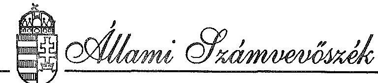
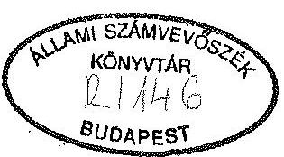
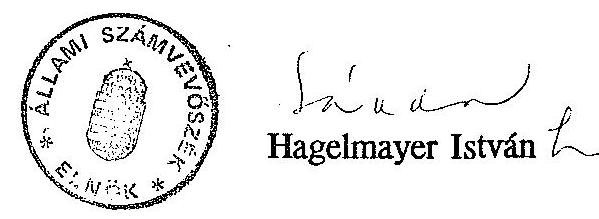

#  

## JELENTÉS

a Magyarok Világtalálkozója-Magyarok Világszövetségéért Alapítvány pénzügyi-gazdasági ellenőrzéséről

---

Az ellenőrzést vezette:

$$
\text { Matusek István } \quad \text { számvevő-főtánácsos }
$$

Az ellenőrzésben részt vett:

$$
\text { Maklári Ferencné } \quad \text { számvevő-tanácsos }
$$

---

# JELENTÉS 

## a Magyarok Világtalálkozója-Magyarok Világszövetségéért Alapítvány pénzügyi-gazdasági ellenőrzéséről

A Magyarok Világszövetsége az óhazában, a Kárpát-medencében és a szétszórtságban élő magyarság találkozóinak, kongresszusainak, rendezvényeinek támogatása céljából "MAGYAROK VILÁGTALÁLKOZÓJA - MAGYAROK VILÁGSZÖVETSÉGÉÉRT" néven Alapítványt hozott létre. Az Alapítvány kiemelt feladatának tekinti az anyaországgal való rendszeres kapcsolattartást, valamint a kulturális értékek cseréjének támogatását. Megkülönböztetett figyelmet fordít a magyarság értékeinek hazai és nemzetközi megismertetésére és népszerűsítésére.

Az Alapítvány létrehozását elsősorban az indokolta, hogy a Magyarok Világszövetségének (MVSZ) a feladatok elvégzésére nem volt pénzügyi fedezete. Miután sem a parlamenttől, sem pedig a kormánytól e célokra támogatást az MVSZ nem remélhetett, egy célalapítvány létrehozása vált szükségessé. Az alapítványi célok támogatói között két helyi önkormányzat is van.

A Magyarok Világszövetsége a Magyarok III. Világkongresszusának előkészítésére Szervező Bizottságot is létrehozott, melyen belül megalakította az Arculati Bizottságot. Mind az Arculati Bizottság, mind az Alapítvány Kuratóriumának Elnöke egyazon személy.

A Magyarok Világszövetségének mindeddig ez az egyetlen működő alapítványa.
A Kormány elnökének felkérésére lefolytatott ellenőrzés az alapítvány létrehozásának, működésének törvényességét, továbbá azt vizsgálta, hogy a gazdasági események számviteli rögzítése során betartják-e a számvitelre vonatkozó törvényt és jogszabályokat. A vizsgálat a megalakulástól, 1992. június 3-tól 1992. december 31-ig terjedő időszakra irányult.

---

# I. MEGÁLLAPÍTÁSOK 

1) Az Alapítvány létrehozása, működésének szabályozottsága, belső ellenőrzési rendje

A Magyarok Világszövetsége elkészítette az Alapítvány bejegyzéséhez, valamint működéséhez szükséges Alapító Okiratot, mely tartalmazza az Alapítvány nevét és székhelyét, működésének célját, intézkedik az 1 millió Ft alapítói vagyon befizetéséről, rendelkezik a támogatók felajánlásairól és adományairól, befogadja azokat, valamint kezeli az így jelentkező vagyont. Az Alapítvány kezelő szerveként a Kuratóriumot jelöli meg, nevesíti elnökét, alelnökét és négy tagját (legfeljebb öt tag lehet). Megbízatásuk négy éves ciklusra érvényes.

Az Alapító Okirat a kuratórium hatáskörébe tartozó feladatokat tisztségekre és tagokra lebontva részletezi. Szabályozza a döntések meghozatalának módját (kuratóriumi ülések keretén belül), valamint azt, hogy a kuratórium tagjait és tisztségviselőit munkájukért díjazás, illetve költségtérítés illeti meg.

Az Alapítványt a Fővárosi Bíróság 1992. június 11-én bejegyezte és az Alapító Okiratot nyilvántartásba vette.

Az Alapítvány működéséhez szükséges valamennyi okiratot (1.sz. melléklet) valamivel több, mint egy hónap alatt megszerezték. Az idő rövidsége ellenére a kuratórium elnöke és a kuratórium tagjai, valamint az arculati bizottsági tagok gondoskodtak a Világtalálkozó megrendezéséről.

Mivel az Alapítvány vállalkozási jellegű tevékenységet is végez, ezért az APEH-hez történt bejelentést meg kellett ismételni, új adószámot kapott és ezzel ÁFA befizetési kötelezettsége keletkezett.

A Kereskedelmi és Hitelbanknál számlát nyitottak a pénzeszközök kezelésére.
A Számviteli Törvény a vizsgált Alapítvány esetében "egyszerűsített mérleg" készítését írja elő. (Az Alapítvány folytat ugyan vállalkozási tevékenységet is, de alaptevékenységgel együtt az összes bevétele 50 millió Ft alatt maradt.)

Az Alapítvány kötelező előírás hiányában információs rendszerét maga alakította ki, tekintettel bevételének nagyságára, a megalakulástól év végéig terjedő időszak rövidségére.

---

Az Alapítvány működésének kezdetén elkészült a Szervezeti és Működési Szabályzat (SZMSZ), melyet az első kuratóriumi ülésen (1992. július 10-én) megtárgyaltak és átdolgozását javasolták, később ideiglenes jelleggel elfogadták. Véglegesítésére a 6. kuratóriumi ülésen, október 12-én került sor.

Az SZMSZ részletesen kitér a kuratórium szervezeti felépítésére, feladataira, a tagok tevékenységi körére. Maximálja a kuratórium elnökének pénzügyi kötelezettségvállalását.

A pénzkezelési szabályzat minden, a pénzmozgással kapcsolatos tevékenység szabályozására kiterjed, 1992. decemberében utólag készült el. Szigorúan nevesíti az utalványozási jogkörrel rendelkezőket az összeghatár megjelölésével, összhangban az SZMSZ előírásaival.

A kuratórium tagjainak létszámából, valamint az elvégzendő feladat nagyságából következően a szabályzatban foglaltakat nem minden esetben tartották be (pl. a naplófőkönyvet vezető személy azonos a pénztárossal, a pénz kazetta kulcsát egy személy őrzi, nem nevesíthető másik felelős). A számviteli és pénzkezelési szabályok szerint összeférhetetlenség jelentkezik.

Leltározási szabályzat nem készült, a tárgyi eszközök száma minimális (4 db).
A belső ellenőrzés rendje vezetői, ill. folyamatba épített ellenőrzésre épül. Az Alapítvány megalakulásától szeptember végéig terjedő időszakban az ellenőrzés ad hoc jellegű volt, a Világkongresszus szervezése miatt háttérbe szorult.

Az Alapítvány áttekinthető nyilvántartásokat vezet a vásárolt és átvett tárgyi eszközökről, a szigorú számadású nyomtatványokról, a beérkező és kimenő számlákról, a kifizetett megbízási díjakról, az SZJA levonásokról - TB befizetésekről, valamint a pénztárkulcsokról és bélyegzőkről.

Az Alapítványnál a kuratórium 6 fős taglétszáma következtében (most van folyamatban titkár felvétele) a kötelezettségvállalás célszerűségéről nem beszélhetünk. Az esetek zömében adott, hogy a Kuratórium Elnöke vállal kötelezettséget, az Ő kezében összpontosulnak a teendők. Banki aláírásra minden kuratóriumi tag jogosult, együtt a Kuratórium Elnökével. A banki pénzfelvételekre vonatkozó előírásokat betartották.

# A gazdálkodás személyi feltételei 

Az Alapítvány kuratóriumának titkára és könyvelője az Alapítvány első gazdasági vezetője volt, akit a Magyarok Világszövetsége kikért határozott időre, teljes munkaidős

---

foglalkoztatásra a Világkongresszus szervezésének és pénzügyi feladatainak ellátására. A gazdasági vezetővel az Alapítvány e célú feladatainak ellátására külön megbízási szerződést kötöttek. A gazdasági vezető feladatait hiányosan látta el, személyes mulasztásait a 2. sz. melléklet tartalmazza.
1992. szeptember 18-án megbízási szerződését a gazdasági vezető felbontotta.

Az 1992. szeptember 10-én tartott 5. kuratóriumi ülésen a tagok - feltételezhetően gazdasági-pénzügyi ismereteik hiányában - a gazdasági vezető "elvégzett" munkájáért a két hónapra járó 50 ezer Ft kifizetését megszavazták. A gazdasági vezető egyéni vállalkozói számlájára a pénzt felvette, a számlán - szabálytalanul - teljesítés igazolás, illetve kifizetés engedélyezése nem szerepel. A Kuratórium Elnöke és a volt gazdasági vezető között több alkalommal történt levélváltás. Legutóbb, már a vizsgálat ideje alatt tájékoztatták a gazdasági vezetőt az Állami Számvevőszék ellenőrzéséről, a munkája ellen tett észrevételekről. A Kuratórium Elnöke megkérdőjelezte az 50 ezer Ft felvételének jogosultságát, kérte a szükséges következtetések levonására.

Az új gazdasági vezető 1992. október 15-én átadás-átvételi jegyzőkönyvvel vette át az anyagot, ami a hiányosságok egy részének felsorolását tartalmazta. Megbízást kapott az eddigi könyvelési tevékenység felülvizsgálatára, a könyvelés, a bizonylati rend, a pénzügyi szabályzat elkészítésére. Tevékenységével a számviteli információs rendszer folyamatosan alakult ki. A bizonylatok rendezésétől kezdve, a könyvelésen, a szabályzatok elkészítésén át elvégezte az Alapítvány teljes időszakának pénzügyi-gazdasági feladatait.

A vizsgálat idejére elkészült az Alapítvány egyszerűsített mérlege, ehhez a költségek felosztása, az eredmények meghatározása. Az új gazdasági vezető a hiányzó nyilvántartásokat is pótolta. Megbízását 1993. január 1-től a kuratórium meghosszabbította.

A Kuratórium Elnöke egy adótanácsadó közgazdászt kért fel az Alapítványt érintő adójogszabályok tanulmányba foglalására (SZJA, ÁFA, Társasági Adó), hogy az a gazdasági vezető tevékenységének megítélésében segítségére legyen. A tanulmány novemberben készült el.

# 2) Az alapítvány bevételei 

A Magyarok Világszövetségének elnöke felkérő levelet írt a pénzintézeteknek, jól gazdálkodó cégek vezetőinek, valamint személyes ismerőseiknek, hogy támogatásaikkal segítsék a Világtalálkozó megrendezését, az Arculati Bizottság és az Alapítvány terveit és elképzeléseit, a Magyarok III. Világtalálkozója programját.

---

A támogató szándékot jelző levelek és a magas összegű felajánlások gyorsan követték egymást. Ezek között egyaránt megtalálhatók voltak a készpénzt felajánlók (pl. bankok, Szerencsejáték Rt) és azok, akik tevékenységükkel kívántak hozzájárulni a Világtalálkozó minél sikeresebb megszervezéséhez (pl. SASAD Mgtsz 200 ezer Ft értékű növénykompozíciót támogatásként szállított; a HUNGAROCARD Kft névkitűzőket 47.-Ft/db egységárral szemben 35.-Ft/db összegért számlázott; a Dorogi Nyomda bevezetett áraikon ugyan, de kifogástalan minőségben, szinte azonnali határidővel vállalta a szállítást).

A kuratórium, valamint az Arculati Bizottság tagjai aktív tevékenységének is köszönhetően az Alapítvány 28.073 ezer Ft bevételt realizált 1992-ben (3.a. sz. melléklet). Az alapítványi célú vállalkozáson kívüli tevékenység bevétele 21,8 millió Ft, eredménye év végén 4.154 ezer Ft volt.

Az alapítványi célú bevételek 99%-a ( 21.675 ezer Ft) gazdálkodó szervezetektől, a székesfehérvári és esztergomi Önkormányzatoktól 100, ill. 30 ezer Ft, magánszemélyektől (4 fő) 18 ezer Ft származik.

A Világtalálkozó két résztvevője 50-50 USD támogatásban részesítette az Alapítványt augusztus hónapban. Az első gazdasági vezető "hogy a bevételt szabályossá tegye" bevételi pénztárbizonylatot állított ki a valutáról. A gazdasági feladatok átadás-átvételekor a 100 USD is átadásra került. Ezt követően az új gazdasági vezető a devizabevételt felajánlotta a banknak megvételre és az így kapott 8.070 Ft november 18-án az Alapítvány egyszámláján jóváírásra került.

Devizaszámlát - az összeg nagyságára tekintettel - nem volt indokolt megnyitni, az Alapítvány ezen felül csak forint támogatásban részesült, valutabevételek a továbbiakban sem várhatók.

A Magyarok Világszövetsége, valamint az Országos Takarékpénztár Rt között megállapodás jött létre 1992. augusztus 6-án arról, hogy az OTP Rt 5 millió Ft-tal támogatja a Világkongresszust, amennyiben a Világszövetség reklámlehetőségeket biztosít számára a Világkongresszus során, valamint azt követően. Tekintettel arra, hogy a Világtalálkozó anyagi fedezetének biztosítása az Alapítvány feladata volt, az Országos Takarékpénztár Rt a felajánlott összeget az Alapítvány egyszámlájára utalta, a reklámtevékenység kiadásainak fedezetére. Ennek kapcsán az Alapítvány vállalkozói tevékenység folytatására kényszerült. Az OTP Rt egyidejűleg 1.250 ezer Ft összegben ÁFA fedezetet is átutalt, amit az Alapítvány az APEH részére befizetett.

Az Általános Forgalmi Adóról szóló 1989. évi XL. törvény 75. paragrafus (5) bekezdés a/ pontja szerint mód van arra, hogy a kulturális tevékenységet folytató Alapítvány visszakapja ezt az összeget és alapítványi célra fordítsa. A gazdasági vezetőnek

---

javasoltuk, hogy fenti ügyben járjon el az APEH-nél, ami a vizsgálat ideje alatt megtörtént.

A vállalkozási tevékenység fedezésére kapott 5 millió Ft-ot 1992-ben 9 ezer Ft terheli, mint vállalkozási tevékenység költsége, ugyanis az Alapítvány vállalkozói és alapítványi célú bevételeinek arányában osztható az első gazdasági vezető részére kifizetett 50 ezer Ft díjazás. Az ebből adódó vállalkozási eredmény 4.991 ezer Ft.

A Társasági Adóról szóló 1991. évi LXXXVI. törvény alapján a vállalkozási tevékenység eredménye után adófizetési kötelezettség keletkezik, ha a vállalkozási bevétel meghaladja az összes bevétel 10%-át. Az Alapítványnál az arány 18% volt, így társasági adó befizetési kötelezettsége 1.996 ezer Ft.

A tőkeváltozás iránya az Alapítványnál pozitív előjelű. 1992. júniusában alakult, akkor tőkével nem rendelkezett. Az év végéig a növekedés - a társasági adó levonásának figyelembevételével - 7.149 ezer Ft.

# 3) A kiadások alakulása 

Az Alapítvány kiadásainak összege 19.387 ezer Ft. (3.b. sz. melléklet, az arculati költségeket a 4. sz. melléklet részletezi.)

A Világszövetség felkérése alapján 1992. márciusában a MAHIR koncepciót dolgozott ki a Magyarok III. Világkongresszusa Reklám kampányához. Az árajánlat költségvetési végösszege 30,6 millió Ft volt, nyomdai költségek és általános forgalmi adó nélkül. Az Alapítvány tagjai szervezőkészségének eredményeként azonban jelentős megtakarítást értek el és 19 millió Ft-ból oldották meg a feladatot. A kuratóriumi tagok a vizuális arculati elemek leendő készítőitől az ajánlatot kértek a bekerülési összeg, minőség és idő megjelölésével, hogy a legmegfelelőbbet választhassák ki közülük.

Likviditási tervet a bevételek és kiadások időbeliségéről
 nem készítettek. Részben a szervezésre rendelkezésre álló idő rövidsége, részben a támogatási pénzek azonnali beérkezése miatt. Július végén több mint 13 millió Ft állt az Alapítvány rendelkezésére, a nagyobb összegű számlák kiegyenlítése pedig augusztus–szeptemberben történt.

A támogatók részletes ismertető anyagot kaptak az Alapítvány 1992. június 3. és november 27. között végzett tevékenységéről.

A kulturális értékek cseréjének támogatása szellemében a kuratórium más alapítványokat és egyéb szervezetek könyvkiadásait is támogatta.

---

Így pl. 200 ezer Ft-ot a Kárpátaljai „Ötágú síp” rendezvényre, 50 ezer Ft-ot a Miniszterelnöki Hivatal által a menekült gyermekek számára rendezett karácsonyi ünnepségre fordítottak, ez utóbbit azzal a kikötéssel, hogy klasszikus magyar mesekönyvekkel ajándékozzák meg a gyerekeket.

Szintén kuratóriumi döntés alapján támogatták a Dr. Hegedűs Lóránt református püspökről szóló „Az Isten és ember titka” című könyv megjelentetését. (BRAIMANN Kft. kiadásában, előzetes költségvetés alapján).

A „Zsidók a Kárpátmedencében és Magyarországon” című kiállításról készült művészeti kivitelű katalógus költségeihez járultak hozzá, azzal a kikötéssel, hogy az Alapítvány neve a támogatók listáján szerepeljen.

A kifizetések indokoltsága levelezésekkel alátámasztott, a felhasználás célja azonos az Alapítványéval.

A Magyarok III. Világtalálkozójának fontos eseményei voltak az ország több pontján 1992. augusztus 1–21. között megtartott kulturális, vallási, szakmai tudományos rendezvények és kiállítások. Ezeket a helyi önkormányzatok, szakmai szervezetek, a Magyarok Világszövetsége az Alapítvánnyal közösen támogatták. A pénzeszközöket a Magyarok Világszövetsége és az Alapítvány számlájára utalták a támogatók.

A Székesfehérvári Önkormányzat 100 ezer Ft-ot utalt át a vizuális arculati program helyi megvalósítására. A székesfehérváriak a támogatást egyrészt a város feldíszítésére szánt keresztrudas (ún. londina) zászlókra, másrészt pedig a „Vállalkozó Magyarok” néven, első ízben megrendezett szakmai rendezvény vizuális arculatának kialakítására adományozták. Ezt a szakmai rendezvényt a VIDEOTON Oktatási Központjában tartották meg. Az Oktatási Központ 64 ezer Ft értékben kapott vizuális arculati elemeket.

A fennmaradó 36 ezer Ft egyéb jelképi elemek (plakát, programkönyv, meghívók, kitűzők stb.) elkészíttetését fedezte.

Az Esztergomi Önkormányzat 30 ezer Ft-ot adományozott az Alapítványnak, mivel Esztergom volt a házigazdája a VII. Anyanyelvi Konferenciának 1992. augusztusában. A város több pontján és a konferencia színhelyén – a Vitéz János Tanítóképző Főiskolán – plakátok és keresztrudas zászlók kerültek elhelyezésre. A fennmaradó 8 ezer Ft-ot szintén a vizuális arculat egyéb jelképi elemeinek elkészíttetésére fordították.

A vizuális arculati jelek átvételéről szabályos elismervény készült. Mindkét önkormányzatot tájékoztatta a kuratórium az alapítványi pénzek felhasználásáról az éves zárójelentés megküldésével.

---

Az önkormányzatok által átutalt összegek felhasználását az 5. sz. melléklet részletezi.
Az Alapító Okirat szerint költségtérítés illeti meg a Kuratórium Tagjait és tisztségviselőit. A III. Világkongresszus időtartama, illetve a szervezés periódusában felmerülő költségeket a tagok szabályosan elszámolták, a részükre járó összegeket (mintegy 60 ezer Ft-ot) felvették. A későbbiek folyamán személyi okoktól indíttatva, valamint takarékoskodva az alapítványi pénzekkel, a felvett összegeket visszafizették.

# 4) Az Alapítvány vagyona, működtetése, megőrzése 

Az Alapítvány év végi pénzeszköze 9.690 ezer Ft, nagy részét elszámolási betétszámlán tartják. A bank a követelés havi átlaga alapján évi 10% kamatot fizet. (1992-ben 163 ezer Ft volt a kamatbevétel.) Véleményünk szerint ennél kedvezőbb feltételekkel is elhelyezhetők lettek volna az Alapítvány pénzeszközei.

Az Alapítvány tárgyi eszközei három nyomtatóból (384 ezer Ft) és egy OPEL KADETT személygépkocsiból tevődnek össze. (A Külkereskedelmi Bank Rt. egy OPEL KADETT személygépkocsit adott át érték nélkül az Alapítványnak.)

A tárgyi eszközökből, mint a vagyon működtetéséből az Alapítványnak nincs pénzbevétele. A Világkongresszus megszervezése idején és azóta is a Magyarok Világszövetségének számítógépeihez kötve közösen használják a nyomtatókat. A személygépkocsit 1993. december 31-ig szintén a Világszövetség használja.

Az eszközök átadásáról megállapodás készült, mely a költségviselőt is meghatározza.
A tárgyi eszközökről előírás szerinti nyilvántartást vezetnek, mely a tényleges állapotot tükrözi, mind mennyiségben, mind értékben. Ezáltal a vagyon megfelelő működése és megőrzése biztosított.

A Világkongresszus befejezése után összegyűjtött vizuális arculati elemeket raktárban tárolják, további felhasználásra alkalmi jellegük miatt nincs lehetőség. A műsoros videokazettákat a Kuratórium Elnöke tárolja, majd a Duna TV-nek adják át.

A fővárosban az augusztusi ünnepi napok alkalmából díszítésre használt zászlókból 136 db-ot ismeretlen tettesek elloptak. A reklámdíszítésért felelős VÁROSDEKOR Kft. az érintett kerületek rendőrkapitányságaihoz feljelentést tett. Az eltulajdonított zászlók értéke 303 ezer Ft.
1992. decemberében a Magyarok Világszövetségéhez ismeretlen tettesek betörtek, a felfeszített páncélszekrényből az Alapítvány pénzkazettáját is elvitték, melyben 50 ezer

---

Ft, egy db készpénz felvételi utalvány (nem volt aláírva) és egy db bélyegző (nem a banknál bejelentett) volt. Visszaélés így nem történhetett. Rendőrségi feljelentést tettek.

# 5) A bér- és egyéb személyi jellegű kifizetések 

Az Alapítványnál állományi létszámba tartozó dolgozókat nem foglalkoztattak, egy-egy feladat megoldására megbízási szerződést kötöttek, illetve a közreműködőket a kifizetés e formájával díjazták.

Bérköltség terhére 10 fő részére 306 ezer Ft került kifizetésre, ami az összes költség 1,6%-a. A megbízási szerződés mindig tartalmazta az elvégzendő feladatot, határidőt és a munkáért járó díj összegét. A teljesítés megtörténte után kuratóriumi ülésen engedélyezték a kifizetéseket.

A bérszámfejtés az előírásoknak megfelelően történt, a dolgozók nyilatkoztak a személyi jövedelemadó levonandó mértékéről, mely egy eset kivételével levonásra is került. Egy megbízási díj bruttó módon került kifizetésre 2.946 Ft összeggel, melyre eső személyi jövedelemadót az új pénzügyi vezető fizette be a pénztárba az átvett anyagok rendezése után (1.125 Ft-ot). A megbízást teljesítő személy adatai hiányoztak, így nem volt mód a befizetésre. A kiadási pénztárbizonylat is elveszett.

A legnagyobb összeget, 100 ezer Ft-ot, az MVSZ válogatás gyűjteményének és alapszabályzatának alkotói szerkesztésére, szedésére, nyomdaeredeti készítésére fizették ki. A Világkongresszus ideje alatt megnövekedett feladatok ellátásáért az MVSZ pénzügyi dolgozói közül két fő, valamint kulturális program és kiállítás szervezéséért 1 fő részesült az Alapítványtól díjazásban:

A kifizetéseket nyugdíjjárulék levonás nem terhelte.
A Magyarok Világszövetsége a Kuratórium Elnökével a Világtalálkozó megszervezésére, a vizuális arculat kialakítására megbízási szerződést kötött 1992. április 1. és augusztus 31. közötti időszakra. A megbízási díj összege 500 ezer Ft, mely számlák alapján két részletben került kifizetésre a részfeladatok, illetve a feladatok teljesítésével összhangban. A pénzügyi fedezetet az MVSZ biztosította.

Az Alapító Okirat 5. paragrafus 8. pontja szerint a kuratórium tagjait és tisztségviselőit munkájukért díjazás illeti meg. Ezzel szemben a kuratóriumi tagok az 1992. július 10-én tartott első ülésükön úgy határoztak, hogy ügynöki jutalékban nem részesülnek. Számukra az Alapítványtól kifizetést nem eszközöltek.

---

Egyéb személyi jellegű kifizetés egy esetben történt. Jogtalanul távolsági autóbuszbérletet vásároltak a Világtalálkozó ideje alatt egy személy részére, akit megbízási szerződéssel alkalmaztak. A bérlet ára visszafizetésre került.

# 6) A megkötött gazdasági szerződések értékelése 

A Világkongresszus vizuális arculati jeleinek elkészítésére egyrészt gazdálkodó szervezetekkel, másrészt egyéni vállalkozókkal kötöttek szerződéseket. A gazdálkodó szervezetektől előzetesen árajánlatot kért a Kuratórium Elnöke és a legmegfelelőbb (ár, határidő) kiválasztása után került sor a megrendelésre, abban visszahivatkozva az árajánlatban foglaltakra. Az egyéni vállalkozókkal – előzetes szóbeli megegyezés után – megbízási szerződéseket kötöttek.

A nagyobb összegű árajánlatok, megrendelések, számlák, szállítólevelek szúrópróbaszerű ellenőrzése alapján megállapítható, hogy az árajánlatok és a számlázott összegek összhangban vannak. A levelezések az MVSZ levélpapírjain készültek, az Alapítvány ekkor még nem rendelkezett céges levélpapírral. A számlákon vevőként az MVSZ szerepelt az Alapítvány helyett, de ez utóbbi egyenlítette ki a tartozást. A kifizetéseket nem utalványozták, azok a kuratóriumi üléseken keretösszeg jelleggel kerültek jóváhagyásra.

## II. KÖVETKEZTETÉSEK, JAVASLATOK

A Magyarok III. Világkongresszusának megszervezésére a Magyarok Világszövetsége megalakította az Arculati Bizottságot és a pénzfedezet biztosítására létrehozta a Magyarok Világtalálkozója–Magyarok Világszövetségéért Alapítványt.

A Magyarok III. Világkongresszusának előkészítése során helyes lett volna az Arculati Bizottság és az Alapítvány vezetését külön személyre bízni, így elkerülhető lett volna, hogy a szervezési és a pénzügyi kérdésekben ugyanaz a személy döntsön.

Az Alapítvány létrehozása megfelelt a törvényes előírásoknak.
Az Alapítvány pénzeszközeinek felhasználása jogszerű volt, összhangban az alapítványi célokkal. Ugyanez állapítható meg az alapítványnak juttatott közpénzek felhasználásáról is.

---

Az Alapítvány támogatásból származó bevételének azt a részét, amelyet a Világtalálkozóra kívántak fordítani, egy összegben a Magyarok Világszövetsége számlájára lett volna célszerű utalni. Ezzel a megoldással könnyen és egyértelműen a számlákból megállapítható lenne, hogy ki a megrendelő, illetve a vevő. Jelenleg több ponton gazdaságilag összefonódik az Alapító és az Alapítvány.

Az alapítás utáni időszak kezdetén a bizonylati fegyelmet többször megszegték (szabálytalan javítások a pénztárbizonylaton, hiányosan kitöltött bizonylatok, aláírások hiánya, stb.). A gazdasági feladatokért felelős személyének cserélődése után rendeződtek a számviteli, pénzügyi és adószabályok megszegéséből eredő problémák, a korábbi hiányosságokat, hibákat megszüntették, jelenleg az Alapítvány gazdálkodása szabályos.

Az ellenőrzés megállapításai alapján javaslataink a következők:

1. A vezetői ellenőrzés és a folyamatba épített ellenőrzés javítása szükséges, így megvalósítható lesz a számlák és egyéb kifizetések utalványozása egyedileg is a kuratórium döntései alapján.
2. A Magyarok Világszövetsége és az Alapítvány kapcsolata rendezendő. A Magyarok Világszövetsége által létrehozott Alapítvány önálló jogi személy, annak vagyonáért a kuratórium felelős.

Budapest, 1993. április 5.
Melléklet: 5 db 21 lap

---

.

---

1. sz. melléklet
a V-3-11/1993.sz.hoz

A törvényes működéshez szükséges okiratok beszerzése

A Magyarok Világszövetsége alapította meg a Magyarok Világtalálkozója – Magyarok Világszövetségéért Alapítványt, az 1992. június 3-án kelt Alapító Okirat szerint 1068. Budapest, Benczúr u. 15. székhellyel.

A Magyarok Világszövetségének Elnöke már 1992. májusában hatalmazta fel írásban – az előzetes szóbeli megbízás és megállapodás után – a kuratórium jelenlegi elnökét és hét tagját a Magyarok III. Világkongresszusának 1992. augusztus 18–21. közötti időszakra történő megrendezésére.

Az elkészült szükséges okiratok, illetve jóváhagyásuk időrendi sorrendje:

- Alapító Okirat 1992. június 3, sorszáma 3.250
- Magyarok Világszövetségének kérelme a Fővárosi Bírósághoz nyilvántartásba vételre, 1992. június 4.
Fővárosi Bírósági végzés 1992. június 18. 69.034/1992. iktatószámon

Az APEH Fővárosi Igazgatósága Adóeljárási Főosztálya – az Alapítvány 1992. június 23-i kérésére – határozatban járult hozzá ahhoz, hogy az Alapítvány kulturális, valamint a határokon túli magyarsággal kapcsolatos cél megvalósítására átadott pénzösszeg kifizetéséről /a térítés nélkül átadott eszközök nyilvántartási értékéről/ a társasági adóról szóló 1991. évi LXXXVI. tr. 4. § /2/ bek. g/ pontjában – figyelemmel a törvény 4. § /3/ bek. f/ pontjára és 1. sz. melléklete 18. c./ pontjára is, – illetve a magánszemélyek jövedelemadójáról szóló 1991. évi XC. tr. 34. § /1/ bek. a/ pontjában meghatározott adóalap csökkentő kedvezmény igénybevételéhez a levonásra jogosító igazolást adjon.

---

.

---

APEH Határozat adóalap csökkentő kedvezményre jogosító igazolás kiadásáról 1992. június 25.

APEH Bejelentkezési lap 1992. június 26.
Az Alapítvány vállalkozási tevékenységet is végzett. Ismételt bejelentkezés után az Alapítvány adószáma: 18004384-2-01-re változott, általános forgalmi adó befizetési kötelezettsége keletkezett.

Aláirási cimpéldány 1992. július 7.
Kereskedelmi Bank Rt., számlanyitás 1992. július 8.

Budapesti és Pest Megyei Társadalombiztosítási Igazgatóság Törzsszám 1992. október 21.

---

A volt gazdasági vezető személyes mulasztásai

- Egyszerre három kiadási pénztárbizonylat-tömb került használatba
- Hiányosan töltötte ki a kiadási-, bevételi bizonylatokat
- Hiányzik a 136513. számú kiadási bizonylat és melléklete /2 nap munkadij,
 szerződés szerint nettó 2.946.- Ft/
- A pénztárban tartott készpénz összege huzamosabb időn keresztül jelentősen meghaladta a megengedett mértéket, ami 50 ezer Ft /előfordult 1.300 ezer Ft-nál nagyobb összeg is/
- A pénztárban külföldi fizetőeszközt tároltak /100 USD/, amit a valuta pénzár hiánya miatt megvételre fel kellett volna ajánlani a pénzintézetnek
- A kifizetésekből nem vont minden esetben személyi jövedelemadót, illetve a levont adót nem fizette be az adóhatósághoz
- A Társadalombiztosítási Igazgatóságnál nem jelentette be az Alapítványt, nem kért SZTK törzsszámot, nem tett eleget a társadalombiztosítási járulék bevallási és befizetési kötelezettségének
- Nem fizette be az adóhatóságnak az általános forgalmi adót
- A naplófőkönyv vezetése nem naprakész, a kifizetések felhasználás szerinti lekönyvelése elmaradt
- A szigorú számadású nyomtatványok nyilvántartása /készpénzfelvételi utalvány, kiadási- és bevételi pénztárbizonylat tömbök/, a pénztárkulcs és a bélyegző nyilvántartása nem készült el

---

# 2. sz. melléklet 

- A bérkifizetésekhez kapcsolódó személyi jövedelemadó nyilvántartó lapokat nem nyitotta meg
- A kifizetéseket a Kuratórium Elnökével nem utalványoztatta, a kuratóriumi jegyzőkönyvek jóváhagyása után fizetett
- Két esetben előleg utalásáról döntött a kuratórium: a VAROSDEKOR Kft-nek 1.150 eFt, valamint a DOROGI NYOMDÁnak 1 millió Ft összegben anyagköltségre. Ez utóbbi esetben nem figyelt az előleg levonására, túlfizetés történt, rendezésére csak az új könyvelő megbízásával került sor.

---

.

---

# KIMUTATÁS   A MAGYAROK VILÁGTALÁLKOZÓJA   MAGYAROK VILÁGSZÖVETSÉG ALAPÍTVÁNYA 1992. ÉVI PÉNZFORGALMÁRÓL 

## BEVÉTELEK:

Külker. Bank Rt. hozzájárulás-támogatás
TAURUS Gumiipari V. támogatás
Orsz.Keresk. és Hitelbank Rt. támogatás
Magyar Hitelbank Rt. támogatás
CONTIKAR Kft.

---

.

---

KIADÁSOK:
Dorogi Nyomda ..... 4.376.205.-
Városdekor Kft ..... 3.099.913.-
Hungarocord Kft 196.875.-
Videobank Kft 615.812.-
Spectrum Kft 5.687.500.-
Art 1. Stdes Ing Studió
5.687.500.-
S.E. grafikus ..... 700.200.-
Derkó Studió 139.660.-
Bp-i Grafikai Alkotóközösség (plakett tervezési díj előleg) 75.000.-
P.J. 210.000.-
BRAIMAN Kft 166.250.-
K.J. 150.000.-
H.E. ..... 51.500.-
ATELIER -lo (embléma, levélpapír,névjegykártya tervezés) 75.000.-
Bank Systems Service Kft 383.750.- (állóeszköz beszerzés)
Bérkifizetések ..... 305.612.-
Cs.G. (Hadtörténeti Múzeum fogadás) 174.800.-
Könyvelési tevékenységért ..... 50.000.-
Egyéb (banknyomtatvány, bélyegzők, nyomtatvány, üdítők, posta ktg.utazási ktg, stb) ..... 49.530.-
Társadalombiztosítási járulék utalása ..... 128.993.-
ÁFA utalása 1.250.000.-
BRAIMAN Kft támogatás 100.000.-
Miniszterelnöki Hivatal támogatás (gyermekek ajándékozása) 50.000.-
Kárpátaljai Magyarok Kulturális Szöv. támogatás 200.000.-
Válaszút Alapítvány támogatás 100.000.-
19.386.600.-

---

# 4. 82. melléklet   V-3-11/1993.82.hoz   AZ ARCULATI BIZOTTSÁG TÁMOGATÁSI KÉRELMEI A VIZUÁLIS 

## ARCULAT KIALAKÍTÁSÁHOZ

## KÖZTERÜLETI ARCULATI KÖLTSÉGEK

## ZÁSZLÓKÉSZÍTÉS ÉS KIHELYEZÉS

VÁROSDEKOR KFT

| Számla megnevezés | Számla szám | Összeg (Ft) |
| :-- | :--: | :--: |
| Zászlódekoráció | 160/VD | 1.150.000.- |
| Zászlódekoráció | 195/VD | 1.949.913.- |

3.099.913.-

---

.

---

# KÖZTERÜLETI ARCULATI KÖLTSÉGEK 

## PLAKÁTOK, POSZTEREK TERVEZÉSE ÉS KIVITELEZÉSE

## SPECTRUM KFT

| Számla megnevezés | Számla szám | db szám | Összeg (Ft) |
| :--: | :--: | :--: | :--: |
| B 1 méretű utcai plakát 50%-os bérleti díja | 920.436 | 10.000 | 1.412.500.- |
| AUROPLAKÁT gyártása | 920.435 | 100 | 1.097.500.- |
| CITY LIGHT 50%-os bérleti díja | 920.437 | 100 | 562.500.- |
| AUROPLAKÁT kihelyezési díja | 920.438 | 30 | 640.000.- |
| Fényposzter kihely. díjának 50%-a | 920.441 |  | 562.500.- |
| B 1 méretű plakát második részlete | 920.442 |  | 1.412.500.- |

---

# KÖZHASZNÚ ARCULATI KÖLTSÉGEK 

PROGRAMKÖNYV, SZORÓLAPOK NYOMDAI KIVITELEZÉSE

|  | DOROGI NYOMDA |  |  |
| :--: | :--: | :--: | :--: |
| Számla megnevezés | Számla szám | Db | Összeg (Ft) |
| Boríték (2 féle) | P-745/92. |  | 43.750.- |
| Levélpapír | 746/92. |  | 33.750.- |
| Meghívó (9 féle) | 747/92. |  | 65.038.- |
| Névjegykártyák | 748/92. |  | 15.200.- |
| Alapplakát | P-840/92. | 15.000 | 555.223.- |
| Boríték felülnyomás | 846/92. |  | 5.000.- |
| Öntapadós címke (2 féle) | 844/92. |  | 131.250.- |
| Programplakát | P-860/92. |  | 408.166.- |
| Öntapadós címke | P-858/92. |  | 43.750.- |
| Plakát (2 részes) | P-856/92. |  | 228.375.- |
| Dosszié | P-857/92. |  | 100.625.- |
| Öntapadó és kitűzőkártya | P-850/92. |  | 186.438.- |
| Öntapadós címke | P-859/92. |  | 52.500.- |
| Programkönyv | P-909/92. |  | 1.516.040.- |
| Névjegy és ajándékkártya | P-1116/92. |  | 55.938.- |
| Dokumentum kötet, Alapszabály | P-1069/92. |  | 545.000.- |

---

# 4. sz. melléklet 

| 18 féle névjegykártya | P-863/92. | 28.800.- |
| :-- | :-- | :-- |
| Tájékoztató füzet | P-864/92. | 81.808.- |
| Program leporelló   plakát | P-861/92. | 279.554.- |

4.376.205.-

---

.

---

# 4. sz. melléklet 

- 5 -

KÖZHASZNÚ ARCULATI KÖLTSÉGEK

PROGRAMKÖNYV, SZORÓLAPOK NYOMDAI KIVITELEZÉSE

HUNGAROCARD KFT

| Számla megnevezés | Számla szám | Összeg (Ft) |
| :-- | :-- | :-- |

Névkitűző Kártyatartó
4.006292
196.875.-
196.875.-

---

.

---

# 4. sz. melléklet 

- 6 -

## KÖZHASZNÚ ARCULATI KÖLTSÉGEK

GRAFIKAI TERVEZÉSE, NYOMDAI ELŐKÉSZÍTÉS
S. E

| Számla megnevezés | Számla szám | Összeg(Ft) |
| :-- | :-- | :-- |
| Résszámla |  | 300.000.- |
| Világszövetség arculata | 126.008 | 240.000.- |
| Arculatterv | 126.011 | 160.200.- |

700.200.-

---

.

---

# 4. sz. melléklet 

- 7 -

KÖZHASZNÚ ARCULATI KÖLTSÉGEK

EMLÉKÉREM MEGJELENTETÉSE

## BUDAPESTI GRAFIKAI ALKOTÓKÖZÖSSÉG

Számla megnevezés Számla szám Összeg (Ft)

Érem tervezés, gipsz minta készítés
Résszámla
75.000.-
75.000.-

---

# 4. sz. melléklet 

- 8 -

KÖZHASZNÚ ARCULATI KÖLTSÉGEK

## SZEMÉLYI KIADÁS

|  | P | J |  |
| :--: | :--: | :--: | :--: |
| Számla megnevezés |  | Számla szám | Összeg (Ft) |
| Szerződés szerint az arculat kialakításában |  | 466.455 | 105.000.- |
| való részvétel és szervezése |  | 466.456 | 105.000.- |

---

# KÖZHASZNÚ ARCULATI KÖLTSÉGEK 

## NYOMDAI ELŐKÉSZÍTÉS

ART 1 STÚDIÓ

| Számla megnevezés | Számla szám | Összeg (Ft) |
| :-- | :-- | :-- |

Szedés, tördelés tipográfia, filmkészítés
193/92.
1.050.000.-
1.050.000.-

---

.

---

# 4. sz. melléklet 

- 10 -

KÖZHASZNÚ ARCULATI KÖLTSÉGEK

## VIDEÓ FILMEK KÉSZÍTÉSE

## VIDEOBANK

Számla megnevezés Számla szám Összeg(Ft)

Kongresszusi Központ 20.211 615.812.-

615.812.-

---

.

---

# 4. sz. melléklet 

- 11 -

KÖZHASZNÚ ARCULATI KÖLTSÉGEK
EMLÉKÉRMÉK VEZÉRSZERZÁMAINAK ELKÉSZÍTÉSE

|  | K | J |
| :--: | :--: | :--: |
| Számla megnevezés | Számla szám | Összeg(Ft) |
| Célszerzám készítés | 315.527 | 150.000.- |

---

.

---

# 4. 82. melléklet 

- 12 -

| KÖZHASZNÚ ARCULATI KÖLTSÉGEK |  |  |
| :--: | :--: | :--: |
| KERÁMIA PLAKETT KÉSZÍTÉSE |  |  |
|  | H.E. |  |
| Számla megnevezés | Számla szám | Összeg (Ft) |
| Plakett | 522.609 | 51.500.- |

---

# 4. 82. melléklet 

- 13 -

KÖZHASZNÚ ARCULATI KÖLTSÉGEK

KÉPKERETEK KÉSZÍTÉSE

DERKÓ ALKOTÓKÖZÖSSÉG

Számla megnevezés. Számla szám Összeg (Ft)

Képkeretek készítése 14.366 16.160.-

Térplasztika
(rendezvények
színhelyein)
14.325
123.500.-
139.660.-

---

# 4. sz. melléklet 

- 14 -

## KÖZHASZNÚ ARCULATI KÖLTSÉGEK

KIADÓ TEVÉKENYSÉGGEL ÖSSZEFÜGGŐ SZAKÉRTŐI MUNKA

BRAIMANN KFT

| Számla megnevezés | Számla szám | Összeg (Ft) |
| :-- | :--: | :--: |
|  | 528.678 | 150.000.- |
| Festék, kazetta | 528.694 | 16.250.- |
|  |  | 166.250.- |

---

# 5. sz. melléklet   a V-3-11/1993.sz.hoz 

A közpénzek felhasználásának részletezése

A Székesfehérvári Önkormányzat támogatása terhére :

- megrendelt vizuális arculati elemek

| Arculathordozó megnevezése | $\begin{gathered} \mathrm{db} \\ \text { szám } \end{gathered}$ | Egységár (Ft/db) | Teljes ár (Ft) |
| :--: | :--: | :--: | :--: |
| Oriás zászló (nagyméretű plakát) | 1 | 50.000.- | 50.000.- |
| Keresztrudas zászló (Nemzeti színű) | 1 | 10.000.- | 10.000.- |
| Keresztrudas zászló (MVSZ emblémás) | 1 | 10.000.- | 10.000.- |
| B1-es plakát (program) | 10 | 200.- | 2.000.- |
| B1-es plakát (alapplakát) | 10 | 200.- | 2.000.- |
| Összesen: |  |  | 74.000.- |
| - leszállított vizuális arculati elemek |  |  |  |
| Arculathordozó megnevezése | $\begin{gathered} \mathrm{db} \\ \text { szám } \end{gathered}$ | Egységár (Ft/db) | Teljes ár (Ft) |
| Oriás zászló Keresztrudas zászló (Nemzeti színű) | $\begin{gathered} 1 \\ 6 \end{gathered}$ | $\begin{gathered} 35.000.- \\ 1.754.- \end{gathered}$ | $\begin{gathered} 35.000.- \\ 10.524.- \end{gathered}$ |
| Keresztrudas zászló (MVSZ emblémás) | 7 | 2.650.- | 18.550.- |
| Összesen: |  |  | 64.074.- |

Az Esztergomi Önkormányzat támogatása terhére leszállított vizuális arculati elemek:

| Arculathordozó megnevezése | $\begin{gathered} \mathrm{db} \\ \text { szám } \end{gathered}$ | Egységár (Ft/db) | Teljes ár (Ft) |
| :--: | :--: | :--: | :--: |
| Keresztrudas zászló (Nemzeti színű) | 5 | 1.754.- | 8.770.- |
| Keresztrudas zászló (MVSZ emblémás) | 5 | 2.650.- | 13.250.- |
| Összesen: |  |  | 22.020.- |

