# ÁLLAMI   SZÁMVEVŐSZÉK 

## JELENTÉS

a Miskolci Egyetem ellenőrzéséről - Az állami felsőoktatási intézmények gazdálkodásának, müködésének ellenőrzése

---

# Állami Számvevőszék 

Iktatószám: V-0363-268/2014.
Témaszám: 1371
Vizsgálat-azonosító szám: V-065805

## Az ellenőrzést felügyelte:

Horváthné Herbáth Mária
felügyeleti vezető

## Az ellenőrzést vezette:

Dormán István Zoltán
ellenőrzésvezető
A számvevői jelentések feldolgozásában és a jelentés összeállításában közremüködtek:

Dormán István Zoltán
ellenőrzésvezető
Morvay András
számvevő főtanácsos
Literáti Gergő
számvevő asszisztens
Az ellenőrzést végezték:

| Berki László | Fonyódi Szilvia | Gölöncsér Péter |
| :-- | :-- | :-- |
| számvevő | számvevő | számvevő |
| Igar Tamás | Lucza Anikó | Morvay András |
| számvevő | számvevő tanácsos | számvevő főtanácsos |

A témához kapcsolódó eddig készített számvevőszéki jelentések:
címe
sorszáma
Jelentés az oktatási és kulturális ágazat irányítási rendszerének, 1106 működésének ellenőrzéséről
Jelentés a felsőoktatás oktatási infrastruktúra-fejlesztési program- 1171 jának ellenőrzéséről
Jelentés az állami felsőoktatási intézmények érdekeltségébe tartozó 1290 gazdasági társaságok támogatásának és nyereségük hasznosulásának ellenőrzéséről

---

# TARTALOMJEGYZÉK 

BEVEZETÉS ..... 11
I. ÖSSZEGZŐ MEGÁLLAPÍTÁSOK, KÖVETKEZTETÉSEK, JAVASLATOK ..... 16
II. RÉSZLETES MEGÁLLAPÍTÁSOK ..... 24

1. A felsőoktatásért felelős minisztérium fenntartói és ágazati irányítási tevékenysége ..... 24
2. Az intézmény belső kontrollrendszerének kiépítése és múködtetése ..... 26
2.1. Belső kontrollrendszer ..... 26
2.2. Az integritás kontrollok múködése ..... 31
3. A pénzügyi gazdálkodás szabályszerűsége ..... 31
3.1. A kiadási és bevételi előirányzatok alakulása ..... 32
3.1.1. A pénzügyi egyensúlyt befolyásoló tényezők ..... 35
3.1.2. A normatív támogatások felhasználása ..... 38
3.2. A kiadási és bevételi előirányzatok felhasználásának szabályszerűsége ..... 39
3.2.1. Kiadási előirányzatok ..... 40
3.2.2. Bevételi előirányzatok ..... 42
3.2.3. A hazai forrásból finanszírozott projektek ..... 45
3.2.4. Az előirányzat-módosítások szabályszerűsége ..... 45
3.2.5. Az előirányzat-maradványok szabályszerűsége ..... 46
4. A vagyongazdálkodás szabályszerűsége ..... 47
4.1. A vagyongazdálkodás szabályozottsága ..... 47
4.2. A vagyonelemekkel történő gazdálkodás ..... 49
4.3. Az intézményi vagyon volumenének és összetételének változása ..... 55
5. Korábbi ÁSZ ellenőrzések javaslatainak hasznosulása ..... 57

---

# MELLÉKLETEK 

1. számú A Miskolci Egyetem kiadási és bevételi előirányzatai, azok teljesítése a 2009-2012. években
2. számú A Miskolci Egyetem kiadásainak, bevételeinek változása a 2009-2012. években
3. számú Kimutatás a Miskolci Egyetem bevételeiről és kiadásairól, valamint adósságszolgálatáról a 2009-2012. években
4. számú A Miskolci Egyetem mérlegadatai a 2009-2012. években
5. számú A Miskolci Egyetem gazdálkodása szabályszerűségének értékelése a mintatételek alapján
6. számú Az Emberi Erőforrások Minisztériumának észrevétele
7. számú Az Emberi Erőforrások Minisztériumának észrevételére adott válasz
8. számú A Miskolci Egyetem észrevétele
9. számú A Miskolci Egyetem észrevételére adott válasz

---

# RÖVIDÍTÉSEK JEGYZÉKE 

## Törvények

Áht. 1
Áht. 2
ÁSZ tv
Feot.
Kjt.
Mtv. 1
Mtv. 2
Nftv.
Nvtv.
Sztv.
Vtv.

## Korm. rendeletek

Áhsz.

Ámr. 1
Ámr. 2
Ávr.
Ber.
Bkr.
Vtvr.
6/2009. (I. 20.) Korm. rendelet

133/2009. (VI. 19.)
Korm. rendelet
352/2010. (XII. 30.)
Korm. rendelet
371/2011. (XII. 31.)
Korm. rendelet
1992. évi XXXVIII. törvény az államháztartásról (hatálytalan 2012. I. 1-jétől)
2011. évi CXCV. törvény az államháztartásról
2011. évi LXVI. törvény az Állami Számvevőszékről
2005. évi CXXXIX. törvény a felsőoktatásról (hatálytalan 2012. IX. 1-jétől)
1992. évi XXXIII. törvény a közalkalmazottak jogállásáról
1992. évi XXII. törvény a Munka Törvénykönyvéről (hatálytalan 2012. XII. 31-től)
2012. évi I. törvény a munka törvénykönyvéről
2011. évi CCIV. törvény a nemzeti felsőoktatásról
2011. évi CXCVI. törvény a nemzeti vagyonról
2000. évi C. törvény a számvitelről
2007. évi CVI. törvény az állami vagyonról
249/2000. (XII. 24.) Korm. rendelet az államháztartás szervezetei beszámolási és könyvvezetési kötelezettségének sajátosságairól
217/1998. (XII. 30.) Korm. rendelet az államháztartás működési rendjéről (hatálytalan 2010. I. 1-jétől)
292/2009. (XII. 19.) Korm. rendelet az államháztartás múködési rendjéről (hatálytalan 2012. I. 1-jétől)
368/2011. (XII. 31.) Korm. rendelet az államháztartásról szóló törvény végrehajtásáról
193/2003. (XI. 26.) Korm. rendelet a költségvetési szervek belső ellenőrzéséről (hatálytalan 2012. I. 1-jétől)
370/2011. (XII. 31.) Korm. rendelet a költségvetési szervek belső kontrollrendszeréről és belső ellenőrzéséről 254/2007. (X. 4.) Korm. rendelet az állami vagyonnal való gazdálkodásról
a költségvetési szerveknél foglalkoztatottak 2009. évi havi kereset-kiegészítéséről (hatálytalan 2010. XII. 31től)
a költségvetési szerveknél foglalkoztatottak 2009. évi havi kereset-kiegészítéséről szóló 6/2009. (I. 20.) Korm. rendelet módosításáról (hatálytalan 2010. XII. 31-től)
a költségvetési szerveknél foglalkoztatottak 2011. évi kompenzációjáról (hatálytalan 2012. I. 31-től)
a költségvetési szerveknél és az egyházak közcélú tevékenységet folytató intézményeinél foglalkoztatottak 2012. évi kompenzációjáról (hatálytalan 2013. I. 31-től)

---

## Határozatok

1001/2009. (I. 13.)
Korm. határozat
1035/2010. (II. 12.)
Korm. határozat

1120/2010. (V. 13.)
Korm. határozat

1132/2010. (VI. 18.)
Korm. határozat
1025/2011. (II. 11.)
Korm. határozat
1185/2011. (VI. 6.)
Korm. határozat
1365/2011. (XI. 8.)
Korm. határozat
1133/2012. (IV. 26.)
Korm. határozat

## Egyéb rövidítések

ÁSZ
egyetem
EMMI
EU
FIR
FKR
GMF
GT
HKR
Kincstár
KIM
KVI
ME
MNV Zrt.
MTMT
NEFMI
NEPTUN
NFM
NGM
OKM
OTKA
PM
PPP
SZMSZ
a 2009. évi havi kereset-kiegészítés forrásigényének biztosításához szükséges intézkedésekről
a központi költségvetési szerveknél foglalkoztatottak 2010. évben fizetendő eseti kereset-kiegészítésének finanszírozásáról
a központi költségvetési szerveknél foglalkoztatottak 2010. évben fizetett eseti kereset-kiegészítésének elszámolásáról
a 2010. évi költségvetéssel összefüggő egyes feladatokról
az államháztartási egyensúly megőrzéséhez szükséges intézkedésekről
a központi költségvetési szerveknél foglalkoztatottak 2011. évi kompenzációjának finanszírozásáról a 2012. évi költségvetési hiánycél tartását biztosító további feladatokról
a központi költségvetési szerveknél foglalkoztatottak 2012. évi kompenzációjának finanszírozásáról

Állami Számvevőszék
Miskolci Egyetem
Emberi Erőforrások Minisztériuma
Európai Unió
Felsőoktatási Információs Rendszer
Foglalkoztatási követelményrendszer
Gazdasági és Műszaki Főigazgatóság
Gazdasági Tanács
Hallgatói Követelményrendszer
Magyar Államkincstár
Közigazgatási és Igazságügyi Minisztérium
Kincstári Vagyoni Igazgatóság
Miskolci Egyetem
Magyar Nemzeti Vagyonkezelő Zrt.
Magyar Tudományos Múvek Tára
Nemzeti Erőforrás Minisztérium
Tanulmányi hallgatói információs rendszer
Nemzeti Fejlesztési Minisztérium
Nemzetgazdasági Minisztérium
Oktatási és Kulturális Minisztérium
Országos Tudományos Kutatási Alapprogramok
Pénzügyminisztérium
Public-Private Partnership (magán és közszféra együttműködése)
Szervezeti és Müködési Szabályzat

---

# ÉRTELMEZŐ SZÓTÁR 

állami felsőoktatási intézmény saját tulajdona
állami vagyon
állami vagyon értékesítése
állami vagyon használója

A felsőoktatási intézmény saját bevételének a költségek teljes körű levonása - az adományozás és öröklés kivételével -, a rendelkezésre bocsátott vagyon állagának megóvásáról, pótlásáról való gondoskodás után fennmaradt része terhére szerzett vagyona.
A Vtv. 1. § (2) bekezdése szerint állami vagyonnak minősül:
a) az állami tulajdonban lévő ingó dolog, valamint a dolog módjára hasznosítható természeti erő,
b) az állami tulajdonban lévő termőföldekből álló, külön törvényben szabályozott Nemzeti Földalap,
c) az állami tulajdonban lévő - a b) pont hatálya alá nem tartozó - ingatlan,
d) az állami tulajdonban lévő értékpapír,
e) az államot megillető társasági részesedés és más vagyoni értékű jog;
(hatályos 2010. június 16-ig)
a) az állam tulajdonában lévő dolog, valamint a dolog módjára hasznosítható természeti erő,
b) az a) pont hatálya alá nem tartozó mindazon vagyon, amely vonatkozásában törvény az állam kizárólagos tulajdonjogát nevesíti,
c) az állam tulajdonában lévő tagsági jogviszonyt megtestesítő értékpapír, illetve az államot megillető egyéb társasági részesedés,
d) az államot megillető olyan immateriális, vagyoni értékkel rendelkező jogosultság, amelyet jogszabály vagyoni értékủ jogként nevesít
(hatályos 2010. június 17-től)
Állami vagyon tulajdonjogának bármely jogcímen történő, visszterhes átruházása (Vtvr. 1. § (7) d) pont).
A Vtvr. 1. § (7) a. pontja szerint: az a természetes személy, jogi személy, illetve jogi személyiséggel nem rendelkező gazdasági társaság, amely a Magyar Nemzeti Vagyonkezelő Zártkörűen Múködő Részvénytársasággal (a továbbiakban: MNV Zrt.) kötött szerződés alapján, bármely jogcímen (bérlet, haszonbérlet, vagyonkezelés, használat stb.) állami vagyont birtokol, használ, hasznosít;
(hatályos 2010. december 31-ig)
az a természetes személy, jogi személy, illetve jogi személyiséggel nem rendelkező szervezet, amely, illetve aki törvény vagy szerződés alapján, bármely jogcímen (pl. bérlet, haszonbérlet, vagyonkezelési szerződés, használat stb.) állami vagyont birtokol, használ, szedi annak

---

hasznait, hasznosít, ide nem értve a tulajdonosi jogok gyakorlóját;
(hatályos 2011. január 1. - 2011. december 31-ig) az a természetes vagy jogi személy, jogi személyiséggel nem rendelkező szervezet, aki, vagy amely törvény vagy szerződés alapján, bármely jogcímen (bérlet, haszonbérlet, használat stb.) állami vagyont birtokol, használ, szedi annak hasznait, hasznosít, ide nem értve a haszonélvezőt, a vagyonkezelőt és a tulajdonosi jogok gyakorlóját.
(hatályos 2012. január 1-jétől)
állami vagyon hasznosítására kötött szerződés
A Vtv. 23. § (2) bekezdése szerint: Az állami vagyon hasznosítására kötött szerződések elsődleges célja az állami vagyon hatékony múködtetése, állagának védelme, értékének megőrzése, illetve gyarapítása, az állami és közfeladatok ellátásának elősegítése.
A Vtv. 23. § (1) bekezdése szerint az állami vagyont az
állami vagyon kezelője /vagyonkezelő
MNV Zrt. maga kezeli, vagy szerződés - így különösen bérlet, haszonbérlet, szerződésen alapuló haszonélvezet, vagyonkezelés, megbízás - alapján központi költségvetési szervnek, természetes vagy jogi személynek, illetőleg jogi személyiséggel nem rendelkező gazdasági társaságnak hasznosításra átengedi (hatályos 2010. január 01. - 2011. december 31-ig);
az állami vagyont az MNV Zrt. maga kezeli, vagy szerződés - így különösen bérlet, haszonbérlet, megbízás alapján központi költségvetési szervnek, természetes vagy jogi személynek, vagy jogi személyiséggel nem rendelkező gazdálkodó szervezetnek hasznosításra átengedi. Az állami vagyonra vonatkozóan az MNV Zrt. kizárólag az Nvtv-ben meghatározott személyekkel köthet vagyonkezelési szerződést.
(Vtv. 23. § (1), 27. § (1)) (hatályos 2012. január 1-jétől)
autonómia
belső kontrollrendszer

CLF-módszer

A felsőoktatási intézmény Feot.-ban szabályozott önrendelkezése, amely biztosítja az intézmény önálló oktatási, kutatási, szervezeti és múködési, valamint gazdálkodási tevékenységét.
2012. január 1-ig a Ber. szerint az Áht. ${ }_{1}$ 121. §-ban meghatározott rendszer, 2012. január 1-től a Bkr. szerint az Áht. ${ }_{2}$ 69. § (1) bekezdésében meghatározott fogalom.
(Kockázatok kezelése és tárgyilagos bizonyosság megszerzése érdekében kialakított folyamatrendszer.)
A módszer a múködési és a felhalmozási költségvetés bevételeinek és kiadásainak, ezek egyenlegeinek elkülönített, majd összevont kimutatását alkalmazza valamely költségvetési intézmény pénzügyi helyzetének megítéléséhez. Kiemelten mutatja be a finanszírozási műveletek egyenlege nélküli és az azt magába foglaló

---

előirányzat-maradvány

fenntartó
fenntartói megállapodás

FEUVE
finanszírozási múveletek nélküli pozíció

Gazdasági Tanács
információ és kommunikáció
pénzügyi pozíciót, valamint a tőketörlesztéssel, értékpapír beváltással csökkentett nettó múködési jövedelmet. Az értékelés a pénzügyi kapacitás fogalmát helyezi a középpontba.
Az államháztartás központi alrendszerébe tartozó költségvetési szerveknél a módosított bevételi és kiadási előirányzatok és azok teljesítésének a Kormány rendeletében meghatározott tételekkel korrigált különbözete az előirányzat-maradvány (Áht. 2 . § (1) bekezdés m) pontja).
A Feot. 7. § (2) és Nftv. 4. § (2) bekezdése szerint az, aki az alapítói jogot gyakorolja, ellátja a felsőoktatási intézmény fenntartásával kapcsolatos feladatokat.
Az állami felsőoktatási intézmény és a fenntartó teljesítmény alapján történő finanszírozásához hároméves időszakra kötött megállapodás, amely tartalmazza a felsőoktatási intézmény által vállalt teljesítménykövetelményeket, valamint az állandó és változó jellegú támogatásokat. (Feot 133/A §)
A folyamatba épített, előzetes, utólagos és vezetői ellenőrzés (FEUVE) mint a kontrolltevékenység része, magában foglalja: a pénzügyi döntések dokumentumainak elkészítését (ideértve a költségvetési tervezés, a kötelezettségvállalások, a szerződések, a kifizetések, a szabálytalanság miatti visszafizettetések dokumentumait is); az előzetes és utólagos pénzügyi ellenőrzést, a pénzügyi döntések szabályszerűségi és szabályozottsági szempontból történő jóváhagyását, illetve ellenjegyzését; a gazdasági események elszámolásának (a hatályos jogszabályoknak megfelelő könyvvezetés és beszámolás) kontrollját.
A CLF módszer szerint számított múködési és felhalmozási tevékenység pénzügyi egyenlegének összevont értéke. Megmutatja, hogy a költségvetési intézmény bevételei fedezetet biztosítottak-e a kiadásokra. A finanszírozási műveletek nélküli (GFS) pozíció alapján a pénzügyi helyzetet akkor tekintettük megfelelőnek, ha az adott év múködési és felhalmozási bevételei fedezetet nyújtottak az adott év múködési és felhalmozási kiadásaira.
A felsőoktatási intézmény javaslattevő, véleményező, a stratégiai döntések előkészítésében részt vevő, és a döntések végrehajtásának ellenőrzésében közremúködő szerve.
A vezetés képességét a megfelelő döntések meghozatalára alapvetően befolyásolja az információ minősége, amely magában hordozza azt a követelményt, hogy az információnak megfelelőnek, időben rendelkezésre állónak, aktuálisnak, pontosnak és elérhetőnek kell lennie. A hatékony kommunikáció lefelé, horizontálisan

---

integritás
intézményfejlesztési
terv

INTOSAI
kincstári biztos
kincstári költségvetés
kisebbségi jogokat biztosító részesedés
és felfelé irányuló információáramoltatást jelent a szervezetben, annak minden részében és teljes struktúrájában.
Az integritás olyasvalakit vagy valamit jelöl, aki vagy ami romlatlan, sértetlen, feddhetetlen. Az integritás elvek, értékek, cselekvések, módszerek, intézkedések konzisztenciáját jelenti: olyan magatartásmódot, amely meghatározott értékeknek megfelel.
A szenátus fogadja el az intézményfejlesztési tervet. Az intézményfejlesztési tervben kell meghatározni a fejlesztéssel, a fenntartó által a felsőoktatási intézmény rendelkezésére bocsátott vagyon hasznosításával, megóvásával, elidegenítésével kapcsolatos elképzeléseket, a várható bevételeket és kiadásokat. Az intézményfejlesztési tervet középtávra, legalább négyéves időszakra kell elkészíteni, évenkénti bontásban meghatározva a végrehajtás feladatait. Az intézményfejlesztési terv része a foglalkoztatási terv. A foglalkoztatási tervben kell meghatározni azt a létszámot, amelynek keretei között a felsőoktatási intézmény megoldhatja feladatait. (Forrás: Feot. 27. § (3) bekezdés)
International Organisation of Supreme Audit
Institutions (Legfőbb Ellenőrzési Intézmények Nemzetközi Szakmai Szervezete)
A kincstári biztos kijelölését az államháztartásért felelős miniszternél a Kincstár kezdeményezi. A kincstári biztos köteles figyelemmel kísérni megbízatásának időpontjától kezdve a költségvetési szerv tervezését, gazdálkodását, beszámolását, a jogszabályokban előírt feladatainak ellátását, feltárni azokat az okokat, amelyek a tartós fizetésképtelenséghez vezettek, a szükséges intézkedések azonnali végrehajtására irányuló intézkedési tervet készíteni, azonnali intézkedéseket kezdeményezni, és írásbeli utasításokat kiadni a tartozásállomány felszámolására, a gazdálkodás egyensúlyának biztosítására, a követelések behajtására. (Ávr. 116-117. §)
A központi költségvetésről szóló törvény elfogadását követően a fejezetet irányító szerv az államháztartás központi alrendszerébe tartozó költségvetési szerv és a fejezeti kezelésű előirányzat kiemelt előirányzatait, valamint az elkülönített állami pénzalapok és a társadalombiztosítás pénzügyi alapjai jogszabályi előírás szerinti bevételeit és kiadásait kincstári költségvetés kiadásával állapítja meg. (Áht ${ }_{1}$ 24. § (3) bekezdés, Áht ${ }_{2}$ 28. § (2) bekezdés, Ávr. 13. § (2) bekezdés)

A részesedés mértéke legalább 5\% (Gt. 49. §).

---

költségvetési főfelügye-
lő, felügyelő
kockázatkezelés
kontrollkörnyezet
kontrolltevékenységek
kulcskontrollok
maximális hallgatói
létszám
mértékadó befolyást biztosító részesedés minősített többséget biztosító részesedés

Az államháztartásért felelős miniszter a Kormány irányítása alá tartozó fejezetet irányító szervhez, a Kormány irányítása vagy felügyelete alá tartozó költségvetési szervhez, valamint az elkülönített állami pénzalapok és a társadalombiztosítás pénzügyi alapjai kezelő szerveihez költségvetési főfelügyelőt, felügyelőt rendelhet ki. A költségvetési főfelügyelő, felügyelő a gazdálkodás költségvetés-politikával való összhangja és a takarékos, szabályszerű, eredményes múködés érdekében a Kormány rendeletében meghatározott intézkedéseket tehet, így különösen előzetesen véleményezi a kötelezettségvállalásra irányuló eljárásokat, és a nagy összegű kötelezettségvállalások tekintetében kifogással élhet. (Áht ${ }_{2}$ 39. § (1)-(2) bekezdés)
A kockázatkezelés a szervezet céljai elérésével kapcsolatos kockázatok azonosításának és elemzésének, valamint a megfelelő válaszok meghatározásának folyamata.
A kontrollkörnyezet alapozza meg a belső kontroll öszszes többi elemét a fegyelem és a struktúra biztosítása által.
A költségvetési szerv vezetője köteles olyan kontrollkörnyezetet kialakítani, amelyben
a) világos a szervezeti struktúra,
b) egyértelmúek a felelősségi, hatásköri viszonyok és feladatok,
c) meghatározottak az etikai elvárások a szervezet minden szintjén,
d) átlátható a humánerőforrás-kezelés.
Azok az elvek (politikák) és eljárások, amelyeket a kockázatok meghatározása és a szervezet céljainak elérése érdekében alakítanak ki.
A kiadások felhasználásához, illetve a bevételek beszedéséhez kapcsolódó pénzügyi jogkörök (kötelezettségvállalás, ellenjegyzés, teljesítésigazolás, érvényesítés, utalványozás) kontrolljai.
Az a felsőoktatási intézmény alapító okiratában, múködési engedélyében meghatározott hallgatói létszám, ameddig terjedően a felsőoktatási intézmény - figyelembe véve a hallgatók fogadásához és az oktatói tevékenység folytatásához rendelkezésre álló személyi feltételeket, helyiségeket és eszközöket - valamennyi évfolyamára számítva, teljes kihasználtsággal múködve hallgatói jogviszonyt létesíthet.
A részesedés mértéke legalább 20\%, de 50\%-nál kisebb (Sztv. 3. § (2) bekezdés 4. pont).
A minősített befolyásszerző az ellenőrzött társaságban a szavazatok legalább hetvenöt százalékával rendelkezik. (Gt. 52. § (2) bekezdés)

---

monitoring
normatív költségvetési támogatás felsőoktatási intézmények múködéséhez
normatív támogatások
saját bevétel
szenátus
tárgyévi pénzügyi pozíció
többségi befolyást biztosító részesedés

A belső kontrollrendszer teljesítményminőségének időnkénti kiértékeléséhez folyamatosan figyelemmel kell kísérni és értékelni kell (együtt: „monitoring") a rendszert. A monitoring rutintevékenységek, külön értékelések vagy e kettő kombinációja révén valósul meg. A felsőoktatási intézmények múködéséhez biztosított normatív költségvetési támogatás, amely lehet hallgatói juttatásokhoz nyújtott, képzési, tudományos célú, fenntartói, illetve egyes feladatokhoz nyújtott támogatás. (Feot. 127. § (3) bekezdés alapján)
Az ellenőrzési időszakban hatályos költségvetési törvények 3. számú mellékletében megjelölt közoktatási hozzájárulások, az 5. mellékletében megjelölt központosított elöirányzatok, továbbá a 8. mellékletében megjelölt normatív, kötött felhasználású támogatások együttesen.
Az államháztartáson kívüli források - beleértve minden olyan, az Európai Uniótól származó támogatást, amelyhez nem az állami költségvetésen keresztül jut a felsőoktatási intézmény, továbbá a szakképzési hozzájárulási fizetési kötelezettség teljesítéseként elszámolt forrásokat is, ide nem értve az állami vagyon értékesítésének ellenértékét -, valamint a Kutatási és Technológiai Innovációs Alapból származó bevételek.
A felsőoktatási intézmény döntést hozó és a döntés végrehajtását ellenőrző testülete. (Forrás: Feot. 20. § (1) bekezdés)
A múködési és felhalmozási bevételek, valamint kiadások egyenlege a finanszírozási múveletek egyenlegének figyelembe vételével.
A Ptk. 685/B. § (1) bekezdése szerint többségi befolyás: az olyan kapcsolat, amelynek révén természetes személy, jogi személy vagy jogi személyiség nélküli gazdasági társaság (a továbbiakban együtt: befolyással rendelkező) egy jogi személyben a szavazatok több mint ötven százalékával vagy meghatározó befolyással rendelkezik.

---

# JELENTÉS 

## a Miskolci Egyetem ellenőrzéséről - Az állami felsőoktatási intézmények gazdálkodásának, múködésének ellenőrzése

## BEVEZETÉS

Az Állami Számvevőszék a 2013. évtől fokozott figyelmet fordít az államháztartási rendszer kormányváltást követően elkezdődött átalakítására, amely a felsőoktatás intézményrendszerét is érintette.

Az ellenőrzéssel érintett időszakban az állami felsőoktatási intézmények gazdálkodását - az Áht. ${ }_{1}$ és Áht. ${ }_{2}$ előírásai mellett - a felsőoktatásról szóló 2005. évi CXXXIX. törvény (Feot.), valamint az azt hatályon kívül helyező, a nemzeti felsőoktatásról szóló 2011. évi CCIV. törvény (Nftv.) előírásai határozták meg. A Feot. végrehajtásának ellenőrzését az Állami Számvevőszék a 2005-2008 közötti időszakra elvégezte, jelen ellenőrzésünk a 2009-2012. évek áttekintésére irányult. Az Nftv. törvényjavaslatának általános indokolása szerint a felsőoktatás addigi szabályozása nehezen áttekinthető, ellentmondásokkal terhelt, szakmai és ellenőrzési szempontból túlszabályozott volt. Az egyes intézménytípusok céljainak és feladatainak meghatározása nem volt egyértelmú, az intézmények belső múködési mechanizmusa bonyolult volt.

Az állami felsőoktatási intézmények közpénzfelhasználása jelentős. A 20092012. években az Emberi Erőforrások Minisztériuma és a Közigazgatási és Igazságügyi Minisztérium által fenntartott felsőoktatási intézmények teljesített kiadásai együttesen 1881 Mrd Ft-ot tettek ki, amelyhez az állam 752 Mrd Ft költségvetési támogatást biztosított. A Feot. előírásai a pénzügyi és vagyongazdálkodási területeken bármely más költségvetési szervhez képest nagyobb önállóságot biztosítottak a felsőoktatási intézmények számára. Az önállósággal azonban nem minden esetben tudtak élni az intézmények. Több intézmény pénzügyi egyensúlya megingott, azok mintegy feléhez költségvetési felügyelők, illetve föfelügyelők kirendelése vált szükségessé.

Magyarország Nemzeti Reform Programja keretében a Széll Kálmán Terv 2020ig a 30-34 évesek körében a felsőfokú vagy annak megfelelő végzettséggel rendelkezők arányának $30,3 \%$-ra való növelését irányozta elő, amely a 2010. évihez képest $4,6 \%$ pontos növekedési célkitűzést jelent. Szükség van arra, hogy a cél elérése érdekében a rendelkezésre álló források szabályozott, átlátható, törvényesen működő intézményi környezetbe kerüljenek. A rendezett gazdasági környezet, az önállósággal élni tudó, felelős, elszámoltatható intézményi gazdálkodás elengedhetetlen feltétele a kitűzött szakmai célok elérésének.

---

A hazai felsőoktatás hallgatói létszáma a 2009. és a 2012. évek között 8,6\%kal, 370331 fơről 338467 főre ${ }^{1}$ csökkent. A felsőoktatási intézmények működési engedélyében szereplő maximális hallgatói létszámadatok szerint 498413 férőhely ${ }^{2}$ állt rendelkezésre a 2012. évben, ami 67,9\%-os kapacitáskihasználtságot mutatott.

Az ellenőrzés eredményeként képet kapunk a Miskolci Egyetem pénzügyi helyzetéről; a kormány által kirendelt költségvetési főfelügyelő működéséről; az oktatási és egyéb tevékenységek bevételeinek, kiadásainak, költségeinek elkülönítéséről, átláthatóságáról és szabályszerűségéről; az intézmény gazdálkodási szabadságának pénzügyi és vagyoni helyzetre gyakorolt hatásairól; a vagyonnal való felelős, értékmegőrző gazdálkodás érvényesüléséről és a belső kontrollrendszer múködéséről.

A felsőoktatási ágazat intézményeinek azonos ellenőrzési program alapján lefolytatott ellenőrzése eredményeként megállapításaink és összegzéseink alapul szolgálnak a felsőoktatás stratégiai környezetének és céljainak megalapozásához, a fenntartói, ágazati irányítói célkitűzéseinek visszacsatolásához, az esetleges jogszabályi változtatások kezdeményezéséhez. Az intézmények számára visszajelzést adnak a gazdálkodás szabályszerűségéről, a jó gyakorlatok megismerése hozzájárul a gazdálkodási fegyelem és színvonal javításához.

Az ellenőrzés célja annak megállapítása volt, hogy szabályos volt-e az állami felsőoktatási intézmény pénzügyi és vagyongazdálkodása, biztosított volt-e a vagyonnal való felelős gazdálkodás követelményének érvényesülése, jogszabályi előírásoknak megfelelően működött-e a belső kontrollrendszer, valamint a fenntartó tevékenysége a jogszabályi előírásoknak megfelelt-e.

Ennek keretében értékeltük a Miskolci Egyetemnél:

- a fenntartói és ágazati irányítási jogok gyakorlásának, a felsőoktatási intézmény működéséhez kapcsolódó információs rendszer működtetésének az előírásoknak való megfelelőségét,
- az intézmény belső kontrollrendszere jogszabályoknak megfelelő kialakítását, az intézményi külső (felügyeleti, KEHI, hatósági) és belső ellenőrzések megállapításainak hasznosulását,
- az intézmény pénzügyi gazdálkodásának az előírásoknak való megfelelőségét, az oktatási és egyéb tevékenységek kiadásai elkülönítésének, átláthatóságának, szabályosságának és elszámoltathatóságának az előírásoknak való megfelelőségét,
- az intézmény vagyongazdálkodása előírásoknak való megfelelőségét
- az ellenőrzött időszakban végzett ÁSZ ellenőrzések által tett javaslatok hasznosulását.

[^0]
[^0]:    ${ }^{1}$ EMMI: Oktatási évkönyv 2012/2013.
    ${ }^{2}$ Forrás: Oktatási Hivatal.

---

A pénzügyi és vagyongazdálkodás terén az egyes területek szabályszerű múködését mintavétellel ellenőriztük, ez alapján a sokaságokban előforduló hibás tételek arányát becsültük. A jogszabályoknak és a belső előírásoknak megfelelőnek, azaz szabályszerűnek tekintettük az adott kiadási előirányzat felhasználását, bevétel beszedését, mérlegtétel értékelését, amennyiben a minta ellenőrzésének eredménye alapján $95 \%$-os bizonyossággal a teljes sokaságban a hibás tételek aránya kisebb volt, mint $10 \%$, nem megfelelőnek értékeltük, ha a hibás tételek aránya a $10 \%$-ot meghaladta. Kockázatot, illetve magas kockázatot jeleztünk, amennyiben egy adott terület vonatkozásában a minta alapján a teljes sokaságban nem volt teljes körűen biztosított a jogszabályoknak és a belső szabályzatoknak megfelelő működés. A mintatételek kiértékelését az 5. számú melléklet tartalmazza.

A belső kontrollrendszer kialakításának és múködtetésének értékelését a vonatkozó jogszabályi előírások alapján készített munkalapok, valamint az ellenőrzés gyakorlati tapasztalatai alapján végeztük el. Az értékelés során a jogszabályi előírások mellett az Ámr 145/A. § (1) és (3) bekezdése, az Ámr 215. § (3) bekezdése, valamint a Bkr. 5. § (1) bekezdése alapján figyelembe vettük az államháztartásért felelős miniszter által közétett irányelvekben és módszertani útmutatókban ${ }^{3}$ foglaltakat is. A belső kontrollrendszert az értékelés során legalább $85 \%$-os megfelelőség esetén megfelelőnek, legalább $70 \%$-os megfelelőség esetén részben megfelelőnek, $70 \%$-os megfelelőség alatt pedig nem megfelelőnek minősítettük.

Az ellenőrzés típusa: szabályszerűségi ellenőrzés.
Az ellenőrzött időszak: 2009. január 1. - 2012. december 31.
A helyszíni ellenőrzés ideje: 2013. december 9. - 2014. február 14.
Az ellenőrzéssel érintett szervezetek: az Emberi Erőforrások Minisztériuma és a Miskolci Egyetem

Az ellenőrzés jogszabályi alapját az Állami Számvevőszékről szóló 2011. évi LXVI. törvény 1. § (3) bekezdése, az 5. § (3)-(6) bekezdései, valamint az államháztartásról szóló 2011. évi CXCV. törvény 61. § (2) bekezdésének előírásai képezik.

Az ellenőrzés során vizsgálni kellett minden olyan körülményt, információt, adatot, amely a program végrehajtása során felmerül, a pénzügyi és vagyoni helyzet szabályosságának megítélésére hatást gyakorol, az ellenőrzés céljával releváns módon összefüggésben van és a tények megalapozásához szükséges. Az ellenőrzés az INTOSAI által kiadott nemzetközi standardok figyelembe vételével, az ellenőrzési programban foglalt értékelési szempontok szerint történt.

Az ÁSZ a 2011. évi LXVI. törvény 29. §-a szerint a jelentéstervezetet megküldte az emberi erőforrások miniszterének és a Miskolci Egyetem rektorának. A beér-

[^0]
[^0]:    ${ }^{3}$ 1/2009. (IX. 11.) PM irányelv, Pénzügyminisztérium Belső Kontroll Kézikönyv 2010.

---

kezett észrevételeket és az azokra adott válaszokat a jelentés 6-9. számú mellékletei tartalmazzák.

A Miskolci Egyetem az 1735-ben Selmecbányán alapított Bányászati-Kohászati tanintézet jogfolytonos intézménye. 1934-től a József Nádor Műszaki és Gazdaságtudományi Egyetem keretében működő Bánya-, Kohó- és Erdőmérnöki Kar az 1949. évi XXIII. törvény alapján Gépészmérnöki Karral kibővülve Nehézipari Múszaki Egyetem elnevezéssel Miskolcon folytatta tevékenységét. Az 1983ban létrejött Állam- és Jogtudományi, valamint az 1990-ben megalakult Gazdaságtudományi Karokkal kiegészülve az intézmény a 30/1990. (III.21.) OGY határozat értelmében Miskolci Egyetem elnevezéssel múködik.

A Miskolci Egyetem a 2009-2012. évek között önállóan múködő és gazdálkodó központi költségvetési szerv volt. A 2012. évben költségvetési főfelügyelő́t rendeltek ki az egyetemhez. Az egyetemen az ellenőrzött időszakban kilenc kari (intézeti) gazdálkodási egység múködött: Műszaki Földtudományi Kar, Műszaki Anyagtudományi Kar, Gépészmérnöki és Informatikai Kar, Állam- és Jogtudományi Kar, Gazdaságtudományi Kar, Bölcsészettudományi Kar, Egészségügyi Kar, Comenius Főiskolai Kar és Bartók Béla Zeneművészeti Intézet. A karokon és intézeten felül további kilenc gazdálkodási egységgel rendelkezett az egyetem: Idegennyelvi Oktatási Központ; Könyvtár, Levéltár, Múzeum; Egyetemi Számítóközpont; Bolyai Kollégium; Felnőttképzési Regionális Központ; Gazda-sági-Műszaki Főigazgatóság; Központi Igazgatás; Alkalmazott Földtudományi Kutatóintézet; Árvay József Gyakorló Általános Iskola (2011. augusztus 31-ig).

---

# A Miskolci Egyetem föbb gazdálkodási és vagyoni adatai: 

| Megnevezés | Főbb gazdálkodási és vagyoni adatok (ezer Ft) |  |  |  |  |
| :--: | :--: | :--: | :--: | :--: | :--: |
|  | 2009. | 2010. | 2011. | 2012. | $\begin{gathered} \text { Változás } \\ 2012 . / \\ 2009 . \\ \text { (\%) } \end{gathered}$ |
| KIADÁSI FÖOSSZEG | 12781729 | 14815379 | 15706013 | 13778361 | 107,8 |
| Személyi juttatások és járulékok | 6504141 | 6460446 | 6535317 | 6519784 | 100,2 |
| Dologi kiadások | 3313369 | 3691661 | 4155270 | 3857334 | 116,4 |
| Felhalmozási kiadások | 1397092 | 3163002 | 3636266 | 2147961 | 153,7 |
| BEVÉTELI   FÖOSSZEG | 13953115 | 16497271 | 17162911 | 14334621 | 102,7 |
| Költségvetési támogatások | 7779854 | 7641548 | 6956584 | 5908941 | 76,0 |
| Saját és átvett bevételek | 5597883 | 7684337 | 8524435 | 6968782 | 124,5 |
| Előirányzat maradvány felhasználása | 575378 | 1171386 | 1681892 | 1456898 | 253,2 |
| Támogatások aránya (\%) | 55,7 | 46,3 | 40,5 | 41,2 | 74,0 |
| Mérlegfőösszeg* | 12886364 | 15994809 | 17733916 | 17526473 | 136,0 |
| Jellemző létszám adatai (fő) |  |  |  |  |  |
| Éves átlagos statisztikai állományi létszám | 1478 | 1457 | 1411 | 1367 | 92,5 |
| Oktatói létszám ** | 593 | 619 | 559 | 606 | 102,2 |
| Hallgatói létszám** | 13940 | 13546 | 13207 | 12278 | 88,1 |

*december 31-i adatok
**október 15-i adatok

---

# I. ÖSSZEGZŐ MEGÁLLAPÍTÁSOK, KÖVETKEZTETÉSEK, JAVASLATOK 

Az ellenőrzött időszakban a felsőoktatásért felelős minisztérium (OKM, NEFMI, EMMI) a jogszabályi előírásoknak megfelelően gyakorolta fenntartói feladatait.

A fenntartói jogkörében eljárva alapítói jogainak gyakorlása keretében gondoskodott az előírt tartalmú alapító okiratok kiadásáról. A minisztérium közreműködött az ME éves költségvetésének tervezésében, meghatározta a költségvetési keretszámokat, megvizsgálta az elemi költségvetését, és megállapította a kincstári költségvetését. Felülvizsgálta, értékelte az egyetem számviteli rendelkezések alapján elkészített éves költségvetési beszámolóit. Az egyetem gazdálkodása, múködésének törvényessége és hatékonysága terén előírt ellenőrzési kötelezettségének az egyetem éves beszámolójának értékelésével tett eleget. A szakmai munka eredményességét és a múködésének hatékonyságát is az egyetem éves gazdálkodásáról készített beszámoló alapján értékelte.

A fenntartói hatáskörében a minisztérium a jogszabályoknak megfelelően gyakorolta az egyetem felső vezetőinek kinevezésével, illetve megbízásával kapcsolatos jogosultságait, felülvizsgálta és véleményezte az ME Intézményfejlesztési Terveit. A 2008-2010. évekre vonatkozóan az egyetemmel hároméves fenntartói megállapodást kötött, amely tartalmazta az ME által választott teljesítménymutatókat az elvárt célértékek megjelölésével. A teljesítést az ME az éves beszámolók keretében értékelte, amelyet a minisztérium elfogadott.

A minisztérium az ágazati irányítási feladatait a 2009-2012. években nem látta el teljes körűen.

Elmaradt az oktatási ágazatra vonatkozóan a nemzetgazdasági miniszter irányításával és az oktatásért felelős miniszter részvételével, kormányhatározatban előírt szervezeti és feladatellátási felülvizsgálati program kidolgozása. A felsőoktatási törvény rendelkezései ellenére nem készíttetett a felsőoktatás rendszere vonatkozásában a Kormány által elfogadott középtávú fejlesztési tervet.

A minisztérium a Felsőoktatási Információs Rendszer (FIR) biztonságos üzemeltetéséhez, az adatok védelméhez szükséges alapvető szervezeti, szabályozási kontrollokat a 2012. év végéig nem teljes körűen alakíttatta ki az Oktatási Hivatallal. A rendszerbe bevitt alapadatok nem voltak ellenőrzöttek, a rendszerbe épített adatellenőrzés hibajelzései nem voltak kellően konkrétak, illetve a FIR a személyi többszöröződéseket nem szűrte megfelelően.

Az ME belső kontrollrendszerének kialakítása és múködtetése az ellenőrzött időszakban összességében részben felelt meg a vonatkozó jogszabályi előírásoknak. Az öt kontrollpillér közül a kontrollkörnyezet, a kontrolltevékenységek nem megfelelő, a monitoring rendszer részben megfelelő, a kockázatkezelés, valamint az információ és kommunikáció múködése megfelelő volt.

---

Az ME a kontrollkörnyezet részeként nem megfelelően határozta meg a belső szabályzataiban a pénz- és vagyongazdálkodással kapcsolatos folyamatokat, feladat- és hatásköröket, felelősségi viszonyokat, továbbá az aktualizálásuk az ellenőrzött időszakban elmaradt. Hiányos vagy elavult rendelkezéseik miatt nem feleltek meg maradéktalanul a jogszabályi előírásoknak, nem teljes mértékben voltak alkalmasak a belső szabályzó funkció betöltésére, nem tudták biztosítani a rendszerhibák megelőzését és kezelését. Az SZMSZ-ben a jogszabályi előírások ellenére nem határozták meg az engedélyezett létszámadatokat szervezeti egységenként.

Az ME a kontrolltevékenységgel kapcsolatos szabályozási kereteket nem megfelelően alakította ki az ellenőrzött időszakban. A pénzügyi gazdálkodás, ezen belül a kiadási előirányzatok szabályszerű felhasználásának és a bevételek beszedésének kulcskontrolljainál több területen tártunk fel hiányosságokat, amelyek a folyamatba épített, illetve a vezetői ellenőrzés nem megfelelő működésére voltak visszavezethetőek. A kontrollok nem megfelelő kialakítása és múködtetése, a gazdálkodási jogkörök nem megfelelő gyakorlása a pénzügyi és vagyongazdálkodás területén szabálytalanságot okozott.

Az egyetem a 2012. évtől múködtetett a teljes tevékenységét átfogó - a részrendszereket integráló - monitoring rendszert.

Külön értékeltük a monitoring rendszer részét képező belső ellenőrzést. A belső ellenőrzési rendszer kialakítása szabályszerű volt. A belső ellenőrzés csak részben tárta fel a pénzügyi jogkörök gyakorlásának hiányosságait. Továbbá a belső ellenőrzés megállapításait az érintettek nem vették figyelembe teljes körűen, a hibák kijavítására nem minden esetben hoztak intézkedéseket, amelyhez az is hozzájárult, hogy a belső ellenőrzés kevés utóellenőrzést végzett.

Az ellenőrzés során értékeltük a belső kontrollokon túlmutató integritás kontrollokat is, amelyeknél szabályozási és múködési hiányosságokat állapítottunk meg. Az ME nem végzett korrupciós kockázatelemzést, nem szabályozták és nem hívták fel a korrupciós szempontból veszélyeztetett beosztásokban dolgozó alkalmazottak figyelmét a jellemző kockázatokra és a kockázatokat megelőző intézkedésekre, nem működtettek a szervezeten kívülről érkező panaszokat és közérdekű bejelentéseket kezelő rendszert.

Az ME az éves kiadási és bevételi előirányzatainak tervezése során a jogszabályokban és a fenntartó szerv által kiadott tervezési irányelvek szerint járt el. Az ME előirányzatait országgyűlési, kormány, irányító szervi és intézményi hatáskörben is - összesen 12755,9 M Ft összegben a jogszabályi előírásokkal összhangban - módosították, a módosítások döntő hányada ( $87,0 \%$-a) intézményi hatáskörben történt.

Az ME kiadásai a négy év alatt 12 781,7 M Ft-ról 13 778,4 M Ft-ra, 7,8\%-kal, a bevételei összességében 13 953,1 M Ft-ról 14 334,6 M Ft-ra, 2,7\%-kal növekedtek. A bevételeken belül a költségvetési támogatás $24,0 \%$-os csökkenését a saját bevételek $24,5 \%$-os növekedése nem tudta összegében ellensúlyozni. A hallgatói létszám 13940 fơről 12278 fơre ( $11,9 \%$-kal) esett vissza, ami meghaladta a felsőoktatás átlagos ( $-8,6 \%$ ) létszámváltozását. A felvehető maximális hallgatói

---

létszám 14943 fő volt az alapító okirat szerint, a 2012. évben a rendelkezésre álló férőhely-kapacitás $82,2 \%$-át tudta kihasználni az intézmény.

Az egyetem pénzügyi egyensúlya a 2009-2012. években romlott. Az ellenőrzött időszakban az ME eladósodási mutatója kedvezőtlenül változott, a likviditási mutatója és a pénzeszköz-likviditási mutatója is szintén romlott. A pénzeszközök az ellenőrzött időszakban a 2009. évtől eltekintve nem nyújtottak fedezetett a szállítói kötelezettségek teljesítésére.

Az ME pénzügyi pozíciója az ellenőrzött időszakban romlott, 2011-től negatív volt. A pénzügyi pozíció kedvezőtlen változása a hallgatói létszám és a költségvetési támogatások csökkenésével, továbbá a felhalmozási kiadások növekedésével volt összefüggésben. A pénzeszközök csökkenése ellenére az intézmény vagyonállománya jelentősen gyarapodott, négy év alatt $50,6 \%$-kal növekedett. Az egyetem múködési jövedelme a 2009. és 2011. évek között pozitív volt, a 2012. évben negatív, így összesen 1412,5 M Ft múködési többlet jövedelem keletkezett. A felhalmozási költségvetés egyenlege a 2009. és 2012. évek között összesen 1430,6 M Ft hiányt mutatott, mert a felhalmozási kiadások öszszességében meghaladták a felhalmozási bevételeket. A folyó és a felhalmozási költségvetés együttes finanszírozási igényét az előző évi előirányzat-maradvány igénybevételével biztosították.

Az egyetem pénzügyi gazdálkodása területén szabálytalanságokat állapítottunk meg. Az ellenőrzött időszakban nem volt szabályszerű a megbízási díjak elszámolása, a dologi kiadások, a felhalmozási kiadások és a múködési bevételek előirányzatának felhasználása. A rendszeres és nem rendszeres személyi juttatások teljesítésénél, az intézményi térítési díjak, költségtérítések elszámolásánál, a felhalmozási bevételeknél és a hazai forrásból finanszírozott projektek elszámolásánál tártunk fel kockázatot. A pénzgazdálkodással kapcsolatos gazdálkodási jogkörökhöz előírt belső kontrollok nem minden esetben múködtek.

A rendszeres és nem rendszeres személyi juttatás előirányzatának felhasználása során a pénzügyi elszámolások, valamint a gazdálkodási jogkörök gyakorlása tekintetében nem érvényesültek teljes körűen a jogszabályok és a belső szabályzatok előírásai. Ez magas szabályszerűségi kockázatot jelentett az ellenőrzött terület egészének múködése szempontjából. Rendszerhibaként jelentkezett, hogy az előirányzat felhasználását érintően az ME olyan rendszert múködtetett, amelyben a tanszékek nem vezették az illetményszámfejtés alapjául szolgáló jelenléti ívet.

A megbízási díjak tartalma, teljesítése nem felelt meg a jogszabályoknak és a belső szabályzatok előírásainak. Rendszerhiba volt, hogy a jogszabálytól eltérő módon indokolták a külső személlyel való szerződéskötést, a szerződést nem a kötelezettségvállalásra jogosult írta alá, illetve a pénzügyi ellenjegyzést nem az arra felhatalmazott gyakorolta.

A dologi és a felhalmozási kiadások felhasználása a pénzügyi elszámolások, valamint a gazdálkodási jogkörök gyakorlása tekintetében nem felelt meg a jogszabályoknak és a belső szabályzatok előírásainak. Rendszerhibaként a kötelezettségvállalás nyilvántartásba vétele nélküli teljesítésigazolás, az aláírá-

---

si jogosultság nélküli jogkörök gyakorlása, illetve a kötelezettségvállalás és teljesítésigazolás jogosultságának nem kellő dokumentáltsága jelentkezett. A kötelezettségvállalási szabályzat által megállapított, Kincstárhoz való kötelezettségvállalás-bejelentési értékhatárok az ellenőrzött időszakban nem voltak összhangban az Ámr. ${ }_{1}$ és az Ámr. ${ }_{2}$ által megállapított értékhatárokkal. Emiatt nem volt dokumentált a kötelezettségvállalás kincstári bejelentése.

Az intézményi múködési bevételek beszedése a pénzügyi elszámolások, valamint a gazdálkodási jogkörök gyakorlása tekintetében nem felelt meg a jogszabályoknak és belső szabályzatok előírásainak. Rendszerszintű hiányosságokat tártunk fel a pénzügyi jogkörök gyakorlása területén, mely kockázatot jelentett a bevételek összegszerűségének megbízhatóságában. A hallgatók a költségtérítéseiket - az intézmény - egy kereskedelmi banknál vezetett számlájára teljesítették, amely ellentétes az Âht. ${ }_{1-2}$ vonatkozó előírásaival, amely szerint a kincstári kör fizetési számlái csak a Kincstárnál vezethetők. A hallgatói térítési díjak esetében azok teljesítésigazolásának ellenőrzésére - annak dokumentáltsága hiányában - nem volt lehetőség.

A felhalmozási bevételek beszedése a pénzügyi elszámolások, valamint a gazdálkodási jogkörök gyakorlása tekintetében nem volt teljes körűen biztosított a jogszabályoknak és belső szabályzatoknak való megfelelőség. Ez szabályszerűségi kockázatot jelentett az ellenőrzött terület egészének múködése szempontjából. Az ellenőrzött időszakban szabálytalan volt a teljesítés igazolások elmaradása, a bérbeadás előtti versenyeztetés elmulasztása.

Az egyes tevékenységek bevételeinek, kiadásainak, költségeinek elkülönítése az előírásoknak megfelelően történt, az intézményi térítési díjak, költségtérítések megállapításának tekintetében nem volt teljes körűen biztosított a jogszabályoknak és a belső szabályzatok előírásainak való megfelelőség. Ez szabályszerűségi kockázatot jelentett az ellenőrzött terület egészének működése szempontjából.

A költségvetési támogatások felhasználásával kapcsolatos döntések nem minden tekintetben feleltek meg a jogszabályi előírásoknak. A normatív támogatások belső szabályozása nem volt teljes körűen összhangban a jogszabályi előírásokkal. Az ME a 2009. évben tanulmányi, tudományos és közéleti ösztöndíakra a Feot. előírásai ellenére a támogatás magasabb százalékát határozta meg.

Az egyes megvalósított, csak hazai forrásból finanszírozott projektekhez, feladatokhoz pályázati úton vagy egyéb módon kapott költségvetési forrással való elszámolás tekintetében nem volt biztosított teljes körűen a jogszabályoknak és belső szabályoknak való megfelelőség. A hiánypótlás elmaradása miatti nem megfelelő tartalmú pénzügyi elszámolás szabályszerűségi kockázatot jelentett az ellenőrzött terület egészének múködése szempontjából.

Az egyetem a kiadási, bevételi előirányzat-módosításai, azok számviteli nyilvántartása, valamint a hazai pályázati forrásból finanszírozott projektekhez, feladatokhoz kapott költségvetési forrásokkal való elszámolás esetében betartotta a vonatkozó jogszabályok és a belső szabályzatok előírásait.

---

Az előirányzat-maradvány megállapítása és felhasználása nem felelt meg a jogszabályi előírásoknak. Az előirányzat-maradványok analitikus nyilvántartásában és a kötelezettségvállalások analitikus nyilvántartásában szereplő előirányzat-maradvány összege eltért a főkönyvi könyvelésben és a beszámolóban kimutatott maradvány összegétől. Az ME nem tartotta be az Sztv. előírásait, nem biztosította az előirányzat-maradványok és a kötelezettségvállalások analitikus nyilvántartásának kapcsolatát a főkönyvi könyveléssel, és a kettő között az értékadatok számszerú egyeztetésének lehetőségét nem biztosították.

Az ME összes vagyona az ellenőrzött időszakban a 2009. év eleji 11634,6 M Ft-ról 2012 végére $50,6 \%$-kal, 17526,5 M Ft-ra növekedett, amely elsősorban a beruházásokkal és beszerzésekkel összefüggően a befektetett eszközök értéke emelkedésének volt köszönhető. Az ME mérlegében kimutatott befektetett eszközök értéke a 2009. év elejéről 2012-re 57,8\%-kal, 10501,8 M Ftról 16570,8 M Ft-ra emelkedett, a forgóeszközöké $15,6 \%$-kal csökkent, 1132,8 M Ft-ról 955,6 M Ft-ra.

Az ME a vagyonelemek kimutatása során - egyes mérlegtételek bemutatása kivételével - betartotta a jogszabályokban és a belső szabályozásokban előírtakat. Az ellenőrzött időszakban a leltárak, az analitikus nyilvántartások, a főkönyvi kivonat számlái és az egyes mérlegtételek közötti egyezőség biztosított volt, azonban a leltározási kötelezettségnek nem tettek teljes körűen eleget.

A mérlegtételek tartalma, besorolása és értékelése - a követelések és a pénzeszközök kivételével - megfelelt a jogszabályi előírásoknak. A követelések esetében nem végezték el azok év végi minősítését, emiatt azok értékelése nem támasztotta alá az elszámolt értékvesztést, ami nem felelt meg az Sztv., az Áhsz. és a belső szabályzatok előírásainak. Az egyéb rövid lejáratú követelések mérlegsort nem támasztotta alá tételes kimutatás, a kalkuláció alapján meghatározott év végi mérlegsor értéke nem felelt meg az Sztv. előírásainak. Az Erste Bank Zrt.nél lévő mérleg fordulónapi pénzeszközállományának leltározását, számviteli szempontok szerinti minősítését nem végezték el. Mindezekkel megsértették a teljesség és valódiság számviteli alapelveket.

A részesedések és a kötelezettségek mérlegtételek tartalma, besorolása, értékelése megfelelt a jogszabályoknak és a belső szabályzatoknak. A részesedések állományváltozása dokumentált volt, a részesedéseket az ME bekerülési értéken tartotta nyilván, értékhelyesbítéssel nem élt az ellenőrzött időszakban. Az ME a tartós részesedéseit 2012-ben a tőkeváltozások mérlegsoron a jogszabályi előírások ellenére saját vagyon helyett kezelt vagyonként mutatta ki. Az ME a Feot. alapján képződő saját tulajdon összegéről nyilvántartást nem vezetett.

A beszerzett immateriális javak és tárgyi eszközök bekerülési értékének, besorolásának megállapítása, az állományba vétel és üzembe helyezés dokumentálása, év végi értékelése és a leltárban történő szerepeltetése két eset kivételével megfelelt a jogszabályi előírásoknak. A selejtezés során a belső szabályzatok előírásait nem tartották be, a selejtezési jegyzőkönyvekhez kapcsolódó mellékletek formátuma, adattartalma eltért a szabályzatban előírtaktól. Az ellenőrzött időszakban az ME a meglévő és az újonnan beszerzett eszközök folyamatos üzemeltetéséhez szükséges források biztosításáról gondoskodott.

---

Az ME az ellenőrzött időszakban a vagyongazdálkodással kapcsolatos belső szabályzatokkal rendelkezett, azok azonban nem feleltek meg teljes körűen a vonatkozó jogszabályi követelményeknek.

Az ME vagyonhasznosításával kapcsolatos döntései csak részben feleltek meg a jogszabályoknak. A tartós bérbeadások esetén, a bérleti szerződések megkötése előtt nyilvános meghirdetés, illetve versenyeztetés keretében nem mérték fel a piaci lehetőségeket. Az ellenőrzött időszakban a vagyonkezelői szerződésekben előírtakat az ME betartotta, az MNV Zrt. felé adatszolgáltatási kötelezettségét teljesítette, azonban a vagyonkezelési szerződésben foglalt kifo-gás-emelési és jogszerűségi vizsgálat eljárási rendjének részletes szabályait közös megállapodásban nem rögzítették. A vagyonelemek térítésmentes át-adás-átvétele a jogszabályoknak megfelelt.

Az ME az ellenőrzött időszakban felelősen gazdálkodott a részesedéseivel. Az ellenőrzött időszakban két gazdasági társaságot hozott létre, az alapítás megfelelt a jogszabályi előírásoknak, valamint az intézményfejlesztési tervvel összhangban került rájuk sor. A gazdasági társaságok az átláthatósági követelményeket teljesítették.

Az ÁSZ három korábbi ellenőrzése során a felsőoktatás témakörében kilenc javaslatot fogalmazott meg a felsőoktatásért felelős minisztériumnak (OKM, NEFMI, EMMI). A minisztérium a javaslatokra intézkedési terveket készített, amelyek összesen 10 intézkedést tartalmaztak. Az intézkedések közül hármat (késéssel) megvalósítottak, hét nem valósult meg. A megvalósult intézkedések hozzájárultak a felsőoktatási intézményrendszer jobb működéséhez.

Elvégezték a felsőoktatási intézményrendszer kapacitáskihasználtságának felmérését. A felsőoktatási intézmények érdekeltségébe tartozó gazdasági társaságok ellenőrzése során feltárt hiányosságok kiküszöbölésére a minisztérium felszólította az intézményeket, amelyek a megtett intézkedésekről tájékoztatták a minisztériumot. A minisztérium tájékoztatást kért az érintett felsőoktatási intézményektől az 50\% alatti intézményi részesedéssel működő gazdasági társaságok tevékenységének felülvizsgálatáról, működésük indokoltságáról és eredményességéről, valamint az intézményi részesedés megszüntetéséről és ütemezéséről.

Nem valósult meg a minisztérium felügyelete alá tartozó szervezetek feladatellátásának javítására számszerűsíthető mutatószámokon alapuló kritériumok és középtávú célrendszer kidolgozása. A felsőoktatási ágazat középtávú stratégiáját sem készítették el. Nem intézkedtek az oktatási infrastruktúra-fejlesztési programok előkészítési folyamatának hiányosságai miatti felelősség megállapítására. Nem hasznosították az állami felsőoktatási intézmények kapacitáskihasználtságával kapcsolatos felmérés eredményeit, így nem tettek intézkedést a felsőoktatási infrastruktúra közép- és hosszútávon történő hasznosítására. Nem alakítottak ki a PPP projektek támogatásához kapcsolódó követelményrendszert. Nem került sor az oktatási infrastruktúra-fejlesztési programok lebonyolításával kapcsolatos hiányosságok (kedvezőtlen feltételű szerződéskötés és kockázatmegosztás) miatti felelősség megállapítására. Nem dolgoztatták ki az állami felsőoktatási intézményekkel az azok gazdasági társaságai szakmai fel-

---

adatellátásának és gazdaságossági eredményességének mérését biztosító mutatószámokat és értékelési rendszert.

Az ÁSZ tv. 33. § (1) bekezdésében foglaltak értelmében a jelentésben foglalt megállapításokhoz kapcsolódó intézkedési tervet köteles az ellenőrzött szervezet vezetője összeállítani, és azt a jelentés kézhezvételétől számított 30 napon belül az ÁSZ részére megküldeni. Amennyiben az intézkedési tervet határidőben nem küldi meg a szervezet, vagy az nem elfogadható, az ÁSZ elnöke a hivatkozott törvény 33. § (3) bekezdés a)-b) pontjaiban foglaltakat érvényesítheti.

Az ellenőrzés intézkedést igénylő megállapításai és javaslatai:

# az emberi erőforrások miniszterének: 

1. Az ME-nél a hallgatói díffizetéseket és költségtérítéseket nem a Kincstárnál vezetett számlán kezelték, figyelmen kívül hagyva az Áht. 18/C. § (5), és az Áht. 7 79. § (1) bekezdésének előírásait.
Javaslat:
Intézkedjen - az Nftv. 73. § (3) bekezdés e) pontjában foglalt jogkörében - a kincstári körön kívüli számlavezetés miatt szabálytalan pénzkezeléshez kapcsolódóan a munkajogi felelősség kivizsgálásáról, és a vizsgálat eredményének ismeretében tegye meg a szükséges intézkedéseket.

## a Miskolci Egyetem rektorának ${ }^{4}$ :

1. Az egyetem belső kontrollrendszerének kialakítása és működtetése csak részben felelt meg az irányadó jogszabályi előírásoknak:
a kontrollkörnyezet kialakítása és múködtetése nem felelt meg az Ámr., 145/D. §ában, az Ámr., 156. §-ában, továbbá a Bkr. 6. §-ában foglaltaknak, mivel a belső szabályzatokban a pénz- és vagyongazdálkodással kapcsolatos folyamatokat, feladatés hatásköröket, felelősségi viszonyokat nem megfelelően határozták meg, azok aktualizálása elmaradt;
a kontrolltevékenységek kialakítása és múködtetése nem felelt meg az Ámr., 145/A. és E. §-a, az Ámr., 158. §-a és a Bkr. 8. §-a előírásainak, amely pénzügyi és vagyongazdálkodást érintő szabálytalanságokat eredményezett;
a monitoring rendszer részben volt megfelelő, mivel az Ámr., 145/G. §-ban, az Ámr., 160. §-ában, a Ber. 8. §-ában, a Bkr. 10. és 21. §-ában foglaltak ellenére a belső ellenőrzések során nem tárták fel teljes körűen a pénzügyi és vagyongazdálkodás szabálytalanságait, illetve az érintett szervezeti egység vezetői nem minden esetben intézkedtek a hibák kijavításáról.
[^0]
[^0]:    ${ }^{4}$ Az Nftv. 2014. július 24.-től hatályos módosítását követően a belső kontrollrendszer kialakításáért és müködtetéséért, továbbá a pénzügyi és vagyongazdálkodásért felelős személynek.

---

Javaslat:
Intézkedjen a jogszabályoknak megfelelő belső kontrollrendszer müködtetése érdekében - az ellenőrzött időszak óta bekövetkezett esetleges jogszabályi változásokra figyelemmel - a kontrollkörnyezet, a kontrolltevékenységek, továbbá a monitoring rendszer ellenőrzés által feltárt hiányosságainak megszüntetéséről.
2. A pénzügyi gazdálkodás területén a megbízási díjak elszámolása, a dologi és felhalmozási kiadások előirányzatának felhasználása, a müködési bevételek beszedése nem volt szabályszerű: a gazdálkodási jogkörök gyakorlása nem felelt meg az Ámr., 134137. §-ai, az Ámr. 72., 74 -79. §-ai és az Ávr. 52., 55-56., 58-59. §-ai előírásainak; a hallgatói díjfizetéseket és költségtérítéseket nem a Kincstárnál vezetett számlán kezelték, figyelmen kívül hagyva az Áht. ${ }_{1} 18 /$ C. § (5) és az Áht. ${ }_{2} 79 . \S$ (1) bekezdésének előírásait.

A rendszeres és nem rendszeres személyi juttatások előirányzatainak felhasználása során nem érvényesültek teljes körűen a gazdálkodási jogkörökre vonatkozó jogszabályok és a belső szabályzatok előírásai. Ez a rendszeres és nem rendszeres személyi juttatásoknál magas szabályszerűségi kockázatot jelez az adott területek egészének müködése szempontjából.

Javaslat:
a) Intézkedjen a gazdálkodási jogkörök szabályszerű gyakorlásának érvényesítéséről.
b) Kezdeményezzen - a Bkr. 31. § (6) bekezdésében foglaltak alapján - a rendszeres és nem rendszeres személyi juttatások előirányzatai felhasználásának szabályszerűségére irányuló soron kívüli ellenőrzést a terület működésében jelentkező magas szabályszerűségi kockázat miatt.
c) Intézkedjen a hallgatói befizetések jogszabályi előírásoknak megfelelő kezeléséről.
3. A vagyongazdálkodás szabályszerűségét érintő hiba volt, hogy a mérlegben a követelések megjelenítése - azok hiányos kimutatása, helytelen értékelése miatt - nem felelt meg a Sztv. 15. § (3), valamint az Áhsz. 9. § (11) és 31. § (2) bekezdésének. Az egyetem a tartós részesedéseit 2012-ben - az Nftv. 86. § (4) bekezdésének előírásait figyelmen kívül hagyva - saját vagyon helyett kezelt vagyonként mutatta ki.

Javaslat:
Intézkedjen a mérlegtételekkel kapcsolatban feltárt hiányosságok, besorolási és értékelési szabálytalanságok megszüntetéséről, a vagyonkimutatás hatályos jogszabályi előírásokkal összhangban történő elkészítéséről.

---

# II. RÉSZLETES MEGÁLLAPÍTÁSOK 

## 1. A felsőoktatásért felelős minisztérium fenntartói és ÁGAZATI IRÁNYÍTÁSI TEVÉKENYSÉGE

Az ME fenntartói és ágazati irányítási feladatait az ellenőrzött időszakban az EMMI, illetve annak jogelődjei (OKM, NEFMI, a továbbiakban együtt: minisztérium) látták el.

Az ME fenntartója 2010 májusáig az OKM, majd a NEFMI, később 2012 májusától az EMMI volt.

## A minisztérium a jogszabályokban meghatározott fenntartói feladatainak az ellenőrzött időszakban eleget tett.

A minisztérium a 2009-2012 közötti ellenőrzött időszakban az alapítói jogosultságait ${ }^{5}$ a jogszabályi előírásoknak megfelelően gyakorolta. Az alapítói jog gyakorlása keretében az alapító okiratokat és azok módosításait 2009-2012 között a fenntartó a Feot. 7. § (4) bekezdésében, 10. § (2) bekezdésében, 16. § (1) bekezdésében és 115. § (2) b) pontjában foglaltaknak megfelelően elkészítette ${ }^{6}$.

2010-ben a NEFMI módosította az állami felsőoktatási intézmények, ezek között az ME alapító okiratát az Áht. 88-90. §-ainak, továbbá az Ámr. 10 . §ának 2010. augusztus 15 -ével hatályba léptetett módosításai ${ }^{7}$ alapján. Az alapító okirat változásai miatt szükséges módosításokat az SZMSZ-en - annak a 2010. és 2011. évben végzett aktualizálásakor - átvezették. Az egyetem szervezeti és múködési szabályzatának vizsgálatait a fenntartó elvégezte.

A minisztérium évente útmutató kiadásával közremúködött az éves költségvetési tervezési feladatok lebonyolításában, meghatározta az ME költségvetési keretszámait, megvizsgálta az elemi költségvetését, és megállapította a kincstári költségvetését.

Az ME felső vezetőinek kinevezésével, illetve megbízásával kapcsolatos jogosultságait a minisztérium a jogszabályoknak megfelelően gyakorolta.

Az ellenőrzött időszakban a rektor megbízása 2010. július 1-jétől újabb öt évre meghosszabbításra került. A gazdasági főigazgató személye 2009-2012 között nem változott.

[^0]
[^0]:    ${ }^{5}$ Feot. 7. § (2) bekezdés, Nftv. 4. § (2) bekezdés
    ${ }^{6}$ Az ME alapító okirata az ellenőrzött időszak alatt öt alkalommal módosult: 2009. július 1-ei, 2010. november 2-ai, 2011. február 24-ei, 2011. szeptember 5-ei és 2011. december 1-ei hatállyal.
    ${ }^{7}$ 2010. évi XC. törvény egyes gazdasági és pénzügyi tárgyú törvények megalkotásáról, illetve módosításáról 52. §, 226/2010. (VIII. 13.) Korm. rendelet az államháztartás múködési rendjéről szóló 292/2009. (XII. 19.) Korm. rendelet módosításáról 6. §

---

A minisztérium a 2009-2012. években külön ellenőrzés keretében nem ellenőrizte az egyetem gazdálkodását, így nem élt a Feot.-ban, illetve az Nftv.-ben biztosított ellenőrzési jogával. Az ME éves költségvetési, illetve gazdálkodási beszámolóinak ellenőrzését az ellenőrzött időszakban elvégezte a vonatkozó jogszabályi előírásoknak megfelelően. A fenntartói hatáskörében minden évben véleményezte az ME szabályzatait. A fenntartó minden évben megvizsgálta az ME SZMSZ-ét, intézményfejlesztési tervét és elemi költségvetését.

Az ME és az OKM megkötötte a 2008-2010. évekre a Feot. 133/A. § (1) bekezdésében előírt hároméves fenntartói megállapodást 2007. december 13-án. A jogcímek megfeleltek a Feot. 133/A. § (2)-(3) bekezdésében előírt elemeknek, a költségvetési támogatások jogcímek szerint részletezettek voltak. A fenntartói megállapodásban szereplő költségvetési támogatás jogcímenkénti összegeit évente aktualizálta a fenntartó.

A választott teljesítménymutatókat a megállapodás melléklete tartalmazta az elfogadott Intézményfejlesztési Terv alapján. Az ME a hároméves fenntartói megállapodás keretében 19 teljesítménycélt tűzött ki maga elé az öt nagy területet érintve (I. Oktatás, II. Kutatás, III. Gazdálkodás, IV. Irányítás, szervezeti hatékonyság, V. Nemzetközi, regionális együttmúködés). Ezekből az első évben 2, majd a következő évben 3, végül a harmadik évben négy mutató nem teljesült. A 2008., a 2009. és a 2010. évi oktatási és gazdálkodási beszámoló szöveges értékelésében a gazdasági főigazgató a teljesítménycélokat a 2008. évben $86,7 \%$-ra, a 2009. évben $80 \%$-ra, a 2010. évben $73,3 \%$-ra értékelte.

A hároméves fenntartói megállapodást előíró törvényi szabályozás 2011. január 1-jei hatályon kívül helyezése következtében 2010 után újabb hároméves fenntartói megállapodás aláírására ném került sor.

A minisztérium az ágazati irányítási feladatait az ellenőrzött időszakban nem látta el teljes körűen.

Elmaradt az oktatási ágazatra vonatkozóan az 1365/2011. (XI. 8.) Korm. határozatban - a nemzetgazdasági miniszter irányításával és az ágazatért felelős miniszter - részvételével előírt szervezeti és feladatellátási felülvizsgálati program kidolgozása.

A kormányhatározat a minisztérium számára a hatékony felsőoktatási feladatellátás érdekében közreműködési kötelezettséget írt elő a követelmények és feltételek (feladatmutatók, mennyiségi és minőségi teljesítménymutatók, létszám- és költségnormák) kialakításában, a felsőoktatási intézmény-struktúra, illetve az intézményi belső múködés korszerűsítési javaslatainak megtételében. A minisztérium tájékoztatása szerint a 2012. február 20-ig határidős feladatot nem végezték el, mert nem rendelkeztek információval a kormányhatározat 1. pontjában megjelölt miniszteri munkabizottság múködéséről, valamint az általa kidolgozott módszertani útmutatóról, amely a munkálatokhoz adott volna iránymutatást ${ }^{8}$.

[^0]
[^0]:    ${ }^{8}$ Az 1365/2011. (XI. 8.) Korm. határozat 1. pontjának felelősei az NGM miniszter, a Miniszterelnökséget vezető államtitkár, valamint a KIM miniszter voltak.

---

A miniszter - a vonatkozó jogszabályokban ${ }^{9}$ foglaltakat ellenére - nem készíttetett a felsőoktatás rendszere vonatkozásában a Kormány által elfogadott középtávú fejlesztési tervet.

A minisztérium az Oktatási Hivatallal a Felsőoktatási Információs Rendszer (FIR) biztonságos üzemeltetéséhez, az adatok védelméhez szükséges alapvető szervezeti, szabályozási kontrollokat a 2012. év végéig nem teljes körűen alakíttatta ki. Így a minisztérium csak részben tett eleget a Feot. és az Nftv. előírásainak ${ }^{10}$. Az Oktatási Hivatalnál 2007-ben használatba vett FIR feladata volt, hogy a felsőoktatásban részt vevők (hallgatók, oktatók, kutatók, tanárok) adatait kezelje. A FIR múködését 2012-ig több probléma jellemezte. A rendszerbe bevitt alapadatok nem voltak ellenőrzöttek, a rendszerbe épített adatellenőrzés hibajelzései nem voltak kellően konkrétak, illetve a FIR a személyi többszöröződéseket nem szűrte megfelelően. 2012-ben megkezdték a rendszer hibáinak kijavítását.

# 2. Az intézmény belsö kontrollrendszerének kiépítése és múködtetése 

### 2.1. Belső kontrollrendszer

Az ME belső kontrollrendszerének kialakítása és múködtetése öszszességében részben felelt meg a vonatkozó jogszabályi előírásoknak ${ }^{11}$. A kontrollkörnyezet és a kontrolltevékenységek nem megfelelő, a monitoring rendszer részben megfelelő, a kockázatkezelés, valamint az információ és kommunikáció működése megfelelő volt.

Az egyetem rektora a belső kontrollrendszerének minőségét értékelő nyilatkozatát - 2009-2012 között az Ámr. ${ }_{2}$ 217. §, illetve 2012-ben a Bkr. 11. § szerinti kötelezettségét teljesítve - minden ellenőrzött évben elkészítette és az éves költségvetési beszámolóval megküldte a minisztérium részére. A nyilatkozatok szerint az egyetem belső kontrollrendszerének kiépítése és múködése megfelelő volt, továbbfejlesztési szükségleteket a belső kontrollrendszer minden eleménél megjelöltek. A nyilatkozatban foglaltak nem voltak teljes körűen összhangban az ÁSZ ellenőrzési megállapításaival.

Az egyetem vezetője a kontrollkörnyezetét a jogszabályi előírásoknak ${ }^{12}$ nem megfelelően alakította ki. A kontrollrendszer hiányosságai kockázatot hordoztak a szabályszerű pénzügyi és vagyongazdálkodás lebonyolításában, amelyet alátámasztanak az ellenőrzés során feltárt hibák, hiányosságok.

[^0]
[^0]:    ${ }^{9}$ Feot. 104. § (1) bekezdés b) pontja és az Nftv. 64. § (3) bekezdés a) pontja.
    ${ }^{10}$ Feot. 35. §, 103. § (1) bekezdés a) aa) pont, Nftv. 64. §. (2) bekezdés a) aa) pont
    ${ }^{11}$ Ámr. ${ }_{1}$ XIII/A. fejezet, Ámr. ${ }_{2}$ VIII. fejezet, Bkr.
    ${ }^{12}$ Ámr. ${ }_{1}$ 145/D. §, Ámr. ${ }_{2}$ 156. §, Bkr. 6. §

---

Az egyetem vezetője elkészítette az oktatási, kutatási, szervezeti, múködési és gazdálkodási autonómiáját biztosító - az ellenőrzött időszakra vonatkozó -SZMSZ-ét. Az engedélyezett létszámadatokat szervezeti egységenként nem határozta meg, ami nem felelt meg az Ávr. 13. § (1) bekezdés e), az Ámr. ${ }_{1}$ 13/A. § (3) bekezdés e), illetve az Ámr. ${ }_{2} 20 . \S$ (2) bekezdés e) pontjában foglaltaknak. Az ügyrendek és munkaköri leírások összhangban voltak az SZMSZ-szel, a hatáskörök meghatározásánál betartották a jogszabályi előírásokat.

Az intézmény gondoskodott az SZMSZ és a belső szervezeti szabályok alapító okirat változásainak megfelelő módosításáról.

Az oktatók tanításra fordítandó idejét, továbbá ennek, valamint a kutatásra és egyéb feladatra fordított munkaidő megosztását az FKR keretein belül a jogszabályi előírásoknak ${ }^{13}$ megfelelően szabályozták.

Az egyetem vezetője nem megfelelően határozta meg a belső szabályzataiban a pénz- és vagyongazdálkodással kapcsolatos folyamatokat, feladat- és hatásköröket, felelősségi viszonyokat, a szabályzatok aktualizálása az ellenőrzött időszakban elmaradt. Hiányos vagy elavult rendelkezéseik miatt nem feleltek meg maradéktalanul a jogszabályi előírásoknak ${ }^{14}$, nem teljes mértékben voltak alkalmasak a belső szabályzó funkció betöltésére, nem tudták biztosítani a rendszerhibák megelőzését és kezelését.

A GMF ügyrendje 2009. december 17. és 2011. május 26. között nem tartalmazta a helyettesítés rendjét, valamint a szervezeti egységek intézményen belüli belső és azon kívüli külső kapcsolattartásának szabályait. Ezen hiányosságok miatt az ellentétes volt az Ámr. ${ }_{1} 17 . \S$ (5) és az Ámr. ${ }_{2} 20 . \S$ (7) bekezdésében foglaltakkal.

A számviteli politikában az Áhsz. 8. § (5) bekezdés g) pontjának előírása ellenére az ellenőrzött időszak egészében nem szabályozták a terven felüli értékcsökkenés elszámolásánál figyelembe veendő szempontokat, azt az egyetem számlarendjében rögzítették. A számviteli politika nem tartalmazta az Erste Bank Zrt.-nél vezetett számla és a hozzá kapcsolódó NEPTUN hallgatói rendszer közti elszámolás rendjét.

A számlarend az Erste Bank Zrt.-nél vezetett gyűjtőszámlának a tartalmát, továbbá a számla értéke növekedésének, csökkenésének jogcímeit, a számlát érintő gazdasági eseményeket, azok más számlákkal való kapcsolatát az Sztv. 161. § (2) b) bekezdésével szemben az ellenőrzött időszak egészében nem tartalmazta.

Az eszközök és források értékelési szabályzatát 2007.12.17. után legközelebb négy év múlva, 2011.05.26-án módosították. A köztes időben hatályba léptek újabb értékelési rendelkezések( Sztv.-ben 60. § 10. bekezdése, illetve az Áhsz. 5. §,7. e) pontja és a 28. §, 5. bekezdése) azonban e változások hatályba lépésekor nem aktualizálták a szabályzatot. A kis összegű követelések értékelésének szempontjait akkor sem szabályozták. A szabályozás nem terjedt ki az Erste Bank Zrt.-nél vezetett számlán lévő év végi egyenlegek egyeztetésére.

[^0]
[^0]:    ${ }^{13}$ Feot. 84. § (2), Nftv. 26. § (1) bekezdés
    ${ }^{14}$ Sztv., Áhsz., Ávr., Ámr. ${ }_{1-2}$

---

Az értékesítés folyamatának részletes bemutatását tartalmazta az egyetem használatában lévő felesleges vagyontárgyak feltárásáról, hasznosításáról és selejtezéséről szóló 2011. évi szabályzata, de ez szintén nem tért ki az ME vagyonkezelésében lévő eszközöknek az éves költségvetési törvényekben meghatározott értékhatárt meghaladó a Vtv. ${ }^{15}$, Ntv $^{16}$., Feot ${ }^{17}$. és az Nftv ${ }^{18}$, szerinti engedélyezési eljárás szabályozására.

A kötelezettségvállalási szabályzat által megállapított, a Kincstárhoz való kötele-zettségvállalás-bejelentési értékhatárok az ellenőrzött időszakban nem voltak összhangban az Ámr. ${ }_{1}$ és az Ámr. ${ }_{2}$ által megállapított értékhatárokkal. 2009. január 1-jétől az Ámr. ${ }_{1} 162 . \S$ (1) bekezdése és 162/B. § (1) bekezdése szerinti 10 M Ft-os bejelentési értékhatár helyett a Kötelezettségvállalási Szabályzat ${ }^{19}$ 25 M Ft-os értékhatárt tartalmazott. 2010. január 1-től az Ámr. ${ }_{1}$ szabálya 1 M Ftra, 2010. augusztus 15 -ei hatállyal $5 \mathrm{M} \mathrm{Ft-ra}{ }^{20}$, illetve $1 \mathrm{M} \mathrm{Ft-ra}{ }^{21}$ változott. Ezzel szemben az ME Kötelezettségvállalási szabályzata 2010. november 1-ei hatállyal módosult ${ }^{22}$. Ez az értékhatár volt érvényben az ellenőrzött időszak végéig. A kötelezettségvállalásoknak a Kincstárhoz való bejelentési kötelezettségének az ellenőrzésekor rendszerhibaként jelentkezett, hogy nem volt dokumentált a kincstári bejelentés.

Az egyetem vezetője a jogszabályi előírásoknak megfelelően a gazdálkodási szabályzatban, valamint a kötelezettségvállalás, utalványozás és ellenjegyzés rendjében szabályozta a pénzügyi és vagyongazdálkodási folyamatok folyamatba épített, előzetes, utólagos és vezetői ellenőrzés (FEUVE) szabályait. Az egyetem vezetője kidolgozta az ellenőrzési nyomvonalakat, amelyek a jogszabályi előírásoknak ${ }^{23}$ megfeleltek.

Az egyetem vezetője által kialakított és múködtetett kockázatkezelési rendszer megfelelt a jogszabályi elöírásoknak. 2007. november 22-től rendelkeztek kockázatkezelési szabályzattal, amely a FEUVE rendszer működési szabályzatának része volt. A szabályzat tartalmazta a kockázat fogalmát, a kockázat kezelésének lehetséges módjait, a kockázati környezet rendszeres felülvizsgálatát, a tevékenységgel kapcsolatos kockázati tényezők meghatározását, valamint azok elemzését, értékelését és besorolását. A kockázatkezelési szabályzat alapján a GMF-en évente felmérték, és értékelték a pénzügyiköltségvetési kockázatokat.

Az egyetem kontrolltevékenységénél ${ }^{24}$ a pénzügyi gazdálkodás, ezen belül a kiadási előirányzatok szabályszerű felhasználásának és a bevételek beszedé-

[^0]
[^0]:    ${ }^{15}$ Vtv 33-37. §
    ${ }^{16}$ Nvtv.13-15. §
    ${ }^{17}$ Feot. 122. § (2) bekezdése a)-d) pontjai
    ${ }^{18}$ Nftv. 89. § 2. bekezdés a)-d) pontjai
    ${ }^{19} 365 / 2008$. szenátusi határozat
    ${ }^{20}$ Ámr. ${ }_{2}$ 235. § (1) bekezdése a tárgyévi kötelezettségvállalásokra vonatkozóan
    ${ }^{21}$ Ámr. ${ }_{2}$ 235. § (3) bekezdése az éven túli kötelezettségvállalásokra vonatkozóan
    ${ }^{22}$ A 310/2010. szenátusi határozat az addigi értékhatárt 5 M Ft-ra módosította.
    ${ }^{23}$ Ámr. ${ }_{1}$ 145/B. § (1) bekezdés, Ámr. ${ }_{2}$ 156. § (2) bekezdés, Bkr. 6. § (3) bekezdés
    ${ }^{24}$ Ámr. ${ }_{1}$ 145/A. és E. §, Ámr. ${ }_{2}$ 158. §, Bkr. 8. §

---

sének kulcskontrolljainál több területen tártunk fel hiányosságokat, amelyek a folyamatba épített, illetve a vezetői ellenőrzés nem megfelelő működésére voltak visszavezethetőek.

A személyi juttatások, a külső személyi juttatások, a dologi- és felhalmozási kiadások, továbbá a múködési és felhalmozási bevételek ellenőrzése során megállapítást nyert, hogy a kötelezettségvállalás, ellenjegyzés, teljesítésigazolás, érvényesítés és utalványozás területén kialakított kontrollok nem múködtek megfelelően, amely a jogszabályi előírásoktól eltérő gyakorlatok alkalmazását eredményezte.

Az érintett előirányzatok közül a dologi és a felhalmozási kiadások felhasználása és a múködési bevételek beszedése összességében nem volt szabályzzerü, elsősorban a kötelezettségvállalás nyilvántartásba vételének hiánya, az aláírási jogosultság nélküli jogkörök gyakorlása, illetve a kötelezettségvállalás és teljesítésigazolás jogosultságának nem kellő dokumentáltsága, illetve elmulasztása miatt.

Az információs és kommunikációs rendszer kialakítása és múködtetése megfelelő volt. A belső szabályzatok az információátadás formáit meghatározták, a dolgozók részére a szabályzatok elektronikus formában rendelkezésre álltak. A hatályos egyetemi szabályzatok, rendelkezések az egyetem internetes honlapján is elérhetőek az alkalmazottak és a diákok számára. Az információs rendszer kialakítása keretében szabályozta az egyetem az adatvédelmi és adattovábbítási rendjét, amely az ellenőrzött időszak éveiben hatályos volt. Az ellenőrzött időszakban az ME rendelkezett informatikai biztonsági szabályzattal és kommunikációs stratégiával.

# Az egyetem vezetője által kialakított és múködtetett monitoring rendszer részben felelt meg az irányadó jogszabályi ${ }^{25}$ és belső előírásoknak. 

Az egyetem az ellenőrzött időszakban csak a 2012. évre vonatkozóan rendelkezett a tevékenységével kapcsolatos monitoring rendszerrel. Az ME vezetője kialakított és múködtetett az oktatási, illetve gazdálkodási tevékenységcsoportokra monitoring informatikai részrendszereket. A rendszerek alkalmasak voltak a folyamatok mindenkori állapotának bemutatására, értékelésére. Az előírt időszakos, illetve eseti beszámolókhoz szintén ezekből a rendszerekből voltak nyerhetők adatok.

Az oktatási feladatok a (NEPTUN) tanulmányi hallgatói információs rendszer, a gazdálkodási feladatok az egységes gazdálkodási rendszer segítségével voltak monitorozhatók. További alrendszerként múködött a pályázat nyilvántartási rendszer, az MTMT publikációs adatbázis és kompetenciatár, valamint a diplomás pályakövető rendszer.

[^0]
[^0]:    ${ }^{25}$ Ámr. ${ }_{1}$ 145/G. §, Ámr. ${ }_{2}$ 160. §, Bkr. 10. §

---

Az egyetemnél a részrendszereket integráló, adattárház típusú vezetői információs rendszer (AVIR) kialakítását kezdték meg 2009-ben. A TÁMOP-4.1.1.-08/1-2009-0016 keretében zajlott két fejlesztés lezárásra került 2011 végére.

A pénzügyi és vagyongazdálkodási folyamatok tekintetében a monitoring tevékenység a negyedéves (gazdasági területen) és eseti beszámolók, a FEUVE ellenőrzési nyomvonala, a kontrolling iroda és a belső ellenőrzés keretein belül valósult meg. A gazdálkodási információs és a beszámolási rendszert a gazdálkodási szabályzatban szabályozta az ME.

A belső ellenőrzési rendszer szabályszerű kialakítása megvalósult, mert múködésének szervezeti keretei megfeleltek a jogszabályi előírásoknak, biztosították a belső ellenőrzés függetlenségét.

A belső ellenőrzési szervezet, a Belső Ellenőrzési Osztály közvetlenül a rektornak volt alárendelve, így biztosították annak függetlenségét. Az osztály feladatait a jogszabályi előírásnak megfelelően az SZMSZ-ben, továbbá a belső ellenőrzési kézikönyvben rögzítették.

A rektor által jóváhagyott kézikönyvek tartalma a Ber. 5. § (2) és a Bkr. 17. § (2) bekezdésében előírtaknak megfelel.

A belső ellenőrzési szervezeti egység 2009-2012 között 29 gazdálkodási tevékenységet érintő belső ellenőrzést végzett ${ }^{26}$. Ezek közül 20 ellenőrzés során 70 javaslatot tettek a hiányosságok kiküszöbölésére.

Az ellenőrzött szervezeti egységek vezetői a javaslatokra a jogszabályban előírt határidőkön belül - hét eset kivételével - intézkedési terveket készítettek határidők, felelősök megjelölésével. A belső ellenőrzés előzetesen véleményezte az intézkedési terveket. Utóellenőrzést négy ellenőrzés esetén végeztek.

A belső ellenőrzés a gazdálkodás szabályszerű működését csak részben segítette, mert csak részben tárta fel a pénzügyi jogkörök gyakorlásának hiányosságait ${ }^{27}$. Továbbá a belső ellenőrzés megállapításait az érintettek nem vették figyelembe teljes körűen, a hibák kijavítására nem minden esetben hoztak intézkedéseket, amelyhez az is hozzájárult, hogy a belső ellenőrzés 20 ellenőrzésből 4nél végzett utóellenőrzést. A belső ellenőrzés javaslatai alapján intézkedtek a hibák kijavításáról, azonban az ellenőrzés során feltárt szabálytalanságok bizonyítják azok eredménytelenségét.

Az ellenőrzött időszakban az OKM Ellenőrzési Főosztálya 2009 szeptemberében ellenőrizte a PPP-konstrukció keretében épült kollégiumok múködését. Az ellenőrzés három javaslatot tett a megállapításai alapján, amelyre az ME 2009. december 15 -én intézkedési tervet készített 2010. március 31-i, illetve folyamatos határidővel.

[^0]
[^0]:    ${ }^{26}$ Az ellenőrzések az ME kötelezettségvállalásait, a vagyongazdálkodást, egyes bevételek felhasználását, szolgáltatások igénybevételét érintették.
    ${ }^{27}$ Ber. 8. §, Bkr. 21. §.

---

Az egyetem évenkénti nyilvántartást vezetett a külső ellenőrzésekről, azok intézkedési terveiről és az intézkedések megvalósulásáról, melyeket megküldött a belső ellenőrzési osztályvezetőnek.

# 2.2. Az integritás kontrollok múködése 

Az ME 2012 márciusában részt vett az ÁSZ integritás projektjében. Az integritás kontrollok szabályozása és működése a felmérés eredménye szerint nem tért el az ellenőrzött időszakban tapasztaltaktól. A fennálló hiányosságok arra utalnak, hogy az egyetemnél egyes területeken továbbra sem teljes körűen érvényesül az integritási szemlélet. Az ellenőrzött időszakban kilenc integritás kontroll területet nem szabályoztak.

Nem szabályozták a különféle ajándékok, meghívások, utaztatások elfogadásának feltételeit, a munkáltató tulajdonában, kezelésében lévő eszközök használatát, a nemkívánatos magatartás kezelését, a szervezeten belülről érkező közérdekú bejelentések eljárásrendjét, valamint a bejelentést tevők megfelelő védelmének biztosítását. Nem szabályozták a külső személyekkel való kapcsolattartást, az új munkatársak, a megfelelő szakemberek kiválasztásának eljárásrendjét. Nem hívták fel a korrupciós szempontból veszélyeztetett beosztásokban dolgozó alkalmazottak figyelmét a jellemző kockázatokra és a kockázatokat megelőző intézkedésekre.

Az integritás kontrollokat három területen nem múködtették. Nem végeztek rendszeres korrupciós kockázatelemzést, amelynek során felmérték volna a lehetséges korrupciós eseményeket, így a lehetséges kockázatok mérséklése érdekében nem fogalmaztak meg konkrét lépéseket. Az új munkatársak kiválasztásakor nem minden esetben írtak ki álláspályázatot. Nem múködtettek a szervezeten kívülről érkező panaszokat és közérdekú bejelentéseket kezelő rendszert.

Az ellenőrzött időszakban öt alkalommal indult belső ellenőr által kezdeményezett fegyelmi, illetve büntető eljárás az intézmény alkalmazottja ellen, mely bizonyítja a - FEUVE keretein belül kialakított - szabálytalanságkezelés múködését.

## 3. A PÉNZÜGYI GAZDÁLKODÁS SZABÁLYSZERŰSÉGE

Az ellenőrzött időszakban az egyetem kiadási és bevételi előirányzatainak felhasználása, illetve beszedése nem volt minden területen szabályszerű, nem felelt meg teljes körűen az Áht. ${ }_{1-2}$, az Ámr. ${ }_{1-2}$ és az Ávr. vonatkozó előírásainak.. Az ellenőrzött időszakban nem volt szabályszerű a külső személyi juttatások kiadási előirányzatának, a dologi kiadások, a felhalmozási kiadások és a múködési bevételek előirányzatának felhasználása. A rendszeres és nem rendszeres személyi juttatások teljesítésénél az intézményi térítési díjak, költségtérítések elszámolásánál, a felhalmozási bevételeknél és a hazai forrásból finanszírozott projektek elszámolásánál tártunk fel kockázatot. A pénzgazdálkodással kapcsolatos gazdálkodási jogkörökhöz előírt belső kontrollok nem minden esetben múködtek.

---

# 3.1. A kiadási és bevételi előirányzatok alakulása 

Az ME a 2009-2012. években összesen 28 286,9 M Ft támogatásban részesült, 28775.4 M Ft bevételt realizált. Az összes kiadás 57 081,5 M Ft-ot tett ki, a kötelezettségvállalással terhelt maradvány összesen 4885,6 M Ft volt.

Az ME a csökkenő költségvetési támogatás és hallgatói létszám, továbbá a romló pénzügyi pozíció ellenére is megőrizte fizetőképességét.

Az ME 2009. évi eredeti kiadási előirányzata 11 356,1 M Ft-ról a 2010. évi kisebb csökkenés után ( $11094,1 \mathrm{MFt}$; 98\%) emelkedett, a 2011. évben 12310,5 M Ft volt, a 2012. évre 13 992,5 M Ft-ra, 23,2\%-kal nőtt. A 2009. évi 13 464,2 M Ft módosított kiadási előirányzat is növekedett a 2010. (15 574,8 M Ft), 2011. (16 835,2 M Ft) években, 2012-ben csökkent ( $15633,8 \mathrm{MFt}$ ), de a csökkenés mellett is $16,3 \%$-kal volt magasabb a 2009. évhez képest. A teljesített kiadási előirányzat is a 2009. évi 12 781,7 M Ft-ról szintén emelkedett a 2010. (14 815,4 M Ft), 2011. (15 706,0 M Ft) években, 2012ben csökkent, de még így is $7,8 \%$-kal ( $13778,4 \mathrm{MFt}$ ) volt magasabb a 2009. évinél.

A módosított kiadási előirányzatoknak az eredeti előirányzatokhoz képest való növekedése az előző évi kötelezettségvállalással terhelt előirányzatoknak az előirányzatosításából következett, amit a zárolási és maradványtartási előírások miatt a teljesítés egyik évben sem tudott elérni.

A kiadási előirányzatok alakulását a következő diagram szemlélteti:
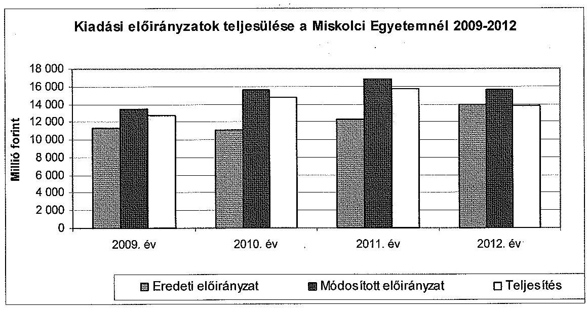

Az ME eredeti bevételi előirányzatok a 2009-2011. évekbeli emelkedés után (3857,9 M Ft, 3973,9 M Ft, 5024,2 M Ft) a 2012. évre jelentősen, 8275,0 M Ft-ra emelkedtek. Ez a növekmény a támogatásértékű működési bevételek számottevő emelkedéséből származik (2011. év: 424,2 M Ft; 2012. év: 2885,0 M Ft). Az ellenőrzött időszak egészében a tervezett saját bevétel csak intézményi működési bevételt tartalmazott.

---

Az ME eredeti költségvetési támogatási előirányzata az ellenőrzött időszak első három évében gyakorlatilag stagnált, a 2010. évi 7120,2 M Ft a 2009. évi 7498,3 M Ft 95,0\%-át, a 2011. évi 7256,3 M Ft a 96,8\%-át tette ki. Az előirányzat összege a 2012. évre 5717,5 M Ft-ra csökkent, ami a 2009. éves adat 76,3\%a.

Az ME eredeti kiadási előirányzatainak 54-59\%-a személyi juttatás és a munkaadót terhelő járulék volt (2009. év: 6678,7 M Ft; 2010. év: 6496,0 M Ft; 2011. év: 6699,7 M Ft; 2012. év: 8110,7 M Ft). A dologi kiadások részaránya a 20092010. évi $20 \%$-ról a 2011-2012. években $24 \%$-os szintre emelkedett (2009. év: 2279,8 M Ft; 2010. év: 2191,7 M Ft; 2011. év: 2974,5 M Ft; 2012. év: 3371,9 M Ft). Az ellátottak pénzügyi juttatásainak eredeti előirányzata a 2009. és a 2011. év között 12-13\%-os arányt képviselt (2009. év: 1448,2 M Ft; 2010. év: 1465,2 M Ft; 2011. év: 1469,1 M Ft) az ME eredeti kiadási előirányzatain belül. A hallgatói létszám számottevő csökkenése folytán a 2012. évre ez a részarány $9 \%$-ra csökkent ( $1242,7 \mathrm{MFt}$ ).

Az ME előirányzatait országgyűlési, kormány, irányító szervi és intézményi hatáskörben is - összesen 12 755,9 M Ft összegben, a jogszabályi előírásokkal összhangban - módosították, a módosítások döntő hányada ( $93,8 \%$-a) intézményi hatáskörben történt.

Országgyűlési hatáskörben 117,0 M Ft-ot vontak el az intézménytől 2011-ben ${ }^{28}$. Az államháztartási egyensúly megőrzéséhez szükséges intézkedésekről szóló 1025/2011. (II.11.) Korm. határozatban foglaltak alapján 595,2 M Ft elvonást érvényesítettek.

Kormányzati hatáskörben mind a négy évben módosították az intézmény előirányzatát, amely összesen 552,7 M Ft elvonással és 464,8 M Ft pótelőirányzat megállapításával járt. 2009-ben és 2010-ben a dologi kiadásokat, 2012-ben a személyi juttatásokat, a járulékokat és a dologi kiadásokat csökkentették. A havi keresetkiegészítések támogatására, kompenzációra ${ }^{29} 2009$-ben 163,7 M Ft-ot, 2010-ben 157,5 M Ft-ot, 2011-ben 39,4 M Ft-ot, 2012-ben 104,2 M Ft-ot kaptak.

Irányító szervi hatáskörben az előirányzat-módosítások - összesen 1594,0 M Ft összegben - részben a PPP konstrukcióban épült diákotthonok, részben OTKA kutatások támogatásai voltak. Irányító szervi hatáskörben 2009-ben 163,2 M Ft-ot, 2010-ben 100,9 M Ft-ot, 2011-ben 107,9 M Ft-ot zároltak.

Az intézményi hatáskörben végrehajtott, 11 962,0 M Ft előirányzat-módosítások során az Nítv.-ben előírtakat betartották, a saját bevételeket növelték az előző évi felhasználható előirányzat-maradvány és az EU forrásból származó hazai társfinanszirozású pályázati bevétel előirányzatosításával.

A teljesített költségvetési kiadások az ellenőrzött időszak első három évében egyenletesen növekedtek. (2009. év: 12 781,7 M Ft; 2010. év: 14 815,4 M Ft;

[^0]
[^0]:    ${ }^{28}$ A 2011. évi költségvetési törvény módosításáról szóló 2011. évi CXIV. törvény.
    ${ }^{29}$ 6/2009. (I. 20.), 133/2009. (VI. 19.), 352/2010. (XII. 30.), 371/2011. (XII. 31.) Korm. rendeletek, 1001/2009. (I. 13.), 1035/2010. (II. 12.), 1120/2010. (V. 13.), 1132/2010. (VI.18.), 1185/2011. (VI.6.), 1133/2012. (IV.26.) Korm. határozatok, NGM 3642/16/2012. számú intézkedése

---

2011. év: 15 706,0 M Ft). A 2012. évben azonban 12\%-os csökkenés volt tapasztalható az előző évhez viszonyítva ( $13778,4 \mathrm{MFt}$ ). A költségvetési kiadások teljesítésének mérséklődése egyrészt a dologi kiadások 4155,3 M Ft-ról 3857,3 M Ft-ra való csökkenésére, másrészt az intézményi beruházási kiadások 3552,9 M Ft-ról 2079,9 M Ft-ra való csökkenésére vezethető vissza.

Az ellenőrzött időszakban az ellátottak pénzügyi juttatásai a hallgatói létszám számottevő csökkenése miatt folyamatosan csökkentek, összességükben 1455,6 M Ft-ról 1134,2 M Ft-ra, a teljesített költségvetési kiadásokon belüli részarány $11 \%$-ról $8 \%$-ra változott.

A PPP konstrukcióhoz kapcsolódó szolgáltatási díjfizetés összegének alakulása az ellenőrzött időszakban a következő volt, évek szerinti sorrendben: 2009. év: 704,4 M Ft, 2010. év: 663,4 M Ft, 2011. év: 847,8 M Ft, 2012. év: 780,4 M Ft. A PPP konstrukcióhoz kapcsolódó szolgáltatási díjfizetés részaránya a dologi kiadásokon belül $22 \%, 19 \%, 20 \%$, illetve $20 \%$ volt, ugyanez az összes kiadáson belül $6 \%$-ot, $5 \%$-ot, $5 \%$-ot, illetve $6 \%$-ot tett ki.

Az ME hallgatói létszáma a 2009. év és a 2012. év között folyamatosan csökkent: 13940 fő, 13546 fő, 13207 fő, illetve 12278 fő. Összességében ez 1662 fő létszámcsökkenéshez vezetett, ami 11,9\%-ot tett ki. Ezen belül az államilag támogatott képzést igénybe vevő hallgatók száma valamivel nagyobb mértékben csökkent az ellenőrzött időszakban, ami 2097 föt, 26,2\%-ot jelentett. A hallgatói létszámváltozás a költségvetési támogatás csökkenésében is megmutatkozik, a visszaesés hasonló arányú volt.

Az ME a kiadási és bevételi elöirányzatok tervezése során a jogszabályokban és a fenntartó által kiadott tervezési irányelvekben foglaltak szerint járt el, az előírt adatszolgáltatásokat teljesítették.

Az ME gazdálkodásának alapja minden évben a fenntartó (OKM, NEFMI, EMMI) által megvizsgált intézményi elemi költségvetés volt. Az ME elemi költségvetésének előirányzati keretszámait a fenntartó az éves költségvetési törvényekben elfogadott előirányzatok és szabályok szerint, illetve azok keretei között állapította meg. A fenntartó minden év júliusában kiadta a következő év költségvetésének tervezési irányelveit. A költségvetés tervezéséhez kapcsolódó, a fenntartó által meghatározott adatszolgáltatásokat (foglalkoztatottak létszáma, előmenetelek, tárgyévi hallgatói létszám, saját bevételek tervezett összege) az ME határidőben és az előírt tartalommal megküldte a fenntartó részére.

A bevételi és kiadási előirányzatok tervezésekor az intézményi elemi költségvetésről előterjesztések készültek az ME szenátusa részére, amelyet a GT előzetesen véleményezett.

Az ME bevételi és kiadási előirányzatainak megállapítását az egyes években részletes mellékszámítások alapozták meg.

Az intézmény Központi igazgatási és Gazdasági-műszaki főigazgatósági szintű ügyrendekben, valamint Gazdálkodási szabályzatokban rögzítette a költségvetési tervezéssel kapcsolatos feladatokat. A Gazdálkodási szabályzatot évente egyszer, esetenként többször aktualizálták, igazodva a jogszabályi és a gazdasági környezet változásaihoz, követelményeihez. A munkaköri leírások a költségvetési tervezéssel kapcsolatos feladatokat a Gazdasági-müszaki főigazgatóság szakirányú

---

alkalmazottai esetében tartalmazták. Az ME az intézmény költségvetési tervezésellenőrzési nyomvonalát kialakította, és azt folyamatosan karbantartotta az ellenőrzött időszak során. Az intézmény a jogszabályi előírásnak megfelelően készítette el, mellékszámításokkal megalapozta költségvetési javaslatát, és azt meg-küldte-e a fenntartónak. Az ME a kincstári költségvetés alapján elkészített elemi költségvetését az ellenőrzött időszak minden évében megküldte a fenntartónak. A végleges kincstári költségvetés és az elemi költségvetés közötti egyezőség kiemelt előirányzati szinten biztosított volt az ellenőrzés alá vont időszak minden évében.

# 3.1.1. A pénzügyi egyensúlyt befolyásoló tényezők 

Az egyetem pénzügyi egyensúlya a 2009-2012. években romlott. A pénzügyi egyensúly romlását jelzi, hogy az egyetem eladósodási mutatója ${ }^{30}$ az ellenőrzött időszakban kedvezőtlenül változott, a 2009. évi 13,7\%-ról a 2012. évben $18,7 \%$-ra nőtt. Szintén romlott az ME pénzeszköz-likviditási mutatója ${ }^{31}$, a 2009. évi 0,9 értékről a 2012. évre 0,2-re csökkent. Ez azt jelenti, hogy a pénzeszközök év végi állománya már a 2009. évben sem nyújtott fedezetet a rövid lejáratú kötelezettségek rendezésére. A likviditási mutató ${ }^{32}$ értéke a 2009. évi 1,3-hoz képest jelentősen gyengült (2010. év 0,4, 2011. év 0,6), a 2012. évben már csak 0,4-es értéket mutatott, így a pénzeszközök, a követelések, a készletek és a forgatási célú értékpapírok együttes összege 2010-től már nem nyújtott fedezetet a szállítói kötelezettségek teljesítésére.

Az ME lejárt szállítói tartozás összes szállítói tartozáson belüli aránya az ellenőrzött időszakban folyamatosan növekedett ( $29,9 \%, 31,7 \%, 44,1 \%$ ), és 2012 . december 31 -ére az összes tartozásállomány több mint fele (55,7\%) lejárt volt. A 60 napon túl lejárt szállítói tartozások állománya $0,6 \mathrm{M}$ Ft-ról $2,5 \mathrm{M}$ Ft-ra emelkedett, azaz megnégyszereződött.

Az ME követelésállománya az ellenőrzött időszakban folyamatosan csökkent, a 2009. évi 567,4 M Ft-ról a 2012. évre $253,8 \mathrm{M}$ Ft-ra, azaz kevesebb, mint felére, $44,7 \%$-ra esett az állomány. A követelésállomány meghatározó része vevői követelés volt.

[^0]
[^0]:    ${ }^{30}$ Az eladósodási mutató a hosszú és rövid lejáratú fizetési kötelezettségek összes forráson belüli arányát mutatja.
    ${ }^{31}$ A pénzeszköz-likviditási mutató kifejezi, hogy a pénzeszközök év végi állománya milyen arányban nyújt fedezetet a rövid lejáratú fizetési kötelezettségekre.
    ${ }^{32}$ A likviditási mutató mutatja, hogy a rövid lejáratú fizetési kötelezettségek kiegyenlítéséhez a forgóeszközök milyen arányban nyújtanak fedezetet.

---

Az egyetem pénzügyi helyzetét a CLF módszer segítségével is elemeztük (3. számú melléklet). Az ME pénzügyi pozícióját, múködési jövedelmét, felhalmozási költségvetési egyenlegét, nettó múködési jövedelmét az alábbi táblázat szemlélteti M Ft-ban:

| Megnevezés | 2009. | 2010. | 2011. | 2012. |
| :--: | :--: | :--: | :--: | :--: |
| Folyó bevételek | 11968,8 | 12332,6 | 12165,1 | 11094,7 |
| Folyó kiadások | 11379,9 | 11267,1 | 11874,9 | 11626,8 |
| Múködési jövedelem | 588,9 | 1065,5 | 290,2 | $-532,1$ |
| Felhalmozási bevételek | 1409,9 | 2993,3 | 3315,9 | 1783,0 |
| Felhalmozási kiadások | 1401,7 | 3548,3 | 3831,1 | 2151,6 |
| Felhalmozási költségvetés egyenlege | 8,2 | $-555,0$ | $-515,2$ | $-368,6$ |
| Folyó és felhalmozási bevételek összesen | 13378,7 | 15325,9 | 15481,0 | 12877,7 |
| Folyó és felhalmozási kiadások összesen | 12781,6 | 14815,4 | 15706,0 | 13778,4 |
| Finanszírozási múveletek nélküli pozíció | 597,1 | 510,5 | $-225,0$ | $-900,6$ |
| Finanszírozási múveletek egyenlege | $-6,2$ | 15,2 | 41,3 | 7,3 |
| Tárgyévi pénzügyi pozíció (pénzeszközváltozás) | 589,9 | 525,7 | $-183,7$ | $-893,3$ |
| Hiteltörlesztés, saját kibocsátású értékpapír beváltás | 0 | 0 | 0 | 0 |
| Nettó múködési jövedelem | 588,9 | 1065,5 | 290,2 | $-532,1$ |

A pénzügyi egyensúly mellett az ME pénzügyi pozíciója az ellenőrzött időszakban folyamatosan romlott, a 2011-2012. években negatív volt. Az ME 2009. évi 1149,2 M Ft nyitó, idegen pénzeszközök nélküli pénzállománya a 2011. és 2012. években összesen 1077,0 M Ft-tal csökkent, míg a 2009., 2010. években 1115,6 M Ft-tal nőtt. A csökkenés okai a hallgatói létszámváltozással összefüggésben a költségvetési támogatások visszaesése, továbbá a végrehajtott beruházások és felújítások voltak. Az utóbbiak miatt a pénzállomány csökkenése ellenére az ME vagyonállománya jelentősen gyarapodott, mivel a beszámolók adatai szerint az eszközök összértéke a 2009. év elejei 11 634,6 M Ft-ról a 2012. évre 17526,5 M Ft-ra (50,6\%-kal) emelkedett.

A pozitív pénzügyi pozíciót a 2009. és 2010. években a magas múködési jövedelem eredményezte. Ez a forrástöbblet az ME által elnyert pályázatok bevételeiből, a TIOP 1.3.1. jelű infrastrukturális és informatikai fejlesztésekhez kapcsolódó pályázat, valamint a TÁMOP projektből származott. Mivel a pozitív eredményt a projektek által bevont források biztosították - azon túl, hogy a projektek likviditási kockázatot hordoznak - a tárgyévi pénzügyi pozíció további romlása a projektek befejezésével a hosszú távú fizetőképességet veszélyezteti.

---

A múködési jövedelem és a nettó múködési jövedelem 2009-2011 között pozitív volt, a folyó bevételek fedezték a folyó kiadásokat, de 2012-ben már nem volt biztosított a fedezet. Az ellenőrzött időszak egészét tekintve 1412,5 M Ft működési jövedelemtöbblet keletkezett, amelynek 75,4\%-a 2010ben képződött.
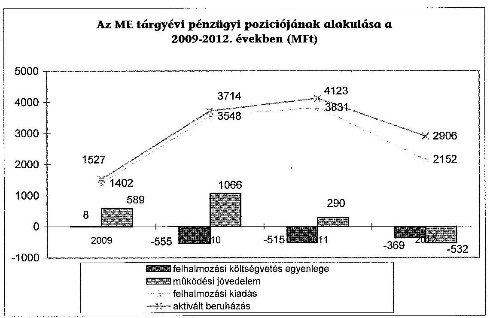

A felhalmozási költségvetés egyenlege a 2010-2012. években negatív volt. A felhalmozási költségvetés egyenlege a 2009. és 2012. évek között összesen 1430,6 M Ft hiányt mutatott, mert a felhalmozási kiadások valamennyi vizsgált évben meghaladták a felhalmozási bevételeket. A pozitív nettó múködési jövedelem még a 2010. évben fedezetet biztosított a fejlesztési kiadásokra, azonban a 2011. évben a fejlesztési kiadások, a 2012. évben a múködési és a fejlesztési kiadások együttes finanszírozási igényét előző évi előirányzatmaradvány igénybevételével biztosították.

Az ME múködési jövedelme, valamint tárgyévi nettó müködési jövedelme megegyezett, mivel az intézmény hitel felvétele nélkül gazdálkodott, és így hiteltörlesztésre nem kerülhetett sor, értékpapír beváltása pedig az ellenőrzött időszakban nem volt. A finanszírozási múveletek nélküli pozíció nagyságrendileg megegyezett a tárgyévi pénzügyi pozícióval, mert a finanszírozási múveletek egyenlege nagyságánál fogva nem változtatott érdemlegesen a finanszírozási műveletek nélküli pozíción.

A vizsgált időszakban az egyetem gazdálkodását hátrányosan befolyásolták a költségvetési egyensúly megőrzése érdekében tett intézkedések, zárolások és maradványtartási kötelezettségek. Az egyetemet összesen 1279,7 M Ft értékben érintette előirányzat-zárolás és 2241,8 M Ft összegben maradványtartási kötelezettség. Az előirányzat-zárolás egyik évben sem került feloldásra, és valamennyi esetben a zárolt összeget elvonták. A maradványtartási kötelezettséget egy esetben, a 2011. évben, 1681,9 M Ft összegben feloldották. Az egyes

---

években hozott előirányzat-felhasználást korlátozó intézkedések jelentős mértékben nehezítették az intézmény feladatellátását. Az egyetem a 2012. évben a költségvetési támogatás és a saját bevételek csökkenése miatt 15\%-os létszámcsökkentést hajtott végre.

Az intézményhez kincstári biztost nem jelöltek ki, a fizetőképesség javítása érdekében nem tettek intézkedést támogatás előrehozására. Az intézménynél 2012. szeptember 1-jétől költségvetési főfelügyelő működött.

A főfelügyelő tevékenységének megkezdését követően intézkedések történtek a kiadások racionalizálására és a bevételek beszedése érdekében, valamint az ME a Kötelezettségvállalási Szabályzatot és a kapcsolódó valamennyi szabályzatot a költségvetési főfelügyelőre vonatkozó szabályokkal kiegészítette. A költségvetési főfelügyelő a létszámleépítések mérséklése végett javaslatot tett egyes épületek bérbeadási, gazdaságosabb hasznosítási lehetőségeinek felmérésére. A főfelügyelő részt vesz a Rektori Kabinet, a szenátus ülésein, valamint a Dékáni Stratégiai Értekezleteken és a felső vezetői megbeszéléseken. A kötelezettségvállalások áttekintése több mint 900 esetben történt meg, közel 140,0 M Ft értékű tételt érintett, ebből közel 200 alkalommal került visszatartásra, mintegy 30,0 M Ft értékben.

Az ME az ellenőrzött időszakban nem vett át szakmai feladatot. Szakmai feladatátadásra egy esetben, a 2011. évben került sor, amikor az Egri Egyházmegye részére adták át az Árvay József Gyakorló Általános Iskolát.

# 3.1.2. A normatív támogatások felhasználása 

A költségvetési támogatások felhasználásával kapcsolatos döntések nem minden tekintetben feleltek meg a jogszabályi előírásoknak. A normatív támogatások belső szabályozása nem volt teljes körűen összhangban a jogszabályi előírásokkal.

Az ME szenátusa a Feot., valamint a felsőoktatásban részt vevő hallgatók juttatásairól és az általuk fizetendő egyes térítésekről szóló 51/2007. (III. 26.) Korm. rendelet alapján térítési és juttatási szabályzatban határozta meg a normatív támogatások hallgatói célú felhasználásának szabályait.

Az ellenőrzött időszak kezdete és 2009. VII. 31. között hatályos kormányrendeletnek a 8. § (1) bekezdése szerint tanulmányi ösztöndíakra, valamint szakmai, tudományos és közéleti ösztöndíakra kellett felhasználni a Feot. 129. § (3) bekezdés a) pontja szerinti támogatás (hallgatói normatíva) 59-64 \%-át. Ezzel szemben az ME szenátusa 74/2009. sz. határozatával elfogadott és ebben az időszakban hatályos Hallgatói Követelményrendszer (HKR, az SZMSZ III. Fejezete) 69. § (8) bekezdése tanulmányi ösztöndíakra a hallgatói normatíva $63 \%$-át, tudományos és közéleti ösztöndíakra a normatíva $5 \%$-át, összesen $68 \%$-át irányozta elő. Ez az ME belső szabályozása és a kormányrendelet előírásai közötti eltérés a kormányrendelet 2009. IX. 23 -tól módosult szabályozása és az előírás hatályon kívül helyezése következtében megszűnt.

További eltérés állt fenn a kormányrendelet előírásai és az ME szabályozása között a rendszeres és rendkívüli szociális ösztöndíjak és az alaptámogatás mértékének meghatározásánál. Ezekre a célokra a kormányrendelet - a lakhatási támogatási normatíva és a tankönyv támogatási normatíva mellett - a hallgatói normatíva 35-40 \%-os mértékét határozta meg 2009. szeptember 23. és 2010. január 31. között. Ezzel szemben a 2009-ben hatályos Hallgatói Követelményrend-

---

szer (74/2009. szenátusi határozat) 69. § (8) bekezdése ezekre a célokra csupán a hallgatói normatíva $25 \%$-át irányozta elő. Ez az eltérés a kormányrendeleti szabályozástól azzal sem szűnt meg, hogy az ME szenátusa a 397/2009. számú szabályozásával a támogatás mértékét $30 \%$-ra emelte. Az összhangot a kormányrendeleti előírásokkal 2010. január 31-től tartotta be az egyetem.

Az ellenőrzött időszakban az ME a HKR-ben nem szabályozta a hallgatói önkormányzat támogatását, amit a kormányrendelet a normatíva $1 \%$-ában határozott meg.

A képzési, tudományos célú és fenntartói támogatásokat az ME az 50/2008. (III.14.) Korm. rendelet 9. § (1) és (2) bekezdéseinek megfelelően, az éves költségvetés szenátusi jóváhagyásával saját hatáskörben osztotta fel a decentralizált egységek között.

A felosztás alapvetően az EMMI által létszámarányosan megállapított támogatási összegnek az egyes szervezeti egységek létszáma alapján történt, figyelembe véve, hogy a képzési és tudományos célú támogatásokat csak közvetlenül ilyen feladatokat ellátó egységek kapjanak. Az előterjesztéseket a GT megtárgyalta és a jóváhagyás előtt véleményezte.

A HKR-ben rögzített támogatásokon kívül olyan egyedi döntés, amelynek jogalapja szenátusi vagy kari tanácsi határozat lett volna, az ME tájékoztatása szerint nem fordult elő. A hallgatók által igénybe vehető normatív támogatásokról az ME elektronikus úton, hirdetményekben, illetve közvetlen értesítéssel tájékoztatta az érdekelteket.

# 3.2. A kiadási és bevételi elöirányzatok felhasználásának szabályszerűsége 

Az ellenőrzött időszakban nem volt szabályszerű a külső személyi juttatások kiadási előirányzatának, a dologi kiadások, a felhalmozási kiadások és a múködési bevételek előirányzatának felhasználása. A rendszeres és nem rendszeres személyi juttatások teljesítése esetében magas kockázatot, a felhalmozási bevételek beszedése, az intézményi térítési díjak, költségtérítések elszámolása, a hazai forrásból finanszírozott projektek elszámolása esetében kockázatot tártunk fel a felhasználás jogszabályi előírásoknak való megfelelőségével kapcsolatban. Az előirányzat-módosítások szabályszerűsége megfelelt a jogszabályi előírásoknak.

A pénzgazdálkodással kapcsolatos gazdálkodási jogkörökhöz elöírt belsö kontrollok nem minden esetben müködtek, a kötelezettségvállalás, az ellenjegyzés, a szakmai teljesítésigazolás, az utalványozás, az utalványozás ellenjegyzése és az érvényesítés gazdálkodási jogkörök müködésével kapcsolatban tártunk fel hiányosságokat. A müködési bevételek teljesítésigazolásának területén rendszerszintü hiányosságokat tártunk fel, melyek kockázatot jelentettek a bevételek összegszerűségének megbízhatóságában.

---

# 3.2.1. Kiadási előirányzatok 

A rendszeres és nem rendszeres személyi juttatás előirányzatának felhasználása során a pénzügyi elszámolások, valamint a gazdálkodási jogkörök gyakorlása tekintetében nem érvényesültek teljes körüen a jogszabályok és a belső szabályzatok előírásai. Ez magas szabályszerűségi kockázatot jelentett az ellenőrzött terület egészének múködése szempontjából.

Rendszerhiba volt, hogy az illetmények számfejtéséhez szükséges munkaidő nyilvántartást ${ }^{33}$ nem vezettek.

A rendszeres és nem rendszeres személyi juttatások kifizetéseit hiányosan támasztották alá teljesítést igazoló dokumentumok, a jelenléti í vezetése nem történt meg egyes oktatók esetében. Az ME-nél jelenléti í helyett a tanszékek havonta „Tüvölét jelentés"-ben tájékoztatták a Bér- és Munkaügyi Osztályt arról, ha valamelyik dolgozó betegszabadságon, táppénzen, fizetés nélküli szabadságon, stb. volt az adott hónap során. A valós munkaidő nyilvántartása tehát nem volt biztosított.

A pótlékok és illetménykiegészítéseinek számítása, számfejtése során a vonatkozó szabályokat betartották. A nem rendszeres személyi juttatások megállapítása, számfejtése szabályos volt.

A Feot. és az Nftv. oktatói tevékenységre vonatkozó előírásait betartották.
A kötelező óraterhelésre és az ellátandó oktatói feladatokra vonatkozó rendelkezéseket az FKR 94-98. §-ai tartalmazták. A rendelkezésekben foglaltak teljesítésének ellenőrzése céljából az ME félévente teljes körű felmérést készített az óraterhelésekről. Az ellenőrzött időszakban az intézetek, tanszékek nem csak a törvény által előírt minimálisan oktatásra fordítandó időt, hanem annál lényegesen többet fordítottak oktatási tevékenység ellátására. A beszámolókat a szenátus elfogadta.

Jutalomkifizetésnél a Kjt. 77. § -ában megfogalmazott előírás érvényesült. Az ME az ellenőrzött időszakban nem teljesített cafetéria kifizetést.

Az ME az ellenőrzött időszakban KIR rendszerbe be nem vont intézményként működött. Az illetmény számfejtésének alapjául szolgáló bizonylatok, ügyiratok - az említett jelenléti í vezetésének hiányától eltekintve - megfeleltek a jogszabályoknak, a kiválasztott személyek illetményének megállapítása szabályszerű volt.

A külső személyi juttatás elöirányzatai terhére megkötött megbízási szerződések tartalma, teljesítése nem volt szabályszerü, nem felelt meg a jogszabályoknak és a belső szabályzatok előírásainak. A megbízási díjak elszámolásánál rendszerhibaként jelentkezett, hogy nem a jogosult gyakorolta a kötelezettségvállalási vagy ellenjegyzési jogkör ${ }^{34}$. Több esetben nem tartották be az Ávr. 50. § (2) bekezdésében foglaltakat, és a rendelet szövegétől eltérő

[^0]
[^0]:    ${ }^{33}$ Mtv. ${ }_{1}$ 140/A. § (1) bekezdés, Mtv. ${ }_{2}$ 134. § (1) bekezdés, Ámr. ${ }_{1}$ 135. § (1) bekezdés, Ámr. ${ }_{2}$ 76. § (1) bekezdés, Ávr. 57. § (1) bekezdés
    ${ }^{34}$ Ámr. ${ }_{1}$ 134. § (1), (8) bekezdés, Ámr. ${ }_{2}$ 72. § (3), 74. § (1) bekezdés, Ávr. 52. § (1), 55. § (1) bekezdés

---

módon indokolták a külső személlyel való szerződéskötést, nevezetesen az egyetem közalkalmazottainak túlterheltségére hivatkoztak. Egy alkalommal a szerződés megkötésének dátuma megelőzte az ellenjegyzési keletkezésének dátumát. Két esetben fordult elő az, hogy nem tudták felmutatni a kötelezettségvállalási, illetve ellenjegyzési jogosultságot igazoló, írásban történő kijelölés dokumentumát ${ }^{35}$. A 2009-2012. években összesen 2,4 M Ft összegű kifizetésnél tártunk fel szabályszerűségi hibákat.

Állományba tartozó személlyel megbízási szerződést csak a 2009. évben kötöttek, ettől kezdve az ME vezetése ezt a megbízási formát megszüntette. Az ellenőrzött tételek közül négy volt olyan, amikor a szerződő fél saját dolgozó volt. Ezekben az esetekben a vonatkozó szabályokat, előírásokat betartották.

A megkötött szerződések szabályosak voltak, a feladat meghatározása és a teljesítés feltételeinek meghatározása egyértelmű módon történt. A teljesítés igazolása, a kifizetés számfejtése minden ellenőrzött tétel esetében a szerződésnek, belső szabályzatoknak és a jogszabályoknak megfelelően történt. A szerződésben foglalt feladatok teljesítése mérhető, nyomon követhető volt. A részteljesítéshez kapcsolódó kifizetések a szerződésben rögzítettek szerint történtek. A megbízási szerződéseket csak a tárgyévi előirányzatok terhére kötötték meg, a folyamatos feladatra kötött szerződések - elvétve volt ilyen - legkésőbb a következő év június 30 -án lejártak. A megbízási szerződés saját dolgozó esetében olyan feladat ellátására, ami a dolgozó munkaköri leírásában szerepel, nem irányult. A megbízott a megbízás teljesítésére képzettsége, végzettsége alapján minden ellenőrzött esetben alkalmas volt.

A dologi kiadások előirányzatának felhasználása a pénzügyi elszámolások, valamint a gazdálkodási jogkörök gyakorlása tekintetében nem felelt meg a jogszabályoknak ${ }^{36}$ és a belső szabályzatok előírásainak. A kifizetések szabálytalansága a kötelezettségvállalás nyilvántartásba vételének hiánya ${ }^{37}$, az aláírási jogosultság nélküli jogkörök gyakorlása miatt következett be.

# Az ME kötelezettségvállalás-nyilvántartása az ellenőrzött időszak- 

ban nem volt naprakész, a kötelezettségvállalás után nem gondoskodtak annak nyilvántartásba vételéről. A napi gazdálkodás során nem szolgáltatott pontos információt a nyilvántartás a decentralizált egységek számára a szabad előirányzati keretről, másrészt nem biztosította a főkönyvi könyveléssel való egyeztethetőséget ${ }^{38}$.

A kötelezettségvállalásokat nem a szabályzat szerint, a szerződés, megrendelés stb. alapján, hanem a teljesítés után beérkező számla alapján állították ki. A negyedévenkénti egyeztetést a Számlarend ${ }^{39} 0$. számlaosztályra vonatkozó előírásai tartalmazták.

[^0]
[^0]:    ${ }^{35}$ Ávr. 55. § (2) bekezdés
    ${ }^{36}$ Ámr. ${ }_{1}$ 134. § (13), 135. § (4), 136. § (1) bekezdés, Ámr. ${ }_{2}$ 75. § (1), 77. § (4), 78. § (1) bekezdés, Ávr. 56. § (1), 58. § (4), 59. § (1) bekezdés
    ${ }^{37}$ Ámr. ${ }_{1}$ 134. § (13) bekezdés, Ámr. ${ }_{2}$ 75. § (1) bekezdés
    ${ }^{38}$ Áht. ${ }_{1}$ 134. § (13) bekezdés, Ávr. 56. §
    ${ }^{39}$ Hatályba léptetve a 367/2008., a 368/2011., a 384/2011. és a 447/2012. szenátusi határozatokkal.

---

A felhalmozási kiadások előirányzatainak felhasználása a pénzügyi elszámolások, valamint a gazdálkodási jogkörök gyakorlása tekintetében nem felelt meg a jogszabályoknak és a belső szabályzatok előírásainak. A feltárt hibák a pénzgazdálkodási jogkörök gyakorlásával kapcsolatban merültek fel.

Rendszerhibaként jelentkezett, hogy a kiadásokhoz írásbeli kötelezettségvállalás (illetve annak ellenjegyzése) nem kapcsolódott ${ }^{40}$. Egy esetben a teljesítésigazolást ${ }^{41}$, több esetben az utalványozást ${ }^{42}$, illetve az utalványozás ellenjegyzését ${ }^{43}$ nem végezték el. További esetekben a kötelezettségvállalást ${ }^{44}$ (illetve annak ellenjegyzését), az utalványozást ${ }^{45}$, az érvényesítést ${ }^{46}$ nem az arra igazolhatóan feljogosított személyek végezték el, továbbá az a kötelezettséget keletkeztető szerződés vagy megrendelés aláírását jelentősen, hónapokkal meghaladóan került be a kötelezettségvállalás a kötelezettségvállalások nyilvántartásába ${ }^{47}$.

A kötelezettségvállalás mellőzésével megrendelt összesen 6,7 M Ft összegű szolgáltatások, feladatok teljesültek, ugyanakkor azok korrupciós kockázatot jelentettek az egyetem gazdálkodásában. Az ellenőrzött mintatételek felénél tártunk fel szabályszerűségi hibákat.

A 2010-2012. években az egyensúlyjavító intézkedések keretében elrendelt, egyes eszközcsoportokra vonatkozó beszerzési tilalmat nem szegték meg. A nagyobb összegű beszerzésekhez minden esetben közbeszerzési eljárás kapcsolódott.

A beruházások és felújítások hosszú távú finanszírozhatóságára vonatkozóan hatástanulmányok csak esetileg készültek, ha azokat pályázati forrás elnyeréséhez külön előírták.

# 3.2.2. Bevételi előirányzatok 

Az intézményi múködési bevételek beszedése a pénzügyi elszámolások, valamint a gazdálkodási jogkörök gyakorlása tekintetében nem felelt meg a jogszabályoknak és a belső szabályzatok előírásainak. Rendszerszintű hiányosságokat tártunk fel a pénzügyi jogkörök gyakorlása területén, mely kockázatot jelentett a bevételek összegszerűségének megbízhatóságában.

A múködési bevételek jelentős részét a hallgatókkal szembeni követelések különböző jogcímeken teljesült tételei (költségtérítéses képzésben résztvevők térítései, kollégiumi díjak, ismételt vizsgák díjai, szolgáltatás-térítési díjak, mulasztási díjak, stb.) alkották. A hallgatóknak a befizetéseket egy, az ME által az Erste Bank Zrt.-nél vezetett gyűjtőszámlára kellett teljesíteni.

[^0]
[^0]:    ${ }^{40}$ Áht. ${ }_{1} 100 /$ C § (3) bekezdés, Áht. ${ }_{2} 37 . \S$ (1) bekezdés
    ${ }^{41}$ Ámr. ${ }_{2} 76 . \S$ (1) bekezdés
    ${ }^{42}$ Ámr. ${ }_{1}$ 136. § (1), (3) bekezdés, Ámr. ${ }_{2} 78 . \S$ (1), (2) bekezdés
    ${ }^{43}$ Ámr. ${ }_{1}$ 137. § (1), (3) bekezdés, Ámr. ${ }_{2} 79 . \S$ (1), (2) bekezdés
    ${ }^{44}$ Ámr. ${ }_{1}$ 134. § (8) bekezdés, Ámr. ${ }_{2} 74 . \S$ (1)-(2) bekezdés, Ávr. 55. § (2) bekezdés
    ${ }^{45}$ Ámr. ${ }_{1}$ 136. § (1) bekezdés, Ámr. ${ }_{2} 78 . \S$ (1) bekezdés, Ávr. 59. § (1) bekezdés
    ${ }^{46}$ Ámr. ${ }_{1}$ 135. § (4) bekezdés, Ámr. ${ }_{2} 77 . \S$ (5) bekezdés, Ávr. 58. § (4) bekezdés
    ${ }^{47}$ Ámr. ${ }_{1}$ 134. § (13) bekezdés, Ámr. ${ }_{2} 75 . \S$ (1) bekezdés, Ávr. 56. § (1) bekezdés

---

A hallgatói költségtérítéseknek az Erste Bank Zrt.-nél vezetett gyűjtőszámlán történő kezelése miatt az ME megsértette az Áht ${ }_{1}$ 18/C. § (5) és az Áht ${ }_{2}$ 79. § (1) bekezdéseit, miszerint a kincstári kör fizetési számlái csak a Kincstárnál vezethetők, valamint nem tartották be az Áhsz. 51. § (1) bekezdés a) pontjában foglaltakat sem. A pénzintézettel kötött bankszámlaszerződést és együttmúködési megállapodást az egyetem gazdasági és műszaki főigazgatója írta alá 2003-ban. Az Áht. ${ }_{2}$ 79. § (5) bekezdése szerint a Kincstárnál erre a célra vezethető számlát az ME nem alkalmazta a 2012. évben.

Az Áhsz. 51. § (1) bekezdés a) pontja szerint a pénzforgalmat érintő gazdasági műveletek, események bizonylatainak adatait késedelem nélkül, készpénzforgalom esetén a pénzmozgással egyidejűleg, pénzforgalmi számla, előirányzatfelhasználási keretszámla forgalomnál a hitelintézeti értesítés, illetve a Kincstár értesítésének megérkezésekor a könyvekben rögzíteni kell. Ezzel ellentétben a gyűjtőszámlára befizetett bevételek nem azonnal, a pénzintézeti értesítést követően kerülnek könyvelésre a főkönyvi könyvelésben, hanem csak a kincstári számlára történő átvezetéskor.

A saját bevételek analitikus nyilvántartása a NEPTUN rendszerben történt. A kiegyenlített tartozásokról kötegelt elektronikus adatállományt állított elő a rendszer, jogcímenkénti bontásban (karonként, képzésenként, befizetési jogcímek szerint a vonatkozó főkönyvi számlák megjelölésével). A kötegelt adatállomány nemcsak a hallgatókkal szembeni követelések rendezésére vonatkozott, hanem tartalmazta az ellentétes előjelű pénzmozgásokat is: a hallgatók NEPTUN rendszerben rögzített rendelkezéseit a gyűjtőszámláról történő pénzvisszaigénylésekre is. Az adatállományról a Pénzügyi Osztály a NEPTUN rendszer pénzügyi moduljában értesült. Ez alapján állította ki az Erste Bank Zrt.-nél vezetett gyűjtőszámláról az ME kincstárnál vezetett számlájára történő átvezetési megbízást, illetve a hallgatók egyéni folyószámláira történő visszautalásokat.

A pénzgazdálkodással kapcsolatos gazdálkodási jogkörök jogosultságainak dokumentáltsága nem volt teljes körü. Rendszerhiba volt, hogy az utalványozó ${ }^{48}$, az érvényesítő ${ }^{49}$ és az utalvány ellenjegyzője ${ }^{50}$ nem rendelkezett jogosultsággal a tranzakció elszámolásakor. A kiszámlázott összeg több esetben nem folyt be határidőre.

A szabálytalannak minősült tételek közül az utalványozó 27 esetben, az érvényesítő kilenc esetben, az utalvány ellenjegyzője három esetben nem rendelkezett jogosultsággal a tranzakció elszámolásakor. Az ellenőrzött tételek közül 10 esetben a kiszámlázott összeg nem határidőben folyt be. Az ellenőrzött tételek $84 \%$-a minősült szabálytalannak.

# A múködési bevételek teljesítésigazolásának ellenőrzésére a hallgatói térítési díjaknál - annak dokumentáltsága hiányában - nem volt lehetőség. 

[^0]
[^0]:    ${ }^{48}$ Ámr. ${ }_{1}$ 136. § (1) bekezdés, Ámr. ${ }_{2}$ 78. § (1) bekezdés, Ávr. 59. § (1) bekezdés
    ${ }^{49}$ Ámr. ${ }_{1}$ 135. § (4) bekezdés, Ámr. ${ }_{2}$ 77. § (5) bekezdés, Ávr. 58. § (4) bekezdés
    ${ }^{50}$ Ámr. ${ }_{1}$ 137. § (1) bekezdés

---

A bevételek teljesítésének igazolására az Ámr. ${ }_{1}$ 135. § (1) bekezdése tartalmazott előírásokat. Az Ámr. ${ }_{2} 76 . \S$ (2) bekezdése a bevételek teljesítése igazolásának szabályozását a kötelezettséget vállaló szerv belső szabályzatának hatáskörébe utalta. Az ME Gazdálkodási Szabályzata 11. § (1) bekezdés e) pontja az ellenőrzött időszak mind a négy évében előírta a bevételek beszedésének elrendelése előtt azok teljesítése igazolásának ellenőrzését az érvényesítés elvégzése során. A teljesítésigazolás végrehajtásának közvetlen ellenőrzésére nem volt lehetőség a hallgatói térítési díjaknál. Ezek pénzügyi teljesüléséről elsődlegesen a NEPTUN rendszeren keresztül értesültek a karok. A kari tanulmányi előadó listája alapján a NEPTUN rendszergazda által készített feladás szolgált az Erste Bank Zrt-nél vezetett gyűjtőszámlára befolyt összegeknek a kincstári számlára történt átvezetésére. Ennek utalványozása a Pénzügyi Osztályon történt, az utalványozás megtörténte előtt az érvényesítő (a Pénzügyi Osztály munkatársa) számára rendelkezésre kellett volna állnia a teljesítés igazolásának. A Kötelezettségvállalási Szabályzat 1. sz. melléklete 10. pontja szerint a költségtérítéses képzés bevételeinek teljesítésigazolására a magasabb vezetők voltak jogosultak, ennek dokumentálása azonban nem volt biztosított.

Az immateriális javak és tárgyi eszközök bérbeadása, értékesítése során a pénzügyi elszámolások, valamint a gazdálkodási jogkörök gyakorlása tekintetében nem volt biztosított teljes körűen a jogszabályoknak ${ }^{51}$ és belső szabályzatoknak való megfelelőség. Ez szabályszerűségi kockázatot jelentett az ellenőrzött terület egészének működése szempontjából. Az ellenőrzött időszakban szabálytalan volt a teljesítés igazolások elmaradása, a bérbeadás előtti versenyeztetés elmulasztása.

Az egyes tevékenységek bevételeinek, kiadásainak, költségeinek elkülönítése az előírásoknak megfelelően történt, ami megalapozta az intézményi térítési díjak, költségtérítések megállapításának szabályszerűségét. Az ME az alapító okiratban foglaltaknak megfelelően az ellenőrzött időszakban nem végzett vállalkozási tevékenységet.

Az intézményi térítési díjak, költségtérítések megállapításának tekintetében nem volt biztosított teljes körűen a jogszabályoknak és a belső szabályzatok előírásainak való megfelelőség az önköltségszámításnál figyelembevett költségelemek megalapozatlansága miatt. Ez szabályszerűségi kockázatot jelentett az ellenőrzött terület egészének múködése szempontjából.

Egy alvállalkozói szerződés nem rendelkezett egyértelműen a munkadíj mértékéről, a megjelölt melléklet egy éves díjat határoz meg, részteljesítést nem említ. A kifizetett összeg egy munkaigazoláson jelent meg, nem volt kapcsolat az említett melléklettel, ami alapján az átutalt összeg meghatározható lett volna. Az alkalmazott díj alátámasztására önköltségszámítást bemutatni nem tudtak. A számlán szereplő összeg költségkimutatás hiányában megalapozatlan volt, mivel nem csatolták a kimutatást a felmerült kiadásokról.

[^0]
[^0]:    ${ }^{51}$ Ámr. ${ }_{1}$ 135. § (1) bekezdés, Ámr. ${ }_{2}$ 76. § (1) bekezdés, Ávr. 57. § (1) bekezdés, Vtv. 24. § (1), (5) bekezdés

---

# 3.2.3. A hazai forrásból finanszírozott projektek 

Az egyes megvalósított, csak hazai forrásból finanszírozott projektekhez, feladatokhoz pályázati úton vagy egyéb módon kapott (nem normatív) költségvetési forrással való elszámolás tekintetében nem volt biztosított teljes körűen a jogszabályoknak és belső szabályoknak való megfelelőség. Ez szabályszerűségi kockázatot jelentett az ellenőrzött terület egészének működése szempontjából.

Hazai pályázati forrásból a 2009. és 2012. évek között 43 projektet valósítottak meg, melyhez összesen 364,5 M Ft összegben nyertek támogatási forrást. A pályázati tevékenység a kutatók éjszakája rendezvényekhez, a könyvtári-levéltári állagmegóvásokhoz, a diákok tehetséggondozási feltételeinek javításához, a pénzügyi-gazdasági ismeretterjesztéshez, a Tudományos Diákköri tevékenység fejlesztéséhez, kutatóműhelyek támogatásához és konferenciák, valamint előadássorozatok megtartásához kapcsolódott.

A pályázatoknál egy kivételével a pénzügyi elszámolás a támogatási szerződésben meghatározott határidőben vagy tartalommal készült el. Az „NTP-OKA I. A felsőoktatási intézményekben múködő tehetséggondozó múhelyek támogatása" pályázat esetében a kapott költségvetési forrással való elszámolás szabályszerűsége ${ }^{52}$ nem volt megfelelő, a hiánypótlás elmaradása miatt.

Az ME az MTA kutatócsoportok által igénybe vehető támogatásai közül a Lendület programból a vizsgált időszakban nem részesült támogatásban.

### 3.2.4. Az előirányzat-módosítások szabályszerűsége

A bevételi és kiadási előirányzatok módosítása, azok elszámolása megfelelt a jogszabályoknak és a belső szabályzatok előírásainak.

A Kincstár felé az előirányzat-módosításokat a módosítás napján dokumentáltan bejelentették, a főkönyvi könyvelésben a módosításokat átvezették.

A kiadási és bevételi előirányzatokat az ellenőrzött időszak minden évében pozitív irányban módosították, kivéve a 2012. év személyi juttatásait és az ahhoz kapcsolódó járulékokat. (Ez a két előirányzat együttesen meghaladja az összes 2012-es kiadási előirányzat harmadát: $35,0 \%$ ) Az említett előirányzatok módosításai $111,7 \%$-tól $140,4 \%$-ig terjedtek. A kiadási előirányzatok teljesítése minden évben alatta maradt a módosított előirányzatoknak ( $88,2 \%-95,1 \%$ ), a bevételi előirányzatok összesítésben pedig meghaladták azokat a 2009-2011. években ( $101,9 \%-103,7 \%$ ). A 2012. évben a bevételi előirányzatok teljesítése összesítve alatta maradt a módosított előirányzatoknak ( $91,7 \%$ ).

Az intézmény végrehajtotta a Kormány által elrendelt zárolási, előirányzatcsökkentési kötelezettségét. A keresetkiegészítések támogatására, kompenzációra irányuló összegek felhasználása szabályszerűen történt (ezt alátámasztotta a személyi juttatások felhasználásának ellenőrzése is).

Az irányító szervi hatáskörben és az intézményi hatáskörben végrehajtott elői-rányzat-módosítás megfelelt a jogszabályi előírásoknak. Az ellenőrzött saját

[^0]
[^0]:    ${ }^{52}$ Áht., 13/A. § (2) bekezdés, Áht., 53. §

---

hatáskörű előirányzat-módosításokat a Kincstárnak bejelentették, az előirány-zat-átcsoportosítás során a jogszabályi előírásoknak megfelelve a dologi előirányzatokból a személyi juttatások előirányzatát nem növelték.

Az előirányzat-módosításokról vezetett tárgyévi analitikus nyilvántartást a jogszabályokban megfogalmazott követelményeknek megfelelően vezették. A fökönyvi nyilvántartás összhangban volt a beszámoló űrlapjának adataival.

# 3.2.5. Az előirányzat-maradványok szabályszerűsége 

Az előirányzat-maradvány megállapítása és felhasználása nem felelt meg a jogszabályi előírásoknak. Az előirányzat-maradványok analitikus nyilvántartásában és a kötelezettségvállalások analitikus nyilvántartásában szereplő előirányzat-maradvány összege az ellenőrzött időszakban eltért a főkönyvi könyvelésben és a beszámolóban kimutatott maradvány összegétől. Az ME nem tartotta be a Sztv. 161. § (3) bekezdésének előírásait, nem biztosította az előirányzat-maradványok és a kötelezettségvállalások analitikus nyilvántartásának kapcsolatát a főkönyvi könyveléssel, és a kettő között az értékadatok számszerű egyeztetésének lehetőségét nem biztosították.

Az előirányzatok és a kötelezettségvállalások analitikus nyilvántartása az ME számára kifejlesztett, modulrendszerben múködő, a vezetői információs igényeket is támogató ügyviteli szoftverrel történt. Az ME által adott nyilatkozat szerint a nyilvántartási rendszer alkalmatlansága miatt nem valósult meg a kötelezettségvállalással terhelt előirányzat-maradvány analitikus nyilvántartásának a főkönyvi könyveléssel való egyeztetése.

Az ellenőrzött időszakban az ME Gazdálkodási Szabályzata ${ }^{53}$ előírásokat tartalmazott az előirányzat-maradvány tartalmára, annak megállapítási eljárására vonatkozóan. A szabályzat előírásai összhangban voltak a jogszabályi előírásokkal.

Az előirányzat-maradvány megállapítása a főkönyvben elszámolt összegek alapján történt. A tárgyévi előirányzat-maradvány megállapításakor a módosított támogatási előirányzattal és a módosított saját bevételi előirányzattal szemben a teljesített kiadások összegét vették figyelembe. Az előirányzat-maradványt a főkönyvben a funkcionális költségvetés szerinti bontásban és szakfeladatonként mutatták ki. Az eredeti támogatási és saját bevételi előirányzatot a szakfeladatok között a tapasztalati arányok szerint bontották meg. Az évközben végrehajtott kormány-, fejezeti és saját hatáskörű előirányzat-módosításokat szintén ezzel a módszerrel számolták el. A teljesített kiadásokat a bankbizonylatok alapján tételesen rögzítették a főkönyvi könyvelésben.

A beszámolón belüli tartalmi egyezőségek az előirányzat-maradványra vonatkozóan az elemi költségvetési beszámoló űrlapjai között fennálltak. Az ME az előirányzatoknak és azok teljesítéseinek fentiek szerinti nyilvántartásával biz-

[^0]
[^0]:    ${ }^{53}$ A 430/2019. szenátusi határozattal 2009. december 17-étől hatályba léptetett, a 383/2010. szenátusi határozattal 2011. január 1-jétől hatályba léptetett, a 153/2011. szenátusi határozattal 2011. április 28-ától hatályba léptetetett és a 49/2012. szenátusi határozattal 2012. március 1-jétől hatályba léptetett Gazdálkodási Szabályzat.

---

tosította az előirányzat-maradvány valós összegének a beszámolóban való kimutatását.

Az ME elkészítette a beszámolóhoz az EMMI által rendszeresített mellékleteket a maradvány levezetésére. A melléklet a főkönyvi könyvelés szerinti előirányzatmaradvány és az analitikus előirányzat és a kötelezettségvállalás-nyilvántartás szerinti kötelezettségvállalással terhelt előirányzat-maradványként jelentkező összeg különbségeként, mínusz előjellel kimutatta azt a „belső hiány"-nak nevezett összeget, amelyet az ME a korábbi években pénzügyileg realizált támogatás vagy saját bevétel összegéből nem az eredeti kötelezettségvállalással megjelölt célra használt fel.

A 2009. évi előirányzatmaradvány-kimutatás szerint az alaptevékenység tárgyévi előirányzat-maradvány összege 1958,2 M Ft, a kimutatott „belső hiány" összege -786,8 M Ft. A 2009. évi beszámolóban szereplő előirányzat-maradvány összege a kettő különbsége, 1171,4 M Ft volt. A kimutatott „belső hiány" összege a 2010. évben -728,0 M Ft-tal, a 2011. évben -721,9 M Ft-tal, a 2012. évben -817,0 M Ft-tal korrigálta az analitikus kimutatásban szereplő előirányzat-maradvány összegét.

A „belső hiány" keletkezésének okaként az ME a források adott időpontban való elégtelenségét, illetve a bevételek és a kiadások nem egymással összhangban történt, nem a tervezett ütemezés szerinti jelentkezését jelölte meg a beszámolók szöveges indoklásában. A „belső hiány" így mintegy „fordított előjelú előirányzat maradványként" szerepelt a beszámoló mellékletében, amelyet a fenntartó nem kifogásolt.

A „belső hiány" számítása több év óta történt, kiinduló adatai a témaszámonként (költségviselőnként) vezetett kötelezettségvállalás analitikus nyilvántartásból származnak, és a nem az eredeti kötelezettségvállalással megjelölt célra felhasznált (pénzügyileg kiadásba helyezett) összegek miatti tartozásokat jelentik az egyes témaszámok közötti viszonyban. Ez a „belső adósságállománynak" nevezett összeg, amit a kötelezettségvállalással terhelt előirányzat-maradványból a megelőlegezések, a bankszámlákon rendelkezésre álló összegek és a függő tételek levonásával számítottak ki, azt a forráshiányt jelentette, ami, ha rendelkezésre állt volna, a számítás időpontjában fennálló kötelezettségvállalással terhelt előirány-zat-maradvány pénzügyileg rendezhető lett volna.

A tárgyévi előirányzat-maradvány fenntartói jóváhagyásával az ME rendelkezett. A főkönyvi könyvelésben és az elemi beszámolóban kimutatott tárgyévi előirányzat-maradvány megegyezett a fenntartótól kapott jóváhagyással.

Az önrevízió által megállapított maradványbefizetési kötelezettségeket, amelyekről a fenntartói jóváhagyást tartalmazó levelek is rendelkeztek, az ME a határidőig teljesítette.

# 4. A VAGYONGAZDÁLKODÁS SZABÁLYSZERŰSÉGE 

### 4.1. A vagyongazdálkodás szabályozottsága

Az ME az ellenőrzött időszakban a vagyongazdálkodással kapcsolatos belső szabályzatokkal rendelkezett, azok azonban nem feleltek meg teljes körűen a vonatkozó jogszabályi követelményeknek. Az ME nem megfelelően határozta meg a belső szabályzataiban a pénz- és vagyongazdálkodással

---

kapcsolatos folyamatokat, feladat- és hatásköröket és felelősségi viszonyokat; a hiányosságokat a kontrolltevékenység rész tartalmazza.

Az ME vagyongazdálkodását a KVI-vel 1997-ben kötött, ezt követően többször módosított vagyonkezelési szerződés szabályozta 2010. februárig, amikor az ME és a MNV Zrt. között új vagyonkezelési szerződés lépett hatályba, amely a korábbi szerződést és módosításait hatályon kívül helyezte.

A 2010. évi szerződés tartalmazta a vagyonelemek 2008. év végi kimutatását, az ingatlanok esetében tételesen érték nélkül ${ }^{54}$, az ingóságok (immateriális javak, gépek, berendezések, járművek) tekintetében bruttó és nettó értéket meghatározva. A vagyonkezelési szerződésben szereplő, ingóságokra vonatkozó adatok az ME 2008. évi éves beszámolója adataival megegyeztek. A 2010. évi vagyonkezelési szerződés rögzítette, hogy az az ME társasági részesedéseire nem terjed ki.

Az ME a vagyonkezelt eszközeit üzemeltetésre, kezelésre nem adta át.
Az ME rendelkezett intézményfejlesztési tervvel (az ellenőrzött időszakban hatályos tervet a 2009-2013. közötti évekre dolgozta ki), abban meghatározta az alapfeladatok ellátásához illeszkedő gazdálkodási célokat.

Az ME 2010-ben az OKM Új Magyarország Fejlesztési Terv megvalósításával kapcsolatban a korábban kidolgozott intézményfejlesztési terv módosítására hívta fel a figyelmet. Ez alapján az ME a 2009. évben kidolgozott tervet a vagyongazdálkodást illetően kiegészítette a pályázati tevékenységről és a már elért eredményekről szóló információkkal. A módosított intézményfejlesztési terv tekintetében a fenntartó visszajelzéssel nem élt.

Az ME az éves vagyongazdálkodási terveket az ellenőrzött időszakban évente elkészítette, amelyeket az ME szenátusa - a Gazdasági Tanács véleményezését követően - elfogadott.

Az állami vagyon tulajdonjogának átruházására vonatkozó feltételeket az ME a gazdálkodási szabályzatában rögzítette. A tulajdonjog átruházásra, értékesítésre vonatkozó szabályozás összhangban volt a Vtv. 33. §-ában rögzített előírásokkal.

Az ingatlanok és tárgyi eszközök bérbeadása feltételeit az ellenőrzött időszakban több alkalommal módosított és a szenátus által jóváhagyott bérbeadási szabályzat tartalmazta.

A bérbeadási szabályzat az állami vagyonba sorolt eszközök bérbeadás útján történő hasznosítására előírta a Vtv. 24. §-ában foglalt - és a 2010. évi vagyonkezelési szerződésben is előírt - versenyeztetési szabályok alkalmazását. A bérbeadásra vonatkozó döntési hatásköröket (ingatlanok megjelölésével) a szabályzatban tételesen meghatározták.

Az ellenőrzött időszakban az ME rendelkezett a használatban lévő felesleges vagyontárgyak feltárásáról, hasznosításáról és selejtezéséről szó-

[^0]
[^0]:    ${ }^{54}$ A szerződés II. fejezet 3. pontja szerint a vagyonkezelt ingatlanok nyilvántartási értékét teljes körűen a 2008. december 31-i időpontra elkészített vagyonkataszter tartalmazza.

---

ló szabályzattal, amely tartalmazta a kapcsolódó feladatokat, hatásköröket, kötelezettségeket, valamint a hasznosítás és selejtezés rendjét.

# 4.2. A vagyonelemekkel történő gazdálkodás 

Az ME vagyongazdálkodása az ellenőrzött időszakban nem volt szabályszerű, több esetben megsértették a jogszabályban, belső szabályzatban előírtakat. A mérlegtételek tartalma, besorolása és értékelése - a követelések kivételével - megfelelt a jogszabályi előírásoknak. A mérlegben feltárt hibák összege nem befolyásolta a megbízható és valós képet.

Az ME a jogszabályi előírásoknak megfelelően az éves beszámolók elkészítését, a mérleg tételeinek alátámasztását szolgáló leltárt évente összeállította, továbbá a főkönyvi könyvelés és az analitikus nyilvántartások közötti egyeztetést elvégezte.

A leltár a mérleg fordulónapján meglévő eszközöket és forrásokat mennyiségben és értékben tartalmazta. A leltározás a rektor által jóváhagyott leltározási utasítások alapján történt. A leltározás és selejtezés szabályszerűségére vonatkozó feltételek biztosítottak voltak, a leltározást hatályos belső szabályzat alapján végezték.

Az ME a leltározási szabályzatban foglaltaknak megfelelően az immateriális javak, a tárgyi eszközök és a készletek leltározását mennyiségi felvétellel évente elvégezte.

Az immateriális javak és tárgyi eszközök tekintetében a tételes mennyiségi felvétel során a hiányok okait a leltározás során feltárták, és a nyilvántartások helyesbítését elvégezték. A tárgyi eszközöknél feltárt egyéb - dokumentumokkal nem alátámasztható - hiány mértéke nem volt jelentős (a négy évben összesen 1,1 M Ft nettó érték), az eszközöket a gazdasági főigazgató engedélyezését követően a nyilvántartásból - a leltározási szabályzatnak megfelelően - kivezették.

Az Áhsz. 24. § (8) bekezdésének megfelelően az alapfeladat ellátásához rendelkezésre bocsátott vagyon és a saját vagyon elkülönített nyilvántartása főkönyvi szinten biztosított volt.

Az ME a Feot. 123. § (1) bekezdése alapján képződő saját tulajdon öszszegéről a Feot. 123. § (7) bekezdésében foglaltak ellenére analitikus nyilvántartást nem vezetett. A nyilvántartás hiánya kockázatot nem hordozott, mivel a saját tulajdon a saját tőkén belül minimális arányt képviselt (0,02-0,03\%) 2011-ig. A 2012. év végén az ME saját vagyonelemet nem tartott nyilván, a saját bevételeiből létrehozott vagyont is kezelt vagyonként mutatta ki.

Az ME kezelésében és használatában lévő eszközök ${ }^{55}$ használatára vonatkozóan a gazdálkodási szabályzat meghatározta a főbb szabályokat. A

[^0]
[^0]:    ${ }^{55}$ A szabályzat nem konkretizálta az eszközök tartalmát, így az előírás érthető volt mind az ingatlanokra, mind a gépekre, berendezésekre, felszerelésekre, mind az immateriális javakra.

---

gazdálkodási szabályzat rendelkezése előírta, hogy a vagyonkezelt ingatlanok használatának elveit a gazdasági főigazgató javaslatára a szenátus hagyja jóvá, amely megfelelt a jogszabályi előírásoknak ${ }^{56}$, amely szerint az ingatlanvagyon hasznosításáról a szenátus dönt.

A részesedéseknél ellenőrzött mérlegtételek tartalma, besorolása, értékelése megfelelt a jogszabályoknak és a belső szabályzatoknak.

A részesedések állományváltozása dokumentált volt, a részesedéseket az ME bekerülési értéken tartotta nyilván, értékhelyesbítéssel nem élt az ellenőrzött időszakban.

Egy 1990-ben szerzett részesedését az ME a mérlegében nem tartotta nyilván, a részesedésről az 1997-ben a KVI-vel megkötött vagyonkezelési szerződés nem rendelkezett. Az ME a 2012. évi a részesedésről történő tudomásszerzést követően a részesedést a könyvelbe felvette, a részesedés ezt követő eladását rögzítette és kivezette a mérlegből. (A részesedés névértékét ( 150 ezer Ft) meghaladó összegben történt az eladás, az eladási árat könyvvizsgálói értékelés támasztotta alá.)

Az ME 2012-ben a tőkeváltozások mérlegsoron - a jogszabályi előírások ${ }^{57}$ ellenére - a tartós részesedéseit 2012-ben átvezette a kezelt (rendelkezésre bocsátott) vagyonba.

Az egyetem a 2011. évig a Feot. 120. § (2) bekezdése alapján saját vagyonként mutatta ki tartós részesedéseit. Az átsorolás jogszabályilag nem volt indokolt, az Nítv. 86. § (4) bekezdése értelmében a kezelt vagyonba való kötelező besorolás az intézményi társaságokra nem terjedt ki, valamint az átsorolást az MNV Zrt.-vel 2010-ben kötött vagyonkezelési szerződés sem támasztotta alá. Ennek következtében nem volt jogalapja az ME társasági részesedésének a saját vagyonból a kezelt vagyonba történő átsorolásának a 2012. évben. A Feot. - 2012. augusztus 31ig hatályos - 120. § (2) bekezdése alapján az ME-nek a saját részesedését a saját vagyona között kellett volna kimutatnia.

A követelések mérlegtételek értékelése nem felelt meg a jogszabályoknak és a belső szabályzatoknak.

A vevőkövetelések tartalma és besorolása szabályos volt. Azon vevőköveteléseket, amelyek behajtása tekintetében kockázatok álltak fenn (felszámolás alatt álló, tartósan nem fizető partnerek) az ME év végén tételesen értékelte, és az értékelések alapján 100\%-os értékvesztést számolt el. Az elszámolt értékvesztések összege a 2009. évben 38,7 M Ft, a 2010. évben 22,6 M Ft, a 2011. évben 32,2 M Ft, a 2012. évben 19,3 M Ft volt. Részbeni értékvesztés elszámolására nem került sor.

Az ellenőrzött időszakban összesen 15,1 M Ft követelést minősített az ME behajthatatlanná. A behajthatatlannak minősített követelések könyvekből való kivezetése megtörtént. A tételesen ellenőrzött tételek közül egy behajthatatlannak minősíthető - de éveken keresztül csak értékvesztés elszámolással érintett - vevőkö-

[^0]
[^0]:    ${ }^{56}$ Feot. 27. § (8) bekezdés
    ${ }^{57}$ Feot. 120. § (2) bekezdés

---

vetelést az ME nem vezetett ki könyveiből az Áhsz. 34. § (10) bekezdésében, valamint az Áhsz. 9. melléklet 2. c. pontjában foglaltakkal ellentétben.

Az ME a hallgatókkal szembeni követelések 100\%-a esetében nem végezte el a Sztv.-ben és az Áhsz.-ben elốrt év végi értékeléseket, értékvesztést nem számolt el az Sztv. 55. § (1) bekezdésével, a 65. § (1) bekezdésével, az Áhsz. 31. § (2) bekezdésével és az Értékelési Szabályzat előírásaival ellentétben. Ezekben az esetekben is az Sztv. 15. § (3) és az Áhsz. 9. § (11) bekezdésben meghatározott valódiság elve is sérült.

Az ME az Erste Bank Zrt.-nél - 2003. márciusban megkötött pénzforgalmi bankszámla szerződés alapján - vezetett, ún. gyüjtőszámlára beérkezett hallgatói befizetésekkel nem csökkentette a vevőkövetelésként nyilvántartott hallgatói terheléseket. A gyüjtőszámlára történt befizetések nem kerültek rögzítésre a könyvekben a banki értesítéssel egyidejűleg, ami nem felelt meg az Áhsz. 51. § (1) bekezdésében elôirtaknak, miszerint a pénzforgalmat érintő gazdasági műveletek, események bizonylatainak adatait késedelem nélkül, készpénzforgalom esetén a pénzmozgással egyidejűleg, pénzforgalmi számla, előirányzat-felhasználási keretszámla forgalomnál a hitelintézeti értesítés, illetve a Kincstár értesítésének megérkezésekor a könyvekben rögzíteni kell.

A gyújtőszámla egyenlege a leltárban nem szerepelt. Ez nem felelt meg az Sztv. 15. § (2) bekezdése, illetve az Áhsz. 9. § (2) bekezdése szerinti teljesség elvének, amely szerint a gazdálkodónak könyvelnie kell mindazon gazdasági eseményeket, amelyeknek az eszközökre és a forrásokra, illetve a tárgyévi eredményre gyakorolt hatását a beszámolóban ki kell mutatni.

A befizetések könyvekben való elszámolása azok kincstári előirányzatfelhasználási számlán való jóváírása, illetve a jóváírt összeg vevőkövetelésekkel szembeni azonosítása alapján történt meg. Az Erste Bank Zrt.-nél vezetett gyújtőszámlára történt befizetések beazonosítása a banki bizonylatok alapján nem volt lehetséges, az azonosítást (befizető és befizetési jogcím) a hallgatói befizetéseket is kezelő NEPTUN rendszerben tárolt adatok alapján végezték el. (A gyüjtőszámla év végi egyenlege az ellenőrzött időszakban 97,8-114,4 M Ft között alakult. A 2009. év végi bankszámla egyenlegről az ME nem tudott dokumentumot bemutatni.)

Az ME egyéb rövid lejáratú követelések mérlegsorát nem támasztotta alá tételes kimutatás, a kalkuláció alapján meghatározott év végi mérlegsor értéke nem felelt meg az Sztv.-ben és az Áhsz.-ben foglalt valódiság elvének.

A mérlegsoron az ME a munkáltatói lakáskölcsönök következő évben esedékes részleteit mutatta ki, amelyet azonban nem támasztott alá tételes kimutatás, az év végi mérlegadatot a tárgyévet követő év első negyedévében befolyt összegek alapján arányosítással kalkulálták, mivel a lakáskölcsönök kezelését végző OTP Banktól az ME erre vonatkozó adattal nem rendelkezett. (Az ezen a jogcímen a mérlegben szereplő értékek 4,2-0,6 M Ft-ot értek el évente.)

A kötelezettségek esetében az ellenőrzött tételek tartalma, besorolása és értékelése a jogszabályoknak és a belső szabályzatoknak megfelelt. Az ellenőrzött tételek $93 \%$-át a fizetési határidőn túl egyenlített ki az ME, amely a szabálysze-

---

rű elszámolást nem befolyásolta. A számlák határidőn túli kifizetésének oka elsősorban likviditáshiány volt.

Az ellenőrzött tételeknél előfordul, hogy az ME-nek benyújtott számlához kapcsolódó kötelezettségvállalást (igénylési lap szállítói megrendeléshez) a már megtörtént teljesítést követően állították ki. Az igénylési lap kiállítása a pénzügyi teljesítést azonban megelőzte.

Az ME az évente több (7-12) alkalommal megtartott selejtezés során a Selejtezési szabályzat előírásait nem tartotta be, a jegyzőkönyvekhez kapcsolódó mellékletek formátuma, adattartalma eltért a szabályzatban elöírtaktól, így a jegyzőkönyvek a tárgyi eszközök, immateriális javak tekintetében nem tartalmazták tételesen a selejtezések (feleslegessé válás) okát, a selejtezendő eszközök állapotának minősítését, valamint a hasznosítás módját. A selejtezési jegyzőkönyvekhez a „Selejtezett tárgyi eszközök jegyzékét" csatolták, amely nem tartalmazta a selejtté válás okát. A hasznosítás módját a jegyzőkönyv V. fejezetében annak mellékletében felsoroltakra vonatkoztatva rögzítették.

A selejtezések nagyságrendje jelentős volt (éves szinten 200-750 M Ft bruttó értékủ 0 -ra leírt eszköz), ami összefüggésben volt az uniós forrásból megvalósított nagyértékű beruházásokkal.

A beszerzett immateriális javak és tárgyi eszközök bekerülési értékének, besorolásának megállapítása, az állományba vétel és üzembe helyezés dokumentálása, év végi értékelése és a leltárban történő szerepeltetése két eset kivételével megfelelt az Áhsz. és az egyetem számviteli politikája, értékelési szabályzata, valamint számlarendje előírásainak.

Az egyik esetben adminisztratív hiba miatt ugyanazon eszközök több helyen is aktiválásra kerültek (csak darabszám tekintetében), amelyet a leltározások során sem észleltek. A másik esetben a valóságosnál 0,9 M Ft-tal alacsonyabb összegben került elszámolásra az értékcsökkenés. Az ME 2012. évben egy Anyagvizsgáló rendszert szerzett be 155,9 M Ft értékben, import beszerzés keretében. A tárgyi eszköz egészét a fökönyvi számlák forgalma alapján 2012. június 29 -én üzembe helyezték. A tárgyi eszköz után az év hátralévő részére az értékcsökkenési leírás helytelenül lett elszámolva. Az elszámolandó értékcsökkenési leírás helyes összege 11,5 M Ft lett volna, amely helyett $0,9 \mathrm{M}$ Ft-tal kevesebb, $10,6 \mathrm{M}$ Ft lett elszámolva. Az egyetem az eljárásával megsértette az Áhsz. 30. § (1)-(2) bekezdéseit.

A meglévő és az újonnan beszerzett eszközök folyamatos üzemeltetéséhez szükséges források biztosításáról az ME gondoskodott.

A kormányhatározatokban foglalt takarékossági intézkedések hatására 2010 után jellemzővé vált a karbantartási kiadások pénzügyi rendezésének áthúzódása a következő évre. A 2009-2012 közötti időszakban a karbantartási célra képzett előirányzat összege az évek közötti maradvány-átvételek hatását kiküszöbölve 86,0 M Ft-ról 67,0 M Ft-ra mérséklődött a takarékossági intézkedések eredményeképpen, ami az erre a célra fordítható előirányzat 22\%-os csökkenésnek felel meg.

---

# Az ME vagyonhasznosításával kapcsolatos döntései csak részben feleltek meg a jogszabályoknak ${ }^{58}$ és a belső szabályzatok előírásainak. 

Az ME bérbeadási szabályzata kimondta, hogy az állami vagyon használatát biztosító bérleti szerződés nyilvános, illetve kivételesen, indokolt esetben zártkörű versenyeztetés útján köthető. A 2010. évben bérleti szerződéseket négy esetben - a Vtv. 24. § (1) és (5) bekezdésében foglaltak ellenére - nem versenyeztetés útján kötöttek meg. A versenyeztetés elmaradását PPP konstrukciós épületekhez kötődő téves jogértelmezés okozta.

A megállapított bérleti díjak fedezték a bérbe adott eszközök fenntartására fordított kiadásokat, illetve a bérleti díjak biztosították a bérbe adott eszközök amortizációjának időarányos részét.

Az ellenőrzött időszakban a vagyonkezelői szerződésekben előírtakat az ME az alábbi kivétellel betartotta, az MNV Zrt. felé adatszolgáltatási kötelezettségét teljesítette.

A vagyonkezelési szerződés 4.6 pontjában a felek rögzítették, hogy kötelezettséget vállalnak arra, hogy a szerződés hatályba lépését követő 60 napon belül külön megállapodásban rendezik a Feot. 122. § (4)-(5) bekezdésében meghatározott kifogásemelési és jogszerűségi vizsgálat eljárási rendjének részletes szabályait. A megállapodás megkötésére a Feot. 2010. december 31-ei hatályon kívül helyezéséig nem került sor.

Az ME vagyonértékesítésével kapcsolatos döntései megfeleltek a jogszabályoknak ${ }^{59}$. A vagyonértékesítések során a szükséges esetekben árajánlatokat kértek be vagy nyilvános árverést folytattak le. A vagyonértékesítések során az eladási ár meghaladta a nyilvántartási értéket.

Az ME a 2009-2012 közötti időszakban egyetlen ingatlant, a kezelésében lévő Sárospatak, 253/1 helyrajzi számú ingatlan értékesítette. Az ingatlan értékesítése a jogszabályi előírásoknak ${ }^{60}$ megfelel. Az ingatlan értékesítésére $35,5 \mathrm{M}$ Ft összegért nyilvános aukció keretében került sor. Az ingatlanértékesítésből származó bevételt az ME a Feot. 122. § (6) bekezdésének megfelelően alapfeladataihoz kapcsolódó felújítási, beruházási célra használta fel.

A vagyonelemek térítésmentes átadás-átvétele a jogszabályoknak megfelel. Az ellenőrzött időszakban $231,8 \mathrm{M}$ Ft vagyon került átadásra.
2011. szeptember 1-jétől az Árvay József Gyakorló Általános Iskola térítésmentes átadással új fenntartójához, az Egri Főegyházmegyéhez került. A fenntartói jog átadásához a NEFMI miniszterének hozzájárulását beszerezték, és az MNV Zrt.-t tájékoztatták. Az átadott eszközök nettó értéke $165,9 \mathrm{M}$ Ft volt. Egy további, 28,4 M Ft nettó értékű ingatlan (Sárospatak belterület 409 helyrajzi számú) átadásáról a Vtv. 36. § (3) bekezdésében kapott felhatalmazás alapján a Kormány döntött az 1449/2011. (XII. 22.) számú határozatában. Vagyonelemek térítés-

[^0]
[^0]:    ${ }^{58}$ Vtv. 24. § (4) bekezdés
    ${ }^{59}$ Feot. 122. § (2) bekezdés, Nftv. 89. § (2) bekezdés
    ${ }^{60}$ Feot. 122. § (2)-(6) bekezdés

---

mentes átvételére négy év alatt összességében mintegy $49,0 \mathrm{M}$ Ft összegben került sor.

A fenntartói megállapodás kiegészítése értelmében az ingatlanvagyon 2008. decemberi könyv szerinti bruttó értéknek ( $10359,4 \mathrm{M}$ Ft) legalább 1,5 százalékát volt köteles a vagyonkezelő ME a 2009. június 1. és 2010. december 31. közötti időszakban a kezelésében lévő állami vagyon állagának megóvására, karbantartására és felújítására fordítani. A kérdéses időszakban állagmegóvásra, karbantartásra és felújításra költött tényleges összeg a követelményszintet $167,3 \%$-ra teljesítette.

Az ME az ellenőrzött időszakban felelősen gazdálkodott részesedéseivel. Az ellenőrzött időszakban - folyamatosan vagy időszakosan - az ME-nek öt gazdasági társaságban volt érdekeltsége. A részesedések mérlegben kimutatott értéke a 2009. év elején $3,1 \mathrm{M}$ Ft volt, amely két társasághoz tartozott, a 2012. év végén az ME három társaságban rendelkezett részesedéssel, melyek mérlegben kimutatott értéke $5,1 \mathrm{M}$ Ft volt.

Az ellenőrzött időszakban két gazdasági társaságot hozott létre az ME, melyek közül egy társaság az ellenőrzött időszak egészében múködött.

A társaságok alapítását kidolgozott üzleti terv alapján hagyta jóvá az ME szenátusa. A társaságok alapítása az intézményfejlesztési tervvel összhangban történt.

Az Uni-Energy Egyetemi Kutató és Fejlesztő Közhasznú Nonprofit Kft.-t az ME egyszemélyes tulajdonosként 2011-ben alapította, főtevékenységként egyéb természettudományi, műszaki kutatás, fejlesztés céljára $0,5 \mathrm{M}$ Ft törzstőkével. A társaság elsősorban energetikai, informatikai és műszeres-méréstechnikai területen végzett alkalmazott kutatás-fejlesztést az ME részéről nyújtott kutatói támogatással.

A Foundry-Solid Egyetemi Innovációs Nonprofit Kft. társaság alapítását az ME szenátusa 2011. decemberben hagyta jóvá. Az ME társasági tulajdonrésze $80 \%$, a hozzájárulás mértéke $1,6 \mathrm{M}$ Ft volt. A vagyoni hozzájárulását az ME a társasági szerződésben foglaltak alapján saját bevételből (a Metallurgiai és Öntészeti Intézet saját bevételének terhére) teljesítette. A kisebbségi tulajdonos a Magyar Öntészeti Szövetség volt. A Foundry-Solid létrehozásának célja az ME által TÁMOP támogatásból beszerzett szimulációs szoftver fejlesztése és ehhez kapcsolódó kutatás-fejlesztés volt, a szoftvert a társaság bérlőként használta.

Az ellenőrzött időszakban létrehozott gazdasági társaságokat az ME saját bevételeiből alapította, ezért az MNV Zrt.-vel vagyonkezelési szerződés megkötésére nem került sor. Az alapítás megfelelt a Feot. 121. § (1) és (12) bekezdésében foglalt előírásoknak.

A gazdasági társaságok beszámolási és közhasznúsági jelentéstételi kötelezettségüknek eleget tettek, azok tartalma a társasági szerződésekben foglalt követelményeknek megfeleltek. A társasági beszámolókat könyvvizsgáló hitelesítette. A társaságok közül a Foundry Solid Kft. tevékenysége kapcsolódott az ME működéséhez (immateriális javak bérlése), amelyet erre vonatkozó szerződés szabályozott. Az Uni-Energy Kft. esetében szerződéses kapcsolat nem volt.

---

A Foundry-Solid Kft. a szimulációs szoftver használatából eredő bevételének 20\%át fizette meg bérleti dí címén az ME-nek. Az oktatási tevékenységből származó bevételből szintén \%-os arányban fizet a társaság eszköz- és helyiséghasználati díjat az ME-nek.) Az ME által a társaságtól kapott bevétel 2012-ben 254,6 E Ft volt. 2011-ben bevétel a társaságtól nem keletkezett.

Az ME az Sztv. 57. §-a előírásainak - az Áhsz.-ben foglaltaknak - megfelelően társasági részesedéseit könyveiben a vagyoni hozzájárulások értékében (bekerülési érték) tartotta nyilván, értékvesztést nem számolt el, mivel az nem volt indokolt.

A társasági szerződések szabályozták a társaságok gazdálkodását, nyilvántartásait, beszámolási kötelezettségeit, valamint a tulajdonosra vonatkozó vagyongazdálkodási jogokat és kötelezettségeket. Az ME gazdálkodási szabályzata alapján a tulajdonosi jogokat a rektor gyakorolta.

A társaságok - társasági szerződésük alapján - vállalkozási tevékenységet csak közhasznú céljaik megvalósítása érdekében, azokat nem veszélyeztetve végezhettek. A társaságok közhasznú tevékenységet folytattak, ezért a tulajdonos részére nyereség nem volt kiosztható, az a társaságok vagyonát gyarapította. A társaságok a beszámolási és közhasznúsági jelentéstételi kötelezettségüknek eleget tettek, azok tartalma a társasági szerződésekben foglalt követelményeknek megfelelt.

Az ellenőrzött időszakban az ME tulajdonában álló gazdasági társaságok mindegyikének tevékenysége nyereséges volt, közhasznú tevékenységük miatt osztalékot tulajdonosaiknak nem fizettek. Veszteségpótlás az ellenőrzött időszakban nem történt, az nem volt indokolt. A társaságok részére az ME nem teljesített múködési vagy felhalmozási célú pénzeszközátadást.

A Feot. 121. § (5) bekezdésének megfelelően a gazdálkodási szabályzat előírta ún. tartalék-, illetve kockázati alap létrehozását az intézmény társaságai esetleges veszteségeinek fedezésére. Az ME ilyen tartalékot csak 2011ben képzett. A tartalékképzés elmaradása kockázatot nem hordozott, a társaságok nyereséges tevékenysége, növekvő saját tőkéje miatt.

2011-ben a társasági részesedések értéke $5,1 \mathrm{M}$ Ft, a megképzett tartalék $1,05 \mathrm{M}$ Ft volt.

# 4.3. Az intézményi vagyon volumenének és összetételének változása 

Az ME összes vagyona az ellenőrzött időszakban a 2009. év eleji 11 634,6 M Ft-ról 2012 végére 50,6\%-kal, 17 526,5 M Ft-ra növekedett. A változás alapvetően a befektetett eszközök, az immateriális javak és tárgyi eszközök értékének emelkedése miatt következett be, amely a végrehajtott beruházásokkal függött össze. Az ME az ellenőrzött időszakban vagyonát megőrizte, gyarapította. A vagyonváltozás részletes elemzését az ellenőrzött időszak könyvviteli mérlegeinek adatai alapján végeztük el (a mérlegadatokat a 4. számú melléklet részletezi).

---

Az ME mérlegében kimutatott befektetett eszközök értéke a 2009. év elejéről 2012-re 57,8\%-kal, 10501,8 M Ft-ról 16570,8 M Ft-ra emelkedett, a forgóeszközöké 15,6 \%-kal csökkent, 1132,8 M Ft-ról 955,6 M Ft-ra.

A beruházások megvalósításához a források rendelkezésre álltak. A beruházásokat (beszerzés és felújítás együtt) a vizsgált időszakban 72,1\%-ban saját bevétel, $24,4 \%$-ban EU-s támogatás és $3,5 \%$-ban egyéb központi támogatás fedezte.

Az ME vagyongazdálkodását a befektetett eszközökben, ezen belül az ingatlanokban megtestesülő vagyon magas aránya jellemezte. A müködést tartósan szolgáló vagyon arányaiban nőtt az ellenőrzött időszakban, az eszközérték $94,5 \%$-át érte el 2012-ben a 2009. évi $85,5 \%$-hoz viszonyítva. A müködést rövidtávon szolgáló forgóeszközök értéke ezzel párhuzamosan az időszak egészét tekintve csökkent, a teljes eszközállomány 14,5\%-át képviselték a 2009. év végén, míg a 2012. év végén már csak 5,5\%-át.

Az eszközállomány növekedését elsősorban az ellenőrzött időszakban folyó intenzív beruházások okozták: a 2010-2012. években az eszközeinek a bruttó állománynövekedése 7465,0 M Ft volt. Az egyéb növekedés 994,0 M Ftot tett ki, térítésmentes vagyonátvétel 18,0 M Ft összegben történt. Az eszközértéket (ingatlanok, gépek, berendezések) csökkentette a sárospataki intézmény átadása (nettó 231,8 M Ft-tal).
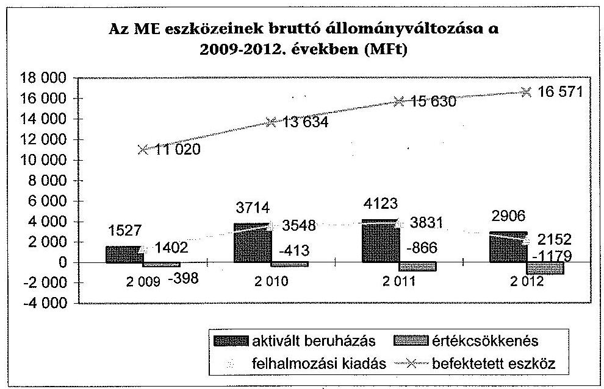

A beruházások következtében a tárgyi eszközök használhatósági foka kis mértékben javult ( $60,1 \%$-ról $61,0 \%$-ra), illetve az átlagos életkor csökkent 6,7 évről 5,7 évre. A tárgyi eszközállomány elhasználódási szintje a 2009. évi 39,9\%-ról kis mértékben csökkent a 2012. évre, 39,0\%-ra.

Az ME mérleg szerinti követelései a 2009. évi 571,6 M Ft-ról 55,2\%-kal 256,4 M Ft-ra csökkentek. A követelések állománya követelés áruszállításból és szolgáltatásnyújtásból (vevők), adósokból, illetve egyéb követelésekből (lakáskölcsön) tevődött össze. A vizsgált évek átlagában a követeléseknek 0,6\%-a volt egyéb követelés, $81,0 \%$-át a vevőkövetelések adták.

---

A határidőn túli vevőkövetelések aránya az időszak egészét tekintve nőtt ( $24,0 \%$ ról $31,2 \%$-ra). Likviditási kockázatot jelentett, hogy a 2012. évi határidőn túli követeléseken belül magas volt a 361 napon túli követelések összege és aránya is (a követelések egészének 19,9\%-át tette ki). Az egyéb követelések értéke nem volt jelentős ( $1,9-4,2 \mathrm{M}$ Ft), lejárt követelést nem tartalmazott. Az ellenőrzött időszakban összesen 15,1 M Ft követelést minősített az ME behajthatatlanná. A behajthatatlannak minősített követelések könyvekből való kivezetése megtörtént.

A szállítói kötelezettségek, ezen belül a lejárt tartozások év végi összege az időszak egészét tekintve erőteljesen növekvő tendenciájú volt. A szállítói tartozások a 2009. év végi 143,1 M Ft-ról a 2012. év végére 728,6 M Ft-ra nőttek, a lejárt tartozások aránya pedig ezen belül $29,9 \%$-ról $55,8 \%$-ra romlott. A tartozások alakulása összefüggésben volt az év végi maradványtartási kötelezettséggel (2011), a romló likviditással (2012).

A 2009-2012. években a saját tőke összes forráshoz viszonyított aránya változóan, $66,5-81,2 \%$ között alakult. A változást a kötelezettségeknek a beruházásokhoz kapcsolódó növekedése, majd csökkenése okozta (ezen belül a szállítói kötelezettségek ingadozása), a saját tőke évről-évre való - beruházások miattinövekedése stabil volt.

Értékpapírral az ME az ellenőrzött időszakban nem rendelkezett, részesedéseinek értéke a mérlegfőösszeg minimális részét tette ki ( $0,02-0,03 \%$ ), változása nem volt számottevő, az intézményi feladatellátással összhangban volt.

A részesedések mérlegben kimutatott értéke a 2009. évben, amikor az ME két gazdasági társaságban rendelkezett részesedéssel, összesen 23,1 M Ft volt, a 2012. év végén az ME három gazdasági társaságban rendelkezett részesedéssel, melyek mérlegben kimutatott értéke 5,1 M Ft volt. Az ellenőrzött időszakban két gazdasági társaságot hozott létre az ME, két részesedését eladta. Egy gazdasági társaság az ellenőrzött időszak egészében múködött.

# 5. KorÁbbi ÁSZ ElLENŐRZÉSEK JAVASLATAINAK HASZNOSULÁSA 

Az ÁSZ a korábbi ellenőrzései során a felsőoktatás témakörében kilenc javaslatot fogalmazott meg a felsőoktatásért felelős minisztériumnak (OKM, NEFMI, EMMI). A minisztérium a javaslatokra intézkedési terveket készített, amelyek összesen 10 intézkedést tartalmaztak. Az intézkedések közül hármat (késéssel) megvalósítottak, hét nem valósult meg.

Az oktatási és kulturális ágazat irányítási rendszerének, múködésének ellenőrzéséről szóló, 1106 sz . ÁSZ jelentés javaslataira a NEFMI készített intézkedési tervet. A megfogalmazott öt javaslat közül jelen ellenőrzés keretében kifejezetten a felsőoktatás vonatkozásában releváns két javaslat - a 2. sz. és a 3. sz. - utóellenőrzésére került sor.

Az ÁSZ jelentés 2. sz. javaslatára tervezett intézkedés, a minisztérium felügyelete alá tartozó szervezetek feladatellátásának javítására számszerüsíthető mutatószámokon alapuló kritériumok és középtávú célrendszer kidolgozása nem valósult meg. Az ÁSZ ellenőrzés 3. javaslata, az oktatási ágazat középtávú stratégiájának kidolgozása sem történt meg.

---

A tervezett intézkedés 2012. december 31-i határideje előtt tíz nappal hozott kormányhatározat ${ }^{61}$ értelmében a felsőoktatásról szóló stratégiát 2013. október 31-ig kellett volna a Kormány elé terjeszteni. A stratégia elkészítése helyett a 2013 januárjában megalakult Felsőoktatási Kerekasztal keretében fogalmaztak meg egyes felsőoktatási stratégiai irányokat tartalmazó dokumentumot ${ }^{62}$.

Az ellenőrzött EMMI (illetve jogelődje a NEFMI) A felsőoktatás oktatási infrastruktúra-fejlesztési programjának ellenőrzéséről szóló, 1171 sz. ÁSZ jelentésben tett javaslatokra intézkedési tervet készített, illetve tájékoztatást adott az intézkedéseiről. Az ÁSZ elnökének válaszlevelére egy kiegészített, ötpontos intézkedési tervet készített az EMMI 2012. május 30 -án. A nemzeti erőforrás miniszternek címezett javaslatokra tervezett három intézkedés közül egy - öthónapos késéssel - megvalósult, kettő nem teljesült.

Nem történt intézkedés az oktatási infrastruktúra-fejlesztési programok előkészítési folyamatának ÁSZ által megállapított hiányosságai miatti felelősség megállapítására. A tervezett 2013. június 30. helyett 2013. november végére felmérték az állami felsőoktatási intézmények kapacitáskihasználtságát, azonban még nem történtek meg az intézkedések a felmérés eredményeinek és a felsőoktatást érintő ágazati célok figyelembe vételével a felsőoktatási infrastruktúra közép- és hosszútávon történő hasznosítására.

Az ÁSZ jelentés két javaslatot közösen a nemzeti erőforrás miniszter és a nemzeti fejlesztési miniszter számára fogalmazott meg, amelyek szintén nem valósultak meg.

A minisztérium tájékoztatása szerint a PPP projektek támogatásához kapcsolódó követelményrendszer kialakításában a nemzeti fejlesztési miniszterrel nem történt együttmúködés, mert kormányzati szinten nem terveztek indítani újabb projektet. A feladat határideje „folyamatos" volt. Az NFM-mel közös másik intézkedést sem hajtották végre. Így nem került sor az oktatási infrastruktúra-fejlesztési programok lebonyolításával kapcsolatos, ÁSZ által megállapított hiányosságok (kedvezőtlen szerződéskötés és kockázatmegosztás) miatti felelősség megállapítására. A tervezett intézkedés határideje 2013. december 31. volt.

Az EMMI készített intézkedési tervet Az állami felsőoktatási intézmények érdekeltségébe tartozó gazdasági társaságok támogatásának és nyereségük hasznosulásának ellenőrzése címü, 1290 sz . ÁSZ jelentésében tett javaslatokra. A három tervezett intézkedésből kettő késedelmesen valósult meg, egyet nem hajtottak végre. Az ÁSZ 2. sz. javaslatára tervezett 1. sz. intézkedés nem hasznosult. Így az állami felsőoktatási intézmények gazdasági társaságai szakmai feladatellátásának és gazdaságossági eredményességének mérését biztosító mutatószámokat és értékelési rendszert a felsőoktatási intézményekkel nem dolgoztatták ki.

[^0]
[^0]:    ${ }^{61}$ Az 1657/2012. (XII. 20.) Korm. határozat a kormányzati stratégiai dokumentumok felülvizsgálatával kapcsolatos feladatokról, 12. pont.
    ${ }^{62}$ A felsőoktatás átalakításának stratégiai irányai és soron következő lépései, Készítette: Emberi Erőforrások Minisztériuma Felsőoktatásért Felelős Államtitkár és Kabinetje (Budapest, 2013. szeptember 26.).

---

Az intézkedési tervben vállalt megvalósítási határidő 2013. január 31. volt, amelyet követően a minisztérium Felsőoktatási Főosztálya, illetve Belső Ellenőrzési Főosztálya a mutatószám rendszer bevezetésére újabb felsőoktatási finanszírozási szabályozásig további halasztást javasolt a minisztériumi felsővezetésnek. A javaslattal kapcsolatos döntésről nincs információ, az intézkedési terv módosítására nem érkezett jelzés az EMMI-től az ÁSZ-hoz.

A 2013. március 31-ei határidőre tervezett 2. sz. intézkedést 2013 végére hajtották végre. Az érintett felsőoktatási intézmények vezetőitől tájékoztató jelentést kért a minisztérium az 50\% alatti intézményi részesedéssel működő gazdasági társaságok tevékenységének felülvizsgálatáról, múködésük indokoltságáról és eredményességéről, valamint az intézményi részesedés megszüntetéséről és ütemezéséről. Szintén késedelmesen, 2013. január 31. helyett 2013 decemberében hajtották végre a 3. sz. intézkedést, amely alapján az érintett felsőoktatási intézmények vezetőit felszólította a minisztérium az ÁSZ vizsgálat során feltárt szabálytalanságok és hiányosságok megszüntetésére és az intézkedésekről szóló tájékoztató megküldésére.

Budapest, 2014. 08 hónap 6 nap
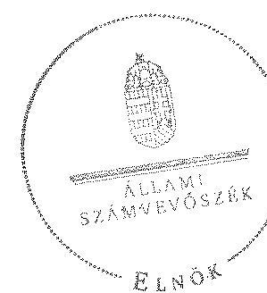

Domokos László
elnök $\infty$

Melléklet: $\quad 9 \mathrm{db}$

---

.

---

1. SZÁMÚ MELLÉKLET A V-0363-268/2014. SZÁMÚ JELENTÉSHEZ

A Miskolc1 Egyetem kiadási és bevételi előleányzatai, azok teljesítése a 2009-2012. években

|  Pos. | Megnevezés | 2009 |  |  | 2010 |  |  | 2011 |  |  | 2012 |   |
| --- | --- | --- | --- | --- | --- | --- | --- | --- | --- | --- | --- | --- |
|   |  | Kivételt
előleányzat | Miskusított
előleányzat | Teljesítés | Kivételt
előleányzat | Miskusított
előleányzat | Teljesítés | Kivételt
előleányzat | Miskusított
előleányzat | Teljesítés | Kivételt
előleányzat | Miskusított
előleányzat  |
|  1 | KÖKÖKÖK |  |  |  |  |  |  |  |  |  |  |   |
|  2 | Szakalék Járkórások | 3 052 827 | 3 128 371 | 4 983 829 | 3 082 907 | 3 104 271 | 3 053 269 | 3 242 907 | 3 308 702 | 3 345 359 | 3 333 900 | 3 434 842  |
|  3 | Muvásosító helyett járulékok | 1 394 170 | 1 622 336 | 1 520 302 | 1 413 070 | 1 471 200 | 1 395 190 | 1 454 770 | 1 487 632 | 1 383 721 | 1 734 800 | 1 384 295  |
|  4 | Összaj Járzétszék | 2 271 749 | 3 043 432 | 3 202 821 | 2 331 778 | 3 022 460 | 2 860 441 | 2 974 302 | 4 311 389 | 4 133 270 | 5 071 900 | 4 635 436  |
|  5 | Egyéb kárzi távátiunk | 34 000 | 40 322 | 35 368 | 38 000 | 102 430 | 131 230 | - | - | - | - | -  |
|  6 | Tánosprázatérlési működési kívánunk | 38 000 | 38 000 | 16 167 | 38 000 | 38 000 | 11 648 | 38 000 | 38 000 | 3 734 | 38 000 | 38 000  |
|  7 | Tánosprázatérlési felhullosztási távátiunk | - | - | - | - | - | - | - | - | 226 | - | -  |
|  8 | Kérzé ért előlelejtése átadás | - | 16 103 | 16 103 | - | 41 620 | 41 620 | - | - | 84 041 | - | -  |
|  9 | Műkíránai okló pénzmeléte átadás | 47 000 | 57 000 | 73 839 | 47 000 | 87 000 | 73 049 | 87 000 | 133 304 | 96 869 | 67 000 | 147 849  |
|  10 | Felhullosztási okló pénzmeléte átadás | - | - | - | - | - | - | - | - | - | 10 000 | -  |
|  11 | Eltánottok párubolt bérzédeze | 1 448 304 | 1 698 204 | 1 433 334 | 1 463 200 | 1 463 200 | 1 367 400 | 1 469 100 | 1 519 100 | 1 211 322 | 1 242 700 | 1 242 700  |
|  12 | Egyéb bérzéde | - | - | 2 862 | - | - | 4 113 | - | - | 1 760 | - | -  |
|  13 | Pénkérte | - | 223 338 | 109 720 | - | 69 829 | 79 938 | 220 000 | 216 870 | 80 731 | 220 000 | 200 000  |
|  14 | Szísimology beruházási kiadások (EFA-rsz) | 830 399 | 1 114 150 | 1 096 039 | 822 203 | 3 249 313 | 3 081 613 | 832 203 | 3 745 029 | 3 532 903 | 3 52 200 | 2 303 327  |
|  15 | Kisgyerő beruházási kiadások (EFA-rsz) | - | 96 302 | 99 303 | - | - | - | - | - | - | - | -  |
|  16 | Leküszítés kiadások (EFA-rsz) | - | - | - | - | - | - | - | - | - | - | -  |
|  17 | Tánosprázat kétszínők nyújtása | - | 4 026 | 2 550 | - | 2 830 | 2 600 | - | 8 140 | 1 480 | - | 1 030  |
|  18 | Összesen | 11 106 146 | 13 433 252 | 12 781 729 | 11 194 082 | 13 374 752 | 14 813 279 | 12 310 484 | 16 833 216 | 13 703 013 | 13 952 500 | 13 543 829  |
|  19 | BEVÉTELEK | - | - | - | - | - | - | - | - | - | - | -  |
|  20 | Kivételtetési beruházás | - | - | 180 | - | - | 203 | - | - | - | - | -  |
|  21 | Szísimology műközköz beruházás | 2 493 678 | 2 852 467 | 3 163 043 | 2 608 478 | 2 784 828 | 3 617 955 | 3 300 000 | 3 800 000 | 3 912 415 | 4 000 300 | 4 000 000  |
|  22 | Műközköz okló pénzmeléte áttekintik | 310 000 | 220 000 | 269 924 | 310 000 | 240 000 | 272 379 | 210 000 | 210 000 | 240 001 | 270 000 | 270 000  |
|  23 | Felhullosztási beruházás | 10 000 | 10 000 | 49 999 | 10 000 | 280 000 | 382 794 | - | - | 2 400 | - | -  |
|  24 | Felhullosztási okló pénzmeléte áttekintik | 220 000 | 240 000 | 788 199 | 120 000 | 120 000 | 621 943 | 420 000 | 420 000 | 440 159 | 420 000 | 420 000  |
|  25 | Szűrőtt ésszertő kapott károsgatók | 7 458 288 | 7 773 834 | 7 773 834 | 7 120 227 | 7 641 348 | 7 541 348 | 7 205 304 | 6 936 384 | 6 535 284 | 2 717 300 | 2 908 941  |
|  26 | Tánosprázat értékű műközköz bevétel | 834 150 | 1 004 196 | 862 087 | 624 180 | 604 180 | 521 673 | 624 180 | 1 227 080 | 1 462 384 | 2 865 000 | 2 745 000  |
|  27 | Tánosprázat értékű felhullosztási bevétel | 300 000 | 300 000 | 738 828 | 600 000 | 2 000 000 | 2 062 868 | 300 000 | 2 302 630 | 2 460 220 | 700 000 | 800 000  |
|  28 | Kérzé ért eszközköny bevétela | - | 38 302 | 112 404 | - | - | 1 784 | - | - | - | - | 30 197  |
|  29 | Előlelezései eszközköny felhúszatolás | - | 373 379 | 212 278 | - | 1 171 389 | 1 171 389 | - | 1 081 862 | 1 682 862 | - | 1 436 808  |
|  30 | Előlelezék reszutatására igénybevétela | - | 4 026 | 2 530 | - | 2 830 | 2 830 | - | 8 140 | 1 520 | - | 1 030  |
|  31 | Összesen | 11 106 146 | 13 433 252 | 13 952 113 | 12 194 082 | 13 374 752 | 14 467 271 | 12 310 484 | 16 833 216 | 17 162 611 | 13 952 500 | 13 643 829  |

---

# A Miskolci Egyetem kiadásainak, bevételeinek változása a 2009-2012. években

|   |  |  |  |  |  | adatok ezer 74-hon  |
| --- | --- | --- | --- | --- | --- | --- |
|   |  | 2009. év | 2010. év | 2011. év | 2012. év |   |
|  Ssz. | Megnevezés | Teljesítés | Teljesítés | Teljesítés | Teljesítés | 2012/ 2009  |
|  1 | KIADÁSOK |  |  |  |  |   |
|  2 | Személyi juttatások | 4 983 839 | 5 092 286 | 5 149 596 | 5 146 702 | 103,3%  |
|  3 | Rendszers és nem rendszeres | 4 541 652 | 4 659 255 | 4 807 010 | 4 812 853 | 106,0%  |
|  4 | Rendszers személyi juttatás | 3 354 007 | 3 314 791 | 3 371 328 | 3 324 190 | 99,1%  |
|  5 | Alagállamok | 3 193 050 | 3 163 637 | 3 187 364 | 3 153 280 | 97,6%  |
|  6 | Nem rendszeres | 1 187 645 | 1 344 444 | 1 433 682 | 1 488 643 | 125,3%  |
|  7 | Munkavégzéshez kapva juttatások | 931 205 | 1 103 974 | 1 194 186 | 1 228 949 | 132,0%  |
|  8 | Normatív és teljesítéshez kötött juttalom | 289 899 | 39 009 | 3 983 | 1 326 | 0,4%  |
|  9 | Külső személyi juttatások | 442 187 | 433 051 | 342 586 | 333 869 | 75,7%  |
|  10 | Munkmadát terhelő járulékok | 1 520 305 | 1 368 160 | 1 385 721 | 1 373 082 | 90,3%  |
|  11 | Dologi és folyó kiadások | 3 313 369 | 3 691 661 | 4 155 278 | 3 857 334 | 116,4%  |
|  12 | Dologi kiadások | 3 255 821 | 3 540 441 | 3 937 891 | 3 468 209 | 106,5%  |
|  13 | Készletbeszerzés | 302 180 | 296 431 | 332 644 | 276 499 | 91,5%  |
|  14 | Kommunikációs szolgáltatás | 59 575 | 67 585 | 78 485 | 69 667 | 100,2%  |
|  15 | Szolgáltatási kiadások | 1 639 825 | 1 533 808 | 1 896 962 | 1 696 254 | 103,4%  |
|  16 | Béder és lístog | 721 017 | 693 232 | 888 951 | 800 271 | 111,0%  |
|  17 | ebből FFP | 704 434 | 663 430 | 847 794 | 780 437 | 110,8%  |
|  18 | Gós, villany, víz | 277 794 | 215 667 | 206 967 | 240 105 | 86,4%  |
|  19 | Működési célú ÁFA | 741 667 | 1 240 425 | 1 154 537 | 975 716 | 131,6%  |
|  20 | Kiküldelés, espenzsokló | 274 611 | 359 791 | 281 156 | 277 297 | 101,0%  |
|  21 | Szellemi tevékenység | 4 563 | 9 050 | 43 507 | 25 395 | 775,7%  |
|  22 | Egyéb folyó kiadások | 57 548 | 131 220 | 217 379 | 389 123 | 676,2%  |
|  23 | Ezből évi maradvány visszafizetés | 15 525 | 39 793 | 111 590 | 294 649 | 191,0%  |
|  24 | Adók, díjak, egyéb befizetések | 38 792 | 88 906 | 103 424 | 83 146 | 214,3%  |
|  25 | Támogatásértékű működési kiadások | 16 197 | 11 648 | 9 734 | 8 557 | 52,8%  |
|  26 | Előző évi működési célú előirányzat maradvány, pénzmaradvány átadás összesen | 16 105 | 39 171 | 54 061 | 5 154 | 32,0%  |
|  27 | Működési célú pénzexeköz átadás | 73 859 | 75 048 | 96 868 | 102 459 | 138,7%  |
|  28 | Előöttbali pénzbeli juttatásai | 1 453 534 | 1 367 400 | 1 211 322 | 1 134 312 | 77,9%  |
|  29 | Egyéb juttatás | 2 862 | 4 153 | 1 795 | 0 | 0,0%  |
|  30 | Felhalmozási kiadások | 1 397 092 | 3 163 002 | 3 636 266 | 2 147 961 | 153,7%  |
|  31 | Intézményi bevakózási kiadások (Átával) | 1 098 029 | 3 081 612 | 3 352 905 | 2 079 907 | 189,4%  |
|  32 | ebből ingatlan | 131 013 | 1 505 720 | 1 101 061 | 311 785 | 238,0%  |
|  33 | Gépok, bezesdentsek, felcserelések | 644 876 | 770 911 | 1 462 359 | 1 176 397 | 182,4%  |
|  34 | Felújítás (Átával) | 199 720 | 78 938 | 80 751 | 64 630 | 32,4%  |
|  35 | ebből ingatlan (Átával) | 199 730 | 78 938 | 80 751 | 64 630 | 32,4%  |
|  36 | Köspenti beruházási kiadások (Átával) | 99 305 | 0 | 0 | 0 | 0,0%  |
|  37 | Felújítások és bevakózások ÁFA-ja | 253 148 | 625 505 | 708 608 | 424 673 | 179,6%  |
|  38 | Támogatásértékű felhalmozási kiadások | 0 | 0 | 550 | 0 |   |
|  39 | Egyéb intézményi felhalmozdó kiadás | 0 | 0 | 2 100 | 0 |   |
|  40 | Előző évi felhalmozdó célú előirányzat maradvány, pénzmaradvány átadás | 0 | 2 449 | 0 | 3 424 |   |
|  41 | Külcsönök | 2 550 | 2 850 | 2 580 | 2 900 | 115,7%  |
|  42 | Összesen | 12 781 729 | 14 813 379 | 15 706 013 | 13 778 361 | 107,8%  |
|  43 | BÉVETELEK |  |  |  |  |   |
|  44 | Működési bevételek | 4 320 226 | 5 191 381 | 5 615 999 | 5 352 653 | 123,9%  |
|  45 | Előzhatalmi bevételek | 150 | 262 | 292 | 256 | 170,7%  |
|  46 | Intézményi működési bevétel | 3 147 465 | 3 996 444 | 3 913 435 | 3 401 397 | 108,1%  |
|  47 | Szolgáltatások elbeszédése | 2 087 028 | 2 350 211 | 2 352 879 | 2 169 338 | 103,9%  |
|  48 | Intézményi előítési díjak | 283 867 | 318 644 | 318 585 | 298 669 | 105,2%  |
|  49 | Hozom és kunszébevétel | 681 | 994 | 14 829 | 1 076 | 158,0%  |
|  50 | Működési célú pénzexekös átvételek | 269 926 | 272 379 | 240 051 | 305 058 | 75,3%  |
|  51 | ebből uniós forrás | 79 217 | 111 982 | 0 | 0 | 0,0%  |
|  52 | Támogatásértékű működési bevétel | 892 987 | 921 673 | 1 462 384 | 1 691 795 | 189,5%  |
|  53 | EU programokra működési bevétel | 0 | 0 | 0 | 0 |   |
|  54 | Előző évi működési célú előirányzat maradvány, pénzmaradvány átvétel összesen | 9 701 | 625 | 857 | 56 197 | 579,3%  |
|  55 | Felhalmozási bevételek | 1 275 107 | 2 490 106 | 2 902 883 | 1 613 031 | 126,5%  |
|  56 | Tárgyi eszközök, immateriális javok értékesítése | 43 480 | 4 332 | 2 444 | 4 476 | 9,8%  |
|  57 | Pénzhúpi befelejtésük bevételei | 0 | 0 | 0 | 0 |   |
|  58 | Felhalmozási célú pénzexekös átvételek | 388 196 | 421 943 | 440 196 | 5 070 | 1,3%  |
|  59 | ebből uniós forrás | 0 | 0 | 0 | 0 |   |
|  60 | Támogatásértékű felhalmozdó bevétel | 738 828 | 3 062 868 | 2 460 227 | 1 603 485 | 217,0%  |
|  61 | EU programokra beruházási bevétel | 0 | 0 | 0 | 0 |   |
|  62 | Előző évi felhalmozási célú előirányzat maradvány, pénzmaradvány átvétel összesen | 102 605 | 961 | 0 | 0 | 0,0%  |
|  63 | Támogatási kölcsönök igénybevétele, visszatérülése | 2 550 | 2 850 | 5 553 | 3 098 | 121,5%  |
|  64 | Tiszafió szeretői kapott támogatás | 7 779 854 | 7 641 548 | 6 956 584 | 5 908 941 | 76,0%  |
|  65 | Előirányzat maradvány felhasználás | 575 378 | 1 171 386 | 1 681 892 | 1 456 898 | 253,2%  |
|  66 | Összesen | 13 953 115 | 16 497 271 | 17 162 911 | 14 334 621 | 102,7%  |

---

# 3. SZÁMÚ MELLÉKLET A V-0363-268/2014. SZÁMÚ JELENTÉSHEZ

## Kimutatás a Miskolcí Egyetem bevételeiről és kiadásairól, valamint adószágszolgálatáról a 2009-2012. években

|   |  |  |  |  | möstček M Ft-ban |   |
| --- | --- | --- | --- | --- | --- | --- |
|   |  |  |  |  | 2011. év | 2012. év  |
|  1. |  |  |  |  |  |   |
|  2. |  |  |  |  |  |   |
|  3. |  |  |  |  |  |   |
|  4. |  |  |  |  |  |   |
|  5. |  |  |  |  |  |   |
|  6. |  |  |  |  |  |   |
|  7. |  |  |  |  |  |   |
|  8. |  |  |  |  |  |   |
|  9. |  |  |  |  |  |   |
|  10. |  |  |  |  |  |   |
|  11. |  |  |  |  |  |   |
|  12. |  |  |  |  |  |   |
|  13. |  |  |  |  |  |   |
|  14. |  |  |  |  |  |   |
|  15. |  |  |  |  |  |   |
|  16. |  |  |  |  |  |   |
|  17. |  |  |  |  |  |   |
|  18. |  |  |  |  |  |   |
|  19. |  |  |  |  |  |   |
|  20. |  |  |  |  |  |   |
|  21. |  |  |  |  |  |   |
|  22. |  |  |  |  |  |   |
|  23. |  |  |  |  |  |   |
|  24. |  |  |  |  |  |   |
|  25. |  |  |  |  |  |   |
|  26. |  |  |  |  |  |   |
|  27. |  |  |  |  |  |   |
|  28. |  |  |  |  |  |   |
|  29. |  |  |  |  |  |   |
|  30. |  |  |  |  |  |   |
|  31. |  |  |  |  |  |   |
|  32. |  |  |  |  |  |   |
|  33. |  |  |  |  |  |   |
|  34. |  |  |  |  |  |   |
|  35. |  |  |  |  |  |   |
|  36. |  |  |  |  |  |   |
|  37. |  |  |  |  |  |   |
|  38. |  |  |  |  |  |   |
|  39. |  |  |  |  |  |   |
|  40. |  |  |  |  |  |   |
|  41. |  |  |  |  |  |   |
|  42. |  |  |  |  |  |   |
|  43. |  |  |  |  |  |   |
|  44. |  |  |  |  |  |   |
|  45. |  |  |  |  |  |   |
|  46. |  |  |  |  |  |   |
|  47. |  |  |  |  |  |   |
|  48. |  |  |  |  |  |   |
|  49. |  |  |  |  |  |   |
|  50. |  |  |  |  |  |   |
|  51. |  |  |  |  |  |   |
|  52. |  |  |  |  |  |   |
|  53. |  |  |  |  |  |   |
|  54. |  |  |  |  |  |   |
|  55. |  |  |  |  |  |   |
|  56. |  |  |  |  |  |   |
|  57. |  |  |  |  |  |   |
|  58. |  |  |  |  |  |   |
|  59. |  |  |  |  |  |   |
|  60. |  |  |  |  |  |   |
|  61. |  |  |  |  |  |   |
|  62. |  |  |  |  |  |   |
|  63. |  |  |  |  |  |   |
|  64. |  |  |  |  |  |   |
|  65. |  |  |  |  |  |   |
|  66. |  |  |  |  |  |   |
|  67. |  |  |  |  |  |   |
|  68. |  |  |  |  |  |   |
|  69. |  |  |  |  |  |   |
|  70. |  |  |  |  |  |   |
|  71. |  |  |  |  |  |   |
|  72. |  |  |  |  |  |   |
|  73. |  |  |  |  |  |   |
|  74. |  |  |  |  |  |   |
|  75. |  |  |  |  |  |   |
|  76. |  |  |  |  |  |   |
|  77. |  |  |  |  |  |   |
|  78. |  |  |  |  |  |   |
|  79. |  |  |  |  |  |   |
|  80. |  |  |  |  |  |   |
|  81. |  |  |  |  |  |   |
|  82. |  |  |  |  |  |   |
|  83. |  |  |  |  |  |   |
|  84. |  |  |  |  |  |   |
|  85. |  |  |  |  |  |   |
|  86. |  |  |  |  |  |   |
|  87. |  |  |  |  |  |   |
|  88. |  |  |  |  |  |   |
|  89. |  |  |  |  |  |   |
|  90. |  |  |  |  |  |   |
|  91. |  |  |  |  |  |   |
|  92. |  |  |  |  |  |   |
|  93. |  |  |  |  |  |   |
|  94. |  |  |  |  |  |   |
|  95. |  |  |  |  |  |   |
|  96. |  |  |  |  |  |   |
|  97. |  |  |  |  |  |   |
|  98. |  |  |  |  |  |   |
|  99. |  |  |  |  |  |   |
|  100. |  |  |  |  |  |   |
|  101. |  |  |  |  |  |   |
|  102. |  |  |  |  |  |   |
|  103. |  |  |  |  |  |   |
|  104. |  |  |  |  |  |   |
|  105. |  |  |  |  |  |   |
|  106. |  |  |  |  |  |   |
|  107. |  |  |  |  |  |   |
|  108. |  |  |  |  |  |   |
|  109. |  |  |  |  |  |   |
|  110. |  |  |  |  |  |   |
|  111. |  |  |  |  |  |   |
|  112. |  |  |  |  |  |   |
|  113. |  |  |  |  |  |   |
|  114. |  |  |  |  |  |   |
|  115. |  |  |  |  |  |   |
|  116. |  |  |  |  |  |   |
|  117. |  |  |  |  |  |   |
|  118. |  |  |  |  |  |   |
|  119. |  |  |  |  |  |   |
|  120. |  |  |  |  |  |   |
|  111. |  |  |  |  |  |   |
|  112. |  |  |  |  |  |   |
|  113. |  |  |  |  |  |   |
|  114. |  |  |  |  |  |   |
|  115. |  |  |  |  |  |   |
|  116. |  |  |  |  |  |   |
|  117. |  |  |  |  |  |   |
|  118. |  |  |  |  |  |   |
|  119. |  |  |  |  |  |   |
|  121. |  |  |  |  |  |   |
|  112. |  |  |  |  |  |   |
|  113. |  |  |  |  |  |   |
|  114. |  |  |  |  |  |   |
|  115. |  |  |  |  |  |   |
|  116. |  |  |  |  |  |   |
|  117. |  |  |  |  |  |   |
|  118. |  |  |  |  |  |   |
|  119. |  |  |  |  |  |   |
|  122. |  |  |  |  |  |   |
|  113. |  |  |  |  |  |   |
|  114. |  |  |  |  |  |   |
|  115. |  |  |  |  |  |   |
|  116. |  |  |  |  |  |   |
|  117. |  |  |  |  |  |   |
|  118. |  |  |  |  |  |   |
|  119. |  |  |  |  |  |   |
|  120. |  |  |  |  |  |   |
|  111. |  |  |  |  |  |   |
|  112. |  |  |  |  |  |   |
|  113. |  |  |  |  |  |   |
|  114. |  |  |  |  |  |   |
|  115. |  |  |  |  |  |   |
|  116. |  |  |  |  |  |   |
|  117. |  |  |  |  |  |   |
|  118. |  |  |  |  |  |   |
|  119. |  |  |  |  |  |   |
|  120. |  |  |  |  |  |   |
|  111. |  |  |  |  |  |   |
|  112. |  |  |  |  |  |   |
|  113. |  |  |  |  |  |   |
|  114. |  |  |  |  |  |   |
|  115. |  |  |  |  |  |   |
|  116. |  |  |  |  |  |   |
|  117. |  |  |  |  |  |   |
|  118. |  |  |  |  |  |   |
|  119. |  |  |  |  |  |   |
|  120. |  |  |  |  |  |   |
|  111. |  |  |  |  |  |   |
|  112. |  |  |  |  |  |   |
|  113. |  |  |  |  |  |   |
|  114. |  |  |  |  |  |   |
|  115. |  |  |  |  |  |   |
|  116. |  |  |  |  |  |   |
|  117. |  |  |  |  |  |   |
|  118. |  |  |  |  |  |   |
|  119. |  |  |  |  |  |   |
|  121. |  |  |  |  |  |   |
|  111. |  |  |  |  |  |   |
|  112. |  |  |  |  |  |   |
|  113. |  |  |  |  |  |   |
|  114. |  |  |  |  |  |   |
|  115. |  |  |  |  |  |   |
|  116. |  |  |  |  |  |   |
|  117. |  |  |  |  |  |   |
|  118. |  |  |  |  |  |   |
|  119. |  |  |  |  |  |   |
|  122. |  |  |  |  |  |   |
|  111. |  |  |  |  |  |   |
|  112. |  |  |  |  |  |   |
|  113. |  |  |  |  |  |   |
|  114. |  |  |  |  |  |   |
|  115. |  |  |  |  |  |   |
|  116. |  |  |  |  |  |   |
|  117. |  |  |  |  |  |   |
|  118. |  |  |  |  |  |   |
|  119. |  |  |  |  |  |   |
|  120. |  |  |  |  |  |   |
|  111. |  |  |  |  |  |   |
|  112. |  |  |  |  |  |   |
|  113. |  |  |  |  |  |   |
|  114. |  |  |  |  |  |   |
|  115. |  |  |  |  |  |   |
|  116. |  |  |  |  |  |   |
|  117. |  |  |  |  |  |   |
|  118. |  |  |  |  |  |   |
|  119. |  |  |  |  |  |   |
|  120. |  |  |  |  |  |   |
|  111. |  |  |  |  |  |   |
|  112. |  |  |  |  |  |   |
|  113. |  |  |  |  |  |   |
|  114. |  |  |  |  |  |   |
|  115. |  |  |  |  |  |   |
|  116. |  |  |  |  |  |   |
|  117. |  |  |  |  |  |   |
|  118. |  |  |  |  |  |   |
|  119. |  |  |  |  |  |   |
|  120. |  |  |  |  |  |   |
|  111. |  |  |  |  |  |   |
|  112. |  |  |  |  |  |   |
|  113. |  |  |  |  |  |   |
|  114. |  |  |  |  |  |   |
|  115. |  |  |  |  |  |   |
|  116. |  |  |  |  |  |   |
|  117. |  |  |  |  |  |   |
|  118. |  |  |  |  |  |   |
|  119. |  |  |  |  |  |   |
|  120. |  |  |  |  |  |   |
|  111. |  |  |  |  |  |   |
|  112. |  |  |  |  |  |   |
|  113. |  |  |  |  |  |   |
|  114. |  |  |  |  |  |   |
|  115. |  |  |  |  |  |   |
|  116. |  |  |  |  |  |   |
|  117. |  |  |  |  |  |   |
|  118. |  |  |  |  |  |   |
|  119. |  |  |  |  |  |   |
|  111. |  |  |  |  |  |   |
|  112. |  |  |  |  |  |   |
|  113. |  |  |  |  |  |   |
|  114. |  |  |  |  |  |   |
|  115. |  |  |  |  |  |   |
|  116. |  |  |  |  |  |   |
|  117. |  |  |  |  |  |   |
|  118. |  |  |  |  |  |   |
|  119. |  |  |  |  |  |   |
|  111. |  |  |  |  |  |   |
|  112. |  |  |  |  |  |   |
|  113. |  |  |  |  |  |   |
|  114. |  |  |  |  |  |   |
|  115. |  |  |  |  |  |   |
|  116. |  |  |  |  |  |   |
|  117. |  |  |  |  |  |   |
|  118. |  |  |  |  |  |   |
|  119. |  |  |  |  |  |   |
|  111. |  |  |  |  |  |   |
|  112. |  |  |  |  |  |   |
|  113. |  |  |  |  |  |   |
|  114. |  |  |  |  |  |   |
|  115. |  |  |  |  |  |   |
|  116. |  |  |  |  |  |   |
|  117. |  |  |  |  |  |   |
|  118. |  |  |  |  |  |   |
|  119. |  |  |  |  |  |   |
|  111. |  |  |  |  |  |   |
|  112. |  |  |  |  |  |   |
|  113. |  |  |  |  |  |   |
|  114. |  |  |  |  |  |   |
|  115. |  |  |  |  |  |   |
|  116. |  |  |  |  |  |   |
|  117. |  |  |  |  |  |   |
|  118. |  |  |  |  |  |   |
|  119. |  |  |  |  |  |   |
|  111. |  |  |  |  |  |   |
|  112. |  |  |  |  |  |   |
|  113. |  |  |  |  |  |   |
|  114. |  |  |  |  |  |   |
|  115. |  |  |  |  |  |   |
|  116. |  |  |  |  |  |   |
|  117. |  |  |  |  |  |   |
|  118. |  |  |  |  |  |   |
|  119. |  |  |  |  |  |   |
|  111. |  |  |  |  |  |   |
|  112. |  |  |  |  |  |   |
|  113. |  |  |  |  |  |   |
|  114. |  |  |  |  |  |   |
|  115. |  |  |  |  |  |   |
|  116. |  |  |  |  |  |   |
|  117. |  |  |  |  |  |   |
|  118. |  |  |  |  |  |   |
|  119. |  |  |  |  |  |   |
|  111. |  |  |  |  |  |   |
|  112. |  |  |  |  |  |   |
|  113. |  |  |  |  |  |   |
|  114. |  |  |  |  |  |   |
|  115. |  |  |  |  |  |   |
|  116. |  |  |  |  |  |   |
|  117. |  |  |  |  |  |   |
|  118. |  |  |  |  |  |   |
|  119. |  |  |  |  |  |   |
|  111. |  |  |  |  |  |   |
|  112. |  |  |  |  |  |   |
|  113. |  |  |  |  |  |   |
|  114. |  |  |  |  |  |   |
|  115. |  |  |  |  |  |   |
|  116. |  |  |  |  |  |   |
|  117. |  |  |  |  |  |   |
|  118. |  |  |  |  |  |   |
|  119. |  |  |  |  |  |   |
|  111. |  |  |  |  |  |   |
|  112. |  |  |  |  |  |   |
|  113. |  |  |  |  |  |   |
|  114. |  |  |  |  |  |   |
|  115. |  |  |  |  |  |   |
|  116. |  |  |  |  |  |   |
|  117. |  |  |  |  |  |   |
|  118. |  |  |  |  |  |   |
|  119. |  |  |  |  |  |   |
|  111. |  |  |  |  |  |   |
|  112. |  |  |  |  |  |   |
|  113. |  |  |  |  |  |   |
|  114. |  |  |  |  |  |   |
|  115. |  |  |  |  |  |   |
|  116. |  |  |  |  |  |   |
|  117. |  |  |  |  |  |   |
|  118. |  |  |  |  |  |   |
|  119. |  |  |  |  |  |   |
|  111. |  |  |  |  |  |   |
|  112. |  |  |  |  |  |   |
|  113. |  |  |  |  |  |   |
|  114. |  |  |  |  |  |   |
|  115. |  |  |  |  |  |   |
|  116. |  |  |  |  |  |   |
|  117. |  |  |  |  |  |   |
|  118. |  |  |  |  |  |   |
|  119. |  |  |  |  |  |   |
|  111. |  |  |  |  |  |   |
|  112. |  |  |  |  |  |   |
|  113. |  |  |  |  |  |   |
|  114. |  |  |  |  |  |   |
|  115. |  |  |  |  |  |   |
|  116. |  |  |  |  |  |   |
|  117. |  |  |  |  |  |   |
|  118. |  |  |  |  |  |   |
|  119. |  |  |  |  |  |   |
|  111. |  |  |  |  |  |   |
|  112. |  |  |  |  |  |   |
|  113. |  |  |  |  |  |   |
|  114. |  |  |  |  |  |   |
|  115. |  |  |  |  |  |   |
|  116. |  |  |  |  |  |   |
|  117. |  |  |  |  |  |   |
|  118. |  |  |  |  |  |   |
|  119. |  |  |  |  |  |   |
|  112. |  |  |  |  |  |   |
|  113. |  |  |  |  |  |   |
|  114. |  |  |  |  |  |   |
|  115. |  |  |  |  |  |   |
|  116. |  |  |  |  |  |   |
|  117. |  |  |  |  |  |   |
|  118. |  |  |  |  |  |   |
|  119. |  |  |  |  |  |   |
|  111. |  |  |  |  |  |   |
|  112. |  |  |  |  |  |   |
|  113. |  |  |  |  |  |   |
|  114. |  |  |  |  |  |   |
|  115. |  |  |  |  |  |   |
|  116. |  |  |  |  |  |   |
|  117. |  |  |  |  |  |   |
|  118. |  |  |  |  |  |   |
|  119. |  |  |  |  |  |   |
|  112. |  |  |  |  |  |   |
|  113. |  |  |  |  |  |   |
|  114. |  |  |  |  |  |   |
|  115. |  |  |  |  |  |   |
|  116. |  |  |  |  |  |   |
|  117. |  |  |  |  |  |   |
|  118. |  |  |  |  |  |   |
|  119. |  |  |  |  |  |   |
|  112. |  |  |  |  |  |   |
|  113. |  |  |  |  |  |   |
|  114. |  |  |  |  |  |   |
|  115. |  |  |  |  |  |   |
|  116. |  |  |  |  |  |   |
|  117. |  |  |  |  |  |   |
|  118. |  |  |  |  |  |   |
|  119. |  |  |  |  |  |   |
|  117. |  |  |  |  |  |   |
|  118. |  |  |  |  |  |   |
|  119. |  |  |  |  |  |   |
|  112. |  |  |  |  |  |   |
|  113. |  |  |  |  |  |   |
|  114. |  |  |  |  |  |   |
|  115. |  |  |  |  |  |   |
|  116. |  |  |  |  |  |   |
|  117. |  |  |  |  |  |   |
|  118. |  |  |  |  |  |   |
|  119. |  |  |  |  |  |   |
|  117. |  |  |  |  |  |   |
|  118. |  |  |  |  |  |   |
|  119. |  |  |  |  |  |   |
|  117. |  |  |  |  |  |   |
|  118. |  |  |  |  |  |   |
|  119. |  |  |  |  |  |   |
|  119. |  |  |  |  |  |   |
|  118. |  |  |  |  |  |   |
|  119. |  |  |  |  |  |   |
|  119. |  |  |  |  |  |   |
|  118. |  |  |  |  |  |   |
|  119. |  |  |  |  |  |   |
|  119. |  |  |  |  |  |   |
|  119. |  |  |  |  |  |   |
|  119. |  |  |  |  |  |   |
|  119. |  |  |  |  |  |   |
|  119. |  |  |  |  |  |   |
|  119. |  |  |  |  |  |   |
|  119. |  |  |  |  |  |   |
|  119. |  |  |  |  |  |   |
|  119. |  |  |  |  |  |   |
|  119. |  |  |  |  |  |   |
|  119. |  |  |  |  |  |   |
|  119. |  |  |  |  |  |   |
|  119. |  |  |  |  |  |   |
|  119. |  |  |  |  |  |   |
|  119. |  |  |  |  |  |   |
|  119. |  |  |  |  |  |   |
|  119. |  |  |  |  |  |   |
|  119. |  |  |  |  |  |   |
|  119. |  |  |  |  |  |   |
|  119. |  |  |  |  |  |   |
|  119. |  |  |  |  |  |   |
|  119. |  |  |  |  |  |   |
|  119. |  |  |  |  |  |   |
|  119. |  |  |  |  |  |   |
|  119. |  |  |  |  |  |   |
|  119. |  |  |  |  |  |   |
|  119. |  |  |  |  |  |   |
|  119. |  |  |  |  |  |   |
|  119. |  |  |  |  |  |   |
|  119. |  |  |  |  |  |   |
|  

---

### 4. SZÁMÚ MELLÉKLET A V-0363-268/2014. SZÁMÚ JELENTÉSHEZ

|  No. | Megnevezés | 2009. év | 2010. év | 2011. év | 2012. év | Indez (2012/2009)  |
| --- | --- | --- | --- | --- | --- | --- |
|  1 | INMAYEMÁLIS JAVAK | 287 905 | 665 853 | 664 723 | 666 693 | 551,6%  |
|  2 | Vagriszt höljűt jojak | 281 354 | 640 807 | 642 288 | 643 715 | 230,0%  |
|  3 | Széleszt teresékok | 6 360 | 2 016 | 1 135 | 2 976 | 47,5%  |
|  4 | Inausztotóbb jojakos adott időjnek | 283 |  |  |  | 0,0%  |
|  5 | CÁRGVI ESZKÖZÖK | 10 723 503 | 15 172 681 | 14 941 773 | 15 098 795 | 188,5%  |
|  6 | Eszabbcsok és jogszabiből megnömbölj jojak | 4 681 329 | 9 554 670 | 9 772 281 | 10 361 225 | 175,8%  |
|  7 | Cájsek, bocsodtatóak, felcserélnek | 1 821 774 | 2 511 830 | 3 277 342 | 3 923 963 | 316,4%  |
|  8 | Jönnövek | 31 179 | 22 653 | 24 582 | 4 105 | 25,3%  |
|  9 | Bredőjzések, felújítások | 152 589 | 1 081 358 | 1 841 089 | 1 395 741 | 989,3%  |
|  10 | Bredőjzések adott előment | 26 935 | 1 390 | 42 778 | 1 395 | 0,7%  |
|  11 | BEFEKTEFETT PÉNZÜGVI ESZKÖZÖK | 8 763 | 8 794 | 13 303 | 13 384 | 152,5%  |
|  12 | Tudós részeselés | 3 100 | 3 100 | 3 200 | 3 100 | 164,2%  |
|  13 | Tudósos adott lelkann | 5 565 | 3 694 | 8 105 | 8 284 | 145,5%  |
|  14 | ÜZEMELTETÉSRE KEZELÉSRE ÁTANOTT VAGYONKEZELÉSRE VETT ESZKÖZÖK |  |  |  |  |   |
|  15 | BEFEKTEFET ESZKÖZÖK ÖSSZESEN | 11 020 133 | 13 643 898 | 13 629 001 | 16 270 029 | 159,4%  |
|  16 | BESSZETEK | 44 802 | 48 897 | 50 550 | 53 662 | 184,3%  |
|  17 | Anyajok | 4 121 | 4 181 | 4 417 | 4 110 | 148,3%  |
|  18 | Senkazolás tereszés és jókész teresék | 1 618 | 184 | 2 020 | 956 | 22,0%  |
|  19 | Átok, griegérjesek, közesített szolgáltatások | 39 105 | 43 054 | 49 437 | 58 219 | 148,9%  |
|  20 | KÖVETELÉSZK | 371 649 | 509 739 | 503 347 | 506 322 | 64,8%  |
|  21 | Követésnek évszedálódott és szolgáltatásért | 203 829 | 424 093 | 392 504 | 134 108 | 20,6%  |
|  22 | Adótok | 63 277 | 62 418 | 87 863 | 39 665 | 136,8%  |
|  23 | Kövid lejtestő adott lejtestések |  |  |  | 1 935 |   |
|  24 | Egyéb követelmek | 4 233 | 2 224 | 3 180 | 640 | 15,2%  |
|  25 | ÉRTÉKPAPÍROK |  |  |  |  |   |
|  26 | PÉNZESZKÖZÖK | 1 237 010 | 1 784 410 | 1 552 501 | 624 901 | 59,9%  |
|  27 | Pénzterek, sodatok, betöltjeszvek |  |  |  |  |   |
|  28 | Köhetysétté pénzfeszített szándék | 29 056 | 15 139 | 83 365 | 48 904 | 168,1%  |
|  29 | Üzenszehíd szándék | 1 120 122 | 1 655 360 | 1 407 872 | 249 011 | 49,0%  |
|  30 | Hívani pénzszeközök | 77 790 | 108 211 | 61 363 | 37 068 | 34,8%  |
|  31 | EGYÉR AKTÍV PÉNZÜGVI ELSZÁMOLÁSOK | 22 721 | 8 869 | 9 747 | 9 623 | 43,4%  |
|  32 | FORGÓESZKÖZÖK ÖSSZESEN | 1 866 211 | 2 350 911 | 2 104 115 | 935 644 | 51,2%  |
|  33 | ESZKÖZÖK ÖSSZESEN | 12 886 564 | 15 994 009 | 17 753 916 | 17 526 475 | 156,0%  |
|  34 | DÉLET TÖKK | 19 246 123 | 19 632 252 | 12 909 170 | 14 234 551 | 159,4%  |
|  35 | Tudós tőke | 1 449 121 | 1 449 121 | 1 449 121 | 1 449 121 | 100,0%  |
|  36 | Tölvői keszüthe tett eszközök |  |  |  |  |   |
|  37 | Tőkevölcségek | 8 797 002 | 9 186 111 | 11 451 049 | 12 781 230 | 145,3%  |
|  38 | Tölvői keszüthe tett eszközök tőkevölcsége |  |  |  |  |   |
|  39 | Tölvői tőke tetszték |  |  |  |  |   |
|  40 | TÁRTÁSÉKOK | 1 171 386 | 1 681 892 | 1 456 898 | 556 260 | 47,4%  |
|  41 | Főfizegestési tetszték | 1 171 386 | 1 681 892 | 1 456 898 | 556 260 | 47,5%  |
|  42 | Vállalásaital tetszték |  |  |  |  |   |
|  43 | KÖTELEZETTŐGÉR | 1 800 524 | 3 578 156 | 3 279 818 | 2 666 158 | 190,4%  |
|  44 | Töröni tetszett kötelezettségek | 10 258 | 10 777 | 11 630 | 11 528 | 115,4%  |
|  45 | Kívül tetszett kötelezettségek | 1 390 281 | 2 567 389 | 2 208 248 | 2 634 630 | 150,9%  |
|  46 | Kötelezettségek javasolt, sávig, tiszállóak | 143 083 | 939 274 | 537 915 | 739 577 | 505,2%  |
|  47 | Egyéb kötelezettségek (támogatási program rüllege adott) kötelezettsége | 1 247 176 | 2 568 115 | 2 740 669 | 1 926 053 | 154,4%  |
|  48 | EGYÉR PASSZÍV PÉNZÜGVI ELSZÁMOLÁSOK | 68 336 | 99 519 | 97 034 | 69 704 | 103,0%  |
|  49 | FORRÁSOK ÖSSZESEN | 12 886 564 | 15 994 009 | 17 753 916 | 17 526 475 | 156,0%  |

---

5. SZÁMÓ MELLEKLET A V-0363-268/2014. SZÁMÓ JELENTÉSHEZ

A Máskości Egzotem gazdálkodása szabályozóráségének értékelése a mástartételek alapján

|  értékelt terület |  |  |  |  |  |  |  |  |  |  |  |  |  |  |  |  |  |  |  |  |  |  |  |  |  |  |  |  |  |  |  |  |  |  |   |
| --- | --- | --- | --- | --- | --- | --- | --- | --- | --- | --- | --- | --- | --- | --- | --- | --- | --- | --- | --- | --- | --- | --- | --- | --- | --- | --- | --- | --- | --- | --- | --- | --- | --- | --- | --- |
|   |  |  |  |  |  |  |  |  |  |  |  |  |  |  |  |  |  |  |  |  |  |  |  |  |  |  |  |  |  |  |  |  |  |   |
|   |  |  |  |  |  |  |  |  |  |  |  |  |  |  |  |  |  |  |  |  |  |  |  |  |  |  |  |  |  |  |  |  |  |   |
|   | értékelés |  |  |  |  |  |  |  |  |  |  |  |  |  |  |  |  |  |  |  |  |  |  |  |  |  |  |  |  |  |  |  |  |   |
|   |  |  |  |  |  |  |  |  |  |  |  |  |  |  |  |  |  |  |  |  |  |  |  |  |  |  |  |  |  |  |  |  |  |   |
|   |  |  |  |  |  |  |  |  |  |  |  |  |  |  |  |  |  |  |  |  |  |  |  |  |  |  |  |  |  |  |  |  |  |   |
|   |  |  |  |  |  |  |  |  |  |  |  |  |  |  |  |  |  |  |  |  |  |  |  |  |  |  |  |  |  |  |  |  |  |   |
|   |  |  |  |  |  |  |  |  |  |  |  |  |  |  |  |  |  |  |  |  |  |  |  |  |  |  |  |  |  |  |  |  |  |   |
|   |  |  |  |  |  |  |  |  |  |  |  |  |  |  |  |  |  |  |  |  |  |  |  |  |  |  |  |  |  |  |  |  |  |   |
|   |  |  |  |  |  |  |  |  |  |  |  |  |  |  |  |  |  |  |  |  |  |  |  |  |  |  |  |  |  |  |  |  |  |   |
|   |  |  |  |  |  |  |  |  |  |  |  |  |  |  |  |  |  |  |  |  |  |  |  |  |  |  |  |  |  |  |  |  |  |   |
|   |  |  |  |  |  |  |  |  |  |  |  |  |  |  |  |  |  |  |  |  |  |  |  |  |  |  |  |  |  |  |  |  |  |   |
|   |  |  |  |  |  |  |  |  |  |  |  |  |  |  |  |  |  |  |  |  |  |  |  |  |  |  |  |  |  |  |  |  |  |   |
|   |  |  |  |  |  |  |  |  |  |  |  |  |  |  |  |  |  |  |  |  |  |  |  |  |  |  |  |  |  |  |  |  |  |   |
|   |  |  |  |  |  |  |  |  |  |  |  |  |  |  |  |  |  |  |  |  |  |  |  |  |  |  |  |  |  |  |  |  |  |   |
|   |  |  |  |  |  |  |  |  |  |  |  |  |  |  |  |  |  |  |  |  |  |  |  |  |  |  |  |  |  |  |  |  |  |   |
|   |  |  |  |  |  |  |  |  |  |  |  |  |  |  |  |  |  |  |  |  |  |  |  |  |  |  |  |  |  |  |  |  |  |   |
|   |  |  |  |  |  |  |  |  |  |  |  |  |  |  |  |  |  |  |  |  |  |  |  |  |  |  |  |  |  |  |  |  |  |   |
|   |  |  |  |  |  |  |  |  |  |  |  |  |  |  |  |  |  |  |  |  |  |  |  |  |  |  |  |  |  |  |  |  |  |   |
|   |  |  |  |  |  |  |  |  |  |  |  |  |  |  |  |  |  |  |  |  |  |  |  |  |  |  |  |  |  |  |  |  |  |   |
|   |  |  |  |  |  |  |  |  |  |  |  |  |  |  |  |  |  |  |  |  |  |  |  |  |  |  |  |  |  |  |  |  |  |   |
|   |  |  |  |  |  |  |  |  |  |  |  |  |  |  |  |  |  |  |  |  |  |  |  |  |  |  |  |  |  |  |  |  |  |   |
|   |  |  |  |  |  |  |  |  |  |  |  |  |  |  |  |  |  |  |  |  |  |  |  |  |  |  |  |  |  |  |  |  |  |   |
|   |  |  |  |  |  |  |  |  |  |  |  |  |  |  |  |  |  |  |  |  |  |  |  |  |  |  |  |  |  |  |  |  |  |   |
|   |  |  |  |  |  |  |  |  |  |  |  |  |  |  |  |  |  |  |  |  |  |  |  |  |  |  |  |  |  |  |  |  |  |   |
|   |  |  |  |  |  |  |  |  |  |  |  |  |  |  |  |  |  |  |  |  |  |  |  |  |  |  |  |  |  |  |  |  |  |   |
|   |  |  |  |  |  |  |  |  |  |  |  |  |  |  |  |  |  |  |  |  |  |  |  |  |  |  |  |  |  |  |  |  |  |   |
|   |  |  |  |  |  |  |  |  |  |  |  |  |  |  |  |  |  |  |  |  |  |  |  |  |  |  |  |  |  |  |  |  |  |   |
|   |  |  |  |  |  |  |  |  |  |  |  |  |  |  |  |  |  |  |  |  |  |  |  |  |  |  |  |  |  |  |  |  |  |   |
|   |  |  |  |  |  |  |  |  |  |  |  |  |  |  |  |  |  |  |  |  |  |  |  |  |  |  |  |  |  |  |  |  |  |   |
|   |  |  |  |  |  |  |  |  |  |  |  |  |  |  |  |  |  |  |  |  |  |  |  |  |  |  |  |  |  |  |  |  |  |   |
|   |  |  |  |  |  |  |  |  |  |  |  |  |  |  |  |  |  |  |  |  |  |  |  |  |  |  |  |  |  |  |  |  |  |   |
|   |  |  |  |  |  |  |  |  |  |  |  |  |  |  |  |  |  |  |  |  |  |  |  |  |  |  |  |  |  |  |  |  |  |   |
|   |  |  |  |  |  |  |  |  |  |  |  |  |  |  |  |  |  |  |  |  |  |  |  |  |  |  |  |  |  |  |  |  |  |   |
|   |  |  |  |  |  |  |  |  |  |  |  |  |  |  |  |  |  |  |  |  |  |  |  |  |  |  |  |  |  |  |  |  |  |   |
|   |

---

.

---

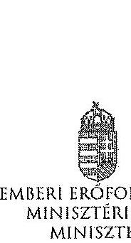

|  |  |  |
| :-- | :-- | :-- |
| Hiv. szám: | V-0352-311/2014, | V-0352- |
| $313 / 2014$, | V-0337-964/2014, | V-0337- |
| $966 / 2014$, | V-0368-250/2014, | V-0364- |
| $477 / 2014$, V-0363-252/2014 |  |  |
| Melléklet:- |  |  |

# Domokos László részére 

elnök

Állami Számvevőszék

## Budapest

Apáczai Csere János utca 10.
1052
Tárgy: Észrevételek az Állami Számvevőszék ellenőrzési megállapításaira

Tisztelt Elnök Úr!

Hivatkozva a V-0352-311/2014, a V-0352-313/2014, a V-0337-964/2014, a V-0337-966/2014, a V-0368-250/2014, a V-0364-477/2014, a V-0363-252/2014 iktatószámú leveleire és megküldött jelentéstervezeteire, a Károly Róbert Főiskola, a Magyar Képzőművészeti Egyetem, a Szolnoki Főiskola, a Pannon Egyetem, az Eszterházy Károly Főiskola, a Széchenyi István Egyetem, valamint a Miskolci Egyetem vonatkozásában a 2013. évben megkezdett szabályszerűségi ellenőrzés kapcsán az alábbiakról tájékoztatom, valamint az alábbi észrevételeket teszem.

A megküldött jelentéstervezetekben rögzített megállapítások szerint a fenntartó ágazati irányítási feladatait a 2009-2012. ćvekben nem látta el teljes körűen az alábbiak vonatkozásában.

- „A felsőoktatásért felelős miniszter nem hajtotta végre a nemzetgazdasági miniszter irányításával, a kormányhatározatban előírt szervezeti és feladat-ellátási felülvizsgálati programot. A felsőoktatási törvény rendelkezései ellenére nem készíttetett a felsőoktatás rendszere vonatkozásában középtávú fejlesztési tervet."

A 2012. évi költségvetési hiánycél tartását biztosító további feladatokról szóló 1365/2011. (XI. 8.) Korm. határozatban a Kormány a közfeladat-ellátás színvonalának javítása és a költséghatékony működés céljából, szervezeti és feladat-ellátási felülvizsgálati programot indított el az államháztartás központi alrendszerében a költségvetési szervek, és a többségi állami tulajdonú gazdálkodó szervezetek (a továbbiakban: intézmények) vonatkozásában. Továbbá

---

elrendelte, hogy a felülvizsgálathoz a nemzetgazdasági miniszter irányításával, a Miniszterelnökséget vezető államtitkár, a közigazgatási és igazságügyi miniszter, valamint az ágazatért felelős miniszter részvételével munkabizottságokat kell létrehozni, valamint módszertani útmutatót kell kidolgozni.

Tekintettel arra, hogy a feladat nem a felsőoktatásért felelős miniszter felelősségi körébe tartozott, javaslom, hogy valamennyi jelentéstervezetben kerüljön módosításra, illetve kivezetésre azon megállapítás, miszerint a felsőoktatásért felelős miniszter nem hajtotta végre a nemzetgazdasági miniszter irányításával, a kormányhatározatban előírt szervezeti és feladatellátási felülvizsgálati programot.

A 2005. évi CXXXIX. törvény (Ftv.) 104. § (1) bekezdés b) pontja szerint az oktatásért felelős miniszter felsőoktatás fejlesztéssel kapcsolatos feladatai a felsőoktatás rendszere fejlesztési terveinek elkészíttetése, beleértve a középtávú fejlesztési tervet, az ágazati minőségpolitikát.

A nemzeti felsőoktatásról szóló 2011. évi CCIV. törvény (Nftv.) 64. § (3) bekezdése szerint a miniszter felsőoktatás-fejlesztéssel kapcsolatos feladatai a felsőoktatás rendszere fejlesztési terveinek elkészíttetése, beleértve a középtávú fejlesztési tervet.

A törvényi rendelkezéseknek megfelelően több javaslat is került a Kormány elé a felsőoktatási rendszer középtávú fejlesztési tervének vonatkozásába, azonban a Kormány egy javaslatot sem fogadott el. A megállapítást az alábbiak szerint szíveskedjen módosítani.

Nincs a Kormány által elfogadott, a felsőoktatás rendszere vonatkozásában készíttetett, középtávú fejlesztési terv.

- „A minisztérium a Felsőoktatási Információs Rendszer (FIR) biztonságos üzemeltetéséhez, az adatok védelméhez szükséges alapvető szervezeti, szabályozási kontrollokat a 2012. év végéig nem teljes körűen alakította ki. Így a minisztérium csak részben tett eleget a 2005. évi felsőoktatási törvény és a 2011. évi nemzeti felsőoktatási törvény előírásainak. A 2007-ben használtba vett FIR feladata volt, hogy a felsőoktatásban résztvevők (hallgatók, oktatók, kutatók, tanárok) adatait kezelje. A FIR működését 2012-ig több probléma jellemezte. A rendszerbe bevitt alapadatok nem voltak ellenőrzöttek, a rendszerbe épített adatellenőrzés hibajelzésci nem voltak kellően konkrétak, illetve a FIR a személyi többszöröződéseket nem szűrte megfelelően. 2012ben megkezdték a rendszer hibáinak kijavítását."
A FIR létrehozása, fejlesztése, müködtetése és üzemeltetése az Ftv. és Nftv., valamint az Oktatási Hivatalról szóló 307/2006. (XII. 23.) Korm. rendelet, majd a 121/2013. (IV. 26.) Korm. rendelet alapján az Oktatási Hivatal (OH) feladata. A Minisztérium miniszteri utasításban adta ki és szükség szerint módosította az Oktatási Hivatal Szervezeti és Müködési Szabályzatát, mely az OH feladatrendszerét is részletezi. A 2/2012. (I. 13.) NEFMI utasításban kiadott OH SZMSZ 1.2.3.6. pontja többek között az alábbiakat tartalmazza:

Az OH Felsőoktatási Főosztály feladatai, a felsőoktatási informatikai rendszerekkel szemben támasztott követelmények szakmsi szempontú meghatározása, együttmüködve az Informatikai Főosztállyal és a felsőoktatási informatikai rendszerek üzemeltetőivel.

A korábban kiadott SZMSZ-ek is hasonló tartalmú feladatot szabtak.

---

Mindezek alapján a Minisztérium többek között a FIR biztonságos üzemeltetéséhez, az adatok védelméhez szükséges alapvető szervezeti, szabályozási kontrollokat a fenti szabályozások megalkotásával megvalósította. A fenti szabályozási rendszer keretén belül a részletszabályok kidolgozása nem lehet a Minisztérium feladata, azt már csak az Oktatási Hivatal végezheti el saját hatáskörben.

Ugyanakkor meg kell jegyezni, hogy a Felsőoktatási Információs Rendszer fejlesztése egy hatalmas, sok évre átnyúló feladat. A FIR fejlesztése 2006-ban kezdődött meg hatósági nyilvántartási koncepció alapján. A FIR azonban alapjaiban eltér egy klasszikus, pl. lakcím- és személyi adat nyilvántartástól, amely esetében az önkormányzatoknál/kormányhivataloknál begépelik az adatokat és azok azonnal bent is vannak a központi rendszerben. A FIR ezzel szemben az adatbevitel szempontjából nem tekinthető önálló rendszernek, hiszen az adatokat a felsőoktatási intézmények különböző tanulmányi rendszeréből veszi át. Így a FIR fejlesztése sosem volt független a tanulmányi rendszerek párhuzamos fejlesztésétől, azzal szoros összhangban tudott és tud megvalósulni. A tanulmányi rendszerek - három önálló tanulmányi rendszer és több egyedi, intézményi saját fejlesztésű rendszer - tényleges fejlesztése azonban nem az OH feladata, azt az esetek többségében piaci vállalkozások végzik. Ezeknek megfelelően a FIR és a különböző tarnitmányi rendszerek összehangolt fejlesztése kiemelten nagy kihívást jelent az OH-nak, a feladat hatalmas méretéből adódóan a fejlesztés, vagy akár egy-egy hiba, problémacsokor megoldása nem oldható meg gyorsan, hanem csak összehangoltan, mely sok időt vesz igénybe. Így a teljesen "zöldmezős beruházásként" megvalósított FIR fejlesztés jelenleg 4+4 éves időtartama a feladat nagysága, a korábban rendelkezésre álló pénzügyi források ismeretében elfogadhatónak mondható. Az OH a FIR fejlesztése során a felsőoktatási intézményeknél folyamatos tájékoztatásokat, segítséget, ezeken túlmenően hatósági ellenőrzéseket is végez a FIR biztonságos üzemeltetése, az adatok védelme érdekében. A FIR megfelelő fejlesztése, biztonságos üzemeltetése érdekében az OH 2010-tól átalakította a FIR-t érintő stratégiáját, az eljárásrendjeit.

- „Az Állami Számvevőszék három korábbi ellenőrzése során a felsőoktatás témakörében 9 javaslatot fogalmazott meg a felsőoktatásért felelős minisztériumnak. A minisztérium a javaslatokra intézkedési terveket készített, amelyek összesen 10 intézkedést tartalmaztak. Az intézkedések közül 3-at késéssel megvalósítottak, 7 nem valósult meg."
Az oktatási és kulturális ágazat irányítási rendszerének, működésének ellenőrzéséről szóló 1106 sz. jelentés javaslataira készített intézkedési terv 3. számú javaslata, az oktatás középtávú stratégia tervezet egy változatának előkészítése megtörtént, azonban azt a Kormány nem fogadta el.

A felsőoktatás oktatási infrastruktúra-fejlesztési programjának ellenőrzéséről szóló 1171 sz. jelentésben tett javaslat szerint a minisztérium feladata az oktatási infrastruktúra fejlesztési program előkészítésének hiányosságai miatt a felelősség megállapítása.

Tekintettel arra, hogy a 212/2010 (VII.1.) sz. Korm. rendelet alapján a PPP projektekkel kapcsolatos feladatellátás a Nemzeti Fejlesztési Minisztérium (továbbiakban NFM) feladatkörébe került csakúgy, mint a tárgyban érintett dokumentáció, így a feladat, a felelősség megállapításához szükséges jogkörök a rendelet alapján az NFM-hez kerültek, nem történhetett intézkedés a felelősség megállapítására.

---

A 1171 sz. jelentés intézkedései közül egy intézkedés meghiúsult (felelősség megállapítása), egy intézkedés késéssel valósult meg (kapacitás-kihasználtság felmérése), egy intézkedés megvalósítása folyamatban van (kapacitás-kihasználtság felmérése eredményeinek és a felsőoktatást érintő ágazati célok figyelembe vételével intézkedések megtétele a felsőoktatási infrastruktúra közép- és hosszú távú hasznosítására).

Az állami felsőoktatási intézmények érdekeltségébe tartozó gazdasági társaságok támogatásának és nyereségességük hasznosulásának 1290 sz. ellenőrzése kapcsán az állami felsőoktatási intézmények gazdasági társaságai szakmai feladatellátásának és gazdaságossági eredményességének mérését biztosító mutatószám- és értékelési rendszereket az érintett felsőoktatási intézmények késéssel kidolgozták, azok ellenőrzése folyamatos.

Az intézményi feladatokkal és megállapításokkal kapcsolatban az alábbiakról tájékoztatom.
A Szolnoki Főiskola vonatkozásában javaslom, hogy a fenntartónak címzett javaslatai esetében a csökkenő hallgatói létszám, a bevételi lehetőségek szűkülése, továbbá a jelentős összegű PPP kiadások miatt felmerülő likviditási problémák, a Főiskola pénzügyi, gazdasági helyzete, valamint a feltárt szabálytalanságok figyelembe vételével szükséges intézkedések megtétele esetében a nemzeti fejlesztési miniszter bevonása is történjen meg, a 212/2010 (VII.1.) sz. Korm. rendeletre is figyelemmel.

Az Eszterházy Károly Főiskola esetében tett megállapítás szerint a minisztérium nem vizsgálta meg az Eszterházy Károly Főiskola által megküldött Intézményfejlesztési Tervet. A megállapítással kapcsolatban tájékoztatom, hogy az Intézményfejlesztési Tervek feldolgozásra és a kiválósági minősítésekhez kapcsolódóan felhasználásra kerültek. Az Nftv. 73. § (3) bekezdés (b) pontja és a 74. § (4) bekezdés alapján, a fenntartó megvizsgálja az IFT-t és amennyiben észrevétele van, azt 90 napon belül közölheti az intézménnyel.

A Károly Róbert Főiskola, a Magyar Képzőművészeti Egyetem, a Szolnoki Főiskola, az Eszterházy Károly Főiskola, a Széchenyi István Egyetem, valamint a Miskolci Egyetem vonatkozásában fogalmazott meg a jelentés az Nftv. 73. § (3) bekezdés e) pontja alapján fenntartói feladatokat. Az egyes oktatási tárgyú törvények módosításáról szóló - még kihirdetés előtt álló - törvény alapján javasolt az Nftv. új, 13/A. §-a szerint a kancellár feladatköréhez kapcsolódóan az intézkedési javaslat kiegészítése.

Kérem Elnök Urat, hogy az észrevételeket a jelentéstervezetekben átvezetni szíveskedjék.
Budapest, 2014. július " $15^{\text {" }}$ "
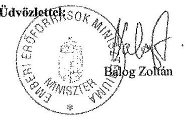

---

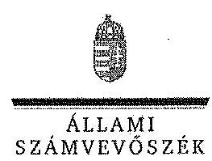

ELNÖK

# Balog Zoltán úr 

miniszter
Emberi Eröforrások Minisztériuma

## Budapest

## Tisztelt Miniszter Úr!

A Pannon Egyetem, a Szolnoki Fölskola, a Károly Róbert Fölskola, a Magyar Képzömüvészeti Egyetem, a Széchenyi István Egyetem, a Miskolci Egyetem és az Eszterházy Károly Fölskola gazdálkodásának és müködésének ellenőrzéséről készített jelentéstervezetekre tett észrevételeit köszönettel megkaptam.

Az Állami Számvevőszék észrevételekre vonatkozó álláspontjáról a felügyeleti vezető által készített részletes tájékoztatást csatoltan megküldöm.

Tájékoztatom Miniszter urat, hogy az ÁSZ. tv. 29. § (3) bekezdése alapján a számvevőszéki jelentések mellékleteként szerepeltetjük a jelentéstervezetekhez tett figyelembe nem vett észrevételeket az elutasítás indokainak feltüntetésével.

Budapest, 2014. gátiws hó 25. nap
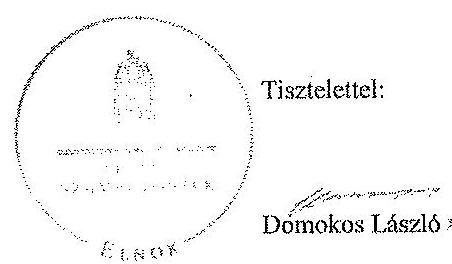

Melléklet: Tájékoztatás az elfogadott és a figyelembe nem vett észrevételekről

---

# Tájékoztatás   az elfogadott és a figyelembe nem vett észrevételekről 

A Pannon Egyetem, a Szolnoki Főiskola, a Károly Róbert Főiskola, a Magyar Képzőmüvészeti Egyetem, a Széchenyi István Egyetem, a Miskolci Egyetem és az Eszterházy Károly Főiskola gazdálkodásának és müködésének ellenőrzéséről készült számvevőszéki jelentés-tervezetekhez a 36433-2/2014/FOFEJL iktatószámú levélben tett észrevételeit köszönettel megkaptuk.

A jelentéstervezetekre tett észrevételeket áttekintettük, azok kezeléséről a következő tájékoztatást adom:

1. A 2012. évi költségvetési hiánycél tartását biztosító további feladatokról szóló 1365/2011. (XI. 8.) Korm. határozatban elöirt szervezeti és feladatellátási felülvizsgálati program megvalósítása.

A kormányhatározat alapján - az oktatási ágazatra vonatkozóan 2012. február 20-ig - kellett a tételes javaslatokat a Kormány elé terjeszteni, ennek végrehajtása azonban elmaradt. A feladatokat a nemzetgazdasági miniszter irányítása mellett kellett végrehajtani, felelősként azonban a Miniszterelnökséget vezető államtitkár, a közigazgatási és igazságügyi miniszter és az érintett ágazati miniszter is kijelölésre került. A fentiek alapján - az észrevételben leírtakra is figyelemmel - a vonatkozó szövegrészt a jelentéstervezetek összegző megállapítások, következtetések, javaslatok, valamint részletes megállapítások fejezetelben az alábbiak szerint pontositottuk:
„Elmaradt az oktatási ágazatra vonatkozóan a nemzetgazdasági miniszter irányításával és az oktatásért felelős miniszter részvételével, kormányhatározatban elöirt szervezeti és feladatellátási felülvizsgálati program kidolgozása." (Összegző megállapítások)
„Elmaradt az oktatási ágazatra vonatkozóan az 1365/2011. (XI. 8.) Korm. határozatban - a nemzetgazdasági miniszter irányításával és az ágazatért felelős miniszter részvételével - elöirt szervezeti és feladatellátási felülvizsgálati program kidolgozása. (Részletes megállapítások, 1. fejezet):

---

2. A felsőoktatás rendszere középtávú fejlesztési tervének elkészítése.

Az észrevételben foglaltakat figyelembe véve a jelentéstervezetek összegző megállapítások, következtetések, javaslatok, valamint részletes megállapítások fejezetelt kiegészítettük:
„A felsőoktatási törvény rendelkezései ellenére nem készíttetett a felsőoktatás rendszere vonatkozásában a Kormány által elfogadott középtávú fejlesztési tervet." (Összegző megállapítások)
„A miniszter - a vonatkozó jogszabályokban foglaltak ellenére - nem készittetett a felsőoktatás rendszere vonatkozásában a Kormány által elfogadott középtávú fejlesztési tervet." (Részletes megállapítások, 1. fejezet)
3. A Felsőoktatás Információs Rendszerének (FIR) üzemeltetése.

A felsőoktatási törvények rendelkezései szerint (Feot. 35. §, 103.§ (1) bekezdés aa.) pont, Nftv. 64.§ (2) bekezdés aa) pont) a felsőoktatási információs rendszer müködtetése, az adatkezelés jogszerüsége a felsőoktatás ágazati irányítását ellátó miniszter felelősségi körébe tartozik. A miniszter feladata a felsőoktatási információs rendszer müködéséért felelős Oktatási Hivatal müködtetése is. A FIR müködését a teljes ellenőrzött időszakban problémák jellemezték, amely felveti az Oktatási Hivatal müködtetéséért felelős minisztérium felelősségét is. Az észrevételben jelzettek alapján a jelentéstervezeteket pontositottuk a következők szerint:
„A minisztérium a Felsőoktatási Információs Rendszer (FIR) biztonságos üzemeltetéséhez, az adatok védelméhez szükséges alapvető szervezeti, szabályozási kontrollokat a 2012. év végéig nem teljes körűen alakittatta ki az Oktatási Hivatallal." (Összegző megállapítások)
„A minisztérium az Oktatási Hivatallal a Felsőoktatási Információs Rendszer (FIR) biztonságos üzemeltetéséhez, az adatok védelméhez szükséges alapvető szervezeti, szabályozási kontrollokat a 2012. év végéig nem teljes körűen alakittatta ki.,, (Részletes megállapítások, 1. fejezet)
4. Korábbi ÁSZ ellenőrzések javaslatainak hasznosulása.

4/a. Az oktatási és kulturális ágazat irányítási rendszerének, müködésének ellenőrzéséről szóló 1106 sz. ÁSZ jelentés 3. sz. javaslata tekintetében a jelentéstervezetek részletes megállapítások 5. fejezetei részletesen tartalmazzák a tényeket. Ennek alapján az oktatási ágazat középtávú stratégiája kidolgozásának hiányára vonatkozó megállapítást a jelentéstervezetekben nem módositottuk.

4/b. A felsőoktatás oktatási infrastruktúra-fejlesztési programjának ellenőrzéséről szóló 1171 sz. ÁSZ jelentésben az előkészítés hiányosságai miatt a felelősség megállapítására tett javaslat nem hasznosult a jelentéstervezetek megállapításai szerint.

---

Az észrevételben foglaltak szerint az egyes miniszterek, valamint a Miniszterelnökséget vezető államtitkár feladat- és hatásköréről szóló 212/2010. (VII. 1.) Korm. rendelet valóban a nemzeti fejlesztési miniszter szakpolitikai feladat- és hatáskörébe helyezte a PPP és egyéb állami vagyont érintő gazdálkodó szervezetekkel kötött és megkötendő szerződések vizsgálatát és ellenőrzését. Az ÁSZ nemzeti erőforrás miniszter részére címzett javaslata ugysnakkor a PPP programok előkészítési hiányosságai miatti felelősség megállapítására irányult. A nemzeti erőforrás minisztere 2012. január 19-én kelt intézkedési tervében 2012. december 31-ei határidőre elvégzendő feladatként fogalmazta meg az előkészítési hiányosságok miatti felelősség megállapításról való intézkedést, amely nem valósult meg. Mindezek alapján a jelentéstervezetben tett megállapítás módosítása nem indokolt.

4/c A 1171. sz. jelentés alapján tervezett intézkedések közül az állami felsőoktatási intézmények kapacitás-kihasználás felmérése késéssel valósult meg. A felmérés eredményeinek és a felsőoktatást érintő ágazati célok figyelembe vételével a felsőoktatási infrastruktúra közép- és hosszú távú hasznosítására a helyszíni ellenőrzés időszaka alatt nem történtek intézkedések. Az intézkedés határideje 2013. december 31. volt. Az észrevételben foglaltak alapján a jelentéstervezetek módosítása nem indokolt.

4/d. Az állami felsőoktatási intézmények érdekeltségébe tartozó gazdasági társaságok támogatásának és nyereségük hasznosulásának ellenőrzése címủ, 1290 sz . ÁSZ jelentés 2. sz. javaslata (Az állami felsőoktatási intézmények - a felülvizsgálatot követő, de legkésőbb egy éven belül - megmaradt társaságaira vonatkozó szakmai feladatellátás és a gazdasági eredményesség mérését biztosító mutatók és azok értékelési rendszerének kidolgoztatása) megállapításaink alapján nem hasznosult. A helyszíni ellenőrzés alatt rendelkezésre bocsátott dokumentumok alapján a minisztérium a rektorokat a szakmai feladatellátás és a gazdasági eredményesség mérését biztosító mutatószámok és értékelési rendszer kidolgozására a felsőoktatási intézmények finanszírozását szabályozó kormányrendelet kihirdetését követően kívánta felkérni. Így a vonatkozó megállapítás módosítása nem indokolt.

A Szolnoki Főiskola ellenőrzéséhez kapcsolódó - az emberi erőforrások miniszterének tett javaslatunk nem a PPP projektekkel kapcsolatos, hanem az intézmény hosszú távon fenntartható müködtetésére vonatkozó intézkedések megtételét célozza, amely a fenntartó feladata és nem igénylik a nemzeti fejlesztési miniszter bevonását.

Az Eszterházy Károly Főiskola esetében a jelentéstervezet nem az IFT minisztériumi észrevételezésének hiányát kifogásolta, hanem azt, hogy annak a Feot 115. § (2) bekezdése db) pontja szerinti felülvizsgálata dokumentáltan nem történt meg.

Az emberi erőforrások miniszterének a Károly Róbert Főiskola, a Magyar Képzőművészeti Egyetem, a Szolnoki Főiskola, az Eszterházy Károly Főiskola, a Széchenyi István Egyetem, valamint a Miskolci Egyetem vonatkozásában az Nftv. 73. § (3) bekezdés e) pontja alapján megfogalmazott javaslatokat az Nftv. 2014. július 24-én hatályba lépő módosításai nem érintik, a felsőoktatási intézmény rektorainak tett javaslatokat a jogszabály változás figyelembe vételével pontosítottuk.

---

Kérem a válaszlevelemben foglaltak szíves tudomásulvételét. Tájékoztatom Miniszter urat, hogy a számvevőszéki jelentés mellékleteként szerepeltetjük a jelentéstervezethez tett észrevételeit, az elfogadott valamint az ÁSZ. tv. 29. § (3) bekezdése alapján a figyelembe nem vett észrevételeket az elutasítás indokának feltüntetésével együtt.
Budapest, 2014. gútius hó 28 nap

Horváthné Herbáth Mária
feltigyeleti vezető

---

.

---

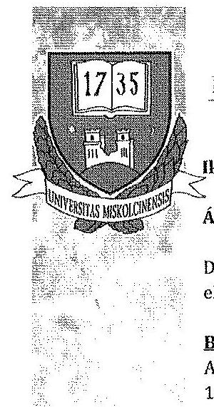

# REKTOR 

Iktatószám: R/1115-4/2014.
Állami Számvevőszék
Domokos László
elnök úr részére

Budapest
Apáczai Csere János utca 10.
1364

## ÁLLAMI SZÁMVEVÓSZÉK 50/169/2014.

fekrest: 2014 JOL 2 i
Iktatószám: U-0363-065001
Melléklet: 14 \& 6
zlomathé stultif
tane
Dain

## Tisztelt Elnök Úr!

Hivatkozással V-0363-253/2014. iktatószámú levelére, mellékelten megküldöm a Miskolci Egyetem gazdálkodásának és müködésének ellenőrzéséről szóló jelentéstervezethez fúződő észrevételeinket.

Miskolc, 2014. július 16.
Tisztelettel:
Prof. Dr. Torma András

## MISKOLCI EGYETEM

3515 Miskolc - Egyetemváros, Pf.: 1.
Tel.: (46) 565-010 Fax: (46) 565-014
E-mail: rektor@uni-miskolc.hu, http://www.uni-miskolc.hu

---

# MISKOLCI EGYETEM 

$\mathrm{R} / 1115-4 / 2014$

A Miskolci Egyetem gazdálkodásának és működésének ellenőrzéséről szóló ÁSZ jelentéstervezethez kapcsolódó észrevételek

---

# Bevezetés 

## 18. oldal 1. bekezdés

Kifogásolt szövegrész: „Az Egyetemen az ellenőrzött időszakban 13 kar és intézmény müködött: Müszaki Földtudományi Kar, Müszaki Anyagtudományi Kar, Gépészmérnöki és Informatikai Kar, Állam- és Jogtudományi Kar, Gazdaságtudományi Kar, Bölcsészettudományi Kar, Egészségügyi Kar, a Bartók Béla Zeneművészeti Intézet, az Idegennyelvi Oktatási Központ, a Felnőttképzési Regionális Központ, a Comenius Főiskolai Kar és az Alkalmazott Földtudományi Kutatóintézet (2011 szeptemberéig az ME intézményei közé tartozott az Árvay József Gyakorló Általános Iskola)."

A kifogásolt szövegrész módosítására vonatkozó javaslat: Az Egyetemen az ellenőrzött időszakban 9 kari (intézeti) gazdálkodási egység müködött, melyek az alábbiak: Müszaki Földtudományi Kar, Müszaki Anyagtudományi Kar, Gépészmérnöki és Informatikai Kar, Állam- és Jogtudományi Kar, Gazdaságtudományi Kar, Bölcsészettudományi Kar, Egészségügyi Kar, Comenius Főiskolai Kar és Bartók Béla Zeneművészeti Intézet. A karokon és intézeten felül további 9 gazdálkodási egységgel rendelkezett az egyetem: Idegennyelvi Oktatási Központ; Könyvtár, Levéltár, Múzeum; Egyetemi Számítóközpont; Bolyai Kollégium; Felnőttképzési Regionális Központ; Gazdasági-Müszaki Fölgazgatóság; Központi Igazgatás; Alkalmazott Földtudományi Kutatóintézet; Árvay József Gyakorló Általános Iskola (2011. augusztus 31-ig).

Indoklás: A jelentéstervezet szóhasználata nem megfelelő és nem ad teljes képet az egyetemi szervezeti felépítésről.

## I. Összegző megállapítások, következetések, javaslatok

## 20. oldal 7. bekezdés

Kifogásolt szövegrész: „Az ME belső kontolírendszerének kialakítása és müködtetése az ellenőrzött időszakban összességében részben felelt meg a vonatkozó jogszabályi elöírásoknak. Az öt kontrollpillér közül a kontrollkörnyezet, a kontrolltevékenységek nem megfelelő, a monitoring rendszer részben megfelelő, a kockázatkezelés, valamint az információ és kommunikáció müködése megfelelő volt."

A kifogásolt szövegrész módosítására vonatkozó javaslat: Az ME belső kontolírendszerének kialakítása és müködtetése az ellenőrzött időszakban összességében megfelel a vonatkozó jogszabályi elöírásoknak. (Kérjük a megállapítás 2. mondatának törlését.)

---

# Indoklás: 

A kontrollkörnyezet keretében világos szervezeti struktúra került kialakításra, amely az SZMSZ I. kötetben és mellékleteiben rögzítésre került. A felelősségi, hatásköri viszonyok és feladatok az egyetemi szabályzatokban, továbbá a munkaköri leírásokban rögzítésre kerültek. A humánerőforrás-kezelés átlátható, a fenntartó által megadott keretek között, az intézményi költségvetésben rögzítésre kerültek az intézményi létszámadatok. A kontrolltevékenység keretében meghatározásra kerültek azok az elvek és eljárások, amelyek a kockázatok meghatározására és a szervezet céljainak elérése érdekében alakítanak ki. A korábban más, különböző szabályzatokban szabályozott kontrolltevékenységet az Egyetemi Szenátus 2010. november 25.-én hozott határozatában a Szervezeti és Működési Szabályzat mellékletét képező „A Miskolci Egyetem belső kontrollrendszere" címú szabályzatban egységesítette. Az Egyetem ezt a szabályzatát is ugyanúgy, mint a többi szabályzatot a mindenkori törvényi előírásoknak és rendelkezéseknek megfelelően folyamatosan aktualizálta.

Az elmondottakat az is alátámasztja, hogy a kialakított kockázatkezelési rendszert a jelentéstervezet megfelelőnek minősíti.

A monitoring rendszer további erősítése céljából, a Belső Ellenőrzési Osztály 2012. évi belső kontrollrendszer tárgyában készített jelentése alapján, R/265-3/2013. számú intézkedési tervben az Egyetem vezetője intézkedett az intézményi monitoring stratégia kialakításáról, a folyamatos nyomon követési módszerek és technikák írásos formában történő rögzítésének kezdeményezéséről. Az Egyetem vezetője külön figyelmet fordított a magasabb kockázattal rendelkező területek monitorozására, mint pl. a gazdálkodási és a pályázati tevékenység. A gazdálkodási területek monitorozása folyamatos volt. A pályázati területen - a megnövekedett uniós forrásokra is tekintettel - jelentkező kockázati tényezők csökkentése érdekében az Egyetem vezetője R/2313/2010. sz. levelében is kezdeményezte a Pályázati Nyilvántartó Rendszer továbbfejlesztését, monitoring funkcióval történő kiegészítését, amely végrehajtásra került (v.ö.: 13/2011. számú szenátusi határozat, R/58-2/2011. számú körlevél).

A pénzgazdálkodási folyamat (bevételek és kiadások) c. ellenőrzési nyomvonal a Belső Kontrollrendszer mellékletét képező nyomvonalak között 6. sz. sorszámmal található meg.

## 21. oldal 1. bekezdés

Kifogásolt szövegrész: „Az ME a kontrollkärnyezet részeként nem megfelelően határozta meg a belső szabályzataiban a pénz- és vagyongazdálkodással kapcsolatos folyamatokat, feladat- és hatásköröket, felelősségi viszonyokat, továbbá az etikai követelményeket, a szabályzatok aktualizálása az ellenőrzési időszakban elmaradt. Hiányos vagy elavult rendelkezéseik miatt nem feleltek meg maradéktalanul a jogszabályi elöírásoknak, nem teljes mértékben voltak alkalmasak a belső szabályozó funkció betöltésére, nem tudták biztosítani a rendszerhibák megelőzését és kezelését."

---

A kifogásolt szövegrész módosítására vonatkozó javaslat: Az ME a kontrollkörnyezet részeként megfelelően határozta meg a belső szabályzataiban a pénzés vagyongazdálkodással kapcsolatos folyamatokat, feladat- és hatásköröket, felelősségi viszonyokat, továbbá az etikai követelményeket, a szabályzatok aktualizálása az ellenőrzési időszakban megtörtént. (Kérjük a megállapítás 2. mondatának törlését.)

Indoklás: A kifogásolt szövegrész módosítására vonatkozó javaslat így került összhangba egyrészt a jelentéstervezet 31. oldal 1. bekezdésében leírtakkal, mely szerint „az intézmény SZMSZ-ét és a belső szervezeti szabályait a jogszabály- és feladatváltozásoknak megfelelően aktualizálták", másrészt a következő (apró betűs) bekezdések módosítására vonatkozó intézményi javaslatokkal.
A pénz- és vagyongazdálkodással kapcsolatos folyamatok egyrészt a Belső Kontrollrendszer mellékletét képező ellenőrzési nyomvonalakban (3. sz. ellenőrzési nyomvonal: Vagyongazdálkodás, tárgyi eszköz és készletgazdálkodás, 5. sz. ellenőrzési nyomvonal: Pénzkezelés, 6. sz. ellenőrzési nyomvonal: Pénzgazdálkodási folyamat /bevételek és kiadások/), másrészt a vonatkozó egyetemi szabályzatokban kerültek meghatározásra. A feladat- és hatáskörök, felelősségi viszonyok - a 30. oldal utolsó bekezdése, utolsó mondatának állításával összhangban - megfelelően kerültek kialakításra. Ugyanezt támasztja alá a 32. oldal az utolsó előtti bekezdése, mely szerint: „Az Egyetem vezetője a jogszabályi előírásoknak megfelelően a gazdálkodási szabályzatban, valamint a kötelezettségvállalás, utalványozás és ellenjegyzés rendjében szabályozta a pénzügyi és vagyongazdálkodási folyamatok folyamatba épített, előzetes, utólagos és vezetői ellenőrzés (FEUVE) szabályait. Az Egyetem vezetője kidolgozta az ellenőrzési nyomvonalakat, amelyek a jogszabályi előírásoknak megfeleltek."
Az idézett állítás, mely szerint a szabályzatok aktualizálása elmaradt, nem felel meg a valóságnak. A Miskolci Egyetem vezetői szabályzatalkotó tevékenységüket a vonatkozó törvények, rendeletek, utasítások és a „Belső szabályzatok megalkotásának rendje a Miskolci Egyetemen" című szabályzat szerint végezték. A szabályzatok aktualizálását évente - szükség esetén többször is - elvégezték. Az ellenőrzési időszakban az Egyetemi Szenátus a Szervezeti és Működési Szabályzatot és annak mellékleteit képező szabályzatokat 227 (azaz kettőszázhuszonhét!) alkalommal módosította, aktualizálta. Az erről szóló dokumentumok megtalálhatók a Miskolci Egyetem Szenátusának határozataiban és jegyzőkönyvi kivonataiban, továbbá a szenátusi ülések írásos anyagaiban.
Kérjük továbbá a jelentéstervezet 33. oldalának 1. bekezdésében („Az Egyetem kontrolltevékenységénél a pénzügyi gazdálkodás...") foglaltak módosítását is a fentiekben leírtak szerint.

---

# 21. oldal 1. bekezdés 

Kifogásolt szövegrész: „Az SZMSZ nem felelt meg minden tekintetben a jogszabályi elöírásoknak."

A kifogásolt szövegrész módosítására vonatkozó javaslat: Az SZMSZ minden tekintetben megfelelt a jogszabályi előírásoknak.

Indoklás: Az SZMSZ kötetek és azok mellékleteit képező szabályzatok a szenátusi jóváhagyást követően megküldésre kerültek a fenntartónak. A fenntartó felülvizsgálta a szabályzatokat abból a szempontból, hogy a vonatkozó jogszabályi előírásoknak megfelelnek-e. A felülvizsgálatról az Egyetem írásban visszajelzést kapott, és ha a fenntartó változtatásokat javasolt, akkor azokat minden esetben végrehajtotta. Ezt támasztja alá a 31. oldal 1. bekezdése is, amely szerint „Az intézmény SZMSZ-ét és a belső szervezeti szabályait a jogszabály- és feladatváltozásoknak megfelelően aktualizálták, összhangban az alapító okirattal."

## 21. oldal 1. bekezdés

Kifogásolt szövegrész: „Az intézmény vezetője nem gondoskodott a szervezetre vonatkozó etikai elvárások készítéséről."

A kifogásolt szövegrész módosítására vonatkozó javaslat: Az intézmény vezetője gondoskodott a szervezetre vonatkozó etikai elvárások készítéséről.

Indoklás: A Miskolci Egyetem - tudomásunk szerint az ország felsőoktatási intézményei közül elsőként - elkészítette Etikai Kódexét, melyet az Egyetem Szenátusa 2008. április 28-i ülésén 137/2008. sz. határozatával elfogadott. Az Etikai Kódex alapján Etikai Bizottság alakult. A rektor a vizsgált időszakban több alkalommal rendelt el etikai vizsgálatot.

## 21. oldal 2. bekezdés

Kifogásolt szövegrész: „Az ME a kontrolltevékenységgel kapcsolatos szabályozási kereteket nem megfelelően alakította ki az ellenőrzött időszakban. A pénzügyi gazdálkodás, ezen belül a kiadási elöirányzatok szabályszerü felhasználásának és a bevételek beszedésének kulcskontrolljainál több területen tártunk fel hiányosságokat, amelyek a folyamatban épített, illetve a vezetői ellenőrzés nem megfelelő müködésére voltak visszavezethetőek. A kontrollok nem megfelelő kialakítása és müködtetése, a gazdálkodási jogkörök nem megfelelő gyakorlása a pénzügyi és vagyongazdálkodás területén szabálytalanságot okozott."

---

A kifogásolt szövegrész módosítására vonatkozó javaslat: Az ME a kontrolltevékenységgel kapcsolatos szabályozási kereteket megfelelően kialakította az ellenőrzött időszakban. (Kérjük a megállapítás 2-3. mondatának törlését.)

Indoklás: Lásd. 21. oldal 1. bekezdéséhez és 23. oldal 2. bekezdéséhez leírt indoklás szerint.

# 21. oldal 3. bekezdés 

Kifogásolt szövegrész: „Az Egyetem az ellenőrzött időszakban csak a 2012. évre vonatkozóan rendelkezett a tevékenységével kapcsolatos monitoring rendszerrel."

A kifogásolt szövegrész módosítására vonatkozó javaslat: Kérjük a megállapítás törlését.

Indoklás: Ez a megállapítás nem helytálló. A monitoring tevékenységet támogató informatikai rendszerek (oktatás, gazdálkodás, pályázatok, DPR, MonDoc, stb.) az azt megelőző időszakban is múködtek. 2012-ben a belső ellenőrzések nyilvántartására és folyamatában való nyomon követésének biztosítására is kialakíttatott az Egyetem vezetője egy szoftvert. Az informatikai támogatottságon túlmenően a napi rutin részeként is működött az egyes tevékenységek, feladatok folyamatában való nyomon követése.

Az indoklás további részét lásd a 20. oldal 7. bekezdéséhez leírt indoklás utolsó előtti bekezdése szerint.

Kérjük továbbá a jelentéstervezet 33. oldalának 5-6. bekezdésében („Az Egyetem vezetője által kialakított...", illetve „Az Egyetem az ellenőrzött időszakban...") foglaltak módosítását is a fentiekben leírtak szerint.

## 21. oldal 5. bekezdés

Kifogásolt szövegrész „Az ellenőrzés során értékeltük a belső kontrollokon túlmutató integritás kontrollokat is, melyeknél szabályozási és müködési hibákat állapítottunk meg. A ME nem végzett korrupciós kockázatelemzést, nem szabályozták és hívták fel a korrupciós szempontból veszélyeztetett beosztásokban dolgozó alkalmazottak figyelmét a jellemző kockázatokra és a kockázatokat megelőző intézkedésekre, nem müködtettek a szervezeten kívülről érkező panaszokat és közérdekú bejelentéseket kezelő rendszert."

A kifogásolt szövegrész módosítására vonatkozó javaslat: Az ellenőrzés során értékeltük a belső kontrollokon túlmutató integritás kontrollokat, melyeknél nem tártunk fel szabályozási és müködési hibákat. (Kérjük a megállapítás 2. mondatának törlését.)

---

Indoklás: Nincs olyan jogszabályi előírás, amely ezen tevékenységek elvégzésére kötelezné az intézményt. Az Egyetemen kívülről érkező panaszokat és közérdekű bejelentéseket kezelő rendszer működtetéséhez szükséges anyagi eszközök nem álltak rendelkezésre. A vizsgált időszakban a rektor minden esetben személyesen kivizsgálta a panaszokat és közérdekű bejelentéseket és megtette a szükséges intézkedéseket.

# 22. oldal 2. bekezdés 

Kifogásolt szövegrész: „A pénzügyi pozíció kedvezőtlen változása a költségvetési támogatások csökkenésével, a saját bevételek elmaradásával, továbbá a végrehajtott beruházásokkal, felújításokkal volt összefüggésben."

A kifogásolt szövegrész módosítására vonatkozó javaslat: A pénzügyi pozíció kedvezőtlen változása egyértelműen a költségvetési támogatások drasztikus csökkenésével volt összefüggésben.

Indoklás: A jelentéstervezet 19. oldalán szereplő összefoglaló táblázat szerint a költségvetési támogatás a vizsgált időszakban mintegy 3/4-ére csökkent ( 7,8 Mrd Ft-ról 5,9 M Ft-ra), míg a saját és átvett bevételek $24,5 \%$-kal növekedtek.

## 22. oldal 3. bekezdés

Kifogásolt szövegrész: „Az Egyetem pénzügyi gazdálkodása területén szabálytalanságokat állapítottunk meg. Az ellenőrzött időszakban nem volt szabályszerű a megbízási díjak elszámolása, a dologi kiadások, a felhalmozási kiadások és a müködési bevételek előirányzatának felhasználása. A rendszeres és nem rendszeres személyi juttatások teljesítésénél az intézményi térítési díjak, költségtérítések elszámolásánál, a felhalmozási bevételeknél és a hazai forrásból finanszírozott projektek elszámolásánál tártunk fel kockázatot. A pénzgazdálkodással kapcsolatos gazdálkodási jogkörökhöz elöirt belső kontrollok nem minden esetben müködtek."

A kifogásolt szövegrész módosítására vonatkozó javaslat: A kifogásolt szövegrészt kérjük törölni / módosítani az alábbi bekezdésekhez írt indoklásoknak megfelelően: 22. oldal 4-6. bekezdés, 23. oldal 1-2., 5. bekezdés.

Kérjük továbbá a jelentéstervezet 33. oldalának 2. bekezdésében („A személyi juttatások, a dologi- és felhalmozási kiadások..."), 35. oldalának 6. bekezdésében („Az ellenőrzött időszakban az Egyetem kiadási..."), illetve a 3.2. fejezetben (43. oldaltól) foglaltak módosítását is a fentiekben leírtak szerint.

---

# 22. oldal 4. bekezdés 

Kifogásolt szövegrész: „A rendszeres és nem rendszeres személyi juttatás elöirányzatának felhasználása során a pénzügyi elszámolások, valamint a gazdálkodási jogkörök gyakorlása tekintetében nem érvényesültek teljes körüen a jogszabályok és a belső szabályzatok elölrásai. Ez magas szabályszerűségi kockázatot jelentett az ellenőrzött terület egészének müködése szempontjából. Rendszerhibaként jelentkezett, hogy az elöirányzat felhasználását érintően az ME olyan rendszert müködtetett, amelyben a tanszékek nem vezették az illetményszámfejtés alapjául szolgáló jelenléti ívet."

A kifogásolt szövegrész módosítására vonatkozó javaslat: Kérjük a megállapítás törlését.

Indoklás: A jelenléti ívek vezetésére a kötött munkaidőben dolgozó közalkalmazottak esetében sor került. Hiányát a kötetlen munkaidőben dolgozó oktatók esetében lehetett megállapítani. E vonatkozásban - bár kötelező belső szabály nem volt rá - eltérő gyakorlat alakult ki. A Foglalkoztatási Követelményrendszer szerint a közvetlen munkairányítói jogot a tanszékek, intézetek vezetői gyakorolják. Az ő döntésüktől függött, hogy vezetnek-e jelenléti ívet.

A munka törvénykönyvéről szóló 2012. évi I. törvény hatályos rendelkezései szerint:
96. § (1) A munkaidő-beosztás szabályait (munkarend) a munkáltató állapítja meg.
(2) A munkáltató a munkaidő beosztásának jogát - a munkavégzés önálló megszervezésére tekintettel - a munkavállaló számára írásban átengedheti (kötetlen munkarend). A munkarend kötetlen jellegét nem érinti, ha a munkavállaló a munkaköri feladatok egy részét sajátos jellegüknél fogva meghatározott időpontban vagy időszakban teljesítheti.
(3) Kötetlen munkarend esetén
a) a 93-112. §-ban, valamint
b) a 134. (1) bekezdés a)-b) pontban
foglaltakat - e bekezdés kivételével - nem kell alkalmazni.
134. § (1) A munkáltató nyilvántartja
a) a rendes és a rendkívüli munkaidő,
b) a készenlét,
c) a szabadság
tartalmát.
A vizsgált időszakban hatályban volt a Munka Törvénykönyvéről szóló 1992. évi XXXII. törvény lényegében ugyanazon tartalommal nem tette kötelezővé a munkaidő nyilvántartását a kötetlen munkaidőben dolgozók esetében:

140/A. § (1) A munkáltató köteles nyilvántartani a munkavállalók
a) rendes és rendkívüli munkaidejével, ügyeletével, készenlétével,
b) szabadságának kiadásával,
c) egyéb munkaidő-kedvezményével
kapcsolatos adatokat.

---

(2) Az (1) bekezdés a) pontjában előírt szabályt nem kell alkalmazni, ha a munkavállaló a munkaideje beosztását vagy felhasználását maga jogosult meghatározni.

E vonatkozásban a közalkalmazottak jogállásáról szóló 1992. évi XXXIII. törvény (Kjt.) sem tartalmaz eltérést és a nemzeti felsőoktatásról szóló 2011. évi CCIV. törvény (Nftv.), valamint a felsőoktatásról szóló 2005. évi CXXXIX. törvényben (Ftv.) sincs, illetve nem volt ilyen rendelkezés.

Tekintettel arra, hogy az oktatói munkakörben foglalkoztatottak kötetlen munkarendben dolgoznak, így a munkaidő nyilvántartás vezetése részükre nem elöírás.

# 22. oldal 5. bekezdés 

Kifogásolt szövegrész: „A megbizási díjak tartalma, teljesitése nem felelt meg a jogszabályoknak és belsö szabályzatok elöírásainak. Rendszerhiba volt, hogy a jogszabálytól eltérő módon indokolták a külső személlyel való szerződéskötést, a szerzödést nem a kötelezettségvállalásra jogosult írta alá, illetve a pénzügyi ellenjegyzést nem az arra felhatalmazott gyakorolta."

A kifogásolt szövegrész módosítására vonatkozó javaslat: Kérjük a megállapítás törlését.

Indoklás: Az Ávr. 50. § (2) bekezdésében foglaltak szerint: A külső személyi juttatások és a szellemi tevékenység számla ellenében történő igénybevételére szolgáló előirányzatok terhére akkor köthető szerződés, ha
a) azt jogszabály nem zárja ki,
b) a szerződés megkötése a közfeladatok ellátásához feltétlenül szükséges, és
c) törvény vagy kormányrendelet eltérő rendelkezésre hiányában az adott feladat elvégzéséhez megfelelő szakértelemmel, szakképzettséggel és gyakorlattal, vagy egyéb megfelelő sajátos szakmai adottságokkal, képességekkel rendelkező személyt a megrendelő nem foglalkoztat, vagy a szerződés tárgyát képező szolgáltatás egyedi, időszakos vagy időben rendszertelenül ellátandó feladat.
A 2005. évi CXXXIX. törvény 83. § (4) bekezdése, a 2011. évi CCIV. törvény 25. § (3) bekezdése, valamint a 2013. évi CCIV. törvény 25. § (3) bekezdése szerint:
(3) Megbízási jogviszony keretében az oktatói feladat akkor látható el, ha a tevékenység jellege ezt megengedi, továbbá a végzett munkára fordított idő nem haladja meg a teljes munkaidő hatvan százalékát (a továbbiakban: óraadó oktató). Az óraadó oktató alkalmazásánál a 24. § (5) és e § (2) bekezdésében foglaltakat alkalmazni kell. Megbízási jogviszony létesíthető továbbá az eseti, nem rendszeres oktatói feladatokra. A felsőoktatási intézmény a vele közalkalmazotti, illetve munkaviszonyban álló személlyel a munkakörébe nem tartozó oktatói feladatok ellátására megbízási jogviszonyt létesíthet.

---

Mivel a Miskolci Egyetem által kötött megbízási szerződések eseti, alkalmi feladatokra kötött szerződések, ezért ezek megkötése jogszabályba nem ütközik. Óraadók alkalmazása néhány esetben került sor a Bartók Béla Zeneművészeti Intézetben művésztanárok meghívásával, betartva a jogszabályi előírásokat.
Tekintettel arra, hogy az egyetemi tanárok, kutatóprofesszorok szakmai kutatásai, az általuk készített tudományos publikációk egyedinek minősíthetők, két megegyező tudásbázissal rendelkező egyetemi oktatóról nem beszélhetünk.
Az indoklás csak részben hivatkozott az oktatók túlterheltségére, ezért, valamint a fentiek alapján kérjük a megállapítás első felének („a jogszabálytól eltérő módon indokolták a külső személlyel való szerződéskötést") törlését.
A hivatkozott szerződéseket a kötelezettség-nyilvántartásban szereplő kötelezettségvállaló személyek írták alá, akik egy személyben az adott témaszám feletti rendelkezés jogát is gyakorolják, illetve a szakmai teljesítés igazolására is jogosultak. A kötelezettségvállalási rendszer alapjául szolgáló papír alapú dokumentumot valóban nem tudott az Egyetem 2 esetben felmutatni az ellenőrzést végzőknek. Az esetszám azonban nem haladja meg a mintavétel $10 \%$-át, amely alapján nem a megfelelő minősítést kapta a terület.
Kérjük továbbá a jelentéstervezet 44. oldalának 8. bekezdésében („A külső személyi juttatás előirányzatai terhére megkötött...") foglaltak módosítását is a fentiekben leírtak szerint.

# 22. oldal 6. bekezdés 

Kifogásolt szövegrész: „A dologi és felhalmozási kiadások felhasználása a pénzügyi elszámolások, valamint a gazdálkodási jogkörök gyakorlása tekintetében nem felelt meg a jogszabályoknak és a belső szabályzatok előírásainak. Rendszerhibaként a kötelezettségvállalás nyilvántartásba vétele nélküli teljesitésigazolás, az aláírási jogosultság nélküli jogkörök gyakorlása, illetve a kötelezettségvállalás és teljesitésigazolás jogosultságának nem kellő dokumentáltsága jelentkezett."

A kifogásolt szövegrész módosítására vonatkozó javaslat: Ezen megállapításra akkor tud az Egyetem érdemben reagálni, amennyiben az ÁSZ rendelkezésünkre bocsátja a szóban forgó tételekről készített listát. Kérjük a hibás tételekről szóló kimutatást megküldését. Véleményünk szerint ugyanis nem lehet kategorikusan kijelenteni, hogy a dologi és felhalmozási kiadások felhasználása és pénzügyi elszámolása általánosságban nem felelt meg a jogszabályoknak és belső szabályzatok előírásának. Kérjük ezen állítás törlését vagy legalábbis finomítását (az esetszámot figyelembe véve).

Kérjük továbbá a jelentéstervezet 33. oldalának 3. bekezdésében („Az érintett előirányzatok közül a dologi és a felhalmozási kiadások...") foglaltak módosítását is a fentiekben leírtak szerint.

---

# 23. oldal 1. bekezdés 

Kifogásolt szövegrész: „Az intézményi müködési bevételek beszedése a pénzügyi elszámolások, valamint a gazdálkodási jogkörök gyakorlása tekintetében nem felelt meg a jogszabályoknak és belsö szabályzatok elölrásainak. Rendszerszintü hiányosságokat tártunk fel a pénzügyi jogkörök gyakorlása területén, mely kockázatot jelentett a bevételek összegszerűségének megbizhatóságában.

A kifogásolt szövegrész módosítására vonatkozó javaslat: Lásd 47. oldal 3. bekezdéséhez leírtak szerint.

## 23. oldal 1. bekezdés

Kifogásolt szövegrész: „A hallgatók a költségtérítéseiket - az intézmény - egy kereskedelmi banknál vezetett számlájára teljesitették, amely ellentétes az Áht. vonatkozó elölrásaival, amely szerint a kincstári kör fizetési számlái csak a Kincstárnál vezethetők."

A kifogásolt szövegrész módosítására vonatkozó javaslat: Kérjük a megállapítás törlését.

Indoklás: A vizsgált időszakban a Magyar Államkincstár szabályzata a forintszámlavezetési szolgáltatásról nem tette lehetővé a NEPTUN gyüjtőszámla vezetését.

## 23. oldal 2. bekezdés

Kifogásolt szövegrész: „A felhalmozási bevételek beszedése a pénzügyi elszámolások, valamint a gazdálkodási jogkörök gyakorlása tekintetében nem volt teljes körüen biztositott a jogszabályoknak és a belső szabályzatoknak való megfelelőség. Ez szabályszerűségi kockázatot jelentett az ellenőrzött terület egészének müködése szempontjából. Rendszerhibaként a teljesitésigazolás elmaradása, valamint a bérbeadás elötti versenyeztetés elmulasztása fordult elö."

A kifogásolt szövegrész módosítására vonatkozó javaslat: A felhalmozási bevételek beszedése a pénzügyi elszámolások, valamint a gazdálkodási jogkörök gyakorlása tekintetében biztosított volt a jogszabályoknak és a belső szabályzatoknak való megfelelőség.

Indoklás: Az Egyetem a vizsgált időszakban minden esetben a jogszabályi elöírásoknak megfelelően adta bérbe hasznosítható ingatlanjait, illetve ingatlanrészeit.

## 23. oldal 3. bekezdés

Kifogásolt szövegrész: „Az egyes tevékenységek bevételeinek, kiadásainak, költségeinek elkülönitése az elöírásoknak megfelelően történt, az intézményi térítési díjak, költségtéritések megállapításának tekintetében nem volt teljes körüen biztositott a

---

jogszabályoknak és a belsö szabályzatok elöírásainak való megfelelőség. Ez szabályszzerűségi kockázatot jelentett az ellenőrzött terület egészének müködése szempontjából. Rendszerhiba volt, hogy az alvállalkozói szerződésben nem rögzítették egyértelmüen a munkadij mértékét."

A kifogásolt szövegrész módosítására vonatkozó javaslat: Az egyes tevékenységek bevételeinek, kiadásainak, költségeinek elkülönítése az előírásoknak megfelelően történt, az intézményi térítési díjak, költségtérítések megállapításának tekintetében is biztosított volt a jogszabályoknak és a belső szabályzatok előírásainak való megfelelőség. (Kérjük a megállapítás utolsó mondatának törlését.)

Indoklás: A kifogásolt szövegrész ellentmondásban áll a jelentéstervezet 48. oldalának 2. bekezdésében foglaltakkal, mely az Intézményre nézve helytálló megállapításokat tartalmaz. E szerint: „Az egyes tevékenységek bevételeinek, kiadásainak, költségeinek elkülönítése az előírásoknak megfelelően történt, ami megalapozta az intézményi térítési díjak, költségtérítések megállapításának szabályszerűségét."

# 23. oldal 5. bekezdés 

Kifogásolt szövegrész: „Az egyes megvalósitott, csak hazai forrásból finanszírozott projektekhez, feladatokhoz pályázati úton vagy egyéb módon kapott költségvetési forrászal való elszámolás tekintetében nem volt biztosított teljes körüen a jogszabályoknak és belső szabályoknak való megfelelőség. A nem megfelelő tartalmú pénzügyi elszámolás, illetve a hiánypótlás elmaradása szabályszerűségi kockázatot jelentett az ellenőrzött terület egészének müködése szempontjából."

A kifogásolt szövegrész módosítására vonatkozó javaslat: Az összegző megállapítás nincs összhangban a jelentéstervezet részletes megállapításában foglaltakkal (49. oldal 1. bekezdés), amely szerint „A pályázatoknál egy kivételével a pénzügyi elszámolás a támogatási szerződésben meghatározott határidőben vagy tartalommal készült el." Ebből következően tehát nem lehet általánosságban kijelenteni, hogy a hazai forrásból finanszírozott pályázatok elszámolása nem felelt meg a jogszabályoknak és belső szabályzatoknak. Kérjük a vonatkozó szövegrész pontosítását a hivatkozott részletes megállapításban foglaltaknak megfelelően, továbbá kérjük törölni a bekezdés 2. mondatát.

## 24. oldal 4. bekezdés

Kifogásolt szövegrész: „Az Erste Bank Zrt.-nél lévő mérleg fordulónapi pénzeszközállományának leltározását, számviteli szempontok szerinti minősitését nem végezték el. Mindezekkel megsértették a teljesség és valódiság számviteli alapelveket."

A kifogásolt szövegrész módosítására vonatkozó javaslat: Kérjük a megállapítás törlését.

---

Indoklás: Az Erste Bank Zrt.-nél vezetett gyűjtőszámlán nem az Egyetem, hanem a hallgatók egyedileg nyilvántartott pénzeszközeinek elszámolására szolgál. A vonatkozó jogszabályi előírások alapján a mérlegben történő kimutatására az idegen pénzeszközök csoportjában sem volt lehetőség.
A Nemzetgazdasági Minisztérium által kiadott - a vizsgált időszakra vonatkozó - az éves elemi költségvetési beszámoló összeállítására szolgáló módszertani útmutató szerint: „Év végén a 65. sorban kell szerepeltetni a 35. Belföldi idegen pénzeszközök számlacsoportban - melyet mind a kincstári körbe tartozó, mind a kincstári körön kívüli szervezet egyaránt használ - lévő többek között a társadalombiztosítási támogatás és a különféle belföldi feladatokhoz kapcsolódó lebonyolítási számlák, letétek, idegen betétkönyvek, a közigazgatási hatósági eljárási illetékbeszedési számla, az idegen bevételek elszámolási számlák, a fedezetkezelői számla, illetve a kincstári körbe tartozóknál a lakásépítés és -vásárlás munkáltatói támogatási számlák év végi egyenlegét." A felsoroltak között a NEPTUN gyűjtőszámla nem szerepel.
Az Áhsz 9. sz. mellékletét a 74/2013 (III.11.) Korm. rendelet módosította, amely 2013.III.12-től volt hatályos és az idegen pénzeszközök csoportjában a 3594 fókönyvi számon határozta meg a NEPTUN gyűjtőszámla könyvelését.

# 25. oldal 2. bekezdés 

Kifogásolt szövegrész: „Az ME vagyonhasznosításával kapcsolatos döntései csak részben feleltek meg a jogszabályoknak. A tartós bérbeadások esetén, a bérleti szerződések megkötése előtt nyilvános meghirdetés, illetve versenyeztetés keretében nem mérték fel a piaci lehetőségeket."

A kifogásolt szövegrész módosítására vonatkozó javaslat: Kérjük a megállapítás törlését.

Indoklás: Az Egyetem a vizsgált időszakban minden esetben a jogszabályi előírásoknak megfelelően adta bérbe hasznosítható ingatlanjait, illetve ingatlanrészeit.

---

# II. részletes megállapítások 

## 29. oldal 1. bekezdés

Kifogásolt szövegrész: „A fenntartói hatáskörében minden évben véleményezte az ME szabályzatait. A fenntartó minden évben megvizsgálta az ME SZMSZ-ét, intézményfejlesztési tervét és elemi költségvetését."

A kifogásolt szövegrész módosítására vonatkozó javaslat: A vonatkozó szövegrész kiegészítését kérjük az alábbiak szerint: Az ME SZMSZ-ének és mellékleteinek átvizsgálását követően a fenntartó esetenként változtatásokat, kiegészítéseket írt elő vagy javasolt. Ezeket a változtatásokat a Miskolci Egyetem Szenátusa minden esetben végrehajtotta. Ebből következően az Egyetem vezetői - akik törekedtek arra, hogy szabályzatalkotó tevékenységüket a vonatkozó törvények, rendeletek, határozatok és a Belső szabályzatok megalkotásának rendje a Miskolci Egyetemen c. szabályzat szerint végezzék - joggal feltételezhették, hogy az SZMSZ és annak mind a 118 melléklete megfelel mind a törvényi, mind a minisztériumi elvárásoknak.

Indoklás: A kifogásolt szövegrész a kiegészítéssel együtt ad teljes képet a szabályzatalkotási folyamatokról.

## 30. oldal 2. bekezdés

Kifogásolt szövegrész: „Az ME belső kontrollrendszerének kialakítása és müködtetése összességében részben felelt meg a vonatkozó jogszabályi elöírásoknak. A kontrollkörnyezet és a kontrolltevékenységek nem megfelelő, a monitoring rendszer részben megfelelő, a kockázatkezelés, valamint az információ és kommunikáció müködése megfelelő volt."

A kifogásolt szövegrész módosítására vonatkozó javaslat: Az ME belső kontrollrendszerének kialakítása és müködtetése megfelel a vonatkozó jogszabályi elöírásoknak. (Kérjük a megállapítás 2. mondatának törlését.)

Indoklás: Lásd 20. oldal 7. bekezdéséhez leírt indoklás szerint.

## 30. oldal 3. bekezdés

Kifogásolt szövegrész: „A nyilatkozatban foglaltak nem voltak teljes körüen összhangban az ÁSZ ellenőrzés megállapításával."

A kifogásolt szövegrész módosítására vonatkozó javaslat: Kérjük a megállapítás törlését, esetlegesen az indoklásban foglaltaknak megfelelő módosítását.

Indoklás: A nyilatkozat összeállításánál a rektor minden évben figyelembe vette a Belső Ellenőrzési Osztály belső kontrollrendszer vizsgálatára irányuló jelentésében

---

foglaltakat, a Nemzetgazdasági Minisztérium honlapján elérhető Belső Kontroll Kézikönyvben foglaltakat, továbbá a Nemzetgazdasági Minisztérium által, a belső kontrollrendszer elemeinek értékelésére összeállított kérdőívben foglaltakat. A belső kontrollrendszer fejlesztésére vonatkozó javaslatok a külső- és belső ellenőrzések tapasztalatainak figyelembe vételével kerültek megfogalmazásra.

# 30. oldal 4. bekezdés 

Kifogásolt szövegrész: „Az Egyetem vezetője a kontrollkörnyezetét a jogszabályi előírásoknak nem megfelelően alakította ki. A kontrollrendszer hiányosságai kockázatot hordoztak a szabályszerű pénzügyi és vagyongazdálkodás lebonyolításában, amelyet alátámasztanak az ellenőrzés során feltárt hibák, hiányosságok."

A kifogásolt szövegrész módosítására vonatkozó javaslat: Az Egyetem vezetője a kontrollkörnyezetét a jogszabályi előírásoknak megfelelően alakította ki. (Kérjük a megállapítás 2. mondatának törlését.)

Indoklás: Lásd 20. oldal 7. bekezdéséhez leírt indoklás szerint.

## 30. oldal 5. bekezdés

Kifogásolt szövegrész: „Az engedélyezett létszámadatokat szervezeti egységenként nem határozta meg, ami nem felel meg az Ávr. 13. § (1) bekezdés e), az Ámr. 13/A. § (3) bekezdés e), illetve az Ámr. 20. § (2) bekezdés e) pontjában foglaltaknak."

A kifogásolt szövegrész módosítására vonatkozó javaslat: Kérjük a megállapítás törlését.

Indoklás: A szervezeti egységek (gazdálkodási egységek) szerinti engedélyezett létszámokat a költségvetés általában tartalmazta. Azt, hogy a Szervezeti és Működési Szabályzatban az engedélyezett létszám nem szerepel, a fenntartó, akinek a szabályzatokat és azok módosításait az Egyetem minden esetben megküldte, sohasem kifogásolta. (Más vonatkozásokban kaptunk észrevételeket.)
A Miskolci Egyetem belső szervezeti struktúrájának megfelelően az engedélyezett létszámadatok gazdálkodási egységenként kerültek meghatározásra, ezen belül szervezeti egység szinten is nyilvántartásra kerültek. A humánerőforrás gazdálkodás vonatkozásában a Belső Kontrollrendszer önálló nyomvonalat tartalmaz (2. sz. ellenőrzési nyomvonal: Humánerőforrás gazdálkodás, személyi juttatások kiadásai).

## 31. oldal 3. bekezdés

Kifogásolt szövegrész: „Az Egyetem vezetője nem megfelelően határozta meg a belső szabályzataiban a pénz- és vagyongazdálkodással kapcsolatos folyamatokat, feladat- és hatásköröket, felelősségi viszonyokat, továbbá az etikai követelményeket, a szabályzatok

---

aktulizálása az ellenőrzési időszakban elmaradt. Hiányos vagy elavult rendelkezéseik miatt nem feleltek meg maradéktalanul a jogszabályi elöírásoknak, nem teljes mértékben voltak alkalmasak a belső szabályozó funkció betöltésére, nem tudták biztosítani a rendszerhibák megelőzését és kezelését."

A kifogásolt szövegrész módosítására vonatkozó javaslat: Az Egyetem vezetője megfelelően határozta meg a belső szabályzataiban a pénz- és vagyongazdálkodással kapcsolatos folyamatokat, feladat- és hatáskörüket, felelősségi viszonyokat, továbbá az etikai követelményeket, a szabályzatok aktualizálása az ellenőrzési időszakban megtörtént. (Következő mondat törlését kérjük összhangban a leírtakkal.)

Indoklás: Lásd 21. oldal 1. bekezdés 1-2. mondatára leírt indoklás szerint.

# 31. oldal 4. bekezdés (1. apró betűs bekezdés) 

Kifogásolt szövegrész: „A GMF ügyrendje 2009. december 17. és 2011. május 26. között nem tartalmazza a helyettesités rendjét, valamint a szervezeti egységek intézményen belüli belső és azon kívüli külső kapcsolattartás szabályait. Ezen hiányosságok miatt az ellentétes volt az Ámr. 17. § (5) és az Ámr. 20. § (7) bekezdésében foglaltakkal."

A kifogásolt szövegrész módosítására vonatkozó javaslat: Kérjük a megállapítás törlését.

Indoklás: A GMF Ügyrendje - a vizsgált időszakban is - valamennyi beosztásnál rögzíti, hogy az adott vezetőt távollétében az általa megbízott vezető/személy helyettesíti. A belső és külső kapcsolattartásokról az egyéb, kapcsolódó szakmai szabályzatok rendelkeznek.

## 31. oldal 5. bekezdés (2. apró betűs bekezdés)

Kifogásolt szövegrész: „A számviteli politikában az Áhsz. 8. § (5) bekezdés g) pontjának elöírása ellenére az ellenőrzött időszak egészében nem szabályozták a terven felüli értékcsökkenés elszámolásánál figyelembe veendő szempontokat."

A kifogásolt szövegrész módosítására vonatkozó javaslat: Kérjük a megállapítás törlését.

Indoklás: Az Egyetem az Áhsz.-ben előírt leírási kulcsokat alkalmazza, így nem számol el terven felüli értékcsökkenést az immateriális javaknál és tárgyi eszközöknél abban az esetben, ha az adott eszköz könyvszerinti értéke tartósan magasabb, mint ezen eszközök piaci értéke mindaddig, míg az eszközt a számított időtartam alatt használja. Az Egyetem működéséből, az ilyen jellegű gazdasági események hiánya miatt nem vezethető le olyan „sajátos szempontrendszer", amelyet a terven felüli értékcsökkenés elszámolásánál kellene figyelembe venni. Ezek alapján a Számviteli politikában a szempontrendszert nem lehetett rögzíteni. Az ME Számlarendje a vonatkozó külső jogszabályi háttér

---

előírásaival összhangban „Az értékcsökkenés elszámolása" fejezetében szabályozza a terven felüli értékcsökkenés elszámolásának szabályait, eseteit (szempontjait).

# 31. oldal 5-6. bekezdés (2-3. apró betűs bekezdés) 

Kifogásolt szövegrész: „A számviteli politika nem tartalmazta az Erste Bank Zrt.-nél vezetett számla és a hozzá kapcsolódó NEPTUN hallgató rendszer közti elszámolás rendjét.
A számlarend az Erste Bank Zrt.-nél vezetett gyüjtőszámlának a tartalmát, továbbá a számla értéke növekedésének, csökkenésének jogcímeit, a számlát érintő gazdasági eseményeket, azok más számlákkal való kapcsolatát a Sztv. 161. § (2) b) bekezdésével szemben az ellenőrzött időszak egészében nem tartalmazta."

A kifogásolt szövegrész módosítására vonatkozó javaslat: Kérjük a megállapítás törlését.

Indoklás: Az Erste Bank Zrt.-nél vezetett gyűjtőszámla egy olyan nem pénzforgalmi jellegü bankszámla, amely létrehozása annak érdekében történt, hogy a NEPTUN rendszer gazdasági (pénzügyi) moduljának müködése biztosított legyen. A hallgatók által a számlára utalt összegek felett a hallgató rendelkezik, a befizetések nem az egyetemmel fennálló tartozásuk jogcímén és összegében történnek. A hallgatóval szemben a NEPTUN rendszerben analitikusan előírt követelések kiegyenlítéséről a befizetett összeg erejéig a hallgató rendelkezik. A hallgatók által elutalt összegekről, témaszámonkénti és főkönyvi számonkénti bontásban a bank napi értesítést ad, amely alapján a Pénzügyi Osztály intézkedik az összeg kincstári számlára történő átvezetéséről. A bevétel könyvelése az előirányzat felhasználási keretszámlával szemben történik.

A vizsgált időszakban a Magyar Államkincstár szabályzata a forintszámla-vezetési szolgáltatásról nem tette lehetővé a NEPTUN gyűjtőszámla vezetését.
Az Áhsz 9. sz. mellékletét a 74/2013 (III.11) Korm. rendelet módosította, amely 2013.III.12-től volt hatályos és az idegen pénzeszközök csoportjában a 3594 főkönyvi számon határozta meg a NEPTUN gyűjtőszámla könyvelését.

## 31. oldal 7. bekezdés (4. apró betűs bekezdés)

Kifogásolt szövegrész: „Az ellenőrzött időszakban hatályos számlarend a pályázati tevékenységgel kapcsolatban - pénzügyi források kötelezettségként számviteli nyilvántartásban történő rögzitése, valamint a megvalósitása eredményeként létrejött termékek (szellemi termékek, tárgyi eszközök, stb.) esetében - az Sztv. 161. § (2) bekezdés a) b) c) d) pontjainak elöírásaival szemben nem tartalmazta a számla tartalmát, a számla értéke növekedésének, csökkenésének jogcímeit, a számlát érintő gazdasági eseményeket, azok más számlákkal való kapcsolatát, a fökönyvi számla és az analitikus nyilvántartás kapcsolatát és a számlarendben foglaltakat alátámasztó bizonylati rendet."

---

A kifogásolt szövegrész módosítására vonatkozó javaslat: Kérjük a megállapítás törlését.

Indoklás: Nincs olyan jogszabályi előírás, ami szabályozná, hogy a pályázatok lebonyolításával kapcsolatban előforduló gazdasági eseményeket a főkönyvi számokon el kellene különíteni a témaszámos elkülönítés mellett. A tárgyi eszközök analitikus nyilvántartásban viszont leltári számonként megállapítható, hogy mely témaszámból történt a beszerzés, a pályázatokból beszerzett eszközöknél leltári számonként az elidegenítési tilalom feltüntetésre kerül.
A vizsgálat időszakában hatályos Számlarend befektetett eszközökre vonatkozó szabályozása nem sérti az Szt. 161. § (2) bekezdésének előírásait. A pályázati előleg analitikus nyilvántartása és az arról készült feladás alapján a főkönyvi könyvelése megtörtént.

# 31. oldal 8. bekezdés (5. apró betűs bekezdés) 

Kifogásolt szövegrész: „A leltározási szabályzatokban az ellenőrzött időszak egészében nem határozták meg - az Áhsz. 32/A.§ (6) bekezdése ellenére - az egyedi eszközök értékkülönbözetét és a záró jegyzőkönyv elkészítésének határidejét."

A kifogásolt szövegrész módosítására vonatkozó javaslat: Kérjük a megállapítás törlését.

Indoklás: Az értékhelyesbítés lehetőségével az Áhsz 30. § (10) bekezdésében foglaltak szerint nem élt az Egyetem, ezt a Számviteli politikában szabályozta a következőképpen:
„Az immateriális javakat és tárgyi eszközöket az egyetem a 249/2000. Korm. rendelet (XII. 24) 30.§ (2)-(6) bekezdésében előírt leírási kulcsok alapján számított teljes időtartam alatt használja."
A záró jegyzőkönyv elkészítésének határidejét a minden évben elkészített leltárutasításban határozta meg az Intézmény.

## 31. oldal 9. bekezdés (6. apró betűs bekezdés)

Kifogásolt szövegrész: „Az eszközök és források értékelési szabályzatát 2007. december 17. után legközelebb négy év múlva, 2011. május 26-én módosították. A köztes időben hatályba léptek újabb értékelési rendelkezések az Sztv.-ben, azonban e változások hatályba lépésekor, illetve a 2010. év folyamán nem aktualizálták a szabályzatot. A kis összegü követelések értékelésének szempontjait akkor sem szabályozták. A szabályozás nem terjedt ki az Erste Bank Zrt.-nél vezetett számlán lévő év végi egyenlegek egyeztetésére."

---

A kifogásolt szövegrész módosítására vonatkozó javaslat: Ahhoz, hogy a megállapítás 1-2. mondatára érdemben tudjon az Intézmény reagálni, kérjük azon jogszabály megjelölését, mely alapján a módosítás szükséges lett volna a köztes időszakban. Kérjük továbbá a hivatkozott bekezdés utolsó mondatának törlését a 31. oldal 5-6. bekezdéséhez leírt indoklásnak megfelelően.

# 32. oldal 1. bekezdés 

Kifogásolt szövegrész: „A pénzkezelési szabályzat nem tartalmazta a pénzforgalommal kapcsolatos nyilvántartási szabályokat (az előlegek elszámolásának szabályait, az aláírásbejelentő okmányok kezelésével kapcsolatos feladatokat, hatásköröket, továbbá az összeférhetetlenségi szabályokat) és a készpénzállomány ellenőrzésekor követendő eljárásokat."

A kifogásolt szövegrész módosítására vonatkozó javaslat: Kérjük a megállapítás törlését.

Indoklás: A Miskolci Egyetemen 2008. július 31-i dátummal megszűnt a házipénztár. Az addig érvényben lévő Pénzkezelési Szabályzat tartalmazta az előlegek elszámolási szabályait és a készpénzállomány nagyságát. A bankszámlák feletti jogosultságot külön gazdasági főigazgatói utasítás szabályozta. A Miskolci Egyetem Szenátusa által 2008 novemberében 366/2008. sz. határozatával elfogadott Pénzkezelési Szabályzat rendelkezett a bankszámlákról és a kincstári kártyák használatáról, mivel az előleg felvétel megszűnt. Az összeférhetetlenségi szabályokat a Gazdálkodási Szabályzat és a Kötelezettségvállalási Szabályzat tartalmazta.

## 32. oldal 2. bekezdés

Kifogásolt szövegrész: „Az értékelés folyamatának részletes bemutatását tartalmazta az egyetem használatában lévő felesleges vagyontárgyak feltárásáról, hasznosításáról és selejtezéséről szóló szabályzata, de ez szintén nem tért ki az ME vagyonkezelésében lévő eszközöknek a Feot. és az Nftv. által meghatározott értékhatárt meghaladó értékesítését megelőző engedélyezési eljárására."

A kifogásolt szövegrész módosítására vonatkozó javaslat: Kérjük a megállapítás törlését.

Indoklás: Az említett szabályzat az alábbiak szerint rendelkezik erről:
VII. Egyéb rendelkezések

A vagyonértékesítés értékhatárai
33. §
(1) Az egyetem a használatában, ill. kezelésében lévő és feladatai ellátásához feleslegessé vált vagyontárgyait (immateriális javak, gépek, felszerelések, járművek, készletek stb.):

---

a) 25 millió forint egyedi könyv szerinti bruttó értékhatárig saját hatáskörben, (e Szabályzat rendelkezései szerint) míg
b) 25 millió forint egyedi könyv szerinti bruttó értékhatár fölött a nemzeti vagyon értékesítésére irányadó jogszabályok szerint értékesítheti.

# 34. oldal 7. bekezdés 

Kifogásolt szövegrész: „A belső ellenőrzés utólag véleményezte az intézkedési terveket."
A kifogásolt szövegrész módosítására vonatkozó javaslat: A Belső Ellenőrzési Osztály előzetesen véleményezte az intézkedési terveket, majd a rektor ezt követően vagy jóváhagyta azokat, vagy a Belső Ellenőrzési Osztály véleménye alapján korrekciókat írt elő.

Indoklás: A jelentéstervezetben foglalt megállapítás a javasolt módosítással ad teljes képet a Miskolci Egyetemen zajlott folyamatokról.

## 35. oldal 2. bekezdés

Kifogásolt szövegrész: „Az ellenőrzött időszakban 9 integritás kontroll területet nem szabályoztak."

A kifogásolt szövegrész módosítására vonatkozó javaslat: Kérjük a megállapítás törlését.

Indoklás: Lásd a 35. oldal 3-4. bekezdéséhez írt indoklás szerint.

## 35. oldal 3. bekezdés

Kifogásolt szövegrész: „Nem szabályozták a különféle ajándékok, meghívások, utaztatások elfogadásának feltételeit, a munkáltató tulajdonában, kezelésében lévő eszközök használatát, a nemkívánatos magatartás kezelését, a szervezeten belülről érkező közérdekú bejelentések eljárásrendjét, valamint a bejelentést tevők megfelelő védelmének biztosítását. Nem szabályozták a külső személyekkel való kapcsolattartást, az új munkatársak, a megfelelő szakemberek kiválasztásának eljárásrendjét. Nem hívták fel a korrupciós szempontból veszélyeztetett beosztásokban dolgozó alkalmazottak figyelmét a jellemző kockázatokra és a kockázatokat megelőző intézkedésekre."

A kifogásolt szövegrész módosítására vonatkozó javaslat: Kérjük a megállapítás törlését.

Indoklás: A Miskolci Egyetem a vizsgált időszakban is rendelkezett a jogszabályi előírásoknak megfelelő szabályzatokkal. Olyan szabályzatok megléte a szabályossági vizsgálat során nem kifogásolható, melyekre nincs jogszabályi előírás.

---

A Miskolci Egyetem rendelkezik, és az ellenőrzési időszakban is rendelkezett a Reprezentációs Kiadások Szabályzatával, a Hivatalos Külföldi utazások és vendégfogadások Szabályzatával, valamint a Belföldi Kiküldetési Szabályzattal.
A munkáltató tulajdonában, kezelésében lévő eszközök használata a területileg illetékes egyetemi szabályzatokban szabályozásra került, pl.: Leltározási és Leltárkészítési Szabályzat, Bérbeadási Szabályzat, Vezetékes és Mobiltelefon Használatának Szabályzata, stb.
A nemkívánatos magatartások kezelésével az Etikai Kódex foglalkozik.
A szervezeten belülről érkező közérdekű bejelentések eljárásrendjét, valamint a bejelentést tevők megfelelő védelmének biztosítását a Miskolci Egyetem Adatvédelmi és Adatkezelési Szabályzata, a Miskolci Egyetem Belső Kontrollrendszere (Szabálytalanságok kezelésének rendje, Kockázatkezelési Szabályzat), illetve ennek az ellenőrzési időszakban hatályos előzményei a Szabálytalanságok kezelésének rendje, a korábbi FEUVE Szabályzat, a Kockázatkezelési Szabályzat, továbbá a vonatkozó jogszabályok biztosítják illetve biztosították. Ezt támasztják alá a 33. oldalon felülről a 4. bekezdésben leírtak, melyek szerint: „Az információs és kommunikációs rendszer kialakítása és müködtetése megfelelő volt. A belső szabályzatok az információátadás formáit meghatározták, a dolgozók részére a szabályzatok elektronikus formában rendelkezésre álltak. A hatályos egyetemi szabályzatok, rendelkezések az egyetem internetes honlapján is elérhetők az alkalmazottak és diákok számára. Az információs rendszer kialakítása keretében szabályozta az egyetem az adatvédelmi és adattovábbítási rendjét, amely az ellenőrzött időszak éveiben hatályos volt."
A megfelelő szakemberek kiválasztásának eljárásrendjét egyrészt a Miskolci Egyetem Szervezeti és Müködési Szabályzatának II. kötete, a Foglalkoztatási Követelményrendszer, másrészt annak melléklete tartalmazza.
A korrupciós kockázatkezelésre és kockázatelemzésre tudomásunk szerint a vizsgált időszakban nem volt jogszabályi kötelezettségünk. A jelentéstervezet a Miskolci Egyetem kockázatkezelési rendszerét megfelelőnek minősíti. A Belső Kontrollrendszer (korábbi FEUVE szabályzat) módosításaikor az Egyetem vezetője gondoskodott arról, hogy a szabályzatban foglaltakat valamennyi munkatárs megismerje és annak tényét megismerési nyilatkozaton aláírásával igazolja (2012. évi módosításnál pl. R/34016/2012. és R/340-20/2012. számú kőrievelek). A szabályzatnak a részét képezi a Szabálytalanságok kezelésének rendje. A Belső Ellenőrzési Osztály a megismerési nyilatkozatokat a belső kontrollrendszer évenkénti revizori vizsgálatának alkalmával, tételesen ellenőrizte.

# 35. oldal 4. bekezdés 

Kifogásolt szövegrész: „Az integritás kontrollokat három területen nem müködtették. Nem végeztek rendszeres korrupciós kockázatelemzést, amelynek során felmérték volna a lehetséges korrupciós eseményeket, így a lehetséges kockázatok mérséklése érdekében nem

---

fogalmaztak meg konkrét lépéseket. Az új munkatársak kiválasztásakor nem minden esetben írtak ki álláspályázatot. Nem müködtettek a szervezeten kívülről érkező panaszokat és közérdekü bejelentéseket kezelő rendszert."

A kifogásolt szövegrész módosítására vonatkozó javaslat: Kérjük a megállapítás törlését.

Indoklás: Nincs olyan jogszabályi előírás, amely ezen tevékenységek elvégzésére kötelezné az intézményt. A pályázatok kiírására az Nftv., a Kjt., a közalkalmazottak jogállásáról szóló 1992. évi XXXIII. törvény felsőoktatásban való végrehajtásáról és a felsőoktatási intézményekben történő foglalkoztatás egyes kérdéseiről szóló 53/2006. (III. 14.) Korm. rendelet és a Miskolci Egyetem Szervezeti és Müködési Szabályzatának II. kötete, a Foglalkoztatási Követelményrendszer rendelkezéseinek megfelelően került sor. Pályázati kötelezettséget ír elő a Kjt. 20/A. § (1) bekezdése, az Ftv. 88. §, az Nftv. 29. §-a. A Kjt. 20/A. § (2) bekezdése, hivatkozott Kormányrendelet 1/C. § a) pontja azt határozza meg, mikor nem kötelező a pályázat kiírása. A Miskolci Egyetem Szervezeti és Müködési Szabályzatának II. kötete, a Foglalkoztatási Követelményrendszer rendelkezései e jogszabályokkal összhangban vannak, az új alkalmazásokra ezeknek megfelelően került sor. Esetenként az Egyetem akkor is közzétett pályázati felhívást, amikor az a jogszabályok szerint ez nem volt kötelező.
Az Egyetemen kívülről érkező panaszokat és közérdekű bejelentéseket kezelő rendszer müködtetéséhez szükséges anyagi eszközök nem álltak rendelkezésre. A vizsgált időszakban a rektor minden esetben személyesen kivizsgálta a panaszokat és közérdekű bejelentéseket és megtette a szükséges intézkedéseket.

# 44. oldal 1-2. bekezdés 

Kifogásolt szövegrész: „Rendszerhiba volt, hogy az illetmények számfejtéséhez szükséges jelenléti ívet nem vezették.
A rendszeres és nem rendszeres személyi juttatások kifizetéseit hiányosan támasztották alá teljesitést igazoló dokumentumok, a jelenléti ivek vezetése nem történt meg egyes oktatók esetében. Az ME-nél jelenléti iv helyett a tanszékek havonta „Távolléti jelentés"ben tájékoztatták a Bér- és Munkaügyi Ösztályt arról, ha valamelyik dolgazó betegszabadságon, táppénzen, fizetés nélküli szabadságon, stb. volt az adott hónap során. A valós munkaidő nyilvántartás tehát nem volt biztosított."

A kifogásolt szövegrész módosítására vonatkozó javaslat: Kérjük a megállapítás törlését.

Indoklás: Lásd 22. oldal 4. bekezdéshez leírt indoklás szerint.

---

# 45. oldal 3. bekezdés 

Kifogásolt szövegrész: „A dologi kiadások elöirányzatának felhasználása a pénzügyi elszámolások, valamint a gazdálkodási jogkörök gyakorlása tekintetében nem felelt meg a jogszabályoknak és a belső szabályzatok elöírásainak. A kifizetések szabálytalansága a kötelezettségvállalás nyilvántartásba vételének hiánya, az aláírási jogosultság nélküli jogkörök gyakorlása miatt következett be."

A kifogásolt szövegrész módosítására vonatkozó javaslat: Lásd 22. oldal 6. bekezdéshez írtaknak megfelelően.

## 46. oldal 2. bekezdés

Kifogásolt szövegrész: „A kötelezettségvállalás mellózésével megrendelt nagy összegü szolgáltatások, feladatok teljesültek, ugyanakkor azok korrupciós kockázatot jelentettek az Egyetem gazdálkodásában. A 2009-2012. években összesen 226,B M Ft összegü kifizetésnél tártunk fel szabályszerüségi hibákat."

A kifogásolt szövegrész módosítására vonatkozó javaslat: Ahhoz, hogy erre a megállapításra érdemben tudjon az Egyetem reagálni, kérjük a szabályszzerűségi hibásnak vélt tételekről szóló kimutatás megküldését.

## 47. oldal 3. bekezdés

Kifogásolt szövegrész: „A pénzgazdálkodással kapcsolatos gazdálkodási jogkörök jogosultságainak dokumentáltsága nem volt teljes körü. Rendszerhiba volt, hogy az utalványozó, az érvényesitő és az utalvány ellenjegyzöje nem rendelkezett jogosultsággal a tranzakció elszámolásakor. Több esetben hiányzott a számla, valamint a számlát alátámasztó kalkuláció nem állt rendelkezésre, illetve több esetben nem volt bizonyiték arra, hogy a kiszámlázott összeg határidőben befolyt-e."

A kifogásolt szövegrész módosítására vonatkozó javaslat: Ahhoz, hogy erre a megállapításra érdemben tudjon az Egyetem reagálni, kérjük azon tételekre vonatkozó konkrét kimutatást, ahol az utalványozó, az érvényesítő és az utalvány ellenjegyzője nem rendelkezett jogosultsággal a tranzakció elszámolásakor, illetve azokról, ahol hiányzott a számla, valamint a számlát alátámasztó kalkuláció nem állt rendelkezésre. A banki értesítő és a vevő-szállítói analitika viszont minden esetben rendelkezésre állt, melyből kiderült, hogy a kiszámlázott összeg határidőben befolyt-e, lgy ezen megállapítás törlését kérjük.

## 47. oldal 4. bekezdés

Kifogásolt szövegrész: „A müködési bevételek teljesitésigazolásának ellenőrzésére a hallgatói térítési díjaknál - annak dokumentáltsága hiányában - nem volt lehetőség."

---

A kifogásolt szövegrész módosítására vonatkozó javaslat: Kérjük ezen megállapítás és az ezt részletező további bekezdés törlését az indoklásban foglaltak szerint.

Indoklás: A Kötelezettségvállalási Szabályzat 1. sz. melléklet 10. pontja pontatlanul fogalmaz és nem a saját bevételek beszedéséhez, hanem annak felhasználásához kapcsolódó kötelezettségvállalási jogköröket rögzíti. A bevételek teljesítésének igazolására a 368/2011. (XII. 31.) Korm. rendelet 57. § (2) bekezdésében leírtakkal nem élt az intézmény.

# 48. oldal 1. bekezdés 

Kifogásolt szövegrész: „Az immateriális javak és tárgyi eszközök bérbeadása, értékesítése során a pénzügyi elszámolások, valamint a gazdálkodási jogkörök gyakorlása tekintetében nem volt teljes körüen biztosított a jogszabályoknak és a belsö szabályzatoknak való megfelelőség. Ez szabályszerűségi kockázatot jelentett az ellenőrzött terület egészének müködése szempontjából. Rendszerhibaként fordult elő az ellenőrzött időszakban a teljesítésigazolások elmaradása. További rendszerhiba volt a bérbeadás előtti versenyeztetés elmulasztása."

A kifogásolt szövegrész módosítására vonatkozó javaslat: Kérjük a megállapítás törlését.

Indoklás: Az Egyetem a vizsgált időszakban minden esetben a jogszabályi előírásoknak megfelelően adta bérbe hasznosítható ingatlanjait, illetve ingatlanrészeit.

## 48. oldal 3. bekezdés

Kifogásolt szövegrész: „Az intézményi térítési díjak, költségtérítések megállapításának tekintetében nem volt biztosított teljes körüen a jogszabályoknak és a belső szabályzatok előírásainak való megfelelőség. Ez szabályszerűségi kockázatot jelentett az ellenőrzött terület egészének müködése szempontjából."

A kifogásolt szövegrész módosítására vonatkozó javaslat: Az intézményi térítési díjak, költségtérítések megállapításának tekintetében is biztosított volt a jogszabályoknak és a belső szabályzatok előírásainak való megfelelőség. (Kérjük a megállapítás második mondatának törlését.)

Indoklás: A kifogásolt szövegrész ellentmondásban áll a jelentéstervezet 48. oldalának 2. bekezdésében foglaltakkal, mely az Intézményre nézve helytálló megállapításokat tartalmaz. E szerint: „Az egyes tevékenységek bevételeinek, kiadásainak, költségeinek elkülönítése az előírásoknak megfelelően történt, ami megalapozta az intézményi térítési díjak, költségtérítések megállapításának szabályszerűségét."

---

# 48. oldal 4. (apró betűs) bekezdés 

Kifogásolt szövegrész: „Az alvállalkozói szerzödés nem rendelkezett egyértelmüen a munkadij mértékéröl, a megjelölt melléklet egy éves dajat határoz meg, részteljesitést nem említ. A kifizetett összeg egy munkaigazoláson jelent meg, nem volt kapcsolat az említett melléklettel, amely alapján az átutalt összeg meghatározható lett volna. Az alkalmazott dij alátámasztására önköltségszámitást bemutatni nem tudtak. A számlán szereplő összeg költségkimutatás hiányában megalapozatlan volt, mivel nem csatolták a kimutatást a felmerült kiadásokról."

A kifogásolt szövegrész módosítására vonatkozó javaslat: Egy alvállalkozói szerződés esetében a szerződés nem rendelkezett egyértelműen a munkadij mértékéről, a megjelölt melléklet egy éves dajat határoz meg, részteljesitést nem említ. A kifizetett összeg egy munkaigazoláson jelent meg, nem volt kapcsolat az említett melléklettel, amely alapján az átutalt összeg meghatározható lett volna. Az alkalmazott dij alátámasztására önköltségszámitást bemutatni nem tudtak. A számlán szereplő összeg költségkimutatás hiányában megalapozatlan volt, mivel nem csatolták a kimutatást a felmerült kiadásokról.

Indoklás: A jelentéstervezet megállapítása túl általános, összesen 1 esetben történt a leírtak szerint az alvállalkozói szerződés lebonyolítása.

## 49. oldal 1. bekezdés

Kifogásolt szövegrész: „A pályázatoknál egy kivételével a pénzügyi elszámolás a támogatási szerzödésben meghatározott határidőben vagy tartalommal készült el. A pályázat esetében a kapott költségvetési forrással való elszámolás szabályszerűsége nem volt megfelelő, a hiánypótlás elmaradása miatt."

A kifogásolt szövegrész módosítására vonatkozó javaslat: Ahhoz, hogy erre a megállapításra érdemben tudjon az Egyetem reagálni, kérjük a hibásan elszámolt pályázat pontos megjelölését. A megállapítás 2. mondatát kérjük pontosítani, mert nem egyértelmú, hogy - a sok száz pályázat közül - csak arra az egy pályázatra értendő-e a megállapítás, melynél a pénzügyi elszámolás hibásnak bizonyult.

## 54. oldal 5-7. bekezdés

Kifogásolt szövegrész: „A követelések mérlegtételek értékelése nem felelt meg a jogszabályoknak és a belsö szabályzatoknak.
A követelések tartalma és besorolása szabályos volt, azonban a tételek 100\%-ánál elmaradt a követelések minösitése. A minösités elmaradása miatt nem számoltak el értékvesztést, ami nem felelt meg az Sztv. 55. § (1) bekezdésében és az Áhsz. 31. § (2) bekezdésében foglaltaknak.

---

A vevőköveteléseket (amely az ellenőrzött tételek 70 \%-át tették ki) az ME év végén tételesen értékelte, és az értékelések alapján 100 \%-os értékvesztést számolt el azon tételeknél, amelyek behajtása tekintetében kockázatok álltak fenn (felszámolás alatt álló, tartósan nem fizető partnerek). Az elszámolt értékvesztések összege a 2009. évben 38,7 M Ft, a 2010. évben 22,6 M Ft, a 2011. évben 32,2 M Ft, a 2012. évben 19,3 M Ft volt. A minösités elmaradása miatt részbeni értékvesztés elszámolására nem került sor. Az értékvesztés minösités hiányában történt elszámolása nem felelt meg az Áhsz. 31. § (2) bekezdésében foglaltaknak. Emiatt a Sztv. 15. § (3) és az Áhsz. 9. § (11) bekezdésében meghatározott valódiság elve is sérült."

A kifogásolt szövegrész módosítására vonatkozó javaslat: A követelések tartalma és besorolása szabályos volt. A vevőköveteléseket (amely az ellenőrzött tételek $70 \%$-át tették ki) az ME év végén tételesen értékelte, és az értékelések alapján $100 \%$-os értékvesztést számolt el azon tételeknél, amelyek behajtása tekintetében kockázatok álltak fenn (felszámolás alatt álló, tartósan nem fizető partnerek). Az elszámolt értékvesztések összege a 2009. évben 38,7 M Ft, a 2010. évben 22,6 M Ft, a 2011. évben 32,2 M Ft, a 2012. évben 19,3 M Ft volt.

Indoklás: A vevőkövetelések értékelése és minősítése minden esetben megtörtént, mivel az értékvesztés elszámolását a leírtak szerint elvégezte az Egyetem.

# 55. oldal 2. bekezdés 

Kifogásolt szövegrész: „Az ME az Erste Bank Zrt.-nél - 2003. márciusban megkötött pénzforgalmi bankszámla szerződés alapján - vezetett, ún. gyűjtőszámlára beérkezett hallgatói befizetésekkel nem csökkentette a vevőkövetelésként nyilvántartott hallgatói terheléseket. A gyújtószámlára történt befizetések nem kerültek rögzítésre a könyvekben a banki értesítéssel egyidejüleg, ami nem felelt meg az Áhsz. 51. § (1) bekezdésében elöirtaknak, miszerint a pénzforgalmat érintő gazdasági múveletek, események bizonylatainak adatait késedelem nélkül, készpénzforgalom esetén a pénzmozgással egyidejüleg, pénzforgalmi számla, elöirányzat-felhasználási keretszámla forgalomnál a hitelintézeti értesités, illetve a Kincstár értesitésének megérkezésekor a könyvekben rögzíteni kell."

A kifogásolt szövegrész módosítására vonatkozó javaslat: Kérjük a megállapítás törlését.

Indoklás: A kiegyenlített hallgatói tartozásokra vonatkozó gazdasági esemény könyvelése a NEPTUN pénzügyi moduljában megtörténik. A hallgatók által elismert követelésekről a Karok feladást adnak a főkönyvi könyvelés részére.

Az Áhsz 9. sz. mellékletét a 74/2013 (III.11.) Korm. rendelet módosította, ami az ellenőrzött időszakot már nem érintette.
Az Erste Bank Zrt-nél vezetett számla egy olyan gyűjtőszámla ahol a hallgatók jogcím nélkül beutalt pénze van. A hallgató az általa oda utalt összeg felett rendelkezik:

---

megbízást ad a NEPTUN hallgatói rendszeren keresztül a költségtérítés rendezésére az egyetem javára vagy a saját számlájára visszautalja. Tehát az Erste Bank Zrt.-nél vezetett számlán lévő pénzből az egyetem csak annyit utaltathat át az előirányzat felhasználási keretszámlára, amire a hallgató megbízást adott.
A fenti témában a 24. oldal 4 bekezdés és a 31. oldal 5-6. bekezdéséhez leírt észrevételeinket is fenntartjuk.

# 56. oldal 2. bekezdés 

Kifogásolt szövegrész: „A selejtezési jegyzőkönyvekhez a „Feleslegessé vált tárgyi eszközök jegyzéke" helyett a selejtezett eszközök egyedi kartonját csatolták. Az ellenőrzés részére bemutatott egyedi eszköz kartonokból megállapítható a selejtezés indokoltsága."

A kifogásolt szövegrész módosítására vonatkozó javaslat: A selejtezési jegyzőkönyvekhez a „Selejtezett tárgyi eszközök jegyzékét" csatolták, amely nem tartalmazta a selejtté válás okát. A hasznosítás módját a Jegyzőkönyv V. fejezetében annak mellékletében felsoroltakra vonatkoztatva rögzítették. (Eszközféleségenként külön-külön jegyzőkönyv készült.)

Indoklás: A kifogásolt megállapítás nem helyt álló, a módosítási javaslattal ad teljes képet a szóban forgó folyamatról.

## 59. oldal 8. bekezdés

Kifogásolt szövegrész: „Az ellenőrzött időszakban a Feot. 121. § (4) bekezdésében foglalt elöirással szemben az ME rektora nem készítette el a gazdasági tanács részére a gazdasági társaságok tevékenységéről szóló beszámolót."

A kifogásolt szövegrész módosítására vonatkozó javaslat: Az ellenőrzött időszakban a Feot. 121. § (4) bekezdésében foglalt előírásnak megfelelően az ME rektora gondoskodott a gazdasági társaságok tevékenységéről szóló beszámolók előterjesztéséről a Gazdasági Tanács részére.

Indoklás: A rektor utasította a gazdasági társaságok vezetőit, hogy szóban forgó beszámolókat ők állítsák össze. A rektor a tulajdonosi jogkör gyakorlásának támogatása céljából 2008-ban Tulajdonosi Tanácsadó Testületet hozott létre. A Tulajdonosi Tanácsadó Testület döntés-előkészítő, javaslattevő, véleményező, tanácsadó testület, amely az egyetemi részvétellel működő gazdasági társaságokkal kapcsolatos tulajdonosi, alapítói jogok gyakorlását (a döntéseket) segíti. Az ellenőrzési időszakban tagjai voltak: Prof. Dr. Gácsi Zoltán, a Műszaki Anyagtudományi Kar dékánja, Prof. Dr. Illés Béla, a Gépészmérnöki- és Informatikai Kar dékánja, Prof. Dr. Kocziszky György, a Gazdaságtudományi Kar dékánja, Széll Gábor, gazdasági főigazgató, Szűcsné dr. Kovács Judit, vezető jogtanácsos, Prof. Dr. Tihanyi László, a Müszaki Földtudományi Kar dékánja. A rektor arra is utasította a gazdasági társaságok vezetőit, hogy az elkészült beszámolókat megvitatás céljából terjesszék a Tulajdonosi Tanácsadó Testület elé. A

---

beszámolók tartalmazták a könyvvizsgálói jelentéseket és a Felügyelő Bizottságok jelentését is. A Tulajdonosi Tanácsadó Testület a beszámolókat megtárgyalta, és észrevételekkel, javaslatokkal kiegészítette. Az írásban így elkészült anyagokat a rektor áttekintette, és eljuttatta a Gazdasági Tanácsok tagjaihoz. A beszámolókat és az üzleti terveket a Gazdasági Tanács a soron következő ülésén - az érintett vezetők jelenlétében - megvitatta, és esetenként további kiegészítéseket, módosításokat javasolt. Az így jóváhagyott anyagokat a rektor előbb a Rektori Kabinet, majd az Egyetemi Szenátus elé terjesztette.

A gazdasági társaságok tevékenységéről szóló beszámolókat a következő határozatszámok szerint tárgyalta és fogadta el a Gazdasági Tanács: 4/2010. sz. határozat, 45/2010. sz. határozat, 21/2011. sz. határozat, 37/2011. sz. határozat, 38/2011. sz. határozat, 28/2012. sz. határozat, 31/2012. sz. határozat, 33/2012. sz. határozat.

# 62. oldal 6. bekezdés 

Kifogásolt szövegrész: „Így az állami felsőoktatási intézményei gazdasági társaságai szakmai feladateilátásának és gazdaságossági eredményességének mérését biztositó mutatószámokat és értékelési rendszert a felsőoktatási intézményekkel nem dolgoztatták ki."

A kifogásolt szövegrészhez kapcsolódó megjegyzés: A Miskolci Egyetemen 2010 októberében intézkedési terv formájában javaslat született (R/2011-1/2010. számon) arra vonatkozóan, hogy az AVIR rendszer keretében a gazdasági társaságokra vonatkozó felsővezetői információk biztosítottak legyenek. Az intézkedési tervet az Egyetem vezetője jóváhagyta (R/2011-2/2011. számon), a mutatók kidolgozásra kerültek. Az AVIR továbbfejlesztése esetén ezek az információk integrálhatóak lesznek a rendszerbe.

A fentiekben leírtakra tekintettel kérjük mind az emberi erőforrások miniszterének, mind a Miskolci Egyetem rektorának szóló javaslatok (26. oldal „A helyszíni ellenőrzés megállapításainak hasznosítása mellett javasoljuk" c. fejezetben leírtak) újragondolását és módosítását.

---

.

---

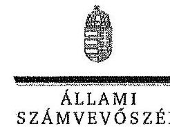

ELRÖK

Ikt.szám: V-0363-267/2014.

Prof. Dr. Torma András úr
rektor
Miskolci Egyetem

Miskolc

# Tisztelt Rektor Úr! 

A Miskolci Egyetem gazdálkodásának és müködésének ellenôrzésérôl készített jelentéstervezetre tett észrevételeit köszönettel megkaptam.

Az Állami Számvevőszék észrevételekre vonatkozó álláspontjáról a felügyeleti vezető által készített részletes tájékoztatást csatoltan megkitildőm.

Tájékoztatom Rektor urat, hogy az ÁSZ. tv. 29. § (3) bekezdése alapján a számvevőszéki jelentés mellékleteként szerepeltetjük a jelentéstervezethez tett figyelembe nem vett észrevételeket az elutasítás indokainak feltüntetésével.

Budapest, 2014. 13. hó 13. nap
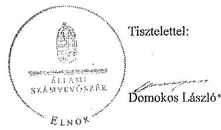

Melléklet: Tájékoztatás az elfogadott és a figyelembe nem vett észrevételekrôl

---

# Tájékoztatás   az elfogadott és a figyelembe nem vett észrevételekröl 

A Miskolci Egyetem gazdálkodásának és müködésének ellenőrzéséről készült számvevőszéki jelentéstervezethez az R-1115-4/2014. iktatőszámú levélben tett észrevételeit köszönettel megkaptuk.

A jelentéstervezetre tett észrevételeket áttekintettük, azok kezeléséről a következő tájékoztatást adom:

## Általános tájékoztatás

Az észrevételek széleskörűen érintik az Összegző részben szereplő megállapításokat, sok esetben azok törlését javasolva. A jelentéstervezet összegző megállapítások része a részletes megállapítások fejezetben jogszabályi hivatkozásokkal alátámasztott ténymegállapítások szintetizálása. Az összegző részben foglaltakat kizárólag akkor módosítottuk, ha az észrevételezés során a részletes megállapítások fejezetben leírtakat konkrét tényekkel, adatokkal pontositották, illetve kiegészítették.

A megállapítások alátámasztására vonatkozóan tájékoztatom, hogy a jelentéstervezet bevezető részében rögzítettek szerint „a pénzügyi és vagyongazdálkodás terén az egyes területek szabályszerü müködését mintavétellel ellenőriztük, ez alapján a sokaságokban elöforduló hibás tételek arányát becsültük", amelynek kiértékelését az 5. számú melléklet tartalmazza.

A mintavétel eredményeit tehát kivetítetfük a teljes sokaságra, amelynek során meghatároztuk a mintában feltárt hibaarányhoz tarozó alsó és felső hibahatárokat (alsó határ = legvalószinűbb hiba - mintavétel maximális hibája; felső határ = legvalószinűbb hiba + mintavétel maximális hibája). A teljes sokaságban a hibás tételek aránya $95 \%$-os bizonyossággal az alsó és felső hibahatár közé esik.

A jogszabályoknak és a belső előírásoknak megfelelőnek, azaz szabályszerűnek tekintettük az adott kiadási előirányzat felhasználását, bevétel beszedését, mérlegtétel értékelését, amennyiben a minta alapján $95 \%$-os bizonyossággal megállapítható volt, hogy a teljes sokaságban a hibás tételek aránya kisebb, mint $10 \%$, nem megfelelőnek értékeltük, ha a hibás tételek aránya a $10 \%$-ot meghaladta.

Amennyiben $95 \%$-os bizonyossággal nem volt egyértelműen megállapítható a minta alapján, hogy az adott terület müködése megfelelő volt-e (az elfogadható hibaarány ( $10 \%$ ) az alsó és felső hibahatár közé esett), de a mintában a hibás tételek aránya kisebb volt, mint az elfogadha-

---

tó hibaarány ( $10 \%$ ), akkor kockázatosnak minősítettük az adott terület müködését. Ha a mintában a hibás tételek aránya nagyobb volt, mint az elfogadható hibaarány ( $10 \%$ ), akkor magas kockázatúnak értékelttik az adott terület müködését.

A mintavételes ellenőrzés alapján tett megállapításoknál az ellenőrzött területre vonatkozóan megjelöltük a megsértett jogszabályhelyeket, illetve a hibatípusokat. Terjedelmi okok miatt a jelentéstervezetben az összes hibát tételesen nem mutathattuk be. Javaslataink a jelzett szabálytalanságok megszüntetését és a hibák kijavítását célozzák

# Tartalmi észrevételek 

## Bevezetés

(18. oldal első bekezdése)

Az észrevételben foglaltak alapján a jelentéstervezetet az alábbiak szerint módosítottuk:
„Az egyetemen az ellenőrzött idöszakban kilenc kari (intézeti) gazdálkodási egység müködött: Müszaki Földtudományi Kar, Müszaki Anyagtudományi Kar, Gépészmérnöki és Informatikai Kar, Állam- és Jogtudományi Kar, Gazdaságtudományi Kar, Bölcsészettudományi Kar, Egésszégügyi Kar, Comenius Föliskolai Kar és Bartók Béla Zenemüvészeti Intézet. A karokon és intézeten felül további kilenc gazdálkodási egységgel rendelkezett az egyetem: Idegennyelvi Oktatási Központ; Könyvtár, Levéltár, Múzeum; Egyetemi Számitóközpont; Bolyai Kollégium; Felnö̈tképzési Regionális Központ; GazdaságiMüszaki Föigazgatóság; Központi Igazgatás; Alkalmazott. Földtudományi Kutatóintézet; Árvay József Gyakorló Általános Iskola (2011. augusztus 31-ig)."

## 1. Összegző megállapítások

20. oldal 7. bekezdése

Az észrevételben jelzettek alapján a jelentéstervezet módosítása nem indokolt. A ME belső kontrollrendszerének kialakítására és müködtetésre vonatkozó összegző megállapítás alátámasztása a részletes megállapítások 2.1. pont belső kontrollrendszert értékelő részében szerepel. Az öt kontrollpillér közül kettő volt megfelelő, egy részben felelt meg és kettő nem müködött megfelelően, ezért nem jelenthető ki, hogy a belső kontrollrendszer kialakítása és müködtetése összességében megfelelit a vonatkozó jogszabályi előírásoknak.

Mint azt a jelentéstervezet bevezető részében bemutattuk, a belső kontrollrendszer kialakításának és müködtetésének értékelését a vonatkozó jogszabályi előírások alapján készített munkaIapok, valamint az ellenőrzés gyakorlati tapasztalatai alapján végeztük el. Az értékelés során a jogszabályi előírások mellett az Ámr ${ }_{1} 145 /$ A. § (1) és (3) bekezdése, az Ámr 155 . § (3) bekez-

---

dése, valamint a Bkr. 5. § (1) bekezdése alapján figyelembe vettük az államháztartásért felelős miniszter által között irányelvekben és módszertani útmutatókban ${ }^{1}$ foglaltakat is. A belső kontrollrendszert az értékelés során legalább $85 \%$-os megfelelőség esetén megfelelőnek, legalább $70 \%$-os megfelelőség esetén részben megfelelőnek, $70 \%$-os megfelelőség alatt pedig nem megfelelőnek minősítettük.

# 21. oldal 1. bekezdése 

Az észrevételben jelzettek alapján a jelentéstervezet módosítása nem indokolt. Az átadott dokumentumok alapján tett megállapítást a Részletes megállapítások 31. oldal 6-7. bekezdéseiben és a 32 oldal. 1-4. bekezdéseiben foglaltak támasztják alá. Ennek alapján hiányos volt - többek között - a Gazdasági és Műszaki Fölgazgatóság Úgyrendje, az intézmény számviteli politikája, számlarendje, leitározási szabályzata, eszközök és források értékelési-, pénzkezelési-, kötelezettségvállalási szabályzata. Mindezek miatt a szövegrész második mondatának törlése nem indokolt. Az SZMSZ hiányosságait a 30. oldal utolsó bekezdése rögzíti.

Az észrevétel alapján a 21. oldal első bekezdését pontositottuk:
„Az SZMSZ-ben a jogszabályi elöirások ellenére nem határozták meg az engedélyezett létszámadatokai szervezeti egységenként."

A 31. oldal első bekezdését az alábbiak szerint módosítottuk:
„Az intézmény gondoskodott az SZMSZ és a belső szervezeti szabályok alapító okirat változásainak megfelelő módosításáról."

Az észrevétel alapján az alábbi mondatot töröltük a 21. oldal érintett szövegrészéből, ennek megfelelően az egyetem rektorának tett 1. sz. javaslat intézkedést igénylő megállapításaiból is.
„Az intézmény vezetője nem gondoskodott a szervezetre vonatkozó etikai elvárások elkészitéséről."
21. oldal 2. bekezdése

Az észrevételben jelzettek alapján az érintett szövegrész módosítása, a bekezdés utolsó mondatának törlése nem indokolt. A folyamatba épített, illetve a vezetői ellenőrzés nem megfelelő működésére utaló hiányosságokat a jelentéstervezet II. Részletes megállapítások 3.2. pontja tartalmazza.
21. oldal 3. bekezdése

Az észrevétel alapján a monitoring rendszerre vonatkozó megállapítást a részletes megállapítások között a 33-34. oldalon leírtakkal összhangban pontositottuk:

[^0]
[^0]:    ${ }^{1}$ 1/2009. (IX. 11.) PM irányelv, Pénzügyminisztérium Belső Kontroll Kézikönyv 2010.

---

„Az egyetem a 2012. évtöl müködtetett a teljes tevékenységét átfogó - a részrendszereket integráló - monitoring rendszert."

# 21. oldal 5. bekezdés 

Az észrevételben foglaltak az integritás kontrollokra vonatkozó összegző megállapításokat nem cáfolják meg. Az összegző megállapítások alátámasztása a Részletes megállapítások 2.2 pontjában szerepel.
22. oldal 2. bekezdése,

Észrevétele, továbbá a 3. sz. melléklet alapján a megállapítást az alábbiak szerint pontositottuk:
„A pénzügyi pozíció kedvezőtlen váltosása a hallgatói létszám és a költségvetési támogatások csökkenésével, továbbá a felhalmozási kiadások növekedésével volt összefüggésben."

Ugyanezen okból módositottuk a részletes megállapítások között a 36. oldalon a táblázat alatti bekezdés 6 . sorát:
„A csökkenés okai a hallgatói létszámváltozással összefüggésben a költségvetési tómogatások visszaesése, továbbá a végrehajtott beruházások és felújitások voltak."

## 22. oldal 3. bekezdése

A pénzügyi gazdálkodás általános értékelésére vonatkozó megállapítást a jelentéstervezet 22. oldal 4-6. bekezdésekben és a 23. oldal 1-3. bekezdéseiben, továbbá a Részletes megállapítások vonatkozó részeiben támasztjuk alá. A kifogásolt szövegrész törlése, illetve módosítása nem indokolt.

## 22. oldal 4. bekezdése

A jelenléti ív vagy egyéb, a teljesített munkaidőre vonatkozó nyilvántartás a bérszámfejtés alapbizonylata a ledolgozott munkaidőről. Az ellenőrzött időszakban a munkaidő nyilvántartás vezetését az Mtv. 1 140/A. § (1) és (3) bekezdése, illetve az Mtv. 2 134. § (1)-(3) bekezdése írta elő. Az Mtv. 1 140/A § (2) bekezdésének előírásai az oktatók esetében sem alkalmazhatók, mivel munkaidejük beosztását, felhasználását nem maguk jogosultak meghatározni, ez összeegyeztethetetlen lenne az órarendnek megfelelő munkavégzéssel. A nyilvántartás hiánya ellentétes továbbá - az Ámr. 1 135. § (1) bekezdésében, Ámr. 2 76. § (1) bekezdésében és az Ávr. 57. § (1) bekezdésében foglaltakkal - miszerint a kiadások teljesítését szakmai teljesités igazolásnak kell megelőznie. A fentiek miatt a kifogásolt megállapítás törlése nem indokolt.

## 22. oldal 5. bekezdése

A megbízási díjak elszámolását, teljesítését a $10 \%$-ot meghaladó hibaarány miatt minősítettük nem megfelelőnek, az ellenőrzés az 50 mintatétel $22 \%$-ánál talált hibát. A megbízási szerződések Ávr. 50. § (2) bekezdésének nem megfelelő megkötése öt esetben, a kötelezettségvállalási,

---

illetve ellenjegyzési jogkör jogosulatlan gyakorlása négy esetben fordult elő. A további számszerüsített hiányosságokat, a megsértett jogszabályokra való hivatkozással a Részletes megállapítások 44. oldalának utolsó bekezdése tartalmazza.

# 22. oldal 6. bekezdése 

Az észrevételhez kapcsolódóan felhívom figyelmét az általános tájékoztatásban leírtakra. A dologi és felhalmozási kiadások felhasználásáról szóló, 22. oldal utolsó bekezdésében, illetve a 33. oldal 3. bekezdésében foglalt összegző értékelések alátámasztását a jelentéstervezet 44. oldalán és a 45 . oldal első két bekezdésében rögzítettük.
23. oldal 1. bekezdése, illetve 47. oldal 3. bekezdése

A müködési bevételeknél a pénzügyi gazdálkodási jogkörök gyakorlásának értékelésére vonatkozó megállapítást a jelentéstervezet 46. és 47. oldalán részletesen bemutattuk. A mintatételek ellenőrzését az ellenőrzés rendelkezésére bocsátott dokumentumok alapján végeztük el, amelyek fellelhetők az ellenőrzött szervezetnél.

A hallgatói költségtérítések kezelésére vonatkozó megállapítás megalapozott, az ennek során megsértett jogszabályokat a jelentéstervezet 46-47. oldala egyértelmüen rögzíti.
23. oldal 2. bekezdése

Az ellenőrzés a 2010. évi helyiség bérbeadási tevékenységnél tárt fel szabálytalan gyakorlatot, a megsértett jogszabályra való hivatkozással, amelyet jelentéstervezet 57. oldal 2. bekezdése tartalmazza.

A hibák előfordulásának számát figyelembe véve az érintett szövegrészt az Összegző rész 23. oldalán, továbbá a Részletes megállapítások között a 48. oldal második bekezdésében az alábbiak szerint módosítottuk:
„Az ellenőrzött időszakban szabálytalan volt a teljesités igazolások elmaradása, a bérbeadás elötti versenyeztetés elmulasztása."
23. oldal 3. bekezdése (illetve 48. oldal 3. bekezdése)

A jelentéstervezet Összegző része és Részletes megállapításai összhangban vannak egymással. Mindkét helyen szerepel, hogy az egyes tevékenységek bevételeinek, kiadásainak, költségeinek elkülönítése megtörtént, ami alapot biztosított a költségtérítés szabályszerű megállapítására. Emellett ugyanakkor a térítési díjak, költségtérítések megállapítása nem volt szabályszerű az önköltségszámításnál figyelembevett költségelemek megalapozatlansága miatt.

A megállapításhoz kapcsolódó észrevétele alapján az összegző részben az érintett bekezdés utolsó mondatát töröltük. A Részletes megállapítások 48. oldalát az alábbiak szerint pontositottuk:

---

„Az intézményi térítési dijak, költségtéritések megállapításának tekintetében nem volt biztosított teljes körüen a jogszabályoknak és a belsö szabályzatok elöirásainak való megfeleläség az önköltségszómitásnál figyelembevett költségelemek megalapozatlansága miatt. Ez szabályszerüségi kockázatot jelentett az ellenörzött terület egészének müködése szempontjából.

Egy alvállalkozót szerzödés nem rendelkezett egyértelmüen a munkadij mértékéröl, a megjelölt melléklet egy éves dijat határoz meg, részteljesitést nem emlit...."
23. oldal 5. bekezdése (illetve 49. oldal 1. bekezdése)

A 23. oldal megállapítása nem általánosságban jelenti ki a pályázatok elszámolásának szabálytalanságát, hanem azt rögziti, hogy nem volt biztosított teljes körüen a jogszabályoknak való megfelelés. A megsértett jogszabályokat a részletes megállapítások 49. oldalán rögzítettük.
24. oldal 4. bekezdése

A gyüjtőszámla felett - a hatályos állambáztartási szabályozással ellentétesen -az egyetem bankszámlaszerződésében megjelölt munkatársainak van rendelkezési joga. Az Sztv. és az Áhsz. szerinti valódiság és teljesség elve érvényesitéséhez az Erste Bank Zrt-nél vezetett gyüjtőszámla mérleg fordulónapi egyenlegét leltározás és számviteli szempontok szerinti minősítést követően a mérlegben ki kellett volna mutatni. Mindezek miatt a megállapítást törlése nem indokolt.
25. oldal 2. bekezdése

Mint azt a 23. oldal 2. bekezdéséhez adott tájékoztatásban a felhalmozási bevételekkel kapcsolatban is jeleztük, a bérbeadáshoz kötődő szabálytalan gyakorlatot jogszabályi hivatkozás mellett a jelentéstervezet 57. oldal 2. bekezdésében mutattuk be, ezért az észrevételt nem tudjuk elfogadni.

# Részletes megállapítások 

29. oldal 1. bekezdése

A jelentéstervezet észrevételezett része nem az egyetem, hanem a fenntartó feladatellátásának szabályosságát értékeli, emiatt a kifogásolt szövegrész kiegészítése nem indokolt.
30. oldal 2. és 4. bekezdése

Válaszunk megegyezik a 20. oldal 7. bekezdéséhez tett a belső kontrollrendszer kialakításának és müködtetésének összegző értékeléséhez füzött észrevételére leírtakkal.

---

30. oldal 3. bekezdése

Az észrevételben leírtak nem indokolják az érintett szövegrész módosítását, mert a belső kontrollrendszer számvevői értékelése - a jelentéstervezetben leírtak alapján - eltér a nyilatkozatban foglaltaktól.
30. oldal 5. bekezdése

Az engedélyezett létszám adatainak szerepeltetését az SZMSZ-ben a jelentéstervezetben hivatkozott jogszabályi rendelkezések írták elő. Az a tény, hogy a fenntartó nem észrevételezte a hiányosságot, nem menti fel az intézményt a jogszabályi rendelkezések alól.
31. oldal 3. bekezdése

Válaszunk megegyezik a 21. oldal 1. bekezdéshez tett észrevételére leírtakkal.
Az egyetem Etikai Kódexével kapcsolatos észrevételük alapján az érintett szövegrészt az alábbiak szerint módosítottuk:
„Az Egyetem vezetője nem megfelelően határozta meg a belső szabályzatabban a pénzés vagyongazdálkodással kapcsolatos folyamatokat, feladat- és hatásköröket, felelősségi viszonyokat, továbbá-az-etikai-követelményeket, a szabályzatok aktualizálása az ellenőrzési időszakban elmaradt."

# 31. oldal 4. bekezdése 

A ellenőrzésnek átadott dokumentumok alapján a helyettesítés rendje szervezeti egységen belül nem konkrétan, egyértelműen meghatározott. A kapcsolattartás szabályait a jelentéstervezetben hivatkozott jogszabályi előírások szerint az SZMSZ-nek, vagy az ügyrendnek kell tartalmaznia. Az érintett szövegrész módosítása nem indokolt.
31. oldal 5. belső bekezdése

Az ellenőrzött időszakban hatályos Áhsz. 8. § (5) bekezdés g) pontja értelmében a számviteli politikában kell meghatározni, hogy mi tekintendő figyelembe veendő szempontnak a terven felüli értékcsökkenés elszámolásánál figyelembe veendő szempontokat. A MÉ nem szabályozta a fent leírtakat a 2007. december 17-tól, valamint 2011. május 26 -tól hatályos Számviteli politikájában. Észrevétele és a rendelkezésünkre álló dokumentumok alapján az érintett bekezdést kiegészítettük:
„A számviteli politikában az Áhsz. 8. § (5) bekezdés g) pontjának elölrása ellenére az ellenőrzött idöszak egészében nem szabályosták a terven felüli értékcsökkenés elszámolásánál figyelembe veendő szempontokat, azt az egyetem számlarendjében rögzítették."
31. oldal 5-6. belső bekezdései

---

Mivel - a hatályos államháztartási szabályozással ellentétesen nyitott - gyüjtőszámla felett az egyetemnek van rendelkezési joga, a számlát érintő gazdasági eseményeket számviteli rendjében rögzíteni kellett volna. A megállapítás törlése emiatt nem indokolt.
31. oldal 7-8. belső bekezdései

Az észrevétel alapján az érintett szövegrészeket töröltük.
31. oldal 9. belső bekezdése

Az észrevételben foglaltak alapján a jelentéstervezet hivatkozott bekezdését kiegészítettük a jogszabályhely lábjegyzetben történő pontos megjelölésével az alábbiak szerint:
„Az eszközök és források értékelési szabályzatát 2007.12.17. után legközelebb négy év múlva, 2011.05.26-án módosították. A köztes időben hatályba léptek újabb értékelési rendelkezések a (öztv.-ben 60. § 10. bekezdése, illetve az Ához. 5. §,7. e) pontja és a 28. §, 5. bekezdése) azonban e változások hatályba lépésekor nem aktualizálták a szabályzatot."

A hivatkozott bekezdés utolsó mondatának törlése nem indokolt a 31. oldal 5-6. bekezdéseihez tett tájékoztatás alapján.
32. oldal 1. bekezdése

Az észrevételben foglaltak alapján a pénzkezelési szabályzatról szóló részbekezdést elhagytuk.
32. oldal 2. bekezdése

Az észrevételben jelzettck alapján az érintett szövegrészt az alábbiak szerint módosítottuk:
„Az értékesités folyamatának részletes bemutatását tartalmazta az egyetem használatában lévő felesleges vagyontárgyak feltárásáról, hasznosításáról és selejtezéséről szóló 2011. évi szabályzata, de ez szintén nem tért ki az ME vagyonkezelésében lévő eszközöknek az éves költségvetési törvényekben meghatározott értékhatárt meghaladó a Vtv. ${ }^{2}$, Ntv ${ }^{3}$, Feat ${ }^{4}$. és az Nftv ${ }^{5}$. szerinti engedélyezési eljárás szabályozására."

[^0]
[^0]:    ${ }^{2}$ Vtv 33-37. §
    ${ }^{3}$ Nvtv.13-15. §
    ${ }^{4}$ Feot. 122. § (2) bekezdése a)-d) pontjai
    ${ }^{5}$ Nftv. 89. § 2. bekezdés a)-d) pontjai

---

# 34. oldal 7. bekezdése 

Az érintett szövegrészt az észrevétel alapján módosítottuk:
„A belső ellenörzés elözetesen véleményezte az intézkedési terveket."
35. oldal 2-4. bekezdése

A belső szabályozás integritás kontrolljai segítik a belsőkontroll rendszer müködését. Az ÁSZ ellenörzése arra irányult, hogy javult-e az integritás kontrollok szabályozása, az egyetemnél érvényesült-e az integritás szemlélet. Az integritás kontrollok müködéséről szóló 2.2. ponthoz tartozó megállapításokat az Önök által kitöltött és aláírt 22. tanúsítványban adott válaszok alapján foglaltuk össze.
44. oldal 2. bekezdése

Tájékoztatásunk megegyezik a 22. oldal 4. bekezdéséhez leírtakkal.
A megállapítás megszövegezését a jogszabályokban elöírtaknak megfelelően az alábbiak szerint pontositottuk:
„Rendszerhiba volt, hogy az illetmények számfejtéséhez szükséges munkaidő nyilvántartást ${ }^{6}$ nem vezettek."

## 45. oldal 3. bekezdése

Az észrevételhez kapcsolódó tájékoztatásunk azonos a 22. oldal 6. bekezdésében, továbbá az általános tájékoztatásban leírtakkal.
46. oldal 2. bekezdése

A megállapításban a kötelezettségvállalással kapcsolatosan jelzett hiányosságok az 5005046/2009.; 2600755/2010.; 5003804/2011.; 5600433/2012. hivatkozási sorszámú tételekre vonatkoznak. Ugyanakkor egyéb - a 46. oldal belső bekezdésében leírt hiányosságokat az egyetem által rendelkezésre bocsátott, ellenőrzött mintatételek $50 \%$-ánál tártunk fel. Ennek megfelelően az érintett bekezdést az alábbiak szerint módosítottuk.
„A kötelezettségvállalás mellözésével megrendelt összesen 6,7 M Fi összegü szolgáltatások, feladatok teljesültek, ugyanakkor azok korrupciós kockázatot jelentettek az egyetem gazdálkodásában. Az ellenörzött mintatételek felénél tártunk fel szabályszerüségi hibákat."

[^0]
[^0]:    ${ }^{6}$ Miv., 140/A. § (1) bekezdés, Miv. 134. § (1) bekezdés, Ámv. 135. § (1) bekezdés, Ámv. 76. § (1) bekezdés, Ávr. 57. § (1) bekezdés

---

# 47. oldal 3. bekezdése 

Az észrevételéhez kapcsolódóan jelzem, hogy a müködési bevételek ellenőrzésére egyszerủ véletlen mintavétellel kiválasztott 50 db tétel közül az Önök által átadott dokumentáció alapján 42 esetben állapítottunk meg hiányosságot. A müködési bevételekhez kapcsolódó megállapítást az alábbiak szerint pontositottuk, illetve kiegészítettük egy részbekezdéssel:
„A pénzgazdálkodással kapcsolatos gazdálkodási jogkörök jogosultságainak dokumentáltsága nem volt teljes körü. Rendszerhiba volt, hogy az utalványozó, az érvényesitő és az utalvány ellenjegyzöje nem rendelkezett jogosultsággal a tranzakció elszámolásakor. A kiszámlázott összeg több esetben nem folyt be határidöre.

A szabálytalannak minősïlt tételek kösïl az utalványozó 27 esetben, az érvényesitő kilenc esetben, az utalvány ellenjegyzöje három esetben nem rendelkezett jogosultsággal a tranzakció elszámolásakor. Az ellenörzött tételek kösïl 10 esetben a kiszámlázati összeg nem határidőben folyt be. Az ellenörzött tételek $84 \%$-a minősïlt szabálytalannak."

## 47. oldal 4. bekezdése

A Kötelezettségvállalási Szabályzat pénzeszközök, gazdálkodási keretek felhasználására vonatkozó jogosultságokról szóló 1. sz. melléklet 10. pontja a „Saját bevételekhez kapcsolódó kötelezettségvállalás"-t rögzíti. A hallgatói térítési díjakat érintően a dokumentáltsággal kapcsolatos hiányosságokat a jelentéstervet 47. oldalának utolsó (belső) bekezdése tartalmazza. Ennek alapján a jelentéstervezetben foglalt megállapítást nem indokolt módosítani.
48. oldal 1. bekezdése

Válaszunkat a 23. oldal 2. bekezdésére tett tájékoztatás tartalmazza.
48. oldal 3. bekezdése

Válaszunkat a 23. oldal 3. bekezdésére tett tájékoztatás tartalmazza.
48. oldal 4. (belső) bekezdése

Az észrevételben foglaltak figyelembevételével az érintett szövegrészt a 23. oldal 3. bekezdéséhez kapcsolódó tájékoztatás szerint módosítottuk.
49. oldal 1. bekezdése

Az észrevételben foglaltak alapján a jelentéstervezetben tett megállapítást az alábbiak szerint pontositottuk:
„A pályázatoknál egy kivételével a pénzügyi elszámolás a támogatási szerzödésben meghatározott határidöben vagy tartalommal készült el. Az „NTP-OKA I. A felsőoktatási intézményekben müködő tehetséggondozó mühelyek támogatása" pályázat esetében

---

a kupolt költségvetési forrással való elszámolás szabályszerűsége nem volt megfelelő, a hiánypótlás elmaradása miatt."
54. oldal 5-7 bekezdése

A vevőkövetelésekre vonatkozó észrevételét figyelembe véve a jelentéstervezetet a következők szerint módosítottuk:
„A vevökövetelések tartalma és besorolása szabályos volt. azonban a tételek $100 \%$-ánál elmaradt-a kövelelések minösitése-A-minösités elmaradása-mialt-nem-számoltak-el-értékvesztést, ami-nem-felolt-meg-as-Satv-33. - (1)-bekezdésében-és-as-Ahsz-31- - (2)-be-kezdésében-foglaltaknak-Azom vevököveteléseket, amelyek behajtása tekintetében kockázatok álltak fenn (felszámolás alatt álló, tartósan nem fizető partnerek) az ME év végén tételesen értékelte, és az értékelések alapján 100\%-os értékvesztést számolt el. Az elszámolt értékvesztések összege a 2009. évben 38,7 M Ft, a 2010. évben 22,6 M Ft, a 2011. évben 32,2 M Ft, a 2012. évben 19,3 M Ft volt. A-minösités-elmaradása-mialt Részbeni értékvesztés elszámolására nem került sor. Az-értékvesztés-minösités-hiányó-ban-tertént-elszámolása-nem-felolt-meg-as-Ahsz-31- - (3)-bekezdésében-foglaltaknak. Eimialt-as-Satv-13. - (4)-és-as-Ahsz-9. - (11)-bekezdésében-meghatározott-valódiság-el-ve-is-sérült."
55. oldal 2. bekezdése

A hallgatói költségtérítések kezelése során megsértett jogszabályokat a jelentéstervezet tételesen tartalmazza, továbbá ehhez kapcsolódik a 24. oldal 4. bekezdéséhez közölt tájékoztatásunk. Mindezek alapján az megállapítások módosítását nem tartjuk indokoltnak.
56. oldal 2. bekezdése

A selejtezési jegyzőkönyvre vonatkozó észrevételét figyelembe vettük, ennek alapján a jelentéstervezetet pontositottuk:
„A selejtezési jegyzőkönyvekhez a „Selejtezeit tárgyi eszközök jegyzékét" csatolták, amely nem tartalmazta a selejtté válás okát. A hasznosítás módját a jegyzőkönyv $V$, fe. jezetében annak mellékletében felsoroltakra vonatkoztatva rögzítették."
59. oldal 8. bekezdése

Az észrevételben jelzettek alapján az alábbi szövegrészt töröltük a jelentéstervezetből:
„Az-ellenőrsätt-időszakban-a-Feat-121. - (4)-bekezdésében-foglalt-elöirással-szemben az-ME-rektora-nem-közölette-el-a-gasdasági-tamács-részére-a-gasdasági-társaságok-tevékenységéröl-szóló-beszámolót."

---

62. oldal 6. bekezdése

A jelentéstervezet érintett része a felsőoktatásért felelős minisztérium intézkedési terveinek utóellenőrzését értékeli. Az állami felsőoktatási intézmények társaságaira vonatkozó szakmai feladatellátás és a gazdasági eredményezésé mérését biztosító mutatók és azok értékelési rendszerének kidolgoztatására az emberi erőforrások miniszterének 2012. évi 1290. sz. ÁSZ jelentésben tettünk javaslatot. Az Emberi Erőforrások Minisztériumánál elvégzett utóellenőrzés megállapításai alapján a javaslat ágazati szinten nem hasznosult. A megállapítás nem az intézmény feladatellátásának értékelésére vonatkozott.

Kérem a válaszlevelemben foglaltak szíves tudomásulvételét. Tájékoztatom Rektor urat, hogy a számvevőszéki jelentés mellékleteként szerepeltetjük a jelentéstervezethez tett észrevételeit, valamint az ÁSZ. tv. 29. § (3) bekezdése alapján a figyelembe nem vett észrevételeket az elutasítás indokának feltüntetésével együtt.

Megköszönöm munkatársainak az ÁSZ ellenőrzés sikeres elvégzéséhez nyújtott segítségét, támogatását, amelyet - az éves beszámoló és az új számviteli rendre való átállás időszakában, a többi felsőoktatási intézményhez hasonlóan - a helyszíni ellenőrzést végző számvevők számára nyújtottak.

Budapest, 2014. 08. hó 15. nap

Horváthné Herbáth Mária
felügyeleti vezető