# ÁLLAMI   SZÁMVEVŐSZÉK 

## JELENTÉS

a Széchenyi István Egyetem ellenőrzéséről - Az állami felsőoktatási intézmények gazdálkodásának, müködésének ellenőrzése

---

# Állami Számvevőszék 

Iktatószám: V-0364-491/2014.
Témaszám: 1371
Vizsgálat-azonosító szám: V-065806

## Az ellenőrzést felügyelte:

Horváthné Herbáth Mária
felügyeleti vezető

## Az ellenőrzést vezette:

Dormán István Zoltán
ellenőrzésvezető
A számvevői jelentések feldolgozásában és a jelentés összeállításában közremüködtek:

Dormán István Zoltán
ellenőrzésvezető
Vacsora Erika
számvevő tanácsos
Literáti Gergő
számvevő asszisztens
Az ellenőrzést végezték:

| Burenzsargal | Hálóné Pelikán | Szabó Balázsné Zsíros |
| :-- | :-- | :-- |
| Narantuja | Veronika | Andrea |
| számvevő tanácsos | számvevő | számvevő |
| Vacsora Erika | Vojcsekné Szabó | Völgyesi Mátyás |
| számvevő tanácsos | Ágnes | számvevő |

A témához kapcsolódó eddig készített számvevőszéki jelentések:
címe
sorszáma
Jelentés az oktatási és kulturális ágazat irányítási rendszerének, 1106 müködésének ellenőrzéséről
Jelentés a felsőoktatás oktatási infrastruktúra-fejlesztési program- 1171 jának ellenőrzéséről
Jelentés az állami felsőoktatási intézmények érdekeltségébe tartozó 1290 gazdasági társaságok támogatásának és nyereségük hasznosulásának ellenőrzéséről

---

# TARTALOMJEGYZÉK 

BEVEZETÉS ..... 13
I. ÖSSZEGZŐ MEGÁLLAPÍTÁSOK, KÖVETKEZTETÉSEK, JAVASLATOK ..... 18
II. RÉSZLETES MEGÁLLAPÍTÁSOK ..... 28

1. A felsőoktatásért felelős minisztérium fenntartói és ágazati irányítási tevékenysége ..... 28
2. Az intézmény belső kontrollrendszerének kiépítése és múködtetése ..... 31
2.1. Belső kontrollrendszer ..... 31
2.2. Az integritás kontrollok múködése ..... 37
3. A pénzügyi gazdálkodás szabályszerűsége ..... 37
3.1. A kiadási és bevételi előirányzatok alakulása ..... 37
3.1.1. A pénzügyi egyensúlyt befolyásoló tényezők ..... 39
3.1.2. A normatív támogatások felhasználása ..... 42
3.2. A kiadási és bevételi előirányzatok felhasználásának szabályszerűsége ..... 43
3.2.1. Kiadási előirányzatok ..... 43
3.2.2. Bevételi előirányzatok ..... 46
3.2.3. A hazai forrásból finanszírozott projektek ..... 48
3.2.4. Az előirányzat-módosítások szabályszerűsége ..... 50
3.2.5. Az előirányzat-maradványok szabályszerűsége ..... 50
4. A vagyongazdálkodás szabályszerűsége ..... 51
4.1. A vagyongazdálkodás szabályozottsága ..... 51
4.2. A vagyonelemekkel történő gazdálkodás ..... 51
4.3. Az intézményi vagyon volumenének és összetételének változása ..... 56
5. Korábbi ÁSZ ellenőrzések javaslatainak hasznosulása ..... 57

---

# MELLÉKLETEK 

1. számú A Széchenyi István Egyetem kiadási és bevételi előirányzatai, azok teljesítése a 2009-2012. években
2. számú A Széchenyi István Egyetem kiadásainak, bevételeinek változása a 20092012. években
3. számú Kimutatás a Széchenyi István Egyetem bevételeiről és kiadásairól, valamint adósságszolgálatáról a 2009-2012. években
4. számú A Széchenyi István Egyetem mérlegadatai a 2009-2012. években
5. számú A Széchenyi István Egyetem gazdálkodása szabályszerűségének értékelése a mintatételek alapján
6. számú Az Emberi Erőforrások Minisztériumának észrevétele
7. számú Az Emberi Erőforrások Minisztériumának észrevételére adott válasz
8. számú A Széchenyi István Egyetem észrevétele
9. számú A Széchenyi István Egyetem észrevételére adott válasz

---

# RÖVIDÍTÉSEK JEGYZÉKE 

## Törvények

Áht. 1
Áht. 2
ÁSZ tv.
Feot.
Gt.
$\mathrm{Kbt}_{-1}$
$\mathrm{Kbt}_{-2}$
Kjt.
Nftv.
Nvtv.
Sztv.
Vtv.

## Korm. rendeletek

Áhsz.

Ámr. 1
Ámr. 2
Ávr.
Ber.
Bkr.
Vtvr.

## Határozatok

1033/2009. (III. 17.)
Korm. határozat
1365/2011. (XI. 8.)
Korm. határozat
1122/2012. (IV. 25.)
Korm. határozat
1428/2012. (X. 8.)
Korm. határozat
1992. évi XXXVIII. törvény az államháztartásról (hatálytalan 2012. I. 1-jétől)
2011. évi CXCV. törvény az államháztartásról
2011. évi LXVI. törvény az Állami Számvevőszékről
2005. évi CXXXIX. törvény a felsőoktatásról (hatálytalan 2012. IX. 1-jétől)
a gazdasági társaságokról szóló 2006. évi IV. törvény
2003. évi CXXIX. törvény a közbeszerzésekről (hatálytalan 2012. I. 1-jétől)
2011. évi CVIII. törvény a közbeszerzésekről
1992. évi XXXIII. törvény a közalkalmazottak jogállásáról
2011. évi CCIV. törvény a nemzeti felsőoktatásról
2011. évi CXCVI. törvény a nemzeti vagyonról
2000. évi C. törvény a számvitelről
2007. évi CVI. törvény az állami vagyonról
249/2000. (XII. 24.) Korm. rendelet az államháztartás szervezetei beszámolási és könyvvezetési kötelezettségének sajátosságairól
217/1998. (XII. 30.) Korm. rendelet az államháztartás működési rendjéről (hatálytalan 2010. I. 1-jétől)
292/2009. (XII. 19.) Korm. rendelet az államháztartás működési rendjéről (hatálytalan 2012. I. 1-jétől)
368/2011. (XII. 31.) Korm. rendelet az államháztartásról szóló törvény végrehajtásáról
193/2003. (XI. 26.) Korm. rendelet a költségvetési szervek belső ellenőrzéséről (hatálytalan 2012. I. 1-jétől)
370/2011. (XII. 31.) Korm. rendelet a költségvetési szervek belső kontrollrendszeréről és belső ellenőrzéséről
254/2007. (X. 4.) Korm. rendelet az állami vagyonnal való gazdálkodásról
a 2009. évi államháztartási egyensúly megőrzéséhez szükséges intézkedésekről
a 2012. évi költségvetési hiánycél tartását biztosító további feladatokról
a Széll Kálmán Terv kiterjesztése keretében megvalósítandó egyes intézkedésekről
a 2012. évi költségvetési egyenleg tartását biztosító intézkedésekről

---

Egyéb rövidítések
ÁSZ
egyetem
EMMI
EU
FEUVE
FIR
GMF
GT
IFT
Kincstár
MNV Zrt.
NEFMI
NEPTUN
NFM
NGM
NKTH
OKM
OTKA
PM
Saldo
SZE
SZMSZ

Állami Számvevőszék
Széchenyi István Egyetem
Emberi Erőforrások Minisztériuma
Európai Unió
folyamatba épített előzetes, utólagos és vezetői ellenőrzés
Felsőoktatási Információs Rendszer
Gazdasági és Műszaki Főigazgatóság
Gazdasági Tanács
Intézményfejlesztési Terv
Magyar Államkincstár
Magyar Nemzeti Vagyonkezelő Zrt.
Nemzeti Erőforrás Minisztérium
Neptun.NET Egységes Tanulmányi Rendszer
Nemzeti Fejlesztési Minisztérium
Nemzetgazdasági Minisztérium
Nemzeti Kutatási és Technológiai Hivatal
Oktatási és Kulturális Minisztérium
Országos Tudományos Kutatási Alapprogramok
Pénzügyminisztérium
Saldo Pénzügyi Számviteli integrált rendszer
Széchenyi István Egyetem
Szervezeti és Múködési Szabályzat

---

# ÉRTELMEZŐ SZÓTÁR 

állami felsőoktatási intézmény saját tulajdona
állami vagyon
állami vagyon értékesítése
állami vagyon használója

A felsőoktatási intézmény saját bevételének a költségek teljes körű levonása - az adományozás és öröklés kivételével -, a rendelkezésre bocsátott vagyon állagának megóvásáról, pótlásáról való gondoskodás után fennmaradt része terhére szerzett vagyona.
A Vtv. 1. § (2) bekezdése szerint állami vagyonnak minősül:
a) az állami tulajdonban lévő ingó dolog, valamint a dolog módjára hasznosítható természeti erő,
b) az állami tulajdonban lévő termőföldekből álló, külön törvényben szabályozott Nemzeti Földalap,
c) az állami tulajdonban lévő - a b) pont hatálya alá nem tartozó - ingatlan,
d) az állami tulajdonban lévő értékpapír,
e) az államot megillető társasági részesedés és más vagyoni értékű jog.
(hatályos 2010. június 16-ig)
a) az állam tulajdonában lévő dolog, valamint a dolog módjára hasznosítható természeti erő,
b) az a) pont hatálya alá nem tartozó mindazon vagyon, amely vonatkozásában törvény az állam kizárólagos tulajdonjogát nevesíti,
c) az állam tulajdonában lévő tagsági jogviszonyt megtestesítő értékpapír, illetve az államot megillető egyéb társasági részesedés,
d) az államot megillető olyan immateriális, vagyoni értékkel rendelkező jogosultság, amelyet jogszabály vagyoni értékű jogként nevesít.
(hatályos 2010. június 17-től)
Állami vagyon tulajdonjogának bármely jogcímen történő, visszterhes átruházása (Vtvr. 1. § (7) d) pont).
A Vtvr. 1. § (7) a. pontja szerint: az a természetes személy, jogi személy, illetve jogi személyiséggel nem rendelkező gazdasági társaság, amely a Magyar Nemzeti Vagyonkezelő Zártkörűen Müködő Részvénytársasággal (a továbbiakban: MNV Zrt.) kötött szerződés alapján, bármely jogcímen (bérlet, haszonbérlet, vagyonkezelés, használat stb.) állami vagyont birtokol, használ, hasznosít;
(hatályos 2010. december 31-ig)
az a természetes személy, jogi személy, illetve jogi személyiséggel nem rendelkező szervezet, amely, illetve aki törvény vagy szerződés alapján, bármely jogcímen (pl. bérlet, haszonbérlet, vagyonkezelési szerződés, használat stb.) állami vagyont birtokol, használ, szedi annak

---

## állami vagyon hasznosítása

állami vagyon hasznosítása kötött szerződés
állami vagyon kezelője /vagyonkezelő
hasznait, hasznosít, ide nem értve a tulajdonosi jogok gyakorlóját;
(hatályos 2011. január 1. - 2011. december 31-ig)
az a természetes vagy jogi személy, jogi személyiséggel nem rendelkező szervezet, aki vagy amely törvény vagy szerződés alapján, bármely jogcímen (bérlet, haszonbérlet, használat stb.) állami vagyont birtokol, használ, szedi annak hasznait, hasznosít, ide nem értve a haszonélvezőt, a vagyonkezelőt és a tulajdonosi jogok gyakorlóját.
(hatályos 2012. január 1-jétől)
A Vtv. 23. § (1) bekezdése szerint: Az állami vagyont az MNV Zrt. maga kezeli, illetve szerződés - így különösen bérlet, haszonbérlet, szerződésen alapuló haszonélvezet, vagyonkezelés, megbízás - alapján központi költségvetési szervnek, természetes vagy jogi személynek, illetőleg jogi személyiséggel nem rendelkező gazdasági társaságnak hasznosításra átengedi.
(hatályos 2010. december 31-ig)
Az állami vagyont az MNV Zrt. maga kezeli, vagy szerződés - így különösen bérlet, haszonbérlet, szerződésen alapuló haszonélvezet, vagyonkezelés, megbízás alapján központi költségvetési szervnek, természetes vagy jogi személynek vagy jogi személyiséggel nem rendelkező gazdálkodó szervezetnek hasznosításra átengedi.
(hatályos 2011. december 31-ig)
Az állami vagyont az MNV Zrt. maga kezeli, vagy szerződés - így különösen bérlet, haszonbérlet, megbízás alapján központi költségvetési szervnek, természetes vagy jogi személynek vagy jogi személyiséggel nem rendelkező gazdálkodó szervezetnek hasznosításra átengedi.
(hatályos 2012. január 1-jétől)
A Vtv. 23. § (2) bekezdése szerint: Az állami vagyon hasznosítására kötött szerződések elsődleges célja az állami vagyon hatékony működtetése, állagának védelme, értékének megőrzése, illetve gyarapítása, az állami és közfeladatok ellátásának elősegítése.
A Vtv. 23. § (1) bekezdése szerint az állami vagyont az MNV Zrt. maga kezeli, vagy szerződés - így különösen bérlet, haszonbérlet, szerződésen alapuló haszonélvezet, vagyonkezelés, megbízás - alapján központi költségvetési szervnek, természetes vagy jogi személynek, illetőleg jogi személyiséggel nem rendelkező gazdasági társaságnak/gazdálkodó szervezetnek hasznosításra átengedi; (hatályos 2010. január 01 - 2011. december 31-ig) az állami vagyont az MNV Zrt. maga kezeli, vagy szerződés - így különösen bérlet, haszonbérlet, megbízás -

---

autonómia
belső kontrollrendszer

CLF módszer
előirányzat-maradvány
fenntartó
fenntartói megállapodás

FEUVE
alapján központi költségvetési szervnek, természetes vagy jogi személynek, vagy jogi személyiséggel nem rendelkező gazdálkodó szervezetnek hasznosításra átengedi. Az állami vagyonra vonatkozóan az MNV Zrt. kizárólag az Nvtv-ben meghatározott személyekkel köthet vagyonkezelési szerződést.
(Vtv. 23. § (1), 27. § (1)) (hatályos 2012. január 1-jétől)
A felsőoktatási intézmény Feot.-ban szabályozott önrendelkezése, amely biztosítja az intézmény önálló oktatási, kutatási, szervezeti és múködési, valamint gazdálkodási tevékenységét.
2012. január 1-ig a Ber. szerint az Áht. 121. §-ban, meghatározott rendszer, 2012. január 1-től a Bkr. szerint az Áht. 69. § (1) bekezdésében meghatározott fogalom.
(Kockázatok kezelése és tárgyilagos bizonyosság megszerzése érdekében kialakított folyamatrendszer.)
A módszer a múködési és a felhalmozási költségvetés bevételeinek és kiadásainak, ezek egyenlegeinek elkülönített, majd összevont kimutatását alkalmazza valamely költségvetési intézmény pénzügyi helyzetének megítéléséhez. Kiemelten mutatja be a finanszírozási műveletek egyenlege nélküli és az azt magába foglaló pénzügyi pozíciót, valamint a tőketörlesztéssel, érték-papír-beváltással csökkentett nettó múködési jövedelmet. Az értékelés a pénzügyi kapacitás fogalmát helyezi a középpontba.
Az államháztartás központi alrendszerébe tartozó költségvetési szerveknél a módosított bevételi és kiadási előirányzatok és azok teljesítésének a Kormány rendeletében meghatározott tételekkel korrigált különbözete az előirányzat-maradvány (Áht. 2 . § (1) bekezdés m) pontja).
A Feot. 7. § (2) és Nftv. 4. § (2) bekezdése szerint az, aki az alapítói jogot gyakorolja, ellátja a felsőoktatási intézmény fenntartásával kapcsolatos feladatokat.
Az állami felsőoktatási intézmény és a fenntartó teljesítmény alapján történő finanszírozásához hároméves időszakra kötött megállapodás, amely tartalmazza a felsőoktatási intézmény által vállalt teljesítménykövetelményeket, valamint az állandó és változó jellegű támogatásokat. (Feot 133/A §)
A folyamatba épített előzetes, utólagos és vezetői ellenőrzés (FEUVE) mint a kontrolltevékenység része, magában foglalja: a pénzügyi döntések dokumentumainak elkészítését (ideértve a költségvetési tervezés, a kötelezettségvállalások, a szerződések, a kifizetések, a szabálytalanság miatti visszafizettetések dokumentumait is); az előzetes és utólagos pénzügyi ellenőrzést, a pénz-

---

finanszírozási műveletek nélküli pozíció
Gazdasági Tanács
információs és kommunikáció
integritás
intézményfejlesztési terv
ügyi döntések szabályszerűségi és szabályozottsági szempontból történő jóváhagyását, illetve ellenjegyzését; a gazdasági események elszámolásának (a hatályos jogszabályoknak megfelelő könyvvezetés és beszámolás) kontrollját.
A CLF módszer szerint számított múködési és felhalmozási tevékenység pénzügyi egyenlegének összevont értéke. Megmutatja, hogy a költségvetési intézmény bevételei fedezetet biztosítottak-e a kiadásokra. A finanszírozási műveletek nélküli (GFS) pozíció alapján a pénzügyi helyzetet akkor tekintettük megfelelőnek, ha az adott év múködési és felhalmozási bevételei fedezetet nyújtottak az adott év múködési és felhalmozási kiadásaira.
A felsőoktatási intézmény javaslattevő, véleményező, a stratégiai döntések előkészítésében részt vevő és a döntések végrehajtásának ellenőrzésében közremúködő szerve.
A vezetés képességét a megfelelő döntések meghozatalára alapvetően befolyásolja az információ minősége, amely magában hordozza azt a követelményt, hogy az információnak megfelelőnek, időben rendelkezésre állónak, aktuálisnak, pontosnak és elérhetőnek kell lennie. A hatékony kommunikáció lefelé, horizontálisan és felfelé irányuló információáramoltatást jelent a szervezetben, annak minden részében és teljes struktúrájában.
A költségvetési szerv vezetője köteles olyan rendszereket kialakítani és múködtetni, melyek biztosítják, hogy a megfelelő információk a megfelelő időben eljussanak az illetékes szervezethez, szervezeti egységhez, illetve személyhez.
Az integritás olyasvalakit vagy valamit jelöl, aki vagy ami romlatlan, sértetlen, feddhetetlen. Az integritás elvek, értékek, cselekvések, módszerek, intézkedések konzisztenciáját jelenti: olyan magatartásmódot, amely meghatározott értékeknek megfelel.
A szenátus fogadja el az intézményfejlesztési tervet. Az intézményfejlesztési tervben kell meghatározni a fejlesztéssel, a fenntartó által a felsőoktatási intézmény rendelkezésére bocsátott vagyon hasznosításával, megóvásával, elidegenítésével kapcsolatos elképzeléseket, a várható bevételeket és kiadásokat. Az intézményfejlesztési tervet középtávra, legalább négyéves időszakra kell elkészíteni, évenkénti bontásban meghatározva a végrehajtás feladatait. Az intézményfejlesztési terv része a foglalkoztatási terv. A foglalkoztatási tervben kell meghatározni azt a létszámot, amelynek keretei között a felsőoktatási intézmény megoldhatja feladatait. (Forrás: Feot. 27. § (3) bekezdés)

---

INTOSAI
kincstári biztos
kincstári költségvetés
kisebbségi jogokat biztositó részesedés
költségvetési főfelügyelố, felügyelố
kockázatkezelés
kontrollkörnyezet

International Organisation of Supreme Audit Institutions (Legfőbb Ellenőrzési Intézmények Nemzetközi Szakmai Szervezete)
A kincstári biztos kijelölését az államháztartásért felelős miniszternél a Kincstár kezdeményezi. A kincstári biztos köteles figyelemmel kísérni megbízatásának időpontjától kezdve a költségvetési szerv tervezését, gazdálkodását, beszámolását, a jogszabályokban elốírt feladatainak ellátását, feltárni azokat az okokat, amelyek a tartós fizetésképtelenséghez vezettek, a szükséges intézkedések azonnali végrehajtására irányuló intézkedési tervet készíteni, azonnali intézkedéseket kezdeményezni, és írásbeli utasításokat kiadni a tartozásállomány felszámolására, a gazdálkodás egyensúlyának biztosítására, a követelések behajtására. (Ávr. 116-117. §)
A központi költségvetésről szóló törvény elfogadását követően a fejezetet irányító szerv az államháztartás központi alrendszerébe tartozó költségvetési szerv és a fejezeti kezelésű előirányzat kiemelt előirányzatait, valamint az elkülönített állami pénzalapok és a társadalombiztosítás pénzügyi alapjai jogszabályi előirás szerinti bevételeit és kiadásait kincstári költségvetés kiadásával állapítja meg. (Áht ${ }_{1} 24 . \S$ (3) bekezdés, Áht ${ }_{2} 28 . \S$ (2) bekezdés, Ávr. 13. § (2) bekezdés)

A részesedés mértéke legalább 5\% (Gt. 49. §).
Az államháztartásért felelős miniszter a Kormány irányítása alá tartozó fejezetet irányító szervhez, a Kormány irányítása vagy felügyelete alá tartozó költségvetési szervhez, valamint az elkülönített állami pénzalapok és a társadalombiztosítás pénzügyi alapjai kezelő szerveihez költségvetési főfelügyelőt, felügyelőt rendelhet ki. A költségvetési főfelügyelő, felügyelő a gazdálkodás költségvetés-politikával való összhangja és a takarékos, szabályszerű, eredményes múködés érdekében a Kormány rendeletében meghatározott intézkedéseket tehet, így különösen előzetesen véleményezi a kötelezettségvállalásra irányuló eljárásokat, és a nagy összegű kötelezettségvállalások tekintetében kifogással élhet. (Áht ${ }_{2}$ 39. § (1)-(2) bekezdés)
A kockázatkezelés a szervezet céljai elérésével kapcsolatos kockázatok azonosításának és elemzésének, valamint a megfelelő válaszok meghatározásának folyamata.
A kontrollkörnyezet alapozza meg a belső kontroll öszszes többi elemét a fegyelem és a struktúra biztosítása által.
A költségvetési szerv vezetője köteles olyan kontrollkörnyezetet kialakítani, amelyben

---

a) világos a szervezeti struktúra,
b) egyértelmúek a felelősségi, hatásköri viszonyok és feladatok,
c) meghatározottak az etikai elvárások a szervezet minden szintjén,
d) átlátható a humánerőforrás-kezelés.
kollcskontrollok
maximális hallgatói
létszám
mértékadó befolyást biztosító részesedés monitoring
normatív költségvetési támogatás felsőoktatási intézmények müködéséhez
normatív támogatások
a) világos a szervezeti struktúra,
b) egyértelmúek a felelősségi, hatásköri viszonyok és feladatok,
c) meghatározottak az etikai elvárások a szervezet minden szintjén,
d) átlátható a humánerőforrás-kezelés.
Azok az elvek (politikák) és eljárások, amelyeket a kockázatok meghatározása és a szervezet céljainak elérése érdekében alakítanak ki.
A kiadások felhasználásához, illetve a bevételek beszedéséhez kapcsolódó pénzügyi jogkörök (kötelezettségvállalás, ellenjegyzés, teljesítésigazolás, érvényesítés, utalványozás) kontrolljai.
Az a felsőoktatási intézmény alapító okiratában, múködési engedélyében meghatározott hallgatói létszám, ameddig terjedően a felsőoktatási intézmény - figyelembe véve a hallgatók fogadásához és az oktatói tevékenység folytatásához rendelkezésre álló személyi feltételeket, helyiségeket és eszközöket - valamennyi évfolyamára számítva, teljes kihasználtsággal múködve hallgatói jogviszonyt létesíthet.
A részesedés mértéke legalább 20\%, de 50\%-nál kisebb (Sztv. 3. § (2) bekezdés 4. pont).
A belső kontrollrendszer teljesítmény-minőségének időnkénti kiértékeléséhez folyamatosan figyelemmel kell kísérni és értékelni kell (együtt: „monitoring") a rendszert. A monitoring rutintevékenységek, külön értékelések vagy e kettő kombinációja révén valósul meg. A felsőoktatási intézmények müködéséhez biztosított normatív költségvetési támogatás, amely lehet hallgatói juttatásokhoz nyújtott, képzési, tudományos célú, fenntartói, illetve egyes feladatokhoz nyújtott támogatás. (Feot. 127. § (3) bekezdés alapján)
Az ellenőrzött időszakban hatályos költségvetési törvények 3. számú mellékletében megjelölt közoktatási hozzájárulások, az 5. mellékletében megjelölt központosított előirányzatok, továbbá a 8. mellékletében megjelölt normatív, kötött felhasználású támogatások együttesen.
saját bevétel
Az államháztartáson kívüli források - beleértve minden olyan, az Európai Uniótól származó támogatást, amelyhez nem az állami költségvetésen keresztül jut a felsőoktatási intézmény, továbbá a szakképzési hozzájárulási fizetési kötelezettség teljesítéseként elszámolt forrásokat is, ide nem értve az állami vagyon értékesítésének ellenértékét - valamint a Kutatási és Technológiai Innovációs Alapból származó bevételek.

---

szenátus
tárgyévi pénzügyi pozíció

A felsőoktatási intézmény döntést hozó és a döntés végrehajtását ellenőrző testülete. (Forrás: Feot. 20. § (1) bekezdés)
A múködési és felhalmozási bevételek, valamint kiadások egyenlege a finanszírozási múveletek egyenlegének figyelembe vételével.

---

.

---

# JELENTÉS 

## a Széchenyi István Egyetem ellenőrzéséről - Az állami felsőoktatási intézmények gazdálkodásának, múködésének ellenőrzése

## BEVEZETÉS

Az Állami Számvevőszék a 2013. évtől fokozott figyelmet fordít az államháztartási rendszer kormányváltást követően elkezdődött átalakítására, amely a felsőoktatás intézményrendszerét is érintette.

Az ellenőrzéssel érintett időszakban az állami felsőoktatási intézmények gazdálkodását - az Áht. ${ }_{1}$ és Áht. ${ }_{2}$ előírásai mellett - a felsőoktatásról szóló 2005. évi CXXXIX. törvény (Feot.), valamint az azt hatályon kívül helyező, a nemzeti felsőoktatásról szóló 2011. évi CCIV. törvény (Nftv.) előírásai határozták meg. A Feot. végrehajtásának ellenőrzését az Állami Számvevőszék a 2005-2008 közötti időszakra elvégezte, jelen ellenőrzésünk a 2009-2012. évek áttekintésére irányult. Az Nftv. törvényjavaslatának általános indokolása szerint a felsőoktatás addigi szabályozása nehezen áttekinthető, ellentmondásokkal terhelt, szakmai és ellenőrzési szempontból túlszabályozott volt. Az egyes intézménytípusok céljainak és feladatainak meghatározása nem volt egyértelmú, az intézmények belső múködési mechanizmusa bonyolult volt.

Az állami felsőoktatási intézmények közpénzfelhasználása jelentős. A 20092012. években az Emberi Erőforrások Minisztériuma és a Közigazgatási és Igazságügyi Minisztérium által fenntartott felsőoktatási intézmények teljesített kiadásai együttesen 1881 Mrd Ft-ot tettek ki, amelyhez az állam 752 Mrd Ft költségvetési támogatást biztosított. A Feot. előírásai a pénzügyi és vagyongazdálkodási területeken bármely más költségvetési szervhez képest nagyobb önállóságot biztosítottak a felsőoktatási intézmények számára. Az önállósággal azonban nem minden esetben tudtak élni az intézmények. Több intézmény pénzügyi egyensúlya megingott, azok mintegy feléhez költségvetési felügyelők, illetve főfelügyelők kirendelése vált szükségessé.

Magyarország Nemzeti Reform Programja keretében a Széll Kálmán Terv 2020ig a 30-34 évesek körében a felsőfokú vagy annak megfelelő végzettséggel rendelkezők arányának 30,3\%-ra való növelését irányozta elő, amely a 2010. évihez képest $4,6 \%$ pontos növekedési célkitűzést jelent. Szükség van arra, hogy a cél elérése érdekében a rendelkezésre álló források szabályozott, átlátható, törvényesen működő intézményi környezetbe kerüljenek. A rendezett gazdasági környezet, az önállósággal élni tudó, felelős, elszámoltatható intézményi gazdálkodás elengedhetetlen feltétele a kitűzött szakmai célok elérésének.

---

A hazai felsőoktatás hallgatói létszáma a 2009. és a 2012. évek között 8,6\%kal, 370331 főről 338467 főre ${ }^{1}$ csökkent. A felsőoktatási intézmények működési engedélyében szereplő maximális hallgatói létszámadatok szerint 498413 férőhely ${ }^{2}$ állt rendelkezésre a 2012. évben, ami 67,9\%-os kapacitáskihasználtságot mutatott.

Az ellenőrzés eredményeként képet kapunk a Széchenyi István Egyetem pénzügyi helyzetéről; a kormány által kirendelt költségvetési (fő)felügyelői rendszer múködésének tapasztalatairól; az oktatási és egyéb tevékenységek bevételeinek, kiadásainak, költségeinek elkülönítéséről, átláthatóságáról és szabályszerűségéről; az intézmény gazdálkodási szabadságának pénzügyi és vagyoni helyzetre gyakorolt hatásairól; a vagyonnal való felelős, értékmegőrző gazdálkodás érvényesüléséről és a belső kontrollrendszer múködéséről.

A felsőoktatási ágazat intézményeinek azonos ellenőrzési program alapján lefolytatott ellenőrzése eredményeként megállapításaink és összegzéseink alapul szolgálnak a felsőoktatás stratégiai környezetének és céljainak megalapozásához, a fenntartói, ágazati irányítói célkitűzéseinek visszacsatolásához, az esetleges jogszabályi változtatások kezdeményezéséhez. Az intézmények számára visszajelzést adnak a gazdálkodás szabályszerűségéről, a jó gyakorlatok megismerése hozzájárul a gazdálkodási fegyelem és színvonal javításához.

Az ellenőrzés célja annak megállapítása volt, hogy szabályos volt-e az állami felsőoktatási intézmény pénzügyi és vagyongazdálkodása, biztosított volt-e a vagyonnal való felelős gazdálkodás követelményének érvényesülése, jogszabályi előírásoknak megfelelően működött-e a belső kontrollrendszer, valamint a fenntartó tevékenysége a jogszabályi előírásoknak megfelelt-e.

Ennek keretében értékeltük a Széchenyi István Egyetemnél:

- a fenntartói és ágazati irányítási jogok gyakorlásának, a felsőoktatási intézmény működéséhez kapcsolódó információs rendszer működtetésének az előírásoknak való megfelelőségét,
- az intézmény belső kontrollrendszere jogszabályoknak megfelelő kialakítását, az intézményi külső (felügyeleti, KEHI, hatósági) és belső ellenőrzések megállapításainak hasznosulását,
- az intézmény pénzügyi gazdálkodásának az előírásoknak való megfelelőségét, az oktatási és egyéb tevékenységek kiadásai elkülönítésének, átláthatóságának, szabályosságának és elszámoltathatóságának az előírásoknak való megfelelőségét,
- az intézmény vagyongazdálkodása előírásoknak való megfelelőségét
- az ellenőrzött időszakban végzett ÁSZ ellenőrzések által tett javaslatok hasznosulását.

[^0]
[^0]:    ${ }^{1}$ EMMI: Oktatási évkönyv 2012/2013.
    ${ }^{2}$ Forrás: Oktatási Hivatal

---

A pénzügyi és vagyongazdálkodás terén az egyes területek szabályszerű múködését mintavétellel ellenőriztük, ez alapján a sokaságokban előforduló hibás tételek arányát becsültük. A jogszabályoknak és a belső előírásoknak megfelelőnek, azaz szabályszerűnek tekintettük az adott kiadási előirányzat felhasználását, bevétel beszedését, mérlegtétel értékelését, amennyiben a minta ellenőrzésének eredménye alapján $95 \%$-os bizonyossággal a teljes sokaságban a hibás tételek aránya kisebb volt, mint $10 \%$, nem megfelelőnek értékeltük, ha a hibás tételek aránya a $10 \%$-ot meghaladta. Kockázatot, illetve magas kockázatot jeleztünk, amennyiben egy adott terület vonatkozásában a minta alapján a teljes sokaságban nem volt teljes körűen biztosított a jogszabályoknak és a belső szabályzatoknak megfelelő múködés. A mintatételek kiértékelését az 5. számú melléklet tartalmazza.

A belső kontrollrendszer kialakításának és múködtetésének értékelését a vonatkozó jogszabályi előírások alapján készített munkalapok, valamint az ellenőrzés gyakorlati tapasztalatai alapján végeztük el. Az értékelés során a jogszabályi előírások mellett az Ámr ${ }_{1} 145 /$ A. § (1) és (3) bekezdése, az Ámr ${ }_{2} 155$. § (3) bekezdése, valamint a Bkr. 5. § (1) bekezdése alapján figyelembe vettük az államháztartásért felelős miniszter által közétett irányelvekben és módszertani útmutatókban ${ }^{3}$ foglaltakat is. A belső kontrollrendszert az értékelés során legalább $85 \%$-os megfelelőség esetén megfelelőnek, legalább $70 \%$-os megfelelőség esetén részben megfelelőnek, $70 \%$-os megfelelőség alatt pedig nem megfelelőnek minősítettük.

Az ellenőrzés típusa: szabályszerűségi ellenőrzés.
Az ellenőrzött időszak: 2009. január 1. - 2012. december 31.
A helyszíni ellenőrzés ideje: 2013. december 9. - 2014. február 14.
Az ellenőrzéssel érintett szervezetek: az Emberi Erőforrások Minisztériuma és a Széchenyi István Egyetem

Az ellenőrzés jogszabályi alapját az Állami Számvevőszékről szóló 2011. évi LXVI. törvény 1. § (3) bekezdése, az 5. § (3)-(6) bekezdései, valamint az államháztartásról szóló 2011. évi CXCV. törvény 61. § (2) bekezdésének előírásai képezik.

Az ellenőrzés során vizsgálni kellett minden olyan körülményt, információt, adatot, amely a program végrehajtása során felmerül, a pénzügyi és vagyoni helyzet szabályosságának megítélésére hatást gyakorol, az ellenőrzés céljával releváns módon összefüggésben van és a tények megalapozásához szükséges. Az ellenőrzés az INTOSAI által kiadott nemzetközi standardok figyelembe vételével, az ellenőrzési programban foglalt értékelési szempontok szerint történt.

Az ÁSZ a 2011. évi LXVI. törvény 29. §-a szerint a jelentéstervezetet megküldte az emberi erőforrások miniszterének és a Széchenyi István rektorának. A beér-

[^0]
[^0]:    ${ }^{3}$ 1/2009. (IX. 11.) PM irányelv, Pénzügyminisztérium Belső Kontroll Kézikönyv 2010.

---

kezett észrevételeket és az azokra adott válaszokat a jelentés 6-9. számú mellékletei tartalmazzák.

A felsőoktatásról szóló 1993. évi LXXX. törvény módosításáról szóló 2001. évi XCI. törvény rendelkezései alapján 2002. január 1-jei hatállyal létrejött intézmény jogelődje a Széchenyi István Főiskola, mely a Közlekedési és Távközlési Műszaki Főiskola létesítéséről szóló 1968. évi 16. tvr.-rel és a Győri Közlekedési és Távközlési Műszaki Főiskola kari tagozódásáról és képzési idejéről szóló 1018/1968. (VI. 4.) Korm. határozattal jött létre Közlekedési és Távközlési Múszaki Főiskola néven. 1986-tól viselte a Széchenyi István Közlekedési és Távközlési Műszaki Főiskola nevet, a Magyar Népköztársaság felsőoktatási intézményeiről szóló 1986. évi 13. tvr. alapján. A főiskolákról szóló 1048/1990. (III. 21.) MT határozat értelmében elnevezése Széchenyi István Műszaki Főiskola lett, majd a Magyar Köztársaság Országgyűlése döntése révén 2002. január 1-től egyetemi rangot kapott az intézmény. A Széchenyi István Egyetem (továbbiakban: SZE) a 2009-2012. évek között a gazdálkodási besorolása szerint önállóan működő és gazdálkodó központi költségvetési szerv, mely a felsőoktatás feladatainak ellátására jött létre. A 2011. évben költségvetési felügyelőt rendeltek ki az egyetemhez.

Az intézményben oktatási, tudományos kutatási szervezeti egységként három kar (Műszaki Tudományi Kar, Deák Ferenc Állam- és Jogtudományi Kar, Kautz Gyula Gazdaságtudományi Kar), két intézet (Petz Lajos Egészségügyi és Szociális Intézet, Varga Tibor Zeneművészeti Intézet), doktori iskolák, tudományos kutatási és fejlesztési központok, területi közszolgálati képzőközpont, illetve ezek mellett felnőttképzési, informatikai, kollégiumi, könyvtári és sport feladatot ellátó szolgáltató szervezeti egységek múködtek.

---

# A Széchenyi István Egyetem főbb gazdálkodási és vagyon adatai:

|  Megnevezés | Főbb gazdálkodási és vagyon adatok (ezer Ft) |  |  |  |   |
| --- | --- | --- | --- | --- | --- |
|   | 2009. | 2010. | 2011. | 2012. | $\begin{gathered} \text { Változás } \ 2012 / \ 2009 . \ \text { (\%) } \end{gathered}$  |
|  KIADÁSI FŐÖSSZEG | 8110309 | 12554385 | 10745256 | 9313497 | 114,8  |
|  Személyi juttatások és járulékok | 3862176 | 3320239 | 4384718 | 3930133 | 101,8  |
|  Dologi kiadások | 1967793 | 2342757 | 2632469 | 2495120 | 126,8  |
|  Felhalmozási kiadások | 1209725 | 5874688 | 2709812 | 1887701 | 156,0  |
|  BEVÉTELI FŐÖSSZEG | 9802429 | 14756491 | 12242149 | 10265780 | 104,7  |
|  Költségvetési támogatások | 4634904 | 4408941 | 4337986 | 3952400 | 85,3  |
|  Saját és átvett bevételek | 4534473 | 8107347 | 6227155 | 4445640 | 98,0  |
|  Előirányzat maradvány felhasználása | 633052 | 2240203 | 1667008 | 1867740 | 295,0  |
|  Támogatások aránya (\%) | 47,2 | 29,8 | 35,4 | 38,5 |   |
|  Mérlegfőösszeg* | 9765491 | 15116868 | 17260170 | 16749496 | 171,5  |
|  Jellemző létszám adatai (fő) |  |  |  |  |   |
|  Éves átlagos statisztikai állományi létszám | 617 | 618 | 658 | 650 | 105,0  |
|  Oktatói létszám** | 382 | 391 | 394 | 396 | 103,7  |
|  Hallgatói létszám** | 10786 | 11083 | 11371 | 11118 | 103,1  |

*december 31-i adatok* *október 15-i adatok

---

# I. ÖSSZEGZŐ MEGÁLLAPÍTÁSOK, KÖVETKEZTETÉSEK, JAVASLATOK 

A Széchenyi István Egyetem fenntartói és ágazati irányítási feladatait az ellenőrzött időszakban az EMMI, illetve annak jogelődjei (OKM, NEFMI; a továbbiakban együtt: minisztérium) látták el.

A minisztérium a jogszabályokban meghatározott fenntartói feladatainak - a feltárt kisebb hiányosságoktól eltekintve - eleget tett. A fenntartói jogkörében eljárva alapítói jogainak gyakorlása keretében gondoskodott az előírt tartalmú alapító okiratok kiadásáról, de azokat egy alkalommal - erre irányuló egyetemi kezdeményezés hiányában - nem módosította. A minisztérium közreműködött az SZE éves költségvetésének tervezésében, meghatározta a költségvetési keretszámokat, megvizsgálta az elemi költségvetését, és megállapította a kincstári költségvetését. Felülvizsgálta, értékelte az egyetem számviteli rendelkezések alapján elkészített éves költségvetési beszámolóit. Az egyetem gazdálkodása, múködésének törvényessége és hatékonysága terén előírt ellenőrzési kötelezettségének az egyetem éves beszámolójának értékelésével tett eleget. A szakmai munka eredményességét és a müködésének hatékonyságát is az egyetem éves gazdálkodásáról készített beszámoló alapján értékelte. Az intézményi SZMSZ egységességét, teljességét, törvényességét valamint az SZE Intézményfejlesztési Terveit a Feot., illetve az Nftv. vonatkozó rendelkezései ellenére nem vizsgálta felül és nem véleményezte.

A fenntartói hatáskörében a minisztérium a jogszabályoknak megfelelően gyakorolta az egyetem felső vezetőinek megbízásával kapcsolatos jogosultságait. A 2008-2010. évekre vonatkozóan az egyetemmel hároméves fenntartói megállapodást kötött, amely tartalmazta az SZE által választott teljesítménymutatókat az elvárt célértékek megjelölésével. A teljesítést az SZE az éves beszámolók keretében értékelte, amelyet a minisztérium elfogadott.

A minisztérium az ágazati irányítási feladatait a 2009-2012. években nem látta el teljes körűen.

Elmaradt az oktatási ágazatra vonatkozóan a nemzetgazdasági miniszter irányításával és az oktatásért felelős miniszter részvételével, kormányhatározatban előírt szervezeti és feladat ellátási felülvizsgálati program kidolgozása. A felsőoktatási törvény rendelkezései ellenére nem készíttetett a felsőoktatás rendszere vonatkozásában a Kormány által elfogadott középtávú fejlesztési tervet.

A minisztérium a Felsőoktatási Információs Rendszer (FIR) biztonságos üzemeltetéséhez, az adatok védelméhez szükséges alapvető szervezeti, szabályozási kontrollokat a 2012. év végéig nem teljes körűen alakíttatta ki az Oktatási Hivatallal. A rendszerbe bevitt alapadatok nem voltak ellenőrzöttek, a rendszerbe épített adatellenőrzés hibajelzései nem voltak kellően konkrétak, illetve a FIR a személyi többszöröződéseket nem szűrte megfelelően.

---

Az SZE belső kontrollrendszerének kialakítása és múködtetése az ellenőrzött időszakban összességében nem felelt meg a vonatkozó jogszabályi előírásoknak. Az öt kontrollpillér közül a kockázatkezelés és az információs és kommunikációs rendszer kialakítása és múködése nem volt megfelelő. A kontrollkörnyezet, a kontrolltevékenységek és a monitoring rendszer részben megfelelt a jogszabályi előírásoknak.

A kockázatkezelési rendszer kialakítása és múködtetése nem volt megfelelő, mivel nem volt alkalmas az ellenőrzött időszakban a pénzügyi és vagyongazdálkodás, valamint a feladatellátás szempontjából releváns kockázatok teljes körű felmérésére és értékelésére. A kockázatok rendszeres, évenkénti felülvizsgálata nem valósult meg.

Az információs és kommunikációs rendszer kialakítása és múködése nem volt megfelelő, mivel nem biztosította minden tekintetben a megalapozott vezetői döntéshez szükséges információkat. A beszámoló készítéséhez szükséges információátadás hiányosságai a vagyonkimutatást érintő hibák kialakulásához vezettek.

A kontrollkörnyezet gyengeségeként állapítottuk meg az SZMSZ nem a jogszabályi követelmények szerinti tartalommal történt elkészítését, továbbá a belső szabályzatokban a pénz- és vagyongazdálkodással kapcsolatos folyamatokat, feladat- és hatásköröket, felelősségi viszonyokat, továbbá az etikai követelményeket érintő hiányosságokat tapasztaltunk. A gazdálkodással összefüggő szabályzatok aktualizálása az ellenőrzött időszakban elmaradt. Hiányos vagy elavult rendelkezéseik miatt nem feleltek meg maradéktalanul a jogszabályi előírásoknak, nem teljes mértékben voltak alkalmasak a belső szabályzó funkció betöltésére, nem tudták biztosítani a rendszerhibák megelőzését és kezelését. Nem készült ellenőrzési nyomvonal az összes, az egyetemnél alkalmazott, azonosított tevékenységcsoportra és folyamatra vonatkozóan.

A kontrolltevékenységgel kapcsolatos szabályozási kereteket nem megfelelően alakították ki, amely az ellenőrzés során feltárt szabályszerűségi hibák kialakulásához vezetett. A kiadási előirányzatok felhasználásához és a bevételek beszedéséhez kapcsolódó pénzügyi jogkörök kulcskontrolljainál több területen tártunk fel hiányosságokat, amelyek a folyamatba épített, illetve a vezetői ellenőrzés nem megfelelő működésére, továbbá az ellenőrzési nyomvonal nem teljes körű kialakítására voltak visszavezethetők.

A monitoring rendszer részben megfelelő minősítését az indokolta, hogy bár a szervezeti célok és tevékenységek folyamatos nyomon követésére alkalmas monitoring rendszerek külön-külön alkalmasak voltak a részfolyamatok állapotának értékelésére, de alapvetően csak az adott részterületet fedték le. Intézményi szintű monitoring rendszer nem került kialakításra. Az egyetemnél az ellenőrzött időszakban a gazdálkodással kapcsolatban külső ellenőrzésre nem került sor. Az OKM belső ellenőrzési szervezeti egysége 2009-2010-ben három alkalommal végzett egyéb ellenőrzést az egyetemnél. Az egyetem az ellenőrzések javaslataira a jogszabályi előírásnak megfelelően intézkedési terveket készített. Az ellenőrzések megállapításai részben hasznosultak, utóellenőrzésre nem került sor.

---

Külön értékeltük a monitoring rendszer részét képező belső ellenőrzést. A belső ellenőrzési rendszer szabályszerű kialakítása megvalósult, múködésének szervezeti keretei megfeleltek a jogszabályi előírásoknak, biztosították a belső ellenőrzés függetlenségét.

Az ellenőrzés során értékeltük a belső kontrollokon túlmutató integritás kontrollokat is, amelyeknél szabályozási és múködési hiányosságokat állapítottunk meg. Az SZE nem végzett korrupciós kockázatelemzést, a munkavégzésre vonatkozó etikai elvárások egy évben sem voltak szabályozottak, nem szabályozták és nem hívták fel a korrupciós szempontból veszélyeztetett beosztásokban dolgozó alkalmazottak figyelmét a jellemző kockázatokra és a kockázatokat megelőző intézkedésekre. A munkatársak számára nem volt egységes előírás a gazdasági érdekeltségről vagy egyéb, a szervezet tevékenysége szempontjából releváns összeférhetetlenségről történő nyilatkozattétellel kapcsolatban.

Az SZE az éves kiadási és bevételi elöirányzatainak tervezése során a jogszabályokban és a fenntartó szerv által kiadott tervezési irányelvek szerint járt el. A jóváhagyott éves eredeti előirányzatait kormány-, irányító szervi-, és intézményi hatáskörben - összesen 18 914,8 M Ft összegben, a jogszabályi előírásokkal összhangban - módosították az ellenőrzött időszakban.

Az SZE teljesített kiadásai a négy év alatt 8110,3 M Ft-ról 9313,5 M Ft-ra, $14,8 \%$-kal, míg a bevételei összességében 9802,4 M Ft-ról 10 265,8 M Ft-ra, $4,7 \%$-kal növekedtek. A bevételeken belül a költségvetési támogatás $14,7 \%$-kal, a saját bevételek $2,0 \%$-kal csökkentek, amit az előirányzat-maradvány 195,0\%os növekedése ellensúlyozott. A hallgatói létszám 10786 fơről 11118 fơre ( $3,1 \%$-kal) nőtt, ami jelentős mértékben meghaladta a felsőoktatás átlagos $(-8,6 \%)$ létszámváltozását. A felvehető maximális hallgatói létszám 13449 fő volt az alapító okirat szerint, a 2012. évben a rendelkezésre álló férőhelykapacitás $84,1 \%$-át tudta kihasználni az intézmény.

Az SZE az ellenőrzött időszakban megőrizte fizetőképességét, a pénzügyi egyensúly folyamatosan biztosított volt. A likviditási mutatók és az eladósodottsági mutató értékeinek alakulása stabil gazdálkodásra utalt. A pénzeszközök a 2009-2012. években fedezetet nyújtottak a rövid lejáratú kötelezettségek teljesítésére. Az egyetem PPP projektekhez nem csatlakozott, ebből fakadó kötelezettségei nincsenek.

Az egyetem pénzügyi pozíciója az ellenőrzött időszakban 43,7 M Ft-tal romlott, de ez a pénzügyi egyensúlyt nem veszélyeztette. A pénzügyi pozíció kedvezőtlen változása a költségvetési támogatások csökkenésével, a saját bevételek elmaradásával, továbbá a végrehajtott beruházásokkal, felújításokkal volt öszszefüggésben. Az egyetem múködési jövedelme a 2012. évben negatív, míg a 2009. és 2012. évek között pozitív volt, így összesen 878,7 M Ft müködési többlet jövedelem keletkezett. A felhalmozási költségvetés egyenlege a 2010. és 2012. évek között összesen 953,4 M Ft hiányt mutatott, mert a felhalmozási kiadások összességében meghaladták a felhalmozási bevételeket. A folyó és a felhalmozási költségvetés együttes finanszírozási igényét az előző évi előirány-zat-maradvány igénybevételével biztosították.

---

Az egyetem pénzügyi gazdálkodása területén szabálytalanságokat állapítottunk meg. Az ellenőrzött időszakban nem volt szabályszerű a rendszeres és nem rendszeres személyi juttatások, a dologi kiadások, a felhalmozási kiadások teljesítése és a működési bevételek beszedése. Az intézményi térítési díjak, költségtérítések területe magas kockázatú volt. A megbízási díjak elszámolása, a felhalmozási bevételek beszedése és az előirányzat-módosítások végrehajtása megfelelt a jogszabályoknak és a belső szabályoknak. A pénzgazdálkodással kapcsolatos gazdálkodási jogkörökhöz előírt belső kontrollok nem minden esetben működtek. Az ellenőrzés a kötelezettségvállalás, a kötelezettségvállalás ellenjegyzése, a teljesítésigazolás és az érvényesítés gazdálkodási jogkörök múködésével kapcsolatban tárt fel hiányosságot.

A rendszeres és nem rendszeres személyi juttatások előirányzatának felhasználása a pénzügyi elszámolások, valamint a gazdálkodási jogkörök gyakorlása tekintetében nem felelt meg a jogszabályoknak és a belső szabályzatok előírásainak. Az egyetemnél az ellenőrzött időszakban a kinevezési okiratok ellenjegyzésének elmaradása, a kötelezettségvállalás nem jogszabályszerű gyakorlata, valamint folyamatának és dokumentálásának hiányosságai fordultak elő. Az egyetem több esetben nem tartotta be az oktatók kötelező óraszámával kapcsolatos szabályozásokat, egyes oktatók az előírtnál kevesebbet oktattak.

A dologi kiadások és a felhalmozási kiadások előirányzatának felhasználása a közbeszerzési előírások megsértése, valamint a gazdálkodási jogkörök gyakorlása tekintetében nem felelt meg a jogszabályoknak és a belső szabályzatok előírásainak. Az SZE a hatályos Kbt., és a közbeszerzési szabályzata előírásait nem vette figyelembe, mert a közbeszerzési értékhatárt meghaladó nagyságrendű szolgáltatásoknál közbeszerzési eljárás mellőzésével kötött szerződést az ellenőrzés során feltárt esetben, amellyel megsértette a közbeszerzési eljárások Kbt.,-ben előírt lefolytatásának kötelezettségét. A gazdálkodási jogkörök szabályozása és alkalmazásának gyakorlata a dologi és a felhalmozási kiadások esetében nem felelt meg az Ámr.,, Ámr.-2 és az Ávr. jogszabályi előírásainak. Az ellenőrzött időszakban az 50 E Ft, illetve 2010-től a 100 E Ft alatti kötelezettségvállalások kifizetésének rendjét nem szabályozták, valamint nem állt rendelkezésre nyilvántartás a teljesítésigazolásra jogosultakról és aláírásmintáikról.

A múködési bevételek beszedése a pénzügyi elszámolások, valamint a gazdálkodási jogkörök gyakorlása tekintetében nem felelt meg a jogszabályoknak és a belső szabályzatoknak. A 2009-2010-ig terjedő időszakban több esetben nem végezték el a bevételek teljesítésigazolását, valamint az ellenőrzött időszak egészében többször elmaradt a bevételek érvényesítése, amely kockázatot jelentett a bevételek összegszerűségének megbízhatóságában. Szabályszerúségi hibát jelentett továbbá, hogy a hallgatók a költségtérítéseiket bankkártyás fizetés esetén - az intézmény - egy kereskedelmi banknál vezetett számlájára teljesítették, amely ellentétes az Áht. ${ }_{1-2}$ vonatkozó előírásaival, amely szerint a kincstári kör fizetési számlái csak a Kincstárnál vezethetők. A hallgatói díjfizetéseket és költségtérítéseket nem számlázták ki minden esetben. A bevételek beszedését nem jogszerűen és szabályszerűen végezték, a gazdálkodási jogkörök helytelen gyakorlása valósult meg.

---

Az intézményi térítési díjak, költségtérítések megállapítása tekintetében nem volt biztosított teljes körűen a belső szabályoknak való megfelelőség. Ez magas szabályszerűségi kockázatot jelentett az ellenőrzött terület egészének működése szempontjából. Hiányosságot jelentett, hogy az egyetem az önköltség-számítási szabályzat alapján a szállásdíjakra előírt előkalkuláció-készítési kötelezettségét nem teljesítette.

A hazai forrásból finanszírozott projektek elszámolása összességében megfelelt az előírásoknak. Az SZE a kapott támogatásokat a támogató tevékenysége szempontjából irányadó jogszabályoknak megfelelően használta fel, azokról a szerződésnek és a belső szabályzatoknak megfelelően elszámolt. A vagyongazdálkodás során azonban a projektek eredményeként létrejött immateriális javak, tárgyi eszközök leltározását nem végezték el, azokat az éves beszámoló részét képező könyvviteli mérleg megfelelő sorában nem mutatták ki.

Az egyetem a kötött felhasználású, valamint a felhasználási kötöttség nélküli normatív támogatások felhasználásával kapcsolatos döntések meghozatala során, továbbá az elöirányzatok módosítása, a költségvetési forrással való elszámolás és az elöirányzat-maradványok megállapítása esetében megfeleltek a vonatkozó jogszabályoknak és a belső szabályzatok előírásainak.

Az egyetem összes vagyona az ellenőrzött időszakban a 2009. év eleji 7851,8 M Ft-ról 2012 végére 113,3\%-kal, 16 749,5 M Ft-ra növekedett, amely elsősorban a beruházásokkal és beszerzésekkel összefüggően a befektetett eszközök értéke emelkedésének volt köszönhető. Az SZE mérlegében kimutatott befektetett eszközök értéke a 2009. évről 2012-re 117,8\%-kal 6822,1 M Ft-ról 14 865,4 M Ft-ra emelkedett, a forgóeszközöké 2943,4 M Ft-ról 1893,1 M Ft-ra, 35,7 $\%$-kal csökkent.

A vagyonelemek kimutatása, valamint a mérlegtételek tartalma, besorolása és értékelése nem minden esetben felelt meg a jogszabályokban és a belső szabályozásokban előírtaknak.

A 2012. évben a vagyoni értékű jogok és a szellemi termékek mérlegsorok értéke nem egyezett meg az analitikus nyilvántartásban, valamint a leltárban és a vonatkozó főkönyvi számlákon kimutatott értékekkel. Mindezekkel megsértették a teljesség és valódiság számviteli alapelveket.

Az Erste Bank Zrt.-nél lévő mérleg fordulónapi pénzeszközállomány, a támogatási programelőlegek miatti kötelezettségek, a hazai forrásból finanszírozott projektek eredményeként létrejött - az egyetem által hasznosítható - szellemi termékek, vagyoni értékű jogok leltározását, ez utóbbiak számviteli szempontok szerinti minősítését, egyedi értékelését, bejelentését és aktiválását az ellenőrzött időszakban nem végezték el. Az egyetem a mérlegében a követeléseket nem a jogszabályokban előírtaknak megfelelően mutatta ki. Nem végezte el a követelésállomány értékelését, nem minősítette a vevőket, adósokat, és egyik évben sem számolt el értékvesztést. A kötelezettségek esetében nem volt teljes körűen biztosított a jogszabályoknak és a belső szabályoknak való megfelelőség. Ez magas szabályszerűségi kockázatot jelentett az ellenőrzött terület egészének múködése szempontjából. Az egyetem a jogszabállyal ellentétesen egyik

---

évben sem különítette el a főkönyvi nyilvántartásban és a mérlegben a tárgyévet, illetve a tárgyévet követő évet terhelő szállítói kötelezettséget, valamint a kötelezettségei között egyik évben sem mutatta ki a támogatási program előlege miatti kötelezettséget.

Az SZE vagyongazdálkodása nem volt szabályszerű, több esetben megsértették a jogszabályban, belső szabályzatban előírtakat. Az egyetem ötéves intézményfejlesztési tervekkel rendelkezett, de éves vagyongazdálkodási terveket nem készített, az egyetem vagyongazdálkodási tevékenysége szempontjából irányadó belső eljárásrendjeinek rendelkezései hiányosak voltak. Az SZE az ellenőrzött időszakban a mérlegadatok, a vagyon volumenének és összetételének alakulása alapján megítélve eredményes vagyongazdálkodást folytatott, vagyonát a 2012. évre több mint kétharmadával növelte, döntően az Európai Unió és a Magyar Állam által támogatott fejlesztések eredményeként. A tárgyi eszközök használhatósági foka nőtt, az eszközök átlagos életkora csökkent. A meglévő és az újonnan beszerzett eszközök folyamatos üzemeltetéséhez szükséges források biztosításáról gondoskodtak, értéknövelő beruházásra, felújításra fordított kiadásai az ellenőrzött időszak minden évében meghaladták az elszámolt értékcsökkenést. A kezelésében lévő állami vagyonba tartozó ingatlanok állagmegóvására vonatkozó kötelezettségének az egyetem eleget tett.

A vagyon értékesítésével, hasznosításával kapcsolatos döntései megfeleltek a jogszabályoknak és a belső szabályozásoknak. Az egyetem az állami vagyon kezelését az MNV Zrt.-vel kötött Vagyonkezelési szerződés alapján látta el. A vagyonkezelésben előírtakat betartotta, az adatszolgáltatási kötelezettségét teljesítette. Az SZE a 2009-2012. években főkönyvi és analitikus nyilvántartásaiban elkülönítetten mutatta ki a rendelkezésre bocsátott vagyont és a saját vagyonát.

A vagyoni elemek bérbeadása nem felelt meg a jogszabályi előírásoknak és a belső szabályozásnak. Az ellenőrzés időszakában a kollégiumi szabad férőhelyek kereskedelmi célú hasznosítása esetén nem végeztek a szabályzatban előírt évenkénti újraszámítást. Nem készítettek a helyiségek, tantermek nem tartós bérbeadásával kapcsolatban díjszabást alátámasztó költségkalkulációt, valamint nem folytattak le pályáztatási eljárást.

A 2009-2012 között könyvviteli mérlegeiben kimutatott, kisebbségi jogokat biztosító tartós tulajdonosi részesedés vonatkozásában nem írta elő a tulajdonosi jogok gyakorlásának rendjét, a Társasági Szerződésben sem biztosították a vagyongazdálkodásra vonatkozó jogokat és kötelezettségeket.

Az ÁSZ három korábbi ellenőrzése során a felsőoktatás témakörében kilenc javaslatot fogalmazott meg a felsőoktatásért felelős minisztériumnak (OKM, NEFMI, EMMI). A minisztérium a javaslatokra intézkedési terveket készített, amelyek összesen 10 intézkedést tartalmaztak. Az intézkedések közül hármat (késéssel) megvalósítottak, hét nem valósult meg. A megvalósult intézkedések hozzájárultak a felsőoktatási intézményrendszer jobb múködéséhez.

Elvégezték a felsőoktatási intézményrendszer kapacitáskihasználtságának felmérését. A felsőoktatási intézmények érdekeltségébe tartozó gazdasági társaságok ellenőrzése során feltárt hiányosságok kiküszöbölésére a minisztérium fel-

---

szólította az intézményeket, amelyek a megtett intézkedésekről tájékoztatták a minisztériumot. A minisztérium tájékoztatást kért az érintett felsőoktatási intézményektől az 50\% alatti intézményi részesedéssel működő gazdasági társaságok tevékenységének felülvizsgálatáról, működésük indokoltságáról és eredményességéről, valamint az intézményi részesedés megszüntetéséről és ütemezéséről.

Nem valósult meg a minisztérium felügyelete alá tartozó szervezetek feladatellátásának javítására számszerűsíthető mutatószámokon alapuló kritériumok és középtávú célrendszer kidolgozása. A felsőoktatási ágazat középtávú stratégiáját sem készítették el. Nem intézkedtek az oktatási infrastruktúra-fejlesztési programok előkészítési folyamatának hiányosságai miatti felelősség megállapítására. Nem hasznosították az állami felsőoktatási intézmények kapacitáskihasználtságával kapcsolatos felmérés eredményeit, így nem tettek intézkedést a felsőoktatási infrastruktúra közép- és hosszútávon történő hasznosítására. Nem alakítottak ki a PPP projektek támogatásához kapcsolódó követelményrendszert. Nem került sor az oktatási infrastruktúra-fejlesztési programok lebonyolításával kapcsolatos hiányosságok (kedvezőtlen feltételű szerződéskötés és kockázatmegosztás) miatti felelősség megállapítására. Nem dolgoztatták ki az állami felsőoktatási intézményekkel azok gazdasági társaságai szakmai feladatellátásának és gazdaságossági eredményességének mérését biztosító mutatószámokat és értékelési rendszert.

Az ÁSZ tv. 33. § (1) bekezdésében foglaltak értelmében a jelentésben foglalt megállapításokhoz kapcsolódó intézkedési tervet köteles az ellenőrzött szervezet vezetője összeállítani, és azt a jelentés kézhezvételétől számított 30 napon belül az ÁSZ részére megküldeni. Amennyiben az intézkedési tervet határidőben nem küldi meg a szervezet, vagy az nem elfogadható, az ÁSZ elnöke a hivatkozott törvény 33. § (3) bekezdés a)-b) pontjaiban foglaltakat érvényesítheti.

Az ellenőrzés intézkedést igénylő megállapításai és javaslatai:

# az emberi erőforrások miniszterének: 

1. Az SZE-nél a hallgatói díjfizetéseket és költségtérítéseket nem a Kincstárnál vezetett számlán kezelték, figyelmen kívül hagyva az Áht.; 18/C. § (5) és az Áht.; 79. § (1) bekezdésének erre vonatkozó előírásait.

Javaslat:
Intézkedjen - az Nftv. 73. § (3) bekezdés e) pontja által meghatározott munkáltatói jogkörében - a kincstári körön kívüli számlavezetés miatt szabálytalan pénzkezeléshez kapcsolódóan a munkajogi felelősség kivizsgálásáról és a vizsgálat eredményének ismeretében tegye meg a szükséges intézkedéseket.

---

# a Széchenyi István Egyetem rektorának ${ }^{4}$ : 

1. Az egyetem belső kontrollrendszerének kialakítása és müködtetése összességében nem volt megfelelő:
a kontrollkörnyezet kialakítása részben volt megfelelő, mivel a szabályzatok aktualizálásának elmaradása, az SZMSZ kialakításának tartalmi hiányosságai, az egyetemnél alkalmazott összes, azonosított tevékenységcsoportra és folyamatra vonatkozó ellenőrzési nyomvonal hiánya, továbbá az etikai elvárások meghatározásának elmaradása miatt megsértették az Ámr. ${ }_{1} 13 /$ A. § (3) bekezdés e) pontjában és 145/B. és D. §ában, az Ámr. ${ }_{2} 20 . \S$ (2) bekezdés e) pontjában és 156. §-ában, továbbá a Bkr. 6. §ában és az Ávr.13. § (1) bekezdés e) pontjában foglaltakat.
a kockázatkezelési rendszer kialakítása és müködtetése nem felelt meg az Ámr. ${ }_{1}$ 145/C. §-a, az Ámr. ${ }_{2}$ 157. §-a, és a Bkr. 7. §-a előírásainak, mivel nem valósult meg a kockázatok rendszeres, évenkénti felülvizsgálata, a rendszer nem volt alkalmas az ellenőrzött időszakban a pénzügyi és vagyongazdálkodás, valamint a feladatellátás szempontjából releváns kockázatok teljes körű felmérésére és értékelésére;
a kontrolltevékenységek kialakítása és müködése nem minden tekintetben felelt meg az Ámr. ${ }_{1}$ 145/E. §-ában, az Ámr. ${ }_{2}$ 158. §-ában, és a Bkr. 8. §-ában foglaltaknak, amely pénzügyi és a vagyongazdálkodást érintő szabálytalanságokat eredményezett;
az információs és kommunikációs rendszer kialakítása és müködtetése nem felelt meg az Ámr. ${ }_{1}$ 145/F. §-ában, az Ámr. ${ }_{2}$ 159. §-ában, és a Bkr. 9. §-ában foglaltaknak, nem biztosította teljes körűen a beszámoló készítéséhez és a megalapozott vezetői döntéshez szükséges információkat;
a monitoring rendszer részben volt megfelelő, mivel az Ámr. ${ }_{1}$ 145/G. §-a, az Ámr. ${ }_{2}$ 160. §-a és a Bkr. 10. §-a előírásai ellenére intézményi szintű nyomonkövetési rendszert nem alakítottak ki.

Javaslat:
Intézkedjen a jogszabályoknak megfelelő kontrollrendszer működtetése érdekében az ellenőrzött időszak óta bekövetkezett esetleges jogszabályi változásokra figyelemmel - a kontrollkörnyezet, a kockázatkezelési rendszer, a kontrolltevékenységek, továbbá az információs és kommunikációs és a monitoring rendszer ellenőrzés által feltárt hiányosságainak megszüntetéséről.
2. A pénzügyi gazdálkodás területén nem volt szabályszerű a rendszeres és nem rendszeres személyi juttatások, a dologi és felhalmozási kiadások előirányzatának felhasználása, a müködési bevételek beszedése: a gazdálkodási jogkörök gyakorlása nem felelt meg az Ámr. ${ }_{1}$ 134-135. § -ai, az Ámr. ${ }_{2}$ 72., 74., 76-77., 80. §-ai és az Ávr. 55., 57-58., 60. §-ai előírásainak; a Kbt. ${ }_{1} 240$. §-a rendelkezését megsértve, közbeszerzési értékhatárt meghaladó szolgáltatások igénybevételére közbeszerzési eljárás lefolytatása nélkül kötöttek szerződést; a hallgatói díjfizetéseket és költségtérítéseket nem a

[^0]
[^0]:    ${ }^{4}$ Az Nftv. 2014. július 24.-től hatályos módosítását követően a belső kontrollrendszer kialakításáért és müködtetéséért, továbbá a pénzügyi és vagyongazdálkodásért felelős személynek.

---

Kincstárnál vezetett számlán kezelték, figyelmen kívül hagyva az Áht. ${ }_{1} 18 /$ C. § (5) és az Áht. ${ }_{2}$ 79. § (1) bekezdésének előírásait.

A térítési díjak, költségtérítések megállapítása nem felelt meg teljes körűen a belső szabályzatok előírásainak. Ez magas szabályszerűségi kockázatot jelez az adott terület egészének müködése szempontjából.

Javaslat:
a) Intézkedjen a gazdálkodási jogkörök szabályszerű gyakorlásának érvényesítéséről.
b) Intézkedjen a hallgatói befizetések jogszabályi előírásoknak megfelelő kezeléséről.
c) Intézkedjen az Nftv. 13. § (2) bekezdésében ${ }^{5}$ meghatározott munkáltatói jogkörében eljárva a közbeszerzési szabálytalansághoz kapcsolódóan a munkajogi felelősség kivizsgálására irányuló eljárás megindítása iránt, és a vizsgálat eredményének ismeretében tegye meg a szükséges intézkedéseket.
d) Kezdeményezzen a térítési díjak, költségtérítések szabályszerűségére irányuló soron kívüli ellenőrzést - a Bkr. 31. § (6) bekezdésében foglaltak alapján - a terület müködésében jelentkező magas szabályszerűségi kockázat miatt.
3. A vagyongazdálkodás szabályszerűségét érintő hiányosság volt, hogy a Feot. 27. § (6) bekezdés d) pontjában, valamint az Nftv. 12. § (3) bekezdés gb) pontjaiban foglaltak ellenére nem készítettek vagyongazdálkodási tervet.

A mérlegben a követelések értékelése és kimutatása nem felelt meg az Sztv. 16. § (1) és az Áhsz. 9. § (10) bekezdésében és az Áhsz. 31. § (2) bekezdésében foglaltaknak.

A kötelezettségek kimutatása esetében nem teljes körűen volt biztosított az Áhsz. 9. sz. melléklete előírásainak és a belső szabályoknak való megfelelőség. Ez magas szabályszerűségi kockázatot jelez az adott terület egészének müködése szempontjából.

Az ellenőrzött időszak könyvviteli mérlegeiben az Sztv. 15. § (2), illetve az Áhsz. 9. § (2) bekezdésében foglaltakkal ellentétben nem mutatták ki teljes körűen a mérleg fordulónapon meglévő pénzeszközöket, az Sztv. 15. § (3) bekezdésében és az Áhsz. 9. § (11) bekezdésében előírtak ellenére a pályázati források felhasználásával létrejött - az egyetem által hasznosítható - immateriális javakat és tárgyi eszközöket.

Javaslat:
a) Intézkedjen az intézmény vagyongazdálkodási tervének elkészítése érdekében, és kezdeményezze annak elfogadását.
b) Kezdeményezzen a kötelezettségek kimutatásának szabályszerűségére irányuló, soron kívüli ellenőrzést - a Bkr. 31. § (6) bekezdésében foglaltak alapján - a terület müködésében jelentkező magas szabályszerűségi kockázat miatt.

[^0]
[^0]:    ${ }^{5}$ 2014. július 24-től az Nftv. 13/A.§ (2) bekezdés (e) pontja

---

c) Intézkedjen a mérlegtételekkel kapcsolatban feltárt hiányosságok, besorolási és értékelési szabálytalanságok megszüntetéséről, a vagyonkimutatás hatályos jogszabályi előírásokkal összhangban történő elkészítéséről, különösen a pályázati forrásból finanszírozott projektek eredményeként létrejött, az egyetem tulajdonát képező immateriális javak, tárgyi eszközök értékének megállapításáról, leltározásáról és számviteli nyilvántartásba vételéről.
d) Intézkedjen az Nftv.13. § (2) bekezdésében ${ }^{6}$ meghatározott munkáltatói jogkörében eljárva a pályázati források felhasználásával létrejött immateriális javak és tárgyi eszközök kimutatását érintő hiányosságokkal kapcsolatos munkajogi felelősség kivizsgálására irányuló eljárás megindítása iránt, és a vizsgálat eredményének ismeretében tegye meg a szükséges intézkedéseket.

[^0]
[^0]:    ${ }^{6}$ 2014. július 24-tól az Nftv. 13/A.§ (2) bekezdés (e) pontja

---

# II. RÉSZLETES MEGÁLLAPÍTÁSOK 

## 1. A FELSŐOKTATÁSÉRT FELELŐS MINISZTÉRIUM FENNTARTÓI ÉS ÁGAZATI IRÁNYÍTÁSI TEVÉKENYSÉGE

Az SZE fenntartói és ágazati irányítási feladatait az ellenőrzött időszakban az EMMI, illetve annak jogelődjei (OKM, NEFMI, a továbbiakban együtt: minisztérium) látták el.

Az SZE fenntartója 2010 májusáig az OKM, majd tárcaösszevonással a NEFMI, illetve 2012 májusától az EMMI volt.

A minisztérium a jogszabályokban meghatározott fenntartói feladatainak - a feltárt kisebb hiányosságoktól eltekintve - eleget tett.

A minisztérium a 2009-2012 közötti ellenőrzött időszakban az alapítói jogosultságait alapvetően a jogszabályi előírásoknak megfelelően gyakorolta. Ennek keretében jogszabályi rendelkezéseknek megfelelő tartalmú alapító okiratokat adott ki. A minisztérium az alapító okiratokat egy alkalommal az erre irányuló egyetemi kezdeményezés hiányában nem módosította ${ }^{7}$.

A 2008. december 11-től hatályos alapító okiratot az ellenőrzött időszakban három alkalommal (2009. július 1-jén, 2010. november 1-jén és 2011. július 6-án) módosították. A módosítások alkalmával az egyetem feladatellátásában 2009ben bekövetkezett változásokat az alapító okiraton nem vezették át, az egyetem alapító okiratainak mellékletei a 2009. március 23-án kelt adásvételi szerződés alapján eladott telkeket az ellenőrzött időszakban a vagyonkezelésben lévő ingatlanok között mutatták ki. Az intézkedés elmulasztásával megsértették a Feot. 115. § (2) bekezdés b) pontjában és az Nftv. 73. § (3) bekezdés a) pontjában foglalt előírásokat. A késedelem az SZE feladatellátását érdemben nem befolyásolta.

A minisztérium évente útmutató kiadásával közreműködött az éves költségvetési tervezési feladatok lebonyolításában, meghatározta az SZE költségvetési keretszámait, megvizsgálta az elemi költségvetését, és megállapította a kincstári költségvetését.

A fenntartó 2009-ben késedelmesen - az Ámr. 36. § (1) bekezdésében előírt költségvetési év január 10. határidő helyett - január 15-én tájékoztatta az egyetemet a 2009. évi és a gördülő tervezés keretében elkészített, 2010-2012. évekre kitekintő véglegesített keretszámokról.

A fenntartó az ellenőrzött időszak minden évében felülvizsgálta, értékelte ${ }^{8}$ az egyetem számviteli rendelkezések alapján elkészített éves költségvetési beszámolóit. Az egyetem a gazdálkodása, múködésének törvényessége és hatékony-

[^0]
[^0]:    ${ }^{7}$ Feot. 115. § (2) bekezdés b) pontja, Nftv. 73. § (3) bekezdés a) pontja
    ${ }^{8}$ Feot. 115. § (2) c) pont, Nftv. 73. § (3) bekezdés b) pont

---

sága terén előírt ellenőrzési kötelezettségének ${ }^{9}$ az egyetem számviteli rendelkezések alapján elkészített éves beszámolójának értékelésével tett eleget. A szakmai munka eredményességét és a múködésének hatékonyságát az egyetem éves gazdálkodásáról készített beszámoló alapján értékelte.

A szenátus által elfogadott Szervezeti és Működési Szabályzat (továbbiakban: SZMSZ) egységességét, teljességét, törvényességét a fenntartó nem vizsgálta ${ }^{10}$, nem észrevételezte. A szenátus 131/2012. (VI. 25.) számú Határozatával elfogadott 2012-2016. évi Intézményfejlesztési Tervét (továbbiakban: IFT) az egyetem 2012. június 29 -én elküldte a fenntartónak, azonban a fenntartó az IFT-t nem vizsgálta, annak elfogadásról vagy elutasításról nem tájékoztatta az egyetemet ${ }^{11}$.

A minisztérium a 2009-2012. években külön ellenőrzés keretében ellenőrizte az egyetem gazdálkodását ${ }^{12}$.

A minisztérium a jogszabályokban és az egyetem hatályos alapító okirataiban előírt, a felső vezetőinek megbízásával kapcsolatos jogosultságait a jogszabályi előírásoknak megfelelően gyakorolta.

Az ellenőrzött időszakban rektor megbízására nem került sor. A gazdasági föigazgató, valamint a belső ellenőrzési vezető megbízását a fenntartói jogok gyakorlásában résztvevő nemzeti fejlesztési miniszter adta ki. A rektor juttatásainak megállapításával kapcsolatos jogszabályi kötelezettségének minden esetben a Gazdasági Tanács (továbbiakban: GT) javaslata alapján tett eleget.

A fenntartó az egyetem központi költségvetési támogatással történő finanszírozására vonatkozó fenntartói megállapodást a 2008-2010 közötti időszakra a Feot. rendelkezéseivel összhangban kötötte meg az intézménnyel. A vagyonhasználati dí ellenértékének felhasználásáról 2009. május 18 -án Kiegészítő megállapodást írtak alá. A fenntartói megállapodásban foglaltak időarányos teljesítését az SZE évente értékelte az éves gazdálkodási beszámoló keretében. A fenntartó a 2008-2010. évi beszámolókat elfogadta.

A hároméves megállapodás állandó támogatási részei az intézmény autonómiáját szolgálták, míg a változó elemú támogatási részek a fenntartó ösztönző tevékenységét biztosították.

A változó elemú támogatáshoz a hároméves fenntartói megállapodás öt területen - oktatás, kutatás, gazdálkodás, irányítás, szervezeti hatékonyság, nemzetközi és regionális együttmúködés - fogalmazott meg teljesítménycélokat a 20082010. évekre. Az egyetem a megállapodásban a tárca által már 2006-ban kidolgozott, külső szakértők által véleményezett és elfogadott, három nagy téma köré csoportosított mutatók közül választotta ki a vállalt teljesítménymutatókat, ezzel biztosítva az IFT és a fenntartói megállapodás közötti összhangot.

[^0]
[^0]:    ${ }^{9}$ Feot. 115. § (2) bekezdés ea) pont, Nftv. 73. § (3) bekezdés da) pont
    ${ }^{10}$ Feot. 115. § (2) bekezdés da) pont és (3) bekezdés, Nftv. 73. § (3) bekezdés ca) pont
    ${ }^{11}$ Feot. 115. § (2) bekezdés db) pont, (8) bekezdés, Nftv. 73. § (3) bekezdés cb) pont, 74. § (4) bekezdés
    ${ }^{12}$ Feot. 115. § (2) bekezdés ea) pont, Nftv. 73. § (3) bekezdés da) pont

---

A fenntartói megállapodásban rögzített, évente vállalt teljesítménycélok eléréséről szóló beszámolási kötelezettségnek a költségvetési beszámolókkal egyidejúleg kellett eleget tenni. Az SZE az öt területen vállalt mutatókat összesen 96,3\%-ban teljesítette ${ }^{13}$. Az öt területből négy területen, az Oktatás területén egy, a Gazdálkodás területén kettő, az Irányítás, szervezeti hatékonyság területén kettő, a Nemzetközi és regionális együttmúködés terén egy mutató esetében a teljesítés a célértékhez viszonyítva nem teljes mértékben valósult meg. A Kutatás területén minden vállalt mutatót a kitűzött célértéknek megfelelően, azt meghaladó mértékben teljesítette.

A minisztérium az ágazati irányítási feladatait az ellenőrzött időszakban nem látta el teljes körűen.

Elmaradt az oktatási ágazatra vonatkozóan az 1365/2011. (XI. 8.) Korm. határozatban - a nemzetgazdasági miniszter irányításával és az ágazatért felelős miniszter részvételével - előírt szervezeti és feladatellátási felülvizsgálati program kidolgozása.

A kormányhatározat a minisztérium számára a hatékony felsőoktatási feladatellátás érdekében közreműködési kötelezettséget írt elő a követelmények és feltételek (feladatmutatók, mennyiségi és minőségi teljesítménymutatók, létszám- és költségnormák) kialakításában, a felsőoktatási intézmény-struktúra, illetve az intézményi belső múködés korszerűsítési javaslatainak megtételében. A minisztérium tájékoztatása szerint a 2012. február 20-ig határidős feladatot nem végezték el, mert nem rendelkeztek információval a kormányhatározat 1. pontjában megjelölt miniszteri munkabizottság múködéséről, valamint az általa kidolgozott módszertani útmutatóról, amely a munkálatokhoz adott volna iránymutatási ${ }^{14}$.

A miniszter - a vonatkozó jogszabályokban ${ }^{15}$ foglaltak ellenére - nem készíttetett a felsőoktatás rendszere vonatkozásában a Kormány által elfogadott középtávú fejlesztési tervet.

A minisztérium az Oktatási Hivatallal a Felsőoktatási Információs Rendszer (FIR) biztonságos üzemeltetéséhez, az adatok védelméhez szükséges alapvető szervezeti, szabályozási kontrollokat a 2012. év végéig nem teljes körűen alakíttatta ki. Így a minisztérium csak részben tett eleget a Feot. és az Nftv. előírásainak ${ }^{16}$. Az Oktatási Hivatalnál 2007-ben használatba vett FIR feladata volt, hogy a felsőoktatásban részt vevők (hallgatók, oktatók, kutatók, tanárok) adatait kezelje. A FIR múködését 2012-ig több probléma jellemezte. A rendszerbe bevitt alapadatok nem voltak ellenőrzöttek, a rendszerbe épített adatellenőrzés hibajelzései nem voltak kellően konkrétak, illetve a FIR a személyi többszöröződéseket nem szűrte megfelelően. 2012-ben megkezdték a rendszer hibáinak kijavítását.

[^0]
[^0]:    ${ }^{13}$ Fenntartói megállapodás előzetes záró beszámolója szerint
    ${ }^{14}$ Az 1365/2011. (XI. 8.) Korm. határozat 1. pontjának felelősei az NGM miniszter, a Miniszterelnökséget vezető államtitkár, valamint a KIM miniszter voltak.
    ${ }^{15}$ Feot. 104. § (1) bekezdés b) pont, Nftv. 64. § (3) bekezdés a) pont
    ${ }^{16}$ Feot. 35. §, 103. § (1) bekezdés a) aa) pontja, Nftv. 64. §. (2) a) aa) pontja

---

# 2. Az intÉZMÉNY BELSŐ KONTROLLRENDSZERÉNEK KIÉPÍTÉSE ÉS MÜKÖDTETÉSE 

### 2.1. Belső kontrollrendszer

Az SZE belső kontrollrendszerének kialakítása és múködtetése öszszességében nem felelt meg a vonatkozó jogszabályi elöírásoknak. A kontrollkörnyezet, a kontrolltevékenységek, a monitoring rendszer részben, a kockázatkezelés és az információ és kommunikáció nem megfelelő volt.

A rektor évente értékelte a belső kontrollok kialakítását és múködését. A nyilatkozatok szerint az egyetem belső kontrollrendszerének kiépítése és múködése alapvetően megfelelő volt. A 2012. évről szóló nyilatkozatában a kockázatkezelést - az el nem végzett kockázatfelmérés és -elemzés miatt - fejlesztendő területnek értékelte. Megítélése szerint fejlesztést igényelt a vezetői információs rendszer folyamatos múködésének biztosítása és az intézmény tevékenységére vonatkozó indikátor rendszer kialakítása, illetve annak folyamatos monitoringja, valamint a finanszírozásban egyre nagyobb arányt képviselő projekt-tevékenység teljes körű szabályozása is. A nyilatkozatban foglaltak nem voltak teljes körűen összhangban az ÁSZ ellenőrzési megállapításaival.

Az intézmény szervezeti felépítésének kialakítására, a folyamatok szabályozására, valamint a feladatok és hatáskörök pontos meghatározására irányuló kontrollkörnyezet kialakítása részben felelt meg a jogszabályi előírásoknak ${ }^{17}$.

Az ellenőrzött időszakban az SZMSZ - az engedélyezett létszámadatokat, illetve a rektorhelyettesek számát, megnevezését leszámítva - tartalmazta ${ }^{18}$ az előírt tartalmi elemeket, önálló fejezetként szabályozva a Szervezeti és Működési Rendet, a Foglalkoztatási Követelmény- és a Hallgatói Követelményrendszert, valamint a Minőségbiztosítási Rendszert.

Az egyetem az alkalmazottak tanításra, tudományos kutatásra, illetve egyéb feladatra fordított munkaideje nyilvántartásának rendjét és dokumentálásának módját az SZE Kollektív szerződésében, az oktatók heti 40 órából tanításra fordítandó idejét az SZMSZ-ben szabályozta.

A gazdálkodással összefüggő szabályzatok lefedték a pénz- és vagyongazdálkodási folyamatokat, feladat- és hatásköröket, továbbá a felelősségi viszonyokat, de az aktualizálásuk az ellenőrzött időszakban elmaradt. Hiányos vagy elavult rendelkezéseik miatt nem feleltek meg maradéktalanul a jogszabályi előírásoknak ${ }^{19}$, nem teljes mértékben voltak alkalmasak a belső szabályzó funkció betöltésére, nem tudták biztosítani a rendszerhibák megelőzését és kezelését.

[^0]
[^0]:    ${ }^{17}$ Ámr. ${ }_{1}$ 13/A. § (3) bekezdés e) pont, 145/B. §, 145/D. §, Ámr. ${ }_{2}$ 20. § (2) bekezdés e) pont, 156. §, Bkr. 6. §, Ávr. 13. § (1) bekezdés e) pont
    ${ }^{18}$ Ámr. ${ }_{1}$ 13/A. § (3) bekezdés, Ámr. ${ }_{2}$ 20. § (2) bekezdés, Ávr. 13. § (1) bekezdés
    ${ }^{19}$ Sztv., Áhsz., Ávr., Ámr. ${ }_{1-2}$

---

Az ellenőrzött időszakban a számviteli politika, a számlarend, a bizonylati rend, a kötelezettségvállalási, a pénzkezelési és az önköltség-számítási szabályzat aktualizálása ${ }^{20}$ nem történt meg, a jogszabályi változásokat egyik évben sem vezették át az Sztv.-ben meghatározott 90 napon belül. A Gazdálkodási szabályzat, a leltározási szabályzat, a selejtezési és, a közbeszerzési szabályzat aktualizálását csak 2012-ben végezték el.

A számviteli politika egyik évben sem szabályozta a beszerzett immateriális javak és tárgyi eszközök üzembe helyezésének szabályait ${ }^{21}$.

A számlarend tartalmi hiányossága volt, hogy abban egyik évben sem szerepeltek teljes körűen a számlák értékeinek növekedési és csökkenési jogcímei ${ }^{22}$.

A számviteli politika, a számlarend, az értékelési szabályzat és az önköltségszámítási szabályzat az ellenőrzött időszakban nem tartalmazta a hazai forrásból finanszírozott pályázati tevékenységgel kapcsolatban kapott pénzügyi források miatt keletkezett kötelezettséget és az annak számviteli nyilvántartásba történő rögzítéséhez kijelölt főkönyvi számlák, valamint a megvalósítása eredményeként létrejött termékekhez (szellemi termékek, tárgyi eszközök, stb.) kapcsolódó gazdasági esemény könyvelésének módját ${ }^{23}$.

A leltározási szabályzatban az ellenőrzött időszakban nem írták elő a záró jegyzőkönyv elkészítésének határidejét, a leltározás időszakában történő eszközmozgatások eljárásrendjét és bizonylatolását.

Az eszközök és források értékelési szabályzata nem szabályozta a minősítés - követeléstípusonkénti - szempontjait és a dokumentálás rendjét a jogszabályon alapuló jogerős követeléseknél (adósok), valamint a követelések és kötelezettségek esetében a devizaárfolyam meghatározását ${ }^{24}$.

A pénzkezelési szabályzat nem tartalmazta a gyűjtőszámla feletti rendelkezési jog gyakorlásának feltételeit, az aláírás-bejelentő okmányok kezelésével kapcsolatos feladatokat és hatásköröket ${ }^{25}$. Nem szabályozták, hogy a számlára befizetett bevételek a pénzintézeti értesítést követően kerüljenek könyvelésre a főkönyvi könyvelésben. Nem szabályozták a feladások, átutalások és az egyeztetések rendjét és a gyűjtőszámlán lebonyolított pénzforgalom könyveléséhez alkalmazott számítógépes könyvelési programot.

A közbeszerzési szabályzat nem tartalmazta a közbeszerzési eljárások esetén az írásbeli összegzéskészítés és az ajánlattevők részére történő megküldési kötelezettséggel járó ${ }^{26}$, valamint az ajánlati biztosíték kezelésével, nyilvántartásával, illetőleg visszaadásával kapcsolatos feladatokat ${ }^{27}$. A kirendelt költségvetési felügyelő
${ }^{20}$ Sztv. 14. § (11) bekezdése
${ }^{21}$ Áhsz. 8. § (5) bekezdés f) pontjának előírása ellenére
${ }^{22}$ Ez a hiányosság az Sztv. 161. § (2) bekezdés b) pontjába ütközik.
${ }^{23}$ Sztv. 161. § (2) bekezdés, Áhsz. 49. § (3)-(4) bekezdés, Sztv. 9. sz. melléklete
${ }^{24}$ Sztv. 60. § (4), (5), (10) bekezdések
${ }^{25}$ Sztv. 14. § (8) bekezdés
${ }^{26} \mathrm{Kbt} .{ }_{1}$ 6. § (1) bekezdés, Kbt. ${ }_{2}$ 22. § (1) bekezdés
${ }^{27}$ Kbt. ${ }_{1}$ 59. §, Kbt. ${ }_{2}$ 59. §.

---

által javasolt közbeszerzésen kívüli beszerzések, szolgáltatások megrendelésének és pályáztatásának eljárási szabályozása nem készült el.

A kötelezettségvállalási szabályzatban nem szabályozták a gazdasági eseményenként az 50 E Ft-ot, illetve 2010-től a 100 E Ft-ot el nem érő kifizetések rendjét ${ }^{28}$.

Az egyetem a Kötelezettségvállalási tervet és a végrehajtási ütemtervét nem készítette el ${ }^{29}$.

A Gazdálkodási szabályzatban nem határozták meg a teljesítésigazolásra jogosultak körét, feladatait, aláírásmintáját ${ }^{30}$. A szabályzat 2012. június 25 -ét megelőzően nem írta elő a teljesítésigazolásra jogosultak aláírásmintájának nyilvántartását. Ez ellentétes az Ámr. ${ }_{2}$ 76. §. (5) bekezdéssel, amely szerint a teljesítésigazolásra jogosult személyeket a kötelezettségvállalónak írásban kell kijelölnie, és a 80. §. (3) bekezdéssel, mely szerint az aláírás mintákról naprakész nyilvántartást kell vezetni.

Az SZE a Gazdálkodási szabályzatban rögzítette a FEUVE szabályait. A kizárólag a gazdálkodási területre fókuszálva kialakított, jogszabályi előírásoknak megfeleltetett, a feladatok nyomon követéséhez kiadott ellenőrzési nyomvonalak kialakításánál nem teljes körűen vették figyelembe az összes, egyetemnél alkalmazott, azonosított tevékenységcsoportot és folyamatot.

Az ellenőrzési nyomvonalban nem szabályozták a költségvetés tervezésénél a decentralizált gazdálkodási keretek meghatározásának szervezeti elveit, felelőseit, határidejét, a szervezeti egységek részére történő leosztásának szabályait, a befektetett eszközöknél a pályázati források eredményeként megvalósított szellemi termékekkel, tárgyi eszközökkel kapcsolatos ellenőrzési folyamatot. Az ellenőrzési nyomvonal a pályázati pénzeszközök ellenőrzésének folyamatát nem szabályozta, az eszközök és források leltározási ellenőrzési nyomvonala a leltározás folyamatának ellenőrzését nem részleteiben szabályozta, és az idegen helyen őrzött eszközökre sem terjedt ki. A közbeszerzési tevékenység ellenőrzési nyomvonala külön szabályzat mellékleteként szerepel.

Az SZE nem rendelkezett Etikai kódexszel, nem gondoskodtak ${ }^{31}$ - az integritás kontrollokhoz kapcsolódóan is - az intézményre vonatkozó etikai elvárások elkészítéséről.

# Az egyetem vezetője által kialakított és múködtetett kockázatkezelési rendszer nem felelt meg a jogszabályi előírásoknak ${ }^{32}$. 

A 2006. október 2-tól hatályos FEUVE részeként kialakított Kockázatkezelési rendszer, majd a szenátus által 2012. november 26-án elfogadott új Kocká-

[^0]
[^0]:    ${ }^{28}$ Ámr. ${ }_{1}$ 134. § (3) bekezdés, Ámr. ${ }_{2}$ 72. § (14) bekezdés, Ávr. 53. § (2) bekezdés
    ${ }^{29}$ Feot. 27. § (6) bekezdés d) pont,
    ${ }^{30}$ Ámr. ${ }_{1}$ 135. § (1)-(3) bekezdés, Ámr. ${ }_{2}$ 76. §, Ávr. 57. §, 60. § (3) bekezdéseinek megfelelően
    ${ }^{31}$ Ámr. ${ }_{1}$ 145/D. § c) pontjában, az Ámr. ${ }_{2}$ 156. § (1) bekezdés c) pontjában, valamint a Bkr. 6. § (1) bekezdés c) pontjában foglaltak szerint
    ${ }^{32}$ Áht. ${ }_{1}$ 121. § (2) bekezdés b) pontja, Ámr. ${ }_{1}$ 145/C. §, Ámr. ${ }_{2}$ 157. §; Bkr. 7. §

---

zatkezelési szabályzat nem tartalmazta a Kockázatkezelő Bizottság működtetését, az elfogadható kockázati keret meghatározását. A kialakított kockázatkezelési rendszer a kockázati környezet rendszeres felülvizsgálatánál nem terjedt ki az ellenőrzési jelentésekben megfogalmazott intézkedések végrehajtásának elmulasztásából fakadó következményekre, nem szabályozta az ellenőrzési megállapításokra tett válaszintézkedés (intézkedési tervek végrehajtása) beépítését a folyamatba. A kockázatok rendszeres, évenkénti felülvizsgálata az ellenőrzött időszakban nem valósult meg.

Az egyetem vezetője a kontrolltevékenységgel kapcsolatos szabályozási kereteket részben megfelelően alakította ki az ellenőrzött időszakban, a kontrollok müködtetésében a kötelezettségvállalás, a kötelezettségvállalás ellenjegyzése, a teljesítésigazolás és az érvényesítés gazdálkodási jogkörök területénél hiányosságokat tapasztaltunk. A kialakított kontrollok az alábbi területeken nem múködtek megfelelően, amely a jogszabályi előírásoktól ${ }^{33}$ eltérő gyakorlatok alkalmazását eredményezte.

Szabálytalanságokat állapítottunk meg a kötelezettségvállalás jogosultságával kapcsolatos dokumentálásnál a nem rendszeres személyi juttatásoknál, a kötelezettségvállalás ellenjegyzésének alkalmazásával kapcsolatban a rendszeres személyi juttatásoknál, a nem rendszeres személyi juttatásoknál és a megbízási díjaknál.

Szabálytalan teljesítésigazolást tapasztaltunk az intézményi múködési bevételeknél, a rendszeres személyi juttatásoknál, a nem rendszeres személyi juttatásoknál, a dologi kiadásoknál, a felhalmozási kiadásoknál, illetve a hazai források terhére elszámolt megbízási szerződéseknél. Szabálytalan érvényesítés fordult elő a megbízási díjaknál, az intézményí múködési bevételeknél, a dologi kiadásoknál és a felhalmozási kiadásoknál.

Az összeférhetetlenségi szabályok a pénzgazdálkodási jogkörök gyakorlásakor érvényesültek.

A pénzügyi gazdálkodás, ezen belül a kiadási előirányzatok szabályszerű felhasználásának és a bevételek beszedésének kulcskontrolljainál feltárt hiányosságok a folyamatba épített, illetve a vezetői ellenőrzés nem megfelelő múködésére, továbbá az ellenőrzési nyomvonal nem teljes körű kialakítására voltak visszavezethetők. Az érintett kiadási előirányzatok felhasználása és a bevételek beszedése összességében nem volt szabályszerű.

Az egyetem vezetője az információs és kommunikációs rendszert nem megfelelően alakította $\mathbf{k i}^{34}$. A belső kommunikációt a belső értekezletekkel biztosították, az alkalmazottakhoz a szükséges információkat a belső információs csatornákon keresztül eljutatták. Az érvényes egyetemi szabályzatok, rendelkezések az egyetem internetes honlapján is elérhetőek voltak a hozzáférésre jogosult alkalmazottak számára. A gazdálkodáshoz szükséges információk átadásának formáit és módját meghatározták, a belső szabályzatok a vezetők és a dolgozók számára elektronikusan elérhetőek voltak. Az SZE az ellenőr-

[^0]
[^0]:    ${ }^{33}$ Ámr. ${ }_{1}$ 145/E. §, Ámr. ${ }_{2}$ 158. §, Bkr. 8. §
    ${ }^{34}$ Ámr. ${ }_{1}$ 145/F. §, az Ámr. ${ }_{2}$ 159. §, Bkr. 9. §

---

zött időszakban nem működtetett olyan vezetői információs rendszert, amely képes lett volna teljes körűen rendelkezésre bocsátani mindazon információkat, amelyek az egyes vezetői döntések meghozatalához szükségesek. Az adatok és információk a bérszámfejtési és munkaügyi rendszerből NEPTUN rendszerbe, illetve a NEPTUN rendszerből a pénzügyi és könyvelési rendszerbe történő átadása nem szabályozott módon valósult meg. A NEPTUN egységes felsőoktatási tanulmányi rendszer Saldo pénzügyi-számviteli rendszerhez való kapcsolódását sem oldották meg. A rendszerek adatstruktúrája közötti kompatibilitást az ellenőrzött időszakban nem teremtették meg. A beszámoló készítéséhez szükséges információátadás hiányosságai a vagyonkimutatást érintő hibák kialakulásához vezettek.

# Az egyetem vezetője által kialakított és müködtetett monitoring rendszer részben felelt meg az irányadó jogszabályoknak ${ }^{35}$ és belső előírásoknak. 

A szervezeti célok és tevékenységek folyamatos nyomon követésére alkalmas monitoring rendszerek külön-külön alkalmasak voltak a részfolyamatok mindenkori állapotának bemutatására, értékelésére, de alapvetően csak az adott részterületet fedték le. Intézményi szintü monitoring rendszer nem került kialakításra. Folyamatos monitoring tevékenységet valósított meg a gazdálkodás területén az egyetemhez kirendelt költségvetési felügyelő.

Az oktatásban a NEPTUN tanulmányi, az iktatásban a POSZEIDON iktatási rendszer felhasználásával végeztek monitoring tevékenységet. Az egyetemi szintű vezetői információs igények kiszolgálásához Vezetői Információs Rendszert és Minőségirányitási Rendszert alakítottak ki és működtettek. A 2007-ben elfogadott IFT alapján Intézményi Stratégia készült 2009-ben. Kidolgozásra és elfogadásra került az egyetem 2013-ig tartó fejlesztésének irányait, müködési rendjét meghatározó Stratégiai Terve. 2010-ben Középtávú kutatás-fejlesztési és innovációs stratégiát adtak ki, végrehajtásához a 2011-2012. évekre szóló Akcióterv készült. Minőségfejlesztési Program - Stratégiai munkaterv készült a 2010-2012. közötti idöszakra.

Az operatív tevékenységek eseti nyomon követését az operatív tevékenységektől függetlenül múködő belső ellenőrzési rendszer biztosította. Az ellenőrzési tapasztalataink során feltárt szabálytalanságok azonban azt bizonyítják, hogy a belső ellenőrzés a gazdálkodás szabályszerű működését csak részben segítette.

Az intézménynél a belső ellenőrzés szabályszerű kialakítása megvalósult, a belső ellenőrzéssel szemben támasztott függetlenségi feltételeket biztosították.

A belső ellenőrzési feladatokat teljes munkaidőben foglalkoztatott közalkalmazott látta el, tevékenységét közvetlenül a rektor irányította. A belső ellenőrzési vezető 2012. november 1-től 2017. október 31-ig érvényes Vezetői megbízását a

[^0]
[^0]:    ${ }^{35}$ Ámr. ${ }_{1}$ 145/G. §, Ámr. ${ }_{2}$ 160. §, Bkr. 10. §, 1/2009. (IX. 11.) PM irányelv

---

nemzeti fejlesztési miniszter ${ }^{36}$ adta ki. Feladatkörét az SZMSZ-ben és a Belső ellenőrzési kézikönyvben határozták meg.

A belső ellenőr az ellenőrzési feladatát kockázatelemzéssel alátámasztott, rektori jóváhagyás mellett kiadott éves ellenőrzési tervek alapján látta el.

Ellenőrizte a FEUVE rendszert, célellenőrzés keretében a HEFOP-3.3.1-P európai uniós projektet, a projekt-, illetve pályázatmenedzsmentet, a kockázatmenedzsment rendszert, a folyamatmenedzsmentet és minőségirányítási rendszert, a beszerzési rendszert, a közbeszerzési rendszert, valamint a belső kontroll rendszer egyes elemeit. Az ellenőrzések során javaslatot tettek a hiányosságok kiküszöbölésére, a javaslatokra - a jogszabályi előírásnak megfelelően intézkedési terveket készítettek. Az ellenőrzött időszakban elvégzett hét belső ellenőrzés mindegyikénél készült intézkedési terv, amelyek közül egy teljesen, a többi részben valósult meg. A részben megvalósult intézkedések nagy részét szervezeti és személyi változásokkal indokolták. Az elvégzett ellenőrzésekről és a kapcsolódó intézkedésekről vezetett nyilvántartás megfelelt a jogszabályi előírásoknak. A megfogalmazott megállapítások és javaslatok végrehajtása érdekében utóellenőrzést nem végeztek.

A belső ellenőrzés az integrált könyvelési rendszer ellenőrzése eredményeként megállapította, hogy nem készült költségvetés és beszámoló készítési, maradványképzési és felhasználási, közbeszerzési, üzemeltetési, karbantartási, felújítási, beruházási, munkaerő- (létszám-) gazdálkodási, a személyi juttatások rendszere, pályázati rendszer, általános intézményi beruházási, felújítási, nagyjavítási, illetve karbantartási szabályzat. Előírta, hogy el kell készíteni a gazdálkodásra vonatkozó szabályzatokhoz kapcsolódóan a múködési folyamatok részletes ügyviteli rendjét, ki kell jelölni a folyamatgazdákat, az ügyviteli rendek mellékleteként a kapcsolódó bizonylatok alkalmazásának, mozgásának rendjét és ki kell terjeszteni az egyetem gazdálkodására vonatkozó FEUVE rendszerét.

A belső ellenőrzés nyilvántartást vezetett az egyetemet érintő külső ellenőrzésekről, azok intézkedési terveiről és az intézkedések megvalósulásáról. Az SZE-nél az ellenőrzött időszakban a gazdálkodásával kapcsolatban külső ellenőrzésre nem került sor. Az OKM belső ellenőrzési szervezeti egysége 2009-2010-ben ${ }^{37}$ három alkalommal végzett egyéb ellenőrzést az egyetemnél. Ellenőrizték a testületi döntési mechanizmusai múködését, a kötelezettségvállalás és hallgatói nyilvántartási rendszere kialakítását és múködését, a szellemi tevékenység végzésére és a kapcsolódó egyéb szolgáltatási feladatok ellátására kötött számlás szerződései szabályosságát és elszámolását. Az egyetem az ellenőrzések javaslataira a jogszabályi előírásnak megfelelően intézkedési terveket készített. Az ellenőrzések megállapításai részben hasznosultak, utóellenőrzésre nem került sor.

[^0]
[^0]:    ${ }^{36}$ A 2012. szeptember 1-től hatályba lépett Nftv. 115. § (1) bekezdése szerint a folyamatban lévő vezetői megbízás az Feot. 115. § (2) bekezdés g) pontja alapján történt, melynek értelmében továbbra is az állami vagyon felügyeletéért felelős dönt a belső ellenőrzési egység vezetői megbízásáról.
    ${ }^{37}$ Feot. 115. § (2) bekezdés ea) pont, illetve az Nftv. 73. § (3) bekezdés da) pont

---

# 2.2. Az integritás kontrollok múködése 

Az egyetemnél az integritási kontrollok - néhány szabályozási és múködési hiányosságtól eltekintve - megfelelően múködtek, azonban az ellenőrzött időszakban a belső szabályozásaiban nem teljes körűen rendelkezett az egyetem az integritás kontrollokról.

Hét integritás kontroll területet nem szabályoztak. A munkavégzésre vonatkozó etikai elvárások egy évben sem voltak szabályozottak. Nem írták elő a különféle ajándékok, meghívások, utaztatások elfogadásának feltételeit, nem rendelkeztek a nemkívánatos magatartás kezelésére vonatkozó eljárásrenddel, nem szabályozták és nem hívták fel a korrupciós szempontból veszélyeztetett beosztásokban dolgozó alkalmazottak figyelmét a jellemző kockázatokra és a kockázatokat megelőző intézkedésekre. Az összeférhetetlenség kialakulása esetére nem határoztak meg követendő eljárásokat. Az egyetem nem határozta meg a szervezeten belülről érkező közérdekű bejelentések eljárásrendjét, ebből következően nem készült szabályzat a bejelentést tevők megfelelő védelmének biztosítására sem. Egységes szerkezetű humánpolitikai szabályzat nem készült.

A külső személyekkel való kapcsolattartás szabályozását csak közvetetten - az SZMSZ-ben, a szervezeti egységek feladatköreinek szabályozásánál - oldották meg. A munkaköri leírások szükségszerű, szervezeti vagy feladatváltozások által indukált módosítását nem végezték el.

Az integritással kapcsolatban foganatosított intézkedések ellenére az integritás kontrollok egy területen nem múködtek.

Nem végeztek rendszeres korrupciós kockázatelemzést. Etikai eljárás kötelességszegés miatt - a szervezet bármely munkatársával szemben -, illetve az elmúlt három évben fegyelmi vagy büntető ügy nem volt és nem indult.

## 3. A PÉNZÜGYI GAZDÁLKODÁS SZABÁLYSZERŰSÉGE

### 3.1. A kiadási és bevételi előirányzatok alakulása

Az SZE a 2009-2012. években összesen 47 066,8 M Ft bevételt realizált, melyből 17334,2 M Ft támogatás, 29732,6 M Ft saját bevétel volt. Az összes kiadás 40723,4 M Ft-ot tett ki, a kötelezettségvállalással terhelt előirányzatmaradvány 8048,3 M Ft volt (1-2. számú mellékletek).

Az SZE a csökkenő költségvetési támogatás és a romló pénzügyi pozíció ellenére is megőrizte fizetőképességét, hallgatói létszámát növelte, és biztosította a likviditását.

---

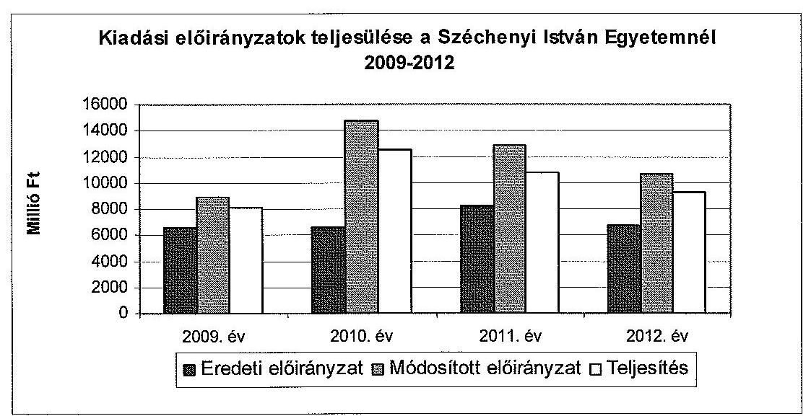

Az SZE eredeti bevételi előirányzata a 2009-2011. évekbeli folyamatos emelkedés után (1950,8 M Ft, 2250,8 M Ft, 3504,8 M Ft) a 2012. évre, 2604,8 M Ft-ra csökkent. A 2011-ig tartó növekedés a múködési bevételek számottevő emelkedéséből származott (2011. év 1626,0 M Ft; 2012. év 1089,5 M Ft), a 2012. évi csökkenés a múködési, illetve felhalmozási bevételek csökkenéséből adódott.

Az egyetem a múködési bevételeinek eredeti elöirányzatát - az óvatos tervezés miatt - minden évben túlteljesítette ${ }^{38}$. A müködési bevételei a 2009. évi 2290,4 M Ft-ról a 2012. évre 2010,4 M Ft-ra (12,2\%-kal) csökkentek. Visszaesés az egyéb saját múködési bevételeknél ( $12 \%$-os) és a müködési célú hozam- és kamatbevételeknél ( $84,6 \%$-os) volt.

Az intézményi múködési bevétel 2009-2012. évek közötti, 300,0 M Ft-os csökkenését a nem nappali tagozatos költségtérítéses képzések bevételi teljesítésének elmaradása okozta. A múködési célú hozam- és kamatbevétel 67,0 M Ft-os elmaradását a Feot. 120. § (3) bekezdésének 2012. évi hatályon kívül helyezése és az Nftv. hatályba lépése eredményezte, mely megszüntette az átmenetileg szabad pénzeszközök állampapírba fektetését, az államháztartáson belülről származó kamatbevétel törvényes lehetőségét.

Az SZE eredeti költségvetési támogatási előirányzata az ellenőrzött időszakban folyamatosan csökkent (a 2011. év kivételével, amikor a 4747,7 M Ft a 2009. évi előirányzat 102,1\%-át tette ki). A 2010. évi 4401,6 M Ft a 2009. évi 4645,6 M Ft 94,7\%-a, a 2012. évi 4116,5 M Ft a 2009. éves adat 88,6\%-a volt.

Az egyetemnél az államilag támogatott hallgatói létszám 2009. évben 5878 fő, 2010. évben 6346 fő, 2011. évben 6478 fő és 2012. évben 6596 fő volt ${ }^{39}$. Az államilag támogatott hallgatói létszám, 2009-ről 2012-re 12,2\%-kal nőtt.

Az SZE éves eredeti előirányzatait országgyúlési, kormány-, irányító szervi és intézményi hatáskörben - összesen 18 914,8 M Ft összegben, a jogszabályi elő-

[^0]
[^0]:    ${ }^{38}$ Az eredeti előirányzatot valamennyi évben 1589,8 M Ft összegben határozták meg.
    ${ }^{39}$ Az egyetem szöveges költségvetési beszámolóiban szereplő október 15-ei statisztikai adatok alapján.

---

írásokkal összhangban - módosították az ellenőrzött időszakban. A módosítások szinte teljes mértékben ( $98,0 \%$ ) saját hatáskörben történtek.

Országgyúlési hatáskörben végrehajtott -436,8 M Ft előirányzat-módosítás az államháztartási egyensúly megőrzéséhez szükséges intézkedések alapján érvényesített zárolás ( $361,8 \mathrm{M}$ Ft) és a Magyar Köztársaság 2011. évi költségvetéséről szóló 2010. évi CLXIX. törvény alapján időarányosan végrehajtott $75,0 \mathrm{M}$ Ft (2011. szeptembertől decemberig, havi $18,7 \mathrm{M}$ Ft összegben) zárolás halmozott összege volt.

Kormányzati hatáskörben az ellenőrzött időszakban összesen -172,2 M Ft-ot vontak el. A módosításokra az 1033/2009. (III. 17.) Korm. határozat, az 1428/2012. (X. 8.) Korm. határozat és az 1122/2012. (IV. 25.) Korm. határozat alapján elrendelt, összesen 385,1 M Ft zárolások alapján került sor, illetve a központi költségvetési szerveknél foglalkoztatottak részére fizetendő keresetkiegészítés miatt $212,9 \mathrm{M}$ Ft támogatást kapott az egyetem.

Irányítószervi hatáskörben összesen $381,9 \mathrm{M}$ Ft összegben történt előirányzatmódosítás. Az előirányzat-módosítások a szakkolléglumi pályázatokkal, a szakkolléglumi tehetséggondozás, a kis létszámú művészeti szakok fejlesztése, a továbbképzési költségek finanszirozása és az MTA intézkedése alapján egyszeri jelleggel biztosított pótelőirányzattal, valamint az Országos Tudományos és Kutatási Alapprogram (továbbiakban: OTKA) költségek fedezetére meghatározott, ütemezés szerinti támogatásával kapcsolatban történtek.

Az intézményi hatáskörben végrehajtott 19 141,9 M Ft előirányzat-módosítások során az Nftv. 115. § (9) bekezdésében előírtakat betartották.

Az SZE a kiadási és bevételi előirányzatok tervezése során a jogszabályokban és a fenntartó által kiadott tervezési irányelvek szerint járt el. A költségvetési tervezés főbb szabályait és felelőseit az SZMSZ-ben, a Gazdálkodási Szabályzatban és a Gazdasági Hivatal Úgyrendjében határozták meg.

A fenntartó szerv a hatályos Ámr. ${ }_{1,2}$ szerinti, a költségvetési törvényjavaslat öszszeállításához szükséges feltételekről és az érvényesítendő követelményekről tervezési irányelvek formájában tájékozatta az egyetemet. A tervezést a minisztérium által kiadott keretszámok visszatervezésének folyamata jellemezte.

Az SZE a költségvetés tervezéséhez kapcsolódó, a fenntartó szerv által meghatározott adatszolgáltatásokat minden évben a pénzügyminiszter/nemzetgazdasági miniszter tájékoztatójában előírt határidőre készítette el és küldte meg. A költségvetési javaslatok megfeleltek a jogszabályi előírásnak és a belső szabályozásnak, azokat mellékszámításokkal alátámasztották. A 2009-2012. évek között a fenntartó által véglegesített kincstári költségvetés és az intézményi elemi költségvetés kiemelt előirányzatai közötti egyezőség biztosított volt.

Az engedélyezett létszám kerete 618-666 fő között mozgott, a végrehajtott létszámbővítést a TÁMOP pályázatokon elnyert többletfeladat indokolta.

# 3.1.1. A pénzügyi egyensúlyt befolyásoló tényezők 

Az SZE pénzügyi egyensúlya a 2009-2012. években folyamatosan biztosított volt.

---

A stabil pénzügyi egyensúlyt támasztják alá az SZE likviditási mutatói. A likviditási ${ }^{40}$ és a pénzeszköz-likviditási ${ }^{41}$ mutató az ellenőrzött időszak valamennyi évében jelentősen meghaladta a szakmailag elvárt 1-es értéket. Így a forgóeszközök, illetve a pénzeszközök év végi állománya is fedezetet nyújtott a rövid lejáratú kötelezettségek rendezésére. A 2009-2012. években az SZE eladósodási mutatója az ellenőrzött időszakban kedvező volt, a 2009. évi 1,1\%-ról a 2012. évben $0,5 \%$-ra módosult.

Az SZE kötelezettségek állománya 2010 óta fokozatosan csökkent, a 2012. évben 85,6 M Ft volt, ami a 2009. évi érték $81,7 \%$-át tette ki. Ennek legnagyobb részét a rövid lejáratú kötelezettségek (ezen belül kizárólag a szállítói tartozások) tették ki, melyek állománya - hasonlóan az összes kötelezettség alakulásához - 2010 óta fokozatosan csökkent.

Az SZE pénzügyi helyzetét a CLF módszer segítségével is elemeztük (3. számú melléklet). Az SZE pénzügyi pozícióját, működési jövedelmét, felhalmozási költségvetési egyenlegét, nettó működési jövedelmét az alábbi táblázat szemlélteti M Ft-ban:

| Megnevezés | 2009. | 2010. | 2011. | 2012. |
| :-- | --: | --: | --: | --: |
| Folyó bevételek | 7154,2 | 7561,0 | 8169,2 | 7025,6 |
| Folyó kiadások | 6897,3 | 6676,0 | 8033,5 | 7424,5 |
| Müködési jövedelem | $\mathbf{2 5 6 , 9}$ | $\mathbf{8 8 5 , 0}$ | $\mathbf{1 3 5 , 7}$ | $\mathbf{- 3 9 8 , 9}$ |
| Felhalmozási bevételek | 2015,1 | 4955,3 | 2395,9 | 1372,4 |
| Felhalmozási kiadások | 1213,0 | 5878,4 | 2711,7 | 1889,0 |
| Felhalmozási költségvetés   egyenlege | $\mathbf{8 0 2 , 1}$ | $\mathbf{- 9 2 3 , 1}$ | $\mathbf{- 3 1 5 , 8}$ | $\mathbf{- 5 1 6 , 6}$ |
| Folyó és felhalmozási bevételek össze-   sen | 9169,4 | 12516,3 | 10565,2 | 8398,0 |
| Folyó és felhalmozási kiadások össze-   sen | 8110,3 | 12554,4 | 10745,3 | 9313,5 |
| Finanszírozási múveletek   nélküli pozíció | $\mathbf{1 0 5 9 , 1}$ | $\mathbf{- 3 8 , 1}$ | $\mathbf{- 1 8 0 , 1}$ | $\mathbf{- 9 1 5 , 5}$ |
| Finanszírozási műveletek egyenlege | -189,6 | -254,7 | 763,0 | -287,8 |
| Tárgyévi pénzügyi pozíció   (pénzeszközváltozás) | $\mathbf{8 6 9 , 5}$ | $\mathbf{- 2 9 2 , 8}$ | $\mathbf{5 8 2 , 9}$ | $\mathbf{- 1 2 0 3 , 3}$ |
| Hiteltörlesztés, saját kibocsátású ér-   tékpapír beváltás | 0,0 | 0,0 | 0,0 | 0,0 |
| Nettó müködési jövedelem | $\mathbf{2 5 6 , 9}$ | $\mathbf{8 8 5 , 0}$ | $\mathbf{1 3 5 , 7}$ | $\mathbf{- 3 9 8 , 9}$ |

[^0]
[^0]:    ${ }^{40}$ A 2009. évben 28,1, a 2010. évben 7,4, a 2011. évben 9,3, a 2012. évben 22,1 volt a mutató értéke.
    ${ }^{41}$ A 2009. évben 14,7, a 2010. évben 3,0, a 2011. évben 6,2, a 2012. évben 7,2 volt a mutató értéke.

---

A pénzügyi egyensúly mellett az SZE pénzügyi pozíciója a 2010., 2012. években romlott. Az egyetem 2009. évi 652,9 M Ft nyitó idegen pénzeszközök nélküli pénzállománya a 2010. és a 2012. évben összesen 1496,1 M Ft-tal csökkent, míg a 2009. és a 2011. évben 1452,4 M Ft-tal nőtt. A csökkenés okai a költségvetési támogatások visszaesése, továbbá a végrehajtott beruházások és felújítások voltak. Az utóbbiak miatt a pénzállomány csökkenése ellenére az SZE vagyonállománya jelentősen gyarapodott, mivel a beszámolók adatai szerint az eszközök összértéke a 2009. évi 7851,8 M Ft-ról a 2012. évre 16 749,5 M Ft-ra ( $113,3 \%$-kal) emelkedett.

A pozitív pénzügyi pozíciót a 2009. évben a magas felhalmozási költségvetés egyenlege, és a 2011. évben a magas finanszírozási múveletek bevétele ( 605,4 M Ft összegű értékpapír értékesítése) eredményezte. A 2009. évi bevételi többlet az SZE által elnyert EU pályázatok bevételeiből a TIOP 1.3.1. jelű infrastrukturális és informatikai fejlesztésekhez kapcsolódó pályázat, valamint a TÁMOP projektből származott.

A múködési jövedelem és a nettó működési jövedelem a 2009-2011. években pozitív volt, a folyó bevételek fedezték a folyó kiadásokat. 2012-ben a folyó kiadásokra nem nyújtottak fedezetet a folyó bevételek. Az ellenőrzött időszak egészét tekintve 878,8 M Ft múködési jövedelemtöbblet keletkezett.
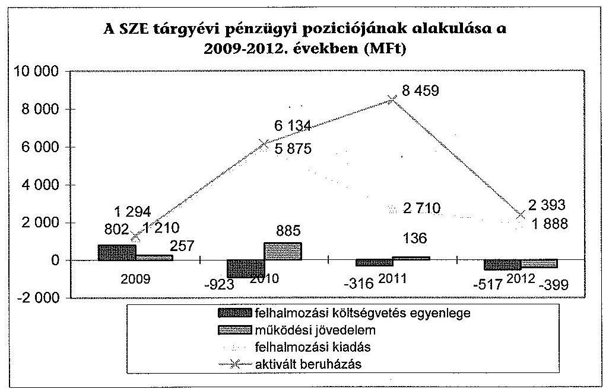

A felhalmozási költségvetés egyenlege - a 2009. év kivételével - negatív volt. A felhalmozási költségvetés egyenlege a 2009. évben fedezetet biztosított a fejlesztési kiadásokra, azonban a 2010. és 2011. években a fejlesztési kiadások, 2012-ben a fejlesztési és a múködési kiadások fedezetéhez szükség volt összesen 1133,7 M Ft előző évi előirányzat-maradvány igénybevételére.

A vizsgált időszakban az egyetem működőképességét és feladatellátását a zárolások és a maradványtartási kötelezettségek nem veszélyeztették. A zárolásokat követően összesen 821,9 M Ft-ot vontak el az intézménytől. Az elrendelt, összesen 2588,0 M Ft maradványtartási kötelezettség teljes összegében forrásmegvonást jelentett. A zárolások és elvonások nem okoztak likviditási problémákat,

---

amelyek eredményeként az intézménynek szüksége lett volna keretelőrehozásra.

Évközi feladatátadások, feladatátvételek nem voltak befolyással a pénzforgalomra és a vagyonra, az intézmény sem a pályázatokhoz szükséges önrész biztosításához, sem az IFT keretein belül meghatározott fejlesztési feladatai megvalósításához nem vett igénybe fejlesztési hitelt. Az egyetem PPP projektekhez nem csatlakozott, ebből fakadó kötelezettségei nincsenek.

Kincstári biztos kijelölésére nem került sor, a 60 napon túli tartozásállománya egyik évben sem érte el az eredeti kiadási előirányzata $3,5 \%$-át ${ }^{42}$.

A nemzetgazdaságért felelős miniszter a Kormány 1360/2011. (XI. 5.) határozata alapján, 2011. november 5-ei hatállyal, egy éves időtartamra költségvetési felügyelő́t bízott meg. Feladata volt a közpénz takarékos gazdálkodásának szemléletét érvényesíteni, a finanszírozás hatékonyságát, szabályszerűségét és átláthatóságát előmozdítani, az egyes kiadások célszerűségét, szükségességét és időszerűségét előzetesen véleményezni. A költségvetési felügyelő havi rendszerességgel készített jelentéseket.

A költségvetési felügyelő a 2012. évet értékelő jelentésében megállapította, hogy az egyetemnek a korábbi években megkezdett takarékossági intézkedéseknek köszönhetően év végére sem keletkezett adósságállománya, olyan beruházásokba kezdtek bele, amelyek forrásfedezetének nagy részét pályázatokból tudta biztosítani, valamint a belső üzemeltetéshez kapcsolódó szolgáltatások jelentős részét külső vállalkozókra bízta.

# 3.1.2. A normatív támogatások felhasználása 

A normatív támogatások felhasználására vonatkozó döntések megfeleltek a vonatkozó jogszabályoknak és a belső szabályzatok előírásainak.

A nem kötött felhasználású normatív támogatások szervezeti egységek közötti forrásfelosztás eljárásrendjét önálló szabályozásban nem rögzítették ${ }^{43}$. A szenátus a normatív támogatás központi és decentralizált részre történő felosztását ${ }^{44}$ az elemi költségvetés jóváhagyása keretében fogadta el. A gazdálkodási keretek összesített adatait jóváhagyó GT döntés a decentralizált rész szervezeti egységek közötti felosztására nem terjedt ki. A decentralizált szervezetek keretgazdálkodását a Saldo rendszeren keresztül figyelte a Gazdasági és Műszaki Főigazgatóság (továbbiakban: GMF), és a keretfelhasználásról évente elszámolást készített.

A kötött felhasználású hallgatói támogatások és egyéb feladatok támogatásainak felhasználásával kapcsolatos döntéseket a belső előírásoknak és a jogszabályoknak megfelelően hozták meg. A kötött felhasználású normatív

[^0]
[^0]:    ${ }^{42}$ Ámr. 2164 (1) bekezdés a) pont
    ${ }^{43}$ Gazdasági vezető Nyilatkozata
    ${ }^{44}$ 39/2009. (IV. 06.) számú, 267/2010. (IV. 12.) számú, 68/2011. (V. 16.) számú és a 35/2012. (IV. 02.) számú szenátusi határozatokkal

---

támogatások felosztását a szenátus a költségvetés keretében elfogadta. A hallgatóknak nyújtott támogatások jogcímeit, illetve az általuk fizetendő díjakat, térítéseket valamint a támogatás igénylésének és odaítélésének feltételeit a hatályos egyetemi Téritési és Juttatási Szabályzat tartalmazta.

# 3.2. A kiadási és bevételi előirányzatok felhasználásának szabályszerűsége 

Az ellenőrzött időszakban nem volt szabályszerű a rendszeres és nem rendszeres személyi juttatások, a dologi kiadások, a felhalmozási kiadások és a múködési bevételek beszedése területe. Magas kockázatú volt az intézményi térítési díjak, költségtérítések területe. A megbízási díjak elszámolása, a felhalmozási bevételeknek a felhasználása és az előirányzatmódosítások végrehajtása jogszerú és szabályszerű volt.

A pénzgazdálkodással kapcsolatos gazdálkodási jogkörökhöz előírt belső kontrollok nem minden esetben múködtek. Az ellenőrzés a kötelezettségvállalás, a kötelezettségvállalás ellenjegyzése, a teljesítésigazolás és érvényesítés gazdálkodási jogkörök múködésével kapcsolatban tárt fel hiányosságot.

### 3.2.1. Kiadási előirányzatok

A rendszeres és nem rendszeres személyi juttatások előirányzatának felhasználása a pénzügyi elszámolások, valamint a gazdálkodási jogkörök gyakorlása tekintetében nem felelt meg a jogszabályoknak és a belső szabályzatok előírásainak.

A rendszeres személyi juttatások esetében a kinevezési okiratoknak mint a kötelezettségvállalás dokumentumainak ellenjegyzése valamennyi esetben elmaradt, amely ellentétes az intézmény Kötelezettségvállalási szabályzatában ${ }^{45}$, valamint a jogszabályokban ${ }^{46}$ foglaltakkal.

Az SZE a felnőttképzés többletfeladataihoz kapcsolódó kötelezettségvállalás dokumentálásának eljárása során nem tartotta be a belső szabályzatában ${ }^{47}$ és a jogszabályban ${ }^{48}$ foglaltakat, amikor a feladat elrendelésekor nem készítette el a kötelezettségvállalási dokumentumot.

[^0]
[^0]:    ${ }^{45}$ Kötelezettségvállalás minden olyan jognyilatkozat, amelyből az egyetemnek fizetési, beszedési, teljesítési, szolgáltatási vagy foglalkoztatási kötelezettsége keletkezik. A szabályzat a kötelezettségvállalás dokumentumaként nevesíti a közalkalmazotti jogviszonyt létre hozó jognyilatkozatot (kinevezést). A szabályzat kimondja továbbá, hogy „a kötelezettségvállalás érvényességéhez előzetes írásbeli ellenjegyzés szükséges".
    ${ }^{46}$ Ámr. ${ }_{12}$ § 67. pont, 134. § (8) bekezdés, Ámr. 2 72. §, 74. § (1) bekezdés, Áht. ${ }_{1}$ 100/C. § (3), Áht. 2 2. § (1) bekezdés o) pont
    ${ }^{47}$ Kötelezettségvállalási szabályzat
    ${ }^{48}$ Ámr. ${ }_{1}$ 134. § (8) bekezdés, Ámr. ${ }_{2}$ 72. § (1) bekezdés, 74. § (1) bekezdés, Áht. ${ }_{2}$ 2. § (1) o) bekezdés, 37. § (1) bekezdés

---

Az SZE az IFT elkészítéséhez kapcsolódó 2011. évi feladatelrendelése során nem tartotta be a kötelezettségvállalás folyamatának jogszabályban ${ }^{49}$, illetve a belső szabályzatában ${ }^{50}$ foglalt előírásait, amikor a dokumentumon nem tüntette fel a munkaszámot, és nem volt az aláíráson kívül olvasható módon is feltüntetve az ellenjegyzó neve, az ellenjegyzés dátuma, valamint az ellenjegyzés tényére történő utalás.

Az SZE 2009-ben, illetve 2011-ben a dolgozók többletfeladat elvégzéséhez kacsolódó juttatást nem szabályszerűen ${ }^{51}$ kezelte, nem foglalta szerződésbe, nem rendelkezett a teljesítésigazolásról, nem határozta meg az egyes dolgozók konkrét feladatait az adott témán belül. A helytelen gyakorlat eredményeként a munkakörön kívüli többletfeladat elvégzéséhez kapcsolódó juttatás illetmény-kiegészítésként, külső személyi juttatás helyett rendszeres személyi juttatásként került elszámolásra, ugyanakkor az Ámr., 58. § (6) bekezdése szerint a külső személyi juttatások előirányzata a költségvetési szerv állományába nem tartozók személyi juttatásait foglalja magában, beleértve a saját munkavállalónak a munkakörén kívüli munkáért fizetett juttatását is.

A természetbeni és béren kívüli juttatások kifizetése a jogszabályoknak, illetve az intézményi előírásoknak megfelelően történt.

A felsőoktatási törvény ${ }^{52}$ előírása - mely szerint az oktató a heti teljes munkaidejéből két tanulmányi félév átlagában legalább heti tíz órát ${ }^{53}$ köteles a hallgatók felkészítését szolgáló előadás, szemínárium, gyakorlat, konzultáció megtartására (a továbbiakban: tanításra fordított idő) fordítani - nem minden oktató esetében teljesült.

Az ellenőrzés számára elkészített nyilvántartás szerint a 23 oktató közül három esetében fordult elő, hogy nem teljesítette a törvényi előirást.

A külső személyi juttatások előirányzatai terhére megkötött megbízási szerződések tartalma, teljesítése és számfejtése megfelelt a jogszabályoknak és a belső szabályoknak.

A kifizetéseknél a belső kontrollok múködése nem jogszerűen valósult meg. Az érvényesítési feladatot a jogszabályban ${ }^{54}$ előírt képesítéssel nem rendelkező, illetve jogkörrel nem rendelkező személy gyakorol-

[^0]
[^0]:    ${ }^{49}$ Ámr. ${ }_{2} 74 . \S$ (1) bekezdés
    ${ }^{50}$ Kötelezettségvállalási szabályzata
    ${ }^{51}$ Kjt. 67. § (1)-(2) bekezdése, Ámr., 59. § (9) bekezdése
    ${ }^{52}$ Feot. 84. §. (2) bekezdés, Nftv. 26. § (1) bekezdés,
    ${ }^{53}$ A tanári munkakörben foglalkoztatott esetében a tanításra fordított idő két tanulmányi félév átlagában heti húsz óra.
    ${ }^{54}$ Ámr. ${ }_{1}$ 135. § (4) bekezdés, Ámr. ${ }_{2}$ 19. § (1), 74. § (2) bekezdések, Ávr. 55. § (2), 58. § (1) bekezdések

---

ta. A saját dolgozókkal kötött eseti megbízási szerződéseknél az azok tartalmi előírására vonatkozó előírásokat ${ }^{55}$ nem tartották be.

Az ellenőrzött tételek 12\%-a esetében az érvényesítési feladatot a jogszabályban előírt képesítéssel nem rendelkező, illetve jogkörrel nem rendelkező személy gyakorolta, ezzel megsértette az érvényesítési feladatra jogosult személyekre vonatkozó jogszabályi előírásokat ${ }^{56}$. Egy esetben az érvényesítési feladatot érvényesítési jogkörrel nem rendelkező, a Jármúlpari Kutató Központ alkalmazottja látta el. Egy esetben a kötelezettségvállalás ellenjegyzése nem történt meg, annak ellenére, hogy a kifizetés időpontjában a pénzügyi fedezet rendelkezésre állt.

Az előirányzat felhasználása decentralizált módon, szabályozottan, a kötelezettségvállalási és utalványozási jogkörrel rendelkező szervezeti egység vezetőinek a döntése alapján történt, azonban a keretleosztás elveit nem szabályozták.

A külső és saját dolgozókkal - nem munkaköri feladatra, határozott időre - kötött megbízási szerződések eredményeként létrejött produktumok minden esetben fellelhetőek voltak. A saját dolgozóknak kifizetett megbízási díj kifizetésére az egyetem és a megbízott között a feladatra vonatkozóan előzetesen kötött megbízási szerződés alapján, a feladat és a megbízó által kiadott teljesítésigazolások alapján került sor.

A dologi kiadások előirányzatának felhasználása a közbeszerzési előírások megsértése, valamint a gazdálkodási jogkörök gyakorlása tekintetében nem felelt meg a jogszabályoknak és belső szabályzatok előírásainak.

A 2009. évben szakértői tevékenység végzésére $25,0 \mathrm{M}$ Ft összegben kötött alvállalkozói szerződés esetében az egyetem tanszékvezetője ${ }^{57}$ a szerződés megkötésével megsértette a Kbt., 240. §-ban elöírt közbeszerzési eljárás lefolytatásának kötelezettségét. Az ÁSZ a közbeszerzési szabályok megsértése miatt, a Kbt.,-ben rögzített jogvesztő határidő miatt nem kezdeményezte a Közbeszerzési Döntőbizottság hivatalból való eljárását.

Az SZE és egy gazdasági társaság között 2009. október 12-én létrejött alvállalkozói szerződés tárgya az 1. pont szerint „kutatás keretében a báziskutatás és az arra épülő elemzések, illetve modellalkotás szakértői feladataiban történő közremüködés. A szakértői közreműködés nem felel meg a Kbt. hivatkozott részében szereplő, kutatási és fejlesztési szolgáltatásnak. A szerződés 2. a) pontjában meghatározottak szerint a vállalkozónak adatgyűjtést és a folyamatok feltérképezését kell végeznie egy zrt. számára.
,Az ellenőrzés a mintatételek 36\%-ánál talált hibát, amelyek többek között, a gazdálkodási jogkörök, a közbeszerzési szabályok megsértésére, illetve nem megfelelő kontírozásra vonatkoztak. 10 esetben a teljesítésigazolásoknál nem voltak beazonosíthatóak az aláírások, ez nem felelt meg az Ámr. 2 76. §. (5) és a 80. §. (3), valamint az Ávr. 60. § (3) bekezdésben foglaltaknak, mivel a GMF-nél nem

[^0]
[^0]:    ${ }^{55}$ Ámr. ${ }_{1}$ 59. § (9) bekezdés, Ámr. ${ }_{2}$ 90. § (6) bekezdés, Ávr. 51. § (2) bekezdés
    ${ }^{56}$ Ámr. ${ }_{1}$ 135. § (4) bekezdés, Ámr. ${ }_{2}$ 19. § (1), 74. § (2) bekezdés, Ávr. 55. § (2), 58. § (1) bekezdés
    ${ }^{57}$ Az egyetem nevében egy egyetemi docens, tanszékvezető kötötte meg a szerződést.

---

állt rendelkezésre nyilvántartás a teljesítésigazolásra jogosultakról és aláírásmintáikról. Egy esetben az érvényesítési jogkör gyakorlása nem felelt meg az Ámr. 2 80. §. (3) és az Ávr. 60. § (3) bekezdésben foglaltaknak, mert az érvényesítő aláírása nem volt beazonosítható az aláírásmintákhoz. A 2009. évben az SZE nem tartotta be az Ámr. 134. § (8) bekezdésben foglaltakat, mivel egy tétel ellenjegyzés nélkül került kiadásra.

A felújítások, beruházások előirányzatának felhasználása - a közbeszerzési előírások megsértése és a gazdálkodási jogkörök helytelen gyakorlása miatt - nem felelt meg a jogszabályoknak és a belső szabályzatok előírásainak.

A beszerzéseket decentralizáltan a tanszékek maguk intézték az olyan beszerzések körében is, amelyre a belső szabályozás a központi közbeszerzési eljáráshoz való csatlakozást írt elő. $0,3 \mathrm{M}$ Ft értékben számítógép és $0,8 \mathrm{M}$ Ft értékben informatikai eszközök beszerzése nem központi közbeszerzéssel történt 2010-ben és 2011ben.

Az ellenőrzött tételek 56,0\%-ánál a teljesítés igazolása esetében nem voltak beazonosíthatóak az aláírások, ez nem felelt meg az Ámr. 2 76. §. (5) és a 80. §. (3), valamint az Ávr. 60. § (3) bekezdésben foglaltaknak, mivel a GMF-nél nem állt rendelkezésre nyilvántartás a teljesítésigazolásra jogosultakról és aláírásmintáikról. Négy esetben az érvényesítési jogkör gyakorlása nem felelt meg az Ámr. 2 80. §. (3), az Ávr. 60. § (3) bekezdésben foglaltaknak, mert az érvényesítő aláírása nem volt beazonosítható az aláírásmintákhoz.

Az beszerzett eszközök bekerülési értékét a Sztv. és az Áhsz. előírásainak megfelelően határozták meg az ellenőrzött időszakban, az eszközök állományba vétele minden esetben megtörtént, az eszközök besorolása - egy kivétellel, amikor a beszerzett TV-t számítógép monitornak sorolták be - helyes volt. A tárgyévi értékcsökkenések elszámolása szabályos volt. A tárgyi eszközök és immateriális javak év végi értékelése a jogszabályoknak megfelelően történt.

# 3.2.2. Bevételi előirányzatok 

Az intézményi múködési bevételek beszedése a pénzügyi elszámolások, valamint a gazdálkodási jogkörök gyakorlása tekintetében nem felelt meg a jogszabályoknak és belső szabályzatoknak.

A bevételi előírások határidőre történő teljesítésének elmaradása esetén foganatosított intézkedésekről, a követelések kezeléséről nem rendelkeztek, nem szabályozott formában bonyolították le azokat.

A működési bevételek jelentős részét a hallgatókkal szembeni követelések különböző jogcímeken teljesült tételei (költségtérítéses képzésben résztvevők térítései, kollégiumi díjak, ismételt vizsgák díjai, szolgáltatás-térítési díjak, mulasztási díjak, stb.) alkották. A hallgatóknak a befizetéseket egy, az SZE által az Erste Bank Zrt.-nél vezetett gyűjtőszámlára kellett teljesíteni. A pénzintézettel kötött bankszámlaszerződést és együttműködési megállapodást az egyetem főtitkára írta alá 2001-ben, illetve 2003-ban. A hallgatói költségtérítéseknek az Erste Bank Zrt.-nél vezetett gyűjtőszámlán történő kezelése miatt az SZE megsértette az Áht ${ }_{1}$ 18/C. § (5) és az Áht ${ }_{2}$ 79. § (1) bekezdéseit, miszerint a kincstári kör fizetési számlái csak a Kincstárnál vezethetők, valamint nem tartották be az Áhsz. 51. § (1) bekezdés a) pontjában foglaltakat sem. Az

---

Áht. 2 79. § (5) bekezdése szerint a Kincstárnál erre a célra vezethető számlát az SZE nem alkalmazta a 2012. évben.

A gyűjtőszámla pénzforgalmát érintő tételeket az SZE - az Áhsz. 51. § (1) bekezdés a) pontjában foglaltakat figyelmen kívül hagyva - nem a banki értesítéskor könyvelte le.

A 2009. évben a NEPTUN rendszerben kezelt intézményi működési bevételek kapcsán nem tartották be az Ámr. ${ }_{1} 135 . \S$ (1)-(2) bekezdésében foglaltakat, a teljesítésigazoló és az érvényesítő nem a jogszabályi előírások szerint látta el a feladatát, a meglévő bizonylatok alapján nem tudták ellenőrizni az összegszerüséget. A 2010-2012. években a NEPTUN rendszerben kezelt díjaknál nem végezték el az Ámr. ${ }_{2}$ 77. § (1)-(2), illetve az Ávr. 58. § (1)-(2) bekezdései alapján az érvényesítést, meglévő bizonylatok alapján nem tudták ellenőrizni az összegszerűséget. A hallgatói díjfizetéseknél, költségtérítéseknél nem állítottak ki minden esetben számlát vagy számviteli bizonylatot, számla kiállítására a hallgatói költségtérítéseknél és díjfizetéseknél csak a hallgató kérése esetén került sor a NEPTUN rendszerben, ezzel nem tartották be a Sztv. 165. § (1)-(2) bekezdését.

A kereskedelmi banki számláról heti szinten végezték el az elszámolást és az átvezetést az SZE kincstári számlájára, az átvezetett bevételek teljes körűen beazonosíthatóak voltak.

A múködési bevételek beszedése kapcsán rendszerszintű hiányosságokat tártunk fel a pénzügyi jogkörök gyakorlása területén, mely kockázatot jelentett a NEPTUN rendszerben kezelt bevételek összegszerűségének megbízhatóságában.

A 2009. évben a múködési bevétel ellenőrzött tételeinek $14 \%$-nál ( $1,2 \mathrm{M} \mathrm{Ft}$ ) nem tartották be az Ámr. ${ }_{1} 135 . \S$ (1)-(3) bekezdésében foglaltakat, a teljesítésigazoló és az érvényesítő nem a jogszabályi előírások szerint látta el a feladatát, a meglévő bizonylatok alapján nem tudták ellenőrizni az összegszerűséget.

A 2010-2012. években az ellenőrzött tételek $54 \%$-ánál ( $2,2 \mathrm{M} \mathrm{Ft}$ ) nem végezték el az Ámr. ${ }_{2}$ 77. § (1)-(2), illetve az Ávr. 58. § (1)-(2) bekezdései alapján az érvényesítést, a meglévő bizonylatok alapján nem tudták ellenőrizni az összegszerűséget.

Az immateriális javak és tárgyi eszközök bérbeadása, értékesítése a pénzügyi elszámolások, valamint a gazdálkodási jogkörök gyakorlása tekintetében megfelelt a jogszabályoknak és a belső szabályzatok előírásainak. A felhalmozási bevételek teljesülése megfelelt a jogszabályi előírásoknak, az egyetem kezelésében lévő állami vagyonelemek értékesítése és hasznosítása esetén az egyetem a Feot. és a Vtv. rendelkezéseinek megfelelően járt el.

Az ellenőrzött időszakban az egyetem felhalmozási bevételei ingatlan értékesítéséből származtak.

A 2009. évi ingatlanértékesítéshez - kincstári vagyonba tartozó telekeladás Győr városnak - az egyetem az előzetes bejelentési kötelezettségének eleget tett, az MNV Zrt. a telekmegosztás engedélyezési eljárásához szükséges tulajdonosi hozzájárulást megadta, az eladáshoz az engedélyét nem kellett megszerezni.

Az intézményi térítési díjak, költségtérítések megállapítása tekintetében teljes körűen nem volt biztosított a belső szabályoknak való megfelelőség. Ez magas szabályszerűségi kockázatot jelentett az ellenőrzött terület egészének

---

múködése szempontjából. Hiányosság volt, hogy az SZE az önköltség-számítási szabályzat alapján a szállásdíjakra előírt előkalkuláció-készítési kötelezettségét nem teljesítette.

A szállás díjtételeinek megállapítására vonatkozóan az önköltség-számítási szabályzat csak az előkalkulációra vonatkozó eljárásrendet írta elő, nem rögzítette azt, hogy a kollégiumi szállás dijmegállapítására ki jogosult. A 2009-2012. évekre a szállás dijmegállapítása a kollégiumi igazgató által kiadott díjszabás által történt. A költségtérítések megállapításához az egy hallgatóra jutó önköltség meghatározásának sajátos szakágazati követelményeiről a minisztérium nem adott ki módszertani útmutatót.

Az egyetem szabályozott módon ${ }^{58}$ rendelkezett az egyes alaptevékenységeinek ${ }^{59}$ elhatárolásáról, a bevételek és kiadások elkülönítéséről.

Vállalkozási tevékenységet ${ }^{60}$ csak 2009-ben, 2009. július 1-jéig látott el. A vállalkozási tevékenység keretein belül jogosult volt külső megbízók, megrendelők részére oktatási, kutatási, fejlesztő, szaktanácsadó, szolgáltató és egyéb feladatok ellátására.

Az alap- és vállalkozási tevékenység szétválasztásának elveit és a vállalkozási szerződéskötés rendjét belső szabályzatban rögzítette. 2009. évben a vállalkozási tevékenységből $301,9 \mathrm{M}$ Ft bevétele származott, ezt az összeget tárgy évben viszszaforgatták alaptevékenységbe, nem képeztek eredményt.

# 3.2.3. A hazai forrásból finanszírozott projektek 

Az SZE jelentős összegeket fordított a kutatás-fejlesztési tevékenységre ${ }^{61}$. A 2009. és 2012. évek között hazai pályázati forrásból megvalósított projektekhez összesen 4372,9 M Ft összegben nyertek támogatási forrást.

## A pályázati úton kapott költségvetési forrással való elszámolása öszszességében megfelelt az előírásoknak.

Az SZE a kapott támogatásokat a támogató tevékenysége szempontjából irányadó jogszabályoknak megfelelően használta fel, azokról a szerződésnek és a belső szabályzatoknak megfelelően elszámolt. A támogató az elszámolásokat elfogadta. A pályázatkezelési tevékenységgel kapcsolatos eljárási, pénzügyi és szakmai monitoring-tevékenységet az egyetemen nem végeztek.

Az SZE nem végezte el a projektek megvalósítása eredményeként létrejött - az egyetem által hasznosítható - produktumok leltározását, ${ }^{62}$ számviteli szem-

[^0]
[^0]:    ${ }^{58}$ Önköltség-számítási szabályzat, a Térítési és Juttatási Szabályzat, valamint a Szabad kapacitások kihasználására irányuló tevékenységek szabályzata
    ${ }^{59}$ alapító okiratában nevesített alap-, kiegészítő, kisegítő és vállalkozási tevékenység
    ${ }^{60}$ A 2008. december 11-től 2009. július 1-ig hatályos alapító okirat szerint
    ${ }^{61} 2009$-ben 614,8 M Ft, 2010-ben 816,3 M Ft, 2011-ben 1736,3 M Ft, 2012-ben 1205,5 M Ft állt rendelkezésre.
    ${ }^{62}$ Sztv. 69. § (1)-(2), (5)-(6) bekezdések

---

pontok szerinti minősítését, ${ }^{63}$ egyedi értékelését; ${ }^{64}$ bejelentését, aktiválását év közben és az éves beszámoló készítése során nem végezte el, azokat az éves beszámoló részét képező könyvviteli mérleg megfelelő sorában nem mutatta ki, ${ }^{65}$ értékcsökkenést nem számolt el ${ }^{66}$. Az egyéb rövid lejáratú kötelezettségeken belül a pályázatokhoz kapcsolódóan támogatási program előleget, valamint az előfinanszírozás miatti kötelezettséget egyik évben sem mutatott ki ${ }^{67}$. A fentiek alapján az SZE megsértette az Sztv., az Áhsz., illetve az Áht., az Ámr. és az Ávr. előírásait, valamint a belső szabályzatában foglaltakat.

A hazai forrásból finanszírozott projektek között az OTKA forrásból, pályázati rendszer közbeiktatásával finanszírozott projektek voltak, végeredményük minden esetben könyv formájában kiadott monográfla. A Nemzeti Kutatási és Technológiai Hivatal (továbbiakban: NKTH) finanszírozásban megvalósított projektt ${ }^{68}$ ellenőrzött tételnél a felhasználás eredményeként jellemzően vagyoni elemek közé tartozó immateriális javak - szellemi termékek, know-how, vagyoni értékú jogok, kutatási jelentések, tanulmányok - vagy tárgyi eszköznek minősülő, több éves munka eredményeként létrejött, egyedülálló prototípusok valósultak meg.

A pályázati források terhére saját dolgozóval kötött megbízási szerződések tartalmának meghatározásakor esetenként megsértették a tartalmi elemekre ${ }^{69}$ vonatkozó jogszabályi előírásokat, nem tartották be a jogszabály teljesítésigazolásra ${ }^{70}$, érvényesítésre ${ }^{71}$ vonatkozó rendelkezéseit, valamint a belső szabályzatban előírtakat.

A 2. számú projekthez kapcsolódóan 2010-2011-ben az intézmény dolgozóival megkötött megbízási szerződésekben meghatározott feladatok az Ámr., 59. § (9), Ámr. 2 90. § (6) bekezdésében foglaltak ellenére az érintett dogozók módosított munkaköri leírásaiban is beazonosíthatóak voltak. Ezek a módosított munkaköri leírások kifejezetten a projektfeladatra vonatkozó részleteket tartalmaztak. Ugyanez az eset állt fenn a 3. számú projekt 13. tétele esetében is.

Egy pályázat esetében (13. számú mintatétel TECH-08D4 tehergépjármú balesetek) a projekt 2011. augusztus 31-i keltú dokumentumán (Személyi juttatások adatlapja) érvényesítőként aláíró személy nem felelt meg az intézmény belső szabályzatában, illetve a jogszabályban foglalt feltételeknek.

[^0]
[^0]:    ${ }^{63}$ Sztv. 25. § (2), (4)-(7), (9)-(10) bekezdések, Áhsz. 17. § (1) bekezdés
    ${ }^{64}$ Áhsz. 44/J. (1) bekezdés, Sztv. 46. § (3) bekezdés, 51. § (1) bekezdés
    ${ }^{65}$ Sztv. 15. § (2) bekezdés, Áhsz. 9. § (2) bekezdés
    ${ }^{66}$ Sztv. 52. § (5)-(7) bekezdések, Áhsz. 30. §
    ${ }^{67}$ Áhsz. 26. § (1) bekezdés
    ${ }^{68}$ (szerződésazonosítók: REG-ND-09-2-2009-0026, E-VAN-09, OMFB-00571/2010.; REG-ND-09-2-2009-0037, HCCI-ENG, OMFB-00560/2010.; TECH-08-A2/2-0099.; TECH08-D4-2008-0038.)
    ${ }^{69}$ Ámr., 59. § (9), Ámr. 2 90. § (6), Ávr. 51. § (2)
    ${ }^{70}$ Ámr. 2 76. § (3), Ávr. 57. § (3)
    ${ }^{71}$ Ámr. 2 19. § (1)

---

Az SZE az MTA kutatócsoportok által igénybe vehető támogatásai közül a Lendület programból a vizsgált időszakban nem részesült támogatásban.

# 3.2.4. Az előirányzat-módosítások szabályszerűsége 

A bevételi és kiadási előirányzatok módosítása, azok elszámolása megfelelt a jogszabályoknak és a belső szabályzatok előírásainak.

A kormány, a fenntartószervi és a saját hatáskörú előirányzat-változtatások átvezetése a számviteli nyilvántartásokon a jogszabályi előírásoknak megfelelően történt.

Az előirányzat-változtatások végrehajtása az SZE-nél a jogszabályi előírásoknak megfelelően, illetve az általános jelleggel szabályozó belső szabályzatok előírásainak figyelembevételével történt. Az SZE a végrehajtott előirányzatmódosításokról naprakész előirányzat-nyilvántartással rendelkezett, mely logikailag zárt rendszerben, hatáskörönkénti bontásban tartalmazta az adott évben az intézményt érintő kormányzati, fenntartószervi és intézményi hatáskörben elvégzett előirányzat-módosításokat.

A többletbevételekhez kapcsolódó előirányzat-módosítások során betartották a vonatkozó jogszabályi előírásokat. 2012. szeptember 1-jét követően - az Nftv. 115. § (9) bekezdés c) pontja szerint - többletbevételét a fenntartó engedélyével a végrehajtott előirányzat-módosítást követően használta fel.

A Kormány által előírt zárolási, előirányzat-csökkentési kötelezettséget teljesítették.

Az előirányzat-módosításokat megfelelően dokumentálták, az előterjesztések, a fenntartószervvel kötött szerződések, a fejezetek közötti megállapodások, a szerződés alapján előírt elkülönített nyilvántartás-vezetési kötelezettség teljesítését alátámasztó dokumentumok rendelkezésre álltak.

### 3.2.5. Az előirányzat-maradványok szabályszerűsége

Az előirányzat-maradvány összegének megállapítása és felhasználása megfelelt a jogszabályi előírásnak. A kötelezettségvállalással terhelt maradvány megállapítása szabályszerűen, jogszabályi előírásoknak megfelelően valósult meg. A 2009-2012. években a felhasználható előirányzatmaradvány összege kötelezettségvállalással terhelt volt. A tárgyévi előirányzatmaradványok ellenőrzése során az ellenőrzés megállapította, hogy a kötelezettségvállalással terhelt maradványok - analitikus nyilvántartással alátámasztott - valós tételeket tartalmaztak. A kötelezettségvállalások és az azt alátámasztó dokumentumok a jogszabályi előírásoknak és a belső szabályzatokban rögzítetteknek megfeleltek. Az ellenőrzött tételeknél a kifizetések megfeleltek a kötelezettségvállalással terhelt maradvány jogcímeinek és összegeinek.

Az előirányzat maradványából a központi költségvetést megillető, elvonandó előirányzat maradványának megállapítása megfelelt a jogszabályi előírásoknak. Az egyetem központi költségvetést megillető előirányzat-maradvány öszszegét átutalta.

---

# 4. A VAGYONGAZDÁlKODÁS SZABÁLYSZERŰSÉGE 

### 4.1. A vagyongazdálkodás szabályozottsága

## Az SZE az ellenőrzött időszakban a vagyongazdálkodással kapcsolatos belsö szabályzatokkal rendelkezett, de azok nem feleltek a jogszabályi követelményeknek.

Az SZE az állami vagyon kezelését az MNV Zrt-vel 2009-ben kötött vagyonkezelési szerződés alapján látta el, a szerződésben előírtakat betartotta, a Vtvr. szerinti adatszolgáltatási kötelezettségét teljesítette.

Az SZE 2012. december 31-én 14 452,0 M Ft értékű tárgyi eszközzel és $395,4 \mathrm{MFt}$ értékủ immateriális javakkal rendelkezett, amelyből 14 382,3 M Ft szerződés alapján kezelt állami vagyon volt.

Az egyetem ötéves intézményfejlesztési tervekkel rendelkezett.
Az intézményfejlesztési tervek közül kettő érinti az ellenőrzött időszakot. A 2012ben készült intézményfejlesztési tervben megfogalmazott ingatlanfejlesztési koncepció szerint az egyetem a Campus területét határoló és a beékelődő építési ingatlanokat megvásárolja, ezeken új létesítményeket épít, a meglévő épületeit pedig korszerűsíti. A régi épületek elavult hőszigetelésének felújítása, a nyílászárók cseréje KEOP pályázatokból részben már megvalósult, részben folyamatban van. A terv céljai között szerepel a szállási, tanulási, kommunikációs lehetőségek javítása és a sportlehetőségek bővítése, átalakítása.

A Vagyongazdálkodási szabályzatban ${ }_{1+2}$ és a Vagyonkezelési szerződésben foglaltak szerint szabályozták az állami vagyon értékesítését és ingyenes átruházását.

Az egyetem vagyongazdálkodási tevékenysége szempontjából irányadó belső eljárásrendjeinek rendelkezései hiányosak voltak, az Sztv. 14. § (11) bekezdésében előírt aktualizálásukat nem végezték el.

Az SZE a Feot. 27. § (6) d) pontjában, valamint az Nftv. 12. § (3) gb) pontjaiban foglaltak ellenére nem rendelkezett a vagyongazdálkodási célkitűzéseiben az IFTkhez igazodó éves vagyongazdálkodási tervekkel. A számviteli politikában foglaltak ellenére nem készítette el kincstári vagyongazdálkodási szabályzatát, nem különítette el a saját tulajdonában lévő és a rábízott vagyon nyilvántartásával, gazdálkodásával kapcsolatos feladatokat.

További hiányosságok a személyes célú eszközhasználat szabályozásában mutatkoztak meg. A nullára leírt, használaton kívüli tárgyi eszközöket a szervezeti egységek saját hatáskörben vizsgálták felül hasznosításra vagy értékesítésre, ennek dokumentálása nem állt rendelkezésre.

### 4.2. A vagyonelemekkel történő gazdálkodás

Az SZE a 2009-2012. években a fökönyvi és analitikus nyilvántartásaiban elkülönítetten mutatta ki a vagyonkezelésbe kapott vagyont és a saját vagyonát.

---

Az egyetemnek a 2009-2012. években kettő saját tulajdonú telke volt, amelyeknek értéke a 2009. évi 71,7 M Ft-ról a 2012. évre 71,1 M Ft-ra csökkent. A Nonprofit Kft.-ben 1,2 M Ft részesedéssel rendelkezett 2009-2012 között.

Az SZE a 2009. évi beszámolója mérlegében a jogszabállyal ${ }^{72}$ ellentétben a saját tőkén belül nem különítette el a tulajdonba kapott, illetve a kezelésbe vett eszközök forrását, továbbá a 2012. évi főkönyvben, valamint a mérlegben a kezelésbe vett eszközök tőkeváltozása között mutatták ki a saját vagyon (telek) értékének 0,6 M Ft-tal történt csökkenését.

A vagyon értékesítésével kapcsolatos döntések megfeleltek a Feot., a Vtv. és a Nftv. előírásainak és a belső szabályozásnak.

Az ingatlaneladásokból befolyó bevételek felhalmozási célú felhasználási kötelezettségének az egyetem eleget tett. Az aktivált, de használaton kívüli immateriális javaik és tárgyi eszközeik értékesítésre csak nagyon ritkán kerül sor.

A vagyonelemek térítésmentes átadás-átvétele megfelelt a jogszabályoknak. Az egyetem 2012-ben Győr városnak térítés nélkül adott át egy 31 nm alapterületű 560,0 E Ft értékű telekrészt útépítés céljára. A telek nem tartozott a kincstári vagyonba, ezért nem volt engedélyköteles. A térítés nélküli tárgyi eszköz átvételek körében vállalkozásoktól a szakképzési hozzájárulás természetbeni teljesítéseként két esetben napkollektorokat vettek át. Egy középiskolától egy esetben 0-ra leírt eszközt vettek át. Az eszközök aktiválásakor a bekerülési érték a belső szabályzatoknak megfelelően lett megállapítva.

A vagyoni elemek bérbeadása nem felelt meg a Feot., a Vtv. és az Nftv. előírásainak és a belső szabályozásnak.

Az ellenőrzés időszakában a kollégiumi szabad férőhelyek kereskedelmi célú belső hasznosítása esetén nem végeztek a szabályzatban előírt évenkénti újraszámítást. Nem készítettek a helyiségek, tantermek nem tartós bérbeadásával kapcsolatban díjszabást alátámasztó költségkalkulációt. Nem folytattak le pályáztatási eljárást a tantermek szabad kapacitásainak hasznosítása során.

A helyiségek - étterem és a büfé - tartós bérbeadásánál a bérlők kiválasztásának módját, a szerződéskötés rendjét nem szabályozták, a lefolytatandó pályáztatási eljárást nem szabályozták, nem győződtek meg az átláthatóság előírt követelményének érvényesüléséről. A 2012. szeptember 6-án aláírt bérleti szerződéshez kapcsolódóan a bérlőtől nem szerezték be az Nvtv. 3. §. (2) bekezdésben meghatározott átláthatóság előírt követelményének érvényesüléséről szóló nyilatkozatot, az egyetem a helyszíni ellenőrzés idején - a konzorcium egyik tagjától beszerezve a nyilatkozatot - részben pótolta a hiányosságot. Az egyetem nem tudott az Nvtv. 18. §. (2) bekezdésben előírt nyilatkozatot bemutatni egy másik Kft.-től, aki szintén tagja a konzorciumnak.

Az SZE a 2009-2012. években 11 alkalommal selejtezett technikailag elavult, esetenként javíthatatlan eszközöket. Az ellenőrzött időszakban az egyetem adatszolgáltatása szerint bruttó értéken kimutatva 414,1 M Ft teljesen leírt eszközt selejteztek le; ez a selejtezett eszközök közel száz százalékát jelentette. A se-

[^0]
[^0]:    ${ }^{72}$ Áhsz. 24. § (8) bekezdése, valamint az Áhsz. 9. melléklet 4/a pontja

---

lejtezéseket az egyetem a selejtezési szabályzatban előírtak szerint hajtotta vére, a selejtezést jegyzőkönyvben rögzítette.

Az SZE vagyongazdálkodása az ellenőrzött időszakban nem volt szabályszerű, több esetben megsértették a jogszabályban, belső szabályzatban előírtakat. A mérlegtételek tartalma, besorolása és értékelése - a vagyoni értékű jogok, a szellemi termékek és a követelések kivételével - megfelelt a jogszabályi előírásoknak. A kötelezettségek esetében nem volt biztosított a jogszabályoknak és belső szabályoknak való megfelelőség. Ez magas szabályszerűségi kockázatot jelentett az ellenőrzött terület egészének múködése szempontjából. A mérlegben feltárt hibák összege nem befolyásolta a megbízható és valós képet.

Az SZE a jogszabályi előírásoknak megfelelően az éves beszámolókat elkészítette, a mérleg tételeinek alátámasztását szolgáló leltárt évente összeállította, a főkönyvi könyvelés és az analitikus nyilvántartások közötti egyeztetést elvégezte.

Az SZE a leltározási kötelezettségének - az Erste Bank Zrt.-nél lévő pénzeszközei és a pályázati források eredményeként létrejött szellemi termékek és vagyoni értékú jogok leltározásának kivételével - a 20092012. években a december 31-ei fordulónappal tett eleget.

Az éves beszámolók elkészítése előtt esedékes leltározási kötelezettségének nem jogszerűen és szabályszerűen tett eleget. Az Erste Bank Zrt.-nél lévő pénzeszközei, a támogatási program előlegek miatti kötelezettségek, a pályázati források eredményeként létrejött szellemi termékek és vagyoni értékủ jogok tekintetében a 2009-2012. években a december 31-ei fordulónappal történő leltározást nem végezte el.

Az üzemeltetésre, kezelésre átadott eszköz esetében a leltárfelvétel az Áhsz. 37. § (3) bekezdésében foglaltak ellenére nem mennyiségi számbavétellel, hanem egyeztetéssel történt.

A 2009-2011. években a szellemi termékek használati jogát a mérlegben tévesen a szellemi termékek között mutatták ki. A 2012. évi mérleg összeállítása során az érintett tételek besorolása megfelelő volt.

A 2010-2012. években sérült az Sztv. 15. § (3) és az Áhsz. 9. § (11) bekezdésében előírt valódiság számviteli alapelve, mivel az SZE nem végezte el a hazai finanszírozású projektek megvalósítása eredményeként létrejött szellemi termékek és vagyoni értékű jogok aktiválását év közben, és nem mutatta ki az éves beszámoló részét képező könyvviteli mérleg megfelelő sorában.

A részesedések mérlegtételek tartalma, besorolása és értékelése megfelelt a jogszabályoknak és a belső szabályzatoknak.

Az SZE az ellenőrzött időszakban nem döntött gazdasági társaság létrehozásáról, részesedés szerzéséről. 2009-2012 között egy társaságban ${ }^{73} 1,2 \mathrm{M}$ Ft törzsbetéttel rendelkezett. A 20\%-os részesedés kisebbségi jogokat biztosított a részé-

[^0]
[^0]:    ${ }^{73}$ A Nonprofit Kft. törzstőkéje 6,2 M Ft volt.

---

re. A Társasági Szerződésben nem határoztak meg, illetve nem biztosítottak vagyongazdálkodásra vonatkozó jogokat és kötelezettségeket az egyetemnek. A tulajdonosi felügyeletet a Felügyelő Bizottság ellenőrzési tevékenységén keresztül gyakorolta, de annak szabályszerű lebonyolításához eljárásrendet nem alakított ki.

A Nonprofit Kft. az ellenőrzött időszakban nyereségesen gazdálkodott. A 2009. évben 26,3 M Ft-ot, a 2010. évben 66,7 M Ft-ot, a 2011. évben 24,4 M Ft-ot, a 2012. évben 48,6 M Ft-ot realizáltak. A Nonprofit Kft. múködése ezért nem befolyásolta negatívan az egyetem gazdálkodását. A gazdasági társaságokról szóló 2006. évi IV. törvény (továbbiakban: Gt.) 4. § (3) bekezdésében foglalt előirrás ${ }^{74}$ szerint osztalékot nem fizettek. Az egyetem az éves beszámolóiban értékelte a tevékenységét, ismertette a társaságban való részvételből származó eredményeket.

Az értékpapírok mérlegtételek tartalma, besorolása és értékelése megfelelt a jogszabályoknak és a belső szabályzatoknak.

Az SZE forgatási célú értékpapírokat (diszkont kincstárjegyeket) a 2009. és a 2010. évi mérlegében mutatott ki 700,0 M Ft, illetve 605,4 M Ft értékben. Az értékpapírok tartalma és besorolása megfelelt az Áhsz. 29. § (2) bekezdésében előírtaknak, mivel azokat bekerülési értéken vették számba a főkönyvi és analitikus nyilvántartásban, valamint a mérlegben.

A követelések mérlegtételek tartalma, besorolása és értékelése nem felelt meg a jogszabályoknak és a belső szabályzatoknak. Az egyetem a követeléseket nem a jogszabályoknak megfelelően mutatta ki a mérlegében, mivel az Sztv. 16. § (1) és az Áhsz. 9. § (10) bekezdésében foglaltak ellenére a beszámoló készítése során nem végzett egyedi értékelést, és az Áhsz. 31. § (2) bekezdésében, valamint a Vagyonértékelés szabályzatában foglaltak ellenére egyik évben sem számolt el értékvesztést.

Az SZE az Erste Bank Zrt.-nél vezetett ún. gyűjtőszámlára beérkezett hallgatói befizetésekkel nem csökkentette a vevőkövetelésként nyilvántartott hallgatói terheléseket. A gyűjtőszámlára történt befizetések nem kerültek rögzítésre a könyvekben a banki értesítéssel egyidejűleg, ami nem felelt meg jogszabályban ${ }^{75}$ előírtaknak, miszerint a pénzforgalmat érintő gazdasági műveletek, események bizonylatainak adatait késedelem nélkül, készpénzforgalom esetén a pénzmozgással egyidejűleg, pénzforgalmi számla, előirányzat-felhasználási keretszámla forgalomnál a hitelintézeti értesítés, illetve a Kincstár értesítésének megérkezésekor a könyvekben rögzíteni kell.

Az Sztv. 15. § (2) és az Áhsz. 9. § (2) bekezdésében foglaltakkal ellentétben az SZE egyik évben sem mutatta ki mérlegében a pénzeszközök között az Erste Bank Zrt.-nél vezetett gyűjtőszámlán lévő hallgatók befizetéseit. A gyűjtőszámla záró egyenlegének értéke 2009. december 31-én 89,7 M Ft-ot, 2010. december 31-én 101,5 M Ft-ot, 2011. december 30-án 90,6 M Ft-t, és 2012. december 28-án 99,6 M Ft-ot képviselt.

[^0]
[^0]:    ${ }^{74}$ A Gt. 4. § (3) bekezdésében előírták, hogy a nyereség a tagok között nem osztható fel, a gazdasági társaság vagyonát gyarapítja.
    ${ }^{75}$ Áhsz. 51. § (1) bekezdése

---

Az SZE a 2012. évi mérlegében - az Áhsz. 24. § (8) bekezdésében, valamint az Áhsz. 9. melléklet 4/a pontjában foglaltak ellenére - a saját tőkén belül nem megfelelően különítette el a tulajdonba kapott, illetve a kezelésbe vett eszközök forrását. Az intézmény a 2012-ben a mérlegben és a főkönyvben a kezelésbe vett eszközök tőkeváltozása között mutatta ki - az Áhsz. 9. melléklet 4/a pontjával ellentétesen,- a saját vagyon értékének 0,6 M Ft-tal történt csökkenését. A téves könyvelést már a helyszíni ellenőrzést megelőzően helyesbítette az intézmény.

A kötelezettségek esetében nem volt biztosított a jogszabályoknak és belső szabályoknak való megfelelőség. Ez magas szabályszerűségi kockázatot jelentett az ellenőrzött terület egészének működése szempontjából.

Az egyetem az Áhsz. 9. számú melléklete 4. d) pontjának vonatkozó rendelkezéseivel ellentétesen egyik évben sem különítette el a főkönyvi nyilvántartásban és a mérlegben a tárgyévet, illetve a tárgyévet követő évet terhelő szállítói kötelezettséget, továbbá kötelezettségei között egyik évben sem mutatta ki a támogatási program előlege miatti kötelezettséget.

Az SZE a meglévő és az újonnan beszerzett eszközök folyamatos üzemeltetéséhez szükséges források biztosításáról az ellenőrzött időszakban gondoskodott.

A létesítmények üzemeltetési kiadásaira elegendő forrás állt rendelkezésre, finanszírozási problémák nem voltak, előrehozott támogatást nem kellett kérniük.

Az egyetem értéknövelő beruházásra, felújításra fordított kiadásai az ellenőrzött időszak minden évében meghaladták az elszámolt értékcsökkenést, 2009-ben 601,7 M Ft-tal, 2010-ben 5313,0 M Ft-tal, 2011-ben 1657,8 M Ft-tal, 2012-ben 687,0 M Ft-tal. Ugyanakkor a felújításra fordított kiadások az ellenőrzött időszakban csökkenő tendenciát mutattak, 227,8 M Ft-ról 78,8 M Ft-ra csökkentek.

Az SZE-nél az MNV Zrt. engedélyéhez kötött értékesítés az ellenőrzött időszakban nem volt.

Az egyetem Győr Városnak értékesített telkeket, összesen 485,4 M Ft-ért, 2009ben. Az adásvétel időpontjában az értékesítéshez nem kellett megszerezni az MNV Zrt. Engedélyét, az előzetes bejelentési kötelezettségének az egyetem eleget tett. A telekmegosztás engedélyezési eljárásához szükséges tulajdonosi hozzájárulást az MNV Zrt. megadta.

Az egyetem a fenntartói megállapodásban foglalt kötelezettségének eleget tett, 2009-ben 304,5 M Ft-ot, 2010-ben 319,0 M Ft-ot fordított ingatlanfelújításra és -karbantartásra. 2011-ben és 2012-ben a megállapodás már nem volt érvényben, de az egyetem ekkor is 190,5 M Ft-ot és 175,2 M Ft-ot fordított felújításra, karbantartásra.

A múködési és felhalmozási célú pénzeszközátadásokhoz kötött támogatási szerződésekben foglaltak alapján két alapítványnak nyújtott pénzügyi támogatást. A 2009-2012. években 0,8 M Ft-ot és 18,0 M Ft-ot adott át saját bevétele terhére. A támogatásokkal való elszámolás rendjét a megállapodások tartalmazták, erről külön eljárásrendet nem készítettek. Az egyetem a támogatások felhasználásáról szóló beszámolók ellenőrzéséről - az Áht ${ }_{1}$ 13/A. § (2) be-

---

kezdésében, valamint az Ávr. 80. §-ban előírtak ellenére - dokumentációval nem rendelkezett.

# 4.3. Az intézményi vagyon volumenének és összetételének változása 

Az SZE összes vagyona az ellenőrzött időszakban a 2009. év eleji 7851,8 M Ftról 2012 végére 113,3\%-kal, 16 749,5 M Ft-ra növekedett. A változás alapvetően - a végrehajtott beruházásokkal összefüggő - ingatlanok és kapcsolódó vagyoni értékű jogok, valamint a gépek, berendezések, felszerelések, továbbá az immateriális javak értékének emelkedése miatt következett be. Az SZE az ellenőrzött időszakban a vagyonát megőrizte, gyarapította. A vagyonváltozás részletes elemzését az ellenőrzött időszak könyvviteli mérlegeinek adatai alapján végeztük el (a mérlegadatokat a 4. számú melléklet részletezi).

A beruházások megvalósításához a források rendelkezésre álltak. A beruházásokat (beszerzés és felújítás együtt) a vizsgált időszakban 49,2\%-ban Európai Uniós (továbbiakban: EU-s) támogatás és központi támogatás fedezte.

Az SZE mérlegében kimutatott befektetett eszközök értéke a 2009. évről 2012-re 117,8\%-kal (6822,1 M Ft-ról 14 865,4 M Ft-ra) emelkedett, a forgóeszközöké 35,7 \%-kal csökkent (2943,4 M Ft-ról 1893,1 M Ft-ra).

Az SZE vagyongazdálkodását a befektetett eszközökben, ezen belül az ingatlanokban megtestesülő vagyon, valamint a beruházások magas aránya jellemezte. A múködést tartósan szolgáló vagyon arányaiban nőtt az ellenőrzött időszakban, az eszközérték $88,7 \%$-át érte el 2012-ben, a 2009. évi $69,9 \%$-hoz viszonyítva. A múködést rövidtávon szolgáló forgóeszközök értéke ezzel párhuzamosan az időszak egészét tekintve csökkent, a teljes eszközállomány $30,1 \%$-át képviselte a 2009. év végén, míg a 2012. év végén már csak 11,3\%-át.

Az eszközállomány növekedését elsősorban az ellenőrzött időszakban folyó intenzív beruházások okozták: a 2009-2012. években az eszközök bruttó állománynövekedése 18280,0 M Ft volt.
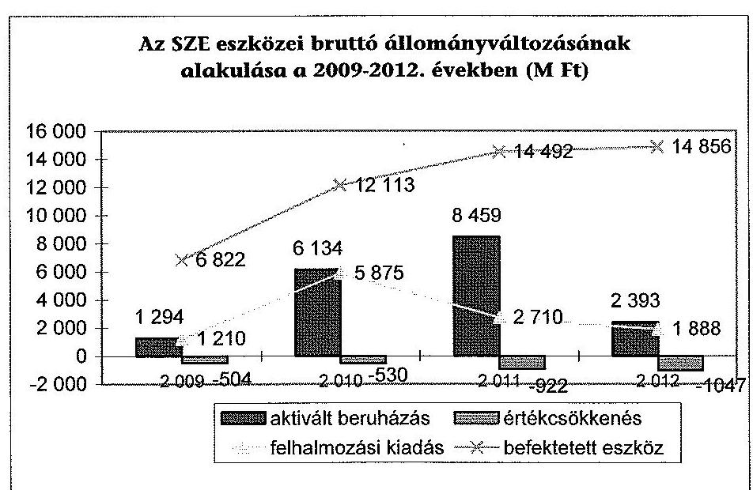

---

A beruházások következtében a tárgyi eszközök használhatósági foka javult ( $63,1 \%$-ról $70,8 \%$-ra), illetve az épületek és építmények átlagos életkora 8,1 évről 5,7 évre, a gépek, berendezések és felszereléseké 4,4 évről 2,9 évre, az ügyviteli és számítástechnikai eszközök átlagos életkora pedig 2,3 évről 1,5 évre csökkent. A tárgyi eszköz állomány elhasználódási szintje kedvezően változott a 2009. évi $35,7 \%$-ról, csökkent a 2012. évre, $28,1 \%$-ra.

Az SZE mérleg szerinti követelései a 2009. évi 245,5 M Ft-ról 11,9\%-kal 274,8 M Ft-ra nőttek. A követelések állománya követelés áruszállításból és szolgáltatásnyújtásból (vevők), illetve egyéb követelésekből (lakáskölcsön) tevődött össze. A vizsgált évek átlagában a követeléseknek a 99,5\%-át a vevőkövetelések adták, $0,5 \%$-a volt egyéb követelés.

A vevőkkel szembeni követelések lejárat szerinti megoszlása az ellenőrzött időszakban kedvezőtlenül alakult, mivel az éven túli követelésállomány a 2009. évi 17,7\%-ról $33,0 \%$-ra nőtt a hallgatókkal szembeni éven túli követelések folyamatos emelkedése miatt. A 2009-2012 közötti időszakban 2,3 M Ft-ot írtak le behajthatatlanság címén hitelezési veszteségként.

A szállítói kötelezettségek, ezen belül a lejárt tartozások év végi összege az időszak egészét tekintve erőteljesen csökkenő tendenciájú volt. A szállítói tartozások a 2009. év végi 104,8 M Ft-ról a 2012. év végére 85,6 M Ft-ra csökkentek, ugyanakkor az összes szállítói kötelezettségen belül 2009 óta fokozatosan nőtt, a kezdeti $30,5 \%$-ról 2012-ben $57,7 \%$-ra változott. A lejárt szállítói tartozásállomány szerkezetét tekintve megállapítható, hogy a 60 napon túli tartozások részaránya a 2010. és 2011. években kevesebb volt ( $1,4 \%, 4,2 \%$ ) a 2009 . évinél $(6,3 \%)$, de 2012-ben 8,3 százalékponttal nőtt.

A 2009-2012. években a saját tőke összes forráshoz viszonyított aránya ${ }^{76}$ $74,3 \%$-ról, $93,0 \%$-ra nőtt. A saját tőke arányának növekedését a kötelezettségeknek a beruházásokhoz kapcsolódó csökkenése okozta, a saját tőke évrőlévre való - beruházások miatti - növekedése stabil volt.

# 5. KorÁbbi ÁSZ EllenŐrzÉSEK JAVASLATAINAK hASZNOSULÁSA 

Az ÁSZ a korábbi ellenőrzései során a felsőoktatás témakörében kilenc javaslatot fogalmazott meg a felsőoktatásért felelős minisztériumnak (OKM, NEFMI, EMMI). A minisztérium a javaslatokra intézkedési terveket készített, amelyek összesen 10 intézkedést tartalmaztak. Az intézkedések közül hármat (késéssel) megvalósítottak, hét nem valósult meg.

Az oktatási és kulturális ágazat irányítási rendszerének, múködésének ellenőrzéséről szóló 1106 sz . ÁSZ jelentés javaslataira a NEFMI készített intézkedési tervet. A megfogalmazott öt javaslat közül jelen ellenőrzés keretében kifejezetten a felsőoktatás vonatkozásában releváns két javaslat - a 2. sz. és a 3. sz. - utóellenőrzésére került sor.

[^0]
[^0]:    ${ }^{76}$ Saját tőke aránya mutató (Saját tőke összesen/Források összesen)

---

Az ÁSZ jelentés 2. sz. javaslatára tervezett intézkedés, a minisztérium felügyelete alá tartozó szervezetek feladatellátásának javítására számszerűsíthető mutatószámokon alapuló kritériumok és középtávú célrendszer kidolgozása nem valósult meg. Az ÁSZ ellenőrzés 3. sz. javaslata, az oktatási ágazat középtávú stratégiájának kidolgozása sem történt meg.

A tervezett intézkedés 2012. december 31-i határideje előtt tíz nappal hozott kormányhatározat ${ }^{77}$ értelmében a felsőoktatásról szóló stratégiát 2013. október 31-ig kellett volna a Kormány elé terjeszteni. A stratégia elkészítése helyett a 2013 januárjában megalakult Felsőoktatási Kerekasztal keretében fogalmaztak meg egyes felsőoktatási stratégiai irányokat tartalmazó dokumentumot ${ }^{78}$.

Az ellenőrzött EMMI (illetve jogelődje a NEFMI) A felsőoktatás oktatási infrastruktúra-fejlesztési programjának ellenőrzéséről szóló 1171 sz. ÁSZ jelentésben tett javaslatokra intézkedési tervet készített, illetve tájékoztatást adott az intézkedéseiről. Az ÁSZ elnökének válaszlevelére egy kiegészített, ötpontos intézkedési tervet készített az EMMI 2012. május 30 -án. A nemzeti erőforrás miniszternek címezett javaslatokra tervezett három intézkedés közül egy - öthónapos késéssel - megvalósult, kettő nem teljesült.

Nem történt intézkedés az oktatási infrastruktúra-fejlesztési programok előkészítési folyamatának ÁSZ által megállapított hiányosságai miatti felelősség megállapítására. A tervezett 2013. június 30. helyett 2013. november végére felmérték az állami felsőoktatási intézmények kapacitáskihasználtságát, azonban még nem történtek meg az intézkedések a felmérés eredményeinek és a felsőoktatást érintő ágazati célok figyelembe vételével a felsőoktatási infrastruktúra közép- és hosszútávon történő hasznosítására.

Az ÁSZ jelentés két javaslatot közösen a nemzeti erőforrás miniszter és a nemzeti fejlesztési miniszter számára fogalmazott meg, amelyek szintén nem valósultak meg.

A minisztérium tájékoztatása szerint a PPP projektek támogatásához kapcsolódó követelményrendszer kialakításában a nemzeti fejlesztési miniszterrel nem történt együttmúködés, mert kormányzati szinten nem terveztek indítani újabb projektet. A feladat határideje „folyamatos" volt. Az NFM-mel közös másik intézkedést sem hajtották végre. Így nem került sor az oktatási infrastruktúra-fejlesztési programok lebonyolításával kapcsolatos, ÁSZ által megállapított hiányosságok (kedvezőtlen szerződéskötés és kockázatmegosztás) miatti felelősség megállapítására. A tervezett intézkedés határideje 2013. december 31. volt.

Az EMMI készített intézkedési tervet Az állami felsőoktatási intézmények érdekeltségébe tartozó gazdasági társaságok támogatásának és nyereségük hasznosulásának ellenőrzése címü 1290 sz. ÁSZ jelentésében tett javaslatokra. A három tervezett intézkedésből kettő késedelmesen valósult meg, egyet nem hajtottak végre. Az ÁSZ 2. sz. javaslatára tervezett 1. sz. intézkedés

[^0]
[^0]:    ${ }^{77}$ Az 1657/2012. (XII. 20.) Korm. határozat a kormányzati stratégiai dokumentumok felülvizsgálatával kapcsolatos feladatokról, 12. pont.
    ${ }^{78}$ A felsőoktatás átalakításának stratégiai irányai és soron következő lépései, Készítette: Emberi Erőforrások Minisztériuma Felsőoktatásért Felelős Államtitkár és Kabinetje (Budapest, 2013. szeptember 26.).

---

nem hasznosult. Így az állami felsőoktatási intézmények gazdasági társaságai szakmai feladatellátásának és gazdaságossági eredményességének mérését biztosító mutatószámokat és értékelési rendszert a felsőoktatási intézményekkel nem dolgoztatták ki.

Az intézkedési tervben vállalt megvalósítási határidő 2013. január 31. volt, amelyet követően a minisztérium Felsőoktatási Főosztálya, illetve Belső Ellenőrzési Főosztálya a mutatószám rendszer bevezetésére újabb felsőoktatási finanszírozási szabályozásig további halasztást javasolt a minisztériumi felső vezetésnek. A javaslattal kapcsolatos döntésről nincs információ, az intézkedési terv módosítására nem érkezett jelzés az EMMI-től az ÁSZ-hoz.

A 2013. március 31. határidőre tervezett 2. sz. intézkedést 2013 végére hajtották végre. Az érintett felsőoktatási intézmények vezetőitől tájékoztató jelentést kért a minisztérium az 50\% alatti intézményi részesedéssel múködő gazdasági társaságok tevékenységének felülvizsgálatáról, múködésük indokoltságáról és eredményességéről, valamint az intézményi részesedés megszüntetéséről és ütemezéséről. Szintén késedelmesen, 2013. január 31. helyett 2013 decemberében hajtották végre a 3. sz. intézkedést, amely alapján az érintett felsőoktatási intézmények vezetőit felszólította a minisztérium az ÁSZ vizsgálat során feltárt szabálytalanságok és hiányosságok megszüntetésére és az intézkedésekről szóló tájékoztató megküldésére.

Budapest, 2014.
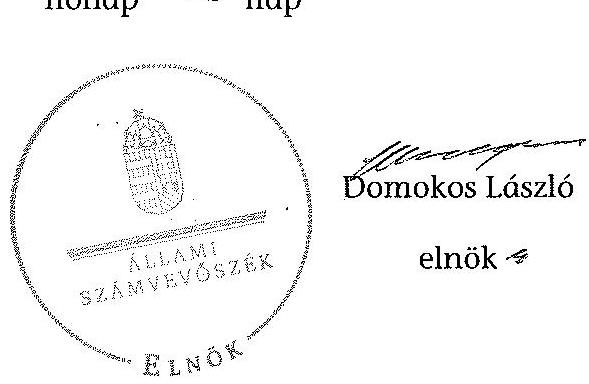

Melléklet: $\quad 9 \mathrm{db}$

---

.

---

1. SZÁMÚ MELLÉKLET A V-0364-491/2014. SZÁMÚ JELENTÉSHEZ

A Széchenyi István Egyetem kiadási és bevételi előírónyeztel, azok teljesítése a 2009-2013. években

|  Típus | Megnevezés | 2009 | 2010 | 2011 | 2012 | 2013  |
| --- | --- | --- | --- | --- | --- | --- |
|   |  | Eredett | Módosított |  | Eredett | Módosított  |
|   |  | előírónyezt | előírónyezt | előírónyezt | előírónyezt |   |
|  1 | BEASTÁVIS |  |  |  |  |   |
|  2 | Személyi ízitsztlenk | 2 279 260 | 2 081 383 | 2 961 651 | 2 429 260 | 2 180 238  |
|  3 | Módosított helyett jószáttunk | 789 130 | 938 374 | 852 515 | 711 335 | 874 340  |
|  4 | Szüggé kizárható | 2 081 638 | 2 205 171 | 1 911 652 | 1 936 821 | 2 093 135  |
|  5 | Egyéb helyt kizártható | 23 200 | 60 881 | 56 130 | 30 800 | 109 800  |
|  6 | Tőzsegettbennétt szűkódás kizártható | - | 25 750 | 31 776 | - | 38 436  |
|  7 | Tőzsegettbennétt szűkódás kizártható | - | 16 400 | 15 311 | - | 200  |
|  8 | Útlak évi előírónyezt ötszám | - | 2 121 | 2 121 | - | -  |
|  9 | Mókkidős idős pénzmezőst ötszám | - | 12 300 | 12 297 | - | 4 400  |
|  10 | Felbukasztási idős pénzmezőst ötszám | - | - | - | - | -  |
|  11 | Előzítésű pénzhelyi kereséses | 883 403 | 1 023 460 | 2 556 219 | 1 005 692 | 1 302 010  |
|  12 | Egyéb széteske | - | - | - | - | 1 800  |
|  13 | Férfellek | 29 867 | 228 454 | 227 776 | 139 867 | 286 660  |
|  14 | Szűkésényt bocsátását kizártható ÁSÁ-nyi | 298 010 | 1 324 075 | 992 637 | 402 552 | 4 308 401  |
|  15 | Késponti bocsátását kizártható ÁSÁ-nyi | - | - | - | - | -  |
|  16 | Látképzítés kiszéteső ÁSÁ-nyi | - | - | - | - | -  |
|  17 | Tőzsegettbenn előzőtípus kiszétes | - | 2 200 | 1 300 | - | 2 700  |
|  18 | Összesen | 6 296 209 | 6 894 721 | 6 110 369 | 4 432 227 | 14 711 423  |
|  19 | BEVÉTELEK |  |  |  |  |   |
|  20 | Készenszint bocsátás | - | 1 474 | 1 473 | - | 2 000  |
|  21 | Szüggében szűkódás bocsátás | 1 485 298 | 2 098 624 | 2 191 179 | 1 485 298 | 2 240 698  |
|  22 | Mókkidős idős pénzmezőst érvéniak | 104 200 | 304 300 | 97 706 | 104 300 | 304 300  |
|  23 | Felbukasztási bocsátás | - | 180 000 | 497 083 | - | 20  |
|  24 | Felbukasztási idős pénzmezőst érvéniak | 160 979 | 160 979 | 233 890 | 160 979 | 160 979  |
|  25 | Tőzségtől azértől kiszett tőzségcélig | 4 643 431 | 4 634 904 | 4 431 020 | 4 608 941 | 4 608 941  |
|  26 | Tőzségcélig érvénik felújításai bocsátás | 300 000 | 378 000 | 467 498 | 300 000 | 300 000  |
|  27 | Tőzségcélig érvénik felújításai bocsátás | - | 602 243 | 1 107 792 | 600 000 | 4 211 364  |
|  28 | Tőzségcélig érvénik felújításai bocsátás | - | 2 200 | 1 200 | - | 1 700  |
|  29 | Kétét évi részvételhez érvénia | - | 2 119 | 2 603 | - | 2 307  |
|  30 | Tőzségcélig biztosításos felújításai bocsátás | - | 576 379 | 653 002 | - | 2 367 451  |
|  31 | Összesen | 6 296 209 | 6 894 721 | 5 802 429 | 4 432 227 | 14 711 423  |

---

# A Széchenyi István Egyetem kiadásainak, bevételeinek változása a 2009-2012. években

|   |  |  |  |  |  | adatok ezer 15-ban |   |
| --- | --- | --- | --- | --- | --- | --- | --- |
|   |  | 2009. év | 2010. év | 2011. év | 2012. év |  |   |
|  Ssz. | Megnevezés | Teljesítés | Teljesítés | Teljesítés | Teljesítés | 2012/
2009 |   |
|  1 | KIADÁSOK |  |  |  |  |  |   |
|  2 | Személyi juttatások | 2 961 661 | 2 632 449 | 3 474 451 | 3 114 553 | 105,2% |   |
|  3 | Rendszeres és nem rendszeres | 2 508 931 | 2 138 801 | 2 756 573 | 2 476 781 | 98,7% |   |
|  4 | Rendszeres személyi juttatás | 1 910 499 | 1 989 901 | 2 557 252 | 2 271 525 | 118,9% |   |
|  5 | Alapületmény | 1 525 946 | 1 505 491 | 1 586 548 | 1 537 607 | 100,8% |   |
|  6 | Nem rendszeres | 598 432 | 148 902 | 219 122 | 205 458 | 34,3% |   |
|  7 | Műszázvágakhoz kapcs juttatások | 492 689 | 58 401 | 159 912 | 49 695 | 10,1% |   |
|  8 | Normatív és teljesítéshez kötött jutalom | 427 259 | 3 483 | 135 284 | 9 142 | 2,1% |   |
|  9 | Kátal személyi juttatások | 452 730 | 493 646 | 718 077 | 637 772 | 140,9% |   |
|  10 | Munkazadót terhelii járulékok | 900 515 | 687 790 | 910 267 | 815 580 | 90,6% |   |
|  11 | Dologi és folyó kiadások | 1 967 792 | 2 343 757 | 2 632 469 | 2 495 130 | 126,8% |   |
|  12 | Dologi kiadások | 1 911 663 | 2 242 654 | 2 562 808 | 2 308 931 | 120,8% |   |
|  13 | Közdetbeszerzés | 286 771 | 340 460 | 344 670 | 337 450 | 117,7% |   |
|  14 | Kommunikációs szolgáltatás | 56 171 | 45 498 | 72 765 | 74 563 | 132,7% |   |
|  15 | Szolgáltattal kiadások | 773 111 | 802 826 | 852 053 | 927 642 | 120,0% |   |
|  16 | Bérlet és lizáng | 38 715 | 14 479 | 20 351 | 19 439 | 50,2% |   |
|  17 | ebből FFP | 0 | 0 | 0 | 0 | 0 |   |
|  18 | Gás, villany, víz | 155 720 | 148 603 | 175 072 | 280 195 | 179,9% |   |
|  19 | Működési célú ÁFA | 377 132 | 438 550 | 488 692 | 470 701 | 124,8% |   |
|  20 | Kérületek, regisztszékelő | 112 082 | 110 664 | 109 538 | 118 796 | 106,0% |   |
|  21 | Szellemi tevékenység | 71 364 | 81 193 | 176 290 | 43 617 | 61,1% |   |
|  22 | Egyéb fejei kiadások | 56 130 | 100 101 | 69 661 | 186 189 | 331,7% |   |
|  23 | Előző évt maradvány visszafizetés | 24 102 | 0 | 0 | 111 654 | 462,0% |   |
|  24 | Adók, díjak, egyéb befizetések | 30 000 | 99 398 | 69 661 | 74 202 | 247,3% |   |
|  25 | Támogatásértékű működési kiadások | 35 778 | 38 352 | 37 804 | 32 483 | 90,8% |   |
|  26 | Előző évt működési célú előirányzat maradvány, pénzmaradvány útudása | 2 121 | 0 | 0 | 2 705 | 127,5% |   |
|  27 | Működési célú pénzeszköz útudás | 15 297 | 4 524 | 4 369 | 8 386 | 54,8% |   |
|  28 | Elbítottak pénzbeli juttatásai | 1 016 219 | 968 282 | 968 318 | 954 684 | 93,9% |   |
|  29 | Egyéb juttatás | 0 | 1 843 | 5 866 | 995 |  |   |
|  30 | Felhalmozási kiadások | 1 209 725 | 5 874 688 | 2 709 812 | 1 887 701 | 156,0% |   |
|  31 | Istézményi beruházási kiadások | 952 498 | 4 718 436 | 2 577 135 | 1 807 957 | 189,8% |   |
|  32 | ebből ingatlan | 516 049 | 362 219 | 876 804 | 350 347 | 67,9% |   |
|  33 | Gépok, bezenézzések, felszerelések | 302 316 | 762 314 | 1 049 054 | 938 220 | 310,3% |   |
|  34 | Felújítás | 227 776 | 260 238 | 132 597 | 78 864 | 34,6% |   |
|  35 | ebből ingatlan (Áfával) | 227 776 | 260 238 | 137 968 | 78 864 | 34,6% |   |
|  36 | Felújítások és beruházások ÁFA-ja | 153 590 | 270 243 | 529 626 | 440 246 | 286,6% |   |
|  37 | Támogatásértékű felhalmozási kiadások | 16 312 | 74 | 0 | 0 | 0,0% |   |
|  38 | Egyéb intézményi felhalmozási kiadás | 13 139 | 895 841 | 0 | 0 | 0,0% |   |
|  39 | Előző évt felhalmozási célú előirányzat-moradvány, pénzmaradvány útudása | 0 | 99 | 83 | 880 |  |   |
|  40 | Kölcsönök | 1 200 | 3 700 | 1 900 | 1 290 | 107,5% |   |
|  41 | Összesen | 8 110 309 | 12 554 385 | 10 745 256 | 9 313 497 | 114,5% |   |
|  42 | BEVÉTELEK |  |  |  |  |  |   |
|  43 | Működési bevételek | 2 697 843 | 3 334 749 | 4 013 872 | 3 141 275 | 116,4% |   |
|  44 | Közhetszint bevételek | 1 472 | 2 569 | 3 012 | 2 527 |  |   |
|  45 | Intézményi működési bevétel | 2 191 179 | 2 298 655 | 2 251 745 | 1 891 148 | 86,3% |   |
|  46 | Szolgáltatások elöméritke | 1 491 119 | 1 491 222 | 1 454 227 | 1 249 023 | 83,8% |   |
|  47 | Istézményi ellátási díjak | 249 435 | 288 107 | 291 220 | 271 724 | 108,9% |   |
|  48 | Hozom és kamuthavétel | 80 093 | 51 170 | 9 259 | 15 047 | 16,3% |   |
|  49 | Működési célú pénzeszköz átvételek | 97 706 | 98 548 | 89 818 | 116 805 | 119,5% |   |
|  50 | ebből uniós forrás | 0 | 0 | 0 | 2 646 |  |   |
|  51 | Támogatásértékű működési bevétel | 407 486 | 869 764 | 1 626 013 | 1 089 505 | 267,6% |   |
|  52 | EU programokra működési bevétel | 303 189 | 599 335 | 0 | 0 | 0,0% |   |
|  53 | Előző évt felhalmozási célú előirányzat-moradvány, pénzmaradvány útudása 2010-2012. |  | 65 213 | 43 287 | 41 290 |  |   |
|  54 | Felhalmozási bevételek | 1 838 765 | 4 768 898 | 2 211 383 | 1 303 075 | 71,3% |   |
|  55 | Tárgyi eszközök, immateriális javok értékesítése | 487 083 | 50 | 0 | 0 | 0,0% |   |
|  56 | Pénzügyi belüliátotások bevételei | 0 | 0 | 0 | 0 |  |   |
|  57 | Felhalmozási célú pénzeszköz átvételek | 233 890 | 179 749 | 253 601 | 0 | 0,0% |   |
|  58 | ebből uniós forrás | 0 | 0 | 0 | 0 |  |   |
|  59 | Támogatásértékű felhalmozási bevétel | 1 107 792 | 4 589 099 | 1 957 782 | 1 303 075 | 117,6% |   |
|  60 | EU programokra beruházási bevétel | 599 655 | 4 370 581 | 0 | 0 | 0,0% |   |
|  61 | Előző évt előirányzat-moradvány, pénzmaradvány átvételei 2009-ben | 6 665 | 0 | 0 | 0 |  |   |
|  62 | Támogatási kölcsönök igénybevítette, visszatérítése | 1 200 | 3 700 | 1 900 | 1 290 | 107,5% |   |
|  63 | Irányító szerelői kapott támogatás | 4 634 904 | 4 408 941 | 4 337 986 | 3 952 400 | 85,3% |   |
|  64 | Előirányzat maradvány felhasználás | 633 052 | 2 240 203 | 1 677 008 | 1 867 740 | 295,0% |   |
|  65 | Összesen | 9 802 429 | 14 756 491 | 12 345 149 | 10 365 780 | 104,7% |   |

---

### 3. SZÁMÚ MELLÉKLET A V-0364-491/2014. SZÁMÚ JELENTÉSHEZ

|   |  |  |  |  |  |  |  |  |  |  |  |  |  |  |  |  |  |  |  |  |  |  |  |  |  |  |  |  |  |  |  |  |  |   |
| --- | --- | --- | --- | --- | --- | --- | --- | --- | --- | --- | --- | --- | --- | --- | --- | --- | --- | --- | --- | --- | --- | --- | --- | --- | --- | --- | --- | --- | --- | --- | --- | --- | --- | --- | --- |
|   |  |  |  |  |  |  |  |  |  |  |  |  |  |  |  |  |  |  |  |  |  |  |  |  |  |  |  |  |  |  |  |  |  |  |   |
|   |  |  |  |  |  |  |  |  |  |  |  |  |  |  |  |  |  |  |  |  |  |  |  |  |  |  |  |  |  |  |  |  |  |  |   |
|   |  |  |  |  |  |  |  |  |  |  |  |  |  |  |  |  |  |  |  |  |  |  |  |  |  |  |  |  |  |  |  |  |  |  |   |
|   |  |  |  |  |  |  |  |  |  |  |  |  |  |  |  |  |  |  |  |  |  |  |  |  |  |  |  |  |  |  |  |  |  |  |   |
|   |  |  |  |  |  |  |  |  |  |  |  |  |  |  |  |  |  |  |  |  |  |  |  |  |  |  |  |  |  |  |  |  |  |  |   |
|   |  |  |  |  |  |  |  |  |  |  |  |  |  |  |  |  |  |  |  |  |  |  |  |  |  |  |  |  |  |  |  |  |  |  |   |
|   |  |  |  |  |  |  |  |  |  |  |  |  |  |  |  |  |  |  |  |  |  |  |  |  |  |  |  |  |  |  |  |  |  |  |   |
|   |  |  |  |  |  |  |  |  |  |  |  |  |  |  |  |  |  |  |  |  |  |  |  |  |  |  |  |  |  |  |  |  |  |  |   |
|   |  |  |  |  |  |  |  |  |  |  |  |  |  |  |  |  |  |  |  |  |  |  |  |  |  |  |  |  |  |  |  |  |  |  |   |
|   |  |  |  |  |  |  |  |  |  |  |  |  |  |  |  |  |  |  |  |  |  |  |  |  |  |  |  |  |  |  |  |  |  |  |   |
|   |  |  |  |  |  |  |  |  |  |  |  |  |  |  |  |  |  |  |  |  |  |  |  |  |  |  |  |  |  |  |  |  |  |  |  |   |
|   |  |  |  |  |  |  |  |  |  |  |  |  |  |  |  |  |  |  |  |  |  |  |  |  |  |  |  |  |  |  |  |  |  |  |  |   |
|   |  |  |  |  |  |  |  |  |  |  |  |  |  |  |  |  |  |  |  |  |  |  |  |  |  |  |  |  |  |  |  |  |  |  |  |   |
|   |  |  |  |  |  |  |  |  |  |  |  |  |  |  |  |  |  |  |  |  |  |  |  |  |  |  |  |  |  |  |  |  |  |  |  |   |
|   |  |  |  |  |  |  |  |  |  |  |  |  |  |  |  |  |  |  |  |  |  |  |  |  |  |  |  |  |  |  |  |  |  |  |  |   |
|   |  |  |  |  |  |  |  |  |  |  |  |  |  |  |  |  |  |  |  |  |  |  |  |  |  |  |  |  |  |  |  |  |  |  |  |   |
|   |  |  |  |  |  |  |  |  |  |  |  |  |  |  |  |  |  |  |  |  |  |  |  |  |  |  |  |  |  |  |  |  |  |  |  |   |
|   |  |  |  |  |  |  |  |  |  |  |  |  |  |  |  |  |  |  |  |  |  |  |  |  |  |  |  |  |  |  |  |  |  |  |  |   |
|   |  |  |  |  |  |  |  |  |  |  |  |  |  |  |  |  |  |  |  |  |  |  |  |  |  |  |  |  |  |  |  |  |  |  |  |   |
|   |  |  |  |  |  |  |  |  |  |  |  |  |  |  |  |  |  |  |  |  |  |  |  |  |  |  |  |  |  |  |  |  |  |  |  |   |
|   |  |  |  |  |  |  |  |  |  |  |  |  |  |  |  |  |  |  |  |  |  |  |  |  |  |  |  |  |  |  |  |  |  |  |  |   |
|   |  |  |  |  |  |  |  |  |  |  |  |  |  |  |  |  |  |  |  |  |  |  |  |  |  |  |  |  |  |  |  |  |  |  |  |   |
|   |  |  |  |  |  |  |  |  |  |  |  |  |  |  |  |  |  |  |  |  |  |  |  |  |  |  |  |  |  |  |  |  |  |  |  |   |
|   |  |  |  |  |  |  |  |  |  |  |  |  |  |  |  |  |  |  |  |  |  |  |  |  |  |  |  |  |  |  |  |  |  |  |  |   |
|   |  |  |  |  |  |  |  |  |  |  |  |  |  |  |  |  |  |  |  |  |  |  |  |  |  |  |  |  |  |  |  |  |  |  |  |   |
|   |  |  |  |  |  |  |  |  |  |  |  |  |  |  |  |  |  |  |  |  |  |  |  |  |  |  |  |  |  |  |  |  |  |  |  |   |
|   |  |  |  |  |  |  |  |  |  |  |  |  |  |  |  |  |  |  |  |  |  |  |  |  |  |  |  |  |  |  |  |  |  |  |  |   |
|   |  |  |  |  |  |  |  |  |  |  |  |  |  |  |  |  |  |  |  |  |  |  |  |  |  |  |  |  |  |  |  |  |  |  |  |   |
|   |  |  |  |  |  |  |  |  |  |  |  |  |  |  |  |  |  |  |  |  |  |  |  |  |  |  |  |  |  |  |  |  |  |  |  |   |
|   |  |  |  |  |  |  |  |  |  |  |  |  |  |  |  |  |  |  |  |  |  |  |  |  |  |  |  |  |  |  |  |  |  |  |  |   |
|   |  |  |  |  |  |  |  |  |  |  |  |  |  |  |  |  |  |  |  |  |  |  |  |  |  |  |  |  |  |  |  |  |  |  |  |   |
|   |  |  |  |  |  |  |  |  |  |  |  |  |  |  |  |  |  |  |  |  |  |  |  |  |  |  |  |  |  |  |  |  |  |  |  |   |
|   |  |  |  |  |  |  |  |  |  |  |  |  |  |  |  |  |  |  |  |  |  |  |  |  |  |  |  |  |  |  |  |  |  |  |  |   |
|   |  |  |  |  |  |  |  |  |  |  |  |  |  |  |  |  |  |  |  |  |  |  |  |  |  |  |  |  |  |  |  |  |  |  |  |   |
|   |  |  |  |  |  |  |  |  |  |  |  |  |  |  |  |  |  |  |  |  |  |  |  |  |  |  |  |  |  |  |  |  |  |  |  |   |
|   |  |  |  |  |  |  |  |  |  |  |  |  |  |  |  |  |  |  |  |  |  |  |  |  |  |  |  |  |  |  |  |  |  |  |  |  |   |
|   |  |  |  |  |  |  |  |  |  |  |  |  |  |  |  |  |  |  |  |  |  |  |  |  |  |  |  |  |  |  |  |  |  |  |  |  |   |
|   |  |  |  |  |  |  |  |  |  |  |  |  |  |  |  |  |  |  |  |  |  |  |  |  |  |  |  |  |  |  |  |  |  |  |  |  |   |
|   |  |  |  |  |  |  |  |  |  |  |  |  |  |  |  |  |  |  |  |  |  |  |  |  |  |  |  |  |  |  |  |  |  |  |  |  |   |
|   |  |  |  |  |  |  |  |  |  |  |  |  |  |  |  |  |  |  |  |  |  |  |  |  |  |  |  |  |  |  |  |  |  |  |  |  |   |
|   |  |  |  |  |  |  |  |  |  |  |  |  |  |  |  |  |  |  |  |  |  |  |  |  |  |  |  |  |  |  |  |  |  |  |  |  |   |
|   |  |  |  |  |  |  |  |  |  |  |  |  |  |  |  |  |  |  |  |  |  |  |  |  |  |  |  |  |  |  |  |  |  |  |  |  |   |
|   |  |  |  |  |  |  |  |  |  |  |  |  |  |  |  |  |  |  |  |  |  |  |  |  |  |  |  |  |  |  |  |  |  |  |  |  |   |
|   |  |  |  |  |  |  |  |  |  |  |  |  |  |  |  |  |  |  |  |  |  |  |  |  |  |  |  |  |  |  |  |  |  |  |  |  |   |
|   |  |  |  |  |  |  |  |  |  |  |  |  |  |  |  |  |  |  |  |  |  |  |  |  |  |  |  |  |  |  |  |  |  |  |  |  |   |
|   |  |  |  |  |  |  |  |  |  |  |  |  |  |  |  |  |  |  |  |  |  |  |  |  |  |  |  |  |  |  |  |  |  |  |  |  |   |
|   |  |  |  |  |  |  |  |  |  |  |  |  |  |  |  |  |  |  |  |  |  |  |  |  |  |  |  |  |  |  |  |  |  |  |  |  |   |
|   |  |  |  |  |  |  |  |  |  |  |  |  |  |  |  |  |  |  |  |  |  |  |  |  |  |  |  |  |  |  |  |  |  |  |  |  |   |
|   |  |  |  |  |  |  |  |  |  |  |  |  |  |  |  |  |  |  |  |  |  |  |  |  |  |  |  |  |  |  |  |  |  |  |  |  |   |
|   |  |  |  |  |  |  |  |  |  |  |  |  |  |  |  |  |  |  |  |  |  |  |  |  |  |  |  |  |  |  |  |  |  |  |  |  |   |
|   |  |  |  |  |  |  |  |  |  |  |  |  |  |  |  |  |  |  |  |  |  |  |  |  |  |  |  |  |  |  |  |  |  |  |  |  |   |
|   |  |  |  |  |  |  |  |  |  |  |  |  |  |  |  |  |  |  |  |  |  |  |  |  |  |  |  |  |  |  |  |  |  |  |  |  |   |
|   |  |  |  |  |  |  |  |  |  |  |  |  |  |  |  |  |  |  |  |  |  |  |  |  |  |  |  |  |  |  |  |  |  |  |  |  |   |
|   |  |  |  |  |  |  |  |  |  |  |  |  |  |  |  |  |  |  |  |  |  |  |  |  |  |  |  |  |  |  |  |  |  |  |  |  |   |
|   |  |  |  |  |  |  |  |  |  |  |  |  |  |  |  |  |  |  |  |  |  |  |  |  |  |  |  |  |  |  |  |  |  |  |  |  |   |
|   |  |  |  |  |  |  |  |  |  |  |  |  |  |  |  |  |  |  |  |  |  |  |  |  |  |  |  |  |  |  |  |  |  |  |  |  |   |
|   |  |  |  |  |  |  |  |  |  |  |  |  |  |  |  |  |  |  |  |  |  |  |  |  |  |  |  |  |  |  |  |  |  |  |  |  |   |
|   |  |  |  |  |  |  |  |  |  |  |  |  |  |  |  |  |  |  |  |  |  |  |  |  |  |  |  |  |  |  |  |  |  |  |  |  |   |
|   |  |  |  |  |  |  |  |  |  |  |  |  |  |  |  |  |  |  |  |  |  |  |  |  |  |  |  |  |  |  |  |  |  |  |  |  |   |
|   |  |  |  |  |  |  |  |  |  |  |  |  |  |  |  |  |  |  |  |  |  |  |  |  |  |  |  |  |  |  |  |  |  |  |  |  |   |
|   |  |  |  |  |  |  |  |  |  |  |  |  |  |  |  |  |  |  |  |  |  |  |  |  |  |  |  |  |  |  |  |  |  |  |  |  |   |
|   |  |  |  |  |  |  |  |  |  |  |  |  |  |  |  |  |  |  |  |  |  |  |  |  |  |  |  |  |  |  |  |  |  |  |  |  |   |
|   |  |  |  |  |  |  |  |  |  |  |  |  |  |  |  |  |  |  |  |  |  |  |  |  |  |  |  |  |  |  |  |  |  |  |  |  |   |
|   |  |  |  |  |  |  |  |  |  |  |  |  |  |  |  |  |  |  |  |  |  |  |  |  |  |  |  |  |  |  |  |  |  |  |  |  |   |
|   |  |  |  |  |  |  |  |  |  |  |  |  |  |  |  |  |  |  |  |  |  |  |  |  |  |  |  |  |  |  |  |  |  |  |  |  |   |
|   |  |  |  |  |  |  |  |  |  |  |  |  |  |  |  |  |  |  |  |  |  |  |  |  |  |  |  |  |  |  |  |  |  |  |  |  |   |
|   |

---

## 4. SZÁMÚ MELLÉKLET A V-0364-491/2014. SZÁMÚ JELENTÉSHEZ

|  A Széchenyi István Egyszem mérlegedetei a 2009-2013. években |  |  |  |  |  |   |
| --- | --- | --- | --- | --- | --- | --- |
|   | Megnevezés | 2009. év | 2010. év | 2011. év | 2012. év | némés  |
|   |  |  |  |  |  | (2012/2009)  |
|  1 | **IMMATSÍGÁLÓ JAVÁK** | **140 206** | **231 185** | **296 825** | **391 856** | **182,0%**  |
|  2 | Alagátis, élesorvosás adózált értéke |  |  |  |  |   |
|  3 | Eszítési lejáratát adózált értéke |  |  |  |  |   |
|  4 | Vazprest értéke (nap) | 14 092 | 17 788 | 11 741 | 302 110 | 3790,0%  |
|  5 | Székesítési lejáratát | 120 131 | 213 327 | 283 004 | 2 302 | 2,0%  |
|  6 | Immateriális levcoparátat átférget |  |  |  |  |   |
|  7 | Immateriális levcoparátat átférget |  |  |  |  |   |
|  8 | **TÁBLIÓ ESZKÖZÖK** | **9 475 259** | **11 072 170** | **14 105 834** | **14 852 059** | **236,2%**  |
|  9 | Árpádszent és kapcsolódó megrendelési leprét | 4 442 177 | 5 280 141 | 10 872 029 | 11 189 938 | 231,9%  |
|  10 | Cépzés, levonatcségek, felüzenélyek | 1 160 420 | 1 421 110 | 2 919 290 | 2 940 600 | 223,4%  |
|  11 | Jázadások | 13 920 | 9 208 | 4 500 | 1 200 | 3,3%  |
|  12 | Támanyilhatók |  |  |  |  |   |
|  13 | Hordozatait, feltételeink | 427 813 | 5 131 478 | 380 019 | 520 200 | 37,3%  |
|  14 | Hordozatait adóit elöltezik |  |  |  |  |   |
|  15 | Állami kiszámok, sorrallások |  |  |  |  |   |
|  16 | Állami eszközök értékhelyeintétele |  |  |  |  |   |
|  17 | **BÉTEKTELETT PÉNZÜGYI ESZKÖZÖK** | **6 655** | **5 215** | **5 205** | **5 943** | **134,4%**  |
|  18 | Tartós részesedés | 1 240 | 1 240 | 1 240 | 1 240 | 100,0%  |
|  19 | Tartósan adók kiállalás | 9 453 | 7 994 | 6 044 | 7 780 | 133,3%  |
|  20 | **ÖZEMÉLTETEDES KÉZELEDEK ÉTADOTT** |  |  |  |  |   |
|  21 | **VAGJONKÉZELEDEK VELT ESZKÖZÖK** |  |  |  |  |   |
|  22 | **BÉTEKTELETT ESZKÖZÖK ÖSSZESEN** | **6 822 097** | **12 112 549** | **14 891 964** | **14 856 420** | **227,0%**  |
|  23 | **BÉTEKTELETT** | **292 370** | **300 083** | **359 629** | **336 924** | **122,0%**  |
|  24 | Anyagok |  |  |  |  |   |
|  25 | Részletmész termelés és félkész részvét | 163 206 | 204 921 | 209 945 | 212 315 | 130,1%  |
|  26 | Ejszáromakok |  |  |  |  |   |
|  27 | Azok, gyógyólegok, felüzenített szolgáltatások | 129 218 | 182 460 | 192 684 | 144 189 | 111,4%  |
|  28 | Azok, éjszárosok |  |  |  |  |   |
|  29 | **KÖTE FELEZÉK** | **243 327** | **257 298** | **234 225** | **274 888** | **111,9%**  |
|  30 | Kövőszárok árusszállításból és szolgáltatástól | 244 274 | 259 083 | 222 877 | 275 348 | 111,9%  |
|  31 | Szárok |  |  |  |  |   |
|  32 | Sértélemjátéki adatok |  |  | 1 248 | 1 500 |   |
|  33 | Egyéb kővetelések | 1 312 | 1 228 |  |  | 0,0%  |
|  34 | Utódó támogatási program előleges értékeszteletre |  |  |  |  |   |
|  35 | Idéresztési programok csökéljlődési felüzetése |  |  |  |  |   |
|  36 | Immateriális levonatcségek (napigcsak) |  |  |  |  |   |
|  37 | Immateriális levonatcségek (napigcsak) kőv. |  |  |  |  |   |
|  38 | Egyéb kővetelés | 1 213 | 1 218 |  |  | 0,0%  |
|  39 | **ÉKTEKTEZTÉSZ** | **700 001** | **605 407** |  |  | **0,0%**  |
|  40 | Torgatási célú részesedés |  |  |  |  |   |
|  41 | Torgatási célú részesedés bekezdési (kényv szerinti) értéke |  |  |  |  |   |
|  42 | Torgatási célú részesedés elszámolt értékvesztése, elutasítás |  |  |  |  |   |
|  43 | Torgatási célú kötelekszerei megkövetelési értékpaját | 700 001 | 605 407 |  |  | 0,0%  |
|  44 | Torgatási célú kötelekszerei megkövetelési értékpaját | 700 001 | 605 407 |  |  | 0,0%  |
|  45 | Torgatási célú kötelekszerei megkövetelési értékpaját |  |  |  |  |   |
|  46 | Torgatási célú kötelekszerei megkövetelési értékpaját |  |  |  |  |   |
|  47 | Torgatási célú kötelekszerei megkövetelési értékpaját |  |  |  |  |   |
|  48 | Torgatási célú kötelekszerei megkövetelési értékpaját |  |  |  |  |   |
|  49 | Torgatási célú kötelekszerei megkövetelési értékpaját |  |  |  |  |   |
|  50 | Torgatási célú kötelekszerei megkövetelési értékpaját |  |  |  |  |   |
|  51 | Torgatási célú kötelekszerei megkövetelési értékpaját |  |  |  |  |   |
|  52 | Torgatási célú kötelekszerei megkövetelési értékpaját |  |  |  |  |   |
|  53 | Torgatási célú kötelekszerei megkövetelési értékpaját |  |  |  |  |   |
|  54 | Torgatási célú kötelekszerei megkövetelési értékpaját |  |  |  |  |   |
|  55 | Torgatási célú kötelekszerei megkövetelési értékpaját |  |  |  |  |   |
|  56 | Torgatási célú kötelekszerei megkövetelési értékpaját |  |  |  |  |   |
|  57 | Torgatási célú kötelekszerei megkövetelési értékpaját |  |  |  |  |   |
|  58 | Torgatási célú kötelekszerei megkövetelési értékpaját |  |  |  |  |   |
|  59 | Torgatási célú kötelekszerei megkövetelési értékpaját |  |  |  |  |   |
|  60 | Torgatási célú kötelekszerei megkövetelési értékpaját |  |  |  |  |   |
|  61 | Torgatási célú kötelekszerei megkövetelési értékpaját |  |  |  |  |   |
|  62 | Torgatási célú kötelekszerei megkövetelési értékpaját |  |  |  |  |   |
|  63 | Torgatási célú kötelekszerei megkövetelési értékpaját |  |  |  |  |   |
|  64 | Torgatási célú kötelekszerei megkövetelési értékpaját |  |  |  |  |   |
|  65 | Torgatási célú kötelekszerei megkövetelési értékpaját |  |  |  |  |   |
|  66 | Torgatási célú kötelekszerei megkövetelési értékpaját |  |  |  |  |   |
|  67 | Torgatási célú kötelekszerei megkövetelési értékpaját |  |  |  |  |   |
|  68 | Torgatási célú kötelekszerei megkövetelési értékpaját |  |  |  |  |   |
|  69 | Torgatási célú kötelekszerei megkövetelési értékpaját |  |  |  |  |   |
|  70 | Torgatási célú kötelekszerei megkövetelési értékpaját |  |  |  |  |   |
|  71 | Torgatási célú kötelekszerei megkövetelési értékpaját |  |  |  |  |   |
|  72 | Torgatási célú kötelekszerei megkövetelési értékpaját |  |  |  |  |   |
|  73 | Torgatási célú kötelekszerei megkövetelési értékpaját |  |  |  |  |   |
|  74 | Torgatási célú kötelekszerei megkövetelési értékpaját |  |  |  |  |   |
|  75 | Torgatási célú kötelekszerei megkövetelési értékpaját |  |  |  |  |   |
|  76 | Torgatási célú kötelekszerei megkövetelési értékpaját |  |  |  |  |   |
|  77 | Torgatási célú kötelekszerei megkövetelési értékpaját |  |  |  |  |   |
|  78 | Torgatási célú kötelekszerei megkövetelési értékpaját |  |  |  |  |   |
|  79 | Torgatási célú kötelekszerei megkövetelési értékpaját |  |  |  |  |   |
|  80 | Torgatási célú kötelekszerei megkövetelési értékpaját |  |  |  |  |   |
|  81 | Torgatási célú kötelekszerei megkövetelési értékpaját |  |  |  |  |   |
|  82 | Torgatási célú kötelekszerei megkövetelési értékpaját |  |  |  |  |   |
|  83 | Torgatási célú kötelekszerei megkövetelési értékpaját |  |  |  |  |   |
|  84 | Torgatási célú kötelekszerei megkövetelési értékpaját |  |  |  |  |   |
|  85 | Torgatási célú kötelekszerei megkövetelési értékpaját |  |  |  |  |   |
|  86 | Torgatási célú kötelekszerei megkövetelési értékpaját |  |  |  |  |   |
|  87 | Torgatási célú kötelekszerei megkövetelési értékpaját |  |  |  |  |   |
|  88 | Torgatási célú kötelekszerei megkövetelési értékpaját |  |  |  |  |   |
|  89 | Torgatási célú kötelekszerei megkövetelési értékpaját |  |  |  |  |   |
|  90 | Torgatási célú kötelekszerei megkövetelési értékpaját |  |  |  |  |   |
|  91 | Torgatási célú kötelekszerei megkövetelési értékpaját |  |  |  |  |   |
|  92 | Torgatási célú kötelekszerei megkövetelési értékpaját |  |  |  |  |   |
|  93 | Torgatási célú kötelekszerei megkövetelési értékpaját |  |  |  |  |   |
|  94 | Torgatási célú kötelekszerei megkövetelési értékpaját |  |  |  |  |   |
|  95 | Torgatási célú kötelekszerei megkövetelési értékpaját |  |  |  |  |   |
|  96 | Torgatási célú kötelekszerei megkövetelési értékpaját |  |  |  |  |   |
|  97 | Torgatási célú kötelekszerei megkövetelési értékpaját |  |  |  |  |   |
|  98 | Torgatási célú kötelekszerei megkövetelési értékpaját |  |  |  |  |   |
|  99 | Torgatási célú kötelekszerei megkövetelési értékpaját |  |  |  |  |   |
|  100 | Torgatási célú kötelekszerei megkövetelési értékpaját |  |  |  |  |   |
|  101 | Torgatási célú kötelekszerei megkövetelési értékpaját |  |  |  |  |   |
|  102 | Torgatási célú kötelekszerei megkövetelési értékpaját |  |  |  |  |   |
|  103 | Torgatási célú kötelekszerei megkövetelési értékpaját |  |  |  |  |   |
|  104 | Torgatási célú kötelekszerei megkövetelési értékpaját |  |  |  |  |   |
|  105 | Torgatási célú kötelekszerei megkövetelési értékpaját |  |  |  |  |   |
|  106 | Torgatási célú kötelekszerei megkövetelési értékpaját |  |  |  |  |   |
|  107 | Torgatási célú kötelekszerei megkövetelési értékpaját |  |  |  |  |   |
|  108 | Torgatási célú kötelekszerei megkövetelési értékpaját |  |  |  |  |   |
|  109 | Torgatási célú kötelekszerei megkövetelési értékpaját |  |  |  |  |   |
|  110 | Torgatási célú kötelekszerei megkövetelési értékpaját |  |  |  |  |   |
|  111 | Torgatási célú kötelekszerei megkövetelési értékpaját |  |  |  |  |   |
|  112 | Torgatási célú kötelekszerei megkövetelési értékpaját |  |  |  |  |   |
|  113 | Torgatási célú kötelekszerei megkövetelési értékpaját |  |  |  |  |   |
|  114 | Torgatási célú kötelekszerei megkövetelési értékpaját |  |  |  |  |   |
|  115 | Torgatási célú kötelekszerei megkövetelési értékpaját |  |  |  |  |   |
|  116 | Torgatási célú kötelekszerei megkövetelési értékpaját |  |  |  |  |   |
|  117 | Torgatási célú kötelekszerei megkövetelési értékpaját |  |  |  |  |   |
|  118 | Torgatási célú kötelekszerei megkövetelési értékpaját |  |  |  |  |   |
|  119 | Torgatási célú kötelekszerei megkövetelési értékpaját |  |  |  |  |   |
|  120 | Torgatási célú kötelekszerei megkövetelési értékpaját |  |  |  |  |   |
|  121 | Torgatási célú kötelekszerei megkövetelési értékpaját |  |  |  |  |   |
|  122 | Torgatási célú kötelekszerei megkövetelési értékpaját |  |  |  |  |   |
|  123 | Torgatási célú kötelekszerei megkövetelési értékpaját |  |  |  |  |   |
|  124 | Torgatási célú kötelekszerei megkövetelési értékpaját |  |  |  |  |   |
|  125 | Torgatási célú kötelekszerei megkövetelési értékpaját |  |  |  |  |   |
|  126 | Torgatási célú kötelekszerei megkövetelési értékpaját |  |  |  |  |   |
|  127 | Torgatási célú kötelekszerei megkövetelési értékpaját |  |  |  |  |   |
|  128 | Torgatási célú kötelekszerei megkövetelési értékpaját |  |  |  |  |   |
|  129 | Torgatási célú kötelekszerei megkövetelési értékpaját |  |  |  |  |   |
|  130 | Torgatási célú kötelekszerei megkövetelési értékpaját |  |  |  |  |   |
|  131 | Torgatási célú kötelekszerei megkövetelési értékpaját |  |  |  |  |   |
|  132 | Torgatási célú kötelekszerei megkövetelési értékpaját |  |  |  |  |   |
|  133 | Torgatási célú kötelekszerei megkövetelési értékpaját |  |  |  |  |   |
|  134 | Torgatási célú kötelekszerei megkövetelési értékpaját |  |  |  |  |   |
|  135 | Torgatási célú kötelekszerei megkövetelési értékpaját |  |  |  |  |   |
|  136 | Torgatási célú kötelekszerei megkövetelési értékpaját |  |  |  |  |   |
|  137 | Torgatási célú kötelekszerei megkövetelési értékpaját |  |  |  |  |   |
|  138 | Torgatási célú kötelekszerei megkövetelési értékpaját |  |  |  |  |   |
|  139 | Torgatási célú kötelekszerei megkövetelési értékpaját |  |  |  |  |   |
|  140 | Torgatási célú kötelekszerei megkövetelési értékpaját |  |  |  |  |   |
|  141 | Torgatási célú kötelekszerei megkövetelési értékpaját |  |  |  |  |   |
|  142 | Torgatási célú kötelekszerei megkövetelési értékpaját |  |  |  |  |   |
|  143 | Torgatási célú kötelekszerei megkövetelési értékpaját |  |  |  |  |   |
|  144 | Torgatási célú kötelekszerei megkövetelési értékpaját |  |  |  |  |   |
|  145 | Torgatási célú kötelekszerei megkövetelési értékpaját |  |  |  |  |   |
|  146 | Torgatási célú kötelekszerei megkövetelési értékpaját |  |  |  |  |   |
|  147 | Torgatási célú kötelekszerei megkövetelési értékpaját |  |  |  |  |   |
|  148 | Torgatási célú kötelekszerei megkövetelési értékpaját |  |  |  |  |   |
|  149 | Torgatási célú kötelekszerei megkövetelési értékpaját |  |  |  |  |   |
|  150 | Torgatási célú kötelekszerei megkövetelési értékpaját |  |  |  |  |   |
|  151 | Torgatási célú kötelekszerei megkövetelési értékpaját |  |  |  |  |   |
|  152 | Torgatási célú kötelekszerei megkövetelési értékpaját |  |  |  |  |   |
|  153 | Torgatási célú kötelekszerei megkövetelési értékpaját |  |  |  |  |   |
|  154 | Torgatási célú kötelekszerei megkövetelési értékpaját |  |  |  |  |   |
|  155 | Torgatási célú kötelekszerei megkövetelési értékpaját |  |  |  |  |   |
|  156 | Torgatási célú kötelekszerei megkövetelési értékpaját |  |  |  |  |   |
|  157 | Torgatási célú kötelekszerei megkövetelési értékpaját |  |  |  |  |   |
|  158 | Torgatási célú kötelekszerei megkövetelési értékpaját |  |  |  |  |   |
|  159 | Torgatási célú kötelekszerei megkövetelési értékpaját |  |  |  |  |   |
|  160 | Torgatási célú kötelekszerei megkövetelési értékpaját |  |  |  |  |   |
|  161 | Torgatási célú kötelekszerei megkövetelési értékpaját |  |  |  |  |   |
|  162 | Torgatási célú kötelekszerei megkövetelési értékpaját |  |  |  |  |   |
|  163 | Torgatási célú kötelekszerei megkövetelési értékpaját |  |  |  |  |   |
|  164 | Torgatási célú kötelekszerei megkövetelési értékpaját |  |  |  |  |   |
|  165 | Torgatási célú kötelekszerei megkövetelési értékpaját |  |  |  |  |   |
|  166 | Torgatási célú kötelekszerei megkövetelési értékpaját |  |  |  |  |   |
|  167 | Torgatási célú kötelekszerei megkövetelési értékpaját |  |  |  |  |   |
|  168 | Torgatási célú kötelekszerei megkövetelési értékpaját |  |  |  |  |   |
|  169 | Torgatási célú kötelekszerei megkövetelési értékpaját |  |  |  |  |   |
|  170 | Torgatási célú kötelekszerei megkövetelési értékpaját |  |  |  |  |   |
|  171 | Torgatási célú kötelekszerei megkövetelési értékpaját |  |  |  |  |   |
|  172 | Torgatási célú kötelekszerei megkövetelési értékpaját |  |  |  |  |   |
|  173 | Torgatási célú kötelekszerei megkövetelési értékpaját |  |  |  |  |   |
|  174 | Torgatási célú kötelekszerei megkövetelési értékpaját |  |  |  |  |   |
|  175 | Torgatási célú kötelekszerei megkövetelési értékpaját |  |  |  |  |   |
|  176 | Torgatási célú kötelekszerei megkövetelési értékpaját |  |  |  |  |   |
|  177 | Torgatási célú kötelekszerei megkövetelési értékpaját |  |  |  |  |   |
|  178 | Torgatási célú kötelekszerei megkövetelési értékpaját |  |  |  |  |   |
|  179 | Torgatási célú kötelekszerei megkövetelési értékpaját |  |  |  |  |   |
|  180 | Torgatási célú kötelekszerei megkövetelési értékpaját |  |  |  |  |   |
|  181 | Torgatási célú kötelekszerei megkövetelési értékpaját |  |  |  |  |   |
|  182 | Torgatási célú kötelekszerei megkövetelési értékpaját |  |  |  |  |   |
|  183 | Torgatási célú kötelekszerei megkövetelési értékpaját |  |  |  |  |   |
|  184 | Torgatási célú kötelekszerei megkövetelési értékpaját |  |  |  |  |   |
|  185 | Torgatási célú kötelekszerei megkövetelési értékpaját |  |  |  |  |   |
|  186 | Torgatási célú kötelekszerei megkövetelési értékpaját |  |  |  |  |   |
|  187 | Torgatási célú kötelekszerei megkövetelési értékpaját |  |  |  |  |   |
|  188 | Torgatási célú kötelekszerei megkövetelési értékpaját |  |  |  |  |   |
|  189 | Torgatási célú kötelekszerei megkövetelési értékpaját |  |  |  |  |   |
|  190 | Torgatási célú kötelekszerei megkövetelési értékpaját |  |  |  |  |   |
|  191 | Torgatási célú kötelekszerei megkövetelési értékpaját |  |  |  |  |   |
|  192 | Torgatási célú kötelekszerei megkövetelési értékpaját |  |  |  |  |   |
|  193 | Torgatási célú kötelekszerei megkövetelési értékpaját |  |  |  |  |   |
|  194 | Torgatási célú kötelekszerei megkövetelési értékpaját |  |  |  |  |   |
|  195 | Torgatási célú kötelekszerei megkövetelési értékpaját |  |  |  |  |   |
|  196 | Torgatási célú kötelekszerei megkövetelési értékpaját |  |  |  |  |   |
|  197 | Torgatási célú kötelekszerei megkövetelési értékpaját |  |  |  |  |   |
|  198 | Torgatási célú kötelekszerei megkövetelési értékpaját |  |  |  |  |   |
|  199 | Torgatási célú kötelekszerei megkövetelési értékpaját |  |  |  |  |   |
|  200 | Torgatási célú kötelekszerei megkövetelési értékpaját |  |  |  |  |   |
|  201 | Torgatási célú kötelekszerei megkövetelési értékpaját |  |  |  |  |   |
|  202 | Torgatási célú kötelekszerei megkövetelési értékpaját |  |  |  |  |   |
|  203 | Torgatási célú kötelekszerei megkövetelési értékpaját |  |  |  |  |   |
|  204 | Torgatási célú kötelekszerei megkövetelési értékpaját |  |  |  |  |   |
|  205 | Torgatási célú kötelekszerei megkövetelési értékpaját |  |  |  |  |   |
|  206 | Torgatási célú kötelekszerei megkövetelési értékpaját |  |  |  |  |   |
|  207 | Torgatási célú kötelekszerei megkövetelési értékpaját |  |  |  |  |   |
|  208 | Torgatási célú kötelekszerei megkövetelési értékpaját |  |  |  |  |   |
|  209 | Torgatási célú kötelekszerei megkövetelési értékpaját |  |  |  |  |   |
|  210 | Torgatási célú kötelekszerei megkövetelési értékpaját |  |  |  |  |   |
|  211 | Torgatási célú kötelekszerek |  |  |  |  |   |
|  212 | Torgatási célú kötelekszerek |  |  |  |  |   |
|  213 | Torgatási célú kötelekszerek |  |  |  |  |   |
|  214 | Torgatási célú kötelekszerek |  |  |  |  |   |
|  215 | Torgatási célú kötelekszerek |  |  |  |  |   |
|  216 | Torgatási célú kötelekszerek |  |  |  |  |   |
|  217 | Torgatási célú kötelekszerek |  |  |  |  |   |
|  218 | Torgatási célú kötelekszerek |  |  |  |  |   |
|  219 | Torgatási célú kötelekszerek |  |  |  |  |   |
|  220 | Torgatási célú kötelekszerek |  |  |  |  |   |
|  221 | Torgatási célú kötelekszerek |  |  |  |  |   |
|  222 | Torgatási célú kötelekszerek |  |  |  |  |   |
|  223 | Torgatási célú kötelekszerek |  |  |  |  |   |
|  224 | Torgatási célú kötelekszerek |  |  |  |  |   |
|  225 | Torgatási célú kötelekszerek |  |  |  |  |   |
|  226 | Torgatási célú kötelekszerek |  |  |  |  |   |
|  227 | Torgatási célú kötelekszerek |  |  |  |  |   |
|  228 | Torgatási célú kötelekszerek |  |  |  |  |   |
|  229 | Torgatási célú kötelekszerek |  |  |  |  |   |
|  230 | Torgatási célú kötelekszerek |  |  |  |  |   |
|  231 | Torgatási célú kötelekszerek |  |  |  |  |   |
|  232 | Torgatási célú kötelekszerek |  |  |  |  |   |
|  233 | Torgatási célú kötelekszerek |  |  |  |  |   |
|  234 | Torgatási célú kötelekszerek |  |  |  |  |   |
|  235 | Torgatási célú kötelekszerek |  |  |  |  |   |
|  236 | Torgatási célú kötelekszerek |  |  |  |  |   |
|  237 | Torgatási célú kötelekszerek |  |  |  |  |   |
|  238 | Torgatási célú kötelekszerek |  |  |  |  |   |
|  239 | Torgatási célú kötelekszerek |  |  |  |  |   |
|  240 | Torgatási célú kötelekszerek |  |  |  |  |   |
|  241 | Torgatási célú kötelekszerek |  |  |  |  |   |
|  242 | Torgatási célú kötelekszerek |  |  |  |  |   |
|  242 | Torgatási célú kötelekszerek |  |  |  |  |   |
|  243 | Torgatási célú kötelekszerek |  |  |  |  |   |
|  244 | Torgatási célú kötelekszerek |  |  |  |  |   |
|  245 | Torgatási célú kötelekszerek |  |  |  |  |   |
|  246 | Torgatási célú kötelekszerek |  |  |  |  |   |
|  247 | Torgatási célú kötelekszerek |  |  |  |  |   |
|  248 | Torgatási célú kötelekszerek |  |  |  |  |   |
|  249 | Torgatási célú kötelekszerek |  |  |  |  |   |
|  250 | Torgatási célú kötelekszerek |  |  |  |  |   |
|  249 | Torgatási célú kötelekszerek |  |  |  |  |   |
|  251 | Torgatási célú kötelekszerek |  |  |  |  |   |
| 252 | Torgatási célú kötelekszerek |  |  |  |  |   |
| 252 | Torgatási célú kötelekszerek |  |  |  |  |   |
| 253 | Torgatási célú kötelekszerek |  |  |  |  |   |
|  253 | Torgatási célú kötelekszerek |  |  |  |  |   |
| 254 | Torgatási célú kötelekszerek |  |  |  |  |   |
| 254 | Torgatási célú kötelekszerek |  |  |  |  |   |
| 255 | Torgatási célú kötelekszerek |  |  |  |   |
| 256 | Torgatási célú kötelekszerek |  |  |  |  |   |
| 257 | Torgatási célú kötelekszerek |  |  |  |   |
| 258 | Torgatási célú kötelekszerek |  |  |  |  |   |
| 259 | Torgatási célú kötelekszerek |  |  |  |   |
| 260 | Torgatási célú kötelekszerek |  |  |  |   |
| 261 | Torgatási célú kötelekszerek |  |  |  |   |
| 262 | Torgatási célú kötelekszerek |  |  |  |   |
| 263 | Torgatási célú kötelekszerek |  |  |  |  |   |
| 264 | Torgatási célú kötelekszerek |  |  |  |   |
| 265 | Torgatási célú kötelekszerek |  |  |  |   |
| 266 | Torgatási célú kötelekszerek |  |  |  |   |
| 267 | Torgatási célú kötelekszerek |  |  |  |   |
| 268 | Torgatási célú kötelekszerek |  |  |  |   |
| 269 | Torgatási célú kötelekszerek |  |  |  |   |
| 270 | Torgatási célú kötelekszerek |  |  |  |   |
| 271 | Torgatási célú kötelekszerek |  |  |  |   |
| 272 | Torgatási célú kötelekszerek |  |  |  |   |
| 273 | Torgatási célú kötelekszerek |  |  |  |   |
| 274 | Torgatási célú kötelekszerek |  |  |  |   |
| 274 | Torgatási célú kötelekszerek |  |  |  |   |
| 275 | Torgatási célú kötelekszerek |  |  |  |   |
| 275 | Torgatási célú kötelekszerek |  |  |  |   |
| 276 | Torgatási célú kötelekszerek |  |  |  |   |
| 276 | Torgatási célú kötelekszerek |  |  |  |   |
| 277 | Torgatási célú kötelekszerek |  |  |  |   |
| 277 | Torgatási célú kötelekszerek |  |  |  |   |
| 278 | Torgatási célú kötelekszerek |  |  |  |   |
| 278 | Torgatási célú kötelekszerek |  |  |  |   |
| 279 | Torgatási célú kötelekszerek |  |  |  |   |
| 279 | Torgatási célú kötelekszerek |  |  |  |   |
| 280 | Torgatási célú kötelekszerek |  |  |  |   |
| 279 | Torgatási célú kötelekszerek |  |  |  |   |
| 281 | Torgatási célú kötelekszerek |  |  |  |   |
| 282 | Torgatási célú kötelekszerek |  |  |  |   |
| 282 | Torgatási célú kötelekszerek |  |  |  |   |
| 282 | Torgatási célú kötelekszerek |  |  |  |   |
| 282 | Torgatási célú kötelekszerek |  |  |  |   |
| 283 | Torgatási célú kötelekszerek |  |  |  |   |
| 283 | Torgatási célú kötelekszerek |  |  |  |   |
| 284 | Torgatási célú kötelekszerek |  |  |  |   |
| 284 | Torgatási célú kötelekszerek |  |  |  |   |
| 285 | Torgatási célú kötelekszerek |  |  |  |   |
| 285 | Torgatási célú kötelekszerek |  |  |  |   |
| 286 | Torgatási célú kötelekszerek |  |  |  |   |
| 286 | Torgatási célú kötelekszerek |  |  |  |   |
| 287 | Torgatási célú kötelekszerek |  |  |  |   |
| 287 | Torgatási célú kötelekszerek |  |  |  |   |
| 287 | Torgatási célú kötelekszerek |  |  |   |
| 288 | Torgatási Célú kötelekszerek |  |  |  |   |
| 288 | Torgatási Célú kötelekszerek |  |  |  |   |
| 288 | Torgatási Célú kötelekszerek |  |  |  |   |
| 289 | Torgatási Célú kötelekszerek |  |  |  |   |
| 289 | Torgatási Célú kötelekszerek |  |  |  |   |
| 29 | Torgatási Célú kötelekszerek |  |  |  |   |
| 290 | Torgatási Célú kötelekszerek |  |  |  |   |
| 291 | Torgatási Célú kötelekszerek |  |  |  |   |
| 292 | Torgatási Célú kötelekszerek |  |  |   |
| 292 | Torgatási Célú kötelekszerek |  |  |  |   |
| 292 | Torgatási Célú kötelekszerek |  |  |   |
| 292 | Torgatási Célú kötelekszerek |  |  |  |   |
| 293 | Torgatási Célú kötelekszerek |  |  |   |
| 293 | Torgatási Célú kötelekszerek |  |  |  |   |
| 293 | Torgatási Célú kötelekszerek |  |  |  |   |
| 294 | Torgatási Célú kötelekszerek |  |  |  |   |
| 294 | Torgatási Célú kötelekszerek |  |  |  |   |
| 295 | Torgatási Célú kötelekszerek |  |  |   |
| 295 | Torgatási Célú kötelekszerek |  |  |   |
| 296 | Torgatási Célú kötelekszerek |  |  |  |   |
| 296 | Torgatási Célú kötelekszerek |  |  |  |   |
| 296 | Torgatási Célú kötelekszerek |  |  |   |
| 297 | Torgatási Célú kötelekszerek |  |  |   |
| 297 | Torgatási Célú kötelekszerek |  |  |  |   |
| 297 | Torgatási Célú kötelekszerek |  |  |   |
| 298 | Torgatási Célú kötelekszerek |  |  |   |
| 298 | Torgatási Célú kötelekszerek |  |  |   |
| 298 | Torgatási Célú kötelekszerek |  |  |   |
| 298 | Torgatási Célú kötelekszerek |  |  |   |
| 299 | Torgatási Célú kötelekszerek |  |  |   |
| 299 | Torgatási Célú kötelekszerek |  |  |   |
| 299 | Torgatási Célú kötelekszerek |  |  |   |
| 299 | Torgatási Célú kötelekszerek |  |  |   |
| 299 | Torgatási Célú kötelekszerek |  |  |   |
| 299 | Torgatási Célú kötelekszerek |  |  |   |
| 299 | Torgatási Célú kötelekszerek |  |  |   |
| 299 | Torgatási Célú kötelekszerek |  |  |   |
| 299 | Torgatási Célú kötelekszerek |  |  |   |
| 299 | Torgatási Célú kötelekszerek |  |  |   |
| 299 | Torgatási Célú kötelekszerek |  |  |   |
| 299 | Torgatási Célú kötelekszerek |  |  |   |
| 299 | Torgatási Célú kötelekszerek |  |  |   |
| 29 | Torgatási Célú kötelekszerek |  |  |   |
| 29 | Torgatási Célú kötelekszerek |  |  |   |
| 299 | Torgatási Célú kötelekszerek |  |  |   |
| 299 | Torgatási Célú kötelekszerek |  |  |   |
| 29 | Torgatási Célú kötelekszerek |  |  |   |
| 29 | Torgatási Célú kötelekszerek |  |  |   |
| 29 | Torgatási Célú kötelekszerek |  |  |   |
| 29 | Torgatási Célú kötelekszerek |  |  |   |
| 29 | Torgatási Célú kötelekszerek |  |  |   |
| 29 | Torgatási Célú kötelekszerek |  |  |   |
| 29 | Torgatási Célú kötelekszerek |  |  |   |
| 29 | Torgatási Célú kötelekszerek |  |  |   |
| 29 | Torgatási Célú kötelekszerek |  |  |   |
| 29 | Torgatási Célú kötelekszerek |  |  |   |
| 29 | Torgatási Célú kötelekszerek |  |  |   |
| 29 | Torgatási Célú kötelekszerek |  |   |
| 29 | Torgatási Célú kötelekszerek |  |  |   |
| 29 | Torgatási Célú kötelekszerek |  |  |   |
| 29 | Torgatási Célú kötelekszerek |  |  |   |
| 29 | Torgatási Célú kötelekszerek |  |  |   |
| 29 | Torgatási Célú kötelekszerek |  |   |
| 29 | Torgatási Célú kötelekszerek |  |  |   |
| 29 | Torgatási Célú kötelekszerek |  |   |
| 29 | Torgatási Célú kötelekszerek |  |  |   |
| 29 | Torgatási Célú kötelekszerek |  |  |   |
| 29 | Torgatási Célú kötelekszerek |  |  |   |
| 29 | Torgatási Célú kötelekszerek |  |  |   |
| 29 | Torgatási Célú kötelekszerek |  |  |   |
| 29 | Torgatási Célú kötelekszerek |  |  |   |
| 29 | Torgatási Célú kötelekszerek |  |   |
| 29 | Torgatási Célú kötelekszerek |  |  |   |
| 29 | Torgatási Célú kötelekszerek |  |  |   |
| 29 | Torgatási Célú kötelekszerek |  |  |   |
| 29 | Torgatási Célú kötelekszerek |  |   |
| 29 | Torgatási Célú kötelekszerek |  |   |
| 29 | Torgatási Célú kötelekszerek |  |  |   |
| 29 | Torgatási Célú kötelekszerek |  |   |
| 29 | Torgatási Célú kötelekszerek |  |  |   |
| 29 | Torgatási Célú kötelekszerek |  |  |   |
| 29 | Torgatási Célú kötelekszerek |  |  |   |
| 29 | Torgatási Célú kötelekszerek |  |  |   |
| 29 | Torgatási Célú kötelekszerek |  |  |   |
| 29 | Torgatási Célú kötelekszerek |  |  |   |
| 29 | Torgatási Célú kötelekszerek |  |   |
| 29 | Torgatási Célú kötelekszerek |  |  |   |
| 29 | Torgatási Célú kötelekszerek |  |   |
| 29 | Torgatási Célú kötelekszerek |  |   |
| 29 | Torgatási Célú kötelekszerek |  |  |   |
| 29 | Torgatási Célú kötelekszerek |  |   |
| 29 | Torgatási Célú kötelekszerek |  |   |
| 29 | Torgatási Célú kötelekszerek |  |  |   |
| 29 | Torgatási Célú kötelekszerek |  |  |   |
| 29

---

5. SZÁMÚ MELLEKLET A V-0364-491/2014. SZÁMÚ JELENTÉSHEZ

|  |   |   |   |   |   |   |   |   |   |   |   |   |   |   |   |   |   |   |   |   |   |   |   |   |   |   |   |   |   |   |   |   |   |   |   |   |   |   |   |   |   |   |   |   |   |   |   |   |   |   |   |   |   |   |   |   |   |   |   |   |   |   |   |   |   |   |   |   |   |   |   |   |   |   |   |   |   |   |   |   |   |   |   |   |   |   |   |   |   |   |   |   |   |   |   |   |   |   |   |   |   |

---

.

---

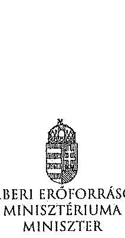

|  |  |
| :-- | --: |
| Hiv. szám: | V-0352-311/2014, V-0352- |
| 313/2014, | V-0337-964/2014, V-0337- |
| 966/2014, | V-0368-250/2014, V-0364- |
| 477/2014, V-0363-252/2014 |  |
| Melléklet:- |  |

# Domokos László részére 

elnök

Állami Számvevőszék

## Budapest

Apáczai Csere János utca 10.
1052
Tárgy: Észrevételek az Állami Számvevőszék ellenőrzési megállapításaira

Tisztelt Elnök Úr!

Hivatkozva a V-0352-311/2014, a V-0352-313/2014, a V-0337-964/2014, a V-0337-966/2014, a V-0368-250/2014, a V-0364-477/2014, a V-0363-252/2014 iktatószámú leveleire és megküldött jelentéstervezeteire, a Károly Róbert Főiskola, a Magyar Képzőművészeti Egyetem, a Szolnoki Főiskola, a Pannon Egyetem, az Eszterházy Károly Főiskola, a Széchenyi István Egyetem, valamint a Miskolci Egyetem vonatkozásában a 2013. évben megkezdett szabályszerűségi ellenőrzés kapcsán az alábbiakról tájékoztatom, valamint az alábbi észrevételeket teszem.

A megküldött jelentéstervezetekben rögzített megállapítások szerint a fenntartó ágazati irányítási feladatait a 2009-2012. években nem látta el teljes körűen az alábbiak vonatkozásában.

- „A felsőoktatásért felelős miniszter nem hajtotta végre a nemzetgazdasági miniszter irányításával, a kormányhatározatban előírt szervezeti és feladat-ellátási felülvizsgálati programot. A felsőoktatási törvény rendelkezéssel ellenére nem készíttetett a felsőoktatás rendszere vonatkozásában középtávú fejlesztési tervet."

A 2012. évi költségvetési hiánycél tartását biztosító további feladatokról szóló 1365/2011. (XI. 8.) Korm. határozatban a Kormány a közfeladat-ellátás színvonalának javítása és a költséghatékony müködés céljából, szervezeti és feladat-ellátási felülvizsgálati programot indított el az államháztartás központi alrendszerében a költségvetési szervek, és a többségi állami tulajdonú gazdálkodó szervezetek (a továbbiakban: intézmények) vonatkozásában. Továbbá

---

elrendelte, hogy a felülvizsgálathoz a nemzetgazdasági miniszter irányításával, a Miniszterelnökséget vezető államtitkár, a közigazgatási és igazságügyi miniszter, valamint az ágazatért felelős miniszter részvételével munkabizottságokat kell létrehozni, valamint módszertani útmutatót kell kidolgozni.

Tekintettel arra, hogy a feladat nem a felsőoktatásért felelős miniszter felelősségi körébe tartozott, javaslom, hogy valamennyi jelentéstervezetben kerüljön módosításra, illetve kivezetésre azon megállapítás, miszerint a felsőoktatásért felelős miniszter nem hajtotta végre a nemzetgazdasági miniszter irányításával, a kormányhatározatban előírt szervezeti és feladatellátási felülvizsgálati programot.

A 2005. évi CXXXIX. törvény (Ftv.) 104. § (1) bekezdés b) pontja szerint az oktatásért felelős miniszter felsőoktatás fejlesztéssel kapcsolatos feladatai a felsőoktatás rendszere fejlesztési terveinek elkészíttetése, beleértve a középtávú fejlesztési tervet, az ágazati minőségpolitikát.

A nemzeti felsőoktatásról szóló 2011. évi CCIV. törvény (Nftv.) 64. § (3) bekezdése szerint a miniszter felsőoktatás-fejlesztéssel kapcsolatos feladatai a felsőoktatás rendszere fejlesztési terveinek elkészíttetése, beleértve a középtávú fejlesztési tervet.

A törvényi rendelkezéseknek megfelelően több javaslat is került a Kormány elé a felsőoktatási rendszer középtávú fejlesztési tervének vonatkozásába, azonban a Kormány egy javaslatot sem fogadott el. A megállapítást az alábbiak szerint szíveskedjen módosítani.

Nincs a Kormány által elfogadott, a felsőoktatás rendszere vonatkozásában készíttetett, középtávú fejlesztési terv.

- „A minisztérium a Felsőoktatási Információs Rendszer (FIR) biztonságos üzemeltetéséhez, az adatok védelméhez szükséges alapvető szervezeti, szabályozási kontrollokat a 2012. év végéig nem teljes körűen alakította ki. Így a minisztérium csak részben tett eleget a 2005. évi felsőoktatási törvény és a 2011. évi nemzeti felsőoktatási törvény előírásainak. A 2007-ben használtha vett FIR feladata volt, hogy a felsőoktatásban résztvevők (hallgatók, oktatók, kutatók, tanárok) adatait kezelje. A FIR müködését 2012-ig több probléma jellemezte. A rendszerbe bevitt alapadatok nem voltak ellenőrzöttek, a rendszerbe épített adatellenőrzés hibajelzései nem voltak kellően konkrétak, illetve a FIR a személyi többszörözödéseket nem szűrte megfelelően. 2012ben megkezdték a rendszer hibáinak kijavítását."
A FIR létrehozása, fejlesztése, müködtetése és üzemeltetése az Ftv. és Nftv., valamint az Oktatási Hivatalról szóló 307/2006. (XII. 23.) Korm. rendelet, majd a 121/2013. (IV. 26.) Korm. rendelet alapján az Oktatási Hivatal (OH) feladata. A Minisztérium miniszteri utasításban adta ki és szükség szerint módosította az Oktatási Hivatal Szervezeti és Müködési Szabályzatát, mely az OH feladatrendszerét is részletezi. A 2/2012. (I. 13.) NEFMI utasításban kiadott OH SZMSZ 1.2.3.6. pontja többek között az alábbiakat tartalmazza:

Az OH Felsőoktatási Főosztály feladatai, a felsőoktatási informatikai rendszerekkel szemben támasztott követelmények szakmai szempontú meghatározása, együttműködve az Informatikai Főosztállyal és a felsőoktatási informatikai rendszerek üzemeltetőivel.

A korábban kiadott SZMSZ-ek is hasonló tartalmú feladatot szabtak.

---

Mindezek alapján a Minisztérium többek között a FIR biztonságos üzemeltetéséhez, az adatok védelméhez szükséges alapvető szervezeti, szabályozási kontrollokat a fenti szabályozások megalkotásával megvalósította. A fenti szabályozási rendszer keretén belül a részletszabályok kidolgozása nem lehet a Minisztérium feladata, azt már csak az Oktatási Hivatal végezheti el saját hatáskörben.

Ugyanakkor meg kell jegyezni, hogy a Felsőoktatási Információs Rendszer fejlesztése egy hatalmas, sok évre átnyúló feladat. A FIR fejlesztése 2006-ban kezdődött meg hatósági nyilvántartási koncepció alapján. A FIR azonban alapjaiban eltér egy klasszikus, pl. lakcím- és személyi adat nyilvántartástól, amely esetében az önkormányzatoknál/kormányhivataloknál begépelik az adatokat és azok azonnal bent is vannak a központi rendszerben. A FIR ezzel szemben az adatbevitel szempontjából nem tekinthető önálló rendszernek, hiszen az adatokat a felsőoktatási intézmények különböző tanulmányi rendszeréből veszi át. Így a FIR fejlesztése sosem volt független a tanulmányi rendszerek párhuzamos fejlesztésétől, azzal szoros összhangban tudott és tud megvalósulni. A tanulmányi rendszerek - három önálló tanulmányi rendszer és több egyedi, intézményi saját fejlesztésű rendszer - tényleges fejlesztése azonban nem az OH feladata, azt az esetek többségében piaci vállalkozások végzik. Ezeknek megfelelően a FIR és a különböző tanulmányi rendszerek összchangolt fejlesztése kiemelten nagy kihívást jelent az OH-nak, a feladat hatalmas méretéből adódóan a fejlesztés, vagy akár egy-egy hiba, problémacsokor megoldása nem oldható meg gyorsan, hanem csak összehangoltan, mely sok időt vesz igénybe. Így a teljesen "zöldmezős beruházásként" megvalósított FIR fejlesztés jelenleg 4+4 éves időtartama a feladat nagysága, a korábban rendelkezésre álló pénzügyi források ismeretében elfogadhatónak mondható. Az OH a FIR fejlesztése során a felsőoktatási intézményeknél folyamatos tájékoztatásokat, segítséget, ezeken túlmenően hatósági ellenőrzéseket is végez a FIR biztonságos üzemeltetése, az adatok védelme érdekében. A FIR megfelelő fejlesztése, biztonságos üzemeltetése érdekében az OH 2010-tól átalakította a FIR-t érintő stratégiáját, az eljárásrendjeit.

- „Az Állami Számvevőszék három korábbi ellenőrzése során a felsőoktatás témakörében 9 javaslatot fogalmazott meg a felsőoktatásért felelős minisztériumnak. A minisztérium a javaslatokra intézkedési terveket készített, amelyek összesen 10 intézkedést tartalmaztak. Az intézkedések közül 3-at késéssel megvalósítottak, 7 nem valósult meg."
Az oktatási és kulturális ágazat irányítási rendszerének, működésének ellenőrzéséről szóló 1106 sz. jelentés javaslataira készített intézkedési terv 3. számú javaslata, az oktatás középtávú stratégia tervezet egy változatának előkészítése megtörtént, azonban azt a Kormány nem fogadta el.

A felsőoktatás oktatási infrastruktúra-fejlesztési programjának ellenőrzéséről szóló 1171 sz. jelentésben tett javaslat szerint a minisztérium feladata az oktatási infrastruktúra fejlesztési program előkészítésének hiányosságai miatt a felelősség megállapítása.
Tekintettel arra, hogy a 212/2010 (VII.1.) sz. Korm. rendelet alapján a PPP projektekkel kapcsolatos feladatellátás a Nemzeti Fejlesztési Minisztérium (továbbiakban NFM) feladatkörébe került csakúgy, mint a tárgyban érintett dokumentáció, így a feladat, a felelősség megállapításához szükséges jogkörök a rendelet alapján az NFM-hez kerültek, nem történhetett intézkedés a felelősség megállapítására.

---

A 1171 sz. jelentés intézkedései közül egy intézkedés meghiúsult (felelősség megállapítása), egy intézkedés késéssel valósult meg (kapacitás-kihasználtság felmérése), egy intézkedés megvalósítása folyamatban van (kapacitás-kihasználtság felmérése eredményeinek és a felsőoktatást érintő ágazati célok figyelembe vételével intézkedések megtétele a felsőoktatási infrastruktúra közép- és hosszú távú hasznosítására).

Az állami felsőoktatási intézmények érdekeltségébe tartozó gazdasági társaságok támogatásának és nyereségességük hasznosulásának 1290 sz. ellenőrzése kapcsán az állami felsőoktatási intézmények gazdasági társaságai szakmai feladatellátásának és gazdaságossági eredményességének mérését biztosító mutatószám- és értékelési rendszereket az érintett felsőoktatási intézmények késéssel kidolgozták, azok ellenőrzése folyamatos.

Az intézményi feladatokkal és megállapításokkal kapcsolatban az alábbiakról tájékoztatom.
A Szolnoki Főiskola vonatkozásában javaslom, hogy a fenntartónak címzett javaslatai esetében a csökkenő hallgatói létszám, a bevételi lehetőségek szükülése, továbbá a jelentős összegủ PPP kiadások miatt felmerülő likviditási problémák, a Főiskola pénzügyi, gazdasági helyzete, valamint a feltárt szabálytalanságok figyelembe vételével szükséges intézkedések megtétele esetében a nemzeti fejlesztési miniszter bevonása is történjen meg, a 212/2010 (VII.1.) sz. Korm. rendeletre is figyelemmel.

Az Eszterházy Károly Főiskola esetében tett megállapítás szerint a minisztérium nem vizsgálta meg az Eszterházy Károly Főiskola által megküldött Intézményfejlesztési Tervet. A megállapítással kapcsolatban tájékoztatom, hogy az Intézményfejlesztési Tervek feldolgozásra és a kiválósági minősítésekhez kapcsolódóan felhasználásra kerültek. Az Nftv. 73. § (3) bekezdés (b) pontja és a 74. § (4) bekezdés alapján, a fenntartó megrózsgálja az IFT-t és amennyiben észrevétele van, azt 90 napon belül közölheti az intézménnyel.

A Károly Róbert Főiskola, a Magyar Képzőművészeti Egyetem, a Szolnoki Főiskola, az Eszterházy Károly Főiskola, a Széchenyi István Egyetem, valamint a Miskolci Egyetem vonatkozásában fogalmazott meg a jelentés az Nftv. 73. § (3) bekezdés e) pontja alapján fenntartói feladatokat. Az egyes oktatási tárgyú törvények módosításáról szóló - még kihirdetés előtt álló - törvény alapján javasolt az Nftv. új, 13/A. §-a szerint a kancellár feladatköréhez kapcsolódóan az intézkedési javaslat kiegészítése.

Kérem Elnök Urat, hogy az észrevételeket a jelentéstervezetekben átvezetni szíveskedjék.
Budapest, 2014. július ${ }^{\text {n }} / \mathrm{S}^{\text {n }}{ }^{\text {n }}$
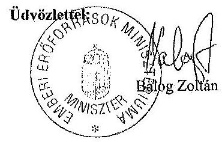

---

# Balog Zoltán úr 

miniszter
Emberi Eröforrások Minisztériuma

## Budapest

## Tisztelt Miniszter Úr!

A Pannon Egyetem, a Szolnoki Föiskola, a Károly Róbert Föiskola, a Magyar Képzömüvészeti Egyetem, a Széchenyi István Egyetem, a Miskolci Egyetem és az Eszterházy Károly Föiskola gazdálkodásának és müködésének ellenőrzéséről készített jelentéstervezetekre tett észrevételeit köszönettel megkaptam.

Az Állami Számvevőszék észrevételekre vonatkozó álláspontjáról a felügyeleti vezető által készített részletes tájékoztatást csatoltan megküldöm.

Tájékoztatom Miniszter urat, hogy az ÁSZ. tv. 29. § (3) bekezdése alapján a számvevőszéki jelentések mellékleteként szerepeltetjük a jelentéstervezetekhez tett figyelembe nem vett észrevételeket az elutasítás indokainak feltüntetésével.

Budapest, 2014. gáléus hó 88. nap
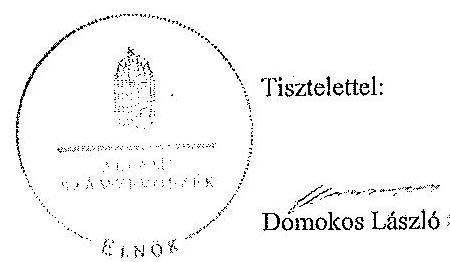

Melléklet: Tájékoztatás az elfogadott és a figyelembe nem vett észrevételekről

---

# Tájékoztatás   az elfogadott és a figyelembe nem vett észrevételekről 

A Pannon Egyetem, a Szolnoki Főiskola, a Károly Róbert Főiskola, a Magyar Képzőmüvészeti Egyetem, a Széchenyi István Egyetem, a Miskolci Egyetem és az Eszterházy Károly Főiskola gazdálkodásának és müködésének ellenőrzéséről készült számvevőszéki jelentés-tervezetekhez a 36433-2/2014/FOFEJL iktatószámú levélben tett észrevételeit köszönettel megkaptuk.

A jelentéstervezetekre tett észrevételeket áttekintettük, azok kezeléséről a következő tájékoztatást adom:

1. A 2012. évi költségvetési hiánycél tartását biztosító további feladatokról szóló 1365/2011. (XI. 8.) Korm. határozatban elöirt szervezeti és feladatellátási felülvizsgálati program megvalósitása.

A kormányhatározat alapján - az oktatási ágazatra vonatkozóan 2012. február 20-ig - kellett a tételes javaslatokat a Kormány elé terjeszteni, ennek végrehajtása azonban elmaradt. A feladatokat a nemzetgazdasági miniszter irányítása mellett kellett végrehajtani, felelősként azonban a Miniszterelnökséget vezető államütkár, a közigazgatási és igazságügyi miniszter és az érintett ágazati miniszter is kijelölésre került. A fentiek alapján - az észrevételben leírtakra is figyelemmel - a vonatkozó szövegrészt a jelentéstervezetek összegző megállapítások, következtetések, javaslatok, valamint részletes megállapítások fejezeteiben az alábbiak szerint pontositottuk:
„Elmaradt az oktatási ágazatra vonatkozóan a nemzetgazdasági miniszter irányitásával és az oktatásért felelös miniszter részvételével, kormányhatározatban elöirt szervezeti és feladatellátási felülvizsgálati program kidolgozása." (Összegző megállapítások)
„Elmaradt az oktatási ágazatra vonatkozóan az 1365/2011. (XI. 8.) Korm. határozatban - a nemzetgazdasági miniszter irányitásával és az ágazatért felelös miniszter részvételével - elöirt szervezeti és feladatellátási felülvizsgálati program kidolgozása. (Részletes megállapítások, 1. fejezet):

---

2. A felsőoktatás rendszere középtávú fejlesztési tervének elkészítése.

Az észrevételben foglaltakat figyelembe véve a jelentéstervezetek összegző megállapítások, következtetések, javaslatok, valamint részletes megállapítások fejezeteit kiegészítettük:
„A felsőoktatási törvény rendelkezései ellenére nem készittetett a felsőoktatás rendszere vonatkozásában a Kormány által elfogadott középtávú fejlesztési tervet." (Összegző megállapítások)
„A miniszter - a vonatkozó jogszabályokban foglaltak ellenére - nem készittetett a felsőoktatás rendszere vonatkozásában a Kormány által elfogadott középtávú fejlesztési tervet." (Részletes megállapítások, 1. fejezet)
3. A Felsőoktatás Információs Rendszerének (FIR) üzemeltetése.

A felsőoktatási törvények rendelkezései szerint (Feot. 35. §, 103.§ (1) bekezdés aa.) pont, Nftv. 64.§ (2) bekezdés aa) pont) a felsőoktatási információs rendszer müködtetése, az adatkezelés jogszerűsége a felsőoktatás ágazati irányítását ellátó miniszter felelősségi körébe tartozik. A miniszter feladata a felsőoktatási információs rendszer müködéséért felelős Oktatási Hivatal müködtetése is. A FIR müködését a teljes ellenőrzött időszakban problémák jellemezték, amely felveti az Oktatási Hivatal müködtetéséért felelős minisztérium felelősségét is. Az észrevételben jelzettek alapján a jelentéstervezeteket pontositottuk a következők szerint:
„A minisztérium a Felsőoktatási Információs Rendszer (FIR) biztonságos üzemeltetéséhez, az adatok védelméhez szükséges alapvető szervezeti, szabályozási kontrollokat a 2012. év végéig nem teljes körűen alakittatta ki az Oktatási Hivatallal." (Összegző megállapítások)
„A minisztérium az Oktatási Hivatallal a Felsőoktatási Információs Rendszer (FIR) biztonságos üzemeltetéséhez, az adatok védelméhez szükséges alapvető szervezeti, szabályozási kontrollokat a 2012. év végéig nem teljes körűen alakittatta ki.,, (Részletes megállapítások, 1. fejezet)
4. Korábbi ÁSZ ellenőrzések javaslatainak hasznosulása.

4/a. Az oktatási és kulturális ágazat irányítási rendszerének, müködésének ellenőrzéséről szóló 1106 sz. ÁSZ jelentés 3. sz. javaslata tekintetében a jelentéstervezetek részletes megállapítások 5. fejezzetei részletesen tartalmazzák a tényeket. Ennek alapján az oktatási ágazat középtávú stratégiája kidolgozásának hiányára vonatkozó megállapítást a jelentéstervezetekben nem módositottuk.

4/b. A felsőoktatás oktatási infrastruktúra-fejlesztési programjának ellenőrzéséről szóló 1171 sz. ÁSZ jelentésben az előkészítés hiányosságai miatt a felelősség megállapítására tett javaslat nem hasznosult a jelentéstervezetek megállapításai szerint.

---

Az észrevételben foglaltak szerint az egyes miniszterek, valamint a Miniszterelnökséget vezető államtitkár feladat- és hatásköréről szóló 212/2010. (VII. 1.) Korm. rendelet valóban a nemzeti fejlesztési miniszter szakpolitikai feladat- és hatáskörébe helyezte a PPP és egyéb állami vagyont érintő gazdálkodó szervezetekkel kötött és megkötendő szerződések vizsgálatát és ellenőrzését. Az ÁSZ nemzeti erőforrás miniszter részére címzett javaslata ugyanakkor a PPP programok előkészítési hiányosságai miatti felelősség megállapítására irányult. A nemzeti erőforrás minisztere 2012. január 19-én kelt intézkedési tervében 2012. december 31-ei határidőre elvégzendő feladatként fogalmazta meg az előkészítési hiányosságok miatti felelősség megállapításról való intézkedést, amely nem valósult meg. Mindezek alapján a jelentéstervezetben tett megállapítás módosítása nem indokolt.

4/c A 1171. sz. jelentés alapján tervezett intézkedések közül az állami felsőoktatási intézmények kapacitás-kihasználás felmérése késéssel valósult meg. A felmérés eredményeinek és a felsőoktatást érintő ágazati célok figyelembe vételével a felsőoktatási infrastruktúra közép- és hosszú távú hasznosítására a helyszíni ellenőrzés időszaka alatt nem történtek intézkedések. Az intézkedés határideje 2013. december 31. volt. Az észrevételben foglaltak alapján a jelentéstervezetek módosítása nem indokolt.

4/d. Az állami felsőoktatási intézmények érdekeltségébe tartozó gazdasági társaságok támogatásának és nyereségük hasznosulásának ellenőrzése címü, 1290 sz. ÁSZ jelentés 2. sz. javaslata (Az állami felsőoktatási intézmények - a felülvizsgálatot követő, de legkésőbb egy éven belül - megmaradt társaságaira vonatkozó szakmai feladstellátás és a gazdasági eredményesség mérését biztosító mutatók és azok értékelési rendszerének kidolgoztatása) megállapításaink alapján nem hasznosult. A helyszíni ellenőrzés alatt rendelkezésre bocsátott dokumentumok alapján a minisztérium a rektorokat a szakmai feladstellátás és a gazdasági eredményesség mérését biztosító mutatószámok és értékelési rendszer kidolgozására a felsőoktatási intézmények finanszírozását szabályozó kormányrendelet kihirdetését követően kívánta felkérni. Így a vonatkozó megállapítás módosítása nem indokolt.

A Szolnoki Főiskola ellenőrzéséhez kapcsolódó - az emberi erőforrások miniszterének tett javaslatunk nem a PPP projektekkel kapcsolatos, hanem az intézmény hosszú távon fenntartható müködtetésére vonatkozó intézkedések megtételét célozza, amely a fenntartó feladata és nem igénylik a nemzeti fejlesztési miniszter bevonását.

Az Eszterházy Károly Főiskola esetében a jelentéstervezet nem az IFT minisztériumi észrevételezésének hiányát kifogásolta, hanem azt, hogy annak a Feot 115. § (2) bekezdése db) pontja szerinti felülvizsgálata dokumentáltan nem történt meg.

Az emberi erőforrások miniszterének a Károly Róbert Főiskola, a Magyar Képzőművészeti Egyetem, a Szolnoki Főiskola, az Eszterházy Károly Főiskola, a Széchenyi István Egyetem, valamint a Miskolci Egyetem vonatkozásában az Nftv. 73. § (3) bekezdés e) pontja alapján megfogalmazott javaslatokat az Nftv. 2014. július 24-én hatályba lépő módosításai nem érintik, a felsőoktatási intézmény rektorainak tett javaslatokat a jogszabály változás figyelembe vételével pontositottuk.

---

Kérem a válaszlevelemben foglaltak szíves tudomásulvételét. Tájékoztatom Miniszter urat, hogy a számvevőszéki jelentés mellékleteként szerepeltetjük a jelentéstervezethez tett észrevételeit, az elfogadott valamint az ÁSZ. tv. 29. § (3) bekezdése alapján a figyelembe nem vett észrevételeket az elutasítás indokának feltüntetésével együtt.

Budapest, 2014. gölcins hó 28 nap

Horváthné Herbáth Mária
felügyeleti vezető

---

.

---

# SZÉCHENYI ISTVÁN EGYETEM

REKTOR

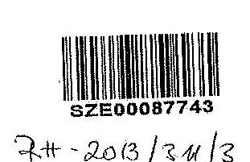

Állami Számvevőszék

Domokos László
elnök

1052 Budapest
Apáczai Csere János u. 10.

Tárgy: ÁSZ jelentéstervezet észrevételezése

Tisztelt Elnök Úr!

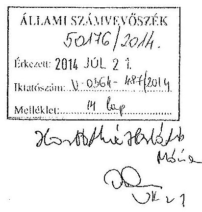

Az V-0364-478/2014. iktatószámú, 2014. június 30-án beérkezett, a Széchenyi István Egyetem gazdálkodásának és működésének ellenőrzéséről szóló jelentéstervezethez a mellékelt észrevételeket teszem.

Kérem észrevételeink szíves figyelembe vételét az ellenőrzési jelentés véglegesítése során.

Győr, 2014. július 14.

Ödvözlettel:

Dr. Földesi Péter
Rektor

9026 Győr, Egyetem tér 1. 9007 Győr, Pf. 701 Tel.: 96 503-401,

---

# 8. SZÁMÚ MELLÉKLET A V-0364-491/2014. SZÁMÚ JELENTÉSHEZ 

## SZÉCHENYI ISTVÁN EGYETEM

REKTOR

## É SZREVÉTELEK

a Széchenyi István Egyetem gazdálkodásának és müködésének ellenőrzéséről készített jelentéstervezethez

## I. Összegző megállapítások, következtetések, javaslatok fejezethez:

Kérjük a Részletes megállapításokhoz tett és elfogadott észrevételek alapján az Összegzỏ megállapításokat is szíveskedjenek módosítani.

## 1. észrevétel

Összegzỏ megállapítások, 22. oldal 5. bekezdés: Kérjük kiegészíteni a pénzügyi egyensúlyra vonatkozó pozitív megállapítást az alábbiakkal:
„Az Egyetem PPP projektekhez nem csatlakozott, emiatt nincsenek ebből fakadó kötelezettségei."

## II. Részletes megállapítások fejezethez:

## 2. észrevétel

Részletes megállapítások, 33. oldal, első bekezdés: „A gazdálkodási szabályzat, a leltározási szabályzat, a selejtezési és a közbeszerzési szabályzat aktualizálását csak 2012-ben végezték el."

Kérem a megállapítás közbeszerzési szabályzatra vonatkozó részének tőrlését az alábbi indoklás alapján:

A Széchenyi István Egyetem az ÁSZ által vizsgált időtartama alatt rendelkezett érvényes közbeszerzési szabályzatial (2008. május 5 -étől hatályos Közbeszerzési Szabályzat, valamint az ezt felváltó 2012. április 3 -ától hatályos közbeszerzési szabályzat. A vizsgált időszakban 2011. december 31-ig a 2003. évi CXXIX. törvény volt hatályos, 2012. január 1-jétől pedig a 2011. évi CVIII. törvény, amely már 2011. nyarán kihirdetésre került, 2011. július 20-án.

Nem értünk egyet az ÁSZ azon negatív megállapításával, hogy csak 2012-ben végezte el az Egyetem a közbeszerzési szabályzat aktualizálását.
2011. első félévében megtörtént a szabályzat felülvizsgálata, tekintettel azonban a 2011. júliusában kihirdetett új Kbt-re, amely 2012. január 1-jétől lépett hatályba, nem volt indokolt egy hatályon kívül helyezésre kerülő törvényes (2003. évi CXXIX. törvényre) alapozva aktualizálni a szabályzatot és a szexátussal elfogadottait, tekintettel arra, hogy 2012. január 1-jétől új törvényt szabályozta lesz. A Kbt. nem írt elő határidőt a szabályzatok aktualizálására, az új Kbt. hatálybalépését követően figyelemmel a folyamatos módosításokra (még 2011. decemberében is módosításaa került a még hatályba sem lépett Kbt.) módosította a szabályzatot, amit a szexátus elfogadott, és hatályba is lépett 2012. április 3-étl. Megbálésünk szerint az Egyetem ezzel mulasztást nem követett el, Kérem a megállapítás törlését.

---

# 3. észrevétel 

Részletes megállapítások, 33. oldal, utolsó bekezdés: „A közbeszerzési szabályzat nem tartalmazta az egyszerü eljárás esetén az írásbeli összegzéskészités és az ajánlattevők részére történő megküldési kötelezettség felelőstét, az ajánlati biztosíték kezelésével, nyilvántartásával, illetőleg visszaadásával kapcsolatos feladatokat."

Kérem a megállapítás törlését az alábbi indoklás alapján:
A 2003. évi CXXIX. törvény (továbbiakban: régi Kbt.) 6.§ (1) bekezdése, illetve a 2011. évi CVIII. törvény 22.§ (1) bekezdése (továbbiakban: új Kbt.) egyöntetủen a Közbeszerzési szabályzatital kapcsolatban az alábbiakat tartalmazza:
„Az ajánlatkérő köteles meghatározni a közbeszerzési eljárásai előkészitésének, lefolytatásának, belső ellenőrzésének felelősségi rendjét, a nevében eljáró, illetve az eljárásba bevont személyek, valamint szervezetek felelősségi körét és a közbeszerzési eljárásai dokumentálási rendjét, összhangban a vonatkozó jogszabályokkal. Ennek körében különösen meg kell határoznia az eljárás során hozott döntésekért felelős személyt, személyeket, vagy testületeket."

Az új Kbt. Nagykommentárja az elábbiak szerint határozza meg a közbeszerzési szabályzatial kapcsolatos előírásokat:
„Az (1)-(2) bekezdés az ajánlatkérők által elkészítendő közbeszerzési szabályzatról rendelkezik. A közbeszerzési szabályzatban rögzítendő valamennyi, az ajánlatkérő által a közbeszerzési eljárások lefolytatása érdekében lényegesnek itélt előírás, mely az adott szerv vonatkozásában kötelező erejủ. A törvény a szabályzatra vonatkozóan csak annak minimális tartalmát adja meg a következők szerint, annak érdekében, hogy az eljárások előkészítésének, lefolytatásának, dokumentálásának rendje, valamint a felelősségi rend a szabályzatból megismerhető legyen.
Az (1) bekezdés alapján továbbra is az ajánlatkérő kötelezettsége az általa lefolytatandó közbeszerzési eljárások előkészítésének, lefolytatásának, a belső ellenőrzés felelősségi rendjének, a nevében eljáró, illetőleg az eljárásba bevont személyek, illetőleg szervezetek felelősségi körének és a közbeszerzési eljárások dokumentálási rendjének meghatározása. Ennek keretében meg kell jelölni az eljárás során az egyes döntésekért felelős személyt, személyeket, illetőleg testületeket is.
A törvény az értelmező rendelkezések között, a 4. § 13. pontjában rögzíti, hogy mit kell a közbeszerzési eljárás előkészítésén érteni. Ennek megfelelően a közbeszerzési szabályzatban rögzíteni szükséges a közbeszerzési eljárások megkezdéséhez szükséges csebikményeket, égymint a helyzet- és pisefelmérést, a közbeszerzés becsült értéke felmérésére vonatkozó rendelkezéseket, illetve az eljárási megindító hirdetmény, a felhívás és a dokumentáció előkészítésének szabályait. Emellett célszerü meghatározni továbbá a szabályzatban - bár ezeket a törvény nem emeli külön ki - a közbeszerzési eljárások kezdeményezésének rendjével, a beszerzés fedezetének rendelkezése állása igazolásával, vagy a bíráló bizottság létrehozatalával kapcsolatos szabályokat is.
A Kbt. 22. § (1) bekezdésére figyelemmel kötelező azonban a közbeszerzési szabályzatban meghatározni a fentieken túl az ajánlatkérő nevében eljáró, illetve az eljárásba bevont személyek, szervezetek felelősségi körét. Itt szükséges tehát meghatározni a bíráló bizottság tagjainak feladatkörét, felelősségét és a szavazás rendjét, a döntés-előkészítéssel kapcsolatos feladatait, továbbá a döntéshozatal menetét, a döntéshocó személyét, vagy testület esetén a döntéshozatal rendjét, hivatalos közbeszerzési tanácsadó igénybevételének lehetőségét, vagy a közbeszerzés tárgya szerinti szakértők eljárásának, bevonásának rendjét, az eljárásba bevont szervezetek, személyek, illetve a bíráló bizottság tagjai összeférhetetlensége a Kbt. 24. § (4) bekezdése szerinti igazolásának szabályait.

Ezen felül az ajánlatkérő köteles a közbeszerzési szabályzatában meghatározni a közbeszerzési eljárásokra vonatkozó belső ellenőrzésének felelősségi rendjét is.
A fentiek szerinti kötelező tartalmi elemeken túl az ajánlatkérő természetesen egyéb, általa lényegesnek tartott, vagy az ajánlatkérő szervezet szervezeti sajátosságabból adódó rendelkezéseket is beépíthet a szabályzatába."

---

# SZÉCHENYI ISTVÁN EGYETEM 

REKTOR

A 2008. 05.05-től hatályos egyetemi Közbeszerzési szabályzat valóban nem tartalmazta külön az egyszerủ eljárásra vonatkozó előírásokat, de nem is volt rá törvényi előírás. A Kbt. hivatkozott szakaszában előírtakat teljes mértékben, sőt sokkal részletesebben tartalmazta, mint az előírás volt. Ugyanakkor a szabályzat általános jelleggel rögzítette az egyes eljárások lefolytatásának a rendjét, és a felelős személyeket is:
A szabályzat VI. fejezet 10. Általános szabályok alclin: b) pontja értelmében:
„Az egyes közbeszerzési eljárások során az Egyetem (mint ajánlatkérő) képviseletében eljáró személyeket a 6.ec. melléklet szerinti íratban kell meghatározni (Kbt. 6.§. szerint). Az így kijelölt személy (továbbiakban: eljárásért felelős) feladata az Egyetem adott közbeszerzési eljárásának előkészítése, lebonyolítása és lezárása. Úgymint, döntés az alkalmazandó eljárás-újszerű, a hirdetmény, és a dokumentáció előkészítése vagy jóváhagyása, az előírt közzététel elvégzése, az eljárásba bevonandó személyek kiválasztása, a bírálóbizottság munkájának figyelemmel kísérése, a végső döntés meghozatalának dokumentálása, a szerződéskötések előkészítése, a teljesítések/szállítások felügyelete, az eljárás dokumentálása, a közbeszerzés lefolytatása után összegyések, tájékoztatók és beszámolók elkészítése, szabálytalanság észlelése esetén az 1)-cs pontban megjelölt személy értesítése, valamint a jelen szabályzatban előírt egyéb feladatok elvégzése. Az eljárás során az egyetem gazdálkodási szabályzatában foglaltakat be kell tartani."

A szabályzat egyes eljárástípusokat részletesebben kiemel, de ez sem a szabályzat kötelező tartalmi eleme, elegendő lett volna a Kbt. hivatkozott szakasza, illetve a kommentárban ismertetettek szerint is általános jelleggel meghatározni a felelősségi rendet.
A kötelező tartalmi elemeket a szabályzat tartalmazta, nem helytálló az ÁSZ megállapítása, hogy minden részlettípusra és eljárásra nem terjedt ki a szabályozás, mivel nem is volt szükséges, ugyanakkor az ajánlati biztosíték kezelésével kapcsolatos megállapítás is vitatott, mivel a szabályzat fentebb hivatkozott VI. fejezet 10./b. pontja egyértelműen tartalmazza a felelős kijelölését, akinek feladata a közbeszerzési eljárás előkészítése, lebonyolítása és lezárása. Az ajánlati biztosíték kezelésével, nyilvántartásával és visszatartásával kapcsolatos előírásokat sem a régi Kbt. 6.§ (1) , sem az új Kbt. 22.§ (1) bekezdése nem tartalmaz, az eljárás lebonyolítása során, az egyébként nagyon ritkán alkalmazott ajánlati biztosíték a régi és új Kbt. 59.§ szakasza szerint kerül az eljárásban való bokérőse az ajánlati kilőtnég biztosítása céljából. A visszafizetés feltételeit is egyértelműen rögzíti a Kbt. hivatkozott §-a, a törvényi előírások megismétlése pedig nem a szabályzat a célja és feladata, és emellett nem is törvényi kötelezettség. A közbeszerzési eljárás során a szabályzat szerint megbízott személy volt felelős az eljárás lebonyolításáért, így intézkedni is köteles és jogosult volt az ajánlati biztosíték visszautalása iránt is, amennyiben nem vált szerződést biztosító mellékkötelezettséggé. A Közbeszerzési Szabályzatnak nem célja és feladata az ajánlati biztosíték ajánlatkérő szervezetén belüli kezelésének a szabályozása, a felhívásban a számímsáncot kell megadni, összeget megjelölni, befizetés, helyét, idejét rögzítzni, a visszafizetés feltételét pedig a Kbt. 59.§ (4)-(6) bekezdései tartalmazzék.

Ugyanakkor az ÁSZ megállapítás nem tartalmazta a szabályzat pontos megjelölését sem, hogy melyik időszakra, illetve szabályzatra vonatkozik, tekintettel arra, hogy a hivatkozott egyszerủ eljárás 2012. január 1-jétől már nem volt lefolytatható a törvényi változás miatt, ezért az új Közbeszerzési Szabályzat, amely 2012. április 3-től hatályos már nem is tartalmazhatta volna.

## 4. észrevétel

Részletes megállapítások: 35. oldal utolsó bekezdés: „Az Egyetem vezetője az információs és kommunikációs rendszert nem megfelelően alakította ki."

Kérjük a megállapítás törlését, az alábbi indoklás alapján:
A gazdálkodáshoz szükséges információk a Saldo rendszerben, a hallgatókkel kapcsolatos adatok a Neptun rendszerben a vizsgált időszakban hitelesen rendelkezésre álltak. Az Egyetemi szabályzatok az Egyetem internetes honlapján elérhetők voltak a hozzáféréssel rendelkező munkatársak részére. A vezetők számára a vezetői döntésekhez szükséges adatok a Saldo és Neptun rendszerekből a vizsgált időszakban

---

# SZÉCHENYI ISTVÁN EGYETEM 

REKTOR
lekérdezés útján hozzáférhetők voltak. Ez alapján nem értünk egyet azzal a megállapítással, hogy az Egyetem nem müködtetett olyan információs rendszert, amely képes lett volna teljes körden rendelkezésre bocsátani mindazon információkat, melyek az egyes vezetői döntések meghozatalához szükségesek.

## 5. észrevétel

Részletes megállapítások, 38. oldal, első bekezdés: „A munkatársak számára nem volt egységes előirás a gazdasági érdekeltségről, vagy egyéb, a szervezet tevékenysége szempontjából releváns összeférhetetlenségről történő nyilatkozattétel."

Kérem a megállapítás törlését az alábbi indoklás alapján:
A Kjt. 41.§-a (1992. évi XXXIII. Törvény) alapján, az egyetemen dolgozó valamennyi vezető munkatárs egységesen a vezetői megbízás átvételekor összeférhetetlenségi nyilatkozatot tölt ki. Külön szabályzatban foglalt egységes előirás megfogalmazása nem szükséges és nem kötelező, tekintettel arra, hogy a Kjt. egyértelműen előírja az összeférhetetlenségre és annak megszüntetésére vonatkozó előírásokat. (Kjt. 44.§ (5) bek.)

## 6. észrevétel

Részletes megállapítások, 44. oldal, utolsó előtti bekezdés: „Az ellenőrzött időszakban nem volt szabályszerű a rendszeres és nem rendszeres személyi juttatások, a dologi kiadások, a felhalmozási kiadások és a müködési bevételek beszedése területe."

Kérem a megállapítás módosítását az alábbiak szerint, az 7 - 14. észrevétel alapján:
„Az ellenőrzött időszakban esetenként nem volt szabályszerű a rendszeres és nem rendszeres személyi juttatások, a dologi kiadások, a felhalmozási kiadások és a müködési bevételek beszedése területe."

## 7. észrevétel

Részletes megállapítások 45. oldal 3. bekezdés: „A SZE a felnőttképzés többletfeladataihoz kapcsolódó kötelezettségvállalás dokumentálásának eljárása során nem tartotta be a belső szabályzatában és a jogszabályban foglaltakat, amikor a feladat elrendelésekor nem készítette el a kötelezettségvállalási dokumentumot."

Kérem a megállapítás törlését az alábbi indoklás alapján:
A konkrét feladat elvégzésével kapcsolatban a részt vevők oktatói feladatok esetében egyénre szabottan megkapták az elvégzendő feladatokat. Minden esetben külön szerződés készült erre vonatkozóan, amelyet az előírásoknak megfelelően kötelezettségvállalási nyilvántartásba vettünk. Ezek a bizonylatok az ellenőrök rendelkezésére lettek bocsátva, minden kért írat rendelkezésre állt. A felnőttképzési oktatási tevékenység esetében ezáltal a kötelezettségvállalási dokumentumnk szabályosan elkészültek. A nem oktatói feladatok esetében más típusú szerződések készültek, melyre vonatkozóan nyilatkozatot tettünk korábban: Az ilyen feladatok folyamatosan ellátandóak, ezért nem külön íratben, hanem egy átsorolási értesítőben került meghatározásra, kiegészítve a helyi felettes folyamatos személyes irányításával. Az átsorolási értesítők a rendszeres személyi juttatások körébe kerültek, ezáltal a bérekkel együtt történt

---

# SZÉCHENYI ISTVÁN EGYETEM 

REKTOR
kifizetésük. A munkaügyi rendszerbe történő bekerüléssel egyúttal a kötelezettségvállalási nyilvántartásba is bekerültek.

## 8. észrevétel

Részletes megállapítások 45. oldal 5. bekezdés: „A helytelen gyakorlat eredményeként a többletfeladat elvégzéséhez kapcsolódó juttatás illetmény-kiegészítésként, külső személyi juttatás helyett rendszeres személyi juttatásként került elszámolásra..."

Kérem a megállapítás törlését az alábbi indoklás alapján:
Az elrendeli többletfeladatot a munkatársak a közalkalmazottí jogviszony keretein belül végezték, az eredeti munkaköri feladatokkal kibővítve, így a tevékenység a közalkalmazotti jogviszonyhoz kötődött. Ez esetben nem köthető megbízási szerződés, így nem helytálló az a megállapítás, hogy külső személyi juttatásként kellett volna elszámolni. Saját dolgozóval megbízási szerződés csak munkakörbe nem tartozó feladatokra köthető. Az adott tevékenység kötődött a munkakörböz, csak átmeneti időre többlet feladatot jelentett.

## 9. észrevétel

Részletes megállapítások 46. oldal 4. bekezdés:
„Az érvényesítési feladatot a jogszabályban előírt képesítéssel nem rendelkező, illetve jogkörrel nem rendelkező személy gyakorolta. A saját dolgozóval kötött eseti megbízási szerződéseknél az azok tartalmi előírásaira vonatkozó előírásokat nem tartották be."

Kérem a megállapítás módosítását az alábbiakra:
„Az érvényesítési feladatot esetenként a jogszabályban előírt képesítéssel nem rendelkező, illetve jogkörrel nem rendelkező személy gyakorolta. A saját dolgozóval kötött eseti megbízási szerződéseknél az azok tartalmi előírásaira vonatkozó előírásokat nem tartották be."

A mondatot követő bekezdésben egyértelműen meghatározásra kerül, hogy a megállapításban rögzített első hiányosság a minta $12 \%$-nál, illetve egy esetben fordult elő.

## 10. észrevétel

Részletes megállapítások 47. oldal 1. bekezdés: „A dologi előirányzatok felhasználása a közbeszerzései előírások megsértése, valamint a gazdálkodási jogkörök gyakorlása tekintetében nem felelt meg a jogszabályoknak és a belső szabályzatok előírásainak."

Kérem a megállapítás módosítását az alábbiakra:
„A dologi előirányzatok felhasználása a teljesítés igazolások nyilvántartásának tekintetében nem felelt meg a jogszabályoknak és a belső szabályzatok előírásainak."

A közbeszerzési előírások megsértésére vonatkozó véleményünket a 11. észrevétel tartalmazza.

---

# SZÉCHENYI ISTVÁN EGYETEM 

REKTOR

A kötelezettségvállalásra jogosultak a szerződés aláírásakor a szerződésben kijelölik a teljesítés igazolására jogosult munkatársak körét. A gazdálkodási jogkövök gyakorlásának megsértésére $36 \%$-os arányt jelöl meg a jelentés tervezet. Ennek aláámasztása, konkretizálása a jelentés tervezetben és a helyszíni ellenőrzés során sem történt meg, így kérjük a teljes gazdálkodási jogkörre vonatkozó negatív megállapítás leszökítését a teljesitésigazolások nyilvántartására.

## 11. észrevétel

Részletes megállapítások 47. oldal 2. bekezdés: „A 2009. évben szakértői tevékenység végzésére 25,0 MFt összegben kötött alvállalkozói szerződés esetben az Egyetem tanszékvezetője a szerződés megkötésével megsértette a Kbt., 240. §-ban előírt közbeszerzési eljárás lefolytatásának kötelezettségét. Az ÁSZ a közbeszerzési szabályok megsértése miatt, a Kbt-ben rögzített jogvesztő határidő miatt nem kezdeményezte a Közbeszerzési Döntőbizottság hivatalból való eljárását."

Kérem a megállapítás törlését az alábbi indoklás alapján:
A szerződéskötés idején a 2003. évi CXXIX. törvény (régi Kbt.) volt alkalmazandó. A jelentésben hivatkozott szakasz a Kbt. 240. §-a az általános egyszerú közbeszerzési eljárás lefolytatásának a kötelezettségét szabályozza. A Kbt. 243.§ a) pontja értelmében a 29.§ szerinti kivételeket a nemzeti eljárásrendben is alkalmazni kell, nevezetesen a jelen esetben irányadó: 29.§ (2) bekezdés g) pontját, amely szerint nem kell lefolytatni a közbeszerzési eljárást az alábbi szolgáltatás esetében: „,kutatási és fejlesztési szolgáltatás, kivéve, ha annak eredményét kizárólag az ajánlatkérő hasznosítja tevékenységi körében és az ellenszolgáltatást teljes mértékben az ajánlatkérő teljesiti;"

A jelentés megállapítja, hogy a szerződéssel megrendelt szakértői közreműködés eredményét az ellenőrzött szervezeten kívül (feltehetően az Egyetem) más is hasznosította, ezért nem minősült kutatási és fejlesztési szolgáltatásnak. Ez a megállapítás így nem helytálló.

A Kbt. hivatkozott 29.§ (2) bekezdés g) pontja éppen ebben az esetben teszi lehetővé a kivételi kör alkalmazását, amennyiben ugyanis csak saját használatra készülne a tanulmány vagy kutatási fejlesztési tevékenység körében megrendelt más szolgáltatás, akkor nem lenne alkalmazható a kivételi kör.
Közbeszerzési eljárásban jogsértést a régi Kbt. 340.§ (2) bekezdés c) pontja értelmében csak a Közbeszerzési Döntőbizottságnak van jogi lehetősége megállapítani, tekintettel arra, hogy a jogorvoslatra nyitvaálló (objektív) határidő eltelte miatt az ÁSZ-nak nem volt lehetősége eljárást indítani, ezért megbálésünk szerint a jelentésben nem állapítható meg, hogy az Egyetem megsértette volna a régi Kbt. 240.§-át, amelyet a fentiek szerint egyébként sem sérteit meg.

Kérem a nevesített szolgáltatásra vonatkozó negatív megállapítás törlését.
A fentiek miatt kérem az Összegző megállapítások 27. oldalán lévő alábbi javaslat törlését:
„c) Intézkedjen a Nftv. 13. § (2) bekezdésében meghatározott munkáltatói jogkörében eljárva a közbeszerzési szabálytalansághoz kapcsolódóan a munkajogi felelősség kivizsgálására irányuló eljárás megindítása iránt, és a vizsgálat eredményének ismeretében tegye meg a szükséges intézkedéseket."

## 12. észrevétel

Részletes megállapítások 48. oldal 3. bekezdés: „A bevételi előírások határidőre történő teljesítésének elmaradása esetén foganatosított intézkedésekről, a követelések kezeléséről nem rendelkeztek, nem szabályozott formában bonyolították le azokat."

---

# SZÉCHENYI ISTVÁN EGYETEM 

BERTOR

Kérem a megállapítás módosítását az alábbiakra:
„A bevételi előírások határidőre történő teljesítésének elmaradása esetén foganatosított intézkedésekről, a követelések kezeléséről nem rendelkeztek, belső szabályzatot nem fogadtak el."

## 13. észrevétel

Részletes megállapítások 48. oldal 4. bekezdés: „A hallgatói költségtérítéseknek az Erste Bank Zrt.-nél vezetett gyüjtőszámlán történő kezelése miatt a SZE megsértette az Áht. 1. 18/C § (5) és az Áht. ${ }_{2} 79$ § (1) bekezdéseit, miszerint a kincstári kör fizetési számlái csak a Kincstárnál vezethetők, valamint nem tartották be az Áhsz 51 § (1) a) pontjában foglaltakat sem.",
valamint,
Részletes megállapítások 56. oldal 4. 5. bekezdés: „Az SZE az ERSTE Bank Zrt.-nél vezetett ún. gyüjtőszámlára beérkezett hallgatói befizetésekkel nem csökkentette a vevökövetelésként nyilvántartott hallgatói terheléseket. ...".

Kérem a megállapítások törlését az alábbi indoklás alapján:

2012-ig a 249/2000 (XII.24) Kormányrendelet által előírt számlatókkör nem tartalmazza a Neptun gyüjtőszámlát, nem a 33. belföldi elszámolási számlák, nem az 35-36. idegen pénzeszközök között. 2013. évtől a számlatókkör a Neptun gyüjtőszámlát a belföldi idegen pénzeszközök közzé sorolja, emiatt a gyüjtőszámlán lévő pénz a vizsgált időszakban nem tekinthető az egyetem pénzeszközének.
2012. év előtt a Kincstárnál nem volt lehetőség gyüjtőszámlá vezetésére. Ezért gazdaságossági szempontokat is figyelembe véve a hallgatói befizetések kincstári körön kivüli - az egyetem és hallgatók számára ingyenes - kereskedelmi banknál nyitott gyüjtőszámlára érkeztek. Az egyetemek, főiskolák ezen gyakorlata a pénzügyi és felsőoktatási kormányzat vezetői által elfogadott gyakorlat volt. A számla nem az ügyetem bankszámlája, a befizetett összeg felett a hallgatók rendelkezhetnek. A számlán lévő pénz nem az ligyetem pénzeszköze.

A fentiek miatt kérem az Összegző megállapítások 26. oldalán lévő alábbi javaslat törlését:
„Az SZE-nél a hallgatói díjfizetéseket és költségtérítéseket nem a Kincstárnál vezetett számlán kezelték, figyelmen kívül hagyva az Áht. ${ }_{1} 18 /$ C. § (5) és az Áht. ${ }_{2} 79 . \S$ (1) bekezdésének erre vonatkozó előírásait. Javaslat: Intézkedjen - az Nftv. 73.§ (3) bekezdés e) pontja által meghatározott munkáltatói jogkörében - a kincstári körön kívüli számlavezetés miatt szabálytalan pénzkezeléshez kapcsolódóan a munkajogi felelősség kivizsgálásáról és a vizsgálat eredményének ismeretében tegye meg a szükséges intézkedéseket."

## 14. észrevétel

Részletes megállapítások 49. oldal 1. 2. bekezdés: „A 2009. évben a müködési bevétel ellenőrzött tételeinek $14 \%$-nál ( $1,2 \mathrm{M}$ Ft) nem tartották be az Ámr. ${ }_{1} 135$ § (1-3)

---

# SZÉCHENYI ISTVÁN EGYETEM 

REKTOR
foglaltakat, a teljesítésigazoló és érvényesitő nem a jogszabályi előirások szerint látta el feladatát, a meglévő bizonylatok alapján nem tudták ellenőrizni az összegszerűséget."
„A 2010. és 2012. években az ellenőrzött tételek $54 \%$-nál ( $2,2 \mathrm{M} \mathrm{Ft}$ ) nem végezték el az Ámr. 77 § (1-2), illetve az Ávr. 58 § (1-2) bekezdései alapján az érvényesítést, a meglévő bizonylatok alapján nem tudták ellenőrizni az összegszerűséget."

Kérem a megállapítások törlését az alábbi indoklás alapján:
A mintatételben előforduló $54 \%$-os hiba alátámasztása, konkretizálása a jelentés tervezetben és a helyszíni ellenőrzés során sem történt meg, így kérjük a megállapítás törlését.

## 15. észrevétel

Részletes megállapítások 50. oldal 5. bekezdés: „A SZE nem végezte el a projektek megvalósítása eredményeként létrejött produktumok leltározását, számviteli szempontok szerinti minősitését, egyedi értékelését; bejelentését, aktiválását év közben, és az éves beszámoló készítése során nem végezte el, azokat az éves beszámoló részét képező könyvviteli mérleg megfelelő sorában nem mutatta ki, értékcsökkenést nem számolt el."

Kérem a megállapítás törlését az alábbi indoklás alapján:
A K+F tevékenység eredményeként az Egyetemen nem jön létre produktum, nincs továbbértékecslési cél, így az árbevételben a költségek nem törlések meg, vagyis kísérleti fejlesztés aktivált értékeként nem mutatható ki. Ennek alapján az Sztv. nem ír elő nyilvántartási kötelezettséget a létrejött labormintákra. A jelentéstervezetben hivatkozott NKTH finanszírozásban megvalósított projektek kifejezetten tilják az innovációs produktumok létrehozását.

A fentiek miatt kérem az Összegző megállapítások 28. oldalán lévő alábbi javaslat törlését:
„h.) Intézkedjen az Nftv. 13.§ (2) bekezdésében meghatározott munkáltatói jogkörében eljárva a pályázati források felhasználásával létrejött immateriális javak és tárgyi eszközök kimutatását érintő hiányosságokkal kapcsolatos munkajogi felelősség kivizsgálására irányuló eljárás megindítása iránt, és a vizsgálat eredményének ismeretében tegye meg a szükséges intézkedéseket."

## 16. észrevétel

Részletes megállapítások 51. oldal 2. bekezdés „A pályázati források terhére saját dolgozóval kötött megbízási szerződések tartalmának meghatározásakor megsértették a tartalmi elemekre vonatkozó jogszabályi előírásokat, nem tartották be a jogszabály teljesítésigazolásra, érvényesítésre vonatkozó rendelkezéseit, valamint a belső szabályzatban előírtakat."

Kérem a megállapítás alátámasztását a hibásnak talált tételek arányának megadásával, valamint kérem a megállapítás módosítását az alábbiakra:

---

# SZÉCHENYI ISTVÁN EGYETEM 

REKTOR
„A pályázati források terhére saját dolgozóval kötött megbízási szerződések tartalmának meghatározásakor esetenként megsértették a tartalmi elemekre vonatkozó jogszabályi előírásokat, nem tartották be a jogszabály teljesítésigazolásra, érvényesítésre vonatkozó rendelkezéseit, valamint a belső szabályzatban előírtakat."

## 17. észrevétel

Részletes megállapítások: 53. oldal 3. bekezdés: „Az Egyetem Vagyongazdálkodási tevékenysége szempontjából irányadó belső eljárás rendjeinek rendelkezései hiányosak voltak, az Sztv. 14§ (11) bekezdésében előírt aktualizálásukat nem végezték el. Az SZE a Feot. 27§ (6) d) pontjában, valamint az Nftv. 12§ (3) gb) pontjában foglaltak ellenére nem rendelkezett a vagyongazdálkodási célkitűzéseiben az IFT-khez igazodó éves vagyongazdálkodási tervekkel."

Kérjük a megállapítás törlését az alábbi indoklás alapján:

A megállapításban idézett jogszabályok éves vagyongazdálkodási terv készitését nem irják elö. A Szemétes által elfogadott IFT tartalmazza az Egyetem vagyongazdálkodási tervét, ezzel eleget intiónk a Feot. és Nftv. fent idézett elöirásainak.

## 18. észrevétel

Részletes megállapítások 55. oldal 3. 4. bekezdés: „A 2012. évben sérült az Sztv. 15.§ (3) és az Áhsz. 9. § (11) bekezdésében előírt valódiság számviteli alapelve, mivel a vagyoni értékủ jogok és a szellemi termékek mérlegsorok értéke nem egyezett meg az analitikus nyilvántartásban, valamint a leltárban és a vonatkozó fökönyvi számlákon kimutatott értékekkel."

Kérem a megállapítás törlését az alábbi indoklás alapján:
A 2012. december 31. fökönyvi kivonat sorainél készült metszet (1.sz. melléklet) mutatja, hogy az analitikus fökönyvi számlák egyenleget, valamint a föcsoportos összeeitő sorok adatai megegyeznek a mérlegben szereplő adatokkal. A mérlegtételek tartalma, besorolása és értékeikse megfeleli a jogszabályokban és a belső szabályozásokban elöírtakkal. 2012. évben a vagyoni értékủ jogok és a szellemi termékek mérlegsorok értéke megegyezik az analitikus nyilvántartással, valamint a leltárban és a vonatkozó fökönyvi számlákon kimutatott értékkel. Ezáltal nem sérteitük meg a teljesség és valódiság számviteli alapelveket.

## 19. észrevétel

Részletes megállapítások 56. oldal 3. bekezdés: „A követelések mérlegtételek tartalma, besorolása és értékelése nem felelt meg a jogszabályoknak és a belső szabályzatoknak. Az Egyetem a követeléseket nem a jogszabályoknak megfelelően mutatta ki a mérlegében, mivel az Sztv. 16§ (1) és az Áhsz. 9§ (10) bekezdésében foglaltak ellenére a beszámoló

---

# SZÉCHENYI ISTVÁN EGYETEM 

REKTOR
készítése során nem végzett egyedi értékelést, és az Áhsz. 31§ (2) bekezdésében, valamint a Vagyonértékelés szabályzatában foglaltak ellenére egyik évben sem számolt el értékvesztést."

Kérem a megállapítás törlését az alábbi indoklás alapján:

#### Abstract

A követelések mérlegtétele: a vevők és egyéb követelések állományában az év körben bekövetkezett változásokat az analitikus nyilvántartásokban folyamatosan rögzították. Rendelkeztünk és rendelkeztük olyan nyilvántartási rendszerrel, melynek használatával egy-egy gazdasági esemény hatása megjelenik az analitikus nyilvántartásban. A tárgynegyedévet követő hónap 15. napjáig a folyamatosan vezetett analitikus nyilvántartásokból a követelés változásának jogcíme szerint összezitottő bizonylat (feladás) alapján főkönyvi nyilvántartásban az állományváltozásokat elszámoltuk. A követelésváltozás alkalmazott jogcímei: követelés alólrása, követelés pénzügyi teljesítése, követelés helyesbítése, behajthatatlan követelés kivezetése, kisösszegủ követelések rendezése. Követelés elengedés nem történt. Minden év végén a mérlegben szereplő követelés összegét leltárral támasztottuk alá. A leltározást az analitikus nyilvántartásokkal történő egyeztetésekkel hajtottuk végre. A Szt. és az Áhsz. értékelési szabályai alapján a követeléseket értékeltük. A korrigált követések értéke került kimutatásra a mérlegben. A mérleg fordulónapi értékelés során kivezettük a függő (el nem ismert, peresített) követeléseket. Kivezetésre kerültak a behajthatatlannak minősített követelések. Eleget tettünk annak a követelmények, hogy a partner cég a követelést elismerje. A partnereket egyenlegközlő levélben tájékoztattuk a mérleg fordulónapon fennálló tartozás nyilvántartás szerinti összegéről, ezt a partner írásban visszaigazolta. Az el nem ismert követelést a 0 -ás számlansztályban nyilvántartásba vettük. A behajthatatlan követeléseket kivezettük, ha a jogorvoslati lehetőségek kimerülték. A mindenkori költségvetési törvényben meghatározott kis összegủ követeléseket, amelyet eredményesen nem lehetett érvényesíteni, amelynél a végrehajtással kapcsolatos költségek nincsenek arányban a követelés várhatóan behajtható összegével, vagy a végrehajtás veszteséget eredményez, illetve amelynél az adós „igazoltan" nem lelhető fel a behajthatatlanság tényének bizonyítása alapján, hitelezési veszteség címén kivezettük a nyilvántartásainkból. Az analitikában, a fökönyvi könyvelésben, a mérlegben a követeléseket a jogszabályoknak megfelelően mutattuk ki.

## 20. észrevétel

Részletes megállapítások 56. oldal 6. 7. bekezdés: „AZ SZE a 2009. és 2012. évi mérlegében az Áhsz. 24§ (8) bekezdésében, valamint az Áhsz. 9. melléklet 4/a pontjában foglaltak ellenére - a saját tőkén belül nem különítette el a tulajdonba kapott, illetve a kezelésbe vett eszközök forrását.",

## valamint

„Az SZE 2012-ben a mérlegben és a fökönyvben a kezelésbe vett eszközök tőkeváltozása között mutatta ki - az Áhsz. 9. melléklet 4/a pontjával ellentétszen, mérlegben, fökönyvben egyaránt - a saját vagyon értékének 0,6 M Ft-tal történt csökkenését."

Kérem a megállapítások törlését az alábbi indoklás alapján:

A SZE 2009. és 2012. időszakban a mérlegében a saját tőkén belül elkülönítette a saját tulajdonát képező (saját bevételből vásárolt, a szerződésekben rögzítésre is került a saját forrás megjelölése), illetve kezelésébe vett eszközök forrását. 2009. évben: főkönyvi kivonatban elkülönítésre került a saját tulajdonú vagyon, a mérleg nem kóric az elkülönítést. 2010. évben: fökönyvi kivonatban és a mérlegben is elkülönítésre került a saját tulajdonú vagyon. 2011. évben: fökönyvi kivonatban és a mérlegben is

---

# SZÉCHENYI ISTVÁN EGYETEM 

REKTOR
elkülönítéres került a saját tulajdonú vagyon. 2012. évben: fökönyvi kivonatban elkülönítésre került a saját tulajdonú vagyon, a mérlegben szintén. E/80/2012. eszköz vegyes bizonylat befolyásolta az összegét, ami V/6/2013. vegyes bizonylattal ( $560 \mathrm{eFt} \mathrm{Al} / \mathrm{cmH}$ ) értékben a Gy.M.J.V. Önkormányzatának térítés nélkül átadott saját tulajdonú út) még az ellenőrzés előtt 2013.07.02-án helyesbítésre került a fökönyvi könyvelésben.

## 21. észrevétel

Részletes megállapítások, 56. oldal utolsó bekezdés, 57. oldal első bekezdés: „A kötelezettségek esetében nem volt biztosított a jogszabályoknak és belső szabályoknak való megfelelőség.",

## valamint

„Az Áhsz. 9. sz. melléklete 4. g) pontjában foglaltak ellenére a kötelezettségei között egyik évben sem mutatta ki a támogatási program előlege miatti kötelezettséget."

Kérem a megállapítások törlését az alábbi indoklás alapján:
„A támogatási program előlegének elszámolása a kedvezményezettnél: az EU-s támogatok esetében, amennyiben van hazai finanszírozó szervezet a kedvezményezett államháztartási szervezet a kapott támogatási előleget támogatásértékủ bevétel előirányzat teljesítéseként köteles elszámolni a $46^{\circ} 2$. fökönyvi számlán, a célelszámolási számlára történő megérkezésckor. Amennyiben az EU-s támogatások esetében nincs hazai finanszírozó szervezet, a kedvezményezett kifavonlónál az EU-val, a nemzetközi szervezettel van kapcsolatban, akkor az Ámr. rendelkezése alapján a beérkezett EU-s támogatásokat már nem szabad rögtön költségvetési bevételként elszámolni, hanem a felhasználás időpontjáig idegen pénzexzközként kell nyilvántartani a 3686. és 488. fökönyvi számlákon. A kapott támogatás összegét csak a felhasználás időpontjában szabad költségvetési kiadásként és bevételként elszámolni" (Módszertani útmutató az államháztartás szervezetel éves elemi költségvetési beszámoló összeállításra szolgáló beszámoki garnitúrák összeállításében).
A vizsgálat során a vizsgálati anyagként rendelkezésre bocsátott fökönyvi kivonatokból és a fökönyvi analitikus számlákból egyértelműen kiolvasható és ellenőrizhető, hogy a fent leírt előírások alapján jártsuk el a fökönyvi könyvelés során.
Az államháztartási szervek küzitl a felsőoktstási intézmények számára előírt számviteli elszámolás szerint a pályázati úton elnyert támogatások közgazdasági osztályozás szerint bevételként a $46^{\circ} 2$-es számla megfelelő számláján, végleges pénzexzköz átvéstiként kerültek elszámolásra. Az előírásoknak megfelelően a Magyar Államkincatártál erre a célra elkülönítette vezetett bankszámlára érkeztek be a támogatások. A bankszámla forgalma a számviteli nyilvántartásokban teljesen elkülönítve került be. Több évre áthúzódó projektekedl, amennyiben a támogatási szerződés lehetővé tette, történtek az adott időszakra vonatkozó résztámogatás realizálások. A pályázati rendszer szigorú szabályozottsága miatt a támogatás szabályos, cél szerinti felhasználását a folyamatos elszámolás és az ellenőrzés biztosította.
A pályázati rendszert túlnyomórészt az utólagos elszámolás és finanszírozás jellemezte. A projektek bonyolttéait az Egyetem stabil gazdasági helyzete következtében tudta előfinanszírozni. A költségvetési bankszámláról történtek a projekteked falmerülő kiadásokra a megelőlegezések. Ennek sajátos elszámolását Kormány rendelet szabályozta oly módon, hogy a számlatükörben előírásra került 3926. Utólagos finanszírozású nemzetközi támogatási programok átfutó kiadásai fökönyvi számla alkalmazása. Ezen a fökönyvi számlán és a kapcsolódó analitikus nyilvántartásokban szereplő adatok alapján kerültek benyújtásra a kifizetési kérelmek. Az elszámolások elfogadása után került sor a támogatás kiutalására a támogató szervezettől.
A vizsgált időszak mérlegében lekövethető, hogy a projektekkel kapcsolatos gazdasági események a költségvetési aktív átfutó elszámolások között nyilvántartásm kerültek. A fökönyvi nyilvántartás pedig tételes feltárral került alátámasztásra. Az említett dokumentumok az ellenőrzés során bemutatásra is kerültek.

---

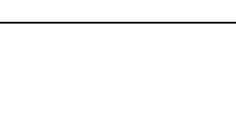

8. SZÁMÓ MELLEKLET A V-0364-491/2014. SZÁMÓ JELENTÉSHEZ

|  Főkönyvi számla száma | Főkönyvi számla megnevezés | Nyitó |  |  | Állományi számla |  |  | Egyenleg |   |
| --- | --- | --- | --- | --- | --- | --- | --- | --- | --- |
|   |  | Tartozik | Követel |  | Tartozik | Követel | Tartozik | Követel |   |
|  111321 |  | 55 010 000 Ft | - Ft |  | 90 680 945 Ft | 84 603 265 Ft | 61 087 680 Ft |  |   |
|  111331 |  | 361 931 826 Ft | - Ft |  | 120 322 844 Ft | 19 810 781 Ft | 462 643 889 Ft |  |   |
|  1113311 |  | 25 317 700 Ft | - Ft |  | 10 360 486 Ft | 669 610 Ft | 34 968 576 Ft |  |   |
|  111332 |  | 32 674 000 Ft | - Ft |  | 22 125 000 Ft | 23 124 000 Ft | 31 875 000 Ft |  |   |
|  1113***** |  | 475 133 525 Ft | - Ft |  | 243 459 275 Ft | 125 027 856 Ft | 590 595 145 Ft |  |   |
|  11143 |  | 5 821 170 Ft | - Ft |  | 4 191 120 Ft | 2 562 859 Ft | 7 449 431 Ft |  |   |
|  111431 |  | 8 882 814 Ft | - Ft |  | - Ft | - Ft | 9 882 814 Ft |  |   |
|  1114***** |  | 14 703 584 Ft | - Ft |  | 4 191 120 Ft | 2 562 859 Ft | 16 332 245 Ft |  |   |
|  1119321 |  | - Ft | - Ft |  | 55 010 000 Ft | - Ft | 55 010 000 Ft |  |   |
|  1119331 |  | 49 200 890 Ft | - Ft |  | 9 254 927 Ft | 488 000 Ft | 57 967 617 Ft |  |   |
|  1119332 |  | 6 942 900 Ft | - Ft |  | 20 624 000 Ft | 5 255 400 Ft | 22 311 600 Ft |  |   |
|  111943 |  | 115 578 389 Ft | - Ft |  | 2 562 859 Ft | 6 109 761 Ft | 112 031 487 Ft |  |   |
|  1119***** |  | 171 722 179 Ft | - Ft |  | 87 481 756 Ft | 11 853 161 Ft | 247 320 804 Ft |  |   |

9028 Győr, Egyetem tér 1. 9007 Győr, Pf. 701 Tel.: 96 903-401.

13

---

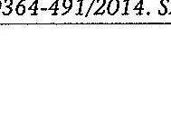

8. SZÁMÓ MELLEKLET A V-0364-491/2014. SZÁMÓ JELENTÉSHEZ

|  REKTOR |  |  |  |  |  |  |  |  |  |  |  |  |  |  |   |
| --- | --- | --- | --- | --- | --- | --- | --- | --- | --- | --- | --- | --- | --- | --- | --- |
|   |  |  |  |  |  |  |  |  |  |  |  |  |  |  |   |
|   |  |  |  |  |  |  |  |  |  |  |  |  |  |  |   |
|  111***** |  |  |  |  |  |  |  |  |  |  |  |  |  |  |   |
|   |  |  |  |  |  |  |  |  |  |  |  |  |  |  |   |
|  1123121 |  |  |  |  |  |  |  |  |  |  |  |  |  |  |   |
|   |  |  |  |  |  |  |  |  |  |  |  |  |  |  |   |
|  1123131 |  |  |  |  |  |  |  |  |  |  |  |  |  |  |   |
|   |  |  |  |  |  |  |  |  |  |  |  |  |  |  |   |
|  1123132 |  |  |  |  |  |  |  |  |  |  |  |  |  |  |   |
|   |  |  |  |  |  |  |  |  |  |  |  |  |  |  |   |
|  1123***** |  |  |  |  |  |  |  |  |  |  |  |  |  |  |   |
|   |  |  |  |  |  |  |  |  |  |  |  |  |  |  |   |
|  1124113 |  |  |  |  |  |  |  |  |  |  |  |  |  |  |   |
|   |  |  |  |  |  |  |  |  |  |  |  |  |  |  |   |
|  1124***** |  |  |  |  |  |  |  |  |  |  |  |  |  |  |   |
|   |  |  |  |  |  |  |  |  |  |  |  |  |  |  |   |
|  1124***** |  |  |  |  |  |  |  |  |  |  |  |  |  |  |   |
|   |  |  |  |  |  |  |  |  |  |  |  |  |  |  |   |
|  1124***** |  |  |  |  |  |  |  |  |  |  |  |  |  |  |   |
|   |  |  |  |  |  |  |  |  |  |  |  |  |  |  |   |
|  1124***** |  |  |  |  |  |  |  |  |  |  |  |  |  |  |   |
|   |  |  |  |  |  |  |  |  |  |  |  |  |  |  |   |
|  1124***** |  |  |  |  |  |  |  |  |  |  |  |  |  |  |   |
|   |  |  |  |  |  |  |  |  |  |  |  |  |  |  |   |
|  1124***** |  |  |  |  |  |  |  |  |  |  |  |  |  |  |   |
|   |  |  |  |  |  |  |  |  |  |  |  |  |  |  |   |
|  1124***** |  |  |  |  |  |  |  |  |  |  |  |  |  |  |   |
|   |  |  |  |  |  |  |  |  |  |  |  |  |  |  |   |
|  1124***** |  |  |  |  |  |  |  |  |  |  |  |  |  |  |   |
|   |  |  |  |  |  |  |  |  |  |  |  |  |  |  |   |
|  1124***** |  |  |  |  |  |  |  |  |  |  |  |  |  |  |   |
|   |  |  |  |  |  |  |  |  |  |  |  |  |  |  |   |
|  1124***** |  |  |  |  |  |  |  |  |  |  |  |  |  |  |   |
|   |  |  |  |  |  |  |  |  |  |  |  |  |  |  |   |
|  1124***** |  |  |  |  |  |  |  |  |  |  |  |  |  |  |   |
|   |  |  |  |  |  |  |  |  |  |  |  |  |  |  |   |
|  1124***** |  |  |  |  |  |  |  |  |  |  |  |  |  |  |   |
|   |  |  |  |  |  |  |  |  |  |  |  |  |  |  |   |
|  1124***** |  |  |  |  |  |  |  |  |  |  |  |  |  |  |   |
|   |  |  |  |  |  |  |  |  |  |  |  |  |  |  |   |
|  1124***** |  |  |  |  |  |  |  |  |  |  |  |  |  |  |   |
|   |  |  |  |  |  |  |  |  |  |  |  |  |  |  |   |
|  1124***** |  |  |  |  |  |  |  |  |  |  |  |  |  |  |   |
|   |  |  |  |  |  |  |  |  |  |  |  |  |  |  |   |
|  1124***** |  |  |  |  |  |  |  |  |  |  |  |  |  |  |   |
|   |  |  |  |  |  |  |  |  |  |  |  |  |  |  |   |
|  1124***** |  |  |  |  |  |  |  |  |  |  |  |  |  |  |   |
|   |  |  |  |  |  |  |  |  |  |  |  |  |  |  |   |
|  1124***** |  |  |  |  |  |  |  |  |  |  |  |  |  |  |   |
|   |  |  |  |  |  |  |  |  |  |  |  |  |  |  |   |
|  1124***** |  |  |  |  |  |  |  |  |  |  |  |  |  |  |   |
|   |  |  |  |  |  |  |  |  |  |  |  |  |  |  |   |
|  1124***** |  |  |  |  |  |  |  |  |  |  |  |  |  |  |   |
|   |  |  |  |  |  |  |  |  |  |  |  |  |  |  |   |
|  1124***** |  |  |  |  |  |  |  |  |  |  |  |  |  |  |   |
|   |  |  |  |  |  |  |  |  |  |  |  |  |  |  |   |
|  1124***** |  |  |  |  |  |  |  |  |  |  |  |  |  |  |   |
|   |  |  |  |  |  |  |  |  |  |  |  |  |  |  |   |
|  1124***** |  |  |  |  |  |  |  |  |  |  |  |  |  |  |   |
|   |  |  |  |  |  |  |  |  |  |  |  |  |  |  |   |
|  1124***** |  |  |  |  |  |  |  |  |  |  |  |  |  |  |   |
|   |  |  |  |  |  |  |  |  |  |  |  |  |  |  |   |
|  1124***** |  |  |  |  |  |  |  |  |  |  |  |  |  |  |   |
|   |  |  |  |  |  |  |  |  |  |  |  |  |  |  |   |
|  1124***** |  |  |  |  |  |  |  |  |  |  |  |  |  |  |   |
|   |  |  |  |  |  |  |  |  |  |  |  |  |  |  |   |
|  1124***** |  |  |  |  |  |  |  |  |  |  |  |  |  |  |   |
|   |  |  |  |  |  |  |  |  |  |  |  |  |  |  |   |
|  1124***** |  |  |  |  |  |  |  |  |  |  |  |  |  |  |   |
|   |  |  |  |  |  |  |  |  |  |  |  |  |  |  |   |
|  1124***** |  |  |  |  |  |  |  |  |  |  |  |  |  |  |   |
|   |  |  |  |  |  |  |  |  |  |  |  |  |  |  |   |
|  1124***** |  |  |  |  |  |  |  |  |  |  |  |  |  |  |   |
|   |  |  |  |  |  |  |  |  |  |  |  |  |  |  |   |
|  1124***** |  |  |  |  |  |  |  |  |  |  |  |  |  |  |   |
|   |  |  |  |  |  |  |  |  |  |  |  |  |  |  |   |
|  1124***** |  |  |  |  |  |  |  |  |  |  |  |  |  |  |   |
|   |  |  |  |  |  |  |  |  |  |  |  |  |  |  |   |
|  1124***** |  |  |  |  |  |  |  |  |  |  |  |  |  |  |   |
|   |  |  |  |  |  |  |  |  |  |  |  |  |  |  |   |
|  1124***** |  |  |  |  |  |  |  |  |  |  |  |  |  |  |   |
|   |  |  |  |  |  |  |  |  |  |  |  |  |  |  |   |
|  1124***** |  |  |  |  |  |  |  |  |  |  |  |  |  |  |   |
|   |  |  |  |  |  |  |  |  |  |  |  |  |  |  |   |
|  1124***** |  |  |  |  |  |  |  |  |  |  |  |  |  |  |   |
|   |  |  |  |  |  |  |  |  |  |  |  |  |  |  |   |
|  1124***** |  |  |  |  |  |  |  |  |  |  |  |  |  |  |   |
|   |  |  |  |  |  |  |  |  |  |  |  |  |  |  |   |
|  1124***** |  |  |  |  |  |  |  |  |  |  |  |  |  |  |   |
|   |  |  |  |  |  |  |  |  |  |  |  |  |  |  |   |
|  1124***** |  |  |  |  |  |  |  |  |  |  |  |  |  |  |   |
|   |  |  |  |  |  |  |  |  |  |  |  |  |  |  |   |
|  1124***** |  |  |  |  |  |  |  |  |  |  |  |  |  |  |   |
|   |  |  |  |  |  |  |  |  |  |  |  |  |  |  |   |
|  1124***** |  |  |  |  |  |  |  |  |  |  |  |  |  |  |   |
|   |  |  |  |  |  |  |  |  |  |  |  |  |  |  |   |
|  1124***** |  |  |  |  |  |  |  |  |  |  |  |  |  |  |   |
|   |  |  |  |  |  |  |  |  |  |  |  |  |  |  |   |
|  1124***** |  |  |  |  |  |  |  |  |  |  |  |  |  |  |   |
|   |  |  |  |  |  |  |  |  |  |  |  |  |  |  |   |
|  1124***** |  |  |  |  |  |  |  |  |  |  |  |  |  |  |   |
|   |  |  |  |  |  |  |  |  |  |  |  |  |  |  |   |
|  1124***** |  |  |  |  |  |  |  |  |  |  |  |  |  |  |   |
|   |  |  |  |  |  |  |  |  |  |  |  |  |  |  |   |
|  1124***** |  |  |  |  |  |  |  |  |  |  |  |  |  |  |   |
|   |  |  |  |  |  |  |  |  |  |  |  |  |  |  |   |
|  1124***** |  |  |  |  |  |  |  |  |  |  |  |  |  |  |   |
|   |  |  |  |  |  |  |  |  |  |  |  |  |  |  |   |
|  1124***** |  |  |  |  |  |  |  |  |  |  |  |  |  |  |   |
|   |  |  |  |  |  |  |  |  |  |  |  |  |  |  |   |
|  1124***** |  |  |  |  |  |  |  |  |  |  |  |  |  |  |   |
|   |  |  |  |  |  |  |  |  |  |  |  |  |  |  |   |
|  1124***** |  |  |  |  |  |  |  |  |  |  |  |  |  |  |   |
|   |  |  |  |  |  |  |  |  |  |  |  |  |  |  |   |
|  1124***** |  |  |  |  |  |  |  |  |  |  |  |  |  |  |   |
|   |  |  |  |  |  |  |  |  |  |  |  |  |  |  |   |
|  1124***** |  |  |  |  |  |  |  |  |  |  |  |  |  |  |   |
|   |  |  |  |  |  |  |  |  |  |  |  |  |  |  |   |
|  1124***** |  |  |  |  |  |  |  |  |  |  |  |  |  |  |   |
|   |  |  |  |  |  |  |  |  |  |  |  |  |  |  |   |
|  1124***** |  |  |  |  |  |  |  |  |  |  |  |  |  |  |   |
|   |  |  |  |  |  |  |  |  |  |  |  |  |  |  |   |
|  1124***** |  |  |  |  |  |  |  |  |  |  |  |  |  |  |   |
|   |  |  |  |  |  |  |  |  |  |  |  |  |  |  |   |
|  1124***** |  |  |  |  |  |  |  |  |  |  |  |  |  |  |   |
|   |  |  |  |  |  |  |  |  |  |  |  |  |  |  |   |
|  1124***** |  |  |  |  |  |  |  |  |  |  |  |  |  |  |   |
|   |  |  |  |  |  |  |  |  |  |  |  |  |  |  |   |
|  1124***** |  |  |  |  |  |  |  |  |  |  |  |  |  |  |   |
|   |  |  |  |  |  |  |  |  |  |  |  |  |  |  |   |
|  1124***** |  |  |  |  |  |  |  |  |  |  |  |  |  |  |   |
|   |  |  |  |  |  |  |  |  |  |  |  |  |  |  |   |
|  1124***** |  |  |  |  |  |  |  |  |  |  |  |  |  |  |   |
|   |  |  |  |  |  |  |  |  |  |  |  |  |  |  |   |
|  1124***** |  |  |  |  |  |  |  |  |  |  |  |  |  |  |   |
|   |  |  |  |  |  |  |  |  |  |  |  |  |  |  |   |
|  1124***** |  |  |  |  |  |  |  |  |  |  |  |  |  |  |   |
|   |  |  |  |  |  |  |  |  |  |  |  |  |  |  |   |
|  1124***** |  |  |  |  |  |  |  |  |  |  |  |  |  |  |   |
|   |  |  |  |  |  |  |  |  |  |  |  |  |  |  |   |
|  1124***** |  |  |  |  |  |  |  |  |  |  |  |  |  |  |   |
|   |  |  |  |  |  |  |  |  |  |  |  |  |  |  |   |
|  1124***** |  |  |  |  |  |  |  |  |  |  |  |  |  |  |   |
|   |  |  |  |  |  |  |  |  |  |  |  |  |  |  |   |
|  1124***** |  |  |  |  |  |  |  |  |  |  |  |  |  |  |   |
|   |  |  |  |  |  |  |  |  |  |  |  |  |  |  |   |
|  1124***** |  |  |  |  |  |  |  |  |  |  |  |  |  |  |   |
|   |  |  |  |  |  |  |  |  |  |  |  |  |  |  |   |
|  1124***** |  |  |  |  |  |  |  |  |  |  |  |  |  |  |   |
|   |  |  |  |  |  |  |  |  |  |  |  |  |  |  |   |
|  1124***** |  |  |  |  |  |  |  |  |  |  |  |  |  |  |   |
|   |  |  |  |  |  |  |  |  |  |  |  |  |  |  |   |
|  1124***** |  |  |  |  |  |  |  |  |  |  |  |  |  |  |   |
|   |  |  |  |  |  |  |  |  |  |  |  |  |  |  |   |
|  1124***** |  |  |  |  |  |  |  |  |  |  |  |  |  |  |   |
|   |  |  |  |  |  |  |  |  |  |  |  |  |  |  |   |
|  1124***** |  |  |  |  |  |  |  |  |  |  |  |  |  |  |   |
|   |  |  |  |  |  |  |  |  |  |  |  |  |  |  |   |
|  1124***** |  |  |  |  |  |  |  |  |  |  |  |  |  |  |   |
|   |  |  |  |  |  |  |  |  |  |  |  |  |  |  |   |
|  1124***** |  |  |  |  |  |  |  |  |  |  |  |  |  |  |   |
|   |  |  |  |  |  |  |  |  |  |  |  |  |  |  |   |
|  1124***** |  |  |  |  |  |  |  |  |  |  |  |  |  |  |   |
|   |  |  |  |  |  |  |  |  |  |  |  |  |  |  |   |
|  1124***** |  |  |  |  |  |  |  |  |  |  |  |  |  |  |   |
|   |  |  |  |  |  |  |  |  |  |  |  |  |  |  |   |
|  1124***** |  |  |  |  |  |  |  |  |  |  |  |  |  |  |   |
|   |  |  |  |  |  |  |  |  |  |  |  |  |  |  |   |
|  1124***** |  |  |  |  |  |  |  |  |  |  |  |  |  |  |   |
|   |  |  |  |  |  |  |  |  |  |  |  |  |  |  |   |
|  1124***** |  |  |  |  |  |  |  |  |  |  |  |  |  |  |   |
|   |  |  |  |  |  |  |  |  |  |  |  |  |  |  |   |
|  1124***** |  |  |  |  |  |  |  |  |  |  |  |  |  |  |   |
|   |  |  |  |  |  |  |  |  |  |  |  |  |  |  |   |
|  1124***** |  |  |  |  |  |  |  |  |  |  |  |  |  |  |   |
|   |  |  |  |  |  |  |  |  |  |  |  |  |  |  |   |
|  1124***** |  |  |  |  |  |  |  |  |  |  |  |  |  |  |   |
|   |  |  |  |  |  |  |  |  |  |  |  |  |  |  |   |
|  1124***** |  |  |  |  |  |  |  |  |  |  |  |  |  |  |   |
|   |  |  |  |  |  |  |  |  |  |  |  |  |  |  |   |
|  1124***** |  |  |  |  |  |  |  |  |  |  |  |  |  |  |   |
|   |  |  |  |  |  |  |  |  |  |  |  |  |  |  |  |   |
|  1124***** |  |  |  |  |  |  |  |  |  |  |  |  |  |  |   |
|   |  |  |  |  |  |  |  |  |  |  |  |  |  |  |  |   |
|  1124***** |  |  |  |  |  |  |  |  |  |  |  |  |  |  |  |   |
|   |  |  |  |  |  |  |  |  |  |  |  |  |  |  |  |   |
|  1124***** |  |  |  |  |  |  |  |  |  |  |  |  |  |  |  |   |
|   |  |  |  |  |  |  |  |  |  |  |  |  |  |  |  |   |
|  1124***** |  |  |  |  |  |  |  |  |  |  |  |  |  |  |  |   |
|   |  |  |  |  |  |  |  |  |  |  |  |  |  |  |  |   |
|  1124***** |  |  |  |  |  |  |  |  |  |  |  |  |  |  |  |   |
|   |  |  |  |  |  |  |  |  |  |  |  |  |  |  |  |   |
|  1124***** |  |  |  |  |  |  |  |  |  |  |  |  |  |  |  |   |
|   |  |  |  |  |  |  |  |  |  |  |  |  |  |  |  |  |   |
|  1124***** |  |  |  |  |  |  |  |  |  |  |  |  |  |  |  |  |   |
|   |  |  |  |  |  |  |  |  |  |  |  |  |  |  |  |  |   |
|  1124***** |  |  |  |  |  |  |  |  |  |  |  |  |  |  |  |  |   |
|   |  |  |  |  |  |  |  |  |  |  |  |  |  |  |  |  |   |
|  1124***** |  |  |  |  |  |  |  |  |  |  |  |  |  |  |  |  |   |
|   |  |  |  |  |  |  |  |  |  |  |  |  |  |  |  |  |   |
|  1124***** |  |  |  |  |  |  |  |  |  |  |  |  |  |  |  |  |   |
|   |  |  |  |  |  |  |  |  |  |  |  |  |  |  |  |  |   |
|  1124***** |  |  |  |  |  |  |  |  |  |  |  |  |  |  |  |  |  |   |
|   |  |  |  |  |  |  |  |  |  |  |  |  |  |  |  |  |  |   |
|  1124***** |  |  |  |  |  |  |  |  |  |  |  |  |  |  |  |  |  |   |
|   |  |  |  |  |  |  |  |  |  |  |  |  |  |  |  |  |  |   |
|  1124***** |  |  |  |  |  |  |  |  |  |  |  |  |  |  |  |  |  |   |
|   |  |  |  |  |  |  |  |  |  |  |  |  |  |  |  |  |  |   |
|  1124***** |  |  |  |  |  |  |  |  |  |  |  |  |  |  |  |  |  |   |
|   |  |  |  |  |  |  |  |  |  |  |  |  |  |  |  |  |  |   |
|  1124***** |  |  |  |  |  |  |  |  |  |  |  |  |  |  |  |  |  |   |
|   |  |  |  |  |  |  |  |  |  |  |  |  |  |  |  |  |  |   |
|  1124***** |  |  |  |  |  |  |  |  |  |  |  |  |  |  |  |  |  |  |   |
|   |  |  |  |  |  |  |  |  |  |  |  |  |  |  |  |  |  |  |   |
|  1124***** |  |  |  |  |  |  |  |  |  |  |  |  |  |  |  |  |  |  |   |
|   |  |  |  |  |  |  |  |  |  |  |  |  |  |  |  |  |  |  |   |
|  1124***** |  |  |  |  |  |  |  |  |  |  |  |  |  |  |  |  |  |  |   |
|   |  |  |  |  |  |  |  |  |  |  |  |  |  |  |  |  |  |   |
|  1124***** |  |  |  |  |  |  |  |  |  |  |  |  |  |  |  |  |  |  |   |
|   |  |  |  |  |  |  |  |  |  |  |  |  |  |  |  |  |  |  |   |
|  1124***** |  |  |  |  |  |  |  |  |  |  |  |  |  |  |  |  |  |  |   |
|   |  |  |  |  |  |  |  |  |  |  |  |  |  |  |  |  |  |  |   |
|  1124***** |  |  |  |  |  |  |  |  |  |  |  |  |  |  |  |  |  |  |   |
|   |  |  |  |  |  |  |  |  |  |  |  |  |  |  |  |  |  |  |   |
|  1124***** |  |  |  |  |  |  |  |  |  |  |  |  |  |  |  |  |  |  |   |
|   |  |  |  |  |  |  |  |  |  |  |  |  |  |  |  |  |  |  |   |
|  1124***** |  |  |  |  |  |  |  |  |  |  |  |  |  |  |  |  |  |  |   |
|   |  |  |  |  |  |  |  |  |  |  |  |  |  |  |  |  |  |  |  |   |
|  1124***** |  |  |  |  |  |  |  |  |  |  |  |  |  |  |  |  |  |  |  |   |
|   |  |  |  |  |  |  |  |  |  |  |  |  |  |  |  |  |  |  |  |   |
|  1124***** |  |  |  |  |  |  |  |  |  |  |  |  |  |  |  |  |  |  |  |  |   |
|   |  |  |  |  |  |  |  |  |  |  |  |  |  |  |  |  |  |  |  |   |
|  1124***** |  |  |  |  |  |  |  |  |  |  |  |  |  |  |  |  |  |  |  |   |
|   |  |  |  |  |  |  |  |  |  |  |  |  |  |  |  |  |  |  |  |   |
|  1124***** |  |  |  |  |  |  |  |  |  |  |  |  |  |  |  |  |  |  |  |  |   |
|   |  |  |  |  |  |  |  |  |  |  |  |  |  |  |  |  |  |  |  |   |
|  1124***** |  |  |  |  |  |  |  |  |  |  |  |  |  |  |  |  |  |  |  |  |   |
|   |  |  |  |  |  |  |  |  |  |  |  |  |  |  |  |  |  |  |  |  |   |
|  1124***** |  |  |  |  |  |  |  |  |  |  |  |  |  |  |  |  |  |  |  |  |   |
|   |  |  |  |  |  |  |  |  |  |  |  |  |  |  |  |  |  |  |  |  |   |
|  1124***** |  |  |  |  |  |  |  |  |  |  |  |  |  |  |  |  |  |  |  |  |  |   |
|   |  |  |  |  |  |  |  |  |  |  |  |  |  |  |  |  |  |  |  |  |  |   |
|  1124***** |  |  |  |  |  |  |  |  |  |  |  |  |  |  |  |  |  |  |  |  |  |   |
|   |  |  |  |  |  |  |  |  |  |  |  |  |  |  |  |  |  |  |  |  |   |
|  1124***** |  |  |  |  |  |  |  |  |  |  |  |  |  |  |  |  |  |  |  |  |   |
|   |  |  |  |  |  |  |  |  |  |  |  |  |  |  |  |  |  |  |  |  |   |
|  1124***** |  |  |  |  |  |  |  |  |  |  |  |  |  |  |  |  |  |  |  |  |   |
|   |  |  |  |  |  |  |  |  |  |  |  |  |  |  |  |  |  |  |  |  |   |
|  1124***** |  |  |  |  |  |  |  |  |  |  |  |  |  |  |  |  |  |  |  |   |
|  1124***** |  |  |  |  |  |  |  |  |  |  |  |  |  |  |  |  |  |  |  |  |   |
|   |  |  |  |  |  |  |  |  |  |  |  |  |  |  |  |  |  |  |  |  |   |
|  1124***** |  |  |  |  |  |  |  |  |  |  |  |  |  |  |  |  |  |  |  |   |
|  1124***** |  |  |  |  |  |  |  |  |  |  |  |  |  |  |  |  |  |   |
|  1124***** |  |  |  |  |  |  |  |  |  |  |  |  |  |  |  |  |  |  |  |   |
|  1124***** |  |  |  |  |  |  |  |  |  |  |  |  |  |  |  |  |  |  |   |
|  1124***** |  |  |  |  |  |  |  |  |  |  |  |  |  |  |  |  |  |   |
|  1124***** |  |  | | | | | | | |  |  |  |  |  |  |  |  |  |  |   |
|  1124***** |  |  |  |  |  |  |  |  |  |  |  |  |  |  |  |  |  |   |
|  1124***** |  |  |  |  |  |  |  |  |  |  |  |  |  |  |  |  |  |   |
|  1124***** |  |  |  |  |  |  |  |  |  |  |  |  |  |  |  |  |  |   |
|  1124***** |  |  |  |  |  |  |  |  |  |  |  |  |  |  |  |  |   |
|  1124***** |  |  |  |  |  |  |  |  |  |  |  |  |  |  |  |  |  |   |
|  1124***** |  |  |  |  |  |  |  |  |  |  |  |  |  |  |  |  |  |   |
|  1124***** |  |  |  |  |  |  |  |  |  |  |  |  |  |  |  |  |   |
|  1124***** |  |  |  |  |  |  |  |  |  |  |  |  |  |  |  |  |  |   |
|  1124***** |  |  |  |  |  |  |  |  |  |  |  |  |  |  |  |  |   |
|  1124***** |  |  |  |  |  |  |  |  |  |  |  |  |  |  |  |   |
|  1124***** |  |  |  |  |  |  |  |  |  |  |  |  |  |  |  |  |   |
|  1124***** |  |  |  |  |  |  |  |  |  |  |  |  |  |  |  |  |   |
|  1124***** |  |  |  |  |  |  |  |  |  |  |  |  |  |  |   |
|  1124***** |  |  |  |  |  |  |  |  |  |  |  |  |  |  |   |
|  1124***** |  |  |  |  |  |  |  |  |  |  |  |  |  |  |   |
|  1124***** |  |  |  |  |  |  |  |  |  |  |  |  |  |  |  |   |
|  1124***** |  |  |  |  |  |  |  |  |  |  |  |  |  |  |   |
|  1124***** |  |  |  |  |  |  |  |  |  |  |  |  |  |   |
|  1124***** |  |  |  |  |  |  |  |  |  |  |  |  |  |  |   |
|  1124***** |  |  |  |  |  |  |  |  |  |  |  |  |   |
|  1124***** |  |  |  |  |  |  |  |  |  |  |  |  |  |  |   |
|  1124***** |  |  |  |  |  |  |  |  |  |  |  |   |
|  1124***** |  |  |  |  |  |  |  |  |  |  |  |  |   |
|  1124***** |  |  |  |  |  |  |  |  |  |  |   |
|  1124***** |  |  |  |  |  |  |  |  |  |  |  |   |
|  1124***** |  |  |  |  |  |  |  |  |  |  |  |   |
|  1124***** |  |  |  |  |  |  |  |  |  |  |  |   |
|  1124***** |  |  |  |  |  |  |  |  |  |  |   |
|  1124***** |  |  |  |  |  |  |  |  |  |  |   |
|  1124***** |  |  |  |  |  |  |  |  |  |  |   |
|  1124***** |  |  |  |  |  |  |  |  |  |   |
|  1124***** |  |  |  |  |  |  |  |  |  |   |
|  1124***** |  |  |  |  |  |  |  |  |  |  |   |
|  1124***** |  |  |  |  |  |  |  |  |  |   |
|  1124***** |  |  |  |  |  |  |  |  |   |
|  1124***** |  |  |  |  |  |  |  |  |   |
|  1124***** |  |  |  |  |  |  |  |  |   |
|  1124***** |  |  |  |  |  |  |  |  |  |   |
|  1124***** |  |  |  |  |  |  |  |  |  |   |
|  1124***** |  |  |  |  |  |  |  |  |  |   |
|  1124***** |  |  |  |  |  |  |  |  |   |
|  1124***** |  |  |  |  |  |  |  |  |  |   |
|  1124***** |  |  |  |  |  |  |  |  |   |
|  1124***** |  |  |  |  |  |  |  |  |   |
|  1124***** |  |  |  |  |  |  |  |  |  |   |
|  1124***** |  |  |  |  |  |  |  |   |
|  1124***** |  |  |  |  |  |  |  |  |  |   |
|  1124***** |  |  |  |  |  |  |  |   |
|  1124***** |  |  |  |  |  |  |   |
|  1124***** |  |  |  |  |  |  |   |
|  1124***** |  |  |  |  |  |  |   |
|  1124***** |  |  |  |  |  |  |   |
|  1124***** |  |  |  |  |  |  |   |
|  1124***** |  |  |  |  |  |  |   |
|  1124***** |  |  |  |  |  |  |   |
|  1124***** |  |  |  |  |  |  |  |   |
|  1124***** |  |  |  |  |  |  |   |
|  1124***** |  |  |  |  |  |  |  |   |
|  1124***** |  |  |  |  |  |  |   |
|  1124***** |  |  |  |  |  |  |   |
| 1124***** |  |  |  |  |  |  |   |
|  1124***** |  |  |  |  |  |  |   |
| 1124***** |  |  |  |  |  |  |   |
| 1124***** |  |  |  |  |  |  |   |
| 1124***** |  |  |  |  |  |  |   |
| 1124***** |  |  |  |  |  |  |   |
|  1124***** |  |  |  |  |  |   |
|  1124***** |  |  |  |  |  |  |   |
| 1124***** |  |  |  |  |  |  |   |
| 1124***** |  |  |  |  |  |  |   |
| 1124***** |  |  |  |  |  |  |   |
| 1124***** |  |  |  |  |  |   |
| 1124***** |  |  |  |  |  |  |  |   |
| 1124 **** |  |  |  |  |  |   |
| 1124 **** |  |  |  |  |  |  |  |  |  |  |  |  |  |  |  |  |  |  |  |  |  |  |  |  |  |  |  |  |   |    |    |    |       |          |           1124 **** |  |  |  |  |  |  |             |  |  |                |          |  |              |            |  |  |  |                 1124 **** |  |  |  |  |                  |  |  |  |  |  |                 1124 **** |  |  |  |  |  |  |  |                 |  |  |  |  |  |  |                     1124 **** |  |  |  |  |  |  |  |  |                 |  |  |                    1124 **** |  |  |  |  |  |  |  |  |                       |  |  |  |  |  |  |  |                        1124 **** |  |  |  |  |  |  |  |  |  |  |  |  |  |                            1124 **** |  |  |  |  |  |  |  |  |  |  |  |  |  |  |  |                      1124 **** |  |  |  |  |  |  |                1124 **** |  |  |  |  |  |  |  |  |                    1124 **** |  |  |  |  |  |  |  |  |  |  |  |  |  |  |  |  |                      1124 **** |  |  |  |  |  |  |  |  |  |  |  |  |  |  |  |  |  |  |  |                       1124 **** |  |  |  |  |  |  |  |  |  |  |  |  |  |  |  |  |  |  |  |  |  |  |  |  |  |  |  |                        1124 **** |  |  |  |  |  |  |  |  |  |  |  |  |  |  |  | 

---

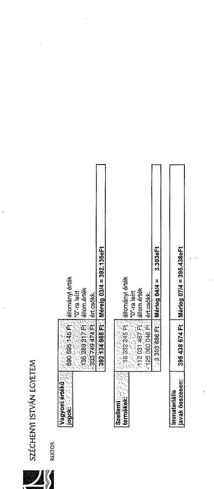

# SZÉCHENYI ISTVÁN EGYETEM

## B. SZÁMÓ MELLEKLET

### A V-0364-491/2014. SZÁMÓ JELENTÉSHEZ

|  Vagyoni értékű jogok: | 590 595 145 Ft | állományi érték
"0"ra leírt
állom érték
ért. csökk.  |
| --- | --- | --- |
|  135 399 317 Ft |  |   |
|  330 749 474 Ft |  |   |
|  392 134 568 Ft |  |   |
|  Szellemi termékok: | 16 332 245 Ft | állományi érték
"0"ra leírt
állom érték
ért. csökk.  |
|  112 031 487 Ft |  |   |
|  125 060 046 Ft |  |   |
|  2 203 686 Ft |  |   |
|  Mérleg 04/4 = 3.303 eFt |  |   |

|  Immateriális javak összesen: | 395 438 674 Ft | Mérleg 07/4 = 395.438 eFt  |
| --- | --- | --- |
|  |   |   |

---

.

---

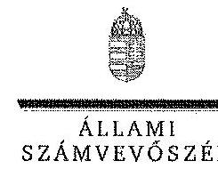

ELRÉK

Ikt.szám: V-0364-490/2014.

Prof. Dr. Földesi Péter úr
rektor
Széchenyi István Egyetem

Győr

# Tisztelt Rektor Úr! 

A Széchenyi István Egyetem gazdálkodásának és müködésének ellenôrzésérôl készített jelentéstervezetre tett észrevételeit köszönettel megkaptam.

Az Állami Számvevôszék észrevételekre vonatkozó álláspontjáról a felügyeleti vezető által készített részletes tájékoztatást csatoltan megküldöm.

Tájékoztatom Rektor urat, hogy az ÁSZ. tv. 29. § (3) bekezdése alapján a számvevôszéki jelentés mellékleteként szerepeltetjük a jelentéstervezethez tett figyelembe nem vett észrevételeket az elutasítás indokainak feltüntetésével.

Budapest, 2014. 06 hó 12 nap
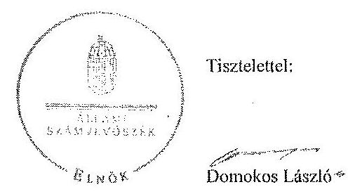

Melléklet: Tájékuztatás az elfogadott és figyelembe nem vett észrevételekröl

---

# Tájékoztatás   az elfogadott és a figyelembe nem vett észrevételekről 

A Széchenyi István Egyetem gazdálkodásának és müködésének ellenőrzéséről készült számvevőszéki jelentéstervezethez az RH-2013/311/3 iktatószámú levélben tett észrevételeit köszönettel megkaptuk.

A jelentéstervezetre tett észrevételeket áttckintettük, azok kezeléséről a következő tájékoztatást adom:

## Általános tájékoztatás

A megállapítások alátámasztására vonatkozóan tájékoztatom, hogy a jelentéstervezet bevezető részében meghatároztuk, hogy „a pénzügyi és vagyongazdálkodás terén az egyes területek szabályszerű müködését mintavétellel ellenőriztük, ez alapján a sokaságokban elöforduló hibás tételek arányát becsültük", amelynek kiértékelését az 5. számú melléklet tartalmazza.

A mintavétel eredményeit tehát kivetítettük a teljes sokaságra, amelynek során meghatároztuk a mintában feltárt hibaarányhoz tarozó alsó és felső hibahatárokat (alsó határ = legvalószinűbb hiba - mintavétel maximális hibája; felső határ = legvalószínübb hiba + mintavétel maximális hibája). A teljes sokaságban a hibás tételek aránya $95 \%$-os bizonyossággal az alsó és felső hibahatár közé esik.

A jogszabályoknak és a belső előírásoknak megfelelőnek, azaz szabályszerűnek tekintettük az adott kiadási előirányzat felhasználását, bevétel beszedését, mérlegtétel értékelését, amennyiben a minta alapján $95 \%$-os bizonyossággal megállapítható volt, hogy a teljes sokaságban a hibás tételek aránya kisebb, mint $10 \%$, nem megfelelőnek értékeltük, ha a hibás tételek aránya a $10 \%$-ot meghaladta.

Amennyiben $95 \%$-os bizonyossággal nem volt egyértelmüen megállapítható a minta alapján, hogy az adott terület müködése megfelelő volt-e (az elfogadható hibaarány ( $10 \%$ ) az alsó és felső hibahatár közé esett), de a mintában a hibás tételek aránya kisebb volt, mint az elfogadható hibaarány ( $10 \%$ ), akkor kockázatosnak minősítettük az adott terület müködését. Ha a mintában a hibás tételek aránya nagyobb volt, mint az elfogadható hibaarány ( $10 \%$ ), akkor magas kockázatúnak értékeltük az adott terület müködését.

A mintavételes ellenőrzés alapján tett megállapításoknál az ellenőrzött területre vonatkozóan megjelöltük a megsértett jogszabályhelyeket, illetve a hibatípusokat. Terjedelmi okok a hibák tételes kimutatását nem teszik lehetővé. Javaslataink a jelzett szabálytalanságok megszüntetését és a hibák kijavítását célozzák.

---

# Tartalmi észrevételek 

1. észrevétel Összegző megállapítások fejezet 22. oldal 5. bekezdése

Az észrevételben foglaltak alapján a jelentéstervezet Összegző részét, továbbá a Részletes megállapítások 43. oldalának bekezdését az alábbiak szerint kiegészítettük:
„Az egyetem PPP projektekhez nem csatlakozott, ebből fakadó kötelezettségei nincsenek."
2. észrevétel Részletes megállapítások 33. oldal 1. bekezdése

Az észrevételben jelzettek alapján a jelentéstervezet módosítása nem indokolt. A 2008. május 5 -tól hatályos közbeszerzési szabályzat aktualizálása csak 2012. évben történt meg, annak ellenére, hogy a $\mathrm{Kbt}_{1} 2008$. január 1. és 2011 . december 31. között 34 alkalommal módosult. Így az egyetemet érintő jogszabályi változásokat a szabályzaton nem vezették át.
3. észrevétel Részletes megállapítások 33. oldal utolsó bekezdése

A közbeszerzési szabályzat általánosan rögzíti ugyan, hogy a kijelölt eljárásért felelős személy feladata az egyetem adott közbeszerzési eljárásának előkészítése, lebonyolítása és lezárása, de a jelentéstervezetben rögzített, jogszabályi hivatkozással alátámasztott feladatok lebonyolításának rendjét a szabályzat nem tartalmazta. Az észrevételben jelzettek alapján a megállapítás törlése nem indokolt.

A jelentéstervezet érintett szövegrészét a jogszabályi előírásokkal összhangban az alábbiak szerint pontositottuk:
„A közbeszerzési szabályzat nem tartalmazta a közbeszerzési eljárások esetén az írásbeli összegzéskészités és az ajánlattevők részére történő megküldési kötelezettséggel járó, valamint az ajánlati biztosíték kezelésével, nyilvántartásával, illetőleg visszaadásával kapcsolatos feladatokat."
4. észrevétel Részletes megállapítások 35. oldal első bekezdése

Észrevétele alapján a belső információs és kommunikációs rendszer minősitéséhez kapcsolódó megállapítást a jelentéstervezet 36. oldalának első bekezdésében az alábbiak szerint kiegészítettük:
„Az adatok és információk a bérszámfejtési és munkatigyi rendszerböl NEPTUN rendszerbe, illetve a NEPTUN rendszerböl a pénzügyi és könyvelési rendszerbe történő átadása nem szabályozott módon valósult meg. A NEPTUN egységes felsőoktatási tanulmányi rendszer Saldo pénzügyi-számviteli rendszerhez való kapcsolódását sem oldották meg. A rendszerek adatstruktúrája közötti kompatibilitást az ellenőrzött időszakban nem teremtették meg."

---

Az információs és kommunikációs rendszer minősitésére vonatkozó megállapítást nem módosítjuk, mivel azt a megjelenített hiányosságok megalapozzák.
5. észrevétel Részletes megállapítások 38. oldal első bekezdése

Az észrevételben jelzettek alapján a bekezdés utolsó mondatát töröltük.
6. észrevétel Részletes megállapítások 44. oldal utolsó előtti bekezdése

A 3.2 pont első mondatában szereplő, a kiadási és a bevételi előirányzatok felhasználására vonatkozó összegző megállapítás alátámasztása a jelentéstervezet egyes alpontjainál fellelhető. Az értékelést a levelünk általános részében bemutatottak szerint végeztük el. A mintában előforduló hibák alapján a megállapítás az érintett területek egészére kivetíthető.
7. észrevétel Részletes megállapítások 45. oldal 3. bekezdése

Az észrevételben jelzettek alapján a megállapítás törlése nem indokolt. Ennek oka, hogy az ellenőrzés rendelkezésére bocsátott iratanyagok, illetve a felnőttképzés többletfeladatai témakörében 2014. február 12-én adott nyilatkozatuk alapján megállapítható volt, hogy az ellátott feladatok egyik résztvevő esetében sem tartoztak az írásban rögzített munkaköri kötelezettségei körébe. Az ellátandó feladatok meghatározása egyénre szabottan, írásban, a teljesítés-igazolás feltételeit is tartalmazóan nem történt meg, czáltal a kötelezettségvállalás dokumentálása a jelentéstervezetben hivatkozott jogszabályi előírás értelmében nem volt szabályszerű.
8. észrevétel Részletes megállapítások 45. oldal 5. bekezdése

Mint az előző pontban hivatkozott nyilatkozatukban, illetve az észrevételükben is rögzítésre került a kifogásolt tevékenység által ellátott feladatok túllépték a munkatársak eredeti munkaköri feladataikat (,eredeti munkaköri feladataikat kibövítve"). Ezért az intézménynek az Ámr1 59. § (9) bekezdése, továbbá az Ámry 90.§ (6) bekezdése szerint kellett volna eljárnia.

A leírtakkal összefüggésben a megállapítást az alábbiak szerint pontositottuk:
„A helytelen gyakorlat eredményeként a munkakörön kiväli többletfeladat elvégzéséhez kapcsolódó juttatás illetmény-kiegészitésként, külső személyi juttatás helyett rendszeres személyi juttatásként került elszámolásra,..."
9. észrevétel Részletes megállapítások 46. oldal 4. bekezdése

Az észrevétel alapján a megállapítás módosítása nem indokolt. Mint azt a megállapításhoz tartozó belső bekezdésben is leírtuk az ellenőrzött tételek $12 \%$-a esetében az érvényesítési feladatot a jogszabályban elöirt képesítéssel nem rendelkező, további egy tételnél jogkörrel nem rendelkező személy végezte, egy esetben nem történt meg a kötelezettségvállalás ellenjegyzése. A hibás tételek száma a mintaclemek $16 \%$-a, ami túllépi a $10 \%$-os tolerancia szintet. Ebből adódóan - az általános tájékoztatási részben leírtak szerint - a megállapítás a teljes sokaságra kivetitheto.

---

10. észrevétel Részletes megállapítások 47. oldal első bekezdése

A jelentéstervezetben terjedelmi okok miatt nem mutatjuk be az összes hibát. Az Önök által rendelkezésre bocsátott dokumentumok alapján a mintatételek $24 \%$-ánál nem volt megfelelő a gazdálkodási jogkörök gyakorlása, $2 \%$-ánál közbeszerzési szabálytalanságot, a további eseteknél kontirozási hibákat észleltünk.

Az észrevétel alapján a 47. oldal második belső bekezdését az alábbiak szerint pontositottuk:
Az-SZE-az-ellenőrzött-tételek-36\%-ánál-a-gazdálkodási-jogköröket-nem-a-jogszabályi elöirásoknak-megfelelöen-gyakorolta.
„Az ellenőrzés a mintatételek 36\%-ánál talált hibát, amelyek többek között, a gazdálkodási jogkörök, a közbeszerzési szabályok megsértésére, illetve nem megfelelő kontirozásra vonatkoztak."
11. észrevétel Részletes megállapítások 47. oldal 2. bekezdése

A megállapítás törlése nem indokolt. A jelentéstervezetben szerepeltetett esetben, az FC: Pannon Tanácsadó Kft.-vel 2009. október 12-én megkötött alvállalkozói szerződés - annak tartalma alapján - nem felel meg a Kbt., 29.§ (2) bekezdés g) pontja szerinti kutatási és fejlesztési szolgáltatásnak. Így irreleváns, hogy annak eredményét az ellenőrzött szervezeten kívül más is hasznosította. A jelentéstervezet 47. oldalán az első belső bekezdés utolsó mondatát ennek megfelelően módosítottuk:
"A szerzödés 2. a) pontjában meghatározottak szerint a vállalkozónak adatgyüjtést és a folyamatok feltérképezését kell végeznie egy zrt. számára, igy-a-szakértöi-közremüködés-eredményéa más-is-hasznosította."
12. észrevétel Részletes megállapítások 48. oldal 3. bekezdése

Az észrevételben jelzettek alapján a jelentéstervezet módosítása nem indokolt. A kifogásolt eljárásoknál - mint észrevételében is rögzítette - belső szabályzatok nem álltak rendelkezésre, tehát nem is bonyolíthatták azokat szabályozott formában.
13. észrevétel Részletes megállapítások 48. oldal 4. bekezdése, 56. oldal 4-5. bekezdései, illetve az Összegző megállapítások 26. oldalán lévő javaslat

Mivel a gyüjtőszámla felett - a hatályos államháztartási szabályozással ellentétesen - az egyetem bankszámlaszerződésében megjelölt munkatársainak van rendelkezési joga, a Sztv. és az Áhsz. szerinti valódiság és teljesség elve érvényesitéséhez az Erste Bank Zrt.-nél vezetett gyüjtőszámla mérleg fordulónapi egyenlegét ki kellett volna mutatni az intézmény könyveiben. Mindezek miatt a megállapítás alapján tett javaslat törlése nem indokolt.

---

14. észrevétel Részletes megállapítások 49. oldal 1-2. bekezdései

A müködési bevételek teljesítésének szabályszerűségére vonatkozó megállapítást az általános tájékoztatásban bemutatottak szerint a helyszíni ellenőrzéskor az ÁSZ rendelkezésére bocsátott iratanyagok alapján végeztük el.
15. észrevétel Részletes megállapítások 50. oldal 5. bekezdése

Az egyetem azzal, hogy elmulasztotta a projektek megvalósításaként létrejött - a támogatási szerződések alapján az egyetem által hasznosítható - szellemi termékek/tárgyi eszközök minősítését és aktiválását, azokat a mérlegben nem mutatta ki, megsértette az Sztv.-nek a jelentéstervezet 50 . oldalon hivatkozott rendelkezéseit.

A projektek megvalósítása eredményeként létrejött produktumokra vonatkozó megállapításainkat és ennek alapján tett javaslatunkat a továbbiakban is fenntartjuk, ugyanakkor a jelentéstervezet szövegét pontosítottuk az alábbiak szerint:
„Az Erste Bank Zrt.-nél lévő mérleg fordulónapi pénzeszközállomány, a támogatást programelölegek miatti kötelezettségek, a hazai forrásból finanszirozott projektek eredményekeint létrejött - az egyetem által haszmositható - szellemi termékek, vagyoni értékü jogok leltározását, ez utóbbiak számviteli szempontok szerinti minösitését, egyedi értékelését, bejelentését és aktiválását az ellenőrzött idöszakban nem végezték el." (Összegzö megállapítások, 23. oldal)
„Az ellenőrzött időszak könyvviteli mérlegeiben az Sztv. 15. § (2), illetve az Áhsz. 9. § (2) bekezdésében foglaltakkal ellentétben nem mutatták ki teljes körüen a mérleg fordulónapon meglévő pénzeszközöket, az Sztv. 15. § (3) bekezdésében és az Áhsz. 9. § (11) bekezdésében elölrtak ellenére a pályázati források felhasználásával létrejött - az egyetem által hasznositható - immateriális javakat és tárgyi eszközöket." (Javaslatok, 27. oldal)
„Az SZE nem végezte el a projektek megvalósitása eredményeként létrejött - az egyetem által hasznositható - produktumok leltározását, ${ }^{1}$ számviteli szempontok szerinti minösitését, ${ }^{2}$ egyedi értékelését; ${ }^{3}$ bejelentését, aktiválását év közben és az éves beszámoló készitése során nem végezte el, azokat az éves beszámoló részét képeső könyvviteli mérleg megfelelő sorában nem mutatta ki, ${ }^{4}$ értékcsökkenést nem számolt el ${ }^{5}$." (Részletes megállapítások, 50. oldal)

[^0]
[^0]:    ${ }^{1}$ Sztv. 69. § (1)-(2), (5)-(6) bekezdések
    ${ }^{2}$ Sztv. 25. § (2), (4)-(7), (9)-(10) bekezdések, Áhsz. 17. § (1) bekezdés
    ${ }^{3}$ Áhsz. 44/I. (1) bekezdés, Sziv. 46. § (3) bekezdés, 51. § (1) bekezdés
    ${ }^{4}$ Sztv. 15. § (2) bekezdés, Áhsz. 9. § (2) bekezdés
    ${ }^{5}$ Sztv. 52. § (5)-(7) bekezdések, Áhsz. 30. §

---

16. észrevétel Részletes megállapítások 51. oldal 2. bekezdése

A helyszíni ellenőrzés során 13 db hazai forrásból finanszírozott projektet ellenőriztünk, amelyen belül két esetben fordult elő saját dolgozóval kötött megbízási szerződéssel kapcsolatos szabálytalanság. A vonatkozó megállapítást az észrevételben javasoltak alapján módosítottuk:
„A pályázati források terhére saját dolgozóval kötött megbizási szerzödések tartalmának meghatározásakor esetenként megsértették a tartalmi elemekre ${ }^{6}$ vonatkozó jogszabályt elöírásokat, nem tartották be a jogszabály teljesitésigazolásra, ${ }^{7}$ érvényesitésre ${ }^{8}$ vonatkozó rendelkezéseit, valamint a belső szabályzatban elöírtakat." (Részletes megállapítások, 51. oldal)
17. észrevétel Részletes megállapítások 53. oldal 3. bekezdése

A vagyongazdálkodási terv hiányára vonatkozó megállapításunkat a továbbiakban fenntartjuk. A felsőoktatási törvények eltérő pontjai rendelkeznek az intézményfejlesztési terv és a vagyongazdálkodási terv elfogadásáról. Ebből következően az intézménynek mindkettőt el kell készítenie. A Feot. 27. § (6) d) pontja szerint a szenátusnak kellett elfogadnia a felsőoktatási intézmény vagyongazdálkodási tervét. Az Nftv. 12. § (3) gb) pontja alapján a szenátus a fenntartó egyetértésével dönt az intézmény vagyongazdálkodási tervéről.

Ezen túl a Feot. (27. § (3) bekezdés) rögzítette és az Nftv. (12. § (4) bekezdés) is tartalmazza, hogy az intézményfejlesztési tervben kell meghatározni a fejlesztéssel, a fenntartó által a felsőoktatási intézmény rendelkezésére bocsátott vagyon hasznosításával, megóvásával, elidegenítésével kapcsolatos elképzeléseket, a várható bevételeket és kiadásokat. Az intézményfejlesztési terv elfogadásáról a Feot. 27.§ (3) bekezdése, valamint az Nftv. 12.§ (3) bekezdés c) pontja rendelkezik.

A helyszíni ellenőrzés megállapításai szerint az SZE nem rendelkezett a jogszabályi előírások ellenére vagyongazdálkodási tervekkel, amelyet az észrevétel is megerősített.
18. észrevétel Részletes megállapítások 55. oldal 3-4. bekezdései

Az észrevétel alapján a 4. bekezdést törölttük, a 3. bekezdést az alábbiak szerint módosítottuk:
A 2009-2011. években a szellemi termékek használati jogát a mérlegben tévesen a szellemi termékek között mutatták ki. A 2012. évi mérleg összeállítása során az érintett tételek besorolása megfelelő volt.

[^0]
[^0]:    ${ }^{6}$ Ámr. ${ }_{1}$ 59. § (9), Ámr. ${ }_{2}$ 90. § (6), Ávr. 51. § (2)
    ${ }^{7}$ Ámr. ${ }_{3}$ 76. § (3), Ávr. 57. § (3)
    ${ }^{8}$ Ámr. ${ }_{3}$ 19. § (1)

---

# 19. észrevétel Részletes megállapítások 56. oldal 3. bekezdése 

Az észrevételben jelzettek alapján a jelentéstervezet módosítása nem indokolt. A törlésre vonatkozó javaslatát nem fogadjuk el, mivel az ÁSZ helyszíni ellenörzése alkalmával rendelkezésre bocsátott ellenőrzési dokumentumok, továbbá a követelések mintatételeihez adott nyilatkozatuk az ÁSZ jelentésben foglalt állításokat támasztják alá. Az ellenőrzésre kiválasztott követelés mintatételek $63,3 \%$-nál ( 17 hallgatói költségtérítésnek, egy lakásvásárlási kölcsön törlesztésének, és egy bérleti díj kiegyenlítésének elmaradása miatt fennállt követelések) nem végezték el a követelések értékelését és minősitését annak ellenére, hogy öt hallgató esetében az egyetem részéről ügyvédi intézkedés kezdeményezésére került sor, további 14 esetben pedig a követelés már fenn állt az előző évi beszámoló készítésekor is.
20. észrevétel Részletes megállapítások 56. oldal 6-7. bekezdései

A törlésre vonatkozó javaslatot nem fogadjuk el, mivel az ÁSZ helyszíni ellenőrzése alkalmával rendelkezésre bocsátott dokumentumok az ÁSZ jelentéstervezetben foglalt állításokat támasztják alá. Ugyanakkor, mivel a 2009. évi mérleg nem kérte az elkülönítést, a 2009. évre vonatkozó megállapítást töröljük. Az 56. oldal 5-6. bekezdését összevonva az alábbiak szerint módosítottuk:
„Az SZE a 2012. évi mérlegében - az Áhsz. 24. § (8) bekezdésében, valamint az Áhsz. 9. melléklet 4/a pontjában foglaltak ellenére - a saját tőkén belül nem megfelelően különbö̈tette el a tulajdonba kapott, illetve a kezelésbe vett eszközök forrását. Az intézmény 2012-ben a mérlegben és a fókönyvben a kezelésbe vett eszközök tőkeváltozása között mutatta ki - az Ahsz. 9. melléklet 4/a pontjával ellentétesen,-a saját vagyon értékének 0,6 M Ft-tal történt csökkenését. A téves könyvelést már a helyszini ellenőrzést megelőzően helyesbittette az intézmény."

Az észrevétel második részével kapcsolatban megjegyezzük, hogy a hiba kijavítását az alábbiak szerintük jeleztük a jelentés-tervezetben, ugyanakkor a hiba fennállása miatt a megállapítás az ellenőrzött időszakra helytálló, így azt nem töröljük.
21. észrevétel Részletes megállapítások 56. oldal utolsó bekezdése

Az Áhsz. 9. sz. melléklete d) pontjának vonatkozó rendelkezése értelmében amennyiben az államháztartás szervezete támogatási program előlegében részesült, azt felhasználta, de a finanszírozásban résztvevő államháztartás szervezete ezeket még nem ismerte el jogszerủ (szabályszerű, szerződés szerinti) felhasználásnak, addig ezeket a kötelezettségeket támogatási program előlege miatti kötelezettségekként kell nyilvántartásba venni. Az ellenőrzés rendelkezésére bocsátott dokumentumok alapján az egyetem ezt nem tette meg.

A jelentéstervezetben a jogszabályi hivatkozást pontositottuk az alábbiak szerint:
„Az egyetem az Áhsz. 9. számú melléklete 4. d) pontjának vonatkozó rendelkezéseivel ellentétesen egyik évben sem különitette el a fókönyvi nyilvántartásban és a mérlegben a tárgyévet, illetve a tárgyévet követő évet terhelő szállitói kötelezettséget, továbbá kö-

---

# telezettségei között egyik évben sem mutatta ki a támogatási program elölege miatti kötelezetiséget." 

Kérem a válaszlevelemben foglaltak szíves tudomásulvételét. Tájékoztatom Rektor urat, hogy a számvevőszéki jelentés mellékleteként szerepeltetjük a jelentéstervezethez tett észrevételeit, az elfogadott, valamint az ÁSZ. tv. 29. § (3) bekezdése alapján a figyelembe nem vett észrevételeket az elutasítás indokának feltüntetésével együtt.

Megköszönöm munkatársainak az ÁSZ ellenőrzés sikeres elvégzéséhez nyújtott segítségét, támogatását, amelyet - az éves beszámoló és az új számviteli rendre való átállás időszakában, a többi felsőoktatási intézményhez hasonlóan - a helyszíni ellenőrzést végző számvevők számára nyújtottak.

Budapest, 2014. 08. hó 18 nap

Horváthné Herbáth Mária
felügyeleti vezető