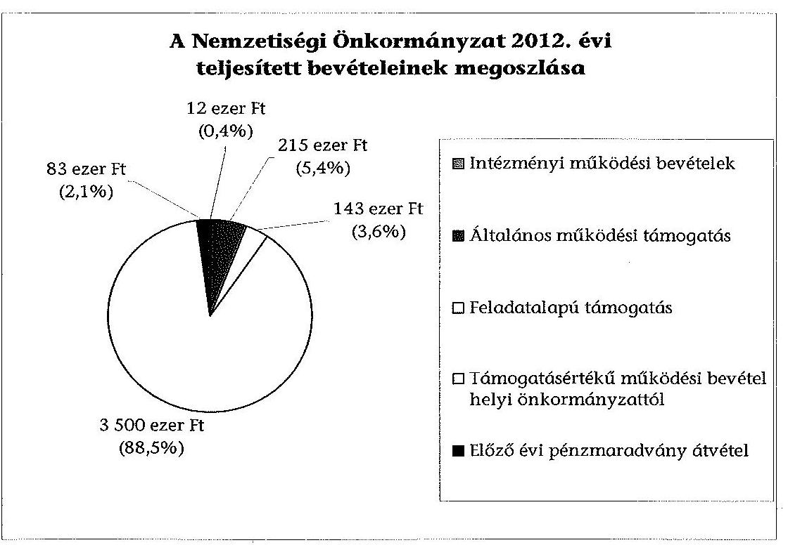
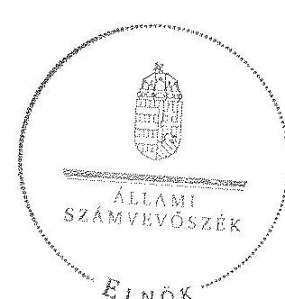

# ÁLLAMI   SZÁMVEVŐSZÉK 

## JELENTÉS

a helyi nemzetiségi önkormányzatok gazdálkodásának ellenőrzéséről
Budapest Főváros XIII. Kerületi Román Nemzetiségi Önkormányzat

---

# Állami Számvevőszék 

Iktatószám: V-0299-019/2014.
Témaszám: 1332
Vizsgálat-azonosító szám: V065252

## Az ellenőrzést felügyelte:

Horváth Balázs
felügyeleti vezető
Az ellenőrzést vezette és az ellenőrzés végrehajtásáért felelős:
Kisgergely István
ellenőrzésvezető
A számvevőszéki jelentést készítették és a jelentés összeállításában
közreműködtek:
Zachár Péterné
számvevő főtanácsos
Právitzné Pejkó Noémi
számvevő
Az ellenőrzést végezte:
Ganter Ildikó
számvevő

---

# TARTALOMJEGYZÉK 

BEVEZETÉS ..... 3
I. ÖSSZEGZŐ MEGÁLLAPÍTÁSOK, KÖVETKEZTETÉSEK, JAVASLATOK ..... 6
II. RÉSZLETES MEGÁLLAPÍTÁSOK ..... 11

1. A Nemzetiségi Önkormányzat és a XIII. Kerületi Önkormányzat együttműködésének szabályozása, a működési feltételek biztosítása ..... 11
2. A gazdálkodási feladatok ellátásának szabályszerűsége ..... 12
2.1. A költségvetésre és a zárszámadásra, valamint a kincstári adatszolgáltatás rendjére vonatkozó jogszabályi előírások betartása ..... 12
2.2. A Nemzetiségi Önkormányzat gazdálkodásának szabályozottsága ..... 13
2.3. Az operatív gazdálkodási jogkörök kialakítása, gyakorlása ..... 13
3. A Nemzetiségi Önkormányzattal összefüggő gazdálkodási feladatok belső ellenőrzése ..... 14
4. A feladatalapú támogatás felhasználásának, elszámolásának szabályszerűsége, a Nemzetiségi Önkormányzat feladatellátása ..... 15
MELLÉKLET
5. számú A Nemzetiségi Önkormányzat 2012. évi gazdálkodásának főbb adatai, mutatói
2. számú Tájékoztatás a polgármesternek küldött el nem fogadott észrevételekről
FÜGGELÉKEK
6. számú Rövidítések jegyzéke
7. számú Értelmező szótár
8. számú A gazdálkodás értékelésének módszere

---

# **Chemistry**

## **Chemical Reactions**

### **Balancing Chemical Equations**

1. **Write the unbalanced equation:**
   - Example: $$C_3H_8 + O_2 \rightarrow CO_2 + H_2O$$

2. **Balance the equation:**
   - Example: $$2C_3H_8 + 7O_2 \rightarrow 6CO_2 + 8H_2O$$

3. **Balance the equation:**
   - Example: $$2C_3H_8 + 7O_2 \rightarrow 6CO_2 + 8H_2O$$

### **Types of Reactions**

1. **Combination Reaction:**
   - Example: $$2H_2 + O_2 \rightarrow 2H_2O$$

2. **Decomposition Reaction:**
   - Example: $$2H_2O_2 \rightarrow 2H_2O + O_2$$

3. **Single Displacement Reaction:**
   - Example: $$Zn + 2HCl \rightarrow ZnCl_2 + H_2$$

4. **Double Displacement Reaction:**
   - Example: $$AgNO_3 + NaCl \rightarrow AgCl + NaNO_3$$

5. **Combustion Reaction:**
   - Example: $$CH_4 + 2O_2 \rightarrow CO_2 + 2H_2O$$

## **Stoichiometry**

### **Mole Concept**

- **Mole (mol):** The amount of substance containing as many particles (atoms, molecules, ions) as there are atoms in exactly 12 grams of carbon-12.
- **Avogadro's Number:** $$6.022 \times 10^{23}$$ particles per mole.

### **Molar Mass**

- **Molar Mass:** The mass of one mole of a substance.
- Example: The molar mass of water ($$H_2O$$) is 18.015 g/mol.

### **Calculations**

1. **Moles to Mass:**
   - Formula: $$n = \frac{m}{M}$$
   - Example: Calculate the number of moles of $$H_2O$$ in 18 grams of water.
     - $$n = \frac{18 \, \text{g}}{18.015 \, \text{g/mol}} \approx 0.999 \, \text{mol}$$

2. **Moles to Mass:**
   - Formula: $$m = n \times M$$
   - Example: Calculate the mass of 1 mole of water.
     - $$m = 1 \, \text{mol} \times 18.015 \, \text{g/mol} = 18.015 \, \text{g}$$

## **Gas Laws**

### **Ideal Gas Law**

- **Equation:** $$PV = nRT$$
- **Variables:**
  - $$P$$: Pressure (atm)
  - $$V$$: Volume (L)
  - $$n$$: Number of moles (mol)
  - $$R$$: Ideal gas constant (0.0821 L·atm/mol·K)
  - $$T$$: Temperature (K)

### **Boyle's Law**

- **Equation:** $$P_1V_1 = P_2V_2$$
- **Variables:**
  - $$P_1$$: Initial pressure (atm)
  - $$V_1$$: Initial volume (L)
  - $$P_2$$: Final pressure (atm)
  - $$V_2$$: Final volume (L)

### **Boyle's Law (Boyle's Law)**

- **Equation:** $$\frac{P_1V_1}{T_1} = \frac{P_2V_2}{T_2}$$  (This seems to be a combined gas law, not just Boyle's Law)

## **Thermochemistry**

### **Enthalpy (H)**

- **Definition:** The heat content of a system at constant pressure.
- **Equation:** $$\Delta H = q_p$$
- **Variables:**
  - $$\Delta H$$: Change in enthalpy (J or kJ)
  - $$q_p$$: Heat transferred at constant pressure (J or kJ)

### **Hess's Law**

- **Statement:** The enthalpy change for a reaction is the same whether it occurs in one step or multiple steps.
- **Equation:** $$\Delta H_{\text{reaction}} = \sum \Delta H_{\text{products}} - \sum \Delta H_{\text{reactants}}$$

### **Hess's Law (Hess's Law)**

- **Statement:** The enthalpy change for a reaction is the same whether it occurs in one step or multiple steps.
- **Equation:** $$\Delta H_{\text{reaction}} = \sum \Delta H_{\text{products}} - \sum \Delta H_{\text{reactants}}$$

## **Electrochemistry**

### **Oxidation and Reduction**

- **Oxidation:** Loss of electrons.
- **Reduction:** Gain of electrons.

### **Galvanic Cells**

- **Definition:** A cell that converts chemical energy into electrical energy.
- **Components:**
  - Anode: Oxidation occurs.
  - Cathode: Reduction occurs.
  - Salt Bridge: Connects the two half-cells.

### **Nernst Equation**

- **Equation:** $$E = E^\circ - \frac{RT}{nF} \ln Q$$
- **Variables:**
  - $$E$$: Cell potential (V)
  - $$E^\circ$$: Standard cell potential (V)
  - $$R$$: Ideal gas constant (8.314 J/mol·K)
  - $$T$$: Temperature (K)
  - $$n$$: Number of electrons transferred
  - $$F$$: Faraday constant (96485 C/mol)
  - $$Q$$: Reaction quotient

---

# JELENTÉS 

## a helyi nemzetiségi önkormányzatok gazdálkodásának ellenőrzéséről Budapest Főváros XIII. Kerületi Román Nemzetiségi Önkormányzat

## BEVEZETÉS

A Nemzetiségi Önkormányzat a 2010. évben alakult, elnöke a 2010. évi helyhatósági választások óta látja el feladatát. A Nemzetiségi Önkormányzat intézményt, gazdasági társaságot és más szervezetet nem alapított. A négytagú Képviselő-testület munkája segítésére bizottságot nem hozott létre. A Nemzetiségi Önkormányzat költségvetési beszámolója szerint a 2012. évben a módosított költségvetési bevételi és kiadási előirányzata 3941 ezer Ft, a teljesített költségvetési bevétel 3953 ezer Ft, a teljesített költségvetési kiadás 3748 ezer Ft volt. A 2012. évi gazdálkodási adatokat részletesen az 1. sz. melléklet mutatja be.

Az Alaptörvény XXIX. cikk (1) bekezdése szerint a Magyarországon élő nemzetiségek államalkotó tényezők. Minden, valamely nemzetiséghez tartozó magyar állampolgárnak joga van önazonossága szabad vállalásához és megőrzéséhez. A hazánkban élő nemzetiségek helyi (települési és területi), valamint országos önkormányzatokat hozhatnak létre. A helyi nemzetiségi önkormányzatok gazdálkodási feladatait jogszabályi előírás alapján a székhely szerinti önkormányzat polgármesteri hivatala látja el.

A nemzetiségek helyzete, támogatása mind hazai, mind EU-s szinten kiemelt figyelmet kap napjainkban. A helyi nemzetiségi önkormányzatok gazdálkodására és támogatási rendszerére vonatkozó jogszabályok a 2010-2012. években jelentős változásokon mentek át. A települési és területi nemzetiségi önkormányzatok gazdálkodásának, a részükre juttatott költségvetési támogatások felhasználásának ellenőrzését az ÁSZ a 2012. évben témacsoportos ellenőrzés keretében indította el. A 2013. évi ellenőrzések e témacsoportos ellenőrzések folytatását jelentik, amelyet az ÁSZ 2014. első félévi ellenőrzési terve 12. témasorszámon tartalmaz.

Az ellenőrzés célja annak értékelése volt, hogy a Nemzetiségi Önkormányzat gazdálkodási kereteinek kialakítása, gazdálkodása és feladatellátása megfelelt-e a jogszabályoknak.

Ennek keretében értékeltük, hogy:

- a Nemzetiségi Önkormányzat és a XIII. Kerületi Önkormányzat együttműködésének szabályozása, a működési feltételek biztosítása megfelelt-e a jogszabályi előírásoknak;

---

- a felek együttműködése megfelelt-e a közöttük létrejött megállapodásnak a gazdálkodási feladatok szabályszerű ellátása során, ennek keretében betartották-e a Nemzetiségi Önkormányzat gazdálkodásához kapcsolódóan a költségvetésre és zárszámadásra, a gazdálkodás szabályozására, az operatív gazdálkodási jogkörök gyakorlására vonatkozó jogszabályi előírásokat;
- a jegyző biztosította-e a Nemzetiségi Önkormányzat gazdálkodásának belső ellenőrzését;
- a Nemzetiségi Önkormányzat feladatalapú támogatásának felhasználása, a folyósított feladatalapú támogatással történő elszámolás az előírásoknak megfelelő volt-e;
- a Nemzetiségi Önkormányzat feladatellátása összhangban volt-e a vonatkozó jogszabályi előírásokkal.

Az ellenőrzés várható hasznosulását négy szinten tervezzük. A törvényalkotás számára összegzett tapasztalatok állnak rendelkezésre a nemzetiségi önkormányzatok testületi döntéseinek, gazdálkodásának és a feladatalapú támogatás felhasználásának szabályszerűségéről, amelynek alapján következtetést lehet levonni arra, hogy indokolt-e jogszabályi módosítás kezdeményezése. Az ellenőrzés az ellenőrzött számára visszajelzést ad a működésében fellépő hiányosságokról, javaslataival hozzájárul azok kiküszöböléséhez, amely csökkentheti a későbbi ellenőrzések gyakoriságát. Az ellenőrzés megállapításai és javaslatai tanulságul szolgálhatnak más nemzetiségi önkormányzatok, szervezetek számára a rendezett gazdálkodási keretek kialakításához. A társadalom számára jelzi, hogy közpénz nem maradhat ellenőrizetlenül, az ÁSZ értékteremtő rend kialakításához és megőrzéséhez hozzájáruló tevékenysége pozitív hatással lesz a szervezetről kialakított összkép formálásában. Az ÁSZ szervezetén belül lehetőség nyílik arra, hogy a megállapítások szintetizálásával az intézmény a hozzáadott értéket teremtő elemző tevékenységét és tanácsadó szerepét erősítse.

A Nemzetiségi Önkormányzat gazdálkodásának ellenőrzéséről szóló jelentés I. fejezetének összegző része az ellenőrzés céljára adott rövid, szintetizáló összefoglalót és következtetéseket tartalmazza a II. fejezet részletes megállapításain alapulóan. A jelentés, intézkedést igénylő megállapításait és javaslatait - az összegzőben foglaltak mellett - az ellenőrzés során feltárt, a jelentés II. fejezetében rögzített részletes megállapítások alapozzák meg, illetve támasztják alá.

Az ellenőrzés típusa: szabályszerűségi ellenőrzés
Az ellenőrzött időszak: a 2012. január 1. - 2012. december 31. közötti időszak. Az ellenőrzés kiterjedt a Nemzetiségi Önkormányzatnak juttatott 2012. évi támogatás 2013. évben való elszámolására is.

Ellenőrzött szervezet: Budapest Főváros XIII. Kerületi Román Nemzetiségi Önkormányzat és a gazdálkodási feladatait ellátó Budapest Főváros XIII. Kerületi Önkormányzat.

Az ellenőrzés végrehajtásának jogszabályi alapját az ÁSZ tv. 5. § (2)(3) és (6) bekezdéseiben foglaltak képezik.

---

Az ellenőrzés szakmai módszertana az ÁSZ hivatalos honlapján (www.asz.hu) közzétett szakmai szabályokon alapult, amely a Legfőbb Ellenőrző Intézmények Nemzetközi Szervezete (INTOSAI) által kiadott nemzetközi standardok (ISSAI) figyelembevételével készült.

A helyi nemzetiségi önkormányzatok gazdálkodásának ellenőrzése során értékeltük a Kerületi Önkormányzat és a Nemzetiségi Önkormányzat együttműködésének, a gazdálkodás szabályozottságának és a pénzügyi folyamatokban kulcsszerepet betöltő belső kontrollok (teljesítésigazolás és érvényesítés) működésének megfelelőségét. A kulcskontrollokat a működési és felhalmozási célú támogatásértékű kiadásoknál, az államháztartáson kívülre teljesített működési és felhalmozási célú pénzeszköz átadásoknál, a dologi kiadásokkal kapcsolatos kifizetéseknél - mintavételi eljárást alkalmazva - ellenőriztük. Ellenőriztük, hogy a jegyző biztosította-e a Nemzetiségi Önkormányzat gazdálkodásának belső ellenőrzését. Értékeltük a feladatalapú támogatások felhasználásának, elszámolásának szabályszerűségét, a Nemzetiségi Önkormányzat feladatellátása és a jogszabályi előírások összhangját.

Az ellenőrzés lefolytatásához a Nemzetiségi Önkormányzat és a gazdálkodási feladatait ellátó XIII. Kerületi Önkormányzat tanúsítványok és a kapcsolódó, dokumentumjegyzékben megjelölt dokumentumok elektronikus úton történő megküldésével, rendelkezésre bocsátásával szolgáltatott adatokat. Az adatszolgáltatás kontrollálása és szükség szerinti javítása a helyszíni ellenőrzés keretében történt. A minősítési szempontokat a 3. számú függelék tartalmazza.

Az ÁSZ tv. 29. § (1) bekezdése szerint a jelentéstervezetet megküldtük egyeztetésre a polgármester és a Nemzetiségi Önkormányzat elnöke részére. A Nemzetiségi Önkormányzat elnöke az ÁSZ tv. 29. § (2) bekezdésében foglalt észrevételezési jogával nem élt, a jelentéstervezetre észrevételt nem tett. A polgármester határidőben megküldött észrevétele és tájékoztatása alapján a jelentést nem módosítottuk. Az el nem fogadott észrevételek indoklását a jelentés 2. számú melléklete tartalmazza.

---

# I. ÖSSZEGZŐ MEGÁLLAPÍTÁSOK, KÖVETKEZTETÉSEK, JAVASLATOK 

A Nemzetiségi Önkormányzat és a XIII. Kerületi Önkormányzat együttműködésének szabályozása, a működési feltételek biztosítása részben felelt meg a jogszabályi előírásoknak. A Nemzetiségi Önkormányzat a 2012. év folyamán rendelkezett hatályban lévő együttműködési megállapodással. A 2012. január 1-jén hatályos, 2010. december 9-én megkötött együttműködési megállapodás
 }_{1}$-nek a gazdálkodási szabályok változása miatti felülvizsgálatát, a Nek. tv.-ben előírtak ellenére, 2012. január 31-éig nem végezték el. A Nek. tv.-ben előírt kiegészítést végrehajtották, az együttműködési megállapodás ${ }_{2}$-t 2012. február 24-én írták alá. A polgármester az Önkormányzati rendelet felhatalmazása alapján írta alá az együttműködési megállapodás ${ }_{2}$-t. Az együttműködési megállapodás ${ }_{2}$-t a Nemzetiségi Önkormányzat elnöke képviselő-testületi felhatalmazás nélkül írta alá. A Nek. tv. alapján a Kormányhivatal 2012. június 1-jét követően nem kezdeményezett írásban egyeztetést a felek között az együttműködési megállapodás megkötése, módosítása érdekében. Az együttműködési megállapodás ${ }_{1}$ nem tartalmazta a Nek. tv.-ben előírt működési feltételeket, azonban a gazdálkodással kapcsolatos feladatokat szabályozták.

A szabályozási hiányosságok ellenére a XIII. Kerületi Önkormányzat a Nek. tv.-ben előírt működési feltételeket biztosította a 2012. évben.

A Nemzetiségi Önkormányzat költségvetésére és zárszámadására vonatkozó jogszabályi előírások érvényesültek. A jegyző az előírt határidőre elkészítette, a Nemzetiségi Önkormányzat elnöke határidőn belül a Képviselő-testület elé terjesztette a 2012. évi költségvetési és a zárszámadási határozat tervezetét. A költségvetés és a zárszámadás összeállítása során a határozat elkészítésére, tartalmi előírásaira, elfogadására és továbbítására vonatkozó előírások érvényesültek. A költségvetési és zárszámadási határozatok egymással összehasonlítható szerkezetben készültek. A jegyző a 2012. évi költségvetéshez kapcsolódó, a Nemzetiségi Önkormányzatra vonatkozó kincstári adatszolgáltatási kötelezettségének öt alkalommal késve tett eleget.

A Nemzetiségi Önkormányzat gazdálkodásának szabályozottsága az ellenőrzött időszakban megfelelt a jogszabályi előírásoknak. A gazdálkodási feladatok végrehajtását ellátó Polgármesteri Hivatal a 2012. évben a Számv. tv.-ben és a Bkr. által előírt gazdálkodást érintő szabályzatokkal a Nemzetiségi Önkormányzat gazdálkodásának végrehajtási feladataira kiterjedő hatállyal rendelkezett. A Polgármesteri Hivatal SZMSZ-e az Ávr.-ben foglaltak ellenére nem tartalmazta az SZMSZ-ben nevesített munkakörökhöz tartozó - a Nemzetiségi Önkormányzat gazdálkodásának végrehajtásával kapcsolatos - feladat és hatásköröket, a hatáskörök gyakorlásának módját, a helyettesítés rendjét, az ezekhez kapcsolódó felelősségi szabályokat.

A 2012. évben Nemzetiségi Önkormányzatnál az operatív gazdálkodási jogkörök kialakítása megfelelt a jogszabályi előírásoknak, a kötelezettségvállalásra, az utalványozásra adott felhatalmazás, valamint a teljesítést igazoló kijelölése az Áht.-ben és az Ávr.-ben foglalt előírásoknak megfelelően történt. A pénzügyi ellenjegyzőket, az érvényesítőket a jegyző, mint a költségvetési szerv vezetője jelölte ki. A Nemzetiségi Önkormányzat elnöke a kötelezettségvállalásra és utalványozásra történő felhatalmazással, valamint a teljesítésigazolás gyakorlására történő kijelölésével biztosította az összeférhetetlenségi követelmények érvényesülését.

A Nemzetiségi Önkormányzatnál a 2012. évben a dologi kiadások teljesítése során a teljesítésigazolás és az érvényesítés kulcskontrollok működésének megfelelősége kiváló volt. A 100 ezer Ft feletti kötelezettségvállalásnál egy esetben a kötelezettségvállalás pénzügyi ellenjegyzője nem volt jogosult az ellenjegyzésre, mivel az Ávr.-ben előírt kijelölése nem történt meg. Az érvényesítő nem az Ávr.-ben előírt módon látta el feladatát, mert nem ellenőrizte a megelőző ügymenetben a gazdálkodásra vonatkozó szabályok betartását. Az utalványozó felé nem jelezte, hogy az Ávr. előírását megsértve a kötelezettségvállalás pénzügyi ellenjegyzésére az ellenjegyző kijelölésének hiányában került sor. A Nemzetiségi Önkormányzatnál a 2012. évi dologi kiadások között a három legnagyobb összegű kiadás egyedi értékelésénél két tétel esetében a teljesítést igazoló nem az Ávr.-ben foglaltak szerint látta el feladatát, mert a szerződésben meghatározott rendezvény időpontját megelőzően igazolta a teljesítést, továbbá az érvényesítő az Ávr. előírása ellenére nem látta el feladatát, mert nem ellenőrizte és nem jelezte, hogy a teljesítésigazolás, az érvényesítés, az utalványozás, valamint a kifizetés pénzügyi teljesítésének dátuma korábbi, mint a szerződésben meghatározott rendezvény időpontja. A hivatkozott események megtartásra kerültek.

A Nemzetiségi Önkormányzat a 2012. évben nem teljesített támogatásértékű kiadást, valamint államháztartáson kívülre pénzeszközátadást. A számvevőszéki ellenőrzés a rendelkezésre bocsátott dokumentumok alapján jogosulatlan kifizetést nem tárt fel.

A Nemzetiségi Önkormányzat gazdálkodásával összefüggő végrehajtási feladatok belső ellenőrzése 2012. évben megfelelő volt. A Polgármesteri Hivatal jegyzője biztosította a Nemzetiségi Önkormányzat gazdálkodásával összefüggő végrehajtási feladatok belső ellenőrzését. A Polgármesteri Hivatal belső ellenőrzési tervét megalapozó kockázatelemzés kiterjedt a Nemzetiségi Önkormányzat gazdálkodásával összefüggő végrehajtási feladatokra. A nemzetiségek gazdálkodásával kapcsolatos kockázatot magas besorolásúnak minősítették, és évenkénti vizsgálatot tartottak szükségesnek. A 2012. évi belső ellenőrzés az önkormányzati támogatás 2012. év első félévi felhasználását ellenőrizte és megállapította, hogy a Nemzetiségi Önkormányzat gazdálkodása szabályszerű volt. A belső ellenőrzés nem érintette a jelen ellenőrzés által feltárt hiányosságokat, illetve a feladatalapú támogatás elszámolására vonatkozó megállapítást.

A Nemzetiségi Önkormányzat részére a 2012. évben folyósított feladatalapú támogatás elszámolása nem felelt meg a jogszabályi előírásoknak. A Nemzetiségi Önkormányzat a 2011. évben nem részesült feladatalapú támogatásban. A 2012. évben 143 ezer Ft feladatalapú támogatást kapott, amit a támogatási célokkal összhangban a folyósítás évében teljes összegben felhasznált. A 2012. évi feladatalapú támogatás elszámolása a támogatási kormányrendelet ${ }_{2}$ előírása alapján az Áht.-ben foglaltak ellenére nem történt meg. A támogatás felhasználását, elszámolását az arra jogosult külső szervek nem ellenőrizték.

A Nemzetiségi Önkormányzat feladatellátásának tárgya összhangban volt a Nek. tv.-ben foglalt előírásokkal, kötelező és önként vállalt feladatokat látott el a hagyományőrzés területén kulturális programok, rendezvények szervezésével.

Az ÁSZ tv. 33. § (1) bekezdésében foglaltak értelmében az ellenőrzött szervezet vezetője köteles a jelentésben foglalt megállapításokhoz kapcsolódó intézkedési tervet összeállítani és azt a jelentés kézhezvételétől számított 30 napon belül az ÁSZ részére megküldeni. Amennyiben az intézkedési tervet határidőre nem küldi meg a szervezet, vagy az nem elfogadható, az ÁSZ elnöke az ÁSZ tv. 33. § (3) bekezdés a)-b) pontjaiban foglaltakat érvényesítheti.

A helyszíni ellenőrzés megállapításainak hasznosítása mellett javasoljuk:

# a jegyzőnek 

1. az együttműködés szabályozásával kapcsolatban

Az együttműködési megállapodást a Nek. tv. 80. § (2) bekezdésének előírása ellenére 2012. január 31-éig nem vizsgálták felül.

Javaslat
Biztosítsa a jövőben az együttműködési megállapodás Nek. tv. 80. § (2) bekezdésében előírt határidő szerinti évenkénti felülvizsgálatát.
2. a kincstári adatszolgáltatási kötelezettséggel kapcsolatban

A jegyző a 2012. évi költségvetéshez kapcsolódó, a Nemzetiségi Önkormányzatra vonatkozó kincstári adatszolgáltatási kötelezettségének több esetben - az Ávr. 33. §-ában, 169. § (2) bekezdésben és az Áhsz. 10. § (5a) bekezdésében előírt - határidőn túl tett eleget.

Javaslat
Gondoskodjon arról, hogy a Nemzetiségi Önkormányzatra vonatkozó kincstári adatszolgáltatási kötelezettségeinek az Ávr. 33. §-ában, 169. § (2) bekezdésében és az Áhsz. 32. § (4) bekezdésében előírt határidők betartásával tegyen eleget.
3. a gazdálkodás szabályozottságával kapcsolatban

A Polgármesteri Hivatal SZMSZ-e nem tartalmazta az Ávr. 13. § (1) bekezdés g) pontjában foglaltak szerinti, a munkakörökhöz tartozó - a Nemzetiségi Önkormányzat gazdálkodásának végrehajtásával kapcsolatos - feladat- és hatáskörökre, a hatáskörök gyakorlásának módjára, a helyettesítés rendjére, az ezekhez kapcsolódó felelősségi szabályokra vonatkozó előírásokat.

Javaslat
Készítse el a Polgármesteri Hivatal SZMSZ-e módosítását, hogy az tartalmazza - a Nemzetiségi Önkormányzat gazdálkodásának végrehajtási feladataira vonatkozóan az Ávr. 13. § (1) bekezdés g) pontjában foglaltakat.
4. a kulcskontrollok működésével kapcsolatban

Az érvényesítő nem az Ávr. 58. § (1) és (2) bekezdéseiben előírt módon látta el feladatát, mert nem ellenőrizte a megelőző ügymenetben a gazdálkodásra vonatkozó szabályok betartását. Az utalványozó felé nem jelezte, hogy egy esetben az Ávr. 55. § (2) bekezdés g) pontja előírását megsértve a kötelezettségvállalás pénzügyi ellenjegyzésére kijelölés hiányában került sor, két esetben az Ávr. 58. § (1) és (2) bekezdéseiben előírtak ellenére nem ellenőrizte és nem jelezte, hogy a teljesítésigazolás, valamint a kifizetés pénzügyi teljesítésének dátuma korábbi, mint a szerződésben meghatározott rendezvény időpontja.

Javaslat
Az operatív gazdálkodás működési hibáinak megelőzése, feltárása és kijavítása érdekében gondoskodjon arról, hogy az érvényesítő az Ávr. 58. § (1) és (2) bekezdéseiben előírt ellenőrzési és jelzési feladatait maradéktalanul lássa el.
5. a feladatalapú támogatás elszámolásával kapcsolatban

A 2012. évi feladatalapú támogatás elszámolása a támogatási kormányrendelet 2. 8. § (5) bekezdésében hivatkozott „a helyi önkormányzatok elszámolási és ellenőrzési rendjére vonatkozó jogszabályok rendelkezései alkalmazandóak" előírása alapján az Áht. 57. § (3) bekezdése ellenére nem történt meg.

Javaslat
Gondoskodjon az Áht. 27. § (2) bekezdésében meghatározott feladatkörében a Nemzetiségi Önkormányzat által igénybe vett 2012. évi feladatalapú támogatás felhasználásáról szóló elszámolásának elkészítéséről az Áht. 53. § (1) bekezdése szerinti beszámolási kötelezettség teljesítéséhez.

# a polgármesternek 

A Polgármesteri Hivatal SZMSZ-e nem tartalmazta az Ávr. 13. § (1) bekezdés g) pontjában foglaltak szerinti, az SZMSZ-ben nevesített munkakörökhöz tartozó - a Nemzetiségi Önkormányzat gazdálkodásának végrehajtásával kapcsolatos - feladat- és hatáskörökre, a hatáskörök gyakorlásának módjára, a helyettesítés rendjére, az ezekhez kapcsolódó felelősségi szabályokra vonatkozó előírásokat.

Javaslat
Terjessze a XIII. Kerületi Önkormányzat Képviselő-testülete elé jóváhagyásra a Polgármesteri Hivatal SZMSZ-ének jegyző által elkészített módosítását, hogy az tartalmazza az Ávr. 13. § (1) bekezdés g) pontjában foglaltakat.

# a Nemzetiségi Önkormányzat elnökének 

1. A 2012. február 24-én a polgármester és a Nemzetiségi Önkormányzat elnöke által aláírt együttműködési megállapodás ${ }_{2}$-t a Nemzetiségi önkormányzat képviselőtestülete a Nek. tv. 78. § (3) bekezdése ellenére határozattal nem fogadta el. Az együttműködési megállapodás ${ }_{2}$-t a Nemzetiségi Önkormányzat elnöke képviselő-testületi felhatalmazás nélkül írta alá.

Javaslat
Terjessze a Képviselő-testület elé jóváhagyásra a 2012. február 24-én a XIII. Kerületi Önkormányzattal kötött együttműködési megállapodás ${ }_{2}$-t.
2. A 2012. évi feladatalapú támogatás elszámolása a támogatási kormányrendelet ${ }_{2}$ 8. § (5) bekezdésében hivatkozott „a helyi önkormányzatok elszámolási és ellenőrzési rendjére vonatkozó jogszabályok rendelkezései alkalmazandóak" előírása alapján az Áht. 57. § (3) bekezdése ellenére nem történt meg.

Javaslat
Terjessze a Képviselő-testület elé jóváhagyásra az Áht. 53. § (1) bekezdése szerinti beszámolási kötelezettség teljesítéséhez a Nemzetiségi Önkormányzat által igénybe vett 2012. évi feladatalapú támogatás rendeltetésszerű felhasználásáról szóló elszámolást.

# II. RÉSZLETES MEGÁLLAPÍTÁSOK 

## 1. A Nemzetiségi Önkormányzat és a XIII. Kerületi Önkormányzat együttműködésének szabályozása, a működési feltételek biztosítása

A Nemzetiségi Önkormányzat és a XIII. Kerületi Önkormányzat együttműködésének szabályozása részben felelt meg a jogszabályi előírásoknak.

A Nemzetiségi Önkormányzat rendelkezett a 2012. év folyamán együttműködési megállapodással. A 2012. január 1-jén hatályos, 2010. december 9-én megkötött együttműködési megállapodás ${ }_{1}$-nek a gazdálkodási szabályok változása miatti felülvizsgálatát, a Nek. tv. 80. § (2) bekezdésében előírtak ellenére 2012. január 31-éig nem végezték el. A Nek. tv. 159. § (3) bekezdésében előírt kiegészítést végrehajtották, az együttműködési megállapodás ${ }_{2}$-t 2012. február 24-én írta alá a Nemzetiségi Önkormányzat elnöke és a polgármester. A polgármester az 1/2011.(I. 14.) számú Önkormányzati rendelet felhatalmazása alapján írta alá az együttműködési megállapodás ${ }_{2}$-t. Az együttműködési megállapodás ${ }_{2}$-t a nemzetiségi önkormányzat elnöke képviselő-testületi felhatalmazás nélkül írta alá. A Kormányhivatal 2012. június 1-jét követően nem kezdeményezett a Nek. tv. 83. § (3) bekezdése szerinti írásban történő egyeztetést a felek között az együttműködési megállapodás megkötése, módosítása érdekében.

Az együttműködési megállapodás ${ }_{1}$ nem tartalmazta a működés feltételeit az alábbi területekre vonatkozóan:

- a Nek. tv. 80. § (1) bekezdés c) pontja alapján a testületi ülések előkészítését (meghívók, előterjesztések, hivatalos levelezés előkészítése, postázása, a testületi ülések jegyzőkönyveinek elkészítése, postázása);
- a Nek. tv. 80.
 § (1) bekezdése d) pontja alapján a testületi döntések és a tisztségviselők döntéseinek előkészítését, a testületi és tisztségviselői döntéshozatalhoz kapcsolódó nyilvántartási, sokszorosítási, postázási feladatok ellátását;
- a Nek. tv. 80. § (1) bekezdés g) pontja alapján a fenti feladatellátáshoz kapcsolódó költségek - a testületi tagok és tisztségviselők telefonhasználata költségei kivételével - viselését;
- a Nek. tv. 80. § (3) bekezdés a) pontja által előírt önálló fizetési számla nyitásával, törzskönyvi nyilvántartásba vételével és adószám igénylésével kapcsolatos feladatokat, azok felelőseinek konkrét kijelölését és végrehajtásának határidejét;
- a Nek. tv. 80. § (4) bekezdése ellenére azt, hogy a jegyző vagy annak - a jegyzővel azonos képesítési előírásoknak megfelelő - megbízottja a XIII. Kerületi Önkormányzat megbízásából és képviseletében részt vesz a Nemzetiségi Önkormányzat testületi ülésein és jelzi, amennyiben törvénysértést észlel.

Az együttműködési megállapodás ${ }_{1}$ az Áht.-ben foglaltak szerint tartalmazta a tervezési, gazdálkodási, teljesítésigazolási, érvényesítési, ellenjegyzési, utalványozási, kötelezettségvállalással összefüggő összeférhetetlenségi és nyilvántartási, a gazdálkodás eljárási és dokumentációs részletszabályait, az ellenőrzési, finanszírozási, adatszolgáltatási és beszámolási feladatokat. A tárgyi feltételeket a helységhasználati szerződés alapján biztosították ${ }^{1}$.

A szabályozási hiányosságok ellenére a XIII. Kerületi Önkormányzat a Nemzetiségi Önkormányzat részére az előírt működési feltételeket biztosította a 2012. évben. A törzskönyvi nyilvántartási adatok módosításával, az önálló fizetési számla nyitásával és az adószám igénylésével kapcsolatos feladatokat elvégezték. A Nek. tv. szerinti működési feltételek a 2012. évben annak ellenére biztosítottak voltak, hogy a Nemzetiségi Önkormányzat az együttműködési megállapodás ${ }_{2}$-t határozattal nem fogadta el.

# 2. A GAZDÁLKODÁSI FELADATOK ELLÁTÁSÁNAK SZABÁLYSZERŰSÉGE 

### 2.1. A költségvetésre és a zárszámadásra, valamint a kincstári adatszolgáltatás rendjére vonatkozó jogszabályi előírások betartása

A Nemzetiségi Önkormányzat 2012. évi költségvetésének és zárszámadásának tartalma, jóváhagyása megfelelt a jogszabályi előírásoknak. A Nemzetiségi Önkormányzat elnöke a 2012. évi költségvetés tervezetét az Áht. előírása szerinti határidőben ${ }^{2}$ benyújtotta a Képviselő-testületnek. A jóváhagyott költségvetés ${ }^{3}$ az Áht. és az Ávr. szerinti tartalomnak megfelelő volt, a szöveges indoklással együtt bemutatták az előírt mérlegeket és kimutatásokat.

A jegyző által elkészített 2012. évi zárszámadási határozattervezetet a Nemzetiségi Önkormányzat elnöke az Áht.-ben foglaltak alapján, határidőn belül beterjesztette a Képviselő-testületnek. A jogszabályban előírt mérlegeket, kimutatásokat a zárszámadás tervezetének ${ }^{4}$ előterjesztésekor tájékoztatásul bemutatták, és biztosították az összehasonlíthatóságát az elfogadott költségvetéssel.

[^0]
[^0]:    ${ }^{1}$ Az irodahelyiség használatára vonatkozóan a XIII. Kerületi Önkormányzat és a Román Kisebbségi Önkormányzat 2010. november 30-án, határozott időre 2014. december 31-ig használati szerződést kötött. A személyi feltételek biztosítása érdekében, 2011. szeptember 5-étől a Polgármesteri Hivatal egy fő dolgozójának munkaköri kötelezettségébe tartozik a nemzetiségi önkormányzatok gazdálkodásával kapcsolatos feladatok ellátása.
    ${ }^{2}$ 2012. február 9-i előterjesztés a Nemzetiségi Önkormányzat 2012. évi költségvetéséről
    ${ }^{3}$ A Képviselő-testület 14/2012. (II. 9.) számú határozata a Nemzetiségi Önkormányzat 2012. évi költségvetéséről
    ${ }^{4}$ A Képviselő-testület 15/2013. (IV. 26.) számú határozata a Nemzetiségi Önkormányzat 2012. évi zárszámadásáról.

---

A jegyző a 2012. évi költségvetéshez kapcsolódó, a Nemzetiségi Önkormányzatra vonatkozó kincstári adatszolgáltatási kötelezettségének az Ávr. 33. §-ában meghatározott határidőn túl tett eleget. A negyedéves és éves időközi költségvetési jelentéseket az Ávr. 169. § (2) bekezdésében előírt határidőben nem teljesítette, a 2012. év éves elemi költségvetési beszámolójának benyújtását nem az Áhsz., 10. § (5a) pontjában előírt határidőben teljesítette.

# 2.2. A Nemzetiségi Önkormányzat gazdálkodásának szabályozottsága 

A Nemzetiségi Önkormányzat gazdálkodásának szabályozottsága az ellenőrzött időszakban megfelelt a jogszabályi előírásoknak. A gazdálkodási feladatok végrehajtását ellátó Polgármesteri Hivatal a 2012. évben a Számv. tv.-ben és a Bkr. által előírt gazdálkodást érintő szabályzatokkal a Nemzetiségi Önkormányzat gazdálkodásának végrehajtási feladataira kiterjedő hatállyal rendelkezett.

A Nemzetiségi Önkormányzat gazdálkodásának végrehajtási feladataival kapcsolatos, az SZMSZ-ben nevesített munkakörökhöz tartozó feladat- és hatásköröket, azok gyakorlásának módját, a helyettesítés rendjét, az ezekhez kapcsolódó felelőségi szabályokat az Ávr. 13. § (1) bekezdés g) pontjában foglalt előírás ellenére a Polgármesteri Hivatal SZMSZ-e nem tartalmazta.

A Polgármesteri Hivatalban a vizsgált időszakban két operatív gazdálkodási szabályzat ${ }^{5}$ volt érvényben, amelyek hatályát kiterjesztették a Nemzetiségi Önkormányzat gazdálkodási feladataira.

A szabályzatban a 100 ezer Ft-ot el nem érő, előzetes írásbeli kötelezettségvállalást nem igényelő kifizetések rendjét meghatározták. A 100 ezer Ft-ot meghaladó kötelezettségvállalásról az Ávr.-nek megfelelő tartalmú nyilvántartást vezettek.

### 2.3. Az operatív gazdálkodási jogkörök kialakítása, gyakorlása

A Nemzetiségi Önkormányzat gazdálkodása tekintetében az operatív gazdálkodási jogkörök kialakítása megfelelt a jogszabályi előírásoknak.

Az együttműködési megállapodásban valamint a két operatív gazdálkodási szabályzatban rendelkeztek a gazdálkodási jogkörök részletes kialakításáról. A kötelezettségvállaló, utalványozó, teljesítésigazoló személy a Nemzetiségi Önkormányzat elnöke, illetve az általa kijelölt nemzetiségi önkormányzati képviselő volt, így biztosítva az összeférhetetlenség követelményének való megfelelést. Az ellenjegyzésre, érvényesítésre a jegyző által az Ávr. 55. § (2) bekezdés g) pontja és az 58. § (4) bekezdései alapján írásban kijelölt, a Polgármesteri Hivatal állományába tartozó köztisztviselő volt jogosult. A Polgármesteri Hivatal pénzügyi ellenjegyzői és érvényesítői feladatokra kijelölt köztisztviselői a feladatuk ellátásához előírt képesítési követelményeknek megfeleltek.

A nemzetiségi önkormányzatok gazdálkodásával kapcsolatos feladatokat ellátó ügyintéző az Ávr.-nek megfelelően gondoskodott a 100 ezer Ft-ot el nem érő tételek esetében a kifizetések teljesítésével egyidejűleg azok pénzügyi rendszerben való rögzítéséről és a szabad előirányzat kiadási összegnek megfelelő lefoglalásáról.

A Nemzetiségi Önkormányzatnál a 2012. évben a dologi kiadások teljesítése során a teljesítésigazolás és az érvényesítés kulcskontrollok működése annak ellenére kiváló volt, hogy:

- a 100 ezer Ft feletti kötelezettségvállalásnál egy esetben a kötelezettségvállalás pénzügyi ellenjegyzőjének kijelölése az Ávr. 55. § (2) bekezdés g) pontjával ellentétben nem történt meg. Az érvényesítő nem az Ávr. 58. § (1) és (2) bekezdéseiben előírt módon látta el feladatát, nem ellenőrizte a megelőző ügymenetben a gazdálkodásra vonatkozó szabályok betartását. Az utalványozó felé nem jelezte, hogy az Ávr. 10. § (7) bekezdés b) pont előírását megsértve a kötelezettségvállalásra pénzügyi ellenjegyző kijelölése hiányában került sor.

A dologi kiadások között a három legnagyobb összegű kiadás teljesítés egyedi értékelése alapján, az egyéb jogszabályba és belső szabályzatba foglalt előírások betartása nem volt megfelelő. Két tételnél a teljesítést igazoló nem az Ávr. 57 § (1) bekezdésében foglaltak szerint látta el feladatát, mert a szerződésben meghatározott rendezvény időpontját megelőzően igazolta a teljesítést, továbbá az érvényesítő nem az Ávr. 58. § (1)-(2) bekezdéseiben előírt módon látta el feladatát, nem ellenőrizte és nem jelezte, hogy a teljesítésigazolás, az érvényesítés, az utalványozás, valamint a kifizetés pénzügyi teljesítésének dátuma korábbi, mint a szerződésben meghatározott rendezvény időpontja. A hivatkozott rendezvények szerződés szerint megtartásra kerültek.

A Nemzetiségi Önkormányzat a 2012. évben nem teljesített támogatásértékű kiadást, valamint államháztartáson kívülre pénzeszközátadást.

A Nemzetiségi Önkormányzatnál a kulcskontrollok 2012. évi működésében feltárt hiányosságokkal összefüggésben az ellenőrzés jogosulatlan kifizetést nem állapított meg.

# 3. A Nemzetiségi Önkormányzattal összefüggő gazdálkodási feladatok belső ellenőrzése 

A Nemzetiségi Önkormányzat gazdálkodásával összefüggő végrehajtási feladatok belső ellenőrzése a 2012. évben megfelelő volt. A jegyző, a jogszabályi előírásoknak megfelelően biztosította a Nemzetiségi Önkormányzat gazdálkodásával összefüggő végrehajtási feladatok belső ellenőrzését. A belső ellenőrzési tervet megalapozó kockázatelemzés kiterjedt Nemzetiségi Önkormányzat gazdálkodásával összefüggő végrehajtási feladatokra. A nemzetiségek gazdálkodásával kapcsolatos kockázatot magas besorolásúnak minősítették, és évenkénti vizsgálatot tartottak szükségesnek.

---

A belső ellenőrök rendelkeztek munkaköri leírással, valamint az Áht. 70. §-ban meghatározott engedéllyel, szerepeltek a költségvetési szervnél belső ellenőrzést végzők nyilvántartásában, illetve elkészítették a 2012. évre vonatkozó belső ellenőrzési kézikönyvet.

Az éves belső ellenőrzési tervben foglaltaknak megfelelően az Ellenőrzési Csoport a 2012. évben ellenőrizte ${ }^{6}$ a Nemzetiségi Önkormányzat 2012. év első félévi gazdálkodását különös tekintettel az önkormányzati támogatásból megvalósult gazdasági eseményekre.

A belső ellenőrzés megállapította, hogy a helyi nemzetiségi önkormányzatok költségvetésének végrehajtása során a gazdálkodás és az elszámolás szabályszerűen történt a vizsgált időszakban, betartották a teljesítésigazolás, az utalványozás, az ellenjegyzés, valamint az érvényesítés szabályait.

A belső ellenőrzési jelentésben megfogalmazottakat a Nemzetiségi Önkormányzat elnöke megismerte, azokra észrevételt nem tett.

Az ellenőrzési jelentésben az Ellenőrzési Csoport a Nemzetiségi Önkormányzatnak két általános javaslatot tett, amelyek nem kapcsolódtak konkrét megállapításokhoz, így intézkedési tervet nem kellett készíteni.

Az ellenőrzéshez szolgáltatott adatok alapján a 2012. évben a Kormányhivatal a Nemzetiségi Önkormányzatot illetően nem élt törvényességi felügyeleti eszközökkel.

# 4. A feladatalapú támogatás felhasználásának, elszámolásának szabályszerűsége, a Nemzetiségi Önkormányzat feladatellátása 

A Nemzetiségi Önkormányzat részére a 2012. évben folyósított feladatalapú támogatás elszámolása nem felelt meg a jogszabályi előírásoknak.

A Nemzetiségi Önkormányzat a 2011. évben nem részesült feladatalapú támogatásban. A Nemzetiségi Önkormányzat a 2012. évi 143 ezer Ft feladatalapú támogatás összegével a Képviselő-testület 27/2012. (09. 05.) számú határozatával módosította a 2012. évi költségvetését. A 2012. évi feladatalapú támogatást hagyományőrzésre használták fel, maradvány nem keletkezett.

[^0]
[^0]:    ${ }^{6}$ A belső ellenőrzés által ellenőrzött időszak a 2012. év I. féléve volt, az ellenőrzés célja: „A nemzetiségi önkormányzatok részére biztosított pénzeszközök felhasználásának ellenőrzése".

---

A 2012. évi feladatalapú támogatás összes bevételhez viszonyított részarányát a következő ábra szemlélteti:

A 2012. évi feladatalapú támogatás elszámolása a támogatási kormányrendelet ${ }_{2}$ 8. § (5) bekezdésében hivatkozott „a helyi önkormányzatok elszámolási és ellenőrzési rendjére vonatkozó jogszabályok rendelkezései alkalmazandóak" előírása alapján az Áht. 57. § (3) bekezdése ellenére nem történt meg.

A feladatalapú támogatás felhasználását, elszámolását az ellenőrzésre jogosult szervek nem ellenőrizték.

A Nemzetiségi Önkormányzat kötelező és önként vállalt feladatokat látott el a hagyományőrzés területén kulturális programok, rendezvények szervezésével. A feladatellátásának tárgya összhangban volt a Nek. tv. 115., valamint 116. §-aiban foglalt előírásokkal.

A Nemzetiségi Önkormányzat a Nek. tv. 116. § (2) bekezdésében tiltott hatósági feladatokat nem végzett.

Budapest, 2014. 08. hó 18. nap

Melléklet: $\quad 2 \mathrm{db}$
Függelék: $\quad 3 \mathrm{db}$

Domokos László
elnök $\rightarrow$

---

# A Nemzetiségi Önkormányzat 2012. évi gazdálkodásának főbb adatai, mutatói 

A) Bevételek

| Megnevezés | Eredeti előirányzat |  | Módosított   előirányzat | Teljesítés |
| :--: | :--: | :--: | :--: | :--: |
|  | ezer Ft |  |  | $\begin{gathered} \text { megoszlás } \\ (\%) \end{gathered}$ |
| Intézményi működési bevételek | 0 | 0 | 12 | 0,30 |
| Általános működési támogatás | 215 | 215 | 215 | 5,44 |
| Feladatalapú támogatás | 0 | 143 | 143 | 3,62 |
| Támogatásért.műk. bev. helyi önkormányzattól | 3500 | 3500 | 3500 | 88,54 |
| Előző évi pénzmaradvány átvétel | 0 |
 | 83 | 83 | 2,10 |
| Költségvetési bevételek | 3715 | 3941 | 3953 | 100 |
| Tárgyévi bevételek | 3715 | 3941 | 3953 | 100 |

B) Kiadások

| Megnevezés | Eredeti előirányzat | Módosított   előirányzat | Teljesítés |
| :--: | :--: | :--: | :--: |
|  |  |  | megoszlás   (\%) |
| Személyi juttatások | 1683 | 1683 | 1665 | 44,4 |
| Munkaadókat terhelő járulékok és szociális hozzájárulási adó összesen | 454 | 462 | 405 | 10,8 |
| Dologi kiadások | 1578 | 1796 | 1678 | 44,8 |
| Költségvetési kiadások | 3715 | 3941 | 3748 | 100 |
| Tárgyévi kiadások | 3715 | 3941 | 3748 | 100 |

---

# **Chemistry**

## **Chemical Reactions**

### **Balancing Chemical Equations**

1. **Write the unbalanced equation:**
   - Example: $$C_3H_8 + O_2 \rightarrow CO_2 + H_2O$$

2. **Balance the equation:**
   - Example: $$2C_3H_8 + 7O_2 \rightarrow 6CO_2 + 8H_2O$$

3. **Balance the equation:**
   - Example: $$2C_3H_8 + 7O_2 \rightarrow 6CO_2 + 8H_2O$$

### **Types of Reactions**

1. **Combination Reaction:**
   - Example: $$2H_2 + O_2 \rightarrow 2H_2O$$

2. **Decomposition Reaction:**
   - Example: $$2H_2O_2 \rightarrow 2H_2O + O_2$$

3. **Single Displacement Reaction:**
   - Example: $$Zn + 2HCl \rightarrow ZnCl_2 + H_2$$

4. **Double Displacement Reaction:**
   - Example: $$AgNO_3 + NaCl \rightarrow AgCl + NaNO_3$$

5. **Combustion Reaction:**
   - Example: $$CH_4 + 2O_2 \rightarrow CO_2 + 2H_2O$$

## **Stoichiometry**

### **Mole Concept**

- **Mole (mol):** The amount of substance containing as many particles (atoms, molecules, ions) as there are atoms in exactly 12 grams of carbon-12.
- **Avogadro's Number:** $$6.022 \times 10^{23}$$ particles per mole.

### **Molar Mass**

- **Molar Mass:** The mass of one mole of a substance.
- Example: The molar mass of water ($$H_2O$$) is 18.015 g/mol.

### **Calculations**

1. **Moles to Mass:**
   - Formula: $$n = \frac{m}{M}$$
   - Example: Calculate the number of moles of $$H_2O$$ in 18 grams of water.
     - $$n = \frac{18 \, \text{g}}{18.015 \, \text{g/mol}} \approx 0.999 \, \text{mol}$$

2. **Moles to Mass:**
   - Formula: $$m = n \times M$$
   - Example: Calculate the mass of 1 mole of water.
     - $$m = 1 \, \text{mol} \times 18.015 \, \text{g/mol} = 18.015 \, \text{g}$$

## **Gas Laws**

### **Ideal Gas Law**

- **Equation:** $$PV = nRT$$
- **Variables:**
  - $$P$$: Pressure (atm)
  - $$V$$: Volume (L)
  - $$n$$: Number of moles (mol)
  - $$R$$: Ideal gas constant (0.0821 L·atm/mol·K)
  - $$T$$: Temperature (K)

### **Boyle's Law**

- **Equation:** $$P_1V_1 = P_2V_2$$
- **Variables:**
  - $$P_1$$: Pressure (atm)
  - $$V_1$$: Volume (L)
  - $$P_2$$: Pressure (atm)
  - $$V_2$$: Volume (L)

### **Boyle's Law (Boyle's Law)**

- **Equation:** $$\frac{P_1V_1}{P_2V_2} = \frac{P_1}{V_1}$$

## **Thermochemistry**

### **Enthalpy (H)**

- **Definition:** The heat content of a system at constant pressure.
- **Equation:** $$\Delta H = q_p$$
- **Variables:**
  - $$q_p$$: Heat transferred at constant pressure.

### **Hess's Law**

- **Statement:** The enthalpy change for a reaction is the same whether it occurs in one step or multiple steps.
- **Equation:** $$\Delta H_{\text{rxn}} = \Delta H - \Delta H_0$$
- **Variables:**
  - $$\Delta H$$: Enthalpy change
  - $$\Delta H_0$$: Standard enthalpy change

### **Hess's Law (Hess's Law)**

- **Statement:** The enthalpy change for a reaction is the same whether it occurs in one step or multiple steps.
- **Equation:** $$\Delta H_{\text{rxn}} = \Delta H - \Delta H_0$$
- **Variables:**
  - $$\Delta H$$: Enthalpy change
  - $$\Delta H_0$$: Standard enthalpy change

## **Electrochemistry**

### **Oxidation and Reduction**

- **Oxidation:** Loss of electrons.
- **Reduction:** Gain of electrons.

### **Galvanic Cells**

- **Definition:** A cell that converts chemical energy into electrical energy.
- **Components:**
  - Anode: Oxidation occurs.
  - Cathode: Reduction occurs.
  - Salt Bridge: Connects the two half-cells.

### **Nernst Equation**

- **Equation:** $$E = E^\circ - \frac{RT}{nF} \ln Q$$
- **Variables:**
  - $$E$$: Cell potential (V)
  - $$E^\circ$$: Standard cell potential (V)
  - $$R$$: Ideal gas constant (8.314 J/mol·K)
  - $$T$$: Temperature (K)
  - $$n$$: Number of electrons transferred
  - $$F$$: Faraday constant (96485 C/mol)
  - $$Q$$: Reaction quotient

---

# TÁJÉKOZTATÁS   A POLGÁRMESTERNEK KÜLDÖTT EL NEM FOGADOTT ÉSZREVÉTELEKRŐL 

| Együttműködési megállapodás felülvizsgálata |  |
| :--: | :--: |
| Észrevétel | A Polgármesteri Hivatalban az együttműködési megállapodás felülvizsgálata 2012. január hónapban zajlott. A felülvizsgálat többszöri személyes egyeztetéssel, előzetes munkaanyagok elkészítésével és véleményezésével járt. A dokumentumokból megismerhető dátumok alapján a feladat határidőben történő elvégzésére lehet következtetni: a Román Nemzetiségi Önkormányzat elnöke a megállapodást 2014. február 24-én a Budapest Főváros XIII. kerület területén működő további Nemzetiségi Önkormányzat elnökével együtt aláírta, és a megállapodás aláírását megelőző pénzügyi ellenjegyzésre is február 9-én került sor. A körülmények mérlegelése során nem hagyható figyelmen kívül az a tény, hogy az Önkormányzat, a Polgármesteri Hivatal és a nemzetiségi önkormányzatok feladatait, együttműködését, működési körülményeit befolyásoló államháztartási szabályok 2012 januárjában gyökeresen megváltoztak. Az új működési rend kialakítására rendelkezésre álló rendkívül rövid időszak alatt is betartottuk a jogszabályban előírt határidőket.   A Kerületi Önkormányzat vezetése a megállapodás aláírására egyszerre, a kerületben működő valamennyi nemzetiségi önkormányzat elnökével egyeztetett időpontban, február 24-én kerített sort az esemény súlyának megfelelő ünnepélyes keretek között. |
| Válasz | Az együttműködési megállapodás felülvizsgálatával kapcsolatos észrevételét, illetve az aláírással összefüggő tájékoztatását köszönöm, azonban a jelentéstervezetben szereplő megállapítást fenntartjuk. Az ÁSZ kizárólag dokumentumok alapján tesz megállapításokat. Az ellenőrzés részére hitelt érdemlően - dokumentum hiányában - nem tudták igazolni a felülvizsgálat január 31-ig történő elvégzését.   Ehhez kapcsolódóan értelemszerűen eltekintettünk a 2012. évszám elírásától: „...a Román Nemzetiségi Önkormányzat elnöke a megállapodást 2014. február 24-én a Budapest Főváros XIII. kerület területén működő további Nemzetiségi Önkormányzat elnökével együtt aláírta,... „, mert az ellenőrzéshez szolgáltatott dokumentumok alapján az együttműködési megállapodás aláírása 2012. február 24-én történt. |
| Kincstári adatszolgáltatási kötelezettség |  |
| Észrevétel | A kincstári adatszolgáltatási kötelezettségeknek a Kincstár által üzemeltetett internetes felületen teszünk eleget. A határidők betartására mindig fokozott figyelmet fordítunk, ennek ellenére többször előfordul, hogy a rendszer meghibásodása, programhibák javítása, korrekciója miatt az adatrögzítés, lezárás késedelmet szenved. Ezen eseményekről |

---

|  | írásos dokumentumokkal nem rendelkezünk, többnyire csak telefonos   tájékoztatást kapunk. |
| :-- | :-- |
| Válasz | A kincstári adatszolgáltatással kapcsolatos észrevételét, illetve tájékoz-   tatását köszönöm, de a jelentéstervezetben szereplő megállapítást nem   módosítjuk. Az ellenőrzés részére rendelkezésre bocsátott dokumentu-   mok alapján az adatszolgáltatás határidőn túl történő teljesítése volt   megállapítható. A programhibákról, rendszer meghibásodásokról do-   kumentumokat nem mutattak be, így azokat nem vehettük figyelem-   be. |

# Polgármesteri Hivatal SZMSZ-ének hiányossága 

Észrevétel Az államháztartásról szóló törvény végrehajtásáról szóló 359/2011. (XII.31.) Korm. rendelet 13. § (1) bekezdés g) pontja alapján a költségvetési szerv szervezeti és működési szabályzatának tartalmaznia kell a „szervezeti és működési szabályzatban nevesített munkakörökhöz tartozó feladat- és hatásköröket, a hatáskörök gyakorlásának módját, a helyettesítés rendjét, az ezekhez kapcsolódó felelősségi szabályokat". A jogszabály alapján kizárólag a hivatali SZMSZ-ben nevesített munkakörök vonatkozásában kell tartalmaznia a jelentés által hiányolt szabályokat az SZMSZ-nek. A vizsgált időszakban hatályos SZMSZ nem nevesítette a nemzetiségi önkormányzatok gazdálkodásával kapcsolatos munkakört, ezért a jogszabály szerint nem kell tartalmaznia az SZMSZ-nek az ezzel kapcsolatos feladat- és hatásköröket, a hatáskörök gyakorlásának módját, a helyettesítés rendjét, az ezekhez kapcsolódó felelősségi szabályokat.
A hivatkozott Kormányrendelet 13. § (5) bekezdése alapján „a költségvetési szerv szervezeti egységei által ellátott feladatok munkafolyamatainak leírását, a szervezeti egység vezetőinek és alkalmazottainak feladat- és hatáskörét, a helyettesítés rendjét, továbbá a szervezeti egység költségvetési szerven belüli belső és azon kívüli külső kapcsolattartásának módját, szabályait - ha azokról a szervezeti és működési szabályzat vagy a költségvetési szerv más szabályzata nem rendelkezik - a szervezeti egységek ügyrendje tartalmazza". E jogszabályhely is azt támasztja alá, hogy nem kell a költségvetési szerv által ellátott valamennyi feladathoz kapcsolódó munkakört a szervezeti és működési szabályzatban rögzíteni, ezért a vizsgált időszakban hatályos hivatali SZMSZ nem sértette a Kormányrendelet 13. §-ában foglaltakat. Tájékoztatom, hogy Budapest Főváros XIII. Kerületi Önkormányzat Képviselő-testülete 2012. december 13. napján elfogadta a Polgármesteri Hivatal új Szervezeti és Működési Rendjét, amely 2013. január 1. napján lépett hatályba.

Válasz A Polgármesteri Hivatal SZMSZ-ével kapcsolatos észrevételét, miszerint „a vizsgált időszakban hatályos SZMSZ nem nevesítette a nemzetiségi önkormányzatok gazdálkodásával kapcsolatos munkakört, ezért a jogszabály szerint nem kell tartalmaznia az SZMSZ-nek az ezzel kapcsolatos feladat- és hatásköröket, a hatáskörök gyakorlásának módját, a helyettesítés rendjét, az ezekhez kapcsolódó felelősségi szabályokat" köszönöm, a megállapítást és

---

| a kapcsolódó javaslatot nem módosítjuk. Az államháztartásról szóló törvény végrehajtásáról szóló 368/2011. (XII. 31.) Korm. rendelet 13. § (5) bekezdése szerint amennyiben az SZMSZ nem tartalmazza ezeket a szabályokat, akkor azok más belső szabályzatban, illetve a szervezeti egységek ügyrendjében rögzítendők. Az ellenőrzés részére a nemzetiségi önkormányzatok gazdálkodásának végrehajtásával kapcsolatos feladatokat meghatározó szabályzatot, ügyrendet nem mutattak be, az SZMSZ sem tartalmazott erre vonatkozó utalást. Tájékoztatását, hogy a Polgármesteri Hivatal 2013. január 1-jétől hatályos új SZMSZ-t a Képviselő testület 2012. december 13-án elfogadta, tudomásul veszem, azonban megállapításokat csak az ellenőrzött időszakra vonatkozóan tehetünk. |
| :--: | :--: |
| Feladatalapú támogatás felhasználásának elszámolása |  |
| Észrevétel | A feladatalapú támogatást bevételként, felhasználását kiadásként tartalmazta a Nemzetiségi Önkormányzat gazdálkodásáról a Kincstárnak benyújtott éves beszámoló űrlapjai. Az Áht. nem rendelkezik e támogatási forma ettől elkülönülő, külön történő elszámolásáról, a Magyar Államkincstártól sem érkezett erre vonatkozó felhívás, így álláspontunk szerint jogszabályi kötelezettségünknek eleget tettünk. Ahogy azt Önök is pozitívumként megállapítják a jelentéstervezetben, a kerületi önkormányzat részére elkészült a feladatalapú támogatásról szóló részletes kimutatás, azaz a jegyzőnek címzett 5. számú javaslatban szereplő feladatot végrehajtottuk. |
| Válasz | A feladatalapú támogatás elszámolásával kapcsolatban tett észrevételét nem fogadom el, a jelentéstervezetben szereplő megállapításunkat nem módosítjuk, az erre vonatkozó javaslatot továbbra is fenntartjuk. A 342/2010. (XII. 28.) Korm. rendelet 7. § (2) bekezdésének, valamint a 28/2012. (III. 6.) Korm. rendelet 8. § (5)
 bekezdésének előírása szerint a feladatalapú támogatással kapcsolatos elszámolás, ellenőrzés rendjére a helyi önkormányzatok elszámolási és ellenőrzési rendjére vonatkozó jogszabályok rendelkezései alkalmazandóak. Az államháztartásról szóló 1992. évi XXXVIII. törvény 64. § (7) bekezdése alapján a helyi önkormányzat a költségvetési év végét követően a tényleges mutatók alapján, külön jogszabályban meghatározott határidőig, a költségvetési törvény szabályai szerint elszámol az igénybe vett normatív hozzájárulásokkal és támogatásokkal. A 2011. évi CXCV. törvény 2012. évben hatályos 57. § (3) bekezdése szerint a helyi önkormányzat, a helyi nemzetiségi önkormányzat és a többcélú kistérségi társulás a költségvetési év végét követően elszámol az igénybe vett hozzájárulásokkal, támogatásokkal. A Nemzetiségi Önkormányzat a jogszabályban meghatározott elszámolásra vonatkozóan a szükséges dokumentumokat nem bocsátotta az ellenőrzés rendelkezésére. |

---

.

---

# RÖVIDÍTÉSEK JEGYZÉKE 

## Törvények

Alaptörvény
Áht.
ÁSZ tv.
Nek. tv.
Számv. tv.

## Rendeletek

Áhsz. 1

Áhsz. 2
Ávr.

Bkr.
támogatási kormányrendelet ${ }_{1}$
támogatási kormányrendelet ${ }_{2}$

## Szórövidítések

ÁSZ
együttműködési megállapodás ${ }_{1}$
együttműködési megállapodás ${ }_{2}$
Ellenőrzési csoport
EU
jegyző
Képviselő-testület
Kincstár

Magyarország Alaptörvénye
2011. évi CXCV. törvény az államháztartásról (hatályos 2011. december 31-től)

Az Állami Számvevőszékről szóló 2011. évi LXVI. törvény (hatályos 2011. július 1-jétől)
2011. évi CLXXIX. törvény a nemzetiségek jogairól (hatályos 2011. december 20-tól)
2000. évi C. törvény a számvitelről

249/2000. (XII. 24.) Korm. rendelet az államháztartás szervezetei beszámolási és könyvvezetési kötelezettségének sajátosságairól (hatályos 2013. december 31-éig)
4/2013. (I. 11.) Korm. rendelet az államháztartás számviteléről (hatályos 2014. január 1-től)
368/2011. (XII. 31.) Korm. rendelet az államháztartásról szóló törvény végrehajtásáról (hatályos 2012. január 1-jétől)
370/2011. (XII. 31.) Korm. rendelet a költségvetési szervek belső kontrollrendszeréről és belső ellenőrzéséről (hatályos 2012. január 1-jétől)
342/2010. (XII. 28.) Korm. rendelet a kisebbségi önkormányzatoknak a központi költségvetésből, valamint fejezeti kezelésű előirányzatból nyújtott támogatások feltételrendszeréről és elszámolásának rendjéről (hatályos 2011. december 31-ig)

28/2012. (III. 6.) Korm. rendelet a nemzetiségi célú előirányzatokból nyújtott támogatások feltételrendszeréről és elszámolásának rendjéről (hatályos 2012. január 1-jétől 2012. december 31-ig)

Állami Számvevőszék
A 2010. december 9-től érvényben lévő együttműködési megállapodás ${ }_{1}$-et a Nemzetiségi Önkormányzat 8/2010. (XI. 5.) sz. határozatával fogadta el.

Az együttműködési megállapodás ${ }_{2}$-t 2012. február 24-én írták alá, határozattal nem fogadták el.
Budapest Főváros XIII. Kerületi Polgármesteri Hivatal Ellenőrzési Csoport
Európai Unió
Budapest Főváros XIII. Kerületi Önkormányzat jegyzője
Budapest Főváros XIII. Kerületi Román Nemzetiségi Önkormányzat Képviselő-testület
Magyar Államkincstár

---

Kormányhivatal
Nemzetiségi Önkormányzat
Nemzetiségi Önkormányzat elnöke
polgármester
Polgármesteri Hivatal SZMSZ
XIII. Kerületi Önkormányzat
XIII. Kerületi Önkormányzat Képviselőtestülete

Budapest Főváros Kormányhivatala
Budapest Főváros XIII. Kerületi Román Nemzetiségi Önkormányzat
Budapest Főváros XIII. Kerületi Román Nemzetiségi Önkormányzat elnöke
Budapest Főváros XIII. Kerületi Önkormányzat polgármestere
Budapest Főváros XIII. Kerületi Polgármesteri Hivatal Szervezeti és Működési Szabályzat
Budapest Főváros XIII. Kerület Önkormányzat
Budapest Főváros XIII. Kerület Önkormányzatának Képviselő-testülete

---

# ÉRTELMEZŐ SZÓTÁR 

együttműködési megállapodás
feladatalapú támogatás
kulcskontrollok működési feltételek

A nemzetiségi önkormányzatnak a működési feltételei biztosítására, továbbá a bevételeivel és a kiadásaival kapcsolatban a tervezési, gazdálkodási, ellenőrzési, finanszírozási, adatszolgáltatási és beszámolási feladatai végrehajtására a székhelye szerinti települési önkormányzattal megkötött megállapodás. (Forrás: Nek. 2 tv. 80 § (2) bekezdés, Áht. 2 27. § (2) bekezdés.)
A költségvetési évben általános működési támogatásban részesült, és a Támogatónak a Kincstárhoz intézett, a feladatalapú támogatás utalására vonatkozó rendelkező levele keltének időpontjában működő települési és területi kisebbségi önkormányzatoknak a támogatási kormányrendelet ${ }_{1}$-ben, illetve a támogatási kormányrendelet ${ }_{2}$-ben rögzített feltételrendszer alapján nyújtható támogatás. A támogatási kormányrendelet ${ }_{1}$ előírása szerint a feladatalapú támogatás a kisebbségi közügyeknek a települési és a területi kisebbségi önkormányzatok által történő ellátását szolgálja. A támogatási kormányrendelet ${ }_{2}$ rendelkezése szerint a feladatalapú támogatás a nemzetiségi önkormányzat által a Nek. ${ }_{2}$ tv. szerinti nemzetiségi közfeladatok ellátásához közvetlenül kötődő támogatás. (Forrás: támogatási kormányrendelet ${ }_{1}$ 2. § (2) bekezdés c), d) pont és 4. § (1) bekezdés, valamint a támogatási kormányrendelet ${ }_{2} 2 . \S$ (2) bekezdés b), c) pont.)
Teljesítés igazolása és az érvényesítés.
A települési önkormányzat által a helyi nemzetiségi önkormányzat testületi működéséhez a 2012. évben biztosítandó feltételek: a testületi működéshez igazodó helyiséghasználat, a postai, kézbesítési, gépelési, sokszorosítási feladatok ellátása és az ezzel járó költségek viselése. (Forrás: Nek. 1 tv. 27. § (1)-(2) bekezdései, a Nek. 2 tv. 159. § (3) bekezdésében foglalt átmeneti rendelkezés alapján)

A szabályozás szintjén - 2012. június 1-jéig megkötendő együttműködési megállapodásban - rögzítendő (és 2013. január 1-jétől a települési önkormányzat által biztosítandó) működési feltételek a következők:

- a helyi nemzetiségi önkormányzat részére havonta igény szerint, de legalább tizenhat órában, az önkormányzati feladat ellátásához szükséges tárgyi, technikai eszközökkel felszerelt helyiség ingyenes használata, a helyiséghez, továbbá a helyiség infrastruktúrájához kapcsolódó rezsiköltségek és fenntartási költségek viselése;
- a helyi nemzetiségi önkormányzat működéséhez (a testületi, tisztségviselői, képviselői feladatok ellátásához) szükséges tárgyi és személyi feltételek biztosítása;

---

nemzetiség
nemzetiségi közügy
nemzetiségi önkormányzat

- a testületi ülések előkészítése, különösen a meghívók, az előterjesztések, a testületi ülések jegyzőkönyveinek és valamennyi hivatalos levelezés előkészítése és postázása;
- a testületi döntések és a tisztségviselők döntéseinek előkészítése, a testületi és tisztségviselői döntéshozatalhoz kapcsolódó nyilvántartási, sokszorosítási, postázási feladatok ellátása;
- a helyi nemzetiségi önkormányzat működésével, gazdálkodásával kapcsolatos nyilvántartási, iratkezelési feladatok ellátása;
- az előzőekben meghatározott feladatellátáshoz kapcsolódó költségek viselése a helyi nemzetiségi önkormányzat tagja és tisztségviselője telefonhasználata költségeinek kivételével.
(Forrás: Nek. 2 tv. 80. § (2) bekezdése a Nek. 2 tv. 159. § (3) bekezdésében foglalt átmeneti rendelkezés alapján.) Minden olyan Magyarország területén legalább egy évszázada honos népcsoport, amely az állam lakossága körében számszerű kisebbségben van és a lakosság többi részétől saját nyelve és kultúrája, hagyományai különböztetik meg, egyben olyan összetartozás-tudatról tesz bizonyságot, amely mindezek megőrzésére, történelmileg kialakult közösségeik érdekeinek kifejezésére és védelmére irányul. (Forrás: Nek. 2 tv. 1. § (1) bekezdés.)
Az egyéni és közösségi jogok érvényesülése, a nemzetiséghez tartozók érdekeinek kifejezésre juttatása - különösen az anyanyelv ápolása, őrzése és gyarapítása, továbbá a nemzetiségek kulturális autonómiájának a nemzetiségi önkormányzatok által történő megvalósítása és megőrzése - érdekében a nemzetiséghez tartozók meghatározott közszolgáltatásokkal való ellátásával, ezen ügyek önálló vitelével és az ehhez szükséges szervezeti, személyi és anyagi feltételek megteremtésével összefüggő ügy. A közhatalmat gyakorló állami és helyi önkormányzati szervekben, továbbá a nemzetiségi önkormányzati szervekben való nemzetiségi képviselethez és mindezek szervezeti, személyi és anyagi feltételeinek biztosításához kapcsolódó ügy. (Forrás: Nek. 2 tv. 2. § 1. pont.)
Törvényben meghatározott nemzetiségi közszolgáltatási feladatokat ellátó, testületi formában működő, jogi személyiséggel rendelkező, demokratikus választások útján törvény alapján létrehozott szervezet, amely a nemzetiségi közösséget megillető jogosultságok érvényesítésére, a nemzetiségek érdekeinek védelmére és képviseletére, a feladat- és hatáskörébe tartozó nemzetiségi közügyek települési, területi vagy országos szinten történő önálló intézésére jön létre. (Forrás: Nek. 2 tv. 2. § 2. pont.) A jelen-

---

operatív gazdálkodási jogkörök
ben e fogalmat a települési nemzetiségi önkormányzatokra leszűkítve alkalmazzuk.
A kötelezettségvállalás, a pénzügyi ellenjegyzés, az utalványozás, az érvényesítés és a teljesítésigazolás. (Forrás: Áht. 36-38. §-ai és az Ávr. 52-60. §-ai.)

---

# **Chemistry**

## **Chemical Reactions**

### **Balancing Chemical Equations**

1. **Write the unbalanced equation:**
   - Example: $$C_3H_8 + O_2 \rightarrow CO_2 + H_2O$$

2. **Balance the equation:**
   - Balance carbon atoms first.
   - Then balance hydrogen atoms.
   - Finally, balance oxygen atoms.
   - Balanced equation: $$C_3H_8 + 7O_2 \rightarrow 3CO_2 + 4H_2O$$

3. **Balance the equation:**
   - Balance oxygen atoms.
   - Finally, balance oxygen atoms.
   - Balanced equation: $$C_3H_8 + 7O_2 \rightarrow 3CO_2 + 4H_2O$$

### **Types of Reactions**

1. **Combination Reaction:**
   - Example: $$2H_2 + O_2 \rightarrow 2H_2O$$

2. **Decomposition Reaction:**
   - Example: $$2H_2O_2 \rightarrow 2H_2O + O_2$$

3. **Single Displacement Reaction:**
   - Example: $$Zn + 2HCl \rightarrow ZnCl_2 + H_2$$

4. **Double Displacement Reaction:**
   - Example: $$AgNO_3 + NaCl \rightarrow AgCl + NaNO_3$$

5. **Combustion Reaction:**
   - Example: $$CH_4 + 2O_2 \rightarrow CO_2 + 2H_2O$$

## **Stoichiometry**

### **Mole Concept**

- **Mole (mol):** The amount of substance containing as many particles (atoms, molecules, ions) as there are atoms in exactly 12 grams of carbon-12.
- **Avogadro's Number:** $$6.022 \times 10^{23}$$ particles per mole.

### **Molar Mass**

- **Molar Mass:** The mass of one mole of a substance.
- Example: The molar mass of water ($$H_2O$$) is 18.015 g/mol.

### **Calculations**

1. **Moles to Mass:**
   - Formula: $$n = \frac{m}{M}$$
   - Example: Calculate the number of moles of $$H_2O$$ in 18 grams of water.
     - $$n = \frac{18 \, \text{g}}{18.015 \, \text{g/mol}} \approx 0.999 \, \text{mol}$$

2. **Mass to Moles:**
   - Formula: $$m = n \times M$$
   - Example: Calculate the mass of 1 mole of water.
     - $$m = 1 \, \text{mol} \times 18.015 \, \text{g/mol} = 18.015 \, \text{g}$$

## **Gas Laws**

### **Ideal Gas Law**

- **Equation:** $$PV = nRT$$
- **Variables:**
  - $$P$$: Pressure (atm)
  - $$V$$: Volume (L)
  - $$n$$: Number of moles (mol)
  - $$R$$: Ideal gas constant (0.0821 L·atm/mol·K)
  - $$T$$: Temperature (K)

### **Boyle's Law**

- **Equation:** $$P_1V_1 = P_2V_2$$

## **Thermochemistry**

### **Enthalpy (H)**

- **Definition:** The heat content of a system at constant pressure.
- **Equation:** $$\Delta H = q_p$$

### **Hess's Law**

- **Statement:** The enthalpy change for a reaction is the same whether it occurs in one step or multiple steps.
- **Equation:** $$\Delta H_{reaction} = \sum \Delta H_{products} - \sum \Delta H_{reactants}$$

---

# A GAZDÁLKODÁS ÉRTÉKELÉSÉNEK MÓDSZERE 

A helyi nemzetiségi önkormányzatok gazdálkodásának ellenőrzése keretében a nemzetiségi önkormányzat gazdálkodása kereteinek kialakítása, gazdálkodása megfelelőségének minősítéséhez az alábbi területeket értékeltük:

- a helyi nemzetiségi önkormányzat és a helyi önkormányzat együttműködése szabályozását, a megállapodásban előírt működési feltételek biztosítását;
- a helyi nemzetiségi önkormányzat jóváhagyott költségvetésére, zárszámadására, továbbá a kincstári adatszolgáltatás rendjére vonatkozó jogszabályi előírások betartását;
- a helyi nemzetiségi önkormányzat gazdálkodási feladataira vonatkozó szabályzatok jogszabályi előírások szerinti rendelkezésre állását;
- a helyi nemzetiségi önkormányzat gazdálkodása tekintetében az operatív gazdálkodási jogkörök kialakítása jogszabályi előírásoknak történő megfelelését;
- a helyi nemzetiségi önkormányzat részére folyósított feladatalapú támogatás felhasználása és elszámolása jogszabályi előírásoknak való megfelelését;
- a helyi nemzetiségi önkormányzattal összefüggő gazdálkodási feladatok tekintetében a jogszabályokban előírt belső ellenőrzés biztosítását.

A helyi nemzetiségi önkormányzat gazdálkodását az
 ellenőrzési program szerint a hat területhez kapcsolódóan feltett kérdésekre adott válaszok alapján értékeltük. A kérdésekhez rendelt súlyozott pontszámok alapján az elért összérték a megszerezhető maximális pontszám százalékában került kimutatásra. Ennek figyelembevételével a kialakított minősítések az alábbiak:

Megfelelő: $\quad 81 \%$-tól
Részben megfelelő: $61 \%-80 \%$
Nem megfelelő: $\quad 0 \%-60 \%$
A pénzügyi folyamatok belső kontrolljának ellenőrzése keretében a pénzügyi folyamatokban kulcsszerepet betöltő belső kontrollok - a teljesítésigazolás és az érvényesítés - működésének megfelelőségét értékeltük. A kulcskontrollok működésének értékeléséhez a kritériumokat jogszabályok határozzák meg. A kulcskontrollok működése megfelelőségének értékelése tekintetében lényeges minden olyan hiba, amely gátolja, hogy a kontrolltevékenység eredményesen működjön.

A két kulcskontroll működése megfelelőségének ellenőrzéséhez a dologi kiadások könyvviteli tételeiből szekvenciális (megállásos) mintavételi eljárással választottuk ki az ellenőrizendő tételeket. A kulcskontrollok megfelelőségének vizsgálata keretében a számvevő bizonyosságot szerez arról, hogy a rendelkezésre álló szabályozás és dokumentumok alapján a teljesítésigazoláshoz és az érvényesítéshez szükséges ellenőrzési lépéseket végrehajtották-e.

A kulcskontrollok működése „kiváló", „jó" vagy „gyenge" minősítést kaphatott. Az ellenőrzési program szerint feltett kérdésekhez rendelt súlyozott pontszámok alapján elért összérték a megszerezhető maximális pontszám százalékában került kimutatásra, mely alapján kialakított minősítések a következők:

| Kiváló: | $91 \%$-tól |
| :-- | :-- |
| Jó: | $71 \%-90 \%$ |
| Gyenge: | $0 \%-70 \%$ |

A kulcskontrollok működését:

- kiválónak értékeltük abban az esetben, ha azok működése megfelelt a hibák megelőzésére és kijavítására meghatározott szabályozásnak, valamint a legmagasabb szintű elvárásoknak;
- jónak minősítettük, ha a megállapított kisebb, tolerálható mértékű hiányosságok nem veszélyeztették az ellenőrzött területek hibáinak megelőzését és kijavítását;
- gyengének értékeltük, amennyiben a kontrollok működésében túl sok hiányosság fordult elő ahhoz, hogy a kontrollok biztosítsák a hibák megelőzését, feltárását, kijavítását.
