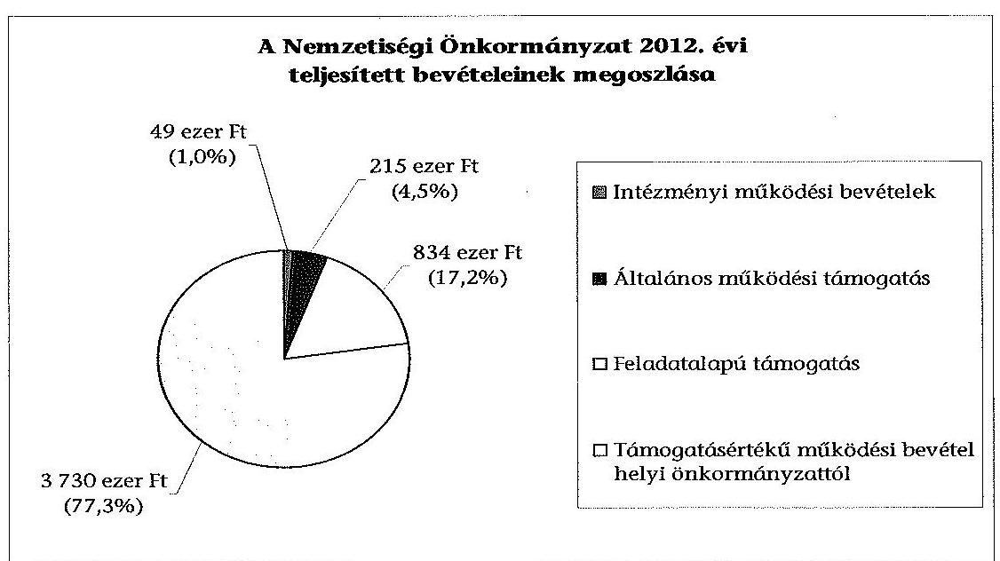
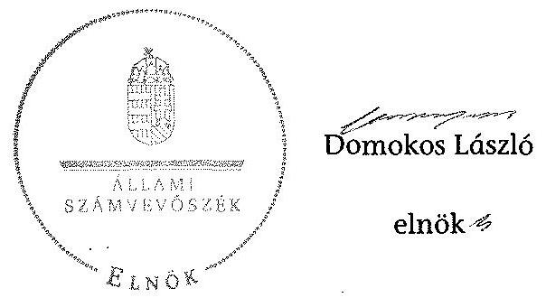

# ÁLLAMI   SZÁMVEVŐSZÉK 

## JELENTÉS

a helyi nemzetiségi önkormányzatok gazdálkodásának ellenőrzéséről
Angyalföldi Szlovák Önkormányzat

---

Állami Számvevőszék
Iktatószám: V-0302-015/2014.
Témaszám: 1335
Vizsgálat-azonosító szám: V065255
Az ellenőrzést felügyelte:
Horváth Balázs
felügyeleti vezető
Az ellenőrzést vezette és az ellenőrzés végrehajtásáért felelős:
Kisgergely István
ellenőrzésvezető
A számvevőszéki jelentést készítették és a jelentés összeállításában
közreműködtek:
Zachár Péterné
számvevő főtanácsos
Právitzné Pejkó Noémi
számvevő
Az ellenőrzést végezte:
Biró Csaba
számvevő

---

# TARTALOMJEGYZÉK 

BEVEZETÉS ..... 3
I. ÖSSZEGZŐ MEGÁLLAPÍTÁSOK, KÖVETKEZTETÉSEK, JAVASLATOK ..... 6
II. RÉSZLETES MEGÁLLAPÍTÁSOK ..... 11

1. A Nemzetiségi Önkormányzat és a XIII. Kerületi Önkormányzat együttműködésének szabályozása, a működési feltételek biztosítása ..... 11
2. A gazdálkodási feladatok ellátásának szabályszerűsége ..... 12
2.1. A költségvetésre és a zárszámadásra, valamint a kincstári adatszolgáltatás rendjére vonatkozó jogszabályi előírások betartása ..... 12
2.2. A Nemzetiségi Önkormányzat gazdálkodásának szabályozottsága ..... 13
2.3. Az operatív gazdálkodási jogkörök kialakítása, gyakorlása ..... 14
3. A Nemzetiségi Önkormányzattal összefüggő gazdálkodási feladatok belső ellenőrzése ..... 15
4. A feladatalapú támogatás felhasználásának, elszámolásának szabályszerűsége, a Nemzetiségi Önkormányzat feladatellátása ..... 16
MELLÉKLETEK
5. számú A Nemzetiségi Önkormányzat 2012. évi gazdálkodásának főbb adatai, mutatói
6. számú Tájékoztatás a polgármesternek küldött el nem fogadott észrevételekről
FÜGGELÉKEK
7. számú Rövidítések jegyzéke
8. számú Értelmező szótár
9. számú A gazdálkodás értékelésének módszere

---

.

---

# JELENTÉS 

## a helyi nemzetiségi önkormányzatok gazdálkodásának ellenőrzéséről Angyalföldi Szlovák Önkormányzat

## BEVEZETÉS

A Nemzetiségi Önkormányzat a 2003. évben alakult, elnöke a 2010. évi helyhatósági választások óta látja el feladatát. A Nemzetiségi Önkormányzat intézményt, gazdasági társaságot és más szervezetet nem alapított. A négytagú Képviselő-testület munkája segítésére bizottságot nem hozott létre. A Nemzetiségi Önkormányzatnak a költségvetési beszámolója szerint a 2012. évben a módosított költségvetési bevételi és kiadási előirányzata 4826 ezer Ft, a teljesített költségvetési bevétele 4828 ezer Ft, a teljesített költségvetési kiadása 4778 ezer Ft volt. A 2012. évi gazdálkodási adatokat részletesen az 1. számú mellékletben mutatjuk be.

Az Alaptörvény XXIX. cikk (1) bekezdése szerint a Magyarországon élő nemzetiségek államalkotó tényezők. Minden, valamely nemzetiséghez tartozó magyar állampolgárnak joga van önazonossága szabad vállalásához és megőrzéséhez. A hazánkban élő nemzetiségek helyi (települési és területi), valamint országos önkormányzatokat hozhatnak létre. A helyi nemzetiségi önkormányzatok gazdálkodási feladatait jogszabályi előírás alapján a székhely szerinti önkormányzat polgármesteri hivatala látja el.

A nemzetiségek helyzete, támogatása mind hazai, mind EU-s szinten kiemelt figyelmet kap napjainkban. A helyi nemzetiségi önkormányzatok gazdálkodására és támogatási rendszerére vonatkozó jogszabályok a 2010-2012. években jelentős változásokon mentek át. A települési és területi nemzetiségi önkormányzatok gazdálkodásának, a részükre juttatott költségvetési támogatások felhasználásának ellenőrzését az ÁSZ a 2012. évben témacsoportos ellenőrzés keretében indította el. A 2013. évi ellenőrzések e témacsoportos ellenőrzések folytatását jelentik, amelyet az ÁSZ 2014. első félévi ellenőrzési terve a 12. témasorszámon tartalmaz.

Az ellenőrzés célja annak értékelése volt, hogy a Nemzetiségi Önkormányzat gazdálkodási kereteinek kialakítása, gazdálkodása és feladatellátása megfelelt-e a jogszabályoknak.

---

Ennek keretében értékeltük, hogy:

- a Nemzetiségi Önkormányzat és a XIII. Kerületi Önkormányzat együttműködésének szabályozása, a működési feltételek biztosítása megfelelt-e a jogszabályi előírásoknak;
- a felek együttműködése megfelelt-e a közöttük létrejött megállapodásnak a gazdálkodási feladatok szabályszerű ellátása során, ennek keretében betartották-e a Nemzetiségi Önkormányzat gazdálkodásához kapcsolódóan a költségvetésre és zárszámadásra, a gazdálkodás szabályozására, az operatív gazdálkodási jogkörök gyakorlására vonatkozó jogszabályi előírásokat;
- a jegyző biztosította-e a Nemzetiségi Önkormányzat gazdálkodásának belső ellenőrzését;
- a Nemzetiségi Önkormányzat feladatalapú támogatásának felhasználása, a folyósított feladatalapú támogatással történő elszámolás az előírásoknak megfelelő volt-e;
- a Nemzetiségi Önkormányzat feladatellátása összhangban volt-e a vonatkozó jogszabályi előírásokkal.

Az ellenőrzés várható hasznosulását négy szinten tervezzük. A törvényalkotás számára összegzett tapasztalatok állnak rendelkezésre a nemzetiségi önkormányzatok testületi döntéseinek, gazdálkodásának és a feladatalapú támogatás felhasználásának szabályszerűségéről, amelynek alapján következtetést lehet levonni arra, hogy indokolt-e jogszabályi módosítás kezdeményezése. Az ellenőrzés az ellenőrzött számára visszajelzést ad a működésében fellépő hiányosságokról, javaslataival hozzájárul azok kiküszöböléséhez, amely csökkentheti a későbbi ellenőrzések gyakoriságát. Az ellenőrzés megállapításai és javaslatai tanulságul szolgálhatnak más nemzetiségi önkormányzatok, szervezetek számára a rendezett gazdálkodási keretek kialakításához. A társadalom számára jelzi, hogy közpénz nem maradhat ellenőrizetlenül, az ÁSZ értékteremtő rend kialakításához és megőrzéséhez hozzájáruló tevékenysége pozitív hatással lesz a szervezetről kialakított összkép formálásában. Az ÁSZ szervezetén belül lehetőség nyílik arra, hogy a megállapítások szintetizálásával az intézmény a hozzáadott értéket teremtő elemző tevékenységét és tanácsadó szerepét erősítse.

A Nemzetiségi Önkormányzat gazdálkodásának ellenőrzéséről szóló jelentés I. fejezetének összegző része az ellenőrzés céljára adott rövid, szintetizáló összefoglalót és következtetéseket tartalmazza a II. fejezet részletes megállapításain alapulóan. A jelentés intézkedést igénylő megállapításait és javaslatait - az összegzőben foglaltak mellett - az ellenőrzés során feltárt, a jelentés II. fejezetében rögzített részletes megállapítások alapozzák meg, illetve támasztják alá.

# Az ellenőrzés típusa: szabályszerűségi ellenőrzés 

Az ellenőrzött időszak: a 2012. január 1. - 2012. december 31. közötti időszak. Az ellenőrzés kiterjedt a Nemzetiségi Önkormányzatnak juttatott 2012. évi támogatás 2013. évben való elszámolására is.

---

Ellenőrzött szervezet: Angyalföldi Szlovák Önkormányzat és a gazdálkodási feladatait ellátó Budapest Főváros XIII. Kerületi Önkormányzat.

Az ellenőrzés végrehajtásának jogszabályi alapját az ÁSZ tv. 5. § (2)-(3) és (6) bekezdéseiben foglaltak képezik.

Az ellenőrzés szakmai módszertana az ÁSZ hivatalos honlapján (www.asz.hu) közzétett szakmai szabályokon alapult, amely a Legfőbb Ellenőrző Intézmények Nemzetközi Szervezete (INTOSAI) által kiadott nemzetközi standardok (ISSAI) figyelembevételével készült.

A Nemzetiségi Önkormányzat gazdálkodásának ellenőrzése során értékeltük a XIII. Kerületi Önkormányzat és a Nemzetiségi Önkormányzat együttműködésének, a gazdálkodás szabályozottságának és a pénzügyi folyamatokban kulcsszerepet betöltő belső kontrollok (teljesítésigazolás és érvényesítés) működésének megfelelőségét. A kulcskontrollokat a működési és felhalmozási célú támogatásértékű kiadásoknál, az államháztartáson kívülre teljesített működési célú pénzeszközátadásoknál, a dologi kiadásokkal kapcsolatos kifizetéseknél - véletlen mintavételi eljárást alkalmazva - ellenőriztük. Ellenőriztük, hogy a jegyző biztosította-e a Nemzetiségi Önkormányzat gazdálkodásának belső ellenőrzését. Értékeltük a feladatalapú támogatások felhasználásának, elszámolásának szabályszerűségét, a Nemzetiségi Önkormányzat feladatellátása és a jogszabályi előírások összhangját.

Az ellenőrzés lefolytatásához a Nemzetiségi Önkormányzat és a gazdálkodási feladatait ellátó XIII. Kerületi Önkormányzat tanúsítványok és a kapcsolódó, dokumentumjegyzékben megjelölt dokumentumok elektronikus úton történő megküldésével, rendelkezésre bocsátásával szolgáltatott adatokat. Az adatszolgáltatás kontrollálása és szükség szerinti javítása a helyszíni ellenőrzés keretében történt. A minősítési szempontokat a 3. számú függelék tartalmazza.

Az ÁSZ tv. 29. § (1) bekezdése szerint a jelentéstervezetet megküldtük észrevételezésre a polgármester és a Nemzetiségi Önkormányzat elnöke részére. A Nemzetiségi Önkormányzat elnöke határidőn túl tett észrevételét nem tudtuk figyelembe venni, a polgármester határidőben megküldött észrevétele és tájékoztatása alapján a jelentést nem módosítottuk. Az el nem fogadott észrevételek indoklását a jelentés 2. számú melléklete tartalmazza.

---

# I. ÖSSZEGZŐ MEGÁLLAPÍTÁSOK, KÖVETKEZTETÉSEK, JAVASLATOK 

A Nemzetiségi Önkormányzat és a XIII. Kerületi Önkormányzat együttműködésének szabályozása, a működési feltételek biztosítása a 2012. évben megfelelt a jogszabályi előírásoknak. A Nemzetiségi Önkormányzat a 2012. év folyamán rendelkezett hatályban lévő megállapodással a XIII. Kerületi Önkormányzattal történő együttműködésre, azonban az együttműködési megállapodás ₁ 2012. évi - évenként kötelező - felülvizsgálatát a Nek. tv.-ben előírt január 31-ei határidőn túl végezték el. Az együttműködési megállapodás ₁ jogszabályváltozás miatti kiegészítése megtörtént a Nek. tv.-ben előírt határidőn belül. Az együttműködési megállapodás ₂ a Nek. tv.-ben meghatározott tartalmi elemeket tartalmazta, a Nemzetiségi Önkormányzat működésének feltételeit és a gazdálkodási feladatainak ellátását az előírásoknak megfelelően szabályozták, működésének előírt személyi és tárgyi feltételei biztosítottak voltak a 2012. évben. A Nek. tv.-ben foglaltak ellenére az együttműködési megállapodás ₂ szerinti működési feltételeket nem rögzítették a Nemzetiségi Önkormányzat SZMSZ-ében.

A Nemzetiségi Önkormányzat 2012. évi költségvetésének és zárszámadásának tartalma, jóváhagyása megfelelt a jogszabályi előírásoknak. A jegyző az előírt határidőre elkészítette, a Nemzetiségi Önkormányzat elnöke az Áht. ₂-ben előírt határidőben benyújtotta a 2012. évi költségvetés tervezetét a Képviselő-testületnek. A jóváhagyott költségvetés tartalmazta - szöveges indokolással együtt - az Áht. ₂-ben és az Ávr.-ben meghatározott tartalmi elemeket. A Nemzetiségi Önkormányzat elnöke a 2012. évi zárszámadás tervezetét az előírt határidőben a Képviselő-testületnek benyújtotta, az Áht. ₂-ben előírt mérlegeket és kimutatásokat tájékoztatásul bemutatta. A zárszámadási határozat összehasonlíthatósága biztosított volt az elfogadott költségvetéssel. A jegyző a 2012. évi költségvetéshez kapcsolódó, a Nemzetiségi Önkormányzatra vonatkozó kincstári adatszolgáltatási kötelezettségeinek az Áhsz. ₁-ben és az Ávr.-ben előírt határidőkön túl tett eleget.

A Nemzetiségi Önkormányzat gazdálkodásának szabályozottsága megfelelő volt az ellenőrzött időszakban. A gazdálkodási feladatok végrehajtását ellátó Polgármesteri Hivatal a 2012. évben a Számv. tv.-ben, és a Bkr.-ben előírt, a gazdálkodást érintő szabályzatokkal a Nemzetiségi Önkormányzat gazdálkodására kiterjedő hatállyal rendelkezett. A Polgármesteri Hivatal SZMSZ-e nem tartalmazta a Nemzetiségi Önkormányzat gazdálkodásának végrehajtásával kapcsolatos, az SZMSZ-ben nevesített munkakörökhöz tartozó feladat- és hatásköröket, azok gyakorlásának módját, a helyettesítés rendjét, az ezekhez kapcsolódó felelősségi szabályokat.

Az operatív gazdálkodási jogkörök kialakítása a jogszabályi előírásokkal összhangban történt, a pénzügyi ellenjegyzőket, az érvényesítőket a jegyző, mint a költségvetési szerv vezetője jelölte ki. A Nemzetiségi Önkormányzat elnöke az előírásoknak megfelelően a kötelezettségvállalás, utalványozásra adott

---

felhatalmazással, és a teljesítésigazolás gyakorlására történő kijelöléssel biztosította az összeférhetetlenségi követelmények érvényesülését.

A dologi kiadások teljesítése során a teljesítésigazolás és az érvényesítés kulcskontrollok működésének megfelelősége kiváló volt.

A 2012. évi dologi kiadások között a három legnagyobb összegű kiadás teljesítésének egyedi értékelése alapján, a teljesítésigazolás és az érvényesítés kulcskontrollok két esetben megfelelően működtek, egy esetben az érvényesítő az Ávr. előírása ellenére a megelőző ügymenetben nem ellenőrizte és nem jelezte az utalványozó felé, hogy a kötelezettségvállalásra (megrendelő elkészítésére) a kiadáshoz kapcsolódó számla kiállítását követően került sor, azonban a pénzügyi teljesítés a rendezvény lezajlását követően történt.

A támogatásértékű kiadás, valamint az államháztartáson kívülre történő működési célú pénzeszközátadások esetében a teljesítésigazolás és az érvényesítés kulcskontrollok megfelelően működtek.

A számvevőszéki ellenőrzés a kiadások dokumentumainak ellenőrzése, a rendelkezésre bocsátott dokumentumok alapján összeférhetetlenséget, jogosulatlan kifizetést nem tárt fel.

A Nemzetiségi Önkormányzat gazdálkodásával összefüggő végrehajtási feladatok belső ellenőrzésének kialakítása megfelelő volt. A jegyző biztosította a Nemzetiségi Önkormányzat gazdálkodásával összefüggő végrehajtási feladatok belső ellenőrzését. A belső ellenőrzési tervet megalapozó kockázatelemzés kiterjedt a nemzetiségi önkormányzatok gazdálkodásával összefüggő végrehajtási feladatokra. A nemzetiségek gazdálkodásával kapcsolatos kockázatot magas besorolásúnak minősítették, és évenkénti vizsgálatot tartottak szükségesnek. A Nemzetiségi Önkormányzatot érintő tervezett ellenőrzést, kiemelten az önkormányzati támogatás felhasználását - 2012. év I. félévre vonatkozóan - az Ellenőrzési Csoport végrehajtotta. A belső ellenőrzés nem érintette a számvevőszéki ellenőrzés által feltárt hiányosságokat a kulcskontrollok működésére, valamint a feladatalapú támogatás elszámolására vonatkozóan.

A Nemzetiségi Önkormányzat részére a 2011. és a 2012. évben folyósított feladatalapú támogatás elszámolása a jogszabályi előírásoknak nem felelt meg. A Nemzetiségi Önkormányzat a 2011. évben 1666 ezer Ft feladatalapú támogatásban részesült, amelyet a tárgyévben felhasznált, maradvány nem keletkezett. A Nemzetiségi Önkormányzat a 2012. évben 834 ezer Ft feladatalapú támogatásban részesült, amelyet a folyósítás évében - a Nek. tv.-ben foglaltakkal összhangban - felhasznált, maradvány nem keletkezett. A 2011. és a 2012. évi
 feladatalapú támogatás elszámolása a támogatási kormányrendelet ${ }_{1,2}$ előírása alapján az Áht. ${ }_{1,2}$-ben foglaltak ellenére nem történt meg. A támogatás felhasználását, elszámolását az arra jogosult külső szervek nem ellenőrizték.

A Nemzetiségi Önkormányzat a 2012. évben kötelező és önként vállalt közfeladatokat látott el az érdekképviselet, illetve szociális, ifjúsági és kulturális igazgatás területén. A feladatellátásának tárgya összhangban volt a Nek. tv.-ben foglalt előírásokkal.

---

Az ÁSZ tv. 33. § (1) bekezdésében foglaltak értelmében az ellenőrzött szervezet vezetője köteles a jelentésben foglalt megállapításokhoz kapcsolódó intézkedési tervet összeállítani és azt a jelentés kézhezvételétől számított 30 napon belül az ÁSZ részére megküldeni. Amennyiben az intézkedési tervet határidőre nem küldi meg a szervezet, vagy az nem elfogadható, az ÁSZ elnöke az ÁSZ tv. 33. § (3) bekezdés a)-b) pontjaiban foglaltakat érvényesítheti.

A helyszíni ellenőrzés megállapításainak hasznosítása mellett javasoljuk:

# a jegyzőnek 

1. az együttműködés szabályozásával kapcsolatban

Az együttműködési megállapodás ${ }_{1}$-et a Nek. tv. 80. § (2) bekezdésének előírása ellenére 2012. január 31-éig nem vizsgálták felül.

A Nek. tv. 80. § (2) bekezdésében foglaltak ellenére az együttműködési megállapodás ${ }_{2}$ szerinti működési feltételeket nem rögzítették a Nemzetiségi Önkormányzat SZMSZ-ében.

Javaslat
a) biztosítsa a jövőben az együttműködési megállapodás évenkénti felülvizsgálata során a Nek. tv. 80. § (2) bekezdésében előírt határidő betartását;
b) készítse elő a Nemzetiségi Önkormányzat SZMSZ-ének a Nek. tv. 80. § (2) bekezdésében foglalt előírásnak megfelelő kiegészítését.
2. a kincstári adatszolgáltatási kötelezettséggel kapcsolatban

A jegyző a 2012. évi költségvetéshez kapcsolódó, a Nemzetiségi Önkormányzatra vonatkozó kincstári adatszolgáltatási kötelezettségének több esetben - az Ávr. 33. §-ában, 169. § (2) bekezdésében és az Áhsz. 10. § (5a) bekezdésében előírt - határidőn túl tett eleget.

Javaslat
Gondoskodjon arról, hogy a Nemzetiségi Önkormányzatra vonatkozó kincstári adatszolgáltatási kötelezettségeinek az Ávr. 33. §-ában, 169. § (2) bekezdésében és az Áhsz. 32. § (4) bekezdésében előírt határidők betartásával tegyen eleget.
3. a gazdálkodás szabályozottságával kapcsolatban

A Polgármesteri Hivatal SZMSZ-e nem tartalmazta az Ávr. 13. § (1) bekezdés g) pontjában foglaltak szerinti, az SZMSZ-ben nevesített munkakörökhöz tartozó - a Nemzetiségi Önkormányzat gazdálkodásának végrehajtásával kapcsolatos - feladat- és hatáskörökre, a hatáskörök gyakorlásának módjára, a helyettesítés rendjére, az ezekhez kapcsolódó felelősségi szabályokra vonatkozó előírásokat.

---

Javaslat
Készítse el a Polgármesteri Hivatal SZMSZ-e módosítását, hogy az tartalmazza - a Nemzetiségi Önkormányzat gazdálkodásának végrehajtási feladataira vonatkozóan az Ávr. 13. § (1) bekezdés g) pontjában foglaltakat.
4. a feladatalapú támogatás elszámolásával kapcsolatban

A 2011. évi feladatalapú támogatás elszámolása a támogatási kormányrendelet ${ }_{1}$ 7. § (2) bekezdésében hivatkozott, valamint a 2012. évi feladatalapú támogatás elszámolása a támogatási kormányrendelet ${ }_{2}$ 8. § (5) bekezdésében hivatkozott „a helyi önkormányzatok elszámolási és ellenőrzési rendjére vonatkozó jogszabályok rendelkezései alkalmazandóak" előírása alapján az Áht. 64. § (7) bekezdése és az Áht. ${ }_{2}$ 57. § (3) bekezdése ellenére nem történt meg.

Javaslat
Gondoskodjon az Áht. ${ }_{2}$ 27. § (2) bekezdésében meghatározott feladatkörében a Nemzetiségi Önkormányzat által igénybevett 2011. és 2012. évi feladatalapú támogatás rendeltetésszerű felhasználásáról szóló elszámolásának elkészítéséről az Áht. ${ }_{2}$ 53. § (1) bekezdése szerinti beszámolási kötelezettség teljesítéséhez.

# a polgármesternek 

A Polgármesteri Hivatal SZMSZ-e nem tartalmazta az Ávr. 13. § (1) bekezdés g) pontjában foglaltak szerinti, az SZMSZ-ben nevesített munkakörökhöz tartozó - a Nemzetiségi Önkormányzat gazdálkodásának végrehajtásával kapcsolatos - feladat- és hatáskörökre, a hatáskörök gyakorlásának módjára, a helyettesítés rendjére, az ezekhez kapcsolódó felelősségi szabályokra vonatkozó előírásokat.

Javaslat
Terjessze a XIII. Kerületi Önkormányzat Képviselő-testülete elé jóváhagyásra a Polgármesteri Hivatal SZMSZ-ének jegyző által elkészített módosítását, hogy az tartalmazza - a Nemzetiségi Önkormányzat gazdálkodásának végrehajtására vonatkozóan - az Ávr. 13. § (1) bekezdés g) pontjában foglaltakat.

## a Nemzetiségi Önkormányzat elnökének

1. A Nek. tv. 80. § (2) bekezdésében foglaltak ellenére az együttműködési megállapodás ${ }_{2}$ szerinti működési feltételeket nem rögzítették a Nemzetiségi Önkormányzat SZMSZ-ében.

Javaslat
Terjessze a Képviselő-testület elé jóváhagyásra a Nemzetiségi Önkormányzat SZMSZ-ének jegyző által előkészített módosítását, hogy az megfeleljen a Nek. tv. 80. § (2) bekezdésében előírtaknak.

---

2. A 2011. évi feladatalapú támogatás elszámolása a támogatási kormányrendelet ${ }_{1}$ 7. § (2) bekezdésében hivatkozott, valamint a 2012. évi feladatalapú támogatás elszámolása a támogatási kormányrendelet ${ }_{2}$ 8. § (5) bekezdésében hivatkozott „a helyi önkormányzatok elszámolási és ellenőrzési rendjére vonatkozó jogszabályok rendelkezései alkalmazandóak" előírása alapján az Áht. ${ }_{1}$ 64. § (7) bekezdése és az Áht. ${ }_{2}$ 57. § (3) bekezdése ellenére nem történt meg.

Javaslat
Terjessze a Képviselő-testület elé jóváhagyásra az Áht. ${ }_{2}$ 53. § (1) bekezdése szerinti beszámolási kötelezettség teljesítéséhez a Nemzetiségi Önkormányzat által igénybe vett 2011. és 2012. évi feladatalapú támogatás felhasználásáról szóló elszámolást.

---

# II. RÉSZLETES MEGÁLLAPÍTÁSOK 

## 1. A Nemzetiségi Önkormányzat és a XIII. Kerületi Önkormányzat együttműködésének szabályozása, a működési feltételek biztosítása

A Nemzetiségi Önkormányzat és a XIII. Kerületi Önkormányzat együttműködésének szabályozása, a működési feltételek biztosítása a 2012. évben megfelelt a jogszabályi előírásoknak.

A Nemzetiségi Önkormányzat rendelkezett a 2012. év folyamán hatályban lévő megállapodással, a XIII. Kerületi Önkormányzattal történő együttműködésre.

A 2012. január 1-jén hatályos, 2010. december 9-én megkötött együttműködési megállapodás ${ }_{1}$-nek a gazdálkodási szabályok változása miatti - évenkénti kötelező - felülvizsgálatát a Nek. tv. 80. § (2) bekezdésében meghatározott január 31-ei határidőn túl végezték el.

A jogszabályváltozás miatt, a Nek. tv. 159. § (3) bekezdésében előírt kiegészítést határidőben végrehajtották, és 2012. február 24-én aláírták az együttműködési megállapodás ${ }_{2}$-t.

Az együttműködési megállapodás ${ }_{2}$-t a polgármester az 1/2011. (I. 14.) számú Önkormányzati rendelet felhatalmazása, a Nemzetiségi Önkormányzat elnöke a Képviselő-testület 12/2012. (II. 09.) számú határozatának felhatalmazása alapján írta alá.

A Nemzetiségi Önkormányzat működésének személyi és tárgyi feltételeit, a gazdálkodási feladatai ellátásának szabályait, azok teljesítési határidejét, felelőseit a Nek. tv. 80. § (1) bekezdésnek megfelelően, teljes körűen szabályozták az együttműködési megállapodás ${ }_{2}$-ben.

A Nek. tv. 80. § (2) bekezdésében foglaltak ellenére az együttműködési megállapodás ${ }_{2}$ szerinti működési feltételeket nem rögzítették a Nemzetiségi Önkormányzat SZMSZ-ében az együttműködési megállapodás ${ }_{2}$ megkötését követő harminc napon belül. ${ }^{1}$

[^0]
[^0]:    ${ }^{1}$ A harminc napon túl, 2012. évben sem vezették át az SZMSZ-ben az együttműködési megállapodás ${ }_{2}$ szerinti működési feltételeket.

---

A XIII. Kerületi Önkormányzat az együttműködési megállapodás ${ }_{2}$-ben a Nek. tv. előírásának megfelelően biztosította a Nemzetiségi Önkormányzat működéséhez szükséges személyi és tárgyi feltételeket².

Az együttműködési megállapodás ${ }_{2}$ 20. pontja szerint „A Nemzetiségi Önkormányzat tárgyévi jóváhagyott költségvetésében az Önkormányzat által biztosított támogatásnak része a Nemzetiségi Önkormányzat működéséhez szükséges - díjtalanul biztosított - irodahelyiségben felmerülő közüzemi és egyéb jellegű költségek fedezete."

A 2012. december 31-én hatályos együttműködési megállapodás ${ }_{2}$ a Nek. tv. 80. § (4) bekezdés előírásának megfelelően tartalmazta, hogy a jegyző, vagy annak - a jegyzővel azonos képesítési előírásoknak megfelelő - megbízottja a XIII. Kerületi Önkormányzat megbízásából és képviseletében részt vesz a Nemzetiségi Önkormányzat testületi ülésein és jelzi, amennyiben törvénysértést észlel.

# 2. A GAZDÁLKODÁSI FELADATOK ELLÁTÁSÁNAK SZABÁLYSZERŰSÉGE 

### 2.1. A költségvetésre és a zárszámadásra, valamint a kincstári adatszolgáltatás rendjére vonatkozó jogszabályi előírások betartása

A Nemzetiségi Önkormányzat 2012. évi költségvetésének és zárszámadásának ${ }^{3}$ tartalma, jóváhagyása megfelelt a jogszabályi előírásoknak.

A Nemzetiségi Önkormányzat elnöke az Áht. ${ }_{2}$-ben előírt határidőre benyújtotta a Képviselő-testület részére a jegyző által előkészített költségvetési határozattervezetet.

A jóváhagyott költségvetés tartalma megfelelt az Ávr.-ben foglaltaknak, tartalmazta a költségvetési kiadásokat, bevételeket előirányzat csoportonkénti, kiemelt előirányzatonkénti bontásban. A 2012. évi költségvetés tervezetének előterjesztésekor a Képviselő-testület részére az Áht. ${ }_{2}$-ben foglaltaknak megfelelően bemutatták - szöveges indokolással együtt - az előírt mérlegeket és kimutatásokat.

A jegyző által elkészített 2012. évi zárszámadási határozat-tervezetet a Nemzetiségi Önkormányzat elnöke az Áht. ${ }_{2}$-ben foglaltak alapján, határidőn belül benyújtotta a Képviselő-testületnek. Az Áht. ${ }_{2}$-ben előírt mérlegeket, kimutatásokat a zárszámadás tervezetének előterjesztésekor tájékoztatásul bemutatták. A zárszámadásról szóló határozat összehasonlíthatósága biztosított volt az elfogadott költségvetéssel.

[^0]
[^0]:    ${ }^{2}$ A nemzetiségi önkormányzatok elnökei közös nyilatkozatban erősítették meg, hogy a XIII. Kerületi Önkormányzat a kerületben működő nemzetiségi önkormányzatok működéséhez szükséges személyi és tárgyi feltételeket biztosítja.
    ${ }^{3}$ A Képviselő-testületnek a Nemzetiségi Önkormányzat 2012. évi költségvetéséről hozott 11/2012. (II. 09.) számú és a 2012. évi zárszámadásáról hozott 22/2013. (IV. 17.) számú határozatai.

---

A jegyző a 2012. évi költségvetéshez kapcsolódó, a Nemzetiségi Önkormányzatra vonatkozó kincstári az Ávr. 33. §-ában, az Ávr. 169. § (2) bekezdésében, valamint az Áhsz. 10. § (5a) bekezdésében előírt kincstári adatszolgáltatási kötelezettségének határidőn túl tett eleget.

A 2012. évi elemi költségvetéshez kapcsolódó adatszolgáltatási kötelezettségét három nap késedelemmel teljesítette, a negyedéves és féléves időközi költségvetési jelentéseket négy nap késedelemmel, a negyedéves és féléves időközi mérlegjelentéseket szintén négy nap késedelemmel adta fel, valamint a 2012. éves elemi költségvetési beszámolóját két napos késedelemmel nyújtotta be.

# 2.2. A Nemzetiségi Önkormányzat gazdálkodásának szabályozottsága 

A Nemzetiségi Önkormányzat gazdálkodásának szabályozottsága az ellenőrzött időszakban biztosított volt és megfelelt a jogszabályi előírásoknak.

A Nemzetiségi Önkormányzat gazdálkodási feladatainak végrehajtását ellátó Polgármesteri Hivatal a 2012. évben a Számv. tv.-ben és a Bkr.-ben előírt gazdálkodást érintő szabályzatainak ${ }^{4}$ hatályát kiterjesztette a Nemzetiségi Önkormányzat gazdálkodásának végrehajtási feladataira.

A Polgármesteri Hivatal SZMSZ-e az Ávr. 13. § (1) bekezdés g) pontjában foglaltak ellenére nem tartalmazta az SZMSZ-ben nevesített munkakörökhöz tartozó - a Nemzetiségi Önkormányzat gazdálkodásának végrehajtásával kapcsolatos - feladat- és hatásköröket, a hatáskörök gyakorlásának módját, a helyettesítés rendjét, az ezekhez kapcsolódó felelősségi szabályokat ${ }^{5}$.

A Polgármesteri Hivatalban az ellenőrzött időszakban két operatív gazdálkodási szabályzat ${ }^{6}$ volt érvényben, amelyek hatályát kiterjesztették a Nemzetiségi Önkormányzat gazdálkodására is. A szabályzatban a 100 ezer Ft-ot el nem érő, előzetes írásbeli kötelezettségvállalást nem igényelő kifizetések rendjét meghatározták.

[^0]
[^0]:    ${ }^{4}$ Számviteli politika, eszközök és források leltárkészítési és leltározási szabályzata, eszközök és források értékelési szabályzata, pénzkezelési szabályzat, számlarend, selejtezési szabályzat, önköltségszámítás rendjére vonatkozó szabályzat, valamint a XXII/1542/2011. (XII.13.) számú Jegyzői Utasítás a Polgármesteri Hivatal belső kontroll szabályzatáról: ellenőrzési nyomvonal, szabálytalanságok kezelésének eljárásrendje, kockázatkezelési szabályzat.
    ${ }^{5}$ A gazdálkodással kapcsolatos feladat- és hatásköröket az egységes ügyrend módosításáról szóló 160/2012. (XII. 13.) számú önkormányzati határozat tartalmazta, illetve a munkaköri leírásokban rögzítették.
    ${ }^{6}$ A XXII/25-3/2010. (IV. 29.) számú, valamint az azt hatályon kívül helyező a XXII/111/2012. (VII. 02.) számú polgármesteri-jegyzői együttes utasítás az Önkormányzat és a Polgármesteri Hivatal költségvetése végrehajtása során a kötelezettségvállalás és ellenjegyzés, a szakmai teljesítésigazolás, érvényesítés és utalványozás hatásköri rendjéről.

---

A Nemzetiségi Önkormányzat gazdálkodásának végrehajtásával kapcsolatos feladatok ellátásának kötelezettségét a Polgármesteri Hivatal munkatársainak munkaköri leírásai tartalmazták.

# 2.3. Az
 operatív gazdálkodási jogkörök kialakítása, gyakorlása 

A Nemzetiségi Önkormányzat gazdálkodása tekintetében a 2012. évben az operatív gazdálkodási jogkörök kialakítása megfelelt a jogszabályi előírásoknak.

Az együttműködési megállapodás ${ }_{2}$ rendelkezett a gazdálkodási jogkörök részletes kialakításáról. ${ }^{7}$ A kötelezettségvállalásra, az utalványozásra adott felhatalmazás, valamint a teljesítést igazoló kijelölés az Áht. 2 36. § (7) bekezdésében és az Ávr. 52. § (7) bekezdésében előírtaknak megfelelően történt.

A Nemzetiségi Önkormányzat elnöke az előírásoknak megfelelően a kötelezettségvállalás, utalványozásra adott felhatalmazással, és a teljesítésigazolás gyakorlására történő kijelöléssel biztosította az összeférhetetlenségi követelmények érvényesülését.

A XIII. Kerületi Önkormányzat nem rendelkezett gazdasági szervezettel, ezért a jegyző jelölte ki írásban a pénzügyi ellenjegyzőket és az érvényesítőket az Ávr. 55. § (2) bekezdés g) pontja és az Ávr. 58. § (4) bekezdése alapján. A Polgármesteri Hivatal pénzügyi ellenjegyzői és érvényesítői feladatokra kijelölt köztisztviselői a feladatuk ellátásához előírt képesítési követelményeknek megfeleltek.

A támogatásértékű kiadás, valamint az államháztartáson kívülre történő működési célú pénzeszközátadások esetében a kiválasztott gazdasági események tekintetében a kulcskontrollok működése megfelelő volt.

A Nemzetiségi Önkormányzatnál a 2012. évben a dologi kiadások teljesítése során a teljesítésigazolás és az érvényesítés kulcskontrollok működése kiváló volt.

A Nemzetiségi Önkormányzatnál a 2012. évi dologi kiadások között a három legnagyobb összegű kiadás teljesítése egyedi értékelése alapján a teljesítésigazolás és az érvényesítés kulcskontrollok két kifizetés esetében megfelelően működtek, míg egy kifizetésnél - a gasztronómiai bemutató esetén - az érvényesítő nem az Ávr. 58. § (1) és (2) bekezdéseiben előírt módon látta el feladatát. Az érvényesítő nem észrevételezte és nem jelezte az utalványozó felé, hogy a kötelezettségvállalásra (megrendelő elkészítésére) a kiadáshoz kapcsolódó számla kiállítását követően került sor, azonban a pénzügyi teljesítés a rendezvény lezajlását követően történt.

[^0]
[^0]:    ${ }^{7}$ Az együttműködési megállapodás ${ }_{2} 24$. pontja alapján a Nemzetiségi Önkormányzat előirányzatai terhére kötelezettséget vállalni és utalványozni kizárólag az elnök vagy az általa felhatalmazott Nemzetiségi Önkormányzati képviselő jogosult.

---

A számvevőszéki ellenőrzés a kiadások dokumentumainak ellenőrzése, a rendelkezésre bocsátott dokumentumok alapján összeférhetetlenséget, jogosulatlan kifizetést nem tárt fel.

# 3. A Nemzetiségi Önkormányzattal összefüggő gazdálkodási FELADATOK BELSŐ ELLENŐRZÉSE 

A Nemzetiségi Önkormányzat gazdálkodásával összefüggő végrehajtási feladatokkal kapcsolatosan a belső ellenőrzés kialakítása 2012. évben megfelelő volt.

Az együttműködési megállapodás ${ }_{1,2}$ tartalmazta a belső ellenőrzésre vonatkozó feltételeket. A jegyző, a jogszabályi előírásoknak megfelelően biztosította a Nemzetiségi Önkormányzat gazdálkodásával összefüggő végrehajtási feladatok belső ellenőrzését. ${ }^{8}$ A belső ellenőrzési tervet megalapozó kockázatelemzés kiterjedt a nemzetiségi önkormányzatok gazdálkodásának végrehajtási feladataira. A nemzetiségek gazdálkodásával összefüggő végrehajtási feladatokkal kapcsolatos kockázatot magas besorolásúnak minősítették, és évenkénti ellenőrzést tartottak szükségesnek.

Az éves belső ellenőrzési tervben foglaltaknak megfelelően az Ellenőrzési Csoport 2012. évben ellenőrizte ${ }^{9}$ a XIII. kerületben működő helyi nemzetiségi önkormányzatok 2012. év első félévi gazdálkodását, különös tekintettel az önkormányzati támogatásból megvalósult gazdasági eseményekre, így az nem érintette a számvevőszéki ellenőrzés által feltárt hiányosságokat a kulcskontrollok működésére és a feladatalapú támogatás elszámolására vonatkozóan.

A belső ellenőrzés megállapította, hogy a helyi nemzetiségi önkormányzatok költségvetésének végrehajtása során a gazdálkodás és az elszámolás szabályszerűen történt az ellenőrzött időszakban (2012. év I. félév), betartották a szakmai teljesítésigazolás, az utalványozás, az ellenjegyzés, valamint az érvényesítés szabályait.

A belső ellenőrzési jelentésben megfogalmazottakat a Nemzetiségi Önkormányzat elnöke megismerte, azokra észrevételt nem tett ${ }^{10}$.

Az ellenőrzési jelentésben az Ellenőrzési Csoport a Nemzetiségi Önkormányzatnak két általános javaslatot tett, amelyek nem kapcsolódtak konkrét megállapításokhoz, így intézkedési tervet nem kellett készíteni.

[^0]
[^0]:    ${ }^{8}$ A belső ellenőrök rendelkeztek munkaköri leírással, valamint az Áht. ${ }_{2} 70$. §-ában meghatározott engedéllyel, szerepeltek a költségvetési szervnél belső ellenőrzést végzők nyilvántartásában, illetve elkészítették a 2012. évre vonatkozó belső ellenőrzési kézikönyvet.
    ${ }^{9}$ A belső ellenőrzés által ellenőrzött időszak a 2012. év I. féléve volt, az ellenőrzés célja: „A nemzetiségi önkormányzatok részére biztosított pénzeszközök felhasználásának ellenőrzése".
    ${ }^{10}$ A XVI/20-7/2012. számú Ellenőrzési Jelentés, valamint a Nemzetiségi Önkormányzat elnöke által átvett, hitelesített Ellenőrzési Jelentés Kivonata, illetve Záradék.

---

A belső ellenőrzés javasolta, hogy a nemzetiségi önkormányzatok az előirányzatfelhasználásokat folyamatosan kísérjék figyelemmel annak érdekében, hogy a szükséges átcsoportosításokat végrehajthassák, valamint az időarányos bevételek az előző félévi fel nem használt pénzmaradvány összegei miatt ne mutassanak aránytalanságot. A belső ellenőrzés javasolta továbbá, hogy a különböző rendezvényekre és kiadásokra fordított összegek esetében a nemzetiségi önkormányzatok által hozott határozatokban pontosabban határozzák meg a támogatott esemény helyét és időpontját, a támogatási keret esetében bruttó összeget határozzanak meg.

Az ellenőrzéshez szolgáltatott adatok alapján a 2012. évben a Kormányhivatal a Nemzetiségi Önkormányzatot illetően nem élt törvényességi felügyeleti eszközökkel.

# 4. A feladatalapú támogatás felhasználásának, elszámolásának szabályszerűsége, a Nemzetiségi Önkormányzat feladatellátása 

A 2011. és a 2012. évben folyósított feladatalapú támogatás elszámolása a jogszabályi előírásoknak nem felelt meg.

A Nemzetiségi Önkormányzat a 2011. évben 1666 ezer Ft feladatalapú támogatásban részesült, amelyet a tárgyévben felhasznált, maradvány nem keletkezett.

A Nemzetiségi Önkormányzat a 2012. évben 834 ezer Ft feladatalapú támogatásban részesült, amelyet a folyósítás évében felhasznált, maradványa nem keletkezett. A 2012. évi feladatalapú támogatás összegével a Nemzetiségi Önkormányzat Képviselő-testülete a 40/2012. (X. 17.) számú határozatával módosította az éves költségvetését.

A 2012. évi feladatalapú támogatás összes bevételhez viszonyított részarányát a következő ábra szemlélteti:

---

A feladatalapú támogatás felhasználása összhangban volt a Nek. tv. előírásával, az a nemzetiségi közügyek érdekében történt.

A 2011. és a 2012. évi feladatalapú támogatás elszámolása a támogatási kormányrendelet ${ }_{1} 7 . \S$ (2), illetve a támogatási kormányrendelet ${ }_{2}$ 8. § (5) bekezdésében hivatkozott „a helyi önkormányzatok elszámolási és ellenőrzési rendjére vonatkozó jogszabályok rendelkezései alkalmazandóak" előírása alapján az Áht. ${ }_{1} 64 . \S$ (7) bekezdése, és az Áht. ${ }_{2} 57 . \S$ (3) bekezdése ellenére nem történt meg. A feladatalapú támogatások felhasználását, elszámolását az ellenőrzésre jogosult külső szervek nem ellenőrizték.

A Nemzetiségi Önkormányzat által ellátott feladatok összhangban voltak a 2012. évben a Nek. tv. 115. -116. §-aiban előírtakkal, érdekképviselet, illetve szociális, ifjúsági és kulturális igazgatás területén. A Nemzetiségi Önkormányzat a Nek. tv. 116. § (2) bekezdésében tiltott hatósági tevékenységet nem látott el.

Budapest, 2014. O 8. hó 8. nap

Melléklet: 2 db
Függelék: $\quad 3 \mathrm{db}$

---

.

---

# A Nemzetiségi Önkormányzat 2012. évi gazdálkodásának főbb adatai, mutatói 

A) Bevételek

| Megnevezés | Eredeti előirányzat | Módosított   ezer Ft | Teljesítés |  |
| :--: | :--: | :--: | :--: | :--: |
|  |  |  |  | megoszlás   (\%) |
| Intézményi működési bevételek | 0 | 48 | 49 | 1,0 |
| Általános működési támogatás | 215 | 215 | 215 | 4,5 |
| Feladatalapú támogatás | 0 | 834 | 834 | 17,2 |
| Támogatásértékű működési bevétel helyi önkormányzattal | 3500 | 3729 | 3730 | 77,3 |
| Költségvetési bevételek | 3715 | 4826 | 4828 | 100 |
| Tárgyévi bevételek | 3715 | 4826 | 4828 | 100 |

B) Kiadások

| Megnevezés | Eredeti előirányzat | Módosított   ezer Ft | Teljesítés |  |
| :--: | :--: | :--: | :--: | :--: |
|  |  |  |  | megoszlás   (\%) |
| Személyi juttatások | 2655 | 2225 | 2224 | 46,5 |
| Munkaadókat terhelő járulékok és szociális hozzájárulási adó összesen | 688 | 500 | 497 | 10,4 |
| Dologi kiadások | 372 | 1496 | 1453 | 30,4 |
| Egyéb működési célú támogatás | 0 | 605 | 604 | 12,7 |
| Működési kiadások összesen | 3715 | 4826 | 4778 | 100 |
| Költségvetési kiadások | 3715 | 4826 | 4778 | 100 |
| Tárgyévi kiadások | 3715 | 4826 | 4778 | 100 |

---

.

---

# TÁJÉKOZTATÁS   A POLGÁRMESTERNEK KÜLDÖTT EL NEM FOGADOTT ÉSZREVÉTELEKRŐL 

| Együttműködési megállapodás felülvizsgálata |  |
| :--: | :--: |
| Észrevétel | A Polgármesteri Hivatalban az együttműködési megállapodás felülvizsgálata 2012. január hónapban zajlott. A felülvizsgálat többszöri személyes egyeztetéssel, előzetes munkaanyagok elkészítésével és véleményezésével járt. A dokumentumokból megismerhető dátumok alapján a feladat határidőben történő elvégzésére lehet következtetni: a Szlovák Nemzetiségi Önkormányzat képviselő-testülete, - ahogy azt Önök is rögzítették a jelentéstervezetben - február 9-i határozatában felhatalmazta az elnököt a megállapodás aláírására, és a megállapodás aláírását megelőző pénzügyi ellenjegyzésre is február 9-én került sor. A körülmények mérlegelése során nem hagyható figyelmen kívül az a tény, hogy az Önkormányzat, a Polgármesteri Hivatal és a nemzetiségi önkormányzatok feladatait, együttműködését, működési körülményeit befolyásoló államháztartási szabályok 2012 januárjában gyökeresen megváltoztak. Az új működési rend kialakítására rendelkezésre álló rendkívül rövid időszak alatt is betartottuk a jogszabályban előírt határidőket.   A Kerületi Önkormányzat vezetése a megállapodás aláírására egyszerre, a kerületben működő valamennyi nemzetiségi önkormányzat elnökével egyeztetett időpontban, február 24-én kerített sort az esemény súlyának megfelelő ünnepélyes keretek között. |
| Válasz | Az együttműködési megállapodás felülvizsgálatával kapcsolatos észrevételét, illetve az aláírással összefüggő tájékoztatását köszönöm, azonban a jelentéstervezetben szereplő megállapítást fenntartjuk. Az ÁSZ kizárólag dokumentumok alapján tesz megállapításokat. Az ellenőrzés részére hitelt érdemlően - dokumentum hiányában - nem tudták igazolni a felülvizsgálat január 31-ig történő elvégzését. |
| Kincstári adatszolgáltatási kötelezettség |  |
| Észrevétel | A kincstári adatszolgáltatási kötelezettségeknek a Kincstár által üzemeltetett internetes felületen teszünk eleget. A határidők betartására mindig fokozott figyelmet fordítunk, ennek ellenére többször előfordul, hogy a rendszer meghibásodása, programhibák javítása, korrekciója miatt az adatrögzítés, lezárás késedelmet szenved. Ezen eseményekről írásos dokumentumokkal nem rendelkezünk, többnyire csak telefonos tájékoztatást kapunk. |
| Válasz | A kincstári adatszolgáltatással kapcsolatos észrevételét, illetve tájékoztatását köszönöm, de a jelentéstervezetben szereplő megállapítást nem módosítjuk. Az ellenőrzés részére rendelkezésre bocsátott dokumentumok alapján az adatszolgáltatás határidőn túl történő teljesítése volt |

---

|  | megállapítható. A programhibákról, rendszer meghibásodásokról dokumentumokat nem mutattak be, így azokat nem vehettük figyelembe. |
| :--: | :--: |
| Polgármesteri Hivatal SZMSZ-ének hiányossága |  |
| Észrevétel | Az államháztartásról szóló törvény végrehajtásáról szóló 359/2011. (XII.31.) Korm. rendelet 13. § (1) bekezdés g) pontja alapján a költségvetési szerv szervezeti és működési szabályzatának tartalmaznia kell a „szervezeti és működési szabályzatban nevesített munkakörökhöz tartozó feladat- és hatásköröket, a hatáskörök gyakorlásának módját, a helyettesítés rendjét, az ezekhez kapcsolódó felelősségi szabályokat". A jogszabály alapján kizárólag a hivatali SZMSZ-ben nevesített munkakörök vonatkozásában kell tartalmaznia a jelentés által hiányolt szabályokat az SZMSZ-nek. A vizsgált időszakban hatályos SZMSZ nem nevesítette a nemzetiségi önkormányzatok gazdálkodásával kapcsolatos munkakört, ezért a jogszabály szerint nem kell

 tartalmaznia az SZMSZ-nek az ezzel kapcsolatos feladat- és hatásköröket, a hatáskörök gyakorlásának módját, a helyettesítés rendjét, az ezekhez kapcsolódó felelősségi szabályokat.   A hivatkozott Kormányrendelet 13. § (5) bekezdése alapján „a költségvetési szerv szervezeti egységei által ellátott feladatok munkafolyamatainak leírását, a szervezeti egység vezetőinek és alkalmazottainak feladat- és hatáskörét, a helyettesítés rendjét, továbbá a szervezeti egység költségvetési szerven belüli belső és azon kívüli külső kapcsolattartásának módját, szabályait - ha azokról a szervezeti és működési szabályzat vagy a költségvetési szerv más szabályzata nem rendelkezik - a szervezeti egységek ügyrendje tartalmazza". E jogszabályhely is azt támasztja alá, hogy nem kell a költségvetési szerv által ellátott valamennyi feladathoz kapcsolódó munkakört a szervezeti és működési szabályzatban rögzíteni, ezért a vizsgált időszakban hatályos hivatali SZMSZ nem sértette a Kormányrendelet 13. §-ában foglaltakat. Tájékoztatom, hogy Budapest Főváros XIII. Kerületi Önkormányzat Képviselő-testülete 2012. december 13. napján elfogadta a Polgármesteri Hivatal új Szervezeti és Működési Rendjét, amely 2013. január 1. napján lépett hatályba. |
| Válasz | A Polgármesteri Hivatal SZMSZ-ével kapcsolatos észrevételét, miszerint „a vizsgált időszakban hatályos SZMSZ nem nevesítette a nemzetiségi önkormányzatok gazdálkodásával kapcsolatos munkakört, ezért a jogszabály szerint nem kell tartalmaznia az SZMSZ-nek az ezzel kapcsolatos feladat- és hatásköröket, a hatáskörök gyakorlásának módját, a helyettesítés rendjét, az ezekhez kapcsolódó felelősségi szabályokat" köszönöm, a megállapítást és a kapcsolódó javaslatot nem módosítjuk. Az államháztartásról szóló törvény végrehajtásáról szóló 368/2011. (XII. 31.) Korm. rendelet 13. § (5) bekezdése szerint amennyiben az SZMSZ nem tartalmazza ezeket a szabályokat, akkor azok más belső szabályzatban, illetve a szervezeti egységek ügyrendjében rögzítendők. Az ellenőrzés részére a nemzetiségi önkormányzatok gazdálkodásának végrehajtásával kapcsolatos feladatokat meghatározó szabályzatot, ügyrendet nem mutat- |

---

|  | tak be, az SZMSZ sem tartalmazott erre vonatkozó utalást. Tájékoztatását, hogy a Polgármesteri Hivatal 2013. január 1-jétől hatályos új SZMSZ-t a Képviselőtestület 2012. december 13-án elfogadta, tudomásul veszem, azonban megállapításokat csak az ellenőrzött időszakra vonatkozóan tehetünk. |
| :--: | :--: |
| Feladatalapú támogatás felhasználásának elszámolása |  |
| Észrevétel | A feladatalapú támogatást bevételként, felhasználását kiadásként tartalmazta a Nemzetiségi Önkormányzat gazdálkodásáról a Kincstárnak benyújtott éves beszámoló úrlapjai. Az Áht. nem rendelkezik e támogatási forma ettől elkülönülő, külön történő elszámolásáról, a Magyar Államkincstártól sem érkezett erre vonatkozó felhívás, így álláspontunk szerint jogszabályi kötelezettségünknek eleget tettünk. Ahogy azt Önök is pozitívumként megállapítják a jelentéstervezetben, a kerületi önkormányzat részére elkészült a feladatalapú támogatásról szóló részletes kimutatás, azaz a jegyzőnek címzett 5. számú javaslatban szereplő feladatot végrehajtottuk. |
| Válasz | A feladatalapú támogatás elszámolásával kapcsolatban tett észrevételét nem fogadom el, a jelentéstervezetben szereplő megállapításunkat nem módosítjuk, az erre vonatkozó javaslatot továbbra is fenntartjuk. A 342/2010. (XII. 28.) Korm. rendelet 7. § (2) bekezdésének, valamint a 28/2012. (III. 6.) Korm. rendelet 8. § (5) bekezdésének előírása szerint a feladatalapú támogatással kapcsolatos elszámolás, ellenőrzés rendjére a helyi önkormányzatok elszámolási és ellenőrzési rendjére vonatkozó jogszabályok rendelkezései alkalmazandóak. Az államháztartásról szóló 1992. évi XXXVIII. törvény 64. § (7) bekezdése alapján a helyi önkormányzat a költségvetési év végét követően a tényleges mutatók alapján, külön jogszabályban meghatározott határidőig, a költségvetési törvény szabályai szerint elszámol az igénybe vett normatív hozzájárulásokkal és támogatásokkal. A 2011. évi CXCV. törvény 2012. évben hatályos 57. § (3) bekezdése szerint a helyi önkormányzat, a helyi nemzetiségi önkormányzat és a többcélú kistérségi társulás a költségvetési év végét követően elszámol az igénybe vett hozzájárulásokkal, támogatásokkal. A Nemzetiségi Önkormányzat a jogszabályban meghatározott elszámolásra vonatkozóan a szükséges dokumentumokat nem bocsátotta az ellenőrzés rendelkezésére. |

---

.

---

# RÖVIDÍTÉSEK JEGYZÉKE 

## Törvények

Alaptörvény
Áht. 1
Áht. 2
ÁSZ tv.
Nek. tv.
Számv. tv.

## Rendeletek

Áhsz. 1

Áhsz. 2
Ávr.

Bkr.
támogatási kormányrendelet ${ }_{1}$
támogatási kormányrendelet ${ }_{2}$

## Szórövidítések

ÁSZ
együttműködési megállapodás ${ }_{1}$
együttműködési megállapodás ${ }_{2}$
Ellenőrzési Csoport
EU
jegyző
Képviselő-testület
Kincstár

Magyarország Alaptörvénye
1992. évi XXXVIII. törvény az államháztartásról (hatályos 2011. december 31-éig)
2011. évi CXCV. törvény az államháztartásról (hatályos 2011. december 31-étől)
2011. évi LXVI. törvény az Állami Számvevőszékről (hatályos 2011. július 1-jétől)
2011. évi CLXXIX. törvény a nemzetiségek jogairól (hatályos 2011. december 20-ától)
2000. évi C. törvény a számvitelről

249/2000. (XII. 24.) Korm. rendelet az államháztartás szervezetei beszámolási és könyvvezetési kötelezettségének sajátosságairól (hatályos 2001. január 1-jétől)
4/2013. (I.11.) Korm. rendelet az államháztartás számviteléről (hatályos 2014. január 1-jétől)
368/2011. (XII. 31.) Korm. rendelet az államháztartásról szóló törvény végrehajtásáról (hatályos 2012. január 1-jétől)
370/2011. (XII. 31.) Korm. rendelet a költségvetési szervek belső kontrollrendszeréről és belső ellenőrzéséről (hatályos 2012. január 1-jétől)
342/2010. (XII. 28.) Korm. rendelet a kisebbségi önkormányzatoknak a központi költségvetésből, valamint fejezeti kezelésű előirányzatból nyújtott támogatások feltételrendszeréről és elszámolásának rendjéről (hatályos 2012. március 6-áig)
28/2012. (III. 6.) Korm. rendelet a nemzetiségi célú előirányzatokból nyújtott támogatások feltételrendszeréről és elszámolásának rendjéről (hatályos 2012. december 31-éig)

Állami Számvevőszék
A 2010. december 9-étől érvényben lévő együttműködési megállapodás
A 2012. február 24-étől érvényben lévő együttműködési megállapodás
Budapest Főváros XIII. Kerületi Polgármesteri Hivatal Ellenőrzési Csoport
Európai Unió
Budapest Főváros XIII. Kerületi Önkormányzat jegyzője
Angyalföldi Szlovák Önkormányzat Képviselő-testülete
Magyar Államkincstár

---

Kormányhivatal Nemzetiségi Önkormányzat
Nemzetiségi Önkormányzat elnöke
operatív gazdálkodási szabályzat
polgármester
Polgármesteri Hivatal SZMSZ
XIII. Kerületi Önkormányzat
XIII. Kerületi Önkormányzat Képviselőtestülete

Budapest Főváros Kormányhivatala
Angyalföldi Szlovák Önkormányzat
Angyalföldi Szlovák Önkormányzat elnöke
XXII/25-3/2010. (04. 29.), valamint XXII/111/2012. (07. 02.) számú polgármesteri-jegyzői együttes utasítás az Önkormányzat és a Polgármesteri Hivatal költségvetése végrehajtása során a kötelezettségvállalás és ellenjegyzés, a szakmai teljesítésigazolás, érvényesítés és utalványozás hatásköri rendjéről
Budapest Főváros XIII. Kerületi Önkormányzat polgármestere
Budapest Főváros XIII. Kerületi Polgármesteri Hivatala Szervezeti és Működési Szabályzat
Budapest Főváros XIII. Kerületi Önkormányzat
Budapest Főváros XIII. Kerületi Önkormányzatának Képviselő-testülete

---

# ÉRTELMEZŐ SZÓTÁR 

együttműködési megállapodás
feladatalapú támogatás
kulcskontrollok működési feltételek

A nemzetiségi önkormányzatnak a működési feltételei biztosítására, továbbá a bevételeivel és a kiadásaival kapcsolatban a tervezési, gazdálkodási, ellenőrzési, finanszírozási, adatszolgáltatási és beszámolási feladatai végrehajtására a székhelye szerinti települési önkormányzattal megkötött megállapodás. (Forrás: Nek. 2 tv. 80 § (2) bekezdés, Áht. 2 27. § (2) bekezdés.)
A költségvetési évben általános működési támogatásban részesült, és a Támogatónak a Kincstárhoz intézett, a feladatalapú támogatás utalására vonatkozó rendelkező levele keltének időpontjában működő települési és területi kisebbségi önkormányzatoknak a támogatási kormányrendelet ${ }_{1}$-ben, illetve a támogatási kormányrendelet ${ }_{2}$-ben rögzített feltételrendszer alapján nyújtható támogatás. A támogatási kormányrendelet ${ }_{1}$ előírása szerint a feladatalapú támogatás a kisebbségi közügyeknek a települési és a területi kisebbségi önkormányzatok által történő ellátását szolgálja. A támogatási kormányrendelet ${ }_{2}$ rendelkezése szerint a feladatalapú támogatás a nemzetiségi önkormányzat által a Nek. ${ }_{2}$ tv. szerinti nemzetiségi közfeladatok ellátásához közvetlenül kötődő támogatás. (Forrás: támogatási kormányrendelet ${ }_{1}$ 2. § (2) bekezdés c), d) pont és 4. § (1) bekezdés, valamint a támogatási kormányrendelet ${ }_{2} 2 . \S$ (2) bekezdés b), c) pont.)
Teljesítés igazolása és az érvényesítés.
A települési önkormányzat által a helyi nemzetiségi önkormányzat testületi működéséhez a 2012. évben biztosítandó feltételek: a testületi működéshez igazodó helyiséghasználat, a postai, kézbesítési, gépelési, sokszorosítási feladatok ellátása és az ezzel járó költségek viselése. (Forrás: Nek. 1 tv. 27. § (1)-(2) bekezdései, a Nek. 2 tv. 159. § (3) bekezdésében foglalt átmeneti rendelkezés alapján)

A szabályozás szintjén - 2012. június 1-jéig megkötendő együttműködési megállapodásban - rögzítendő (és 2013. január 1-jétől a települési önkormányzat által biztosítandó) működési feltételek a következők:

- a helyi nemzetiségi önkormányzat részére havonta igény szerint, de legalább tizenhat órában, az önkormányzati feladat ellátásához szükséges tárgyi, technikai eszközökkel felszerelt helyiség ingyenes használata, a helyiséghez, továbbá a helyiség infrastruktúrájához kapcsolódó rezsiköltségek és fenntartási költségek viselése;
- a helyi nemzetiségi önkormányzat működéséhez (a testületi, tisztségviselői, képviselői feladatok ellátásához) szükséges tárgyi és személyi feltételek biztosítása;

---

nemzetiség
nemzetiségi közügy
nemzetiségi önkormányzat

- a testületi ülések előkészítése, különösen a meghívók, az előterjesztések, a testületi ülések jegyzőkönyveinek és valamennyi hivatalos levelezés előkészítése és postázása;
- a testületi döntések és a tisztségviselők döntéseinek előkészítése, a testületi és tisztségviselői döntéshozatalhoz kapcsolódó nyilvántartási, sokszorosítási, postázási feladatok ellátása;
- a helyi nemzetiségi önkormányzat működésével, gazdálkodásával kapcsolatos nyilvántartási, iratkezelési feladatok ellátása;
- az előzőekben meghatározott feladatellátáshoz kapcsolódó költségek viselése a helyi nemzetiségi önkormányzat tagja és tisztségviselője telefonhasználata költségeinek kivételével.
(Forrás: Nek. 2 tv. 80. § (2) bekezdése a Nek. 2 tv. 159. § (3) bekezdésében foglalt átmeneti rendelkezés alapján.)

Minden olyan Magyarország területén legalább egy évszázada honos népcsoport, amely az állam lakossága körében számszerű kisebbségben van és a lakosság többi részétől saját nyelve és kultúrája, hagyományai különböztetik meg, egyben olyan összetartozás-tudatról tesz bizonyságot, amely mindezek megőrzésére, történelmileg kialakult közösségeik érdekeinek kifejezésére és védelmére irányul. (Forrás: Nek. 2 tv. 1. § (1) bekezdés.)
Az egyéni és közösségi jogok érvényesülése, a nemzetiséghez tartozók érdekeinek kifejezésre juttatása - különösen az anyanyelv ápolása, őrzése és gyarapítása, továbbá a nemzetiségek kulturális autonómiájának a nemzetiségi önkormányzatok által történő megvalósítása és megőrzése - érdekében a nemzetiséghez tartozók meghatározott közszolgáltatásokkal való ellátásával, ezen ügyek önálló vitelével és az ehhez szükséges szervezeti, személyi és anyagi feltételek megteremtésével összefüggő ügy. A közhatalmat gyakorló állami és helyi önkormányzati szervekben, továbbá a nemzetiségi önkormányzati szervekben való nemzetiségi képviselethez és mindezek szervezeti, személyi és anyagi feltételeinek biztosításához kapcsolódó ügy. (Forrás: Nek. 2 tv. 2. § 1. pont.)
Törvényben meghatározott nemzetiségi közszolgáltatási feladatokat ellátó, testületi formában működő, jogi személyiséggel rendelkező, demokratikus választások útján törvény alapján létrehozott szervezet, amely a nemzetiségi közösséget megillető jogosultságok érvényesítésére, a nemzetiségek érdekeinek védelmére és képviseletére, a feladat- és hatáskörébe tartozó nemzetiségi közügyek települési, területi vagy országos szinten történő önálló intézésére jön létre. (Forrás: Nek. 2 tv. 2. § 2. pont.) A jelen-

---

operatív gazdálkodási jogkörök
tésben e fogalmat a települési nemzetiségi önkormányzatokra leszűkítve alkalmazzuk.
A kötelezettségvállalás, a pénzügyi ellenjegyzés, az utalványozás, az érvényesítés és a teljesítésigazolás. (Forrás: Áht. ${ }_{2}$ 36-38. §-ai és az Ávr. 52-60. §-ai.)

---

.

---

# A GAZDÁLKODÁS ÉRTÉKELÉSÉNEK MÓDSZERE 

A helyi nemzetiségi önkormányzatok gazdálkodásának ellenőrzése keretében a nemzetiségi önkormányzat gazdálkodása kereteinek kialakítása, gazdálkodása megfelelőségének minősítéséhez az alábbi területeket értékeltük:

- a helyi nemzetiségi önkormányzat és a helyi önkormányzat együttműködése szabályozását, a megállapodásban előírt működési feltételek biztosítását;
- a helyi nemzetiségi önkormányzat jóváhagyott költségvetésére, zárszámadására, továbbá a kincstári adatszolgáltatás rendjére vonatkozó jogszabályi előírások betartását;
- a helyi nemzetiségi önkormányzat gazdálkodási feladataira vonatkozó szabályzatok jogszabályi előírások szerinti rendelkezésre állását;
- a helyi nemzetiségi önkormányzat gazdálkodása tekintetében az operatív gazdálkodási jogkörök kialakítása jogszabályi előírásoknak történő megfelelését;
- a helyi nemzetiségi önkormányzat részére folyósított feladatalapú támogatás felhasználása és elszámolása jogszabályi előírásoknak való megfelelését;
- a helyi nemzetiségi önkormányzattal összefüggő gazdálkodási feladatok tekintetében a jogszabályokban előírt belső ellenőrzés biztosítását.

A helyi nemzetiségi önkormányzat gazdálkodását az ellenőrzési program szerint a hat területhez kapcsolódóan feltett kérdésekre adott válaszok alapján értékeltük. A kérdésekhez rendelt súlyozott pontszámok alapján az elért összérték a megszerezhető maximális pontszám százalékában

 került kimutatásra. Ennek figyelembevételével a kialakított minősítések az alábbiak:

Megfelelő: $\quad 81 \%$-tól
Részben megfelelő: $61 \%-80 \%$
Nem megfelelő: $0 \%-60 \%$
A pénzügyi folyamatok belső kontrolljának ellenőrzése keretében a pénzügyi folyamatokban kulcsszerepet betöltő belső kontrollok - a teljesítésigazolás és az érvényesítés - működésének megfelelőségét értékeltük. A kulcskontrollok működésének értékeléséhez a kritériumokat jogszabályok határozzák meg. A kulcskontrollok működése megfelelőségének értékelése tekintetében lényeges minden olyan hiba, amely gátolja, hogy a kontrolltevékenység eredményesen működjön.

A két kulcskontroll működése megfelelőségének ellenőrzéséhez a dologi kiadások könyvviteli tételeiből szekvenciális (megállásos) mintavételi eljárással választottuk ki az ellenőrizendő tételeket. A kulcskontrollok megfelelőségének vizsgálata keretében a számvevő bizonyosságot szerez arról, hogy a rendelkezésre álló szabályozás és dokumentumok alapján a teljesítésigazoláshoz és az érvényesítéshez szükséges ellenőrzési lépéseket végrehajtották-e.

A kulcskontrollok működése „kiváló", „jó" vagy „gyenge" minősítést kaphatott. Az ellenőrzési program szerint feltett kérdésekhez rendelt súlyozott pontszámok alapján elért összérték a megszerezhető maximális pontszám százalékában került kimutatásra, mely alapján kialakított minősítések a következők:

| Kiváló: | $91 \%$-tól |
| :-- | :-- |
| Jó: | $71 \%-90 \%$ |
| Gyenge: | $0 \%-70 \%$ |

A kulcskontrollok működését:

- kiválónak értékeltük abban az esetben, ha azok működése megfelelt a hibák megelőzésére és kijavítására meghatározott szabályozásnak, valamint a legmagasabb szintű elvárásoknak;
- jónak minősítettük, ha a megállapított kisebb, tolerálható mértékű hiányosságok nem veszélyeztették az ellenőrzött területek hibáinak megelőzését és kijavítását;
- gyengének értékeltük, amennyiben a kontrollok működésében túl sok hiányosság fordult elő ahhoz, hogy a kontrollok biztosítsák a hibák megelőzését, feltárását, kijavítását.
