# ÁLLAMI   SZÁMVEVŐSZÉK 

## JELENTÉS

az Eszterházy Károly Főiskola ellenőrzéséről - Az állami felsőoktatási intézmények gazdálkodásának, müködésének ellenőrzése

---

# Állami Számvevőszék 

Iktatószám: V-0368-266/2014.
Témaszám: 1371
Vizsgálat-azonosító szám: V-065807

## Az ellenőrzést felügyelte:

Horváthné Herbáth Mária
felügyeleti vezető

## Az ellenőrzést vezette:

Keresztes Tamás
ellenőrzésvezető
A számvevői jelentések feldolgozásában és a jelentés összeállításában közremüködtek:

Keresztes Tamás
ellenőrzésvezető
Kliment Krisztián Endre
számvevő asszisztens
Az ellenőrzést végezték:

| Deák Tamásné | Gaálné Izsó Éva | Dr. Kelemen F. Balázs |
| :-- | :-- | :-- |
| számvevő tanácsos | számvevő tanácsos | számvevő |
| Massányi Tibor | Salamin Viktor |  |
| számvevő tanácsos | számvevő tanácsos |  |

A témához kapcsolódó eddig készített számvevőszéki jelentések:
címe
sorszáma
Jelentés az oktatási és kulturális ágazat irányítási rendszerének, 1106
működésének ellenőrzéséről
Jelentés a felsőoktatás oktatási infrastruktúra-fejlesztési program- 1171 jának ellenőrzéséről
Jelentés az állami felsőoktatási intézmények érdekeltségébe tartozó 1290
gazdasági társaságok támogatásának és nyereségük hasznosulásának ellenőrzéséről

---

# TARTALOMJEGYZÉK 

BEVEZETÉS ..... 13
I. ÖSSZEGZŐ MEGÁLLAPÍTÁSOK, KÖVETKEZTETÉSEK, JAVASLATOK ..... 17
II. RÉSZLETES MEGÁLLAPÍTÁSOK ..... 25

1. A felsőoktatásért felelős minisztérium fenntartói és ágazati irányítói tevékenysége ..... 25
2. Az intézmény belső kontrollrendszerének kiépítése és múködtetése ..... 27
3. Az intézmény pénzügyi gazdálkodása ..... 31
3.1. A kiadási és bevételi előirányzatok alakulása és a pénzügyi egyensúlyt befolyásoló tényezők ..... 32
3.2. A bevételi és kiadási előirányzatok megállapítása, módosítása, az előirányzat-maradványok kezelése ..... 37
3.3. A kiadási előirányzatok felhasználása ..... 38
3.4. A bevételi előirányzatok beszedése ..... 40
3.5. A normatív támogatások felhasználása, a hazai forrásból finanszírozott projektek, költségtérítések megállapítása ..... 42
4. Az intézmény vagyongazdálkodása ..... 43
4.1. A vagyongazdálkodás szabályozottsága ..... 45
4.2. A vagyonelemek kimutatása ..... 46
4.3. A vagyonelemekkel való gazdálkodás ..... 48
5. Korábbi ÁSZ ellenőrzések javaslatainak hasznosulása ..... 51

---

# MELLÉKLETEK 

1. számú Az Eszterházy Károly Főiskola kiadási és bevételi előirányzatai, azok teljesítése a 2009-2012. években
2. számú Az Eszterházy Károly Főiskola kiadásainak, bevételeinek változása a 20092012. években
3. számú Kimutatás az Eszterházy Károly Főiskola bevételeiről és kiadásairól, valamint adósságszolgálatáról a 2009-2012. években
4. számú Az Eszterházy Károly Főiskola mérlegadatai a 2009-2012. években
5. számú Az Eszterházy Károly Főiskola gazdálkodása szabályszerűségének értékelése a mintatételek alapján
6. számú Az Emberi Erőforrások Minisztériumának észrevétele
7. számú Az Emberi Erőforrások Minisztériumának észrevételére adott válasz
8. számú Az Eszterházy Károly Főiskola észrevétele
9. számú Az Eszterházy Károly Főiskola észrevételére adott válasz

---

# RÖVIDÍTÉSEK JEGYZÉKE 

## Törvények

Áht. 1
Áht. 2
ÁSZ tv.
Feot.
Kbt. 1
Kbt. 2
Kjt.
Nftv.
Nvtv.
Sztv.
Vtv.

## Korm. rendeletek

Áhsz.

Ámr. 1
Ámr. 2
Ávr.
Bkr.
Vtvr.

## Határozatok

1365/2011. (XI. 8.)
Korm. határozat

1036/2012. (II. 21.)
Korm. határozat

## Egyéb rövidítések

ÁSZ
BEI
EKF
EMMI
FEUVE
1992. évi XXXVIII. törvény az államháztartásról (hatálytalan 2012. január 1-jétől)
2011. évi CXCV. törvény az államháztartásról
2011. évi LXVI. törvény az Állami Számvevőszékről
2005. évi CXXXIX. törvény a felsőoktatásról (hatálytalan 2012. szeptember 1-jétől)
2003. évi CXXIX. törvény a közbeszerzésekről (hatálytalan 2012. január 1-jétől)
2011. évi CVIII. törvény a közbeszerzésekről
1992. évi XXXIII. törvény a közalkalmazottak jogállásáról
2011. évi CCIV. törvény a nemzeti felsőoktatásról
2011. évi CXCVI. törvény a nemzeti vagyonról
2000. évi C. törvény a számvitelről
2007. évi CVI. törvény az állami vagyonról
249/2000. (XII. 24.) Korm. rendelet az államháztartás szervezetei beszámolási és könyvvezetési kötelezettségének sajátosságaíról
217/1998. (XII. 30.) Korm. rendelet az államháztartás működési rendjéről (hatálytalan 2010. január 1-jétől)
292/2009. (XII. 19.) Korm. rendelet az államháztartás múködési rendjéről (hatálytalan 2012. január 1-jétől)
368/2011. (XII. 31.) Korm. rendelet az államháztartásról szóló törvény végrehajtásáról
370/2011. (XII. 31.) Korm. rendelet a költségvetési szervek belső kontrollrendszeréről és belső ellenőrzéséről 254/2007. (X. 4.) Korm. rendelet az állami vagyonnal való gazdálkodásról
a 2012. évi költségvetési hiánycél tartását biztosító további feladatokról
a 2012. és 2013. évi költségvetési hiánycél biztosításához szükséges további intézkedésekről

Állami Számvevőszék
Belső Ellenőrzési Iroda
Eszterházy Károly Főiskola
Emberi Erőforrások Minisztériuma
Folyamatba épített, előzetes, utólagos és vezetői ellenőrzés

---

| FIR | Felsőoktatási Információs Rendszer |
| :-- | :-- |
| GT | Gazdasági Tanács |
| Kincstár | Magyar Államkincstár |
| KIM | Közigazgatási és Igazságügyi Minisztérium |
| KSZ | Kollektív Szerződés |
| MNV Zrt. | Magyar Nemzeti Vagyonkezelő Zrt. |
| NEFMI | Nemzeti Erőforrás Minisztérium |
| NEPTUN | Tanulmányi hallgatói információs rendszer |
| NFM | Nemzeti Fejlesztési Minisztérium |
| NGM | Nemzetgazdasági Minisztérium |
| OKM | Oktatási és Kulturális Minisztérium |
| PPP | Public-Private Partnership (magán és közszféra együtt- |
|  | működése) |
| SZMSZ | Szervezeti és Múködési Szabályzat |
| TÜSZ | Teljeskörü Ügyviteli Szolgáltató Rendszer |
| VIR, AVIR | Vezetői Információs Rendszer |

---

# ÉRTELMEZŐ SZÓTÁR 

alapító
állami felsőoktatási intézmény saját tulajdona
állami vagyon
állami vagyon hasznosítása

A központi költségvetési szerv alapítója az Országgyúlés, a Kormány vagy a miniszter. A felsőoktatási intézmények vonatkozásában az alapítói jogokat a felsőoktatásért felelős minisztérium gyakorolja.
A felsőoktatási intézmény saját bevételének a költségek teljes körű levonása - az adományozás és öröklés kivételével -, a rendelkezésre bocsátott vagyon állagának megóvásáról, pótlásáról való gondoskodás után fennmaradt része terhére szerzett vagyona.
A Vtv. 1. § (2) bekezdése szerint állami vagyonnak minősül:
a) az állami tulajdonban lévő ingó dolog, valamint a dolog módjára hasznosítható természeti erő,
b) az állami tulajdonban lévő termőföldekből álló, külön törvényben szabályozott Nemzeti Földalap,
c) az állami tulajdonban lévő - a b) pont hatálya alá nem tartozó - ingatlan,
d) az állami tulajdonban lévő értékpapír,
e) az államot megillető társasági részesedés és más vagyoni értékű jog;
(hatályos 2010. június 16-ig)
a) az állam tulajdonában lévő dolog, valamint a dolog módjára hasznosítható természeti erő,
b) az a) pont hatálya alá nem tartozó mindazon vagyon, amely vonatkozásában törvény az állam kizárólagos tulajdonjogát nevesíti,
c) az állam tulajdonában lévő tagsági jogviszonyt megtestesítő értékpapír, illetve az államot megillető egyéb társasági részesedés,
d) az államot megillető olyan immateriális, vagyoni értékkel rendelkező jogosultság, amelyet jogszabály vagyoni értékű jogként nevesít.
(hatályos 2010. június 17-től)
A Vtv. 23. § (1) bekezdése szerint: Az állami vagyont az MNV Zrt. maga kezeli, illetve szerződés - így különösen bérlet, haszonbérlet, szerződésen alapuló haszonélvezet, vagyonkezelés, megbízás - alapján központi költségvetési szervnek, természetes vagy jogi személynek, illetőleg jogi személyiséggel nem rendelkező gazdasági társaságnak hasznosításra átengedi.
(hatályos 2010. december 31-ig)
Az állami vagyont az MNV Zrt. maga kezeli, vagy szerződés - így különösen bérlet, haszonbérlet, szerződésen alapuló haszonélvezet, vagyonkezelés, megbízás - alapján központi költségvetési szervnek, természetes vagy

---

állami vagyon hasznosítására kötött szerződés
állami vagyon használója
állami vagyon értékesítése
állami vagyon kezelője /vagyonkezelő
jogi személynek vagy jogi személyiséggel nem rendelkező gazdálkodó szervezetnek hasznosításra átengedi.
(hatályos 2011. december 31-ig)
Az állami vagyont az MNV Zrt. maga kezeli, vagy szerződés - így különösen bérlet, haszonbérlet, megbízás alapján központi költségvetési szervnek, természetes vagy jogi személynek vagy jogi személyiséggel nem rendelkező gazdálkodó szervezetnek hasznosításra átengedi.
(hatályos 2012. január 1-jétől)
A Vtv. 23. § (2) bekezdése szerint: Az állami vagyon hasznosítására kötött szerződések elsődleges célja az állami vagyon hatékony múködtetése, állagának védelme, értékének megőrzése, illetve gyarapítása, az állami és közfeladatok ellátásának elősegítése.
A Vtvr. 1. § (7) a. pontja szerint: az a természetes személy, jogi személy, illetve jogi személyiséggel nem rendelkező gazdasági társaság, amely a Magyar Nemzeti Vagyonkezelő Zártkörűen Működő Részvénytársasággal (a továbbiakban: MNV Zrt.) kötött szerződés alapján, bármely jogcímen (bérlet, haszonbérlet, vagyonkezelés, használat stb.) állami vagyont birtokol, használ, hasznosít;
(hatályos 2010. december 31-ig)
az a természetes személy, jogi személy, illetve jogi személyiséggel nem rendelkező szervezet, amely, illetve aki törvény vagy szerződés alapján, bármely jogcímen (pl. bérlet, haszonbérlet, vagyonkezelési szerződés, használat stb.) állami vagyont birtokol, használ, szedi annak hasznait, hasznosít, ide nem értve a tulajdonosi jogok gyakorlóját;
(hatályos 2011. január 1. - 2011. december 31-ig)
az a természetes vagy jogi személy, jogi személyiséggel nem rendelkező szervezet, aki, vagy amely törvény vagy szerződés alapján, bármely jogcímen (bérlet, haszonbérlet, használat stb.) állami vagyont birtokol, használ, szedi annak hasznait, hasznosít, ide nem értve a haszonélvezőt, a vagyonkezelőt és a tulajdonosi jogok gyakorlóját.
(hatályos 2012. január 1-jétől)
Állami vagyon tulajdonjogának bármely jogcímen történő, visszterhes átruházása (Vtvr. 1. § (7) d) pont).
A Vtv. 23. § (1) bekezdése szerint az állami vagyont az MNV Zrt. maga kezeli, vagy szerződés - így különösen bérlet, haszonbérlet, szerződésen alapuló haszonélvezet, vagyonkezelés, megbízás - alapján központi költségvetési szervnek, természetes vagy jogi személynek, illetőleg jogi személyiséggel nem rendelkező gazdasági társaságnak hasznosításra átengedi (hatályos 2010. január

---

1.     - 2010. december 31-ig);
az állami vagyont az MNV Zrt. maga kezeli, vagy szerződés - így különösen bérlet, haszonbérlet, szerződésen alapuló haszonélvezet, vagyonkezelés, megbízás - alapján központi költségvetési szervnek, természetes vagy jogi személynek, illetőleg jogi személyiséggel nem rendelkező gazdálkodó szervezetnek hasznositásra átengedi (hatályos 2011. január 1 - 2011. december 31-ig);
az állami vagyont az MNV Zrt. maga kezeli, vagy szerződés - így különösen bérlet, haszonbérlet, megbízás alapján központi költségvetési szervnek, természetes vagy jogi személynek, vagy jogi személyiséggel nem rendelkező gazdálkodó szervezetnek hasznositásra átengedi. Az állami vagyonra vonatkozóan az MNV Zrt. kizárólag az Nvtv-ben meghatározott személyekkel köthet vagyonkezelési szerződést.
(hatályos 2012. január 1-jétől)
autonómia
belső kontrollrendszer

CLF-módszer
fenntartó
finanszírozási múveletek nélküli pozíció

A felsőoktatási intézmény Feot-ban, illetve Nftv-ben szabályozott önrendelkezése, amely biztosítja az intézmény önálló oktatási, kutatási, szervezeti és múködési, valamint gazdálkodási tevékenységét.
A belső kontrollrendszer a kockázatok kezelése és tárgyilagos bizonyosság megszerzése érdekében kialakított folyamatrendszer, amely azt a célt szolgálja, hogy megvalósuljanak a következő célok:
a) a múködés és gazdálkodás során a tevékenységeket szabályszerűen, gazdaságosan, hatékonyan, eredményesen hajtsák végre,
b) az elszámolási kötelezettségeket teljesítsék, és
c) megvédjék az erőforrásokat a veszteségektől, károktól és nem rendeltetésszerú használattól.
A módszer a múködési és a felhalmozási költségvetés bevételeinek és kiadásainak, ezek egyenlegeinek elkülönített, majd összevont kimutatását alkalmazza valamely költségvetési intézmény pénzügyi helyzetének megítéléséhez. Kiemelten mutatja be a finanszírozási műveletek egyenlege nélküli és az azt magába foglaló pénzügyi pozíciót, valamint a tőketörlesztéssel, érték-papír-beváltással csökkentett múködési jövedelmet.
Az értékelés a pénzügyi kapacitás fogalmát helyezi a középpontba.
A Feot. 7. § (2) és az Nftv. 4. § (2) bekezdése szerint az, aki az alapítói jogot gyakorolja, ellátja a felsőoktatási intézmény fenntartásával kapcsolatos feladatokat.
A CLF módszer szerint számított múködési és felhalmozási tevékenység pénzügyi egyenlegének összevont értéke. Megmutatja, hogy a költségvetési intézmény bevételei fedezetet biztosítottak-e a kiadásokra. A finanszírozási műveletek nélküli (GFS) pozíció alapján a pénzügyi

---

|  | helyzetet akkor tekintettük megfelelőnek, ha az adott év múködési és felhalmozási bevételei fedezetet nyújtottak az adott év múködési és felhalmozási kiadásaira. |
| :--: | :--: |
| előirányzat-maradvány | Az államháztartás központi alrendszerébe tartozó költségvetési szerveknél a módosított bevételi és kiadási előirányzatok és azok teljesítésének a Kormány rendeletében meghatározott tételekkel korrigált különbözete az előirányzat-maradvány (Áht. 2 . § (1) bekezdés m) pontja). |
| Gazdasági Tanács | A felsőoktatási intézmény javaslattevő, véleményező, a stratégiai döntések előkészítésében részt vevő, és a döntések végrehajtásának ellenőrzésében közremüködő szerve. |
| hároméves fenntartói megállapodás | Az állami felsőoktatási intézmények központi költségvetési támogatására hároméves fenntartói megállapodást kell kötni az állami felsőoktatási intézmény és a fenntartó között. A fenntartói megállapodás tartalmazza a felsőoktatási intézmény által meghatározott hároméves időszakra vállalt teljesítménykövetelményeket, továbbá az állandó jellegű támogatási részeket, valamint a változó jellegű támogatások megállapításának jogcímeit. A változó elemú támogatás évenkénti elszámolási kötelezettséggel kerül meghatározásra. (hatálytalan 2011. január 1-jétől) |
| információs és kommunikációs rendszer | A költségvetési szerv vezetője köteles olyan rendszereket kialakítani és múködtetni, melyek biztosítják, hogy a megfelelő információk a megfelelő időben eljussanak az illetékes szervezethez, szervezeti egységhez, illetve személyhez. |
| intézményfejlesztési   terv | A szenátus fogadja el az intézményfejlesztési tervet. Az intézményfejlesztési tervben kell meghatározni a fejlesztéssel, a fenntartó által a felsőoktatási intézmény rendelkezésére bocsátott vagyon hasznosításával, megóvásával, elidegenítésével kapcsolatos elképzeléseket, a várható bevételeket és kiadásokat. Az intézményfejlesztési tervet középtávra, legalább négyéves időszakra kell elkészíteni, évenkénti bontásban meghatározva a végrehajtás feladatait. Az intézményfejlesztési terv része a foglalkoztatási terv. A foglalkoztatási tervben kell meghatározni azt a létszámot, amelynek keretei között a felsőoktatási intézmény megoldhatja feladatait. (Forrás: Feot. 27. § (3) bekezdés) |
| integritás | Az integritás olyasvalakit vagy valamit jelöl, aki vagy ami romlatlan, sértetlen, feddhetetlen. Az integritás elvek, értékek, cselekvések, módszerek, intézkedések konzisztenciáját jelenti: olyan magatartásmódot, amely meghatározott értékeknek megfelel. |
| INTOSAI | International Organisation of Supreme Audit Institutions (Legfőbb Ellenőrzési Intézmények Nemzetközi Szakmai Szervezete) |

---

kincstári biztos
kincstári költségvetés
kockázatkezelési rendszer
kontrollkörnyezet
kontrolltevékenység
költségvetési főfelügyelő, felügyelő

A kincstári biztos kijelölését az államháztartásért felelős miniszternél a Kincstár kezdeményezi. A kincstári biztos köteles figyelemmel kísérni megbízatásának időpontjától kezdve a költségvetési szerv tervezését, gazdálkodását, beszámolását, a jogszabályokban előírt feladatainak ellátását, feltárni azokat az okokat, amelyek a tartós fizetésképtelenséghez vezettek, a szükséges intézkedések azonnali végrehajtására irányuló intézkedési tervet készíteni, azonnali intézkedéseket kezdeményezni, és írásbeli utasításokat kiadni a tartozásállomány felszámolására, a gazdálkodás egyensúlyának biztosítására, a követelések behajtására. (Ávr. 116-117. §)
A központi költségvetésről szóló törvény elfogadását követően a fejezetet irányító szerv az államháztartás központi alrendszerébe tartozó költségvetési szerv és a fejezeti kezelésű előirányzat kiemelt előirányzatait, valamint az elkülönített állami pénzalapok és a társadalombiztosítás pénzügyi alapjai jogszabályi előirás szerinti bevételeit és kiadásait kincstári költségvetés kiadásával állapítja meg. (Áht. 24. § (3) bekezdés, Áht. 28. § (2) bekezdés, Ávr. 13. § (2) bekezdés)

Irányítási eszközök és módszerek összessége, melynek elemei a szervezeti célok elérését veszélyeztető tényezők (kockázatok) azonosítása, elemzése, csoportosítása, nyomon követése, valamint szükség esetén a kockázati kitettség mérséklése.
A kontrollkörnyezet a költségvetési szerv vezetőinek a szervezeti célok elérését segítő kontrollok kialakításával és működtetésével, korszerűsítésével kapcsolatos magatartását, a kontrollpontokról érkező információkra való reagálását jelenti.
Azok az elvek, politikák és eljárások, amelyeket a kockázatok meghatározása és a szervezet céljainak elérése érdekében alakítanak ki.
A költségvetési szerv vezetője köteles a szervezeten belül kontrolltevékenységeket kialakítani, amelyek biztosítják a kockázatok kezelését, hozzájárulnak a szervezet céljainak eléréséhez.
Az államháztartásért felelős miniszter a Kormány irányítása alá tartozó fejezetet irányító szervhez, a Kormány irányítása vagy felügyelete alá tartozó költségvetési szervhez, valamint az elkülönített állami pénzalapok és a társadalombiztosítás pénzügyi alapjai kezelő szerveihez költségvetési főfelügyelőt, felügyelőt rendelhet ki. A költségvetési főfelügyelő, felügyelő a gazdálkodás költségvetés-politikával való összhangja és a takarékos, szabályszerű, eredményes múködés érdekében a Kormány rendeletében meghatározott intézkedéseket tehet, így különösen előzetesen véleményezi a kötelezettségvállalásra irányuló eljárásokat, és a nagy össze-

---

kisebbségi jogokat biztosító részesedés maximális hallgatói létszám
mértékadó befolyást biztosító részesedés minisztérium
minősített többséget biztosító részesedés
monitoring
működési jövedelem
normatív költségvetési támogatás felsőoktatási intézmények múködéséhez
gü kötelezettségvállalások tekintetében kifogással élhet. (Äht. 39. § (1)-(2) bekezdés)
A részesedés mértéke legalább 5\% (Gt. 49. §).

Az a felsőoktatási intézmény alapító okiratában, múködési engedélyében meghatározott hallgatói létszám, ameddig terjedően a felsőoktatási intézmény - figyelembe véve a hallgatók fogadásához és az oktatói tevékenység folytatásához rendelkezésre álló személyi feltételeket, helyiségeket és eszközöket - valamennyi évfolyamára számítva, teljes kihasználtsággal múködve hallgatói jogviszonyt létesíthet.
A részesedés mértéke legalább 20\%, de 50\%-nál kisebb (Sztv. 3. § (2) bekezdés 4. pont).
A felsőoktatásért felelős minisztérium, amely 2009-től 2010 májusáig az OKM, 2010 májusától 2012 májusáig a NEFMI, 2012 májusától az EMMI volt.
A minősített befolyásszerző az ellenőrzött társaságban a szavazatok legalább hetvenöt százalékával rendelkezik. (Gt. 52. § (2) bekezdés)
A különböző szintű szervezeti célok megvalósításához szükséges folyamatok figyelemmel kísérése, melynek során a releváns eseményekről és tevékenységekről (együtt: folyamatokról) rendszeres jelleggel, strukturált, döntéstámogató információkhoz jutnak a szervezet vezetői.
A folyó bevételek és folyó kiadások egyenlege. Azt mutatja, hogy a folyó bevételek fedezetet nyújtanak-e a folyó kiadásokra.
A felsőoktatási intézmények múködéséhez biztosított normatív költségvetési támogatás lehet
a) hallgatói juttatásokhoz nyújtott,
b) képzési,
c) tudományos célú,
d) fenntartói,
e) egyes feladatokhoz nyújtott
támogatás. A központi költségvetésből biztosított normatív költségvetési támogatásra - a d) pontban meghatározott normatív költségvetési támogatás kivételével a felsőoktatási intézmények azonos feltételek alapján válnak jogosulttá. Az a)-e) pontokban meghatározott jogcímek - az a) és e) pontban meghatározott jogcímek kivételével - nem jelentenek felhasználási kötöttséget. (Feot. 127. § (3) bekezdés)

---

normatív támogatások
saját bevétel
szenátus
tárgyévi pénzügyi pozíció
többségi befolyást biztositó részesedés

Az ellenőrzési időszakban hatályos költségvetési törvények 3. számú mellékletében megjelölt közoktatási hozzájárulások, az 5. mellékletében megjelölt központosított előirányzatok, továbbá a 8. mellékletében megjelölt normatív, kötött felhasználású támogatások együttesen.
Az államháztartáson kívüli források - beleértve minden olyan, az Európai Uniótól származó támogatást, amelyhez nem az állami költségvetésen keresztül jut a felsőoktatási intézmény, továbbá a szakképzési hozzájárulási fizetési kötelezettség teljesítéseként elszámolt forrásokat is, ide nem értve az állami vagyon értékesítésének ellenértékét - valamint a Kutatási és Technológiai Innovációs Alapból származó bevételek.
A felsőoktatási intézmény döntést hozó és a döntés végrehajtását ellenőrző testülete. (Forrás: Feot. 20. § (1) bekezdés)
A múködési és felhalmozási bevételek, valamint kiadások egyenlege a finanszírozási műveletek egyenlegének figyelembe vételével.
A Ptk. 685/B. § (1) bekezdése szerint többségi befolyás: az olyan kapcsolat, amelynek révén természetes személy, jogi személy vagy jogi személyiség nélküli gazdasági társaság (a továbbiakban együtt: befolyással rendelkező) egy jogi személyben a szavazatok több mint ötven százalékával vagy meghatározó befolyással rendelkezik.

---

.

---

# JELENTÉS 

## az Eszterházy Károly Főiskola ellenőrzéséről - Az állami felsőoktatási intézmények gazdálkodásának, múködésének ellenőrzése

## BEVEZETÉS

Az Állami Számvevőszék a 2013. évtől fokozott figyelmet fordít az államháztartási rendszer kormányváltást követően elkezdődött átalakítására, amely a felsőoktatás intézményrendszerét is érintette.

Az ellenőrzéssel érintett időszakban az állami felsőoktatási intézmények gazdálkodását - az Áht. ${ }_{1}$ és Áht. ${ }_{2}$ előírásai mellett - a felsőoktatásról szóló 2005. évi CXXXIX. törvény (Feot.), valamint az azt hatályon kívül helyező, a nemzeti felsőoktatásról szóló 2011. évi CCIV. törvény (Nftv.) előírásai határozták meg. A Feot. végrehajtásának ellenőrzését az Állami Számvevőszék a 2005-2008 közötti időszakra elvégezte, jelen ellenőrzésünk a 2009-2012. évek áttekintésére irányult. Az Nftv. törvényjavaslatának általános indokolása szerint a felsőoktatás addigi szabályozása nehezen áttekinthető, ellentmondásokkal terhelt, szakmai és ellenőrzési szempontból túlszabályozott volt. Az egyes intézménytípusok céljainak és feladatainak meghatározása nem volt egyértelmú, az intézmények belső múködési mechanizmusa bonyolult volt.

Az állami felsőoktatási intézmények közpénzfelhasználása jelentős. A 20092012. években az Emberi Erőforrások Minisztériuma és a Közigazgatási és Igazságügyi Minisztérium által fenntartott felsőoktatási intézmények teljesített kiadásai együttesen 1881 Mrd Ft-ot tettek ki, amelyhez az állam 752 Mrd Ft költségvetési támogatást biztosított. A Feot. előírásai a pénzügyi és vagyongazdálkodási területeken bármely más költségvetési szervhez képest nagyobb önállóságot biztosítottak a felsőoktatási intézmények számára. Az önállósággal azonban nem minden esetben tudtak élni az intézmények. Több intézmény pénzügyi egyensúlya megingott, azok mintegy feléhez költségvetési felügyelők, illetve föfelügyelők kirendelése vált szükségessé.

Magyarország Nemzeti Reform Programja keretében a Széll Kálmán Terv 2020ig a 30-34 évesek körében a felsőfokú vagy annak megfelelő végzettséggel rendelkezők arányának 30,3\%-ra való növelését irányozta elő, amely a 2010. évihez képest $4,6 \%$ pontos növekedési célkitűzést jelent. Szükség van arra, hogy a cél elérése érdekében a rendelkezésre álló források szabályozott, átlátható, törvényesen működő intézményi környezetbe kerüljenek. A rendezett gazdasági környezet, az önállósággal élni tudó, felelős, elszámoltatható intézményi gazdálkodás elengedhetetlen feltétele a kitűzött szakmai célok elérésének.

---

A hazai felsőoktatás hallgatói létszáma 2009-2012 között 8,6\%-kal, 370331 főről 338467 főre ${ }^{1}$ csökkent. A felsőoktatási intézmények működési engedélyében szereplő maximális hallgatói létszám figyelembe vételével 498413 férőhely ${ }^{2}$ állt rendelkezésre a 2012-évben, ami 67,9\%-os kapacitáskihasználtságot mutatott.

Az ellenőrzés eredményeként képet kapunk az Eszterházy Károly Főiskola pénzügyi helyzetéről; a kormány által kirendelt költségvetési felügyelő múködéséről; az oktatási és egyéb tevékenységek bevételeinek, kiadásainak, költségeinek elkülönítéséről, átláthatóságáról és szabályszerűségéről; az intézmény gazdálkodási szabadságának pénzügyi és vagyoni helyzetre gyakorolt hatásairól; a vagyonnal való felelős, értékmegőrző gazdálkodás érvényesüléséről és a belső kontrollrendszer működéséről.

A felsőoktatási ágazat intézményeinek azonos ellenőrzési program alapján lefolytatott ellenőrzése eredményeként megállapításaink és összegzéseink alapul szolgálnak a felsőoktatás stratégiai környezetének és céljainak megalapozásához, a fenntartói, ágazati irányítói célkitűzéseinek visszacsatolásához, az esetleges jogszabályi változtatások kezdeményezéséhez. Az intézmények számára visszajelzést adnak a gazdálkodás szabályszerűségéről, a jó gyakorlatok megismerése hozzájárul a gazdálkodási fegyelem és színvonal javításához.

Az ellenőrzés célja annak megállapítása volt, hogy szabályos volt-e az állami felsőoktatási intézmény pénzügyi és vagyongazdálkodása, biztosított volt-e a vagyonnal való felelős gazdálkodás követelményének érvényesülése, jogszabályi előírásoknak megfelelően működött-e a belső kontrollrendszer, valamint a fenntartó tevékenysége a jogszabályi előírásoknak megfelelt-e.

Ennek keretében értékeltük az Eszterházy Károly Főiskolánál:

- a fenntartói és ágazati irányítási jogok gyakorlásának, a felsőoktatási intézmény működéséhez kapcsolódó információs rendszer működtetésének az előírásoknak való megfelelőségét;
- az intézmény belső kontrollrendszere jogszabályoknak megfelelő kialakítását, az intézményi külső (felügyeleti, KEHI, hatósági) és belső ellenőrzések megállapításainak hasznosulását;
- az intézmény pénzügyi gazdálkodásának az előírásoknak való megfelelőségét, az oktatási és egyéb tevékenységek kiadásai elkülönítésének, átláthatóságának, szabályosságának és elszámoltathatóságának az előírásoknak való megfelelőségét;
- az intézmény vagyongazdálkodása előírásoknak való megfelelőségét;
- az ellenőrzött időszakban végzett ÁSZ ellenőrzések által tett javaslatok hasznosulását.

[^0]
[^0]:    ${ }^{1}$ EMMI: Oktatási évkönyv 2012/2013.
    ${ }^{2}$ Forrás: Oktatási Hivatal.

---

A pénzügyi és vagyongazdálkodás terén az egyes területek szabályszerű működését mintavétellel ellenőriztük, ez alapján a sokaságokban előforduló hibás tételek arányát becsültük. A jogszabályoknak és a belső előírásoknak megfelelőnek, azaz szabályszerűnek tekintettük az adott kiadási előirányzat felhasználását, bevétel beszedését, mérlegtétel értékelését, amennyiben a minta ellenőrzésének eredménye alapján $95 \%$-os bizonyossággal a teljes sokaságban a hibás tételek aránya kisebb volt, mint $10 \%$, nem megfelelőnek értékeltük, ha a hibás tételek aránya a $10 \%$-ot meghaladta. Kockázatot, illetve magas kockázatot jeleztünk, amennyiben egy adott terület vonatkozásában a minta alapján a teljes sokaságban nem volt teljes körűen biztosított a jogszabályoknak és a belső szabályzatoknak megfelelő működés. A mintatételek kiértékelését az 5. számú melléklet tartalmazza.

A belső kontrollrendszer kialakításának és működtetésének értékelését a vonatkozó jogszabályi előírások alapján készített munkalapok, valamint az ellenőrzés gyakorlati tapasztalatai alapján végeztük el. Az értékelés során a jogszabályi előírások mellett az Ámr. 1 145/A. § (1) és (3) bekezdése, az Ámr. 2 155. § (3) bekezdése, valamint a Bkr. 5. § (1) bekezdése alapján figyelembe vettük az államháztartásért felelős miniszter által közétett irányelvekben és módszertani útmutatókban ${ }^{3}$ foglaltakat is. A belső kontrollrendszert az értékelés során legalább $85 \%$-os megfelelőség esetén megfelelőnek, legalább $70 \%$-os megfelelőség esetén részben megfelelőnek, $70 \%$-os megfelelőség alatt pedig nem megfelelőnek minősítettük.

Az ellenőrzés típusa: szabályszerűségi ellenőrzés.
Az ellenőrzött időszak: 2009. január 1. - 2012. december 31.
A helyszíni ellenőrzés ideje: 2013. december 9. - 2014. március 7.
Az ellenőrzéssel érintett szervezetek: az Emberi Erőforrások Minisztériuma és az Eszterházy Károly Főiskola

Az ellenőrzés jogszabályi alapját az Állami Számvevőszékről szóló 2011. évi LXVI. törvény 1. § (3) bekezdése, az 5. § (3)-(6) bekezdései, valamint az államháztartásról szóló 2011. évi CXCV. törvény 61. § (2) bekezdésének előírásai képezik.

Az ellenőrzés során vizsgálni kellett minden olyan körülményt, információt, adatot, amely a program végrehajtása során felmerül, a pénzügyi és vagyoni helyzet szabályosságának megítélésére hatást gyakorol, az ellenőrzés céljával releváns módon összefüggésben van és a tények megalapozásához szükséges. Az ellenőrzés az INTOSAI által kiadott nemzetközi standardok figyelembe vételével, az ellenőrzési programban foglalt értékelési szempontok szerint történt.

Az ÁSZ a 2011. évi LXVI. törvény 29. §-a szerint a jelentéstervezetet megküldte az emberi erőforrások miniszterének és az Eszterházy Károly Főiskola rektorá-

[^0]
[^0]:    ${ }^{3}$ 1/2009. (IX. 11.) PM irányelv, Pénzügyminisztérium Belső Kontroll Kézikönyv 2010.

---

nak. A beérkezett észrevételeket és az azokra adott válaszokat a jelentés 6-9. számú mellékletei tartalmazzák.

Az Eszterházy Károly Főiskola a 2009-2012. évek között önállóan működő és gazdálkodó központi költségvetési szerv volt. Az intézmény székhelye Eger. A főiskolán az ellenőrzött időszakban négy kar működött: Bölcsészettudományi Kar, Gazdaság- és Társadalomtudományi Kar, Tanárképzési és Tudástechnológiai Kar, Természettudományi Kar. A karokon bölcsészettudományi, gazdaságtudományi, informatikai, művészeti, művészetközvetítési, sporttudományi, társadalomtudományi, természettudományi és pedagógusképzés folyt. A főiskola alap- és mesterképzést, továbbá doktori képzést is folytatott. Az ellenőrzött időszakban nem érintette az intézményt átalakulás, szakmai feladat átadására/átvételére nem került sor. A 2012. évben az intézményhez költségvetési felügyelőt rendeltek ki.

# Az Eszterházy Károly Főiskola jellemzői, főbb gazdálkodási és vagyoni adatai: 

| Megnevezés | Főbb gazdálkodási és vagyoni adatok (ezer Ft) |  |  |  | Változás   2012/2009. |
| :--: | :--: | :--: | :--: | :--: | :--: |
|  | 2009. | 2010. | 2011. | 2012. |  |
| KIADÁSI FÖÖSSZEG | 6232206 | 6291173 | 10007373 | 7685051 | 123,3\% |
| Személyi Juttatások és járulékok | 3167241 | 3324122 | 3470019 | 3140678 | $99,2 \%$ |
| Dologi kiadások | 1847474 | 1741871 | 2720804 | 2076247 | $112,4 \%$ |
| Felhalmozási kiadások | 657835 | 751141 | 3353483 | 2001824 | $304,3 \%$ |
| BEVÉTELI FŐÖSSZEG | 6464759 | 7264338 | 10486624 | 8004725 | 123,8\% |
| Költségvetési támogatások | 4323356 | 4373472 | 3860035 | 3498518 | $80,9 \%$ |
| Saját és átvett bevételek | 1893238 | 2412884 | 5521178 | 3952608 | 208,8\% |
| Elöirányzat maradvány felhasználás | 339796 | 477982 | 1105411 | 553599 | 162,9\% |
| Támogatások aránya (\%) | 66 | 60 | 37 | 44 | - |
| Mérlegfőösszeg* | 5041379 | 6571302 | 8874628 | 9378439 | 186,0\% |
|  | Jellemző létszám adatai (fő) |  |  |  |  |
| Éves átlagos statisztikai állományi létszám | 660 | 668 | 671 | 685 | 103,8\% |
| Oktatói létszám** | 157 | 174 | 181 | 182 | 115,9\% |
| Hallgatói létszám** | 8167 | 7903 | 8241 | 7540 | 92,3\% |

*december 31-i adatok
**október 15-i adatok

---

# I. ÖSSZEGZŐ MEGÁLLAPÍTÁSOK, KÖVETKEZTETÉSEK, JAVASLATOK 

Az ellenőrzött időszakban a felsőoktatásért felelős minisztérium (OKM, NEFMI, EMMI) alapvetően a jogszabályi előírásoknak megfelelően gyakorolta fenntartói feladatait.

Alapítói jogosultságai keretében szabályszerűen adta ki a főiskola jogszabályi és szervezeti változásoknak megfelelően módosított alapító okiratát.

A minisztérium az egyéb fenntartói feladatait szabályosan, kisebb hiányossággal látta el.

A fenntartói irányítás keretében a minisztérium megállapította az intézmény költségvetésének kereteit (főösszegeit). Értékelte a számviteli rendelkezések alapján elkészített éves beszámolót, gondoskodott az éves költségvetési beszámolók ellenőrzéséről. A minisztérium a főiskola szakmai munkájának eredményességét évente, az éves gazdálkodásról készült beszámolóban foglaltak alapján értékelte. Megkötötte az intézménnyel a 2008-2010. évekre vonatkozóan a fenntartói megállapodást, melyben a főiskola által választott teljesítménymutatók is szerepeltek. A megállapodásban foglaltak végrehajtását a minisztérium évente értékelte.

A minisztérium az intézmény gazdálkodását három alkalommal is ellenőrizte. Az ellenőrzések megállapításai hasznosultak, hozzájárultak a főiskola belső kontrollrendszerének javításához, így a szabályszerű működéshez.

Ugyanakkor a minisztérium a főiskola által elkészített és megküldött 20122015. évekre vonatkozó Intézményfejlesztési Tervet dokumentáltan nem vizsgálta meg, megsértve ezzel a felsőoktatási törvény rendelkezéseit. A fenntartó az intézmény SZMSZ-eit több alkalommal is késedelmesen vizsgálta felül.

A minisztérium az ellenőrzött időszakban az ágazati irányítási feladatait nem látta el teljes körűen.

Elmaradt az oktatási ágazatra vonatkozóan a nemzetgazdasági miniszter irányításával és az oktatásért felelős miniszter részvételével, kormányhatározatban előírt szervezeti és feladat ellátási felülvizsgálati program kidolgozása. A felsőoktatási törvény rendelkezései ellenére nem készíttetett a felsőoktatás rendszere vonatkozásában a Kormány által elfogadott középtávú fejlesztési tervet.

A minisztérium a Felsőoktatási Információs Rendszer (FIR) biztonságos üzemeltetéséhez, az adatok védelméhez szükséges alapvető szervezeti, szabályozási kontrollokat a 2012. év végéig nem teljes körűen alakíttatta ki az Oktatási Hivatallal. A rendszerbe bevitt alapadatok nem voltak ellenőrzöttek, a rendszerbe épített adatellenőrzés hibajelzései nem voltak kellően konkrétak, illetve a FIR a személyi többszöröződéseket nem szűrte megfelelően.

---

A főiskola belső kontrollrendszerének kialakítása és működtetése összességében csak részben felelt meg a vonatkozó jogszabályi előírásoknak. Ezen belül a kontrollkörnyezetet és a kontrolltevékenységet részben megfelelőnek, a kockázatkezelést, az információs és kommunikációs rendszert, továbbá a monitoring rendszert megfelelőnek minősítettük. A belső ellenőrzési rendszer kialakítása és múködtetése szabályszerű volt. Az ellenőrzött időszakban a kontrollkörnyezet és kontrolltevékenység tekintetében javulást tapasztaltunk.

A főiskola az ellenőrzött időszakban nem teljes körűen rendelkezett a jogszabályokban kötelezően előírt belső szabályzatokkal, és a szabályzatokat nem minden esetben aktualizálták a jogszabályi változásokkal összhangban.

Az intézmény vezetője a kontrolltevékenységgel kapcsolatos szabályozási kereteket csak részben alakította ki. A gazdálkodási, és a kötelezettségvállalási szabályzatok nem tartalmazták a kötelezettségvállalók, teljesítésigazolók, érvényesítők, utalványozók, ellenjegyzők aláírás mintáit. Emiatt a gazdálkodási jogkörök szabályszerű gyakorlása nem kontrollálható. A kontrolltevékenységek azon belül a folyamatba épített, illetve a vezetői ellenőrzés - nem megfelelő működtetése hibákat okozott a bevételek és kiadások elszámolása, valamint a vagyon kimutatása során.

A szervezeti feddhetetlenséget biztosító integritás kontrollok szabályozása és működtetése az ellenőrzött időszakban megfelelő volt. A kontroll területek szabályozottsága javult, 2009-2011-ben három, 2012-ben már csak két területet nem szabályoztak. Az ellenőrzött időszakban a rendszeres korrupciós kockázatelemzés végrehajtása kivételével az integritás kontrollokat valamennyi területen működtették.

A főiskola kiadásai a 4 év alatt 6154,9 M Ft-ról 7685,1 M Ft-ra, 24,9\%-kal, a bevételei összességében 6464,8 M Ft-ról 8004,7 M Ft-ra, 23,8\%-kal nőttek. A bevételeken belül a költségvetési támogatás $19,1 \%$-kal csökkent, a saját bevételek azonban 2,1-szeresére nőttek. A hallgatói létszám 8167 fơről 7540 fơre ( $7,7 \%$ kal) esett vissza, ami kisebb mértékű volt, mint a felsőoktatás átlagos - 8,6\%-os - létszámcsökkenése. A felvehető maximális hallgatói létszám 8960 fő volt az alapító okirat szerint, a 2012. évben a rendelkezésre álló férőhely-kapacitás $84,2 \%$-át tudta kihasználni az intézmény.

Az intézmény múködésének pénzügyi feltételei a 2009-2012. években biztosítottak voltak, likviditási problémák nem fordultak elő. Az ellenőrzött időszakban a főiskola hitelt nem vett fel, támogatás-előrehozást nem kezdeményezett.

A főiskola pénzügyi egyensúlya az ellenőrzött időszakban biztosított volt annak ellenére, hogy pénzügyi pozíciója 216,9 M Ft-tal romlott. A folyó bevételek - a 2011. év kivételével - fedezték a folyó kiadásokat, a nettó múködési jövedelem és a múködési jövedelem összege megegyezett, mivel az intézmény költségvetését hiteltörlesztés nem terhelte. A 2009-2012. közötti időszakban 815,1 M Ft működési jövedelemtöbblet keletkezett. A 2009. évi nyitó pénzállomány mintegy hatodára csökkent. A felhalmozási költségvetés egyenlege - a felhalmozási bevételek és kiadások teljesítése közötti ütemkülönbség miatt - minden évben negatív volt. A 2011-2012. években a múködési jövedelemtöbblet már nem

---

nyújtott fedezetet a felhalmozási költségvetés hiányára. A 2011-2012. években a főiskola finanszírozási szükségletét az előző évi előirányzat-maradványok igénybevételével tudta biztosítani.

Az intézmény likviditási mutatói az ellenőrzött időszakban kedvezőtlenül alakultak. A pénzeszközök az ellenőrzött időszak egyik évében sem, a forgóeszközök (egyéb aktív pénzügyi elszámolások nélkül) csak a 2009. évben nyújtottak fedezetet a rövid lejáratú kötelezettségek teljesítésére.

Az intézmény a pénzügyi gazdálkodása során nem minden esetben tartotta be a vonatkozó jogszabályok, belső szabályozások előírásait.

A rendszeres és nem rendszeres személyi juttatások felhasználása nem volt szabályszerű. Visszatérő hiányosság volt, hogy a kinevezések és kinevezésmódosítások (kötelezettségvállalások) okmányairól hiányzott a pénzügyi fedezet rendelkezésre állását igazoló ellenjegyzés. A munkaköri leírásokban rögzített feladatok meghatározása több esetben nem volt pontos, ezért annak számonkérése nem volt megvalósítható. Nem állt rendelkezésre a kutatók személyi juttatásának kifizetését megalapozó dokumentum. Rendszerszintű hiba volt, hogy a főiskola a közalkalmazottai részére elrendelt többletfeladatokat külső személyi juttatás helyett nem rendszeres személyi juttatásként fizette ki. A 2009. évben jellemző hiányosság volt, hogy a többletfeladatok elrendelésekor a kifizetés előtt nem történt meg a feladat teljesítésének igazolása. Az intézmény több esetben is megsértette a Kollektív Szerződését, mert az elrendelt túlmunka meghaladta az abban meghatározott mértéket. A szabálytalanságok felvetik a tényleges teljesítés nélküli kifizetés kockázatát.

A megbízási díjak elszámolása során a pénzügyi teljesítések, valamint a gazdálkodási jogkörök gyakorlása tekintetében nem érvényesültek teljes körűen a jogszabályok és belső szabályok előírásai. Ez magas szabályszerűségi kockázatot jelez az ellenőrzött terület egészének szabályos működése szempontjából. Előfordult, hogy a megbízási szerződésben a feladatokat, valamint a teljesítésigazolás feltételeit nem határozták meg egyértelműen. Az esetek egy részében a teljesítésigazolás során nem az előírások szerint jártak el, mert a megbízási szerződéssel oktatók az órák megtartásának tényét nem dokumentálták.

A dologi kiadási előirányzatok felhasználása nem volt szabályszerű. Rendszerhiba volt, hogy nem volt kötelezettségvállalás, illetve nem történt meg a kötelezettségvállalás ellenjegyzése. Ez felveti a fedezet nélküli kötelezettségvállalás kockázatát. Több esetben nem lehetett a dokumentumokból megállapítani, hogy milyen dátummal történt az utalványozás és a teljesítésigazolás.

A felhalmozási kiadások előirányzatának felhasználása során a pénzügyi elszámolások, valamint a gazdálkodási jogkörök gyakorlása tekintetében nem érvényesültek teljes körűen a jogszabályok és belső szabályok előírásai. Ez magas szabályszerűségi kockázatot jelez az ellenőrzött terület egészének szabályos működése szempontjából. Rendszerszintű hiányosságként tártuk fel, hogy a kötelezettségvállalási dokumentumon a pénzügyi ellenjegyzés dátumát, illetve a teljesítésigazolásokon az igazolás dátumát nem tüntették fel. Egy nettó 39,1 M Ft-os - rektor által aláírt - eszközbeszerzési szerződés során megsértették a közbeszerzési törvény egybeszámításokra, valamint közbeszerzési eljárás le-

---

folytatására vonatkozó szabályait. Előfordult, hogy nem volt kötelezettségvállalás, illetve a kötelezettségvállaláshoz nem kapcsolódott pénzügyi ellenjegyzés.

A múködési bevételek beszedése során a főiskola nem járt el szabályszerűen. Rendszerhiba volt, hogy a bevételek beszedésekor a főiskola nem végezte el a bevételek teljesítésigazolását. A hallgatói költségtérítésekből származó bevételek beszedésekor az utalványok érvényesítői és utalványozói nem tartották be az államháztartási törvény végrehajtásáról szóló jogszabályok előírásait. A főiskola az államháztartási törvényt megsértve a hallgatói költségtérítéseket nem kincstári számlán szedte be, a Kereskedelmi és Hitelbank Zrt.-nél vezetett gyújtőszámlára érkezett bevételeket nem könyvelte le haladéktalanul.

A felhalmozási és vagyonhasznosítási bevételek beszedése nem volt szabályszerű. A bevételek beszedésekor a főiskola nem végezte el a bevételek teljesítésigazolását. Egy nagy értékű ( $25,5 \mathrm{M} \mathrm{Ft}$ ) bevétel esetében a szerződés ellenértékének behajtására a főiskola a fizetési felszólításon felül egyéb intézkedést nem tett, késedelmi kamatot nem számított fel. A bevétel így a fizetési határidőt követően csak három év elteltével folyt be.

A főiskola az intézményi térítési díjakat, költségtérítéseket nem alapozta meg önköltségszámítással, megsértve ezzel a felsőoktatási törvényt és a számviteli előírásokat.

Az előirányzatok tervezése, módosítása, a támogatások felhasználásával kapcsolatos döntések, a hazai forrásból finanszírozott projektekhez kapott költségvetési forrással való elszámolás és az előirányzat-maradványok megállapítása a jogszabályokkal összhangban történt.

Az intézmény vagyona az ellenőrzött időszakban közel kétszeresére, 4770,6 M Ft-ról 9378,4 M Ft-ra növekedett. A befektetett eszközök állománya a beruházások (Líceum felújítása, Kampusz épületének bővítése) és gépbeszerzések eredményeként 3913,0 M Ft-ról 8870,1 M Ft-ra emelkedett, míg a forgóeszközök értéke 857,6 M Ft-ról 508,3 M Ft-ra, 59,3\%-kal csökkent. A forgóeszközök állományának változása elsősorban a pénzeszközök állományának mérséklődésével és az értékpapírok beváltásával volt kapcsolatban.

Az intézmény a vagyongazdálkodása során nem minden esetben járt el szabályszerűen.

A főiskola a vagyongazdálkodással kapcsolatos belső szabályzatokat a jogszabályi előírásokkal összhangban kiadta, ugyanakkor a vagyonkimutatás során több esetben nem tartotta be a számviteli előírásokat. A követelések és részesedések besorolása és értékelése nem volt szabályszerű. A mérlegben feltárt hibák összege azonban nem befolyásolja a megbízható és valós képet.

A főiskola a 2009-2012. években nem különített el és nem mutatott ki saját tulajdonban lévő eszközöket. A 2012. évi mérlegében nem szerepeltetett $0,5 \mathrm{M} \mathrm{Ft}$ összegű részesedést. A lejárt követeléseit nem értékelte, és az ellenőrzött időszakban nem számolt el azok után értékvesztést. Több esetben jogszerűtlenül írt elő követeléseket. A hallgatói költségtérítések befizetéseinek egy részét (2009ben 34,1 M Ft, 2010-ben 38,5 M Ft, 2011-ben 35,7 M Ft, 2012-ben 31,5 M Ft)

---

nem mutatta be az ellenőrzött évek könyvviteli mérlegében a pénzeszközei között. Egy gazdasági társaságnak nyújtott, 10,0 M Ft összegű tagi kölcsönt nem kölcsönként, hanem egyéb aktív függő, átfutó kiadásként szerepeltetett a 2011. évi mérlegében.

Az értékpapírok és a kötelezettségek tartalma, besorolása és értékelése az előírásoknak megfelelt.

Az intézmény a vagyonelemekkel történő gazdálkodása során a jogszabályokban és a belső szabályozásokban előírtakat csak részben tartotta be.

A beszerzett, létesített immateriális javak és tárgyi eszközök bekerülési értékének, besorolásának megállapítása, év végi értékelése és az értékcsökkenés elszámolása szabályszerű volt. A főiskola betartotta a 2008-2010. évekre vonatkozó Fenntartói megállapodásban foglaltakat. Az ingatlanvagyon állagmegóvására, felújítására, karbantartására fordította az ingatlanok könyv szerinti értékének több mint 1,5\%-át. Az ellenőrzött időszakban a selejtezések végrehajtása és dokumentálása szabályszerű volt.

A vagyon értékesítésével és bérbeadásával kapcsolatos döntések azonban a jogszabályoknak és a belső szabályozásnak csak részben feleltek meg. A főiskola nyilvántartásai alapján nem volt megállapítható, hogy a bérleti díjak fedezetet nyújtanak-e a bérbe adott eszközök fenntartására fordított költségekre. Így a jogszabályokban előírtak érvényesülését nem lehetett biztosítani. További szabálytalanság volt, hogy a gépkocsi beállók, garázsok bérbeadása esetén a bérleti szerződéseket nem versenyeztetés útján kötötték meg.

Az EKF az ellenőrzött időszakban felelősen gazdálkodott a részesedéseivel.
Az ÁSZ három korábbi ellenőrzése során a felsőoktatás témakörében kilenc javaslatot fogalmazott meg a felsőoktatásért felelős minisztériumnak (OKM, NEFMI, EMMI). A minisztérium a javaslatokra intézkedési terveket készített, amelyek összesen 10 intézkedést tartalmaztak. Az intézkedések közül hármat (késéssel) megvalósítottak, hét nem valósult meg. A megvalósult intézkedések hozzájárultak a felsőoktatási intézményrendszer jobb működéséhez.

Elvégezték a felsőoktatási intézményrendszer kapacitáskihasználtságának felmérését. A felsőoktatási intézmények érdekeltségébe tartozó gazdasági társaságok ellenőrzése során feltárt hiányosságok kiküszöbölésére a minisztérium felszólította az intézményeket, amelyek a megtett intézkedésekről tájékoztatták a minisztériumot. A minisztérium tájékoztatást kért az érintett felsőoktatási intézményektől az 50\% alatti intézményi részesedéssel működő gazdasági társaságok tevékenységének felülvizsgálatáról, működésük indokoltságáról és eredményességéről, valamint az intézményi részesedés megszüntetéséről és ütemezéséről.

Nem valósult meg a minisztérium felügyelete alá tartozó szervezetek feladatellátásának javítására számszerűsíthető mutatószámokon alapuló kritériumok és középtávú célrendszer kidolgozása. Az oktatási ágazat középtávú stratégiáját sem készítették el. Nem intézkedtek az oktatási infrastruktúra-fejlesztési programok előkészítési folyamatának hiányosságai miatti felelősség megállapítására. Nem hasznosították az állami felsőoktatási intézmények kapacitáskihasz-

---

náltságával kapcsolatos felmérés eredményeit, így nem tettek intézkedést a felsőoktatási infrastruktúra közép- és hosszútávon történő hasznosítására. Nem alakítottak ki a PPP projektek támogatásához kapcsolódó követelményrendszert. Nem került sor az oktatási infrastruktúra-fejlesztési programok lebonyolításával kapcsolatos hiányosságok (kedvezőtlen feltételű szerződéskötés és kockázatmegosztás) miatti felelősség megállapítására. Nem dolgoztatták ki az állami felsőoktatási intézményekkel azok gazdasági társaságai szakmai feladatellátásának és gazdaságossági eredményességének mérését biztosító mutatószámokat és értékelési rendszert.

Az ÁSZ tv. 33. § (1) bekezdésében foglaltak értelmében a jelentésben foglalt megállapításokhoz kapcsolódó intézkedési tervet köteles az ellenőrzött szervezet vezetője összeállítani, és azt a jelentés kézhezvételétől számított 30 napon belül az ÁSZ részére megküldeni. Amennyiben az intézkedési tervet határidőben nem küldi meg a szervezet, vagy az nem elfogadható, az ÁSZ elnöke a hivatkozott törvény 33. § (3) bekezdés a)-b) pontjaiban foglaltakat érvényesítheti.

A helyszíni ellenőrzés megállapításainak hasznosítása mellett javasoljuk:

# az emberi erőforrások miniszterének: 

1. Egy 2009. évi eszközbeszerzés során az EKF rektora megsértette a Kbt., 40. §-ának és 240. §-ának egybeszámításokra, valamint közbeszerzési eljárás lefolytatására vonatkozó szabályait.

Javaslat:
Intézkedjen - az Nftv. 73. § (3) bekezdés e) pontja által meghatározott munkáltatói jogkörében eljárva - a közbeszerzési szabálytalanságok tekintetében a munkajogi felelősség kivizsgálására irányuló eljárás megindítása iránt, és a vizsgálat eredményének ismeretében tegye meg a szükséges intézkedéseket.
2. Az EKF-nél a hallgatói díjizetéseket és költségtérítéseket nem a Kincstárnál vezetett számlán kezelték, figyelmen kívül hagyva az Áht.: 18/C. § (5) és az Áht., 79. § (1) bekezdésének erre vonatkozó előírásait.

Javaslat:
Intézkedjen - az Nftv. 73. § (3) bekezdés e) pontjában foglalt jogkörében - a kincstári körön kívüli számlavezetés miatt szabálytalan pénzkezeléshez kapcsolódóan a munkajogi felelősség kivizsgálásáról, és a vizsgálat eredményének ismeretében tegye meg a szükséges intézkedéseket.

---

# az Eszterházy Károly Fölskola rektora részére ${ }^{4}$ : 

1. A belső kontrollrendszer kialakítása és müködtetése csak részben felelt meg az irányadó jogszabályi előírásoknak:
a kontrollkörnyezet kialakítása részben volt megfelelő, a belső szabályzatok hiányosságai, aktualizálásuk elmaradása miatt nem felelt meg az Ámr. 145/D. §-ában, az Ámr. 2 156. §-ában és a Bkr 6. §-ában foglalt előírásoknak;
a kontrolltevékenységek kialakítása és müködtetése részben volt megfelelő, mivel az Ámr. 145/A. és E. §-ában, az Ámr. 2 158. §-ában és a Bkr 8. §-ában foglalt előírások ellenére - a pénzügyi és vagyongazdálkodás területén - nem küszöbölte ki a szabálytalanságokat.

Javaslat:
Intézkedjen a belső kontrollrendszer, ezen belül a kontrollkörnyezet és a kontrolltevékenységek ellenőrzés által feltárt hiányosságainak megszüntetéséről, a jogszabályoknak megfelelő kialakításáról és müködtetéséről.
2. A pénzügyi gazdálkodás területén nem volt szabályszerű a rendszeres és nem rendszeres személyi juttatások, a dologi kiadások előirányzatának felhasználása, a müködési és felhalmozási bevételek beszedése: a gazdálkodási jogkörök gyakorlása nem felelt meg az Ámr. 134-137. §-ai, az Ámr. 2 72., 74., 76-79. §-ai és az Ávr. 52., 5557., 59-60. §-ai előírásainak; az intézményi térítési díjakat, költségtérítéseket - az Áhsz. 8. § (19) bekezdésben foglaltak ellenére - nem alapozták meg önköltségszámítással.

A megbízási díjak elszámolása és a felhalmozási kiadások előirányzatainak felhasználása során nem érvényesültek teljes körűen a gazdálkodási jogkörök tekintetében a jogszabályok és a belső szabályzatok előírásai. Ez magas szabályszerűségi kockázatot jelez az adott területek egészének müködése szempontjából.

A hallgatói díjfizetéseket és költségtérítéseket nem a Kincstárnál vezetett számlán kezelték, figyelmen kívül hagyva az Áht. 18/C. § (5) és az Áht. 2 79. § (1) bekezdésének erre vonatkozó előírásait.

Javaslat:
a) Intézkedjen a gazdálkodási jogkörök szabályszerű gyakorlásának érvényesítéséről.
b) Intézkedjen a díjak és költségtérítések önköltségszámítással való megalapozásáról.
c) Kezdeményezzen - a Bkr. 31. § (6) bekezdésében foglaltak alapján - a megbízási díjak elszámolásának, valamint a felhalmozási kiadások előirányzatai felhasználá-

[^0]
[^0]:    ${ }^{4}$ Az Nftv. 2014. július 24.-től hatályos módosítását követően a belső kontrollrendszer kialakításáért és müködtetéséért, továbbá a pénzügyi és vagyongazdálkodásért felelős személynek.

---

sának szabályszerűségére irányuló soron kívüli ellenőrzést, a terület múködésében jelentkező magas szabályszerűségi kockázat miatt.
d) Intézkedjen a hallgatói befizetések jogszabályi előírásoknak megfelelő kezeléséről.
3. A vagyongazdálkodást és -kimutatást érintő hiányosság volt, hogy nem az Sztv. 15. § (3), 16. § (1) bekezdésének, illetve az Áhsz. 9. § (10)-(11), 22. § (1) és 31. § (2) bekezdésének megfelelően mutatta ki, illetve értékelte a mérlegében szereplő követeléseket.

Javaslat:
Intézkedjen a követelésekkel kapcsolatban feltárt hiányosságok, értékelési szabálytalanságok megszüntetéséről, azoknak a hatályos jogszabályoknak megfelelő nyilvántartásáról és értékeléséről.

---

# II. RÉSZLETES MEGÁLLAPÍTÁSOK 

## 1. A FELSŐOKTATÁSÉRT FELELŐS MINISZTÉRIUM FENNTARTÓI ÉS ÁGAZATI IRÁNYÍTÓI TEVÉKENYSÉGE

Az Eszterházy Károly Főiskola (EKF) fenntartói feladatait az ellenőrzött időszakban a felsőoktatásért felelős minisztérium látta el.

A felsőoktatásért felelős minisztérium 2010 májusáig az OKM, majd tárcaösszevonással a NEFMI, illetve 2012 májusától az EMMI volt.

Az ellenőrzött időszakban a minisztérium alapvetően a jogszabályi előírásoknak megfelelően gyakorolta fenntartói feladatait.

Alapítói jogosultságai keretében szabályszerűen adta ki a főiskola jogszabályi és szervezeti változásoknak megfelelően módosított alapító okiratát. Az alapító okirat változásaival összefüggésben a főiskola által elkészített SZMSZmódosításokat a fenntartó több alkalommal is késedelmesen vizsgálta felül, illetve küldte meg a véleményét az intézmény részére. Ezzel megsértette a Feot. és az Nftv. rendelkezéseit ${ }^{5}$. A késedelem nem befolyásolta a főiskola feladatellátását, mert az SZMSZ-t a hatályba lépést követően vizsgálta felül a minisztérium.

A minisztérium a 2010. évben 39 nap, a 2011. évben 21 nap és a 2012. évben 177 nap késéssel véleményezte a főiskola SZMSZ-ének módosításait.

A minisztérium az egyéb fenntartói feladatait szabályosan, kisebb hiányossággal látta el.

A fenntartói irányítás keretében a minisztérium közölte az intézmény költségvetésének kereteit (főösszegeit), elkészítette a kincstári költségvetését. Értékelte a számviteli rendelkezések alapján elkészített éves beszámolót, gondoskodott az éves költségvetési beszámolók ellenőrzéséről. A minisztérium az EKF szakmai munkájának eredményességét évente, az éves gazdálkodásról készült beszámolóban foglaltak alapján értékelte. A főiskola gazdálkodását három alkalommal is ellenőrizte. Az ellenőrzések megállapításai hasznosultak, hozzájárultak a főiskola belső kontrollrendszerének javításához, így elősegítették a szabályszerű működést.

Ugyanakkor a minisztérium dokumentáltan nem vizsgálta meg a főiskola által elkészített és megküldött 2012-2015. évekre vonatkozó Intézményfejlesztési Tervét. Ezzel nem tett eleget a Feot.-ban előírt kötelezettségének ${ }^{6}$.

[^0]
[^0]:    ${ }^{5}$ A Feot. 115. § (8) bekezdése, illetve az Nftv. 74. § (4) bekezdése szerint az SZMSZ-t érintő észrevételeit a megküldéstől számított legfeljebb 60 napon belül közölheti a fenntartó, amely egy alkalommal, legfeljebb 30 nappal hosszabbítható meg.
    ${ }^{6}$ Feot. 115. § (2) bekezdés db) pont

---

Az OKM és az EKF a Feot. rendelkezéseinek megfelelően kötötte meg a 20082010. évekre vonatkozó fenntartói megállapodást, amely tartalmazta az EKF által a megállapodás időtartama alatt elérendő teljesítménykövetelményeket. A megállapodásban foglaltak végrehajtását a minisztérium évente értékelte. A minisztérium értékelése szerint a teljesítménymutatókat a 2009. évben $80 \%$-ra és a 2010. évben $87 \%$-ra teljesítette a főiskola. Elmaradások a hallgatói létszámra és a kollégiumi férőhelyekre vonatkozó célkitűzések esetében voltak. A hallgatói létszám tekintetében a 2007. évi bázishoz viszonyítva a 2010. évre $8 \%$-os csökkenést terveztek, a hallgatói létszám ennél nagyobb mértékben, $15 \%$-kal csökkent. 2010-re az összes hallgatók $47,3 \%$-a számára terveztek kollégiumi férőhelyet biztosítani, azonban csak $38,5 \%$-ot értek el.

A minisztérium az ellenőrzött időszakban az ágazati irányítási feladatait nem látta el teljes körűen.

Elmaradt az oktatási ágazatra vonatkozóan az 1365/2011. (XI. 8.) Korm. határozatban - a nemzetgazdasági miniszter irányításával és az ágazatért felelős miniszter részvételével - előírt szervezeti és feladat ellátási felülvizsgálati program kidolgozása.

A kormányhatározat a minisztérium számára a hatékony felsőoktatási feladatellátás érdekében közreműködési kötelezettséget írt elő a követelmények és feltételek (feladatmutatók, mennyiségi és minőségi teljesítménymutatók, létszám- és költségnormák) kialakításában, a felsőoktatási intézmény-struktúra, illetve az intézményi belső múködés korszerűsítési javaslatainak megtételében. A minisztérium tájékoztatása szerint a 2012. február 20-ig határidős feladatot nem végezték el, mert nem rendelkeztek információval a kormányhatározat 1. pontjában megjelölt miniszteri munkabizottság múködéséről, valamint az általa kidolgozott módszertani útmutatóról, amely a munkálatokhoz adott volna iránymutatást ${ }^{7}$.

A miniszter - a vonatkozó jogszabályokban ${ }^{8}$ foglaltakat ellenére - nem készíttetett a felsőoktatás rendszere vonatkozásában a Kormány által elfogadott középtávú fejlesztési tervet.

A minisztérium az Oktatási Hivatallal a Felsőoktatási Információs Rendszer (FIR) biztonságos üzemeltetéséhez, az adatok védelméhez szükséges alapvető szervezeti, szabályozási kontrollokat a 2012. év végéig nem teljes körűen alakíttatta ki. Így a minisztérium csak részben tett eleget a Feot. és az Nftv. előírásainak ${ }^{9}$. A 2007-ben használatba vett FIR feladata volt, hogy a felsőoktatásban részt vevők (hallgatók, oktatók, kutatók, tanárok) adatait kezelje. A FIR múködését 2012-ig több probléma jellemezte. A rendszerbe bevitt alapadatok nem voltak ellenőrzöttek, a rendszerbe épített adatellenőrzés hibajelzései nem voltak kellően konkrétak, illetve a FIR a személyi többszöröződéseket nem szűrte megfelelően. 2012-ben megkezdték a rendszer hibáinak kijavítását.

[^0]
[^0]:    ${ }^{7}$ Az 1365/2011. (XI. 8.) Korm. határozat 1. pontjának felelősei az NGM miniszter, a Miniszterelnökséget vezető államtitkár, valamint a KIM miniszter voltak.
    ${ }^{8}$ Feot. 104. § (1) bekezdés b) pontja és az Nftv. 64. § (3) bekezdés a) pontja
    ${ }^{9}$ Feot. 35. §, 103. § (1) bekezdés a) pont, Nftv. 64. § (2) bekezdés aa) pont

---

# 2. Az intÉZMÉNY BELSŐ KONTROLLRENDSZERÉNEK KIÉPÍTÉSE ÉS MÜKÖDTETÉSE 

#### Abstract

Az EKF belsõ kontrollrendszerének kialakítása és müködtetése öszszességében csak részben felelt meg a vonatkozó jogszabályi előírásoknak. Ezen belül a kontrollkörnyezetet és a kontrolltevékenységet részben megfelelőnek, a kockázatkezelést, az információs és kommunikációs rendszert, továbbá a monitoring rendszert megfelelőnek minősítettük. Az ellenőrzött időszakban a belső kontrollrendszer kiépítése és múködtetése javulást mutatott. A kontrollkörnyezet 2009-2011. évi részben megfelelő minősítése 2012-re elérte a megfelelő szintet. A kontrolltevékenységet a 2009. évben nem megfelelőre, míg a többi ellenőrzött évben részben megfelelőre értékeltük.

A föiskola rektora minden évben vezetői nyilatkozatot tett arról, hogy gondoskodott az intézménynél a belső kontrollrendszerek szabályszerű, gazdaságos, hatékony és eredményes múködéséről. Az ÁSZ ellenőrzés kontrollkörnyezetre és kontrolltevékenységre vonatkozó megállapításai nem támasztották alá a belső kontrollrendszer szabályszerű és eredményes múködését az EKF-nél.

## A rektor a főiskola kontrollkörnyezetét nem minden tekintetben alakította ki a jogszabályi előírásoknak megfelelően ${ }^{10}$.

A főiskola elkészítette az oktatási, kutatási, szervezeti, működési és gazdálkodási autonómiáját biztosító intézményi SZMSZ-t. Az SZMSZ rögzítette a szervezeti, irányítási struktúrát, a múködési rendet, továbbá a foglalkoztatási és hallgatói követelményrendszert. Az SZMSZ módosításai követték a jogszabályi és a szervezeti változásokat. Kisebb hiányosságként tártuk fel, hogy az SZMSZ nem tartalmazta az engedélyezett létszámot ${ }^{11}$. A főiskola a Feot. és az Nftv. rendelkezéseivel összhangban szabályozta az oktatók tanításra fordítandó idejét, továbbá ennek, valamint a kutatásra és egyéb feladatra fordított munkaidő megosztását.

A főiskola az ellenőrzött időszakban nem teljes körűen rendelkezett a jogszabályokban kötelezően előírt belső szabályzatokkal.

A 2010-2011. években az EKF nem szabályozta a beszerzések lebonyolítását, a belföldi és külföldi kiküldetéseket, a reprezentációt, a vezetékes és rádiótelefonok használatát, a közérdekú adatok megismerésére irányuló kérelmek intézésének, továbbá a kötelezően közzéteendő adatok nyilvánosságra hozatalának rendjét ${ }^{12}$. A 2009-2010. években a főiskola nem rendelkezett önköltség-számítási ${ }^{13}$ és közbeszerzési ${ }^{14}$ szabályzattal. 2012-ben nem adták ki a belföldi kiküldetésre, a repre-

[^0]
[^0]:    ${ }^{10}$ Ámr. ${ }_{1}$ 145/D. §, Ámr. ${ }_{2}$ 156. §, Bkr 6. §.
    ${ }^{11}$ Ámr. ${ }_{1}$ 13/A. § (3) bekezdés e) pont, Ámr. ${ }_{2}$ 20. § (2) bekezdés e) pont, Ávr. 13. § (1) bekezdés e) pontja
    ${ }^{12}$ Ámr. ${ }_{2}$ 20. § (3) bekezdés b), c), f), h), i) pontok
    ${ }^{13}$ Áhsz. 8. § (4) bekezdés c) pontja
    ${ }^{14} \mathrm{Kbt}_{1} 6 . \S$ (1) bekezdés

---

zentációra és a vezetékes és rádiótelefonok használatára vonatkozó belső szabályozást ${ }^{15}$.

A szabályzatokat nem minden esetben aktualizálták a jogszabályi változásokkal összhangban. Emiatt a szabályzatok nem minden tekintetben voltak összhangban a vonatkozó, hatályos jogszabályokkal ${ }^{16}$.

Az EKF nem aktualizálta folyamatosan a gazdálkodási szabályzatot, a Gazdasági Igazgatóság ügyrendjét és a Számviteli politikát.

A kiadott és aktualizált belső szabályzatok - néhány kisebb súlyú hiányosság ellenére - megfeleltek a jogszabályi előírásoknak ${ }^{17}$.

A gazdálkodási szabályzat nem tartalmazta a gazdasági eseményenként 50000 Ft -ot, illetve 2010 -től a 100000 Ft -ot el nem érő kifizetések rendjét ${ }^{18}$.

Nem szabályozták 2009-ben a $10,0 \mathrm{MFt}$, illetve a 2010-2011. években az 5,0 M Ft-os egyedi értékhatárt elérő kötelezettségvállalások Kincstárhoz történő bejelentésével kapcsolatos feladatokat ${ }^{19}$.

Az eszközök és források értékelési szabályzata nem tartalmazta a kis összegű követelések kezelését ${ }^{20}$.

Az EKF a Belső kontrollrendszer múködési szabályzatában meghatározta az ellenőrzési nyomvonal kialakításánál alkalmazott, azonosított tevékenységcsoportokat és folyamatokat. Ezekre kidolgozta az ellenőrzési nyomvonalakat, amelyek megfeleltek a jogszabályi rendelkezéseknek.

A főiskola a 2009-2010. évekre kialakította az erőforrásokkal való szabályszerű és hatékony gazdálkodáshoz szükséges teljesítménykövetelményeket. Ezeket az OKM-el kötött, 2008-2010. évekre vonatkozó hároméves fenntartói megállapodás tartalmazta. Öt tevékenységi területen (oktatás, kutatás, gazdálkodás, irá-nyítás-szervezeti hatékonyság, nemzetközi-regionális együttmúködés) összesen 15 mutatót határoztak meg. A követelmények teljesítéséről, a mutatók alakulásáról beszámoltak a fenntartónak.

# Az EKF vezetője megfelelő kockázatkezelési rendszert alakított ki és müködtetett. Szabályozták a kockázatkezelés folyamatát, szervezeti kereteit, előírták a kockázatok feltárásának és értékelésének legalább éves gyakorisággal történő végrehajtását. Elvégezték a működési kockázatok felmérését és értékelését. A kockázatkezelési tevékenységet 2011-től kockázatmenedzsment módszertan és szoftver is támogatja. A feltárt kockázatokat a belső ellenőrzés éves terveinek összeállítása során figyelembe vették. 

[^0]
[^0]:    ${ }^{15}$ Ávr. 13. § (2) bekezdés c), e), g) pontok
    ${ }^{16}$ Sztv., Áhsz., Áht. ${ }_{1-2}$, Ávr., Ámr. ${ }_{1-2}$.
    ${ }^{17}$ Sztv., Áhsz., Ávr., Ámr. ${ }_{1-2}$
    ${ }^{18}$ Ámr. ${ }_{1}$ 134. § (3) bekezdés, Ámr. ${ }_{2}$ 72. § (13)-(14) bekezdések, Ávr. 53. § (2) bekezdés
    ${ }^{19}$ Ámr. ${ }_{1}$ 162/B. § (1) bekezdés, Ámr. ${ }_{2} 235 . \S$ (1) bekezdés
    ${ }^{20}$ Áhsz. 8. § (17) bekezdés d) pontja

---

Az intézmény vezetője a kontrolltevékenységgel kapcsolatos szabályozási kereteket csak részben alakította ki, és a kontrollok müködtetésében is hiányosságokat tapasztaltunk ${ }^{21}$.

Az EKF szabályozta a kötelezettségvállalás rendjét. Ugyanakkor nem rendelkeztek naprakész nyilvántartásról a kötelezettségvállalók, teljesítésigazolók, érvényesítők, utalványozók és ellenjegyzők aláírás mintáiról ${ }^{22}$. Emiatt a gazdálkodási jogkörök szabályszerű gyakorlása nem kontrollálható.

A kontrolltevékenységek működtetésében a személyi juttatásoknál (rendszeres, nem rendszeres, külső), a dologi és a felhalmozási kiadási előirányzatok felhasználásánál, valamint a múködési és a felhalmozási bevételek beszedésénél szabálytalanságokat tártunk fel. Ezek az aláírási jogkörök nem vagy nem a jogszabályokban előírtaknak megfelelő́ gyakorlásával, a bevételek, kiadások hiányos dokumentálásával függtek össze. A kontrolltevékenységek nem minden esetben múködtek megfelelően a mérlegtételek besorolásával, értékelésével kapcsolatban. A szabálytalanságok a folyamatba épített, illetve a vezetői ellenőrzés nem megfelelő múködésére voltak visszavezethetőek.

A rektor a főiskola információs és kommunikációs rendszerét a jogszabályi előírásoknak megfelelően alakította ki.

Az intézmény rendelkezett informatikai és biztonságpolitikai szabályzatokkal, amelyek megfeleltek az előírt követelményeknek. A belső szabályzatok meghatározták az információátadás formáit, az alkalmazottak a munkavégzéshez szükséges információkhoz időben hozzájutottak. Az EKF honlapján elérhetőek voltak a hatályos jogszabályok, a szabályzatok, rektori utasítások és a minőségirányítási rendszer dokumentumai. A főiskola irányításának és múködésének átláthatóságát biztosítja a szenátusi határozatok és tájékoztatók közzététele.

Az EKF vezetője az oktatási és a gazdálkodási tevékenységekre monitoring rendszereket müködtetett. A rendszerek alkalmasak voltak a folyamatok mindenkori állapotának bemutatására és értékelésére. Az előírt időszakos, illetve eseti beszámolókhoz az adatokat a rendszerek biztosították. A monitoring tevékenység az éves, illetve eseti beszámolások rendszerével, a belső ellenőrzés múködtetésével valósult meg.

Az oktatási feladatok a NEPTUN tanulmányi hallgatói információs rendszer, a gazdálkodási feladatok a TÜSZ rendszer segítségével voltak monitorozhatók. Az AVIR kimutatásai alkalmasak voltak a gazdasági folyamatok nyomon követésére.

Az ellenőrzésünk során külön értékeltük az intézmény belső kontrollrendszerének monitoring pillérét alapvetően meghatározó belső ellenőrzést. A belső ellenőrzési rendszer kialakítása és múködtetése szabályszerű volt.

[^0]
[^0]:    ${ }^{21}$ Ámr. ${ }_{1}$ 145/A. és E. §, Ámr. ${ }_{2}$ 158. §, Bkr 8. §
    ${ }^{22}$ Ámr. ${ }_{1}$ 134.§ (1), (8), 135. § (2), (4), 136. § (1), 137. § (1) bekezdés, Ámr. ${ }_{2}$ 72. § (3), 74. § (2), 76. § (5), 77. § (4), 78. § (1), 79. § (1) bekezdés, Ávr. 60. § (3) bekezdés

---

Az EKF belső ellenőrzési rendszere, működésének szervezeti keretei megfeleltek a jogszabályi előírásoknak, a belső ellenőrzés függetlensége megvalósult.

A BEI önálló szervezeti egységként közvetlenül az intézményvezetőnek (rektor) alárendelve végezte tevékenységét. Az időszakban egy főállású alkalmazott látta el az ellenőrzési funkciót (ellenőrzés, szaktanácsadás, elemzés), funkcionális függetlensége megvalósult (feladatkörétől eltérő tevékenységet nem látott el). A belső ellenőr feladatköre szabályozott volt, részére a betekintési és hozzáférési jogosultságot biztosítják a nyilvántartási rendszerekben.

A belső ellenőrzési szervezeti egység 2009-2012 között 15 gazdálkodási tevékenységet érintő belső ellenőrzést végzett ${ }^{23}$. A belső ellenőrzési jelentésekben összesen 67 javaslatot fogalmaztak meg. A belső ellenőrzések megállapításai és javaslatai alapján - egy kivétellel (a Regionális Tudásközpont tevékenysége, gazdasági eredményessége) - intézkedési tervek készültek. A belső ellenőrzés nyomon követte az intézkedési tervekben meghatározott feladatok végrehajtását, a realizálásról folyamatosan beszámolt a rektornak. A belső ellenőrzések megállapításai - a Regionális Tudásközpont tevékenysége, gazdasági eredményessége címú ellenőrzés során megfogalmazott javaslatok kivételével - hasznosultak. A belső ellenőrzés így hozzájárult a belső kontrollrendszer folyamatos javulásához.

A belső ellenőrzés nyilvántartást vezetett a főiskolát érintő külső ellenőrzésekről, azok intézkedési terveiről és az intézkedések megvalósulásáról. A 20092012. években a fenntartó három ellenőrzést végzett az intézménynél. Az ellenőrzések javaslataira az EKF határidőre elkészítette az intézkedési tervet, az intézkedési tervekben foglaltak teljesültek. A minisztériumi ellenőrzések elősegítették a főiskola szabályszerű működését.

Az OKM 2009-ben az EKF testületi döntési mechanizmusainak múködését ellenőrizte. A minisztérium intézkedési javaslata volt, hogy a gazdasági kihatással kapcsolatos döntésekhez minden esetben készüljenek gazdaságossági, hatékonysági számítások. Emellett javasolta a vezetői munkakör átadás-átvétel teljes körüségét (informatikai rendszer adatai is) és az AVIR mielőbbi bevezetését.

Az OKM a 2009. évben az EKF kötelezettségvállalási és hallgatói tartozásállomány nyilvántartási rendszere kialakítását és múködését ellenőrizte. Javasolta a feladatellátást támogató informatikai rendszer hiányosságainak mielőbbi megszűntetését.

Az EMMI a 2012. évben az EKF múködését ellenőrizte. Ennek során javasolta egyes szabályzatok ${ }^{24}$ és munkaköri leírások aktualizálását, a személyügyi adminisztráció javítását (a személyi dossziék teljes körűvé tétele, a kinevezési okmányok teljes körű ellenjegyzése). Javaslatot tett a külső óraadás szabályszerűségére

[^0]
[^0]:    ${ }^{23}$ Az ellenőrzések a főiskola egyes szervezeti egységeinek gazdálkodását, a készpénzkezelést, a szigorú számadású nyomtatványok kezelését, az anyag és készletbeszerzést, az EKF érdekeltségébe tartozó gazdasági társaságokat, a kollégiumi elhelyezést, a szociális segélyezést és az informatikai rendszereket érintették.
    ${ }^{24}$ Gazdálkodási szabályzat, Gazdasági Igazgatóság ügyrend, Számviteli politika, Eszközök és források értékelési szabályzata, Kötelezettségvállalás rendje, Leltározási szabályzat, KSZ, FEUVE szabályzat

---

(a megbízási szerződésekben a teljesítési körülmények rögzítése és a teljesítésigazolásokkal konkrét feladat igazolása, az órák megtartásának hitelt érdemlő igazolása, az óraadó oktatók büntetlen előéletének igazolása), a közbeszerzéseknél a jogi szakértelem biztosítására és a leltározási hiányosságok pótlására (hiányzó leltári azonosítók és szobaleltárak). A minisztérium javasolta az ellenőrzési nyomvonal folyamatos felülvizsgálatát a FEUVE hatékonyságának növelése érdekében.

Az EKF részt vett az ÁSZ „Korrupciós kockázatok feltérképezése - integritás alapú közigazgatási kultúra terjesztése" című projekt felmérésében, a kérdőívet a 2011. és 2012. években kitöltötte ${ }^{25}$. Az integritás kontrollok szabályozása és múködése az ellenőrzött időszakban biztosított volt és egy terület kivételével nem változott.

Az EKF-nél 2009-2011-ben három integritás kontroll területet nem szabályoztak, 12 terület szabályozott volt. 2012-ben két integritás kontroll területet nem szabályoztak, és 13 terület szabályozása megvalósult.

Szabályozatlan területek voltak a különféle ajándékok, meghívások, utaztatások elfogadásának feltételei, és a korrupciós szempontból veszélyeztetett beosztásokban dolgozó alkalmazottak tájékoztatása a jellemző kockázatokról és azokat megelőző intézkedésekről, valamint a bejelentést tevők védelmének szabályozása. Ez utóbbi szabályozására 2012-ben került sor (Adatvédelmi és adatbiztonsági szabályzat módosítása). Az integritás kontrollokra vonatkozóan szabályozott volt a humánpolitikai tevékenység, ennek részeként a személyi kiválasztás, a munkavégzésre vonatkozó etikai elvárások (Etikai kódex) és a hallgatók, közalkalmazottak nemkívánatos magatartásának kezelése (Közalkalmazotti és hallgatói fegyelmi és kártérítési szabályzat, Szabálytalanságok kezelésének eljárásrendje a Belső kontroll rendszer szabályzatban).

Az ellenőrzött időszakban a rendszeres korrupciós kockázatelemzés végrehajtása kivételével az integritás kontrollokat valamennyi területen múködtették.

# 3. AZ INTÉZMÉNY PÉNZÜGYI GAZDÁLKODÁSA 

Az EKF a pénzügyi gazdálkodása során nem minden esetben tartotta be a vonatkozó jogszabályok előírásait. Szabálytalan volt a személyi juttatások, a dologi kiadások felhasználása, a működési és a felhalmozási bevételek beszedése, valamint a költségtérítések megállapítása. Hibákat tártunk fel a felhalmozási kiadások és a külső személyi juttatások esetében. Az előirányzatok tervezése, módosítása, a támogatások felhasználásával kapcsolatos döntések, a költségvetési forrással való elszámolás és az előirányzat-maradványok megállapítása a jogszabályokkal összhangban történt.

[^0]
[^0]:    25 "Korrupciós kockázatok feltérképezése - integritás alapú közigazgatási kultúra terjesztése" (kiemelt projekt) Projekt szám: ÁROP-1.2.4-09-2009-0002

---

# 3.1. A kiadási és bevételi előirányzatok alakulása és a pénzügyi egyensúlyt befolyásoló tényezők 

A főiskola költségvetési kiadásainak és bevételeinek részletes adatait az 1. számú melléklet tartalmazza.

Az EKF eredeti kiadási előirányzata 2012-ben 14,6\%-kal volt magasabb, mint a 2009. évben. A saját bevételek eredeti előirányzata több mint a duplájára nőtt az ellenőrzött időszakban, míg a költségvetési támogatások 16,1\%-kal visszaestek. A módosított előirányzatok is hasonló tendencia szerint alakultak. Az EKF eredeti, módosított kiadási előirányzatainak változását és azok teljesülését M Ft-ban az alábbi ábra szemlélteti:
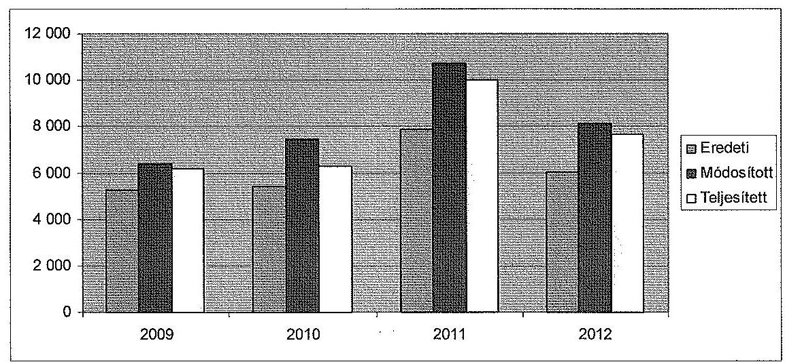

A főiskola részére a költségvetési törvényben biztosított eredeti kiadási előirányzat 2009-ben 21,6\%-kal, 2010-ben 38,4\%-kal, 2011-ben 36,6\%-kal, míg 2012ben $34,4 \%$-kal módosult. A növekedést a dologi kiadások, a személyi juttatások, a felújítások, valamint az intézményi beruházások előirányzatainak módosítása okozta.

A főiskola előirányzatait országgyűlési, kormányzati és irányító szervi hatáskörben is módosították, de a módosítások döntő hányada intézményi hatáskörben történt. Az előirányzat-módosítások egyenlegét a következő táblázat szemlélteti (M Ft):

| Megnevezés | 2009 | 2010 | 2011 | 2012 |
| :--: | :--: | :--: | :--: | :--: |
| Országgyűlési, Kormány, irányító   szerv | 283,6 | 350,1 | $-212,1$ | 108,6 |
| EKF saját hatáskör | 851,9 | 1724,2 | 3087,4 | 1964,0 |

A kormányzati hatáskörben végrehajtott előirányzat-módosítások a keresetkiegészítéssel, bérkompenzációval, valamint a zárolásokkal függtek össze. Minisztériumi hatáskörben az előirányzat-módosítások legjelentősebb tétele a

---

PPP beruházásokra (kollégium) juttatott többletforrás volt ${ }^{26}$. A 2009-2010. években beruházásra, felújításra $90,0 \mathrm{M}$ Ft többletforrást biztosított a minisztérium.

Az intézmény a 2010-2012. években jelentős összegekben hajtott végre év közben saját hatáskörben előirányzat-módosítást, amelynek forrásai az előirány-zat-maradvány és a saját bevétel-növekmény (pályázat útján elnyert többletforrás) voltak.

A teljesített kiadás 2009. évi 6154,9, M Ft-os összege 2012-re 24,9\%-kal növekedett. A teljesített kiadás az ellenőrzött időszakban 3,7\%-15,9\%-kal maradt el a módosított előirányzattól. Az elmaradások jelentősebb összetevői a személyi juttatások, az intézményi beruházások és a felújítások, továbbá a dologi kiadások voltak.

A dologi kiadásokon belül a PPP kiadások aránya 2009-2012. között rendre $22,1 \%, 21,3 \%, 17,2 \%$ és $21,1 \%$ volt.

A teljesített saját és átvett bevételek (az előirányzat maradvánnyal együtt) a 2009. évi 2233,0 M Ft-ról 2012-re több mint kétszeresére emelkedtek . A bevétel - a 2009. évet kivéve - kismértékben elmaradt a módosított előirányzattól, a 2009. évben a bevételek 7,9\%-kal túlteljesültek.

Az EKF teljesített kiadásait a 2009. évben 70,2 \%-ban, 2010-ben 69,5\%-ban, 2011-ben $38,6 \%$-ban, míg 2012-ben $45,5 \%$-ban a költségvetési támogatás finanszírozta. A 2009-2010. években a bevételek nagyobb hányadát ( $66 \%$ illetve $60 \%$-át) a költségvetési támogatás tette ki. A 2011-2012. években azonban a költségvetési támogatás bevételeken belüli aránya $37 \%$ illetve $44 \%$-ra csökkent.

A bevételek és kiadások teljesítési adatainak részletezését a 2. számú melléklet tartalmazza.

A főiskola a beszámolójában a 2009. évre 604,0 M Ft, a 2010. évre 1002,8 M Ft, a 2011. évre 479,3 M Ft és a 2012. évre 319,7 M Ft előirányzat-maradványt mutatott ki.

Az ellenőrzött időszakban a bevételi lemaradás értéke 2009-ben 72,1 M Ft, 2010ben -212,1 M Ft, 2011-ben -252,3 M Ft, valamint 2012-ben -92,8 M Ft volt. A kiadási megtakarítás 2009-ben 237,8 M Ft, 2010-ben 1185,3 M Ft, 2011-ben 731,5 M Ft, 2012-ben 412,5 M Ft volt. Az intézményt meg nem illető maradvány összege 2009-ben 5,9 M Ft-ot, 2010-ben 102,3 M Ft-ot tett ki. A főiskola 2009-ben 300,0 M Ft, 2010-ben 131,9 M Ft előző évről származó előirányzat-maradványt mutatott ki a beszámolójában.

A hallgatói létszám 8167 fơről 7540 főre ( $7,7 \%$-kal) esett vissza, ami kis mértékben alacsonyabb volt, mint a felsőoktatás átlagos - 8,6\%-os - létszámcsökkenése. A felvehető maximális hallgatói létszám 8960 fő volt az alapító okirat szerint, a 2012. évben a rendelkezésre álló férőhely-kapacitás $84,2 \%$-át tudta

[^0]
[^0]:    ${ }^{26}$ A 2009-2012. években ezek összege: 217,0 M Ft, 282,7 M Ft, 212,8 M Ft, 207,0 M Ftvolt.

---

kihasználni az intézmény. A teljes munkaidőben foglalkoztatottakra átszámított létszám 660 fơről 685 fôre, 3,8\%-kal nőtt.

Az EKF múködésének gazdálkodási, pénzügyi feltételei az ellenőrzött időszakban biztosítottak voltak, a gazdálkodás stabil volt, fizetésképtelenség, fedezethiány nem fordult elő. Az ellenőrzött időszakban a főiskola hitelt nem vett fel, támogatás-előrehozást nem kezdeményezett. Az intézménynél kincstári biztos kijelölésére nem került sor.

A stabil pénzügyi helyzet mellett a nemzetgazdasági miniszter 2012. szeptember 1-jei hatállyal - a költségvetési főfelügyelők és költségvetési felügyelők kirendeléséről szóló 1290/2012. (VIII. 9.) Korm. határozat alapján - költségvetési felügyelőt bízott meg az EKF-nél. A költségvetési felügyelő $2,5 \mathrm{M}$ Ft értékhatártól vizsgálta és véleményezte az EKF kötelezettségvállalásait (a bérkifizetés kivételével). A 2012. december végéig vizsgált 38 tétel mindegyikét - az esetleges hiánypótlás után - jóváhagyta. A felügyelő jelentése szerint az intézmény gazdálkodása „kiegyensúlyozott, a kiadások folyamatos visszaszorításával, bevétel kieséssel és az időszakhoz képest kissé magasabb támogatás felhasználással likviditásukat szinten tudták tartani 2012. évben".

A főiskola pénzügyi helyzetét az ún. CLF módszer segítségével elemeztük (3. számú melléklet). Az intézmény pénzügyi pozícióját, múködési jövedelmét, felhalmozási költségvetési egyenlegét, nettó múködési jövedelmét az alábbi táblázat szemlélteti (M Ft-ban):

| Megnevezés | 2009. év | 2010. év | 2011. év | 2012. év |
| :-- | --: | --: | --: | --: |
| Folyó bevételek | 5762,7 | 6003,4 | 6008,3 | 5567,9 |
| Folyó kiadások | 5496,2 | 5427,9 | 6087,6 | 5515,5 |
| Múködési jövedelem (folyó költség-   vetés egyenlege) | $\mathbf{2 6 6 , 5}$ | $\mathbf{5 7 5 , 5}$ | $\mathbf{- 7 9 , 3}$ | $\mathbf{5 2 , 4}$ |
| Felhalmozási bevételek | 399,3 | 783,0 | 3373,2 | 1957,6 |
| Felhalmozási kiadások | 658,7 | 863,3 | 3919,8 | 2169,6 |
| Felhalmozási költségvetés egyenlege | $\mathbf{- 2 5 9 , 4}$ | $\mathbf{- 8 0 , 3}$ | $\mathbf{- 5 4 6 , 5}$ | $\mathbf{- 2 1 2 , 0}$ |
| Folyó és felhalmozási bevételek összesen | 6162,0 | 6786,4 | 9381,5 | 7525,5 |
| Folyó és felhalmozási kiadások összesen | 6154,9 | 6291,2 | 10007,4 | 7685,1 |
| Finanszírozási múveletek nélküli   pozíció | $\mathbf{7 , 2}$ | $\mathbf{4 9 5 , 2}$ | $\mathbf{- 6 2 5 , 8}$ | $\mathbf{- 1 5 9 , 6}$ |
| Finanszírozási múveletek egyenlege | 14,3 | $-18,9$ | $-66,3$ | 137,1 |
| Tárgyévi pénzügyi pozíció (pénzesz-   köz változás) | $\mathbf{2 1 , 5}$ | $\mathbf{4 7 6 , 2}$ | $\mathbf{- 6 9 2 , 1}$ | $\mathbf{- 2 2 , 5}$ |
| Hiteltörlesztés | 0 | 0 | 0 | 0 |
| Nettó múködési jövedelem | $\mathbf{2 6 6 , 5}$ | $\mathbf{5 7 5 , 5}$ | $\mathbf{- 7 9 , 3}$ | $\mathbf{5 2 , 4}$ |

Az ellenőrzött időszakban a szervezet pénzügyi pozíciója romlott, az EKF 2009. évi 261,6 M Ft nyitó, idegen pénzeszközök nélküli pénzállománya a 2012. év végére mintegy hatodára, 44,7 M Ft-ra csökkent. Ennek ellenére összességében megállapítható, hogy az EKF pénzügyi egyensúlya biztosított volt a 2009. és a 2012. évek között. Az ellenőrzött időszakban az EKF

---

folyó bevételei - a 2011. év kivételével - fedezték a folyó kiadásokat. A nettó múködési jövedelem összességében pozitív volt, a 2009-2012. években 815,1 M Ft működési jövedelem többlet keletkezett. Az intézménynél hiteltörlesztés nem volt, ezért a működési jövedelem és a nettó működési jövedelem összege megegyezett.

A folyó bevételek a 2009-2011. években kismértékben emelkedtek (az előző évhez képest 2010-ben 4,2\%-kal, 2011-ben 0,1\%-kal), majd 2012-ben némileg visszaestek ( $7,3 \%$-kal). A bevételek alakulását meghatározta a hallgatók létszámának változása. A hallgatók száma 8167 fơről 7540 főre csökkent. A hallgatói létszám alakulására jellemző, hogy míg a 2009. évben az államilag finanszírozott és a költségtérítéses hallgatók aránya 63,3-36,7\% volt, addig ez az arány 2012-re megfordult, 42,5-57,5\%-ra változott. Ennek megfelelően a folyó bevételek alakulását az ellenőrzött időszakban összességében a működési költségvetési támogatások $571,6 \mathrm{M}$ Ft-os, ( $14,1 \%$-os) csökkenése mellett az egyéb múködési célú bevételek $376,8 \mathrm{M}$ Ft-os, ( $22,1 \%$-os) növekedése jellemezte.

A folyó kiadások összege az ellenőrzött időszakban a 2011. év kiugró összegének kivételével jelentősen nem változott. A 2011. évi növekedést a dologi kiadások összegének emelkedése okozta.

A felhalmozási bevételek alakulása 2009-2012-ben nagy ingadozást mutatott, 2009-hez képest 2010-re megduplázódott ( 383,7 M Ft-tal növekedett), 2011-ben mintegy négyszeresére emelkedett ( 2590,2 M Ft-tal), majd 2012-re ismét jelentősen visszaesett ( $42,0 \%$-kal, 1415,6 M Ft-tal csökkent). A 2011-2012. években a kiugró összegeket az EKF főépületének rekonstrukciójához kapcsolódó támogatásértékű felhalmozási bevételek okozták.

A felhalmozási kiadások összege a Líceum épületének felújítása miatt a 2009-2010. évekhez képest a 2011-2012. években többszörösére ugrott, ebben a két évben elérte a kiadási főösszeg 39,2\%-át, illetve 28,2\%-át.

A felhalmozási költségvetés egyenlege az ellenőrzött időszak minden évében negatív, összességében 1098,2 M Ft volt, a felhalmozási kiadások rendre meghaladták a felhalmozási bevételeket. Az évenkénti hiányt a felhalmozási bevételek és a felhalmozási kiadások teljesítése közötti ütemkülönbség, a 2011. és 2012. évi kiugró értékeket a főiskola főépületének felújítása okozta (a támogatásértékű felhalmozási bevételek nem fedezték a saját beruházások kiadásait).

A finanszírozási műveletek nélküli pozíció az ellenőrzött években rendre 7,2 M Ft, 495,2 M Ft, -625,8 M Ft, illetve -159,6 M Ft volt. A 2011. évi hiányt a múködési és a felhalmozási költségvetés, a 2012. évi hiányt a felhalmozási költségvetés egyenlegeinek negatív értéke okozta. A 2011-2012. években a főiskola a finanszírozási szükségletét az előző évi előirányzat-maradványok igénybevételével tudta biztosítani (a maradvány felhasználásának értékelése nem része a CLF módszer szerinti elemzésnek).

---

A tárgyévi pénzügyi pozíció értéke (amely megegyezik az adott év idegen pénzeszközök nélküli záró, illetve nyitó pénzállományának különbségével ${ }^{27}$ ) jelentős ingadozást mutatott a vizsgált időszakban. A 2009. évi 21,5 M Ft-os öszszeg 2010-re 476,2 M Ft-ra nőtt. A pozitív irányú változást elsősorban a folyó bevételek 2010. évi növekedése eredményezte. 2011-ben a pénzügyi pozíció jelentősen, 1168,4 M Ft-tal, -692,1 M Ft-ra csökkent, melynek legfőbb oka a felhalmozási költségvetés negatív egyenlege volt. 2012-ben az érték -22,5 M Ft-ra változott.

A pénzügyi pozíció romlását jelzi, hogy a főiskola pénzeszköz-likviditási mutatója ${ }^{28}$, a 2009. évi 0,41 értékről a 2010. évre 0,28-ra, majd a 2011-2012. évekre 0,03-ra csökkent. Ez azt jelenti, hogy a pénzeszközök év végi állománya az ellenőrzött időszak egyik évében sem nyújtott fedezetet a rövid lejáratú kötelezettségek rendezésére. A likviditási mutató ${ }^{29}$ értéke szintén jelentősen gyengült, a 2009. évi 1,07-hez képest a 2010. évre 0,34-re csökkent, a 2012. évben már csak 0,15-ös értéket mutatott. Így a forgóeszközök (egyéb aktív pénzügyi elszámolás nélkül) összege csak a 2009. évben nyújtott fedezetet a rövid lejáratú kötelezettségek teljesítésére. A mutatók romlása elsősorban a támogatási program előlegekből származó kötelezettségek növekedésével magyarázható. A támogatási program előlegek változása a pályázati aktivitás növekedésével függött össze ${ }^{30}$.

Az intézmény gazdálkodását kedvezőtlenül befolyásolták az előirányzat felhasználásához kapcsolódó évközi korlátozó intézkedések, azonban a fegyelmezett gazdálkodás és a meghozott takarékossági intézkedések eredményei biztosították az intézmény múködésének pénzügyi, gazdasági feltételeit. Az ellenőrzött időszakban a főiskolát 746,3 M Ft összegű zárolás, valamint 2211,3 M Ft összegű maradványtartási kötelezettség érintette.

2009-ben a főiskolát 75,5 M Ft összegű előirányzat-zárolás érintette, mely teljes egészében elvonásra került. Az intézmény 2009. évi maradványtartási kötelezettsége 508,3 M Ft-ban került meghatározásra.

2010-ben az EKF-nél 63,4 M Ft zárolást, valamint 597,9 M Ft maradványtartási kötelezettséget rendeltek el.

2011-ben az intézményt összesen 444,3 M Ft zárolás és elvonás érintette, ehhez kapcsolódóan a főiskola takarékossági intézkedéseket vezetett be. A személyi juttatásokhoz kapcsolódó intézkedésként az oktatók kötelező óraszámát 20\%-kal megemelték, az étkezési jegyre jogosultak számát csökkentették, a külső óraadói szerződéseket felülvizsgálták és lehetőség szerint megszüntették. A dologi kiadá-

[^0]
[^0]:    ${ }^{27}$ Az idegen pénzeszközök nélküli záró pénzállomány 2008-ban 261,6 M Ft, 2009-ben 283,1 M Ft, 2010-ben 759,3 M Ft, 2011-ben 67,2 M Ft és 2012-ben 44,7 M Ft volt.
    ${ }^{28}$ A pénzeszköz-likviditási mutató kifejezi, hogy a pénzeszközök év végi állománya milyen arányban nyújt fedezetet a rövid lejáratú fizetési kötelezettségekre.
    ${ }^{29}$ A likviditási mutató kifejezi azt, hogy a rövid lejáratú fizetési kötelezettségek kiegyenlítéséhez az aktív pénzügyi elszámolások nélküli forgóeszközök milyen arányban nyújtanak fedezetet.
    ${ }^{30}$ A támogatási programból folyósított előleget, amennyiben azt a finanszírozó még nem ismerte el jogszerú felhasználásnak, a kötelezettségek közt kell kimutatni.

---

sok csökkenését többek között az üzemeltetési, fenntartási szolgáltatások igénybevételének, valamint a beszerzések és az energiafelhasználás csökkentésével kívánták elérni. A 2011. évben 1105,1 M Ft összegű maradványtartási kötelezettséget rendeltek el, amelyet októberben feloldottak.

2012-ben az EKF-nél 163,1 M Ft-ot zároltak és vontak el, maradványtartási kötelezettség az intézményt nem érintette.

# 3.2. A bevételi és kiadási elöirányzatok megállapítása, módosítása, az előirányzat-maradványok kezelése 

Az EKF a kiadási és bevételi előirányzatok tervezése során a jogszabályokban és a fenntartó által kiadott tervezési irányelvekben foglaltak szerint járt el.

A költségvetés tervezéséért felelős minisztérium minden évben kiadta a tervezési köriratot, amelyben a költségvetési tervezés szempontjait és paramétereit határozta meg. Az EKF a felügyeleti szerv által a tervezéshez kért adatszolgáltatásokat az ellenőrzött években határidőre teljesítette, a költségvetési javaslatot mellékszámításokkal alapozta meg. A fenntartó által véglegezett kincstári költségvetés és az intézményi elemi költségvetés kiemelt előirányzati szintű egyezősége 2009-2012 között biztosított volt.

Az éves költségvetés tartalmával és tervezésével kapcsolatos feladatokat a főiskola belső szabályzataiban meghatározták. A költségvetési tervezéssel, pénzellátással, költségvetési gazdálkodással, számvitellel, beszámolással, információszolgáltatással és a gazdasági folyamatba épített belső ellenőrzéssel kapcsolatos központi feladatokat a Gazdasági Főigazgatóság látta el. A Gazdasági Főigazgatóság részletes - tevékenységi körönkénti - feladatait, továbbá a vezetők és dolgozók feladatait, hatásköreit és jogkörét a Gazdasági Főigazgatóság ügyrendje tartalmazta. A tervezés folyamatában részt vevők feladatait a munkaköri leírásaikban rögzítették.

A 2009-2012. években az EKF az előirányzat-módosításokat szabályszerűen hajtotta végre. Az intézményt érintő előirányzat-módosítások (országgyűlési, kormány, irányító szervi, saját) átvezetése a számviteli nyilvántartásokon megfelelt az előírásoknak. Az előirányzat-módosítások dokumentáltak voltak, azokat a Kincstárnak határidőre bejelentették. A kormány hatáskörben végrehajtott előirányzat-módosításokról a minisztérium tájékoztatta a főiskolát, és intézkedett a Kincstár felé.

Az előirányzat-maradvány megállapítása és felhasználása megfelelt a jogszabályi előírásoknak. Kisebb hiányosságként értékelhető, hogy az előző évek előirányzat-maradványának terhére vállalt kötelezettségeket a 2009-2011. években az EKF nem jelentette be határidőben a Kincstárhoz ${ }^{31}$.

Az előirányzat-maradványokat a főiskola Gazdasági Főigazgatósága állapította meg az év végi zárlati feladatok keretében, a Gazdasági Főigazgatóság ügyrendjében szabályozottakkal összhangban. Az előirányzat-maradvány levezetése

[^0]
[^0]:    ${ }^{31}$ Ámr. ${ }_{1}$ 162. § (1) bekezdés, Ámr. ${ }_{2}$ 235. § (1) bekezdés

---

megfelelt a jogszabályi előírásoknak. A mérlegben kimutatott kiadási megtakarítások, bevételi lemaradások és előirányzat-maradványok értékei megegyeztek a 42. úrlapon és a kapcsolódó főkönyvi számlákon bemutatott adatokkal.

Az ellenőrzött időszakban a felhasználható előirányzat-maradvány összegét teljes egészében kötelezettségvállalással terhelt maradványként mutatta ki az intézmény. A főiskola az előirányzat-maradvány levezetésében kimutatott, központi költségvetést megillető összeg befizetését az előirt határidőn belül teljesítette.

A fenntartó az előirányzat-maradványok összegét a 2009-2012. években is jóváhagyta.

# 3.3. A kiadási előirányzatok felhasználása 

A rendszeres és nem rendszeres személyi juttatások és a dologi kiadások felhasználása nem volt szabályszerű. Hibákat tártunk fel a külső személyi juttatások és a felhalmozási kiadások esetében is.

A rendszeres és nem rendszeres személyi juttatások felhasználása során a főiskola nem tartotta be a vonatkozó jogszabályok rendelkezéseit.

Az illetmények, bérek számfejtése szabályosan történt. Az EKF rendelkezett a kifizetésekhez megfelelő fedezettel a személyi juttatás eredeti előirányzaton, egyes esetekben pályázati forrás terhére történt a kötelezettségvállalás és a pénzügyi teljesítés. A dolgozók munkából kieső idejének elszámolása szabályos volt, a kapcsolódó dokumentumok (jóváhagyott szabadság, hiányzásjelentés) rendelkezésre álltak. Az illetmény-, illetve bérpótlékok és kiegészítések megfelelő dokumentummal alátámasztottak voltak, ezek számfejtése a jogszabályoknak és a belső szabályozásnak megfelelően történt.

Visszatérő hiányosság volt, hogy a kinevezések és kinevezés-módosítások (kötelezettségvállalások) okmányairól hiányzott a pénzügyi fedezet rendelkezésre állását igazoló ellenjegyzés. Ezzel megsértették az Ámr. ${ }_{1}$, Ámr. ${ }_{2}$ és az Áht. ${ }_{2}$ vonatkozó rendelkezéseit ${ }^{32}$.

A munkaköri leírásokban rögzített feladatok meghatározása több esetben nem volt pontos, ezért annak számonkérése nem volt megvalósítható.

A munkaköri leírásokban több esetben szerepeltek nem számon kérhető feladatok (pl. lehetőség szerint TDK dolgozat témavezetése, évente legalább egy tudományos cikk elkészítése, vagy elnyert projekt esetén kutatási feladat végig vitele). A munkaköri leírásokban rögzített kötelező óraszámok sem voltak minden esetben egyértelműek. Előfordult, hogy a kötelező óraszámot nem pontosan, hanem minimum-maximum határok között szabták meg. Volt olyan eset, ahol a rendszeres fogadóórát pontatlanul, nem órában, hanem két alkalom/hétben határozták meg.

A kutatók vonatkozásában az EKF nem tudott olyan dokumentumot bemutatni, amely a személyi juttatás kifizetését megalapozta, a munkahelyi jelenlétet,

[^0]
[^0]:    ${ }^{32}$ Ámr. ${ }_{1}$ 134. § (8) bekezdés, Ámr. ${ }_{2}$ 74. § (1) bekezdés, Áht. ${ }_{2}$ 37. § (1) bekezdés

---

illetve az elvégzett munkát igazolta volna ${ }^{33}$. Ez visszavezethető arra, hogy a KSZ a kutatók munkahelyi jelenlétének igazolására nem tartalmazott egyértelmű előírást.

Rendszerszintű hiba volt, hogy a főiskola a közalkalmazottai részére elrendelt többletfeladatokat - a Kjt. 77. § (1) bekezdésére való hivatkozással - nem rendszeres személyi juttatásként fizette ki. Ez a gyakorlat ellentétes az Ámr. ${ }_{1}$ és Ámr. 2 rendelkezéseivel ${ }^{34}$, melyek kimondják, hogy a saját munkavállalónak munkakörén kívüli munkáért fizetett juttatás a külső személyi juttatás előirányzat terhére történhet. A gyakorlat nem felel meg az EKF gazdálkodási szabályzatában foglaltaknak sem.

Szintén rendszerhiba volt a 2009. évben, hogy a többletfeladatok elrendeléséhez kapcsolódóan nem történt meg a teljesítésigazolás ${ }^{35}$.

Az EKF több esetben is megsértette a Kollektív Szerződését, mert az elrendelt túlmunka a Kollektív szerződésben előírt maximális mértéket meghaladta.

A kollektív szerződés 5. § 9.3. pontja szerint „Az elrendelhető túlmunka felső határa két egymást követő napon összesen négy óra, naptári évenként kettőszázötven óra". Eszerint a heti túlmunka mértéke nem lehet több 12 óránál.

A rendszeres és nem rendszeres személyi juttatások előirányzatainak felhasználása során feltárt szabálytalanságok felvetik a tényleges teljesítés nélküli kifizetés kockázatát.

A megbízási díjak elszámolása során a pénzügyi teljesítések, valamint a gazdálkodási jogkörök gyakorlása tekintetében nem érvényesültek teljes körűen a jogszabályok és belső szabályok előirásai. Ez magas szabályszerűségi kockázatot jelez az ellenőrzött terület egészének szabályos működése szempontjából.

A megbízási szerződésben rögzített feladat, valamint a teljesítésigazolás feltételeinek meghatározása több esetben nem volt egyértelmű. Pontos feladat meghatározás hiányában a teljesítés igazolása során nem lehetett érvényesíteni a vonatkozó jogszabályok előírásait ${ }^{36}$.

A teljesítésigazolás során nem az Ámr. ${ }_{1}$, az Ámr. ${ }_{2}$ és az Ávr. vonatkozó rendelkezései ${ }^{37}$ szerint jártak el, mert a megbízási szerződéssel oktatók az órák megtartásának tényét nem dokumentálták.

A dologi kiadási előirányzatok felhasználása nem volt szabályszerű. Rendszerhiba volt, hogy a kötelezettségvállalást, illetve a kötelezettségvállalás

[^0]
[^0]:    ${ }^{33}$ Ámr. ${ }_{1}$ 135. § (1) bekezdése, Ámr. ${ }_{2}$ 76. § (1) bekezdése, Ávr. 57. § (1) bekezdése
    ${ }^{34}$ Ámr. ${ }_{1}$ 58. § (6) bekezdése, Ámr. ${ }_{2}$ 84. § (4) bekezdés b) pontja
    ${ }^{35}$ Ámr. ${ }_{1}$ 135. § (1) bekezdése
    ${ }^{36}$ Ámr. ${ }_{1}$ 135. § (1) bekezdése, Ámr. ${ }_{2}$ 76. § (1) bekezdése, Ávr. 57. § (1) bekezdése
    ${ }^{37}$ Ámr. ${ }_{1}$ 135. § (1) bekezdése, Ámr. ${ }_{2}$ 76. § (1) bekezdése, Ávr. 57. § (1) bekezdése

---

ellenjegyzését nem dokumentálták ${ }^{38}$. Ez felveti a fedezet nélküli kötelezettségvállalás kockázatát. Több esetben nem lehetett a dokumentumokból megállapítani, hogy milyen dátummal történt az utalványozás és a teljesítésigazolás ${ }^{39}$.

A Kbt. ${ }_{1,2}$ hatálya alá tartozó beszerzéseknél, valamint szolgáltatás igénybevételek esetében lefolytatták a közbeszerzési eljárásokat. A gazdasági eseményeket alátámasztó dokumentumok, a kiadási utalványrendeletek, számlák rendelkezésre álltak. A pénzügyi kifizetések a szerződésekben meghatározott, illetve megrendeléseknek megfelelő összegek szerint történtek. A készletek bekerülési értékét az Sztv., az Áhsz., illetve a Számviteli Politika előirásai szerint állapították meg.

A felhalmozási kiadások elöirányzatának felhasználása során a pénzügyi elszámolások, valamint a gazdálkodási jogkörök gyakorlása tekintetében nem érvényesültek teljes körüen a jogszabályok és belső szabályok előirásai. Ez magas szabályszerűségi kockázatot jelez az ellenőrzött terület egészének szabályos működése szempontjából.

Rendszerszintű hiányosságként tártuk fel, hogy a kötelezettségvállalási dokumentumon a pénzügyi ellenjegyzés dátumát ${ }^{40}$, illetve a teljesítésigazolásokon az igazolás dátumát nem tüntették fel ${ }^{41}$.

Egy nettó 39,1 M Ft-os - rektor által aláírt - eszközbeszerzési szerződés esetében megsértették a Kbt. ${ }_{1}$ egybeszámításokra, valamint közbeszerzési eljárás lefolytatására vonatkozó szabályait ${ }^{42}$.

Az ÁSZ a közbeszerzési szabályok megsértése miatt, a Kbt. ${ }_{1}$-ben rögzített jogvesztő határidőre tekintettel nem élt jelzéssel a Közbeszerzési Döntőbizottság felé.

Előfordult, hogy nem volt dokumentálva a kötelezettségvállalás ${ }^{43}$, illetve a kötelezettségvállaláshoz nem kapcsolódott pénzügyi ellenjegyzés ${ }^{44}$. Egyedi hibaként tártuk fel, hogy nem történt meg az utalványozás, illetve az utalványozás pénzügyi ellenjegyzése ${ }^{45}$.

# 3.4. A bevételi előirányzatok beszedése 

A főiskola a bevételi előirányzatok beszedése során nem járt el szabályszerűen.

[^0]
[^0]:    ${ }^{38}$ Ámr. ${ }_{1}$ 134. § (1) és (8) bekezdés, Ámr. ${ }_{2}$ 72. § (1), 74. § (1) bekezdés, Ávr. 52. § (1), 55. § (1) bekezdés
    ${ }^{39}$ Ámr. ${ }_{1}$ 135. § (2) és 136. § (4) bekezdés, Ámr. ${ }_{2}$ 76. § (3) és 78. § (2) bekezdés, Ávr. 57. § (3) és 59. § (3) bekezdés
    ${ }^{40}$ Ámr. ${ }_{2}$ 74. § (1) bekezdés, Ávr. 55. § (1) bekezdés
    ${ }^{41}$ Ámr. ${ }_{1}$ 135. § (2) bekezdés, Ámr. ${ }_{2}$ 76. § (3) bekezdés, Ávr. 57. § (3) bekezdés
    ${ }^{42} \mathrm{Kbt}_{1} 40 . \S$ és $240 . \S$
    ${ }^{43}$ Ámr. ${ }_{1}$ 134. § (8) bekezdés, Ámr. ${ }_{2}$ 74. § (1) bekezdés, Ávr. 52. § (1) bekezdés
    ${ }^{44}$ Ámr. ${ }_{1}$ 134. § (8) bekezdés, Ámr. ${ }_{2}$ 74. § (1) bekezdés
    ${ }^{45}$ Ámr. ${ }_{2}$ 78-79. §

---

Az EKF az intézményi múködési bevételek beszedése során nem tartotta be a vonatkozó jogszabályokban és a belső szabályozásban előírtakat, az ellenőrzött mintatételek mindegyikénél tártunk fel hibát, hiányosságot.

Rendszerhiba volt, hogy a bevételek beszedésekor a főiskola nem végezte el a bevételek teljesítésigazolását. Ezzel megsértette az Ámr. ${ }^{46}$ és a gazdálkodási szabályzat előírásait.

A bevételek teljesítésigazolási kötelezettsége jogszabályi előírás alapján 2010. január 1-jétől, az Ámr. ${ }_{2}$ vonatkozó rendelkezésének hatályba lépésével megszűnt. Az Ámr. 2 76. § (2) bekezdése, illetve az Ávr. 57. § (2) bekezdése szerint a kötelezettségvállaló szerv a belső szabályzatában előírhatja a bevételek meghatározott körére nézve a teljesítés igazolásának kötelezettségét. A főiskola gazdálkodási szabályzata 2010. január 1-jétől továbbra is előírta a bevételek szakmai teljesítésigazolását.

A hallgatói költségtérítésekből származó bevételek beszedésekor az utalványozók és az utalványok ellenjegyzői nem tartották be az Ámr.,, az Ámr.,, és az Ávr. vonatkozó előírásait ${ }^{47}$.

A főiskola hallgatói a költségtérítéseket az EKF Főiskolai Hallgatói Egyesület nevére megnyitott, a Kereskedelmi és Hitelbank Zrt.-nél vezetett bankszámlára (ún. gyűjtőszámlára) fizették be. A főiskolán a költségtérítések nyilvántartását a NEPTUN rendszerben kezelték. A NEPTUN rendszer minden hallgató számára biztosított egy virtuális folyószámlát, amelyből a hallgató teljesítheti a számára előírt térítési díffizetési kötelezettséget. A virtuális folyószámlán azok az összegek jelentek meg, amelyeket a hallgatók a Kereskedelmi és Hitelbank Zrt.-nél vezetett gyűjtőszámlára fizettek be.

A Kereskedelmi és Hitelbank Zrt.-nél vezetett gyűjtőszámláról a beszedett és a hallgatók által a NEPTUN-ban elszámolt bevételek hetente kerültek átutalásra az EKF Kincstárnál vezetett bankszámlájára. A kincstári értesítést követően történt a térítési díjak tekintetében a főkönyvi könyvelésben a bevétel elszámolása. A főiskola kincstári számláján jóváírt hallgatói befizetéseket tartalmazó bankkivonatok utalási listája nem tette lehetővé a bevételek típusonkénti és hallgatónkénti beazonosítását.

A hallgatói költségtérítések Kereskedelmi és Hitelbank Zrt.-nél vezetett gyűjtőszámlán történő kezelése miatt a főiskola megsértette az Áht. ${ }_{1-2}$ vonatkozó rendelkezéseit ${ }^{48}$ is, miszerint a kincstári kör fizetési számlái csak a Kincstárnál vezethetők. Nem tartotta be az Áhsz. előírásait sem.

Az Áhsz. 51. § (1) bekezdés a) pontja szerint a pénzforgalmat érintő gazdasági műveletek, események bizonylatainak adatait késedelem nélkül, készpénzforgalom esetén a pénzmozgással egyidejűleg, pénzforgalmi számla, előirányzatfelhasználási keretszámla forgalomnál a hitelintézeti értesítés, illetve a Kincstár értesítésének megérkezésekor a könyvekben rögzíteni kell. Ezzel ellentétben a gyűjtőszámlára befizetett bevételek nem azonnal, a pénzintézeti értesítést követő-

[^0]
[^0]:    ${ }^{46}$ Ámr. ${ }_{1}$ 135. § (1) bekezdés
    ${ }^{47}$ Ámr. ${ }_{1}$ 136-137. §, Ámr. ${ }_{2}$ 78-79. §, Ávr. 59. §
    ${ }^{48}$ Áht. ${ }_{1}$ 18/C. § (5) és az Áht. ${ }_{2}$ 79. § (1) bekezdése

---

en kerülnek könyvelésre a főkönyvi könyvelésben, hanem csak a kincstári számlára történő átvezetéskor.

A felhalmozási és vagyonhasznosítási bevételek beszedése nem volt szabályszerű, valamennyi ellenőrzött esetben állapítottunk meg a jogszabályban vagy a belső szabályozásban előírtaktól eltérő gyakorlatot.

A bevételek beszedésekor a főiskola nem végezte el a bevételek teljesítésigazolását. Ezzel megsértette az Ámr., ${ }^{49}$ és a gazdálkodási szabályzat előírásait.

Egy nagy értékű ( $25,5 \mathrm{MFt}$ ) bevétel esetében a szerződés ellenértékének behajtására a főiskola - a fizetési felszólítások eredménytelenségét követően - egyéb intézkedést nem tett, késedelmi kamatot nem számított fel. A követelés közel három év elteltével folyt be. A követelést úgy egyenlítette ki a szerződéses partner (a főiskola többségi tulajdonában álló cég), hogy a főiskolával kötött megállapodásnak megfelelően bútort vásárolt a követelés értékének megfelelő öszszegben. Ezzel az EKF megsértette a költségvetési hiánycél biztosítása érdekében hozott 1036/2012. (II.21.) Kormányhatározatban előírt bútorbeszerzési tilalmat.

# 3.5. A normatív támogatások felhasználása, a hazai forrásból finanszírozott projektek, költségtérítések megállapítása 

Az EKF normatív támogatások felhasználásával kapcsolatos döntései megfeleltek a vonatkozó jogszabályok és belső szabályzatok előírásainak, csak kisebb hiányosságokat tártunk fel.

Az ellenőrzött időszakban a nem kötött felhasználású normatív támogatások (képzési, tudományos célú és fenntartói) szervezeti egységek közötti felosztását a költségvetés elfogadása keretében a szenátus hagyta jóvá. A GT azonban előzetesen nem véleményezte a költségvetést, így a támogatások felosztását sem, ami ellentétes volt a Feot. rendelkezéseivel ${ }^{50}$. A főiskola rendelkezett a támogatások finanszírozására kötött fenntartói megállapodással.

A 2009-2012. években a kötött felhasználású hallgatói támogatások felhasználását a főiskola a Hallgatói térítési és juttatási szabályzatokban meghatározta. A szabályzatokat a szenátus elfogadta. A hallgatók a Hallgatói térítési és juttatási szabályzatban lévő információkról írásos tájékoztatást kaptak.

Az egyes hazai forrásból finanszírozott projektekhez, feladatokhoz kapott - nem normatív - költségvetési forrással való elszámolás az előírásoknak megfelelt. Az EKF a pályázati forrásokból származó támogatások elszámolásánál a projektek bevételeit és kiadásait elkülönítette a számviteli nyilvántartásában. A pályázati források az EKF tudományos kutatási és oktatási tevékenységéhez kapcsolódtak. A céljelleggel juttatott támogatásokat az EKF rendeltetésszerűen használta fel. A támogató által el nem fogadott - a támogatott által el nem számolható összeget tartalmazó - pénzügyi elszámolá-

[^0]
[^0]:    ${ }^{49}$ Ámr. ${ }_{1}$ 135. § (1) bekezdés
    ${ }^{50}$ Feot. 25. § (1) bekezdés ac) pontja

---

sokat az EKF utólagosan kijavította, módosította. A fel nem használt támogatások (maradvány) pénzügyi elszámolását végrehajtották. A pályázatok keretében megvalósult projektek elő-, folyamatos, illetve utófinanszírozással történtek.

Az intézményi térítési díjak, költségtérítések megállapítását nem alapozta meg önköltségszámítás, a gyakorlat nem felelt meg a jogszabályi előírásoknak.

Az intézmény egyes tevékenységeinek bevételeit és kiadásait a kialakított témaszámok szerint különítették el. A témaszámos azonosítás rendszere lehetővé tette a bevételek és kiadások szakfeladatoknak megfelelő elkülönítését. A főkönyvi könyvelési rendszerben a kiadások és bevételek elszámolására alkalmazott főkönyvi számlákat és azok alábontásait a számlatükör tartalmazta.

Az EKF 2011. október 12-ig nem rendelkezett önköltség-számítási szabályzattal. A 2011 októberétől hatályos szabályzatot a gyakorlatban nem alkalmazta. Így az ellenőrzött időszakban az EKF az oktatási tevékenység közvetlen önköltségét az Áhsz. előírásaival ${ }^{51}$ ellentétben nem határozta meg. Jogszabálynak megfelelő önköltség-számítási szabályzat, illetve annak alkalmazása hiányában a megállapított költségtérítés és ráfordítás arányára vonatkozó előírások ${ }^{52}$ teljesülése nem állapítható meg.

A főiskola az intézményi térítési díjak, költségtérítések összegeit a Hallgatói térítési és juttatási szabályzatban állapította meg, melyek rögzítették a főiskola hallgatóinak adható támogatások és a hallgatók által fizetendő díjak, térítések összegeit. A költségtérítések összege összhangban volt a szabályzatban foglaltakkal.

# 4. AZ INTÉZMÉNY VAGYONGAZDÁLKODÁSA 

Az EKF a vagyongazdálkodása során nem minden esetben járt el szabályszerűen.

Az intézmény vagyona az ellenőrzött időszakban közel kétszeresére, 4770,6 M Ft-ról 9378,4 M Ft-ra növekedett. A befektetett eszközök állománya a beruházások és gépbeszerzések eredményeként 3913,0 M Ft-ról 8870,1 M Ft-ra emelkedett, míg a forgóeszközök értéke 857,6 M Ft-ról 508,3 M Ft-ra, 59,3\%-kal csökkent. A forgóeszközök állományának változása elsősorban a pénzeszközök állományának mérséklődésével és az értékpapírok beváltásával volt kapcsolatban. A vagyonváltozás részletes elemzését az ellenőrzött időszak könyvviteli mérlegeinek adatai alapján végeztük el (a mérlegadatokat a 4. számú melléklet részletezi).

A főiskola mérleg szerinti vagyonában a befektetett eszközök aránya nőtt az ellenőrzött időszakban. A befektetett eszközök eszközvagyonon belül részaránya

[^0]
[^0]:    ${ }^{51}$ Áhsz. 8. § (19) bekezdés
    ${ }^{52}$ Feot. 120. § (7), valamint 126. § (2) bekezdései, Nftv. 82. § (3) bekezdése

---

$81,9 \%$-ról $94,6 \%$-ra változott, míg a forgóeszközök aránya $18,1 \%$-ról $5,4 \%$-ra csökkent.

A befektetett eszközök állományának növekedése az ingatlanok és a kapcsolódó vagyonértékű jogok állományában bekövetkezett beruházások, felújítások (Líceum, Kampusz és további épületek felújítása, építése), valamint a gépek, berendezések állományát érintő beszerzések következménye. Az ingatlanok 2009. évi 2858,2 M Ft mérleg szerinti értéke a 2012. évre több mint két és félszeresére, 7552,0 M Ft összegüre emelkedett. A tárgyi eszközökön belül a gépek, berendezések és felszerelések eszközcsoport értékei is jelentős növekedést mutatnak. A 2009. évi mérleg érték 588,1 M Ft-ról a 2012. évre 810,0 M Ft összegüre $(37,7 \%-\mathrm{kal})$ emelkedett.

A forgóeszközök mérleg szerinti értékének 2009. és 2012. évek közötti csökkenését elsősorban az értékpapírok állományában bekövetkezett csökkenés okozta, de a pénzeszközök év végi értéke is alacsonyabb lett az ellenőrzött időszak végére. A diszkont értékpapír állománya a 2009. évi mérlegben 310,0 M Ft volt, amelynek beváltását követően a pénzeszközök összege a 2009. évi 296,7 M Ftról 2010. évre 759,7 M Ft-ra emelkedett. A 2010. évet követően a pénzeszközök év végi értéke folyamatosan, a 2012. évre 45,2 M Ft-ra csökkent. A főiskola a 2010-2012. évek között értékpapírral nem rendelkezett.

Az elszámolt értékcsökkenést jelentősen meghaladó fejlesztések hatására az immateriális javak és a tárgyi eszközök összesített használhatósági foka ${ }^{53}$ a 2009. évi $63,1 \%$-ról a 2012. évre $72,2 \%$-ra növekedett. A mutató alakulását kedvezően befolyásolta a teljesen ( 0 -ig) leírt eszközök évenként megvalósított selejtezése is. Az eszközök elhasználódási szintje ${ }^{54}$ a 2009. évi 36,9\%-ról a 2012. év végére $27,8 \%$-ra javult. Ehhez elsősorban az immateriális javak és az ingatlanok állománycsoportjában bekövetkezett kedvező változás (beruházások, felújítások) járult hozzá. Az immateriális javak, tárgyi eszközök életkora az ellenőrzött időszakban átlagosan 4,5 évről 4,1 évre csökkent.

A főiskola mérleg szerinti követelései a 2009. évi 117,6 M Ft-ról 2012-re 6,5\%kal, 110,0 M Ft-ra csökkentek. A követelések állománya követelés áruszállításból és szolgáltatás nyújtásából (vevők), adósok, adott kölcsönök (lakáskölcsön) és egyéb követelések értékéből tevődött össze. A vevő követelések összege a 2009-2012. években rendre $115,7 \mathrm{MFt}, 111,8 \mathrm{MFt}, 137,8 \mathrm{MFt}$, illetve 107,0 M Ft volt, amelyből a lejárt követelések aránya 77,2\%-94,7\%-ot tett ki.

A határidőn túli követelések lejárat szerinti megoszlása az ellenőrzött időszakban kedvezően alakult. Míg a 0-90 nap között lejárt követelés aránya a 2009. évi $34,5 \%$-ról a 2012. évre $45,7 \%$-ra nőtt, addig a 360 napon túl lejárt

[^0]
[^0]:    ${ }^{53}$ A használhatósági fok mutatója a tárgyi eszközök, immateriális javak nettó értékének és a tárgyi eszközök, immateriális javak bruttó értékének a hányadosa. A mutató növekedése azt jelzi, hogy az intézmény eszközeinek átlagos elhasználtsága csökken, a használhatóságuk javul.
    ${ }^{54}$ Az elhasználódási szint a tárgyi eszközök elszámolt értékcsökkenésének és a tárgyi eszközök záró bruttó értékének a hányadosa.

---

követelések aránya a 2009. évi 44,7\%-ról az ellenőrzött időszak végére 27,0\%ra mérséklődött.

A főiskola csak a 2012. év végén írt le 0,3 M Ft összegben behajthatatlanság címén követelést.

Az EKF kötelezettségének állománya a 2009. évi 715,7 M Ft-ról a 2012. év végére 1312,6 Ft-ra, közel kétszeresére emelkedett. Ezt döntően a támogatási programokkal összefüggő kötelezettségek több mint háromszorosára történő növekedése okozta. A kötelezettségek teljes összege rövid lejáratú volt.

A rövid lejáratú kötelezettségek áruszállítás és szolgáltatás teljesítéséből (szállítók), PPP szerződésekből ${ }^{55}$, továbbá támogatási programok előlegéből keletkeztek.

A szállítói kötelezettségek állománya a 2009. évi 58,8 M Ft-ról a 2012. év végére 162,2 M Ft-ra változott. A lejárt szállítói tartozások esetében kedvezőtlen tendenciákat tapasztaltunk. A lejárt kötelezettségek aránya a 2009. évben $22,1 \%$-ot, míg a 2012. évben $68,6 \%$-ot tett ki. A lejárt kötelezettségeken belül a 30 napon belüli tartozások aránya volt a meghatározó, a 2009. évi $51,5 \%$-ról a 2012. évben $92,6 \%$-ra nőtt. A főiskola csak a 2009-2010. években rendelkezett minimális összegű ( $0,4 \mathrm{M} \mathrm{Ft}$, illetve $0,1 \mathrm{M}$ Ft), éven túl lejárt tartozással.

Az ellenőrzött időszakban a tartós részesedések és értékpapírok állományának változása nem volt összefüggésben a közfeladatok változásaival. Ezen vagyonelemek aránya a mérlegfőösszegen belül csak a 2009. évben volt jelentős $(6,4 \%)$.

Az EKF több gazdasági társaságban is rendelkezett tartós részesedéssel. A tartós részesedés mérleg szerinti értéke a 2009-2011. évek között 11,6 M Ft, a 2012. évben 11,1 M Ft volt. A 2012. évben bekövetkezett csökkenést a végelszámolási eljárás alatt álló Rend Trend Kft.-ben lévő részesedés téves kivezetése okozta. A főiskola csak a 2009. évben rendelkezett forgatási célú értékpapírral, a 2009. évi mérlegben 309,9 M Ft összegű állományt mutatott ki. Az értékpapírokat a 2010. évben beváltották.

A saját tőke aránya mutató (Saját tőke összesen/Források összesen) kedvezően alakult, a 2009. évi 70,9\%-ról a 2012. évre 82,2\%-ra növekedett. Szintén kedvező képet mutat a kötelezettségek és a saját tőke aránya mutató, amely a 2009. évi $20,3 \%$-ról a 2012 . év végére $17,0 \%$-ra változott.

# 4.1. A vagyongazdálkodás szabályozottsága 

A főiskola a vagyongazdálkodással kapcsolatos belső szabályzatokat a jogszabályi előírásokkal összhangban adta ki, csak kisebb hiányosságokat tártunk fel.

[^0]
[^0]:    ${ }^{55}$ A PPP szerződésekből származó kötelezettség a 2009. évben 224,0 M Ft, a 2010. évben 277,8 M Ft, a 2011-2012. években 342,9 M Ft volt.

---

Az EKF a Feot. rendelkezései alapján elkészítette az Intézményfejlesztési Terveket és azok módosítását, amelyeket a szenátus elfogadott. A főiskola a jogszabályi előírásoknak megfelelően elkészítette az éves vagyongazdálkodási terveket, amelyek igazodtak az Intézményfejlesztési Tervekben megfogalmazott stratégiai célokhoz. A GT a jogszabályi előírásokkal ${ }^{56}$ ellentétesen a 2009-2010. és a 2012. évi vagyongazdálkodási tervet nem véleményezte. Szintén nem volt szabályszerű, hogy az éves vagyongazdálkodási tervek elfogadásáról a szenátus nem hozott döntést ${ }^{57}$.

Az EKF infrastruktúra fejlesztésének stratégiai céljai - az 500-600 férőhelyes nagy előadó, valamint a Sas úti kollégiumi férőhely kiváltására tervezett új kollégium kivételével - teljesültek.

A főiskola a jogszabályi előírásoknak megfelelően a belső szabályzataiban határozta meg az alapfeladat ellátásához rendelkezésére bocsátott vagyon megőrzésének, a vagyonérték növelésének, nyilvántartásának és hasznosításának eljárási szabályait. A belső szabályzatok nem tartalmaztak előírást arra vonatkozóan, hogy a bérleti díjnak fedezetet kell nyújtania a bérelt vagyontárggyal kapcsolatban felmerülő fenntartási költségekre, értékcsökkenésre ${ }^{58}$.

Az EKF a kezelésében és tulajdonában lévő tárgyi eszközök hasznosításának szabályait 2012 novemberéig a gazdálkodási szabályzatban, valamint a gépjárművek üzemeltetéséről szóló rektori utasításban rögzítette. Ezt követően a szabályokat a Felesleges vagyontárgyak feltárása, hasznosítása, selejtezése szabályzat tartalmazta. A gazdálkodási szabályzat tartalmazta az értékesítés szabályait, a bérleti díjak megállapítására vonatkozó előírást, a térítés nélküli igénybevétel engedélyezését, valamint a bérleti díj bevételéből felújításra fordítandó hányadot. A Felesleges vagyontárgyak feltárása, hasznosítása, selejtezése szabályzat rögzítette a vagyon hasznosításának, elidegenítésének folyamatát és szerződési feltételeit. A szabályzat meghatározta a bérleti szerződés tartalmát, valamint kitért a térítés nélküli és üzemeltetésre átadás feltételeire is.

# 4.2. A vagyonelemek kimutatása 

Az EKF a vagyonelemek kimutatása során nem minden tekintetben járt el szabályszerűen. A mérlegben feltárt hibák összege azonban nem befolyásolja a megbízható és valós képet.

Az EKF a beszámolójában és a számviteli nyilvántartásaiban kimutatott eszközök és források állományának valódiságát leltárral alátámasztotta.

Az ellenőrzött időszakban a leltározás folyamatának előírásait (leltározási ütemterv, leltárfelvétel, egyeztetés, kiértékelés, leltáreltérések megállapítása, felelősség megállapítása, leltáreltérés leírása) a leltározási szabályzatban rögzítették. Az EKF a 2009. és 2011. években az Áhsz. 37. § (7) bekezdése alapján a

[^0]
[^0]:    ${ }^{56}$ Feot. 25. § (1) bekezdés ac) pontja
    ${ }^{57}$ Feot. 27. § (6) bekezdés d) pontja
    ${ }^{58}$ Ámr. ${ }_{1}$ 57. § (12) bekezdés, Ámr. ${ }_{2}$ 81. § (6) bekezdés

---

fenntartó egyetértésével és engedélyével nem hajtott végre mennyiségi felvétellel leltárt. A 2010. és 2012. években a mérlegben kimutatott eszközöket az Áhsz. 37. § (3) bekezdésének megfelelően leltározta.

Az ellenőrzött időszakban a leltározási utasítást minden évben, a leltározási ütemtervet a mennyiségi felvétellel történő leltározás végrehajtásához készítették el. A leltározás irányításáért, végrehajtásáért és ellenőrzéséért felelős személyek megbízását írásban rögzítették. Az immateriális javak, tárgyi eszközök és készletek mérleg szerinti záró értéke megegyezett a főkönyvi kivonattal, a mérleg adatait a leltár adatai alátámasztották. A leltározás kiértékelésének dokumentálására záró jegyzőkönyvek készültek.

A leltárak kiértékelése, az eltérések kimutatása - a leltározási szabályzatnak megfelelően - megtörtént. Leltáreltéréseket a 2012. évben állapítottak meg, amelyekről minden esetben igazoló jelentés készült. Az EKF rektora a leltáreltérések dokumentumait felülvizsgálta, és az eltérések nyilvántartásból történő kivezetését elrendelte, engedélyezte, a leltáreltérésekkel kapcsolatban egyik évben sem állapított meg személyi felelősséget. Az ügyviteli és számítástechnikai eszközcsoportban hiányként feltárt eszközök nullára leírt nyilvántartási értékűek voltak. Ezen eszközök összes bruttó értéke és az elszámolt értékcsökkenésének összege 2,1 M Ftot tett ki. A gépek, berendezések és felszerelések eszközcsoportban a leltárhiány könyv szerinti értéke nullára leírt, a bruttó érték és az elszámolt értékcsökkenés összege $0,4 \mathrm{M}$ Ft volt. A főkönyvi és analitikus nyilvántartások leltáreltérésekkel történő helyesbítése és könyvviteli rendezése a 2012. évben a rektor engedélyével a mérlegkészítés időpontjáig megtörtént.

# A mérlegtételek tartalma, besorolása és értékelése nem minden esetben felelt meg a jogszabályi előírásoknak. 

A főiskola a 2009-2012. években a főkönyvi számlákon a vagyonát kizárólag az alapfeladat ellátása érdekében rendelkezésre bocsátott és kezelésbe vett eszközként mutatta be. Nem különített el és nem mutatott ki saját tulajdonában lévő eszközöket ${ }^{59}$, annak ellenére, hogy az időszakban rendelkezett saját vagyonnal.

A főiskola a 2012. évi mérlegében nem szerepeltetett 0,5 M Ft összegű részesedést, amellyel megsértette a teljesség számviteli alapelvét ${ }^{60}$.

Az EKF 100\%-os tulajdonában lévő Rend Trend Kft. végelszámolását a szenátus 2011. december 31-i hatállyal elhatározta. A végelszámolás 2012. december 31én is folyamatban volt, ennek ellenére a főiskola a részesedést a 2012. évi mérlegében nem szerepeltette.

A követelések mérlegsor besorolása és értékelése nem teljes körűen felelt meg a vonatkozó jogszabályi előírásoknak.

Az EKF a lejárt követeléseit nem értékelte, és az ellenőrzött időszakban nem számolt el azok után értékvesztést. Ezzel megsértette a valódiság és egyedi értékelés számviteli elvét ${ }^{61}$, továbbá az Áhsz. szabályait ${ }^{62}$.

[^0]
[^0]:    ${ }^{59}$ Feot. 120. § (2) bekezdés
    ${ }^{60}$ Sztv. 15. § (2) és az Áhsz. 9. § (2) bekezdés

---

Az ellenőrzött mintatételek 27\%-ánál a követelések előírása nem volt jogszerű ${ }^{63}$.

Egy hallgató nem iratkozott be a főiskolára, egy hallgatót pedig elbocsátottak, ennek ellenére a részükre költségtérítést állapítottak meg. Egy hallgató esetében a kiköltözés ellenére kollégiumi díjat írtak elő. Egy hallgató a beiratkozáson nem jelent meg, és beiratkozási díjat állapítottak meg. Egy hallgató az igazgatási díjat már szeptemberben kifizette. További két elbocsátott és több, félévet szüneteltető hallgató részére könyvtárhasználati díjat mutattak ki. Egy hallgató a diákigazolvány igénylését visszavonta, de a térítési díjat előírták.

Az intézmény a hallgatói költségtérítések befizetéseinek egy részét nem mutatta be az ellenőrzött évek könyvviteli mérlegeiben a pénzeszközei között, ezáltal megsértette a teljesség számviteli alapelvét ${ }^{64}$.

A főiskola a hallgatói térítési díj befizetéseket - az Áht. 7 79. § (1) bekezdésében foglaltak ellenére - az Eszterházy Károly Főiskola Főiskolai Hallgatói Egyesület nevére szóló, kereskedelmi bankban nyitott bankszámlán szedte be. A bankszámlára befolyt térítési díjbevételeket év közben részben átvezette a Kincsár által vezetett elszámolási számlájára. A költségvetési év végén a bankszámla egyenlegének teljes összegű, kincstár elszámolási számlára történő átvezetése az év utolsó banki napján nem történt meg. A kereskedelmi bank által vezetett bankszámla december 31-ei egyenlege a 2009. évben 34,1 M Ft, a 2010. évben 38,5 M Ft, a 2011. évben 35,7 M Ft, a 2012. évben 31,5 M Ft volt.

A főiskola egy gazdasági társaságnak nyújtott, 10,0 M Ft összegű tagi kölcsönt az Áhsz. előírásaival ${ }^{65}$ ellentétben nem kölcsönként, hanem egyéb aktív függő, átfutó kiadásként mutatta ki a 2011. évi mérlegében.

Az immateriális javak, a tárgyi eszközök, a készletek, az értékpapírok és a kötelezettségek tartalma, besorolása és értékelése az előírásoknak megfelelt.

# 4.3. A vagyonelemekkel való gazdálkodás 

Az EKF a vagyonelemekkel történő gazdálkodása során a jogszabályokban és a belső szabályozásokban elöírtakat csak részben tartotta be.

Az ellenőrzött időszakban a selejtezések végrehajtása és dokumentálása szabályszerű volt. A még hasznosítható eszközök értékesítéséhez az eladási árat értékbecslés alapján meghatározták, és azokat a dolgozók körében meg-
${ }^{61}$ Sztv. 15. § (3), 16. § (1) és az Áhsz. 9. § (10-(11) bekezdés
${ }^{62}$ Áhsz. 31. § (2) bekezdés
${ }^{63}$ Áhsz. 22. § (1) bekezdés
${ }^{64}$ Sztv. 15. § (2) és az Áhsz. 9. § (2) bekezdés
${ }^{65}$ Áhsz. 9. számú melléklet 1. j) pont

---

hirdették. A selejtezésről minden esetben készültek jegyzőkönyvek. A főiskola a selejtezési jegyzőkönyv mellé csatolta a számítástechnikai eszközök esetében az értékbecslés dokumentumait, valamint a hulladék elszállításról szóló szállítóleveleket. Az ellenőrzött időszakban egyik évben sem selejteztek 1 M Ft nettó értéket meghaladó értékű eszközt. A selejtezett eszközöket a rektor engedélye alapján a nyilvántartásból kivezették.

A főiskola bruttó vagyonértéke selejtezés jogcímen az immateriális javak, ingatlanok és gépek, berendezések, felszerelések eszközcsoportban a 2009. évben összesen 2,9 M Ft-tal, a 2010. évben 2,1 M Ft-tal, 2011-ben a gépek, berendezések és felszerelések, valamint a járművek állományában 34,1 M Ft-tal csökkent. A 2012. évben végrehajtott selejtezés az immateriális javak, az ingatlanok és az üzemeltetésre, kezelésre átadott eszközcsoportok bruttó értékét csökkentette 79,2 M Ft-tal.

# Az EKF az ellenőrzött időszakban felelősen gazdálkodott a részesedéseivel. 

A gazdasági társaságok társasági szerződéssel, illetve alapító okirattal rendelkeztek. Ebben rögzítették az ellátandó feladatokat. A főiskola a kizárólagos tulajdonában lévő gazdasági társaságok alapító okiratában meghatározta az üzletrészhez és annak elidegenítéséhez, felosztásához kapcsolódó főbb szabályokat (az adózott eredmény felhasználására vonatkozó döntés, a pótbefizetés elrendelése stb.).

Az ellenőrzött időszakban a főiskola öt gazdasági társaságban rendelkezett részesedéssel. Az EKF a 2009-2012. években egy új társaságot alapított, illetve egy gazdasági társaság esetében határozta el annak megszüntetését. Az alapítással, megszűntetéssel kapcsolatos döntések és azok dokumentálása szabályszerű volt.

A GT a számára előterjesztett üzleti terv alapján javasolta a tanszálloda múködtetését végző Hotel Estella Kft. létrehozását, amelyet a szenátus a határozatával jóváhagyott. A $2,0 \mathrm{M}$ Ft törzstőke befizetése 2009. január 19-én történt meg, amelynek a fedezete a főiskola saját bevétele volt. A Kft.-t a cégbíróság 2009. január 28-án jegyezte be.

A GT javaslata alapján a szenátus határozattal döntött a Rend Trend Kft. 2011. december 31-i, végelszámolással történő megszüntetéséről, mivel az időközben bekövetkezett jogszabályi változások miatt annak múködése már nem volt gazdaságos. A végelszámolás az ellenőrzött időszak végén még folyamatban volt.

Az EKF tulajdonában álló gazdasági társaságok átláthatónak minősültek ${ }^{66}$.
Az EKF a társaságok felügyeletét a főiskola alkalmazottaiból létrehozott Felügyelő Bizottságon keresztül látta el.

A Felügyelő Bizottsági üléseken tárgyalták a társaságok gazdálkodásával kapcsolatos feladatokat, megvitatták a beszámolókat, a következő évi üzleti terveket és a gazdasági társaságokat érintő jogszabályi változásokat. A Felügyelő Bizottságok által megtartott ülésekről jegyzőkönyvek készültek, amelyeket a főiskola részére megküldtek.

[^0]
[^0]:    ${ }^{66}$ Nvtv. 3.§ (1) bekezdés 1. pont

---

Az EKF a gazdasági társaságok vagyoni helyzetének alakulására irányuló elemző tevékenységet évente, az év végi beszámoló értékelésének keretében végzett. Az értékelést a rektor megbízása alapján a gazdasági főigazgató készítette el. Az előterjesztések tartalmazták a gazdasági társaságok éves beszámoló adatait, eredményét, valamint a gazdasági társaságok következő évi üzleti terveit, amelyeket a 2009-2011. években a GT megtárgyalt és határozattal hagyott jóvá.

A főiskola tulajdonában álló gazdasági társaságok a 2009-2012. években öszszességében eredményesen működtek. A társaságok összesített mérleg szerinti eredménye az ellenőrzött négy évben 160,1 M Ft volt. A társaságok müködése így nem befolyásolta negatívan az EKF gazdálkodását.

A főiskola a részesedései után a 2009-2012. években nem részesült osztalékban.
A gazdasági társaságok részére működési és felhalmozási célú pénzeszközátadás az ellenőrzött időszakban nem történt. A főiskola az ellenőrzött időszakban egy alkalommal, a 2009. évben az Agria TISZK Nonprofit gazdasági társaság részére folyósított a saját bevétele terhére $40,0 \mathrm{M}$ Ft összegű, kamatmentes tagi kölcsönt. A kölcsön a gazdasági társaság által benyújtott uniós támogatási pályázattal és a kapcsolódó beruházás megindításával összefüggésben felmerült kiadásokat finanszírozta. A kölcsön összegéből $30,0 \mathrm{M}$ Ft visszafizetése a 2011. évben megtörtént, míg a fennmaradó $10,0 \mathrm{M}$ Ft-ot a gazdasági társaság a szerződésnek megfelelően - 2012. január 4-én utalta át a főiskola részére.

A beszerzett, létesített immateriális javak és tárgyi eszközök bekerülési értékének, besorolásának megállapítása, év végi értékelése, az értékcsökkenés elszámolása szabályszerű volt. Az állományba vétel és az üzembe helyezés dokumentálása megfelelt az előírásoknak.

A főiskola betartotta a 2008-2010. évekre vonatkozó Fenntartói megállapodásban foglaltakat. Az ingatlanvagyon állagmegóvására, felújítására, karbantartására fordította az ingatlanok könyv szerinti értékének több mint $1,5 \%$-át.

A megállapodás alapján az intézmény az ingatlan vagyona 2008. decemberi könyv szerinti bruttó értékének (2964,5 M Ft) legalább 1,5 százalékát ( $44,4 \mathrm{M}$ Ftot) volt köteles a 2009. június 1. és 2010. december 31. közötti időszakban a kezelésében lévő állami vagyon állagának megóvására, karbantartására és felújítására fordítani. A főiskola 2009-ben 189,0 M Ft-ot, 2010-ben pedig további $23,9 \mathrm{M}$ Ft-ot fordított az ingatlanok felújítására.

A meglévő és újonnan beszerzett eszközök folyamatos üzemeltetéséhez szükséges forrásokat az éves költségvetések tartalmazták.

Az energiafogyasztás kiadásait növelte az energiaárak folyamatos változása. Ezt kompenzálta, hogy az ellenőrzött időszakban több épület esetében is korszerűsítették a fűtési berendezéseket, és megtakarítást eredményező távhőszolgáltatásra váltottak a drágább egyedi gázfűtésről. További költségcsökkentést jelentett, hogy a villamos energia, valamint földgáz beszerzésekre közbeszerzési eljárást írtak ki a 2011. és 2012. években.

---

A vagyon értékesítésével és bérbeadásával kapcsolatos döntések a jogszabályoknak és a belső szabályozásnak csak részben feleltek meg.

A főiskola nyilvántartásai alapján nem volt megállapítható, hogy a bérleti díjak fedezetet nyújtanak-e a bérbe adott eszközök fenntartására fordított költségekre. Így a jogszabályokban előírtak ${ }^{67}$ érvényesülését nem lehetett biztosítani. További szabálytalanság volt, hogy a gépkocsi beállók, garázsok bérbeadása esetén a bérleti szerződéseket nem versenyeztetés útján kötötték meg ${ }^{68}$.

Az intézmény a bérbeadási folyamat során a törvényi előírásnak megfelelően meggyőződött az átláthatóság előírt követelményének érvényesüléséről.

Az ellenőrzött időszakban nem történt állami vagyonba tartozó, illetve az MNV Zrt. engedélyéhez kötött vagyonértékesítés. A főiskola a 2009-2012. években nem adott és nem vett át térítésmentesen vagyonelemet.

# 5. KorÁbbi ÁSZ EllenŐrzÉSEK JAVASLATAINAK hASZNOSULÁSA 

Az ÁSZ a korábbi ellenőrzései során a felsőoktatás témakörében kilenc javaslatot fogalmazott meg a felsőoktatásért felelős minisztériumnak (OKM, NEFMI, EMMI). A minisztérium a javaslatokra intézkedési terveket készített, amelyek összesen 10 intézkedést tartalmaztak. Az intézkedések közül hármat (késéssel) megvalósítottak, hét nem valósult meg.

Az oktatási és kulturális ágazat irányítási rendszerének, múködésének ellenőrzéséről szóló, 1106 sz. ÁSZ jelentés javaslataira a NEFMI készített intézkedési tervet. A megfogalmazott öt javaslat közül jelen ellenőrzés keretében kifejezetten a felsőoktatás vonatkozásában releváns két javaslat - a 2. sz. és a 3. sz. - utóellenőrzésére került sor.

Az ÁSZ jelentés 2. sz. javaslatára tervezett intézkedés, a minisztérium felügyelete alá tartozó szervezetek feladatellátásának javítására számszerűsíthető mutatószámokon alapuló kritériumok és középtávú célrendszer kidolgozása nem valósult meg. Az ÁSZ ellenőrzés 3. sz. javaslata, az oktatási ágazat középtávú stratégiájának kidolgozása sem történt meg.

A tervezett intézkedés 2012. december 31-i határideje előtt tíz nappal hozott kormányhatározat ${ }^{69}$ értelmében a felsőoktatásról szóló stratégiát 2013. október 31-ig kellett volna a Kormány elé terjeszteni. A stratégia elkészítése helyett a 2013 januárjában megalakult Felsőoktatási Kerekasztal keretében fogalmaztak meg egyes felsőoktatási stratégiai irányokat tartalmazó dokumentumot ${ }^{70}$.

[^0]
[^0]:    ${ }^{67}$ Ámr. ${ }_{1}$ 57. § (12) bekezdés, Ámr. ${ }_{2}$ 81. § (6) bekezdés
    ${ }^{68}$ Vtv. 24. § (1) bekezdés
    ${ }^{69}$ Az 1657/2012. (XII. 20.) Korm. határozat a kormányzati stratégiai dokumentumok felülvizsgálatával kapcsolatos feladatokról, 12. pont.
    ${ }^{70}$ A felsőoktatás átalakításának stratégiai irányai és soron következő lépései, Készítette: Emberi Erőforrások Minisztériuma Felsőoktatásért Felelős Államtitkár és Kabinetje (Budapest, 2013. szeptember 26.).

---

Az ellenőrzött EMMI (illetve jogelődje a NEFMI) A felsőoktatás oktatási infrastruktúra-fejlesztési programjának ellenőrzéséről szóló, 1171 sz. ÁSZ jelentésben tett javaslatokra intézkedési tervet készített, illetve tájékoztatást adott az intézkedéseiről. Az ÁSZ elnökének válaszlevelére egy kiegészített, ötpontos intézkedési tervet készített az EMMI 2012. május 30-án. A nemzeti erőforrás miniszternek címezett javaslatokra tervezett három intézkedés közül egy - öthónapos késéssel - megvalósult, kettő nem teljesült.

Nem történt intézkedés az oktatási infrastruktúra-fejlesztési programok előkészítési folyamatának ÁSZ által megállapított hiányosságai miatti felelősség megállapítására. A tervezett 2013. június 30. helyett 2013. november végére felmérték az állami felsőoktatási intézmények kapacitáskihasználtságát, azonban még nem történtek meg az intézkedések a felmérés eredményeinek és a felsőoktatást érintő ágazati célok figyelembe vételével a felsőoktatási infrastruktúra közép- és hosszútávon történő hasznosítására.

Az ÁSZ jelentés két javaslatot közösen a nemzeti erőforrás miniszter és a nemzeti fejlesztési miniszter számára fogalmazott meg, amelyek szintén nem valósultak meg.

A minisztérium tájékoztatása szerint a PPP projektek támogatásához kapcsolódó követelményrendszer kialakításában a nemzeti fejlesztési miniszterrel nem történt együttmüködés, mert kormányzati szinten nem terveztek indítani újabb projektet. A feladat határideje „folyamatos" volt. Az NFM-mel közös másik intézkedést sem hajtották végre. Így nem került sor az oktatási infrastruktúra-fejlesztési programok lebonyolításával kapcsolatos, ÁSZ által megállapított hiányosságok (kedvezőtlen szerződéskötés és kockázatmegosztás) miatti felelősség megállapítására. A tervezett intézkedés határideje 2013. december 31. volt.

Az EMMI készített intézkedési tervet Az állami felsőoktatási intézmények érdekeltségébe tartozó gazdasági társaságok támogatásának és nyereségük hasznosulásának ellenőrzése címü, 1290 sz . ÁSZ jelentésében tett javaslatokra. A három tervezett intézkedésből kettő késedelmesen valósult meg, egyet nem hajtottak végre. Az ÁSZ 2. sz. javaslatára tervezett 1. sz. intézkedés nem hasznosult. Így az állami felsőoktatási intézmények gazdasági társaságai szakmai feladatellátásának és gazdaságossági eredményességének mérését biztosító mutatószámokat és értékelési rendszert a felsőoktatási intézményekkel nem dolgoztatták ki.

Az intézkedési tervben vállalt megvalósítási határidő 2013. január 31. volt, amelyet követően a minisztérium Felsőoktatási Főosztálya, illetve Belső Ellenőrzési Főosztálya a mutatószám rendszer bevezetésére újabb felsőoktatási finanszírozási szabályozásig további halasztást javasolt a minisztériumi felső vezetésnek. A javaslattal kapcsolatos döntésről nincs információ, az intézkedési terv módosítására nem érkezett jelzés az EMMI-től az ÁSZ-hoz.

A 2013. március 31-ei határidőre tervezett 2. sz. intézkedést 2013 végére hajtották végre. Az érintett felsőoktatási intézmények vezetőitől tájékoztató jelentést kért a minisztérium az 50\% alatti intézményi részesedéssel működő gazdasági társaságok tevékenységének felülvizsgálatáról, működésük indokoltságáról és eredményességéről, valamint az intézményi részesedés megszüntetéséről és ütemezéséről. Szintén késedelmesen, 2013. január 31. helyett 2013 decemberében hajtották végre a 3. sz. intézkedést, amely alapján az érintett felsőoktatási

---

intézmények vezetőit felszólította a minisztérium az ÁSZ vizsgálat során feltárt szabálytalanságok és hiányosságok megszüntetésére és az intézkedésekről szóló tájékoztató megküldésére.

Budapest, 2014. 08 hónap 19 nap
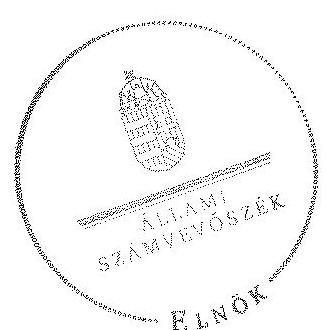

Domokos László
elnök 4.

Melléklet: $\quad 9 \mathrm{db}$

---

.

---

Az Eszterházy Károly főiskola kiadási és bevételi előirányzatai, azok teljesítése a 2009-2012. években

|  Sze. | Megnevezés | 2009. év |  |  | 2010. év |  |  | 2011. év |  |  | 2012. év |  |   |
| --- | --- | --- | --- | --- | --- | --- | --- | --- | --- | --- | --- | --- | --- |
|   |  | Eredeti előirányzat | Módosított előirányzat | Teljesítés | Eredeti előirányzat | Módosított előirányzat | Teljesítés | Eredeti előirányzat | Módosított előirányzat | Teljesítés | Eredeti előirányzat | Módosított előirányzat | Teljesítés  |
|  1 | KIADÁSOK |  |  |  |  |  |  |  |  |  |  |  |   |
|  2 | Személyi juttatások | 2 032 738 | 2 543 230 | 2 437 340 | 2 077 865 | 2 732 673 | 2 634 511 | 2 430 865 | 2 846 032 | 2 733 044 | 2 403 600 | 2 541 709 | 2 479 885  |
|  3 | Muskaodót terhelő járulékok | 655 159 | 762 631 | 729 901 | 582 057 | 715 959 | 689 611 | 641 267 | 744 728 | 716 975 | 643 500 | 677 709 | 660 793  |
|  4 | Dologi kiadások | 1 721 783 | 1 802 468 | 1 831 254 | 1 885 800 | 2 384 445 | 1 690 729 | 2 091 388 | 2 851 766 | 2 585 876 | 1 672 828 | 2 340 481 | 2 056 545  |
|  5 | Egyéb folyó kiadások | 29 720 | 21 493 | 16 220 | 38 579 | 69 712 | 51 142 | 42 865 | 146 535 | 134 928 | 21 172 | 19 702 | 19 702  |
|  6 | Támogatásértékű működési kiadások | 2 075 | 5 553 | 5 553 | 2 075 | 4 608 | 2 716 | 2 075 | 1 886 | 575 | 2 100 | 25 407 | 23 595  |
|  7 | Támogatásértékű felhalmozási kiadások | - | - | - | - | - | - | - | - | - | - | - | -  |
|  8 | Előző évi előirányzat átadás | - | 175 | 175 | - | 20 730 | 20 730 | - | 19 239 | 19 239 | - | 841 | 841  |
|  9 | Működési célú pénzeszköz átadás | - | 1 751 | 1 753 | - | 219 | 219 | - | 1 652 | 1 652 | - | 41 | 41  |
|  10 | Felhalmozási célú pénzeszköz átadás | - | - | - | - | - | - | - | - | - | - | - | -  |
|  11 | Előtermik pénzbeli juttatásai | 602 651 | 501 766 | 468 202 | 602 751 | 543 281 | 441 183 | 577 131 | 495 530 | 433 017 | 525 100 | 470 327 | 435 194  |
|  12 | Egyéb juttatás | 150 | 5 838 | 5 789 | 150 | 7 080 | 7 071 | 150 | 8 196 | 8 086 | 100 | 6 073 | 6 073  |
|  13 | Felújítás | 30 000 | 270 233 | 233 625 | 30 000 | 263 856 | 30 824 | 100 000 | 494 150 | 407 256 | - | 126 371 | 123 709  |
|  14 | Intézményi beruházási kiadások ÁFÁ-val | 181 345 | 439 007 | 387 210 | 181 345 | 676 350 | 665 317 | 1 976 345 | 3 127 700 | 2 946 227 | 755 000 | 1 887 382 | 1 877 893  |
|  15 | Központi beruházási kiadások ÁFÁ-val | - | 35 000 | 35 000 | - | 55 000 | 55 000 | - | - | - | - | - | -  |
|  16 | Lukásépítés kiadásai ÁFÁ-val | - | - | - | - | - | - | - | - | - | - | - | -  |
|  17 | Egyéb intézményi felhalmozási kiadás | - | 2 000 | 2 000 | - | - | - | - | - | - | - | - | -  |
|  18 | Kölcsönök | 1 500 | 1 500 | 858 | 1 500 | 2 520 | 2 120 | 1 500 | 1 500 | 500 | 1 500 | 1 500 | 780  |
|  19 | Összesen | 5 257 121 | 6 392 645 | 6 154 882 | 5 402 102 | 7 476 433 | 6 291 173 | 7 863 606 | 10 738 914 | 10 007 373 | 6 024 900 | 8 097 543 | 7 685 051  |
|  20 | BEVÉTELEK |  |  |  |  |  |  |  |  |  |  |  |   |
|  21 | Közhutolási bevétellek | - | - | - | - | - | - | - | - | - | - | - | -  |
|  22 | Intézményi működési bevétellek | 860 877 | 1 281 333 | 1 242 128 | 878 428 | 1 215 690 | 1 196 639 | 1 220 000 | 1 663 855 | 1 663 855 | 1 228 500 | 1 273 670 | 1 273 651  |
|  23 | Működési célú pénzeszköz átvétellek | 35 000 | 43 412 | 38 620 | 35 000 | 59 365 | 59 365 | 35 000 | 70 840 | 63 345 | 50 000 | 80 000 | 69 638  |
|  24 | Felhalmozási bevétellek | 1 000 | 1 000 | 27 | 1 000 | 4 193 | 4 273 | 4 000 | 17 702 | 16 307 | 20 000 | 20 000 | 16 014  |
|  25 | Felhalmozási célú pénzeszköz átvétellek | 34 000 | 42 000 | 48 565 | 34 000 | 36 635 | 36 635 | 31 000 | 55 260 | 55 260 | 35 000 | 5 000 | 2 266  |
|  26 | Irányító szervtől kapott támogatás | 4 039 744 | 4 223 356 | 4 323 556 | 4 023 374 | 4 373 472 | 4 373 472 | 4 072 106 | 3 860 035 | 3 860 035 | 3 389 900 | 3 498 518 | 3 498 518  |
|  27 | Támogatás értékű működési bevétel | 150 000 | 223 248 | 392 839 | 293 800 | 683 480 | 619 154 | 500 000 | 1 127 929 | 1 018 107 | 600 000 | 907 908 | 835 564  |
|  28 | Támogatás értékű felhalmozási bevétel | 135 000 | 135 000 | 78 570 | 135 000 | 491 000 | 494 700 | 2 000 000 | 2 836 382 | 2 703 806 | 700 000 | 1 757 348 | 1 754 895  |
|  29 | Előző évi maradvány átvételle | - | 37 105 | 37 105 | - | - | - | - | 348 | 348 | - | 74 348 | 74 348  |
|  30 | Előirányzat maradvány felhasználás | - | 302 691 | 302 691 | - | 609 880 | 477 982 | - | 1 105 063 | 1 105 063 | - | 479 251 | 479 251  |
|  31 | Kölcsönök (lukáskölcsön tődesztés) | 1 500 | 1 500 | 858 | 1 500 | 2 520 | 2 120 | 1 500 | 1 500 | 500 | 1 500 | 1 500 | 780  |
|  32 | Összesen | 5 257 121 | 6 392 645 | 6 464 759 | 5 402 102 | 7 476 433 | 7 264 338 | 7 863 606 | 10 738 914 | 10 486 624 | 6 024 900 | 8 097 543 | 8 004 725  |

---

Az Eszterházy Károly Fölskola kiadásainak, bevételeinek változása a 2009-2012. években adatok ezer 14-ban

|   |  | 2009. év | 2010. év | 2011. év | 2012. év |   |
| --- | --- | --- | --- | --- | --- | --- |
|  Ssz. | Megnevezés | Teljesítés | Teljesítés | Teljesítés | Teljesítés | 2012/2009  |
|  1 | KIADÁSOK |  |  |  |  |   |
|  2 | Személyi juttatások | 2437340 | 2634511 | 2753044 | 2479885 | 101,7\%  |
|  3 | Rendszeres és nem rendszeres | 2174981 | 2378199 | 2484032 | 2283033 | 105,0\%  |
|  4 | Rendszeres személyi juttatás | 1301611 | 1375898 | 1784737 | 1802213 | 138,5\%  |
|  5 | Alagállatmány | 1211658 | 1275386 | 1633041 | 1641369 | 135,5\%  |
|  6 | Nem rendszeres | 873370 | 1002301 | 699295 | 480820 | 55,1\%  |
|  7 | Munkavégzéshez kapcs juttatások | 654634 | 837895 | 577485 | 394292 | 60,2\%  |
|  8 | Normatív és teljesítéshez kötött jutalom | 61806 | 28862 | - | - | -  |
|  9 | Külső személyi juttatások | 263359 | 256312 | 269012 | 196852 | 75,0\%  |
|  10 | Munkaadót terhelő járulékok | 729901 | 689611 | 716975 | 660793 | 90,5\%  |
|  11 | Dologi és folyó kiadások | 1847474 | 1741871 | 2720804 | 2076247 | 112,4\%  |
|  12 | Dologi kiadások | 1831254 | 1690729 | 2585876 | 2056545 | 112,3\%  |
|  13 | Készletbeszerzés | 162318 | 106861 | 195227 | 163047 | 100,4\%  |
|  14 | Kommunikációs szolgáltatás | 42431 | 44691 | 47142 | 42546 | 100,3\%  |
|  15 | Szolgáltatást kiadások | 1167382 | 984725 | 1249104 | 1198310 | 102,6\%  |
|  16 | Bérlet és fázing | 443038 | 397453 | 495484 | 502814 | 113,5\%  |
|  17 | ebből PPP | 405332 | 359936 | 446007 | 433305 | 106,9\%  |
|  18 | Gáz, villany, víz | 153407 | 143566 | 143861 | 144942 | 94,5\%  |
|  19 | Működési célú ÁFA | 332895 | 413919 | 927835 | 547660 | 164,5\%  |
|  20 | Kiküldetés, reprezentáció | 80289 | 82570 | 112091 | 65846 | 82,0\%  |
|  21 | Szellemi tevékenység | 21729 | 35500 | 25518 | 27668 | 127,3\%  |
|  22 | Egyéb folyó kiadások | 16220 | 51142 | 134928 | 19702 | 121,5\%  |
|  23 | Előző évt maradvány visszafizetés | - | 5883 | 102287 | - | -  |
|  24 | Adók, díjak, egyéb befizetések | 16211 | 45259 | 32136 | 18585 | 114,6\%  |
|  25 | Támogatásértékủ müködési kiadások | 5553 | 2716 | 573 | 23595 | 424,9\%  |
|  26 | Támogatásértékủ felhalmozósi kiadások | - | - | - | - | -  |
|  27 | Előző évt előirányzat átadás | 175 | 20730 | 19239 | 841 | 480,6\%  |
|  28 | Müködési célú pénzeszköz átadás | 1755 | 519 | 1652 | 41 | 2,3\%  |
|  29 | Felhalmozási célú pénzeszköz átadás | - | - | - | - | -  |
|  30 | Ellátottak pénzbeli juttatásai | 468202 | 441183 | 433017 | 435194 | 93,0\%  |
|  31 | Egyéb juttatás | 5789 | 7071 | 8086 | 6073 | 104,9\%  |
|  32 | Felhalmozási kiadások | 422210 | 720317 | 2946227 | 1877893 | 444,8\%  |
|  33 | Intézményi beruházási kiadások | 320692 | 605909 | 2285996 | 1488903 | 464,3\%  |
|   | ebből ingatlan | 20628 | 420113 | 2006776 | 916106 | 4441,1\%  |
|  34 | Gépek, bevenkezések, felszerelések | 293475 | 162808 | 238658 | 555030 | 189,1\%  |
|  35 | Felújítás | 233625 | 30824 | 407256 | 123709 | 53,0\%  |
|   | ebből ingatlan (Átával) | 189037 | 23965 | 317879 | 95678 | 50,6\%  |
|  36 | Felújítások és beruházások ÁFÁ-ja | 72351 | 70408 | 660231 | 388990 | 537,6\%  |
|  39 | Egyéb intézményi felhalmozási kiadás | 2000 | - | - | - | -  |
|  40 | Kölcsönök | 858 | 2120 | 500 | 780 | 90,9\%  |
|  41 | Összesen | 6154882 | 6291173 | 10007373 | 7685051 | 124,9\%  |
|  42 | BEVÉTELEK |  |  |  |  |   |
|  44 | Müködési bevételek | 1709832 | 1875156 | 2745653 | 2252775 | 131,8\%  |
|  45 | Intézményi müködési bevétel | 1242128 | 1196639 | 1663855 | 1273651 | 102,5\%  |
|  46 | Szolgáltatások ellenértéke | 783581 | 687683 | 728465 | 717569 | 91,6\%  |
|  47 | Intézményi ellátást díjak | 186091 | 212017 | 203044 | 214129 | 115,1\%  |
|  48 | Hozom és komorbovétei | 36388 | 27172 | 2460 | 439 | 1,2\%  |
|  49 | Müködési célú pénzeszköz átvételek | 38620 | 59363 | 63343 | 69638 | 180,3\%  |
|   | ebből uniós forrás | 28914 | 28625 | 41315 | 55155 | 190,8\%  |
|  50 | Támogatásértékủ müködési bevétel | 392839 | 619154 | 1018107 | 835364 | 212,6\%  |
|  51 | EU programokra müködési bevétel | 257086 | 516240 | 786205 | 771110 | 299,9\%  |
|  52 | Előző évt mük. ei-monadvány | 36245 | - | 348 | 74122 | -  |
|  53 | Felhalmozási bevételek | 128022 | 535608 | 2775373 | 1773401 | 1385,2\%  |
|   | Felhalmozási célú saját bevétel | 27 | 4273 | 16307 | 16014 | 59311,1\%  |
|  55 | Felhalmozási célú pénzeszköz átvételek | 48565 | 36635 | 55260 | 2266 | 4,7\%  |
|   | ebből uniós forrás | 185 | - | 15 | 966 | 522,2\%  |
|  56 | Támogatásértékủ felhalmozási bevétel | 78570 | 494700 | 2703806 | 1754895 | 2233,5\%  |
|  57 | EU programokra beruházási bevétel | 20570 | 466764 | 2522188 | 1680352 | 8168,8\%  |
|   | Előző évt felh. ei-monadvány | 860 | - | - | 226 | 26,3\%  |
|  58 | Irányító szervtől kapott támogatás | 4323356 | 4373472 | 3860035 | 3498518 | 80,9\%  |
|  61 | Előirányzat monadvány felhasználás | 302691 | 477982 | 1105063 | 479251 | 158,3\%  |
|   | Függő, átfiztó, kitegyesítői bevételek | 91631 | - | - | - | -  |
|  62 | Kölcsönök (lakáskolcsón törlesztés) | 858 | 2120 | 500 | 780 | 90,9\%  |
|  63 | Összesen | 6464759 | 7264338 | 10486624 | 8004725 | 123,8\%  |

---

# 3. SZÁMÚ MELLÉKLET A V-0368-266/2014. SZÁMÚ JELENTÉSHEZ

|  No. | CLF-számítási módszer szerint | 2009. év | 2010. év | 2011. év | 2012. év  |
| --- | --- | --- | --- | --- | --- |
|   | 1. FOLYÓ KÖLTSEGYETÉS |  |  |  |   |
|   | 1.1.1. Hatósági jogkörhöz köthető /körhatalmi/, egyéb saját, illetve ÁFA bevételek | 1 203 635 | 1 056 040 | 1 093 583 | 1 104 991  |
|   | 1.1.2. Működési költségvetés támogatása | 4 052 004 | 4 241 652 | 3 828 474 | 3 483 335  |
|   | 1.1.3. Támogatásértékű működési bevételek | 392 859 | 619 154 | 1 018 107 | 835 364  |
|   | 1.1.4. EU-tól és különböző átvett pénzeszközök | 31 953 | 35 841 | 46 100 | 63 185  |
|   | 1.1.5. Működési célú "egyéb" pénzeszközötvétel állomháztartáson kívülről | 6 867 | 35 532 | 17 243 | 7 456  |
|   | 1.1.6. Hozom- és hamulbevételek | 36 388 | 37 172 | 2 460 | 439  |
|   | 1.1.7. Folyó és előirányzat-maradvány, pénzmaradvány átvétel | 36 245 |  | 348 | 74 122  |
|   | 1.1.8. Folyó bevételek (1.1.1.-1.1.2.-1.1.3.-1.1.4.-1.1.5.-1.1.6.-1.1.7.-1.1.8.) | 5 762 731 | 6 003 381 | 6 008 315 | 5 567 889  |
|   | 1.1.9. Működési kiadások hamulkiadások nélkül | 5 014 715 | 4 955 950 | 5 625 029 | 5 049 963  |
|   | 1.1.10. Támogatásértékű működési kiadások | 5 553 | 7 716 | 573 | 23 593  |
|   | 1.2.1.1. vállalkozásoknak |  |  | 689 |   |
|   | 1.2.1.2. EU-nak, illetve külföldre | 607 | 219 |  |   |
|   | 1.2.1.3. magánszemélyeknek |  |  |  |   |
|   | 1.2.1.4. non-profit szerkezeteknek | 1 148 |  | 963 | 41  |
|   | 1.2.1.5. garancia- és készszigodfokásból származó kifizetés |  |  |  |   |
|   | 1.2.1.6. Működési célú pénzeszközötadások (-1.2.3.1+1.2.3.2+1.2.3.3.+1.2.3.4.+1.2.3.5.) | 1 755 | 319 | 1 652 | 41  |
|   | 1.2.2. Távodalom-, távszálpolítikai és egyéb juttatás, támogatás | 5 789 | 7 071 | 8 086 | 6 073  |
|   | 1.2.3. Előjtettak pénzfejű juttatásai | 468 202 | 441 183 | 435 017 | 435 194  |
|   | 1.2.4. Folyó és előirányzat-maradvány átadás | 175 | 20 720 | 19 339 | 619  |
|   | 1.2.5. Folyó kiadások (1.2.1.-1.2.2.-1.2.3.-1.2.4.-1.2.5.-1.2.6.-1.2.7.-1.2.8.) | 5 496 189 | 5 427 869 | 6 087 596 | 5 515 491  |
|   | 1.3. Folyó költségvetés egyenlege, működési jövedelem (1.1.-1.2.) | 266 243 | 575 512 | -79 281 | 52 398  |
|   | 2. FEJEHALMOZÁSI KÖLTSEGYETÉS |  |  |  |   |
|   | 2.1.1. Felhalmozási saját bevételek | 2 132 | 117 699 | 582 119 | 184 235  |
|   | 2.1.2. Felhalmozási kiadások költségvetési támogatása | 568 352 | 151 820 | 31 361 | 12 183  |
|   | 2.1.3. Támogatásértékű felhalmozási bevételek | 78 370 | 494 700 | 2 705 806 | 1 754 895  |
|   | 2.1.4. EU-tól és különböző átvett pénzeszközök | 185 |  | 966 | 966  |
|   | 2.1.5. Felhalmozási célú egyéb pénzeszközötvétel állomháztartáson kívülről | 48 380 | 56 635 | 54 294 | 1 300  |
|   | 2.1.6. Folyó, előirányzat-maradvány, pénzmaradvány átvétel | 858 | 2 120 | 500 | 780  |
|   | 2.1.7. Felhalmozási bevételek (2.1.1.-2.1.2.-2.1.3.-2.1.4.-2.1.5.-2.1.6.-2.1.7.-2.1.8.) | 399 337 | 783 974 | 3 373 246 | 1 957 583  |
|   | 2.2.1. Saját felújítási kiadás (2011-től áfá-val) | 253 625 | 30 824 | 407 256 | 123 709  |
|   | 2.2.2. Saját beruházási kiadás (2011-től áfá-val) | 320 693 | 805 909 | 2 946 227 | 1 877 893  |
|   | 2.2.3. Saját beruházási és felújítási kiadás áfá-ja (2010-ig) | 66 518 | 30 408 |  |   |
|   | 2.2.4. Befektetési célú részeszefizetv vásárlása | 2 000 |  |  |   |
|   | 2.2.5. Támogatásértékű felhalmozási kiadások |  |  |  |   |
|   | 2.2.5.1. Központi beruházások | 35 000 | 55 000 |  |   |
|   | 2.2.6. Köhzönök nyújtása, távkeztése | 858 | 2 120 | 500 | 780  |
|   | 2.2.7. Folyó és előirányzat-maradvány átadás |  |  |  | 222  |
|   | 2.2.8. ÁFA befezeteek |  | 110 043 | 565 794 | 166 956  |
|   | 2.3. Felhalmozási kiadások (2.2.1.-2.2.2.-2.2.3.-2.2.4.-2.2.5.-2.2.6.-2.2.7.-2.2.8.-2.2.9.-2.2.10.-2.2.11.) | 658 693 | 863 304 | 3 919 777 | 2 169 560  |
|   | 2.3. Felhalmozási költségvetés egyenlege (2.1.-2.2.) | 259 356 | -80 330 | -546 531 | -211 975  |
|   | 3. FINANSIÍROZÁSI MÜVELETEK NÉTKÜLT (GZN) POZÍCIO (1.3.-2.3.) | 7 186 | 495 182 | -625 812 | -139 577  |
|   | 4. FINANSIÍROZÁSI MÜVELETEK |  |  |  |   |
|   | 4.1. Hitzélsivétel |  |  |  |   |
|   | 4.2. Hitzélsivézetés |  |  |  |   |
|   | 4.3. Forgotási és befektetési célú értékpapírok kibocsátása |  |  |  |   |
|   | 4.4. Forgotási és befektetési célú értékpapírok beváltása |  |  |  |   |
|   | 4.5. Forgotási és befektetési célú értékpapírok értékesítése |  | 309 997 |  |   |
|   | 4.6. Forgotási és befektetési célú értékpapírok vásárlása | 9 994 |  |  |   |
|   | 4.7. Egyéb finanszírozási bevételek (függő, átfutó, kiegyenlítő) | 91 631 | 55 775 | -98 345 | -42 379  |
|   | 4.8. Egyéb finanszírozási kiadások (függő, átfutó, kiegyenlítő) | 67 330 | 381 708 | -32 034 | -179 439  |
|   | 4.9. Finanszírozási műveletek egyenlege (4.1.-4.2.-4.3.-4.4.-4.5.-4.6.-4.7.-4.8.) | 14 307 | -18 936 | -66 311 | 137 060  |
|   | 5. TÁRGATÓS PÉNZÉGYI POZÍCIO (1.3.-2.3.-4.9.) | 21 493 | 476 246 | -693 123 | -22 517  |
|   | 6. NETTŐ MŰRÓDÉSI JÖVÉDELEM (működési jövedelem (1.3.) - tőketörlesztés (4.2.-4.4)) | 266 542 | 575 512 | -79 281 | 52 398  |
|   | 5.1. TÁRKOZTATÓ ADATOK |  |  |  |   |
|   | 5.2. Működési célú előző és időirányzat-maradvány igénybevétele | 243 491 | 319 614 | 498 815 | 266 055  |
|   | 5.3. Felhalmozási célú előző és időirányzat-maradvány igénybevétele | 60 200 | 158 368 | 606 248 | 213 218  |
|   | 5.4. Felhasználható tárgyév (előirányzat-maradvány) | 303 994 | 870 878 | 479 255 | 319 674  |
|   | 5.5. Összes kötelezettség | 715 707 | 2 708 716 | 2 397 829 | 1 312 599  |
|   | 5.6. Ebből rövid lejáratú | 715 707 | 2 708 716 | 2 397 829 | 1 312 599  |
|   | 5.7. Összes szállítói kötelezettség | 38 809 | 627 916 | 682 339 | 162 153  |
|   | 5.8. Ebből lejárt (hamuléványból) | 13 025 | 159 580 | 79 541 | 111 224  |
|   | 5.9. Egyéb hosszú lejáratú kötelezettség |  |  |  |   |
|   | 5.10. Ebből rövid lejáratú |  |  |  |   |
|   | 5.11. Finanszírozásba bevontható eszközök | 593 054 | 759 304 | 67 181 | 44 664  |
|   | 5.12. Tartós kötelezettség megtestesítő értékpapírok |  |  |  |   |
|   | 5.13. Hosszú lejáratú honkbetétek |  |  |  |   |
|   | 5.14. Értékpapírok | 309 997 |  |  |   |
|   | 5.15. Pénzeszközök (idegen pénzeszközök nélkül) | 283 017 | 759 304 | 67 181 | 44 664  |

---

Az Eszterházy Károly Fölskola mérlegadatai a 2009-2012. években

|  Szz. | Megnevezés | 2009. év | 2010. év | 2011. év | 2012. év | Index
(2012/2009)  |
| --- | --- | --- | --- | --- | --- | --- |
|  1 | IMMATERIÁLIS JAVAK | 40828 | 73041 | 91412 | 82988 | 203,3\%  |
|  4 | Vagyoni értékủ jogok | 33831 | 71187 | 89713 | 82251 | 343,0\%  |
|  5 | Széllenti termékek | 6987 | 1854 | 1700 | 737 | 10,5\%  |
|  6 | Immateriális javakra adott előlegek |  |  |  |  |   |
|  8 | TÁRGYI ESZKÖZÖK | 3543856 | 4492982 | 7525513 | 8370584 | 236,3\%  |
|  9 | Ingeffanok és kapcsolódó vagyonértékủ jogok | 2858239 | 2909715 | 3206489 | 7551992 | 264,2\%  |
|  10 | Gépok, berendezések, felzsevelések | 588091 | 660594 | 615491 | 810033 | 137,7\%  |
|  11 | Járművek | 16556 | 11406 | 5966 | 1446 | 8,7\%  |
|  12 | Tenyésalllatok |  |  |  |  |   |
|  13 | Beruházások, felújítások | 80970 | 911267 | 3697567 | 7111 | 8,8\%  |
|  14 | Beruházásra adott előlegek |  |  |  |  |   |
|  17 | BEFEKTETETT PÉNZÜGYI ESZKÖZÖK | 12327 | 13635 | 13332 | 12521 | 101,6\%  |
|  18 | Tartós részenéde | 11630 | 11630 | 11630 | 11130 | 95,7\%  |
|  19 | Tartósan adott kölcsön | 491 | 2005 | 1705 | 1391 | 199,6\%  |
|  20 | ÜZEMELTETÉSRE KEZELÉSRE ÁTADOTT
VAGYONKEZELÉSRE VETT ESZKÖZÖK | 532516 | 548329 | 504536 | 404019 | 75,9\%  |
|  21 | BEFEKTETETT ESZKÖZÖK ÖSSZESEN | 4129537 | 5127987 | 8134793 | 8870112 | 214,8\%  |
|  22 | KÉSZLETEK | 42567 | 43110 | 37357 | 37959 | 89,2\%  |
|  23 | Anyogok | 8527 | 8686 | 3931 | 1270 | 14,9\%  |
|  25 | Késztermékek |  |  |  | 37340 |   |
|  26 | Áruk, göngyölégek, közvetített szolgáltatások | 34040 | 34424 | 34436 | 9349 | 27,5\%  |
|  27 | Egyéb készletek** |  |  |  |  |   |
|  28 | KÖVETELÉSEK | 117551 | 113809 | 140218 | 109980 | 93,6\%  |
|  29 | Követelések drugaállítónkól és szolgáltatásból | 26619 | 42320 | 137754 | 107013 | 402,0\%  |
|  30 | Adások | 89101 | 69463 |  |  |   |
|  31 | Rövid lejántú adott kölcsönök |  |  | 2316 | 2521 |   |
|  32 | Egyéb követelések | 1831 | 2026 | 148 | 446 | 24,4\%  |
|  38 | ČRTÉKPAPÍROK | 309997 |  |  |  |   |
|  43 | Forgoktár célú háteíviszozyt megtestenítő értékpapír bekerülési (könye szerinti) értéke | 309997 |  |  |  |   |
|  45 | PÉNZESZKÖZÖK | 296746 | 759707 | 67601 | 45172 | 15,2\%  |
|  47 | Költségvetési pénzforgalmi számlák |  | 11314 | 8374 | 11968 |   |
|  48 | Elszámoldal számlák | 283057 | 747990 | 58807 | 32696 | 11,6\%  |
|  49 | Idegen pénzeszközök | 13689 | 405 | 424 | 508 | 3,7\%  |
|  50 | EGYÉB AKTÍV PÉNZÜGYI ÉLSZÁMOLÁSOK | 155981 | 526689 | 494655 | 315216 | 217,4\%  |
|  51 | FORGŐESZKÖZÖK ÖSSZESEN | 911842 | 1443315 | 739835 | 508327 | 55,7\%  |
|  52 | ESZKÖZÖK ÖSSZESEN | 5041379 | 6571302 | 8874628 | 9378439 | 186,0\%  |
|  53 | SAJÁT TÖKE | 3573948 | 2576190 | 5914539 | 7705452 | 215,6\%  |
|  54 | Tartós tőke | 446765 | 446765 | 446765 | 446765 | 100,0\%  |
|  56 | Tőkeváltartások | 5127181 | 2129425 | 5467774 | 7258687 | 232,1\%  |
|  59 | TARTALÉKOK | 609880 | 1105063 | 479251 | 319674 | 52,4\%  |
|  60 | Költségvetési tartalékok | 609880 | 1105063 | 479251 | 319674 | 52,4\%  |
|  62 | KÖTELEZETTŚÉGEK | 715707 | 2708716 | 2397829 | 1312599 | 183,4\%  |
|  63 | Hozzai lejántú kötelezettségek |  |  |  |  |   |
|  64 | Rövid lejántú kötelezettségek | 715707 | 2708716 | 2397829 | 1312599 | 183,4\%  |
|  65 | Kötelezettségek áruszáll, szolgáltatók | 58809 | 637916 | 682339 | 162152 | 275,7\%  |
|  66 | Egyéb kötelezettségek | 656898 | 2070800 | 1715490 | 1150447 | 175,1\%  |
|  67 | EGYÉB PASSZÍV PÉNZÜGYI ÉLSZÁMOLÁSOK | 141844 | 181333 | 83009 | 40714 | 28,7\%  |
|  68 | FORRÁSOK ÖSSZESEN | 5041379 | 6571302 | 8874628 | 9378439 | 186,0\%  |

---

|  Az Eszterházy Károly főiskola gazdálkodása szabályozóviségének értékelése a mintatételek alapján |  |  |  |  |  |  |  |  |  |  |  |  |  |  |  |  |  |  |  |  |  |   |
| --- | --- | --- | --- | --- | --- | --- | --- | --- | --- | --- | --- | --- | --- | --- | --- | --- | --- | --- | --- | --- | --- | --- |
|   |  |  |  |  |  |  |  |  |  |  |  |  |  |  |  |  |  |  |  |  |  |   |
|  értékelt terület |  |  |  |  |  |  |  |  |  |  |  |  |  |  |  |  |  |  |  |  |  |   |
|   |  |  |  |  |  |  |  |  |  |  |  |  |  |  |  |  |  |  |  |  |  |   |
|   |  |  |  |  |  |  |  |  |  |  |  |  |  |  |  |  |  |  |  |  |  |   |
|  projektet |  |  |  |  |  |  |  |  |  |  |  |  |  |  |  |  |  |  |  |  |  |   |
|  elfordulás |  |  |  |  |  |  |  |  |  |  |  |  |  |  |  |  |  |  |  |  |  |   |
|  elfelezettségek |  |  |  |  |  |  |  |  |  |  |  |  |  |  |  |  |  |  |  |  |  |   |
|   |  |  |  |  |  |  |  |  |  |  |  |  |  |  |  |  |  |  |  |  |  |   |
|   |  |  |  |  |  |  |  |  |  |  |  |  |  |  |  |  |  |  |  |  |  |   |
|   |  |  |  |  |  |  |  |  |  |  |  |  |  |  |  |  |  |  |  |  |  |   |
|   |  |  |  |  |  |  |  |  |  |  |  |  |  |  |  |  |  |  |  |  |  |   |
|   |  |  |  |  |  |  |  |  |  |  |  |  |  |  |  |  |  |  |  |  |  |   |
|   |  |  |  |  |  |  |  |  |  |  |  |  |  |  |  |  |  |  |  |  |  |   |
|   |  |  |  |  |  |  |  |  |  |  |  |  |  |  |  |  |  |  |  |  |  |   |
|   |  |  |  |  |  |  |  |  |  |  |  |  |  |  |  |  |  |  |  |  |  |   |
|   |  |  |  |  |  |  |  |  |  |  |  |  |  |  |  |  |  |  |  |  |  |   |
|   |  |  |  |  |  |  |  |  |  |  |  |  |  |  |  |  |  |  |  |  |  |   |
|   |  |  |  |  |  |  |  |  |  |  |  |  |  |  |  |  |  |  |  |  |  |   |
|   |  |  |  |  |  |  |  |  |  |  |  |  |  |  |  |  |  |  |  |  |  |   |
|   |  |  |  |  |  |  |  |  |  |  |  |  |  |  |  |  |  |  |  |  |  |   |
|   |  |  |  |  |  |  |  |  |  |  |  |  |  |  |  |  |  |  |  |  |  |   |
|   |  |  |  |  |  |  |  |  |  |  |  |  |  |  |  |  |  |  |  |  |  |   |
|   |  |  |  |  |  |  |  |  |  |  |  |  |  |  |  |  |  |  |  |  |  |   |
|   |  |  |  |  |  |  |  |  |  |  |  |  |  |  |  |  |  |  |  |  |  |   |
|   |  |  |  |  |  |  |  |  |  |  |  |  |  |  |  |  |  |  |  |  |  |   |
|   |  |  |  |  |  |  |  |  |  |  |  |  |  |  |  |  |  |  |  |  |  |   |
|   |  |  |  |  |  |  |  |  |  |  |  |  |  |  |  |  |  |  |  |  |  |   |
|   |  |  |  |  |  |  |  |  |  |  |  |  |  |  |  |  |  |  |  |  |  |   |
|   |  |  |  |  |  |  |  |  |  |  |  |  |  |  |  |  |  |  |  |  |  |   |
|   |  |  |  |  |  |  |  |  |  |  |  |  |  |  |  |  |  |  |  |  |  |   |
|   |  |  |  |  |  |  |  |  |  |  |  |  |  |  |  |  |  |  |  |  |  |   |
|   |  |  |  |  |  |  |  |  |  |  |  |  |  |  |  |  |  |  |  |  |  |   |
|   |  |  |  |  |  |  |  |  |  |  |  |  |  |  |  |  |  |  |  |  |  |   |
|   |  |  |  |  |  |  |  |  |  |  |  |  |  |  |  |  |  |  |  |  |  |   |
|   |  |  |  |  |  |  |  |  |  |  |  |  |  |  |  |  |  |  |  |  |  |   |
|   |  |  |  |  |  |  |  |  |  |  |  |  |  |  |  |  |  |  |  |  |  |   |
|   |  |  |  |  |  |  |  |  |  |  |  |  |  |  |  |  |  |  |  |  |  |   |
|   |  |  |  |  |  |  |  |  |  |  |  |  |  |  |  |  |  |  |  |  |  |   |
|   |

---

.

---

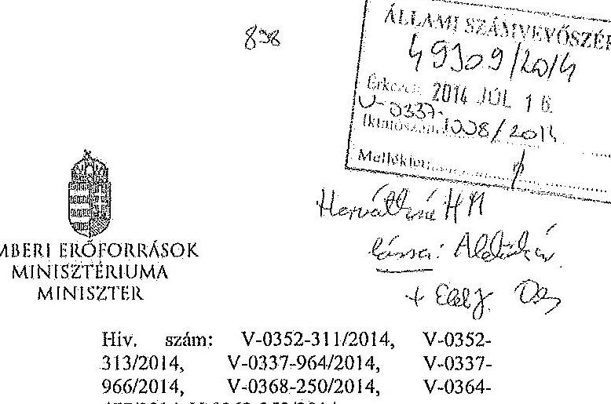

Domokos László részére
elnök
Állami Számvevőszék
Budapest
Apáczai Csere János utca 10.
1052
Tárgy: Észrevételek az Állami Számvevőszék ellenőrzési megállapításaira

Tisztelt Elnök Úr!

Hivatkozva a V-0352-311/2014, a V-0352-313/2014, a V-0337-964/2014, a V-0337-966/2014, a V-0368-250/2014, a V-0364-477/2014, a V-0363-252/2014 iktatószámú leveleire és megküldött jelentéstervezeteire, a Károly Róbert Főiskola, a Magyar Képzőművészeti Egyetem, a Szolnoki Főiskola, a Pannon Egyetem, az Eszterházy Károly Főiskola, a Széchenyi István Egyetem, valamint a Miskolci Egyetem vonatkozásában a 2013. évben megkezdett szabályszerűségi ellenőrzés kapesán az alábbiakról tájékoztatom, valamint az alábbi észrevételeket teszem.

A megküldött jelentéstervezetekben rögzített megállapítások szerint a fenntartó ágazati irányítási feladatait a 2009-2012. évckben nem látta el teljes körűen az alábbiak vonatkozásában.

- „A felsőoktatásért felelős miniszter nem hajtotta végre a nemzetgazdasági miniszter irányításával, a kormányhatározatban előírt szervezeti és feladat-ellátási felülvizsgálati programot. A felsőoktatási törvény rendelkezései ellenére nem készíttetett a felsőoktatás rendszere vonatkozásában középtávú fejlesztési tervet."

A 2012. évi költségvetési hiánycél tartását biztosító további feladatokról szóló 1365/2011. (XI. 8.) Korm. határozatban a Kormány a közfeladat-ellátás színvonalának javítása és a költséghatékony müködés céljából, szervezeti és feladat-ellátási felülvizsgálati programot indított el az állambáztartás központi alrendszerében a költségvetési szervek, és a többségi állami tulajdonú gazdálkodó szervezetek (a továbbiakban: intézmények) vonatkozásában. Továbbá

---

elrendelte, hogy a felülvizsgálathoz a nemzetgazdasági miniszter irányításával, a Miniszterelnökséget vezető államtitkár, a közigazgatási és igazságügyi miniszter, valamint az ágazatért felelős miniszter részvételével munkabizottságokat kell létrehozni, valamint módszertani útmutatót kell kidolgozni.

Tekintettel arra, hogy a feladat nem a felsőoktatásért felelős miniszter felelősségi körébe tartozott, javaslom, hogy valamennyi jelentéstervezetben kerüljön módosításra, illetve kivezetésre azon megállapítás, miszerint a felsőoktatásért felelős miniszter nem hajtotta végre a nemzetgazdasági miniszter irányításával, a kormányhatározatban előírt szervezeti és feladatellátási felülvizsgálati programot.

A 2005. évi CXXXIX. törvény (Ftv.) 104. § (1) bekezdés b) pontja szerint az oktatásért felelős miniszter felsőoktatás fejlesztéssel kapcsolatos feladatai a felsőoktatás rendszere fejlesztési terveinek elkészíttetése, beleértve a középtávú fejlesztési tervet, az ágazati minőségpolitikát.

A nemzeti felsőoktatásról szóló 2011. évi CCIV. törvény (Nftv.) 64. § (3) bekezdése szerint a miniszter felsőoktatás-fejlesztéssel kapcsolatos feladatai a felsőoktatás rendszere fejlesztési terveinek elkészíttetése, beleértve a középtávú fejlesztési tervet.

A törvényi rendelkezéseknek megfelelően több javaslat is került a Kormány elé a felsőoktatási rendszer középtávú fejlesztési tervének vonatkozásába, azonban a Kormány egy javaslatot sem fogadott el. A megállapítást az alábbiak szerint szíveskedjen módosítani.

Nincs a Kormány által elfogadott, a felsőoktatás rendszere vonatkozásában készíttetett, középtávú fejlesztési terv.

- „A minisztérium a Felsőoktatási Információs Rendszer (FIR) biztonságos üzemeltetéséhez, az adatok védelméhez szükséges alapvető szervezeti, szabályozási kontrollokat a 2012. év végéig nem teljes körűen alakította ki. Így a minisztérium csak részben tett eleget a 2005. évi felsőoktatási törvény és a 2011. évi nemzeti felsőoktatási törvény előírásainak. A 2007-ben használtba vett FIR feladata volt, hogy a felsőoktatásban résztvevők (hallgatók, oktatók, kutatók, tanárok) adatait kezelje. A FIR müködését 2012-ig több probléma jellemezte. A rendszerbe bevitt alapadatok nem voltak ellenőrzőttek, a rendszerbe épített adatellenőrzés hibajelzései nem voltak kellően konkrétak, illetve a FIR a személyi többszöröződéseket nem szürte megfelelően. 2012ben megkezdték a rendszer hibáinak kijavítását."
A FIR létrehozása, fejlesztése, müködletése és üzemeltetése az Ftv. és Nftv., valamint az Oktatási Hivatalról szóló 307/2006. (XII. 23.) Korm. rendelet, majd a 121/2013. (IV. 26.) Korm. rendelet alapján az Oktatási Hivatal (OH) feladata. A Minisztérium miniszteri utasításban adta ki és szükség szerint módosította az Oktatási Hivatal Szervezeti és Müködési Szabályzatát, mely az OH feladatrendszerét is részletezi. A 2/2012. (I. 13.) NEFMI utasításban kiadott OH SZMSZ 1.2.3.6. pontja többek között az alábbiakat tartalmazza:

Az OH Felsőoktatási Főosztály feladatai, a felsőoktatási informatikai rendszerekkel szemben támasztott követelmények szakmai szempontú meghatározása, együttmüködve az Informatikai Főosztállyal és a felsőoktatási informatikai rendszerek üzemeltetőivel.

A korábban kiadott SZMSZ-ek is hasonló tartalmú feladatot szabtak.

---

Mindezek alapján a Minisztérium többek között a FIR biztonságos üzemeltetéséhez, az adatok védelméhez szükséges alapvető szervezeti, szabályozási kontroliokat a fenti szabályozások megalkotásával megvalósította. A fenti szabályozási rendszer keretén belül a részletszabályok kidolgozása nem lehet a Minisztérium feladata, azt már csak az Oktatási Hivatal végezheti el saját hatáskörben.

Ugyanakkor meg kell jegyezni, hogy a Felsőoktatási Információs Rendszer fejlesztése egy hatalmas, sok évre átnyúló feladat. A FIR fejlesztése 2006-ban kezdődött meg hatósági nyilvántartási koncepció alapján. A FIR azonban alapjaiban eltér egy klasszikus, pl. lakcím- és személyi adat nyilvántartástól, amely esetében az önkormányzatoknál/kormányhivataloknál begépelik az adatokat és azok azonnal bent is vannak a központi rendszerben. A FIR ezzel szemben az adatbevitel szempontjából nem tekinthető önálló rendszernek, hiszen az adatokat a felsőoktatási intézmények különböző tanulmányi rendszeréből veszi át. Így a FIR fejlesztése sosem volt független a tanulmányi rendszerek párhuzamos fejlesztésétől, azzal szoros összhangban tudott és tud megvalósulni. A tanulmányi rendszerek - három önálló tanulmányi rendszer és több egyedi, intézményi saját fejlesztésű rendszer - tényleges fejlesztése azonban nem az OH feladata, azt az esetek többségében piaci vállalkozások végzik. Ezeknek megfelelően a FIR és a különböző tanulmányi rendszerek összchangolt fejlesztése kiemelten nagy kihívást jelent az OH-nak, a feladat hatalmas méretéből adódóan a fejlesztés, vagy akár egy-egy hiba, problémacsokor megoldása nem oldható meg gyorsan, hanem csak összehangoltan, mely sok időt vesz igénybe. Így a teljesen "zöldmezős beruházásként" megvalósított FIR fejlesztés jelenleg 4+4 éves időtartama a feladat nagysága, a korábban rendelkezésre álló pénzügyi források ismeretében elfogadhatónak mondható. Az OH a FIR fejlesztése során a felsőoktatási intézményeknél folyamatos tájékoztatásokat, segítséget, ezeken túlmenően hatósági ellenőrzéseket is végez a FIR biztonságos üzemeltetése, az adatok védelme érdekében. A FIR megfelelő fejlesztése, biztonságos üzemeltetése érdekében az OH 2010-től átalakította a FIR-t érintő stratégiáját, az eljárásrendjeit.

- „Az Állami Számvevőszék három korábbi ellenőrzése során a felsőoktatás témakörében 9 javaslatot fogalmazott meg a felsőoktatásért felelős minisztériumnak. A minisztérium a javaslatokra intézkedési terveket készített, amelyek összesen 10 intézkedést tartalmaztak. Az intézkedések közül 3-at késéssel megvalósítottak, 7 nem valósult meg."
Az oktatási és kulturális ágazat irányítási rendszerének, müködésének ellenőrzéséről szóló 1106 sz. jelentés javaslataira készített intézkedési terv 3. számú javaslata, az oktatás közöttávú stratégia tervezet egy változatának előkészítése megtörtént, azonban azt a Kormány nem fogadta el.

A felsőoktatás oktatási infrastruktúra-fejlesztési programjának ellenőrzéséről szóló 1171 sz. jelentésben tett javaslat szerint a minisztérium feladata az oktatási infrastruktúra fejlesztési program előkészítésének hiányosságai miatt a felelősség megállapítása.

Tekintettel arra, hogy a 212/2010 (VII.1.) sz. Korm. rendelet alapján a PPP projektekkel kapcsolatos feladatellátás a Nemzeti Fejlesztési Minisztérium (továbbiakban NFM) feladatkörébe került csakúgy, mint a tárgyban érintett dokumentáció, így a feladat, a felelősség megállapításához szükséges jogkörök a rendelet alapján az NFM-hez kerültek, nem történhetett intézkedés a felelősség megállapítására.

---

A 1171 sz. jelentés intézkedései közül egy intézkedés megbiusult (felelősség megállapítása), egy intézkedés késéssel valósult meg (kapacitás-kihasználtság felmérése), egy intézkedés megvalósitása folyamatban van (kapacitás-kihasználtság felmérése eredményeinek és a felsőoktatást érintő ágazati célok figyelembe vételével intézkedések megtétele a felsőoktatási infrastruktúra közép- és hosszú távú hasznosítására).

Az állami felsőoktatási intézmények érdekeltségébe tartozó gazdasági társaságok támogatásának és nyereségességük hasznosulásának 1290 sz. ellenőrzése kapcsán az állami felsőoktatási intézmények gazdasági társaságai szakmai feladatellátásának és gazdaságossági eredményességének mérését biztosító mutatószám- és értékelési rendszereket az érintett felsőoktatási intézmények késéssel kidolgozúik, azok ellenőrzése folyamatos.

Az intézményi feladatokkal és megállapításokkal kapcsolatban az alábbiakról tájékoztatom.
A Szolnoki Főiskola vonatkozásában javaslom, hogy a fenntartónak címzett javaslatai esetében a csökkenő hallgatói létszám, a bevételi lehetőségek szűkülése, továbbá a jelentős összegủ PPP kiadások miatt felmerülő likviditási problémák, a Főiskola pénzügyi, gazdasági helyzete, valamint a feltárt szabálytalanságok figyelembe vételével szükséges intézkedések megtétele esetében a nemzeti fejlesztési miniszter bevonása is történjen meg, a 212/2010 (VII.1.) sz. Korm. rendeletre is figyelemmel.

Az Eszterházy Károly Főiskola esetében tett megállapítás szerint a minisztérium nem vizsgálta meg az Eszterházy Károly Főiskola által megküldött Intézményfejlesztési Tervet. A megállapítással kapcsolatban tájékoztatom, hogy az Intézményfejlesztési Tervek feldolgozásra és a kiválósági minősítésekhez kapcsolódóan felhasználásra kerültek. Az Nftv. 73. § (3) bekezdés (b) pontja és a 74. § (4) bekezdés alapján, a fenntartó megvizsgálja az IFT-t és amennyiben észrevétele van, azt 90 napon belül közölheti az intézménnyel.

A Károly Róbert Főiskola, a Magyar Képzőművészeti Egyetem, a Szolnoki Főiskola, az Eszterházy Károly Főiskola, a Széchenyi István Egyetem, valamint a Miskolci Egyetem vonatkozásában fogalmazott meg a jelentés az Nftv. 73. § (3) bekezdés e) pontja alapján fenntartói feladatokat. Az egyes oktatási tárgyú törvények módosításáról szóló - még kihirdetés előtt álló - törvény alapján javasolt az Nftv. új, 13/A. §-a szerint a kancellár feladatköréhez kapcsolódóan az intézkedési javaslat kiegészítése.

Kérem Elnök Urat, hogy az észrevételeket a jelentéstervezetekben átvezetni szíveskedjék.
Budapest, 2014. július " $15^{\text {" }}$ "
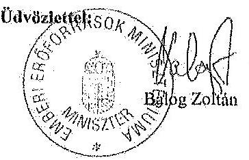

---

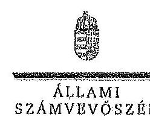

ELNÖK

# Balog Zoltán úr 

miniszter
Emberi Eröforrások Minisztériuma

## Budapest

## Tisztelt Miniszter Úr!

A Pannon Egyetem, a Szolnoki Főiskola, a Károly Róbert Főiskola, a Magyar Képzőművészeti Egyetem, a Széchenyi István Egyetem, a Miskolci Egyetem és az Eszterházy Károly Főiskola gazdálkodásának és müködésének ellenőrzéséről készített jelentéstervezetekre tett észrevételeit köszönettel megkaptam.

Az Állami Számvevőszék észrevételekre vonatkozó álláspontjáról a felügyeleti vezető által készített részletes tájékoztatást csatoltan megküldöm.

Tájékoztatom Miniszter urat, hogy az ÁSZ. tv. 29. § (3) bekezdése alapján a számvevőszéki jelentések mellékleteként szerepeltetjük a jelentéstervezetekhez tett figyelembe nem vett észrevételeket az elutasítás indokainak feltüntetésével.

Budapest, 2014. július
hó
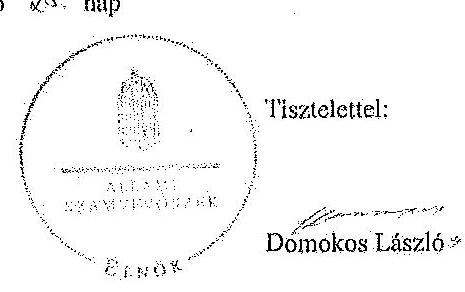

Melléklet: Tájékoztatás az elfogadott és a figyelembe nem vett észrevételekről

---

# Tájékoztatás   az elfogadott és a figyelembe nem vett észrevételekről 

A Pannon Egyetem, a Szolnoki Főiskola, a Károly Róbert Főiskola, a Magyar Képzőmúvészeti Egyetem, a Széchenyi István Egyetem, a Miskolci Egyetem és az Eszterházy Károly Főiskola gazdálkodásának és müködésének ellenőrzéséről készült számvevőszéki jelentés-tervezetekhez a 36433-2/2014/FOFEJL iktatószámú levélben tett észrevételeit köszönettel megkaptok.

A jelentéstervezetekre tett észrevételeket áttekintettük, azok kezeléséről a következő tájékoztatást adom:

1. A 2012. évi költségvetési hiánycél tartását biztosító további feladatokról szóló 1365/2011. (XI. 8.) Korm. határozatban elölrt szervezeti és feladatellátási felülvizsgálati program megvalósítása.

A kormányhatározat alapján - az oktatási ágazatra vonatkozóan 2012. február 20-ig - kellett a tételes javaslatokat a Kormány elé terjeszteni, ennek végrehajtása azonban elmaradt. A feladatokat a nemzetgazdasági miniszter irányítása mellett kellett végrehajtani, felelősként azonban a Miniszterelnökséget vezető államtitkár, a közigazgatási és igazságügyi miniszter és az érintett ágazati miniszter is kijelölésre került. A fentiek alapján - az észrevételben leírtakra is figyelemmel - a vonatkozó szövegrészt a jelentéstervezetek összegző megállapítások, következtetések, javaslatok, valamint részletes megállapítások fejezetelben az alábbiak szerint pontositottuk:
„Elmaradt az oktatási ágazatra vonatkozóan a nemzetgazdasági miniszter irányításával és az oktatásért felelös miniszter részvételével, kormányhatározatban elölrt szervezeti és feladatellátási felülvizsgálati program kidolgozdsa." (Összegző megállapítások)
„Elmaradt az oktatási ágazatra vonatkozóan az 1365/2011. (XI. 8.) Korm. határozatban - a nemzetgazdasági miniszter irányításával és az ágazatért felelös miniszter részvételével - elölrt szervezeti és feladatellátási felülvizsgálati program kidolgozása. (Részletes megállapítások, 1. fejezet):

---

2. A felsőoktatás rendszere középtávú fejlesztési tervének elkészítése.

Az észrevételben foglaltakat figyelembe véve a jelentéstervezetek összegző megállapítások, következtetések, javaslatok, valamint részletes megállapítások fejezetelt kiegészittettük:
„A felsőoktatási törvény rendelkezései ellenére nem készíttetett a felsőoktatás rendszere vonatkozásában a Kormány által elfogadott középtávú fejlesztési tervet." (Összegző megállapítások)
„A miniszter - a vonatkozó jogszabályokban foglaltak ellenére - nem készittetett a felsőoktatás rendszere vonatkozásában a Kormány által elfogadott középtávú fejlesztési tervet." (Részletes megállapítások, 1. fejezet)
3. A Felsőoktatás Információs Rendszerének (FIR) üzemeltetése.

A felsőoktatási törvények rendelkezései szerint (Feot. 35. §, 103.§ (1) bekezdés aa.) pont, Nítv. 64.§ (2) bekezdés aa) pont) a felsőoktatási információs rendszer müködtetése, az adatkezelés jogszerüsége a felsőoktatás ágazati irányítását ellátó miniszter felelősségi körébe tartozik. A miniszter feladata a felsőoktatási információs rendszer müködéséért felelős Oktatási Hivatal müködtetése is. A FIR müködését a teljes ellenőrzött időszakban problémák jellemezték, amely felveti az Oktatási Hivatal müködtetéséért felelős minisztérium felelősségét is. Az észrevételben jelzettek alapján a jelentéstervezeteket pontositottuk a következők szerint:
„A minisztérium a Felsőoktatási Információs Rendszer (FIR) biztonságos üzemeltetéséhez, az adatok védelméhez szükséges alapvető szervezeti, szabályozási kontrollokat a 2012. év végéig nem teljes körűen alakittatta ki az Oktatási Hivatallal." (Összegző megállapítások)
„A minisztérium az Oktatási Hivatallal a Felsőoktatási Információs Rendszer (FIR) biztonságos üzemeltetéséhez, az adatok védelméhez szükséges alapvető szervezeti, szabályozási kontrollokat a 2012. év végéig nem teljes körűen alakittatta ki.,, (Részletes megállapítások, 1. fejezet)
4. Korábbi ÁSZ ellenőrzések javaslatainak hasznosulása.

4/a. Az oktatási és kulturális ágazat irányítási rendszerének, müködésének ellenőrzéséről szóló 1106 sz. ÁSZ jelentés 3. sz. javaslata tekintetében a jelentéstervezetek részletes megállapítások 5. fejezetei részletesen tartalmazzák a tényeket. Ennek alapján az oktatási ágazat középtávú stratégiája kidolgozásának hiányára vonatkozó megállapítást a jelentéstervezetekben nem módositottuk.

4/b. A felsőoktatás oktatási infrastruktúra-fejlesztési programjának ellenőrzéséről szóló 1171 sz. ÁSZ jelentésben az előkészítés hiányosságai miatt a felelősség megállapítására tett javaslat nem hasznosult a jelentéstervezetek megállapításai szerint.

---

Az észrevételben foglaltak szerint az egyes miniszterek, valamint a Miniszterelnökséget vezető államtitkár feladat- és hatásköréről szóló 212/2010. (VII. 1.) Korm. rendelet valóban a nemzeti fejlesztési miniszter szakpolitikai feladat- és hatáskörébe helyezte a PPP és egyéb állami vagyont érintő gazdálkodó szervezetekkel kötött és megkötendő szerződések vizsgálatát és ellenőrzését. Az ÁSZ nemzeti erőforrás miniszter részére címzett javaslata ugyanakkor a PPP programok előkészítési hiányosságai miatti felelősség megállapítására irányult. A nemzeti erőforrás minisztere 2012. január 19-én kelt intézkedési tervében 2012. december 31-ei határidőre elvégzendő feladatként fogalmazta meg az előkészítési hiányosságok miatti felelősség megállapításról való intézkedést, amely nem valósult meg. Mindezek alapján a jelentéstervezetben tett megállapítás módosítása nem indokolt.

4/c A 1171. sz. jelentés alapján tervezett intézkedések közül az állami felsőoktatási intézmények kapacitás-kihasználás felmérése késéssel valósult meg. A felmérés eredményeinek és a felsőoktatást érintő ágazati célok figyelembe vételével a felsőoktatási infrastruktúra közép- és hosszú távú hasznosítására a helyszíni ellenőrzés időszaka alatt nem történtek intézkedések. Az intézkedés határideje 2013. december 31. volt. Az észrevételben foglaltak alapján a jelentéstervezetek módosítása nem indokolt.

4/d. Az állami felsőoktatási intézmények érdekeltségébe tartozó gazdasági társaságok támogatásának és nyereségtik hasznosulásának ellenőrzése címü, 1290 sz. ÁSZ jelentés 2. sz. javaslata (Az állami felsőoktatási intézmények - a felülvizsgálatot követő, de legkésőbb egy éven belül - megmaradt társaságaira vonatkozó szakmai feladatellátás és a gazdasági eredményesség mérését biztosító mutatók és azok értékelési rendszerének kidolgoztatása) megállapításaink alapján nem hasznosult. A helyszíni ellenőrzés alatt rendelkezésre bocsátott dokumentumok alapján a minisztérium a rektorokat a szakmai feladatellátás és a gazdasági eredményesség mérését biztosító mutatószámok és értékelési rendszer kidolgozására a felsőoktatási intézmények finanszírozását szabályozó kormányrendelet kibirdetését követően kívánta felkérni. Így a vonatkozó megállapítás módosítása nem indokolt.

A Szolnoki Fölskola ellenőrzéséhez kapcsolódó - az emberi erőforrások miniszterének tett javaslatunk nem a PPP projektekkel kapcsolatos, hanem az intézmény hosszú távon fenntartható müködtetésére vonatkozó intézkedések megtételét célozza, amely a fenntartó feladata és nem igénylik a nemzeti fejlesztési miniszter bevonását.

Az Eszterházy Károly Fölskola esetében a jelentéstervezet nem az IFT minisztériumi észrevételezésének hiányát kifogásolta, hanem azt, hogy annak a Feot 115. § (2) bekezdése db) pontja szerinti felülvizsgálata dokumentáltan nem történt meg.

Az emberi erőforrások miniszterének a Károly Róbert Fölskola, a Magyar Képzőművészeti Egyetem, a Szolnoki Fölskola, az Eszterházy Károly Fölskola, a Széchenyi István Egyetem, valamint a Miskolci Egyetem vonatkozásában az Nftv. 73. § (3) bekezdés a) pontja alapján megfogalmazott javaslatokat az Nftv. 2014. július 24 -én hatályba lépő módosításai nem érintik, a felsőoktatási intézmény rektorainak tett javaslatokat a jogszabály változás figyelembe vételével pontositottuk.

---

Kérem a válaszlevelemben foglaltak szíves tudomásulvételét. Tájékoztatom Miniszter urat, hogy a számvevőszéki jelentés mellékleteként szerepeltetjük a jelentéstervezethez tett észrevételeit, az elfogadott valamint az ÁSZ. tv. 29. § (3) bekezdése alapján a figyelembe nem vett észrevételeket az elutasítás indokának feltüntetésével együtt.

Budapest, 2014. gútius hó 28 nap
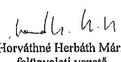

---

# **Chemistry**

## **Chemical Reactions**

### **Balancing Chemical Equations**

1. **Write the unbalanced equation:**
   - Example: $$C_3H_8 + O_2 \rightarrow CO_2 + H_2O$$

2. **Balance the equation:**
   - Example: $$2C_3H_8 + 7O_2 \rightarrow 6CO_2 + 8H_2O$$

3. **Balance the equation:**
   - Example: $$2C_3H_8 + 7O_2 \rightarrow 6CO_2 + 8H_2O$$

### **Types of Reactions**

1. **Combination Reaction:**
   - Example: $$2H_2 + O_2 \rightarrow 2H_2O$$

2. **Decomposition Reaction:**
   - Example: $$2H_2O_2 \rightarrow 2H_2O + O_2$$

3. **Single Displacement Reaction:**
   - Example: $$Zn + 2HCl \rightarrow ZnCl_2 + H_2$$

4. **Double Displacement Reaction:**
   - Example: $$AgNO_3 + NaCl \rightarrow AgCl + NaNO_3$$

5. **Combustion Reaction:**
   - Example: $$CH_4 + 2O_2 \rightarrow CO_2 + 2H_2O$$

## **Stoichiometry**

### **Mole Concept**

- **Mole (mol):** The amount of substance containing as many particles (atoms, molecules, ions) as there are atoms in exactly 12 grams of carbon-12.
- **Avogadro's Number:** $$6.022 \times 10^{23}$$ particles per mole.

### **Molar Mass**

- **Molar Mass:** The mass of one mole of a substance.
- Example: The molar mass of water ($$H_2O$$) is 18.015 g/mol.

### **Calculations**

1. **Moles to Mass:**
   - Formula: $$n = \frac{m}{M}$$
   - Example: Calculate the number of moles of $$H_2O$$ in 18 grams of water.
     - $$n = \frac{18.015 \, \text{g}}{18.015 \, \text{g/mol}} = 18.015 \, \text{g/mol}$$

2. **Moles to Mass:**
   - Formula: $$m = n \times M$$
   - Example: Calculate the mass of 18.015 g of water.
     - $$m = 18.015 \, \text{g/mol} = 18.015 \, \text{g/mol}$$

## **Gas Laws**

### **Ideal Gas Law**

- **Equation:** $$PV = nRT$$
- **Variables:**
  - $$P$$: Pressure (atm)
  - $$V$$: Volume (L)
  - $$n$$: Number of moles (mol)
  - $$R$$: Ideal gas constant (0.0821 L·atm/mol·K)
  - $$T$$: Temperature (K)

### **Boyle's Law**

- **Equation:** $$P_1V_1 = P_2V_2$$
- **Variables:**
  - P₁: Pressure (atm)
  - P₂: Volume (L)
  - P₃: Temperature (K)
  - P₁: Pressure (atm)
  - P₂: Volume (L)
  - P₃: Temperature (K)
  - P₁: Pressure (atm)

### **Boyle's Law (Boyle's Law)**

- **Equation:** $$\frac{P_1V_1}{P_2V_2} = \frac{P_1}{V_1}$$

## **Thermochemistry**

### **Enthalpy (H)**

- **Definition:** The heat content of a system at constant pressure.
- **Equation:** $$\Delta H = q_p$$
- **Variables:**
  - $$q_p$$: Heat transferred at constant pressure.
  - $$q_p$$: Heat transferred at constant pressure.

### **Hess's Law**

- **Statement:** The enthalpy change for a reaction is the same whether it occurs in one step or multiple steps.
- **Equation:** $$\Delta H_{\text{rest}} = \Delta H - \Delta H_0$$
- **Variables:**
  - $$\Delta H$$: Heat transferred at constant pressure.
  - $$\Delta H_0$$: Heat transferred at constant pressure.

### **Hess's Law (Hess's Law)**

- **Statement:** The enthalpy change for a reaction is the same whether it occurs in one step or multiple steps.
- **Equation:** $$\Delta H_{\text{rest}} = \Delta H - \Delta H_0$$
- **Variables:**
  - $$\Delta H$$: Heat transferred at constant pressure.
  - $$\Delta H_0$$: Heat transferred at constant pressure.

## **Electrochemistry**

### **Oxidation and Reduction**

- **Oxidation:** Loss of electrons.
- **Reduction:** Gain of electrons.

### **Galvanic Cells**

- **Definition:** A cell that converts chemical energy into electrical energy.
- **Components:**
  - Anode: Oxidation occurs.
  - Cathode: Reduction occurs.
  - Salt Bridge: Connects the two half-cells.

### **Nernst Equation**

- **Equation:** $$E = E^\circ - \frac{RT}{nF} \ln Q$$
- **Variables:**
  - $$E$$: Energy (K)
  - $$E^\circ$$: Standard cell potential (V)
  - $$R$$: Ideal gas constant (0.0821 L·atm/mol·K)
  - $$T$$: Temperature (K)
  - $$n$$: Number of electrons transferred
  - $$F$$: Faraday constant (96,485 C/mol)
  - $$Q$$: Reaction quotient

---

# Eszterházy Károly Fóiskola Rektori Hivatal 

Cím: 3300 Eger, Eszterházy tér 1. - Tel. (36) 520-420 - Fax (36) 520-440

Állami Számvevőszék
Domokos László Úr részére
1052 Budapest, Apáczai Csere János u. 10.

Ikt.szám: RH/51/2014.
Tárgy: észrevételek jelentéstervezethez

Tisztelt Domokos László Úr!

Az Eszterházy Károly Főiskola megkapta az Állami Számvevőszéknek az intézmény gazdálkodásának és müködésének ellenőrzéséről szóló számvevőszéki jelentéstervezetet, mellyel kapcsolatban az alábbi észrevételeket tesszük.

1. Az EKF belső kontrollrendszerének kialakításáról és müködéséről szóló megállapításokkal alapvetően egyetértünk.
2. A fenntartó tevékenységével kapcsolatos megállapitások: a 24. oldalon található „... a minisztérium dokumentáltan nem vizsgálta meg a főiskola által elkészített és megküldött intézményfejlesztési Tervet" megfogalmazásról nem tudjuk, hogy az melyik intézményfejlesztési tervre (mivel a vizsgált időszakban két ilyen dokumentum is benyújtásra került) vonatkozik és milyen dokumentumokon alapul.

## 3. Az intézmény pénzügyi- és vagyongazdálkodása

3.1. A gazdálkodás elemzéséhez és a táblázatokhoz kapcsolódó észrevételek

- Számszakilag hibás az 1. és 2. számú melléklet - továbbá a két táblázat évenkénti „Teljesítés" oszlopai között is eltérések tapasztalhatók -, a 16. oldalon található összefoglaló táblázatban a hallgatói létszám és oktatói létszám adatok nem az éves beszámolókban, illetve az éves statisztikai jelentésekben foglaltaknak megfelelőek, forrásuk nem ismert, továbbá a 2009. évi adatok szerkezete eltér a további három évtől. A 31. oldalon található táblázatban a 2009. évi adatok nem felelnek meg az éves beszámolóban foglaltaknak.
- A mérlegadatok elemzéséhez - tekintettel arra, hogy 4 éves idöszak került ellenőrzésre és a mérlegben adott év december 31-i szerepelnek - véleményünk szerint szükséges megadni a 2008. dec. 31-i információkat is, mint az időszak nyitóadatát és az elemzést következetesen ehhez hasonlítva lehetne elvégezni. Az intézmény ellenőrzött időszaki induló vagyona és a forgóeszközök állománya valószínűsíthetően a 2008-as mérlegből származik (42. oldal és 20. oldal), de a befektetett eszközök és forgóeszközök eszközvagyonon belüli induló részarányai a 2009-es mérlegadatokból kerültek kiszámításra. Nem helytálló az a megfogalmazás, mely szerint ,... a forgóeszközök értéke $857,6 \mathrm{M} \mathrm{Ft}$-ról $508,3 \mathrm{M} \mathrm{Ft}$-ra, $59,3 \%$-kal csökkent".
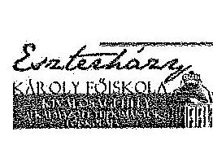
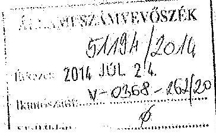

---

# Eszterházy Károly Főiskola Rektori Hivatal 

Cím: 3300 Eger, Eszterházy tér 1. - Tel. (36) 520-420 - Fax (36) 520-440

- A likviditási mutató számítása (35. oldal) a lábjegyzet (28) szerint a forgóeszközök állományának figyelembevételével történt, de a kiszámolt értéknek ez nem felel meg, a forgóeszközök állományából az egyéb aktív pénzügyi elszámolások értéke levonásra került.
- Teljesített saját bevétel 2009. évre megadott összege nem valós, vagy nem pontos a megfogalmazás (nem mind saját bevétel), a további számítások már nemcsak a saját bevételre vonatkoznak - logikailag hibásnak véljük a „, ... a 2011-2012. években azonban a kiadások nagyobb részét már a saját bevételek finanszírozták (a támogatás a bevétel $58,3 \%$-át, illetve $77,6 \%$-át tette ki)" mondatrészt (32. oldal). A 34. oldalon a folyó bevételek elemzése: a 33. oldalon lévő táblázatból az látszik, hogy a folyó bevételek 2012-ben 194,8 M Ft-tal csökkentek 2009-hez viszonyítva. Ennek magyarázata azonban ezt („... a költségvetési támogatások 571,6 M Ft-os, $14,1 \%$-os csökkenése mellett az intézményi müködési bevételek 199,8 M Ftos, $18,6 \%$-os növekedése jellemezte") nem támasztja alá.

Mindezen észrevételeink alapján szükségesnek véljük a táblázatok adatainak pontositását, azoknak megfelelően az elemzések átszámítását és az eredmények újraértékelését annak érdekében, hogy az intézményröl kialakitott kép valós legyen.

### 3.2. A gazdálkodás értékeléséhez kapcsolódó észrevételek

- A gazdálkodás egészét, illetve kiadási jogcímek egészét szabálytalannak ítélő kijelentéseket (19. oldal: „A rendszeres és nem rendszeres személyi juttatások felhasználása nem volt szabályszerű." „A dologi kiadási előirányzatok felhasználása nem volt szabályszerű." 30. oldal 3. pont 2. mondata: „Szabálytalan volt a személyi juttatások, a dologi kiadások felhasználása, a müködési és a felhalmozási bevételek beszedése, valamint a költségtérítések megállapítása." nem tartjuk megalapozottnak, a részletes megállapítások fejezetben foglaltak sem támasztják ezt alá.
- A rendszeres és nem rendszeres személyi juttatások (19. oldal, 38. oldal):

A közalkalmazottak jogállásáról szóló 1992. évi XXXIII. törvény 77. § (1) bekezdése alapján járt el a föiskola, amikor is a közalkalmazottni részére elrendelt többletfeladatot kereset-kiegészítésként a nem rendszeres személyi juttatások között számolta el. Az Ámr. 1 és Ámr. 2 kormányrendeletek személyi juttatásokkal kapcsolatos bekezdései nincsenek összhangban a fentebb hivatkozott törvénnyel. A föiskola vezetése a magasabb rendủ jogszabály előírásai szerint járt el. Ebből az is következik, hogy több járulékot fizettünk a központi költségvetésbe.

- Hallgatói gyüjtőszámla kezelése (20-21. oldalak, 40. oldal, 47. oldal):

A hallgatói gyűjtőszámla kincstárban történő vezetésének technikai feltételei nem voltak adottak, ezért került bevezetésre a kereskedelmi bankban nyitott bankszámla. Mivel a föiskola nem nyithatott ilyen számlát az Áht. rendelkezései alapján, ezért az Eszterházy Károly Főiskola Hallgatói figyesülete kezelte/kezeli a számlát. A 2009-2011. évekre vonatkozóan az Áht. 1 18/C. § (5) bekezdése szerint „A 18/B. § (4) bekezdésében meghatározott kincstári kör-

---

# Eszterházy Károly Főiskola Rektori Hivatal 

Cím: 3300 Eger, Eszterházy tér 1. - Tel. (36) 520-420 - Fax (36) 520-440
be tartozók pénzeszközeiket kötelesek a kincstári egységes számlán elhelyezni és folyamatosan ott tartani.", melyböl nem következik egyértelmüen, hogy beszedni is kizárólag kincstári számlán kell a bevételeket. Jelenleg egyeztetések folynak és keresztül a megoldást az új Áht.nak megfelelő, kincstári számlán történő nyilvántartás megvalósitásának.

- Követelés fejében átvett bútor (41. oldal):

Az EKF nem sértette meg a 1036/2012. (II.21.) Kornányhatározatban elölrtakat, a határozat 6. pontja szerint "A Kornány az irányítása alá tartozó fejezeteknél beszerzési tilalmat rendel el az intézményi beruházás keretében történő bútor, személygépjármủ, informatikai eszköz és telefon beszerzése vonatkozásában." Az ügylet következtében az EKF követelés fejében vett át bútort, nem pedig bútort vásárolt. Klasszikus értelemben vett beszerzés nem történt, az ügylettel egy 3 évvel ezelőtti követelés került kiegyenlitésre. A szerzödés nem tartalmaz késedelmi kamatra vonatkozó passzust, ezért a követelés fejében történt átvételkor sem merült fel ilyen jellegủ újabb követelés, melynek megtérülése az előzményeket ismerve szintén kérdéses lett volna.

- Gépkocsi beállók, teremgarázsok bérbeadására vonatkozó szerződések versenyeztetése (21. oldal):

A felmerült igények és a kapcsolódó bérleti díjak mértékét tekintve, nem indokolt a költséghatékonyságot is figyelembe véve ezen típusú szerződések versenyeztetése.

Fenti észrevételek mellett nagy tisztelettel szeretném megköszönni az Önök munkatársainak a munkáját, megfogalmazott észrevételeiket és javaslataikat, melyek segítséget nyújtanak az intézmény hatékonyabb müködéséhez és müködtetéséhez, az esetleg szabálytalanságok feltárásához és azok orvoslásához, a szükséges intézkedés megtételéhez.

Az Eszterházy Károly Főiskola elkötelezett híve a minőségi hazai felsőoktatásnak, és ezen feladatát mindig és minden körülmények között a hatályos jogszabályi környezethez igazodva kívánja ellátni.

Segitő szándékukat ezúton is megköszönve, tisztelettel,
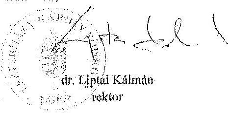

Eger, 2014. július 16.
dr. Liptai Kálmán
rektor

---

.

---

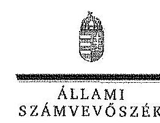

ELNOK

# Dr. Liptai Kálmán úr 

rektor
Eszterházy Károly Főiskola

## Eger

## Tisztelt Rektor Úr!

Az Eszterházy Károly Főiskola gazdálkodásának és müködésének ellenőrzéséről készített jelentéstervezetre tett észrevételeit köszönettel megkaptam.

Az Állami Számvevőszék észrevételekre vonatkozó álláspontjáról a felügyeleti vezető által készített részletes tájékoztatást csatoltan megküldöm.

Tájékoztatom Rektor urat, hogy az ÁSZ. tv. 29. § (3) bekezdése alapján a számvevőszéki jelentés mellékleteként szerepeltetjük a jelentéstervezethez tett figyelembe nem vett észrevételeket az elutasítás indokainak feltüntetésével.

Budapest, 2014. 03 hó / 9 nap
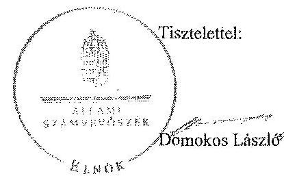

Melléklet: Tájékoztatás az elfogadott és figyelembe nem vett észrevétclekről

---

# Tájékoztatás   az elfogadott és a figyelembe nem vett észrevételekről 

Az Eszterházy Károly Főiskola gazdálkodásának és müködésének ellenőrzéséről készült számvevőszéki jelentéstervezethez az RH/367-1/2014. iktatószámú levélben tett észrevételeit köszönettel megkaptuk. A jelentéstervezetre tett észrevételeket áttekintettük, azok kezeléséről a következő tájékoztatást adom:

## Általános tájékoztatás

A megállapítások alátámasztására vonatkozóan tájékoztatom, hogy a jelentéstervezet bevezető részében meghatároztuk, hogy ,, a pénsügyi és vagyongazdálkodás terén az egyes terüleiek szabályszerű müködését mintavétellel ellenőriztük, ez alapján a sokaságokban elöforduló hibás tételek arányát becsültük", amelynek kiértékelését az 5. számú melléklet tartalmazza.

A mintavétel eredményeit tehát kivetítettük a teljes sokaságra, amelynek során meghatároztuk a mintában feltárt hibaarányhoz tartozó alsó és felső hibahatárokat (alsó határ = legvalószinűbb hiba - mintavétel maximális hibája; felső határ = legvalószinűbb hiba + mintavétel maximális hibája). A teljes sokaságban a hibás tételek aránya $95 \%$-os bizonyossággal az alsó és felső hibahatár közé esik.

A jogszabályoknak és a belső előírásoknak megfelelőnek, azaz szabályszerűnek tekintettük az adott kiadási előirányzat felhasználását, bevétel beszedését, mérlegtétel értékelését, amennyiben a minta alapján $95 \%$-os bizonyossággal megállapítható volt, hogy a teljes sokaságban a hibás tételek aránya kisebb, mint $10 \%$, nem megfelelőnek értékeltük, ha a hibás tételek aránya a $10 \%$-ot meghaladta.

Amennyiben $95 \%$-os bizonyossággal nem volt egyértelműen megállapítható a minta alapján, hogy az adott terület müködése megfelelő volt-e (az elfogadható hibaarány ( $10 \%$ ) az alsó és felső hibahatár közé esett), de a mintában a hibás tételek aránya kisebb volt, mint az elfogadható hibaarány ( $10 \%$ ), akkor kockázatosnak minősítettük az adott terület müködését. Ha a mintában a hibás tételek aránya nagyobb volt, mint az elfogadható hibaarány ( $10 \%$ ), akkor magas kockázatúnak értékeltük az adott terület müködését.

A mintavételes ellenőrzés alapján tett megállapításoknál az ellenőrzött területre vonatkozóan megjelöltük a megsértett jogszabályhelyeket, illetve a hibatípusokat. Terjedelmi okok a hibák tételes kimutatását nem teszik lehetővé. Javaslataink a jelzett szabálytalanságok megszüntetését és a hibák kijavítását célozzák.

---

# Tartalmi észrevételek 

1. pont

- Módosítást nem igényel, mivel a megállapítással kapcsolatban egyetértő véleményüket fejezték ki.

2. pont

- A 16. oldalon levő táblázatban szereplő hallgatói létszámadatok a föiskola által megküldött 8. számú tanúsítvány adataival egyezőek. Az oktatói létszámadatok a szöveges beszámolókból származnak.

Észrevételük alapján a jelentéstervezet 17. oldal 6. bekezdésében és a 24. oldal utolsó bekezdésében az Intézményfejlesztési Tervre vonatkozó megállapítást az alábbiak szerint pontositottuk:
„Ugyanakkor a minisztérium a föiskola által elkészített és megküldött 2012-2015. évekre vonatkozó Intézményfejlesztési Tervet dokumentáltan nem vizsgálta meg, megsértve ezzel a felsőoktatási törvény rendelkezéseit.,
„Ugyanakkor a minisztérium dokumentáltan nem vizsgálta meg a föiskola által elkészitett és megküldött 2012-2015. évekre vonatkozó Intézményfejlesztési Tervét."

Az Intézményfejlesztési Terv felülvizsgálatának elvégzését igazoló dokumentumot a minisztériumban nem tudtak az ellenőrzés rendelkezésére bocsátani.
3. pont
3.1 pont a gazdálkodás elemzéséhez kapcsolódó észrevételek

- Az észrevételben jelzettek alapján az 1. és 2. sz. mellékletben szereplő, a 16. oldalon, valamint a 31. oldalon lévő táblázatok 2009. évi adatait javitottuk.
- A 2009. évi adatok módosításával a 18. oldal 5. és 32. oldal 3. bekezdéseit az alábbiak szerint változtattuk:
„A föiskola kiadásai a 4 év alatt 6154,9 M Ft-ról 7685,1 M Ft-ra, 24,9\%-kal, a bevételei öszszességében 6556,4 M Ft-ról 8004,7 M Ft-ra, 22,1\%-kal nötted."
„A teljesitett kiadás 2009. évi 6154,9 M Ft-os összege 2012-re 24,9\%-kal növekedett. A teljesitett kiadás az ellenőrzött idöszakban 3,7\%-15,9\%-kal maradt el a módosított elöiránysattól."

A mérlegadatok elemzésével kapcsolatban tájékoztatom, hogy az ellenőrzött időszak teljes és a kiemelt eszközcsoportonkénti vagyonváltozását a 2009. évi nyitóadatokhoz viszonyítva számítottuk ki. Így helytálló a jelentéstervezet 42 oldal 7. bekezdésében szerepeltetett forgóeszköz

---

változás értéke és aránya. A további részletes elemzést azonban - mint azt az érintett bekezdésben is szerepeltettük - az ellenőrzött időszak mérlegadatainak és a megküldött tanúsítványok alapján végeztük, amelyek a 2009. évi záró adatokat tartalmazták.

- A 35. oldal 3. bekezdésében a likviditási mutató számítására vonatkozó lábjegyzetet pontositottuk az alábbiak szerint:
"A likviditási mutató kifejezi, hogy a rövid lejáratú fizetési kötelezettségek kiegyenlitéséhez az aktív pénzügyi elszámolások nélküli forgóeszközök milyen arányban nyújtanak fedezetet."
- A teljesített saját bevételekhez kapcsolódó szövegrészt ( 32 oldal 5-6. bekezdései) az észrevételt figyelembe véve az alábbiak szerint módosítottuk:
„A teljesitett saját és átvett bevételek (az elöirányzat maradvánnyal együtt) a 2009. évi 2233,0 M Ft-röl 2012-re több mint kétszeresére emelkedtek. A bevétel - a 2009. évet kivéve kismértékben elmaradt a módosított elöirányzattól, a 2009. évben a bevételek 7,9\%-kal túlteljesültek.

Az EKF teljesitett kiadásait a 2009. évben 70,2 \%-ban, 2010-ben 69,5\%-ban, 2011-ben 38,6\%ban, mig 2012-ben 45,5\%-ban a költségvetési támogatás finanszirosta. A 2009-2010. években a bevételek nagyobb hányadát ( $66 \%$ illetve $60 \%$-át) a költségvetési támogatás tette ki. A 20112012. években azonban a költségvetési támogatás bevételeken belüli aránya $37 \%$ illetve $44 \%$ ra csökkent."

- A 34. oldal 2. bekezdésében a folyó bevételek elemzéséről szóló részt az alábbiak szerint pontositottuk:
„Ennek megfelelően a folyó bevételek alakulását az ellenőrzött időszakban összességében a müködési költségvetési támogatások 571,6 M Ft-os, (14,1\%-os) csökkenése mellett az egyéb müködési célú bevételek 376,8 M Ft-os, (22,1 \%-os) növekedése jellemezte."

# 3.2 pont 

- A gazdálkodás értékelése (19. oldal, 30. oldal)

A rendszeres és nem rendszeres személyi juttatások teljesítésére, a dologi kiadási előirányzatok felhasználására, a bevételek beszedésének szabályszerűségére vonatkozó értékeléseket levelünk általános részében bemutatottak szerint végeztük el. A mintában előforduló hibák aránya alapján a megállapítás az érintett területek egészére kivetíthető.

- A rendszeres és nem rendszeres juttatások (19. oldal, 38. oldal)

A rendszeres és nem rendszeres személyi juttatásokat érintő megállapításokhoz kapcsolódó észrevételt nem tudjuk elfogadni. A Kjt. 77. § (1) bekezdése szerint a közalkalmazottat a munkáltató meghatározott munkateljesítmény eléréséért, illetve átmeneti többletfeladatok - ide nem értve az átirányítást - teljesítéséért a megállapított személyi juttatások előirányzatán belül

---

egyszeri vagy meghatározott időre szóló, havi rendszerességgel fizetett kereset-kiegészítésben részesítheti. A Kjt. így nem határozza meg, hogy mely előirányzat terhére (rendszeres, nem rendszeres, vagy külső személyi juttatás) kell a kereset-kiegészítést kifizetni. Az Ámr ${ }_{1}$ és Ámr ${ }_{2}$ azonban egyértelműen kimondta, hogy a saját munkavállalónak munkakörén kívüli munkáért fizetett juttatás a külső személyi juttatás elöirányzatának terhére történhet. Így a megállapításunk megalapozott, törlése nem indokolt.

- A hallgatói gyüjtőszámla kezelése (20-21. oldal, 40. oldal, 47. oldal)

Az Áht. szabályai alapján egyértelmủ, hogy a kincstári körbe tartozó szervek csak kincstári számlán kezelhetik pénzeszközeiket. Ebből az is következik, hogy a jogszabály szerint a kincstári körbe tartozók más pénzintézetnél bankszámlával nem rendelkezhetnek. Az Áht ${ }_{1} 18 /$ C. § (5) bekezdése alapján a kincstári körbe tartozók kötelesek pénzeszközeiket folyamatosan a kincstári egységes számlán tartani. Amennyiben kereskedelmi banki számlán szedik be a bevételeket, úgy ez a kitétel nem teljesül. Az erre vonatkozó megállapításoktól ezért nem lehet eltekinteni.

- Követelés fejében átvett bútorok (41. oldal)

A követelés fejében átvett bútorokkal kapcsolatos észrevétel nem fogadható el. Az valóban igaz, hogy nem klasszikus bútorbeszerzés történt, de az eredménye ugyanaz volt, csak nem készpénzzel egyenlítették ki a beszerzést, hanem követeléssel. Ezen gyakorlat jogszerünek tekintésével megkerülhetők lennének az elrendelt beszerzési tilalmak.

- Gépkocsi beállók, teremgarázs bérbeadása (21. oldal)

A gépkocsi beállók, teremgarázsok bérbeadására vonatkozó szerződések versenyeztetésével kapcsolatos észrevétel nem fogadható el, mert a jogszabály (Vtv. 24. § (1) bekezdés) nem tesz kivételt az állami vagyon hasznosítása tekintetében annak értékétől függően. Minden esetben előírja, hogy hasznosításra vonatkozó szerződés csak versenyeztetés útján köthető.

Kérem a válaszlevelemben foglaltak szíves tudomásulvételét. Tájékoztatom Rektor urat, hogy a számvevőszéki jelentés mellékleteként szerepeltetjük a jelentéstervezethez tett észrevételeit, valamint az elfogadott és az ÁSZ. tv. 29. § (3) bekezdése alapján a figyelembe nem vett észrevételeket az elutasítás indokának feltüntetésével együtt.

Budapest, 2014. 03 hó 13 nap
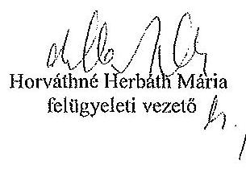