# ÁLLAMI   SZÁMVEVŐSZÉK 

## JELENTÉS

a Magyar Táncmúvészeti Főiskola ellenőrzéséről - Az állami felsőoktatási intézmények gazdálkodásának, müködésének ellenőrzése

---

# Állami Számvevőszék 

Iktatószám: V-0369-279/2014.
Témaszám: 1371
Vizsgálat-azonosító szám: V-065808

## Az ellenőrzést felügyelte:

Horváthné Herbáth Mária
felügyeleti vezető
Az ellenőrzést vezette:
Keresztes Tamás
ellenőrzésvezető
A számvevői jelentések feldolgozásában és a jelentés összeállításában közremüködtek:

Keresztes Tamás
ellenőrzésvezető
Bertalan Rudolf Gyula
számvevő
Kliment Krisztián Endre
számvevő asszisztens
Az ellenőrzést végezték:

| Béres László | Bertalan Rudolf Gyula | Eötvös Magdolna |
| :-- | :-- | :-- |
| számvevő | számvevő | számvevő tanácsos |
| Kámán Edina | Varga Ágnes Klára |  |
| számvevő tanácsos | számvevő |  |

A témához kapcsolódó eddig készített számvevőszéki jelentések:
címe
sorszáma
Jelentés az oktatási és kulturális ágazat irányítási rendszerének, 1106 müködésének ellenőrzéséről
Jelentés a felsőoktatás oktatási infrastruktúra-fejlesztési program- 1171 jának ellenőrzéséről
Jelentés az állami felsőoktatási intézmények érdekeltségébe tartozó 1290 gazdasági társaságok támogatásának és nyereségük hasznosulásának ellenőrzéséről

---

# TARTALOMJEGYZÉK 

BEVEZETÉS ..... 13
I. ÖSSZEGZŐ MEGÁLLAPÍTÁSOK, KÖVETKEZTETÉSEK, JAVASLATOK ..... 18
II. RÉSZLETES MEGÁLLAPÍTÁSOK ..... 28

1. A felsőoktatásért felelős minisztérium fenntartói és ágazati irányítói tevékenysége ..... 28
2. Az intézmény belső kontrollrendszerének kiépítése és múködtetése ..... 29
3. Az intézmény pénzügyi gazdálkodása ..... 34
3.1. A kiadási és bevételi előirányzatok alakulása és a pénzügyi egyensúlyt befolyásoló tényezők ..... 35
3.2. A bevételi és kiadási előirányzatok megállapítása, módosítása, az előirányzat-maradványok kezelése ..... 40
3.3. A kiadási előirányzatok felhasználása ..... 41
3.4. A bevételi előirányzatok teljesítése ..... 43
3.5. A támogatások felhasználása, a pályázati forrásból finanszírozott projektek szabályszerűsége, a díjtételek megállapítása ..... 44
4. Az intézmény vagyongazdálkodása ..... 46
4.1. A vagyongazdálkodás szabályozottsága ..... 48
4.2. A vagyonelemek kimutatása ..... 49
4.3. A vagyonelemekkel történő gazdálkodás ..... 54
5. A korábbi ÁSZ ellenőrzések javaslatainak hasznosulása ..... 57

---

# MELLÉKLETEK 

1. számú A Magyar Táncművészeti Főiskola kiadási és bevételi előirányzatai, azok teljesítése a 2009-2012. években
2. számú A Magyar Táncművészeti Főiskola kiadásainak és bevételeinek változása a 2009-2012. években
3. számú Kimutatás a Magyar Táncművészeti Főiskola bevételeiről és kiadásairól, valamint adósságszolgálatáról a 2009-2012. években
4. számú A Magyar Táncművészeti Főiskola mérlegadatai a 2009-2012. években
5. számú A Magyar Táncművészeti Főiskola gazdálkodása szabályszerűségének értékelése a mintatételek alapján
6. számú Az Emberi Erőforrások Minisztériumának észrevétele
7. számú Az Emberi Erőforrások Minisztériumának észrevételére adott válasz
8. számú A Magyar Táncművészeti Főiskola észrevétele
9. számú A Magyar Táncművészeti Főiskola észrevételére adott válasz

---

# RÖVIDÍTÉSEK JEGYZÉKE 

## Törvények

Áfa tv.
Áht. 1
Áht. 2
ÁSZ tv.
Feot.
Kjt.
Munka Törvénykönyve
Nftv.
Nvtv.
Szja tv.
Sztv.
Tbj.
Vtv.
Törvényerejü rendelet
Kormányrendeletek
Áhsz.

Ámr. 1
Ámr. 2
Ávr.
Ber.
Bkr.
Vtvr.

## Határozatok

1037/1983. (IX. 1.) MT sz. határozat
1268/2010. (XII. 3.)
Korm. határozat
1365/2011. (XI. 8.)
Korm. határozat
2007. évi CXXVII. törvény az általános forgalmi adóról
1992. évi XXXVIII. törvény az államháztartásról
2011. évi CXCV. törvény az államháztartásról
2011. évi LXVI. törvény az Állami Számvevőszékről
2005. évi CXXXIX. törvény a felsőoktatásról
1992. évi XXXIII. törvény a közalkalmazottak jogállásáról
1992. évi XXII. törvény a Munka Törvénykönyvéről
2011. évi CCIV. törvény a nemzeti felsőoktatásról
2011. évi CXCVI. törvény a nemzeti vagyonról
1995. évi CXVII. törvény a személyi jövedelemadóról
2000. évi C. törvény a számvitelről
1997. évi LXXX. törvény a társadalombiztosítás ellátásaira és a magánnyugdíjra jogosultakról, valamint e szolgáltatások fedezetéről
2007. évi CVI. törvény az állami vagyonról

249/2000. (XII. 24.) Korm. rendelet az államháztartás szervezetei beszámolási és könyvvezetési kötelezettségének sajátosságairól
217/1998. (XII. 30.) Korm. rendelet az államháztartás múködési rendjéről
292/2009. (XII. 19.) Korm. rendelet az államháztartás müködési rendjéről
368/2011. (XII. 31.) Korm. rendelet az államháztartásról szóló törvény végrehajtásáról
193/2003. (XI. 26.) Korm. rendelet a költségvetési szervek belső ellenőrzéséről
370/2011. (XII. 31.) Korm. rendelet a költségvetési szervek belső kontrollrendszeréről és belső ellenőrzésről
254/2007. (X. 4.) Korm. rendelet az állami vagyonnal való gazdálkodásról
az Állami Balett Intézet irányításáról, szervezetéről és képzési rendjéről
a 2010. évi költségvetési egyenleg teljesítéséhez szükséges intézkedésekről
a 2012. évi hiánycél tartását biztosító további feladatokról

---

Egyéb rövidítések
ÁSZ
EMMI
EU
FEUVE
FIR
GT
HÖK
IFT
Kincstár
KEOP
KIM
KSH
KVI
MNV Zrt.
MTA
MTF/főiskola/intézmény
NEFMI
NEPTUN
NFM
NKA
NGM
OKM
PPP
SZMSZ
TÁMOP

Állami Számvevőszék
Emberi Erőforrások Minisztériuma
Európai Unió
Folyamatba épített, előzetes, utólagos és vezetői ellenőrzés
Felsőoktatási Információs Rendszer
Gazdasági Tanács
Hallgatói Önkormányzat
Intézményfejlesztési Terv
Magyar Államkincstár
Környezet és Energia Operatív Program
Közigazgatási és Igazságügyi Minisztérium
Központi Statisztikai Hivatal
Kincstári Vagyon Igazgatóság
Magyar Nemzeti Vagyonkezelő Zrt.
Magyar Tudományos Akadémia
Magyar Táncmúvészeti Főiskola
Nemzeti Erőforrás Minisztérium
Tanulmányi hallgatói információs rendszer
Nemzeti Fejlesztési Minisztérium
Nemzeti Kulturális Alap
Nemzetgazdasági Minisztérium
Oktatási és Kulturális Minisztérium
Public-Private Partnership (magán és közszféra együttmúködése)
Szervezeti és Múködési Szabályzat
Társadalmi Megújulás Operatív Program

---

# ÉRTELMEZŐ SZÓTÁR 

alapító
állami felsőoktatási intézmény saját tulajdona
állami vagyon
állami vagyon hasznosítása

A központi költségvetési szerv alapítója az Országgyúlés, a Kormány vagy a miniszter. A felsőoktatási intézmények vonatkozásában az alapítói jogokat a felsőoktatásért felelős minisztérium gyakorolja.
A felsőoktatási intézmény saját bevételének a költségek teljes körű levonása - az adományozás és öröklés kivételével -, a rendelkezésre bocsátott vagyon állagának megóvásáról, pótlásáról való gondoskodás után fennmaradt része terhére szerzett vagyona.
A Vtv. 1. § (2) bekezdése szerint állami vagyonnak minősül:
a) az állami tulajdonban lévő ingó dolog, valamint a dolog módjára hasznosítható természeti erő,
b) az állami tulajdonban lévő termőföldekből álló, külön törvényben szabályozott Nemzeti Földalap,
c) az állami tulajdonban lévő - a b) pont hatálya alá nem tartozó - ingatlan,
d) az állami tulajdonban lévő értékpapír,
e) az államot megillető társasági részesedés és más vagyoni értékű jog;
(hatályos 2010. június 16 -áig)
a) az állam tulajdonában lévő dolog, valamint a dolog módjára hasznosítható természeti erő,
b) az a) pont hatálya alá nem tartozó mindazon vagyon, amely vonatkozásában törvény az állam kizárólagos tulajdonjogát nevesíti,
c) az állam tulajdonában lévő tagsági jogviszonyt megtestesítő értékpapír, illetve az államot megillető egyéb társasági részesedés,
d) az államot megillető olyan immateriális, vagyoni értékkel rendelkező jogosultság, amelyet jogszabály vagyoni értékű jogként nevesít.
(hatályos 2010. június 17-étől)
A Vtv. 23. § (1) bekezdése szerint: Az állami vagyont az MNV Zrt. maga kezeli, illetve szerződés - így különösen bérlet, haszonbérlet, szerződésen alapuló haszonélvezet, vagyonkezelés, megbízás - alapján központi költségvetési szervnek, természetes vagy jogi személynek, illetőleg jogi személyiséggel nem rendelkező gazdasági társaságnak hasznosításra átengedi.
(hatályos 2010. december 31-ig)
Az állami vagyont az MNV Zrt. maga kezeli, vagy szerződés - így különösen bérlet, haszonbérlet, szerződésen alapuló haszonélvezet, vagyonkezelés, megbízás - alapján központi költségvetési szervnek, természetes vagy

---

állami vagyon hasznosítására kötött szerződés
állami vagyon használója
állami vagyon értékesítése
állami vagyon kezelője /vagyonkezelő
jogi személynek vagy jogi személyiséggel nem rendelkező gazdálkodó szervezetnek hasznosításra átengedi.
(hatályos 2011. december 31-éig)
Az állami vagyont az MNV Zrt. maga kezeli, vagy szerződés - így különösen bérlet, haszonbérlet, megbízás alapján központi költségvetési szervnek, természetes vagy jogi személynek, vagy jogi személyiséggel nem rendelkező gazdálkodó szervezetnek hasznosításra átengedi.
(hatályos 2012. január 1-jétől)
A Vtv. 23. § (2) bekezdése szerint: Az állami vagyon hasznosítására kötött szerződések elsődleges célja az állami vagyon hatékony múködtetése, állagának védelme, értékének megőrzése, illetve gyarapítása, az állami és közfeladatok ellátásának elősegítése.
A Vtvr. 1. § (7) bekezdés a) pontja szerint: az a természetes személy, jogi személy, illetve jogi személyiséggel nem rendelkező gazdasági társaság, amely a Magyar Nemzeti Vagyonkezelő Zártkörűen Múködő Részvénytársasággal (a továbbiakban: MNV Zrt.) kötött szerződés alapján, bármely jogcímen (bérlet, haszonbérlet, vagyonkezelés, használat stb.) állami vagyont birtokol, használ, hasznosít;
(hatályos 2010. december 31-éig)
az a természetes személy, jogi személy, illetve jogi személyiséggel nem rendelkező szervezet, amely, illetve aki törvény vagy szerződés alapján, bármely jogcímen (pl. bérlet, haszonbérlet, vagyonkezelési szerződés, használat stb.) állami vagyont birtokol, használ, szedi annak hasznait, hasznosít, ide nem értve a tulajdonosi jogok gyakorlóját;
(hatályos 2011. január 1-jétől 2011. december 31-éig)
az a természetes vagy jogi személy, jogi személyiséggel nem rendelkező szervezet, aki, vagy amely törvény vagy szerződés alapján, bármely jogcímen (bérlet, haszonbérlet, használat stb.) állami vagyont birtokol, használ, szedi annak hasznait, hasznosít, ide nem értve a haszonélvezőt, a vagyonkezelőt és a tulajdonosi jogok gyakorlóját.
(hatályos 2012. január 1-jétől)
Állami vagyon tulajdonjogának bármely jogcímen történő, visszterhes átruházása (Vtvr. 1. § (7) bekezdés d) pont).
A Vtv. 23. § (1) bekezdése szerint az állami vagyont az MNV Zrt. maga kezeli, vagy szerződés - így különösen bérlet, haszonbérlet, szerződésen alapuló haszonélvezet, vagyonkezelés, megbízás - alapján központi költségvetési szervnek, természetes vagy jogi személynek, illetőleg jogi személyiséggel nem rendelkező gazdasági társaság-

---

nak hasznosításra átengedi (hatályos 2010. január 1jétől 2010. december 31-éig);
az állami vagyont az MNV Zrt. maga kezeli, vagy szerződés - így különösen bérlet, haszonbérlet, szerződésen alapuló haszonélvezet, vagyonkezelés, megbízás - alapján központi költségvetési szervnek, természetes vagy jogi személynek, illetőleg jogi személyiséggel nem rendelkező gazdálkodó szervezetnek hasznosításra átengedi (hatályos 2011. január 1-jétől 2011. december 31-éig); az állami vagyont az MNV Zrt. maga kezeli, vagy szerződés - így különösen bérlet, haszonbérlet, megbízás alapján központi költségvetési szervnek, természetes vagy jogi személynek vagy jogi személyiséggel nem rendelkező gazdálkodó szervezetnek hasznosításra átengedi. Az állami vagyonra vonatkozóan az MNV Zrt. kizárólag az Nvtv-ben meghatározott személyekkel köthet vagyonkezelési szerződést.
(hatályos 2012. január 1-jétől)
autonómia
belső kontrollrendszer

CLF-módszer
fenntartó
finanszírozási múveletek nélküli pozíció

A felsőoktatási intézmény Feot-ban, illetve Nftv-ben szabályozott önrendelkezése, amely biztosítja az intézmény önálló oktatási, kutatási, szervezeti és múködési, valamint gazdálkodási tevékenységét.
A belső kontrollrendszer a kockázatok kezelése és tárgyilagos bizonyosság megszerzése érdekében kialakított folyamatrendszer, amely azt a célt szolgálja, hogy megvalósuljanak a következő célok:
a) a múködés és gazdálkodás során a tevékenységeket szabályszerűen, gazdaságosan, hatékonyan, eredményesen hajtsák végre,
b) az elszámolási kötelezettségeket teljesítsék, és
c) megvédjék az erőforrásokat a veszteségektől, károktól és nem rendeltetésszerű használattól.
A módszer a múködési és a felhalmozási költségvetés bevételeinek és kiadásainak, ezek egyenlegeinek elkülönített, majd összevont kimutatását alkalmazza valamely költségvetési intézmény pénzügyi helyzetének megítéléséhez. Kiemelten mutatja be a finanszírozási műveletek egyenlege nélküli és az azt magába foglaló pénzügyi pozíciót, valamint a tőketörlesztéssel, értékpa-pír-beváltással csökkentett múködési jövedelmet.
Az értékelés a pénzügyi kapacitás fogalmát helyezi a középpontba.
A Feot. 7. § (2) bekezdése és az Nftv. 4. § (2) bekezdése szerint az, aki az alapítói jogot gyakorolja, ellátja a felsőoktatási intézmény fenntartásával kapcsolatos feladatokat.
A CLF módszer szerint számított múködési és felhalmozási tevékenység pénzügyi egyenlegének összevont értéke. Megmutatja, hogy a költségvetési intézmény bevéte-

---

elöirányzat-maradvány

Gazdasági Tanács
hároméves fenntartói megállapodás
információs és kommunikációs rendszer
intézményfejlesztési terv
integritás
lei fedezetet biztosítottak-e a kiadásokra. A finanszírozási műveletek nélküli (GFS) pozíció alapján a pénzügyi helyzetet akkor tekintettük megfelelőnek, ha az adott év múködési és felhalmozási bevételei fedezetet nyújtottak az adott év múködési és felhalmozási kiadásaira.
Az államháztartás központi alrendszerébe tartozó költségvetési szerveknél a módosított bevételi és kiadási előirányzatok és azok teljesítésének a Kormány rendeletében meghatározott tételekkel korrigált különbözete az előirányzat-maradvány (Áht. 2 . § (1) bekezdés m) pontja).
A felsőoktatási intézmény javaslattevő, véleményező, a stratégiai döntések előkészítésében részt vevő és a döntések végrehajtásának ellenőrzésében közremúködő szerve.
Az állami felsőoktatási intézmények központi költségvetési támogatására hároméves fenntartói megállapodást kell kötni az állami felsőoktatási intézmény és a fenntartó között. A fenntartói megállapodás tartalmazza a felsőoktatási intézmény által meghatározott hároméves időszakra vállalt teljesítménykövetelményeket, továbbá az állandó jellegű támogatási részeket, valamint a változó jellegű támogatások megállapításának jogcímeit. A változó elemú támogatás évenkénti elszámolási kötelezettséggel kerül meghatározásra. (hatálytalan 2011. január 1-jétől)
A költségvetési szerv vezetője köteles olyan rendszereket kialakítani és múködtetni, melyek biztosítják, hogy a megfelelő információk a megfelelő időben eljussanak az illetékes szervezethez, szervezeti egységhez, illetve személyhez.
A szenátus fogadja el az intézményfejlesztési tervet. Az intézményfejlesztési tervben kell meghatározni a fejlesztéssel, a fenntartó által a felsőoktatási intézmény rendelkezésére bocsátott vagyon hasznosításával, megóvásával, elidegenítésével kapcsolatos elképzeléseket, a várható bevételeket és kiadásokat. Az intézményfejlesztési tervet középtávra, legalább négyéves időszakra kell elkészíteni, évenkénti bontásban meghatározva a végrehajtás feladatait. Az intézményfejlesztési terv része a foglalkoztatási terv. A foglalkoztatási tervben kell meghatározni azt a létszámot, amelynek keretei között a felsőoktatási intézmény megoldhatja feladatait. (Forrás: Feot. 27. § (3) bekezdés)
Az integritás olyasvalakit vagy valamit jelöl, aki vagy ami romlatlan, sértetlen, feddhetetlen. Az integritás elvek, értékek, cselekvések, módszerek, intézkedések konzisztenciáját jelenti: olyan magatartásmódot, amely meghatározott értékeknek megfelel.

---

INTOSAI
kincstári biztos
kincstári költségvetés
kockázatkezelési rendszer
kontrollkörnyezet
kontrolltevékenység
költségvetési főfelügye-
lő, felügyelő

International Organisation of Supreme Audit Institutions (Legfőbb Ellenőrzési Intézmények Nemzetközi Szakmai Szervezete)
A kincstári biztos kijelölését az államháztartásért felelős miniszternél a Kincstár kezdeményezi. A kincstári biztos köteles figyelemmel kísérni megbízatásának időpontjától kezdve a költségvetési szerv tervezését, gazdálkodását, beszámolását, a jogszabályokban előírt feladatainak ellátását, feltárni azokat az okokat, amelyek a tartós fizetésképtelenséghez vezettek, a szükséges intézkedések azonnali végrehajtására irányuló intézkedési tervet készíteni, azonnali intézkedéseket kezdeményezni, és írásbeli utasításokat kiadni a tartozásállomány felszámolására, a gazdálkodás egyensúlyának biztosítására, a követelések behajtására. (Ávr. 116-117. §)
A központi költségvetésről szóló törvény elfogadását követően a fejezetet irányító szerv az államháztartás központi alrendszerébe tartozó költségvetési szerv és a fejezeti kezelésű előirányzat kiemelt előirányzatait, valamint az elkülönített állami pénzalapok és a társadalombiztosítás pénzügyi alapjai jogszabályi előirás szerinti bevételeit és kiadásait kincstári költségvetés kiadásával állapítja meg. (Áht. 1 24. § (3) bekezdés, Áht. 2 28. § (2) bekezdés, Ávr. 13. § (2) bekezdés)

Irányítási eszközök és módszerek összessége, melynek elemei a szervezeti célok elérését veszélyeztető tényezők (kockázatok) azonosítása, elemzése, csoportosítása, nyomon követése, valamint szükség esetén a kockázati kitettség mérséklése.
A kontrollkörnyezet a költségvetési szerv vezetőinek a szervezeti célok elérését segítő kontrollok kialakításával és múködtetésével, korszerűsítésével kapcsolatos magatartását, a kontrollpontokról érkező információkra való reagálását jelenti.
Azok az elvek, politikák és eljárások, amelyeket a kockázatok meghatározása és a szervezet céljainak elérése érdekében alakítanak ki.
A költségvetési szerv vezetője köteles a szervezeten belül kontrolltevékenységeket kialakítani, amelyek biztosítják a kockázatok kezelését, hozzájárulnak a szervezet céljainak eléréséhez.
Az államháztartásért felelős miniszter a Kormány irányítása alá tartozó fejezetet irányító szervhez, a Kormány irányítása vagy felügyelete alá tartozó költségvetési szervhez, valamint az elkülönített állami pénzalapok és a társadalombiztosítás pénzügyi alapjai kezelő szerveihez költségvetési főfelügyelőt, felügyelőt rendelhet ki. A költségvetési főfelügyelő, felügyelő a gazdálkodás költségvetés-politikával való összhangja és a takarékos, szabályszerű, eredményes múködés érdekében a

---

maximális hallgatói létszám
minisztérium
monitoring
múködési jövedelem
normatív költségvetési támogatás felsőoktatási intézmények múködéséhez
normatív támogatások
saját bevétel

Kormány rendeletében meghatározott intézkedéseket tehet, így különösen előzetesen véleményezi a kötelezettségvállalásra irányuló eljárásokat, és a nagy összegű kötelezettségvállalások tekintetében kifogással élhet. (Áht. 3 39. § (1)-(2) bekezdés)
Az a felsőoktatási intézmény alapító okiratában, múködési engedélyében meghatározott hallgatói létszám, ameddig terjedően a felsőoktatási intézmény - figyelembe véve a hallgatók fogadásához és az oktatói tevékenység folytatásához rendelkezésre álló személyi feltételeket, helyiségeket és eszközöket - valamennyi évfolyamára számítva, teljes kihasználtsággal múködve hallgatói jogviszonyt létesíthet.
A felsőoktatásért felelős minisztérium, amely 2009-től 2010 májusáig az OKM, 2010 májusától 2012 májusáig a NEFMI, 2012 májusától az EMMI volt.
A különböző szintű szervezeti célok megvalósításához szükséges folyamatok figyelemmel kísérése, melynek során a releváns eseményekről és tevékenységekről (együtt: folyamatokról) rendszeres jelleggel, strukturált, döntéstámogató információkhoz jutnak a szervezet vezetői.
A folyó bevételek és folyó kiadások egyenlege. Azt mutatja, hogy a folyó bevételek fedezetet nyújtanak-e a folyó kiadásokra.
A felsőoktatási intézmények múködéséhez biztosított normatív költségvetési támogatás lehet
a) hallgatói juttatásokhoz nyújtott,
b) képzési,
c) tudományos célú,
d) fenntartói,
e) egyes feladatokhoz nyújtott
támogatás. A központi költségvetésből biztosított normatív költségvetési támogatásra - a d) pontban meghatározott normatív költségvetési támogatás kivételével a felsőoktatási intézmények azonos feltételek alapján válnak jogosulttá. Az a)-e) pontokban meghatározott jogcímek - az a) és e) pontban meghatározott jogcímek kivételével - nem jelentenek felhasználási kötöttséget. (Feot. 127. § (3) bekezdés)
Az ellenőrzési időszakban hatályos költségvetési törvények 3. számú mellékletében megjelölt közoktatási hozzájárulások, az 5. mellékletében megjelölt központosított elöirányzatok, továbbá a 8. mellékletében megjelölt normatív, kötött felhasználású támogatások együttesen. Az államháztartáson kívüli források - beleértve minden olyan, az Európai Uniótól származó támogatást, amelyhez nem az állami költségvetésen keresztül jut a felsőoktatási intézmény, továbbá a szakképzési hozzájárulási

---

szerátus
tárgyévi pénzügyi pozíció
fizetési kötelezettség teljesítéseként elszámolt forrásokat is, ide nem értve az állami vagyon értékesítésének ellenértékét -, valamint a Kutatási és Technológiai Innovációs Alapból származó bevételek.
A felsőoktatási intézmény, döntést hozó és a döntés végrehajtását ellenőrző testülete. (Forrás: Feot. 20. § (1) bekezdés)
A működési és felhalmozási bevételek, valamint kiadások egyenlege a finanszírozási műveletek egyenlegének figyelembe vételével.

---

.

---

# JELENTÉS 

## a Magyar Táncmúvészeti Főiskola ellenőrzéséről - Az állami felsőoktatási intézmények gazdálkodásának, múködésének ellenőrzése

## BEVEZETÉS

Az Állami Számvevőszék a 2013. évtől fokozott figyelmet fordít az államháztartási rendszer kormányváltást követően elkezdődött átalakítására, amely a felsőoktatás intézményrendszerét is érintette.

Az ellenőrzéssel érintett időszakban az állami felsőoktatási intézmények gazdálkodását - az Áht. 1 és Áht. 2 előírásai mellett - a felsőoktatásról szóló 2005. évi CXXXIX. törvény (Feot.), valamint az azt hatályon kívül helyező, a nemzeti felsőoktatásról szóló 2011. évi CCIV. törvény (Nftv.) előírásai határozták meg. A Feot. végrehajtásának ellenőrzését az Állami Számvevőszék a 2005-2008 közötti időszakra elvégezte, jelen ellenőrzésünk a 2009-2012. évek áttekintésére irányult. Az Nftv. törvényjavaslatának általános indokolása szerint a felsőoktatás addigi szabályozása nehezen áttekinthető, ellentmondásokkal terhelt, szakmai és ellenőrzési szempontból túlszabályozott volt. Az egyes intézménytípusok céljainak és feladatainak meghatározása nem volt egyértelmú, az intézmények belső múködési mechanizmusa bonyolult volt.

Az állami felsőoktatási intézmények közpénzfelhasználása jelentős. A 20092012. években az Emberi Erőforrások Minisztériuma és a Közigazgatási és Igazságügyi Minisztérium által fenntartott felsőoktatási intézmények teljesített kiadásai együttesen 1881 Mrd Ft-ot tettek ki, amelyhez az állam 752 Mrd Ft költségvetési támogatást biztosított. A Feot. előírásai a pénzügyi és vagyongazdálkodási területeken bármely más költségvetési szervhez képest nagyobb önállóságot biztosítottak a felsőoktatási intézmények számára. Az önállósággal azonban nem minden esetben tudtak élni az intézmények. Több intézmény pénzügyi egyensúlya megingott, azok mintegy feléhez költségvetési felügyelők, illetve főfelügyelők kirendelése vált szükségessé.

Magyarország Nemzeti Reform Programja keretében a Széll Kálmán Terv 2020ig a 30-34 évesek körében a felsőfokú vagy annak megfelelő végzettséggel rendelkezők arányának $30,3 \%$-ra való növelését irányozta elő, amely a 2010 . évihez képest $4,6 \%$ pontos növekedési célkitűzést jelent. Szükség van arra, hogy a cél elérése érdekében a rendelkezésre álló források szabályozott, átlátható, törvényesen működő intézményi környezetbe kerüljenek. A rendezett gazdasági környezet, az önállósággal élni tudó, felelős, elszámoltatható intézményi gazdálkodás elengedhetetlen feltétele a kitűzött szakmai célok elérésének.

---

A hazai felsőoktatás hallgatói létszáma a 2009. és a 2012. évek között 8,6\%kal, 370331 fơről 338467 főre ${ }^{1}$ csökkent. A felsőoktatási intézmények működési engedélyében szereplő maximális hallgatói létszám figyelembe vételével 498413 férőhely ${ }^{2}$ állt rendelkezésre a 2012. évben, ami 67,9\%-os kapacitáskihasználtságot mutatott.

Az ellenőrzés eredményeként képet kapunk a Magyar Táncművészeti Főiskola pénzügyi helyzetéről, az oktatási és egyéb tevékenységek bevételeinek, kiadásainak, költségeinek elkülönítéséről, átláthatóságáról és szabályszerűségéről; az intézmény gazdálkodási szabadságának pénzügyi és vagyoni helyzetre gyakorolt hatásairól; a vagyonnal való felelős, értékmegőrző gazdálkodás érvényesüléséről és a belső kontrollrendszer működéséről.

A felsőoktatási ágazat intézményeinek azonos ellenőrzési program alapján lefolytatott ellenőrzése eredményeként megállapításaink és összegzéseink alapul szolgálnak a felsőoktatás stratégiai környezetének és céljainak megalapozásához, a fenntartói, ágazati irányítói célkitűzéseinek visszacsatolásához, az esetleges jogszabályi változtatások kezdeményezéséhez. Az intézmények számára visszajelzést adnak a gazdálkodás szabályszerűségéről, a jó gyakorlatok megismerése hozzájárul a gazdálkodási fegyelem és színvonal javításához.

Az ellenőrzés célja annak megállapítása volt, hogy szabályos volt-e az állami felsőoktatási intézmény pénzügyi és vagyongazdálkodása, biztosított volt-e a vagyonnal való felelős gazdálkodás követelményének érvényesülése, jogszabályi előírásoknak megfelelően működött-e a belső kontrollrendszer, valamint a fenntartó tevékenysége a jogszabályi előírásoknak megfelelt-e.

Ennek keretében értékeltük a Magyar Táncművészeti Főiskolánál:

- a fenntartói és ágazati irányítási jogok gyakorlásának, a felsőoktatási intézmény működéséhez kapcsolódó információs rendszer működtetésének az előírásoknak való megfelelőségét;
- az intézmény belső kontrollrendszere jogszabályoknak megfelelő kialakítását, az intézményi külső (felügyeleti, KEHI, hatósági) és belső ellenőrzések megállapításainak hasznosulását;
- az intézmény pénzügyi gazdálkodásának az előírásoknak való megfelelőségét, az oktatási és egyéb tevékenységek kiadásai elkülönítésének, átláthatóságának, szabályosságának és elszámoltathatóságának az előírásoknak való megfelelőségét;
- az intézmény vagyongazdálkodása előírásoknak való megfelelőségét;
- az ellenőrzött időszakban végzett ÁSZ ellenőrzések által tett javaslatok hasznosulását.

[^0]
[^0]:    ${ }^{1}$ EMMI: Oktatási évkönyv 2012/2013.
    ${ }^{2}$ Forrás: Oktatási Hivatal.

---

A pénzügyi és vagyongazdálkodás terén az egyes területek szabályszerű működését mintavétellel ellenőriztük, ez alapján a sokaságban előforduló hibás tételek arányát becsültük. A jogszabályoknak és a belső előírásoknak megfelelőnek, azaz szabályszerűnek tekintettük az adott kiadási előirányzat felhasználását, bevétel beszedését, mérlegtétel értékelését, amennyiben a minta ellenőrzésének eredménye alapján $95 \%$-os bizonyossággal a teljes sokaságban a hibás tételek aránya kisebb volt, mint $10 \%$, nem megfelelőnek értékeltük, ha a hibás tételek aránya a $10 \%$-ot meghaladta. Kockázatot, illetve magas kockázatot jeleztünk, amennyiben egy adott terület vonatkozásában a minta alapján a teljes sokaságban nem volt teljes körűen biztosított a jogszabályoknak és a belső szabályzatoknak megfelelő működés. A mintatételek kiértékelését az 5. számú melléklet tartalmazza.

A belső kontrollrendszer kialakításának és működtetésének értékelését a vonatkozó jogszabályi előírások alapján készített munkalapok, valamint az ellenőrzés gyakorlati tapasztalatai alapján végeztük el. Az értékelés során a jogszabályi előírások mellett az Ámr. 1 145/A. § (1) és (3) bekezdése, az Ámr. 155. § (3) bekezdése, valamint a Bkr. 5. § (1) bekezdése alapján figyelembe vettük az államháztartásért felelős miniszter által közétett irányelvekben és módszertani útmutatókban ${ }^{3}$ foglaltakat is. A belső kontrollrendszert az értékelés során legalább $85 \%$-os megfelelőség esetén megfelelőnek, legalább $70 \%$-os megfelelőség esetén részben megfelelőnek, $70 \%$-os megfelelőség alatt pedig nem megfelelőnek minősítettük.

Az ellenőrzés típusa: szabályszerűségi ellenőrzés
Az ellenőrzött időszak: 2009. január 1. - 2012. december 31.
A helyszíni ellenőrzés ideje: 2013. december 9. - 2014. március 7.
Az ellenőrzéssel érintett szervezetek: az Emberi Erőforrások Minisztériuma és a Magyar Táncmúvészeti Főiskola

Az ellenőrzés jogszabályi alapját az Állami Számvevőszékről szóló 2011. évi LXVI. törvény 1. § (3) bekezdése, az 5. § (3)-(6) bekezdései, valamint az államháztartásról szóló 2011. évi CXCV. törvény 61. § (2) bekezdésének előírásai képezik.

Az ellenőrzés során vizsgálni kellett minden olyan körülményt, információt, adatot, amely a program végrehajtása során felmerül, a pénzügyi és vagyoni helyzet szabályosságának megítélésére hatást gyakorol, az ellenőrzés céljával releváns módon összefüggésben van és a tények megalapozásához szükséges. Az ellenőrzés az INTOSAI által kiadott nemzetközi standardok figyelembe vételével, az ellenőrzési programban foglalt értékelési szempontok szerint történt.

Az ÁSZ a 2011. évi LXVI. törvény 29. §-a szerint a jelentéstervezetet megküldte az emberi erőforrások miniszterének és a Magyar Táncművészeti Főiskola rek-

[^0]
[^0]:    ${ }^{3}$ 1/2009. (IX. 11.) PM irányelv, Pénzügyminisztérium Belső Kontroll Kézikönyv 2010.

---

torának. A beérkezett észrevételeket és az azokra adott válaszokat a jelentés 69. számú mellékletei tartalmazzák.

Az MTF gazdálkodási besorolása szerint a 2009-2012. évek között önállóan működő és gazdálkodó központi költségvetési szerv volt.

Az Állami Balett Intézet - az MTF jogelődje - 1951-ben alakult balettművészek képzése céljából. A későbbiek során koreográfusok, táncpedagógusok, táncelméleti szakemberek, továbbá színházi táncművészek és néptáncművészek felsőfokú oktatását is megkezdték. 1983-ban az Állami Balett Intézetet Főiskolává ${ }^{4}$ szervezték át, amely 1990 óta viseli a mai nevét. A balettmúvész-képzés egyedülálló életkori sajátosságai miatt közoktatási keretek között az intézmény által alapított és fenntartott, a főiskola székhelyén található gimnáziumban nyolc évfolyamos középiskolai képzés is folyik. A vidéki hallgatók elhelyezése szintén a főiskola székhelyén található és az intézmény által alapított és fenntartott kollégiumban történik. A gimnáziumi és a főiskolai képzés az arra alkalmas, tehetséges tanulók esetében párhuzamosan történik, ezért az érettségi után egy évvel a hallgatók 19 éves korukban már be is fejezhetik a főiskolai alapképzést. Emellett az alapképzést teljesített hallgatók a főiskolán mesterszakokra, valamint pedagógus-, és szakirányú továbbképzésre is jelentkezhetnek.

Az intézmény funkcionális szervezeti egységei a Rektori Hivatal, a Gazdasági Főigazgatóság, a Nádasi Ferenc Gimnázium, a Forgách József Kollégium, valamint a Táncművészképző, illetve a Koreográfus és Táncpedagógus-képző Intézetek.

Az ellenőrzött években a rektor személyében háromszor történt változás. A gazdasági főigazgató személye nem változott. A jelenlegi rektor 2011. július 1jétől tölti be tisztségét, a gazdasági főigazgató 1993-tól látja el feladatát.

Az intézményt az ellenőrzött időszakban átalakítás nem érintette.

[^0]
[^0]:    ${ }^{4}$ Az Állami Balett Intézetről szóló 1983. évi 18. sz. tvr. és az Állami Balett Intézet irányításáról, szervezetéről és képzési rendjéről szóló Minisztertanácsi 1037/1983. (IX. 1.) MT sz. határozat

---

# Az MTF főbb gazdálkodási és vagyoni adatai:

|  Megnevezés | Főbb gazdálkodási és vagyoni adatok (ezer Ft) |  |  |  | Változás
2012/2009 \%  |
| --- | --- | --- | --- | --- | --- |
|   | 2009. | 2010. | 2011. | 2012. |   |
|  KIADÁSI FŐÖSSZEG | 1279005 | 1109489 | 1108130 | 1147526 | 89,7  |
|  Személyi juttatások és
járulékok | 749788 | 690291 | 666020 | 663518 | 88,5  |
|  Dologi kiadások | 313162 | 301558 | 377554 | 290524 | 92,8  |
|  Felhalmozási kiadások | 184644 | 92362 | 42905 | 170005 | 86,7  |
|  BEVÉTELI
FŐÖSSZEG | 1352682 | 1279340 | 1263477 | 1266886 | 93,7  |
|  Költségvetési támogatások | 926085 | 899130 | 884235 | 816603 | 88,2  |
|  Saját és átvett bevételek | 197189 | 258421 | 191345 | 190394 | 95,9  |
|  Előirányzat-
maradvány felhasználás | 159064 | 117341 | 169851 | 155347 | 97,7  |
|  Támogatások aránya (\%) | 68,5 | 70,3 | 69,9 | 64,5 | -  |
|  MÉRLEGFŐÖSSZEG* | 939699 | 1186484 | 1169360 | 1261056 | 134,2  |
|  Jellemző létszám adatok (fő) |  |  |  |  |   |
|  Éves átlagos statisztikai állományi létszám | 204 | 200 | 195 | 195 | 95,6  |
|  Oktatói létszám ** | 145 | 148 | 146 | 149 | 102,8  |
|  Hallgatói létszám ** | 522 | 516 | 488 | 534 | 102,3  |

- december 31-ei adatok **október 15-ei adatok

---

# I. ÖSSZEGZŐ MEGÁLLAPÍTÁSOK, KÖVETKEZTETÉSEK, JAVASLATOK 

Az ellenőrzött időszakban a felsőoktatásért felelős minisztérium (OKM, NEFMI, EMMI) a jogszabályi előírásoknak megfelelően gyakorolta fenntartói feladatait. Alapítói jogosultságai keretében szabályszerűen adta ki a főiskola jogszabályi és szervezeti változásoknak megfelelően módosított alapító okiratát. Az alapító okirat változásával kapcsolatban az intézmény által elkészített SZMSZmódosításokat felülvizsgálta.

A minisztérium egyéb fenntartói feladatait szabályosan látta el.
A minisztérium meghatározta a főiskola költségvetési előirányzatait, és megállapította a kincstári költségvetését. Elvégezte az intézmény éves költségvetési, illetve gazdálkodási beszámolóinak ellenőrzését. A jogszabályoknak megfelelően gyakorolta a főiskola felső vezetőinek kinevezésével, illetve megbízásával kapcsolatos jogosultságait. Megkötötte az intézménnyel a 2008-2010. évekre vonatkozóan a fenntartói megállapodást, amelyben meghatározták a teljesítménykövetelményeket. A megállapodásban foglaltak végrehajtását a minisztérium évente értékelte.

Az EMMI a 2012. évben ellenőrizte az intézmény működését. Az ellenőrzés során tett javaslatok - a kockázatkezelési rendszer kialakítása kivételével - hasznosultak, hozzájárultak a főiskola belső kontrollrendszerének javításához, így a szabályszerű múködéshez.

A minisztérium az ellenőrzött időszakban az ágazati irányítási feladatait nem látta el teljes körűen.

Elmaradt az oktatási ágazatra vonatkozóan a nemzetgazdasági miniszter irányításával és az oktatásért felelős miniszter részvételével, kormányhatározatban előírt szervezeti és feladat ellátási felülvizsgálati program kidolgozása. A felsőoktatási törvény rendelkezései ellenére a miniszter nem készíttetett a felsőoktatás rendszere vonatkozásában a Kormány által elfogadott középtávú fejlesztési tervet.

A minisztérium a Felsőoktatási Információs Rendszer (FIR) biztonságos üzemeltetéséhez, az adatok védelméhez szükséges alapvető szervezeti, szabályozási kontrollokat a 2012. év végéig nem teljes körűen alakította ki az Oktatási Hivatallal. A rendszerbe bevitt alapadatok nem voltak ellenőrzöttek, a rendszerbe épített adatellenőrzés hibajelzései nem voltak kellően konkrétak, illetve a FIR a személyi többszöröződéseket nem szűrte megfelelően.

A főiskola belső kontrollrendszerének kialakítása és múködtetése összességében nem felelt meg az irányadó jogszabályi előírásoknak. Ezen belül a kontrollkörnyezetet részben megfelelőnek, a kockázatkezelési rendszert, a kontrolltevékenységeket és a monitoring rendszert nem megfelelőnek, az információs és kommunikációs rendszert megfelelőnek minősítettük.

---

Az intézmény kontrollkörnyezete a jogszabályi előírásoknak nem minden tekintetben felelt meg. A kontrollkörnyezet - elsősorban a fenntartó ellenőrzésének köszönhetően - a 2012. évben javult. A főiskola az ellenőrzött időszakban néhány kivétellel - rendelkezett a jogszabályokban kötelezően előírt belső szabályzatokkal. A 2009-2012. években nem szabályozta a humánerőforrás kezelést, az etikai elvárásokat, illetve a 2010-2012. években a beszerzések lebonyolításával kapcsolatos eljárásokat. A 2012 szeptemberétől hatályos belső kontroll szabályzat nem tartalmazta az intézmény ellenőrzési nyomvonalát.

A főiskola a gazdálkodás szempontjából meghatározó belső szabályzatait több esetben nem aktualizálta a jogszabályi változásoknak megfelelően, így az Eszközök és források értékelési szabályzatát, a Leltározási és leltárkészítési szabályzatot, a Tartozások behajtásának szabályzatát, a Számviteli Politikát, a Számlarendet és a Bizonylati rendet. Ez nem szabályszerű gyakorlat kialakulásához vezetett. A belső szabályzatok egy része nem minden tekintetben felelt meg a vonatkozó jogszabályi előírásoknak.

A főiskola kockázatkezelési rendszerének kialakítása és működtetése nem volt megfelelő. A kockázatkezelésre vonatkozó szabályzatokat nem aktualizálták. A szabályzat nem tartalmazta az elfogadható kockázati keret meghatározását és a kockázatkezelési eljárásrend kialakítását. Nem írta elő az intézmény kockázatainak értékelését, kategóriákba sorolását, a kockázati környezet rendszeres felülvizsgálati kötelezettségét. A főiskola nem határozta meg, nem mérte fel és nem elemezte a tevékenységével kapcsolatos kockázatokat.

A főiskola vezetője a kontrolltevékenységgel kapcsolatos szabályozási kereteket 2012 novemberéig nem megfelelően alakította ki, emiatt a kontrolltevékenységek az ellenőrzött időszakban nem működtek megfelelően. A kontrolltevékenység nem megfelelő működtetése, valamint a gazdálkodási jogkörök gyakorlásának hiányosságai a pénzügyi és a vagyongazdálkodás területén szabálytalanságokat okoztak.

Az intézmény nyomonkövetési (monitoring) rendszere a belső ellenőrzési rendszer hiányosságai miatt nem működött megfelelően. A belső ellenőrzés az elvégzett ellenőrzésekről nem vezetett nyilvántartást. Az ellenőrzött szervezeti egységek vezetői a belső ellenőrzési jelentésekben szereplő javaslatokra nem készítettek a jogszabályban előírt határidőn belül intézkedési tervet. Emiatt az intézkedések utóvizsgálatát a belső ellenőrzés nem tudta elvégezni. Az intézmény a belső ellenőrzési kézikönyvet 2012 szeptemberéig nem aktualizálta.

A belső kontrollrendszeren túlmutató integritás kontrollok szabályozása és múködése az ellenőrzött időszakban nem javult. A 2009. és a 2012. évek között a szabályozásokban hasonló hiányosságok voltak (kilenc integritás kontroll területen nem hoztak belső szabályokat, hat tárgykör szabályozott volt). Az integritás kontrollokat öt területen müködtették, hat területen nem.

A főiskola kiadásai a négy év alatt 1279,0 M Ft-ról 1147,5 M Ft-ra, 10,3\%-kal, a bevételei összességében 1352,7 M Ft-ról 1266,9 M Ft-ra, 6,3\%-kal csökkentek. A bevételeken belül a költségvetési támogatás $11,8 \%$-kal, a saját bevételek $6,2 \%$ kal csökkentek. A hallgatói létszám 522 fơről 534 főre ( $2,3 \%$-kal) emelkedett, a felsőoktatás átlagos ( $-8,6 \%$ ) létszámváltozásával szemben. A felvehető maxi-

---

mális hallgatói létszám 880 fő volt az alapító okirat szerint, a 2012. évben a rendelkezésre álló férőhely-kapacitás $60,7 \%$-át tudta kihasználni az intézmény.

A főiskola pénzügyi egyensúlya biztosított volt az ellenőrzött években. Kincstári biztos, illetve költségvetési felügyelő kinevezésére nem került sor. Az intézmény keret, illetve támogatás előrehozási kérelemmel nem fordult a fenntartóhoz.

A likviditási mutatók az ellenőrzött években stabil pénzügyi helyzetet mutattak. A pénzeszközök a 2009-2012. években fedezetet nyújtottak a rövid lejáratú kötelezettségek teljesítésére.

A főiskola pénzügyi pozíciója az ellenőrzött időszakban 84,2 M Ft-tal romlott, de a pénzügyi egyensúlyt nem veszélyeztette. A pénzügyi pozíció kedvezőtlen változása a költségvetési támogatások csökkenésével, a saját bevételek elmaradásával, továbbá a végrehajtott beruházásokkal, felújításokkal volt összefüggésben. A pénzeszközök csökkenése ellenére az intézmény vagyonállománya jelentősen gyarapodott, négy év alatt $21,3 \%$-kal növekedett. A főiskola működési jövedelme a 2009. évben negatív, míg a 2010. és 2012. évek között pozitív volt, így összesen 163,0 M Ft múködési többlet jövedelem keletkezett. A felhalmozási költségvetés egyenlege a 2009. és 2012. évek között összesen 246,4 M Ft hiányt mutatott, mert a felhalmozási kiadások valamennyi vizsgált évben meghaladták a felhalmozási bevételeket. A forráshiányt a felhalmozási bevételek és a felhalmozási kiadások teljesítése közötti ütemkülönbség okozta. A folyó és a felhalmozási költségvetés együttes finanszírozási igényét az előző évi elői-rányzat-maradvány igénybevételével biztosították.

A főiskola pénzügyi gazdálkodása összességében nem felelt meg a jogszabályokban és belső szabályozásokban előírtaknak.

A rendszeres és nem rendszeres személyi juttatások előirányzatainak felhasználása nem volt szabályszerű. Rendszerhiba volt, hogy az utalványrendeleteket a pénzügyi átutalás után állították ki, és a hitelesítő aláírások (utalványozó, ellenjegyzó), valamint azok dátumai nem szerepeltek teljes körűen a csatolt dokumentumokon. Ez felveti a jogosulatlan kifizetés kockázatát. Több esetben előfordult, hogy a dolgozó és munkahelyi vezetője által aláírt, a személyi juttatás kifizetését megalapozó, hiteles jelenléti í nem állt rendelkezésre. Nem felelt meg az Szja tv. és a Munka Törvénykönyve rendelkezéseinek, hogy az intézmény több alkalommal a munkavállalók többletfeladatainak elvégzéséért adott - eseti jelleggel - juttatást (étkezési utalvány, üdülési csekk).

A megbízási díjak elszámolása nem volt összhangban a vonatkozó jogszabályok előírásaival. Rendszerhiba volt, hogy az utalványozás szabálytalanul történt, mert az utalványrendeleteket a pénzügyi átutalás után állították ki, és a hitelesítő aláírások, dátumok nem szerepeltek teljes körűen a dokumentumokon.

A dologi kiadások előirányzatainak felhasználása nem volt szabályszerű. Rendszerhiba volt, hogy a szakmai teljesítésigazolás és az utalványozás ellenjegyzése nem történt meg. Az érvényesítést nem a jogszabályban előírt formai

---

követelményeknek megfelelően végezték el. Ez felveti a tényleges teljesítés nélküli kifizetés kockázatát.

A felhalmozási kiadások előirányzatainak felhasználása nem felelt meg a vonatkozó előírásoknak. Több esetben nem történt meg a szakmai teljesítésigazolás, vagy nem tüntették fel annak dátumát. Az utalványozást nem a jogszabályban előírtaknak megfelelően végezték el. Ez felveti a jogosulatlan, illetve a tényleges teljesítés nélküli kifizetés kockázatát.

A főiskola a kiadási előirányzatok felhasználása során betartotta a közbeszerzési törvény rendelkezéseit.

A múködési bevételek beszedése nem volt szabályszerű. Rendszerhiba volt, hogy az érvényesítést nem az előírásoknak megfelelően végezték el, az érvényesítést végző személy kijelölése nem történt meg.

A felhalmozási, vagyonhasznosítási bevételek beszedése nem felelt meg az előírásoknak. Rendszerhiba volt, hogy nem történt meg a bevételek érvényesítése, illetve írásbeli felhatalmazás hiányában végezték az érvényesítést. Több esetben előfordult, hogy a bevétel beszedésének elrendelését megelőzően nem dokumentálták annak szakmai teljesítésigazolását. A vendégszobák bérlőivel megállapodást, szerződést nem kötöttek, a számlaadási kötelezettség ellenére a szállásdíjat nem számlázták ki. A 2009-2011. években a valutában teljesített bevételeket a házipénztárba nem vételezték be. A befizetett összegeket „összegyűjtötték", és rendszeres időközönként befizették a Kincstárnál vezetett számlára.

A költségvetési támogatások felhasználásával kapcsolatos döntések nem minden tekintetben feleltek meg a jogszabályi előírásoknak és a belső szabályozásnak. A főiskola 2009. évi költségvetését a szenátus nem hagyta jóvá, illetve a 2011-2012. évi költségvetést a GT nem véleményezte. Így a költségvetésben meghatározott normatív támogatások felhasználásáról sem a felsőoktatási törvény előírásai szerint döntöttek.

A hazai forrásból megvalósított projektekhez kapott költségvetési forrással való elszámolás szabályszerű volt.

A díjtételek, költségtérítések megállapítása nem volt szabályszerű. Az intézmény a Térítési és juttatási szabályzatában nem határozta meg a költségtérítési díjak megállapításának és módosításának rendjét. A költségtérítéses képzések, a táncos és próbavezető szak, továbbá a felvételi előkészítő balett tanfolyam díjának megállapításához nem készített önköltségszámítást. Nem szabályozta a bérbeadás díjának megállapítását sem.

Az előirányzat-módosítások során nem érvényesültek teljes körűen a jogszabályok és belső szabályok előírásai. Ez magas szabályszerűségi kockázatot jelez az ellenőrzött terület egészének szabályos működése szempontjából. Az előirányzat-módosításokat több esetben olyan maradványból hajtották végre, amely a maradvány keletkezésének évében nem volt kötelezettségvállalással lekötve.

---

Az intézmény az elöirányzat-maradványt nem az előírások szerint állapította meg, mert több esetben úgy mutatott ki kötelezettségvállalással terhelt maradványt, hogy a kötelezettségvállalás a tárgyév végéig nem történt meg.

A főiskola vagyongazdálkodása összességében nem volt szabályszerű, mert a főiskola számos esetben nem tartotta be a vonatkozó jogszabályokban és belső szabályzatokban előírtakat.

Az intézmény vagyona az ellenőrzött időszakban 1039,3 M Ft-ról 1261,1 M Ftra, $21,3 \%$-kal növekedett. A befektetett eszközök állománya a beruházások (színházterem-bővítés, konyha, a központi épület felújítása) eredményeként 761,9 M Ft-ról 1061,9 M Ft-ra, 39,4\%-kal emelkedett, míg a forgóeszközök értéke 277,4 M Ft-ról 199,1 M Ft-ra, 28,2\%-kal csökkent. A forgóeszközök állományának változása elsősorban a pénzeszközök állományának mérséklődésével volt kapcsolatban.

A főiskola vagyongazdálkodással kapcsolatos tevékenységének szabályozottsága nem minden tekintetben felelt meg a jogszabályi előírásoknak. Az intézmény vagyongazdálkodási tervet nem készített. A vagyontárgyak bérleti dijának megállapításával kapcsolatban nem írták elő, hogy annak fedezetet kell nyújtania a vagyontárggyal kapcsolatban felmerülő költségekre (fenntartási költségek, értékcsökkenés).

A főiskola a 2009-2012. években a leltározás során nem tartotta be a vonatkozó jogszabályok, belső szabályozások előírásait. Emiatt a mérleg adatainak valóságtartalma teljes körűen nem volt igazolható. A hibák szabályozási hiányosságokra is visszavezethetők. Több esetben nem, vagy nem az előírásoknak megfelelően készítették el a leltározási ütemtervet, leltározási utasítást. A leltározás irányításáért, végrehajtásáért felelős személyek írásban nem kaptak megbízást a feladataik ellátására. A leltárfelvételi íveket nem hitelesítették. A leltárak kiértékelése és az eltérések megállapítása több esetben nem történt meg. A 2011. évben a tárgyi eszközöket és a jelmezeket nem leltározták, ennek ellenére a fenntartó felé úgy nyilatkoztak, hogy a mérleg valódiságát a számviteli előírások alapján készített leltár alátámasztja.

A főiskola a vagyonelemeket nem szabályszerűen mutatta ki a mérlegeiben. Az intézmény 2009-2012. évekre vonatkozó mérlegei a főiskola vagyoni helyzetéről nem mutatnak megbízható és valós képet. A feltárt hibák minden évben meghaladták a számviteli szabályok szerinti jelentős összeget, a mérlegfőösszeg 2\%-át. A hibák mérlegfőösszeghez viszonyított aránya a 2009. évben $22,5 \%$, a 2010 . évben $4,2 \%$, a 2011 . évben $4,2 \%$ és a 2012 . évben $3,1 \%$ volt.

A mérlegtételek besorolása és értékelése több esetben nem az előírásoknak megfelelően történt meg. A 2011-2012. években a vagyoni értékű jogok és szellemi termékek esetében a főkönyvi kivonat, az analitikus nyilvántartás és a mérleg adatok közötti egyezőség nem állt fenn. Az intézmény egyik épületének könyvviteli nyilvántartásba vétele és az értékcsökkenésének elszámolása nem felelt meg a számviteli szabályoknak. Nem mutattak ki a 2009. évi mérlegben 162,6 M Ft összegű befejezetlen beruházást. A főiskola a mérlegek összeállításakor nem értékelte a követelésállományát, és értékvesztést sem számolt el a le-

---

járt követelések után. A követeléseket több esetben jogszerútlenül írták elő. A követelések egy részénél nem volt megfelelő a mérlegtételek besorolása.

A kötelezettségek besorolása és értékelése esetében szabályszerűségi kockázatot tártunk fel. Előfordult, hogy nem jogszerűen írták elő a kötelezettséget, illetve „Munkavállalókkal szembeni különféle kötelezettségek"-et mutattak ki szállítói kötelezettségként. Az egyéb rövid lejáratú kötelezettségek között a 2010. évben $8,1 \mathrm{M}$ Ft, a 2011. évben $8,0 \mathrm{M}$ Ft támogatási program előlege miatti kötelezettséget nem mutattak ki.

Az intézmény a vagyonelemekkel történő gazdálkodása során a jogszabályokban és a belső szabályozásokban előírtakat csak részben tartotta be.

A beszerzett, létesített immateriális javak és tárgyi eszközök bekerülési értékének megállapítása, év végi értékelése, az értékcsökkenés elszámolása szabályszerű volt. A főiskola a fenntartói megállapodásban előírt állagmegóvási kötelezettségének eleget tett.

Ugyanakkor a 2009. évben végrehajtott selejtezés nem a Selejtezési szabályzatban előírtaknak megfelelően történt.

Az ÁSZ helyszíni ellenőrzésének lezárásáig a főiskola csak az MNV Zrt. jogelődjével 2004. március 30-án aláírt Vagyonkezelési szerződéssel rendelkezett. Az intézmény nem írta alá az MNV Zrt. által a 2009. és 2011. évben előkészített vagyonkezelési szerződés tervezeteket. A főiskola arra hivatkozott, hogy az öröklés jogcímén kapott Csantavér utcai és az adományként kapott Columbus utcai ingatlanok tulajdonjogának megszerzésére irányuló kezdeményezését nem hagyták jóvá, továbbá a Kazinczy utcai ingatlan tulajdonjoga rendezetlen volt. A Kazinczy utcai épülettel kapcsolatos tulajdonjogi problémát a főiskola többször jelezte a fenntartónak, valamint az MNV Zrt.-nek, azonban a helyszíni ellenőrzés lezárásáig az ingatlan tulajdonviszonyában változás nem történt.

A főiskola vagyonhasznosítással kapcsolatos gyakorlata nem minden tekintetben volt szabályszerű. A tartós bérleti szerződésekben előírtak ellenére a bérleti díjat évente a KSH árindex mértékével nem emelték. A jogszabályi előírástól eltérően nem győződtek meg az átláthatóság követelményének érvényesüléséről, a tulajdonosi szerkezet feltárásáról a bérbeadási folyamat során 2012. év végéig.

Az ÁSZ három korábbi ellenőrzése során a felsőoktatás témakörében kilenc javaslatot fogalmazott meg a felsőoktatásért felelős minisztériumnak (OKM, NEFMI, EMMI). A minisztérium a javaslatokra intézkedési terveket készített, amelyek összesen 10 intézkedést tartalmaztak. Az intézkedések közül hármat (késéssel) megvalósítottak, hét nem valósult meg. A megvalósult intézkedések hozzájárultak a felsőoktatási intézményrendszer jobb múködéséhez.

Elvégezték a felsőoktatási intézményrendszer kapacitáskihasználtságának felmérését. A felsőoktatási intézmények érdekeltségébe tartozó gazdasági társaságok ellenőrzése során feltárt hiányosságok kiküszöbölésére a minisztérium felszólította az intézményeket, amelyek a megtett intézkedésekről tájékoztatták a minisztériumot. A minisztérium tájékoztatást kért az érintett felsőoktatási intézményektől az 50\% alatti intézményi részesedéssel működő gazdasági társa-

---

ságok tevékenységének felülvizsgálatáról, müködésük indokoltságáról és eredményességéről, valamint az intézményi részesedés megszüntetéséről és ütemezéséről.

Nem valósult meg a minisztérium felügyelete alá tartozó szervezetek feladatellátásának javítására számszerűsíthető mutatószámokon alapuló kritériumok és középtávú célrendszer kidolgozása. Az oktatási ágazat középtávú stratégiáját sem készítették el. Nem intézkedtek az oktatási infrastruktúra-fejlesztési programok előkészítési folyamatának hiányosságai miatti felelősség megállapítására. Nem hasznosították az állami felsőoktatási intézmények kapacitáskihasználtságával kapcsolatos felmérés eredményeit, így nem tettek intézkedést a felsőoktatási infrastruktúra közép- és hosszútávon történő hasznosítására. Nem alakítottak ki a PPP projektek támogatásához kapcsolódó követelményrendszert. Nem került sor az oktatási infrastruktúra-fejlesztési programok lebonyolításával kapcsolatos hiányosságok (kedvezőtlen feltételű szerződéskötés és kockázatmegosztás) miatti felelősség megállapítására. Nem dolgoztatták ki az állami felsőoktatási intézményekkel az azok gazdasági társaságai szakmai feladatellátásának és gazdaságossági eredményességének mérését biztosító mutatószámokat és értékelési rendszert.

Az ÁSZ tv. 33. § (1) bekezdésében foglaltak értelmében a jelentésben foglalt megállapításokhoz kapcsolódó intézkedési tervet köteles az ellenőrzött szervezet vezetője összeállítani, és azt a jelentés kézhezvételétől számított 30 napon belül az ÁSZ részére megküldeni. Amennyiben az intézkedési tervet határidőben nem küldi meg a szervezet, vagy az nem elfogadható, az ÁSZ elnöke a hivatkozott törvény 33. § (3) bekezdés a)-b) pontjaiban foglaltakat érvényesítheti.

Az ellenőrzés intézkedést igénylő megállapításai és javaslatai:

# az emberi erőforrások miniszterének: 

1. Az MTF belső kontrollrendszerének kialakítása és működtetése összességében nem felelt meg az Áht. ${ }_{1-2}$, az Ámr. ${ }_{1-2}$, a Ber. és a Bkr. előírásainak. Ezen belül a kontrollkörnyezetet részben, a kockázatkezelési rendszert, a kontrolltevékenységeket és a monitoring rendszert nem megfelelőnek minősítettük. A főiskola pénzügyi gazdálkodása összességében nem felelt meg a jogszabályokban és belső szabályzatokban előírtaknak. A belső kontrollrendszer hiányosságai a vagyongazdálkodás, vagyonkimutatás területén is szabálytalanságokhoz vezettek. A főiskola 2009-2012. évre vonatkozó mérlegei az Sztv. és az Áhsz. rendelkezései ellenére nem mutatnak megbízható és valós képet, az ellenőrzés során feltárt hibák összege meghaladta az Áhsz.-ben meghatározott jelentős összeget. A 2011. évi mérleg leltárral történő alátámasztásáról valótlan nyilatkozatot adtak.

Javaslat:
Intézkedjen az Nftv. 73. § (3) bekezdés e) pontja által meghatározott munkáltatói jogkörében eljárva a belső kontrollrendszer kialakításával és működtetésével, valamint a pénzügyi és vagyongazdálkodással, vagyonkimutatással összefüggésben feltárt szabálytalanságok tekintetében a munkajogi felelősséggel kapcsolatos körülmények kivizsgálására irányuló eljárás megindítása iránt, és a vizsgálat eredményének ismeretében tegye meg a szükséges intézkedéseket.

---

2. Az MTF nem rendelkezett az ellenőrzött időszakban az MNV Zrt.-vel aláírt vagyonkezelési szerződéssel, megsértve ezáltal a Vtv. ${ }^{5}$ 59. § (5) bekezdésének és az Nvtv. 11. §-ának előírásait. Az MNV Zrt. által elkészített megállapodás-tervezetet a főiskola - többek között a Kazinczy utcai telephelyének tulajdonjogi rendezetlenségére hivatkozva - nem írta alá.

Javaslat:
Kezdeményezze az MNV Zrt., valamint Budapest Főváros VII. kerület Erzsébetváros Önkormányzata bevonásával a jogszabályi előírásokra tekintettel a Kazinczy utcai ingatlan tulajdonviszonyának rendezését, a nemzeti vagyonnal történő felelős és rendeltetésszerű gazdálkodás biztosítása érdekében.

# a Magyar Táncművészeti Főiskola rektora részére ${ }^{6}$ : 

1. A főiskola belső kontrollrendszerének kialakítása és múködtetése nem felelt meg az irányadó jogszabályi előírásoknak:
a kontrollkörnyezet kialakítása részben volt megfelelő, a főiskola az ellenőrzött időszakban nem teljes körűen rendelkezett a jogszabályokban kötelezően előírt belső szabályzatokkal, és azokat nem minden esetben aktualizálták a jogszabályi változásokkal összhangban, nem szabályozták a humánerőforrás-kezelést és az etikai elvárásokat, nem alakították ki a főiskola ellenőrzési nyomvonalát, ami nem felelt meg az Ámr. ${ }_{1} 145 /$ B. és D. §-ában, az Ámr. ${ }_{2} 156$. §-ában és a Bkr 6. §-ában foglalt előírásoknak;
a kockázatkezelési rendszer kialakítása és múködtetése nem volt megfelelő, mivel az Ámr. ${ }_{1} 145 /$ C. §-ában, az Ámr. ${ }_{2} 157$. §-ában, és a Bkr. 7. §-ában előírtak szerint - a főiskola nem aktualizálta a kockázatkezelésre vonatkozó szabályzatokat, nem határozta meg, nem mérte fel és nem elemezte a tevékenységével kapcsolatos kockázatokat;
a kontrolltevékenységek működtetése nem felelt meg az Ámr. ${ }_{1} 145 /$ A. és E. §-ában, az Ámr. ${ }_{2} 158$. §-ában, és a Bkr. 8. §-ában foglaltaknak; a gazdálkodási jogkörök gyakorlásának hiányosságai a pénzügyi és vagyongazdálkodás területén szabályszerűségi hibák kialakulásához vezettek;
a monitoring rendszer a belső ellenőrzés szabályozottságának és múködésének hiányosságai miatt nem felelt meg a Ber. 8. §-ában és a Bkr. 21. §-ában foglaltaknak; a belső ellenőrzési kézikönyv nem felelt meg a Ber. 5. § (3) és a Bkr. 17. § (4) bekezdéseiben foglaltaknak, a belső ellenőrzésekről nem vezettek nyilvántartást a Ber. 32. § (1) és a Bkr. 50. § (1) bekezdésében előírtak ellenére, és a hibák kijavítására nem minden esetben hoztak intézkedéseket, amivel megsértették a Ber. 29. és a Bkr. 45. §-ában foglaltakat.
[^0]
[^0]:    ${ }^{5}$ Hatályban volt 2010. december 31-élg.
    ${ }^{6}$ Az Nftv. 2014. július 24 -től hatályos módosítását követően a belső kontrollrendszer kiaiakításáért és múködtetéséért, továbbá a pénzügyi és vagyongazdálkodásért felelős személynek.

---

Javaslat:
Intézkedjen - az ellenőrzött időszak óta bekövetkezett esetleges jogszabályi változásokra figyelemmel - a belső kontrollrendszer, ezen belül a kontrollkörnyezet, a kockázatkezelési rendszer, a kontrolltevékenységek és a monitoring rendszer ellenőrzés által feltárt hiányosságainak megszüntetéséről.
2. A pénzügyi gazdálkodás területén nem volt szabályszerű a megbízási díjak elszámolása, a rendszeres és nem rendszeres, illetve a dologi és felhalmozási kiadások előirányzatának felhasználása, a működési és felhalmozási bevételek beszedése: a gazdálkodási jogkörök gyakorlása nem felelt meg az Ámr. 135-138. §-ai, az Ámr. 7680. §-ai és az Ávr. 57-60. §-ai előírásainak; a munkavállalók számára többletfeladatok fejében béren kívüli juttatásokat nyújtottak az Szja tv. 70. § (1a) bekezdés b) pontjában és a Munka Törvénykönyve 154. § (1) bekezdésében foglaltak ellenére; a 20092011. években elmaradt a valutában teljesített bevételek pénztári bevételezése, megsértve az Sztv. 165. § (1) és az Áhsz. 51. § (1) bekezdésében előírtakat.

Egyes képzések díjának megállapításához nem készítettek önköltségszámítást, nem szabályozták a bérbeadás díjának megállapítását, megsértve a Feot. 126. § (1)-(2) és az Nftv. 82. § (3) bekezdés és a 83. § előírásait. A vendégszobák bérlőivel szerződést nem kötöttek, a számlaadási kötelezettséget nem teljesítették, az Áfa tv. 159-163. §aiban foglaltak ellenére.

Az előirányzatok módosítása során nem érvényesültek teljes körűen a jogszabályok az Ámr. 51. § (1) bekezdése, az Ámr. 2 210. § (1) bekezdés b) pontja, az Ávr. 150. § - és a belső szabályzatok előírásai. Ez magas szabályszerűségi kockázatot jelez az adott terület egészének müködése szempontjából.

Javaslat:
a) Intézkedjen a gazdálkodási jogkörök szabályszerű gyakorlásának érvényesítéséről.
b) Intézkedjen a díjtételek és költségtérítések megállapításának és módosításának szabályozásáról, figyelembe véve a jogszabályi előírásokat.
c) Intézkedjen a vendégszobák bérbeadása során a szerződéskötési és a számlaadási kötelezettség elmulasztása, a szabálytalan valutakezelés, továbbá a béren kívüli juttatások nyújtásához kapcsolódó szabálytalanságok megszüntetése érdelében, és az Nftv. 13. § (2) bekezdésében ${ }^{7}$ meghatározott munkáltatói jogkörében eljárva a munkajogi felelősség kivizsgálására irányuló eljárás megindítása iránt, és a vizsgálat eredményének ismeretében tegye meg a szükséges intézkedéseket.
d) Kezdeményezzen az előirányzat-módosítások szabályszerűségére irányuló soron kívüli ellenőrzést - a Bkr. 31. § (6) bekezdésében foglaltakra tekintettel -, a terület müködésében jelentkező magas szabályszerűségi kockázat miatt.
3. A vagyongazdálkodás szabályszerűségét érintő hiba volt, hogy a Feot. 27. § (6) bekezdés d) pontjában, valamint az Nftv. 12. § (3) bekezdés gb) pontjaiban foglaltak ellenére nem készítettek vagyongazdálkodási tervet. Az

[^0]
[^0]:    ${ }^{7}$ 2014. július 24-től az Nftv. 13/A.§ (2) bekezdés (e) pontja

---

Sztv. 69. § (1) és az Áhsz. 37. § (2) bekezdésében foglaltak ellenére a könyvviteli mérlegekben kimutatott eszközök és források állományának valódiságát teljes körűen leltárral nem támasztották alá. Több vagyonelem helytelen besorolása és értékelése következtében a mérlegek a főiskola vagyoni helyzetéről nem mutatnak az Sztv. 15. § (3), és az Áhsz. 9. § (11) bekezdésének megfelelő valós képet. Az ellenőrzés során feltárt hibák összege meghaladta az Áhsz. 5. § 8) pontjában meghatározott jelentős összeget.

Az MTF a bérbeadási folyamat során nem győződött meg az átláthatóság követelményének érvényesüléséről, a bérlők tulajdonosi szerkezetéről 2012. december 31ig az Nvtv. 18. § (2) bekezdésében foglaltak ellenére.

Az MTF nem rendelkezett az ellenőrzött időszakban az MNV Zrt.-vel aláírt vagyonkezelési szerződéssel, megsértve ezáltal a Vtv. ${ }^{8}$ 59. § (5) bekezdésének és az Nvtv. 11. §-ának előírásait. Az MNV Zrt. által elkészített megállapodás-tervezetet a főiskola - többek között a Kazinczy utcai telephelyének tulajdonjogi rendezetlenségére hivatkozva - nem írta alá.

Javaslat:
a) Intézkedjen a vagyongazdálkodási terv elkészítése érdekében, és kezdeményezze annak elfogadását.
b) Intézkedjen a mérlegtételek leltárral történő alátámasztásáról, tételesen és ellenőrizhető módon kimutatva a mérlegben szereplő eszközöket és forrásokat, továbbá gondoskodjon az ellenőrzés által a mérlegtételekkel kapcsolatban feltárt hiányosságok, besorolási és értékelési szabálytalanságok megszüntetéséről, valamint a vagyonkimutatásnak a hatályos jogszabályi előírásokkal összhangban történő elkészítéséről.
c) Érvényesítse az eszközök bérbeadással történő hasznosítása során az átláthatóság követelményét, a szerződő felektől megkövetelve a tulajdonosi szerkezet feltárását.
d) Intézkedjen a Kazinczy utcai telephely tulajdonjogának rendezését követően a jogszabályban előírt vagyonkezelési szerződés megkötéséről.

[^0]
[^0]:    ${ }^{8}$ Hotályban volt 2010. december 31-élg.

---

# II. RÉSZLETES MEGÁLLAPÍTÁSOK 

## 1. A felsőoktatásért felelős minisztérium fenntartói és ÁGAZATI IRÁNYÍTÓI TEVÉKENYSÉGE

Az ellenőrzött időszakban az MTF fenntartói feladatait az EMMI, illetve annak jogelődjei (OKM, NEFMI) látták el.

A felsőoktatásért felelős minisztérium 2010 májusáig az OKM, majd tárcaösszevonással a NEFMI, illetve 2012 májusától az EMMI volt.

Az ellenőrzött időszakban a minisztérium a jogszabályi előírásoknak megfelelően gyakorolta fenntartói feladatait. Alapítói jogosultságai keretében szabályszerűen adta ki a főiskola jogszabályi és szervezeti változásoknak megfelelően módosított alapító okiratát. Az alapító okiratok módosítására az MTF akkreditált képzési területeinek és képzési szintjeinek bővülése, valamit a szakfeladat-ellátásban, a hallgatói létszámban és az alapító személyében bekövetkezett változások miatt került sor. Az alapító okirat változásával, illetve a jogszabály-módosításokkal kapcsolatban a főiskola által kiadott SZMSZmódosításokat a minisztérium felülvizsgálta.

A minisztérium az egyéb fenntartói feladatait szabályosan látta el.
A minisztérium közölte a költségvetési keretszámokat és közreműködött a költségvetés tervezésében. Meghatározta a főiskola költségvetési előirányzatait, és megállapította a kincstári költségvetését. A minisztérium az intézmény éves költségvetési, illetve gazdálkodási beszámolóinak ellenőrzését elvégezte. A jogszabályoknak megfelelően gyakorolta a főiskola rektorának kinevezésével, illetve megbízásával kapcsolatos jogosultságait.

Az EMMI Belső Ellenőrzési Főosztálya 2012. május-júniusban rendszerellenőrzés keretében ellenőrizte az MTF irányítási, végrehajtási és ellenőrzési tevékenységének múködését. Az ellenőrzés 12 javaslatával összefüggésben a főiskola 2012. augusztus 13-án intézkedési tervet készített, amelyet a fenntartó elfogadott. A javaslatok - a kockázatkezelési rendszer kialakítása kivételével - hasznosultak, hozzájárultak a főiskola kontrollrendszerének javításához, így elősegítették a szabályszerű működést.

Az OKM és az MTF a jogszabályi rendelkezésekkel összhangban kötötte meg a hároméves fenntartói megállapodást a 2008-2010. évekre vonatkozóan. A megállapodásban a költségvetési támogatások jogcímeit és a főiskola működését reprezentáló teljesítménymutatókat rögzítették. A támogatási jogcímek megfeleltek a Feot. rendelkezéseinek, azok összegeit évente aktualizálták.

A teljesítménymutatókat az intézményi adatok alapján összességében 93\%-ra teljesítették. Az oktatás, kutatás, gazdálkodás, irányítás és szervezeti hatékonyság, valamint a nemzetközi és regionális együttmúködés területén vállalt 14 pontból 11 pontot teljesítettek. Elmaradások a kapacitáskihasználtságban és az

---

egyes képzésekben résztvevő hallgatók számában voltak. A fenntartói megállapodásban foglaltak teljesítését a fenntartó értékelte.

A minisztérium az ágazati irányítási feladatait az ellenőrzött időszakban nem látta el teljes körűen.

Elmaradt az oktatási ágazatra vonatkozóan az 1365/2011. (XI. 8.) Korm. határozatban - a nemzetgazdasági miniszter irányításával és az ágazatért felelős miniszter részvételével - előírt szervezeti és feladat ellátási felülvizsgálati program kidolgozása.

A kormányhatározat a minisztérium számára a hatékony felsőoktatási feladatellátás érdekében közreműködési kötelezettséget írt elő a követelmények és feltételek (feladatmutatók, mennyiségi és minőségi teljesítménymutatók, létszám- és költségnormák) kialakításában, a felsőoktatási intézménystruktúra, illetve az intézményi belső múködés korszerűsítési javaslatainak megtételében. A minisztérium tájékoztatása szerint a 2012. február 20-ig határidős feladatot nem végezték el, mert nem rendelkeztek információval a kormányhatározat 1. pontjában megjelölt miniszteri munkabizottság müködéséről, valamint az általa kidolgozott módszertani útmutatóról, amely a munkálatokhoz adott volna iránymutatást ${ }^{9}$.

A miniszter - a vonatkozó jogszabályokban ${ }^{10}$ foglaltakat ellenére - nem készíttetett a felsőoktatás rendszere vonatkozásában a Kormány által elfogadott középtávú fejlesztési tervet.

A minisztérium az Oktatási Hivatallal a Felsőoktatási Információs Rendszer (FIR) biztonságos üzemeltetéséhez, az adatok védelméhez szükséges alapvető szervezeti, szabályozási kontrollokat a 2012. év végéig nem teljes körűen alakíttatta ki. Így a minisztérium csak részben tett eleget a Feot. és az Nftv. előírásainak ${ }^{11}$. A 2007-ben használatba vett FIR feladata volt, hogy a felsőoktatásban részt vevők (hallgatók, oktatók, kutatók, tanárok) adatait kezelje. A FIR müködését 2012 -ig több probléma jellemezte. A rendszerbe bevitt alapadatok nem voltak ellenőrzöttek, a rendszerbe épített adatellenőrzés hibajelzései nem voltak kellően konkrétak, illetve a FIR a személyi többszöröződéseket nem szűrte megfelelően. 2012-ben megkezdték a rendszer hibáinak kijavítását.

# 2. AZ INTÉZMÉNY BELSŐ KONTROLLRENDSZERÉNEK KIÉPÍTÉSE ÉS MÜKÖDTETÉSE 

Az MTF belső kontrollrendszerének kialakítása és müködése összességében nem felelt meg az irányadó jogszabályi előírásoknak. Ezen belül a kontrollkörnyezetet részben megfelelőnek, a kockázatkezelési rendszert, a kontrolltevékenységeket és a monitoring rendszert nem megfelelőnek, az információs és kommunikációs rendszert megfelelőnek minősítettük. A főiskola vezetője a belső kontrollrendszerről szóló nyilatkozatában csak a 2011-2012.

[^0]
[^0]:    ${ }^{9}$ Az 1365/2011. (XI. 8.) Korm. határozat 1. pontjának felelősei az NGM miniszter, a Miniszterelnökséget vezető államtitkár, valamint a KIM miniszter voltak.
    ${ }^{10}$ Feot. 104. § (1) bekezdés b) pontja és az Nftv. 64. § (3) bekezdés a) pontja
    ${ }^{11}$ Feot. 35. §, 103. § (1) bekezdés a) pont, Nftv. 64. § (2) bekezdés aa) pont

---

évekre vonatkozóan jelölt meg fejlesztendő területeket (vezetői ellenőrzés érvényesülése és az információáramlás). A nyilatkozatban foglaltak nem voltak teljes körűen összhangban az ÁSZ ellenőrzési megállapításaival.

A rektor az intézmény kontrollkörnyezetét a jogszabályi előírásoknak részben megfelelően alakította ki. A kontrollkörnyezet - elsősorban a fenntartó ellenőrzésének köszönhetően - a 2012. évben javult.

A főiskola elkészítette az oktatási, kutatási, szervezeti, működési és gazdálkodási autonómiáját biztosító intézményi SZMSZ-t. Az SZMSZ tartalmazta a szervezet működési rendjét, a testületek, szervezeti egységek feladatait, a szervezet felépítését és szervezeti ábráját. A szervezeti egységek engedélyezett létszámának adatai az SZMSZ-ből hiányoztak, ami nem felelt meg a jogszabályokban ${ }^{12}$ foglalt követelménynek.

Az SZMSZ-ben szabályozták az oktatók tanításra fordítandó idejét, továbbá ennek, valamint a kutatásra és egyéb feladatra fordított munkaidő megosztását. A szabályozás megfelelt az előírtaknak, és évenkénti aktualizálása megvalósult.

A főiskola az ellenőrzött időszakban - néhány kivétellel - rendelkezett a jogszabályokban kötelezően előírt belső szabályzatokkal.

Az intézmény vezetője a 2009-2012. években nem szabályozta a humánerőfor-rás-kezelést és az etikai elvárásokat ${ }^{13}$.

A rektor a 2010-2012. években nem adta ki a beszerzések lebonyolításával kapcsolatos eljárásrendet ${ }^{14}$.

A 2012. szeptember 1-jével hatályba lépett Belső kontrollrendszer szabályzat nem határozta meg az intézmény ellenőrzési nyomvonalát ${ }^{15}$.

Az MTF vezetője a főiskola belső szabályozásait több esetben nem aktualizálta a jogszabályi változásoknak megfelelően. Ez nem szabályszerű gyakorlat kialakulásához vezetett.

Az Eszközök és források értékelési szabályzatát, a Leltározási és leltárkészítési szabályzatot 2001-től, a Tartozások behajtásának szabályzatát a 2004. évtől, a Számviteli Politikát, a Számlarendet és a Bizonylati rendet a 2006. évtől nem módosították.

A belső szabályzatok egy része nem minden esetben felelt meg a vonatkozó jogszabályi előírásoknak.

[^0]
[^0]:    ${ }^{12}$ Ámr. ${ }_{1}$ 13/A. § (3) bekezdés e) pontja, Ámr. ${ }_{2}$ 20. § (2) bekezdés e) pontja, Ávr. 13. § (1) bekezdés e) pontja
    ${ }^{13}$ Ámr. ${ }_{1}$ 145/B. 145/D. § c)-d) pont, Ámr. ${ }_{2}$ 156. § (1) bekezdés c)-d) pont, Bkr. 6. § (1) bekezdés c)-d) pontjai
    ${ }^{14}$ Ámr. ${ }_{2}$ 20. § (3) bekezdés b) pontja, Ávr. 13. § (2) bekezdés b) pontja
    ${ }^{15}$ Bkr. 6. § (3) bekezdés

---

A Gazdasági Főigazgatóság Ügyrendjében nem szabályozták a helyettesítés rendjét ${ }^{16}$.

Az eszközök és források értékelési szabályzata nem tartalmazta a követelések és kötelezettségek esetében a devizaárfolyamok meghatározását ${ }^{17}$ annak ellenére, hogy a hallgatói költségtérítések egy részét devizában (valutában) szedték be. Nem szabályozták a kis összegű követelések év végi meghatározásának, dokumentálásának elveit ${ }^{18}$.

A térítési és juttatási szabályzatok nem határozták meg a költségtérítési díjak megállapításának és módosításának rendjét a vonatkozó jogszabályi előírásoknak ${ }^{19}$ megfelelően.

Az önköltségszámítás rendje nem szabályozta mindazon tevékenységek önkölt-ség-kalkulációját, amely az ellenőrzött időszakban bevételt eredményezett (bérleti díjak, szállásdíj, előadások jegyárai) ${ }^{20}$. Továbbá nem tartalmazta az állami ösztöndíjjal történő képzés önköltségének meghatározási módját ${ }^{21}$, valamint az önköltségszámítás dokumentálásának eljárás rendjét ${ }^{22}$.

Az erőforrásokkal való szabályszerű és hatékony gazdálkodáshoz kialakított teljesítménykövetelményeket a 2008-2010. évekre vonatkozó hároméves fenntartói megállapodásban rögzítették. A megállapodásban öt tevékenységi területen (oktatás, kutatás, gazdálkodás, irányítás-szervezeti hatékonyság, nemzet-közi-regionális együttmúködés) összesen 19 mutatót határoztak meg.

Az oktatási területen a mesterképzést nyújtó szakok bővítését, a kiváló oktatók, a mester és doktori képzésben részvevők létszámnövekedését és a hallgatók versenyteljesítményének javulását értékelték mutatószámokkal. A gazdálkodási területen két mutatószámot határozták meg, a hallgatói férőhely kihasználásának (hallgatói létszám/férőhely) alakulását, valamint a 60 napot meghaladó, átlagos, éves lejárt tartozásállomány arányát a bevételhez viszonyítva. Az irányítás és a szervezeti hatékonyság növelése érdekében az operatív vezetői értekezletek, a belső ellenőrzési célvizsgálatok, a NEPTUN műveletek nagyobb száma és a GT üléseken tárgyalt határozatok növelése volt meghatározva célként. A nemzetközi és regionális együttműködés területén a hallgatói mobilitási értékek, a külföldi táncművészeti intézményekkel kialakított együttműködési események és a régióban megtartott előadások száma volt az értékelési mutató.

# Az MTF kockázatkezelési rendszerének múködése a 2009-2012. években nem volt megfelelő. 

A 2006. évben kiadott FEUVE szabályzat tartalmazta a kockázatkezelésre vonatkozó szabályokat, annak aktualizálása azonban nem történt meg. A szabályzat nem tartalmazta az elfogadható kockázati keret meghatározását és

[^0]
[^0]:    ${ }^{16}$ Ámr. 2 20. § (7) bekezdés, Ávr. 13. § (5) bekezdés
    ${ }^{17}$ Sztv. 60. § (4)-(5) és (10) bekezdései
    ${ }^{18}$ Áhsz. 8. § (17) bekezdés d) pontja
    ${ }^{19}$ Feot. 126. § (1) bekezdés, Nftv. 83. § (2) bekezdés
    ${ }^{20}$ Áhsz. 8. § (15) bekezdés
    ${ }^{21}$ Áhsz. 8. § (19) bekezdés
    ${ }^{22}$ Áhsz. 8. § (14) bekezdés

---

kockázatkezelési eljárásrend kialakítását. Nem írta elő az intézmény kockázatainak értékelését, kategóriákba sorolását és a kockázati környezet rendszeres felülvizsgálati kötelezettségét. Az intézmény nem határozta meg, nem mérte fel és nem elemezte a tevékenységével kapcsolatos kockázatokat. Ezzel megsértette a vonatkozó jogszabályok rendelkezéseit ${ }^{23}$. A FEUVE szabályzatot 2012. szeptember 1-jétől felváltó Belső kockázatkezelési szabályzatot hasonló hiányosságok jellemezték, mint a FEUVE szabályzatot.

A főiskola vezetője a kontrolltevékenységgel kapcsolatos szabályozási kereteket nem a jogszabályi előírásoknak ${ }^{24}$ megfelelően alakította ki, emiatt a kontrolltevékenységek az ellenőrzött időszakban nem múködtek megfelelően.

Az MTF vezetője a belső szabályzatokban 2012 novemberéig csak részben határozta meg a hatályos jogszabályi előírásoknak megfelelően a pénz- és vagyongazdálkodással kapcsolatos folyamatokat, feladat- és hatásköröket, valamint felelősségi viszonyokat. A szabályozási hiányosságok miatt a kiadások és bevételek teljesítésének és elszámolásának munkafolyamatba épített ellenőrzése nem múködött szabályszerűen.

Az intézmény a 2009. évre vonatkozóan nem határozta meg a szakmai teljesítésigazolás és érvényesítés eljárásrendjét ${ }^{25}$.

A főiskola a 2010. január 1-jétől 2012. november 14-éig terjedő időszakban nem szabályozta a kötelezettségvállalás, ellenjegyzés, szakmai teljesítésigazolás, érvényesítés és utalványozás gyakorlásának eljárási és dokumentációs részletszabályait, valamint a kontrolltevékenységeket végző személyek kijelölésének rendjével kapcsolatos előírásokat ${ }^{26}$.

Nem vezetettek naprakész nyilvántartást ${ }^{27}$ a gazdálkodási jogkörök gyakorlására jogosult személyekről és aláírásmintájukról, továbbá 2009 és 2011 között nem határozták meg az előzetes írásbeli kötelezettségvállalást nem igénylő (a 2009. évben 50 ezer Ft-ot, a 2010-2011. években 100 ezer Ft-ot el nem érő) kifizetések elszámolásának rendjét ${ }^{28}$.

# Az MTF vezetője a főiskola információs és kommunikációs rendszerét az ellenőrzött időszakban a jogszabályi előírásoknak megfelelően alakította ki. 

A főiskola belső elektronikus információs rendszere a hozzáférési jogosultságok engedélyezésével, továbbá az elektronikus levelezőrendszer és gazdálkodási

[^0]
[^0]:    ${ }^{23}$ Ámr. ${ }_{1}$ 145/C. §, Ámr. ${ }_{2}$ 157. §, Bkr. 5. § (1) bekezdése, 7. §-a
    ${ }^{24}$ Ámr. ${ }_{1}$ 145/A. és E. §, Ámr. ${ }_{2}$ 158. §, Bkr. 8. §
    ${ }^{25}$ Ámr. ${ }_{1}$ 135. § (2) és (4) bekezdései
    ${ }^{26}$ Ámr. ${ }_{2}$ 20. § (3) bekezdés a) pontja, 76. § (5) bekezdése, 77. § (4) bekezdése, Ávr. 13. § (2) bekezdés a) pontja, 57. § (4) bekezdése, 58. § (4) bekezdése
    ${ }^{27}$ Ámr. ${ }_{2}$ 80. § (3) bekezdése, Ávr. 60. § (3) bekezdése
    ${ }^{28}$ Ámr. ${ }_{1}$ 134. § (3) bekezdése, Ámr. ${ }_{2}$ 72. § (13)-(14) bekezdései, valamint 75. § (4) bekezdése és az Ávr 53. § (2) bekezdése

---

adatkezelő szoftver alkalmazásával biztosította a szervezeti egységek és az illetékes alkalmazottak megfelelő tájékoztatását. Az információs rendszer kialakítása keretében szabályozták az adatvédelem és adattovábbítás rendjét. Az intézmény a 2009-2012. években rendelkezett a jogszabályi előírásoknak megfelelő informatikai szabályzattal.

Az intézmény nyomon követési (monitoring) rendszere a belső ellenőrzési rendszer hiányosságai miatt nem múködött megfelelően.

Az MTF vezetője kialakított és működtetett - az oktatási, illetve gazdálkodási tevékenységcsoportokra - monitoring informatikai részrendszereket.

Az oktatási feladatok a NEPTUN tanulmányi hallgatói információs rendszer, a gazdálkodási feladatok az Egységes Gazdasági és Ugyviteli, valamint a bér- és munkaügyi informatikai rendszer segítségével voltak monitorozhatók. További alrendszerként múködött a „POSEIDON" dokumentumkezelési és iktatási rendszer. A számítógépes programok alkalmasak voltak az adott szakterületi folyamatok mindenkori állapotának bemutatására és értékelésére.

A monitoring tevékenység alapvetően az éves, a gazdasági területen negyedéves, valamint eseti beszámolások rendszerével, az ellenőrzési nyomvonalak alkalmazásával, továbbá a munkaköri leírásokban meghatározott folyamatkövetési feladatok teljesítésével (projekt és pályázati monitoring) valósult meg.

A főiskola belső ellenőrzése nem minden tekintetben múködött megfelelően.
Az MTF belső ellenőrzését a 2009. és a 2012. évek között részmunkaidőben, közalkalmazotti jogviszonyban egy fő belső ellenőr látta el. A belső ellenőr funkcionális függetlensége biztosított volt. Tevékenységét a rektor közvetlen irányításával végezte. A belső ellenőr feladatait a jogszabályi előírásnak megfelelően az SZMSZ-ben rögzítették.

Az intézmény az ellenőrzött időszakban rendelkezett belső ellenőrzési kézikönyvvel, a 2005-ben elfogadott szabályzat aktualizálása azonban a jogszabályi előírások ellenére ${ }^{29} 2012$ szeptemberéig nem történt meg. A 2012. szeptember 1-jétől hatályba lépő kézikönyv ajánlásokat és nem normákat tartalmazott, ezért nem felelt meg a Bkr. rendelkezéseinek ${ }^{30}$.

A belső ellenőrzés a rektor által elfogadott éves ellenőrzési terv alapján folytatta munkáját. Ugyanakkor az elvégzett ellenőrzésekről a főiskola nem vezetett nyilvántartást ${ }^{31}$.

Az ellenőrzött időszakban 13 belső ellenőrzést végeztek a főiskola gazdálkodásával összefüggésben. Ezek eredményeként 20 javaslat szolgálta a hiányosságok kiküszöbölését. A javaslatok a készpénzforgalom rendjére, az étkezési jegyek kezelésére, a keresetkiegészítések jogosságára és indokoltságára, a szenátusi döntések végrehajtásának körülményeire, a pénzügyi előirányzatok kezelé-

[^0]
[^0]:    ${ }^{29}$ Ber. 5. § (3) bekezdése, Bkr. 17. § (4) bekezdése
    ${ }^{30}$ Bkr. 17. § (1)-(2) bekezdései
    ${ }^{31}$ Ber. 32. § (1) bekezdés, Bkr. 50. § (1) bekezdés

---

sére, valamint a Gazdasági Főigazgatóság működésére, továbbá a foglalkoztatottak munkaidő-nyilvántartására irányultak. Az ellenőrzött szervezeti egységek vezetői a javaslatokra nem készítettek a jogszabályban előírt határidőn ${ }^{32}$ belül intézkedési tervet. Emiatt az intézkedések utóvizsgálatát a belső ellenőrzés nem tudta elvégezni ${ }^{33}$.

A belső ellenőrzés a külső ellenőrzésekről vezetett nyilvántartást.
Az intézménynél a gazdálkodást érintően az ellenőrzött időszakban egy külső ellenőrzés történt. Az EMMI Belső Ellenőrzési Főosztálya 2012. május és június hónapjaiban rendszerellenőrzés keretében ellenőrizte az MTF irányítási, végrehajtási és ellenőrzési tevékenységének múködését.

Az MTF részt vett az ÁSZ 2011-ben zárult Integritás projektjében ${ }^{34}$. Az integritás kontrollok alkalmazásában az ellenőrzött időszak folyamán nem történt lényeges változás, az integritás szemlélet érvényesülése nem változott.

A 2009. és a 2012. évek között kilenc integritás kontroll területen nem hoztak belső szabályokat, hat tárgykör szabályozott volt.

A vezetékes és rádiótelefonok személyes használatáról 2012. november 15-étől lépett hatályba az intézmény szabályzata. Nem készült etikai kódex, összeférhetetlenségeket meghatározó, kockázatok előfordulásának kezelését előíró, valamint humánpolitikai szabályzat, továbbá külső és belső közérdekú bejelentések kezelését meghatározó eljárás.

Az ellenőrzött években hat területen nem múködtettek integritás kontrollokat.
A hiányosságok a szabályozás kialakításának elmaradásával álltak összefüggésben. A belső ellenőrzési terveket nem alapozta meg kockázatelemzés, és szabályozás hiányában nem kezelték a külső bejelentéseket.

# 3. AZ INTÉZMÉNY PÉNZÜGYI GAZDÁLKODÁSA 

Az MTF pénzügyi gazdálkodása - az előirányzatok tervezése, a normatív költségvetési támogatások felhasználásával kapcsolatos döntések, valamint a hazai pályázati forrásból finanszírozott projektek költségvetési forrásaival történő elszámolás kivételével - nem volt szabályszerű.

Az MTF gazdálkodási besorolása szerint a 2009-2012. évek között önállóan működő és gazdálkodó központi költségvetési szerv volt. Az ellenőrzött időszakban az intézménynél szakmai feladat átadására, illetve átvételére nem került sor.

[^0]
[^0]:    ${ }^{32}$ A Ber. 29. § (1) bekezdése szerint a jelentés kézhezvételétől számított 10, illetve 22 munkanapon belül, a Bkr. 45. § (3) bekezdése szerint nyolc, illetve 30 munkanapon belül kell intézkedési tervet készítenie az ellenőrzött szervezetnek.
    ${ }^{33}$ Ber. 8. § f) pontja, Bkr. 21. § (2) d) pontja, 46. § (3) bekezdése
    ${ }^{34}$ "Korrupciós kockázatok feltérképezése - integritás alapú közigazgatási kultúra terjesztése" (kiemelt projekt) Projekt szám: ÁROP-1.2.4-09-2009-0002.

---

# 3.1. A kiadási és bevételi előirányzatok alakulása és a pénzügyi egyensúlyt befolyásoló tényezők 

Az MTF költségvetési kiadásainak és bevételeinek részletes adatait az 1. számú melléklet tartalmazza.

Az MTF 2009. évi eredeti költségvetési kiadási elöirányzata 1109,7 M Ftról 2012-re 79,3 M Ft-tal ( $7,1 \%$-kal) 1030,4 M Ft-ra esett vissza. A módosított kiadási előirányzatok és a teljesített kiadások hasonló tendencia szerint alakultak. Az MTF eredeti és módosított kiadási előirányzatainak változását és kiadásainak teljesülését M Ft-ban az alábbi ábra szemlélteti:
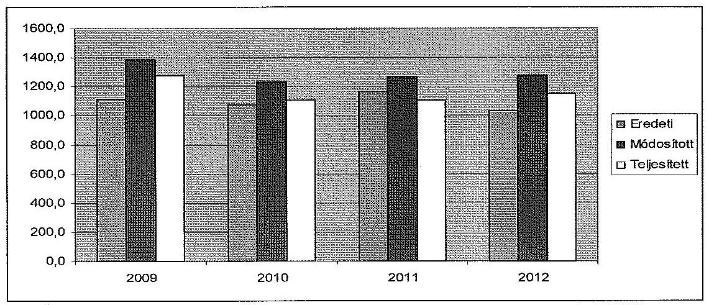

Az ellenőrzött években az eredeti költségvetési kiadási előirányzatok 98,1-99,2\%-a működési kiadás volt. Az eredeti működési költségvetés a négy év alatt a 2009. évi 1098,4 M Ft-ról a 2012. évre 1010,6 M Ft-ra, 87,8 M Ft-tal (8\%kal) csökkent. A felhalmozási kiadások eredeti előirányzata a 2009. évi 11,3 M Ft-ról a 2012. évre 19,8 M Ft-ra, 8,5 M Ft-tal ( $75,2 \%$-kal) emelkedett. A 2009-2012. években az MTF eredeti kiadási előirányzataiból a személyi juttatások és hozzájuk kapcsolódó járulékok aránya 65,6-68,6\% (706,4-727,8 M Ft), a dologi kiadások aránya 26,2-31,8\% (270,2-371,8 M Ft) között mozgott. Az ellátottak pénzbeli juttatásai (hallgatói támogatások) 2,2-2,6\%-os arányt képviseltek és 22,6-29,0 M Ft között alakultak.

A saját bevételek eredeti előirányzatait az ellenőrzött időszakban 195,6203,0 M Ft közötti összegben tervezték. Ezen belül felhalmozási bevételeket csak a 2009-2010. években terveztek ( $2,5-2,5 \mathrm{M}$ Ft-ot).

Az MTF eredeti költségvetési támogatási előirányzata a 2009. évi 914,2 M Ft-ról a 2012. évre 827,4 M Ft-ra, 86,8 M Ft-tal ( $9,4 \%$-kal) csökkent.

Az MTF hatáskörök szerint elrendelt előirányzat-módosításait az alábbi táblázat mutatja be M Ft-ban:

---

|  | Országgyưlés | Kormány | Irányító   szerv | Intézmény | Összesen |
| :--: | :--: | :--: | :--: | :--: | :--: |
| 2009. |  | 9,9 | 65,6 | 202,8 | 278,3 |
| 2010. |  | 13,8 | 5,4 | 137,3 | 156,5 |
| 2011. | $-124,7$ | 9,0 | 34,8 | 180,2 | 99,3 |
| 2012. |  | $-14,3$ | 3,5 | 256,4 | 245,6 |
| Összesen | $-124,7$ | 18,4 | 109,3 | 776,7 | 779,7 |

Országgyúlési hatáskörben 2011-ben a költségvetési törvény módosítása alapján történt elvonás ${ }^{35}$. Kormány hatáskörben meghozott döntések alapján 2009 és 2011 között a költségvetési szerveknél foglalkoztatottak keresetkiegészítésének támogatására és kompenzációra kapott többletforrásokat az MTF. Irányító szervi hatáskörben az előirányzat-módosítások döntő arányban felújítást (kollégium hőszigetelése), beruházást (könyvtár, konyha létesítése, színházterem beruházás befejezése, fütési rendszer) szolgáltak. Intézményi hatáskörben a saját bevételeket növelték az előző évi felhasználható előirányzatmaradvány és az EU-s forrásból származó hazai társfinanszírozású pályázati bevétel előirányzatosításával.

A kiadási elöirányzatok módosításai meghatározóan a személyi jellegű és dologi kiadásokkal, az ellátottak pénzbeli juttatásaival, valamint a beruházásokkal és felújításokkal álltak kapcsolatban.

Az MTF költségvetési támogatását év közben a fenntartó a 2009-2010. években $11,9 \mathrm{M}$ Ft-tal, illetve $19,1 \mathrm{M}$ Ft-tal növelte a kiadások emelkedésére tekintettel. A 2011-2012. években $81,0 \mathrm{M}$ Ft-tal, illetve $10,8 \mathrm{M}$ Ft-tal viszont csökkentette az év közben elrendelt zárolások végleges elvonásával összefüggésben.

A teljesített költségvetési kiadások a 2009. évi 1279,0 M Ft-ról a 2012. évre 1147,5 M Ft-ra 131,5 M Ft-tal (10,3\%-kal) csökkentek. A legjelentősebb csökkenés a személyi juttatások és járulékok esetében volt ( $749,8 \mathrm{M}$ Ft-ról $663,5 \mathrm{M}$ Ft-ra). A személyi jellegű kiadások változása a külső óraadó tanárok létszámának és a járulékterhek csökkenésével volt összefüggésben. A dologi kiadások az ellenőrzött időszakban szintén mérséklődtek (a 2009. évi 313,2 M Ftról a 2012. évi $290,5 \mathrm{M}$ Ft-ra) a vásárolt szolgáltatások és az egyéb dologi kiadások csökkenése miatt.

Az MTF az ellenőrzött időszakban összesen 489,9 M Ft összegű felhalmozási kiadást teljesített. A felhalmozási kiadások fedezetére $120,3 \mathrm{M}$ Ft költségvetési támogatást használt fel, ebből 63,8 M Ft-ot központi beruházásra, $42,5 \mathrm{M}$ Ft-ot a képzési támogatásból intézményi beruházásra és $14,0 \mathrm{M}$ Ft-ot felújításra. A teljes időszakra vonatkozóan a költségvetési támogatás a kiadások 24,6\%-át fedezte, a saját forrás aránya (felhalmozási bevétel és előző évi maradvány igénybevétele) $75,4 \%$-ot tett ki. Az uniós források az összesen 264,1 M Ft összegű felhalmozási bevételek $39,3 \%$-át ( $103,7 \mathrm{M}$ Ft) tették ki.

[^0]
[^0]:    ${ }^{35}$ A 2011. évi költségvetési törvény módosításáról szóló 2011. évi CXIV. törvény 7. §

---

A teljesített bevételeken belül az ellenőrzött időszakban a költségvetési támogatások mértéke nagyobb arányban csökkent, mint a saját bevételek. A 2009. és 2012. évek között az intézményi múködési bevételek 195,5 M Ft-ról 183,5 M Ft-ra, 12,1 M Ft-tal (6,2\%-kal), a költségvetési támogatások 926,1 M Ftról 816,6 M Ft-ra, 109,5 M Ft-tal (11,8\%-kal) csökkentek. A bevételi tételek között jelentős összeg volt még 2012-ben a 91,4 M Ft-os nagyságban teljesült támogatás értékű felhalmozási bevétel.

A bevételek és kiadások teljesítési adatainak részletezését a 2. számú melléklet tartalmazza.

Az előirányzat maradvány felhasználás összege a 2009. évben 159,1 M Ft, a 2010. évben 117,3 M Ft, a 2011. évben 169,8 M Ft, a 2012. évben 155,3 M Ft volt. A főiskolát meg nem illető összeg a 2009. évben 20,4 M Ft, a 2010. évben 77,5 M Ft, illetve a 2012. évben 111,8 M Ft volt. A 2011. évben a költségvetési szervet meg nem illető hányad nem keletkezett. Ezek a normatív támogatást megalapozó létszámadatok tervezett és jogosult összegeinek az eltéréséből keletkeztek.

Az ellenőrzött időszakban a bevételi lemaradás mértéke a 2009. évben -35,3 M Ft, a 2010. évben 45,4 M Ft, a 2011. évben -3,9 M Ft, illetve a 2012. évben -9,1 M Ft volt. A 2009. évi bevételi lemaradás oka az előző évi előirányzatmaradvány igénybevételének a módosított előirányzathoz képest 43,0 M Ft-tal kisebb teljesülése volt. A 2010. évben az intézményi múködési bevételek teljesülése 39,9 M Ft-tal haladta meg a módosított előirányzat összegét. A többletbevételt a tárgyévben akkreditált új szakirányú képzés beindításából származó bevétel, a tervezés során még bizonytalan kimenetelű tánckurzus bevétele, illetve a 2009. évben megtartott előadás bevétele okozta.

Az MTF kiadási megtakarítása a 2009-2012. években 108,9 M Ft, 124,5 M Ft, 159,3 M Ft, illetve 128,4 M Ft volt, amely a kiadási előirányzat teljesítések 8,5\%át, $11,2 \%$-át, $14,4 \%$-át, illetve $11,2 \%$-át tette ki. A kiadási megtakarításokat az ellenőrzött időszakban végrehajtott beruházások átadásának késedelme, illetve az előirányzottól elmaradó költségvetési támogatások kiadási oldalra gyakorolt hatása okozta.

Előző évi maradvány átvétel összege 2009-ben 63,8 M Ft illetve 2012-ben 5,2 M Ft volt.

Az MTF hallgatói létszáma az ellenőrzött időszakban a 2009. és a 2011. évek között 6,5\%-kal (522-ről 488-ra) csökkent. 2012-ben a tendencia megfordult, és a létszám 9,4\%-kal (534 főre) növekedett. Így a hallgatók száma 2,3\%-kal nőtt a felsőoktatás átlagos ( $-8,6 \%$ ) létszámváltozásával szemben. A felvehető maximális hallgatói létszám 880 fő volt az alapító okirat szerint, a 2012. évben a rendelkezésre álló férőhely-kapacitás $60,7 \%$-át tudta kihasználni az intézmény. Az átlagos statisztikai létszám 204 fơről 195 fơre, 4,4\%-kal csökkent.

A főiskola pénzügyi egyensúlya a 2009-2012. években biztosított volt. Az ellenőrzött időszakban az intézményhez kincstári biztost, illetve költségvetési felügyelő́t nem rendeltek ki. Az MTF keret-, illetve támogatás-előrehozási kérelemmel nem fordult a fenntartóhoz, hitelt nem vett fel.

---

A stabil pénzügyi pozíciót támasztják alá az MTF likviditási mutatói. A likviditási ${ }^{36}$ és a pénzeszköz-likviditási ${ }^{37}$ mutató az ellenőrzött időszak valamennyi évében jelentősen meghaladta a szakmailag elvárt 1-es értéket. Így a forgóeszközök, illetve a pénzeszközök év végi állománya is fedezetet nyújtott a rövid lejáratú kötelezettségek rendezésére. A 2009-2012. években az intézmény eladósodási mutatói a szakmailag elvárt 1-es érték alatt - 0,04-0,86 között - maradtak.

A főiskola pénzügyi helyzetét a CLF módszer segítségével is elemeztük (3. számú melléklet). Az MTF pénzügyi pozícióját, múködési jövedelmét, felhalmozási költségvetési egyenlegét, nettó működési jövedelmét az alábbi táblázat szemlélteti M Ft-ban:

| Megnevezés | 2009. | 2010. | 2011. | 2012. |
| :-- | --: | --: | --: | --: |
| Folyó bevételek | 1090,9 | 1131,2 | 1075,4 | 999,1 |
| Folyó kiadások | 1094,4 | 1017,1 | 1065,2 | 956,9 |
| Múködési jövedelem | $\mathbf{- 3 , 5}$ | $\mathbf{1 1 4 , 1}$ | $\mathbf{1 0 , 2}$ | $\mathbf{4 2 , 2}$ |
| Felhalmozási bevételek | 102,7 | 30,8 | 18,2 | 112,4 |
| Felhalmozási kiadások | 184,6 | 92,4 | 42,9 | 190,6 |
| Felhalmozási költségvetés egyenlege | $\mathbf{- 8 1 , 9}$ | $\mathbf{- 6 1 , 6}$ | $\mathbf{- 2 4 , 7}$ | $\mathbf{- 7 8 , 2}$ |
| Folyó és felhalmozási bevételek összesen | 1193,6 | 1162,0 | 1093,6 | 1111,5 |
| Folyó és felhalmozási kiadások összesen | 1279,0 | 1109,5 | 1108,1 | 1147,5 |
| Finanszírozási múveletek néllaili pozíció | $\mathbf{- 8 5 , 4}$ | $\mathbf{5 2 , 5}$ | $\mathbf{- 1 4 , 5}$ | $\mathbf{- 3 6 , 0}$ |
| Finanszírozási műveletek egyenlege | 0,6 | 0,3 | $-29,8$ | 28,1 |
| Tárgyévi pénzügyi pozíció (pénzeszköz-   változás) | $\mathbf{- 8 4 , 8}$ | $\mathbf{5 2 , 8}$ | $\mathbf{- 4 4 , 3}$ | $\mathbf{- 7 , 9}$ |
| Hiteltörlesztés | 0 | 0 | 0 | 0 |
| Nettó múködési jövedelem | $\mathbf{- 3 , 5}$ | $\mathbf{1 1 4 , 1}$ | $\mathbf{1 0 , 2}$ | $\mathbf{4 2 , 2}$ |

A pénzügyi egyensúly mellett az intézmény pénzügyi pozíciója az ellenőrzött időszakban - a 2010. évet kivéve - folyamatosan romlott. A főiskola 2009. évi 205,2 M Ft nyitó, idegen pénzeszközök nélküli pénzállománya a 2009. és a 2011-2012. években összesen 137,0 M Ft-tal csökkent, míg a 2010. évben 52,8 M Ft-tal nőtt. A csökkenés okai a hallgatói létszámváltozással összefüggésben a költségvetési támogatások visszaesése, a saját bevételek elmaradása, továbbá a végrehajtott beruházások és felújítások voltak. Az utóbbiak miatt a pénzállomány csökkenése ellenére az MTF vagyonállománya jelentősen gyarapodott, mivel a beszámolók adatai szerint az eszközök összértéke a 2009. évi 939,7 M Ft-ról a 2012. évre 1261,1 M Ft-ra (34,2\%-kal) emelkedett.

[^0]
[^0]:    ${ }^{36}$ A 2009. évben 535,3, a 2010. évben 24,7, a 2011. évben 36,1, a 2012. évben 48,4 volt a mutató értéke.
    ${ }^{37}$ A 2009. évben 313,3, a 2010. évben 17,0, a 2011. évben 20,3, a 2012. évben 29,5 volt a mutató értéke.

---

A folyó bevételek csökkenése elsősorban a költségvetési támogatások mérséklődésével állt kapcsolatban. A folyó kiadások csökkenésében a személyi juttatások és járulékok, valamint a dologi kiadások változásai voltak meghatározóak. A főiskola működési jövedelme a 2009. évben negatív, míg a 2010. és 2012. évek között pozitív volt, így összesen 163,0 M Ft múködési többlet jövedelem keletkezett. A működési jövedelem és a nettó működési jövedelem összege megegyezett, mert az ellenőrzött időszakban az MTF nem vett fel/fizetett vissza hiteleket, és nem rendelkezett értékpapírokkal.

A felhalmozási bevételek 2009. és 2012. évi kiugró értékei az előző évekből átvett felhalmozási célú előirányzat-maradvány, illetve a támogatás értékű felhalmozási bevétel felhasználásával álltak összefüggésben. A felhalmozási kiadások ingadozása az MTF ellenőrzött időszakban végrehajtott beruházásaival állt kapcsolatban. A felhalmozási költségvetés egyenlege a 2009. és a 2012. évek között összesen 246,4 M Ft negatív értéket mutatott, mert a felhalmozási kiadások valamennyi vizsgált évben meghaladták a felhalmozási bevételeket. Ezt a felhalmozási bevételek és a felhalmozási kiadások teljesítése közötti ütemkülönbség okozta.

2009-ben és 2010-ben az MTF székhelyén színházterem kialakítása érdekében történt intézményi beruházás, összesen 161,9 M Ft összegben, amelynek forrása 90,3 M Ft nagyságban intézményi saját bevétel és 71,6 M Ft összegben központi támogatás volt. A 2011. évben - többek között - 10,9 M Ft értékben EU-s támogatásból könyvtári beruházás, illetve saját bevételi forrásból összesen 12,7 M Ft öszszegben a könyvtár födémjének megerősítése és a rektori iroda felújítása valósult meg. 2012-ben - többek között - a szakmai épület klíma berendezésére 29,7 M Ft került felhasználásra saját bevételi forrásból, továbbá a kollégium épületének ablakcseréjére EU-s forrásból 39,0 M Ft-ot költöttek, és a központi épület nyílászáró cseréjére szintén EU-s forrásból 47,3 M Ft-ot használtak fel.

A finanszírozási műveletek nélküli pozíció a 2009. és a 2012. évek között 83,4 M Ft-tal romlott. A 2009. és a 2011-2012. években a folyó és a felhalmozási költségvetés együttes finanszírozási igényét az előző évi előirányzatmaradvány igénybevételével biztosították. A folyamatokkal ellentétes 2010. évi pozitív jellegű pénzeszközváltozást az 1268/2010. (XII. 3.) Korm. határozatban ${ }^{38}$ elrendelt előző havi kifizetéseknek megfelelő december havi kifizetés korlát okozta.

A vizsgált időszakban a főiskola gazdálkodását hátrányosan befolyásolták a költségvetési egyensúly megőrzése érdekében tett intézkedések, zárolások, maradványtartási kötelezettségek, amelyek a tárgyévi fizetési kötelezettségek halasztását okozták. Az előírások teljesítése érdekében az MTF szigorú takarékossági intézkedéseket hozott.

Az intézményt a 2009. évben 13,5 M Ft, a 2010. évben 5,5 M Ft, a 2011. évben 124,7 M Ft és a 2012. évben 34,2 M Ft zárolás érintette, mely zárolásokat nem oldottak fel és az érintett években véglegesen elvontak. A 2009. évben 50,0 M Ft maradványtartási kötelezettséget rendeltek el, mely összeget az év végéig nem oldottak fel. A zárolások miatt a főiskola a közalkalmazotti oktatók kötelezően

[^0]
[^0]:    ${ }^{38}$ A 2010. évi költségvetési egyenleg teljesítéséhez szükséges intézkedésekről szóló 1268/2010. (XII. 3.) Korm. határozat 1. pontja

---

teljesítendő óraszámát növelte, és a külső óraadással megbízott oktatók számát csökkentette. Felülvizsgálta a túlórák elszámolását, a dolgozók telefonhasználatának szabályait, az élelmezési kiadások normatíváit, valamint a papír, irodaszer, szakfolyóirat és szakkönyv beszerzéseket, továbbá átütemezte a tervszerű karbantartásokat. A tervezett külföldi kiküldéseket felfüggesztette, és a reprezentációs kiadásokat megszűntette.

# 3.2. A bevételi és kiadási elöirányzatok megállapítása, módosítása, az előirányzat-maradványok kezelése 

A főiskola a kiadási és bevételi előirányzatok tervezése során a jogszabályokban és a fenntartó által kiadott tervezési irányelvekben foglaltak szerint járt el.

Az MTF elemi költségvetésének előirányzati keretszámait a minisztérium az éves költségvetési törvényekben elfogadott előirányzatok és szabályok szerint, illetve azok keretei között állapította meg. A fenntartó minden év júliusában kiadta a következő év költségvetésének tervezési irányelveit. A költségvetés tervezéséhez kapcsolódó, a minisztérium által meghatározott adatszolgáltatásokat (foglalkoztatotti létszám, előmenetelek, tárgyévi hallgatói létszám, saját bevételek tervezett összege) a főiskola határidőben és az előírt tartalommal teljesítette. Az előirányzatok tervezését mellékszámításokkal alátámasztották. A fenntartó által véglegezett kincstári költségvetés és az intézményi elemi költségvetés egyezőségét biztosították.

Az előirányzat-módosítások során nem érvényesültek teljes körűen a jogszabályok és belső szabályok előírásai. Ez magas szabályszerűségi kockázatot jelez az ellenőrzött terület egészének szabályos működése szempontjából. Az előirányzat-módosításokat több esetben olyan maradványból hajtották végre, amely a maradvány keletkezésének évében nem volt kötelezettségvállalással lekötve ${ }^{39}$.

Az intézmény a felhasználható előirányzat-maradványt nem szabályszerűen mutatta ki. A 2009-2011. évek a beszámolóiban olyan összegeket is kötelezettségvállalással terhelt maradványként szerepeltetett, amelyekre a kötelezettségvállalás a tárgyévet követő évben történt meg. Ez ellentétes volt a vonatkozó jogszabályokkal ${ }^{40}$.

[^0]
[^0]:    ${ }^{39}$ Ámr. ${ }_{1}$ 51. § (1) bekezdés, Ámr. ${ }_{2}$ 210. § (1) bekezdés b) pontja, Ávr. 150. §
    ${ }^{40}$ Ámr. ${ }_{1}$ 66. § (10) bekezdése, Ámr. ${ }_{2}$ 210. § (1) bekezdése

---

Az ellenőrzött időszakban az előirányzat-maradvány felhasználása megfelelt a jogszabályi előírásoknak ${ }^{41}$.

Az ellenőrzött időszakban a szöveges beszámolókban feltüntetették az előző évi előirányzat-maradvány felhasználásának jogcímeit. A maradvány levezetésben kimutatott központi költségvetést megillető összeg befizetését az MTF az előírt határidőn belül teljesítette. A felhasználható előirányzat-maradványt személyi juttatások, munkaadókat terhelő járulékok, dologi kiadások, az ellátottak pénzbeli juttatásai és felhalmozási kiadások teljesítésére használták fel.

Az ellenőrzött időszakban a jogszabályokban meghatározott ${ }^{42}$ összeget elérő, az MTF előirányzat-maradványa terhére vállalt kötelezettségek Kincstárhoz történő bejelentése határidőre teljes körűen nem történt meg.

# 3.3. A kiadási előirányzatok felhasználása 

## A kiadási előirányzatok felhasználása nem felelt meg a vonatkozó jogszabályok és belső szabályozások előírásainak.

## A rendszeres és nem rendszeres személyi juttatások előirányzatainak felhasználása nem volt szabályszerű.

Rendszerhiba volt, hogy az utalványrendeleteket a pénzügyi átutalás után állították ki, és a hitelesítő aláírások (utalványozó, ellenjegyzö), valamint az aláírások dátumai nem szerepeltek teljes körűen a csatolt dokumentumokon ${ }^{43}$. Ez felveti a jogosulatlan kifizetés kockázatát. Az utalványrendeleteken nem szerepeltek a könyvelés módjára és az érintett könyvviteli számlákra történő hivatkozások ${ }^{44}$.

Több esetben előfordult, hogy a dolgozó és munkahelyi vezetője által aláírt, a személyi juttatás kifizetését megalapozó, hiteles jelenléti ív nem állt rendelkezésre, így megsértették a vonatkozó jogszabályok rendelkezéseit ${ }^{45}$.

A bérelszámolást alátámasztó jelenléti íveket az elektronikus belépőkártyák adatai szerint nyomtatták ki, azonban az MTF munkatársai az elektronikus belépőkártyákat csak részben használták, az érvényes rektori utasítások ellenére. A rektori utasítás 2011. július 1-jével rendelte el kötelezően a jelenléti ív vezetését, azonban a jelenléti ívek formáját és tartalmát nem szabályozta. A rendelkezésre álló jelenléti íveken kézírással beazonosíthatatlan aláírások és dátum nélküli javítások találhatók. Aláírás, illetve dátum hiányában utólagosan nem volt megállapítható a javítások jogszerűsége.

[^0]
[^0]:    ${ }^{41}$ A maradvány szabályszerű felhasználását nem befolyásolta a maradvány kimutatásával kapcsolatos szabálytalanság, mert a vonatkozó jogszabályi rendelkezések alapján a felsőoktatási intézmény saját bevételéből keletkező előirányzat-maradvány nem vonható el az intézménytől.
    ${ }^{42}$ Ámr. ${ }_{1}$ 162. § (1) bekezdése és az Ámr. ${ }_{2}$ 235. § (1) bekezdése
    ${ }^{43}$ Ámr. ${ }_{1}$ 136-137. §, Ámr. ${ }_{2}$ 78-79. §, Ávr. 59. §
    ${ }^{44}$ Sztv. 167. § (1) bekezdés h) pontja
    ${ }^{45}$ Ámr. ${ }_{1}$ 135. § (1) bekezdése, Ámr. ${ }_{2}$ 76. § (1) bekezdése, Ávr. 57. § (1) bekezdése

---

A rendszeres személyi juttatásokkal összefüggésben a munkáltatói joggyakorlás megfelelt az SZMSZ-ben előírtaknak. A kinevezéseket és átsorolásokat - mint kötelezettségvállaló - a rektor, illetve a megbízott helyettese írta alá. A pedagógusok és oktatók kötelező óraszámait a kinevezési okiratok, illetve a munkaköri leírások rögzítették. Egyedi hibaként tapasztaltuk, hogy a foglalkoztatottak nem minden esetben rendelkeztek az adott munkaköri feladat ellátásához az SZMSZ-ben előírt végzettséggel. Előfordult, hogy a kinevezési okiratok hiányosak voltak, mert nem teljes körűen tartalmazták a Kjt. 21. § (3) bekezdésében előírtakat.

A nem rendszeres személyi juttatások esetében a túlórák és helyettesítési díjak kifizetését az MTF analitikus nyilvántartásokkal igazolta, amelyek alátámasztották a díjak számfejtését. Az MTF az ellenőrzött időszakban cafeteria juttatást nem biztosított a munkavállalóinak. Ugyanakkor több esetben előfordult, hogy a munkavállalók többletfeladatok elvégzéséért eseti jelleggel béren kívüli juttatásban (étkezési utalvány, üdülési csekk) részesültek, amely nem felelt meg az Szja tv. és a Munka Törvénykönyve rendelkezéseinek ${ }^{46}$.

# A megbízási díjak elszámolása nem volt szabályszerű. 

A megbízási szerződésekben a feladatok meghatározása egyértelmű volt, rögzítették a teljesítés igazolójának személyét. A feladatellátást követően elvárt tárgyiasult termékek (vizsgáztatási és oktatási naplók, egyéb dokumentumok) elkészültek. A teljesítés igazolása, valamint a kifizetés számfejtése az Szja tv. és a Tbj. vonatkozó előírásainak megfelelően valósult meg.

Rendszerhiba volt, hogy az utalványozás szabálytalanul történt, mert az utalványrendeleteket a pénzügyi átutalás után állították ki, és a hitelesítő aláírások, dátumok nem szerepeltek teljes körűen a dokumentumokon ${ }^{47}$.

## A dologi kiadások elöirányzatainak felhasználása nem volt szabály-

szerű a pénzgazdálkodással kapcsolatos belső kontrollok működésének hiánya miatt.

Rendszerhiba volt, hogy a szakmai teljesítésigazolás ${ }^{48}$ és az utalványozás ellenjegyzése ${ }^{49}$ nem történt meg. Ez felveti a tényleges teljesítés nélküli kifizetés kockázatát. Az utalványrendeleteken nem kerültek feltüntetésre a könyvelés módjára és az érintett könyvviteli számlákra történő hivatkozások ${ }^{50}$. Az érvényesítést nem a jogszabályban előírt formai követelményeknek megfelelően végezték $\mathrm{el}^{51}$.

[^0]
[^0]:    ${ }^{46}$ Szja tv. 2010. évben hatályos 69. § (1) bekezdés e) pontja, Szja tv. 2012. évben hatályos 70. § (1a) bekezdés b) pontja, Munka Törvénykönyve 154. § (1) bekezdése
    ${ }^{47}$ Ámr. ${ }_{1}$ 136-137. §, Ámr. ${ }_{2}$ 78-79. §, Ávr. 59. §
    ${ }^{48}$ Ámr. ${ }_{1}$ 135. § (1) bekezdés, Ámr. ${ }_{2}$ 76. § (1) bekezdés, Ávr. 57. § (1) bekezdés
    ${ }^{49}$ Ámr. ${ }_{1}$ 137. §, Ámr. ${ }_{2}$ 79. §
    ${ }^{50}$ Sztv. 167 § (1) bekezdés h) pontja
    ${ }^{51}$ Ámr. ${ }_{1}$ 135. § (3)-(5) bekezdés, Ámr. ${ }_{2}$ 77. §, Ávr. 58. §

---

A felhalmozási kiadások előirányzatainak felhasználása nem volt szabályszerű az aláírási jogkörök nem megfelelő gyakorlása, valamint belső szabályozási hiányosságok miatt.

A kiadások felhasználása esetében számos rendszerhibát tártunk fel. Több esetben nem történt meg a szakmai teljesítésigazolás, vagy nem tüntették fel annak dátumát ${ }^{52}$. Az utalványozást nem a jogszabályban előírtaknak megfelelően végezték el. Visszatérő hiba volt, hogy hiányzott az utalványozó aláírása ${ }^{53}$, és előfordult, hogy azonos volt az utalványozó és az érvényesítő személye, amely összeférhetetlen ${ }^{54}$. Az esetek egy részében elmulasztották az utalványrendelet ellenjegyzését ${ }^{55}$, illetve az írásbeli felhatalmazások hiányában nem voltak szabályosak az utalványrendeleteket hitelesítő aláírások ${ }^{56}$. Az utalványrendeleteken nem tüntették fel az aláírások időpontját ${ }^{57}$. Ez felveti a jogosulatlan, illetve a tényleges teljesítés nélküli kifizetés kockázatát.

A főiskola a kiadási előirányzatok felhasználása során betartotta a közbeszerzési törvény rendelkezéseit.

# 3.4. A bevételi előirányzatok teljesítése 

## A bevételi előirányzatok beszedése nem felelt meg a vonatkozó jogszabályok előírásainak.

A múködési bevételek beszedése nem volt szabályszerű az aláírási jogkörök nem megfelelő gyakorlása, valamint a belső szabályozási hiányosságok miatt $^{58}$.

Rendszerhiba volt, hogy az érvényesítést nem végezték el a formai követelményeknek megfelelően ${ }^{59}$, az érvényesítést végző személy kijelölése nem történt meg az előírásoknak ${ }^{60}$ megfelelően. Az utalványrendeleteken nem tüntették fel a könyvelés módjára és az érintett könyvviteli számlákra történő hivatkozásokat sem ${ }^{61}$.

A működési bevételek az előírt összegben realizálódtak, nyilvántartásba vételük megtörtént. A határidőre nem teljesülő bevételeket negyedévente, illetve

[^0]
[^0]:    ${ }^{52}$ Ámr. ${ }_{1}$ 135. § (1) bekezdése, Ámr. ${ }_{2}$ 76. § (1) bekezdése, Ávr. 57. § (1) bekezdése
    ${ }^{53}$ Ámr. ${ }_{1}$ 136. § (4) bekezdés, Ámr. ${ }_{2}$ 78. § (2) bekezdés, Ávr. 59. § (3) bekezdés
    ${ }^{54}$ Ámr. ${ }_{1}$ 138. § (2) bekezdése, illetve Ámr. ${ }_{2}$ 80. § (1) bekezdése
    ${ }^{55}$ Ámr. ${ }_{1}$ 137. §, Ámr. ${ }_{2}$ 79. §
    ${ }^{56}$ Ámr. ${ }_{1}$ 136. § (1) bekezdés, Ámr. ${ }_{2}$ 78. § (1) bekezdés, Ávr. 59. § (1) bekezdés
    ${ }^{57}$ Ámr. ${ }_{1}$ 136. § (4) bekezdése, Ámr. ${ }_{2}$ 78. § (2) bekezdése, Ávr. 59. § (3) bekezdés
    ${ }^{58}$ A szabályozási hiányosságokat a jelentés II. 2. fejezet részletezi.
    ${ }^{59}$ Ámr. ${ }_{1}$ 135. § (3)-(5) bekezdés, Ámr. ${ }_{2}$ 77. §, Ávr. 58. §
    ${ }^{60}$ Ámr. ${ }_{1}$ 135. § (4) bekezdése, Ámr. ${ }_{2}$ 80. § (3) bekezdése, illetve az Ávr. 60. § (3) bekezdése
    ${ }^{61}$ Sztv. 167. § (1) bekezdés h) pontja

---

félévente tekintették át, és felszólító, egyenlegközlő levélben kérték a tartozás rendezését.

# A felhalmozási, vagyonhasznosítási bevételek beszedése nem felelt meg az elöírásoknak. 

Rendszerhiba volt, hogy nem történt meg a bevételek érvényesítése, illetve írásbeli felhatalmazás hiányában végezték az érvényesítést ${ }^{62}$. Több esetben előfordult, hogy a jogszabályi előírásokat megsértve a bevétel beszedésének elrendelését megelőzően nem dokumentálták annak szakmai teljesítésigazolását ${ }^{63}$.

A vendégszobák bérlőivel megállapodást nem kötöttek, az Áfa tv. 159-163. §aiban előírt számlaadási kötelezettség ellenére a szállásdíjat nem számlázták ki.

A 2009-2011. években a valutában teljesített bevételek házipénztárba történő bevételezése nem történt meg ${ }^{64}$. A befizetett összegeket „összegyűjtötték", és rendszeres időközönként befizették a főiskola Kincstárnál vezetett számlájára. Ezzel a gyakorlattal megsértették az Áhsz. rendelkezéseit ${ }^{65}$ is, mert nem könyvelték a pénzforgalmat érintő gazdasági eseményeket a pénzmozgással egyidejűleg.

### 3.5. A támogatások felhasználása, a pályázati forrásból finanszírozott projektek szabályszerűsége, a díjtételek megállapítása

A nem kötött felhasználású normatív költségvetési támogatások felhasználásával kapcsolatos döntések nem minden tekintetben feleltek meg a jogszabályi előírásoknak és a belső szabályozásnak.

A főiskola 2009. évi költségvetését a szenátus nem hagyta jóvá, illetve a 20112012. években a GT nem véleményezte a költségvetést. Így a költségvetésben meghatározott normatív támogatások felhasználásáról sem az előírások szerint döntöttek. Ezzel megsértették a Feot. rendelkezéseit ${ }^{66}$ és a GT ügyrendjét.

A főiskola az ellenőrzött időszak egyes éveiben 213,7 M Ft, 188,5 M Ft, 278,3 M Ft, illetve 234,0 M Ft képzési, tudományos célú és fenntartói normatív támogatásra volt jogosult.

Az intézmény az ellenőrzött időszakban centralizált gazdálkodást folytatott, így a képzési, tudományos célú és fenntartói normatív támogatás felosztására az MTF szervezeti egységei között nem került sor.

[^0]
[^0]:    ${ }^{62}$ Ámr. ${ }_{1}$ 135. § (3)-(5) bekezdés, Ámr. ${ }_{2}$ 77. §, Ávr. 58. §
    ${ }^{63}$ Ámr. ${ }_{1}$ 135. § (1) bekezdése
    ${ }^{64}$ Sztv. 165. § (1) bekezdés
    ${ }^{65}$ Áhsz. 51. § (1) bekezdése a) pontja
    ${ }^{66}$ Feot. 25. § (1) bekezdés ac) pontja és a 27. § (6) bekezdés d) pontja

---

# A kötött felhasználású normatív költségvetési támogatások felhasználása megfelelt a jogszabályi előírásoknak és a belső szabályozásnak. 

A 2009-2012. években a főiskola $24,8 \mathrm{MFt}, 21,8 \mathrm{MFt}, 19,8 \mathrm{MFt}$, illetve $19,9 \mathrm{M}$ Ft kötött felhasználású támogatásban részesült a hallgatói juttatások fedezetére.

Az ellenőrzött időszakban a kötött felhasználású hallgatói támogatások felhasználása az MTF hallgatói Térítési és juttatási szabályzatában leírtak szerint történt. A szabályzat támogatások felhasználására vonatkozó rendelkezései megfeleltek a hatályos jogszabályi követelményeknek.

Az egyes hallgatókra vonatkozó ösztöndíj nagyságának megállapítása a hallgatói Térítési és juttatási szabályzatban leírtaknak megfelelően történt. A köztársasági ösztöndíj pályázati kiírását az intézmény honlapján tették közzé. A szociális, a tankönyv és jegyzet, illetve a lakhatási támogatás címen adott ösztöndíjak kiosztására vonatkozó pályázat lebonyolítása és értékelése a HÖK feladata volt. A közéleti, művészeti és tudományos címen adott ösztöndíjak pályázati rendszerének múködtetését az MTF Tudományos Tanácsának, illetve Művészeti Tanácsának egyetértésével a HÖK végezte. A főiskola a hallgatók részére nyújtható támogatások feltételeit a honlapján tette közzé, illetve a Tanulmányi Osztály hirdetményei útján ismertette a hallgatókkal.

A hazai forrásból megvalósított projektekhez kapott költségvetési forrással való elszámolás szabályszerű volt.

A projektek bevételei a számviteli ny̌llvántartásban elkülönítve szerepeltek, a pénzügyi elszámolás megfelelt az államháztartási törvényben foglaltaknak. Az MTF minden esetben szakmai beszámolót és pénzügyi számszaki elszámolást készített. Támogatás visszavonására nem került sor a szerződéstől eltérő, illetve szabálytalan megvalósítás miatt.

Egyedi hibaként tártuk fel a projektek 6,0\%-ánál, hogy az előzetesen elfogadott költségösszetételtől eltérő felhasználás miatt a támogatás egy részét vissza kellett fizetni.

Az MTF a 2011. évben a hallgatók részvételével megvalósított 70-80 hazai előadás és kiskoncert mozgóképes kiadásához nyert pályázaton az NKA-tól 3,2 M Ft hozzájárulást. Az előzetesen elfogadott költségösszetételtől eltérő felhasználás miatt 131,0 ezer Ft-ot $(0,4 \%)$ vissza kellett fizetni.

Az MTF a 2011. évben a hallgatók Prix de Lausanne nemzetközi balett versenyen való részvételéhez pályázott támogatásért ${ }^{67}$. Az elnyert 1,5 M Ft-os támogatásból 126,0 ezer Ft ( $8,4 \%$ ) visszafizetésére került sor, az előzetesen elfogadott költségöszszetételtől eltérő felhasználás miatt.

A főiskola az MTA Lendület programja keretében nem részesült támogatásban.

## A költségtérítések és díjtételek megállapítása nem volt szabályszerű.

[^0]
[^0]:    ${ }^{67}$ 1144906-1/2011. számú NKA támogatási szerződés

---

A főiskola az egyes tevékenységek bevételeit, kiadásait az előírásoknak megfelelően elkülönítette.

Az MTF a számlarendjében és számlatükrében kialakította az egyes tevékenységek bevételeinek és kiadásainak elkülönítéséhez szükséges főkönyvi számla részletezéseket. A főkönyvi könyvelésből lekérdezhetők, illetve az analitikus nyilvántartásból előállíthatók a belső szabályozásnak és a jogszabályi előírásoknak megfelelően az intézmény tevékenységeinek egyes bevételei és kiadásai.

Ugyanakkor az intézmény a Térítési és juttatási szabályzatában nem határozta meg a költségtérítési díjak megállapításának és módosításának rendjét. Nem szabályozta a bérbeadás dijának megállapítását sem. Mindezekkel megsértette a jogszabályi előírásokat ${ }^{68}$.

A nyári kurzus díjainak meghatározása nem az Önköltség-számítási szabályzatnak megfelelően történt. A költségtérítéses képzések, a táncos és próbavezető szak, továbbá a felvételi előkészítő balett tanfolyam díjának megállapításához - az Áhsz. rendelkezéseit ${ }^{69}$ megsértve - nem készítettek önköltségszámítást, így nem lehetett a jogszabályban előírtak érvényesülését ellenőrizni ${ }^{70}$.

A főiskola az ellenőrzött időszakban nem folytatott vállalkozási tevékenységet.

# 4. AZ INTÉZMÉNY VAGYONGAZDÁLKODÁSA 

Az MTF vagyongazdálkodása összességében nem volt szabályszerü, mert a főiskola több esetben is ellentétesen járt el a jogszabályokban és belső szabályozásokban előírtakkal.

Az intézmény vagyona az ellenőrzött időszakban 1039,3 M Ft-ról 1261,1 M Ftra, $21,3 \%$-kal növekedett. A befektetett eszközök állománya a beruházások eredményeként 761,9 M Ft-ról 1061,9 M Ft-ra, 39,4\%-kal emelkedett, míg a forgóeszközök értéke 277,4 M Ft-ról 199,1 M Ft-ra, 28,2\%-kal csökkent. A forgóeszközök állományának változása elsősorban a pénzeszközök állományának mérséklődésével volt kapcsolatban. A vagyonváltozás részletes elemzését az ellenőrzött időszak könyvviteli mérlegeinek adatai alapján végeztük el (a mérlegadatokat a 4. számú melléklet részletezi).

A befektetett eszközökön belül az MTF legmeghatározóbb vagyoni eleme az ingatlanok voltak, amelyek részaránya 2009-ben 87,0\%, 2010-ben 91,5\%, 2011-ben $91,6 \%$, 2012-ben $94,5 \%$ volt. A gépek, berendezések és felszerelések eszközállományának bruttó értéke a 2009. év végi 240,8 M Ft-ról a 2012. év végére 256,1 M Ft-ra növekedett, nettó értékük viszont az ellenőrzött időszakban a 2009. évi 93,1 M Ft-ról a 2012. év végére 46,6\%-kal, 49,7 M Ft-ra csökkent. Az eszközcsoport amortizálódását az ellenőrzött időszakban a beszerzések nem tudták pótolni. A forgóeszközök aránya a 2009. évi 22,4\%-ról a 2012. évre

[^0]
[^0]:    ${ }^{68}$ Feot. 126. § (1) bekezdés, Nftv. 83. § (2) bekezdés
    ${ }^{69}$ Áhsz. 9. számú melléklet 12. pont
    ${ }^{70}$ Feot. 126. § (1)-(2) bekezdés, Nftv. 82. § (3) bekezdés

---

15,8\%-ra csökkent. Ezen belül a készletek nagyságrendje változatlan volt, és 68,9-69,7 M Ft között alakult.

Az MTF az ellenőrzött időszakban forgatási és befektetési célú értékpapírokkal, részesedésekkel nem rendelkezett.

A saját tőke aránya mutató ${ }^{71}$ az ellenőrzött időszakban kedvezően változott, a 2009. évi 86,9\%-ról a 2012. évre 90,1\%-ra emelkedett, a saját tőke - kötelezettségeknél - nagyobb mértékű emelkedése miatt. A kötelezettségek és saját tőke aránya mutató ${ }^{72}$ - kismértékben - negatív irányba változott, a 2009. évről a 2012. évre $0,1 \%$-ról $0,4 \%$-ra növekedett, a kötelezettségek emelkedése miatt.

Az eszközök használhatósági foka ${ }^{73}$ a 2009. évi 73,9\%-ról a 2010. évre a megvalósított fejlesztések hatására 76,4\%-ra emelkedett, majd a 2011-2012. években ismét $73,9 \%$-ra csökkent a gépek, berendezések, felszerelések amortizációjának eredményeként. Az eszközök elhasználódási szintje ${ }^{74}$ a használhatósági fokuk változását követve a 2009. évi 26,1\%-ról a 2010. évre 23,6\%ra javult, majd a 2011-2012. években ismét $26,1 \%$-ra romlott.

Az eszközök közül az épületek - elhasználódási szint és az értékcsökkenési leírási kulcs hányadosaként meghatározott - átlagos életkora a beruházások, felújítások hatására a 2009. évi 7,2 évről a 2012. évre 6,9 évre csökkent. A gépek, berendezések, felszerelések esetében az átlagos életkor a 2009. évi 3,9 évről a 2012. évre 5,4 évre növekedett az amortizáció és a beszerzések elmaradásának következményeként. A számítástechnikai eszközök átlagos életkora az ellenőrzött időszakban 2,6 évről 2,9 évre emelkedett.

Az MTF könyvviteli mérlegeiben szereplő követelésállomány 2009-2011 között, a 2009. évi végi 17,7 M Ft-ról a 2011. év végére 6,3 M Ft-ra, 11,4 M Ft-tal ( $64,4 \%$-kal) csökkent. A 2012. év végén a követelésállomány az előző évhez képest $1,4 \mathrm{M}$ Ft-tal ( $22,2 \%$-kal) növekedett és $7,7 \mathrm{M} \mathrm{Ft}$ volt. A követelések kimutatása azonban nem felelt meg a számviteli előírásoknak, ugyanis a lejárt követelésekhez kapcsolódóan nem számoltak el értékvesztést.

A határidőn túli követelések állománya kedvezőtlenül alakult, a 2009. év végi 6,5 M Ft-ról a 2012. évre 7,4 M Ft-ra növekedett, a késedelmes fizetések hatására. Míg a 90 napon belül lejárt követelések aránya jelentősen csökkent (2009ben $66,2 \%$-ot, 2012-ben $36,5 \%$-ot tett ki), az éven túl lejárt kötelezettségek aránya a 2009. évi végi $27,7 \%$-ról 2012 -re $51,4 \%$-ra emelkedett.

[^0]
[^0]:    ${ }^{71}$ A saját tőke értéke az összes forráshoz viszonyítva.
    ${ }^{72}$ Kötelezettségek összesen értéke a saját tőke összesen értékéhez viszonyítva.
    ${ }^{73}$ A használhatósági fok mutatója a tárgyi eszközök, immateriális javak nettó értékének és a tárgyi eszközök, immateriális javak bruttó értékének hányadosa. A mutató növekedése azt jelzi, hogy az intézmény eszközeinek átlagos elhasználtsága csökken, a használhatóságuk javul.
    ${ }^{74}$ Az elhasználódási szint a tárgyi eszközök elszámolt értékcsökkenésének és a tárgyi eszközök záró bruttó értékének hányadosa.

---

Az intézmény az ellenőrzött időszakban csak a 2012. évben írt le 0,5 M Ft öszszegben behajthatatlan követelést.

A 2009-2012. években az MTF könyvviteli mérlegében kimutatott kötelezettségek teljes egészében rövid lejáratú, tárgyévi költségvetést terhelő szállítói kötelezettségekből adódtak. A szállítói kötelezettségek állománya a 2009. évi 0,4 M Ft-ról a 2010. év végére 10,2 M Ft-ra emelkedett, amelyet az 1268/2010. (XII. 3.) Korm. határozat által elrendelt december havi fizetési korlát okozott. Ezt követően a 2011. év végére az előző évhez viszonyítva a szállítói állomány $36,3 \%$-kal 6,5 M Ft-ra, a 2012. év végére $36,9 \%$-kal, 4,1 Ft-ra csökkent.

A szállítói állomány az ellenőrzött időszak minden évében december havi - közüzemi, karbantartási, irodaszer, tisztítószer, élelmiszer-beszerzési, valamint az MTF oktatási tevékenységéhez kapcsolódó - számlákból tevődött össze.

A szállítói állományon belül a lejárt kötelezettségek összege az ellenőrzött időszakban $0,04 \mathrm{M}$ Ft és $9,6 \mathrm{M}$ Ft között változott. A 2009-2011. években a lejárt szállítói állomány $100,0 \%$-ban, a 2012. évben $99,2 \%$-ban 30 nap alatti, és $0,8 \%$-ban 31-60 nap közötti tartozás volt. Az MTF-nek az ellenőrzött időszakban éven túli, illetve átütemezett szállítói tartozása nem volt.

# 4.1. A vagyongazdálkodás szabályozottsága 

Az MTF vagyongazdálkodással kapcsolatos tevékenységének szabályozottsága nem minden tekintetben felelt meg a jogszabályi előírásoknak. A 2009-2012. években a vagyongazdálkodást érintő szabályzatok csak részben biztosították a vagyongazdálkodási feladatok szabályszerű elvégzését.

Az MTF a jogszabályi előírásoknak megfelelően készítette el az Intézményfejlesztési Terveit a 2008-2011., illetve a 2012-2015. évekre vonatkozóan. Az IFTket a GT véleményezését követően a szenátus fogadta el. Az IFT-k tartalmazták az MTF középtávon elérendő céljait, így az ingatlanokat ellátó fűtési rendszerek és az oktatási infrastruktúra fejlesztését, továbbá a beruházások megvalósításához fedezetül szolgáló forrásokat.

Az intézmény Minőségfejlesztési programjában előírták az éves gazdasági stratégia készítésének kötelezettségét, valamint azzal összhangban a fejlesztési tervek meghatározását.

Az MTF a jogszabályokban ${ }^{75}$, valamint a Minőségfejlesztési programban előírtak ellenére a 2009-2012. években vagyongazdálkodási tervet - gazdasági stratégiát, fejlesztési stratégiát - nem készített.

Az ellenőrzött időszakban a főiskola az SZMSZ-ben szabályozta a vagyongazdálkodással kapcsolatos döntési szinteket, valamint a kapcsolódó hatásköröket. Az MTF belső szabályzatokban (Leltározási szabályzat, Értékelési szabályzat, Selejtezési szabályzat, Számviteli Politika) határozta meg a vagyonnal történő

[^0]
[^0]:    ${ }^{75}$ Feot. 27. § (6) bekezdés d) pontja, Nftv, 12. § (3) bekezdése

---

gazdálkodás kereteit, az alapfeladat ellátásához rendelkezésére bocsátott vagyon változásainak, értékének nyilvántartási szabályait. A szabályzatokat azonban a jogszabályi változásokkal összhangban nem aktualizálták.

Az MTF a kezelésében lévő feleslegessé vált vagyontárgyak - immateriális javak, tárgyi eszközök - bérbeadási, értékesítési folyamatát, térítésmentes átadásának szabályait a Selejtezési szabályzatban határozta meg. Nem írták elő azonban, hogy a vagyontárgyak bérleti diját a vagyontárggyal kapcsolatban felmerülő költségekre figyelemmel kell megállapítani (fenntartási költségek, értékcsökkenés).

Az intézményi vagyontárgyak személyes célú használatának módját a gépkocsi, valamint - 2012. november 15 -étől - a mobiltelefon használattal kapcsolatosan szabályozták. A Gépjármú használati szabályzat tartalmazta, hogy az intézményi gépjárművet magáncélra az alkalmazottak nem vehetik igénybe. A gazdasági főigazgató nyilatkozata szerint az ellenőrzött időszakban személyes célú gép-jármú-használat nem történt. A Telefon szabályzatban előírták a hivatali tulajdonú mobiltelefonok használati, valamint a telefondíjak számlázásának és beszedésének rendjét.

# 4.2. A vagyonelemek kimutatása 

Az MTF-nél a vagyonelemek kimutatása nem volt szabályszerű. A főiskola a 2009-2012. években a leltározás során nem tartotta be a vonatkozó jogszabályok előírásait. A mérlegtételek tartalma, besorolása és értékelése több esetben nem szabályszerűen történt.

Az MTF 2009-2012. évre vonatkozó mérlegei a főiskola vagyoni helyzetéről nem mutatnak megbízható és valós képet. A feltárt hibák minden évben meghaladták az Áhsz. 5. § 8. pontja szerinti jelentős összeget, a mérlegfőösszeg $2 \%$-át ${ }^{76}$. Az intézmény 2009-2012. évi könyvviteli mérlegeinek számszerűsített hibáit a következő táblázat mutatja be M Ft-ban.

[^0]
[^0]:    ${ }^{76}$ A hibák mérlegfőösszeghez viszonyított aránya a 2009. évben 22,5\%, a 2010. évben $4,2 \%$, a 2011. évben $4,2 \%$ és a 2012 . évben $3,1 \%$.

---

| A mérlegben feltüntetett hibás tételek | 2009. | 2010. | 2011. | 2012. |
| :-- | :--: | :--: | :--: | :--: |
| A főkönyvi kivonat, az analitikus nyilvántartás   és a mérleg adatainak eltérése az immateriális   javak esetében | - | - | 5,3 | 4,8 |
| A tulajdonviszonyokat alátámasztó dokumentum nélkül kimutatott Kazinczy utcai épület nettó értéke | 38,2 | 36,8 | 35,4 | 34,0 |
| A nem aktivált beruházások, felújítások értéke | 162,6 | - | - | - |
| A követelések hibás elszámolásának összegei | 9,7 | 0,1 | 0,1 | 0,2 |
| A 2010. évben térítési díjból származó hátralé-   kok adások közötti kimutatásának értéke | - | 5,0 | - | - |
| A támogatási programok előlegének kötelezettségek közötti kimutatásának elmaradása miatti összegek | - | 8,1 | 8,0 | - |
| A passzívák helytelen kimutatása miatti össze-   gek | 0,5 | - | - | - |
| Összesen | 211,0 | 50,0 | 48,8 | 39,0 |

A főiskola az ellenőrzött időszakban a leltározásokat nem szabályszerűen hajtotta végre. Emiatt a mérleg adatainak valóságtartalma - az Sztv. 15. § (3) bekezdése, valamint az Áhsz. 9. § (11) bekezdése szerint - az ellenőrzött időszakban teljes körűen nem volt igazolható. A hibák szabályozási hiányosságokra is visszavezethetőek.

A Leltározási szabályzat aktualizálása az ellenőrzött időszakban nem történt meg, és nem készültek el a szabályzat mellékleteként feltüntetett iratminták sem (leltározási ütemterv, megbízólevél, jegyzőkönyvek, leltárfelvételi ív).

A tárgyi eszközök, készletek leltározását az analitikus nyilvántartó programból nyomtatott leltáríveken végezték. A főiskola december 31-ei fordulónappal egyeztetéssel leltározta a kimutatott követeléseket, aktív és passzív elszámolásokat, kötelezettségeket.

A leltározási szabályzatban előírtak ellenére a leltárnyomtatványokat nem kezelték szigorú számadású nyomtatványként, arról nyilvántartó könyvet nem vezettek, így a leltározáshoz felhasznált leltárívek elszámolása nem volt ellenőrizhető. Az intézménynél a leltározás irányításáért, végrehajtásáért felelős személyek írásban nem kaptak megbízást a feladataik ellátására, emiatt a leltárfelvételi ívek hitelesítése több esetben elmaradt.

A 2009. évben leltározási ütemtervet, leltározási utasítást nem készítettek, a leltározási bizottság tagjait nem jelölték ki. A tárgyi eszközöknél a leltár nem volt hitelesítve, mert a leltárfelvételi íveken a leltári adatok helyességét a leltározást végzők - az esetek többségében - aláírásukkal, dátummal nem igazolták, a leltáríveket leltárfelelős, leltárellenőr nem írta alá. A készletek leltározásánál a leltárfelelősök a leltáríveket a jelmezek, cipők, valamint az áruk kivételével szintén nem írták alá. A leltárfelvételi ívek alapján a leltár kiértékelése záró

---

jegyzőkönyv felvételével nem történt meg. Így a leltározás nem ellenőrizhető módon történt, megsértve az Áhsz. vonatkozó rendelkezését ${ }^{77}$.

A 2010. évben a gazdasági főigazgató június 15 -én rendelte el az eszközök és források teljes körű leltározását. A leltározási utasítás szerint a leltározás fordulónapja a mérleg fordulónapja helyett június 28-a és június 30-a volt. Ez nem felelt meg az Sztv. 69. § (1) bekezdésében és a Számviteli Politikában foglaltaknak. A leltározási utasítás nem tartalmazta a leltározás módját, illetve több szervezeti egységnél a leltárfelelősök nevét. A leltározási utasításban szereplő fordulónappal a tárgyi eszközök és jelmezek leltározása nem történt meg. A 2010. december 31-ei fordulónapi leltározáshoz leltározási utasítás és leltározási ütemterv nem készült. A tárgyi eszközök és jelmezek leltározása során a leltárfelvételi íveket dátummal, aláírással nem látták el, és az eltérések megállapításával kapcsolatban záró jegyzőkönyvet nem vettek fel.

A 2011. évben az MTF az Áhsz. 37. § (1) bekezdésében foglaltak ellenére a december 31-ei fordulónappal készített könyvviteli mérlegében szereplő tárgyi eszközöket és a készletek közül a jelmezeket nem leltározta, azok mennyiségét és értékét kizárólag az analitikus nyilvántartás adatai támasztották alá. Az MTF nem rendelkezett az Áhsz. 37. § (7) bekezdésében előírtak ellenére a fenntartó egyetértő nyilatkozatával arra vonatkozóan, hogy a 2011. évben nem kell leltároznia. Az MTF az irányító szerv részére az éves költségvetési beszámolójával együtt megküldte a 2011. december 31-ei leltár adatairól készített Tanúsítványt, amelyben mindezek ellenére úgy nyilatkozott, hogy a „könyvviteli mérleg tételeinek valódiságát a 249/2000. (XII. 24.) Korm. rendelet 37. §-a alapján készitett leltár alátámasztja". A leltározáshoz ütemtervet, leltározási utasítást nem készítettek.

A 2012. évben a leltározási ütemterv és utasítás nem tartalmazta a leltárfelelősök és a leltárellenőr nevét. A leltározás során kijelölés hiányában a leltárfelelősök a leltárfelvételi íveket nem írták alá. A leltárfelvételi ívek alapján a leltár kiértékelését záró jegyzőkönyv felvételével elvégezték, a főkönyvi és analitikus nyilvántartások leltáreltérésekkel történő helyesbítése és könyvviteli rendezése a mérlegkészítés időpontjáig megtörtént. Két darab nullára leírt eszköz esetében állapítottak meg leltárhiányt, amelyhez kapcsolódóan személyi felelősségre vonás nem történt.

Az intézménynek az ellenőrzött időszakban - a Feot. 123. § (1) bekezdésében meghatározott - saját vagyona nem volt.

Az MTF a 2009-2012. évek könyvviteli mérlegelben a vagyonát kizárólag az alapfeladat ellátása érdekében rendelkezésére bocsátott, kezelésbe vett eszközként mutatta be.

A 2009-2010. években az egyedi értékelés elve ${ }^{78}$ nem minden esetben érvényesült, mert az eszközöket csak részben tartották egyedileg nyilván. A 2010-ben kis értékűvé átminősített eszközök kartonján több esetben egy azonosítószám

[^0]
[^0]:    ${ }^{77}$ Áhsz. 37. § (2) bekezdés.
    ${ }^{78}$ Sztv. 16. § (1) bekezdés

---

alatt több eszköz - pl.: 15 db bútor, 20 db szoftver, 44 db öltözőszekrény - szerepelt, amelyeknek bruttó értéke $8,2 \mathrm{M}$ Ft, nettó értéke nulla forint volt.

A 2011-2012. években a vagyoni értékú jogok és szellemi termékek esetében a főkönyvi kivonat, az analitikus nyilvántartás és a mérlegadatok közötti egyezőség nem állt fenn. Ez nem volt összhangban az Sztv. rendelkezéseivel ${ }^{79}$. Az eltérés oka az volt, hogy a főkönyvi és analitikus nyilvántartásban vagyoni értékű jogként ${ }^{80}$ szerepeltetett összegeket (a 2011. évben $5,3 \mathrm{M}$ Ft, a 2012. évben $4,8 \mathrm{M}$ Ft) a mérlegben a szellemi termékek soron mutatták ki.

Az MTF Budapest VII. kerület Kazinczy utcai épületének könyvviteli nyilvántartásba vétele és az értékcsökkenésének elszámolása a valódiság számviteli alapelvének ${ }^{81}$ nem felelt meg. Az ingatlanra vonatkozóan nem állt rendelkezésére olyan dokumentum, bizonylat, amely alapján azt a főiskola a könyvviteli mérlegében kimutathatta volna. Az ellenőrzött időszak könyvviteli mérlegeiben kimutatott nettó értékből - az MTF által választott 2\%-os értékcsökkenési kulccsal számolva - 2009-ben 38,2 M Ft, 2010-ben 36,8 M Ft, 2011ben $35,4 \mathrm{M}$ Ft és 2012 -ben $34,0 \mathrm{M}$ Ft a dokumentumokkal alá nem támasztott érték.

Az MTF a Kazinczy utcai épületet az analitikus nyilvántartásában 1992. december 31-e óta szerepeltette. Az épület 1992. december 31-én bruttó $70,0 \mathrm{M}$ Ft - az elszámolt értékcsökkenés $8,0 \mathrm{M}$ Ft -, nettó $62,0 \mathrm{M}$ Ft értéken került nyilvántartásba vételre, azonban a nyilvántartásba vétel dokumentumait az ellenőrzés részére nem tudták bemutatni. Az épület értékcsökkenési leírási kulcsa 2\% volt. 1993-tól az ingatlanon végzett felújításokat az épületre aktiválták, ezért 2012. december 31-én az épület bruttó értéke $131,9 \mathrm{M}$ Ft, az elszámolt értékcsökkenés $54,8 \mathrm{M}$ Ft, a mérlegben szereplő nettó értéke $77,1 \mathrm{M}$ Ft volt.

Az MTF 2009. évi könyvviteli mérlegében a beruházások, felújítások között öszszesen $162,6 \mathrm{M}$ Ft összegű befejezetlen beruházást nem mutattak ki, megsértve ezzel az Sztv. rendelkezéseit ${ }^{82}$.

Az MTF-nél a 2009. évben 153,7 M Ft értékű beruházást végeztek, amelyből a beszámoló adatai szerint - a színházterem és főzökonyha rekonstrukciójához kapcsolódóan - 146,2 M Ft-ot nem aktiváltak. A 2008. évről további 16,4 M Ft értékű beruházás aktiválása nem történt meg. A $162,6 \mathrm{M}$ Ft értékű beruházás aktiválását a 2010. évben végezték el.

# A követelésállomány tartalma, besorolása és értékelése nem volt szabályszerű. 

[^0]
[^0]:    ${ }^{79}$ Sztv. 20. § (1) bekezdés
    ${ }^{80}$ 2011-ben modulként üzemelő Web portál készítése, 2012-ben modulként üzemelő Web portál készítése és egy iskolai licenc
    ${ }^{81}$ Sztv. 15. § (3) bekezdés, Áhsz. 9. § (11) bekezdés
    ${ }^{82}$ Sztv. 15. § (3) bekezdés, Áhsz. 9. § (11) bekezdés, Sztv. 26. § (7) bekezdés

---

Az MTF a mérleg összeállításakor nem értékelte a követelésállományát ${ }^{83}$, és értékvesztést sem számolt el a lejárt követelései után. Ezzel megsértették az egyedi értékelés és a valódiság számviteli alapelvét ${ }^{84}$.

Több esetben előfordult, hogy a követeléseket jogszerútlenül írták elő, így nem érvényesült a valódiság számviteli elve ${ }^{85}$.

Előfordult, hogy az MTF úgy szerepeltetett térítési díjra vonatkozó követelést, hogy az érintett hallgató nem iratkozott be az adott félévre, nem vett részt a meghirdetett kurzuson, vagy a hallgatói jogviszonya megszűnt, illetve a balett előkészítő tanfolyamot abbahagyta. Egyedi hiba volt, hogy számítógépes és adminisztrációs hiba miatt a követeléshez kapcsolódó stornó számla kétszer került kiállításra, így a követelések között negatív összeg szerepelt. Előfordult, hogy a hatályos jogszabályok alapján már elévült, behajthatatlan, kisösszegű követelést mutattak ki.

A követelések egy részénél nem volt megfelelő a mérlegtételek besorolása.
Több esetben (a 2010., valamint a 2012. évi mérlegben) tapasztaltuk, hogy a térítési díj miatti túlfizetést az Áhsz. 26. § (5) bekezdés ds) pontjában foglaltak ellenére - az egyéb rövid lejáratú kötelezettség helyett - negatív előjellel a követelések között mutatták ki. Több esetben fordult elő, hogy az Áhsz. 9. számú melléklet 2. cc) pontjában foglaltak ellenére térítési díj hátralék után felszámított késedelmi pótlékot mutattak ki a követelések között. A 2009. évi követelések között az Áhsz. 22. § (1) bekezdés a) pontjában foglaltak ellenére mutatták ki a Diótörő című - 2009 decemberében bemutatott - előadások jegybevételéből a főiskolát megillető, 2010. január 5-én kiszámlázott 8,9 M Ft-ot, továbbá az előadáshoz kapcsolódó jogdíj elszámolásából adódó további 0,6 M Ft-ot.

A bérleti díjakból származó fizetési igényeket a vevőkövetelések főkönyvi számlán nem mutatták ki, a követelések analitikus nyilvántartásában ezen tételek nem szerepeltek. Ez nem felelt meg a belső szabályozásoknak és a számviteli rendelkezéseknek ${ }^{86}$. A díjak befizetéséről kézi nyilvántartást vezettek, ami nem volt alkalmas a bérleti díjbevételek főkönyvi adatainak alátámasztására.

A főiskola a 2010. évben a számviteli előírások változása ${ }^{87}$ ellenére a költségtérítési díjból származó hátralékokat - 5,0 M Ft-ot - a vevők helyett továbbra is az adósok között mutatta ki.

A kötelezettségek besorolása és értékelése esetében szabályszerűségi kockázatot tártunk fel. Egyedi hibákat tapasztaltunk a kötelezettségek besorolásánál. Előfordult, hogy nem jogszerűen írták elő a kötelezettséget, illetve „Munkavállalókkal szembeni különféle kötelezettségek"-et mutattak ki szállítói kötelezettségként.

[^0]
[^0]:    ${ }^{83}$ Sztv. 55. § (1) bekezdés, Áhsz. 31. § (2) bekezdés
    ${ }^{84}$ Sztv. 15. § (3) bekezdés és 16. §, Áhsz. 9. § (11) bekezdés
    ${ }^{85}$ Sztv. 15. § (3) bekezdés, Áhsz. 9. § (11) bekezdés
    ${ }^{86}$ Sztv. 29. § (2) bekezdése, Áhsz. 22. § (1) bekezdése, Számviteli Politika és Számlarend
    ${ }^{87}$ Az Áhsz. vevőkövetelések tartalmát meghatározó 22. § (1) bekezdésének a) pontját 2010. január 1-jei hatállyal módosították.

---

Az MTF az egyéb rövid lejáratú kötelezettségek között a 2010. évben 8,1 M Ft, a 2011. évben 8,0 M Ft támogatási program előlege miatti kötelezettséget nem mutatott $\mathrm{ki}^{88}$.

A 2010. évben „A táncmúvészet és a tudomány szolgálatában. A Magyar Táncmúvészeti Főiskola könyvtári szolgáltatásainak fejlesztése" címú TÁMOP projekt keretében 8,1 M Ft támogatási előleget biztosítottak az MTF-nek. Az előleg felhasználásának elfogadása a támogató részéről több ütemben történt. A 2011. évben 2,5 M Ft, a 2012. évben 5,6 M Ft előleg felhasználását hagyták jóvá, amely alapján 2010-ben 8,1 M Ft-ot, 2011-ben 5,6 M Ft-ot kellett volna a könyvviteli mérlegben kötelezettségként szerepeltetni.

A 2011. évben 2,4 M Ft-ot az „Energiafelhasználás és üzemeltetési költség csökkentése a Magyar Táncmúvészeti Főiskolán" című KEOP projekt keretében folyósítottak az MTF számára előlegként. Az előleg felhasználásának elfogadása a támogató részéről két ütemben, 2012. január 13-án és 2012. szeptember 25-én történt meg, így a 2011. évi könyvviteli mérlegben a 2,4 M Ft-ot kötelezettségként kellett volna kimutatni.

Az MTF a 2009. évben 0,5 M Ft lebonyolítási, továbbadási céllal kapott bevételt a mérlegben átfutó bevételként szerepeltetett támogatásértékű bevétel helyett ${ }^{89}$.

# 4.3. A vagyonelemekkel történő gazdálkodás 

Az MTF a vagyonelemekkel történő gazdálkodása során a jogszabályokban és a belső szabályozásokban előírtakat csak részben tartotta be.

A főiskola az ellenőrzött időszakban a 2009. és a 2012. évben selejtezte eszközei egy részét, amelynek során jelentős, $1,0 \mathrm{M}$ Ft nettó értéket meghaladó összegű eszköz selejtezése nem fordult elő. A selejtezett eszközöket mindkét évben a nyilvántartásból kivezették.

Az MTF a 2009. évben bruttó 16,9 M Ft, nettó 0,1 M Ft értékben selejtezett le tárgyi eszközöket. A selejtezésre került tárgyi eszközök 74,0\%-a szoftver és számítástechnikai eszköz, $24,3 \%$-a egyéb gép, berendezés (Tv, video, CD lejátszó), 1,7\%-a ingatlan részeként kimutatott eszköz (riasztó berendezés) volt.

Az intézmény a 2012. évben a mérlegben értékkel nem szereplő - a beszerzéskor kiadásként elszámolt - kis értékű eszközöket selejtezett.

A 2009. évi selejtezés nem a Selejtezési szabályzatban előírtaknak megfelelően történt. A selejtezés végrehajtásához a selejtezési bizottságot nem jelölték ki ${ }^{90}$. A selejtezési jegyzőkönyv nem tartalmazta a feleslegessé válás okát, valamint a hasznosításra vonatkozó javaslatokat. A selejtezési jegyzőkönyv mellé a használhatatlanná válás és a javítás gazdaságtalanságára vonatkozó megállapítá-

[^0]
[^0]:    ${ }^{88}$ Áhsz. 26. § (5) bekezdése dh) pontja
    ${ }^{89}$ Áhsz. 9. számú melléklet 4. h) pont
    ${ }^{90}$ A jegyzőkönyvet az informatikus, a műszaki osztályvezető és az analitikus könyvelő írta alá.

---

sokat - szakvéleményeket -, valamint a hulladék elszállítását, megsemmisítését igazoló dokumentumokat nem csatolták.

A 2012. évi selejtezés szabályszerű volt. A selejtezésről készített jegyzőkönyvek a Selejtezési szabályzatban előírtaknak megfeleltek, a jegyzőkönyv mellé csatolták az elektronikai hulladék átvételéről szóló igazolást, valamint a jelmezek égetéssel történő megsemmisítésének jegyzőkönyvét és dokumentumait.

A helyszíni ellenőrzés befejezéséig az MTF csak az MNV Zrt. jogelődjével - a KVI-vel 2004. március 30-án - aláírt Vagyonkezelési szerződéssel rendelkezett. Az MNV Zrt. 2009. október 21-én és 2011. március 11-én küldte meg az általa előkészített vagyonkezelési szerződéstervezetet, amelyet az MTF nem írt alá. A főiskola arra hivatkozott, hogy az öröklés jogcímén kapott Csantavér utcai és az adományként kapott Columbus utcai ingatlanok tulajdonjogának megszerzésére irányuló kezdeményezését nem hagyták jóvá, továbbá a Kazinczy utcai ingatlan tulajdonjoga rendezetlen volt. Ezzel megsértették a Vtv. rendelkezése$\mathrm{it}^{91}$.

A Budapest VII. kerület Kazinczy utca 40-46. szám alatti ingatlanok megoldatlan tulajdonviszonyokkal terheltek. Az ingatlanokat a Fővárosi Tanács VB Igazgatási Főosztálya 1973-ban utalta ki az MTF jogelődjének. A rendelkezésre bocsátás ideiglenes jelleggel történt, de legfeljebb 1978. szeptember 30-ig. A határidőt ezt követően többször meghosszabbították, illetve 1989 után már nem jelezték. A Magyar Állam tulajdonát képező és a VII. kerületi Ingatlankezelő Vállalat kezelésében lévő telkeken két ütemben központi költségvetési forrásból állami beruházásként épült fel az oktatási épület. 1990 után az ingatlanok a VII. kerületi Önkormányzat tulajdonába kerültek, az érintett ingatlanok tulajdoni lapján azonban a felépítmény (az MTF épülete) nem szerepelt. 2007. december 1-jétől a telkek a Kazinczy Utcai Projekt Kft. tulajdonában kerültek, mert azokat a VII. kerületi Önkormányzat a részben általa alapított kft.-be apportálta. Az MTF az ingatlan használata után a kft. részére 2007. december 1-jétől havi 27,8 ezer Ft+áfa bérleti díjat fizet. A kft.-vel kötött megállapodásból nem volt megállapítható, hogy az ingatlanra vonatkozó bérleti jogviszony csak a telkekre terjedt-e ki.

A Kazinczy utcai épülettel kapcsolatos tulajdonjogi problémát az MTF 2008 óta többször jelezte a fenntartónak, valamint az MNV Zrt.-nek, azonban a helyszíni ellenőrzés lezárásáig az ingatlan tulajdonviszonyában változás nem történt.

Az MTF az ellenőrzött időszakban az MNV Zrt. részére a Vtvr. 14. § (1) és (3) bekezdéseiben előírt adatszolgáltatási kötelezettségének eleget tett.

A főiskola a beszerzett, létesített immateriális javak és tárgyi eszközök bekerülési értékét a jogszabályok és a belső szabályozások előírásainak megfelelően határozta meg. Az állományba vétel dokumentálása szabályszerű volt. A befektetett eszközök egyedi nyilvántartó kartonján az aktiválás megtörtént, az értékcsökkenési leírás negyedévenkénti elszámolása dokumentált volt. Az alkalmazott leírási kulcsok megfeleltek az előírásoknak.

[^0]
[^0]:    ${ }^{91}$ A Vtv. 2010. december 31-éig hatályos 59. § (5) bekezdése szerint a központi költségvetési szervekkel kötött - a Vtv. hatálybalépésekor - hatályos vagyonkezelési szerződéseket 2008. június 30 -ig kellett felülvizsgálni, és a törvény előírásainak megfelelően módosítani.

---

Az MTF a fenntartói megállapodásban előírt állagmegóvási kötelezettségének eleget tett.

A megállapodás előírta, hogy az intézmény köteles a kezelésében lévő állami vagyon állagának megóvására, karbantartására és felújítására fordítani - a 2009. június 1. és a 2010. december 31. közötti időszakban - az ingatlan vagyonának 2008. decemberi bruttó értékének legalább 1,5\%-át, azaz 10,9 M Ft-ot. A megállapodás rendelkezett arról, hogy az állagmegóvási kötelezettség teljesítéséről az intézmény köteles nyilvántartást vezetni, és arról a hároméves megállapodás teljesítéséről szóló jelentésében számot adni. Az MTF beszámolt az állagmegóvási kötelezettség teljesítéséről a fenntartói megállapodáshoz kapcsolódó jelentésében, a ráfordítás a 2009. évben 16 M Ft, a 2010. évben 21,1 M Ft volt.

Az MTF gondoskodott az újonnan beszerzett és a meglévő eszközök folyamatos üzemeltetéséhez szükséges források biztosításáról. Az ellenőrzött időszakban megvalósított beruházásokkal a főiskola az eszköz- és infrastruktúra-ellátottság javításán túl a hatékonyabb és takarékosabb üzemeltetést tűzte ki célul.

2012-ben az energiafelhasználás és üzemeltetési költség csökkentését célzó projekt keretében (KEOP 5.3.0/A/09-2010-0027) megvalósult a központi épületen és a kollégium épületén a hőszigetelés és a nyílászárók cseréje. A hőtechnikai beruházással az MTF 2,7 M Ft megtakarítást tervezett az energia költségeknél. A 2013. évi kiegyenlített számlák alapján a 2011. évi kifizetésekhez viszonyítva a gáz és elektromos energiafogyasztásnál 5,4 M Ft megtakarítást értek el.

# A főiskola vagyonhasznosítással kapcsolatos gyakorlata nem minden tekintetben volt szabályszerű. 

A Columbus utcai ( $17,5 \mathrm{~m}^{2}$ ) és a Kazinczy utcai büfé ( $10,5 \mathrm{~m}^{3}$ ) helyiségeket adták tartósan bérbe. A bérbeadásánál felmérték a piaci lehetőségeket, a bérbeadásról készítettek előkalkulációt.

A tartós bérleti szerződésekben rendelkeztek arról, hogy a bérleti díjat évente emelik a KSH árindex mértékével, de ezt nem érvényesítették. A főiskola nem érvényesítette az átláthatóság követelményét, mivel a bérlő nem tárta fel tulajdonosi szerkezetét 2012. december 31-ig az Nvtv. 18. § (2) bekezdésében foglaltak ellenére. Az eseti bérbeadásoknál a díjakat kalkulációval nem támasztották alá. A mobiltelefon használatához a belső szabályzatban intézményi keretöszszegeket határoztak meg, azonban a keretösszegek túllépését csak 2012. szeptember 12-től követik és téríttetik meg a dolgozókkal.

Az ellenőrzött időszakban az MTF nem értékesített vagyonelemet, az MNV Zrt. engedélyéhez kötött értékesítés nem történt. Így az intézménynél nem volt eszközértékesítésre vonatkozó belső szabályozás sem. A főiskola vagyonelemeket térítésmentesen nem adott és nem vett át. Befektetett pénzügyi eszközökkel tartós részesedéssel, tartós hitelviszonyt megtestesítő értékpapírral -, továbbá forgatási célú, hitelviszonyt megtestesítő értékpapírral, részesedéssel nem rendelkezett.

---

# 5. A korábBi ÁSZ ElLENŐRZÉSEK JAVASLATAINAK HASZNOSULÁSA 

Az ÁSZ a korábbi ellenőrzései során a felsőoktatás témakörében kilenc javaslatot fogalmazott meg a felsőoktatásért felelős minisztériumnak (OKM, NEFMI, EMMI). A minisztérium a javaslatokra intézkedési terveket készített, amelyek összesen 10 intézkedést tartalmaztak. Az intézkedések közül hármat (késéssel) megvalósítottak, hét nem valósult meg.

Az oktatási és kulturális ágazat irányítási rendszerének, múködésének ellenőrzéséről szóló, 1106 sz . ÁSZ jelentés javaslataira a NEFMI készített intézkedési tervet. A megfogalmazott öt javaslat közül jelen ellenőrzés keretében kifejezetten a felsőoktatás vonatkozásában releváns két javaslat - a 2. sz. és a 3. sz. - utóellenőrzésére került sor.

Az ÁSZ jelentés 2. sz. javaslatára tervezett intézkedés, a minisztérium felügyelete alá tartozó szervezetek feladatellátásának javítására számszerúsíthető mutatószámokon alapuló kritériumok és középtávú célrendszer kidolgozása nem valósult meg. Az ÁSZ ellenőrzés 3. sz. javaslata, az oktatási ágazat középtávú stratégiájának kidolgozása sem történt meg.

A tervezett intézkedés 2012. december 31-i határideje előtt tíz nappal hozott kormányhatározat ${ }^{92}$ értelmében a felsőoktatásról szóló stratégiát 2013. október 31-ig kellett volna a Kormány elé terjeszteni. A stratégia elkészítése helyett a 2013 januárjában megalakult Felsőoktatási Kerekasztal keretében fogalmaztak meg egyes felsőoktatási stratégiai irányokat tartalmazó dokumentumot ${ }^{93}$.

Az ellenőrzött EMMI (illetve jogelődje a NEFMI) A felsőoktatás oktatási infrastruktúra-fejlesztési programjának ellenőrzéséről szóló, 1171 sz. ÁSZ jelentésben tett javaslatokra intézkedési tervet készített, illetve tájékoztatást adott az intézkedéseiről. Az ÁSZ elnökének válaszlevelére egy kiegészített, ötpontos intézkedési tervet készített az EMMI 2012. május 30 -án. A nemzeti erőforrás miniszternek címezett javaslatokra tervezett három intézkedés közül egy - öthónapos késéssel - megvalósult, kettő nem teljesült.

Nem történt intézkedés az oktatási infrastruktúra-fejlesztési programok előkészítési folyamatának ÁSZ által megállapított hiányosságai miatti felelősség megállapítására. A tervezett 2013. június 30. helyett 2013. november végére felmérték az állami felsőoktatási intézmények kapacitáskihasználtságát, azonban még nem történtek meg az intézkedések a felmérés eredményeinek és a felsőoktatást érintő ágazati célok figyelembe vételével a felsőoktatási infrastruktúra közép- és hosszútávon történő hasznosítására.

Az ÁSZ jelentés két javaslatot közösen a nemzeti erőforrás miniszter és a nemzeti fejlesztési miniszter számára fogalmazott meg, amelyek szintén nem valósultak meg.

[^0]
[^0]:    ${ }^{92}$ Az 1657/2012. (XII. 20.) Korm. határozat a kormányzati stratégiai dokumentumok felülvizsgálatával kapcsolatos feladatokról, 12. pont.
    ${ }^{93}$ A felsőoktatás átalakításának stratégiai irányai és soron következő lépései, készítette: Emberi Erőforrások Minisztériuma Felsőoktatásért Felelős Államtitkár és Kabinetje (Budapest, 2013. szeptember 26.).

---

A minisztérium tájékoztatása szerint a PPP projektek támogatásához kapcsolódó követelményrendszer kialakításában a nemzeti fejlesztési miniszterrel nem történt együttmúködés, mert kormányzati szinten nem terveztek indítani újabb projektet. A feladat határideje „folyamatos" volt. Az NFM-mel közös másik intézkedést sem hajtották végre. Így nem került sor az oktatási infrastruktúra-fejlesztési programok lebonyolításával kapcsolatos, ÁSZ által megállapított hiányosságok (kedvezőtlen szerződéskötés és kockázatmegosztás) miatti felelősség megállapítására. A tervezett intézkedés határideje 2013. december 31. volt.

Az EMMI készített intézkedési tervet Az állami felsőoktatási intézmények érdekeltségébe tartozó gazdasági társaságok támogatásának és nyereségük hasznosulásának ellenőrzése címú, 1290 sz. ÁSZ jelentésében tett javaslatokra. A három tervezett intézkedésből kettő késedelmesen valósult meg, egyet nem hajtottak végre. Az ÁSZ 2. sz. javaslatára tervezett 1. sz. intézkedés nem hasznosult. Így az állami felsőoktatási intézmények gazdasági társaságai szakmai feladatellátásának és gazdaságossági eredményességének mérését biztosító mutatószámokat és értékelési rendszert a felsőoktatási intézményekkel nem dolgoztatták ki.

Az intézkedési tervben vállalt megvalósítási határidő 2013. január 31. volt, amelyet követően a minisztérium Felsőoktatási Főosztálya, illetve Belső Ellenőrzési Főosztálya a mutatószám rendszer bevezetésére újabb felsőoktatási finanszírozási szabályozásig további halasztást javasolt a minisztériumi felső vezetésnek. A javaslattal kapcsolatos döntésről nincs információ, az intézkedési terv módosítására nem érkezett jelzés az EMMI-től az ÁSZ-hoz.

A 2013. március 31-ei határidőre tervezett 2. sz. intézkedést 2013 végére hajtották végre. Az érintett felsőoktatási intézmények vezetőitől tájékoztató jelentést kért a minisztérium az 50\% alatti intézményi részesedéssel múködő gazdasági társaságok tevékenységének felülvizsgálatáról, múködésük indokoltságáról és eredményességéről, valamint az intézményi részesedés megszüntetéséről és ütemezéséről. Szintén késedelmesen, 2013. január 31. helyett 2013 decemberében hajtották végre a 3. sz. intézkedést, amely alapján az érintett felsőoktatási intézmények vezetőit felszólította a minisztérium az ÁSZ vizsgálat során feltárt szabálytalanságok és hiányosságok megszüntetésére és az intézkedésekről szóló tájékoztató megküldésére.

Budapest, 2014.
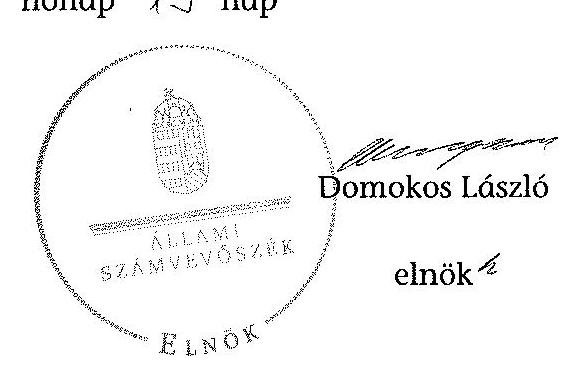

Melléklet: $\quad 9 \mathrm{db}$

---

## A Magyar Táncművészeti Főiskola kiadási és bevételi előirányzatai, azok teljesítése a 2009-2012. években

|  Sz. | Megnevezés | 2009. év |  | 2010. év |  | 2011. év |  | 2012. év |  | 2013. év |  | Adatok szerv 25.hun |   |
| --- | --- | --- | --- | --- | --- | --- | --- | --- | --- | --- | --- | --- | --- |
|   |  | Eredeti előirányzat | Módosított előirányzat | Teljesítés | Eredeti előirányzat | Módosított előirányzat | Teljesítés | Eredeti előirányzat | Módosított előirányzat | Teljesítés | Eredeti előirányzat | Módosított előirányzat | Teljesítés  |
|  1 | KIADÁSOK |  |  |  |  |  |  |  |  |  |  |  |   |
|  2 | Személyi irántások | 552 541 | 575 047 | 572 337 | 575 314 | 593 091 | 542 039 | 587 945 | 599 704 | 525 481 | 555 500 | 585 939 | 523 108  |
|  3 | Mádáselőtt terhelő jásulások | 173 300 | 182 038 | 177 451 | 136 463 | 161 050 | 147 252 | 159 365 | 160 098 | 140 539 | 150 900 | 138 684 | 140 410  |
|  4 | Dologi kiadások | 333 015 | 334 393 | 263 018 | 294 909 | 314 419 | 269 779 | 371 785 | 350 070 | 290 039 | 270 247 | 294 903 | 280 277  |
|  5 | Egyéb folyó kiadások | 8 533 | 53 483 | 50 146 | 11 353 | 31 838 | 31 779 | 11 353 | 89 363 | 87 519 | 11 353 | 12 166 | 10 247  |
|  6 | Támogatásérékű működési kiadások |  |  |  |  |  |  |  |  |  |  |  |   |
|  7 | Támogatásérékű felhalmozóai kiadások |  |  |  |  |  |  |  |  |  |  |  |   |
|  8 | Ebből évi előirányzat-monofirány, pénzesemfirány átadása |  |  |  |  |  |  |  |  |  |  | 705 | 705  |
|  9 | Működési célú pénzeszköz átadás |  |  |  |  |  |  |  |  |  |  |  |   |
|  10 | Felhalmozóai célú pénzeszköz átadás |  |  |  |  |  |  |  |  |  |  |  |   |
|  11 | Előitottak pénzbeli juttatásai | 29 017 | 32 399 | 31 411 | 27 927 | 29 037 | 25 278 | 28 922 | 31 647 | 21 631 | 22 600 | 24 397 | 22 774  |
|  12 | Ebből: Egyéb pénzbeli juttatások | 3 021 | 5 086 | 6 183 | 3 275 | 3 818 | 4 504 | 3 816 | 5 300 | 2 276 | 3 816 | 5 444 | 4 842  |
|  13 | Felújítás |  | 4 730 | 4 730 |  | 2 335 | 2 335 |  | 12 833 | 12 833 | 15 000 | 28 922 | 15 932  |
|  14 | Indakciósít beruházási kiadások ÁFA-val | 11 519 | 142 086 | 90 089 | 11 319 | 102 163 | 90 027 | 8 819 | 33 337 | 30 072 | 4 800 | 170 233 | 156 053  |
|  15 | Könyveti beruházási kiadások ÁFA-val |  | 63 581 | 63 581 |  |  |  |  |  |  |  |  |   |
|  16 | Lakásépítés kiadása ÁFA-val |  |  |  |  |  |  |  |  |  |  |  |   |
|  17 | Beruházáshoz kapcs. ÁFA befizetés |  |  | 26 264 |  |  |  |  |  |  |  |  |   |
|  18 | Egyéb indakciósít felhalmozóai kiadás |  |  |  |  |  |  |  |  |  |  |  |   |
|  19 | Külcsésők |  |  |  |  |  |  |  |  |  |  |  |   |
|  20 | Összesen | 1 109 730 | 1 387 957 | 1 279 005 | 1 077 487 | 1 233 955 | 1 109 409 | 1 168 193 | 1 267 432 | 1 108 130 | 1 030 400 | 1 275 981 | 1 147 526  |
|  21 | BEVÉTELEK |  |  |  |  |  |  |  |  |  |  |  |   |
|  22 | Külcsesítési bevételni |  |  |  |  |  |  |  |  |  |  |  |   |
|  23 | Indakciósít működési bevételni | 185 043 | 185 063 | 195 539 | 187 000 | 199 484 | 239 397 | 189 500 | 189 500 | 186 299 | 189 500 | 189 500 | 185 475  |
|  24 | Ebből: Működési célú pénzeszköz átvételek | 8 000 | 8 000 | 1 430 | 3 300 | 5 254 | 9 024 |  |  |  |  |  |   |
|   | Működési célú pénzeszköz átvételek |  |  |  |  |  |  | 5 500 | 5 500 | 5 046 | 5 500 | 5 694 | 5 694  |
|  25 | Felhalmozóai bevételni | 2 500 | 2 500 |  | 2 500 | 10 000 | 10 000 |  |  |  |  |  |   |
|  26 | Ebből: Felhalmozóai célú pénzeszköz átvételek | 2 500 | 2 500 |  | 2 500 | 10 000 | 10 000 |  |  |  |  |  |   |
|   | Felhalmozóai célú pénzeszköz átvételek |  |  |  |  |  |  |  |  |  |  | 1 225 | 1 225  |
|  27 | Irányító tervezői kapott támogatás | 914 167 | 926 085 | 938 085 | 879 987 | 899 130 | 899 130 | 965 192 | 884 235 | 884 235 | 827 400 | 816 603 | 816 603  |
|  28 | Támogatás értéző múködési bevétel | 8 000 | 8 000 | 8 213 | 8 000 | 8 000 | 13 472 | 8 000 | 13 960 | 13 640 | 8 000 | 11 539 | 7 970  |
|  29 | Támogatás értéző felhalmozóai bevétel |  |  |  |  |  |  |  | 2 405 | 2 406 |  | 91 404 | 91 404  |
|  30 | Ebből: évi monofirány átvétele |  | 63 581 | 63 781 |  |  |  |  |  |  |  | 4 669 | 5 168  |
|  31 | Előirányzat-monofirány felhasználás |  | 202 728 | 159 064 |  | 117 341 | 117 341 |  | 169 851 | 169 851 |  | 155 347 | 155 347  |
|  32 | Összesen | 1 109 730 | 1 387 957 | 1 352 682 | 1 077 487 | 1 233 955 | 1 279 340 | 1 168 192 | 1 267 432 | 1 263 477 | 1 030 400 | 1 275 981 | 1 266 886  |

---

A Magyar Táncmúvészeti Főiskola kiadásainak, bevételeinek változása a 2009-2012. években adatok ezer Fi-ban

|   |  | 2009. év | 2010. év | 2011. év | 2012. év |   |
| --- | --- | --- | --- | --- | --- | --- |
|  Ssz. | Megnevezés | Teljesítés | Teljesítés | Teljesítés | Teljesítés | 2012/2009  |
|  1 | KIADÁSOK |  |  |  |  |   |
|  2 | Személyi juttatások | 572337 | 543039 | 525481 | 523108 | 91,4\%  |
|  3 | Rendszeres és nem rendszeres | 505103 | 485423 | 476825 | 503714 | 99,7\%  |
|  4 | Rendszeres személyi juttatás | 375700 | 358451 | 349698 | 377539 | 100,5\%  |
|  5 | Alapilletmény | 350628 | 328342 | 319840 | 333282 | 95,1\%  |
|  6 | Nem rendszeres | 129403 | 126972 | 127127 | 126175 | 97,5\%  |
|  7 | Munkovégzéshez kapcs juttatások | 107710 | 109301 | 108179 | 110134 | 102,3\%  |
|  8 | Normatív és teljesítéshez kötött jutalom |  |  | 76 | 76 |   |
|  9 | Eöté személyi juttatások | 67234 | 57616 | 48656 | 19394 | 28,8\%  |
|  10 | Munknadót terhelő járulékok | 177451 | 147352 | 140539 | 140410 | 79,1\%  |
|  11 | Dologi és folyó kiadások | 313162 | 301558 | 377554 | 290524 | 92,8\%  |
|  12 | Dologi kiadások | 263018 | 269779 | 290039 | 280277 | 106,6\%  |
|  13 | Készletbeszerzés | 32881 | 41355 | 46237 | 37257 | 113,3\%  |
|  14 | Kommunikációs szolgáltatás | 13723 | 12284 | 12817 | 14985 | 109,2\%  |
|  15 | Szolgáltatási kiadások | 129060 | 126682 | 134254 | 131539 | 101,9\%  |
|  16 | Bédet és lázing | 10328 | 8630 | 11055 | 7551 | 73,1\%  |
|  17 | ebből PPP |  |  |  |  |   |
|  18 | Gáz, villany, víz | 46372 | 43319 | 52841 | 60418 | 130,3\%  |
|  19 | Működési célú ÁFA | 43036 | 49341 | 50655 | 68221 | 158,5\%  |
|  20 | Kiküldetés, reprezentáció | 4849 | 4752 | 2694 | 4002 | 82,5\%  |
|  21 | Szellemi tevékenység | 6571 | 3711 | 4183 | 6557 | 99,8\%  |
|  22 | Egyéb folyó kiadások | 50144 | 31779 | 87515 | 10247 | 20,4\%  |
|  23 | Előző évi maradvány visszafizetés | 44263 | 20379 | 77506 |  |   |
|  24 | Adék, díjak, egyéb befizetések | 5202 | 11288 | 9789 | 9513 | 182,9\%  |
|  27 | Előző évi előirányzat-maradvány, pénzmaradvány átadása |  |  |  | 705 |   |
|  30 | Ellátottak pénzbeli juttatásai | 31411 | 25278 | 21651 | 22774 | 72,5\%  |
|  31 | Ebből: Egyéb pénzbeli juttatások | 6183 | 4504 | 2276 | 4842 |   |
|  32 | Felhalmozási kiadások | 179914 | 90027 | 30072 | 156053 | 86,7\%  |
|  33 | Intézményi beruházási kiadások | 72247 | 63798 | 24148 | 124295 | 172,0\%  |
|   | ebből ingatlan | 66124 | 55651 | 5530 | 121988 | 184,5\%  |
|  34 | Gépes, berendezések, felszerelések | 5233 | 8147 | 9918 | 996 | 19,0\%  |
|  35 | Felújítás | 4730 | 2335 | 12833 | 13952 | 295,0\%  |
|   | ebből ingatlan (Átával) | 4730 | 1868 | 10266 | 11142 | 235,6\%  |
|  37 | Központi beruházási kiadások ÁFA-vol | 63581 |  |  |  |   |
|  41 | Összesen | 1279005 | 1109489 | 1108130 | 1147526 | 89,7\%  |
|  42 | BEVÉTELEK |  |  |  |  |   |
|  43 | Közhatalmi bevételek |  |  |  |  |   |
|  44 | Múködési bevételek | 197189 | 248421 | 191345 | 189169 | 95,9\%  |
|  45 | Intézményi múködési bevétel | 195539 | 239397 | 186299 | 183475 | 93,8\%  |
|  46 | Szolgáltatások ellenértéke | 120471 | 161608 | 141803 | 122053 | 101,3\%  |
|  47 | Intézményi ellátási díjak | 21691 | 27152 | 24494 | 23389 | 107,8\%  |
|  48 | Hozum és kamatbevétel | 4 | 18 | 95 | 680 | 17000,0\%  |
|  49 | Múködési célú pénzeszköz átvételek | 1650 | 9024 | 5046 | 5694 | 345,1\%  |
|   | ebből uniós forrás |  |  |  |  |   |
|  50 | Támogatásértékủ múködési bevétel | 8213 | 13472 |  | 7970 | 97,0\%  |
|  53 | Felhalmozási bevételek |  | 10000 |  | 1225 |   |
|  55 | Felhalmozási célú pénzeszköz átvételek |  | 10000 |  | 1225 |   |
|   | ebből uniós forrás |  |  |  |  |   |
|  56 | Támogatásértékủ felhalmozási bevétel |  |  | 2406 | 91404 |   |
|  58 | Irányító szeretől kapott támogatás | 926085 | 899130 | 884235 | 816603 | 88,2\%  |
|  61 | Előirányzat maradvány felhasználás | 159064 | 117341 | 169851 | 155347 | 97,7\%  |
|  62 | Összesen | 1352682 | 1279340 | 1263477 | 1266886 | 93,7\%  |

---

|  3. SZÁMÚ MELLÉKLET
A V-0369-279/2014. SZÁMÚ JELENTÉSHEZ |  |  |  |  |   |
| --- | --- | --- | --- | --- | --- |
|  Kimutatás a Magyar Táncművészeti Főiskola bevételeiről és kiadásairól, valamint adósságszolgálatáról a 2009.
2012. években |  |  |  |  |   |
|   |  |  |  | néztek a Ft-ban |   |
|  Sze |  |  |  |  |   |
|  1. |  |  |  | 2009. év | 2010. év  |
|  1. | 1. FOLYÓ KÖLTÉGYETÉS |  |  |  |   |
|  2. | 1.1.1. Hatósági jogkörböz köthető /közhatalmi/, egyéb saját, illetve ÁFA bevételek | 167 631 | 219 605 | 186 204 | 182 795  |
|  3. | 1.1.3. Működési költségvetés támogatása | 915 431 | 889 111 | 868 416 | 796 803  |
|  4. | 1.1.3. Támogatásértékű működési bevételek | 8 213 | 13 472 | 11 640 | 7 970  |
|  5. | 1.1.4. Elővél és különböző átvett pénzeszközök |  |  |  |   |
|  6. | 1.1.5. Működési célú "egyéb" pénzeszközátvétel állomháztartáson kívülről | 1 650 | 9 024 | 5 046 | 5 694  |
|  7. | 1.1.6. Hozom- és komorbovételek | 4 | 18 | 95 | 680  |
|  8. | 1.1.8. Előző évi előirányzat-maradvány, pénzmaradvány átvétel |  |  |  |   |
|  9. | 1.1. Folyó bevételek (1.1.1.-1.1.2.-1.1.3.-1.1.4.-1.1.5.-1.1.6.-1.1.7.-1.1.8.) | 1 090 909 | 1 131 230 | 1 075 401 | 999 110  |
|  10. | 1.2.1. Működési kiadások komorbidások nélkül | 1 062 950 | 991 849 | 1 043 574 | 933 435  |
|  11. | 1.2.2. Támogatásértékű működési kiadások |  |  |  |   |
|  12. | 1.2.2.1. vállalkozásoknak |  |  |  |   |
|  13. | 1.2.2.2. Elővél, illetve külföldre |  |  |  |   |
|  14. | 1.2.2.3. Magánszemélyeknek |  |  |  |   |
|  15. | 1.2.2.4. Non-profit szervezeteknek |  |  |  |   |
|  16. | 1.2.2.5. Barancsa- és érezzégistőlalásból származó külsővél |  |  |  |   |
|  17. | 1.2.3. Működési célú pénzeszközátadások (-1.2.3.1.-1.2.3.2.-1.2.3.3.-1.2.3.4.-1.2.3.5.) |  |  |  |   |
|  18. | 1.2.4. Támodalom-, szociálpolitikai és egyéb juttatás, támogatás |  |  |  |   |
|  19. | 1.2.5. Előjuttatné pénzbeli juttatásai | 31 411 | 25 278 | 21 651 | 22 774  |
|  20. | 1.2.6. Előző évi előirányzat-maradvány átadás |  |  |  |   |
|  21. | 1.2. Folyó kiadások (1.2.1.-1.2.2.-1.2.3.-1.2.4.-1.2.5.-1.2.6.-1.2.7.-1.2.8.) | 1 094 361 | 1 017 127 | 1 065 225 | 956 914  |
|  22. | 1.3. Folyó költségvetés egyenlege, működési jövedelem (1.1.-1.2.) | -3 452 | 114 103 | 10 176 | 42 196  |
|  23. | 2. TELEMÁMUZÁSI KÖLTÉGYETÉS |  |  |  |   |
|  24. | 2.1.1. Felhalmozási saját bevételek | 26 264 | 10 750 |  |   |
|  25. | 2.1.2. Felhalmozási kiadások költségvetési támogatása | 12 664 | 10 019 | 13 819 | 19 800  |
|  26. | 2.1.3. Támogatásértékű felhalmozási bevételek |  |  | 2 406 | 91 404  |
|  27. | 2.1.4. Elővél és különböző átvett pénzeszközök |  |  |  |   |
|  28. | 2.1.5. Felhalmozási célú egyéb pénzeszközátvétel állomháztartáson kívülről |  | 10 000 |  | 1 225  |
|  29. | 2.1.7. Kölcsönök visszatérítése, igénybevétele |  |  |  |   |
|  30. | 2.1.8. Előző évi előirányzat-maradvány, pénzmaradvány átvétel | 63 781 |  |  |   |
|  31. | 2.1. Felhalmozási bevételek (2.1.1.-2.1.2.-2.1.3.-2.1.4.-2.1.5.-2.1.6.-2.1.7.-2.1.8.) | 103 709 | 30 769 | 18 225 | 113 429  |
|  32. | 2.2.1. Saját felújítási kiadás (2011-től áfű-val) | 3 833 | 1 868 | 12 833 | 13 952  |
|  33. | 2.2.2. Saját beruházási kiadás (2011-től áfű-val) | 75 247 | 63 798 | 30 072 | 156 053  |
|  34. | 2.2.3. Saját beruházási és felújítási kiadás áfű-ja (2010-ig) | 18 719 | 12 946 |  |   |
|  35. | 2.2.4. Befektetési célú részeredések vásárlása |  |  |  |   |
|  36. | 2.2.5. Támogatásértékű felhalmozási kiadások |  |  |  |   |
|  37. | 2.2.5.1. Központi beruházási kiadás ÁfÁ-val | 63 581 |  |  |   |
|  38. | 2.2.5.2. Egyéb felhalmozási kiadás |  |  |  |   |
|  39. | 2.2.10. Előző évi előirányzat-maradvány átadás |  |  |  |   |
|  40. | 2.2.11. ÁfÁ befizetések | 36 264 | 10 750 |  | 20 607  |
|  41. | 2.2. Felhalmozási kiadások (2.2.1.-2.2.2.-2.2.3.-2.2.4.-2.2.5.-2.2.6.-2.2.7.-2.2.8.-2.2.9.-2.2.10.-2.2.11.) | 184 644 | 92 362 | 42 905 | 190 612  |
|  42. | 2.3. Felhalmozási költségvetés egyenlege (2.1.-2.2.) | -81 935 | -61 593 | -24 680 | -78 183  |
|  43. | 3. FINANSZÍROZÁSI MÜVELLETEK NELKÜLŐ (GÉS) POZÍCÓ (1.3.-2.3.) | -85 387 | 52 510 | -14 504 | -35 987  |
|  44. | 4. FINANSZÍROZÁSI MÜVELETEK |  |  |  |   |
|  45. | 4.1. Hítsételetet |  |  |  |   |
|  46. | 4.2. Hítsételetetés |  |  |  |   |
|  47. | 4.3. Forgatási és befektetési célú értékpapírok kibocsátása |  |  |  |   |
|  48. | 4.4. Forgatási és befektetési célú értékpapírok beváltása |  |  |  |   |
|  49. | 4.5. Forgatási és befektetési célú értékpapírok értékesítése |  |  |  |   |
|  50. | 4.6. Forgatási és befektetési célú értékpapírok vásárlása |  |  |  |   |
|  51. | 4.7. Egyéb finanszírozási bevételek (függő, átfutó, kiegyenlítői) | 695 | 488 | -2 204 | 487  |
|  52. | 4.8. Egyéb finanszírozási kiadások (függő, átfutó, kiegyenlítői) | 98 | 169 | 27 635 | -27 598  |
|  53. | 4.9. Finanszírozási műveletek egyenlege (4.1.-4.2.-4.3.-4.4.-4.5.-4.6.-4.7.-4.8.) | 597 | 319 | -29 839 | 28 085  |
|  54. | 5. TÁRGYÉVI PÉNZÜGYI POZÍCÓ (1.3.-2.3.-4.9.) | -84 790 | 52 829 | -44 343 | -7 905  |
|  55. | 6. NETTŐ MŰKÖDÉSI JÖVÉDELEM (működési jövedelem (1.3.) - főkettőelesztés (4.2.-4.4)) | -3 452 | 114 103 | 10 176 | 42 196  |
|  56. |  |  |  |  |   |
|  57. | TÁJÉKOZTATÓ ADATOK |  |  |  |   |
|  58. | Működési célú előző évi előirányzat-maradvány igénybevétele | 71 076 | 45 945 | 141 706 | 68 591  |
|  59. | Felhalmozási célú előző évi előirányzat-maradvány igénybevétele | 87 988 | 71 396 | 28 143 | 86 736  |
|  60. | Felhasználható tárgyévi előirányzat-maradvány | 53 298 | 92 345 | 155 347 | 26 398  |
|  61. | Hozza kötelezettség | 393 | 10 220 | 6 455 |   |
|  62. | ebből rövid lejáratú | 393 | 10 220 | 6 455 |   |
|  63. | Hozza szállítás kötelezettség | 393 | 10 220 | 6 455 |   |
|  64. | ebből lejárt (komártszabok) |  |  |  |   |
|  65. | Egyéb hosszú lejáratú kötelezettség |  |  |  |   |
|  66. | ebből rövid lejáratú |  |  |  |   |
|  67. | Finanszírozásba bevonható eszközök | 120 416 | 173 245 | 128 903 | 121 000  |
|  68. | Tartós hitelvászonyt megtartozó értékpapírok |  |  |  |   |
|  69. | Hozzai lejáratú bankboktód |  |  |  |   |
|  70. | Értékpapírok |  |  |  |   |
|  71. | Pénzeszközök (idegen pénzeszközök nélkül) | 130 416 | 173 245 | 128 903 | 121 000  |

---

A Magyar Táncművészeti Főiskola mérlegadatai a 2009-2012. években adatok ezer 1 t-ban

|  Szt. | Megnevezés | 2009. év | 2010. év | 2011. év | 2012. év | Index
(2012/2009)  |
| --- | --- | --- | --- | --- | --- | --- |
|  1 | IMMATERIÁLIS JAVAK | 1873 | 1022 | 10953 | 8567 | 457,4\%  |
|  4 | Vagyoni értékủ jogok |  |  |  |  |   |
|  5 | Szellemi termékek | 1873 | 1022 | 10953 | 8567 | 457,4\%  |
|  6 | Immateriális javaszú adott előlegek |  |  |  |  |   |
|  8 | TÁRGYI ESZKÖZÖK | 727446 | 932892 | 925286 | 1053356 | 144,8\%  |
|  9 | Ingyőzznek és kapcsolódó vagyonértékủ jogok | 634359 | 834890 | 857687 | 1003610 | 158,2\%  |
|  10 | Gépok, berendezések, bázisedések | 93087 | 78002 | 67599 | 49746 | 53,4\%  |
|  11 | Jönnövek |  |  |  |  |   |
|  12 | Tenyészállatok |  |  |  |  |   |
|  13 | Beruházások, felújfőnök |  |  |  |  |   |
|  14 | Beruházásra adott előlegek |  |  |  |  |   |
|  17 | BEFEKTETETT PÉNZÜGYI ESZKÖZÖK |  |  |  |  |   |
|  18 | Tartós részesedés |  |  |  |  |   |
|  19 | Tartósan adott kötvétes |  |  |  |  |   |
|  20 | ÜZEMELTETÉSRE KEZELÉSRE ÁTADOTT
VAGYONKEZELÉSRE VELT ESZKÖZÖK |  |  |  |  |   |
|  21 | BEFEKTETETT ESZKÖZÖK ÖSSZESEN | 729319 | 933914 | 936239 | 1061933 | 145,6\%  |
|  22 | KÉSZLETEK | 69434 | 68851 | 69506 | 69685 | 100,4\%  |
|  23 | Anyugok | 55938 | 55650 | 56487 | 56709 | 101,4\%  |
|  25 | Késztermékek |  |  |  |  |   |
|  26 | Áruk, görgylölegek, közvetített szolgáltatások | 13696 | 13201 | 13019 | 12976 | 96,1\%  |
|  27 | Egyéb köteletek** |  |  |  |  |   |
|  28 | KÖVETELÉSEK | 17680 | 9714 | 6330 | 7674 | 43,4\%  |
|  29 | Követelések áruzzállítóaból és szolgáltatásból | 14365 | 4758 | 6330 | 7674 | 53,4\%  |
|  30 | Adósok | 3315 | 4956 |  |  |   |
|  31 | Rövid lejáratú adott kötvétesők |  |  |  |  |   |
|  32 | Egyéb követelések |  |  |  |  |   |
|  38 | ÉRTÉKPAPÍROK |  |  |  |  |   |
|  43 | Fongatási célú feltévezettség meglédenítő értékpapír bekerőbbi (könnyi szerinti) értéke |  |  |  |  |   |
|  45 | PÉNZESZKÖZÖK | 123116 | 173686 | 129331 | 121418 | 98,6\%  |
|  47 | Költségvetési pénzforgalmi számúak |  | 3555 | 2676 | 1731 |   |
|  48 | Eketimulási számúak | 120416 | 169690 | 126226 | 119269 | 99,0\%  |
|  49 | Idegen pénzeszközök | 2705 | 441 | 429 | 418 | 15,5\%  |
|  50 | EGYÉB AKTÍV PÉNZÜGYI ELSZÁMOLÁSOK | 150 | 319 | 27954 | 356 | 237,3\%  |
|  51 | FORGÓESZKÖZÖK ÖSSZESEN | 210380 | 252570 | 233121 | 199133 | 94,7\%  |
|  52 | ESZKÖZÖK ÖSSZESEN | 939699 | 1186484 | 1169360 | 1261056 | 134,2\%  |
|  53 | SAJÁT TÖRE | 816492 | 1002700 | 1006049 | 1135503 | 139,1\%  |
|  54 | Tartós tőke | 77081 | 77081 | 77081 | 77081 | 100,0\%  |
|  56 | Tőkevültszások | 739411 | 925619 | 928968 | 1058504 | 143,2\%  |
|  59 | TARTALÉKOK | 117341 | 169851 | 155347 | 119360 | 101,7\%  |
|  60 | Költségvetési tartalékok | 117341 | 169851 | 155347 | 119360 | 101,7\%  |
|  62 | KÖTELEZETTSÉGEK | 393 | 10220 | 6455 | 4113 | 1047,1\%  |
|  63 | Hosszú lejáratú kötelezettségek |  |  |  |  |   |
|  64 | Rövid lejáratú kötelezettségek | 393 | 10220 | 6455 | 4113 | 1047,1\%  |
|  65 | Kötelezettségek áruzzáll.,szolg. (szállítok) | 393 | 10220 | 6455 | 4113 | 1047,1\%  |
|  66 | Egyéb kötelezettségek |  |  |  |  |   |
|  67 | EGYÉB PASSZÍV PÉNZÜGYI ELSZÁMOLÁSOK | 5473 | 3713 | 1509 | 1996 | 36,5\%  |
|  68 | FORRÁSOK ÖSSZESEN | 939699 | 1186484 | 1169360 | 1261056 | 134,2\%  |

---

|  A Magyar Táncművészeti Főiskola gazdálkodása szabályszerűségének értékelése a mintatételek alapján |  |  |  |  |  |  |  |  |  |  |  |  |  |  |  |  |  |   |
| --- | --- | --- | --- | --- | --- | --- | --- | --- | --- | --- | --- | --- | --- | --- | --- | --- | --- | --- |
|  értékelt terület |  |  |  |  |  |  |  |  |  |  |  |  |  |  |  |  |  |   |
|   |  |  |  |  |  |  |  |  |  |  |  |  |  |  |  |  |  |   |
|   |  |  |  |  |  |  |  |  |  |  |  |  |  |  |  |  |  |   |
|   |  |  |  |  |  |  |  |  |  |  |  |  |  |  |  |  |  |   |
|   |  |  |  |  |  |  |  |  |  |  |  |  |  |  |  |  |  |   |
|   |  |  |  |  |  |  |  |  |  |  |  |  |  |  |  |  |  |   |
|   |  |  |  |  |  |  |  |  |  |  |  |  |  |  |  |  |  |   |
|   |  |  |  |  |  |  |  |  |  |  |  |  |  |  |  |  |  |   |
|   |  |  |  |  |  |  |  |  |  |  |  |  |  |  |  |  |  |   |
|   |  |  |  |  |  |  |  |  |  |  |  |  |  |  |  |  |  |   |
|   |  |  |  |  |  |  |  |  |  |  |  |  |  |  |  |  |  |   |
|   |  |  |  |  |  |  |  |  |  |  |  |  |  |  |  |  |  |   |
|   |  |  |  |  |  |  |  |  |  |  |  |  |  |  |  |  |  |   |
|   |  |  |  |  |  |  |  |  |  |  |  |  |  |  |  |  |  |   |
|   |  |  |  |  |  |  |  |  |  |  |  |  |  |  |  |  |  |   |
|   |  |  |  |  |  |  |  |  |  |  |  |  |  |  |  |  |  |   |
|   |  |  |  |  |  |  |  |  |  |  |  |  |  |  |  |  |  |   |
|   |  |  |  |  |  |  |  |  |  |  |  |  |  |  |  |  |  |   |
|   |  |  |  |  |  |  |  |  |  |  |  |  |  |  |  |  |  |   |
|   |  |  |  |  |  |  |  |  |  |  |  |  |  |  |  |  |  |   |
|   |  |  |  |  |  |  |  |  |  |  |  |  |  |  |  |  |  |   |
|   |  |  |  |  |  |  |  |  |  |  |  |  |  |  |  |  |  |   |
|   |  |  |  |  |  |  |  |  |  |  |  |  |  |  |  |  |  |   |
|   |  |  |  |  |  |  |  |  |  |  |  |  |  |  |  |  |  |   |
|   |  |  |  |  |  |  |  |  |  |  |  |  |  |  |  |  |  |   |
|   |  |  |  |  |  |  |  |  |  |  |  |  |  |  |  |  |  |   |
|   |  |  |  |  |  |  |  |  |  |  |  |  |  |  |  |  |  |   |
|   |  |  |  |  |  |  |  |  |  |  |  |  |  |  |  |  |  |   |
|   |  |  |  |  |  |  |  |  |  |  |  |  |  |  |  |  |  |   |
|   |  |  |  |  |  |  |  |  |  |  |  |  |  |  |  |  |  |   |
|   |  |  |  |  |  |  |  |  |  |  |  |  |  |  |  |  |  |   |
|   |  |  |  |  |  |  |  |  |  |  |  |  |  |  |  |  |  |   |
|   |

---

.

---

# 6. SZÁMÚ MELLÉKLET A V-0369-279/2014. SZÁMÚ JELENTÉSHEZ 

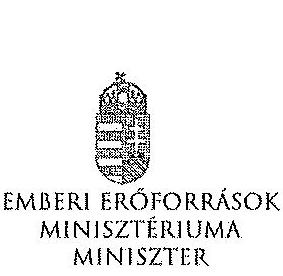

Iktatószám:38553-6/2014/ELL

Hiv. szám: V-0369-245/2014
Melléklet: -
Hovajul H. H.

## Domokos László részére

elnök

Állami Számvevőszék

Budapest
Apáczai Csere János u. 10.
1052

Tárgy: Észrevétel „a Magyar Táncművészeti Főiskola gazdálkodásának és működésének ellenőrzéséről" című számvevőszéki jelentéstervezethez

Tisztelt Elnök Úr!

Az Állami Számvevőszék által készített, „a Magyar Táncművészeti Főiskola gazdálkodásának és működésének ellenőrzéséről" című számvevőszéki jelentéstervezethez az alábbi észrevételeket teszem.

1. A jelentéstervezet 20. oldalán, az összegző megállapítások között szerepel, hogy a felsőoktatásért felelős miniszter nem hajtotta végre a nemzetgazdasági miniszter irányításával, a kormányhatározatban előírt szervezeti és feladat-ellátási felülvizsgálati programot. A felsőoktatási törvény rendelkezései ellenére nem készíttetett a felsőoktatás rendszere vonatkozásában középtávú fejlesztési tervet.

A 2012. évi költségvetési hiánycél tartását biztosító további feladatokról szóló 1365/2011. (XI. 8.) Korm. határozatban a Kormány a közfeladat-ellátás színvonalának javítása és a költséghatékony müködés céljából, szervezeti és feladat-ellátási felülvizsgálati programot indított el az államháztartás központi alrendszerében a költségvetési szervek, és a többségi állami tulajdonú gazdálkodó szervezetek vonatkozásában, továbbá elrendelte, hogy a felülvizsgálathoz a nemzetgazdasági miniszter irányításával, a Miniszterelnökséget vezető államtitkár, a közigazgatási és igazságügyi miniszter, valamint az ágazatért felelős miniszter részvételével munkabizottságokat kell létrehozni, módszertani útmutatót kell kidolgozni.

---

A nemzetgazdasági miniszter, a Miniszterelnökséget vezető államtitkár és a közigazgatási és igazságügyi miniszter felelősségi körébe tartozó munkabizottság összehívására nem került sor a vizsgált időszakban.

A fentiekre tekintettel javasolom azon megállapítását törlését, miszerint a felsőoktatásért felelős miniszter nem hajtotta végre a nemzetgazdasági miniszter irányításával a kormányhatározatban előírt szervezeti és feladat-ellátási felülvizsgálati programot, tekintettel arra, hogy a feladat nem a felsőoktatásért felelős miniszter felelősségi körébe tartozott.

A 2005. évi CXXXIX. törvény (a továbbiakban: Ftv.) 104. § (1) bekezdés b) pontja szerint az oktatásért felelős miniszter felsőoktatás fejlesztéssel kapcsolatos feladatai a felsőoktatás rendszere fejlesztési terveinek elkészittetése, beleértve a középtávú fejlesztési tervet, az ágazati minőségpolitikát. A nemzeti felsőoktatásról szóló 2011. évi CCIV. törvény (a továbbiakban: Nftv.) 64. § (3) bekezdése szerint a miniszter felsőoktatás-fejlesztéssel kapcsolatos feladatai a felsőoktatás rendszere fejlesztési terveinek elkészittetése, beleértve a középtávú fejlesztési tervet.

A törvényi rendelkezéseknek megfelelően több javaslat is a Kormány elé került a felsőoktatási rendszer középtávú fejlesztési tervének vonatkozásában, amelyek nem kerültek elfogadásra, ezért a megállapítást javasolt az alábbiak szerint módosítani:
Nincs a Kormány által elfogadott, a felsőoktatás rendszere vonatkozásában készített, középtávú fejlesztési terv.
2. A jelentéstervezet 20. oldal 7. bekezdésében szerepel, hogy „A minisztérium a Felsőoktatási Információs Rendszer (FIR) biztonságos üzemeltetéséhez, az adatok védelméhez szükséges alapvető szervezeti, szabályozási kontrollokat a 2012. év végéig nem teljes körűen alakította ki. A rendszerbe bevitt alapadatok nem voltak ellenőrzőttek, a rendszerbe épített adatellenőrzés hibajelzései nem voltak kellően konkrétak, illetve a FIR a személyi többszöröződéseket nem szűrte megfelelően."

A FIR létrehozása, fejlesztése, müködttéése és üzemeltetése az Ftv. és Nftv., valamint az Oktatási Hivatalról szóló 307/2006. (XII. 23.) Korm. rendelet, majd a 121/2013. (IV. 26.) Korm. rendelet alapján az Oktatási Hivatal (a továbbiakban: OH) feladata. A Minisztérium miniszteri utasításban adta ki és szükség szerint módosította az OH Szervezeti és Müködési Szabályzatát, mely az OH feladatrendszerét is részletezi. A 2/2012. (I. 13.) NEFMI utasításban kiadott OH SZMSZ 1.2.3.6. pontja többek között az alábbiakat tartalmazza:

Az OH Felsőoktatási Főosztály feladatai, a felsőoktatási informatikai rendszerekkel szemben támasztott követelmények szakmai szempontú meghatározása, együttmüködve az Informatikai Főosztállyal és a felsőoktatási informatikai rendszerek üzemeltetőivel.
A korábban kiadott SZMSZ-ek is hasonló tartalmú feladatokról rendelkeztek.
Mindezek alapján a Minisztérium többek között a FIR biztonságos üzemeltetéséhez, az adatok védelméhez szükséges alapvető szervezeti, szabályozási kontrollokat a fenti

---

szabályozások megalkotásával megvalósította, ezért javasoljuk a megállapítás módosítását, tekintettel arra, hogy a fenti szabályozási rendszer keretén belül a részletszabályok kidolgozása nem a Minisztérium feladata, azt az OH végezheti el saját hatáskörben.

A FIR fejlesztése egy hatalmas, sok évre átnyúló feladat, mely 2006-ban kezdődött meg hatósági nyilvántartási koncepció alapján. A FIR alapjaiban eltér egy klasszikus, pl. lakcím- és személyi adat nyilvántartástól, amely esetében az önkormányzatoknál/kormányhivataloknál rögzítik az adatokat és azok azonnal bekerülnek a központi rendszerbe. A FIR ezzel szemben az adatbevitel szempontjából nem tekinthető önálló rendszernek, hiszen az adatokat a felsőoktatási intézmények különböző tanulmányi rendszereiből veszi át. Így a FIR fejlesztése sosem volt független a tanulmányi rendszerek párhuzamos fejlesztésétől, azzal szoros összhangban tudott és tud megvalósulni. A tanulmányi rendszerek - három önálló tanulmányi rendszer és több egyedi, intézményi saját fejlesztésű rendszer - tényleges fejlesztése nem az OH feladata, azt az esetek többségében piaci vállalkozások végzik. Ezeknek megfelelően a FIR és a különböző tanulmányi rendszerek összehangolt fejlesztése kiemelten nagy kihívást jelent az OH-nak, a feladat hatalmas méretéből adódóan a fejlesztés, vagy akár egy-egy hiba, problémacsokor megoldása nem oldható meg gyorsan, hanem csak összehangoltan, mely sok időt vesz igénybe. Így a teljesen "zöldmezős beruházásként" megvalósított FIR fejlesztés jelenleg 4+4 éves időtartama, a feladat nagysága, a korábban rendelkezésre álló pénzügyi források ismeretében elfogadhatónak mondható. Az OH a FIR fejlesztéséről a felsőoktatási intézményeket folyamatos tájékoztatja, segítséget nyújt, ezeken túlmenően hatósági ellenőrzéseket is végez a FIR biztonságos üzemeltetése, az adatok védelme érdekében. A FIR megfelelő fejlesztése, biztonságos üzemeltetése érdekében az OH 2010-től átalakította a FIR-t érintő stratégiáját és az eljárásrendjeit.
3. A korábbi ÁSZ ellenőrzések javaslatainak hasznosulása tárgyában - 25-26. oldal - a jelentéstervezet az alábbiakat állapítja meg:
„Az Állami Számvevőszék három korábbi ellenőrzése során a felsőoktatás témakörében kilenc javaslatot fogalmazott meg a felsőoktatásért felelős minisztériumnak (OKM, NEFMI, EMMI). A minisztérium a javaslatokra intézkedési terveket készitteti, amelyek összesen 10 intézkedést tartalmaztak. Az intézkedések közül hármat késéssel megvalósitottak, hét nem valósult meg."

- Az oktatási és kulturális ágazat irányítási rendszerének, működésének ellenőrzéséről szóló 1106 sz . jelentés javaslataira készített intézkedési terv 3. számú javaslata, az oktatás középtávú stratégia tervezet előkészítése határidőre megtörtént, azonban azt a Kormány nem fogadta el.
- A felsőoktatás oktatási infrastruktúra-fejlesztési programjának ellenőrzéséről szóló 1171 sz. jelentésben tett javaslat szerint a minisztérium feladata az oktatási infrastruktúra fejlesztési program előkészítésének hiányosságai miatt a felelősség megállapítása.
A Kormány tagjainak feladat- és hatásköréről szóló 212/2010 (VII.1.) Korm. rendelet 2014. június 5 -ig hatályos 87. §-a szerint a PPP projektekkel kapcsolatos feladatellátás a Nemzeti Fejlesztési Minisztérium (továbbiakban NFM) feladatkörébe

---

került. A tárgyban érintett dokumentációk, a feladat, a felelősség megállapításához szükséges jogkörök a rendelet alapján az NFM-hez kerültek. Nem történhetett intézkedés a felelősség megállapítására, tekintettel arra is, hogy az NFM megfelelő hatáskör és felhatalmazás hiányában a felelősség megállapítására nem folytathat vizsgálatot.
Az előzőekben leírtak alapján egy intézkedés meghiúsult (felelősség megállapítása), egy intézkedés késve valósult meg (kapacitás-kihasználtság felmérése), egy intézkedés megvalósítása folyamatban van (kapacitás-kihasználtság felmérése eredményeinek és a felsőoktatást érintő ágazati célok figyelembe vételével intézkedések megtétele a felsőoktatási infrastruktúra közép- és hosszú távú hasznosítására).
$\cdot$Az állami felsőoktatási intézmények érdekeltségébe tartozó gazdasági társaságok támogatásának és nyereségességük hasznosulásának 1290 sz. ellenőrzése kapcsán az állami felsőoktatási intézmények gazdasági társaságai szakmai feladatellátásának és gazdaságossági eredményességének mérését biztosító mutatószám- és értékelési rendszereket az érintett felsőoktatási intézmények késéssel kidolgozták, azok ellenőrzése folyamatos.
4. A Magyar Táncművészeti Főiskola vonatkozásában, az emberi erőforrások miniszterének címzett javaslat szerint az MNV Zrt. bevonásával, a jogszabályi előírásokra tekintettel, a Kazinczy utcai ingatlan tulajdonviszonyának rendezése szükséges, a nemzeti vagyonnal történő felelős és rendeltetésszerű gazdálkodás biztosítása érdekében.

A Magyar Táncművészeti Főiskola rendezetlen jogi helyzete, az ingatlanon megépült felépítményével kapcsolatos problémák kezelése, a Főiskola Koreográfus- és Táncpedagógus-képző Intézetének végleges elhelyezése tárgyában az egyeztetések mind a Nemzeti Fejlesztési Minisztériummal, mind az MNV Zrt.-vel folyamatban vannak.
Az Intézet végleges elhelyezésére az Amerikai út 96 . szám alatti ingatlan szolgálna, ennek érdekében 2014. május 5 -én elvégezték annak értékbeszlését. A Főiskola kérvényt terjesztett elő a Nemzeti Fejlesztési Minisztérium felé a Csantavér utcai ingatlanjuk értékesítésével kapcsolatosan, melynek bevételét az Amerikai út 96 . szám alatti ingatlan beruházásra, felújításra, a költözéssel kapcsolatban felmerült feladatokra kívánnak felhasználni.
A Főiskola rektora ismételten felvette a kapcsolatot a Kazinczy utcai kiköltözéssel kapcsolatban az Önkormányzattal és a lehetséges beruházóval.
Továbbá az Emberi Erőforrások Minisztériuma a 2014. évi költségvetési támogatás speciális feladataiból 250,0 millió forintnyi forrást biztosít a költözéssel kapcsolatos feladatokhoz.
A fentiekre tekintettel kérem az intézkedési javaslat törlését.
5. A jelentéstervezet 19. oldalán lévő táblázat „Saját és átvett bevétek" címü sorban a 2010. évi adat 248421 E Ft helyett helyesen 258421 E Ft, a 2012. évi adat 189169 E Ft helyett helyesen 190394 E Ft. Az eltérés abból adódik, hogy a felhalmozási bevételek nem kerültek figyelembevételre.

---

6. A jelentéstervezet 3.1 „A kiadási és bevételi előirányzatok alakulás és a pénzügyi egyensúlyt befolyásoló tényezők" című pontjához a következő észrevételeket teszem:

- a 37. oldal második és harmadik bekezdés első mondatát az „...eredeti költségvetési kiadási előirányzat....." szövegre javasolom módosítani;
- a 37. oldal harmadik bekezdésben a személyi juttatások és hozzájuk kapcsolódó járulékok száma helyesen 706,4-727,8 M Ft;
- a 37. oldal saját bevételek eredeti előirányzatai összesen összege a felhalmozási bevételeket nem tartalmazza, ezért helyesen 195,6-203,0 M Ft;
- a 38. oldalon lévő kiadási előirányzatok módosításai bekezdésben a saját bevétek előirányzat módosításinak elemzésének felülvizsgálata javasolt az 1. számú mellékletben bemutstott számok tükrében;
- a 39. oldalon az előző évi felhasználható összes előirányzat-maradvány számszaki bemutatása keveredik az 1., 2., 3. számú mellékletben szerepeltetett összegekkel;
- a 42. oldal elején (apró betűs rész) az intézményt 2009. évben 13,5 M Ft helyett helyesen $12,8 \mathrm{M}$ Ft zárolás érintette.

7. Észrevételek a mellékletekhez:

Az 1. számú melléklethez a következők:

- a 8. sor megnevezését javasolom pontosítani „Előző évi előirányzatmaradvány, pénzmaradvány átadása" szövegre;
- a 12. sorban szereplő „Egyéb juttatás" sor tartalmának felülvizsgálata és összehasonlítása javasolt a 2. számú melléklet 31 . sorával;
- a 15. sor megnevezését és a 2009. évi teljesítési adatát javasolom összehasonlítani a 2. számú melléklet 37. sorával.

A 2. számú melléklethez a következők:

- a 8. sor „Normatív és tejesítéshez kötött jutalom" 2012. évi adata 5068 E Ft helyett helyesen 76 E Ft;
- a 27. sor megnevezését javasolt pontosítani „Előző évi előirányzat-maradvány, pénzmaradvány átadása" szövegre;
- a 31. sor megnevezését javasolt pontosítani „Egyéb pénzbeli juttatások" szövegre;
- a 48. sor „Hozam és kamatbevétel" 2012. évi adata 608 E Ft helyett helyesen 680 E Ft, a százalékot is javítani szükséges.

A 3. számú melléklethez a következők:

- a 28. sor „Felhalmozási kiadások költségvetési támogatása 2012. év adata helyesen 19800 E Ft (a 27. sorba nem szükséges adat);
- a 41. sor megnevezése helyesen „Központi beruházási kiadás ÁFÁ-val" (1. számú melléklet 15 . sor adatával egyezik);

---

- a 68. sor „Felhasználható tárgyévi elöirányzat-maradvány" sor adatainak felülvizsgálata javasolt összevetve a 2. számú melléklet 61. sorában szereplő adatokkal.

Kérem Elnök Urat, hogy az észrevételeket a jelentés véglegezésekor szíveskedjenek figyelembe venni.

Budapest, 2014. augusztus 4. 1 ,

Üdvözlettel:
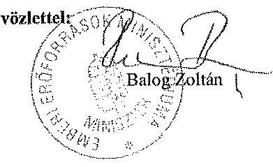

---

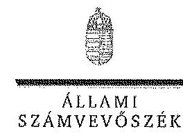

ELNök

# Balog Zoltán úr 

miniszter

Emberi Eröforrások Minisztériuma

## Budapest

## Tisztelt Miniszter Úr!

A Magyar Táncművészeti Főiskola gazdálkodásának és müködésének ellenőrzéséről készített jelentéstervezetekre tett észrevételeit köszönettel megkaptam.

Az Állami Számvevőszék észrevételekre vonatkozó álláspontjáról a felügyeleti vezető által készített részletes tájékoztatást csatoltan megküldöm.

Tájékoztatom Miniszter urat, hogy az ÁSZ. tv. 29. § (3) bekezdése alapján a számvevőszéki jelentések mellékleteként szerepeltetjük a jelentéstervezetekhez tett figyelembe nem vett észrevételeket az elutasítás indokainak feltüntetésével.

Budapest, 2014. 08
hó 19 nap
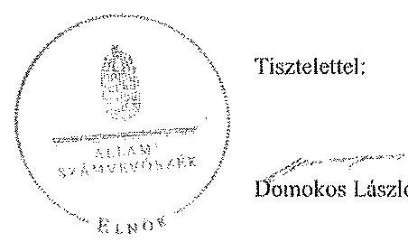

Melléklet: Tájékoztatás az elfogadott és a figyelembe nem vett észrevételekről

---

# Tájékoztatás   az elfogadott és a figyelembe nem vett észrevételekről 

A Magyar Táncművészeti Főiskola gazdálkodásának és müködésének ellenőrzéséről készült számvevőszéki jelentéstervezethez a 38553-6/2014/ELL iktatószámú levélben tett észrevételeit köszönettel megkaptuk. A jelentéstervezetekre tett észrevételeket áttekintettük, azok kezeléséről a következő tájékoztatást adom:

## 1. pont

A 2012. évi költségvetési hiánycél tartását biztositó további feladatokról szóló 1365/2011. (XI. 8.) Korm. határozatban elöirt szervezeti és feladat ellátási felülvizsgálati program megvalósitása:

A kormányhatározat alapján - az oktatási ágazatra vonatkozóan 2012. február 20-ig - kellett a tételes javaslatokat a Kormány elé terjeszteni, ennek végrehajtása azonban elmaradt. A feladatokat a nemzetgazdasági miniszter irányítása mellett kellett végrehajtani, felelősként azonban a Miniszterelnökséget vezető államtitkár, a közigazgatási és igazságügyi miniszter és az érintett ágazati miniszter is kijelölésre került. A fentiek alapján - az észrevételben leírtakra is figyelemmel - a vonatkozó szövegrészt a jelentéstervezetek összegző megállapítások, következtetések, javaslatok, valamint részletes megállapítások fejezeteiben az alábbiak szerint pontositottuk:
„Elmaradt az oktatási ágazatra vonatkozóan a nemzetgazdasági miniszter irányitásával és az oktatásért felelös miniszter részvételével, kormányhatározatban elöirt szervezeti és feladatellátási felülvizsgálati program kidolgozása." (Összegző megállapítások)
„Elmaradt az oktatási ágazatra vonatkozóan az 1365/2011. (XI. 8.) Korm. határozatban - a nemzetgazdasági miniszter irányitásával és az ágazatért felelös miniszter részvételével - elöirt szervezeti és feladatellátási felülvizsgálati program kidolgozása. (Részletes megállapítások, 1. fejezet):

---

# A felsőoktatás rendszere középtávú fejlesztési tervének elkészités: 

Az észrevételben foglaltakat figyelembe véve a jelentéstervezetek összegző megállapítások, következtetések, javaslatok, valamint részletes megállapítások fejezeteit kiegészitettük:
„A felsőoktatási törvény rendelkezései ellenére a miniszter nem készittetett a felsőoktatás rendszere vonatkozásában a Kormány által elfogadott középtávú fejlesztési tervet." (Összegző megállapítások)
„A miniszter - a vonatkozó jogszabályokban foglaltak ellenére - nem készittetett a felsőoktatás rendszere vonatkozásában a Kormány által elfogadott középtávú fejlesztési tervet." (Részletes megállapítások, 1. fejezet)

## 2. pont

A Felsőoktatás Információz Rendszerének (FIR) üzemeltetés:
A felsőoktatási törvények rendelkezései szerint (Feot. 35. §, 103.§ (1) bekezdés aa.) pont, Nftv. 64.§ (2) bekezdés aa) pont) a felsőoktatási információs rendszer müködtetése, az adatkezelés jogszerűsége a felsőoktatás ágazati irányítását ellátó miniszter felelősségi körébe tartozik. A miniszter feladata a felsőoktatási információs rendszer müködéséért felelős Oktatási Hivatal müködtetése is. A FIR müködését a teljes ellenőrzött időszakban problémák jellemezték, amely felveti az Oktatási Hivatal müködtetéséért felelős minisztérium felelősségét is. Az észrevételben jelzettek alapján a jelentéstervezeteket pontositottuk a következők szerint:
„A minisztérium a Felsőoktatási Információs Rendszer (FIR) biztonságos üzemeltetéséhez, az adatok védelméhez szükséges alapvető szervezeti, szabályozási kontrollokat a 2012. év végéig nem teljes körűen alakittatta ki az Oktatási Hivatallal." (Összegző megállapítások)
„A minisztérium az Oktatási Hivatallal a Felsőoktatási Információs Rendszer (FIR) biztonságos üzemeltetéséhez, az adatok védelméhez szükséges alapvető szervezeti, szabályozási kontrollokat a 2012. év végéig nem teljes körűen alakittatta ki.,, (Részletes megállapítások, 1. fejezet)

## 3. pont

## Korábbi ÁSZ ellenőrzések javaslatainak hasznosulása:

3/a. Az oktatási és kulturális ágazat irányítási rendszerének, müködésének ellenőrzéséről szóló 1106 sz. ÁSZ jelentés 3. sz. javaslata tekintetében a jelentéstervezetek részletes megállapítások 5. fejezetei részletesen tartalmazzák a tényeket. Ennek alapján az oktatási ágazat középtávú stratégiája kidolgozásának hiányára vonatkozó megállapítást a jelentéstervezetekben nem módositottuk.

---

3/b. A felsőoktatás oktatási infrastruktúra-fejlesztési programjának ellenőrzéséről szóló 1171 sz. ÁSZ jelentésben az előkészítés hiányosságai miatt a felelősség megállapítására tett javaslat nem hasznosult a jelentéstervezetek megállapításai szerint.

Az észrevételben foglaltak szerint az egyes miniszterek, valamint a Miniszterelnökséget vezető államtitkár feladat- és hatásköréről szóló 212/2010. (VII. 1.) Korm. rendelet valóban a nemzeti fejlesztési miniszter szakpolitikai feladat- és hatáskörébe helyezte a PPP és egyéb állami vagyont érintő gazdálkodó szervezetekkel kötött és megkötendő szerződések vizsgálatát és ellenőrzését. Az ÁSZ nemzeti erőforrás miniszter részére címzett javaslata ugyanakkor a PPP programok előkészítési hiányosságai miatti felelősség megállapítására irányult. A nemzeti erőforrás minisztere 2012. január 19-én kelt intézkedési tervében 2012. december 31-ei határidőre elvégzendő feladatként fogalmazta meg az előkészítési hiányosságok miatti felelősség megállapításról való intézkedést, amely nem valósult meg. Mindezek alapján a jelentéstervezetben tett megállapítás módosítása nem indokolt.

A 1171. sz. jelentés alapján tervezett intézkedések közül az állami felsőoktatási intézmények kapacitás-kihasználás felmérése késéssel valósult meg. A felmérés eredményeinek és a felsőoktatást érintő ágazati célok figyelembe vételével a felsőoktatási infrastruktúra közép- és hoszszú távú hasznosítására a helyszíni ellenőrzés időszaka alatt nem történtek intézkedések. Az intézkedés határideje 2013. december 31. volt. Az észrevételben foglaltak alapján a jelentéstervezetek módosítása nem indokolt.

3/c. Az állami felsőoktatási intézmények érdekeltségébe tartozó gazdasági társaságok támogatásának és nyereségük hasznosulásának ellenőrzése címü, 1290 sz . ÁSZ jelentés 2. sz. javaslata (Az állami felsőoktatási intézmények - a felülvizsgálatot követő, de legkésőbb egy éven belül - megmaradt társaságaira vonatkozó szakmai feladatellátás és a gazdasági eredményesség mérését biztosító mutatók és azok értékelési rendszerének kidolgoztatása) megállapításaink alapján nem hasznosult. A helyszíni ellenőrzés alatt rendelkezésre bocsátott dokumentumok alapján a minisztérium a rektorokat a szakmai feladatellátás és a gazdasági eredményesség mérését biztosító mutatószámok és értékelési rendszer kidolgozására a felsőoktatási intézmények finanszírozását szabályozó kormányrendelet kihirdetését követően kívánta felkérni. Így a vonatkozó megállapítás módosítása nem indokolt.

# 4. pont 

A Magyar Táncművészeti Főiskola ellenőrzéséhez kapcsolódó - az emberi erőforrások miniszterének tett - javaslatunkat az ellenőrzéssel lezárt időszakra vonatkozó megállapítások alapján tettük. A rendezetlen tulajdonviszonyok megítélésünk szerint mindenképpen intézkedést igényelnek. Köszönjük az ellenőrzött időszakot követő intézkedésekről adott tájékoztatást. A jelentésben foglalt megállapításokhoz készített intézkedési tervben foglaltak megvalósulását az ÁSZ utóellenőrzés keretében ellenőrizheti.

## 5. pont

Az adatok pontositására vonatkozó észrevételüket köszönjük, a 19. oldal táblázatának adatait helyesbítettük.

---

# 6. pont 

Az észrevétel első öt részpontjához tett észrevételeket elfogadtuk. A jelentéstervezet 3.1. pontjában a megszövegezésé és az adatokat pontositottuk.

A zárolásra vonatkozóan a 42. oldalon szereplő $13,5 \mathrm{M}$ Ft-os összeget az intézmény által kitöltött tanúsítvány alapozta meg.

## 7. pont

A mellékletekre vonatkozó pontositó észrevételeket - egy kivétellel - elfogadtuk, az adatokat, illetve a megszövegezést javitottuk.

Az utolsó alpontra vonatkozó észrevételt nem fogadjuk el, mivel a 3. sz. melléklet 68. sora az adott évben keletkezett később felhasználható előirányzat-maradvány összegét tartalmazza, míg a 2. sz. melléklet 61. sora a korábbi években keletkezett maradvány felhasználását mutatja ki.

Kérem a válaszlevelemben foglaltak szíves tudomásulvételét. Tájékoztatom Miniszter urat, hogy a számvevőszéki jelentés mellékleteként szerepeltetjük a jelentéstervezethez tett észrevételeit, az elfogadott valamint az ÁSZ. tv. 29. § (3) bekezdése alapján a figyelembe nem vett észrevételeket az elutasítás indokának feltüntetésével együtt.

Budapest, 2014. 08 hó /4 nap

Horváthné Herháth Mária
felügyeleti vezető

---

.

---

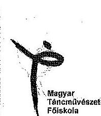

Domokos László
elnök úr részére

Állami Számvevőszék
1052 Budapest, Apáczai Csere János utca 10.
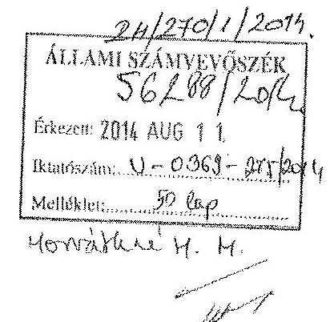

# Tisztelt Elnök Úr! 

Szíves tájékoztatásul mellékelten megkiildöm a Magyar Táncművészeti Főiskola gazdálkodásának és müködésének ellenőrzéséről készült számvevőszéki jelentéstervezetben megfogalmazott megállapításokra tett észrevételeinket.

Egyidejűleg megköszönöm az Állami Számvevőszék munkatársainak számunkra is sok tapasztalatot eredményező ellenőrzó tevékenységét.

Budapest, 2014. július 29.
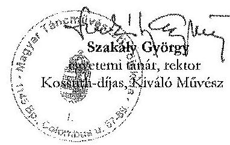

Magyar
Táncművészeti
Főiskola
Rektor
1145 Budapest
Columbus u. 87-89.
1592 Budapest
PI.: 472
+3612733434
+3612733433
info@mtt.hu
wsre.mtt.hu

---

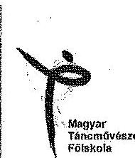

# 1. ÂL TALÁNOS ÉSZREVÉTELEK 

Nem vitatva az Állami Számvevőszék munkatársainak szakmai hozzáértését és figyelmességét, az ellenőrzési jelentés áttanulmányozása után sajnálattal azt kellett megállapítanom, hogy a dokumentum:

- számos esetben folyamatából kiszakítva elemzi az egyes eseményeket;
- sok helyen számszakilag hibás adatokat tartalmaz, amelyekből téves következtetéseket von le;
- nem kevés ténybeli tévedést foglal magában; pontatlan vagy számonkra nem értelmezhető jogszabályi hivatkozásokkal él;
- megállapításaiban jelentős hangsúlyeltolódás és aránytalanság mutatható ki.

Ennek okai véleményem szerint elsősorban az egyes jogszabályok eltérő értelmezésében és alkalmazásában, valamint az ellenőrzés során rendelkezésre bocsátott dokumentumok kissé felületes áttanulmányozásában keresendők.

A fenti megállapításokat a későbbiekben részletes alátámasztással indokolom, utalva a jelentés megfelelő szövegrészeire, az oldalszám megadásával. Ezt megelőzően azonban szükségesnek tartok kiemelni néhány általános megállapítást.

1. A jelentés a főiskola pénzügyi egyensúlyát tekintve megállapítja:

- a Főiskola pénzügyi egyensúlya biztosított volt a vizsgált időszakban
- a stabil pénzügyi pozíciót támasztják alá a Főiskola likviditási mutatói.

A likviditási mutatók és a pénzeszköz likviditási mutatók az ellenőrzött időszak valamennyi évében jelentősen meghaladták az elvárt értékeket. 2009-2012 években az intézményhez kincstári biztost, költségvetési felügyelőt nem jelöltek ki, felügyeleti szervi beavatkozásra nem volt szükség. Ezekben az években az intézményi költségvetésben az irányító szervtől kapott támogatás összege 109,5 M Ft-tal csökkent, mindezek ellenére a Főiskola - a zavartalan pénzügyi gazdálkodás mellett - jelentős beruházásokat hajtott végre, a magyar állam tulajdonában, az intézmény kezelésében lévő ingatlanokon nettó 369,2 M Ft értékben. E megállapítás tükrében szinte érthetetlenek az 5. számú mellékletben jelölt szabályszerűségi mutatók, amelyek szerint a mintatételek alapján megállapított érték az értékelt területek többségében nem megfelelő. A melléklet alapján úgy tűnik: a főiskola az országosan egyedülálló, sikeres művészetoktatási tevékenységét a stabil gazdálkodás mellett kizárólag szabálytalan ügymonettel volt képes teljesíteni? Ha ez igaz lenne, akkor elsősorban nem a főiskolát, hanem a jogszabályi környezetet kellene megvizsgálni.

---

2. A folyamatból kiragadott elemzés két szembetűnő példája az intézmény vezetésével, illetve a beruházások alakulásával függ össze. A jelentés röviden megemlíti, hogy a vizsgált időszakban a főiskolának három rektora volt, ám ez a megállapítás semmilyen formában nem világítja meg azoknak a körülményeknek a rendszerét, amelyek a főiskola munkáját a szóban forgó időszakban alapvetően meghatározták. Valójában arról van szó, hogy a 2006 nyarán feszült körülmények között hivatalba lépett ifj. Nagy Zoltán rektor munkája megkezdését követően 2007 nyarán súlyosan megbetegedett, és egy éven át képtelen volt ellátni feladatát. A 2008 tavaszán bekövetkezetı halála után a 2008-2009-es tanévben több sikertelen rektorválasztásra került sor, amely időszak alatt Bolvári-Takács Gábor rektorhelyettes gyakorolta a munkáltatói jogkött. A 2009 tavaszán hivatalba lépett új rektor, Jakabné Zórándi Mária 2010 májusában súlyos betegség miatt betegállományba került, és 2010 öszén tragikus hitrelenséggel ellunyt. Az újabb átmeneti időszakot követően 2011. július 1-én nevezték ki a Főiskola jelenleg is hivatalban lévő rektorát, Szakály Györgyöt. Ez a folyamat nem pusztán átmeneti és formális nehézségeket okozott a Főiskola gazdálkodásának adminisztrációjában, hanem humánpolitikai szemponthól a kívülállók - beleértve a tisztelt számvevőszéki munkatársakat is - számára át nem élhető feszültségeket rejtett magában. Eközben a legfrekventáltabb munkakörökben (főtitkár, gazdasági osztályvezető, főkönyvi könyvelő, belső ellenőr, tanszékvezetők, stb.) állandó fluktuációt okozott, és több esetben folyamatos pályáztatás ellenére sem tudtunk betölteni bizonyos álláshelyeket. (Egyszerűen azért, mert válsághelyzetben a munkavállalók - különösen, ha konvertibilis szakképzettséggel rendelkeznek elsősorban saját boldogulásukat tartják szem előtt, s könnyebben keresnek, illetve váltanak munkahelyet. Ennek vesztese az adott időszakban minden esetben a Főiskola volt.) Ezért állítom azt, hogy amikor a főiskola gazdálkodási stabilitásának fenntartása minden más szempontot megelőzött, és folyamatos krízishelyzet állt fenn, nem élesszerű annak hangsúlyozása, hogy pl. egy utalványrendelezen az aláírások megfelelően megtörténtek-e, ha egyébként maga a kiadás indokolt és fedezettel alátámasztott. A jelentés egyébként is túlhangsúlyozza a fedezet nélküli kifizetések kockázatát: hogyan lehet visszamenőlegesen eunek minősíteni bármely kifizetést, ha a gazdálkodás stabilitását megállapították?
3. A folyamatból kiragadott elemzés másik kulcsterülete a beruházások vizsgálata. Ez esetben szintén összefüggő eseménysorról beszélhetünk, amely 2007-ben kezdődött a főiskola Pillangó utcai kollégiumú épületének értékesítésével. A Pénzügyminisztérium engedélyével lebonyolított tranzakció credményeként 2008-ban 225 M Ft vételár folyt be a Főiskolához, amelyet az Intézményfejlesztési Tervben meghatározott beruházásokra fordíthattunk. Ezt kiegészítette a kulturális tárca által előirányzott 190 M Ft-os beruházási keret, amelyből 80 M Ft -ot a 2008. évi költségvetési törvényben rögzítettek. A főiskola ezen keretszámok ismeretében tervezte meg betuházási programját, amelyet a már megkezdett építkezés áttervezésével kellett módosítania, amikor - a gazdasági helyzet változásából adódó költségvetési zárolás miatt - a kormány visszavonta ígéretét, és a 2009. évi költségvetésből töröltték az előirányzott 190 M Ft fennmaradó részét. Ennek ellenére, a Főiskola az Intézményfejlesztési Tervvel összhangban a beruházást folyamatosan folytatta 2013-ig, még a saját forrása

---

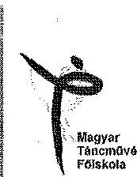

Magyar Táncmôvészoli Föiskola

Rektor
1145 Budapest
Columbus u. 87-89.
1592 Budapest
Pf.: 472
+36 12733434
+36 12733433
info@mff.hu
www.mff.hu
terhére is, ezzel emelve az itt folyó múvészetoktatási tevékenység infrastrukturális színvonalát - és növelve az állami vagyont.
4. Ugyancsak e témakörben kell megemlítenem a Kazinczy utcai épületünkkel kapcsolatos fő megállapítást, amely szerint az ingatlan-nyilvántartásban nem szereplő felépitmény mérlegben való feltüntetése szabálytalan. A szóban forgó épület a 70-es években állami beruházásként létesült, a használatbavételi engedély jogosultja jogelőd intézményünk, az Állami Balett Intézet volt. Az épület tulajdonjogár soha semmilyen más intézmény vagy szerv nem követelte magának, s az épület értéke 1992-ben az év végi záró mérleg és az ahhoz tartozó főkönyvi kivonata alapján került bele az analitikus nyilvántartásba. Ezt követően az értékcsökkenési leírást és a felújítások, beruházások aktiválását szabályszerűen átvezetrük. Véleményem szerint a föiskola az állami vagyon védelmét valósítja meg, amikor az általa használt épületet vagyonmérlegében feltünteti, hiszen éppen ez a jogcím adott alapot a korábbiakban ahhoz, hogy a kerületi önkormányzattal és a beruházó céggel érdemben tárgyalhattunk az épület kiváltásától, csereingatlan biztosításáról, vagy pénzbeli megváltásától.
5. Ezzel összefüggésben azt is rögzítenem kell, hogy indokolatlannak tartom a jelenleg is érvényes 2004. március 30-i keltczésủ vagyonkezelési szerződés belyébe lépő új szerződés aláírásának elmulasztását a Főiskola által előidézett törvényséttésnck feltüntetni. Véleményem szerint a főiskola éppen az általa kezelt állami vagyon védelmét segitette elő azzal, hogy a számára súlyosan hátrányos szerződéstervezetet, amelyet az MNV Zrt. szakszerűtlen előkészítése okozott, nem írta alá. E tekintetben köszönöm a jelentésnck a helyzet megoldására irányuló, az emberi erőforrások minisztere részére megfogalmazott intézkedési javaslatát.
6. A hangsúlyeltolódás és aránytalanság egyik példája a főiskola vagyongazdálkodásának bírálata egyetlen tényező, a büfé bérleti szerződésének vizsgálata kapcsán. Ez a kérdés a jelentésben többször előkerült különféle szövegösszefüggésben, és hangsúlyában szinte akkora jelentőséget kap, mint pl. az, hogy a Főiskolának a vizsgált időszakban soha nem volt tartozása vagy adóssága. Sajnálatos továbbá, hogy a jelentésből nem tünik ki, ha az egyes megállapításokban rögzített hiányosságokat a föiskola 2012 évben a felügyeleti ellenőrzés nyomán az intézkedési tervben rögzítettek szerint kijavította. Így az sem válhatott a főiskola előnyére, ha valamely szabálytalanságot időközben megszüntetctett.
7. Végezetül megjegyzem: tendenciózmenk tartom azokat a szövegészcket, amelyekben a jelentés a címben vagy kurziváltan kiemelve negatív megállapítást tartalmaz, miközben a szöveg egészét olvasva kiderül, hogy a megállapítást alátámasztó információk éppen ellenkező előjelöek, sőt előfordul a negatív megállapításhoz csak pozitív alátámasztás. Ilyen szövegésszek találbatók pl. a 35. oldalon a monitoring tevékenységgel, a 36. oldalon a pénzügyi gazdálkodással, a 44. oldalon a megbízási díjakkal összefüggésben.

---

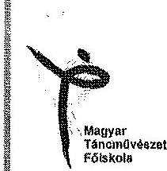

# II. RÉSZLETES ÉSZREVÉTELEK 

Mellékelten megkiidjük az 1., 2., 3. számú mellékletek ${ }^{1}$ számszakilag javított változatait, amely egyezik a Főiskola mérlegbeszámolójával. A változásokat piros szimuel jelöltük. Külön kiemelem a 3. számú melléklet bibájaként, hogy az intézményünk részére az egyik legfontosabb finanszírozási forrást, az elöirányzat maradványt a bevételi oldalon figyelmen kívül hagyták, holott a kiadások között az elöirányzat maradványból kifizetett összegeket is feltüntették. Ezzel, tévesen, hiányt mutatrak ki.

A központi költségvetési szerveknéla a CLF módszemel teljesen egyező a beszámoló 98. ürlapja, ahol a finanszírozási kiadások és bevételek (függő, átfotó, kiegyenlítő) mellett finanszírozásként veszi figyelembe az elöirányzat maradványt. ${ }^{2}$ Az intézményünk nem a hiányt pótolta, ahogy a jelentésben szerepel, hiszen az évközi kifizetéseknél az intézményt jogosan megillető elöirányzat-maradványából teljesítette kifizetéseit, például: hallgatói normatív juttatás elöirányzat maradványát a Hallgatói Önkormányzat döntése értelmében a következő évben fizettük ki. A HÖK sem a hiányt pótolta a maradvánnyal, hanem az óket normatív alapon jogosan megillető pénzt használta fel.

Ezen módszer lehet, hogy az önkormányzatoknál nem hozhatja ennyire látványosan a felszínre az Önök által kimutatott hiányt, hiszen az önkormányzatoknál jelentős bevételek származnak a helyi adókból is, mely mellett az elöirányzat-maradvány felhasznált összege esetleg nem annyira jelentős.

Fentiek szemléletében - a egyezően az intézményi beszámoló 98-as ürlapjában finanszírozás összesen soron egyező összeggel - javitottuk a táblát.

A másik módszer lenne ezen tábla módosítására, mely valós képet mutat az intézmény gazdálkodásáról, ha a müködési és felhabnozási kiadások közül az elöirányzatmaradványból teljesített kifizetéseket kiemeljük. Így már teljesen megalapozott és saját forrászal alátámasztott, a vizsgált időszakban az intézmény mérlegében és az Önök jelentésben is kimutatott vagyon növekedése is.

## Az intézmény belső kontrollrendszerének kiépítése és múködtetése

32. oldal: a szervezeti egységek engedélyezett létszámadatai az SZMSZ-ben soha nem szerepeltek, fenntartónk ezt soha nem kifogásolta.
33. oldal: az önköltségszámitással kapcsolatban szükségesnek tartjuk rögzíteni, hogy a főiskolai képzés államilag finanszírozott, illetve önköltséges formáinál a fenntartó önköltségszámitástól függetlenül határozza meg a képzési normatívát, illetve a költségtérítés összegét.

[^0]
[^0]:    ${ }^{1}$ 1. számú melléklet: a jelentéstervezetnek az 1., 2., 3. számú javított melléklete
    ${ }^{2}$ 2. számú melléklet: a 2009. évi beszámoló 98 -as ürlap 165. sor; 2010. évi beszámoló 98 -ae ürlap 174. sor;
    2011. évi beszámoló 98 -as ürlap 179. sor; 2012. évi beszámoló 98 -as ürlap

---

Mogyor Táncmövészeti Föiskola

Mogyor Táncmövészeti Föiskola

Rektor
1145 Budapest
Columbus u. 87-89.
1592 Budapest
PE: 472
+36 12733434
+36 12733433
info@mff.hu
www.mff.hu
35. oldal: nem világos, hogy a monitoring rendszer miért nem múködött megfelelően, amikor a megállapítást tartalmazó szövegrészek kizárólag megfelelő müködésről szólnak.

A belső ellenőrzés hiányosságai kapcsán utalmunk kell az általános észrevételek között megfogalmazott humánpolitikai problémákra. A vizsgált időszak első évében alkalmazott belső ellenőr a munkakörét nem megfelelően látta el, majd ennek rektori számonkérése során munkabelyét elhagyta, keresésünkre hónapokig nem reagált, végül jogviszonyát megszüntette.
36. oldal: a külső és belső közérdekủ bejelentések kezelésére az Intézményfejlesztési Tervek és az SZMSZ 9. fejezete tartalmaz szabályokat. A jellemzően kiskorú növendékek szüleitől érkező bejelentések kezelésére a TVR, a gimnáziumi és kollégiumi SZMSZ, valamint a háztérend az irányadó; egyebekben a közérdekủ bejelentések kezelésére az állami szervekre vonatkozó jogszabályokat alkalmazzuk.

# Az intézmény pénzügyi gazdálkodása 

36. oldal: a fejezet első mondata súlyosan félrevezető, mert a kurzivált szövegctésznek (a MTF pénzügyi gazdálkodása nem volt szabályszertü) ellentmond a bekezdés tartalma, hiszen a leglényegesebb mutatókat kivételnek tekinti, így azonban a kurzivált szöveg önmagában valótlanságot állít.
37. oldal: a 2. számú melléklet javitása miatt:

Az előző évi felhasználható összes előirányzat-maradvány befizetési kötelezettség nélkül a 2009. évben 158,5 M Ft, a 2010. évben 97,0 M Ft, a 2011. évben 92,3 M Ft Főiskolát meg nem illető normatív jogosultságot meghaladó összeg a 2009. évben 20,4 M Ft a 2010. évben 77,5 M Ft, illetve a 2012. évben 111,8 M Ft volt.

A hallgatói férőhely kapacitás kihasználásával összefüggésben megjegyezzük, hogy a $60,7 \%$-os kihasználtság oka külső tényező volt: a kormányzat nem engedélyezte a székhelyen kivüli képzések indítását, így a nyíregyházi, pécsi és szombathelyi képzési kapacitásunk kihasználathu maradt.
40. oldal: foglalkoztatott létszám a beszámolókban szerepeltetekkel nem egyezik.

A pénzügyi helyzetet bemutató táblázat a 3. számú melléklet (mely több szánsszaki hibát is tartalmazott) a CLF módszer alapján készült. 2011-ben a pénzügyi pozíció 44,3 M Ft. Ez tartalmazza a folyó kiadások soron a 77,5 M Ft befizetési kötelezettséget is. Ebből is látszik, hogy az elöirányzat-maradvány egyoldalú figyelembe vétele, csak a kiadásoknál - a finanszírozásnál pedig nem - okozza a negatívumokat, mint tárgyévi pénzügyi pozíció (HIÁNY). E miatt a táblázathoz kapcsolódó magyarázó szövegrészek is pontatlanok.
41. oldal: Megállapításaik alapján a felhalmozási bevételek és kiadások teljesítése közötti ütemkülönbség finanszírozási igényét az előző évi maradvány igénybevételével biztosította a Főiskola, tehát nem hiányt pótolt, hanem elöirányzat-maradványt

---

# Magyar TánconOvészeti Főiskola 

## Magyar TánconOvészeti Főiskola

Rektor
1145 Budapest
Columbus u. 87-89.
1592 Budapest
Pf.: 472
+3612733434
+3612733433
info@mtf.hu
www.mtf.hu
használt fel. Ezzel kapcsolatban lásd az általános észrevételeknél a beruházásokról leírtakat.

## A bevételi és kiadási elöirányzatok megállapítása, módosítása, az elöirányzatmaradványok kezelése

42. oldal: az Államháztartási törvény és a Felsőoktatási törvény nem volt összhangban. A Felsöoktatási törvény' 2009. jamúrtól 2011. decemberig előirta „... a költségvetési szervként múködő felsőoktatási intézmény a költségvetési év végén keletkezett elöirányzat-maradványt és pénzmaradványt - jogosultsági elszámolást követően - a következő években az intézményi feladatok teljesitésére felhasználhatja..." Meg kell jegyeznünk, hogy a jogosultságát az intézménytünknek a tárgy évet követő beszámolóval egyébijüleg állapították meg. A vizsgált időszakban is az 50/2008. (III.14.) Kormányrendelet szerinti teljes összeget soha nem kaptuk meg 100\%-ban, így igen nehéz volt az Államháztartási törvény alapján kötelezettséget vállalni arra a várható maradványra, amit a gazdálkodási év elmúltával tudtunk meg. Ezt az ellentmondást szüntette meg a 2011. évi CCIV törvény a nemzeti felsőoktatásról a 115.§ (9) bekezdés b) pontja „A költségvetési év végén keletkezett elöirányzatmaradványát - a jogosultsági elszámolást követően kötelezettségvállalással terhelt elöirányzat-maradványnak kell tekinteni, amelyet az a következő években intézményi feladatok ellátására használhat fel." Véleményünk szerint a „lea specialis derogat lex generalis" általános jogelv alapján a 2009-2011 közötti időszakban helyesen értelmeztük a felsőoktatási törvény elsőbbségét az állambáztartásával szemben.
43. oldal: a harmadik bekezdésben szereplő MTA rövidítés számunkra nem értelmezhető.

## A kiadási elöirányzatok felhasználása

44. oldal: a jelentés megfogalmazása alapján nem tudjuk azonosítani, hogy kikre vonatkoznak a munkaköz ellátásához szükséges végzettség hiányára vonatkozó észrevételek. Az sem világos, hogy mit kifogásolnak a kinevezési okiratokból. E körben megjegyezzük, hogy a Fölskolai oktatók illettményét nem a Kjt. szerinti besorolás, hanem az Nftv. melléklete szerint kell meghatározni.

A cafeteria juttatással kapcsolatban akkori értelmezésünk szerint a rektori utasítások szabályosak voltak, de a fenntartói ellenőrzés nyomán a jogszabályellenesnek itélt gyakorlatot azonnal megszüntettük.

A megbízási díj elszámolására vonatkozó negatív értékitéletet a következő bekezdés felülírja. A kötelezettségvállalás pénzügyi ellenjegyzése mindig megtörtént, hiszen a megbízási szezzödéseket a gazdasági főigazgató ellenjegyezte. A fedezet nélküli kifizetés kapcsán az általános észrevételekben álláspontomat már rögzítettem.

A szakmai teljesités igazolások a számlákon szerepelnek, bár a „szakmai teljesítést igazolom" szöveg hiányzik. az aláiró személye azonban egyértelmüen azonosítható. Az

[^0]
[^0]:    ${ }^{1}$ 2005. évi COOIX. törvény a felsőoktatásról 120. § (3) bekezdés

---

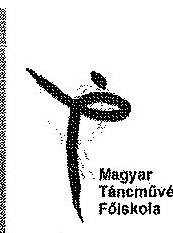
érvényesitő kijelölése a 249/2009. (XII.19.) Korm. rendelet alapján 2010-ben megtörtént, ezt megelőzően átmenetileg nem volt olyan közalkalmazott, aki a szükséges pénzügyi végzettséggel rendelkezett volna.
45. oldal: A felhalmozási kiadások sommásan szabályszerűtlennek itélése logikai képtelenség: minden intézményi beruházásra fordított összeget TÁMOP, KEOP, NKA pályázati forrásból továbbá saját forrásból használtunk fel, betartva a közbeszerzési törvény által elóírtakat, amelyet jelentéstervezet is elismer. A megkötött szerződésekben rögzitettek alapján az építkezések menetét építési napló rögzítette, átadás átvételi jegyzőkönyv, teljesítésigazolás rendelkezésre állt. Ezt a hazai és EU-a támogatás esetében monitoring támasztja alá. Éppen ezért ez a megállapítás túl általános megfogalmazást takar.
46. oldal: A vendégszobákat nem bérbe adtuk, hanem a kollégiumban férőhely hiányában elhelyezést nem nyert főiskolai hallgatók számára rendelkezésre bocsátottuk szállásdíj fizetése ellenében.

A valutában tétített összegek az intézmény kincstári szándájára kerültek befizetésre.
A 2009. évi költségvetés Szenátus általi elutasítása a fenntartó által meghatározott kincstári keretszámokkal nem értett egyet, a döntés a Testületnek a gazdasági megszorításokkal kapcsolatos ellenérzését fejezte ki, ugyanakkor a 2009. évi költségvetési beszámolót a Szenátus elfogadta.

A jelentéssel ellentétben a GT a 2011-2012. évi költségvetéseket véleményezte. A jegyzőkönyveket csatoljuk. ${ }^{a}$
48. oldal: az önköltségszámítással kapcsolatban álláspontunkat a fentiekben már rögzítettük. További tevékenységek kapcsán önköltségszámítás előkalkulációja elkészült, amelyet az EMMI a 2012. évi ellenőrzési jelentésében is megállapított.

# Az intézmény vagyongazdálkodása 

48. oldal: a szöveges indokolás nincs összhangban a 4. számú melléklettel, mert a szövegben feltüntetett értékek számszaki hibákat tartalmaznak.
51. oldal: a bérleti díjak meghatározásával kapcsolatos - többször visszatérő kifogásokra reagálva túlzónak tartom, hogy a Főiskola 10 ill. 17 nm méretủ büféinek bérleti szerződéseit alapul véve, az intézmény egészére nézve hiányosságokat állapítanak meg.

Mogyor
Táncművészeti
Főiskola
Rektor
1145 Budapest
Columbus u. 87-89.
1592 Budapest
PI.: 472
+3612733434
+3612733433
info@mtf.hu
www.mtf.hu
51-52 és 54. oldal: a Főiskola a 2009-2012 évi mérlegcire vonatkozó megállapítás téves. A Kazinczy utcai épület nettó értéke jogszertủen szerepelt a mérlegben. A már említett 1992. évi főiskolai intézményi költségvetési beszámolója, és az azt alátámasztó főkönyvi kartonok alapján az analitikus nyilvántartásban történő felvezetésére került sor (bruttó 70.044.479 Ft, écs: 7.986.876 Ft nettó: 62.057 .603 Ft$)^{3}$. Mellékeljük továbbá

[^0]
[^0]:    ${ }^{a}$ Emlékertető a GT üléselrő́, ahol a 2011., 2012 évi költségvetést véleményezte.
    ${ }^{\text {b }} 1992$. évi beszámoló, mérleg, immateriális javak és tárgyi eszközök állományának alakulása

---

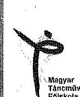
az 1997 évi vagyonkezelői szerződést is, amelyben a Kazinczy utcai ingatlan szerepel ${ }^{6}$. Az 57. oldalon leírtakkal ellentétben a Kazinczy utcai ingatlanon álló felépitmény soha nem került az önkormányzat tulajdonába. Véleményünk szerint a bérleti szerződésből egyértelmü, hogy csak a telekre vonatkozik.
2009. évi beszámoló 38 -as úrlapján intézményünk $146,2 \mathrm{M}$ Ft nem aktivált beruházást mutatott ki, a mérlegből való lemaradást nem szándékosság okozta. A beszámoló kitöltése, feltöltése, átadása időpontjában sem intézményünk, sem az akkori K11 túlellenőrzött rendszere, sem az átvevő felügyeleti szerv nem jelezte hibaként, hiányosságként. Különben azonnal intézkedtünk volna a probléma megoldása érdekében. A szóban forgó beruházást 2010-ben teljes összegében ( $162,6 \mathrm{M} \mathrm{Ft}$ ) az üzembe helyezést követően aktiváltuk, minden tekintetben rendeztük, a helyére került.
57. oldal: az általános észrevételekkel leírtakkal összhangba a 2009 és 2011 évi vagyonkezelési szerződéstetvezetek aláírásának elmulasztása nem kizárólag a Főiskola felelőssége, hanem az MNV Zzt. mulasztása is.
58. oldal: a büfé müködtetését végző vállalkozó átláthatósági nyilatkozatát a szerződés megkötésekor jogszabály még nem írta elő, az Nvtv. hatálybalépését megelőző szerződésekre maga a törvény adott mentességet. ${ }^{7}$ Az érintett szerződést 2011. február 24-én kötöttük.

Kérem, hogy amennyiben fenti észrevételeinket, vagy azok egy részét megalapozottnak találják, szíveskedjenek felülvizsgálni az Intézményünk gazdálkodási szabályszcrúségével kapcsolatban tett elmarasztaló megállapításaikat.

Budapest, 2014. augusztus 5.

Tisztelettel:
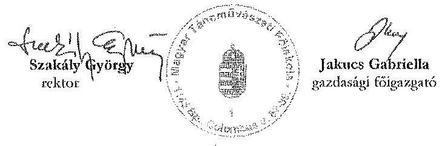

1592 Budapest
Pf: 472
+3612733434
+3612733433
info@mtf.hu
www.mtf.hu

Jakucs Gabriella gazdasági főigazgató

[^0]
[^0]:    ${ }^{6}$ Vagyonkezelői szerződés 370815/1997/0100.
    ${ }^{7} 2011$. évi CXCVI. törvény a nemzeti vagyonról 17. § (1) bekezdése

---

$\cdot$
$\cdot$
$\cdot$
$\cdot$
$\cdot$
$\cdot$
$\cdot$
$\cdot$
$\cdot$
$\cdot$
$\cdot$
$\cdot$
$\cdot$
$\cdot$
$\cdot$
$\cdot$
$\cdot$
$\cdot$
$\cdot$
$\cdot$
$\cdot$
$\cdot$
$\cdot$
$\cdot$
$\cdot$
$\cdot$
$\cdot$
$\cdot$
$\cdot$
$\cdot$
$\cdot$
$\cdot$
$\cdot$
$\cdot$
$\cdot$
$\cdot$
$\cdot$
$\cdot$
$\cdot$
$\cdot$
$\cdot$
$\cdot$
$\cdot$
$\cdot$
$\cdot$
$\cdot$
$\cdot$
$\cdot$
$\cdot$
$\cdot$
$\cdot$
$\cdot$
$\cdot$
$\cdot$
$\cdot$
$\cdot$
$\cdot$
$\cdot$
$\cdot$
$\cdot$
$\cdot$
$\cdot$
$\cdot$
$\cdot$
$\cdot$
$\cdot$
$\cdot$
$\cdot$
$\cdot

---

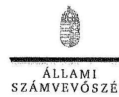

ELKÖX

Ikt.szám; V-0369-277/2014.

# Szakály György úr 

rektor
Magyar Táncmüvészeti Főiskola

## Budapest

## Tisztelt Rektor Úr!

A Magyar Táncmüvészeti Főiskola gazdálkodásának és müködésének ellenőrzéséről készittett jelentéstervezetre tett észrevételeit köszönettel megkaptam.

Az Állami Számvevőszék észrevételekre vonatkozó álláspontjáról a felügyeleti vezető által készitett részletes tájékoztatást csatoltan megküldöm.

Tájékoztatom Rektor urat, hogy az ÁSZ. tv. 29. § (3) bekezdése alapján a számvevőszéki jelentés mellékleteként szerepeltetjük a jelentéstervezethez tett figyelembe nem vett észrevételeket az elutasitás indokainak feltüntetésével.

Budapest, 2014.
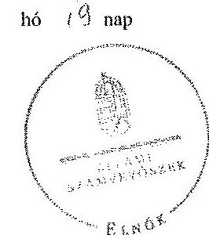

Tisztelettel:

## Domokos László

Melléklet: Tájékoztatás az elfogadott és a figyelembe nem veti észrevételekröl

---

# Tájékoztatás   az elfogadott és a figyelembe nem vett észrevételekről 

A Magyar Táncművészeti Főiskola gazdálkodásának és müködésének ellenőrzéséről készült számvevőszéki jelentéstervezethez az RH/270/1/2014. iktatószámú levélben tett észrevételeit köszönettel megkaptuk.

A jelentéstervezetre tett észrevételeket áttekintettük, azok kezeléséről a következő tájékoztatást adom:

## Általános észrevételek

Az ellenőrzést az Önök számára is megküldött, az Állami Számvevőszék elnöke által jóváhagyott program alapján folytattuk le. Amint azt a jelentéstervezet bevezetőjében is rögzítettük, a 2009-2012 közötti időszakra vonatkozó ellenőrzés célja a belső kontrollrendszer, a pénzügyi és vagyongazdálkodás szabályszcrüségének értékelése volt, nem pedig az egyes területek (pl. a beruházási tevékenység) folyamatainak elemzése.

Az intézmény pénzügyi helyzetének stabilitására, a vagyon gyarapodására vonatkozóan az öszszegző részben és a részletes megállapítások között egyaránt tettünk megállapításokat. A pénzügyi helyet stabilitása azonban önmagában nem jelenti az intézmény szabályszerü müködtetését.

A gyakori vezetőváltás és a fluktuáció valóban kockázatot jelent az intézmény müködésére nézve. A kockázatok csökkentésére ugyanakkor a zavartalan müködés érdekében még nagyobb hangsúlyt kell helyezni. Kiemelten fontos ilyen körülmények között a folyamatok teljes körü szabályozása és a szabályok betartatása. A szabályszerűséget érintő megállapításaink ezért ilyen részletesek.

A mintatételekkel kapcsolatos megállapítások alátámasztásánál, minősitésénél abból indultunk ki hogy a mintavételes ellenőrzés eredményét vettük alapul a sokaságra nézve (a kiértékelés eredményét az 5. számú melléklet tartalmazza). Ennek során meghatároztuk a mintában feltárt hibaarányhoz tarozó alsó és felső hibahatárokat (alsó határ = legvalószinűbb hiba - mintavétel maximális hibája; felső határ = legvalószinűbb hiba + mintavétel maximális hibája). A teljes sokaságban a hibás tételek aránya $95 \%$-os bizonyossággal az alsó és felső hibahatár közé esik.

A jogszabályoknak és a belső előírásoknak megfelelőnek, azaz szabályszerűnek tekintettük az adott kiadási elöirányzat felhasználását, bevétel beszedését, mérleglétel értékelését, amennyiben a minta alapján $95 \%$-os bizonyossággal megállapítható volt, hogy a teljes sokaságban a hi-

---

bás tételek aránya kisebb, mint $10 \%$, nem megfelelőnek értékeltük, ha a hibás tételek aránya a $10 \%$-ot meghaladta.

Amennyiben $95 \%$-os bizonyossággal nem volt egyértelmüen megállapítható a minta alapján, hogy az adott terület müködése megfelelő volt-e (az elfogadható hibaarány ( $10 \%$ ) az alsó és felső hibahatár közé esett), de a mintában a hibás tételek aránya kisebb volt, mint az elfogadható hibaarány ( $10 \%$ ), akkor kockázatosnak minősitettük az adott terület müködését. Ha a mintában a hibás tételek aránya nagyobb volt, mint az elfogadható hibaarány ( $10 \%$ ), akkor magas kockázatónak értékeltük az adott terület müködését.

A mintavételes ellenőrzés alapján tett megállapításoknál az ellenőrzött területre vonatkozóan megjelöltük a megsértett jogszabályhelyeket, illetve a hibatípusokat. A negatív megállapítások mellett ugyanakkor az értékelt terület pozitívumait is bemutattuk. Terjedelmi okok miatt a jelentéstervezetben az összes hibát tételesen nem mutathattuk be. Javaslataink a jelzett szabálytalanságok megszüntetését és a hibák kijavítását célozzák.

# Részletes észrevételek 

A mellékletek számszaki hibáit az észrevételét figyelembe véve javitottuk, az alábbiak szerint:

## 1. sz. melléklet:

A 2009. évre vonatkozóan a felhalmozási bevételek (25. sor) eredeti és módosított előirányzatának összegét a jelentéstervezet mellékletének 32. összegző sora nem tartalmazta. A javitást követően az eredeti előirányzat összeg 1109730 ezer Ft, a módosított előirányzat 1387957 ezer Ft.

A 2012. évre vonatkozóan a támogatásértékủ felhalmozási bevételek, továbbá az előző évi maradványátvétel módosított előirányzatának összegeit, az észrevételt figyelembe véve javítottuk. A támogatásértékủ felhalmozási bevételek összegét 91400 ezer Ft-ról 91404 ezer Ft-ra, az előző évi maradvány átvétele sort 4699 ezer Ft-ról 4669 ezer Ft-ra. Ezáltal a módosított előirányzatok 2012. évi összesen sora 1276007 ezer Ft-röl, 1275981 ezer Ft-ra módosult.

## 2. sz. melléklet:

A 2012. évre vonatkozó adatok között a 8. sorban a normatív és teljesítéshez kötött jutalom összegét 76 ezer Ft-ra javitottuk, a 48. sorban a hozam és kamatbevételeket 680 ezer Ft-ra. Az utóbbi pontositásnak megfelelően az időbeli változást kifejező viszonyszám $15200,0 \%$-ról 17000,0\%-ra módosult. A táblázat 35-37. felújításra vonatkozó soraiban szereplő összegeket a megnevezésnek megfelelően kiegészítettük az áfa összegeivel. Mivel az ellenőrzött időszakban a felújítások csak az ingatlanokat érintették az ingatlan felújítások (áfával) sor összege megegyezik a 35. sorban szereplő felújítások összegével. A jelentések mellékletei minden felsőoktatási intézményt érintő ellenőrzésre vonatkozóan azonos felépítésüek. Emiatt az irányítószervtől kapott támogatás megbontására vonatkozó javaslatukat a 2. sz. mellékletben nem érvényesítjük.

---

# 3. sz. melléklet 

A 2009. évre vonatkozó előző évi előirányzat-maradvány, pénzmaradvány átvétel 63781 ezer Ft-os összegét a 33. sorban tévesen tüntettük fel. Észrevétele alapján az összeget a 34. sorban szerepeltetjük. A 2009. és 2010.évre vonatkozóan a 36. és 38. sor adatait - észrevételüknek megfelelően - a nettó összegekre módosítottuk, a 48. sor egyidejű helyesbítésével. A 3. sz. melléklet (CLF táblázat) müködési és felhalmozási célú előirányzat-maradvány igénybevételével történő kiegészítése nem áll módunkban, tekintettel a CLF módszernek az értelmező szótárnak megfelelő, egységes alkalmazására. A CLF módszer lényege, hogy a folyó (tárgyévi) bevételeket és kiadásokat és ezek egyenlegeit mutatja be, a módszer egységes alkalmazása nem teszi lehetővé az előző évi maradvány-felhasználás bevételek közötti bemutatását. Ugyanakkor az adatok a 3. melléklet tájékoztató adatai között szerepelnek, valamint az 1. és 2. számú melléklet a bevételek között egyértelműen bemutatja az előző évi maradvány igénybevétel összegeit.

Az intézmény belső kontrollrendszerének kiépítése és müködtetése témakörhöz kapott észrevételeket nem áll módunkban elfogadni az alábbi indokok szerint:
32. oldal: az SZMSZ tartalmát érintő hiányosság akkor is fennáll, ha azt a fenntartó eddig nem kifogásolta. A hiányosságra vonatkozó megállapítás mellett lábjegyzetben pontosan feltüntettük a megsértett jogszabályhelyet.
33. oldal: Az önköltségszámításra vonatkozó szabályozási hiányosságokkal kapcsolatos megállapításokat a megsértett jogszabályhelyek feltüntetésével támasztottuk alá.
35. oldal: A második bekezdésben egyértelműen rögzítettük, hogy a monitoring rendszer az annak részét képező belső ellenőrzés hiányosságai miatt nem volt megfelelő. A monitoring rendszer pozitívumait is megállapítva, az adott oldal 5-8. bekezdései, továbbá a 36. oldal első bekezdése részletesen kifejti a belső ellenőrzési rendszer hiányosságait.
36. oldal: Az intézmény SZMSZ-ének 9. fejezete a közérdekủ adatok nyilvánosságáról, nem pedig a külső és belső közérdekủ bejelentések kezeléséről rendelkezik. Az Intézményfejlesztési Terv pedig csak azt rögzíti, hogy a kinek a hatáskörébe tartozik a tanulmányi ügyekhez kapcsolódó panaszok bejelentésének elbírálása. A közérdekủ bejelentések kezelését meghatározó eljárásrend hiányára vonatkozó megállapítás módosítása a fentiek miatt nem indokolt.

A pénzügyi gazdálkodás minősítésére vonatkozó tájékoztatásunkat az általános észrevételek részben fejtettük ki.

Az intézmény pénzügyi gazdálkodásával kapcsolatos észrevételeit egy kivétellel elfogadtuk:
39. oldal: A 2. sz. melléklet javítása az elemzés adatait nem érintette. Az 1. sz. melléklet adatainak változása miatt a 37. oldalon a saját bevételek eredeti előirányzatának összegét 193,1 M Ft-ról 195,6 M Ft-ra javitottuk.

---

40. oldal: Észrevételét figyelembe véve a létszámadatokat a Bevezető rész táblázatában feltüntetett, a beszámolókban szereplő adatokkal megegyezően szerepeltetjük (az összegzőből a vonatkozó megállapítást törölttük, ugyanakkor a részletes megállapítások között az alábbiak szerint módosítottuk a vonatkozó mondatot):
„Az átlagos statisztikai létszám 204 fơröl 195 före, 4,4\%-kal csökkent."
A korábbi megállapítás a részmunkaidőben, a tartós távollévők státuszában, valamint a teljes munkaidőben az adott évben be-, és kilépő foglalkoztatottak adatait is tartalmazó kimutatásra épült. Az összesen adatok emiatt haladták meg az átlagos statisztikai létszám értékeit.

A 3. sz. melléklet (CLF táblázat) adatainak módosítása a kapcsolódó megállapításokat nem befolyásolja.

# 41. oldal: 

Az észrevételt figyelembe véve a harmadik bekezdés utolsó két mondatát az alábbiak szerint módosítottuk:
„A felhalmozási költségvetés egyenlege a 2009. és a 2012. évek között összesen 246,4 M Fi negatív értéket mutatott, mert a felhalmozási kiadások valamennyi vizsgált évben meghaladták a felhalmozási bevételeket. Ezt a felhalmozási bevételek és a felhalmozási kiadások teljesitése közötti ütemkülönbség okozta."

A bevételi és kiadási előirányzatok megállapításával, módosításával, az előirányzatmaradványok kezelésével kapcsolatos észrevételei alapján a jelentéstervezet szövegét az alábbiak szerint pontositottuk:
42. oldal: A megállapítás hangsúlyozottan az előirányzat-maradvány kimutatásának szabálytalanságára vonatkozik. Arról, hogy a költségvetési év végén keletkezett elöirányzat-maradványt - a jogosultsági elszámolást követően - kötelezettségvállalással terhelt előirányzatmaradványnak kell tekinteni, az Nftv. 115. § (9) bekezdés b) pontja rendelkezett egyértelműen. A felsőoktatásról szóló - korábban hatályban lévő - 2005. évi CXXXIX. törvény 120. § (3) bekezdése erről kifejezetten nem rendelkezett. Ebből adódóan megítélésünk szerint az előirány-zat-maradvány azon részét, amelyekre a tárgyév végéig nem történt meg a kötelezettségvállalás a 2009-2011. évi beszámolókban helytelen volt kötelezettségvállalással terhelt maradványként kimutatni. A kimutatási hiányosság egyértelműsítése céljából a 42. oldal utolsó bekezdését az alábbiak szerint pontositottuk:
„Az intézmény a felhasználható előirányzat-maradványt nem szabályszervien mutatta ki. A 2009-2011. évek beszámolóiban olyan összegeket is kötelezettségvállalással terhelt

---

maradványként szerepeltetett, amelyekre a kötelezettségvállalás a tárgyévet követő évben meg, Ez ellentétes volt a vonatkozó jogszabályokkal ${ }^{1}$."
43. oldal: A jelzett szövegrészben elírás történt. Az észrevétel alapján, az alábbiak szerint javítottuk:
„...az MTF elöirányzat-maradványa terhére vállalt kötelezettségek Kincstárhoz történő bejelentése határidőre teljes körüen nem történt meg."

A kiadási elöirányzatok felhasználásával kapcsolatos észrevételeit egy pontositás kivételével nem áll módunkban elfogadni az alábbi indokok szerint:
44. oldal: A kiadási elöirányzatok felhasználására vonatkozó hiányosságokat a számvevők a mintatételek ellenörzése során, a föiskola által rendelkezésre bocsátott dokumentumok alapján tárták fel. Ennek során megállapították, hogy egy 2011. november 30 -án, illetve 2012. szeptember 30 -án kilépett dolgozójuk felsőfokú végzettség nélkül volt gazdasági területen vezető beosztásban. Egy 2013. június 30 -án kilépett tánctanárként foglalkoztatott dolgozó esetében a dolgozó végzettségét alátámasztó dokumentumot az ellenőrzés részére nem tudtak bemutatni. A további megállapítás nem az oktatók illetményére, hanem a kinevezési okmányokban a Kjt. 21. § (3) bekezdésében elöirtak hiányára vonatkozik.

A cafetéria juttatásokhoz kapcsolódó észrevételét nem tudjuk figyelembe venni, mivel jelentésünkben a 2009-2012. közötti időszakról mondunk véleményt, és az ellenőrzés megállapításai szerint jogszerütlen béren kívüli juttatások nyújtása az ellenőrzött időszak több évében is elöfordult.

A megbízási díjakkal kapcsolatos hiányosságokra vonatkozó észrevétel alapján a 22. oldal utolsó és a 44. oldal negyedik bekezdésében az utolsó két mondatot törölttük:
„Több esetben nem történt meg a kötelezettségvállalás pénzügyi ellenjegyzése. Ez felveti a fedezet nélküli kötelezettségvállalás és a jogosulatlan kifizetés kockázatát."

A vonatkozó jogszabályi előirások szerint (Ámr. 135. § (2) bekezdés, Ámr. 76. § (3) bekezdés, Ávr. 57. § (3) bekezdés) a teljesítést az igazolás dátumának és a teljesítés tényére vonatkozó utalás megjelölésével az arra jogosult személy aláírásával kell igazolni.
45. oldal: Mint azt az általános észrevételek címủ részben kifejtettük az egyes területek szabályszerűségét mintavétellel ellenőriztük. Amennyiben a mintában elöforduló hibás tételek aránya meghaladta az elfogadható hibahatárt, az adott terület müködésének szabályszerűségét nem megfelelőnek minősítettük. A felhalmozási kiadások előirányzatainak felhasználását érintő hiányosságokat, a megsértett jogszabályok feltüntetésével a 45. oldalon részletesen szerepeltetük.

[^0]
[^0]:    ${ }^{1}$ Ámr. 66. § (10) bekezdése, Ámr. 210. § (1) bekezdése

---

46. oldal. A vendégszobákkal kapcsolatos észrevétel nem fogadható el. A számvevői megállapítások alapján a Csantavér utcai vendégházban négy lakást a művészképzésben részt vevő külföldi hallgatók számára adtak bérbe, nem alkalmankénti igénybevételről volt szó. A bérlőkkel nem kötöttek mindkét fél jogait, kötelességeit tartalmazó megállapodást, a vendégszobák bérbeadásának eljárásrendjét belső szabályzatban sem határozták meg.

A 2009-2011. közötti időszakban a szabálytalan valutakezeléssel több - az érintett bekezdésben feltüntetett - jogszabályt súlyosan megsértettek.

A mellékelt jegyzőkönyvek alapján a GT a 2011. és 2012. évi költségvetéseket megismerte, ugyanakkor a beküldött dokumentumok alapján nem véleményezte. Mindezek alapján a 46. oldal érintett bekezdésének módosítása nem indokolt.
48. oldal: Az önköltségszámítással kapcsolatos szabálytalanságokhoz kapcsolódó megállapításainkat minden esetben a megsértett jogszabályokra való hivatkozással támasztottuk alá.

# Az intézmény vagyongazdálkodásával kapcsolatos észrevételeit egy kivétellel nem áll módunkban elfogadni az alábbi indokok alapján: 

48. oldal: Az intézmény vagyonának, kiemelt vagyonelemeinek változását az ellenőrzött időszak elejétől értékeltük. A teljes vagyon (mérlegfőösszeg), továbbá a befektetett és a forgóeszközök változására vonatkozó mutatók nem a - 4. melléklet szerinti - 2009. évi záró adatokhoz viszonyítottak, hanem a beszámoló mérlegében feltüntetett nyitó adatokhoz. Mint azt a 48. oldal 4. pontjának második bekezdésében is feltüntettük, a vagyonváltozás további részletes elemzését a 4. számú melléklet alapján végeztük.
49. oldal: Az érintett megállapítás nem a bérleti szerződésekre, hanem a bérbeadási tevékenységet érintő szabályzat hiányosságára vonatkozik.

51-52. és 54. oldal: A Kazinczy utcai épületre vonatkozó megállapításokat a jelentéstervezet dokumentumokra alapozottan rögzíti. Az Önök által csatolt 370815/1997/0100. számú vagyonkezelői szerződést 2004. március 30-án a 370815/2004/0120. sz. közös nyilatkozattal módosították. A 9. sz. melléklet rögzítette, hogy a Kazinczy utcai ingatlant a korábbi vagyonkezelési szerződésben tévesen tüntették fel vagyonkezelt ingatlanként. Az MTF az MNV Zrt.-vel a vagyonkezelői szerződést - többek között a Kazinczy utcai épület tisztázatlan tulajdoni viszonyára hivatkozva - nem kötött. Nem áll rendelkezésre olyan dokumentum, amely a felépitményen az MTF vagyonkezelői jogát igazolná.

A 2009. évi befejezetlen beruházásokra vonatkozó tájékoztatásukat köszönettel vettük. Ez azonban a jelentéstervezet megállapításainak módosítását nem igényli.
57. oldal: A vagyonkezelési szerződéseket érintő hiányosságok körülményeit megjelenítő megállapításokból kiderül, hogy nem kizárólag a föiskola mulasztásáról van szó.
58. oldal: Az átláthatósági nyilatkozat hiányára vonatkozó megállapításunkat fenntartjuk. A nemzeti vagyonról szóló 2011. évi CXCVI. törvény 17. § (1) bekezdése valóban tartalmazza,

---

hogy a törvény hatálybalépését megelőzően jogszerűen és jóhiszemủen szerzett jogokat és kötelezettségeket a törvény rendelkezései nem érintik. Ugyanakkor a 18. § (2) bekezdése elöirta, hogy aki a nemzeti vagyonnak a törvény hatálybalépését megelőzően kötött, a hatálybalépéskor fennálló szerződés alapján használója, 2012. december 31-ig köteles feltárni a 3. § (1) bekezdés 1. pontja szerint a tulajdonosi szerkezetét. Ennek megfelelően a jelentéstervezet vonatkozó részeit pontositottuk:
„A jogszabályi elöirástól eltérően nem győződtek meg az átláthatóság követelményének érvényesüléséről, a tulajdonosi szerkezet feltárásáról a bérbeadási folyamat során 2012. év végéig. (25. oldal)"
„Az MTF a bérbeadási folyamat során nem győződött meg az átláthatóság követelményének érvényesüléséről, a bérlök tulajdonosi szerkezetéről 2012. december 31-ig az Nviv. 18. § (2) bekezdésében foglaltak ellenére." (29. oldal)
„Érvényesítse az eszközök bérbeadással történő hasznositása során az átláthatóság követelményét, a szerzödő felektől megkövetelve a tulajdonosi szerkezet feltárását." (29. oldal, 3/c javaslat)
„A föiskola nem érvényesitette az átláthatóság követelményét, mivel a bérlő nem tárta fel tulajdonosi szerkezetét 2012. december 31-ig az Nviv. 18. § (2) bekezdésében foglaltak ellenére." (58. oldal)

Kérem a válaszlevelemben foglaltak szíves tudomásulvételét. Tájékoztatom Rektor urat, hogy a számvevőszéki jelentés mellékleteként szerepeltetjük a jelentéstervezethez tett észrevételeit, valamint az ÁSZ. tv. 29. § (3) bekezdése alapján a figyelembe nem vett észrevételeket az elutasítás indokának feltüntetésével együtt.

Végül megköszönöm Rektor úrnak és munkatársainak az ÁSZ ellenőrzés sikeres elvégzéséhez nyújtott támogatását.

Budapest, 2014. 08 hó 19 nap

Horváthné Herbảth Mária
felügyeleti vezető