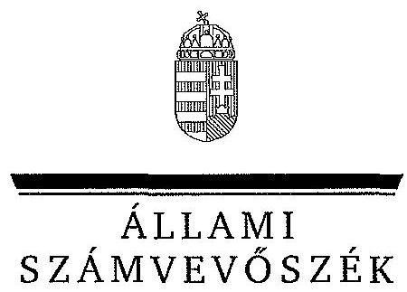
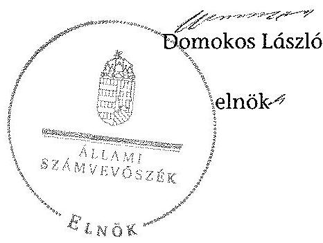
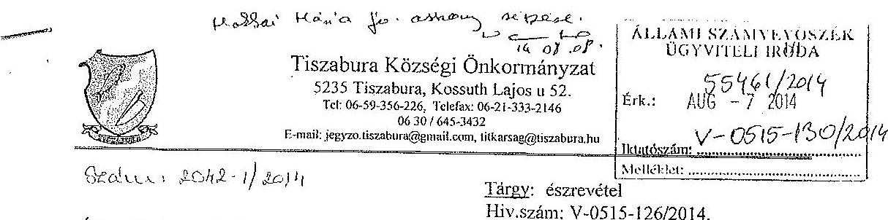
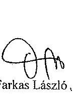
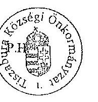
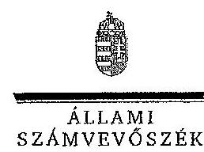

ÁLLAMI
SZÁMVEVŐSZÉK

# JELENTÉS 

az önkormányzatok vagyongazdálkodása szabályszerűségének ellenőrzéséről

Tiszabura

---

# Állami Számvevőszék 

Iktatószám: V-0515-133/2014.
Témaszám: 1549
Vizsgálat-azonosító szám: V065114

## Az ellenőrzést felügyelte:

## Makkai Mária

felügyeleti vezető
Az ellenőrzést vezette és az ellenőrzés végrehajtásáért felelős:
Schósz Attila Ferencné
ellenőrzésvezető
A számvevőszéki jelentés összeállításában közreműködött:
Horváth József
számvevő főtanácsos
Az ellenőrzést végezték:

| Horváth József | Temesváry Miklós |
| :-- | :-- |
| számvevő főtanácsos | számvevő tanácsos |

---

# TARTALOMJEGYZÉK 

BEVEZETÉS ..... 3
I. ÖSSZEGZŐ MEGÁLLAPÍTÁSOK, KÖVETKEZTETÉSEK, JAVASLATOK ..... 6
RÉSZLETES MEGÁLLAPÍTÁSOK ..... 13

1. A vagyongazdálkodási tevékenység szabályozása ..... 13
1.1. A vagyongazdálkodási tevékenység szabályozásának megfelelősége ..... 13
1.2. A vagyon használatba és üzemeltetésbe adásának, a vagyonkezelői jog gyakorlásának szabályszerűsége ..... 16
2. A vagyongazdálkodási tevékenység szabályszerűsége ..... 17
2.1. A vagyon nyilvántartása, a vagyon összetételének változása ..... 17
2.1.1. A vagyon nyilvántartásának megfelelősége ..... 17
2.1.2. A vagyon értékének és összetételének változása ..... 19
2.2. A térítés nélküli vagyon átadás és átvétel szabályszerűsége ..... 21
2.3. A beruházási, felújítási döntések és végrehajtásuk szabályszerűsége ..... 22
2.4. Az Önkormányzat tartós részesedéseivel való gazdálkodás ..... 23
2.5. A vagyon értékesítésének, hasznosításának, a követelés elengedésének szabályszerűsége ..... 24
2.6. Az Önkormányzat tulajdonosi joggyakorlása és a Nemzetiségi Önkormányzattal történő vagyongazdálkodást érintő közös feladatok ..... 27
MELLÉKLETEK
3. számú Tiszabura Község Önkormányzata vagyonának főbb adatai 2009. január 1-je és 2013. december 31-e között
4. számú Tiszabura Község Önkormányzata polgármesterének észrevétele
5. számú Tiszabura Község Önkormányzata polgármesterének észrevételére adott válasz

## FÜGGELÉKEK

1. számú Rövidítések jegyzéke

---

.

---

# JELENTÉS 

## az önkormányzatok vagyongazdálkodása szabályszerűségének ellenőrzéséről Tiszabura

## BEVEZETÉS

Az ÁSZ kiemelten fontosnak tartja az ÁSZ tv. 5. § (4) bekezdésének a) pontja és (5) bekezdése, valamint az Áht. ${ }_{2} 61 . \S$ (2) bekezdése alapján az önkormányzati vagyon kezelésének, a vagyonnal való gazdálkodási szabályok betartásának az ellenőrzését. Az ellenőrzés feladata a vagyongazdálkodással kapcsolatban a közpénzek átláthatósága, nyilvánossága érdekében a jogszabályokban, belső szabályzatokban megfogalmazott előírások érvényesülésének áttekintése. Az ÁSZ nem csak az ellenőrzött szervezet vagyongazdálkodásának a hibáira mutat rá, számon kérve azok kijavítását, hanem megállapításaival, javaslataival segíti a közpénzzel, a közvagyonnal való felelős gazdálkodást.

Az önkormányzati vagyon alapvető funkciója, hogy a közérdeket és egyúttal az önkormányzati célok megvalósítását szolgálja. A feladatellátás terén elsősorban a kötelezően ellátandó feladatok végrehajtását hivatott szolgálni, amely mellett az önként vállalt feladatok ellátása is megvalósulhat.

Az ÁSZ stratégiájában hangsúlyos szerepet szán annak, hogy szilárd szakmai alapon álló, értékteremtő ellenőrzéseivel előmozdítsa a közpénzügyek átláthatóságát, rendezettségét. Az ÁSZ a vagyongazdálkodás ellenőrzésén keresztül közreműködik az integritás alapú közigazgatási kultúra kialakításában.

Az ellenőrzés célja annak megállapítása volt, hogy a települési önkormányzat vagyongazdálkodási tevékenységének szabályozottsága és tevékenysége a jogszabályi előírásokkal összhangban volt-e, átlátható, a jogszabályi előírásoknak megfelelő volt-e a vagyon nyilvántartása.

Ennek keretében értékeltük, hogy az Önkormányzat:

- szabályszerűen alakította-e ki a vagyongazdálkodási tevékenységének kereteit;
- biztosította-e a vagyongazdálkodás szabályszerűségét, megalapozottan hozta-e, és jogszerűen, szabályszerűen hajtotta-e végre a vagyonváltozást eredményező meghatározó jelentőségű döntéseket;
- gondoskodott-e az általa alapított vagy tulajdonosi részvételével működő gazdasági társaságokkal kapcsolatos tulajdonosi joggyakorlásról.

---

Az ÁSZ a 2013. év folyamán az Önkormányzatnál ellenőrizte az Önkormányzat belső kontrollrendszere kialakítását, egyes kontrolltevékenységek és a belső ellenőrzés működését, valamint a Nemzetiségi Önkormányzat gazdálkodását.

Az ellenőrzés típusa: szabályszerűségi ellenőrzés.
Ellenőrzött időszak: az ellenőrzés 2009. január 1-je és 2013. december 31. közötti időszakra terjedt ki, kitekintéssel a helyszíni ellenőrzés befejezéséig (2014. május 10-ig) tartó időszak releváns folyamataira. Az Nvtv. egyes rendelkezései végrehajtásának ellenőrzése 2012-től, a helyszíni ellenőrzés befejezéséig tartott.

# Ellenőrzött szervezet: Tiszabura Község Önkormányzata 

Az ellenőrzés szakmai módszertana az ÁSZ hivatalos honlapján közzétett szakmai szabályokon alapult, amely a Legfőbb Ellenőrző Intézmények Nemzetközi Szervezete (INTOSAI) által kiadott nemzetközi standardok (ISSAI) figyelembevételével készült.

Az ellenőrzést az ÁSZ hatályos szervezeti szabályai és az ellenőrzési programban foglalt értékelési szempontok szerint folytattuk le. Megállapításainkat a helyszíni ellenőrzés tapasztalataira, az ellenőrzött szervezettől bekért dokumentumokra, a kitöltött tanúsítványok elemzésére, az adott időszakban hatályos jogszabályok és belső szabályzatok előírásaira alapoztuk.

Tiszabura község lakosainak száma 2013. január 1-jén 3075 fő volt. A 2010. évi önkormányzati választásokig a 10 tagú Képviselő-testület munkáját öt állandó bizottság segítette. Az önkormányzati választások után a Képviselőtestület létszáma hét főre csökkent, és továbbra is öt állandó bizottság működött. A polgármester a 2002. évi önkormányzati választások óta tölti be tisztségét, a jelenlegi jegyző 2012. december 15-től látja el feladatait.

Az Önkormányzat az ellenőrzött időszakban az önállóan működő Egészségügyi Intézmény megszűntetéséről döntött az egészségügyi ágazatban, továbbá az oktatási ágazatban az általános iskolát adta át vagyonkezelésbe. Az Önkormányzat a 2013. év végén a Polgármesteri hivatalon felül két részben önállóan működő költségvetési szervvel (az Általános Művelődési Központtal és a Gondozási Központtal) látta el a feladatait. A Polgármesteri hivatal szervezeti egységekre nem tagolódott, elkülönített gazdasági szervezettel nem rendelkezett.

Az Önkormányzat a 2009-2013. évek között vállalkozási tevékenységet nem végzett, haszonélvezeti és koncessziós jogot alapító szerződést nem kötött. PPP konstrukcióban történő fejlesztésre az ellenőrzött időszakban nem került sor.

Az Önkormányzat a 2009-2013. évek között egy gazdasági társaságban, az Esély Nonprofit Kft.-ben rendelkezett minősített többségi tulajdonnal (96,7%-kal). A 3 millió Ft törzstőkéjű gazdasági társaságban a kisebbségi tulajdonos a Nemzetiségi Önkormányzat volt. Az Esély Nonprofit Kft. az Önkormányzat kötelező feladatai közül a 2009-2010. években a kommunális hulladék begyűjtését, a 2009-2013. években a gyermek- és előfizetéses étkeztetést, valamint a vízi közmű üzemeltetését végezte.

---

Az Önkormányzat vagyonának főbb adatait az 1. számú melléklet mutatja be. Az alkalmazott rövidítéseket az 1. számú függelék tartalmazza.

Az ÁSZ a 2011. évi LXVI. törvény 29. §-a szerint a jelentéstervezetet megküldte Tiszabura Község Önkormányzata polgármesterének egyeztetésre. A polgármester észrevételét és az arra adott választ a jelentés 2-3. számú mellékletei tartalmazzák.

---

# 1. ÖSSZEGZŐ MEGÁLLAPÍTÁSOK, KÖVETKEZTETÉSEK, JAVASLATOK 

Az Önkormányzat könyvviteli mérleg szerinti vagyona a 2009. évi 460,6 millió Ft-os nyitó értékről 2013. év végére 538,0 millió Ft-ra, 16,8%-kal növekedett, elsősorban az üzemeltetésre átadott eszközök és a pénzeszközök értéke miatt. Az eszközökön belül a tárgyi eszközök csökkentek, mivel az iskola fenntartással kapcsolatos eszközök átadott értéke nagyobb volt, mint az ellenőrzött időszakban végrehajtott felújítások és beruházások aktivált értéke. Az Önkormányzat összes kötelezettségének értéke az ellenőrzött időszakban közel ötszörösére emelkedett, 2013. december 31-én 514,3 millió Ft volt, amelyből a rövid lejáratú (elsősorban a szállítók felé fennálló) kötelezettség 495,1 millió Ftot tett ki. Az Önkormányzat ellen 2011 júniusában adósságrendezési eljárás indult, mely az ÁSZ helyszíni ellenőrzésének befejezéséig (2014. május 10-ig) nem zárult le.

A polgármester és a jegyző ${ }_{1,2}$ nem biztosította a közpénzek felhasználásának átláthatóságát, megsértve az Áht. ${ }_{1}$, az Eisztv. és az Info tv. előírásait. A polgármester az önkormányzati képviselők és polgármesterek 2010. évi általános választását megelőzően nem tett közzé tájékoztatót az Önkormányzat vagyoni és pénzügyi helyzetéről, a Képviselő-testület megalakulását követően keletkezett, későbbi éveket terhelő pénzügyi kötelezettségekről. A jegyző ${ }_{1,2}$ a 2009-2013. években nem gondoskodott a céljellegű támogatások, a vagyonnal való gazdálkodásra vonatkozó szerződések adatainak, valamint a költségvetési, zárszámadási rendeletek és elemi költségvetések, beszámolók közzétételéről. Mindezek az Önkormányzatnál növelték a korrupció kockázatát.

A Képviselő-testület a 2009-2013. évek között a vagyongazdálkodási feladatokat, vagyongazdálkodási tevékenységének kereteit - a Htv.-ben foglalt előírás ellenére - hiányosan szabályozta. Az Áht. ${ }_{1}$-ben, illetve az Nvtv.-ben előírtak ellenére - 2013. március 19-ig rendeletben - nem határozta meg azt az értékhatárt, amely alapján vagyonértékesítést, vagyonkezelési jogot, a vagyon használatát, hasznosítás jogát átengedni csak nyilvános pályázat útján lehet. Az Önkormányzat az Nvtv.-ben rögzített - 2012. március 1-jei - határidőn túl, közel egy éves késéssel határozta meg azon vagyonelemeket, amelyeket nemzetgazdasági szempontból kiemelt jelentőségű forgalomképtelen törzsvagyonnak minősített. Az Önkormányzat a vagyongazdálkodási rendelet ${ }_{1}$-ben - az Ötv. előírása ellenére - nem rendelkezett a vagyonkezelői jog részletes szabályairól, mely hiányosságot (2013. március 20-án) a vagyongazdálkodási rendelet ${ }_{2}$-ben pótolt. A vagyongazdálkodási rendelet ${ }_{2}$-ben - az Nvtv.-ben foglaltaktól eltérően - az egyes vagyonelemeket tételesen nem sorolta be forgalomképtelen, korlátozottan forgalomképes, illetve üzleti vagyon kategóriába. Az Önkormányzat nem készítette el az Nvtv.-ben előírt közép- és hosszú távú vagyongazdálkodási tervét.

Az Önkormányzatnál a vagyon leltározásának módját - a 2010. évtől az üzemeltetésre átadott eszközök kivételével - a 2009-2013. évek között az Áhsz. ${ }_{1}$ előírásainak megfelelően szabályozták. A 2010. évtől az üzemeltetésre átadott

---

eszközök leltározási módjának szabályozása nem felelt meg az Áhsz.-ben foglaltaknak, mivel nem írták elő, hogy az üzemeltetés végző szervezet leltározzon.

Az Önkormányzat az ellenőrzött időszakban vagyongazdálkodási tevékenységének szabályszerűségét nem biztosította. Az Önkormányzat - az Áhsz.-ben foglaltak ellenére - a beruházási, felújítási kiadásokat (10,3 millió Ft összegű kazánbeszerzést, 58,9 millió Ft óvoda beruházást, valamint képviselő-testületi határozat nélkül 7,6 millió Ft iskola felújítást,) a pénzügyi teljesítéssel egyidejűleg, üzembe helyezés nélkül aktiválta a részszámla, előlegszámla alapján. Az Önkormányzat az éves beszámolóiban ennek következtében beruházást, felújítást nem mutatott ki. A helytelen aktiválás miatt az értékcsökkenés elszámolásának kezdő időpontja nem felelt meg az Áhsz.-ben foglaltaknak.

Az önkormányzati vagyon értékesítése és hasznosítása az ellenőrzött értékesítéseknél nem a jogszabályoknak és a belső szabályoknak megfelelően történt. A 2009. évben 1,2 millió Ft értékben történt gépkocsi értékesítéséről a hatáskörrel rendelkező Képviselő-testület helyett - az Ötv.-ben és a vagyongazdálkodási rendelet ${ }_{1}$-ben foglalt hatásköri szabályok ellenére - az alpolgármester döntött. A Képviselő-testület a 2009. évben három lakás értékesítéséről döntött, összesen 5,8 millió Ft értékben. Kettő esetben társasházzá alakították azon ingatlanokat, amelyben az értékesítéssel érintett lakások voltak, de a számviteli nyilvántartásban nem vezették át a változást, azokat továbbra is egy ingatlanként tartották nyilván. Az értékesített ingatlanokon közvetlenül az értékesítést megelőzően, illetve azt követően is 5,6 millió Ft összegben felújítási munkákat végeztek a hatáskörrel rendelkező Képviselő-testület döntése nélkül. A polgármester a felújításokról az Ötv.-ben és a vagyongazdálkodási rendelet ${ }_{1}$-ben foglalt szabályok ellenére, a Képviselő-testület hatáskörét elvonva döntött. Az aktiválás alapját képező számlák anyagvásárlásról szóltak. Kivitelezési szerződés, munkadíj számla hiányában nem állapítható meg a munka elvégzésének valóságtartalma, a megvásárolt anyagok beépítésének megtörténte, továbbá a két társasházzá nyilvánított ingatlan esetében az, hogy ténylegesen az önkormányzati tulajdonban maradó, vagy az értékesített lakással kapcsolatban merültek fel.

Az Önkormányzat a 2011. évben döntött arról, hogy a tiszaburai „technika házát" az Esély Nonprofit Kft. részére értékesíti, a gazdasági társaság felé fennálló bruttó 5,2 millió Ft (4 db szállítói számla) tartozásának kiegyenlítése érdekében. A felek az ellenértékként felajánlott ingatlan 8,0 millió Ft könyvszerinti nettó értékével szemben 4,0 millió Ft+áfa összegben egyeztek meg, továbbá az Önkormányzat 0,2 millió Ft kötelezettség későbbi megfizetését vállalta. Az Önkormányzat Esély Nonprofit Kft. felé fennálló kötelezettsége az ellenőrzött időszakban tovább nőtt, a gazdasági társaság az adósságrendezési eljárás keretében 16,4
 millió Ft-ot követel az Önkormányzattól.

A Képviselő-testület az Adósságrendezési Bizottság egyetértésével a 2012. évben döntött egy külterületi föld 430 e Ft összegben történő értékesítéséről a Nemzetiségi Önkormányzat részére. A földterület értékesítéséről adás-vételi szerződés nem készült. A vevő az ellenértéket átutalta, az Önkormányzat a számviteli nyilvántartásában - a Számv. tv.-ben a bizonylatok szabályszerűségére vonatkozó előírásokat megsértve - a bankkivonat alapján értékesítésként lekönyvelte. Az ingatlanon elidegenítési tilalom állt fenn a Belügyminisztériumtól nyert pályázati támogatás következtében. Az Önkormányzat a támogatás összegével úgy számolt el, hogy az eladásról a támogatót nem tájékoztatta.

Az Önkormányzat az Esély Nonprofit Kft.-vel - a gyermek- és előfizetéses étkeztetésre - kötött szerződésben foglalt bérleti díjat nem számlázta ki és a fizetés teljesítésére nem szólította fel a gazdasági társaságot. A helyszíni ellenőrzés időpontjáig ki nem számlázott (64 havi) bérleti díj összege 1,9 millió Ft+áfa volt. Figyelembe véve, hogy az Önkormányzat adósságrendezési eljárás alatt áll, ezen összeg, mint jogszerű követelés, hitelezői fedezetelvonást jelent. Az Esély Nonprofit Kft. - megalakulásától 2010. év végéig, valamint 2012. év elejétől - az Önkormányzat épületében egy irodahelyiséget használ székhelyéül, mely után bérleti-, közüzemi díjakat nem fizet, az Önkormányzat infrastruktúráját használja. Az irodahelyiség használatára, a közüzemi díjak térítésére vonatkozóan a Képviselő-testület határozatot nem hozott, a használattal kapcsolatban szerződést nem kötöttek. Az előzőek következtében az önkormányzati vagyonnal történő felelős és jogszerű gazdálkodás nem valósult meg.

A 2010-2012. évi vagyonkimutatások felépítése és tartalma nem felelt meg az Áhsz. ${ }_{1}$-ben foglaltaknak. Azok nem tartalmazták az önkormányzati vagyont törzsvagyon és törzsvagyonon kívüli egyéb vagyon bontásban, továbbá az eszközök közül a befektetett pénzügyi eszközöket, a követeléseket, a pénzeszközöket, valamint nem mutatták be a forrásokat és a „0"-ra leírt eszközök állományát. A jegyző ${ }_{1,2}$ az ellenőrzött időszakban a számviteli nyilvántartás ingatlanvagyon adatainak az ingatlanvagyon-kataszter és az illetékes földhivatal adataival való egyezőségét - a 147/1992. (XI. 6.) Korm. rendeletben, valamint a vagyongazdálkodási rendelet ${ }_{1,2}$-ben foglalt előírások ellenére - nem biztosította. Két ingatlan társasházakká alakítása nem került átvezetésre a számviteli nyilvántartásban, illetve egy külterületi ingatlan kivezetése adásvételi szerződés nélkül történt meg.

Az üzemeltetésre átadott eszközök leltározását az Áhsz. ${ }_{1}$ bekezdésében előírtakat figyelmen kívül hagyva - a 2010-2013. években - nem az üzemeltetők, hanem az Önkormányzat végezte. Az ellenőrzött időszakban az éves költségvetési beszámoló mérlegeinek leltárral való alátámasztása nem volt megfelelő. Az Önkormányzat azáltal, hogy az eszközöket nem az Áhsz. ${ }_{1}$ előírásainak megfelelően aktiválta, beszámolójában beruházás helyett tárgyi eszközként mutatta ki a helytelenül aktivált eszközöket. Az Esély Nonprofit Kft.-ben lévő részesedését 2,8 millió Ft-tal kevesebb összegben tartotta nyilván, illetve az üzemeltetésre (az étkeztetési feladatokhoz és a vízi közműhöz) átadott eszközöket nem a megfelelő mérlegsoron mutatta be, az eltérések meghaladták a Számv. tv.-ben foglalt jelentős összegű hibahatárt. Ennek következtében a 2009-2013. évi beszámolók nem adtak megbízható valós képet az Önkormányzat gazdálkodásáról, vagyoni helyzetéről.

Az ellenőrzött időszakon belül 2012-ben 10,2 millió Ft bruttó értékű gép, berendezés térítésmentesen átadása - az Általános Művelődési Központ és a Nemzetiségi Önkormányzat részére - az Ötv.-ben előírtak ellenére szabálytalanul történt, mivel ezekről a hatáskörrel rendelkező Képviselő-testület döntést nem hozott. A térítés nélküli eszközök átadás-átvételéről dokumentáció nem készült, azok csak az egyedi nyilvántartó lapokon kerültek rögzítésre.

Az Önkormányzat követelésállománya - a beszámolók adatai alapján - az ellenőrzött időszakban alapvetően adókövetelést tartalmazott, melyek részaránya a 2009. évi 38,5%-ról 2013-ra 99,5%-ra növekedett. A jegyző ${ }_{1,3}$ elévülés címén az Áhsz. ${ }_{1}$ alapján a 2009-2013. években összesen 8,9 millió Ft adó és késedelmi pótlék követelést engedett el. A Képviselő-testület 2013-ban 0,6 millió Ft „behajthatatlan kintlévőség leírásáról" döntött annak ellenére, hogy a követelések a behajthatatlanná minősítés Áhsz. ${ }_{1}$-ben előírt feltételeinek nem feleltek meg, a behajthatatlanság tényét és mértékét a jegyző ${ }_{2}$ nem bizonyította.

Az Önkormányzat az ellenőrzött időszakban az Esély Nonprofit Kft. ügyvezetőjét, valamint a felügyelő bizottsági tagokat nem számoltatta be. Az Esély Nonprofit Kft. a 2012. évi mérlegét leltárral nem támasztotta alá, az eszközöket és a forrásokat nem leltározta, ezzel megsértette a Számv. tv.-ben előírtakat. A tulajdonosi ellenőrzési jogkör gyakorlásának hiányában nem tárták fel, hogy az Esély Nonprofit Kft. 2010-2012. évi mérlegei nem feleltek meg a Számv. tv.-ben rögzített valódiság elvének, mivel nyilvántartásában olyan eszközöket mutatott ki, melyeket már értékesített az Önkormányzat, illetve a Nemzetiségi Önkormányzat részére.

Az Önkormányzat a 2012. évben céltámogatással megvalósuló "Bio és megújuló energiafelhasználás" tárgyú pályázatban megfogalmazott beruházás kivitelezésével az Esély Nonprofit Kft.-t bízta meg. A gazdasági társaság a munkálatokat alvállalkozókkal végeztette, melynek teljes összege 5,1 millió Ft volt, szemben a támogatási szerződésben és az elszámolásban szereplő 10,3 millió Ft-tal. Az Esély Nonprofit Kft. az Önkormányzat részére beszerzett eszközöket jelentős, több mint 100%-os nyereséggel számlázta le.

Az Állami Számvevőszékről szóló 2011. évi LXVI. törvény 33. § (1) bekezdésében foglaltak értelmében a jelentésben foglalt megállapításokhoz kapcsolódó intézkedési tervet köteles az ellenőrzött szervezet vezetője összeállítani, és azt a jelentés kézhezvételétől számított 30 napon belül az ÁSZ részére megküldeni. Amennyiben az intézkedési tervet határidőben nem küldi meg a szervezet, vagy az nem elfogadható, az ÁSZ elnöke a hivatkozott törvény 33. § (3) bekezdés a)-b) pontjaiban foglaltakat érvényesítheti.

Az ellenőrzés intézkedést igénylő megállapításai és javaslatai:

# a polgármesternek 

1. 2012-ben 10,2 millió Ft bruttó értékű gép, berendezés került térítésmentesen átadásra, melyekről a hatáskörrel rendelkező Képviselő-testület nem döntött, ezért azok az Ötv. 9. § (1) bekezdésében előírtak ellenére szabálytalanul kerültek átadásra.

Az Önkormányzat a 2009. évben három lakóingatlant értékesített. Az értékesített ingatlanokon közvetlenül az értékesítést megelőzően, illetve azt követően is 5,6 millió Ft értékben felújítási munkákat végeztek, amely munkák elvégzéséről a hatáskörrel rendelkező Képviselő-testület döntést nem hozott.

Az Önkormányzat 2009. évben iskolai felújításra 7,6 millió Ft kifizetést számolt el. Erre vonatkozóan a Képviselő-testület döntést nem hozott.

A 2009. évben 1,2 millió Ft értékben történt gépkocsi értékesítéséről a hatáskörrel rendelkező Képviselő-testület helyett - az Ötv. 9. § (1) bekezdésében és a vagyongazdálkodási rendelet ${ }_{1}$-ben foglalt hatásköri szabályok ellenére - az alpolgármester döntött.

Javaslat:
Terjessze a Képviselő-testület elé utólagos megtárgyalásra - a jegyző által előkészített - a térítésmentes átadásokra, a lakóingatlan és iskola felújítására, valamint a gépkocsi értékesítésre vonatkozó előterjesztéseket.
2. Az Önkormányzat az Esély Nonprofit Kft.-vel - a gyermek- és előfizetéses étkeztetésre - kötött szerződésben foglalt bérleti díjat nem számlázta ki és a fizetés teljesítésére nem szólította fel a gazdasági társaságot.

Javaslat:
Intézkedjen a számvevőszéki jelentés megállapításai alapján a ki nem számlázott bérleti díjak miatt a munkajogi felelősség kivizsgálására irányuló eljárás megindítása iránt, és ennek eredményének ismeretében a szükséges intézkedéseket tegye meg.

# a Jegyzönek 

1. A vagyongazdálkodási rendelet ${ }_{2}$-ben - az Nvtv. 5. §-ban foglaltaktól eltérően - az egyes vagyonelemeket tételesen nem sorolták be a forgalomképtelen, korlátozottan forgalomképes, üzleti vagyon kategóriába.

Javaslat:
Készítse elő a hatályos vagyongazdálkodási rendelet módosítását arra vonatkozóan, hogy abban az egyes vagyonelemek tételesen kerüljenek besorolásra forgalomképtelen, korlátozottan forgalomképes, üzleti vagyon kategóriákba.
2. Az Önkormányzat az Esély Nonprofit Kft.-vel - a gyermek- és előfizetéses étkeztetésre - kötött szerződésben foglalt bérleti díjat nem számlázta ki és a fizetés teljesítésére nem szólította fel a gazdasági társaságot. A helyszíni ellenőrzés időpontjáig ki nem számlázott (64 havi) bérleti díj összege 1,9 millió Ft+áfa volt.

Javaslat:
Intézkedjen az Esély Nonprofit Kft. felé - a gyermek- és előfizetéses étkeztetésre kötött szerződésben foglalt bérleti díjak kiszámlázásáról és a Kft.-nek a bérleti díj teljesítésére való felszólításáról.
3. A 2010. évtől az üzemeltetésre átadott eszközök leltározási módjának szabályozása nem felelt meg az Áhsz. 37. § (4) bekezdésében foglaltaknak, mivel nem írták elő, hogy az üzemeltetésre átadott eszközöket az üzemeltetést végző szerv által elkészített, hiteles leltárral kell alátámasztani.

Javaslat:
Szabályozza a vonatkozó kormányrendeletnek megfelelően az üzemeltetésre átadott eszközök leltározási módját.
4. Az Önkormányzat a könyvviteli mérlegében az Áhsz. 20. § (1) bekezdésben előírtak ellenére az Esély Nonprofit Kft.-nek a gyermek- és előfizetéses étkeztetési, valamint a vízi közmű működtetéséhez üzemeltetésre átadott eszközöket nem az üzemeltetésre, kezelésre átadott eszközök között, hanem az ingatlanok, gépek, berendezések között mutatta ki.

Javaslat:
Intézkedjen arról, hogy az Önkormányzat az üzemeltetésre átadott eszközöket a könyvviteli mérlegében a vonatkozó kormányrendeletnek megfelelő mérlegsoron mutassa ki.
5. A 2010-2012. évi vagyonkimutatások felépítése és tartalma nem felelt meg az Áhsz. ${ }_{1}$ 44/A. § (2)-(3) bekezdésében foglaltaknak, mivel azok nem tartalmazták az önkormányzati vagyont törzsvagyonon kívüli egyéb vagyon, (a 2012. évtől üzleti vagyon) bontásban, továbbá az eszközök közül a befektetett pénzügyi eszközöket, a követeléseket, a pénzeszközöket, valamint nem mutatták be a forrásokat és a „0"-ra leírt eszközök állományát.

Javaslat:
Intézkedjen az Önkormányzat vagyonkimutatásának jogszabályok szerinti elkészítéséről és annak Képviselő-testület részére történő bemutatásáról.
6. A jegyző ${ }_{1,2}$ az ellenőrzött időszakban a számviteli nyilvántartás ingatlanvagyon adatainak az ingatlanvagyon-kataszter és az illetékes földhivatal adataival való egyezőségét - a 147/1992. (XI. 6.) Korm. rendelet 1. § (3) bekezdésében, 1. § (2) bekezdésében és a 2. számú mellékletben, valamint a vagyongazdálkodási rendelet ${ }_{1,2}$-ben foglalt előírások ellenére - nem biztosította, mivel két ingatlan társasházakká alakítása nem került átvezetésre a számviteli nyilvántartásban, illetve egy külterületi ingatlan kivezetése adás-vételi szerződés nélkül történt meg.

Javaslat:
Intézkedjen az ingatlanvagyon-kataszter adatainak és a számviteli nyilvántartásoknak a vonatkozó kormányrendeletben foglaltaknak megfelelő egyezőségének biztosításáról.
7. Az üzemeltetésre átadott eszközök leltározását az Áhsz. 37.§ (4) bekezdésében előírtakat figyelmen kívül hagyva - a 2010-2013. években - nem az üzemeltetők, hanem az Önkormányzat végezte. Az üzemeltetők leltározási kötelezettségét az üzemeltetési szerződésekben nem rögzítették.

Javaslat:
Intézkedjen annak érdekében, hogy az üzemeltetésre átadott eszközökről a könyvviteli mérleg alátámasztásához az üzemeltetést végző szervek által elkészített, hitelesített leltárak rendelkezésre álljanak.
8. Az Önkormányzat az ellenőrzött időszakban az éves költségvetési beszámoló mérlegeit leltárral alátámasztotta. Ennek ellenére nem tárták fel, hogy az Esély Nonprofit Kft.-ben lévő, 2,9 millió Ft részesedés helyett 0,1 millió Ft szerepel a nyilvántartásban és az éves könyvviteli mérlegekben. A Számv. tv. 64. § (1) bekezdésében foglalt előírással szemben az üzletrészt nem valós értékben mutatták ki.

Javaslat:
Intézkedjen az üzletrésznek a jogszabályi előírások figyelembevételével történő értékeléséről és a könyvviteli mérlegben annak megfelelő szerepeltetéséről.
9. A jegyző ${ }_{1,2}$ nem gondoskodott - az Áht. ${ }_{1}$ 15/A.-15/B. §-okban foglaltak ellenére - a céljellegű működési és fejlesztési támogatások, a nettó ötmillió Ft-ot elérő, vagy meghaladó értékű, vagyonnal való gazdálkodásra (árubeszerzésre, építési beruházásra, szolgáltatás megrendelésére) vonatkozó szerződések adatainak, valamint az Eisztv. mellékletében (2012. január 1-jétől az Info tv. 1. számú melléklet) foglaltak ellenére a 2009-2013. évi költségvetési, zárszámadási
 rendeletek és elemi költségvetések, beszámolók közzétételéről.

Javaslat:
Intézkedjen a jogszabályban meghatározott adatok közzétételéről.
10. Az Önkormányzat az ellenőrzött időszakban - az Áhsz. 9. számú melléklet 1. g) pontjában foglalt szabályozás ellenére - a beruházási, felújítási kiadásokat a részszámla, előlegszámla alapján, a pénzügyi teljesítéssel egyidejűleg, üzembe helyezés nélkül aktiválta. Az Önkormányzat az éves beszámolóiban ennek következtében befejezetlen beruházást, felújítást nem mutatott ki. A helytelen aktiválás miatt az értékcsökkenés elszámolásának kezdő időpontja nem felelt meg az Áhsz. 30. § (1) bekezdésében foglaltaknak.

Javaslat:
Intézkedjen arról, hogy a beruházásokat, felújításokat az üzembe helyezésig ne aktiválják, továbbá az értékcsökkenés elszámolására az üzembe helyezést, aktiválást követően kerüljön sor.
11. A Képviselő-testület 2013-ban 0,6 millió Ft „behajthatatlan kintlévőség leírásáról" döntött, annak ellenére, hogy a követelések a behajthatatlanná minősítés Áhsz. 5. § 3. pontjában előírt feltételeinek nem feleltek meg, a behajthatatlanság tényét és mértékét a jegyző  nem bizonyította.

Javaslat:
Intézkedjen arról, hogy behajthatatlan követelés leírására a jogszabályi feltételek fennállása esetén kerüljön sor.

---

# RÉSZLETES MEGÁLLAPÍTÁSOK 

## 1. A VAGYONGAZDÁLKODÁSI TEVÉKENYSÉG SZABÁLYOZÁSA

### 1.1. A vagyongazdálkodási tevékenység szabályozásának megfelelősége

Az Önkormányzat a 2006-2010. évekre szóló gazdasági program-ban rögzítette az ágazati feladatokat, a feladatellátással kapcsolatos fő irányokat, konkrét fejlesztési elképzeléseket, melyek forrásául hazai-, illetve európai uniós támogatásokat jelölt meg. Az oktatás, a sport, a kultúra, az egészségügy, a szociális ellátások és közbiztonság területeken határoztak meg fejlesztési feladatokat. A Képviselő-testület a 2010. évi önkormányzati választásokat követően, az Ötv. 91. § (7) bekezdésében meghatározott, alakuló ülését követő hat hónapos határidőn túl, a ciklus utolsó évében, 2014. február hónapban fogadta el a 2010-2014. évekre szóló gazdasági programot.

Az Önkormányzat 2012. december hónapig nem határozta meg - az Ötv. 8. § (2) bekezdésében foglalt előírása ellenére - a kötelező és önként vállalt feladatainak körét, azok ellátásának mértékét és módját. Az önkormányzati SZMSZ-ban (2012 decemberétől) az Önkormányzat a kötelező feladatait rögzítette, míg az önként vállalt feladatként ellátott sport támogatását továbbra sem nevesítette.

Az Önkormányzat 2009. január 1-jén feladatait négy költségvetési szervvel (az önállóan gazdálkodó Polgármesteri hivatallal és a részben önállóan gazdálkodó Általános Művelődési Központtal, a Gondozási Központtal, valamint az Egészségügyi Intézménnyel), továbbá egy gazdasági társasággal látta el. A 2012. évben a gyermekorvosi és háziorvosi praxis összevonása miatt az Egészségügyi Intézmény megszűnt, majd 2013-tól az Általános Művelődési Központ részeként működő általános iskola került vagyonkezelési szerződéssel a Klebelsberg Intézményfenntartó Központ részére átadásra.

Az Önkormányzat - kötelező feladatai közül - az Általános Művelődési Központon keresztül gondoskodott az óvodai ellátásról, 2013-ig az általános iskolai oktatásról, alapfokú művészetoktatásról, működtette továbbá a művelődési házat és a könyvtárat. A Gondozási Központ látta el a családsegítést, házi segítségnyújtást, időskorúak nappali ellátását, szociális étkeztetést. A háziorvosi ellátásról és a védőnői szolgálatról 2012. február 15-ig az Egészségügyi Központon keresztül, ezt követően vállalkozási szerződés keretében gondoskodott az Önkormányzat. Az alapfeladatai közül az Esély Nonprofit Kft.-n keresztül biztosította az ivóvízel-

[^0]
[^0]:    ${ }^{1}$ 2013. január 1-jétől az Mötv. 116. § (5) bekezdése szabályozza.
    ${ }^{2}$ Az Ötv. 8. § (2) bekezdését 2013. január 1-jével hatályon kívül helyezték, ezen időponttól az Mötv. 10. § (1) bekezdése és a 12. § (2) bekezdése szabályozza.
    ${ }^{3}$ A 7/2012. (I. 26.) számú képviselő-testületi határozat az Egészségügyi Intézmény 2012. február 15. hatállyal történő megszüntetéséről.

---

látást, gyermekélelmezést, valamint 2010. december 31-ig a szilárd hulladékkezelést. Közvetlenül a Polgármesteri hivatal feladata volt a parkok és közterületek, a piac, a köztemető fenntartása, valamint a lakásgazdálkodási és vagyongazdálkodási feladatok.

A vagyonnal gazdálkodó, közfeladatot ellátó költségvetési szervek (a Polgármesteri hivatal, valamint az Általános Művelődési Központ, a Gondozási Központ és az Egészségügyi Intézmény) alapító okirataiban a Képviselő-testület meghatározta az alaptevékenységüket és a feladatellátásukhoz használatba adott vagyon feletti rendelkezési jogát. Az Önkormányzat és a Nemzetiségi Önkormányzat tulajdonában álló Esély Nonprofit Kft. működését a társasági szerződés és az Önkormányzattal kötött bérleti, üzemeltetési szerződések szabályozták.

A Képviselő-testület a 2009-2013. évek között a vagyongazdálkodási feladatokat - a Htv. 138. § (1) bekezdés j) pontjában foglalt előírás ellenére - hiányosan szabályozta az alábbiak miatt:

- Az Önkormányzat 2013. március 19-ig az Áht. 108. § (1) bekezdésében, illetve az Nvtv. 13. § (1) bekezdésében előírtak ellenére rendeletben nem határozta meg azt az értékhatárt, amely alapján vagyonértékesítést, a vagyon feletti vagyonkezelés jogát, a vagyon használatát, illetve a hasznosítás jogát átengedni csak nyilvános pályázat útján lehet.
- Az Önkormányzat az Nvtv. 18. § (1) bekezdésében meghatározott - 2012. március 1-jei - határidőn túl, 2013. március 19-én a Jász-Nagykun-Szolnok Megyei Kormányhivatal törvényességi felhívására határozta meg a forgalomképtelennek minősülő vagyonából azon vagyoncsoportokat, amelyeket nemzetgazdasági szempontból kiemelt jelentőségű nemzeti vagyonként forgalomképtelen törzsvagyonnak minősített.
- Az Önkormányzat a vagyongazdálkodási rendeletben - az Ötv. 80/B. §-a ellenére - nem rendelkezett a vagyonkezelői jog részletes szabályairól. A hiányosságot a vagyongazdálkodási rendeletben pótolta - az Mötv. 109. § (4) bekezdésében előírtaknak megfelelően -, szabályozta azon tevékenységi köröket, amelyekre vagyonkezelői jog létesíthető, továbbá a vagyonkezelés ellenőrzésének részletes szabályait, az ingyenes vagyonkezelésbe adás feltételeit.
- A Képviselő-testület a vagyongazdálkodási rendeletben határozta meg az önkormányzati feladatellátást biztosító törzsvagyon, ezen belül a forgalomképtelen és a korlátozottan forgalomképes vagyonelemek körét. A vagyongazdálkodási rendeletben azonban - az Nvtv. 5. §-ban foglaltaktól eltérően - az egyes vagyonelemeket tételesen nem sorolta be a forgalomképtelen, korlátozottan forgalomképes, üzleti vagyon kategóriába.

---

- Az ÁSZ helyszíni ellenőrzésének befejezéséig az Önkormányzat nem készítette el az Nvtv. 9. § (1) bekezdésében előírt közép- és hosszú távú vagyongazdálkodási tervét.

Az Önkormányzat a vagyongazdálkodási rendeletben meghatározta - az Áht. 108. § (2) bekezdésében foglaltak szerint - a vagyon tulajdonjogának, valamint a vagyonhoz kapcsolódó, önállóan forgalomképes vagyoni értékű jogok ingyenes átruházásának eseteit és módját. A Képviselő-testület 2013. március 19-ig nem élt az Ötv. 9. § (3) bekezdésében biztosított jogával, a vagyongazdálkodási feladatokhoz kapcsolódóan hatáskört nem ruházott át. A vagyongazdálkodási rendeletben az intézményt megillető követelésről az intézményvezető, az Önkormányzatot megillető követelésről a polgármester jogosult lemondani 0,1 millió Ft összeghatárig.

A polgármester a 2013. évben az önkormányzati SZMSZ-ban foglalt előírás ellenére nem készítette el, és nem terjesztette a Képviselő-testület elé - a gazdasági program végrehajtására, tervezhető feladatok ütemezésére - vonatkozó éves munkatervet.

A jegyző - a Htv. 140. § (1) bekezdés c) pontjában foglalt előírás szerint - kialakította a Polgármesteri hivatal számviteli rendjét. A Polgármesteri hivatal rendelkezett az Áhsz-ben előírt számviteli politikával és az annak keretében elkészített pénzügyi-számviteli szabályzatokkal. A jegyző, a számviteli politika hatályát kiterjesztette a részben önállóan működő intézményekre. A jegyző a Számv. tv. 14. § (4)-(5) bekezdéseiben, valamint a 161. § (4) bekezdésében előírtak ellenére az ellenőrzött időszakban hatályos számviteli politikát, a számlarendet, a bizonylati, a pénzkezelési, az értékelési, a leltározási szabályzatot, valamint a selejtezési szabályzatot nem aktualizálta a szervezeti változásoknak megfelelően, annak ellenére, hogy az Egészségügyi Intézmény megszűnt, illetve az iskolát vagyonkezelésbe adta.

A Polgármesteri hivatal számviteli politikája 2009. január 1-jétől, a számlarend 2008. július 1-jétől, míg a bizonylati, az értékelési, a pénzkezelési, a leltározási szabályzat és a selejtezési szabályzat 2009. május 1-jétől módosítás nélkül a helyszíni ellenőrzés lezárásáig hatályban volt.

Az Önkormányzatnál a vagyon leltározásának módját - a 2010. évtől az üzemeltetésre átadott eszközök kivételével - a 2009-2013. évek között az Áhsz. előírásainak megfelelően szabályozták. A Képviselő-testület nem élt az Áhsz. 37. § (7) bekezdésében biztosított lehetőséggel és nem alkotott rendeletet a kétévenkénti mennyiségi leltározásról. A leltározási szabályzat az Áhsz. 37. § (1) bekezdésével összhangban évenkénti, december 31-i forduló nappal történő leltározást írt elő. A 2010. évtől az üzemeltetésre átadott eszközök leltározási módjának szabályozása nem felelt meg az Áhsz. 37. §

[^0]
[^0]:    ${ }^{4}$ Az Nvtv. a közép- és hosszú távú vagyongazdálkodási terv készítési kötelezettség teljesítési határidejét nem szabályozta.
    ${ }^{5}$ 2012. június 30-tól az Nvtv. 13. § (3) bekezdése szabályozza.
    ${ }^{6}$ 2013. január 1-jétől az Mötv. 41. § (4) bekezdése szabályozza.

---

(4) bekezdésében foglaltaknak, mivel nem írták elő, hogy az üzemeltetésre átadott eszközöket az üzemeltetést végző szerv által elkészített, hiteles leltárral kell alátámasztani.

Az Önkormányzat a tulajdonában lévő felesleges, továbbá elhasználódott eszközök hasznosításáról a selejtezési szabályzatban rendelkezett. A szabályzat előírása szerint a selejt hasznosításának főbb irányait, mind az értékhatár feletti, mind az értékhatár alatti eszközök esetében a vagyongazdálkodási rendelet előírása szerint kell végezni. A vagyongazdálkodási rendelet azonban erre vonatkozóan nem tartalmazott előírásokat, ezáltal nem teremtették meg a selejtezési szabályzat és a vagyongazdálkodási rendelet közötti összhangot.

# 1.2. A vagyon használatba és üzemeltetésbe adásának, a vagyonkezelői jog gyakorlásának szabályszerűsége 

Az Önkormányzat az ellenőrzött időszakban gazdasági társaságot nem alapított. Az Önkormányzat és a Nemzetiségi Önkormányzat tulajdonában lévő Esély Nonprofit Kft. az Nvtv. 3. § (1) bekezdés 1. pontja alapján átlátható szervezetnek minősült.

Az Önkormányzat az ellenőrzött időszakban a kötelező feladatai körébe tartozó gyermek- és előfizetéses étkeztetési feladatokat, valamint a vízi közmű működtetését az Esély Nonprofit Kft.-vel kötött szerződések útján biztosította. Az üzemeltetéshez - mindkét esetben leltár alapján - átadta a tevékenység ellátásához szükséges eszközöket. Azokat az Önkormányzat a könyvviteli mérlegében az Áhsz. 20. § (1) bekezdésben előírtak ellenére nem az üzemeltetésre, kezelésre átadott eszközök között, hanem az ingatlanok, gépek, berendezések között mutatta ki.

Az üzemeltetésre átadott eszközök közül a legnagyobb értéket képviselő vízi közművek leltárban kimutatott értékei az alábbiak voltak: 2009-ben 24,5 millió Ft, 2010-ben 23,7 millió Ft, 2011-ben 22,9 millió Ft, 2012-ben 21,6 millió Ft, míg 2013-ban 20,7 millió Ft.

A gyermek-, valamint az előfizetéses étkeztetésre formailag bérleti, tartalmilag üzemeltetési szerződést kötöttek a felek. A szerződés alapján a 364 m² bérleményért az Esély Nonprofit Kft. 1000 Ft/m²/év+áfa bérleti díjat köteles fizetni havi teljesítéssel. A felek a késedelmes fizetés esetére a mindenkori jegybanki alapkamat kétszeresét kötötték ki, továbbá a bérlő 45 napos késedelmét követően a bérbeadó jogosult felmondani a szerződést. A jegyző nyilatkozata szerint 2008. december 22-től (a szerződés aláírásától) a helyszíni ellenőrzés időpontjáig az
 Esély Nonprofit Kft. bérleti díj fizetési kötelezettségét nem teljesítette. Az Önkormányzat a szerződésben szereplő havi díjfizetésre vonatkozóan számlát nem állított ki és a fizetés teljesítésére nem szólította fel a gazdasági társaságot. A

[^0]
[^0]:    ${ }^{7}$ Megállapította a 317/2009. (XII. 29.) Korm. rendelet 18. §-a. Először a 2010. évről készített beszámolókra kellett alkalmazni. 2014. január 1-jétől az Áhsz. 22. § (2) bekezdés a) pontja szerint csak a koncesszióba, vagyonkezelésbe adott eszközöket kell a működtető, vagyonkezelő által elkészített és hitelesített leltárral alátámasztani.
    ${ }^{8}$ 2014. január 1-jétől az Áhsz. 11. § (11) bekezdése szabályozza.

---

helyszíni ellenőrzés időpontjáig nem számlázott és a 2013. évi beszámolójában követelésként ki nem mutatott (64 havi) bérleti díj összege 1,9 millió Ft+áfa. Figyelembe véve, hogy az Önkormányzat adósságrendezési eljárás alatt áll, az előző összeg, mint jogszerű követelés, hitelezői fedezetelvonást jelent.

Az ellenőrzött időszakban az Önkormányzat az Mötv. 109. §-ának előírásai szerinti vagyonkezelési szerződést kizárólag a Klebelsberg Intézményfenntartó Központtal kötött. Ennek keretében a nemzeti köznevelésről szóló 2011. évi CXC. törvény alapján 2013. januárjában a szerződő felek az általános iskolai oktatás feladat átadásával ingyenes vagyonkezelői jog átadásáról rendelkeztek. A vagyon átadása a hatáskörrel rendelkező Képviselő-testület döntése alapján9, leltárokkal alátámasztva, szabályszerűen történt. Az iskola épülete, valamint annak teljes berendezése 71,6 millió Ft könyvszerinti értékben került átadásra.

# 2. A VAGYONGAZDÁLKODÁSI TEVÉKENYSÉG SZABÁLYSZERŰSÉGE 

### 2.1. A vagyon nyilvántartása, a vagyon összetételének változása

### 2.1.1. A vagyon nyilvántartásának megfelelősége

A 2010-2012. évek között - az Ötv. 78. § (2) bekezdése10 szerint - elkészítették a vagyonkimutatást és azt a zárszámadási rendelettervezet előterjesztésekor a Képviselő-testület részére tájékoztatásul bemutatták. A jegyző2 nyilatkozata szerint a 2009. évi zárszámadási rendelettervezethez is készítettek vagyonkimutatást, amelyet azonban az ellenőrzés részére nem tudtak átadni. A 2013. évi zárszámadási rendelettervezetet és a vagyonkimutatást a Képviselő-testület az Áht.2 91. § (1) bekezdésében foglaltak ellenére a helyszíni ellenőrzés lezárásának időpontjáig nem tárgyalta.

A 2010-2012. évi vagyonkimutatások felépítése és tartalma nem felelt meg az - Áhsz.1 44/A. § (2)-(3) bekezdésében11 foglalt - előírásoknak, mivel azok nem tartalmazták az önkormányzati vagyont törzsvagyon és törzsvagyonon kívüli egyéb vagyon (üzleti vagyon) bontásban, továbbá az eszközök közül a befektetett pénzügyi eszközöket, a követeléseket, a pénzeszközöket, valamint nem mutatták be a forrásokat és a „0"-ra leírt eszközök állományát.

Az Önkormányzat a 2009-2013. években - az Ötv. 78. § (2) bekezdésében, illetve az Mötv. 110. § (2) bekezdésében foglalt előírások ellenére - a számviteli nyilvántartásban a főkönyvi számlák alábontásával, valamint a számlákhoz kapcsolódó analitikus nyilvántartások vezetésével nem biztosította a törzsvagyon többi vagyontárgytól való elkülönített nyilvántartását.

[^0]
[^0]:    ${ }^{9}$ 11/2013. (II. 14.) számú képviselő-testületi határozat
    ${ }^{10}$ 2012. január 1-jétől az Mötv. 110. § (2) bekezdése szabályozza.
    ${ }^{11}$ 2014. január 1-jétől az Áhsz. 2 30. § (2)-(3) bekezdései szabályozzák.

---

A jegyző1,2 - az ellenőrzött időszakban - a számviteli (főkönyvi) nyilvántartás ingatlanvagyon adatainak az ingatlanvagyon-kataszter és az illetékes földhivatal adataival való egyezőségét - a 147/1992. (XI. 6.) Korm. rendelet 1. § (3) bekezdésében, 1. § (2) bekezdésében és a 2. számú mellékletben, valamint a vagyongazdálkodási rendelet1,2-ben foglalt előírások ellenére nem biztosította.

Tiszabura Rákóczi út 2. szám alatti ingatlant 2009. június 4-én, valamint a Tiszabura Széchenyi út 12. szám alatti ingatlant 2009. augusztus 26-án társasházzá alakították. A számviteli nyilvántartásokon az átalakítást nem vezették át, a megosztott ingatlanok továbbra is egy ingatlanként szerepeltek a számviteli nyilvántartásban.

Az Önkormányzat 2012. október 19-én döntött a 0474/6 hrsz.-ú külterületi ingatlan Nemzetiségi Önkormányzat részére történő értékesítéséről. Az ingatlan kivezetése a számviteli nyilvántartásból a Nemzetiségi Önkormányzat pénzügyi teljesítését követően megtörtént. Az adás-vételről szerződés nem készült, ennek hiányában a tulajdonjogi változás a földhivatali nyilvántartáson, illetve az Önkormányzat ingatlanvagyon-kataszter nyilvántartásán nem került átvezetésre.

Az Önkormányzat éves költségvetési beszámoló mérlegeinek leltárral való alátámasztottsága az ellenőrzött időszakban nem volt megfelelő. Az üzemeltetésre átadott eszközök leltározását az Áhsz., 37. § (4) bekezdésében előírtakat figyelmen kívül hagyva - a 2010-2013. években - nem az üzemeltetők, hanem az Önkormányzat végezte. Az üzemeltetők leltározási kötelezettségét az üzemeltetési szerződésekben nem rögzítették. Nem tárták fel, hogy az Esély Nonprofit Kft.-ben lévő, 2,9 millió Ft részesedés helyett 0,1 millió Ft szerepel a nyilvántartásban és ezáltal az éves könyvviteli mérlegekben. A Számv. tv. 64. § (1) bekezdésében foglalt előírással szemben az üzletrészt nem valós értékben mutatták ki és ezzel az Önkormányzat megsértette a Számv. tv. 15. § (3) bekezdésében foglalt valódiság elvét is.

A leltározásról készült záró jegyzőkönyvek egyik évben sem mutattak eltérést az analitikus nyilvántartás és a leltárfelvétel adatai között.

Az Önkormányzat az ellenőrzött években két alkalommal, a 2010. és a 2012. években hajtott végre selejtezést. A selejtezési bizottság által, a selejtezendő vagyontárgyakra tett javaslatot - mindkét évben - a selejtezési szabályzat2 előírásainak megfelelően a polgármester hagyta jóvá.

A 2010. évben leselejtezett eszközök között szerepelt 4 db gép (fünyíró, sövényvágó, betonkeverő, fűrészgép, együttesen 0,6 millió Ft bruttó értékben), amelynek nettó értéke a selejtezés időpontjában 0,3 millió Ft volt. Leselejteztek továbbá egy Barkas és egy Suzuki típusú gépkocsit, amelyek a nyilvántartás szerint értéket nem képviseltek. A selejtezett eszközök műszaki állapotára vonatkozóan - előírás hiányában - szakértői véleményt nem kértek, így a rendelkezésre álló dokumentumokból nem állapítható meg az eszközök selejtezésének indokoltsága. A selejtezési jegyzőkönyv szerint a leselejtezett műszaki eszközök hasznosítása alkatrész formájában történik. Ezen eszközök hasznosítására vonatkozó dokumentációt azonban az ellenőrzés részére átadni nem tudtak.

---

A 2012. évben leselejtezett eszközök (gépek, berendezések, irodai bútorok) nyilvántartási értéke 0 Ft volt. Az Önkormányzat által alkatrészként nem hasznosítható eszközök egy csoportját az ellenőrzés részére átadott dokumentáció alapján egy hulladékgazdálkodással foglalkozó gazdasági társaság vette át továbbhasznosítási céllal. A dokumentumból nem állapítható meg, hogy az Önkormányzat részéről ki volt az átadó, továbbá az Önkormányzat az ellenőrzés részére nem adott át olyan dokumentumot, mely igazolta volna az ebből származó bevétel beszedését.

# 2.1.2. A vagyon értékének és összetételének változása 

Az Önkormányzat könyvviteli mérleg szerinti vagyona a 2009. évi 460,6 millió Ft-os nyitó értékről a 2013. év végére 538,0 millió Ft-ra, 16,8%-kal növekedett. A fejlesztési tevékenység eredménye alapján a beruházásokra, felújításokra fordított, beszámolóban kimutatott összeg a 2009-2013. években 133,5 millió Ft volt, amely meghaladta az elszámolt 49,6 millió Ft tervszerinti értékcsökkenést. A 2013. évben - jogszabályi kötelezettség alapján - az általános iskola épülete és az oktatásra használt eszközök a Klebelsberg Intézményfenntartó Központ vagyonkezelésébe kerültek. Ez a befektetett eszközökön belül a tárgyi eszközök csökkenését és az üzemeltetésre átadott mérlegsor növekedését eredményezte. A forgóeszközökön belül a pénzeszközök állományi értéke járult hozzá a vagyon növekedéséhez.

Az Önkormányzat befejezett beruházásként mutatta ki a valójában folyamatban lévő, üzembe nem helyezett munkálatok összegét is (pl. a 2012. évi kazánbeszerzés előleg 7,2 millió Ft értékben, a 2013. évi óvoda beruházás 58,9 millió Ft összegben).

A befektetett pénzügyi eszközök állományi értéke a 2009. évi 144 e Ft-ról 44 e Ft hosszúlejáratú kölcsön visszafizetését követően - a 2013. évre 100 e Ft-ra csökkent, mely az Esély Nonprofit Kft.-ben lévő részesedés helytelenül kimutatott összege volt.

Az üzemeltetésre, kezelésre átadott eszközök állománya 2009-2012. között értéket nem tartalmazott. A 2013. évi költségvetési beszámolóban az általános iskola Klebelsberg Intézményfenntartó Központ részére átadott eszközök 71,6 millió Ft-os értékét tartalmazta.

A forgóeszközök állományi értéke a 2009. év eleji 7,6 millió Ft-ról, a 2013. évre 54,9 millió Ft-ra növekedett, amely a követelések 2,9 millió Ft-os csökkenésének (44,8%) valamint a pénzeszközök 50,7 millió Ft összegű növekedésének következménye.

Az éves költségvetési beszámolókban kimutatott pénzeszközök állománya 2009-ben és 2010-ben 0 Ft, 2011-ben 91,1 millió Ft, 2012-ben 34,6 millió Ft volt. A 2013. évi beszámolóban kimutatott pénzeszközök a pályázati támogatások előlegét (8,2 millió Ft), valamint az ingatlanértékesítésből befolyt vételár összegét (430 e Ft) és a Magyar Államkincstár által folyósított támogatásokat (42,1 millió Ft) tartalmazta.

---

Az Önkormányzat könyvviteli mérleg szerinti forrásai a 2009. évi nyitó értékről a 2013. évre 77,4 millió Ft-tal, 16,8%-kal növekedtek. A források értékének növekedését jelentette, hogy a kötelezettségek növekménye (406,5 millió Ft) meghaladta a saját tőke és a tartalék csökkenésének mértékét (329,1 millió Ft-ot), vagyis nőtt az eladósodása az Önkormányzatnak.

A saját tőke csökkenését okozta többek között az értékesített ingatlanok, a Nemzetiségi Önkormányzat részére térítésmentesen átadott egyéb építmények, gépek, berendezések állományának értéke. A kötelezettségek a 2009. év eleji 107,8 millió Ft-ról a 2013. év végére 514,3 millió Ft-ra, közel ötszörösére emelkedtek.

A hosszú lejáratú kötelezettségek a 2009. év eleji 13,0 millió Ft-ról a 2013. év végére 14,1 millió Ft-ra, 8,1%-kal nőttek az ellenőrzött időszakot megelőzően kötött beruházási hitel-, illetve pénzügyi lízing szerződés alapján.

Az Önkormányzat közműfejlesztésre (útalap és járda építésére, elektromos hálózatra), valamint csónakázó-tó kivitelezésére, Gondozási Központ felújítására a Képviselő-testület döntése alapján 23,5 millió Ft beruházási hitelt vett fel, amelyre biztosítékként hat ingatlant ajánlott fel. A hitel 2013. december 31-én fennálló összege 10,4 millió Ft. A szerződés lejártának határideje 2025. július 31.

Az Önkormányzat - pályázat keretében - feladatainak ellátásához beszerzett kisbusz hiányzó forrását pénzügyi lízing szerződés alapján biztosította. Ennek 2013. december 31-i állománya 3,7 millió Ft volt.

Az Önkormányzat kiadásainak finanszírozására kötvényt nem bocsátott ki.
A rövid lejáratú kötelezettségek a 2009. évi 66,2 millió Ft összegről 2013-ra több, mint hétszeresére, 495,1 millió Ft-ra nőttek. A növekedésben jelentős szerepet játszottak a szállítókkal szembeni kötelezettségek, amelyek 42,1 millió Ft-ról 416,5 millió Ft-ra növekedtek az ellenőrzési időszak végére.

Ezek közül kiemelkedő volt a 2013. év végén a Nemzeti Fejlesztési Ügynökség 258,8 millió Ft, a Magyar Államkincstár 25,4 millió Ft, a Víz-Villgép Kft. 20,9 millió Ft, az Esély Nonprofit Kft. 16,4 millió Ft és a Tigáz Zrt. 11,9 millió Ft összegű szállítói kötelezettségállomány.

Az Önkormányzat azáltal, hogy a beruházásokat (10,3 millió Ft összegű kazánbeszerzést, 7,6 millió Ft iskola felújítást, 58,9 millió Ft óvoda beruházást) nem az előírásoknak megfelelően aktiválta, beszámolójában beruházás helyett helytelenül tárgyi eszközként mutatta ki. Az Önkormányzat az Esély Nonprofit Kft.-ben lévő részesedését 2,8 millió Ft-tal kevesebb összegben tartotta nyilván a valós értéktől, illetve az üzemeltetésre átadott eszközöket nem a megfelelő mérlegsoron mutatta be, az eltérések meghaladták a Számv. tv. 3. § 3. pontjában foglalt jelentős összegű hibahatárt, a mérlegfőösszeg 2%-át. Ennek következtében az éves beszámolók a
 2009-2013. évekre vonatkozóan nem adtak megbízható valós képet az Önkormányzat gazdálkodásáról, vagyoni helyzetéről.

Az Önkormányzat a 2011. június 1-től fennálló, folyamatban lévő adósságrendezési eljárás miatt nem volt jogosult a Magyarország 2012. évi költségvetéséről szóló 2011. évi CLXXXVIII. törvény 76/C. § (8) bekezdése alapján az adósságkonszolidációra.

---

A Szolnoki Törvényszék - nem jogerős végzésében - a vagyonfelosztási javaslatban az Önkormányzat 47,4 millió Ft értékű vagyonának felosztásáról döntött a hitelezők között a 2013. évben.

A polgármester az önkormányzati képviselők és polgármesterek 2010. évi általános választását megelőzően, az Áht. 50/A. § (4) bekezdésében foglalt előírás ellenére - az Önkormányzat hirdetőtábláján és honlapján - nem tett közzé tájékoztatót az Önkormányzat vagyoni és pénzügyi helyzetéről, valamint a Képviselő-testület megalakulását követően keletkezett, a későbbi éveket terhelő pénzügyi kötelezettségekről.

A jegyző ${ }_{1,2}$ nem gondoskodott - az Áht. ${ }_{1} 15/$A.-15/B. §-okban foglaltak ellenére - a céljellegű működési és fejlesztési támogatások, a nettó ötmillió Ft-ot elérő, vagy meghaladó értékű, vagyonnal való gazdálkodásra (árubeszerzésre, építési beruházásra, szolgáltatás megrendelésére) vonatkozó szerződések adatainak, valamint az Eisztv. mellékletében foglaltak ellenére a 2009-2013. évi költségvetési, zárszámadási rendeletek és elemi költségvetések, beszámolók közzétételéről ${ }^{12}$.

A polgármester és a jegyző ${ }_{1,2}$ az előzőek alapján nem biztosította a közpénzek felhasználásának átláthatóságát, amely növelte a korrupció kockázatát.

# 2.2. A térítés nélküli vagyon átadás és átvétel szabályszerűsége 

Az Önkormányzat az ellenőrzött időszakban a 2012. évi költségvetési beszámolóban - a Számv. tv. 16. § (3) bekezdésében, valamint az Áhsz. 9. § (11) bekezdésében ${ }^{13}$ rögzítettek ellenére - 18,4 millió Ft értékben térítésmentes átvételként mutatott ki támogatásból beszerzett eszközöket. Azt a tényleges tartalmának megfelelően, beruházásként kellett volna bemutatnia.

A TIOP 1.1.1/07/1 kódszámú pályázat keretében „pedagógiai módszertani reformot támogató informatikai infrastruktúrafejlesztés" céljára a Nemzeti Fejlesztési Ügynökség szállítói finanszírozású támogatást biztosított számítástechnikai eszközök beszerzésére.

Az ellenőrzött időszakon belül 2012-ben 10,2 millió Ft bruttó értékű gép, berendezés került térítésmentesen átadásra, melyből az Általános Művelődési Központ részére 0,3 millió Ft, a Nemzetiségi Önkormányzat részére 9,9 millió Ft összegben adtak át eszközöket. Ez utóbbi vagyonátadás talajművelő eszközöket érintett, továbbá egy fóliasátrat 4,1 millió Ft összegben. A vagyon átadásokról a hatáskörrel rendelkező Képviselő-testület nem döntött, ezért azok az Ötv. 9. § (1) bekezdésében előírtak ellenére szabálytalanul kerültek átadásra. A térítés nélküli eszközök átadás-átvételéről dokumentáció nem készült, azok csak az egyedi nyilvántartó lapokon kerültek rögzítésre. Az

[^0]
[^0]:    ${ }^{12}$ 2012. január 1-jétől az Info tv. 1. számú melléklete írja elő.
    ${ }^{13}$ 2014. január 1-jétől az Áhsz. 4. § (1) bekezdése szabályozza.

---

átadás-átvétel az Önkormányzat közfeladat-ellátásában változást nem jelentett.

# 2.3. A beruházási, felújítási döntések és végrehajtásuk szabályszerűsége 

Az Önkormányzat éves költségvetési beszámolói alapján 2009-ben 28,2 millió Ft, 2010-ben 14,0 millió Ft, 2011-ben 10,2 millió Ft, 2012-ben 18,6 millió Ft, 2013-ban 62,5 millió Ft összeget fordított fejlesztésekre.

Az Önkormányzat az ellenőrzött időszakban az Áhsz. 1 9. sz. melléklet 1. g) pontjában ${ }^{14}$ foglalt szabályozás ellenére - a beruházási, felújítási kiadásokat a részszámla, előlegszámla alapján, a pénzügyi teljesítéssel egyidejűleg, üzembe helyezés nélkül aktiválta. Az Önkormányzat az éves beszámolóiban ennek következtében befejezetlen beruházást, felújítást nem mutatott ki. A helytelen aktiválás miatt az értékcsökkenés elszámolásának kezdő időpontja nem felelt meg az Áhsz. ${ }_{1} 30$. § (1) bekezdésében ${ }^{15}$ foglaltaknak.

- Az Önkormányzat a 2009. évben iskolai felújításra 7,6 millió Ft kifizetést számolt el. Erre vonatkozóan a Képviselő-testület határozatot nem hozott, az Önkormányzat 2009. évi költségvetési rendeletében sem került nevesítésre. A munka elvégzésére előkalkulációt nem készítettek, vállalkozói szerződést nem kötöttek. Az elvégzett munkákra vonatkozó átadás-átvételt igazoló bizonylatot az ellenőrzés részére nem adtak át. Az aktiválás alapját képező számlák anyagvásárlásról szóltak. Kivitelezési szerződés, munkadíj számla hiányában nem állapítható meg az elvégzett munkák valóságtartalma.
- Az Önkormányzat az Új Széchenyi Terv keretében „a jövő Tiszaburája, Tiszabura jövője" projekt megvalósítására 2011. május 4-én támogatási szerződést kötött az óvoda bővítésére. A fejlesztésre elszámolható költség 159,8 millió Ft, amelyből a támogatás 150,0 millió Ft volt. A szerződés szerint a projekt műszaki megvalósításának módosított határideje 2014. július 31. A beruházás kivitelezésére közbeszerzési eljárás keretében egyedüli jelentkezőként a BURA TRADE Kft. kapott megbízást. Az egyedi nyilvántartó lap alapján a befejezetlen beruházás állománya 2013. évben 58,9 millió Ft volt. A közbeszerzés lefolytatása, a vállalkozói szerződés megkötése, a kifizetett számlák elszámolása megfelelt a jogszabályi előírásoknak.
- Az Önkormányzat a 2012. évben a "Bio és megújuló energiafelhasználás startmunka mintaprogram támogatása" céljából beruházási és dologi kiadásaihoz 10,3 millió Ft vissza nem térítendő céltámogatást kapott. A Képviselő-testület a munkálatok kivitelezésével az Esély Nonprofit Kft.-t bízta meg ${ }^{16}$.

A munkálatok elvégzésére a polgármester és az Esély Nonprofit Kft. ügyvezetője a szerződést 2012. december 27-én írta alá. A szerződés alapján a kivitelezés meg-

[^0]
[^0]:    ${ }^{14}$ 2014. január 1-jétől az Áhsz. ${ }_{2} 11$. § (5) bekezdése szabályozza.
    ${ }^{15}$ 2014. január 1-jétől az Áhsz. ${ }_{2} 17$. § (1) bekezdése szabályozza.
    ${ }^{16}$ 88/2012. (XII. 19.) számú képviselő-testületi határozat

---

kezdésének időpontja 2013. január 3. A kivitelező előleg és végszámla kiállítására volt jogosult.

A kivitelező 2012. december 28-án 7,2 millió Ft összegben előleg számlát nyújtott be, melyet a Számv. tv. 26. § (8) bekezdés előírásait megsértve aktiváltak. Az előleg számlát az egyedi nyilvántartó lap alapján egy darab kazán állományba vételeként számoltak el és tárgyi eszköznek mutattak ki a 2012. december 31-i könyvviteli mérlegben, amely után helytelenül 2013. első félévében 0,5 millió Ft értékcsökkenést számoltak el. A beruházás keretében további 3,1 millió Ft-ot aktiváltak 2013. július 8-án az Esély Nonprofit Kft. által kibocsátott végszámla alapján. Az alvállalkozói számlákból megállapítható, hogy valójában két darab kazán beszerzése történt és ezeket a Polgármesteri hivatalban, illetve a Művelődési házban helyezték üzembe. Az Önkormányzat a kazánok összevont állományba vételével megsértette a Számv. tv. 16. § (1) bekezdése szerinti egyedi értékelés elvét.

Az Esély Nonprofit Kft. (az átadott számlák alapján) a munkálatokat alvállalkozókkal végeztette el, amelynek teljes összege 5,1 millió Ft volt, szemben a támogatási szerződésben és a támogatóval történő elszámolásban szereplő 10,3 millió Ft-tal. Az Esély Nonprofit Kft. az Önkormányzat részére beszerzett eszközt (kazánt) jelentős, több mint 100%-os nyereséggel számlázta le.

A beruházás átadás-átvételi jegyzőkönyve, valamint a 2013. május 31-én kelt és a polgármester által aláírt teljesítés igazolás alapján a kivitelező Esély Nonprofit Kft. a szerződésben vállalt kötelezettségeit 100%-ban teljesítette és ezért a végszámla kiállítására vált jogosulttá. Az alvállalkozói számlák és levelezések alapján azonban megállapítható, hogy a berendezések teljes megrendelt konfigurációja nem került leszállításra és beépítésre, mert az Esély Nonprofit Kft. a megrendelt termékek ellenértékét nem teljes összegében fizette meg.

Az Esély Nonprofit Kft. a fűtéskorszerűsítési munkálatokhoz az alvállalkozótól rendelt meg 2 db kazánt automata aprító-adagolóval, valamint 2 db puffer tartályt 3,0 millió Ft összegben. Az Esély Nonprofit Kft. a vételár 60%-át előlegként megfizette, ennek fejében a 2 db kazán leszállításra került. A kifizetett 60% (1,8 millió Ft) az Esély Nonprofit Kft. könyvelésében előlegként van nyilvántartva. A megrendelt berendezések teljes körű leszállításához az alvállalkozó előlegként kérte a vételár teljes összegéből visszamaradó 1,2 millió Ft átutalását. Ezt az Esély Nonprofit Kft. a helyszíni ellenőrzés befejezésének időpontjáig a szállító többszöri felszólítása ellenére nem teljesítette.

# 2.4. Az Önkormányzat tartós részesedéseivel való gazdálkodás 

Az Önkormányzat a Gt. 365. § (3) bekezdés előírásával összhangban a 96,7% tulajdonát képező Esély Innovációs Közhasznú Társaság gazdasági társasággá történő átalakításáról döntött 2009. július 1-jei hatállyal. A jogutód Esély Nonprofit Kft.-ben az Önkormányzat tulajdoni hányada változatlan maradt. A 3,0 millió Ft törzstőkéjű gazdasági társaságban kisebbségi tulajdonnal (3,3%-kal) a Nemzetiségi Önkormányzat rendelkezett az ellenőrzött időszakban.

Az Önkormányzat az ellenőrzött időszak minden évében az Esély Nonprofit Kft.-ben tulajdonolt részesedését a könyvviteli mérlegében a tartós részesedések

---

között mutatta ki, 2,9 millió Ft helyett helytelenül 0,1 millió Ft összegben. Az Esély Nonprofit Kft. mérlegadatai alapján a társaság 2012. december 31-i saját tőkéje 23,1 millió Ft volt.

A 2009-2010. években az Önkormányzat két esetben vállalt készfizető kezességet az Esély Nonprofit Kft. hitelfelvételéhez. Az Önkormányzatnak a vállalt kezességvállalásokért helytállási kötelezettsége nem volt. Az Önkormányzat éves költségvetési beszámolóiban az ellenőrzött időszakban tagi kölcsönt nem mutatott ki.

Az Esély Nonprofit Kft. megalakulásától 2010. év végéig, valamint 2012. év elejétől az Önkormányzat épületében egy, kb. 20-22 m² alapterületű irodahelységet használ székhelyéül. Az irodahasználat után bérleti díjat, közüzemi díjakat nem fizet, az Önkormányzat telefonhálózatát használja. Az irodahelység Esély Nonprofit Kft. általi használatára, valamint a közüzemi díjak térítésére vonatkozóan a Képviselő-testület határozatot nem hozott, a használattal kapcsolatban szerződést nem kötöttek.

# 2.5. A vagyon értékesítésének, hasznosításának, a követelés elengedésének szabályszerűsége 

Az Önkormányzat az ellenőrzött időszakban - az éves költségvetési beszámolók alapján ${ }^{17}$ - 14,1 millió Ft értékű felhalmozási bevételt realizált a tárgyi eszközök (ezen belül 12,9 millió Ft-ot hét ingatlan) értékesítéséből.

Az önkormányzati vagyon értékesítése és hasznosítása az ellenőrzött tételek egyikében sem a jogszabályoknak és a belső szabályoknak megfelelően történt.

Az Önkormányzat 2009. szeptember 9-én gépkocsit vásárolt. A vásárolt gépkocsi értékesítési árába az eladó beszámította az Önkormányzat által korábbi években vásárolt Toyota Hiace típusú gépkocsit 1,2 millió Ft értékben. A gépjárművásárlásról és a beszámításban érintett gépkocsi értékesítéséről a hatáskörrel rendelkező Képviselő-testület döntést nem hozott. Az értékesítést alátámasztó adás-vételi szerződést az alpolgármester felhatalmazás nélkül írta alá, az Ötv. 9. § (1) bekezdésében ${ }^{18}$ és a vagyongazdálkodási rendeletben foglalt hatásköri szabályok ellenére.

A polgármester szóbeli előterjesztése alapján a Képviselő-testület az Adósságrendezési Bizottság egyetértésével az 57/2012. (X. 19.) számú határozatban szabályozás hiányában értékbecslés nélkül - döntött a 0474/6 hrsz.-ú külterületi föld 430 e Ft összegben történő értékesítéséről a Nemzetiségi Önkormányzat részére. Az ingatlanon elidegenítési tilalom állt fenn a Belügyminisztériumtól nyert pályázati támogatás következtében ${ }^{19}$. A földterület értékesítéséről

[^0]
[^0]:    ${ }^{17}$ 2009-ben 6,1 millió Ft, 2010-ben 2,6 millió Ft, 2011-ben 5,0 millió Ft, 2012-ben 430 e Ft, 2013-ban 0 Ft értékesítés történt.
    ${ }^{18}$ 2013. január 1-jétől az Mötv. 41. § (3) bekezdése írja elő.
    ${ }^{19}$ Az 5/2012. (III. 1.) BM rendelet 8. § (7) bekezdése alapján.

---

adás-vételi szerződés nem készült, ennek következtében a tulajdonos személyében bekövetkezett változást a földhivatalhoz nem nyújtották be. A vevő az ellenértéket 2012. november 28-án a
 helyi takarékszövetkezetnél nyitott elkülönített számlára átutalta és az Önkormányzat a számviteli nyilvántartásban - a Számv. tv. 165. § (2) bekezdésének a bizonylatok szabályszerűségére vonatkozó előírásait megsértve - a bankkivonat alapján értékesítésként könyvelte le. Az Önkormányzat a támogatás összegével úgy számolt el, hogy az eladásról a támogatót nem tájékoztatta. Az Önkormányzat a számviteli nyilvántartásában a már a Nemzetiségi Önkormányzat tulajdonában álló ingatlanra aktiválta az elnyert támogatás terhére a földterületen végzett, illetve a létesített állattartó telep épületével kapcsolatos árambekötés, közúti rácsatlakozás, vízbekötés stb. céljára kifizetett számlák összegét, megsértve ezzel a Számv. tv. 15. § (3) bekezdésében foglalt valódiság elvét.

Az Önkormányzat 2009. évi beszámolója alapján három lakóingatlant értékesített (Tiszabura, Rákóczi út 2/A. szám alattit 2,0 millió Ft, Tiszabura, Széchenyi u. 22. szám alattit 1,0 millió Ft, a Dankó utca 12. alattit 2,8 millió Ft összegben) helyi lakosok részére. Az értékesítési árat mindhárom esetben az Önkormányzat határozatban állapította meg.

Az értékesített ingatlanokon közvetlenül az értékesítést megelőzően, illetve mindhárom esetben azt követően is 5,6 millió Ft értékben felújítási munkákat végeztek, amely munkák elvégzéséről a hatáskörrel rendelkező Képviselő-testület döntést nem hozott. A polgármester a felújításokról az Ötv. 9. § (1) bekezdésében ${ }^{20}$ és a vagyongazdálkodási rendelet ${ }_{1}$-ben foglalt szabályok ellenére, a Képviselő-testület hatáskörét elvonva döntött.

A felújításokra előkalkulációt nem készítettek, vállalkozói szerződést nem kötöttek. Az elvégzett munkákra vonatkozóan átadás-átvételi bizonylatot az ellenőrzés részére nem adtak át. Az aktiválás alapját képező számlák anyagvásárlásról szóltak. Kivitelezési szerződés, munkadíj számla hiányában nem állapítható meg a munka elvégzésének valóságtartalma, a megvásárolt anyagok beépítésének megtörténte.

Az Önkormányzat a vevőkkel a Tiszabura, Rákóczi u. 2/A. számú ingatlanra (a 75/2009. (V. 28.) számú határozat alapján) 2009. június 18-án, a Tiszabura, Széchenyi u. 22. számú ingatlanra (a 65/2009. (V. 28.) számú határozat alapján) 2009. június 5-én előszerződést kötött, melyet 2010. március 1-jén véglegesítettek. A Rákóczi u. 2/A. számú ingatlant 2009. június 4-én kétlakásos, a Széchenyi u. 22. számú ingatlant 2009. augusztus 26-án háromlakásos társasházzá alakították. Ezeket a földhivatali nyilvántartások alátámasztották. A változásokat a számviteli és ingatlanvagyon-kataszter nyilvántartáson nem vezették át. Az ingatlanokat továbbra is egy ingatlanként tartották nyilván. Ennek következtében nem lehet megállapítani, hogy a Rákóczi u. 2/A. számú ingatlan egyedi nyilvántartó lapjára 2009. szeptember 30-i, illetve a Széchenyi u. 22. számú ingatlan egyedi nyilvántartó lapjára 2009. szeptember és december hónapok között aktivált értékként felvezetett anyagszámlák ténylegesen a társasházak melyik ingatlanjaival kapcsolatban merültek fel. (A polgármester jegyzőkönyvben rögzített nyilatkoza-

[^0]
[^0]:    ${ }^{20}$ 2013. január 1-jétől az Mötv. 41. § (3) bekezdése írja elő.

---

ta szerint a lakáson végzett felújítás az Önkormányzat tulajdonában lévő ingatlanrészen történt.)

Tiszabura, Dankó u. 12. számú ingatlanra (a 73/2009. (V. 28.) számú határozat alapján) 2009. június 10-én kötöttek adás-vételi szerződést. Az ingatlan felújításaként került többek közt aktiválásra az egyedi tárgyi eszköznyilvántartó lap alapján 99,9 e Ft összegben 2009. szeptember 4-én beszerzett ülőgarnitúra annak ellenére, hogy a dokumentáció részét képező utalványrendelet alapján a főkönyvi számla kijelölése szerint a bútorbeszerzés kis értékű tárgyi eszköz. A tüzéptelep anyagszámlái a döntést megelőző napon, továbbá 2008. augusztus 25-én kerültek kiállításra 7,8 millió Ft, illetve 0,4 millió Ft összegben.

Az Önkormányzat a 10/2011. (II. 10.) számú határozatában az adósságrendezési eljárás megkezdését megelőzően döntött arról, hogy a tiszaburai „technika házát" az Esély Nonprofit Kft. részére értékesíti, a gazdasági társaság felé fennálló 5,2 millió Ft (4 db szállítói számla) tartozásának kiegyenlítése érdekében. A vételár összegét az ellenértékként felajánlott ingatlan 8,0 millió Ft könyvszerinti nettó értékével szemben az Önkormányzat 4,0 millió Ft+áfa összegben határozta meg. A vételár kiegyenlítése az Esély Nonprofit Kft. felé ki nem egyenlített számlatartozások kompenzálásával, valamint 0,2 millió Ft kötelezettség későbbi megfizetésével történt. Az Önkormányzat Esély Nonprofit Kft. felé fennálló kötelezettsége az ellenőrzött időszakban tovább nőtt, a gazdasági társaság az adósságrendezési eljárás keretében 16,4 millió Ft-ot követel az Önkormányzattól.

Az ingatlanra korábban - 2005-ben - készült ingatlanbecslés az ingatlan forgalmi értékét 9,0 millió Ft-ban állapította meg. A számviteli nyilvántartásban az ingatlan értékét 2005. május 31-én erre a piaci értékre módosították.

Az Önkormányzat követelésállománya alapvetően magánszemélyekkel, illetve vállalkozókkal szembeni adókövetelést tartalmazott az ellenőrzött időszakban. A jegyző ${ }_{1,2}$ elévülés címén az Áhsz., 5. § 3. e) pontja alapján a 2009-ben 3,0 millió Ft adó és 1,0 millió Ft késedelmi pótlék, 2010-ben 0,9 millió Ft adó, 2013-ban 2,1 millió Ft adó és 1,9 millió Ft késedelmi pótlék került leírásra.

Az Önkormányzat 2009-ben a könyvviteli mérlegében 3,2 millió Ft, 2010-ben 5,4 millió Ft, 2011-ben 11,8 millió Ft, 2012-ben 7,5 millió Ft, 2013-ban 3,7 millió Ft követelést mutatott ki. A követelések állományából az adósok részaránya a beszámoló adatai alapján a 2009. évi 38,5%-ról 2013-ra 99,5%-ra változott.

A Képviselő-testület az ellenőrzött időszakban követelés-elengedésről nem, de 2013-ban 0,6 millió Ft „behajthatatlan kintlévőség leírásáról" döntött ${ }^{21}$, annak ellenére, hogy a követelések a behajthatatlanná minősítés Áhsz., 5. § 3. pontjában előírt feltételeinek nem feleltek meg, a behajthatatlanság tényét és mértékét a jegyző ${ }_{2}$ nem bizonyította.

A behajthatatlan követelések között munkabér-előleg, munkáltatói kölcsön és temetési költség is szerepelt.

[^0]
[^0]:    ${ }^{21}$ 92/2013. (XII. 19.) számú képviselő-testületi határozat

---

A lejárt határidejú követelésekre 2009-ben 10,9 millió Ft, 2010-ben 12,3 millió Ft, 2011-ben 12,3 millió Ft, 2012-ben 21,2 millió Ft, 2013-ban 18,1 millió Ft értékvesztést számoltak el. Az értékvesztés elszámolása az ellenőrzött időszak minden évében az adósok állományával szemben történt.

# 2.6. Az Önkormányzat tulajdonosi joggyakorlása és a Nemzetiségi Önkormányzattal történő vagyongazdálkodást érintő közös feladatok 

Az Esély Nonprofit Kft. társasági szerződése szerint a taggyűlés kizárólagos hatáskörébe tartozik a Számv. tv. szerinti beszámoló elfogadása, melyről a felügyelő bizottság írásbeli jelentésének és a könyvvizsgáló véleményének meghallgatása nélkül nem határozhat. Az Esély Nonprofit Kft. a 2012. évtől az éves beszámolóját - a társasági szerződés előírásától eltérően - könyvvizsgálóval nem minősíttette.

Az Önkormányzat az ellenőrzött időszakban az Esély Nonprofit Kft. ügyvezetőjét, valamint a felügyelő bizottsági tagokat nem számoltatta be.

A felügyelő bizottság az Esély Nonprofit Kft. 2009-2012. évi beszámolóit minden évben a beszámoló elkészítését követő határidőn túl tárgyalta meg.

A 2009. évi beszámolót 2010. június 15-én, a 2010. évit 2012. március 29-én tárgyalta. A 2011. és 2012. évi gazdálkodásáról készült beszámolót és közhasznúsági jelentést 2014. március 14-i ülésén tárgyalta és véleményezte, a beszámolókkal kapcsolatban észrevételt nem tett.

A gazdasági társaság üzleti eredménye a 2009. évben 8,5 millió Ft, 2010-ben 4,1 millió Ft, 2011-ben 11,1 millió Ft volt, míg 2012-ben 6,4 millió Ft veszteséggel zárt.

Az Esély Nonprofit Kft. ügyvezetőjének nyilatkozata szerint a 2012. évi mérleget leltárral nem támasztották alá, az eszközöket és a forrásokat nem leltározták, ezzel megsértették a Számv. tv. 69. §-ban leírtakat. A felügyelő bizottság a 2012. évi beszámolót leltár hiányában fogadta el. A 2013. évi leltározást a helyszíni ellenőrzés időpontjáig nem kezdték meg.

Az Esély Nonprofit Kft. a 2010. évben az Önkormányzat közmunkaprogramjához szerzett be eszközöket, amelyeket a pályázó Önkormányzat használt közmunka és településüzemeltetés keretében. Ennek ellenére ezen eszközök továbbra is az Esély Nonprofit Kft. nyilvántartásában szerepeltek.

Az Esély Nonprofit Kft. nyilvántartásában szerepelt 2013. december 31-én (a 2010. június 1-jén beszerzett) 10 db fúrógép 1,1 millió Ft, valamint 1 db traktor 0,2 millió Ft értékben.

Az Esély Nonprofit Kft. érték nélkül nyilvántartott továbbá mobiltelefonokat, számítógépeket, kerékpárt, 17 db fűnyírót, 120 db csővázas széket, 15 db motoros láncfűrész, 150 db ásót és 260 db lapátot, melyek döntően a 2010. évi közmunkaprogram keretében kerültek beszerzésre, de átadásuk nem történt

---

meg a közmunkaprogramot szervező Önkormányzat és a Nemzetiségi Önkormányzat részére. Az eszközök teljes körű meglétéről, valós állományáról az Esély Nonprofit Kft. ügyvezetője leltár hiányában információt adni nem tudott.

Budapest, 2014. 40. hó 2.4. nap

| Melléklet: | 3 db |
| :-- | :-- |
| Függelék: | 1 db |

---

# Tiszabura Község Önkormányzata vagyonának alakulása 2009. január 1. és 2013. december 31. között

|  Sorszám | Mérlegsor megnevezése | 2009. 1. 1. (millió Ft) | 2009. XII. 31. (millió Ft) | 2010. XII. 31. (millió Ft) | 2011. XII. 31. (millió Ft) | 2012. XII. 31. (millió Ft) | 2013. XII. 31. (millió Ft) | Változás %-a 2013. XII. 31. / 2009. I. 1. (Előző időszak=100\%)  |
| --- | --- | --- | --- | --- | --- | --- | --- | --- |
|  1. | 2. | 3. | 4. | 5. | 6. | 7. | 8. | 12.  |
|  1. | Immateriális javak | 0,4 | 0,4 | 0,4 | 0,4 | 0,4 | 0 | 0,0  |
|  2. | Tárgyi eszközök | 452,5 | 455,3 | 448,4 | 431,5 | 439,9 | 411,4 | 90,9  |
|  3. | ebből: ingatlanok és kapcs vagy.ért.jogok | 428,9 | 424,3 | 420,8 | 400,8 | 396,8 | 392,8 | 91,6  |
|  4. | beruházások, felújítások | 0 | 0 | 0 | 0 | 0 | 0 | -  |
|  5. | Befektetett pénzügyi eszközök | 0,1 | 0,1 | 0,1 | 0,1 | 0,1 | 0,1 | 69,4  |
|  6. | Üzemeltetésre átadott eszközök | 0 | 0 | 0 | 0 | 0 | 71,6 | -  |
|  7. | Befektetett eszközök összesen | 453,0 | 455,8 | 448,9 | 432,0 | 440,4 | 483,1 | 106,6  |
|  8. | Forgóeszközök összesen | 7,6 | 16,4 | 5,8 | 104,0 | 48,0 | 54,9 | 726,0  |
|  9. | ebből: követelések | 6,6 | 3,2 | 5,4 | 11,8 | 7,5 | 3,7 | 55,2  |
|  10. | pénzeszközök | 0 | 0 | 0 | 91,1 | 34,6 | 50,7 | -  |
|  11. | Eszközök összesen | 460,6 | 472,2 | 454,7 | 536,0 | 488,4 | 538,0 | 116,8  |
|  12. | Saját tőke összesen | 380,4 | 312,0 | 199,3 | 162,8 | 168,1 | -22,3 | -5,9  |
|  13. | Tartalék összesen | -27,6 | -10,6 | -10,6 | 85,9 | 36,2 | 46,0 | -166,9  |
|  14. | Kötelezettségek összesen | 107,8 |

 170,8 | 266,0 | 287,3 | 284,1 | 514,3 | 477,3  |
|  15. | ebből: hosszú lejáratú kötelezettségek | 13,0 | 16,6 | 15,0 | 14,9 | 14,5 | 14,1 | 108,1  |
|  16. | hitel | 12,0 | 16,1 | 15,0 | 10,4 | 10,4 | 10,4 | 86,6  |
|  17. | rövid lejáratú kötelezettségek | 66,2 | 130,4 | 240,1 | 266,1 | 265,3 | 495,1 | 747,6  |
|  18. | hitel | 22,9 | 48,0 | 61,6 | 66,3 | 66,3 | 66,3 | 290,1  |
|  19. | Források összesen: | 460,6 | 472,2 | 454,7 | 536,0 | 488,4 | 538,0 | 116,8  |

Forrás: Magyar Államkincstár éves költségvetési beszámoló "01" számú üriap adatai.

---

Állami Számvevőszék
1364 Budapest 4.
Pf.: 54.

# Tisztelt Cím! 

Az Állami Számvevőszék „Az önkormányzatok vagyongazdálkodása szabályszerűségének ellenőrzéséről - Tiszabura" jelentéstervezetéhez az alábbi észrevételt teszem.

Polgármester 2. pont és a jegyző 2. pont: A főzőkonyha bérleti díj kiszámlázásával kapcsolatban az elmúlt évben és az idei évben is több szóbeli egyeztetés történt vezetői szinten.
Az Esély Innovációs Kft. 2009. július 2. napján a vízmű-telep bérleti díjaként kifizetett 11 700 000 Ft összeget. Teljesített időszak 117 hónap - 2008. 01. - 2017. 09. hó.
A települési víziközmű üzemeltetését 2014. május 19-től a Tiszamenti Regionális Vízművek Zrt. végzi. A víziközmű átadására a víziközmű-szolgáltatásról szóló 2011. évi CCIX. törvény alapján került sor. A hivatkozott jogszabályt 2011. december 31-én hirdették ki, tehát az elmúlt években már volt információnk arra vonatkozóan, hogy az átadásnak a közeljövőben meg kell történnie. A bérleti díjak rendezését erre az időpontra halasztottuk.
A kifizetett bérleti díjból az Esély Innovációs Kft.-nek 4 038 710 Ft visszajár.
A főzőkonyha ki nem fizetett bérleti díja 2 413 000 Ft. A víziközmű bérleti díjánál keletkezett túlfizetés kompenzálni fogja a főzőkonyha ki nem fizetett bérleti díját. Ennek rendezése folyamatban van.

Segítő közreműködésüket előre is köszönöm!

Tiszabura, 2013. július 31.

Farkas László, polgármester

Dr. Bán Attila jegyző

---

ELNÖK

Ikt.szám: V-0515-131/2014.

Farkas László úr
polgármester
Tiszabura Községi Önkormányzat

Tiszabura

Tisztelt Polgármester Úr!

A „Jelentéstervezet az önkormányzatok vagyongazdálkodása szabályszerűségének ellenőrzéséről – Tiszabura” című jelentéstervezetre tett észrevételeit köszönettel megkaptam.

Az Állami Számvevőszék észrevételekre vonatkozó álláspontjáról a felügyeleti vezető által készített részletes tájékoztatást csatoltan megküldöm.

Tájékoztatom Polgármester urat, hogy a számvevőszéki jelentés mellékleteként szerepeltetjük a jelentéstervezethez tett észrevételeit, valamint az azokra adott válaszunkat.

Budapest, 2014. 09. hó 04. nap

Tisztelettel:

Tisztelettel:

ELNÖK

Melléklet: Tájékoztatás az el nem fogadott észrevételekről

1052 BUDAPEST, APÁCZAI CSERE JÁNOS ÚT 10. 1364 Budapest 4. Pf. 54 telefon: 484 0101 fax: 484 0201

---

# Tájékoztatás   az el nem fogadott észrevételekről 

A „Jelentéstervezet az önkormányzatok vagyongazdálkodása szabályszerűségének ellenőrzéséről - Tiszabura" című jelentéstervezetre 2014. augusztus 7-én érkezett észrevételeit áttekintettük, azok kezelésével kapcsolatban a következő tájékoztatást adom.

## A polgármesternek és a jegyzőnek címzett 2. számú megállapítás és javaslat

Észrevételükben nem vitatják, hogy az Önkormányzat az Esély Nonprofit Kft.-vel kötött szerződésben foglalt bérleti díjat nem számlázta ki és a fizetés teljesítésére nem szólította fel a gazdasági társaságot.

Az észrevételükben a polgármesternek címzett 2. számú és a jegyzőnek címzett 2. számú megállapítások és javaslatok végrehajtásának egy megoldási lehetőségéről adnak tájékoztatást, amelyek a jelentéstervezet módosítását nem indokolják.

Az Állami Számvevőszékről szóló 2011. évi LXVI. törvény 33. § (1) bekezdésében foglaltaknak megfelelően az ellenőrzött szervezet vezetője köteles a számvevőszéki jelentésben foglalt megállapításokhoz kapcsolódóan intézkedési tervet készíteni és azt a jelentés kézhezvételétől számított 30 napon belül az ÁSZ részére megküldeni. A számvevőszéki jelentésben az intézkedést igénylő megállapítások alapján tett javaslatok hasznosítására vonatkozó tervezett vagy már végrehajtott intézkedéseket, így az észrevételben foglaltakat is ezen intézkedési tervben indokolt szerepeltetni.

Budapest, 2014. év 09. hó 01. nap

Makk Mária
felügyeleti vezető

---

# RÖVIDÍTÉSEK JEGYZÉKE 

## Törvények

Áht. 1
Áht. 2
ÁSZ tv.
E-infotv.
Gt.
Htv.

Info tv.

Mötv.

Nvtv.

Nek. tv.
Ötv.
Számv. tv.

## Rendeletek

Áhsz. 1

Áhsz. 2
Ámr. 1
Ámr. 2
Ávr.
az államháztartásról szóló 1992. évi XXXVIII. törvény (hatálytalan 2012. január 1-jétől)
az államháztartásról szóló 2011. évi CXCV. törvény (hatályos 2012. január 1-jétől)
az Állami Számvevőszékről szóló 2011. évi LXVI. törvény (hatályos 2011. július 1-jétől)
az elektronikus információszabadságról szóló 2005. évi XC. törvény (hatálytalan 2012. január 1-jétől)
a gazdasági társaságokról szóló 2006. évi IV. törvény (hatálytalan 2014. március 15-től)
a helyi önkormányzatok és szerveik, a köztársasági megbízottak, valamint egyes centrális alárendeltségű szervek feladat- és hatásköreiről szóló 1991. évi XX. törvény
az információs önrendelkezési jogról és az információszabadságról szóló 2011. évi CXII. törvény (hatályos 2012. január 1-jétől)
Magyarország helyi önkormányzatairól szóló 2011. évi CLXXXIX. törvény (hatályos 2012. január 1-jétől, kivéve a 144. § (2)-(5) bekezdéseiben meghatározott paragrafusok egyes bekezdéseit, pontjait, amelyek 2013. január 1-jén, illetve a 2014. évi általános önkormányzati választások napján lépnek majd hatályba)
a nemzeti vagyonról szóló 2011. évi CXCVI. törvény (hatályos 2011. december 31-től, kivéve a 20. § (2)-(3) bekezdéseiben meghatározott paragrafusokat)
a nemzetiségek jogairól szóló 2011. évi CLXXIX. törvény
a helyi önkormányzatokról szóló 1990. évi LXV. törvény
a számvitelről szóló 2000. évi C. törvény
az államháztartás szervezetei beszámolási és könyvvezetési kötelezettségének sajátosságairól szóló 249/2000. (XII. 24.) Korm. rendelet (hatálytalan 2014. január 1-jétől)
az államháztartás számviteléről szóló 4/2013. (I. 11.) Korm. rendelet (hatályos 2014. január 1-jétől)
az államháztartás működési rendjéről szóló 217/1998. (XII. 30.) Korm. rendelet (hatálytalan 2010. január 1-jétől)
az államháztartás működési rendjéről szóló 292/2009. (XII. 19.) Korm. rendelet (hatálytalan 2012. január 1-jétől)
az államháztartásról szóló törvény végrehajtásáról szóló 368/2011. (XII. 31.) Korm. rendelet (hatályos 2012. január 1-jétől)

---

önkormányzati SZMSZ $_{1}$

önkormányzati SZMSZ $_{2}$
önkormányzati SZMSZ $_{3}$
vagyongazdálkodási rendelet ${ }_{1}$
vagyongazdálkodási rendelet ${ }_{2}$

147/1992. (XI. 6.) Korm. rendelet
2009. évi költségvetési rendelet
2010. évi költségvetési rendelet
2011. évi költségvetési rendelet
2011. évi válság költségvetési rendelet
2012. évi válság költségvetési rendelet
2013. évi válság költségvetési rendelet

## Szórövidítések

Adósságrendezési Bizottság

Tiszabura Község Önkormányzata Képviselő-testületének módosított 4/2007. (VI. 4.) számú rendelete az Önkormányzat Képviselő-testületének Szervezeti és Működési Szabályzatáról (hatályos 2007. június 5-től 2010. november 30-ig)
Tiszabura Község Önkormányzata Képviselő-testületének módosított 4/2010. (XI. 30.) számú rendelete az Önkormányzat Képviselő-testületének Szervezeti és Működési Szabályzatáról (hatályos 2010. december 1-től 2012. november 29-ig)
Tiszabura Község Önkormányzata Képviselő-testületének módosított 8/2012. (XI. 29.) számú rendelete az Önkormányzat Képviselő-testületének Szervezeti és Működési Szabályzatáról (hatályos 2012. november 30-tól)
Tiszabura Község Önkormányzata Képviselő-testületének módosított 21/2005. (XII. 19.) számú rendelete az Önkormányzat vagyonáról és a vagyongazdálkodás szabályairól (hatályos 2006. január 1-jétől 2013. március 19-ig)
Tiszabura Község Önkormányzata Képviselő-testületének módosított 6/2013. (III. 14.) számú rendelete az Önkormányzat vagyonáról és a vagyongazdálkodás szabályairól (hatályos 2013. március 20-tól)
Az önkormányzatok tulajdonában lévő ingatlanvagyon nyilvántartási és adatszolgáltatási rendjéről szóló 147/1992. (XI. 6.) Korm. rendelet
Tiszabura Község Önkormányzata Képviselő-testületének a 2009. évi költségvetésről szóló módosított 1/2009. (II. 9.) számú rendelete
Tiszabura Község Önkormányzata Képviselő-testületének a 2010. évi költségvetésről szóló módosított 1/2010. (II. 8.) számú rendelete
Tiszabura Község Önkormányzata Képviselő-testületének a 2011. évi költségvetésről szóló módosított 1/2011. (II. 10.) számú rendelete
Tiszabura Község Önkormányzata Képviselő-testületének a 2011. évi válság költségvetéséről szóló 12/2011. (VI. 30.) számú rendelete
Tiszabura Község Önkormányzata Képviselő-testületének a 2012. évi válság költségvetéséről szóló 3/2012. (II. 15.) számú rendelete
Tiszabura Község Önkormányzata Képviselő-testületének a 2013. évi válság költségvetéséről szóló 5/2013. (III. 14.) számú rendelete
a helyi önkormányzatok adósságrendezési eljárásáról szóló 1996. évi XXV. törvény 16. § (1) bekezdése alapján az adósságrendezés megindítását követően kötelezően létrehozott adósságrendezési bizottság, amelynek elnöke a pénzügyi gondnok és tagjai a polgármester, a jegyző, a pénzügyi bizottság elnöke, egy önkormányzati képviselő

---

Általános Művelődési Központ
ÁSZ
Egészségügyi Intézmény
Esély Nonprofit Kft.
értékelési szabályzat
gazdasági program$_{1}$
gazdasági program$_{2}$

Gondozási Központ
hivatali SZMSZ$_{1}$
hivatali SZMSZ$_{2}$
jegyző$_{1}$
jegyző$_{2}$
Képviselő-testület
leltározási szabályzat
Nemzetiségi Önkormányzat
önkormányzat
Önkormányzat
Pénzügyi bizottság
polgármester
Polgármesteri
hivatal
selejtezési szabályzat$_{1}$
selejtezési szabályzat$_{2}$
számviteli politika

Tiszabura Község Önkormányzatának Általános Művelődési Központja
Állami Számvevőszék
Tiszabura Község Önkormányzatának Egyesített Egészségügyi Intézménye
Esély Innovációs Közhasznú Nonprofit Korlátolt Felelősségű Társaság
Eszközök és források értékelési szabályzata (hatályos 2009. május 1-jétől)
Tiszabura Község Önkormányzatának 2006-2010. évekre szóló gazdasági programja, melyet a Képviselő-testület a 60/2007. (VI. 28.) számú határozatával fogadott el
Tiszabura Község Önkormányzatának 2010-2014. évekre szóló gazdasági programja, melyet a Képviselő-testület az 5/2014. (II. 3.) számú határozatával fogadott el
Tiszabura Község Önkormányzatának „Szivárvány” Gondozási Központja
Tiszabura Község Önkormányzata Képviselő-testületének 12/2005. (VII. 8.) számú határozata a Polgármesteri Hivatal SZMSZ-éről (hatályos 2005. augusztus 8-tól 2013. február 28-ig)
Tiszabura Község Önkormányzata Képviselő-testületének 15/2013. (II. 28.) számú határozata a Polgármesteri Hivatal SZMSZ-éről (hatályos 2013. március 1-jétől)
Tiszabura Község Önkormányzatának Jegyzője (hivatalban 2012. december 14-ig)
Tiszabura Község Önkormányzatának Jegyzője (hivatalban 2012. december 15-től)
Tiszabura Község Önkormányzatának Képviselő-testülete
Leltárkészítési és leltározási szabályzat (hatályos 2009. január 1-jétől)
Tiszabura Roma Nemzetiségi Önkormányzat
Tiszabura Község Önkormányzata
Tiszabura Község Önkormányzatának Pénzügy Bizottsága (2010. november 30-ig Pénzügyi és Költségvetési Bizottság)
Tiszabura Község Önkormányzatának Polgármestere
Tiszabura Község Önkormányzatának Polgármesteri Hivatala
Tiszabura Község Polgármesteri Hivatala tárgyi eszközök és készletek hasznosítási és selejtezési szabályzata (hatályos 2001. február 5-től 2009. április 30-ig)
Tiszabura Község Polgármesteri Hivatala selejtezési és hasznosítási szabályzata (hatályos 2009. május 1-től)
Tiszabura Község Polgármesteri Hivatal Számviteli politikája (hatályos 2009. január 1-jétől)

