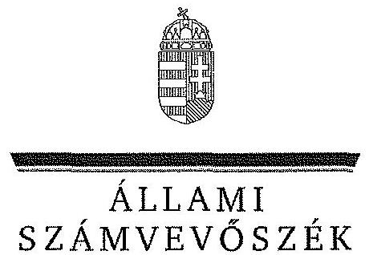
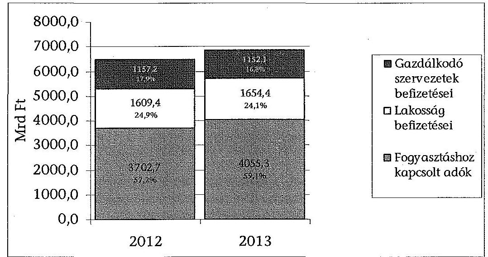
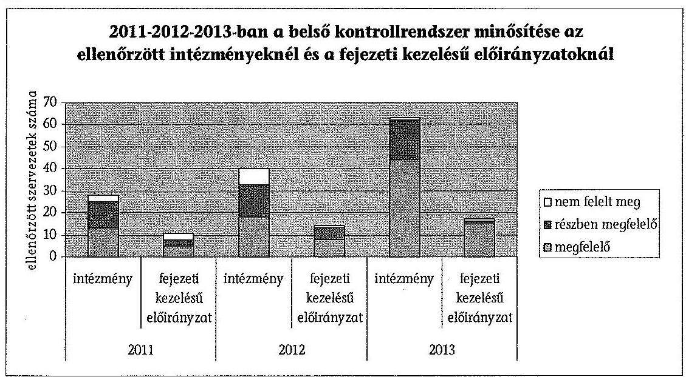
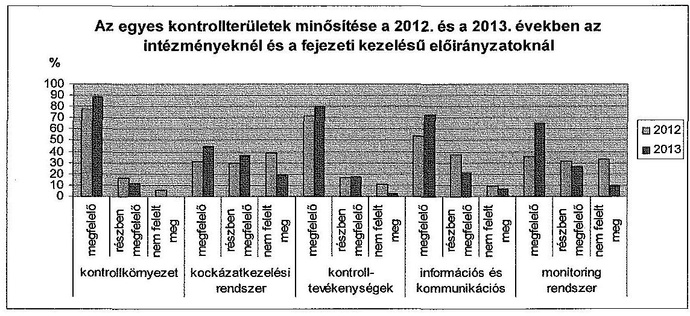
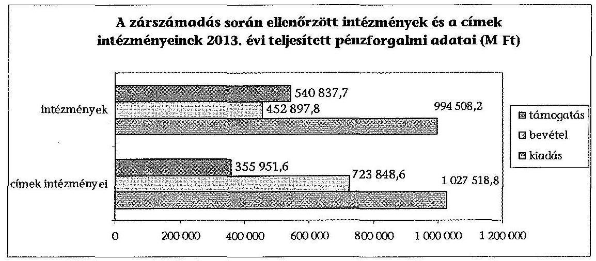
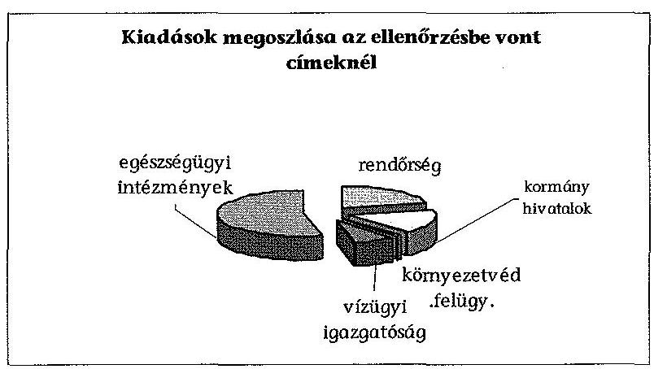
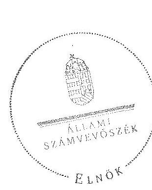
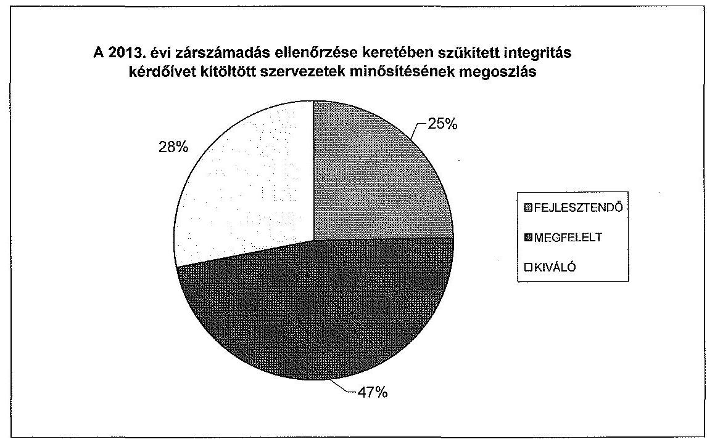

ÁLLAMI
SZÁMVEVŐSZÉK

# JELENTÉS 

A 2013. évi zárszámadásról -
Magyarország 2013. évi költségvetése végrehajtásának ellenőrzéséről

---

# Állami Számvevőszék 

Iktatószám: V-0365-11478/2014.
Témasorszám: 32
Vizsgálatazonosító: V0673

## Az ellenőrzést felügyelte:

Dr. Pulay Gyula Zoltán
felügyeleti vezető
Az ellenőrzés végrehajtásáért felelős:
Pongrácz Éva
ellenőrzésvezető

A számvevői munkaanyagok feldolgozásában és a Jelentés összeállításában közremüködtek:

| Balázs Melinda   számvevő tanácsos | Bertalan Rudolf   Gyula   számvevő | Dr. Dobóné dr.   Maczkó Zita   számvevő gyakornok |
| :--: | :--: | :--: |
| Fekete Gábor   számvevő tanácsos | Fülöppné Nagy   Marianna   számvevő tanácsos | Huszár Anna   számvevő |
| Dr. Korbuly Andrea   számvevő tanácsos | Kulcsár Lászlóné   számvevő | Laki Dóra   számvevő tanácsos |
| Magyari Anna   számvevő | Marozsán Katalin   számvevő tanácsos | Mokánszkiné Mengyi   Andrea   számvevő tanácsos |
| Molnár Antal Lászlóné   számvevő | Molnár Bálint   számvevő főtanácsos | Dr. Németh Eszter   számvevő |
| Dr. Németh Ildikó   számvevő gyakornok | Orosz Diána   számvevő tanácsos | Péntek László   számvevő tanácsos |
| Polyák Ferenc   számvevő tanácsos | Renner Andrea   számvevő tanácsos | Robák Ferencné   számvevő tanácsos |
| Stevflik Aranka   számvevő gyakornok | Szabó Leonóra Ildikó   számvevő | Szabóné László   Mária   számvevő |
| Szakmányné Bilik   Mária   számvevő tanácsos | Szarvas Szilárd   számvevő tanácsos | Szilágyi Nándorné   számvevő |

Jelentéseink az Országgyưlés számítógépes hálózatán és az Interneten a www.asz.hu címen is olvashatóak.

---

| Szöllősiné Hrabóczki Etelka   számvevő tanácsos | Tamás László számvevő | Tótfalusi Zoltán számvevő tanácsos |
| :--: | :--: | :--: |
| Tóth Sándor számvevő | Trubiánszki   Hajnalka   számvevő gyakornok | Tukacs Éva számvevő tanácsos |
| Ujvári Józsefné számvevő tanácsos | Vámos Imre számvevő | Várhegyi Anett számvevő |
| Dr. Vass Gábor számvevő tanácsos | Vicze Klára   számvevő tanácsos | Dr. Vincze Ibolya számvevő |
| Vlasits Ágnes számvevő | Völgyesi Mátyás számvevő | Vörös Katalin számvevő főtanácsos |
| Weltherné Szolnoki   Dóra   számvevő | Zakar László számvevő tanácsos |  |

# Az ellenőrzést végezték: 

| Dr. Baloghné Sebestyén Éva   számvevő | Baritsa Orsolya számvevő | Bartolák Márta számvevő főtanácsos |
| :--: | :--: | :--: |
| Beck Miklós számvevő tanácsos | Bencsik Árpád számvevő | Bertalan Rudolf Gyula számvevő |
| Bíró Csaba számvevő | Bocsi Sándor számvevő tanácsos | Boros Attila számvevő tanácsos |
| Bozsik Tamás számvevő | Bretus Zoltán János számvevő | Burenzsargal   Narantuja   számvevő tanácsos |
| Bus András Péter számvevő tanácsos | Buás Zoltánné Hütter Erzsébet számvevő tanácsos | Czékus Balázs Imre számvevő |
| Dr. Csapó Anna számvevő tanácsos | Csényi István számvevő tanácsos | Csordás Péterné számvevő |

---

| Dr. Dargai Emőke számvevő | Dombóvári Nóra számvevő tanácsos | Domonkosné Kurilla Edit számvevő tanácsos |
| :--: | :--: | :--: |
| Eigner György Zoltán számvevő tanácsos | Dr. Eke-Pekács Tibor számvevő tanácsos | Dr. Elek László számvevő |
| Farkas László számvevő tanácsos | Dr. Fátrainé   Zsebedics Katalin számvevő tanácsos | Federics Adrienn számvevő tanácsos |
| Fekete Gábor számvevő tanácsos | Fekete Győr László számvevő | Ferencz Katalin Zsuzsanna számvevő tanácsos |
| Fodor Edit számvevő | Fórián Erika számvevő tanácsos | Dr. Gaálné Berente Mónika számvevő |
| Gácsi Györgyi Ivett számvevő | Gelencsér Zoltán számvevő tanácsos | Gelencsér Zsolt számvevő |
| Gergely Tilda számvevő | Göller Géza számvevő tanácsos | Gölöncsér Péter számvevő |
| Groholy Andrásné Hanyyál Márta számvevő tanácsos | Dr. Győri Gabriella   Márta   számvevő tanácsos | Hadházy Sándor György számvevő tanácsos |
| Hegyes Mária számvevő tanácsos | Horváthné Menyhárt Erika számvevő főtanácsos | Humli Tamásné számvevő tanácsos |
| Huszárné Borbás Melinda számvevő | Igar Tamás számvevő | Jakab Laura számvevő |
| Jenei Zoltán Béláné számvevő | Joó Erika számvevő | Kántor Ilona számvevő tanácsos |
| Kersmájer Ágota számvevő tanácsos | Keszthelyi Zoltán számvevő főtanácsos | Kisné Agócs Éva számvevő |
| Kiss Rita Teréz számvevő tanácsos | Klinger Zoltán számvevő | Koczor László számvevő tanácsos |

---

| Komonszky Krisztina számvevő | Dr. Korbuly Andrea számvevő tanácsos | Kóródi Gábor számvevő |
| :--: | :--: | :--: |
| Kökény László   számvevő tanácsos | Kriston-Vízi János számvevő tanácsos | Kupcsik Éva számvevő |
| Kuszinger Andrea számvevő | Kuzma Ágota számvevő | L. Kovács János számvevő |
| Laczi Hedvig számvevő | Dr. Lajos Béla számvevő főtanácsos | Lakatos József számvevő tanácsos |
| Laki Dóra számvevő tanácsos | Liziczai Imréné számvevő | Lödiné Cser   Zsuzsanna   számvevő főtanácsos |
| Lucza Anikó   számvevő tanácsos | Luhály Matild számvevő | Magyari Anna számvevő |
| Magyaricsné Hajdú Regina számvevő | Marozsán Katalin számvevő tanácsos | Mészáros Ildikó Éva számvevő |
| Mokánszkiné Mengyi Andrea számvevő tanácsos | Molnár Antal   Lászlóné   számvevő | Molnár Gyula Mihály számvevő tanácsos |
| Nagy Adrienn számvevő | Dr. Nagy Ágnes számvevő tanácsos | Nagyné Lakhézi Éva számvevő tanácsos |
| Dr. Németh Eszter számvevő | Orosz Diána számvevő tanácsos | Papp József számvevő tanácsos |
| Papp Sándor számvevő főtanácsos | Dr. Pataki Magdolna számvevő tanácsos | Pencz Mária számvevő tanácsos |
| Péntek László   Számvevő tanácsos | Pénzes Gyula   Számvevő tanácsos | Perlusz Krisztina számvevő |
| Polyák Ferenc számvevő tanácsos | Puskás Balázs számvevő | Remport Katalin számvevő tanácsos |

---

| Renner Andrea számvevő tanácsos | Robák Ferencné számvevő tanácsos | Schmidt János számvevő |
| :--: | :--: | :--: |
| Somlai Gábor számvevő | Szabó Leonóra Ildikó számvevő | Szabó Tamás számvevő tanácsos |
| Szabóné László Mária számvevő | Szakmányné Bilik Mária számvevő tanácsos | Szalontai Miklós számvevő tanácsos |
| Szarka Péterné számvevő vezető főtanácsos | Szarvas Szilárd számvevő tanácsos | Szilágyi Nándorné számvevő |
| Dr. Szima Mária számvevő tanácsos | Dr. Szöllősi Zsolt számvevő | Szöllősiné Hrabóczki Etelka számvevő tanácsos |
| Tamás László számvevő | Tótfalusi Zoltán számvevő tanácsos | Tóth Árpád számvevő tanácsos |
| Tóth Sándor számvevő | Trenovszki István számvevő tanácsos | Tukacs Éva számvevő tanácsos |
| Ujvári Józsefné számvevő tanácsos | Ungár Ervin számvevő | Uram Ferenc számvevő tanácsos |
| Vámos Imre számvevő | Várhegyi Anett számvevő | Várkonyi Zsolt Kristóf számvevő tanácsos |
| Dr. Vass Gábor számvevő főtanácsos | Velkei András Albert számvevő | Vicze Klára számvevő tanácsos |
| Vida Cecília számvevő | Vida László számvevő tanácsos | Dr. Vincze Ibolya számvevő |
| Vitányi István számvevő tanácsos | Vlasits Ágnes számvevő | Vojcsekné Szabó Ágnes számvevő tanácsos |
| Völgyesi Mátyás számvevő | Vörös Katalin számvevő főtanácsos | Vörösné Lakatos Zsuzsanna számvevő |

---

| Weltherné Szolnoki | Winter Zsuzsa | Dr. Zsolnay András |
| :-- | :-- | :-- |
| Dóra | számvevő főtanácsos | számvevő |
| számvevő |  |  |

# A témához kapcsolódó eddig készített számvevőszéki jelentés: 

címe
sorszáma
Jelentés Magyarország 2012. évi központi költségvetése végrehajtásának ellenőrzéséről

---

# **Chemistry**

## **Chemical Reactions**

### **Balancing Chemical Equations**

1. **Write the unbalanced equation:**
   - Example: $$C_3H_8 + O_2 \rightarrow CO_2 + H_2O$$

2. **Balance the equation:**
   - Balance carbon atoms first.
   - Then balance hydrogen atoms.
   - Finally, balance oxygen atoms.
   - Balanced equation: $$C_3H_8 + 7O_2 \rightarrow 3CO_2 + 4H_2O$$

3. **Balance the equation:**
   - Balance oxygen atoms.
   - Finally, balance oxygen atoms.
   - Balanced equation: $$C_3H_8 + 7O_2 \rightarrow 3CO_2 + 4H_2O$$

### **Types of Reactions**

1. **Combination Reaction:**
   - Example: $$2H_2 + O_2 \rightarrow 2H_2O$$

2. **Decomposition Reaction:**
   - Example: $$2H_2O_2 \rightarrow 2H_2O + O_2$$

3. **Single Displacement Reaction:**
   - Example: $$Zn + 2HCl \rightarrow ZnCl_2 + H_2$$

4. **Double Displacement Reaction:**
   - Example: $$AgNO_3 + NaCl \rightarrow AgCl + NaNO_3$$

5. **Combustion Reaction:**
   - Example: $$CH_4 + 2O_2 \rightarrow CO_2 + 2H_2O$$

## **Stoichiometry**

### **Mole Concept**

- **Mole (mol):** The amount of substance containing as many particles (atoms, molecules, ions) as there are atoms in exactly 12 grams of carbon-12.
- **Avogadro's Number:** $$6.022 \times 10^{23}$$ particles per mole.

### **Molar Mass**

- **Molar Mass:** The mass of one mole of a substance.
- Example: The molar mass of water ($$H_2O$$) is 18.015 g/mol.

### **Calculations**

1. **Moles to Mass:**
   - Formula: $$n = \frac{m}{M}$$
   - Example: Calculate the number of moles of $$H_2O$$ in 18 grams of water.
     - $$n = \frac{18.015 \, \text{g}}{18.015 \, \text{g/mol}} = 18.015 \, \text{g/mol}$$

2. **Moles to Mass:**
   - Formula: $$m = n \times M$$
   - Example: Calculate the mass of 18.015 g of water.
     - $$m = 18.015 \, \text{g/mol} = 18.015 \, \text{g/mol}$$

## **Gas Laws**

### **Ideal Gas Law**

- **Equation:** $$PV = nRT$$
- **Variables:**
  - $$P$$: Pressure (atm)
  - $$V$$: Volume (L)
  - $$n$$: Number of moles (mol)
  - $$R$$: Ideal gas constant (0.0821 L·atm/mol·K)
  - $$T$$: Temperature (K)

### **Boyle's Law**

- **Equation:** $$P_1V_1 = P_2V_2$$
- **Variables:**
  - P₁: Pressure (atm)
  - P₂: Volume (L)
  - P₃: Pressure (atm)
  - P₁: Pressure (atm)
  - P₂: Volume (L)
  - P₃: Pressure (atm)
  - P₁: Pressure (atm)
  - P₂: Volume (L)
  - P₃: Pressure (atm)
  - P₁: Pressure (atm)
  - P₂: Volume (L)
  - P₃: Pressure (atm)
  - P₁: Pressure (atm)

## **Thermochemistry**

### **Enthalpy (H)**

- **Definition:** The heat content of a system at constant pressure.
- **Equation:** $$\Delta H = q_p$$
- **Variables:**
  - $$q_p$$: Heat transferred at constant pressure.
  - $$q_p$$: Heat transferred at constant pressure.
  - $$\Delta H$$: Heat transferred at constant pressure.

### **Hess's Law**

- **Statement:** The enthalpy change for a reaction is the same whether it occurs in one step or multiple steps.
- **Equation:** $$\Delta H = q_p - \Delta H$$

---

# TARTALOMJEGYZÉK 

BEVEZETÉS ..... 5
I. ÖSSZEGZŐ MEGÁLLAPÍTÁSOK, KÖVETKEZTETÉSEK ..... 8
II. RÉSZLETES MEGÁLLAPÍTÁSOK ..... 18
A) A ZÁRSZÁMADÁSI TÖRVÉNYJAVASLAT MEGBÍZHATÓSÁGA ..... 18
B) A KÖZPONTI ALRENDSZER ..... 21

1. A központi költségvetés 2013. évi előirányzatainak teljesítése, a hiány alakulása ..... 21
2. A központi alrendszer finanszírozása és bruttó adóssága ..... 22
3. A központi költségvetés közvetlen bevételei és kiadásai, a belső kontrollok múködése és az elszámolások megbízhatósága ..... 24
3.1. A közvetlen bevételek előirányzatainak teljesülése ..... 24
3.2. A közvetlen bevételek elszámolásának megbízhatósága és a belső kontrollok múködése ..... 29
3.3. A közvetlen kiadások, az adósságszolgálattal és az állami vagyonnal kapcsolatos kiadások előirányzatainak felhasználása ..... 32
3.4. A központi tartalékok felhasználása ..... 37
3.5. A közvetlen kiadások elszámolásának megbízhatósága és a belső kontrollok múködése ..... 38
3.6. Adó- és vámszakmai tevékenységek elemzése ..... 44
4. Az európai uniós, túlzott hiány eljáráshoz kapcsolódó (EDP) jelentésekkel összefüggő adatszolgáltatás ..... 46
5. A NAV, a Kincstár és az ÁKK Zrt. informatikai rendszerei ..... 46
6. A költségvetési szervek és a fejezeti kezelésű előirányzatok ..... 49
6.1. Az intézmények és a fejezeti kezelésű előirányzatok belső kontrollrendszereinek múködése ..... 49
6.2. Az intézményi címek belső kontroll rendszereinek múködése ..... 53
6.3. A fejezeti kezelésű előirányzatok költségvetési beszámolóinak minősítése ..... 54
6.4. Az intézményi költségvetési beszámolók minősítése ..... 54
6.5. A fejezeti kezelésű előirányzatok kiadási és bevételi előirányzatainak alakulása ..... 56
6.6. Az intézmények kiadási és bevételi előirányzatainak alakulása ..... 59

---

6.7. A fejezeti kezelésű előirányzatok pénzforgalmi folyamatainak szabályszerűsége ..... 62
6.8. Az intézményi címek pénzforgalmi folyamatai ..... 66
6.9. Az intézmények pénzforgalmi folyamatainak szabályszerűsége ..... 69
6.10. Az intézményi címek gazdálkodásának tapasztalatai ..... 75
7. Az európai uniós támogatások ..... 78
7.1. A támogatások felhasználása és az Európai Unióval történő elszámolások ..... 78
7.2. Az Uniós fejlesztések fejezet előirányzatainak felhasználása ..... 81
8. Az elkülönített állami pénzalapok költségvetésének végrehajtása ..... 83
9. A társadalombiztosítás pénzügyi alapjai költségvetésének végrehajtása ..... 89
9.1. A Nyugdíjbiztosítási Alap költségvetésének végrehajtása ..... 89
9.2. A Nyugdíjbiztosítási Alap belső kontrolljainak múködése ..... 91
9.3. Az Egészségbiztosítási Alap költségvetésének végrehajtása ..... 91
9.4. Az Egészségbiztosítási Alap belső kontrolljainak múködése ..... 93
C) INTEGRITÁS KÉRDŐÍV TAPASZTALATAI ..... 95
D) FELKÉSZÜLÉS AZ EREDMÉNYSZEMLÉLETŰ ÁLLAMHÁZTARTÁSI INFORMÁCIÓS RENDSZER KIALAKÍTÁSÁRA ..... 96
E) UTÓELLENŐRZÉS ..... 98
MELLÉKLETEK

1. számú Rövidítések jegyzéke
2. számú Értelmező szótár
3. számú A 2013. évi költségvetés végrehajtásának ellenőrzésébe bevont szervezetek listája
4. számú A 2011., a 2012. és a 2013. évi zárszámadás ellenőrzése során a beszámo-lókra/elszámolásokra adott minősítések
5. számú Az adó- és adójellegű bevételek előirányzatainak teljesülése
6. számú Egyes központi kezelésű kiadási előirányzatok teljesülése
7. számú Belső kontroll felmérés eredménye az intézményeknél és a fejezeti kezelésű előirányzatoknál a 2013. évben
8. számú Az intézmények és a fejezeti kezelésű előirányzatok belső kontrollrendszerének kialakításában és múködésében a 2013. évben feltárt jelentősebb hiányosságok
9. számú Belső kontroll felmérés eredménye az intézményi címeknél a 2013. évben
10. számú Az intézményi címek kontrollrendszerének kialakításában és múködésében a 2013. évben feltárt jelentősebb hiányosságok

---

11. számú Az NSRK 2007-2013 között megítélt, szerződéssel lekötött és kifizetett összegeinek alakulása a 2007-2013-as keret \%-ában
12. számú Az ÚMVP 2007-2013 között szerződéssel lekötött és kifizetett összegeinek alakulása a 2007-2013-as keret \%-ában
13. számú A HOP 2007-2013 között szerződéssel lekötött és kifizetett összegeinek alakulása a 2007-2013-as keret \%-ában
14. számú Az ellenőrzött szervezetek integritásának értékelése
15. számú Utóellenőrzés
16. számú Az ellenőrzött szervezetek ÁSZ által el nem fogadott észrevételei

---

# **Chemistry**

## **Chemical Reactions**

### **Balancing Chemical Equations**

1. **Write the unbalanced equation:**
   - Example: $$C_3H_8 + O_2 \rightarrow CO_2 + H_2O$$

2. **Balance the equation:**
   - Balance carbon atoms first.
   - Then balance hydrogen atoms.
   - Finally, balance oxygen atoms.
   - Balanced equation: $$C_3H_8 + 7O_2 \rightarrow 3CO_2 + 8H_2O$$

3. **Balance the equation:**
   - Balance oxygen atoms.
   - Finally, balance oxygen atoms.
   - Balanced equation: $$C_3H_8 + 7O_2 \rightarrow 3CO_2 + 8H_2O$$

### **Types of Reactions**

1. **Combination Reaction:**
   - Example: $$2H_2 + O_2 \rightarrow 2H_2O$$

2. **Decomposition Reaction:**
   - Example: $$2H_2O_2 \rightarrow 2H_2O + O_2$$

3. **Single Displacement Reaction:**
   - Example: $$Zn + 2HCl \rightarrow ZnCl_2 + H_2$$

4. **Double Displacement Reaction:**
   - Example: $$AgNO_3 + NaCl \rightarrow AgCl + NaNO_3$$

5. **Combustion Reaction:**
   - Example: $$CH_4 + 2O_2 \rightarrow CO_2 + 2H_2O$$

## **Stoichiometry**

### **Mole Concept**

- **Mole (mol):** The amount of substance containing as many particles (atoms, molecules, ions) as there are atoms in exactly 12 grams of carbon-12.
- **Avogadro's Number:** $$6.022 \times 10^{23}$$ particles per mole.

### **Molar Mass**

- **Molar Mass:** The mass of one mole of a substance.
- Example: The molar mass of water ($$H_2O$$) is 18.015 g/mol.

### **Calculations**

1. **Moles to Mass:**
   - Formula: $$n = \frac{m}{M}$$
   - Example: Calculate the number of moles of $$H_2O$$ in 18 grams of water.
     - $$n = \frac{18.015 \, \text{g}}{18.015 \, \text{g/mol}} = 18.015 \, \text{g/mol}$$

2. **Moles to Mass:**
   - Formula: $$m = n \times M$$
   - Example: Calculate the mass of 18.015 g of water.
     - $$m = 18.015 \, \text{g/mol} = 18.015 \, \text{g/mol}$$

## **Gas Laws**

### **Ideal Gas Law**

- **Equation:** $$PV = nRT$$
- **Variables:**
  - $$P$$ = Pressure (atm)
  - $$V$$ = Volume (L)
  - $$n$$ = Moles of gas

### **Boyle's Law**

- **Equation:** $$P_1V_1 = P_2V_2$$
- **Variables:**
  - P₁ = Pressure (atm)
  - P₂ = Volume (L)
  - P₃ = Moles of gas (L)
  - P₁ = Moles of water (L)
  - P₂ = Moles of water (L)

### **Charles's Law**

- **Equation:** $$\frac{V_1}{n} = \frac{V_2}{n} \quad \text{or} \quad \frac{V_3}{n}$$

## **Thermochemistry**

### **Enthalpy Change (ΔH)**

- **Definition:** The heat content of a system at constant pressure.
- **Equation:** $$\Delta H = q_p$$
- **Variables:**
  - $$q_p$$ = Heat transferred at constant pressure.
  - $$q_p$$ = Heat transferred at constant pressure.

### **Hess's Law**

- **Statement:** The enthalpy change for a reaction is the same whether it occurs in one step or multiple steps.
- **Equation:** $$\Delta H = q_p + \Delta H_0$$
- **Variables:**
  - $$q_p$$ = Heat transferred at constant pressure.
  - $$q_p$$ = Heat transferred at constant pressure.

### **Hess's Law 2.0**

- **Statement:** The enthalpy change for a reaction is the same whether it occurs in one step or multiple steps.
- **Equation:** $$\Delta H = q_p + \Delta H_0$$
- **Variables:**
  - $$q_p$$ = Heat transferred at constant pressure.
  - $$q_p$$ = Heat transferred at constant pressure.

### **Hess's Law 1.0**

- **Statement:** The enthalpy change for a reaction is the same whether it occurs in one step or multiple steps.
- **Equation:** $$\Delta H = q_p + \Delta H_0$$
- **Variables:**
  - $$q_p$$ = Heat transferred at constant pressure.
  - $$q_p$$ = Heat transferred at constant pressure.

## **Electrochemistry**

### **Oxidation and Reduction**

- **Oxidation:** Loss of electrons.
- **Reduction:** Gain of electrons.

### **Galvanic Cells**

- **Definition:** A cell that converts chemical energy into electrical energy.
- **Components:**
  - Anode: Oxidation occurs.
  - Cathode: Reduction occurs.
  - Salt Bridge: Connects the two half-cells.

### **Nernst Equation**

- **Equation:** $$E = E^\circ - \frac{RT}{nF} \quad \text{or} \quad E^\circ - \frac{RT}{nF} = E^\circ - \frac{RT}{nF}$$

## **Nuclear Chemistry**

### **Radioactive Decay**

- **Definition:** The process by which unstable nuclei emit radiation to decay.
- **Types of Decay:**
  - Alpha (α): Decay of unstable nuclei.
  - Beta (β): Decay of unstable nuclei.
  - Gamma (γ): Decay of unstable nuclei.

### **Half-Life (t₁/₂)**

- **Definition:** The time required for a quantity to decay to half of its original value.
- **Examples:**
  - Alpha (α): Decay of unstable nuclei.
  - Beta (β): Decay of unstable nuclei.

### **Nuclear Reactions**

- **Definition:** A reaction where the number of nuclei changes.
- **Examples:**
  - Alpha (α): Decay of unstable nuclei.
  - Beta (β): Decay of unstable nuclei.

## **Organic Chemistry**

### **Functional Groups**

- **Alkanes:** -C=O -C=O₂ -C=O₂₂ -C=O₂ -C=O₂₂ -C=O₂ -C=O₂₂ -C=O₂ -C=O₂₂ -C=O₂ -C=O₂₂ -C=O₂ -C=O₂₂ -C=O₂ -C=O₂₂ -C=O₂ -C=O₂₂ -C=O₂ -C=O₂₂ -C=O₂ -C=O₂₂ -C=O₂ -C=O₂₂ -C=O₂ -C=O₂₂ -C=O₂ -C=O₂₂ -C=O₂ -C=O₂₂ -C=O₂ -C=O₂₂ -C=O₂ -C=O₂₂ -C=O₂ -C=O₂₂ -C=O₂ -C=O₂₂ -C=O₂ -C=O₂₂ -C=O₂ -C=O₂₂ -C=O₂ -C=O₂₂ -C=O₂ -C=O₂₂ -C=O₂ -C=O₂₂ -C=O₂ -C=O₂₂ -C=O₂ -C=O₂₂ -C=O₂ -C=O₂₂ -C=O₂ -C=O₂₂ -C=O₂ -C=O₂₂ -C=O₂ -C=O₂₂ -C=O₂ -C=O₂₂ -C=O₂ -C=O₂₂ -C=O₂ -C=O₂₂ -C=O₂ -C=O₂₂ -C=O₂ -C=O₂₂ -C=O₂ -C=O₂₂ -C=O₂ -C=O₂₂ -C=O₂ -C=O₂₂ -C=O₂ -C=O₂₂ -C=O₂ -C=O₂₂ -C=O₂ -C=O₂₂ -C=O₂ -C=O₂₂ -C=O₂ -C=O₂₂ -C=O₂ -C=O₂₂ -C=O₂ -C=O₂₂ -C=O₂ -C=O₂₂ -C=O₂ -C=O₂ -C=O₂ -C=O₂ -C=O₂ -C=O₂ -C=O₂ -C=O₂ -C=O₂ -C=O₂ -C=O₂ -C=O₂ -C=O₂ -C=O₂ -C=O₂ -C=O₂ -C=O₂ -C=O₂ -C=O₂ -C=O₂ -C=O₂ -C=O₂ -C=O₂ -C=O₂ -C=O₂ -C=O₂ -C=O₂ -C=O₂ -C=O₂ -C=O₂ -C=O₂ -C=O₂ -C=O₂ -C=O₂ -C=O₂ -C=O₂ -C=O₂ -C=O₂ -C=O₂ -C=O

---

# JELENTÉS 

## BEVEZETÉS

Magyarország 2013. évi központi költségvetését az Országgyűlés a 2012. évi CCIV. törvényben hagyta jóvá, év közben a törvényt többször módosították. A költségvetés végrehajtása ellenőrzésének jogalapját az Állami Számvevőszékről szóló 2011. évi LXVI. törvény 5. § (7) bekezdése képezte.
Az államháztartásért felelős miniszter a jogszabályi határidőnek megfelelően a Kormánynak való benyújtással egyidejűleg - 2014. június 30 -án átadta az ÁSZ részére a Magyarország 2013. évi központi költségvetése végrehajtásáról szóló törvényjavaslatot. Elvégeztük a törvényjavaslat adatainak és az ellenőrzés során kapott adatoknak az összevetését, ellenőriztük az adatok közötti konzisztenciát. A 2013. évi zárszámadási törvényjavaslatról a véleményünket a beszámolóknál, illetve az elszámolásoknál számszerúsített hibákra figyelemmel alakítottuk ki.
A zárszámadási ellenőrzés célja volt a megfelelő bizonyosság megszerzése arról, hogy a 2013. évi költségvetés végrehajtásáról készített törvényjavaslatot megalapozó pénzügyi beszámolók/elszámolások összessége tartalmaz-e a megbízhatóságot befolyásoló lényeges hibát. Célul tűztük ki annak megállapítását is, hogy az ellenőrzött szervezeteknél a gazdálkodás szabályszerű volt-e, a költségvetés végrehajtásában jog- és hatáskörrel rendelkezők a kapott felhatalmazások keretei között a kötelezettségeiknek megfelelően gazdálkodtak-e a közpénzekkel.
Az ellenőrzés céljai között szerepelt a gazdálkodási kereteket meghatározó kormányprogramokban a 2013. évre kitűzött célok, feladatok végrehajtásának ellenőrzése, amelynek eredményeit jelentésünkkel egy időben „A 2013. évi költségvetési folyamatok makrogazdasági összefüggései" címú elemzésünkben tesszük közzé. A tanulmány a zárszámadási jelentéssel párhuzamosan készült és a makrogazdasági környezet keretében, valamint szempontjai szerint elemzi és értékeli az államháztartás egészének 2013. évi folyamatait, és így kiegészíti a zárszámadási jelentés pénzügyi-szabályszerúségi szemléletét.
További célkitűzés volt a költségvetés végrehajtásáról készített törvényjavaslat törvényességének ellenőrzése és - az OGY megalapozott döntéshozatalának támogatása érdekében - a törvényjavaslat egésze megbízhatóságának értékelése. Ennek keretében figyelmet fordítottunk annak feltárására, hogy a Kvtv. 2013. évi módosításainak indokai és háttérszámításai kellően megalapozták-e az OGY döntéseit.
Ellenőrzésünk célja volt annak értékelése is, hogy a közpénzügyek átláthatóságát, rendezettségét elősegítő eredményszemléletű államháztartási információs rendszer kialakításának előkészületei megtörténtek-e a fejezeteknél és az intézményeknél, elvégezték-e az államháztartás számvitelének 2014. évi megváltozásával kapcsolatos feladatokat.
A beszámolók megbízhatóságának megítélésével összefüggésben a magas szintű ellenőrzési bizonyosság elérése érdekében és a szabályszerűségi megfelelőség ellenőrzéséhez 2012-ben az ÁSZ elvégezte a központi költségvetés területén ki-

---

alakított belső kontrollmechanizmusok működésének, illetve az azokban rejlő kockázatoknak a felmérését, értékelését. A 2013. évben az ellenőrzési tevékenységünket kiterjesztettük az ellenőrzésbe bevont szervezetek integritásának felmérésére. A közszféra esetében az integritás feltérképezése a megbízhatóság megítéléséhez nélkülözhetetlen.
A költségvetési beszámolók/elszámolások ellenőrzésekor a feltárt hibákat azok lényegessége szerint minősítettük. A lényegességi szint (küszöb) az a határérték, amelyet meghaladóan a beszámolóban/elszámolásban szereplő hibás állítások összességükben már befolyásolnák a döntéshozókat. A lényegességi küszöb a központi kezelésű előirányzatok esetében a teljesített bevételi, illetve a teljesített kiadási, a többi területen a teljesített kiadási főösszeg 2\%-a.
Az ÁSZ a zárszámadás megbízhatóságáról mondott véleménye kialakításánál törekszik a minél nagyobb lefedettség biztosítására. Ezt szolgálja a 2012. évtől alkalmazott címaudit, amelynek keretében a törvényben szereplő, egy-egy kiválasztott költségvetési címhez tartozó bevételről és kiadásról mondunk véleményt, az adott címhez/alcímhez tartozó intézmények összesített adatbázisából vett minták alapján. Ezzel a módszerrel a 2013. évi zárszámadás ellenőrzése során összesen 164 intézménynél végeztünk ellenőrzést.
Az ellenőrzés során teljes körűen ellenőriztük és minősítettük a központi kezelésű bevételi és kiadási előirányzatokat, a fejezeti kezelésű előirányzatokat, a minisztériumok igazgatási címeiről készített beszámolókat, valamint az elkülönített állami pénzalapok és a társadalombiztosítás pénzügyi alapjai költségvetésének végrehajtását.
A Nyugdíjbiztosítási Alap és az Egészségbiztosítási Alap tekintetében ellenőriztük és minősítettük az intézményi és az ellátási éves elemi költségvetési beszámolót, az alapok konszolidált éves költségvetési beszámolóját, valamint a TB Alapok összevont konszolidált éves költségvetési beszámolóját. Az elkülönített állami pénzalapok és az Egészségbiztosítási Alap esetében hasznosítottuk a könyvvizsgálók által kiadott minősítéseket és megállapításokat.
A zárszámadási ellenőrzés általános céljaival összhangban, a terület sajátosságaira figyelemmel ellenőriztük az uniós és a kapcsolódó költségvetési támogatások felhasználását az érintett fejezeteknél. Értékeltük a 2007-2013. évi uniós költségvetési periódus programjainak időarányos teljesülését és a támogatások lehívását, továbbá az Európai Unióval való 2013. évi elszámolásokat.
Zárszámadási ellenőrzésünk kiterjedt a 2014. évi költségvetési folyamatok nyomon követésére, kiemelten az államadósság alakulására ható tényezők monitoringjára. Az adatokat a Költségvetési Tanács 2014. I. féléves költségvetési folyamatokról készített elemzésének elkészítése során hasznosítottuk, illetve a 2015. évi költségvetés véleményezésekor fogjuk hasznosítani.

---

A zárszámadási ellenőrzéshez ebben az évben is kapcsolódnak további ellenőrzések. Az ÁSZ 2014. első félévi ellenőrzési tervében szereplő egyes szervezeteket ${ }^{1}$ a zárszámadási ellenőrzésre épülve, ún. egyablakos módszerrel ellenőrizzük.
Az ellenőrzés lefedte a központi alrendszer Kvtv. szerinti bevételi főösszegének 97,4\%-át, illetve a kiadási főösszegének 90,7\%-át. (A 2012. évi zárszámadás ellenőrzésénél ez az arány $97 \%$, illetve $91 \%$ volt.) Az ellenőrzésbe bevont szervezeteket a 3. számú melléklet tartalmazza.
A beszámolók, illetve az elszámolások megbízhatóságát, a költségvetés végrehajtásának szabályszerűségét a pénzügyi-szabályszerüségi ellenőrzés módszerével értékeltük.
Az ellenőrzés során kiemelt figyelmet fordítottunk a 2012. évi zárszámadási ellenőrzés során feltárt hiányosságok megszüntetésére tett intézkedésekre, azok végrehajtására, ezen keresztül az ÁSZ ellenőrzés megállapításainak, javaslatainak hasznosulására.
Ellenőrzésünk hozzájárul ahhoz, hogy az OGY megalapozott, megbízható adatokkal összeállított zárszámadási törvényt fogadhasson el, valamint segíti a fejezetek, központi kezelésű előirányzatok kezelői, a címek, az intézmények és az alapok közpénzekkel való felelős gazdálkodását.
Az ellenőrzés eredményeképpen azokban az esetekben, ahol intézkedést igénylő megállapításokat tettünk, az ellenőrzött szervezetek vezetői részére figyelemfelhívó leveleket fogalmaztunk meg. Véleményt formáltunk továbbá arról, hogy a Magyar Állam tulajdonosi joggyakorlásában érintett szervezetei olyan kontrollrendszerrel rendelkeztek-e, amelynek segítségével az állami vagyon feletti tulajdonosi joggyakorlás tevékenysége szabályszerűen ellátható volt.
Munkánk társadalmi hasznosítását támogatja, hogy széleskörű ellenőrzési tapasztalatainkat az érdekeltek számára elérhető jelentésben hozzuk nyilvánosságra. Ellenőrzési tapasztalataink a következő évi költségvetés véleményezési és a jövő évi zárszámadási ellenőrzés alapját is képezik.

[^0]
[^0]:    ${ }^{1}$ A KIFÜ ellenőrzése - Kormányzati Informatikai Fejlesztési Ügynökség gazdálkodásának és feladatellátásának ellenőrzése; Az AJBH ellenőrzése - Az Alapvető Jogok Biztosának Hivatala múködésének, gazdálkodásának és feladatellátásának ellenőrzése; Az MTA egyes kutatóintézetelnek ellenőrzése - A Magyar Tudományos Akadémia kutatóintézetei hálózatának átalakítása, egyes kiemelt kutatóintézetek gazdálkodása és feladatellátása ellenőrzése; A NAV ellenőrzése - A Nemzeti Adó- és Vámhivatal hátralékkezelési és végrehajtási eljárási, valamint a kiemelt adózói körben gyakorolt tevékenysége szabályszerűségének, az EUROFISC rendszer múködésének ellenőrzése; Az EU támogatások felhasználásának rendszere - A Nemzeti Fejlesztési Ügynökség (és a Közremüködő Szervezetek) uniós támogatásokkal kapcsolatos feladatellátásának ellenőrzése.

---

# I. ÖSSZEGZŐ MEGÁLLAPÍTÁSOK, KÖVETKEZTETÉSEK 

A 2013. évi költségvetési folyamatok a módosított előirányzathoz képest összességében kedvezöbben alakultak. A költségvetési intézmények gazdálkodása tervzzerűbbé vált és javult a beszámolók, illetve elszámolások megbízhatósága. A központi költségvetés végrehajtásának összesített adatai alapján megállapítható, hogy az előre nem látható események megfelelő kezelésével történt a költségvetés végrehajtása.
Ellenőrzésünk során megállapítottuk, hogy a 2013. évi központi költségvetés végrehajtása a jogszabályi előírásoknak megfelelt, a zárszámadási törvényjavaslat megalapozott és a törvényjavaslatban szerepeltetett adatok megbízhatóak.
A beszámolóknál és elszámolásoknál feltárt hibák összege ( $3,1 \mathrm{Mrd}$ Ft) nem érte el azt a szintet (a központi költségvetés teljesült kiadási főösszegének, 17 410,3 Mrd Ft-nak a 2\%-át), hogy a törvényjavaslat egészének megbízhatóságát befolyásolja.
A zárszámadási törvényjavaslat összeállításának folyamatát a feladatok megfelelő részletezettségével - a 2012. évi költségvetés végrehajtásának ellenőrzése keretében tett ÁSZ javaslatok nyomán - az NGM eljárásrendben szabályozta. Az összeállítás során alkalmazott informatikai rendszer hozzáférés-védelmének biztosítására a 2013. év folyamán kidolgozta annak jogosultságkezelési és naplózási funkcióját.
A törvényjavaslat szöveges indokolása a reálfolyamatok értékeléséből kiindulva bemutatja a költségvetés eredetileg kitűzött céljait, azok teljesülését és ehhez kapcsolódóan elemzi a pénzügyi-jövedelmi folyamatokat. A zárszámadási törvényjavaslat adatait a szöveges indokolások megfelelően alátámasztják.
Az államháztartás központi alrendszerének költségvetése magában foglalja a központi költségvetés, az elkülönített állami pénzalapok és a társadalombiztosítás pénzügyi alapjai előirányzatait. Az elfogadott Kvtv-ben az OGY az államháztartás központi alrendszerének bevételi főösszegét 15 313,8 Mrd Ft-ban, kiadási főösszegét 16 155,7 Mrd Ft-ban, hiányát 841,9 Mrd Ft-ban állapította meg. A 2013. év végére a központi alrendszer - módosított előirányzatok szerinti - bevételi fóösszege 15 460,8 Mrd Ft, kiadási főösszege 16 586,0 Mrd Ft, a hiány összege 1125,2 Mrd Ft volt.
Az államháztartás központi alrendszerének bevételi főösszege 16 477,5 Mrd Ftban, kiadási főösszege 17 410,3 Mrd Ft-ban teljesült. A 2013. évi hiány pénzforgalmi szemléletben 932,8 Mrd Ft volt, amely 17,1\%-kal alacsonyabb a módosított elöirányzatnál. A hiány összegének módosításában szerepet játszott az MVM Zrt. tőkeemelése, ami az E.ON magyarországi gázüzletága megvásárlásának részbeni finanszírozását szolgálta és a Szövetkezeti Hitelintézetek Integrációs Szervezetének nyújtott állami tőkejuttatás.

---

Az államháztartás 2013. évi pénzforgalmi szemléletű egyenlege (Mrd Ft-ban)

| Megnevezés | Törvényi   módosított   elöirányzat | Teljesítés | Eltérés |
| :-- | :--: | :--: | :--: |
| Központi költségvetés | $-1117,8$ | $-985,3$ | 132,5 |
| Elkülönített állami   pénzalapok | $-7,4$ | 51,7 | 59,1 |
| Nyugdíjbiztosítási Alap | 0,0 | 1,3 | 1,3 |
| Egészségbiztosítási Alap | 0,0 | $-0,5$ | $-0,5$ |
| Központi alrendszer ösz-   szesen | $-1125,2$ | $-932,8$ | 192,4 |
| Önkormányzati alrend-   szer | $\mathbf{1 5}$ | $\mathbf{1 1 2 , 8}$ | $\mathbf{9 7 , 8}$ |
| Államháztartás összesen | $\mathbf{- 1 1 1 0 , 2}$ | $\mathbf{- 8 2 0 , 0}$ | $\mathbf{2 9 0 , 2}$ |

A központi költségvetés pénzforgalmi hiányának GDP ${ }^{2}$ arányos mutatója $3,4 \%$-ra, 0,3 százalékponttal a módosított hiánycél alatt teljesült.
A hiányt a központi alrendszer egyes bevételeinek és kiadásainak teljesítése eltérően alakította. Míg a költségvetési szervek és fejezeti kezelésű előirányzatok bevételei, a kamatbevételek és az állami vagyonnal kapcsolatos befizetések a tervezettnél magasabb összegben teljesültek, addig a gazdálkodó szervezetek befizetései, az általános forgalmi adóbevételek, a jövedéki adóbevételek elmaradtak az előirányzattól. Kiadási oldalon a költségvetési szervek és fejezeti kezelésű előirányzatok kifizetései és a kamatkiadások haladták meg a módosított előirányzatot, ugyanakkor egyes támogatások (szociális, lakásépítési stb.) a tervezettnél kisebb összegben teljesültek.
Pozitívan befolyásolta a központi alrendszer pénzforgalmi egyenlegének alakulását az elkülönített állami pénzalapok tervezettnél nagyobb többlete, valamint a TB Alapok összesített egyenlege is. Az államháztartás egyenlegét az önkormányzati alrendszer tervezettet meghaladó pozitív szaldója tovább javította.
A Kormánynak a 2012. évihez képest ( 86,2 Mrd Ft) 2013-ban kisebb összegben ( 53,8 Mrd Ft) kellett elrendelnie a költségvetési egyenleg tartását biztosító intézkedéseket. Az ellenőrzött költségvetési szerveknél és a fejezeti kezelésű előirányzatoknál végrehajtott zárolások összege 25,8 Mrd Ft volt, amely részben elvonásra került. A zárolások a múködést, az alap- és közfeladatok ellátását

[^0]
[^0]:    ${ }^{2}$ A GDP 2013. évi előzetes tényszáma a KSH 2014. június 4-1 adatszolgáltatása szerint 29077,8 Mrd Ft, a tervezett érték (eredeti előirányzat) és a módosított hiánycél esetében az akkor aktuális folyóáras GDP 30392 Mrd Ft.

---

általában nem veszélyeztették. A feszes gazdálkodás mellett feladatelmaradás nem történt. Az UF fejezeti kezelésű előirányzatoknál 1,5 Mrd Ft, a TB Alapok esetében 4,3 Mrd Ft zárolást és elvonást rendeltek el.
Maradványtartási kötelezettséget nem írtak elő, viszont a beruházás jellegű beszerzéseket az intézményeknél a 2012. évhez hasonlóan 2013-ban is korlátozták. Az elrendelt beszerzési tilalmat az intézmények betartották. A likviditási problémák megoldását előirányzat-módosításokkal, a kiadások visszafogásával és fegyelmezett gazdálkodással biztosították. A közigazgatásban dolgozók létszámkeretét $0,3 \%$-kal ( 261 fővel) csökkentették.
A költségvetési szervek és a fejezeti kezelésű előirányzatok maradványa az előző évek tendenciáját követve tovább emelkedett. A kötelezettségvállalással terhelt előirányzat-maradvány összegét hat intézmény esetében nem az előírásoknak megfelelően állapították meg, mert a maradvány lekötöttségét a következő évet terhelő kötelezettséggel és szabálytalan kötelezettségvállalásokkal támasztották alá.
A központi tartalékok a céltartalékból, a rendkívüli kormányzati intézkedésekre szolgáló tartalékból és az Országvédelmi Alapból álltak. A tartalékok betöltötték szerepüket, felhasználásuk 43,2\%-os, összesen 262,0 Mrd Ft volt.
A céltartalékok felhasználása 71,0 Mrd Ft volt. A rendkívüli kormányzati intézkedésekre szolgáló tartalékból 2013-ban 106,9 Mrd Ft-ot használtak fel. A költségvetés kiadási vagy bevételi oldalát negatívan befolyásoló tényezők, kockázatok kivédése érdekében létrehozott Országvédelmi Alap eredeti előirányzatát ( 400,0 Mrd Ft) 2013. október 1-jén 84,1 Mrd Ft-tal csökkentették egyes programok többletköltségeinek finanszírozása érdekében.
A központi alrendszer 2013. évi 21 998,6 Mrd Ft összegű bruttó adósságállománya $6,2 \%$-kal haladta meg az előző évit és $\mathbf{3 , 8 \% - k a l}$ a 2013. évi tervezettet. A központi alrendszer GDP arányos adóssága a 2012. évihez képest 1,8 százalékponttal $75,7 \%$-ra nőtt az adósságátvállalások következtében. A központi alrendszer bruttó adósságállománya tartalmazza az 593,3 Mrd Ft összegű önkormányzati adósságátvállalást, amely a teljes államadósság 2,7\%-a. A központi alrendszer adósságán belül a forint adósság részaránya a 2013. év végén 0,9 százalékponttal, $59 \%$-ra növekedett, míg a devizaadósságé $40,5 \%$, az egyéb kötelezettségeké $0,5 \%$ volt.
Magyarország 2013. évi hozzájárulása az EU költségvetéséhez 272,3 Mrd Ft volt. A hazai költségvetésben 2013-ra 1425,0 Mrd Ft EU forrás felhasználást terveztek, amely 1583,8 Mrd Ft összegben, 11,1\%-kal túlteljesült. A Kormány a korábbi évekhez hasonlóan intézkedéseket tett az EU források igénybevételének gyorsítására. Ennek eredményeként a Nemzeti Stratégiai Referencia Keret Operatív Programjaira a rendelkezésre álló uniós és a kapcsolódó hazai társfinanszírozás 8204,9 Mrd Ft összegű keretét 109,7\%-ra kötötték le kötelezettségvállalással a 2013. év végéig. A teljesített kifizetések aránya a 2012. évi $40,4 \%$-ról a 2013. év végére $61,2 \%$-ra emelkedett.
Az agrár- és vidékfejlesztési uniós támogatásokra, az Új Magyarország Vidékfejlesztési Programra rendelkezésre álló keret ( 1419,1 Mrd Ft) 98,3\%-át kötötték le támogatási határozat kibocsátásával a 2013. év végéig. A kifizetések teljesítése 76,7\%-ot ért el. A Halászati Operatív Programra rendelkezésre álló teljes keretből ( 14,5 Mrd Ft) a 2013. év végére $76,5 \%$-ot kötöttek le támogatási határozat-

---

tal, a 2012. évi 65\%-hoz viszonyítva. A kifizetések aránya a 2012. évi 43,1\%-ról $55,3 \%$-ra emelkedett a 2013. év végére.
Az elkülönített állami pénzalapok száma a 2013. év utolsó negyedévében létrehozott Szövetkezeti Hitelintézetek Integrációs Alapjával hétre bővült. Az új alap a törvényi feladatát teljesítette. Az alapok közül a legnagyobb mérlegfőösszeggel a NEFA rendelkezett. Legjelentősebb kiadási előirányzata a Start-munkaprogram (közfoglalkoztatások) volt, amelyre 171,1 Mrd Ft-ot fordítottq̣k. A NEFA célkitűzését tükrözte a kiadások teljesítése, mivel az előző évhez viszonyítva a közfoglalkoztatásokra fordított összeg 29,7\%-kal nőtt, míg a paszszív ellátásoké 20,2\%-kal csökkent. Az alapok Kvtv.-ben meghatározott kiadási főösszegei közül a legalacsonyabb arányú (a módosított előirányzathoz képest 70,4\%) teljesítés a KTIA-nál volt. Az ELKA összesített egyenlege a költségvetés szempontjából kedvezően alakult, a tervezett $7,4 \mathrm{Mrd}$ Ft hiány helyett 51,7 Mrd Ft többlet keletkezett, amelyet a NEFA bevételi túlteljesülése és a KTIA kiadás elmaradása eredményezett.
A társadalombiztosítás pénzügyi alapjai esetében az előző évhez képest jelentős változást jelentett, hogy a Kvtv. már nem csak az Ny. Alap, hanem az E. Alap költségvetési egyensúlyát is biztosította. A Kincstár által a KESZről az ellátási kiadásokra nyújtott megelőlegezési hiteleknek a TB Alapoknál év végén állománya nem volt.
Az Nyugdíjbiztosítási Alap bevétele 9\%-kal nőtt az előző évhez képest, a szociális hozzájárulási adóból származó bevételből az alapot megillető arány emelése, valamint a biztosítotti járulékfizetés felső határának eltörlése miatt. Mindemellett az új kisadókat (KATA és KIVA) választók tervezettnél alacsonyabb száma miatt a szociális hozzájárulási adóból származó bevétel meghaladta a tervezettet. Az Ny. Alap kiadása a 2012. évhez viszonyítva 6,3\%-kal nőtt, legfőképpen a Kvtv. év közbeni módosítása alapján előírt 158,5 Mrd Ft költségvetési befizetési kötelezettség miatt. Az Egészségbiztosítási Alap bevételi oldalának az összetétele a 2013. évben jelentősen megváltozott, mert az alap a szociális hozzájárulási adóból már nem részesült. A költségvetési hozzájárulások összege az előző évhez viszonyítva 372,6 Mrd Ft-tal nőtt, ez pótolta a szociális hozzájárulási adóbevétel kiesését és biztosította az egyensúlyi helyzetet. Az E. Alap ellátási szektorának kiadási előirányzatát kormányzati hatáskörben év közben 2,7\%-kal megemelték. A természetbeni ellátások kiadásainak emelkedése miatt a teljesített kiadás az előző évhez viszonyítva 3,2\%-kal nőtt. Az alapkezelők múködési költségvetése - a korábbi évek tendenciáit követve - alacsony volt, nem érte el a kiadási főösszeg 0,5\%-át.
Ellenőrzésünkben kiemelt hangsúlyt kapott a központi költségvetési bevételek és kiadások teljesítésének értékelése. Az adó- és adójellegü bevételek összességében 534,2 Mrd Ft-tal, 7,2\%-kal, adónemeként különböző mértékben maradtak el a tervezett elöirányzathoz képest.

---

# A 2013. évi adó- és adójellegú bevételek alakulása 

| Megnevezés | Elöirányzat   (Mrd Ft) | Teljesités   (Mrd Ft) | Teljesités/   elöirányzat   (Mrd Ft) |
| :-- | :--: | :--: | :--: |
| Gazdálkodó szervezetek befizetései | 1451,3 | 1152,1 | $-299,2$ |
| Fogyasztáshoz kapcsolt adók | 4286,9 | 4055,3 | $-231,6$ |
| Lakosság befizetései | 1657,8 | 1654,4 | $-3,4$ |
| Adó és adójellegú bevételek összesen | $\mathbf{7 3 9 6 , 0}$ | $\mathbf{6 8 6 1 , 8}$ | $\mathbf{- 5 3 4 , 2}$ |

A gazdálkodó szervezetek befizetései 79,4\%-ra, a fogyasztáshoz kapcsolt adók $94,6 \%$-ra, a lakosság befizetései pedig $99,8 \%$-ra teljesültek. A KATA-ból 46,0 Mrd Ft-tal ( $61,9 \%$-kal), a KIVA-ból 120,1 Mrd Ft-tal ( $92,2 \%$-kal), az áfa-ból 143,6 Mrd Ft-tal ( $4,9 \%$-kal), a jövedéki adóból 49,8 Mrd Ft-tal ( $5,3 \%$-kal) kevesebb volt a bevétel a tervezettnél.
A két kisvállalkozói adónem előirányzatnál alacsonyabb alakulását az új adónemeket választók létszámának tervezettől való elmaradása okozta. A teljes költségvetés szintjén azonban a létszámfelfutás elmaradása esetén a társasági adó, az eva, az szja, a járulékok, a szakképzési hozzájárulás és a szociális hozzájárulási adónemekben tervezett bevételkiesés mérséklődik. Az adóalap KIVA esetén pénzforgalmi szemléletben került meghatározásra, amelynek - számos előnye mellett - áttérést nehezítő tulajdonsága, hogy egy új megközelítést alkalmaz és szakít a megszokott számviteli megközelítéssel. Az áfa bevétel elmaradásában a tervezettnél alacsonyabb infláció és a pénztárgépek on-line bekötésének elhúzódása játszotta a meghatározó szerepet.

Az adó- és adójellegú bevételek összetétele 2012-ben és 2013-ban

Az adó- és adójellegű bevételek teljesített összegében a 2013. évben az előző évhez viszonyítva $6,1 \%$-os növekedés volt tapasztalható, melyben kismértékű arányeltolódás figyelhető meg a fogyasztási típusú (áfa, távközlési adó, regisztrációs adó, pénzügyi tranzakciós illeték stb.) adók javára.

---

A központi kezelésű előirányzatok kezelésében kiemelkedő szerepet játszik a NAV, a Kincstár és az ÁKK Zrt., amelyek informatikai rendszereit erre való tekintettel külön ellenőriztük.
A NAV-nál a szabályozatlanságból eredő kockázatok 2013-ban csökkentek. Az informatikai feladatellátás és az informatikai biztonság felügyeletének és ellenőrzésének szervezeti kereteit kialakították. Nem történt meg azonban az informatikai stratégia megújítása. Nem szabályozták az informatikai biztonság szempontjából kiemelt fontosságú területet, az informatikai munkakörben dolgozók speciális jogosultságainak kezelését (az ellenőrzés időszakában a szabályzat egyeztetése folyamatban volt). Nem készültek el a bevallás feldolgozó és a pénzforgalmi rendszerre vonatkozó üzemszüneti eljárásrendek sem.

A Kincstár a szervezet munkavégzésének alapvető szabályozási feltételeit biztosította, azonban az informatikai stratégia kiadása továbbra sem történt meg. A Kincstár 2013-ban végzett informatikai biztonsági ellenőrzéseket, azonban nem az IBDR-ben meghatározott gyakorisággal. Az elmaradt ellenőrzések kockázatot jelentenek. Így nem kontrollálták teljes körűen az informatikai biztonsági előírások érvényesülését és az esetleges biztonsági kockázatok felderítését. Emellett nem rendelkezett teljes körű, naprakész és dokumentált nyilvántartással arról, hogy mely dolgozó milyen hozzáférési jogosultságokkal rendelkezik. A számlavezetési tevékenységet támogató informatikai rendszer rendelkezésre állása és megbízhatósága már nem felelt meg teljes körűen az elvárt szakmai követelményeknek.
Az ÁKK Zrt. informatikai szervezeti felépítése mind az informatikai szervezet függetlensége, mind a feladatkörök szétválasztása tekintetében megfelelt a KIB 25. sz. ajánlásában megfogalmazott követelményeknek. Az InFoRex rendszer fejlesztésénél érvényesültek a biztonsági szempontok mind az alkalmazás, mind a mögöttes rendszerelemek tekintetében. Nem történt azonban olyan kockázatbecslés és kockázatelemzés, amely meghatározta volna a biztonsági kockázatokat. Így a rendszer biztonsági követelményeinek kialakításakor nem érvényesülhetett a belső szabályozók által előírt kockázatokkal arányos védelem.
Az adóbevételek ellenőrzése során a megbízhatóságot nem befolyásoló hibákat tártunk fel elsősorban az illetékkiszabások, az adóügyi tevékenységek és az adóellenőrzések belső kontrolljainak múködésében. Pozitívum a 211 napnál régebbi kiszabatlan vagyonszerzési illetékügyek számának $38 \%$-os csökkenése. Továbbra is létező jelenség azonban az illetékkiszabási ügyek elhúzódása és az ahhoz kapcsolódó határidők túllépése. Az adóügyi tevékenység és az adóellenőrzések tekintetében feltárt csekély számú hiba hiányos, a belső szabályzatoknak nem megfelelő dokumentáláshoz és határidő túllépésekhez kapcsolódott.
Az adó- és vám hátralékállomány a 2013. évben 2260,9 Mrd Ft volt, ami 5,7\%-kal haladta meg a 2012. évi összeget. A hátralékállomány 30,2\%-a volt a múködő adózók hátraléka, amely 4,5 százalékponttal csökkent a 2012. évihez képest. A múködő adózói hátralékállományból a nyilvántartás szerint behajthatatlan a 2013. évben 245,0 Mrd Ft, ami 71,0 Mrd Ft-tal haladta meg a 2012. évit.

---

A Helyi önkormányzatok támogatásai fejezet (szabályzat elkészítésének, az ellenjegyzésnek, a támogatás felhasználási céljai meghatározásának, a kötelezettségvállalás pénzügyi ellenjegyzési feladatainak, illetve a felelős meghatározásának hiánya, szerződések késedelmes megkötése, határidőnek nem megfelelő teljesítés), a Települési és területi nemzetiségi önkormányzatok támogatásai cím (az ellenőrzési nyomvonal kialakításának és a támogatás visszafizetésére vonatkozó intézkedésnek a hiánya), az RKI-re szolgáló tartalék (előírt tájékoztatási kötelezettség teljesítésének és a nyilatkozatnak a hiánya), az NCsSzA (eljárásrend hiánya, utasítás aktualizálásának hiánya) és az állam által vállalt kezesség és viszontgarancia (szabályozások összhanghiánya) tekintetében a megbízhatóságot nem befolyásoló belső kontrollhiányosságokat tártunk fel.

A belső kontrollok múködése az MNV Zrt.-nél az állami vagyonnal kapcsolatos kiadásoknál, az NFA-nál a Nemzeti Földalappal kapcsolatos bevételeknél és kiadásoknál részben volt megfelelő. Az ellenőrzött mintatételek közel felénél jogszabályellenes gyakorlatként a pénzügyi ellenjegyzés hiánya miatt nem érvényesültek az Ávr. előírásai, az MNV Zrt. nem alakított ki belső kontroll eljárást a közbeszerzési eljárások érvényesülésére a szerződésekben meghatározandó alvállalkozók igénybevételi rendjének, elszámolásának, valamint a Kiving Kft. közbeszerzési kötelezettségének tekintetében, valamint az NFA nem aktualizálta a kötelezettségvállalásra jogosult személyek nyilvántartását.

Az ellenőrzött intézményeknél a módosított bevételi előirányzat (pénzforgalom nélküli bevételek nélkül) a Kvtv.-ben meghatározott eredeti előirányzatokhoz (203,7 Mrd Ft) képest több mint kétszeresére ( 451,6 Mrd Ft-ra) növekedett, a teljesítés a módosított előirányzat 100,3\%-a (452,9 Mrd Ft) volt. A bevételek alakulását a 2013. évi feladatváltozások, illetve az uniós és a hazai társfinanszírozású projektekkel összefüggő támogatásértékű bevételek nagysága befolyásolta. Támogatási keret előrehozásra likviditási problémák miatt nem került sor. A keletkezett többletbevételek felhasználása összhangban volt a jogszabályokban meghatározott alapfeladatokkal és az előirányzat felhasználási céljával. A kintlévőségek mértéke likviditási problémákat nem okozott, a követelések behajtása érdekében a szükséges intézkedéseket az intézmények megtették.
Az ellenőrzött intézmények 2013. évre tervezett eredeti kiadási előirányzata ( 690,8 Mrd Ft) 1107,2 Mrd Ft-ra emelkedett és 994,5 Mrd Ft-ra teljesült. A teljesített kiadásokat $54,4 \%$-ban ( 540,8 Mrd Ft ) költségvetési támogatás finanszírozta. A módosított előirányzatok közel 50\%-át 3 intézménynél nem használták fel és $30 \%$-ot meghaladó maradvány keletkezett 5 szervezetnél. Az intézményi kör módosított előirányzattól elmaradó kiadás teljesítése nem járt együtt a kötelezettségek növekedésével. Az ellenőrzött intézményeknél a kötelezettségek állománya az egyéb passzív pénzügyi elszámolások nélkül 14,1\%-kal csökkent a 2012. évihez képest. Az aktív pénzügyi elszámolások összege ( 184,4 Mrd Ft) az intézmények gazdálkodását érdemben nem befolyásolta.
Az NFÜ 2013. évi intézményi kiadási elöirányzata ötszörösére emelkedett, mivel az NFÜ intézmény esetében a 2013. évre tervezett eredeti kiadási előirányzatok - a 2012. évhez hasonlóan - nem tartalmazták az SLA szerződések elszámolásából adódó előirányzatokat.

---

Az ellenőrzött intézményeknél az előirányzat-módosítások, átcsoportosítások a jogszabályi előírásoknak megfeleltek és szakmailag indokoltak voltak. Az előirányzat-módosítások dokumentáltsága és utólagos ellenőrizhetősége megfelelő volt. Könyvelési szabálytalanságot és belső szabályozási hiányosságot két intézménynél tapasztaltunk.
A beszámolók és elszámolások megbízhatósága a 2012. évi ellenőrzési tapasztalatainkhoz képest javult. 2013-ban 1,5\%-ukat (131-ből két elutasító), míg 2012-ben 2,9\%-ukat (105-ből három korlátozott) láttuk el minősített véleménnyel, a többi elfogadó minősítést kapott.
Elutasító záradékkal láttuk el a Nemzeti Földalappal kapcsolatos kiadásokat, mert a fejezet kiadásainak 5,5\%-a ( $937,4 \mathrm{M}$ Ft) nem volt jogszerú és elszámolásuk nem a vonatkozó jogszabályok előírásai szerint történt. Az NFA a Nemzeti Földalappal kapcsolatos kiadások felhalmozási jogcíme terhére mutatott ki 936,3 M Ft összegben ügyvédi letétbe helyezett összeget. Az ügyvédekkel kötött letéti szerződések tartalmazták az ingatlan adás-vételi szerződések NFA részéről történő 2013. évi megkötését és a letéti összegek vételárként történő megfizetését, amelynek letéti szerződés szerinti végrehajtása nem valósult meg. Az elutasító vélemény további indoka volt, hogy az NFA 1,1 M Ft értékben intézményi múködést szolgáló költséget számolt el a fejezetben a hasznosítási kiadások terhére.
Elutasító záradékkal láttuk el az AJBH 2013. évi beszámolóját, mert az intézmény összesen 249,5 M Ft-ot kötelezettségvállalással terhelt maradványként mutatott ki, annak ellenére, hogy kötelezettségvállalás nem történt. A teljesült kiadások összege 1380,8 M Ft volt. A feltárt hiba ( $18,1 \%$ ) a lényegességi szintet elérte és egyben átfogó hatású a beszámoló szempontjából, a beszámoló megbízhatóságát, a valós kép kialakítását befolyásolta.
Az NFÜ intézményi beszámolóját elfogadó vélemény mellett figyelemfelhívó megjegyzéssel láttuk el, az UF fejezet fejezeti kezelésű előirányzatainak felhasználásáról készített beszámolója elfogadó véleményt kapott. A fejezeti kezelésű előirányzatoknál megbízhatósági hibát nem állapítottunk meg, belső kontrollrendszere részben megfelelően múködött, összességében biztosította az uniós források szabályszerű felhasználását. A mérleg és a főkönyvi könyvelés, illetve a főkönyv és az analitikus nyilvántartások rendszerszerű egyezőségét, zártságát az informatikai rendszer 2013-ban nem garantálta. Kormányzati döntés alapján 2013. július 31-étől a Nemzeti Fejlesztési Ügynökség a miniszterelnök irányítása alatt múködő központi hivatal lett.
Az elfogadó véleménnyel érintett területek közül 31 intézménynél ${ }^{3}$ a beszámolók megbízhatóságát nem befolyásoló hiányosságokat, szabálytalanságokat tártunk fel. A feltárt hibák jól körülhatárolható területeken jelentkeztek, így a közbeszerzési eljárás lefolytatása nélküli és a visszamenőleges hatállyal történő szerződéskötéseknél, a megbízásos jogviszony keretében történő

[^0]
[^0]:    ${ }^{3}$ A VM, az NGM, a NAV, az NFM, a KUM, az EMMI, a GVH, és az MTA Igazgatás, a ME és a BM intézményei, a KBH, a NAIH, a KEH, az AB intézmények, továbbá az ÁKK, a KEK KH, a KIH, az OKTF, az MHEK, az MNV Zrt, az OVF, a NIH, a HITA, az NKH, a KEF, az OH, az OFI, az OBDK, a GYEMSZI, az OMSZ és az OVSZ esetében.

---

foglalkoztatásnál, a személyi juttatások körében elszámolt kifizetéseknél, a kötelezettségvállalás pénzügyi ellenjegyzésénél, valamint a bizonylatok ellenőrzési kötelezettségének az elmulasztásánál. A KSH esetében a feltárt szabálytalanság egy 2009. évben megkötött - 2013. évben is érvényes - szerződés alapján történő kifizetésből adódott.
A fejezeti kezelésú előirányzatoknál hét esetben állapítottunk meg szabálytalanságot, amely nem gyakorolt hatást a beszámolók megbízhatóságára. E megállapítások a dolgozói lakáskölcsönök szabálytalan kimutatásához, nem megfelelően bizonylatolt előleg felhasználásához, dokumentumokkal nem megfelelően alátámasztott kötelezettségvállalással terhelt maradványhoz, előleg teljesítésigazolás nélküli folyósításához, illetve leltározási hiányossághoz kapcsolódtak.
Azt tapasztaltuk, hogy az ellenőrzés során feltárt hibák javítására az intézmények fogadó készek voltak. Ennek jegyében egy intézmény és egy fejezeti kezelésű előirányzatokat kezelő a beszámolóját ${ }^{4}$ kijavította. Ezzel hozzájárultunk a megbízható beszámolók számának és a zárszámadási törvényjavaslat megbízhatóságának növeléséhez.
Az ellenőrzésre került intézmények és fejezeti kezelésű előirányzatok esetében 80 szervezetnél értékeltük a belső kontrollrendszerek kiépítettségét és múködését. A szervezetek 75,0\%-a kapott megfelelő, 22,5\%-a részben megfelelő, $2,5 \%$-a (két szervezet) nem megfelelő minősítést. A részben megfelelő minősítést kapott 18 szervezet közül 14 a 2013. évben került először ellenőrzésre. A 2012. évben az intézmények és a fejezeti kezelésű előirányzatok 15\%-a kapott nem megfelelő minősítést. A javulás oka, hogy nagyobb figyelmet fordítottak a monitoring tevékenységre, az operatív tevékenységek keretében megvalósuló folyamatos és eseti nyomon követésre, valamint a belső ellenőrzésre. A megfelelően működtetett belső kontrollrendszer hozzájárult ahhoz, hogy az intézmények és fejezeti kezelésű előirányzatok 2013. évi beszámolói egy kivételével elfogadó minősítést kaptak.
A 2013. évre vonatkozóan a belső kontrollok értékelését kiterjesztettük a címaudit keretében ellenőrzésbe vont intézményekre is és 57,3\%-uknál minősítettük azok múködését. Ez 94 új intézmény bevonását jelentette. A címaudit ellenőrzés keretében a látószögünkbe került szervezetek döntő többségénél $(98,9 \%)$ a belső kontrollrendszer magas szinten, átlagosan $85 \%$-on múködött.
A társadalombiztosítás pénzügyi alapjai éves elemi és konszolidált, valamint az elkülönített állami pénzalapok éves elemi költségvetési beszámolóit elfogadó véleménnyel láttuk el. Az E. Alap beszámolója esetében kisebb szabálytalanságokat tártunk fel. A nemzetközi elszámolások kontrolljainak kialakítása és múködtetése nem volt teljes körű, valamint nem szabályozták egyértelműen a teljesítésigazolás sajátosságait és elvégzésének módját. A NEFA esetében 1,8 M Ft értékvesztés elszámolása nem történt meg. A KTIA esetében szabálytalan volt, hogy az alapkezelő a jogszabályi előírás ellenére nem rögzítette megállapodásban (a NAV-val és a Kincstárral) az innovációs járulék átutalására vonatkozó eljárás részleteit. Az NKA esetében szabályszerűségi hi-

[^0]
[^0]:    ${ }^{4}$ A GYEMSZI és az NGM fejezeti kezelésű előirányzatainak beszámolóját.

---

bákat tártunk fel. A miniszteri keretből támogatott kérelmek teljesítésigazolási jogkörének gyakorlásánál voltak hiányosságok, az alkotói támogatásoknál előfordult a pénzügyi elszámolási kötelezettség mellőzése és az elektronikus teljesítésigazolás rendszerében a jogosult személy aláírásának hiánya.
A címaudit keretében ellenőrzésbe vont intézmények közül a kormányhivataloknál megbízhatósági hibákat okozott a gazdasági események nem valós tartalma alapján történt könyvelés, a rendőrségnél a pénzforgalmi beszámoló adataiban a dologi kiadásokat érintő téves könyvelés, valamint a kötelezettségvállalással terhelt maradványban az Áhsz. előírásaival ellentétesen kimutatott kötelezettség szerepeltetése, a vízügyi igazgatóságoknál a helytelenül kimutatott maradvány, az egészségügyi intézményeknél két gazdasági esemény nem valós tartalma alapján történő könyvelés, valamint közbeszerzési eljárás lefolytatása nélkül történt beszerzés.
A zárszámadás ellenőrzése keretében összesen 167 szervezet esetében mértük fel az integritás helyzetét kérdöíves megkérdezéssel, amelyek értékelését is elvégeztük. Az ellenőrzés során az integritás kérdéskörének fókuszba helyezésével érvényesült az ÁSZ tanácsadó szerepe, amely hozzájárult az ellenőrzött szervezetek megbízhatóbb múködéséhez. A kiépített kontrollok és kockázatok alapján a szervezetek több mint negyede kiváló, közel fele megfelelő és negyede fejlesztendő minősítést kapott.
Az ellenőrzésünk kiterjedt az eredményszemléletű államháztartási információs rendszer kialakítására vonatkozó, az NGM rendeletében meghatározott feladatok megfelelő tartalommal és határidőben történő végrehajtására is. Az ellenőrzött szervezetek 17\%-a - alapvetően a kialakított informatikai rendszer hiányosságai miatt - nem tudta tartani az elöírt 2014. március 31-i határidőt. Az áttéréshez kapcsolódó leltározást három szervezet (KEF, ORFK, MHEK) nem az előírásoknak megfelelően végezte. Az ellenőrzés során tapasztalt - átállással járó - nehézségek, problémák ellenére az eredményszemléletű számvitel hozzájárul a pontosabb elszámoláshoz, megteremti az üzemgazdasági elszámolás lehetőségét a költségvetési szervek körében.
A 2012. évi zárszámadás során tett javaslatok, illetve figyelemfelhívások teljesülését utóellenőrzés keretében értékeltük. Az érintett szervezetek intézkedési terv készítési kötelezettségüknek eleget tettek. A 2012. évi költségvetés végrehajtásáról szóló ÁSZ jelentésben tett öt javaslatunk hasznosulása megtörtént.

---

# II. RÉSZLETES MEGÁLLAPÍTÁSOK 

## A) A ZÁRSZÁMADÁSI TÖRVÉNYJAVASLAT MEGBÍZHATÓSÁGA

## A zárszámadási dokumentum prezentációjára megfogalmazott Áht. előírásokat a törvényjavaslat teljesíti.

A szöveges indokolás - a reálfolyamatok értékeléséből kiindulva - bemutatja a költségvetés eredetileg kitűzött céljait, azok teljesülését az NGM zárszámadási tájékoztatójában foglaltaknak megfelelően. A szöveges indokolás ehhez kapcsolódóan elemzéseket tartalmaz a pénzügyi-jövedelmi folyamatokat illetően. A zárszámadási törvényjavaslat adatait a szöveges indokolások megfelelően alátámasztják. Az általános indokolás mellékletei a tájékoztató ${ }^{5}$ előírásainak megfelelnek.
A zárszámadási törvényjavaslat összeállítása során alkalmazott kontrollokat szabályozták. Az NGM a 2013. évi zárszámadási törvényjavaslat összeállítására külön szabályzattal rendelkezett, amely megfelelő részletességgel tartalmazta a törvényjavaslat összeállítási folyamatával kapcsolatos feladatokat.

Az NGM kidolgozta a zárszámadási törvényjavaslat összeállítási folyamatának szabályzatát (2014. februáŕtól hatályos). SZMSZ-ében rögzítette továbbá a törvényjavaslat elkészítéséért felelős szervezeti egységeket. A folyamatban részt vevő egyes szak(fö)osztályok ügyrendjei tartalmaztak utalást a zárszámadási dokumentum összeállításához kapcsolódó szerepvállalásra.
Az NGM a 2013. évi zárszámadás összeállításához kapcsolódó előírásokat tartalmazó - 2014 áprilisában kiadott - útmutatója és az egyes szakterületek munkaprogramja meghatározta a zárszámadási törvényjavaslat kidolgozását megalapozó beszámolási keretrendszert, a kapcsolódó feladatokat és azok ütemezését.

Az NGM a 2013. évi zárszámadás összeállításának informatikai támogatására, az adategyeztetésre, illetve javításra a KAR-t alkalmazta. Az NGM a törvényjavaslat összeállítása során alkalmazott informatikai rendszer, valamint az NGM, illetve a NAV, a Kincstár, a fejezetek és az alapok kezelői közötti adategyeztetési rendszer zártságának biztosítására szabályzatot dolgozott ki.

Az NGM KAR részére az Elektronikus Kormányzati Gerinchálózat biztosítja a védett informatikai infrastruktúrát. A KAR ennek részeként rendelkezik hozzáférésvédelemmel, biztonsági mentések rendszerével és titkosítással. A KAR zártságát biztosító kontrollokról rendszerleírás készült. A KAR jogosultságkezelése és a nap-

[^0]
[^0]:    ${ }^{5}$ 2014. áprilisban közzétett NGM Útmutató a Magyarország 2013. évi központi költségvetéséről szóló 2012. évi CCIV. törvény végrehajtásáról szóló törvényjavaslat előkészítéséhez.

---

lózása megfelelő. Az adatrögzítéssel, mentéssel, benyújtással és zárolással kapcsolatos leírásokat az NGM által készített Felhasználói Kézikönyv tartalmazta.
Az UF fejezet esetében azonban kockázatot jelent, hogy nem áll rendelkezésre az NFÜ által működtetett EMIR-ben a zárszámadást támogató lekérdezési modul.

A KAR-ba az NGM, a NAV, a Kincstár, a fejezetek, illetve az alapkezelők töltötték fel az adatokat az internetes felületen keresztül. Az adatok megbízhatóságáért az adatszolgáltatók felelősek.

A KAR a zárszámadási törvénynek megfelelő címrendi bontásban generálta az elemi beszámolókból a fejezeti indokolás számait. Az elemi beszámolókat összeállítók ellenőrzési kötelezettsége volt a KAR által generált fejezeti indokolásban szereplő számok összevetése az elemi beszámoló adataival, illetve javaslattétel a címrend szükséges módosítására. A központi kezelésű előirányzatok adatait az NGM töltötte fel a rendszerbe.
Az NGM nyilatkozata szerint a Kincstárral, a fejezetekkel, az ELKA és a TB Alapkezelőivel, az ÁKK Zrt.-vel és a NAV-val a számszaki adategyeztetéseket elvégezte, ellenőrzései kiterjedtek a teljes dokumentum (beszámolók és a zárszámadási törvény mellékletei) adatai egyezőségének ellenőrzésére, továbbá az általános indokolás adatainak megfelelőségére. A zárszámadás NGM-en belüli egyeztetését követően az összeállított törvényjavaslat visszamutatásra került az adatszolgáltatók részére és szóbeli tárcaegyeztetéseket is végeztek.
Ugyanakkor az NGM részéről átadott zárszámadási dokumentumban az adatok néhány esetben eltértek az ellenőrzött szervezetek által az ÁSZ-nak átadott tanúsítványok adataitól, amely kockázatot jelent a zárszámadási törvényjavaslatban szerepeltetett adatok megbízhatósága szempontjából.
A 2013. évi zárszámadási törvényjavaslatról kialakított véleményünket a beszámolóknál, illetve az elszámolásoknál számszerüsített hibákra alapoztuk.

A zárszámadás egészére összesített hibák összege 3109,2 M Ft. A feltárt hibák összege nem haladja meg a központi alrendszer $17410,3 \mathrm{M}$ Ft-os kiadási főösszegének 2\%-át, 348 205,3 M Ft-ot, azaz a lényegességi küszöböt, amely alapján a zárszámadási törvényjavaslat megalapozott és a törvényjavaslatban szerepeltetett adatok megbízhatóak.

Az ellenőrzés során a hibák $42,1 \%$-át az intézményi címeknél, $30,1 \%$-át a központi kezelésű előirányzatoknál, $19,4 \%$-át az intézményeknél, $8,3 \%$-át a fejezeti kezelésű előirányzatoknál és $0,1 \%$-át a TB Alapoknál és elkülönített állami pénzalapoknál tártuk fel. A feltárt hibák az adott ellenőrzési terület vonatkozásában sem érték el a megállapított lényegességi küszöböt.

---

A zárszámadási ellenőrzés során az ellenőrzési területenként megállapított hibák összegét a következő táblázat mutatja.

# A hibák összege ellenőrzési területenként 

| Ellenőrzött terület | Megállapított összes hiba (M Ft) | Az ellenőrzött terület teljesített bevételi / kiadási föösszege (M Ft) | Hiba a föösszeg \%-ában |
| :--: | :--: | :--: | :--: |
| Bevételek: |  |  |  |
| Központi kezelésű bevételi előirányzatok | 0,0 | 7255 647,7 | 0,00 |
| Kiadások: |  |  |  |
| Központi kezelésű kiadási előirányzatok | 937,4 | 4732 479,0 | 0,02 |
| Intézmények | 601,9 | 994 508,2 | 0,06 |
| Fejezeti kezelésű előirányzatok ${ }^{6}$ | 259,0 | 1067 560,2 | 0,02 |
| Intézményi címek | 1309,1 | 1027 518,8 | 0,13 |
| TB Alapok és elkülönített állami pénzalapok | 1,8 | 5423 775,4 | 0,00 |
| EU-val való elszámolások | 0,0 | 1975 773,2 | 0,00 |
| Kiadások mindösszesen | 3109,2 | 15221 614,87 | 0,02 |

[^0]
[^0]:    ${ }^{6}$ UF Fejezeti kezelésű előirányzatok nélkül
    ${ }^{7}$ A központi alrendszer teljesített kiadási főösszegétől (17 410 265,5 M Ft) való eltérés az ellenőrzési lefedettséggel függ össze.

---

# B) A KÖZPONTI ALRENDSZER 

## 1. A KÖZPONTI KÖLTSÉGVEtÉS 2013. ÉVI ELŐIRÁNYZATAINAK TELJESÍTÉSE, A HIÁNY ALAKULÁSA

Az OGY a Kvtv.-ben az államháztartás központi alrendszerének bevételi főösszegét 15313 816,1 M Ft-ban, kiadási főösszegét 16155 650,9 M Ft-ban, a hiányát 841834,8 M Ft-ban állapította meg. A Kvtv. módosításai alapján a 2013. év végére a központi alrendszer bevételi főösszege 15460815,7 M Ft-ra, kiadási főösszege 16586000,1 M Ft-ra, a hiány összege 1125 184,4 M Ft-ra módosult.
Az államháztartás központi alrendszerének 2013. évi hiánya pénzforgalmi szemléletben 932790,7 M Ft-ra teljesült, amely $10,8 \%$-kal meghaladja az eredetileg tervezett összeget, de $17,1 \%$-kal elmarad a törvényi módosított előirányzattól. Az E.ON magyarországi gázüzletága megvásárlásának részbeni finanszírozását szolgáló MVM Zrt. tőkeemelés és a Szövetkezeti Hitelintézetek Integrációs Szervezetének nyújtott állami tőkejuttatás szerepet játszott a hiány öszszegének módosításában. Magyarország 2013. évi központi költségvetése végrehajtásának összesített adatai alapján megállapítható, hogy az előre nem látható események megfelelő kezelésével történt a költségvetés végrehajtása.

A központi alrendszer hiányának összetétele és alakulása

| Megnevezés |  | 2012. évi teljesítés | 2013. évi |  |  |
| :--: | :--: | :--: | :--: | :--: | :--: |
|  |  |  | Eredeti | Módosított | Teljesítés |
|  |  |  | elöirányzat   M Ft-ban |  |  |
| Központi költségvetés | Bevételi   föösszeg | 9403593,4 | 10230883,3 | 10232383,3 | 11001 204,3 |
|  | Kiadási   föösszeg | 10014816,8 | 11065346,0 | 11350195,6 | 11986 490,1 |
|  | Egyenleg | $-611223,4$ | $-834462,7$ | $-1117812,3$ | $-985285,8$ |
| Elkülönített állami | Bevételi   föösszeg | 508364,6 | 431360,0 | 576859,6 | 612 101,9 |
|  | Kiadási   föösszeg | 378222,2 | 438732,1 | 584231,7 | 560392,5 |
|  | Egyenleg | 130 142,4 | $-7372,1$ | $-7372,1$ | 51709,4 |
| TB Alapok | Bevételi   föösszeg | 4510570,0 | 4651572,8 | 4653948,2 | 4864 168,6 |
|  | Kiadási   föösszeg | 4628 132,3 | 4651572,8 | 4705524,8 | 4863 382,9 |
|  | Egyenleg | $-117562,3$ | 0,0 | $-51576,6$ | 785,7 |
| Központi alrendszer | Bevételi   föösszeg | 14422528,0 | 15313816,1 | 15460815,7 | 16477 474,8 |
|  | Kiadási   föösszeg | 15021 171,3 | 16155650,9 | 16586000,1 | 17410 265,5 |
|  | Egyenleg | $-598643,3$ | $-841834,8$ | $-1125184,4$ | $-932790,7$ |

---

A központi alrendszer legnagyobb hányadát kitevő központi költségvetés előirányzatainak alakulása az alrendszer egészére jelentős hatást gyakorolt. A központi költségvetés egyenlegét az egyes bevételek és kiadások teljesítése eltérően alakította.

A költségvetési szervek és fejezeti kezelésű előirányzatok bevételei a tervezettnél 987 582,2 M Ft-tal, a kamatbevételek 39 364,3 M Ft-tal, az állami vagyonnal kapcsolatos befizetések 89 689,6 M Ft-tal magasabb összegben teljesültek.
A lakásépítési támogatások az előirányzottnál 69 638,0 M Ft-tal, míg az NCsSzA az előirányzottnál 83 289,3 M Ft-tal alacsonyabb összegben teljesült.
A gazdálkodó szervezetek befizetései 299 195,5 M Ft-tal elmaradtak az előirányzattól. Az áfa-nál 143 625,1 M Ft-tal, a kisvállalati adónál 120 071,6 M Ft-tal, a jövedéki adónál 49 781,5 M Ft-tal, a pénzügyi tranzakciós illetéknél 41 485,7 M Ft-tal kevesebb folyt be a módosított előirányzatnál.
A költségvetési szervek és fejezeti kezelésű előirányzatok kiadásai 1223 517,8 M Ft-tal, a kamatkiadások 43 510,8 M Ft-tal voltak magasabbak a módosított előirányzatnál.
A központi tartalékok (Céltartalékok, Rendkívüli kormányzati intézkedések, Országvédelmi Alap) 599 528,7 M Ft-os eredeti előirányzatának módosításait, az előirányzatból történt átcsoportosításokat és előirányzat-csökkentéseket figyelembe véve a tartalékok felhasználása $261992,8 \mathrm{M}$ Ft volt, amely összességében $43,2 \%$-os felhasználást jelentett.
A központi alrendszer bevételeinek és kiadásainak mintegy harmadát kitevő TB Alapok egyenlegének eredeti előirányzata nullszaldós, módosított előirányzata -51 576,6 M Ft volt, de a bevételek tervezettnél kedvezőbb alakulásának eredményeként 785,7 M Ft többlet keletkezett. Az alrendszer bevételeinek és kiadásainak több mint $3 \%$-át kitevő elkülönített állami pénzalapok tervezett hiánya 7372,1 M Ft volt, amely a bevételek tervezettnél kedvezőbb alakulása miatt $51709,4 \mathrm{M}$ Ft többletben teljesült.

# 2. A KÖZPONTI ALRENDSZER FINANSZíROZÁSA ÉS BRUTTÓ ADÓSSÁGA 

A központi költségvetés, a társadalombiztosítás pénzügyi alapjai és az elkülönített állami pénzalapok finanszírozása 2013-ban biztosított volt.

A központi költségvetés finanszírozási tervét az év folyamán az ÁKK Zrt. öt alkalommal módosította, a finanszírozási tervek és a finanszírozás valós folyamatai között jelentős eltérések adódtak. Ebben szerepet játszott a központi költségvetés hiányának növekedése és az uniós elszámolások egyenlegének nagymértékű romlása.
A teljes nettó finanszírozási igény a 2013 decemberében készült - az NGM által prognosztizált nettó finanszírozási igény kedvezőtlen alakulása miatt - az ÁKK Zrt. által aktualizált finanszírozási terv alapján 1241,0 Mrd Ft volt, amelyet $55,9 \%$-ban a nettó kibocsátás finanszírozott. A teljes nettó kibocsátás 2013ban 694,6 Mrd Ft volt, amelyből a nettó forint kibocsátás 711,4 Mrd Ft, a nettó deviza kibocsátás $-17,0 \mathrm{Mrd}$ Ft volt.
A KESZ állománya 2013. december végén 242,0 Mrd Ft, míg a 2012. év végén 443,0 Mrd Ft volt. A KESZ záró állománya a 2013. évben 4 napon nem érte el az ÁKK Zrt. által meghatározott optimális KESZ szintet.

---

A központi költségvetés a 2013. évben - a Kincstár által kezelt - Központi letéti számlával és Lakáscélú kedvezmények letéti számlával rendelkezett. A számlák kezelése és analitikus nyilvántartásuk vezetése a 12/2001. (I. 31.) Korm. rendeletben foglaltaknak, valamint a Kincstár belső szabályozásának megfelelően történt.
A központi alrendszer bruttó adóssága a devizában és forintban fennálló adósságot, illetve az ÁKK Zrt.-nél elhelyezett M2M betétek állományát tartalmazta.
A kormányzati szektor egyenlegéről és adósságáról szóló 2014. április 23 -ai EDP jelentésben szereplő 2013. évi GDP ${ }^{8}$ adatával számítva a központi költségvetés adóssága a GDP $75,6 \%$-át tette ki.
A központi alrendszer bruttó államadósságán belül a forint-, illetve a devizaadósság részaránya 2013-ban $59 \%$, illetve $40,5 \%$, az egyéb kötelezettségeké $0,5 \%$ volt.

A devizaadósság 8904,9 Mrd Ft összegű 2013. évi állománya 578,3 Mrd Ft-tal ( $6,9 \%$-kal) magasabb a 8326,6 Mrd Ft-os 2012. évi állományi adatnál.
A forintban fennálló adósság 12 976,4 Mrd Ft-os 2013. évi állománya 934,0 Mrd Ft-tal ( $7,8 \%$-kal) magasabb a 12 042,4 Mrd Ft-os 2012. évi forint adósságállománynál.
A központi alrendszer, illetve a központi költségvetés 2013. évi bruttó adósságának tervezett állománya - a 2012 decemberében készített finanszírozási terv alapján - 21 188,5 Mrd Ft volt, ami 3,8\%-kal magasabban, 21 998,6 Mrd Ft-ra teljesült. A központi alrendszer GDP arányos adóssága ${ }^{9}$ a 2012. évihez képest 1,8 százalékponttal $75,7 \%$-ra nőtt. Ezen belül a devizaadósság állománya 776,8 Mrd Ft-tal, a forintadósságé 320,1 Mrd Ft-tal meghaladta a 2013. évre tervezettet, miközben az egyéb kötelezettségek állománya 286,8 Mrd Ft-tal elmaradt a tervezettől.

# A központi alrendszer adósságának összetétele és alakulása 

| Központi költségvetés /   központi alrendszer adós-   sága (Mrd Ft) | 2012. évi tény | 2013. évi   terv | 2013. évi   tény | 2013. évi   tény meg-   oszlása |
| :-- | :--: | :--: | :--: | :--: |
| Deviza | 8326,6 | 8128,1 | 8904,9 | $40,5 \%$ |
| Forint | 12042,4 | 12656,3 | 12976,4 | $59,0 \%$ |
| Összesen | $\mathbf{2 0 3 6 9 , 0}$ | $\mathbf{2 0 7 8 4 , 4}$ | $\mathbf{2 1 8 8 1 , 3}$ | $\mathbf{9 9 , 5 \%}$ |
| Egyéb kötelezettségek | 351,1 | 404,1 | 117,3 | $0,5 \%$ |
| Mindösszesen | $\mathbf{2 0 7 2 0 , 1}$ | $\mathbf{2 1 1 8 8 , 5}$ | $\mathbf{2 1 9 9 8 , 6}$ | $\mathbf{1 0 0 , 0 \%}$ |

[^0]
[^0]:    8 A 2014. áprilisi EDP jelentésben szereplő GDP 2013. évi előzetes adata 29 114,0 Mrd Ft.
    ${ }^{9}$ Az NGM 2014. 08.14-ei adatszolgáltatása, az időközben megjelent legírissebb GDP adatok alapján.

---

A Nyugdíjreform és Adósságcsökkentő Alap 2013-ban folytatta a magán nyugdíjpénztárak által 2011-ben átadott eszközök eladását. Az év végéig a tulajdonában lévő összes értékpapírt értékesítette, illetve egyes eszközöket az ÁKK Zrt. és az MNV Zrt. részére adott át. Miután az Alap számára 2013-ban sem írtak elő jogszabályban költségvetési befizetési kötelezettséget, a befolyt pénzbevételeket államadósság-csökkentésre lehetett fordítani. 2013 végén már csak számlapénz eszközök voltak az Alap tulajdonában, amelyek az Alap későbbi fizetési kötelezettségeinek fedezetéül szolgáltak. Az Alap 2013. évi induló vagyona 316003,7 M Ft volt. Ennek összegét növelte a megszűnő magán nyugdíjpénztárak által beutalt vagyon, amely 9684,0 M Ft-ot tett ki. Emellett 22,0 M Ft bevétel származott az Összefogás az Államadósság Ellen Alap befizetéseiből. Az államadósság az állampapírok bevonásával 2013-ban 87,5 M Fttal csökkent. Az eszközei eladásából az Alapnak a 2013. évet érintően 224 300,0 M Ft bevétele volt. Az Alap a tárgyévi értékesítési és egyéb bevételeiből 253 571,1 M Ft-ot, az Összefogás az Államadósság Ellen Alap befizetéseiből további 22,0 M Ft-ot adott át az államnak az államadósság csökkentésére, aminek $68 \%$-át államkötvény-visszavásárlásra, $32 \%$-át pedig az önkormányzati hitel-átvállalások részleges előtörlesztésére fordították. Az Alap által az MNV Zrt.-nek átadott eszközök átadási értéke 69 100,0 M Ft volt. Az NYRACSA 2013. évi vagyonváltozásait figyelembe véve a 2013. évi záró állománya 176,7 M Ft volt.

Az adósságszolgálattal, illetve a Nyugdíjreform és Adósságcsökkentő Alappal kapcsolatos elszámolások megbízhatóak, szabályosak voltak és bizonylati alátámasztottságuk megfelelő volt.

# 3. A KÖZPONTI KÖLTSÉGVETÉS KÖZVETLEN BEVÉTELEI ÉS KIADÁSAI, A BELSŐ KONTROLLOK MŰKÖDÉSE ÉS AZ ELSZÁMOLÁSOK MEGBÍZHATÓSÁGA 

### 3.1. A közvetlen bevételek előirányzatainak teljesülése

A központi költségvetés közvetlen bevételei közül a legjelentősebbek az adó- és adójellegű bevételek, amelyek a központi költségvetés összes bevételének $72 \%$-át teszik ki.

Az adó- és adójellegú bevételek teljesítése 6861,7 Mrd Ft volt, amely 534,2 Mrd Ft-tal ( $7,2 \%$-kal) maradt el az előirányzattól. Ezen belül a gazdálkodó szervezetek teljesített befizetései 299,2 Mrd Ft-tal ( $20,6 \%$-kal), a lakossági befizetések 3,4 Mrd Ft-tal, a fogyasztáshoz kapcsolt adók 231,6 Mrd Ft-tal alacsonyabb összegben teljesültek az előirányzathoz képest.
A 2013. évben ugyanakkor az adó- és adójellegú bevételek teljesítésében a 2012. évihez mérten $\mathbf{6 , 1 \%}$-os növekedés tapasztalható, amelyben némi arányeltolódás figyelhető meg a fogyasztási típusú (áfa, távközlési adó, regisztrációs adó, pénzügyi tranzakciós illeték stb.) adók javára. A 2013. évben a 2012. évhez képest a fogyasztáshoz kapcsolt adókból 352,6 Mrd Ft-tal ( $9,5 \%$ kal), a lakosság befizetéseiből 44,9 Mrd Ft-tal ( $2,8 \%$-kal) több bevétel realizálódott, míg a gazdálkodó szervezetek befizetéseinél 5,1 Mrd Ft-tal ( $0,4 \%$-kal) kevesebb bevétel folyt be. Ezek eredőjeként a fogyasztáshoz kapcsolt adók összes adóbevételhez viszonyított aránya a 2013. évben a 2012. évihez képest 1,9 százalékponttal $59,1 \%$-ra nőtt, ugyanakkor a gazdálkodó szervezetek befizetései-

---

nek aránya a 2012. évi 17,9\%-ról 2013. évre 16,8\%-ra csökkent, valamint a lakossági befizetések a 2012. évi 24,9\%-ról 2013. évre 24,1\%-ra mérséklődtek.
Az adó- és adójellegű bevételek 2013. évi előirányzatait és azok teljesítését az 5. számú melléklet tartalmazza.

A gazdálkodó szervezetek befizetéseinél az egyes ágazatokat terhelő különadóból származó $4,8 \mathrm{Mrd}$ Ft-os, a társasági adóból adódó $1,7 \mathrm{Mrd}$ Ft-os és az egyszerűsitett vállalkozói adóból keletkezett $1,9 \mathrm{Mrd}$ Ft-os többlet nem tudta kompenzálni a többi adónem tervezettnél jelentősen alacsonyabb teljesülését. A legmagasabb összegű elmaradás a kisvállalati adónál ( $120,1 \mathrm{Mrd}$ Ft), a kisadózók tételes adójánál ( $46,0 \mathrm{MrdFt}$ ), a bányajáradéknál ( $31,8 \mathrm{MrdFt}$ ), az energiaellátók jövedelemadójánál ( $25,9 \mathrm{MrdFt}$ ) és a hitelintézeti járadéknál ( $19,9 \mathrm{MrdFt}$ ) jelentkezett. A tervezett KIVA és KATA bevételek jelentős alulteljesítését ugyanakkor kompenzálta az átlépések alulteljesülésének járulék- és szociális hozzájárulási adóbefizetésekre gyakorolt pozitív hatása.

A társasági adó teljesülése 1667,2 M Ft-tal ( $0,5 \%$-kal) meghaladta az előirányzatot. A túlteljesülés több tényező együttes hatásának köszönhető. A tervezettnél alacsonyabb folyóáras GDP okozta adóbevétel-kiesés hatását a kisvállalati adózásra áttérők vártnál lényegesen kisebb létszámából adódó bevételi többlet kompenzálta.
A hitelintézeti járadék teljesülése 19 892,1 M Ft-tal (53,2\%-kal) maradt el az előirányzattól. Az alulteljesülést az árfolyamgát-rendszert igénybevevő devizahiteladósok tervezettnél alacsonyabb száma okozta. Az alacsony igénybevétel miatt kisebb lett az átvállalt teher, ezért a hitelintézeti járadékból is kevesebb folyt be a központi költségvetésbe.
Az egyszerúsített vállalkozói adóbevétel teljesülése 1921,2 M Ft-tal (1,8\%-kal) haladta meg az előirányzatot. A túlteljesülés abból adódott, hogy a tervezettnél alacsonyabb folyóáras GDP és a 2012. évi adókulcsemelés adóalap szükítő hatását ellensúlyozni tudta a KIVA alá átjelentkezők kisebb létszámából adódó bevételi többlet.
A 2013. évi előirányzathoz képest alulteljesülő adóbevételek közé tartozik a cég-autó-adó ( $84,8 \%$ ), a környezetterhelési díj ( $72,4 \%$ ) és a közmúadó ( $91,6 \%$ ). A cégautó-adóbevétel esetében az elmaradás a cégautó-állomány csökkenésére vezethető vissza. A környezetterhelési díj esetében a korábbi években megvalósult fejlesztések következtében a felszíni vízbe vezetett vízterhelő anyagok csökkentek, illetve javult a szennyvíztelepek hatásfoka. Továbbá a környezetterhelést csökkentő beruházásokra ösziönző díjkedvezményeknek a bázishoz mért megháromszorozódása együttesen okozta az előirányzattól való elmaradást. A közmúadó tekintetében adószakmai tényezők - a kisebb tőkeerejű társaságok részére engedélyezett fizetési könnyítések - is hozzájárultak az előirányzat alatti teljesüléshez.
Az energiaellátók jövedelemadójának teljesülése 25 940,2 M Ft-tal ( $32,4 \%$-kal) maradt el az előirányzattól. Az elmaradás hátterében az energiaszektort érintő egyéb intézkedések (rezsicsökkentés, bányajáradék emelésének hatása) adóalapot mérséklő hatása állt.
Az energiaadó bevétel 1200,1 M Ft-tal (6,9\%-kal) maradt el az előirányzattól, melyet az alacsonyabb energiafelhasználás okozott.
A bányajáradék bevétel 31 804,1 M Ft-tal ( $33,5 \%$-kal) volt kevesebb az előirányzatnál. Az elmaradást több tényező együttes hatása okozta. A rezsicsökkentés megvalósítása jogszabályváltozáson keresztül közel 22,0 Mrd Ft-tal csökkentette a bányajáradék bevételt a 2013. évben. A hatósági áron értékesített földgáz esetén alkalmazott bányajáradék százalékos mértékének kiszámításához használt kép-

---

letben lévő hatósági ár jelentősen mérséklődött. A kőolaj esetében a járadék köteles mennyiség 3,3\%-kal, a földgáz esetében 12,5\%-kal maradt el az előző évitől. Ezen túlmenően a földgáz átlagos bányajáradék mértéke 2013-ban 31\%-kal csökkent, továbbá a világpiaci ár csökkenéséből eredően a kőolaj és a földgáz 2013. évi átlagos fajlagos értéke $4 \%$-kal, a földgázé pedig 6 százalékponttal maradt el az előző évitől.
A játékadó az előirányzatnál 16 081,6 M Ft-tal (34,2\%-kal) alacsonyabb összegben teljesült. Az előirányzattól elmaradó teljesülés fő oka az online szerencsejátékok legális múködtetéséhez szükséges koncessziós pályázatok kiírásának elhúzódása volt.
Az egyéb befizetések teljesülése 31,7\%-os elmaradást jelent az előirányzathoz képest. Az alulteljesülést a megszűnt adónemekre teljesített kiutalások (visszatérítések) okozták.
A pénzügyi szervezetek különadójának teljesülése 4883,1 M Ft-tal (3,4\%-kal) elmaradt az előirányzattól. Az elmaradás hátterében a pénzügyi szervezetek késedelmes, a devizahitelek forintosításához kapcsolódó, a tervezettnél magasabb összegű adó-visszaigénylései állnak.
Az egyes ágazatokat terhelő különadó 2013. január 1-jével megszűnt, de az áthúzódó pénzforgalmi hatás miatt 5000,0 M Ft előirányzatot terveztek. A teljesülés 4814,6 M Ft-tal ( $96,3 \%$-kal) meghaladta az előirányzatot.
A KATA 61,9\%-kal maradt el az előirányzattól. A 2013. évi költségvetés a KATA bevezetése kapcsán éves átlagban 150 ezer adóalannyal kalkulált, azonban végül csak 66 ezer körül alakult az adóalanyok éves átlagos állománya. A NAV tájékoztatása alapján KATA adóalany a 2013. január 1-jei állapot szerint 45 149, míg a 2013. december 31-ei állapot szerint 73132 vállalkozás volt.
A KIVA 92,2\%-kal maradt el az előirányzattól. A bevétel tervezettől eltérő alakulását a KIVA-t választók létszámának számottevő elmaradása okozta. A tervezett adóalapnak mintegy 7,8\%-a került a KIVA alá. A NAV tájékoztatása alapján KIVA adóalany a 2013. január 1-jei állapot szerint 7502, míg 2013. december 31ei állapot szerint 7418 társas vállalkozás volt. A KIVA adónem választásában közrejátszik az is, hogy az adó alapját pénzforgalmi szemléletben határozták meg, így annak számviteli megközelítése eltérő.
A fogyasztáshoz kapcsolt adók esetében az áfa-nál és a jövedéki adónál jelentkező alulteljesülést csak részben kompenzálta a távközlési adó és a regisztrációs adó bevételi többlete.

Az áfa bevétel az előirányzattól 4,9\%-kal maradt el, a 143 625,1 M Ft-os elmaradást egyrészt a makrogazdasági folyamatok adóbevételt érintő kedvezőtlen hatása okozta, másrészt a rezsicsökkentés miatt a vártnál alacsonyabb fogyasztói árszint emelkedés adóbevétel mérséklő hatását a fogyasztás kisebb bővülése nem kompenzálta. Az elmaradáshoz hozzájárult, hogy a pénztárgépek adóhatósághoz történő online bekötése a 2014. évre húzódott át.
A jövedéki adóból származó bevétel 5,3\%-kal maradt el az előirányzattól. Az alulteljesülés különböző mértékben, de mindhárom jövedéki adós termékkört érintette. A legnagyobb mértékủ elmaradás a dohánygyártmányok utáni jövedéki adóbevételnél volt, ami a tárgyévet megelőző év adóemeléseinek áthúzódó és a szabályozás változásának együttes hatásaként jelentkező fogyasztási szerkezet változásra vezethető vissza. Az üzemanyagok utáni jövedéki adóbevétel kisebb mértékű visszaesése az adó-visszatérítések befizetéseket meghaladó növekedéséből származott, ami az agrárszektor és a kereskedelmi gázolaj felhasználás emelkedésével állt összefüggésben. Az egyéb bevételek (alkoholos termékek jövedéki adója) előirányzattól való elmaradását a sżabadforgalomba helyezések - adó-

---

emelés mértékét meghaladó - csökkenése okozta, melyben az adóemelést megelőző készletezési hatások is szerepet játszottak.
A regisztrációs adó teljesülése 11,5\%-kal haladta meg az előirányzatot, ami a gépjárműpiac válságot követő, várakozásokat meghaladó élénkülésével áll összefüggésben.
A távközlési adóbevétel 2979,6 M Ft-tal (6,8\%-kal) túlteljesült, ami az egyes adótételek 2013. augusztus 1-jétől történő megemelésével magyarázható.
A pénzügyi tranzakciós illeték előirányzata 301 100,0 M Ft volt. Az adónemből származó bevétel - a 75000,0 M Ft-os egyszeri befizetésekkel együtt 259614,3 M Ft összegben teljesült. Az elmaradás a pénzforgalmi szolgáltatók és a Kincstár befizetéseinél egyaránt jelentkezett.
A biztosítási adóbevétel 1314,8 M Ft-tal ( $4,8 \%$-kal) maradt el az előirányzattól. Az alulteljesülés a tervezéskor számításba vett gazdasági tényezők tervezettől való elmaradásával függ össze, illetve új adónem révén a tervezéskor a szükséges adatok csak korlátozottan álltak rendelkezésre.
A lakosság befizetéseinél mindössze 0,2\%-os elmaradás keletkezett a tervezetthez képest.

A személyi jövedelemadó bevétel az előirányzatot kissé meghaladó szinten teljesült ( $100,2 \%$ ), ami több tényező együttes hatásának köszönhető. A makrogazdasági mutatók közül a vártnál magasabb bértömeg pozitívan, míg a kamatbevételek negatívan hatottak az adóbevétel alakulására. Ezen túlmenően a kedvezőbb teljesülés a KATA és a KIVA alá átjelentkező adóalanyok számítottnál kisebb létszámával áll összefüggésben.
Az egyéb lakossági adók bevétele 15,5 M Ft-tal ( $8,6 \%$-kal) meghaladta az előirányzatot. Az adóbevétel több mint $90 \%$-a lakossági vámbefizetésekből származott, az ezen felüli rész pedig bérfőzési szeszadó-bevétel volt.
Az illetékbefizetések teljesülése 3567,8 M Ft-tal (3,2\%-kal) maradt el az előirányzattól. Az alulteljesülés hátterében a vagyonszerzési illetékek csökkenése áll, amelyet csak részben tudott kompenzálni az örökösödési, az ajándékozási és az eljárási illeték túlteljesülése.
A gépjárműadó teljesítése 2870,0 M Ft-tal (6,5\%-kal) maradt el az előirányzattól. Az alulteljesítés oka egyrészt a bázishatások miatti mintegy 1000,0 M Ft-os adókötelezettség csökkenés, másrészt a 2013. július 1-jétől hatályba lépett adócsökkentés miatt a légrugós járművek után fizetendő adó 1900,0 M Ft-tal volt kevesebb.
Az adósságszolgálattal kapcsolatban teljesült kamatbevétel 39 364,3 M Fttal volt magasabb az előirányzott ( $93244,8 \mathrm{MFt}$ ) összegnél. A devizában fennálló kamatbevételek és követelések összege meghaladta az előirányzatot. A költségvetési előirányzat tervezésekor 2099,8 M Ft összegű deviza kamatbevétellel számoltak, ehhez képest a bevétel 9394,0 M Ft-ot ért el. A forint államadósságból származó kamatbevételek 123215,1 M Ft-ot értek el 2013-ban a 91 145,0 M Ft-os eredeti előirányzathoz képest. A 32070,1 M Ft-os túlteljesülés döntően egy előirányzatnál következett be, az államkötvények aukciós értékesítésekor keletkező bevétel kamata haladta meg jelentősen az előirányzatot.
Az egyéb központosított bevételek jogcím a rehabilitációs hozzájárulásból, a bírságbevételből, a termékdíjból, az egyéb központosított bevételből és az elektronikus útdíjból tevődik össze, melynek előirányzata 250981,4 M Ft volt. A teljesítés az előirányzat 92,9\%-a (233 183,9 M Ft) volt.

---

A Kvtv. a rehabilitációs hozzájárulás bevétel előirányzatát 65000,0 M Ft-ban határozta meg. Az év végéig 64090,3 M Ft bevétel folyt be, amely 1,4\%-kal elmaradt az előirányzattól. Az alulteljesítés részben a honvédségi szervezetekre vonatkozó jogszabály-módosítás miatt következett be.
A 2013. évben befolyt bírságok összege $48369,8 \mathrm{M}$ Ft, az előirányzat $152 \%$-a volt. A 2013. évben befolyt bírságok előirányzathoz viszonyított jelentős többletét alapvetően a GVH által - ezen belül különösen a pénzintézetekre 9488,2 M Ft összegben - kiszabott bírságok jelentették.
A termékdíj eredeti előirányzata 60000,1 M Ft , teljesítése 48 195,3 M Ft volt. Az elmaradást alapvetően a kenőolajok, az elektromos, elektronikai berendezések miatti befizetések visszaesése okozta. Az elmaradáshoz a befizetések csökkenése mellett a kiutalások növekedése is hozzájárult. Az előirányzat teljesíthetőségét negatívan befolyásolta a 2013. év közbeni jogszabály módosítás is. A módosítás bővítette a termékdíj fizetési kötelezettség alól kivételt képező termékek körét.
Az egyéb központosított bevétel eredeti előirányzata 19 154,7 M Ft, teljesítése 18 812,8 M Ft volt. Az előirányzathoz képest 341,9 M Ft összegű ( $1,8 \%$ ) elmaradást alapvetően a vízkészlet járulék bevétel tervezettől való elmaradása magyarázza.
Az elektronikus útdíj előirányzata 75000,0 M Ft volt. A 2013. évben a központi költségvetésbe befizetett nettó útdíj $53715,7 \mathrm{M} \mathrm{Ft}$, az előirányzat $71,6 \%$-a volt. A zárszámadási törvényjavaslat indokolása alapján az útdíj szolgáltatónál jelentkező bruttó bevételek meghaladták a tervezettet, a költségvetési törvény hatályba lépése után elfogadott szabályok szerint azonban az ÁAK Zrt. (jelenlegi nevén NÚSZ Zrt.) a beszedett díjakat a tárgyhót követő hónapban, nettó módon utalta át a központi költségvetés központosított bevételi számlájára (miközben az áfa befizetését is teljesítette), így az előirányzathoz viszonyított alacsonyabb teljesítést az okozta, hogy öt havi nettó bevétel viszonyul hat havi bruttó tervszámhoz.
A vámbeszedési költség megtérítésének 2013. évi előirányzata 9445,0 M Ft volt. A 8969,7 M Ft-os teljesítés 5\%-kal (475,3 M Ft-tal) maradt el az eredeti előirányzattól. A vámbevétel elmaradását a szabadforgalomba bocsátott áruk vámértékének 1,9\%-os csökkenése okozta, amit az átlagvám értékének minimális ( 0,03 százalékpontos) pozitív irányú változása nem tudott kompenzálni.
Az állami vagyonnal kapcsolatos bevételek esetében a 102 194,4 M Ft-os eredeti előirányzat 196 814,2 M Ft-ra teljesült. A 2013. évi teljesítés az előző évi teljesítés több mint kétszerese volt, az előirányzatot 92,6\%-kal haladta meg. Ebben több tényező együttes hatása érvényesült.

Az értékesítési bevételek 2013. évi előirányzata több mint 2,5-szeresére teljesült, ami több mint háromszorosa az előző évi teljesített bevételeknek. Az emelkedés a kibocsátási egységek értékesítési bevételeinek előirányzathoz viszonyított 40\%-os túlteljesítéséből, továbbá a tulajdoni részesedések 2013. évre nem tervezett 19 243,2 M Ft-os értékesítési bevételéből származott. Az ingatlanértékesítésből származó bevételek jelentősen elmaradtak - 26,8\%-ra teljesültek - az előirányzattól, a tervezett nagy értékű ingatlan értékesítések elmaradása miatt.
A hasznosítási bevételek előirányzata 159 261,7 M Ft-ra (178,5\%-ra) teljesült, ami közel négyszerese az előző évi teljesített bevételeknek. A túlteljesítés a koncessziós díjbevételek - előző évihez viszonyított - több mint négyszeres emelkedéséből, valamint a MOL Nyrt. és a Richter Nyrt. tervezettet meghaladó osztalékfizetéséből adódott.
Az egyéb bevételek 500 M Ft-os előirányzata 3028,1 M Ft-ban realizálódott, ami mintegy hatszoros teljesítést jelent. A túlteljesítés elsősorban egyszeri - az MVM

---

Zrt.-nek folyósított tulajdonosi kölcsön után fizetett kamat, a FUF Kft. végelszámolásából származó megtérülés, a MALÉV ACE-től származó kamat - bevételekből realizálódott.

A Nemzeti Földalappal kapcsolatos bevételek 2013. évi eredeti előirányzata 13810,0 M Ft volt, amely az előző évivel azonos összegben, 8879,8 M Ft-ra teljesült. Ennek oka a termőföld értékesítés és a hasznosítási bevételek tervezettől elmaradó teljesítése.

A termőföld értékesítésből származó bevételek eredeti előirányzata 1500,0 M Ft, a teljesítés 55,8 M Ft volt. Az elmaradást az okozta, hogy 2013-ban az NFA elsődleges feladata az értékesítéssel szemben a hasznosítatlan termőföldek haszonbérletbe adása volt. A hasznosítási bevételek 2013. évi eredeti előirányzata 11800,0 M Ft, a teljesítés 8137,2 M Ft volt. A 2013. évi eredeti előirányzat 68,6\%ban teljesült, amelynek oka az volt, hogy a szerződő felek egy része a BPT által megállapított egységárat nem fogadta el, így a jogosulatlan számlázásokból eredő reklamációk kezelése, illetve a haszonbérleti díjak befizetése a 2013. évben nem történt meg. Az egyéb bevételek 137,3\%-ra, 670,8 M Ft-ra teljesültek. Az egyéb bevételek a termőföld hasznosításhoz közvetlenül nem kapcsolódó olyan bevételeket foglalják magukba, mint a pályázatokra jelentkezők által befizetett regisztrációs díjak, az értékbecslési díjak vevőkre történő áthárításából származó bevételek, egyéb értékesítésből származó bevételek stb.

# 3.2. A közvetlen bevételek elszámolásának megbízhatósága és a belső kontrollok múködése 

A NAV önadózással és az ellenőrzött adószakmai területekkel (adóellenőrzés, illetékkiszabás) kapcsolatos belső kontrolljai néhány esetet leszámítva megfelelően múködtek, megbízhatósági hibák feltárására nem került sor.
A mintatételek ellenőrzésének tapasztalatai alapján a NAV a kiutalásokra és átvezetésekre vonatkozó, az Art. 37. § (4) bekezdésében meghatározott határidőket jellemzően betartotta, illetve a kiutalási határidők túllépése esetén az Art. 37. § (6) bekezdésében meghatározott késedelmi kamatot megfizette. A kiutalásokat és átvezetéseket az adózói folyószámlán rendelkezésre álló megfelelő fedezetek fennállása esetén, a belső szabályzatoknak megfelelően végezték.

Egy adóhatósági belső bizonylattal kezdeményezett átvezetés esetében nem érvényesült a „négy szem elve", így az adófolyószámlák közötti hibás átvezetést csak hónapokkal később észlelték és korrigálták.
Az adóhatóság a bevallások feldolgozását és azok helyességének az Art. 34. § (1) bekezdése szerinti ellenőrzését a bevallás-feldolgozó rendszerben végezte el. A bevallásadatok folyószámlára történő könyvelése az előírásoknak megfelelően történt. A bevallás-feldolgozó rendszer - az Art. 90. § (6) bekezdésével összhangban - néhány esetet leszámítva a szűrő feltételek megfelelő beállításával biztosította a bevallások köztartozás miatti felülvizsgálatra, illetve kiutalás előtti ellenőrzésre történő kiválasztását.
A köztartozással érintett ügyekben az adóhatóság - az Art. 151. § (3)-(5) bekezdéseinek megfelelően - élt az adózót megillető támogatás (adó-visszaigénylés, adó-visszatérítés) visszatartási jogával. A köztartozás felülvizsgálata során a belső kontrollok megfelelően múködtek a kiutalás jóváhagyásáig.

Az adótartozás miatt hozott visszatartó végzések alapján végrehajtott átvezetések, valamint a köztartozást kezelő szerv megkeresése alapján az adók módjára

---

behajtandó köztartozások esetében visszatartott összegek társhatóság részére történő átutalása tekintetében az adóhatóság a belső eljárási rendjében előírtak szerint járt el.

Az illeték megállapítások esetében a belső kontrollok kiépítése és működtetése nem volt teljes körű (szabályozási, határidő túllépési problémák). A 2012. január 1-jével hatályon kívül helyezett vagyonszerzési illeték ügyek eljárási rendjéről szóló 1071/B/2009. APEH utasítást kiváltó belső szabályozás kidolgozása a 2013. évben ugyan folyamatban volt, de kiadása és érvénybe léptetése a 2013. évben nem történt meg.

Az illetékügyek tekintetében pozitív tendenciaként emelhető ki - az elintézetlen vagyonszerzési illetékügyekről készülő statisztikából - a 211 napot meghaladóan elintézetlen illetékügyek számának közel 38\%-os csökkenése. Ugyanakkor a korábbi évekhez hasonlóan a 2013. évben is probléma volt az illeték ügyintézési határidők túllépése és az illetékkiszabási ügyek indokolatlan elhúzódása, amely hátráltatta az illetékbevételek beszedését.

A vagyonszerzési illetékügyek kapcsán az esetek 14\%-ában az illetékes ingatlanügyi hatóság nem az Itv. 92. §-ának megfelelő határidőben vagy nem az abban előírt dokumentumok csatolásával tájékoztatta az állami adóhatóságot.
Az adóhatóság az ellenőrzött esetek 1,3\%-ában az Art. 164. § (4) bekezdésében előírt határidőn belül elmulasztotta a vagyonszerzési illeték kiszabását, így az illeték megállapításához való jog elévült.
Az adóhatóság az ellenőrzött esetek 10,1\%-ában a vagyonszerzési illeték kiszabására rendelkezésre álló ügyintézési határidőt túllépte, ami nem volt összhangban az Art. 125. § (3) bekezdésével.
Az eljárási illeték ügyek 3,4\%-ánál az adóhatóság a Nemzeti Adó- és Vámhivatal mint állami adóhatóság által előírt eljárási illetékek kezeléséről, valamint az eljárási illeték megfizetésének ellenőrzéséről szóló 1060/2013. számú eljárási rendjének 43. pontjában foglalt határidőn belül nem készített határozatot a befizetni elmulasztott eljárási illetékről és a kapcsolódó feltételes mulasztási bírságról.
Az adóhatóság ellenőrzésének eredményeként a feltárt nettó adókülönbözet összege növekedett, annak ellenére, hogy az ellenőrzési lefedettség csökkent. Mindez az elvégzett ellenőrzések célzatosságának javulását tanúsítja.

Az adóhatósági ellenőrzési szakterület által végzett ellenőrzések számának közel 13\%-os csökkenése mellett a feltárt nettó adókülönbözet 10\%-kal nőtt. Az adóhatóság ellenőrzési szakterület 2013-ban is kiemelten foglalkozott az áfa adónem ellenőrzésével, a feltárt nettó adókülönbözet több mint $86 \%$-a az áfa adónemben keletkezett.
Az ellenőrzési szakterület által 2013. évben megállapított szankciók összértéke mintegy $51 \%$-kal haladta meg a 2012. évi hasonló értéket. Ebben szerepet játszott, hogy a 2013-ban hatályba lépő jogszabályi módosítások erősebb eszköztárat, akár az adóhiány 200\%-áig terjedő adóbírság kivetésének lehetőségét biztosították a rejtett gazdaság elleni küzdelemben.
A mintatételek ellenőrzésének tapasztalatai alapján az adóhatóság az általa végzett revíziók során - néhány szabályszerűségi hibától eltekintve - a törvényi előírásoknak megfelelően folytatta le ellenőrzéseit.

Az adóhatóság az ellenőrzött esetek 1,7\%-ában a határozatot nem az ellenőrzési jegyzőkönyv megállapításai alapján hozta meg.

---

Az ellenőrzött esetek 3,4\%-ánál az utóellenőrzés ügyében hozott határozatnál a jogerőre emelkedés dátuma nem az átvételt követő 30 nap szerint került megállapításra.
Az ellenőrzött esetek 1,7\%-ánál az adóhatóság dokumentumokkal nem tudta alátámasztani az ellenőrzési határidő meghosszabbításának tényét, illetve az Art. 92. §-ában előírt vonatkozó ellenőrzési határidők betartását.
Az MNV Zrt.-nél az állami vagyonnal kapcsolatos bevételek kezelésére vonatkozóan megbízhatósági és szabályozási hiányosságokat nem állapítottunk meg. Az állami vagyonnal kapcsolatos bevételek az állami tulajdonban lévő vagyonelemekhez kötődtek, az érintett vagyonelemek az MNV. Zrt, illetve a közhiteles földhivatali nyilvántartásokban állami tulajdonként szerepeltek. A bevételek jogszerűen teljesültek. A szerződések tartalmazták a késedelmes fizetésre vonatkozó feltételeket. A bevételek kizárólag az állami vagyonnal kapcsolatosan merültek fel.
Az MNV Zrt.-nél az állami vagyonnal kapcsolatos bevételek kezelésére vonatkozóan a belső kontrollrendszer múködése megfelelő volt.
A Nemzeti Földalappal kapcsolatos bevételek az állami tulajdonban lévő vagyonelemekhez kötődtek, az érintett vagyonelemek az NFA, illetve a közhiteles földhivatali nyilvántartásokban állami tulajdonként szerepeltek. A bevételek jogszerűen teljesültek, azonban a késedelmes teljesítést a lehetőségek ellenére nem szankcionálták. A Nemzeti Földalappal kapcsolatos bevételek kezelésére vonatkozóan megbízhatósági hiányosságot nem állapítottunk meg.
Az NFA FEUVE rendszerének szabályozottsága és múködése részben volt megfelelő, a kontrollok érvényre jutását csak részben támogatta. Szervezeti egységei közül csak a belső ellenőrzés rendelkezett ellenőrzési nyomvonallal. Az NFA szakmai feladatellátását szabályozó vagyon nyilvántartási és árszabályzat kiadása, az elővásárlási joggyakorlást szabályozó elnöki utasítás és a kötelezettségvállalási szabályzat aktualizálása nem történt meg, az előirányzatok kezelésének kontrollpontjait az NFA nem határozta meg. A bevételi bizonylatok ellenőrzésénél a „négy szem elve" nem érvényesült.
Az NFA kötelezettségvállalási szabályzata alapján a követelésekkel kapcsolatos szerződéskötés is kötelezettségvállalásnak minősül. A bevételi minták ellenőrzésével kapcsolatosan megállapítható, hogy a belső kontrollrendszer müködése részben volt megfelelő. Az értékesítési és a hasznosítási szerződéseknél - az ellenőrzött időszakot megelőzően megkötött 58 db szerződés $57,4 \%$-ánál és 30 db 2013. évben megkötött szerződés $29,7 \%$-ánál - nem érvényesültek az Ávr. 55. § (1) bekezdésében a pénzügyi ellenjegyzésre és az Ávr. 58. § (1) bekezdésében az érvényesítésre előírtak, mivel a kötelezettségvállalás dokumentumán a pénzügyi ellenjegyzés nem szerepelt és ezt az érvényesítés során sem észrevételezték.
A hasznosítási bevételek kapcsán megállapítható, hogy az MNV Zrt.-től és az egyéb szervezetektől átvett szerződések 84,7\%-át nem módosították. A módosított szerződéseknél késedelmes fizetés esetén lehetővé vált a hátralékos összeg után a mindenkori késedelmi kamat kétszeresének megfelelő összeg követelése.

A belső ellenőrzés a 2013. november 27 -én kelt jelentésében megállapította, hogy „Az MNV Zrt.-től átvett kb. 17 ezer beazonosítatlan számla rendezése folyamatban van, jelenleg 1500-2000 ügyfelet kell még az NFA törzsállományával egyeztetni, majd a hi-

---

ányzókat a törzsbe felvinni. Ezt követően kerülhet sor a banki befizetések szétkönyvelésére és a vevőanalitika naprakész rendezésére."

# 3.3. A közvetlen kiadások, az adósságszolgálattal és az állami vagyonnal kapcsolatos kiadások elöirányzatainak felhasználása 

A központi alrendszer kiadási előirányzatai közül azok, amelyeket a Kvtv. 4. §ában foglaltak szerint az 5. számú melléklet 1. pontja tartalmaz, kockázati tényezőt jelentenek a költségvetési törvényben rögzített hiánycél betartása szempontjából, mivel teljesülésük külön szabályozás nélkül is eltérhet az előirányzattól (ún. felülről nyitott előirányzatok). A felülről nyitott előirányzatokkal kapcsolatos kockázatok nem realizálódtak, mivel összességében a kiadások nem érték el az előirányzat összegét. A Kvtv. 5. számú mellékletében szereplő központi kezelésű előirányzatok kiadásainak teljesítése összesen 56 912,2 M Fttal ( $1,9 \%$-kal) volt alacsonyabb a módosított előirányzatnál.
A központi költségvetés egyes (ellenőrzésbe vont) központi kezelésű előirányzatainak kiadás-teljesítési adatait a 6 . számú melléklet tartalmazza.
Az OGY fejezet 8. Pártok támogatására és a 9. Pártalapítványok támogatására fordítandó összegeket az 1989. évi XXXIII. törvény 5. § (4), illetve a 9/A. § (1) bekezdése alapján a Kvtv. állapítja meg. A költségvetési támogatások kifizetése negyedévenként, a negyedév első napján történik. Az előirányzatok 100\%-ban teljesültek.
Az OGY fejezet 10. Közszolgálati médiaszolgáltatás támogatása cím módosított előirányzata az eredeti előirányzaton kívül tartalmazta még a Nemzeti Média- és Hírközlési Hatóság prémiumévek programmal kapcsolatos kiadásai alcím javára a céltartalékból átcsoportosított $26,7 \mathrm{M}$ Ft-os és a védelmi felkészítés 2013. évi feladatterve keretében átcsoportosított $5,0 \mathrm{M}$ Ft-os összeget is.

A címen belül a Közszolgálati hozzájárulás alcímből év közben az újonnan kialakított Média tartalék alcímbe - a Kvtv. módosításáról szóló 2013. évi XCII. törvény alapján - 2000,0 M Ft került átcsoportosításra.
A cím teljesítésének a módosított előirányzatnál 2,9\%-kal alacsonyabb teljesülését az okozta, hogy a Média tartalék alcím előirányzatára átcsoportosított összeg nem került felhasználásra.
A Helyi önkormányzatok támogatásai fejezet eredeti előirányzatának év közbeni 32 180,0 M Ft összegű növekedését a 26 956,6 M Ft összegű Kormány hatáskörű és az 5223,4 M Ft összegű fejezeti hatáskörű módosítások okozták. A Kormány a 2013. év folyamán 29 kormányhatározattal a fejezeten belül 31 új címet, illetve a 32 . címen belül 63 alcímet hozott létre, valamint döntött a fejezeten belüli és fejezetek közötti átcsoportosításról. A 2013. évi teljesítés a módosított előirányzat $99,9 \%$-a volt.
Az NFM fejezet 21. Vállalkozások folyó támogatása címen belül a Bányabezárás és a vasúti pályahálózat múködtetésének költségtérítése jogcímcsoportok az 1000,0 M Ft-os, illetve 70 000,0 M Ft-os eredeti előirányzattal azonos öszszegben teljesültek. A címet alkotó harmadik jogcímcsoport 5,2\%-kal meghaladta az előirányzatot, a helyközi személyszállítási közszolgáltatások költségtérítése 200 473,3 M Ft-ban realizálódott. A kiadás túlteljesítése jogszerú volt, mi-

---

vel a Kormány a 366/2013. (X. 17.) számú Korm. rendeletében a kiadási előirányzat 9981,1 M Ft-tal történő túllépését lehetővé tette.
Az NFM fejezet 24. K-600 hírrendszer müködtetésére cím eredeti előirányzata $55,0 \mathrm{M}$ Ft volt. A honvédelmi igazgatási feladatok végrehajtásához szükséges forrás a korábbi évekhez hasonlóan átcsoportosítással volt biztosítható. Az átcsoportosítások az 1509/2013. (VIII. 1.) Korm. határozat előírásának megfelelően, szabályszerűen történtek. A $260,0 \mathrm{M}$ Ft-os módosított előirányzat 100\%-ban teljesült és az előző évi teljesítéssel azonos összegű volt. Az előirányzatból történő kifizetés egy szolgáltatóval kötött „közszolgáltatási" szerződés alapján történt.
Az NFM fejezet 25. Peres ügyek cím teljesülése több mint 122,6\%-kal ( $981,0 \mathrm{M}$ Ft-tal) meghaladta - a Kvtv. 5. számú melléklete lehetővé tette - a 2013. évi előirányzatot. A túllépés oka, hogy az ICSID eljárások költségigénye utazási, ügyvédi és adminisztrációs költségek - jelentősen ( $1181,7 \mathrm{M}$ Ft) megnövekedett.
Az EMMI fejezet 21. Nemzeti Család- és Szociálpolitikai Alap cím 2013. évi $10,1 \%$-os ( $84039,3 \mathrm{M}$ Ft-os) alulteljesülését döntően a Családi pótlék jogcímcsoport $12020,2 \mathrm{M}$ Ft-os és a Korhatár előtti ellátás, balett-művészeti életjáradék jogcímcsoport $58923,6 \mathrm{M}$ Ft-os kiadás csökkenése eredményezte.
Az EMMI fejezet 22. Települési és területi nemzetiségi önkormányzatok támogatása cím 2013. évi eredeti előirányzata 1520,0 M Ft volt. Az önkormányzatok 505,6 M Ft működési költségvetési támogatásban, 1012,8 M Ft feladatalapú költségvetési támogatásban és $6,7 \mathrm{M}$ Ft kiegészítő támogatásban részesültek. A bevétel a visszafizetett támogatásokból 5,1 M Ft volt. Az előirányzat 100\%-ban teljesült.
A költségvetés közvetlen bevételei és kiadásai fejezet 28. Diákhitel2 konstrukció támogatása cím előirányzatnál 3,1\%-kal ( $4,5 \mathrm{M}$ Ft-tal) kevesebb teljesülését a tervezettnél alacsonyabb igénybevétel eredményezte.
A költségvetés közvetlen bevételei és kiadásai fejezet 29. Lakástámogatások cím 2013. évi teljesítése az előirányzathoz képest 34,6\%-kal (69 638,0 M Ft-tal) volt alacsonyabb. Ennek oka, hogy az „árfolyamgátba" belépő lakáscélú devizahitelesek támogatását a tervezettnél kevesebben vették igénybe és a kamattámogatásokat szabályozó állampapír referenciahozamok csökkentek.
A költségvetés közvetlen bevételei és kiadásai fejezet 30. Vállalkozások folyó támogatása cím a módosított előirányzat 109\%-ában ( $8429,2 \mathrm{M}$ Ft) realizálódott. Az előirányzat túlteljesülése az Eximbank Zrt. kamatkiegyenlítése alcímhez kapcsolódott, amelynek teljesülése a 2013. évi előirányzatot 17,4\%-kal meghaladva $8216,1 \mathrm{M}$ Ft volt.
A költségvetés közvetlen bevételei és kiadásai fejezet 31. Szociálpolitikai menetdíj támogatás cím az eredeti előirányzatnál 2\%-kal (1822,8 M Ft-tal) magasabb összegben realizálódott. Az előirányzat kismértékű túlteljesülését indokolja, hogy egyes szociálpolitikai menetdíj támogatások mértéke (országos, regionális és elővárosi közlekedés kedvezményes menetjegy és bérlet támogatása) 2013. november 1-jétől emelkedett.
A költségvetés közvetlen bevételei és kiadásai fejezet 32. Egyéb költségvetési kiadások cím előirányzatát ( $17364,5 \mathrm{M}$ Ft) a 2013. év folyamán összesen

---

34 258,0 M Ft-tal módosították. A teljesítés 5,4\%-kal (2804,6 M Ft-tal) haladta meg a módosított előirányzatot.

A Kormány az 1509/2013. (VIII. 1.) Korm. határozatában előírtak szerint 1042,0 M Ft-tal csökkentette a Védelmi felkészítés jogcímcsoport előirányzatát. Az Országgyűlés hatáskörében a 2013. évi CCVI. törvény alapján 35 300,0 M Ft-tal megnövelte a Magán- és egyéb jogi személyek kártérítése jogcímcsoportot, a MOL Nyrt. Bányajáradék különbözet visszatérítése, késedelmi kamat jogcímcsoporton 35 226,7 M Ft került kifizetésre. Az ÁKK Zrt. közreműködési díjának kifizetésére a cím előirányzatot nem tartalmazott, de a 2011. évi CXCIV. törvény 13. § (2) bekezdése alapján 7,9 M Ft díjat fizettek ki.
A költségvetés közvetlen bevételei és kiadásai fejezet 33. Állam által vállalt kezesség és viszontgarancia érvényesítése cím az előirányzat 89,5\%-án, 27 049,9 M Ft összegben teljesült.

Hat alcímen a teljesítés 8438,4 M Ft-tal az előirányzat alatt maradt (ebből meghatározó a Garantiqa Zrt. garanciaügyleteiből eredő fizetési kötelezettség fedezetéül szolgáló 19000,0 M Ft-os előirányzata, amelyből 78,2\% került felhasználásra). Három jogcím esetében az előirányzat 5249,3 M Ft-tal, valamint a függő tételként ${ }^{10}$ elszámolt 6,6 M Ft-tal az előirányzat túlteljesült. A túlteljesítést legnagyobb (az előirányzatot $243,8 \%$-kal meghaladó) mértékben a fiatalok lakáskölcsönéhez (a „fészekrakó" programhoz) vállalt állami kezességből eredő fizetési kötelezettség teljesítése okozta. A cím előirányzatának alulteljesülése az előzőek egyenlegeként alakult ki.
A költségvetés közvetlen bevételei és kiadásai fejezet 34. Kormányzati rendkívüli kiadások cím 9,5\%-os ( 376,7 M Ft-os) túlteljesülésének oka, hogy az 1947-es Párizsi Békeszerződésből eredő kárpótlás (életjáradék) jogcím összege 2013-tól $50 \%$-os mértékben megemelésre került.
A költségvetés közvetlen bevételei és kiadásai fejezet 35. Garancia és hozzájárulás a társadalombiztosítási ellátásokhoz cím eredeti előirányzatát a 2013. év során 210,3 M Ft-tal módosították. A teljesítés a módosított előirányzat $92,5 \%$-a ( 80118,4 M Ft-tal alacsonyabb) volt. A módosított előirányzat és a teljesülés közötti eltérést alapvetően a TB Alapok év végi pozitív egyenlege miatt bekövetkező egyes jogcímcsoportok támogatásainak visszafizetése okozta.
A költségvetés közvetlen bevételei és kiadásai fejezet 36. Nemzetközi elszámolások kiadásai 5,1\%-kal (695,7 M Ft-tal) haladták meg az előirányzat összegét. Az eltérés az előirányzat tervezése, illetve a kifizetések teljesítése időpontjában fennálló árfolyam-különbözettel magyarázható. A 2013. évi teljesítés előző évhez viszonyított jelentős mértékű (mintegy 6-szoros) növekedésének oka, hogy a Nemzetközi tagdíjak alcímen belül, egy jogcímcsoport (EIB tőkeemelés) 2013-ban jelentett először 10 986,8 M Ft összegű fizetési kötelezettséget Magyarország számára.
A költségvetés közvetlen bevételei és kiadásai fejezet 38. A települési önkormányzatok adósságkonszolidációjához kapcsolódó állami támoga-

[^0]
[^0]:    ${ }^{10}$ A függő tételek tartalmazták az előző években az állammal szembeni kötelezettségek adónemre tévesen befizetett, de a kezességvállalás beváltásával nem összefüggő, ezért beazonosíthatatlan túlfizetések visszafizetését vagy más adónemre átvezetését, valamint az év végi befizetésekből még rendezés előtt álló tételeket.

---

tás címen a Kvtv. nem tartalmazott eredeti előirányzatot. Az Országgyűlés a 2013. évi XXXI. törvény 10-13. §-aiban módosította a Kvtv.-t, amelynek 72. §-a alapján az állam egyszeri, vissza nem térítendő költségvetési támogatást nyújtott az 5000 fő lakosságszámot meghaladó település önkormányzata 2012. december 31-én fennálló adósságállományának visszafizetéséhez, valamint ezen adósságállomány átvállalását követően esedékessé váló számított járulékainak megfizetéséhez.

Az átvállalást az állam a Kvtv. alapján úgy teljesítette, hogy a 250,0 M Ft-nál kisebb összegű adósságelemből átvállalandó adósságrész rendezéséhez egyszeri, vissza nem térítendő támogatást nyújtott. Erre a Kvtv.-ben $30000,0 \mathrm{M}$ Ft felülről nyitott előirányzat szolgált forrásul, a 2012. év végi adósságállomány forrásigénye alapján.
A támogatások kiutalása a Kvtv.-ben előírtakkal összhangban az 5000 fő feletti önkormányzatok, a 2012. évi adósságkonszolidációban nem részesült 14 önkormányzat, valamint négy adósságrendezési eljárással érintett önkormányzat részére 36 298,4 M Ft összegben (az előirányzat 121,0\%-a) történt meg.
Az államadóssággal kapcsolatos kiadások összege az eredeti előirányzathoz (1 252,4 Mrd Ft) képest 7,8\%-kal kedvezőtlenebbül alakult ( 1349,8 Mrd Ft), amit a finanszírozási és a kamatkiadási szerkezet módosulása okozott. A 2012. évihez ( 1218,2 Mrd Ft) képest 131,7 Mrd Ft-tal magasabb kiadás jelentősen meghaladta a korábbi évek előző évhez viszonyított eltéréseit. A túlteljesülés oka, hogy mind a devizaadósság, mind a forintadósság tervezett összege ( 8128,1 Mrd Ft, illetve 12656,3 Mrd Ft) jelentősen magasabb összegben realizálódott ( 8904,9 Mrd Ft, illetve 12 976,4 Mrd Ft).
Az adósságszolgálattal kapcsolatos kiadásokat a következő táblázat mutatja (adatok M Ft-ban):

Az adósságszolgálattal kapcsolatos kiadások összetétele

| Cím | Módosított   elöirányzat | Teljesítés | Teljesítés   $\%$-ban |
| :-- | :--: | :--: | :--: |
| Devizában fennálló adósság   kamatelszámolásai | 377087,2 | 335986,3 | 89,1 |
| Forintban fennálló adósság ka-   matelszámolásai | 857298,8 | 941910,5 | 109,9 |
| Adósság és követeléskezelés   egyéb kiadásai | 15173,5 | 71943,1 | 474,1 |
| Összesen | $\mathbf{1 2 4 9 5 5 9 , 5}$ | $\mathbf{1 3 4 9 8 3 9 , 8}$ | $\mathbf{1 0 8 , 0}$ |

A devizában fennálló adósság kamatkiadásai vonatkozásában a teljesítés előirányzattól való eltérésében a legmeghatározóbb jogcímek az EBB hitelek kamatelszámolásai, az ET Fejlesztési Bank hiteleinek kamatelszámolásai, az IMF EBB hitelek kamatelszámolása és az 1999-től kibocsátott devizakötvények kamatelszámolásai voltak. Ezen jogcímeken az eltérések a devizában fennálló adósság kamatkiadása tekintetében az előirányzat és a teljesítés eltérésének 88,9\%-át adják. Az eltérést a hozam-, árfolyam- és volumenhatások okozták.
A forintban fennálló adósság kamatkiadásainál az előirányzat és a teljesítés eltérését jellemzően meghatározó jogcím a Hiányt finanszírozó és adósságmeg-

---

újító államkötvények kamatelszámolásai (kamatkiadás), a Diszkont kincstárjegyek kamatelszámolása és a Lakossági kincstárjegyek kamatelszámolása.

A hiányt finanszírozó és adósságmegújító államkötvények kamatelszámolásainál az előirányzat és a teljesítés eltérése $60580,4 \mathrm{M}$ Ft volt. A terveket meghaladó kibocsátások növelték a kiadásokat, a hozamok csökkenése ugyanakkor kamatmegtakarítást eredményezett az év során.
A kincstárjegyek előirányzata és a teljesítés közötti eltérés $34553,0 \mathrm{M}$ Ft volt. Ez egyrészt a többletkibocsátás miatti plusz kamatnak, másrészt a hozamoknak a prognózishoz viszonyított csökkenése miatti kevesebb kiadásnak az eredménye.
Az adósságkezelés egyéb kiadásainak teljesítése ( $71943,1 \mathrm{M}$ Ft) közel ötszöröse volt az előirányzatnak ( $15173,5 \mathrm{M}$ Ft). Az előirányzat és a teljesítési adatok eltérésének 96,5\%-át a deviza elszámolásokon belül a Piaci kibocsátások, hitelfelvételek, átvállalások elszámolásai, valamint a Forint elszámolások jelentették.

A Piaci kibocsátások, hitelfelvételek, átvállalások elszámolásai előirányzat és a teljesítés eltérése $14525,9 \mathrm{M}$ Ft volt. Ennyivel kedvezőtlenebbül alakult a kiadás a Prémium Európa Magyar Államkötvény (P€MÁK) bevezetése miatt
A forint elszámolások esetében a teljesítés $42243,7 \mathrm{M}$ Ft-tal tért el az előirányzattól, ami azzal függött össze, hogy a tervezés során nem számoltak a tranzakciós illetékkel.
Az állami vagyonnal kapcsolatos összes kiadás eredeti előirányzata 229 940,0 M Ft volt, amelyet év közben - több alkalommal - 234 242,3 M Ft-ra módosítottak. A teljesítés $243190,3 \mathrm{M}$ Ft volt, ami a módosított előirányzatot $3,8 \%$-kal haladta meg. A túlteljesülés a túlléphető, illetve a túllépésre engedélylyel rendelkező előirányzatoknál, valamint az áfa elszámolásoknál jelentkező többletkiadásokból adódott.

Az áfa elszámolásoknál jelentkező kiemelkedően magas teljesülési érték oka, hogy az egyéb vagyonkezelőktől térítés nélkül átvett eszközök esetében is keletkezett fordított áfa fizetési kötelezettség.
A felhalmozási jellegű kiadások eredeti előirányzata 167 020,0 M Ft volt, amelyet évközben a Kvtv. módosításai, a kormányhatározatok és az NFM engedélyei módosítottak. A teljesítés $180791,7 \mathrm{M}$ Ft volt, ami a módosított előirányzat $98,8 \%$-a. A felhalmozási kiadások mintatételeinek ellenőrzése során megállapítottuk, hogy a megállapodásokat több hónapos késéssel kötötték meg.

Az MNV Zrt. a NET Zrt.-vel vagyonkezelői szerződést kötött, azonban a Kvtv.-ben az állami vagyon fejezetben három jogcímen ${ }^{11}$ rendelkezésre álló, összesen 35,0 Mrd Ft összegből 33,0 Mrd Ft esetében a felhasználási és elszámolási szabályait rögzítő megállapodásokat határidőben, míg 1-1 Mrd Ft esetében pedig több hónapos késéssel kötötték meg.
Szabályszerủek és jogszerủek voltak az államot a korábbi értékesítésekhez kapcsolódóan terhelő kiadások (amelyek 14861,3 M Ft-ra teljesültek), illetve a vagyongazdálkodás egyéb kiadásai (amelyek 26 832,5 M Ft-ra teljesültek).

[^0]
[^0]:    ${ }^{11} 33,0$ Mrd Ft Net Zrt. ingatlan vásárlás jogcímen, 1,0 Mrd Ft Nemzeti Eszközkezelő Zrt.,ingatlan fenntartás jogcímen, 1,0 Mrd Ft Nemzeti Eszközkezelő Zrt egyéb kiadások jogcímen

---

A Nemzeti Földalappal kapcsolatos összes kiadás eredeti előirányzata 18700,0 M Ft volt, amelyet év közben a fejezeti tartalék előirányzatának zárolása miatt 17700,0 M Ft-ra módosítottak. A teljesítés 17083,6 M Ft volt, amely $3,5 \%$-kal elmaradt a módosított előirányzattól.

A módosított előirányzathoz viszonyítva az ingatlanok fenntartásával járó kiadásoknál 66,0 M Ft , a vagyongazdálkodás egyéb - tanácsadók, értékbecslők, jogi képviselők díja és az állami ingatlanvagyon jogi rendezése - kiadásainál további 544,0 M Ft megtakarítás keletkezett.
A felhalmozási jellegű kiadások eredeti előirányzata a 2012. évhez képest jelentős (nyolcszoros) növelésének célja a földbirtok-politikai irányelvek érvényesülésének hatékonyabb befolyásolása, ezzel az aktív földpiaci jelenlét biztosítása, a termőföld spekuláció visszaszorítása. A 2013. évi zárolásokat elrendelő Korm. határozattal 0,8 M Ft-tal csökkentett előirányzatot az NFA közel 100\%-ra teljesítette.
A hasznosítással kapcsolatos folyó kiadások előirányzata a 2013. évben 450,0 M Ft-tal növekedett. A 11850 M Ft-os módosított előirányzat 11784,0 M Ft-ra teljesült.
A vagyongazdálkodás egyéb kiadásainak előirányzata a 2013. évben 350,0 M Ft-tal emelkedett. A 2650,0 M Ft módosított előirányzat 2106,5 M Ft-ra teljesült.

A kiadások alacsonyabb teljesülésének oka, hogy a 2013. évi teljesítésű szállítói számlák késői benyújtása következtében a 2013. évben nem történt kifizetés. Továbbá a termőföld értékesítések száma alacsony volt, az értékesítéssel összefüggő 42 M Ft és 63,5 M Ft összegű értékbecslési díj, illetve értékesítési folyamatok jogi támogatását biztosító kifizetések elmaradtak.

# 3.4. A központi tartalékok felhasználása 

A központi költségvetés tartalékainak (Céltartalékok, Rendkívüli kormányzati intézkedések, Országvédelmi Alap) 2013. évi eredeti előirányzata 599 528,7 M Ft, módosított előirányzata 511 406,0 M Ft volt. Az előirányzat módosítás mindhárom tartalékfajtát érintette.

A Céltartalékok előirányzatát az eredeti 99 528,8 M Ft-ról a 2013. évi XXXI. törvény 89 528,7 M Ft-ra módosította. Az RKI-re szolgáló tartalék 100 000,0 M Ft-os eredeti előirányzatát a 2013. évi CXLIV. tv. 6000,0 M Ft-tal, az 1873/2013. (XI.25.) Korm. határozat 3. számú mellékletében elrendelt előirányzat-emelés további 886,5 M Ft-tal emelte meg. Az OVA eredeti 400000 M Ft-os előirányzatából 2013. október 1-jén 84 122,7 M Ft előirányzat-csökkentés történt a 2013. évi CXLIV. tv. alapján.
A Céltartalékok módosított előirányzata (89 528,7 M Ft) terhére 65 664,3 M Ft átcsoportosításáról és 4680,2 M Ft visszatérítéséről (egyenlegében 60984,1 M Ft) született döntés kormányzati hatáskörben. Így az előirányzat 70984,1 M Ft összegű teljesülése az eredeti előirányzathoz ( $99528,7 \mathrm{M}$ Ft) viszonyítva $71,3 \%$-os felhasználást jelentett.
A Kormány a központi költségvetés RKI-re szolgáló tartalékának 106 886,5 M Ft-os módosított előirányzatából - a fejezetet irányító szerv vezetője és/vagy az államháztartásért felelős miniszter által benyújtott előterjesztések alapján - a 2013. évben 103 kiadott határozattal, összesen 106 886,0 M Ft, az előirányzat 99,9\%-ának fejezetekhez történő átcsoportosítását rendelte el. A

---

Kormány 95 határozatban írt elő a fel nem használt rész tekintetében visszafizetési és elszámolási kötelezettséget. Ezek elszámolása az NGM felügyelete mellett folyamatosan megtörtént.
Az OVA előirányzatát a Kvtv. 25. § (5) és (6) bekezdése értelmében 2013. szeptember 30-át megelőzően nem lehetett felhasználni. Ezt követően abban az esetben volt felhasználható, ha a 2013. évre várható hiány - a felhasználni kívánt tartalékösszeg figyelembevételével - nem haladja meg a GDP 2,7\%-át. Az NGM által készített notifikációs mérleg tartalmazta a hiánycél tartására vonatkozó prognózist, mely szerint a hiánycél az OVA $84122,7 \mathrm{M}$ Ft-os ( $21 \%$-os) felhasználásával is tartható volt a 2013. évre vonatkozóan.

# 3.5. A közvetlen kiadások elszámolásának megbízhatósága és a belső kontrollok múködése 

A IX. Helyi önkormányzatok támogatásai fejezet esetében a támogatások igénybevételét nem szabályozták teljes körűen. Az önkormányzatokért felelős miniszter nem állapította meg rendeletben a részletes szabályokat a központi kezelésű előirányzat terhére nyújtott, normatív szabályozást igénylő költségvetési támogatás igénylésének, döntési rendszerének, folyósításának, elszámolásának és ellenőrzésének vonatkozásában.

Az ágazati rendeletek kiadásának időpontjában - 2013. március 5. és október 10. között - a támogatások igénybevételére (előleg kivételével) legkorábban 2013. május 15 -étől volt lehetősége az önkormányzatoknak, a felhasználásról való elszámolás a 2013. évi zárszámadással egyidejűleg történt.
A 2013. évben végrehajtott előirányzat-módosítások megfeleltek az előírásoknak. A támogatási döntésekre - a költségvetési támogatások esetében a kezelésükre felhatalmazottak által - az igénylések, pályázatok formai és tartalmi felülvizsgálatát követően került sor. A támogatások előirányzatairól és teljesítéseiről a Kincstár, valamint az ágazati feladatokat ellátó minisztériumok (BM, EMMI, NFM) és a fejezetért felelős minisztérium (BM) által vezetett analitikus nyilvántartások közötti egyezőség biztosított volt.
A támogatási igények befogadásának, illetve a támogatások kiutalásának rendszerét a támogatásokat kezelő szervezetek belső szabályzataikban kialakították. A támogatási döntéseket követően a döntések írásba foglalása, a támogatások nyújtása során alkalmazott gyakorlat azonban nem teljes körűen felelt meg a jogszabályoknak, a belső szabályzatoknak, illetve a támogatási szerződésekben foglaltaknak. A központosított előirányzatok közül három támogatási jogcím ${ }^{12}$ esetében az Áht. 48. § (2) bekezdésének előírásai ellenére a támogató részéről támogatási szerződés/okirat kiadására nem került sor.
A támogatási szerződések - egyeztetések elhúzódása miatti - esetenként késedelmes megkötése következtében kevés idő volt a támogatások felhasználására.
A központosított előirányzatok közül 4 jogcímmel, az új címek közül 3 címmel ${ }^{13}$ összefüggésben nyújtott támogatások esetében az Áht. 37. § (1) bekezdésében,

[^0]
[^0]:    ${ }^{12}$ 5., 10.e.), 12. jogcímek
    ${ }^{13}$ 5., 8., 10.a), 12. jogcímek, 14., 19., 23. címek

---

valamint az Ávr. 68. § (5) bekezdésében foglaltak ellenére a döntési listák a támogató pénzügyi ellenjegyzését nem tartalmazták.
11 jogcím ${ }^{14}$ esetében (a pályázatok befogadása és elbírálása után) a támogatási megállapodás megkötése (vagy a támogatói okirat megküldése) előtt került sor a támogatások utalványozására. A legkisebb késés néhány nap, a legtöbb közel fél év, az átlagos késés az összes új címre vetítve 18 nap volt. Az ellenőrzöttek tájékoztatása szerint ennek jellemzően az volt az oka, hogy a szerződések megkötése időigényes, így a kormányhatározatok által előírt azonnali folyósítás nem volt megvalósítható. A kifizetés a támogatási megállapodás megkötése után történt meg.
A támogatások elszámolásának felülvizsgálata a belső szabályzatoknak megfelelően történt, azonban a záró beszámolót benyújtó támogatottak közül a BM négy beszámoló felülvizsgálatát az ellenőrzés lezárásáig még nem végezte el. A több mint nyolc hónapja felülvizsgálatra váró 12. Könyvtári és közművelődési érdekeltségnövelő támogatás, muzeális intézmények szakmai támogatása jogcím esetében a támogatott a pénzügyi beszámoló mellett nem nyújtott be szöveges beszámolót.
17 jogcím ${ }^{15}$ esetében a vonatkozó támogatási szerződésekben a támogató nem kötötte ki, hogy a támogatás levonható áfa megfizetésére nem használható fel, illetve a támogatási szerződések megkötésekor nem nyilatkoztatta a levonási jogról a kedvezményezetteket. Az alkalmazott gyakorlat nem felelt meg az Ávr. 72. § (1)-(2) bekezdéseinek, 73. § (1) bekezdés b) pontjának, továbbá a 88. § (1)(2) bekezdéseinek.
A 17 jogcím közül a támogatással való elszámolási határidő csak egy esetben járt le, ahol a fenti szabályozási hiányosság következményeként a levonható áfát a támogatásból fizették meg. A 8. Támogatás a Siklósi Vár pénzügyi nehézségei rendezéséhez cím esetében a támogatási megállapodásban az Ávr. 88. § (1) bekezdés előírásai ellenére nem rögzítették, hogy a támogatás levonható áfa megfizetésére nem használható fel. A támogatott a záró beszámolóját a támogatási szerződés szerinti feltételeknek megfelelően benyújtotta, amelyben a megvalósított feladatok számlák szerinti nettó értéke $30,4 \mathrm{M} \mathrm{Ft}$, bruttó értéke $37,7 \mathrm{M}$ Ft volt, az áfát pedig előzetesen levonhatóként számolták el. A támogató a záró beszámolót 2013. október 17 -én - az első körben történt ellenőrzést követően - elfogadta. A beszámoló ellenőrzése során az Ávr. 88. § (2) bekezdésében előírtak ellenére a bruttó értékkel való elszámolást nem kifogásolta. A támogatási szerződés 17. pontja szerint a záró beszámoló elfogadásával a támogatás felhasználtnak tekintendő.

A BMÖGF vezetőjének 2014. május 5 -én kelt nyilatkozata szerint „a beszámolók az egyszeri ellenőrzés után minden esetben átesnek egy másik kolléga általi felülvizsgálaton is. A Támogatási Megállapodások szövegeit a Peres Képviseleti és Szerződéselőkészítő Főosztály véleményezésének figyelembevételével alkotjuk meg (mely vélemények kiterjednek a jogszabályi kötelező elemek esetleges hiányosságára is)."
A IX. Helyi önkormányzatok támogatásai fejezet tekintetében figyelemfelhívással éltünk a BM felé.

[^0]
[^0]:    ${ }^{14}$ 8., 11., 12., 16., 17., 20., 32-36. címek
    ${ }^{15}$ 7., 11-13. jogcímek, 22., 24., 25., 27-36. címek

---

A települési és területi nemzetiségi önkormányzatok támogatásaival, nyilvántartásával kapcsolatos feladatok ellátásáért felelős államigazgatási szerv vezetője 2012. július 1-jétől az emberi erőforrások minisztere volt és az EMMI Nemzetiségi Főosztályának feladatkörébe tartozott a települési és területi nemzetiségi önkormányzatok támogatásával kapcsolatos feladatok ellátása. A Nemzetiségi Főosztály nem rendelkezett a Bkr. 6. § (3) bekezdésének megfelelő ellenőrzési nyomvonallal.
A megszűnt önkormányzatok részéről - az Áht. 53. § (2) és a 428/2012. (XII. 29.) Korm. rendelet 1. § (3) bekezdésében előírtak ellenére - összesen 1,5 M Ft összegű működési költségvetési támogatás visszafizetése, továbbá a feladatalapú költségvetési támogatásnak a megszűnés időpontját megelőzően kötelezettségvállalással nem terhelt része tekintetében a visszafizetés nem történt meg. A visszafizetés érdekében az EMMI részéről nem történt intézkedés.
Az RKI-re szolgáló tartalék előirányzatának fejezetekhez történő átcsoportosítására hozott kormányhatározatok az Áht. és az Ávr. előírásai szerint készültek ${ }^{16}$. Az azok alapját képező kormány előterjesztésekben azonban az Ávr. 23. § (6) bekezdésének előírása ellenére nem tájékoztatták a Kormányt az RKI-re szolgáló tartalék szabad előirányzatának összegéről. Tizenöt előterjesztés nem tartalmazta továbbá az Ávr. 23. § (2) bekezdése szerinti nyilatkozatot arról, hogy az igényelt közfeladat ellátására felhasználható szabad előirányzat nem áll rendelkezésre.
Az NCsSzA címen előirányzott kiadások felhasználása során a belső kontrollok megfelelően múködtek. A Kincstárnál az ellátások folyósításának szabályait tartalmazó eljárásrendek megfeleltek a vonatkozó jogszabályok előírásainak, kivéve a Gyermekek születésével kapcsolatos szabadság megtérítése jogcímcsoporttal kapcsolatos eljárásrendet, ami 2013-ban nem készült el. A fogyatékossági támogatás folyósítása a 2013. évben hatályos 6/2008. számú Hálózatirányítási Igazgatói Utasítás, valamint a súlyos fogyatékosság minősítésének és felülvizsgálatának, valamint a fogyatékossági támogatás folyósításának szabályairól szóló, többször módosított 141/2000. (VIII. 9.) Korm. rendelet előírásai alapján történt. A Hálózatirányítási Igazgatói Utasítást azonban nem aktualizálták a jelzett kormányrendelet módosításaival összhangban.
A 2013. évben a MEHIB és EXIMBANK behajtási jutaléka előirányzat 0,5 M Ft volt. Az előirányzat terhére 2013-ban 91,1 M Ft-ot fizettek ki. Az előirányzat terhére kifizetett összegből $87,9 \mathrm{M} \mathrm{Ft}$ - átstrukturált követelésmegtérüléshez kapcsolódó kifizetés - nem felelt meg a 16/1998. (V. 20.) PM rendeletben előírt feltételnek. A hatályos PM rendelet szerint „A Mehib Zrt.-t kárkintlévőség eredményes behajtása esetén a befolyt követelés kamat és késedelmi kamat nélkül számított összegének 5\%-a illeti meg jutalékként.". A megtérült összeghez kapcsolódó követelés a korábbi átstrukturálások következtében nem volt megbontható tőkére, kamatra és késedelmi kamatra. A MEHIB Zrt. jutalék el-

[^0]
[^0]:    ${ }^{16}$ Az ÁSZ elnökéhez az ellenőrzés során érkezett közérdekű bejelentés alapján az ÁSZ a bejelentéshez kapcsolódó tételt - amely a kiválasztott mintatételek között eleve is szerepelt - ellenőrizte. Megállapította, hogy a Kormány az 1517/2013. (VIII. 1.) számú határozatában a Nagykovácsi Kastélypark Komplexum fejlesztésére az RKI-ból jogszerűen, az Áht. 21. § (1) bekezdésének megfelelően csoportosított át 110,0 M Ft-ot.

---

számolásait szabályozó 16/1998. (V. 20.) PM rendelet azonban nem tartalmazott előírást arra az esetre, amikor a MEHIB Zrt. kárkifizetés miatti követelése a követelés átstrukturálása vagy egyéb okok miatt nem tartalmaz tőke- és kamatjellegű megkülönböztetést. Az Eximtv. 2014. február 25-étől hatályos 8/A. § (2) bekezdése alapján a jutalék alapja a behajtott tőke, a kamat és a késedelmi kamat. A 16/1998. (V. 20.) PM rendelet 6. § (2) bekezdésének előírásait 2014. május 1-jétől összhangba hozták az Eximtv. előírásával.
Az előzőekben leírtak az elszámolások megbízhatóságát egyrészt a hiba jellege, másrészt a hiba nagysága (nem érte el a lényegességi küszöböt) miatt nem befolyásolták.
A nemzetgazdasági miniszter rendelkezése alatt álló központi kezelésű előirányzatok és finanszírozási kiadások kezelésének eljárási rendjéről szóló 5/2013. (II. 8.) NGM utasítás 3. § (6) bekezdése előírja, hogy a NAV és a Kincstár havonta önálló jelentést ad az NGM részére az utasítás 1. számú mellékletében felsorolt - közöttük az egyedi kezességekből eredő fizetési kötelezettség kivételével az állam által vállalt kezesség és viszontgarancia - előirányzatokról, az aktuális előirányzat, a felhasználás, továbbá az előirányzat terhére vállalt kötelezettségek adatairól, amely a jelenést elérhetővé teszi a gazdálkodási jogkörgyakorlók számra. Kincstár az NGM utasítás előírásának megfelelően havonta tájékoztatta az NGM-et az állam által vállalt kezesség és agrárkezesség beváltásokról és visszatérülésekről.
A további központi kezelésű kiadási előirányzatok esetében az adott címek adatait a vonatkozó jogszabályok, valamint belső utasítások előírásai szerint állították össze, a belső kontrollok megfelelően múködtek. A kifizetések jogszerúek voltak és elszámolásuk szabályszerűen történt. A költségvetés adatai a következő címek előirányzatának teljesüléséről és elszámolásáról megbízható és valós képet mutatnak:

A Céltartalékok, az Országvédelmi Alap, a Központi letéti számlák, a Települési önkormányzatok adósságkonszolidációjához kapcsolódó állami támogatás, a Pártok és pártalapítványok támogatása, a Diáhiteli2 konstrukció támogatása, a Kormányzati rendkívüli kiadások, a Garancia és hozzájárulás a társadalombiztosítási ellátásokhoz, a Vállalkozások folyó támogatása, a Szociálpolitikai menetdíj támogatás, a Peres ügyek, a Lakástámogatások, az Egyéb költségvetési kiadások, a Nemzetközi elszámolások kiadásai, K-600 hírrendszer múködtetésére; az Állam által vállalt kezesség és viszontgarancia érvényesítése, valamint a Nyugdijreform és Adósságcsökkentő Alap.
Az ÁKK Zrt.-nél az adósságszolgálattal kapcsolatos kiadásokból mintába került tranzakciókhoz kapcsolódó dokumentációk teljes körűek, a folyamatok ellenőrizhetőek és átláthatóak voltak, a belső kontrollok megfelelően múködtek. Az elszámolások megbízhatóak, szabályosak és bizonylati alátámasztottságuk megfelelő volt.
Az MNV Zrt. állami vagyonnal kapcsolatos kiadásokkal összefüggő tevékenységénél jogszabályok rögzítik a kockázatok azon szintjét, ami felett a döntési szintek megállapításával válaszintézkedést kell tenni. Az előterjesztések döntően tartalmaztak kockázatértékelést és kockázat azonosítást, több döntési alternatíva esetén rangsorolták a döntési lehetőségeket, és ezeknek megfelelően készítették elő a döntési határozatokat. Felügyeleti szervi intézkedés esetén gyakori volt a jogi, a gazdasági és a megvalósítási kockázatok felmérésének igénye, ez esetekben az MNV Zrt. a legtöbbször külső szakértőket bízott meg. A

---

feladatellátás során a vagyonértékelési kötelezettség teljesült. A monitoring rendszer müködtetéséről és a feladatok ellátásáról az MNV Zrt.-nél külön igazgatóság gondoskodott. A gazdálkodási jogköröket személyekre bontva meghatározták, azokat a jogosultak a bizonylatokon aláírásukkal igazolták (kötelezettségvállalás, utalványozás, érvényesítés, teljesítésigazolás stb.) a pénzügyi ellenjegyzés kivételével. A követelések és kötelezettségek nyilvántartása és nyomon követése naprakész volt. A kiadás pénzügyi teljesítése minden esetben kötelezettségvállalási dokumentumon alapult. A szerződésekről naprakész nyilvántartást vezettek.
Az MNV Zrt. állami vagyonnal kapcsolatos kiadásokkal összefüggő belső kontrollrendszere részben müködött megfelelően. A felhalmozási, illetve hasznosítási jellegű kiadási tételek közül 13 esetben elmaradt a pénzügyi ellenjegyzés, így nem érvényesültek az Ávr. 55. § (1) bekezdésében a pénzügyi ellenjegyzésre és az Ávr. 58. § (1) bekezdésében az érvényesítésre előírtak.

A belső kontrollrendszer múködésének hiányosságát mutatja, hogy az ellenőrzött tételek közül egy, a Kiving Kft. által kiállított számla vonatkozásában 3996462 Ft összeg jogosulatlan kifizetés történt, mivel a KIVING Kft. az alvállalkozói számlákat bruttó (áfá-val növelt) értékben számlázta tovább az MNV Zrt. részére. A túlszámlázást sem a teljesítés igazolója, sem az érvényesítő nem tárta fel.
A Kiving Kft. és az MNV Zrt. között létrejött, az OPNI üzemeltetési szerződése keretében ellátott azonnali beavatkozást igénylő, illetve tervszerű karbantartási feladatokhoz igénybe vett alvállalkozói teljesítmények megalapozottságáról (részletes költségvetéssel és megrendeléssel alátámasztott költség elszámolás hiányában) az ellenőrzés nem tudott meggyőződni. Az alvállalkozói teljesítmények továbbszámlázásához kapcsolódó három számla esetében az alvállalkozói teljesítéseket dokumentumokkal csak részben támasztották alá. Így az ellenőrizhető okmányok (szerződésben előírt részletes költségvetés, tételes árajánlat és ezzel összhangban kiállított számla) hiánya miatt a teljesítés igazoló nem tudta ellenőrizni az Ávr. 57. § (1) bekezdésében, az érvényesítő pedig az Ávr. 58. § (1) bekezdésében előírtak alapján a kiadások teljesítésének összegszerűségét.
Az Álomsziget 2004 Kft-vel 2013. október 30 -án létrejött ingatlan adásvételi szerződés alapján az MNV Zrt. - az Álomsziget 2004 Kft adásvételről kiállított számlájának a megérkezését megelőzően - 2013. november 11 -ével teljesítette a 3999,1 M Ft teljes vételár kifizetését.
Az MNV Zrt. és az ÁAK Zrt. között, az E-útdíj rendszer bevezetésének finanszírozására létrejött támogatási szerződés alapján a felhasznált összeg pénzügyi elszámolása nem valósult meg, mivel a projekt integrátor szerepét betöltő NISZ Zrt. nem végezte el a támogatási összeg pénzügyi igazolását.
További hiányosság volt, hogy az MNV Zrt. nem alakított ki belső kontroll eljárásokat az állami vagyon fejezet terhére elszámolt kiadások esetében a közbeszerzési eljárások érvényesülésére a szerződésekben meghatározandó alvállalkozók igénybevételi rendjének, elszámolásának, valamint a Kiving Kft. közbeszerzési kötelezettségének tekintetében. Az üzemeltetési, fenntartási, karbantartási szerződéseire vonatkozóan a mintatételek között szereplő nyolc szerződésből egy esetben nem szabályozták az alvállalkozók igénybevételének rendjét, és két esetben a közbeszerzésre vonatkozó követelményeket.
Az NFA szakmai feladatellátása részben tekinthető szabályozottnak a 2013. évre vonatkozóan. Az NFA a Nemzeti Földalap vagyonnyilvántartásának szabályairól szóló 11/2011. (II. 22.) Korm. rendeletben előírt Vagyon-

---

nyilvántartási szabályzattal, valamint az ingatlanértékesítésre és a bérleti díjakra vonatkozóan árszabályzattal nem rendelkezett. A FEUVE rendszerének szabályozottsága és múködése részben megfelelő volt, a kontrollok érvényre jutását csak részben támogatta. A kockázatkezelési szabályzat 2013-ban kiadásra került. Az NFA elnöke nem tett eleget maradéktalanul az Ávr.-ben foglalt kötelezettségének, mivel bár utasításában kiadta a Kötelezettségvállalási Szabályzatot, annak aktualizálásáról azonban - a jogosult személyek és aláírás mintájuk vonatkozásában - nem gondoskodott. A szerződésekről naprakész nyilvántartást vezettek.
A Nemzeti Földalappal kapcsolatos kiadások esetében az NFA belsö kontrolljai az elöírásoktól eltérően, nem megfelelően múködtek. Valamennyi kiadási jogcím esetében előfordult az ellenőrzött mintatételek esetében, hogy nem érvényesültek az Ávr. 55. § (1) bekezdésében a pénzügyi ellenjegyzésre és az Ávr. 58. § (1) bekezdésében az érvényesítésre előírtak, mivel a kötelezettségvállalás dokumentumán a pénzügyi ellenjegyzés nem szerepelt és ezt az érvényesítés során sem észrevételezték. Nem érvényesültek az Ávr. 60. § (3) bekezdésében előírtak, mivel nem vezettek naprakész nyilvántartást a kötelezettségvállalásra, pénzügyi ellenjegyzésre, teljesítés igazolására, érvényesítésre, utalványozásra jogosult személyekről és aláírás-mintájukról. Ennek következtében valamennyi kiadási jogcímnél előfordult, hogy nem érvényesültek az Ávr. 58. § (1) bekezdésében az érvényesítésre előírtak, mivel a pénzügyi ellenjegyzést és a teljesítésigazolást végző személyek aláírás mintája nyilvántartás hiányában nem állt rendelkezésre. Így az érvényesítő nem tudta ellátni az Ávr. 58. § (1) bekezdésében meghatározott feladatát, mivel nem tudta egyértelműen azonosítani az aláíró személyét.

A termőföldvásárlások esetén a 35/2011. (X.10.) számú, az elővásárlási jog gyakorlásának eljárásrendjét szabályozó elnöki utasításban előírtak szerint az adásvételi szerződést megelőzően a gazdasági igazgatóság nyilatkozott a fedezet meglétéről. A gazdasági igazgatóság fedezet igazolása azonban nem tekinthető pénzügyi ellenjegyzésnek, mivel a pénzügyi ellenjegyzés tényére történő utalás nem volt feltüntetve.
A felhalmozási jellegű kiadások esetében a termőföldvásárlások döntő többsége a Nfatv. 25. §-a alapján az NFA elővásárlási joggyakorlása útján történt. Az NFA elővásárlási jog gyakorlásával összefüggő feladatairól szóló 35/2011. (X. 10.) számú elnöki utasítás - a jogszabályi és az NFA szervezetében bekövetkezett változásokkal összhangban történő - aktualizálása elmaradt, ami kockázatot jelentett az NFA szabályszerű működése, valamint a belső kontrollok múködtetése szempontjából.
Az NFA nem alakította ki a terhelt ingatlanok elfogadása/vásárlása, a külföldi állampolgár által adott vételi ajánlat és a termőföld vásárlás piacán nem kívánatos ügyletek visszaszorítására vonatkozó feladatellátás szabályait és a belső kontroll eljárásokat.
Az NFA a fejezetben a hasznosítással kapcsolatos folyó kiadások terhére nem elszámolható, intézményi múködést szolgáló költségeket számolt el összesen 1,1 M Ft értékben, amit az Ávr. 57. § (1) bekezdése szerinti teljesítésigazolás, és az Ávr. 58. § (1) bekezdése szerinti érvényesítés nem tárt fel, vagyis a belső kontrollok nem múködtek megfelelően.

---

A tervezett ingatlan vásárlásokhoz kapcsolódóan ügyvédi letétbe helyezett 936,3 M Ft összeget nem volt indokolt a Nemzeti Földalappal kapcsolatos bevételek és kiadások fejezet felhalmozási kiadás jogcíme terhére kimutatni. A letéti szerződésekben rögzített ingatlanokra vonatkozó adásvételi szerződéseket az NFA a 2013. évben nem kötötte meg, a letéti összegeket a megbízott ügyvédek vételárként nem fizették meg az eladók részére. Az ügyvédi letétbe helyezett összegek elszámolása nem felelt meg a Számv. tv. 4. §-ának (2) bekezdésében meghatározott megbízható és valós összkép követelményének.
A feltárt hibák alapján a XLIV. Nemzeti Földalappal kapcsolatos bevételek és kiadások fejezet kiadásainak 5,5\%-a, 937,4 M Ft (1,1 M Ft és 936,3 M Ft) nem volt jogszerú és azok elszámolása nem a vonatkozó jogszabályok előirásai szerint történt, ezért a kiadásokat elutasító véleménnyel láttuk el. A feltárt hibák a lényegességi szintet elérték és egyben átfogó hatásúak az elszámolások szempontjából. Emiatt az elszámolásokban feltüntetett adatok nem megbízhatóan és nem a valós helyzetnek megfelelően tartalmazzák a XLIV. Nemzeti Földalappal kapcsolatos bevételek és kiadások fejezet kiadási előirányzatának teljesülését.
Az MNV Zrt. és az NFA között 2013. február 6-án kötött megállapodásban foglaltak ellenére - a vonalas (közút, vasút, elektromos és távközlési vezetékek, víz, távhő vezetékek stb.) infrastrukturális létesítmények vagyonkezelői által kezelt vagyontömeg átadás-átvételére vonatkozó - az NFA és az MNV Zrt. közötti vagyonátadás III. ütemére a 2013. évben nem került sor.

# 3.6. Adó- és vámszakmai tevékenységek elemzése 

A központi költségvetés bevételének alakulását az adóhatóság által engedélyezett fizetési kedvezmények, a hátralékok, a tartozás elévülések és törlések is befolyásolják. E területek adó- és vámszakmai tevékenységét a NAV által rendelkezésre bocsátott tanúsítványok alapján mutatjuk be ${ }^{17}$.
Az adószakmai területen a 2013. évben - a megelőző évhez hasonlóan - tovább folytatódott a fizetési kedvezményre irányuló kérelmek számának, valamint a kérelmekkel érintett összegeknek a csökkenése.

A 2013. évben a fizetési kedvezményre irányuló 142438 db kérelem 5,1\%-kal ( 7719 darabbal), míg a kérelmezett 176,7 Mrd Ft, $9 \%$-kal ( 17,5 Mrd Ft-tal) volt kevesebb a 2012. évihez képest. A 2013. évben kiadott 126777 db I. fokú határozat 13922 darabbal, $9,9 \%$-kal volt kevesebb, mint 2012-ben. A jogerőssé vált határozatok számaránya 2013-ban $90,2 \%$ volt, ami alig változott az előző évhez mérten.
A kezelt teljes - adó és vám - hátralékállomány a 2013. évben 2260,9 Mrd Ft volt, ami $5,7 \%$-kal haladta meg a 2012. évi 2139,6 Mrd Ft összeget. A hátralékállomány közel 4\%-a kapcsolódik a vámszakmai területhez. A teljes állomány mintegy kétharmadát a tőketartozás, egyharmadát az adóhatóság szankcionálási tevékenységével összefüggő késedelmi pótlék és bírságtartozás

[^0]
[^0]:    ${ }^{17}$ Az ÁSZ 2014. első félévi ellenőrzési tervében szereplő 19. témaszámú, „A NAV ellenőrzése - A Nemzeti Adó- és Vámhivatal hátralékkezelési és végrehajtási eljárási, valamint a kiemelt adózói körben gyakorolt tevékenysége szabályszerűségének, az EUROFISC rendszer müködésének ellenőrzése" tanúsítványai

---

teszi ki. A 2013. évi hátralékállomány 30,2\%-a a működő adózók hátraléka volt, amely 4,5 százalékponttal csökkent a 2012. évihez képest. Az adószakmai területen a működő adózók hátralékán belül 46,8\%-ot tesz ki a magánszemélyek hátraléka.
Az adószakmai területen a hátralékok állománya a 2013. év végén 2174,6 Mrd Ft volt, ami 5,8\%-kal magasabb a 2012. évinél. A működő adóalanyi körhöz köthető hátralékok aránya a 2013. évben 28,6\%-ra csökkent az előző évi 32,6\%-ról. A vámszakmai területen a hátralékok állománya a 2012. évben jelentősen ( $71,7 \%$-kal) növekedett a 2011. évihez képest. A növekedés a 2013. évben tovább folytatódott 1,4\%-os mértékben. A vámszakmai hátralékállomány volumene a 2013. év végén 86,2 Mrd Ft volt, amelynek 71,2\%-a köthető a működő adóalanyi körhöz. E csoporton belül a 360 napot meghaladó hátralék aránya $71 \%$ volt.
Az adószakmai területen a hátralékkezelésbe vont hátralék volumene 2013-ban 24,1\%-kal nőtt az előző évihez képest, amelynek növekedési aránya mintegy négyszerese a szakterület teljes hátralékállományának növekedéséhez képest.
2013-ban az adó- és vámszakmai területeken foganatosított végrehajtási cselekmények együttes összege a 2012. évi 2805,8 Mrd Ft-ról 3379,8 Mrd Ft-ra -20,5\%-kal - nőtt, ami alapvetően a kibocsátott azonnali beszedési megbízások számának $22,3 \%$-os növekedéséből adódott.
A 2013. évben az adó- és vámszakmai területeket érintő végrehajtási cselekmények eredményeként beszedett 361,5 Mrd Ft hátralék összege 6,1\%-kal meghaladta a 2012. évben beszedett 340,7 Mrd Ft hátralékot.

A beszedett hátralékok összege 51,8\%-ban az adózó elleni inkasszó kibocsátásból, $31,2 \%$-ban a végrehajtási cselekmény eredményeként befizetett teljes összegből és 16,4\%-ban az Art. 150/A. §-ában biztosított végrehajtási átvezetésekből származott. Az ingó és ingatlan értékesítések mindössze 0,6\%-kal járultak hozzá a beszedett hátralékok összegéhez.
Az adószakmai területen törölt hátralékok teljes összege a 2013. évben 857,7 Mrd Ft volt, amely a 2012. évi 733,9 Mrd Ft-hoz képest 16,9\%-os növekedést jelent. A törölt hátralékokon belül - a 2012. évhez viszonyítva - a behajthatatlanná nyilvánítás miatt törölt 120,7 Mrd Ft hátralék 3,3-szeresére, míg az elévülés miatt törölt 56,4 Mrd Ft hátralék 16,1\%-kal növekedett. A felszámolási eljárásokhoz kapcsolódóan a követelés-engedményezés, a záró végzés és a kö-vetelés-lemondás miatt törölt hátralékok összege 2013-ban együttesen 643,9 Mrd Ft volt, ami a 2012. évihez képest 4,1\%-kal növekedett.
A vámszakmai területet érintően törölt hátralék összege 2013-ban 8,1 Mrd Ft volt, ami a 2012. évhez képest 2,2-szeres növekedést jelent. Ezen belül az elévülés miatt törölt 5,0 Mrd Ft hátralék összege 3,4-szeresére nőtt.
A 2012. év végi 379,0 Mrd Ft összegű behajthatatlan tartozás állománya a 2013. év végére 494,0 Mrd Ft-ra - 30,3\%-kal - növekedett. A működő adózói hátralékállományból a 2013. évben 245,0 Mrd Ft tartozás került behajthatatlanként nyilvántartásba, ami 71,0 Mrd Ft-tal több a 2012. évinél.

---

# 4. Az EURÓPAI UNIÓs, TÚlzOTT HIÁNY ELJÁRÁSHOZ KAPCSOLÓDÓ (EDP) JELENTÉSEKKEL ÖSSZEFÜGGŐ ADATSZOLGÁltATÁs 

A Kincstár EDP jelentéssel összefüggő adatszolgáltatásának jogszabályi alapja a statisztikáról szóló 1993. évi XLVI. törvény, valamint az Országos Statisztikai Adatgyűjtési Program adatgyűjtéseiről és adatátvételeiről szóló 288/2009. (XII. 15.) Korm. rendelet.

A Kincstár az EDP jelentés összeállításához kiadott KSH módszertani útmutató ${ }^{18}$ alapján szolgáltatott adatot. Az útmutató meghatározta a jelentés öszszeállításához szükséges adatok körét. A szervezet esetében a közvetlen adatszolgáltatás az NGM részére történt - az Áht. 103. §-a alapján -, ezért külön az EDP jelentés összeállításával kapcsolatban a Kincstár nem rendelkezett saját útmutatóval. A jelentéshez a Kincstár analitikus adatokat szolgáltat. Az adatszolgáltatáshoz az információkat a Kincstár informatikai rendszere biztosítja.
A Kincstár szervezetében az egyes adatszolgáltatások felelőseit meghatározták. A Kincstárnál az adatszolgáltatás előtt az adatokat előzetesen (teljes körűség és valódiság szempontjából) ellenőrizték a rendszerbe épített - jogszabály alapján kialakított - szabályrendszer szerint (az analitikus, illetve részletező táblákat összevetették a mérleggel). A vezetői ellenőrzés („négy szem elve") érvényesült, ezt követően az NGM-ben is sor került ellenőrzésre.
A Kincstár EDP-vel kapcsolatos adatszolgáltatása a jogszabályoknak és a KSH által kiadott módszertani útmutatónak megfelelően történt, kivéve az adatszolgáltatási határidő betartását. A Kincstár az adatszolgáltatási kötelezettségét 2013-ban két jelentéshez kapcsolódóan 2 héttől 12 hétig terjedő késedelemmel teljesítette.

Az ÁSZ a Kincstár 2013. év áprilisi és októberi jelentéséhez kapcsolódó adatszolgáltatásokat ellenőrizte. Az önkormányzati és központi beszámoló, mérleg, valamint a 2013. I. és II. negyedévi pénzforgalmi jelentések mind határidő után kerültek elküldésre. Ennek oka egyrészt, hogy Esztergom város önkormányzata egész évben nem teljesítette negyedéves adatszolgáltatási kötelezettségét a Kincstár felé, majd 2014 januárjában, az utólagos adatszolgáltatása miatt a Kincstárnak minden negyedévet módosítania kellett ${ }^{19}$. A másik oka a csúszásnak, hogy az EMMI sem teljesítette határidőre az adatszolgáltatást.

## 5. A NAV, a Kincstár és az ÁKK ZRT. INFORMATIKAI RENDSZEREI

A NAV, a Kincstár és az ÁKK Zrt. kialakította az informatikai feladatellátás és az informatikai biztonság felügyeletének és ellenőrzésének szervezeti kereteit. A kialakított szabályozási környezet megfelelt a KIB ajánlásoknak. Részletesen meghatározták az informatikai szervezet feladatait, biztosítva az informatikai

[^0]
[^0]:    ${ }^{18}$ Egységes módszertani leírás az EDP jelentés adatforrásairól és összeállításáról 2013. 04. 22.
    ${ }^{19}$ A módosításokra vonatkozó eljárást a TÁJÉKOZTATÓ a kincstári körbe tartozó költségvetési szervekre vonatkozó 2013. év végi kincstári zárással és a 2014. évi nyitó múveletekkel és pénzügyi tranzakciókkal kapcsolatos költségvetési gazdálkodási teendőkről tartalmazza.

---

fejlesztés és üzemeltetés szervezeti szintű elkülönítését, illetve az informatikai biztonság felügyeletéért felelős szervezet informatikai területtől való szervezeti függetlenségét.
A NAV szervezeti integrációját követően a két jogelőd szervezet informatikai stratégiája aktualitását vesztette, ami indokolttá tette egy új középtávú informatikai stratégia létrehozását, azonban az informatikai stratégia megújítása, aktualizálása nem történt meg. Az informatikai stratégia nélkül kockázatot jelent az informatikai tevékenységek és a szakmai szervezetek tevékenysége közötti összhang biztosítása, a jogelőd szervezetek informatikai rendszereinek integrációja.
A NAV informatikai múködési és biztonsági szabályozási környezetére vonatkozóan előre lépést jelentett, hogy 2013-ban több olyan hiánypótló szabályzat került kiadásra, amely a szabályozatlanságból eredő kockázatokat csökkentette. Az informatikai szabályozási környezet 2013-ban is fennálló hiányossága amit a 2012. évi zárszámadási ellenőrzés megállapított és a NAV JSZ-e is előír, hogy az informatikai biztonság szempontjából kiemelt fontosságú terület, az informatikai munkakörben dolgozók speciális jogosultságainak kezelése nem szabályozott. Ennek következtében e speciális jogosultságok igénylésével, engedélyezésével, nyilvántartásával és felügyeletével kapcsolatos feladatok, továbbá az adatbázis szintű hozzáférések kiosztása és kezelése nem rendezett.
A 2012. évi zárszámadási ellenőrzés megállapította, hogy a NAV nem rendelkezett szabályzattal az informatikai rendszerek naplózásával, a naplóállományok kezelésével kapcsolatban. Előrelépést jelent, hogy 2013-ban kiadásra került a biztonsági naplóállományok kezeléséről szóló szabályzat, amellyel a lekérdezésekre és adathozzáférésekre irányuló ún. biztonsági naplózás és naplóellenőrzés mind a szabályozás szintjén, mind szervezeti és informatikai támogatottság tekintetében megoldottá vált. Az előző évhez hasonlóan továbbra is hiányosság maradt, hogy az IBSZ által előírt funkcionális és biztonsági megfelelőség elősegítése érdekében a naplózás és naplóelemzés szabályait a NAV nem dolgozta ki.
A bevallás feldolgozó, és a pénzforgalmi rendszerekben a beérkező adatok feldolgozása zárt rendszerben történik. A feldolgozási folyamatok nyomon követhetőek, a rendszerek a hibás adatok kiszűrését beépített ellenőrzésekkel támogatják. A pénzforgalmi rendszerek automatizált ellenőrzési mechanizmusokkal vizsgálják a kiutalás feltételeinek fennállását a kiutalási időszak alatt. Az ellenőrzés kontroll hiányosságként állapította meg, hogy míg az EFO rendszer esetében a kiutalási időszak alatti ellenőrzések részét képezi a köztartozás ellenőrzés, addig a FOK2P rendszer nem rendelkezik beépített kontroll mechanizmussal a kiutalás jóváhagyását követően, a kiutalás teljesítéséig keletkező adózói köztartozás automatikus kiszűrésére.

A személyi jövedelemadó 2013. évi zárszámadáshoz kapcsolódó mintatételeken alapuló ellenőrzés megállapította, hogy a köztartozás szűrés és a pénzforgalmi kiutalások időpontja között eltelt időszak hossza a mintatételek átlagában 19 nap, míg a legrövidebb, illetve leghosszabb idő 2 , illetve 37 nap volt és a kiutalás előtt a köztartozás figyelés nem ismétlődött meg.
A NAV nem tett eleget a szabályozott elektronikus ügyintézési szolgáltatásokról és az állam által kötelezően nyújtandó szolgáltatásokról szóló 83/2012. évi

---

(IV. 21.) Korm. rendelet előírásainak azzal, hogy az ellenőrzött rendszerek vonatkozásában nem rendelkezik üzletmenet-folytonossági tervvel és a biztonsági minimum követelmények teljesülésének igazolására irányuló audittal.
Az ÁSZ korábbi ellenőrzéseiben feltárt szabályozási hiányosságok megszüntetésére a Kincstár 2013-ban az IBDR keretein belül kialakította a megfelelő szabályzatokat a biztonságos múködés érdekében. Az informatikai stratégiát a 2010. évi zárszámadási jelentésre jóváhagyott intézkedés tartalmazta. Az informatikai stratégia tervezetét elkészítették, amely a szervezet általános stratégiájára vonatkozó NGM döntést követően kerülhet véglegesítésre.
A Kincstár 2013-ban végzett informatikai biztonsági ellenőrzéseket, azonban nem az IBDR-ben meghatározott gyakorisággal. Az elmaradt informatikai biztonsági ellenőrzések magas kockázatot jelentenek, mivel így nincs teljes körűen kontrollálva az informatikai biztonsági előírások érvényesülése, továbbá az esetleges biztonsági kockázatok felderítése.
A 2013. évben a Kincstár nem rendelkezett teljes körű, naprakész és dokumentált nyilvántartással arról, hogy mely dolgozó milyen hozzáférési jogosultságokkal rendelkezik a szervezet hálózati rendszeréhez, operációs rendszereihez, felhasználói alkalmazásaihoz és adatbázisaihoz.
A szervezet rendelkezett az informatikai rendszerek fizikai, környezeti biztonságára és a logikai hozzáférésre vonatkozó szabályozással. A Kincstár az IBDR keretében kialakította a naplókezelésre vonatkozó szabályozást, amelyben rögzítette az informatikai rendszerek vonatkozásában a naplógyűjtés és elemzés, valamint a naplóállományok kezelésével kapcsolatos szerep és felelősségi köröket, követelményeket, folyamatokat, azonban ez a gyakorlatban nem valósult meg. Az előző évekhez hasonlóan, továbbra is magas kockázatot jelent, hogy nincs adatbázis szintű jogosultság menedzsment, illetve felügyelet, amelynek következménye, hogy a jogosultságok nincsenek naprakészen ellenőrizve.
A KIR-rel kapcsolatos informatikai tevékenységektől elvárt rendelkezésre állási szintek nincsenek meghatározva, ami folyamatos rendelkezésre állás szempontjából kockázatot jelent. A rendszer nem naplózza sem a felhasználói, sem az adatelemek tekintetében végzett műveleteket, így a KIR-en belüli adatmódosítások utólagos nyomon követhetősége nem biztosított.
A jelenleg működő KIR megbízhatósága és a rendszer által biztosított funkciók köre nem teljes körűen felel meg az elvárt szakmai követelményeknek, ezért a Kincstár 2012-ben projektet (KIRA) indított, melynek célja a 2002-ben létrehozott KIR teljes kiváltása.
A Kincstár számlavezetési tevékenységét a T200X Számlavezető rendszer támogatta. A rendszer 1996-os bevezetése óta jelentősen megváltoztak a rendszerrel szemben támasztott igények, a rendszer rendelkezésre állása és megbízhatósága már nem teljes körűen felel meg az elvárt szakmai követelményeknek. A Kincstár a rendszer leváltását a KGR projekt keretében tervezte, azonban az nem valósult meg. A korszerűsítés hiánya növeli a rendszerrel kapcsolatban megállapított kockázatokat.
Az ÁKK Zrt. adósságkezelő és elszámoló tevékenységét az InFoRex rendszer funkcionalitása és teljesítménye a szakfeladatok által támasztott követelményeknek megfelelően támogatta. A szervezet biztosította a rendszer rendelke-

---

zésre állását a feladatellátás folyamatos támogatása érdekében. Az InFoRex rendszer fejlesztésénél érvényesültek a biztonsági szempontok mind az alkalmazás, mind a mögöttes rendszerelemek tekintetében. Nem történt azonban olyan kockázatbecslés és kockázatelemzés, amely meghatározta volna a biztonsági kockázatokat, így a rendszer biztonsági követelményeinek kialakításakor nem érvényesülhetett a belső szabályozók által előírt kockázatokkal arányos védelem. A szervezet rendelkezett az InFoRex rendszer müködtetéséhez szükséges üzemeltetési és felhasználói dokumentációkkal, azonban e dokumentumok használhatóságát korlátozza, hogy azok egységes szerkezetbe foglalása és naprakészen tartása nem valósult meg.
Az InFoRex rendszer múködését biztosító eszközök fizikai és logikai hozzáférésének védelmét a szervezet kialakította. A rendszer biztosítja az adatfeldolgozás és adatátvitel során történt változások nyomon követhetőségét, azonban az alkalmazási felületen kívüli adatbázis szintű műveletek naplózása nem terjed ki az összes felhasználó jogosultságára. Sértetlenség és bizalmasság szempontjából kockázatot jelent, hogy az IBSZ előírásával ellenkezőleg a külső fejlesztők hozzáférhettek az éles InFoRex rendszerhez, anélkül hogy a rendszerben végzett tevékenységük naplózásra került volna.

# 6. A KÖLTSÉGVETÉSI SZERVEK ÉS A FEJEZETI KEZELÉSŰ ELŐIRÁNYZATOK 

Az ellenőrzött intézmények és fejezeti kezelésű előirányzatok (NFÜ nélkül) eredeti kiadási előirányzata összesen 2424617,7 M Ft-ot tett ki, a teljesítés ezt $27,2 \%$-kal meghaladva $3087566,8 \mathrm{M} \mathrm{Ft}$ volt. Az ellenőrzött szervezetek összesített teljesített kiadási főösszegén belül 32,2\% az intézmények, 34,6\% a fejezeti kezelésű előirányzatok és $33,2 \%$ az intézményi címek részaránya.

### 6.1. Az intézmények és a fejezeti kezelésű előirányzatok belső kontrollrendszereinek múködése

A 2013. évi zárszámadás ellenőrzésének keretében a belső kontrollrendszerek minősítésére irányuló felmérésünk 63 intézményre és 17 fejezeti kezelésű előirányzatra terjedt ki. A korábbi évek tendenciájához hasonlóan bővült az ellenőrzés alá vont szervezetek, előirányzatok száma. (A 2011. évi zárszámadás ellenőrzéséhez kapcsolódva 28 költségvetési szerv és 11 fejezeti kezelésű előirányzat, a 2012. évi zárszámadás ellenőrzése során 40 költségvetési szerv és 14 fejezeti kezelésű előirányzat belső kontrollrendszerét értékeltük) ${ }^{20}$.
A belső kontrollrendszer kialakítása és múködése az összesített értékelés alapján az intézményeknél és a fejezeti kezelésű előirányzatoknál a 2013. évre javult az előző évi értékeléshez képest. Az intézmények 71,4\%-a megfelelő, $27,0 \%$-a részben megfelelő, $1,6 \%$ (MMA igazgatás ${ }^{21}$ ) nem megfelelő

[^0]
[^0]:    ${ }^{20}$ 2011-hez viszonyítva több mint kétszeresére, 2012-höz képest $48 \%$-kal nőtt az ellenőrzött szervezetek száma.
    ${ }^{21}$ A hiányosságok elsősorban azzal függnek össze, hogy az MMA intézményrendszerének kialakítása 2013-ban folyamatban volt, ezért a belső kontrollrendszer kiépítése még nem fejeződött be.

---

minősítést ért el. A fejezeti kezelésű előirányzatok belső kontrollrendszere egy kivétellel megfelelt ${ }^{22}$ a jogszabályi előírásoknak. Az előző évben az ellenőrzés alá vont területek $14,8 \%$-a nem minősült megfelelőnek.

A belső kontrollrendszerre az ÁSZ-nál kidolgozott mutatórendszer szerint megfelelő minősítést akkor kap egy szervezet, folyamat, ha a felmérés során azt tapasztaljuk, hogy az összességében 100\%-ra megállapított ún. megfelelőségi pontok legalább $85 \%$-ban, részben megfelelőt, ha $70 \%$ és $85 \%$ között érvényesülnek.
Az intézmények és a fejezeti kezelésű előirányzatok belső kontrollrendszerének 2011-2013. évi minősítései alakulását az alábbi ábra szemlélteti:

Az előző két évben ellenőrzött intézmények közül javult az EMMI, a KIH, a KIM, az ME, az AB, az NGM, az NKH, az OMSZ, az Ügyészség és a VM, továbbá a BM, az EMMI, a KIM, az ME és az Ügyészség fejezeti kezelésú előirányzatai belső kontrollrendszerének múködése. Azoknál a szervezeteknél, amelyeknél a 2013. évi zárszámadás keretében első alkalommal került sor a belső kontrollrendszer ellenőrzésére, 14 intézménynél ${ }^{23}$ részleges hiányosságokat tártunk fel, ezért részben megfelelő minősítést kaptak. A feltárt hiányosságok megerősítik, hogy indokolt volt a kockázatelemzés módszerével új intézményeket bevonni a zárszámadási ellenőrzésbe. Az intézmények és a fejezeti kezelésű előirányzatok esetében a belső kontroll felmérés eredményét a 7. számú melléklet, a kontrollrendszerük kialakításában és múködésében feltárt jelentősebb hiányosságokat a 8 . számú melléklet tartalmazza.

A kockázatkezelés hiányosságát az OH is felismerte, ezért nyújtott be pályázatot a Magyary Zoltán Közigazgatás-fejlesztési Programban (2013. évi) való részvételre. A program legfontosabb stratégiai célja az állami múködés hatékonyságának,

[^0]
[^0]:    ${ }^{22}$ Az MMA fejezeti kezelésű előirányzatai belső kontrollrendszerének múködése nem volt megfelelő, mivel annak kiépítése 2013-ban még nem fejeződött be.
    ${ }^{23}$ EEKH, EKI, GYEMSZI, HITA, KEK KH, , MHEK, MTA WFK, MTA TTK, NAV BF, NIH, OH, OFI, OVF intézmények.

---

a közszolgáltatások színvonalának emelése; a hatékony nemzeti közigazgatás megteremtése volt.
A javuló tendenciához hozzájárult, hogy a monitoring rendszert az előző évhez viszonyítva kevesebb esetben (hat intézmény, egy fejezeti kezelésű előirányzat) minősítettük nem megfelelőnek. Az intézmények és a fejezeti kezelésű előirányzatok nagyobb figyelmet fordítottak az operatív tevékenységek keretében megvalósuló folyamatos és eseti nyomon követésre, valamint az operatív tevékenységektől függetlenül működő belső ellenőrzésre. Mindezekkel együtt továbbra is megállapítható, hogy azoknál az intézményeknél és fejezeti kezelésű előirányzatoknál, ahol a monitoring rendszer nem megfelelő minősítést kapott, ott jellemzően a belső kontrollrendszer összesített minősítése is kedvezőtlenebbnek bizonyult.
A kontrolltevékenységek egy intézménynél -a GYEMSZI-nél - nem múködtek megfelelően, és csökkent azon intézmények, fejezeti kezelésű előirányzatok aránya is, ahol részben megfelelő minősítést adtunk.
Az információ és kommunikáció, valamint a kockázatkezelés területét összességében az előző évivel azonosan értékeltük, a 2013. évben legtöbbször a kockázatkezelés rendszere kapott nem megfelelő minősítést ${ }^{24}$.
Továbbra is fenntartjuk azt a megállapítást, miszerint szükséges a belső kontrollrendszer folyamatos továbbfejlesztése, melynek legfontosabb irányai a kockázatkezelés szabályozása, a belső kontrollok - különösen a monitoring - erősítése, a belső ellenőrzés minőségének javítása, a belső kontrollrendszerre és a belső ellenőrzésre vonatkozó továbbképzések bővítése.
A megfelelő kontrollkörnyezet kialakítása a jól működő belső kontrollrendszer alapja, ezért is fontos, hogy az ellenőrzöttek a jogszabályi előírásoknak megfelelően eleget tegyenek belső szabályozási kötelezettségüknek.
A kontrollkörnyezet az intézmények és fejezeti kezelésű előirányzatok $88,7 \%$-ánál megfelelő, $11,3 \%$-ánál részben megfelelő volt, nem megfelelő minősítést egyik terület sem kapott (az előző évben még 5,5\% nem felelt meg és megfelelőnek is csak $77,8 \%$ minősült). A kontrollkörnyezet kialakításával öszszefüggő hiányosságok a szabályzatok aktualizálásával és a szabályozási hiányosságokkal függtek össze. Kockázatos területnek minősült a közbeszerzés és az ellenőrzési nyomvonal szabályozottsága.

A közbeszerzési szabályzatoknak 2012-ben a harmada nem felelt meg teljes mértékben a követelményeknek, ezzel szemben 2013-ban már csak hat intézménynél állapítottunk meg magas kockázatot.
Javult az intézmények és a fejezeti kezelésű előirányzatok kockázatkezelése, azonban még 2013-ban is csak $45 \%$-a kapott megfelelő, $36,2 \%$-a részben megfelelő, $18,8 \%$-a pedig nem megfelelő minősítést (2012-ben még $38,9 \%$ volt nem megfelelő minősítésű). A tevékenységekkel kapcsolatos kockázatokat döntő többségben felmérték, elemezték, azonban 30 intézmény és négy fejezeti kezelésű előirányzat a kockázatokat nem kezelte megfelelően. Az ellen-

[^0]
[^0]:    ${ }^{24}$ AJBH, EEKH, EKI, GYEMSZI, HITA, KEK KH, KIFÜ, Kincstár, MHEK, MMA, MTA TTK, NIH, NKH, OH intézmények és az MMA fejezeti kezelésű előirányzatai.

---

őrzöttek 28\%-ánál az év során nem vizsgálták felül a kockázatkezelés folyamatát. A belső kontrollrendszer legkockázatosabb területe továbbra is a kockázatkezelés.
A kontrolltevékenységeket az intézmények és a fejezeti kezelésű előirányzatok 78,75\%-ánál minősítettük megfelelőnek, 20,0\%-ánál részben megfelelőnek, és 1,25\%-ánál, két intézménynél nem megfelelőnek (2012-ben $11,1 \%$ nem felelt meg). ${ }^{25}$ A leggyakoribb hiányosság az volt, hogy az ellenőrzött területek közel felénél az informatikai rendszerekhez való hozzáférési jogosultságokat az intézmény nem határozta meg, továbbá a szervezetek 12\%-ánál a Kbt. előírásainak ellenőrzése területén nem múködtek megfelelően a kontrollok. A fejezeti kezelésű előirányzatok 41,2\%-ánál az informatikai rendszerekhez való hozzáférési jogosultságokat nem megfelelően határozták meg és osztották ki. Egyedi hiányosság volt, hogy az MHEK-nál a döntési, ellenőrzési, pénzügyi teljesítési és könyvelési feladatok szétválasztását nem biztosították. A pénzügyi folyamatoknál a kontrollok múködése és a „négy szem elvének" érvényesülése alapvetően megfelelő volt.
Az információs és kommunikációs rendszer kialakítása az intézmények és a fejezeti kezelésű előirányzatok 72,5\%-ánál megfelelő, 20,0\%-ánál részben megfelelő, 7,5\%-ánál nem megfelelő minősítést kapott. Összességében ezen a területen is pozitív irányú változás volt. A kialakított rendszerek biztosították, hogy az információk a megfelelő időben eljussanak az illetékes szervezethez, szervezeti egységhez, illetve személyhez. Nem minősült megfelelőnek a Kúria, a KIFÜ, az MTA WFK, az MMA és az OMSZ intézményeknél, továbbá az MMA fejezeti kezelésű előirányzatainál az információs és kommunikációs rendszer. Legjellemzőbb hiányosságok voltak, hogy nem alakították ki a szabálytalanságok és a korrupció gyanúja esetére irányuló eljárásrendet (15\%), továbbá nem rendelkeztek (például az OVF) az Info. tv. 24. § (3) bekezdésében előírt informatikai biztonsági szabályzattal (12,5\%). Az EMMInél az informatikai rendszer kialakítása során figyelmen kívül hagyták a minisztérium egyedi sajátosságait, az EMMI nem rendelkezett egységes informatikai szabályozással, valamint a hozzáférési jogosultságok eljárásrendjével.
A legnagyobb arányú javulás a monitoring területén történt, az intézmények és fejezeti kezelésű előirányzatok 66,2\%-ánál megfelelő, 26,3\%-ánál részben megfelelő, 7,5\%-ánál pedig nem megfelelő volt (HITA, KEK KH, NIH, MMA, OAH intézmények és az MMA fejezeti kezelésű előirányza-tok). Ez az arány az előző évben 35,2\%-31,5\%-33,3\% volt. Az ellenőrzött területek közel harmadánál a monitoring stratégiát nem, vagy nem megfelelően alakították ki és működtették. A monitoring rendszer részét képező belsö ellenőrzés által feltárt, a belső kontrollrendszert érintő hibák kijavításáról nem intézkedtek az UF fejezeti kezelésű előirányzatainál.
Az előző években végrehajtott belső kontrollrendszer ellenőrzések eredményei hasznosultak, így pozitív hatással voltak a 2013. évre kialakított és múködtetett egyes kontrollterületekre. Összességében - a fentiekben ismertetett hiányosságok mellett is - a 2013. évre javult az intézmények és a fejezeti kezelésű elöi-

[^0]
[^0]:    ${ }^{25}$ A kontrolltevékenység hiányosságait a 6.7. és a 6.9. pontokban részletezzük.

---

rányzatok belső kontrollrendszerének kiépítettsége, múködése, amelyet az alábbi ábra szemléltet.

# 6.2. Az intézményi címek belső kontroll rendszereinek múködése 

A 2013. évi zárszámadás ellenőrzése keretében a belső kontrollrendszer kialakítását és múködését az ellenőrzés alá vont címek összesen 94 intézményénél ellenőriztük ${ }^{26}$. Ezeknél az intézményeknél a belső kontrollok múködését korábban nem értékeltük, így ezzel a 2013. évi zárszámadás kapcsán bővítettük a - gazdálkodás minőségének javításához hozzájáruló - belső kontroll rendszer kiépítettségének és múködésének intézményi szintű felülvizsgáltságát. Ez összhangban áll az ÁSZ stratégiai célkitűzésével, hogy a közpénzfelhasználás korábban még nem ellenőrzött területeire kiterjesztjük az ellenőrzéseinket. Az intézményi címek belső kontroll felmérésének eredményét a 9. számú melléklet, a kontrollrendszerük kialakításában és múködésében feltárt jelentősebb hiányosságokat a 10. számú melléklet tartalmazza.

Négy címnél (kormányhivatalok, rendőrség, környezetvédelmi felügyelőségek, vízügyi igazgatóságok) a belső kontrollrendszer múködését kontroll elemenként (kontrollkörnyezet, kockázatkezelés, kontrolltevékenységek, információ és kommunikáció, monitoring) és összevontan is értékeltük minden intézménynél, az egészségügyi intézményeknél összevontan 30 intézménynél.
A belső kontrollrendszert a felmérésünk alapján összességében az ellenőrzött intézmények közül 52-nél ( $\mathbf{5 5 , 3 \%}$ ) megfelelőnek, 41-nél ( $\mathbf{4 3 , 6 \%}$ ) részben megfelelőnek, egynél ${ }^{27}$ ( $\mathbf{1 , 1 \%}$ ) nem megfelelőnek minősítettük.

[^0]
[^0]:    ${ }^{26}$ A X. KIM fejezet 8. Fővárosi, megyei Kormányhivatalok és járási Kormányhivatalok címnél 20 (kormányhivatalok), a XII. VM fejezet 15. Környezetvédelmi, természetvédelmi és vízügyi hatósági szervek címnél 10 (környezetvédelmi felügyelőségek), a XIV. BM fejezet 7. Rendőrség címnél 22 (rendőrségek), a XIV. BM fejezet 17. Vízügyi Igazgatóságok címnél 12 (vízügyi igazgatóságok), a XX. EMMI fejezet 10.2. Gyógyítómegelőző ellátás intézetei alcímnél 30 (egészségügyi intézmények) intézménynél
    ${ }^{27}$ Pest Megyei Kormányhivatal

---

A belső kontrollok szabályozásának és múködésének minősítése az ellenőrzésbe újonnan bevont intézmények vonatkozásában kedvezőbben alakult az előző évi zárszámadás ellenőrzése során tapasztaltaknál, ahol is a jelentős részben rendszeresen ellenőrzés alá vont szervezetek ${ }^{28}$ esetében $85 \%$-os arányban minősítettük részben, vagy egészben megfelelőnek a kontrollok múködését, ebben a körben ez az arány 2013-ban lényegesen kedvezőbb volt, $98,9 \%$-ot jelentett.
A címek és az alcím ellenőrzött szervezetei döntő többségénél ( $98,9 \%$ ) a belső kontrollrendszer átlagosan $84,9 \%$-on múködött.

# 6.3. A fejezeti kezelésú előirányzatok költségvetési beszámolóinak minősítése 

Elfogadó véleménnyel láttuk el valamennyi ellenőrzött fejezeti kezelésű előirányzat 2013. évi elemi költségvetési beszámolóját. A fejezeti kezelésű előirányzatok gazdálkodása és az előirányzatok felhasználása összhangban volt a költségvetési gazdálkodásra vonatkozó szabályokkal, a beszámolók a vagyoni, pénzügyi helyzetről megbízható és valós képet adtak. Korlátozó és elutasító záradék kiadására nem került sor.
Elfogadó véleményünket - a beszámoló megbízhatóságát nem befolyásoló hiányosságok miatt - a KIM, a VM, az NGM, az EMMI, a KüM, az MTA és az MMA fejezeti kezelésű előirányzatainak beszámolója esetében egészítettük ki figyelemfelhívó megjegyzéssel.

A figyelemfelhívást megalapozó megállapítások jellemzően a mérleg valódiságra kiható, de a lényegességi szintet (a kiadási főösszeg 2\%-a) el nem érő hibákhoz dolgozói lakáskölcsön kimutatása a fejezeti kezelésű előirányzatok mérlegében, mérlegtételek értékelési hibái, bizonylatokkal alá nem támasztott támogatási előlegek felhasználásához, hiányosan alátámasztott kötelezettségvállalással terhelt maradványhoz, támogatási szerződés megkötésének hiányához, előleg és előfinanszírozás teljesítésigazolás nélküli folyósításához, leltározásra vonatkozó szabályozási és ellenőrzési hiányosságokhoz, valamint az Áht. és a belső szabályzatok összhangjának megteremtéséhez kapcsolódtak.
A feltárt hibák rendezése érdekében az ellenőrzés lezárásáig a beszámoló javítására az NGM-nél került sor.

Az NGM beszámolójának mérlegében az egyéb követeléseken belül a támogatási programelőlegek tárgyévi összege $50,8 \mathrm{M}$ Ft-tal kevesebb volt az analitikus nyilvántartás szerinti összegnél. Megállapítottuk, hogy az analitika adatai voltak a helyesek. Az eltérést az ellenőrzés ideje alatt a tárca helyesbítette.

### 6.4. Az intézményi költségvetési beszámolók minősítése

Elfogadó véleménnyel láttuk el az OGY Hivatala, a BIR, az Ügyészségek, az ME, a HM, a BM és az MMA Igazgatás, a Kúria, az SZTNH, a KEHI, a NÉBIH, az MVH, az ORFK, a Kincstár, a NAV BF, a NAV KEKI, a NIIF, az OAH, a KIFÜ, az EEKH, az EKI, a MÁO, a PMSZ, az MTA ÖK, az MTA TK, az MTA TTK, az MTA WFK és az MTA BK intézmények 2013. évi költségve-

[^0]
[^0]:    ${ }^{28}$ A fejezetek intézményi és igazgatási címei, fejezeti kezelésű előirányzatai

---

tési beszámolóit, amelyek a vagyoni, pénzügyi helyzetről megbízható és valós képet adtak.
Elfogadó véleményünket figyelemfelhívó megjegyzéssel egészítettük ki a VM, az NGM, a NAV, az NFM, a KüM, az EMMI, a GVH, és az MTA Igazgatás, a ME és a BM intézményei, a KBH, a NAIH, a KEH, az AB intézmények, továbbá az ÁKK, a KEK KH, a KIH, az OKTF, az MHEK, az MNV Zrt, az OVF, a NIH, a HITA, az NKH, a KEF, az OH, az OFI, az OBDK, a GYEMSZI, az OMSZ és az OVSZ intézmények beszámolóinál.

Az intézményeknél a figyelemfelhívásban szereplő megállapítások jellemzően a szabályozottsághoz, a könyvviteli mérleg, a pénzforgalmi jelentés és a kiegészítő melléklet ellenőrzése során feltárt szabálytalanságokhoz; a közbeszerzési eljárás lefolytatása nélküli szerződéskötésekhez, a visszamenőleges hatállyal történő szerződéskötéshez, a megbízásos jogviszony keretében történő foglalkoztatáshoz; a személyi juttatások körében elszámolt kifizetésekhez, a kötelezettségvállalás pénzügyi ellenjegyzéséhez, az ellenőrzött pénzügyi elszámolások hiányosságaihoz, valamint a bizonylatok ellenőrzési kötelezettsége elmulasztásához kapcsolódtak. A KSH esetében a feltárt szabálytalanság egy 2009. évben megkötött 2013. évben is érvényes - szerződés alapján történő kifizetésből adódott.
A VM Igazgatásánál az ÚMVP-HOP TS keret terhére, az MVH által kifizetett dologi költségeknek a VM Igazgatás könyveiben a pénzforgalom nélküli bevételek és kiadások számviteli elszámolása során nem vették figyelembe a Számv. tv. 161. § (2) bekezdés b) pontjában előírtakat, mert a VM Igazgatás számlarendje nem tartalmazta a pénzforgalom nélkül elszámolható bevételek és kiadások számláit és azok tartalmát, továbbá a számla értéke növekedésének, csökkenésének jogcímeit, a számlát érintő gazdasági eseményeket, azok más számlákkal való kapcsolatát. A belső ellenőrzés az UMVP HOP TS keret terhére történő pénzforgalmi elszámolások folyamat és átláthatóságát nem vizsgálta.
A KEH esetében a dolgozói kölcsönök éven belüli törlesztő részletének 01-es űrlapon való átsorolása nem felelt meg a vonatkozó Áhsz. 22. § (1) bekezdés c) pontja előírásának, mert a dolgozói kölcsönök éven belüli részének átsorolásánál a rövid lejáratú kölcsönök közé csak a 2014. I-III. negyedévig esedékes részleteket sorolták át a tartós kölcsönökből, a 2014. év I-IV. negyedév helyett. A különbözet a hosszú lejáratú kölcsönök között szerepelt.
A feltárt hibák megszüntetése érdekében az ellenőrzés lezárásáig a beszámoló javítására a GYEMSZI-nél került sor. Véleményadásunk ennek megfelelően a javított beszámolón alapult.

Megállapítottuk, hogy a váci Jávorszky Ödön kórháznak a 2013. évben támogatási szerződés szerint nyújtott rövid lejáratú felhalmozási kölcsön állományba vétele hibásan történt. A kórházzal kötött támogatási szerződésben szereplő 402,2 M Ft összeggel szemben csak a pénzforgalmilag teljesült összeg, 192,2 M Ft nyilvántartásba vételére került sor. A fennmaradó $210,0 \mathrm{M}$ Ft-ot - a 2013. évi költségvetési beszámoló 2014. április 23-i módosítása során - a főkönyvben a felhalmozási célú kölcsönök között állományba vették.
Az AJBH 2013. évi beszámolóját elutasító záradékkal láttuk el, mert az intézmény kötelezettségvállalással terhelt maradványként mutatott ki összesen 249,5 M Ft-ot olyan dokumentumok alapján, amelyek az Áht. szerint nem minősülnek kötelezettségvállalásnak. A székház felújítása címén maradványként kimutatott $212,8 \mathrm{MFt}$ kötelezettségvállalással nem volt alátámasztva. A rendelkezésre álló szándéknyilatkozat nem minősült kötelezettségvállalásnak, mivel az nem felelt meg az Áht. 36. §-ának (2) bekezdésében foglaltaknak. A

---

munkaügyi per jogcímen maradványként kimutatott $36,7 \mathrm{M}$ Ft (járulékokkal együtt) - jogerős bírósági döntés hiányában - kötelezettségvállalással nem volt alátámasztva, ami nem felelt meg az Áht. 36. § (2) bekezdésében előírtaknak. A teljesült kiadások összege 1380,8 M Ft volt. A feltárt hiba ( $18,1 \%$ ) a lényegességi szintet elérte és egyben átfogó hatású a beszámoló szempontjából, a beszámoló megbízhatóságát, a valós kép kialakítását befolyásolta.
Az ellenőrzött 60 intézmény beszámolóját $45 \%$-ban ( 27 intézmény) elfogadó, $53,3 \%$-ban ( 32 intézmény) az elfogadó vélemény mellett figyelemfelhívással, $1,7 \%$-ban elutasító záradékkal láttuk el. Korlátozó záradékot nem adtunk ki.

# 6.5. A fejezeti kezelésú előirányzatok kiadási és bevételi előirányzatainak alakulása 

Az ellenőrzött fejezeti kezelésú előirányzatokra a 2013. évre a Kvtv. 997 830,5 M Ft kiadási, 169 295,2 M Ft bevételi előirányzatot (pénzforgalom nélküli bevételek nélkül) és $828535,3 \mathrm{M}$ Ft költségvetési támogatást hagyott jóvá. A beszámolási időszakban a kiadási előirányzat 1327 455,7 M Ft-ra, a bevételi előirányzat 479 310,8 M Ft-ra (pénzforgalom nélküli bevételek nélkül), a támogatási előirányzat $848656,6 \mathrm{M}$ Ft-ra módosult. A teljesítés a kiadásoknál 1067560,2 M Ft, a bevételeknél 394 940,9 M Ft (pénzforgalom nélküli bevételek nélkül), a támogatásoknál $884158,8 \mathrm{M}$ Ft volt. (Mind a módosított, mind a teljesített kiadási előirányzatok tartalmazzák az előző évi előirányzat-maradvány igénybevételéből származó összegeket.)
A Kormány nyolc új fejezeti kezelésű előirányzat létrehozásáról döntött az ME, egyről az NGM, kettőről az OGY fejezeten belül. A KIM költségvetési fejezetébe tartozó egyes előirányzatok címrendi besorolásának megváltozatásáról szóló 1602/2013. (IX. 3.) Korm. határozat értelmében három fejezeti kezelésű előirányzat került át a KIM költségvetéséből az ME fejezethez. A 2013. évben a Kvtv. alapján az előző évihez képest az NFM fejezetnél hat, az EMMI fejezetnél 79 fejezeti kezelésű előirányzat megszűnt, az NFM-nél 12, az EMMI-nél 18 új előirányzat került a fejezet költségvetésébe.
A Kormány a túlzott hiány eljárás megszüntetése érdekében szükséges intézkedésekről szóló 1259/2013. (V. 13.) Korm. határozattal az irányítása alá tartozó fejezetek előirányzatai részére zárolási kötelezettséget írt elő. A zárolási kötelezettség az érintett fejezeti kezelésű előirányzatoknál (KIM, ME, VM, NFM, KüM, EMMI) együttesen 22 195,5 M Ft-ot tett ki. A Kormány az 1868/2013. (XI. 19.) Korm. határozattal módosította az 1259/2013. (V. 13.) Korm. határozatot, ami a fejezeti kezelésű előirányzatoknál 17 308,1 M Ft zárolási kötelezettséget és 2937,0 M Ft előirányzat-csökkentést jelentett, amelynek a fejezetek eleget tettek. A zárolások nem veszélyeztették az alap- és közfeladatok ellátását, miattuk feladatok szűkítésére, elmaradására nem került sor.

A zárolási kötelezettség teljesítésére a zárolás mellett fejezeten belüli átrendezéssel, valamint a zárolási kötelezettség részbeni bevétel befizetéssel történő kiváltásával került sor. A legnagyobb arányú zárolás ( $10850,7 \mathrm{M}$ Ft) a VM fejezeti kezelésű előirányzatait érintette.
A rendkívüli kormányzati intézkedésekre szolgáló tartalékból a KIM 2484,9 M Ft-ot, az ME 2726,5 M Ft-ot, a VM 220,0 M Ft-ot, a HM 79,9 M Ft-ot, az NGM 13 500,0 M Ft-ot, az NFM 7301,0 M Ft-ot, az EMMI 20 559,5 M Ft-ot kapott. A központi céltartalékokból az EMMI 4002,1 M Ft-tal részesült. A tarta-

---

lékok felhasználására minden esetben kormányhatározat alapján, a feladatellátáshoz kapcsolódóan került sor, alultervezés miatti tartalék-felhasználás nem történt.

A Kormány a 2012. és 2013. évi költségvetési hiánycél biztosításához szükséges további intézkedésekről szóló 1036/2012. (II. 1.) számú határozatában az irányítása alá tartozó fejezeteknél az intézményi beruházások körében beszerzési tilalmat rendelt el. A beszerzési tilalom a fejezeti kezelésű előirányzatokat nem érintette.

A Kormány a fejezetek által kimutatott 2012. évi kötelezettségvállalással terhelt, valamint a kötelezettségvállalással nem terhelt és meghiúsult kötelezettségvállaláshoz kapcsolódó maradványok felhasználását jóváhagyta.
Az államháztartás központi alrendszerébe tartozó költségvetési szervek és fejezeti kezelésű előirányzatok 2012. évi kötelezettségvállalással nem terhelt maradványa felhasználásáról szóló 1356/2013. (VI. 24.) Korm. határozatban a központi költségvetési szervek 2012. évi kötelezettségvállalással nem terhelt elő-irányzat-maradványából $81185,1 \mathrm{M}$ Ft visszahagyását engedélyezte azzal, hogy a visszahagyott előirányzat-maradványokból $53127,6 \mathrm{M}$ Ft további intézkedésig nem használható fel, arra kötelezettséget vállalni nem lehet. Ugyanakkor a visszahagyott maradványból átcsoportosításokat rendelt el. Ez a fejezeti kezelésű előirányzatoknál $13113,8 \mathrm{M}$ Ft csökkenést jelentett, amiből 10475,7 M Ft-ot a 2012. évben képzett fejezeti egyensúlybiztosítási tartalék fejezetek közötti és fejezeten belüli átcsoportosítása tett ki.
A 2013. évi XCII. törvény hat fejezetnél - OGY, KEH, BIR, Ügyészség, GVH, MMA - rendelte el - az irányítószervi hatáskörben végrehajtott fejezeten belüli átcsoportosítással végrehajtott - együttesen 2853,1 M Ft összegű fejezeti általános tartalék képzését. Ugyanakkor rendelkezett az OGY két új fejezeti kezelésű előirányzatának létrehozásáról, együttesen 2381,0 M Ft kiadási és támogatási előirányzattal.
A fejezeti kezelésű előirányzatok gazdálkodása során nem jelentkeztek likviditási gondok.

Az OGY, az ME, a BIR, az NGM, a HM, a KüM, az MTA és az MMA fejezeti kezelésű előirányzatai kivételével a kiadási elöirányzat teljesítése meghaladta az eredeti előirányzatot. A fejezeti kezelésű előirányzatok módosított kiadási előirányzatát csak a BM lépte túl. A GVH esetében a Kvtv. nem határozott meg előirányzatot.

A BM-nél a Kormány 2013-ban három esetben engedélyezte a felülről nyitott előirányzat (a Víz-, környezeti és természeti katasztrófa kárelhárítás előirányzat) túllépését, összesen 23 002,0 M Ft értékben.
A GVH módosított támogatásának felhasználására nem került sor, a kiadások fedezetéül ez előző év maradványa szolgált. Az OGY fejezeti kezelésű előirányzatok eredeti előirányzatai $96,8 \%$-a átadásra került az OGY Hivatalához, mert felhasználásuk ott történt.
Egyes fejezetek 2013. évi fejezeti kezelésű előirányzatai nem kerültek felhasználásra.

Az ME és a BIR fejezeti kezelésű előirányzatainál a 2013. évi gazdálkodás során sem a 2013. évi támogatást, sem a 2012. évi maradványt nem használták fel teljes egészében. Az előirányzatok felhasználásának elmaradását az ME-nél az új

---

fejezeti kezelésű előirányzatok 2013. év végén történő létrehozása miatti időhiány, a BIR-nél pedig a fejezeti kezelésű előirányzathoz kapcsolódó beruházási feladatok következő évre történő áthúzódása okozta.
A bevételi előirányzatok elsősorban a 2012. évi maradvány igénybevétele, a nem tervezett saját bevételek realizálása, a korábban kifizetett támogatások visszafizetése, az irányítószervi hatáskörben végrehajtott előirányzatmódosítások miatt módosultak.
A kötelezettségek nagysága egyik fejezetnél sem befolyásolta érdemben az előirányzatokkal való gazdálkodást. Az Ügyészség, a KEH, a BIR, a GVH és az OGY fejezeti kezelésű előirányzata év végén nem rendelkezett sem követelés-, sem kötelezettség-állománnyal. A KIM a követelések között szereplő adósok tartozásainak behajtására folyamatosan intézkedett. A belső szabályozásnak megfelelően az értékvesztés elszámolása, illetve a követelés behajthatatlanság miatti törlése megtörtént. Az EMMI-nél a kötelezettségek rendezése egyes esetekben évek óta nem történt meg, a követeléseknél sem minden esetben tették meg a követelés realizálásához szükséges intézkedéseket. A támogatási szerződésben előírt szakmai és/vagy pénzügyi elszámolás belső szabályzatban foglalt határidőn túli ellenőrzésének elhúzódása miatt nem történt meg a követelések kivezetése.
2013-ban hat fejezet fejezeti kezelésű előirányzatának gazdálkodási feladatait látták el külső szervezetek.

A KIM fejezeti kezelésű előirányzatai közül kettőt, a BM fejezeti kezelésű előirányzatai közül egyet, az NGM fejezeti kezelésű előirányzatai közül hetet, az EMMI fejezeti kezelésű előirányzatai közül nyolcat, a VM fejezeti kezelésű előirányzatai közül ötöt, az NFM fejezeti kezelésű előirányzatai közül négyet kezelt a minisztérium szervezetén kívüli intézmény.
A kezelő szervezetek jogszabályi kijelölés és/vagy szerződés alapján látták el feladataikat. A külső kezelő, lebonyolító szervezetekkel kötött kétoldalú megállapodások, szerződések tartalmazták a feladatokat, a feladatok teljesítése érdekében a fejezeti kezelésű előirányzatokból nyújtott támogatást, az ezzel való elszámolás követelményeit és határidejét. A kezelő és lebonyolító szervezetek a feladatellátással kapcsolatos belső szabályozást és kontrollrendszert kialakították és megfelelően működtették. A kezelő szervezetek és a lebonyolítók a lebonyolítási szerződésben foglaltak szerint kötötték meg a fejezet döntése alapján a szerződéseket és végezték azok pénzügyi teljesítését.
A Kvtv. 5. számú melléklete meghatározta a felülről nyitott elöirányzatok körét, amelyek nyolc fejezetet érintettek: az Ügyészség, a HM, a VM, az NFM, a KIM, az NGM, a BM és az EMMI fejezeti kezelésű előirányzatait. Az Ügyészség és a HM egy-egy, a VM 16, az NGM két, az NFM három előirányzatának felhasználása nem lépte túl a módosított előirányzat összegét. A HMnél az eredeti előirányzat felhasználására sem került sor. A Kormány minden olyan esetben jóváhagyta a fejezeti kezelésű előirányzatok túllépését, amikor azt a Kvtv. a Kormány engedélyéhez kötötte.

A KIM három, az NGM egy, a BM egy, a VM egy felülről nyitott előirányzat teljesítése esetében haladta meg a módosított előirányzatot.
Az EMMI felülről nyitott előirányzatain teljesült az összes kiadás 60,3\%-a, ezzel a módosított előirányzatot $4,1 \%$-kal lépték túl.

---

Az Ávr. 3. számú melléklete meghatározta a Kvtv. címrendjébe sorolt előirányzatok közül az azonos támogatási célt szolgáló, összehangolás szabályai alá tartozó előirányzatokat.

Az Ávr. 3. számú melléklete a VM három, a BM négy, az NFM négy és az EMMI egy fejezeti kezelésű előirányzatát sorolta az azonos célú előirányzatok közé.

Az azonos támogatási célt szolgáló, összehangolás szabályai alá tartozó előirányzatok felhasználása során betartották a jogszabályi előírásokat.
Normatív és normatív jellegű támogatási előirányzatokat az EMMI kezelt, ezek kifizetései az összes kifizetés $76,6 \%$-át tették ki.
A BM fejezeti kezelésú előirányzatai közül hét volt 2012. január 1. előtti feladatfinanszírozással érintett (a feladatfinanszírozás megszűnt, kizárólag a maradvány felhasználása történt meg az előirányzatotokon).

# 6.6. Az intézmények kiadási és bevételi előirányzatainak alakulása 

Az ellenőrzött költségvetési szervek ${ }^{29}$ részére a 2013. évre a Kvtv. 690 765,9 M Ft kiadási, 203 659,8 M Ft bevételi előirányzatot és 487 106,2 M Ft költségvetési támogatást hagyott jóvá. A beszámolási időszakban a kiadási előirányzat 1107 184,8 M Ft-ra, a bevételi előirányzat (pénzforgalom nélküli bevételekkel) 451560,0 M Ft-ra, a támogatási előirányzat 534 438,2 M Ft-ra emelkedett. A teljesítés a kiadásoknál 994508,2 M Ft, a bevételeknél (pénzforgalom nélküli bevételekkel) 452897,8 M Ft, a támogatásoknál 540837,7 M Ft volt.
Az ellenőrzött intézmények esetében az eredeti kiadási elöirányzatok az évközi módosítások hatására $60,3 \%$-kal növekedtek. Az eredeti kiadási előirányzat több mint $50 \%$-kal növekedett az OGY Hivatalánál, a KBH-nál, a KIM, az ME, a VM, az OH az NGM, az MTA és az MMA Igazgatásánál, a KIH és a NÉBIH intézményeknél. Több mint 200\%-kal növekedett a KIH, az OVF, az NMH, a NIIF, a KIFÜ, az OFI, az EKI, a GYEMSZI és az MTA TTK intézményeknél.
A kiadási előirányzatok teljesítési adatai az eredeti előirányzatot $44 \%$-kal haladták meg. Az eredeti előirányzaton belüli teljesítés kilenc intézménynél fordult elő, az eredeti előirányzathoz képest $50 \%$-nál nagyobb eltérés 12 esetben keletkezett. A KIH, az OVF, az NMH, a Kincstár, az OFI, a NIIF, a KIFÜ, a GYEMSZI és az MTA TTK esetében az eredeti előirányzatnak több mint a kétszerese került felhasználásra.
A költségvetési szervek teljesített kiadásait 54,4\%-ban (540 837,7 M Ft) költségvetési támogatás finanszírozta. A kiadási előirányzatok teljesülése 10,2\%-kal elmaradt a módosított kiadási előirányzattól. A módosított előirányzatok közel 50\%-a megmaradt a KBH, a KIH és az MMA Igazgatásnál. Az ME, a NIIF, az OFI, az EEKH, az EKI intézményeknél 30\%-ot meghaladó a maradvány keletkezése.

[^0]
[^0]:    ${ }^{29}$ Az NFÜ, az ONYF, az OEP nélkül

---

Az intézményi kör módosított előirányzattól elmaradó kiadás teljesítése nem járt együtt a kötelezettségek növekedésével. Az ellenőrzött intézményeknél a kötelezettségek állománya az egyéb passzív elszámolások nélkül 14,1\%-kal (285 005,8 M Ft-ról 244 765,1 M Ft-ra) csökkent a 2012. évihez képest. Az összesített kötelezettség csökkenést több tényező - egymással ellentétes - hatása alakította. A kötelezettségállomány 2013. évi növekedése egyes intézményeknél jelentős - az OGY Hivatal (9,5-szeres), a KEK KH (1,7-szeres), a KIH (4,4-szeres), az MHEK (2,6-szeres), az NGM Igazgatás (7,6-szeres) a NIIF (12,4-szeres) és a MÁO (19,7-szeres) - volt.

A rövid lejáratú kötelezettségek között jelentős nagyságrendű a szállítói tartozás az OGY Hivatalánál, a BIR, a KEK KH, az MHEK, az ORFK, a NAV Igazgatás, a KKK, az OVSZ és az MTA TTK esetében.
A túlzott hiány eljárás megszüntetése érdekében az 1259/2013. (V. 13.) Korm. határozat, illetve az azt módosító 1868/2013. (XI. 19.) Korm. határozat alapján elrendelt zárolás következtében a fejezetek az ellenőrzött intézmények körében 5544,7 M Ft előirányzat zárolást hajtottak végre. Az eredeti támogatási előirányzathoz viszonyított legmagasabb mértékű zárolás az NFM Igazgatás (6,5\%), a NAV Igazgatás (2,1\%), a Kincstár (1,4\%) és a KEK KH (1\%) esetében történt. A zárolás érdemben nem befolyásolta az intézmények múködését, alapfeladataik ellátását nem veszélyeztette. Az esetlegesen felmerülő fizetési problémákat előirányzat-módosításokkal, a kiadások visszafogásával és fegyelmezett gazdálkodással kezelték az intézmények.
Likviditási problémák miatti támogatási keret előrehozására az ellenőrzött intézmények nem kényszerültek.
A Kormány az irányítása alá tartozó fejezeteknél az intézményi beruházások körében az 1036/2012. (II. 1.) Korm. határozatában beszerzési tilalmat rendelt el, amely a 2013. évben is hatályban volt. Az ellenőrzöttek a beszerzési tilalomra vonatkozó rendelkezést betartották, csak pályázati forrás terhére szereztek be bútort és informatikai eszközöket. A Kormány lehetőséget biztosított a tilalmak részbeni feloldására. A beszerzési tilalom alól több intézmény kért mentesítést, melyet többségében jóváhagytak. Kapott felmentést a KIH, a KEHI, a NAV Igazgatás, a NIIF, az újonnan alakuló OBDK. Az OAH kérelmét elutasították. Néhány intézménynek engedély hiányában, illetve az engedélyezés elhúzódása miatt el kellett halasztania beszerzéseit.

A NAV Igazgatása részére 25 esetben engedélyezték a 3820,8 M Ft összegű beszerzést, a NAV BF két egyedi kérelmét is jóváhagyták. A KEHI 2012 novemberében benyújtott kérelmét részben hagyták jóvá, a 2013. évben ismételten benyújtott kérelemre 2013. év végéig nem érkezett válasz, emiatt 20 db notebook beszerzése nem valósulhatott meg.
A Kormány a fejezetek és intézményeik részére létszámcsökkentést a közszférában alkalmazandó nyugdíjpolitikai elvekről rendelkező 1700/2012. (XII. 29.) számú határozatában, továbbá az államigazgatási szervezetrendszer átalakításáról szóló 1007/2013. (I. 10.) Korm. határozata alapján rendelt el. Az állás-hely-zárolásból eredő kiadási megtakarítások befizetésének rendjét a 431/2013. (XI. 15.) Korm. rendelet határozta meg.
Az ellenőrzött intézmények a létszámcsökkentéseknek, illetve az álláshelyzárolásból eredő befizetési kötelezettségüknek eleget tettek. A feladatátvételhez kapcsolódó létszám forrása biztosított volt.

---

Az EKI átlagos állományi létszáma 79 fơről ( $14 \%$-kal) 68 főre csökkent. Így az intézmény eleget tett a Kormány által előírt létszámcsökkentési intézkedéseknek.
Az MTA WFK 72 fő nyugdíjas munkavállaló közalkalmazotti jogviszonyát a törvény által előírt 2013. július 1-jét követően megszüntette.
A KIM a NÁK beolvadása miatt fejezeti hatáskörben 2189,7 M Ft-tal növelte a KIH előirányzatait, amely $62,6 \%$-ban az átvett 190 fő személyi juttatását és járulékait, valamint a $37,4 \%$-ban a dologi és beruházási kiadásokat érintette.
Az álláshely-zárolásból eredő kiadási megtakarítása miatt az OVSZ 7,2 M Ft, a KSH fejezet intézményei 19,8 M Ft befizetési kötelezettséget teljesítettek.
Az intézmények 2013. évi gazdálkodását az aktív pénzügyi elszámolások (184 437,3 M Ft) nagyságrendje érdemben nem befolyásolta. Ebből az MVH mérlegében szerepelt 178621,2 M Ft, amely a kincstári megelőlegezés terhére kifizetett és az Európai Unió által még meg nem térített összegeket (178 536,8 M Ft), továbbá az intézményi gazdálkodással kapcsolatos átfutó kiadásokat ( $84,4 \mathrm{MFt}$ ) tartalmazta.

Kiemelkedő volt az állományi növekedés a KIH (1,5-szeres), az MVH (1,1-szeres), a Kincstár (1,6-szeres), az EKI (31,9-szeres), az MTA TTK (18,9-szeres) esetében az utólag finanszírozott nemzetközi támogatási program elszámolásával kapcsolatosan.
Az ellenőrzött intézményeknél a pénzforgalom nélküli bevételekkel együtt a módosított bevételi előirányzat a Kvtv.-ben meghatározott eredeti előirányzatokhoz (203 659,7 M Ft) képest több mint kétszeresére ( $247900,8 \mathrm{M}$ Ft-tal) növekedett, a teljesítés a módosított előirányzat 100,3\%-a ( $452897,8 \mathrm{MFt}$ ) volt. Az előző évi maradvány-felhasználás (pénzforgalom nélküli bevétel) módosított előirányzata 121 186,1 M Ft, teljesítése 109 330,4 M Ft volt az ellenőrzött intézményeknél.
A keletkezett többletbevételek felhasználásának jóváhagyása a vonatkozó előírásoknak megfelelően történt, felhasználásuk összhangban volt a jogszabályokban meghatározott alapfeladatokkal, az előirányzat felhasználási céljával.
Az eredeti előirányzathoz képest kiugróan magas bevételi teljesítést kimutató intézmények közül a KIM, a BM és az EMMI igazgatásnál, a KIFÜ és az OVF intézményeknél meghatározó volt az uniós és a hazai társfinanszírozású projektekkel összefüggő támogatásértékű bevételek nagysága.
A KIM, a VM, az NGM, a NAV, az NFM, az EMMI Igazgatásnál, valamint, a Kincstárnál és a KSH-nál a bevételek alakulását befolyásolták a 2013. évi feladatváltozások.
A követelések állománya lényegében nem befolyásolta az ellenőrzött intézmények bevételeinek teljesülését, a kintlévőségek mértéke likviditási problémákat nem okozott. Az ellenőrzött intézmények a követelések behajtása érdekében a szükséges intézkedéseket megtették. A követelések állománya az előző évi 225 829,8 M Ft-ról, 91,4\%-kal 19 348,5 M Ft-ra csökkent.

A legnagyobb mértékben az MVH követelése csökkent, mivel a 2012. évi 205 927,5 M Ft összegű követelésállomány (támogatási program előlegek, támogatási programok szabálytalan kifizetése miatti követelések, nemzetközi támogatási programok miatti követelések) a 2013. év végére nullára csökkent.
Nagymértékben csökkent az NFM Igazgatás (89,6\%-ra), az MTA WFK (84,0\%ra), az NKH ( $72,9 \%$-kal) és az NGM Igazgatás ( $70 \%$-ra) követelésállománya.

---

Ezzel ellentétesen a 2013. évi nyitó adatokhoz képest a NÉBIH-nél 507,0 M Ft-tal (107,1\%-kal), a GYEMSZI-nél 945,5 M Ft-tal (190,5\%-kal) nőtt követelésállomány.

Az intézmények 2013. évi gazdálkodását a passzív pénzügyi elszámolások nagysága érdemben nem befolyásolta. A 2013. évi záró állományi érték 60709,9 M Ft volt, amely a 2013. évi nyitó adatokhoz képest 1,2\%-kal (736,3 M Ft-tal) csökkent. Jelentős összegű a költségvetésen kívüli (letéti) állomány a BIR, az Ügyészség, valamint a Kincstár és a NAV BF beszámolójában.

Az ellenőrzött intézményeknél a 2013. évi eredeti támogatási előirányzat 487 106,2 M Ft volt, mely az évközi módosítások hatására 534 438,2 M Ft-ra növekedett és 540 837,7 M Ft-ra teljesült. Az eredeti előirányzathoz viszonyítva a támogatások több mint kétszeresére növekedtek a NIIF, a KIH, a KIFÜ, az OMSZ és a KKK intézményeknél.

# 6.7. A fejezeti kezelésű előirányzatok pénzforgalmi folyamatainak szabályszerűsége 

A fejezeti kezelésű előirányzatok beszámolóját - egy eset kivételével - a fejezetek alapvetően a jogszabályi előírásoknak és a belső szabályzataiknak megfelelően állították össze. A számviteli alapelvek a beszámolókban jellemzően érvényesültek. A mérleget szabályszerűen összeállított leltárral támasztották alá. A leltárban megbízhatósági hibát okozó hiányosságot az NGM-nél állapítottunk meg, amely azonban nagyságrendje következtében a beszámoló megbízhatóságát nem befolyásolta.

Az NGM mérlegkészítéskor a követelések állományában szerepeltetett két tételt $0,5 \mathrm{M}$ Ft összértékben, amelyeket az adós nem ismert el, ezeket nem követelésként, hanem a 0 . számlaosztályban kellett volna szerepeltetni mindaddig, amíg azt az adósok el nem ismerik. A kötelezettségek KIH leltárívén nem tüntették fel a kötelezettségek összegeit. Ezért a KIH-nél megállapított kötelezettség mérlegértékek nem voltak leltárral megfelelően alátámasztottak.
A mérlegek adatai megegyeztek az analitikus nyilvántartások adataival és a főkönyvi számlák záró egyenlegeivel. A tárgyévi nyitó értékek és az előző évi záró értékek közötti egyezőségek is fennálltak, a folytonosság számviteli alapelve teljesült. A mérlegtételek tartalma, besorolása és értékelése megfelelt a Számv. tv. és az Áhsz. előírásainak.

A mérleg megbízhatóságát - nagyságrendje miatt - nem befolyásoló értékelési hibát a HM-nél állapítottunk meg (követelés esetében 0,4 M Ft értékvesztés elszámolásának hiányát).
A VM fejezet a jogszabályok és a belső szabályzatokban előírt követelményekkel ellentétesen nem dokumentálta, nem rögzítette a számviteli nyilvántartásában az EU Bizottságtól a 2007-2013-as időszakra átutalt előlegek tételeit. Az MVH Intézményi beszámolójában idegen pénzeszközként kimutatott 16 598,9 M Ft öszszegről az analitikus nyilvántartások hiányossága következtében nem lehet megállapítani, hogy az mekkora nagyságrendben tartalmaz elöleget, már kifizetett és utólag az EU Bizottság által utalt bevételeként elszámolandó összegeket, valamint szabálytalanságból eredő, támogatottaktól származó visszafizetéseket. Az előzőek következtében az előirányzatokról készített beszámoló mérlege és pénzforgalmi kimutatása teljes körűen nem felel meg a valódiság számviteli elvének.

---

A VM fejezeti kezelésű előirányzatai kötelezettségei leltározásra vonatkozó szabályozásának és az analitikus nyilvántartó helyekkel kötött együttmüködési megállapodások ellenére dokumentáltan nem ellenőrizte a lebonyolító szervezetek leltárait. Az együttműködési megállapodások tartalmazzák a VM és a kezelő szervezetek feladatait. A megállapodásban leírtak nem tartalmazzák egyértelműen az általuk kezelt fejezeti kezelésű előirányzatokra vonatkozó mérlegtételek év végi értékelésével, leltározásával kapcsolatos feladatokat.
A VM fejezeti kezelésű előirányzatainál a szabálytalanul felhasznált támogatásokból származó követelések összege évről évre folyamatosan nőtt. Ennek következtében év végén a mérleg tételek értékelésénél jelentős nagyságú értékvesztés került elszámolásra. A követelések analitikus nyilvántartásának ellenőrzése során megállapítottuk, hogy a fejezet nem tett meg mindent a 2013. évi beszámolóban kimutatott 1525,2 M Ft összegű szabálytalanul felhasznált támogatásokból származó követelések behajtása érdekében.
A KÜM esetében szabályszerűségi hibaként állapítottuk meg, hogy a támogatási szerződések megkötésére több esetben a megvalósítási időszakot követően került sor, azonban ezekben az esetekben is előfinanszirozási szerződést kötöttek. A fejezeti kezelésű előirányzatok felhasználásáról szóló 2/2013 (VIII. 30.) KUM rendelet 14. § (2) bekezdésében foglaltak lehetőséget teremtenek az előfinanszirozásra, azonban a szabályozás nincs összhangban az Áht. 53. §-a (1) bekezdésében foglaltakkal, ugyanis a hivatkozott rendelkezésben szereplő, a támogatás-folyósítás felfüggesztése azt feltételezi, hogy a támogatási összeg kifizetésére a beszámolási kötelezettség teljesítését követően kerül sor.
Befektetett eszközzel a fejezetek fejezeti kezelésű előirányzatai - a KIM fejezet kivételével - nem rendelkeztek, ami megfelelt az Ávr. 20. §-ában foglaltaknak (a fejezeti kezelésű előirányzatok saját vagyonnal nem rendelkezhetnek).

A KIM a fejezeti kezelésű előirányzatokból a 2013. évben 12,3 M Ft összegben dolgozói lakáskölcsönt biztosított. A mérlegében a megelőző évi kifizetéshez kapcsolódóan további 55,4 M Ft szerepelt a dolgozók részére folyósított lakáskölcsönként és $48,0 \mathrm{MFt}$, amely két társaság részére nyújtott kölcsön követelésként jelent meg. Az összegek beszámolóban történő kimutatása nem volt összhangban a fejezeti kezelésű előirányzatokra vonatkozóan az Áht. 17. § (3) bekezdésében előírtakkal. A fejezeti kezelésű előirányzatok a fejezetet irányító szerv sajátos szakmai, ágazati feladatai ellátására szolgálnak fedezetül és nem különböző kölcsönök biztosítására szolgálnak.
A fejezeti kezelésű előirányzatok beszámolóiban kimutatott kiadási pénzforgalmi adatokban lényeges hibás eltérést nem tapasztaltunk, a pénzforgalmi teljesítések adatai megbízhatóak voltak. A fejezetek a rendelkezésükre álló fejezeti kezelésű előirányzatokat a jogszabályi előírások és felhatalmazások betartásával használták fel.
Az előirányzatok felhasználásának pénzügyi nyilvántartása és könyvviteli elszámolása mind a szabályozottság szintjén, mind a gyakorlatban átlátható, nyomon követhető és ellenőrizhető volt. A gazdasági eseményeket a jogszabályok és a belső szabályzatokban előírt követelmények szerint dokumentálták, bizonylatokkal, egy eset kivételével (NGM), teljes körűen alátámasztották.

Az NGM a Kárpát Régió Üzleti Hálózat üzemeltetése támogatási összege 29,7 M Ft előlege felhasználását bizonylatok nem kellően támasztották alá, mert a pénzügyi elszámolásból a bérkiadásként megjelölt személyi kifizetések bizonylatai hiányoztak, azonban kifizetés csak eredeti vagy hitelesített bizonylatok alapján történhet.

---

Az NGM és az EMMI esetében a beszámoló megbízhatóságát nem befolyásoló, szabálytalan kötelezettségvállalást, illetve kötelezettségvállalás nélkül történt kifizetést tártunk fel. A BIR, a VM, az EMMI, az MTA és az MMA fejezetek fejezeti kezelésű előirányzatainál állapítottuk meg, hogy a felhasználások során egyes pénzügyi jogkörök gyakorlása a jogszabályi előírásoknak és a fejezetek belső szabályzataiban foglaltaknak nem felelt meg minden esetben, e kontrollok a gyakorlatban hiányosan múködtek.
Az NGM NBTC előirányzatából a HITA részére nyújtott 284,3 M Ft-os támogatásra nem kötöttek megállapodást és nem írtak elő szakmai, illetve pénzügyi elszámolást. Az EMMI-nél a fejezeti kezelésű előirányzatok felhasználásánál egy esetben fordult elő $98,5 \mathrm{M}$ Ft összegben olyan kötelezettségvállalás és pénzügyi teljesítés, amely nem felelt meg az Áht. 37. § (1) bekezdésében foglaltaknak. A fejezet erre vonatkozóan megtette az Ávr. 54. § (3) bekezdése szerinti intézkedéseket.

A kiadásoknál a BIR, a VM, az EMMI, az MTA és az MMA fejezetek fejezeti kezelésű előirányzatainál állapítottuk meg, hogy a felhasználások során egyes pénzügyi jogkörök gyakorlása a jogszabályi előírásoknak és a fejezetek belső szabályzataiban foglaltaknak nem felelt meg minden esetben, e kontrollok a gyakorlatban hiányosan múködtek.
A BIR fejezeti kezelésű előirányzatainál a 2013. évi kifizetések során az utalványozás nem az arra felhatalmazott személy által történt meg.
A VM fejezetnél a teljesítésigazolások összesen 126,4 M Ft kifizetése során elmaradtak (megállapításunk szerint a kifizetések jogosak voltak).
Az EMMI-nél egyes ellenőrzött tételek esetében az Áht. 37. § (1), valamint 38. § (1) bekezdésében foglalt - a kötelezettségvállalás, pénzügyi ellenjegyzés, teljesítésigazolás, érvényesítés, utalványozás szabályait és azok sorrendiségét meghatározó - szabályokkal ellentétes gyakorlat volt tapasztalható. (A teljesítésigazolást a kötelezettségvállalás és annak pénzügyi ellenjegyzése előtt bocsátották ki. Az átutalási megbízás kiállítását és annak Kincstár általi teljesítését követően készítették el az utalványrendeletet. A kötelezettségvállalás pénzügyi ellenjegyzése későbbi volt, mint a kötelezettségvállalás időpontja).
Az MTA fejezeti kezelésű előirányzatok esetében a teljesítésigazolást - a gazdálkodási szabályzatban előírtaknak megfelelően - utólag a támogatások elszámolásakor végezték el. A szabályozás és a gyakorlat azonban nem felelt meg az Áht. 38. § (1) bekezdés, valamint az Ávr. 57. § (1) bekezdésben előírtaknak. Az ÁSZ által ellenőrzött előlegek utalványozására teljesítésigazolás nélkül került sor, valamint nem ellenőrizték és nem igazolták az előlegek teljesítésének jogosságát és összegszerűségét.
Az MMA esetében megállapítottuk, hogy a támogatási szerződések előlegének kifizetésekor nem történt meg az érvényesítést megelőző teljesítésigazolás, így az utalás összegszerűsége helyessége nem került ellenőrzésre, ezzel sérült az Ávr. 57. § (1) bekezdésében foglalt azon előírás, hogy a teljesítés igazolásának a támogatás kifizetését megelőzően kell megtörténnie.
A fejezeti kezelésű előirányzatok beszámolójában kimutatott bevételi pénzforgalmi adatokban lényeges hibás állítást nem tapasztaltunk. Egy esetben az NGM-nél a beszámoló megbízhatóságát nem befolyásoló, szabályszerűségi hibát (pénzügyi jogkörök szabálytalan gyakorlását) állapítottunk meg.

Az NGM-nél az MKIK-HITA szerződésének semmissége miatt 36,3 M Ft visszafizetési kötelezettség keletkezett, melynek teljesítésekor a bevételt nem utalványozták, ami nem felelt meg az Áht. 38. § (1) és az Ávr. 59. § (1) bekezdésében foglaltaknak, valamint a 21/2012. (VIII. 7.) NGM utasítás előírásainak.

---

A fejezeti kezelésű előirányzatok felhasználásának elszámolása az egyes támogatási szerződések előírásaiban foglaltak alapján nyomon követhető volt. A támogatási szerződések összhangban voltak a vonatkozó jogszabályokkal és a fejezetek belső gazdálkodási szabályzataival. A támogatási szerződésekhez kapcsolódóan az elszámoltatás és az elszámolások ellenőrzésének rendszere átláthatóan múködött. A kiadási tranzakciók ellenőrzése során céltól eltérő felhasználást egy esetben (KIM) állapítottunk meg.

Egy támogatási szerződésben a KIM a X/20/25. törvényi soron lévő fejezeti kezelésű előirányzatából 16,5 M Ft támogatást nyújtott a KIM Kancellária sportegyesületnek, ami ellentétes volt az Áht. 13. § (3) bekezdésében szereplő előirással, amely szerint a fejezeti kezelésű előirányzatok a fejezetet irányító szerv sajátos szakmai, ágazati feladati ellátásával kapcsolatos bevételi és kiadási előirányzatok elszámolására szolgálnak.
A fejezeti kezelésű előirányzatok kiegészítő mellékletének szöveges indokolása 13 fejezet esetében megfelelt a jogszabályi előírásoknak, azt az előírt határidőre elkészítették. A BIR fejezet fejezeti kezelésű előirányzatai vonatkozásában az ellenőrzés befejezéséig nem készítették el a költségvetési beszámoló szöveges indokolását. Az EMMI fejezeti kezelésű előirányzatai beszámolójához késedelmesen készítették el a szöveges indokolást és az nem felelt meg az Áhsz. 40. § (4) bekezdésében foglaltaknak, mivel abban nem ismertették a tárgyidőszakban ellátott alaptevékenységet, az előirányzatok tervezettől eltérő felhasználását befolyásoló tényezőket. A VM fejezeti kezelésű előirányzatai kiegészítő melléklete az Áhsz 40. §-ában meghatározott előírásoknak csak részben tett eleget, mivel a 40. § (2) bekezdése szerinti számszerú kimutatásokat nem tartalmazta, figyelemmel a fejezeti kezelésű előirányzatok beszámolójának sajátosságára. A szöveges értékelés nem tartalmazta teljes körűen azoknak a tényezőknek a leírását, amelyek a mérleget lényeges mértékben befolyásolták (maradvány-kimutatás a tárgyévre és a megelőző évre vonatkozóan, értékvesztés levezetése).
A kormányzati, irányítószervi és intézményi hatáskörben végrehajtott elői-rányzat-módosítások a fejezeti kezelésű előirányzatok tekintetében szabályosak és megfelelően dokumentáltak voltak. Az előirányzat átcsoportosítások megfeleltek az Áht. és az Ávr. előírásainak, szakmailag indokoltak és dokumentumokkal alátámasztottak voltak.
A fejezeti kezelésű előirányzatoknál a 2013. évben 211 539,4 M Ft maradvány keletkezett, az összes maradvány $246618,7 \mathrm{M} \mathrm{Ft}$, a kötelezettségvállalással terhelt maradvány 194 401,7 M Ft volt. A tárgyévi előirányzat maradvány levezetése szabályszerű volt, az analitikus nyilvántartásokkal megegyezett. A kötelezettségvállalással terhelt maradványt 14 fejezet fejezeti kezelésű előirányzatai vonatkozásában a dokumentumok alátámasztották, a kötelezettségvállalás és az azt alátámasztó dokumentumok a jogszabályi előírásoknak és a belső szabályzatoknak megfeleltek. A kötelezettségvállalásokat analitikus nyilvántartásban rögzítették. Az EMMI 143,1 M Ft összegű kötelezettségvállalással terhelt maradványt az Áht. 2. § (1) bekezdés o) pontjának megfelelő kötelezettségvállalási dokumentummal nem tudott alátámasztani. Az MMA 0,5 M Ft-ot kötelezettségvállalással terhelt maradványként mutatott ki annak ellenére, hogy az ilyen címen nem lett volna kimutatható.

Az EMMI a Phare programok kötelezettségvállalással terhelt maradványaként, az előző évvel megegyezően, 238,5 M Ft-ot szerepeltetett. A kötelezettségvállalás-

---

sal terhelt maradványból 143,1 M Ft összegű terhelt maradvány a 20/21/4/2 Hazai társfinanszírozás HU-9904-01 (Halmozottan hátrányos helyzetű fiatalok társadalmi integrációja), a 20/21/6/1 Phare forrás (Halmozottan hátrányos helyzetű fiatalok társadalmi integrációja II.) és a 20/21/6/2 Hazai társfinanszírozás (Halmozottan hátrányos helyzetű fiatalok társadalmi integrációja II.) törvényi sorokat érintette, amit az Áht. 2. § (1) bekezdés o) pontjának megfelelő kötelezettségvállalási dokumentummal nem támasztottak alá. Az Országos Színháztörténeti Intézet $0,5 \mathrm{M}$ Ft-ot nyert el pályázaton az MMA-tól, azonban a támogatásról 2013. október 8-án írásban lemondott, így az kötelezettségvállalással terhelt maradványként nem lett volna kimutatható.

# 6.8. Az intézményi címek pénzforgalmi folyamatai 

A bevételek (támogatással együtt) eredeti előirányzata 740 276,1 M Ft volt, a módosított előirányzat 49,2\%-kal növekedett, a teljesítés 1104 687,0 M Ft volt.
Az eredeti bevételi előirányzatok a beszámolási időszakban valamennyi intézményi címnél emelkedtek, a legnagyobb mértékű növekedés - az egészségügyi intézmények után - a vízügyi igazgatóságoknál történt, de jelentős mértékben emelkedtek a kormányhivatalok és a rendőrség bevételi előirányzatai is.

Az egészségügyi intézményeknél a bevételi előirányzat év közben 194 470,0 M Ft-tal (53,2\%-kal) emelkedett, a teljesítés a módosított előirányzattól 21 748,7 M Ft-tal maradt el. A bevételi előirányzat növekedésében szerepet játszottak a pályázati programokhoz kapcsolódó (működési és felhalmozási célú) támogatások. Az intézményeknél jelentkező likviditási gondok kezelését szolgálta az adósságkonszolidációs támogatás (országos szinten 33,1 Mrd Ft), valamint a GYEMSZI vis maior kerete terhére nyújtott támogatás, illetve hogy az intézmények a bérkompenzáción túl az egészségügyi dolgozók bérfejlesztésének fedezetére pótlólagos támogatás-értékű bevételt kaptak.
A bevételi előirányzat növekedésében szerepet játszott továbbá a fekvőbetegszakellátó és egyes fekvőbeteg-szakellátóhoz kapcsolódó egészségügyi háttérszolgáltatást nyújtó, $100 \%$-os állami tulajdonban lévő, valamint azok $100 \%$-os tulajdonában lévő gazdasági társaságok által ellátott feladatok központi költségvetési szervek általi átvételéről, valamint az ezzel kapcsolatos eljárási kérdések rendezéséről szóló 2013. évi XXV. törvény szerint 2013. április 1-jén, valamint július 16-án központi költségvetési szervvé átalakult - az EMMI irányítása alá került egészségügyi gazdasági társaságok költségvetése, amely a bevételi növekmény jelentős részét képezi.
A vízügyi igazgatóságok bevételi előirányzata a 2013. év folyamán 22,6szeresére nőtt, a működési és a felhalmozási célú támogatásértékű bevételek előirányzatának megemelése következtében. Ezek a források biztosították az intézményi alapfeladatok és a közfoglalkoztatások költségeinek, az ár- és belvízvédelmi rendkívüli helyzetek miatti kiadások fedezetét.
A bevételi előirányzat emelkedés a kormányhivataloknál 117,3\%-os, a rendőrségnél több mint négyszeres volt. A kormányhivataloknál a növekedés a múködési célú támogatásértékủ bevételek, a közhatalmi bevételek, a felhalmozási bevételek és a felhalmozási célú támogatásértékủ bevételek emelkedéséből származott. A rendőrségnél a bevételi előirányzat emelkedését elsősorban a működési- és a felhalmozási célú támogatásértékủ bevételek biztosítása eredményezte.
Az ellenőrzött intézményi címek 740 276,1 M Ft-os eredeti kiadási előirányzata az évközi módosítások következtében 49,2\%-kal növekedett. A kiadások és bevételek cím szerinti megoszlásában az egészségügyi intézményeknek jutott meghatározó ( $53,4 \%$ ) szerep, ezt követte a rendőrség ( $20,3 \%$ ), majd a kor-

---

mányhivatalok ( $18,2 \%$ ). A fennmaradó részen két cím (vízügyi igazgatóságok, környezetvédelmi felügyelőségek) osztozott.
A kiadási, bevételi és támogatási teljesített adatokat a zárszámadásban érintett intézményeknél és a címek intézményeinél a következő ábra mutatja:

A teljesítés 1027 518,8 M Ft-os összege a módosított előirányzattól 7\%-kal elmaradt.

A kiadás a kormányhivataloknál 173 791,9 M Ft, a környezetvédelmi felügyelőségeknél 7760,1 M Ft, a rendőrségnél $220842,6 \mathrm{M}$ Ft, a vízügyi igazgatóságoknál 75 745,0 M Ft, az egészségügyi intézményeknél 549 379,2 M Ft volt.
Az ellenőrzött címek intézményeinek megoszlását a teljesített kiadások alapján a következő ábra szemlélteti.

A címek nagyobb részénél (a kormányhivatalok, a környezetvédelmi felügyelőségek és a rendőrség) a kiadások jelentős ( $60-70 \%$ ) részét determinálták a személyi juttatások, az azokhoz kapcsolódó járulékok és adók. A dologi kiadások az összes kiadás mindössze 20-25\%-át tették ki. Az egyéb múködési és a felhalmozási kiadások aránya átlagosan 5-10\% volt.
A kormányhivataloknál a beruházási kiadások területén átütemezések történtek, valamint az elrendelt beszerzési tilalom miatt a gép, felszerelés beszerzések előirányzatával a tárgyévben nem gazdálkodhattak.
A bevételek meghatározott célra történő felhasználása (ár-, és belvíz elleni védekezések, a közmunka programok finanszírozása, a kórházak adós-

---

ságkonszolidációja, pályázati projektek, egészségügyi dolgozók bérfejlesztése) maga után vonta az adott kiadási jogcímek növekedését is.

A vízügyi igazgatóságoknál a kiadási előirányzatok az év végére az eredeti előirányzathoz képest 4,9-szeresére emelkedtek. A jelentős növekedést a közmunka program folytatása, valamint az előre nem tervezhető ár- és belvíz elleni védekezések dologi, személyi és felhalmozási (védművekkel összefüggő projekt tevékenységek) kiadásainak biztosítása okozta.
Az egészségügyi intézményeknél az évközi előirányzat-módosítások következtében a teljesített kiadások az eredeti előirányzatokhoz képest 50\%-kal emelkedtek. A jelentős növekedést az adósságkonszolidációs támogatással fedezett és meghatározott célra fordított kiadások növekedése (egészségügyi dolgozók bérfejlesztése, egészségügyi intézmények felújítása) okozta.
A kormányhivatalok, a környezetvédelmi felügyelőségek és a rendőrség kiadásainak teljesítését a közhatalmi és múködési többletbevételek mellett takarékossági intézkedések is elősegítették.

A kormányhivatalok múködőképességének fenntartása csak a tartalékok feltárásával, takarékossági intézkedések végrehajtásával volt biztosítható. Egyes kormányhivataloknál kezdeményezték a hivatali munka során a papírtakarékos nyomtatás és festéktakarékos betűtípusok használatát.
A környezetvédelmi felügyelőségeknél a KDV KTVF elemi költségvetésének alulfinanszírozottsága olyan mértékủ volt, hogy az VM-től müködésre kapott $189,0 \mathrm{M} \mathrm{Ft}$ pótelőirányzat sem biztosította maradéktalanul a kiegyensúlyozott gazdálkodást. Ennek a következménye lett, hogy a KDV KTVF kiemelkedően magas, $153,0 \mathrm{M}$ Ft-os adósságállománnyal rendelkezett az év végén, amely az állammal és az önkormányzatokkal szembeni, szállítói (közüzemi, illetve egyéb, államháztartáson kívüli) tartozásból tevődött össze.
A bevételek a címekhez tartozó intézményi körben összesen 723 848,6 M Ft-ban teljesültek, melyből 37016,8 M Ft volt a maradvány.

A teljesítési adatok a kormányhivataloknál $72956,4 \mathrm{M} \mathrm{Ft}$, a környezetvédelmi felügyelőségeknél $4219,5 \mathrm{M} \mathrm{Ft}$, a rendőrségnél $16930,6 \mathrm{M} \mathrm{Ft}$, a vízügyi igazgatóságoknál $68335,8 \mathrm{M} \mathrm{Ft}$, az egészségügyi intézményeknél $560764,3 \mathrm{M} \mathrm{Ft}$ voltak.
Az intézményi címek körében a bevételi előirányzat meghatározó része az egészségügyi intézményekhez kapcsolódott, a müködési célú támogatásértékủ bevételek (OEP finanszírozás) előirányzatának nagyságrendje miatt. Az alcím eredeti bevételi előirányzata $89,3 \%$-kal, módosított bevételi előirányzata (pénzforgalom nélküli bevételek nélkül) $78,9 \%$-kal részesedett az ellenőrzött intézményi címek összesített eredeti-, illetve módosított bevételi előirányzatából. A finanszírozás sajátosságaiból adódóan a támogatási előirányzat az összesített támogatási előirányzatból mindössze 20\%-ot képviselt.
A bevételi előirányzat teljesítése - a környezetvédelmi felügyelőségek kivételével - elmaradt a módosított bevételi előirányzattól, címenként 96,2\%$98,8 \%$ között alakult. A módosított bevételi előirányzattól elmaradó teljesítés önmagában likviditási problémákat nem okozott. A módosított előirányzathoz viszonyítva a legnagyobb bevételi elmaradás az egészségügyi intézményeknél jelentkezett.
A hatósági feladatokat is ellátó kormányhivataloknál, környezetvédelmi felügyelőségeknél és rendőrségnél a költségvetési bevételi előirányzatok meghatározó eleme volt a közhatalmi bevétel, amely az igazgatási, szolgáltatási és felügyeleti tevékenység díjából tevődött össze. A rendőrség esetében a köz-

---

hatalmi bevételek kiegészültek a személy-, vagyonőri-, és magánnyomozói engedélyek hatósági díjtételeivel is.
A túlzott hiány eljárás megszüntetése érdekében szükséges intézkedésekről szóló Korm. határozatokat ${ }^{30}$ a kormányhivatalok, a környezetvédelmi felügyelőségek, a rendőrség és az egészségügyi intézmények végrehajtották. A vízügyi igazgatóságokat a kormányzati intézkedések nem érintették.
A kiadások csökkentése érdekében a kormányhivataloknál, a környezetvédelmi felügyelőségeknél, a rendőrségnél és az egészségügyi intézményeknél év közben megnehezítette a feladatellátást, ezért az érintett intézmények felülvizsgálták, és csökkentették a béren felüli juttatásokat, a költségtérítéseket, valamint a gépjármú, telefon és energia költségeket. Egyes szervezeteknél előfordult, hogy megemelkedett a szállítói állomány. A feszes gazdálkodás mellett feladatelmaradás nem történt. Az egészségügyi intézményeknél külön likviditási problémákat okozott, hogy a teljesítmény volumen korlát feletti teljesítmény finanszírozásához kapcsolódó degressziós sáv a járó és fekvő beteg ellátásban csökkent, így voltak olyan feladatellátások, amelyeket az OEP nem finanszírozott.

# 6.9. Az intézmények pénzforgalmi folyamatainak szabályszerűsége 

Az intézmények beszámolóiban, a könyvviteli mérlegekben az elöírt számviteli alapelvek - a feltárt hibák kivételével - érvényesültek.
Az ellenőrzött intézményeknél (NGM Igazgatás, AB, KBH, NAIH, MHEK, OFI, OBDK, OVZ) a mérlegsorokat érintő megbízhatósági hibák összege 3,7 M Ft volt, amely nem érte el a beszámolókra megállapított lényegességi küszöb értéket. A mérlegsorok megbízhatósági hibái az immateriális javak (OBDK), a befektetett pénzügyi eszközök (NGM Igazgatás), a befektetett eszközök (NAIH, MHEK, OFI), a követelések (AB, OVZ), a rövid lejáratú kötelezettségek (KBH) és az egyéb passzív pénzügyi elszámolások (MHEK) mérlegsort érintették. A mérlegsorok adatai a Számv. tv. és az Áhsz. előírásainak megfelelően a főkönyvi számlákkal és az analitikus nyilvántartások adataival - az NGM Igazgatás, KEF, MTA TTK kivételével - megegyeztek. A mérlegsorok tartalma, besorolása és értékelése - a KBH, NAIH, OBDK, OVZ kivételével a Számv. tv. és az Áhsz. előírásainak megfelelő, szabályszerű volt.

Az MHEK a függő tételek leltározás keretében történő tisztázása érdekében $0,8 \mathrm{M}$ Ft összegben nem tette meg a szükséges intézkedéseket, továbbá egy eszköz állományba vétele után nem pontosan számolta el az értékcsökkenést, a különbség $0,1 \mathrm{M}$ Ft volt.
A KBH-nál a kisösszegű követelések év végi értékelésére és értékvesztés elszámolására nem került sor, amely ellentétes a Számv. tv. 55. § (2) bekezdésében foglaltakkal.
A NAIH-nál az informatikai hálózat építéséhez beszerzett anyagok összegét dologi kiadásként számolták el felhalmozási kiadás helyett. A hibás elszámolás miatt ennek $0,9 \mathrm{M}$ Ft összegét a könyvviteli mérleg nem tartalmazta.

[^0]
[^0]:    ${ }^{30}$ 1259/2013. (V. 13.) Korm. határozat és annak módosításai.

---

Az OFI-nál a befektetett eszközök mérlegértéke nem volt pontos, mert az értékcsökkenés elszámolása nem a használatbavételi, hanem a nyilvántartási dátumtól történt, ami nem volt összhangban az Áhsz. 30. § (1) bekezdésében foglaltakkal. Az el nem számolt értékcsökkenés összege $0,7 \mathrm{M}$ Ft volt.

Az NGM Igazgatás a részesedések év végi értékelése során egy esetben nem pontosan számolta el az értékvesztést, az 0,4 M Ft-tal kevesebb volt.
Az OBDK a Számv. tv. 25. § (6) bekezdésével ellentétesen szellemi termékként mutatott ki a mérlegben $0,3 \mathrm{M}$ Ft összegben vagyoni értékű jogot.
A KEF a 2013. évi beszámolót alátámasztó analitikus nyilvántartást a mérlegben kimutatott aktív és passzív elszámolásokról nem vezetett, ami nem volt összhangban az Áhsz. 49. § (1) bekezdésében foglaltakkal.
Az ellenőrzött intézmények beszámolóinak ellenőrzése során a mérleg valódiságát nem befolyásoló szabályszerűségi hibát - a KüM Igazgatás és a GYEMSZI kivételével - nem tártunk fel.

A KüM Igazgatásnál az egyéb követelések behajtása érdekében intézkedéseket tettek, azonban a 6/2011. (III.18.) KüM utasításban foglaltak maradéktalan betartása nem történt meg. A dolgozói telefonhasználat térítéseinek mobilszolgáltatási díjairól az általános forgalmi adóról szóló többször módosított 2007. évi CXXVII. törvény 159. § (1) bekezdése előírásai ellenére nem állítottak ki számlát.
A GYEMSZI a díj előre fizetéseknél az Áhsz.-ben foglaltak ellenére nem tette meg a szükséges intézkedéseket a függő tételek beazonosítása és rendezése érdekében.
A követelések állományát év végén leltárral szabályszerűen támasztották alá, tartalma, besorolása - a KüM Igazgatás és az OVSZ kivételével - az Áhsz. előírásainak megfelelt.

Az OVSZ a Számv. tv. 29. § (1) bekezdése ellenére teljes értékben mutatta ki a Ticket Air Kft.-vel szemben fennálló 84,6 E Ft értékủ egyéb követelést, amelyet a másik fél nem ismert el. Továbbá az Áhsz. 34. § (10) bekezdésben foglaltak ellenére szintén az egyéb követések sor - korábban kilépett dolgozóval szemben fennálló - behajthatatlan követelést ( 50 E Ft ) tartalmazott.
Az egyéb aktív pénzügyi elszámolások mérlegsort tételes leltárral szabályszerűen alátámasztották, amely megegyezett a főkönyvi könyvelés és - a KEF kivételével - az analitikus nyilvántartás záró adataival.
A kötelezettségek állományát év végén leltárral szabályszerűen támasztották alá, tartalma, besorolása az Áhsz. előírásainak megfelelt.
Az egyéb passzív pénzügyi elszámolások mérlegsort tételes leltárral szabályszerűen alátámasztották, amely megegyezett a főkönyvi könyvelés és - a KEF kivételével - az analitikus nyilvántartás záró adataival. A GYEMSZI a szükséges intézkedéseket a függő tételek beazonosítása és rendezése érdekében nem tette meg.
A költségvetési beszámolók részét képező pénzforgalmi jelentések - az MTA Igazgatás, a KIH, NMH kivételével - az Áhsz. előírásaival összhangban tartalmazták az előirányzatokat.

Az MTA Igazgatásánál az ellátottak pénzbeli juttatásai tekintetében egy esetben, $1,5 \mathrm{M}$ Ft összegben nem volt eredeti előirányzat, az előirányzat átcsoportosítására nem került sor, így nem tartották be az Áht. 6. § (1) bekezdésben foglaltakat.

---

A KIH a pénzforgalmi jelentésben a vásárolt közszolgáltatásoknál az Áht. 6. § (1) bekezdését figyelmen kívül hagyva előirányzat nélküli teljesítést mutatott ki 175,5 M Ft összegben. A vásárolt közszolgáltatási kifizetések a KIH év közben kapott egyik többletfeladatához (MOBILITAS feladatellátásához) kapcsolódtak, ugyanakkor az előirányzat rendezés elmaradt.
Az NMH 2012. évi előirányzat-maradványát 5943,9 M Ft összegben hagyta jóvá az NGM. Az intézmény ettől eltérő összegben, 5947,8 M Ft-tal módosította a 2013. évi előirányzatát, ami 3,9 M Ft-tal magasabb a jóváhagyott előirányzatmaradvány összegénél.
Az ellenőrzött intézményeknél (KIM, NGM Igazgatás, AB, GVH, KBH, NAIH, OVF, OH, OMSZ, OVSZ) a pénzforgalmi beszámolót érintő megbízhatósági hibák összege 348,7 M Ft volt, amely nem érte el a beszámolókra megállapított lényegességi küszöb értékét.
Az intézményi beszámolók kiadásainak teljesítési adatai megbízhatóak voltak. Érvényesültek a törvényesség, az átláthatóság és az elszámoltathatóság követelményei. ${ }^{31}$
A kiadások ellenőrzésénél a pénzforgalmi jelentés esetében megbízhatósági hibákat az Áht. és a Kbt. előírásaival ellentétes kötelezettségvállalásoknál (AB, GVH, OVF, OMSZ), az Art. előírásaival ellentétes adófizetésnél (NGM Igazgatás), valamint a Kttv.-vel ellentétes foglalkoztatásnál (KIM Igazgatás, NKH) tártunk fel.

Az AB-nál a gépjármú-biztosítások megkötésekor 9,2 M Ft, a GVH-nál a Sodexo ajándék utalványok beszerzésekor 12,9 M Ft, az OVF-nél a szakmai kiadványok elkészítésekor 32,8 M Ft összegben a közbeszerzési eljárás lefolytatása nélkül, a Kbt. 19. § (1) bekezdés mellőzésével történt kötelezettségvállalás.
Az OMSZ a kötelező felelősségbiztosítás és a Casco biztosítás díffizetésére vonatkozó - közbeszerzési eljárást követően megkötött és 2012. december 31-én lejárt szerződést a 2013. évre meghosszabbította. Az OMSZ-nél a biztosításokra vonatkozó közbeszerzési eljárás elkezdődött a 2013. évben, azonban annak lezárása a 2013. évben nem történt meg, így 186,0 M Ft biztosítási díj új közbeszerzési eljárás lezárása nélkül került kifizetésre a 2013. évben. Az OMSZ a Kbt. 73. §-ában foglaltakat nem teljesítette a 2013. évben, mert nem rendelkezett olyan szerződéssel, amelyet a közbeszerzési eljárás során beérkezett ajánlatok értékelését követően a nyertes ajánlattevővel kötött.
Az NGM Igazgatásnál a reprezentációt terhelő szja és eho fizetési kötelezettségek bevallása és megfizetése nem az Art. 1. számú melléklet I. 3. pontjában meghatározott gyakorisággal (havonta) történt.
A KIM Igazgatásnál három, az NKH-nál kettő esetben fordult elő a Kttv. 8. § előírásával összhangban nem lévő, ügyviteli feladatvégzésre irányuló megbízás.

[^0]
[^0]:    ${ }^{31}$ Az OGY Hivatalánál az ellenőrzésre kiválasztott mintatételek közül egyet érintett az ÁSZ-hoz érkezett közérdekű bejelentés. Ellenőrzésünk során megállapítottuk, hogy a Reneszánsz Kőfaragó Zrt.-vel történő szerződéskötés nem tartozott a Kbt. hatálya alá (mentesítést kapott az OGY egyik illetékes bizottságától). Az OGY Hivatala által bekért ajánlatok, a nyertes kiválasztása (Reneszánsz Kőfaragó Zrt.), valamint a kapcsolódó pénzügyi dokumentumok kezelése és a teljesítés igazolása az előírásoknak megfelelően történt.

---

A pénzforgalmi jelentés ellenőrzése során a személyi juttatások és a dologi kiadások kifizetéséhez kapcsolódóan tapasztaltunk szabályszerűségi hiányosságokat az (AB, NAIH, KIM, NGM, KüM, NFM, NAV, OKTF, MHEK, OVF, NKH, GYEMSZI, OMSZ, OVSZ) intézményeknél.

A KIM Igazgatásnál visszamenőleges hatállyal kötöttek szerződést mind a személyi juttatásoknál, mind a dologi kiadásoknál, ami nem volt összhangban az Áht.-ban előírtakkal. Az AB-nál egy megbízási szerződés sem tartalmában, sem szakmai teljesítés igazolását tekintve nem felelt meg az Ávr. 50. § (2) bekezdés c) pontjában és a Kttv. 8. § (3) bekezdés d) pontjában rögzített, megbízási szerződésekre vonatkozó előírásoknak. A NAIH-nál megbízási szerződés keretében történő foglalkoztatás esetében nem minden esetben alkalmazták az Ávr. 50. § (2) bekezdés c) pontjában foglaltakat.
Az OVSZ az Ávr. 50. § (1)-(2) bekezdés c) pontjaiban foglaltak ellenére a külső személyi juttatásoknál történő és a szellemi tevékenység számla ellenében történő kifizetéseket határozatlan idejű megbízási szerződések alapján az OVSZ alapfeladatába tartozó feladatokra teljesítették.
A KüM, az NFM és a NAV Igazgatásnál, az MHEK-nál, az OVF-nél, a Kincstárnál, az NKH-nál, a GYEMSZI-nél, az OMSZ-nél és az OVSZ-nél a gazdálkodási jogkörök gyakorlása (kötelezettségvállalás, pénzügyi ellenjegyzés, teljesítésigazolás, érvényesítés, utalványozás) nem felelt meg az Áht.-ben és az Ávr.-ben foglaltaknak.
Az NFM nem tartotta be az Áht. 37. § (1) bekezdésében foglalt előírást, amely a kötelezettségvállalást előzetes pénzügyi ellenjegyzéshez köti.
A KüM Igazgatásnál a külső személyi juttatások ellenőrzött mintatételeinek 30,0\%-ánál az Ávr. 55. § (1) bekezdésében, valamint a gazdálkodási szabályzat IV. fejezetében foglaltak ellenére a kötelezettségvállalás dokumentumán a pénzügyi (szakmai, pénzügyi, jogi) ellenjegyzés dátumát nem tüntették fel. A dologi kiadások ellenőrzött tételeinek 18,0\%-ánál az Áht. 37. § (1) bekezdés előírása ellenére a kötelezettségvállalást követően került sor a pénzügyi ellenjegyzésre.
Az NGM Igazgatás a belföldi kiküldetések elrendelésével és lebonyolításával, elszámolásával kapcsolatos feladatokat nem az Ávr. 13. § (2) bekezdés c) pontja előírásának megfelelően végezte. Az NGM beszerzéseinek szabályozásáról szóló 1/2011. (I. 14.) NGM utasítás a 2013 előtt érvényben lévő Kbt. előírásaira vonatkozó hivatkozásokat tartalmaz, amely csak részben felel meg a Kbt.-ben foglaltaknak.
A NAV Igazgatásnál az ellenőrzött mintatételeknél az írásbeli kötelezettségvállalások előtt nem minden esetben történt meg az Áht. 37. § (1) bekezdésében és az Ávr. 55. § (1) bekezdésében foglaltak alapján a kötelezettségvállalások pénzügyi ellenjegyzése.
Az OKTF-nél a kiadások valamennyi előirányzatát érintően, számos esetben, az Ávr. 59. § (3) bekezdés g) pontjában foglaltak ellenére az utalványozó aláírása nem volt ellátva keltezéssel. A gazdálkodási jogkörök gyakorlásának kötelező sorrendje ennél fogva csak vélelmezhető volt.
Az MHEK-nál a teljesítésigazolás gyakorlata nem felelt meg az Ávr. előírásainak, mert a teljesítésigazoló az Ávr. 57. § (1) és (3) bekezdésében foglaltak ellenére a kiadások teljesítésének jogosságát, összegszerűségét aláírásával és az igazolás dátumának a megjelölésével az ellenőrzött mintatételeknél nem igazolta. Az érvényesítés és az utalványozás az Áht. 38. § (1) bekezdésében foglaltak ellenére nem történt meg.

---

Az OVF esetében a dologi és az egyéb múködési kiadások egyes mintatételeinél a pénzügyi teljesítés előtt a teljesítés igazolást az Ávr. 57. § (1) bekezdésében foglaltak ellenére nem végezték el. Az érvényesítő és az utalványozó az Áht. 38. §ában, és az Ávr 58. § (1) bekezdésében foglaltak ellenére a megelőző teljesítésigazolás nélkül látta el feladatát, továbbá az érvényesítő az Ávr. 58. § (2) bekezdésében előírtak ellenére nem jelezte a teljesítésigazolás hiányát. A kötelezettségvállalással terhelt maradványnál a kötelezettségvállalás dokumentumán az Ávr. 55. § (1) bekezdésében foglaltak ellenére nem végezték el a pénzügyi ellenjegyzést.
A Kincstárnál egy 1,4 M Ft összegű kötelezettségvállalás esetében az Áht. 37. § (1) bekezdése ellenére a pénzügyi ellenjegyzés a kötelezettségvállalást követően történt.
A GYEMSZI-nél a kötelezettségvállalás pénzügyi ellenjegyzése az Áht. 37. § (1) bekezdésében foglaltak ellenére a - jogszabályban előírt - kötelezettségvállalásoknál nem minden esetben történt meg, vagy azt nem az Ávr. 55. § (1) bekezdésében foglaltak szerint - a kötelezettségvállalás dokumentumán a dátum feltüntetésével - végezték. A kötelezettségvállalás és az alátámasztó dokumentumok nem minden esetben feleltek meg a jogszabályi előírásoknak és a belső szabályzatoknak. Az Áht. 37. § előírása ellenére az ellenőrzött mintatételeknél 11 esetben a kötelezettségvállalás nem volt szabályszerű, mivel a kötelezettségvállalás dokumentumán két esetben nem szerepelt a kötelezettségvállalás pontos kelte, két esetben kötelezettségvállalásra pénzügyi ellenjegyzést megelőzően került sor, illetve hét esetben keltezés hiányában nem azonosítható, hogy a kötelezettségvállalásra a pénzügyi ellenjegyzés után került-e sor. Az ellenőrzött kiadással öszszefüggő mintatételek nem minden esetben voltak szabályszerűek, mivel - az Áht. 38. § (1) bekezdésében foglaltak ellenére - nem a teljesítésigazolás alapján végrehajtott érvényesítést követően került sor a kifizetés elrendelésére.
Az OMSZ nem tartotta be maradéktalanul az Áht. 36. §-ában és az Ávr. 52-56. §ában foglalt előírásokat a kötelezettségvállalás tekintetében, mivel 54564 Ft értékủ gázszolgáltatás-vásárláshoz kapcsolódó érvényes kötelezettségvállalási dokumentumot nem tudott az ellenőrzés rendelkezésére bocsátani.
Az ellenőrzés során tapasztaltuk, hogy minisztériumok és egyéb központi költségvetési szervek a tárgyévi bérmaradványuk terhére, szervezetenként szabályozott módon, különböző mértékben ruházati költségtérítést fizettek a kormánytisztviselők részére. A ruházati költségtérítések a cafetéria keretén kívül, számla ellenében kerültek folyósításra. A közszolgálati tisztviselők részére adható juttatásokról és egyes illetménypótlékokról szóló 249/2012. (VIII. 31.) Korm. rendelet rögzíti a juttatási feltételeket, amely nem tartalmaz a ruházati költségtérítésre vonatkozó szabályokat. A Kttv. 259. § (1) bekezdés 4. pontja ugyanakkor felhatalmazta a Kormányt, hogy „a közszolgálati tisztviselő kormányzati szolgálati jogviszonnyal, illetve közszolgálati jogviszonnyal összefüggő költségeinek megtérítésére vonatkozó részletes szabályokat megállapítsa". Ezen felhatalmazással azonban a Kormány eddig nem élt, költségtérítésekre vonatkozó kormányrendeletet nem készített.
A bevételek ellenőrzésénél megbízhatósági hibát egy intézménynél (OH), szabályszerűségi hibát a KüM Igazgatásnál tártunk fel.

Az OH a felsőoktatási eljárási díjak elszámolására nem dolgozott ki sajátos eljárásrendet. A felsőoktatási intézményeket megillető megosztott/ átfutó bevételeket végleges bevételként kezelte - ennek összege 81,3 M Ft volt -, amely ellentétes az Áhsz. 9. melléklet 4. pont h) alpontja szerinti előírással.

---

A KüM Igazgatásnál bevételekhez kapcsolódó pénzforgalmi tranzakciók $95 \%$ ánál nem végeztek az Ávr. 57. § (2)-(3) bekezdéseiben, valamint a gazdálkodási szabályzat V. fejezet 16. pont (1) bekezdésében előírt teljesítésigazolást.
Az intézményi beszámolók kiegészítő mellékletének számszaki része megfelelt a jogszabályi előírásoknak, ugyanakkor az Áhsz.-ben megfogalmazott szöveges indokolásra vonatkozó kötelezettséget és a melléklet elkészítésének határidejét az intézmények nem teljes körűen tartották be.

A MHEK szöveges indokolása nem tartalmazta az EU TÁMOP és KMOP programok keretében kapott pénzeszközök bemutatását, illetve a kötelező könyvvizsgálatra való utalás tényét. Az OMSZ nem mutatta be teljes körűen az intézmény gazdálkodását és közfeladat-ellátását, valamint a beszámoló adatait befolyásoló tényezőket. A BIR, a Kária, a KIH, az SZTNH és a VM Igazgatása az NGM által megjelölt 2014. május. 10 -ei határidőre, illetve az ellenőrzésünk befejezéséig nem készítette el a beszámoló szöveges indokolását.
Az előirányzat-módosítások, átcsoportosítások a jogszabályi előírásoknak megfeleltek, előkészítettek, szakmailag indokoltak, dokumentáltak és utólagosan ellenőrizhetőek voltak. Az intézmények az előirányzat változásokról a jogszabályi előírásoknak megfelelő analitikus nyilvántartást vezettek. A költségvetési előirányzatok egyeztetésére szolgáló 23. űrlap adatai a főkönyv adataival, az analitikus nyilvántartással, valamint a pénzforgalmi űrlapokon feltüntetett adatokkal megegyeztek. Két intézménynél könyvelési szabálytalanságot és belső szabályozottsági hiányosságot tapasztaltunk.

Az OMSZ-nél hiányosságként értékeltük, hogy az előirányzatok könyvelésének rendjét belső szabályzatban nem rögzítették. A NIH a saját hatáskörben végrehajtott előirányzat módosításokra vonatkozó döntéseket előterjesztéssel nem alapozta meg, ami csökkentette azok átláthatóságát.
Az ellenőrzött intézmények 2013. évi jóváhagyandó maradványának összege 117 773,0 M Ft, amelyből (91,5\%) 107 884,2 M Ft volt kötelezettségvállalással terhelte.

A maradvány teljes összegét az intézmények $45 \%$-a ( 28 db ) kötötte le, ugyanakkor a maradványát $50 \%$ alatt terhelte az intézmények 3,4\%-a.
A kötelezettségvállalással terhelt előirányzat-maradvány összegét négy intézmény esetében nem az Áht.-ban, Áhsz.-ben és az Ávr.-ben rögzített előírásoknak megfelelően állapították meg.

Az AJBH összesen 249,5 M Ft kötelezettségvállalással lekötött előirányzatmaradványt mutatott ki. Úgy állapította meg a maradvány lekötöttségét, hogy nem rendelkezett az Áht. 36. § (2) bekezdésének megfelelő kötelezettségvállalási dokumentummal, tehát a kontrolltevékenység nem müködött megfelelően.
Az OVSZ-nél összesen 0,9 M Ft összegủ kötelezettségvállalással terhelt előirány-zat-maradványt szabálytalanul rögzítettek a beszámolóban, mert a kimutatást határozatlan idejű, illetve 2014. június 30 -át követő lejáratú kötelezettséggel, továbbá a 2013. évben a következő évi előirányzat terhére kifizetett illetményelőleggel támasztották alá.
A KIM Igazgatásnál kilenc esetben, összesen 7,9 M Ft összegben a célfeladatot elrendelő dokumentum a feladat kezdeti időpontja után keletkezett és nem került bemutatásra szabályszerű kötelezettségvállalás. Öt esetben, összesen 1,3 M Ft öszszegben a külső személyi juttatások kötelezettségvállalása visszamenőleges hatályú, mert az alátámasztó szerződéseket a kötelezettségvállalások után kötötték.

---

Az OMSZ-nél egy esetben mentő-gépkocsivásárlással összefüggésben a nyilvántartásban $27,4 \mathrm{M}$ Ft összegű kötelezettségvállalást tüntettek fel, míg a kapcsolódó számlán csak $27,3 \mathrm{M}$ Ft szerepelt. A $0,1 \mathrm{M}$ Ft összeget a kötelezettségvállalással nem terhelt maradványok között kell kimutatni.

# 6.10. Az intézményi címek gazdálkodásának tapasztalatai 

A 2013. évi zárszámadás keretei között elvégeztük a 2011. évi zárszámadás ellenőrzése során elindított címaudit ellenőrzés tapasztalatainak felhasználásával és a módszer továbbfejlesztésével négy fejezet négy kiemelt címének és egy alcímének ellenőrzését ${ }^{32}$.
Az ellenőrzésre kidolgozott módszer segítségével 164 intézmény gazdálkodásáról szereztünk képet ahhoz, hogy - az egyes intézmények teljes körű ellenőrzése nélkül - megalapozottan mondjunk véleményt a címek zárszámadási törvényjavaslatban szereplő kiadási és bevételi pénzforgalmi adatairól.

Az intézményi címek ellenőrzése pénzforgalmi szemléletű volt, a kiadási és bevételi előirányzatok teljesítésére irányult, a mérleg ellenőrzésére nem került sor.
A címhez tartozó intézmények összesített pénzforgalmi adatai alapján végeztük el a címek minősítését. Az intézményi címek ellenőrzése során a lényegességi küszöböt ${ }^{33}$ meghaladó megbízhatósági hiba nem került feltárásra. A költségvetési előirányzatokat az érintett intézmények a jogszabályi előírások betartásával használták fel, érvényesültek a törvényesség, az átláthatóság és az elszámoltathatóság követelményei.
A címek pénzforgalmi adatainak felhasználására vonatkozó elfogadó véleményünk mindegyikét figyelemfelhívó megjegyzéssel egészítettük ki, amelyben az ellenőrzésünk során rögzített megbízhatósági (ha volt) és szabályszerűségi hibákra, hiányosságokra is kitértünk.
A költségvetési címek/alcím összesített 1027 518,8 M Ft-os M Ft kiadási főöszszegének 2\%-a alapján megállapított $20550,4 \mathrm{M}$ Ft lényegességi küszöb értéket el nem érő és a beszámoló valódiságát nem befolyásoló, összesen 1309,1 M Ft összegű megbízhatósági hibát tártunk fel, ami a teljesített kiadási főösszeg $0,1 \%$-át teszi ki.

A kormányhivataloknál 1189,4 M Ft, a rendőrségnél 6,4 M Ft, a vízügyi igazgatóságoknál $21,1 \mathrm{M}$ Ft és az egészségügyi intézményeknél $92,2 \mathrm{M}$ Ft volt a hiba összege.
A megbízhatósági hibákat a kormányhivataloknál a gazdasági események nem valós tartalma alapján történő könyvelése, a rendőrség címen a pénzforgalmi beszámoló adataiban a dologi kiadásokat érintő téves könyvelés, valamint a kötelezettségvállalással terhelt maradványban az Áhsz. 26. § előírásaival ellentétesen kimutatott kötelezettség szerepeltetése okozta. A vízügyi igazgatóságoknál a helytelenül kimutatott maradvány, az egészségügyi intézményeknél két gazdasági esemény nem valós tartalom alapján történő könyvelé-

[^0]
[^0]:    ${ }^{32}$ Kormányhivatalok, Rendőrség, Környezetvédelmi, Természetvédelmi és Vízügyi Hatósági Szervek, Vízügyi Igazgatóságok, Gyógyító-megelőző ellátás országos szakintézetei (továbbiakban egészségügyi intézmények).
    ${ }^{33}$ A lényegességi küszöbérték az adott cím teljesített kiadásainak 2\%-a.

---

se, valamint közbeszerzési eljárás lefolytatása nélkül történt beszerzés miatt állapítottunk meg hibát.

A Borsod M. Kh-nál a dologi és egyéb múködési célú támogatások közé a TÁMOP „Újra tanulok" projekthez kapcsolódó előlegek könyvviteli besorolása és elszámolása nem felelt meg az Áhsz. 22. § (9) bekezdésében foglalt előírásoknak, azokat végleges kiadásként könyvelték. A Budapest Főváros Kh-nál megállapítottuk, hogy a Budafoki út és a Logodi utca felújításának elszámolásával kapcsolatosan a felhalmozási kiadásoknál a Számv. tv. 26. § (2) bekezdése előírásaival ellentétesen, nem megfelelően állapították meg az ingatlanok bekerülési értékét, így az elszámolt értékcsökkenés összege sem volt valós.
Felhívtuk a figyelmet arra, hogy a BRFK-nál a 2013. évi január-június havi szociális hozzájárulási adó kifizetését az Áhsz. 9. sz. mellékletének 9. pont b) alpontja előírása ellenére helytelenül könyvelték, illetve az SMRFK-nál a kötelezettségvállalással terhelt maradvány kimutatásával összefüggésben egy víz-, csatornadíj szállítói túlfizetést a kötelezettségek között szerepeltettek az egyéb követelések helyett megsértve ezzel a Számv. tv. 15. § (9), valamint az Áhsz. 22. § (1) és 26. § (1) bekezdések előírásait.
Az egészségügyi intézményeknél kiemeltük, hogy a Flór Ferenc, a Jávorszky Ödön és a Jahn Ferenc kórházaknál a Kbt. hatálya alá tartozó beszerzésekre az intézmények közbeszerzési eljárás lefolytatása nélkül kötöttek szerződést, illetve teljesítettek kifizetést megszegve ezzel a Kbt. 19. § (1) bekezdés előírását. A Dr. Bugyi István kórháznál az ERFA támogatás átutalását múködési célú pénzeszközátadásként könyvelték támogatás célú helyett, figyelmen kívül hagyva a Számv. tv. 16. § (3) bekezdésben foglaltakat.
A vízügyi igazgatóságoknál megállapítottuk, hogy a helytelenül kimutatott maradvány összege cím szinten nem biztosította a Számv. tv. 15. § (3) és (7) bekezdése és Áhsz. 9. § (4) és (11) bekezdése szerint a valódiság és az összemérés számviteli elvének teljesítését.
A kifizetéseket alátámasztó iratok, szerződések, számlák ellenőrzésekor megállapítottuk, hogy a gazdasági eseményeket igazoló dokumentumok összességében rendelkezésre álltak. A kötelezettségvállalás a kötelezettségvállalási szabályzatokban foglaltaknak és az Ávr.-ben rögzített előírásoknak megfelelően történt, azonban - alapvetően a belső kontrollok hiányos müködésére visszavezethetően - összesen 232 db szabályszerűségi hibát tártunk fel, amely az ellenőrzött mintatételek ( 1617 db ) $14,3 \%-\mathbf{a}$ volt.

A bevételek ellenőrzése során a kormányhivataloknál, a vízügyi igazgatóságoknál és a környezetvédelmi felügyelőségeknél az ellenőrzés szabályszerűségi hibát nem tárt fel, a bevételek besorolása és könyvviteli megjelenítése megfelelő volt, azok megfelelő időben realizálódtak. A rendőrségnél és az egészségügyi intézményeknél néhány esetben szabályszerűségi hibát állapítottunk meg.
A szabályszerűségi hibák a kötelezettségvállalásra vonatkozó szabályok be nem tartásával, a belső kontrollrendszer és a monitoring területén feltárt szabályozásbeli hiányosságokkal, a költségvetés végrehajtásával és a gazdálkodással összefüggő belső kontrollok nem megfelelő működésével álltak összefüggésben.

A kormányhivataloknál a kiadások ellenőrzésekor a minta tételek 3,6\%-ánál az Ávr. 57. § (1), (3) bekezdésében és a Számv. tv. 167. § (1) bekezdés h) pontjában foglaltakat nem tartották be. Két esetben elmaradt a teljesítésigazolás és tíz esetben tapasztaltuk, hogy a megbízási szerződések tekintetében a szerződéskötés dátumát megelőzte a szerződés szerinti megbízás időtartamának kezdete, illetve

---

nem volt beazonosítható a szerződéses jogviszony beállta. Öt esetben a könyvviteli elszámolást alátámasztó bizonylatokon elmaradt a könyvelés módjára, az érintett könyvviteli számlákra történő hivatkozás.
A rendőrségnél az ellenőrzött minta tételek 32,1\%-ánál volt szabályszerűségi hiba, $1,2 \%$ a kötelezettségvállalás, $4,1 \%$ a pénzügyi ellenjegyzés, $9,6 \%-9,6 \%$ a teljesítés-igazolás, az érvényesítés és $7 \%$ az utalványozás elmaradásával állt kapcsolatban, illetve egy-egy esetben a kötelezettségvállalási dokumentum tartalmi hiányosságaiból, vagy helytelen adóelöleg megállapításából származott. A belső kontrollok müködésével kapcsolatban megállapítottuk, hogy a pénzügyi jogkörök gyakorlása területén a SZSZBMRFK-nál a teljesítés igazolására jogosult személyek jogkörei az Ávr. 60. § (3) bekezdésében előírtak ellenére az aktuális gazdálkodási szabályzatban és annak mellékletében nem egyeztek meg egymással. A monitoring rendszer területén az FMRFK, az SMRFK, a KR és a VaMRFK a Bkr. 29-30. §-ai előírásával ellentétesen nem rendelkezett jóváhagyott stratégiai ellenőrzési tervvel, a belső kontrollrendszer önértékelését a Bkr. 48. § a) pontban foglaltak ellenére az SMRFK, a VaMRFK és a ZMRFK nem végezte el.
A vízügyi igazgatóságoknál a kiadási tranzakciók ellenőrzésekor a minta tételek $14,7 \%$-ánál szabályszerűségi hibát állapítottunk meg, melyből 1 db a kötelezettségvállalás, $23 \mathrm{db}(6,2 \%)$ az ellenjegyzés, $4 \mathrm{db}(1,1 \%)$ az érvényesítés, 4 db $(1,1 \%)$ az utalványozás és $16 \mathrm{db}(4,4 \%)$ a teljesítés igazolás hiányával volt kapcsolatos. Hat ( $1,5 \%$ ) esetben nem történt meg az utalványrendelet kontírozása, egy $(0,2 \%)$ esetben nem szerepelt a kifizetést alátámasztó szerződésen dátum. Felhívtuk a figyelmet, hogy a belső kontrollok nem minden esetben múködtek megfelelően, nem tartották be maradéktalanul az Áht. 37-38. §, valamint az Ávr. 57-60. §-aiban foglaltakat.
Az egészségügyi intézményeknél a kiadási tranzakciók ellenőrzésekor a minta tételek $19,1 \%$-ánál tártunk fel szabályszerűségi hibát, melyből 21 db hiba $(6,3 \%)$ a kötelezettség vállalás pénzügyi ellenjegyzése, $19 \mathrm{db}(5,7 \%)$ az érvényesítés, $14 \mathrm{db}(4,2 \%)$ az utalványozás és $8 \mathrm{db}(2,4 \%)$ a teljesítésigazolás hiányával állt összefüggésben. Két tétel ( $0,5 \%$ ) esetében összeférhetetlenséget állapítottunk meg, mert a teljesítés igazolását és az érvényesítést ugyanaz a személy végezte. Az ellenőrzés során feltárt 64 db hiba 23 egészségügyi intézményt érintett, amelyek a kötelezettségvállalás folyamata, a pénzügyi ellenjegyzés, az érvényesítés, a teljesítésigazolás és az utalványozás során nem tartották be maradéktalanul az Áht. 37-38. §-aiban, valamint az Ávr. 57-60. §-aiban foglaltakat.
A környezetvédelmi felügyelőségeknél nem tártunk fel megbízhatósági, illetve számszerűsíthető szabályszerűségi hibát. Felhívtuk azonban a figyelmet arra, hogy a felügyelőségeknél nem állt rendelkezésre az Áht. 10. §. (5) bekezdése és az Ávr. 13. §. (1) bekezdése szerinti, a felügyeleti szerv által jóváhagyott, aktualizált SzMSz. A KÖTI KTVF nem rendelkezett az Elektronikus információbiztonságról szóló tv. 11. §. (1) bek. f) pontja szerinti, hatályos informatikai biztonsági szabályzattal, a DDU KTVF nem rendelkezett Közbeszerzési (Kbt. 22. § (1) bekezdés) és Kockázatkezelési (Bkr. 7. § (1) bekezdés) Szabályzattal, a FETI KTVF Közbeszerzési Szabályzata nem felelt meg a Kbt. 22. § (1), (2) bekezdéseiben foglalt elvárásoknak. A KÖTI KTVF és a FETI KTVF a 3/2013. (II.15.) VM utasítás 2. § (2) bekezdése ellenére a belső ellenőrzésre szóló vállalkozási szerződéseket nem határozott időre kötötte meg.

---

# 7. Az EurÓPai uniÓs támogatások 

### 7.1. A támogatások felhasználása és az Európai Unióval történő elszámolások

A zárszámadási törvényjavaslat Általános indokolás „A 2013. évi európai uniós költségvetési kapcsolatok" c. mellékletének adatai alapján a 2013. évi költségvetésben megjelenő EU bevételek összesen 1583 830,6 M Ft-ot tettek ki.

A költségvetésben megjelenő EU bevételek 2013. évi összege 45,5\%-kal haladta meg a 2012. évi 1088 547,8 M Ft-os összeget. A 2013. évi előirányzatok a Kvtv.ben jóváhagyott 1424 986,5 M Ft-os összeghez képest, 11,1\%-kal (158 844,1 M Ft-tal) túlteljesültek.
A költségvetésben megjelenő uniós támogatások összege - amely magában foglalja a kapcsolódó hazai támogatást is - a zárszámadási törvényjavaslat Általános indokolás „A 2013. évi európai uniós költségvetési kapcsolatok" c. mellékletének adatai alapján $1975773,2 \mathrm{M} \mathrm{Ft}^{34}$, a tervezett $1645827,3 \mathrm{M}$ Ftos előirányzathoz képest túlteljesült, annak 120\%-a.
A 2007-2013-as időszak uniós támogatásainak döntő többségét biztosító NSRK keretében teljesített összes kötelezettségvállalás - a megtett gyorsító intézkedések hatására - a 2013. év végén 8997 494,8 M Ft volt, amely $9,7 \%$-kal meghaladta a 2013. év végéig Magyarország számára rendelkezésre álló uniós és kapcsolódó hazai társfinanszírozás 8204 897,4 M Ft összegű keretét. Az NSRKból teljesített kifizetések aránya a 2012. év végi 40,4\%-ról a 2013. év végére $61,2 \%$-ra emelkedett. A 2007-2013 között teljesített 5022 215,9 M Ft-os kifizetés azonban továbbra is jelentősen elmarad a keretlekötés összegétől. A 2007-2013 között megítélt, szerződéssel lekötött és kifizetett összegek alakulását az ME XIX. fejezetre vonatkozó tanúsítványának adatai alapján a 11. számú melléklet mutatja be.

Az egyes OP-ok támogatási keretének szerződéssel lekötött aránya átlagosan $102,7 \%$ volt a 2013. év végén (a legmagasabb a KÖZOP, 126,8\%-kal, a legalacsonyabb a TIOP $88,2 \%$-kal). A kifizetések $61,2 \%$-os átlagos értéke mögött a legalacsonyabb a KEOP $44 \%$-os, a legmagasabb a KMOP 78,6\%-os kifizetése.
Az NSRK forrásai igénybevételének gyorsítására a 2013. évben kilenc kormányhatározat ${ }^{35}$ alapján történt intézkedés. A 356/2013. (X. 8.) Korm. rendelet ${ }^{36}$ szakaszolt nagyprojektként két új beruházásra vonatkozó kötelezettségvállalást tett lehetővé.
Az agrár- és vidékfejlesztési uniós támogatásokra az ÚMVP intézkedésein keresztül a 2007-2013-as időszakban 1419 123,8 M Ft hívható le. Az ÚMVP-re

[^0]
[^0]:    ${ }^{34}$ Az Uniós támogatások 27 855,5 M Ft összegű utólagos megtérülése nélkül.
    ${ }^{35}$ 1969/2013. (X. 2.), 1606/2013. (IX. 3.), 1737/2013. (X. 14.), 1746/2013. (X. 17.), 1821/2013. (XI. 14.), 1839/2013. (XI. 18.), 1742/2013. (X. 14.), 1684/2013. (IX. 30.), 1623/2013. (IX. 5) Korm. határozatok.
    ${ }^{36}$ 356/2013. (X. 8.) Korm. rendelet a 2007-2013 programozási időszakban az Európai Regionális Fejlesztési Alapból, az Európai Szociális Alapból és a Kohéziós Alapból származó támogatások felhasználásának rendjéről szóló 4/2011. (I. 28.) Korm. rendelet módosításáról.

---

2007-től 2013. év végéig rendelkezésre álló keret $98,3 \%$-át, 1395002,3 M Ft összegben támogatási határozattal lekötötték. A kifizetések 2013-ban jelentősen emelkedtek és a keretösszeghez képest a 2012. év végi 59,4\%-ról a 2013. év végére $73,2 \%$-ra, 1089134 M Ft-ra nőttek. Ez még mindig azt mutatja, hogy a kifizetés határidejéig hátralévő két évben még közel 330 Mrd Ft-ot kell kifizetni. Az egyes tengelyek között jelentős eltérések tapasztalhatók, elsősorban a kifizetésekben. Az I. tengelynél a keretösszeg 99,9\%-át, a II. tengelynél 95,5\%át kötötték le. A kifizetések mértéke a IV. LEADER tengelynél a legalacsonyabb, $35,1 \%$ és viszonylag magas, $85,0 \%$ az I. tengelynél. Az ÚMVP 2007-2013 között támogatási határozattal lekötött és kifizetett összegeinek alakulását a 12. számú melléklet tartalmazza.
A HOP teljes keretösszegéből (14512,3 M Ft) 2007-2013 között 76,5\%-ot (11 099,2 M Ft-ot) kötöttek le támogatási határozattal, a 2012. évi 65\%-hoz viszonyítva. A kifizetések 2013-ban emelkedtek és a keretösszeghez képest a 2012. év végi $43 \%$-ról a 2013. év végére $55,3 \%$-ra ( $8018,3 \mathrm{M} \mathrm{Ft-ra}$ ) nőttek. Az egyes tengelyeknél jelentős eltérések tapasztalhatók. A lekötés a II. tengelynél a legmagasabb, a keretösszeg ( $12566,0 \mathrm{M} \mathrm{Ft}$ ) $82,7 \%$-a, a legalacsonyabb a III. tengelynél, ahol a keretösszeg ( $1100,1 \mathrm{M}$ Ft) 3,9\%-a. A kifizetések mértéke a legalacsonyabb, $3,2 \%$ a III. tengelynél és viszonylag magas, $60,4 \%$ a II. tengelynél.
A HOP 2007-2013 között támogatási határozattal lekötött és kifizetett összegeinek alakulását a VM tanúsítványainak adatai alapján a 13. számú melléklet tartalmazza.
A HOP esetében nem egyeznek a VM tanúsítványában szolgáltatott adatok a zárszámadási törvényjavaslat Általános indoklás „A Halászati Operatív Program intézkedései szerinti kötelezettségvállalási keret-előirányzatok, és a pénzügyi teljesülés alakulása"c. pont mellékletben szereplő adatokkal. A tanúsítványban a kumulált kötelezettségvállalási állomány a zárszámadási törvényjavaslatban szereplő̉ összegeknél 211,6 M Ft-tal, a kumulált kifizetési teljesítési adatok 58,0 M Fttal kisebb összegben jelennek meg.

Az Földművelődésügyi Minisztérium KF/5-1/2014. iktató számú tájékoztatása alapján a kötelezettségvállalások állományában jelentkező eltérést az okozza, hogy a zárszámadási törvényjavaslat mellékletében levő adatok tartalmazzák a lemondásból és maradványból keletkezett összegeket, míg a tanúsítványban ezek az adatok nem szerepelnek.A kifizetési adatokban jelentkező eltérés oka, hogy a zárszámadási törvényjavaslat mellékletét képező kimutatásban egy technikai kompenzációs tétel is szerepel.
Az NSRK és az ÚMVP források mellett a költségvetési szervek közvetlenül is pályáztak uniós támogatásokra. Ezek összege a 2013. évben - az ellenőrzött költségvetési szerveknél - 18227,4 M Ft volt. A támogatások felhasználásával kapcsolatban a BM fejezeti kezelésú előirányzatokon a 2013. évben viszszafizetési kötelezettség keletkezett összességében 948902,9 EUR ( $265,7 \mathrm{M} \mathrm{Ft}^{37}$ ) értékben az EUTAF ellenőrzése következtében.
Az NSRK-ból a kedvezményezettek felé teljesített kifizetések alapján 2007-2013 között Magyarország összesen 3948 266,1 M Ft (13 380,0 M EUR) összeget

[^0]
[^0]:    ${ }^{37} 280 \mathrm{Ft} /$ euró árfolyamon

---

igényelt az EU Bizottságtól, amelyből a Bizottság a 2013. év végéig 3462 205,6 M Ft (12 067,9 M EUR) összeget (a benyújtott kifizetési igény $87,7 \%$-át) utalt át Magyarország részére, a különbözet 486 060,5 M Ft (1312,1 M EUR).
2013. évben összegszerűen 131270,6 M Ft-nyi költséget nem számoltak el az EU Bizottsággal (elszámoló bizonylatok rögzítési hiányosságaira, illetve javítási igényeire tekintettel). Az érintett tételek forrását átmenetileg vagy véglegesen a költségvetésnek kell viselnie.
Az NSRK-val kapcsolatos EU Bizottsággal történő elszámolások során 2013-ban összességében 12 629,1 M Ft árfolyam nyereség keletkezett.

Az EU Bizottsággal történő elszámolás során árfolyam veszteség/nyereség keletkezhet, ha az időközi átutalási igénylés pénzügyi teljesítésekor érvényes árfolyammal jóváírt támogatás összege eltér az átutalási igénylésben szereplő támogatás forint összegétől. Az EU-val szemben fennálló (pl. szabálytalanság miatti) kötelezettség előirása és annak pénzügyi teljesítésekor is keletkezhet árfolyamkülönbözet. Árfolyam veszteség a 2013. évben csak a KÖZOP esetében keletkezett 219,7 M Ft értékben, a többi OP-nál árfolyamnyereség realizálódott.
Az ÚMVP-ből teljesített kifizetések alapján Magyarország a 2007-2013-ban mindösszesen 1419 123,8 M Ft rendelkezésre álló keretösszeg 48,8\%-ára (692 386,2 M Ft, 2471,6 M EUR) nyújtott be kifizetési igényt az EU Bizottság felé, amelyből a Bizottság 691 382,0 M Ft (2468,0 M EUR) átutalását teljesítette a 2013. év végéig.
A HOP-ból - a 2007-2013. évi 14 512,3 M Ft keretösszegből - 40,9\% kifizetési igényt nyújtottunk be az EU Bizottság felé, amelyből a 2013. év végéig a Bizottság 5985,2 M Ft-ot (20,78 M EUR) utalt át.
A VM fejezet beszámolójában, az Uniós programok árfolyam-különbözete előirányzaton EU Bizottsággal történő elszámolások során 2013-ban összességében 8277,3 M Ft árfolyam nyereséget mutatott ki.
A kapott támogatásokon felül az uniós tagság alapján a költségvetést megillető bevételek a XLII. A költségvetés közvetlen bevételei és kiadásai fejezet 7. Egyéb uniós bevételek címen jelennek meg. A cím eredeti, 26 368,4 M Ft összegű előirányzata 140,5\%-on, 37 045,4 M Ft-ra teljesült. Az eredeti előirányzat túlteljesülését az Uniós támogatások utólagos megtérüléséhez kapcsolódóan a strukturális alapok terven felüli teljesítése okozta.

A vámbeszedési költségmegtérítés 8969,7 M Ft-os teljesítése 475,3 M Ft-tal, 5\%-kal az eredeti előirányzat alatt maradt. Az elmaradás oka, hogy az előzetesen tervezettnél alacsonyabb szinten teljesült a harmadik országból beérkező import, valamint az átlagos vámtétel szintje.
A Cukorágazati hozzájárulás beszedési költségeinek megtérítése alcímen a költségvetésbe 220,2 M Ft folyt be, amely 36,0 M Ft-tal, 19,5\%-kal meghaladta az eredeti előirányzatot. A túlteljesítés oka a cukor-, és izoglükóz gyártók - meghatározott kvótán felüli cukor-, illetve izoglükóz mennyiség után - többletilleték befizetése a bizottsági rendelet alapján.
Az uniós támogatások utólagos megtérüléséből a költségvetésnek a 2013. évben 27 855,5 M Ft bevétele származott, amely a tervezett 16739,2 M Ft összeghez viszonyítva $66,4 \%$-os növekedést mutat. A túlteljesítés főbb okai, hogy decemberben a KEOP terhére megtörtént a korábban hazai beruházásként indult „Vörösiszap szennyezés kármentesítése" projekt beforgatása 14 903,9 M Ft ösz-

---

szegben, valamint a KÖZOP részeként megvalósuló 4-es metró beruházás kapcsán 5376,6 M Ft összegben utólagos uniós elszámolásra került sor.
Magyarország 2013. évi fizetési kötelezettségét az EU felé a közösségi jogszabályoknak megfelelően, 272 335,9 M Ft összegben teljesítette, amely az eredeti, 276 985,9 M Ft-os előirányzat 98,3\%-át tette ki.

# 7.2. Az Uniós fejlesztések fejezet előirányzatainak felhasználása 

A Nemzeti Fejlesztési Ügynökségről szóló 130/2006. (VI. 15.) Korm. rendelet módosításáról szóló 273/2013. (VII. 15.) Korm. rendelet 2. §-a alapján 2013. július 31-től az NFÜ a miniszterelnök irányítása alatt múködő központi hivatal lett, a miniszterelnök az NFÜ irányítását a Miniszterelnökséget vezető államtitkár útján látta el. ${ }^{38}$
Az ÁSZ az NFÜ 2013. évi intézményi beszámolójáról elfogadó véleményt adott ki, amelyet figyelemfelhívó megjegyzéssel egészített ki.
Az SLA szerződésekkel kapcsolatban a 2012. évtől az NFÜ-nél, mint kedvezményezettnél dologi/beruházási kiadásként számolták el a szállítói kifizetéseket, illetve költségvetési aktív átfutó elszámolásként tartották nyilván a szállítói előlegeket. A számlarendben a Számv. tv. 161. § (2) bekezdésének előirása ellenére az elszámolás jogcímeit, ehhez kapcsolódóan a főkönyvi számla és az analitikus nyilvántartások kapcsolatát nem rögzítették.
Az NFÜ intézmény belső kontrollrendszere megfelelően múködött az ellenőrzött időszakban.
Az UF fejezet fejezeti kezelésú előirányzatainak 2013. évi felhasználásáról készített beszámolót az ÁSZ elfogadó véleménnyel látta el. A fejezeti kezelésű előirányzatoknál megbízhatósági hibát nem állapítottunk meg. Belső kontrollrendszere összességében részben volt megfelelő, mivel a kialakított szabályozási rendszer múködésében (az előirányzatok felhasználását szabályozó rendelet, eljárásrend, a számviteli politika, a döntés-előkészítés és a közbeszerzés-ellenőrzés területén) hiányosságokat állapítottunk meg. A mérleg és a főkönyvi könyvelés, illetve a főkönyv és az analitikus nyilvántartások rendszerszerű egyezőségét, zártságát az informatikai rendszer, ahogy évek óta nem, így 2013-ban sem garantálta. (Az EMIR és IMIR rendszereknek a FORRÁS SQL-lel való szoftveres kapcsolata továbbra sem volt megoldott, az adatok a főkönyvi könyvelés rendszerébe nem kerülnek át automatikusan.) A belső kontrollrendszer múködése azonban biztosította az uniós források szabályszerű felhasználását az ellenőrzött időszakban.
Az NFÜ 2013. évi intézményi kiadási előirányzata 46 267,0 M Ft összegben, az eredeti kiadási előirányzat több mint ötszörösére (501,4\%-ára), a módosított előirányzat $76,2 \%$-ára teljesült. A kiadás teljesítésének 2012. évihez képest je-

[^0]
[^0]:    ${ }^{38}$ A Kormány 2014. január 1-jétől a Nemzeti Fejlesztési Ügynökség megszüntetésével összefüggő egyes kérdésekről szóló 475/2013. (XII. 17.) Korm. rendeletével az NFÜ által ellátott feladatokat felosztotta a Miniszterelnökség és a szakmai fejezetek között.

---

lentős növekedését az SLA szerződések előlegeinek elszámolása okozta ${ }^{39}$. A 2013. évi intézményi bevételi előirányzat $47342,3 \mathrm{M}$ Ft összegben realizálódott, a módosított előirányzat $80 \%$-ában.
Az UF fejezet fejezeti kezelésú előirányzatainak 2013. évi kiadási előirányzata az eredeti előirányzat 124,7\%-ára, a módosított előirányzat 89\%-ára, 1780 201,6 M Ft összegben teljesült. A bevételek az eredeti előirányzat 130,7\%ában, illetve a módosított előirányzat $91,1 \%$-ában, 1669865,7 M Ft-ban realizálódtak. A költségvetési támogatás a módosított előirányzat 163,9\%-ára, 274 629,5 M Ft-ra teljesült.

A XIX. Uniós fejlesztések fejezet támogatásai esetében a „felülről nyitás" 2013. évben összesen 107113,8 M Ft-ot tett ki, amelyből a két legnagyobb a KÖZOP ( $71113,8 \mathrm{M}$ Ft) és a KEOP ( $30000,0 \mathrm{M}$ Ft) volt. Ezzel hozzájárultak a támogatások folyamatos kifizetésének biztosításához.
Az NFÜ intézmény egyéb aktív pénzügyi elszámolások állományi értéke 14588,8 M Ft volt, amelynek nagy része az SLA előlegek számviteli elszámolásából adódott. A passzív pénzügyi elszámolások állományi értéke $374,7 \mathrm{M} \mathrm{Ft}$ volt, amely érték az előző évhez viszonyítva 262,1 M Ft-tal nőtt a költségvetési passzív átfutó állomány növekedése miatt.
Az UF fejezet fejezeti kezelésú előirányzatainak egyéb aktív pénzügyi elszámolásai a 2012. évi 1096,3 M Ft összegű záró értékről a 2013. év végére 0-ra csökkentek. Az egyéb passzív pénzügyi elszámolások az előző évi 471,9 M Ft-ról 6,3 M Ft-ra csökkentek.
Az előirányzatok évközi módosításai/átcsoportosításai megfeleltek a jogszabályi előírásoknak, szakmailag indokoltak és előkészítettek voltak, a bevételi előirányzatok módosítását és a többletbevételek felhasználásának engedélyezését a jogszabályokban meghatározottaknak megfelelően hajtották végre.
Az UF fejezet 2013. évi múködését és gazdálkodását a költségvetési egyensúlyt biztosító kiadáscsökkentő intézkedések közül az évközi központi zárolások és elvonások érintették, amelyek a közfeladat-ellátásban nem okoztak zavart.

A 2012. és 2013. évi költségvetési hiánycél biztosításához szükséges további intézkedésekről szóló 1036/2012. (II. 21.) Korm. határozat alapján beszerzési tilalom elrendelésére került sor. Az Áht. 40. § (2) bekezdése értelmében a tilalmak nem vonatkoztak az európai uniós forrást tartalmazó előirányzatokra. Az intézmény a 2013. évben kizárólag olyan beszerzéseket folytatott le, amelyek forrása részben vagy egészben uniós volt. A fejezeti kezelésű előirányzatokat a 2013. évben összesen 2066,2 M Ft elvonás terhelte, mely az eredeti kiadási előirányzat $0,1 \%$-át tette ki. Az EU Bizottság 2012. év végi KEOP és KÖZOP, valamint 2013. évi TÁMOP felfüggesztése eredményeként az előirányzaton likviditási probléma keletkezett. A kormányzati intézkedések és az EU Bizottság döntésének hatását az előirányzatok kezelője előirányzat-átcsoportosításokkal, valamint felülről nyitással kezelte.

[^0]
[^0]:    ${ }^{39}$ 2012-ben és 2013-ban a fejezeti kezelésű előirányzatok és az intézmény között - a TS előirányzatokból, valamint a JEREMIE-típusú pénzügyi eszköz előirányzatból teljesített kifizetésekhez kapcsolódóan pénzforgalom nélkül - előirányzatok átadására került sor.

---

Az NFÜ és az UF fejezet fejezeti kezelésú előirányzatai költségvetési beszámolóiban, a könyvviteli mérlegekben az előírt számviteli alapelvek a feltárt hibák kivételével - érvényesültek. A mérlegsorok adatai a Számv. tv. és az Áhsz. előírásainak megfelelően a főkönyvi számlákkal és az analitikus nyilvántartások adataival megegyeztek.

A 2013. évben a kockázati tőkealap-jegyek könyv szerinti értéke $29706,6 \mathrm{M} \mathrm{Ft}$ volt, melyre 1935,2 M Ft összegben számoltak el értékvesztést. Az értékvesztés elszámolását alátámasztó dokumentum a korábbi évekhez hasonlóan nem felelt meg a Számv. tv. 167. § (1) bekezdésében előírt általános alaki és tartalmi követelményeknek.
A kis összegű követelések év végi elszámolásával kapcsolatosan az intézmény eljárása nem felelt meg a Számv. tv., az Áhsz., illetve a belső szabályzatukban foglaltaknak sem.
A pénzforgalmi tételek ellenőrzése során nem állapítottunk meg a beszámoló megbízhatóságát befolyásoló hibát, a tételek nyilvántartása megfelelt a számviteli alapelveknek.
Az előirányzatokat a jogszabályi előírások, felhatalmazások és a belső szabályzatokban foglaltak szerint használták fel, céltól eltérő felhasználást nem tártunk fel. A 2013. évben az IMIR, EMIR, IIER rendszerek alkalmasak voltak arra, hogy a kifizetés előtti ellenőrzések zártságát biztosítsák.
A BM, az EMMI, a KIM, a KSH, a KüM, az MTA, az NFM, az NGM, és a VM fejezetek fejezeti kezelésű előirányzatainál kialakított szabályozási rendszer a 2013. évben megfelelően biztosította az uniós források szabályszerú és rendeltetési célnak megfelelő felhasználását.

# 8. AZ ELKÜLÖNÍTETT ÁLLAMI PÉNZALAPOK KÖLTSÉGVETÉSÉNEK VÉGREHAJTÁSA 

Az elkülönített állami pénzalapok a jogszabályokban meghatározott feladataikat a 2013. évben cél szerint teljesítették. Az előirányzatok felhasználása összhangban volt a költségvetési gazdálkodásra vonatkozó szabályokkal. Beszámolási kötelezettségüknek a Számv. tv. és az Áhsz. előírásának megfelelően eleget tettek.
Az alapokról készített 2013. évi költségvetési beszámolók a vagyoni, pénzügyi helyzetről megbízható és valós képet adnak. A beszámolók ellenőrzése során megbízhatósági hibát a NEFA-nál ${ }^{40}$ tártunk fel, amelyre figyelemfelhívást tettünk. A kontrollok müködésének hiányossága miatt 1,8 M Ft értékvesztés elszámolása nem történt meg az Áhsz. 32. §-a és 34. §-a, valamint a NEFA értékelési szabályzatában foglaltak ellenére. Az alap teljesített kiadási föösszege $349498,9 \mathrm{M}$ Ft volt, melynek $2 \%$-a - a lényegességi küszöb értéke 6990,0 M Ft. A hiba összege nem érte el a lényegességi küszöb értékét, így a beszámoló megbízhatóságát nem befolyásolta.

[^0]
[^0]:    ${ }^{40}$ Az 1,8 M Ft összegű értékvesztést a Fővárosi Munkaügyi Központnál nem számolták el.

---

A KTIA esetében figyelemfelhívó megjegyzést tettünk, mert nem rögzítették megállapodásban (a NAV-val és a Kincstárral) a 146/2010. (IV. 29.) Korm. rendelet 64. § (3) bekezdésének ${ }^{41}$ megfelelően az innovációs járulék átutalásra vonatkozó eljárás részleteit. Az NKA esetében figyelemfelhívó megjegyzéseket tettünk, mert a miniszteri keret terhére támogatott kérelmek esetében az Ávr. 57. § (4) bekezdésében foglalt előírás ellenére a kötelezettségvállaló nem minden esetben jelölte ki írásban a teljesítésigazolásra jogosult személyt, valamint az Ávr. 60. § (3) bekezdésében foglalt előírás ellenére nem minden esetben állt rendelkezésre a teljesítésigazoló aláírás mintája. Az alkotói támogatások esetében a támogatási szerződésekben nem minden esetben írtak elő a támogatottak számára pénzügyi elszámolási kötelezettséget, amely ellentétes az NKA tv. 9. § (7) bekezdésben foglaltakkal. Az NKA 2013. január 1-jétől bevezetett elektronikus szakmai teljesítésigazolás feldolgozási rendszere nem felelt meg az Ávr. 57. § (3) bekezdésben foglaltaknak, mely szerint a teljesítést az arra jogosult személy aláírásával kell igazolni.

Az alapkezelő megbízása alapján könyvvizsgáló ellenőrizte a BGA, a KNPA, az NKA, a WMA és a KTIA 2013. évi éves elemi költségvetési beszámolóját. A könyvvizsgálók a beszámolókról elfogadó véleményt adtak ki.
A NEFA szakmai ellenőrzési egységét (NMH) 2013 második félévében alakították ki, az ellenőrzéseket ennek megfelelően szeptember hónapban kezdték meg. A BGA, a KTIA, az NKA és a WMA kiadási előirányzatának ellenőrzését dokumentum alapú és helyszíni ellenőrzés keretében az alapkezelő által kialakított és jogosult szervezet végezte. A KNPA-nál helyszíni ellenőrzés 2013-ban nem volt, a Szakiroda az ügyrendjének és a finanszírozási keretszerződésnek megfelelően elvégezte az előírt ellenőrzéseket. A SZHIA esetében az alapkezelő nem végzett ellenőrzéseket az alapnál a létrehozás és a fordulónap közötti rövid időtartam miatt.
Az ELKA esetében a múködésre és gazdálkodásra vonatkozóan négy alapnál végzett a belső ellenőrzés a 2013. évben vizsgálatot. Az ellenőrzések a 2013. évi beszámoló megbízhatóságát befolyásoló hibát nem tártak fel. Belső ellenőrzést a KTIA, SZHIA és WMA esetében nem végeztek a 2013. évben.
Az ELKA költségvetési teljesítése az eredeti elöirányzattól jelentősen eltért. A bevételek 180 741,9 M Ft-tal, a kiadások 121 660,4 M Ft-tal haladták meg az eredeti előirányzatot. Az eltérés legfőbb oka a 2013. évben létrehozott új SZHIA volt, amelynek költségvetését a 2013. december 10-i Kvtv. módosításban határozták meg 135 499,6 M Ft bevételi és kiadási összeggel.
A NEFA, az NKA és a KTIA NAV által beszedett bevételi adatairól ellenőrzésünk megállapította, hogy megbízhatóak voltak. Az alapok beszámolóiban a NAV által beszedett bevételi adatok megegyeznek a pénzforgalommal. A beszámoló a NAV adatszolgáltatásának megfelelően tartalmazza a túlfizetések és a hátralékok állományait.

[^0]
[^0]:    ${ }^{41}$ A kutatás-fejlesztési és technológiai innovációs projektek közfinanszírozású támogatásáról szóló 146/2010. (IV. 29.) Korm. rendelet.

---

A SZHIA teljesítette a 2013. évre nevesített törvényi feladatát azáltal, hogy 135 500,0 M Ft-ot, mint vagyoni hozzájárulást a SZHISZ rendelkezésére bocsátott.

Az alap célja a szövetkezeti hitelintegrációs rendszerben az Isztv. rendelkezéseinek megfelelően a SZHISZ részére vagyon rendelkezésre bocsátása és az ezzel kapcsolatos egyéb feladatok és kötelezettségek teljesítése.
Az alapkezelő a 2013. évet illetően költséget nem számolt el, így a működési költségekre felhasználható előirányzat összege ( $499,6 \mathrm{M} \mathrm{Ft}$ ) teljes egészében záró egyenleget képzett az alapnál.
A Kvtv. az ELKA-k közül csak a NEFA-nál határozott meg felülről nyitott előirányzatokat. A NEFA felülröl nyitott elöirányzatainak teljesítése összességében 6338,2 M Ft-tal a tervezett összeg alatt maradt, ezért nem hatott kedvezőtlenül az alap költségvetésének alakulására.
Az ELKA összesített egyenlege a Kvtv.-ben tervezett 7372,1 M Ft hiány helyett 51 709,4 M Ft többlettel teljesült.
A Kvtv. egyedül a NEFA költségvetését állapította meg hiánnyal. A KNPA és az NKA költségvetését többlettel, míg a SZHIA, BGA, WMA és KTIA költségvetését nullszaldóval tervezték meg.

Az ELKA-k költségvetését összesen 14 501,0 M Ft-t kiadáscsökkentéssel érintette a Kormány egyensúlyjavító intézkedése. Az 1259/2013. (V.13.) Korm. határozatban előírt egyenlegjavító intézkedésből október 8-án feloldottak az NKA-nál 600,0 M Ft-ot, november 19-én a BGA-nál 500,0 M Ft-ot, a WMA-nál 1,0 M Ft-ot, majd decemberben az NKA-nál további 400,0 M Ft-ot.
Az ELKA-k közül a legnagyobb költségvetésú a NEFA, amely az ELKA bevételek $57,6 \%$-át és kiadások $62,4 \%$-át teljesítette. A NEFA a Kvtv.-ben meghatározott eredeti előirányzatát bevételi oldalon 10,5\%-kal, kiadási oldalon 1,3\%kal haladta meg, amelynek eredményeképpen az egyenlege hiány helyett 3051,0 M Ft többlettel teljesült.

A bevételi előirányzat túlteljesítését az EU megtérítés 12 276,1 M Ft-os, valamint a munkaerő-piaci járulék és a szakképzési hozzájárulás 11 065,4 M Ft-os növekedése eredményezte. A NAV által beszedett bevételek a 2012. évhez képest 85 163,0 M Ft-tal csökkentek, mivel a szociális hozzájárulási adóból a NEFA a 2013. évben nem részesült.

A NEFA eredeti előirányzathoz viszonyított többletkiadásait a közfoglalkoztatási programok előirányzatainak 17 273,6 M Ft-tal, az EU-s programok elő- és társfinanszírozási kiadásainak 2282,3 M Ft-tal való túlteljesítése és a passzív ellátások 6580,9 M Ft-tal, az aktív ellátások 4616,6 M Ft-tal, valamint a szakképzésifelnőttképzési támogatások 8763,8 M Ft-tal előirányzat alatti teljesítései okozták.
A NEFA 2013. évi kiadásai 14,5\%-kal, (44 377,8 M Ft-tal) meghaladták az előző évit, a közfoglalkozatási és EU-s programokra fordított kiadások emelkedése következtében. Az alap célját tükrözi költségvetésének összetétele, amely a 2011. évtől a passzív ellátások mérséklését és a közfoglalkoztatás évről évre történő bővítését tartja megvalósítandónak a Nemzeti Közfoglalkoztatási Programnak megfelelően.

A NEFA eredeti kiadási előirányzatának 44,6\%-a, azaz 153 779,8 M Ft volt a Startmunka-program előirányzata. Az eredeti előirányzathoz viszonyítva a Kormány a 2013. november 1. és 2014. április 30. közötti időszakban megvalósuló téli átmeneti közfoglalkoztatás 2013. évi támogatására 26 118,0 M Ft-tal engedé-

---

lyezte a Startmunka-program keretének túllépését, amelyből 66,1\%-ot használtak fel. A 2013. évi közfoglalkoztatásra fordított kiadás összesen 171 053,4 M Ft öszszegben teljesült, amely a 2012. évi eredeti előirányzathoz képest 29,4\%-os növekedést jelentett.
A NEFA a Kvtv. 13. § (3)-(5), (8) és a 25. § (16) bekezdésben meghatározott előírásokat a kiadási és bevételi előirányzatainak teljesítésekor betartotta. Megállapítottuk, hogy a NEFA költségvetése terhére teljesített támogatások elbírálása során a jogszabályokban és a belső szabályzatokban foglaltakat betartották.

A NEFA pénzforgalmának ellenőrzése során szabályszerűségi hiba feltárására egy Munkaügyi Központ (Baranya Megye) esetében került sor, mert az Ávr. 60. § (1) bekezdésében foglalt összeférhetetlenségi követelményeket nem tartották be. A teljesítés igazolója és az érvényesítő egyazon gazdasági esemény tekintetében ugyanaz a személy volt.
A BGA a határon túli magyarság támogatását szolgálja. Az alapból 2013. évben az eredeti előirányzathoz és az előző évi teljesítéshez képest is magasabb összeg került felhasználásra.

A kiadások a módosított előirányzatnál 4,1\%-kal alacsonyabb összegben teljesültek, míg a 2012. évhez viszonyítva 12,6\%-os növekedés volt tapasztalható. A legnagyobb kiadást a nemzeti jelentőségű intézmények támogatása ( 5927,5 M Ft) jelentette. A fennmaradó összeget oktatási nevelési pályázatokra ( 4442,1 M Ft), a Magyarság Háza projekt megvalósítására ( 939,0 M Ft), valamint egyéb támogatásokra ( $2767,0 \mathrm{MFt}$ ) fordították.
Az alap bevételei fedezték a kiadásokat, a költségvetési egyenleg 356,0 M Ft többlet volt.

A bevétel 15 700,3 M Ft összegben realizálódott, mely 98,1\%-os teljesítést jelent a módosított előirányzathoz viszonyítva, míg az előző évi teljesítést 18,7\%-kal haladta meg.
A BGA alapkezelője a 2013. évi múködési költségre, illetve az éven túli kötelezettségvállalás arányára vonatkozó jogszabályban előírt korlátokat betartotta. A BGA Kincstár által vezetett előirányzat-felhasználási keretszámlájának 2013. december 31-i fordulónappal kimutatott záró állománya 665,6 M Ft volt.

A mintatételek ellenőrzése alapján megállapítható volt, hogy a 2013. évben kifizetett támogatásokat az alap céljainak megfelelően használták fel, a pályázatok pénzügyi lebonyolítása szabályszerű volt és a különböző pályázatok alapján történő támogatások elszámoltatása megtörtént.
A külföldön élő magyarság támogatására a költségvetésben - az előző évekhez hasonlóan - 2013-ban is fennállt a párhuzamosság. A BGA-n kívül hat fejezetnél (ME, EMMI, KIM, KM, MTA, NFM) állapított meg a Kvtv. előirányzatot a határon túli magyarok támogatására, összesen 7360,5 M Ft öszszegben.
A KNPA-ból a radioaktív hulladéktárolással kapcsolatosan ellátandó feladatok alapvetően a jóváhagyott 2013. évi munkaprogrammal összhangban valósultak meg. Néhány tervezett szerződés megkötését azonban év közben át kellett ütemezni a 2014. évre, a túlzott hiány eljárás megszüntetése érdekében végrehajtott 2000,0 M Ft összegű egyenlegjavulás érvényesítése miatt. A 2013. évi beruházási és fejlesztési feladatokra a módosult pénzügyi keret $98 \%$-át használták fel.

---

A KNPA tárgyévi bevételeinek és kiadásainak egyenlege 19808,8 M Ft volt, amely $12,4 \%$-kal haladta meg az eredeti és $0,9 \%$-kal a módosított költségvetési tervet. A pozitív egyenleg döntően a kiadási oldal (a fejlesztési és beruházási célból átadott pénzeszközök) év közbeni csökkentéséből adódott. A KNPA-nál a kiadások az előirányzatnak megfelelően, szabályszerűen kerültek kifizetésre.
A KNPA-nál a jövőbeni kiadások fedezetére tervezett egyenleg az egyenlegjavító kormányzati határozat miatt 2180,9 M Ft-tal magasabb összegben teljesült, így az alap betétállománya év végén 223 266,6 M Ft-ra változott.
A nemzeti kultúra támogatására az NKA-ból a 2012. évi teljesítéshez képest $\mathbf{2 7 , 9 \% - k a l}$ többet fordítottak. A kiadás teljesítése a Kvtv. eredeti előirányzatát $1,7 \%$-kal meghaladta, de a módosított előirányzatnak csak a $82,9 \%$ át használták fel. Ugyanakkor a támogatásokról szóló döntések megszülettek, a kötelezettségvállalás állománya a megelőző évhez képest 2030,9 M Ft-tal emelkedett. A teljesített kiadásokból a pályázati támogatások 9777,5 M Ft-ot, a müködési kiadások 1073,1 M Ft-ot tettek ki.

A kollégiumi kereteket az NKA Bizottsága a 9/2006. NKÖM rendelet 7. § (1) bekezdésnek megfelelően megtárgyalta, határozatba foglalta, amelyet a miniszter jóváhagyott. Az alap müködése során az NKA tv.-ben meghatározott feladatait teljesítette, a megítélt támogatások felhasználásának köre megfelelt az NKA tv.ben rögzített támogatási céloknak. A költségvetésből kapott forrásokat szabályszerűen, nyilvános pályázati rendszer útján osztották fel.
A pályázatok száma $19,1 \%$-kal, a támogatásokra fordított összeg $20 \%$-kal emelkedett az előző évhez képest. A beérkezett pályázatok $66,3 \%$-a részesült támogatásban, ami a tavalyi arányhoz képest $16,9 \%$-os növekedést jelentett, miközben az egy pályázatra jutó támogatás változatlan összegű maradt.
A miniszteri keret jóváhagyott összege 2013-ban 2520,6 M Ft volt, amely megfelelt az előírt maximum $25 \%$-os kritériumnak. A miniszteri keret felhasználása 2357,2 M Ft-ban ( $93,5 \%$-on) teljesült.
Az NKA a 2013. évben 11986,3 M Ft bevételt és 10884,0 M Ft kiadást teljesített, így egyenlege a tárgyév végére 1102,3 M Ft többlet volt. Az NKA 2013. december végén 12638,3 M Ft betétállománnyal rendelkezett, amellyel szemben 6966,7 M Ft kötelezettségvállalás állt. A kötelezettségvállalás vonatkozásában az alapkezelő betartotta az NKA. tv. 7/A. § (2)-(3) bekezdéseiben előírtakat.
Az NKA NAV által beszedett bevételeinek összege 11018,8M Ft volt, amely az NKA bevételeinek $91,9 \%$-át tette ki.

Az alap meghatározó bevétele az ötös lottó játékadójának 90\%-a. A 2013. évben ténylegesen befolyt bevétel ( $10912,7 \mathrm{M}$ Ft) a módosított előirányzattól $0,8 \%$-kal maradt el, az előző évi bevételhez viszonyítva pedig $6,4 \%$-os csökkenést mutatott. A 2012. január 1-jétől bevezetett kulturális adóból a 2013. évben 105,1 M Ft bevétel keletkezett az alap számára, amely a megelőző évi teljesítés több mint kétszerese volt. A Kulturális járulék bevétel 1,0 M Ft volt.
Új bevételként jelent meg - a szerzői jogról szóló törvény alapján - a közös jogkezelőktől származó befizetések jogcím, amely 434,0 M Ft összegben, az előirányzat $108,5 \%$-ában teljesült.
A WMA tárgyévi egyenlegében 235,7 M Ft hiány képződött, a 2013 júniusában bekövetkezett dunai árvíz megnövekedett kártalanítási kiadásai miatt.

---

2013-ban összesen 241,9 M Ft összegű kártalanítás kifizetésére került sor, a múködési kiadások 4,5 M Ft-ról 11,1 M Ft-ra növekedtek a felmerült többletköltségek miatt. Az alapra vonatkozó törvényi előírás alapján a kártalanítási összeget nem lehet előre tervezni, ezért év közben a felmerült kártalanítási igények miatt 242,7 M Ft összegben, az előző évi előirányzat-maradvány terhére, a kártalanítási kiadások előirányzata növekedett.
A WMA betétállománya a 2013. év végére a kártalanítási kiadások hatására 22,5 M Ft-ra csökkent. Mindez azt jelenti, hogy hasonló árvíz esetén nem lesz képes fedezni a kártalanítást pótlólagos költségvetési forrás bevonása nélkül.
A kártalanítási szerződések megkötésére irányuló, öngondoskodást ösztönző kormányzati intézkedés a WMA által érintett kockázati területeken nem történt a 2013. évben. Az alap szerződésállománya az előző évhez képest 4\%-kal csökkent.

A KTIA kiadási előirányzatának teljesítése az eredeti előirányzathoz viszonyítva $64,1 \%$-ra, a módosított előirányzathoz viszonyítva $70,4 \%$-ra teljesült, az előző évtől $5,7 \%$-kal maradt el.

A költségvetési kiadások alulteljesítését több tényező együttesen okozta. Egyrészt a bevételek több mint egyharmada december végén realizálódott az innovációs járulék év végi feltöltése miatt, amelynek kiadásokkal való ellentételezése a döntési és pénzügyi folyamatok időigénye miatt a tárgyévben nem volt megoldható. Másrészt a járulékbevételre történő előzetes kötelezettségvállalás kockázatos, mivel annak nagyságára nincs ráhatása az alapkezelőnek. Harmadrészt a kifizetéseket késleltette a KTIA alapkezelőjének évközi változásából eredő, a feladatok átadás-átvételének és a jogosultsági jogkörök kialakításának időigénye.
Az KTIA kezelésével kapcsolatos feladatokat NFM utasítás alapján 2013. szeptember 24-ig az NFÜ, ezt követően a fejlesztés és klímapolitikáért, valamint a közszolgáltatásért felelős államtitkár látta el. A KTIA tevékenységét jóváhagyott feladatterv alapján végezte. A feladattervet a Kormány három alkalommal módosította, melynek eredményeképpen a meghirdethető pályázati keret 43370 M Ft-ról 47390 M Ft-ra változott.
A KTIA a bevételi előirányzatát $12,4 \%$-kal túlteljesítette, amelyben meghatározó szerepe volt - a bevételeken belül $98,2 \%$-os részarányt képviselő - innovációs járulék bevételnek.

A NAV által beszedett innovációs járulék összege 61970,6 M Ft volt, amely $16,9 \%$-kal haladta meg a 2013. évi előirányzatot és $6,5 \%$-kal a 2012. évi teljesítést.
A KTIA-nál a bevételek túlteljesítésének, kiadások alulteljesítésének eredményeképpen 27 127,4 M Ft maradvány keletkezett. A tárgyévet érintő kötelezettségvállalással terhelt maradvány összege 7487,8 M Ft volt.
Az KTIA rendelkezett a gazdálkodási jogkörök gyakorlásáról szóló - a jogosultak körét, feladatait, aláírás mintáját tartalmazó - szabályzattal, azonban az alapkezelő évközi változását követően a szabályzat nem tartalmazta a jogkörgyakorlók feladatait.
Az ellenőrzés megállapította, hogy a támogatások odaítéléséről szóló döntések dokumentumai, az egyéb jogcímen - tagdíj, KTIA kezelőnek teljesített pénzeszközátadás - teljesített kifizetések megfeleltek az Ávr.-ben és a belső szabályzatokban foglalt követelményeknek.

---

# 9. A TÁRSADALOMBIZTOSÍTÁS PÉNZÜGYI ALAPJAI KÖLTSÉGVETÉSÉNEK VÉGREHAJTÁSA 

A társadalombiztosítás pénzügyi alapjai konszolidált „H" jelű beszámolóját elfogadó véleménnyel láttuk el. A bevételek 4864 168,6 M Ftra, a kiadások 4863 382,9 M Ft-ra teljesültek, az összevont egyenleg 785,7 M Ft többlet volt.

### 9.1. A Nyugdíjbiztosítási Alap költségvetésének végrehajtása

Az Ny. Alap múködési „A", ellátási „D" és konszolidált „G" költségvetési beszámolóit elfogadó véleménnyel láttuk el, azok az alap vagyoni, pénzügyi helyzetéről megbízható és valós képet adnak. A beszámolók adatai leltárakkal, analitikus és fökönyvi nyilvántartásokkal megfelelően alátámasztottak voltak.
A Kvtv. az Ny. Alap bevételi és kiadási előirányzatát 2847 298,9 M Ft összegben, hiány nélkül határozta meg. A 2013. évben a költségvetési bevételek 3016 036,0 M Ft-ra, a kiadások 3014 737,5 M Ft-ra teljesültek, a többlet 1298,5 M Ft volt.
Az adó- és járulékrendszer átalakítása következtében az alap bevételei jelentősen növekedtek. Az Ny. Alap 2013. évi teljesített bevétele 5,9\%kal magasabb volt az éves törvényi előirányzatnál, és $9 \%$-kal (250 046,4 M Fttal) haladta meg az előző évi teljesítést.

Az Ny. Alap költségvetésének alakulásában jelentős szerepet játszott, hogy a szociális hozzájárulási adó Ny. Alapot megillető részét a Kvtv. 52. §-a a 2012. évi 88,89\%-ról 100\%-ra emelte. A bevételt növelte továbbá a biztosítottak járulékfizetési felső határának eltörlése, valamint a kisadókat (KATA és KIVA) választók tervezettnél alacsonyabb száma. A szociális hozzájárulási adó ( $2045560,0 \mathrm{M} \mathrm{Ft}$ ) és a biztosítotti nyugdíjjárulék ( $863752,9 \mathrm{M} \mathrm{Ft}$ ) együttes összege 7,6\%-kal meghaladta az eredeti előirányzatot.
A NAV által beszedett bevételek tekintetében az Ny. Alap beszámolójának pénzforgalmi adatai egyezőséget mutattak a NAV adatszolgáltatásában szereplő összegekkel.
Az Ny. Alapnál a szociális hozzájárulási adó és a biztosítotti nyugdíjbiztosítási járulék külön beszedési számlákra folynak be, ezért az Ávr. 138. § (6) bekezdése alapján a bevétel a NAV éves adatszolgáltatása alapján jogcímenkénti és gazdálkodási formánkénti felosztása már nem indokolt. Az Ny. Alap bevételi szerkezetében történt változással párhuzamosan a jogi szabályozási környezet nem változott.

Az Ny. Alap beszámolójában a NAV által beszedett bevételekhez kapcsolódó tálfizetés és hátralék állománya, valamint az értékvesztés az Áhsz. előírásainak megfelelően, a NAV adatszolgáltatásai alapján került kimutatásra. Az Ny. Alap beszámolójában és főkönyvi kivonatában szereplő adatok megegyeztek a NAV leltáradataival.
Az Ny. Alap 2013. évi kiadási főösszege 5,9\%-kal haladta meg az eredeti előirányzatot és 6,3\%-kal (178 108,8 M Ft-tal) az előző évi teljesítést. Az eltérés oka az év közben megállapított ( $158500,0 \mathrm{M} \mathrm{Ft})$ költségvetési befizetési kötelezettség volt.

---

A kiadások 94,2\%-át a nyugellátásra fordított kiadások tették ki. A teljesítés $7,4 \%$-kal haladta meg az előző évi teljesítést, és $0,3 \%$-kal magasabb volt a tervezett előirányzatnál. A 2012. évi profiltisztitás eredményeképpen az Ny. Alapból a korbetöltött öregségi nyugdijakat, az öregségi nyugdijjá átalakult korbetöltött rokkantsági nyugdijakat, a szolgálatfüggő nyugellátásokat, valamint a hozzátartozói nyugellátásokat finanszírozzák.
A tárgyévi, január hónapban végrehajtott nyugdijemelés mértéke 5,2\% volt, amely megfelelt a Kvtv. 51. §-ában megállapított mértéknek. A nyugdijemelés lényegesen meghaladta a fogyasztói árak 2013. évi növekedési ütemét (a fogyasztói árindex: $1,7 \%$ volt), ezért évközi kiegészítő nyugdíjemelést a Tny. 62. § (3)-(4) bekezdései alapján nem kellett végrehajtani. Az eredeti előirányzatok tervezése során a nyugdijemelés várható hatásait figyelembe vették.
A Kvtv. 2013. szeptember 28-ától hatályos módosításával kapott felhatalmazás alapján az illetékes (a nemzetgazdaságért és a szociálpolitikáért felelős) miniszterek a központi költségvetés javára $158500,0 \mathrm{M}$ Ft befizetési kötelezettség előírásáról döntöttek. A befizetési kötelezettség megállapítására az Ny. Alap 2013. évi január-szeptember havi előzetes tényadatai alapján volt lehetőség.
A bevételek és a nyugdíj kifizetések közötti időbeli eltérés, valamint az adórendszer átalakításával összefüggő pénzeszköz átutalások összege és ütemezése szükségessé tette a KESZ-ről biztosított forrás igénybevételét. Az év folyamán a fedezetbiztosítás napi átlagos állománya a finanszírozott napokra vonatkozóan 43,6 Mrd Ft volt. Az év 194 naptári napján az alap bevételi többlettel rendelkezett, ezért a KESZ-ről forrás biztosításra nem volt szükség. A költségvetés teljesítésének eredményeképpen év végén a megelólegezési számlának egyenlege nem volt.
A nyugdíjbiztosítási ellátások - „felülről nyitott", eredeti előirányzatot módosítás nélkül túlteljesíthető - kiadásai összességében 7620,2 M Ft-tal $(0,3 \%-k a l)$ haladták meg az előirányzatot, azonban a többletkiadásra a bevételek fedezetet nyújtottak.
Az alapnál év közben végrehajtott előirányzat-módosítások, átcsoportosítások szakmailag indokoltak, előkészítettek és dokumentáltak voltak, megfeleltek a hatásköri és a kiemelt előirányzatok kezelésére vonatkozó előírásoknak.
Az Ny. Alap költségvetési szerveinél 12 151,5 M Ft összegű kiadást teljesítettek. Az ágazat 2013. január l-jei engedélyezett létszáma 1447 fő volt, amely az év során nem változott.

A költségvetési szervek gazdálkodását év közben befolyásolta, hogy a költségvetési hiánycél betartása érdekében a Kormány 180,0 M Ft zárolást rendelt el.
Az Ny. Alap múködési szektorában a 2013. évi felhasználható előirányzatmaradvány összege 1033,9 M Ft volt, amelyből $980,6 \mathrm{MFt}$ a tárgyévben, 53,3 M Ft a 2012. évben keletkezett. Az előirányzat-maradvány megállapítása megfelelt a jogszabályi előírásoknak. A kötelezettségvállalással nem terhelt elő-irányzat-maradvány összege $0,7 \mathrm{M}$ Ft volt.

---

# 9.2. A Nyugdíjbiztosítási Alap belső kontrolljainak múködése 

A belső kontrollok az ellátások megállapítása és folyósítása folyamatában megfelelően múködtek. Az Ny. Alap igazgatási szerveinél a belső kontrollrendszer összevont értékelése megfelelő minősítést kapott.
A beszámoló megbízhatóságára hatást gyakorló hibát, illetve eltérést az ellenőrzés nem állapított meg. Az ellátási és múködési szektorok bevételi és kiadási mintatételeinek ellenőrzése során kellő bizonyosságot kaptunk arról, hogy a kontrollok megléte és megfelelő múködése biztosította az Ny. Alap beszámolóinak megbízhatóságát.
Az Ny. Alapnál a belső ellenőrzéseket kockázatelemzésen alapuló éves ellenőrzési terv alapozta meg. A 2013. évben a tervezett 25 ellenőrzésből kapacitáshiány miatt 14 ellenőrzést hajtottak végre, megállapításaik alapján 32 javaslatot fogalmaztak meg. Az előző évről áthúzódó 18 és a tárgyévi 32 intézkedés végrehajtottsága az éves ellenőrzési jelentés alapján $96 \%$-os volt.

### 9.3. Az Egészségbiztosítási Alap költségvetésének végrehajtása

Az E. Alap éves elemi és konszolidált költségvetési beszámolóit elfogadó véleménnyel láttuk el, a beszámolók megbízható és valós képet adnak az alap vagyoni, pénzügyi helyzetéről. A mérlegadatok, valamint a pénzforgalmi teljesítési adatok megbízhatóak, leltárral és analitikus nyilvántartásokkal alátámasztottak. A költségvetési beszámolók megfelelnek a jogszabályi előírásokban, továbbá az NGM Módszertani Útmutatóban meghatározott formai és tartalmi követelményeknek.
Az E. Alap beszámolójára adott elfogadó véleményünket figyelemfelhívó megjegyzéssel egészítettük ki a nemzetközi elszámolások belső kontrolljaira, valamint a teljesítésigazolás szabályozására vonatkozó hiányosságok miatt.
Az E. Alap „D" jelű és „G" jelű költségvetési beszámolóit az alapkezelő megbízása alapján független könyvvizsgáló ellenőrizte. A könyvvizsgáló mindkét beszámolót elfogadó záradékkal látta el.
A „G" jelű konszolidált beszámoló adatai alapján az E. Alap eredeti bevételi és kiadási előirányzata $1804273,9 \mathrm{M}$ Ft volt. A módosított előirányzat a bevételek esetében 1805 662,6 M Ft-ra, a kiadási oldalon 1855 872,5 M Ft-ra emelkedett. Az alap a költségvetési évet a teljesített 1848 132,6 M Ft bevétel, valamint 1848 645,4 M Ft kiadás különbségeként 512,8 M Ft hiánnyal zárta.
Az E. Alap ellátási szektorának költségvetési egyensúlyát biztosítva az eredeti bevételi és kiadási előirányzatok főösszege 1803 849,3 M Ft volt. Év közben a bevételi előirányzatok nem módosultak, a kiadási oldalt $48143,5 \mathrm{MFt}(2,7 \%)$ kormányzati hatáskörben végrehajtott előirányzat emelés, továbbá 90 830,0 M Ft (5,0\%) fejezeti hatáskörú átcsoportosítás érintette. A költségvetés változtatása során érvényesültek a Kvtv. 18-21. §-aiban az előirányzatok módosítására és átcsoportosítására vonatkozó jogszabályi előírások.
A befolyt bevételek 42 443,4 M Ft-tal (2,4\%) meghaladták a módosított előirányzatot. A bevételi többletet a járulékbevételek és az egyéb bevételek emelkedésének, valamint a költségvetési támogatások és a vagyongazdálkodással kapcsolatos bevételek elmaradásának együttes hatása eredményezte.

---

Az ellátások fedezetéül szolgáló bevételek 41,6\%-a (768 041,2 M Ft) a NAV által beszedett járulék és hozzájárulás volt. A Kincstár a jogszabályokban előírt arányoknak és gyakoriságnak megfelelően átvezette a járulékbeszedési számlák egyenlegét az E. Alap elszámolási számláira. A NAV a jogszabályban előírt adatszolgáltatásait határidőre, valamennyi adónemre kiterjedően teljesítette. Az E. Alap beszámolójában a NAV által beszedett bevétel, a kapcsolódó túlfizetések és hátralékok állománya, valamint az elszámolt értékvesztés megegyezett az adóhatóság nyilvántartásaival.

Az előző évinél $86375,6 \mathrm{M}$ Ft-tal alacsonyabb teljesítést döntő részben az okozta, hogy az E. Alap a 2013. évtől a szociális hozzájárulási adóból nem részesült.
A költségvetési hozzájárulások teljesítése a 2013. évben 967069,4 M Ft volt. Ez az előző évhez viszonyítva 372553,1 M Ft emelkedést jelent, amelyet döntően az új jogcímként megjelent munkahelyvédelmi akciótervvel összefüggő hozzájárulás és a tervezett pénzeszkózátvétel eredményezett.
Az egészségbiztosítási tevékenységgel kapcsolatos egyéb bevételek eredeti és módosított előirányzata 102787,0 M Ft volt. A 8383,4 M Ft többletbevétel a baleseti és egyéb kártérítési megtérítések, a kifizetések visszatérítése és egyéb bevételek, a folyamatos gyógyszerellátást biztosító gyógyszergyártói és forgalmazói befizetések, és egyéb gyógyszer forgalmazással kapcsolatos bevételek, valamint az EU és a nem EU tagállamokkal kapcsolatos elszámolások jogcímeken keletkezett.
Az E. Alap kiadási elöirányzatainak 5455,9 M Ft megtakarítást jelentő teljesítését az eredményezte, hogy a pénzbeli ellátások kiadásai 4226,9 M Ft-tal, a természetbeli ellátások 206,8 M Ft-tal, az egyéb kiadások 1020,2 M Ft-tal, a vagyongazdálkodás kiadásai 2,0 M Ft-tal teljesültek alacsonyabban a módosított előirányzatnál.
Az egészségbiztosítás pénzbeli ellátásai 557 664,3 M Ft eredeti és módosított előirányzata 553437,4 M Ft összegben teljesült, amely az előző évi kiadásnál 127,5 M Ft-tal volt magasabb.

A pénzbeli ellátásokon belül a baleseti táppénz 403,9 M Ft-tal, a külföldi gyógykezeléssel kapcsolatos segély 165,6 M Ft-tal, a rokkantsági, rehabilitációs ellátások 1075,2 M Ft-tal teljesültek a módosított előirányzatnál magasabb összegben, a többi hét jogcím esetében a teljesítés az előirányzat alatt maradt.
A természetbeni ellátások 1223610,2 M Ft összegű eredeti előirányzata év végére 1271923,7 M Ft-ra emelkedett, a módosított előirányzattól 206,8 M Fttal maradt el a teljesítés.

A gyógyító megelőző ellátások eredeti előirányzata 880 606,2 M Ft volt, amely a célelőirányzatokat, a betegszállítást, és orvosi rendelvényű halottszállítás, valamint az összevont szakellátást érintő módosítások következtében 27407,5 M Fttal 908013,7 M Ft-ra módosult. A kiadások 908008,8 M Ft összegben teljesültek. Maradvány a védőnői szolgáltatás, anya-, gyermek- és ifjúságvédelem jogcímen ( $0,4 \mathrm{M}$ Ft), a fogászati ellátásban ( $1,0 \mathrm{M}$ Ft), az otthoni szakápolásnál ( $0,1 \mathrm{M}$ Ft) a célelőirányzatokon ( $2,9 \mathrm{M} \mathrm{Ft}$ ), valamint az összevont szakellátásoknál ( $0,5 \mathrm{M}$ Ft) képződött.
Az egészségbiztosítás egyéb kiadásainál a 13 845,0 M Ft eredeti és módosított előirányzathoz képest 1020,2 M Ft (7,4\%) megtakarítás keletkezett, mivel az egyéb kiadásokon belül a postaköltség kivételével minden jogcím esetében kiadás megtakarítás mutatkozott.

---

Az ellátások fedezetére szolgáló vagyongazdálkodás kiadásainak teljesítése $13,0 \mathrm{M} \mathrm{Ft}$ volt, amely $2,0 \mathrm{MFt}(13,3 \%)$ kiadási megtakarítást jelentett.
A gyógyító-megelőző ellátások, a gyógyszertámogatás jogcímeken, valamint a gyógyszertárak juttatása és a gyógyszertárak szolgáltatási díja jogcímeken belül a Kvtv. 22. §-ában meghatározott célokra elkülönített keretek felhasználása a jogszabályi előírásoknak megfelelően történt.
A Kvtv. 23. §-ában foglaltak alapján a különös méltánylást érdemlő körülmények esetén adható támogatások jóváhagyott fedezetét a gyógyszertámogatások finanszírozása miatt összességében 2453,3 M Ft-tal (37,4\%) túllépte az alapkezelő.
A felülről nyitott előirányzatok esetében az eltérések hatása összességében 3832,7 M Ft megtakarítás volt, így a módosítás nélkül túlléphető előirányzatok teljesítése nem volt kedvezőtlen hatással az E. Alap költségvetésére.
Az egészségbiztosítási ellátások zavartalan teljesítése érdekében a KESZ terhére folyósított megelőlegezési hitelt minden hónapban igénybe vette az alapkezelő. A havi átlagos állomány $15536,4 \mathrm{M}$ Ft és $51821,0 \mathrm{M}$ Ft közé esett, év végén ellátási kiadásokra nyújtott megelőlegezési hitele az alapnak nem volt.
A múködési szektor eredeti kiadási előirányzatainak főösszege 9139,4 M Ft volt, amely a módosítások következtében 12424,5 M Ft-ra emelkedett. A teljesített előirányzatok összege a bevételi oldalon $1839,9 \mathrm{M} \mathrm{Ft}$, a kiadások esetében 10653,3 M Ft volt. Az 1797,8 M Ft előirányzat-maradványból- mely tartalmazza az előző évi 318,7 M Ft maradványt is - 1496,4 M Ft (83,2\%) volt kötelezettséggel terhelt.
A múködési bevételek döntő részét az ellátási szektorból átvett 8544,8 M Ft (70,4\%), valamint az előző évi előirányzat-maradványból felhasznált 1747,7 M Ft (14,4\%) tette ki. Az intézményi múködési bevétel 993,1 M Ft ( $8,2 \%$ ), a felhalmozási célra átvett pénzeszközök és támogatások összege $846,8 \mathrm{M} \mathrm{Ft}(7 \%)$ volt.
A múködési kiadások között a személyi juttatások és járulékok összege 6265,0 M Ft (58,8\%), a dologi kiadások 3135,3 M Ft (29,4\%), az egyéb múködési célú támogatások és átadott pénzeszközök kiadása 196,3 M Ft (1,8\%) volt. Beruházásokra 1050,8 M Ft-ot ( $9,9 \%$-ot), felhalmozási célú támogatásra pedig 5,9 M Ft-ot ( $0,1 \%$-ot) fordított az alapkezelő.

# 9.4. Az Egészségbiztosítási Alap belső kontrolljainak múködése 

Az E. Alapnál a költségvetési előirányzatok rendeltetési cél szerinti felhasználása biztosított volt. A belső kontrollok a bevételeknél és az ellátások megállapítása és folyósítása folyamatában - a feltárt, a beszámoló megbízhatóságát nem befolyásoló hibák kivételével - megfelelően múködtek.
Az ellátási szektorban a szolgáltatók által benyújtott jelentések alapján számított kiadások teljesítésigazolása az informatikai és ügyintézői kontrollok végrehajtásával megtörtént. Az Ávr. 13. § (2) és (3) bekezdésében foglalt előírások ellenére azonban az E. Alap hatályos kötelezettségvállalási, pénzügyi ellenjegyzési, kifizetés elrendelése, teljesítésigazolási, valamint utalványozási és érvényesítési jogköreiről szóló szabályzataiban nem határozták meg egyér-

---

telműen a csoportos kifizetések teljesítésigazolásának sajátosságait és azok elvégzésének módját. Ezáltal a gazdálkodási jogkörök szabályozása nincs összhangban az Áht. 38. §-a és az Ávr. 57. § (1) és (3) bekezdése előirásaival és az alkalmazott gyakorlattal.
Az E. Alapnál nem volt igazolható, hogy a külföldi biztosítottak által Magyarországon igénybe vett egészségügyi ellátások kiadásai teljes körűen továbbszámlázásra kerültek a külföldi biztosítók felé. A BÉVER és az EPÉNZ2 finanszírozási rendszerek és az EFORM követeléskezelő rendszer között nem múködtek kontrollok, ennek következtében nem történtek egyeztetések az adatok átadása és átvétele során. A belső kontrollok kialakítására az OEP főigazgatójának eljárásrendje 2013-ban nem állt rendelkezésre.

Az otthoni szakápolás jogcímen teljesített finanszírozás szabályozása hiányos volt. A védőnői szolgáltatás, anya-, gyermek- és ifjúságvédelem és a művesekezelés feladatok ellátására kötött egy-egy szerződés szükséges módosítását elmulasztották, az otthoni szakápolás feladatra kötött mellékszerződés nem felelt meg teljes körűen a jogszabályi előírásoknak.
Az E. Alap a jogszabályi kötelezettségének eleget téve a finanszírozott ellátásokkal kapcsolatos ellenőrzéseket végzett, amelyek az egészségügyi szakmai ellenőrzésekre, a szolgáltatók pénzügyi ellenőrzésére, valamint a hatósági és felügyeleti ellenőrzésekre terjedtek ki. Az egészségügyi ellátások ellenőrzéséhez közvetett módon kapcsolódott az alapkezelő belső ellenőrzési tevékenysége, továbbá a fővárosi és megyei szakigazgatási szervek pénzügyi-számviteli tevékenységére irányuló szabályszerűségi ellenőrzések.

---

# C) INTEGRITÁS KÉRDŐÍV TAPASZTALATAI 

A zárszámadás ellenőrzése keretében kiterjesztettük az integritás felmérését, amely során 93 szervezet töltött ki szűkített ${ }^{42}$ és 74 szervezet bővített integritás kérdőívet, amelyek értékelését elvégeztük. Az értékelést a 14. sz. melléklet tartalmazza.
A szervezetek minősítése kiváló, megfelelő vagy fejlesztendő volt. A kiváló és megfelelő minősítéssel rendelkező szervezetek képesek kezelni a kockázatokat és hatékonyan támogatni a szervezet feladatellátását. A kiváló minősítést kapott szervezetek számára javasolt a kontrollrendszer jelenlegi szintjének megőrzése. A megfelelő minősítést kapott szervezetek számára javasolt a kontrollrendszer, a kontrollok hatékonyságának továbbfejlesztése, a szervezetben jelenlévő kockázatok folyamatos figyelemmel kísérésével. A fejlesztendő minősítést kapott szervezetek kontrollrendszerének hiányosságait pótolni kell, továbbá lépéseket kell tenniük az eredendő kockázatok, valamint a kockázatokat növelő tényezők beazonosítására és kezelésére.

[^0]
[^0]:    ${ }^{42}$ Azon szervezeteknek kellett szűkített kérdőívet kitölteniük, akik már korábban töltöttek ki integritás kérdőívet.

---

# D) FELKÉSZÜLÉS AZ EREDMÉNYSZEMLÉLETŰ ÁLLAMHÁZTARTÁSI INFORMÁCIÓS RENDSZER KIALAKÍTÁSÁRA 

Az államháztartás számvitelének 2014. évi megváltozásával kapcsolatos feladatokról szóló 36/2013. (IX. 13.) NGM rendelet 2. § (1) bekezdése szerint a rendező mérleg elkészítéséhez 2013. december 31-ei mérleg-fordulónappal három intézmény kivételével - a KEF, az ORFK és a MHEK - teljes körűen felleltározták valamennyi eszközt és forrást, valamint a kötelezettségvállalásokat. A rendelet 3. § (1) bekezdésében foglaltaknak megfelelően a rendező, technikai tételeket elszámolták.

A KEF-nél a leltár nem tartalmazta teljes körűen a kötelezettségvállalásokat. Az ORFK-nál a leltározás megtörtént, azonban a mennyiségi felvétellel készült leltár kiértékelése és az arról szóló záró jegyzőkönyv az ÁSZ ellenőrzésének befejezéséig nem készült el. A MHEK elvégezte a leltározást, azonban a parancsnoki döntést igénylő leltáreltérések kiértékelése és számviteli rendezése az ÁSZ ellenőrzésének befejezéséig nem valósult meg.
A rendező mérleg elkészítésére az NGM rendelet 8. § (2) bekezdés a) pontjában foglalt 2014. március 31-ei határidőt követően került sor 17 intézmény, 7 fejezeti kezelésű előirányzat (KIM, VM, HM, BM, KüM, EMMI és GVH fejezeti kezelésű előirányzatai), 6 egészségügyi intézmény, az NFÜ és a XIX. Uniós Fejlesztések fejezet vonatkozásában.
A Kincstár a rendező mérleghez kapcsolódó informatikai felületen 2014. március 31-én - a beadási határidő napján - tette közzé, és 2014. április 1-jén értesítette az intézményeket a KGR K11 adatszolgáltatási modulon keresztül, hogy a március 31-i határidő az NGM tájékoztatása szerint a negyedéves mérlegjelentés leadási határidejére változott, amely az Ávr. 170. § (2) bekezdése alapján április 20-a lett. Ezzel egyidejűleg azonban a 36/2013. (IX. 13.) NGM rendelet módosítása nem történt meg.
Az április 20-ai határidőre a 17 intézményből 8 elkészítette a rendező mérleget, 9 azonban e határidőt sem tudta betartani. A KEF-nél, a PMSZ-nél és a KÜM Igazgatásnál a rendező mérleg az ÁSZ ellenőrzésének befejezéséig nem készült el.

A KEF-nél a szükséges számviteli szoftverek időben nem álltak rendelkezésre, ezek „hiányában a 2014. évi rendező mérleg, valamint a 2014. évi nyitóállomány generálása nem volt végrehajtható". A PMSZ a rendezőmérlegét az intézmény számviteli feladatait ellátó személyek kapacitáshiánya és leterheltsége miatt nem tudta elkészíteni. A KüM Igazgatás a 2013. évi beszámoló elkészítésének elhúzódása miatt nem teljesítette a rendeletben előírt kötelezettségét.
A fejezeti kezelésű előirányzatok vonatkozásában a GVH a rendező mérleget 2014. április 7-én elkészítette. A KIM, a VM, a HM, a BM, a KüM és az EMMI az április 20-ai határidőt nem tudta tartani.

A KIM 2014. április 22-én, a VM az analitikus nyilvántartó helyekkel történő egyeztetések elhúzódása miatt 2014. április 28-án, a BM 2014. május 5-én, a KüM 2014. május 12-én, az EMMI 2014. május 10-én teljesítette fejezeti kezelésű előirányzatai tekintetében a rendeletben előírt kötelezettségét. A HM nyilatko-

---

zatban rögzítette, hogy a kincstári program hiányosságai miatt a dokumentumok véglegesítése nem hajtható végre, a program használhatóságával kapcsolatban többször jelezte észrevételeit, illetve megküldte hibajegyzékét mind a Kincstár, mind az NGM részére.
A rendező mérleget az NFÜ-nél 2014. április 11-én, a XIX. Uniós Fejlesztések fejezetnél 2014. május 9 -ére készítették el.
Az ELKA-k közül a KNPA, a BGA és a SZHIA elkészítette a rendező mérleget. A NEFA, az NKA, a WMA és a KTIA, valamint a TB Alapok a 36/2013. (IX. 13.) NGM rendelet által előírt 2014. június 30 -ai határidő betartásához szükséges előkészületeket és intézkedéseket az elöírásoknak megfelelően megtették.

---

# E) UTÓELLENŐRZÉS 

A 2012. évi költségvetési törvény végrehajtásáról készült ÁSZ jelentésben négy szervezet vezetőjének (NAV, NGM, VM, NFÜ) összesen öt javaslat került megfogalmazásra. A NAV elnökének az adó- és vámszakmai terület folyószámlarendszereinek teljes körű integrációjával kapcsolatban javasoltunk intézkedéseket. A nemzetgazdasági miniszternek az államháztartás múködési rendjére vonatkozóan két javaslatot, a vidékfejlesztési miniszternek az állami vagyon nyilvántartását érintően egy javaslatot tettünk. Az NFÜ elnökének az uniós támogatások pályázati rendszerével kapcsolatosan tettünk javaslatot.
Az ÁSZ jelentésben megfogalmazott öt javaslatból mindegyik hasznosult, az érintett szervezetek az intézkedési tervekkel összhangban megtették a szükséges intézkedéseket.
A 2012. évi zárszámadási ellenőrzés megállapításai alapján az ÁSZ jelentésben elnöki figyelemfelhívással 16 szervezetet érintően éltünk, melyekben összesen 31 intézkedés megtételét szorgalmaztuk. Figyelemfelhívást fogalmaztunk meg a hat miniszternek (BM, EMMI, HM, KIM, NGM, VM), az ME államtitkárának, a NAV, a Kincstár, az NFÜ és a PSZÁF elnökének, az MNV vezérigazgatójának, az NKH, az OEP, az OMSZ és az SE föigazgatójának.
A figyelemfelhívásokból a 2013. évi zárszámadás ellenőrzése keretében 27 db utóellenőrzését végeztük el. Az utóellenőrzés során megállapítottuk, hogy 17 figyelemfelhívás hasznosult, 2 nem hasznosult, 5 részben hasznosult, 3 hasznosulása - az intézkedési tervben rögzített határidővel összhangban - folyamatban van.
Az intézkedési terv, illetve a megtett intézkedésekről szóló jelentéskészítési és megküldési kötelezettségüknek a szervezetek eleget tettek.
Az utóellenőrzés keretében vizsgált javaslatok és figyelemfelhívások hasznosulására vonatkozó részletes megállapításokat a 15. számú melléklet tartalmazza.
Budapest, 2014. 08. hónap 28. nap

Melléklet: $\quad 16 \mathrm{db}$

Domokos László
elnök

---

# RÖVIDÍTÉSEK JEGYZÉKE 

## Törvények

1989. évi XXXIII. törvény
2013. évi CCVI. törvény
2013. évi CXLIV. törvény
2013. évi XXXI. törvény
2013. évi XCII. törvény

Áht.

Art.
Eximtv.

Info tv.

Isztv.

Itv.
Kbt
Ktia tv.
Kttv.
Kvtv.
Nfatv.
NKA tv.
Számv. tv.
Tny.
a pártok müködéséről és gazdálkodásáról szóló 1989. évi XXXIII. törvény
a Magyarország 2013. évi központi költségvetéséről szóló 2012. évi CCIV. törvény módosításáról szóló 2013. évi CCVI. törvény
a Magyarország 2013. évi központi költségvetéséről szóló 2012. évi CCIV. törvény módosításáról szóló 2013. évi CXLIV. törvény
a Magyarország 2013. évi központi költségvetéséről szóló 2012. évi CCIV. törvény módosításáról szóló 2013. évi XXXI. törvény
a Magyarország 2013. évi központi költségvetéséről szóló 2012. évi CCIV. törvény módosításáról szóló 2013. évi XCII. törvény
az államháztartásról szóló 2011. évi CXCV. törvény
az adózás rendjéről szóló 2003. évi XCII. törvény
a Magyar Export-Import Bank Részvénytársaságról és a Magyar Exporthitel Biztosító Részvénytársaságról szóló 1994. évi XLII. törvény
az információs önrendelkezési jogról és az információszabadságról szóló 2011. év CXII. törvény)
a 2013. évi CXXV. tv. a szövetkezeti hitelintézetek integrációjáról és egyes gazdasági tárgyú jogszabályok módosításáról
az illetékekről szóló 1990. évi XCIII. törvény
a közbeszerzésekről szóló 2011. évi CVIII. törvény
a Kutatási és Technológiai Innovációs Alapról szóló 2003. évi XC. törvény
a közszolgálati tisztviselők ről szóló 2011. évi CXCIX. törvény
Magyarország 2013. évi központi költségvetéséről szóló 2012. évi CCIV. törvény
a Nemzeti Földalapról szóló 2010. évi LXXXVII. törvény
a Nemzeti Kulturális Alapról szóló 1993. XXIII. törvény
a számvitelről szóló 2000. évi C. törvény
a társadalombiztosítási nyugellátásról szóló 1997. évi LXXXI. törvény

---

## Rendeletek

16/1998. (V. 20.) PM rendelet

273/2013. (VII. 15.)
Korm. rendelet

366/2013. (X. 17.)
Korm. rendelet

Áhsz.

Ávr.
Bkr.

## Határozatok

1007/2013. (I. 10.)
Korm. határozat
1036/2012. (II. 21.)
Korm. határozat

1509/2013. (VIII. 1.)
Korm. határozat

1873/2013. (XI.25.)
Korm. határozat

## További rövidítések

ÁAK Zrt.
AB
Áfa
AJBH
ÁKK Zrt.
ÁSZ
a Magyar Export-Import Bank Részvénytársaság és a Magyar Exporthitel Biztosító Részvénytársaság központi költségvetéssel történő elszámolásának részletes szabályairól szóló 16/1998. (V. 20.) PM rendelet
a Nemzeti Fejlesztési Ügynökségről szóló 130/2006. (VI. 15.) Korm. rendelet módosításáról szóló 273/2013. (VII. 15.) Korm. rendelet
az egyes gazdálkodó szervezetek részére nyújtott 2013. évi egyedi támogatásokról, költségtérítésekről, valamint az egyéb vállalati támogatások mértékéről és felhasználási szabályairól szóló 66/2013. (III. 8.) Korm. rendelet módosításáról szóló 366/2013. (X. 17.) Korm. rendelet
az államháztartás szervezeti beszámolási és könyvvezetési kötelezettségének sajátosságairól szóló 249/2000. (XII. 24.) Korm. rendelet
az államháztartásról szóló törvény végrehajtásáról szóló 368/2011. (XII. 31.) Korm. rendelet
a költségvetési szervek belső kontrollrendszeréről és belső ellenőrzéséről szóló 370/2011. (XII. 31.) Korm. rendelet
az államigazgatási szervezetrendszer átalakításáról szóló 1007/2013. (I. 10.) Korm. határozat
a 2012. és 2013. évi költségvetési hiánycél biztosításához szükséges további intézkedésekről szóló 1036/2012. (II. 21.) Korm. határozat
a 2013. évi honvédelmi igazgatási feladatok végrehajtásához szükséges költségvetési források átcsoportosításáról
a 2012. évi kötelezettségvállalással nem terhelt előirányzat-maradványok egy részének felhasználásáról, a rendkívüli kormányzati intézkedések előirányzat megemeléséről és egyes kormányhatározatok módosításáról szóló 1873/2013. (XI. 25.) Korm. határozat

Nemzeti Útdíjfizetési Szolgáltató Zártkörűen múködő részvénytársaság
Alkotmánybíróság
általános forgalmi adó
Alapvető Jogok Biztosának Hivatala
Államadósság Kezelő Központ Zártkörűen működő részvénytársaság
Állami Számvevőszék

---

| BÉVER | Gyógyszer, gyógyfürdő, gyógyászati segédeszköz finanszírozást támogató informatikai rendszer |
| :--: | :--: |
| BGA | Bethlen Gábor Alapkezelő Nonprofit Zártkörűen múködő részvénytársaság |
| BIR | Bíróságok |
| BM | Belügyminisztérium |
| BMÖGF | Belügyminisztérium Önkormányzati Gazdasági Főosztálya |
| Borsod M.Kh. | Borsod-Abaúj-Zemplén Megyei Kormányhivatal |
| BPT | Birtokpolitikai Tanács |
| BRFK | Budapesti Rendőr-főkapitányság |
| Budapest Főváros Kh.   db | Budapest Főváros Kormányhivatala darab |
| DDU KTVF | Dél-Dunántúli Környezetvédelmi és Természetvédelmi Felügyelőség |
| E | ezer |
| E. Alap | Egészségbiztosítási Alap |
| E.ON | E.ON Energiaszolgáltató Korlátolt Felelősségű Társaság |
| EBB | Európai Beruházási Bank |
| EDP | Európai Unió Túlzott Hiány Eljárása (Excessive Deficit Procedure) |
| EEKH | Egészségügyi Engedélyezési és Közigazgatási Hivatal |
| EFO | egyszerúsített foglalkoztatás |
| eho | egészségügyi hozzájárulás |
| EIB | European Investment Bank (Európai Beruházási Bank) |
| EKI | Egészségügyi Készletgazdálkodási Intézet |
| EKOP | Elektronikus Közigazgatás Operatív Program |
| ELKA | Elkülönített állami pénzalapok |
| EMIR | Egységes Monitoring Információs Rendszer |
| EMMI | Emberi Erőforrások Minisztériuma |
| EPÉNZ2 | a gyógyító-megelőző ellátások finanszírozását támogató informatikai rendszer |
| ERFA | Európai Regionális Fejlesztési Alap |
| ESA | European System of Accounts |
| ESA 95 | European System of Accounts (Európai Számviteli Rendszer) Statisztikai definíciók összessége |
| ET Fejlesztési Bank | Európai Tanács Fejlesztési Bank |
| EU | Európai Unió |
| EU Bizottság | Európai Bizottság |
| EUR | euró |
| EUTAF | Európai Támogatásokat Auditáló Főigazgatóság |

---

| Eximbank Zrt. | Magyar Export-Import Bank Zártkörűen Müködő részvénytársaság |
| :--: | :--: |
| FETI KTVF | Felső-Tisza-vidéki Környezetvédelmi és Természetvédelmi Felügyelőség |
| FEUVE | Folyamatba épített, előzetes, utólagos és vezetői ellenőrzés |
| FMRFK | Fejér Megyei Rendőr-főkapitányság |
| FOK2P | pénzforgalmi rendszer |
| FORRÁS SQL | Integrált Ügyviteli Rendszer |
| Ft | forint |
| FUF Kft. | Ferihegyi Utasterminál Fejlesztő Korlátolt felelősségű társaság |
| GDP | Gross Domestic Product- Bruttó hazai termék |
| GVH | Gazdasági Versenyhivatal |
| GYEMSZI | Gyógyszerészeti és Egészségügyi Minőség- és Szervezetfejlesztési Intézet |
| HITA | Nemzeti Külgazdasági Hivatal |
| HM | Honvédelmi Minisztérium |
| HMEK | Hárskúti Megújuló Energia Központ |
| HOP | Halászati Operatív Program |
| IBDR | Informatikai Biztonsági Dokumentum Rendszer |
| IBP | Informatikai Biztonsági Politika |
| IBSZ | Informatikai Biztonsági Szabályzat |
| ICSID | Beruházási Viták Rendezésének Nemzetközi Központja (International Centre for Settlement of Investment Disputes) |
| IGF | Intézményi Gazdálkodási Főosztály |
| IIER | Integrált Igazgatási és Ellenőrzési Rendszer |
| IJSZ | Informatikus Jogosultságkezelési Szabályzat |
| IMAF | Informatikai Módszertani és Adatvagyongazdálkodási Főosztály |
| IMF | Nemzetközi Valutaalap |
| IMIR | IMIR 2007-2013 Integrált Monitoring és Információs Rendszer (az ETE és az IPA programok információs rendszere) |
| InFoRex | Integrált Adósságkezelő és Elszámoló Rendszer |
| K11 rendszer | Elemi költségvetés és elemi beszámoló készítést támogató web-es felületű rendszer |
| K-600/KTIR | Hírközlési és Informatikai Rendszer |
| KAR | Költségvetési Adatcserélő Rendszer |
| KATA | kisadózók tételes adója |
| KBH | Közbeszerzési Hatóság |
| KDV KTVF | Közép-Duna-völgyi Környezetvédelmi, Természetvédelmi és Vízügyi Felügyelőség |
| KEF | Közbeszerzési és Ellátási Főigazgatóság |

---

| KEH | Köztársasági Elnöki Hivatal |
| :--: | :--: |
| KEHI | Kormányzati Ellenőrzési Hivatal |
| KEK KH | Közigazgatási és Elektronikus Közszolgáltatások Központi Hivatala |
| KEOP | Környezet és Energia Operatív Program |
| KESZ | Kincstári Egységes Számla |
| Kft. | Korlátolt felelősségű társaság |
| KGR | Költségvetési Gazdálkodási Rendszer |
| KH | kormányhivatal |
| KHR | Központi Hitelinformációs Rendszer |
| KIB | Közigazgatási Informatikai Bizottság |
| KIFÜ | Kormányzati Informatikai Fejlesztési Ügynökség |
| KIH | Közigazgatási és Igazságügyi Hivatal |
| KIM | Közigazgatási és Igazságügyi Minisztérium |
| Kincsinfo | Kincstári Informatikai Nonprofit Korlátolt felelősségű társaság |
| Kincstár | Magyar Államkincstár |
| KIR | Központosított Illetmény-számfejtési Rendszere |
| KIRA | Új Központosított Illetmény-számfejtési Rendszere |
| KIVA | kisvállalkozói adó |
| Kiving Kft. | Ingatlangazdálkodó és Beruházásszervező Korlátolt Felelősségű Társaság |
| KKK | Közlekedésfejlesztési Koordinációs Központ |
| KKV | kis-és középvállalkozások |
| KMOP | Közép-magyarországi Operatív Program |
| KNPA | Központi Nukleáris Pénzügyi Alap |
| Korm. határozat | kormányhatározat |
| Korm. rendelet | kormányrendelet |
| Kormány | Magyarország Kormánya |
| Kormányhivatalok | Fővárosi kormányhivatal, megyei kormányhivatalok |
| KÖTI KTVF | Közép-Tisza-vidéki Környezetvédelmi és Természetvédelmi Felügyelőség |
| KÖZOP | Közlekedés Operatív Program |
| KR | Készenléti Rendőrség |
| KSH | Központi Statisztikai Hivatal |
| KTIA | Kutatási és Technológiai Innovációs Alap |
| KüM | Külügyminisztérium |
| LEADER | Liasion Entre Actions pour le Developpement de l' Economie Rurale Közösségi kezdeményezés a vidéki gazdaság fejlesztésért |
| M | millió |
| M2M | mark-to-market |
| MALÉV | Magyar Légiközlekedési Vállalat |

---

| MALÉV ACE | Magyar Légiközlekedési Vállalat egyik leányvállalata |
| :--: | :--: |
| MÁO | Magyar Állami Operaház |
| ME | Miniszterelnökség |
| MEHIB Zrt. | Magyar Exporthitel Biztosító Zártkörűen müködő részvénytársaság (2012. év közepétől a MEHIB Zrt. szervezete 2012. év közepétől összeolvadt az EXIMBANK Zrt.-vel az új nevük EXIM Export Bank Biztosító Zrt.) |
| MFB Zrt. | Magyar Fejlesztési Bank Zártkörűen müködő részvénytársaság |
| MHEK | Magyar Honvédség Egészségügyi Központ |
| MKIK | Magyar Kereskedelmi és Iparkamara |
| MMA | Magyar Művészeti Akadémia |
| MNV Zrt. | Magyar Nemzeti Vagyonkezelő Zártkörűen múködő részvénytársaság |
| MOL Nyrt. | Magyar Olaj-és Gázipari Nyilvánosan múködő részvénytársaság |
| Mrd | milliárd |
| MTA | Magyar Tudományos Akadémia |
| MTA BK | Magyar Tudományos Akadémia Bölcsészettudományi Kutatóközpont |
| MTA ÖK | Magyar Tudományos Akadémia Ökológiai Kutatóközpont |
| MTA TK | Magyar Tudományos Akadémia Társadalomtudományi Kutatóközpont |
| MTA TTK | Magyar Tudományos Akadémia Természettudományi Kutatóközpont |
| MTA WFK | Magyar Tudományos Akadémia Wigner Fizikai Kutatóközpont |
| MVH | Mezőgazdasági és Vidékfejlesztési Hivatal |
| MVM Zrt. | Magyar Villamos Múvek Zártkörűen Múködő Részvénytársaság |
| NAIH | Nemzeti Adatvédelmi és Információszabadság Hatóság |
| NÁK | Nemzeti Államigazgatási Központ |
| NAV | Nemzeti Adó- és Vámhivatal |
| NAV BF | Nemzeti Adó- és Vámhivatal Bűnügyi Főigazgatósága |
| NAV KEKI | Nemzeti Adó- és Vámhivatal Képzési, Egészségügyi és Kulturális Intézet |
| NBTC | Nemzetközi befektetéseket támogató céleloóirányzat |
| NCsSzA | Nemzeti Család-és Szociálpolitikai Alap |
| NÉBIH | Nemzeti Élelmiszerlánc-biztonsági Hivatal |

---

| NEFA | Nemzeti Foglalkoztatási Alap |
| :--: | :--: |
| NET Zrt. | Nemzeti Eszközkezelő Zártkörűen múködő részvénytársaság |
| NFA | Nemzeti Földalapkezelő Szervezet |
| NFM | Nemzeti Fejlesztési Minisztérium |
| NFÜ | Nemzeti Fejlesztési Ügynökség |
| NGM | Nemzetgazdasági Minisztérium |
| NIH | Nemzeti Innovációs Hivatal |
| NIIF | Nemzeti Információs Infrastruktúra Fejlesztési Intézet |
| NKA | Nemzeti Kulturális Alap |
| NKE | Nemzeti Közszolgálati Egyetem |
| NKH | Nemzeti Közlekedési Hatóság |
| NKÖM | Nemzeti Kulturális Örökség Minisztériuma |
| NMH | Nemzeti Munkaügyi Hivatal |
| NMHH | Nemzeti Média és Hírközlési Hatóság |
| NSRK | Magyarország 2006. július 11-i 1083/2006/EK Tanácsi Rendelet 27. cikke szerinti, a 2007-2013as programozási időszakra vonatkozó Nemzeti Stratégiai Referencia Kerete |
| Ny. Alap | Nyugdíjbiztosítási Alap |
| NYRACSA | Nyugdíjreform és Adósságcsökkentő Alap |
| Nyrt. | Nyilvánosan múködő részvénytársaság |
| NYUFIG | Országos Nyugdíjbiztosítási Főigazgatóság |
| OAH | Országos Atomenergia Hivatal |
| OBDK | Országos Betegjogi, Ellátottjogi, Gyermekjogi és Dokumentációs Központ |
| OEP | Országos Egészségbiztosítási Pénztár |
| OFI | Oktatáskutató és Fejlesztő Intézet |
| OGY | Országgyülés |
| OH | Oktatási Hivatal |
| OKTF | Országos Környezetvédelmi és Természetvédelmi Főfelügyelőség |
| OMSZ | Országos Mentőszolgálat |
| ONYF | Országos Nyugdíjbiztosítási Főigazgatóság |
| OP | Operatív Program |
| OPNI | Országos Pszichiátriai és Neurológiai Intézet |
| ORFK | Országos Rendőr-főkapitányság |
| OVA | Országvédelmi Alap |
| OVF | Országos Vízügyi Főigazgatóság |
| OVSZ | Országos Vérellátó Szolgálat |
| Phare | Előcsatlakozási Alap |
| pl. | például |
| PMSZ | Pesti Magyar Színház |

---

| PPP | Public Private Partnership (Közfeladatok megoldása a közszféra és a magántőke együttmúködésével) |
| :--: | :--: |
| PSZÁF | Pénzügyi Szervezetek Állami Felügyelete |
| RHK Kft. | Radioaktív Hulladékot Kezelő Közhasznú Nonprofit Korlátolt felelősségű társaság |
| Richter Nyrt. | Richter Gedeon Vegyészeti Gyár Nyilvánosan Múködő Részvénytársaság |
| RKI | rendkívüli kormányzati intézkedések |
| SE | Semmelweis Egyetem |
| SLA szerződés | Service-Level Agreement (a KSz-ekkel kötött feladatellátási szerződés) |
| SMRFK | Somogy Megyei Rendőr-főkapitányság |
| sz. | számú |
| SZHIA | Szövetkezeti Hitelintézetek Integrációs Alapja |
| SZHISZ | Szövetkezeti Hitelintézetek Integrációs Szervezete |
| szja | személyi jövedelemadó |
| SZMSZ | Szervezeti és Múködési Szabályzat |
| SZSZBMRFK | Szabolcs-Szatmár-Bereg Megyei Rendörfőkapitányság |
| SZTNH | Szellemi Tulajdon Nemzeti Hivatala |
| TÁMOP | Társadalmi Megújulás Operatív Program |
| TB Alapok | a társadalombiztosítás pénzügyi alapjai |
| tbj | társadalombiztosítási járulék |
| TIOP | Társadalmi Infrastruktúra Operatív Program |
| tv. | törvény |
| UF | Uniós fejlesztések |
| ÚMVP | Új Magyarország Vidékfejlesztési Program |
| Ügyészség | Magyarország Úgyészsége |
| VaMRFK | Vas Megyei Rendőr-főkapitányság |
| VM | Vidékfejlesztési Minisztérium |
| WMA | Wesselényi Miklós Alap |
| ZMRFK | Zala Megyei Rendőr-főkapitányság |
| Zrt. | Zártkörűen múködő részvénytársaság |

---

# ÉRTELMEZŐ SZÓTÁR 

államháztartás központi alrendszere
állami kezesség
állami
viszontgarancia
belső kontrollrendszer
címaudit

EDP egyenleg
EFORM követeléskezelő rendszer
egészségügyi intézmények
elfogadó vélemény
elkülönített állami pénzalapok

Az államháztartásról szóló 2011. évi CXCV. törvény alapján az államháztartás központi és önkormányzati alrendszerből áll. Az államháztartás központi alrendszerébe tartozik az állam, a központi költségvetési szerv, a törvény által az államháztartás központi alrendszerébe sorolt köztestület, illetve az e köztestület által irányított köztestületi költségvetési szerv.
A Polgári Törvénykönyvről szóló 2013. évi V. törvény szerinti kezességnek megfelelő, az állam nevében vállalt kötelezettség.
A jogi személy részére, az általa vállalt kezesség, garancia érvényesítéséhez az állam nevében, törvényben vállalt megtérítési kötelezettség.
Az államháztartásról szóló 2011. évi CXCV. törvény alapján a kockázatok kezelése és tárgyilagos bizonyosság megszerzése érdekében kialakított folyamatrendszer, amely azt a célt szolgálja, hogy egy adott szervezet a múködés és a gazdálkodás során a tevékenységeket szabályszerűen, gazdaságosan, hatékonyan, eredményesen végezze, az elszámolási kötelezettségeket teljesítse, megvédje az erőforrásokat a veszteségektől, károktól és a nem rendeltetésszerű használattól.
Az intézményi cím/alcímek (Kormányhivatalok, Rendőrség, Környezetvédelmi, Természet-védelmi és Vízügyi Hatósági Szervek, Vízügyi Igazgatóságok, Gyógyító-megelőző ellátás országos szakintézetei) pénzforgalmi ellenőrzése és a cím minősítése az ÁSZ módszertanában foglaltak szerint.
A kormányzati szektor - EU Túlzott Hiány Eljárása keretében alkalmazandó módszertan szerint számított - egyenlege.
Az EFORM-ból kibocsátott elszámoló nyomtatványok alapján fennálló követelések nyomonkövetéséhez, pénzügyi értesítő levelek és késedelmi kamat bekérő levelek kiállításához készült programmodul.
A XX. EMMI fejezet címellenőrzésbe vont 10/2 Gyógyítómegelőző ellátás intézetei alcímhez tartozó 100 intézmény, melyek elsősorban kórházak, rendelőintézetek, egyéb egészségügyi szakintézmények.
Elfogadó véleményt kell adni, ha a hibás állítások önmagukban és/vagy összességükben nem lényegesek, és az ellenőrzést végző képes elegendő és megfelelő ellenőrzési bizonyítékot szerezni, amelyre alapozza a véleményt.
Az állam egyes feladatait részben államháztartáson kívüli forrásokból finanszírozó alapok, amelyeket kizárólag törvény hozhat létre. Ide tartozik a Nemzeti Foglalkoztatási Alap, a Bethlen Gábor Alap, a Központi Nukleáris Pénzügyi Alap, a Nemzeti Kulturális Alap, a Wesselényi Miklós Ár- és

---

# 2. SZ. MELLÉKLET 

A V-0365-11478/2014, SZ. JELENTÉSHEZ
elutasító vélemény
eredményszemléletű elszámolás

ESA'95 módszertan FORRÁS SQL
figyelemfelhívó megjegyzés

ICSID eljárások

KGR K11 rendszer
kontrollkörnyezetet
kontrolltevékenységek
kormányzati szektor

Belvízvédelmi Kártalanítási Alap és a Kutatási és Technológiai Innovációs Alap és a Szövetkezeti Hitelintézetek Integrációs Alapja.
Elutasító véleményt kell kiadni, ha az ellenőrzést végző számvevő arra a következtetésre jut, hogy a hibás állítások önmagukban, vagy összességükben lényegesek és egyben átfogó hatásúak a pénzügyi beszámoló/elszámolások szempontjából.
Az államháztartás számviteléről szóló 4/2013. (I. 11.) Korm. rendelet alapján a bevételi és kiadási előirányzatok alakulásának, a követelések, kötelezettségvállalások, más fizetési kötelezettségek, és ezek teljesítésének, továbbá a központi költségvetés Áht. 14. § (3) bekezdése szerinti fejezetéből kapott támogatások felhasználásának a valóságnak megfelelő, folyamatos, zárt rendszerủ, áttekinthető nyilvántartása és az éves költségvetési beszámoló ezekre vonatkozó részei megbízható és valós összképet mutató elkészítése.
Az Európai Unió statisztikai módszertana.
Integrált Úgyviteli Rendszer.
Figyelemfelhívó megjegyzéssel kell ellátni az elfogadó véleményt, amennyiben az ellenőrzés során feltárt hiba szabályszerűségi jellegű, illetve a hiba nem számszerűsíthető, továbbá, amennyiben az ÁSZ a pénzügyi beszámoló/elszámolások megbízhatóságát nem érintő hibákra, hiányosságokra kívánja felhívni a figyelmet.
Beruházási Viták Rendezésének Nemzetközi Központja amely egy pártatlan nemzetközi fórum - által lefolytatott eljárás, amely biztosítja a felek közötti jogi viták megoldását kiegyezés vagy bírósági eljárás útján.
Az elemi költségvetés és elemi beszámoló készítést támogató web-es felületű rendszer.
A kontrollkörnyezet alakítja ki a szervezet belső kontrollrendszerhez való viszonyát, hozzáállását, befolyásolja az alkalmazottak belső kontrollal kapcsolatos tudatosságát, magatartását. Elemei a személyes és szakmai elkötelezettség és a vezetés, valamint az alkalmazottak által vallott erkölcsi értékek; a szakmai hozzáértés iránti elkötelezettség; a felső vezetés hozzáállása - a vezetés filozófiája és tevékenységének stílusa; a szervezeti struktúra; a humánerőforrás-politika és gazdálkodási gyakorlat.
A kockázatok kezelését biztosító tevékenységek, amelyek hozzájáruljanak a szervezet céljainak eléréséhez.
Az európai uniós szabványok által meghatározott szervezeti kör, amely magában foglalja az államháztartás alrendszereit, valamint azokat a szervezeteket, amelyek tevékenységük során közjavakat állítanak elő, a nemzeti
jövedelem és a nemzeti vagyon elosztásában vesznek részt, irányításukat kormányzati szervek végzik és tevékenységük

---

központi alrendszer bruttó adósságállománya
központi költségvetés elsődleges egyenlege központi kezelésű előirányzatok
integritás
lényegességi küszöb
megbízhatósági hiba
Monitoring rendszer

Munkahelyvédelmi Akcióterv

M2M betétek
$\mathrm{n}+2, \mathrm{n}+3$-as szabály
ellenértékében 50\%-nál kisebb arányt képviselnek a piaci árbevételek.
A központi alrendszer devizában és forintban fennálló adóssága, illetve az ÁKK Zrt.-nél elhelyezett M2M betétek állománya.
A központi költségvetés kamatbevételek, kamatkiadások nélküli egyenlege.
A központi költségvetés közvetlen bevételei és kiadásai.
Az integritás elvek, értékek, cselekvések, módszerek, intézkedések konzisztenciáját jelenti: olyan magatartásmódot, amely meghatározott értékeknek felel meg. Az integritás a közszféra esetében a társadalom által elvárt nyilvánossági, átláthatósági, illetve jogi/etikai normáknak történő megfelelést jelenti.
(Forrás: a http://integritas.asz.hu honlapon közzétett „A 2012. évi integritás felmérés eredményeinek összefoglalója" címú dokumentum 3. oldal 1. bekezdése)
A zárszámadási törvényjavaslat minősítése során a lényegességi küszöb a központi alrendszer kiadási főösszegének $2 \%-a$.
A beszámolóban/elszámolásban szereplő adatok valódiságát, megbízhatóságát befolyásoló, számszerúsíthető hiba.
A monitoring a különböző szintű szervezeti célok megvalósításának folyamatát kíséri figyelemmel, melynek során a releváns eseményekről és tevékenységekről rendszeres jelleggel, strukturált, döntéstámogató információkhoz jutnak a szervezet vezetői.
A terv a gazdasági fellendítését célozza adópolitikai eszközök alkalmazásával, melyek a meglévő munkahelyek megvédésével és új munkahelyek teremtésével, továbbá az adórendszerben a kiszámíthatóság és az egyszerúség érvényre juttatásával járulnak hozzá a kitűzött célok eléréséhez.
Az ÁKK Zrt. és partnerei között létrejött swap ügyletek piaci értékének változása alapján a partnerek által az ÁKK Zrt.nél, valamint az ÁKK Zrt. által a partnereknél elhelyezett betétek. Az ÁKK Zrt.-nél - amennyiben a swap pozíciók értéke (árfolyamváltozás következtében) az ÁKK Zrt. javára változik - a partnerek betétet helyeznek el.
Az OP és OP/ EU pénzügyi alap szinten alkalmazott, ún. $\mathrm{n}+2, \mathrm{n}+3$-as szabály értelmében a kötelezettségvállalásokat követő második, illetve harmadik év végéig az EU Bizottság automatikusan visszavonja az operatív programra vonatkozó költségvetési kötelezettségvállalás azon részét, amelyet nem használtak fel az előfinanszírozás vagy az időközi kifizetések teljesítésére, illetve amelyre nem nyújtottak be kifizetési kérelmet. Azaz az egyes Operatív Programok éves keretének megfelelő összeg legfeljebb az adott évet követő máso-

---

Nemzeti Stratégiai Referenciakeret
nettó finanszírozás
négy szem elve
operatív program
pénzforgalmi szemléletű hiány

## PMINFO

rendező mérleg

SLA szerződések
strukturális alapok
dik évéig (2010-et illetően az azt követő harmadik év végéig) hívható le, utána elveszik, így az adott évi kereteknek három, majd két évvel későbbi időpontban már kifizetésre kell kerülnie.
Az Európai Unió a tagállamokra kötelező erejű, az Európai Regionális Fejlesztési Alapra, az Európai Szociális Alapra és a Kohéziós Alapra vonatkozó általános rendelkezések megállapításáról szóló 1083/2006/EK rendelet 25-26. cikkében lefektetett rendelkezések szerint a jelenlegi Nemzeti Fejlesztési Terv és Közösségi Támogatási Keret helyét az egyszerúsített programozási dokumentumok, a Nemzeti Stratégiai Referenciakeret (NSRK) váltja fel. Mindazonáltal a jelenlegi szabályozástól eltérően az NSRK nem lesz a KTK-hoz hasonló menedzsment eszköz és a támogatás mértékétől függetlenül minden tagállamnak kell ilyet készítenie. Célja, hogy biztosítsa, hogy az alapok a CSG-vel valamint a nemzeti reform programokkal összhangban kerülnek felhasználásra. Az NSRK-nak tartalmaznia kell tehát egy rövid stratégiai leírást és a programozást előkészítő referenciákat. Szintén ez a dokumentum tartalmazza a kohéziós politika végrehajtásának koordinációjára vonatkozó rendelkezéseket.
A nettó finanszírozás során a fizetési kötelezettség is elszámolásra kerül, csökkentve így az államháztartásban mozgásban lévő pénz mennyiségét.
Akkor érvényesülő elv, ha egy adott feladatot ellátó személy munkáját egy másik személy felülvizsgálja.
A tagállam által benyújtott és az Európai Bizottság által elfogadott dokumentum, amely összefüggő prioritások alkalmazásával fejlesztési stratégiát határoz meg, amelynek megvalósításához valamely alapból támogatást vesznek igénybe.
Az a hiány, amikor a pénzforgalommal járó kiadási tételek összege meghaladja a pénzforgalommal járó bevételi tételek összegét.
Kincstári feldolgozó rendszer a jogszabályban előírt időközi költségvetési jelentés feldolgozására
Az államháztartás számviteléről szóló 4/2013. (I. 11.) Korm. rendelet szerinti beszámolási és könyvvezetési kötelezettségre történő áttéréshez készítendő mérleg, amelyet a 2013. évről készített beszámoló mérlegének külön kormányrendeletben foglaltak alapján történő átrendezése alapján kell összeállítani.
Service Level Agreement - szolgáltatási szint megállapodás, amelyben rögzítik a szolgáltatási időszakra vonatkozó szakmai elvárásokat
Az EU regionális politikájának fő pénzügyi eszközei, amelyek az Európai Regionális Fejlesztési Alapot (ERFA), az Európai Szociális Alapot (ESZA), az Európai Mezőgazda-sági

---

# Orientációs és Garanciaalapot (EMOGA) Orientációs Részle- 

ge és a Halászati Orientációs Pénzügyi Eszközt (HOPE) foglalják magukban az 1260/1999., az 1080/2006., az 1081/2006., az 1082/2006., az 1083/2006., az 1084/2006. és az 1828/2006. EK rendeletek alapján.
szabályszerüségi hiba Olyan hibák, amelyek nincsenek hatással a beszámolóban/elszámolásban megjelenő adatok valódiságára, megbizhhatóságára
túlzott hiány eljárás Az 1992. évi maastrichti szerződés alapján az Európai Unió által folytatott eljárás, amennyiben a tagország GDP arányos hiánya magasabb, mint $3 \%$, illetve ha államadósságának GDP-hez viszonyított aránya meghaladja a $60 \%$-ot és nem mutat megfelelő ütemű csökkenő tendenciát.
Új Magyarország Vidékfejlesztési Program

Nemzeti Vidékfejlesztési Program a 2007-2013 közötti időszakra vonatkozóan, mely az Európai Mezőgazdasági Vidékfejlesztési Alapból nyújtott vidékfejlesztési támogatásokról szóló 1698/2005/EK Tanácsi Rendelet 15. § (1) bekezdése alapján készült. Intézkedésein keresztül mintegy 1300 milliárd forintnak megfelelő támogatás hívható le, amely elsősorban az agrárium versenyképességét javító, illetve a természeti és a vidéki épített környezet értékeinek megőrzését célzó beruházásokra használható fel.
zárolás A kiadási előirányzatok felhasználásának időlegesen, feltételhez kötötten történő korlátozása, felfüggesztése.

---

.

---

# A 2013. évi költségvetés végrehajtásának helyszíni ellenőrzésébe bevont szervezetek listája 

## Alkotmányos fejezetek

1. Országgyúlés
2. Közbeszerzési Hatóság
3. Nemzeti Adatvédelmi és Információszabadság Hatóság
4. Köztársasági Elnöki Hivatal
5. Alkotmánybíróság
6. Alapvető Jogok Biztosának Hivatala
7. Bíróságok
8. Ügyészség

## Minisztériumok

9. Közigazgatási és Igazságügyi Minisztérium
10. Miniszterelnökség
11. Vidékfejlesztési Minisztérium
12. Honvédelmi Minisztérium
13. Belügyminisztérium
14. Nemzetgazdasági Minisztérium
15. Nemzeti Fejlesztési Minisztérium
16. Külügyminisztérium
17. Emberi Erőforrások Minisztériuma

## Egyéb fejezetek

18. Nemzeti Adó- és Vámhivatal
19. Gazdasági Versenyhivatal
20. Központi Statisztikai Hivatal
21. Magyar Tudományos Akadémia
22. Magyar Művészeti Akadémia

## Egyéb szervezetek

23. Szellemi Tulajdon Nemzeti Hivatala
24. Közigazgatási és Elektronikus Közszolgáltatások Központi Hivatala
25. Közigazgatási és Igazságügyi Hivatal
26. Kormányzati Ellenőrzési Hivatal

---

27. Nemzeti Élelmiszerlánc-biztonsági Hivatal
28. Mezőgazdasági és Vidékfejlesztési Hivatal
29. Országos Környezetvédelmi és Természetvédelmi Főfelügyelőség
30. MH Egészségügyi Központ
31. Országos Rendőr-főkapitányság
32. Országos Vízügyi Főigazgatóság
33. Nemzeti Innovációs Hivatal
34. Nemzeti Munkaügyi Hivatal
35. Magyar Államkincstár
36. Nemzeti Külgazdasági Hivatal
37. NAV Bűnügyi Főigazgatóság
38. NAV Képzési, Egészségügyi és Kulturális Intézet
39. Nemzeti Információs Infrastruktúra Fejlesztési Intézet
40. Országos Atomenergia Hivatal
41. Nemzeti Közlekedési Hatóság
42. Közlekedésfejlesztési Koordinációs Központ
43. Kormányzati Informatikai Fejlesztési Ügynökség
44. Közbeszerzési és Ellátási Főigazgatóság
45. Nemzeti Fejlesztési Ügynökség
46. Egyéb oktatási intézmények/Oktatási Hivatal
47. Egyéb oktatási intézmények/Oktatáskutató és Fejlesztő Intézet
48. Egészségügyi Engedélyezési és Közigazgatási Hivatal
49. Egészségügyi készletgazdálkodási intézet
50. Országos, betegjogi, ellátottjogi, gyermekjogi és dokumentációs központ
51. Gyógyszerészeti és Egészségügyi Minőség és Szervezetfejlesztési Intézet
52. Magyar Állami Operaház
53. Budapesti Magyar Színház
54. Országos Mentőszolgálat
55. Országos Vérellátó Szolgálat
56. MTA Ökológiai Kutatóközpont
57. MTA Társadalomtudományi Kutatóközpont
58. MTA Természettudományi Kutatóközpont
59. MTA Wigner Fizikai Kutatóközpont
60. MTA Bölcsészettudományi Kutatóközpont
61. MEHIB Zrt.

---

62. MFB Zrt.
63. EXIMBANK Zrt.
64. Nemzeti Eszközkezelő Zrt.
65. Magyar Bányászati és Földtani Hivatal
66. Országos Egészségbiztosítási Pénztár
67. Országos Nyugdíjbiztosítási Főigazgatóság
68. Nyugdíjfolyósítási Igazgatóság
69. Garantiqa Hitelgarancia Zrt.
70. Agrár-Vállalkozási és Hitelgarancia Alapítvány
71. Államadósság Kezelő Központ Zrt.
72. Nemzeti Földalapkezelő Szervezet
73. Magyar Nemzeti Vagyonkezelő Zrt.
74. Nemzeti Média- és Hírközlési Hatóság

# Alapok 

75. Nemzeti Foglalkoztatási Alap
76. Szövetkezeti Hitelintézetek Integrációs Alapja
77. Bethlen Gábor Alap
78. Központi Nukleáris Pénzügyi Alap
79. Nemzeti Kulturális Alap
80. Wesselényi Miklós Ár- és Belvízvédelmi Kártalanítási Alap
81. Kutatási és Technológiai Innovációs Alap
82. Nyugdíjbiztosítási Alap
83. Egészségbiztosítási Alap

## Intézményi címaudit által érintett címek

84. Fővárosi, megyei Kormányhivatalok ( 20 db intézmény)
85. Rendőrségek ( 22 db intézmény)
86. Környezetvédelmi, Természetvédelmi és Vízügyi Hatósági Szervek ( 10 db intézmény)
87. Vízügyi Igazgatóságok ( 12 db intézmény)
88. Egészségügyi intézmények ( 100 db intézmény)

---

# **Chemistry**

## **Chemical Reactions**

### **Balancing Chemical Equations**

1. **Write the unbalanced equation:**
   - Example: $$C_3H_8 + O_2 \rightarrow CO_2 + H_2O$$

2. **Balance the equation:**
   - Balance carbon atoms first.
   - Then balance hydrogen atoms.
   - Finally, balance oxygen atoms.
   - Balanced equation: $$C_3H_8 + 7O_2 \rightarrow 3CO_2 + 4H_2O$$

3. **Balance the equation:**
   - Balance oxygen atoms.
   - Finally, balance oxygen atoms.
   - Balanced equation: $$C_3H_8 + 7O_2 \rightarrow 3CO_2 + 4H_2O$$

### **Types of Reactions**

1. **Combination Reaction:**
   - Example: $$2H_2 + O_2 \rightarrow 2H_2O$$

2. **Decomposition Reaction:**
   - Example: $$2H_2O_2 \rightarrow 2H_2O + O_2$$

3. **Single Displacement Reaction:**
   - Example: $$Zn + 2HCl \rightarrow ZnCl_2 + H_2$$

4. **Double Displacement Reaction:**
   - Example: $$AgNO_3 + NaCl \rightarrow AgCl + NaNO_3$$

5. **Combustion Reaction:**
   - Example: $$CH_4 + 2O_2 \rightarrow CO_2 + 2H_2O$$

## **Stoichiometry**

### **Mole Concept**

- **Mole (mol):** The amount of substance containing as many particles (atoms, molecules, ions) as there are atoms in exactly 12 grams of carbon-12.
- **Avogadro's Number:** $$6.022 \times 10^{23}$$ particles per mole.

### **Molar Mass**

- **Molar Mass:** The mass of one mole of a substance.
- Example: The molar mass of water ($$H_2O$$) is 18.015 g/mol.

### **Calculations**

1. **Moles to Mass:**
   - Formula: $$n = \frac{m}{M}$$
   - Example: Calculate the number of moles of $$H_2O$$ in 18 grams of water.
     - $$n = \frac{18.015 \, \text{g}}{18.015 \, \text{g/mol}} = 2 \, \text{mol}$$

2. **Mass to Moles:**
   - Formula: $$m = n \times M$$
   - Example: Calculate the mass of 18.015 g of 1 mole of $$H_2O$$.
     - $$m = 18.015 \, \text{g/mol} = 2 \, \text{mol}$$

## **Gas Laws**

### **Ideal Gas Law**

- **Equation:** $$PV = nRT$$
- **Variables:**
  - $$P$$: Pressure (atm)
  - $$V$$: Volume (L)
  - $$n$$: Number of moles (mol)
  - $$R$$: Ideal gas constant (0.0821 L·atm/mol·K)
  - $$T$$: Temperature (K)

### **Boyle's Law**

- **Equation:** $$P_1V_1 = P_2V_2$$
- **Variables:**
  - P₁: Pressure (atm)
  - P₂: Volume (L)
  - P₃: Temperature (K)
  - P₁: Pressure (atm)
  - P₂: Volume (L)
  - P₃: Temperature (K)
  - P₁: Pressure (atm)
  - P₂: Volume (L)
  - P₁: Pressure (atm)
  - P₂: Volume (atm)

### **Boyle's Law**

- **Equation:** $$P_1V_1 = P_2V_2$$
- **Variables:**
  - P₁: Pressure (atm)
  - P₂: Volume (L)
  - P₁: Pressure (atm)
  - P₂: Volume (L)
  - P₁: Pressure (atm)
  - P₂: Volume (L)
  - P₁: Pressure (atm)
  - P₂: Volume (L)
  - P₁: Pressure (atm)
  - P₂: Volume (L)
  - P₁: Pressure (atm)
  - P₂: Volume (L)
  - P₁: Pressure (atm)
  - P₂: Volume (L)
  - P₁: Pressure (atm)
  - P₂: Volume (L)
  - P₁: Pressure (atm)

## **Thermochemistry**

### **Enthalpy (H)**

- **Definition:** The heat content of a system at constant pressure.
- **Equation:** $$H = qp$$
- **Equation:** $$\Delta H = qpq$$
- **Example:** Calculate the heat content of 1.5 atm of water.
  - $$q = \frac{1}{T} = 200 \, \text{J/mol} = 18.015 \, \text{atm} = 200.015 \, \text{atm}$$

### **Hess's Law**

- **Statement:** The enthalpy change for a reaction is the same whether it occurs in one step or multiple steps.
- **Example:** Calculate the enthalpy change for 1.5 atm of water.
  - $$H = qp$$
  - $$q = \frac{1}{T} = 200 \, \text{J/mol} = 18.015 \, \text{atm} = 200.015 \, \text{atm}$$

## **Electrochemistry**

### **Oxidation and Reduction**

- **Oxidation:** Loss of electrons.
- **Reduction:** Gain of electrons.
- **Example:** Oxidation of a substance.

### **Galvanic Cells**

- **Definition:** A cell that converts chemical energy into electrical energy.
- **Components:**
  - Anode: Oxidation occurs.
  - Cathode: Reduction occurs.
  - Salt Bridge: Connects the two half-cells.

### **Nernst Equation**

- **Equation:** $$E = E^\circ - \frac{RT}{nF} \ln Q$$
- **Variables:**
  - $$E$$: Cell potential (V)
  - $$R$$: Ideal gas constant (0.0821 L·atm/mol·K)
  - $$T$$: Temperature (K)
  - $$n$$: Number of electrons transferred
  - $$F$$: Faraday constant (96,485 C/mol)
  - $$Q$$: Reaction quotient

---

# A 2011., a 2012. és a 2013. évi zárszámadás ellenőrzése során a beszámolókra/elszámolásokra adott minősítések 

## 1. A 2011. évi zárszámadás ellenőrzése

Közvetlen előirányzatok

|  | Darabszám | Arány |
| :--: | :--: | :--: |
| Elfogadó | 21 | $88 \%$ |
| Korlátozott | 3 | $12 \%$ |
| Elutasító | 0 | $0 \%$ |
| Összesen | 24 | $\mathbf{1 0 0 \%}$ |

| Fejezet/cím |  | Megnevezés | Minősités |
| :--: | :--: | :--: | :--: |
| XLII. |  | A költségvetés közvetlen bevételei és kiadásai |  |
|  | 29. | Lakástámogatások | Korlátozott |
| XLIV. |  | Nemzeti Földalappal kapcsolatos bevételek és kiadások |  |
|  | 1. | Nemzeti Földalappal kapcsolatos bevételek | Korlátozott |
|  | 2. | Nemzeti Földalappal kapcsolatos kiadások | Korlátozott |

Költségvetési szervek, intézményi címek és fejezeti kezelésű előirányzatok

|  | Darabszám | Arány |
| :--: | :--: | :--: |
| Elfogadó | 68 | $98 \%$ |
| Korlátozott | 1 | $1 \%$ |
| Elutasító | 1 | $1 \%$ |
| Összesen | 70 | $100 \%$ |

| Fejezet/cím | Minősités |
| :-- | :-- |
| XIX. | Uniós fejlesztések   Nemzeti Fejlesztési Ügynökség   Fejezeti kezelésű előirányzatok | Korlátozott   Korlátozott |

---

Elkülönített állami pénzalapok és TB alapok

|  | Darabszám | Arány |
| :--: | :--: | :--: |
| Elfogadó | 10 | $91 \%$ |
| Korlátozott | 1 | $9 \%$ |
| Elutasító | 0 | $0 \%$ |
| Összesen | 11 | $100 \%$ |

|  | Fejezet/cím | Minősités |
| :-- | :--: | :--: |
| LXXI. | Nyugdíjbiztosítási Alap múködési   beszámolója | Korlátozott |

---

# 2. A 2012. évi zárszámadás ellenőrzése 

Központi kezelésű előirányzatok

|  | Darabszám | Arány |
| :--: | :--: | :--: |
| Elfogadó | 30 | $97 \%$ |
| Korlátozott | 1 | $3 \%$ |
| Elutasító | 0 | $0 \%$ |
| Összesen | 31 | $\mathbf{1 0 0 \%}$ |

| Fejezet/cím |  | Megnevezés | Minősités |
| :--: | :--: | :--: | :--: |
| XLIV. |  | Nemzeti Földalappal kapcsolatos bevételek és kiadások |  |
|  | 1. | Nemzeti Földalappal kapcsolatos bevételek | Korlátozott |

Költségvetési szervek, intézményi címek és fejezeti kezelésű előirányzatok

|  | Darabszám | Arány |
| :--: | :--: | :--: |
| Elfogadó | 59 | $97 \%$ |
| Korlátozott | 2 | $3 \%$ |
| Elutasító | 0 | $0 \%$ |
| Összesen | 61 | $\mathbf{1 0 0 \%}$ |

| Fejezet/cím/alcím |  | Megnevezés | Minősités |
| :--: | :--: | :--: | :--: |
| X. |  | Közigazgatási és Igazságügyi Minisztérium |  |
|  | 8.2. | Megyei intézményfenntartó szervek, átvett intézmények | Korlátozott |
|  | 17. | Nemzeti Közszolgálati Egyetem | Korlátozott |

Elkülönített állami pénzalapok és TB alapok

|  | Darabszám | Arány |
| :--: | :--: | :--: |
| Elfogadó | 13 | $100 \%$ |
| Korlátozott | 0 | $0 \%$ |
| Elutasító | 0 | $0 \%$ |
| Összesen | $\mathbf{1 3}$ | $\mathbf{1 0 0 \%}$ |

---

# 3. A 2013. évi zárszámadás ellenőrzése 

Központi kezelésű előirányzatok

|  | Darabszám | Arány |
| :--: | :--: | :--: |
| Elfogadó | 33 | $97 \%$ |
| Korlátozott | 0 | $0 \%$ |
| Elutasító | 1 | $3 \%$ |
| Összesen | 34 | $\mathbf{1 0 0 \%}$ |

| Fejezet/cím |  | Megnevezés | Minősités |
| :--: | :--: | :--: | :--: |
| XLIV. |  | Nemzeti Földalappal kapcsolatos bevételek és kiadások |  |
|  | 1. | Nemzeti Földalappal kapcsolatos kiadások | Elutasító |

Költségvetési szervek, intézményi címek és fejezeti kezelésű előirányzatok

|  | Darabszám | Arány |
| :--: | :--: | :--: |
| Elfogadó | 82 | $99 \%$ |
| Korlátozott | 0 | $0 \%$ |
| Elutasító | 1 | $1 \%$ |
| Összesen | $\mathbf{8 3}$ | $\mathbf{1 0 0 \%}$ |

| Fejezet/cím |  | Megnevezés |  | Minősítés |
| :--: | :--: | :--: | :--: | :--: |
| IV. |  | Alapvető Jogok Biztosának Hivatala |  | Elutasító |

Elkülönített állami pénzalapok és TB alapok

|  | Darabszám | Arány |
| :--: | :--: | :--: |
| Elfogadó | 14 | $100 \%$ |
| Korlátozott | 0 | $0 \%$ |
| Elutasító | 0 | $0 \%$ |
| Összesen | $\mathbf{1 4}$ | $\mathbf{1 0 0 \%}$ |

---

# Az adó- és adójellegú bevételek előirányzatainak teljesülése

|  Törvényi elöirányzat megnevezése | 2012. évi teljesítés | 2013. évi |  |  | 2013. évi teljesítés / 2013. évi módosított elöirányzat | 2013. évi teljesítés / 2012. évi teljesítés  |
| --- | --- | --- | --- | --- | --- | --- |
|   |  | Eredeti | Módosított | Teljesítés |  |   |
|   |  | elöirányzat |  |  |  |   |
|   |  | M Ft-ban |  |  | \%-ban |   |
|  Gazdálkodó szervezetek befizetései | 1157 200,5 | 1451 281,4 | 1451 281,4 | 1152 085,9 | 79,4 | 99,6  |
|  Tárzazági adó | 342 305,2 | 320 800,0 | 320 800,0 | 322 467,2 | 100,5 | 94,2  |
|  Hitelintézeti járadék | 9742,8 | 37400,0 | 37400,0 | 17507,9 | 46,8 | 179,7  |
|  Cégautóadó | 32307,1 | 39000,0 | 39000,0 | 33078,8 | 84,8 | 102,4  |
|  Energiaellátók jövedelemadója | 5610,0 | 80000,0 | 80000,0 | 54059,8 | 67,6 | 963,6  |
|  Egyszerúsített vállalkozói adó | 146531,3 | 108 100,0 | 108 100,0 | 110021,2 | 101,8 | 75,1  |
|  Energia adó | 16857,2 | 17500,0 | 17500,0 | 16299,9 | 93,1 | 96,7  |
|  Környezetterhelési díj | 7254,7 | 8500,0 | 8500,0 | 6154,2 | 72,4 | 84,8  |
|  Bányojáradék | 103561,3 | 95000,0 | 95000,0 | 63195,9 | 66,5 | 61,0  |
|  Játékadó | 52438,4 | 47000,0 | 47000,0 | 30918,4 | 65,8 | 59,0  |
|  Egyéb befizetések | 17971,0 | 33500,0 | 33500,0 | 22883,8 | 68,3 | 127,3  |
|  Egyéb központosított bevételek | 172040,5 | 250 981,4 | 250 981,4 | 233183,9 | 92,9 | 135,5  |
|  Pénzügyi szervezetek különadója | 84935,8 | 144000,0 | 144000,0 | 139116,9 | 96,6 | 163,8  |
|  Egyes ágazatokat terhelő különadó | 165645,2 | 5000,0 | 5000,0 | 9814,6 | 196,3 | 5,9  |
|  Kisadózók tételes adója | - | 74300,0 | 74300,0 | 28315,9 | 38,1 | -  |
|  Kisvállallati adó | - | 130200,0 | 130200,0 | 10128,4 | 7,8 | -  |
|  Kózmőadó | - | 60000,0 | 60000,0 | 54939,1 | 91,6 | -  |
|  Togyasztáshoz kapcsolt adók | 3702 695,2 | 4286 900,0 | 4286 900,0 | 4055 280,9 | 94,6 | 109,5  |
|  Általános forgalmi adó | 2747 408,4 | 2953 200,0 | 2953 200,0 | 2809574,9 | 95,1 | 102,3  |
|  Jövedéki adó | 929 406,6 | 947 100,0 | 947 100,0 | 897318,5 | 94,7 | 96,5  |
|  Registrációs adó | 13671,0 | 14000,0 | 14000,0 | 15608,4 | 111,5 | 114,2  |
|  Távközlési adó | 12209,2 | 44000,0 | 44000,0 | 46979,6 | 106,8 | 384,8  |
|  Pénzügyi tranzakciós illeték | - | 301 100,0 | 301 100,0 | 259614,3 | 86,2 | -  |
|  Biztosítási adó | - | 27500,0 | 27500,0 | 26185,2 | 95,2 | -  |
|  Lakosság befizetései | 1609 445,6 | 1657 780,0 | 1657 780,0 | 1654 358,1 | 99,8 | 102,8  |
|  Személyi jövedelemadó | 1498 395,7 | 1501 600,0 | 1501 600,0 | 1504598,2 | 100,2 | 100,4  |
|  Egyéb lakossági adók | 183,2 | 180,0 | 180,0 | 195,5 | 108,6 | 106,7  |
|  illeték befizetések | 109611,9 | 111000,0 | 111000,0 | 107432,2 | 96,8 | 98,0  |
|  Háztartási alkalmazott utáni registrációs díj | 11,2 | 0,0 | 0,0 | 23,4 | 0,0 | 208,3  |
|  Gépjárműadó | - | 44 100,0 | 44 100,0 | 41230,0 | 93,5 | -  |
|  Magánszemélyek jogvizsony megszünéséhez kapcsolódó különadója | 1243,6 | 900,0 | 900,0 | 878,5 | 97,6 | 70,6  |
|  Adó- és adó jellegú bevételek összesen | 6469 341,3 | 7395 961,4 | 7395 961,4 | 6861 724,9 | 92,8 | 106,1  |
|  Egyéb bevételek | 26138,7 | 14674,6 | 14674,6 | 46647,0 | 317,9 | 178,5  |
|  Unióz elszámolások |  |  |  |  |  |   |
|  Vámbeszedési költség megférítése | 8999,0 | 9445,0 | 9445,0 | 8969,7 | 95,0 | 99,7  |
|  Összesen | 6504 478,9 | 7420 081,0 | 7420 081,0 | 6917 341,6 | 93,2 | 106,3  |

---

# **SOLUTIONS**

## **1. (a) (i)**

### **1.1.1.1.1.1.1.1.1.1.1.1.2.1.2.1.3.1.4.1.5.1.6.2.1.7.2.2.3.2.4.3.3.4.4.5.6.7.8.9.10.11.12.13.14.15.16.20.21.22.23.24.25.26.27.28.**

### **1.1.2.1.2.1.2.1.2.1.3.1.4.2.1.5.1.6.3.1.7.2.3.2.4.3.3.4.4.5.6.7.8.9.10.11.12.13.14.15.16.20.21.22.23.24.25.26.27.28.**

### **1.1.3.1. (a) (i)**

### **1.1.4.1. (i)**

### **1.1.4.2. (i)**

### **1.1.4.3. (i)**

### **1.1.4.4. (i)**

### **1.1.5.1. (i)**

### **1.1.5.2. (i)**

### **1.1.5.3. (i)**

### **1.1.5.4. (i)**

## **2. (a) (i)**

### **1.1.6.1. (i)**

### **1.1.6.2. (i)**

### **1.1.6.3. (i)**

### **1.1.6.4. (i)**

## **3. (a) (i)**

### **1.1.7.1. (i)**

### **1.1.7.2. (i)**

### **1.1.7.3. (i)**

### **1.1.7.4. (i)**

## **4. (a) (i)**

### **1.1.8.1. (i)**

### **1.1.8.2. (i)**

### **1.1.8.3. (i)**

## **5. (a) (i)**

### **1.1.9.1. (i)**

### **1.1.9.2. (i)**

### **1.1.9.3. (i)**

## **6. (a) (i)**

### **1.1.10.1. (i)**

### **1.1.10.2. (i)**

### **1.1.10.3. (i)**

## **7. (a) (i)**

### **1.1.11.1. (i)**

### **1.1.11.2. (i)**

## **8. (a) (i)**

### **1.1.12.1. (i)**

### **1.1.12.2. (i)**

## **9. (a) (i)**

### **1.1.13.1. (i)**

### **1.1.13.2. (i)**

## **10. (a) (i)**

### **1.1.14.1. (i)**

### **1.1.14.2. (i)**

## **11. (a) (i)**

### **1.1.15.1. (i)**

### **1.1.15.2. (i)**

## **12. (a) (i)**

### **1.1.16.1. (i)**

### **1.1.16.2. (i)**

## **13. (a) (i)**

### **1.1.17.1. (i)**

## **14. (a) (i)**

### **1.1.18.1. (i)**

## **15. (a) (i)**

### **1.1.19.1. (i)**

## **15.1 (a) (i)**

### **1.1.20.1. (i)**

## **15.2 (a) (i)**

### **1.1.21.1. (i)**

## **15.3 (a) (i)**

### **1.1.22.1. (i)**

## **15.4 (a) (i)**

### **1.1.23.1. (i)**

## **15.5 (a) (i)**

### **1.1.24.1. (i)**

## **15.5.1. (i)**

### **1.1.25.1. (i)**

## **15.5.2. (i)**

## **15.6 (a) (i)**

### **1.1.26.1. (i)**

## **15.6.1.1. (i)**

### **1.1.27.1. (i)**

## **15.6.1.2. (i)**

## **15.6.1.3. (i)**

## **15.6.1.4. (i)**

## **15.6.1.5. (i)**

## **15.6.1.6. (i)**

## **15.6.1.7. (i)**

## **15.6.1.8. (i)**

## **15.6.1.9. (i)**

## **15.6.1.10. (i)**

## **15.6.1.11. (i)**

## **15.6.1.12. (i)**

## **15.6.1.13. (i)**

## **15.6.1.14. (i)**

## **15.6.1.15. (i)**

## **15.6.1.16. (i)**

## **15.6.1.17. (i)**

## **15.6.1.18. (i)**

## **15.6.1.19. (i)**

## **15.6.1.20. (i)**

## **15.6.1.21. (i)**

## **15.6.1.22. (i)**

## **15.6.1.23. (i)**

## **15.6.1.24. (i)**

## **15.6.1.25. (i)**

## **15.6.1.26. (i)**

## **15.6.1.27. (i)**

## **15.6.1.28. (i)**

## **15.6.1.30. (i)**

## **15.6.1.31. (i)**

## **15.6.1.32. (i)**

## **15.6.1.33. (i)**

## **15.6.1.34. (i)**

## **15.6.1.35. (i)**

## **15.6.1.36. (i)**

## **15.6.1.37. (i)**

## **15.6.1.38. (i)**

## **15.6.1.39. (i)**

## **15.6.1.40. (i)**

## **15.6.1.41. (i)**

## **15.6.1.42. (i)**

## **15.6.1.43. (i)**

## **15.6.1.44. (i)**

## **15.6.1.45. (i)**

## **15.6.1.46. (i)**

## **15.6.1.47. (i)**

## **15.6.1.48. (i)**

## **15.6.1.49. (i)**

## **15.6.1.50. (i)**

## **15.6.1.51. (i)**

## **15.6.1.52. (i)**

## **15.6.1.53. (i)**

## **15.6.1.54. (i)**

## **15.6.1.55. (i)**

## **15.6.1.56. (i)**

## **15.6.1.57. (i)**

## **15.6.1.58. (i)**

## **15.6.1.59. (i)**

## **15.6.1.60. (i)**

## **15.6.1.61. (i)**

## **15.6.1.62. (i)**

## **15.6.1.63. (i)**

## **15.6.1.64. (i)**

## **15.6.1.65. (i)**

## **15.6.1.66. (i)**

## **15.6.1.67. (i)**

## **15.6.1.68. (i)**

## **15.6.1.69. (i)**

## **15.6.1.70. (i)**

## **15.6.1.71. (i)**

## **15.6.1.72. (i)**

## **15.6.1.73. (i)**

## **15.6.1.74. (i)**

## **15.6.1.75. (i)**

## **15.6.1.76. (i)**

## **15.6.1.77. (i)**

## **15.6.1.78. (i)**

## **15.6.1.79. (i)**

## **15.6.1.80. (i)**

## **15.6.1.81. (i)**

## **15.6.1.82. (i)**

## **15.6.1.83. (i)**

## **15.6.1.84. (i)**

## **15.6.1.85. (i)**

## **15.6.1.86. (i)**

## **15.6.1.87. (i)**

## **15.6.1.88. (i)**

## **15.6.1.89. (i)**

## **15.6.1.90. (i)**

## **15.6.1.91. (i)**

## **15.6.1.92. (i)**

## **15.6.1.93. (i)**

## **15.6.1.94. (i)**

## **15.6.1.95. (i)**

## **15.6.1.96. (i)**

## **15.6.1.97. (i)**

## **15.6.1.98. (i)**

## **15.6.1.99. (i)**

## **15.6.1.100. (i)**

## **15.6.1.110. (i)**

## **15.6.1.111. (i)**

## **15.6.1.12. (i)**

## **15.6.1.13. (i)**

## **15.6.1.14. (i)**

## **15.6.1.15. (i)**

## **15.6.1.16. (i)**

## **15.6.1.17. (i)**

## **15.6.1.18. (i)**

## **15.6.1.19. (i)**

## **15.6.1.20. (i)**

## **15.6.1.21. (i)**

## **15.6.1.22. (i)**

## **15.6.1.23. (i)**

## **15.6.1.24. (i)**

## **15.6.1.25. (i)**

## **15.6.1.26. (i)**

## **15.6.1.27. (i)**

## **15.6.1.28. (i)**

## **15.6.1.29. (i)**

## **15.6.1.30. (i)**

## **15.6.1.31. (i)**

## **15.6.1.32. (i)**

## **15.6.1.33. (i)**

## **15.6.1.34. (i)**

## **15.6.1.35. (i)**

## **15.6.1.36. (i)**

## **15.6.1.37. (i)**

## **15.6.1.38. (i)**

## **15.6.1.39. (i)**

## **15.6.1.40. (i)**

## **15.6.1.41. (i)**

## **15.6.1.42. (i)**

## **15.6.1.43. (i)**

## **15.6.1.44. (i)**

## **15.6.1.45. (i)**

## **15.6.1.46. (i)**

## **15.6.1.47. (i)**

## **15.6.1.48. (i)**

## **15.6.1.49. (i)**

## **15.6.1.50. (i)**

## **15.6.1.51. (i)**

## **15.6.1.52. (i)**

## **15.6.1.53. (i)**

## **15.6.1.54. (i)**

## **15.6.1.55. (i)**

## **15.6.1.56. (i)**

## **15.6.1.57. (i)**

## **15.6.1.58. (i)**

## **15.6.1.59. (i)**

## **15.6.1.60. (i)**

## **15.6.1.61. (i)**

## **15.6.1.62. (i)**

## **15.6.1.63. (i)**

## **15.6.1.64. (i)**

## **15.6.1.65. (i)**

## **15.6.1.66. (i)**

## **15.6.1.67. (i)**

## **15.6.1.68. (i)**

## **15.6.1.69. (i)**

## **15.6.1.70. (i)**

## **15.6.1.71. (i)**

## **15.6.1.72. (i)**

## **15.6.1.73. (i)**

## **15.6.1.74. (i)**

## **15.6.1.75. (i)**

## **15.6.1.76. (i)**

## **15.6.1.77. (i)**

## **15.6.1.78. (i)**

## **15.6.1.79. (i)**

## **15.6.1.80. (i)**

## **15.6.1.81. (i)**

## **15.6.1.82. (i)**

## **15.6.1.83. (i)**

## **15.6.1.84. (i)**

## **15.6.1.85. (i)**

## **15.6.1.86. (i)**

## **15.6.1.87. (i)**

## **15.6.1.88. (i)**

## **15.6.1.89. (i)**

## **15.6.1.90. (i)**

## **15.6.1.91. (i)**

## **15.6.1.92. (i)**

## **15.6.1.93. (i)**

## **15.6.1.94. (i)**

## **15.6.1.95. (i)**

## **15.6.1.96. (i)**

## **15.6.1.97. (i)**

## **15.6.1.98. (i)**

## **15.6.1.99. (i)**

## **15.6.1.101. (i)**

## **15.6.1.110. (i)**

## **15.6.1.111. (i)**

## **15.6.1.112. (i)**

## **15.6.1.113. (i)**

## **15.6.1.114. (i)**

## **15.6.1.115. (i)**

## **15.6.1.116. (i)**

## **15.6.1.117. (i)**

## **15.6.1.118. (i)**

## **15.6.1.119. (i)**

## **15.6.1.120. (i)**

## **15.6.1.121. (i)**

## **15.6.1.122. (i)**

## **15.6.1.123. (i)**

## **15.6.1.124. (i)**

## **15.6.1.125. (i)**

## **15.6.1.126. (i)**

## **15.6.1.127. (i)**

## **15.6.1.128. (i)**

## **15.6.1.129. (i)**

## **15.6.1.130. (i)**

## **15.6.1.131. (i)**

## **15.6.1.132. (i)**

## **15.6.1.133. (i)**

## **15.6.1.134. (i)**

## **15.6.1.135. (i)**

## **15.6.1.136. (i)**

## **15.6.1.137. (i)**

## **15.6.1.138. (i)**

## **15.6.1.139. (i)**

## **15.6.1.140. (i)**

## **15.6.1.141. (i)**

## **15.6.1.142. (i)**

## **15.6.1.143. (i)**

## **15.6.1.144. (i)**

## **15.6.1.145. (i)**

## **15.6.1.146. (i)**

## **15.6.1.147. (i)**

## **15.6.1.148. (i)**

## **15.6.1.149. (i)**

## **15.6.1.150. (i)**

## **15.6.1.151. (i)**

## **15.6.1.152. (i)**

## **15.6.1.153. (i)**

## **15.6.1.154. (i)**

## **15.6.1.155. (i)**

## **15.6.1.156. (i)**

## **15.6.1.157. (i)**

## **15.6.1.158. (i)**

## **15.6.1.159. (i)**

## **15.6.1.160. (i)**

## **15.6.1.161. (i)**

## **15.6.1.162. (i)**

## **15.6.1.163. (i)**

## **15.6.1.164. (i)**

## **15.6.1.165. (i)**

## **15.6.1.166. (i)**

## **15.6.1.167. (i)**

## **15.6.1.168. (i)**

## **15.6.1.169. (i)**

## **15.6.1.170. (i)**

## **15.6.1.171. (i)**

## **15.6.1.172. (i)**

## **15.6.1.173. (i)**

## **15.6.1.174. (i)**

## **15.6.1.175. (i)**

## **15.6.1.176. (i)**

## **15.6.1.177. (i)**

## **15.6.1.178. (i)**

## **15.6.1.179. (i)**

## **15.6.1.180. (i)**

## **15.6.1.181. (i)**

## **15.6.1.182. (i)**

## **15.6.1.183. (i)**

## **15.6.1.184. (i)**

## **15.6.1.185. (i)**

## **15.6.1.186. (i)**

## **15.6.1.187. (i)**

## **15.6.1.188. (i)**

## **15.6.1.189. (i)**

## **15.6.1.190. (i)**

## **15.6.1.191. (i)**

## **15.6.1.192. (i)**

## **15.6.1.193. (i)**

## **15.6.1.194. (i)**

## **15.6.1.195. (i)**

## **15.6.1.196. (i)**

## **15.6.1.197. (i)**

## **15.6.1.198. (i)**

## **15.6.1.199. (i)**

## **15.6.1.200. (i)**

## **15.6.1.201. (i)**

## **15.6.1.202. (i)**

## **15.6.1.203. (i)**

## **15.6.1.204. (i)**

## **15.6.1.205. (i)**

## **15.6.1.206. (i)**

## **15.6.1.207. (i)**

## **15.6.1.208. (i)**

## **15.6.1.209. (i)**

## **15.6.1.210. (i)**

## **15.6.1.211. (i)**

## **15.6.1.212. (i)**

## **15.6.1.213. (i)**

## **15.6.1.214. (i)**

## **15.6.1.215. (i)**

## **15.6.1.216. (i)**

## **15.6.1.217. (i)**

## **15.6.1.218. (i)**

## **15.6.1.219. (i)**

## **15.6.1.220. (i)**

## **15.6.1.221. (i)**

## **15.6.1.222. (i)**

## **15.6.1.223. (i)**

## **15.6.1.224. (i)**

## **15.6.1.225. (i)**

## **15.6.1.226. (i)**

## **15.6.1.227. (i)**

## **15.6.1.228. (i)**

## **15.6.1.229. (i)**

## **15.6.1.230. (i)**

## **15.6.1.231. (i)**

## **15.6.1.232. (i)**

## **15.6.1.233. (i)**

## **15.6.1.234. (i)**

## **15.6.1.235. (i)**

## **15.6.1.236. (i)**

## **15.6.1.237. (i)**

## **15.6.1.238. (i)**

## **15.6.1.239. (i)**

## **15.6.1.240. (i)**

## **15.6.1.241. (i)**

## **15.6.1.242. (i)**

## **15.6.1.243. (i)**

## **15.6.1.244. (i)**

## **15.6.1.245. (i)**

## **15.6.1.246. (i)**

## **15.6.1.247. (i)**

## **15.6.1.248. (i)**

## **15.6.1.249. (i)**

## **15.6.1.250. (i)**

## **15.6.1.251. (i)**

## **15.6.1.252. (i)**

## **15.6.1.253. (i)**

## **15.6.1.254. (i)**

## **15.6.1.255. (i)**

## **15.6.1.256. (i)**

## **15.6.1.257. (i)**

## **15.6.1.258. (i)**

## **15.6.1.259. (i)**

## **15.6.1.260. (i)**

## **15.6.1.261. (i)**

## **15.6.1.262. (i)**

## **15.6.1.263. (i)**

## **15.6.1.264. (i)**

## **15.6.1.265. (i)**

## **15.6.1.266. (i)**

## **15.6.1.267. (i)**

## **15.6.1.268. (i)**

## **15.6.1.269. (i)**

## **15.6.1.270. (i)**

## **15.6.1.271. (i)**

## **15.6.1.272. (i)**

## **15.6.1.273. (i)**

## **15.6.1.274. (i)**

## **15.6.1.275. (i)**

## **15.6.1.276. (i)**

## **15.6.1.277. (i)**

## **15.6.1.278. (i)**

## **15.6.1.279. (i)**

## **15.6.1.280. (i)**

## **15.6.1.281. (i)**

## **15.6.1.282. (i)**

## **15.6.1.283. (i)**

## **15.6.1.284. (i)**

## **15.6.1.285. (i)**

## **15.6.1.286. (i)**

## **15.6.1.287. (i)**

## **15.6.1.288. (i)**

## **15.6.1.289. (i)**

## **15.6.1.290. (i)**

## **15.6.1.291. (i)**

## **15.6.1.292. (i)**

## **15.6.1.293. (i)**

## **15.6.1.294. (i)**

## **15.6.1.295. (i)**

## **15.6.1.296. (i)**

## **15.6.1.297. (i)**

## **15.6.1.300. (i)**

## **15.6.1.301. (i)**

## **15.6.1.302. (i)**

## **15.6.1.303. (i)**

## **15.6.1.304. (i)**

## **15.6.1.305. (i)**

## **15.6.1.306. (i)**

## **15.6.1.307. (i)**

## **15.6.1.308. (i)**

## **15.6.1.309. (i)**

## **15.6.1.310. (i)**

## **15.6.1.311. (i)**

## **15.6.1.312. (i)**

## **15.6.1.313. (i)**

## **15.6.1.314. (i)**

## **15.6.1.315. (i)**

## **15.6.1.316. (i)**

## **15.6.1.317. (i)**

## **15.6.1.318. (i)**

## **15.6.1.319. (i)**

## **15.6.1.320. (i)**

## **15.6.1.321. (i)**

## **15.6.1.322. (i)**

## **15.6.1.323. (i)**

## **15.6.1.324. (i)**

## **15.6.1.325. (i)**

## **15.6.1.326. (i)**

## **15.6.1.327. (i)**

## **15.6.1.328. (i)**

## **15.6.1.330. (i)**

## **15.6.1.331. (i)**

## **15.6.1.332. (i)**

## **15.6.1.333. (i)**

## **15.6.1.334. (i)**

## **15.6.1.335. (i)**

## **15.6.1.336. (i)**

## **15.6.1.337. (i)**

## **15.6.1.338. (i)**

## **15.6.1.339. (i)**

## **15.6.1.340. (i)**

## **15.6.1.341. (i)**

## **15.6.1.342. (i)**

## **15.6.1.343. (i)**

## **15.6.1.344. (i)**

## **15.6.1.345. (i)**

## **15.6.1.346. (i)**

## **15.6.1.347. (i)**

## **15.6.1.348. (i)**

## **15.6.1.349. (i)**

## **15.6.1.350. (i)**

## **15.6.1.351. (i)**

## **15.6.1.352. (i)**

## **15.6.1.353. (i)**

## **15.6.1.353. (i)**

## **15.6.1.354. (i)**

## **15.6.1.355. (i)**

## **15.6.1.356. (i)**

## **15.6.1.357. (i)**

## **15.6.1.358. (i)**

## **15.6.1.359. (i)**

## **15.6.1.360. (i)**

## **15.6.1.361. (i)**

## **15.6.1.362. (i)**

## **15.6.1.363. (i)**

## **15.6.1.364. (i)**

## **15.6.1.365. (i)**

## **15.6.1.366. (i)**

## **15.6.1.367. (i)**

## **15.6.1.368. (i)**

## **15.6.1.369. (i)**

## **15.6.1.370. (i)**

## **15.6.1.371. (i)**

## **15.6.1.372. (i)**

## **15.6.1.373. (i)**

## **15.6.1.374. (i)**

## **15.6.1.375. (i)**

## **15.6.1.376. (i)**

## **15.6.1.377. (i)**

## **15.6.1.378. (i)**

## **15.6.1.379. (i)**

## **15.6.1.380. (i)**

## **15.6.1.381. (i)**

## **15.6.1.382. (i)**

## **15.6.1.383. (i)**

## **15.6.1.384. (i)**

## **15.6.1.385. (i)**

## **15.6.1.386. (i)**

## **15.6.1.387. (i)**

## **15.6.1.388. (i)**

## **15.6.1.389. (i)**

## **15.6.1.390. (i)**

## **15.6.1.391. (i)**

## **15.6.1.392. (i)**

## **15.6.1.393. (i)**

## **15.6.1.394. (i)**

## **15.6.1.395. (i)**

## **15.6.1.396. (i)**

## **15.6.1.397. (i)**

## **15.6.1.398. (i)**

## **15.6.1.399. (i)**

## **15.6.1.399. (i)**

## **15.6.1.399. (i)**

## **15.6.1.399. (i)**

## **15.6.1.399. (i)**

## **15.6.1.399. (i)**

## **15.6.1.399. (i)**

## **15.6.1.399. (i)**

## **15.6.1.399. (i)**

## **15.6.1.399. (i)**

## **15.6.1.399. (i)**

## **15.6.1.399. (i)**

## **15.6.1.399. (i)**

## **15.6.1.399. (i)**

## **15.6.1.399. (i)**

## **15.6.1.399. (i)**

## **15.6.1.399. (i)**

## **15.6.1.399. (i)**

## **15.6.1.399. (i)**

## **15.6.1.399. (i)**

## **15.6.1.399. (i)**

## **15.6.1.399. (i)**

## **15.6.1.399. (i)**

## **15.6.1.399. (i)**

## **15.6.1.399. (i)**

## **15.6.1.399. (i)**

## **15.6.1.399. (i)**

## **15.6.1.399. (i)**

## **15.6.1.399. (i)**

## **15.6.1.399. (i)**

## **15.6.1.399. (i)**

##

---

# Egyes központi kezelésú kiadási előirányzatok teljesülése

|  Törvényi elöirányzat megnevezése | 2012. évi teljesítés | 2013. évi |  |  | 2013. évi teljesítés / 2013. évi módosított előirányzat | 2013. évi teljesítés / 2012. évi teljesítés  |
| --- | --- | --- | --- | --- | --- | --- |
|   |  | Eredeti | Módosított | Teljesítés |  |   |
|   |  | előirányzat |  |  |  |   |
|   |  | M Ft-ban |  |  | \%-ban |   |
|  Pártok támogatása | 2548,8 | 2548,9 | 2548,9 | 2548,9 | 100 | 100  |
|  Pártalagolványok támogatása | 1260,9 | 1260,9 | 1260,9 | 1260,9 | 100 | 100  |
|  Közzavágálati módtaszolgáltatás támogatása | 61835,70 | 68558,40 | 68590,10 | 66590,10 | 97,1 | 107,7  |
|  Helyi önkormányzatok támogatásai | 1066707,20 | 643306,60 | 675486,60 | 674808,40 | 99,9 | 63,3  |
|  Települési és területi nemzetiségi önkormányzatok támogatása | 1515,7 | 1520 | 1520 | 1520 | 100 | 100,3  |
|  Vállalkozások folyó támogatása (XVII. fejezet) | 255186,30 | 261492,2 | 261492,20 | 271473,30 | 103,8 | 106,4  |
|  K-600 hátrendszer müködtetésére | 260 | 55 | 260 | 260 | 100 | 100  |
|  Peres ügyek | 777,1 | 800 | 800 | 1781 | 222,6 | 229,2  |
|  Nemzeti Csaidd- és Szociálpolitikai Alap | 816978,20 | 829587,50 | 830337,50 | 746298,20 | 89,9 | 91,3  |
|  Diákhittel2 konstrukció támogatása | 8,6 | 146 | 146 | 141,5 | 96,9 | 1645,3  |
|  Lakdátámogatások | 124000,70 | 201500,00 | 201500,00 | 131862,00 | 65,4 | 106,3  |
|  Vállalkozások folyó támogatása (XLII. fejezet) | 4295,90 | 7230,00 | 7730,00 | 8429,20 | 109 | 196,2  |
|  Szociálpolitikai menetdíj támogatás | 96861,30 | 93000,00 | 93000,00 | 94822,80 | 102 | 97,9  |
|  Egyéb költségvetési kiadások | 13661,10 | 17364,50 | 51622,50 | 54427,10 | 105,4 | 398,4  |
|  Az állam által vállalt kezeszég és viszontgazancia érvényesítése | 40806,70 | 30232,4 | 30232,40 | 27049,90 | 89,5 | -  |
|  Kormányzati rendkívüli kiadások | 4064,50 | 3977,30 | 3977,30 | 4354,00 | 109,5 | -  |
|  Gazancia és hozzájárulás a társadalombiztosítási ellátásokhoz | 690895,30 | 1066473,10 | 1066683,40 | 986565,00 | 92,5 | -  |
|  Nemzetközi elszámolások kiadásai | 2356,20 | 13527,20 | 13527,20 | 14222,90 | 105,1 | 603,6  |
|  Települési önkormányzatok adósságkonszolidációjához kapcsolódó állami támogatás | 73679,80 |  | 30000,00 | 32949,4 | 113,2 | 46,1  |
|  Összesen | 3257700,0 | 2981087,8 | 3340715,0 | 3122364,6 | 93,5 | 95,8  |

---

.

---

|  7. SZ. MELLEKLET |  |  |  |  |  |  |  |  |  |  |  |  |  |  |  |  |  |  |  |   |
| --- | --- | --- | --- | --- | --- | --- | --- | --- | --- | --- | --- | --- | --- | --- | --- | --- | --- | --- | --- | --- |
|  7. SZ. MELLEKLET |  |  |  |  |  |  |  |  |  |  |  |  |  |  |  |  |  |  |  |   |
|  A V-0365-11478/2014. SZ. JELENTÉSHEZ |  |  |  |  |  |  |  |  |  |  |  |  |  |  |  |  |  |  |  |   |

|  Nčr | Rovnicov okres | OST
obcoky | KEN | 1401 | KE | AB | AJRA | KVI | Kúza | Úglickódy | KW Ijeszdiň | SZTIN | KDOGI | KH | ME | KSM | VN Ijeszdiň | VÉRN | VUN | OKTF | HSI
Ijeszdiň | KH EK  |
| --- | --- | --- | --- | --- | --- | --- | --- | --- | --- | --- | --- | --- | --- | --- | --- | --- | --- | --- | --- | --- | --- | --- |
|  1 | Vartadobroyssel | majhoký | majhoký | majhoký | majhoký | majhoký | majhoký | majhoký | majhoký | majhoký | majhoký | majhoký | majhoký | majhoký | majhoký | majhoký | majhoký | majhoký | majhoký | majhoký | majhoký | majhoký  |
|  2 | Pankajuboszdín | majhoký | majhoký | majhoký | majhoký | majhoký | ven majhoký | majhoký | majhoký | majhoký | majhoký | majhoký | ven majhoký | majhoký | majhoký | majhoký | majhoký | majhoký | majhoký | majhoký | ven majhoký | majhoký  |
|  3 | Vartadovalserystypo | majhoký | majhoký | majhoký | majhoký | majhoký | ven ven majhoký | majhoký | majhoký | majhoký | majhoký | majhoký | majhoký | majhoký | majhoký | majhoký | majhoký | majhoký | majhoký | majhoký | majhoký | majhoký  |
|  4 | Dolnozdá 2a
Vartovalsedín | majhoký | majhoký | majhoký | majhoký | majhoký | majhoký | majhoký | ven majhoký | majhoký | majhoký | majhoký | majhoký | majhoký | majhoký | majhoký | majhoký | majhoký | majhoký | majhoký | majhoký | majhoký  |
|  5 | Skúszing | majhoký | majhoký | majhoký | majhoký | majhoký | majhoký | majhoký | majhoký | majhoký | majhoký | majhoký | ven majhoký | majhoký | majhoký | majhoký | majhoký | majhoký | majhoký | majhoký | majhoký | majhoký  |
|   |  |  |  |  |  |  |  |  |  |  |  |  |  |  |  |  |  |  |  |  |  |   |
|  7 |  |  |  |  |  |  |  |  |  |  |  |  |  |  |  |  |  |  |  |  |  |   |
|   |  |  |  |  |  |  |  |  |  |  |  |  |  |  |  |  |  |  |  |  |  |   |
|  7.1 | Rovnicov okres |  |  |  |  |  |  |  |  |  |  |  |  |  |  |  |  |  |  |  |  |   |
|  7.2 | Vartadobroyssel | majhoký | majhoký | majhoký | majhoký | majhoký | majhoký | majhoký | majhoký | majhoký | majhoký | majhoký | majhoký | majhoký | majhoký | majhoký | majhoký | majhoký | majhoký | majhoký | majhoký | majhoký  |
|  8 | Pankajuboszdín | majhoký | majhoký | majhoký | majhoký | ven
majhoký | majhen majhoký | ven majhoký | ven majhoký | majhoký | majhoký | majhen
majhoký | majhoký | majhoký | majhoký | ven majhoký | majhoký | ven majhoký | majhen
majhoký | majhen
majhoký | majhen
majhoký | majhoký  |
|  9 | Vartadovalserystypo | majhoký | majhoký | majhoký | majhoký | majhoký | majhoký | majhoký | majhoký | majhoký | majhoký | majhoký | majhoký | majhoký | majhoký | majhoký | majhoký | majhoký | majhoký | majhoký | majhoký | majhoký  |
|  10 | Vartovals 2a
Vartovalsedín | majhen
majhoký | majhen
majhoký | majhen
majhoký | majhen
majhoký | majhoký | majhoký | majhoký | majhoký | majhoký | majhoký | majhoký | majhoký | majhoký | majhoký | majhoký | majhoký | majhoký | majhoký | majhoký | majhoký | majhoký  |
|  11 | Skúszing | majhen
majhoký | majhen
majhoký | majhen
majhoký | ven
majhoký | ven
majhoký | ven ven majhoký | ven majhoký | ven majhoký | ven ven
majhoký | ven
majhoký | ven
majhoký | ven majhoký | ven majhoký | ven majhoký | ven majhoký | ven ven majhoký | ven ven
majhoký | ven ven
majhoký | ven ven
majhoký | ven ven
majhoký | ven
majhoký  |
|  12 |  |  |  |  |  |  |  |  |  |  |  |  |  |  |  |  |  |  |  |  |  |   |
|  13 |  |  |  |  |  |  |  |  |  |  |  |  |  |  |  |  |  |  |  |  |  |   |
|  14 |  |  |  |  |  |  |  |  |  |  |  |  |  |  |  |  |  |  |  |  |  |   |
|  15 |  |  |  |  |  |  |  |  |  |  |  |  |  |  |  |  |  |  |  |  |  |   |
|  16 |  |  |  |  |  |  |  |  |  |  |  |  |  |  |  |  |  |  |  |  |  |   |
|  17 |  |  |  |  |  |  |  |  |  |  |  |  |  |  |  |  |  |  |  |  |  |   |
|  18 |  |  |  |  |  |  |  |  |  |  |  |  |  |  |  |  |  |  |  |  |  |   |
|  19 |  |  |  |  |  |  |  |  |  |  |  |  |  |  |  |  |  |  |  |  |  |   |
|  20 |  |  |  |  |  |  |  |  |  |  |  |  |  |  |  |  |  |  |  |  |  |   |
|  21 |  |  |  |  |  |  |  |  |  |  |  |  |  |  |  |  |  |  |  |  |  |   |
|  22 |  |  |  |  |  |  |  |  |  |  |  |  |  |  |  |  |  |  |  |  |  |   |
|  23 |  |  |  |  |  |  |  |  |  |  |  |  |  |  |  |  |  |  |  |  |  |   |
|  24 |  |  |  |  |  |  |  |  |  |  |  |  |  |  |  |  |  |  |  |  |  |   |
|  25 |  |  |  |  |  |  |  |  |  |  |  |  |  |  |  |  |  |  |  |  |  |   |
|  26 |  |  |  |  |  |  |  |  |  |  |  |  |  |  |  |  |  |  |  |  |  |   |
|  27 |  |  |  |  |  |  |  |  |  |  |  |  |  |  |  |  |  |  |  |  |  |   |
|  28 |  |  |  |  |  |  |  |  |  |  |  |  |  |  |  |  |  |  |  |  |  |   |
|  29 |  |  |  |  |  |  |  |  |  |  |  |  |  |  |  |  |  |  |  |  |  |   |
|  30 |  |  |  |  |  |  |  |  |  |  |  |  |  |  |  |  |  |  |  |  |  |   |
|  31 |  |  |  |  |  |  |  |  |  |  |  |  |  |  |  |  |  |  |  |  |  |   |
|  32 |  |  |  |  |  |  |  |  |  |  |  |  |  |  |  |  |  |  |  |  |  |   |
|  33 |  |  |  |  |  |  |  |  |  |  |  |  |  |  |  |  |  |  |  |  |  |   |
|  34 |  |  |  |  |  |  |  |  |  |  |  |  |  |  |  |  |  |  |  |  |  |   |
|  35 |  |  |  |  |  |  |  |  |  |  |  |  |  |  |  |  |  |  |  |  |  |   |
|  36 |  |  |  |  |  |  |  |  |  |  |  |  |  |  |  |  |  |  |  |  |  |   |
|  37 |  |  |  |  |  |  |  |  |  |  |  |  |  |  |  |  |  |  |  |  |  |   |
|  38 |  |  |  |  |  |  |  |  |  |  |  |  |  |  |  |  |  |  |  |  |  |   |
|  39 |  |  |  |  |  |  |  |  |  |  |  |  |  |  |  |  |  |  |  |  |  |   |
|  40 |  |  |  |  |  |  |  |  |  |  |  |  |  |  |  |  |  |  |  |  |  |   |
|  41 |  |  |  |  |  |  |  |  |  |  |  |  |  |  |  |  |  |  |  |  |  |   |
|  42 |  |  |  |  |  |  |  |  |  |  |  |  |  |  |  |  |  |  |  |  |  |   |
|  43 |  |  |  |  |  |  |  |  |  |  |  |  |  |  |  |  |  |  |  |  |  |   |
|  44 |  |  |  |  |  |  |  |  |  |  |  |  |  |  |  |  |  |  |  |  |  |   |
|  45 |  |  |  |  |  |  |  |  |  |  |  |  |  |  |  |  |  |  |  |  |  |   |
|  46 |  |  |  |  |  |  |  |  |  |  |  |  |  |  |  |  |  |  |  |  |  |   |
|  47 |  |  |  |  |  |  |  |  |  |  |  |  |  |  |  |  |  |  |  |  |  |   |
|  48 |  |  |  |  |  |  |  |  |  |  |  |  |  |  |  |  |  |  |  |  |  |   |
|  49 |  |  |  |  |  |  |  |  |  |  |  |  |  |  |  |  |  |  |  |  |  |   |
|  50 |  |  |  |  |  |  |  |  |  |  |  |  |  |  |  |  |  |  |  |  |  |   |
|  51 |  |  |  |  |  |  |  |  |  |  |  |  |  |  |  |  |  |  |  |  |  |   |
|  52 |  |  |  |  |  |  |  |  |  |  |  |  |  |  |  |  |  |  |  |  |  |   |
|  53 |  |  |  |  |  |  |  |  |  |  |  |  |  |  |  |  |  |  |  |  |  |   |
|  54 |  |  |  |  |  |  |  |  |  |  |  |  |  |  |  |  |  |  |  |  |  |   |
|  55 |  |  |  |  |  |  |  |  |  |  |  |  |  |  |  |  |  |  |  |  |  |   |
|  56 |  |  |  |  |  |  |  |  |  |  |  |  |  |  |  |  |  |  |  |  |  |   |
|  57 |  |  |  |  |  |  |  |  |  |  |  |  |  |  |  |  |  |  |  |  |  |   |
|  58 |  |  |  |  |  |  |  |  |  |  |  |  |  |  |  |  |  |  |  |  |  |   |
|  59 |  |  |  |  |  |  |  |  |  |  |  |  |  |  |  |  |  |  |  |  |  |   |
|  60 |  |  |  |  |  |  |  |  |  |  |  |  |  |  |  |  |  |  |  |  |  |   |
|  61 |  |  |  |  |  |  |  |  |  |  |  |  |  |  |  |  |  |  |  |  |  |   |
|  62 |  |  |  |  |  |  |  |  |  |  |  |  |  |  |  |  |  |  |  |  |  |   |
|  63 |  |  |  |  |  |  |  |  |  |  |  |  |  |  |  |  |  |  |  |  |  |   |
|  64 |  |  |  |  |  |  |  |  |  |  |  |  |  |  |  |  |  |  |  |  |  |   |
|  65 |  |  |  |  |  |  |  |  |  |  |  |  |  |  |  |  |  |  |  |  |  |   |
|  66 |  |  |  |  |  |  |  |  |  |  |  |  |  |  |  |  |  |  |  |  |  |   |
|  67 |  |  |  |  |  |  |  |  |  |  |  |  |  |  |  |  |  |  |  |  |  |   |
|  68 |  |  |  |  |  |  |  |  |  |  |  |  |  |  |  |  |  |  |  |  |  |   |
|  69 |  |  |  |  |  |  |  |  |  |  |  |  |  |  |  |  |  |  |  |  |  |   |
|  70 |  |  |  |  |  |  |  |  |  |  |  |  |  |  |  |  |  |  |  |  |  |   |
|  71 |  |  |  |  |  |  |  |  |  |  |  |  |  |  |  |  |  |  |  |  |  |   |
|  72 |  |  |  |  |  |  |  |  |  |  |  |  |  |  |  |  |  |  |  |  |  |   |
|  73 |  |  |  |  |  |  |  |  |  |  |  |  |  |  |  |  |  |  |  |  |  |   |
|  74 |  |  |  |  |  |  |  |  |  |  |  |  |  |  |  |  |  |  |  |  |  |   |
|  75 |  |  |  |  |  |  |  |  |  |  |  |  |  |  |  |  |  |  |  |  |  |   |
|  76 |  |  |  |  |  |  |  |  |  |  |  |  |  |  |  |  |  |  |  |  |  |   |
|  77 |  |  |  |  |  |  |  |  |  |  |  |  |  |  |  |  |  |  |  |  |  |   |
|  78 |  |  |  |  |  |  |  |  |  |  |  |  |  |  |  |  |  |  |  |  |  |   |
|  79 |  |  |  |  |  |  |  |  |  |  |  |  |  |  |  |  |  |  |  |  |  |   |
|  80 |  |  |  |  |  |  |  |  |  |  |  |  |  |  |  |  |  |  |  |  |  |   |
|  81 |  |  |  |  |  |  |  |  |  |  |  |  |  |  |  |  |  |  |  |  |  |   |
|  82 |  |  |  |  |  |  |  |  |  |  |  |  |  |  |  |  |  |  |  |  |  |   |
|  83 |  |  |  |  |  |  |  |  |  |  |  |  |  |  |  |  |  |  |  |  |  |   |
|  84 |  |  |  |  |  |  |  |  |  |  |  |  |  |  |  |  |  |  |  |  |  |   |
|  85 |  |  |  |  |  |  |  |  |  |  |  |  |  |  |  |  |  |  |  |  |  |   |
|  86 |  |  |  |  |  |  |  |  |  |  |  |  |  |  |  |  |  |  |  |  |  |   |
|  87 |  |  |  |  |  |  |  |  |  |  |  |  |  |  |  |  |  |  |  |  |  |   |
|  88 |  |  |  |  |  |  |  |  |  |  |  |  |  |  |  |  |  |  |  |  |  |   |
|  89 |  |  |  |  |  |  |  |  |  |  |  |  |  |  |  |  |  |  |  |  |  |   |
|  90 |  |  |  |  |  |  |  |  |  |  |  |  |  |  |  |  |  |  |  |  |  |   |
|  91 |  |  |  |  |  |  |  |  |  |  |  |  |  |  |  |  |  |  |  |  |  |   |
|  92 |  |  |  |  |  |  |  |  |  |  |  |  |  |  |  |  |  |  |  |  |  |   |
|  93 |  |  |  |  |  |  |  |  |  |  |  |  |  |  |  |  |  |  |  |  |  |   |
|  94 |  |  |  |  |  |  |  |  |  |  |  |  |  |  |  |  |  |  |  |  |  |   |
|  95 |  |  |  |  |  |  |  |  |  |  |  |  |  |  |  |  |  |  |  |  |  |   |
|  96 |  |  |  |  |  |  |  |  |  |  |  |  |  |  |  |  |  |  |  |  |  |   |
|  97 |  |  |  |  |  |  |  |  |  |  |  |  |  |  |  |  |  |  |  |  |  |   |
|  98 |  |  |  |  |  |  |  |  |  |  |  |  |  |  |  |  |  |  |  |  |  |   |
|  99 |  |  |  |  |  |  |  |  |  |  |  |  |  |  |  |  |  |  |  |  |  |   |
|  100 |  |  |  |  |  |  |  |  |  |  |  |  |  |  |  |  |  |  |  |  |  |   |
|  101 |  |  |  |  |  |  |  |  |  |  |  |  |  |  |  |  |  |  |  |  |  |   |
|  102 |  |  |  |  |  |  |  |  |  |  |  |  |  |  |  |  |  |  |  |  |  |   |
|  103 |  |  |  |  |  |  |  |  |  |  |  |  |  |  |  |  |  |  |  |  |  |   |
|  104 |  |  |  |  |  |  |  |  |  |  |  |  |  |  |  |  |  |  |  |  |  |   |
|  105 |  |  |  |  |  |  |  |  |  |  |  |  |  |  |  |  |  |  |  |  |  |   |
|  106 |  |  |  |  |  |  |  |  |  |  |  |  |  |  |  |  |  |  |  |  |  |   |
|  107 |  |  |  |  |  |  |  |  |  |  |  |  |  |  |  |  |  |  |  |  |  |   |
|  108 |  |  |  |  |  |  |  |  |  |  |  |  |  |  |  |  |  |  |  |  |  |   |
|  109 |  |  |  |  |  |  |  |  |  |  |  |  |  |  |  |  |  |  |  |  |  |   |
|  110 |  |  |  |  |  |  |  |  |  |  |  |  |  |  |  |  |  |  |  |  |  |   |
|  111 |  |  |  |  |  |  |  |  |  |  |  |  |  |  |  |  |  |  |  |  |  |   |
|  112 |  |  |  |  |  |  |  |  |  |  |  |  |  |  |  |  |  |  |  |  |  |   |
|  113 |  |  |  |  |  |  |  |  |  |  |  |  |  |  |  |  |  |  |  |  |  |   |
|  114 |  |  |  |  |  |  |  |  |  |  |  |  |  |  |  |  |  |  |  |  |  |   |
|  115 |  |  |  |  |  |  |  |  |  |  |  |  |  |  |  |  |  |  |  |  |  |   |
|  116 |  |  |  |  |  |  |  |  |  |  |  |  |  |  |  |  |  |  |  |  |  |   |
|  117 |  |  |  |  |  |  |  |  |  |  |  |  |  |  |  |  |  |  |  |  |  |   |
|  118 |  |  |  |  |  |  |  |  |  |  |  |  |  |  |  |  |  |  |  |  |  |  |   |
|  119 |  |  |  |  |  |  |  |  |  |  |  |  |  |  |  |  |  |  |  |  |  |  |   |
|  120 |  |  |  |  |  |  |  |  |  |  |  |  |  |  |  |  |  |  |  |  |  |  |   |
|  121 |  |  |  |  |  |  |  |  |  |  |  |  |  |  |  |  |  |  |  |  |  |  |   |
|  122 |  |  |  |  |  |  |  |  |  |  |  |  |  |  |  |  |  |  |  |  |  |  |   |
|  123 |  |  |  |  |  |  |  |  |  |  |  |  |  |  |  |  |  |  |  |  |  |  |   |
|  124 |  |  |  |  |  |  |  |  |  |  |  |  |  |  |  |  |  |  |  |  |  |  |   |
|  125 |  |  |  |  |  |  |  |  |  |  |  |  |  |  |  |  |  |  |  |  |  |  |   |
|  126 |  |  |  |  |  |  |  |  |  |  |  |  |  |  |  |  |  |  |  |  |  |  |  |   |
|  127 |  |  |  |  |  |  |  |  |  |  |  |  |  |  |  |  |  |  |  |  |  |  |  |   |
|  128 |  |  |  |  |  |  |  |  |  |  |  |  |  |  |  |  |  |  |  |  |  |  |  |   |
|  129 |  |  |  |  |  |  |  |  |  |  |  |  |  |  |  |  |  |  |  |  |  |  |  |  |   |
|  130 |  |  |  |  |  |  |  |  |  |  |  |  |  |  |  |  |  |  |  |  |  |  |  |  |   |
|  131 |  |  |  |  |  |  |  |  |  |  |  |  |  |  |  |  |  |  |  |  |  |  |  |  |   |
|  132 |  |  |  |  |  |  |  |  |  |  |  |  |  |  |  |  |  |  |  |  |  |  |  |  |   |
|  133 |  |  |  |  |  |  |  |  |  |  |  |  |  |  |  |  |  |  |  |  |  |  |  |  |  |   |
|  134 |  |  |  |  |  |  |  |  |  |  |  |  |  |  |  |  |  |  |  |  |  |  |  |  |  |   |
|  135 |  |  |  |  |  |  |  |  |  |  |  |  |  |  |  |  |  |  |  |  |  |  |  |  |  |  |   |
|  136 |  |  |  |  |  |  |  |  |  |  |  |  |  |  |  |  |  |  |  |  |  |  |  |  |  |  |   |
|  137 |  |  |  |  |  |  |  |  |  |  |  |  |  |  |  |  |  |  |  |  |  |  |  |  |  |  |   |
|  138 |  |  |  |  |  |  |  |  |  |  |  |  |  |  |  |  |  |  |  |  |  |  |  |  |  |  |   |
|  139 |  |  |  |  |  |  |  |  |  |  |  |  |  |  |  |  |  |  |  |  |  |  |  |  |  |  |   |
|  140 |  |  |  |  |  |  |  |  |  |  |  |  |  |  |  |  |  |  |  |  |  |  |  |  |  |  |   |
|  141 |  |  |  |  |  |  |  |  |  |  |  |  |  |  |  |  |  |  |  |  |  |  |  |  |  |  |  |   |
|  142 |  |  |  |  |  |  |  |  |  |  |  |  |  |  |  |  |  |  |  |  |  |  |  |  |  |  |  |   |
|  143 |  |  |  |  |  |  |  |  |  |  |  |  |  |  |  |  |  |  |  |  |  |  |  |  |  |  |  |  |   |
|  144 |  |  |  |  |  |  |  |  |  |  |  |  |  |  |  |  |  |  |  |  |  |  |  |  |  |  |  |  |   |
|  145 |  |  |  |  |  |  |  |  |  |  |  |  |  |  |  |  |  |  |  |  |  |  |  |  |  |  |  |  |  |   |
|  146 |  |  |  |  |  |  |  |  |  |  |  |  |  |  |  |  |  |  |  |  |  |  |  |  |  |  |  |  |  |   |
|  147 |  |  |  |  |  |  |  |  |  |  |  |  |  |  |  |  |  |  |  |  |  |  |  |  |  |  |  |  |  |  |   |
|  148 |  |  |  |  |  |  |  |  |  |  |  |  |  |  |  |  |  |  |  |  |  |  |  |  |  |  |  |  |  |  |   |
|  149 |  |  |  |  |  |  |  |  |  |  |  |  |  |  |  |  |  |  |  |  |  |  |  |  |  |  |  |  |  |  |  |   |
|  150 |  |  |  |  |  |  |  |  |  |  |  |  |  |  |  |  |  |  |  |  |  |  |  |  |  |  |  |  |  |  |  |  |   |
|  151 |  |  |  |  |  |  |  |  |  |  |  |  |  |  |  |  |  |  |  |  |  |  |  |  |  |  |  |  |  |  |  |  |  |   |
|  152 |  |  |  |  |  |  |  |  |  |  |  |  |  |  |  |  |  |  |  |  |  |  |  |  |  |  |  |  |  |  |  |  |  |  |   |
|  153 |  |  |  |  |  |  |  |  |  |  |  |  |  |  |  |  |  |  |  |  |  |  |  |  |  |  |  |  |  |  |  |  |  |  |   |
|  154 |  |  |  |  |  |  |  |  |  |  |  |  |  |  |  |  |  |  |  |  |  |  |  |  |  |  |  |  |  |  |  |  |  |  |   |
|  155 |  |  |  |  |  |  |  |  |  |  |  |  |  |  |  |  |  |  |  |  |  |  |  |  |  |  |  |  |  |  |  |  |  |  |   |
|  156 |  |  |  |  |  |  |  |  |  |  |  |  |  |  |  |  |  |  |  |  |  |  |  |  |  |  |  |  |  |  |  |  |  |  |   |
|  157 |  |  |  |  |  |  |  |  |  |  |  |  |  |  |  |  |  |  |  |  |  |  |  |  |  |  |  |  |  |  |  |  |  |  |   |
|  158 |  |  |  |  |  |  |  |  |  |  |  |  |  |  |  |  |  |  |  |  |  |  |  |  |  |  |  |  |  |  |  |  |  |  |  |   |
|  159 |  |  |  |  |  |  |  |  |  |  |  |  |  |  |  |  |  |  |  |  |  |  |  |  |  |  |  |  |  |  |  |  |   |
|  160 |  |  |  |  |  |  |  |  |  |  |  |  |  |  |  |  |  |  |  |  |  |  |  |  |  |  |  |  |  |  |  |   |
|  161 |  |  |  |  |  |  |  |  |  |  |  |  |  |  |  |  |  |  |  |  |  |  |  |  |  |  |  |  |  |  |  |   |
|  162 |  |  |  |  |  |  |  |  |  |  |  |  |  |  |  |  |  |  |  |  |  |  |  |  |  |  |  |  |  |  |   |
|  163 |  |  |  |  |  |  |  |  |  |  |  |  |  |  |  |  |  |  |  |  |  |  |  |  |  |  |  |  |  |  |  |  |  |   |
|  164 |  |  |  |  |  |  |  |  |  |  |  |  |  |  |  |  |  |  |  |  |  |  |  |  |  |  |  |  |  |  |  |  |  |   |
|  165 |  |  |  |  |  |  |  |  |  |  |  |  |  |  |  |  |  |  |  |  |  |  |  |  |  |  |  |  |  |  |  |  |  |  |   |
| 166 |  |  |  |  |  |  |  |  |  |  |  |  |  |  |  |  |  |  |  |  |  |  |  |  |  |  |  |  |  |  |  |  |  |  |  |   |
| 167 |  |  |  |  |  |  |  |  |  |  |  |  |  |  |  |  |  |  |  |  |  |  |  |  |  |  |  |  |  |  |  |  |  |  |  |   |
| 168 |  |  |  |  |  |  |  |  |  |  |  |  |  |  |  |  |  |  |  |  |  |  |  |  |  |  |  |  |  |  |  |  |  |  |  |   |
| 169 |  |  |  |  |  |  |  |  |  |  |  |  |  |  |  |  |  |  |  |  |  |  |  |  |  |  |  |  |  |  |  |  |  |  |  |  |   |
| 171 |  |  |  |  |  |  |  |  |  |  |  |  |  |  |  |  |  |  |  |  |  |  |  |  |  |  |  |  |  |  |  |  |   |
| 172 |  |  |  |  |  |  |  |  |  |  |  |  |  |  |  |  |  |  |  |  |  |  |  |  |  |  |  |  |  |  |  |  |  |  |  |  |  |   |
| 173 |  |  |  |  |  |  |  |  |  |  |  |  |  |  |  |  |  |  |  |  |  |  |  |  |  |  |  |  |  |  |  |  |  |  |  |   |
| 174 |  |  |  |  |  |  |  |  |  |  |  |  |  |  |  |  |  |  |  |  |  |  |  |  |  |  |  |  |  |  |  |  |  |  |  |  |   |
| 175 |  |  |  |  |  |  |  |  |  |  |  |  |  |  |  |  |  |  |  |  |  |  |  |  |  |  |  |  |  |  |  |  |  |  |   |
| 176 |  |  |  |  |  |  |  |  |  |  |  |  |  |  |  |  |  |  |  |  |  |  |  |  |  |  |  |  |  |  |  |  |  |  |  |   |
| 177 |  |  |  |  |  |  |  |  |  |  |  |  |  |  |  |  |  |  |  |  |  |  |  |  |  |  |  |  |  |  |  |  |  |  |  |  |  |  |   |
| 178 |  |  |  |  |  |  |  |  |  |  |  |  |  |  |  |  |  |  |  |  |  |  |  |  |  |  |  |  |  |  |  |  |  |  |  |  |  |  |  |  |  |   |
|  |  |  |  |  |  |  |  |  |  |  |  |  |  |  |  |  |  |  |  |  |  |  |  |  |  |  |  |  |  |  |  |  |  |  |  |  |  |  |  |  |  |  |  |   |
|  |  |  |  |  |  |  |  |  |  |  |  |  |  |  |  |  |  |  |  |  |  |  |  |  |  |  |  |  |  |  |  |  |  |  |  |  |  |  |  |  |  |  |  |  |   |
|  |  |  |  |  |  |  |  |  |  |  |  |  |  |  |  |  |  |  |  |  |  |  |  |  |  |  |  |  |  |  |  |  |  |  |  |  |  |  |  |  |  |  |  |  |   |
| 179 |  |  |  |  |  |  |  |  |  |  |  |  |  |  |  |  |  |  |  |  |  |  |  |  |  |  |  |  |  |  |  |  |  |  |  |  |  |  |  |  |  |  |  |  |  |  |   |
|  |  |  |  |  |  |  |  |  |  |  |  |  |  |  |  |  |  |  |  |  |  |  |  |  |  |  |  |  |  |  |  |  |  |  |  |  |  |  |  |  |  |  |  |  |  |  |  |  |   |
| 180 |  |  |  |  |  |  |  |  |  |  |  |  |  |  |  |  |  |  |  |  |  |  |  |  |  |  |  |  |  |  |  |  |  |  |  |  |  |  |  |  |  |  |  |  |  |   |
| 181 |  |  |  |  |  |  |  |  |  |  |  |  |  |  |  |  |  |  |  |  |  |  |  |  |  |  |  |  |  |  |  |  |  |  |  |  |  |  |  |  |  |  |  |  |  |  |  |  |  |  |  |  |  |   |
| 182 |  |  |  |  |  |  |  |  |  |  |  |  |  |  |  |  |  |  |  |  |  |  |  |  |  |  |  |  |  |  |  |  |  |  |  |  |  |  |  |  |  |  |  |  |  |  |  |  |  |  |   |
| 182 |  |  |  |  |  |  |  |  |  |  |  |  |  |  |  |  |  |  |  |  |  |  |  |  |  |  |  |  |  |  |  |  |  |  |  |  |  |  |  |  |  |  |  |  |  |  |  |  |  |  |  |  |  |  |  |  |  |  |   |
| 183 |  |  |  |  |  |  |  |  |  |  |  |  |  |  |  |  |  |  |  |  |  |  |  |  |  |  |  |  |  |  |  |  |  |  |  |  |  |  |  |  |  |  |  |  |  |  |  |  |  |  |  |  |  |  |  |  |  |  |  |  |  |  |  |  |  |  |  |  |  |  |  |  |  |  |  |  |  |  |  |  |  |  |  |  |  |  |  |  |  |  |  |  |  |  |  |  |  |  |  | 

---

### 7. SZ. MELLÉKLET A V-0365-11478/2014. SZ. JELENTÉSHEZ

Belső kontroll felmérés eredménye a fejezeti kezelésű előirányzatoknál a 2013. évben

|  SZ. | Rendszer elemek | ÖST Hivatala | KZ | BIR | Ügyészség | KIM | ME | VM | HM | BM | NGM | NPM | KUM | UP | EMM | OVH | MTA | MMA  |
| --- | --- | --- | --- | --- | --- | --- | --- | --- | --- | --- | --- | --- | --- | --- | --- | --- | --- | --- |
|  1 | Kontrolliónyezet | megfelelő | megfelelő | megfelelő | megfelelő |  |  |  |  |  |  |  |  |  |  |  |  |   |
|  2 | Kockázatkezelés |  |  |  |  |  |  |  |  |  |  |  |  |  |  |  |  |   |
|  3 | Kontrollitavasznál |  |  |  |  |  |  |  |  |  |  |  |  |  |  |  |  |   |
|  4 | Információ és kommunikáció |  |  |  |  |  |  |  |  |  |  |  |  |  |  |  |  |   |
|  5 | Hivatal |  |  |  |  |  |  |  |  |  |  |  |  |  |  |  |  |   |
|  ÖSSZEVONT ÉRTÉKELÉS |  |  |  |  |  |  |  |  |  |  |  |  |  |  |  |  |  |   |

Megjegyzés: Az MMA minősítésénél figyelembe kell venni, hogy intézményrendszerének kialakítása 2013-ban folyamatban volt, ezért a belső kontrollrendszer kiépítése még nem fejeződött be.

---

# Az intézmények és a fejezeti kezelésű előirányzatok belső kontrollrendszerének kialakításában és múködésében a 2013. évben feltárt jelentősebb hiányosságok 

## 1. A kontrollkörnyezet kialakitásával összefüggő hiányosságok

Az AB az elnöki rezidencia üzemeltetésével, múködtetésével kapcsolatos feladatokat, felelősségi köröket az Áht. 10. § (5) bekezdésében foglaltak ellenére nem rögzítette egyetlen belső szabályzatában sem.

Az AJBH kötelezettségvállalója az Ávr. 57. § (4) bekezdésben előírtak ellenére nem jelölte ki írásban a teljesítés igazolására jogosult személyeket.

A KBH számlarendje nem tartalmazta a Számv. tv. 161. § (2) bekezdés a) és b) pontjaiban előírtak ellenére az alkalmazásra kijelölt főkönyvi számla számjelét, megnevezését, a számla tartalmát, továbbá a számla értéke növekedésének, csökkenésének jogcímeit, a számlát érintő gazdasági eseményeket.

A NAIH SZMSZ-e az Ávr 13. § (1) bekezdés g) pontjában rögzítettek ellenére a gazdasági terület helyettesítési rendjét, számlarendje a Számv. tv. 161. § (2) be-kezdés b) és c) pontjaival, valamint a (3) bekezdés előírása ellenére az eszközállomány változása főkönyvi feladásának, valamint a személyi juttatások és a külföldi kiküldetések analitikája-főkönyve egyeztetésének dokumentálási szabályait nem tartalmazta.

A KEK KH nem tett eleget az Ávr. 60. § (3) bekezdésében előírt nyilvántartás naprakész vezetésének a teljesítést igazolókra vonatkozóan.

Az MHEK az ellenőrzés alá vont időszakban - az Áht. 10. § (5) bekezdés, valamint az Ávr. 13. § (2) bekezdés a) pont előírása ellenére - nem rendelkezett gazdálkodási (kötelezettségvállalásra, pénzügyi ellenjegyzésre, teljesítésigazolásra, érvényesítésre és utalványozásra vonatkozó) szabályzattal.

Az OVF nem rendelkezett a Számv. tv. 161. § (2) bekezdés d) pontjában előírt hatályos bizonylati renddel.

A NIH a Számv. tv. 14. § (11) bekezdésében foglaltak ellenére nem aktualizálta a számviteli politikát, az értékelési szabályzatot és a pénzkezelési szabályzatot, valamint a Számv. tv. 161. § (5) bekezdésében előírt kötelezettség ellenére a számlarendet.

A HITA nem tett eleget az Ávr. 60. § (3) bekezdésében előírt nyilvántartás naprakész vezetésének az érvényesítő személyére vonatkozóan.

A KüM Igazgatásánál a jogszabályi változások ellenére 2012 óta nem végezték el a gazdálkodási, valamint a közbeszerzési és beszerzési szabályzat Ávr. és Kbt. szerinti aktualizálását.

---

A GYEMSZI-nél a kötelezettségvállalás nyilvántartása - az Ávr. 56. § (1) bekezdésében foglaltak ellenére - nem volt naprakész.

Az OMSZ az Ávr. 60. § (3) bekezdésében előírtak ellenére a gazdálkodási jogkörökre jogosult személyekről és aláírás-mintájukról nem vezetett naprakész nyilvántartást.

A GVH az Áht. 28. § (1) és az Ávr. 30. § (1) bekezdésében foglaltak ellenére nem alkotta meg a fejezeti kezelésű előirányzatok vonatkozásában a belső szabályzatait, eljárásrendjét, az UF fejezeti kezelésű előirányzatait pedig 2013-ban gyakorlatilag végig a 2012. évi fejezeti kezelésű előirányzatok felhasználási szabályzata alapján használta fel.

# 2. A kockázatok kezelésével összefüggő hiányosságok 

Az MHEK-nál a kockázatkezelés a gyakorlatban nem múködött a Bkr. 6. § (2) bekezdés alapján elfogadott kockázatkezelési szabályzatnak megfelelően.

A NIH és a HITA vezetői a Bkr. 7. § (2) bekezdésében foglaltak ellenére nem mérték fel az intézmények tevékenységével kapcsolatos kockázatokat, a Bkr. 6. § (2) bekezdése ellenére nem készítettek kockázatkezelési szabályzatot.

A KüM, az EMMI és az MTA nem rendelkezett kockázat nyilvántartással.
A GYEMSZI vezetője az intézmény 2011. május 1-jei megalakulása óta nem mérte fel a GYEMSZI tevékenységében rejlő kockázatokat, és a Bkr. 7. § (1) bekezdésében meghatározott kockázatkezelési rendszert nem múködtette.

Az AJBH, a KüM, az EMMI, GVH és az MTA vezetői a Bkr. 7. § (2) bekezdésében foglaltak ellenére nem mérték fel az intézmény működésével kapcsolatos integritási és korrupciós kockázatokat, a csalás és korrupció kockázatát nem értékelték, illetve a GVH-nál nem történt meg a kockázatkezelési folyamat felülvizsgálata.

Az MMA vezetője a Bkr. 7. § (2) bekezdésében foglaltak ellenére nem mérte fel az MMA tevékenységében rejlő kockázatokat és nem határozta meg a szükséges intézkedéseket.

## 3. A monitoring rendszer és a belső ellenőrzési rendszer hiányosságai

A belső ellenőrzés funkcionális függetlenségét biztosítani hivatott jogszabályi előírások nem érvényesültek az AJBH esetében, mivel az intézmény SZMSZ-e és kötelezettségvállalási szabályzata - Áht. 70. § (1) bekezdés, Bkr. 18. §, Bkr. 15. § (2) bekezdés, Áht. 70. § (2) bekezdés és a Bkr. 19. § (2) bekezdése b) és c) pontjaival - ellentétes szabályozási elemeket tartalmazott.

A KBH belső ellenőrzési tevékenysége során a Belső Ellenőrzési Kézikönyvben foglaltakat - a megbízólevél, az ellenőrzési program, a jelentés szerkezete vonatkozásában - nem alkalmazták minden esetben, az éves belső ellenőrzési terve nem tartalmazta a Bkr. 31. § (4) bekezdés b)-f), h)-j) és k)-l) pontjaiban előírtakat.

---

A KEK KH nem aktualizálta a Bkr. 6. § (3) bekezdésében előírt ellenőrzési nyomvonalat.

A KưM-nél az ellenőrzési nyomvonalat a szervezeti változások alapján a Bkr. 6. § (3) bekezdésében foglaltak ellenére nem aktualizálták.

A NIH és a HITA a Bkr. 3. § e) pontjában foglaltak ellenére nem múködtetett a szervezeti célok megvalósítását szolgáló monitoring rendszert, továbbá nem alakította ki a Bkr. 6. § (3) bekezdésében előírt ellenőrzési nyomvonalat.

Az EMMI nem alakította ki a Bkr. 10. §-ában előírt, az operatív tevékenységek keretében megvalósuló folyamatos és eseti nyomon követésből álló, a szervezet tevékenységének, a célok megvalósításának nyomon követését biztosító rendszert.

---

# **Chemistry**

## **Chemical Reactions**

### **Balancing Chemical Equations**

1. **Write the unbalanced equation:**
   - Example: $$C_3H_8 + O_2 \rightarrow CO_2 + H_2O$$

2. **Balance the equation:**
   - Balance carbon atoms first.
   - Then balance hydrogen atoms.
   - Finally, balance oxygen atoms.
   - Balanced equation: $$C_3H_8 + 7O_2 \rightarrow 3CO_2 + 8H_2O$$

3. **Balance the equation:**
   - Balance oxygen atoms.
   - Finally, balance oxygen atoms.
   - Balanced equation: $$C_3H_8 + 7O_2 \rightarrow 3CO_2 + 8H_2O$$

### **Types of Reactions**

1. **Combination Reaction:**
   - Example: $$2H_2 + O_2 \rightarrow 2H_2O$$

2. **Decomposition Reaction:**
   - Example: $$2H_2O_2 \rightarrow 2H_2O + O_2$$

3. **Single Displacement Reaction:**
   - Example: $$Zn + 2HCl \rightarrow ZnCl_2 + H_2$$

4. **Double Displacement Reaction:**
   - Example: $$AgNO_3 + NaCl \rightarrow AgCl + NaNO_3$$

5. **Combustion Reaction:**
   - Example: $$CH_4 + 2O_2 \rightarrow CO_2 + 2H_2O$$

## **Stoichiometry**

### **Mole Concept**

- **Mole (mol):** The amount of substance containing as many particles (atoms, molecules, ions) as there are atoms in exactly 12 grams of carbon-12.
- **Avogadro's Number:** $$6.022 \times 10^{23}$$ particles per mole.

### **Molar Mass**

- **Molar Mass:** The mass of one mole of a substance.
- Example: The molar mass of water ($$H_2O$$) is 18.015 g/mol.

### **Calculations**

1. **Moles to Mass:**
   - Formula: $$n = \frac{m}{M}$$
   - Example: Calculate the number of moles of $$H_2O$$ in 18 grams of water.
     - $$n = \frac{18.015 \, \text{g}}{18.015 \, \text{g/mol}} = 18.015 \, \text{g/mol}$$

2. **Moles to Mass:**
   - Formula: $$m = n \times M$$
   - Example: Calculate the mass of 18.015 g of water.
     - $$m = 18.015 \, \text{g/mol} = 18.015 \, \text{g/mol}$$

## **Gas Laws**

### **Ideal Gas Law**

- **Equation:** $$PV = nRT$$
- **Variables:**
  - $$P$$: Pressure (atm)
  - $$V$$: Volume (L)
  - $$n$$: Number of moles (mol)
  - $$R$$: Ideal gas constant (0.0821 L·atm/mol·K)
  - $$T$$: Temperature (K)

### **Boyle's Law**

- **Equation:** $$P_1V_1 = P_2V_2$$
- **Variables:**
  - P₁: Pressure (atm)
  - P₂: Volume (L)
  - P₃: Temperature (K)
  - P₁: Pressure (atm)
  - P₂: Volume (L)
  - P₃: Temperature (K)
  - P₁: Pressure (atm)
  - P₂: Volume (L)
  - P₃: Temperature (atm)
  - P₁: Pressure (atm)

### **Boyle's Law**

- **Equation:** $$P_1V_1 = P_2V_2$$
- **Variables:**
  - P₁: Pressure (atm)
  - P₂: Volume (L)
  - P₃: Temperature (K)
  - P₁: Pressure (atm)
  - P₂: Volume (L)
  - P₃: Temperature (atm)
  - P₁: Pressure (atm)
  - P₂: Volume (L)
  - P₃: Temperature (atm)
  - P₁: Pressure (atm)

## **Thermochemistry**

### **Enthalpy (H)**

- **Definition:** The heat content of a system at constant pressure.
- **Change in Enthalpy (ΔH):** $$ΔH = q_p$$
- **Change in Enthalpy (ΔHₑ):** $$ΔHₑ = q_p$$
- **Change in Enthalpy (ΔHₑₑ):** $$ΔHₑₑₑ = q_p$$
- **Change in Enthalpy (ΔHₑₑₑₑ):** $$ΔHₑₑₑₑₑₑₑₑₑₑₑₑₑₑₑₑₑₑₑₑₑₑₑₑₑₑₑₑₑₑₑₑₑₑₑₑₑₑₑₑₑₑₑₑₑₑₑₑₑₑₑₑₑₑₑₑₑₑₑₑₑₑₑₑₑₑₑₑₑₑₑₑₑₑₑₑₑₑₑₑₑₑₑₑₑₑₑₑₑₑₑₑₑₑₑₑₑₑₑₑ

---

9. SZ. MELLÉKLET A V-0365-11478/2014. SZ. JELENTÉSHEZ

Belső kontroll felmérés eredményt az intézményi címeknél a 2013. évben

|  |   |   |   |   |   |   |   |   |   |   |   |   |   |   |   |   |   |   |   |   |   |   |   |   |   |   |   |   |   |   |   |   |   |   |   |   |   |   |   |   |   |   |   |   |   |   |   |   |   |   |   |   |   |   |   |   |   |   |   |   |   |   |   |   |   |   |   |   |   |   |   |   |   |   |   |   |   |   |   |   |   |   |   |   |   |   |   |   |   |   |   |   |   |   |   |   |   |   |   |   |   |

---

|  10 |  |  |  |  |  |  |  |  |  |  |  |  |  |  |  |  |  |  |  |  |  |  |  |  |  |  |  |  |  |  |  |  |  |  |  |  |  |  |  |  |  |  |  |  |  |  |  |  |  |  |  |  |  |  |  |  |  |  |  |  |  |  |  |  |  |  |  |  |  |  |  |  |  |  |  |  |  |  |  |  |  |  |  |  |  |  |  |  |  |  |  |  |  |  |  |  |  |  |  |  |  |

---

# Az intézményi címek kontrollrendszerének kialakításában és múködésében a 2013. évben feltárt jelentősebb hiányosságok 

A belső kontrollrendszer összevont értékelése a kormányhivataloknál 55\%-ban megfelelő, $40 \%$-ban részben megfelelő, $5 \%$-ban nem megfelelő, a környezetvédelmi felügyelőségeknél $50-50 \%$-ban megfelelő, illetve részben megfelelő, a rendőrségeknél $13,6 \%$-ban megfelelő, $86,4 \%$-ban részben megfelelő, a vízügyi igazgatóságoknál 100\%-ban megfelelő volt. Az egészségügyi intézmények esetében $70 \%$-os volt a megfelelt és $30 \%$-os a részben megfelelt minősítést kapottak aránya.

Az egyes kontroll területeknél a kontrollkörnyezet minősítése során megállapítottuk, hogy a belső szabályozások alapvetően lefedték a belső kontrollrendszer elemeit, azonban nem voltak teljes körűen aktualizáltak, és előfordultak tartalmi hiányosságok is.

A rendőrségnél az intézmények 59,1\%-a nem rendelkezett üzletmenetfolytonossági tervvel. Az egészségügyi intézményeknél több esetben állapítottunk meg hiányosságokat az informatikai biztonsági szabályzatot, valamint a közbeszerzési szabályzatot érintően, illetve a szabályzatok az ellenőrzöttek 73,3\%-ánál nem álltak rendelkezésre teljes körűen. A legtöbb esetben előforduló hiányosság az Etikai kódex hiánya volt, amely 11 intézményt ( $36,7 \%$ ) érintett.

A belső kontroll pillérek közül a kockázatkezelésnél jelentkezett a legtöbb hiányosság, e tevékenység minősítése az intézmények 63,3\%-ánál nem volt megfelelő.

A rendőrségek $45,5 \%$-ánál, a kormányhivatalok $35 \%$-ánál a kockázatkezelés nem múködött megfelelően, mert nem rendelkeztek kockázatkezelési eljárásrenddel, nem mérték fel és nem állapították meg az intézmény tevékenységében, gazdálkodásában rejlő kockázatokat, és nem határozták meg az ezekkel kapcsolatos intézkedéseket, valamint a teljesítésük folyamatos nyomon követésének módját. További jellemző hiányosság volt, hogy a korrupciós kockázat felmérése, értékelése, kezelése nem történt meg. A vízügyi igazgatóságok esetében a belső kontrollok összevont minősítése megfelelő volt, viszont a kockázatkezelésben közel $60 \%$-aknál tapasztaltunk hiányosságot.

A Bkr. 7. §-ának előirása alapján az egészségügyi intézmények közül 29 (96,7\%) kialakította a kockázatkezelési eljárásrendet, azonban a kockázatkezelési rendszer 17 kórháznál ( $56,7 \%$ ) múködött megfelelően, négynél nem megfelelőnek minősítettük. A leggyakrabban előforduló - 13 egészségügyi intézményt (43,4\%) érintő - hiányosság az volt, hogy az év során nem vizsgálták felül a kockázatkezelés folyamatát.

A kontrolltevékenységek szabályozása és múködése az intézmények 64,1\%ánál megfelelő, $35,9 \%$-ánál részben megfelelő volt.

Az értékelés eredményét a pénzforgalmi tranzakciók ellenőrzése során a kötelezettségvállalás, a teljesítésigazolás és a számvitel területén múködő kontrollok-

---

nál megállapított szabályszerűségi hibák visszaigazolták, mivel ott találkoztunk velük, ahol a kontrollok gyengék voltak.

Az információ és kommunikáció az intézmények 62,5\%-ánál volt megfelelő, $28,1 \%$-ánál részben megfelelő, $9,4 \%$-ánál tapasztaltunk hiányosságot.

Az információ és kommunikáció területén a Bkr. 9. § (1) bekezdésében előírtak ellenére nem minden intézménynél alakítottak ki és müködtettek olyan rendszereket, amelyek biztosították volna a megfelelő információ illetékes felé, megfelelő időben történő eljutását. Hiányosságként állapítottuk meg az információs és kommunikációs szabályozás, valamint a szabálytalanságok, korrupció gyanú jelentés eljárásrendje kialakításának elmaradását. A rendőrségek 27,3\%-ánál, a kormányhivatalok több mint felénél tapasztaltunk hiányosságot.

Az információ és a kommunikáció területén 23 kórháznál (76,7\%) állapítottunk meg intézményenként egy vagy több hiányosságot. A belső szabályzatok és az információ átadás formáit négy kórház ( $13,3 \%$ ) nem határozta meg. Húsz kórház $(66,7 \%)$ nem rendelkezett információs és kommunikációs szabályzattal, 12 intézmény ( $40 \%$ ) nem alakította ki a szabálytalanságok, valamint a korrupció gyanú jelentésének eljárásrendjét.

A monitoring az intézmények 53,1\%-ánál megfelelő, 37,5\%-ánál részben megfelelő, $9,4 \%$-ánál nem megfelelő minősítést kapott az ellenőrzés során.

A monitoring nem megfelelő minősítésének alapvető oka az volt, hogy az érintett intézmények nem vagy nem megfelelően alakították ki és működtették - a Bkr. 10. §-ában előírt - a szervezet tevékenységének, céljai megvalósításának nyomon követését biztosító rendszert.

A monitoring területén 23 intézmény ( $76,7 \%$ ) kialakította és működtette a monitoring stratégiát, hét intézménynél ( $23,3 \%$ ) annak hiányát állapítottuk meg. A belső kontroll rendszer önértékelését 26 intézmény ( $86,7 \%$ ) elvégezte, négy kórház ( $13,3 \%$ ) e kötelezettségének - a Bkr. 48. § bb) pontjának előírása ellenére nem tett eleget.

---

Az NSRK 2007-2013 között megítélt, szerződéssel lekötött és kifizetett összegeinek alakulása a 2007-2013-as keret \%-ában

|  NSRK operativ programok | 2007-2013-as keretösszeg | 2007-2013   Támogatási döntéssel lekötött összeg |  | 2007-2013   Szerződéssel lekötött összeg |  | 2007-2013   Kifizetett támogatási összeg |   |
| --- | --- | --- | --- | --- | --- | --- | --- |
|   | M Ft | M Ft | Arány | M Ft | Arány | M Ft | Arány  |
|  ÁROP | 48492,5 | 53031,0 | 109,4\% | 51330,3 | 105,9\% | 33941,5 | 70,0\%  |
|  DAOP | 246635,4 | 228285,8 | 92,6\% | 224786,9 | 91,1\% | 179603,9 | 72,8\%  |
|  DDOP | 232280,4 | 219314,5 | 94,4\% | 209736,6 | 90,3\% | 162298,2 | 69,9\%  |
|  ÉÁOP | 321199,6 | 312978,6 | 97,4\% | 309316,7 | 96,3\% | 216422,1 | 67,4\%  |
|  EKOP | 114381,4 | 144421,8 | 126,3\% | 135800,8 | 118,7\% | 79107,9 | 69,2\%  |
|  ÉMOP | 297697,2 | 282895,6 | 95,0\% | 279275,6 | 93,8\% | 202241,0 | 67,9\%  |
|  GOP | 941730,2 | 1059542,2 | 112,5\% | 1021703,7 | 108,5\% | 646610,7 | 68,7\%  |
|  KDOP | 167314,8 | 156164,9 | 93,3\% | 154212,6 | 92,2\% | 109068,8 | 65,2\%  |
|  KEOP | 1484561,1 | 1535976,3 | 103,5\% | 1392772,2 | 93,8\% | 652987,4 | 44,0\%  |
|  KMOP | 483311,7 | 463523,2 | 95,9\% | 452615,5 | 93,6\% | 379735,7 | 78,6\%  |
|  KÖZOP | 1872455,4 | 2660658,9 | 142,1\% | 2374591,4 | 126,8\% | 1175221,3 | 62,8\%  |
|  NYDOP | 152765,7 | 142421,3 | 93,2\% | 140684,1 | 92,1\% | 111771,2 | 73,2\%  |
|  TÁMOP | 1146244,4 | 1096528,0 | 95,7\% | 1051601,4 | 91,7\% | 687653,2 | 60,0\%  |
|  TIOP | 587019,1 | 534971,1 | 91,1\% | 517802,6 | 88,2\% | 307189,9 | 52,3\%  |
|  VOP | 108808,5 | 106781,7 | 98,1\% | 106781,7 | 98,1\% | 78363,4 | 72,0\%  |
|  Összesen | 8204897,4 | 8997494,8 | 109,7\% | 8423012,0 | 102,7\% | 5022215,9 | 61,2\%  |

Forrás: NFÜ, átfolyam: 280 Ft/EUR

---

# **Chemistry**

## **Chemical Reactions**

### **Balancing Chemical Equations**

1. **Write the unbalanced equation:**
   - Example: $$C_3H_8 + O_2 \rightarrow CO_2 + H_2O$$

2. **Balance the equation:**
   - Example: $$2C_3H_8 + 7O_2 \rightarrow 6CO_2 + 8H_2O$$

3. **Balance the equation:**
   - Example: $$2C_3H_8 + 7O_2 \rightarrow 6CO_2 + 8H_2O$$

### **Types of Reactions**

1. **Combination Reaction:**
   - Example: $$2H_2 + O_2 \rightarrow 2H_2O$$

2. **Decomposition Reaction:**
   - Example: $$2H_2O_2 \rightarrow 2H_2O + O_2$$

3. **Single Displacement Reaction:**
   - Example: $$Zn + 2HCl \rightarrow ZnCl_2 + H_2$$

4. **Double Displacement Reaction:**
   - Example: $$AgNO_3 + NaCl \rightarrow AgCl + NaNO_3$$

5. **Combustion Reaction:**
   - Example: $$CH_4 + 2O_2 \rightarrow CO_2 + 2H_2O$$

## **Stoichiometry**

### **Mole Concept**

- **Mole (mol):** The amount of substance containing as many particles (atoms, molecules, ions) as there are atoms in exactly 12 grams of carbon-12.
- **Avogadro's Number:** $$6.022 \times 10^{23}$$ particles per mole.

### **Molar Mass**

- **Molar Mass:** The mass of one mole of a substance.
- Example: The molar mass of water ($$H_2O$$) is 18.015 g/mol.

### **Calculations**

1. **Moles to Mass:**
   - Formula: $$n = \frac{m}{M}$$
   - Example: Calculate the number of moles of $$H_2O$$ in 18 grams of water.
     - $$n = \frac{18.015 \, \text{g}}{18.015 \, \text{g/mol}} = 18.015 \, \text{g/mol}$$

2. **Moles to Mass:**
   - Formula: $$m = n \times M$$
   - Example: Calculate the mass of 18.015 g of water.
     - $$m = 18.015 \, \text{g/mol} = 18.015 \, \text{g/mol}$$

## **Gas Laws**

### **Ideal Gas Law**

- **Equation:** $$PV = nRT$$
- **Variables:**
  - $$P$$: Pressure (atm)
  - $$V$$: Volume (L)
  - $$n$$: Number of moles (mol)
  - $$R$$: Ideal gas constant (0.0821 L·atm/mol·K)
  - $$T$$: Temperature (K)

### **Boyle's Law**

- **Equation:** $$P_1V_1 = P_2V_2$$
- **Variables:**
  - P₁: Pressure (atm)
  - P₂: Volume (L)
  - P₃: Temperature (K)
  - P₁: Pressure (atm)
  - P₂: Volume (L)
  - P₃: Temperature (K)
  - P₁: Pressure (atm)

### **Boyle's Law (Boyle's Law)**

- **Equation:** $$\frac{P_1V_1}{P_2V_2} = \frac{V_1}{T_1}$$
- **Variables:**
  - P₁: Pressure (atm)
  - P₂: Volume (L)
  - P₃: Temperature (K)
  - P₁: Pressure (atm)
  - P₂: Volume (L)
  - P₁: Pressure (atm)

## **Thermochemistry**

### **Enthalpy (H)**

- **Definition:** The heat content of a system at constant pressure.
- **Equation:** $$\Delta H = q_p$$
- **Variables:**
  - $$q_p$$: Heat transferred at constant pressure.
  - $$q_p$$: Heat transferred at constant pressure.

### **Hess's Law**

- **Statement:** The enthalpy change for a reaction is the same whether it occurs in one step or multiple steps.
- **Equation:** $$\Delta H_{\text{reaction}} = \Delta H - Q_p$$
- **Variables:**
  - $$H$$: Heat transferred at constant pressure.
  - $$Q_p$$: Heat transferred at constant pressure.

### **Hess's Law (Hess's Law)**

- **Statement:** The enthalpy change for a reaction is the same whether it occurs in one step or multiple steps.
- **Equation:** $$\Delta H_{\text{Hess}} = \Delta H - Q_p$$
- **Variables:**
  - $$H$$: Heat transferred at constant pressure.
  - $$Q_p$$: Heat transferred at constant pressure.

## **Electrochemistry**

### **Oxidation and Reduction**

- **Oxidation:** Loss of electrons.
- **Reduction:** Gain of electrons.

### **Galvanic Cells**

- **Definition:** A cell that converts chemical energy into electrical energy.
- **Components:**
  - Anode: Oxidation occurs.
  - Cathode: Reduction occurs.
  - Salt Bridge: Connects the two half-cells.

### **Nernst Equation**

- **Equation:** $$E = E^\circ - \frac{RT}{nF} \ln Q$$
- **Variables:**
  - $$E$$: Energy (K)
  - $$E^\circ$$: Amount of electrons transferred
  - $$E^\circ$$: Amount of electrons transferred
  - $$R$$: Ideal gas constant (0.0821 L·atm/mol·K)
  - $$T$$: Temperature (K)
  - $$n$$: Number of electrons transferred
  - $$F$$: Faraday constant (96,485 C/mol)
  - $$Q$$: Reaction quotient

---

Az ÚMVP 2007-2013 között támogatási döntéssel lekötött és kifizetett összegek alakulása a 2007-2013-as keret \%-ában

|  ÚMVP intézkedési tengelyek | 2007-2013-as keretösszeg | 2007-2013 között lekötött összeg |  | 2007-2013 között kifizetett támogatási összeg |   |
| --- | --- | --- | --- | --- | --- |
|   | M Ft | M Ft | arány | M Ft | arány  |
|  I. tengely | 601875,8 | 601072,7 | 99,2\% | 511545,8 | 85,0\%  |
|  II. tengely | 517520,5 | 494189,4 | 95,5\% | 393354,6 | 76,0\%  |
|  III. tengely | 170046,7 | 170059,4 | 100,0\% | 110719,0 | 65,1\%  |
|  IV. tengely | 76791,6 | 76791,6 | 100,0\% | 26961,7 | 35,1\%  |
|  TS keret | 52889,2 | 52889,2 | 100,0\% | 46552,2 | 88,0\%  |
|  Összesen | 1419123,8 | 1395002,3 | 98,3\% | 1089133,3 | 76,7\%  |

Forrás: VM, árfolyam: 283,4 Ft/EUR

---

# **Chemistry**

## **Chemical Reactions**

### **Balancing Chemical Equations**

1. **Write the unbalanced equation:**
   - Example: $$C_3H_8 + O_2 \rightarrow CO_2 + H_2O$$

2. **Balance the equation:**
   - Balance carbon atoms first.
   - Then balance hydrogen atoms.
   - Finally, balance oxygen atoms.
   - Balanced equation: $$C_3H_8 + 7O_2 \rightarrow 3CO_2 + 4H_2O$$

3. **Balance the equation:**
   - Balance oxygen atoms.
   - Finally, balance oxygen atoms.
   - Balanced equation: $$C_3H_8 + 7O_2 \rightarrow 3CO_2 + 4H_2O$$

### **Types of Reactions**

1. **Combination Reaction:**
   - Example: $$2H_2 + O_2 \rightarrow 2H_2O$$

2. **Decomposition Reaction:**
   - Example: $$2H_2O_2 \rightarrow 2H_2O + O_2$$

3. **Single Displacement Reaction:**
   - Example: $$Zn + 2HCl \rightarrow ZnCl_2 + H_2$$

4. **Double Displacement Reaction:**
   - Example: $$AgNO_3 + NaCl \rightarrow AgCl + NaNO_3$$

5. **Combustion Reaction:**
   - Example: $$CH_4 + 2O_2 \rightarrow CO_2 + 2H_2O$$

## **Stoichiometry**

### **Mole Concept**

- **Mole (mol):** The amount of substance containing as many particles (atoms, molecules, ions) as there are atoms in exactly 12 grams of carbon-12.
- **Avogadro's Number:** $$6.022 \times 10^{23}$$ particles per mole.

### **Molar Mass**

- **Molar Mass:** The mass of one mole of a substance.
- Example: The molar mass of water ($$H_2O$$) is 18.015 g/mol.

### **Calculations**

1. **Moles to Mass:**
   - Formula: $$n = \frac{m}{M}$$
   - Example: Calculate the number of moles of $$H_2O$$ in 18 grams of water.
     - $$n = \frac{18.015 \, \text{g}}{18.015 \, \text{g/mol}} = 18.015 \, \text{g/mol}$$

2. **Moles to Mass:**
   - Formula: $$m = n \times M$$
   - Example: Calculate the mass of 18.015 g of water.
     - $$m = 18.015 \, \text{g/mol} = 18.015 \, \text{g/mol}$$

## **Gas Laws**

### **Ideal Gas Law**

- **Equation:** $$PV = nRT$$
- **Variables:**
  - $$P$$: Pressure (atm)
  - $$V$$: Volume (L)
  - $$n$$: Number of moles (mol)
  - $$R$$: Ideal gas constant (0.0821 L·atm/mol·K)
  - $$T$$: Temperature (K)

### **Boyle's Law**

- **Equation:** $$P_1V_1 = P_2V_2$$
- **Variables:**
  - P₁: Pressure (atm)
  - P₂: Volume (L)
  - P₃: Temperature (K)
  - P₁: Pressure (atm)
  - P₂: Volume (L)
  - P₃: Temperature (K)
  - P₁: Pressure (atm)
  - P₂: Volume (L)
  - P₃: Temperature (atm)
  - P₁: Pressure (atm)

### **Boyle's Law**

- **Equation:** $$P_1V_1 = P_2V_2$$
- **Variables:**
  - P₁: Pressure (atm)
  - P₂: Volume (L)
  - P₃: Temperature (K)
  - P₁: Pressure (atm)
  - P₂: Volume (L)
  - P₃: Temperature (atm)
  - P₁: Pressure (atm)
  - P₂: Volume (L)
  - P₃: Temperature (atm)
  - P₁: Pressure (atm)

## **Thermochemistry**

### **Enthalpy (H)**

- **Definition:** The heat content of a system at constant pressure.
- **Equation:** $$\Delta H = q_p$$
- **Variables:**
  - $$q_p$$: Heat transferred at constant pressure.
  - $$q_p$$: Heat transferred at constant pressure.
  - $$\Delta H$$: Heat transferred at constant pressure.

### **Hess's Law**

- **Statement:** The enthalpy change for a reaction is the same whether it occurs in one step or multiple steps.
- **Example:** The enthalpy change for a reaction is the same whether it occurs in one step or multiple steps.

### **Calculations**

1. **Moles to Mass:**
   - Formula: $$n = \frac{m}{M}$$
   - Example: Calculate the moles of $$H_2O$$.
     - $$n = \frac{18.015 \, \text{g}}{18.015 \, \text{g/mol}} = 18.015 \, \text{g/mol}$$

2. **Moles to Mass:**
   - Formula: $$m = n \times M$$
   - Example: Calculate the moles of $$O_2$$.
     - $$m = 18.015 \, \text{g/mol} = 18.015 \, \text{g/mol}$$

## **Electrochemistry**

### **Oxidation and Reduction**

- **Oxidation:** Loss of electrons.
- **Reduction:** Gain of electrons.
- **Example:** Oxidation of a substance.

### **Galvanic Cells**

- **Definition:** A cell that converts chemical energy into electrical energy.
- **Components:**
  - Anode: Oxidation occurs.
  - Cathode: Reduction occurs.
  - Salt Bridge: Connects the two half-cells.

### **Nernst Equation**

- **Equation:** $$E = E^\circ - \frac{RT}{nF} \ln Q$$
- **Variables:**
  - $$E$$: Energy (K)
  - $$R$$: Ideal gas constant (0.0821 L·atm/mol·K)
  - $$T$$: Temperature (K)
  - $$n$$: Number of moles of electrons transferred
  - $$F$$: Faraday constant (96,485 C/mol)
  - $$Q$$: Reaction quotient

---

|  A HOP 2007-2013 között támogatási döntéssel lekötött és kifizetett összegeinek alakulása a 2007-2013-as keret \%-ában |  |  |  |  |   |
| --- | --- | --- | --- | --- | --- |
|  HOP intézkedési tengelyek | 2007-2013-as keretösszeg | 2007-2013 között lekötött összeg |  | 2007-2013 között kifizetett támogatási összeg |   |
|   | M Ft | M Ft | arány | M Ft | arány  |
|  II. tengely | 12566,0 | 10394,2 | 82,7\% | 7591,1 | 60,4\%  |
|  III. tengely | 1100,1 | 43,3 | 3,9\% | 34,8 | 3,2\%  |
|  V. tengely TS keret | 846,2 | 661,7 | 78,2\% | 392,4 | 46,4\%  |
|  Összesen | 14512,3 | 11099,2 | 76,5\% | 8018,3 | 55,3\%  |
|  Forrás: VM, árfolyam: 310,9 Ft/EUR |  |  |  |  |   |

---

.

---

# Az ellenőrzött szervezetek integritásának értékelése 

A 26 kérdésből álló szűkített integritás kérdőív 5 állításcsoport - összeférhetetlenség és etikai elvárások, humánerőforrás-gazdálkodás, a szervezet vagyonának megvédésére tett intézkedések, a nemkívánatos dolgozói magatartással szembeni intézkedések, az integritás erősítése, annak tudatosítása, valamint a kockázatelemzések alkalmazása - alapján került rendszerezésre, majd kiértékelésre. Az 5 állításcsoportból 4 csoport 5 állítást, míg 1 csoport 6 állítást tartalmaz. Az állításcsoportok és az intézmények összesítő értékelésére - kiváló, megfelelő, fejlesztendő - a pozitív („igen") válaszok száma alapján került sor. ${ }^{1}$

Az ellenőrzött szervezetek közül a kiépített kontrollok és kockázatok alapján $28 \%$ kiváló, $47 \%$ megfelelő és $25 \%$ fejlesztendő minősítést kapott.

Az ellenőrzött szervezetek közül a kormányhivatalok 40\%-a, a gyógyító megelőző ellátás intézményeinek $29 \%$-a és a vízügyi igazgatóságok $33 \%$-a kapott fejlesztendő minősítést. Ezen szervezetek esetében a kontrollok jelenlegi szintje nem képes megfelelően kezelni a kockázatokat. A szervezet kontrollrendszerének hiányosságait pótolni kell, továbbá lépéseket kell tenni az eredendő kockázatok, valamint a kockázatokat növelő tényezők beazonosítására és kezelésére.

[^0]
[^0]:    ${ }^{1}$ Állításcsoportonként fejlesztendő a minősítés 0-2, megfelelő 3-4 és kiváló 5-6 „igen" válasz esetén. Az állításcsoportonkénti fejlesztendő minősítés 1, a megfelelő 2 és a kiváló 3 pontot ér. Egy adott szervezet 5 állításcsoport szerinti pontjai adják a szervezet minősítését. A szervezet minősítése kiváló, ha a pontok értéke 13-15 közötti, megfelelő, ha a pontok értéke 10-12 közötti és fejlesztendő, ha a pontok értéke 10 alatti.

---

Állitáscsoportonkénti kiértékelés alapján:

- a szervezet vagyonának megvédésére tett intézkedések értékelése az ellenőrzöttek 63\%-ánál kapott kiváló, 35\%-ánál megfelelő és 2\%-ánál fejlesztendő minősítést. A szervezetek döntő többségében alkalmazzák a „négy szem elvét", fokozott figyelmet fordítanak az információ biztonságára, illetve a munkáltató tulajdonában lévő eszközök használatának szabályozására;
- a nem kívánatos dolgozói magatartással szembeni intézkedések és azok érvényesülése esetében a szervezetek $26 \%$-a kiváló, $39 \%$-a megfelelő és $35 \%$-a fejlesztendő minősítést kapott. Ezen szervezetek döntő többsége nem rendelkezik szabályzattal a bejelentést tevők megfelelő védelmének biztosítására, és eljárásrenddel a belülről érkező közérdekú bejelentések kezelésére;
- a humánerőforrás-gazdálkodás értékelésének eredményeként az ellenőrzött szervezetek 18\%-a kiváló, 70\%-a megfelelő és 12\%-a fejlesztendő minősítést kapott. Minden szervezet rendelkezett az alkalmazottai munkaköri leírásával. A szervezetek többsége rendelkezett szabályzattal a humánpolitikai tevékenységére vonatkozóan. Azonban a szervezetek 78\%-a nem minden esetben írt ki az új munkatársak kiválasztásához álláspályázatot;
- az összeférhetetlenségi és etikai elvárások értékelése a szervezetek 50\%-ánál kiváló, $39 \%$-nál megfelelő és $11 \%$-nál fejlesztendő minősítést eredményezett. A szervezetek többsége szabályozta a munkavégzésre vonatkozó etikai elvárásokat, az összeférhetetlenség kérdését, valamint meghatározta az összeférhetetlenség fennállása esetén követendő eljárásokat. Az ellenőrzött szervezetek $78 \%$-ánál nem volt az elmúlt 3 évben kötelezettségszegés miatti etikai eljárás;
- az integritás erősítésének, annak tudatosításának, valamint a kockázatelemzések alkalmazásának értékelése alapján a szervezetek 23\%-nál kiváló, $53 \%$-ánál megfelelő és $24 \%$-nál fejlesztendő volt a minősités eredménye. Az ellenőrzött szervezetek többsége rendszeresen végez kockázatelemzést a belső ellenőrzési tervek megalapozásához, valamint hangsúlyozza, tudatosítja az alkalmazottakban az integritás fontosságát a mindennapi tevékenység során. A szervezetek több mint 20\%-a nem végez rendszeres korrupciós kocká-zat-elemzést. Az elmúlt egy évben ezen szervezetek 54\%-a tett integritással kapcsolatos intézkedést.

A 155 kérdésből álló bővített integritás kérdőívet 94 szervezet töltötte ki, ezek értékelése alapján az ellenőrzött szervezetek 49\%-a kiváló, 24\%-a megfelelő és $27 \%$-a fejlesztendő minősítést kapott. Ennek fő oka, hogy az alapító okiratot nem módosító 11 szervezet közül nyolc a fejlesztendő szervezet körébe, az SZMSZ-szel nem rendelkező 12 szervezet fele ugyancsak ebbe a körbe tartozott. Az összeférhetetlenséget 9 szervezet nem szabályozta, ez a fejlesztendő kör 75\%a, továbbá 16 szervezet nem tette kötelezővé a gazdasági társaságban való érdekeltségről szóló nyilatkozat tételének kötelezettségét, ez a fejlesztendő kör 64 $\%-a$.

Fejlesztendő minősítést kapott a gyógyító megelőző ellátási intézmények $17 \%$-a, a vízügyi igazgatóságok 7\%-a és az egyéb szervezetek 2\%-a. Ennek oka

---

a kockázatokat mérséklő kontrollok kialakításának és múködtetésének alacsony szintje.

A közvagyonnal gazdálkodás, közpénzek kezelése témakörben feltett kérdésekre adott válaszok értékelésének eredménye a következő:

- A gazdálkodási jogosítványokat illetően 92 szervezet önállóan működő és gazdálkodó költségvetési szerv. A szervezetek több mint fele ( 47 db ) az elmúlt három évben hasznosította az ingatlanát, egy-egy szervezet rendelkezett vagyoni értékű joggal, és vett részt koncessziós szerződés előkészítésében, PPPkonstrukcióban egyetlen szervezet sem vett részt. A szervezeteknek 19 gazdasági társaságban van tulajdonosi részesedése, ezek közül hat rendelkezett többségi tulajdonnal. A kérdőívet kitöltők a szervezetek múködését befolyásoló külső szabályozási környezetet a beérkezett válaszok alapján 49 esetben bonyolultnak, 32 esetben ellentmondásosnak, 37 esetben hiányosnak ítélték meg. A szervezetek tevékenységére vonatkozó jogi szabályozás az elmúlt 3 évben 64 szervezet szerint többször is lényegesen változott. A szervezeti egységek száma 60 szervezetnél meghaladja a 15 egységet.
- az elmúlt három évben 71 szervezet 103,8 Mrd Ft uniós támogatásban részesült. Ezek közül 4 uniós ellenőrzés indult és 2 esetben született elmarasztaló határozat. A 2013. évben a szervezetek 768 közbeszerzési eljárást fejeztek be eredményesen. A közbeszerzési eljárás eredményessége szempontjából kockázatot növelő tényező volt, hogy ezek közül 1-3 alkalommal 25 esetben, 3nál többször öt esetben támadták meg az indított közbeszerzési eljárásokat a Közbeszerzési Döntőbizottságnál. Elmarasztaló határozat 18 esetben született. Az értékhatár alatti beszerzéseknél 20 esetben nem alkalmazták a Kbt. szerinti eljárás szabályait. A beszerzések eljárásrendjét tartalmazó szabályzatban a közbeszerzési értékhatár alatti beszerzések esetére a legalább három árajánlat bekérésének kötelezettségét 79 szervezet írta elő.

A múködési, valamint a humánerőforrás-gazdálkodási jellemzők témakörben feltett kérdésekre adott válaszok értékelése a következő:

- A kérdőívet kitöltők közül 37 szervezet esetében a szervezeti struktúra legutóbbi változása több mint egy éve történt. Az alaptevékenységet és a funkcionális feladatellátást érintő feladatkiszervezés 70 szervezet tevékenységében okozott változást.
- A korrupciós veszélyeztetettséget növelő tényező, hogy legutóbbi választások óta 65 szervezetnél volt felsővezetői szinten személyi változás. Felsővezetői szinten 11 szervezetnél tölt be tisztséget valamely párt országos vagy helyi elnökségének vagy más vezető szervének tagja.
- A szervezeteknél főállásban alkalmazott 81363 főből mintegy 11\% távozott és $13 \%$ új munkatárs létesített közszolgálati jogviszonyt vagy munkaviszonyt. Az elmúlt három évben a fegyelmi ügyek száma 1015, a munkaügyi bírósági jogviták száma 504 volt, büntető eljárás 16 munkatárs ellen indult.
- A korrupciós veszélyeztetettségre utal, hogy a 30 szervezetnél lefolytatott ÁSZ ellenőrzés két esetben, a 28 APEH/NAV ellenőrzés hét esetben, a 83 hatósági

---

ellenőrzés 31 esetben elmarasztaló megállapítást tett. Hét szervezet esetében felügyeleti eljárás indult.

- A kockázatokat mérséklő kontrolltényező volt, hogy az utóbbi három évben az ellenőrzött szervezetek közel teljes köre (81) módosította Alapító okiratát a közigazgatási reformokhoz igazítva, 79 szervezet rendelkezett hatályos és aktualizált SZMSZ-szel. 74 szervezetnél igazították a munkaköri leírásokat a megváltozott belső szabályokhoz és 80 szervezet szabályozta az összeférhetetlenség kérdését. A szervezetek mintegy fele tette kötelezővé a munkatársaknak a gazdasági társaságokban való érdekeltségeikről szóló nyilatkozat tételt. Ugyancsak mérsékeli a kockázatokat, hogy az új munkatársak kiválasztásához a szervezetek szinte teljes köre álláspályázatot írt ki.

---

# Utóellenőrzés 

Az utóellenőrzés során a javaslatainkban és az elnöki figyelemfelhívó levelekben foglaltak teljesülését tekintettük át.

## Javaslataink

1. A NAV elnökének javasoltuk, hogy készítse el az adó-, illetve a vámszakmai terület folyószámlarendszereinek teljes körű egységesítését biztosító feladat- és ütemtervét a felelősök, a források számbavételével. Ennek keretében hasznosítsa a már integrált adónemek kezelésének tapasztalatait.

Javaslatunk hasznosult, a NAV elkészítette az ütemtervekkel, felelősökkel és határidővel alátámasztott intézkedési terveket a NAV Folyószámla és Szakrendszeri Integráció projekt megvalósításához szükséges feladatokról. A feladatok megvalósítása várhatóan 2016. október 31 -én fejeződik be.
2. A nemzetgazdasági miniszter részére javasoltuk, hogy alakítsa ki a zárszámadási törvényjavaslat összeállítása során alkalmazott kontrollok szabályozási rendszerét és müködését.

A javaslat hasznosult, az ÁSZ elnökének megküldték a zárszámadási törvényjavaslat összeállítási folyamatáról szóló belső szabályzatot.
3. A nemzetgazdasági miniszter részére javasoltuk továbbá, hogy biztosítsa a zárszámadási törvényjavaslat összeállítását támogató informatikai rendszer teljes körű zártságát.

Javaslatunknak megfelelően az NGM elkészítette intézkedési tervét, melyben a zárszámadási törvényjavaslat összeállításához és a KAR rendszer zártságának biztosításához kapcsolódó feladatokat határozott meg. Az NGM 2014. februárban és márciusban életbe lépett két szabályzatával javaslatunk hasznosítása megtörtént. ÁSZ elnöke részére készített beszámoló miniszteri aláírása a helyszíni ellenőrzés alatt folyamatban volt.
4. A vidékfejlesztési miniszternek javasoltuk, intézkedjen annak érdekében, hogy a Nemzeti Földalapkezelő Szervezet nyilvántartásai naprakész, valós adatokat tartalmazzanak.

Az NFA, az ÁSZ javaslatának megfelelő intézkedési tervet készített, melyben vállalta, hogy megbízható és zárt szerződés-nyilvántartási rendszert hoz létre. A határidős feladatok végrehajtása az ebben foglaltaknak megfelelően folyamatban van. Javaslatunk hasznosult a rendszer biztosítja a jogelőd szervezetek által kötött papír alapú szerződések védett, elkülönített elhelyezését, archiválását, az adatok adatbázisba történő rendezését.

A 2012-ben elkezdett beruházás az EKOP-1.2.13-2011-2011-001. számú „Integrált Nemzeti Ingatlankataszter" projekt keretében valósul meg. A Vagyonnyilvántartó Térinformatika Alaprendszer (@VATAR) elkészítésének határideje

---

2014. március 31. A rendszer teljesen működő állapotban elindult, az adatok betöltése 2014. április 30-ig megtörtént. Ez azonban nem jelentette a rendszer éles indulását, csak a szervezet egészére kiterjedő tesztelések, oktatások kezdetét, illetve a pénzügyi rendszer kapcsán a működés pontosítását és számos eddigi nem definiált kapcsolat kialakítását és véglegesítését. Az üzembe helyezés 2014. június 30 -án várható.
2015. A NFÜ elnöke részére javasoltuk, hogy határozza meg az Áht. szerinti átláthatóság egyes szempontjait igazoló dokumentumokat, amelyek alapján fel tudja mérni a pályázó szervezetek követelményeknek való megfelelőségét és alakítsa ki a pályázati támogatások elbírálásához az átláthatósági kockázatokat kezelő kontrollrendszert.

Javaslatunk hasznosult, a 2013. augusztus 31-ét megelőzően támogatási szerződést kötött pályázók utólagos átláthatósági ellenőrzése megtörtént. A 2013. szeptember 1-jén vagy ezt követően megkötött támogatási szerződések esetén a KSz végezte el az igazoló dokumentumok alapján az átláthatósági ellenőrzést a szerződéskötést megelőzően.

# Elnöki figyelemfelhívó levelek 

Az ÁSZ a 2013. évi zárszámadás ellenőrzése keretében 12 ellenőrzött részére küldött figyelemfelhívó levélben szereplő, összesen 27 intézkedés megtételének utóellenőrzését végezte el.

A belügyminiszternek szóló elnöki levél a BM igazgatása tekintetében három hiányosságra hívta fel a figyelmet, az első, hogy az intézményi beszámoló pénzforgalmi jelentésének ellenőrzése során négy esetben fordult elő a Kttv. 8. § előírásával összhangban nem lévő, alap- illetve ügyviteli feladatvégzésre irányuló megbízás. Ehhez kapcsolódóan a BM véleményeltéréssel élt, melyet az ÁSZ elnöke elfogadott.

A belügyminiszternek szóló második figyelemfelhívás szerint a NAV adófolyószámlán szereplő előző éveket érintő többlet összegét ( $7,5 \mathrm{M}$ Ft túlfizetés) nem egyeztették a NAV-val és nem mutatták ki a beszámoló mérlegében. Az elnöki figyelemfelhívó levélre a belügyminiszter a NAV folyószámlával kapcsolatos figyelemfelhívásra egyetértő választ küldött, a figyelemfelhívásban foglaltakat hasznosították, a NAV folyószámla pozitív egyenlegét a követelések között mutatták ki.

A belügyminiszternek szóló harmadik figyelemfelhívás alapján az intézményi beszámoló aktív pénzügyi elszámolások mérlegsora évek óta rendezetlen tételeket tartalmazott, melynek jelentős része ( $64,4 \mathrm{M} \mathrm{Ft}$ ) a 2008-2011. években keletkezett. A figyelemfelhívásban foglaltak hasznosultak, a 2013. évi beszámoló mérlegének aktív pénzügyi elszámolásai nem tartalmazzák a korábbi évekből származó rendezetlen tételeket.

A belügyminiszternek szóló elnöki levél a BM fejezeti kezelésű előirányzatai esetében felhívta a figyelmet arra, hogy a 2012. évi beszámoló mérlegében a passzív függő elszámolások egyenlegében $216,5 \mathrm{MFt}$ - a 2007-2011. években az építésügyi célelőirányzattal kapcsolatban keletkezett - nem beazo-

---

nosított bírságbevétel szerepelt. A fejezeti kezelésű előirányzatok 216,5 M Ft öszszegű passzív függő elszámolásai egyenlegének rendezése érdekében $67,4 \mathrm{MFt}$ - az általános elévülési időt figyelembe véve - 2013. december 9-én átutalásra került a központi költségvetésbe. A függő bevételekből $40,8 \mathrm{M}$ Ft-ot azonosítottak. A passzív pénzügyi elszámolások analitikájába felvezették a megtett intézkedéseket, valamint az azonosítás alatt álló állomány jogcímeit, ennek eredményeként - a 2013. december 31-i állapotnak megfelelően - az építésügyi célelőirányzattal kapcsolatos passzív pénzügyi elszámolások 108,3 M Ft-ra, 50\%kal csökkentek, a figyelemfelhívásban foglaltak hasznosultak.

Az ÁSZ elnöke figyelemfelhívással fordult az emberi erőforrások miniszteréhez a fejezeti kezelésű előirányzatok gazdálkodását érintően, mivel a Phare programokhoz kapcsolódó törvényi sorokon összesen 238,5 M Ft összegű, kötelezettségvállalással terhelt maradvány alátámasztása hiányos volt. A Phare programok lezárása, illetve elszámolási határideje 8-10 évvel ezelőtti, a programok maradványával nem számoltak el. A figyelemfelhívás részben hasznosult, mivel a kötelezettségvállalással terhelt maradványból 143,1 M Ft öszszegű terhelt maradványt kötelezettségvállalási dokumentummal továbbra sem tudtak alátámasztani. A tárca 2014. I. félévére valószínűsítette a Phare programok lezárását, amihez az EU jóváhagyása is szükséges.

A Kincstár elnöke részére tett első figyelemfelhívásban az ÁSZ elnöke kiemelte, hogy a Start számlák megnyitásáról, vezetéséről a Kincstár és a hitelintézetek szerződéseket kötöttek. A szerződésekről a Kincstár belső nyilvántartást nem vezetett. A fiatalok életkezdési támogatásáról szóló 2005. évi CLXXIV. törvény 2012. október 1-jétől hatályos módosításával már csak a Kincstár nyithat Start számlát, azonban a hitelintézeteknél 2012. október 1-je előtt megnyitott Start számlák tovább „élnek". A Kincstár a hitelintézetekkel megkötött szerződésekről 2013 augusztusára elkészítette belső nyilvántartását, a figyelemfelhívásban foglaltakat hasznosították.

A Kincstár részére küldött elnöki figyelemfelhívó levél második felhívása alapján az IBDR-t érintően a Kincstár belső intézkedési tervet készített, melynek megvalósítása részben történt meg. Az IMF-fel egyeztetve elkészült az IBDR teljes körű alkalmazhatóságára vonatkozó megvalósíthatósági ütemterv, mely egyaránt tartalmazza a KINCSINFO-t és a Kincstárt érintő feladatokat is. Az IBDR részeként elkészült a Katasztrófa elhárítási terv. Nem készült el azonban a múködésfolytonossági terv és az informatikai stratégia. Nem múködik adatbázis szintű, naprakész jogosultság menedzsment, felügyelet. A Minőségbiztosítási eljárásrend elkészítésére vonatkozó intézkedés nem zárult le az ellenőrzött időszakban sem. Mindezek miatt a figyelemfelhívásban foglaltak részben hasznosultak.

Az ÁSZ elnöke figyelemfelhívó levele harmadik felhívásában jelezte a Kincstárnak a KIR rendszerrel kapcsolatos, intézkedést igénylő problémákat. 2013 októberében a KINCSINFO aktualizálta a KIR felhasználói dokumentációt, így az naprakésszé vált. A KIR-rel kapcsolatban azonban továbbra sincsenek meghatározva az informatikai tevékenységektől elvárt rendelkezésre állási szintek. A KIR-en belüli adatmódosítások utólagos nyomon követhetősége nem biztosított, azonban a KINCSINFO és az IMF-közös álláspontja alapján a KIR3

---

jelenlegi naplózási gyakorlatának továbbfejlesztése - a KIRA fejlesztése miatt nem javasolt. A KIR jogosultságkezelése kapcsán a KINCSINFO belső ellenőrzési feladatait az új Együttmúködési Megállapodás tartalmazza, a figyelemfelhívásban foglaltak részben hasznosultak.

A közigazgatási és igazságügyi miniszternek szóló elnöki figyelemfelhívásban intézkedést kért, mert a NAV folyószámla kivonatán szereplő 287,5 M Ft adózói többlet összegét nem tartalmazta sem a mérleg, sem a leltár. Javasoltuk, hogy az adózói többletet a Kincstárral és a NAV-val soron kívül egyeztessék, a rendezetlen tételeket tisztázzák. Az egyeztetés 2013-ban megtörtént, melyről az ÁSZ elnökét tájékoztatták, a figyelemfelhívásban foglaltak hasznosultak.

A Miniszterelnökségnek szóló elnöki levél szerint a Miniszterelnökség 10,0 M Ft értékben folyósított dolgozói lakáskölcsönt fejezeti kezelésű előirányzat terhére 2012. évben, amely ellentétes az előirányzatok céljaival és a belső szabályzattal is. Az Áht. előírása szerint a fejezeti kezelésú előirányzatok a fejezetet irányító szerv sajátos szakmai, ágazati feladatai ellátására szolgálnak. A hiányosságot a fejezeti kezelésű előirányzatok felhasználásának 2014. évi szabályozása során kijavították. A 2013. évben a fejezeti kezelésű előirányzatból dolgozói kölcsönt már nem folyósítottak, a figyelemfelhívásban foglaltak hasznosultak.

Az MNV Zrt. vezérigazgatója részére megküldött figyelemfelhívás szerint a TB Alapok járuléktartozás fejében átvett és az MNV Zrt. által kezelt vagyona után az MNV Zrt. értékvesztésekre vonatkozó adatszolgáltatása nem volt teljes körű. A járuléktartozás fejében átvett vagyonelemek vonatkozásában az MNV Zrt. jogelődjeivel kötött megállapodások nem rögzítették a vagyonelemek értékelési szabályait, és az értékvesztés egységes elszámolásának módját. Az MNV Zrt. vezérigazgatója intézkedési tervét megküldte az ÁSZ részére. Az ÁSZ elnöke 2013. október 31-i válaszlevele szerint a vagyonelemek értékelésének problémaköre túlmutat a zárszámadási ellenőrzés keretein, ezért a tulajdonosi, illetve a vagyonkezelői jogosítványok összefüggés-rendszerében az állami vagyonnal kapcsolatos, folyamatban lévő ellenőrzésünk keretében tárhatók fel a részletek teljes körűen, ezért a megoldás irányaira is ebben a jelentésünkben fogunk kitérni. A figyelemfelhívásban foglaltakat hasznosították, az ezzel kapcsolatos megállapítások a 13193 számú, Jelentés az állami vagyon feletti kontroll Az állami vagyon feletti tulajdonosi joggyakorlással kapcsolatos tevékenység ellenőrzéséről című ÁSZ jelentésben szerepelnek.

A NAV elnökének szóló figyelemfelhívás három területet érintett, az első szerint az adószakmai terület pénzforgalmi rendszere nem rendelkezik beépített kontroll mechanizmussal a kiutalás jóváhagyását követően, a kiutalás teljesítéséig keletkező adózói köztartozás automatikus kiszűrésére. E kontroll hiányában fennáll a kockázata annak, hogy a kiutalás akkor is teljesítésre kerül, ha az akár 75 napos - kiutalási időszakban az adózónak köztartozása keletkezik. A figyelemfelhívás ellenére a NAV a 2013. évben sem biztosította a jelzett kontrollt, a figyelemfelhívásban foglaltak nem hasznosultak.

---

A második figyelemfelhívásban az ÁSZ elnöke a NAV elnöke részére jelezte, hogy a vagyonszerzési illetékügyi eljárásokat a 2012. évben hatályos belső eljárási rend nélkül folytatta le, az előírt ügyintézési időt több esetben túllépte, illetve indokolatlanul hosszú idő elteltével indította meg az illeték megállapítására vonatkozó eljárásokat. A vagyonszerzési illetékügyi eljárások belső szabályozása átfogó felülvizsgálatának eredményeképpen a 2013. évben, illetve a 2014. évben a zárszámadási ellenőrzés befejezéséig nem kerültek kiadásra és nem léptek érvénybe a tervezett új eljárásrendek. Továbbra is probléma az ügyintézési határidők túllépése és az illetékkiszabási ügyek indokolatlan elhúzódása, a figyelemfelhívásban foglaltak nem hasznosultak.

A NAV elnökének szóló harmadik figyelemfelhívás kitért az informatikai területen jelzett több hiányosság megszüntetésének fontosságára is. A figyelemfelhívó levélben szereplő megállapításokra adott intézkedési terv informatikai területet érintő öt pontjából egy határidőre teljesült, három a határidő lejárta után sem teljesült, míg egy intézkedésnek - a zárszámadási ellenőrzés végéig - még nem járt le a határideje. Határidőre elkészültek a rendkívüli helyzetek kezelésére vonatkozó szabályzatok és eljárásrendek, valamint megtörtént az Informatikai Katasztrófa-elhárítási Tervek kidolgozása. Nem történt meg az informatikai munkakörben dolgozók speciális jogosultságainak szabályozása, nem készültek el a bevallás feldolgozó és az FOK2P rendszerre vonatkozó üzemszüneti eljárásrendek. 2014. március 28. napjától alkalmazandó a NAV Alkalmazásfejlesztési Szabályzatáról szóló 2023/2014. szabályzat. A funkcionális és biztonsági naplózás és naplóelemzés vonatkozásában a preventív és adatbányászati eszközökkel megvalósítandó elemzés módszertani kérdéseinek tisztázása, a piaci lehetőségek felmérésének határideje 2014-ben jár le. Ezek alapján javaslatunk hasznosítása folyamatban van.

A nemzetgazdasági miniszternek három figyelemfelhívás került megfogalmazásra, az első a Nemzeti Család- és Szociálpolitikai Alap tekintetében a fiatalok életkezdési támogatásával volt kapcsolatos. A kiskorú ügyfél titkos örökbefogadása esetén a gyermek javára az örökbefogadást megelőzően jóváírt támogatások és a támogatások utáni kamatok az örökbefogadást követően nem kerülnek jóváírásra, mivel a gyermek új gyermekként kerül be a nyilvántartásba. Ezt az esetet a fiatalok életkezdési támogatásáról szóló 2005. évi CLXXIV. törvény és a Start-számlával, kincstári letéti Start-számlával rendelkező gyermek magasabb összegű állami támogatásra való jogosultságának igazolásáról szóló 1/2008. (I. 17.) PM rendelet nem szabályozta. Figyelemfelhívásunk hasznosult a Kincstár által a titkos örökbefogadással összefüggésben kezdeményezett, a jóváírást rendező törvénymódosítás 2014. január 1-jén hatályba lépett.

A nemzetgazdasági miniszterhez a második figyelemfelhívást az NKE nyitó mérlegével és az NGM igazgatás előlegekkel való elszámolásával kapcsolatosan intéztük. Az NKE nyitó mérlege nem tartalmazott adatot, így nem mutatott egyezőséget a jogelőd intézmények zárómérlegének adataival. Az átvett vagyonelemeket helytelenül évközi vagyongyarapodásként vette nyilvántartásba. Nyilvántartásaiban az átvett vagyonelemek értéke $71,8 \mathrm{MFt}$ összeggel nem egyezik meg a jogelőd intézmények beszámolóit alátámasztó nyilvántar-

---

tások záró értékeivel. A beszámolót alátámasztó elszámolások és nyilvántartások csak részben felelnek meg a vonatkozó jogszabályi előírásoknak.

A miniszter az intézkedési tervben jelezte, hogy 2014. január 1-jével az Áhsz. hatályát veszti, így annak felülvizsgálata nem időszerű, azonban az azt felváltó kormányrendelet ide vonatkozó szabályozási területeit áttekintik, pontosítják az átalakulásra és a kiválásra vonatkozó szabályokat, a figyelemfelhívásban foglaltak részben hasznosultak.

Az nemzetgazdasági miniszterhez intézett harmadik figyelemfelhívás az NGM Igazgatáshoz kapcsolódott, mivel az előlegekkel az elszámolás határidőben nem történt meg, a számviteli politika előlegek kezelésére vonatkozó előírását nem tartották be. A késedelmesen elszámolt előlegek szja és eho vonzata a zárszámadási ellenőrzés idején nem volt számszerúsíthető.

A miniszter 2013. november 12-én kelt levelében tájékoztatta az ÁSZ elnökét az ideiglenes külföldi kiküldetések rendjéről szóló 22/2011. (VI. 30.) NGM utasítás tervezett módosításáról. Az NGM Igazgatás végrehajtotta a figyelemfelhívó levélre adott válaszban meghatározott feladatokat, figyelemfelhívásunk hasznosult. Az ideiglenes külföldi kiküldetések rendjéről szóló 26/2013. (XII. 16.) NGM utasítás 10. § (5) bekezdésében előírták, hogy az elszámolási kötelezettség elmulasztása esetén a kiküldött az Szja tv. 72. § (1) bekezdésében számított kamatkedvezmény összege után az ott meghatározott mértékű személyi jövedelemadót, illetve az egészségügyi hozzájárulásról szóló 1998. évi LXVI. törvény 3. § (1) bekezdés bb) pontja alapján egészségügyi hozzájárulást köteles fizetni.

Az NKH-nak tett figyelemfelhívás szerint a Kbt.-ben előírt egybeszámítási szabály figyelmen kívül hagyásával kötött szerződést épület-takarításra a 2012. évben.

Az NKH az elnöki figyelemfelhívó levél alapján intézkedési tervet készített, az ebben foglaltak szerint a Műszaki és Ellátási Főosztály hivatalos közbeszerzési szakértői állásfoglalást kért a Juratio Zrt.től és az Okfon Közbeszerzési Szolgáltatási Zrt.-től, valamint a Magyar Közbeszerzési Intézettől. Az NKH részére megküldött állásfoglalásokban megállapították, hogy az NKH a 2011. évben indított közbeszerzési eljárás során nem sértette meg a hatályos Kbt. 40. § (2) bekezdésében foglalt egybeszámítási szabályokat. A hivatkozott jogszabályi rendelkezés szerint azoknak a beszerzéseknek az értékét kell egybeszámítani, amelyek beszerzésére egy költségvetési évben kerül sor. Az NKH a három szakmai állásfoglalást megküldte az ÁSZ elnöke részére. A 2013. évi ellenőrzés során közbeszerzés elmulasztására vonatkozó hiányosságot nem tárt fel az ÁSZ, a figyelemfelhívásban foglaltak hasznosultak.

Az NFÜ elnöke részére három figyelemfelhívás történt, ennek első megállapítása volt, hogy az analitikus nyilvántartások adatainak forrásául szolgáló EMIR, IMIR informatikai rendszerekből az adatok nem kerülnek át automatikusan a főkönyvi könyvelés rendszerébe, így az informatikai rendszerek zártsága nem biztosított a beszámoló készítése során.

---

Figyelemfelhívásunk hasznosulása folyamatban van, az EMIR és az analitikus könyvelés rendszerének összekapcsolása tárgyában folyó tárgyalásokat a Miniszterelnökség és a fejlesztő szervezet felfüggesztette az új intézményrendszer kialakításának befejezéséig (határidejét 2014. december 31-ben állapították meg).

Az NFÜ elnökéhez intézett figyelemfelhívó levél második pontjában arra hívtuk fel a figyelmet, hogy az NFÜ a KTIA a 2012. évi 1054,5 M Ft összegű alapkezelői díjával a 14/2011. (III. 4.) NFM utasítás által előírt határidőre nem számolt el. A 2012. évi KTIA alapkezelői dí elszámolását az IGF 2013. július 30.ára elkészítette és benyújtotta a Fejezet Innovációs Osztály részére. A fel nem használt rész 2013. augusztus 2-án visszautalásra került az Alap számlájára, figyelemfelhívásunk hasznosult.

Az NFÜ elnökének tett figyelemfelhívás harmadik pontja szerint az NFÜ fejezeti kezelésű előirányzatai vonatkozásában elmulasztotta a lebonyolítási számlák év végi záró egyenlegének átutalását az EFK számlákra. Jogszabály módosítás kezdeményezése alapján a 2007-2013 programozási időszakban az Európai Regionális Fejlesztési Alapból, az Európai Szociális Alapból és a Kohéziós Alapból származó támogatások felhasználásának rendjéről szóló 4/2011. (I. 28.) Korm. rendelet módosításával 2014. január 1-jétől hatályon kívül helyezték a záró egyenleg átutalására vonatkozó 48. § (7) bekezdésében foglalt előírást. A jogszabály módosításával a végrehajtás megtörtént, a figyelemfelhívásban foglaltakat hasznosították. A 2014. évtől az egyenleg rendezésére vonatkozó határidő korlát megszűnt.

Az ÁSZ elnöke az OEP főigazgatója figyelmét négy hiányosságra hívta fel az E. Alap tekintetében. Az OEP főigazgatója a figyelemfelhívó levélben foglalt megállapításokra tervezett intézkedésekről, az intézkedések végrehajtásának határidejéről az ÁSZ elnökét értesítette. Az ÁSZ elnöke az intézkedésekről megállapította, hogy azok biztosíthatják a feltárt hiányosságok megszüntetését, a gazdálkodási folyamatok szabályszerű ellátását.

Az első figyelemfelhívás szerint a nemzetközi elszámolásokból eredő külföldi követelések esetében az analitikus nyilvántartás nem volt naprakész, a jóváírások feldolgozása és a megfelelő számlákhoz rendelése nem volt teljes körű. Nem múködött folyamatos belső kontroll, amely biztosította volna a külföldi biztosítottak magyarországi ellátása miatt kifizetett összegek továbbszámlázását a külföldi összekötő szerveknek. A rendszer kontrolljaira és szabályozási hiányosságokra visszavezethetően 30855 esetben nem tudták beazonosítani a külföldi biztosítókat a pontatlan vagy hiányzó azonosító számok miatt, ezért nem tudták kiállítani a számlákat. A figyelemfelhívás részben hasznosult, mivel a nemzetközi elszámolásokból eredő külföldi követelések esetében az analitikus nyilvántartás naprakész, a jóváírások feldolgozása és a megfelelő bizonylathoz rendelése teljes körű. A külföldi biztosítottak magyarországi ellátása miatt kifizetett összegek külföldi összekötő szervek felé történő továbbszámlázása esetében továbbra sem működtek olyan belső kontrollok, amelyek biztosították volna a kifizetett összegek teljes körű továbbszámlázását a külföldi összekötő szervek felé. A belső kontrollok kialakítására az OEP főigazgatója 2014. június 2-án kiadmányozta 15/2014. számú, eljárás a nemzetközi költség-

---

elszámolási ügyekben címú szabályzatát, amelynek gyakorlati alkalmazása a későbbiekben biztosíthatja a kontrollok megfelelő múködését.

A második figyelemfelhívásban megfogalmaztuk, hogy a külföldi összekötő szervekkel szemben fennálló követeléseket nem leltározták a leltározási szabályzatban előírt módon és időben, az év végi követelésállományról ( 4870,4 M Ft) a külföldi partner összekötő szervekkel az egyeztetés nem történt meg, ami ellentétes az Áhsz. és az OEP belső szabályzatainak előírásaival. A figyelemfelhívásban foglaltakat hasznosították, a külföldi összekötő szervekkel szemben fennálló követeléseket a 2013. évben a leltározási szabályzat szerint leltározták, a fennálló követelés állomány összesen 6438,0 M Ft volt. A külföldi partner összekötő szervekkel az egyeztetés a 2013. szeptember 30-ai állapot szerint 5814,7 M Ft volt, melyhez az egyenlegközlő levelek kiküldése megtörtént.

A harmadik figyelemfelhívás arra irányult, hogy az OEP nem teljes körűen teljesítette a NAV felé a törvényben előírt havi rendszerességű adatszolgáltatási kötelezettségét az egészségügyi szolgáltatást igénybevevő, de az egészségügyi szolgáltatásra jogosultak nyilvántartásában nem szereplő személyekre vonatkozóan. A harmadik figyelemfelhívás hasznosult, mivel a külföldön igénybe vett ellátások esetében az E. Alap a Tbj. 44/B. §-ban foglalt kötelezettségének 2013. hónapban visszamenőleges hatállyal, az azt megelőző időszakra is eleget tett. Az E. Alap kezdeményezte a NAV-val kötött együttmúködési megállapodás módosítását a jogviszonnyal nem rendelkező személyek adatainak átadása vonatkozásában.

A negyedik felhívás szerint az OEP IT Stratégiában megfogalmazott „centralizált informatika" nem valósult meg, széttagoltan múködött. A külsős üzemeltetők, szerződés alapján dolgozók hozzáférése az éles rendszerekhez és adatbázisokhoz kockázatot jelent. Az OEP nem rendelkezik WEB védelmi céleszközzel, megfelelő behatolás felismerő rendszerekkel és adatszivárgás elleni védelemmel. A tervezett intézkedések szerint a „centralizált informatika" megvalósítását szolgálja az OEP-nél jelenleg folyamatban lévő, EKOP-2.3.7-2012-20120001 számú, az „Egészségbiztosítási Úgyfélkapcsolatok fejlesztése, egészségügyi rendszerekbe integrált adatkezelés és azonosítás megvalósítása" címú projekt. A centralizált informatika megvalósításához a projekt közbeszerzési eljárása folyamatban van. Az intézkedés megvalósításának határideje 2015. január 31. Az OEP a 2014. évi költségvetésében a WEB védelem hatékony múködése érdekében 100 M Ft -ot tervezett informatikai biztonsági fejlesztésekre. A beszerzések egy része már lezárult (OEP McAfee, OEP Symantec, OEP ZORP rendszerek karbantartása és üzemeltetés támogatása), a további beszerzések a közbeszerzés, szerződéskötés, üzembe helyezés, illetve rendszerbe illesztés szakaszában vannak. Az intézkedés megvalósításának határideje 2014. június 30.

Az OMSZ főigazgatójának az ÁSZ elnöke két figyelemfelhívást fogalmazott meg. Az OMSZ-nél az elnöki figyelemfelhívó levél megállapításait a felsővezetői értekezlet megtárgyalta, a főigazgató az ÁSZ-nak írt válaszlevelében a hibás gyakorlat megszüntetésére vonatkozó intézkedések megtételéről beszámolt. Az első figyelemfelhívás arra vonatkozott, hogy a 2012. évben az OMSZ-nél hatályos szerződés, illetőleg kötelezettségvállalás mellőzésével összesen 122,0 M Ft összegben hajtottak végre készletbeszerzést. Figyelemfelhívásunk

---

hasznosult, 2013-ban a készletbeszerzésekhez kapcsolódóan közbeszerzési eljárásokat folytattak le és ennek keretében történetek a beszerzések.

Az OMSZ főigazgatójának tett második-figyelemfelhívás a kötelezettségvállalással terhelt maradványok két tétele esetében rögzítette, hogy összesen 377,4 M Ft értékủ kötelezettségvállalás nem jogszerűen szerepelt a kötelezettségvállalással terhelt maradványok között. A szabálytalanságot megszüntették, a kifogásolt tételeket kötelezettségvállalással lekötötték ( $27,4 \mathrm{M}$ Ft mentő gépkocsi beszerzésre), illetve kezdeményezték a kötelezettségvállalással nem terhelt maradvány visszahagyását ( $350,3 \mathrm{M}$ Ft helikopter beszerzésre irányuló meghiúsult kötelezettségvállalás). Ily módon a figyelemfelhívásban foglaltakat hasznosították.

---

- 
- 

$\cdot$
$\cdot$
$\cdot$
$\cdot$
$\cdot$
$\cdot$
$\cdot$
$\cdot$
$\cdot$
$\cdot$
$\cdot$
$\cdot$
$\cdot$
$\cdot$
$\cdot$
$\cdot$
$\cdot$
$\cdot$
$\cdot$
$\cdot$
$\cdot$
$\cdot$
$\cdot$
$\cdot$
$\cdot$
$\cdot$
$\cdot$
$\cdot$
$\cdot$
$\cdot$
$\cdot$
$\cdot$
$\cdot$
$\cdot$
$\cdot$
$\cdot$
$\cdot$
$\cdot$
$\cdot$
$\cdot$
$\cdot$
$\cdot$
$\cdot$
$\cdot$
$\cdot$
$\cdot$
$\cdot$
$\cdot$
$\cdot$
$\cdot$
$\cdot$
$\cdot$
$\cdot$
$\cdot$
$\cdot$
$\cdot$
$\cdot$
$\cdot$
$\cdot$
$\cdot$
$\cdot$
$\cdot$
$\cdot$
$\cdot$
$\cdot$
$\cdot$
$\cdot$
$\

---

# Az ellenőrzött szervezetek ÁSZ által el nem fogadott észrevételei 

## 1. FöldMÜVELÉSÚGYI MinisztÉriUM

## Megállapítás

A belső kontrollok múködése az MNV Zrt.-nél az állami vagyonnal kapcsolatos kiadásoknál, az NFA-nál a Nemzeti Földalappal kapcsolatos bevételeknél és kiadásoknál részben volt megfelelő. Az ellenőrzött mintatételek közel felénél jogszabályellenes gyakorlatként a pénzügyi ellenjegyzés hiánya miatt nem érvényesültek az Ávr. előírásai, az MNV Zrt. nem alakított ki belső kontroll eljárást a közbeszerzési eljárások érvényesülésére, az NFA nem aktualizálta a kötelezettségvállalásra jogosult személyek nyilvántartását.

## Észrevétel

A Nemzeti Földalappal kapcsolatos kiadások és bevételek belső kontrolljának fejlesztése folyamatos, a földvagyon hasznosításának belső szabályait alkotó eljárásrendek és számviteli/pénzügyi szabályozás összehangolása révén. Azonban az NFA Gazdasági Igazgatóságát hátrányosan érintő fluktuáció és a korlátozottan rendelkezésre álló humán-erőforrás ellátottság mellett a kötelezettségvállalásra jogosultak személyében beállt változásokat a nyilvántartás nem követte. A vizsgált időszakban az NFA-nál pénzügyi kötelezettséget kizárólag arra jogszabály, illetve a munkakör alapján jogosult személyek vállalták. A kötelezettségvállalásra, pénzügyi ellenjegyzésre, teljesítés igazolására, érvényesítésre jogosult személyek aláírás-mintája rendelkezésre áll, a nyilvántartása naprakész állapotban van.

## El nem fogadott észrevétel indoklása

Az Ávr. 60. § (3) bekezdésében meghatározott előírások szerint a kötelezettségvállalásra jogosult személyekről naprakész nyilvántartást kell vezetni. Az ÁSZ által kiválasztásra került mintatételek esetében továbbá több kifizetés esetében hiányzott a pénzügyi ellenjegyző aláírása, ezáltal a jelentéstervezetben megfogalmazott megállapítások helytállóak.

## Megállapítás

„Elutasító záradékkal láttuk el a Nemzeti Földalappal kapcsolatos kiadásokat, mert a fejezet kiadásainak 5,5\%-a ( $937,4 \mathrm{M} F \mathrm{Ft}$ ) nem volt jogszerű és elszámolásuk nem a vonatkozó jogszabályok előírásai szerint történt. Az NFA a Nemzeti Földalappal kapcsolatos kiadások felhalmozási jogcíme terhére mutatott ki 936,3 M Ft összegben ügyvédi letétbe helyezett összeget. Az ügyvédekkel kötött letéti szerződések tartalmazták az ingatlan adás-vételi szerződések NFA részéről történő 2013. évi megkötését és a letéti összegek vételárként történő megfizetését, amelynek letéti szerződés szerinti végrehajtása nem valósult meg. Az elutasító vélemény további indoka volt, hogy az NFA 1,1 M Ft értékben intézményi

---

múködést szolgáló költséget számolt el a fejezetben a hasznosítási kiadások terhére."

# Észrevétel 

„A Termőföldvásárláshoz kapcsolódó 963,3 millió Ft vételár ügyvédi letétbe helyezésével kapcsolatos megállapítás nem megalapozott, és nem ad okot a Nemzeti Földalappal kapcsolatos kiadások elutasító minősítésére, kérem törölni.

Az intézményi múködést szolgáló 1,1 M Ft összegű kiadással kapcsolatos megállapítás nem megalapozott és nem ad okot a Nemzeti Földalappal kapcsolatos kiadások elutasító minősítésére, ezért kérem törölni.

A jelentéstervezetben megfogalmazott megállapítást továbbra is fenntartjuk.

## El nem fogadott észrevétel indoklása

Ügyvédi letét esetén a teljesítés időpontja az az időpont, amikor a pénzösszeg az ügyvédi letétből az eladóhoz kerül, tehát amikortól az eladó szabadon rendelkezik a foglaló összegével (amikor az összeget az eladó bankszámláján jóváírják). Önmagában ugyanis még az a tény, hogy a vevő a pénzösszeget ügyvédi letétbe helyezte, nem elegendő ahhoz, hogy az előlegnek minősüljön, mert az eladó nem rendelkezik felette. Az eladó szabad rendelkezése a pénzösszeg felett egy később bekövetkező feltételtől függ, így az adófizetési kötelezettség is akkor fog keletkezni.
Az ügyvédi letétben lévő összeg nem minősül az Áfa-törvény 17. § szerinti előlegnek, az ügyvéd az általa átvett pénzről számviteli törvény szerinti egyéb bizonylatot köteles kiállítani, a számvitelről szóló 2000. évi C. törvény 165. §-a alapján.

Az intézményi múködési kiadással kapcsolatban megállapított hiba nem önmagában eredményezte a minősítést, megállapításunkat továbbra is fenntartjuk.

## Megállapítás

„A VM fejezet a jogszabályok és a belső szabályzatokban előírt követelményekkel ellentétesen nem dokumentálta, nem rögzítette a számviteli nyilvántartásában az EU Bizottságtól a 2007-2013-as időszakra átutalt előlegek tételeit.

## Észrevétel

Tekintettel arra, hogy az előleg az MVH tulajdonában és rendelkezési jogosultságában levő közösségi forrás számlákra érkezett, és felhasználásig az Áht. 20. § (1) bekezdése szerint idegen pénzeszközként kell nyilvántartani, álláspontom szerint a Vidékfejlesztési Minisztérium fejezet fejezeti kezelésű előirányzatain elszámolható költségvetési bevételek részét.

---

# El nem fogadott észrevétel indoklása 

A jelentéstervezetben megfogalmazott megállapítást továbbra is fenntartjuk. Az EU-s Bizottsági forrásból származó előlegek elszámolására vonatkozó jogszabályi előírások, illetve együttmúködési megállapodások alátámasztják a Jelentéstervezetben törölni kért megállapítást.

A jelentéstervezet 65. oldal hetedik bekezdésnek további észrevétellel érintett megállapításait az MVH önálló észrevételben is kifogásolta, így azok az MVH észrevételei alapján kerülnek figyelembe vételre a jelentéstervezet véglegezése során.

## Megállapítás

A VM fejezetnél a teljesítésigazolások összesen 126,4 M Ft kifizetése során elmaradtak (megállapításunk szerint a kifizetések jogosak voltak).

## Észrevétel

„Megállapításunk szerint a kifizetések jogosak voltak" mondatot az alábbiak szerint kérem pontosítani:
„A VM fejezeti kezelésű előirányzatok terhére előfinanszírozásként teljesített kifizetéseknél a teljesítésigazolásra nem - a támogatott tevékenység megvalósításának kezdete előtt biztosított pénzeszköz folyósításakor nem értelmezhető a szakmai teljesítés igazolása -, de a kifizetés engedélyezésére minden esetben sor került."

## El nem fogadott észrevétel indoklása

Az Ávr. 57. § (1) bekezdése alapján „a teljesítés igazolása során ellenőrizhető okmányok alapján ellenőrizni kell a kiadások teljesítésének jogosságát, összegszerűségét, ellenszolgáltatást is magába foglaló kötelezettségvállalás esetében ha a kifizetés vagy annak egy része az ellenszolgáltatás teljesítését követően esedékes - annak teljesítését." Az 57. § (3) bekezdése szerint belső szabályzatban nem szükséges külön teljesítés igazolását előírni az Áht. 36. § (2) bekezdése szerinti más fizetési kötelezettségek teljesítéséhez. Az előirányzatok terhére előfinanszírozásként teljesített kifizetéseket az Áht. 36. § (2) bekezdése nem tartalmazza, így az nem mentesül a teljesítés igazolásának kötelezettsége alól.

## Megállapítás

A kifizetések vonatkozásában a forrásvesztés valószínűsége nagyobb, mint az ÚMVP-nél. Az ÚMVP és a HOP 2007-2013 között szerződéssel lekötött és kifizetett összegeinek alakulását a VM tanúsítványainak adatai alapján a 12. és a 13. számú mellékletek tartalmazzák.

---

# Észrevétel 

A jelentéstervezet 83. oldalán szereplő a HOP-pal kapcsolatos „A kifizetések vonatkozásában a forrásvesztés valószínüsége nagyobb, mint az ÜMVP-nél" szövegrész törlését kéri észrevételében.

## El nem fogadott észrevétel indoklása

A jelentéstervezet 83. oldal 4. bekezdésében hivatkozott tanúsítványok adatai alapján késztett mellékletek alátámasztják a jelentéstervezetben megfogalmazottakat. A jelentésben a megállapítást továbbra is fenntartjuk.

## 2. Nemzeti Fejlesztési Minisztérium

## Megállapítás

Elfogadó véleményünket figyelemfelhívó megjegyzéssel egészítettük ki a KIM, a VM, az NGM, a NAV, az NFM, a KüM, az EMMI és az MTA Igazgatás, a KBH, a NAIH, a KEH, az AB, a GVH és a KSH intézmények, továbbá a KEK KH, a KIH, az OKTF, az MHEK, az OVF, a NIH, az NMH, a HITA, az NKH, a KKK, a KEF, az OH, az OFI, az OBDK, a GYEMSZI, az OMSZ és az OVSZ intézmények beszámolóinál.

Az intézményeknél a figyelemfelhívásban szereplő megállapítások jellemzően a szabályozottsághoz, a könyvviteli mérleg, a pénzforgalmi jelentés és a kiegészítő melléklet ellenőrzése során feltárt szabálytalanságokhoz; a közbeszerzési eljárás lefolytatása nélküli szerződéskötésekhez, a visszamenőleges hatállyal történő szerződéskötéshez, a megbízásos jogviszony keretében történő foglalkoztatáshoz; a személyi juttatások körében elszámolt kifizetésekhez, a kötelezettségvállalás pénzügyi ellenjegyzéséhez, az ellenőrzött pénzügyi elszámolások hiányosságaihoz, valamint a bizonylatok ellenőrzési kötelezettsége elmulasztásához kapcsolódtak.

## Észrevétel

A Jelentéstervezet 57. oldalának 6.4 pont második bekezdésében és a kapcsolódó apró betüs részben jelzett megállapítással kapcsolatban, mely szerint visszamenőleges hatállyal történtek a szerződéskötések nem értünk egyet, mivel az ÁROP, valamint egyéb, az Unió által finanszírozott programok esetében a támogatói okiratok kifejezetten utófinanszírozásúak. A vizsgált projekt Támogatói Okiratának 2.1. pontja értelmében a Projekt megvalósítás kezdete a Projekt adatlap 2.3. pontjában feltüntetett időpont, azaz 2012. 04. hó 15. napja. Erre tekintettel az érdemi munka már ekkor megkezdődött, míg a szerződések megkötésére csak ezt követően került sor. A fentiekre tekintettel kérjük az NFM Igazgatást a második bekezdésböl szíveskedjenek törölni.

## El nem fogadott észrevétel indoklása

A külső személyi juttatások kötelezettségvállalásánál a megbízási szerződések megkötésére a szerződéses cselekmények megkezdését követően került sor. Ezál-

---

tal nem tartották be az Áht. 37. § (1) bekezdésében foglalt előírást, amely a kötelezettségvállalást írásos formátumhoz és előzetes pénzügyi ellenjegyzéshez köti.

# Megállapítás 

Nem tartották be az Áht. 37. § (1) bekezdésében foglalt előírást, amely a kötelezettségvállalást előzetes pénzügyi ellenjegyzéshez köti.

## Észrevétel

A Jelentés tervezet 76. oldalának első bekezdése az NFM Igazgatásnál az egyetlen határozatlan idejű megbízási szerződéssel kapcsolatosan tévesen tartalmazza, hogy:

- ...

- nem tartotta be az Áht. 37. § (1) bekezdésében foglalt előírást, amely a kötelezettségvállalást előzetes pénzügyi ellenjegyzéshez köti.

## El nem fogadott észrevétel indoklása

A külső személyi juttatások kötelezettségvállalásánál a megbízási szerződések megkötésére a szerződéses cselekmények megkezdését követően került sor. Ezáltal nem tartották be az Áht. 37. § (1) bekezdésében foglalt előírást, amely a kötelezettségvállalást írásos formátumhoz és előzetes pénzügyi ellenjegyzéshez köti.

## 3. Nemzetgazdasági Minisztérium

## Megállapítás

A beszámolóknál és elszámolásoknál feltárt hibák összege ( $3,1 \mathrm{Mrd}$ Ft) nem érte el azt a szintet (a központi költségvetés teljesült kiadási főösszegének, 17 407,9 Mrd Ft-nak a 2\%-át), hogy a törvényjavaslat egészének megbízhatóságát befolyásolja.

## Észrevétel

„A beszámolóknál és elszámolásoknál feltárt hibák összege ( $3,1 \mathrm{Mrd}$ Ft)" szövegrész pontosítását, árnyalását kérjük. Jelen formájában az értelmezhető úgy is, hogy több mint 3 milliárd forint „tűnt el nyom nélkül" az államháztartás rendszeréből ami nyilván nem elfogadható és a Számvevőszék sem így érti. Feltétlenül szükségesnek tartjuk megmagyarázni, hogy itt nem erről van szó, már az összegző megállapításoknál is utalni rá, hogy milyen hibák állnak ezen öszszeg kialakulása mögött, és hogy ez nem jelenti azt, hogy ellenőrizetlenül, indokolatlanul és bizonylatolás nélkül történt ekkora mértékű kifizetés!

---

# El nem fogadott észrevétel indoklása 

A feltárt hibák összege ( $3,1 \mathrm{Mrd}$ Ft) bemutatásra került a 20. oldalon ellenőrzött területenként, a II. Részletes megállapításokban pedig hibánként, a jogszabály megjelölésével. A Jelentéstervezet eltulajdonítást nem állapított meg.

## Megállapítás

A központi alrendszer bruttó adósságállománya tartalmazza az 593,3 Mrd Ft összegű önkormányzati adósságátvállalást, amely a teljes államadósság 2,7\%a.

## Észrevétel

Az anyagban az „I. Összegző megállapítások, következtetések" rész 10. oldalán a 2013. évi önkormányzati adósságátvállalás összegeként 593,3 milliárd forint összeg szerepel, mint a központi alrendszer bruttó adósságállományának része.

Jelezzük, hogy információink szerint az önkormányzatoktól 2013. évben az állam által átvállalt adósságállomány összege 589,3 milliárd forint volt (a deviza adósságállomány esetében 253,45 CHF és 311,56 EUR árfolyamon számolva).

## El nem fogadott észrevétel indoklása

Az ÁKK a számvevői munkaanyagban (KESZ), és a Jelentéstervezetben szereplő 593,3 Mrd Ft-ra nem tett észrevételt. Az NGM által a zárszámadáshoz készített „A Kormányzat gazdaságpolitikájának fő vonásai, az államháztartás alakulása a 2013. évben" 75. oldalán adósságátvállalásként szintén 593,3 Mrd Ft szerepel.

## Megállapítás

Magyarország 2013. évi hozzájárulása az EU költségvetéséhez 272, 3 Mrd Ft volt. A hazai költségvetésben 2013-ra 1425,0 Mrd Ft EU forrás felhasználást terveztek, amely 1583,8 Mrd Ft összegben, 11,1\%-kal tálteljesült. A Kormány a korábbi évekhez hasonlóan intézkedéseket tett az EU források igénybevételének gyorsítására. Ennek eredményeként a Nemzeti Stratégiai Referencia Keret Operatív Programjaira a rendelkezésre álló uniós és a kapcsolódó hazai társfinanszírozás 8204,9 Mrd Ft összegű keretét 109,7\%-ra kötötték le kötelezettségvállalással a 2013. év végéig. A teljesített kifizetések aránya a 2012. évi $40,4 \%$-ról a 2013. év végére $61,2 \%$-ra emelkedett.

## Észrevétel

Az NSRK kötváll-állomány és kifizetési számok nincsenek azzal összhangban, amit nekünk adott a Miniszterelnökség (ME). Az ME felénk azt jelezte, hogy 2013. dec. 31-ig megtett kötváll-állomány 8641 Mrd Ft, kifizetés 4749 Mrd Ft. Az ÁSZ anyagban támogatási döntésre 8997 Mrd Ft (szerződésállományra 8423 Mrd Ft), kifizetésre 5022 Mrd Ft szerepel. Ebből következően a \%-os arányok sem egyeznek meg a mi számainkkal.

---

# El nem fogadott észrevétel indoklása 

A Miniszterelnökség által az ÁSZ részére szolgáltatott NSRK tanúsítvány adatai jók. Az NGM részére szolgáltatott adatok adattartalma más. A tanúsítvány adatain túlmenően tartalmazzák az IH-IGH rendezések miatti kiadásokat, a 2012. év végén lebonyolítási számláról visszautalt tételeket (2012-ben már nem tudtak kiutalni), a kompenzációt, a költségnyilatkozatból kiemelt projekteket, a forráslehívás visszarendezéseit, a követelés kezeléséből adódó eltéréseket, valamint a szállítói előleg visszafizetéseket, a technikai forráslehívásokat.

## Megállapítás

Elutasító záradékkal láttuk el a Nemzeti Földalappal kapcsolatos kiadásokat, mert a fejezet kiadásainak 5,5\%-a ( $937,4 \mathrm{MFt}$ ) nem volt jogszerű és elszámolásuk nem a vonatkozó jogszabályok előírásai szerint történt. Az NFA a Nemzeti Földalappal kapcsolatos kiadások felhalmozási jogcíme terhére mutatott ki 936,3 M Ft összegben ügyvédi letétbe helyezett összeget. Az ügyvédekkel kötött letéti szerződések tartalmazták az ingatlan adás-vételi szerződések NFA részéről történő 2013. évi megkötését és a letéti összegek vételárként történő megfizetését, amelynek letéti szerződés szerinti végrehajtása nem valósult meg. Az elutasító vélemény további indoka volt, hogy az NFA 1,1 M Ft értékben intézményi múködést szolgáló költséget számolt el a fejezetben a hasznosítási kiadások terhére.

Elutasító záradékkal láttuk el az AJBH 2013. évi beszámolóját, mert az intézmény összesen 249,5 M Ft-ot kötelezettségvállalással terhelt maradványként mutatott ki, annak ellenére, hogy kötelezettségvállalás nem történt. A teljesült kiadások összege 1380,8 M Ft volt. A feltárt hiba ( $18,1 \%$ ) a lényegességi szintet elérte és egyben átfogó hatású a beszámoló szempontjából, a beszámoló megbízhatóságát, a valós kép kialakítását befolyásolta.

## Észrevétel

A Nemzeti Földalap és az AJBH beszámolóját az ÁSZ elutasító záradékkal látta el. Kérdésünk, hogy ennek ellenére sem tesz javaslatot az érintett szervezetek vezetői és a felügyeletet ellátó szerv részére? Javasoljuk, hogy az ÁSZ részletes feladatkijelölés mellett készíttessen intézkedési tervet az érintettekkel.

## El nem fogadott észrevétel indoklása

A Nemzeti Földalap és az AJBH figyelemfelhívó levelet kaptak, amely szintén intézkedési kötelezettséggel jár.

## Megállapítás

Az ellenőrzésünk kiterjedt az eredményszemléletű államháztartási információs rendszer kialakítására vonatkozó, az NGM rendeletében meghatározott feladatok megfelelő tartalommal és határidőben történő végrehajtására is. Az ellenőrzött szervezetek 17\%-a - alapvetően a kialakított informatikai rendszer hiányosságai miatt - nem tudta tartani az elöírt 2014. március 31-i határidőt.

---

# Észrevétel 

Az eredményszemléletű államháztartási információs rendszer kialakításával kapcsolatos határidő elmulasztások kapcsán jelezzük, hogy az NGM felismerve a problémát körlevelet intézett a fejezetekhez, melyben indokolást kért a határidőcsúszásokkal kapcsolatban. A beérkezett válaszok feldolgozása után intézkedések várhatóak.

## El nem fogadott észrevétel indoklása

Az ellenőrzött szervezetek 17\%-a az eredményszemléletű államháztartási információs rendszer kialakításához - a 36/2013. (IX. 13.) NGM rendeletben rögzítettek szerint, az előírt határidőig (2014. 03. 31-ig) - a rendező mérleget nem készítette el.

## Megállapítás

Az NGM nyilatkozata szerint a Kincstárral, a fejezetekkel, az ELKA és a TB Alapkezelőivel, az ÁKK Zrt.-vel és a NAV-val a számszaki adategyeztetéseket elvégezte, ellenőrzései kiterjedtek a teljes dokumentum (beszámolók és a zárszámadási törvény mellékletei) adatai egyezőségének ellenőrzésére, továbbá az általános indokolás adatainak megfelelőségére. A zárszámadás NGM-en belüli egyeztetését követően az összeállított törvényjavaslat visszamutatásra került az adatszolgáltatók részére és szóbeli tárcaegyeztetéseket is végeztek.

Ugyanakkor az NGM részéről átadott zárszámadási dokumentumban az adatok néhány esetben eltértek az ellenőrzött szervezetek által az ÁSZ-nak átadott tanúsítványok adataitól, amely kockázatot jelent a zárszámadási törvényjavaslatban szerepeltetett adatok megbízhatósága szempontjából.

## Észrevétel

Szükségesnek tartjuk, hogy az ÁSZ a jelentésben konkretizálja azokat a kockázatokat, melyek az ellenőrzött szervezetek által átadott valamint az NGM tanúsítványok között mutatkoznak. Emellett minősítse, hogy azok tartalmi kockázatot jelentenek-e.

## El nem fogadott észrevétel indoklása

Nem indokolt a kockázatok konkretizálása, mivel a megállapítás azt tartalmazza, hogy a fejezetek, intézmények által szolgáltatott adatok alapján készített törvényjavaslat eltér a fejezetek, intézmények adatszolgáltatásától. Az NGM a zárszámadási törvényjavaslat összeállítása során eltérhet - vezetői döntés alapján - a szolgáltatott adatoktól. (pl.: 2012. évi zárszámadás esetében a 2012. évi adósságkonszolidáció)

## Megállapítás

A forint elszámolások esetében a teljesítés $42243,7 \mathrm{M}$ Ft-tal tért el az előirányzattól, ami azzal függött össze, hogy a tervezés során nem számoltak a tranzakciós illetékkel.

---

# Észrevétel 

Az észrevétel a túlteljesítés mértékének korrekt bemutatása érdekében javasolja a megállapítást annak kiegészítésével, hogy a túlteljesítés mértékében szerepet játszik a pénzügyi tranzakciós illeték évközi bevezetése, ebből adódóan 42,8 milliárd túllépés egyenleg semleges, mivel ez a tétel a bevételi oldalon is megjelenik pénzügyi tranzakciós illetékbevételként. Ezt a tényt figyelembe véve a túlteljesítés mértéke a jelentéstervezetben levő $8,0 \%$-ról $4,6 \%$-ra változik.

## El nem fogadott észrevétel indoklása

A kiadási előirányzat teljesítésének mértékét a teljesítés és előirányzat hányadosa fejezi ki és azt nem befolyásolja a költségvetés bevételi oldalán megjelenő, a kiadást ellentételező pénzügyi tranzakciós illetékbevétel. Az adósságszolgálattal kapcsolatban teljesített kiadás és módosított előirányzat aránya $8 \%$-os növekedést mutat, így megállapításunkat továbbra is fenntartjuk, a megállapítás kiegészítése nem indokolt. A pénzügyi tranzakciós illetékről szóló 2012. évi CXVI. törvény 2013. évközben módosult, de a hatályba lépés időpontja 2013. január 1. volt.

## Megállapítás

A fejezeti kezelésű előirányzatok beszámolóját - egy eset kivételével - a fejezetek alapvetően a jogszabályi előírásoknak és a belső szabályzataiknak megfelelően állították össze. A számviteli alapelvek a beszámolókban jellemzően érvényesültek. A mérleget szabályszerűen összeállított leltárral támasztották alá. A leltárban megbízhatósági hibát okozó hiányosságot az NGM-nél állapítottunk meg, amely azonban nagyságrendje következtében a beszámoló megbízhatóságát nem befolyásolta.

## Észrevétel

„A Jelentéstervezet 65. oldal 6.7. pont 1. bekezdés első mondatából az „egy eset kivételével" rész törlését javasoljuk, tekintettel arra, hogy a NGM fejezeti kezelésű előirányzat beszámolója - az Állami Számvevőszék megfogalmazását használva - is alapvetően megfelelő a jogszabályi előírásoknak és a belső szabályzatoknak."

## El nem fogadott észrevétel indokolása

Tekintettel arra, hogy a zárszámadási ellenőrzés során az NGM-nél egy megbízhatósági hiba megállapítására sor került a beszámoló ellenőrzése kapcsán, amelyet a részbekezdésben részletesen kifejtettünk a szöveg módosítása nem indokolt.

## Megállapítás

A kötelezettségek KIH leltárívén nem tüntették fel a kötelezettségek összegeit. Ezért a KIH-nél megállapított kötelezettség mérlegértékek nem voltak leltárral megfelelően alátámasztottak.

---

# Észrevétel 

„A Jelentés 65. oldal 6.7. pont 2. bekezdése szerint a kötelezettségek KIH leltárívén nem kerültek feltüntetésre a kötelezettségek összegei, ezért a KIH-nél megállapított kötelezettség mérlegértéke nem volt leltárral megfelelően alátámasztva. A KIH által kezelt fejezeti kezelésű előirányzatnál nem volt kötelezettség. A kötelezettségvállalás nyilvántartása táblázatban pedig külön szerepel a kötelezettségvállalás és pénzügyi teljesítés összege."

## El nem fogadott észrevétel indokolása

A KIH Mérlege alapján a rövid lejáratú kötelezettségek mérlegértéke 162619,4 E Ft volt. A megállapítás értelmében, a leltárban a kötelezettségek egyedi értékei nem kerültek feltüntetésre így az analitika nem megfelelő.

## Megállapítás

Az NGM a Kárpát Régió Üzleti Hálózat üzemeltetése támogatási összege 29,7 M Ft előlege felhasználását bizonylatok nem kellően támasztották alá, mert a pénzügyi elszámolásból a bérkiadásként megjelölt személyi kifizetések bizonylatai hiányoztak, azonban kifizetés csak eredeti vagy hitelesített bizonylatok alapján történhet.

## Észrevétel

„A Jelentés 66. oldal 7-8. bekezdése szerint az NGM-nél egy esetben a gazdasági esemény nem a jogszabályoknak és belső szabályzatokban előírt követelmény szerint dokumentált. Ezen gazdasági esemény a Kárpát Régió Üzleti Hálózat Zrt. elszámolásához kapcsolódik.

Megjegyezzük, hogy az NGM-nél a gazdasági esemény a KRÜH Zrt. részére történő előleg kifizetés volt, mely bizonylatokkal alátámasztott. Az Állami Számvevőszék a KRÜH Zrt. előleg elszámolásánál vél hiányosságokat. Véleményünk szerint az elszámolás megfelelt a fejezeti kezelésű előirányzatok kezelésének és felhasználásának szabályairól szóló 5/2013. (II. 20.) NGM rendelet és az NGMKRÜH Zrt. közötti támogatási szerződésben foglaltaknak. A kiválasztott mintatételhez számla és vállalkozási szerződés kapcsolódott. A támogatási szerződés és az 5/2013. (II. 20.) NGM rendelet (a továbbiakban: NGM rendelet) 13. § (2) bekezdés c), d), da), e) pontja alapján a vállalkozási szerződés mellé a számla és a banki bizonylat csatolása szükséges, mely megtörtént. A számla tárgya bérkifizetés volt. A szerződés és a rendelet (13. § (2) bekezdés b) pontja) is a KRÜH Zrt. és a közremúködő szervezetek általi közvetlen bérkifizetéseknél írja elő a fizetési jegyzéket. A vizsgált tételnél a közreműködő szervezet nem közvetlenül fizetette a bérköltséget, e fizetés teljesítése érdekében egy vállalkozási szerződést kötött.

Kérjük a megállapítás törlését."

---

# El nem fogadott észrevétel indokolása 

Tekintettel arra, hogy az NGM fejezeti kezelésű előirányzatai terhére támogatás kifizetésére került sor a KRÜH Zrt. részére, az elszámolási kötelezettségre az 5/2013. (II.20.) NGM rendelet 13. § 2. bekezdésének b) pontjában rögzítettek az irányadók, így a megállapítás törlése nem indokolt. Az elszámolás során a kedvezményezettnek hitelt érdemlően, dokumentumokkal alátámasztottan kell igazolnia a gazdasági esemény megtörténtét, bérköltségről lévén szó a közterhek megfizetését is. Egyebekben bérköltség továbbszámlázása azokban a foglalkoztatási formákban valósulhat meg, amikor egy munkaviszonyban több munkáltató szerepel és a költségek közös viselése továbbszámlázással valósul meg. Tekintettel arra, hogy ebben az esetben nem közös költségviselésről van szó, a bérköltség elszámolása az NGM rendeletben foglaltaknak megfelelően a cégszerűen aláírt összesítő alapján történhet.

## Megállapítás

Az NGM és az EMMI esetében a beszámoló megbízhatóságát nem befolyásoló, szabálytalan kötelezettségvállalást, illetve kötelezettségvállalás nélkül történt kifizetést tártunk fel. Az NGM NBTC előirányzatából a HITA részére nyújtott 284,3 M Ft-os támogatásra nem kötöttek megállapodást és nem írtak elő szakmai, illetve pénzügyi elszámolást.

## Észrevétel

„A Jelentés 67. oldal 1. és 2. bekezdése szerint az NGM-nél egy esetben történt kötelezettségvállalás nélküli kifizetés és az NGM nem írt elő szakmai illetve pénzügyi elszámolást $284,3 \mathrm{~m}$ Ft támogatás vonatkozásban.

A Nemzetközi befektetéseket támogató célelőirányzat terhére a 2012. évben a Nemzeti Külgazdasági Hivatal (a továbbiakban: HITA) részére 284,3 millió forint előirányzat-átcsoportosítás jóváhagyásra került. Az előirányzatátcsoportosításhoz az Áht. 33. § (4) bekezdése alapján nem szükséges támogatási szerződés. Az előirányzat-átcsoportosítás végrehajtására a 2012. évben már nem volt mód, a 2013. évben az előirányzat-átcsoportosítás végrehajtása történt meg. Tekintettel arra, hogy maradvány átadást előirányzat-módosítással nem lehet végrehajtani, a végrehajtása utalással történhetett.

Az előirányzat-átcsoportosítás végrehajtásához nem a támogatási szerződés feltételeit kell előírni. A 284,3 m Ft felhasználásáról a HITA a 2014. évi zárszámadás keretében elszámolt, a HITA beszámolójából beazonosítható a felhasználás és a szakmai cél. Számviteli bizonylatokat és az 5/2013. (II. 20.) NGM rendelet 13. §-ában előírt bizonylatokat támogatási szerződés esetén szükséges csatolni (NGM rendelet 13. § (1) bekezdés).

Kérjük a megállapítás törlését."

## El nem fogadott észrevétel indokolása

Az 5/2013. (II.20.) NGM rendelet 23. § (2) bekezdés d) pontja értelmében az NBTC előirányzat felhasználása költségvetési szerv részére előirányzat-

---

átcsoportosítással történik, azonban a 284,3 M Ft HITA részére történő rendelkezésre bocsátása a 2013. évben szakmai feladatai ellátásához nyújtott támogatás címén történt, ami nem felel meg az NGM hivatkozott belső szabályzatában foglaltaknak.

# Megállapítás 

A gyorsításra vonatkozó kormányzati intézkedések ellenére az alacsony kumulált kifizetési arány miatt a 2007-2013 időszak végére - az n+2, n+3 szabályt figyelembe véve - forrásvesztés lehetséges több OP esetében.

## HOP kapcsán: A kifizetések vonatkozásában a forrásvesztés valószínüsége nagyobb, mint az ÜMVP-nél.

## Észrevétel

„A gyorsításra vonatkozó kormányzati intézkedések ellenére az alacsony kumulált kifizetési arány miatt a 2007-2013 időszak végére - az n+2, n+3 szabályt figyelembe véve - forrásvesztés lehetséges több OP esetében. mondatot kérjük törölni, a kifizetések 2013-ban jelentősen felfutottak, idén is előirányzat feletti teljesítés várható, a forrásvesztésről szóló mondat az ÁSZ részéről nem alátámasztott, megindokolt.

A Halászati Operatív Programmal (HOP) kapcsolatos, „A kifizetések vonatkozásában a forrásvesztés valószínüsége nagyobb, mint az ÜMVP-nél" megállapítással nem értünk egyet, a mondatot kérjük törölni.

Indoklás: A HOP esetében 2013-ban nem történt forrásvesztés, a Program 3. tengelyén szereplő 1 milliárd forint 2014-ben teljes egészében lekötésre kerül. A 2. tengely forrásai 2014-ben szintén lekötésre kerülnek. Az kifizetési igényeket, más operatív programmal ellentétben 2015. december 31-ig lehet befogadni."

## El nem fogadott észrevétel indokolása

A Jelentéstervezet hivatkozott szakaszában az esetleges forrásvesztés lehetőségére kívántuk felhívni a figyelmet tekintettel a keretlekötés és a tényleges kifizetés arányára, amely eltérés számszaki adatokkal alátámasztott. A jövőben történő kifizetéseket nem állt módunkban értékelni, megállapításunk a 2013. évre vonatkozik.

A HOP esetében megállapításunkat a rendelkezésre bocsátott adatok alapján meghatározott kifizetési arányokra alapoztuk (ÜMVP 73,2\%; HOP 55,3\%). Megállapításunk nem a forrásvesztés megtörténtére, hanem lehetőségére utal. A 2014. évi, jövőbeni lekötések értékelésére ellenőrzésünk nem terjedt ki.

## Észrevétel

„A hivatkozott 12. ill. 13. sz. melléklet adatai nem egyeznek meg a zárszámadási törvény mellékletében szereplő adatokkal.

---

A 12. sz. mellékleten a „2007-2013 között szerződéssel lekötött összeg" oszlopban szereplő számok nem egyeznek a zárszámadásban szereplőkkel. a 13. sz. táblázatban sem a szerződéssel lekötött, sem a kifizetett adatok nem stimmelnek a 2. tengely esetében."

# El nem fogadott észrevétel indokolása 

A 12. és 13. számú mellékletben szereplő adatok a VM által kitöltött Tanúsítványokból származnak.

## Megállapítás

..a Bizottság a 2013. év végéig 3462 205,6 M Ft (12 067,9 M EUR) összeget (a benyújtott kifizetési igény $87,7 \%$-át) utalt át Magyarország részére...

## Észrevétel

„A Bizottságtól 2013. végéig megkapott összeg nem pontos, 12 069,0 M EUR-t kaptunk, 3469 951,4 M Ft. (EMIR-ből)"

## El nem fogadott észrevétel indokolása

A Jelentéstervezet 84. oldalán rögzített adatok a Magyar Államkincstár által kitöltött 8.2. számú mellékletből (Tanúsítvány) származnak.

## Megállapítás

A 2013. évi (NFÜ) intézményi bevételi előirányzat 47 342,3 M Ft összegben realizálódott, a módosított előirányzat 80\%-ában.

## Észrevétel

„Megjegyezzük, hogy az NFÜ beszámolójában ugyanerre 49.197,3 M Ft szerepel."

## El nem fogadott észrevétel indokolása

Az eltérés oka, hogy a Jelentéstervezetben a bevételek és a támogatás külön került kezelésre, továbbá a függő, átfutó bevételek kiszűrésre kerültek.

## Megállapítás

A természetbeni ellátások 1223610,2 M Ft összegű eredeti előirányzata év végére 1271923,7 M Ft-ra emelkedett, a módosított előirányzattól 206,8 M Fttal maradt el a teljesítés.

## Észrevétel

Megjegyezzük, hogy a jelentés még informatívabb lenne, ha az évközi elői-rányzat-módosításokat jogcímcsoportonként, jogcímenként ismertetné, nem pedig összevontan (pld. 97. oldal utolsó bekezdés).

---

# El nem fogadott észrevétel indokolása 

A számvevőszéki jelentéstervezet kötött formátumú, amelynek célja, egy összkép kialakítása a 2013. évi Magyarország költségvetésének végrehajtásáról, ezért nincs mód az adatok mélyebb részletezésére, ezért az észrevételben tett módosítást nem áll módunkban elfogadni.

## Megállapítás

A múködési bevételek döntő részét az ellátási szektorból átvett 8544,8 M Ft ( $70,4 \%$ ), valamint az előző évi előirányzat-maradványból felhasznált 1747,7 M Ft (14,4\%) tette ki. Az intézményi müködési bevétel 993,1 M Ft $(8,2 \%)$, a felhalmozási célra átvett pénzeszközök és támogatások összege $846,8 \mathrm{M} \mathrm{Ft}(7 \%)$ volt.

## Észrevétel

A 98. oldal 8. bekezdésében célszerú lenne kitérni arra is, hogy a központi hivatali szerv támogatási előirányzata 8714,8 M Ft volt eredetileg, amely 8544,8 M Ft-on teljesült.

## El nem fogadott észrevétel indokolása

A számvevőszéki jelentéstervezet kötött formátumú, amelynek célja, egy összkép kialakítása a 2013. évi Magyarország költségvetésének végrehajtásáról, ezért nincs mód az adatok mélyebb részletezésére, ezért az észrevételben tett módosítást nem áll módunkban elfogadni.

## Megállapítás

A Kincstár a rendező mérleghez kapcsolódó informatikai felületen 2014. március 31-én - a beadási határidő napján - tette közzé, és 2014. április 1-jén értesítette az intézményeket a KGR K11 adatszolgáltatási modulon keresztül, hogy a március 31-i határidő az NGM tájékoztatása szerint a negyedéves mérlegjelentés leadási határidejére változott, amely az Ávr. 170. § (2) bekezdése alapján április 20-a lett. Ezzel egyidejűleg azonban a 36/2013. (IX. 13.) NGM rendelet módosítása nem történt meg.

## Észrevétel

A jelentés D) része a következő megállapítást tartalmazza:
„A Kincstár a rendező mérleghez kapcsolódó informatikai felületen 2014. március 31-én - a beadási határidő napján - tette közzé, és 2014. április 1-jén értesítette az intézményeket a KGR K11 adatszolgáltatási modulon keresztül, hogy a március 31-i határidő az NGM tájékoztatása szerint a negyedéves mérlegjelentés leadási határidejére változott, amely az Ávr. 170. § (2) bekezdése alapján április 20-a lett. Ezzel egyidejűleg azonban a 36/2013. (IX. 13.) NGM rendelet módosítása nem történt meg."

---

A megállapítás sajnos összevonja a rendező mérleg fogalmát a rendező mérlegről történő adatszolgáltatással. A KGR rendszerben 2014. 04. 01. 16:34-kor közzétett tájékoztatás ez utóbbira vonatkozott, tehát a rendező mérlegről történő adatszolgáltatásra. Az utóbbi adatszolgáltatás ugyanis a Kincstár honlapján közzétett mérlegjelentés és kitöltési útmutatója alapján a negyedéves mérlegjelentés része ( 01 R-G űrlap elnevezéssel). Az a tény, hogy a KGR rendszerben ez külön adatszolgáltatási felületen nyílt meg, ezen nem változtatott, az adatszolgáltatást ettől függetlenül az I. negyedéves mérlegjelentéssel egyidejűleg kellett elkészíteni. A rendező mérlegről - és a hozzákapcsolódóan könyvelt rendezőtechnikai tételekről - szóló adatszolgáltatást azonban megelőzte magának a rendező mérlegnek az elkészítése, amelyet a hivatkozott 36/2013. (IX. 13.) NGM rendelet melléklete szerinti formában kellett elkészíteni 2014. március 31élg, és azt kinyomtatva, aláírva, a kapcsolódó dokumentumokkal együtt - leltárak, könyvelt rendező-technikai tételek - megőrizni. Az adatszolgáltatásra praktikus okokból nem külön ebben az időpontban, hanem az I. negyedéves mérlegjelentés részeként került sor, ez azonban nem jelentette a határidő meghosszabbítását, a jogszabály felülírását. Hogy a két fogalom nem kezelhető egyben az a tény is mutatja, hogy a rendező mérleg formátuma eltér a KGRben közzétett adatszolgáltatás formátumától, mivel utóbbi a rendező-technikai tételek hatásának bemutatását is tartalmazza.

# El nem fogadott észrevétel indokolása 

Az észrevételben hivatkozott KGR rendszerben 2014. 04. 01-jén közzétett értesítésben az szerepel, hogy az NGM telefonon történt tájékoztatása alapján a rendező mérleg leadási határideje megegyezik a 2014. első negyedéves mérleg jelentés leadási határidejével. A telefonon történő tájékoztatás nem minősül hiteles, hivatalos adatforrásnak, ezért a számvevőszéki jelentéstervezetben meghatározott megállapítások helytállóak.

## 4. IGAzSÁGÜGYI MINISZTÉRIUM

## Megállapítás

Befektetett eszközzel a fejezetek fejezeti kezelésű előirányzatai - a KIM fejezet kivételével - nem rendelkeztek, ami megfelelt az Ávr. 20. §-ában foglaltaknak (a fejezeti kezelésű előirányzatok saját vagyonnal nem rendelkezhetnek).

A KIM a fejezeti kezelésű előirányzatokból a 2013. évben 12,3 M Ft összegben dolgozói lakáskölcsönt biztosított. A mérlegében a megelőző évi kifizetéshez kapcsolódóan további $55,4 \mathrm{M}$ Ft szerepelt a dolgozók részére folyósított lakáskölcsönként és $48,0 \mathrm{M}$ Ft, amely két társaság részére nyújtott kölcsön követelésként jelent meg. Az összegek beszámolóban történő kimutatása nem volt összhangban a fejezeti kezelésű előirányzatokra vonatkozóan az Áht. 17. § (3) bekezdésében előírtakkal. A fejezeti kezelésű előirányzatok a fejezetet irányító szerv sajátos szakmai, ágazati feladatai ellátására szolgálnak fedezetül és nem különböző kölcsönök biztosítására szolgálnak

---

# Észrevétel 

KIM fejezeti kezelésű előirányzatai mérlegében kimutatott befektetett eszközökkel (66. oldal) kapcsolatosan tájékoztatom, hogy a két társaság részére nyújtott kölcsön követeléskénti kimutatására a hatályos számviteli szabályok miatt került sor. A társaságok részére éven túli, visszafizetési kötelezettség mellett került sor támogatás nyújtására, s mint ilyet az államháztartás szervezetei beszámolási és könyvvezetési kötelezettségének sajátosságairól szóló 249/2000. (XII. 24.) Korm. rendelet 19.§-a alapján a Befektetett pénzügyi eszközök között kellett a mérlegben kimutatni. Amennyiben nem történik a követelések mérlegben való kimutatása, úgy sérül a mérlegvalódiság elve.

Megjegyzem még, hogy az előző évekhez hasonlóan a 2013. évben is észrevételezett dolgozói lakáskölcsönök elszámolását 2014. évben a fejezet megoldotta, a kifizetések lebonyolítása és azok nyilvántartása átadásra került a minisztérium Igazgatása részére.

## El nem fogadott észrevétel indokolása

A befektetett pénzügyi eszközök mérlegben kimutatott értéke a 2013. év végén 103,4 M Ft volt, melyen belül 55,4 M Ft-ot tett ki a KIM, illetve jogelőd intézményei által dolgozói lakásvásárlására nyújtott kölcsön éven túli állománya, további 48,0 M Ft két társaság számára nyújtott kölcsön volt. A KIM, mint tulajdonosi joggyakorló által a Zánka - Új Nemzedék Központ Kft. részére 2015. június 30 -ai elszámolási határidővel nyújtott $39,0 \mathrm{MFt}$, illetve a Forum Hungaricum Közhasznú Nonprofit Kft. részére 2015. július 31-ei elszámolási határidővel nyújtott $9,0 \mathrm{M}$ Ft kölcsönök a két társaság tőkehelyzetének pótbefizetéssel történő rendezését célozták.

A befektetett eszközök állományának a fejezeti kezelésű előirányzatokról szóló beszámoló mérlegében való kimutatása ellentétes az Ávr. 20. § elöírásával, amely szerint a fejezeti kezelésű előirányzatok jogi személyiséggel nem rendelkeznek, munkáltatóként munkaerőt nem foglalkoztathatnak, saját vagyonnal nem rendelkezhetnek.

A megjegyzéshez kapcsolódóan: A dolgozói lakáskölcsönökre vonatkozó megállapítás az ellenőrzött időszakban fenn állt. A rendezést azt követően, a 2014. évben végezték el.

## Megállapítás

A fejezeti kezelésű előirányzatok felhasználásának elszámolása az egyes támogatási szerződések előírásaiban foglaltak alapján nyomon követhető volt. A támogatási szerződések összhangban voltak a vonatkozó jogszabályokkal és a fejezetek belső gazdálkodási szabályzataival. A támogatási szerződésekhez kapcsolódóan az elszámoltatás és az elszámolások ellenőrzésének rendszere átláthatóan múködött. A kiadási tranzakciók ellenőrzése során céltól eltérő felhasználást egy esetben (KIM) állapítottunk meg. Egy támogatási szerződésben a KIM a X/20/25. törvényi soron lévő fejezeti kezelésű előirányzatából 16,5 M Ft támogatást nyújtott a KIM Kancellária sportegyesületnek, ami ellentétes volt az Áht. 13. § (3) bekezdésében szereplő előírással, amely szerint a fejezeti kezelésű

---

előirányzatok a fejezetet irányító szerv sajátos szakmai, ágazati feladati ellátásával kapcsolatos bevételi és kiadási előirányzatok elszámolására szolgálnak.

# Észrevétel 

A céltól eltérő felhasználásról tett megállapítással (68. oldal) kapcsolatosan jelzem, hogy nevezett sportegyesület részére történő kifizetés fedezetét a címzetlen fejezeti általános tartalék nyújtotta. A fejezeti általános tartalék felhasználására az államháztartásról szóló 2011. évi CXCV. tv. (Áht.) nem tartalmaz konkrétszabályokat, ezért megítélésem szerint a kifizetés nem volt szabálytalan. Megjegyzem továbbá, hogy az Áht. 41. § (3) bekezdése alapján a költségvetési szerv jóléti célú - ideértve a sportcélú - tevékenységet végző szervezetének lehet támogatást nyújtani, a jelentésben szereplő támogatott sportegyesület pedig ebbe a kategóriába tartozik. Ugyanezen bekezdésben az „Áht. 13. §"-ára történő hivatkozást kérem javítani az „Áht. 17. §"-rá.

## El nem fogadott észrevétel indokolása

A IX-ÁJ/99/3/2013. számú támogatási szerződésben fejezeti kezelésű előirányzatokból (X/20/25. törvényi sor) 16,5 M Ft támogatást nyújtottak a KIM Kancellária sportegyesületnek. Ez ellentétes az Áht. 17. § (3) bekezdésében szereplő előirással, ami szerint a fejezeti kezelésű előirányzatok a fejezetet irányító szerv sajátos szakmai, ágazati feladati ellátásával kapcsolatos bevételi és kiadási előirányzatok elszámolására szolgálnak.

## 5. BELÜGYMINISZTÉRIUM

## Megállapítás

A IX. Helyi önkormányzatok támogatásai fejezet esetében a támogatások igénybevételét nem szabályozták teljes körűen. Az önkormányzatokért felelős miniszter nem állapította meg rendeletben a részletes szabályokat a központi kezelésű előirányzat terhére nyújtott, normatív szabályozást igénylő költségvetési támogatás igénylésének, döntési rendszerének, folyósításának, elszámolásának és ellenőrzésének vonatkozásában.

## Észrevétel

A Tervezet a IX. Helyi önkormányzatok támogatásai fejezet 3.5. „A közvetlen kiadások elszámolásának megbízhatósága és a belső kontrollok múködése" vonatkozásában megállapítja, hogy a támogatások igénybevételét nem szabályozták teljes körűen. Álláspontunk szerint a hatályos jogszabályok szerint történt a támogatások igénybevételének szabályozása. A korábban munkaanyagként megküldött tervezet a központosított előirányzatok között az 5. Határátkelőhelyek fenntartásának támogatása, valamint a 10. e) Belterületi utak szilárd burkolattal való ellátása előirányzatok esetén kifogásolta az igénybevétel feltételeinek miniszteri rendeletben való szabályozását. Ezzel kapcsolatban korábban jeleztük, hogy e jogcímek esetén a 2013. évi költségvetési törvény ahogy a korábbi években is - tartalmazta a támogatás felhasználására vonatkozó szabályokat, így nem volt indokolt külön rendeleti szintű szabályozás.

---

# El nem fogadott észrevétel indokolása 

Az Áht. 109. § (5) bekezdése egyértelműen előírja a rendeletben szabályozandó az irányított fejezetbe sorolt fejezeti kezelésű előirányzatok felhasználásával kapcsolatosan a támogatási igények benyújtásának, elbírálásának, a pályázatok lebonyolításának, a beszámolásnak, a visszakövetelésnek és a felhasználás ellenőrzésének szabályait.

## Megállapítás

11 jogcím ${ }^{1}$ esetében (a pályázatok befogadása és elbírálása után) a támogatási megállapodás megkötése (vagy a támogatói okirat megküldése) előtt került sor a támogatások utalványozására. A legkisebb késés néhány nap, a legtöbb közel fél év, az átlagos késés az összes új címre vetítve 18 nap volt. Az ellenőrzöttek tájékoztatása szerint ennek jellemzően az volt az oka, hogy a szerződések megkötése időigényes, így a kormányhatározatok által előírt azonnali folyósítás nem volt megvalósítható. A kifizetés a támogatási megállapodás megkötése után történt meg.

## Észrevétel

A Tervezet 40. oldal lap alján kezdődő bekezdés pontosítása szükséges. A megállapítás vélhetően arra irányul, hogy a 11 hivatkozott jogcím esetén a támogatási megállapodás megkötését megelőzően került sor a támogatások folyósítására. Jeleztük, hogy erre akkor került sor, ha a vonatkozó kormányhatározat azonnali folyósítást rendelt el, ilyen esetben a Belügyminisztériumnak a kormányhatározatokban rögzített folyósítási határidők szerint kell eljárnia. Az „A legkisebb késés néhány nap, ... kezdetű mondattól a bekezdés többi részének elhagyása javasolt.

## El nem fogadott észrevétel indokolása

A számvevőszéki jelentéstervezetben - a késedelmesen kötött megállapodások vonatkozásában - megfogalmazott magyarázat megegyezik az észrevételben tett megjegyzéssel, ezért a módosítás nem indokolt.

## Megállapítás

A támogatások elszámolásának felülvizsgálata a belső szabályzatoknak megfelelően történt, azonban a záró beszámolót benyújtó támogatottak közül a BM négy beszámoló felülvizsgálatát az ellenőrzés lezárásáig még nem végezte el. A több mint nyolc hónapja felülvizsgálatra váró 12. Könyvtári és közművelődési érdekeltségnövelő támogatás, muzeális intézmények szakmai támogatása jogcím esetében a támogatott a pénzügyi beszámoló mellett nem nyújtott be szöveges beszámolót.

[^0]
[^0]:    ${ }^{1}$ 8., 11., 12., 16., 17., 20., 32-36. címek

---

# Észrevétel 

A 41. oldal utolsó előtti bekezdésében, a támogatások elszámolásával kapcsolatos megállapításból nem derül ki, mely támogatás esetén nem került sor négy záró beszámoló felülvizsgálatára. Jelezzük továbbá, hogy a központosított előirányzatok, 12. Könyvtári és közművelődési érdekeltségnövelő támogatás, muzeális intézmények szakmai támogatása felhasználásával kapcsolatos elszámolást nem a Belügyminisztériumhoz nyújtják be az önkormányzatok.

## El nem fogadott észrevétel indokolása

Az új címek tekintetében a záró beszámolók felülvizsgálatával összefüggő alátámasztó dokumentumok, valamint az észrevételben lévő releváns információk hiányában a megjegyzést nem áll módunkban elfogadni.

## Megállapítás

17 jogcím ${ }^{2}$ esetében a vonatkozó támogatási szerződésekben a támogató nem kötötte ki, hogy a támogatás levonható áfa megfizetésére nem használható fel, illetve a támogatási szerződések megkötésekor nem nyilatkoztatta a levonási jogról a kedvezményezetteket. Az alkalmazott gyakorlat nem felelt meg az Ávr. 72. § (1)-(2) bekezdéseinek, 73. § (1) bekezdés b) pontjának, továbbá a 88. § (1)(2) bekezdéseinek.

A 17 jogcím közül a támogatással való elszámolási határidő csak egy esetben járt le, ahol a fenti szabályozási hiányosság következményeként a levonható áfát a támogatásból fizették meg. A 8. Támogatás a Siklósi Vár pénzügyi nehézségei rendezéséhez cím esetében a támogatási megállapodásban az Ávr. 88. § (1) bekezdés előírásai ellenére nem rögzítették, hogy a támogatás levonható áfa megfizetésére nem használható fel. A támogatott a záró beszámolóját a támogatási szerződés szerinti feltételeknek megfelelően benyújtotta, amelyben a megvalósított feladatok számlák szerinti nettó értéke $30,4 \mathrm{M} \mathrm{Ft}$, bruttó értéke $37,7 \mathrm{M} F \mathrm{t}$ volt, az áfát pedig előzetesen levonhatóként számolták el. A támogató a záró beszámolót 2013. október 17 -én - az első körben történt ellenőrzést követően - elfogadta. A beszámoló ellenőrzése során az Ávr. 88. § (2) bekezdésében előírtak ellenére a bruttó értékkel való elszámolást nem kifogásolta. A támogatási szerződés 17. pontja szerint a záró beszámoló elfogadásával a támogatás felhasználtnak tekintendő.

## Észrevétel

Korábban tájékoztatást adtunk a levonható adó megfizetésének támogatásból való felhasználása kérdésében (41. oldal harmadik, negyedik bekezdés). Az adólevonási jog tekintetében változó az önkormányzatok helyzete. Alaphelyzetben az önkormányzatok nem rendelkeznek adólevonási joggal, így részükre a költségvetési támogatás bruttó összegben kerül megállapításra. Ebben az esetben nem releváns az adólevonási jogról szóló nyilatkozat. Amennyiben az önkormányzat bejelentkezett Áfa-körbe, rendelkezik adólevonási joggal, akkor

[^0]
[^0]:    ${ }^{2}$ 7., 11-13. jogcímek, 22., 24., 25., 27-36. címek

---

az elszámolási adatlapon nyilatkozik ennek tény éröl. Ebben az esetben az ÁFA összege az elszámolásban nem kerül figyelembe vételre.

Siklós esetében a támogatási megállapodás megkötésekor a támogatási összeget ténylegesen felhasználó nonprofit kft. nyilatkozott az adólevonási jogáról. Az elszámolás ellenőrzésekor a számlák bruttó összege került figyelembe vételre a megküldött számlák alapján. További hiánypótlás keretében újabb, fejlesztésekkel kapcsolatos számlák kerültek benyújtásra, melyek ellenőrzése folyamatban van. Ezekkel a beszámoló teljessé válása valószínűsíthető, azaz a felhasznált nettó összeg lefedi a teljes támogatás összegét.

# El nem fogadott észrevétel indokolása 

Az észrevételben megfogalmazottak a Siklósi Önkormányzat 100\%-os tulajdonában lévő Nkft. - projekttel kapcsolatos - áfa elszámolásának gyakorlati alkalmazása tekintetében többlet információt nem tartalmaz, illetve alátámasztó dokumentum nem áll rendelkezésre, ezért az észrevételt nem tudjuk figyelembe venni.

## Megállapítás

A támogatási igények befogadásának, illetve a támogatások kiutalásának rendszerét a támogatásokat kezelő szervezetek belső szabályzataikban kialakították. A támogatási döntéseket követően a döntések írásba foglalása, a támogatások nyújtása során alkalmazott gyakorlat azonban nem teljes körűen felelt meg a jogszabályoknak, a belső szabályzatoknak, illetve a támogatási szerződésekben foglaltaknak. A központosított előirányzatok közül három támogatási jogcím ${ }^{3}$ és a 21 . Fővárosi közösségi közlekedés rendkívüli támogatása cím esetében az Áht. 48. § (2) bekezdésének előírásai ellenére a támogató részéről támogatási szerződés/okirat kiadására nem került sor.

## Észrevétel

A központosított előirányzatok 5., 10. e), és 12. jogcímei, valamint a 21. Fővárosi közösségi közlekedés rendkívüli támogatása cím esetében a Tervezet megállapítja, hogy nem került sor támogatói okirat kiadására, illetve támogatási szerződés kötésére.

A központosított előirányzatok között az 5. Határátkelőhelyek fenntartásának támogatása, valamint a 10. e) Belterületi utak szilárd burkolattal való ellátása előirányzatok esetében - a számvevői megállapítást is figyelembe véve - támogatói okirat a 2014, évi támogatás vonatkozásában kiadásra került. A 12. jogcím esetében nem a Belügyminisztérium a támogató, a támogatói okirat kiadásáról az Emberi Erőforrások Minisztériumának kellett gondoskodni.

A Fővárosi közösségi közlekedés rendkívüli támogatása esetében, a Fővárosi Önkormányzat részére kormányhatározat alapján folyósított támogatást az Önkormányzat a költségvetési törvény 3. melléklet 18, pontja szerinti előirány-

[^0]
[^0]:    ${ }^{3}$ 5., 10.e.), 12. jogcímek

---

zat alapján folyósított támogatással együtt kezeli. A kormányhatározatok nem írtak elő szerződéskötési kötelezettséget, így a külön címen folyósított támogatások felhasználására is a 10000 millió forint összegű támogatás vonatkozásában kötött támogatási szerződés az irányadó.

# El nem fogadott észrevétel indokolása 

Az Áht. 48. § (2) bekezdése előírja a kötelezettségvállalási jogkört gyakorló személy részére a költségvetési támogatásról támogatói okirat kiadási kötelezettséget. Ez a jogszabályi kötelezettség 2013. évre is érvényben volt, ezért az 5. és a 10. e) jogcímek esetén a 2013. évi támogatói okiratok elkészítésének hiánya továbbra is fennáll. A számvevőszéki jelentéstervezet az egyes jogcímeket egységesen kezeli, ezáltal a 12. jogcím támogatói okirat hiányossága nem a BM felelősségére utal.

## Megállapítás

Az Ávr. 13. § (2) bekezdésének a) pontjában foglaltak ellenére a BM-nél belső szabályzatban nem írták elő a IX. Helyi önkormányzatok támogatásai fejezetből folyósított támogatásokhoz kapcsolódóan a kötelezettségvállalás pénzügyi ellenjegyzésének feladatait, nem határozták meg felelőseit.

## Észrevétel

A IX. Helyi önkormányzatok támogatásai fejezetből folyósított támogatások pénzügyi ellenjegyzésével kapcsolatban (40. oldal közepe) korábban már jeleztük, hogy a IX. fejezetre vonatkozó működéshez kapcsolódó feladatok a XIV. Belügyminisztérium fejezeten keresztül biztosítottak. Az Ávr. 13. § (2) bekezdés a) pontjában foglaltak a működéséhez kapcsolódó, pénzügyi kihatással bíró, jogszabályban nem szabályozott kérdésekkel kapcsolatban írják elő a belső szabályzat alkotásának kötelezettségét. A IX. Helyi önkormányzatok fejezetben kizárólag támogatási előirányzatok szerepelnek, amelyek közvetlenül csak az önkormányzatokat illethetik meg, a fejezet esetében nem értelmezhetők a múködéshez kapcsolódó, pénzügyi kihatással bíró kérdések. Az Ávr. 68. § (5) bekezdése szerinti döntési listára vonatkozó szabály a IX. fejezet támogatásaira az Ávr. 66. § (5) bekezdése alapján - nem kell alkalmazni, mivel a hivatkozott szabály a pályázati úton nyújtott támogatásokra vonatkozik. A IX. fejezet vonatkozásában az egyes támogatásokról szóló, jóváhagyásra felterjesztett döntési javaslatok mellé minden esetben készül egy feljegyzés, mely tartalmazza a szükséges forrás rendelkezésre állásáról szóló nyilatkozatot. Tekintettel erre, a döntési javaslaton nem szerepel pénzügyi ellenjegyző aláírása.

## El nem fogadott észrevétel indokolása

Az Áht. 37. § (1) bekezdésében foglaltaknak megfelel az észrevételben feltűntetett IX. fejezetre vonatkozóan alkalmazott gyakorlat, miszerint a jóváhagyásra felterjesztett javaslatok mellé minden esetben készül egy feljegyzés, mely tartalmazza a szükséges forrás rendelkezésre állásáról szóló nyilatkozatot, azonban az alátámasztást igazoló dokumentumok hiányában az ÁSZ nem tudja az észrevételt elfogadni.

---

# 6. Emberi Erőforrások Minisztériuma 

## Megállapítás

Az OMSZ-nél egy esetben mentő-gépkocsivásárlással összefüggésben a nyilvántartásban $27,4 \mathrm{M}$ Ft összegű kötelezettségvállalást tüntettek fel, míg a kapcsolódó számlán csak $27,3 \mathrm{M}$ Ft szerepelt. A $0,1 \mathrm{M}$ Ft összeget a kötelezettségvállalással nem terhelt maradványok között kell kimutatni.

## Észrevétel

„A 78. oldal 6.9 pont, a kötelezettségvállalással terhelt előirányzat maradvány bekezdés negyedik albekezdésében az OMSZ maradványára vonatkozó rész pontosítása szükséges az alábbiakra tekintettel:

Az OMSZ a 2013. évi maradványok elszámolása során a kérdéses 27,4 M Ft-ot a fejezet részére helyesen 27305 ezer Ft összeggel mutatta ki. Így az intézet által a fejezet részére kimutatott kötelezettségvállalással terhelt maradványok között, továbbá az NGM részére megküldött adatszolgáltatásban is az ÁSZ által vizsgált számlán lévő összeg szerepel. A $0,1 \mathrm{M}$ Ft kerekítési különbözetként tudható be az OMSZ 551980 ezer Ft összegű intézményi, fejezeti kezelésű előirányzatból származó, illetve uniós programok kötelezettségvállalással terhelt maradványai között."

## El nem fogadott észrevétel indokolása

A Jelentéstervezetben szereplő megállapítás az OMSZ beszámolója 42. űrlap 30. sora és a 75 . űrlap 10. sora egyezőségének hiányára, a kötelezettségvállalási nyilvántartás szabályszerűségi hibájára vonatkozik, a Jelentéstervezet észrevétel alapján történő módosítása ezért nem indokolt. Az OMSZ maradványára vonatkozó megállapítást továbbra is fenntartjuk.

## 7. ÁllamadóSSÁG KeZelő Központ ZRT.

## Megállapítás

A központi költségvetés finanszírozási tervét az év folyamán az ÁKK Zrt. öt alkalommal módosította, a finanszírozási tervek és a finanszírozás valós folyamatai között jelentős eltérések adódtak. Ebben szerepet játszott a központi költségvetés hiányának növekedése és az uniós elszámolások egyenlegének nagymértékű romlása.

A teljes nettó finanszírozási igény a 2013 decemberében készült - az NGM által prognosztizált nettó finanszírozási igény kedvezőtlen alakulása miatt - az ÁKK Zrt. által aktualizált finanszírozási terv alapján 1241,0 Mrd Ft volt, amelyet 55,9\%-ban a nettó kibocsátás finanszírozott. A teljes nettó kibocsátás 2013-ban 694,0 Mrd Ft volt, amelyből a nettó forint kibocsátás $711,0 \mathrm{Mrd}$ Ft, a nettó deviza kibocsátás $-17,0 \mathrm{Mrd}$ Ft volt.

---

# Észrevétel 

A Jelentéstervezet 22. oldal utolsó bekezdésében a 2013. évi finanszírozás bemutatása során 2013. decemberi várható adatot ( 1241 milliárd forintos nettó finanszírozási igény) hasonlít össze előzetes tényadattal ( 694 milliárd forintos nettó kibocsátás). Decemberben az akkor tervezett 809 milliárd forintos nettó kibocsátás még az éves nettó finanszírozási igény $65 \%$-át biztosította volna, ezen mutató az év végi likviditáskezelési múveletek miatt romlott. Az ezt megelőző bekezdés a következő mondatrészt tartalmazza: „a finanszírozási tervek és a finanszírozás valós folyamatai között jelentős eltérések adódtak." A lehetséges félreértések elkerülése érdekében fontosnak tartjuk kiemelni, hogy a (finanszírozás) tényleges és tervezett folyamatai mindig eltérnek egymástól, aminek kezelésére szabályozott eljárások vannak az államadósság kezelésben. 2013-ban nem csak az éves hiány és az uniós elszámolások éves egyenlege tért el egymástól, hanem az év közben az uniós kifizetések is átmenetileg leálltak, eközben az ÁKK-nak a tervekben nem szereplő többlet kibocsátásokkal a likviditást természetesen biztosítania kellett.

## El nem fogadott észrevétel indokolása

A finanszírozás tervezett és tényleges adataival kapcsolatos észrevétel nem fogalmaz meg javaslatot vagy módosítási igényt, illetve az ellenőrzés megállapításának tényszerűségén és levont következtetésén nem változtat.

## Megállapítás

Az államadóssággal kapcsolatos kiadások összege az előirányzathoz (1 252,4 Mrd Ft) képest 7,8\%-kal kedvezőtlenebbül alakult (1 349,8 Mrd Ft), amit a finanszírozási és a kamatkiadási szerkezet módosulása okozott. A 2012. évihez ( 1218,2 Mrd Ft) képest 131,7 Mrd Ft-tal magasabb kiadás jelentősen meghaladta a korábbi évek előző évhez viszonyított eltéréseit. A túlteljesülés oka, hogy mind a devizaadósság, mind a forintadósság tervezett összege ( 8128,1 Mrd Ft, illetve 12656,3 Mrd Ft) jelentősen magasabb összegben realizálódott ( 8904,9 Mrd Ft, illetve 12976,4 Mrd Ft).

---

Az adósságszolgálattal kapcsolatos kiadásokat a következő táblázat mutatja (adatok M Ft-ban):

Az adósságszolgálattal kapcsolatos kiadások összetétele

| Cím | Módosított   elöirányzat | Teljesítés | Teljesítés   \%-ban |
| :-- | :--: | :--: | :--: |
| Devizában fennálló   adósság kamatei-   számolásai | 377087,2 | 335986,3 | 89,1 |
| Forintban fennálló   adósság kamatei-   számolásai | 857298,8 | 941910,5 | 109,9 |
| Adósság és követel-   léskezelés egyéb ki-   adásai | 15173,5 | 71943,1 | 474,1 |
| Összesen | $\mathbf{1 2 4 9 5 5 9 , 5}$ | $\mathbf{1 3 4 9 8 3 9 , 8}$ | $\mathbf{1 0 8 , 0}$ |

# Észrevétel 

A Jelentéstervezet 36-37. oldalain a szövegben és a táblázatban nem mindig azonos adatok szerepelnek. Míg a szöveg az adósságszolgálattal kapcsolatos előirányzatot tartalmazza, addig a táblázat a módositott előirányzatot. Ez a rész hangsúlyosan kezeli az adósságszolgálattal kapcsolatos kiadások emelkedését az előirányzathoz képest, miközben a bevételek szintén 39 milliárd forinttal, azaz jelentősen növekedtek, így a költségvetésnek az államadóssággal kapcsolatos valódi, nettó terhe lényegesen kisebb mértékben nőtt. A kiadások (bevételt meghaladó) növekedését az egyéb kiadások emelkedése okozta, amit döntően egy új adó, a pénzforgalmi illeték bevezetése okozott. Ezeket a korrekt közgazdasági elemzés miatt fontosnak tartjuk kiemelni.

## El nem fogadott észrevétel indokolása

Az észrevétel nem fogalmaz meg javaslatot vagy módosítási igényt. A jelentés szövege valóban az államadóssággal kapcsolatos kiadások előirányzatát tartalmazza, a táblázat pedig a módosított előirányzatot hasonlítja össze a teljesítéssel. Az adósság szolgálattal kapcsolatban teljesült bevételek elemzése a jelentés 28. oldalán található.

## Megállapítás

Az ÁKK Zrt. informatikai szervezeti felépítése mind az informatikai szervezet függetlensége, mind a feladatkörök szétválasztása tekintetében megfelelt a KIB 25. sz. ajánlásában megfogalmazott követelményeknek. Az InFoRex rendszer fejlesztésénél érvényesültek a biztonsági szempontok mind az alkalmazás, mind a mögöttes rendszerelemek tekintetében. Nem történt azonban olyan kockázatbecslés és kockázatelemzés, amely meghatározta volna a biztonsági kockázatokat. Így a rendszer biztonsági követelményeinek kialakításakor nem

---

érvényesülhetett a belső szabályozók által előírt kockázatokkal arányos védelem.

Az ÁKK Zrt. adósságkezelő és elszámoló tevékenységét az InFoRex rendszer funkcionalitása és teljesítménye a szakfeladatok által támasztott követelményeknek megfelelően támogatta. A szervezet biztosította a rendszer rendelkezésre állását a feladatellátás folyamatos támogatása érdekében. Az InFoRex rendszer fejlesztésénél érvényesültek a biztonsági szempontok mind az alkalmazás, mind a mögöttes rendszerelemek tekintetében. Nem történt azonban olyan kockázatbecslés és kockázatelemzés, amely meghatározta volna a biztonsági kockázatokat, így a rendszer biztonsági követelményeinek kialakításakor nem érvényesülhetett a belső szabályozók által előírt kockázatokkal arányos védelem. A szervezet rendelkezett az InFoRex rendszer múködtetéséhez szükséges üzemeltetési és felhasználói dokumentációkkal, azonban e dokumentumok használhatóságát korlátozza, hogy azok egységes szerkezetbe foglalása és naprakészen tartása nem valósult meg.

Az InFoRex rendszer múködését biztosító eszközök fizikai és logikai hozzáférésének védelmét a szervezet kialakította. A rendszer biztosítja az adatfeldolgozás és adatátvitel során történt változások nyomon követhetőségét, azonban az alkalmazási felületen kívüli adatbázis szintű műveletek naplózása nem terjed ki az összes felhasználó jogosultságára. Sértetlenség és bizalmasság szempontjából kockázatot jelent, hogy az IBSZ előírásával ellenkezőleg a külső fejlesztők hozzáférhettek az éles InFoRex rendszerhez, anélkül hogy a rendszerben végzett tevékenységük naplózásra került volna.

# Észrevétel 

Az ÁKK informatikai rendszerével kapcsolatban a Jelentéstervezet több észrevételt is tesz ( 13. és 51 . oldal). Véleményünk szerint a vizsgálat nem vette figyelembe az ÁKK mint intézmény méreteit, az erőforrások nagyságát, így a vizsgálat a Kincstárhoz, a NAV-hoz hasonló elvárásokat szabott meg, miközben az AKK informatikai rendszerének nagysága, és a lehetséges informatikai kockázatok mértéke jóval elmarad a másik két intézményétől (pl. elektronikus ügyfélkapcsolat hiányzik). Az ÁKK múködése során törekszik arra, hogy az informatikai biztonsági elvárásoknak maximálisan eleget tegyen, ugyanakkor a gyorsan váltakozó követelmények és tulajdonosi elvárások miatt az említett naprakészséget nem lehetett mindig biztosítani, illetve a jelentésben említett helyett más módon történt az informatikai kockázat kezelése (lásd külső fejlesztők tevékenységének közvetlen figyelése).

## El nem fogadott észrevétel indokolása

Az intézménnyel kapcsolatos informatikai biztonsági kockázatok becslése és elemzése az ÁKK esetében az ÁKK IBSZ-ében megfogalmazott elvárás. Az ÁKK Zrt. az ellenőrzés során nem tudta dokumentumokkal igazolni, hogy a fenti kockázatok becslését és elemzését elvégezte. Az informatikai kockázat más módon való kezelése, így a külső fejlesztők tevékenységének közvetlen figyelése valamennyi informatikai kockázatot nem fedi le.

---

# 8. MaGyar Nemzeti Vagyonkezelö Zrt. 

## Megállapítás

A belső kontrollok múködése az MNV Zrt.-nél az állami vagyonnal kapcsolatos kiadásoknál, az NFA-nál a Nemzeti Földalappal kapcsolatos bevételeknél és kiadásoknál részben volt megfelelő. Az ellenőrzött mintatételek közel felénél jogszabályellenes gyakorlatként a pénzügyi ellenjegyzés hiánya miatt nem érvényesültek az Ávr. előírásai, az MNV Zrt. nem alakított ki belső kontroll eljárást a közbeszerzési eljárások érvényesülésére, az NFA nem aktualizálta a kötelezettségvállalásra jogosult személyek nyilvántartását.

## Észrevétel

I. fejezet / 14. old, második bekezdés és II.B.3.5. fejezet / 44. old, második bekezdés

Az idézett esetekben ugyan nem került rávezetésre formális ellenjegyzés a szerződésekre, megjegyezzük, hogy a hivatkozott jogszabályhelyben, illetve a belső utasításban megcélzott követelmény alapvetően, tartalmilag a kiadott kötelezettségvállalási nyilatkozattal teljesült. A kötelezettségvállalási nyilatkozat Kontrolling, Vagyonértékelő és Könyvszakértő Igazgatóság általi kiállításával, a kötelezettség nyilvántartásba vételével ugyanis az igazgatóság igazolja, hogy a tervezett kötelezettségvállalás pénzügyi fedezete rendelkezésre áll. A kötelezettségvállalási nyilvántartás hivatott arra, hogy csak olyan kötelezettségvállalásra kerülhessen sor, melynél az adott költségvetési jogcímen van szabad előirányzati keret a tervezett kötelezettségvállalás mértékéig.

A kötelezettségvállalási dokumentum a tervezett tranzakció kezdetén a fedezet rendelkezésre állását igazolja, a döntés meghozatalát támogatja, a későbbiekben pedig igazoló lapként funkcionál.

A gazdasági területen kialakított, és múködő belső kontroll rendszer úgy épül fel, hogy a „Magyar Nemzeti Vagyonkezelő Zrt. kötelezettségvállalás eljárási rendjéről, kiadási előirányzatok átcsoportosításáról, a bevételek nyilvántartásáról és a számlákon feltüntetendő kötelező elemekről" szóló vezérigazgatói utasításban előírt, előzetes fedezet ellenőrzési kötelezettség alá eső kifizetéseknél a Pénzügyi, Számviteli és Követeléskezelési Igazgatóság munkatársai az utalványozási eljárás során ellenőrzik a kötelezettségvállalási adatlapokat, és csak ennek megléte esetén teljesítik a kifizetéseket. Az SAP rendszer kialakítása során kiemelt figyelmet fordítottunk arra, hogy olyan koncepciót alakítsunk ki, ami biztosítani tudja a kifizetések előtt a megfelelő fedezet rendelkezésre állását, nyomon követethetőségét az integrált rendszeren keresztül.

Összességében tehát, megítélésünk szerint a hivatkozott jogszabályhely által célzott követelmény a kiadott kötelezettségvállalási nyilatkozattal tartalmilag teljesül.

---

# El nem fogadott észrevétel indokolása 

Az Áht. 37. § (1) bekezdésében foglalt előírások egyértelműen meghatározzák a pénzügyi ellenjegyzésre vonatkozó szabályokat. A nyilvántartásba vétel ténye még nem egyértelműen igazolja a pénzügyi fedezet rendelkezésre állását. Az észrevételben megfogalmazott ellenőrzési folyamatok és az azt alátámasztó dokumentumok hiányában az ÁSZ nem tudja az észrevételt elfogadni.

## Megállapítás

A Kiving Kft. és az MNV Zrt. között létrejött, az OPNI üzemeltetési szerződése keretében ellátott azonnali beavatkozást igénylő, illetve tervszerű karbantartási feladatokhoz igénybe vett alvállalkozói teljesítmények megalapozottságáról (részletes költségvetéssel és megrendeléssel alátámasztott költség elszámolás hiányában) az ellenőrzés nem tudott meggyőződni. Az alvállalkozói teljesítmények továbbszámlázásához kapcsolódó három számla esetében az alvállalkozói teljesítéseket dokumentumokkal csak részben támasztották alá. Így az ellenőrizhető okmányok (szerződésben előírt részletes költségvetés, tételes árajánlat és ezzel összhangban kiállított számla) hiánya miatt a teljesítés igazoló nem tudta ellenőrizni az Ávr. 57. § (1) bekezdésében, az érvényesítő pedig az Ávr. 58. § (1) bekezdésében előírtak alapján a kiadások teljesítésének összegszerűségét.

## Észrevétel

II-B.3,5. fejezet / 44. old, harmadik bekezdés
A vizsgálat során feltárt számlakészítési hibát az MNV Zrt. a Kiving Kft. felé jelezte. A jogosulatlan kifizetés rendezésre került a 100\%-os állami tulajdonú társasággal. Álláspontunk szerint a kialakított utalványozási folyamatnál érvényesül a kettős ellenőrzés elve, a hiba csak eseti jelleggel fordult elő.

## El nem fogadott észrevétel indokolása

A jelentéstervezetben megfogalmazott megállapítások helytállóak, amely nem indokolja a megjegyzés elfogadását.

## Megállapítás

Az Álomsziget 2004 Kft-vel 2013. október 30-án létrejött ingatlan adásvételi szerződés alapján az MNV Zrt. - az Álomsziget 2004 Kft adásvételről kiállított számlájának a megérkezését megelőzően - 2013. november 11-ével teljesítette a 3999,1 M Ft teljes vételár kifizetését.

## Észrevétel

II.B.3.5. fejezet/44. old, ötödik bekezdés ;

Az Álom Sziget 2004 ingatlanfejlesztő Kft. és a Magyar Állam képviseletében eljáró MNV Zrt. között létrejött SZT-41208 számú adásvételi szerződés III. 1.4. pontja értelmében a Magyar Állam mint vevő az ún. „Értesítés 1" kézhezvételét

---

követő munkanapon intézkedik a vételár haladéktalan átutalása érdekében. Az adásvételi szerződés alapján a vételár átutalásának nem előfeltétele az előlegszámla kiállítása, arra a felek megállapodása alapján - az adásvételi szerződés III. 1.6. pontja értelmében - a jóváírás dátumával mint teljesítési időponttal (tehát az átutalást követően) kerül sor. Vagyis önmagában a vételár MNV Zrt. által történő átutalásának nem volt előfeltétele az előlegszámla Álom Sziget 2004 Ingatlanfejlesztő Kft, által történő előzetes kiállítása.

Az adásvételi szerződés 3.4. és 3.5. pontja alapján - a birtokba vételt megelőzően - a szerződés hatályba lépésének napját követő 1 munkanapon belül az MNV Zrt. bejelenti a Kincstár felé az utalás összegét és gondoskodik az összeg átutalásáról. Az előleg számla kiállítására csak a pénzösszeg átutalását követően kerülhet sor, végszámla kiállításra pedig a birtokba vételt követően. Tehát a vételár átutalására a szerződés alapján, a szerződés szerint került sor, betartva az ÁFA törvény hatályos rendelkezéseit.

# El nem fogadott észrevétel indokolása 

A jelentéstervezetben foglaltak alapján az Álom Sziget 2004. Ingatlanfejlesztő Kft. részére átutalt vételárról a helyszíni ellenőrzés befejezéséig szabályosan kiállított számla nem állt rendelkezésre. Az észrevétel helytállósságáról az ÁSZ alátámasztó dokumentum (javított számla) hiányában nem tudott meggyőződni.

## 9. Alapvető Jogok BiztosÁnak Hivatala

## Megállapítás

Elutasító záradékkal láttuk el az AJBH 2013. évi beszámolóját, mert az intézmény összesen 249,5 M Ft-ot kötelezettségvállalással terhelt maradványként mutatott ki, annak ellenére, hogy kötelezettségvállalás nem történt. A teljesült kiadások összege 1380,8 M Ft volt. A feltárt hiba ( $18,1 \%$ ) a lényegességi szintet elérte és egyben átfogó hatású a beszámoló szempontjából, a beszámoló megbízhatóságát, a valós kép kialakítását befolyásolta.

## Észrevétel

Bár az intézmény gazdálkodása során a korábbi gyakorlatot követjük, az ÁSZ a 2013. évi zárszámadásról szóló jelentésének tervezetében elutasító záradékkal látta el az AJBH 2013. évi beszámolóját. Fenti intézkedésüket azzal indokolták, hogy az AJBH 249,5 M Ft-ot kötelezettségvállalással terhelt maradványként mutatott ki beszámolójában, annak ellenére, hogy - az ÁSZ szerint - ilyen kötelezettségvállalás nem volt. Az említett összeg két részből tevődik össze, 212,8 M Ft-ot székház-felújításra, valamint $36,7 \mathrm{M}$ Ft-ot a folyamatban lévő munkaügyi perekből adódó esetleges kötelezettségek teljesítésére különített el az AJBH.

Az ÁSZ fenti megállapításaival kapcsolatban jogi álláspontunkról - a költségvetési szerv vezetőjeként - az alábbiakban szeretném tájékoztatni:

---

A számvevőszéki ellenőrzés megítélésünk szerint is helytállóan mutatta ki az AJBH székházának felújítására, illetve a folyamatban lévő munkaügyi perekből adódó kötelezettségek teljesítésére elkülönített maradvány összegét, azonban a rendelkezésünkre álló dokumentumokkal igazolni tudjuk és kívánjuk is, hogy ezt az összeget jogszerűen tüntettük fel kötelezettségvállalással terhelt maradványként.

Amint arra az ÁSZ is hivatkozik jelentés-tervezetében, az Áht. 36. § (1) bekezdése szerint a költségvetési év kiadási előirányzatai és - ha jogszabály lehetővé teszi - a 49. § szerinti lebonyolító szerv számára a Kormány rendeletében meghatározottak szerint rendelkezésre bocsátott összeg terhére kötelezettségvállalásra az azokat terhelő korábbi kötelezettségvállalásokkal és más fizetési kötelezettségekkel csökkentett összegű eredeti vagy módosított kiadási előirányzatok (a továbbiakban: szabad előirányzatok) mértékéig kerülhet sor. Az Áht. 2. § (1) bekezdés a) pontja értelmében a kötelezettségvállalás a kiadási előirányzatok, és - ha jogszabály azt lehetővé teszi - a 49. § szerinti lebonyolító szerv számára a Kormány rendeletében meghatározottak szerinti rendelkezésre bocsátott öszszeg terhére fizetési kötelezettség - így különösen a foglalkoztatásra irányuló jogviszony létesítésére, szerződés megkötésére, költségvetési támogatás biztosítására irányuló - vállalásáról szóló, szabályszerűen megtett jognyilatkozat.

A jogalkotó a kötelezettségvállalás fogalmát nem határozza meg taxatív módon, így annak tartalmát a jogalkalmazási gyakorlat alakít(hat)ja ki. Ehhez támpontot nyújt az Áht. 36. § (2) bekezdése is, amely rögzíti, hogy „más fizetési kötelezettségnek a jogszabályon, jogerős vagy fellebbezésre tekintet nélkül végrehajtható bírósági, hatósági döntésen, vagy más, a fizetési kötelezettség összegét vagy az összeg megállapításának módját, továbbá a felek valamennyi jogát és kötelezettségét megállapító kötelező előíáson alapuló fizetési kötelezettség minősül."

Az AJBH, illetve a jogelőd OBH már közel egy évtizede tervezi székházának felújítását, ezt azonban számos, az intézménytől független tényező (például az ingatlan jogi helyzetének rendezetlensége) nehezíti. A problémát az országgyúlési biztosok folyamatosan jelezték a mindenkori Országgyűlésnek és a Kormánynak, és egyértelmú támogatást kapott részükről, hogy az intézmény tevékenységének ellátásához szükséges feltételeket - beleértve a munkavégzésre alkalmas székház felújítását is - biztosítani szükséges.

2009-ben a Pénzügyminisztérium államtitkára jóváhagyta a költségvetésünkben visszamaradt 180 M Ft egyes felújítási munkálatokra történő felhasználását, amit 2010-ben megerősített. Az előbbiekre tekintettel 2009-ben a jogelőd OBH fedezetet vállalt 170 M Ft összegben az MNV Zrt.-nél a felújításra, amely meg is kezdte a szükséges közbeszerzés előkészítését. Az OBH (később az AJBH) saját maradványai azonban nem voltak elegendőek a szükséges felújítási munkálatokra, a fennmaradó összeget az MNV Zrt.-nek kellett volna biztosítani, ám erre sem a kötelezettségvállalásról szóló megállapodás megkötésekor, sem azóta nem került sor.

Álláspontunk szerint tehát a 2009. és 2010. évi megállapodás több évre szóló kötelezettségvállalásnak minősül, amely a székház felújításáig terjedő időszak-

---

ra szól, tehát nem szükséges újabb felhasználási engedélyt kérni az államháztartásért felelős minisztertől. Ettől függetlenül a Nemzetgazdasági Minisztérium az elmúlt három évben jóváhagyta a székház felújítására szolgáló, kötelezettségvállalással terhelt maradványt.

Fontosnak tartjuk felhívni a figyelmet arra is, hogy az Áht. fent idézett előírásai által tételesen felsorolt kötelezettségvállalás-típusok köre nem teljes körű. Tekintettel arra, hogy az Áht. e rendelkezése általánosságban is utal a felek jogait, kötelezettségeit érintő előírásokra, az értelmezéshez a Ptk. rendelkezéseit is figyelembe kell venni. A Ptk. szerint pedig kötelem nem csupán szerződéssel keletkezhet, hanem más jogcímen is. Az új Ptk. ráadásul csak példálózó felsorolást ad a kötelem-keletkeztető tényállásokra.

A fent említettek szerint az OBH 2009-ben fedezetet vállalt az MNV Zrt. felé 170 M Ft értékben a felújításra. Az ilyen fedezetvállalás az előbbiekben kifejtettekre tekintettel, a Ptk. alkalmazásában kötelemnek minősül. Az Áht. 36. § (2) bekezdése alkalmazásában is „más fizetési kötelezettségnek" minősül a fedezetvállalás, mert a felek jogait, kötelezettségeit érinti. A tényleges teljesítésre pedig az MNV Zrt. nélkül nem kerülhetett sor.

Mindezekre figyelemmel álláspontunk szerint a jogelőd OBH és az MNV Zrt. közötti megállapodás mind a Ptk., mind az Áht. Fenti rendelkezései alapján kötelezettségvállalásról szóló, szabályszerűen megtett jognyilatkozatnak minősül.

Hangsúlyozni szeretném azt is, hogy az a felújítás, amelynek fedezetét az OBH (AJBH) kötelezettségvállalás formájában biztosítani kívánta, tovább már nem odázható el, a következő években ezeket a munkálatokat mindenképp el kell végezni.

# El nem fogadott észrevétel indoklása 

A székházfelújítással kapcsolatban megállapítható hogy az Áht. 36. § (2) bekezdése szerint fizetési kötelezettségnek a felek valamennyi jogát és kötelezettségét megállapító kötelező előíráson alapuló fizetési kötelezettség minősül. Az AJBH részéről egy egyoldalú szándéknyilatkozat bemutatására került sor, melyben az OBH/AJBH biztosítja az MNV Zrt.-t a házfelújításhoz kapcsolódó források rendelkezésre állásáról. Tekintettel arra, hogy az AJBH és az MNV Zrt. között nem került sor a felek valamennyi jogát és kötelezettségét megállapító kötelező előíráson alapuló fizetési kötelezettség előírására, így nem is lett volna jogosult annak ( $212,8 \mathrm{M} \mathrm{Ft}$ ) kötelezettségvállalással terhelt maradványként való kimutatására.

Az AJBH álláspontja szerint a 2009 és 2010. évi megállapodás egy több évre szóló kötelezettségvállalásnak minősül, amely a székház felújításáig terjedő időszakra szól, tehát nem szükséges újabb felhasználási engedélyt kérni az államháztartásért felelős minisztertől.

Az államháztartásról szóló törvény végrehajtásáról szóló 368/2011. (XII. 31.) Kormányrendelet (Ávr.) 49. §-a alapján nem vállalható több év előirányzatait terhelő kötelezettség olyan költségvetési támogatás biztosítására, amely esetén nem bizonyítható a többéves kötelezettség indokoltsága, a támogatott tevé-

---

kenység több évre átnyúló jellege. Egy épület felújítása esetében az épületben történő munkavégzés folyamatos biztosítása érdekében is a felújítás egy éven belüli elvégzése a cél, tehát nem indokolható egy négy éves (illetve jelen helyzetben határozatlan idejű) kötelezettségvállalás éveken átnyúló kimutatása.

Az Áht. 36. § (3) bekezdés szerint kötelezettségvállalás esetén a pénzügyi teljesítésnek - a Kormány rendeletében foglalt kivételekkel - legkésőbb a költségvetési év december 31-éig meg kell történnie. Az Ávr. 46. §-ának (1) bekezdése szerint a költségvetési szerv és a fejezeti kezelésű előirányzat költségvetési évi kiadási előirányzatai terhére abban az esetben vállalható kötelezettség, ha az abból származó valamennyi kifizetés a költségvetési évet követő év június 30 -áig megtörténik. Az AJBH esetében a fenti rendelkezések egyike sem teljesült.

Az Ávr. 153. § (1) bekezdése kimondja, hogy az államháztartás központi alrendszerébe tartozó költségvetési szerv és a fejezeti kezelésű előirányzat kötelezettségvállalással terhelt, azonban a költségvetési évet követő év június 30 -áig pénzügyileg nem teljesült, továbbá meghiúsult kötelezettségvállalás miatt köte-lezettségvállalással nem terhelt előirányzat-maradványának elvonásáról vagy felhasználásának további engedélyezéséről a Kormány dönt. Az elvont elői-rányzat-maradvány a központi költségvetést illeti meg. A felhasználás további engedélyezéséről szóló Kormány döntéshez kapcsolódó dokumentumokat az ellenőrzött nem tudott bemutatni.

# Megállapítás 

Elutasító záradékkal láttuk el az AJBH 2013. évi beszámolóját, mert az intézmény összesen 249,5 M Ft-ot kötelezettségvállalással terhelt maradványként mutatott ki, annak ellenére, hogy kötelezettségvállalás nem történt. A teljesült kiadások összege 1380,8 M Ft volt. A feltárt hiba (18,1\%) a lényegességi szintet elérte és egyben átfogó hatású a beszámoló szempontjából, a beszámoló megbízhatóságát, a valós kép kialakítását befolyásolta.

## Észrevétel

Bár az intézmény gazdálkodása során a korábbi gyakorlatot követjük, az ÁSZ a 2013. évi zárszámadásról szóló jelentésének tervezetében elutasító záradékkal látta el az AJBH 2013. évi beszámolóját. Fenti intézkedésüket azzal indokolták, hogy az AJBH 249,5 M Ft-ot kötelezettségvállalással terhelt maradványként mutatott ki beszámolójában, annak ellenére, hogy - az ÁSZ szerint - ilyen kötelezettségvállalás nem volt. Az említett összeg két részből tevődik össze, 212,8 M Ft-ot székház-felújításra, valamint $36,7 \mathrm{M}$ Ft-ot a folyamatban lévő munkaügyi perekből adódó esetleges kötelezettségek teljesítésére különített el az AJBH.

Az ÁSZ fenti megállapításaival kapcsolatban jogi álláspontunkról - a költségvetési szerv vezetőjeként - az alábbiakban szeretném tájékoztatni:

A számvevőszéki ellenőrzés megítélésünk szerint is helytállóan mutatta ki az AJBH székházának felújítására, illetve a folyamatban lévő munkaügyi perekből adódó kötelezettségek teljesítésére elkülönített maradvány összegét, azonban a rendelkezésünkre álló dokumentumokkal igazolni tudjuk és kívánjuk is,

---

hogy ezt az összeget jogszerűen tüntettük fel kötelezettségvállalással terhelt maradványként.

A folyamatban lévő munkaügyi perek kapcsán az ÁSZ jelentéstervezete azt tartalmazza, hogy álláspontjuk szerint e tekintetben azért nem történt kötelezettségvállalás, mert még nem született azt alátámasztó jogerős döntés. Véleményünk szerint e kijelentés nem helytálló, mert abban az esetben, ha lett volna jogerős (marasztaló) döntés, akkor a kérdéses összeg nem maradványként, hanem kiadásként jelentkezett volna. A folyamatban lévő per függő jogi helyzetet jelent, amelynek a tárgya az AJBH-val szembeni követelés, így a folyamatban lévő bírósági eljárás önmagában megalapozza, hogy e maradvány kötelezettségvállalással terheltnek minősüljön.

# El nem fogadott észrevétel indoklása 

A még folyamatban lévő munkaügyi perekkel kapcsolatban nem lehetett volna kötelezettségvállalással terhelt maradványként kimutatni az AJBH által meghatározott 36,7 M Ft-os összeget. Az összeg meghatározásához az AJBH egy kézzel készített becslést tudott bemutatni, ami nem szolgálhat alapul egy kötelezettségvállalás megállapításául. Az Áht. hivatkozott 36. § (2) bekezdésében megjelölt jogerős vagy fellebbezésre tekintet nélkül végrehajtható bírósági döntésre tekintettel az előirányzat módosítással előteremthető lett volna a perveszteség esetén megítélt összeg fedezete.

## 10. Közbeszerzési és Ellátási FőigazgatósáG

## Megállapítás

A rendezö mérleg elkészítésére az NGM rendelet 8. § (2) bekezdés a) pontjában foglalt 2014. március 31-ei határidőt követően került sor 17 intézmény, 7 fejezeti kezelésű előirányzat (KIM, VM, HM, BM, KüM, EMMI és GVH fejezeti kezelésű előirányzatai), 6 egészségügyi intézmény, az NFÜ és a XIX. Uniós Fejlesztések fejezet vonatkozásában.

A Kincstár a rendező mérleghez kapcsolódó informatikai felületen 2014. március 31-én - a beadási határidő napján - tette közzé, és 2014. április 1-jén értesítette az intézményeket a KGR K11 adatszolgáltatási modulon keresztül, hogy a március 31-i határidő az NGM tájékoztatása szerint a negyedéves mérlegjelentés leadási határidejére változott, amely az Ávr. 170. § (2) bekezdése alapján április 20-a lett. Ezzel egyidejűleg azonban a 36/2013. (IX. 13.) NGM rendelet módosítása nem történt meg.

Az április 20-ai határidőre a 17 intézményből 8 elkészítette a rendező mérleget, 9 azonban e határidőt sem tudta betartani. A KEF-nél, a PMSZ-nél és a KÜM Igazgatásnál a rendező mérleg az ÁSZ ellenőrzésének befejezéséig nem készült el.

---

# Észrevétel 

A jelentéstervezet megfogalmazásával párhuzamosan készült el a KEF 2013-2014-es rendező mérlege, valamint a 2014. évi nyitóállománya, melyek 2014. május 09-e óta hiba nélküliek.

Kérem Elnök urat, hogy a jelentéstervezet KEF-re vonatkozó ezen részét szíveskedjenek módosítani.

## El nem fogadott észrevétel indoklása

A KEF-nél az eredményszemléletű államháztartási információs rendszer kialakításához - a 36/2013. (IX. 13.) NGM rendeletben rögzítettek szerint, az előírt határidőig (2014. 03. 31-ig, valamint 2014. április 20-ig) - a rendező mérleg nem készült el.

A rendező mérleg elkészítéséhez 2013. december 31-ei mérleg-fordulónappal valamennyi eszközt és forrást felleltároztak, azonban a 36/2013. (IX. 13.) NGM rendelet 2. § (1) bekezdésében foglaltakkal ellentétben a kötelezettségvállalások teljes körű leltározása nem történt meg, valamint nem végezték el a 2. § (2) bekezdésben előírtak szerint a követelések, kötelezettségek, kötelezettségvállalások leltárában azok költségvetési évben esedékes és költségvetési évet követő években esedékes bontását sem.

## 11. Kormányzati Ellenőrzési Hivatal

## Megállapítás

„Belső kontroll felmérés eredménye az intézményeknél és a fejezeti kezelésű előirányzatoknál a 2013. évben" című táblázatban a monitoring rendszer elem a KEHI vonatkozásában „részben megfelelő"-nek minősült."

## Észrevétel

„A Hivatal ugyan nem rendelkezik önálló dokumentumba foglalt monitoring stratégiával, annak elkészítését azonban a kontrollrendszert szabályozó jogszabályok sem írják elő. A monitoring rendszer a belső kontrollrendszer részeként, a Hivatal valamennyi szabályozott folyamatába épülve teszi lehetővé a Hivatal tevékenységének, a célok megvalósításának folyamatos nyomon követését."

## El nem fogadott észrevétel indokolása

Az Áht. 69. § (1) bekezdés, valamint a Bkr. 3. § e) pontja egyértelműen meghatározza, hogy a monitoring rendszer tekintetében ki kell alakítani azt a folyamatrendszert, amely alkalmas a kockázatok kezelésére és a tárgyilagos bizonyosság megszerzésére. A Bkr. 4. §-a és a 6. § (3) bekezdése továbbá előírja, hogy a belső kontrollrendszernek tartalmaznia kell mindazon elveket, eljárásokat, nyomon követési rendszert és belső szabályzatokat, amelyek biztosítják a szabályszerű működést. Mindezek figyelembevételével a feladat jellegéből adódóan szükséges az írásba foglalás.

---

# 12. KÖZIGAZGATÁSI És IGAZSÁGÜGYI HIVATAL 

## Megállapítás

A KIH a pénzforgalmi jelentésben a vásárolt közszolgáltatásoknál az Áht. 6. § (1) bekezdését figyelmen kívül hagyva előirányzat nélküli teljesítést mutatott ki 175,5 M Ft összegben. A vásárolt közszolgáltatási kifizetések a KIH év közben kapott egyik többletfeladatához (MOBILITAS feladatellátásához) kapcsolódtak, ugyanakkor az előirányzat rendezés elmaradt.

## Észrevétel

A pénzforgalmi jelentésben a vásárolt közszolgáltatásoknál kimutatott előirányzat hiánya nem jelenti az Áht. vonatkozó előírásainak be nem tartását, mivel a vonatkozó jogszabályi előírás kötelezettségvállalás megkötéséhez szükséges előirányzat fedezet biztosítását csak kiadási előirányzatra, ill. kiemelt kiadási előirányzatra vonatkozóan írja elő, a szabályszerű gazdálkodáshoz nem szükséges főkönyvi szám (beszámoló űrlap sor) részletezettségben előirányzat fedezetet kimutatni a számviteli nyilvántartásokban. Erre való tekintettel tehát csak technikai fedezethiányról volt szó.

## El nem fogadott észrevétel indokolása

Az Áht. 6. § (1) bekezdése egyértelműen meghatározza, hogy a költségvetési kiadások - függetlenül az előirányzat kiemelt jellegétől - az eredeti vagy az év közben módosított kiadási előirányzatok mértékéig teljesíthetők.

## Megállapítás

A MHEK szöveges indokolása nem tartalmazta az EU TÁMOP és KMOP programok keretében kapott pénzeszközök bemutatását, illetve a kötelező könyvvizsgálatra való utalás tényét. Az OMSZ nem mutatta be teljes körűen az intézmény gazdálkodását és közfeladat-ellátását, valamint a beszámoló adatait befolyásoló tényezőket. A BIR, a Kúria, a KIH, az SZTNH és a VM Igazgatása az NGM által megjelölt 2014. május. 10 -ei határidőre, illetve az ellenőrzésünk befejezéséig nem készítette el a beszámoló szöveges indokolását.

## Észrevétel

Az Erzsébet Szállodák Táborok és Vendégházak Nonprofit Közhasznú Kft. beolvadásával kapcsolatban felmerült soron kívüli, rendkívüli és sürgős feladatok miatt a határidő 1 nappal túllépésre került.

## El nem fogadott észrevétel indokolása

A megjelölt határidő túllépése fennáll, ezért nem tudjuk az észrevételt elfogadni.

---

# 13. Közbeszerzési HatósÁG 

## Megállapítás

A KBH-nál a kisösszegű követelések év végi értékelésére és értékvesztés elszámolására nem került sor, amely ellentétes a Számv. tv. 55. § (2) bekezdésében foglaltakkal.

## Észrevétel

A 2013. évi operatív gazdá1kodás zárolásnál a kisösszegű követelések értékvesztésének elszámolása az előzetes számítások alapján harmincezer forint nagyságrendű lett volna. A mérleg- és beszámoló készítésekor a követetések leltárfelvételénél KBH figyelembe vette az értékvesztés elszámolás tehetőségeit az alábbiak szerint:

Az Sztv. 55. § (1) bekezdésének szabályozása alapján az értékvesztés akkor számolható el, ha ez a különbözet tartósnak mutatkozik és jelentős összegű. Ezen szabályozást figyelembe véve a leltározásnál megállapításra került, hogy az év végi követelések szóródása 5 és 50 eFt egyedi értékű, melyből a 2014. év során már egyes tétetek rendezésre is kerültek. Ebből adódóan a tárgykörre vonatkozó, hivatkozott szabályozásokat figyelembe véve a követelés sem tartósnak, sem jelentős összegűnek nem mutatkozott. Továbbá a jelentéstervezet a Sztv. 55. § (2) bekezdésére hivatkozik, amely szakasz az elszámolás rendjét szabályozza. A KBH azonban a Sztv. 55. § [1) bekezdését vette irányadónak, amely az értékvesztés figyelembevételének lehetőségeit, elszámolásának kötelezettségeit írja elő. Mindezek alapján a mérlegbeszámolóban KBH az értékvesztést a fenti indokok miatt megalapozottan nem vette figyelembe, ezért kérjük törölni az erre vonatkozó észrevételüket.

## El nem fogadott észrevétel indokolása

A Sztv. 55. § (1)-(2) bekezdésekben foglaltak végrehajtásához elengedhetetlen a követelések egyedi év végi értékelése, valamint az intézmény pontos szabályozási környezetének meghatározása. A KBH 14/2013. sz. elnöki utasítással kiadott Eszközök és források értékelési szabályzata 65. pontja szerint az adósokat egyedileg kell értékelni és „a fizetési határidőtől számított tartozás napjainak száma alapján adósonként kell megállapítani, hogy az érték jelentős összegű-e.". A szabályszerű eljárásról az ÁSZ az egyedi értékelés és a jelentős összeg megállapítását alátámasztó dokumentumok hiányában hitelt érdemlően nem tud meggyőződni, ezért az észrevételt nem áll módunkban elfogadni.

## Megállapítás

Az ellenőrzött intézményeknél (KIM, NGM Igazgatás, AB, GVH, KBH, NAIH, OVF, OH, OMSZ, OVSZ) a pénzforgalmi beszámolót érintő megbízhatósági hibák összege $348,7 \mathrm{M} \mathrm{Ft}$ volt, amely nem érte el a beszámolókra megállapított lényegességi küszöb értékét.

---

# Észrevétel 

Szintén a 6.9. pontban a jelentéstervezet 74. oldalán megállapítják, hogy az ellenőrzött intézményeknél a pénzforgalmi beszámolót érintő megbízhatósági hibák összege 348,7 M Ft. Kérjük feltüntetni, hogy ebből az összegből a KBH megbízhatósági hibájának összege mindösszesen $0,8 \mathrm{M}$ Ft értékű volt.

## El nem fogadott észrevétel indokolása

A pénzforgalmi beszámoló megbízhatósági hibájának - kizárólag a KBT vonatkozásában történő - összegszerű kiemelésének igényét nem áll módunkban teljesíteni, tekintettel arra, hogy a Jelentéstervezet hivatkozott mondata összefoglaló értékelést tartalmaz a beszámolók megbízhatósági hibáira vonatkozóan.

## Megállapítás

Az intézmények és a fejezeti kezelésű előirányzatok belső kontrollrendszerének kialakításában és múködésében a 2013. évben feltárt jelentősebb hiányosságokról szóló 8 . számú mellékletben foglaltak alapján:

A KBH számlarendje nem tartalmazta a Számv. tv. 161. § (2) bekezdés a) és b) pontjaiban előírtak ellenére az alkalmazásra kijelölt főkönyvi számla számjelét, megnevezését, a számla tartalmát, továbbá a számla értéke növekedésének, csökkenésének jogcímeit, a számlát érintő gazdasági eseményeket.

## Észrevétel

A KBH a Forrás SQL/KGR szoftver felhasználására szerződést kötött a Magyar Államkincstárral (a továbbiakban: MÁK), amely a MÁK mindenkori központi rendszeréhez valókapcsolatot biztosítja. A KBH a pénzügyi-számviteli feladatok ellátását a Költségvetés Gazdálkodási Rendszer (a továbbiakban: KGR) szoftver felhasználásával végzi. A KGR szoftver központi adatbázisának és törzsadatainak kezelése a MÁK kizárólagos jogosultsága. A törzsadatok karbantartása a MÁK által központosítottan történik, így a KBH által alkalmazott számlarend és számlatükör a KGR szoftverben lévő adatbázissal megegyező, a Saldo által kiadott fơkönyvi számokat és jogcímeket tartalmazza. A hivatkozott számlarend és számlatükör aktualizálását évente a MÁK végzi. A mindenkor aktuális intézményi számlarend és számlatükör rendelkezésre bocsátása a KGR szoftver adatbázisából a MÁK feladata, amelynek a program jelenleg nem tud eleget tenni. Fentiekre tekintettel a KBH a számviteli politikájában rögzítette, hogy a Saldo által mindenkor hatályos és aktuális számlarendet alkalmazza és ezt a korábbi ÁSZ vizsgálatok alkalmával el is fogadták a számvevők. Fentiekre figyelemmel kérem, a jelentéstervezetből törölni szíveskedjen a KBH-nak a számlarenddel összefüggő hiányosság megállapítására vonatkozó részt.

## El nem fogadott észrevétel indokolása

A Sztv. 161. § (2) bekezdése határozza meg a számlarend kötelező tartalmi elemeit, amely nem kizárólag a főkönyvi számok és jogcímek meghatározására korlátozódik. A (2) bekezdés előírja - többek között - a számlát érintő gazdasági események és azok más számlákkal való kapcsolatának meghatározását is.

---

Mindezeken felül a főkönyvi számok alábontását egyedileg - speciálisan, a helyi sajátosságoknak megfelelően - kell meghatározni, ezért nem lehet azt kizárólag egy központi rendszer (MÁK) által kiadott számlatükörrel helyettesíteni.

# 14. MaGyar Államkincstár 

## Megállapítás

A Kincstár 2013-ban végzett informatikai biztonsági ellenőrzéseket, azonban nem az IBDR-ben meghatározott gyakorisággal. Az elmaradt informatikai biztonsági ellenőrzések magas kockázatot jelentenek, mivel így nincs teljes körűen kontrollálva az informatikai biztonsági előírások érvényesülése, továbbá az esetleges biztonsági kockázatok felderítése.

## Észrevétel

„A jelentéstervezet munkaanyagának észrevételezése során személyes egyeztetés keretében az ellenőrzést végző számvevő részletes felvilágosítást kapott a biztonsági terület által végzett informatikai biztonsági ellenőrzésekről. A munkaanyag jegyzőkönyvében a szakterület vezetője jelezte a szövegrész módosítási igényét, mely a jelentéstervezetbe nem került beépítésre. Szövegjavaslat: Az informatikai biztonsági ellenőrzések a 2013. évben megkezdődtek, azok 2014-ben történő ütemezett folytatása szükséges. Az ellenőrzések elmaradása esetén magas kockázatot jelent az, hogy nincs kontrollálva az informatikai biztonsági előírások érvényesülése valamint az esetleges biztonsági kockázatok felderítése."

## El nem fogadott észrevétel indokolása

A Jelentéstervezetben foglalt megállapítás nem vitatja az informatikai biztonsági ellenőrzések 2013. évben történt megkezdését, hanem a 2013. évben végzett ellenőrzések gyakoriságának nem megfelelőségét rögzíti, továbbá a 2013. évben elmaradt ellenőrzések magas kockázatára utal. Mindezekre való tekintettel, továbbá figyelembe véve azt, hogy az ellenőrzés a 2013. évre vonatkozott a megállapítás módosítása nem indokolt.

## 15. Magyar MüVészeti AkadÉmia

## Megállapítás

„Nem minősült megfelelőnek a BIR, az MTA WFK, az MMA és az OMSZ intézményeknél, továbbá az MMA fejezeti kezelésú előirányzatainál az információs és kommunikációs rendszer."

A legnagyobb arányú javulás a monitoring területén történt, az intézmények és fejezeti kezelésű előirányzatok $\mathbf{6 5 \%}$-ánál megfelelő, 26,2\%-ánál részben megfelelő, $8,8 \%$-ánál pedig nem megfelelő volt (HITA, KEK KH, NAV BF, NIH, MMA, OAH intézmények és az MMA fejezeti kezelésű előirányzatok)

---

# Észrevétel 

Kérem, jelezzék, hogy az MMA Fejezeti kezelésű előirányzatainak információs, kommunikációs és monitoring rendszerének kialakítása a Köztestület, annak Titkársága, valamint intézményrendszerének kialakítása még folyamatban van.

## El nem fogadott észrevétel indoklása

A Jelentéstervezet észrevétellel érintett bekezdéseiben a megfelelőségi tesztek eredményét mutatjuk be, a minősítésnél az okokat nem elemezzük egyik szervezetnél sem.

## Megállapítás

„Az MMA vezetője a Bkr. 7. § (2) bekezdésében foglaltak ellenére nem mérte fel az MMA tevékenységében rejlő kockázatokat és nem határozta meg a szükséges intézkedéseket."

## Észrevétel

A fenti észrevételek értelmében a 8. számú melléklet 2. pont utolsó bekezdése miszerint az MMA vezetője a Bkr. 7.§. (2) bekezdésének ellenére nem mérte fel az MMA tevékenységében rejlő kockázatot - nem állja meg a helyét, mert a még fejlődő kialakulóban levő szervezeti struktúra adta lehetőségek keretein belül a szükséges intézkedéseket megtette, hiszen pozitív kontrollkörnyezetnek számít az is, hogy az intézmény megalakulása óta könyvvizsgálatra nem kötelezett fejezetként folyamatosan könyvvizsgálót bíz meg.

## El nem fogadott észrevétel indoklása

A Jelentéstervezet 8. sz. melléklet 2. pont utolsó bekezdésénél a Bkr. 7.§. (2) bekezdés előírásainak végrehajtását vizsgáltuk. A hivatkozott jogszabályhely kockázatkezelési rendszer alatt a költségvetési szerv tevékenységében, gazdálkodásában rejlő kockázatok felmérését, intézkedések meghozatalát, azok teljesítésének folyamatos nyomon követésének módját érti. Ezzel szemben a könyvvizsgáló felelőssége csak a beszámolóban szereplő adatok megbízhatóságáról adott jelentésre terjed ki.

## 16. MEzőGAZDASÁGI És VIDÉKfejLESZTÉsi Hivatal

## Megállapítás

A VM fejezet a jogszabályok és a belső szabályzatokban előírt követelményekkel ellentétesen nem dokumentálta, nem rögzítette a számviteli nyilvántartásában az EU Bizottságtól a 2007-2013-as időszakra átutalt előlegek tételeit. Az MVH Intézményi beszámolójában idegen pénzeszközként kimutatott 16598,9 M Ft összegről az analitikus nyilvántartások hiányossága következtében nem lehet megállapítani, hogy az mekkora nagyságrendben tartalmaz előleget, már kifizetett és utólag az EU Bizottság által utalt bevételként elszá-

---

molandó összegeket, valamint szabálytalanságból eredő, támogatottaktól származó visszafizetéseket. Az előzőek következtében az előirányzatokról készített beszámoló mérlege és pénzforgalmi kimutatása teljes körűen nem felel meg a valódiság számviteli elvének.

# Észrevétel 

„Az első mondat az FM-et érinti, ezért arra a Minisztériumnak kell reagálnia.
Az MVH a korábbi egyeztetések során többször elmondta, és leírta, hogy mivel a támogatási program előlegekkel a program végén kell elszámolni, így a közösségi számlák egyenlege teljes egészében előlegként fogható fel.

## Javaslat:

Kérjük a szöveg módosítását."

## El nem fogadott észrevétel indokolása

A Számviteli törvény 15. § (3) bekezdése értelmében „A könyvvitelben rögzített és a beszámolóban szereplő tételeknek a valóságban is megtalálhatóknak, bizonyíthatóknak, kívülállók által is megállapíthatóknak kell lenniük. Értékelésük meg kell, hogy feleljen az e törvényben előírt értékelési elveknek és az azokhoz kapcsolódó értékelési eljárásoknak (a valódiság elve)." Tekintettel arra, hogy az MVH Intézményi beszámolójában idegen pénzeszközként kimutatott 16 598,9 M Ft összeg összetétele az analitikák alapján nem volt megállapítható a valódiság elve teljes körűen nem érvényesült, így a megállapítás módosítása nem indokolt.

## Megállapítás

A 13. számú mellékletben alkalmazott árfolyam.

## Észrevétel

„A mellékletben megadott keretszámok esetén 310,9 Ft/Eur keresztárfolyam jön ki, amennyiben az euró keretösszegekkel visszaosztom a tengelyek keretösszegeit és a táblázat alatt is ez került megjelölésre.

## Iavaslat:

Kérjük az alkalmazott árfolyam felülvizsgálatát.
A 12. sz. melléklete az ÚMVP forráshelyzetről táblázat esetében alkalmazott keretszámítási árfolyam megegyezik MVH által havonta megküldött forrástáblában alkalmazott árfolyammal, ellenben a 13. sz. melléklet - amely az HOP forráshelyzetről ad számot - egy teljesen eltérő árfolyamot alkalmaz, mint az MVH által havonta megküldött forrástáblában alkalmazott árfolyam. Az árfolyam magasnak tűnik figyelembe véve, hogy a legfrissebb NGM keretszám is 307,9 Ft/Eur tervezési árfolyamot állapít meg."

---

# El nem fogadott észrevétel indokolása 

Tekintettel arra, hogy a 13. számú mellékletben feltüntetett adatok (beleértve az árfolyamot is) a VM (FM) által kitöltött 8.5. sz. mellékletből származnak és azt a VM (FM) nem kifogásolta a Jelentéstervezet módosítására nem került sor.

## 17. Nemzeti Földalapkezelő Szervezet

## Megállapítás

A belső kontrollok múködése az MNV Zrt.-nél az állami vagyonnal kapcsolatos kiadásoknál, az NFA-nál a Nemzeti Földalappal kapcsolatos bevételeknél és kiadásoknál részben volt megfelelő. Az ellenőrzött mintatételek közel felénél jogszabályellenes gyakorlatként a pénzügyi ellenjegyzés hiánya miatt nem érvényesültek az Ávr. előírásai, az MNV Zrt. nem alakított ki belső kontroll eljárást a közbeszerzési eljárások érvényesülésére, az NFA nem aktualizálta a kötelezettségvállalásra jogosult személyek nyilvántartását.

Elutasító záradékkal láttuk el a Nemzeti Földalappal kapcsolatos kiadásokat, mert a fejezet kiadásainak 5,5\%-a ( $937,4 \mathrm{M}$ Ft) nem volt jogszerú és elszámolásuk nem a vonatkozó jogszabályok előírásai szerint történt. Az NFA a Nemzeti Földalappal kapcsolatos kiadások felhalmozási jogcíme terhére mutatott ki $936,3 \mathrm{M}$ Ft összegben ügyvédi letétbe helyezett összeget. Az ügyvédekkel kötött letéti szerződések tartalmazták az ingatlan adás-vételi szerződések NFA részéről történő 2013. évi megkötését és a letéti összegek vételárként történő megfizetését, amelynek letéti szerződés szerinti végrehajtása nem valósult meg. Az elutasító vélemény további indoka volt, hogy az NFA $1,1 \mathrm{M}$ Ft értékben intézményi múködést szolgáló költséget számolt el a fejezetben a hasznosítási kiadások terhére.

## Észrevételek

„A Nemzeti Földalapkezelő Szervezet Gazdasági Igazgatóságát érintő területeket illetően a szükséges intézkedéseket megtette.

1, A költségvetés tervezésében a Földművelésügyi minisztérium Költségvetési és Gazdálkodási Főosztálya felé jeleztük és indokoltuk a XLIV vagyon, ill. XII intézményi fejezet közötti null-szaldós átcsoportosítási igényünket. (15. oldal).

2, A Szervezetünknél kötelezettségvállalásra, pénzügyi ellenjegyzésre, teljesítésigazolásra, érvényesítésre, utalványozásra jogosult személyek aláírás-mintája rendelkezésre áll, a nyilvántartás naprakész. (14. oldal)

## A Nemzeti Földalapkezelő Szervezet Jogi Igazgatóságának észrevétele:

Álláspontunk szerint a munkaanyag 15. oldalán a tavalyi év végén megkötött ügyvédi letéti szerződésekkel összefüggésben tett észrevételek kapcsán a jövőre nézve létrejövő hasonló szerződések tekintetében - elkerülendő az ÁSZ által megállapított anomáliát - vezetői szinten szükséges rendezni a vázolt problémát

---

A megoldás érdekében az ügyvédi letéti szerződés alapján a pénzügyi teljesítés a Magyar Állam részéről kizárólag a tárgyévben az adott év kiadási előirányzata terhére valósulhat meg. A fentiek értelmében javasoljuk, hogy Elnök Úr bocsásson ki olyan tartalmú körlevelet, amely a hivatkozott szerződéses konstrukciók esetében megtiltja a tárgyéven túli kifizetéseket. Az észrevételhez mellékelem az e tárgykörben Igazgatóságunk által javasolt és kiadmányozásra előkészített elnöki körlevél tervezetét melyben kértük Tisztelt Elnök urat, hogy az abban foglaltakkal történő egyetértése esetén azt aláírásával ellátni szíveskedjen."

# El nem fogadott észrevétel indokolása 

Tájékoztatását köszönjük, azonban tekintettel arra, hogy a megtett intézkedések a 2014. évet érintik, ugyanakkor a megállapítások alapját képező hiányosságok a 2013. évben fennálltak a Jelentéstervezet 2013. évre vonatkozó megállapításainak módosítása nem indokolt.

## 18. Országos Vérellátó SzerVEZET

## Megállapítás

16. oldal: Az elfogadó véleménnyel érintett területek közül 30 intézménynél ${ }^{4}$ a beszámolók megbízhatóságát nem befolyásoló hiányosságokat, szabálytalanságokat tártunk fel. A feltárt hibák jól körülhatárolható területeken jelentkeztek, így a közbeszerzési eljárás lefolytatása nélküli és a visszamenőleges hatállyal történő szerződéskötéseknél, a megbízásos jogviszony keretében történő foglalkoztatásnál, a személyi juttatások körében elszámolt kifizetéseknél, a kötelezettségvállalás pénzügyi ellenjegyzésénél, valamint a bizonylatok ellenőrzési kötelezettségének az elmulasztásánál.
17. oldal: Az OVSZ az Ávr. 50. § (1)-(2) bekezdés c) pontjaiban foglaltak ellenére a külső személyi juttatásoknál történő és a szellemi tevékenység számla ellenében történő kifizetéseket határozatlan idejű megbízási szerződések alapján az OVSZ alapfeladatába tartozó feladatokra teljesítették.

## Észrevétel

„Az OVSZ esetében a Jelentéstervezet 16., illetve 75. oldalán említett és szabálytalanságként megjelölt határozatlan időre kötött megbízási szerződések valóban vannak intézményünknél. Azonban szeretnénk felhívni a figyelmet arra, hogy a biztonságos vérellátást, mely az alaptevékenységünket jelenti, nem lehet ellátni a megbízásos és határozatlan idejű jogviszony keretében történő donorvizsgáló orvosok foglalkoztatása nélkül, ugyanis ezt rajtunk kívül álló okok miatt (orvoshiány, alacsony bérek) nem tudjuk másként biztosítani. Az

[^0]
[^0]:    ${ }^{4}$ A KIM, a VM, az NGM, a NAV, az NFM, a KüM, az EMMI és az MTA Igazgatás, a KEH, az AB, a GVH és a KSH intézmények, továbbá a KBH, a NAIH, a KEKKH, a KIH, az OKTF, az MHEK, az OVF, a NIH, az NMH, a HITA, az NKH, a KEF, az OH, az OFI, az OBDK, a GYEMSZI, az OMSZ, és az OVSZ esetében

---

ugyancsak személyi juttatásokkal kapcsolatos kötelezettségvállalás pénzügyi ellenjegyzésének hiányával tett észrevételre tájékoztatjuk, hogy az idei évben ez már a hatályos, vonatkozó jogszabályokban foglaltaknak megfelelően történik."

# El nem fogadott észrevétel indokolása 

Az OVSZ észrevételét az Ávr. 50. § (1) és (2) bekezdések c) pontjaiban foglaltak alapján, a jogszabályi előírások figyelembe vételével nem tudjuk elfogadni. Az alapfeladat ellátására vonatkozó, megbízási szerződés keretében történő foglalkoztatás az Ávr. hivatkozott szakaszai értelmében nem megengedett.

A kötelezettségvállalási dokumentumok pénzügyi ellenjegyzésének hiányosságához kapcsolódó megállapításunk alapján, a 2014. évben folytatott gyakorlatukról szóló tájékoztatásukat tudomásul vettük, azonban ez nem indokolja a jelentéstervezet módosítását, tekintettel arra, hogy a hiányosság a 2013. évben fennállt.

## Megállapítás

A követelések állományát év végén leltárral szabályszerűen támasztották alá, tartalma, besorolása - a KüM Igazgatás és az OVSZ kivételével - az Áhsz. előírásainak megfelelt.

Az OVSZ a Számv. tv. 29. § (1) bekezdése ellenére teljes értékben mutatta ki a Ticket Air Kft.-vel szemben fennálló 84,6 E Ft értékủ egyéb követelést, amelyet a másik fél nem ismert el. Továbbá az Áhsz. 34. § (10) bekezdésben foglaltak ellenére szintén az egyéb követések sor - korábban kilépett dolgozóval szemben fennálló - behajthatatlan követelést ( 50 E Ft) tartalmazott.

## Észrevétel

„A Tervezet 73. oldalán megemlítik az OVSZ-t azzal összefüggésben, hogy a mérlegtételek tartalma, besorolása és értékelése nem az SzT. és az Áhsz. előírásai szerinti, viszont a bekezdés alatt ez nem került kirészletezésre, és ilyen jellegű hiba számvevői észrevételezése sem történt."

## El nem fogadott észrevétel indokolása

Tájékoztatom, hogy a Jelentéstervezet 73. oldalának első bekezdésében szereplő megállapítás indokolása a Jelentéstervezet 73. oldalának utolsó részbekezdésében részletesen kifejtésre került.

## 19. Nemzeti Kulturális Alap

## Megállapítás

Az NKA esetében szabályszerűségi hibákat tártunk fel. A miniszteri keretből támogatott kérelmek teljesítésigazolási jogkörének gyakorlásánál voltak hiányosságok, az alkotói támogatásoknál előfordult a pénzügyi elszámolási köte-

---

lezettség mellőzése és az elektronikus teljesítésigazolás rendszerében a jogosult személy aláírásának hiánya.

# Észrevétel 

Az NKA által nyújtott alkotói támogatások esetén nincs pénzügyi elszámolási kötelezettség hiszen ezekben az esetekben nem az esetleg felmerülő anyagszükséglet megvásárlását, hanem a szellemi termék létrejöttét támogatjuk.

Pl. egy zenemű, vagy verseskötet, dráma és hosszan sorolható az alkotói támogatott témák köre létrejötte esetén nincs objektív anyag, amivel az alkotó pénzügyileg elszámolhatna.

Az ,,elektronikus teljesítésigazolás rendszerében a jogosult személy aláírásának hiánya" pedig megszűnt, mert amint azt a 2014. május 29 -én kelt és Önökhöz eljuttatott NYILATKOZATOMBAN jeleztem az on-line pályázatkezelő rendszer kialakítása folyamatosan zajlik, az elszámoltatási modul programozása 2013. októbere óta folyik, várhatóan 2015. január 1-re készül el ez a blokk, de a hibaként felrótt ,,a jogosult személy aláírásának hiánya" a mai napon már nem áll fenn, a programnak ezt a részét a fejlesztők időközben elkészítették.

## El nem fogadott észrevétel indokolása

Az észrevétel és az NKA 2014. május 29-én kelt nyilatkozata szerint az on-line pályázatkezelő rendszer kialakítása jelenleg is folyamatban van, várhatóan 2015. január 1-jére fejeződik be, míg az ÁSZ ellenőrzése a 2013. évre vonatkozott. A fejlesztés alatt álló program változásairól az ÁSZ a helyszíni ellenőrzés befejezését követően, a jelentéskészítés időszakában, a megállapítást alátámasztó dokumentum hiányában hitelt érdemlően nem tud meggyőződni, ezért az észrevételt nem fogadtuk el.

## Megállapítás

Az NKA esetében figyelemfelhívó megjegyzéseket tettünk, mert a miniszteri keret terhére támogatott kérelmek esetében az Ávr. 57. § (4) bekezdésében foglalt előírás ellenére a kötelezettségvállaló nem minden esetben jelölte ki írásban a teljesítésigazolásra jogosult személyt, valamint az Ávr. 60. § (3) bekezdésében foglalt előírás ellenére nem minden esetben állt rendelkezésre a teljesítésigazoló aláírás mintája. Az alkotói támogatások esetében a támogatási szerződésekben nem minden esetben írtak elő a támogatottak számára pénzügyi elszámolási kötelezettséget, amely ellentétes az NKA tv. 9. § (7) bekezdésben foglaltakkal. Az NKA 2013. január 1-jétől bevezetett elektronikus szakmai teljesítésigazolás feldolgozási rendszere nem felelt meg az Ávr. 57. § (3) bekezdésben foglaltaknak, mely szerint a teljesítést az arra jogosult személy aláírásával kell igazolni.

## Észrevétel

Az 1. ponthoz füzött észrevételek alapján a 9. sorban „Az alkotói támogatások..." kezdetű mondattól a 15 sorral bezárólag tartó részt törölni kérjük.

---

# El nem fogadott észrevétel indokolása 

Az NKA tv. 7.§-a felsorolja, hogy milyen célokra adható támogatás az Alapból. Az alkotói támogatások is ilyen támogatásnak minősülnek annak ellenére, hogy az NKA tv. azokat nem nevesíti. Az NKA tv. 9. § (7) bekezdése valamenynyi, az Alapból adott támogatás esetében pénzügyi elszámolási kötelezettséget ír elő.

## 20. Országos EgészsÉgBizTOSítÁsi PÉnZTÁr

## Megállapítás

Az E. Alap beszámolója esetében kisebb szabálytalanságokat tártunk fel. A nemzetközi elszámolások kontrolljainak kialakítása és múködtetése nem volt teljes körű, valamint nem szabályozták egyértelműen a teljesítésigazolás sajátosságait és elvégzésének módját.

Az E. Alap beszámolójára adott elfogadó véleményünket figyelemfelhívó megjegyzéssel egészítettük ki a nemzetközi elszámolások belső kontrolljaira, valamint a teljesítésigazolás szabályozására vonatkozó hiányosságok miatt.

Az Ávr. 13. § (2) és (3) bekezdésében foglalt előírások ellenére azonban az E. Alap hatályos kötelezettségvállalási, pénzügyi ellenjegyzési, kifizetés elrendelése, teljesítésigazolási, valamint utalványozási és érvényesítési jogköreiről szóló szabályzataiban nem határozták meg egyértelműen a csoportos kifizetések teljesítésigazolásának sajátosságait és azok elvégzésének módját.

## Észrevétel

Véleményünk szerint a hivatkozott szabályzat összhangban áll az Áht. és az Ávr. idézett bekezdésének előírásaival, valamint az alkalmazott gyakorlattal. Egyetértünk azzal, hogy a közérthetőség és az átláthatóbb alkalmazhatóság biztosítása érdekében tovább lehet, illetve célszerú pontosítani a szabályzat teljesítésigazolás fogalmi meghatározását, tekintettel az E. Alap sajátos helyzetére. A szabályzat részletesen bemutatja a kiadási jogcímek szerinti elszámolások alapján történő mindennemű finanszírozás módját, amely tartalmazza a csoportos kifizetésekre vonatkozó sajátosságokat is. Az ellenőrzési pontokat a vonatkozó informatikai rendszerek biztosítják.

## El nem fogadott észrevétel indoklása

Az Áht. 38. §-a, valmaint az Ávr. 57. § (1) és (3) bekezdése előírásaival és az alkalmazott gyakorlattal való összhang megteremtése érdekében az OEP hatályos szabályzatainak átdolgozása indokolt annak érdekében, hogy a gazdálkodási jogkörök gyakorlása, az ellátások összesített kimutatások alapján történő csoportos kifizetései esetén is minden egyes tételre vonatkozóan szabályszerű, ellenőrizhető és átlátható legyen.

---

# Megállapítás 

A belső kontrollok kialakítására az OEP főigazgatójának eljárásrendje 2013ban nem állt rendelkezésre.

Az utóellenőrzés megállapította, hogy ÁSZ elnökének figyelemfelhívása részben hasznosult, a külföldi biztosítottak magyarországi ellátása miatt kifizetett összegek külföldi összekötő szervek felé történő továbbszámlázása esetében 2013-ban sem működtek olyan belső kontrollok, amelyek biztosították volna a kifizetett összegek teljes körű továbbszámlázását a külföldi összekötő szervek felé.

## Észrevétel

A megállapítást a következők szerint kérjük kiegészíteni: „... eljárásrendje 2013-ban nem állt rendelkezésre, azonban az OEP Főigazgatója 2014. június 2án kiadmányozta a 15/2014. számú, „eljárás a nemzetközi költség elszámolási ügyekben" című szabályzatát, amelynek gyakorlati alkalmazása a későbbiekben biztosíthatja a kontrollok megfelelő múködését."

## El nem fogadott észrevétel indoklása

A megállapítások 2013. évben fennálltak, az ellenőrzött időszakot követően kidolgozott - 2014. június elején kiadmányozott szabályzatok -, az ÁSZ tv. 33. § (1) bekezdése szerinti készítendő intézkedési terv részeként vehető majd figyelembe.

## Megállapítás

...., az otthoni szakápolás feladatra kötött mellékszerződés nem felelt meg teljes körűen a jogszabályi előírásoknak.

## Észrevétel

Az otthoni szakápolás finanszírozás szabályozása már nem hiányos, az eljárásrend módosítására sor került, amely tartalmazza a kapacitások háromhavonta történő felülvizsgálatának eddiginél is részletesebb leírását. A mellékszerződés jogszabályi előírásoknak történő teljes körű megfelelősége érdekében a vonatkozó jogszabály módosítását kezdeményezzük.

## El nem fogadott észrevétel indoklása

Az érintett szerződések tekintetében az ellenőrzés ideje alatt elvégzett korrekciók a 2013. évben tapasztalt hiányosságot nem orvosolja. A korrekciókat a 2013. évre tett vonatkozó megállapítás alapján készítendő intézkedési terv részeként tudjuk figyelembe venni.

---

# Megállapítás 

Az ÁSZ jelentéstervezet a 2013. évre vonatkozóan megállapította, hogy a védőnői szolgáltatás, anya-, gyermek- és ifjúságvédelem és a művesekezelés feladatok ellátására kötött egy-egy szerződés szükséges módosítását elmulasztották.

## Észrevétel

Az érintett szerződések tekintetében a korrekciók az ellenőrzés ideje alatt megtörténtek.

## El nem fogadott észrevételek

A hiányosságok az ellenőrzött 2013. év vonatkozásában fennálltak. Az ellenőrzés ideje alatt elvégzett szerződés korrekciók az ÁSZ tv. 33. § (1) bekezdése szerinti intézkedési terv készítési kötelezettség részeként kezelhetők.

## 21. Nemzeti Adó- és VÁmhivatal

## Megállapítás

A mintatételek ellenőrzésének tapasztalatai alapján az adóhatóság az általa végzett revíziók során - néhány szabályszerűségi hibától eltekintve - a törvényi előírásoknak megfelelően folytatta le ellenőrzéseit. Az adóhatóság az ellenőrzött esetek 1,7\%-ában a határozatot nem az ellenőrzési jegyzőkönyv megállapításai alapján hozta meg.

## Észrevétel

Az ÁSZ a számvevői jelentés tervezetben az ellenőrzés a szabályszerűségi 15. mintatétel vonatkozásában szerepel a megállapítás, amellyel kapcsolatban észrevételt tettünk. Az adózó a jegyzőkönyvi megállapításokra észrevétellel nem élt, ezért egyszerűsített határozat készült az ellenőrzés megállapításairól, amely megfelelt a jogszabályi előírásokban foglalt formai és tartalmi követelményeknek. A kifejtettek alapján kérjük a számvevői megállapítás törlését:
„Az adóhatóság az ellenőrzött esetek 1,7\%-ában a határozatot nem az ellenőrzési jegyzőkönyv megállapításai alapján hozta meg."

## El nem fogadott észrevétel indoklása

A megállapítás nem az egyszerüsített határozathozatal tartalmi, vagy formai követelményeit kifogásolja, hanem a megállapítás arra vonatkozik, hogy a jegyzőkönyvi megállapítás és a folyószámlára könyvelt tétel nem a határozatban szereplő megállapítást tartalmazza az ellenőrzött esetek 1,7\%-ánál.

## Megállapítás

Az ellenőrzött esetek 3,4\%-ánál az utóellenőrzés ügyében hozott határozatnál a jogerőre emelkedés dátuma nem az átvételt követő 30 nap szerint került megállapításra.

---

# Észrevétel 

A számvevői jelentéstervezetben is szereplő megállapítás alapján az ügyben eljáró adóhatóságok a hiba feltárását követően azonnal megtették a szükséges intézkedéseket a jogerő dátumának módosítása érdekében, hogy joghátrány ne érje az adózót. Tekintettel arra a körülményre, hogy az összes vizsgálat alá vont eset közül csupán két esetben fordult elő ilyen probléma, kérjük az érintett bekezdés alábbiak szerinti módosítását, amely tükrözi, hogy csak kivételes esetben fordult elő a jelzett hiba.
„Az ellenőrzött esetek 3,4\%-ánál közül két esetben az utóellenőrzés ügyében hozott határozatnál a jogerőre emelkedés dátuma nem az átvételt követő 30 nap szerint került megállapításra."

## El nem fogadott észrevétel indoklása

A hibák nagyságának \%-os arányban történő bemutatása a valóságnak megfelelően tükrözi a hibás tételek számának az ellenőrzött tételszámhoz viszonyított arányát, és ez kifejezi azt is, hogy a hibák csekély mértékben, vagy nagy számban fordultak elő. Az abszolút számban bemutatott hibás tételszám nem ad pontos tájékoztatást az elvégzett munka minőségéről.

## Megállapítás

Az ellenőrzött esetek 1,7\%-ánál az adóhatóság dokumentumokkal nem tudta alátámasztani az ellenőrzési határidő meghosszabbításának tényét, illetve az Art. 92. §-ában előírt vonatkozó ellenőrzési határidők betartását.

## Észrevétel

A fent jelzett mulasztás egyetlen alkalommal fordult elő, ezért kérjük az érintett bekezdés alábbiak szerinti módosítását:

Az ellenőrzött esetek 1,7\%-ánál közül egyetlen alkalommal az adóhatóság dokumentumokkal nem tudta alátámasztani az ellenőrzési határidő meghosszabbításának tényét, illetve az Art. 92. §-ában előírt vonatkozó ellenőrzési határidők betartását.

## El nem fogadott észrevétel indoklása

Az előforduló hibák nagyságának \%-os formában történő bemutatása a valóságnak megfelelően tükrözi a hibás tételek ellenőrzött tételszámhoz viszonyított arányát, megfelelő módon jellemzi az elvégzett munka minőségét. Az abszolút szám önmagában egyaránt jelenthet kevés, illetve sok hibával történő, megfelelő és meg nem felelő munkavégzést.

## Megállapítás

A NAV elnökének szóló harmadik figyelemfelhívás kitért az informatikai területen jelzett több hiányosság megszüntetésének fontosságára is. A figyelemfelhívó levélben szereplő megállapításokra adott intézkedési terv informatikai te-

---

rületet érintő öt pontjából egy határidőre teljesült, három a határidő lejárta után sem teljesült, míg egy intézkedésnek - a zárszámadási ellenőrzés végéig még nem járt le a határideje.

# Észrevétel: 

A NAV Alkalmazásfejlesztési Szabályzat kiadása 2014. március 21-én megtörtént, a figyelem felhívás határidőben hasznosult.

A jelentés tervezetben több helyen előfordul, hogy a NAV nem építette be az adószakmai pénzforgalmi rendszerébe, azt a kontrollmechanizmust, amely biztosítaná, hogy a kiutalás jóváhagyását követően a kiutalás teljesítéséig keletkező adózói köztartozás automatikusan kiszűrhető legyen. Az észrevételt megvizsgáltuk és jeleztük, hogy a NAV egységes pénzforgalmi számlájának kialakítása során a pénzforgalmi rendszerek egységesítése/integrációja is megtörténik, amelynek keretében valósulhat meg a hiányolt kontrollmechanizmus beépítése a NAV pénzforgalmi rendszerébe.

A végső szövegezés kialakításakor kérem észrevételeink, javaslataink figyelembe vételét.

## El nem fogadott észrevétel indoklása

A Jelentéstervezet 15. melléklete tartalmazza, hogy 2014. március 28. napjától alkalmazandó a NAV Alkalmazásfejlesztési Szabályzatáról szóló 2023/2014.számú szabályzata. A jelentéstervezet 15. számú melléklete ezen túl tartalmazza azt a három szabályzatot, amely még nem készült el. Az adószakmai terület rendszere - észrevételében megfogalmazottak szerint sem rendelkezik beépített kontrollmechanizmussal, a kiutalás jóváhagyását követően a kiutalás teljesítéséig keletkező adózói köztartozás automatikus kiszűrésére. Megállapításunk a 2013. évre vonatkozik, azt továbbra is fenntartjuk.

## 22. OrszÁGOS NyUGDÍJbiztosítÁsi FŐIGAZGATÓSÁG

A Jelentéstervezet 94. oldal negyedik, részbekezdésének utolsó mondatát második észrevétele alapján, attól eltérő módon javítottuk:

## Megállapítás

A szociális hozzájárulási adó ( $2045560,0 \mathrm{MFt}$ ) és a biztosítottak által fizetett járulék ( $859857,2 \mathrm{MFt}$ ) együttes összege $7,5 \%$-kal meghaladta az eredeti előirányzatot.

## Észrevétel

„...a szociális hozzájárulási adó és a biztosított által fizetett járulék együttes összege $7,5 \%$-kal meghaladta az eredeti előirányzatot" megállapítás esetében $7,5 \%$ helyett $8 \%$ a helyes érték."

---

# El nem fogadott észrevétel indoklása 

A Nyugdíjbiztosítási Alap beszámolójának adatai alapján a teljesítés aránya 7,6\%, ezért az érintett részt a Jelentéstervezetben „összege 7,6\%-kal haladta meg az eredeti elöirányzatot" szövegrészre módosítottuk.

## 23. OrszÁGos VízüGyi FőigazgatósÁG

## Megállapítás

A KüM, az NFM és a NAV Igazgatásnál, az MHEK-nál, az OVF-nél, a Kincstárnál, az NKH-nál, a GYEMSZI-nél, az OMSZ-nél és az OVSZ-nél a gazdálkodási jogkörök gyakorlása (kötelezettségvállalás, pénzügyi ellenjegyzés, teljesítésigazolás, érvényesítés, utalványozás) nem felelt meg az Áht.-ben és az Ávr.ben foglaltaknak.

## Észrevétel

A személyi juttatások és dologi kiadások kifizetéséhez kapcsolódóan az OVF vonatkozásában a „gazdálkodási jogkörök nem szabályszerü gyakorlásának" megállapítását vitatja, mert álláspontjuk szerint a nettó bér utalás közvetlen teljesítésigazolását semmilyen jogszabályi hely sem írja elő.

## El nem fogadott észrevétel indoklása

Az észrevétellel érintett 75. oldal 6. bekezdése egy „felvezető" vagy összefoglaló megállapítást tartalmazó mondat, ezt követően részbekezdésekben mutatja be a Jelentéstervezet az egyes intézményeket érintő szabálytalanságokat:

- a 75. oldal 7-8-9. és a 76. oldal 1-2. bekezdései személyi juttatásokhoz kapcsolódó, de nem teljesítésigazolás jogkörgyakorlással kapcsolatos hiányosságokat tartalmaznak, ezekre utal a 6. bekezdésben a „személyi juttatásokat érintő szabályszerüségi hiányosság" megjegyzés, ezek között azonban az OVF nem kerül említésre;
- a 75. oldal utolsó bekezdése tartalmazza azon intézmények felsorolását közöttük az OVF-et is -, ahol a gazdálkodási jogkörök gyakorlása (kötelezettségvállalás, pénzügyi ellenjegyzés, teljesítésigazolás, érvényesítés, utalványozás) nem felelt meg az Áht.-ben és az Ávr.-ben foglaltaknak. Az egyes intézményeknél előforduló ilyen jellegű hiányosságok pontos meghatározása a 76. oldalon részbekezdésekben történik;
- a 76. oldal 7. bekezdése szerint: az OVF esetében a dologi és az egyéb múködési kiadások egyes mintatételeinél a pénzügyi teljesítés előtt a teljesítésigazolást az Ávr. 57. § (1) bekezdésében foglaltak ellenére nem végezték el.

Mivel a jelentéstervezet az OVF nettó bér kifizetéseihez kapcsolódó teljesítésigazolás hiányát nem kifogásolja, ezért az észrevételét a jelentéstervezet véglegezésekor figyelembe venni nem tudom.

---

# 24. MAGYARORSZÁG ÜGYÉSZSÉGE 

## Megállapítás

Az intézmények 2013. évi gazdálkodását a passzív pénzügyi elszámolások nagysága érdemben nem befolyásolta. A 2013. évi záró állományi érték 60709,9 M Ft volt, amely a 2013. évi nyitó adatokhoz képest 1,2\%-kal (736,3 M Ft-tal) csökkent. Jelentős összegű a költségvetésen kívüli (letéti) állomány a BIR, az Ügyészség, valamint a Kincstár és a NAV BF beszámolójában.

## Észrevétel

A 64. oldal utolsó bekezdése szintén tartalmaz utalást az Ügyészség fejezetre, miszerint a passzív pénzügyi elszámolások között tartja nyilván a 11/2013. (V. 8.) IM-BM-PM együttes rendelet alapján - tárgyletétnek nem minősülő - bűnjelként lefoglalt pénz, vagy egyéb, esetenként előforduló letétnek minősülő pénzeszközöket, amelyek nem a fejezet vagyonát képezik. A bűnjelpénz a letétek rendezésére a lefoglalásához kapcsolódó büntetőeljárás bírósági szakaszba kerülésével, vagy büntetőügy vádemelés nélküli befejezésével egyidejűleg került sor. Ennek megfelelően a vádemelés esetén a bűnjelpénz letét az illetékes bíróság letéti számlájára kerül átutalásra, az ügy vádemelés nélküli lezárása esetén pedig a jogosult részére kerül kiadásra.

## El nem fogadott észrevétel indoklása

Az észrevételezett megállapítás nem fejezetre, hanem intézményre vonatkozó megállapítás. A „Jelentős összegű a költségvetésen kívüli (letéti) állomány ....., az Ügyészség, .... beszámolójában"megállapítás nem áll ellentétben az észrevételben tett megfogalmazással. A jelentéstervezetben az érintett megállapítás a 6.6. „Az intézmények kiadási és bevételi előirányzatának" címhez kapcsolódóan került megfogalmazásra. A jelentéstervezet szerint a passzív pénzügyi elszámolások jelentős része költségvetésen kívüli pénzeszköz forrása, letéti elszámoláshoz kapcsolódik, tehát nem lehet a fejezeti vagyon része. A jelentéstervezet megfogalmazása tükrözi az észrevételben megfogalmazottakat, ezért annak módosítása nem indokolt.

## Megállapítás

A kötelezettségek nagysága egyik fejezetnél sem befolyásolta érdemben az előirányzatokkal való gazdálkodást. Az ME, az Ügyészség, a KEH, a BIR, a GVH és az OGY év végén nem rendelkezett sem követelés-, sem kötelezettségállománnyal. A KIM a követelések között szereplő adósok tartozásainak behajtására folyamatosan intézkedett. A belső szabályozásnak megfelelően az értékvesztés elszámolása, illetve a követelés behajthatatlanság miatti törlése megtörtént. Az EMMI-nél a kötelezettségek rendezése egyes esetekben évek óta nem történt meg, a követeléseknél sem minden esetben tették meg a követelés realizálásához szükséges intézkedéseket. A támogatási szerződésben előírt szakmai és/vagy pénzügyi elszámolás belső szabályzatban foglalt határidőn túli ellenőrzésének elhúzódása miatt nem történt meg a követelések kivezetése.

---

# Észrevétel 

Az észrevételben „.....Ügyészség, ......, ...... év végén nem rendelkezett sem követelés-, sem kötelezettségállománnyal" megállapítást vitatja, ezért a jelentéstervezet 60. oldal utolsó bekezdéséből az „Ügyészség" fejezet törlését kéri. Az érintett megállapítás törlésére vonatkozó javaslatával nem értek egyet, azonban észrevétele alapján a Jelentéstervezetben az érintett mondatot az alábbiak szerint módosítjuk:
„Az..., Ügyészség, ....., ...... fejezeti kezelésű előirányzata év végén nem rendelkezett sem követelés-, sem kötelezettségállománnyal."

## El nem fogadott észrevétel indoklása

A Jelentéstervezet 60. oldalán levő megállapításai fejezeti kezelésű előirányzatokra, közöttük az Ügyészség fejezeti kezelésű előirányzataira vonatkozik. Erre utal a jelentéstervezet 58. oldalán a 6.5. „A fejezeti kezelésű előirányzatok kiadásai és bevételi elöirányzatainak alakulása" cím, melyhez kapcsolódóan a megállapítás megfogalmazásra került. A Legfőbb Ügyészség Fejezeti Kezelésű Előirányzata 2013. évi elemi költségvetési beszámolójának könyvviteli mérlege nem tartalmaz követeléseket, illetve kötelezettségeket.