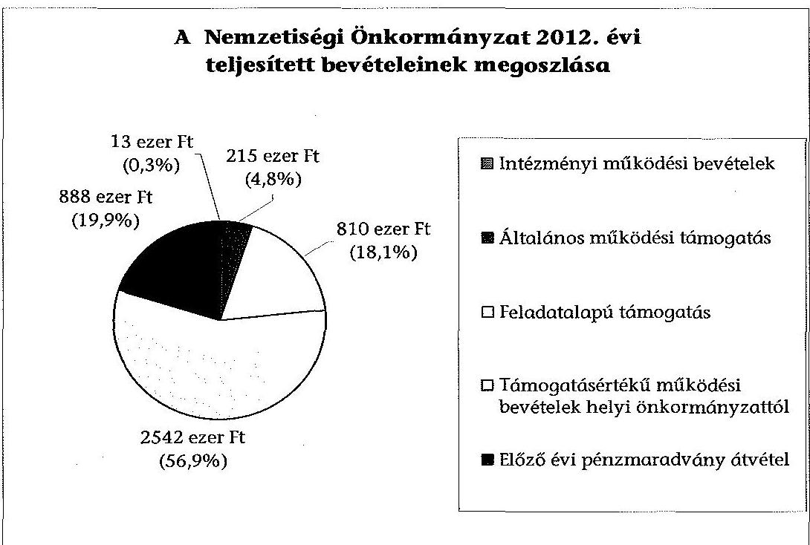
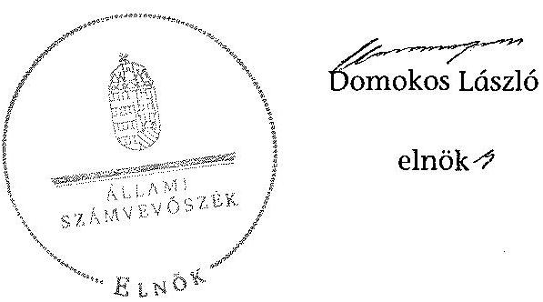

# ÁLLAMI   SZÁMVEVÔSZÉK 

## JELENTÉS

a helyi nemzetiségi önkormányzatok gazdálkodásának ellenőrzéséről
Ferencvárosi Görög Nemzetiségi Önkormányzat

---

Állami Számvevőszék
Iktatószám: V-0273-013/2014.
Témaszám: 1306
Vizsgálat-azonosító szám: V065226
Az ellenőrzést felügyelte:
Horváth Balázs
felügyeleti vezető
Az ellenőrzést vezette és az ellenőrzés végrehajtásáért felelős:
Kisgergely István
ellenőrzésvezető
A számvevőszéki jelentést készítették és a jelentés összeállításában
közremüködtek:
Komlósiné Bogár Éva
számvevő tanácsos
Szeibel Gáborné
számvevő
Az ellenőrzést végezte:
Nagy László Imre
számvevő

---

# TARTALOMJEGYZÉK 

BEVEZETÉS ..... 3
I. ÖSSZEGZŐ MEGÁLLAPÍTÁSOK, KÖVETKEZTETÉSEK, JAVASLATOK ..... 6
II. RÉSZLETES MEGÁLLAPÍTÁSOK ..... 11

1. A Nemzetiségi Önkormányzat és a Ferencvárosi Önkormányzat együttműködésének szabályozása, a működési feltételek biztosítása ..... 11
2. A gazdálkodási feladatok ellátásának szabályszerűsége ..... 13
2.1. A költségvetésre és a zárszámadásra, valamint a kincstári adatszolgáltatás rendjére vonatkozó jogszabályi előírások betartása ..... 13
2.2. A Nemzetiségi Önkormányzat gazdálkodásának szabályozottsága ..... 13
2.3. Az operatív gazdálkodási jogkörök kialakítása, gyakorlása ..... 14
3. A Nemzetiségi Önkormányzattal összefüggő gazdálkodási feladatok belső ellenőrzése ..... 16
4. A feladatalapú támogatás felhasználásának, elszámolásának szabályszerűsége, a Nemzetiségi Önkormányzat feladatellátása ..... 16
MELLÉKLETEK
5. számú A Nemzetiségi Önkormányzat 2012. évi gazdálkodásának főbb adatai, mutatói
6. számú Tájékoztatás a polgármesternek küldött el nem fogadott észrevételekről
FÜGGELÉKEK
7. számú Rövidítések jegyzéke
8. számú Értelmező szótár
9. számú A gazdálkodás értékelésének módszere

---

.

---

# JELENTÉS 

## a helyi nemzetiségi önkormányzatok gazdálkodásának ellenőrzéséről Ferencvárosi Görög Nemzetiségi Önkormányzat

## BEVEZETÉS

A Nemzetiségi Önkormányzat a 2004. évben alakult, elnöke a 2010. évi helyhatósági választások óta látja el feladatát. A Nemzetiségi Önkormányzat intézményt, gazdasági társaságot és más szervezetet nem alapított. A négytagú Képviselő-testület munkája segítésére bizottságot nem hozott létre. A Nemzetiségi Önkormányzatnak a költségvetési beszámolója szerint a 2012. évben a módosított költségvetési bevételi és kiadási előirányzata 3058 ezer Ft, a teljesített költségvetési bevétele 4468 ezer Ft, a teljesített költségvetési kiadása 3736 ezer Ft volt. A 2012. évi gazdálkodási adatokat részletesen az 1. számú mellékletben mutatjuk be.

Az Alaptörvény XXIX. cikk (1) bekezdése szerint a Magyarországon élő́ nemzetiségek államalkotó tényezők. Minden, valamely nemzetiséghez tartozó magyar állampolgárnak joga van önazonossága szabad vállalásához és megőrzéséhez. A hazánkban élő́ nemzetiségek helyi (települési és területi), valamint országos önkormányzatokat hozhatnak létre. A helyi nemzetiségi önkormányzatok gazdálkodási feladatait jogszabályi előírás alapján a székhely szerinti helyi önkormányzat Polgármesteri Hivatala látja el.

A nemzetiségek helyzete, támogatása mind hazai, mind EU-s szinten kiemelt figyelmet kap napjainkban. A helyi nemzetiségi önkormányzatok gazdálkodására és támogatási rendszerére vonatkozó jogszabályok a 2010-2012. években jelentős változásokon mentek át. A települési és területi nemzetiségi önkormányzatok gazdálkodásának, a részükre juttatott költségvetési támogatások felhasználásának ellenőrzését az ÁSZ a 2012. évben sorozatjellegú ellenőrzés keretében indította el. A 2013. évi ellenőrzések e témacsoportos ellenőrzések folytatását jelentik, amelyet az ÁSZ 2014. első félévi ellenőrzési terve a 12. témasorszámon tartalmaz.

Az ellenőrzés célja annak értékelése volt, hogy a Nemzetiségi Önkormányzat gazdálkodási kereteinek kialakítása, gazdálkodása és feladatellátása megfelelt-e a jogszabályoknak.

---

Ennek keretében értékeltük, hogy:

- a Nemzetiségi Önkormányzat és a Ferencvárosi Önkormányzat együttmúködésének szabályozása, a múködési feltételek biztosítása megfelelte a jogszabályi előírásoknak;
- a felek együttmúködése megfelelte a közöttük létrejött megállapodásnak a gazdálkodási feladatok szabályszerú ellátása során, ennek keretében betartották-e a Nemzetiségi Önkormányzat gazdálkodásához kapcsolódóan a költségvetésre és zárszámadásra, a gazdálkodás szabályozására, az operatív gazdálkodási jogkörök gyakorlására vonatkozó jogszabályi előírásokat;
- a jegyző biztosította-e a Nemzetiségi Önkormányzat gazdálkodásának belső ellenőrzését;
- a Nemzetiségi Önkormányzat feladatalapú támogatásának felhasználása, a folyósított feladatalapú támogatással történő elszámolás az előírásoknak megfelelő volt-e;
- a Nemzetiségi Önkormányzat feladatellátása összhangban volt-e a vonatkozó jogszabályi előírásokkal.

Az ellenőrzés várható hasznosulását négy szinten tervezzük. A törvényalkotás számára összegzett tapasztalatok állnak rendelkezésre a nemzetiségi önkormányzatok testületi döntéseinek, gazdálkodásának és a feladatalapú támogatás felhasználásának szabályszerűségéről, amelynek alapján következtetést lehet levonni arra, hogy indokolt-e jogszabályi módosítás kezdeményezése. Az ellenőrzés az ellenőrzött számára visszajelzést ad a múködésében fellépő hiányosságokról, javaslataival hozzájárul azok kiküszöböléséhez, amely csökkentheti a későbbi ellenőrzések gyakoriságát. Az ellenőrzés megállapításai és javaslatai tanulságul szolgálhatnak más nemzetiségi önkormányzatok, szervezetek számára a rendezett gazdálkodási keretek kialakításához. A társadalom számára jelzi, hogy közpénz nem maradhat ellenőrizetlenül, az ÁSZ értékteremtő rend kialakításához és megőrzéséhez hozzájáruló tevékenysége pozitív hatással lesz a szervezetről kialakított összkép formálásában. Az ÁSZ szervezetén belül lehetőség nyílik arra, hogy a megállapítások szintetizálásával az intézmény a hozzáadott értéket teremtő elemző tevékenységét és tanácsadó szerepét erősítse.

A Nemzetiségi Önkormányzat gazdálkodásának ellenőrzéséről szóló jelentés I. fejezetének összegző része az ellenőrzés céljára adott rövid, szintetizáló összefoglalót és következtetéseket tartalmazza a II. fejezet részletes megállapításain alapulóan. A jelentés, intézkedést igénylő megállapításait és javaslatait - az összegzőben foglaltak mellett - az ellenőrzés során feltárt, a jelentés II. fejezetében rögzített részletes megállapítások alapozzák meg, illetve támasztják alá.

# Az ellenőrzés típusa: szabályszerűségi ellenőrzés 

Az ellenőrzött időszak: a 2012. január 1.-2012. december 31. közötti időszak. Az ellenőrzés kiterjedt a Nemzetiségi Önkormányzatnak juttatott 2012. évi támogatás 2013. évben való elszámolására is.

---

Ellenőrzött szervezet: Ferencvárosi Görög Nemzetiségi Önkormányzat és a gazdálkodási feladatait ellátó Budapest Főváros IX. Kerület Ferencváros Önkormányzata.

Az ellenőrzés végrehajtásának jogszabályi alapját az ÁSZ tv. 5. § (2)(3) és (6) bekezdéseiben foglaltak képezik.

Az ellenőrzés szakmai módszertana az ÁSZ hivatalos honlapján (www.asz.hu) közzétett szakmai szabályokon alapult, amely a Legfőbb Ellenőrző Intézmények Nemzetközi Szervezete (INTOSAI) által kiadott nemzetközi standardok (ISSAI) figyelembevételével készült.

A helyi nemzetiségi önkormányzatok gazdálkodásának ellenőrzése során értékeltük a Nemzetiségi Önkormányzat és a Ferencvárosi Önkormányzat együttmúködésének, a gazdálkodás szabályozottságának és a pénzügyi folyamatokban kulcsszerepet betöltő belső kontrollok (teljesítésigazolás és érvényesítés) múködésének megfelelőségét. A kulcskontrollokat a dologi kiadásokkal kapcsolatos kifizetéseknél - véletlen mintavételi eljárást alkalmazva - ellenőriztük.

Ellenőriztük, hogy a jegyző biztosította-e a Nemzetiségi Önkormányzat gazdálkodásának belső ellenőrzését. Értékeltük a feladatalapú támogatások felhasználásának, elszámolásának szabályszerűségét, a Nemzetiségi Önkormányzat feladatellátása és a jogszabályi előírások összhangját.

Az ellenőrzés lefolytatásához a Nemzetiségi Önkormányzat és a gazdálkodási feladatait ellátó Ferencvárosi Önkormányzat tanúsítványok és a kapcsolódó, dokumentumjegyzékben megjelölt dokumentumok elektronikus úton történő megküldésével, rendelkezésre bocsátásával szolgáltatott adatokat. Az adatszolgáltatás kontrollálása és szükség szerinti javítása a helyszíni ellenőrzés keretében történt. A minősítési szempontokat a 3. számú függelék tartalmazza.

Az ÁSZ tv. 29. § (1) bekezdése szerint a jelentéstervezetet megküldtük észrevételezésre a polgármester és a Nemzetiségi Önkormányzat elnöke részére. Az ÁSZ tv. 29. § (2) bekezdésében foglalt észrevételezési jogával a Nemzetiségi Önkormányzat elnöke nem élt. A polgármester határidőben megküldött észrevétele és tájékoztatása alapján a jelentést nem módosítottuk. Az el nem fogadott észrevételek indoklását a jelentés 2. számú melléklete tartalmazza.

---

# 1. ÖSSZEGZŐ MEGÁLLAPÍTÁSOK, KÖVETKEZTETÉSEK, JAVASLATOK 

A Nemzetiségi Önkormányzat és a Ferencvárosi Önkormányzat együttmüködésének szabályozása nem felelt meg a jogszabályi előírásoknak. Az együttműködési megállapodás ${ }_{1}$-t a Nek. ${ }_{2}$ tv. előirása ellenére, 2012. január 31éig nem vizsgálták felül, és nem történt meg 2012. június 1-jéig a kiegészítése. A Nek. ${ }_{2}$ tv. alapján a Kormányhivatal 2012. június 1-jét követően nem kezdeményezett írásban egyeztetést a felek között az együttműködési megállapodás megkötése, módosítása érdekében. Az együttműködési megállapodás ${ }_{2}$-ról amelyet a polgármester és a Nemzetiségi Önkormányzat elnöke aláírt - a Nemzetiségi Önkormányzat Képviselő-testülete a Nek. ${ }_{2}$ tv. előirása ellenére nem hozott határozatot. Az együttműködési megállapodás ${ }_{1}$ nem tartalmazta a Nek. ${ }_{2}$ tv. előírásai szerinti önkormányzati múködés feltételeit és az ezzel kapcsolatos végrehajtási feladatokat, valamint egyes tartalmi elemeket. A szabályozási hiányosságok ellenére a Ferencvárosi Önkormányzat a Nemzetiségi Önkormányzat részére az előírt működési feltételeket a Nek. ${ }_{2}$ tv.-ben foglaltaknak megfelelően - a 2011. évben érvényes szabályok alapján - biztosította a 2012. évben. A törzskönyvi nyilvántartási adatok módosításával, az önálló fizetési számla nyitásával és az adószám igénylésével kapcsolatos feladatokat elvégezték.

A Nemzetiségi Önkormányzat 2012. évi költségvetésének, zárszámadásának tartalma, jóváhagyása, valamint a kapcsolódó adatszolgáltatás szabályszerüsége megfelelt a jogszabályi előírásoknak. A Nemzetiségi Önkormányzat elnöke az Áht. ${ }_{2}$ előírásainak megfelelően határidőben benyújtotta a Képviselő-testületnek a 2012. évi költségvetés tervezetét, a jóváhagyott költségvetés tartalmazta az Áht. ${ }_{2}$-ben és az Ávr.-ben foglalt tartalmi elemeket, bemutatták az előírt mérlegeket, kimutatásokat szöveges indoklással együtt. A jegyző által elkészített, 2012. évi zárszámadási határozat tervezetét a Nemzetiségi Önkormányzat elnöke az Áht. ${ }_{2}$-ben foglalt tartalommal, határidőben beterjesztette a Képviselő-testületnek. A Képviselő-testület a zárszámadásról hozott határozatot. A 2012. évi kincstári adatszolgáltatási kötelezettségnek hiánytalanul eleget tettek.

A 2012. évben a Polgármesteri Hivatal rendelkezett a Nemzetiségi Önkormányzat gazdálkodásának végrehajtási feladataira is kiterjedő hatályú számviteli politikával és a hozzá kapcsolódó szabályzatokkal. Ennek ellenére a Nemzetiségi Önkormányzat gazdálkodásának szabályozottsága az ellenőrzött időszakban nem volt megfelelő, mert a Polgármesteri Hivatal SZMSZ-ében nem rögzítették az Ávr.-ben foglaltak szerint az SZMSZ-ben nevesített munkakörökhöz tartozó, a Nemzetiségi Önkormányzat gazdálkodásának végrehajtásával kapcsolatos feladat- és hatásköröket, a hatáskörök gyakorlásának módját, a helyettesítés rendjét, az ezekhez kapcsolódó felelősségi szabályokra vonatkozó előírásokat. A jegyző a Nemzetiségi Önkormányzat gazdálkodásának végrehajtási feladataira vonatkozóan nem terjesztette ki a Bkr.-ben előírt ellenőrzési nyomvonalat és a szabálytalanságok kezelésének eljárásrendje hatályát.

---

Az operatív gazdálkodási jogkörök kialakítása megfelelt a jogszabályi előírásoknak. Gazdasági szervezet hiányában a jegyző az Áht. ${ }_{2}$ és az Ávr. előírásai alapján jelölt ki megfelelő végzettséggel rendelkező köztisztviselőt a pénzügyi ellenjegyzés és az érvényesítés gyakorlására. Az operatív gazdálkodási jogkörök kialakítását annak ellenére megfelelőnek minősítettük, hogy 2012. március 5 -én a Nemzetiségi Önkormányzat elnökét és képviselőjét az Ávr. előírásai ellenére a polgármester jogosulatlanul hatalmazta fel a Kötelezettségvállalási szabályzat ${ }_{2}$-ban a kötelezettségvállalási és az utalványozási jogkörök gyakorlására, valamint jelölte ki teljesítésigazolásra. Ezzel egyidejúleg egy képviselőt a Nemzetiségi Önkormányzat elnöke az Áht. ${ }_{2}$ és az Ávr. előírásai alapján szabályszerűen, írásban hatalmazott fel a kötelezettségvállalás és az utalványozás gyakorlására, valamint jelölt ki teljesítésigazolásra.

A Nemzetiségi Önkormányzatnál a 2012. évben a dologi kiadások teljesítése során - a véletlen mintavételi eljárást alkalmazva - a teljesítésigazolás és az érvényesítés kulcskontrollok múködésének megfelelősége gyenge volt, a hibák száma a lényegességi szintet, a kritikus hibahatárt elérte. Az érvényesítő nem tett eleget az Ávr.ben előírt ellenőrzési és jelzési kötelezettségének, nem ellenőrizte a megelőző ügymenetben a jogszabályok és a belső szabályzatok előírásainak betartását. A teljesítésigazolások során három esetben nem a Kötelezettségvállalási szabályzat ${ }_{2}$-ban előírt nyomtatványt használták, az utalványrendeletekről az Ávr. előírása ellenére hiányzott a kötelezettségvállalás nyilvántartási száma. A felvett előleg összege négy kifizetéshez kapcsolódóan meghaladta a Pénzkezelési szabályzatban rögzített összeghatárt. A dologi kiadások három legnagyobb összegű tétele esetében az érvényesítő nem tett eleget az Ávr.-ben előírt ellenőrzési és jelzési kötelezettségének, nem ellenőrizte a megelőző ügymenetben a jogszabályi előírások és a belső szabályzat előírásainak betartását. Nem jelezte, hogy kettő kifizetéshez kapcsolódóan a felvett előleg összege meghaladta a Pénzkezelési szabályzatban rögzített összeget. Nem észrevételezte, hogy a szolgáltatás kiadásának pénzügyi teljesítése előlegszámla kiállításának hiányában történt. A Nemzetiségi Önkormányzat a 2012. évben nem teljesített támogatásértékű kiadást, valamint államháztartáson kívülre pénzeszközátadást. A számvevőszéki ellenőrzés a rendelkezésre bocsátott dokumentumok alapján nem tárt fel jogosulatlan kifizetést.

A Polgármesteri Hivatal belső ellenőrzési tervét megalapozó kockázatelemzés kiterjedt a Nemzetiségi Önkormányzat gazdálkodásával összefüggő végrehajtási feladatokra. A kockázatelemzés során a Nemzetiségi Önkormányzat gazdálkodását nem ítélték magas kockázatúnak, ezért arra vonatkozóan nem terveztek belső ellenőrzést a 2012. évben. A Nemzetiségi Önkormányzatnál belső ellenőrzés lefolytatására nem került sor a 2012. évben, a belső ellenőrzés nem tárta fel a Nemzetiségi Önkormányzat gazdálkodásával kapcsolatos hiányosságokat.

A feladatalapú támogatás elszámolása nem volt megfelelő. A Nemzetiségi Önkormányzat a 2011. évben 940 ezer Ft, a 2012. évben 810 ezer Ft összegű feladatalapú támogatásban részesült. A 2011. és 2012. évi feladatalapú támogatást év közben felhasználták. A feladatalapú támogatás tervezett felhasználási céljairól a Képviselő-testület nem hozott határozatot. A Nemzetiségi Önkormányzat az Áht. ${ }_{2}$ előírása ellenére nem módosította a 2012. évi költségvetési határozatát a folyósított feladatalapú támogatás összegével. Az Áht. ${ }_{1,2}$-ben,

---

valamint a támogatási kormányrendelet ${ }_{1,2}$-ben elôírt elszámolás nem történt meg, a támogatás felhasználását, elszámolását az ellenőrzésre jogosult szervek nem ellenőrizték.

A Nemzetiségi Önkormányzat feladatellátásának tárgya a 2012. évben összhangban volt a Nek. ${ }_{2}$ tv. előírásaival, kötelező közfeladatokat látott el.

Az ÁSZ tv. 33. § (1) bekezdésében foglaltak értelmében az ellenőrzött szervezet vezetője köteles a jelentésben foglalt megállapításokhoz kapcsolódó intézkedési tervet összeállítani és azt a jelentés kézhezvételétől számított 30 napon belül az ÁSZ részére megküldeni. Amennyiben az intézkedési tervet határidőre nem küldi meg a szervezet, vagy az nem elfogadható, az ÁSZ elnöke az ÁSZ tv. 33. § (3) bekezdés a)-b) pontjaiban foglaltakat érvényesítheti.

A helyszíni ellenőrzés megállapításainak hasznosítása mellett javasoljuk:

# a jegyzönek 

1. az együttmúködés szabályozásával kapcsolatban

Az együttműködési megállapodás,-t a Nek. ${ }_{2}$ tv. 80. § (2) bekezdésének előírása ellenére 2012. január 31-éig nem vizsgálták felül. Az együttmúködési megállapodás, nem tartalmazta a Nek. ${ }_{2}$ tv. 80. § (1) bekezdése szerinti múködési feltételeket és a 80. § (3) és (4) bekezdéseiben foglalt tartalmi elemeket.

Javaslat
a) biztosítsa a jövőben az együttműködési megállapodás évenkénti felülvizsgálata során a Nek. ${ }_{2}$ tv. 80. § (2) bekezdésében előírt határidő betartását;
b) készítse elő az együttműködési megállapodás módosítását, hogy az tartalmilag feleljen meg a Nek. ${ }_{2}$ tv. 80. § (1), (3) és (4) bekezdéseiben foglalt előírásoknak.
2. a gazdálkodás szabályozottságával kapcsolatban

A Polgármesteri Hivatal SZMSZ-ében nem rögzítették az Ávr. 13. § (1) bekezdés g) pontjában foglaltak szerinti, az SZMSZ-ben nevesített munkakörökhöz tartozó - a Nemzetiségi Önkormányzat gazdálkodásának végrehajtási feladataival kapcsolatos - feladat- és hatáskörökre, a hatáskörök gyakorlásának módjára, a helyettesítés rendjére, az ezekhez kapcsolódó felelősségi szabályokra vonatkozó előírásokat. A jegyző a Nemzetiségi Önkormányzat gazdálkodásának végrehajtási feladataira nem terjesztette ki a Bkr. 6. § (4) bekezdésében előírt szabálytalanságok kezelésének eljárásrendjét.

Javaslat
A gazdálkodás szabályszerűsége érdekében:
a) készítse el a Polgármesteri Hivatal SZMSZ-ének módosítását, hogy az tartalmazza - a Nemzetiségi Önkormányzat gazdálkodásának végrehajtási feladataira vonatkozóan - az Ávr. 13. § (1) bekezdés g) pontjában foglaltakat;

---

b) módosítsa a Polgármesteri Hivatal Bkr. 6. § (4) bekezdése szerinti szabálytalanságok kezelésének eljárásrendjét, hogy az terjedjen ki a Nemzetiségi Önkormányzat gazdálkodásának végrehajtási feladataira.
3. a kulcskontrollok müködésével kapcsolatban

Az érvényesítő az Ávr. 58. § (1)-(2) bekezdése szerinti feladatát nem látta el, mert nem ellenőrizte a megelőző ügymenetben a jogszabályok és a belső szabályzat előírásainak betartását, nem jelezte, hogy a kötelezettségvállalás nyilvántartási számát nem tüntették fel az utalványrendeleteken, az előleg felvételekor nem tartották be a Pénzkezelési szabályzatukban rögzített összeghatárt.

Javaslat
Az operatív gazdálkodás müködési hibáinak megelőzése, feltárása és kijavítása érdekében gondoskodjon arról, hogy az érvényesítő az Ávr. 58. § (1)-(2) bekezdéseiben előírt ellenőrzési és jelzési feladatait maradéktalanul lássa el.
4. a feladatalapú támogatás elszámolásával kapcsolatban

A 2011. évi feladatalapú támogatás elszámolása a támogatási kormányrendelet ${ }_{1}$ 7. § (2) bekezdésében hivatkozott, valamint a 2012. évi feladatalapú támogatás elszámolása a támogatási kormányrendelet ${ }_{2} 8 . \S$ (5) bekezdésében hivatkozott „a helyi önkormányzatok elszámolási és ellenőrzési rendjére vonatkozó jogszabályok" előírása alapján az Áht. ${ }_{1} 64 . \S$ (7) bekezdése és az Áht. ${ }_{2} 57 . \S$ (3) bekezdése ellenére nem történt meg.

Javaslat
Gondoskodjon az Áht. ${ }_{2}$ 27. § (2) bekezdésében meghatározott feladatkörében a Nemzetiségi Önkormányzat által igénybevett 2011. évi és 2012. évi feladatalapú támogatás felhasználásáról szóló elszámolás elkészítéséről az Áht. ${ }_{2}$ 53. § (1) bekezdése szerinti beszámolási kötelezettség teljesítéséhez.

# a polgármesternek 

1. Az együttműködési megállapodás ${ }_{1}$ nem tartalmazta a Nek. ${ }_{2}$ tv. 80. § (1) bekezdése szerinti müködési feltételeket és a 80. § (3) és (4) bekezdéseiben foglalt tartalmi elemeket.

Javaslat
Terjessze a Képviselő-testület elé jóváhagyásra az együttműködési megállapodás jegyző által előkészített módosítását, hogy az tartalmilag feleljen meg a Nek. ${ }_{2}$ tv. 80. § (1), (3) és (4) bekezdéseiben foglalt előírásoknak.
2. A Polgármesteri Hivatal SZMSZ-ében nem rögzítették az Ávr. 13. § (1) bekezdés g) pontjában foglaltak szerinti, az SZMSZ-ben nevesített munkakörökhöz tartozó - a Nemzetiségi Önkormányzat gazdálkodásának végrehajtásával kapcsolatos - feladat- és hatáskörökre, a hatáskörök gyakorlásának módjára,

---

a helyettesítés rendjére, az ezekhez kapcsolódó felelősségi szabályokra vonatkozó előírásokat.

Javaslat
Terjessze a Képviselő-testület elé a Polgármesteri Hivatal SZMSZ-ének jegyző által elkészített módosítását, hogy az tartalmazza - a Nemzetiségi Önkormányzat gazdálkodásának végrehajtási feladataira vonatkozóan - az Ávr. 13. § (1) bekezdés g) pontjában foglaltakat.

# a Nemzetiségi Önkormányzat elnökének 

1. Az együttműködési megállapodás, nem tartalmazta a Nek. 2 tv. 80. § (1) bekezdése szerinti müködési feltételeket és a 80. § (3) és (4) bekezdéseiben foglalt tartalmi elemeket.

Javaslat
Terjessze a Képviselő testület elé jóváhagyásra az együttműködési megállapodás jegyző által előkészített módosítását, hogy az tartalmilag feleljen meg a Nek. 2 tv. 80. § (1), (3) és (4) bekezdéseiben foglalt előírásoknak.
2. A 2011. évi feladatalapú támogatás elszámolása a támogatási kormányrendelet, 7. § (2) bekezdésében hivatkozott, valamint a 2012. évi feladatalapú támogatás elszámolása a támogatási kormányrendelet, 8. § (5) bekezdésében hivatkozott „a helyi önkormányzatok elszámolási és ellenőrzési rendjére vonatkozó jogszabályok" előírása alapján az Áht., 64. § (7) bekezdése és az Áht. 2 57. § (3) bekezdése ellenére nem történt meg.

Javaslat
Terjessze a Képviselő-testület elé jóváhagyásra az Áht. 2 53. § (1) bekezdése szerinti beszámolási kötelezettség teljesítéséhez a Nemzetiségi Önkormányzat által igénybevett feladatalapú támogatás felhasználásáról szóló elszámolást.

---

# II. RÉSZLETES MEGÁLLAPÍTÁSOK 

## 1. A Nemzetiségi Önkormányzat és a Ferencvárosi ÖnkormÁNYZAT EGYÜTTMÜKÖDÉSÉNEK SZABÁLYOZÁSA, A MÜKÖDÉSI FELTÉTELEK BIZTOSÍTÁSA

A Nemzetiségi Önkormányzat és a Ferencvárosi Önkormányzat együttműködésének szabályozása nem felelt meg a jogszabályi előírásoknak.

A Nemzetiségi Önkormányzat az ellenőrzött időszakban rendelkezett a Ferencvárosi Önkormányzattal kötött együttmúködési megállapodással. Az együttmúködési megállapodás ${ }_{1}$ a Képviselő-testületek döntését követően 2011. december 13-án került aláírásra ${ }^{1}$. Az együttmúködési megállapodás ${ }_{1}$-t a Nek. ${ }_{2}$ tv. 80. § (2) bekezdésének előírása ellenére 2012. január 31-éig nem vizsgálták felül, és 2012. június 1-jéig nem történt meg a kiegészítése. A Nek. ${ }_{2}$ tv. 83. § (3) bekezdése alapján a Kormányhivatal 2012. június 1-jét követően nem kezdeményezett írásban egyeztetést a felek között az együttműködési megállapodás megkötése, módosítása érdekében. Az együttműködési megállapodás ${ }_{1}$ kiegészítéseként 2012. december 12-én a Nemzetiségi Önkormányzat és a Ferencvárosi Önkormányzat együttműködési megállapodás ${ }_{2}$-t kötött. A Nemzetiségi Önkormányzat Képviselő-testülete a Nek. ${ }_{2}$ tv. 78. § (3) bekezdésének előírása ellenére nem hozott határozatot az együttműködési megállapodás ${ }_{2}$-ról.

Az együttműködési megállapodás ${ }_{2}$ 8. pontjában a költségvetés elkészítése jóváhagyásának eljárási rendjére, a költségvetési gazdálkodás bonyolításának rendjére, a beszámoló elkészítésének és jóváhagyásának eljárási rendjére, az ellenjegyzési, érvényesítési, utalványozási, teljesítésigazolással kapcsolatos feladatokra, a vagyontárgyak kezelésének rendjére, a számviteli, pénzügyi és információszolgáltatási tevékenység végzésének rendjére, a belső ellenőrzés elvégzésére vonatkozó szabályok érvényben tartásáról állapodtak meg.

Az együttműködési megállapodás ${ }_{1}$ nem tartalmazta:

- a Nek. ${ }_{2}$ tv. 80. § (1) bekezdés a) pontja alapján a Nemzetiségi Önkormányzat részére havonta igény szerint, de legalább tizenhat órában, az önkormányzati feladat ellátásához szükséges tárgyi, technikai eszközökkel felszerelt helyiség ingyenes használatát, a helyiséghez, továbbá a helyiség infrastruktúrájához kapcsolódó rezsiköltségek és fenntartási költségek viselését;
- a Nek. ${ }_{2}$ tv. 80. § (1) bekezdés b) pontja alapján az önkormányzati múködéshez (a testületi, tisztségviselői, képviselői feladatok ellátásához) szükséges tárgyi és személyi feltételek biztosítását;

[^0]
[^0]:    ${ }^{1}$ A Nemzetiségi Önkormányzat 32/2011. (IX. 23.) számú határozata, illetve a Ferencvárosi Önkormányzat Képviselő-testülete 35/2011. (XII. 12.) számú rendelete, a Szervezeti és Müködési Szabályzatáról szóló 28/2011. (X. 11.) számú önkormányzati rendelet módosításáról.

---

- a Nek. ${ }_{2}$ tv. 80. § (1) bekezdés c) pontja alapján a testületi ülések előkészítését (meghívók, előterjesztések, hivatalos levelezés előkészítése, postázása, a testületi ülések jegyzőkönyveinek elkészítése, postázása);
- a Nek. ${ }_{2}$ tv. 80. § (1) bekezdés d) pontja alapján a testületi döntések és a tisztségviselők döntéseinek előkészítését, a testületi és tisztségviselői döntéshozatalhoz kapcsolódó nyilvántartási, sokszorosítási, postázási feladatok ellátását;
- a Nek. ${ }_{2}$ tv. 80. § (1) bekezdés e) pontja alapján a Nemzetiségi Önkormányzat múködésével, gazdálkodásával kapcsolatos nyilvántartási, iratkezelési feladatok ellátását;
- a Nek. ${ }_{2}$ tv. 80. § (1) bekezdés g) pontja alapján a fenti feladatellátáshoz kapcsolódó költségek - a testületi tagok és tisztségviselők telefonhasználata költségei kivételével - viselését;
- a Nek. ${ }_{2}$ tv. 80. § (3) bekezdés a) pontja által előírt önálló fizetési számla nyitásával, törzskönyvi nyilvántartásba vételével és adószám igénylésével kapcsolatos feladatokat, azok felelőseinek konkrét kijelölését és végrehajtásának határidejét;
- a Nek. ${ }_{2}$ tv. 80. § (3) bekezdés b) pontja által előírt szakmai teljesítésigazolási feladatokat és felelőseinek konkrét kijelölését;
- a Nek. ${ }_{2}$ tv. 80. § (3) bekezdés c) pontja által előírt, a Nemzetiségi Önkormányzat kötelezettségvállalásaival összefüggő összeférhetetlenségi és nyilvántartási szabályokat;
- a Nek. ${ }_{2}$ tv. 80. § (3) bekezdés d) pontja által előírt, a Nemzetiségi Önkormányzat gazdálkodásának eljárási és dokumentációs részletszabályai közül a teljesítésigazolással, valamint az ezt végző személyek kijelölésének rendjével kapcsolatos előírásokat, feltételeket;
- a Nek. ${ }_{2}$ tv. 80. § (4) bekezdés ellenére azt, hogy a jegyző vagy annak a - a jegyzővel azonos képesítési előírásoknak megfelelő - megbízottja a Ferencvárosi Önkormányzat megbízásából és képviseletében részt vesz a Nemzetiségi Önkormányzat testületi ülésein és jelzi, amennyiben törvénysértést észlel.

Az együttműködési megállapodás ${ }_{1}$ az Áht. ${ }_{2}$-ben foglaltak szerint tartalmazta a tervezési, gazdálkodási, ellenőrzési, finanszírozási, adatszolgáltatási és beszámolási feladatokat.

A Képviselő-testület a 49/2013. (XI. 12.) számú határozatával elfogadta a Nemzetiségi Önkormányzat új SZMSZ-ének 2. számú mellékleteként az együttmúködési megállapodás ${ }_{2}$-t és annak 2013. április 5-ei módosítását.

A szabályozási hiányosságok ellenére - a jegyző és a Nemzetiségi Önkormányzat elnöke által tett nyilatkozat alapján - a Ferencvárosi Önkormányzat a Nemzetiségi Önkormányzat részére az előírt múködési feltételeket a Nek. ${ }_{2}$ tv. 159. § (3) bekezdésében foglaltakra tekintettel - a Nek. ${ }_{1}$ tv. 27. § (1)(2) bekezdésében foglaltak szerint - biztosította a 2012. évben. A törzskönyvi nyilvántartási adatok módosításával, az önálló fizetési számla nyitásával és az adószám igénylésével kapcsolatos feladatokat elvégezték.

---

# 2. A GAZDÁLKODÁSI FELADATOK ELLÁTÁSÁNAK SZABÁLYSZERŰSÉGE 

### 2.1. A költségvetésre és a zárszámadásra, valamint a kincstári adatszolgáltatás rendjére vonatkozó jogszabályi előírások betartása

A Nemzetiségi Önkormányzat 2012. évi költségvetésének, zárszámadásának tartalma, jóváhagyása, valamint a kapcsolódó 2012. évi adatszolgáltatás szabályszerűsége megfelelt a jogszabályi előírásoknak.

A jegyző elkészítette, és a Nemzetiségi Önkormányzat elnöke az Áht. ${ }_{2}$ előírásainak megfelelően határidőben benyújtotta a Képviselő-testületnek a 2012. évi költségvetés tervezetét. A jóváhagyott költségvetés tartalmazta az Áht. ${ }_{2}$-ben és az Ávr.-ben előírt tartalmi elemeket, a költségvetési bevételeket és költségvetési kiadásokat előirányzat-csoportok, kiemelt előirányzatok szerinti bontásban. A 2012. évi költségvetés tervezetének előterjesztésekor a Képviselő-testület részére az Áht. ${ }_{2}$ előírásának megfelelően bemutatták az előírt mérlegeket, kimutatásokat a szöveges indoklással együtt.

A jegyző által elkészített 2012. évi zárszámadási határozat tervezetét a Nemzetiségi Önkormányzat elnöke az Áht. ${ }_{2}$-ben foglaltak alapján, határidőn belül beterjesztette a Képviselő-testületnek. A 2012. évi zárszámadási határozat tervezetének előterjesztésénél a Képviselő-testület részére tájékoztatásul bemutatták az Áht. ${ }_{2}$ előírása szerinti mérlegeket, kimutatásokat. A Képviselő-testület a zárszámadásról alkotott határozat és az elfogadott költségvetés összehasonlíthatóságát biztosították, a Nemzetiségi Önkormányzat a zárszámadási határozatban valamennyi bevételéről és kiadásáról elszámolt.

A 2012. költségvetési évvel kapcsolatban a jegyző a Nemzetiségi Önkormányzatra vonatkozó kincstári adatszolgáltatási kötelezettségének hiánytalanul eleget tett, a 2012. évi elemi költségvetését, a féléves és éves beszámolóját, valamint az időközi költségvetési- és mérlegjelentéseket az Ávr. szerinti határidőig megküldte a Kincstár részére.

### 2.2. A Nemzetiségi Önkormányzat gazdálkodásának szabályozottsága

A Nemzetiségi Önkormányzat gazdálkodásának szabályozottsága az ellenőrzött időszakban nem volt megfelelő, mivel:

- a Polgármesteri Hivatal SZMSZ-ében - a munkaköri leírásokkal ellentétben nem rögzítették az Ávr. 13. § (1) bekezdés g) pontjában foglaltak szerinti az SZMSZ-ben nevesített munkakörökhöz tartozó - a Nemzetiségi Önkormányzat gazdálkodásának végrehajtásával kapcsolatos - feladat- és hatáskörökre, a hatáskörök gyakorlásának módjára, a helyettesítés rendjére, az ezekhez kapcsolódó felelősségi szabályokra vonatkozó előírásokat;
- a jegyző a Nemzetiségi Önkormányzat gazdálkodásának végrehajtási feladataira vonatkozóan nem terjesztette ki a Bkr. 6. § (3) és (4) bekezdéseiben

---

előírt ellenőrzési nyomvonalat és a szabálytalanságok kezelésének eljárásrendje hatályát.

A 2013. október 1-jétől hatályos ellenőrzési nyomvonalat már kiterjesztették a Nemzetiségi Önkormányzatra is.

A 2012. évben a Polgármesteri Hivatal rendelkezett a Nemzetiségi Önkormányzat végrehajtási feladataira is kiterjedő hatályú, a Számv. tv. által előírt számviteli politikával és ahhoz kapcsolódóan a gazdálkodás végrehajtási feladataira vonatkozó szabályzatokkal: pénzkezelési szabályzattal, számlarenddel, eszközök és források leltárkészítési és leltározási szabályzatával, eszközök és források értékelési szabályzatával.

Az Áht. ${ }_{2}$-ben és az Ávr.-ben foglaltak szerint a tervezéssel, gazdálkodással, a kötelezettségvállalással, pénzügyi ellenjegyzéssel, teljesítésigazolással, az érvényesítés, utalványozás gyakorlásának módjával, eljárási és dokumentációs részletszabályaival, valamint az ezeket végző személyek kijelölésének rendjével, továbbá az ellenőrzési és adatszolgáltatási feladatok teljesítésével kapcsolatos belső előírásokat, feltételeket tartalmazó belső szabályzat ${ }^{2}$ rendelkezésre állt.

A Nemzetiségi Önkormányzat gazdálkodásának végrehajtásával kapcsolatos teendőket a feladatot ellátó köztisztviselők munkaköri leírásaiban részletesen rögzítették.

# 2.3. Az operatív gazdálkodási jogkörök kialakítása, gyakorlása 

A Nemzetiségi Önkormányzat gazdálkodása tekintetében az operatív gazdálkodási jogkörök kialakítása megfelelt a jogszabályi elöírásoknak, mivel:

- a Nemzetiségi Önkormányzat elnöke az Áht. ${ }_{2}$ és az Ávr. előírásainak megfelelően 2012. március 5 -én írásban hatalmazott fel a kötelezettségvállalás és utalványozás gyakorlására más képviselőt, illetve jelölt ki teljesítésigazoló személyt;
- gazdasági szervezet hiányában a jegyző az Áht. ${ }_{2}$ és az Ávr. előírásai alapján jelölt ki megfelelő végzettséggel rendelkező köztisztviselőt a pénzügyi ellenjegyzés és az érvényesítés gyakorlására.

Az operatív gazdálkodási jogkörök kialakítását annak ellenére megfelelőnek értékeltük, hogy a Ferencvárosi Önkormányzat polgármestere adott felhatalmazást - 2012. március 5-én - a Nemzetiségi Önkormányzat elnöke és képviselője részére kötelezettségvállalási, teljesítésigazolási, valamint utalványozási jogkörök gyakorlására ${ }^{3}$. A polgármester jogosulatlanul végezte a kijelölést, mert az ellentétes volt:

[^0]
[^0]:    ${ }^{2}$ Kötelezettségvállalási szabályzat ${ }_{1,2}$
    ${ }^{3}$ a Kötelezettségvállalási szabályzat ${ }_{2} 2$. számú melléklete

---

- az Ávr. 52. § (7) bekezdésében foglaltakkal, mely szerint a Nemzetiségi Önkormányzat kiadási előirányzatai terhére a Nemzetiségi Önkormányzat elnöke, vagy az általa írásban felhatalmazott személy vállalhat kötelezettséget;
- az Ávr. 57. § (4) bekezdésében foglaltakkal, mely szerint a teljesítés igazolására jogosult személyeket a kötelezettségvállaló írásban jelöli ki;
- az Ávr. 59. § (1) bekezdésében foglaltakkal, mely szerint az Ávr. 52. §-ában foglaltak szerint - a kötelezettségvállalásnál előírt módon - kell eljárni az utalványozásra jogosult személyek kijelölésével.

A Nemzetiségi Önkormányzatnál a 2012. évben a dologi kiadások teljesítése során - a véletlen mintavételi eljárást alkalmazva - a teljesítésigazolás és az érvényesítés kulcskontrollok müködésének megfelelősége gyenge volt, a hibák száma a lényegességi szintet, a kritikus hibahatárt elérte.

Az érvényesítő az Ávr. 58. § (1)-(2) bekezdései ellenére feladatát nem látta el, mert nem ellenőrizte a megelőző ügymenetben a jogszabályi előírások és belső szabályzatok előírásainak betartását, valamint nem jelezte, hogy az ellenőrzött tételek esetében:

- a teljesítésigazolások során három esetben nem a Kötelezettségvállalási szabályzat ${ }_{2}$-ban előírt teljesítésigazolás nyomtatványt használták;
- az Ávr. 59. § (3) bekezdése f) pontjában foglaltak ellenére az utalványrendeleteken nem tüntették fel a kötelezettségvállalás nyilvántartási számát;
- négy alkalommal előfordult, hogy a felvett pénztári előleg összegével túllépték a Pénzkezelési szabályzatban rögzített 500 ezer Ft-os értékhatárt.

A dologi kiadások három legnagyobb összegű tétele esetében az érvényesítő az Ávr. 58. § (1)-(2) bekezdéseiben foglalt feladatát nem látta el, mert nem ellenőrizte a megelőző ügymenetben a jogszabályok és a belső szabályzat előírásainak betartását. Nem jelezte, hogy a teljesítésigazolások során nem a Kötelezettségvállalási szabályzat ${ }_{2}$-ban előírt teljesítésigazolás nyomtatványt használták, az utalványrendeleteken - az Ávr. 59. § (3) bekezdés f) pontjában foglaltak ellenére - nem tüntették fel a kötelezettségvállalás nyilvántartási számát. Nem jelezte továbbá, hogy kettő kiadáshoz kapcsolódóan a felvett pénztári előleg összege meghaladta a Pénzkezelési szabályzatban rögzített 500 ezer Ft-ot és egy esetben 200 ezer Ft összegű előleg számla nélküli kifizetését. A kifizetett előlegről a kifizetés időpontjában nem állítottak ki számlát, csak megrendelő és átvételi elismervény készült. A szolgáltatás igénybevételét követően készült el a számla, amely bruttó összegben tartalmazta az előleg összegét is.

A Nemzetiségi Önkormányzat a 2012. évben nem teljesített támogatásértékű kiadást, valamint államháztartáson kívülre pénzeszközátadást.

A számvevőszéki ellenőrzés a kiadások dokumentumainak ellenőrzése alapján összeférhetetlenséget, továbbá jogosulatlan kifizetést nem tárt fel, azonban a kulcskontrollok múködéséhez kapcsolódó hiányosságok miatt nem biztosították a hibák megelőzését, feltárását és kijavítását.

---

# 3. A Nemzetiségi ÖNKORMÁNYZATTAL ÖSSZEFÜGGŐ GAZDÁLKODÁSI FELADATOK BELSŐ ELLENÖRZÉSE 

A jegyző az éves belső ellenőrzési terv összeállítása során figyelemmel volt a Nemzetiségi Önkormányzat gazdálkodásának belső ellenőrzésére, mert a Polgármesteri Hivatal belső ellenőrzési tervét megalapozó kockázatelemzés kiterjedt a Nemzetiségi Önkormányzat gazdálkodásával összefüggő végrehajtási feladatokra. A kockázatelemzés során a Nemzetiségi Önkormányzat gazdálkodását nem ítélték magas kockázatúnak, ezért arra vonatkozóan nem terveztek belső ellenőrzést a 2012. évben. A Nemzetiségi Önkormányzatnál belső ellenőrzés lefolytatására nem került sor a 2012. évben, a belső ellenőrzés nem tárta fel a Nemzetiségi Önkormányzat gazdálkodásával kapcsolatos hiányosságokat.

Az ellenőrzéshez szolgáltatott adatok alapján a 2012. évben a Kormányhivatal a Nemzetiségi Önkormányzatot illetően nem élt törvényességi felügyeleti eszközökkel.

## 4. A feladatalapú támogatás felhasználásáNAK, elszámolásáNAK SzABÁLYSZERÜSÉGE, a NEMZETISÉGI ÖNKORMÁNYZAT FELADATELLÁTÁSA

A 2011. és a 2012. évi feladatalapú támogatás elszámolása nem volt megfelelő. A Nemzetiségi Önkormányzat a 2011. évben 940 ezer Ft, a 2012. évben 810 ezer Ft összegű feladatalapú támogatásban részesült. A 2011. és 2012. évi feladatalapú támogatást év közben felhasználták.

A 2012. évben a feladatalapú támogatás összes bevételhez viszonyított részarányát a következő ábra szemlélteti.

---

A 2012. évben a feladatalapú támogatás tervezett felhasználási céljairól a támogatás kiutalását megelőzően a Képviselő-testület nem hozott határozatot. A Nemzetiségi Önkormányzat - az Áht. ${ }_{2}$ 34. § (5) bekezdésében foglaltak ellenére - a támogatás összegével nem módosította a 2012. évi költségvetési előirányzatát.

A 2011. évi feladatalapú támogatás elszámolása a támogatási kormányrendelet, 7. § (2) bekezdésében hivatkozott, valamint a 2012. évi feladatalapú támogatás elszámolása a támogatási kormányrendelet, 8. § (5) bekezdésében hivatkozott „a helyi önkormányzatok elszámolási és ellenőrzési rendjére vonatkozó jogszabályok rendelkezései alkalmazandóak" előírása alapján az Áht. 64. § (7) bekezdése és az Áht. 2 57. § (3) bekezdése ellenére nem történt meg.

A 2012. évi zárszámadási határozat előterjesztésben bemutatták a feladatalapú támogatás összegét.

A Nemzetiségi Önkormányzatnál a feladatalapú támogatások felhasználását, elszámolását az ellenőrzésre jogosult szervek nem ellenőrizték.

A Nemzetiségi Önkormányzat feladatellátásának tárgya 2012. évben összhangban volt a Nek. 2 tv. 115. §-ával. A Nemzetiségi Önkormányzat kötelező közfeladatot látott el, kulturális rendezvények szervezésére hozott intézkedéseket. A Nemzetiségi Önkormányzat a Nek. ${ }_{2}$ tv. 116. § (2) bekezdésében tiltott hatósági feladatokat nem végzett.

Budapest, 2014. 10. hó 20. nap

Melléklet: $\quad 2 \mathrm{db}$
Függelék: $\quad 3 \mathrm{db}$

---

.

---

# A Nemzetiségi Önkormányzat 2012. évi gazdálkodásának föbb adatai, mutatói

A) Bevételek

|  Megnevezés | Eredeti elöirányzat | Módosított
ezzer Ft | Teljesítés |   |
| --- | --- | --- | --- | --- |
|   |  |  |  | megoszlás
$(\%)$  |
|  Intézményi müködési bevételek | 0 | 3 | 13 | 0,3  |
|  Általános müködési támogatás | 0 | 0 | 215 | 4,8  |
|  Feladatalapú támogatás | 0 | 0 | 810 | 18,1  |
|  Támogatásértékủ múködési bevételek helyi önkormányzattól | 1487 | 2167 | 2542 | 56,9  |
|  Előző évi pénzmaradvány átvétel | 0 | 888 | 888 | 19,9  |
|  Költségvetési bevételek | 1487 | 3058 | 4468 | 100  |
|  Tárgyévi bevételek | 1487 | 3058 | 4468 | 100  |

B) Kiadások

|  Megnevezés | Eredeti elöirányzat | Módosított
ezzer Ft | Teljesítés |   |
| --- | --- | --- | --- | --- |
|   |  |  |  | megoszlás
$(\%)$  |
|  Személyi juttatások | 750 | 750 | 706 | 18,9  |
|  Dologi kiadások | 737 | 2308 | 3030 | 81,1  |
|  Költségvetési kiadások | 1487 | 3058 | 3736 | 100  |
|  Tárgyévi kiadások | 1487 | 3058 | 3736 | 100  |

---

.

---

# TÁJÉKOZTATÁS   A POLGÁRMESTERNEK KÜLDÖTT   EL NEM FOGADOTT ÉSZREVÉTELEKRŐL 

Észrevétel A jelentéstervezet 1. és 2. pontjához kapcsolódóan:
Az ellenőrzési jelentéstervezetben az együttmúködési megállapodás kapcsán megállapított hiányosságokat az ellenőrzött időszakot követően, még az ellenőrzést megelőzően megszüntettük, az együttműködési megállapodás 2013. évben történt Nek. tv-ben előírtak szerinti módosításával és a Nemzetiségi Önkormányzat által történő elfogadásával, melynek dokumentumait rendelkezésre bocsájtottuk.
A hiányosságok egy részét a helyszíni ellenőrzést követően, a záró tárgyaláson elhangzott javaslatok alapján a lehető leggyorsabb úton kijavítottuk. Ennek kapcsán módosításra került a Polgármesteri Hivatal SZMSZ-e. Bár álláspontunk szerint sem a Nek. törvény, sem az Áht. nem ír elő olyan kötelezettséget, melynek alapján kötelező lenne a nemzetiségek múködésével kapcsolatos munkakör nevesítése, az ÁSZ kérésének megfelelően a Polgármesteri Hivatal SZMSZ-ében az egyes szervezeti egységek feladat-és hatásköreibe a korábbinál specifikáltabban kerültek meghatározásra ezen feladatok. Így rögzítésre kerültek a nemzetiségi önkormányzatok (beleérve a Ferencvárosi Görög Nemzetiségi Önkormányzatot) gazdálkodásával kapcsolatos feladat- és hatáskörök, a hatáskörök gyakorlásának módja, az ezekhez kapcsolódó felelősségi szabályok. Mellékelten megküldöm a Polgármesteri Hivatal módosított SZMSZ-ét.
A jelentéstervezetben említett együttmúködési megállapodás 2012. december 12-én került aláírásra, azonban a törvényben előírt személyi és tárgyi feltételek már annak aláírása előtt is biztosítottak voltak, amelyet a jegyző és a Ferencvárosi Görög Nemzetiségi Önkormányzat elnöke által 2012. október 7 -én tett nyilatkozatban foglaltak alátámasztanak. A Bp. Főváros IX. Kerület Ferencváros Önkormányzatának Képviselő-testülete a 262/2012. (VI. 07.) számú határozatával döntött a Ferencvárosi Nemzetiségi Önkormányzatok részére történő helyiségek biztosításáról. Egyes Nemzetiségi Önkormányzatok azonban nem kívántak élni a törvény által biztosított jogokkal, így szükséges volt mindenkivel az adott helyzetre vonatkozó konkrét és részletes egyeztetés, melyek - tekintettel arra, hogy a különböző igények, szándékok összehangolást igényeltek - elhúzódtak. Ezen egyeztetések eredményeként a konkrét megállapodások megkötése 2012. decembere előtt nem tudott realizálódni, azonban a nemzetiségi jogok gyakorlása nem szenvedett csorbát, a Bp. Főváros IX. Kerület Ferencváros Önkormányzata biztosított minden feltételt, amely a nemzetiségi önkormányzat múködéséhez szükséges volt, s amelyet igényelt.
A Ferencvárosi Görög Nemzetiségi Önkormányzat 49/2013. (XI. 12.) számú határozatával elfogadott új SZMSZ-ének mellékleteként elfogadott együttmúködési megállapodás és annak módosítása minden kötelező tartalmi elemet magában foglalt, amelyet az Áht. és a Nek. törvény előírt.

---

| Válasz | A Polgármesteri Hivatal SZMSZ-ének módosításáról, a személyi és tárgyi feltételek biztosításáról, valamint az együttmúködési megállapodás képviselő-testületi határozattal történő elfogadásáról szóló tájékoztatását tudomásul vettem. Felhívom a figyelmét arra, hogy az ellenőrzött időszakot követően megtett intézkedéseivel nem módosítjuk a jelentéstervezet tartalmát. Az erre vonatkozó javaslatot továbbra is fenntartjuk, mert a hiányosságok megszüntetésére a 2013. és a 2014. évben tett intézkedések nem vehetők figyelembe az ellenőrzött időszakra vonatkozó megállapításaink során. Az együttmúködési megállapodás ${ }_{2}$ képvi-selő-testületi határozattal való elfogadása nem történt meg az ellenőrzött időszakban. Tájékoztatom, hogy az intézkedési terv készítése során a jelentéstervezetben szereplő hiányosságokra megtett módosításait, intézkedéseit, már megtett intézkedésként kell majd szerepeltetnie. |
| :--: | :--: |
| Észrevétel | A jelentéstervezet 2.3. pontjához kapcsolódóan:   A jelentéstervezetben említett kulcskontrollok múködésével kapcsolatos azon megállapítás, mely a teljesítésigazolási nyomtatvány nem kötelezettségvállalási szabályzat szerinti használatára vonatkozik helytálló, azonban megjegyzem a teljesítésigazolások számlán történő szerepeltetését (külön nyomtatvány helyett), kizárólag a nemzetiségi önkormányzatok elnökei kérésének eleget téve fogadtuk el. |
| Válasz | A kulcskontrollok múködéséhez kapcsolódóan tett észrevétel szerint, „a teljesítésigazolási nyomtatvány nem kötelezettségvállalási szabályzat szerinti használatára" vonatkozó ÁSZ megállapítás helytálló, így nem igényli a jelentéstervezet módosítását. Ezzel kapcsolatos észrevétel indoklása szerint a belső szabályzatukban rögzítettől eltért a teljesítésigazolás gyakorlata. |
| Észrevétel | A jelentéstervezet 4. pontjához kapcsolódóan:   A feladatalapú támogatás elszámolásához kapcsolódó megállapításokat elfogadjuk, viszont megjegyzem a támogatási kormányrendelet szerinti szabályozás rendkívül hiányos. Nem szabályozza, hogy mikor, hogyan kell lemondani, elszámolni, mi a tárgyévi fel nem használt összeg visszafizetési határideje. A Magyar Államkincstárt az ügy tisztázása érdekében megkerestük, érdemi felvilágosítást nem tudtak adni. Más központi támogatásokkal ellentétben, ezen támogatási forma esetében maga a támogató sem kér semmilyen adatszolgáltatást a felhasználásról. |
| Válasz | A feladatalapú támogatás elszámolásához kapcsolódó tájékoztatását köszönettel vettem, ez alapján a jelentéstervezeten nem módosítunk. |

---

# RÖVIDÍTÉSEK JEGYZÉKE 

| Törvények |  |
| :--: | :--: |
| Alaptörvény | Magyarország Alaptörvénye |
| Áht. 1 | 1992. évi XXXVIII. törvény az államháztartásról (hatályos 2011. december 31-ig) |
| Áht. 2 | 2011. évi CXCV. törvény az államháztartásról (hatályos 2011. december 31-től) |
| ÁSZ tv. | 2011. évi LXVI. törvény az Állami Számvevőszékről (hatályos 2011. július 1-jétől) |
| Nek. ${ }_{1}$ tv. | 1993. évi LXXVII. törvény a nemzeti és etnikai kisebbségek jogairól (hatályos 2011. december 31-ig) |
| Nek. ${ }_{2}$ tv. | 2011. évi CLXXIX. törvény a nemzetiségek jogairól (hatályos 2011. december 20 -tól) |
| Számv. tv. | 2000. évi C. törvény a számvitelről |
| Rendeletek |  |
| Ávr. | 368/2011. (XII. 31.) Korm. rendelet az államháztartásról szóló törvény végrehajtásáról (hatályos 2012. január 1jétől) |
| Bkr. | 370/2011. (XII. 31.) Korm. rendelet a költségvetési szervek belső kontrollrendszeréről és belső ellenőrzéséről (hatályos 2012. január 1-jétől) |
| támogatási kormányrendelet $_{1}$ | 342/2010. (XII. 28.) Korm. rendelet a kisebbségi önkormányzatoknak a központi költségvetésből, valamint fejezeti kezelésű előirányzatból nyújtott támogatások feltételrendszeréről és elszámolásának rendjéről (hatályos 2012. március 06 -ig) |
| támogatási kormányrendelet ${ }_{2}$ | 28/2012. (III. 6.) Korm. rendelet a nemzetiségi célú előirányzatokból nyújtott támogatások feltételrendszeréről és elszámolásának rendjéről (hatályos 2012. március 07től 2012. december 31-ig) |
| Szórövidítések |  |
| ÁSZ | Állami Számvevőszék |
| együttműködési megállapodás ${ }_{1}$ | a Ferencvárosi Görög Kisebbségi Önkormányzat 32/2011. (IX. 23.) számú határozatával jóváhagyott, elnöke által 2011. szeptember 23-án aláírt, a Ferencvárosi Önkormányzat polgármestere által átruházott hatáskörben, 2011. december 13-án aláirt pénzügyi együttmúködési megállapodás |
| együttműködési megállapodás ${ }_{2}$ | a Ferencvárosi Görög Nemzetiségi Önkormányzat elnöke és átruházott hatáskörben a Ferencvárosi Önkormányzat polgármestere által 2012. december 12-én aláirt együttmúködési megállapodás |
| Ferencvárosi Önkormányzat | Budapest Főváros IX. Kerület Ferencváros Önkormányzata |

---

Ferencvárosi Önkormányzat Képviselốtestülete
Ferencvárosi Önkormányzat SZMSZ-e
jegyzó
Képviselő-testület

Kincstár
Kormányhivatal
Kötelezettségvállalási szabályzat ${ }_{1}$

Kötelezettségvállalási szabályzat ${ }_{2}$

Nemzetiségi Önkormányzat
Nemzetiségi Önkormányzat elnöke
Pénzkezelési szabályzat
polgármester
Polgármesteri Hivatal
Polgármesteri Hivatal SZMSZ-e

SZMSZ

Budapest Főváros IX. Kerület Ferencváros Önkormányzatának Képviselő-testülete

Budapest Főváros IX. Kerület Önkormányzata Képviselőtestületének 28/2011. (X. 11.) számú rendelete Budapest Főváros IX. Kerület Önkormányzatának Szervezeti és Múködési Szabályzatáról
Budapest Főváros IX. Kerület Ferencváros Önkormányzata jegyzője
Ferencvárosi Görög Nemzetiségi Önkormányzat Képvise-lö-testülete
Magyar Államkincstár
Budapest Főváros Kormányhivatala
2/2011. (II. 28.) számú Polgármesteri és jegyzői együttes utasítás a Polgármesteri Hivatal kötelezettségvállalási, ellenjegyzési, teljesítésigazolási, utalványozási és érvényesitési rendjéről (hatályos 2011. március 1-jétől) és az annak módosításáról szóló 2/2011. (VIII. 22.) jegyzői és polgármesteri együttes intézkedés (hatályos 2011. szeptember 1-jétől 2012. március 4-éig)
2/2012. (III. 02.) számú polgármesteri és jegyzői együttes intézkedés Budapest Főváros IX. Kerület Ferencváros Önkormányzata és Polgármesteri Hivatalának kötelezettségvállalási, ellenjegyzési, teljesítésigazolási, utalványozási és érvényesitési rendjének szabályzatáról (hatályos 2012. március 5 -től)

Ferencvárosi Görög Nemzetiségi Önkormányzat
Ferencvárosi Görög Nemzetiségi Önkormányzat elnöke
Budapest Főváros IX. Kerület Ferencváros Önkormányzata Polgármesteri Hivatalának Pénzkezelési szabályzata (hatályos 2012. április 1-jétől)
Budapest Főváros IX. Kerület Ferencváros Önkormányzata polgármestere
Budapest Főváros IX. Kerület Ferencváros Önkormányzata Polgármesteri Hivatala
Budapest Főváros IX. Kerület Ferencváros Önkormányzata Polgármesteri Hivatalának Szervezeti és Müködési Szabályzata, melyet a Ferencvárosi Önkormányzat Kép-viselő-testülete a 266/2011. (IX. 21.), a 373/2011. (XII. 07.), a 332/2012. (IX. 07.) és a 487/2012. (XII. 06.) számú határozataival hagyott jóvá Szervezeti és Müködési Szabályzat

---

# ÉRTELMEZŐ SZÓTÁR 

együttmúködési megállapodás
feladatalapú támogatás
kulcskontrollok múködési feltételek

A nemzetiségi önkormányzatnak a múködési feltételei biztosítására, továbbá a bevételeivel és a kiadásaival kapcsolatban a tervezési, gazdálkodási, ellenőrzési, finanszírozási, adatszolgáltatási és beszámolási feladatai végrehajtására a székhelye szerinti települési önkormányzattal megkötött megállapodás. (Forrás: Nek. 2 tv. 80 § (2) bekezdés, Áht. 2 27. § (2) bekezdés.)
A költségvetési évben általános múködési támogatásban részesült, és a Támogatónak a Kincstárhoz intézett, a feladatalapú támogatás utalására vonatkozó rendelkező levele keltének időpontjában múködő települési és területi kisebbségi önkormányzatoknak a támogatási kormányrendelet ${ }_{1}$-ben, illetve a támogatási kormányrende-let ${ }_{2}$-ben rögzített feltételrendszer alapján nyújtható támogatás. A támogatási kormányrendelet ${ }_{1}$ elöírása szerint a feladatalapú támogatás a kisebbségi közügyeknek a települési és a területi kisebbségi önkormányzatok által történő ellátását szolgálja. A támogatási kormányrendelet ${ }_{2}$ rendelkezése szerint a feladatalapú támogatás a nemzetiségi önkormányzat által a Nek. 2 tv. szerinti nemzetiségi közfeladatok ellátásához közvetlenül kötődő támogatás. (Forrás: támogatási kormányrendelet ${ }_{1}$ 2. § (2) bekezdés c), d) pont és 4. § (1) bekezdés, valamint a támogatási kormányrendelet ${ }_{2} 2 . \S$ (2) bekezdés b), c) pont.)
Teljesítés igazolása és az érvényesítés.
A települési önkormányzat által a helyi nemzetiségi önkormányzat testületi múködéséhez a 2012. évben biztosítandó feltételek: a testületi múködéshez igazodó helyiséghasználat, a postai, kézbesítési, gépelési, sokszorosítási feladatok ellátása és az ezzel járó költségek viselése. (Forrás: Nek. 1 tv. 27. § (1)-(2) bekezdései, a Nek. 2 tv. 159. § (3) bekezdésében foglalt átmeneti rendelkezés alapján)

A szabályozás szintjén - 2012. június 1-jéig megkötendő együttműködési megállapodásban - rögzítendő (és 2013. január 1-jétől a települési önkormányzat által biztosítandó) múködési feltételek a következők:

- a helyi nemzetiségi önkormányzat részére havonta igény szerint, de legalább tizenhat órában, az önkormányzati feladat ellátásához szükséges tárgyi, technikai eszközökkel felszerelt helyiség ingyenes használata, a helyiséghez, továbbá a helyiség infrastruktúrájához kapcsolódó rezsiköltségek és fenntartási költségek viselése;
- a helyi nemzetiségi önkormányzat múködéséhez (a testületi, tisztségviselői, képviselői feladatok ellátásához) szükséges tárgyi és személyi feltételek biztosítása;

---

nemzetiségi közügy
nemzetiség
nemzetiségi önkormányzat

- a testületi ülések előkészítése, különösen a meghívók, az előterjesztések, a testületi ülések jegyzőkönyveinek és valamennyi hivatalos levelezés előkészítése és postázása;
- a testületi döntések és a tisztségviselők döntéseinek előkészítése, a testületi és tisztségviselői döntéshozatalhoz kapcsolódó nyilvántartási, sokszorosítási, postázási feladatok ellátása;
- a helyi nemzetiségi önkormányzat múködésével, gazdálkodásával kapcsolatos nyilvántartási, iratkezelési feladatok ellátása;
- az előzőekben meghatározott feladatellátáshoz kapcsolódó költségek viselése a helyi nemzetiségi önkormányzat tagja és tisztségviselője telefonhasználata költségeinek kivételével.
(Forrás: Nek. 2 tv. 80. § (2) bekezdése a Nek. 2 tv. 159. § (3) bekezdésében foglalt átmeneti rendelkezés alapján.)

Az egyéni és közösségi jogok érvényesülése, a nemzetiséghez tartozók érdekeinek kifejezésre juttatása - különösen az anyanyelv ápolása, őrzése és gyarapítása, továbbá a nemzetiségek kulturális autonómiájának a nemzetiségi önkormányzatok által történő megvalósítása és megőrzése - érdekében a nemzetiséghez tartozók meghatározott közszolgáltatásokkal való ellátásával, ezen ügyek önálló vitelével és az ehhez szükséges szervezeti, személyi és anyagi feltételek megteremtésével összefüggő ügy. A közhatalmat gyakorló állami és helyi önkormányzati szervekben, továbbá a nemzetiségi önkormányzati szervekben való nemzetiségi képviselethez és mindezek szervezeti, személyi és anyagi feltételeinek biztosításához kapcsolódó ügy. (Forrás: Nek. 2 tv. 2. § 1. pont.)
Minden olyan Magyarország területén legalább egy évszázada honos népcsoport, amely az állam lakossága körében számszerú kisebbségben van és a lakosság többi részétől saját nyelve és kultúrája, hagyományai különböztetik meg, egyben olyan összetartozás-tudatról tesz bizonyságot, amely mindezek megőrzésére, történelmileg kialakult közösségeik érdekeinek kifejezésére és védelmére irányul. (Forrás: Nek. 3 tv. 1. § (1) bekezdés.)
Törvényben meghatározott nemzetiségi közszolgáltatási feladatokat ellátó, testületi formában múködő, jogi személyiséggel rendelkező, demokratikus választások útján törvény alapján létrehozott szervezet, amely a nemzetiségi közösséget megillető jogosultságok érvényesítésére, a nemzetiségek érdekeinek védelmére és képviseletére, a feladat- és hatáskörébe tartozó nemzetiségi közügyek települési, területi vagy országos szinten történő önálló intézésére jön létre. (Forrás: Nek. 2 tv. 2. § 2. pont.) A jelen-

---

operatív gazdálkodási jogkörök
tésben e fogalmat a települési nemzetiségi önkormányzatokra leszükítve alkalmazzuk.
A kötelezettségvállalás, a pénzügyi ellenjegyzés, az utalványozás, az érvényesítés és a teljesítésigazolás. (Forrás: Áht. 36-38. §-ai és az Ávr. 52-60. §-ai.)

---

.

---

# A GAZDÁLKODÁS ÉRTÉKELÉSÉNEK MÓDSZERE 

A helyi nemzetiségi önkormányzatok gazdálkodásának ellenőrzése keretében a nemzetiségi önkormányzat gazdálkodása kereteinek kialakítása, gazdálkodása megfelelőségének minösítéséhez az alábbi területeket értékeltük:

- a helyi nemzetiségi önkormányzat és a helyi önkormányzat együttmúködése szabályozását, a megállapodásban előírt működési feltételek biztosítását;
- a helyi nemzetiségi önkormányzat jóváhagyott költségvetésére, zárszámadására, továbbá a kincstári adatszolgáltatás rendjére vonatkozó jogszabályi előírások betartását;
- a helyi nemzetiségi önkormányzat gazdálkodási feladataira vonatkozó szabályzatok jogszabályi előírások szerinti rendelkezésre állását;
- a helyi nemzetiségi önkormányzat gazdálkodása tekintetében az operatív gazdálkodási jogkörök kialakítása jogszabályi előírásoknak történő megfelelését;
- a helyi nemzetiségi önkormányzat részére folyósított feladatalapú támogatás felhasználása és elszámolása jogszabályi előírásoknak való megfelelését;
- a helyi nemzetiségi önkormányzattal összefüggő gazdálkodási feladatok tekintetében a jogszabályokban előírt belső ellenőrzés biztosítását.

A helyi nemzetiségi önkormányzat gazdálkodását az ellenőrzési program szerint a hat területhez kapcsolódóan feltett kérdésekre adott válaszok alapján értékeltük. A kérdésekhez rendelt súlyozott pontszámok alapján az elért összérték a megszerezhető maximális pontszám százalékában került kimutatásra. Ennek figyelembevételével a kialakított minősítések az alábbiak:

Megfelelő: $\quad 81 \%$-tól
Részben megfelelő: $61 \%-80 \%$
Nem megfelelő: $\quad 0 \%-60 \%$
A pénzügyi folyamatok belső kontrolljának ellenőrzése keretében a pénzügyi folyamatokban kulcsszerepet betöltő belső kontrollok - a teljesítésigazolás és az érvényesítés - múködésének megfelelőségét értékeltük. A kulcskontrollok múködésének értékeléséhez a kritériumokat jogszabályok határozzák meg. A kulcskontrollok múködése megfelelőségének értékelése tekintetében lényeges minden olyan hiba, amely gátolja, hogy a kontrolltevékenység eredményesen múködjön.

A két kulcskontroll múködése megfelelőségének ellenőrzéséhez a dologi kiadások könyvviteli tételeiből szekvenciális (megállásos) mintavételi eljárással vá-

---

lasztottuk ki az ellenőrizendő tételeket. A kulcskontrollok megfelelőségének vizsgálata keretében a számvevő bizonyosságot szerez arról, hogy a rendelkezésre álló szabályozás és dokumentumok alapján a teljesítésigazoláshoz és az érvényesítéshez szükséges ellenőrzési lépéseket végrehajtották-e.

A kulcskontrollok működése „kiváló", „jó" vagy „gyenge" minősítést kaphatott. Az ellenőrzési program szerint feltett kérdésekhez rendelt súlyozott pontszámok alapján elért összérték a megszerezhető maximális pontszám százalékában került kimutatásra, mely alapján kialakított minősítések a következők:

| Kiváló: | $91 \%$-tól |
| :-- | :-- |
| Jó: | $71 \%-90 \%$ |
| Gyenge: | $0 \%-70 \%$ |

A kulcskontrollok múködését:

- kiválónak értékeltük abban az esetben, ha azok múködése megfelelt a hibák megelőzésére és kijavítására meghatározott szabályozásnak, valamint a legmagasabb szintű elvárásoknak;
- jónak minősítettük, ha a megállapított kisebb, tolerálható mértékű hiányosságok nem veszélyeztették az ellenőrzött területek hibáinak megelőzését és kijavítását;
- gyengének értékeltük, amennyiben a kontrollok működésében túl sok hiányosság fordult elő ahhoz, hogy a kontrollok biztosítsák a hibák megelőzését, feltárását, kijavítását.