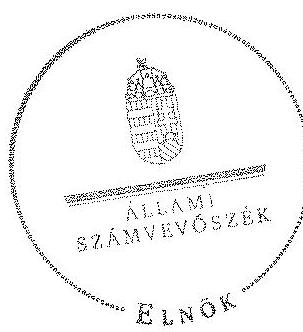

# ÁLLAMI   SZÁMVEVÔSZÉK 

## JELENTÉS

a helyi nemzetiségi önkormányzatok gazdálkodásának ellenőrzéséről
Ferencvárosi Román Nemzetiségi Önkormányzat

---

# Állami Számvevőszék 

Iktatószám: V-0277-013/2014.
Témaszám: 1310
Vizsgálat-azonosító szám: V065230

## Az ellenőrzést felügyelte:

Horváth Balázs
felügyeleti vezető
Az ellenőrzést vezette és az ellenőrzés végrehajtásáért felelős:
Kisgergely István
ellenőrzésvezető
A számvevőszéki jelentést készítették és a jelentés összeállításában
közremüködtek:
Krupánszki Dóra
számvevő
Szeibel Gáborné
számvevő
Az ellenőrzést végezte:
Federics Adrienn
számvevő tanácsos

---

# TARTALOMJEGYZÉK 

BEVEZETÉS ..... 3
I. ÖSSZEGZŐ MEGÁLLAPÍTÁSOK, KÖVETKEZTETÉSEK, JAVASLATOK ..... 6
II. RÉSZLETES MEGÁLLAPÍTÁSOK ..... 11

1. A Nemzetiségi Önkormányzat és a Ferencvárosi Önkormányzat együttműködésének szabályozása, a működési feltételek biztosítása ..... 11
2. A gazdálkodási feladatok ellátásának szabályszerűsége ..... 13
2.1. A költségvetésre és a zárszámadásra, valamint a kincstári adatszolgáltatás rendjére vonatkozó jogszabályi előírások betartása ..... 13
2.2. A Nemzetiségi Önkormányzat gazdálkodásának szabályozottsága ..... 13
2.3. Az operatív gazdálkodási jogkörök kialakítása, gyakorlása ..... 14
3. A Nemzetiségi Önkormányzattal összefüggő gazdálkodási feladatok belső ellenőrzése ..... 16
4. A feladatalapú támogatás felhasználásának, elszámolásának szabályszerűsége, a Nemzetiségi Önkormányzat feladatellátása ..... 16

## MELLÉKLETEK

1. számú A Nemzetiségi Önkormányzat 2012. évi gazdálkodásának főbb adatai, mutatói
2. számú Tájékoztatás a polgármesternek küldött el nem fogadott észrevételekről

## FÜGGELÉKEK

1. számú Rövidítések jegyzéke
2. számú Értelmező szótár
3. számú A gazdálkodás értékelésének módszere

---

.

---

# JELENTÉS 

## a helyi nemzetiségi önkormányzatok gazdálkodásának ellenőrzéséről Ferencvárosi Román Nemzetiségi Önkormányzat

## BEVEZETÉS

A Nemzetiségi Önkormányzat a 2010. évben alakult, elnöke a 2010. évi helyhatósági választások óta látja el feladatát. A Nemzetiségi Önkormányzat intézményt, gazdasági társaságot és más szervezetet nem alapított. A négytagú Képviselő-testület munkája segítésére bizottságot nem hozott létre. A Nemzetiségi Önkormányzatnak a költségvetési beszámolója szerint a 2012. évben a módosított költségvetési bevételi és kiadási előirányzata 1927 ezer Ft, a teljesített költségvetési bevétele 1940 ezer Ft, a teljesített költségvetési kiadása 1195 ezer Ft volt. A 2012. évi gazdálkodási adatokat részletesen az 1. számú mellékletben mutatjuk be.

Az Alaptörvény XXIX. cikk (1) bekezdése szerint a Magyarországon élő nemzetiségek államalkotó tényezők. Minden, valamely nemzetiséghez tartozó magyar állampolgárnak joga van önazonossága szabad vállalásához és megőrzéséhez. A hazánkban élő nemzetiségek helyi (települési és területi), valamint országos önkormányzatokat hozhatnak létre. A helyi nemzetiségi önkormányzatok gazdálkodási feladatait jogszabályi előírás alapján a székhely szerinti helyi önkormányzat polgármesteri hivatala látja el.

A nemzetiségek helyzete, támogatása mind hazai, mind EU-s szinten kiemelt figyelmet kap napjainkban. A helyi nemzetiségi önkormányzatok gazdálkodására és támogatási rendszerére vonatkozó jogszabályok a 2010-2012. években jelentős változásokon mentek át. A települési és területi nemzetiségi önkormányzatok gazdálkodásának, a részükre juttatott költségvetési támogatások felhasználásának ellenőrzését az ÁSZ a 2012. évben sorozatjellegű ellenőrzés keretében indította el. A 2013. évi ellenőrzések e témacsoportos ellenőrzések folytatását jelentik, amelyet az ÁSZ 2014. első félévi ellenőrzési terve a 12. témasorszámon tartalmaz.

Az ellenőrzés célja annak értékelése volt, hogy a Nemzetiségi Önkormányzat gazdálkodási kereteinek kialakítása, gazdálkodása és feladatellátása megfelelt-e a jogszabályoknak.

---

Ennek keretében értékeltük, hogy:

- a Nemzetiségi Önkormányzat és a Ferencvárosi Önkormányzat együttmúködésének szabályozása, a múködési feltételek biztosítása megfelelt-e a jogszabályi előírásoknak;
- a felek együttműködése megfelelt-e a közöttük létrejött megállapodásnak a gazdálkodási feladatok szabályszerű ellátása során, ennek keretében betar-tották-e a Nemzetiségi Önkormányzat gazdálkodásához kapcsolódóan a költségvetésre és zárszámadásra, a gazdálkodás szabályozására, az operatív gazdálkodási jogkörök gyakorlására vonatkozó jogszabályi előírásokat;
- a jegyző biztosította-e a Nemzetiségi Önkormányzat gazdálkodásának belső ellenőrzését;
- a Nemzetiségi Önkormányzat feladatalapú támogatásának felhasználása, a folyósított feladatalapú támogatással történő elszámolás az előírásoknak megfelelő volt-e;
- a Nemzetiségi Önkormányzat feladatellátása összhangban volt-e a vonatkozó jogszabályi előírásokkal.

Az ellenőrzés várható hasznosulását négy szinten tervezzük. A törvényalkotás számára összegzett tapasztalatok állnak rendelkezésre a nemzetiségi önkormányzatok testületi döntéseinek, gazdálkodásának és a feladatalapú támogatás felhasználásának szabályszerűségéről, amelynek alapján következtetést lehet levonni arra, hogy indokolt-e jogszabályi módosítás kezdeményezése. Az ellenőrzés az ellenőrzött számára visszajelzést ad a működésében fellépő hiányosságokról, javaslataival hozzájárul azok kiküszöböléséhez, amely csökkentheti a későbbi ellenőrzések gyakoriságát. Az ellenőrzés megállapításai és javaslatai tanulságul szolgálhatnak más nemzetiségi önkormányzatok, szervezetek számára a rendezett gazdálkodási keretek kialakításához. A társadalom számára jelzi, hogy közpénz nem maradhat ellenőrizetlenül, az ÁSZ értékteremtő rend kialakításához és megőrzéséhez hozzájáruló tevékenysége pozitív hatással lesz a szervezetről kialakított összkép formálásában. Az ÁSZ szervezetén belül lehetőség nyílik arra, hogy a megállapítások szintetizálásával az intézmény a hozzáadott értéket teremtő elemző tevékenységét és tanácsadó szerepét erősítse.

A Nemzetiségi Önkormányzat gazdálkodásának ellenőrzéséről szóló jelentés I. fejezetének összegző része az ellenőrzés céljára adott rövid, szintetizáló összefoglalót és következtetéseket tartalmazza a II. fejezet részletes megállapításain alapulóan. A jelentés intézkedést igénylő megállapításait és javaslatait - az összegzőben foglaltak mellett - az ellenőrzés során feltárt, a jelentés II. fejezetében rögzített részletes megállapítások alapozzák meg, illetve támasztják alá.

Az ellenőrzés típusa: szabályszerűségi ellenőrzés
Az ellenőrzött időszak: a 2012. január 1. - 2012. december 31. közötti időszak.

---

Ellenőrzött szervezet: Ferencvárosi Román Nemzetiségi Önkormányzat és a gazdálkodási feladatait ellátó Budapest Főváros IX. Kerület Ferencváros Önkormányzata.

Az ellenőrzés végrehajtásának jogszabályi alapját az ÁSZ tv. 5. § (2)(3) és (6) bekezdéseiben foglaltak képezik.

Az ellenőrzés szakmai módszertana az ÁSZ hivatalos honlapján (www.asz.hu) közzétett szakmai szabályokon alapult, amely a Legfőbb Ellenőrző Intézmények Nemzetközi Szervezete (INTOSAI) által kiadott nemzetközi standardok (ISSAI) figyelembevételével készült.

A helyi nemzetiségi önkormányzatok gazdálkodásának ellenőrzése során értékeltük a Nemzetiségi Önkormányzat és a Ferencvárosi Önkormányzat együttmúködésének, a gazdálkodás szabályozottságának és a pénzügyi folyamatokban kulcsszerepet betöltő belső kontrollok (teljesítésigazolás és érvényesítés) múködésének megfelelőségét. A kulcskontrollokat a dologi kiadásokkal kapcsolatos kifizetéseknél - véletlen mintavételi eljárást alkalmazva - ellenőriztük.

Ellenőriztük, hogy a jegyző biztosította-e a Nemzetiségi Önkormányzat gazdálkodásának belső ellenőrzését. Értékeltük a feladatalapú támogatások felhasználásának, elszámolásának szabályszerűségét, a Nemzetiségi Önkormányzat feladatellátása és a jogszabályi előírások összhangját.

Az ellenőrzés lefolytatásához a Nemzetiségi Önkormányzat és a gazdálkodási feladatait ellátó Ferencvárosi Önkormányzat tanúsítványok és a kapcsolódó, dokumentumjegyzékben megjelölt dokumentumok elektronikus úton történő megküldésével, rendelkezésre bocsátásával szolgáltatott adatokat. Az adatszolgáltatás kontrollálása és szükség szerinti javítása a helyszíni ellenőrzés keretében történt. A minősítési szempontokat a 3. számú függelék tartalmazza.

Az ÁSZ tv. 29. § (1) bekezdése szerint a jelentéstervezetet megküldtük észrevételezésre a polgármester és a Nemzetiségi Önkormányzat elnöke részére. Az ÁSZ tv. 29. § (2) bekezdésében foglalt észrevételezési jogával a Nemzetiségi Önkormányzat elnöke nem élt. A polgármester határidőben megküldött észrevétele és tájékoztatása alapján a jelentést módosítottuk. Az el nem fogadott észrevételek indoklását a jelentés 2. számú melléklete tartalmazza.

---

# I. ÖSSZEGZŐ MEGÁLLAPÍTÁSOK, KÖVETKEZTETÉSEK, JAVASLATOK 

A Nemzetiségi Önkormányzat és a Ferencvárosi Önkormányzat együttmüködésének szabályozása nem felelt meg a jogszabályi előírásoknak. Az együttmúködési megállapodás ${ }_{1}$-t a Nek. ${ }_{2}$ tv. előírása ellenére 2012. január 31éig nem vizsgálták felül, és 2012. június 1-jéig nem történt meg a kiegészítése. A Kormányhivatal 2012. június 1-jét követően írásban nem kezdeményezett a Nek. ${ }_{2}$ tv. által előírt egyeztetést a felek között az együttműködési megállapodás megkötése, módosítása érdekében. Az együttműködési megállapodás ${ }_{2}$-ról amelyet a polgármester és a Nemzetiségi Önkormányzat elnöke aláírt - a Nemzetiségi Önkormányzat Képviselő-testülete a Nek. ${ }_{2}$ tv. előírása ellenére nem hozott határozatot. Az együttműködési megállapodás ${ }_{1}$ nem tartalmazta a Nek. ${ }_{2}$ tv. szerinti önkormányzati múködés feltételeit és az ezzel kapcsolatos végrehajtási feladatokat, valamint egyes tartalmi elemeket. A szabályozási hiányosságok ellenére a Ferencvárosi Önkormányzat a Nemzetiségi Önkormányzat részére az előírt múködési feltételeket a Nek. ${ }_{2}$ tv.-ben foglaltakra tekintettel biztosította a 2012. évben. A törzskönyvi nyilvántartási adatok módosításával, az önálló fizetési számla nyitásával és az adószám igénylésével kapcsolatos feladatokat elvégezték.

A Nemzetiségi Önkormányzat 2012. évi költségvetésének, zárszámadásának tartalma, jóváhagyása, valamint a kapcsolódó 2012. évi adatszolgáltatás szabályszerúsége annak ellenére megfelelt a jogszabályi előírásoknak, hogy a 2012. évi költségvetési határozat - jegyző által előkészített, szöveges indokolással ellátott - tervezetét a Nemzetiségi Önkormányzat elnöke az Áht. előírása ellenére, határidőn túl terjesztette a Képviselő-testület elé. A jóváhagyott költségvetés tartalmazta az Áht.-ben és az Ávr.-ben előírt tartalmi elemeket szöveges indokolással együtt. A jegyző által elkészített, 2012. évi zárszámadási határozat tervezetét a Nemzetiségi Önkormányzat elnöke az Áht.-ben foglalt tartalommal, határidőben beterjesztette a Képviselő-testület elé. Az elfogadott 2012. évi zárszámadási határozat és a költségvetés összehasonlíthatóságát biztosították, a Nemzetiségi Önkormányzat valamennyi bevételéről és kiadásáról elszámoltak. A 2012. évi kincstári adatszolgáltatási kötelezettségnek hiánytalanul eleget tettek.

A Nemzetiségi Önkormányzat gazdálkodásának szabályozottsága az ellenőrzött időszakban nem volt megfelelő, mivel a Polgármesteri Hivatal SZMSZ-ében nem rögzítették az Ávr.-ben foglaltak szerinti, az SZMSZ-ben nevesített munkakörökhöz tartozó, a Nemzetiségi Önkormányzat gazdálkodásának végrehajtásával kapcsolatos feladat- és hatásköröket, a hatáskörök gyakorlásának módját, a helyettesítés rendjét, az ezekhez kapcsolódó felelősségi szabályokra vonatkozó előírásokat. A jegyző a Nemzetiségi Önkormányzat gazdálkodásának végrehajtási feladataira vonatkozóan nem terjesztette ki a Bkr.-ben előírt ellenőrzési nyomvonalat és a szabálytalanságok kezelésének eljárásrendjét. A Polgármesteri Hivatal rendelkezett a Nemzetiségi Önkormányzat gazdálkodásának végrehajtási feladataira is kiterjedő hatályú számviteli politikával és az annak keretében elkészítendő szabályzatokkal.

---

Az operatív gazdálkodási jogkörök kialakítása megfelelt a jogszabályi előírásoknak. Gazdasági szervezet hiányában a jegyző az Áht. és az Ávr. előírásai alapján írásban jelölt ki megfelelő végzettséggel rendelkező köztisztviselőt a pénzügyi ellenjegyzés és az érvényesítés gyakorlására. Az operatív gazdálkodási jogkörök kialakítását annak ellenére megfelelőnek minősítettük, hogy 2012. március 5 -én a Nemzetiségi Önkormányzat elnökét és elnökhelyettesét az Ávr. előírásai ellenére a polgármester jogosulatlanul hatalmazta fel a Kötelezettségvállalási szabályzat ${ }_{2}$-ban a kötelezettségvállalási és az utalványozási jogkörök gyakorlására, valamint jelölte ki teljesítésigazolásra. Ezzel egyidejűleg az elnökhelyettest a Nemzetiségi Önkormányzat elnöke az Áht. és az Ávr. előírásai alapján szabályszerűen, írásban hatalmazta fel a kötelezettségvállalás és az utalványozás gyakorlására, valamint jelölte ki teljesítésigazolásra.

A Nemzetiségi Önkormányzatnál a 2012. évben a dologi kiadások teljesítése során - a véletlen mintavételi eljárást alkalmazva - a teljesítésigazolás és az érvényesítés kulcskontrollok múködésének megfelelősége gyenge volt, a hibák száma a lényegességi szintet, a kritikus hibahatárt elérte. Az érvényesítő az Ávr. előírása szerinti ellenőrzési és jelzési feladatát nem látta el, mert nem ellenőrizte a megelőző ügymenetben a jogszabályok és a belső szabályzatok betartását. Nem észrevételezte, hogy a teljesítésigazolások során három esetben nem a Kötelezettségvállalási szabályzat ${ }_{2}$-ban előírt nyomtatványt használták, az utalványrendeletekről az Ávr. előírása ellenére hiányzott a kötelezettségvállalás nyilvántartási száma, továbbá a Számv. tv. előírása ellenére három esetben olyan számlát is elszámoltak, amelyek kiállítási dátuma megelőzte a pénztári előleg felvételének dátumát. A dologi kiadások három legnagyobb összegű kifizetése esetében az érvényesítő nem jelezte, hogy a teljesítésigazolásokat nem a Kötelezettségvállalási szabályzat ${ }_{2}$-ban előírt nyomtatványon végezték, az utalványrendeleteken az Ávr.-ben foglaltak ellenére nem tüntették fel a kötelezettségvállalások nyilvántartási számát. Egy kifizetéshez kapcsolódóan a pénztári előleg elszámolása a Pénzkezelési szabályzatban megjelölt határidőn túl történt.

A Nemzetiségi Önkormányzat a 2012. évben nem teljesített támogatásértékű kiadást, valamint államháztartáson kívülre pénzeszközátadást. A számvevőszéki ellenőrzés a rendelkezésre bocsátott dokumentumok alapján összeférhetetlenséget, jogosulatlan kifizetést nem tárt fel, a kulcskontrollok müködéséhez kapcsolódó hiányosságok miatt azonban nem biztosított a hibák megelőzése, feltárása és kijavítása.

A Polgármesteri Hivatal belső ellenőrzési tervét megalapozó kockázatelemzés kiterjedt a Nemzetiségi Önkormányzat gazdálkodásával összefüggő végrehajtási feladatokra. A Nemzetiségi Önkormányzat gazdálkodását nem ítélték magas kockázatúnak, arra vonatkozóan a 2012. évre nem terveztek és nem végeztek belső ellenőrzést, ezért a belső ellenőrzés nem tárta fel a Nemzetiségi Önkormányzat gazdálkodásával kapcsolatos hiányosságokat.

A Nemzetiségi Önkormányzat a 2011. és a 2012. években nem részesült feladatalapú támogatásban.

---

A Nemzetiségi Önkormányzat feladatellátásának tárgya a 2012. évben összhangban volt a Nek. 2 tv. előírásaival, kötelező közfeladatot látott el, kulturális programok, rendezvények szervezésére hozott intézkedéseket.

Az ÁSZ tv. 33. § (1) bekezdésében foglaltak értelmében az ellenőrzött szervezet vezetője köteles a jelentésben foglalt megállapításokhoz kapcsolódó intézkedési tervet összeállítani és azt a jelentés kézhezvételétől számított 30 napon belül az ÁSZ részére megküldeni. Amennyiben az intézkedési tervet határidőre nem küldi meg a szervezet, vagy az nem elfogadható, az ÁSZ elnöke az ÁSZ tv. 33. § (3) bekezdés a)-b) pontjaiban foglaltakat érvényesítheti.

A helyszíni ellenőrzés megállapításainak hasznosítása mellett javasoljuk:

# a jegyzönek 

1. az együttműködés szabályozásával kapcsolatban

Az együttműködési megállapodás ${ }_{1}$ nem tartalmazta a Nek. 2 tv. 80. § (1) bekezdés a)-e) és g) pontja szerinti müködési feltételeket és a 80. § (3) és (4) bekezdésében foglalt tartalmi elemeket.

Az együttműködési megállapodás ${ }_{1}$-t a Nek. ${ }_{2}$ tv. 80. § (2) bekezdésének előírása ellenére 2012. január 31-éig nem vizsgálták felül.

Javaslat
Az együttműködés szabályszerűsége érdekében:
a) készítse elő az együttműködési megállapodás módosítását, hogy az tartalmazza a Nek. 2 tv. 80. § (1) bekezdés a)-e) és g) pontja szerinti müködési feltételeket, valamint a 80. § (3)-(4) bekezdésében foglalt tartalmi elemeket;
b) biztosítsa a jövőben az együttműködési megállapodás évenkénti felülvizsgálata során a Nek. 2 tv. 80. § (2) bekezdésében előírt határidő betartását.
2. a gazdálkodás szabályozottságával kapcsolatban

A Polgármesteri Hivatal SZMSZ-ében nem rögzítették az Ávr. 13. § (1) bekezdés g) pontjában foglaltak szerinti, az SZMSZ-ben nevesített munkakörökhöz tartozó - a Nemzetiségi Önkormányzat gazdálkodásának végrehajtásával kapcsolatos - feladat- és hatáskörökre, a hatáskörök gyakorlásának módjára, a helyettesítés rendjére, az ezekhez kapcsolódó felelősségi szabályokra vonatkozó előírásokat. A jegyző a Nemzetiségi Önkormányzat gazdálkodásának végrehajtási feladataira nem terjesztette ki a Bkr. 6. § (4) bekezdésében előírt szabálytalanságok kezelésének eljárásrendje hatályát.

---

Javaslat
A gazdálkodás szabályszerűsége érdekében:
a) készítse el a Polgármesteri Hivatal SZMSZ-ének módosítását, hogy az tartalmazza - a Nemzetiségi Önkormányzat gazdálkodásának végrehajtására vonatkozóan az Ávr. 13. § (1) bekezdés g) pontjában foglaltakat;
b) módosítsa a Polgármesteri Hivatal Bkr. 6. § (4) bekezdése szerinti szabálytalanságok kezelésének eljárásrendjének hatályát, hogy az terjedjen ki a Nemzetiségi Önkormányzat gazdálkodásának végrehajtási feladataira.
3. a kulcskontrollok múködésével kapcsolatban

Az érvényesítő az Ávr. 58. § (1)-(2) bekezdése szerinti feladatát nem látta el, mert nem ellenőrizte a megelőző ügymenetben a jogszabályok és a belső szabályzat előírásainak betartását, valamint nem jelezte, hogy a teljesítésigazolás során nem a Kötelezettségvállalási szabályzat ${ }_{2}$-ban előírt nyomtatványt használták, a kötelezettségvállalás nyilvántartási számát nem tüntették fel az utalványrendeleteken, az előleggel való elszámolás során nem tartották be a Pénzkezelési szabályzatukban rögzített határidőt.

Javaslat
Az operatív gazdálkodás múködési hibáinak megelőzése, feltárása és kijavítása érdekében gondoskodjon arról, hogy
a) az érvényesítő az Ávr. 58. § (1)-(2) bekezdéseiben előírt ellenőrzési és jelzési feladatait maradéktalanul lássa el;
b) az előleggel való elszámolás során tartsák be a Pénzkezelési szabályzatban rögzített határidőt.

# a polgármesternek 

1. Az együttműködési megállapodás, nem tartalmazta a Nek. 2 tv. 80. § (1) bekezdés a)-e) és g) pontja szerinti müködési feltételeket és a 80. § (3) és (4) bekezdésében foglalt tartalmi elemeket.

Javaslat
Terjessze a Ferencvárosi Önkormányzat Képviselő-testülete elé jóváhagyásra a jegyző által előkészített együttműködési megállapodás módosítás tervezetét, hogy az tartalmazza a Nek. 2 tv. 80. § (1) bekezdés a)-e) és g) pontja szerinti müködési feltételeket, valamint a 80. § (3) és (4) bekezdésében foglalt tartalmi elemeket.
2. A Polgármesteri Hivatal SZMSZ-ében nem rögzítették az Ávr. 13. § (1) bekezdés g) pontjában foglaltak szerinti, az SZMSZ-ben nevesített munkakörökhöz tartozó - a Nemzetiségi Önkormányzat gazdálkodásának végrehajtásával kapcsolatos - feladat- és hatáskörökre, a hatáskörök gyakorlásának módjára,

---

a helyettesítés rendjére, az ezekhez kapcsolódó felelősségi szabályokra vonatkozó előírásokat.

Javaslat
Terjessze a Ferencvárosi Önkormányzat Képviselő-testülete elé a Polgármesteri Hivatal SZMSZ-ének jegyző által elkészített módosítását, hogy az tartalmazza - a Nemzetiségi Önkormányzat gazdálkodásának végrehajtására vonatkozóan - az Ávr. 13. § (1) bekezdés g) pontjában foglaltakat.

# a Nemzetiségi Önkormányzat elnökének 

1. Az együttműködési megállapodás: nem tartalmazta a Nek. 2 tv. 80. § (1) bekezdés a)-e) és g) pontja szerinti múködési feltételeket és a 80. § (3) és (4) bekezdésében foglalt tartalmi elemeket.

Javaslat
Terjessze a Képviselő-testület elé jóváhagyásra a jegyző által előkészített együttmúködési megállapodás módosítás tervezetét, hogy az tartalmazza a Nek. 2 tv. 80. § (1) bekezdés a)-e) és g) pontja szerinti müködési feltételeket, valamint a 80. § (3) és (4) bekezdésében foglalt tartalmi elemeket.
2. A jegyző által elkészített 2012. évi költségvetési határozat-tervezetét a Nemzetiségi Önkormányzat elnöke az Áht. 24. § (2) bekezdése ellenére nem nyújtotta be határidőben a Képviselő-testület részére.

Javaslat
A költségvetési határozattervezet Képviselő-testület elé terjesztésekor tartsa be az Áht. 24. § (3) bekezdése szerinti határidőt.

---

# II. RÉSZLETES MEGÁLLAPÍTÁSOK 

## 1. A Nemzetiségi Önkormányzat és a Ferencvárosi ÖnkORMÁNYZAT EGYÜTTMÜKÖDÉSÉNEK SZABÁLYOZÁSA, A MÜKÖDÉSI FELTÉTELEK BIZTOSÍTÁSA

A Nemzetiségi Önkormányzat és a Ferencvárosi Önkormányzat együttműködésének szabályozása nem felelt meg a jogszabályi előírásoknak.

A Nemzetiségi Önkormányzat az ellenőrzött időszakban rendelkezett a Ferencvárosi Önkormányzattal kötött együttműködési megállapodással. A 2011. október 10 -én a Nemzetiségi Önkormányzat elnöke, valamint 2011. december 13-án a polgármester által átruházott hatáskörben ${ }^{1}$ aláírt együttműködési megállapodás ${ }_{1}$-t a Nemzetiségi Önkormányzat Képviselőtestülete határozatával ${ }^{2}$ jóváhagyta. Az együttműködési megállapodás ${ }_{1}$-t a Nek. ${ }_{2}$ tv. 80. § (2) bekezdésének előírása ellenére 2012. január 31-éig nem vizsgálták felül, és a Nek. ${ }_{2}$ tv. 159. § (3) bekezdése ellenére 2012. június 1-jéig nem történt meg a kiegészítése. A Nek. ${ }_{2}$ tv. 83. § (3) bekezdése ellenére a Kormányhivatal 2012. június 1-jét követően írásban nem kezdeményezett egyeztetést a felek között együttműködési megállapodás megkötése, módosítása érdekében. Az együttműködési megállapodás ${ }_{1}$ egyes részeinek érvényben tartása mellett, annak kiegészítéseként 2012. december 12-én a Nemzetiségi Önkormányzat és a Ferencvárosi Önkormányzat együttműködési megállapodás ${ }_{2}$-t kötött. Az együttműködési megállapodás ${ }_{2}$-ról a Nemzetiségi Önkormányzat Képviselőtestülete a Nek. ${ }_{2}$ tv. 78. § (3) bekezdésének előírása ellenére nem hozott határozatot.

A Nemzetiségi Önkormányzat 25/2013. (XI. 08.) számú határozatával elfogadta a Nemzetiségi Önkormányzat új SZMSZ-ének 2. számú mellékleteként az együttműködési megállapodás ${ }_{2}$-t.

Az együttműködési megállapodás ${ }_{1}$ nem tartalmazta:

- a Nek. ${ }_{2}$ tv. 80. § (1) bekezdés a) pontja alapján a Nemzetiségi Önkormányzat részére havonta igény szerint, de legalább tizenhat órában, az önkormányzati feladat ellátásához szükséges tárgyi, technikai eszközökkel felszerelt helyiség ingyenes használatát, a helyiséghez, továbbá a helyiség infrastruktúrájához kapcsolódó rezsiköltségek és fenntartási költségek viselését;
- a Nek. ${ }_{2}$ tv. 80. § (1) bekezdés b) pontja alapján az önkormányzati múködéshez (a testületi, tisztségviselői, képviselői feladatok ellátásához) szükséges tárgyi és személyi feltételek biztosítását;

[^0]
[^0]:    ${ }^{1}$ Budapest Főváros IX. Kerület Ferencváros Önkormányzata Képviselő-testületének 35/2011. (XII. 12.) önkormányzati rendelete a Szervezeti és Müködési szabályzatáról szóló 28/2011. (X. 11.) önkormányzati rendelet módosításáról 5. §-a.
    ${ }^{2}$ 20/2011. (X. 08.) számú határozat

---

- a Nek. ${ }_{2}$ tv. 80. § (1) bekezdés c) pontja alapján a testületi ülések előkészítését (meghívók, előterjesztések, hivatalos levelezés előkészítése, postázása, a testületi ülések jegyzőkönyveinek elkészítése, postázása);
- a Nek. ${ }_{2}$ tv. 80. § (1) bekezdés d) pontja alapján a testületi döntések és a tisztségviselők döntéseinek előkészítését, a testületi és tisztségviselői döntéshozatalhoz kapcsolódó nyilvántartási, sokszorosítási, postázási feladatok ellátását;
- a Nek. ${ }_{2}$ tv. 80. § (1) bekezdés e) pontja alapján a Nemzetiségi Önkormányzat múködésével, gazdálkodásával kapcsolatos nyilvántartási, iratkezelési feladatok ellátását;
- a Nek. ${ }_{2}$ tv. 80. § (1) bekezdés g) pontja alapján a fenti feladatellátáshoz kapcsolódó költségek - a testületi tagok és tisztségviselők telefonhasználata költségei kivételével - viselését;
- a Nek. ${ }_{2}$ tv. 80. § (3) bekezdés a) pontja által előírt önálló fizetési számla nyitásával, törzskönyvi nyilvántartásba vételével és adószám igénylésével kapcsolatos feladatokat, azok felelő́seinek konkrét kijelölését és végrehajtásának határidejét;
- a Nek. ${ }_{2}$ tv. 80. § (3) bekezdés b) pontja által előírt szakmai teljesítésigazolási feladatokat és felelő́seinek konkrét kijelölését;
- a Nek. ${ }_{2}$ tv. 80. § (3) bekezdés c) pontja által előírt, a Nemzetiségi Önkormányzat kötelezettségvállalásaival összefüggő összeférhetetlenségi és nyilvántartási szabályokat;
- a Nek. ${ }_{2}$ tv. 80. § (3) bekezdés d) pontja által előírt, a Nemzetiségi Önkormányzat gazdálkodásának eljárási és dokumentációs részletszabályai közül a teljesítésigazolással, valamint az ezt végző személyek kijelölésének rendjével kapcsolatos előírásokat, feltételeket;
- a Nek. ${ }_{2}$ tv. 80. § (4) bekezdés ellenére azt, hogy a jegyző vagy annak - a jegyzővel azonos képesítési előírásoknak megfelelő - megbízottja a Ferencvárosi Önkormányzat megbízásából és képviseletében részt vesz a Nemzetiségi Önkormányzat testületi ülésein és jelzi, amennyiben törvénysértést észlel.

Az együttmúködési megállapodás ${ }_{1}$ az Áht.-ben foglaltak szerint tartalmazta a tervezési, gazdálkodási, ellenőrzési, finanszírozási, adatszolgáltatási és beszámolási feladatokat.

A szabályozási hiányosságok ellenére a Ferencvárosi Önkormányzat a Nemzetiségi Önkormányzat részére az előírt múködési feltételeket a Nek. ${ }_{2}$ tv. 159. § (3) bekezdésében foglaltak szerint biztosította a 2012. évben. A törzskönyvi nyilvántartási adatok módosításával, az önálló fizetési számla nyitásával és az adószám igénylésével kapcsolatos feladatokat elvégezték.

---

# 2. A GAZDÁLKODÁSI FELADATOK ELLÁTÁSÁNAK SZABÁLYSZERŰSÉGE 

### 2.1. A költségvetésre és a zárszámadásra, valamint a kincstári adatszolgáltatás rendjére vonatkozó jogszabályi előírások betartása

A Nemzetiségi Önkormányzat 2012. évi költségvetésének, zárszámadásának tartalma, jóváhagyása, valamint a kapcsolódó 2012. évi adatszolgáltatás szabályszerűsége annak ellenére megfelelt a jogszabályi előírásoknak, hogy a Nemzetiségi Önkormányzat elnöke a 2012. évi költségvetési határozat jegyző által előkészített tervezetét az Áht. 24. § (2) bekezdésében előírtak ellenére, határidőn túl ${ }^{3}$ nyújtotta be a Képviselő-testületnek.

A jóváhagyott költségvetés ${ }^{4}$ tartalmazta az Áht.-ben és az Ávr.-ben előírt tartalmi elemeket, a költségvetési bevételeket és a költségvetési kiadásokat elői-rányzat-csoportok, valamint kiemelt előirányzatok szerinti bontásban. A 2012. évi költségvetés tervezetének előterjesztésekor a Képviselő-testület részére szöveges indokolással, az Áht.-ben foglaltaknak megfelelően bemutatták az előírt mérlegeket és kimutatásokat.

A jegyző által elkészített 2012. évi zárszámadási határozat tervezetét a Nemzetiségi Önkormányzat elnöke az Áht.-ben foglaltak alapján, határidőn belül terjesztette a Képviselő-testület elé. A 2012. évi zárszámadási határozat tervezetének előterjesztésénél a Képviselő-testület részére tájékoztatásul bemutatták az Áht. előírása szerinti mérlegeket és kimutatásokat. Az Áht.-nek megfelelően a zárszámadásról hozott határozat és az elfogadott költségvetés összehasonlíthatóságát biztosították, a zárszámadási határozatban a Nemzetiségi Önkormányzat valamennyi bevételéről és kiadásáról elszámoltak.

A jegyző az előírt határidőben és módon teljesítette a 2012. költségvetési évvel kapcsolatban a Nemzetiségi Önkormányzatra vonatkozó kincstári adatszolgáltatási kötelezettséget. A 2012. évi elemi költségvetést, a féléves és éves beszámolót, valamint az időközi költségvetési- és mérlegjelentéseket az Áhsz. és az Ávr. szerinti határidőig megküldte a Kincstár részére.

### 2.2. A Nemzetiségi Önkormányzat gazdálkodásának szabályozottsága

A Nemzetiségi Önkormányzat gazdálkodásának szabályozottsága az ellenőrzött időszakban nem volt megfelelő, mivel:

- a Polgármesteri Hivatal SZMSZ-ében nem rögzítették az Ávr. 13. § (1) bekezdés g) pontjában foglaltak szerinti, az SZMSZ-ben nevesített munkakörökhöz tartozó - a Nemzetiségi Önkormányzat gazdálkodásának végrehajtásával kapcsolatos - feladat- és hatáskörökre, a hatáskörök

[^0]
[^0]:    ${ }^{3}$ 2012. március 2-án
    ${ }^{4}$ 10/2012. (III. 07.) számú határozat

---

gyakorlásának módjára, a helyettesítés rendjére, az ezekhez kapcsolódó felelősségi szabályokra vonatkozó előírásokat;

- a jegyző a Nemzetiségi Önkormányzat gazdálkodásának végrehajtási feladataira nem terjesztette ki a Bkr. 6. § (3) és (4) bekezdéseiben előírt ellenőrzési nyomvonalat és a szabálytalanságok kezelésének eljárásrendjét.

A 2013. október 1-jétől hatályos ellenőrzési nyomvonalat már kiterjesztették a Nemzetiségi Önkormányzatra is.

A 2012. évben a Polgármesteri Hivatal rendelkezett a Nemzetiségi Önkormányzat gazdálkodásának végrehajtási feladataira kiterjedő hatályú, a Számv. tv. által előírt számviteli politikával és ahhoz kapcsolódóan a gazdálkodásra vonatkozó szabályzatokkal, eszközök és források értékelési szabályzatával, pénzkezelési szabályzattal, számlarenddel, eszközök és források leltárkészítési és leltározási szabályzatával.

Az Áht.-ben és az Ávr.-ben foglaltak szerint a tervezéssel, gazdálkodással, a kötelezettségvállalással, pénzügyi ellenjegyzéssel, teljesítésigazolással, az érvényesítés, utalványozás gyakorlásának módjával, eljárási és dokumentációs részletszabályaival, valamint az ezeket végző személyek kijelölésének rendjével, továbbá az ellenőrzési és adatszolgáltatási feladatok teljesítésével kapcsolatos belső előírásokat, feltételeket tartalmazó belső szabályzat, a Kötelezettségvállalási szabályzat ${ }_{1,2}$ rendelkezésre állt.

# 2.3. Az operatív gazdálkodási jogkörök kialakítása, gyakorlása 

A Nemzetiségi Önkormányzat gazdálkodása tekintetében az operatív gazdálkodási jogkörök kialakítása megfelelt a jogszabályi előírásoknak, mivel:

- a Nemzetiségi Önkormányzat elnöke az Áht. és az Ávr. előírásai alapján írásban felhatalmazta - 2012. március 5-én - a kötelezettségvállalás és az utalványozás gyakorlására, illetve kijelölte a teljesítésigazolásra az elnökhelyettest;
- gazdasági szervezet hiányában a jegyző az Áht. és az Ávr. előírásai alapján írásban jelölt ki megfelelő végzettséggel rendelkező köztisztviselőt a pénzügyi ellenjegyzés és az érvényesítés gyakorlására.

Az operatív gazdálkodási jogkörök kialakítását annak ellenére megfelelőnek minősítettük, hogy a Ferencvárosi Önkormányzat polgármestere 2012. március 5 -én jogosulatlanul hatalmazta fel ${ }^{5}$ a Nemzetiségi Önkormányzat elnökét és elnökhelyettesét a kötelezettségvállalási és az utalványozási jogkörök gyakorlására, valamint jelölte ki teljesítésigazolásra.

A polgármester szabálytalanul végezte a kijelölést, mert az ellentétes volt:

- az Ávr. 52. § (7) bekezdésében foglaltakkal, mely szerint a Nemzetiségi Önkormányzat kiadási előirányzatai terhére a Nemzetiségi Önkormányzat el-

[^0]
[^0]:    ${ }^{5}$ A Kötelezettségvállalási szabályzat ${ }_{2}$ 2. számú mellékletében.

---

nöke, vagy az általa írásban felhatalmazott személy vállalhat kötelezettséget;

- az Ávr. 57. § (4) bekezdésében foglaltakkal, mely szerint a teljesítés igazolására jogosult személyeket a kötelezettségvállaló írásban jelöli ki;
- az Ávr. 59. § (1) bekezdésében foglaltakkal, mely szerint az Ávr. 52. §-ában foglaltak szerint - a kötelezettségvállalásnál előírt módon - kell eljárni az utalványozásra jogosult személyek kijelölésekor.

A Nemzetiségi Önkormányzatnál a 2012. évben a dologi kiadások teljesítése során - véletlen mintavételi eljárást alkalmazva - a teljesítésigazolás és az érvényesítés kulcskontrollok müködésének megfelelősége gyenge volt, a hibák száma a lényegességi szintet, a kritikus hibahatárt elérte.

Az érvényesítő az Ávr. 58. § (1)-(2) bekezdései ellenére feladatát nem látta el, mert nem ellenőrizte a megelőző ügymenetben a jogszabályi előírások és belső szabályzatok előírásainak betartását, valamint nem jelezte, hogy:

- a teljesítésigazolások során három esetben nem a Kötelezettségvállalási szabályzat ${ }_{2}$ 8. 2 pontjában előírt, 9. számú melléklet szerinti teljesítésigazolás nyomtatványt használták;
- az Ávr. 59. § (3) bekezdése f) pontjában foglaltak ellenére az utalványrendeleteken nem tüntették fel a kötelezettségvállalás nyilvántartási számát.

A dologi kiadások három legnagyobb összegű könyvelési tétele esetében az érvényesítő az Ávr. 58. § (1)-(2) bekezdéseiben foglalt feladatát nem látta el, mert a megelőző ügymenetben nem ellenőrizte és nem jelezte, hogy a teljesítésigazolások során nem a Kötelezettségvállalási szabályzat ${ }_{2}$ 8. 2 pontjában előírt, 9. számú melléklet szerinti teljesítésigazolás nyomtatványt használták, az utalványrendeleteken az Ávr. 59. § (3) bekezdés f) pontjában foglaltak ellenére nem tüntették fel a kötelezettségvállalások nyilvántartási számát, valamint egy kifizetéshez kapcsolódóan a pénztári előleg elszámolása meghaladta a Pénzkezelési szabályzatban foglalt 30 napot.

A Nemzetiségi Önkormányzat a 2012. évben nem teljesített támogatásértékű kiadást, valamint államháztartáson kívülre pénzeszközátadást.

A számvevőszéki ellenőrzés a kiadások dokumentumainak ellenőrzése, a rendelkezésre bocsátott dokumentumok alapján összeférhetetlenséget, továbbá jogosulatlan kifizetést nem tárt fel, azonban a kulcskontrollok müködéséhez kapcsolódó hiányosságok miatt nem biztosították a hibák megelőzését, feltárását és kijavítását.

---

# 3. A Nemzetiségi ÖNKORMÁNYZATTAL ÖSSZEFÜGGŐ GAZDÁlKODÁSI FELADATOK BELSŐ ELLENŐRZÉSE 

A Polgármesteri Hivatal belső ellenőrzési tervét megalapozó kockázatelemzés kiterjedt a Nemzetiségi Önkormányzat gazdálkodásával összefüggő végrehajtási feladatokra. A kockázatelemzés alapján a Nemzetiségi Önkormányzat gazdálkodását nem ítélték magas kockázatúnak, ezért a belső ellenőrzési terv nem tartalmazott belső ellenőrzést arra vonatkozóan. A Nemzetiségi Önkormányzatnál belső ellenőrzés lefolytatására nem került sor a 2012. évben, így a belső ellenőrzés nem tárta fel a Nemzetiségi Önkormányzat gazdálkodásával kapcsolatos hiányosságokat.

Az ellenőrzéshez szolgáltatott adatok alapján a 2012. évben a Kormányhivatal a Nemzetiségi Önkormányzatot illetően nem élt törvényességi felügyeleti eszközökkel.

## 4. A feladatalapú támogatás felhasználásának, elszámolásáNAK SzABÁLYSZERÜSÉGE, A NEMZETISÉGI ÖNKORMÁNYZAT FELADATELLÁTÁSA

A Nemzetiségi Önkormányzat a 2011. és a 2012. években nem részesült feladatalapú támogatásban.

A 2012. évben a Nemzetiségi Önkormányzat feladatellátásának tárgya összhangban volt a Nek. 2 tv. 115. §-ában foglalt előírásokkal. A Nemzetiségi Önkormányzat kötelező közfeladatot látott el, kulturális programok, rendezvények szervezésére hozott intézkedéseket. A Nemzetiségi Önkormányzat a Nek. ${ }_{2}$ tv. 116. § (2) bekezdésében tiltott hatósági feladatokat nem végzett.

Budapest, 2014. 10. hó 26 nap

Melléklet: $\quad 2 \mathrm{db}$
Függelék: $\quad 3 \mathrm{db}$

Domokos László
elnök*

E L N Ö*

Elnök*

---

# A Nemzetiségi Önkormányzat 2012. évi gazdálkodásának föbb adatai, mutatói

A) Bevételek

|  Megnevezés | Eredeti elöirányzat | Módosított | Teljesítés  |
| --- | --- | --- | --- |
|   | ezer Ft |  | megoszlás
$(\%)$  |
|  Intézményi múködési bevételek | 0 | 7 | 20  |
|  Általános múködési támogatás | 0 | 215 | 215  |
|  Támogatásértékủ múködési bevétel helyi önkormányzattól | 1207 | 992 | 992  |
|  Előző évi pénzmaradvány átvétel | 0 | 713 | 713  |
|  Költségvetési bevételek | 1207 | 1927 | 1940  |
|  Tárgyévi bevételek | 1207 | 1927 | 1940  |

B) Kiadások

|  Megnevezés | Eredeti elöirányzat | Módosított | Teljesítés  |
| --- | --- | --- | --- |
|   | ezer Ft |  | megoszlás
$(\%)$  |
|  Személyi juttatások | 600 | 600 | 558  |
|  Dologi kiadások | 607 | 1327 | 637  |
|  Müködési kiadások összesen | 1207 | 1927 | 1195  |
|  Költségvetési kiadások | 1207 | 1927 | 1195  |
|  Tárgyévi kiadások | 1207 | 1927 | 1195  |

---

.

---

# TÁJÉKOZTATÁS   A POLGÁRMESTERNEK KÜLDÖTT EL NEM FOGADOTT ÉSZREVÉTELEKRŐL 

Észrevétel A jelentéstervezet 1. és 2. pontjához kapcsolódóan:
Az ellenőrzési jelentéstervezetben az együttmúködési megállapodás kapcsán megállapított hiányosságokat az ellenőrzött időszakot követően, még az ellenőrzést megelőzően megszüntettük, az együttmúködési megállapodás 2013. évben történt Nek. tv-ben előírtak szerinti módosításával és a Nemzetiségi Önkormányzat által történő elfogadásával, melynek dokumentumait rendelkezésre bocsájtottuk.
A hiányosságok egy részét a helyszíni ellenőrzést követően, a záró tárgyaláson elhangzott javaslatok alapján a lehető leggyorsabb úton kijavítottuk. Ennek kapcsán módosításra került a Polgármesteri Hivatal SZMSZ-e. Bár álláspontunk szerint sem a Nek. törvény, sem az Áht. nem ír elő olyan kötelezettséget, melynek alapján kötelező lenne a nemzetiségek müködésével kapcsolatos munkakör nevesítése, az ÁSZ kérésének megfelelően a Polgármesteri Hivatal SZMSZ-ében az egyes szervezeti egységek feladat-és hatásköreibe a korábbinál specifikáltabban kerültek meghatározásra ezen feladatok. Így rögzítésre kerültek a nemzetiségi önkormányzatok (beleérve a Ferencvárosi Román Nemzetiségi Önkormányzatot) gazdálkodásával kapcsolatos feladat- és hatáskörök, a hatáskörök gyakorlásának módja, az ezekhez kapcsolódó felelősségi szabályok. Mellékelten megküldöm a Polgármesteri Hivatal módosított SZMSZ-ét.
A jelentéstervezetben említett együttmúködési megállapodás 2012. december 12 -én került aláírásra, azonban a törvényben előírt személyi és tárgyi feltételek már annak aláírása előtt is biztosítottak voltak, amelyet a jegyző és a Ferencvárosi Román Nemzetiségi Önkormányzat elnöke által 2012. október 7 -én tett nyilatkozatban foglaltak alátámasztanak. A Bp. Főváros IX. Kerület Ferencváros Önkormányzatának Képviselő-testülete a 262/2012. (VI. 07.) számú határozatával döntött a Ferencvárosi Nemzetiségi Önkormányzatok részére történő helyiségek biztosításáról. Egyes Nemzetiségi Önkormányzatok azonban nem kívántak élni a törvény által biztosított jogokkal, így szükséges volt mindenkivel az adott helyzetre vonatkozó konkrét és részletes egyeztetés, melyek - tekintettel arra, hogy a különböző igények, szándékok összehangolást igényeltek - elhúzódtak. Ezen egyeztetések eredményeként a konkrét megállapodások megkötése 2012. december előtt nem tudott realizálódni, azonban a nemzetiségi jogok gyakorlása nem szenvedett csorbát, a Bp. IX. Kerület Ferencváros Önkormányzata biztosított minden feltételt, amely a nemzetiségi önkormányzat múködéséhez szükséges volt, s amelyet igényelt.
A Ferencvárosi Román Önkormányzat 25/2013. (XI. 08.) számú határozatával elfogadott új SZMSZ-ének mellékleteként elfogadott együttmúködési megállapodás és annak módosítása minden kötelező tartalmi elemet magában foglalt, amelyet az Áht. és a Nek. törvény elóírt.

---

| Válasz | A Polgármesteri Hivatal SZMSZ-ének módosításáról, valamint az   együttmúködési megállapodás képviselő-testületi határozattal történő   elfogadásáról szóló tájékoztatását tudomásul vettem. Felhívom a fi-   gyelmét arra, hogy az ellenőrzött időszakot követően megtett intézkedéseivel nem módosítjuk a jelentéstervezet tartalmát. Az erre vonatko-   zó javaslatot továbbra is fenntartjuk, mert a hiányosságok megszüntetésére a 2013. évben és a 2014. évben tett intézkedések nem vehetők figyelembe az ellenőrzött időszakra vonatkozó megállapításaink során. Az együttműködési megállapodás ${ }_{2}$ képviselő-testületi határozattal való elfogadása nem történt meg az ellenőrzött időszakban. Tájékoztatom, hogy az intézkedési terv készítése során a jelentéstervezetben szereplő hiányosságokra megtett módosításait, intézkedéseit, már megtett intézkedésként kell majd szerepeltetnie. |
| :--: | :--: |
| Észrevétel | A jelentéstervezet 2.3. pontjához kapcsolódóan:   A jelentéstervezetben említett kulcskontrollok múködésével kapcsolatos szabályozási hiányosságok megszüntetése érdekében, a teljesítésigazoló személyére, kijelölésére vonatkozó szabályozást a jövőben a jelentéstervezet javaslatait figyelembe véve alakítjuk ki. Megjegyzem azonban, hogy a teljesítést igazoló személy jogosultságának el nem fogadásával, ebből fakadóan az érvényesítői feladat ellátásának hiányosságával, illetve a kulcskontrollok múködésének gyenge minősítésével nem értünk egyet az alábbi indokok alapján:   A nemzetiségi önkormányzatok operatív gazdálkodási feladatait meghatározó helyi belső szabályozás szerint a nemzetiségi önkormányzatok teljesítésigazolásra jogosult személy értékhatártól függetlenül az elnök, vagy az általa erre írásban felhatalmazott személy. Mind a teljesítésigazoló, mind az érvényesítő ennek megfelelően látta el feladatát. Azokban az esetekben, ahol nem az elnök teljesítésigazolt, a szabályozásnak megfelelően az általa írásban felhatalmazott személy látta el a feladatot. Az Ávr. 57. § (4) bekezdése értelmében teljesítésigazolásra a kötelezettségvállaló által írásban kijelölt személy jogosult. Számunkra nyilvánvaló volt, hogy a jogalkotói szándék nem irányulhatott arra az esetre, hogy amennyiben a teljesítésigazoló az elnök, akkor önmagát jelölje ki a teljesítés igazolás elvégzésére, hiszen úgy gondoljuk, hogy az önmaga részére történő kijelölésnek értelme nincs, gyakorlati alkalmazása nem életszerű. Véleményünk szerint az elnök általi teljesítésigazolások esetében a kifizetések szabályszerűségi oldala nem sérült. Kötelezettségvállalóként a jogszabály elsősorban az elnököt nevesíti, a teljesítést igazoló személye ehhez igazodott, belső szabályozásunk erre épült, az összeférhetetlenség kizárásával. A törvényi szabályozás véleményünk szerint módosítást igényel.   A jelentéstervezet 7. oldalán szerepel: „...a teljesítésigazolások során nem a Kötelezettségvállalási szabályzatban előírt teljesítésigazolási nyomtatványt használták..." A megállapítás helytálló, azonban a teljesítésigazolások számlán történő szerepeltetését (külön nyomtatvány helyett), kizárólag a nemzetiségi önkormányzatok elnökei kérésének eleget téve fogadtuk el. |

---

| Válasz | A kulcskontrollok múködéséhez kapcsolódó, a nemzetiségi elnök teljesítésigazolására vonatkozó észrevételével kapcsolatban tájékoztatom, hogy a kifogásolt részt a jelentéstervezet nem tartalmazza. A kulcskontrollok értékelésének gyenge minősitését fenntartjuk tekintettel arra, hogy a müködésüknél tapasztalt hiányosságok súlya (a belső szabályozásban előírt teljesítésigazolási nyomtatvány alkalmazásának mellőzése, az utalványrendeletről a kötelezettségvállalás nyilvántartási számának a hiánya, az érvényesitő ellenőrzési és jelzési kötelezettségének elmulasztása) miatt a jelentéstervezethez kapcsolódó 3. számú függelékben szereplő értékelés eredménye változatlan marad. A szabályozás tekintetében, a teljesítésigazolásra történő írásbeli kijelöléssel összefüggésben a jelentéstervezet részletes megállapítások 2.3. pontjából és az összegző megállapításokból töröltük a 2012. január 1. és március 5. közötti időszakra vonatkozó, a teljesítésigazolók írásbeli kijelölésének hiányosságára vonatkozó részt.

A jelentéstervezet 7. oldalához tett észrevétel szerint „a teljesítésigazolások során nem a Kötelezettségvállalási szabályzatban elöirt teljesitésigazolási nyomtatványt használták" ÁSZ megállapítás helytálló, nem igényli a jelentéstervezet módosítását. Ezzel kapcsolatos észrevétel indoklása szerint a belső szabályzatukban rögzítettől eltért a teljesítésigazolás gyakorlata. |
| :--: | :--: |

---

.

---

# RÖVIDÍTÉSEK JEGYZÉKE 

## Törvények

Alaptörvény
Áfa tv.
Áht.
ÁSZ tv.
$\mathrm{Nek}_{1} \mathrm{tv}$.
$\mathrm{Nek}_{2} \mathrm{tv}$.
Számv. tv.

## Rendeletek

Áhsz.

Ávr.

Bkr.
támogatási kormányrendelet ${ }_{1}$
támogatási kormányrendelet ${ }_{2}$

## Szórövidítések

ÁSZ
együttmúködési megállapodás ${ }_{1}$
együttmúködési megállapodás ${ }_{2}$

EU

Magyarország Alaptörvénye
2007. évi CXXVII. törvény az általános forgalmi adóról
2011. évi CXCV. törvény az államháztartásról (hatályos 2011. december 31-étől)

2011. évi LXVI. törvény az Állami Számvevőszékről (hatályos 2011. július 1-jétől)
1993. évi LXXVII. törvény a nemzeti és etnikai kisebbségek jogairól (hatályos 2011. december 31-éig)
2011. évi CLXXIX. törvény a nemzetiségek jogairól (hatályos 2011. december 20-ától)
2000. évi C. törvény a számvitelről

249/2000. (XII. 24.) Korm. rendelet az államháztartás szervezetei beszámolási és könyvvezetési kötelezettségének sajátosságairól (hatályos 2013. december 31-éig)
368/2011. (XII. 31.) Korm. rendelet az államháztartásról szóló törvény végrehajtásáról (hatályos 2012. január 1jétől)
370/2011. (XII. 31.) Korm. rendelet a költségvetési szervek belső kontrollrendszeréről és belső ellenőrzéséről (hatályos 2012. január 1-jétől)
342/2010. (XII. 28.) Korm. rendelet a kisebbségi önkormányzatoknak a központi költségvetésből, valamint fejezeti kezelésű előirányzatból nyújtott támogatások feltételrendszeréről és elszámolásának rendjéről (hatályos 2012. március 6 -áig)
28/2012. (III. 6.) Korm. rendelet a nemzetiségi célú előirányzatokból nyújtott támogatások feltételrendszeréről és elszámolásának rendjéről (hatályos 2012. március 7étől 2012. december 31-éig)

Állami Számvevőszék
a Ferencvárosi Román Kisebbségi Önkormányzat 20/2011. (X. 08.) számú határozatával jóváhagyott, elnöke által 2011. október 10-én aláírt, a Ferencvárosi Önkormányzat polgármestere által átruházott hatáskörben, 2011. december 13-án aláírt pénzügyi együttműködési megállapodás
a Ferencvárosi Román Nemzetiségi Önkormányzat elnöke és átruházott hatáskörben a Ferencvárosi Önkormányzat polgármestere által 2012. december 12-én aláírt együttműködési megállapodás
Európai Unió

---

Ferencvárosi Önkormányzat
Ferencvárosi Önkormányzat Képviselốtestülete
jegyzó
Képviselö-testület
Kincstár
Kormányhivatal
Kötelezettségvállalási szabályzat ${ }_{1}$

Kötelezettségvállalási szabályzat ${ }_{2}$

Nemzetiségi Önkormányzat
Pénzkezelési szabályzat
polgármester
Polgármesteri Hivatal
Polgármesteri Hivatal SZMSZ-e

SZMSZ

Budapest Főváros IX. Kerület Ferencváros Önkormányzata
Budapest Főváros IX. Kerület Ferencváros Önkormányzata Képviselö-testülete

Budapest Főváros IX. Kerület Ferencváros Önkormányzata jegyzője
Ferencvárosi Román Nemzetiségi Önkormányzat Képvi-selő-testülete
Magyar Államkincstár
Budapest Főváros Kormányhivatala
2/2011. (II. 28.) számú Polgármesteri és jegyzői együttes utasítás a Polgármesteri Hivatal kötelezettségvállalási, ellenjegyzési, utalványozási és érvényesitési rendjéről (hatályos 2011. március 1-jétől) és az annak módosításáról szóló 2/2011. (VIII. 22.) jegyzői és polgármesteri együttes intézkedés (hatályos 2011. szeptember 1-jétől)
2/2012. (III. 02.) számú Polgármesteri és jegyzői együttes intézkedés Budapest Főváros IX. Kerület Ferencváros Önkormányzata és Polgármesteri Hivatalának kötelezettségvállalási, ellenjegyzési, teljesítésigazolási, utalványozási és érvényesitési rendjének szabályzatáról (hatályos 2012. március 5-étől)

Ferencvárosi Román Nemzetiségi Önkormányzat
Budapest Főváros IX. Kerület Ferencváros Önkormányzata Polgármesteri Hivatala Pénzkezelési szabályzata (hatályos 2012. április 1-jétől)
Budapest Főváros IX. Kerület Ferencváros Önkormányzata polgármestere
Budapest Főváros IX. Kerület Ferencváros Önkormányzata Polgármesteri Hivatala
Budapest Főváros IX. Kerület Ferencváros Önkormányzata Polgármesteri Hivatalának Szervezeti és Müködési Szabályzata, melyet a Ferencvárosi Önkormányzat Kép-viselő-testülete a 266/2011. (IX. 21.), a 373/2011. (XII. 07.), a 332/2012. (IX. 07.) és a 487/2012. (XII. 06.) számú határozataival hagyott jóvá Szervezeti és Müködési Szabályzat

---

# ÉRTELMEZŐ SZÓTÁR 

együttmúködési megállapodás
feladatalapú támogatás
kulcskontrollok múködési feltételek

A nemzetiségi önkormányzatnak a múködési feltételei biztosítására, továbbá a bevételeivel és a kiadásaival kapcsolatban a tervezési, gazdálkodási, ellenőrzési, finanszírozási, adatszolgáltatási és beszámolási feladatai végrehajtására a székhelye szerinti települési önkormányzattal megkötött megállapodás. (Forrás: Nek. 3 tv. 80 § (2) bekezdés, Áht. 27. § (2) bekezdés.)
A költségvetési évben általános múködési támogatásban részesült, és a Támogatónak a Kincstárhoz intézett, a feladatalapú támogatás utalására vonatkozó rendelkező levele keltének időpontjában múködő települési és területi kisebbségi önkormányzatoknak a támogatási kormányrendelet ${ }_{1}$-ben, illetve a támogatási kormányrende-let ${ }_{2}$-ben rögzített feltételrendszer alapján nyújtható támogatás. A támogatási kormányrendelet ${ }_{1}$ elöírása szerint a feladatalapú támogatás a kisebbségi közügyeknek a települési és a területi kisebbségi önkormányzatok által történő ellátását szolgálja. A támogatási kormányrendelet ${ }_{2}$ rendelkezése szerint a feladatalapú támogatás a nemzetiségi önkormányzat által a Nek. ${ }_{2}$ tv szerinti nemzetiségi közfeladatok ellátásához közvetlenül kötődő támogatás. (Forrás: támogatási kormányrendelet ${ }_{1}$ 2. § (2) bekezdés c), d) pont és 4. § (1) bekezdés, valamint a támogatási kormányrendelet ${ }_{2} 2$. § (2) bekezdés b), c) pont.) Teljesítés igazolása és az érvényesítés.
A települési önkormányzat által a helyi nemzetiségi önkormányzat testületi múködéséhez a 2012. évben biztosítandó feltételek: a testületi múködéshez igazodó helyiséghasználat, a postai, kézbesítési, gépelési, sokszorosítási feladatok ellátása és az ezzel járó költségek viselése. (Forrás: Nek. ${ }_{1}$ tv. 27. § (1)-(2) bekezdései, a Nek. ${ }_{2}$ tv. 159. § (3) bekezdésében foglalt átmeneti rendelkezés alapján)

A szabályozás szintjén - 2012. június 1-jéig megkötendő együttműködési megállapodásban - rögzítendő (és 2013. január 1-jétől a települési önkormányzat által biztosítandó) múködési feltételek a következők:

- a helyi nemzetiségi önkormányzat részére havonta igény szerint, de legalább tizenhat órában, az önkormányzati feladat ellátásához szükséges tárgyi, technikai eszközökkel felszerelt helyiség ingyenes használata, a helyiséghez, továbbá a helyiség infrastruktúrájához kapcsolódó rezsiköltségek és fenntartási költségek viselése;
- a helyi nemzetiségi önkormányzat múködéséhez (a testületi, tisztségviselői, képviselői feladatok ellátásához) szükséges tárgyi és személyi feltételek biztosítása;

---

- a testületi ülések előkészítése, különösen a meghívók, az előterjesztések, a testületi ülések jegyzőkönyveinek és valamennyi hivatalos levelezés előkészítése és postázása;
- a testületi döntések és a tisztségviselők döntéseinek előkészítése, a testületi és tisztségviselői döntéshozatalhoz kapcsolódó nyilvántartási, sokszorosítási, postázási feladatok ellátása;
- a helyi nemzetiségi önkormányzat múködésével, gazdálkodásával kapcsolatos nyilvántartási, iratkezelési feladatok ellátása;
- az előzőekben meghatározott feladatellátáshoz kapcsolódó költségek viselése a helyi nemzetiségi önkormányzat tagja és tisztségviselője telefonhasználata költségeinek kivételével.
(Forrás: Nek. ${ }_{2}$ tv. 80. § (2) bekezdése a Nek. ${ }_{2}$ tv. 159. § (3) bekezdésében foglalt átmeneti rendelkezés alapján.)
nemzetiség
nemzetiségi közügy

Minden olyan Magyarország területén legalább egy évszázada honos népcsoport, amely az állam lakossága körében számszerú kisebbségben van és a lakosság többi részétől saját nyelve és kultúrája, hagyományai különböztetik meg, egyben olyan összetartozás-tudatról tesz bizonyságot, amely mindezek megőrzésére, történelmileg kialakult közösségeik érdekeinek kifejezésére és védelmére irányul. (Forrás: Nek. ${ }_{2}$ tv. 1. § (1) bekezdés.)
Az egyéni és közösségi jogok érvényesülése, a nemzetiséghez tartozók érdekeinek kifejezésre juttatása - különösen az anyanyelv ápolása, őrzése és gyarapítása, továbbá a nemzetiségek kulturális autonómiájának a nemzetiségi önkormányzatok által történő megvalósítása és megőrzése - érdekében a nemzetiséghez tartozók meghatározott közszolgáltatásokkal való ellátásával, ezen ügyek önálló vitelével és az ehhez szükséges szervezeti, személyi és anyagi feltételek megteremtésével összefüggő ügy. A közhatalmat gyakorló állami és helyi önkormányzati szervekben, továbbá a nemzetiségi önkormányzati szervekben való nemzetiségi képviselethez és mindezek szervezeti, személyi és anyagi feltételeinek biztosításához kapcsolódó ügy. (Forrás: Nek. ${ }_{2}$ tv. 2. § 1. pont.)

---

nemzetiségi önkormányzat
operatív gazdálkodási jogkörök
nemzetiség
nemzetiségi önkormányzat

Törvényben meghatározott nemzetiségi közszolgáltatási feladatokat ellátó, testületi formában müködő, jogi személyiséggel rendelkező, demokratikus választások útján törvény alapján létrehozott szervezet, amely a nemzetiségi közösséget megillető jogosultságok érvényesítésére, a nemzetiségek érdekeinek védelmére és képviseletére, a feladat- és hatáskörébe tartozó nemzetiségi közügyek települési, területi vagy országos szinten történő önálló intézésére jön létre. (Forrás: Nek. ${ }_{2}$ tv. 2. § 2. pont.) A jelentésben e fogalmat a települési nemzetiségi önkormányzatokra leszűkítve alkalmazzuk.
A kötelezettségvállalás, a pénzügyi ellenjegyzés, az utalványozás, az érvényesítés és a teljesítésigazolás. (Forrás: Áht. 36-38. §-ai és az Ávr. 52-60. §-ai.)
Minden olyan Magyarország területén legalább egy évszázada honos népcsoport, amely az állam lakossága körében számszerú kisebbségben van és a lakosság többi részétől saját nyelve és kultúrája, hagyományai különböztetik meg, egyben olyan összetartozás-tudatról tesz bizonyságot, amely mindezek megőrzésére, történelmileg kialakult közösségeik érdekeinek kifejezésére és védelmére irányul. (Forrás: Nek. 2 tv. 1. § (1) bekezdés.)
Törvényben meghatározott nemzetiségi közszolgáltatási feladatokat ellátó, testületi formában müködő, jogi személyiséggel rendelkező, demokratikus választások útján törvény alapján létrehozott szervezet, amely a nemzetiségi közösséget megillető jogosultságok érvényesítésére, a nemzetiségek érdekeinek védelmére és képviseletére, a feladat- és hatáskörébe tartozó nemzetiségi közügyek települési, területi vagy országos szinten történő önálló intézésére jön létre. (Forrás: Nek. 2 tv. 2. § 2. pont.) A jelentésben e fogalmat a települési nemzetiségi önkormányzatokra leszúkítve alkalmazzuk.

---

.

---

# A GAZDÁLKODÁS ÉRTÉKELÉSÉNEK MÓDSZERE 

A helyi nemzetiségi önkormányzatok gazdálkodásának ellenőrzése keretében a nemzetiségi önkormányzat gazdálkodása kereteinek kialakítása, gazdálkodása megfelelőségének minősítéséhez az alábbi területeket értékeltük:

- a helyi nemzetiségi önkormányzat és a helyi önkormányzat együttmúködése szabályozását, a megállapodásban előírt működési feltételek biztosítását;
- a helyi nemzetiségi önkormányzat jóváhagyott költségvetésére, zárszámadására, továbbá a kincstári adatszolgáltatás rendjére vonatkozó jogszabályi előírások betartását;
- a helyi nemzetiségi önkormányzat gazdálkodási feladataira vonatkozó szabályzatok jogszabályi előírások szerinti rendelkezésre állását;
- a helyi nemzetiségi önkormányzat gazdálkodása tekintetében az operatív gazdálkodási jogkörök kialakítása jogszabályi előírásoknak történő megfelelését;
- a helyi nemzetiségi önkormányzat részére folyósított feladatalapú támogatás felhasználása és elszámolása jogszabályi előírásoknak való megfelelését;
- a helyi nemzetiségi önkormányzattal összefüggő gazdálkodási feladatok tekintetében a jogszabályokban előírt belső ellenőrzés biztosítását.

A helyi nemzetiségi önkormányzat gazdálkodását az ellenőrzési program szerint a hat területhez kapcsolódóan feltett kérdésekre adott válaszok alapján értékeltük. A kérdésekhez rendelt súlyozott pontszámok alapján az elért összérték a megszerezhető maximális pontszám százalékában került kimutatásra. Ennek figyelembevételével a kialakított minősítések az alábbiak:

Megfelelő: $\quad 81 \%$-tól
Részben megfelelő: $61 \%-80 \%$
Nem megfelelő: $\quad 0 \%-60 \%$
A pénzügyi folyamatok belső kontrolljának ellenőrzése keretében a pénzügyi folyamatokban kulcsszerepet betöltő belső kontrollok - a teljesítésigazolás és az érvényesítés - múködésének megfelelőségét értékeltük. A kulcskontrollok múködésének értékeléséhez a kritériumokat jogszabályok határozzák meg. A kulcskontrollok múködése megfelelőségének értékelése tekintetében lényeges minden olyan hiba, amely gátolja, hogy a kontrolltevékenység eredményesen múködjön.

A két kulcskontroll múködése megfelelőségének ellenőrzéséhez a dologi kiadások könyvviteli tételeiből szekvenciális (megállásos) mintavételi eljárással vá-

---

lasztottuk ki az ellenőrizendő tételeket. A kulcskontrollok megfelelőségének vizsgálata keretében a számvevő bizonyosságot szerez arról, hogy a rendelkezésre álló szabályozás és dokumentumok alapján a teljesítésigazoláshoz és az érvényesítéshez szükséges ellenőrzési lépéseket végrehajtották-e.

A kulcskontrollok múködése „kiváló", „jó" vagy „gyenge" minősítést kaphatott. Az ellenőrzési program szerint feltett kérdésekhez rendelt súlyozott pontszámok alapján elért összérték a megszerezhető maximális pontszám százalékában került kimutatásra, mely alapján kialakított minősítések a következők:

| Kiváló: | $91 \%$-tól |
| :-- | :-- |
| Jó: | $71 \%-90 \%$ |
| Gyenge: | $0 \%-70 \%$ |

A kulcskontrollok múködését:

- kiválónak értékeltük abban az esetben, ha azok múködése megfelelt a hibák megelőzésére és kijavítására meghatározott szabályozásnak, valamint a legmagasabb szintű elvárásoknak;
- jónak minősítettük, ha a megállapított kisebb, tolerálható mértékű hiányosságok nem veszélyeztették az ellenőrzött területek hibáinak megelőzését és kijavítását;
- gyengének értékeltük, amennyiben a kontrollok múködésében túl sok hiányosság fordult elő ahhoz, hogy a kontrollok biztosítsák a hibák megelőzését, feltárását, kijavítását.