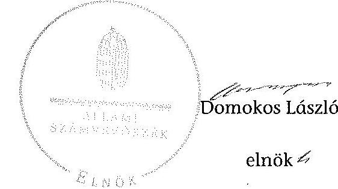

ÁLLAMI
SZÁMVEVŐSZÉK

# JELENTÉS 

az önkormányzatok belső kontrollrendszere kialakításának, egyes
kontrolltevékenységek és a belső ellenőrzés
működésének ellenőrzéséről
Cserépváralja
14215
2014. október

---

# Állami Számvevőszék 

Iktatószám: V-0393-061/2014.
Témaszám: 1372
Vizsgálat-azonosító szám: V064939

## Az ellenőrzést felügyelte:

Dr. Benedek Mária
felügyeleti vezető
Az ellenőrzést vezette és az ellenőrzés végrehajtásáért felelős:
Bíró Zsolt
ellenőrzésvezető
A számvevőszéki jelentés összeállításában közreműködött:
Pappné dr. Szamosi Éva
számvevő főtanácsos
Az ellenőrzést végezték:
Albert Enikő
Pappné dr. Szamosi Éva
számvevő
számvevő főtanácsos

---

# TARTALOMJEGYZÉK 

BEVEZETÉS ..... 5
I. ÖSSZEGZŐ MEGÁLLAPÍTÁSOK, KÖVETKEZTETÉSEK, JAVASLATOK ..... 9
II. RÉSZLETES MEGÁLLAPÍTÁSOK ..... 14

1. Az önkormányzat belső kontrollrendszerének kialakítása ..... 14
1.1. A kontrollkörnyezet ..... 14
1.2. A kockázatkezelési rendszer ..... 15
1.3. A kontrolltevékenységek ..... 16
1.4. Az információs és kommunikációs rendszer ..... 17
1.5. A monitoring rendszer ..... 18
2. A pénzügyi folyamatokban kulcsszerepet betöltő teljesítésigazolás és érvényesítés belső kontrollok működése ..... 18
3. A belső ellenőrzés működése ..... 21

## FÜGGELÉKEK

1. számú Értelmező szótár
2. számú Az értékelés módja és szempontjai

---

.

---

# RÖVIDÍTÉSEK JEGYZÉKE 

## Törvények

Áht.
ÁSZ tv.
Htv.

Info tv.

Kttv.

Ltv.

Mötv.

Mvtv.
Ötv.
Számv. tv.
Vagyonnyilatkozat-
tételről szóló tv.

## Rendeletek

Áhsz.
Ávr.

Bkr.

## Szórövidítések

ÁSZ
ellenőrzési nyomvonal

FEUVE szabályzat
gazdálkodási ügyrend
2011. évi CXCV. törvény az államháztartásról (hatályos 2012. január 1-jétől)
2011. évi LXVI. törvény az Állami Számvevőszékről
1991. évi XX. törvény a helyi önkormányzatok és szerveik, a köztársasági megbízottak, valamint egyes centrális alárendeltségű szervek feladat- és hatásköreiről.
2011. évi CXII. törvény az információs önrendelkezési jogról és az információszabadságról (hatályos 2012. január 1-jétől)
2011. évi CXCIX. törvény a közszolgálati tisztviselőkról (hatályos 2012. március 1-jétől)
1995. évi LXVI. törvény a köziratokról, a közlevéltárakról és a magánlevéltári anyag védelméről
2011. évi CLXXXIX. törvény Magyarország helyi önkormányzatairól (hatályos 2012. január 1-jétől)
1993. évi XCIII. törvény a munkavédelemről
1990. évi LXV. törvény a helyi önkormányzatokról
2000. évi C. törvény a számvitelről
2007. évi CLII. törvény egyes vagyonnyilatkozat-tételi kötelezettségekről

4/2013. (I. 11.) Korm. rendelet az államháztartás számviteléről (hatályos 2014. január 1-jétől)
368/2011. (XII. 31.) Korm. rendelet az államháztartásról szóló törvény végrehajtásáról (hatályos 2012. január 1-jétől)
370/2011. (XII. 31.) Korm. rendelet a költségvetési szervek belső kontrollrendszeréről és belső ellenőrzéséről (hatályos 2012. január 1-jétől)

Állami Számvevőszék
Cserépfalu-Cserépváralja-Bükkzsérc Önkormányzatok
Körjegyzőségének Ellenőrzési Nyomvonala (hatályos 2008. január 1-jétől)

Cserépfalu-Cserépváralja-Bükkzsérc Községek Körjegyzősége Folyamatba épített előzetes és utólagos vezetői ellenőrzés rendszeréről szóló szabályzat (hatályos 2008. január 1-jétől)
Ügyrend Cserépfalu-Cserépváralja-Bükkzsérc Községek Önkormányzatainak Körjegyzősége gazdasági szervezetének gazdálkodással összefüggő feladataira (hatályos 2007. január 1-jétől)

---

INTOSAI
iratkezelési szabályzat

ISSAI
Képviselő-testület

Kormányhivatal
körjegyző
Körjegyzőség
körjegyzőségi megállapodás
körjegyzőségi SZMSZ
közös önkormányzati hivatal
NGM
Önkormányzat
Körjegyzőség pénzgazdálkodási szabályzata

Önkormányzat pénzgazdálkodási szabályzata
polgármester
Társulás

International Organization of Supreme Audit Institutions (Legfőbb Ellenőrző Intézmények Nemzetközi Szervezete)
Cserépfalu-Cserépváralja-Bükkzsérc Önkormányzatok Körjegyzőségének Iratkezelési szabályzata (hatályos 2008. január 3-ától)

International Standards of Supreme Audit Institutions (Legfőbb Ellenőrző Intézmények Nemzetközi Standardjai)
Cserépváralja Község Önkormányzatának Képviselőtestülete
Borsod-Abaúj-Zemplén Megyei Kormányhivatal
Cserépfalu, Cserépváralja, Bükkzsérc községek körjegyzője
Cserépfalu-Cserépváralja-Bükkzsérc Községek Körjegyzősége 2007. január 1-jétől 2013. február 28-áig
Megállapodás Körjegyzőség közös fenntartására (hatályos 2007. január 1-jétől)
Cserépfalu-Cserépváralja-Bükkzsérc Önkormányzatok Körjegyzőségének Általános Ügyrendje (hatályos 2007. január 1-jétől)
Cserépfalui Közös Önkormányzati Hivatal
Nemzetgazdasági Minisztérium
Cserépváralja Község Önkormányzata
6/2010. számú intézkedés az intézmény pénzgazdálkodásával kapcsolatos kötelezettségvállalás, utalványozás, érvényesítés és ellenjegyzés hatásköri rendjéről (hatályos 2010. január 1-jétől)

Cserépváralja Önkormányzat Szabályzat a pénzgazdálkodással kapcsolatos kötelezettségvállalás, utalványozás, érvényesítés és ellenjegyzés hatásköri rendjéről (hatályos 2012. január 1-jétől)

Cserépváralja Község Önkormányzatának polgármestere Mezőkövesdi Többcélú Kistérségi Társulás

---

# JELENTÉS 

## az önkormányzatok belső kontrollrendszere kialakításának, egyes kontrolltevékenységek és a belső ellenőrzés működésének ellenőrzéséről Cserépváralja

## BEVEZETÉS

A Borsod-Abaúj-Zemplén megyei Cserépváralja község állandó lakosainak száma 2012. január 1-jén 444 fő volt. Az Önkormányzat öttagú Képviselőtestületének munkáját egy állandó bizottság segítette. Az Önkormányzat társult tagként az önállóan működő és gazdálkodó Körjegyzőségen kívül más intézményt nem működtetett, többségi tulajdoni hányadú gazdasági társasággal nem rendelkezett. A polgármester a 2002. évi önkormányzati választások óta tölti be tisztségét. A körjegyző 1997. szeptember 1-jétől - 2013. március 1-jétől közös önkormányzati hivatal jegyzőjeként - látja el feladatait. A Körjegyzőség szervezeti egységekre nem tagolódott, elkülönült gazdasági szervezettel nem rendelkezett. A Körjegyzőségen foglalkoztatott köztisztviselők száma 2012. január 1-jén 11 fő volt. A Körjegyzőség 2013. február 28-ai hatállyal megszűnt. Cserépfalu, Cserépváralja, Bükkzsérc községi önkormányzatok képviselőtestületei 2013. március 1-jétől - Cserépfalu székhellyel - közös önkormányzati hivatalt alapítottak. Az Önkormányzat a 2012. évi költségvetési beszámolója szerint 126472 ezer Ft tárgyévi bevételt ért el, valamint 125638 ezer Ft tárgyévi kiadást teljesített. A 2012. december 31-i könyvviteli mérleg szerint 533660 ezer Ft értékű eszközvagyonnal rendelkezett, a rövid lejáratú kötelezettségállománya 10589 ezer Ft, hosszú lejáratú kötelezettségállománya 400 ezer Ft volt.

A demokratikus társadalmakban alapvető igény, hogy a közpénzeket, a közvagyont használók tevékenységükről elszámoljanak, ahhoz egyértelmű és érvényesíthető felelősségi szabályok társuljanak. Ennek a jogos igénynek az érvényesítéséhez meg kell teremteni azokat a folyamatokat, rendszereket, amelyek nélkülözhetetlenek az elszámoltatáshoz. Az elszámoltatás eredményes működtetéséhez szükség van a megfelelő információs, kontroll, értékelési és beszámolási rendszerek kialakítására.

Magyarországon az uniós csatlakozási tárgyalások idejére nyúlnak vissza a belső kontrollrendszer szabályozásának gyökerei. Az uniós elvárásoknak megfelelő új terminológia szerinti államháztartási belső pénzügyi ellenőrzési (ÁBPE) rendszer területén a jogharmonizáció 2003-ban teljes körűen megvalósult, míg az önkormányzati alrendszerre vonatkozó, Ötv.-ben megjelenített speciális szabályozás 2005-ben lépett hatályba. Az államháztartási belső kontrollrendszer koncepciója 2009-ben továbbfejlődött. A változások irányát mutat-

---

ja, hogy a költségvetési szervek belső kontrollrendszere már magában foglalja a korszerű, felelős szervezetirányítás elemeit (kontrollkörnyezet, kockázatkezelés, kontrolltevékenység, információ és kommunikáció, monitoring) is. E kontrollrendszer szabályozása háromszintű, a törvényi előírásokat az Áht. és a Mötv., a rendeleti szintű szabályozást az Ávr. és a Bkr. tartalmazza, amelyeket útmutatói szinten az NGM által kiadott standardok és kézikönyvek támogatnak.

A belső kontrollrendszer azt a célt szolgálja, hogy a költségvetési szervek működésük és gazdálkodásuk során a tevékenységeket szabályszerűen, gazdaságosan, hatékonyan és eredményesen hajtsák végre, teljesítsék elszámolási kötelezettségeiket és megvédjék az erőforrásokat a veszteségektől, a károktól és a nem rendeltetésszerű használattól. A belső kontrollrendszer magában foglalja mindazon szabályokat, eljárásokat, gyakorlati módszereket és szervezeti struktúrákat, kockázatkezelési technikákat, kontrolltevékenységeket, amelyek segítséget nyújtanak a szervezetnek céljai eléréséhez.

Az ÁSZ középtávú stratégiájában hangsúlyos szerepet szánt annak, hogy szilárd szakmai alapon álló, értékteremtő ellenőrzéseivel előmozdítsa a közpénzügyek átláthatóságát, rendezettségét. A számvevőszéki ellenőrzés nemzetközi alapelvei is rögzítik, hogy a megfelelő belső kontrollrendszer minimálisra csökkenti a hibák és szabálytalanságok kockázatát.

Az ellenőrzés célja annak megállapítása volt, hogy a belső kontrollrendszer elemeinek kialakítása, a pénzügyi folyamatokban kulcsszerepet betöltő teljesítésigazolás és érvényesítés, és a belső ellenőrzés szabályos működése biztosította-e az Önkormányzatnál a közpénzfelhasználás szabályosságát, hozzájárult-e az értéket teremtő rend követelményének érvényesüléséhez.

Ennek keretében értékeltük, hogy:

- a jogszabályi előírásoknak megfelelően alakították-e ki a belső kontrollrendszer elemeit;
- a gazdálkodás folyamatában kulcsszerepet betöltő teljesítésigazolás és érvényesítés kontrolltevékenységeit megfelelően működtették-e;
- biztosították-e a belső ellenőrzés szabályos működését;
- amennyiben az ÁSZ tett javaslatot a 2008-2011. évek közötti ellenőrzése kapcsán az Önkormányzatnak, intézkedtek-e azok végrehajtására.

Az ellenőrzés várható hasznosulását négy szinten tervezzük. A törvényalkotás számára összegzett tapasztalatok állnak rendelkezésre a belső kontrollrendszer önkormányzati területen való kialakításáról, működéséről és hatásairól, a belső ellenőrzés működéséről. Ennek alapján következtetést lehet levonni arról, hogy a belső kontrollrendszer kialakítására és működtetésére vonatkozó jelenlegi, differenciálás nélküli jogszabályi előírások reális követelményeket támasztanak-e az eltérő adottságú települési önkormányzatok esetében, illetve indokolt-e esetleges jogszabályi módosítás kezdeményezése. Az ellenőrzés az ellenőrzött számára visszajelzést ad a belső kontrollrendszer kialakításában és működésében fellépő hiányosságokról, javaslataival hozzájárul azok kikü-

---

szöböléséhez, amely csökkentheti a későbbi ellenőrzések gyakoriságát. Az ellenőrzés megállapításait és javaslatait más szervezetek is hasznosíthatják a rendezett gazdálkodási keretek kialakításához. A társadalom számára jelzi, hogy közpénz nem maradhat ellenőrizetlenül, az ÁSZ értékteremtő rend kialakításához és megőrzéséhez hozzájáruló tevékenysége pozitív hatással lesz a szervezetről kialakított összkép formálásában. A szervezeten belül lehetőség nyílik arra, hogy a megállapítások szintetizálásával az ÁSZ a hozzáadott értéket teremtő elemző tevékenységét és tanácsadó szerepét is erősítse.

Az önkormányzatok belső kontrollrendszere kialakításának, egyes kontrolltevékenységek és a belső ellenőrzés működésének ellenőrzéséről szóló jelentés I. fejezetének összegző része az ellenőrzés céljára ad rövid, szintetizáló összefoglalót, és tartalmazza a következtetéseket a II. fejezet részletes megállapításain alapulóan. A jelentés intézkedést igénylő megállapításait és javaslatait az ellenőrzés során feltárt, a jelentés II. fejezetében rögzített részletes megállapítások alapozzák meg.

Az ellenőrzés típusa: szabályszerűségi ellenőrzés.
Az ellenőrzött időszak: a belső kontrollrendszer kialakításának megfelelősége esetében a 2012. évre, a pénzügyi folyamatokban kulcsszerepet betöltő teljesítésigazolás és érvényesítés belső kontrollok működésének megfelelőségét és a belső ellenőrzés szabályszerű működését a 2012. január 1. és december 31-e közötti időszak eseményeit figyelembe véve értékeltük, míg az ÁSZ javaslatainak utóellenőrzése a 2008-2011. években végzett ellenőrzések nyilvánosságra hozott jelentéseiben tett javaslatok áttekintésére terjedt ki.

# Az ellenőrzött szervezet: az Önkormányzat. 

Az ellenőrzés jogszabályi alapját az ÁSZ tv. 1. § (3) bekezdése, az 5. § (2) és (6) bekezdése, valamint az Áht. 61. § (2) bekezdésének előírásai képezik.

Az ellenőrzés szakmai módszertana az ÁSZ hivatalos honlapján (www.asz.hu) közzétett szakmai szabályokon alapult, amely az INTOSAI által kiadott ISSAI figyelembevételével készült.

Az ellenőrzés lefolytatásához az Önkormányzat a kimutatások és a tanúsítvány elektronikus kitöltésével, valamint az ÁSZ által kért dokumentumok elektronikus megküldésével szolgáltatott adatokat. Az így rendelkezésre bocsátott adatok, információk kontrollja és a munkalapok kitöltése a helyszíni ellenőrzés keretében történt. A jelentésben használt fogalmak magyarázatát az 1. számú függelék, az ellenőrzés egyes területeinek értékelésénél alkalmazott egységes minősítési szempontokat a 2. számú függelék tartalmazza.

A belső kontrollrendszer kialakításának ellenőrzése során értékeltük a kontrollkörnyezet, a kockázatkezelési rendszer, a kontrolltevékenységek, az információs és kommunikációs rendszer, valamint a monitoring rendszer szabályozottságának megfelelőségét. A pénzügyi folyamatokban kulcsszerepet betöltő teljesítésigazolás és érvényesítés kontrollok működése megfelelőségének minősítéséhez az állományba nem tartozók megbízási díjai, a külső szolgáltatók által végzett karbantartási, kisjavítási munkák, az egyéb üzemeltetési és fenntartási

---

szolgáltatások, a rendszeres szociális segélyek, valamint az államháztartáson kívülre teljesített működési és felhalmozási célú pénzeszközátadások közül kockázatelemzéssel választottuk ki az ellenőrzött kiadási jogcímeket. Az egyszerű véletlen mintavétellel kiválasztott tételek ellenőrzését többlépcsős megfelelőségi tesztek útján addig végeztük, amíg elegendő és megfelelő bizonyítékot szereztünk a vizsgált folyamatok kulcskontrolljai működésének megfelelő vagy nem megfelelő voltáról. Értékeltük az Önkormányzatnál a belső ellenőrzés működésének szabályosságát. A 2008-2011. közötti időszakban kettő ÁSZ ellenőrzés érintette az Önkormányzatot, egy esetben ellenőrzöttként (a 0927 számú számvevőszéki jelentés a helyi önkormányzatok gazdálkodási rendszerének 2008. évi ellenőrzéséről), egy esetben pedig adatszolgáltatóként (a 1107 számú számvevőszéki jelentés a természeti katasztrófák megelőzésére, elhárítására, következményeinek felszámolására kialakított rendszerek ellenőrzéséről). A nyilvánosságra hozott jelentések az Önkormányzat számára konkrét feladatot nem határoztak meg, javaslatot nem tettek, ezért utóellenőrzésre nem került sor.

Az ÁSZ tv. 29. § (1) bekezdése szerint a jelentéstervezetet megküldtük a polgármester részére, aki az ÁSZ tv. 29. § (2) bekezdésében foglalt észrevételezési jogával nem élt, a jelentéstervezetre észrevételt nem tett.

---

# I. ÖSSZEGZŐ MEGÁLLAPÍTÁSOK, KÖVETKEZTETÉSEK, JAVASLATOK 

A belső kontrollrendszeren belül 2012-ben a kontrollkörnyezet, a kockázatkezelési rendszer, a kontrolltevékenységek, az információs és kommunikációs rendszer, valamint a monitoring rendszer kialakítását külön-külön és együttesen is értékeltük. A belső kontrollrendszer kialakítása az összesített értékelés alapján nem felelt meg a jogszabályi előírásoknak.

A belső
 kontrollrendszer egyes területei kialakításának minősítése a következő:

| Kontrollterület | Minősítés |  |
| :-- | :-- | :-- |
| Kontrollkörnyezet |  | nem |
|  |  | megfelelő |
| Kockázatkezelési rendszer |  | nem |
|  |  | megfelelő |
| Kontrolltevékenységek | részben |  |
| Információs és kommunikációs | megfelelő |  |
| rendszer |  | nem |
| Monitoring rendszer |  | megfelelő |

Részben megfelelőnek értékeltük a kontrolltevékenységek kialakítását, mivel a megállapított szabályozásbeli hiányosságok nem veszélyeztették e kontrollterületen a szabályszerű működést.

Nem megfelelőnek értékeltük a kontrollkörnyezet, a kockázatkezelési rendszer, az információs és kommunikációs rendszer, valamint a monitoring rendszer kialakítását, mivel az ellenőrzésünk során megállapított szabályozásbeli hiányosságok magukban hordozzák a szabálytalan működést, valamint a korrupció kockázatát.

A 2012. évben az állományba nem tartozók megbízási díjaival, valamint a külső szolgáltatók által végzett karbantartási, kisjavítási munkákkal kapcsolatos kifizetések során a pénzügyi folyamatokban kulcsszerepet betöltő teljesítésigazolás és érvényesítés belső kontrollok működése gyenge volt. A két kulcskontroll együttes működését gyengének értékeltük, mivel azok nem biztosították a hibák megelőzését, feltárását.

A számvevőszéki ellenőrzés az ellenőrzött kifizetésekkel összefüggésben a rendelkezésre bocsátott dokumentumok alapján kár bekövetkeztére utaló adatot, tényt nem állapított meg, azonban a gazdálkodásban kulcsszerepet betöltő kontrollok működésében feltárt hiányosságok miatt fennáll a hibák bekövetkezésének kockázata. A nem megfelelően működtetett belső kontrollok korrupciós kockázatot hordoznak.

---

Az Önkormányzat a belső ellenőrzési feladatokat a Társulás útján látta el. A 2012. évben a belső ellenőrzés működése nem felelt meg a jogszabályi előírásoknak, mivel a számvevőszéki ellenőrzés által megállapított szabályozási és működési hiányosságok számossága magában hordozza a szabálytalan önkormányzati gazdálkodás és feladatellátás kockázatát.

Az ÁSZ tv. 33. § (1) bekezdésében foglaltak értelmében az ellenőrzött szervezet vezetője köteles a jelentésben foglalt megállapításokhoz kapcsolódó intézkedési tervet összeállítani, és azt a jelentés kézhezvételétől számított 30 napon belül az ÁSZ részére megküldeni. Amennyiben az intézkedési tervet határidőre nem küldi meg a szervezet, vagy az ÁSZ tv. 33. § (2) bekezdésében foglalt póthatáridő elteltével megküldött intézkedési terv továbbra sem elfogadható, az ÁSZ elnöke a hivatkozott törvény 33. § (3) bekezdés a)-b) pontjaiban foglaltakat érvényesítheti.

# a polgármesternek 

1. A Vagyonnyilatkozat-tételről szóló tv.-ben előírtakat figyelmen kívül hagyva, a körjegyző a vagyonnyilatkozat-tételi kötelezettségének nem tett eleget. Az őrzésért felelős, egyéb munkáltatói jogkört gyakorló cserépfalui polgármester - a Vagyonnyilatkozat-tételről szóló tv.-ben foglaltak ellenére - nem tájékoztatta a körjegyzőt a vagyonnyilatkozat-tételi kötelezettség fennállásáról és esedékességének időpontjáról az esedékességet legalább 30 nappal megelőzően, továbbá írásban nem szólította fel arra, hogy vagyonnyilatkozat-tételi kötelezettségét a felszólítás kézhezvételétől számított nyolc napon belül teljesítse.

Javaslat:
Kezdeményezze az egyéb munkáltatói jogokat gyakorló Cserépfalu Község Önkormányzata polgármesterénél, hogy a Vagyonnyilatkozat-tételről szóló tv.-ben foglaltakat figyelembe véve, a jegyző soron kívül tegyen vagyonnyilatkozatot.
2. A számvevőszéki ellenőrzés megállapításai alapján az Önkormányzatnál a belső kontrollrendszer kialakítása összefoglalóan értékelve nem felelt meg a jogszabályi előírásoknak. A kulcskontrollok működése gyenge volt, a belső ellenőrzés működése nem felelt meg a jogszabályi előírásoknak. A megállapított szabályozásbeli és működésbeli hiányosságok magukban hordozzák a szabálytalan működés kockázatát.

Javaslat:
Intézkedjen a belső kontrollrendszer működésére vonatkozó jogszabályi rendelkezések be nem tartása, valamint a teljesítésigazolás, illetve az érvényesítés kontrollokkal összefüggésben feltárt hiányosságok és szabálytalanságok tekintetében a munkajogi felelősség kivizsgálására irányuló eljárás megindítása iránt, és ennek eredményének ismeretében a szükséges intézkedéseket tegye meg.

---

# a jegyzőnek (Cserépváralja Község Önkormányzata vonatkozásában) 

1. a kontrollkörnyezettel kapcsolatban:

A körjegyzőségi SZMSZ nem felelt meg az Ávr.-ben előírt tartalmi követelményeknek. A körjegyző nem aktualizálta a Számv. tv.-ben, illetve a Bkr.-ben előírtak ellenére a számlarendet és a Körjegyzőség ellenőrzési nyomvonalát. Az Mvtv.-ben foglaltak ellenére nem határozta meg a Körjegyzőségen az egészséget nem veszélyeztető és biztonságos munkavégzés követelményei megvalósításának módját. Az Ötv.-ben előírt feladata ellenére nem készítette elő a Kttv.-ben előírt, a köztisztviselőkkel szembeni hivatásetikai alapelvek részletes tartalmának, valamint az etikai eljárás szabályainak dokumentumát. [II. Részletes megállapítások, 1.1. A kontrollkörnyezet 5., 7., 10., 30., 32., 41. és 47. sorszámú megállapítás]

Javaslat:
Intézkedjen az Áht. 69. § (2) bekezdése, a Bkr. 3. § a) pontja és 6. §-a alapján a jelentés II. Részletes megállapítások, 1.1. A kontrollkörnyezet 5., 7., 10., 30., 32., 41. és 47. megállapításaiban foglalt hibák, hiányosságok kijavításáról, megszüntetéséről az ott megjelölt jogszabályi rendelkezéseknek megfelelően.
2. a kockázatkezelési rendszerrel kapcsolatban:

A körjegyző a Bkr.-ben foglalt előírás ellenére nem mérte fel és nem állapította meg a Körjegyzőség tevékenységében, gazdálkodásában rejlő kockázatokat, nem határozta meg az egyes kockázatokkal kapcsolatban a szükséges intézkedéseket, valamint azok teljesítése folyamatos nyomon követési módját. A Vagyonnyilatkozattételről szóló tv. előírásai ellenére a vagyonnyilatkozat-tételi kötelezettség tényét a körjegyzőségi SZMSZ-ben nem tüntették fel, a köztisztviselők a vagyonnyilatkozattételi kötelezettségüket nem teljesítették, az őrzésért felelős nem tájékoztatta a vagyonnyilatkozat-tételre kötelezett köztisztviselőket a kötelezettségük fennállásáról és az esedékesség időpontjáról, valamint nem szólította fel a kötelezetteket a vagyonnyilatkozat-tételi kötelezettségük teljesítésére. [II. Részletes megállapítások, 1.2. A kockázatkezelési rendszer 2., 8. 10., 13. és 14. sorszámú megállapítás]

Javaslat:
Intézkedjen az Áht. 69. § (2) bekezdése, a Bkr. 3. § b) pontja és 7. §-ában foglaltak alapján a jelentés II. Részletes megállapítások, 1.2. A kockázatkezelési rendszer 2., 8. 10., 13. és 14. sorszámú megállapításaiban foglalt hibák, hiányosságok kijavításáról, megszüntetéséről az ott megjelölt jogszabályi rendelkezéseknek megfelelően.
3. a kontrolltevékenységekkel kapcsolatban:

A körjegyző az Ávr.-ben foglalt előírásokat nem vette figyelembe az előzetes írásbeli kötelezettségvállalást nem igénylő kifizetések rendjének szabályozásánál. A körjegyző az Ávr.-ben foglaltak ellenére 2012. január 1-je és március 30-a között nem jelölt ki teljesítés igazolására jogosult személyeket az Önkormányzat kiadási előirányzataira vonatkozóan. Nem felelt meg az Ávr.-ben foglalt előírásoknak a külön írásbeli rendelkezés kötelező tartalmi elemeinek szabályozása. A körjegyző az Info tv.-ben fog-

---

laltak ellenére nem biztosította az adatok biztonságát és védelmét, továbbá a Bkr.-ben foglaltak ellenére belső szabályzatban nem határozta meg az információkhoz való hozzáférésre vonatkozóan a felelősségi köröket. A pénzügyi ellenjegyzésre kijelölt személyek közül három fő, az érvényesítési feladatok ellátására kijelölt személyek közül egy fő nem rendelkezett az Ávr.-ben előírt végzettséggel, pénzügyi-számviteli képesítéssel. A körjegyző a Kttv.-ben foglaltak ellenére nem szabályozta a Körjegyzőségen a köztisztviselő jogviszonya megszüntetése (megszünése) esetére a munkakör átadása rendjét. [II. Részletes megállapítások, 1.3. A kontrolltevékenységek 8., 10., 12., 16-17., 28., 30. és 32. sorszámú megállapítás]

Javaslat:
Intézkedjen az Áht. 69. § (2) bekezdése, a Bkr. 3. § c) pontja és 8. §-a alapján a jelentés II. Részletes megállapítások, 1.3. A kontrolltevékenységek 8., 10., 12., 16-17., 28., 30. és 32. sorszámú megállapításaiban foglalt hibák, hiányosságok kijavításáról, megszüntetéséről az ott megjelölt jogszabályi rendelkezéseknek megfelelően.
4. az információs és kommunikációs rendszerrel kapcsolatban:

A körjegyző a Bkr.-ben foglaltak ellenére nem alakított ki olyan rendszert, amely biztosítja, hogy a megfelelő információk a megfelelő időben eljutnak az illetékes személyhez. Az Info tv.-ben és az Ávr.-ben foglaltak ellenére nem készítette el a Körjegyzőség adatvédelmi és adatbiztonsági szabályzatát, belső szabályzatban nem állapította meg a kötelezően közzéteendő adatok nyilvánosságra hozatalának rendjét. Az Önkormányzat elektronikus közzétételi kötelezettsége a 2012. évben nem felelt meg az Info tv.-ben foglaltaknak. A körjegyző az Ltv. előírását figyelmen kívül hagyva a Körjegyzőség iratkezelési szabályzatát nem a Magyar Nemzeti Levéltár és a Kormányhivatal egyetértésével adta ki. [II. Részletes megállapítások, 1.4. Az információs és kommunikációs rendszer 1., 5-7. és 9. sorszámú megállapítás]

Javaslat:
Intézkedjen az Áht. 69. § (2) bekezdése, a Bkr. 3. § d) pontja és 9. §-a alapján a jelentés II. Részletes megállapítások, 1.4. Az információs és kommunikációs rendszer 1., 5-7. és 9. sorszámú megállapításaiban foglalt hiányosságok megszüntetéséről az ott megjelölt jogszabályi rendelkezéseknek megfelelően.
5. a monitoring rendszerrel kapcsolatban:

A körjegyző - a Bkr.-ben foglaltak ellenére - nem alakította ki a Körjegyzőség tevékenységének, a célok megvalósításának nyomon követését biztosító rendszerét. [II. Részletes megállapítások, 1.5. A monitoring rendszer 1. sorszámú megállapítás]

Javaslat:
Intézkedjen az Áht. 69. § (2) bekezdése, a Bkr. 3. § e) pontja és 10. §-a alapján a jelentés II. Részletes megállapítások, 1.5. A monitoring rendszer 1. sorszámú megállapításában foglalt hibák, hiányosságok kijavításáról, megszüntetéséről az ott megjelölt jogszabályi rendelkezéseknek megfelelően.

---

6. a pénzügyi folyamatokban kulcsszerepet betöltő kontrollokkal kapcsolatban:

A teljesítésigazolás, az érvényesítés, valamint az utalvány és a kiadási pénztárbizonylat tartalma nem felelt meg az Ávr.-ben foglaltaknak. Az Ávr.-ben előírtak ellenére kötelezettségvállalás nyilvántartást nem vezettek. [II. Részletes megállapítások, 2. A pénzügyi folyamatokban kulcsszerepet betöltő teljesítésigazolás és érvényesítés belső kontrollok működése 1-3. pontban foglalt megállapítás].

Javaslat:
Intézkedjen az Ávr. 56-60. §-ában, az Áhsz. 39. § (1) bekezdésében és a 14. számú melléklet II. pontjában foglaltak alapján arról, hogy a teljesítésigazolás és az érvényesítés vonatkozásában, valamint azok ellenőrzése során a kötelezettségvállalások nyilvántartásba vételével, továbbá az utalvány és a kiadási pénztárbizonylat tartalmával kapcsolatban feltárt, a jelentés II. Részletes megállapítások, 2. A pénzügyi folyamatokban kulcsszerepet betöltő teljesítésigazolás és érvényesítés belső kontrollok működése 1-3. pontjában szereplő megállapításokban foglalt hibák, hiányosságok kijavítása, megszüntetése az ott megjelölt jogszabályi rendelkezéseknek megfelelően történjen meg.
7. a belső ellenőrzés működésével kapcsolatban:

A belső ellenőrzés működése a számvevőszéki ellenőrzés értékelési szempontjait figyelembe véve nem felelt meg a Bkr.-ben foglaltaknak. [II. Részletes megállapítások, 3. A belső ellenőrzés működése 3-4., 7-8., 13-14. és 27. sorszámú megállapítása]

Javaslat:
Intézkedjen az Áht. 69. § (2) bekezdése, a Bkr. 3. § e) pontja és a 10. §-a alapján a jelentés II. Részletes megállapítások, 3. A belső ellenőrzés működése 3-4., 7-8., 13-14. és 27. sorszámú megállapításaiban foglalt hibák, hiányosságok kijavításáról, megszüntetéséről az ott megjelölt jogszabályi rendelkezéseknek megfelelően.

---

# II. RÉSZLETES MEGÁLLAPÍTÁSOK 

## 1. AZ ÖNKORMÁNYZAT BELSŐ KONTROLLRENDSZERÉNEK KIALAKÍTÁSA

A belső kontrollrendszeren belül 2012-ben a kontrollkörnyezet, a kockázatkezelési rendszer, a kontrolltevékenységek, az információs és kommunikációs rendszer, valamint a monitoring rendszer kialakítását külön-külön és együttesen is értékeltük. A belső kontrollrendszer kialakítása az összesített értékelés alapján nem felelt meg a jogszabályi előírásoknak.

### 1.1. A kontrollkörnyezet

A kontrollkörnyezet kialakítása - a 2. számú függelékben részletezett kritériumrendszer alapján végzett értékelés szerint - a jogszabályi előírásoknak nem felelt meg, mert:

| Sor-   szám $^{1}$ | Megállapítás | Megjegyzés |
| :--: | :--: | :--: |
| 2. | A körjegyző - a Htv. 140. § (1) bekezdés a) pontjában foglaltak ellenére - nem készítette el a gazdasági programtervezetet, ezáltal a Képviselő-testület az Ötv. 91. § (1) és (7) bekezdésében foglaltakat figyelmen kívül hagyva nem határozta meg az Önkormányzat 2011-2014. évekre vonatkozó gazdasági programját. | A gazdasági program készítésével összefüggő előírásokat 2013. január 1-jétől a Mötv. 116. § (1) és (5) bekezdése szabályozza. |
| 5., 7., 10. | A Körjegyzőség rendelkezett a

 2012. évben az Áht. 10. § (5) bekezdésében előírt körjegyzőségi SZMSZ-szel, azonban 2010. január 1-jét követően a körjegyző nem vizsgálta felül és nem aktualizálta. A körjegyző a körjegyzőségi SZMSZ-ben - az Ávr. 13. § (1) bekezdés c) és g) pontjaiban foglaltak ellenére - nem rögzítette az ellátandó, és a szakfeladatrend szerint szakfeladatszámmal és megnevezéssel besorolt alaptevékenységek, valamint az alaptevékenységet szabályozó jogszabályok megjelölését, a szervezeti és működési szabályzatban nevesített munkakörökhöz tartozó feladat- és hatásköröket, a hatáskörök gyakorlásának módját, a helyettesítés rendjét, az ezekhez kapcsolódó felelősségi szabályokat. | 2014. január 1-jétől az Ávr. 13. § (1) bekezdés c) pontjában szereplő előírás változott.   A körjegyző és a köztisztviselők helyettesítési rendjét a körjegyzőségi megállapodás tartalmazta, a körjegyző helyettesítésére további előírást tartalmazott a körjegyzőségi SZMSZ is. |

[^0]
[^0]:    ${ }^{1}$ A megállapítás számozása az Önkormányzat által az adatszolgáltatás során kitöltött kimutatások kérdéseinek sorszámával azonos.

---

| 30. | A körjegyző - a Számv. tv. 161. § (4)-(5) be-   kezdésében előírtak ellenére - a számlarendet nem aktualizálta. | A számlarendet a kör-   jegyző 2009. január 1-jét   követően nem aktualizál-   ta. |
| :--: | :--: | :--: |
| 32. | A körjegyző - az Mvtv. 2. § (3) bekezdésében   foglaltak ellenére - nem határozta meg a   Körjegyzőségen az egészséget nem veszélyez-   tető és biztonságos munkavégzés követel-   ményei megvalósításának módját. |  |
| 41. | A körjegyző - a Bkr. 6. § (3) bekezdésében   foglaltak ellenére - nem aktualizálta az   ellenőrzési nyomvonalat. | Az ellenőrzési nyomvona-   lat a körjegyző 2008. ja-   nuár 1-jét követően nem   aktualizálta. |
| 47. | A Képviselő-testület - a Kttv. 231. § (1) bekez-   désében foglaltak ellenére - nem állapította   meg a Kttv. 83. §-ában előírt, a köztisztvise-   lökkel szembeni hivatásetikai alapelvek rész-   letes tartalmát, valamint az etikai eljárás   szabályait, mivel a körjegyző - az Ötv. 36. §   (2) bekezdés a) pontjában előírt feladata ellenére - nem készítette elő ennek dokumentu-   mát. | Az Ötv. 36. § (2) bekezdés   a) pontjában előírt fel-   adatot 2013. január 1-   jétől a Mötv. 81. § (3)   bekezdés c) pontja szabályozza. |

# 1.2. A kockázatkezelési rendszer 

A kockázatkezelési rendszer kialakítása - a 2. számú függelékben részletezett kritériumrendszer alapján végzett értékelés szerint - a jogszabályi előírásoknak nem felelt meg, mert:

| Sorszám | Megállapítás | Megjegyzés |
| :--: | :--: | :--: |
| 2., 8.,   10. | A körjegyző - a Bkr. 7. § (2) bekezdésében   foglalt előírás ellenére - nem mérte fel és   nem állapította meg a Körjegyzőség tevékenységében, gazdálkodásában rejlő kocká-   zatokat, nem határozta meg az egyes kocká-   zatokkal kapcsolatban a szükséges intézke-   déseket, valamint azok teljesítésének folya-   matos nyomon követési módját. |  |
| 13. | A körjegyző a Vagyonnyilatkozat-tételről   szóló tv. 4. § a) pontjában foglaltak ellenére   a vagyonnyilatkozat-tételre kötelezett köz-   tisztviselők vagyonnyilatkozat-tételi kötele-   zettségét a körjegyzőségi SZMSZ-ben nem   tüntette fel. |  |
| 14. | A Vagyonnyilatkozat-tételről szóló tv. 5. §-   ában foglaltak ellenére a körjegyző és a nyolc   fő köztisztviselő vagyonnyilatkozat-tételi köte-   lezettségének nem tett eleget. Az őrzésért fele-   lös (az egyéb munkáltatói jogkört gyakorló | Az egyéb munkáltatói jog-   kör gyakorlását a körjegyzőségi megállapodás szabályozta. |

---

cserépfalui polgármester, valamint a körjegyző) - a Vagyonnyilatkozat-tételről szóló tv. 8. § (4) bekezdésében foglaltak ellenére - nem tájékoztatta a körjegyzőt és a köztisztviselőket a vagyonnyilatkozat-tételi kötelezettség fennállásáról és esedékességének időpontjáról az esedékességet legalább 30 nappal megelőzően, továbbá - a 10. § (1) bekezdésében foglaltak ellenére - írásban nem szólította fel a kötelezetteket arra, hogy kötelezettségüket a felszólítás kézhezvételétől számított nyolc napon belül teljesítsék.

# 1.3. A kontrolltevékenységek 

A kontrolltevékenységek kialakítása - a 2. számú függelékben részletezett kritériumrendszer alapján végzett értékelés szerint - a jogszabályi előírásoknak részben felelt meg.

A körjegyző a FEUVE szabályzatban előírta a folyamatba épített, előzetes, utólagos és vezetői ellenőrzést a költségvetés tervezése, a beszerzések lebonyolítása, a vagyonhasznosítási tevékenység, valamint a támogatások elszámolása vonatkozásában.

A körjegyző szabályozta a Körjegyzőség pénzgazdálkodási szabályzatában a kötelezettségvállalás pénzügyi ellenjegyzésének és a kiadások teljesítésigazolásának módját, az érvényesítés és az utalványozás rendjét. A pénzügyi ellenjegyzési, valamint az érvényesítési feladat ellátására a Körjegyzőség állományába tartozó köztisztviselőt jelölt ki.

Az iratkezelési szabályzatban a körjegyző előírta az iratok és az adatok védelmét, meghatározta az üzemeltetés és adatbiztonság feladatait és az ehhez kapcsolódó hatásköröket, továbbá a felelősségi körök meghatározásával szabályozta a dokumentumokhoz való hozzáférést.

A gazdálkodási ügyrendben szabályozták az időközi és éves beszámolók elkészítésének feladatait, meghatározták a beszámolási eljárásokhoz kapcsolódó felelősségi köröket. A beszámoló készítéséért felelős személy rendelkezett a jogszabályban előírt szakképzettséggel, és a tevékenység ellátására jogosító engedéllyel.

A kontrolltevékenységek kialakítása az értékelés szempontjából az alábbi kisebb súlyú hiányosságok miatt részben felelt meg a jogszabályi előírásoknak:

| Sorszám | Megállapítás |
| :--: | :--: |
| 8. | Az előzetes írásbeli kötelezettségvállalást nem igénylő kifizetések rendjének szabályozásánál nem vették figyelembe az Ávr. 57. § (1) bekezdésében és 58. § (1) bekezdésében előírtakat, mert az előzetes írásbeli kötelezettségvállalást nem igénylő kifizetések esetén a szabályozás lehetővé tette a Körjegyzőség pénzgazdálkodási szabályzatában a fedezet meglétének ellenőrzése nélküli, továbbá az Önkormányzat pénzgazdálkodási szabály- |

---

|  | zatában a teljesítésigazolás és a fedezet meglétének ellenőrzése nélküli kifizetéseket. |
| :--: | :--: |
| 10. | A körjegyző - az Ávr. 57. § (4) bekezdésében foglaltak ellenére - 2012. január 1-je és március 30-a között nem jelölt ki teljesítés igazolására jogosult személyeket az Önkormányzat kiadási előirányzataira vonatkozóan. |
| 12. | A körjegyző - az Ávr. 13. § (2) bekezdés a) pontjában foglaltak ellenére szabályozta a Körjegyzőség pénzgazdálkodási szabályzatában a külön írásbeli rendelkezés kötelező tartalmi elemeit, azonban az nem felelt meg az Ávr. 59. § (3) bekezdés h) pontjában előírtaknak, mert az érvényesítésre utaló megjelölést és az érvényesítő keltezéssel ellátott aláírásának feltüntetését nem írta elő. |
| 16. | A körjegyző - az Info tv. 7. § (2)-(3) bekezdésében foglalt előírásokat figyelmen kívül hagyva - az informatikai rendszer szabályozása során nem tette meg azokat a technikai és szervezési intézkedéseket és nem alakította ki azokat az eljárási szabályokat, amelyek biztosítják az adatok biztonságát és védelmét. |
| 17. | A körjegyző - a Bkr. 8. § (4) bekezdés b) pontjában foglaltak ellenére belső szabályzatban nem határozta meg az információkhoz való hozzáférésre vonatkozóan a felelősségi köröket. |
| 28. | A körjegyző által a pénzügyi ellenjegyzésre kijelölt személyek közül három fő nem rendelkezett az Ávr. 55. § (3) bekezdésében előírt végzettséggel, pénzügyi-számviteli képesítéssel. |
| 30. | A körjegyző által az érvényesítési feladatok ellátására kijelölt személyek közül egy fő nem rendelkezett az Ávr. 55. § (3) bekezdés és 58. § (4) bekezdésében előírt végzettséggel, képesítéssel. |
| 32. | A körjegyző - a Kttv. 74. § (1) bekezdésében foglaltak ellenére - nem szabályozta a Körjegyzőségen a köztisztviselő jogviszonya megszüntetése (megszünése) esetére a munkakör átadása rendjét. |

# 1.4. Az információs és kommunikációs rendszer 

Az információs és kommunikációs rendszer kialakítása - a 2. számú függelékben részletezett kritériumrendszer alapján végzett értékelés szerint - a jogszabályi előírásoknak nem felelt meg, mert:

| Sorszám | Megállapítás |
| :-- | :-- |
| 1. | A körjegyző - a Bkr. 3. § d) pontjában és a 9. § (1) bekezdésében foglaltak   ellenére - nem alakított ki olyan rendszert, amely biztosítja, hogy a megfelelő információk a megfelelő időben eljutnak az illetékes személyhez. |
| 5. | A körjegyző - az Info tv. 24. § (3) bekezdésében foglaltak ellenére - nem   készítette el a Körjegyzőség adatvédelmi és adatbiztonsági szabályzatát. |
| 6. | A körjegyző - az Info tv. 35. § (3) bekezdésében és az Ávr. 13. § (2) bekezdés   h) pontjában foglalt előírás ellenére - a kötelezően közzéteendő adatok   nyilvánosságra hozatalának rendjét belső szabályzatban nem határozta   meg. |

---

A körjegyző - az Info tv. 33. § (1) és (3) bekezdésében foglaltak ellenére nem gondoskodott a Képviselő-testület hatályos rendeletei tekintetében az Önkormányzat elektronikus közzétételi kötelezettségének teljesítéséről a 2012. évben.

A körjegyző - az Ltv. 10. § (1) bekezdés c) pontjának előírását figyelmen kívül hagyva - a Körjegyzőség iratkezelési szabályzatát nem a Magyar Nemzeti Levéltár és a Kormányhivatal egyetértésével adta ki.

# 1.5. A monitoring rendszer 

A monitoring rendszer kialakítása - a 2. számú függelékben részletezett kritériumrendszer alapján végzett értékelés szerint - a jogszabályi előírásoknak nem felelt meg, mert:

Sorszám
Megállapítás

1. A körjegyző - a Bkr. 3. § e) pontjában és a 10. §-ában foglaltak ellenére nem alakította ki a Körjegyzőség tevékenységének, a célok megvalósításának nyomon követését biztosító rendszerét.

A Kormányhivatal a törvényességi felügyelet körében a köztemetők és a temetkezés rendjének módosításáról szóló 4/2012. (II. 15.) számú önkormányzati rendelet 1. §-a hatályon kívül helyezésére hívta fel a Képviselő-testületet, annak törvényi rendelkezésekkel ${ }^{2}$ ellentétes szabályozása miatt. A Képviselő-testület a törvényességi felhívással egyetértett és a rendeletét hatályon kívül helyezte ${ }^{3}$.

## 2. A PÉNZÜGYI FOLYAMATOKBAN KULCSSZEREPET BETÖLTŐ TELJESÍTÉSIGAZOLÁS ÉS ÉRVÉNYESÍTÉS BELSŐ KONTROLLOK MŰKÖDÉSE

A 2012. évben az állományba nem tartozók megbízási díjaival, a külső szolgáltatók által végzett karbantartással, kisjavítással kapcsolatos kifizetések során összefoglalóan értékelve - a pénzügyi folyamatokban kulcsszerepet betöltő teljesítésigazolás és érvényesítés belső kontrollok működésének megfelelősége gyenge volt, mert:

| Kont-   rollok   sor-   száma | Megállapítás | Megjegyzés |
| :-- | :-- | :-- |

## Teljesítésigazolás

1. A kifizetéseket megelőzően a teljesítésigazolást - az Ávr. 57. § (3) és (4) bekezdésében foglaltak ellenére - kijelölés hiányában nem az arra jogosult személy végezte. Továbbá a teljesítésigazolás az Ávr. 57. § (1) bekezdésében és a 60. § (2) bekezdésében előír-

[^0]
[^0]:    ${ }^{2}$ A temetőkről és a temetkezésről szóló 1999. évi XLIII. törvény 19. § (1) bekezdésében és 22. §-ában foglaltakkal.
    ${ }^{3}$ a 3/2013. (I. 30.) számú önkormányzati rendeletével

---

tak ellenére nem szabályszerűen történt, mert a teljesítésigazolók ellenőrizhető okmányok hiányában nem ellenőrizték a kiadás teljesítésének jogosságát, összegszerűségét, az ellenszolgáltatás teljesítését, valamint a teljesítésigazoló a teljesítésigazolást közeli hozzátartozója javára látta el.

# Érvényesítés

 Az érvényesítés - az Ávr. 58. § (3) bekezdésében előírtak ellenére - nem szabályszerűen történt, mert az érvényesített okmány az érvényesítés keltezését nem tartalmazta.

Az érvényesítő - az Ávr. 58. § (1) bekezdésében foglaltak ellenére - a kifizetéseket megelőzően nem tudta ellenőrizni a fedezet meglétét, mert a kötelezettségvállalásokat - az Ávr. 56. § (1) bekezdése előírása ellenére - nem vették nyilvántartásba, 2012-ben a kötelezettségvállalásokról nyilvántartást nem vezettek.

Az érvényesítő - az Ávr. 58. § (2) bekezdésében előírtak ellenére - nem jelezte az utalványozónak, hogy a megelőző ügymenetben a teljesítésigazolást kijelölés hiányában nem az arra jogosult személy végezte és nem szabályszerűen történt, valamint azt, hogy a kötelezettségvállalásokról nyilvántartást nem vezettek.

Az Ávr. 56. § (1) bekezdés 2014. január 1-jétől módosult, a kötelezettségvállalások nyilvántartására vonatkozó előírásokat az Ahsz. 39. § (1) bekezdés és a 14. számú melléklet II. pontja tartalmazza.

## A kulcskontrollok ellenőrzése során feltárt egyéb hiányosság

3. Az utalványokon és a kiadási pénztárbizonylatokon nem tüntették fel - az Ávr. 59. § (3) bekezdés f) pontjában előírtakat figyelmen kívül hagyva - a kötelezettségvállalás nyilvántartási számát.

A 2012. évben az állományba nem tartozók megbízási díjainak kifizetése során a teljesítésigazolás és érvényesítés kulcskontrollok működésének megfelelősége gyenge volt, mert:

- a teljesítésigazoló a karbantartással kapcsolatos megbízási díj kifizetését megelőzően - az Ávr. 57. § (1) bekezdésében előírtak ellenére - ellenőrizhető okmány (a feladat elvégzését igazoló dokumentum) hiányában nem ellenőrizte az Önkormányzat kiadási előirányzata terhére kötött megbízási szerződésben foglaltak teljesítését;
- a teljesítésigazoló a temetési szertartásokkal kapcsolatos megbízási díj kifizetését megelőzően ellenőrzési feladatát szabálytalanul végezte, mert a teljesítésigazolást - az Ávr. 60. § (2) bekezdésében előírtak ellenére - közeli hozzátartozója javára látta el, továbbá - az Ávr. 57. § (1) bekezdésében foglaltakat figyelmen kívül hagyva - ellenőrizhető okmány hiányában nem ellenőrizte az összegszerűséget;
- az érvényesítő nem az Ávr. 58. § (3) bekezdésében foglaltaknak megfelelően végezte ellenőrzési feladatát, mert a karbantartási feladatra - az Önkor-

---

mányzat kiadási előirányzata terhére - kötött megbízási szerződéssel kapcsolatos kifizetést megelőzően az érvényesített okmány az érvényesítés keltezését nem tartalmazta;

- az érvényesítő a karbantartással kapcsolatos megbízási díj kifizetését megelőzően - az Ávr. 58. § (1) bekezdésében foglaltak ellenére - a fedezetet nem tudta ellenőrizni, mert a kötelezettségvállalást - az Ávr. 56. § (1) bekezdésében foglaltak ellenére - nem vették nyilvántartásba, 2012-ben a kötelezettségvállalásokról nyilvántartást nem vezettek;
- az érvényesítő - az Ávr. 58. § (2) bekezdésében foglaltak ellenére - nem jelezte az utalványozónak, hogy a megelőző ügymenetben a teljesítésigazolás nem szabályszerűen történt, valamint azt, hogy a kötelezettségvállalásokról nyilvántartást nem vezettek.

Az utalványokon és a kiadási pénztárbizonylatokon nem tüntették fel - az Ávr. 59. § (3) bekezdés f) pontjában előírtak ellenére - a kötelezettségvállalás nyilvántartási számát.

A 2012. évben a külső szolgáltatók által teljesített karbantartási, kisjavítási munkákra történő kifizetések során a teljesítésigazolás és az érvényesítés kulcskontrollok működésének megfelelősége gyenge volt, mert:

- a teljesítésigazolást a gépjármű és a konvektor javításával kapcsolatos kifizetéseket $^{4}$ megelőzően - az Ávr. 57. § (3) és (4) bekezdésében foglaltak ellenére - kijelölés hiányában jogosulatlanul végezték;
- a teljesítésigazolást a gépjárműjavítással összefüggő kifizetésnél $^{5}$ - az Ávr. 57. § (3) és (4) bekezdésében foglaltak ellenére - jogosulatlanul végezték, mert a teljesítésigazolót a kötelezettségvállaló nem az adott kötelezettségvállaláshoz kapcsolódó teljesítésigazolásra jelölte ki;
- a teljesítésigazolók az Önkormányzat kiadási előirányzata terhére teljesített gépjárművek és konvektor javítással kapcsolatos kifizetéseket megelőzően az Ávr. 57. § (1) bekezdésében foglaltak ellenére - ellenőrizhető okmányok hiányában nem ellenőrizték a kiadás teljesítésének jogosságát, összegszerűségét, az ellenszolgáltatás teljesítését;
- az érvényesítő nem az Ávr. 58. § (3) bekezdésében foglaltaknak megfelelően végezte ellenőrzési feladatát, mert a gépjárművek és konvektor javításával kapcsolatos kifizetéseket megelőzően az érvényesített okmányok az érvényesítés keltezését nem tartalmazták;
- az érvényesítő a gépjárművek és a konvektor javításával kapcsolatos kifizetéseket megelőzően - az Ávr. 58. § (1) bekezdésében foglaltak ellenére - a fedezetet nem tudta ellenőrizni, mert a kötelezettségvállalásokat - az Ávr. 56. § (1) bekezdésében foglaltak ellenére - nem vették nyilvántartásba, 2012-ben a kötelezettségvállalásokról nyilvántartást nem vezettek;

[^0]
[^0]:    $^{4}$ a 2012. február 22-ei és a március 29-ei kifizetések
    $^{5}$ a 2012. december 18-ai kifizetés

---

- az érvényesítő - az Ávr. 58. § (2) bekezdésében foglaltak ellenére - nem jelezte az utalványozónak, hogy a megelőző ügymenetben a teljesítésigazolást kijelölés hiányában nem az arra jogosult személy végezte és nem szabályszerűen történt, valamint azt, hogy a kötelezettségvállalásokról nyilvántartást nem vezettek.

Az utalványokon és a kiadási pénztárbizonylatokon nem tüntették fel - az Ávr. 59. § (3) bekezdés f) pontjában előírtak ellenére - a kötelezettségvállalás nyilvántartási számát.

A számvevőszéki ellenőrzés az ellenőrzött kifizetésekkel összefüggésben, a rendelkezésre bocsátott dokumentumok alapján kár bekövetkeztére utaló adatot, tényt nem állapított meg, azonban a gazdálkodásban kulcsszerepet betöltő kontrollok gyenge működése miatt fennáll a hibák bekövetkezésének kockázata.

# 3. A BELSŐ ELLENŐRZÉS MŰKÖDÉSE 

Az Önkormányzat a belső ellenőrzési feladatokat Társulás útján látta el. A belső ellenőrzés működése - a 2. számú függelékben részletezett kritériumrendszer alapján végzett értékelés szerint - a jogszabályi előírásoknak nem felelt meg, mert:

| Sor-   szám | Megállapítás | Megjegyzés |
| :--: | :--: | :--: |
| 3., 4. | Az Önkormányzat - a Bkr. 17. § (1) bekezdésében, a 22. § (1) bekezdés a) pontjában, foglaltak ellenére - nem rendelkezett jóváhagyott belső ellenőrzési kézikönyvvel. |  |
| 7. | Az Önkormányzat a Bkr. 56. § (3) bekezdés   a) pontjában foglaltak ellenére stratégiai ellenőrzési tervvel nem rendelkezett. |  |
| 8. | A belső ellenőrzési vezető - a Bkr. 22. § (1) bekezdés b) pontjában és 31. § (1) bekezdésében foglaltak ellenére - a 2013. évre vonatkozóan éves ellenőrzési tervet nem készített. |  |
| 13., 14. | A belső ellenőrzési vezető a 2012. évi ellenőrzési tervet - a Bkr. 31. § (5) bekezdésében foglaltak ellenére - nem a körjegyző egyetértésével módosította. | A 2012. évi ellenőrzési tervét   a Társulás módosította, amelyből kapacitáshiány miatt a cserépvárai ellenőrzést elhagyta. Az Önkormányzatnál 2012-ben belső ellenőrzés nem volt. |
| 27. | A belső ellenőrzési vezető - a Bkr. 56. § (9) bekezdésében foglaltak ellenére - az Önkormányzat 2011. évre vonatkozó éves ellenőrzési jelentését nem készítette el. | A 2011. évi éves ellenőrzési jelentést a Társulásra elkészítették. |

---

Az Önkormányzat az ÁSZ-tól a 2011., a 2012. és 2013. években integritás kérdőív kitöltésére nem kapott felkérést. A Körjegyzőség az ÁSZ-tól a 2011. és a 2012. évben kapott integritás kérdőív kitöltésére felkérést, amely lehetőséggel azonban nem élt.

A köztisztviselőkkel szembeni hivatásetikai alapelveket, valamint az etikai eljárás szabályait tartalmazó dokumentum hiánya, a szervezeten belüli információátadás rendje kialakításának hiányosságai, a 2013. évi ellenőrzési terv készítésének elmulasztása arra utalnak, hogy az Önkormányzatnak még fejlődést kell elérnie az integritási szemlélet érvényesítésében.

Budapest, 2014. 10. hónap 16. nap

Függelék: $\quad 2 \mathrm{db}$

---

# ÉRTELMEZŐ SZÓTÁR 

belső ellenőrzés
belső kontrollrendszer
belső kontrollrendszer területei
egyszerű véletlen mintavétel
integritás
kockázatkezelési rendszer

Független, tárgyilagos bizonyosságot adó és tanácsadó tevékenység, amelynek célja, hogy az ellenőrzött szervezet működését fejlessze és eredményességét növelje, az ellenőrzött szervezet céljai elérése érdekében rendszerszemléletű megközelítéssel és módszeresen értékeli, illetve fejleszti az ellenőrzött szervezet irányítási és belső kontrollrendszerének hatékonyságát. (Forrás: Bkr. 2. § b) pontja)
A belső kontrollrendszer a kockázatok kezelése és tárgyilagos bizonyosság megszerzése érdekében kialakított folyamatrendszer, amely azt a célt szolgálja, hogy a működés és gazdálkodás során a tevékenységeket szabályszerűen, gazdaságosan, hatékonyan, eredményesen hajtsák végre, az elszámolási kötelezettségeket teljesítsék, megvédjék az erőforrásokat a veszteségektől, károktól és nem rendeltetésszerű használattól. (Forrás: Áht. 69. § (1) bekezdése)
A kontrollkörnyezet, a kockázatkezelési rendszer, a kontrolltevékenységek, az információs és kommunikációs rendszer, valamint a nyomon követési (monitoring) rendszer. (Forrás: Bkr. 3. §-a)

Az alapsokaságból egyszerű véletlen kiválasztással képzett részsokaság. (Forrás: Az ÁSZ ellenőrzési mintavételezés támogatásához készült segédletének 4.1.1. pontja)
Az integritás elvek, értékek, cselekvések, módszerek, intézkedések konzisztenciáját jelenti: olyan magatartásmódot, amely meghatározott értékeknek felel meg. Az integritás a közszféra esetében a társadalom által elvárt nyilvánossági, átláthatósági, illetve jogi/etikai normáknak történő megfelelést jelenti.
(Forrás: a http://integritas.asz.hu honlapon közzétett „A 2012. évi integritás felmérés eredményeinek összefoglalója" címú dokumentum 3. oldal 1. bekezdése)
A kockázat annak a valószínűségét jelenti, hogy egy vagy több esemény vagy intézkedés nem kívánt módon befolyásolja a rendszer működését, céljainak megvalósulását. (Forrás: Javaslatok a korrupciós kockázatok kezelésére - Kockázatkezelési és ellenőrzési módszertan 35. oldal, ÁSZ)
Olyan irányítási eszközök és módszerek összessége, melynek elemei a szervezeti célok elérését veszélyeztető tényezők (kockázatok) azonosítása, elemzése, csoportosítása, nyomon követése, valamint szükség esetén a kockázati kitettség mérséklése. (Forrás: Bkr. 2. § m) pontja)

---

kontrollkörnyezet
kontrolltevékenységek
kommunikáció
korrupció
kulcskontrollok
lényegesség
megfelelőségi teszt

A kontrollkörnyezet alakítja ki a szervezet belső kontrollrendszerhez való viszonyát, hozzáállását, befolyásolja az alkalmazottak belső kontrollal kapcsolatos tudatosságát, magatartását. Elemei a személyes és szakmai elkötelezettség és a vezetés, valamint az alkalmazottak által vallott erkölcsi értékek; a szakmai hozzáértés iránti elkötelezettség; a felső vezetés hozzáállása - a vezetés filozófiája és tevékenységének stílusa; a szervezeti struktúra; a humánerőforrás-politika és gazdálkodási gyakorlat.
A kontrolltevékenységek azok a politikák és eljárások, amelyeket a kockázatok megoldására hoznak létre a szervezet céljainak teljesítése érdekében.
Az a tevékenység, melynek során információ továbbítása valósul meg. A kommunikációs folyamat résztvevői között tájékoztatás történik, mely során tényeket, ezek magyarázatát közlik. „A szervezetben eredményes kommunikációnak kell áramlania lefelé, horizontálisan és felfelé, a szervezet egészében és annak valamennyi elemében."
Azok a cselekmények, amelyek során a köz érdekében való eljárással megbízott és döntéshozatali felelősséggel felruházott személy a köz érdeke helyett önös vagy részérdekeket követve, mástól jogtalan vagy etikátlan előnyt elfogadva és őt jogtalan vagy etikátlan előnyhöz juttatva jár el, illetve amikor valaki a köz érdekében való eljárással megbízott és döntéshozatali felelősséggel felruházott személynek jogtalan vagy etikátlan előnyt nyújtva vagy felajánlva jogtalan vagy etikátlan előnyt kér. (Forrás: A Kormány korrupció megelőzési programja 2012-2014.)
Az azonosított kockázatok mérséklése érdekében kialakított kontrollok közül azok, amelyek elégtelen működése esetén a szervezetet jelentős veszteség érheti, vagy a működésükben bekövetkező hiba/hiányosság más kontrollok eredményességét csökkenti. Ezek ellenőrzése, értékelése elegendő bizonyítékot szolgáltat adott területen a kontrollrendszer értékeléséhez. Az önkormányzatok kontrollrendszere kialakításának ellenőrzése során a pénzügyi folyamatokban kulcsszerepet betöltő belső kontrollok a teljesítésigazolás és az érvényesítés.
Egy információ akkor lényeges, ha hiánya vagy téves állítása befolyásolhatja ezen információkat felhasználók döntéseit, véleményét. Az ellenőrzés során a lényegesség három szempontból értelmezhető: érték, jelleg és összefüggés szerint.
Az ellenőrzés során alkalmazott módszer - szekvenciális (megállásos) megfelelőségi teszt - lényege,
 hogy a kiválasztott minta ellenőrzését csak addig végezzük, amíg elegendő és megfelelő bizonyítékot nem szerzünk az ellenőrzött kulcskontroll (teljesítésigazolás, érvényesítés) működésének megfelelő vagy nem megfelelő voltáról.

---

monitoring (nyomon követési rendszer)
utóellenőrzés

A monitoring a különböző szintű szervezeti célok megvalósításának folyamatát kíséri figyelemmel, melynek során a releváns eseményekről és tevékenységekről (együtt: folyamatokról) rendszeres jelleggel, strukturált, döntéstámogató információkhoz jutnak a szervezet vezetői.
Az intézkedések nyomon követése érdekében elrendelt ellenőrzés, amelynek célja, hogy a belső ellenőrzés bizonyosságot szerezzen az elfogadott intézkedések végrehajtásáról vagy arról a tényről, hogy ha az ellenőrzött szerv, illetve az ellenőrzött szervezeti egység vezetője nem, vagy nem az elfogadott intézkedésnek megfelelően hajtja végre az intézkedéseket, továbbá meggyőződni arról, hogy a végrehajtott intézkedésekkel a megállapított kockázat ténylegesen megszűnt, vagy a kockázati túréshatár alá csökkent. (Forrás: Bkr. 2. § s) pontja)

---

.

---

# Az értékelés módja és szempontjai 

## A belső kontrollrendszer kialakítása megfelelőségének értékelése az öt területre vonatkoztatva

Megfelelő a belső kontrollrendszer kialakítása, amennyiben az öt területen (kontrollkörnyezet, kockázatkezelési rendszer, kontrolltevékenységek, információs és kommunikációs rendszer, monitoring rendszer kialakítása) összesen elért és elérhető pontok százalékban kifejezett hányadosa eléri a 81%-ot, és egyik terület sem kapott nem megfelelő értékelést.

Részben megfelelő a kontrollrendszer kialakítása, ha az önkormányzat teljesíti a meghatározott valamennyi főbb kritériumot (amelyeket - 10 kritérium - a program 5. számú melléklete tartalmazza), és az öt munkalapon összesen elért és elérhető pontok százalékban kifejezett hányadosa a 61%-ot meghaladja, és legfeljebb egy terület értékelése nem megfelelő volt.

Nem megfelelő a belső kontrollrendszer kialakítása, amennyiben az önkormányzat nem teljesíti a meghatározott bármelyik főbb kritériumot, vagy az öt munkalapon összesen elért és elérhető pontok százalékban kifejezett hányadosa 0-60% közötti, vagy egynél több terület értékelése nem megfelelő volt.

A megfelelőség minősítése a következők szerint történik:
A minősítés - részben automatizált - a belső kontrollrendszer kialakítására vonatkozó kérdéseket tartalmazó munkalapokon, az elérhető és az elért pontszámok alapján az alábbi képlettel, számítógépes program segítségével történt, melynek összefüggése:

$$
\frac{\text { Elért pont }}{\text { Elérhető pont }} \times 100=\ldots \ldots . \%
$$

A belső kontrollrendszer egyes területei kialakítása megfelelőségénél alkalmazandó minősítés:

- nem megfelelő
0-60%-ig
- részben megfelelő
61-80%-ig
- megfelelő
81% fölött.

---

# Az ellenőrzött önkormányzat belső kontrollrendszere kialakítása megfelelőségének főbb kritériumai 

| Sorszám | Kérdés: | Szempont: |
| :--: | :--: | :--: |
|  | A kontrollkörnyezet kialakítása (2. számú munkalap, kimutatás) |  |
| 1. | A polgármesteri hiva-   tal $^{1}$ rendelkezik-e alapító okirattal? | A polgármesteri hivatal alapító okirata az Áht. 8. § (4) bekezdésében előírtaknak megfelelően elkészült, tartalmazza az Ávr. 5. § (1) bekezdésében előírtakat, kiemelten a c) pont szerinti alaptevékenységeit. |
| 2. | A polgármesteri hiva-   tal rendelkezik-e szervezeti és működési szabályzattal? | A polgármesteri hivatal rendelkezik az Áht. 10. § (5) bekezdésben előírt - 2010. január 1-jét követően jóváhagyott vagy módosított - SZMSZ-szel. A költségvetési szerv feladatai ellátásának részletes belső rendjét és módját - törvényben vagy kormányrendeletben meghatározott módon és tartalommal szervezeti és működési szabályzata állapítja meg. |
| 3. | Meghatározták-e a vagyongazdálkodás szabályait önkormányzati rendeletben? | Az önkormányzat a vagyongazdálkodás szabályait önkormányzati rendeletben meghatározta, és az összhangban van az Mötv. 109. § (4) bekezdése, a Nemzeti vagyonról szóló 2011. évi CXCVI. tv. 18. § (1) bekezdése tartalmával, és a 18. § (12) bekezdésében meghatározottak szerint az 5. § (5)-(7) bekezdésében foglaltaknak megfelelően 2012. október 31-ig azt módosították. |
| 4. | A polgármesteri hiva-   tal rendelkezik-e számviteli politikával? | A polgármesteri hivatal rendelkezik az Áhsz. 8. § (3) bekezdésben előírt - 2010. január 1-jét követően hatályba helyezett vagy aktualizált - számviteli politikával. A jogszabályhely rögzíti, hogy a Számv. tv. és az e rendeletben foglaltak szerint az államháztartás szervezetének szakmai feladatai és sajátosságai figyelembevételével ki kell alakítania és írásban szabályoznia számviteli politikáját. |
| 5. | A polgármesteri hiva-   tal rendelkezik-e pénz-   kezelési szabályzattal? | A polgármesteri hivatal rendelkezik az Áhsz. 8. § (4) bekezdés d) pontjában előírt - 2010. január 1-jét követően hatályba helyezett vagy aktualizált - pénzkezelési szabályzattal. A jogszabályhely előírja, hogy a számviteli politika keretében el kell készíteni a pénzkezelési szabályzatot. |
| 6. | A polgármesteri hiva-   tal rendelkezik-e leltá-   rozási és leltárkészítési   szabályzattal? | A polgármesteri hivatal rendelkezik az Áhsz. 8. § (4) bekezdés a) pontjában előírt - 2008. január 1-jét követően hatályba helyezett vagy aktualizált - eszközök és források leltározási és leltárkészítési szabályzatával. |

[^0]
[^0]:    $^{1}$ Polgármesteri hivatal alatt a polgármesteri hivatalt, a főpolgármesteri hivatalt, a megyei önkormányzati hivatalt és a körjegyzőséget is érteni kell.

---

| Sorszám | Kérdés: | Szempont: |
| :--: | :--: | :--: |
| 7. | A polgármesteri hivatal gazdasági szervezetének van-e ügyrendje? | A polgármesteri hivatal rendelkezik a gazdasági szervezeti ügyrendjével vagy az azzal egyenértékű szabályozással (Ávr. 9. § (5) bekezdés), vagy az Ávr. 13. § (5) bekezdésében foglaltakat az SZMSZ-ben vagy más belső szabályzatban szabályozta (Áht. 10. § (5) bekezdés), és a szabályozást 2010. január 1-jét követően felülvizsgálták, aktualizálták. Elfogadható az is, ha a gazdasági feladatokat a polgármesteri hivatalon belül több szervezeti egység látja el, és azoknak önálló ügyrendjük van, illetve ha a polgármesteri hivatal nem tagolódik szervezeti egységekre, és ezért önálló gazdasági szervezettel nem rendelkezik, azonban az SZMSZ-ben vagy más belső szabályozásban rögzítik az ügyrend kötelező elemeit. |
| 8. | A polgármesteri hiva-   tal rendelkezik-e ellen-   őrzési nyomvonallal? | Az ellenőrzési nyomvonal, folyamatleírás a polgármesteri hivatal tevékenységeire vonatkozóan elkészült, és azt 2010. január 1-jét követően felülvizsgálták, aktualizálták. A szabályzat minta megtalálható a Pénzügyminisztérium Belső kontroll kézikönyv, 2010. 18. és a 19. számú mellékletében. A Bkr. 6. § (3) bekezdésében előírtak szerint a költségvetési szerv vezetője köteles elkészíteni és rendszeresen aktualizálni a költségvetési szerv ellenőrzési nyomvonalát, amely a költségvetési szerv működési folyamatainak szöveges vagy táblázatba foglalt vagy folyamatábrákkal szemléltetett leírása, amely tartalmazza különösen a felelősségi és információs szinteket és kapcsolatokat, irányítási és ellenőrzési folyamatokat, lehetővé téve azok nyomon követését és utólagos ellenőrzését. |
|  | Az információ és kommunikáció szabályozása és kialakítása (5. számú munkalap, kimutatás) |  |
| 9. | Az önkormányzat eleget tett-e az elektronikus közzétételi kötelezettségének? | Az Önkormányzat az Info tv. 33. § (1) és (3) bekezdésében foglaltaknak megfelelően, saját vagy közösen működtetett honlapon elektronikus formában bárki számára hozzáférhetően közzé tette az Info tv. 1. számú mellékletében felsoroltak közül legalább az éves költségvetését, a költségvetési beszámolóját, a Képviselő-testület rendeleteit. |
| 10. | A polgármesteri hivatal rendelkezik-e iratkezelési szabályzattal? | A polgármesteri hivatal rendelkezik az Ltv. 10. § (1) bek. c) pontjában előírt iratkezelési szabályzattal. |

# A két kulcskontroll minősítése 

A kulcskontrollok - teljesítésigazolás, érvényesítés - működésének értékelése megfelelőségi tesztek segítségével történt. A kontrollok működésének megfelelőségére vonatkozó következtetést az értékelő táblázatban elért súlyozott pontszám, továbbá az eredendő kockázat minősítésétől függően két vagy három kiadási jogcím alapján fogalmaztuk meg. Az értékeléshez alkalmazandó arányszámok kialakítását számítógépes program segítségével központilag az ellenőrzésben közreműködő informatikai támogató végezte az önkormányzatok által elektronikus úton megadott adatokból.

A minősítés automatizált, a megfelelőségi tesztek kitöltésével számítógépes program segítségével történik, melynek összefüggése:

---

| Elérhető pontszám: | Elért súlyozott pontszám értékelése: |
| :--: | :--: |
| 0-70 | „gyenge" |
| 71-90 | „jó" |
| 91-100 | „kiváló" |

- „kiváló" a kontrollok működése, ha megfelel a szabályozásoknak és a legmagasabb szintű elvárásoknak a működésbeli hibák megelőzése, feltárása és kijavítása tekintetében; amennyiben a kontrollok működésének megfelelőségét a helyszíni ellenőrzési munkalap értékelése alapján kiválónak minősítettük, azonban esetleges kisebb - az egységesen meghatározott követelményrendszerben foglalt 10%-ot el nem érő mértékű - hiányosságokat tártunk fel, az összességében kiváló minősítést alátámasztó pozitív megállapításon túl ezeket a hiányosságokat a jelentésben ismertetjük a javaslataink megalapozása érdekében;
- „jó" a kontrollok működésének megfelelősége, ha azok a megállapított kisebb (tolerálható mértékű) hiányosságok mellett kielégítik az elvárásokat a működésbeli hibák megelőzése, feltárása, és kijavítása tekintetében, a megállapított hiányosságok nem veszélyeztették a hibák megelőzését, feltárását és kijavítását, továbbá ismertetjük azokat a területeket is, ahol az előírt ellenőrzési, egyeztetési feladatokat nem végezték el;
- „gyenge" a kontrollok működése, ha a kontrollok működésében túl sok hiányosság fordul elő ahhoz, hogy megbízhatónak lehessen azokat minősíteni. Ismertetjük a jelentésben azokat a területeket, ahol az előírt ellenőrzési, egyeztetési feladatokat nem végezték el, amely hiányosságok a belső kontrollok megfelelőségének „gyenge" minősítését okozták.

# A belső ellenőrzés szabályszerű működésének értékelése 

A belső ellenőrzés működését a 2012. évben történt ellenőrzés tervezési és végrehajtási tevékenységének tapasztalatai alapján értékeljük a munkalapok (kimutatások) kérdéseire adott válaszok alapján, melynek megállapítása az elérhető és az elért pontokból az alábbi képlettel, számítógépes program segítségével történt:

$$
\frac{\text { Elért pont }}{\text { Elérhető pont }} \quad \times 100=\ldots \ldots . \%
$$

A belső ellenőrzés működésének megfelelőségénél alkalmazandó minősítés:

- nem felelt meg
0-60%-ig;
- megfelel
61-80%-ig;
- jól megfelel
81% fölött.
