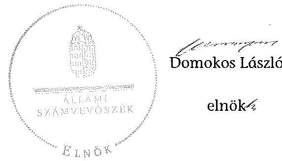

ÁLLAMI
SZÁMVEVŐSZÉK

# JELENTÉS 

az önkormányzatok belső kontrollrendszere kialakításának, egyes
kontrolltevékenységek és a belső ellenőrzés
működésének ellenőrzéséről
Romhány
14216
2014. október

---

# Állami Számvevőszék 

Iktatószám: V-0403-055/2014.
Témaszám: 1372
Vizsgálat-azonosító szám: V064949

## Az ellenőrzést felügyelte:

Dr. Benedek Mária
felügyeleti vezető
Az ellenőrzést vezette és az ellenőrzés végrehajtásáért felelős:
Bíró Zsolt
ellenőrzésvezető
A számvevőszéki jelentés összeállításában közreműködött:
Pappné dr. Szamosi Éva
számvevő főtanácsos
Az ellenőrzést végezték:
Albert Enikő
Pappné dr. Szamosi Éva
számvevő
számvevő főtanácsos

---

# TARTALOMJEGYZÉK 

BEVEZETÉS ..... 5
I. ÖSSZEGZŐ MEGÁLLAPÍTÁSOK, KÖVETKEZTETÉSEK, JAVASLATOK ..... 9
II. RÉSZLETES MEGÁLLAPÍTÁSOK ..... 15

1. Az önkormányzat belső kontrollrendszerének kialakítása ..... 15
1.1. A kontrollkörnyezet ..... 15
1.2. A kockázatkezelési rendszer ..... 17
1.3. A kontrolltevékenységek ..... 18
1.4. Az információs és kommunikációs rendszer ..... 19
1.5. A monitoring rendszer ..... 20
2. A pénzügyi folyamatokban kulcsszerepet betöltő teljesítésigazolás és érvényesítés belső kontrollok működése ..... 20
3. A belső ellenőrzés működése ..... 23

## FÜGGELÉKEK

1. számú Értelmező szótár
2. számú Az értékelés módja és szempontjai

---

.

---

# RÖVIDÍTÉSEK JEGYZÉKE 

## Törvények

Áht.
ÁSZ tv.
Htv.

Info tv.

Kttv.

Ktv.

Mötv.

Ötv.
Számv. tv.
Vagyonnyilatkozattételről szóló tv.

## Rendeletek

Áhsz. 1

Áhsz. 2
Ávr.

Bkr.
képviselő-testületi
SZMSZ
körjegyzőségi SZMSZ

## Szórövidítések

ÁSZ
belső ellenőrzési kézikönyv
2011. évi CXCV. törvény az államháztartásról (hatályos 2012. január 1-jétől)
2011. évi LXVI. törvény az Állami Számvevőszékről
1991. évi XX. törvény a helyi önkormányzatok és szerveik, a köztársasági megbízottak, valamint egyes centrális alárendeltségű szervek feladat- és hatásköréről
2011. évi CXII. törvény az információs önrendelkezési jogról és az információszabadságról (hatályos 2012. január 1-jétől)
2011. évi CXCIX. törvény a közszolgálati tisztviselőkről (hatályos 2012. március 1-jétől)
1992. évi XXIII. törvény a köztisztviselők jogállásáról (hatálytalan 2012. március 1-jétől)
2011. évi CLXXXIX. törvény Magyarország helyi önkormányzatairól (hatályos 2012. január 1-jétől)
1990. évi LXV. törvény a helyi önkormányzatokról
2000. évi C. törvény a számvitelről
2007. évi CLII. törvény egyes vagyonnyilatkozat-tételi kötelezettségekről

249/2000. (XII. 24.) Korm. rendelet az államháztartás szervezetei beszámolási és könyvvezetési kötelezettségének sajátosságairól (hatálytalan 2014. január 1-jétől)
4/2013. (I. 11.) Korm. rendelet az államháztartás számviteléről (hatályos 2014. január 1-jétől)
368/2011. (XII. 31.) Korm. rendelet az államháztartásról szóló törvény végrehajtásáról (hatályos 2012. január 1-jétől)
370/2011. (XII. 31.) Korm. rendelet a költségvetési szervek belső kontrollrendszeréről és belső ellenőrzéséről (hatályos 2012. január 1-jétől)
Romhány Község Önkormányzata Képviselő-testületének 4/2007. (IV. 4.) számú önkormányzati rendelete a Képviselő-testület és Szervei Szervezeti és Működési Szabályzatáról (hatályos 2007. április 4-étől)
Romhány Község Önkormányzata Képviselő-testületének 15/2008. (XII. 19.) számú önkormányzati rendelete Romhány-Alsópetény Körjegyzőség Szervezeti és Működési szabályzatáról (hatályos 2008. december 19-étől)

Állami Számvevőszék
Rétság Kistérség Többcélú Társulás és Társult Önkormányzatai Belső Ellenőrzési Kézikönyve (hatályos 2011. augusztus 1-jétől)

---

| INTOSAI | International Organization of Supreme Audit Institutions (Legfőbb Ellenőrző Intézmények Nemzetközi Szervezete) |
| :--: | :--: |
| ISSAI | International Standards of Supreme Audit Institutions (Legfőbb Ellenőrző Intézmények Nemzetközi Standardjai) |
| Képviselő-testület | Romhány Község Önkormányzatának Képviselő-testülete |
| körjegyző | Romhány-Alsópetény Körjegyzőségének körjegyzője 2008. január 1-jétől 2012. december 31-éig, jegyzője a Polgármesteri Hivatalnak 2013. január 1-jétől |
| Körjegyzőség | Romhány-Alsópetény Körjegyzőség (2008. január 1-jétől 2012. december 31-éig) |
| Körjegyzőséghez tartozó önkormányzat képviselő-testülete | Alsópetény Község Önkormányzatának Képviselőtestülete |
| NGM | Nemzetgazdasági Minisztérium |
| Önkormányzat polgármester | Romhány Község Önkormányzata |
|  | Romhány Község Önkormányzatának polgármestere |
| Polgármesteri Hivatal | Romhányi Polgármesteri Hivatal 2013. január 1-jétől |
| Társulás | Rétság Kistérség Többcélú Társulása |
| Vagyonnyilatkozat | Romhány Község Önkormányzata Képviselő-testületének |
| Nyilvántartó és Ellenőrző   Bizottság | Vagyonnyilatkozat Nyilvántartó és Ellenőrző Bizottsága |

---

# JELENTÉS 

## az önkormányzatok belső kontrollrendszere kialakításának, egyes kontrolltevékenységek és a belső ellenőrzés működésének ellenőrzéséről Romhány

## BEVEZETÉS

A Nógrád megyei Romhány község állandó lakosainak száma 2012. január 1-jén 2211 fő volt. Az Önkormányzat héttagú Képviselő-testületének munkáját négy állandó bizottság segítette. Az Önkormányzat az önállóan működő és gazdálkodó Körjegyzőségen kívül négy önállóan működő intézményt tartott fenn, többségi tulajdoni hányaddal gazdasági társasággal nem rendelkezett. A polgármester a 2006. évi önkormányzati választások óta tölti be tisztségét. A körjegyző a feladatait 2008. január 1-jétől Romhány és Alsópetény községek körjegyzőjeként, 2013. január 1-jétől Romhány község jegyzőjeként látta el. A Körjegyzőség szervezeti egységekre nem tagolódott, elkülönített gazdasági szervezettel nem rendelkezett, a foglalkoztatott köztisztviselők száma 2012. január 1-jén 12 fő volt. A Körjegyzőség 2012. december 31-ével megszűnt, és a Képviselő-testület 2013. január 1-jével megalapította a Polgármesteri Hivatalt. Az Önkormányzat a 2012. évi költségvetési beszámolója szerint 1302468 ezer Ft tárgyévi bevételt ért el, valamint 1303918 ezer Ft tárgyévi kiadást teljesített. A 2012. december 31-i könyvviteli mérleg szerint 457204 ezer Ft értékű eszközvagyonnal rendelkezett, a rövid lejáratú kötelezettségállománya 8290 ezer Ft volt, hosszú lejáratú kötelezettségállománya nem volt.

A demokratikus társadalmakban alapvető igény, hogy a közpénzeket, a közvagyont használók tevékenységükről elszámoljanak, ahhoz egyértelmű és érvényesíthető felelősségi szabályok társuljanak. Ennek a jogos igénynek az érvényesítéséhez meg kell teremteni azokat a folyamatokat, rendszereket, amelyek nélkülözhetetlenek az elszámoltatáshoz. Az elszámoltatás eredményes működtetéséhez szükség van a megfelelő információs, kontroll, értékelési és beszámolási rendszerek kialakítására.

Magyarországon az uniós csatlakozási tárgyalások idejére nyúlnak vissza a belső kontrollrendszer szabályozásának gyökerei. Az uniós elvárásoknak megfelelő új terminológia szerinti államháztartási belső pénzügyi ellenőrzési (ÁBPE) rendszer területén a jogharmonizáció 2003-ban teljes körűen megvalósult, míg az önkormányzati alrendszerre vonatkozó, Ötv.-ben megjelenített speciális szabályozás 2005-ben lépett hatályba. Az államháztartási belső kontrollrendszer koncepciója 2009-ben továbbfejlődött. A változások irányát mutatja, hogy a költségvetési szervek belső kontrollrendszere már magában foglalja

---

a korszerű, felelős szervezetirányítás elemeit (kontrollkörnyezet, kockázatkezelés, kontrolltevékenység, információ és kommunikáció, monitoring) is. E kontrollrendszer szabályozása háromszintű, a törvényi előírásokat az Áht. és a Mötv., a rendeleti szintű szabályozást az Ávr. és a Bkr. tartalmazza, amelyeket útmutatói szinten az NGM által kiadott standardok és kézikönyvek támogatnak.

A belső kontrollrendszer azt a célt szolgálja, hogy a költségvetési szervek működésük és gazdálkodásuk során a tevékenységeket szabályszerűen, gazdaságosan, hatékonyan és eredményesen hajtsák végre, teljesítsék elszámolási kötelezettségeiket és megvédjék az erőforrásokat a veszteségektől, a károktól és a nem rendeltetésszerű használattól. A belső kontrollrendszer magában foglalja mindazon szabályokat, eljárásokat, gyakorlati módszereket és szervezeti struktúrákat, kockázatkezelési technikákat, kontrolltevékenységeket, amelyek segítséget nyújtanak a szervezetnek céljai eléréséhez.

Az ÁSZ középtávú stratégiájában hangsúlyos szerepet szánt annak, hogy szilárd szakmai alapon álló, értékteremtő ellenőrzéseivel előmozdítsa a közpénzügyek átláthatóságát, rendezettségét. A számvevőszéki ellenőrzés nemzetközi alapelvei is rögzítik, hogy a megfelelő belső kontrollrendszer minimálisra csökkenti a hibák és szabálytalanságok kockázatát.

Az ellenőrzés célja annak megállapítása volt, hogy a belső kontrollrendszer elemeinek kialakítása, a pénzügyi folyamatokban kulcsszerepet betöltő teljesítésigazolás és érvényesítés, és a belső ellenőrzés szabályos működése biztosította-e az Önkormányzatnál a közpénzfelhasználás szabályosságát, hozzájárult-e az értéket teremtő rend követelményének érvényesüléséhez.

Ennek keretében értékeltük, hogy:

- a jogszabályi előírásoknak megfelelően alakították-e ki a belső kontrollrendszer elemeit;
- a gazdálkodás folyamatában kulcsszerepet betöltő teljesítésigazolás és érvényesítés kontrolltevékenységeit megfelelően működtették-e;
- biztosították-e a belső ellenőrzés szabályos működését;
- amennyiben az ÁSZ tett javaslatot a 2008-2011. évek közötti ellenőrzése kapcsán az Önkormányzatnak, intézkedtek-e azok végrehajtására.

Az ellenőrzés várható hasznosulását négy szinten tervezzük. A törvényalkotás számára összegzett tapasztalatok állnak rendelkezésre a belső kontrollrendszer önkormányzati területen való kialakításáról, működéséről és hatásairól, a belső ellenőrzés működéséről. Ennek alapján következtetést lehet levonni arról, hogy a belső kontrollrendszer kialakítására és működtetésére vonatkozó jelenlegi, differenciálás nélküli jogszabályi előírások reális követelményeket támasztanak-e az eltérő adottságú települési önkormányzatok esetében, illetve indokolt-e esetleges jogszabályi módosítás kezdeményezése. Az ellenőrzés az ellenőrzött számára visszajelzést ad a belső kontrollrendszer kialakításában és működésében fellépő hiányosságokról, javaslataival hozzájárul azok kiküszöböléséhez, amely csökkentheti a későbbi ellenőrzések gyakoriságát. Az el-

---

lenőrzés megállapításait és javaslatait más szervezetek is hasznosíthatják a rendezett gazdálkodási keretek kialakításához. A társadalom számára jelzi, hogy közpénz nem maradhat ellenőrizetlenül, az ÁSZ értékteremtő rend kialakításához és megőrzéséhez hozzájáruló tevékenysége pozitív hatással lesz a szervezetről kialakított összkép formálásában. A szervezeten belül lehetőség nyílik arra, hogy a megállapítások szintetizálásával az ÁSZ a hozzáadott értéket teremtő elemző tevékenységét és tanácsadó szerepét is erősítse.

Az önkormányzatok belső kontrollrendszere kialakításának, egyes kontrolltevékenységek és a belső ellenőrzés működésének ellenőrzéséről szóló jelentés I. fejezetének összegző része az ellenőrzés céljára ad rövid, szintetizáló összefoglalót, és tartalmazza a következtetéseket a II. fejezet részletes megállapításain alapulóan. A jelentés intézkedést igénylő megállapításait és javaslatait az ellenőrzés során feltárt, a jelentés II. fejezetében rögzített részletes megállapítások alapozzák meg.

Az ellenőrzés típusa: szabályszerűségi ellenőrzés.
Az ellenőrzött időszak: a belső kontrollrendszer kialakításának megfelelősége esetében a 2012. évre, a pénzügyi folyamatokban kulcsszerepet betöltő teljesítésigazolás és érvényesítés belső kontrollok működésének megfelelőségét és a belső ellenőrzés szabályszerű működését a 2012. január 1. és december 31-e közötti időszak eseményeit figyelembe véve értékeltük, míg az ÁSZ javaslatainak utóellenőrzése a 2008-2011. években végzett ellenőrzések nyilvánosságra hozott jelentéseiben tett javaslatok áttekintésére terjedt ki.

# Az ellenőrzött szervezet: az Önkormányzat. 

Az ellenőrzés jogszabályi alapját az ÁSZ tv. 1. § (3) bekezdése, az 5. § (2) és (6) bekezdése, valamint az Áht. 61. § (2) bekezdésének előírásai képezik.

Az ellenőrzés szakmai módszertana az ÁSZ hivatalos honlapján (www.asz.hu) közzétett szakmai szabályokon alapult, amely az INTOSAI által kiadott ISSAI figyelembevételével készült.

Az ellenőrzés lefolytatásához az Önkormányzat a kimutatások és a tanúsítvány elektronikus kitöltésével, valamint az ÁSZ által kért dokumentumok elektronikus megküldésével szolgáltatott adatokat. Az így rendelkezésre bocsátott adatok, információk kontrollja és a munkalapok kitöltése a helyszíni ellenőrzés keretében történt. A jelentésben használt fogalmak magyarázatát az 1. számú függelék, az ellenőrzés egyes területeinek értékelésénél alkalmazott egységes minősítési szempontokat a 2. számú függelék tartalmazza.

A belső kontrollrendszer kialakításának ellenőrzése során értékeltük a kontrollkörnyezet, a kockázatkezelési rendszer, a kontrolltevékenységek, az információs és kommunikációs rendszer, valamint a monitoring rendszer szabályozottságának megfelelőségét. A pénzügyi folyamatokban kulcsszerepet betöltő teljesítésigazolás és érvényesítés kontrollok működése megfelelőségének minősítéséhez az állományba nem tartozók megbízási díjai, a külső szolgáltatók által végzett karbantartási, kisjavítási munkák, az egyéb üzemeltetési és fenntartási szolgáltatások, a rendszeres szociális segélyek, valamint az államháztartáson

---

kívülre teljesített működési és felhalmozási célú pénzeszközátadások közül kockázatelemzéssel választottuk ki az ellenőrzött kiadási jogcímeket. Az egyszerű véletlen mintavétellel kiválasztott tételek ellenőrzését többlépcsős megfelelőségi tesztek útján addig végeztük, amíg elegendő és megfelelő bizonyítékot szereztünk a vizsgált folyamatok kulcskontrolljai működésének megfelelő vagy nem megfelelő voltáról. Értékeltük az Önkormányzatnál a belső ellenőrzés működésének szabályosságát. A 2008-2011. közötti időszakban egy ÁSZ ellenőrzés érintette az Önkormányzatot (a 0822 számú számvevőszéki jelentés a helyi önkormányzatok gazdálkodási rendszerének 2007. évi átfogó és egyéb szabályszerűségi ellenőrzéséről). A nyilvánosságra hozott jelentés az Önkormányzat számára konkrét feladatot nem határozott meg, javaslatot nem tett, ezért utóellenőrzésre nem került sor.

Az ÁSZ tv. 29. § (1) bekezdése szerint a jelentéstervezetet megküldtük a polgármester részére, aki az ÁSZ tv. 29. § (2) bekezdésében foglalt észrevételezési jogával nem élt, a jelentéstervezetre észrevételt nem tett.

---

# I. ÖSSZEGZŐ MEGÁLLAPÍTÁSOK, KÖVETKEZTETÉSEK, JAVASLATOK 

A belső kontrollrendszeren belül 2012-ben a kontrollkörnyezet, a kockázatkezelési rendszer, a kontrolltevékenységek, az információs és kommunikációs rendszer, valamint a

 monitoring rendszer kialakítását külön-külön és együttesen is értékeltük. A belső kontrollrendszer kialakítása az összesített értékelés alapján nem felelt meg a jogszabályi előírásoknak.

A belső kontrollrendszer egyes területei kialakításának minősítése a következő:

| Kontrollterület | Minősítés |
| :-- | :--: |
| Kontrollkörnyezet | nem |
|  | megfelelő |
| Kockázatkezelési rendszer | nem |
|  | megfelelő |
| Kontrolltevékenységek | nem |
| Információs és kommuni- |  |
| kációs rendszer | nem |
| Monitoring rendszer |  |

Nem megfelelőnek értékeltük a kontrollkörnyezet, a kockázatkezelési rendszer, a kontrolltevékenységek, az információs és kommunikációs rendszer, valamint a monitoring rendszer kialakítását, mivel az ellenőrzésünk során megállapított szabályozásbeli hiányosságok magukban hordozzák a szabálytalan működés, valamint a korrupció kockázatát.

A 2012. évben az állományba nem tartozók megbízási díjaival, valamint a külső szolgáltatók által végzett karbantartási, kisjavítási munkákkal kapcsolatos kifizetések során a pénzügyi folyamatokban kulcsszerepet betöltő teljesítésigazolás és érvényesítés belső kontrollok működése gyenge volt. A két kulcskontroll együttes működését gyengének értékeltük, mivel azok nem biztosították a hibák megelőzését, feltárását.

A számvevőszéki ellenőrzés az ellenőrzött kifizetésekkel összefüggésben a rendelkezésre bocsátott dokumentumok alapján kár bekövetkezésére utaló adatot, tényt nem állapított meg, azonban a gazdálkodásban kulcsszerepet betöltő kontrollok működésében feltárt hiányosságok miatt fennáll a hibák bekövetkezésének kockázata. A nem megfelelően működtetett belső kontrollok korrupciós kockázatot hordoznak.

Az Önkormányzat a belső ellenőrzési feladatokat a Társulás útján látta el. A 2012. évben a belső ellenőrzés működése a jogszabályi előírásoknak megfelelt, azonban a belső ellenőrzés nem tárta fel a belső kontrollrendszer

---

kialakításának, valamint a pénzügyi folyamatokban kulcsszerepet betöltő teljesítésigazolás és érvényesítés belső kontrollok működésének hiányosságait.

Az ÁSZ tv. 33. § (1) bekezdésében foglaltak értelmében az ellenőrzött szervezet vezetője köteles a jelentésben foglalt megállapításokhoz kapcsolódó intézkedési tervet összeállítani, és azt a jelentés kézhezvételétől számított 30 napon belül az ÁSZ részére megküldeni. Amennyiben az intézkedési tervet határidőre nem küldi meg a szervezet, vagy az ÁSZ tv. 33. § (2) bekezdésében foglalt póthatáridő elteltével megküldött intézkedési terv továbbra sem elfogadható, az ÁSZ elnöke a hivatkozott törvény 33. § (3) bekezdés a)-b) pontjaiban foglaltakat érvényesítheti.

# a polgármesternek 

1. A Vagyonnyilatkozat-tételről szóló tv. 5. §-ában foglaltak ellenére a Képviselő-testület bizottságai nem helyi önkormányzati képviselő tagjai és a körjegyző vagyonnyilatkozat-tételi kötelezettségüknek nem tettek eleget. Az őrzésért felelősök a Vagyonnyilatkozat-tételről szóló tv. 8. § (4) bekezdésében foglaltak ellenére nem tájékoztatták a Képviselő-testület bizottságai nem helyi önkormányzati képviselő tagjait és a körjegyzőt a vagyonnyilatkozat-tételi kötelezettségük fennállásáról és esedékességének időpontjáról az esedékességet legalább 30 nappal megelőzően, továbbá - a 10. § (1) bekezdésében foglaltak ellenére - írásban nem szólították fel a kötelezetteket arra, hogy kötelezettségüket a felszólítás kézhezvételétől számított nyolc napon belül teljesítsék.

Javaslat:
Intézkedjen a jogszabálysértő gyakorlat megszüntetése érdekében arról, hogy a Vagyonnyilatkozat-tételről szóló tv. 5. §-ában foglalt kötelezettségnek megfelelően a Képviselő-testület bizottságai nem helyi önkormányzati képviselő tagjai és a jegyző tegyenek vagyonnyilatkozatot.
2. A Vagyonnyilatkozat Nyilvántartó és Ellenőrző Bizottság elnökének és tagjainak megválasztása nem felelt meg az Ötv. 24. § (1) bekezdésében, valamint a képviselőtestületi SZMSZ 49. § (1) bekezdésében előírtaknak.

Javaslat
Intézkedjen a Mötv. 58. § (2) bekezdésében foglaltak alapján a Vagyonnyilatkozat Nyilvántartó és Ellenőrző Bizottság tagjai összetételének megváltoztatására annak érdekében, hogy az megfeleljen a Mötv. 58. § (1) bekezdésében, valamint a képviselőtestületi SZMSZ 49. § (1) bekezdésében előírtaknak.
3. A polgármester, mint kötelezettségvállaló - az Ávr. 57. § (4) bekezdésében foglaltak ellenére - nem jelölte ki 2012. március 30-át követően írásban az Önkormányzat kiadási előirányzatai vonatkozásában a teljesítés igazolására jogosult személyeket.

---

Javaslat:
Jelölje ki írásban az Önkormányzat kiadási előirányzatai vonatkozásában az Ávr. 57. § (4) bekezdésében foglaltaknak megfelelően a teljesítés igazolására jogosult személyeket.
4. Az Önkormányzat kiadási előirányzata terhére történt kötelezettségvállalásra - az Áht. 37. § (1) és az Ávr. 55. § (1) bekezdésében foglaltak ellenére - pénzügyi ellenjegyzés nélkül került sor, valamint a kötelezettségvállalást - az Áht. 37. § (1) bekezdésében foglaltak ellenére - nem foglalták írásba.

Javaslat:
Intézkedjen annak érdekében, hogy az Önkormányzat nevében történő kötelezettségvállalásra az Áht. 37. § (1) bekezdésében és az Ávr. 55. § (1) bekezdésében foglaltaknak megfelelően - az Ávr. 53. §-ában meghatározott kivételekkel - kizárólag pénzügyi ellenjegyzés után, a pénzügyi teljesítés esedékességét megelőzően, írásban kerüljön sor.
5. A számvevőszéki ellenőrzés megállapításai alapján az Önkormányzatnál a belső kontrollrendszer kialakítása összefoglalóan értékelve nem felelt meg a jogszabályi előírásoknak. A kulcskontrollok működése gyenge volt, a belső ellenőrzés működése ugyan megfelelt a jogszabályi előírásoknak, azonban nem tárta fel a belső kontrollrendszer kialakításának, valamint a teljesítésigazolás és érvényesítés belső kontrollok működésének hiányosságait. A megállapított szabályozásbeli és működésbeli hiányosságok magukban hordozzák a szabálytalan működés kockázatát.

Javaslat:
Intézkedjen a belső kontrollrendszer működésére vonatkozó jogszabályi rendelkezések be nem tartása, valamint a teljesítésigazolás, illetve az érvényesítés kontrollokkal összefüggésben feltárt hiányosságok és szabálytalanságok tekintetében a munkajogi felelősség kivizsgálására irányuló eljárás megindítása iránt, és ennek eredményének ismeretében a szükséges intézkedéseket tegye meg.

# a jegyzőnek 

1. a kontrollkörnyezettel kapcsolatban:

A körjegyzőségi SZMSZ-t az Áht.-ban foglaltak ellenére a Körjegyzőséghez tartozó önkormányzat képviselő-testülete nem hagyta jóvá, mert a körjegyző nem kezdeményezte annak előterjesztését. A körjegyző nem alakította ki a Htv.-ben előírtak ellenére az Önkormányzat intézményeinek számviteli rendjét, a Számv. tv.-ben és az Áhsz.-ben foglaltak ellenére a Körjegyzőség számviteli politikáját. Nem készítette el az eszközök és források leltározási és leltárkészítési szabályzatát, az eszközök és források értékelési szabályzatát, a pénzkezelési szabályzatot, a Körjegyzőség számlarendjét és bizonylati rendjét. A körjegyző a Bkr.-ben foglaltak ellenére nem készítette el a szabálytalanságok kezelésének eljárásrendjét és az ellenőrzési nyomvonalat, továbbá az Ávr.-ben előírtakat figyelmen kívül hagyva belső szabályzatban nem rendelkezett a Körjegyzőségen dolgozó köztisztviselők feladat- és hatásköréről, a helyettesítés

---

rendjéről, továbbá a külső kapcsolattartás módjáról, szabályairól. A körjegyző a Kttv.-ben foglaltak ellenére a Körjegyzőségen dolgozó köztisztviselők munkateljesítményét írásban nem értékelte. Az Ötv.-ben előírt kötelezettsége ellenére nem készítette elő a Kttv.-ben foglaltak szerinti, a köztisztviselőkkel szembeni hivatásetikai alapelvek részletes tartalmának, valamint az etikai eljárás szabályainak dokumentumát. [II. Részletes megállapítások, 1.1. A kontrollkörnyezet 5., 17., 18., 19., 24., 29., 30., 31., 34., 35., 41., 46. és 47. sorszámú megállapítások]

Javaslat:
Intézkedjen az Áht. 69. § (2) bekezdése, a Bkr. 3. § a) pontja és 6. §-a alapján a jelentés II. Részletes megállapítások, 1.1. A kontrollkörnyezet 5., 17., 18., 19., 24., 29., 30., 31., 34., 35., 41., 46. és 47. sorszámú megállapításaiban foglalt hibák, hiányosságok kijavításáról, megszüntetéséről az ott megjelölt jogszabályi rendelkezéseknek megfelelően.
2. a kockázatkezelési rendszerrel kapcsolatban:

A körjegyző a Bkr.-ben foglaltak ellenére a Körjegyzőség kockázatkezelési rendszerét nem alakította ki, nem mérte fel a Körjegyzőség tevékenységében, gazdálkodásában rejlő kockázatokat, nem határozta meg az egyes kockázatokkal kapcsolatban a szükséges intézkedéseket és azok teljesítése folyamatos nyomon követési módját. A Vagyonnyilatkozat-tételről szóló tv.-ben előírtak ellenére a vagyonnyilatkozat-tételre kötelezett köztisztviselők, továbbá a Képviselő-testület bizottságai nem helyi önkormányzati képviselő tagjai vagyonnyilatkozat-tételi kötelezettségét a körjegyzőségi SZMSZ-ben, valamint a képviselő-testületi SZMSZ-ben nem tüntették fel. A Vagyonnyilatkozat-tételről szóló tv.-ben foglaltak ellenére három fő köztisztviselő a vagyonnyilatkozat-tételi kötelezettségének nem tett eleget. Az őrzésért felelős a Vagyonnyilatkozat-tételről szóló tv.-ben foglaltak ellenére nem tájékoztatta a kötelezetteket a vagyonnyilatkozat-tételi kötelezettség fennállásáról és esedékességének időpontjáról az esedékességet legalább 30 nappal megelőzően, továbbá írásban nem szólította fel a kötelezetteket arra, hogy kötelezettségüket a felszólítás kézhezvételétől számított nyolc napon belül teljesítsék. [II. Részletes megállapítások, 1.2. A kockázatkezelési rendszer 1., 2., 8., 10., 13. és 14. sorszámú megállapítások]

Javaslat:
Intézkedjen az Áht. 69. § (2) bekezdése, a Bkr. 3. § b) pontja és 7. §-ában foglaltak alapján a jelentés II. Részletes megállapítások, 1.2. A kockázatkezelési rendszer 1., 2., 8., 10., 13. és 14. sorszámú megállapításaiban foglalt hibák, hiányosságok kijavításáról, megszüntetéséről az ott megjelölt jogszabályi rendelkezéseknek megfelelően.
3. a kontrolltevékenységekkel kapcsolatban:

A körjegyző a Bkr.-ben foglaltak ellenére nem biztosította a beszerzési folyamat, a vagyonhasznosítási tevékenység, valamint a pénzügyi döntések - köztük a költségvetés tervezése és a támogatásokkal való elszámolás - dokumentumainak elkészítésével kapcsolatban a folyamatba épített, előzetes, utólagos és vezetői ellenőrzést. Az Ávr.-ben előírtak ellenére belső szabályzatban nem rendezte a pénzügyi ellenjegyzés, a teljesítésigazolás, az érvényesítés és az utalványozás gyakorlásának módjával, eljárási és dokumentációs részletszabályaival, valamint az ezeket végző személyek kijelölésének rendjével kapcsolatos belső előírásokat, feltételeket. 2012. március 30-át megelőzően az Önkormányzat és a Körjegyzőség, 2012. március 31-étől a Körjegyzőség kiadási előirányzatai terhére történő kötelezettségvállalások esetére a körjegyző az Ávr.-ben foglaltak ellenére nem jelölte ki a teljesítésigazolásra jogosult személyeket. A körjegyző az Info tv.-ben foglalt előírásokat figyelmen kívül hagyva az informatikai rendszer szabályozása során nem tette meg azokat a technikai és szervezési intézkedéseket és nem alakította ki azokat az eljárási szabályokat, amelyek biztosítják az adatok biztonságát és védelmét, továbbá a Bkr.-ben előírtak ellenére belső szabályzatban nem határozta meg az információkhoz való hozzáférésre vonatkozóan a felelősségi köröket. Az Ávr.-ben foglaltak ellenére belső szabályzatban nem határozta meg a beszámolási feladatok teljesítésével kapcsolatos belső előírásokat, feltételeket, a beszámolási eljárásokhoz kapcsolódó felelősségi köröket. A körjegyző az Ávr.-ben foglaltak ellenére nem határozta meg a gazdasági feladatot ellátó alkalmazottak helyettesítési rendjét, és a Kttv.-ben előírtak ellenére nem szabályozta a Körjegyzőségen a köztisztviselő jogviszonya megszüntetése (megszűnése) esetére a munkakör átadásának rendjét. [II. Részletes megállapítások, 1.3. A kontrolltevékenységek 2., 3., 4., 5., 6., 9., 10., 11., 12., 16., 17., 19., 20., 21. és 32. sorszámú megállapítások]

Javaslat:
Intézkedjen az Áht. 69. § (2) bekezdése, a Bkr. 3. § c) pontja és 8. §-a alapján a jelentés II. Részletes megállapítások, 1.3. A kontrolltevékenységek 2., 3., 4., 5., 6., 9., 10., 11., 12., 16., 17., 19., 20., 21. és 32. sorszámú megállapításaiban foglalt hibák, hiányosságok kijavításáról, megszüntetéséről az ott megjelölt jogszabályi rendelkezéseknek megfelelően.
4. az információs és kommunikációs rendszerrel kapcsolatban:

A körjegyző az Info tv.-ben foglaltak ellenére nem készítette el a Körjegyzőség adatvédelmi és adatbiztonsági szabályzatát. Az Info tv.-ben és az Ávr.-ben foglalt előírás ellenére a kötelezően közzéteendő adatok nyilvánosságra hozatalának rendjét a körjegyző nem alakította ki, a közérdekű adatok megismerésére irányuló igények teljesítésének rendjét nem szabályozta, továbbá az Info tv.-ben előírtak ellenére nem gondoskodott az Önkormányzat elektronikus közzétételi kötelezettségének teljesítéséről a 2012. évben. [II. Részletes megállapítások, 1.4. Az információs és kommunikációs rendszer 5., 6., 7. és 8. sorszámú megállapítások]

Javaslat:
Intézkedjen az Áht. 69. § (2) bekezdése, a Bkr. 3. § d) pontja és 9. §-a alapján a jelentés II. Részletes megállapítások, 1.4. Az információs és kommunikációs rendszer 5., 6., 7. és 8. sorszámú megállapításaiban foglalt
 hiányosságok megszüntetéséről az ott megjelölt jogszabályi rendelkezéseknek megfelelően.
5. a monitoring rendszerrel kapcsolatban:

A körjegyző a Bkr.-ben foglaltak ellenére nem alakította ki a Körjegyzőség tevékenységének, a célok megvalósításának nyomon követését biztosító rendszert. A Bkr.-ben foglalt előírás ellenére a körjegyző a külső ellenőrzés megállapításainak hasznosítására intézkedési tervet nem készített, valamint a belső ellenőrzési jelentésben tett javaslatokhoz kapcsolódó intézkedési tervben meghatározott egyes feladatok végrehajtásáról szóló beszámolót nem készítette el. [II. Részletes megállapítások, 1.5. A monitoring rendszer 1., 12. és 18. sorszámú megállapítás]

---

Javaslat:
Intézkedjen az Áht. 69. § (2) bekezdése, a Bkr. 3. § e) pontja, 10. §-a, 13. § (2) bekezdése és 46. § (1) bekezdése alapján a jelentés II. Részletes megállapítások, 1.5. A monitoring rendszer 1., 12. és 18. sorszámú megállapításában foglalt hibák, hiányosságok kijavításáról, megszüntetéséről az ott megjelölt jogszabályi rendelkezéseknek megfelelően.
6. a pénzügyi folyamatokban kulcsszerepet betöltő kontrollokkal kapcsolatban:

A teljesítésigazolás és az érvényesítés, valamint az utalvány és a kiadási pénztárbizonylat tartalma nem felelt meg az Ávr.-ben foglaltaknak. Az Ávr.-ben foglaltak ellenére kötelezettségvállalás nyilvántartást nem vezettek. [II. Részletes megállapítások, 2. A pénzügyi folyamatokban kulcsszerepet betöltő teljesítésigazolás és érvényesítés belső kontrollok működése 1-3. pontban foglalt megállapítás]

Javaslat:
Intézkedjen az Áht. 37-38. §-ában, az Ávr. 55-59. §-ában és az Áhsz. 39. § (1) bekezdésében és a 14. számú mellékletének II. pontjában foglaltak alapján arról, hogy a teljesítésigazolás és az érvényesítés vonatkozásában, valamint azok ellenőrzése során a kötelezettségvállalással, a pénzügyi ellenjegyzéssel, a kötelezettségvállalások nyilvántartásba vételével, továbbá az utalvány és a kiadási pénztárbizonylat tartalmával kapcsolatban feltárt, a jelentés II. Részletes megállapítások, 2. A pénzügyi folyamatokban kulcsszerepet betöltő teljesítésigazolás és érvényesítés belső kontrollok működése 1-3. pontjában szereplő megállapításokban foglalt hibák, hiányosságok kijavítása, megszüntetése az ott megjelölt jogszabályi rendelkezéseknek megfelelően történjen meg.
7. a belső ellenőrzés működésével kapcsolatban:

A belső ellenőrzés működése az értékelés szempontjait figyelembe véve megfelelt a jogszabályi előírásoknak, azonban a számvevőszéki ellenőrzés kisebb súlyú hiányosságokat tárt fel, amelyek nem feleltek meg a Bkr.-ben előírt rendelkezéseknek. [II. Részletes megállapítások, 3. A belső ellenőrzés működése 7., 10., 19., 24., 26., 27. b) sorszámú megállapítások]

Javaslat:
Intézkedjen az Áht. 69. § (2) bekezdése, a 70. § (1) bekezdése, a Bkr. 3. § e) pontja és a 10. §-a alapján a jelentés II. Részletes megállapítások, 3. A belső ellenőrzés működése 7., 10., 19., 24., 26., 27. b) sorszámú megállapításaiban foglalt hibák, hiányosságok kijavításáról, megszüntetéséről az ott megjelölt jogszabályi rendelkezéseknek megfelelően.

---

# II. RÉSZLETES MEGÁLLAPÍTÁSOK 

## 1. AZ ÖNKORMÁNYZAT BELSŐ KONTROLLRENDSZERÉNEK KIALAKÍTÁSA

A belső kontrollrendszeren belül 2012-ben a kontrollkörnyezet, a kockázatkezelési rendszer, a kontrolltevékenységek, az információs és kommunikációs rendszer, valamint a monitoring rendszer kialakítását külön-külön és együttesen is értékeltük. A belső kontrollrendszer kialakítása az összesített értékelés alapján nem felelt meg a jogszabályi előírásoknak.

### 1.1. A kontrollkörnyezet

A kontrollkörnyezet kialakítása - a 2. számú függelékben részletezett kritériumrendszer alapján végzett értékelés szerint - a jogszabályi előírásoknak nem felelt meg, mert:

| Sor-   szám $^{1}$ | Megállapítás | Megjegyzés |
| :--: | :--: | :--: |
| 2. | A körjegyző - a Htv. 140. § (1) bekezdés a) pontjában foglaltak ellenére - nem készítette el a gazdasági programtervezetet, ezáltal a Képviselő-testület az Ötv. 91. § (1) és (7) bekezdésében foglaltakat figyelmen kívül hagyva nem határozta meg az Önkormányzat 2011-2014. évekre vonatkozó gazdasági programját. | A gazdasági program készítésével összefüggő előírásokat 2013. január 1-jétől a Mötv. 116. § (1) és (5) bekezdése szabályozza. |
| 4. | A Képviselő-testület - a Ktv. 34. § (3) bekezdésében foglaltak ellenére - nem döntött a teljesítményértékelés alapját képező célokról. | A Ktv.-t hatályon kívül helyezte a 2012. évi V. törvény 59. § (1) bekezdés a) pontja, hatálytalan 2012. március 1-jétől. |
| 5. | A körjegyző elkészítette és a Képviselőtestület jóváhagyta a körjegyzőségi SZMSZ-t, azt azonban - az Áht. 9. § (1) bekezdés e) pontjában foglaltak ellenére - a Körjegyzőséghez tartozó önkormányzat képviselőtestülete nem hagyta jóvá, mert a körjegyző nem kezdeményezte annak képviselőtestületi ülésre történő előterjesztését. | A Képviselő-testület a körjegyzőségi SZMSZ-t a 15/2008. (XII. 19.) számú önkormányzati rendeletével fogadta el.   2013. január 1-jétől a költségvetési szerv szervezeti és működési szabályzatának jóváhagyását az Áht. 9. § (1) bekezdés a) pontja írja elő. |

[^0]
[^0]:    ${ }^{1}$ A megállapítások számozása az Önkormányzat által az adatszolgáltatás során kitöltött kimutatások kérdéseinek sorszámával azonos.

---

| 17. | A körjegyző - a Számv. tv. 14. § (3) és (11) bekezdésében, valamint az Áhsz. 8. § (3) bekezdésében foglaltak ellenére - nem alakította ki a Körjegyzőség számviteli politikáját. | 2014. január 1-jétől a Számv. tv. 14. § (3) és (11) bekezdése és az Áhsz. 50. § (1) bekezdése írja elő. |
| :--: | :--: | :--: |
| 18. | A körjegyző - a Htv. 140. §. (1) bekezdés c) pontjában foglaltak ellenére - az Önkormányzat intézményeinek számviteli rendjét nem alakította ki. |  |
| $\begin{aligned} & 19 . \\ & 24 . \\ & 29 . \end{aligned}$ | A körjegyző - a Számv. tv. 14. § (5) bekezdésének a), b), d) pontjaiban, (8) és (11) bekezdésében, valamint az Áhsz. 8. § (4) bekezdésének a), b), d) pontjaiban foglalt előírások ellenére - nem készítette el az eszközök és források leltározási és leltárkészítési szabályzatát, az eszközök és források értékelési szabályzatát, a pénzkezelési szabályzatot. | 2014. január 1-jétől a Számv. tv. 14. § (5) bekezdésének a), b), d) pontjai, (8) és (11) bekezdése, valamint az Áhsz. 50. § (1) bekezdése írják elő a szabályzatok készítésének kötelezettségét. |
| 30. | A körjegyző - a Számv. tv. 161. § (1) bekezdésében és az Áhsz. 49. § (1) bekezdésében foglalt előírások ellenére - nem készítette el a Körjegyzőség számlarendjét. | 2014. január 1-jétől a Számv. tv. 161. § (1) bekezdése és az Áhsz. 51. § (2) bekezdése írja elő a számlarend készítésének kötelezettségét. |
| 31. | A körjegyző - a Számv. tv. 161. § (1) bekezdésében és (2) bekezdésének d) pontjában foglaltak ellenére - nem készítette el a Körjegyzőség bizonylati rendjét. |  |
| $\begin{aligned} & 34 . \\ & 41 . \end{aligned}$ | A körjegyző - a Bkr. 6. § (3) és (4) bekezdésében foglaltak ellenére - nem készítette el a szabálytalanságok kezelésének eljárásrendjét és az ellenőrzési nyomvonalat. |  |
| 35. | A körjegyző - az Ávr. 13. § (5) bekezdésében foglaltak ellenére - belső szabályzatban nem rendelkezett a Körjegyzőségen dolgozó köztisztviselők feladat- és hatásköréről, a helyettesítés rendjéről, továbbá a külső kapcsolattartás módjáról, szabályairól. |  |
| 46. | A körjegyző - a Kttv. 130. § (1) bekezdésben foglaltak ellenére - a Körjegyzőségen dolgozó köztisztviselők munkateljesítményét írásban nem értékelte. |  |

---

A Képviselő-testület és a Körjegyzőséghez tartozó önkormányzat képviselő-testülete - a Kttv. 231. § (1) bekezdésben foglaltak ellenére - nem állapította meg a Kttv. 83. §-ában előírt, a köztisztviselőkkel szembeni hivatásetikai alapelvek részletes tartalmát, valamint az etikai eljárás szabályait, mivel a körjegyző az Ötv. 36. § (2) bekezdés a) pontjában előírt feladata ellenére - nem készítette elő ennek dokumentumát.

Az önkormányzat működésével kapcsolatos feladatok ellátásáról való gondoskodást 2013. január 1-jétől a jegyző részére a Mótv. 81. § (3) bekezdés c) pontja írja elő.

# 1.2. A kockázatkezelési rendszer 

A kockázatkezelési rendszer kialakítása - a 2. számú függelékben részletezett kritériumrendszer alapján végzett értékelés szerint - a jogszabályi előírásoknak nem felelt meg, mert:

| Sorszám | Megállapítás | Megjegyzés |
| :--: | :--: | :--: |
| 1., 2.,   8. és   10. | A körjegyző - a Bkr. 3. § b) pontjában foglaltak ellenére - nem alakította ki a Körjegyzőség kockázatkezelési rendszerét, a Bkr. 7. § (2) bekezdésében foglaltak ellenére nem mérte fel a Körjegyzőség tevékenységében, gazdálkodásában rejlő kockázatokat, nem határozta meg az egyes kockázatokkal kapcsolatban a szükséges intézkedéseket és azok teljesítése folyamatos nyomon követési módját. |  |
| 13. | A Vagyonnyilatkozat-tételről szóló tv. 4. § a) és d) pontjában foglaltak ellenére a vagyon-nyilatkozat-tételre kötelezett köztisztviselők, továbbá a Képviselő-testület bizottságai nem helyi önkormányzati képviselő tagjai vagyonnyilatkozat-tételi kötelezettségét a körjegyzőségi SZMSZ-ben, valamint a képviselőtestületi SZMSZ-ben nem tüntették fel. |  |
| 14. | A bizottságok nem helyi önkormányzati képviselő tagjai, valamint a körjegyző és három fő köztisztviselő a Vagyonnyilatkozat-tételről szóló tv. 5. §-ában foglaltak ellenére vagyon-nyilatkozat-tételi kötelezettségüknek nem tettek eleget. Az őrzésért felelős - a Vagyon-nyilatkozat-tételről szóló tv. 8. § (4) bekezdésében foglaltak ellenére - nem tájékoztatta a bizottságok nem helyi önkormányzati képviselő tagjait, a körjegyzőt és a köztisztviselőket a vagyonnyilatkozat-tételi kötelezettség fennállásáról és esedékességének időpontjáról az esedékességet legalább 30 nappal megelőzően. Továbbá - a 10. § (1) bekezdésében foglaltak ellenére - írásban nem szólította fel a bizottságok nem helyi önkormányzati képviselő |

Az őrzésért felelős a bizottságok nem helyi önkormányzati képviselő tagjai tekintetében a Vagyonnyilatkozat Nyilvántartó és Ellenőrző Bizottság, a körjegyző esetében a polgármester, valamint a köztisztviselők vonatkozásában a körjegyző volt.

---

tagjait, a körjegyzőt és a három fő köztisztviselőt arra, hogy kötelezettségüket a felszólítás kézhezvételétől számított nyolc napon belül teljesítsék.

A Vagyonnyilatkozat Nyilvántartó és Ellenőrző Bizottság elnökének és tagjainak megválasztása nem felelt meg az Ötv. 24. § (1) bekezdésében, valamint a képviselő-testületi SZMSZ 49. § (1) bekezdésében előírtaknak.

A Képviselő-testület az alakuló ülésén a Vagyonnyilatkozat Nyilvántartó és Ellenőrző Bizottság tagjainak számát három főben határozta meg. Elnökének, valamint két tagjának nem helyi önkormányzati képviselőt választott meg.
A képviselő-testületi bizottságok megválasztására vonatkozó szabályokat 2013. január 1-jétől a Mötv. 58. §-a tartalmazza.

# 1.3. A kontrolltevékenységek 

A kontrolltevékenységek kialakítása - a 2. számú függelékben részletezett kritériumrendszer alapján végzett értékelés szerint - a jogszabályi előírásoknak nem felelt meg, mert:

| Sorszám | Megállapítás |
| :--: | :--: |
| $\begin{aligned} & 2 ., 3 . \text {, } \\ & 4 ., 5 . \end{aligned}$ | A körjegyző - a Bkr. 8. § (2) bekezdésében foglaltak ellenére - nem biztosította a beszerzési folyamat, a vagyonhasznosítási tevékenység, valamint a pénzügyi döntések - köztük a költségvetés tervezése és a támogatásokkal való elszámolás - dokumentumainak elkészítésével kapcsolatban a folyamatba épített, előzetes, utólagos és vezetői ellenőrzést. |
| $\begin{aligned} & 6 ., 9 . \text {, } \\ & 11 . \text {, } \\ & 12 . \end{aligned}$ | A körjegyző - az Ávr. 13. § (2)

 bekezdésének a) pontjában foglaltak ellenére - belső szabályzatban nem rendezte a pénzügyi ellenjegyzés, a teljesítésigazolás, az érvényesítés és az utalványozás gyakorlásának módjával, eljárási és dokumentációs részletszabályaival, valamint az ezeket végző személyek kijelölésének rendjével kapcsolatos belső előírásokat, feltételeket. |
| 10. | Az Önkormányzat és a Körjegyzőség kiadási előirányzatai terhére történő kötelezettségvállalások esetére a körjegyző 2012. március 30-át megelőzően, valamint a polgármester az önkormányzati kiadások, a körjegyző pedig a körjegyzőségi kiadások előirányzatai tekintetében, mint kötelezettségvállalók 2012. március 31-étől - az Ávr. 57. § (4) bekezdésében foglaltak ellenére - nem jelölték ki a teljesítésigazolásra jogosult személyeket. |
| 16. | A körjegyző - az Info tv. 7. § (2)-(3) bekezdéseiben foglalt előírásokat figyelmen kívül hagyva - az informatikai rendszer szabályozása során nem tette meg azokat a technikai és szervezési intézkedéseket és nem alakította ki azokat az eljárási szabályokat, amelyek biztosítják az adatok biztonságát és védelmét. |

---

| 17. | A körjegyző - a Bkr. 8. § (4) bekezdés b) pontjában foglaltak ellenére -   belső szabályzatban nem határozta meg az információkhoz való hozzáférésre vonatkozóan a felelősségi köröket. |
| :--: | :--: |
| 19., 20. | A körjegyző - az Ávr. 13. § (2) bekezdés a) pontjában foglaltak ellenére -   belső szabályzatban nem határozta meg a beszámolási feladatok teljesítésével kapcsolatos belső előírásokat, feltételeket, továbbá - a Bkr. 8. § (4) bekezdés c) pontjában foglaltak ellenére - nem határozta meg a beszámolási eljárásokhoz kapcsolódó felelősségi köröket. |
| 21. | A körjegyző - az Ávr. 13. § (5) bekezdésében foglaltak ellenére - nem határozta meg a gazdasági feladatot ellátó alkalmazottak helyettesítési rendjét. |
| 32. | A körjegyző - a Kttv. 74. § (1) bekezdésében foglaltak ellenére - nem szabályozta a Körjegyzőségen a köztisztviselő jogviszonya megszüntetése (megszünése) esetére a munkakör átadásának rendjét. |

# 1.4. Az információs és kommunikációs rendszer 

Az információs és kommunikációs rendszer kialakítása - a 2. számú függelékben részletezett kritériumrendszer alapján végzett értékelés szerint - a jogszabályi előírásoknak nem felelt meg, mert:

| Sorszám | Megállapítás | Megjegyzés |
| :--: | :--: | :--: |
| 5. | A körjegyző - az Info tv. 24. § (3) bekezdésében foglaltak ellenére - nem készítette el a Körjegyzőség adatvédelmi és adatbiztonsági szabályzatát. |  |
| 6., 8. | A körjegyző - az Info tv. 35. § (3) bekezdésében és a 30. § (6) bekezdésében, valamint az Ávr. 13. § (2) bekezdés h) pontjában foglalt előírás ellenére - a kötelezően közzéteendő adatok nyilvánosságra hozatalának rendjét nem alakította ki, a közérdekű adatok megismerésére irányuló igények teljesítésének rendjét nem szabályozta. |  |
| 7. | A körjegyző - az Info tv. 33. § (1) és (3) bekezdésében foglaltak ellenére - nem gondoskodott az Önkormányzat elektronikus közzétételi kötelezettségének teljesítéséről a 2012. évben. | Az Önkormányzat nem tette közzé a 2012. évre vonatkozóan az éves költségvetését, a 2011. évi költségvetésének végrehajtásáról szóló beszámolóját, valamint teljes körűen a hatályos rendeleteit. |

---

# 1.5. A monitoring rendszer 

A monitoring rendszer kialakítása - a 2. számú függelékben részletezett kritériumrendszer alapján végzett értékelés szerint - a jogszabályi előírásoknak nem felelt meg, mert:

| Sor-   szám | Megállapítás | Megjegyzés |
| :--: | :--: | :--: |
| 1. | A körjegyző - a Bkr. 3. § e) pontjában és a   10. §-ában foglaltak ellenére - nem alakította ki a Körjegyzőség tevékenységének, a célok megvalósításának nyomon követését biztosító rendszert. |  |
| 12. | A körjegyző - a Bkr. 13. § (2) bekezdésében foglalt előírás ellenére - a külső ellenőrzés megállapításainak hasznosítására intézkedési tervet nem készített. | A Magyar Államkincstár 2012-ben ellenőrizte a 2010. és a 2011. évi központi költségvetési támogatások év végi elszámolásának szabályszerűségét. |
| 18. | A körjegyző - a Bkr. 46. § (1) bekezdésében foglaltak ellenére - a belső ellenőrzési jelentésben tett javaslatokhoz kapcsolódó intézkedési tervben meghatározott egyes feladatok végrehajtásáról szóló beszámolót nem készítette el. |  |

Az Önkormányzatnál a helyi önkormányzatok törvényességi felügyeletét ellátó kormányhivatal törvényességi felhívással, vagy más törvényességi felügyeleti eszközzel 2012-ben nem élt.

## 2. A PÉNZÜGYI FOLYAMATOKBAN KULCSSZEREPET BETÖLTŐ TELJESÍTÉSIGAZOLÁS ÉS ÉRVÉNYESÍTÉS BELSŐ KONTROLLOK MÜKÖDÉSE

A 2012. évben az állományba nem tartozók megbízási díjaival, a külső szolgáltatók által végzett karbantartással, kisjavítással kapcsolatos kifizetések során összefoglalóan értékelve - a pénzügyi folyamatokban kulcsszerepet betöltő teljesítésigazolás és érvényesítés belső kontrollok működésének megfelelősége gyenge volt, mert:

| Kont-   rollok   sor-   száma | Megállapítás | Megjegyzés |
| :-- | :-- | :-- |

## Teljesítésigazolás

A kifizetéseket megelőzően a teljesítésigazolást - az Ávr. 57. § (3) és (4) bekezdésében foglaltak ellenére kijelölés hiányában nem az arra jogosult személy végezte, és nem szabályszerűen történt, mert a teljesítésigazoló a kifizetéseket megelőzően a kiadások teljesíté-

---

se jogosságának, összegszerűségének, az ellenszolgáltatás teljesítésének ellenőrzését nem az Ávr. 57. § (3) bekezdésében foglalt előírásnak megfelelően igazolta, továbbá - az Ávr. 57. § (1) bekezdésében foglaltak ellenére - ellenőrizhető okmány hiányában nem ellenőrizte a kiadás teljesítésének jogosságát, összegszerűségét, valamint az ellenszolgáltatás teljesítését, mert a kötelezettségvállalást - az Áht. 37. § (1) bekezdésében foglaltak ellenére - nem foglalták írásba.

## Érvényesítés

Az érvényesítést - az Áht. 38. § (1) bekezdésében és az Ávr. 58. § (1) bekezdésében foglaltak ellenére a kifizetéseket megelőzően nem végezték el, továbbá - az Ávr. 58. § (4) bekezdésében foglaltak ellenére - jogosulatlanul, kijelölés hiányában végezték.

Az érvényesítő - az Ávr. 58. § (1) bekezdésében foglaltak ellenére - a kifizetéseket megelőzően nem tudta ellenőrizni a fedezet meglétét, mert a kötelezettségvállalásokat - az Ávr. 56. § (1) bekezdésében foglaltak ellenére - nem vették nyilvántartásba, 2012-ben a
2.

Az érvényesítő - az Ávr. 58. § (2) bekezdésében előírtak ellenére - nem jelezte az utalványozónak, hogy a megelőző ügymenetben a teljesítésigazolást kijelölés hiányában nem az arra jogosult személy végezte, és nem szabályszerűen történt, az Önkormányzat kiadási előirányzata terhére történt kötelezettségvállalásra - az Áht. 37. § (1) és az Ávr. 55. § (1) bekezdésében foglaltak ellenére - pénzügyi ellenjegyzés nélkül került sor, továbbá a kötelezettségvállalást nem foglalták írásba, valamint azt, hogy a kötelezettségvállalás nyilvántartást nem vezették.

Az Ávr. 56. § (1) bekezdés 2014. január 1-jétől módosult, a kötelezettségvállalások nyilvántartására vonatkozó előírásokat az Áhsz-2 39. § (1) bekezdés és a 14. számú melléklet II. pontja tartalmazza.

# A kulcskontrollok ellenőrzése során feltárt egyéb hiányosság 

3. Az utalványokon és a kiadási pénztárbizonylaton nem tüntették fel - az Ávr. 59. § (3) bekezdés f) pontjában előírtak ellenére - a kötelezettségvállalás nyilvántartási számát.

A 2012. évben az állományba nem tartozók megbízási díjainak kifizetése során a teljesítésigazolás és érvényesítés kulcskontrollok működésének megfelelősége gyenge volt, mert:

- a teljesítésigazolást az Önkormányzat kiadási előirányzata terhére kötött művelődési, kulturális feladatok, gondnoki feladatok és házi segítségnyújtási feladatok ellátásával kapcsolatos - megbízási szerződésekkel összefüggő kifizetéseket megelőzően az Ávr. 57. § (3) és (4) bekezdésében foglaltak ellenére kijelölés hiányában nem az arra jogosult végezte;
- a teljesítésigazoló a művelődési, kulturális feladatok, gondnoki feladatok és házi segítségnyújtási feladatok ellátásával kapcsolatos kifizetéseket megelő-

---

zően a kiadások teljesítése jogosságának, összegszerűségének, az ellenszolgáltatás teljesítésének ellenőrzését nem az Ávr. 57. § (3) bekezdésében foglalt előírásnak megfelelően igazolta, mert az utalványok nem tartalmazták az igazolás dátumának a megjelölését;

- az érvényesítést - az Áht. 38. § (1) bekezdésében és az Ávr. 58. § (1) bekezdésében foglaltak ellenére - a művelődési, kulturális feladatok, gondnoki feladatok ellátásával összefüggő kifizetéseket megelőzően nem végezték el;
- az érvényesítő a házi segítségnyújtási feladatok ellátásával összefüggő kifizetést megelőzően - az Ávr. 58. § (1) bekezdésében foglaltak ellenére - a fedezet meglétét nem tudta ellenőrizni, mert a kötelezettségvállalást - az Ávr. 56. § (1) bekezdésében foglaltak ellenére - nem vették nyilvántartásba, 2012-ben a kötelezettségvállalás nyilvántartást nem vezették;
- az érvényesítő - az Ávr. 58. § (2) bekezdésében foglaltak ellenére - nem jelezte az utalványozónak, hogy a megelőző ügymenetben a teljesítésigazolást kijelölés hiányában nem az arra jogosult személy végezte, és nem szabályszerűen történt, továbbá az Önkormányzat kiadási előirányzata terhére történt - a házi segítségnyújtási feladatok ellátásával kapcsolatos - kötelezettségvállalásra - az Áht. 37. § (1) és az Ávr. 55. § (1) bekezdésében foglaltak ellenére - pénzügyi ellenjegyzés nélkül került sor, valamint azt, hogy a kötelezettségvállalás nyilvántartást nem vezették.

Az utalványokon nem tüntették fel - az Ávr. 59. § (3) bekezdés f) pontjában előírtak ellenére - a kötelezettségvállalás nyilvántartási számát.

A 2012. évben a külső szolgáltatók által teljesített karbantartási, kisjavítási munkákra történő kifizetések során a teljesítésigazolás és az érvényesítés kulcskontrollok működésének megfelelősége gyenge volt, mert:

- a teljesítésigazolást az Önkormányzat kiadási előirányzata terhére teljesített gumiszereléssel és számítógép javítással kapcsolatos kifizetéseket megelőzően - az Ávr. 57. § (3) és (4) bekezdésében foglaltak ellenére - kijelölés hiányában nem az arra jogosult végezte;
- a teljesítésigazoló a gumiszereléssel kapcsolatos kifizetést megelőzően a kiadás teljesítése jogosságának, összegszerűségének, az ellenszolgáltatás teljesítésének ellenőrzését nem az Ávr. 57. § (3) bekezdésében foglalt előírásnak megfelelően igazolta, mert a bizonylat nem tartalmazta az igazolás dátumának és a teljesítés tényére történő utalásnak a megjelölését;
- a teljesítésigazoló a gumiszereléssel kapcsolatos kifizetést megelőzően - az Ávr. 57. § (1) bekezdésében foglaltak ellenére - ellenőrizhető okmány hiányában nem ellenőrizte a kiadás teljesítésének jogosságát, összegszerűségét, valamint az ellenszolgáltatás teljesítését, mert a kötelezettségvállalást - az Áht. 37. § (1) bekezdésében foglaltak ellenére - nem foglalták írásba;
- az érvényesítést - az Áht. 38. § (1) bekezdésében és az Ávr. 58. § (1) bekezdésében foglaltak ellenére - a gumiszereléssel összefüggő kifizetést megelőzően nem végezték el;

---

- az érvényesítő a számítógép javítással kapcsolatos kifizetést megelőzően az érvényesítést - az Ávr. 58. § (4) bekezdésében foglaltak ellenére - jogosulatlanul, kijelölés hiányában végezte;
- az érvényesítő - az Ávr. 58. § (1) bekezdésében foglaltak ellenére - a számítógép javítással kapcsolatos kifizetést megelőzően a fedezet meglétét nem tudta ellenőrizni, mert a kötelezettségvállalást - az Ávr. 56. § (1) bekezdésében foglaltak ellenére - nem vették nyilvántartásba, 2012-ben a kötelezettségvállalás nyilvántartást nem vezették;
- az érvényesítő - az Ávr. 58. § (2) bekezdésében foglaltak ellenére - nem jelezte az utalványozónak, hogy a megelőző ügymenetben a teljesítésigazolást kijelölés hiányában nem az arra jogosult személy végezte, és nem szabályszerűen történt, az Önkormányzat kiadási előirányzata terhére történt számítógép javítással összefüggő - kötelezettségvállalásra - az Áht. 37. § (1) és az Ávr.
 55. § (1) bekezdésben foglaltak ellenére - pénzügyi ellenjegyzés nélkül került sor, továbbá a gumiszereléssel kapcsolatos kötelezettségvállalást nem foglalták írásba, valamint azt, hogy a kötelezettségvállalás nyilvántartást nem vezették.

Az utalványon és a kiadási pénztárbizonylaton nem tüntették fel - az Ávr. 59. § (3) bekezdés f) pontjában előírtak ellenére - a kötelezettségvállalás nyilvántartási számát.

A számvevőszéki ellenőrzés az ellenőrzött kifizetésekkel összefüggésben a rendelkezésre bocsátott dokumentumok alapján kár bekövetkeztére utaló adatot, tényt nem állapított meg, azonban a gazdálkodásban kulcsszerepet betöltő kontrollok gyenge működése miatt fennáll a hibák bekövetkezésének kockázata. A nem megfelelően működtetett belső kontrollok korrupciós kockázatot hordoznak.

# 3. A BELSŐ ELLENŐRZÉS MŰKÖDÉSE 

Az Önkormányzat a belső ellenőrzési feladatokat - képviselő-testületi döntés alapján - a Társulás útján látta el.

Az Önkormányzatnál a belső ellenőrzés működése - a 2. számú függelékben részletezett kritériumrendszer alapján végzett értékelés szerint - a jogszabályi előírásoknak megfelelt, azonban a belső ellenőrzés nem tárta fel a belső kontrollrendszer kialakításának, valamint a pénzügyi folyamatokban kulcsszerepet betöltő teljesítésigazolás és érvényesítés belső kontrollok működésének hiányosságait.

Az Önkormányzat rendelkezett a jogszabályi előírásoknak megfelelő belső ellenőrzési kézikönyvvel. A belső ellenőrzési vezető elkészítette a kockázatelemzésen alapuló 2013. évi ellenőrzési tervet. A belső ellenőrzés a 2012. évi ellenőrzése során elkészítette az ellenőrzési programot és az ellenőrzési jelentést. A körjegyző a belső ellenőrzés javaslataira intézkedési tervet készített. A belső ellenőrzési vezető nyilvántartást vezetett a belső ellenőrzési jelentésekről, és elkészítette a 2011. évre vonatkozó éves ellenőrzési jelentést, amelyet megküldött a körjegyzőnek.

---

A belső ellenőrzés működése az értékelés szempontjából az alábbi kisebb súlyú hiányosságok mellett megfelelt a jogszabályi előírásoknak:

| Sorszám | Megállapítás |
| :--: | :--: |
| 7. | A belső ellenőrzési vezető megküldte a körjegyzőnek a stratégiai ellenőrzési tervet, de a körjegyző nem kezdeményezte annak Képviselő-testület elé terjesztését, ezért az Önkormányzat - a Bkr. 56. § (3) bekezdés a) pontjában foglaltak ellenére - a Képviselő-testület által jóváhagyott stratégiai ellenőrzési tervvel nem rendelkezett. |
| 10. | A 2013. évi ellenőrzési terv összeállítása - a Bkr. 56. § (2) bekezdésében foglalt előírás ellenére - nem a körjegyző írásos véleményének figyelembe vételével történt, mivel a körjegyző véleményt, javaslatot nem fogalmazott meg. |
| 19. | Az ellenőrzési programot - a Bkr. 33. § (2) bekezdésében foglalt előírás ellenére - a belső ellenőrzési vezető helyett a körjegyző hagyta jóvá. |
| $\begin{aligned} & 24 . \\ & 26 . \end{aligned}$ | A belső ellenőrzési vezető a Bkr. 21. § (2) bekezdés d) pontjában és a 47. § (1) bekezdésben foglaltak ellenére a 2012. évben nem vezetett olyan nyilvántartást, amellyel az ellenőrzési jelentésekben szereplő javaslatokat, valamint az intézkedési terveket és azok végrehajtását nyomon követi. |
| $\begin{aligned} & 27 . \\ & \text { b) } \end{aligned}$ | A 2011. évre vonatkozó éves ellenőrzési jelentés - a Bkr. 48. § b) pont bb) alpontjában foglaltak ellenére - nem tartalmazta a belső kontrollrendszer öt elemének értékelését. |

Az Önkormányzat az ÁSZ-tól a 2012. évben, a Körjegyzőség a 2011. és a 2012. években integritás kérdőív kitöltésére kapott felkérést, mely lehetőséggel nem éltek. A vagyonnyilatkozat-tételi kötelezettség teljesítésének hiányosságai, valamint az adatvédelmi és adatbiztonsági szabályzat készítésének elmulasztása arra utalnak, hogy az Önkormányzatnak még fejlődést kell elérnie az integritási szemlélet érvényesítésében.

Budapest, 2014. 10. hónap 16. nap

Függelék: $\quad 2 \mathrm{db}$

---

# ÉRTELMEZŐ SZÓTÁR 

belső ellenőrzés
belső kontrollrendszer
belső kontrollrendszer területei
egyszerű véletlen mintavétel
integritás
kockázatkezelési rendszer

Független, tárgyilagos bizonyosságot adó és tanácsadó tevékenység, amelynek célja, hogy az ellenőrzött szervezet működését fejlessze és eredményességét növelje, az ellenőrzött szervezet céljai elérése érdekében rendszerszemléletű megközelítéssel és módszeresen értékeli, illetve fejleszti az ellenőrzött szervezet irányítási és belső kontrollrendszerének hatékonyságát. (Forrás: Bkr. 2. § b) pontja)
A belső kontrollrendszer a kockázatok kezelése és tárgyilagos bizonyosság megszerzése érdekében kialakított folyamatrendszer, amely azt a célt szolgálja, hogy a működés és gazdálkodás során a tevékenységeket szabályszerűen, gazdaságosan, hatékonyan, eredményesen hajtsák végre, az elszámolási kötelezettségeket teljesítsék, megvédjék az erőforrásokat a veszteségektől, károktól és nem rendeltetésszerű használattól. (Forrás: Áht. 69. § (1) bekezdése)
A kontrollkörnyezet, a kockázatkezelési rendszer, a kontrolltevékenységek, az információs és kommunikációs rendszer, valamint a nyomon követési (monitoring) rendszer. (Forrás: Bkr. 3. §-a)

Az alapsokaságból egyszerű véletlen kiválasztással képzett részsokaság. (Forrás: Az ÁSZ ellenőrzési mintavételezés támogatásához készült segédletének 4.1.1. pontja)
Az integritás elvek, értékek, cselekvések, módszerek, intézkedések konzisztenciáját jelenti: olyan magatartásmódot, amely meghatározott értékeknek felel meg. Az integritás a közszféra esetében a társadalom által elvárt nyilvánossági, átláthatósági, illetve jogi/etikai normáknak történő megfelelést jelenti.
(Forrás: a http://integritas.asz.hu honlapon közzétett „A 2012. évi integritás felmérés eredményeinek összefoglalója" címú dokumentum 3. oldal 1. bekezdése)
A kockázat annak a valószínűségét jelenti, hogy egy vagy több esemény vagy intézkedés nem kívánt módon befolyásolja a rendszer működését, céljainak megvalósulását. (Forrás: Javaslatok a korrupciós kockázatok kezelésére - Kockázatkezelési és ellenőrzési módszertan 35. oldal, ÁSZ)
Olyan irányítási eszközök és módszerek összessége, melynek elemei a szervezeti célok elérését veszélyeztető tényezők (kockázatok) azonosítása, elemzése, csoportosítása, nyomon követése, valamint szükség esetén a kockázati kitettség mérséklése. (Forrás: Bkr. 2. § m) pontja)

---

kontrollkörnyezet
kontrolltevékenységek
kommunikáció
korrupció
kulcskontrollok
lényegesség
megfelelőségi teszt

A kontrollkörnyezet alakítja ki a szervezet belső kontrollrendszerhez való viszonyát, hozzáállását, befolyásolja az alkalmazottak belső kontrollal kapcsolatos tudatosságát, magatartását. Elemei a személyes és szakmai elkötelezettség és a vezetés, valamint az alkalmazottak által vallott erkölcsi értékek; a szakmai hozzáértés iránti elkötelezettség; a felső vezetés hozzáállása - a vezetés filozófiája és tevékenységének stílusa; a szervezeti struktúra; a humánerőforrás-politika és gazdálkodási gyakorlat.
A kontrolltevékenységek azok a politikák és eljárások, amelyeket a kockázatok megoldására hoznak létre a szervezet céljainak teljesítése érdekében.
Az a tevékenység, melynek során információ továbbítása valósul meg. A kommunikációs folyamat résztvevői között tájékoztatás történik, mely során tényeket, ezek magyarázatát közlik. „A szervezetben eredményes kommunikációnak kell áramlania lefelé, horizontálisan és felfelé, a szervezet egészében és annak valamennyi elemében."
Azok a cselekmények, amelyek során a köz érdekében való eljárással megbízott és döntéshozatali felelősséggel felruházott személy a köz érdeke helyett önös vagy részérdekeket követve, mástól jogtalan vagy etikátlan előnyt elfogadva és őt jogtalan vagy etikátlan előnyhöz juttatva jár el, illetve amikor valaki a köz érdekében való eljárással megbízott és döntéshozatali felelősséggel felruházott személynek jogtalan vagy etikátlan előnyt nyújtva vagy felajánlva jogtalan vagy etikátlan előnyt kér. (Forrás: A Kormány korrupció megelőzési programja 2012-2014.)
Az azonosított kockázatok mérséklése érdekében kialakított kontrollok közül azok, amelyek elégtelen működése esetén a szervezetet jelentős veszteség érheti, vagy a működésükben bekövetkező hiba/hiányosság más kontrollok eredményességét csökkenti. Ezek ellenőrzése, értékelése elegendő bizonyítékot szolgáltat adott területen a kontrollrendszer értékeléséhez. Az önkormányzatok kontrollrendszere kialakításának ellenőrzése során a pénzügyi folyamatokban kulcsszerepet betöltő belső kontrollok a teljesítésigazolás és az érvényesítés.
Egy információ akkor lényeges, ha hiánya vagy téves állítása befolyásolhatja ezen információkat felhasználók döntéseit, véleményét. Az ellenőrzés során a lényegesség három szempontból értelmezhető: érték, jelleg és összefüggés szerint.
Az ellenőrzés során alkalmazott módszer - szekvenciális (megállásos) megfelelőségi teszt - lényege, hogy a kiválasztott minta ellenőrzését csak addig végezzük, amíg elegendő és megfelelő bizonyítékot nem szerzünk az ellenőrzött kulcskontroll (teljesítésigazolás, érvényesítés) működésének megfelelő vagy nem megfelelő voltáról.

---

monitoring (nyomon követési rendszer)
utóellenőrzés

A monitoring a különböző szintű szervezeti célok megvalósításának folyamatát kíséri figyelemmel, melynek során a releváns eseményekről és tevékenységekről (együtt: folyamatokról) rendszeres jelleggel, strukturált, döntéstámogató információkhoz jutnak a szervezet vezetői.
Az intézkedések nyomon követése érdekében elrendelt ellenőrzés, amelynek célja, hogy a belső ellenőrzés bizonyosságot szerezzen az elfogadott intézkedések végrehajtásáról vagy arról a tényről, hogy ha az ellenőrzött szerv, illetve az ellenőrzött szervezeti egység vezetője nem, vagy nem az elfogadott intézkedésnek megfelelően hajtja végre az intézkedéseket, továbbá meggyőződni arról, hogy a végrehajtott intézkedésekkel a megállapított kockázat ténylegesen megszűnt, vagy a kockázati tűréshatár alá csökkent. (Forrás: Bkr. 2. § s) pontja)

---

.

---

# Az értékelés módja és szempontjai 

## A belső kontrollrendszer kialakítása megfelelőségének értékelése az öt területre vonatkoztatva

Megfelelő a belső kontrollrendszer kialakítása, amennyiben az öt területen (kontrollkörnyezet, kockázatkezelési rendszer, kontrolltevékenységek, információs és kommunikációs rendszer, monitoring rendszer kialakítása) összesen elért és elérhető pontok százalékban kifejezett hányadosa eléri a 81%-ot, és egyik terület sem kapott nem megfelelő értékelést.

Részben megfelelő a kontrollrendszer kialakítása, ha az önkormányzat teljesíti a meghatározott valamennyi főbb kritériumot (amelyeket - 10 kritérium - a program 5. számú melléklete tartalmazza), és az öt munkalapon összesen elért és elérhető pontok százalékban kifejezett hányadosa a 61%-ot meghaladja, és legfeljebb egy terület értékelése nem megfelelő volt.

Nem megfelelő a belső kontrollrendszer kialakítása, amennyiben az önkormányzat nem teljesíti a meghatározott bármelyik főbb kritériumot, vagy az öt munkalapon összesen elért és elérhető pontok százalékban kifejezett hányadosa 0-60% közötti, vagy egynél több terület értékelése nem megfelelő volt.

A megfelelőség minősítése a következők szerint történik:
A minősítés - részben automatizált - a belső kontrollrendszer kialakítására vonatkozó kérdéseket tartalmazó munkalapokon, az elérhető és az elért pontszámok alapján az alábbi képlettel, számítógépes program segítségével történt, melynek összefüggése:

$$
\frac{\text { Elért pont }}{\text { Elérhető pont }} \times 100=\ldots \ldots . \%
$$

A belső kontrollrendszer egyes területei kialakítása megfelelőségénél alkalmazandó minősítés:

- nem megfelelő
0-60%-ig
- részben megfelelő
61-80%-ig
- megfelelő
81% fölött.

---

# Az ellenőrzött önkormányzat belső kontrollrendszere kialakítása megfelelőségének főbb kritériumai 

| Sorszám | Kérdés: | Szempont: |
| :--: | :--: | :--: |
|  | A kontrollkörnyezet kialakítása (2. számú munkalap, kimutatás) |  |
| 1. | A polgármesteri hiva-   tal $^{1}$ rendelkezik-e alapító okirattal? | A polgármesteri hivatal alapító okirata az Áht. 8. § (4) bekezdésében előírtaknak megfelelően elkészült, tartalmazza az Ávr. 5. § (1) bekezdésében előírtakat, kiemelten a c) pont szerinti alaptevékenységeit. |
| 2. | A polgármesteri hiva-   tal rendelkezik-e szervezeti és működési szabályzattal? | A polgármesteri hivatal rendelkezik az Áht. 10. § (5) bekezdésben előírt - 2010. január 1-jét követően jóváhagyott vagy módosított - SZMSZ-szel. A költségvetési szerv feladatai ellátásának részletes belső rendjét és módját - törvényben vagy kormányrendeletben meghatározott módon és tartalommal szervezeti és működési szabályzata állapítja meg. |
| 3. | Meghatározták-e a vagyongazdálkodás szabályait önkormányzati rendeletben? | Az önkormányzat a vagyongazdálkodás szabályait önkormányzati rendeletben meghatározta, és az összhangban van az Mötv. 109. § (4) bekezdése, a Nemzeti vagyonról szóló 2011. évi CXCVI. tv. 18. § (1) bekezdése tartalmával, és a 18. § (12) bekezdésében meghatározottak szerint az 5. § (5)-(7) bekezdéseiben foglaltaknak megfelelően 2012. október 31-ig azt módosították. |
| 4. | A polgármesteri hiva-   tal rendelkezik-e számviteli politikával? | A polgármesteri hivatal rendelkezik az Áhsz. 8. § (3) bekezdésben előírt - 2010. január
 1-jét követően hatályba helyezett vagy aktualizált - számviteli politikával. A jogszabályhely rögzíti, hogy a Számv. tv. és az e rendeletben foglaltak szerint az államháztartás szervezetének szakmai feladatai és sajátosságai figyelembevételével ki kell alakítania és írásban szabályoznia számviteli politikáját. |
| 5. | A polgármesteri hiva-   tal rendelkezik-e pénz-   kezelési szabályzattal? | A polgármesteri hivatal rendelkezik az Áhsz. 8. § (4) bekezdés d) pontjában előírt - 2010. január 1-jét követően hatályba helyezett vagy aktualizált - pénzkezelési szabályzattal. A jogszabályhely előírja, hogy a számviteli politika keretében el kell készíteni a pénzkezelési szabályzatot. |
| 6. | A polgármesteri hiva-   tal rendelkezik-e leltá-   rozási és leltárkészítési   szabályzattal? | A polgármesteri hivatal rendelkezik az Áhsz. 8. § (4) bekezdés a) pontjában előírt - 2008. január 1-jét követően hatályba helyezett vagy aktualizált - eszközök és források leltározási és leltárkészítési szabályzatával. |

[^0]
[^0]:    ${ }^{1}$ Polgármesteri hivatal alatt a polgármesteri hivatalt, a főpolgármesteri hivatalt, a megyei önkormányzati hivatalt és a körjegyzőséget is érteni kell.

---

| Sorszám | Kérdés: | Szempont: |
| :--: | :--: | :--: |
| 7. | A polgármesteri hivatal gazdasági szervezetének van-e ügyrendje? | A polgármesteri hivatal rendelkezik a gazdasági szervezet ügyrendjével vagy az azzal egyenértékű szabályozással (Ávr. 9. § (5) bekezdés), vagy az Ávr. 13. § (5) bekezdésében foglaltakat az SZMSZ-ben vagy más belső szabályzatban szabályozta (Áht. 10. § (5) bekezdés), és a szabályozást 2010. január 1-jét követően felülvizsgálták, aktualizálták. Elfogadható az is, ha a gazdasági feladatokat a polgármesteri hivatalon belül több szervezeti egység látja el, és azoknak önálló ügyrendjük van, illetve ha a polgármesteri hivatal nem tagolódik szervezeti egységekre, és ezért önálló gazdasági szervezettel nem rendelkezik, azonban az SZMSZ-ben vagy más belső szabályozásban rögzítik az ügyrend kötelező elemeit. |
| 8. | A polgármesteri hiva-   tal rendelkezik-e ellen-   őrzési nyomvonallal? | Az ellenőrzési nyomvonal, folyamatleírás a polgármesteri hivatal tevékenységeire vonatkozóan elkészült, és azt 2010. január 1-jét követően felülvizsgálták, aktualizálták. A szabályzat minta megtalálható a Pénzügyminisztérium Belső kontroll kézikönyv, 2010. 18. és a 19. számú mellékletében. A Bkr. 6. § (3) bekezdésében előírtak szerint a költségvetési szerv vezetője köteles elkészíteni és rendszeresen aktualizálni a költségvetési szerv ellenőrzési nyomvonalát, amely a költségvetési szerv működési folyamatainak szöveges vagy táblázatba foglalt vagy folyamatábrákkal szemléltetett leírása, amely tartalmazza különösen a felelősségi és információs szinteket és kapcsolatokat, irányítási és ellenőrzési folyamatokat, lehetővé téve azok nyomon követését és utólagos ellenőrzését. |
|  | Az információ és kommunikáció szabályozása és kialakítása (5. számú munkalap, kimutatás) |  |
| 9. | Az önkormányzat eleget tett-e az elektronikus közzétételi kötelezettségének? | Az Önkormányzat az Info tv. 33. § (1) és (3) bekezdésében foglaltaknak megfelelően, saját vagy közösen működtetett honlapon elektronikus formában bárki számára hozzáférhetően közzétette az Info tv. 1. számú mellékletében felsoroltak közül legalább az éves költségvetését, a költségvetési beszámolóját, a Képviselő-testület rendeleteit. |
| 10. | A polgármesteri hivatal rendelkezik-e iratkezelési szabályzattal? | A polgármesteri hivatal rendelkezik az Ltv. 10. § (1) bek. c) pontjában előírt iratkezelési szabályzattal. |

# A két kulcskontroll minősítése 

A kulcskontrollok - teljesítésigazolás, érvényesítés - működésének értékelése megfelelőségi tesztek segítségével történt. A kontrollok működésének megfelelőségére vonatkozó következtetést az értékelő táblázatban elért súlyozott pontszám, továbbá az eredendő kockázat minősítésétől függően két vagy három kiadási jogcím alapján fogalmaztuk meg. Az értékeléshez alkalmazandó arányszámok kialakítását számítógépes program segítségével központilag az ellenőrzésben közreműködő informatikai támogató végezte az önkormányzatok által elektronikus úton megadott adatokból.

A minősítés automatizált, a megfelelőségi tesztek kitöltésével számítógépes program segítségével történik, melynek összefüggése:

---

| Elérhető pontszám: | Elért súlyozott pontszám értékelése: |
| :--: | :--: |
| $0-70$ | „gyenge" |
| $71-90$ | „jó" |
| $91-100$ | "kiváló" |

- „kiváló" a kontrollok működése, ha megfelel a szabályozásoknak és a legmagasabb szintű elvárásoknak a működésbeli hibák megelőzése, feltárása és kijavítása tekintetében; amennyiben a kontrollok működésének megfelelőségét a helyszíni ellenőrzési munkalap értékelése alapján kiválónak minősítettük, azonban esetleges kisebb - az egységesen meghatározott követelményrendszerben foglalt 10%-ot el nem érő mértékű - hiányosságokat tártunk fel, az összességében kiváló minősítést alátámasztó pozitív megállapításon túl ezeket a hiányosságokat a jelentésben ismertetjük a javaslataink megalapozása érdekében;
- „jó" a kontrollok működésének megfelelősége, ha azok a megállapított kisebb (tolerálható mértékű) hiányosságok mellett kielégítik az elvárásokat a működésbeli hibák megelőzése, feltárása, és kijavítása tekintetében, a megállapított hiányosságok nem veszélyeztették a hibák megelőzését, feltárását és kijavítását, továbbá ismertetjük azokat a területeket is, ahol az előírt ellenőrzési, egyeztetési feladatokat nem végezték el;
- „gyenge" a kontrollok működése, ha a kontrollok működésében túl sok hiányosság fordul elő ahhoz, hogy megbízhatónak lehessen azokat minősíteni. Ismertetjük a jelentésben azokat a területeket, ahol az előírt ellenőrzési, egyeztetési feladatokat nem végezték el, amely hiányosságok a belső kontrollok megfelelőségének „gyenge" minősítését okozták.

# A belső ellenőrzés szabályszerű működésének értékelése 

A belső ellenőrzés működését a 2012. évben történt ellenőrzés tervezési és végrehajtási tevékenységének tapasztalatai alapján értékeljük a munkalapok (kimutatások) kérdéseire adott válaszok alapján, melynek megállapítása az elérhető és az elért pontokból az alábbi képlettel, számítógépes program segítségével történt:

$$
\frac{\text { Elért pont }}{\text { Elérhető pont }} \quad \times 100=\ldots \ldots . \%
$$

A belső ellenőrzés működésének megfelelőségénél alkalmazandó minősítés:

- nem felelt meg
$0-60 \%-\mathrm{ig} ;$
- megfelel
$61-80 \%-\mathrm{ig} ;$
- jól megfelel
$81 \%$ fölött.
