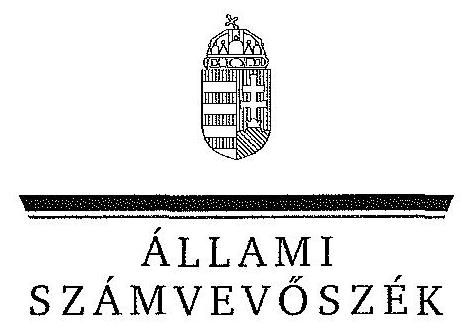
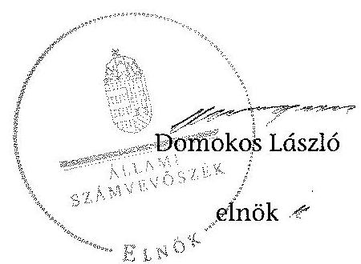
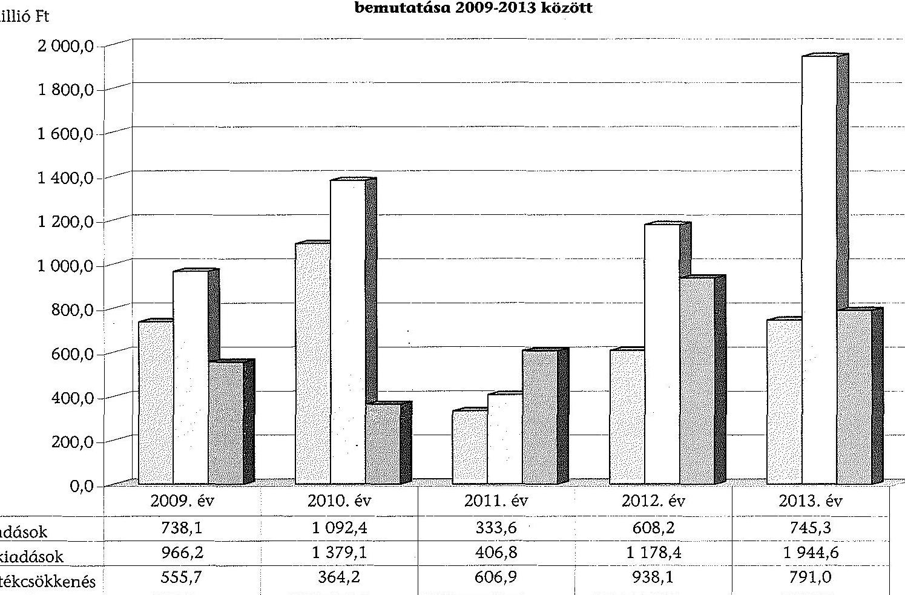
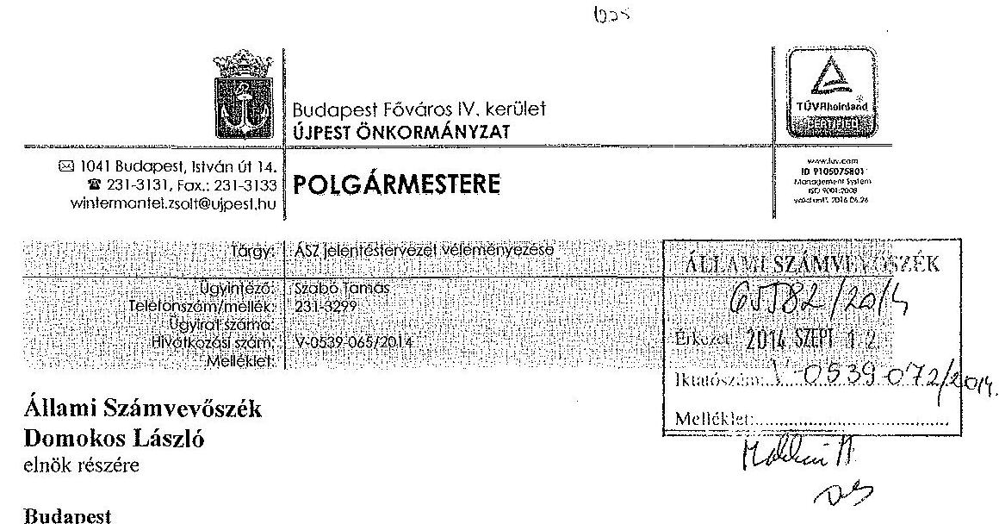
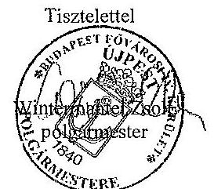
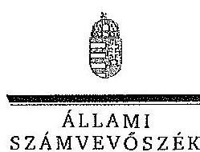
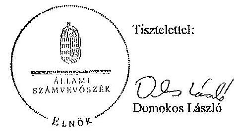

ÁLLAMI
SZÁMVEVÔSZÉK

# JELENTÉS 

az önkormányzatok vagyongazdálkodása szabályszerűségének ellenőrzéséről
Budapest Főváros IV. kerület Újpest

---

# Állami Számvevőszék 

Iktatószám: V-0539-078/2014.
Témaszám: 1573
Vizsgálat-azonosító szám: V068304

## Az ellenőrzést felügyelte:

## Makkai Mária

felügyeleti vezető
Az ellenőrzést vezette és az ellenőrzés végrehajtásáért felelős:
Páncsics Judit
ellenőrzésvezető
A számvevőszéki jelentés összeállításában közremüködtek:
Hajdu Károlyné
számvevő tanácsos
Jenei Zsuzsanna
számvevő tanácsos
Varga József
számvevő tanácsos
Az ellenőrzést végezték:

| Hajdu Károlyné | Jenei Zsuzsanna | Varga József |
| :-- | :-- | :-- |
| számvevő tanácsos | számvevő tanácsos | számvevő tanácsos |

---

# TARTALOMJEGYZÉK 

BEVEZETÉS ..... 3
I. ÖSSZEGZŐ MEGÁLLAPÍTÁSOK, KÖVETKEZTETÉSEK, JAVASLATOK ..... 6
II. RÉSZLETES MEGÁLLAPÍTÁSOK ..... 13

1. A vagyongazdálkodási tevékenység szabályozása ..... 13
1.1. A vagyongazdálkodási feladatellátás szabályozása ..... 13
1.2. A vagyon kezelésére, koncesszióba adására, üzemeltetésére kötött szerződések megfelelősége ..... 16
2. A vagyongazdálkodási tevékenység szabályszerűsége ..... 17
2.1. A vagyon nyilvántartása és leltározása ..... 17
2.2. Meghatározó mértékű vagyonváltozások ..... 20
2.3. Beruházások, felújítások szabályszerűsége ..... 21
2.4. A vagyon értékesítésének, hasznosításának, a követelés elengedésének szabályszerűsége ..... 24
3. Az önkormányzati tulajdonosi jog gyakorlása ..... 26
4. Integritás érvényesülése ..... 28
5. A belső és a külső ellenőrzések hasznosulása ..... 29
5.1. A belső ellenőrzés javaslatainak hasznosulása ..... 29
5.2. A külső ellenőrzések javaslatainak hasznosulása ..... 31
MELLÉKLETEK
6. számú Budapest Főváros IV. kerület Újpest Önkormányzata vagyonának főbb adatai 2009. január 1-je és 2013. december 31-e között
7. számú Budapest Főváros IV. kerület Újpest Önkormányzata felújítási és beruházási kiadásai, valamint az elszámolt értékcsökkenés bemutatása 20092013 között
8. számú Budapest Főváros IV. kerület Újpest Önkormányzata polgármesterének észrevétele
9. számú Budapest Főváros IV. kerület Újpest Önkormányzata polgármesterének észrevételére adott válasz

## FÜGGELÉKEK

1. számú Rövidítések jegyzéke
2. számú Értelmező szótár

---

.

---

# JELENTÉS 

## az önkormányzatok vagyongazdálkodása szabályszerűségének ellenőrzéséről Budapest Főváros IV. kerület Újpest

## BEVEZETÉS

Az ÁSZ stratégiai célkitűzése, hogy ellenőrzéseivel mind jobban segítse az átláthatóságot, az elszámoltathatóságot és elszámoltatást a közpénzekkel és a közvagyonnal való gazdálkodásban. Magyarország Alaptörvénye rögzíti, hogy az állam és a helyi önkormányzat tulajdona a nemzeti vagyon része. Az önkormányzati vagyon alapvető funkciója, hogy a közérdeket és egyúttal az önkormányzati célok - elsősorban a kötelezően ellátandó feladatok, és emellett a lehetőségek mértékéig az önként vállalt feladatok - megvalósítását szolgálja.

Az ÁSZ az önkormányzati vagyongazdálkodás 2012. évben indított és 2013. évben folytatott ellenőrzéseinek tapasztalatai alapján indokoltnak látta, hogy a 2014. évi ellenőrzési tervébe is beépítésre kerüljön a vagyongazdálkodási tevékenységek ellenőrzése. Az eddig elvégzett ellenőrzések rámutattak, hogy az önkormányzatok vagyongazdálkodási tevékenységét érintő szabályozottság, a kapcsolódó nyilvántartások, a beszámolók leltárral történő alátámasztása, a gazdálkodási jogkörök szabályszerű gyakorlása és a döntések meglapozottsága terén hiányosságok tapasztalhatók. Ez indokolttá tette a vagyongazdálkodás ellenőrzésének folytatását a jelentős vagyonnal rendelkező, vagy az ÁSZ kockázatelemzése alapján magas vagyoni kockázatot mutató önkormányzatoknál.

Az ellenőrzés célja annak megállapítása volt, hogy az önkormányzat vagyongazdálkodási tevékenységét a jogszabályi előírásokkal összhangban szabályozta-e, a vagyon nyilvántartása és a vagyongazdálkodási tevékenységek végrehajtása a jogszabályoknak és a belső előírásoknak megfelelően történt-e. Az ellenőrzés célja továbbá annak megállapítása, hogy az önkormányzatnál a vagyongazdálkodás során biztosították-e az átláthatóságot, valamint a külső és belső ellenőrzések megállapításai, javaslatai hozzájárultak-e a szabályszerű vagyongazdálkodáshoz.

Ennek keretében értékeltük, hogy az Önkormányzat:

- szabályszerűen alakította-e ki vagyongazdálkodási tevékenységének kereteit;
- biztosította-e a vagyongazdálkodás szabályszerűségét, megalapozottan hoz-ta-e és jogszerűen, szabályszerűen hajtotta-e végre a vagyonváltozást eredményező meghatározó jelentőségű döntéseket;
- gondoskodott-e a tulajdonosi jogok gyakorlásáról;

---

- vagyongazdálkodási tevékenysége során biztosította-e az átláthatóság és az integritás érvényesülését;
- belső ellenőrzése elősegítette-e a vagyongazdálkodás szabályszerű működését, valamint hasznosította-e a vagyongazdálkodási tevékenységével kapcsolatos külső és belső ellenőrzések megállapításait, javaslatait.

Az ellenőrzés várható hasznosulása, hogy feltárja az önkormányzati vagyongazdálkodást meghatározó szabályok, szabályozások összhangjának hiányosságait, a szabályozással nem érintett vagyongazdálkodási területeket, a vagyongazdálkodási tevékenység gyakorlásának esetleges szabálytalanságait, valamint a jó gyakorlat kialakításán és terjesztésén keresztül az ellenőrzések elősegíthetik a vagyongazdálkodás szabályszerűségének javítását.

# Az ellenőrzés típusa: szabályszerűségi ellenőrzés 

Az ellenőrzött időszak: 2009. január 1-jétől 2013. december 31-ig, illetve a közbeszerzési eljárások lefolytatásának ellenőrzése 2012. január 1-jétől az Önkormányzat helyszíni ellenőrzésének kezdetét megelőző negyedév végéig (2014. március 31 -ig) tartott.

Ellenőrzött szervezet: Budapest Főváros IV. kerület Újpest Önkormányzat
Az ellenőrzés végrehajtásának jogszabályi alapját az Állami Számvevőszékről szóló 2011. évi LXVI. törvény 1. § (3) bekezdése, az 5. § (2)(6) bekezdései, valamint az államháztartásról szóló 2011. évi CXCV. törvény 61. § (2) bekezdésének előírásai képezik.

Az ellenőrzés szakmai módszertana az ÁSZ hivatalos honlapján közzétett szakmai szabályokon alapult, amely a Legfőbb Ellenőrző Intézmények Nemzetközi Szervezete (INTOSAI) által kiadott nemzetközi standardok (ISSAI) figyelembevételével készült.

Az ellenőrzést az ÁSZ hatályos szervezeti szabályai és az ellenőrzési programban foglalt értékelési szempontok szerint folytattuk le. Megállapításainkat a helyszíni ellenőrzés tapasztalataira, az ellenőrzött szervezettől bekért dokumentumokra, a kitöltött tanúsítványok elemzésére, az adott időszakban hatályos jogszabályok és belső szabályzatok előírásaira alapoztuk. A részesedések értékelését tételesen ellenőriztük, míg irányított mintavétellel választottuk ki az ellenőrzött térítésmentes átadás-átvételeket, a beruházásokat, felújításokat, a közbeszerzési eljárásokat, a vagyon értékesítését, hasznosítását és a követelés elengedést, illetve leírást. A belső kontrollok megfelelő múködését (a szakmai teljesítésigazolást, valamit a 2009-2011. években az utalvány ellenjegyzést, a 2012-2013. években az érvényesítést) a Polgármesteri hivatal felhalmozási kiadásaiból választott véletlen minta alapján, megfelelőségi teszttel ellenőriztük.

Budapest Főváros IV. kerület lakosainak száma 2013. január 1-jén 99369 fő volt. A 2010. évi önkormányzati választásokig a 33 tagú Képviselő-testület munkáját 10 állandó bizottság segítette. Az önkormányzati választások után a Képviselő-testület létszáma 21 főre csökkent és öt állandó bizottság múködött. A polgármester ${ }_{2}$ a 2010. évi önkormányzati választás óta tölti be tisztségét, a jegyzö ${ }_{2} 2012$ márciusától látja el feladatait. A Polgármesteri hivatal kilenc

---

szervezeti egységre, ezen belül öt főosztályra tagolódott, elkülönített gazdasági szervezettel nem rendelkezett. A vagyongazdálkodással kapcsolatos feladatokat a Gazdasági Főosztály és a Városüzemeltetési Főosztály szervezetébe tartozó osztályok látták el. A foglalkoztatott köztisztviselők száma 2013. december 31én 187 fő volt.

Az Önkormányzat a 2013. évben az önállóan működő és gazdálkodó Polgármesteri hivatalon felül három önállóan működő és gazdálkodó, valamint 17 önállóan működő költségvetési szervvel látta el a feladatát. Az Önkormányzatnak 2013. december 31 -én öt $100 \%$-os tulajdonában álló gazdasági társasága volt. A lakás és nem lakás célú ingatlanok hasznosításával és üzemeltetésével kapcsolatos feladatokról az UV Zrt.-vel, Újpest és Káposztásmegyer Ingatlan és Térségfejlesztési Programjának megvalósításáról az ÉPIT Zrt.-vel, a helyi televíziós műsorszolgáltatásról és lapkiadásról a Sajtó Kft.-vel, a háziorvosi és a járóbeteg szakellátásról az EÜ NKft.-vel, a park és zöldterület fenntartásról, valamint a lakás és nem lakás célú ingatlanok karbantartásáról a Városgondnokság Kft.-vel kötött megállapodás útján gondoskodtak.

Az Önkormányzat a 2009-2013. évek között vállalkozási tevékenységet nem végzett, vagyonkezelési, haszonélvezeti és koncessziós jogot alapító szerződést nem kötött. Az ellenőrzött időszakban PPP konstrukcióban megvalósított fejlesztésre nem került sor. Az ÁSZ a 2009-2013. évek között az Önkormányzatnál ellenőrzést nem végzett.

Az Önkormányzat könyvviteli mérleg szerinti vagyona a 2009. évi 29 370,0 millió Ft-os nyitó értékről 2013. év végére 42251,1 millió Ft-ra, 43,9\%kal növekedett. A 12881,1 millió Ft-os vagyongyarapodásból 7179,9 millió Ft a befektetett eszközöknél, 5701,2 millió Ft a forgóeszközöknél keletkezett. A befektetett eszközökön belül az ingatlanok és a kapcsolódó vagyoni értékű jogok állományi értéke 5635,8 millió Ft-tal, 23661,5 millió Ft-ra ( $31,3 \%$-kal) növekedett a beruházások és felújítások hatására. Az Önkormányzat 2011-ben 5000,0 millió Ft értékben kötvényt bocsátott ki. Az Önkormányzat összes kötelezettségének állományi értéke 2013. december 31-én 6972,4 millió Ft volt. A pénzintézeti kötelezettség állományi értéke 3004,4 millió Ft-ot tett ki, mely a 3000,0 millió Ft összegű adósság átvállalás eredményeként 2014-ben 4,4 millió Ft-ra csökkent. Az Önkormányzat 2013. évi költségvetési beszámolója szerint 16794,3 millió Ft költségvetési bevételt ért el és 16888,4 millió Ft költségvetési kiadást teljesített. Felhalmozási célú kiadásra 3363,3 millió Ft-ot, ezen belül felújítási és beruházási kiadásokra 2689,9 millió Ft-ot fordítottak.

Az Önkormányzat vagyonának főbb adatait, továbbá a felújítási és beruházási kiadásokat, valamint az elszámolt értékcsökkenést az 1-2. számú mellékletek mutatják be. Az alkalmazott rövidítéseket és az egyes fogalmak magyarázatát az 1-2. számú függelék tartalmazza.

Az ÁSZ a 2011. évi LXVI. törvény 29. §-a szerint a jelentéstervezetet megküldte Budapest Főváros IV. kerület Újpest Önkormányzata polgármesterének egyeztetésre. A polgármester észrevételét és az arra adott választ a jelentés 3-4. számú mellékletei tartalmazzák.

---

# I. ÖSSZEGZŐ MEGÁLLAPÍTÁSOK, KÖVETKEZTETÉSEK, JAVASLATOK 

A Képviselő-testület a vagyongazdálkodási tevékenység kereteit a teljes vagyoni körre kiterjedően - helyi rendeletekben - szabályosan alakította ki. A vagyongazdálkodási rendelet ${ }_{1,2}$-ben meghatározta az önkormányzati feladatellátást biztosító törzsvagyont, valamint a forgalomképes (üzleti) vagyon körébe tartozó vagyonelemeket. A vagyongazdálkodási rendelet ${ }_{2}$-ben meghatározták a nemzetgazdasági szempontból kiemelt jelentőségű nemzeti vagyonnak minősülő vagyonelemet, rögzítették a forgalomképesség szerinti besorolás megváltoztatásának módját. A vagyongazdálkodási rendelet ${ }_{1}$ az Ötv. előírása ellenére nem tartalmazta a vagyonkezelői jog megszerzésére, gyakorlására és ellenőrzésére vonatkozó rendelkezéseket. A hiányosságot 2013. január 1-jétől a vagyongazdálkodási rendelet ${ }_{2}$-ben pótolták, az Mötv. előírásának megfelelően megjelölték azt a vagyoni kört, amelyre vagyonkezelői jog létesíthető, szabályozták a vagyonkezelői jog megszerzésének, gyakorlásának és a vagyonkezelés ellenőrzésének eljárásrendjét.

A Képviselő-testület a vagyongazdálkodási rendelet ${ }_{1,2}$-ben meghatározta a vagyonhasznosítás szabályait, előírta a nyilvános versenyeztetési kötelezettséget. A vagyongazdálkodási rendelet ${ }_{2}$-ben előírták, hogy az önkormányzati vagyon elidegenítésére vagy hasznosítására vonatkozó szerződés - az Nvtv.-ben előírtaknak megfelelően - csak természetes személlyel vagy átlátható szervezettel köthető. A követelések elengedésének eseteit és módját a vagyongazdálkodási rendelet ${ }_{2}$-ben és a bérbeadásról szóló rendeletben szabályozták. A Képviselőtestület az Ötv., illetve az Mötv. alapján a vagyongazdálkodási rendelet ${ }_{1,2}$-ben értékhatárokhoz kötve - a polgármesternek és a Gazdasági bizottságnak adott át vagyongazdálkodási hatáskört. Az átruházott hatáskörök gyakorlásáról beszámolási kötelezettséget nem írtak elő.

A Polgármesteri hivatal rendelkezett a Számv. tv.-ben előírt - az Áhsz. ${ }_{1}$ rendelkezéseinek megfelelő - számviteli politika ${ }_{1-3}$-mal és az annak keretében kialakított pénzkezelési, leltározási, selejtezési és értékelési szabályzatokkal.

A kötelezettségvállalási szabályzat ${ }_{1-6}$-ban - az Ámr. ${ }_{1,2}$-ben és az Ávr.-ben előírtaknak megfelelően - meghatározták az operatív gazdálkodással kapcsolatos eljárásrendet és az összeférhetetlenségi követelményeket. Az ellenőrzött fejlesztési kiadások teljesítése esetében a gazdálkodási jogkörök gyakorlása a 2009-2011. években nem felelt meg a jogszabályi előírásoknak, azonban a 2012-2013. években a kontrollok - az eseti hibák kivételével - megfelelően múködtek.

Az Önkormányzat az ÉPIT Zrt.-vel és az UV Zrt.-vel üzemeltetési, illetve közszolgáltatási szerződést kötött. A közszolgáltatási szerződés tervezetét a TVI-vel véleményeztették. A szerződéseket, illetve a módosításokat a Képviselő-testület által elfogadott tartalommal, határozott időtartamra kötötték. A közszolgáltatási szerződés az Önkormányzat érdekeit védő garanciális elemeket tartalmazta.

---

Az Önkormányzatnak 2012. december 31-én hat 100\%-os tulajdonában álló és öt, a Budapesti Értéktőzsdére bevezetett gazdasági társaságban volt tulajdonosi részesedése, amelyek az Nvtv. alapján átlátható szervezetnek minősültek. Az Önkormányzatnál egy zrt.-ben lévő 1,4 millió Ft névértékű részesedés esetében - az Nvtv.-ben előírtak ellenére - a társasági szerződést nem vizsgálták felül annak érdekében, hogy a zrt. megfelel-e az átlátható szervezetre vonatkozó feltételeknek.

A vagyongazdálkodási tevékenység szabályszerűsége a vagyonnyilvántartás hiányosságai miatt nem volt biztosított. Az Önkormányzatnál a vagyonnyilvántartások vezetése során több esetben nem tartották be a jogszabályokban és a belső szabályozásban előírtakat. A polgármester ${ }_{1,2}$ a vagyonkimutatást a zárszámadási rendelettervezet előterjesztésekor tájékoztatásul bemutatta a Képvi-selő-testületnek, azonban annak szerkezete az ellenőrzött időszakban nem felelt meg az Áhsz. ${ }_{1}$-ben előírtaknak, mert nem tartalmazta az önkormányzat vagyonát törzsvagyon, illetve törzsvagyonon kívüli egyéb vagyon bontásban, valamint a „0"-ra leírt eszközöket.

Az ingatlanvagyon-kataszter megfelelő adatait a 147/1992. (XI. 6.) Korm. rendeletben előírt egyezőség megteremtése érdekében a földhivatal azonos tartalmú adataival a 2011. évben egyeztették. Az eltérésekről kimutatást készítettek, azok rendezéséhez felelőst és határidőt írtak elő, a javítások végrehajtását dokumentálták. A 2012. és a 2013. években a tulajdonban bekövetkezett változásokat a földhivatali határozatok alapján vezették át az ingatlankataszteri nyilvántartásban. A 2009-2013. években az ingatlanvagyon-kataszter összesített bruttó érték adatának a számviteli nyilvántartás szerinti ingatlanvagyon bruttó érték adataival való egyezőségét a 147/1992. (XI. 6.) Korm. rendeletben előírtak ellenére a jegyzö ${ }_{1,2}$ nem biztosította.

Az Önkormányzatnál a 2009-2013. évek könyvviteli mérlegében kimutatott eszközöket és forrásokat leltárral alátámasztották, de a leltározást nem az Áhsz. ${ }_{1}$-ben előírt módon hajtották végre. Az eszközöket mennyiségi felvétellel csak 2011-ben és 2013-ban leltározták annak ellenére, hogy a Képviselőtestület az eszközök mennyiségi felvétellel történő kétévenkénti leltározását - a vagyongazdálkodási rendelet ${ }_{2}$ 2013. október 1-jén hatályba lépett módosításával engedélyezte. Az üzemeltetésre átadott eszközök mérleg szerinti értékét az Áhsz. ${ }_{1}$ előírása ellenére nem az üzemeltetést végző társaságok által mennyiségi felvétellel - elkészített, hitelesített leltárral támasztották alá. Az üzemeltetésre átadott eszközöket a 2010-2013. években a Polgármesteri hivatal egyeztetéssel leltározta. A 2011. évi leltározás során a szellemi termékeknél és az informatikai eszközöknél kimutatott hiány esetében nem állt rendelkezésre a jegyző, engedélye a hiányzó eszközök kivezetésére, az ingatlanok és a járművek eszközcsoportoknál a leltárakat nem értékelték ki. A 2013. évi leltárak kiértékelését sem végezték el.

A Fővárosi Önkormányzatnak a 2013. évben - a 2012. évi CXC. törvény rendelkezése alapján - vagyonkezelésbe adott önkormányzati ingatlanokat a számviteli nyilvántartások nem, az ingatlanvagyon-kataszter pedig érték nélkül tartalmazta. A 2011-2013. évi költségvetési beszámolók mérlegében a társasági részesedések könyv szerinti értékét nem az értékelési szabályzat ${ }_{2,3}$ előírásainak megfelelően mutatták be. A számviteli politika ${ }_{2,3}$ szabályozása ellenére

---

a részesedéseket piaci értéken szerepeltették, a szabálytalanul elszámolt értékhelyesbítés 2013-ban 689,6 millió Ft volt. A Média Kht. végelszámolásának 2013. évi befejezésekor a részesedés értékét nem vezették ki a számviteli nyilvántartásokból. A Kht. végelszámolója 2013-ban az Önkormányzatra engedményezte két volt munkavállaló 2,6 millió Ft-os munkáltatói kölcsön tartozását, melyet a Képviselő-testület döntése ellenére nem vettek a követelések között nyilvántartásba.

Az Önkormányzat 2009-2013. évi beruházásai és felújításai a városfejlesztési koncepcióban, az integrált városfejlesztési stratégiában és a gazdasági programban szerepeltek, azzal összhangban voltak, a kötelező és az önként vállalt feladatok ellátását szolgálták. A fejlesztési feladatok finanszírozhatóságát és fenntarthatóságát biztosították, az előirányzatokat az éves költségvetési rendeletek tartalmazták. A Polgármesteri hivatalban a befejezett fejlesztések üzembe helyezésének dokumentálása nem felelt meg az Áhsz. ${ }_{1}$-ben és a számviteli politika ${ }_{1,2,3}$-ban előírtaknak, mivel üzembe helyezési bizonylatot nem készítettek, emiatt a terv szerinti értékcsökkenés elszámolása sem a tényleges használatba vétel időpontjához igazodott. Az üzembe helyezési, illetve az állományba vételi bizonylat és a bekerülési érték pontos meghatározásának hiánya miatt négy ingatlanfejlesztés értékét az ingatlanvagyon-kataszterben 44,6 millió Ft-tal magasabb összegben és nem a számvitelben kimutatott, aktivált bruttó értékkel egyezően vettek nyilvántartásba.

Az Önkormányzat a beruházásokkal, felújításokkal összefüggésben 2012. január 1-jétől 2014. év I. negyedév végéig negyven közbeszerzési eljárást folytatott le, további 34 eljárás a múködési kiadásokkal volt összefüggésben. A közbeszerzési eljárások ellen jogorvoslati eljárást nem kezdeményeztek. Az ellenőrzött közbeszerzési eljárások lebonyolítása megfelelt a Kbt. ${ }_{2}$ és a közbeszerzési szabályzat előírásainak. Az ajánlatok értékelése, a szerződések megkötése az ajánlattételi felhívásban rögzített szempontok szerint történt. Az eljárások eredményét a Kbt. ${ }_{2}$-ben előírtaknak megfelelően hirdetményben, a megkötött szerződések közérdekű adatait az Önkormányzat honlapján tették közzé.

Az Önkormányzatnál a vagyon hasznosítása - a térítésmentes átadásokat és átvételeket kivéve - megfelelő döntésekkel alátámasztottan történt. Az Önkormányzatnál a vagyon értékesítéséről - pályázati kiírás alapján - a Gazdasági bizottság döntött. A bérbeadásról szóló rendeletben előírtakat a vagyonhasznosítására kötött bérleti szerződések megkötésekor betartották. A megkötött adásvételi és bérleti szerződések tartalmazták az Önkormányzat érdekeit védő garanciális elemeket. Az állam tulajdonából az Önkormányzat tulajdonába került lakóépületek (a bennük lévő lakások) elidegenítéséből származó bevételt az UV Zrt. szedte be és tartotta elkülönítetten nyilván.

Az Önkormányzatnál az ellenőrzött időszakban térítésmentes vagyonátadásra az államháztartáson belülre két alkalommal, térítés nélküli átvételről államháztartáson kívülről egy alkalommal, államháztartáson belülről hat alkalommal a közfeladat ellátásához kapcsolódóan döntöttek. A Budapesti Rend-őr-főkapitányság részére 2011-ben informatikai eszköz átadásáról, illetve egy esetben - a Közlekedési törvény alapján - út- és járdaszakasz, járda, úttest 2009. évi átvételéről a vagyongazdálkodási rendelet ${ }_{1}$-ben előírtak ellenére a Képviselő-testület helyett a Gazdasági bizottság döntött.

---

Az Önkormányzatnál az ellenőrzött tételek alapján szabályszerűen, dokumentumokkal alátámasztottan döntöttek a követelések elengedéséről, illetve a követelések behajthatatlanná minősítéséről. A behajthatatlan követelések számviteli nyilvántartásokból történő kivezetése az Áhsz. ${ }_{1}$-ben meghatározott módon, az értékelési szabályzat ${ }_{2,3}$-ban előírtak szerint történt.

Az Önkormányzat élt az alapító okiratokban rögzített tulajdonosi jogaival, nyomon követte gazdasági társaságai kötelezettségállományának alakulását, a folyamatos üzletmenet fenntarthatóságát, a társaságok alapfeladatainak teljesülését, a feladatellátás hatékonyságát. A gazdasági társaságok a feladatellátáshoz rendelkezésükre bocsátott önkormányzati vagyont üzemeltetési, illetve közszolgáltatási szerződések alapján múködtették. A tevékenységükhöz hitelt nem vettek fel, kötvényt nem bocsátottak ki, részükre garancia- és kezességvállalásra nem került sor, az Önkormányzat felhalmozási és múködési célú tagi kölcsönt nem nyújtott.

Az Önkormányzatnál a vagyongazdálkodási tevékenység integritása (feddhetetlensége) szempontjából az eredendő és a korrupciós kockázatok értéke - az ÁSZ által a 2013. évben mért - az önkormányzati alrendszer átlagértékéhez képest magasabb. Az Önkormányzatnál kiépült kontrollok azonban képesek kezelni a kockázatokat, valamint támogatni a szervezet feladatellátását.

A 2012-2013. években a kontrollkörnyezet kialakításakor a jegyző ${ }_{1,3}$ a Bkr. előírása szerinti etikai elvárásokat nem határozta meg, azokat a Képviselő-testület nem hagyta jóvá.

A belső ellenőrzés rendszerét kialakították, szervezeti és funkcionális függetlensége a szabályozás és a múködés során biztosított volt. Az éves ellenőrzési tervek kockázatelemzéssel alátámasztott stratégiai terveken alapultak, 112 ellenőrzést folytattak le, melyből 35 ellenőrzés érintette a vagyongazdálkodást. A belső ellenőrzési jelentésekben szabályozási és végrehajtási hiányosságokat rögzítettek, a megállapításokkal, javaslatokkal, azok végrehajtásának nyomon követésével a belső ellenőrzés elősegítette az Önkormányzati vagyongazdálkodás szabályszerű múködését.

A könyvvizsgáló az Önkormányzat 2009-2013. évi költségvetési beszámolóit megbízhatónak és hitelesnek minősítette, a könyvvizsgálói jelentés a 2009. és 2012. években tartalmazta, hogy az ingatlankataszteri nyilvántartásban, valamint a zárszámadáshoz készített vagyonkimutatásban szereplő értékadatok az egyszerűsített éves költségvetési beszámoló adataival összhangban voltak. A könyvvizsgáló javaslatait az Önkormányzatnál hasznosították.

A vagyongazdálkodást érintő külső ellenőrzések során az NFÜ 2012-ben szabálytalansági eljárásban 27,5 millió Ft visszafizetésére kötelezte az Önkormányzatot, mivel 2008-ban egy közbeszerzési pályázat kiírásakor a pénzügyi és a műszaki alkalmassági feltételekben indokolatlanul magas követelményt támasztott, a visszafizetést teljesítették. A NAV az Építésigazgatási egységnél az eljárási illetéket, a Földhivatal a Takarnet program használatát ellenőrizte, a jelentésekben javaslatot nem fogalmaztak meg.

---

Az Állami Számvevőszékről szóló 2011. évi LXVI. törvény 33. § (1) bekezdésében foglaltak értelmében a jelentésben foglalt megállapításokhoz kapcsolódó intézkedési tervet köteles az ellenőrzött szervezet vezetője összeállítani, és azt a jelentés kézhezvételétől számított 30 napon belül az ÁSZ részére megküldeni. Amennyiben az intézkedési tervet határidőben nem küldi meg a szervezet, vagy az nem elfogadható, az ÁSZ elnöke a hivatkozott törvény 33. § (3) bekezdés a)-b) pontjaiban foglaltakat érvényesítheti.

Az ellenőrzés intézkedést igénylő megállapításai és javaslatai:

# a polgármesternek 

1. Az Önkormányzatnál a vagyongazdálkodási rendelet, 13. § (4) bekezdésében foglaltak ellenére 2009-ben 19,4 millió Ft értékű forgalomképtelen törzsvagyon tulajdonjogának térítésmentes megszerzéséről nem a Képviselő-testület, hanem a Gazdasági bizottság döntött.

Az Önkormányzatnál a vagyongazdálkodási rendelet, 18. § (2) bekezdésében foglaltak ellenére 2011-ben a Budapesti Rendőr-főkapitányság részére történő 0,6 millió Ft értékű informatikai eszköz térítésmentes átadásáról nem a Képviselő-testület, hanem a Gazdasági bizottság döntött.

Javaslat:
Terjessze a Képviselő-testület elé utólagos megtárgyalásra - a jegyző által előkészített - térítésmentes átvételre és átadásra vonatkozó előterjesztéseket.

## a Jegyzönek

1. Az Ötv. 78. § (2) bekezdésében, illetve az Mötv. 110. § (2) bekezdésében előírt vagyonkimutatásban az Áhsz., 44/A. § (2) bekezdésében előírtak ellenére nem mutatták be az önkormányzat vagyonát törzsvagyon, illetve üzleti vagyon bontásban, valamint a „0"-ra leírt, de használatban lévő, illetve használaton kívüli eszközök Áhsz., 44/A. § (3) bekezdésében meghatározott állományát.

Javaslat:
Intézkedjen arról, hogy a vagyonkimutatás tartalmazza a vonatkozó jogszabályi előírásoknak megfelelően az önkormányzat vagyonát törzsvagyon, illetve üzleti vagyon bontásban, továbbá a „0"-ra leírt, de használatban lévő, illetve használaton kívüli eszközök állományát.
2. Az ingatlanvagyon-kataszter összesített bruttó érték adatának a számviteli nyilvántartás szerinti ingatlanvagyon bruttó érték adataival való egyezőségét a 147/1992. (XI. 6.) Korm. rendelet 1. § (3) bekezdésében és 2. számú mellékletében foglalt előírások ellenére nem biztosították, mivel az ingatlanvagyon-kataszterben kimutatott ingatlanok bruttó értéke a 2009-2013. években alacsonyabb volt a tárgyévi költségvetési beszámolóban kimutatott értéknél.

---

# Javaslat: 

Intézkedjen az ingatlanvagyon-kataszter adatainak a számviteli nyilvántartásoknak a vonatkozó kormányrendeletben foglaltaknak megfelelő egyezőségének biztosításáról.
3. Az üzemeltetésre átadott eszközök mérleg szerinti értékét az Áhsz., 37. § (4) bekezdésében foglalt előirás ellenére nem az üzemeltetést végző társaságok által - menynyiségi felvétellel - elkészített, hitelesített leltárral támasztották alá. Az üzemeltetésre átadott eszközöket a 2010-2013. években a Polgármesteri hivatal egyeztetéssel leltározta.

Javaslat:
Intézkedjen annak érdekében, hogy az üzemeltetésre átadott eszközökről a könyvviteli mérleg alátámasztásához az üzemeltetést végző szervek által elkészített, hitelesített leltárak rendelkezésre álljanak.
4. Az egyes ingatlanok fővárosi önkormányzat részére történő átadásáról, valamint önkormányzatokat érintő egyes törvények módosításáról szóló 2012. évi CXC. törvény alapján a fővárosi önkormányzat vagyonkezelésébe adott ingatlanok nem szerepeltek az Önkormányzat 2013. évi számviteli nyilvántartásaiban.

Javaslat:
Intézkedjen arról, hogy a Fővárosi Önkormányzat részére vagyonkezelésbe átadott eszközöket az önkormányzat a számviteli nyilvántartásokban a jogszabályi előírásoknak megfelelően mutassa ki.
5. A Polgármesteri hivatalban az üzembe helyezés dokumentálását nem a számviteli politika ${ }_{1,2,3}$-ban és az Áhsz., 30. § (1) bekezdésében előírtaknak megfelelően végezték el, mivel nem készítettek üzembe helyezési bizonylatot. Az aktiválást a műszaki átadás-átvételi jegyzőkönyv és a (vég)számla alapján végezték, emiatt a terv szerinti értékcsökkenés elszámolása nem a tényleges használatba vétel időpontjához igazodott.

Javaslat:
Intézkedjen arról, hogy a beruházások, felújítások aktiválása a számviteli politika ${ }_{3}$-ban meghatározott üzembe helyezési bizonylat alapján valósuljon meg, továbbá a terv szerinti értékcsökkenésnek a tényleges használatba vétel időpontjának figyelembe vételével történő elszámolásáról.
6. Az értékelési szabályzat ${ }_{2,3}$ szerint a gazdasági társasági részesedések év végi értékelésekor az értékvesztésre, illetve annak visszaírására vonatkozó javaslat elkészítéséért a pénzügyi osztályvezető volt a felelős, jóváhagyására a polgármester volt jogosult. A befektetések értékelésére készített kimutatást csak 2010-ben írta alá a pénzügyi osztályvezető és hagyta jóvá a polgármester az értékelési szabályzat ${ }_{2}$-ben előírtaknak megfelelően, 2009-ben és 2011-2013. között nem.

---

Az Önkormányzatnál 2011-2013-ban a társasági részesedések után értékhelyesbítést számoltak el annak ellenére, hogy a számviteli politika ${ }_{2,3}$-ban nem éltek a részesedések piaci értékelésének lehetőségével, az értékhelyesbítés alkalmazását szabálytalanul gyakorolták.

Javaslat:
a) Gondoskodjon arról, hogy a gazdasági társasági részesedések év végi értékelésekor az értékvesztésre, illetve annak visszaírására vonatkozó javaslatot az értékelési szabályzatban előírtaknak megfelelően készítsék el és dokumentálják.
b) Intézkedjen az önkormányzati tulajdonban lévő társasági részesedések esetében a szabályozásnak megfelelő értékelés végrehajtásáról.
7. Az Önkormányzatnál a főkönyvi könyvelésből, illetve a részesedések analitikus kimutatásából a Média Kht. adatait a végelszámolás befejezését követően nem vezették ki.

Javaslat:
Intézkedjen a megszűnt Média Kht. adatainak a számviteli nyilvántartásokból történő kivezetéséről.
8. A 2012-2013. években a kontrollkörnyezet kialakítása során a jegyző a Bkr. 6. § (1) bekezdés c) pont előírása szerinti etikai elvárásokat nem határozta meg, a Képvi-selő-testület a Kttv. 231. § (1) bekezdésében előírtaknak megfelelően nem döntött a Kttv. 83. §-ában rögzített - a köztisztviselőkre vonatkozó hivatásetikai alapelvek részletes tartalmáról és az etikai eljárás szabályairól.

Javaslat:
Készítse elő a vonatkozó jogszabályi előírásoknak megfelelő etikai elvárásokat, hivatásetikai alapelveket, az etikai eljárás szabályait és terjessze a Képviselő-testület elé jóváhagyásra.

---

# II. RÉSZLETES MEGÁLLAPÍTÁSOK 

## 1. A VAGYONGAZDÁLKODÁSI TEVÉKENYSÉG SZABÁLYOZÁSA

### 1.1. A vagyongazdálkodási feladatellátás szabályozása

Az Önkormányzatnál a 2007-2010. évekre szóló gazdasági programot az Ötv. 91. § (7) bekezdésében előírtak ellenére nem fogadtak el. A településfejlesztés akcióterületeit ${ }^{1}$ a városfejlesztési koncepció és az integrált városfejlesztési stratégia tartalmazta. A Képviselő-testület a 2011-2014. évekre szóló gazdasági programot az Ötv.-ben előírtaknak megfelelően jóváhagyta, meghatározta a lakás és helyiséggazdálkodással kapcsolatos elveket, célkitűzéseket és a fő fejlesztési feladatokat.

A gazdasági programban a fejlesztési prioritások között szerepelt Káposztásmegyeren olyan közlekedési csomópont kialakítása, amely kapcsolatot biztosíthat a különböző közösségi és egyéni közlekedési formák között, célul tűzték ki Újpest Városkapu térség megújítását, továbbá új szakorvosi rendelő és uszoda építését.

Az Önkormányzatnál a kötelező és önként vállalt feladatok körét, azok ellátásának mértékét és módját az Ötv. 8. § (2) bekezdésében ${ }^{2}$ foglaltak ellenére a 2009-2010. években nem határozták meg. Kötelező feladatnak tekintették - a település típusának megfelelően ellátandó - az Ötv.-ben és az ágazati törvényekben meghatározott feladatokat. 2011-től a gazdasági programban meghatározták a kötelező és önként vállalt feladatok körét, a feladatellátás módját és mértékét a 2011-2012. évi költségvetési rendeletek tartalmazták. Az Önkormányzat 2013. évi költségvetési rendelete az Mötv. 111. § (3) bekezdésében előírtaknak megfelelően elkülönítetten tartalmazta a kötelező és önként vállalt feladatok ellátásának forrásait és kiadásait.

A gazdasági program a kötelezően ellátandó egészségügyi és szociális feladatokat számszerúsítette és meghatározta a feladatellátás módját. A lakbér-, és lakásfenntartási támogatást, a gyógyszerutalványt, a háztartási tüzelőolaj támogatást, a súlyosan fogyatékos személyek díjhátralék-klegyenlítő támogatását, a fűtéskorszerűsítési támogatást és a jelzőrendszeres házi segítségnyújtást jelölték meg önként vállalt feladatként. Az oktatási és kulturális feladatok között is meghatározták a kötelező és az önként vállalt feladatokat, továbbá önként vállalt feladatként gondoskodtak a gyermek, ifjúsági és drog prevenciós feladatokról.

Az Önkormányzat a kötelező és az önként vállalt feladatait a Polgármesteri hivatalon, az intézményrendszerén, a 100\%-os tulajdonában álló közhasznú,

[^0]
[^0]:    ${ }^{1}$ Többek között a Szent István tér, Újpest központ és térsége közlekedési rendjének megújítása.
    ${ }^{2}$ 2013. január 1-jétől az Mötv. 10. § (1) bekezdése és a 23 § (5) bekezdése szabályozza.

---

nonprofit társaságain és a gazdasági társaságain, valamint feladat-ellátási szerződés alapján más vállalkozásokon keresztül látta el.

A 2009-2013. években bekövetkezett intézményi átszervezések az Önkormányzat vagyonát nem érintették, az intézmények számának csökkenésével a feladatellátást szolgáló vagyon a feladatot ellátó intézményhez került át. Az oktatási feladatok 2012-ben történt átszervezése sem érintette az önkormányzati vagyont, mivel a KLIK az aláírt megállapodás szerint az oktatási intézmények ingatlanait ingyenes használatba kapta. A Képviselő-testület új feladatként a 33/2011. (II. 8.) számú határozattal a felnőtt és gyermek járóbeteg-ellátás, valamint a fogászat Fővárosi Önkormányzattól történő átvételéről döntött. A feladatellátáshoz kapcsolódó vagyon térítés nélküli átvételéről a 253/2011. (IX. 13.) számú határozattal döntöttek, az átvett épület bruttó értéke 196,4 millió Ft, a földterület értéke 48,0 millió Ft volt.

Az Önkormányzat az ellenőrzött időszakban a közfeladat-ellátás érdekében többször döntött gazdasági társaság létrehozásáról, átalakításáról és részesedés vásárlásáról.

A 2011. évtől az Önkormányzat 100\%-os tulajdonába került a kerületi járóbeteg szakellátási és az alapító okirat szerinti más egészségügyi és szociális közfeladatokat ellátó EÜ NKft. A Képviselő-testület 2012-ben döntött az ÉPIT Zrt.-ben meglévő $33 \%$-os tulajdoni hányada mellé a $67 \%$-os tulajdoni rész megvásárlásáról Újpest és Káposztásmegyer településfejlesztési feladatai ellátása érdekében.

A Képviselő-testület az Nvtv. 9. § (1) bekezdésében előírt középtávú vagyongazdálkodási tervet 2013-ban fogadta el, a hosszú távú vagyongazdálkodási tervet a helyszíni ellenőrzés befejezéséig, 2014. június 30 -ig nem készítették el.

A Képviselő-testület - a Htv.-nek megfelelően - az önkormányzati vagyongazdálkodási feladatokat a teljes vagyoni körre kiterjedően a vagyongazdálkodási rendelet ${ }_{1,2}$-ben szabályozta. Meghatározták az önkormányzati feladatellátást biztosító törzsvagyont, ezen belül a forgalomképtelen és a korlátozottan forgalomképes vagyonelemek körét. A vagyongazdálkodási rendelet ${ }_{1,2}$ szerint a forgalomképesség megváltoztatásáról a Képviselő-testület jogosult dönteni. A Képviselő-testület az Nvtv. 18. § (1) bekezdésében meghatározott határidőn túl - 2012. november 30-án - jelölte meg és minősítette az Önkormányzat törzsvagyonából az Újpesti Városháza épületét nemzetgazdasági szempontból kiemelt jelentőségű nemzeti vagyonelemnek.

A Képviselő-testület az Ötv. és az Mötv. alapján a vagyongazdálkodási rende-let ${ }_{1,2}$-ben - értékhatárokhoz kötve - a polgármesternek és a Gazdasági bizottságnak adott át vagyongazdálkodási hatáskört. Az átruházott hatáskörök gyakorlásáról történő beszámolási kötelezettséget nem írták elő.

A vagyontárgyak feletti tulajdonosi jogok gyakorlásának módját a vagyongazdálkodási rendelet ${ }_{1,2}$-ben a vagyonelemek forgalomképességéhez, értékéhez és a hasznosítás időtartamához kötötten határozták meg.

A vagyongazdálkodási rendelet ${ }_{1}$ az Ötv. 80/A. §-ában és a 80/B. §-ában előírtak ellenére nem tartalmazott vagyonkezelői jog megszerzésére, gyakorlására és ellenőrzésére vonatkozó rendelkezéseket. A vagyongazdálkodási rendelet ${ }_{2}$ ben az Mötv. előírásának megfelelően 2013. január 1-jétől jelölték meg azt a

---

vagyoni kört, amelyre vagyonkezelői jog létesíthető, szabályozták a vagyonkezelői jog megszerzésének, gyakorlásának és a vagyonkezelés ellenőrzésének eljárásrendjét.

Az Önkormányzat az ellenőrzött időszakban nem létesített az Ötv. és az Mötv. szerinti vagyonkezelői jogot.

A vagyon üzemeltetésre történő átadásának, használatba adásának (bérbeadás, ingyenes vagy kedvezményes használatba adás) és az üzemeltető, használó ellenőrzésének részletes szabályait a vagyongazdálkodási rendelet ${ }_{2}$-ben, a lakásgazdálkodási rendelet ${ }_{1,2}$-ben és a bérbeadásról szóló rendeletben rögzítették.

A vagyon tulajdonjogának ingyenes vagy kedvezményes átruházásának módját és eseteit, az átadás célját és az átvevők körét a vagyongazdálkodási rende-let ${ }_{1,2}$-ben az Áht. ${ }_{1,2}$, illetve az Nvtv. előírásainak megfelelően határozták meg.

A Képviselő-testület a vagyon értékesítésére, kezelésbe adására, használati jogának átadására a nyilvános versenyeztetési kötelezettségét - az Áht. ${ }_{1}$-ben és az Nvtv.-ben előírtaknak megfelelően, a vagyongazdálkodási rendelet ${ }_{1}$-ben 25,0 millió Ft-os, a vagyongazdálkodási rendelet ${ }_{2}$-ben - a mindenkori költségvetési törvényben foglalt értékhatárt ${ }^{3}$ meghaladó esetekben előírta. A vagyongazdálkodási rendelet ${ }_{2}$-ben 2013. január 1-jétől írták elő, hogy az önkormányzati vagyon elidegenítésére vagy hasznosítására vonatkozó szerződés csak természetes személlyel vagy átlátható szervezettel köthető és a szerződésnek tartalmaznia kell az Nvtv. 11. § (11)-(12) bekezdésében foglalt kikötéseket.

A Képviselő-testület a követelések elengedésének eseteit és azok módját az Áht. ${ }_{1,2}$ rendelkezésének megfelelően a vagyongazdálkodási rendelet ${ }_{2}$-ben és a bérbeadásról szóló rendeletben szabályozta. A lakásgazdálkodási rendelet ${ }_{1,2}$ a lakbérből, külön szolgáltatások díjából eredő tartozásra részlet- vagy halasztott fizetés kérelmezését tette lehetővé.

Az Önkormányzatnál 2009-2012 között a vagyonkimutatás tartalmáról szóló rendeletben az Áhsz. ${ }_{1}$ rendelkezéseivel összhangban, a rendelet 1. számú melléklete szerinti részletezettséggel határozták meg a vagyonkimutatás tartalmát. Az Önkormányzat nem élt az Áhsz. ${ }_{1}$-ben foglalt lehetőséggel, a vagyonkimutatás további tételes alábontását a rendeletben nem határozta meg, azonban előírta az immateriális javak, az ingatlanok és a vagyoni értékű jogok bruttó értéken történő bemutatását.

A Polgármesteri hivatal rendelkezett az Áhsz. ${ }_{1}$-nek és a helyi sajátosságoknak megfelelő számviteli politika ${ }_{1-2}$-mal és az annak részét képező pénzkezelési, leitározási, selejtezési és értékelési szabályzatokkal.

Az Önkormányzatnál - a kialakított belső szabályozás szerint - nem éltek az Áhsz. ${ }_{1}$-ben biztosított piaci értéken történő értékelés lehetőségével az immateriális javak, tárgyi eszközök, továbbá a befektetett pénzügyi eszközök esetében.

[^0]
[^0]:    ${ }^{3}$ az ellenőrzött években 25,0 millió Ft

---

Az Áhsz. ${ }_{1}$ 37. (7) bekezdésében előírtak ellenére a Képviselő-testület rendeleti szabályozása nélkül írták elő 2009. és 2013 októbere között a leltározási sza-bályzat ${ }_{1}$-ben az ingatlanok, a leltározási szabályzat ${ }_{2-3}$-ban az Áhsz. ${ }_{1} 37 . \S$ (3) bekezdésében meghatározott eszközök kétévenkénti mennyiségi felvétellel történő leltározását. A Képviselő-testület a vagyongazdálkodási rendelet ${ }_{2} 2013$. október 1-jei módosításával tette lehetővé az Áhsz. ${ }_{1}$-ben megjelölt eszközök esetében a kétévenkénti mennyiségi felvétellel történő leltározást. Az Önkormányzat a számviteli politika ${ }_{1-3}$-ban az Áhsz. ${ }_{1}$-ben előírtaknak megfelelően meghatározta a befektetett eszközök értékcsökkenési leírásának elszámolási módját. Az Áhsz. ${ }_{1}$-ben foglalt lineáris leírási kulcsok alkalmazásától nem tértek el.

A kötelezettségvállalási szabályzat ${ }_{1-6}$-ban - az Ámr. ${ }_{1,2}$-ben és az Ávr.-ben előírtaknak megfelelően - meghatározták az operatív gazdálkodással kapcsolatos eljárásrendet és az összeférhetetlenségi követelményeket. Előírták, hogy a kiadások teljesítésének és a bevételek beszedésének elrendelése előtt minden esetben okmányok alapján ellenőrizni, szakmailag igazolni kell azok jogosultságát, összegszerűségét, a szerződés, a megrendelés, a megállapodás teljesítését. A Polgármesteri hivatalban 2010-től nem éltek az Ámr. ${ }_{2}$-ben, illetve az Ávr.ben biztosított lehetőséggel és a kötelezettségvállalási szabályzat ${ }_{2-6}$-ban is előírták a bevételek kötelező szakmai teljesítésigazolását. A kötelezettségvállalási szabályzat ${ }_{2,4,5}$ mellékletében a gazdálkodási jogkör gyakorlására jogosult személyek közül többnek az aláírás-mintája hiányzott, ezért az csak részben felelt meg az Ámr. ${ }_{2} 80 . \S$ (3) bekezdésében, valamint az Ávr. 60. § (3) bekezdésében előírt nyilvántartás naprakész vezetésére vonatkozó követelménynek.

# 1.2. A vagyon kezelésére, koncesszióba adására, üzemeltetésére kötött szerződések megfelelősége 

Az ellenőrzött időszakban az Önkormányzat az Ötv. előírása szerinti vagyonkezelési szerződést nem kötött, vagyonkezelői jogot nem alapított. A kizárólagos önkormányzati tulajdon múködtetésének, valamint a kizárólagosan az Önkormányzat hatáskörébe utalt tevékenységek gyakorlásának koncessziós szerződés alapján való átengedésére nem került sor.

Az Önkormányzat két 100\%-os tulajdonában álló gazdasági társaságával kötött üzemeltetési, illetve közszolgáltatási szerződést. A közszolgáltatási szerződés tervezetét a TVI-vel is véleményeztették. A szerződéseket, illetve a módosításokat a Képviselő-testület által elfogadott tartalommal, határozott időtartamra kötötték.

A szerződésekbe az Önkormányzat érdekeit védő garanciális elemeket részben beépítették.

- Az ÉPIT Zrt. üzemeltetési szerződésében meghatározott feltételeknek megfelelően a társaság köteles az éves beszámolóját, a következő évi fejlesztési (üzleti) tervét, a részletes fejlesztési és hasznosítási terv módosítását, a vagyoncsomag strukturális és vagyoni értékének változásait az éves beszámoló részeként a közgyűlés elé terjeszteni. A szerződés a teljesítés biztosítására szolgáló mellékkötelezettségeket - annak célszerúsége ellenére - nem tartalmazott.
- Az UV Zrt. üzemeltetési szerződése keretében ellátandó feladatokat az Önkormányzat vonatkozó rendeletei, a Képviselő-testület és szerveinek döntései ké-

---

pezték. A döntések végrehajtása a polgármester által kiállított külön rendelkező levél alapján történt. A szerződés a teljesítés biztosítására szolgáló mellékkötelezettségeket nem tartalmazott. A közszolgáltatási szerződésben mennyiségi és minőségi követelményeket és teljesítmény kötbért határoztak meg, az éves közszolgáltatási tervet a Képviselő-testület fogadta el.

- A közszolgáltatási szerződésben előírt feltételek szerint a kompenzáció alapját képező üzleti terv csak közös megegyezéssel módosítható, a társaság az üzleti tervben új kiadási sort nem létesíthet, valamint a rendelkezésére bocsátott önkormányzati vagyont érintő beruházást, felújítást csak a polgármester előzetes írásbeli hozzájárulásával végezhet.

Az Önkormányzat az ellenőrzött időszak végén - az éves beszámoló adatai alapján - bruttó értéken 2820,9 millió Ft üzemeltetésre átadott vagyonnal rendelkezett, az eszközök után a 2009-2013. években 170,6 millió Ft értékcsökkenést számoltak el. Az üzemeltetésre átadott eszközök felújítására és beruházására az ellenőrzött időszakban nem került sor.

Az Önkormányzat - adatszolgáltatása szerint - 2012. december 31-én hat 100\%-os tulajdonában álló és öt, a Budapesti Értéktőzsdére bevezetett gazdasági társaságban rendelkezett tulajdonosi részesedéssel, amelyek az Nvtv. alapján átlátható szervezetnek minősültek. Az Önkormányzatnak az 1992. évtől a BÁV Zrt.-ben is van 1,4 millió Ft névértékű ${ }^{4}$ részesedése, amely vonatkozásában az Nvtv. 8. § (2) bekezdésében előírt átláthatósági követelményt nem vizsgálták, az Nvtv. 18. § (4) bekezdésében a társasági szerződésre előírt felülvizsgálati kötelezettségnek (2012. december 31-ig) nem tettek eleget.

# 2. A vAGYONGAZDÁLKODÁSI TEVÉKENYSÉG SZABÁLYSZERŰSÉGE 

### 2.1. A vagyon nyilvántartása és leltározása

A jegyző ${ }_{1,2}$ a 2009-2013. években nem az Áhsz. ${ }_{1}$ 44/A. § (2)-(3) bekezdéseiben ${ }^{5}$ meghatározott előírásoknak megfelelően készítette el az Ötv. 78. § (2) bekezdésében ${ }^{6}$ meghatározott vagyonkimutatást, amelyet a polgármester ${ }_{1,2}$ az Áht. ${ }_{1}$ 118. § (2) bekezdése 2. c) pontjának ${ }^{7}$ előírása szerint a zárszámadási rendelettervezettel egyidejűleg terjesztett a Képviselő-testület elé. A vagyonkimutatások nem tartalmazták:

- az Áhsz. ${ }_{1}$ 44/A. § (2) bekezdésében előírtaknak megfelelően az önkormányzat vagyonát törzsvagyon, illetve törzsvagyonon kívüli egyéb vagyon bontásban;
- a „0"-ra leírt, de használatban lévő, illetve használaton kívüli eszközök Áhsz. ${ }_{1}$ 44/A. § (3) bekezdésében meghatározott állományát.

[^0]
[^0]:    ${ }^{4}$ A részesedés Önkormányzatot a gazdálkodó szervezetek és a gazdasági társaságok átalakulásáról szóló 1989. évi XIII. törvény 21. § (2) bekezdése alapján illette meg.
    ${ }^{5}$ 2014. január 1-jétől az Áhsz. ${ }_{2}$ 30. § (2)-(3) bekezdései szabályozzák
    ${ }^{6}$ 2012. január 1-jétől az Mötv. 110. § (2) bekezdése írja elő
    ${ }^{7}$ 2012. január 1-jétől az Áht. ${ }_{2}$ 91. § (2) bekezdés c) pontja írja elő

---

Az Önkormányzatnál a számviteli nyilvántartásokban a főkönyvi számlák alábontásával, valamint a számlákhoz kapcsolódó analitikus nyilvántartások vezetésével gondoskodtak a törzsvagyon többi vagyontárgytól elkülönített nyilvántartásáról. Az analitikus és főkönyvi nyilvántartás biztosította a törzsvagyon, ezen belül a forgalomképtelen, és korlátozottan forgalomképes, illetve az üzleti (forgalomképes) vagyon elkülönített nyilvántartását.

A jegyző ${ }_{1,2}$ a 2009-2011. években nem a vagyonkimutatásról szóló rendeletben előírtaknak megfelelően készítette el a vagyonkimutatást, mivel az nem tartalmazta az immateriális javak, az ingatlanok és a vagyoni értékű jogok bruttó értékét.

Az Önkormányzat tulajdonában lévő ingatlanvagyonról a 147/1992. (XI. 6.) Korm. rendeletben meghatározott ingatlanvagyon-katasztert folyamatosan vezették. Az ingatlanvagyon-kataszter megfelelő adatait a 147/1992. (XI. 6.) Korm. rendeletben előírt egyezőség megteremtése érdekében a közhiteles nyilvántartást vezető illetékes földhivatal azonos tartalmú adataival a 2011. évben átfogóan egyeztették. Az eltérésekről kimutatást készítettek és azok rendezéséhez felelőst, határidőt írtak elő, majd a végrehajtást követően a kimutatásban rögzítették a rendezés módját. A földhivatali nyilvántartásnak megfelelően az ingatlanvagyon-kataszter naturális adatait (helyrajzi szám, terület, művelési ágba sorolás, tulajdonosi, egyéb jogok) módosították, azonban a számviteli nyilvántartásokkal (az ingatlanok analitikus nyilvántartási adataival) való egyezőség megteremtése elmaradt. A 2012-2013. években a változásokat a földhivatali határozatok alapján az ingatlanvagyon-kataszteri nyilvántartásban átvezették.

Az ingatlanvagyon-kataszterben a 147/1992. (XI. 6.) Korm. rendeletben foglaltaknak megfelelően a nyilvántartási adatok között feltüntették az ingatlan számviteli nyilvántartás szerinti bruttó értékét. Az ingatlanvagyon-kataszter összesített bruttó érték adatának a számviteli nyilvántartás szerinti ingatlanvagyon bruttó érték adataival való egyezőségét a 147/1992. (XI. 6.) Korm. rendelet 1. § (3) bekezdésében és 2 . számú mellékletében foglalt előírások ellenére nem biztosította a jegyzö ${ }_{1,2}$, mivel az ingatlanvagyon-kataszterben kimutatott ingatlanok bruttó értéke a 2009-2013. években alacsonyabb volt a tárgyévi költségvetési beszámolóban ${ }^{8}$ kimutatott értéknél.

Az ingatlanok ingatlanvagyon-kataszter szerinti bruttó értéke 2009-től az évek sorrendjében rendre 817,9 millió Ft-tal, 2,7 millió Ft-tal, 7,0 millió Ft-tal, 773,5 millió Ft-tal, 425,7 millió Ft-tal alacsonyabb állományt mutatott a tárgyévi költségvetési beszámoló 38 -as űrlapjának adataihoz képest. Az eltérés abból adódott, hogy a 2009-2013. években nem, vagy csak részben vezették át az ingatlan létesítés és felújítás aktivált értékét az ingatlanvagyon-kataszterben. Az egyezőség hiánya a számszaki összefüggésekre irányuló vezetői kontroll részleges elmulasztásából adódott.

[^0]
[^0]:    ${ }^{8}$ Az önkormányzati éves beszámoló 38 -as űrlapja mutatta be a befektetett eszközök (pénzügyi befektetések nélküli) állományának alakulását.

---

Az Önkormányzatnál az ellenőrzött években könyvvizsgáló ellenőrizte az éves beszámolót, azonban az Áhsz. 46 . § (2) és $46 /$ B. § (2) bekezdésében ${ }^{9}$ előírtak ellenére a 2010-2011. években a könyvvizsgáló jelentés nem tartalmazott megállapítást az ingatlankataszteri nyilvántartásban, valamint a zárszámadáshoz készített vagyonkimutatásban szereplő értékadatoknak az egyszerüsített éves költségvetési beszámoló adataival való összhangjára vonatkozóan. A könyvvizsgáló jelentése a 2009. és a 2012. évben az összhang meglétét állapította meg.

Az Önkormányzat a 2009-2013. évi könyvviteli mérlegeiben kimutatott eszközöket és forrásokat nem az Áhsz. 37 . § (1) bekezdésében ${ }^{10}$ előírtaknak megfelelően leltározta. A Polgármesteri hivatalban az eszközöket mennyiségi felvétellel csak 2011-ben és 2013-ban leltározták annak ellenére, hogy a Képviselőtestület az Áhsz. 37. § (7) bekezdésében foglaltakat - az eszközök mennyiségi felvétellel történő kétévenkénti leltározását - a vagyongazdálkodási rendelet ${ }_{2}$ 2013. október 1-jén hatályba lépett módosításával engedélyezte.

Az Önkormányzatnál az ingatlanok és az ingó vagyontárgyak - gépek, berendezések, felszerelések és járművek - mérleg szerinti értékét az Áhsz. 37. § (3) bekezdésében előírt tételes mennyiségi felvétellel készített és kiértékelt leltár helyett a 2009-2010. és a 2012. években a tárgyi eszközök analitikus nyilvántartásának és a főkönyvi nyilvántartásának egyeztetésével leltározták.

Az üzemeltetésre átadott eszközök leltározását, annak dokumentálását a leltározási szabályzat ${ }_{1,2}$ 2010-től hiányosan tartalmazta, nem írták elő az üzemeltető által készített, hitelesített leltár megküldésének határidejét. Az üzemeltetésre átadott eszközök mérleg szerinti értékét az Áhsz., 37. § (4) előírása ellenére nem az üzemeltetést végző társaságok által - mennyiségi felvétellel - elkészített, hitelesített leltárral támasztották alá. Az üzemeltetésre átadott eszközöket a 20102013. években a Polgármesteri hivatal egyeztetéssel leltározta.

Az egyes ingatlanok fővárosi önkormányzat részére történő átadásáról, valamint az önkormányzatokat érintő egyes törvények módosításáról szóló 2012. évi CXC. törvény alapján a fővárosi önkormányzat vagyonkezelésébe került ingatlanok nem szerepeltek az Önkormányzat számviteli nyilvántartásaiban a 2013. évi leltár és a beszámoló készítésekor, azokat az ingatlanvagyonkataszter érték nélkül tartalmazta.

A 2011. évi leltározás során az informatikai eszközöknél és a szellemi termékeknél kimutatott hiány esetében nem állt rendelkezésre a jegyző, engedélye a hiányzó eszközök kivezetésére, az ingatlanok és a járművek eszközcsoportnál nem készült kimutatás a leltárfelvételi ívek összesített adatairól, a leltárak kiértékeléséről. A 2013. évi leltár kiértékelése nem történt meg, nem csatoltak kimutatást az eszközcsoportok leltárfelvételi íveinek összesített adatairól, illetve a számviteli nyilvántartásokkal elvégzett egyeztetésről, az egyezőségről, illetve az esetleges hiányról, vagy többletről.

A nemzetiségi önkormányzat eszközeinek selejtezését nem a selejtezési szabály$z^{2 t_{1,2,3}}$ előírásai alapján hajtották végre, mert a selejtezési bizottságnak nem

[^0]
[^0]:    ${ }^{9}$ a hivatkozások 2013. március 12-től hatálytalanok
    ${ }^{10}$ 2014. január 1-jétől az Áhsz. ${ }_{2}$ 22. § (1) bekezdés szabályozza

---

volt tagja a nemzetiségi önkormányzat delegált tagja. A selejtezési jegyzőkönyvek tartalmazták a feleslegessé, vagy használhatatlanná válás okát, a hasznosításra vonatkozó javaslat megalapozásához bekért szakmai véleményeket, a hulladékhasznosításra vonatkozó engedélyeket. A jegyző ${ }_{1,2}$ döntése után a selejtezett termékek hasznosítása megtörtént, annak dokumentumait a jegyzőkönyvhöz csatolták.

# 2.2. Meghatározó mértékú vagyonváltozások 

Az Önkormányzat könyvviteli mérleg szerinti vagyona a 2009. évi 29370,0 millió Ft-os nyitó értékről 2013. év végére 42251,1 millió Ft-ra, 43,9\%kal növekedett. A 12881,1 millió Ft-os vagyongyarapodásból 7179,9 millió Ft a befektetett eszközöknél, 5701,2 millió Ft a forgóeszközöknél keletkezett. A befektetett eszközökön belül az ingatlanok és a kapcsolódó vagyoni értékú jogok könyvviteli mérlegben kimutatott állományi értéke a 2009. évi 18025,7 millió Ft-os nyitó értékről a 2013. évre 5635,8 millió Ft-tal, 23661,5 millió Ft-ra ( $31,3 \%$-kal) növekedett a beruházások és felújítások hatására. A növekedés finanszírozását a folyamatos bevételek mellett az ellenőrzött időszak elején meglévő készpénzállomány, az elnyert EU támogatások és a 2011-ben 5000,0 millió Ft értékben kibocsátott Újpest Fejlesztéséért Kötvény biztosította.

A beruházások állományának növekedése a folyamatban lévő beruházások és felújítások befejezéséhez és állományba vételéhez igazodóan változott. A 2013. év végi állomány 326,4 millió Ft-tal volt magasabb, mint a 2009. évi nyitó állomány értéke.

A befektetett pénzügyi eszközök növekedését a 2011. évtől a helytelenül elszámolt - az évek sorrendjében 675,0 millió Ft, 701,6 millió Ft, 689,6 millió Ft öszszegű - értékhelyesbítés eredményezte, melyet annak ellenére számoltak el, hogy az Áhsz. 1 8. § (3) bekezdése alapján elkészített számviteli politika ${ }_{2,5}$-ban éltek volna a piaci értékelés lehetőségével.

Az üzemeltetésre átadott eszközök értéke 2009-2013 között 94,7 millió Ft-tal, 1862,6 millió Ft-ra csökkent. A csökkenés oka egyrészt az, hogy az értékesített földterületek, lakás és nem lakás célú helyiségek könyvszerinti értéke az Önkormányzat adatszolgáltatása szerint 28,5 millió Ft volt, másrészt az UV Zrt. által kezelt lakás és helyiség állomány után elszámolt értékcsökkenés összege meghaladta az állománynövekedés értékét.

A forgóeszközök mérleg szerinti értéke a 2009. év eleji 5629,4 millió Ft-ról a 2013. év végére 11330,6 millió Ft-ra növekedett, amelynek döntő forrása a 2011. évi 5000,0 millió Ft értékű Újpest Fejlesztéséért Kötvény kibocsátásából származó bevétel volt, amely - a kötvénykibocsátás céljának megfelelő felhasználásig - 2012-ben a pénzeszközök között szerepelt a mérlegben, majd 2013-ban államkötvényt vásárolt az Önkormányzat. A kötvénykibocsátás fejlesztési célokat (Szent István tér felújításának folytatása, új szakorvosi rendelő építése, uszodaépítés) szolgált, felhasználása és a pénzmaradvány terhére vállalt kötelezettségek ezt alátámasztják, ugyanakkor a költségvetési kiadásokat meghaladó költségvetési bevételek biztosították, hogy a forgóeszközök állománya a fejlesztési célok megvalósulása mellett is növekedjen.

---

Az Önkormányzat könyvviteli mérleg szerinti forrásai a 2009. évről a 2013. évre $43,9 \%$-kal ( 12881,1 millió Ft-tal) bővültek, mivel a saját tőke 3989,8 millió Ft-tal, a tartalék 5631,9 millió Ft-tal, a kötelezettségek és egyéb passzív pénzügyi elszámolások 3259,4 millió Ft-tal növekedtek.

A hosszú lejáratú kötelezettségek a 2009. évi 459,1 millió Ft-ról 2010-re 11,6 millió Ft-ra csökkentek, majd a 2011. évben kibocsátott 5000,0 millió Ft értékű kötvény miatt 5004,8 millió Ft-ra növekedtek, a 2013. évben az állammal megkötött adósságátvállalási megállapodás eredményeképpen 2859,4 millió Ft-ra csökkentek ${ }^{11}$.

Az adósságátvállalás keretében kötött megállapodás alapján a pénzintézetekkel szembeni kötelezettség állomány 2014-ben további 3000,0 millió Ft-tal csökken. Az adósságátvállalásról készült megállapodás a kötvénykibocsátásból eredő tartozás mellett tartalmazta az átvállalás napjáig már felszámított, de még esedékessé nem vált kamatok összegét is 23,9 millió Ft összegben.

A rövid lejáratú kötelezettségek állománya a 2009. évről a 2013. évre 31,8\%$\mathrm{kal}, 1055,1$ millió Ft-tal növekedett, elsősorban a szállítók állományának 933,0 millió Ft összegű ( $31,8 \%$-os) növekedése miatt.

A 2009-2013. években a beruházásokra és felújításokra fordított 9392,8 millió Ft-os kiadás közel a 2,9-szerese volt az elszámolt értékcsökkenés ( 3265,9 millió Ft-os) összegének.

# 2.3. Beruházások, felújítások szabályszerűsége 

Az ellenőrzött időszakban az Önkormányzat által teljesített beruházások és felújítások a városfejlesztési koncepcióban, az integrált városfejlesztési stratégiában, a gazdasági programban szerepeltek, azzal összhangban voltak, a kötelező és önként vállalt feladatok ellátását szolgálták. A beruházások finanszírozhatóságáról, működtetésükről a Képviselő-testület a városfejlesztési koncepció, az integrált városfejlesztési stratégia, a gazdasági program, valamint az éves költségvetési rendeletek, vagy azok módosításának elfogadásakor döntött, a fejlesztések finanszírozhatóságát és fenntarthatóságát biztosították.

Az Önkormányzat adatszolgáltatása szerint a 2009-2013. években befejezett fejlesztésekhez felhasznált 9212,2 millió Ft fedezetét 1083,9 millió Ft összegben uniós forrás, 1540,7 millió Ft értékben kötvény kibocsátás, 3,0 millió Ft összegben központi támogatás, 3,7 millió Ft összegben hitel, 6580,9 millió Ft összegben saját bevételek képezték.

Az ellenőrzött beruházások és felújítások minden esetben a Képviselő-testület jóváhagyásával, saját gazdasági társasággal, vállalkozásokkal, az értékhatár elérése esetén közbeszerzési eljárás alapján kötött pénzügyi és garanciális biztosítékokat is tartalmazó szerződések keretében valósultak meg.

[^0]
[^0]:    ${ }^{11}$ A mérlegben a kötvénnyel kapcsolatos 2014. évben esedékes fizetések már a rövid lejáratú kötelezettségek között szerepeltek.

---

A Polgármesteri hivatalban az üzembe helyezés dokumentálását nem a számviteli politika $1_{1,2,3}$-ban és az Áhsz. 30. § (1) bekezdésében ${ }^{12}$ elöírtaknak megfelelően végezték el 13 esetben, mivel üzembe helyezési bizonylatot nem készítettek. Az aktiválásra a műszaki átadás-átvétel és a (vég)számla alapján került sor, emiatt a terv szerinti értékcsökkenés elszámolása sem a tényleges használatba vétel időpontjához igazodott.

Az ellenőrzött beruházások, felújítások vonatkozásában a Szakrendelő 2012. évi és a Gazdasági Intézmény Galopp utcai telephely 2013. évi felújításának aktiválására készültek bizonylatok, de azok sem formai, sem tartalmi szempontból nem feleltek meg az üzembe helyezési bizonylat számviteli politika ${ }_{2,3}$-ban rögzített követelményeinek.

Négy ingatlanfejlesztést az ingatlanvagyon-kataszterben 44,6 millió Ft-tal magasabb összegben és nem a számviteli nyilvántartás szerint aktivált bruttó értéken vettek nyilvántartásba. Az állományba vételhez nem készült el a számviteli politikában előírt üzembe helyezési okmány ${ }^{13}$, amelynek kötelező elemként a bekerülési értéket is tartalmaznia kellett volna, illetve elmaradt a számviteli nyilvántartás és az ingatlanvagyon-kataszter egyezőségének folyamatba épített ellenőrzése.

Az Önkormányzat adatszolgáltatása szerint 2012. január 1-jétől 2014. év I. negyedév végéig összesen 74 közbeszerzési eljárást indított, ebből uniós értékhatárt elérő vagy meghaladó értékű közbeszerzés öt esetben volt. A közbeszerzési eljárásokból negyven a felhalmozási tevékenységhez kapcsolódott 3302,2 millió Ft + áfa értékben, míg 34 eljárás a múködési kiadásokkal volt összefüggésben 1892,1 millió Ft + áfa értékben.

Az eljárások közül kilenc közvetlen felhívással induló tárgyalás nélküli eljárás, 51 hirdetmény nélkül induló tárgyalásos eljárás, 12 nyílt, kettő pedig meghívásos eljárás volt. Az Önkormányzat 2012-2013. években és 2014. év I. negyedévében indított közbeszerzési eljárásai ellen nem kezdeményeztek jogorvoslati eljárást.

A Képviselő-testület a közbeszerzési eljárásokkal kapcsolatos döntések meghozatalára Közbeszerzési Döntéshozó Testületet hozott létre, melynek munkáját bíráló bizottság támogatta. Az ellenőrzött közbeszerzési eljárások lebonyolítása megfelelt a $\mathrm{Kbt}_{.2}$ és a közbeszerzési szabályzat előírásainak. Az ajánlatok értékelése az ajánlattételi felhívásban rögzített szempontoknak megfelelően történt. A szerződést a nyertes ajánlatban foglalt, az értékelés alapját képező feltételek rögzítésével kötötték meg. Az Önkormányzatnál határidőben, hirdetményben tették közzé az eljárás eredményét, valamint a honlapon eleget tettek a megkötött szerződésekkel kapcsolatos közérdekű adatok közzétételének.

Az Önkormányzatnál a gazdálkodási jogkörök gyakorlásának rendjét a 20092013. években közös polgármesteri és jegyzői kötelezettségvállalási szabály-zat ${ }_{1-6}$-ban rögzítették. A felhalmozási kiadások dokumentumaiból vett minta

[^0]
[^0]:    ${ }^{12}$ 2014. január 1-jétől a Számv. tv. 52. § (2) bekezdése szabályozza
    ${ }^{13}$ A számviteli politika ${ }_{1,2,3}$ előírása alapján az állományba vétel bizonylata az Üzembe helyezési jegyzőkönyv, vagy az Üzembe helyezési okmány, melynek kötelező tartalmi elemeit a szabályzat előírta.

---

alapján végeztük el a 2009-2011. években a szakmai teljesítésigazolás és az utalvány ellenjegyzés, a 2012-2013. években a teljesítésigazolás és az érvényesítés kontrollok múködésének ellenőrzését.

A 2009. évben a szakmai teljesítésigazolás és utalvány ellenjegyzés kontrollok működése nem volt megfelelő, mivel az összes ellenőrzött tétel 72,2\%-ában a kontrollok valamelyike nem megfelelően múködött:

- a szakmai teljesítésigazolás hét esetben az Ámr. ${ }_{1}$ 135. § (1) bekezdésében foglaltak ellenére nem történt meg, 30 esetben az aláírás minta hiányában nem volt megállapítható, hogy a teljesítést az arra jogosult személy igazoltae az Ámr. 1 135. § (2) bekezdésében foglaltaknak megfelelően. Két esetben nem állt rendelkezésre az Ámr. ${ }_{1} 135 . \S$ (1) bekezdésében, valamint a kötelezettségvállalási szabályzat ${ }_{1,3}$-ben előírt írásbeli kötelezettségvállalás, további öt esetben az nem tartalmazott értékadatot az összegszerűség ellenőrzéséhez;
- az utalvány ellenjegyzését az Ámr. ${ }_{1}$ 137. § (2) bekezdésében foglalt előírás ellenére három esetben nem a jegyző ${ }_{1}$ vagy általa írásban kijelölt személy végezte. A szabályszerűen kijelölt ellenjegyző nem tett észrevételt arra, hogy a szakmai teljesítésigazolás nem az előírásoknak megfelelőn történt. Az ellenjegyzés egy esetben az érvényesítő hiányzó aláírása, egy esetben pedig a dokumentumokra felvezetett érvényesítői észrevétel és aláírás megtagadás ellenére megtörtént. Az ellenjegyzó nem kifogásolta az Ámr. ${ }_{1}$ 135. § (4) bekezdésében foglaltak ellenére, hogy két esetben nem a jegyző ${ }_{1}$ által kijelölt személy végezte az érvényesítést.

A 2010-2011. években a szakmai teljesítésigazolás és utalvány ellenjegyzés kontrollok múködése nem volt megfelelő, mivel az összes ellenőrzött tétel 30,6\%-ában a kontrollok valamelyike - 2010-ben 42,9\%-ban, 2011-ben 18,3\%ban - nem megfelelően múködött:

- a szakmai teljesítésigazolást - az Ámr. ${ }_{2}$ 76. § (1) bekezdésében foglalt előírás ellenére - 2010-2011-ben egy-egy esetben nem az Ámr. ${ }_{2} 16 . \S$ (7) bekezdés a) pontjában előírtak szerint kijelölt személy végezte el. 2010-ben 17, 2011ben egy esetben nem szerepelt a teljesítést igazoló aláírás mintája az Ámr. ${ }_{2} 80 . \S$ (3) bekezdésében előírt aláírás nyilvántartásban;
- a szakmai teljesítést igazoló 2011-ben négy esetben az Ámr. ${ }_{2} 72 . \S$ (3) bekezdésében előírt írásbeli kötelezettségvállalás hiányában végezte el a teljesítésigazolást, illetve 2010-ben négy esetben nem észrevételezte a kötelezettségvállalást meghaladó tervezett kifizetést, annak indokoltságáról nem nyilatkozott. Ezekben az esetekben a kifizetés összegszerűségének az igazolása nem felelt meg az Ámr. ${ }_{2} 76 . \S$ (1) bekezdésében foglaltaknak;
- az utalvány ellenjegyzését 2010-2011-ben egy-egy esetben nem a jegyző ${ }_{1}$, vagy az általa írásban kijelölt személy végezte, 2010-ben egy esetben elmaradt az ellenjegyzés az Ámr. ${ }_{2} 78 . \S$ (2) bekezdés a) pontjában, illetve az Ámr. ${ }_{2} 74 . \S$ (2) bekezdés f) pontjában foglalt előírás ellenére. Az ellenjegyzó 2010-ben 17, 2011-ben hat esetben nem észrevételezte, hogy a szakmai teljesítésigazolást nem, vagy nem a kijelöléssel rendelkező személy végezte el, illetve azt, hogy az összeg igazolása négy esetben írásbeli kötelezettségvállalás nélkül történt meg. Az ellenjegyzés 2010-ben két, 2011-ben hét esetben nem

---

a szabályszerűen kijelölt ellenjegyző által történt, továbbá az ellenjegyzó nem kifogásolta, hogy az érvényesítő négy esetben az Ámr. 74. § (2) bekezdésében foglalt előírás ellenére nem a jegyző; által kijelölt személy volt. Az ellenjegyzés 2010-ben hét, 2011-ben négy esetben a dokumentumokra felvezetett érvényesítői észrevétel és aláírás megtagadás ellenére megtörtént.

A 2012-2013 években a teljesítésigazolás és az érvényesítés kontroll múködése az ellenőrzött tételeknél - eseti hibák kivételével - megfelelő volt (a két kontroll 2012-ben 95,6\%-ban, 2013-ben 98,7\%-ban múködött):

- a teljesítésigazoló 2012-ben egy esetben nem az Ávr. 57. § (1) bekezdésében foglalt előírás szerint végezte az összegszerűség igazolását, mivel az írásbeli kötelezettségvállalásból hiányzott az összeg, illetve egy esetben az aláírás mintája nem szerepelt az Ávr. 60. § (3) bekezdésében előírt aláírás nyilvántartásban, 2013-ban egy alkalommal nem észrevételezte a kötelezettségvállalást meghaladó tervezett kifizetést, nem nyilatkozott annak indokoltságáról;
- az érvényesítés 2012-ben egy esetben - az Ávr. 58. § (1) bekezdésében előírtak ellenére - nem szabályos teljesítésigazolás alapján történt, mert a teljesítésigazoló aláírása nem szerepelt az Ávr. 60. § (3) bekezdésében előírt aláírás nyilvántartásban, egy esetben az írásbeli kötelezettségvállalás nem tartalmazta a kötelezettségvállalás összegét. Az érvényesítő 2013-ban egy esetben nem az Ávr. 58. § (1) bekezdésében foglaltak szerint érvényesített, mert az utalványrendelet az Ávr. 59. § (3) bekezdés f) pontjában foglaltak ellenére nem tartalmazta a kötelezettségvállalás számát.

# 2.4. A vagyon értékesítésének, hasznosításának, a követelés elengedésének szabályszerűsége 

Az Önkormányzat az ellenőrzött időszakban a tárgyi eszközei közül bérlakásokat és kivett beépítetlen területeket, raktárhelyiségeket értékesített. Az ellenőrzött tíz értékesítésből hét telekértékesítést az ÉPIT Zrt. bonyolított az Ingatlan- és térségfejlesztési együttmúködési, vagyonkezelési megbízási keretszerződés alapján, három értékesítést az Önkormányzat a szabályozásnak megfelelően bonyolított. Az ÉPIT Zrt. a tulajdonos önkormányzatok nevében eljárva, minden értékesítésről az előkészítés szakaszában igazgatósági határozatot hozott. A tervezett ingatlan értékesítésekre értékbecslés alapján nyilvános pályázatokat hirdettek, majd a legjobb ajánlattevővel kötötték meg az adásvételi szerződést, illetve egy esetben a vételi jogra vonatkozó szerződést. Az adásvételi szerződésekben a földhivatali bejegyzés feltételeként hozzájárulási nyilatkozat kiadását írták elő, aminek feltétele volt a szerződésben rögzített vételár megfizetése.

A raktárhelyiségek értékesítését a vagyongazdálkodási rendelet ${ }_{1} 14 . \S$ (1) bekezdés a) pontja alapján a Gazdasági bizottság határozatban hagyta jóvá, a nyilvános pályáztatást és az értékesítés lebonyolítását az UV Zrt. végezte. Egy $50 \mathrm{~m}^{2}$-es helyiség esetében nyilvános árverést tartottak, az értékbecslésben meghatározott árat induló árnak tekintve. Egy lakás bérlőjének vételi szándéka alapján a Gazdasági bizottság a lakásrendelet ${ }_{1} 21 . \S$-ában foglaltak betartásával döntött az értékesítésről. A tulajdon bejegyzése mindkét esetben a vételár

---

kifizetését követően történt. Az Önkormányzat a használaton kívüli ingatlanának értékesítésére a 2011. évi eredménytelen pályázati kiírás után ismételt pályáztatásról döntött, melyben az eredményesebb értékesítés céljából lehetőséget biztosított az ingatlan megosztásával létrejövő ingatlanrész megvásárlására. A nyilvános pályázat és az értékesítés lebonyolítására megbízási szerződést kötött az ÉPIT Zrt.-vel. A pályáztatás eredményeként a megosztással kialakítandó ingatlanra előszerződést kötöttek, majd azt meghosszabbították. A lejárat előtt átutalt vételár után adták ki a hozzájáruló nyilatkozatot a földhivatali tulajdonjog bejegyzéséhez.

Az értékesített ingatlanok esetében - a telekmegosztással értékesített ingatlan telekalakítási, megosztási engedélyezésének időigénye miatt - egy kivétellel megtörtént a számviteli nyilvántartásokból és az ingatlanvagyon-kataszterből történő kivezetés.

Az Önkormányzat a 2009-2013. években az ingatlanjai hasznosítására vonatkozó szerződéseket részben önállóan, részben a tulajdonában lévő gazdasági társaságai bevonásával kötötte meg. A bérbe adott ingatlanok a forgalomképes vagyoni körbe tartoztak. A bérbeadásra vonatkozó szabályokat betartották. A döntés határozatlan idejű bérbeadást tartalmazott annak ellenére, hogy a bérbeadásról szóló rendelet $6 . \S$ (2) bekezdése szerint határozatlan időre bérleti jogviszony nem hozható létre. A Képviselő-testület a bérbeadásról szóló rendeletét a 14/2012. (II. 28.) számú rendelettel úgy módosította, hogy a Gazdasági bizottság hozzájárulhat határozatlan időre szóló bérleti jogviszony létesítéséhez.

A REX Kutyaotthon Alapítvány részére a 2000. évben bérbe adott ingatlan 50-50\%-ban az Önkormányzat és a fővárosi önkormányzat tulajdonában és az ÉPIT Zrt. üzemeltetésében volt. A bérlő közhasznú alapítványként olyan feladatot lát el, amelyet a tulajdonos önkormányzatok elismertek, ezért a Fővárosi Tulajdonosi Bizottság és a Képviselő-testület is egyedi határozatot hozott a térítés nélküli használatba adásról a közhasznú feladat ellátásának idejére.

A bérleti szerződésekbe az Önkormányzat érdekeit védő garanciális elemeket beépítették, rögzítették a bérleti díj késedelmes fizetésének következményeit, megtiltották a nem rendeltetésszerú használatot, az albérletbe adást, valamint a ráépítést.

Az Önkormányzat nyilvántartásai szerint az ÉPIT Zrt. kezelésében 78 db, az UV Zrt.-nél 79 db , az Önkormányzat kezelésében hét darab használaton kívüli ingatlan volt. Az ingatlanok állagmegőrzésére fordított összeg az ellenőrzött években az Önkormányzat adatszolgáltatása szerint 83,1 millió Ft volt.

Az Önkormányzatnál a lakások elidegenítését az UV Zrt. bonyolította, az értékesítésből származó bevételeket a nyilvántartásaiban elkülönítette, de az Önkormányzatnak nem utalta át. Az Önkormányzat a Lakás tv. 62. § (1) bekezdésének előirása ellenére az állam tulajdonából az önkormányzat tulajdonába került lakóépületeinek (a bennük lévő lakások) elidegenítéséből származó bevételeket nem kezelte elkülönített pénzintézeti számlán. A Lakás tv. szerint a lakáselidegenítési bevételeket és a velük szemben elszámolható kiadásokat az UV Zrt. tartotta nyilván. Az elért bevételekről és az elszámolható kiadásokról az Önkormányzat 2013. június 30-ig hiányosan készítette el a Lakás tv. 63/A. § (1)

---

bekezdésében megjelölt elszámolást, azt a Kincstár felhívására kiegészítve és pontosítva 2013. július 9-én küldte meg, melyet a Kincstár határozattal elfogadott.

Az Önkormányzatnál az ellenőrzött időszakban térítésmentes vagyonátadásra államháztartáson belülre ${ }^{14}$ két alkalommal, közfeladat ellátásához kapcsolódóan került sor, vagyontárgyak térítés nélküli átvételéről államháztartáson kívülről egy, államháztartáson belülről hat alkalommal, közfeladat ellátásához kapcsolódóan döntöttek. A Képviselő-testület - két kivétellel - a vagyontárgyak térítés nélküli átadás-átvételével kapcsolatos döntéseit a jogszabályokban és a vagyongazdálkodási rendelet ${ }_{1,2}$-ben foglaltak betartásával, a polgármester ${ }_{1,3}$, előterjesztései alapján hozta meg. A vagyonrendelet ${ }_{1} 13 . \S$ (4) bekezdésében foglaltak ellenére 2009-ben a Közlekedési törvény alapján - forgalomképtelen törzsvagyon tulajdonjogának megszerzéseként - 19,4 millió Ft értékű út- és járdaszakasz, járda, úttest átvételéről, illetve a vagyonrendelet ${ }_{1} 18 . \S$ (2) bekezdésében foglaltak ellenére 2011-ben az Önkormányzat tulajdonát képező, 0,6 millió Ft értékű informatikai eszköz Budapesti Rendőr-főkapitányság részére történő átadásáról a Gazdasági bizottság döntött.

A 2009-2013. években követelés elengedésére a Polgármesteri hivatalban a helyi adók és bírságok közül 29,9 millió Ft összegben került sor, a döntések meghozatala során betartották az Áht. ${ }_{1}$ 108. § (2) bekezdésében, az Art.-ban és a vagyongazdálkodási rendelet ${ }_{2}$-ben meghatározottakat.

Az Önkormányzat adatszolgáltatása szerint 2009-2013 között a behajthatatlan követelések leírása 255,3 millió Ft összegben történt meg. Ebből a helyi adók és bírságok összege 177,0 millió Ft, a bérleti díjaké 61,4 millió Ft, az intézményeknél kimutatott behajthatatlan követelés 16,9 millió Ft volt. A lakás- és nem lakás célú helyiségek bérbeadásához kapcsolódó, az UV Zrt.-vel kötött megbízási szerződés alapján kimutatott lakbérből, bérleti dijból a behajthatatlan követelésként 2011-ben könyvelt 61,4 millió Ft-ot - az Áhsz. ${ }_{1} 38 . \S$ (6) bekezdés n) pontjában ${ }^{15}$ foglalt előírás ellenére - az éves költségvetési beszámoló tájékoztató adatai között nem mutatták be. A mintatételek ellenőrzése alapján szabályszerűen, dokumentumokkal alátámasztottan végezték az önkormányzati követelések elengedését, illetve a követelések behajthatatlanná minősítését. A behajthatatlan követelések leírása miatti kivezetés a számviteli nyilvántartásokból az Áhsz. ${ }_{1}$-ben meghatározott módon, az értékelési szabályzat ${ }_{2,3}$-ban előírtak szerint történt.

# 3. AZ ÖNKORMÁNYZATI TULAJDONOSI JOG GYAKORLÁSA 

A Képviselő-testület az önkormányzati feladatokat ellátó költségvetési szerveket beszámoltatta a vagyon használatáról, amely a 2009-2013. évi zárszámadási rendeletek - az intézmények éves beszámolóit is tartalmazó - tárgyalásakor és azok elfogadásakor történt meg.

[^0]
[^0]:    ${ }^{14}$ Az államháztartáson belüli vagyon átadás-átvétel adatai nem tartalmazzák az önkormányzati költségvetési szervek közötti térítésmentes átadás-átvételek adatait.
    ${ }^{15}$ 2014. január 1-jétől az Áhsz. ${ }_{2}$ 10. számú melléklete 10. pontja szabályozza.

---

Az Önkormányzat 100\%-os tulajdonában 2009-2013 között hat gazdasági társaság volt ${ }^{16}$.

A Képviselő-testület a vagyongazdálkodási rendelet ${ }_{1,2}$-ben és önkormányzati SZMSZ ${ }_{1,2}$ ben meghatározta az önkormányzati gazdasági társaságokkal kapcsolatos döntési jogköröket.

A Képviselő-testület megtárgyalta és elfogadta az Önkormányzat 100\%-os tulajdonában álló gazdasági társaságok éves beszámolóit, az üzleti terveket, a közhasznú társaságok esetében a közhasznúsági jelentést. Az éves beszámolók mellékletét képezte a társaságok felügyelő bizottságának beszámolója és a könyvvizsgáló jelentése.

Az Önkormányzat élt az alapító okiratokban rögzített tulajdonosi jogaival (a vezető testületek, a könyvvizsgáló, a felügyelő bizottság megválasztása, azok díjazásának a megállapítása, a beszámoltatása, a munkájának értékelése, a visszahívása esetében). Az üzleti tervek jóváhagyásakor, illetve az éves beszámolók tárgyalása keretében beszámoltatták az igazgatósági és a felügyelő bizottsági tagokat a tulajdonosi jogok gyakorlásáról.

Az Önkormányzat nyomon követte a gazdasági társaságai kötelezettség állományának alakulását, a folyamatos üzletmenet fenntarthatóságát, a társaságok alapfeladatainak teljesülését, a feladatellátás hatékonyságát és egyes társaságok esetében tőkeemelésről, pótbefizetésről és részesedés vásárlásáról döntött.

Az Önkormányzat Képviselő-testülete a 254/2011. (IX. 13.) számú határozatában a Városgondnokság Kft.-nél 30,0 millió Ft összegben tőkét emelt, majd a 252/2013. (XII. 19.) számú határozatában 30,0 millió Ft lekötött tartalékba történő befizetéséről döntött.

A Képviselő-testület a 155/2012. (VI. 28.) számú és a 154/2012. (VI. 28.) számú határozatával jóváhagyta a 2012. július 20 -ai részvény-átruházási szerződést, valamint a 2012. szeptember 17-ei részvény-átruházási szerződést, melyek alapján az ÉPIT Zrt. 40,0 millió Ft névértékú részvényét 32,0 millió Ft-os értéken megvásárolta a Fővárosi Önkormányzattól, illetve az UV. Zrt.-től, így az ÉPIT Zrt. az Önkormányzat 100\%-os tulajdonába került.

Az EÜ NKft. alapítója az UV Zrt. volt, az Önkormányzat az EÜ NKft. tulajdonjogát az egészségügyi alapellátással kapcsolatos feladatok ellátása miatt vásárolta meg.

A Képviselő-testület a 70/2012. (III. 29.) számú határozatával a Sajtó Kft. részére 4,0 millió Ft összegű pótbefizetést rendelt el a 2010-2011. évi veszteséges gazdálkodása miatt.

[^0]
[^0]:    ${ }^{16}$ az UV Zrt., a Városgondnokság Kft. (a neve 2011-ben változott meg Főtér Kft.-ről), a Média Kht. (2013-ban kényszer-végelszámolással megszűnt), az ÉPIT Zrt. (az önkormányzat részesedés mértéke a 2009. évi 33,3\%-ról 2013-ban 100,0\%-ra változott), a Sajtó Kft. és az EÜ NKft. (az egészségügyi alapellátással kapcsolatos feladatokat 2012. december 1-jétől vette át)

---

Az értékelési szabályzat ${ }_{2,3}$ szerint a gazdasági társaságok év végi értékelésekor az értékvesztésre, illetve annak visszaírására vonatkozó javaslat elkészítéséért a pénzügyi osztályvezető volt a felelős, jóváhagyására a polgármester volt jogosult. A befektetések értékelésére készített kimutatást csak 2010-ben írta alá a pénzügyi osztályvezető és hagyta jóvá a polgármester az értékelési szabályzat ${ }_{2}$ ben előírtaknak megfelelően, 2009-ben és 2011-2013 között nem.

Az Önkormányzatnál a 2009-2013. években két társaságnál (Városgondnokság Kft. és a Média Kht.) számoltak el a tulajdoni részesedések esetében értékvesztést, a 2009. évben 10,2 millió Ft értékvesztést könyveltek az Önkormányzatnál a Városgondnokság Kft. üzletrésze után, a visszaírását 2011-ben végezték el.

Az Önkormányzat tulajdonát képező Média Kht.-nak 2009. június 30-ig kellett volna nonprofit társasággá átalakulnia, ennek hiányában 2013. július 23 -án kényszer-végelszámolással megszűnt, a végelszámolás során 1,0 millió Ft készpénz folyt be, 2,0 millió Ft-ot értékvesztésként számoltak el. Az Önkormányzatnál a főkönyvi könyvelésből, illetve a részesedések analitikus kimutatásából a Média Kht. adatait a végelszámolás befejezését követően nem vezették ki. A Média Kht.-nak két volt munkavállalójával szemben munkáltatói kölcsönből eredő követelése állt fenn 2,6 millió Ft erejéig, a követelést a végelszámoló az Önkormányzatra engedményezte, melyet a Képviselő-testület jóváhagyott. Az engedményezett követelést 2013-ban az önkormányzati főkönyvi könyvelésben nem vették nyilvántartásba.

Az Önkormányzatnál a Városgondnokság Kft. esetében - a részesedések analitikus nyilvántartásában - már a 2009. évi nyitó állományi értékben 50,0 millió Ft tőketartalékot tévesen a névérték részeként tartottak nyilván a 2013. év végéig. 2011-2013 között egy érdekképviseleti szervezetnek fizetett 0,2 millió Ft-os tagdíjat tévesen a részesedések között tartottak nyilván annak ellenére, hogy az Áhsz., 9. számú melléklet 1. h) pontja ${ }^{17}$ szerint tartós részesedésként a más vállalkozásban lévő tulajdoni részesedést jelentő, tartós befolyásolási, irányítási, ellenőrzési lehetőséget biztosító befektetéseket lehetett kimutatni.

A gazdasági társaságok nem vettek fel hitelt, nem bocsátottak ki kötvényt, ezért emiatt garancia- és kezességvállalásra nem került sor. Az Önkormányzat a közfeladatot ellátó gazdasági társaságainak felhalmozási és múködési célú tagi kölcsönt nem nyújtott.

# 4. INTEGRITÁS ÉRVÉNYESÜLÉSE 

Az Önkormányzat az ellenőrzés során az integritás szemlélet érvényesülésének értékeléséhez a 2011-2013. évi múködésével (uniós támogatásokkal, közbeszerzésekkel, hatósági jogkörgyakorlással, a közvagyonnal és a közpénzekkel, valamint a humán erőforrással való gazdálkodással, a belső szabályozottsággal, a korrupció ellenes és a belső kontroll rendszerekkel) kapcsolatos információkat, adatokat szolgáltatott. Az Önkormányzatnál a vagyongazdálkodási tevékenység integritása (feddhetetlensége) szempontjából az eredendő és a

[^0]
[^0]:    ${ }^{17}$ 2014. január 1-jétől az Áhsz. ${ }_{2}$ 5. számú és 14. számú melléklete szabályozza

---

korrupciós kockázatok értéke - az ÁSZ által a 2013. évben mért - az önkormányzati alrendszer átlagértékéhez képest magasabb. Az Önkormányzatnál kiépült kontrollok azonban képesek kezelni a kockázatokat, valamint támogatni a szervezet feladatellátását.

Az eredendő veszélyeztetettségi tényezők alakulását befolyásolta, hogy a Polgármesteri hivatal önállóan múködő és gazdálkodó költségvetési szerv. Hatósági jogkörei szerteágazóak. Hatósági határozatainak 1,0\%-át semmisítette vagy változtatta meg felettes hatóság, vagy bíróság. Az Önkormányzat 2009-ben 26, 2013-ban 27 kötelező feladatot látott el. Az önként vállalt feladatok száma 2009ben 17, 2013-ban 19 volt.

A korrupciós veszélyeztetettséget növelte, hogy az Önkormányzat részesült európai uniós támogatásban, a támogatási szerződéssel lekötött összeg 1103,1 millió Ft volt. Az Önkormányzat a beszerzéseire több mint hetven közbeszerzési eljárást indított, eljárási felhívás visszavonására egy esetben - a Kbt., 76. § (3) bekezdése alapján - a nettó 520,0 millió Ft becsült értékủ az "Önkormányzat részére földgáz beszerzése" tárgyú közbeszerzési eljárásban került sor.
2013. január 1-jétől a közoktatási feladatok és egyes közigazgatási feladatok állam általi átvételével jelentősen változott az intézményhálózat szervezeti és a Polgármesteri hivatal belső szervezeti struktúrája.

A kockázatokat mérséklő kontrollok szintjét emelte, hogy a 2011-2013. években a közigazgatási reformok miatti szervezeti és feladatköri változásokra tekintettel többször módosították a Polgármesteri hivatal alapító okiratát és az SZMSZ-t. A munkatársak rendelkeztek munkaköri leírással. A gazdasági összeférhetetlenségről a kötelezettségvállalási szabályzat rendelkezett, a közbeszerzési szabályzat 1. számú melléklete összeférhetetlenségi és titoktartási nyilatkozatot tartalmazott. A vagyonnyilatkozat tételi kötelezettségről szóló jegyzői utasítás kötelezővé tette a munkatársaknak, hogy nyilatkozzanak gazdasági vagy - a szervezet tevékenysége szempontjából releváns - egyéb érdekeltségeikről.

Az új munkatársak kiválasztásához az álláspályázatokat - a speciális végzettséget igénylő állások esetében - a közszolgálati honlapon és az Önkormányzat honlapján tették közzé. A közszolgálati szabályzatban szabályozták a köztisztviselők és közalkalmazottak esetében a különféle ajándékok, meghívások, utaztatás elfogadásának feltételeit.

A Polgármesteri hivatal Etikai Kódexe 2008. május 1-jétől hatályos. A 20122013. években a kontrollkörnyezet kialakítása során a jegyző ${ }_{1,2}$ a Bkr. 6. § (1) bekezdés c) pontjában előírtaknak megfelelő etikai elvárásokat nem határozta meg. A Képviselő-testület a Kttv. 231. § (1) bekezdésében előírtaknak megfelelően - a Kttv. 83. § -ában rögzített - a köztisztviselökre vonatkozó hivatásetikai alapelvek részletes tartalmát és az etikai eljárás szabályait nem határozta meg.

# 5. A BELSŐ ÉS A KÜLSŐ ELLENŐRZÉSEK HASZNOSULÁSA 

### 5.1. A belső ellenőrzés javaslatainak hasznosulása

A belső ellenőrzés rendszerét kialakították, a szervezeti és funkcionális függetlensége a szabályozás és a múködés során biztosított volt. A belső ellenőrzési feladatok ellátásáról az önkormányzati SZMSZ ${ }_{1,2}$ rendelkezése alapján - a Pol-

---

gármesteri hivatalban, az önkormányzat intézményekben, valamint a 100\%-os önkormányzati tulajdonban álló gazdasági társaságoknál - a 2009-2012. években a Polgármesteri hivatal állományába tartozó három fő, 2013-ban egy fő belső ellenőrrel gondoskodtak. Az éves ellenőrzési tervek kockázatelemzéssel alátámasztott stratégiai terveken alapultak. A Képviselő-testület által jóváhagyott ellenőrzési tervekben foglalt ellenőrzéseket a belső ellenőrzési vezető által jóváhagyott ellenőrzési programok alapján végrehajtották.

A 2009-2013. években a belső ellenőrzés összesen 112 ellenőrzést hajtott végre, amelyekből a Polgármesteri hivatalban 71, az intézményeknél 37, a gazdasági társaságoknál négy ellenőrzést folytattak le. Az ellenőrzött időszakban a vagyongazdálkodással kapcsolatos ellenőrzések száma összesen 35 volt, melyből a Polgármesteri hivatalt 19, az Önkormányzat gazdasági társaságait kettő, az intézményeket 14 ellenőrzés érintette.

A Polgármesteri hivatalban a vagyongazdálkodási feladatokon belül a gazdálkodási jogkörök gyakorlásának a szabályosságát, a közbeszerzési eljárásokat évente ellenőrizték. Az intézményeknél végzett ellenőrzések során vizsgálták a múködés szabályozottságát, a vagyon megóvását, gyarapítását, az elszámolások megbízhatóságát. Az ellenőrzött szervezetek és a szervezeti egységek a belső ellenőrzés által feltárt hibák kijavítására több alkalommal már az ellenőrzés időtartama alatt intézkedtek, ezért a belső ellenőrzési jelentésben javaslatot nem fogalmaztak meg. Az ellenőrzési jelentések javaslataira a Ber. 29. § (1) bekezdés ${ }^{18}$ előírásai szerint intézkedési tervek készültek a felelősök és a határidők meghatározásával. A vagyongazdálkodással kapcsolatban 35 belső ellenőrzési jelentésben tettek javaslatokat, melyből kettőnek nem teljesültek, egynek határidő után teljesültek a javaslatai. Egy esetben nem készült intézkedési terv.

A 21/2009. sz. belső ellenőrzési jelentés javaslata nem teljesült (a mérlegtételek leltárral való alátámasztása, pénztári kifizetések aláírása), a 1108/2010/2 intézkedési tervet a Média Kht.-nál a kényszer-végelszámolás miatt már nem hajtották végre. A 23/2009. sz. belső ellenőrzési jelentés javaslata (a közvetített szolgáltatások tervezése és elszámolása) az Ady Endre Művelődési Központnál határidő után teljesült. A 28/2009. sz. belső ellenőrzési jelentésre, amely a Pénzügyi Osztálynak a vevőkövetelések értékelését javasolta, nem készült intézkedési terv.

A belső ellenőrzés utóellenőrzés keretében, valamint az átfogó ellenőrzések során ellenőrizte a korábbi ellenőrzések javaslataira készült intézkedési tervek végrehajtását. A belső ellenőrzés a megállapításokkal, a javaslatokkal, azok végrehajtásának nyomon követésével hozzájárult az Önkormányzati vagyongazdálkodás szabályszerű működéséhez.

A jegyző, a 2009-2011 években az Ámr. ${ }_{1,2}$ előírásának, illetve a jegyző ${ }_{2}$ 2012-től a Bkr. 1. számú mellékletének megfelelően beszámolt a FEUVE, illetve a belső ellenőrzés múködtetéséről. A polgármester az Ötv. 92. § (10) bekezdés előírását betartva, évente a zárszámadási rendelettervezettel egy időben a Képviselőtestület elé terjesztette az Önkormányzat felügyelete alá tartozó költségvetési szervek éves jelentései alapján elkészített összefoglaló belső ellenőrzési jelentést, amelyet a Képviselő-testület jóváhagyott.

[^0]
[^0]:    ${ }^{18}$ 2012. január 1-jétől a Bkr. 28. § c) pontja írja elő

---

# 5.2. A külső ellenőrzések javaslatainak hasznosulása 

Az Önkormányzatnál a 2009-2012. években az Ötv. 92/A. § (3) bekezdése alapján kötelező volt a könyvvizsgálat, 2013-tól a Képviselő-testület továbbra is fenntartotta a könyvvizsgáló megbízatását. A könyvvizsgáló az Önkormányzat 2009-2013. évi éves költségvetési beszámolóit megbízhatónak és hitelesnek minősítette, hitelesítő záradékkal látta el.

A könyvvizsgáló a 2009-2010. évekre a gazdasági társaságok és az Önkormányzat közötti közszolgáltatási tevékenységek elszámolása miatt vagyongazdálkodást érintő hibákat állapított meg, javasolta a számviteli elszámolás módosítását, a vagyonértékesítések, a beruházások és a vagyonkezeléssel felmerült ráfordítások teljes körű pénzforgalmi elszámolását, az UV Zrt.-vel és az ÉPIT Zrt.-vel kapcsolatos követelések és kötelezettségek egyeztetését, pénzügyi rendezését. A könyvvizsgáló javaslatát hasznosította az Önkormányzat.

Az NFÜ az uniós támogatások ellenőrzése során a KMOP-5.2.2/B-2F-2009/0002. projektnél szabálytalansági eljárást folytatott le. Az Önkormányzat a pénzügyi és a műszaki alkalmassági feltételek körében 2008-ban egy közbeszerzési pályázat kiírásakor indokolatlanul magas követelményt támasztott, megsértve a Kbt., 69. § (3) bekezdését. Az NFÜ 2012. május 18-án a 4/2011. (I. 28.) Korm. rendelet 90. § (2) bekezdés a) pontja alapján az Önkormányzatot az 550,6 millió Ft-os támogatási összeg 5,0\%-ának, 27,5 millió Ft-nak a visszafizetésére kötelezte, melynek eleget tettek.

Az Önkormányzatnál vagyongazdálkodást érintő ellenőrzést a NAV és a Földhivatal végzett, megállapítást nem tett, hatósági ellenőrzést a Kormányhivatal, az Ügyészség, a NAV, a KEKKH végzett, szabálytalanságot nem találtak. A 2009-2013. évek között az ÁSZ nem végzett ellenőrzést az Önkormányzatnál.

Budapest, 2014. év $M$, hó 3. nap

Melléklet: $\quad 4 \mathrm{db}$
Függelék: $\quad 2 \mathrm{db}$

---

.

---

# Budapest Főváros IV. kerület Budapest Főváros IV. kerület Újpest Önkormányzata vagyonának főbb adatai 2009. január 1-je és 2013. december 31-e között

|  8
8
8 | Mérlegsor megnevezése | 2009. január 1. (millió Ft) | 2009. december 31. (millió Ft) | 2010. december 31. (millió Ft) | 2011. december 31. (millió Ft) | 2012. december 31. (millió Ft) | 2013. december 31. (millió Ft) | Változás \%-a 2013. december 31. / 2009. január 1. (Előző időszak=100\%)  |
| --- | --- | --- | --- | --- | --- | --- | --- | --- |
|  3 | 2 | 3 | 4 | 5 | 6 | 7 | 8 | 9  |
|  1. | Immateriális javak | 52,4 | 52,1 | 61,3 | 146,7 | 188,7 | 158,2 | 302,2\%  |
|  2. | Tárgyi eszközök | 18461,3 | 19776,3 | 21773,3 | 21936,3 | 23095,4 | 25044,1 | 135,7\%  |
|  3. | ebből: ingatlanok | 18025,7 | 18422,9 | 20672,1 | 20913,1 | 21385,2 | 23661,5 | 131,3\%  |
|  4. | beruházások, felújítások | 162,9 | 879,0 | 160,2 | 139,0 | 965,3 | 489,2 | 300,4\%  |
|  5. | Befektetett pénzügyi eszközök | 3269,6 | 3211,5 | 3157,6 | 3854,2 | 3891,6 | 3855,6 | 117,9\%  |
|  6. | Üzemeltetésre átadott eszközök | 1957,3 | 1903,0 | 1846,6 | 1803,1 | 1895,1 | 1862,6 | 95,2\%  |
|  7. | Befektetett eszközök összesen | 23740,6 | 24942,9 | 26838,8 | 27740,3 | 29070,8 | 30920,5 | 130,2\%  |
|  8. | Forgóeszközök összesen | 5629,4 | 6174,0 | 5523,5 | 11019,4 | 11326,0 | 11330,6 | 201,3\%  |
|  9. | ebből: követelések | 3619,0 | 3940,9 | 4086,9 | 4035,8 | 3899,1 | 3880,7 | 107,2\%  |
|  10. | pénzeszközök | 1689,7 | 2039,2 | 1280,2 | 6781,5 | 7064,1 | 1250,2 | 74,0\%  |
|  11. | Eszközök összesen | 29370,0 | 31116,9 | 32362,3 | 38759,7 | 40396,8 | 42251,1 | 143,9\%  |
|  12. | Saját tőke összesen | 23893,8 | 25854,5 | 27719,7 | 23424,8 | 24487,9 | 27883,6 | 116,7\%  |
|  13. | Tartalék összesen | 1763,2 | 1837,3 | 1263,5 | 6878,2 | 7302,1 | 7395,1 | 419,4\%  |
|  14. | Kötelezettségek összesen | 3713,0 | 3425,1 | 3379,1 | 8456,7 | 8606,8 | 6972,4 | 187,8\%  |
|  15. | ebből: hosszú lejáratú kötelezettségek | 459,1 | 3,0 | 11,6 | 5004,8 | 5004,8 | 2859,4 | 622,9\%  |
|  16. | ebből: kötvény | 0,0 | 0,0 | 0,0 | 5000,0 | 5000,0 | 2855,0 |   |
|  17. | hitel | 1,2 | 0,4 | 4,8 | 4,8 | 4,8 | 4,4 | 383,6\%  |
|  18. | rövid lejáratú kötelezettségek | 3012,0 | 3031,3 | 3199,9 | 3352,3 | 3488,3 | 4067,1 | 135,0\%  |
|  19. | ebből: kötvény | 0,0 | 0,0 | 0,0 | 0,0 | 0,0 | 145,0 |   |
|  20. | hitel | 0,0 | 0,0 | 0,0 | 0,0 | 0,0 | 0,0 |   |
|  21. | Források összesen: | 29370,0 | 31116,9 | 32362,3 | 38759,7 | 40396,8 | 42251,1 | 143,9\%  |

Fonás: Magyar Államkincstár éves költségvetési beszámoló "01" számú űrkap adatai.

---

# **Chemistry**

## **Chemical Reactions**

### **Balancing Chemical Equations**

1. **Write the unbalanced equation:**
   - Example: $$C_3H_8 + O_2 \rightarrow CO_2 + H_2O$$

2. **Balance the equation:**
   - Balance carbon atoms first.
   - Then balance hydrogen atoms.
   - Finally, balance oxygen atoms.
   - Balanced equation: $$C_3H_8 + 7O_2 \rightarrow 3CO_2 + 4H_2O$$

3. **Balance the equation:**
   - Balance oxygen atoms.
   - Finally, balance oxygen atoms.
   - Balanced equation: $$C_3H_8 + 7O_2 \rightarrow 3CO_2 + 4H_2O$$

### **Types of Reactions**

1. **Combination Reaction:**
   - Example: $$2H_2 + O_2 \rightarrow 2H_2O$$

2. **Decomposition Reaction:**
   - Example: $$2H_2O_2 \rightarrow 2H_2O + O_2$$

3. **Single Displacement Reaction:**
   - Example: $$Zn + 2HCl \rightarrow ZnCl_2 + H_2$$

4. **Double Displacement Reaction:**
   - Example: $$AgNO_3 + NaCl \rightarrow AgCl + NaNO_3$$

5. **Combustion Reaction:**
   - Example: $$CH_4 + 2O_2 \rightarrow CO_2 + 2H_2O$$

## **Stoichiometry**

### **Mole Concept**

- **Mole (mol):** The amount of substance containing as many particles (atoms, molecules, ions) as there are atoms in exactly 12 grams of carbon-12.
- **Avogadro's Number:** $$6.022 \times 10^{23}$$ particles per mole.

### **Molar Mass**

- **Molar Mass:** The mass of one mole of a substance.
- Example: The molar mass of water ($$H_2O$$) is 18.015 g/mol.

### **Calculations**

1. **Moles to Mass:**
   - Formula: $$n = \frac{m}{M}$$
   - Example: Calculate the number of moles of $$H_2O$$ in 18 grams of water.
     - $$n = \frac{18.015 \, \text{g}}{18.015 \, \text{g/mol}} = 18.015 \, \text{g/mol}$$

2. **Mass to Moles:**
   - Formula: $$m = n \times M$$
   - Example: Calculate the mass of 18.015 g of 18 grams of water.
     - $$m = 18.015 \, \text{g/mol} = 18.015 \, \text{g/mol}$$

## **Gas Laws**

### **Ideal Gas Law**

- **Equation:** $$PV = nRT$$
- **Variables:**
  - $$P$$: Pressure (atm)
  - $$V$$: Volume (L)
  - $$n$$: Number of moles (mol)
  - $$R$$: Ideal gas constant (0.0821 L·atm/mol·K)
  - $$T$$: Temperature (K)

### **Boyle's Law**

- **Equation:** $$P_1V_1 = P_2V_2$$
- **Variables:**
  - P₁: Pressure (atm)
  - P₂: Volume (L)
  - P₃: Temperature (K)
  - P₁: Pressure (atm)
  - P₂: Volume (L)
  - P₃: Temperature (K)
  - P₁: Pressure (atm)
  - P₂: Volume (L)
  - P₃: Temperature (K)

### **Boyle's Law**

- **Equation:** $$P_1V_1 = P_2V_2$$
- **Variables:**
  - P₁: Pressure (atm)
  - P₂: Volume (L)
  - P₃: Temperature (K)
  - P₁: Pressure (atm)
  - P₂: Volume (L)
  - P₃: Temperature (K)
  - P₁: Pressure (atm)
  - P₂: Volume (L)
  - P₃: Temperature (K)
  - P₁: Pressure (atm)
  - P₂: Volume (L)
  - P₃: Temperature (K)
  - P₁: Pressure (atm)
  - P₂: Volume (L)
  - P₃: Temperature (K)

## **Thermochemistry**

### **Enthalpy (H)**

- **Definition:** The heat content of a system at constant pressure.
- **Equation:** $$\Delta H = q_p$$
- **Variables:**
  - $$q_p$$: Heat transferred at constant pressure.
  - $$q_p$$: Heat transferred at constant pressure.
  - $$\Delta H$$: Heat transferred at constant pressure.

### **Hess's Law**

- **Statement:** The enthalpy change for a reaction is the same whether it occurs in one step or multiple steps.
- **Equation:** $$\Delta H = q_p + \Delta H - q_p$$
- **Variables:**
  - $$q_p$$: Heat transferred at constant pressure.
  - $$q_p$$: Heat transferred at constant pressure.
  - $$\Delta H$$: Heat transferred at constant pressure.

## **Electrochemistry**

### **Oxidation and Reduction**

- **Oxidation:** Loss of electrons.
- **Reduction:** Gain of electrons.

### **Galvanic Cells**

- **Definition:** A cell that converts chemical energy into electrical energy.
- **Components:**
  - Anode: Oxidation occurs.
  - Cathode: Reduction occurs.
  - Salt Bridge: Connects the two half-cells.

### **Nernst Equation**

- **Equation:** $$E = E^\circ - \frac{RT}{nF} \ln Q$$
- **Variables:**
  - $$E$$: Energy (K)
  - $$E^\circ$$: Heat transferred (J)
  - $$E$$: Heat transferred (K)
  - $$Q$$: Reaction quotient

---

Budapest Főváros IV. kerület Újpest Önkormányzat felújítási és beruházási kiadásaI, valamint az elsámolt értékcsökkenés

---

.

---

# Tisztelt Elnök Úr! 

Hivatkozással az Állami Számvevőszék V-0539-065/2014. iktató számú jelentéstervezetére, az abban foglaltakra az alábbi észrevételeket tesszük:
7. oldal, 4. bekezdés: "Az üzemeltetésre átadott eszközök mérleg szerinti értékét az Áhsz. előiráss ellenére nem az üzemeltetést végző társaságok által - mennyiségi felvétellel - elkészített, hitelesített leltárral támasztották alá.". Ugyanezt a megállapítást rögzíti a jelentéstervezet a 19. oldalon is.
A vizsgálat során szóban tájékoztattuk a számvevőket, hogy az UV Zrt. az ingatlanok bérlemény ellenőrzését a törvény szerint ingatlanonként évente legalább egy alkalommal elvégezi, ennek során a bérlemények meglétét, és műszaki állapotát, felszereltségét jegyzőkönyvben rögziti. Egyetértve azzal a megállapítással, hogy mennyiségi felvétel alapján készített leltárral nem rendelkezünk, a rendszeres és alapos bérleményellenőrzések tartalmilag betudhatóak ennek.

A 17. oldal 1. bekezdésében az a megállapítás szerepel, hogy "a szerződés a teljesítés biztosítására szolgáló mellékkötelezettségeket nem tartalmazott." Az UV Zrt.-vel kötött üzemeltetési szerződés tartalmára nincs kötelező jogszabályi előírás, így a mellékkötelezettségek előírására sincs kógens szabály. Az üzemeltetési szerződés rendelkezései valójában elegendő biztosítékot jelentenek az Önkormányzat $100 \%$-os tulajdonában álló gazdasági társaság szerződéses viszonyainak rendezésére.

A 17. oldal 2.1 pont második bekezdésében az olvasható, hogy a 2009-2013. években a zárszámadásokban beterjesztett vagyonkimutatások nem tartalmazták „az Áhsz., 44/A. § (2) bekezdésében előírtaknak megfelelően az önkormányzat vagyonát törzsvagyon, illetve törzsvagyonon kívüli egyéb vagyon bontásban".

---

Az Önkormányzat zárszámadásainak részét képező vagyonkimutatások az ingatlanok vonatkozásában tartalmazták a törzsvagyon és törzsvagyonon kívüli egyéb vagyon megosztását.

A 18. oldal 2. bekezdésében az olvasható, hogy a 2009-2011. években nem a vagyonkimutatásról szóló rendeletben előérteknak megfelelően készítette el a vagyonkimutatást a jegyző, mivel az nem tartalmazta az immateriális javak, az ingatlanok, és a vagyoni értékủ jogok bruttó értékét. Az immateriális javak, az ingatlanok, valamint a vagyoni értékủ jogok bruttó érték szerinti kimutatását ezekben az években nem a vagyonkimutatások, hanem a zárszámadás mellékleteként beterjesztett „kiegészítő melléklet" tartalmazta. Ezen kiegészítő mellékleteket a vizsgálat során a vizsgálatot végző revizorok rendelkezésére is bocsátottuk.

A 24. oldalon, a raktárhelyiség értékesítésekre vonatkozó megállapítással kapcsolatban elmondható, hogy az Önkormányzat és az ÉPIT Zrt. között létrejött szerződésnek a Budapest, IV. kerület Görgey u. 69. szám alatt található, 72081 hrsz-ü, Szülőotthon elnevezésű ingatlan pályáztatása és értékesítése volt a tárgya, a raktárhelyiségek nem.
25. oldal 3. bekezdésével kapcsolatosan észrevételezzük, hogy a 73070 hrsz-ü ingatlan, az Újpesti Szakorvosi Rendelő bérbeadására az Újpesti Egészségügyi Nonprofit Kft részére bizottsági döntés alapján, 2011. december 1-től határozatlan időre kötött szerződés keretében került sor. Az akkor hatályos rendeleti szabályozás lehetővé tette bizottsági hozzájárulással a határozatlan időre szóló bérleti szerződés megkötését. Az akkor hatályos, az önkormányzat „nem lakás céljára szolgáló helyiségek bérletéről, és bérbeadásának szabályairól" szóló 26/2004 (X.07) rendeletének 6. § (1) -(2) bekezdése az alábbiakat tartalmazta: „(1) A helyiségbérleti jogviszony (a továbbiakban: bérleti jogviszony) a bérbeadó és a bérlő írásbeli szerződése alapján határozott időre vagy valamely meghatározott feltétel bekövetkezéséig jön létre" „(2) A Gazdasági és Pénzügyi Ellenőrző Bizottság hozzájárulásával határozatlan időre szóló bérleti jogviszony is létrehozható".
A szabályozás 2012 februárjában megváltozott, de ez már nem érintette a korábban létrejött jogviszonyokat.
25. oldal 7. bekezdésben a jelentéstervezetben az szerepel, hogy „az Önkormányzat 2013. június 30-ig nem készítette el, a Lakás tv. 63/a. § (1) bekezdésében megjelölt elszámolást, azt a Kincstár felhívására 2013. július 9-én küldte meg, melyet a Kincstár határozattal elfogadott". Önkormányzatunk 2013. június 21 -én, a megadott határidőn belül a Kincstár részére az elszámolást megküldte, amelyhez a Kincstár felszólítására 2013. július 9-én hiánypótlást is csatoltunk. A hiánypótlás megtörténte az eredeti határidőt nem érintette, hiszen az elszámolás határidőre megtörtént. A Kincstár az általunk beadott elszámolás, valamint hiánypótlás alapján 2013. július 11-én határozatot is hozott. A tárgyban készült polgármesteri levelet, valamint a Magyar Államkincstár határozatát jelen levelünkhöz mellékeljük.

A 25. oldalon szerepel az a megállapítás, hogy a Rex kutyaotthon alapítvány részére 2000-ben ingyenesen bérbe adott ingatlan hasznosítására csak ellenérték fizetése mellett lett volna lehetőség. A szerződés megkötésekor érvényes jogszabályok alapján a térítés nélküli használatba adás feltételi adottak voltak, sőt az új jogszabályok sem zárják ezt a lehetőséget, csak a korábbinál lényegesen több feltétel együttes teljesüléséhez kötik. A szerződést 20 évre kötöttük, a körülmények nem változtak az új jogszabály hatálya óta, így eddig módosításra sem volt szükség.

---

A 28. oldal 3. bekezdésével kapcsolatosan az alábbi észrevételeink vannak: az Újpesti Média Kht törvény által előírt átalakulása az utolsó ügyvezető mulasztása miatt nem történt meg. A Képviselő-testület a szükséges döntést meghozta, aminek cégbírósági intézése szabályszerűen nem történt meg. Ennek következtében került sor a társaság müködéstől való eltiltására és kényszer végelszámolására. A cégbíróság kényszer-végelszámolóként a korábbi ügyvezetőt jelölte ki, aki viszont a törvényben elöírt feladatait döntő mértékben nem hajtotta végre. Ezen törvénytelenségeket észlelve az Önkormányzat 2010 év végén, 2011 elején kezdeményezte új kényszer-végelszámoló kijelölését, aminek a cégbíróság helyt adott. Az új kijelölt kényszer végelszámoló az ügyben ismeretlen tettes ellen, jelentős értékre elkövetett hütlen kezelés alapos gyanúja miatt büntető feljelentést tett. A feljelentés alapján az ügyben a nyomozás jelenleg is folyamatban van, amelyet Önkormányzatunk információkkal, és dokumentumokkal segít. Fenti állításainkat alátámasztó dokumentumokat a vizsgálat során a helyszínen dolgozó revizorok részére átadtuk.

A fentiek alátámasztására szolgáló teljes körű dokumentációt - a mellékelt levél és határozat kivételével - a helyszíni vizsgálat során a vizsgálatot végző revizorok rendelkezésére bocsátottuk, az Állami Számvevőszék által megjelölt tárhelyre elektronikusan feltöltöttük.

Melléklet: - Újpest polgármesterének 2013. június 21-i levele

- a Magyar Államkincstár 2013. július 11-i határozata

Újpest, 2014. szeptember 9.

---

# **Chemistry**

## **Chemical Reactions**

### **Balancing Chemical Equations**

1. **Write the unbalanced equation:**
   - Example: $$C_3H_8 + O_2 \rightarrow CO_2 + H_2O$$

2. **Balance the equation:**
   - Balance carbon atoms first.
   - Then balance hydrogen atoms.
   - Finally, balance oxygen atoms.
   - Balanced equation: $$C_3H_8 + 7O_2 \rightarrow 3CO_2 + 4H_2O$$

3. **Balance the equation:**
   - Balance oxygen atoms.
   - Finally, balance oxygen atoms.
   - Balanced equation: $$C_3H_8 + 7O_2 \rightarrow 3CO_2 + 4H_2O$$

### **Types of Reactions**

1. **Combination Reaction:**
   - Example: $$2H_2 + O_2 \rightarrow 2H_2O$$

2. **Decomposition Reaction:**
   - Example: $$2H_2O_2 \rightarrow 2H_2O + O_2$$

3. **Single Displacement Reaction:**
   - Example: $$Zn + 2HCl \rightarrow ZnCl_2 + H_2$$

4. **Double Displacement Reaction:**
   - Example: $$AgNO_3 + NaCl \rightarrow AgCl + NaNO_3$$

5. **Combustion Reaction:**
   - Example: $$CH_4 + 2O_2 \rightarrow CO_2 + 2H_2O$$

## **Stoichiometry**

### **Mole Concept**

- **Mole (mol):** The amount of substance containing as many particles (atoms, molecules, ions) as there are atoms in exactly 12 grams of carbon-12.
- **Avogadro's Number:** $$6.022 \times 10^{23}$$ particles per mole.

### **Molar Mass**

- **Molar Mass:** The mass of one mole of a substance.
- Example: The molar mass of water ($$H_2O$$) is 18.015 g/mol.

### **Calculations**

1. **Moles to Mass:**
   - Formula: $$n = \frac{m}{M}$$
   - Example: Calculate the number of moles of $$H_2O$$ in 18 grams of water.
     - $$n = \frac{18.015 \, \text{g}}{18.015 \, \text{g/mol}} = 18.015 \, \text{g/mol}$$

2. **Mass to Moles:**
   - Formula: $$m = n \times M$$
   - Example: Calculate the mass of 18.015 g of 18 grams of water.
     - $$m = 18.015 \, \text{g/mol} = 18.015 \, \text{g/mol}$$

## **Gas Laws**

### **Ideal Gas Law**

- **Equation:** $$PV = nRT$$
- **Variables:**
  - $$P$$: Pressure (atm)
  - $$V$$: Volume (L)
  - $$n$$: Number of moles (mol)
  - $$R$$: Ideal gas constant (0.0821 L·atm/mol·K)
  - $$T$$: Temperature (K)

### **Boyle's Law**

- **Equation:** $$P_1V_1 = P_2V_2$$
- **Variables:**
  - P₁: Pressure (atm)
  - P₂: Volume (L)
  - P₃: Pressure (atm)
  - P₁: Pressure (atm)
  - P₂: Volume (L)
  - P₃: Pressure (atm)
  - P₁: Pressure (atm)

### **Boyle's Law**

- **Equation:** $$\frac{P_1V_1}{P_2V_2} = \frac{P_2V_2}{T_1}$$
- **Variables:**
  - P₁: Pressure (atm)
  - P₂: Volume (L)
  - P₃: Pressure (atm)
  - P₁: Pressure (atm)
  - P₂: Volume (L)
  - P₃: Pressure (atm)
  - P₁: Pressure (atm)

## **Thermochemistry**

### **Enthalpy (H)**

- **Definition:** The heat content of a system at constant pressure.
- **Equation:** $$\Delta H = q_p$$
- **Variables:**
  - $$q_p$$: Heat transferred at constant pressure.
  - $$q_p$$: Heat transferred at constant pressure.
  - $$\Delta H$$: Heat transferred at constant pressure.

### **Hess's Law**

- **Statement:** The enthalpy change for a reaction is the same whether it occurs in one step or multiple steps.
- **Equation:** $$\Delta H = q_p + \Delta H - q_p$$
- **Variables:**
  - $$q_p$$: Heat transferred at constant pressure.
  - $$q_p$$: Heat transferred at constant pressure.
  - $$\Delta H$$: Heat transferred at constant pressure.

### **Hess's Law**

- **Statement:** The enthalpy change for a reaction is the same whether it occurs in one step or multiple steps.
- **Equation:** $$\Delta H = q_p + \Delta H - q_p$$
- **Variables:**
  - $$q_p$$: Heat transferred at constant pressure.
  - $$q_p$$: Heat transferred at constant pressure.
  - $$\Delta H$$: Heat transferred at constant pressure.

## **Electrochemistry**

### **Oxidation and Reduction**

- **Oxidation:** Loss of electrons.
- **Reduction:** Gain of electrons.
- **Example:** Oxidation of a substance.

### **Galvanic Cells**

- **Definition:** A cell that converts chemical energy into electrical energy.
- **Components:**
  - Anode: Oxidation occurs.
  - Cathode: Reduction occurs.
  - Salt Bridge: Connects the two half-cells.

### **Nernst Equation**

- **Equation:** $$E = E^\circ - \frac{RT}{nF} \ln Q$$
- **Variables:**
  - $$E$$: Energy (K)
  - $$E^\circ$$: Amount of electrons.
  - $$E^\circ$$: Number of electrons.
  - $$R$$: Ideal gas constant (0.0821 L·atm/mol·K)
  - $$T$$: Temperature (K)
  - $$n$$: Number of electrons.
  - $$F$$: Faraday constant (96,485 C/mol)
  - $$Q$$: Reaction quotient

---

# KINOK 

Ikt.szám: V-0539-073/2014.

## Wintermantel Zsolt úr

polgármester
Budapest Fôváros IV. kerület
Újpest Önkormányzata

## Budapest

## Tisztelt Polgármester Úr!

A „Jelentéstervezet az önkormányzatok vagyongazdálkodása szabályszerűségének ellenôrzéséről - Budapest Fôváros IV. kerület Újpest" címủ jelentéstervezetre tett észrevételeit köszönettel megkaptam.

Az Állami Számvevôszék észrevételekre vonatkozó álláspontjáról a felügyeleti vezető által készített részletes tájékoztatást csatoltan megküldöm.

Tájékoztatom Polgármester urat, hogy a számvevôszéki jelentés mellékleteként szerepeltetjük a jelentéstervezethez tett észrevételeit, valamint az azokra adott válaszunkat.

Budapest, 2014. cétéber hó 6. nap

Melléklet: Tájékoztatás az elfogadott és el nem fogadott észrevételskről

---

# Tájékoztatás   az elfogadott és el nem fogadott észrevételekról 

A „Jelentéstervezet az önkormányzatok vagyongazdólkodása szabályszerviségének ellenörzéséről - Budapest Föváros IV. kerïlet Újpest" címü jelentéstervezetre 2014. szeptember 12-én érkezett észrevételeit áttekintettük, azok kezelésével kapcsolatban a következő tájékoztatást adom.

## 7. oldal 4. bekezdés

Az észrevétel nem vitatja, hogy az üzemeltetésre átadott épületek mérleg szerinti értékét a 2010-2013. években nem az üzemeltetést végző által készített és hitelesített leltárral támasztották alá. Véleményük szerint az UV Zrt. bérlemény ellenőrzése - melyet ingatlanonként évente legalább egy alkalommal elvégeznek - tartalmilag betudható leltározási tevékenységnek.

A lakások és helyiségek bérletére, valamint az elidegenítésükre vonatkozó egyes szabályokról szóló 1993. évi LXXVIII. törvény 12. § (4) bekezdése tartalmazza, hogy lakás esetében a bérbeadó a rendeltetésszerü használatot, valamint a szerződésben foglalt kötelezettségek teljesítését évente legalább egyszer vagy a szerződésben meghatározottak szerint évente több alkalommal - a bérlő szükségtelen háborítása nélkül - ellenőrzi. Ez az ellenőrzési tevékenység csak a lakás célú helyiségekre vonatkozik és nem feleltethető meg a számviteli törvényben és az Áhsz.; 37. § (2) - (4) bekezdésében előírt leltározási kötelezettségnek, ezért a jelentéstervezet módosítása nem indokolt.

## 17. oldal 1. bekezdés

Az észrevétel szerint nincs kötelező jogszabályi előírás az üzemeltetési szerződések tartalmára, így a mellékkötelezettségekre sem. Indokolásuk szerint az üzemeltetési szerződés rendelkezései elegendő biztosítékot jelentettek a 100\%-os önkormányzati tulajdonban álló gazdasági társaság szerződéses viszonyai rendezésére.

Észrevételük alapján a hivatkozott mondatot kiegészítjük a következők szerint: „A szerződés a teljesítés biztosítására szolgáló mellékkötelezettségeket - annak célszerüsége ellenére - nem tartalmazott."

## 17. oldal 2.1. pont második bekezdés

A jelentéstervezetben szereplő megállapítás azt tartalmazza, hogy „A vagyonkimutatások nem tartalmazták az Áhsz.; 44/A. § (2) bekezdésében előírtaknak megfelelően az önkormányzat

---

vagyonát törzsvagyon, illetve törzsvagyonon kívüli egyéb vagyon bontásban.". Az észrevétel szerint az Önkormányzat vagyonkimutatásai az ingatlanok vonatkozásában bemutatták a törzsvagyont és a törzsvagyonon kívüli egyéb vagyont.

A 2009-2013. évi zárszámadási rendeletek mellékleteként bemutatott önkormányzati vagyonkimutatások az Áhsz. ${ }_{1} 44 /$ A. § (2) bekezdésében elölrtaknak nem feleltek meg, mert a 2009-2011. években nem, 2012-2013-ban pedig a tárgyi eszköz csoport kivételével nem tartalmazták a könyvviteli mérlegben római számmal jelzett eszköz-, illetve forráscsoportok forgalomképesség szerinti megbontását. A 2012-2013. évi önkormányzati vagyonkimutatások azért sem feleltek meg a jogszabályi követelménynek, mert a könyvviteli mérlegben római számmal jelzett tárgyi eszköz, illetve befektetett pénzügyi eszközcsoportok arab számmal jelzett tételeinek forgalomképesség szerinti megbontása - a tárgyi eszköz csoportot kivéve nem történt meg. A vagyonkimutatásokban a tárgyi eszköz csoportot nem a könyvviteli mérleg arab számmal jelölt tételeinek megfelelően részletezték. Mindezek alapján a jelentéstervezet módosítása nem indokolt.

# 18. oldal 2. bekezdés 

A jelentéstervezetben szereplő megállapítás azt tartalmazza, hogy „A jegyző ${ }_{1,2}$ a 2009-2011. években nem a vagyonkimutatásról szóló rendeletben elölrtaknak megfelelően készítette el a vagyonkimutatást, mivel az nem tartalmazta az immateriális javak, az ingatlanok és a vagyoni értékủ jogok bruttó értékét." Az észrevétel szerint az immateriális javak, az ingatlanok és a vagyoni értékủ jogok bruttó értékét nem a vagyonkimutatások, hanem a zárszámadáshoz beterjesztett „kiegészítő melléklet" tartalmazta.

Az észrevétel a tényeknek megfelelő megállapítást nem vitatja, az eltérésekre ad magyarázatot, ezért a jelentéstervezet megállapításának módosítása nem indokolt.

## 24. oldal

Az észrevétel a jelentéstervezet 24. oldal utolsó bekezdésében szereplő megállapításhoz kapcsolódik, amely szerint: „Az Önkormányzat által bonyolított raktárhelyiség értékesítéseket a vagyongazdálkodási rendelet ${ }_{1} 14 . \S$ (1) bekezdés a) pontja alapján a Gazdasági bizottság határozatban hagyta jóvá, a nyilvános pályázat és az értékesítés lebonyolítására megbízási szerződést kötött az ÉPIT Zrt.-vel." Az észrevétel szerint az ÉPIT Zrt.-vel kötött szerződésnek a 72081 hrsz.-ü, szülőotthon megnevezésű ingatlan volt a tárgya, a raktárhelyiségeké nem.

Az észrevétel alapján a megállapítást a következők szerint módosítjuk: „A raktárhelyiségek értékesítését a vagyongazdálkodási rendelet ${ }_{1} 14 . \S$ (1) bekezdés a) pontja alapján a Gazdasági bizottság határozatban hagyta jóvá, a nyilvános pályáztatást és az értékesítés lebonyolítását az UV Zrt. végezte."

## 25. oldal 3. bekezdés

A jelentéstervezet megállapítása szerint: „A bérbeadásra vonatkozó szabályokat az EÜ NKft. részére - járóbeteg szakrendelés céljára - 2011. december 1-jén bérbe adott 73070 hrsz-on található ingatlanok kivételével betartották."

---

A hivatkozott bérbeadásról szóló 26/2004. (X. 7.) számú rendelet módosításait ismételten áttekintve a jelentéstervezetben a kifogásolt megállapítást a következőkre pontosítjuk:
„A bérbeadásra vonatkozó szabályokat betartották."

# 25. oldal 7. bekezdés 

A jelentéstervezet megállapítása szerint: „Az elért bevételekről és elszámolható kiadásokról az Önkormányzat 2013. június 30 -ig nem készítette el a Lakás tv. 63/A. § (1) bekezdésében megjelölt elszámolást, azt a Kincstár felhívására 2013. július 9 -én küldte meg, melyet a Kincstár határozattal elfogadott."

Az észrevétel a megállapítást vitatja, ennek alátámasztására a 2013. június 21.-i keltezésű, Kincstárnak küldött levelüket és a Kincstár 2013. július 11.-i elfogadó határozatát csatolták. Az észrevételhez csatolt dokumentumokat a helyszíni ellenőrzést végző számvevőknek nem adták át. A kiegészítő információt elfogadva a jelentéstervezetet a következők szerint pontosítjuk:
„Az elért bevételekröl és az elszámolható kiadásokról az Önkormányzat 2013. június 30-ig hiányosan készítette el a Lakás tv. 63/A. § (1) bekezdésében megjelölt elszámolást, azt a Kincstár felhívására kiegészitve és pontositva 2013. július 9-én küldte meg, melyet a Kincstár határozattal elfogadott."

## 25. oldal

Az észrevétel a jelentéstervezet 25. oldal negyedik bekezdésében szereplő, azon megállapításhoz kapcsolódik, hogy „A vagyon hasznosítására csak ellenérték fizetése mellett lett volna lehetőség." Az Önkormányzat észrevétele szerint a szerződés megkötésskor érvényes jogszabályok alapján a térítés nélküli használatba adás feltételi adottak voltak és az új jogszabályok sem zárják ki ezt a lehetőséget, csak a korábbinál lényegesen több feltétel együttes teljesüléséhez kötik.

Az észrevételt elfogadjuk, a jelentéstervezetből a jelzett mondatot töröljük.

## 28. oldal 3. bekezdés

Az észrevétel a jelentéstervezet 28. oldal harmadik bekezdéséhez kapcsolódik, a megállapítás a következő: „Az Önkormányzat tulajdonát képező Média Kht.-nak 2009. június 30 -ig kellett volna nonprofit társasággá átalakulnia, ennek hiányában 2013. július 23 -án kényszervégelszámolással megszűnt ....", Az észrevétel a Kht. átalakulásának elmaradására ad magyarázatot, a megállapított tényt nem kifogásolja, ezért a jelentéstervezet módosítása nem indokolt.

Budapest, 2014. év oúldéer hó 6. nap

Makkai Mária
felügyeleti vezető

---

# RÖVIDÍTÉSEK JEGYZÉKE 

## Törvények

Art.
Áht. $_{1}$
Áht. $_{2}$
ÁSZ tv.
Gt.
Htv.

Kbt. $_{1}$
$\mathrm{Kbt}_{2}$

Közlekedési törvény
Kttv.
Lakás tv.

Mötv.

Nvtv.

Ötv.
Ptk.
Számv. tv.

## Rendeletek

Áhsz. $_{1}$

Áhsz. $_{2}$

az adózás rendjéről szóló 2003. évi XCII. törvény
az államháztartásról szóló 1992. évi XXXVIII. törvény (hatálytalan 2012. január 1-jétől)
az államháztartásról szóló 2011. évi CXCV. törvény (hatályos 2012. január 1-jétől)
az Állami Számvevőszékről szóló 2011. évi LXVI. törvény
a gazdasági társaságokról szóló 2006. évi IV. törvény (hatálytalan 2014. március 15 -től)
a helyi önkormányzatok és szerveik, a köztársasági megbízottak, valamint egyes centrális alárendeltségú szervek feladat- és hatásköreiről szóló 1991. évi XX. törvény
a közbeszerzésről szóló 2003. évi CXXIX. törvény (hatálytalan 2012. január 1-jétől)
a közbeszerzésről szóló 2011. évi CVIII. törvény (hatályos 2011. augusztus 21-től, kivéve a 180. § (2) bekezdésében meghatározott paragrafusok egyes bekezdéseit és a mellékleteket, amelyek 2012. január 1-jétől léptek hatályba)
a közúti közlekedésről szóló 1988. évi I. törvény
A közszolgálati tisztviselők ről szóló 2011. évi CXCIX. törvény
a lakások és helyiségek bérletére, valamint az elidegesítésükre vonatkozó egyes szabályokról szóló 1993. évi LXXVIII. törvény
Magyarország helyi önkormányzatairól szóló 2011. évi CLXXXIX. törvény (hatályos 2012. január 1-jétől, kivéve a 144. § (2)-(5) bekezdéseiben meghatározott paragrafusok egyes bekezdéseit, pontjait, amelyek 2013. január 1-jén, illetve a 2014. évi általános önkormányzati választások napján lépnek hatályba)
a nemzeti vagyonról szóló 2011. évi CXCVI. törvény (hatályos 2011. december 31-től, kivéve a 20. § (2)-(3) bekezdéseiben meghatározott paragrafusokat)
a helyi önkormányzatokról szóló 1990. évi LXV. törvény
A Polgári Törvénykönyvről szóló 1954. évi IV. törvény (hatálytalan 2014. március 15 -től)
a számvitelről szóló 2000 . évi C. törvény
az államháztartás szervezetei beszámolási és könyvvezetési kötelezettségének sajátosságairól szóló 249/2000. (XII. 24.) Korm. rendelet (hatálytalan 2014. január 1-jétől)
az államháztartás számviteléről szóló 4/2013. (I. 11.) Korm. rendelet (hatályos 2014. január 1-jétől)

---

Ámr. 1
Ámr. 2
Ávr.

Ber.
Bkr.

147/1992. (XI. 6.)
Korm. rendelet
4/2011. (I. 28.).
Korm. rendelet
bérbeadásról szóló
rendelet
lakbér rendelet
lakásgazdálkodási
rendelet $_{1}$
lakásgazdálkodási
rendelet $_{2}$
önkormányzati
SZMSZ $_{1}$
önkormányzati
SZMSZ $_{3}$
az államháztartás müködési rendjéről szóló 217/1998. (XII. 30.) Korm. rendelet (hatálytalan 2010. január 1-jétől)
az államháztartás müködési rendjéről szóló 292/2009. (XII. 19.) Korm. rendelet (hatálytalan 2012. január 1-jétől)
az államháztartásról szóló törvény végrehajtásáról szóló 368/2011. (XII. 31.) Korm. rendelet (hatályos 2012. január 1jétől)
a költségvetési szervek belső ellenőrzéséről szóló 193/2003. (XI. 26.) Korm. rendelet (hatálytalan 2012. január 1-jétől)
a költségvetési szervek belső kontrollrendszeréről és belső ellenőrzéséről szóló 370/2011. (XII. 31.) Korm. rendelet (hatályos 2012. január 1-jétől, kivéve a 15. § (5) bekezdése, mely 2012. július 1-jétől hatályos)
az önkormányzatok tulajdonában lévő ingatlanvagyon nyilvántartási és adatszolgáltatási rendjéről
a 2007-2013 programozási időszakban az Európai Regionális Fejlesztési Alapból, az Európai Szociális Alapból és a Kohéziós Alapból származó támogatások felhasználásának rendjéről
Budapest Főváros IV. kerület Újpest Önkormányzata Képviselőtestületének 26/2004. (X. 7.) számú rendelete a nem lakás céljára szolgáló helyiségek bérletéről és bérbeadásának szabályairól (módosította a 14/2012. (II. 28.) számú rendelet 2012. március 1 -jétől)
Budapest Főváros IV. kerület Újpest Önkormányzata Képviselőtestületének 40/2011. (XII. 19.) számú rendelete (hatályos 2012. március 1 -től)
Budapest Főváros IV. kerület Újpest Önkormányzata Képviselőtestületének 42/1996. (XII. 30.) számú rendelete az Önkormányzat tulajdonában lévő lakások bérletéről és bérbeadásának szabályairól (hatálytalan 2012. január 1-jétől)
Budapest Főváros IV. kerület Újpest Önkormányzat Képviselőtestületének 39/2011. (XII. 19.) számú rendelete az Önkormányzat tulajdonában lévő lakások bérbeadásának szabályairól és a bérleti jogviszony feltételeiről (hatályos 2012. január 1jétől)
Budapest Főváros IV. kerület Újpest Önkormányzata Képviselőtestületének 3/2000. (IV. 10.) számú rendelete a Budapest Főváros IV. kerület Újpest Önkormányzat Képviselő-testületének Szervezeti és Müködési Szabályzatáról (hatálytalan 2013. január 1-jétől)
Budapest Főváros IV. kerület Újpest Önkormányzata Képviselőtestületének 60/2012. (XII. 21.) számú rendelete Budapest Főváros IV. kerület Újpest Önkormányzata Képviselő-testületének Szervezeti és Müködési Szabályzatáról (hatályos 2013. január 1-jétől)

---

vagyongazdálkodási rendelet ${ }_{1}$
vagyongazdálkodási rendelet ${ }_{2}$
vagyonkimutatás tartalmáról szóló rendelet
2009. évi költségvetési rendelet
2010. évi költségvetési rendelet
2011. évi költségvetési rendelet
2012. évi költségvetési rendelet
2013. évi költségvetési rendelet
2009. évi zárszámadási rendelet
2010. évi zárszámadási rendelet
2012. évi zárszámadási rendelet

Budapest Főváros IV. kerület Újpest Önkormányzata Képviselőtestületének 22/2006. (XI. 15.) számú rendelete az Önkormányzat tulajdonában lévő vagyonnal való gazdálkodás és rendelkezés szabályairól (hatálytalan 2013. január 1-jétől)
Budapest Főváros IV. kerület Újpest Önkormányzata Képviselőtestületének 48/2012. (XI. 30.) számú rendelete Budapest Főváros IV. kerület Újpest Önkormányzata vagyonáról és a vagyonelemek feletti tulajdonosi jogok gyakorlásáról (hatályos 2013. január 1-jétől)
Budapest Főváros IV. kerület Újpest Önkormányzata Képviselőtestületének 25/2006. (XI. 28.) számú rendelete az Önkormányzat tulajdonában lévő vagyonkimutatás részleteinek szabályairól (hatálytalan 2013. január 1-jétől)
Budapest Főváros IV. kerület Újpest Önkormányzata Képviselőtestületének 5/2009. (II. 23.) számú rendelete a IV. kerületi Önkormányzat intézményei és a Polgármesteri Hivatal 2009. évi költségvetéséről és a végrehajtás szabályairól
Budapest Főváros IV. kerület Újpest Önkormányzat Képviselő testületének 5/2010. (III. 5.) számú rendelete a IV. kerületi Önkormányzat intézményei és a Polgármesteri Hivatal 2010. évi költségvetéséről és a végrehajtás szabályairól
Budapest Főváros IV. kerület Újpest Önkormányzata Képviselő testületének 12/2011. (II. 25.) számú rendelete a IV. kerületi Önkormányzat intézményei és a Polgármesteri Hivatal 2011. évi költségvetéséről és a végrehajtás szabályairól
Budapest Főváros IV. kerület Újpest Önkormányzata Képviselő testületének 9/2012. (II. 24.) számú rendelete a Budapest Főváros IV. kerület Újpest Önkormányzata és intézményei 2012. évi összevont költségvetéséről és a végrehajtás szabályairól
Budapest Főváros IV. kerület Újpest Önkormányzata Képviselő testületének 6/2013. (II. 28.) számú rendelete a Budapest Főváros IV. kerület Újpest Önkormányzata és intézményei 2013. évi összevont költségvetéséről és a végrehajtás szabályairól
Budapest Főváros IV. kerület Újpest Önkormányzata 12/2010. (IV. 28.) számú rendelete az Önkormányzat 2009. évi költségvetésének zárszámadásáról
Budapest Főváros IV. kerület Újpest Önkormányzata 22/2011. (V. 5.) számú rendelete az Önkormányzat 2010. évi költségvetésének zárszámadásáról
Budapest Főváros IV. kerület Újpest Önkormányzata 24/2012. (V. 2.) számú rendelete az Önkormányzat 2011. évi költségvetésének zárszámadásáról
Budapest Főváros IV. kerület Újpest Önkormányzata 16/2013. (IV. 25.) számú rendelete az Önkormányzat 2012. évi költségvetésének zárszámadásáról

---

2013. évi zárszámadási rendelet

## Szórövidítések

áfa
ÁSZ
BÁV Zrt.
belső ellenőrzési
kézikönyv ${ }_{1}$
belső ellenőrzési
kézikönyv ${ }_{2}$
belső ellenőrzési
kézikönyv ${ }_{3}$
EÜ NKft
ÉPIT Zrt.
értékelési szabály$\mathrm{zat}_{1}$
értékelési szabály$\mathrm{zat}_{2}$
értékelési szabály$\mathrm{zat}_{3}$

FEUVE
Főtér Kft.
Fővárosi Önkormányzat
Gazdasági bizottság

Gazdasági Intézmény
gazdasági program
hivatali SZMSZ $_{3}$

Budapest Főváros IV. kerület Újpest Önkormányzata Képviselőtestületének 10/2014. (IV. 24.) számú rendelete Budapest Főváros IV. kerület Újpest Önkormányzata és intézményei 2013. évi összevont költségvetésének zárszámadásáról
általános forgalmi adó
Állami Számvevőszék
BÁV Bizományi Kereskedőház és Záloghitel Zrt.
31/45/2008. számú jegyzői utasítás a Belső ellenőrzési kézikönyvről (hatálytalan 2010. január 1-jétől)
31/22/2010. számú jegyzői utasítás a Belső ellenőrzési kézikönyvről (hatálytalan 2012. január 1-jétől)
31/13/2012. számú jegyzői utasítás a Belső ellenőrzési kézikönyvről (hatályos 2013. április 2-ától)
Újpesti Egészségügyi Szolgáltató Nonprofit Korlátolt Felelősségű Társaság
Észak-pesti Ingatlan- és Térségfejlesztési Zártkörűen Müködő Részvénytársaság
Eszközök és Források Értékelési Szabályzata, melyet a jegyző 31/41/2007. számon hagyott jóvá (hatálytalan 2009. február 2-ától)
Eszközök és Források Értékelési Szabályzata, melyet a jegyző 31/21/2009. számon hagyott jóvá (hatálytalan 2013. január 1jétől)
31/23/2013. számú polgármesteri és jegyzői együttes utasítás az Eszközök és Források Értékelési Szabályzatának kiadásáról (hatályos 2013. január 1-jétől)
Folyamatba épített előzetes, utólagos vezetői ellenőrzés Újpesti Főtér Városfejlesztési és Beruházó Korlátolt Felelősségű Társaság
Budapest Főváros Önkormányzata
Budapest Főváros IV. kerület Újpest Önkormányzata Képviselőtestületének Gazdasági Bizottsága, 2010. október 15-től Budapest Főváros IV. kerület Újpest Önkormányzata Képviselőtestületének Gazdasági és Pénzügyi Ellenőrző Bizottsága
Budapest Főváros IV. kerület Újpest Önkormányzat Gazdasági Intézménye
Budapest Főváros IV. kerület Újpest Önkormányzata Képviselőtestületének a 112/2011. (V. 5.) számú határozatával elfogadott 2011-2014. évekre vonatkozó Hajrá Újpest Városfejlesztési program
Budapest Főváros IV. kerület Újpest Önkormányzata Polgármesteri Hivatalának Szervezeti és Müködési Szabályzata, melyet a Képviselő-testület 53/2008. (II. 26.) számú határozattal fogadott el (hatálytalan 2010. december 10-től)

---

hivatali SZMSZ ${ }_{2}$
integrált városfejlesztési stratégia
jegyzö ${ }_{1}$
jegyzö ${ }_{2}$
KEKKH

Képviselő-testület

Kht.
Kincstár
KLIK
Kormányhivatal KMOP
kötelezettségválla-
lási szabályzat ${ }_{1}$
kötelezettségválla-
lási szabályzat ${ }_{2}$
kötelezettségválla-
lási szabályzat ${ }_{3}$
kötelezettségválla-
lási szabályzat ${ }_{4}$
kötelezettségválla-
lási szabályzat ${ }_{5}$
kötelezettségválla-
lási szabályzat ${ }_{6}$
közbeszerzési szabályzat
középtávú vagyongazdálkodási terv

Budapest Főváros IV. kerület Újpest Önkormányzata Polgármesteri Hivatalának Szervezeti és Múködési Szabályzata, melyet a Képviselő-testület 444/2010. (XII. 09.) számú határozattal fogadott el (hatályos 2010. december 10-től)
Budapest Főváros IV. kerület Újpest Önkormányzata Képviselőtestületének a 133/2008. (V. 13.) számú határozatával elfogadott 2007-2010. évekre vonatkozó Újpest Integrált Városfejlesztési Stratégia
Budapest Főváros IV. kerület Újpest Önkormányzatának Jegyzője (2012. február 29-ig)
Budapest Főváros IV. kerület Újpest Önkormányzatának Jegyzője (2012. március 1-jétől)
Közigazgatási és Elektronikus Közszolgáltatások Központi Hivatala
Budapest Főváros IV. kerület Újpest Önkormányzatának Képvi-selő-testülete
Közhasznú Társaság
Magyar Államkincstár
Klebelsberg Intézményfenntartó Központ
Közép magyarországi Regionális Államigazgatási Hivatal
Közép-Magyarországi Operatív Program
31/26/2008. számú polgármesteri-jegyzői közös utasítás a kötelezettségvállalási szabályzatról (hatálytalan 2009. május 1jétől)
31/16/2009. számú polgármesteri-jegyzői közös utasítás a kötelezettségvállalási szabályzatról (hatálytalan 2010. szeptember 08 -tól)
31/12/2010. számú polgármesteri-jegyzői közös utasítás a kötelezettségvállalási szabályzatról (hatálytalan 2011. február 15étől)
31/4/2011. számú polgármesteri-jegyzői közös utasítás a kötelezettségvállalási szabályzatról (hatálytalan 2011. április 15étől)
31/13/2011. számú polgármesteri-jegyzői közös utasítás a kötelezettségvállalási szabályzatról (hatálytalan 2013. január 1jétől)
31/7/2013. számú polgármesteri-jegyzői közös utasítás a kötelezettségvállalási szabályzatról (hatályos 2013. január 1-jétől)
Budapest Főváros IV. kerület Újpest Önkormányzata Képviselötestületének 13/2012. (I. 26.) számú határozatával jóváhagyott Budapest Főváros IV. kerület Újpest Önkormányzatának Közbeszerzési Szabályzata
Budapest Főváros IV. kerület Újpest Önkormányzata Képviselőtestületének 64/2013. (IV. 25.) számú határozata Budapest Főváros IV. kerület Újpest Önkormányzat Vagyongazdálkodási Koncepciójáról

---

| leltározási sza- | Budapest Főváros IV. kerület Újpest Önkormányzata Jegyzője |
| :--: | :--: |
| bályzat $_{1}$ | által 31/39/2007. számon jóváhagyott leltározási szabályzat (hatálytalan 2011. szeptember 1-jétől) |
| leltározási sza- | Budapest Főváros IV. kerület Újpest Önkormányzata Jegyzője |
| bályzat $_{2}$ | által 31/35/2011. számon jóváhagyott eszközök és források leltározási és leltárkészítési szabályzata (hatálytalan 2013. április 1-jétől) |
| leltározási sza- | Budapest Főváros IV. kerület Újpest Önkormányzata Jegyzőjének 31/8/2013. számú utasítása az eszközök és források leltá- |
| bályzat $_{3}$ | rozási és leltárkészítési szabályzatáról (hatályos 2013. április 1jétől) |
| Média Kht. | Újpesti Média Szolgáltató Közhasznú Társaság |
| NAV | Nemzeti Adó és Vámhivatal |
| NFÜ | Nemzeti Fejlesztési Ügynökség |
| Önkormányzat | Budapest Főváros IV. kerület Újpest Önkormányzata |
| polgármester $_{1}$ | Budapest Főváros IV. kerület Újpest Önkormányzatának Polgármestere (2010. október 3-ig) |
| polgármester $_{2}$ | Budapest Főváros IV. kerület Újpest Önkormányzatának Polgármestere (2010. október 4-től) |
| Polgármesteri hi- | Budapest Főváros IV. kerület Újpest Önkormányzatának Polgármesteri Hivatala |
| vatal | Public Private Partnership (Partnerségi együttmüködés közfeladatok ellátására magánszektor bevonásával) |
| PPP | Újpesti Sajtó Szolgáltató Nonprofit Korlátolt Felelősségű Társaság |
| selejtezési szabály- | Budapest Főváros IV. kerület Újpest Önkormányzata Jegyzője |
| zat $_{1}$ | által 31/40/2007. számon jóváhagyott felesleges vagyontárgyak hasznosításának selejtezésének szabályzata (hatálytalan 2011. szeptember 1-jétől) |
| selejtezési szabály- | Budapest Főváros IV. kerület Újpest Önkormányzata Jegyzője |
| $z a t_{2}$ | által 31/36/2011. számon jóváhagyott felesleges vagyontárgyak hasznosításának selejtezésének szabályzata (hatálytalan 2013. április 1-jétől) |
| selejtezési szabály- | Budapest Főváros IV. kerület Újpest Önkormányzata Jegyzője |
| $z a t_{3}$ | által jóváhagyott 31/9/2013. számú jegyzői utasítás a felesleges vagyontárgyak hasznosításának, selejtezésének szabályzatáról (hatályos 2013. április 1-jétől) |
| számviteli politika $_{1}$ | Budapest Főváros IV. kerület Újpest Önkormányzata Jegyzője által 31/37/2007. számon jóváhagyott számviteli politika (hatálytalan 2009. április 15 -től) |
| számviteli politika $_{2}$ | Budapest Főváros IV. kerület Újpest Önkormányzata Jegyzője által 31/23/2009. számon jóváhagyott számviteli politika (hatálytalan 2013. január 1-jétől) |
| számviteli politika | 31/21/2013. számon jóváhagyott polgármesteri-jegyzői közös utasítás a számviteli politikáról (hatályos 2013. január 1-jétől) |
| TVI | Támogatásokat Vizsgáló Iroda |

---

UV Zrt.
városfejlesztési koncepció

Városgondnokság Kft.

UV Újpesti Vagyonkezelő Zártkörűen Müködő Részvénytársaság
Budapest Főváros IV. kerület Újpest Önkormányzata Képviselőtestületének a 86/2008. (III. 25.) számú határozatával elfogadott Újpest Városfejlesztési Koncepció
Újpesti Városgondnokság Szolgáltató Korlátolt Felelősségű Társaság

---

.

---

# ÉRTELMEZŐ SZÓTÁR 

átlátható szervezet
befektetett eszközök
beruházás
eredendő veszélyeztetetségi tényezők (EVT)
fejlesztés
felújítás
forgalomképtelen vagyon

Államigazgatási, egyházi, köztestületi, önkormányzati, nemzetközi szervezet vagy gazdálkodó szervezet, amely a törvényben meghatározott feltételek szerinti tulajdonosi szerkezettel rendelkezik, illetve azon civil szervezet vagy vízi társulat, amelynek a törvényben meghatározott feltételek szerint vezető tisztségviselői megismerhetők. (Forrás: Nvtv. 3. § (1) bekezdés 1. pontja)
Befektetett eszközként csak olyan eszközt szabad kimutatni, amelynek az a rendeltetése, hogy az államháztartás szervezetének tevékenységét tartósan, legalább egy éven túl szolgálja. A befektetett eszközök közé az immateriális javakat, a tárgyi eszközöket, a befektetett pénzügyi eszközöket és az üzemeltetésre, kezelésre átadott, koncesszióba, vagyonkezelésbe adott, illetve vagyonkezelésbe vett eszközöket kell besorolni. (Forrás: Áhsz. 16. § (1)-(2) bekezdései)
A tárgyi eszköz beszerzése, létesítése, saját vállalkozásban történő előállítása, a beszerzett tárgyi eszköz üzembe helyezése. A beruházás a meglévő tárgyi eszköz bővítését, rendeltetésének megváltoztatását, átalakítását, élettartamának, teljesítőképességének közvetlen növelését eredményező tevékenység. (Forrás: Számv. tv. 3. § (4) bekezdés 7. pontja)
Az eredendő veszélyeztetettségi tényezők (EVT) index a szervezetek jogállásától és feladatköreitől függő eredendő veszélyeztetettség összetevőit teszi mérhetővé. Olyan tényezők határozzák meg, melyek alakítása az alapítószerv jogalkotási hatáskörébe tartozik, így például a hatósági jogalkalmazás, a (jogi) szabályozás, vagy a különféle (oktatási, egészségügyi, szociális és kulturális) közszolgáltatások nyújtása. A mutató százalékos formában kerül megadásra, minél magasabb a mutató értéke, annál nagyobb az adott szervezet eredendőkorrupciós veszélyeztetettsége. (Forrás: Elemzés a 2013. évi integritás felmérés „Helyi önkormányzatok" intézménycsoportban mért eredményeiről 2014.)
Alapvetően felhalmozási kiadásokban megtestesülő tevékenység, amely új, vagy a korábbinál műszaki, technikai szempontból korszerűbb tárgyi eszköz létrehozására irányul, illetve meglévő tárgyi eszköz műszaki, technikai paramétereinek korszerűsítését valósítja meg. (Forrás: Ávr. 1. § b) pontja)
Az elhasználódott tárgyi eszköz eredeti állaga (kapacitása, pontossága) helyreállítását szolgáló időszakonként visszatérő olyan tevékenység, melynek során az eszköz élettartama megnövekszik, minősége, használata jelentősen javul, így a pótlólagos ráfordításból a jövőben gazdasági előnyök származnak. (Forrás: Számv. tv. 3. § (4) bekezdés 8. pontja)
Forgalomképtelenek a helyi közutak és műtárgyaik, a terek, a parkok, továbbá a helyi önkormányzat kizárólagos tulaj-

---

garanciavállalás
hasznosítás
ingatlanvagyon-
kataszter
integritás
kezességvállalás
donában álló, az Ötv. 9. § (5) bekezdése szerinti gazdasági társaságban fennálló részesedés - a 68/D. §-ban foglalt kivétellel - és minden más ingatlan és ingó dolog, amelyet törvény vagy a helyi önkormányzat forgalomképtelennek nyilvánít. (Forrás: Ötv. 79. § (2) bekezdés a) pontja, hatálytalan 2012. január 1-jétől)

Az a nemzeti vagyon, amely az Nvtv.-ben meghatározott kivétellel nem idegeníthető el, vagyonkezelői jog, jogszabályon alapuló, továbbá az ingatlanra közérdekből külön jogszabályban feljogosított szervek javára alapított használati jog, vezetékjog vagy ugyanezen okokból alapított szolgalom, továbbá a helyi önkormányzat javára alapított vezetékjog kivételével nem terhelhető meg, biztosítékul nem adható, azon osztott tulajdon nem létesíthető. (Forrás: Nvtv. 3. § (1) bekezdés 3. pontja, hatályos 2012. január 1-jétől)
A garanciavállalás valamilyen esemény jövőbeni bekövetkezéséhez kapcsolódó kötelezettségvállalás. Az önkormányzat kötelezettségvállalása arra vonatkozóan, hogy a szerződésben meghatározott feltételek beálltakor a garancia kedvezményezettje számára, meghatározott összegig, határozott időpontig, felszólításra azonnal fizet. Ez a kötelezettség az önkormányzat számára azzal a bizonytalansággal jár, hogy nem tudja, hogy ezt a kötelezettségvállalását igénybe veszik$\cdot$ e vagy nem, és ha igen, mikor, milyen összeg erejéig. (Forrás: Ptk. 272-276. §-ai)
A tulajdonosi joggyakorló vagy a nemzeti vagyon használója által a nemzeti vagyon birtoklásának, használatának, hasznok szedése jogának bármely - a tulajdonjog átruházását nem eredményező - jogcímen történő átengedése, ide nem értve a vagyonkezelésbe adást, valamint a haszonélvezeti jog alapítását. (Forrás: Nvtv. 3. § (1) bekezdése)
Az ingatlanvagyon-kataszter elkülönítetten tartalmazza törzsvagyon és egyéb vagyon szerinti bontásban - az ingatlanra vonatkozó főbb adatokat, továbbá, ha rendelkezésre áll, az ingatlan számviteli nyilvántartás szerinti bruttó értékét, értékbecslés esetén a becsült értékét. (Forrás: 147/1992. (XI. 6.) Korm. rendelet 1. § (3) bekezdése)

Az államigazgatási szerv működésére vonatkozó szabályoknak, valamint a hivatali szervezet vezetője és az irányító szerv által meghatározott célkitűzéseknek, értékeknek és elveknek megfelelő működés. (Forrás: 50/2013. (II. 25.) Korm. rendelet 2. § a) pontja)
A kezesség járulékos kötelezettségvállalás, amely lehet egyszerű vagy készfizető, és mindig feltételezi a főkötelezettet. Az egyszerű kezességvállalás esetén a kezes mindaddig megtagadhatja a teljesítést, míg az mindazoktól behajtható, akik őt megelőzően vállaltak kötelezettséget. A készfizető kezest nem illeti meg a sortartás kifogása. A fentiek következtében a kezességvállalás esetében az önkormányzatnak a futamidő teljes időtartama alatt azzal kell számolnia, hogy ha a főkö-

---

kockázatokat mérséklő kontrollok tényezője (KMKT)
kockázatokat mérséklő kontrollok tényezője (KMKT)
korlátozottan forgalomképes vagyon
korrupciós kockázat
korrupciós veszélyeket növelő tényezők (KVNT)
közfeladat
telezett elmulasztja teljesíteni a fizetést, a vállalt kötelezettséget vele szemben érvényesítik az adott időpontban fennálló összeg erejéig. (Forrás: Ptk. 272-276. §-ai)
A kockázatokat mérséklő kontrollok tényezője (KMKT) index azt tükrözi, hogy az adott szervezetnél léteznek-e intézményesült kontrollok, illetőleg, hogy ezek ténylegesen működ-nek-e, betöltik-e rendeltetésüket. Ehhez az indexhez olyan faktorok tartoznak, mint a szervezet belső szabályozása, a külső és belső ellenőrzés, valamint az egyéb integritás kontrollok: etikai követelmények meghatározása, összeférhetetlenségi helyzetek kezelése, a bejelentések, panaszok kezelése, rendszeres kockázatelemzés és tudatos stratégiai menedzsment. A mutató százalékos formában kerül megadásra, minél magasabb a mutató értéke, annál nagyobb a korrupciós kockázatokat mérséklő kontrollok kiépítettsége. (Forrás: Elemzés a 2013. évi integritás felmérés „Helyi önkormányzatok" intézménycsoportban mért eredményeiről 2014.)
Korlátozottan forgalomképesek a közművek, az intézmények és középületek, továbbá a helyi önkormányzat által meghatározott ingatlanok és ingó vagyontárgyak. (Forrás: Ötv. 79. § (2) bekezdés b) pontja, hatálytalan 2012. január 1jétől)
A helyi önkormányzat kizárólagos tulajdonába, valamint a nemzetgazdasági szempontból kiemelt jelentőségű nemzeti vagyonba nem tartozó azon nemzeti vagyon, amelyről törvényben, illetve - a helyi önkormányzat tulajdonában álló vagyon esetében - törvényben vagy a helyi önkormányzat rendeletében meghatározott feltételek szerint lehet rendelkezni. (Forrás: Nvtv. 3. § (1) bekezdése, hatályos 2012. január 1-jétől)
A jogtalan előny nyújtásának vagy megszerzésének lehetősége (Forrás: 50/2013. (II. 25.) Korm. rendelet 2. § d) pontja)
A korrupciós veszélyeket növelő tényezők (KVNT) index az egyes intézmények napi múködésétől függő - az eredendő veszélyeztetettséget növelő- összetevőket jeleníti meg. Leképezi a költségvetési szervek jogi/intézményi környezetének jellemzőit, működésük kiszámíthatóságát, stabilitását, továbbá az intézmények múködtetése során jelentkező- alapvetően a mindenkori menedzsment döntéseitől befolyásolt olyan változó tényezőket, mint a stratégiai célok meghatározása, a szervezeti struktúra és kultúra alakítása, valamint a személyi és költségvetési erőforrásokkal, illetve a közbeszerzésekkel való gazdálkodás. A mutató százalékos formában kerül megadásra, minél magasabb a mutató értéke, annál nagyobb a korrupciós kockázatokat növelő tényezők jelenléte az adott intézménynél. (Forrás: Elemzés a 2013. évi integritás felmérés „Helyi önkormányzatok" intézménycsoportban mért eredményeiről 2014.)
Jogszabályban meghatározott állami vagy önkormányzati feladat, amit az arra kötelezett közérdekből, jogszabályban

---

nemzeti vagyon használója

PPP (Public Private
Partnership)
saját vagyon
törzsvagyon
meghatározott követelményeknek és feltételeknek megfelelve végez, ideértve a lakosság közszolgáltatásokkal való ellátását, továbbá az állam nemzetközi szerződésekben vállalt kötelezettségeiből adódó közérdekű feladatokat, valamint e feladatok ellátásához szükséges infrastruktúra biztosítását is. (Forrás: Nvtv. 3. § (1) bekezdés 7. pontja)
Az a természetes személy, jogi személy vagy jogi személyiséggel nem rendelkező szervezet, aki vagy amely állami vagyont törvény vagy szerződés alapján, a helyi önkormányzat vagyonát törvény, a helyi önkormányzat rendelete vagy szerződés alapján bármely jogcímen birtokol, használ, szedi annak hasznait. Nem tartozik e körbe a tulajdonosi joggyakorló. (Forrás: Nvtv. 3. § (1) bekezdés 11. pontja)
A köz- és a magánszféra partnersége, az állam (önkormányzat) és a magánszféra olyan együttműködési formája, amelyben a felek a közszolgáltatás nyújtásának felelősségét és kockázatát közösen viselik. Az állam (önkormányzat) a közszolgáltatások létrehozását a tradicionálisnál komplexebb módon bízza a magánszférára. Az állam (önkormányzat) a közszolgáltatás hosszú távú biztosítását rendeli meg a magánszférától. A magán partner felelőssége az infrastruktúra tervezésére, megépítésére, múködtetésére és legalább részben a projekt finanszírozására terjed ki. A PPP keretében a magánpartner szolgáltatást nyújt az állam (önkormányzat) részére, átvállalja azok feladatait és ezért a szolgáltatásért az állam (önkormányzat) és/vagy a szolgáltatások tényleges igénybe vevője szolgáltatási díjat fizet. (Forrás: PPP kézikönyv - A köz- és magánszféra sikeres együttműködése, Gazdasági és Közlekedési Minisztérium 2004.)
A könyvviteli mérlegben szereplő eszközöknek a kötelezettségekkel csökkentett összege, amellyel azonos a források között szereplő saját tőke és tartalékok együttes összege. A saját vagyonhoz tartoznak továbbá a számviteli nyilvántartásban érték nélkül szereplő eszközök.
A törzsvagyon körébe tartozó tulajdon vagy forgalomképtelen, vagy korlátozottan forgalomképes. (Forrás: Ötv. 78. § és 79. §, hatálytalan 2012. január 1-jétől)

A helyi önkormányzat tulajdonában lévő azon vagyon, amely közvetlenül a kötelező önkormányzati feladatkör ellátását vagy hatáskör gyakorlását szolgálja, és amelyet
a) az Nvtv. kizárólagos önkormányzati tulajdonban álló vagyonnak minősít;
b) törvény vagy a helyi önkormányzat rendelete nemzetgazdasági szempontból kiemelt jelentőségű nemzeti vagyonnak minősít;
c) törvény vagy a helyi önkormányzat rendelete korlátozottan forgalomképes vagyonelemként állapít meg. (Forrás: Nvtv. 5. § (2) bekezdése, hatályos 2012. január 1-jétől)

---

tulajdonosi joggyakorló
üzleti vagyon
vagyongazdálkodás
vagyonkezelő
vagyonkimutatás

Aki a nemzeti vagyon felett az államot vagy a helyi önkormányzatot megillető tulajdonosi jogok és kötelezettségek összességének gyakorlására jogosult. (Forrás: Nvtv. 3. § (1) bekezdés 17. pontja)
A nemzeti vagyon azon része, amely nem tartozik az önkormányzati vagyon esetén a törzsvagyonba. (Forrás: Nvtv. 3. § (1) bekezdés 18. pontja)

A vagyonnal felelős módon, rendeltetésszerűen kell gazdálkodni. (Forrás: Áht., 104. § (3) bekezdése, hatálytalan 2012. január 1-jétől)
A nemzeti vagyongazdálkodás feladata a nemzeti vagyon rendeltetésének megfelelő, az állam, az önkormányzat mindenkori teherbíró képességéhez igazodó, elsődlegesen a közfeladatok ellátásához és a mindenkori társadalmi szükségletek kielégítéséhez szükséges, egységes elveken alapuló, átlátható, hatékony és költségtakarékos múködtetése, értékének megőrzése, állagának védelme, értéknövelő használata, hasznosítása, gyarapítása, továbbá az állam vagy a helyi önkormányzat feladatának ellátása szempontjából feleslegessé váló vagyontárgyak elidegenítése. (Forrás: Nvtv. 7. § (2) bekezdése, hatályos 2012. január 1-jétől)
A helyi önkormányzat tulajdonában álló nemzeti vagyon tekintetében az önkormányzati társulás, a költségvetési szerv vagy önkormányzati intézmény, a köztestület, az állam, a helyi önkormányzat, annak szervei és intézményei 100\%-os tulajdonában álló gazdálkodó szervezet, illetve annak 100\%os tulajdonában álló gazdálkodó szervezet. (Forrás: Nvtv. 3. § (1) bekezdés 19. pontja)

A helyi önkormányzat Képviselő-testülete részére a zárszámadáshoz csatolt vagyonkimutatás az önkormányzat és intézményei saját vagyonának adatait (eszközeit és kötelezettségeit) mutatja be. (Forrás: Áhsz., 44/A. § (1) bekezdése)