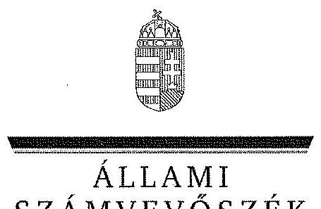
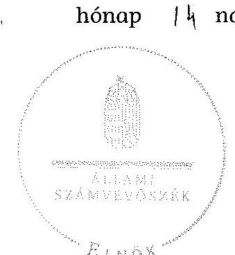
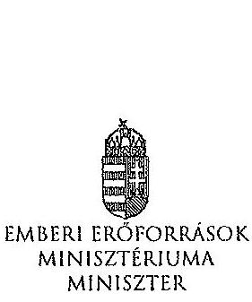
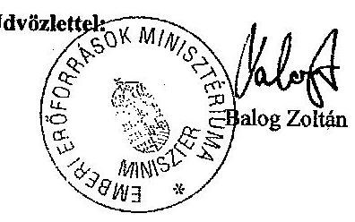
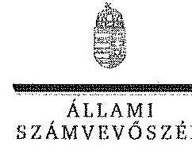
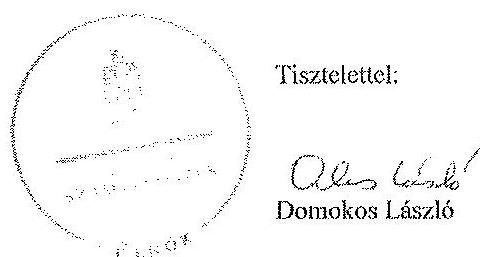
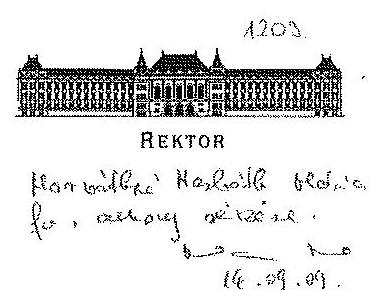
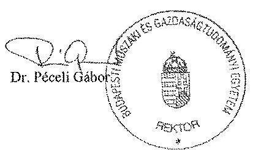
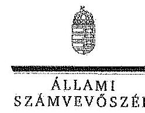
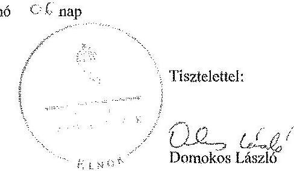

ÁLLAMI
SZÁMVEVŐSZÉK

# JELENTÉS 

a Budapesti Műszaki és Gazdaságtudományi Egyetem ellenőrzéséről - Az állami felsőoktatási intézmények gazdálkodásának, működésének ellenőrzése

---

# Állami Számvevőszék 

Iktatószám: V-0516-308/2014.
Témaszám: 1550
Vizsgálat-azonosító szám: V-065809

## Az ellenőrzést felügyelte:

Horváthné Herbáth Mária
felügyeleti vezető
Az ellenőrzést vezette:
Keresztes Tamás
ellenőrzésvezető
A számvevői jelentések feldolgozásában és a jelentés összeállításában közreműködtek:

Keresztes Tamás
ellenőrzésvezető
Béres László
számvevő
Zsigó Éva
számvevő asszisztens
Az ellenőrzést végezték:

| Béres László | Eötvös Magdolna | Kámán Edina |
| :-- | :-- | :-- |
| számvevő | számvevő tanácsos | számvevő tanácsos |
| Dr. Kelemen F. Balázs | Massányi Tibor | Szommer Virgil |
| számvevő | számvevő tanácsos | számvevő |

A témához kapcsolódó eddig készített számvevőszéki jelentések:
címe
sorszáma
Jelentés az oktatási és kulturális ágazat irányítási rendszerének, 1106 működésének ellenőrzéséről
Jelentés a felsőoktatás oktatási infrastruktúra-fejlesztési program- 1171 jának ellenőrzéséről
Jelentés az állami felsőoktatási intézmények érdekeltségébe tartozó 1290 gazdasági társaságok támogatásának és nyereségük hasznosulásának ellenőrzéséről

---

# TARTALOMJEGYZÉK 

BEVEZETÉS ..... 13
I. ÖSSZEGZŐ MEGÁLLAPÍTÁSOK, KÖVETKEZTETÉSEK, JAVASLATOK ..... 17
II. RÉSZLETES MEGÁLLAPÍTÁSOK ..... 27

1. A felsőoktatásért felelős minisztérium fenntartói és ágazati irányítói tevékenysége ..... 27
2. Az intézmény belső kontrollrendszerének kiépítése és működtetése ..... 28
3. Az intézmény pénzügyi gazdálkodása ..... 33
3.1. A kiadási és bevételi előirányzatok alakulása és a pénzügyi egyensúlyt befolyásoló tényezők ..... 33
3.2. A bevételi és kiadási előirányzatok megállapítása, módosítása, az előirányzat-maradványok kezelése ..... 38
3.3. A kiadási előirányzatok felhasználása ..... 39
3.4. A bevételi előirányzatok beszedése ..... 41
3.5. A normatív támogatások felhasználása, a hazai forrásból finanszírozott projektek, költségtérítések megállapítása ..... 42
4. Az intézmény vagyongazdálkodása ..... 44
4.1. A vagyongazdálkodás szabályozottsága ..... 47
4.2. A vagyonelemek kimutatása ..... 49
4.3. A vagyonelemekkel történő gazdálkodás ..... 54
5. Korábbi ÁSZ ellenőrzések javaslatainak hasznosulása ..... 58

---

# MELLÉKLETEK 

1. számú A Budapesti Műszaki és Gazdaságtudományi Egyetem kiadási és bevételi előirányzatai, azok teljesítése a 2009-2012. években
2. számú A Budapesti Műszaki és Gazdaságtudományi Egyetem kiadásainak, bevételeinek változása a 2009-2012. években
3. számú Kimutatás a Budapesti Műszaki és Gazdaságtudományi Egyetem bevételeiről és kiadásairól, valamint adósságszolgálatáról a 2009-2012. években
4. számú A Budapesti Műszaki és Gazdaságtudományi Egyetem mérlegadatai a 2009-2012. években
5. számú A Budapesti Műszaki és Gazdaságtudományi Egyetem gazdálkodása szabályszerűségének értékelése a mintatételek alapján
6. számú Az Emberi Erőforrások Minisztériumának észrevétele
7. számú Az Emberi Erőforrások Minisztériumának észrevételére adott válasz
8. számú A Budapesti Műszaki és Gazdaságtudományi Egyetem rektorának észrevétele
9. számú A Budapesti Műszaki és Gazdaságtudományi Egyetem rektorának észrevételére adott válasz

---

# RÖVIDÍTÉSEK JEGYZÉKE 

## Törvények

Áht. 1
Áht. 2
ÁSZ tv.
Feot.
Gt.
Kbt. 1
Kjt.
Mtv. 1
Mtv. 2
Nftv.
Nvtv.
Szja tv.
Sztv.
Tbj.

Vtv.
Korm. rendeletek
Áhsz.

Új Áhsz.
Ámr. 1
Ámr. 2
Ávr.
Ber.

Bkr.
Vtvr.
51/2007. (III. 26.)
Korm. rendelet
1992. évi XXXVIII. törvény az államháztartásról (hatálytalan 2012. január 1-jétől)
2011. évi CXCV. törvény az államháztartásról
2011. évi LXVI. törvény az Állami Számvevőszékről
2005. évi CXXXIX. törvény a felsőoktatásról (hatálytalan 2012. szeptember 1-jétől)
2006. évi IV. törvény a gazdasági társaságokról (hatálytalan 2014. március 15-étől)
2003. évi CXXIX. törvény a közbeszerzésekről (hatálytalan 2012. január 1-jétől)
1992. évi XXXIII. törvény a közalkalmazottak jogállásáról
1992. évi XXII. törvény a Munka Törvénykönyvéről
2012. évi I. törvény a munka törvénykönyvéről
2011. évi CCIV. törvény a nemzeti felsőoktatásról
2011. évi CXCVI. törvény a nemzeti vagyonról
1995. évi CXVII. törvény a személyi jövedelemadóról
2000. évi C. törvény a számvitelről
1997. évi LXXX. törvény a társadalombiztosítás ellátásaira és a magánnyugdíjra jogosultakról, valamint e szolgáltatások fedezetéről
2007. évi CVI. törvény az állami vagyonról
249/2000. (XII. 24.) Korm. rendelet az államháztartás szervezetei beszámolási és könyvvezetési kötelezettségének sajátosságairól
4/2013. (I.11.) Korm.rendelet az államháztartás számviteléről
217/1998. (XII. 30.) Korm. rendelet az államháztartás működési rendjéről (hatálytalan 2010. január 1-jétől)
292/2009. (XII. 19.) Korm. rendelet az államháztartás működési rendjéről (hatálytalan 2012. január 1-jétől)
368/2011. (XII. 31.) Korm. rendelet az államháztartásról szóló törvény végrehajtásáról
193/2003. (XI. 26.) Korm. rendelet a költségvetési szervek belső ellenőrzéséről (hatálytalan 2012. január 1-jétől)
370/2011. (XII. 31.) Korm. rendelet a költségvetési szervek belső kontrollrendszeréről és belső ellenőrzéséről 254/2007. (X. 4.) Korm. rendelet az állami vagyonnal való gazdálkodásról
a felsőoktatásban részt vevő hallgatók juttatásairól és az általuk fizetendő egyes térítésekről

---

50/2008. (III. 14.) Korm. rendelet

## Határozatok

1365/2011. (XI. 8.) Korm. határozat

## Egyéb rövidítések

áfa
ÁSZ
BME, egyetem
EGR
EMMI
FIR
GT
IFT
INTOSAI

ISO
KIM
Kincstár
MGR
MNV Zrt.
MTA
NAV
NEFMI
NEPTUN
NGM
OKM
OTKA
PM
PPP
SZFMR
a felsőoktatási intézmények képzési, tudományos célú és fenntartói normatíva alapján történő finanszírozásáról
a 2012. évi költségvetési hiánycél tartását biztosító további feladatokról
általános forgalmi adó
Állami Számvevőszék
Budapesti Műszaki és Gazdaságtudományi Egyetem
Egységes gazdálkodási rendszer
Emberi Erőforrások Minisztériuma
Felsőoktatási Információs Rendszer
Gazdasági Tanács
Intézményfejlesztési Terv
Legfőbb Ellenőrzési Intézmények Nemzetközi Szakmai Szervezete (International Organization of Supreme Audit Institutions)
Nemzetközi Szabványügyi Szervezet
Közigazgatási és Igazságügyi Minisztérium
Magyar Államkincstár
Műegyetemi Gazdálkodási Rendszer
Magyar Nemzeti Vagyonkezelő Zrt.
Magyar Tudományos Akadémia
Nemzeti Adó- és Vámhivatal
Nemzeti Erőforrás Minisztérium
Tanulmányi hallgatói információs rendszer
Nemzetgazdasági Minisztérium
Oktatási és Kulturális Minisztérium
Országos Tudományos Kutatási Alapprogramok
Pénzügyminisztérium
Public-Private Partnership (magán és közszféra együttműködése)
Szervezeti Felépítés és Működés Rendjéről szóló szabályzat

---

# FOGALOMTÁR 

alapító
állami felsőoktatási intézmény saját tulajdona
állami vagyon
állami vagyon hasznosítása

A központi költségvetési szerv alapítója az Országgyűlés, a Kormány vagy a miniszter. A felsőoktatási intézmények vonatkozásában az alapítói jogokat a felsőoktatásért felelős minisztérium gyakorolja.
A felsőoktatási intézmény saját bevételének a költségek teljes körű levonása - az adományozás és öröklés kivételével -, a rendelkezésre bocsátott vagyon állagának megóvásáról, pótlásáról való gondoskodás után fennmaradt része terhére szerzett vagyona.
A Vtv. 1. § (2) bekezdése szerint állami vagyonnak minősül:
a) az állami tulajdonban lévő ingó dolog, valamint a dolog módjára hasznosítható természeti erő,
b) az állami tulajdonban lévő termőföldekből álló, külön törvényben szabályozott Nemzeti Földalap,
c) az állami tulajdonban lévő - a b) pont hatálya alá nem tartozó - ingatlan,
d) az állami tulajdonban lévő értékpapír,
e) az államot megillető társasági részesedés és más vagyoni értékű jog;
(hatályos 2010. június 16-ig)
a) az állam tulajdonában lévő dolog, valamint a dolog módjára hasznosítható természeti erő,
b) az a) pont hatálya alá nem tartozó mindazon vagyon, amely vonatkozásában törvény az állam kizárólagos tulajdonjogát nevesíti,
c) az állam tulajdonában lévő tagsági jogviszonyt megtestesítő értékpapír, illetve az államot megillető egyéb társasági részesedés,
d) az államot megillető olyan immateriális, vagyoni értékkel rendelkező jogosultság, amelyet jogszabály vagyoni értékű jogként nevesít.
(hatályos 2010. június 17-től)
A Vtv. 23. § (1) bekezdése szerint: Az állami vagyont az MNV Zrt. maga kezeli, illetve szerződés - így különösen bérlet, haszonbérlet, szerződésen alapuló haszonélvezet, vagyonkezelés, megbízás - alapján központi költségvetési szervnek, természetes vagy jogi személynek, illetőleg jogi személyiséggel nem rendelkező gazdasági társaságnak hasznosításra átengedi.
(hatályos 2010. december 31-ig)
Az állami vagyont az MNV Zrt. maga kezeli, vagy szerződés - így különösen bérlet, haszonbérlet, szerződésen alapuló haszonélvezet, vagyonkezelés, megbízás - alapján központi költségvetési szervnek, természetes vagy

---

állami vagyon hasznosítására kötött szerződés
állami vagyon használója
állami vagyon értékesítése
állami vagyon kezelője /vagyonkezelő
jogi személynek, vagy jogi személyiséggel nem rendelkező gazdálkodó szervezetnek hasznosításra átengedi.
(hatályos 2011. december 31-ig)
Az állami vagyont az MNV Zrt. maga kezeli, vagy szerződés - így különösen bérlet, haszonbérlet, megbízás alapján központi költségvetési szervnek, természetes vagy jogi személynek, vagy jogi személyiséggel nem rendelkező gazdálkodó szervezetnek hasznosításra átengedi.
(hatályos 2012. január 1-jétől)
A Vtv. 23. § (2) bekezdése szerint: Az állami vagyon hasznosítására kötött szerződések elsődleges célja az állami vagyon hatékony működtetése, állagának védelme, értékének megőrzése, illetve gyarapítása, az állami és közfeladatok ellátásának elősegítése.
A Vtvr. 1. § (7) a. pontja szerint: Az a természetes személy, jogi személy, illetve jogi személyiséggel nem rendelkező gazdasági társaság, amely a Magyar Nemzeti Vagyonkezelő Zártkörűen Működő Részvénytársasággal (a továbbiakban: MNV Zrt.) kötött szerződés alapján, bármely jogcímen (bérlet, haszonbérlet, vagyonkezelés, használat stb.) állami vagyont birtokol, használ, hasznosít.
(hatályos 2010. december 31-ig)
Az a természetes személy, jogi személy, illetve jogi személyiséggel nem rendelkező szervezet, amely, illetve aki törvény vagy szerződés alapján, bármely jogcímen (pl. bérlet, haszonbérlet, vagyonkezelési szerződés, használat stb.) állami vagyont birtokol, használ, szedi annak hasznait, hasznosít, ide nem értve a tulajdonosi jogok gyakorlóját.
(hatályos 2011. január 1-jétől 2011. december 31-ig)
Az a természetes vagy jogi személy, jogi személyiséggel nem rendelkező szervezet, aki vagy amely törvény vagy szerződés alapján, bármely jogcímen (bérlet, haszonbérlet, használat stb.) állami vagyont birtokol, használ, szedi annak hasznait, hasznosít, ide nem értve a haszonélvezőt, a vagyonkezelőt és a tulajdonosi jogok gyakorlóját.
(hatályos 2012. január 1-jétől)
Állami vagyon tulajdonjogának bármely jogcímen történő, visszterhes átruházása. (Vtvr. 1. § (7) d) pont)
A Vtv. 23. § (1) bekezdése szerint: Az állami vagyont az MNV Zrt. maga kezeli, vagy szerződés - így különösen bérlet, haszonbérlet, szerződésen alapuló haszonélvezet, vagyonkezelés, megbízás - alapján központi költségvetési szervnek, természetes vagy jogi személynek, illetőleg jogi személyiséggel nem rendelkező gazdasági társaságnak hasznosításra átengedi. (hatályos 2010. január 1-

---

jétől 2010. december 31-ig)
Az állami vagyont az MNV Zrt. maga kezeli, vagy szerződés - így különösen bérlet, haszonbérlet, szerződésen alapuló haszonélvezet, vagyonkezelés, megbízás - alapján központi költségvetési szervnek, természetes vagy jogi személynek, illetőleg jogi személyiséggel nem rendelkező gazdálkodó szervezetnek hasznosításra átengedi. (hatályos 2011. január 1-jétől 2011. december 31-ig)
Az állami vagyont az MNV Zrt. maga kezeli, vagy szerződés - így különösen bérlet, haszonbérlet, megbízás alapján központi költségvetési szervnek, természetes vagy jogi személynek, vagy jogi személyiséggel nem rendelkező gazdálkodó szervezetnek hasznosításra átengedi. Az állami vagyonra vonatkozóan az MNV Zrt. kizárólag az Nvtv.-ben meghatározott személyekkel köthet vagyonkezelési szerződést.
(hatályos 2012. január 1-jétől)
autonómia
belső kontrollrendszer

CLF-módszer
előirányzat-maradvány
fenntartó
A felsőoktatási intézmény Feot.-ban, illetve Nftv.-ben szabályozott önrendelkezése, amely biztosítja az intézmény önálló oktatási, kutatási, szervezeti és működési, valamint gazdálkodási tevékenységét.
A belső kontrollrendszer a kockázatok kezelése és tárgyilagos bizonyosság megszerzése érdekében kialakított folyamatrendszer, amely azt a célt szolgálja, hogy megvalósuljanak a következő célok:
a) a működés és gazdálkodás során a tevékenységeket szabályszerűen, gazdaságosan, hatékonyan, eredményesen hajtsák végre,
b) az elszámolási kötelezettségeket teljesítsék, és
c) megvédjék az erőforrásokat a veszteségektől, károktól és nem rendeltetésszerű használattól.
A módszer a működési és a felhalmozási költségvetés bevételeinek és kiadásainak, ezek egyenlegeinek elkülönített, majd összevont kimutatását alkalmazza valamely költségvetési intézmény pénzügyi helyzetének megítéléséhez. Kiemelten mutatja be a finanszírozási műveletek egyenlege nélküli és az azt magába foglaló pénzügyi pozíciót, valamint a tőketörlesztéssel, értékpapírbeváltással csökkentett működési jövedelmet.
Az értékelés a pénzügyi kapacitás fogalmát helyezi a középpontba.
Államháztartás központi alrendszerébe tartozó költségvetési szerveknél a módosított bevételi és kiadási előirányzatok és azok teljesítésének a Kormány rendeletében meghatározott tételekkel korrigált különbözete az előirányzat-maradvány. (Áht. 2. § (1) bekezdés m) pontja)
A Feot. 7. § (2) és az Nftv. 4. § (2) bekezdése szerint az, aki az alapítói jogot gyakorolja, ellátja a felsőoktatási intézmény fenntartásával kapcsolatos feladatokat.

---

finanszírozási műveletek nélküli pozíció

Gazdasági Tanács
hároméves fenntartói megállapodás
információs és kommunikációs rendszer
intézményfejlesztési terv
integritás
kincstári biztos

A CLF módszer szerint számított működési és felhalmozási tevékenység pénzügyi egyenlegének összevont értéke. Megmutatja, hogy a költségvetési intézmény bevételei fedezetet biztosítottak-e a kiadásokra. A finanszírozási műveletek nélküli (GFS) pozíció alapján a pénzügyi helyzetet akkor tekintettük megfelelőnek, ha az adott év működési és felhalmozási bevételei fedezetet nyújtottak az adott év működési és felhalmozási kiadásaira.
A felsőoktatási intézmény javaslattevő, véleményező, a stratégiai döntések előkészítésében részt vevő és a döntések végrehajtásának ellenőrzésében közreműködő szerve. Az állami felsőoktatási intézmények központi költségvetési támogatására hároméves fenntartói megállapodást kell kötni az állami felsőoktatási intézmény
 és a fenntartó között. A fenntartói megállapodás tartalmazza a felsőoktatási intézmény által meghatározott hároméves időszakra vállalt teljesítménykövetelményeket, továbbá az állandó jellegű támogatási részeket, valamint a változó jellegű támogatások megállapításának jogcímeit. A változó elemű támogatás évenkénti elszámolási kötelezettséggel kerül meghatározásra.
A költségvetési szerv vezetője köteles olyan rendszereket kialakítani és működtetni, melyek biztosítják, hogy a megfelelő információk a megfelelő időben eljussanak az illetékes szervezethez, szervezeti egységhez, illetve személyhez.
A szenátus fogadja el az intézményfejlesztési tervet. Az intézményfejlesztési tervben kell meghatározni a fejlesztéssel, a fenntartó által a felsőoktatási intézmény rendelkezésére bocsátott vagyon hasznosításával, megóvásával, elidegenítésével kapcsolatos elképzeléseket, a várható bevételeket és kiadásokat. Az intézményfejlesztési tervet középtávra, legalább négyéves időszakra kell elkészíteni, évenkénti bontásban meghatározva a végrehajtás feladatait. Az intézményfejlesztési terv része a foglalkoztatási terv. A foglalkoztatási tervben kell meghatározni azt a létszámot, amelynek keretei között a felsőoktatási intézmény megoldhatja feladatait. (Feot. 27. § (3) bekezdés)
Az integritás olyasvalakit vagy valamit jelöl, aki vagy ami romlatlan, sértetlen, feddhetetlen. Az integritás elvek, értékek, cselekvések, módszerek, intézkedések konzisztenciáját jelenti: olyan magatartásmódot, amely meghatározott értékeknek megfelel.
A kincstári biztos kijelölését az államháztartásért felelős miniszternél a Kincstár kezdeményezi. A kincstári biztos köteles figyelemmel kísérni megbízatásának időpontjától kezdve a költségvetési szerv tervezését, gazdálkodását, beszámolását, a jogszabályokban előírt feladatainak ellátását, feltárni azokat az okokat, amelyek a tartós

---

kincstári költségvetés
kockázatkezelési rendszer
kontrollkörnyezet
kontrolltevékenység
költségvetési főfelügye-
lő, felügyelő
kisebbségi jogokat biztosító részesedés
maximális hallgatói
fizetésképtelenséghez vezettek, a szükséges intézkedések azonnali végrehajtására irányuló intézkedési tervet készíteni, azonnali intézkedéseket kezdeményezni, és írásbeli utasításokat kiadni a tartozásállomány felszámolására, a gazdálkodás egyensúlyának biztosítására, a követelések behajtására. (Ávr. 116-117. §)
A központi költségvetésről szóló törvény elfogadását követően a fejezetet irányító szerv az államháztartás központi alrendszerébe tartozó költségvetési szerv és a fejezeti kezelésű előirányzat kiemelt előirányzatait, valamint az elkülönített állami pénzalapok és a társadalombiztosítás pénzügyi alapjai jogszabályi előírás szerinti bevételeit és kiadásait kincstári költségvetés kiadásával állapítja meg. (Áht. 24. § (3) bekezdés, Áht. 28. § (2) bekezdés, Ávr. 31. § (2) bekezdés)
Irányítási eszközök és módszerek összessége, melynek elemei a szervezeti célok elérését veszélyeztető tényezők (kockázatok) azonosítása, elemzése, csoportosítása, nyomon követése, valamint szükség esetén a kockázati kitettség mérséklése.
A kontrollkörnyezet a költségvetési szerv vezetőinek a szervezeti célok elérését segítő kontrollok kialakításával és működtetésével, korszerűsítésével kapcsolatos magatartását, a kontrollpontokról érkező információkra való reagálását jelenti.
Azok az elvek, politikák és eljárások, amelyeket a kockázatok meghatározása és a szervezet céljainak elérése érdekében alakítanak ki.
A költségvetési szerv vezetője köteles a szervezeten belül kontrolltevékenységeket kialakítani, amelyek biztosítják a kockázatok kezelését, hozzájárulnak a szervezet céljainak eléréséhez.
Az államháztartásért felelős miniszter a Kormány irányítása alá tartozó fejezetet irányító szervhez, a Kormány irányítása vagy felügyelete alá tartozó költségvetési szervhez, valamint az elkülönített állami pénzalapok és a társadalombiztosítás pénzügyi alapjai kezelő szerveihez költségvetési főfelügyelőt, felügyelőt rendelhet ki. A költségvetési főfelügyelő, felügyelő a gazdálkodás költségvetés-politikával való összhangja és a takarékos, szabályszerű, eredményes működés érdekében a Kormány rendeletében meghatározott intézkedéseket tehet, így különösen előzetesen véleményezi a kötelezettségvállalásra irányuló eljárásokat, és a nagy összegű kötelezettségvállalások tekintetében kifogással élhet. (Áht. 39. § (1)-(2) bekezdés)

A részesedés mértéke legalább 5\%. (Gt. 49. §)
Az a felsőoktatási intézmény alapító okiratában, működési engedélyében meghatározott hallgatói létszám,

---

létszám
mértékadó befolyást biztosító részesedés minisztérium
minősített többséget biztosító részesedés
monitoring
működési jövedelem
normatív költségvetési támogatás felsőoktatási intézmények működéséhez
normatív támogatások
saját bevétel
ameddig terjedően a felsőoktatási intézmény - figyelembe véve a hallgatók fogadásához és az oktatói tevékenység folytatásához rendelkezésre álló személyi feltételeket, helyiségeket és eszközöket - valamennyi évfolyamára számítva, teljes kihasználtsággal működve hallgatói jogviszonyt létesíthet.
A részesedés mértéke legalább 20\%, de 50\%-nál kisebb. (Sztv. 3. § (2) bekezdés 4. pont)
A felsőoktatásért felelős minisztérium, amely 2009-től 2010 májusáig az OKM, 2010 májusától 2012 májusáig a NEFMI, 2012 májusától az EMMI volt.
A minősített befolyásszerző az ellenőrzött társaságban a szavazatok legalább hetvenöt százalékával rendelkezik. (Gt. 52. § (2) bekezdés)
A különböző szintű szervezeti célok megvalósításához szükséges folyamatok figyelemmel kísérése, melynek során a releváns eseményekről és tevékenységekről (együtt: folyamatokról) rendszeres jelleggel, strukturált, döntéstámogató információkhoz jutnak a szervezet vezetői.
A folyó bevételek és folyó kiadások egyenlege. Azt mutatja, hogy a folyó bevételek fedezetet nyújtanak-e a folyó kiadásokra.
A felsőoktatási intézmények működéséhez biztosított normatív költségvetési támogatás lehet
a) hallgatói juttatásokhoz nyújtott,
b) képzési,
c) tudományos célú,
d) fenntartói,
e) egyes feladatokhoz nyújtott
támogatás. A központi költségvetésből biztosított normatív költségvetési támogatásra - a d) pontban meghatározott normatív költségvetési támogatás kivételével - a felsőoktatási intézmények azonos feltételek alapján válnak jogosulttá. Az a)-e) pontokban meghatározott jogcímek - az a) és e) pontban meghatározott jogcímek kivételével - nem jelentenek felhasználási kötöttséget. (Feot. 127. § (3) bekezdés)
Az ellenőrzési időszakban hatályos költségvetési törvények 3. számú mellékletében megjelölt közoktatási hozzájárulások, az 5. mellékletében megjelölt központosított előirányzatok, továbbá a 8. mellékletében megjelölt normatív, kötött felhasználású támogatások együttesen. Az államháztartáson kívüli források - beleértve minden olyan, az Európai Uniótól származó támogatást, amelyhez nem az állami költségvetésen keresztül jut a felsőoktatási intézmény, továbbá a szakképzési hozzájárulási fizetési kötelezettség teljesítéseként elszámolt forrásokat is, ide nem értve az állami vagyon értékesítésének ellen-

---

szenátus
tárgyévi pénzügyi pozíció
többségi befolyást biztosító részesedés
értékét -, valamint a Kutatási és Technológiai Innovációs Alapból származó bevételek.
A felsőoktatási intézmény döntést hozó és a döntés végrehajtását ellenőrző testülete. (Feot. 20. § (1) bekezdés)
A működési és felhalmozási bevételek, valamint kiadások egyenlege a finanszírozási műveletek egyenlegének figyelembe vételével.
A Ptk. 685/B. § (1) bekezdése szerint többségi befolyás: az olyan kapcsolat, amelynek révén természetes személy, jogi személy vagy jogi személyiség nélküli gazdasági társaság (a továbbiakban együtt: befolyással rendelkező) egy jogi személyben a szavazatok több mint ötven százalékával vagy meghatározó befolyással rendelkezik.

---

.

---

# JELENTÉS 

## a Budapesti Műszaki és Gazdaságtudományi Egyetem ellenőrzéséről - Az állami felsőoktatási intézmények gazdálkodásának, működésének ellenőrzése

## BEVEZETÉS

Az Állami Számvevőszék a 2013. évtől fokozott figyelmet fordít az államháztartási rendszer kormányváltást követően elkezdődött átalakítására, amely a felsőoktatás intézményrendszerét is érintette.

Az ellenőrzéssel érintett időszakban az állami felsőoktatási intézmények gazdálkodását - az Áht-1 és Áht-2 előírásai mellett - a felsőoktatásról szóló 2005. évi CXXXIX. törvény (Feot.), valamint az azt hatályon kívül helyező, a nemzeti felsőoktatásról szóló 2011. évi CCIV. törvény (Nftv.) előírásai határozták meg. A Feot. végrehajtásának ellenőrzését az Állami Számvevőszék a 2005-2008 közötti időszakra elvégezte, jelen ellenőrzésünk a 2009-2012. évek áttekintésére irányult. Az Nftv. törvényjavaslatának általános indokolása szerint a felsőoktatás addigi szabályozása nehezen áttekinthető, ellentmondásokkal terhelt, szakmai és ellenőrzési szempontból túlszabályozott volt. Az egyes intézménytípusok céljainak és feladatainak meghatározása nem volt egyértelmű, az intézmények belső működési mechanizmusa bonyolult volt.

Az állami felsőoktatási intézmények közpénzfelhasználása jelentős. A 2009-2012. években az Emberi Erőforrások Minisztériuma és a Közigazgatási és Igazságügyi Minisztérium által fenntartott felsőoktatási intézmények teljesített kiadásai együttesen 1881 Mrd Ft-ot tettek ki, amelyhez az állam 752 Mrd Ft költségvetési támogatást biztosított. A Feot. előírásai a pénzügyi és vagyongazdálkodási területeken bármely más költségvetési szervhez képest nagyobb önállóságot biztosítottak a felsőoktatási intézmények számára. Az önállósággal azonban nem minden esetben tudtak élni az intézmények. Több intézmény pénzügyi egyensúlya megingott, azok mintegy feléhez költségvetési felügyelők, illetve főfelügyelők kirendelése vált szükségessé.

Magyarország Nemzeti Reform Programja keretében a Széll Kálmán Terv 2020-ig a 30-34 évesek körében a felsőfokú vagy annak megfelelő végzettséggel rendelkezők arányának 30,3\%-ra való növelését irányozta elő, amely a 2010. évihez képest 4,6\% pontos növekedési célkitűzést jelent. Szükség van arra, hogy a cél elérése érdekében a rendelkezésre álló források szabályozott, átlátható, törvényesen működő intézményi környezetbe kerüljenek. A rendezett gazdasági környezet, az önállósággal élni tudó, felelős, elszámoltatható intézményi gazdálkodás elengedhetetlen feltétele a kitűzött szakmai célok elérésének.

---

A hazai felsőoktatás hallgatói létszáma 2009-2012 között 8,6\%-kal, 370 331 főről 338 467 főre ${ }^{1}$ csökkent. A felsőoktatási intézmények működési engedélyében szereplő maximális hallgatói létszámadatok szerint 498 413 férőhely ${ }^{2}$ állt rendelkezésre a 2012-évben, ami 67,9\%-os kapacitáskihasználtságot mutatott.

Az ellenőrzés eredményeként képet kapunk a Budapesti Műszaki és Gazdaságtudományi Egyetem pénzügyi helyzetéről; az oktatási és egyéb tevékenységek bevételeinek, kiadásainak, költségeinek elkülönítéséről, átláthatóságáról és szabályszerűségéről; az intézmény gazdálkodási szabadságának pénzügyi és vagyoni helyzetre gyakorolt hatásairól; a vagyonnal való felelős, értékmegőrző gazdálkodás érvényesüléséről és a belső kontrollrendszer működéséről.

A felsőoktatási ágazat intézményeinek azonos ellenőrzési program alapján lefolytatott ellenőrzése eredményeként megállapításaink és összegzéseink alapul szolgálnak a felsőoktatás stratégiai környezetének és céljainak megalapozásához, a fenntartói, ágazati irányítói célkitűzéseinek visszacsatolásához, az esetleges jogszabályi változtatások kezdeményezéséhez. Az intézmények számára visszajelzést adnak a gazdálkodás szabályszerűségéről, a jó gyakorlatok megismerése hozzájárul a gazdálkodási fegyelem és színvonal javításához.

Az ellenőrzés célja annak megállapítása volt, hogy szabályos volt-e az állami felsőoktatási intézmény pénzügyi és vagyongazdálkodása, biztosított volt-e a vagyonnal való felelős gazdálkodás követelményének érvényesülése, jogszabályi előírásoknak megfelelően működött-e a belső kontrollrendszer, valamint a fenntartó tevékenysége a jogszabályi előírásoknak megfelelt-e.

Ennek keretében értékeltük a Budapesti Műszaki és Gazdaságtudományi Egyetem ellenőrzése során:

- a fenntartói és ágazati irányítási jogok gyakorlásának, a felsőoktatási intézmény működéséhez kapcsolódó információs rendszer működtetésének az előírásoknak való megfelelőségét;
- az intézmény belső kontrollrendszere jogszabályoknak megfelelő kialakítását, az intézményi külső (felügyeleti, KEHI, hatósági) és belső ellenőrzések megállapításainak hasznosulását;
- az intézmény pénzügyi gazdálkodásának az előírásoknak való megfelelőségét, az oktatási és egyéb tevékenységek bevételei, kiadásai elkülönítésének, átláthatóságának, szabályszerűségének és elszámoltathatóságának az előírásoknak való megfelelőségét;
- az intézmény vagyongazdálkodása előírásoknak való megfelelőségét;
- az ellenőrzött időszakban végzett ÁSZ ellenőrzések által tett javaslatok hasznosulását.

[^0]
[^0]:    ${ }^{1}$ EMMI: Oktatási évkönyv 2012/2013.
    ${ }^{2}$ Forrás: Oktatási Hivatal.

---

A pénzügyi és vagyongazdálkodás terén az egyes területek szabályszerű működését mintavétellel ellenőriztük, ez alapján a sokaságokban előforduló hibás tételek arányát becsültük. A jogszabályoknak és a belső előírásoknak megfelelőnek, azaz szabályszerűnek tekintettük az adott kiadási előirányzat felhasználását, bevétel beszedését, mérlegtétel értékelését, amennyiben a minta ellenőrzésének eredménye alapján 95\%-os bizonyossággal a teljes sokaságban a hibás tételek aránya kisebb volt, mint 10\%, nem megfelelőnek értékeltük, ha a hibás tételek aránya a 10\%-ot meghaladta. Kockázatot, illetve magas kockázatot jeleztünk, amennyiben egy adott terület vonatkozásában a minta alapján a teljes sokaságban nem volt teljes körűen biztosított a jogszabályoknak és a belső szabályzatoknak megfelelő működés. A mintatételek kiértékelését az 5. számú melléklet tartalmazza.

A belső kontrollrendszer kialakításának és működtetésének értékelését a vonatkozó jogszabályi előírások alapján készített munkalapok, valamint az ellenőrzés gyakorlati tapasztalatai alapján végeztük el. Az értékelés során a jogszabályi előírások mellett az Ámr. 145/A. § (1) és (3) bekezdése, az Ámr. 155. § (3) bekezdése, valamint a Bkr. 5. § (1) bekezdése alapján figyelembe vettük az államháztartásért felelős miniszter által kiadott irányelvekben és módszertani útmutatókban ${ }^{3}$ foglaltakat is. A belső kontrollrendszert az értékelés során
 legalább 85%-os megfelelőség esetén megfelelőnek, legalább 70%-os megfelelőség esetén részben megfelelőnek, 70%-os megfelelőség alatt pedig nem megfelelőnek minősítettük.

Az ellenőrzés típusa: szabályszerűségi ellenőrzés.
Az ellenőrzött időszak: 2009. január 1. - 2012. december 31.
A helyszíni ellenőrzés ideje: 2014. április 10. - 2014. június 6.
Az ellenőrzéssel érintett szervezetek: az Emberi Erőforrások Minisztériuma és a Budapesti Műszaki és Gazdaságtudományi Egyetem

Az ellenőrzés jogszabályi alapját az Állami Számvevőszékről szóló 2011. évi LXVI. törvény 1. § (3) bekezdése, az 5. § (3)-(6) bekezdései, valamint az Államháztartásról szóló 2011. évi CXCV. törvény 61. § (2) bekezdésének előírásai képezik.

Az ellenőrzés során vizsgálni kellett minden olyan körülményt, információt, adatot, amely a program végrehajtása során felmerül, a pénzügyi és vagyoni helyzet szabályosságának megítélésére hatást gyakorol, az ellenőrzés céljával releváns módon összefüggésben van és a tények megalapozásához szükséges. Az ellenőrzés az INTOSAI által kiadott nemzetközi standardok figyelembe vételével, az ellenőrzési programban foglalt értékelési szempontok szerint történt.

Az ÁSZ a 2011. évi LXVI. törvény 29. §-a szerint a jelentéstervezetet megküldte az emberi erőforrások miniszterének és a Budapesti Műszaki és Gazdaságtudományi Egyetem rektorának. A beérkezett észrevételeket és az azokra adott válaszokat a jelentés 6-9. számú mellékletei tartalmazzák.

A BME (Budapesti Műszaki és Gazdaságtudományi Egyetem) a 2009-2012. évek között önállóan működő és gazdálkodó központi költségvetési szerv volt. Az intézmény székhelye Budapest. Az egyetemen az ellenőrzött időszakban nyolc kar működött: Építőmérnöki Kar, Gépészmérnöki Kar, Építészmérnöki Kar, Vegyészmérnöki és Biomérnöki Kar, Villamosmérnöki és Informatikai Kar, Közlekedésmérnöki és Járműmérnöki Kar, Természettudományi Kar és Gazdaság- és Társadalomtudományi Kar. A karokon bölcsészettudományi, gazdaságtudományi, informatikai, műszaki, társadalomtudományi, természettudományi és pedagógusképzés folyt. Az ellenőrzött időszakban nem érintette az intézményt átalakulás. Az egyetemhez a 2010. évben költségvetési főfelügyelőt rendeltek ki.

A BME főbb gazdálkodási, vagyoni és létszám adatai:

| Megnevezés | Főbb gazdálkodási és vagyoni adatok (ezer Ft) |  |  |  | Változás   2012/2009.   (%) |
| :--: | :--: | :--: | :--: | :--: | :--: |
|  | 2009. | 2010. | 2011. | 2012. |  |
| KIADÁSI FŐÖSSZEG | 30639981 | 31190360 | 34848142 | 35684951 | 116,5 |
| Személyi juttatások és járulékok | 15478708 | 15331854 | 16017760 | 15791968 | 102,0 |
| Dologi kiadások | 8516527 | 9397677 | 10301432 | 11051406 | 129,8 |
| Felhalmozási kiadások | 3227853 | 3345807 | 5253867 | 5562533 | 172,3 |
| BEVÉTELI FŐÖSSZEG | 33212913 | 43573349 | 46769852 | 44311776 | 133,4 |
| Költségvetési támogatások | 16062914 | 15629335 | 15646182 | 14574081 | 90,7 |
| Saját és átvett bevételek | 14831911 | 15681569 | 18740681 | 17815985 | 120,1 |
| Előirányzat maradvány felhasználás | 2318088 | 12262445 | 12382989 | 11921710 | 514,3 |
| Támogatások aránya (%) | 48 | 36 | 33 | 33 | 68,0 |
| Mérlegfőösszeg* | 35242439 | 40674849 | 43260480 | 41112323 | 116,7 |
| Éves átlagos statisztikai állományi létszám (fő) | 2722 | 2732 | 2807 | 2745 | 100,8 |
| Oktatói létszám (fő) | 1129 | 1238 | 1247 | 1259 | 111,5 |
| Hallgatói létszám (fő)** | 23220 | 23675 | 24035 | 24227 | 104,3 |

* december 31-i adatok
**október 15-i adatok

---

# I. ÖSSZEGZŐ MEGÁLLAPÍTÁSOK, KÖVETKEZTETÉSEK, JAVASLATOK 

Az ellenőrzött időszakban a felsőoktatásért felelős minisztérium (OKM, NEFMI, EMMI) a jogszabályi előírásoknak megfelelően gyakorolta fenntartói feladatait.

Alapítói jogosultságai keretében szabályszerűen adta ki az egyetem jogszabályi és szervezeti változásoknak megfelelően módosított alapító okiratát. Az alapító okirat változásai miatt az egyetem által elkészített és megküldött SZFMR módosításokat a fenntartó felülvizsgálta.

A minisztérium egyéb fenntartói feladatait is szabályosan látta el.
A minisztérium közreműködött az egyetem éves költségvetésének tervezésében, meghatározta a kiemelt költségvetési előirányzatait, és megállapította a kincstári költségvetését. Elvégezte az intézmény éves költségvetési, illetve gazdálkodási beszámolóinak ellenőrzését. A jogszabályoknak megfelelően gyakorolta az egyetem felső vezetőinek kinevezésével, illetve megbízásával kapcsolatos jogosultságait. Megkötötte az intézménnyel a 2008-2010. évekre vonatkozóan a fenntartói megállapodást, melyben az egyetem által választott teljesítménymutatók is szerepeltek. A fenntartó a megállapodásban foglaltak végrehajtását évente értékelte. A minisztérium fenntartói hatáskörében felülvizsgálta a BME 2012-2016. évekre szóló intézményfejlesztési tervét, azonban arra hivatalos észrevételt nem tett.

Az ellenőrzött időszakban a fenntartó két ellenőrzést végzett az egyetem gazdálkodását érintően. Az ellenőrzés során tett javaslatok hasznosultak, hozzájárultak az intézmény belső kontrollrendszerének javításához, így a szabályszerű működéshez.

A minisztérium az ágazati irányítási feladatait a 2009-2012. években nem látta el teljes körűen.

Elmaradt az oktatási ágazatra vonatkozóan a nemzetgazdasági miniszter irányításával és az oktatásért felelős miniszter részvételével, kormányhatározatban előírt szervezeti és feladatellátási felülvizsgálati program kidolgozása. A felsőoktatási törvény rendelkezései ellenére nem készíttetett a felsőoktatás rendszere vonatkozásában a Kormány által elfogadott középtávú fejlesztési tervet.

A minisztérium a Felsőoktatási Információs Rendszer (FIR) biztonságos üzemeltetéséhez, az adatok védelméhez szükséges alapvető szervezeti, szabályozási kontrollokat a 2012. év végéig nem teljes körűen alakíttatta ki az Oktatási Hivatallal. A rendszerbe bevitt alapadatok nem voltak ellenőrzöttek, a rendszerbe épített adatellenőrzés hibajelzései nem voltak kellően konkrétak, illetve a FIR a személyi többszöröződéseket nem szűrte megfelelően.

---

A BME belső kontrollrendszerének kialakítása és működtetése részben felelt meg a vonatkozó jogszabályi előírásoknak. Ezen belül a kontrollkörnyezet kialakítása és a monitoring rendszer részben megfelelő, a kockázatkezelés és a kontrolltevékenység alkalmazása nem megfelelő, az információs és kommunikációs rendszer megfelelő volt. Az ellenőrzött időszakban a belső kontrollrendszer kialakításában javulás volt tapasztalható. A rektor a 2009-2012. években évente értékelte a belső kontrollok kialakítását és működését, valamint erről nyilatkozatot tett a fenntartó felé, amely nem volt teljes körűen összhangban a kontrollrendszer tényleges működésével.

Az intézmény kontrollkörnyezetének kialakítása a jogszabályi előírásoknak nem minden tekintetben felelt meg. A 2010-2012. években nem szabályozták a közbeszerzési értékhatárt el nem érő beszerzések lebonyolítását, a közérdekű adatok megismerésére irányuló kérelmek intézésének, továbbá a kötelezően közzéteendő adatok nyilvánosságra hozatalának rendjét. Az intézmény 2011 novemberéig nem rendelkezett önköltségszámítási szabályzattal, és a 2009-2010. években nem készítették el az eszközök és források értékelési szabályzatát.

Az egyetem a gazdálkodás szempontjából meghatározó belső szabályzatait több esetben nem aktualizálta a jogszabályi változásoknak megfelelően, így a számviteli politikát, a számlarendet, a leltározási és leltárkészítési szabályzatot, a pénzkezelés rendjét, a gazdálkodási szabályzatot, az ellenőrzési nyomvonalat, a közbeszerzési és az informatikai biztonsági szabályzatot, a kötelezettségvállalás rendjéről, valamint a kötelezettségvállalás, utalványozás szabályairól szóló rektori utasítást. A belső szabályzatok egy része nem minden tekintetben felelt meg a vonatkozó jogszabályi előírásoknak.

A BME vezetője nem megfelelő kockázatkezelési rendszert alakított ki és működtetett. A kockázatkezelési szabályzatban teljesen általánosan határozták meg a kockázatkezelési rendszer kereteit és a leggyakrabban előforduló kockázatokat, azok nem követték a szervezet sajátosságait. A szabályzat konkrét eljárási szabályokat nem rögzített, nem adott pontos iránymutatást az érintettek feladataira és hatáskörére vonatkozóan. Nem határozták meg a kockázatokkal kapcsolatos válaszlépéseket, a hozott intézkedések hatásának, hatékonyságának és gazdaságosságának felülvizsgálati módszerét. A válaszintézkedéseket nem építették be a folyamatokba. Az egyetemnél nem történt meg teljes körűen a kockázatok dokumentált felmérése, értékelése.

Az intézmény vezetője a kontrolltevékenységgel kapcsolatos szabályozási kereteket megfelelően kialakította, azonban a kontrolltevékenységek alkalmazása nem volt megfelelő. A kontrolltevékenység nem megfelelő működtetése, a gazdálkodási jogkörök gyakorlásának hiányosságai a pénzügyi és a vagyongazdálkodás területén szabálytalanságokat okoztak.

Az intézmény nyomonkövetési (monitoring) rendszere a 2010-2012. években a belső ellenőrzési rendszer hiányosságai miatt részben működött megfelelően. Az intézkedési javaslattal érintett belső ellenőrzések egynegyedénél az ellenőrzött szervezeti egységek nem készítettek intézkedési tervet. Az elkészült intézkedési tervek több mint fele nem volt megfelelő, mert nem tartalmazta a határidő, illetve a felelősök megjelölését. A belső ellenőrzés az intézkedési terveket -

---

néhány kivételtől eltekintve - nem véleményezte. Mindezek miatt a belső ellenőrzések megállapításai nem minden esetben hasznosultak.

A belső kontrollrendszeren túlmutató integritás kontrollok szabályozásában és működtetésében az ellenőrzött időszakban nem történt lényeges változás, minden évben hasonló hiányosságokat tapasztaltunk. A BME az integritás kontrollokra vonatkozóan 15 területből kilenc területet szabályozott. Hiányosság volt, hogy nem végeztek rendszeresen korrupciós kockázatelemzést, a szakemberek kiválasztásához nem alkalmaztak standardizált módszereket, valamint nem határoztak meg követendő eljárásokat az összeférhetetlenség kialakulása esetére. Nem szabályozták továbbá az ajándékok, meghívások elfogadásának, valamint a közérdekű bejelentések eljárásrendjét. Az integritás kontrollokat 10 területből nyolc területnél működtették. Nem végeztek korrupciós kockázatelemzéseket, és az új munkatársak felvétele nem minden esetben történt álláspályázat kiírásával.

Az intézmény pénzügyi egyensúlya a 2009-2012. években biztosított volt. A BME likviditási hitelt és támogatási kölcsönt nem vett fel, a likviditás biztosítása érdekében a finanszírozási tervtől eltérő, előrehozott támogatást nem igényelt.

A stabil pénzügyi helyzetet mutatja, hogy az egyetem eladósodási, likviditási és pénzeszköz-likvidítási mutatója az ellenőrzött időszakban összességében pozitívan változott. A forgóeszközök év végi állománya valamennyi ellenőrzött évben fedezetet nyújtott a rövid lejáratú kötelezettségek teljesítéséhez.

Az egyetem pénzügyi gazdálkodása nem minden tekintetben volt szabályszerű.

A BME a kiadási és bevételi előirányzatok tervezése során a jogszabályokban és a fenntartó által kiadott tervezési irányelvekben foglaltak szerint járt el. Az előirányzat-maradvány kimutatása és felhasználása szabályszerűen történt.

Az előirányzat-módosítások során nem érvényesültek teljes körűen a jogszabályok és a belső szabályok előírásai. Ez szabályszerűségi kockázatot jelez az ellenőrzött terület egészének szabályos működése szempontjából. A módosított bevételi és kiadási előirányzatokból nem vezették át a zárolt bevételi és kiadási előirányzatok közé azokat, amelyek folyósítását, felhasználását jogszabály, illetve fenntartói döntés korlátozta.

A rendszeres és nem rendszeres személyi juttatások előirányzatainak felhasználása nem volt szabályszerű. A rendszeres személyi juttatások számfejtését több esetben nem támasztották alá munkaidő-elszámolással (jelenléti ívvel vagy egyéb, a teljesített munkaidőre vonatkozó nyilvántartással). A nem rendszeres személyi juttatások esetében a 2011. évben többször előfordult, hogy a jutalom kifizetése során figyelmen kívül hagyták a jogszabályban előírt korlátot. A szabálytalanul kifizetett jutalom összege 5,6 M Ft volt.

A megbízási díjak elszámolása során nem érvényesültek teljes körűen a jogszabályok és a belső szabályok előírásai. Ez szabályszerűségi kockázatot jelent

---

az ellenőrzött terület működése szempontjából. Előfordult, hogy a megbízási szerződésekben az ellátandó feladatokat, a teljesítés módját nem határozták meg egyértelműen, ezért annak számonkérése nem volt megvalósítható.

A dologi és felhalmozási kiadások előirányzatainak felhasználása során betartották a vonatkozó jogszabályokban és belső szabályozásokban előírtakat. Egyedi hiba volt, hogy a közbeszerzési törvény egybeszámítási és közbeszerzési eljárás lefolytatására vonatkozó szabályait megsértve, közbeszerzési eljárás lefolytatása nélkül történt meg a kifizetés.

Az intézmény a működési bevételek beszedése során nem járt el szabályszerűen. Visszatérő hiányosság volt, hogy a 2009. évben nem a jogszabályban előírtak szerint történt
 meg a bevételek érvényesítése. Rendszerhibaként állapítottuk meg, hogy nem végezték el a bevételek teljesítésigazolását. Az egyetem az államháztartási törvényt megsértve a hallgatói költségtérítéseket nem kincstári számlán szedte be, az intézmény Erste Bank Zrt.-nél vezetett gyűjtőszámlájára érkezett bevételeket nem könyvelte le haladéktalanul. Az adott év végéig a gyűjtőszámláról a hallgatók által rendelkezésre bocsátott összeget nem teljes körűen számolta el működési bevételként.

A felhalmozási, vagyonhasznosítási bevételek beszedése nem volt szabályszerű. Rendszerhiba volt, hogy nem végezték el a bevételek teljesítésigazolását, illetve a 2009. évben nem a vonatkozó előírások szerint érvényesítették a bevételeket.

A normatív támogatások felhasználására vonatkozó intézményi döntések összhangban voltak a jogszabályokkal, belső szabályzatokkal. Az egyetem a hazai forrásból finanszírozott projektekhez kapott támogatásokat szabályszerűen használta fel, és a támogatásokkal megfelelően elszámolt.

A díjak és költségtérítések megállapítása során nem érvényesültek teljes körűen a jogszabályok és a belső szabályok előírásai. Ez magas szabályszerűségi kockázatot jelez az ellenőrzött terület egészének szabályos működése szempontjából.

Az intézmény egyes tevékenységeinek (oktatási, gyakorlati, kutatási, vállalkozási) bevételeit és kiadásait a kialakított témaszámok szerint elkülönítették. A BME a számviteli politikában azonban nem, illetve nem megfelelően szabályozta az értékcsökkenés és az általános (közvetett) kiadások megosztását az alap és vállalkozási tevékenységei között. A szabályozási hiányosságok miatt a vállalkozási tevékenység számviteli elszámolása és az eredmény megállapítása nem volt szabályszerű.

Az egyetem az intézményi térítési díjakat, költségtérítéseket nem alapozta meg önköltségszámítással. A jogszabályoknak megfelelő önköltség-számítási szabályzat, illetve annak alkalmazása hiányában a megállapított költségtérítés és ráfordítás arányára vonatkozó jogszabályi előírások teljesülése nem volt megállapítható.

Az intézmény vagyona az ellenőrzött időszakban 33 536,1 M Ft-ról 41 112,3 M Ft-ra, 22,6%-kal növekedett. A befektetett eszközök állománya a be-

---

ruházások (a CH épület korszerűsítése, a V1 tanulmány épületének felújítása, a BME Sportközpont beruházása, energetikai rekonstrukciós projektek) eredményeként 18676,3 M Ft-ról 27326,5 M Ft-ra, 46,3%-kal emelkedett. A forgóeszközök értéke 14859,8 M Ft-ról 13 785,8 M Ft-ra, 7,2%-kal csökkent, elsősorban az értékpapírok beváltása, értékesítése miatt. Ezek mellett is az értékpapírok állománya a 2012. évben még a mérlegfőösszeg 20,3%-át tette ki.

Az egyetem az ellenőrzött időszakban kisebb hiányosságoktól eltekintve a vagyongazdálkodással kapcsolatos belső szabályzatokkal rendelkezett.

Az intézmény vagyonkimutatása nem volt szabályszerű, több esetben is megsértette a jogszabályokban és a belső szabályozásokban előírtakat.

A 2010. évben a könyvviteli mérlegben szereplő eszközöket nem leltározták teljes körűen, ennek ellenére a fenntartó felé valótlanul úgy nyilatkoztak, hogy a mérleg valódiságát a számviteli előírások alapján készített leltár alátámasztja.

Az egyetem 2009-2012. évekre vonatkozó mérlegeiben a feltárt hibák összege minden évben meghaladta a számviteli jogszabályokban rögzített jelentős összeget.

A mérlegtételek tartalma, besorolása és értékelése több esetben nem felelt meg a jogszabályi előírásoknak.

A saját tulajdonban lévő eszközöket nem különítették el, és nem mutatták ki, annak ellenére, hogy az ellenőrzött időszakban rendelkeztek saját vagyonnal. Az egyetem a 2009. évben összesen 5,2 M Ft olyan részesedést is kimutatott, amelyek az adott év végén már nem voltak az intézmény tulajdonában. Az intézmény egy tulajdonában lévő kft. veszteségeinek rendezésére teljesített pótbefizetések összegét szabálytalanul, tartós részesedésként mutatta ki. Nem volt szabályszerű a tartós kölcsönök értékelése sem, mert az egyetem a mérleg fordulónapját követő egy éven belül esedékes törlesztőrészleteket, illetve az adott év végéig meg nem fizetett, esedékessé vált törlesztőrészleteket nem sorolta át az egyéb követelések közé.

A követelésállomány tartalma, besorolása és értékelése nem volt szabályszerű. Több esetben előfordult, hogy a követelést jogszerűtlenül írták elő. A 2009. évben a jogszabályon alapuló, hallgatóktól származó térítési díjköveteléseket az adósok helyett a vevők között mutatták ki. Az egyetem mérlegében a 2010-2012. években az egyéb hosszú lejáratú követelés helyett a vevőkövetelések között szerepeltek az éven túli részletre, illetve halasztott fizetéssel történő értékesítés miatti követelések. A 2010-2011. években a vevőkövetelések között jogszerűtlenül szerepeltettek 223,7 M Ft értékű devizakövetelést, mivel az összeget a vevő 2010-ben az egyetem részére megfizette. A 2010-2011. években a tévesen kimutatott összeg után szabálytalanul árfolyam-különbözetet is elszámoltak. A vevőkkel szembeni követelésekkel kapcsolatban nem minden esetben tették meg a beszedéshez a szükséges intézkedéseket.

Az intézmény a hallgatói költségtérítések befizetéseinek egy részét nem mutatta be az ellenőrzött évek könyvviteli mérlegeiben a pénzeszközei között.

---

A kötelezettségállomány tartalma, besorolása és értékelése nem felelt meg a jogszabályi előírásoknak. A 2009. és 2012. évi támogatási program előlege miatti kötelezettségeket az analitikus nyilvántartások nem támasztották alá. Több esetben előfordult, hogy a kötelezettséget jogszerűtlenül írták elő. A támogatási program előlege miatti kötelezettséget nem szabályszerűen mutatták ki. A kötelezettségek besorolása több esetben nem volt megfelelő.

Az ellenőrzött időszakban az egyetem az egyéb passzív pénzügyi elszámolások között több éve befizetett összegeket is kimutatott. Ezek rendezése és bevételként történő elszámolása nem történt meg. A 2009-2012. évi mérlegek az egyéb aktív pénzügyi elszámolások állományában olyan előlegeket is tartalmaztak, amelyekkel a kifizetést követő egy éven túl sem számoltak el.

Az értékpapírok mérlegsor tartalma, besorolása, értékelése az előírásoknak megfelelő volt.

Az egyetem az immateriális javak és tárgyi eszközök beszerzése során betartotta a jogszabályokat és az egyetem belső szabályzatait, a döntések és azok dokumentálása szabályszerűen történt. Bekerülési értékük, besorolásuk, év végi értékelésük és az értékcsökkenés elszámolása szabályos volt. Az állományba vétel, üzembe helyezés dokumentálása megfelelt az előírásoknak. A fenntartói megállapodásban előírt állagmegóvási kötelezettségének az egyetem eleget tett. A selejtezések előkészítése, végrehajtása és dokumentálása szabályszerű volt. A térítésmentes átvételek a jogszabályi előírásoknak megfeleltek.

Ugyanakkor az egyetem az ellenőrzött időszakban nem minden tekintetben gazdálkodott felelősen részesedéseivel. A részesedéseket nem megfelelő értékben mutatta be a mérlegeiben. Az érdekeltségébe tartozó gazdasági társaságoknál a tulajdonosi jogok és kötelezettségek érvényesülését nem biztosította teljes körűen. A gazdasági társaságok 2009-2011. évi működéséről az egyetem rektora nem készített jelentést a GT részére. A gazdasági társaságok működése a teljes ellenőrzött időszakban kockázatokat jelentett. Az intézmény tulajdonában álló gazdasági társaságok működése összességében nem volt eredményes. Ennek ellenére az egyetem a gazdasági társaságok veszteségeinek kezelésére tartalék, illetve kockázati alapot nem hozott létre.

Az ÁSZ három korábbi ellenőrzése során a felsőoktatás témakörében kilenc javaslatot fogalmazott meg a felsőoktatásért felelős minisztériumnak (OKM, NEFMI, EMMI). A minisztérium a javaslatokra intézkedési terveket készített, amelyek összesen 10 intézkedést tartalmaztak. Az intézkedések közül hármat (késéssel) megvalósítottak, hét nem valósult meg. A megvalósult intézkedések hozzájárultak a felsőoktatási intézményrendszer jobb működéséhez.

Elvégezték a felsőoktatási intézményrendszer kapacitáskihasználtságának felmérését. A felsőoktatási intézmények érdekeltségébe tartozó gazdasági társaságok ellenőrzése során feltárt hiányosságok kiküszöbölésére a minisztérium felszólította az intézményeket, amelyek a megtett intézkedésekről tájékoztatták a minisztériumot. A minisztérium tájékoztatást kért az érintett felsőoktatási intézményektől az 50% alatti intézményi részesedéssel működő gazdasági társaságok tevékenységének felülvizsgálatáról, működésük indokoltságáról és eredményességéről, valamint az intézményi részesedés megszüntetéséről és ütemezéséről.

Nem valósult meg a minisztérium felügyelete alá tartozó szervezetek feladatellátásának javítására számszerűsíthető mutatószámokon alapuló kritériumok és középtávú célrendszer kidolgozása. A felsőoktatási ágazat középtávú stratégiáját sem készítették el. Nem intézkedtek az oktatási infrastruktúra-fejlesztési programok előkészítési folyamatának hiányosságai miatti felelősség megállapítására. Nem hasznosították az állami felsőoktatási intézmények kapacitáskihasználtságával kapcsolatos felmérés eredményeit, így nem tettek intézkedést a felsőoktatási infrastruktúra közép- és hosszútávon történő hasznosítására. Nem alakítottak ki a PPP projektek támogatásához kapcsolódó követelményrendszert. Nem került sor az oktatási infrastruktúrafejlesztési programok lebonyolításával kapcsolatos hiányosságok (kedvezőtlen feltételű szerződéskötés és kockázatmegosztás) miatti felelősség megállapítására. Nem dolgoztatták ki az állami felsőoktatási intézményekkel az azok gazdasági társaságai szakmai feladatellátásának és gazdaságossági eredményességének mérését biztosító mutatószámokat és értékelési rendszert.

Az ÁSZ tv. 33. § (1) bekezdésében foglaltak értelmében a jelentésben foglalt megállapításokhoz kapcsolódó intézkedési tervet köteles az ellenőrzött szervezet vezetője összeállítani, és azt a jelentés kézhezvételétől számított 30 napon belül az ÁSZ részére megküldeni. Amennyiben az intézkedési tervet határidőben nem küldi meg a szervezet, vagy az nem elfogadható, az ÁSZ elnöke a hivatkozott törvény 33. § (3) bekezdés a)-b) pontjaiban foglaltakat érvényesítheti.

Az ellenőrzés intézkedést igénylő megállapításai és javaslatai:

# az emberi erőforrások miniszterének: 

1. A BME belső kontrollrendszerének kialakítása és működtetése részben felelt meg az Áht. ${ }_{1-2}$, az Ámr. ${ }_{1-2}$, a Ber. és a Bkr. előírásainak. Azon belül a kontrollkörnyezet és a monitoring rendszer részben megfelelő, a kockázatkezelési rendszer és a kontrolltevékenység alkalmazása nem megfelelő, az információs és a kommunikációs rendszer megfelelő volt. Az egyetem pénzügyi gazdálkodása nem minden tekintetben volt szabályszerű, vagyongazdálkodása, vagyonelemeinek kimutatása több esetben nem felelt meg az Sztv. és az Áhsz. követelményeinek. Az egyetem 2009-2012. évekre vonatkozó mérlegeiben az ellenőrzés során feltárt hibák összege meghaladta az új Áhsz.-ben meghatározott jelentős összeget. A 2010. évi mérleg számviteli előírásoknak megfelelő leltárral történő alátámasztásáról valótlan nyilatkozatot adtak.

Javaslat:
Intézkedjen az Nftv. 73. § (3) bekezdés e) pontja által meghatározott munkáltatói jogkörében eljárva a belső kontrollrendszer kialakításával és működtetésével, valamint a pénzügyi és vagyongazdálkodással, vagyonkimutatással összefüggésben feltárt szabálytalanságok tekintetében a munkajogi felelősséggel kapcsolatos körülmények kivizsgálásáról, és a vizsgálat eredményének ismeretében tegye meg a szükséges intézkedéseket.

---

2. A BME-nél a hallgatói díjfizetéseket és költségtérítéseket nem a Kincstárnál vezetett számlán kezelték, figyelmen kívül hagyva az Áht. 1 18/C. § (5) és az Áht. 2 79. § (1) bekezdésének erre vonatkozó előírásait.

Javaslat:
Intézkedjen - az Nftv. 73. § (3) bekezdés e) pontjában foglalt jogkörében - a kincstári körön kívüli számlavezetés miatti szabálytalan pénzkezeléshez kapcsolódóan a munkajogi felelősség kivizsgálásáról, és a vizsgálat eredményének ismeretében tegye meg a szükséges intézkedéseket.

# a Budapesti Műszaki és Gazdaságtudományi Egyetem rektora részére ${ }^{4}$ : 

1. A belső kontrollrendszer kialakítása és működtetése részben felelt meg az irányadó jogszabályi előírásoknak:
a kontrollkörnyezet kialakítása részben volt megfelelő, mivel az egyetem az ellenőrzött időszakban nem teljes körűen rendelkezett a jogszabályokban kötelezően előírt belső szabályzatokkal, egyes belső szabályzatok tartalma hiányos volt, a szabályzatokat nem minden esetben aktualizálták a jogszabályi változásokkal összhangban; mindez nem biztosította az Ámr. 145/D. §-ában, az Ámr. 2 156. §-ában, továbbá a Bkr. 6. §-ában foglalt előírások érvényesülését;
a kockázatkezelési rendszer kialakítása és működtetése nem volt megfelelő, mivel az Ámr. 145/C. §-a, az Ámr. 2 157. §-a, és a Bkr. 7. §-a követelményeivel ellentétben a kockázatkezelési szabályzatban általánosan határozták meg a kockázatkezelési rendszer kereteit, azok nem követték a szervezet sajátosságait; nem határozták meg a kockázatokkal kapcsolatos válaszlépéseket, a válaszintézkedéseket nem építették be a folyamatokba, valamint nem történt meg teljes körűen a kockázatok dokumentált felmérése és értékelése;
a kontrolltevékenységek működtetése nem felelt meg az Ámr. 145/A. és E. §-a, az Ámr. 2 158. §-a és a Bkr. 8. §-a előírásainak, amely pénzügyi és vagyongazdálkodást érintő szabálytalanságokat eredményezett;
a monitoring rendszer részben volt megfelelő a belső ellenőrzés működtetésének hiányosságai miatt, mivel az nem volt
 összhangban a Ber. 5. § (3) és a 29. § (1)-(2) bekezdése, továbbá a Bkr. 17. § (4) és 45. § (1)-(4) bekezdései előírásaival.

Javaslat:
Intézkedjen a jogszabályoknak megfelelő kontrollrendszer működtetésé érdekében az ellenőrzött időszak óta bekövetkezett esetleges jogszabályi változásokra figyelemmel - a kontrollkörnyezet, a kockázatkezelési rendszer, a kontrolltevékenységek, továbbá a monitoring rendszer ellenőrzés által feltárt hiányosságainak megszüntetéséről.

[^0]
[^0]:    ${ }^{4}$ Az Nftv. 2014. július 24-től hatályos módosítását követően a belső kontrollrendszer kialakításáért és működtetéséért, továbbá a pénzügyi és vagyongazdálkodásért felelős személynek.

---

2. A pénzügyi gazdálkodás területén nem volt szabályszerű a rendszeres és nem rendszeres személyi juttatások előirányzatának felhasználása, a működési és felhalmozási bevételek beszedése; a gazdálkodási jogkörök gyakorlása nem felelt meg az Ámr. 135. §-a, az Ámr. ${ }_{2}$ 76. §-a és az Ávr. 57. §-a előírásainak.

Egy esetben megsértették a Kbt. 140. § (2) bekezdésében és 240. §-ában előírt egybeszámításra és közbeszerzési eljárás lefolytatására vonatkozó szabályait.

A nem rendszeres személyi juttatások esetében a 2011. évben többször előfordult, hogy a jutalom kifizetése során figyelmen kívül hagyták a Kjt. 77.§ (3) bekezdésében foglalt értékhatárt.

A BME-nél a hallgatói díjfizetéseket és költségtérítéseket nem a Kincstárnál vezetett számlán kezelték, figyelmen kívül hagyva az Áht. ${ }_{1}$ 18/C. § (5) és az Áht. ${ }_{2}$ 79. § (1) bekezdésének erre vonatkozó előírásait.

A térítési díjak, költségtérítések megállapítása során nem érvényesültek teljes körűen a jogszabályok és a belső szabályzatok előírásai. Az intézményi térítési díjakat, költségtérítéseket - az Áhsz. 8. § (19) bekezdésében, és a 9. sz. melléklet 12. pontjában foglaltak ellenére - nem alapozták meg önköltségszámítással, ezáltal nem tartotta be a Feot. 126. § (1)-(2) és az Nftv. 82. § (3) bekezdésé, továbbá 83. §-a előírásait. Ez magas szabályszerűségi kockázatot jelez az adott terület egészének működése szempontjából. A számviteli politikában nem az Áhsz. 8. § (5) bekezdés c) és e) pontja figyelembevételével határozták meg az értékcsökkenés és az általános (közvetett) kiadások megosztását az alap és vállalkozási tevékenység között. Az önköltségszámítási szabályzatban a közvetlen önköltség elszámolásához nem határoztak meg olyan mutatókat, amelyek biztosítják az Sztv. 51. §-a, (1) bekezdés c) pontja előírásainak érvényesítését.

Javaslat:
a) Intézkedjen a gazdálkodási jogkörök szabályszerű gyakorlásának érvényesítéséről.
b) Intézkedjen a térítési díjak és a költségtérítések önköltségszámítással történő megalapozásáról a hatályos jogszabályoknak megfelelően.
c) Intézkedjen az értékcsökkenés és az általános kiadások alap- és vállalkozási tevékenység közötti szabályszerű megosztásáról, továbbá az önköltségszámítás jogszabályoknak megfelelő kialakításáról.
d) Intézkedjen a hallgatói befizetések jogszabályi előírásoknak megfelelő kezeléséről.
e) Intézkedjen az Nftv. 13. § (2) bekezdésében ${ }^{5}$ meghatározott munkáltatói jogkörében eljárva a közbeszerzési szabálytalansághoz, valamint a szabálytalan jutalomkifizetéshez kapcsolódóan a munkajogi felelősség kivizsgálásáról, és a vizsgálat eredményének ismeretében tegye meg a szükséges intézkedéseket.

[^0]
[^0]:    ${ }^{5}$ 2014. július 24-től az Nftv. 13/A. § (2) bekezdés e) pontja

---

f) Kezdeményezzen a térítési díjak, költségtérítések megállapításának szabályszerűségére irányuló, soron kívüli ellenőrzést - a Bkr. 31. § (6) bekezdésében foglaltakra tekintettel -, a terület működésében jelentkező magas szabályszerűségi kockázat miatt.
3. A vagyongazdálkodás és kimutatás szabályszerűségét érintő hiba volt, hogy az Áhsz. 37. § (1) és (3) bekezdéseiben foglaltak ellenére a mérlegben kimutatott eszközök leltározását a 2010. évben nem végezték el. Az egyetem mérlegében szereplő egyes vagyonelemek kimutatása, besorolása és mérlegértékük megállapítása nem felelt meg az Sztv., illetve az Áhsz. előírásainak. Az ellenőrzés során feltárt hibák összege a 2009-2012. években meghaladta az új Áhsz. 1. § (1) bekezdésének 3) pontjában meghatározott jelentős összeget. A 2009-2012. évi mérlegekben - megsértve az Sztv. 15. § (3) bekezdésében, és a pénzkezelési szabályzatban foglaltakat - az egyéb aktív pénzügyi elszámolások állománya olyan előlegeket tartalmazott, amelyekkel a kifizetést követő egy éven túl sem számoltak el.

Javaslat:
a) Intézkedjen az ellenőrzés által a mérlegtételekkel kapcsolatban feltárt hiányosságok, besorolási és értékelési szabálytalanságok megszüntetéséről, a mérlegben kimutatott eszközök szabályszerű leltározásáról és a vagyonkimutatás hatályos jogszabályi előírásokkal összhangban történő elkészítéséről.
b) Intézkedjen az el nem számolt előlegek rendezéséről és ezekhez kapcsolódóan az Nftv. 13. § (2) bekezdésében ${ }^{8}$ meghatározott munkáltatói jogkörében eljárva a munkajogi felelősség kivizsgálásáról, és a vizsgálat eredményének ismeretében tegye meg a szükséges intézkedéseket.

[^0]
[^0]:    ${ }^{8}$ 2014. július 24-től az Nftv. 13/A. § (2) bekezdés e) pontja

---

# II. RÉSZLETES MEGÁLLAPÍTÁSOK 

## 1. A FELSŐOKTATÁSÉRT FELELŐS MINISZTÉRIUM FENNTARTÓI ÉS ÁGAZATI IRÁNYÍTÓI TEVÉKENYSÉGE

Az egyetem alapítói és fenntartói jogosultságait az ellenőrzött időszakban az EMMI, illetve annak jogelődjei (OKM, NEFMI) látták el.

A BME fenntartója 2010 májusáig az OKM, majd tárcaösszevonással a NEFMI, illetve 2012 májusától az EMMI volt.

Az ellenőrzött időszakban a minisztérium fenntartói feladatait a jogszabályi előírásoknak megfelelően látta el.

Alapítói jogosultságai keretében szabályszerűen adta ki az egyetem jogszabályi és szervezeti változásoknak megfelelően módosított alapító okiratát. Az alapító okirat változásai miatt az egyetem által elkészített SZFMR módosításokat a fenntartó egy kivétellel felülvizsgálta.

Egy esetben az SZFMR módosításának a fenntartó részére történő megküldéséről dokumentum nem állt rendelkezésre.

## A minisztérium egyéb fenntartói feladatait szabályosan látta el.

A fenntartói irányítás keretében a minisztérium közreműködött a BME éves költségvetésének tervezésében, közölte az egyetem költségvetésének kereteit, a kiemelt előirányzatok főösszegeit. A minisztérium az intézmény éves költségvetési, illetve gazdálkodási beszámolóinak ellenőrzését az ellenőrzött időszakban elvégezte.

A fenntartó a jogszabályoknak megfelelően gyakorolta az egyetem felső vezetőinek kinevezésével, illetve megbízásával kapcsolatos jogosultságait. A minisztérium fenntartói hatáskörében felülvizsgálta a BME 2012-2016. évre szóló intézményfejlesztési tervét, azonban arra hivatalos észrevételt nem tett.

Az egyetem és az OKM a 2008-2010. évekre vonatkozóan a Feot. rendelkezéseivel összhangban kötötte meg a hároméves fenntartói megállapodást. A megállapodásban rögzítették a minisztérium által összeállított kritériumcsomagból választott teljesítménymutatókat, meghatározták az évente elvárt célértékeket. A fenntartói megállapodásban foglaltak időarányos teljesítését mind a BME, mind a fenntartó évente értékelte. Az értékelés szerint a BME összességében 96%-ra teljesítette a kitűzött teljesítménycélokat. Három mutató esetében történt kisebb mértékű elmaradás. Ezek a teljes hallgatói létszámon belül a mesterképzésben résztvevők aránya, a képzési időn túl tanulmányokat folytató hallgatók aránya, valamint a követelésállomány és az összes pénzforgalmi saját bevétel aránya mutatószámok voltak.

---

A minisztérium az ágazati irányítási feladatait az ellenőrzött időszakban nem látta el teljes körűen.

Elmaradt az oktatási ágazatra vonatkozóan az 1365/2011. (XI. 8.) Korm. határozatban a nemzetgazdasági miniszter irányításával és az ágazatért felelős miniszter részvételével előírt szervezeti és feladatellátási felülvizsgálati program kidolgozása.

A kormányhatározat a minisztérium számára a hatékony felsőoktatási feladatellátás érdekében közreműködési kötelezettséget írt elő a követelmények és feltételek (feladatmutatók, mennyiségi és minőségi teljesítménymutatók, létszám- és költségnormák) kialakításában, a felsőoktatási intézmény-struktúra, illetve az intézményi belső működés korszerűsítési javaslatainak megtételében. A minisztérium tájékoztatása szerint a 2012. február 20-ig határidős feladatot nem végezték el, mert nem rendelkeztek információval a kormányhatározat 1. pontjában megjelölt miniszteri munkabizottság működéséről, valamint az általa kidolgozott módszertani útmutatóról, amely a munkálatokhoz adott volna iránymutatást ${ }^{7}$.

A miniszter - a vonatkozó jogszabályokban ${ }^{8}$ foglaltak ellenére - nem készíttetett a felsőoktatás rendszere vonatkozásában a Kormány által elfogadott középtávú fejlesztési tervet.

A minisztérium az Oktatási Hivatallal a Felsőoktatási Információs Rendszer (FIR) biztonságos üzemeltetéséhez, az adatok védelméhez szükséges alapvető szervezeti, szabályozási kontrollokat a 2012. év végéig nem teljes körűen alakíttatta ki. Így a minisztérium csak részben tett eleget a Feot. és az Nftv. előírásainak ${ }^{9}$. A 2007-ben használatba vett FIR feladata volt, hogy a felsőoktatásban részt vevők (hallgatók, oktatók, kutatók, tanárok) adatait kezelje. A FIR működését 2012-ig több probléma jellemezte. A rendszerbe bevitt alapadatok nem voltak ellenőrzöttek, a rendszerbe épített adatellenőrzés hibajelzései nem voltak kellően konkrétak, illetve a FIR a személyi többszöröződéseket nem szűrte megfelelően. 2012-ben megkezdték a rendszer hibáinak kijavítását.

# 2. AZ INTÉZMÉNY BELSŐ KONTROLLRENDSZERÉNEK KIÉPÍTÉSE ÉS MŰKÖDTETÉSE 

A BME belső kontrollrendszerének kialakítása és működtetése részben felelt meg a vonatkozó jogszabályi előírásoknak. Ezen belül a kontrollkörnyezet kialakítása és a monitoring rendszer részben megfelelő, a kockázatkezelés és a kontrolltevékenység alkalmazása nem megfelelő, az információs és kommunikációs rendszer megfelelő volt. Az ellenőrzött időszakban a belső kontrollrendszer kialakításában javulás volt tapasztalható. A rektor a 2009-2012. években évente értékelte a belső kontrollok kialakítását és működését, valamint erről nyilatkozatot tett a fenntartó felé, amely nem volt teljes körűen összhangban a kontrollrendszer tényleges működésével.

[^0]
[^0]:    ${ }^{7}$ Az 1365/2011. (XI. 8.) Korm. határozat 1. pontjának felelősei az NGM miniszter, a Miniszterelnökséget vezető államtitkár, valamint a KIM miniszter voltak.
    ${ }^{8}$ Feot. 104. § (1) bekezdés b) pontja és az Nftv. 64. § (3) bekezdés a) pontja
    ${ }^{9}$ Feot. 35. §, 103. § (1) bekezdés aa) pont, Nftv. 64. § (2) bekezdés aa) pont

---

# Az intézmény kontrollkörnyezetének kialakítása részben felelt meg a jogszabályi előírásoknak ${ }^{10}$. 

A BME elkészítette az oktatási, kutatási, szervezeti, működési és gazdálkodási autonómiáját biztosító intézményi SZFMR-t. Az SZFMR tartalmazta a szervezet működési rendjét, a testületek, szervezeti egységek feladatait, a szervezet felépítését és szervezeti ábráját. A szervezeti egységek engedélyezett létszámadatai az SZFMR-ből hiányoztak, ami nem felelt meg a jogszabályokban ${ }^{11}$ foglalt követelménynek.

Az egyetem szabályozta az oktatók tanításra fordítandó idejét, ennek, valamint a kutatásra és egyéb feladatra fordított munkaidő megosztását. A szabályozás megfelelt a Feot. és az Nftv. előírásainak.

Az intézmény az ellenőrzött időszakban nem rendelkezett valamennyi, jogszabályban előírt belső szabályzattal.

A 2010-2012. években nem szabályozták a közbeszerzési értékhatárt el nem érő beszerzések lebonyolítását, a közérdekű adatok megismerésére irányuló kérelmek intézésének, továbbá a kötelezően közzéteendő adatok nyilvánosságra hozatalának rendjét ${ }^{12}$.

Az intézmény 2011 novemberéig nem rendelkezett önköltség-számítási szabályzattal ${ }^{13}$.

A 2009-2010. évben nem készítették el az eszközök és források értékelési szabályzatát ${ }^{14}$.

Az egyetem vezetője az egyetem belső szabályozásait több esetben nem aktualizálta a jogszabályi változásoknak megfelelően, így azok nem minden tekintetben voltak összhangban a hatályos jogszabályokkal ${ }^{15}$.

A számviteli politikát 2006-2011 között, a számlarendet 2005-2011 között, a leltározási és leltárkészítési szabályzatot, továbbá a pénzkezelés rendjét 2004-2011 között, a gazdálkodási szabályzatot 2004-2012 között, az ellenőrzési nyomvonalat 2006-2012 között, a közbeszerzési és az informatikai biztonsági szabályzatot 2009-2012 között, a kötelezettségvállalás rendjéről, valamint a kötelezettségvállalás, utalványozás szabályairól szóló rektori utasítást 2010-2012 között nem aktualizálták.

A belső szabályzatok egy része nem teljes körűen felelt meg a vonatkozó jogszabályi előírásoknak.

[^0]
[^0]:    ${ }^{10}$ Ámr. ${ }_{1}$ 145/D. §, Ámr. ${ }_{2}$ 156. §, Bkr. 6. §
    ${ }^{11}$ Ámr. ${ }_{1}$ 13/A. § (3) bekezdés e) pontja, Ámr. ${ }_{2}$ 20. §

 (2) bekezdés e) pontja, Ávr. 13. § (1) bekezdés e) pontja
    ${ }^{12}$ Ámr. ${ }_{2}$ 20. § (3) bekezdés b), i) pontok, Ávr. 13. § (2) bekezdés b), i) pontok
    ${ }^{13}$ Áhsz. 8. § (4) bekezdés c) pont
    ${ }^{14}$ Sziv. 14. § (5) bekezdés b) pont, Áhsz. 8. § (4) bekezdés b) pont
    ${ }^{15}$ Áht. ${ }_{1-2}$, Sztv., Ámr. ${ }_{1-2}$, Áhsz., Ávr

---

Az egyetem gazdasági szervezetének ügyrendje nem szabályozta a helyettesítés rendjét és a gazdasági szervezet belső és külső kapcsolattartásának szabályait ${ }^{16}$.

Az eszközök és források értékelési szabályzatában a 2011-2012. években nem határozták meg a jogszabályon alapuló jogerős követelések (adósok) értékelésének elveit ${ }^{17}$.

Az egyetem a 2009-2010. évekre kialakította az erőforrásokkal való szabályszerű és hatékony gazdálkodáshoz szükséges teljesítménykövetelményeket. Ezeket az OKM-mel kötött, 2008-2010. évekre vonatkozó hároméves fenntartói megállapodás tartalmazta. Öt tevékenységi területen (oktatás, kutatás, gazdálkodás, irányítás-szervezeti hatékonyság, nemzetközi-regionális együttműködés) összesen 15 mutatót határoztak meg. A követelmények teljesítéséről, a mutatók alakulásáról beszámoltak a fenntartónak.

# A BME vezetője nem megfelelő kockázatkezelési rendszert alakított ki és működtetett. 

A kockázatkezelési rendszer kereteit a BME a Kockázatkezelési eljárásrendről szóló szabályzatában rögzítette. A szabályzatban teljesen általánosan határozták meg a kockázatkezelési rendszer kereteit és a leggyakrabban előforduló kockázatokat, azok nem követték a szervezet sajátosságait. A szabályzat konkrét eljárási szabályokat nem rögzített, nem adott pontos iránymutatást az érintettek feladataira és hatáskörére vonatkozóan. Emiatt a kockázatkezelés nem biztosította a jogszabályokban előírt feladatok ellátását ${ }^{18}$.

A BME nem határozta meg a kockázati tűrőképességét és azt az értéknagyságot, amely felett be kell avatkozni a folyamatokba. Nem határozták meg a kockázatokkal kapcsolatos válaszlépéseket, a hozott intézkedések hatásának, hatékonyságának és gazdaságosságának felülvizsgálati módszerét. A válaszintézkedéseket nem építették be a folyamatokba ${ }^{19}$.

Az egyetemnél nem történt meg teljes körűen a kockázatok dokumentált felmérése, értékelése ${ }^{20}$.

A Gépészmérnöki Kar esetében a kockázatfelmérést az ISO minősítéssel kapcsolatban elvégezték.

Az intézmény vezetője a kontrolltevékenységgel kapcsolatos szabályozási kereteket megfelelően kialakította, azonban a kontrolltevékenységek al-

[^0]
[^0]:    ${ }^{16}$ Ámr. ${ }_{2} 20 . \S$ (7) bekezdés, Ávr. 13. § (5) bekezdés
    ${ }^{17}$ Áhsz. 8. § (17) bekezdés a) pont
    ${ }^{18}$ Ámr. ${ }_{1} 145 /$ C. § (2)-(3) bekezdés, Ámr. ${ }_{2} 157 . \S$ (2)-(3) bekezdés, Bkr. 7. § (2) bekezdés
    ${ }^{19}$ Ámr. ${ }_{1} 145 /$ A. § (3) bekezdés, 145/C. § (3) bekezdés, Ámr. ${ }_{2} 155 . \S$ (3) bekezdés, 157. § (3) bekezdés, Bkr. 5. § (1) bekezdés, 7. § (2) bekezdés
    ${ }^{20}$ Ámr. ${ }_{1} 145 /$ C. § (2) bekezdés, Ámr. ${ }_{2} 157 . \S$ (2) bekezdés, Bkr. 7. § (2) bekezdés

---

kalmazása nem volt megfelelő ${ }^{21}$. Ezek a folyamatba épített, illetve a vezetői ellenőrzés nem megfelelő működésére voltak visszavezethetőek.

A BME szabályozta a kötelezettségvállalás, ellenjegyzés és utalványozás rendjét, így a pénzügyi és vagyongazdálkodási folyamatok folyamatba épített, előzetes és utólagos vezetői ellenőrzése szabályait.

A kontrollok működtetésében a rendszeres és nem rendszeres személyi juttatások előirányzatainak felhasználása, a működési és felhalmozási bevételek beszedése során, továbbá a mérlegtételek besorolásánál és értékelésénél tapasztaltunk hiányosságokat.

Az egyetem vezetője az intézmény információs és kommunikációs rendszerét a jogszabályi előírásoknak megfelelően alakította ki ${ }^{22}$.

Az SZFMR, az informatikai szabályzat, az informatikai biztonsági szabályzat és a Minőségirányítási kézikönyv együttesen tartalmazták az információáramlás kereteit. A BME információs rendszere biztosította, hogy a megfelelő információk a megfelelő időben eljuthassanak az illetékes szervezeti egységekhez, illetve személyekhez.

Az illetékes személyekhez hozzáférési jogosultságok biztosításával, elektronikus levelezőrendszer, továbbá az EGR (MGR) alkalmazásával juttatták el a szükséges információkat. Az érvényben lévő egyetemi szabályzatok, rendelkezések az egyetem internetes honlapján is elérhetőek voltak az arra jogosultak számára.

Kisebb hiányosság volt, hogy az intézmény nem aktualizálta az informatikai biztonsági szabályzatát.

A szabályzat 2008. november 1-jén lépett hatályba, és előírta a háromévente történő felülvizsgálatot. Ez az ellenőrzött időszakban nem történt meg.

Az intézmény nyomonkövetési (monitoring) rendszere a 2010-2012. években a belső ellenőrzési rendszer hiányosságai miatt részben volt megfelelő ${ }^{23}$.

A BME az oktatási, illetve gazdálkodási tevékenységére vonatkozóan egyaránt kialakította a monitoring rendszerét. Az oktatási feladatok monitorozása a NEPTUN tanulmányi hallgatói információs rendszerrel, a gazdálkodási feladatok monitorozása az EGR (MGR), valamint a Nexon rendszerrel történt. A monitoring tevékenység alapvetően éves, féléves, illetve eseti beszámolások rendszerével, a belső ellenőrzés, illetve a Rektori Kabinet, Költségvetési és Kontrolling Csoport (2011. március 31-ét megelőzően Gazdasági és Műszaki Főigazgatóság, Kontrolling Csoport) működtetésével valósult meg.

[^0]
[^0]:    ${ }^{21}$ Ámr. ${ }_{1}$ 145/A. §, 145/E. § (1) bekezdés, Ámr. ${ }_{2}$ 158. § (1) bekezdés, Bkr. 8. § (1)-(2) bekezdés
    ${ }^{22}$ Ámr. ${ }_{1}$ 145/F. §, Ámr. ${ }_{2}$ 159. §, Bkr. 9. §
    ${ }^{23}$ Ámr. ${ }_{2}$ 160. §, Bkr. 10. §

---

Az egyetemen működő kontrolling rendszer a karok rendelkezésére bocsátotta azon mutatókat, amelyek segítségével a célkitűzéseik monitorozását elvégezhetik. Az egyetemi vezetés számára az intézményfejlesztési tervben foglaltak, a költségvetés és a kiemelt programok teljesülésének mérésére kontrolling jelentések (féléves, éves, eseti) készültek.

Az intézmény belső ellenőrzése nem minden tekintetben működött megfelelően.

A BME 2009 és 2012 között rendelkezett Belső Ellenőrzési Kézikönyvvel, amelyet azonban nem aktualizáltak a jogszabályi előírásoknak megfelelően ${ }^{24}$.

Az egyetem belső ellenőrzése az ellenőrzött időszakban 122 db gazdálkodással kapcsolatos belső ellenőrzést végzett, melyből 101 ellenőrzésnél tettek intézkedési javaslatot. Az ellenőrzött szervezeti egységek a vonatkozó jogszabályi rendelkezések ${ }^{25}$ ellenére 25 ellenőrzéshez kapcsolódóan nem készítettek intézkedési tervet. További 12 ellenőrzés javaslataira a jogszabályban foglalt határidőn túl készült intézkedési terv ${ }^{26}$. Az elkészült intézkedési tervek az esetek többségében ${ }^{27}$ nem voltak megfelelőek, mert nem tartalmazták a határidő, illetve a felelősök megjelölését ${ }^{28}$. A belső ellenőrzés az intézkedési terveket a 2009. és a 2012. évben egyáltalán nem véleményezte, a 2010-2011. években 29 db intézkedési tervből dokumentáltan csupán 4 esetben történt véleményezés, amely nem felelt meg a jogszabályi előírásoknak ${ }^{29}$. A belső ellenőrzések megállapításai intézkedési terv, illetve azok végrehajtása hiányában nem minden esetben hasznosultak.

A belső ellenőrzési jelentések mindösszesen 272 db javaslatot tartalmaztak. A jelentésekben megfogalmazott javaslatok közül 100 db érintette a szabályozást és 172 db javaslat a gazdálkodási gyakorlatot. A javaslatok közül 171 db javaslat hasznosult, 50 db javaslat részben hasznosult, és 51 db javaslat egyáltalán nem hasznosult. A nem hasznosult javaslatok fele a szabályozási környezetet és fele a gazdálkodási gyakorlatot érintette. A nem hasznosult javaslatok jellemzően a leltározással, a szabályzatok aktualizálásával, a nyilvántartási szabálytalanságokkal és a belső kontrollrendszer szabályozási és gyakorlati hiányosságaival voltak összefüggésben.

A BME belső ellenőrzése a 2010-2012. évekre vonatkozóan nyilvántartásokban rögzítette a lefolytatott belső ellenőrzéseket, a 2009. év vonatkozásában nem állt rendelkezésre a nyilvántartás ${ }^{30}$.

[^0]
[^0]:    ${ }^{24}$ Ber. 5. § (3) bekezdés, Bkr. 17. § (4) bekezdés
    ${ }^{25}$ Ber. 29. § (1) bekezdés, Bkr. 45. § (1) bekezdés
    ${ }^{26}$ Ber. 29. § (1) bekezdés, Bkr. 45. § (3) bekezdés
    ${ }^{27} 76$ db intézkedési tervből 43 db
    ${ }^{28}$ Ber. 29. § (1) bekezdés, Bkr. 45. § (2) bekezdés
    ${ }^{29}$ Ber. 29. § (2) bekezdés, Bkr. 45. § (4) bekezdés
    ${ }^{30}$ Ber. 12. § f), n) pontok, 32. § (1)-(2) bekezdések, Bkr. 22. § (2) bekezdés b) pont, 50. § (1)-(2) bekezdések

---

A belső ellenőrzés nyilvántartást vezetett az egyetemet érintő külső ellenőrzésekről, azok intézkedési terveiről és az intézkedések megvalósulásáról ${ }^{31}$. Az ellenőrzött 2009-2012. években a fenntartó két ellenőrzést végzett az egyetem gazdálkodását érintően. A 2011-ben zárult ellenőrzés a gazdasági társaságokban való részesedésekre vonatkozott, a 2012-ben lefolytatott vizsgálat a BME működésének szabályszerűségére terjedt ki. A fenntartó által tett javaslatokra az egyetem intézkedési tervet készített, amelyet végrehajtott. Így a külső ellenőrzések hasznosultak, hozzájárultak az intézmény szabályszerű működéséhez.

A BME részt vett az ÁSZ „Korrupciós kockázatok feltérképezése - integritás alapú közigazgatási kultúra terjesztése" című projekt felmérésében, a kérdőívet a 2011. és 2012. években kitöltötte ${ }^{32}$. Az integritás kontrollok szabályozásában és működésében az ellenőrzött időszak folyamán nem történt lényeges változás, minden évben hasonló hiányosságokat tapasztaltunk.

A BME az integritás kontrollokra vonatkozóan 15 területből kilenc területet szabályozott. Hiányosság volt, hogy a BME nem végzett rendszeresen korrupciós kockázatelemzést, és a szakemberek kiválasztásához nem alkalmaztak standardizált módszereket, valamint hogy nem határoztak meg követendő eljárásokat az összeférhetetlenség kialakulása esetére. Továbbá nem szabályozták az ajándékok, meghívások elfogadásának, valamint a közérdekű bejelentéseknek az eljárásrendjét.

Az integritás kontrollokat 10 területből nyolc területnél működtették. Nem végeztek korrupciós kockázatelemzéseket, és az új munkatársak felvétele nem minden esetben történt álláspályázat kiírásával.

# 3. AZ INTÉZMÉNY PÉNZÜGYI GAZDÁLKODÁSA 

A BME pénzügyi gazdálkodása nem minden tekintetben volt szabályszerű.

### 3.1. A kiadási és bevételi előirányzatok alakulása és a pénzügyi egyensúlyt befolyásoló tényezők

A BME költségvetési kiadásainak és bevételeinek részletes adatait az 1. számú melléklet tartalmazza.

Az intézmény eredeti kiadási előirányzata 2012-ben a 2009. évhez képest 2,8%-kal volt alacsonyabb (794,5 M Ft). A saját bevétel eredeti előirányzata az ellenőrzött időszakban 13 063,6 M Ft-ról 14 257,8 M Ft-ra, 9,1%-kal nőtt, míg a támogatások eredeti előirányzata 15 395,8 M Ft-ról 13 407,1 M Ft-ra, 12,9%-kal csökkent.

Az egyetem előirányzatait országgyűlési, Kormány és irányító szervi hatáskörben is módosították, de a módosítások döntő hányada intézményi hatáskörben történt.

[^0]
[^0]:    ${ }^{31}$ Ber. 29/A. § (1)-(2) bekezdés, Bkr. 22. § (2) bekezdés b) pont
    ${ }^{32}$ "Korrupciós kockázatok feltérképezése - integritás alapú közigazgatási kultúra terjesztése" (kiemelt projekt) Projekt szám: ÁROP-1.2.4-09-2009-0002

---

Az államháztartás egyensúlyának megőrzése érdekében országgyűlési hatáskörben az intézménytől a 2011. évben 1561,3 M Ft összeget vontak el a Magyar Köztársaság 2011. évi költségvetésének módosításáról szóló 2011. évi CXIV. törvény 7. §-a alapján.

Kormányzati hatáskörben mind a négy évben módosították az intézmény előirányzatait. A módosítások a zárolásokkal, a Prémium Évek Programmal, a bérkompenzációval és a keresetkiegészítésekkel voltak összefüggésben.

Irányító szervi hatáskörben az előirányzat-módosítások elsősorban a PPP konstrukcióban épült ingatlanok és az OTKA támogatásai miatt történtek.

Intézményi hatáskörben az előirányzat-módosításokat a saját bevételek túlteljesülései és az előirányzat-maradványok indokolták.

A BME éves előirányzat-módosításait az alábbi
 táblázat mutatja be:
(M Ft)

| Megnevezés | 2009. év | 2010. év | 2011. év | 2012. év |
| :-- | --: | --: | --: | --: |
| Országgyúlési hatáskör | 0 | 0 | $-1561,3$ | 0 |
| Kormányzati hatáskör | $-32,3$ | 51,1 | 102,0 | $-259,5$ |
| Fejezeti hatáskör | 699,4 | 816,2 | 1274,1 | 3427,5 |
| Intézményi hatáskör | 4200,4 | 14163,4 | 18414,2 | 15162,9 |
| Összesen | $\mathbf{4 867,5}$ | $\mathbf{15030,7}$ | $\mathbf{18229,0}$ | $\mathbf{18330,9}$ |

A BME részére a költségvetési törvényekben biztosított eredeti kiadási előirányzat 2009-ben 17,1%-kal, 2010-ben 53,1%-kal, 2011-ben 63,9%-kal, míg 2012-ben 66,3%-kal emelkedett. A növekedést a dologi kiadások, a személyi juttatások, a felújítások, valamint az intézményi beruházási előirányzatok módosításai okozták.

A saját bevételek eredeti előirányzatait jelentősen módosították az ellenőrzött időszak minden évében (a 2010-2012. években több mint kétszeresére növelték), elsősorban az előirányzat-maradványok és a többletbevételek előirányzatosítása miatt. A költségvetési támogatások előirányzatait a fenntartó a 2009-2010. és a 2012. években a kiadások növekedésével összefüggésben 4,3-8,7%-kal megemelte, míg a 2011. évben a zárolások miatt 1,2%-kal csökkentette.

A teljesített kiadások 2009. évi 30 640,0 M Ft-os összege 2012-re 16,5%-kal (5045,0 M Ft-tal) nőtt. A teljesített kiadások minden ellenőrzött évben elmaradtak a módosított előirányzattól (2009-ben 8,1%-kal, 2010-ben 28,1%-kal, 2011-ben 25,5%-kal, 2012-ben 22,4%-kal). Az elmaradások jelentősek voltak a dologi kiadásoknál, a személyi juttatásoknál, az intézményi beruházásoknál és a felújításoknál.

A teljesített saját bevételek a 2009. és 2012. év között 20,1%-kal (2984,1 M Ft-tal) növekedtek. A teljesítés csak a 2012. évben maradt el lényegesen (8,1%-kal) a módosított előirányzattól. Az alulteljesítés a felhalmozási bevételeknél és a felhalmozási célú pénzeszközátvételnél történt.

---

A BME teljesített kiadásait 2009-ben 52,4%-ban, 2010-ben 50,1%-ban, 2011-ben 44,9%-ban, míg 2012-ben 40,8%-ban a költségvetési támogatás finanszírozta.

A bevételek és kiadások teljesítési adatainak részletezését a 2. számú melléklet tartalmazza.

Az év végén kimutatott összes előirányzat-maradvány a 2009. évben 11934,6 M Ft, a 2010. évben 11861,1 M Ft, a 2011. évben 11006,6 M Ft, illetve a 2012. évben 6701,5 M Ft volt. Az előirányzat-maradványok összege a központi költségvetést megillető, elvonandó előirányzat részösszeget egyik évben sem tartalmazott.

A bevételi lemaradás mértéke a 2009. évben -114,0 M Ft, a 2010. évben 225,1 M Ft, a 2011. évben 95,9 M Ft, illetve a 2012. évben -1575,2 M Ft volt.

A BME kiadási megtakarítása a 2009-2012. években rendre 2289,4 M Ft, 11 536,3 M Ft, 10 808,7 M Ft, illetve 8167,8 M Ft volt, amely a kiadási előirányzat teljesítések 8,8%-át, 40,4%-át, 35,0%-át, illetve 25,1%-át tette ki.

Előző évekből származó előirányzat-maradványt kizárólag a 2009. évi beszámolóban mutattak ki, 9689,5 M Ft értékben.

Az ellenőrzött időszakban a BME a 2009. évben 69,7 M Ft-ot, a 2010. évben 99,7 M Ft-ot, a 2011. évben 101,9 M Ft-ot, a 2012. évben 108,9 M Ft-ot használt fel vállalkozási maradványából alaptevékenység ellátására, amely a felhasználható előirányzat-maradvány növekedését eredményezte.

Az egyetem hallgatói létszáma az ellenőrzött időszakban 23220 főről 24227 főre, 4,3%-kal nőtt a felsőoktatás átlagos (-8,6%) létszámváltozásával szemben. A felvehető maximális hallgatói létszám 30415 fő volt az alapító okirat szerint, az egyetem a rendelkezésre álló férőhely-kapacitás 79,7%-át tudta kihasználni 2012-ben. Az intézménynél foglalkoztatottak létszáma 2009. és 2012. évek között kismértékben, 2722 főről 2745 főre nőtt.

Az intézmény pénzügyi egyensúlya a 2009-2012. években biztosított volt. A BME likviditási hitelt és támogatási kölcsönt nem vett fel, a likviditás biztosítása érdekében a finanszírozási tervtől eltérő, előrehozott támogatást nem igényelt. Kincstári biztost az intézményhez nem rendeltek ki.

A stabil pénzügyi pozíciót mutatja, hogy az egyetem eladósodási mutatója $^{33}$ a 2009. évi 7,8%-ról a 2012. évben 4,6%-ra javult. Szintén pozitívan változott a 2009. évhez viszonyítva a 2012. évben az intézmény likviditási $^{34}$ és pénzeszköz likviditási $^{35}$ mutatója. A likviditási mutató valamennyi ellenőrzött évben

[^0]
[^0]:    $^{33}$ Az eladósodási mutató a hosszú és rövid lejáratú fizetési kötelezettségek összes forráson belüli arányát mutatja.
    $^{34}$ A likviditási mutató mutatja, hogy a rövid lejáratú fizetési kötelezettségek kiegyenlítéséhez a forgóeszközök milyen arányban nyújtanak fedezetet.
    $^{35}$ A pénzeszköz-likviditási mutató kifejezi, hogy a pénzeszközök év végi állománya milyen arányban nyújt fedezetet a rövid lejáratú fizetési kötelezettségekre.

---

meghaladta az 1-es értéket $^{36}$, így a forgóeszközök év végi állománya fedezetet nyújtott a rövid lejáratú kötelezettségek teljesítéséhez.

A stabil pénzügyi pozíció mellett a Kormány az 1193/2010. (IX. 14.) számú határozatával költségvetési főfelügyelőt rendelt ki az intézményhez 2010. szeptember 15-től egy évre. A főfelügyelő kirendelését a 2011. évben és a 2012. évben meghosszabbították.

A költségvetési főfelügyelő figyelemmel kísérte az egyetem pénzügyi-gazdasági (költségvetési, finanszírozási, likviditási) helyzetét, véleményezte a 10 M Ft értékhatár feletti kötelezettségvállalásait (a bérkifizetés kivételével), a gazdálkodást érintő új belső szabályzatokat. A főfelügyelő bevonásával módosították a létesítményprogramhoz kapcsolódó beruházási és felújítási terveket, a tervezett tételek egy részét törölték, átütemezték. A főfelügyelő javaslatára a 2012. évre vonatkozóan 1,0 Mrd Ft összegben halasztottak el beruházásokat. A főfelügyelői jelentések szerint a 2009-2012. években az intézmény gazdálkodása kiegyensúlyozott, pénzügyi helyzete stabil volt.

Az egyetem pénzügyi helyzetét a CLF módszer segítségével is elemeztük (3. számú melléklet). A BME pénzügyi pozícióját, működési jövedelmét, felhalmozási költségvetési egyenlegét, nettó működési jövedelmét az alábbi táblázat szemlélteti M Ft-ban:

| Megnevezés | 2009. év | 2010. év | 2011. év | 2012. év |
| :-- | --: | --: | --: | --: |
| Folyó bevételek | 28816,4 | 28332,6 | 31674,2 | 30264,5 |
| Folyó kiadások | 27331,9 | 27637,2 | 29389,8 | 30004,5 |
| Működési jövedelem | $\mathbf{1484,5}$ | $\mathbf{695,4}$ | $\mathbf{2284,4}$ | $\mathbf{260,0}$ |
| Felhalmozási bevételek | 2078,4 | 2878,6 | 2610,7 | 2016,6 |
| Felhalmozási kiadások | 3238,4 | 3453,4 | 5356,4 | 5571,5 |
| Felhalmozási költségvetés   egyenlege | $\mathbf{-1160,0}$ | $\mathbf{-574,8}$ | $\mathbf{-2745,7}$ | $\mathbf{-3554,9}$ |
| Folyó és felhalmozási bevételek ösz-   szesen | 30894,8 | 31211,2 | 34284,9 | 32281,2 |
| Folyó és felhalmozási kiadások ösz-   szesen | 30570,3 | 31090,7 | 34746,2 | 35576,1 |
| Finanszírozási műveletek nél-   külli pozíció | $\mathbf{324,5}$ | $\mathbf{120,5}$ | $\mathbf{-461,3}$ | $\mathbf{-3294,9}$ |
| Finanszírozási műveletek egyenlege | -2301,9 | 1206,5 | -725,3 | 3164,4 |
| Tárgyévi pénzügyi pozíció   (pénzeszköz változás) | $\mathbf{-1977,4}$ | $\mathbf{1327,0}$ | $\mathbf{-1186,6}$ | $\mathbf{-130,5}$ |
| Hiteltörlesztés | 0 | 0 | 0 | 0 |
| Nettó működési jövedelem | $\mathbf{1484,5}$ | $\mathbf{695,4}$ | $\mathbf{2284,4}$ | $\mathbf{260,0}$ |

[^0]
[^0]:    $^{36}$ 2009-ben 5,7, 2010-ben 10,4, 2011-ben 8,2, 2012-ben 7,3 volt a mutató értéke.

---

A stabil pénzügyi helyzet mellett a BME pénzügyi pozíciója az ellenőrzött időszakban romlott, mert az egyetem 2009. évi 2942,4 M Ft idegen pénzeszközök nélküli nyitó pénzállománya a 2012. év végére 975,0 M Ft-ra, 1967,4 M Ft-tal (66,9%-kal) csökkent. Ennek okai a költségvetési támogatások csökkenése, a saját bevételek 2012. évi elmaradása, továbbá a végrehajtott beruházások és felújítások voltak. Az utóbbiak miatt ugyanakkor a BME vagyonállománya jelentősen gyarapodott, 22,6%-kal emelkedett.

A folyó bevételek változását az intézményi működési bevételek, a hazai pályázatokból származó és a nemzetközi szervezetektől átvett támogatások növekedése eredményezte. A folyó bevételek teljesítéséhez jelentősen hozzájárultak az egyetem elsődlegesen befektetési tevékenységéből származó kamat és hozam bevételei is. A folyó kiadások növekedését elsősorban a dologi kiadások, ezen belül a PPP bérleti szolgáltatás díj emelkedése okozta $^{37}$. A BME folyó bevételei minden évben meghaladták a folyó kiadásokat, így a 2009-2012. években összesen 4724,3 M Ft működési többletjövedelem keletkezett.

A felhalmozási bevételek 2010. évi növekedését ingatlanértékesítés és felhalmozási célú támogatásbővülés eredményezte. A 2012. évben a bevételkiesés az államháztartáson kívüli felhalmozási célú pénzeszköz-átvételeknél jelentkezett, ami jogszabály változás következménye $^{38}$. A felhalmozási kiadások minden évben növekedtek, amelyek beruházásokkal (a CH épület korszerűsítése, a V1 tanulmány épületének felújítása, a BME Sportközpont beruházása, energetikai rekonstrukciós projektek) voltak összefüggésben. A felhalmozási költségvetés egyenlege a 2009-2012. években összesen 8035,4 M Ft hiányt mutatott, mert a felhalmozási kiadások valamennyi vizsgált évben meghaladták a felhalmozási bevételeket. Az évenkénti hiányt a felhalmozási bevételek és a felhalmozási kiadások teljesítése közötti ütemkülönbség okozta. A finanszírozási igényt a 2009. évben a folyó bevételek többletéből, a 2010. és a 2012. évek között az előző évi előirányzat-maradvány igénybevételéből $^{39}$ fedezték.

A BME finanszírozási műveletek nélküli pozíciója a teljes időszakra vetítve 3311,2 M Ft-tal romlott, amely a felhalmozási költségvetés negatív egyenlegének a következménye. A finanszírozási műveletek egyenlege elsősorban az egyetem állampapír portfoliójában végrehajtott tranzakciókkal összefüggésben változott. A 2009. és 2011. évi negatív egyenleg az értékpapír-vásárlások, míg a 2010. és 2012. évi pozitív egyenleg az értékpapír-beváltások, -értékesítések következménye.

[^0]
[^0]:    $^{37}$ Az ellenőrzött időszakban a PPP kiadások mértéke 570,3 M Ft, 775,4 M Ft, 1678,4 M Ft és 1767,9 M Ft volt. A PPP kiadások aránya a dologi kiadásokon belül a 2009-2012. években a dologi kiadások 6,8%-át, 8,5%-át, 16,7%-át, illetve 16,8%-át tette ki.
    $^{38}$ A szakképzési hozzájárulásról és a képzés fejlesztésének támogatásáról szóló 2011. évi CLV. törvény 2012. évi hatályba lépése következtében a megállapodás alapján rendelkezésre álló szakképzési források megszűntek.
    $^{39}$ A felhalmozási célú előirányzat-maradvány igénybevétele 2010-ben 2204,4 M Ft, 2011-ben 3762,9 M Ft, 2012-ben 3554,3 M Ft volt.

---

Az ellenőrzött időszakban az egyetemet 2865,3 M Ft összegű zárolás, valamint 23661,0 M Ft összegű maradványtartási kötelezettség érintette, amely a feladatellátást nem veszélyeztette.

Az egyetemet a
 2009. évben 348,7 M Ft, a 2010. évben 230,2 M Ft, a 2011. évben 1561,3 M Ft, a 2012. évben 725,2 M Ft összegű előirányzat-zárolás érintette, melyet teljes egészében elvontak. A maradványtartási kötelezettség a 2009. és 2011. év gazdálkodását érintette. Az elrendelt kötelezettséget a 2009. évben nem oldották fel, míg a 2011. évben erre december 23-án került sor.

A zárolások és elvonások miatt az intézmény takarékossági intézkedéseket hozott.

A 2012. évben az elrendelt zárolás miatt csökkentették a személyi, a dologi és a felhalmozási kiadásokat.

# 3.2. A bevételi és kiadási előirányzatok megállapítása, módosítása, az előirányzat-maradványok kezelése 

A BME a kiadási és bevételi előirányzatok tervezése során a jogszabályokban és a fenntartó által kiadott tervezési irányelvekben foglaltak szerint járt el.

Az éves költségvetés tartalmával és tervezésével kapcsolatos általános feladatokat a gazdálkodási szabályzatban, illetve a FEUVE szabályzatában határozták meg.

A BME a fenntartó által a tervezéshez kért adatszolgáltatásokat az ellenőrzött években határidőre teljesítette, a költségvetési javaslatot mellékszámításokkal alapozta meg. A fenntartó által véglegezett kincstári költségvetés és az intézményi elemi költségvetés kiemelt előirányzati szintű egyezősége 2009-2012 között biztosított volt.

Az előirányzat-módosítások során nem érvényesültek teljes körűen a jogszabályok és a belső szabályok előírásai. Ez szabályszerűségi kockázatot jelez az ellenőrzött terület egészének szabályos működése szempontjából. Az ellenőrzött időszakban a módosított bevételi és kiadási előirányzatokból nem vezették át a zárolt bevételi és kiadási előirányzatok közé azokat, amelyek folyósítását, felhasználását jogszabály, illetve fenntartói döntés korlátozta. Az intézmény számlarendjében zárolt előirányzat főkönyvi számla nem szerepelt, a zárolt előirányzatok főkönyvi elkülönítése nem valósult meg. A főkönyvi könyvelésben a zárolásokat év végén az elvonással egyidejűleg szerepeltették. Ez a gyakorlat nem felelt meg az Áhsz. rendelkezéseinek ${ }^{40}$.

Az előirányzat-maradvány kimutatása és felhasználása szabályszerűen történt.

A beszámolóban kimutatott kiadási megtakarítások, bevételi lemaradások és előirányzat-maradványok értékei - a 2011. év kivételével - megegyeztek a 42.

[^0]
[^0]:    ${ }^{40}$ Áhsz. 9. sz. melléklet számlaosztályok tartalmára vonatkozó előírásának 9/f) pontja

---

úrlapon és a kapcsolódó főkönyvi számlákon bemutatott adatokkal. Kisebb hibaként értékelhető, hogy a 2011. évi főkönyvi kivonaton rögzített előirányzatmaradvány számla egyenlege nem egyezett meg a mérleg előirányzatmaradványt tartalmazó sorával. Az eltérést egy rendező könyvelési tétel feladásának elmulasztása okozta.

A BME az ellenőrzött időszakban a felhasználható előirányzat-maradvány összegét teljes egészében kötelezettségvállalással terhelt maradványként mutatta ki. A kötelezettségvállalást az ellenőrzött dokumentumok alátámasztották.

# 3.3. A kiadási előirányzatok felhasználása 

A kiadási előirányzatok felhasználása nem minden tekintetben felelt meg a vonatkozó jogszabályok és belső szabályozások előírásainak.

A rendszeres és nem rendszeres személyi juttatások előirányzatainak felhasználása nem volt szabályszerű.

Az ellenőrzött években a rendszeres személyi juttatások számfejtését több esetben nem támasztották alá munkaidő elszámolással (jelenléti ívvel vagy egyéb, a teljesített munkaidőre vonatkozó nyilvántartással), ami nem felelt meg a vonatkozó jogszabályi előírásoknak ${ }^{41}$. Ez magában hordozza a teljesítés nélküli kifizetés kockázatát.

A munkáltatói jogok gyakorlása szabályszerűen történt, a kinevezéseket és azok módosításait, az illetmények, pótlékok, juttatások, jutalmak meghatározását az arra jogosultak végezték. Az oktatók, kutatók, tanárok és egyéb alkalmazottak besorolása és az illetmények megállapítása szabályos volt. A foglalkoztatott dolgozó végzettségét alátámasztó dokumentumok rendelkezésre álltak. A kinevezések és kinevezés-módosítások (kötelezettségvállalások) okmányain szerepelt a pénzügyi fedezet rendelkezésre állását igazoló ellenjegyzés.

A munkaköri leírásokban rögzített feladatok meghatározása megfelelő volt, biztosította a számonkérhetőséget. A pedagógusok és oktatók óraterhelését, a hetente minimálisan megtartandó órák számát a munkaköri leírásokban a jogszabályokkal összhangban rögzítették.

A nem rendszeres személyi juttatások esetében a 2011. évben többször előfordult, hogy a jutalom kifizetése során figyelmen kívül hagyták a Kjt. 77. § (3) bekezdésébe foglalt értékhatárt ${ }^{42}$. A szabálytalanul kifizetett jutalom összege 5,6 M Ft volt.

A megbízási díjak elszámolása során nem érvényesültek teljes körűen a jogszabályok és a belső szabályok előírásai. Ez szabályszerűségi kockázatot jelent az ellenőrzött terület működése szempontjából. A 2010-2011.

[^0]
[^0]:    ${ }^{41}$ Mtv. ${ }_{1}$ 140/A. § (1) és (3) bekezdése, Mtv. ${ }_{2}$ 134. § (1)-(3) bekezdése, Ámr. ${ }_{1}$ 135. § (1) bekezdése, Ámr. ${ }_{2}$ 76. § (1) bekezdése, Ávr. 57. § (1) bekezdése
    ${ }^{42}$ A jutalom összege nem haladhatja meg a kifizetés esedékessége időpontjában a közalkalmazott kinevezés szerinti havi illetménye tizenkétszeresének harminc százalékát.

---

években előfordult, hogy a megbízási szerződésekben az ellátandó feladatokat, a teljesítés módját nem határozták meg egyértelműen, ezért annak számonkérése nem volt megvalósítható ${ }^{43}$.

Egyik esetben az elvégzendő feladat „publikációs feltételek biztosítása” volt, a konkrét feladatot (szövegszerkesztés, gépelés stb.) a szerződés nem tartalmazta. Egy másik esetben a megbízást képzésszervezési feladatok elvégzésére adták, a teljesítést nem követelték meg dokumentáltan.

A megbízási díjak elszámolásához kapcsolódóan a kötelezettségvállalás dokumentuma rendelkezésre állt, a kötelezettségvállalás ellenjegyzése minden esetben megtörtént. A szerződésekben rögzítették a teljesítés igazolójának személyét. A szakmai teljesítésigazolásokat az arra jogosultak végezték el. A megbízási díjak számfejtése az Szja tv., és a Tbj. vonatkozó előírásainak megfelelően valósult meg.

A dologi kiadások előirányzatainak felhasználása összességében szabályszerű volt. Egyedi hibaként tártuk fel 2011-ben, hogy nem történt meg a pénzügyi ellenjegyzés ${ }^{44}$, illetve nem az előírásoknak megfelelően végezték el a szakmai teljesítésigazolást ${ }^{45}$. A 2009. évben egy esetben a Kbt. ${ }_{1}$ egybeszámítási és közbeszerzési eljárás lefolytatására vonatkozó szabályait megsértve, közbeszerzési eljárás lefolytatása nélkül történt meg a kifizetés ${ }^{46}$. A vonatkozó, 7,97,9 M Ft nettó értékű szerződéseket az egyik tanszékvezető írta alá. Az ÁSZ a közbeszerzési szabályok megsértése miatt, a Kbt. ${ }_{1}$-ben rögzített jogvesztő határidőre tekintettel nem élt jelzéssel a Közbeszerzési Döntőbizottság felé.

A dologi kiadások előirányzatának felhasználása során a kötelezettségvállalások szabályszerűen történtek. A gazdálkodási jogkörökre vonatkozó összeférhetetlenségi előírásoknak eleget tettek. A gazdasági eseményeket alátámasztó dokumentumok, a kiadási utalványrendeletek, számlák, vállalkozási, illetve megbízási szerződések rendelkezésre álltak. A pénzügyi kifizetéseket a szerződésekben meghatározott, illetve megrendeléseknek megfelelő összegek szerint teljesítették.

A felhalmozási kiadások előirányzatainak felhasználása során betartották a vonatkozó jogszabályokban és belső szabályozásokban előírtakat. Egyedi hiba volt 2010-ben, hogy nem állt rendelkezésre a teljesítést igazoló személy kijelölését alátámasztó dokumentum ${ }^{47}$.

A szerződéseket és azok ellenjegyzését az egyetem belső szabályzatában meghatározott, jogosult személyek írták alá. Az érvényesítés és az utalványozás a szabályozásnak megfelelően történt.

[^0]
[^0]:    ${ }^{43}$ Ámr. ${ }_{1}$ 135. § (1) bekezdés, Ámr. ${ }_{2}$ 76. § (1) bekezdés, Ávr. 57. § (1) bekezdés
    ${ }^{44}$ Ámr. ${ }_{2}$ 74. § (1) bekezdés
    ${ }^{45}$ Ámr. ${ }_{2}$ 76. § (1) bekezdés
    ${ }^{46}$ Kbt. ${ }_{1}$ 40. § (2) bekezdés, 240. §
    ${ }^{47}$ Ámr. ${ }_{2}$ 76. § (5) bekezdés

---

# 3.4. A bevételi előirányzatok beszedése 

## A bevételi előirányzatok beszedése nem volt szabályszerű.

Az intézmény a működési bevételek beszedése során nem a jogszabályok és a belső szabályzatok rendelkezései szerint járt el. Visszatérő hiányosság volt, hogy a 2009. évben nem a jogszabályban előírtak szerint történt meg a bevételek érvényesítése ${ }^{48}$. Rendszerhibaként állapítottuk meg, hogy az ellenőrzött időszakban nem végezték el a bevételek teljesítésigazolását ${ }^{49}$.

A bevételek teljesítésigazolási kötelezettsége jogszabályi előírás alapján 2010. január 1-jétől, az Ámr. ${ }_{2}$ vonatkozó rendelkezésének hatályba lépésével megszűnt. Az Ámr. ${ }_{2}$ 76. § (2) bekezdése, illetve az Ávr. 57. § (2) bekezdése szerint a kötelezettségvállaló szerv a belső szabályzatában előírhatja a bevételek meghatározott körére nézve a teljesítés igazolásának kötelezettségét. Az egyetem a kötelezettségvállalás rendjéről, valamint a kötelezettségvállalás, utalványozás szabályairól szóló rektori utasításban 2010. január 1-jétől továbbra is előírta a bevételek szakmai teljesítésigazolását.

Az egyetem a hallgatói költségtérítéseket - az Áht. ${ }_{1-2}$ rendelkezéseit ${ }^{50}$ megsértve - az Erste Bank Zrt.-nél nyitott bankszámlán (gyűjtőszámla) szedte be. A bankszámlát a bank az egyetem gazdasági és műszaki főigazgatója által aláírt megbízási szerződés és a kapcsolódó együttműködési megállapodás alapján nyitotta meg és vezette. Bankszámlaszerződést nem kötöttek. A gyűjtőszámlára befolyt térítési díjbevételekből azt az összeget, amelyre a hallgatók a NEPTUN rendszerben kifizetési rendelkezést adtak, év közben részben átvezették a Kincstár által vezetett elszámolási számlára. A határozott időtartamra szóló Együttműködési megállapodás és megbízási szerződés 2007. december 31-én lejárt, ezt követően nem hosszabbították meg, ennek ellenére a szolgáltatást az Erste Bank Zrt. továbbra is folyamatosan biztosította. A gyűjtőszámla feletti aláírási jogot az egyetem meghatalmazott dolgozói gyakorolták. Az Erste Bank Zrt. a megbízási szerződésben foglaltak szerint a BME részére a gyűjtőszámla egyenlege után kamatot nem fizetett, kezelési költséget nem számított fel. A BME az adott év végéig a gyűjtőszámláról a hallgatók által rendelkezett összeget nem teljes körűen számolta el működési bevételként. Így 2009-ben 23,5 M Ft-ot, 2010-ben 21,4 M Ft-ot, 2011-ben 15,3 M Ft-ot és 2012-ben 28,7 M Ft-ot nem mutatott ki bevételként a vonatkozó évi beszámolójában, megsértve a teljesség számviteli alapelvét ${ }^{51}$. Ezeket a bevételeket az egyetem a tárgyévet követő évi beszámolójában szerepeltette, amely nem felelt meg a vonatkozó előírásoknak ${ }^{52}$.

[^0]
[^0]:    ${ }^{48}$ Ámr. ${ }_{1}$ 135. § (5) bekezdés
    ${ }^{49}$ Ámr. ${ }_{1}$ 135. § (1)-(2) bekezdés, Ámr. ${ }_{2}$ 76. § (2) bekezdés, Ávr. 57. § (2) bekezdés, a kötelezettségvállalás rendjéről, valamint a kötelezettségvállalás, utalványozás szabályairól szóló rektori utasítás
    ${ }^{50}$ Áht. ${ }_{1}$ 18/C. § (5) bekezdés, Áht. ${ }_{2}$ 79. § (1) bekezdés
    ${ }^{51}$ Sziv. 15. § (2) bekezdés, Áhsz. 9. § (2) bekezdés
    ${ }^{52}$ Áhsz. 9. § (4) bekezdés

---

A BME megsértette az Áhsz. rendelkezéseit ${ }^{53}$ is, mert a gyűjtőszámlára befizetett bevételeket nem azonnal, a pénzintézeti értesítést követően könyvelte a főkönyvi könyvelésben, hanem csak a kincstári számlára történő átvezetéskor.

A felhalmozási, vagyonhasznosítási bevételek beszedése nem volt szabályszerű. Rendszerhiba volt, hogy nem végezték el a bevételek teljesítésigazolását ${ }^{54}$, illetve a 2009. évben nem a vonatkozó előírások szerint érvényesítették a bevételeket ${ }^{55}$. A bevételek az előírt, illetve számlázott összegben realizálódtak. Fizetési késedelem esetén minden esetben intézkedtek a bevétel beszedése érdekében.

# 3.5. A normatív támogatások felhasználása, a hazai forrásból finanszírozott projektek, költségtérítések megállapítása 

A normatív támogatások felhasználására vonatkozó intézményi döntések összhangban voltak a jogszabályokkal, belső szabályzatokkal, csak kisebb hiányosságokat tártunk fel.

A szenátus a költségvetés jóváhagyása keretében döntött a nem kötött felhasználású normatív támogatások központi és decentralizált részre történő felosztásáról, illetve a decentralizált rész szervezeti egységeket megillető összegéről.

A GT a 2009-2010. és 2012. években előzetesen véleményezte az intézmény költségvetését, a
 2011. évben azonban a véleményezés csak a szenátus döntését követően történt meg. Emiatt nem érvényesültek a Feot. vonatkozó rendelkezései ${ }^{56}$, miszerint a GT a szenátus döntéseinek előkészítésében működik közre.

Az ellenőrzött időszakban a kötött felhasználású normatív támogatások felhasználásával kapcsolatos rendelkezéseket a térítési és juttatási szabályzat tartalmazta. A szabályzat összhangban volt a vonatkozó jogszabályokkal ${ }^{57}$. A 2009-2012. években a hallgatói juttatásokat félévente határozták meg és hirdették ki. Az egyes juttatásokat (különféle ösztöndíjak, támogatások) az egyetemi hallgatói érdekképviseletek bevonásával állapították meg, osztották ki. A hallgatókkal kapcsolatos juttatásokról a fenntartó felé minden évben elszámoltak.

Az egyetem a hazai forrásból finanszírozott projektekhez kapott támogatásokat szabályszerűen használta fel, és a támogatásokkal megfelelően elszámolt.

[^0]
[^0]:    ${ }^{53}$ Áhsz. 51. § (1) bekezdés a) pont
    ${ }^{54}$ Ámr., 135. § (1)-(2) bekezdés, Ámr., 76. § (2) bekezdés, Ávr. 57. § (2) bekezdés, a kötelezettségvállalás rendjéről, valamint a kötelezettségvállalás, utalványozás szabályairól szóló rektori utasítás
    ${ }^{55}$ Ámr., 135. § (5) bekezdés
    ${ }^{56}$ Feot. 25. § (1) bekezdés a), ac) pont
    ${ }^{57}$ Feot., Nftv., 50/2008. (III. 14.) Korm. rendelet, 51/2007. (III. 26.) Korm. rendelet

---

A pályázatok benyújtásának, elszámolásának eljárásrendjét az intézmény a jogszabályokkal összhangban szabályozta. A számviteli nyilvántartásokban a projekttel kapcsolatos bevételeket és kiadásokat elkülönítették, amelyet támogatási szerződésenként megállapított témaszámok alkalmazásával valósítottak meg. A projektekkel kapcsolatban folyamatos pénzügyi kontroll tevékenységet végeztek. A pályázatok elszámolásának személyi feltételei biztosítottak voltak.

A BME a projektekhez kapcsolódóan minden esetben készített pénzügyi és szakmai beszámolót. A BME a szakmai beszámolóiról nem minden esetben kapott jóváhagyó értesítést a támogatást folyósítótól. Így az elszámolások elfogadása, illetve az, hogy azok megfeleltek-e a támogatási szerződésben rögzített feltételeknek, nem volt az ÁSZ által maradéktalanul ellenőrizhető, nyomon követhető. Ugyanakkor a támogatási szerződés felmondására, illetve a támogatást nyújtó részéről szankció alkalmazására nem került sor. A támogatást nyújtó által kifogásolt pénzügyi elszámolásokat a BME utólagosan a hiánypótlások keretében kijavította, módosította. A fel nem használt támogatásokat visszautalták a támogatást folyósító részére.

# A díjak és költségtérítések megállapítása során nem érvényesültek 

teljes körűen a jogszabályok és a belső szabályok előírásai. Ez magas szabályszerűségi kockázatot jelez az ellenőrzött terület egészének szabályos működése szempontjából.

Az intézmény egyes tevékenységeinek (oktatási, gyakorlati, kutatási, vállalkozási) bevételeit és kiadásait a kialakított témaszámok szerint különítették el. A témaszámos azonosítás rendszere lehetővé tette a bevételek és kiadások szakfeladatoknak megfelelő elkülönítését és az átláthatóságot. A főkönyvi könyvelési rendszerben a kiadások és bevételek elszámolására alkalmazott főkönyvi számlákat és azok alábontásait a számlatükör tartalmazta. A főkönyvi könyvelésből lekérdezhetők, illetve az analitikus nyilvántartásból előállíthatók a belső szabályozásnak és a jogszabályi előírásoknak megfelelően a BME tevékenységeinek elkülönített bevételei és kiadásai.

A BME alapító okiratában meghatározták az ellátható vállalkozási tevékenységet szakfeladatrend szerinti bontásban és a vállalkozási tevékenység kiadásokon belüli arányának felső határát (33,33\%). Ezt az arányt az ellenőrzött időszakban nem lépték túl.

A vállalkozási tevékenység ellátásához kapcsolódó rendelkezéseket az egyetem gazdálkodási szabályzatának függelékét képező vállalkozási szabályzat tartalmazta, amely 1995. január 2-án lépett hatályba. A szabályzatot a jogszabályi, az intézményt érintő szervezeti és a vállalkozási tevékenység feladatstruktúrájában bekövetkezett változások ellenére a 2001. év óta nem aktualizálták. Így az nem felelt meg az ellenőrzött időszakban hatályos jogszabályi előírásoknak${ }^{58}$.

Az intézmény 2011. november 2-áig nem rendelkezett önköltségszámítási szabályzattal. Az ezt követően kiadott önköltségszámítási szabályzat is csak általánosan (alap és vállalkozási tevékenységre együttesen) tartalmazta a közvetlen költségek elszámolását, nem tért ki a vállalkozási tevékenység sajátosságaira. Ezzel az egyetem megsértette az Sztv. és az Áhsz. vonatkozó szabályait ${ }^{59}$.

Az ellenőrzött időszakban, a vonatkozó jogszabályokkal ${ }^{60}$ ellentétesen, a BME a számviteli politikában nem, illetve nem megfelelően szabályozta az értékcsökkenés és az általános (közvetett) kiadások megosztását az alap és vállalkozási tevékenységei között.

A 2006. év február 6-tól hatályos számviteli politika nem tartalmazott előírást a vállalkozási tevékenység elszámolására, így az értékcsökkenés, előzetesen felszámított áfa és a közvetett kiadások alap és vállalkozási tevékenységek közötti megosztására sem. A 2011. december 15-től hatályos számviteli politika a bevétel százalékos arányában „rezsi" kulcsok alapján számolja el együttesen az értékcsökkenést és az általános kiadásokat.

A szabályozási hiányosságok miatt a vállalkozási tevékenység számviteli elszámolása és az eredmény megállapítása nem volt szabályszerű.

A BME az intézményi térítési díjak, költségtérítések megállapítását nem alapozta meg önköltségszámítással, a gyakorlat nem felelt meg a jogszabályi előírásoknak ${ }^{61}$. A 2011. év november 2-tól hatályos önköltségszámítási szabályzatot a gyakorlatban a hallgatói költségtérítések és önköltségek megállapításához nem alkalmazta. Az oktatási tevékenység közvetlen önköltségének meghatározását nem végezte el. A jogszabályoknak megfelelő önköltség-számítási szabályzat, illetve annak alkalmazása hiányában a megállapított költségtérítés és ráfordítás arányára vonatkozó jogszabályi előírások teljesülése nem volt megállapítható ${ }^{62}$.

Az egyetem az intézményi térítési díjak, költségtérítések általános rendjét a térítési és juttatási szabályzatában állapította meg, mely rögzítette a hallgatók által fizetendő díjak, térítések meghatározásának módját, illetve a hallgatóknak jogszabály szerint adható támogatások jogcímeit, összegeit.

# 4. AZ INTÉZMÉNY VAGYONGAZDÁLKODÁSA 

A BME vagyonkimutatása nem volt szabályszerű, több esetben is megsértette a jogszabályokban és a belső szabályozásokban előírtakat. Az egyetem 2009-2012. évekre vonatkozó mérlegeiben feltárt hibák összege meghaladja az új Áhsz. 1.§ (1) bekezdésének 3. pontjában rögzített jelentős összeget.

Az egyetem vagyona a 2009. január 1-jei 33 536,1 M Ft-ról a 2012. év végére 22,6%-kal 41 112,3 M Ft-ra nőtt, elsősorban a befektetett eszközök 46,3%-os (8650,2 M Ft-os) emelkedése miatt.

[^0]
[^0]:    ${ }^{58}$ Feot., Áht. ${ }_{1-2}$, Ámr. ${ }_{1-2}$, Áhsz., Ávr.
    ${ }^{59}$ Sztv. 51. § (1) bekezdés c)pont, Áhsz. 8. § (15) bekezdése
    ${ }^{60}$ Áhsz. 8. § (5) bekezdés c), e) pont, Ámr, 64. § (2) bekezdés
    ${ }^{61}$ Áhsz. 8. § (19) bekezdés és a 9. számú melléklet számlaosztályok tartalmára vonatkozó előírásának 12. pontja, Feot. 120. § (7) bekezdés
    ${ }^{62}$ Feot. 126. § (1)-(2) bekezdés, Nftv. 82. § (3) bekezdés és 83. §.

---

Az ellenőrzött időszakban végrehajtott jelentős beruházási és felújítási tevékenység eredményeként a befektetett eszközök állományának összes eszközértékhez viszonyított aránya a 2009. január 1-jei 55,7%-ról (18 676,3 M Ft-ról) a 2012. évre 66,5%-ra (27 326,5 M Ft-ra) emelkedett. A befektetett eszközökön belül a BME legmeghatározóbb vagyoni elemei az ingatlanok voltak, amelyek részaránya 2009-ben 73,4%, 2010-ben 75,5%, 2011-ben 77,7%, 2012-ben 78,9% volt. A gépek, berendezések és felszerelések eszközállományának nettó értéke 3997,2 M Ft-ról 19,9%-kal 4792,0 M Ft-ra emelkedett. Az eszközcsoport amortizálódását az ellenőrzött időszakban a beszerzésekkel pótolni tudták.

A BME az ellenőrzött időszakban összesen 10 007,5 M Ft értékű beruházást és 7072,4 M Ft értékű felújítást hajtott végre. A 2009-2012-es létesítményprogram keretében végrehajtott rekonstrukciók eredményeképpen a kari és nem kari szervezeti egységekhez tartozó épületeknek mintegy 30%-a megújult.

A befektetett eszközök avulását a végrehajtott beruházások (felújítások) ellensúlyozták. Az immateriális javak és a tárgyi eszközök használhatósági foka ${ }^{63}$ a 2009. évi 49,7%-ról a megvalósított fejlesztések, valamint az elszámolt értékcsökkenések együttes hatására a 2012. évre 53,2%-ra nőtt. Az eszközök elhasználódási szintje ${ }^{64}$ a használhatósági fokuk változását követve a 2009. évi 50,3%-ról a 2012. évre 46,8%-ra javult. Az - elhasználódási szint és az értékcsökkenési leírási kulcs hányadosaként meghatározott - átlagos életkor a beruházások, felújítások hatására az épületeknél ${ }^{65}$ a 2009. évi 12,9 évről a 2012. évre 10,9 évre, az építményeknél 8,8 évről 7,7 évre csökkent. A gépek, berendezések, felszerelések esetében az átlagos életkor a 2009. évi 5,1 évről a 2012. évre 5,0 évre csökkent, az amortizációt meghaladó mértékű beszerzések eredményeként.

A forgóeszközök mérlegben kimutatott értéke a 2009. január 1-jei 14 859,8 M Ft-ról a 2012. év végére 1074,0 M Ft-tal 13 785,8 M Ft-ra, összes eszközértékhez viszonyított aránya 44,3%-ról 33,5%-ra csökkent. A változás a követelések növekedésének és az értékpapír-állomány csökkentésének eredője.

A követelések között 2010-től tévesen két jelentős összegű - összesen 2318,5 M Ft - ingatlanértékesítésből származó, halasztott fizetésű, illetve éven túli fizetési feltételű követelést mutattak ki. Az értékpapír-állomány az értékesítések és beváltások hatására a 2009. év eleji 9689,5 M Ft-ról a 2012. évre 8363,7 M Ft-ra csökkent.

A BME követelésállománya folyamatosan, a 2009. január 1-jei 1642,0 M Ft-ról a 2011. év végére (2,9-szeresére) 4704,0 M Ft-ra emelkedett. A 2012. év végén a követelésállomány az előző évhez képest 1092,1 M Ft-tal (23,2%-kal) 3611,9 M Ft-ra csökkent a hatékonyabb követeléskezelés eredményeként.

[^0]
[^0]:    ${ }^{63}$ A használhatósági fok mutatója a tárgyi eszközök, immateriális javak nettó értékének és a tárgyi eszközök, immateriális javak bruttó értékének hányadosa. A mutató növekedése azt jelzi, hogy az intézmény eszközeinek átlagos elhasználtsága csökken, a használhatóságuk javul.
    ${ }^{64}$ Az elhasználódási szint a tárgyi eszközök elszámolt értékcsökkenésének és a tárgyi eszközök záró bruttó értékének a hányadosa.
    ${ }^{65}$ műemléki épületek kivételével

---

A határidőn túli követelések értéke és aránya kedvezően változott, a 2009. január 1-jei 566,7 M Ft-ról a 2012. év végére 255,9 M Ft-ra csökkent. A 2009. év elején kimutatott követelések 34,5%-a, a 2012. év végén kimutatott 7,1%-a volt lejárt határidejú követelés. A lejárt követelések döntő hányada 90 napon belüli volt, 2009-ben 87,5%-ot, míg 2012-ben 73,2%-ot tett ki. A határidőn túli követeléseken belül a 361 napon túli követelések aránya a 2009. év eleji 6,5%-ról a 2012. év végére 9,3%-ra nőtt.

Az egyetem 2009-ben 10,0 M Ft, 2010-ben 0,9 M Ft, 2011-ben 0,3 M Ft, 2012-ben 0,7 M Ft értékben írt le követeléseket behajthatatlanság címén. A leírások eredménytelen végrehajtásokkal, elévülésekkel és kisösszegű követelésekkel voltak összefüggésben.

Az egyetem kötelezettségállománya a 2009. év eleji 121,1 M Ft-ról a 2012. év végére 1896,1 M Ft-ra emelkedett, amelyet elsősorban az okozott, hogy az intézmény a 2008. évi mérlegében nem mutatta ki a támogatási program előlege miatti kötelezettséget.

A 2009. év elején a BME könyvviteli mérlegében kimutatott kötelezettségek teljes egészében rövid lejáratú, szállítói kötelezettségekből adódtak. A 2009. év végétől a rövid lejáratú kötelezettségek egyrészt szállítói tartozásból, másrészt a támogatási program előlege miatti kötelezettségekből keletkeztek. A kötelezettségekből a támogatási programok előlege miatti kötelezettség aránya a 2009. év végén 91,5%, a 2010. év végén 61,7%, a 2011. év végén 53,3%, a 2012. év végén 89,2% volt.

A szállítói kötelezettségek állománya a 2009. év eleji 121,1 M Ft-ról folyamatosan, a
 2011. év végére 1097,4 M Ft-ra emelkedett. A növekedést az okozta, hogy a 2011. évi számlák 50,4 %-a - 553,0 M Ft - az év utolsó másfél hetében érkezett be, amelyeknek a kifizetése áthúzódott a következő évre. Ezt követően a 2012. év végére az előző évhez viszonyítva a szállítói állomány 81,3 %-kal, 204,9 M Ft-ra csökkent.

A lejárt szállítói tartozás a 2009. év elején 0,2 %-ot (0,2 M Ft-ot), a 2012. évben 41,4 %-ot (84,9 M Ft-ot) tett ki. Az ellenőrzött időszakban a lejárt szállítói állományból a 30 nap alatti tartozás aránya volt a meghatározó, amely a 2009. év végén 95,1 %-ot (82,8 M Ft), a 2010. évben 79,5 %-ot (196,2 M Ft), a 2011. évben 85,1 %-ot (331,7 M Ft), a 2012. évben 74,8 %-ot (63,5 M Ft) tett ki. Éven túli tartozással a BME 2009. január 1-jén nem rendelkezett, a 2009. év végi állomány mindössze 13 E Ft volt. Az éven túli kötelezettségek állománya a 2010. év végén 8,7 M Ft, a 2011. év végén 5,7 M Ft, a 2012. év végén 7,1 M Ft volt.

A BME tájékoztatása szerint a lejárt tartozások több ok miatt keletkeztek. A közbeszerzésen nyertes cégek egy része nem nyújtott be az egyetem részére nemleges adóigazolást, így részünkre a kifizetést nem lehetett teljesíteni. A szállítóktól sok esetben késve, az esedékesség után érkeztek be az intézményhez a számlák. Előfordult, hogy a Kincstár év végi munkarendje miatt nem tudták a tárgyévben a számlákat kiegyenlíteni. Több szállítói tartozásnál az egyetem téves dátumot rögzített a fizetési határidő tekintetében az analitikában, így a tartozások egy része év végén valójában le sem járt.

A részesedés és értékpapír állomány együttes értékének aránya a mérlegfőösszegen belül a 2009. évben 35,2 %, a 2010. évben 29,5 %, a 2011. évben 28,9 %, majd az értékpapírok állományának folyamatos csökkenése következtében a 2012. évben 20,6 % volt.

A BME a 2009. évben 88,8 M Ft, a 2010. évben 100,6 M Ft, a 2011-2012. években 108,6 M Ft tartós részesedést szerepeltetett a könyvviteli mérlegében. Az egyetem az átmenetileg szabad pénzeszközeit kincstári hálózatban értékesített állampapírba fektette, amelynek állománya 2009-ben 12327,7 M Ft, 2010-ben 11 885,3 M Ft, 2011-ben 12 390,8 M Ft és 2012-ben 8363,7 M Ft volt.

Az egyetem saját tőke aránya mutatója $^{66}$, valamint a kötelezettségek és saját tőke aránya mutatója $^{67}$ az ellenőrzött időszakban kedvezően változott. A saját tőke aránya a 2009. évi 53,2 %-ról a 2012. évre 71,1 %-ra emelkedett, míg a kötelezettségek és saját tőke aránya 14,7 %-ról 6,5 %-ra csökkent, a saját tőke emelkedése, valamint a kötelezettségek csökkenése miatt.

# 4.1. A vagyongazdálkodás szabályozottsága 

A BME az ellenőrzött időszakban kisebb hiányosságoktól eltekintve a vagyongazdálkodással kapcsolatos belső szabályzatokkal rendelkezett.

Az egyetem mind a 2007-2011. évek, mind a 2012-2016. évek vonatkozásában rendelkezett a szenátus által elfogadott intézményfejlesztési tervvel.

Az intézményfejlesztési tervek tartalmazták az elérendő célokat, éves ütemezésben az intézményi infrastruktúra fejlesztését és a megvalósításhoz szükséges forrásokat, valamint az intézményfejlesztéssel kapcsolatos monitoring tevékenységet.

A BME a 2009. évi vagyongazdálkodási tervét elkészítette, és az előírt határidőben az MNV Zrt. részére megküldte. A vagyongazdálkodási tervet azonban a GT nem véleményezte, és a szenátus - előterjesztés hiányában - nem fogadta el, megsértve ezzel a Feot. rendelkezéseit $^{68}$.

Az intézmény a Feot. előírásai $^{69}$ ellenére a 2010-2012. években külön vagyongazdálkodási tervet nem készített, illetve azt a szenátus nem tárgyalta és nem fogadta el. A „BME 2009-2012-es gazdálkodásának főbb irányai" című dokumentumban, valamint a BME 2009-2012. évi belső költségvetéseiben azonban részletesen kidolgozták az adott költségvetési évben szükséges felújítási, beruházási, karbantartási feladatokat, a várható kiadásokat és a figyelembe vehető forrásokat. Meghatározták továbbá az értékesítésre szánt ingatlanok körét, az ingatlanértékesítések várható bevételeit.

Az ellenőrzött időszakban a BME az SZFMR-ben, a szervezeti egységek Szervezeti és Működési Szabályzataiban, valamint a gazdálkodási szabályzatban határozta meg a vagyongazdálkodással kapcsolatos döntési szinteket, valamint feladat- és hatásköröket. A BME a belső szabályzatokban előírta a vagyonnal történő gazdálkodás - alapfeladat ellátásához rendelkezésére bocsátott vagyon - nyilvántartásának, értékelésének, hasznosításának eljárási szabályait. A vagyongazdálkodással kapcsolatos belső szabályzatok 2009-2010. évi aktualizálásának elmaradása kockázatot jelentett a vagyongazdálkodási feladatok szabályszerű végrehajtására $^{70}$. A 2011. évben - a tárgyi eszközök kezelésének, valamint a gazdálkodási szabályzat kivételével - a szabályzatok aktualizálása megtörtént.

# 4.2. A vagyonelemek kimutatása 

## A BME a vagyonelemek kimutatása során nem járt el szabályszerűen.

Az egyetem 2009-2012. évre vonatkozó mérlegeiben az ellenőrzés során feltárt hibák összege meghaladja az új Áhsz. 1. § (1.) bekezdésének 3. pontjában meghatározott jelentős összeget. Az intézmény 2009-2012. évi könyvviteli mérlegeinek hibáit a következő táblázat mutatja be M Ft-ban:

| Megnevezés | 2009. év | 2010. év | 2011. év | 2012. év |
| :--: | :--: | :--: | :--: | :--: |
| Részesedések kimutatásával kapcsolatos hibák összege | 5,2 | 17,0 | 25,0 | 25,0 |
| Követelések kimutatásával kapcsolatos hibák összege | - | 0,6 | 1,1 | 0,2 |
| Követelések kimutatásával kapcsolatos hibák összege (endegményezési joggal kapcsolatos követelés és devizaértékelés) | - | 228,0 | 254,6 | - |
| Gyűjtőszámla vezetésével kapcsolatban tévesen kimutatott vevőkövetelések | 23,5 | 21,4 | 15,3 | 28,7 |
| Gyűjtőszámla vezetéséhez kapcsolódóan bevételként ki nem mutatott pénzeszközök | 23,5 | 21,4 | 15,3 | 28,7 |
| Kötelezettségek kimutatásával kapcsolatos hibák összege (hibás mintatételek) | 15,3 | 0,4 | - | 0,5 |
| Aktívák kimutatásával kapcsolatos hibák összege | 14,3 | 23,0 | 22,1 | 20,0 |
| Passzívák kimutatásával kapcsolatos hibák összege | 43,2 | 42,9 | - | 8,0 |
| Saját tőkét és tartalékokat növelő-csökkentő hibák összesen (előjeltől függetlenül): | 125,0 | 354,7 | 333,4 | 111,1 |
| A gyűjtőszámlán levő, ki nem mutatott pénzeszközök, amelyről a hallgatók nem rendelkeztek | 115,0 | 111,5 | 120,6 | 111,8 |
| Tartósan adott kölcsönök állománya miatti bemutatási hibák összege | 3,8 | 4,0 | 6,4 | - |
| Követelésekkel kapcsolatos bemutatási hibák összege (a 2009. évben térítési dijból származó hátralékok vevők közötti kimutatása, éven túli, halasztott értékesítésekhez kapcsolódó követelések) | 72,7 | 2012,3 | 2018,2 | 1853,3 |
| Kötelezettségekkel kapcsolatos bemutatási hibák összege | - | 0,2 | - | - |
| Bemutatási hibák összesen (előjeltől függetlenül) | 191,5 | 2128,0 | 2145,2 | 1965,1 |
| Összesen | 316,5 | 2482,7 | 2478,6 | 2076,2 |

Az intézmény a mérlegadatok valódiságát nem minden ellenőrzött évben támasztotta alá szabályszerű leltárral.

A 2009. és 2012. években a fenntartó engedélyével mennyiségi felvétellel nem végeztek leltározást. A mérlegadatok valódiságát az analitikus nyilvántartásokkal történő egyeztetéssel biztosították.

A 2010. évben a könyvviteli mérlegben szereplő eszközöket nem leltározták teljes körűen, megsértve az Áhsz. vonatkozó szabályait $^{71}$. A BME a fenntartó részére az éves költségvetési beszámolójával együtt megküldte a 2010. december 31-ei leltár adatairól készített Tanúsítványt, amelyben mindezek ellenére úgy nyilatkozott, hogy „A költségvetési évről, december 31-ei fordulónappal készített könyvviteli mérleg tételeinek valódiságát a 249/2000. (XII. 24.) Korm. rendelet 37. §-a alapján készített leltár alátámasztja”.

A BME a 2011. évben a könyvviteli mérlegében kimutatott eszközök és források állományának valódiságát mennyiségben és értékben kimutatott leltárral támasztotta alá.

A leltározás irányításáért, végrehajtásáért felelős személyek írásban megbízást kaptak a feladataik ellátására. A leltározás irányítása, végrehajtása és ellenőrzése során a szabályzatban előírtak szerint betartották az összeférhetetlenségi szabályokat. A leltározást az analitikus nyilvántartó programból nyomtatott szigorú számadású leltáríveken végezték el. A leltárak kiértékelése, az eltérések kimutatása - a leltározási szabályzatuknak megfelelően - megtörtént, a leltárfelelősök a leltáreltéréseket igazoló jelentésekben indokolták. A leltáreltérésekkel kapcsolatban személyi felelősséget egy esetben állapítottak meg, illetve egy esetben feljelentést tettek.

# A mérlegtételek tartalma, besorolása és értékelése több esetben nem felelt meg a jogszabályi előírásoknak. 

A BME a 2009-2012. években a vagyonát kizárólag alapfeladat ellátása érdekében rendelkezésére bocsátott, kezelésbe vett eszközként mutatta be. A Feot. rendelkezéseivel $^{72}$ ellentétesen nem különítették el és nem mutatták ki a saját tulajdonban lévő eszközöket, annak ellenére, hogy az ellenőrzött időszakban rendelkeztek saját vagyonnal.

A részesedések állományának tartalma, besorolása és értékelése nem volt szabályszerű.

A BME a 2009. évi mérlegében két olyan gazdasági társaságban lévő - korábbi években rendelkezésére bocsátott - összesen 5,2 M Ft részesedést is kimutatott, amelyet a 2008. évben az MNV Zrt. egyoldalú tulajdonosi döntéssel magához vont, így azok a 2009. év végén már nem voltak az egyetem tulajdonában. Ezzel megsértették a valódiság számviteli alapelvét $^{73}$.

Az egyik Kft. esetében az MNV Zrt. a tulajdonosi jogok gyakorlását már a 2008. évben megkezdte, és a Cégbíróság a tulajdonosi változást 2008. május 26-ai hatállyal bejegyezte. A Zrt.-t az MNV Zrt. 2008. július 15-én értékesítette, az a mérlegkészítés napján - 2009. december 31-én - már magántulajdonban volt. Az állami tulajdonú társasági részesedések átadás-átvételéről szóló megállapodások megkötése érdekében az MNV Zrt. 2008 őszétől több megállapodás tervezetét is egyeztette az egyetemmel. Az MNV Zrt. 2009. május 11-ei MNV01/21439/0/2009. iktatószámú levelében felhívta a BME figyelmét, hogy a két gazdasági társaság részesedése már nincs az egyetem birtokában.

Az egyetem a tulajdonában lévő egyik Kft. veszteségeinek rendezésére teljesített pótbefizetések összegét $^{74}$ az Áhsz. rendelkezéseit $^{75}$ megsértve a 2010-2012. évek mérlegében tartós részesedésként mutatta ki.

A 2009-2011. években a tartósan adott kölcsönök nyilvántartása és elszámolása nem volt szabályszerű. Az egyetem a mérleg fordulónapját követő egy éven belül esedékes törlesztőrészleteket, illetve az adott év végéig meg nem fizetett, esedékessé vált törlesztőrészleteket nem sorolta át az egyéb követelések közé. Ezzel a gyakorlattal megsértette az Áhsz. rendelkezéseit $^{76}$. A helytelen besorolás következtében a tartósan adott kölcsönök mérlegsor értéke 2009-ben 3,8 M Ft-tal, 2010-ben 4,0
 M Ft-tal, 2011-ben 6,4 M Ft-tal magasabb, az egyéb követelések mérlegsor értéke ugyanakkor alacsonyabb összeget tartalmazott.

Az értékpapírok mérlegsor tartalma, besorolása, értékelése az előírásoknak megfelelő volt. Az értékpapír-állományról a jogszabályi előírásoknak megfelelő nyilvántartást vezettek.

A követelésállomány tartalma, besorolása és értékelése nem volt szabályszerű.

Több esetben előfordult, hogy a követelést jogszerűtlenül írták elő, ami nem felelt meg a valódiság számviteli alapelvének ${ }^{77}$.

Esetenként olyan térítési díjat (vizsgadíj, költségtérítés, kollégiumi térítési díj) mutattak ki követelésként, amelyet a hallgató a számla kiállításának évében már megfizetett, vagy a követelés a mérleg készítés időpontjában pénzügyileg rendezett volt. Előfordult, hogy adminisztrációs hiba miatt a számla kétszer került kiállításra, illetve a képzési díjat tartalmazó számlát képzésből kimaradt hallgató részére állították ki. Az Áhsz. előírásai ${ }^{78}$ ellenére nemzetközi támogatási programok miatti követelés jogcímen olyan követelést mutattak ki, amelyre a nemzetközi szervezet felé történő elszámolás során még nem nyújtották be a fizetési igényt.

Egyedi hiba volt, hogy a követelés után nem a számviteli politikában meghatározott mértékű értékvesztést számolták el.

[^0]
[^0]:    ${ }^{74}$ A 2010. évben 17,0 M Ft, a 2011. évben további 8,0 M Ft.
    ${ }^{75}$ Áhsz. 19. § (3) bekezdés
    ${ }^{76}$ Áhsz. 22. § (1) bekezdés df) pontja
    ${ }^{77}$ Sztv. 15. § (3) bekezdés, Áhsz. 9. § (11) bekezdés
    ${ }^{78}$ Áhsz. 9. számú melléklet számlaosztályok tartalmára vonatkozó előírásának 2. cf) pontja

---

A BME a 2009. évben az Áhsz. rendelkezéseit ${ }^{79}$ megsértve a jogszabályon alapuló, hallgatóktól származó térítési díjköveteléseket ( $72,7 \mathrm{M}$ Ft) az adósok helyett a vevők között mutatta ki.

Az egyetem a 2010-2012. években az egyéb hosszú lejáratú követelés helyett, vevőkövetelésként mutatta ki az éven túli, részletre, illetve halasztott fizetéssel történő értékesítés miatti követeléseket. Ezzel nem tartotta be az Áhsz. előírásait ${ }^{80}$. A helytelen besorolás következtében a vevőkövetelés mérlegsor értéke 2010-ben 2012,3 M Ft-tal, 2011-ben 2018,2 M Ft-tal, 2012-ben 1853,3 M Ft-tal magasabb, az egyéb hosszú lejáratú követelés mérlegsor értéke ugyanennyivel alacsonyabb összeget mutatott.

A BME a 2010. évben a Magyar Tudományos Akadémia részére 1400,0 M Ft+áfa értéken értékesítette a 4082/31 helyrajzi számú „Q2 épület" elnevezésű ingatlan 9323/114088 arányú tulajdonjogát. A teljes összegről a számla kiállítása a szerződés aláírását követően megtörtént. Az első vételárrészlet és az áfa megfizetése 2010-ben teljesült, a további vételárrészletek a 2011-2022. években esedékesek.

Annak érdekében, hogy az MTA tehermentes projektet vehessen át, a BME a „Q2 épület"-tel kapcsolatosan engedményezés jogcímen átruházta egy kft-re az engedményezési szerződésben meghatározott jogokat ${ }^{81}$. A jogátruházás ellenértéke 3,3 M EUR+áfa volt. A szerződésben rögzítettek szerint az ellenértéket a 2023-2030. években teljesítik.

Az intézmény a 2010-2011. években a vevőkövetelések között jogszerűtlenül ${ }^{82}$ szerepeltetett 223,7 M Ft értékű devizakövetelést, mivel az összeget a vevő 2010-ben az egyetem részére - áfa jogcímen - megfizette. A 2010-2011. években a tévesen kimutatott összeg után árfolyam-különbözetet is elszámoltak, a 2010. évben 4,3M Ft-ot, a 2011. évben 30,9 M Ft-ot. Ezzel megsértették a valódiság számviteli alapelvét ${ }^{83}$.

A BME a vevőkkel szembeni követeléseivel kapcsolatban nem minden esetben tette meg a szükséges intézkedéseket. Több 180 napon túl lejárt követelésnél nem küldtek egyenlegközlőt, fizetési felszólítást a vevő részére, így a követelések az ÁSZ helyszíni ellenőrzésének időpontjáig nem térültek meg.

[^0]
[^0]:    ${ }^{79}$ Áhsz. 22. § (1) bekezdés b) pontja
    ${ }^{80}$ Áhsz. 19. § (5) bekezdés
    ${ }^{81}$ A Q2 épület PPP program részeként került volna felépítésre, azonban a válság hatására a projekt megvalósítása akadályokba ütközött. Az engedményezési szerződésben meghatározott jogok a Q2 épület szerződésében a BME-t megillető jogokat (ideértve azokat a jogokat is amelyek a H2Q2 Építő Üzemeltetési és Szolgáltató Kft-nek a BME-vel szemben kötelezettségként kerültek megfogalmazásra) jelentette. (Pl.: elő-bérleti jog, refinanszírozási nyereség megosztása, műszaki színvonal 20 évig tartó fenntartási kötelezettsége, vagyonbiztosítási kötelezettség, kötbér kötelezettség.)
    ${ }^{82}$ Áhsz. 22. § (1) bekezdés a) pontja
    ${ }^{83}$ Sztv. 15. § (3) bekezdés, Áhsz. 9. § (11) bekezdés

---

Az intézmény a hallgatói költségtérítések befizetéseinek egy részét nem mutatta be az ellenőrzött évek könyvviteli mérlegeiben a pénzeszközei között, ezáltal megsértette a teljesség számviteli alapelvét ${ }^{84}$.

Az egyetem a hallgatói térítési díj befizetéseket az Erste Bank Zrt.-nél nyitott bankszámlán szedte be. A bankszámlára befolyt térítési díjbevételeket év közben részben átvezette a Kincstár által vezetett elszámolási számlájára. A költségvetési év végén a bankszámla egyenlegének teljes összegű, kincstár elszámolási számlára történő átvezetése az év utolsó banki napján nem történt meg. A kereskedelmi bank által vezetett bankszámla december 31-ei egyenlege a 2009. évben 138,5 M Ft, a 2010. évben 132,9 M Ft, a 2011. évben 135,9 M Ft, a 2012. évben 140,5 M Ft volt.

A kötelezettségállomány tartalma, besorolása és értékelése nem felelt meg a jogszabályi előírásoknak.

A 2009. és 2012. évi támogatási program előlege miatti kötelezettségeket az analitikus nyilvántartások nem támasztották alá.

A támogatási program előlegek analitikus nyilvántartását két alkalommal és különböző tartalommal adták át az ÁSZ ellenőrzés részére. Mindkét nyilvántartásban szereplő kötelezettségek összesített összege megegyezett a mérlegben kimutatott értékkel, annak ellenére, hogy az egyes kötelezettségek eltérő értékkel ${ }^{85}$ szerepeltek a két nyilvántartásban. Az egyetem gazdasági és műszaki főigazgatójának nyilatkozata szerint az integrált nyilvántartási rendszerből első alkalommal a lekérdezés paraméterezése tévesen történt meg, ezért az ellenőrzés részére első alkalommal a hibás analitikát adták át. Annak okát nem tudták megindokolni, hogy az eltérő értékek ellenére a két adatbázis összesen értéke hogyan egyezhetett meg a mérlegben szereplő értékkel.

Több esetben előfordult, hogy a kötelezettséget jogszerűtlenül írták elő, megsértve ezzel a valódiság számviteli alapelvét ${ }^{86}$.

A 2010. évben pénzügyileg teljesített - külföldi kiküldetéssel kapcsolatos - kiadásokat mutattak ki szállítói kötelezettségként.

Egyedi hiba volt, hogy a mérleg fordulónapját követő évben - 2013-ban - kiállított és kifizetett, NAV határozatban előírt áfa összegét mutatták ki 2012. évi szállítói kötelezettségként.

Előfordult, hogy támogatási program előlege miatti kötelezettségként nem az átutalt előleg felhasznált és a finanszírozó államháztartási szervezet által még jogszerűen el nem ismert részét mutatták ki ${ }^{87}$.

[^0]
[^0]:    ${ }^{84}$ Sztv. 15. § (2) bekezdés, Áhsz. 9. § (2) bekezdés
    ${ }^{85}$ Három ellenőrzésre kiválasztott tételnél 26,0 M Ft, 4,2 M Ft és 0,8 M Ft eltérést állapítottunk meg a két különböző kimutatás között.
    ${ }^{86}$ Sztv. 15. § (3) bekezdés, Áhsz. 9. § (11) bekezdés
    ${ }^{87}$ Áhsz. 9. számú melléklet számlaosztályok tartalmára vonatkozó előírásának 4. d) pontja

---

2009-ben a finanszírozó szervezet 26,3 M Ft előleget utalt át, amellyel szemben az egyetem 2009. július 28-án 28,4 M Ft értékben nyújtott be elszámolást. Az elszámolás finanszírozó szervezet általi jóváhagyása 2009. december 31-ig nem történt meg. Az átutalt előleg 100%-os felhasználása ellenére az egyetem támogatási program előlege miatti kötelezettségként csak 11,1 M Ft-ot mutatott ki.

A kötelezettségek besorolása több esetben nem volt megfelelő, mert „Munkavállalókkal szembeni különféle kötelezettségek"-et - külföldi kiküldetést, útiköltségtérítést - mutattak ki szállítói kötelezettségként ${ }^{88}$.

Az ellenőrzött időszakban az egyetem az egyéb passzív pénzügyi elszámolások között több éve befizetett összegeket is kimutatott. Ezek rendezése és bevételként történő elszámolása egy éven túl sem történt meg, megsértve a teljesség számviteli alapelvét ${ }^{89}$.

A költségvetési passzív függő elszámolások között ismeretlen rendeltetésű bevétel jogcímen a 2009. évben - 2006-2007. években befolyt - 43,2 M Ft-ot, a 2010. évben - 2006-2008. években teljesült - 42,9 M Ft-ot mutattak ki. A 2006-2009. években befolyt és nem azonosított bevételeket a 2011. évben főigazgatói engedély alapján az egyetem likviditási és tartalék alapjába átvezették. A 2012. évi mérlegben a passzív függő elszámolások állománya 8,0 M Ft összegű, 2010. évben befolyt és nem azonosított - gyűjtőszámláról beérkezett - bevételt tartalmazott.

Az egyetem 2009-2012. évi mérlegeiben az egyéb aktív pénzügyi elszámolások állománya olyan előlegeket tartalmazott, amelyekkel a kifizetést követő egy éven túl sem számoltak el. Ez a gyakorlat nem felelt meg az egyetem belső szabályzatában foglaltaknak és a valódiság számviteli alapelvének ${ }^{90}$.

Egy konkrét esetben a 2008. évben a BME Nukleáris Technikai Intézet szervezeti egységnél egy fő részére külföldi utazás szállásdíj és dologi kiadásainak fedezetére 900 EUR (223,3 E Ft) előleget fizettek ki. A 2009-2012. évi mérlegekben az aktív átfutó elszámolások állományában a 2008. évben kifizetett előleg szerepelt, az elszámolás dokumentumaival az egyetem nem rendelkezett.

A 2009-2012. évi mérlegeket alátámasztó leltárak alapján az aktív átfutó elszámolások állományában előző évekről származó, devizaszámláról kifizetett előleg, egyéb szállítói előleg, illetve úti előleg jogcímeken a 2009. évben összesen 14,3 M Ft, a 2010. évben 23,0 M Ft, a 2011. évben 22,1 M Ft, a 2012. évben 20,0 M Ft szerepelt.

# 4.3. A vagyonelemekkel történő gazdálkodás 

A BME a vagyonelemekkel történő gazdálkodása során a jogszabályokban és a belső szabályozásokban előírtakat részben tartotta be.

Az ellenőrzött időszakban a selejtezések előkészítése, végrehajtása, és dokumentálása szabályszerű volt. A 2009-2012. években jelentős, 1,0 M Ft nettó egyedi

[^0]
[^0]:    ${ }^{88}$ Áhsz. 26. § (5) bekezdés db) pontja
    ${ }^{89}$ Sztv. 15. § (2) bekezdés, Áhsz. 9. § (2) bekezdés
    ${ }^{90}$ Pénzkezelési szabályzat, Sztv. 15. § (3) bekezdés, Áhsz. 9. § (11) bekezdés

---

értéket meghaladó összegű selejtezés nem történt. Az elvégzett selejtezésekről jegyzőkönyveket állítottak ki. Az idegen tulajdonú eszközök selejtezéséhez a tulajdonosi engedélyt minden esetben megkérték, és azt a selejtezési jegyzőkönyvekhez csatolták. A selejtezett vagyontárgyakat a selejtezési jegyzőkönyv főigazgatói jóváhagyását követően a nyilvántartásból kivezették.

A selejtezett tárgyi eszközök nettó értéke 2009-ben 0,2 M Ft, 2010-ben 1,3 M Ft, 2011-ben 1,2 M Ft, 2012-ben 0,1 M Ft volt.

# Az egyetem az ellenőrzött időszakban nem minden tekintetben gazdálkodott felelősen részesedéseivel. 

Az intézmény a 2009. évben hét, a 2010-2012. években öt gazdálkodó szervezetben rendelkezett részesedéssel. A 2009-2012. években nem vásárolt új részesedést, és nem döntött gazdálkodó szervezetben való részvételről.

A 2009-2012. években a gazdálkodó szervezetek számában bekövetkezett változások abból adódtak, hogy az MNV Zrt. 2008. január 1-jétől egy Zrt. 8,34%-os, és egy kft. 1,3%-os tulajdoni részesedését egyoldalú tulajdonosi döntéssel magához vonta. Ennek ellenére a BME a két gazdasági társaságban meglévő részesedéseit csak a 2010. évben vezette ki a könyveiből. A részesedések között kimutatott további öt gazdasági
 társaság az egyetem saját tulajdona volt, így a tulajdonosi jogok gyakorlása nem érintette a Nemzeti Vagyongazdálkodási Tanács döntését, illetve nem volt szükség az MNV Zrt.-vel szerződéskötésre.

A BME tartós részesedései között kimutatott gazdasági társaságok átláthatónak minősültek.

A BME az érdekeltségébe tartozó gazdasági társaságoknál a tulajdonosi jogok és kötelezettségek érvényesülését nem biztosította teljes körűen.

Az ellenőrzött időszakban a BME gazdasági társaságainak alapító okiratában, illetve társasági szerződésében meghatározták az alapító, illetve taggyúlés kizárólagos hatáskörébe tartozó feladatokat. A gazdasági társaságok a gazdálkodásukról készített számviteli beszámolót minden évben a BME rendelkezésére bocsátották. A gazdasági társaságoknál a Gt. 33. § (1)-(2) bekezdésében foglaltakat figyelembe véve felügyelő bizottságot működtettek, amelyet a gazdasági társaságok alapító okiratában, illetve társasági szerződésében is rögzítettek. Az ellenőrzött időszakban a felügyelő bizottságok elsősorban a gazdasági társaságok gazdálkodásával kapcsolatos feladatokat és beszámolókat tárgyalták.

Az ellenőrzött időszakban a BME belső ellenőrzés keretében nem ellenőrizte a tulajdonosi joggyakorlást és a gazdasági társaságokat.

A gazdasági társaságok 2009-2011. évi működéséről az egyetem rektora a Feot. rendelkezései ellenére nem készített jelentést a GT részére ${ }^{91}$.

A BME a gazdálkodásáról szóló éves beszámolók szöveges értékeléseiben az Áhsz. 40. § (9) bekezdésben előírtak szerint bemutatta a gazdasági társaságait, a részesedések mennyiségét és értékét. A beszámolók azonban nem tartalmaztak információt a gazdasági társaságok működésére és eredményére vonatkozóan, az egyetem a gazdálkodásukat nem értékelte.

Az egyetem a tulajdonosi joggyakorlása alá tartozó gazdálkodó szervezetek közül kettő részére teljesített pénzeszközátadást (pótbefizetést, támogatást).

A BME az ellenőrzött időszakban a veszteségek fedezetére az egyik tulajdonában álló kft. részére 25,0 M Ft összegű pótbefizetést utalt át. A pótbefizetést az Áhsz. rendelkezéseit ${ }^{92}$ megsértve tartós részesedésként mutatta ki az intézmény. A kft. folyamatosan veszteséges működése ellenére a GT nem készített javaslatot a gazdasági társaság vagyonvesztésének elkerülését célzó intézkedésekről. Így nem tartotta be a vonatkozó előírásokat ${ }^{93}$.

A BME rektora a 2010. évben 17,0 M Ft pótbefizetésről szóló alapítói határozatot hozott, amelyet a gazdasági társaság kizárólag a szállítói számláinak kiegyenlítésére, veszteségeinek fedezetére használhatott fel. A 2011. évben további két alapítói határozatban összesen 8,0 M Ft pótbefizetésről döntöttek a végelszámolás költségeinek fedezetére, valamint a vagyonrendezéshez szükséges fedezet megteremtésére. A pótbefizetésekből a tényleges felhasználás a 2010-2012. években - szállítói kifizetésekre, adókra - 14,8 M Ft volt. A pótbefizetésekből fel nem használt részt a kft. a BME-nek visszautalta.

A BME a 2009-2012. években a gazdasági társaságok esetleges veszteségeinek kezelésére tartalék, illetve kockázati alapot nem hozott létre, megsértve a vonatkozó jogszabályi előírást ${ }^{94}$. Az egyetem általános likviditási és tartalékalappal rendelkezett, amelynek terhére biztosították a pótbefizetéseket.

A 2009. évben a BME a tulajdonában álló Nonprofit Zrt. 37,0 M Ft támogatásban részesült. A támogatást egyetemi orvosi rendelő kialakítására és egy épület sportcélú átépítésének terveztetésére fordították. A támogatást a Zrt. az előírt célokra fordította, és azzal határidőben elszámolt az egyetem felé.

Az egyetem tulajdonában álló gazdasági társaságok a 2009-2012. években elért gazdálkodási eredményük után az intézménynek osztalékot nem fizettek. A gazdasági társaságok működése összességében nem volt eredményes. Az ellenőrzött időszakban a társaságok összesen 79,7 M Ft veszteséget mutattak ki. A Nonprofit Zrt. nyereséges volt, 2009-2012 között összesen 11,5 M Ft mérleg szerinti eredményt realizált. Az egyik kft. a veszteségeit az eredménytartalékból fedezte, míg egy másik kft. esetében pótbefizetést kellett az egyetemnek teljesítenie. Emiatt a társaságok működése negatívan befolyásolta a BME gazdálkodását.

Az egyetem az immateriális javak és tárgyi eszközök beszerzése során betartotta a jogszabályokat és a belső szabályzatainak előírásait, a döntések és azok dokumentálása szabályszerűen történt. Az eszközök bekerülési értékének, besorolásának megállapítása, év végi értékelése, az értékcsökkenés elszámolása szabályos volt. Az állományba vétel, üzembe helyezés dokumentálása megfelelt az előírásoknak.

A BME a minisztériummal kötött fenntartói megállapodásban a vagyongazdálkodással kapcsolatban előírtakat betartotta. A 2008-2010. évekre vonatkozó fenntartói megállapodás szerint az egyetem a 2008. december 31-i ingatlan vagyona bruttó értékének (17538,5 M Ft) legalább 1,5 %-át (263,0 M Ft-ot) köteles az ingatlan vagyon állagmegóvására, felújítására, karbantartására fordítani a 2009. június 1. - 2010. december 31. időszakban. Az intézmény ezen előírásnak eleget tett, a megállapodásban megfogalmazott célokra összesen 1845,0 M Ft-ot fordított.

A meglévő és az újonnan beszerzett eszközök folyamatos üzemeltetéséhez szükséges források biztosításáról a BME gondoskodott.

A beruházások és felújítások hosszú távú finanszírozhatóságára vonatkozóan hatástanulmányok készültek.

A BME a 2007-2011. évekre, valamint a 2012-2016. évekre vonatkozóan is rendelkezett IFT-kel, amelyek részletesen tartalmazták az egyes projektek, ingatlanfejlesztések finanszírozási tervét is. A nagyberuházások, energetikai beruházások esetén (pl.: sportközpont kialakítása) az egyes projektekhez kapcsolódóan is készültek hatástanulmányok, amelyeket a szenátus is megtárgyalt.

A vagyon értékesítésével és bérbeadásával kapcsolatos döntések a jogszabályoknak és a belső szabályozásnak megfeleltek.

A bérleti díjak fedezetet nyújtottak a bérbe adott eszközök fenntartására fordított költségekre, az előírt versenyeztetéseket, pályáztatásokat lefolytatták. A bérleti díjakat az inflációkövetés érdekében évente indexálták. A BME a törvényi előírásnak megfelelően meggyőződött az átláthatóság előírt követelményének érvényesüléséről a bérbeadási folyamat során.

Az ellenőrzött időszakban az MNV Zrt. engedélyéhez kötött (az éves költségvetési törvényekben meghatározott 25 M Ft könyv szerinti bruttó értéket meghaladó) értékesítés nem történt. Az értékhatár alatti, BME kezelésében lévő, állami vagyonba tartozó ingatlanok értékesítése a hatályos jogszabályi rendelkezéseknek megfelelt. Az értékesítések az Oktatási és Kulturális Miniszter előzetes egyetértésével történtek. Az ingatlanértékesítésekből származó bevételeket a jogszabályban meghatározott fejlesztési célra használták fel.

Az egyetem az ellenőrzött időszakban a vagyonkezelői szerződésekben előírtakat betartotta, a Vtvr. szerinti adatszolgáltatási kötelezettségét az MNV Zrt. által biztosított adatgyűjtő program használatával teljesítette.

Vagyonelemek térítésmentes átadására az ellenőrzött időszakban nem került sor. A térítésmentes átvételek a jogszabályi előírásoknak megfeleltek. Az eszközök nyilvántartásba vétele az állományba vétel időpontjában ismert piaci értéken történt. A piaci értéket a kapcsolódó dokumentumokban rögzítették, annak megállapítása érdekében szakértői értékbecslést alkalmaztak. Az átvételeket megfelelően dokumentálták, az eszközök a leltárakban szerepeltek.

# 5. KORÁBBI ÁSZ ELLENŐRZÉSEK JAVASLATAINAK HASZNOSULÁSA 

Az ÁSZ a korábbi ellenőrzései során a felsőoktatás témakörében kilenc javaslatot fogalmazott meg a felsőoktatásért felelős minisztériumnak (OKM, NEFMI, EMMI). A minisztérium a javaslatokra intézkedési terveket készített, amelyek összesen 10 intézkedést tartalmaztak. Az intézkedések közül hármat (késéssel) megvalósítottak, hét nem valósult meg.

Az oktatási és kulturális ágazat irányítási rendszerének, működésének ellenőrzéséről szóló, 1106 sz. ÁSZ jelentés javaslataira a NEFMI készített intézkedési tervet. A megfogalmazott öt javaslat közül jelen ellenőrzés keretében kifejezetten a felsőoktatás vonatkozásában releváns két javaslat - a 2. és a 3. sz. - utóellenőrzésére került sor.

Az ÁSZ jelentés 2. sz. javaslatára tervezett intézkedés, a minisztérium felügyelete alá tartozó szervezetek feladatellátásának javítására számszerűsíthető mutatószámokon alapuló kritériumok és középtávú célrendszer kidolgozása nem valósult meg. Az ÁSZ ellenőrzés 3. sz. javaslata, az oktatási ágazat középtávú stratégiájának kidolgozása sem történt meg.

A tervezett intézkedés 2012. december 31-i határideje előtt tíz nappal hozott kormányhatározat ${ }^{95}$ értelmében a felsőoktatásról szóló stratégiát 2013. október 31-ig kellett volna a Kormány elé terjeszteni. A stratégia elkészítése helyett a 2013 januárjában megalakult Felsőoktatási Kerekasztal keretében fogalmaztak meg egyes felsőoktatási stratégiai irányokat tartalmazó dokumentumot ${ }^{96}$.

Az ellenőrzött EMMI (illetve jogelődje a NEFMI) A felsőoktatás oktatási infrastruktúra-fejlesztési programjának ellenőrzéséről szóló, 1171 sz. ÁSZ jelentésben tett javaslatokra intézkedési tervet készített, illetve tájékoztatást adott az intézkedéseiről. Az ÁSZ elnökének válaszlevelére egy kiegészített, ötpontos intézkedési tervet készített az EMMI 2012. május 30-án. A nemzeti erőforrás miniszternek címezett javaslatokra tervezett három intézkedés közül egy - öthónapos késéssel - megvalósult, kettő nem teljesült.

Nem történt intézkedés az oktatási infrastruktúra-fejlesztési programok előkészítési folyamatának ÁSZ által megállapított hiányosságai miatti felelősség megállapítására. A tervezett 2013. június 30. helyett 2013. november végére felmérték az állami felsőoktatási intézmények kapacitáskihasználtságát, azonban még nem történtek meg az intézkedések a felmérés eredményeinek és a felsőoktatást érintő ágazati célok figyelembe vételével a felsőoktatási infrastruktúra közép- és hosszútávon történő hasznosítására.

Az ÁSZ jelentés két javaslatot közösen a nemzeti erőforrás miniszter és a nemzeti fejlesztési miniszter számára fogalmazott meg, amelyek szintén nem valósultak meg.

A minisztérium tájékoztatása szerint a PPP projektek támogatásához kapcsolódó követelményrendszer kialakításában a nemzeti fejlesztési miniszterrel nem történt együttműködés, mert kormányzati szinten nem terveztek indítani újabb projektet. A feladat határideje „folyamatos" volt. Az NFM-mel közös másik intézkedést sem hajtották végre. Így nem került sor az oktatási infrastruktúra-fejlesztési programok lebonyolításával kapcsolatos, ÁSZ által megállapított hiányosságok (kedvezőtlen szerződéskötés és kockázatmegosztás) miatti felelősség megállapítására. A tervezett intézkedés határideje 2013. december 31. volt.

Az EMMI készített intézkedési tervet Az állami felsőoktatási intézmények érdekeltségébe tartozó gazdasági társaságok támogatásának és nyereségük hasznosulásának ellenőrzése címú, 1290 sz. ÁSZ jelentésében tett javaslatokra. A három tervezett intézkedésből kettő késedelmesen valósult meg, egyet nem hajtottak végre. Az ÁSZ 2. sz. javaslatára tervezett 1. sz. intézkedés nem hasznosult. Így az állami felsőoktatási intézmények gazdasági társaságai szakmai feladatellátásának és gazdaságossági eredményességének mérését biztosító mutatószámokat és értékelési rendszert a felsőoktatási intézményekkel nem dolgoztatták ki.

Az intézkedési tervben vállalt megvalósítási határideje 2013. január 31. volt, amelyet követően a minisztérium Felsőoktatási Főosztálya, illetve Belső Ellenőrzési Főosztálya a mutatószám rendszer bevezetésére újabb felsőoktatási finanszírozási szabályozásig további halasztást javasolt a minisztériumi felsővezetésnek. A javaslattal kapcsolatos döntésről nincs információ, az intézkedési terv módosítására nem érkezett jelzés az EMMI-től az ÁSZ-hoz.

A 2013. március 31-ei határidőre tervezett 2. sz. intézkedést 2013 végére hajtották végre. Az érintett felsőoktatási intézmények vezetőitől tájékoztató jelentést kért a minisztérium az 50% alatti intézményi részesedéssel működő gazdasági társaságok tevékenységének felülvizsgálatáról, működésük indokoltságáról és eredményességéről, valamint az intézményi részesedés megszüntetéséről és ütemezéséről. Szintén késedelmesen, 2013. január 31. helyett 2013 decemberében hajtották végre a 3. sz. intézkedést, amely alapján az érintett felsőoktatási intézmények vezetőit felszólította a minisztérium az ÁSZ vizsgálat során feltárt szabálytalanságok és hiányosságok megszüntetésére és az intézkedésekről szóló tájékoztató megküldésére.

Budapest, 2014.

Olas László
Domokos László
elnök

Melléklet: 9 db

# **Chemistry**

## **Chemical Reactions**

### **Balancing Chemical Equations**

1. **Write the unbalanced equation:**
   - Example: $$C_3H_8 + O_2 \rightarrow CO_2 + H_2O$$

2. **Balance the equation:**
   - Balance
 carbon atoms first.
   - Then balance hydrogen atoms.
   - Finally, balance oxygen atoms.
   - Balanced equation: $$C_3H_8 + 7O_2 \rightarrow 3CO_2 + 4H_2O$$

3. **Balance the equation:**
   - Balance oxygen atoms.
   - Finally, balance oxygen atoms.
   - Balanced equation: $$C_3H_8 + 7O_2 \rightarrow 3CO_2 + 4H_2O$$

### **Types of Reactions**

1. **Combination Reaction:**
   - Example: $$2H_2 + O_2 \rightarrow 2H_2O$$

2. **Decomposition Reaction:**
   - Example: $$2H_2O_2 \rightarrow 2H_2O + O_2$$

3. **Single Displacement Reaction:**
   - Example: $$Zn + 2HCl \rightarrow ZnCl_2 + H_2$$

4. **Double Displacement Reaction:**
   - Example: $$AgNO_3 + NaCl \rightarrow AgCl + NaNO_3$$

5. **Combustion Reaction:**
   - Example: $$CH_4 + 2O_2 \rightarrow CO_2 + 2H_2O$$

## **Stoichiometry**

### **Mole Concept**

- **Mole (mol):** The amount of substance containing as many particles (atoms, molecules, ions) as there are atoms in exactly 12 grams of carbon-12.
- **Avogadro's Number:** $$6.022 \times 10^{23}$$ particles per mole.

### **Molar Mass**

- **Molar Mass:** The mass of one mole of a substance.
- Example: The molar mass of water ($$H_2O$$) is 18.015 g/mol.

### **Calculations**

1. **Moles to Mass:**
   - Formula: $$n = \frac{m}{M}$$
   - Example: Calculate the number of moles of $$H_2O$$ in 18 grams of water.
     - $$n = \frac{18 \, \text{g}}{18.015 \, \text{g/mol}} \approx 0.999 \, \text{mol}$$

2. **Mass to Moles:**
   - Formula: $$m = n \times M$$
   - Example: Calculate the mass of 18.015 g of 18 grams of water.
     - $$m = 1 \, \text{mol} \times 18.015 \, \text{g/mol} = 18.015 \, \text{g}$$

## **Gas Laws**

### **Ideal Gas Law**

- **Equation:** $$PV = nRT$$
- **Variables:**
  - $$P$$: Pressure (atm)
  - $$V$$: Volume (L)
  - $$n$$: Number of moles (mol)
  - $$R$$: Ideal gas constant (0.0821 L·atm/mol·K)
  - $$T$$: Temperature (K)

### **Boyle's Law**

- **Equation:** $$P_1V_1 = P_2V_2$$
- **Variables:**
  - P₁: Pressure (atm)
  - V₁: Volume (L)
  - P₂: Pressure (atm)
  - V₂: Volume (L)

### **Boyle's Law**

- **Equation:** $$P_1V_1 = P_2V_2$$
- **Variables:**
  - P₁: Pressure (atm)
  - V₁: Volume (L)
  - P₂: Pressure (atm)
  - V₂: Volume (L)

## **Thermochemistry**

### **Enthalpy (H)**

- **Definition:** The heat content of a system at constant pressure.
- **Change in Enthalpy (ΔH):** $$ΔH = q_p$$

---

### A Budapesti Műszaki és Gazdaságtudományi Egyetem kiadási és bevételi előirányzatai, azok teljesítése a 2009-2012. években

|  No. | Megnevezés | 2009. év |  | 2010. év |  | 2011. év |  | 2012. év |  | Adatok erre 21-ban |   |
| --- | --- | --- | --- | --- | --- | --- | --- | --- | --- | --- | --- |
|   |  | Eredeti | Módosított | Teljesítés | Eredeti | Módosított | Teljesítés | Eredeti | Módosított | Teljesítés | Eredeti  |
|   |  | előirányzat | előirányzat |  | előirányzat | előirányzat |  | előirányzat | előirányzat |  | előirányzat  |
|  1 | KIADÁSOK |  |  |  |  |  |  |  |  |  |   |
|  2 | Személyi juttatások | 11 151 666 | 12 876 198 | 12 023 084 | 11 411 666 | 14 462 862 | 12 222 555 | 11 341 666 | 15 030 366 | 12 750 799 | 11 387 000  |
|  3 | Munciózdót terhelő járulékok | 3 726 963 | 3 720 500 | 3 455 624 | 3 482 163 | 3 826 160 | 3 109 299 | 3 109 163 | 3 851 189 | 3 266 961 | 3 121 600  |
|  4 | Dologi kiadások | 8 326 513 | 9 325 902 | 8 428 704 | 8 467 068 | 16 040 462 | 9 101 297 | 9 035 817 | 14 997 947 | 10 025 840 | 7 685 200  |
|  5 | Egyéb folyó kiadások | 108 400 | 108 400 | 87 823 | 159 400 | 296 380 | 296 380 | 240 000 | 313 115 | 277 592 | 289 000  |
|  6 | Támogatásérítési működési kiadások | 0 | 70 187 | 64 626 | 0 | 5 000 | 3 697 | 0 | 518 | 160 | 0  |
|  7 | Támogatásérítési felújítási kiadások | 0 | 0 | 0 | 0 | 0 | 0 | 0 | 0 | 0 | 0  |
|  8 | Ethelyi évi előirányzat kiadás | 0 | 89 491 | 88 855 | 0 | 224 936 | 211 579 | 0 | 184 379 | 179 107 | 0  |
|  9 | Működési célú pénzeszköz kiadás | 316 465 | 331 613 | 341 429 | 326 645 | 462 736 | 116 006 | 526 445 | 501 201 | 173 694 | 326 500  |
|  10 | Felújítási célú pénzeszköz kiadás | 0 | 0 | 0 | 0 | 0 | 0 | 0 | 0 | 0 | 0  |
|  11 | Alap- és vállalkozási tevékenység közötti elszámolások | 0 | 69 707 | 69 707 | 0 | 99 709 | 99 709 | 0 | 101 946 | 101 946 | 0  |
|  12 | Előadók pénzbeli juttatásai | 2 791 438 | 2 862 408 | 2 843 166 | 2 842 022 | 3 004 268 | 2 814 756 | 2 860 822 | 3 097 373 | 2 929 445 | 2 920 100  |
|  13 | Egyéb juttatás | 10 000 | 10 000 | 0 | 0 | 10 463 | 10 463 | 0 | 793 | 792 | 0  |
|  14 | Felújítás | 512 132 | 1 457 725 | 1 089 064 | 312 122 | 2 617 726 | 1 246 627 | 512 132 | 4 235 184 | 2 425 347 | 996 100  |
|  15 | Intézményi beruházási kiadások ÁfÁ-val | 1 504 872 | 2 273 795 | 2 078 789 | 1 105 572 | 2 235 890 | 1 878 892 | 1 105 572 | 4 432 633 | 2 688 672 | 928 400  |
|  16 | Központi beruházási kiadások ÁfÁ-val | 0 | 120 000 | 60 000 | 0 | 50 000 | 50 000 | 0 | 0 | 0 | 0  |
|  17 | Egyéb intézményi felújítási kiadás | 0 | 0 | 0 | 0 | 0 | 17 000 | 0 | 8 000 | 13 120 | 0  |
|  18 | Külsősök | 11 000 | 11 000 | 9 100 | 11 000 | 12 300 | 12 300 | 11 000 | 17 000 | 16 667 | 11 000  |
|  19 | Költségvetési kiadások | 28 459 449 | 33 326 926 | 30 639 981 | 28 317 488 | 43 348 212 | 31 190 360 | 28 542 437 | 46 771 446 | 34 848 142 | 27 664 900  |
|  20 | BEVÉTELEK |  |  |  |  |  |  |  |  |  |   |
|  21 | Külölszűrési bevételek | 20 000 | 20 000 | 23 262 | 25 000 | 25 000 | 5 675 | 0 | 6 048 | 6 048 | 5 000  |
|  22 | Intézményi működési bevételek | 10 132 617 | 11 429 879 | 11 495 936 | 10 964 000 | 11 566 312 | 11 625 421 | 8 500 000 | 10 528 560 | 10 528 560 | 9 100 000  |
|  23 | Ethelyi: Működési célú pénzeszköz átvétele | 2 200 000 | 2 600 000 | 2 018 107 | 2 100 000 | 2 100 000 | 1 737 723 | 0 | 0 | 0 | 0  |
|  24 | Működési célú pénzeszköz átvétele | 0 | 0 | 0 | 0 | 0 | 0 | 1 700 000 | 2 522 000 | 2 525 156 | 1 700 000  |
|  25 | Alap- és vállalkozási tevékenység közötti elszámolások | 0 | 0 | 0 | 0 | 99 709 | 99 709 | 0 | 101 946 | 101 946 | 0  |
|  26 | Felújítási bevételek | 700 000 | 900 000 | 1 001 868 | 700 000 | 1 100 000 | 1 340 478 | 105 500 | 477 200 | 474 785 | 1 204 000  |
|  27 | Ethelyi: Felújítási célú pénzeszköz átvétele | 693 000 | 786 912 | 890 110 | 642 000 | 642 000 | 762 664 | 0 | 0 | 0 |

 0  |
|  28 | Felhasználási célú pénzeszköz átvételét | 0 | 0 | 0 | 0 | 0 | 0 | 596 500 | 1 035 448 | 1 068 332 | 380 000  |
|  29 | Támogatási kölcsönök visszajutását és igénybevételét | 11 000 | 11 000 | 9 100 | 11 000 | 12 300 | 12 300 | 11 000 | 17 000 | 16 667 | 11 000  |
|  30 | Irányító szervektől kapott támogatás | 15 395 832 | 16 092 914 | 16 062 914 | 14 817 488 | 15 629 335 | 15 629 335 | 15 831 437 | 15 646 182 | 15 646 182 | 13 407 100  |
|  31 | Támogatás értékű működési bevétel | 1 500 000 | 1 719 187 | 1 927 719 | 1 500 000 | 2 005 000 | 1 996 971 | 1 500 000 | 2 820 000 | 3 047 333 | 1 557 800  |
|  32 | Támogatás értékű felhasználási bevétel | 700 000 | 700 000 | 208 168 | 500 000 | 400 000 | 352 904 | 500 000 | 983 000 | 722 785 | 500 000  |
|  33 | Előző évi maradvány átvételét | 0 | 165 858 | 165 858 | 0 | 248 111 | 248 111 | 0 | 451 073 | 451 073 | 0  |
|  34 | Előirányzat maradvány felhasználás | 0 | 2 318 088 | 2 318 088 | 0 | 12 262 445 | 12 262 445 | 0 | 12 382 989 | 12 382 989 | 0  |
|  35 | Költségvetési bevételek | 28 459 449 | 33 326 926 | 33 212 913 | 28 317 488 | 43 348 212 | 43 573 349 | 28 542 437 | 46 771 446 | 46 769 852 | 27 664 900  |

---

# A Budapesti Műszaki és Gazdaságtudományi Egyetem kiadásainak, bevételeinek változása a 2009-2012. években

|   |  |  |  |  |  | adatok ezer Ft-ban  |
| --- | --- | --- | --- | --- | --- | --- |
|   |  | 2009. év | 2010. év | 2011. év | 2012. év |   |
|  Ssz. | Megnevezés | Teljesítés | Teljesítés | Teljesítés | Teljesítés | 2012/2009  |
|  1 | KIADÁSOK |  |  |  |  |   |
|  2 | Személyi juttatások | 12023084 | 12222555 | 12750799 | 12528833 | 104,2\%  |
|  3 | Bérköltség és nem rendszeres | 10013209 | 10550686 | 10981137 | 10807614 | 107,9\%  |
|  4 | Bérköltség | 7188507 | 7436312 | 7592978 | 7579347 | 105,4\%  |
|  5 | Alapbér | 6345816 | 6453807 | 6607181 | 6527398 | 102,9\%  |
|  6 | Nem rendszeres | 3824702 | 3114374 | 3388159 | 3228267 | 114,3\%  |
|  7 | Munkaerőigényhez kapcsolódó juttatások | 1984798 | 2301051 | 2510282 | 2430100 | 125,4\%  |
|  8 | Normatív és teljesítményhez kötött jutalom | 477389 | 374710 | 301349 | 143587 | 29,9\%  |
|  9 | Külön személyi juttatások | 2009875 | 1671869 | 1769662 | 1721219 | 85,6\%  |
|  10 | Munkáltatót terhelő járulékok | 3455658 | 3109299 | 3266961 | 3263135 | 94,4\%  |
|  11 | Dologi és folyó kiadások | 8316527 | 9397677 | 10301432 | 11051406 | 129,8\%  |
|  12 | Dologi kiadások | 8428704 | 9101297 | 10023840 | 10514439 | 124,7\%  |
|  13 | Készletbeszerzés | 994179 | 878743 | 899454 | 1020071 | 102,6\%  |
|  14 | Kommunikációs szolgáltatás | 501942 | 477547 | 417908 | 550438 | 69,8\%  |
|  15 | Szolgáltatási kiadások | 2720585 | 2927442 | 4052431 | 4223338 | 132,3\%  |
|  16 | Bérlet és lízing | 655476 | 855865 | 1748985 | 1907183 | 291,0\%  |
|  17 | ebből PPP | 570304 | 775356 | 1678394 | 1767992 | 310,0\%  |
|  18 | Gáz, villany, víz | 838716 | 839398 | 881247 | 957752 | 114,2\%  |
|  19 | Működési célú ÁFA | 1894805 | 2704694 | 2514231 | 2505855 | 132,2\%  |
|  20 | Kiküldetés, reprezentáció | 378285 | 386174 | 384959 | 422950 | 111,8\%  |
|  21 | Szellemi tevékenység | 546191 | 419529 | 348848 | 412599 | 75,5\%  |
|  22 | Egyéb folyó kiadások | 87823 | 296380 | 277592 | 536967 | 611,4\%  |
|  23 | Előző évi maradvány visszafizetés | 0 | 0 | 0 | 0 |   |
|  24 | Adók, díjak, egyéb befizetések | 75160 | 296380 | 277472 | 254936 | 339,2\%  |
|  25 | Előző évi előirányzat átadás | 88853 | 58091 | 52379 | 60504 | 68,1\%  |
|  26 | Alap- és vállalkozási tevékenység közötti elszámolások | 69707 | 99709 | 101946 | 108864 | 156,2\%  |
|  27 | Előadók pénzbeli juttatásai | 2843166 | 2814756 | 2929445 | 3017796 | 106,1\%  |
|  28 | Egyéb juttatás | 406065 | 130166 | 174646 | 82880 | 20,4\%  |
|  29 | Felhalmozási kiadások | 3227853 | 3345807 | 5253867 | 5562533 | 172,3\%  |
|  30 | Intézményi beruházási kiadások (dísz nélkül) | 1699023 | 1511738 | 2156979 | 2550980 | 150,1\%  |
|  31 | ebből ingatlan (dísz nélkül) | 92570 | 233434 | 734458 | 694977 | 750,8\%  |
|  32 | Gépesítés, berendezésvásárlás (dísz nélkül) | 1210337 | 991887 | 1269302 | 1621877 | 134,0\%  |
|  33 | Felújítás (dísz nélkül) | 877704 | 997516 | 1940690 | 1822370 | 207,6\%  |
|  34 | ebből ingatlan (dísz nélkül) | 859009 | 986090 | 1925471 | 1765630 | 205,5\%  |
|  35 | Központi beruházási kiadások (dísz nélkül) | 48050 | 40000 | 0 | 16000 | 33,3\%  |
|  36 | Kölcsönök | 9100 | 12300 | 16667 | 9000 | 98,9\%  |
|  37 | Összesen | 30639981 | 31190360 | 34848142 | 35684951 | 116,5\%  |
|  38 | BEVÉTELEK |  |  |  |  |   |
|  39 | Kifizetési bevételek | 23262 | 5675 | 6048 | 5410 | 23,3\%  |
|  40 | Működési bevételek | 13797681 | 13913475 | 16449068 | 16262741 | 117,9\%  |
|  41 | Intézményi működési bevétel | 11495936 | 11625421 | 10528560 | 10225876 | 88,9\%  |
|  42 | Szolgáltatások ellenértéke | 5830947 | 4368343 | 4879418 | 5088463 | 87,3\%  |
|  43 | Intézményi ellátási díjak | 1105084 | 2115901 | 2162396 | 2109439 | 190,9\%  |
|  44 | Hozam és kamatbevétel | 756902 | 1152312 | 646317 | 655634 | 86,6\%  |
|  45 | Működési célú pénzeszköz átvételek ábt-n kívül | 2018107 | 1737725 | 2323156 | 1804634 | 89,4\%  |
|  46 | ebből uniós forrás | 72313 | 15108 | 2773 | 4703 | 6,5\%  |
|  47 | Támogatásértékű működési bevétel | 1927719 | 1996971 | 3047333 | 3845232 | 199,4\%  |
|  48 | EU programokra működési bevétel | 0 | 13087 | 11111 | 0 |   |
|  49 | Felhalmozási bevételek | 1001868 | 1750119 | 2268898 | 1538834 | 153,6\%  |
|  50 | Felhasználási célú pénzeszköz átvételek | 890110 | 762664 | 1068352 | 284628 | 32,0\%  |
|  51 | ebből uniós forrás | 0 | 0 | 0 | 0 |   |
|  52 | Támogatásértékű felhasználási bevétel | 208168 | 352904 | 722783 | 801979 | 385,3\%  |
|  53 | EU programokra felhasználási bevétel | 0 | 0 | 86872 | 40284 |   |
|  54 | Támogatási kölcsönök visszatérülése és igénybevétele | 9100 | 12300 | 16667 | 9000 | 98,9\%  |
|  55 | Irányító szervektől kapott támogatás | 16062914 | 15659335 | 15646182 | 14574081 | 98,7\%  |
|  56 | Előző évi maradvány átvétele | 165838 | 248111 | 451073 | 309175 | 186,4\%  |
|  57 | Előirányzat maradvány felhasználás | 2318088 | 12262445 | 12382989 | 11921710 | 514,3\%  |
|  58 | Összesen | 33212913 | 43573349 | 46769852 | 44311776 | 133,4\%  |

---

# 3. SZÁMÚ MELLÉKLET

A V-0516-308/2014. SZÁMÚ JELENTÉSHEZ

|  No. | CLF-számítási módszer szerint | 2009. év | 2010. év | 2011. év | 2012. év  |
| --- | --- | --- | --- | --- | --- |
|   | 1. FOLYÓ KÖLTÉSZET |  |  |  |   |
|  2 | 1.1.1. Hozzáosztási jogbővítéshez köthető /közhatalmi/, egyéb saját, illetve ÁFA bevételek | 8 740 860 | 8 373 948 | 9 875 406 | 9 236 351  |
|  3 | 1.1.2. Működési költségvetés támogatása | 15 220 130 | 14 880 269 | 15 333 866 | 14 442 567  |
|  4 | 1.1.3. Támogatásértékű működési bevételek | 1 927 719 | 1 998 971 | 1 047 335 | 1 843 232  |
|  5 | 1.1.4.

 Út-tól és külföldről átvett pénzeszközök | 1 343 659 | 1 345 119 | 1 673 833 | 1 606 361  |
|  6 | 1.1.5. Működési célú "egyéb" pénzeszköz-bevétel állománya házon kívülről | 174 648 | 202 604 | 630 325 | 198 073  |
|  7 | 1.1.6. Hozam- és kamatbevételek | 756 902 | 1 152 312 | 646 317 | 655 634  |
|  8 | 1.1.7. Külcsönök részese térlése, igénybevétele | 0 | 0 | 0 | 0  |
|  9 | 1.1.8. Előző év előirányzat-maradványa, pénzmaradvány átvétele | 152 720 | 191 374 | 448 075 | 282 135  |
|  10 | 1.1. Folyó bevételek (1.1.1.-1.1.2.-1.1.3.-1.1.4.-1.1.5.-1.1.6.-1.1.7.-1.1.8.) | 28 816 438 | 28 332 596 | 31 674 151 | 30 264 553  |
|  11 | 1.2.1. Működési kiadások kamatkiadások nélkül | 23 995 235 | 24 534 209 | 26 233 284 | 26 842 374  |
|  12 | 1.2.2. Támogatásértékű működési kiadások | 24 656 | 3 297 | 100 | 2 491  |
|  13 | 1.2.2.1. vállalkozásoknak | 49 034 | 32 921 | 2 226 | 1 524  |
|  14 | 1.2.2.2. Út-nak, illetve külföldre | 234 281 | 87 545 | 169 185 | 72 228  |
|  15 | 1.2.2.3. megnevezésfejlesztés | 0 | 0 | 0 | 0  |
|  16 | 1.2.3.4. non-profit szervezeteknek | 16 100 | 1 240 | 881 | 208  |
|  17 | 1.2.3.5. gazdálkodó- és községszolgáltatási szervezetek költségei | 0 | 0 | 0 | 0  |
|  18 | 1.2.4. Működési célú pénzeszköz-átadások (-1.2.3.1.-1.2.3.2.-1.2.3.3.-1.2.3.4.-1.2.3.5.) | 381 420 | 116 006 | 173 694 | 74 460  |
|  19 | 1.2.5. Támogatásértékű működési kiadások | 0 | 10 463 | 702 | 2 920  |
|  20 | 1.2.6. Előlegek pénzügyi fejlesztése | 2 843 166 | 2 814 736 | 2 929 445 | 3 017 796  |
|  21 | 1.2.7. Külcsönök struktúra, tőkelezése | 0 | 0 | 0 | 0  |
|  22 | 1.2.8. Előző év előirányzat-maradvány átadása | 87 426 | 38 091 | 52 379 | 20 204  |
|  23 | 1.3. Folyó kiadások (1.2.1.-1.2.2.-1.2.3.-1.2.4.-1.2.5.-1.2.6.-1.2.7.-1.2.8.) | 27 331 886 | 27 637 213 | 28 389 754 | 30 004 554  |
|  24 | 1.4. Folyó költségvetés egyenlege, működési jövedelem (1.1.- 1.2.) | 1 484 352 | 695 383 | 2 284 397 | 259 999  |
|  25 | 2. FEJEZET: KÖLTSÉGVETÉS |  |  |  |   |
|  26 | 2.1.1. Felhalmozási saját bevételek | 115 067 | 944 927 | 487 668 | 752 368  |
|  27 | 2.1.2. Felhalmozási kiadások költségvetési támogatása | 842 786 | 749 061 | 515 332 | 131 354  |
|  28 | 2.1.3. Támogatásértékű felhalmozási bevételek | 208 168 | 352 904 | 742 783 | 801 979  |
|  29 | 2.1.4. Út-tól és külföldről átvett pénzeszközök | 0 | 3 763 | 0 | 0  |
|  30 | 2.1.5. Felhalmozási célú egyéb pénzeszköz-bevétel állománya házon kívülről | 890 110 | 758 809 | 1 066 332 | 284 628  |
|  31 | 2.1.6. Hozam- és kamatbevételek | 0 | 0 | 0 | 10 220  |
|  32 | 2.1.7. Külcsönök részese térlése, igénybevétele | 9 100 | 12 300 | 16 667 | 9 000  |
|  33 | 2.1.8. Előző év előirányzat-maradványa, pénzmaradvány átvétele | 13 128 | 56 737 | 3 000 | 27 040  |
|  34 | 2.1. Felhalmozási bevételek (2.1.1.-2.1.2.-2.1.3.-2.1.4.-2.1.5.-2.1.6.-2.1.7.-2.1.8.) | 2 078 387 | 2 878 599 | 2 610 766 | 2 016 649  |
|  35 | 2.2.1. Saját felújítási kiadás (2011-től ÁFA-val) | 1 089 064 | 1 246 627 | 2 425 347 | 2 311 347  |
|  36 | 2.2.2. Saját beszerzési kiadás (2011-től ÁFA-val) | 1 699 023 | 1 511 728 | 2 688 672 | 2 251 186  |
|  37 | 2.2.3. Saját beszerzési és felújítási kiadás ÁFA-ja (2010-ig) | 279 766 | 867 154 | 0 | 0  |
|  38 | 2.2.4. Befektetési célú részvények vásárlása | 0 | 17 000 | 8 000 | 0  |
|  39 | 2.2.5. Támogatásértékű felhalmozási kiadások | 0 | 0 | 0 | 0  |
|  40 | 2.2.6. Út-nak és külföldnek átadott pénzeszközök | 0 | 0 | 0 | 0  |
|  41 | 2.2.7. Felhalmozási célú egyéb pénzeszköz-átadás állománya házon kívülre | 0 | 0 | 3 120 | 0  |
|  42 | 2.2.8. Kamatkiadások | 0 | 0 | 0 | 0  |
|  43 | 2.2.9. Külcsönök struktúra, tőkelezése | 9 100 | 12 300 | 16 667 | 9 000  |
|  44 | 2.2.10. Előző év előirányzat-maradvány átadása | 1 435 | 153 288 | 126 728 | 0  |
|  45 | 2.2.11. ÁFA befizetések | 0 | 93 331 | 85 908 | 0  |
|  46 | 2.3. Felhalmozási kiadások (2.2.1.-2.2.2.-2.2.3.-2.2.4.-2.2.5.-2.2.6.-2.2.7.-2.2.8.-2.2.9.-2.2.10.-2.2.11.) | 3 238 388 | 3 433 438 | 5 356 442 | 5 571 533  |
|  47 | 2.5. Felhalmozási költségvetés egyenlege (2.1.- 2.2.) | -1 160 001 | -274 839 | -2 745 676 | -3 554 884  |
|  48 | 3. FINANSZÍROZÁSI MŰVELETEK NETTÓ KÖLTSÉGVETÉSE | 324 551 | 120 544 | -461 379 | -3 294 882  |
|  49 | 4. FINANSZÍROZÁSI MŰVELETEK | 0 | 0 | 0 | 0  |
|  50 | 4.1. Hitel felvétel | 0 | 0 | 0 | 0  |
|  51 | 4.2. Hitel visszafizetés | 0 | 0 | 0 | 0  |
|  52 | 4.3. Forgó- és befektetési célú értékpapírok kibocsátása | 0 | 0 | 0 | 0  |
|  53 | 4.4. Forgó- és befektetési célú értékpapírok beválása | 0 | 0 | 0 | 0  |
|  54 | 4.5. Forgó- és befektetési célú értékpapírok értékesítése | 0 | 442 419 | 0 | 4 027 042  |
|  55 | 4.6. Forgó- és befektetési célú értékpapírok vásárlása | 2 628 186 | 0 | 305 494 | 0  |
|  56 | 4.7. Egyéb finanszírozási bevételek (függő, átfutó, kiegyenlítő) | 310 196 | 817 799 | -210 104 | -894 230  |
|  57 | 4.8. Egyéb finanszírozási kiadások (függő, átfutó, kiegyenlítő) | -126 168 | -53 700 | -9 707 | -31 560  |
|  58 | 4.9. Finanszírozási műveletek egyenlege (4.1.-4.2.-4.3.-4.4.-4.5.-4.6.-4.7.-4.8.) | -2 301 868 | 1 206 518 | -725 305 | 3 164 366  |
|  59 | 5. TÁRGYÉVI PÉNZÜGYI POZÍCIÓ (1.3.- 2.3.-4.9.) | -1 977 317 | 1 527 062 | -1 186 584 | -130 518  |
|  60 | 6. NETTÓ MŰKÖDÉSI JÖVEDELEM (működési jövedelem (1.3.) - tőkelezés (4.2.-4.4)) | 1 484 552 | 695 383 | 2 284 397 | 259 999  |
|  61 |  |  |  |  |   |
|  62 |  |  |  |  |   |
|  63 |  |  |  |  |   |
|  64 | Működési célú előző év előirányzat-maradvány igénybevétele | 2 318 086 | 2 730 152 | 8 172 911 | 7 459 194  |
|  65 | Felhalmozási célú előző év előirányzat-maradvány igénybevétele | 0 | 2 204 412 | 2 762 879 | 2 554 283  |
|  66 | Felhasználható tárgyévi előirányzat-maradvány | 2 245 051 | 11 851 140 | 11 006 250 | 2 701 454  |
|  67 | Összes kötelezettség | 2 148 650 | 1 893 083 | 2 351 363 | 1 896 122  |
|  68 | 6. Külcsönök felújítása | 2 148 650 | 1 893 083 | 2 351 363 | 1 896 122  |
|  69 | Összes eszköztételi kötelezettség | 259 174 | 725 446 | 1 097 385 | 204 935  |
|  70 | 7. Külcsönök felújítása | 87 118 | 246 850 | 389 970 | 84 887  |
|  71 | 7. Pénz és tőkepiaci kötelezettség (adósság) | 0 | 0 | 0 | 0  |
|  72 | 7. Külcsönök felújítása | 0 | 0 | 0 | 0  |
|  73 | Egyéb hosszú lejáratú kötelezettség | 0 | 0 | 0 | 0  |
|  74 | 7. Külcsönök felújítása | 0 | 0 | 0 | 0  |
|  75 | 7. Külcsönök felújítása | 0 | 0 | 0 | 0  |
|  76 | 7. Külcsönök felújítása | 0 | 0 | 0 | 0  |
|  77 | 7. Finanszírozásba beosztható eszközök | 11 292 701 | 14 177 407 | 13 496 317 | 9 338 736  |
|  78 | 7. Tartós kötelezettség megbízottól és tőkepiacon | 0 | 0 | 0 | 0  |
|  79 | 7. Hosszú lejáratú kötelezettségek | 0 | 0 | 0 | 0  |
|  80 | 8. Értékpapírok | 12 327 099 | 11 885 280 | 12 390 774 | 8 363 732  |
|  81 | 8. Pénzeszközök (idegen pénzeszközök nélkül) |

 963 063 | 2 292 127 | 1 105 343 | 973 024  |

---

A Budapesti Műszaki és Gazdaságtudományi Egyetem mérlegadatai a 2009-2012. években (adatok ezer Ft-ban)

|  Sz. | Megnevezés | 2009. év | 2010. év | 2011. év | 2012. év | Index
(2012/2009)  |
| --- | --- | --- | --- | --- | --- | --- |
|  1 | IMMATERIÁLIS JAVAK | 728415 | 651927 | 368284 | 393452 | 54,0\%  |
|  4 | Vagyoni értékű jogok | 529521 | 377486 | 218616 | 329748 | 62,3\%  |
|  5 | Szellemi termékek | 182111 | 206710 | 149289 | 53677 | 29,5\%  |
|  6 | Immateriális javak adott előlegek | 16785 | 67731 | 379 | 10027 | 59,7\%  |
|  7 | Immateriális javak értékhelyesítése | 0 | 0 | 0 | 0 |   |
|  8 | TÁRGYI ESZKÖZÖK | 18738270 | 20173037 | 23404178 | 26771513 | 142,9\%  |
|  9 | Ingatlanok és kapcsolódó vagyonértékű jogok | 14383751 | 15846905 | 18604598 | 21566561 | 149,9\%  |
|  10 | Gépek, berendezések, felszerelések | 3870735 | 3928823 | 4082929 | 4792048 | 123,8\%  |
|  11 | Járművek | 33952 | 37331 | 46311 | 20943 | 91,1\%  |
|  13 | Beruházások, felújítások | 438845 | 322996 | 615381 | 339132 | 77,3\%  |
|  14 | Beruházás adott előlegek | 11011 | 36952 | 54959 | 43050 | 391,0\%  |
|  15 | Állami készletek, tartalékok | 0 | 0 | 0 | 0 |   |
|  16 | Tárgyi eszközök értékhelyesítése | 0 | 0 | 0 | 0 |   |
|  17 | BEFEKTETETT PÉNZÜGYI ESZKÖZÖK | 137849 | 154625 | 170468 | 161567 | 117,2\%  |
|  18 | Tartós részesedés | 88823 | 100595 | 108595 | 108595 | 122,3\%  |
|  19 | Tartósan adott kölcsön | 49026 | 54050 | 61873 | 53973 | 108,0\%  |
|  20 | ÜZEMETETÉSRE, KEZELÉSRE ÁTADOTT VAGYONKEZELÉSRE VETT ESZKÖZÖK | 0 | 0 | 0 | 0 |   |
|  21 | BEFEKTETETT ESZKÖZÖK ÖSSZESEN | 19604534 | 20979589 | 23942930 | 27326532 | 139,4\%  |
|  22 | KÉSZLETEK | 191945 | 162146 | 138900 | 142584 | 74,3\%  |
|  23 | Anyagok | 70930 | 70075 | 75216 | 59147 | 83,4\%  |
|  24 | Közüzemi anyagok | 2483 | 2483 | 2402 | 2402 | 96,7\%  |
|  25 | Áruk, gépjárművek, közvetített szolgáltatások | 118532 | 89590 | 61182 | 81055 | 68,4\%  |
|  26 | Egyéb készletek | 0 | 0 | 0 | 0 |   |
|  27 | KÖVETELÉSEK | 1644640 | 4629758 | 4703983 | 3611885 | 219,6\%  |
|  28 | Követelések áruszállításból és szolgáltatásból | 1642609 | 4088840 | 3902127 | 2938357 | 178,9\%  |
|  29 | Rövid lejáratú adott kölcsönök | 0 | 0 | 0 | 9152 |   |
|  30 | Egyéb követelések | 2031 | 541118 | 801856 | 664376 | 32711,8\%  |
|  31 | Ebből: támogatási program előlegek előfinanszírozók | 0 | 0 | 0 | 0 |   |
|  32 | Támogatási programok szabálytalan kifizetése | 0 | 0 | 0 | 0 |   |
|  33 | Nemzetközi támogatási programok | 0 | 539243 | 799683 | 664376 |   |
|  34 | Garanciális és kezességi vállalásból származó köv. | 0 | 0 | 0 | 0 |   |
|  35 | Egyéb követelés | 2031 | 1875 | 2175 | 0 |   |
|  36 | ÉRTÉKPAPÍROK | 12327699 | 11885280 | 12390774 | 8363732 | 67,8\%  |
|  37 | Forgalmi célú értékpapír megbízásoló értékpapír bekerülési (könyv szerinti) értéke | 12327699 | 11885280 | 12390774 | 8363732 | 67,8\%  |
|  38 | PÉNZESZKÖZÖK | 1439202 | 2929957 | 1986067 | 1601324 | 111,3\%  |
|  39 | Pénztárak, széfek, betétek | 1000 | 0 | 0 | 0 |   |
|  40 | Költségvetési pénzforgalmi számlák | 1567 | 0 | 0 | 0 |   |
|  41 | Elszámolási számlák | 962498 | 2292127 | 1105543 | 975024 | 101,3\%  |
|  42 | Idegen pénzeszközök | 474137 | 637830 | 880524 | 626300 | 132,1\%  |
|  43 | EGYÉB AKTÍV PÉNZÜGYI ELSZÁMOLÁSOK | 34419 | 88119 | 97826 | 66266 | 192,5\%  |
|  44 | FORGÓESZKÖZÖK ÖSSZESEN | 15637901 | 19695260 | 19317550 | 13785791 | 88,2\%  |
|  45 | ESZKÖZÖK ÖSSZESEN | 35242439 | 40674849 | 43260480 | 41112323 | 116,7\%  |
|  46 | SAJÁT TŐKE | 18735752 | 23916981 | 26463860 | 29215231 | 155,9\%  |
|  47 | Tartós tőke | 3840828 | 18735752 | 18735752 | 18735752 | 487,8\%  |
|  48 | Tőkebefektetések | 14894934 | 5181229 | 7728108 | 10479479 | 70,4\%  |
|  49 | TARTALÉKOK | 12262445 | 12382989 | 11921710 | 8626825 | 70,4\%  |
|  50 | Költségvetési tartalékok | 11864857 | 11761438 | 10904613 | 6592590 | 55,6\%  |
|  51 | Vállalkozási tartalékok | 597588 | 621551 | 1017097 | 3034235 | 511,6\%  |
|  52 | KÖTELEZETTSÉGEK | 4244242 | 4374879 | 4874910 | 3270267 | 77,1\%  |
|  53 | Hosszú lejáratú kötelezettségek | 0 | 0 | 0 | 0 |   |
|  54 | Rövid lejáratú kötelezettségek | 2748859 | 1893083 | 2331363 | 1896123 | 69,0\%  |
|  55 | Kötelezettségek áruszáll.,szolg. (szállítók) | 229114 | 725460 | 1097383 | 204935 | 89,4\%  |
|  56 | Egyéb kötelezettségek | 2519745 | 1167425 | 1253980 | 1691188 | 67,1\%  |
|  57 | EGYÉB PASSZÍV PÉNZÜGYI ELSZÁMOLÁSOK | 1495383 | 2481796 | 2523547 | 1374144 | 91,9\%  |
|  58 | FORRÁSOK ÖSSZESEN | 35242439 | 40674849 | 43260480 | 41112323 | 116,7\%  |

---

|  A Budapesti Műszaki és Gazdaságtudományi Egyetem gazdálkodása szabályszerűségének értékelése a mintatételek alapján |  |  |  |  |  |  |  |  |  |  |  |  |  |  |  |  |  |   |
| --- | --- | --- | --- | --- | --- | --- | --- | --- | --- | --- | --- | --- | --- | --- | --- | --- | --- | --- |
|   |  |  |  |  |  |  |  |  |  |  |  |  |  |  |  |  |  |   |
|  Értékelt terület |  |  |  |  |  |  |  |  |  |  |  |  |  |  |  |  |  |   |
|   |  |  |  |  |  |  |  |  |  |  |  |  |  |  |  |  |  |   |
|   |  |  |  |  |  |  |  |  |  |  |  |  |  |  |  |  |  |   |
|  Értékpapírok |  |  |  |  |  |  |  |  |  |  |  |  |  |  |  |  |  |   |
|  Projektek |  |  |  |  |  |  |  |  |  |  |  |  |  |  |  |  |  |   |
|  Dologi kiadások |  |  |  |  |  |  |  |  |  |  |  |  |  |  |  |  |  |   |
|  Felhalmozási kiadások |  |  |  |  |  |  |  |  |  |  |  |  |  |  |  |  |  |   |
|  |   |   |   |   |   |   |   |   |   |   |   |   |   |   |   |   |   |   |
|  Megfelelő |  |  |  |  |  |  |  |  |  |  |  |  |  |  |  |  |  |   |
|  |   |   |   |   |   |   |   |   |   |   |   |   |   |   |   |   |   |   |
|  Megbízás
 |  |  |  |  |  |  |  |  |  |  |  |  |  |  |  |  |  |   |
|  előirányos módosítások |  |  |  |  |  |  |  |  |  |  |  |  |  |  |  |  |  |   |
|  díjazatások |  |  |  |  |  |  |  |  |  |  |  |  |  |  |  |  |  |   |
|  személyi juttatások |  |  |  |  |  |  |  |  |  |  |  |  |  |  |  |  |  |   |
|  kötelezettségek |  |  |  |  |  |  |  |  |  |  |  |  |  |  |  |  |  |   |
|  követelések |  |  |  |  |  |  |  |  |  |  |  |  |  |  |  |  |  |   |
|  működési bevételek |  |  |  |  |  |  |  |  |  |  |  |  |  |  |  |  |  |   |
|  felhalmozási bevételek |  |  |  |  |  |  |  |  |  |  |  |  |  |  |  |  |  |   |
|  |   |   |   |   |   |   |   |   |   |   |   |   |   |   |   |   |   |   |
|  |   |   |   |   |   |   |   |   |   |   |   |   |   |   |   |   |   |   |

---

# **Chemistry**

## **Chemical Reactions**

### **Balancing Chemical Equations**

1. **Write the unbalanced equation:**
   - Example: $$C_3H_8 + O_2 \rightarrow CO_2 + H_2O$$

2. **Balance the equation:**
   - Example: $$2C_3H_8 + 7O_2 \rightarrow 6CO_2 + 8H_2O$$

3. **Balance the equation:**
   - Example: $$2C_3H_8 + 7O_2 \rightarrow 6CO_2 + 8H_2O$$

### **Types of Reactions**

1. **Combination Reaction:**
   - Example: $$2H_2 + O_2 \rightarrow 2H_2O$$

2. **Decomposition Reaction:**
   - Example: $$2H_2O_2 \rightarrow 2H_2O + O_2$$

3. **Single Displacement Reaction:**
   - Example: $$Zn + 2HCl \rightarrow ZnCl_2 + H_2$$

4. **Double Displacement Reaction:**
   - Example: $$AgNO_3 + NaCl \rightarrow AgCl + NaNO_3$$

5. **Combustion Reaction:**
   - Example: $$CH_4 + 2O_2 \rightarrow CO_2 + 2H_2O$$

## **Stoichiometry**

### **Mole Concept**

- **Mole (mol):** The amount of substance containing as many particles (atoms, molecules, ions) as there are atoms in exactly 12 grams of carbon-12.
- **Avogadro's Number:** $$6.022 \times 10^{23}$$ particles per mole.

### **Molar Mass**

- **Molar Mass:** The mass of one mole of a substance.
- Example: The molar mass of water ($$H_2O$$) is 18.015 g/mol.

### **Calculations**

1. **Moles to Mass:**
   - Formula: $$n = \frac{m}{M}$$
   - Example: Calculate the number of moles of $$H_2O$$ in 18 grams of water.
     - $$n = \frac{18 \, \text{g}}{18.015 \, \text{g/mol}} \approx 0.999 \, \text{mol}$$

2. **Moles to Mass:**
   - Formula: $$m = n \times M$$
   - Example: Calculate the mass of 1 mole of water.
     - $$m = 1 \, \text{mol} \times 18.015 \, \text{g/mol} = 18.015 \, \text{g}$$

## **Gas Laws**

### **Ideal Gas Law**

- **Equation:** $$PV = nRT$$
- **Variables:**
  - $$P$$: Pressure (atm)
  - $$V$$: Volume (L)
  - $$n$$: Number of moles (mol)
  - $$R$$: Ideal gas constant (0.0821 L·atm/mol·K)
  - $$T$$: Temperature (K)

### **Boyle's Law**

- **Equation:** $$P_1V_1 = P_2V_2$$
- **Variables:**
  - $$P_1$$: Initial pressure (atm)
  - $$V_1$$: Initial volume (L)
  - $$P_2$$: Final pressure (atm)
  - $$V_2$$: Final volume (L)

### **Boyle's Law (Boyle's Law)**

- **Equation:** $$\frac{P_1V_1}{T_1} = \frac{P_2V_2}{T_2}$$

## **Thermochemistry**

### **Enthalpy (H)**

- **Definition:** The heat content of a system at constant pressure.
- **Equation:** $$\Delta H = q_p$$
- **Variables:**
  - $$\Delta H$$: Change in enthalpy (J)
  - $$q_p$$: Heat transferred at constant pressure (J)

### **Hess's Law**

- **Statement:** The enthalpy change for a reaction is the same whether it occurs in one step or multiple steps.
- **Equation:** $$\Delta H_{rxn} = \sum \Delta H_f (\text{products}) - \sum \Delta H_f (\text{reactants})$$
- **Variables:**
  - $$\Delta H_{rxn}$$: Enthalpy change of reaction (J)
  - $$\Delta H_f$$: Standard enthalpy of formation (J/mol)

### **Hess's Law (Hess's Law)**

- **Statement:** The enthalpy change for a reaction is the same whether it occurs in one step or multiple steps.
- **Equation:** $$\Delta H_{rxn} = \sum \Delta H_f (\text{products}) - \sum \Delta H_f (\text{reactants})$$
- **Variables:**
  - $$\Delta H_{rxn}$$: Enthalpy change of reaction (J)
  - $$\Delta H_f$$: Standard enthalpy of formation (J/mol)

## **Electrochemistry**

### **Oxidation and Reduction**

- **Oxidation:** Loss of electrons.
- **Reduction:** Gain of electrons.

### **Galvanic Cells**

- **Definition:** A cell that converts chemical energy into electrical energy.
- **Components:**
  - Anode: Oxidation occurs.
  - Cathode: Reduction occurs.
  - Salt Bridge: Connects the two half-cells.

### **Nernst Equation**

- **Equation:** $$E = E^\circ - \frac{RT}{nF} \ln Q$$
- **Variables:**
  - $$E$$: Cell potential (V)
  - $$E^\circ$$: Standard cell potential (V)
  - $$R$$: Ideal gas constant (8.314 J/mol·K)
  - $$T$$: Temperature (K)
  - $$n$$: Number of moles of electrons transferred
  - $$F$$: Faraday constant (96,485 C/mol)
  - $$Q$$: Reaction quotient

---

Iktatószám: 43639-1/2014/FOFEJL

Hiv. szám: V-0516-289/2014. Melléklet: -

Domokos László részére
elnök

Állami Számvevőszék

Budapest
Apáczai Csere János utca 10.
1052

Tárgy: Az állami felsőoktatási intézmények gazdálkodásának, működésének ellenőrzéséről - a Budapesti Műszaki és Gazdaságtudományi Egyetem ellenőrzéséről szóló jelentéstervezetre tett észrevétel

Tisztelt Elnök Úr!

Hivatkozva V-0516-289/2014. iktatószámú levelében foglaltakra és a Budapesti Műszaki és Gazdaságtudományi Egyetem vonatkozásában megküldött jelentéstervezetre, a 2014. évben megkezdett szabályszerűségi ellenőrzés kapcsán a felsőoktatásért felelős minisztérium ágazati irányítói tevékenységével kapcsolatos részletes megállapításokra az alábbi észrevételeket teszem és tájékoztatást adom.

„A fenntartó a jogszabályoknak megfelelően gyakorolta az egyetem felső vezetőinek kinevezésével, illetve megbízásával kapcsolatos jogosultságait. A minisztérium fenntartói hatáskörében felülvizsgálta a BME 2012-2016. évre szóló intézményfejlesztési tervét, azonban arra hivatalos észrevételt nem tett, holott minisztériumi belső szakértői vélemények több kritikai észrevételt is megfogalmaztak az anyaggal kapcsolatban.

Az IFT a fenntartó értékelése szerint megalapozottság, belső koherencia tekintetében a maximálisan adható 10 pontból átlagosan csak 4,5 pontot kapott."

---

Tekintettel arra, hogy az Intézményfejlesztési Tervek értékelésének szabályait meghatározó "Kézikönyv az Intézményfejlesztési Tervek értékeléséhez v2.02" című útmutató 7. oldala szerint "az értékelő személye és az értékelés nem nyilvános", kérjük, hogy az IFT értékelésére vonatkozó konkrét részleteket a jelentésből kihagyják, és a megállapítást az alábbiak szerint módosítani szíveskedjenek.

A fenntartó a jogszabályoknak megfelelően gyakorolta az egyetem felső vezetőinek kinevezésével, illetve megbízásával kapcsolatos jogosultságait. A minisztérium fenntartói hatáskörében felülvizsgálta a BME 2012-2016. évre szóló intézményfejlesztési tervét, arra hivatalos észrevételt nem tett.

Továbbá jelezzük, hogy bár a BME esetében a 10-es, „az IFT megalapozottsága, belső koherenciája" megnevezésű szempontra megadott 4,5-ös pontszám a maximálisan lehetséges 10-ből meglehetősen alacsony, azonban a tíz szempont közül több is volt, amire ennél jóval többet, 9-9,5 pontot kapott az intézmény.

A jelentéstervezet költségvetési mellékleteit és adatait az alábbiak szerint javasolt felülvizsgálni, illetve módosítani.

1. számú melléklet észrevételei:

Javasolt a kiadások és bevételek összesen sorokat javítani „Költségvetési Kiadások" és „Költségvetési Bevételek" megnevezésre tekintettel arra, hogy az összegek a „Finanszírozási bevételeket és kiadásokat" (függő, átfutó, kiegyenlítő) nem tartalmazza.
A 27. sor pontos megnevezése „Felhalmozási saját bevételek".
2. számú melléklet észrevételei:

A 32. sor „Felhalmozási kiadásokon" belül az „Intézményi beruházási kiadások és a felújítás" elemeit egységesen javasolt szerepeltetni, vagy ÁFÁ-val, vagy anélkül.
A 49. sor megnevezése a megjelenített teljesítési összeg alapján helyesen „Működési célú pénzeszköz átvételek Áht-n kívül".
Az 50. sor „Támogatásértékű működési bevétel" kétszer szerepel, lejjebb sorszám nélkül. Javasolt felülvizsgálni.
Az 58. sor alatt szereplő „EU programokra működési bevétel" és „EU programokra felhalmozási bevétel" sorokat az alatta lévő „Támogatásértékű működési bevétel" és „Támogatásértékű felhalmozási bevétel" sorok alatt javasolt szerepeltetni sorszámmal.
3. számú melléklet észrevételei:

A 9. sorban szereplő „Előző évi előirányzat maradvány, pénzmaradvány átvétele" 2012. évi teljesítési adata az 1. számú melléklet 34. sorával nem egyezik, ezért javasolt az adatok felülvizsgálata valamennyi évre vonatkozóan.
A 27. sor „Felhalmozási saját bevételek" összege a 2012. évben 425.187 E Ft helyesen, de abban már benne van a kamat és hozam bevétel (10.220 E Ft) is. Az adatok felülvizsgálata javasolt valamennyi évre vonatkozóan, az 1. számú melléklet 27. sorában szereplő összeg figyelembe vételével.

---

Tájékoztatom továbbá, hogy az Állami Számvevőszék 1290 sz. ellenőrzése kapcsán az állami felsőoktatási intézmények gazdasági társaságai szakmai feladatellátásának és gazdaságossági eredményességének mérését biztosító mutatószám- és értékelési rendszereket az érintett felsőoktatási intézmények késéssel, 2014 nyarára kidolgozták, azok ellenőrzése megtörtént, az adott intézményre vonatkozó módosított, végleges mutatószám- és értékelési rendszert 2014. szeptember 30-ig kell az intézményeknek megküldeniük a tárca részére.
A fentiek alapján kérjük a megállapítás kiegészítését, megjegyzésként való rögzítését a jelentéstervezetben.

Budapest, 2014. szeptember ${ }_{n}^{AB}$."

---

# **Chemistry**

## **Chemical Reactions**

### **Balancing Chemical Equations**

1. **Write the unbalanced equation:**
   - Example: $$C_3H_8 + O_2 \rightarrow CO_2 + H_2O$$

2. **Balance the equation:**
   - Example: $$2C_3H_8 + 7O_2 \rightarrow 6CO_2 + 8H_2O$$

3. **Balance the equation:**
   - Example: $$2C_3H_8 + 7O_2 \rightarrow 6CO_2 + 8H_2O$$

 \rightarrow 6CO_2 + 6H_2O$$

### **Types of Reactions**

1. **Combination Reaction:**
   - Example: $$2H_2 + O_2 \rightarrow 2H_2O$$

2. **Decomposition Reaction:**
   - Example: $$2H_2O_2 \rightarrow 2H_2O + O_2$$

3. **Single Displacement Reaction:**
   - Example: $$Zn + 2HCl \rightarrow ZnCl_2 + H_2$$

4. **Double Displacement Reaction:**
   - Example: $$AgNO_3 + NaCl \rightarrow AgCl + NaNO_3$$

5. **Combustion Reaction:**
   - Example: $$CH_4 + 2O_2 \rightarrow CO_2 + 2H_2O$$

## **Stoichiometry**

### **Mole Concept**

- **Mole (mol):** The amount of substance containing as many particles (atoms, molecules, ions) as there are atoms in exactly 12 grams of carbon-12.
- **Avogadro's Number:** $$6.022 \times 10^{23}$$ particles per mole.

### **Molar Mass**

- **Molar Mass:** The mass of one mole of a substance.
- Example: The molar mass of water ($$H_2O$$) is 18.015 g/mol.

### **Calculations**

1. **Moles to Mass:**
   - Formula: $$n = \frac{m}{M}$$
   - Example: Calculate the number of moles of $$H_2O$$ in 18 grams of water.
     - $$n = \frac{18 \, \text{g}}{18.015 \, \text{g/mol}} \approx 0.999 \, \text{mol}$$

2. **Moles to Mass:**
   - Formula: $$m = n \times M$$
   - Example: Calculate the mass of 1 mole of water.
     - $$m = 1 \, \text{mol} \times 18.015 \, \text{g/mol} = 18.015 \, \text{g}$$

## **Gas Laws**

### **Ideal Gas Law**

- **Equation:** $$PV = nRT$$
- **Variables:**
  - $$P$$: Pressure (atm)
  - $$V$$: Volume (L)
  - $$n$$: Number of moles (mol)
  - $$R$$: Ideal gas constant (0.0821 L·atm/mol·K)
  - $$T$$: Temperature (K)

### **Boyle's Law**

- **Equation:** $$P_1V_1 = P_2V_2$$
- **Variables:**
  - $$P_1$$: Pressure (atm)
  - $$V_1$$: Volume (L)
  - $$P_2$$: Pressure (atm)
  - $$V_2$$: Volume (L)

### **Boyle's Law (Boyle's Law)**

- **Equation:** $$\frac{P_1V_1}{P_2V_2} = \frac{P_1}{V_1}$$  This equation is incorrect.

## **Thermochemistry**

### **Enthalpy (H)**

- **Definition:** The heat content of a system at constant pressure.
- **Equation:** $$\Delta H = q_p$$
- **Variables:**
  - $$q_p$$: Heat transferred at constant pressure.

### **Hess's Law**

- **Statement:** The enthalpy change for a reaction is the same whether it occurs in one step or multiple steps.
- **Equation:** $$\Delta H_{\text{rest}} = \Delta H - \Delta H_0$$
- **Variables:**
  - $$\Delta H$$: Enthalpy change
  - $$\Delta H_0$$: Standard enthalpy change

### **Hess's Law (Hess's Law)**

- **Statement:** The enthalpy change for a reaction is the same whether it occurs in one step or multiple steps.
- **Equation:** $$\Delta H_{\text{rest}} = \Delta H - \Delta H_0$$
- **Variables:**
  - $$\Delta H$$: Enthalpy change
  - $$\Delta H_0$$: Standard enthalpy change

## **Electrochemistry**

### **Oxidation and Reduction**

- **Oxidation:** Loss of electrons.
- **Reduction:** Gain of electrons.

### **Galvanic Cells**

- **Definition:** A cell that converts chemical energy into electrical energy.
- **Components:**
  - Anode: Oxidation occurs.
  - Cathode: Reduction occurs.
  - Salt Bridge: Connects the two half-cells.

### **Nernst Equation**

- **Equation:** $$E = E^\circ - \frac{RT}{nF} \ln Q$$
- **Variables:**
  - $$E$$: Cell potential (V)
  - $$E^\circ$$: Standard cell potential (V)
  - $$R$$: Ideal gas constant (8.314 J/mol·K)
  - $$T$$: Temperature (K)
  - $$n$$: Number of electrons transferred
  - $$F$$: Faraday constant (96485 C/mol)
  - $$Q$$: Reaction quotient

---

ELNÖK

Ikt.szhin: V-0516-298/2014.

# Balog Zoltán úr 

miniszter
Emberi Erőforrások Minisztériuma

## Budapest

## Tisztelt Miniszter Úr!

A „Jelentéstervezet a Budapesti Műszaki és Gazdaságtudományi Egyetem ellenőrzéséről - Az állami felsőoktatási intézmények gazdálkodásának, működésének ellenőrzése" címû jelentéstervezetre tett észrevételeit köszönettel megkaptam.

Az Állami Számvevőszék észrevételekre vonatkozó álláspontjáról a felügyeleti vezető által készített részletes tájékoztatást csatoltan megküldöm.

Tájékoztatom Miniszter urat, hogy az ÁSZ. tv. 29. § (3) bekezdése alapján a számvevőszéki jelentések mellékleteként szerepeltetjük a jelentéstervezethez tett figyelembe nem vett észrevételeket az elutasítás indokainak feltüntetésével.

Budapest, 2014. október 6.

Melléklet: Tájékoztatás az elfogadott és a figyelembe nem vett észrevételekről

---

# Tájékoztatás   az elfogadott és a figyelembe nem vett észrevételekről 

A Budapesti Műszaki és Gazdaságtudományi Egyetem gazdálkodásának és működésének ellenőrzéséről készült számvevőszéki jelentéstervezethez kapcsolódó - a 43639-1/2014/FOFEJL. iktatószámú levélben tett - észrevételeit köszönettel megkaptuk.

A jelentéstervezetre tett észrevételeket áttekintettük, azok kezeléséről a következő tájékoztatást adom:

1. A BME intézményfejlesztési tervének véleményezésre vonatkozó észrevétel alapján a jelentéstervezetet módosítottuk. Az összegző megállapítások között a 17. oldal 4. bekezdése utolsó mondatát, a részletes megállapítások fejezetben a 27. oldal 8. bekezdése utolsó mondatát, továbbá a 9. belső bekezdést töröltük.
2. A jelentéstervezet 1. számú mellékletében az összesen sorok megnevezését az észrevételben jelzetteknek megfelelően „Költségvetési kiadások" és „Költségvetési bevételek" címre módosítottuk.
3. A 27. sor megnevezésére vonatkozó észrevétel alapján az 1. sz. melléklet módosítását nem tartjuk indokoltnak. A melléklet kialakításánál az éves beszámoló 08. sz. űrlapjának megnevezéseit vettük alapul.
4. Észrevételük alapján a 2. sz. melléklet adatait módosítottuk. Az összes kiadás részeként a felhalmozási kiadások főösszegét a melléklet 32. sorában áfával növelten mutatjuk ki. Azon belül a részletező, illetve kiemelt adatokat - a beszámoló 05. sz. űrlapjának adataival egyezően - egységesen áfa nélkül jelenítjük meg.
5. A 2. számú melléklet 48. (a korábbi sorszámozás szerint 49.) sorának megnevezését véleményük alapján módosítottuk „Működési célú pénzeszközátvételek áht-n kívül" címre.
6. A 2. számú melléklet 58. sora alatt szereplő „Támogatás értékű működési bevétel" és „Támogatás értékű felhalmozási bevétel" sorokat az észrevétel figyelembevételével töröltük.
7. Észrevételüket elfogadva a 2. sz. mellékletben az „EU programokra működési bevétel" sort az 50. sorszámú „Támogatás értékű működési bevétel" sor alá helyeztük át, az „EU programokra felhalmozási bevétel" sort pedig az 55. (a korábbi sorszámozás szerint 56.) „Támogatás értékű felhalmozási bevétel" sor alatt szerepeltetjük.

---

8. A 3. számú melléklethez tett észrevételeket nem vettük figyelembe, ennek alapján a jelentéstervezetet nem módosítottuk. A CLF-számítási módszer a működési és felhalmozási bevételeket külön kezeli. A 3. számú melléklet 9. sora a 34. sorral együtt adja ki az 1. számú melléklet 33. sz. „előző évi maradvány átvétele" sorának adatát, tehát a melléklet adatai helyesek, megegyeznek az 1. számú mellékletben közöltekkel. Az 1. sz. melléklet észrevételükben hivatkozott 34. sorában az előirányzat maradvány felhasználás összege szerepel.

A 27. sor adatainak módosítása sem indokolt. A „Felhalmozási saját bevételek" sor összege minden ellenőrzött évre vonatkozóan tartalmazza a felhalmozási saját bevételekhez kapcsolódó áfa összegeket is (2012-ben a 98. űrlap 45. sorának, továbbá a 07. űrlap 18. és 19. sorának adatait). Ebből az összegből levonásra kerülnek az osztalék- és hozambevételek (2012-ben a 08. űrlap 14. sorának adata, összesen 10220 E Ft), mivel azok a CLF tábla 2.1.6 sorában szerepelnek. A 2.1.1 „Felhalmozási saját bevételek" sor 2012. évi adata a 3. számú mellékletben a fenti számítások alapján helyes összegben szerepel, 752268 E Ft.
9. Az állami felsőoktatási intézmények érdekeltségébe tartozó gazdasági társaságok támogatásának és nyereségük hasznosulásának ellenőrzése címû (1290 sz.) ÁSZ jelentés 2. sz. javaslatának hasznosulására vonatkozó tájékoztatását köszönettel vettük. Az ÁSZ jelentéshez kapcsolódó intézkedéssel a jelentéstervezet kiegészítése azonban nem indokolt. Ellenőrzésünk a 2009-2012 közötti időszakot érintette, ezért csak az ellenőrzött négy évre vonatkozó megállapításokat tudjuk bemutatni.

Kérem a válaszlevelemben foglaltak szíves tudomásulvételét. Tájékoztatom Miniszter urat, hogy a számvevőszéki jelentésben az ÁSZ. tv. 29. § (3) bekezdése alapján szerepeltetjük a figyelembe nem vett észrevételeket az elutasítás indokának feltüntetésével együtt.

Budapest, 2014. október 6.

Horváthné Herbéth Mária
felügyeleti vezető

---

.

---

Intézményi azonosító: FI 23344
Iktatószám: 100377/26/2014

ÁLLAMI SZÁMVEVŐSZÉK
642h4/2014.
Ecke.cz: 2014 SZPI 08.
Iktatószám: 0-0516-234/2014.
Melléklet: 1

Domokos László
elnök úr részére

Állami Számvevőszék
1052 Budapest
Apáczai Csere János utca 10.

Tárgy: Jelentéstervezet észrevételezése
(Iktatószám: V-0516-291/2014)

Tisztelt Elnök Úr!

Az egyetemünk gazdálkodásának és működésének ellenőrzéséről készült jelentéstervezetet (Iktatószám: V-0516-291/2014., Témaszám: 1371, Vizsgálat-azonosító szám: V-065809) köszönettel megkaptuk.

Mindenekelőtt köszönetünket fejezzük ki azért a szinte mindenre kiterjedő, alapos ellenőrző munkáért, amelyet a mintegy 10 fő számvevő csaknem két hónapon át tartó vizsgálata során egyetemünkön végzett, segítve ezzel az egyetemi vezetést is abban a határozott törekvésében, hogy az egyetem oktatási-kutatási alaptevékenységi feladatai magas színvonalon történő ellátása mellett a gazdálkodási és nyilvántartási feladatok szabályszerű és eredményes teljesítését is folyamatosan biztosítsa.

A jelentéstervezet áttanulmányozása alapján örömünkre szolgál, hogy más független ellenőrzések¹ után az állam legfelsőbb szintű szakmai ellenőrző szerveként – jelentésük lényegét tekintve – Önök is megerősítették, hogy egyetemünk a vizsgálat alá vont 2009-2012. években fegyelmezett költségvetési gazdálkodást folytatott, tovább növelte saját bevételeit², és annak ellenére sem halmozott fel adósságot, hogy csökkent a költségvetés finanszírozta támogatás aránya³, továbbá az egyetemet a 2009. évben 348,7 M Ft, a 2010. évben 230,2 M Ft, a 2011. évben 1561,3 M Ft, a 2012. évben 725,2 M Ft, mindösszesen 2865,4 M Ft összegű előirányzat-zárolás érintette, amelyet teljes egészében elvontak.⁴

Pontosan rögzítették jelentéstervezetükben azt is, hogy a zárolások és elvonások miatt az intézmény takarékossági intézkedéseket hozott.⁵ A 2012. évben az elrendelt zárolás miatt csökkentettük mind a személyi, mind a dologi, mind a felhalmozási kiadásokat.⁶

Megállapították és jelentésükben rögzítették, hogy a BME a kiadási és bevételi előirányzatok tervezése során a jogszabályokban és a fenntartó által kiadott tervezési irányelvekben foglaltak szerint járt el.⁷

¹ Jelentéstervezet 17. oldal 21. sor
Az ellenőrzött időszakban a fenntartó két ellenőrzést végzett az egyetem gazdálkodását érintően. Az ellenőrzés során tett javaslatok hasznosultak, hozzájárultak az intézmény belső kontrollrendszerének javításához, így a szabályszerű működéshez.
² Jelentéstervezet 34. oldal utolsó bekezdés: A teljesített saját bevételek 2009-2012. évek közötti 20196-kal (2984,1 M Ft-tal) növekedtek.
³ Jelentéstervezet 35. oldal első bekezdés
⁴ Jelentéstervezet 38. oldal 4-6. sor
⁵ Jelentéstervezet 38. oldal 9. sor
⁶ Jelentéstervezet 38. oldal 11. sor
⁷ Jelentéstervezet 19. oldal 25. sor

Budapesti Műszaki és Gazdaságtudományi Egyetem
1111 Budapest, Márvány u. 1052 Budapest
Iktatószám: 100377/26/2014

Iktatószám: 100377/26/2014

ÁLLAMI SZÁMVEVŐSZÉK
642h4/2014.
Ecke.cz: 2014 SZPI 08.
Iktatószám: 0-0516-234/2014.
Melléklet: 1

Iktatószám: V-0516-291/2014

Iktatószám: V-0516-291/2014

Iktatószám: V-0516-291/2014

Iktatószám: V-0516-291/2014

Iktatószám: V-0516-291/2014

Iktatószám: V-0516-291/2014

Iktatószám: V-0516-291/2014

Iktatószám: V-0516-291/2014

Iktatószám: V-0516-291/2014

Iktatószám: V-0516-291/2014

Iktatószám: V-0516-291/2014

Iktatószám: V-0516-291/2014

Iktatószám: V-0516-291/2014

Iktatószám: V-0516-291/2014

Iktatószám: V-0516-291/2014

Iktatószám: V-0516-291/2014

Iktatószám: V-0516-291/2014

Iktatószám: V-0516-291/2014

Iktatószám: V-0516-291/2014

Iktatószám: V-0516-291/2014

Iktatószám: V-0516-291/2014

Iktatószám: V-0516-291/2014

Iktatószám: V-0516-291/2014

Iktatószám: V-0516-291/2014

Iktatószám: V-0516-291/2014

Iktatószám: V-0516-291/2014

Iktatószám: V-0516-291/2014

Iktatószám: V-0516-291/2014

Iktatószám: V-0516-291/2014

Iktatószám: V-0516-291/2014

Iktatószám: V-0516-291/2014

Ikt

---

A BME a fenntartó által a tervezéshez kért adatszolgáltatásokat az ellenőrzött években határidőre teljesítette, a költségvetési javaslatot mellékszámításokkal alapozta meg. A fenntartó által végzett kincstári költségvetés és az intézményi elvi költségvetés kiemelt előirányzati szintű egyezősége 2009-2012 között biztosított volt. ${ }^{8}$ Az előirányzat-maradvány kimutatása és felhasználása szabályszerűen történt. ${ }^{9}$ A BME az ellenőrzött időszakban a felhasználható előirányzat-maradvány összegét teljes egészében kötelezettségvállalással terhelt maradványként mutatta ki. A kötelezettségvállalást az ellenőrzött dokumentumok alátámasztották. ${ }^{10}$

Megerősítést nyert az is, hogy az intézmény pénzügyi egyensúlya a 2009-2012. években biztosított volt. A BME

 likviditási hitelt és támogatási kölcsönt nem vett fel, a likviditás biztosítása érdekében a finanszírozási tervtől eltérő, előrehozott támogatást nem igényelt. A stabil pénzügyi helyzetet mutatja, hogy az egyetem eladósodási, likviditási és pénzeszköz-likviditási mutatója az ellenőrzött időszakban összességében pozitívan változott, ${ }^{11}$ a dologi és felhalmozási kiadások előirányzatainak felhasználása során betartottuk a vonatkozó jogszabályokban és belső szabályozásokban előírtakat. ${ }^{12}$ A normatív támogatások felhasználására vonatkozó intézményi döntések összhangban voltak a jogszabályokkal, belső szabályzatokkal. Az egyetem a hazai forrásból finanszírozott projektekhez kapott támogatásokat szabályszerűen használta fel, és a támogatásokkal megfelelően elszámolt. ${ }^{13}$

Rögzítették, hogy az intézmény vagyona az ellenőrzött időszakban 33.536,1 M Ft-ról 41.112,3 M Ft-ra, 22,6%-kal növekedett. A befektetett eszközök állománya a beruházások eredményeként 18.676,3 MFt-ról 27.326,5 MFt-ra 46,3%-kal emelkedett. ${ }^{14}$ A BME az ellenőrzött időszakban összesen 10.007,5 MFt értékű beruházást és 7.072,4 MFt értékű felújítást hajtott végre. A 2009-2012-es létesítményprogram keretében végrehajtott rekonstrukciók eredményeképpen a kari és nem kari szervezeti egységekhez tartozó épületeknek mintegy 30%-a megújult. ${ }^{15}$

A vagyongazdálkodás tárgykörében a jelentés helyesen és pontosan rögzítette, hogy az egyetem az ellenőrzött időszakban kisebb hiányosságoktól eltekintve a vagyongazdálkodással kapcsolatos belső szabályzatokkal rendelkezett, azok alapvetően megfeleltek a jogszabályokban megfogalmazott követelményeknek. ${ }^{16}$ A vagyon hasznosításával, értékesítésével és bérbeadásával kapcsolatos döntések a jogszabályoknak és a belső szabályozásnak megfeleltek. A bérleti díjak fedezetet nyújtottak a bérbe adott eszközök fenntartására fordított költségekre, az előírt versenyeztetéseket, pályáztatásokat lefolytattuk. A bérleti díjakat az inflációkövetés érdekében évente indexáltuk. A BME a törvényi előírásnak megfelelően meggyőződött az átláthatóság előírt követelményének érvényesüléséről a bérbeadási folyamat során. ${ }^{17}$ Az értékhatár alatti, BME kezelésében lévő, állami vagyonba tartozó ingatlanok értékesítése a hatályos jogszabályi rendelkezéseknek megfelel. Az értékesítések az Oktatási és Kulturális Miniszter előzetes egyetértésével történtek. Az ingatlanértékesítésekből származó bevételeket a jogszabályban meghatározott fejlesztési célra használtuk fel. ${ }^{18}$ Az egyetem az ellenőrzött időszakban a vagyonkezelői szerződésekben előírtakat betartotta, a Vtvr. szerinti adatszolgáltatási kötelezettségét az MNV Zrt. által biztosított adatgyűjtő program használatával teljesítette. ${ }^{19}$ A térítésmentes átvételek a jogszabály előírásoknak megfeleltek. Az eszközök nyilvántartásba vétele az állományba vétel időpontjában ismert

[^0]
[^0]:    ${ }^{8}$ Jelentőntervezet 38. oldal 21-25. sor
    ${ }^{9}$ Jelentőntervezet 19. oldal 25-28. sor
    ${ }^{10}$ Jelentőntervezet 39. oldal 6-8. sor
    ${ }^{11}$ Jelentőntervezet 19. oldal 13-18., 19-22. sorok
    ${ }^{12}$ Jelentőntervezet 20. oldal 4-5. sor
    ${ }^{13}$ Jelentőntervezet 20. oldal 22-25. sor
    ${ }^{14}$ Jelentőntervezet 20. oldal utolsó bekezdése és a 21. oldal 3. sorig
    ${ }^{15}$ Jelentőntervezet 45. oldal 10-13. sor
    ${ }^{16}$ Jelentőntervezet 21. oldal 7-10. sor
    ${ }^{17}$ Jelentőntervezet 57. oldal 3-9. sor
    ${ }^{18}$ Jelentőntervezet 57. oldal 12-16. sor
    ${ }^{19}$ Jelentőntervezet 57. oldal 17-19. sor

---

piaci értéken történt. A piaci értéket a kapcsolódó dokumentumokban rögzítettük, annak megállapítása érdekében szakértői értékbecslést alkalmaztunk. Az átvételeket megfelelően dokumentáltuk, az eszközöket a leltárakban szerepeltettük. ${ }^{20}$

Az egyes mérlegcsoportokra, mérlegsorokra vonatkozó főbb megállapítások közé tartozik, hogy az értékpapírok mérlegsor tartalma, besorolása, értékelése az előírásoknak megfelelő volt. ${ }^{21}$ Az értékpapírállományról a jogszabályi előírásoknak megfelelő nyilvántartást vezettünk. ${ }^{22}$ Az egyetem az immateriális javak és tárgyi eszközök beszerzése során betartotta a jogszabályokat és az egyetem belső szabályzatait, a döntések és azok dokumentálása szabályszerűen történt. Bekerülési értékük, besorolásuk, év végi értékelésük és az értékcsökkenés elszámolása szabályos volt. Az állományba vétel, üzembe helyezés dokumentálása megfelelt az előírásoknak. A fenntartói megállapodásban előírt állagmegóvási kötelezettségének az egyetem eleget tett. A selejtezések előkészítése, végrehajtása és dokumentálása szabályszerű volt. A térítésmentes átvételek a jogszabályi előírásoknak megfeleltek. ${ }^{23}$ A meglévő és az újonnan beszerzett eszközök folyamatos üzemeltetéséhez szükséges források biztosításáról a BME gondoskodott. A beruházások és felújítások hosszú távú finanszírozhatóságára vonatkozóan hatástanulmányok készültek. ${ }^{24}$ A leltározás irányítása, végrehajtása és ellenőrzése során a szabályzatban előírtak szerint betartottuk az összeférhetetlenségi szabályokat. A leltározást az analitikus nyilvántartó programból nyomtatott szigorú számadású leltáríveken végeztük el. A leltárak kiértékelése, az eltérések kimutatása - a leltározási szabályzatunknak megfelelően - megtörtént, a leltárfelelősök a leltáreltéréseket igazoló jelentésekben indokolták. ${ }^{25}$

A jelentéstervezet helyesen tartalmazza, hogy az egyetem hallgatói létszáma az ellenőrzött időszakban 23.220 főről 24.227 főre, 4,3%-kal nőtt a felsőoktatás csökkenő átlagos (-8,6%) létszámváltozásával szemben. ${ }^{26}$

Megállapítást nyert az is, hogy a BME az oktatási, ill. gazdálkodási tevékenységére vonatkozóan egyaránt kialakította a monitoring rendszerét. Az oktatási feladatok monitorozása a NEPTUN tanulmányi, hallgatói információs rendszerrel, a gazdálkodási feladatok monitorozása az MGR (EOR), valamint a NEXON rendszerrel történt. A monitoring tevékenység alapvetően éves, féléves, ill. eseti beszámolások rendszerével, a belső ellenőrzés, ill. a kontrolling csoport működtetésével valósult meg. Az egyetemen működő kontrolling rendszer a karok rendelkezésére bocsátotta azon mutatókat, amelyek segítségével a célkitűzéseik monitorozását elvégezhetik. Az egyetemi vezetés számára az intézményfejlesztési tervben foglaltak, a költségvetés és a kiemelt programok teljesülésének mérésére kontrolling jelentések (féléves, éves, eseti) készültek. ${ }^{27}$ Az intézmény vezetője a kontrolltevékenységgel kapcsolatos szabályozási kereteket megfelelően kialakította, az információs és kommunikációs rendszer megfelelő volt. ${ }^{28}$

Tényszerűen és pontosan rögzíti a tervezet azt is, hogy az egyetem a 2009-2010. évekre kialakította az erőforrásokkal való szabályszerű és hatékony gazdálkodáshoz szükséges teljesítménykövetelményeket. Ezeket az OKM-mel kötött, 2008-2010. évekre vonatkozó hároméves fenntartói megállapodás tartalmazta. A követelmények teljesítéséről, a mutatók alakulásáról beszámoltunk a fenntartónak. ${ }^{29}$

[^0]
[^0]:    ${ }^{20}$ Jelentéstervezet 53. oldal 20-26. sor
    ${ }^{21}$ Jelentéstervezet 22. oldal 16. sor
    ${ }^{22}$ Jelentéstervezet 55. oldal 5-7. sor
    ${ }^{23}$ Jelentéstervezet 22. oldal 18-25. sor
    ${ }^{24}$ Jelentéstervezet 56. oldal 34-35. sor
    ${ }^{25}$ Jelentéstervezet 56. oldal 2-7. sor
    ${ }^{26}$ Jelentéstervezet 55. oldal 22-23. sor
    ${ }^{27}$ Jelentéstervezet 31. oldal utolsó bekezdés, 32. oldal első bekezdés
    ${ }^{28}$ Jelentéstervezet 18. oldal 4-5. sor és 55. sor
    ${ }^{29}$ Jelentéstervezet 30. oldal 10-16. sor

---

Az egyetem irányításával kapcsolatban a jelentés tervezete pontosan rögzíti, hogy az egyetem vezetője az intézmény információs és kommunikációs rendszerét a jogszabályi előírásoknak megfelelően alakította ki. ${ }^{30}$ Az SZFMR, az Informatikai Szabályzat, az Informatikai Biztonsági Szabályzat és a Minőségirányítási Kézikönyv együttesen tartalmazzák az információáramlás kereteit. A BME információs rendszere biztosította, hogy a megfelelő információk a megfelelő időben eljuthassanak az illetékes szervezeti egységekhez, illetve személyekhez. ${ }^{31}$ Az egyetem szabályozta az oktatók tanításra fordítandó idejét, ennek, valamint a kutatásra és egyéb feladatra fordított munkaidő megosztását. A szabályozás megfelelt a Feot. és az Nftv. előírásainak. ${ }^{32}$

A jelentés helyesen rögzíti, hogy az egyetem mind a 2007-2011. évek, mind a 2012-2016. évek vonatkozásában rendelkezett, rendelkezik a szenátus által elfogadott intézményfejlesztési tervvel.

Az intézményfejlesztési tervek tartalmazzák az elérendő célokat, éves ütemezésben az intézményi infrastruktúra fejlesztését és a megvalósításhoz szükséges forrásokat, valamint az intézményfejlesztéssel kapcsolatos monitoring tevékenységet. ${ }^{33}$ A „BME 2009-2012-es gazdálkodásának főbb irányai" című dokumentumban, valamint a BME 2009-2012. évi belső költségvetésében részletesen kidolgozták az adott költségvetési évben szükséges felújítási, beruházási, karbantartási feladatokat, a várható kiadásokat és a figyelembe vehető forrásokat. Meghatároztuk továbbá az értékesítésre szánt ingatlanok körét, az ingatlanértékesítések várható bevételeit. ${ }^{34}$

A személyi jellegű kifizetések tárgyában pontosan rögzítették, hogy a munkáltatói jogok gyakorlása szabályszerűen történt, a kinevezéseket és azok módosításait, az illetmények, pótlékok, juttatások, jutalmak meghatározását az arra jogosultak végezték. Az oktatók, kutatók, tanárok és egyéb alkalmazottak besorolása és az illetmények megállapítása szabályos volt. A foglalkoztatott dolgozók végzettségét alátámasztó dokumentumok rendelkezésre álltak. A kinevezések és kinevezés-módosítások (kötelezettségvállalások) okmányain szerepelt a pénzügyi fedezet rendelkezésre állását igazoló ellenjegyzés. ${ }^{35}$ A munkaköri leírásokban rögzített feladatok meghatározása megfelelő volt, biztosította a számonkérhetőséget. A pedagógusok és oktatók óratérhelését, a hetente minimálisan megtartandó órák számát a munkaköri leírásokban a jogszabályokkal összhangban rögzítették. ${ }^{36}$ A megbízási díjak elszámolásához kapcsolódóan a kötelezettségvállalás dokumentumai rendelkezésre álltak, a kötelezettségvállalás ellenjegyzése minden esetben megtörtént. A szerződésekben rögzítettük a teljesítés igazolójának személyét. A szakmai teljesítésigazolásokat az arra jogosultak végezték el. A megbízási díjak számfejtése az SZJA, Tb. és a Tbj. vonatkozó előírásainak megfelelően valósult meg. ${ }^{37}$

A kiadási előirányzatok teljesítése tárgyában a jelentés megállapította, hogy a dologi kiadások előirányzatának felhasználása során a kötelezettségvállalások szabályszerűen történtek. A gazdálkodási jogkörökre vonatkozó összeférhetetlenségi előírásoknak eleget tettünk. A gazdasági eseményeket alátámasztó dokumentumok, a kiadási utalványrendeletek, számlák, vállalkozási, ill. megbízási szerződések rendelkezésre álltak. A pénzügyi kifizetéseket a szerződésekben meghatározott, ill. megrendeléseknek megfelelő összegek szerint teljesítettük. ${ }^{38}$ A felhalmozási kiadások előirányzatainak felhasználása során betartottuk a vonatkozó jogszabályokban és belső szabályozásokban előírtakat. ${ }^{39}$

[^0]
[^0]:    ${ }^{30}$ Jelentéstervezet 31. oldal 12-13. sor
    ${ }^{31}$ Jelentéstervezet 31. oldal 14-18. sor
    ${ }^{32}$ Jelentéstervezet 29. oldal 14-16. sor
    ${ }^{33}$ Jelentéstervezet 47. oldal 17-22. sor
    ${ }^{34}$ Jelentéstervezet 47. oldal 29-34. sor
    ${ }^{35}$ Jelentéstervezet 39. oldal 19-25. sor
    ${ }^{36}$ Jelentéstervezet 39. oldal 26-29. sor
    ${ }^{37}$ Jelentéstervezet 40. oldal 8-13. sor
    ${ }^{38}$ Jelentéstervezet 40. oldal 23-28. sor
    ${ }^{39}$ Jelentéstervezet 40. oldal 29-31. sor

---

A szerződéseket és azok ellenjegyzését az egyetem belső szabályzatában meghatározott jogosult személyek írták alá. Az érvényesítés és az utalványozás a szabályozásnak megfelelően történt. ${ }^{45}$

A BME pályázati tevékenységével kapcsolatban megerősítették, hogy a pályázatok benyújtásának, elszámolásának eljárásrendjét az intézmény a jogszabályokkal összhangban szabályozta. A számviteli nyilvántartásokban a projekttel kapcsolatos bevételeket és kiadásokat elkülönítettük, amelyet támogatási szerződésenként megállapított témaszámok alkalmazásával valósítottunk meg. A projektekkel kapcsolatban folyamatos pénzügyi kontroll tevékenységet végeztünk. A pályázatok elszámolásának személyi feltételei biztosítottak voltak. ${ }^{46}$ Az egyetem a hazai forrásokból finanszírozott projektekhez kapott támogatásokat szabályszerűen használta fel, és a támogatásokkal megfelelően elszámolt. ${ }^{47}$

Természetesnek tekintjük azt is, hogy jelentéstervezetük egyetemünk gazdálkodásáról nem csak pozitív megállapításokat tartalmaz, hiszen ebben a gyorsan változó és komplex gazdálkodási környezetben a mintegy 40 milliárd forintot elérő költségvetési kiadással rendelkező intézmény esetében bizony
 előfordulhatnak téves könyvelési tételek, előfordulhat mérlegtételek hibás besorolása, illetve más szabályozásbeli vagy nyilvántartási eltérések.

Hangsúlyozzuk azonban, hogy az esetenként előforduló feltárt hibák összességükben sem jelentettek olyan nagyságrendet, ami veszélyeztette volna az egyetem gazdálkodását, a döntések megalapozottságát, vagy a mérlegben az Áhsz. 5. § 10. pont szerinti lényeges hibát okozott volna, így a BME beszámolói és mérlegei a vizsgálat alá vont minden évben a számviteli törvény és az Áhsz. szerinti megbízható és valós képet mutatnak.

A jelentésben rögzített hiányosságok és az elmarasztaló jellegű megállapítások ellenére, az irányításiellenőrzési rendszerünk megbízhatósága, valamint az egyetemi gazdálkodásban közreműködő személyi állomány munkájának megítélése szempontjából is fontos rögzítenünk, hogy a több évet átfogó, a gazdálkodás minden területére kiterjedő és igen alapos vizsgálatok sem tártak fel egyetlen egy olyan konkrét esetet sem, amely valamely egyetemi szervezeti egységünk, vagy egyetemi alkalmazottunk esetleges gazdálkodási jogosultsággal történő visszaélésére utalt volna, vagy egyetemi vagyonvesztést eredményezett volna.

Mindazonáltal a jelentés pontosítása és az egyetemi gazdálkodásunkról a jelentés olvasóiban kialakuló kép tisztítása érdekében jelentéstervezetükre az alábbi észrevételeket tesszük.

# Kiemelt, jelentős pontosítást, javítást igénylő szövegrészek: 

## 1. Kifogásolt megállapítás

A Jelentéstervezet 21. oldal 5. bekezdése szerint ,,Az intézmény 2009-2012. évekre vonatkozó mérlegei az egyetem vagyoni helyzetéről nem mutatnak megbízható és valós képet." valamint 26. oldal 3. pont szerint ,,..a mérlegek az egyetem vagyoni helyzetéről nem mutatnak az Sziv. 15.§ (3), és az Áhsz. 9. § (11) bekezdésének megfelelő, megbízható és valós képet."

[^0]
[^0]:    ${ }^{45}$ Jelentéstervezet 40. oldal 33-35. svr
    ${ }^{46}$ Jelentéstervezet 43. oldal 1 -n. sw
    ${ }^{47}$ Jelentéstervezet 42. oldal strókai bekezdés

---

Észrevétel: E megállapítások súlyosan tévesek, javítást igényelnek, mert az egyetem 2009-2012. évekre vonatkozó mérlegei az intézmény vagyoni, pénzügyi, jövedelmi helyzetéről megbízható és valós képet mutatnak, mivel nem tartalmaznak az Áhsz. 5. § 10. pontja szerinti megbízható és valós képet lényegesen befolyásoló hibát.

E számvevőszéki jelentésnek a jelentős összegű hibákra vonatkozó értelmezése és számítása nem követi sem az Áhsz. 5. § 8. pontja szerinti előírást, sem az Áhsz. 5. § 10. pontja szerinti megbízható és valós képet lényegesen befolyásoló hiba számítására vonatkozó jogszabályi definíciót. Ezen jogszabályi követelmények figyelmen kívül hagyása miatt a jelentéstervezet alaptalanul minősíti az egyetem mérlegeit nem megbízhatónak és valós képet mutatónak.

Ha bármely kisebb mértékű hiba esetén azonnal azt írják le jelentésükben, hogy a mérleg nem mutat megbízható és valós képet, vagyis alkalmazzák azt a kitételt, amit az Áhsz. csak az 5. § 10. pont szerinti feltételek teljesülése esetén enged meg, akkor egyrészt értelmetlenné válik az Áhsz. 5. § 10. pontja, másrészt a számviteli szakmában már hosszú évek során kikristályosodott fogalmakat indokolatlanul használnak, ami megtévesztő lehet a jelentés olvasóinak, továbbá indokolatlanul rossz fényben tünteti fel a vizsgált intézményt.

E tárgyban részletesen kifejtjük álláspontunkat és bemutatjuk számításainkat a 7. oldalon, az 1. pontjánál.

# 2. Kifogásolt megállapítás 

A Jelentéstervezet 21. oldal 4. bekezdés, és a jelentéstervezet 26. oldal 3. pont 1. mondatára, amely szerint ,,A vagyongazdálkodás és -kimutatás szabályszerűségét érintő hiba volt, hogy az Sztv. 69. § (1) és az Alsz. 37. § (2) bekezdésében foglaltak ellenére a mérlegadatok valódiságát a 2010. évben nem támasztották alá leltárral.", valamint a 23 oldal 1 pont utolsó mondata ,,A 2010. évi mérleg leltárral történő alátámasztásáról valótlan nyilatkozatot adtak" tekintetében az alábbi észrevételt tesszük.

Észrevétel: A fenti megállapítások súlyosan valótlanok, javítást igényelnek, mert egyetemünk minden évben leltárral támasztotta alá az elkészített beszámoló mérlegét. A megállapításuk hátterében az áll, hogy az új integrált nyilvántartási rendszer bevezetésének évében (2010) a tételes fizikai számbavételen alapuló összegyetemi leltározást (fizikai meglét számbavételét) nem tudtuk elvégezni, pedig a két évente elvégzendő fizikai számbavétel esedékes lett volna.

Leltárt készíteni azonban nem csak tételes mennyiségi számbavételen (megszámoláson) alapuló eljárások lefolytatása által lehet, hanem egyeztetési eljárásokon, valamint az analitikus és főkönyvi nyilvántartásokon alapuló módszerrel is. Egyetemünk valamennyi mérlegorra vonatkozóan ilyen leltárkészítést hajtott végre a 2010. évre vonatkozóan, vagyis ugyanazokkal a módszerekkel hajtottuk végre 2010-ben a leltárkészítést, mint azokban a korábbi években, amikor fenntartói engedély birtokában eltekintettünk/eltekinthettünk a tételes fizikai számbavételtől.

Fontos! Abban az esetben, ha az e módszerrel összeállított leltárt mérleg alátámasztására nem fogadnák el, és a 2010. évi mérlegünket leltárral alá nem támasztottnak tekintenék, akkor ugyanígy leltárral alá nem támasztott, a megbízható és valós képet nem mutató mérlegnek kellene minősíteni mindazon intézmények mindazon mérlegeit is, amelyek esetén fenntartói engedély birtokában nem került sor tételes fizikai leltárfelvételre. Széles körben alkalmazott és jogszabályi előíráson nyugvó eljárás ugyanis, hogy fenntartói engedéllyel csak kétévente végzik el a költségvetési intézmények a tételes fizikai leltározást.

---

# 3. Kifogásolt megállapítás 

A Jelentéstervezet 19. oldal 8. bekezdésére, amely szerint „A rendszeres és nem rendszeres személyi juttatások előirányzatainak felhasználása nem volt szabályszerű."

Észrevétel: E tárgyában a jelentésnek az "Összegző megállapítások, következtetések, javaslatok" részében rögzített kifogásolt mondat alapvető ellentmondásban áll a részletes megállapítások részben leírtakkal. Kérjük törölni a szövegből a kifogásolt mondatot.

A fentiekben már összefoglaltuk a személyi juttatások szabályosságának lényegét jellemző, azokat kifejezetten pozitívan értékelő megállapításokat. Ehhez képest a jelentés „részletes megállapítások" része csak egy-két, kifejezetten egyedi jellegű, nem rendszeres hibát ír le. Az, hogy egy hiba esetleg "több esetben" előfordult, nem jelenti azt, hogy ez egy súlyos és nagy számban előforduló hiányosság lenne. Egy közel 3.000 fős, évi mintegy 15 milliárd forint személyi kifizetést lebonyolító szervezetnél az, hogy a több évre kiterjedő és nagyszámú vizsgált mintavételben szórványosan előfordultak hibák, az kétségtelenül "egynél több" alkalom, azonban összességében, darabszámában, a kifizetések arányában is jelentéktelen egyedi hiba. Az említett esetek önmagukban attól, hogy egynél "több alkalommal" fordultak elő, nem alkalmasak a teljes állományra vonatkoztatott sommás következtetés levonására, így arra sem, hogy általánosságban minősítsék "nem szabályszerűnek" a teljes személyi kifizetési állományt.

## 4. Kifogásolt megállapítás

A Jelentéstervezet 21. oldal 3. bekezdésére, amely szerint "Az intézmény vagyongazdálkodása és vagyonkimutatása nem volt szabályszerű."

Észrevétel: Ugyancsak ellentmondásban áll a részletes észrevételekben megfogalmazottakkal a kifogásolt megállapítás. A vagyongazdálkodás alapvető szabályosságát lentebb hosszabban is kifejtjük, de már itt észrevételezzük, hogy a vagyongazdálkodás (az ingó és ingatlanvagyon használata, hasznosítása, értékesítése, felújítása, karbantartása, értékmegőrzése és gyarapítása) kifejezetten pozitív értékeléseket kapott, és semmilyen érdemi negatív megállapítás nem született ezzel kapcsolatban a részletes észrevételekben sem, így a kifogásolt mondatnak az összefoglalóban szerepeltetése megtévesztő lehet, hiszen ez a terület, ez a tevékenységünk a jelentés részletes megállapításai alapján nem kapott negatív minősítést.

Összegzö és részletes észrevételeink alapján nem tartjuk megalapozottnak a jelentéstervezetben sem az emberi erőforrások miniszterének, sem az egyetem rektorának tett javaslatokat, kérjük azok felülvizsgálatát.

---

# Részletes észrevételeink az alábbiak: 

1. Kifogásolt megállapítás: A Jelentéstervezet 21. oldal 5. bekezdés. ,Az egyetem a vagyonelemeket nem szabályszerűen mutatta ki a mérlegeiben. Az intézmény 2009-2012. évekre vonatkozó mérlegei az egyetem vagyoni helyzetéről nem mutatnak megbízható és valós képet. A feltárt hibák az ellenőrzött időszakban összességében 6863,1 mFt-tal haladták meg a számviteli szabályok szerinti jelentős összeget.", valamint és 23. oldal 1 pont szerinti „Az egyetem 2009-2012. évekre vonatkozó mérlegei nem mutatnak megbízható és valós képet, az ellenőrzés során feltárt hibák összege meghaladja az Álv.ben meghatározott jelentős összeget.. Az ellenőrzött időszakban az egyetem mérlegében szereplő egyes vagyonelemek kimutatási, besorolási és mérlegértékű megállapítása nem felelt meg az Sztr., illetve az Alsz. 5. § 8) pontjában meghatározott jelentős összeget. Ennek következtében a mérlegek az egyetem vagyoni helyzetéről nem mutatnak az Sztr. 15.§ (15), és az Alsz. 9. § (11) bekezdésének megfelelő, megbízható és valós képet, a 26. oldal 3. pont a) alpontja szerint „Intézkedjen az ellenőrzés által a mérlegekkel kapcsolatban jelzett hiányosságok, besorolási és értékelési szabálytalanságok megszüntetéséről, a mérlegadatok leltárral történő alátámasztásáról és a vagyonkimutatás hatályos jogszabályi előírásokkal összhangban történő elkészítéséről.", valamint az 51. oldal 8. bekezdése szerint „Az egyetem a 2010-2012. években az egyéb hosszú lejáratú követelés helyett, rövid lejáratú követelésként mutatja ki az éven túli, részletre, illetve halasztott fizetéssel történő értékesítés miatt követeléseket. Ezzel nem tartotta be az Alsz. előírásait. A helytelen besorolás következtében a rövid lejáratú követelés mérlegzeti értéke 2010-ben 2012,3 mFt-tal, 2011-ben 2018,2 mFt-tal, 2012-ben 1853,3 mFt-tal magasabb, az egyéb hosszú lejáratú követelés mérlegzeti értéke ugyanazzal alacsonyabb összeget mutatott." valamint a Jelentéstervezet 44. oldal 4. pont első bekezdés második mondata szerint: „Az egyetem 2009.-2012. évre vonatkozó mérlegei a vagyoni helyzetről nem mutatnak megbízható és valós képet.", valamint a 48. oldal 4.2. pontja 2. bekezdése szerint: "A BME 2009-2012. évre vonatkozó mérlegei nem mutatnak megbízható valós képet az intézmény vagyoni helyzetéről. Az ellenőrzés során feltárt hibák összege meghaladja az Alsz. 5. § 8. pontjában meghatározott jelentős összeget. Az intézmény 2009-2012. évi könyvelési mérlegeinek szám szerinti hibáit a következő táblázat mutatja be mFt-ban.", a 71-es számú táblázat szerint: „A hibák összege a 2009. évben 293,0 mFt (mérlegfőösszeg 0,8 %-a), 2010-ben 2461,3 mFt (mérlegfőösszeg 6,1 %-a), 2011-ben 2463,3 mFt (mérlegfőösszeg 5,7 %-a), 2012-ben 2047,5 mFt (mérlegfőösszeg 5,0 %-a volt)."

Észrevétel: A megállapítások súlyosan tévesek, javítást igényelnek. Az egyetem 2009-2012. évekre vonatkozó mérlegei az intézmény vagyoni, pénzügyi, jövedelmi helyzetéről a vonatkozó jogszabályok szerint megbízható és valós képet mutatnak.

E számvevőszéki jelentésnek a jelentős hibákra vonatkozó számítása nem követi sem az Áhsz. 5. § 8. pontja szerinti jelentős összegű hibára vonatkozó előírásait, sem az Áhsz. 5. § 10. pontja szerinti megbízható és valós képet lényegesen befolyásoló hiba számítására vonatkozó jogszabályi követelményeket. Ezen jogszabályi követelmények figyelmen kívül hagyása miatt a jelentéstervezet alaptalanul minősíti az egyetem mérlegét valótlannak.

Jelentős összegű hiba: ha a hiba megállapításának évében, a különböző ellenőrzések során, egy adott költségvetési évet érintően (évenként külön-külön) feltárt hibák és hibahatások - a saját tőkét és a tartalékokat növelő-csökkentő - értékének együttes (előjeltől független) összege eléri, vagy meghaladja ${ }^{43}$ a számviteli politikában meghatározott értékhatárt. Minden esetben jelentős összegű a hiba, ha a hiba megállapításának évében az ellenőrzések során - ugyanazon évet érintően - megállapított hibák, hibahatások saját tőkét és tartalékokat növelő-csökkentő értékének együttes (előjeltől független) összege eléri, vagy meghaladja ${ }^{44}$ az ellenőrzött költségvetési év mérlegfőösszegének 2 százalékát, illetve ha a mérlegfőösszeg 2 százaléka meghaladja a 100 millió forintot, akkor a 100 millió forint. (Áhsz. 5. § 8.)

Megbízható és valós képet lényegesen befolyásoló hiba: ha a jelentős összegű hibák és hibahatások összevont értéke a saját tőke és a tartalékok együttes értékét lényegesen - a számviteli politikában meghatározott módon
 és mértékben - megváltoztatja, és emiatt a már közzétett - a vagyoni, pénzügyi és jövedelmi helyzetre vonatkozó - adatok megtévesztőek. Minden esetben a megbízható és valós képet lényegesen befolyásoló hibának kell tekinteni, ha a megállapítások következtében a hiba

[^0]
[^0]:    ${ }^{43}$ 3000-ban: meghaladja
    ${ }^{44} 3000$-ban: meghaladja

---

megállapításának évét megelőző költségvetési év könyvviteli mérlegében kimutatott saját tőke és tartalékok együttes értéke legalább 10 %-kal változik (nő vagy csökken). (Áhsz. 5. § 10.)

Nem fogadható el tehát a jelentésben meghatározott jelentős hibák értéke, a jelentéstervezetben a 49. oldalon szereplő táblázat jelentős hibára vonatkozó adatai az alábbiak szerint javítandóak a jelentéstervezet megállapításaira tett jelen levélben rögzített észrevételek alapján:

|  HIBA ÖSSZEGZŐ | 2009. | 2010. | 2011. | 2012. | hibahatás ST-re, tart.-ra  |
| --- | --- | --- | --- | --- | --- |
|  részesedések |  | 17,0 | 25,0 | 25,0 | (-)  |
|  követelések |  | 0,6 | 1,1 | 0,2 | (-)  |
|  követelés ÁFA |  | 228,0 | 254,6 |  | (-)  |
|  kötelezettség hiba | 15,3 | 0,4 |  | 0,5 | 2009 (-) többí(+)  |
|  aktív pű elszámolások | 14,3 | 23,0 | 22,1 | 20,0 | (-)  |
|  Passzív pű elszámolások | 43,2 | 42,9 |  | 8,0 | (+)  |
|  ST, tartalékra gyak. hatás -jelentős hiba megállapításához, hibahatár 100 MFt | 72,8 | 311,9 | 302,8 | 53,7 |   |
|  ST, tartalékra gyak. hatás -lényeges hiba megállapításához | NEM JELENTŐS HIBA | -225,3 | -302,8 | NEM JELENTŐS HIBA |   |

|  2014-ben feltárt jelentős összegű hibák saját tőkére, tartalékokra gyakorolt hatása a vizsgált években mindösszesen (MFi-ban) | -528  |
| --- | --- |
|  A hiba megállapításának évét megelőző év (2013.) mérlegében a saját tőke, tartalékok összevont értékének 10%-a (Áhsz. 5.§ 10.) | 3 779  |
|  A feltárt jelentős összegű hibák a 2013. évi mérleg szerinti saját tőkére, tartalékokra gyakorolt hatása összesen nem éri el, meg sem közelíti a lényeges hibahatárt (Áhsz. 5.§ 10.). (-1,4%, azaz 10% alatti) | NEM MINŐSÜL a megbízható valós képet lényegesen befolyásoló hibának  |

A Jelentéstervezet 49. oldalán lévő táblázatban a „bemutatási hibák” címszó alatt megjelenő tételeket félrevezetőnek tartjuk, mert a jogszabályi előírások alapján ezek egyike sem vehető figyelembe a jelentős összegű hiba számításakor. Rendkívül megtévesztőnek tartjuk továbbá a 48. oldalon számított arányszámokat, mivel a mérleg főösszegéhez való viszonyításkor ezen hibák összegeivel megnövelten számítja azt a tervezet.

Ezek az összegek a jelentésben több helyen is megjelenítésre kerültek, így megtévesztőnek tartjuk például azt, hogy a 49. oldal táblázatának összesen sorának értékét a 21. oldal 5. bekezdésében akként tartalmazza a jelentéstervezet, mintha annak köze lenne a számviteli szabályok szerinti jelentős összegű hibához.

^{44} 2010. 01. 01-től könyvelési

---

Az egész jelentéstervezeten végighúzódik a „jelentős összegű hiba", valamint „a megbízható és valós képet lényegesen befolyásoló hiba" számviteli fogalmak megalapozottságot nélkülöző, nem jogszabály szerinti használatából adódó téves, félrevezető, a könyvvezetési és beszámoló készítési tevékenységünk megbízhatóságát súlyosan sértő alkalmazása.

A fogalmak jogszabály szerinti alkalmazása esetén megállapítható, hogy az Áhaz. 5.§ 10. pontja értelmében vett lényeges hibát mérlegeink nem tartalmaznak, így a vizsgálat alá vont minden évben megbízható és valós képet nyújt a mérlegünk.
2. Kifogásolt megállapítás: A Jelentéstervezet 21. oldal 7. bekezdés 2. mondata „Az egyetem a 2009. évben összesen 5,2 M Ft olyan részesedési is kimutatott, amelyek az adott év végén már nem voltak az intézmény tulajdonában." valamint a Jelentéstervezet 50. oldal 4-6. bekezdéseire, amelyek szerint: „A részesedések állományának tartalma, besorolása és értékelése nem volt szabályszerű. A BME a 2009. évi mérlegében két olyan gazdasági törzsrégióban lévő - korábbi években rendelkezésre bocsátott - összesen 5,2 M Ft részesedési is kimutatott, amelyet a 2008. évben az MNV Zrt. egyoldalú tulajdonosi döntéssel magához vont, így azok a 2009. év végén már nem voltak az egyetem tulajdonában. Ezzel megsértették a valóság számviteli alapelvét. Az egyik Kft. esetében az MNV Zrt. a tulajdonosi jogok gyakorlását már a 2008. évben megkezdte, és a Cégbíróság a tulajdonosi változás 2008. május 26-i hatállyal bejegyezte. A Zrt.-t az MNV Zrt. 2008. július 15-én értékesítette, ez a mérlegközötlés meglát - 2009. december 31-én - már magántulajdonában volt. Az állami tulajdonú törzsrégió részesedések átadás-átvételéről szóló megállapodások megkötése érdekében az MNV Zrt. 2008 őszétől több megállapodás tervezetet is egyeztetett az egyetemmel. Az MNV Zrt. 2009. május 11-i - MNV01/21439/0/2009. iktatószámú levelében felhívta a BME figyelmét, hogy a két gazdasági törzsrégió részesedése már nincs az egyetem birtokában." az alábbi észrevételt tesszük.

Észrevétel: Nem fogadjuk el hibaként 2009-re vonatkozóan az 5,2 M Ft részesedés kimutatásából származó számvevőszaki megállapítást. Az Egyetem 2009-ben nem rendelkezett semmiféle olyan számviteli bizonylattal, mely megalapozta volna a jelzett részesedések könyveinkből történő kivezetését. 2010. tavaszán állt csak rendelkezésre a BME - MNV Zrt. közötti, a részesedések átadás-átvételét rögzítő megállapodás, amely átadásra került a számvevők részére is.

Ha könyveinkből már 2009-ben kivezettük volna a részesedést, akkor az sem a BME mérlegében, sem az MNV Zrt. mérlegében nem szerepelt volna, hiszen ténylegesen könyvelhető számviteli bizonylat a részesedések átadás-átvételéről egyik intézménynek sem állt rendelkezésre 2009-ben.
3. Kifogásolt megállapítás: Az ÁSZ jelentés 22. oldal 2. bekezdés, a 49. oldalán lévő táblázat 4. sora valamint a Jelentéstervezet 52. oldal 4-5. bekezdései, amelyek szerint: "Az intézmény a hallgatói költségtérítések befizetéseinek egy részét nem mutatta be az ellenőrzött évek könyvviteli mérlegében a pénzeszközei között, ezáltal megsértette a teljesség számviteli alapelvét.."

Észrevétel: Az ÁSZ jelentés 49. oldalán lévő táblázat 4. sora „Gyűjtőszámla vezetésével kapcsolatos hibák összege” helytelenül került bejegyzésre.

Jogszabállyal nem lenne összeegyeztethető, ha olyan pénzösszegeket mutatnánk ki mérlegünkben, amely felett még a hallgatóink jogosultak rendelkezni (akár bankszámláról felvenni, vagy más számlájukra átutalni, illetve akár más egyetemen is fennálló hallgatói jogviszony alapján a Neptunban más felsőoktatási intézményben esedékes fizetési kötelezettségeket teljesíteni, stb.).

Ebből adódóan a hallgatói gyűjtőszámlára befizetett összegeket egyetemünk nem tekintette sajátjának mindaddig, amíg a hallgató nem rendelkezett arról, hogy számlsegyenlege terhére egyetemi díjakat, fizetési kötelezettségeket egyenlít ki javunkra. Amikor ez a hallgatói rendelkezés megtörtént, akkor került sor arra, hogy kötegelve kincstári számlánkra átutalják és számlánkra érkezve mérlegünkben kimutassuk az összegeket.

---

Abban a nem várt esetben, ha fenti érvelésünket elfogadni nem tudják és ragaszkodnak ahhoz, hogy mérlegünkben ki kellett volna mutatni a december 31-i számlaegyenleget, utalunk arra, hogy a Gyűjtőszámla mindenkori egyenlege belföldi idegen pénzeszköznek minősülne, és mint ilyennek a forrása a (488) költségvetésen kívüli passzív pénzügyi elszámolások között van. Nincs tehát kapcsolata sem a saját tőkével, sem a tartalékokkal, vagyis sem jelentős összegű hibát, sem lényeges hibát keletkeztetni értékétől függetlenül nem tud, tehát a jelentés 49. oldalán szereplő táblázatban ez esetben is helytelenül van a 4. sor feltüntetve.
4. Kifogásolt megállapítás: A Jelentéstervezet 52. oldal 5. bekezdése szerint „Az egyetem a hallgatói térítési díj befizetéseket az Erste Bank által nyitott bankszámlán szedte be. A bankszámlára befolyt térítési díjbevételeket és közben részben átvette a Kincstár által vezetett elszámolási számláira. A költségvetési év végén a bankszámla egyenlegének teljes összegű, kincstár elszámolási számlára történő átvezetése az év utolsó banki napján nem történt meg. A kereskedelmi bank által vezetett bankszámla december 31-i egyenlege a 2009. évben 138,5 mFt, a 2010. évben 132,9 mFt, a 2011. évben 135,9 mFt, a 2012. évben 140,5 mFt volt." a 41. oldal 4. bekezdése szerint: "A BME az adott év végéig a gyűjtőszámláról a hallgatói által rendelkezett összeget nem teljes körűen számolta el működési bevételként. Így 2009-ben 25,5 M Ft-ot, 2010-ben 21,4 M Ft-ot, 2011-ben 15,5 M Ft-ot és 2012-ben 28,7 M Ft-ot nem mutatott ki bevételként a vonatkozó évi beszámolójában, megsértve a teljesség számviteli alapelvét. Ezeket a bevételeket az egyetem a tárgyévet követő évi beszámolójában szerepeltette, amely nem felelt meg a vonatkozó előírásoknak."

Észrevétel: Az egyetem a hallgatók által már rendelkezett összegeket a záró vevő követelések állományában kimutatta, így forgó eszközei között, illetve a könyvviteli mérlegében ezen tételek megjelentek. Ennek azért van jelentősége, mert a 49. oldalon szereplő táblázatban úgy szerepeltetik a 4. sor értékeit, mintha azok teljes összegben saját tőkét módosító hibás értékek lennének. Ez azonban tévedés, hiszen ugyanazon tétel nem szerepelhet követelésként is és pénzeszközként is a mérlegben. Ha pedig egyik mérlegsoron (követelések) már szerepel, akkor annak másik mérlegsorhoz rendelése csak bemutatási hibának minősülhet.
5. Kifogásolt megállapítás: A Jelentéstervezet 18. oldal 2. bekezdés 2. mondatára, amely szerint „A 2010-2012. évben nem szabályozták a beszerzések lebonyolítását....", az alábbi észrevételt tesszük:

Észrevétel: A közbeszerzések szabályozására egyetemünkön már 2004. óta létezik Közbeszerzési Szabályzat. A kötelezettségvállalás rendjéről szóló szabályozás (hiszen minden beszerzés egyben kötelezettségvállalás is) minden releváns körülményre kiterjed, ami beszerzésekkel kapcsolatos, és alkalmazandó. A BME éves szinten több milliárd forint értékben folytat le közbeszerzési eljárásokat, a vonatkozó jogszabályok, valamint a Közbeszerzési Szabályzata alapján. Az a megállapítás, hogy a beszerzésekre nem rendelkezik a BME szabályzattal, nem állja meg a helyét, hiszen a vizsgált időszakban is hatályos, és a jogszabályoknak megfelelő Közbeszerzési Szabályzattal, valamint a beszerzésekkel kapcsolatos egyéb, a kötelezettségvállalást szabályozó belső utasításokkal rendelkezett az egyetem.
6. Kifogásolt megállapítás: A Jelentéstervezet 18. oldal 5. bekezdés 2. mondatára, amely szerint „A kontrolltevékenység nem megfelelő működtetése, a gazdálkodási jogkörök gyakorlásának hiányosságai a pénzügyi és a vagyongazdálkodás területein szabálytalanságokat okoztak." a 24. oldal 1. pont 4. bekezdésére, amely szerint „A kontrolltevékenységek működtetése nem felelt meg az Áme: 145/4. és E. §-a, az Áme: 138. §-a és a Bkr. 8. §-a előírásainak, amely pénzügyi és vagyongazdálkodást érintő szabálytalanságokat eredményezett." továbbá a 28. oldal 2. pont 1. bekezdésére, amely szerint „A BME belső kontrollrendszerének kialakítása és működtetése részben felelt meg a vonatkozó jogszabályi előírásoknak. Ezen belül a kontrollkörnyezet kialakítása és a monitoring rendszer részben megfelelő, a kockázatkezelés és a kontrolltevékenység alkalmazása nem megfelelő, az információs és kommunikációs rendszer megfelelő volt. Az ellenőrzött időszakban a belső kontrollrendszer kialakításában gondok voltak tapasztalható. A rektor a 2009-2012. évben évente értékelte a belső kontrollok kialakítását és működését, valamint erről nyilatkozatot tett a fenntartó felé, amely nem volt teljes körűen összhangban a kontrollrendszer tényleges működésével."

 illetve a 31. oldal 1. bekezdésére, amely szerint „Az intézmény vezetője a kontrollterükenységgel kapcsolatos szabályozási kereteket megfelelően alakította, azonban a kontrollterükenységek alkalmazása nem volt megfelelő. Ezek a folyamatba építettség, illetve a vezetői ellenőrzés nem megfelelő működésére voltak visszavezethetőek.", a 31. oldal 3. bekezdésére, amely szerint „A kontrollok működtetésében a

---

# 8. SZÁMÚ MELLÉKLET A V-0516-308/2014. SZÁMÚ JELENTÉSHEZ

*rendszeres és nem rendszeres személyi juttatások előirányzatainak felhasználása, a működési és felhalmozási bevételek bevezetése során, továbbá a mérlegtételek besorolásának és értékelésének tapasztalatai hiányosságokat,* az alábbi észrevételt tesszük:

**Észrevétel:** Ugyancsak nem értelmezhető a gazdálkodási jogkörök gyakorlásának hiányosságaira tett megállapítás. Mind a személyi juttatások, mind a dologi kötelezettségvállalások kapcsán rögzíti a jelentéstervezet, hogy a kötelezettségvállalásokat minden esetben az arra jogosult vállalta, a megfelelő pénzügyi ellenjegyzés mellett. Ennek tükrében a gazdálkodási jogkörök gyakorlásának hiányosságaira vonatkozó állítás nem értelmezhető, és az nem felel meg a jelentésben később részletesen kifejtett megállapításoknak, azoknak tartalmában ellentmond.

---

7. **Kifogásolt megállapítás:** A jelentéstervezet 18. oldal utolsó bekezdésére valamint a 31. oldal 9. bekezdésére, miszerint "Az intézmény nyomon követési (monitoring) rendszere a belső ellenőrzési rendszer hiányosságai miatt részben volt megfelelő," az alábbi észrevételt tesszük:

**Észrevétel:** A megállapítást kérjük törölni.

A jogszabályi hivatkozások tekintetében a jelentéstervezet megállapításai nem veszik figyelembe, hogy 2012. január 1-től a korábbitól eltérő megfogalmazású szabályokat kell a belső ellenőrzés eljárásrendjében érvényesíteni. A jelentés "egy kalap alá veszi" a 4 vizsgálati évet, mintha azonos szabályok vonatkoznának az általa tett megállapításra. A hivatkozásként idézett jogszabályi helyek 2011 végéig csupán azt követelték meg, hogy a monitoring rendszernek a szervezet tevékenységének és a célok megvalósításának nyomon követését kell biztosítania. Ez biztosított volt.

2012. január 1-től a vonatkozó jogszabályi hely a megvalósítás mikéntjére nézve konkrétan azt írja elő, hogy a nyomonkövetést biztosító rendszer az "operatív tevékenységek keretében megvalósuló folyamatos és eseti nyomon követésből, valamint az operatív tevékenységektől függetlenül működő belső ellenőrzésből áll".

Ezt az egyetem rektora azzal, hogy az operatív működéstől független belső ellenőrzést valósított meg, szintén teljesítette, tehát a valóságban nem áll meg az a jelentésbeni következtetés, hogy a nyomonkövetési rendszer hiányosságai a belső ellenőrzési rendszer hiányosságai miatt nem megfelelőek, ezért e megállapítást kérjük törölni.

---

8. **Kifogásolt megállapítás:** A Jelentéstervezet 19. oldal 7. bekezdése 3. mondatára, továbbá a 38. oldal 9. bekezdés 3. mondatára, amelyek szerint "A módosított bevételek és kiadás előirányzatokból nem vezették át a zárolt bevételek és kiadás előirányzatok közé azokat, amelyek folytatását, felhasználását jogszabály, illetve fenntartó döntés korlátozza," az alábbi észrevételt tesszük:

**Észrevétel:** A zárolt előirányzatok analitikusan könyvelésre kerültek. Az analitikus nyilvántartás tartalmilag és formailag alkalmas volt arra, hogy megállapításra kerüljenek a "szabad előirányzatok", illetve arra, hogy a zárolt előirányzat ne kerüljön felhasználásra. Az egyetemünkön folytatott szigorú keretgazdálkodás miatt a szervezeti egységek keretei is csökkentésre kerültek a zárolt összeggel, így annak felhasználására semmiképpen nem kerülhetett sor. A főkönyvi könyvelésben pedig év végén a zárolások elvonásként lekönyvelésre kerültek.

---

9. Kifogásolt megállapítás: A Jelentéstervezet 19. oldal 8. bekezdésére, amely szerint „A rendszeres és nem rendszeres személyi juttatások előirányzatainak felhasználása nem volt szabályszerű. A rendszeres személyi juttatások számfejtését több esetben nem támasztották alá munkaidő-elszámolással (jelentési ívvel vagy egyéb, a teljesített munkaidőre vonatkozó nyilvántartással). A nem rendszeres személyi juttatások esetében a 2011. évben többször előfordult, hogy a jutalom kifizetése során figyelmen kívül hagyták a jogszabályban előírt korlátot. A szabálytalanul kifizetett jutalom összege 5.6 M Ft volt.",  továbbá a Jelentéstervezet 39. oldal 6-3. és 8. bekezdésére, amelyek szerint „A rendszeres és nem rendszeres személyi juttatások előirányzatainak felhasználása nem volt szabályszerű. Az ellenőrzött években a rendszeres személyi juttatások számfejtését több esetben nem támasztották alá munkaidő elszámolással (jelentési ívvel vagy egyéb, a teljesített munkaidőre vonatkozó nyilvántartással), ami nem felelt meg a vonatkozó jogszabályi előírásoknak. Ez magában hordozta a teljesítés nélküli kifizetés kockázatát. A nem rendszeres személyi juttatások esetében a 2011. évben többször előfordult, hogy a jutalom kifizetése során figyelmen kívül hagyták a Kjt. 77.§ (3) bekezdésébe foglalt értékhatárt. A szabálytalanul kifizetett jutalom összege 5.6 M Ft volt." az alábbi észrevételt tesszük:

Észrevétel: A rendszeres és nem rendszeres személyi juttatások előirányzatainak felhasználása a vizsgált mintaállomány alapvetően szabályos volt. A vizsgált nagyszámú mintaállományban egyetlen évben, és mindössze két esetben fordult elő, hogy a jutalom mértéke átlépte a jogszabályi mértéket. Az ellenőrzés által feltárt, 4 évre vonatkozó 5.6 M Ft a BME éves szinten több mint tízmilliárdos személyi kifizetési állományán belül egyedi hiba, amiből nem lehet azt a következtetést levonni a sokaság egészére, hogy azok „úgy általában" szabálytalanok voltak.

Ugyancsak kétségtelen, hogy a vizsgált nagyszámú minta esetében egynél többször fordult elő, hogy nem volt a munkaidő elszámolás jelenléti ívvel alátámasztott. A jelenlét azonban más módon is ellenőrizhető és igazolható volt, és nem merült fel a tekintetben kétség, hogy bárki úgy kapott volna juttatást, hogy a munkaideje ki nem töltése miatt a feladatellátása sérült volna. A vizsgálat során levezetjük, hogy a munkaidő beosztásának, nyilvántartásának számos alternatív módja van, és külön fel is hívtuk a figyelmet arra, hogy a rugalmas munkavégzés támogatása (pl. távmunka útján) kifejezetten támogatott kormányzati cél is, amelyre a BME nyert is el erre kiírt pályázatot.
10. Kifogásolt megállapítás: A Jelentéstervezet 20. oldal 1. bekezdése utolsó mondatára, amely szerint „Előfordult, hogy a megbízási szerződésekben az ellátandó feladatokat, a teljesítés módját nem határozták meg egyértelműen, ezért annak a számonkérés nem volt megvalósítható.", valamint a Jelentéstervezet 39. oldal utolsó, a 40. oldal 1-2. bekezdésére, amely szerint „A megbízási díjak elszámolása során nem érvényesültek teljes körűen a jogszabályok és a belső szabályok előírásai. Ez szabályszerűségi kockázatot jelent az ellenőrzött terület működése szempontjából. A 2010-2011. években előfordult, hogy a megbízási szerződésekben az ellátandó feladatokat, a teljesítés módját nem határozták meg egyértelműen, ezért annak számonkérés nem volt megvalósítható. Egyik esetben az elvégzendő feladat „publikációs feltételek bizonyítása" volt, a konkrét feladatot (szövegszerkesztés, gépelés stb.) a szerződés nem tartalmazza. Egy másik esetben a megbízási képzésszervezési feladatok elvégzésére adtak, a teljesítést nem követelték meg dokumentumban." az alábbi észrevételt tesszük:

Észrevétel: A vizsgált nagyszámú mintában mindösszesen két esetben volt általános a feladat meghatározása. A vizsgálat során azonban kétséget kizáróan alátámasztottuk, hogy a feladat egyébként kellően egzakt és definiált volt, számonkérhető volt, a megbízott is világosan tudta, mit kell tennie, és a szerződés keretében végzett tevékenységének tárgyiasult eredményét is bemutattuk annak alátámasztására, hogy az értékarányos díjazás mögött valós értékteremtés történt, amelynél legfeljebb annyi volt a hiba, hogy ezt általánosságban fogalmazták meg a megbízási szerződésben. Ettől még a feladat egyértelmű volt, a teljesítése pedig valós, igazolt, és nem csak számon kérhető, de számon is kért, és teljesített.
E tekintetben annyit vélünk indokolt megállapításnak, hogy egyes esetekben részletesebben, a külső szemlélő számára is könnyebben értelmezhető módon definiáltattuk volna a feladatot.
11. Kifogásolt megállapítás: A Jelentéstervezet 20. oldal 3. bekezdése 2-3. mondatára, amelyek szerint „Visszatérő hiányosság volt, hogy a 2010. évben nem a jogszabályban előírt szerint történt meg a bevételek érvényesítése. Rendszerhibaként állapítják meg, hogy nem végezték el a bevételek teljesítésigazolását" továbbá a Jelenéstervezet 41. oldal 3.4. pont 2. bekezdésére, amely szerint „A bevételek teljesítésigazolási kötelezettsége jogszabályi előírás alapján 2010. január 1-jén, az Ámr. vonatkozó rendelkezéseinek hatályba lépésével megszűnt. Az Ámr. 76. § (2) bekezdése, illetve az Ásr. 37.§ (2) bekezdése szerint a kötelezettségvállaló szerv a belső szabályzatában előírhatja a bevételek meghatározott körére nézve a teljesítés igazolásának kötelezettségét. Az egyetem a kötelezettségvállalás rendjéről, valamint a kötelezettségvállalás, utalványozás szabályairól szóló rektori utasításban 2010. január 1-jén továbbra is előírta a bevételek szakmai teljesítésigazolását." 42. oldal 2. bekezdésére, amely szerint „A felhasználási, vagyonhasznosítási bevételek bevezetése nem volt szabályszerű. Rendszeresen volt, hogy nem végezték el a bevételek teljesítésigazolását, illetve a 2009. évben nem vonatkozó előírások szerint érvényesítették a bevételeket. A bevételek előírt, illetve számított összegben realizálódtak. Fizetési kötelezettség esetén minden esetben intézkedtek a bevétel beszedése érdekében." az alábbi észrevételt tesszük:

Észrevétel: A 2010. január 1-jén bekövetkezett jogszabályi változás már nem írta elő a bevételek teljesítésigazolását, így a gyakorlatunk nem volt jogszabálysértő, csupán a belső szabályzatot nem aktualizáltuk időben, vagyis nem töröltük a belső szabályozásból ezen előírást. Ez vezetett a megállapításhoz.

A bevételek érvényesítése szabályosan, az érvényesítéssel megbízott személyek által történt az ellenőrzött időszakban, azonban a 2009. évi papír alapú bizonylatokon „készítette" kifejezés került feltüntetésre az „érvényesítette" helyett. Az új gazdálkodási rendszerre történő áttérés tervezése miatt ez a hiba a régi rendszerben már nem került kijavításra, mivel az szoftverfejlesztést igényelt volna. A 2010. évtől kezdődően, a bevezetett új integrált gazdálkodási rendszerből nyomtatott dokumentumokon már helyesen „érvényesítette" kifejezés szerepel a dokumentumokon.
12. Kifogásolt megállapítás: A Jelenéstervezet 20. oldal 3. bekezdése 4. mondatára, amely szerint „Az egyetem az államháztartási törvény megsértve a hallgatói költségtérítéseket nem kincstári számlán szedte be. i...i." valamint a 23. oldal 2. pontjára, amely szerint „A BME-nél a hallgatói dijkifizetéseket és költségtérítéseket nem a Kincstárnál vezetett számlán kezelték, figyelmen kívül hagyva az Aht. 18/C. § (5) és az Aht. 79. § (1) bekezdésében erre vonatkozó előírást.", a 22. oldal 2. bekezdése továbbá a 25. oldal át pontjára, amely szerint „…gondoskodjon a hallgatói bekövetelések jogszabályi előírásnak megfelelő kezeléséről" az alábbi észrevételt tesszük:

Észrevétel: Jelezték az ellenőrzést végzőknek, hogy szándékunkban állt kincstári számlán beszedni a hallgatói költségtérítéseket, de az ellenőrzés alá vont időszakban a Magyar Államkincstár ilyen szolgáltatást nem nyújtott. Az ellenőrzés jelentéstervezete nem említi meg, hogy ténylegesen választható alternatívaként a kincstári gyűjtőszámla vezetése a vizsgált időszakban nem állt rendelkezésre.

A gyűjtőszámlán kívüli egyéb elérhető banki szolgáltatás minőségi visszalépés lett volna a hallgatók kiszolgálásában, és jelentős anyagi és munkaráfordítás jellegű többletterhet jelentett volna az egyetem részére (több százezer tétel).

Tájékoztatásul írjuk, hogy időközben a kincstárral a kapcsolatot felvettük, elindultak a kincstári gyűjtőszámla megnyitásának előkészítő munkálatai.
13. Kifogásolt megállapítás: A Jelenéstervezet 27. oldal 8-9. bekezdésére, amelyek szerint „A minisztérium fenntartói hatáskörében felülvizsgálta a BME 2012-2016. évre szóló intézményfejlesztési terveket, azonban arra hivatkozva észrevételt nem tett, holott a minisztériumi belső szakértők több kritikai észrevételt is megfogalmaztak az anyaggal kapcsolatosan. Az IFT a fenntartó értékelése szerint megalapozottság, belső koherencia tekintetében a maximálisan adható 10 pontból átlagosan 4,5 ponton kapott." az alábbi észrevételt tesszük:

---

Észrevétel: Véleményünk szerint ez a megállapítás megalapozatlan, kérjük módosítani.
A BME többször is nehezményezte, hogy az IFT nem került a fenntartó által hivatalos értékelésre, elfogadásra. (Csak 2014 augusztusában kaptuk meg az IFT módosítását és
 az IFT-t elfogadó minisztériumi visszajelzés! Ugyanakkor az a tény, hogy a BME az IFT-ben és annak kiegészítésében foglaltak alapján a 2013-2016 időszakra kutatóegyetemi címet nyert el, indirekt módon mégiscsak azt jelzi számunkra, hogy a BME, illetve annak intézményfejlesztési terve elnyerte a fenntartó tetszését.

Megjegyezzük továbbá, hogy immár eljutott hozzánk az IFT fenntartó szakértői által jegyzett értékelése, amelyben - az ÁSZ által nagyon egyoldalúan kiemelten túl - további 9 mutató vonatkozásában történt meg az értékelés, és minden szempont szerint jobb eredménnyel, mint amelyik egy szempontot a jelentés felemlített.

Ismereteink szerint a két szakértő lényegesen eltérő értékelést adott. Ebből számunkra az következik, hogy a sok szempontra adott, nagy szórást mutató értékelésekből egyetlen kiragadott szempont negatív részértéke alapján nem lehet megalapozott következtetést levonni a szakértői vélemények egészéről, és nem lehet sommás véleményt alkotni intézményünk IFT-jéről.
14. kifogásolt megállapítások: A Jelentéstervezet 18. oldal 3. bekezdés 3. mondata, amely szerint ,,A belső szabályzatok egy része nem minden tekintetben felel meg a vonatkozó jogszabályi előírásoknak,", 24. oldal 1. pont 2. bekezdésében foglaltak: ,,A kontrollkörnyezet kialakítása részben volt megfelelő, mivel az egyetem az ellenőrzött időszakban nem teljes körben rendelkezett a jogszabályokban kötelezően előírt belső szabályzatokkal, egyes belső szabályzatok tartalma hiányos volt, a szabályzatokat nem minden esetben aktualizálták a jogszabályi változásokkal összhangban; minden nem követelte az Jmr. 145/D. j-ában, az Jmr. 136. j-ában, továbbá a Bkr. 6. j-ában foglalt előírások érvényesítését,", a 29. oldal 9. bekezdésében a jelentés felrója az intézménynek, hogy ,,Az egyetem vezetője az egyetem belső szabályzatait több esetben nem aktualizálta a jogszabályi változásoknak megfelelően, így azok nem minden esetben voltak összhangban a hatályos jogszabályokkal.", továbbá a 29. oldal 10. bekezdésében ,,A számviteli pótlékot 2006-2011 között, a számtermelést 2005-2011 között, a lefektetés és lefektetési szabályzatot, továbbá a pénzkezelés rendjét 2004-2011 között, a gazdálkodást szabályozó szabályzatot 2004-2012 között, az ellenőrzési nyomvonalat 2006-2012 között, a lefektetési és az informatikai biztonsági szabályzatot 2009-2012 között, a kötelezettségvállalás rendjéről, valamint a kötelezettségvállalás, utalványozás szabályairól szóló rektori utasítást 2010-2012 között, az eakat kódexet 2002-2012 között nem aktualizálták."

Észrevétel: Tekintettel a jogszabályi környezet egyre gyakoribb változására, a belső szabályzatok naprakészségét, több esetben rektori, vagy főigazgatói körlevelek kiadásával biztosítottuk, tartalmukat azokkal aktualizáltuk. A belső szabályzatok végrehajtását segítő, illetve aktualizálását tartalmazó körlevelek megfelelő súllyal bírnak az egyetem gazdálkodását tekintve. Az összeférhetetlenségeket a vizsgált időszakban az Ftv-nek megfelelően szabályoztuk, így a korrupciós kockázatokat is kezeltük. Az Etikai Kódex aktualizálására vonatkozó jogszabály létezéséről nem tudunk, maga az etikai kódex sem kötelezően megalkotandó, hanem ajánlott szabály, és csak közvetve (PM útmutató alapján), nem az államtartási jogszabályok által előírtan.

A fentieket néhány példával támasztjuk alá.

# Pénzkezelési szabályzattal kapcsolatos körlevelek 

45/1/2007. (XI.21.) sz. Főigazgatói Körlevél (év végi követelések)
50/2007. (XII. 18.) számú Főigazgatói Körlevél (jogszabály változásokról)
11/2008. (III.7.) sz. Főigazgatói Körlevél
27/1/2008. (VIII.8.) számú Főigazgatói Körlevél (ÁFA változás)
37/1/2008. (XI.21.) sz. Főigazgatói Körlevél (év végi követelések)
10/2009. (III.4.) sz. Főigazgatói Körlevél (devizaszámlák)
41/2010. (XI.19.) sz. Főigazgatói Körlevél
16/2011. (II.08.) sz. Főigazgatói Körlevél (év végi követelések)

---

# Leltározással kapcsolatos körlevelek: 

17/2008. (V.13.) sz. Főigazgatói Körlevél
6/2010. (I.20.) sz. Főigazgatói Körlevél

## Közbeszerzéssel kapcsolatos körlevelek:

36/2010. (X.15.) sz. Főigazgatói Körlevél
17/2011. (II.14.) sz. Főigazgatói Körlevél
15. Kifogásolt megállapítás: A Jelentéstervezet 31. oldal utolsó bekezdése „Kontrolling Iroda”-t említ.

Észrevétel: Javasoljuk pontosítani az alábbiak szerint:

- 2007. szeptember 1. - 2011. március 31. között Gazdasági és Műszaki Főigazgatóság, Kontrolling Csoport,
- 2011. április 1. óta Rektori Kabinet, Költségvetési és Kontrolling Csoport.

16. Kifogásolt megállapítás: A Jelentéstervezet 35. oldal 8. bekezdés 2. mondata szerint: „A felvehető maximális hallgatói létszám 30415 fő volt az alapító okirat szerint, az egyetem a rendelkezésére álló férőhely-kapacitás 79,9%-át tudta kihasználni 2012-ben.”

Észrevétel: Megjegyezzük, hogy a BME a felvételi rendszerében saját döntése alapján már hosszú évek óta nagyon erős minőségi kritériumokat állít és alkalmaz azzal, hogy főszabályként azokat a hallgatókat, akik a megszerezhető maximális pontszám 70%-ánál kevesebbel rendelkeznek, azokat nem veszi fel még akkor sem, ha így nem kerül teljes mértékben betöltésre az intézmény rendelkezésére bocsátott felvételi keretszám.

Továbbá a BME-n magas a lemorzsolódás is, a felvettek jelentős része sajnos nem szerez diplomát. (Természetesen tisztában vagyunk azzal, hogy a kapacitásokat jobban kitöltő hallgatói létszám pozitívan hatna az intézmény finanszírozására, ugyanakkor előzőek pont azt mutatják, hogy ez egyetemen magas színvonalú képzés folyik, a BME nem „diplomagyár”.)
17. Kifogásolt szövegrész: A jelentéstervezet 32. oldal 3. bekezdésére, miszerint „A BME 2009 és 2012 között rendelkezett Belső Ellenőrzési Kézikönyvvel, amelyet azonban nem aktualizáltak a jogszabályi változásokkal összhangban”.

Észrevétel: Kérjük, a mondat második felének törlését.
A jogszabályi hivatkozások tekintetében a jelentéstervezet megállapításai nem veszik figyelembe, hogy 2012. január 1-től a korábbitól (Ber.) eltérő megfogalmazású szabályokat kell a belső ellenőrzési kézikönyvben érvényesíteni, ezért több okból nem fedi a valóságot az a megállapítás, hogy a Belső Ellenőrzési Kézikönyvet (a továbbiakban: BEK) nem aktualizálták.

Egyrészt a módosításokra vonatkozó ellenőrzéskor átadott nyilatkozatból kitűnik, hogy a Belső Ellenőrzési Kézikönyv módosítása a BME-n 2010. február elsejével lépett hatályba, tehát az ellenőrzési időszak vonatkozásában (2009-2012) az az általános megállapítás, hogy nem aktualizálták a Kézikönyvet valótlan.

---

Másrészt a 2011.12.31-ig hatályos (Ber.) jogszabályi előírás szerint évente, 2012-től kétévente kell felülvizsgálni a BEK-et és át kell vezetni a módosításokat, amely jogszabályi hely azonban feltételezi, hogy van olyan módosítása a jogszabálynak, amely tartalmában módosítja a BEK-et. A Ber-nek ilyen módosítása a 2010. február 1-jét követően már hatályon kívül helyezéséig nem volt, tehát a felülvizsgálat megtörténte mellett sem volt olyan előírás, amit át kellett volna vezetni a BEK-ben.
A 2012. január elsején életbe lépett új jogszabály már kétévente teszi kötelezővé a felülvizsgálatot, tehát a 2012-es év vonatkozásában erre alapozni aktualizálási kötelezettség elmaradását nem lehet. Nem lehet továbbá azért sem, mert a belső ellenőrzési kézikönyv elkészítésekor és aktualizálásakor is figyelembe kell venni a nemzetgazdasági miniszter által kiadott útmutatót és BEK mintát, amit azonban az NGM csak a 2012-es év második felében tett közzé, ezért a jogszabályi előírásoknak megfelelő módosítást az ellenőrzési időszak tekintetében nem lehetett végrehajtani.
18. Kifogásolt megállapítás: A Jelentéstervezet 37. oldal 1. bekezdése szerint: ,,A stabil pénzügyi helyzet mellett a BME pénzügyi pozíciója az ellenőrzött időszakban romlott, mert az egyetem 2009. évi 2942,4 M Ft idegen pénzeszközök nélküli nyitó pénzállománya a 2012. év végére 975,0 M Ft-ra, 1967,4 M Ft-tal (66,9%-kal) csökkent. Ennek okai a költségvetési támogatások csökkenése, a saját bevételek 2012. évi elmaradása, továbbá a végrehajtott beruházások és felújítások voltak. Az utóbbiak miatt ugyanakkor a BME vagyonállománya jelentősen gyarapodott, 22,6%-kal emelkedett.”

Észrevétel: Tény, hogy a BME pénzeszközállománya csökkent 2009.01.01. és 2012.12.31. között, amelynek okai pontosan az ÁSZ által megállapítottak.

Ugyanakkor nem világos számunkra, hogy a befektetési számlán lévő, állampapírokba fektetett 9,7 Mrd Ft, valamint 8,4 Mrd Ft-nyi állományt miért nem vették figyelembe akkor, amikor a pénzeszközök változását vizsgálják, hiszen a likviditási tervünk függvényében ezek egymás javára és terhére szükség szerint változtak. A csökkenés ÁSZ által bemutatott mértéke (,,66,9%") egy „külső olvasónak” így teljesen téves képet ad az intézmény pénzügyi pozíciójáról, miközben mi tudjuk, hogy dicséretnek foghatjuk fel ezt a megállapítást, hiszen a likviditás precíz tervezésének és menedzselésének volt köszönhető, hogy a lekötetlen pénzállományunkat csökkentettük, állampapírokba fektettük.
19. Kifogásolt megállapítás: A Jelentéstervezet 42. oldal 6. bekezdése szerint: ,,A GT a 2009-2010. év és 2012. éveiben előzetesen véleményezte az intézmény költségvetését, a 2011. évben azonban a véleményezés csak a Szenátus döntését követően történt meg. Emiatt nem érvényesült a Ftv. vonatkozó rendelkezése, miszerint a GT a Szenátus döntésének előkészítésében működik közre.”

Észrevétel: Megjegyezzük, hogy az egyetem belső költségvetését rendszerint a Szenátus márciusi ülésén tárgyaljuk, a 2010-es kormányváltás után új GT alakuló ülése pedig, az egyetem által nem befolyásolható okok miatt (a minisztérium nem nevezte ki a GT tagjait), csak 2011. május 5-én volt. Eddig az egyébként előre kiszámíthatatlan időpontig, éppen az egyetem tervszerű, szervezett és stabil működése szempontjából nem várhattunk a költségvetés GT általi tárgyalása okán.
20. Kifogásolt megállapítás: A Jelentéstervezet 43. oldal 6. bekezdése szerint: ,,A vállalkozási tevékenységgel kapcsolatos rendelkezéseket az egyetem gazdálkodási szabályzatának függvényében képező vállalkozási szabályzat tartalmazza, amely 1995. január 2-án lépett hatályba. A szabályzatot a jogszabályi, az intézményi, érintő szervezeti és a vállalkozási tevékenység feladatellátásában bekövetkezett változások ellenére a 2001. év óta nem aktualizálták, így az nem felelt meg az ellenőrzött időszakban hatályos jogszabályi előírásoknak.”

Észrevétel: A vállalkozási szabályzat valóban formálisan nem került hatályon kívül helyezésre, viszont számos utóbb készült és elfogadott szabályozás „írta felül” annak tartalmát a megfelelő új szabályokkal. (Lásd. kötelezettségvállalás, ellenjegyzés szabályozása, gazdálkodási szabályok, közbeszerzési szabályzat, éves költségvetések, stb.) Természetesen, a felülszabályozás miatt ezt a szabályzatot a 2001-es állapotában már senki nem alkalmazhatta, az egyetemi szervezeti egységek átálltak az új szabályozásokban foglalt szabályokra, így ez kárt nem okozott, szabályozatlanságot nem jelentett.
21. Kifogásolt megállapítás: A Jelentéstervezet 48. oldal 1. bekezdés utolsó mondata szerint: „A vagyongazdálkodással kapcsolatos belső szabályzatok aktualizálásának elmaradása kockázatot jelentett a vagyongazdálkodási feladatok szabályszerű végrehajtására.”

Észrevétel: A megfogalmazással nem értünk egyet, kérjük törölni, vagy módosítani.
A jelentéstervezet egy oldallal előbb, a 47. oldal 4. bekezdésében ennek pont az ellenkezőjét írja:
„A BME az ellenőrzött időszakban kisebb hiányosságoktól eltekintve a vagyongazdálkodással kapcsolatos belső szabályzatokkal rendelkezett, azok alapvetően megfeleltek a jogszabályokban megfogalmazott követelményeknek.”

Itt vélhetően nem a vagyongazdálkodás (ingatlan értékesítések, hasznosítások, IFT szabályozásai) a kifogás tárgya, de mégis egy kalap alá veszi ezeket is.
22. Kifogásolt megállapítás: A Jelentéstervezet 47. oldal 7. bekezdése szerint: „A BME a 2008. évi vagyongazdálkodási terveket elkészítette, és az előírt határidőben az MSZ Zrt. részére megküldte. A vagyongazdálkodási terveket azonban a GT nem véleményezte, és a Szenátus - előzetes egyeztetés hiányában - nem fogadta el, megsértve ezzel a Ftv. rendelkezéseit.”

Észrevétel: Megjegyezzük, hogy a Jelentéstervezet más részében az ÁSZ kitér arra, hogy a BME vagyongazdálkodási rendje az IFT-ben rögzített hosszú távú, a költségvetési alapelvek anyagban rögzített középtávú, és az éves belső költségvetésekben tárgyalt rövid távú (éves terv-tény) rendszere alapján valósult meg.

Ebben a szellemben

- a BME Gazdasági Tanács 2008. december 10-i ülésén tárgyalta az alábbiakat:
„2. A BME 2009-2012. évi költségvetésének alapelvei
Előterjesztő: Dr. Péceli Gábor rektor
A tanácstagok megvitatták az előterjesztést, majd 6 igen, 0 nem, 1 tartózkodás szavazati aránnyal támogatták, hogy az előterjesztés a Szenátus 2008. december 15-i ülésén megvitatásra kerüljön.

3. A BME intézményfejlesztési Terv egyes részeinek módosítása, kiegészítése

Előterjesztő: Dr. Péceli Gábor rektor
A tanácstagok megvitatták az előterjesztést, majd 7 igen, 0 nem, 1 tartózkodás szavazati aránnyal támogatták, hogy az előterjesztés
 a Számvevőszék 2008. december 15-i ülésén megvitatásra kerüljön.( ..)"

---

Az IFT-be ekkor épült be a Létesítménykoncepció, valamint a Testnevelés és sport fejezet, valamint további apró módosítások, kiegészítések történtek.

- a BME Gazdasági Tanács 2009. március 19-i ülésén tárgyalta az alábbiakat:

# „3. A BME 2009. évi költségvetése 

Előterjesztő: Dr. Andor György, rektorhelyettes
Az előterjesztő tájékoztatta a Gazdasági Tanács tagjait a Rektori Tanács ülésén elhangzott véleményekről, állásfoglalásokról, észrevételekről, az időközben megtörtént egyeztetésekből adódó pontosításokról. A tanácsnokok részletesen megvitatták az előterjesztés határozati javaslatait, majd egyhangúlag támogatták, hogy az anyag a Szenátus 2009. március 30-i ülésén előterjesztésre kerüljön.(...)"
23. Kifogásolt megállapítás: A Jelentéstervezet 18 (2), 29-30. oldal. A 2009-2010. évben nem készítettek el az eszközök és források értékelési szabályzatát

Észrevétel: Ez a megfogalmazás csak részben igaz, ez kiegészítésre szorul.
2009-2010-ben valóban nem volt az Egyetemnek külön nevesített „Eszközök és források értékelési szabályzata", azonban az Ábsz. 8. § (4) b) pontjában nevesített esetekre vonatkozóan -„az eszközök és források értékelésének szabályozását, azoknál az eszközöknél, illetve forrásoknál, ahol a Tv. és e rendelet választási lehetőséget ad, továbbá ahol az államháztartás szervezetének sajátos eszközei, illetve forrásai indokolják," - a Számviteli Politika keretében az értékelési eljárások döntő részben szabályozottak és útmutatást adtak. Lásd: 4/2006 (II.6) Rektori Utasítás 11.§, 13.§, 15.§.
Javasolt szöveg: A 2009-2010. években nem készítették el az eszközök és források értékelési szabályzatát. Az eszközök és források értékelésére vonatkozóan a Számviteli Politika keretében az értékelési eljárások részben szabályozottak voltak és útmutatást adtak.
24. Kifogásolt megállapítás: A Jelentéstervezet 30. oldal 4. bekezdése szerint: „Az eszközök és források értékelési szabályzatában a 2011-2012. években nem határozták meg a jogszabályon alapuló jogerős követelések (adósok) értékelésének elveit."

Észrevétel: Az állítás nem pontos, kérjük módosítani.
Az Eszközök és Források Értékelési Szabályzatában a követelések értékelését egységesen szabályozzuk, nem tettünk különbséget vevők és adósokkal szembeni követelések között, ezáltal szabályozásra került az adósokkal szembeni követelések értékelése is. Nem láttuk indokoltnak, hogy a követelésfajták értékelését külön-külön szabályozzuk, ha érdemi oka az eltérő értékelésnek nincsen.
25. Kifogásolt megállapítás: A Jelentéstervezet 22. oldal 4. bekezdése szerint: „Az ellenőrzött időszakban az egyetem egyéb pénzügyi elszámolások kiadásai több éve befizetett összegeket is kimutatott. Ezek rendezése és bevételként történő elszámolása nem történt meg. A 2009-2012. évi mérlegek az egyéb pénzügyi elszámolások állományában olyan előlegeket is tartalmaznak, amelyekkel a kifizetést követő 1 éven túl nem számoltuk el", valamint a 34. oldal 2. bekezdése. nincsen „Az egyetem 2009-2012. évi mérlegeiben az egyéb pénzügyi elszámolások állománya olyan előlegeket tartalmaz, amelyekkel a kifizetést követő egy éven túl nem számoltuk el. Ez a gyakorlat nem felelt meg az egyetem belső szabályzatában foglaltaknak és a valódiság számviteli alapelvének. "az alábbi észrevételt tesszük:

---

Észrevétel: A korábbi évekről áthúzódó előlegeket az elszámolást alátámasztó bizonylat (végszámla) hiányában nem vezettük ki a könyveinkből, de az esetek zömében ismert volt, hogy maga a gazdasági esemény, amihez az előlegezés történt, az ténylegesen és ugyanakkora értékben teljesítésre került. Ebben az értelemben teljesítés nélküli, szabadon felhasználható pénzösszeg az előleg kezdeményezőjénél nem maradt. Az aktív átfutó elszámolások (előlegek) állományi adatainak alakulásáról szóló részletes feljegyzésünket az ellenőrzés részére átadtuk.

A jogszabály által biztosított lehetőséggel élve 2013-ban a kifogásolt tételek is maradéktalanul rendezésre kerültek.
26. Kifogásolt megállapítás: A jelentéstervezet 37. oldal utolsó bekezdése, miszerint" A BME finanszírozási mérleg nélküli pozíciója a teljes időszakra vetítve 3311,2 M Ft-tal romlott, amely a felhalmozási költségvetés negatív egyenlegének a következménye".

Észrevétel: Ez a megfogalmazás ebben a formában a BME gazdálkodására nézve erősen negatív hangvételű, negatív kicsengésű, holott tartalmát tekintve pontosan elismerést, dicséretet kell hordozzon.

A megállapítás hátterében az áll, hogy a BME a rendelkezésre álló saját bevételeiből a vizsgált időszakban több mint 4 Mrd Ft értékben hajtott végre ingatlan felújítást. A felújításhoz kapcsolódó kivitelezői számlák kifizetése miatt értelemszerűen és természetesen csökkent a pénzkészlete. (Erre utal a megállapítás első tagmondata: „pénzügyi pozíciója romlott")

A jelentés fenti mondatának második része arra utal, hogy a tárgyévi felhalmozási célú bevételeink nem érték el a tárgyévi felhalmozási célú kiadásainkat (erre utal a megállapítás második tagmondata: „a felhalmozási költségvetés negatív egyenlege"). Vagyis a jó gazda gondosságával felkészültünk a beruházásokra, és értelemszerűen a korábbi években felhalmozott saját bevételeinkből fizettük ki a kivitelezői számlákat.
27. Kifogásolt megállapítás: A jelentéstervezet 20. oldal 8. bekezdése, illetve 44. oldal 5. bekezdése, melyek szerint ,,A BME az intézményi térítési díjak, költségtérítések megállapítását nem alapozza meg önköltségszámítással...." valamint a 25. oldal b. pontra, miszerint „rendelkezzen a térítési díjak és a költségtérítések önköltségszámítással történő megalapozásáról a hatályos jogszabályoknak megfelelően." valamint a 25. oldal f. pontra, miszerint „Kezdeményezzen a térítési díjak, költségtérítések megállapításának szabályszerűségére irányuló, soron kívüli ellenőrzést - a Bke. 31. § (6) bekezdésében foglaltak tekintetében -, a terület működésében jelentkező magas szabálysértési kockázat miatt" az alábbi észrevételt tesszük:

Észrevétel: Egyetemünk az integrált gazdálkodási rendszerünk cizellált kialakítása, a szigorú keretgazdálkodási eljárások alkalmazása, valamint az egyes tevékenységek források és témaszámok szerinti elkülönítése által biztosította azt, hogy szervezeteink ne végezzenek veszteséges tevékenységet, ill. meg tudják határozni, hogy mely feladatokra mekkora ráfordítás esik. A bevételek elosztása és a költségek terhelése során kényesen kerüljük a keresztfinanszírozást. Az egyes tevékenységek kiadásai a

---

rendszereink működési elvei szerint sem haladhatják meg azok bevételeit. Akkor sem, ha egyébként a folyó tevékenységbe avatkozik be egy utólagos zárolás/elvonás.

A képzések önköltségét pedig a fenntartó minisztérium határozza meg egy -tól - ig sávban, ami szintén „független" a tényleges önköltségtől. Továbbá miután egy önköltséges hallgató is ugyanazt a képzést, szolgáltatási csomagot kapja, mint egy állami ösztöndíjas társa, így a költségvetésben levezetett egy kari hallgatóra eső bevétel (= költség) kell, hogy képezze a megadott költségtérítési díj kalkulációjának alapját is. Az egyes hallgatói térítési díjak maximumát pedig ugyancsak meghatározza az Nftv, annak tényleges önköltségétől függetlenül (Nftv. 82§ (2) bekezdés).

Megköszönve egyetemünknek nyújtott segítségüket és megértésüket, kérem a fent leírt észrevételünk figyelembe vételével a végleges jelentés megfogalmazását, kialakítását.

Budapest, 2014. szeptember 05.

Tisztelettel:

---

.

---

ELRők

Ikt.szám: V-0516-297/2014.

# Dr. Péceli Gábor úr 

rektor
Budapesti Műszaki és Gazdaságtudományi Egyetem

## Budapest

## Tisztelt Rektor Úr!

A ,,Jelentéstervezet a Budapesti Műszaki és Gazdaságtudományi Egyetem ellenőrzéséről - Az állami felsőoktatási intézmények gazdálkodásának, működésének ellenőrzése" című jelentéstervezetre tett észrevételeit köszönettel megkaptam.

Az Állami Számvevőszék észrevételekre vonatkozó álláspontjáról a felügyeleti vezető által készített részletes tájékoztatást csatoltan megküldöm.

Tájékoztatom Rektor urat, hogy a számvevőszéki jelentésben az ÁSZ. tv. 29. § (3) bekezdése alapján szerepeltetjük a figyelembe nem vett észrevételeket az elutasítás indokának feltüntetésével együtt.

Budapest, 2014.

Melléklet: Tájékoztatás az elfogadott és a figyelembe nem vett észrevételekről

---

# Tájékoztatás   az elfogadott és a figyelembe nem vett észrevételekről 

A Budapesti Műszaki és Gazdaságtudományi Egyetem gazdálkodásának és működésének ellenőrzéséről készült számvevőszéki jelentéstervezethez kapcsolódó - a 100377/26/2014. iktatószámú levélben tett - észrevételeit köszönettel megkaptuk.

Az észrevételeket áttekintettük, azok kezeléséről a következő tájékoztatást adom:

## Általános tájékoztatás

Az intézmény gazdálkodásának, működésének pozitívumait - mint azt az észrevételezés során Rektor úr is jelezte - a jelentéstervezetben pontosan megjelenítettük. Az ellenőrzés céljával összefüggésben ugyanakkor elengedhetetlen mindazon hiányosságok feltárása és jelzése, amelyek a belső kontrollrendszer, továbbá a pénzügyi és vagyongazdálkodás szabályosságát érintik. A kifogásolt megállapításokat megalapozott észrevétel esetén javítottuk, illetve pontosítottuk.

## I. Az összegző megállapításokat érintő észrevételek kezelése

## 1. sz. kifogásolt megállapítás

Az észrevételt nem tartjuk elfogadhatónak. A megállapításokat a hatályos számviteli szabályok alapján felülvizsgáltuk. A 2014. évben lefolytatott ellenőrzéshez kapcsolódóan a jelentős összegű hiba megállapítására az államháztartás számviteléről szóló 4/2013. (I. 11.) Korm. rendelet (új Ábsz.) előírásait kellett alkalmazni, amely már nem tartalmazza a megbízható és valós képet befolyásoló hiba definícióját. Ugyanakkor a jelentős összegű hiba meghatározása is változott. Az új Áhsz. 1. § (1) bekezdésének 3. pontja szerint „jelentős összegű hiba: ha a hiba megállapításának évében, az ellenőrzések során ugyanazon költségvetési évet érintően megállapított hibák, hibahatások együttes (előjeltől független) összege eléri, vagy meghaladja a költségvetési év mérlegfőösszegének 2\%-át, vagy - ha a mérlegfőösszeg 2\%-a meghaladja a százmillió forintot - a százmillió forintot."
A fentiek alapján az összegző megállapításokat a 21. oldal 5. bekezdésében az alábbiak szerint módosítottuk:
„Az egyetem 2009-2012. évekre vonatkozó mérlegeiben a feltárt hibák összege minden évben meghaladta a számviteli jogszabályokban rögzített jelentős összeget."

A 23. oldalon az 1. intézkedést igénylő megállapítást változtattuk:

---

„Az egyetem 2009-2012. évekre vonatkozó mérlegében az ellenőrzés során feltárt hibák összege meghaladta az új Áhsz.-ben meghatározott jelentős összeget."

A 26. oldalon a 3. intézkedést igénylő megállapítást a következőképpen pontosítottuk:
„Az egyetem mérlegében szereplő egyes vagyonelemek kimutatása, besorolása és mérlegértékük megállapítása nem felelt meg az Sztv., illetve az Áhsz. előírásainak. Az ellenőrzés során feltárt hibák összege a 2009-2012. években meghaladta az új Áhsz. 1. § (1) bekezdésének 3. pontjában meghatározott jelentős összeget."

A kapcsolódó részletes megállapítások kezelését a II. részben jelenítjük meg.

# 2. sz. kifogásolt megállapítás 

A leltározást érintő megállapításunkat fenntartjuk. Az államháztartás szervezetei beszámolási és könyvvezetési kötelezettségének sajátosságairól szóló 249/2000. (XII. 24.) Korm. rendelet (Áhsz.) 37.§ (1) bekezdése szerint „a költségvetési évről, december 31-ei fordulónappal készített könyvviteli mérlegben kimutatott eszközöket és forrásokat - ideértve az aktív és passzív pénzügyi elszámolásokat is - minden évben leltározni kell." Ugyanakkor a jogszabály 37. § (7) bekezdése lehetővé teszi, hogy amennyiben a tulajdon védelme megfelelően biztosított és ellenőrzött, és az államháztartás szervezete az eszközökről és az azok állományában bekövetkezett változásokról folyamatosan részletező nyilvántartást vezet mennyiségben és értékben, akkor az (1) bekezdés szerinti leltározást - az irányító szerv egyetértésével - elegendő két évenként végrehajtani.
Intézményük a 2009. és a 2012. években a leltározást az irányító szerv egyetértésével és engedélyével az egyeztetés módszerével végezte. A 2010. évre vonatkozóan ilyen engedéllyel a BME nem rendelkezett. Az Áhsz. fenti előírásainak megfelelően a 2010. évi könyvviteli mérlegben kimutatott eszközöket fizikai leltárfelvétel alapján készített kimutatással kellett volna alátámasztani. Az ellenőrzés megállapítása szerint - amelyet az Önök észrevétele is megerősít - a mérleg alátámasztásául szolgáló leltár összeállítása nem fizikai leltárfelvételen alapult. A mérleg valódiságát tehát - nyilatkozatukkal ellentétben - nem a számviteli előírásoknak megfelelő leltár támasztotta alá.
Az észrevétel alapján - a megállapítást fenntartva - a jelentéstervezet megszövegezését az alábbiak szerint pontosítjuk:
a 23. oldalon az 1. intézkedést igénylő megállapítás utolsó mondata
„A 2010. évi mérleg számviteli előírásoknak megfelelő leltárral történő alátámasztásáról valótlan nyilatkozatot adtak."
a 26. oldalon a 3. intézkedést igénylő megállapítás első mondata
„A vagyongazdálkodás és -kimutatás szabályszerűségét érintő hiba volt, hogy az Áhsz. 37. § (1) és (3) bekezdéseiben foglaltak ellenére a mérlegben kimutatott eszközök leltározását a 2010. évben nem végezték el."

---

a 26. oldalon a

 $3 /$ a sz. javaslat
„Intézkedjen az ellenőrzés által a mérlegtételekkel kapcsolatban feltárt hiányosságok, besorolási és értékelési szabálytalanságok megszüntetéséről, a mérlegben kimutatott eszközök szabályszerű leltározásáról és a vagyonkimutatás hatályos jogszabályi előírásokkal összhangban történő elkészítéséről."

# 3. sz. kifogásolt megállapítás 

A rendszeres és nem rendszeres személyi juttatások előirányzatainak felhasználásához kapcsolódó megállapítást fenntartjuk.

A megállapítások alátámasztására vonatkozóan tájékoztatom, hogy a jelentéstervezet bevezető részében rögzítettek szerint „a pénzügyi és vagyongazdálkodás terén az egyes területek szabályszerű működését mintavétellel ellenőriztük, ez alapján a sokaságokban előforduló hibás tételek arányát becsültük", amelynek kiértékelését az 5. számú melléklet tartalmazza."

A mintavétel eredményeit tehát kivetítettük a teljes sokaságra, amelynek során meghatároztuk a mintában feltárt hibaarányhoz tartozó alsó és felső hibahatárokat (alsó határ = legvalószínűbb hiba - mintavétel maximális hibája; felső határ = legvalószínűbb hiba + mintavétel maximális hibája). A teljes sokaságban a hibás tételek aránya 95%-os bizonyossággal az alsó és felső hibahatár közé esik.

A jogszabályoknak és a belső előírásoknak megfelelőnek, azaz szabályszerűnek tekintettük az adott kiadási előirányzat felhasználását, bevétel beszedését, mérlegtétel értékelését, amennyiben a minta alapján 95%-os bizonyossággal megállapítható volt, hogy a teljes sokaságban a hibás tételek aránya kisebb, mint 10%, nem megfelelőnek értékeltük, ha a hibás tételek aránya a 10%-ot meghaladta.

Amennyiben 95%-os bizonyossággal nem volt egyértelműen megállapítható a minta alapján, hogy az adott terület működése megfelelő volt-e (az elfogadható hibaarány (10%) az alsó és felső hibahatár közé esett), de a mintában a hibás tételek aránya kisebb volt, mint az elfogadható hibaarány (10%), akkor kockázatosnak minősítettük az adott terület működését. Ha a mintában a hibás tételek aránya nagyobb volt, mint az elfogadható hibaarány (10%), akkor magas kockázatúnak értékeltük az adott terület működését.

A mintavételes ellenőrzés alapján tett megállapításokat az ellenőrzött területre vonatkozóan megjelöltük a megsértett jogszabályhelyeket, illetve a hibatípusokat. Javaslataink a jelzett szabálytalanságok megszüntetését és a hibák kijavítását célozzák.

A rendszeres és nem rendszeres személyi juttatásokat érintő mintatételek közel harmadánál volt szabálytalan az előirányzat felhasználása alapvetően a munkaidő elszámolás hiánya illetve két esetben a jogszabályi előírásokat figyelmen kívül hagyó jutalomfizetés miatt.

---

# 4. sz. kifogásolt megállapítás 

Az észrevételt figyelembe véve a 21. oldal 3. bekezdését az alábbiak szerint módosítjuk:
„Az intézmény vagyonkimutatása nem volt szabályszerű, több esetben is megsértette a jogszabályokban és a belső szabályozásokban előírtakat."

Ehhez kapcsolódóan a 44. oldalon a 4. fejezet első bekezdésének első mondatát is átfogalmaztuk:
„A BME vagyonkimutatása nem volt szabályszerű, több esetben is megsértette a jogszabályokban és a belső szabályozásokban előírtakat."

## II. A részletes megállapításokat érintő észrevételek kezelése

## 1. sz. kifogásolt megállapítás

A megbízható és valós képre vonatkozó megállapítást az észrevétel és az annak alapján végzett felülvizsgálat alapján töröltük. A jelentős összegű hibát érintő megállapítást ugyanakkor fenntartjuk.

Az Összegzö rész 21., 23. és 26. oldalának megszövegezésének módosítását a tájékoztatás I. részének 1. pontjában ismertettük.

Az összegző rész pontosításával összhangban a 44. oldalon a 4. fejezet első bekezdésének második mondatát, továbbá a 48. oldalon a 4.2. alfejezet első bekezdését módosítottuk:
„Az egyetem 2009-2012. évekre vonatkozó mérlegében feltárt hibák összege meghaladja az új Áhsz. 1.§ (1) bekezdésének 3. pontjában rögzített jelentős összeget."

A 49. oldalon szereplő táblázatban a saját tőkét és tartalékokat növelő-csökkentő hibák mellett a bemutatási hibákat is megjelenítettük, mivel az új Áhsz. 1. § (1) bekezdésének 3. pontja alapján a jelentős hiba számításánál nem csak a saját tőkét és tartalékokat módosító hibákat kell figyelembe venni. Az „előjeltől" függetlenül megfogalmazás azt jelenti, hogy ha egy hiba a saját tőkét, tartalékot csökkenti, egy másik pedig növeli, akkor azt kétszer kell számításba venni. A hallgatók által rendelkezett, de bevételként el nem számolt összeg a saját tőke és tartalék összegét évente növeli, a gyűjtőszámlára befizetett, de helytelenül vevőkövetelésként kimutatott összeg pedig csökkenti. Ezáltal az egyetem mérlegében már a saját tőkét és tartalékokat módosító hibák is minden évben meghaladják a számviteli jogszabályok szerinti jelentős összeget (100 millió Ft). Azt a gyűjtőszámlán levő, de a mérlegben ki nem mutatott pénzösszeget, amelyről a hallgatók még nem rendelkeztek, bemutatási hibaként szerepeltettük.

A részletes megállapítások között az 51. oldal 8. bekezdése nem igényel módosítást, mivel a jelzett mérlegtétel tartalma nem felel meg az Áhsz.19. § (5) bekezdésének.

---

# 2. sz. kifogásolt megállapítás 

A részesedések szabálytalan kimutatására vonatkozó megállapításokat (a 21. oldal 7. bekezdésének második mondata, továbbá az 50. oldal 4-6. bekezdései) fenntartjuk.

Mint az a jelentéstervezet 50. oldalán is szerepel, a 2009. év végén az érintett cégekben a BME részesedése már a 2008. évben megszűnt. A Cégbírósági döntések alapján a tulajdonosi változás a 2008. évi 23. illetve 27. számú Cégközlönyökben is nyomon követhető. A részesedések könyvekből való kivezetését a cégbírósági döntések megalapozták, azoknak a 2009. évi mérlegben való kimutatásával az egyetem megsértette a valódiság elvét.

## 3. sz. kifogásolt megállapítás

A gyűjtőszámlán kezelt pénzeszközök kimutatására vonatkozó - az Összegző rész 22. oldalának 2. bekezdésében, továbbá az 52. oldal 4-5. bekezdésében szereplő - megállapításait fenntartjuk. Év végén a gyűjtőszámlán levő pénzösszegek egy részéről a hallgatók már rendelkeztek. A számluegyenleg azon részét, amelynek rendeltetése nem ismert, a passzív elszámolások között kellett volna kimutatni. A kereskedelmi banknál (szabálytalanul) megnyitott gyűjtőszámla év végi egyenlegét mindenképpen ki kellett volna mutatni a pénzeszközök között, mivel a számla tulajdonosa a BME, továbbá a bankszámla felett csak az egyetem felhatalmazott munkatársai bírnak rendelkezési joggal.

## 4. sz. kifogásolt megállapítás

Az 52. oldal 5. bekezdését az előző pontban kifejtettek alapján fenntartjuk.

## 5. sz. kifogásolt megállapítás

Az észrevétel alapján a jelentéstervezet szövegét módosítottuk. A kötelezettségvállalás rendjéről, valamint a kötelezettségvállalás, utalványozás szabályairól szóló rektori utasítás a közbeszerzési értékhatárt el nem érő beszerzésekről szóló szabályzatot nem helyettesíti, mivel az a gazdálkodási jogkörökre vonatkozó szabályokat rögzíti. A beszerzések szabályozására vonatkozó szövegrészeket a következők szerint pontosítottuk:
„Az intézmény kontrollkörnyezetének kialakítása a jogszabályi előírásoknak nem minden tekintetben felelt meg. A 2010-2012. években nem szabályozták a közbeszerzési értékhatárt el nem érő beszerzések lebonyolítását, a közérdekű adatok megismerésére irányuló kérelmek intézésének, továbbá a kötelezően közzéteendő adatok nyilvánosságra hozatalának rendjét." (Összegző megállapítások 18. oldal második bekezdés)
„A 2010-2012. években nem szabályozták a közbeszerzési értékhatárt el nem érő beszerzések lebonyolítását, a közérdekű adatok megismerésére irányuló kérelmek intézés-

---

ének, továbbá a kötelezően közzéteendő adatok nyilvánosságra hozatalának rendjét ${ }^{1}$." (Részletes megállapítások 29. oldal első belső bekezdés)

# 6. sz. kifogásolt megállapítás 

A belső kontrollrendszer kialakítására és működtetésére, ezen belül a kontrolltevékenységekre vonatkozó ellenőrzési megállapítások módosítását nem tartjuk indokoltnak. Az egyetem ellenőrzése során megállapítottuk, hogy nem volt szabályszerű a rendszeres és nem rendszeres személyi juttatások előirányzatának felhasználása, mivel a teljesítésigazolás nem felelt meg a vonatkozó jogszabályi előírásoknak ${ }^{2}$. A működési és felhalmozású bevételek beszedése során a 2009. évben nem a jogszabályban előírtak szerint történt meg a bevételek érvényesítése ${ }^{3}$. A bevételek teljesítésigazolását ${ }^{4}$ nem a vonatkozó jogszabályok, illetve belső szabályzatok előírásainak megfelelően végezték el. A mérlegtételek besorolásánál és értékelésénél is tapasztaltunk hiányosságokat. Mindezek jelezték a folyamatba épített, illetve a vezetői ellenőrzés nem megfelelő működését.

A fentiek alapján a gazdálkodási jogkörök gyakorlásának hiányosságait érintő megállapítások nem a kötelezettségvállalásra, illetve annak ellenjegyzésére, hanem a teljesítésigazolásokra és az érvényesítésre vonatkoztak. A fent jelzett területeken a mintatételekben előforduló és a teljes sokaságra kivetített hibás tételek aránya meghaladta az elfogadható (10%-os) hibaarányt.

## 7. sz. kifogásolt megállapítás

Az észrevétel alapján a monitoring rendszer értékelésére vonatkozó megállapítást a 2009. évre vonatkozóan módosítottuk, a 2010-2012. évekre vonatkozóan ugyanakkor fenntartjuk.

Észrevételéhez kapcsolódóan tájékoztatom, hogy az állambáztartásról szóló 1992. évi XXXVIII. törvény (Áht.,) 2009-2010-ben hatályos 121. § (1) bekezdése szerint a folyamatba épített, előzetes, utólagos és vezetői ellenőrzés létrehozásáért, működtetéséért és fejlesztéséért a költségvetési szerv vezetője felelős az állambáztartásért felelős miniszter által közzétett módszertani útmutatók figyelembevételével. A Pénzügyminisztérium által a 2010. évben kiadott Belső Kontroll Kézikönyv 5. fejezete a monitoring rendszerrel szemben általános követelményként meghatározta, hogy annak alkalmasnak kell lennie a belső ellenőrzés ellenőrzési tapasztalatai hasznosításának értékelésére.

Az állambáztartás működési rendjéről szóló 292/2009. (XII.19.) Korm. rendelet (Ámr. ${ }_{4}$ ) 2011. január 1-jén hatályba lépő módosításával a 160. § (2) bekezdése előírta, hogy a költségvetési szerv monitoring rendszere az operatív tevékenységek keretében megvalósuló folyamatos és eseti nyomon követésből, valamint az operatív tevékenységektől függetlenül működő belső el-

[^0]
[^0]:    ${ }^{1}$ Ámr. ${ }_{4} 20 . \S$ (3) bekezdés b), i) pontok, Ávr. 13. § (2) bekezdés b), h) pontok
    ${ }^{2}$ Miv. ${ }_{4} 140 /$ A. § (1) és (3) bekezdése, Miv. ${ }_{4} 134 . \S$ (1)-(3) bekezdése, Ámr. ${ }_{4} 135 . \S$ (1) bekezdése, Ámr. ${ }_{4} 76 . \S$ (1) bekezdése, Ávr. 57. § (1) bekezdése
    ${ }^{3}$ Ámr. ${ }_{4} 135 . \S(5)$ bekezdés
    ${ }^{4}$ Ámr. ${ }_{4} 135 . \S(1)$-(2) bekezdés, a kötelezettségvállalás rendjéről, valamint a kötelezettségvállalás, utalványozás szabályairól szóló rektori utasítás

---

lenőrzésből áll, amelyet a költségvetési szervek belső kontrollrendszeréről és belső ellenőrzéséről szóló - 2012. január 1-jétől hatályos 370/2011. (XII.31.) Korm. rendelet (Bkr.) 10. §-a is rögzített. Mindebből adódóan a belső ellenőrzés tapasztalatainak hasznosítása, illetve a belső ellenőrzési rendszer működtetése már 2010-től a monitoring rendszerrel szembeni követelményként fogalmazódik meg.

Az észrevétel alapján ugyanakkor a jelentéstervezet monitoring rendszerről szóló szövegrészét az alábbiak szerint pontosítjuk:
„Az intézmény nyomonkövetési (monitoring) rendszere a 2010-2012. években a belső ellenőrzési rendszer hiányosságai miatt részben működött megfelelően." (Összegző megállapítások 18. oldal utolsó bekezdés)
„Az intézmény nyomonkövetési (monitoring) rendszere a 2010-2012. években a belső ellenőrzési rendszer hiányosságai miatt részben volt megfelelő ${ }^{5}$." (Részletes megállapítások 31. oldal 9. bekezdés)

# 8. sz. kifogásolt megállapítás 

Az előirányzat-módosítással kapcsolatos megállapításokra tett észrevétel alapján a jelentéstervezet módosítása nem indokolt. Az Áhsz. 9. számú melléklet számlaosztályok tartalmára vonatkozó előírások 9/f) pontja szerint a különféle elszámolások számlacsoportban külön főkönyvi számlákon kell kimutatni a zárolt kiadási előirányzatot. Az államháztartás szervezetének a módosított kiadási előirányzataiból a zárolt kiadási előirányzatok közé kell átvezetnie azokat a kiadási előirányzatokat év közben, amelyek felhasználását jogszabály, illetve irányító szerv által hozott döntés korlátozza. A zárolt kiadási előirányzatok között jogszabály, illetve irányító szerv által elvont kiadási előirányzat nem mutatható ki. Az ellenőrzés megállapította, hogy az intézmény számlarendjében zárolt előirányzat főkönyvi számla nem szerepelt, a zárolt előirányzatok főkönyvi elkülönítése nem valósult meg.

## 9. sz. kifogásolt megállapítás

A rendszeres és nem rendszeres
 személyi juttatások előirányzatainak felhasználására vonatkozó megállapításainkat (a jelentéstervezet 19. oldalának 8. bekezdésében, illetve a 39. oldal 4-5. és 8. bekezdésében) az I. rész 3. pontjában rögzített indokok alapján fenntartjuk. Jelenléti ív vagy egyéb - a teljesített munkaidőre vonatkozó - nyilvántartás hiányában a jelenlét a külső ellenőrzés számára nem igazolható. Az ellenőrzött mintatételek között a közalkalmazotti kinevezésekben távmunka végzésére, illetve rugalmas munkaidőre vonatkozó rendelkezés nem volt.

A rendszeres és nem rendszeres személyi juttatásokat érintő mintatételek közel harmadánál volt szabálytalan az előirányzat felhasználása alapvetően a munkaidő elszámolás hiánya illetve két esetben a jogszabályi előírásokat figyelmen kívül hagyó jutalomfizetés miatt.

[^0]
[^0]:    ${ }^{5}$ Ámr. ${ }_{2} 160 . \S$, Bkr. 10. §

---

# 10. sz. kifogásolt megállapítás 

A megbízási díjak elszámolásának szabályszerűségét mintavétel alapján, - a jelentéstervezet Bevezető részében, illetve a jelen tájékoztatás 1/3. pontjában ismertetett módszerrel véleményeztük. A megbízási díjak esetén a 10%-os elfogadható hibaarány az alsó 0,5%-os és a felső 13,7%-os hibahatár közé esett, de a hibás tételek aránya (4%), kisebb volt, mint az elfogadható hibaarány (10%), ezért kockázatosnak minősítettük az adott terület működését.

A megbízási szerződésekben a feladatok pontos meghatározásának hiánya nemcsak a külső ellenőrzéseket lehetetleníti el, hanem a teljesítés igazolását, a vezetői ellenőrzést is. Emellett - a teljesítés hiányosságai esetén - nincs lehetőség a megrendelői érdekek érvényesítésére. Mindezek miatt a megállapítás módosítása nem indokolt.

## 11. sz. kifogásolt megállapítás

Az észrevétel alapján a jelentéstervezet módosítása nem indokolt. A 2009. évre vonatkozóan az államháztartás működési rendjéről szóló 317/1998. (XII.30.) Korm. rendelet (Ámr.) 135. § (5) bekezdése egyértelműen rendelkezett a bevételek érvényesítésének módjáról. Az ellenőrzés az észrevételben leírtakkal is összhangban - megállapította, hogy 2009-ben ez érvényesítés módja nem felelt meg a jogszabályi előírásoknak.

A bevételek teljesítésigazolására vonatkozó körülményeket a 41. oldal harmadik (belső) bekezdésében részletesen ismerteti a jelentéstervezet. Bár a bevételek teljesítésigazolását 2010-től az Ámr. már nem írta elő, azonban élve a jogszabályi lehetőséggel az intézmény belső szabályzata ezt tartalmazta, így annak betartása kötelező.

## 12. sz. kifogásolt megállapítás

A hallgatói költségtérítések beszedését érintő észrevétel alapján a jelentéstervezet módosítását nem tartjuk indokoltnak. A megállapításban egyértelműen feltüntettük a megsértett jogszabályhelyeket. A kincstári gyűjtőszámla megnyitásának előkészítésére vonatkozó tájékoztatást köszönjük. Ugyanakkor a hallgatói befizetések jogszabályi előírásoknak megfelelő kezelésére vonatkozó javaslatunkat fenntartjuk. A javaslat intézkedési tervvel összhangban történő megvalósulását a későbbiekben utóellenőrzés keretében ellenőrizhetjük.

## 13. sz. kifogásolt megállapítás

Észrevételüket figyelembe véve a jelentéstervezetben az összegző megállapítások között a 17. oldal 4. bekezdés utolsó mondatát, a részletes megállapítások fejezetben a 27. oldalon a 8. bekezdés utolsó mondatának második felét, továbbá a 9. belső bekezdést töröltük.

Ellenőrzésünk a 2009-2012 közötti időszakot érintette, így az IFT 2014. évi módosítására, illetve minisztérium általi elfogadására vonatkozó információkat a jelentésben nem tudjuk figyelembe venni.

---

# 14. sz. kifogásolt megállapítás 

A kontrollkörnyezetre, a szabályzatok aktualizálására vonatkozó észrevételek alapján a jelentéstervezetet két helyen - a 18. oldal harmadik és a 30. oldal első bekezdésében - az etikai kódex aktualizálására vonatkozó megállapítás törlésével módosítottuk.

Az észrevételezéssel érintett további megállapításokat fenntartjuk. Az Ált. 121. § (3) bekezdés c) pontja 2009. január 1-i hatállyal, az ellenőrzött időszak végén pedig a Bkr. 4. § c) pontja szerint a belső kontrollrendszer tartalmazza mindazon elveket, eljárásokat és belső szabályzatokat, melyek biztosítják, hogy megfelelő, pontos és naprakész információk álljanak rendelkezésre a költségvetési szerv működésével kapcsolatosan.

Az intézményi Szervezeti Felépítés és Működési Rend 34. §-a alapján a belső szabályozási hierarchiában a körlevelek a szabályzatoknál alacsonyabb szintű szabályozási eszközök, ezáltal a szabályzatok aktualizálását nem helyettesíthetik.

## 15. sz. kifogásolt megállapítás

A Kontrolling Csoport pontos megnevezésére vonatkozó észrevételével a jelentéstervezetet pontosítottuk az alábbiak szerint:
„A monitoring tevékenység alapvetően éves, féléves, illetve eseti beszámolások rendszerével, a belső ellenőrzés, illetve a Rektori Kabinet, Költségvetési és Kontrolling Csoport (2011. március 31-ét megelőzően Gazdasági és Műszaki Főgazgatóság, Kontrolling Csoport) működtetésével valósult meg." (Részletes megállapítások 31. oldal utolsó bekezdés)

## 16. sz. kifogásolt megállapítás

A férőhely-kapacitásra vonatkozó észrevételében közölteket, az egyetem minőségi képzésének fenntartására irányuló törekvéseket tudomásul vettük. Ugyanakkor a jelentéstervezet módosítását nem tartjuk szükségesnek, mivel abban a férőhely-kapacitásra vonatkozó adatokat tényszerűen rögzítettük.

## 17. sz. kifogásolt megállapítás

A költségvetési szervek belső ellenőrzéséről szóló 193/2003. (XI. 26.) Korm. rendelet 5. § (3) bekezdése előírta, hogy a belső ellenőrzési vezető köteles a belső ellenőrzési kézikönyvet rendszeresen, de legalább évente (a 2012. január 1-jétől hatályos Bkr. szerint kétévente) felülvizsgálni, és a - jogszabályok vagy módszertani útmutatók változásai, illetve egyéb okok miatt szükséges módosításokat átvezetni. Ezzel ellentétben, amint az észrevétel és a jelentéstervezet is tartalmazza a Belső Ellenőrzési Kézikönyv módosítása 2010. február 1-jével lépett hatályba, a jogszabályi előírás szerint annak aktualizálását a 2012. év végéig el kellett volna végezni. A Belső Ellenőrzési Kézikönyvre aktualizálására vonatkozó megállapításunkat emiatt fenntartjuk, azonban a megszövegezést a Részletes megállapítások között a 32. oldal harmadik bekezdését az alábbiak szerint pontosítjuk:

---

„A BME 2009 és 2012 között rendelkezett Belső Ellenőrzési Kézikönyvvel, amelyet azonban nem aktualizáltak a jogszabályi előírásoknak megfelelően."

# 18. sz. kifogásolt megállapítás 

A pénzügyi pozíció kimutatását minden felsőoktatási intézménynél egységes módszer szerint végeztük. Az ehhez kapcsolódó észrevétellel a jelentéstervezet módosítása nem indokolt. A 37. oldal 1. bekezdésében leírt tényadatokat az egyetem nem vitatta. Az értékpapír-állomány nagyságára, a mérlegfőösszeghez viszonyított arányára vonatkozó adatok a jelentéstervezetben megtalálhatók az összegző megállapítások között (a 21. oldal első bekezdésében) és a részletes megállapítások 4. pontjában is (46. oldal utolsó bekezdése, 47. oldal első két bekezdése).

## 19. sz. kifogásolt megállapítás

A Gazdasági Tanács véleményező szerepére vonatkozó észrevétellel a jelentéstervezetet nem indokolt módosítani. Az észrevétel - megállapításunkat nem vitatva - a 2011. évi költségvetés véleményezés elhúzódásának okaira világított rá, ami miatt - a felsőoktatásról szóló 2005. évi CXXXIX. törvény (Feot.) 25. § (1) bekezdés ac) pontjától eltérően - nem érvényesült a Gazdasági Tanács véleményező szerepe az intézmény költségvetését illetően.

## 20. sz. kifogásolt megállapítás

A vállalkozási szabályzat aktualizálásának hiányára vonatkozó álláspontjukat nem tudjuk elfogadni. Válaszunk megegyezik a kontrollkörnyezet aktualizálásához, a 14. kifogásolt megállapításhoz írtakkal. Észrevételükben sem vitatták, hogy a vállalkozási szabályzatot a 2001. év óta nem aktualizálták, ami az egyetem kontrollkörnyezetének a jelentéstervezet 29-30. oldalán megállapított hiányosságait jelzi.

## 21. sz. kifogásolt megállapítás

A vagyongazdálkodásra vonatkozó belső szabályzatok aktualizálására vonatkozó észrevételük alapján a jelentéstervezet 4.1 pontjában szereplő megállapítások közötti összhangot megteremtettük, a jelentéstervezetet három helyen módosítottuk:
„Az egyetem az ellenőrzött időszakban kisebb hiányosságoktól eltekintve a vagyongazdálkodással kapcsolatos belső szabályzatokkal rendelkezett, azok alapvetően megfeleltek a jogszabályokban megfogalmazott követelményeknek." (Összegző megállapítások 21. oldal második bekezdés)
„A BME az ellenőrzött időszakban kisebb hiányosságoktól eltekintve a vagyongazdálkodással kapcsolatos belső szabályzatokkal rendelkezett, azok alapvetően megfeleltek a jogszabályokban megfogalmazott követelményeknek." (Részletes megállapítások 47. oldal negyedik bekezdés)
„A vagyongazdálkodással kapcsolatos belső szabályzatok 2009-2010. évi aktualizálásának elmaradása kockázatot jelentett a vagyongazdálkodási feladatok szabályszerű végrehajtására ${ }^{6}$. A 2011. évben - a tárgyi eszközök kezelésének, valamint a gazdálkodási szabályzat kivételével - a szabályzatok aktualizálása megtörtént." (Részletes megállapítások 48. oldal első bekezdés)

---

# 22. sz. kifogásolt megállapítás 

A 2009. évi vagyongazdálkodási terv elfogadásának hiányosságairól szóló megállapításokat az észrevételben leírtak alapján nem tudjuk módosítani. Az észrevételben felsorolt előterjesztések egyike sem tartalmazta a 2009. évi vagyongazdálkodási terv véleményezését, amelyet a Feot. 25. § (1) bekezdés ac) pontja előírt.

## 23. sz. kifogásolt megállapítás

Az eszközök és források értékelési szabályzatának 2009-2010. évi hiányával kapcsolatos észrevételeket nem tudjuk elfogadni. A számviteli politikáról szóló 4/2006. (II. 6.) számú rektori utasítás az eszközök és a források értékelésének általános szabályait tartalmazta, nem szabályozza ugyanakkor azokat a területeket ahol a számvitelről szóló 2000. évi C. törvény (Sztv.) és az Áhsz. az értékelés során választási lehetőséget adott, illetve ahol azt az intézmény sajátos eszközei, illetve forrásai indokolták. Mindez nem volt összhangban az Áhsz. 8. § (4) bekezdésének b) pontjában foglaltakkal.

## 24. sz. kifogásolt megállapítás

A jogszabályon alapuló jogerős követelések (adósok) értékelésének hiányára vonatkozó észrevétellel a jelentéstervezet módosítása nem indokolt.

Az Áhsz. 8. § (17) bekezdés szerint az államháztartás szervezete értékelési szabályzatában köteles rögzíteni a követelések év végi értékelési elveit. A jogszabály 8.§ (17) bekezdésének a) pontja szerint az értékelési szabályzatában rögzíteni kellett a jogszabályon alapuló jogerős követelések (adósok) értékelésének elveit, a b) pont alapján pedig az áruszállításból és szolgáltatásnyújtásból származó követelések vevő általi elismerése igazolásának, a követelés értéke meghatározásának módját, a számlázás és a követelésekkel kapcsolatos adatok nyilvántartásának rendjét. A jogszabály tehát tételesen felsorolta a követelések év végi értékelésének szabályozására vonatkozó előírásokat. Ezen követelménynek az egyetem nem tett eleget.

## 25. sz. kifogásolt megállapítás

Az egyéb aktív és passzív pénzügyi elszámolások között kimutatott több éves tételekkel kapcsolatos álláspontjukat nem tudjuk elfogadni. Ezek rendezése és bevételként, illetve kiadásként történő elszámolása egy éven túl sem történt meg, megsértve ezzel a pénzkezelés rendjéről szóló belső szabályzatuk rendelkezéseit továbbá a valódiság számviteli alapelvét. Ezen tételek 2013. évi rendezését érintő tájékoztatásukat köszönettel vettük.

[^0]
[^0]:    ${ }^{6}$ Áht., Ámr., Ávr., Áhsz.

---

# 26. sz. kifogásolt megállapítás 

A finanszírozási műveletek nélküli pénzügyi pozícióhoz kapcsolódó észrevétel alapján a jelentéstervezet szövegének megváltoztatása nem indokolt. A BME finanszírozási műveletek nélküli pozíciója tekintetében tett megállapítások között - a jelentéstervezet 36-37. oldalain - tényszerűen rögzítettük az adatokat. Ugyanígy bemutattuk, hogy a BME folyó bevételei minden évben meghaladták a folyó kiadásokat, így a 2009-2012. években összesen 4724,3 M Ft működési többletjövedelem keletkezett. A felhalmozási költségvetés egyenlege a 2009-2012. években ugyanakkor hiányt mutatott. A felhalmozási célú kiadások forrásaira vonatkozó megállapításokat a 37. oldal harmadik bekezdése tartalmazza.

## 27. sz. kifogásolt megállapítás

Az önköltségszámítás hiányára tett észrevétel alapján a jelentéstervezet módosítását nem tartjuk megalapozottnak. A helyszíni ellenőrzés során megállapítottuk, hogy az egyetem az intézményi térítési díjak, költségtérítések megállapítását nem alapozta meg önköltségszámítással. Ez a gyakorlat nem felelt meg a jogszabályi előírásoknak. Ezért javasoltuk, hogy intézkedjenek ennek pótlásáról. Az észrevételben leírtak alapján a szükséges intézkedések megtételéhez a szabályozási és technikai feltételek rendelkezésre állnak. A nemzeti felsőoktatásról szóló 2011. évi CCIV. törvény 82. § (3) bekezdése szerint a térítési díj megállapításához szükséges az önköltség meghatározása mivel, mint arra az észrevételben is utaltak a térítési díj kumulált összege nem lehet magasabb, mint az önköltség fele.

Megköszönöm munkatársainak az ÁSZ ellenőrzés sikeres elvégzéséhez nyújtott segítségét, támogatását, amelyet - az éves beszámoló és az új számviteli rendre való átállás időszakában, a többi felsőoktatási intézményhez hasonlóan - a helyszíni ellenőrzést végző számvevők számára nyújtottak.

Kérem a válaszlevelemben foglaltak szíves tudomásulvételét. Tájékoztatom Rektor urat, hogy a számvevőszéki jelentésben az
 Állami Számvevőszékről szóló 2011. évi LXVI. törvény. 29. § (3) bekezdése alapján szerepeltetjük a figyelembe nem vett észrevételeket az elutasítás indokának feltüntetésével együtt.

Budapest, 2014. október 6.

Horváthné Herbáth Mária
felügyeleti vezető
