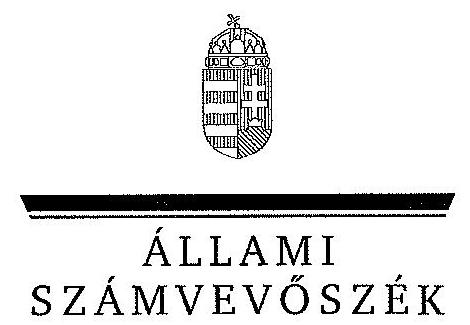
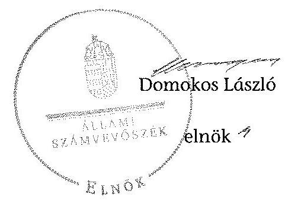
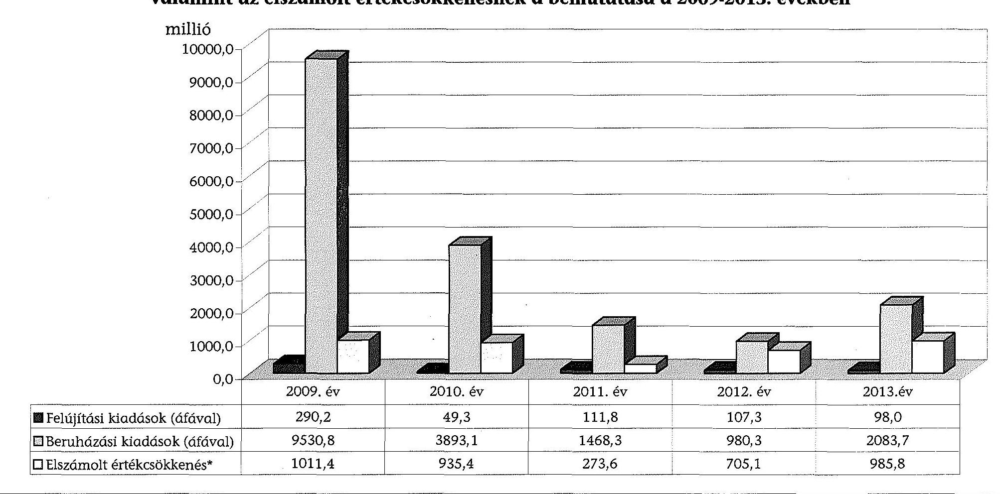
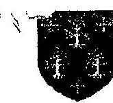
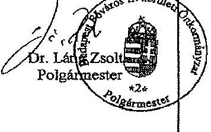
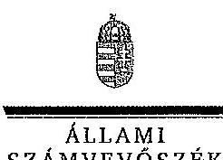
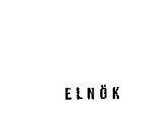
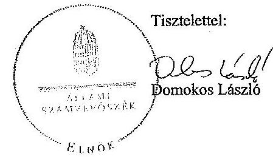

ÁLLAMI
SZÁMVEVŐSZÉK

# JELENTÉS 

az önkormányzatok vagyongazdálkodása
szabályszerűségének ellenőrzéséről
Budapest Főváros II. Kerület

---

# Állami Számvevőszék 

Iktatószám: V-0537-073/2014.
Témaszám: 1571
Vizsgálat-azonosító szám: V068302
Az ellenőrzést felügyelte:
Makkai Mária
felügyeleti vezető
Az ellenőrzést vezette és az ellenőrzés végrehajtásáért felelős:
Schósz Attila Ferencné
ellenőrzésvezető
A számvevőszéki jelentés összeállításában közreműködtek:
Hámoriné Maróti Györgyi
számvevő vezető főtanácsos
Baki István
számvevő tanácsos
Temesváry Miklós
számvevő tanácsos
Az ellenőrzést végezték:
Hámoriné Maróti Györgyi
számvevő vezető főtanácsos
Temesváry Miklós
számvevő tanácsos

Baki István
számvevő tanácsos
Zachár Péterné
számvevő tanácsos

---

# TARTALOMJEGYZÉK 

BEVEZETÉS ..... 3
I. ÖSSZEGZŐ MEGÁLLAPÍTÁSOK, KÖVETKEZTETÉSEK, JAVASLATOK ..... 6
II. RÉSZLETES MEGÁLLAPÍTÁSOK ..... 10

1. A vagyongazdálkodási tevékenység szabályozása ..... 10
1.1. A vagyongazdálkodási feladatellátás szabályozása ..... 10
1.2. A vagyon használatba adására, kezelésére kötött szerződések megfelelősége ..... 13
2. A vagyongazdálkodási tevékenység szabályszerűsége ..... 14
2.1. A vagyon nyilvántartása és leltározása ..... 14
2.2. Meghatározó mértékű vagyonváltozások ..... 16
2.3. Beruházások, felújítások szabályszerűsége ..... 17
2.4. A vagyon értékesítésének, hasznosításának, a követelés elengedésének szabályszerűsége ..... 18
3. Az önkormányzati tulajdonosi jog gyakorlása ..... 21
4. Integritás érvényesülése ..... 22
5. A belső és a külső ellenőrzések hasznosulása ..... 23
5.1. A belső ellenőrzés javaslatainak hasznosulása ..... 23
5.2. A külső ellenőrzések javaslatainak hasznosulása ..... 25
MELLÉKLETEK
6. számú Budapest Főváros II. Kerületi Önkormányzat vagyonának alakulása 2009. január 1. és 2013. december 31. között
7. számú Budapest Főváros II. Kerületi Önkormányzat felújítási és beruházási kiadásainak, valamint az elszámolt értékcsökkenésnek a bemutatása a 2009-2013. években
8. számú Budapest Főváros II. Kerületi Önkormányzat polgármesterének észrevétele
9. számú Budapest Főváros II. Kerületi Önkormányzat polgármesterének észrevételére adott válasz

## FÜGGELÉKEK

1. számú Rövidítések jegyzéke
2. számú Értelmező szótár

---

.

---

# JELENTÉS 

## az önkormányzatok vagyongazdálkodása szabályszerűségének ellenőrzéséről Budapest Főváros II. Kerület

## BEVEZETÉS

Az ÁSZ stratégiai célkitűzése, hogy ellenőrzéseivel mind jobban segítse az átláthatóságot, az elszámoltathatóságot és elszámoltatást a közpénzekkel és a közvagyonnal való gazdálkodásban. Magyarország Alaptörvénye rögzíti, hogy az állam és a helyi önkormányzat tulajdona a nemzeti vagyon része. Az önkormányzati vagyon alapvető funkciója, hogy a közérdeket és egyúttal az önkormányzati célok - elsősorban a kötelezően ellátandó feladatok, és emellett a lehetőségek mértékéig az önként vállalt feladatok - megvalósítását szolgálja.

Az ÁSZ az önkormányzati vagyongazdálkodás 2012. évben indított és 2013. évben folytatott ellenőrzéseinek tapasztalatai alapján indokoltnak látta, hogy a 2014. évi ellenőrzési tervébe is beépítésre kerüljön a vagyongazdálkodási tevékenységek ellenőrzése. Az eddig elvégzett ellenőrzések rámutattak, hogy az önkormányzatok vagyongazdálkodási tevékenységét érintő szabályozottság, a kapcsolódó nyilvántartások, a beszámolók leltárral történő alátámasztása, a gazdálkodási jogkörök szabályszerű gyakorlása és a döntések megalapozottsága terén hiányosságok tapasztalhatók. Ez indokolttá tette a vagyongazdálkodás ellenőrzésének folytatását a jelentős vagyonnal rendelkező, vagy az ÁSZ kockázatelemzése alapján magas vagyoni kockázatot mutató önkormányzatoknál.

Az ellenőrzés célja annak megállapítása volt, hogy az önkormányzat vagyongazdálkodási tevékenységét a jogszabályi előírásokkal összhangban szabályozta-e, a vagyon nyilvántartása és a vagyongazdálkodási tevékenységek végrehajtása a jogszabályoknak és a belső előírásoknak megfelelően történt-e. Az ellenőrzés célja továbbá annak megállapítása, hogy az önkormányzatnál a vagyongazdálkodás során biztosították-e az átláthatóságot, valamint a külső és belső ellenőrzések megállapításai, javaslatai hozzájárultak-e a szabályszerű vagyongazdálkodáshoz.

Ennek keretében értékeltük, hogy az Önkormányzat:

- szabályszerűen alakította-e ki vagyongazdálkodási tevékenységének kereteit;
- biztosította-e a vagyongazdálkodás szabályszerűségét, megalapozottan hozta-e és jogszerűen, szabályszerűen hajtotta-e végre a vagyonváltozást eredményező meghatározó jelentőségű döntéseket;
- gondoskodott-e a tulajdonosi jogok gyakorlásáról;

---

- vagyongazdálkodási tevékenysége során biztosította-e az átláthatóság és az integritás érvényesülését;
- belső ellenőrzése elősegítette-e a vagyongazdálkodás szabályszerű működését, valamint hasznosította-e a vagyongazdálkodási tevékenységével kapcsolatos külső és belső ellenőrzések megállapításait, javaslatait.

Az ellenőrzés várható hasznosulása, hogy feltárja az önkormányzati vagyongazdálkodást meghatározó szabályok, szabályozások összhangjának hiányosságait, a szabályozással nem érintett vagyongazdálkodási területeket, a vagyongazdálkodási tevékenység gyakorlásának esetleges szabálytalanságait, valamint a jó gyakorlat kialakításán és terjesztésén keresztül az ellenőrzések elősegíthetik a vagyongazdálkodás szabályszerűségének javítását.

Az ellenőrzés típusa: szabályszerűségi ellenőrzés
Az ellenőrzött időszak: 2009. január 1-jétől 2013. december 31-ig, illetve a közbeszerzési eljárások lefolytatásának ellenőrzése 2012. január 1-jétől az Önkormányzat helyszíni ellenőrzésének kezdetét megelőző negyedév végéig (2014. március 31-ig) tartott.

Ellenőrzött szervezet: Budapest Főváros II. Kerületi Önkormányzat
Az ellenőrzés végrehajtásának jogszabályi alapját az Állami Számvevőszékről szóló 2011. évi LXVI. törvény 1. § (3) bekezdése, az 5. § (2)-(6) bekezdései, valamint az államháztartásról szóló 2011. évi CXCV. törvény 61. § (2) bekezdésének előírásai képezik.

Az ellenőrzés szakmai módszertana az ÁSZ hivatalos honlapján közzétett szakmai szabályokon alapult, amely a Legfőbb Ellenőrző Intézmények Nemzetközi Szervezete (INTOSAI) által kiadott nemzetközi standardok (ISSAI) figyelembevételével készült.

Az ellenőrzést az ÁSZ hatályos szervezeti szabályai és az ellenőrzési programban foglalt értékelési szempontok szerint folytattuk le. Megállapításainkat a helyszíni ellenőrzés tapasztalataira, az ellenőrzött szervezettől bekért dokumentumokra, a kitöltött tanúsítványok elemzésére, az adott időszakban hatályos jogszabályok és belső szabályzatok előírásaira alapoztuk. A részesedések értékelését tételesen ellenőriztük, míg irányított mintavétellel választottuk ki az ellenőrzött térítésmentes átadás-átvételeket, a beruházásokat, a felújításokat, a közbeszerzési eljárásokat, a vagyon értékesítését, hasznosítását és a követelés elengedést, illetve leírást. A belső kontrollok megfelelő működését (a szakmai teljesítésigazolást, valamint a 2009-2011. években az utalvány ellenjegyzést, a 2012-2013. években az érvényesítést) a Polgármesteri hivatal felhalmozási kiadásaiból választott véletlen minta alapján, megfelelőségi teszttel ellenőriztük.

A II. kerület lakosainak száma 2013. január 1-jén 88477 fő volt. A 2010. évi önkormányzati választásokig a 30 tagú Képviselő-testület munkáját kilenc állandó bizottság segítette. Az önkormányzati választások után a Képviselőtestület létszáma 21 főre csökkent és nyolc állandó bizottság működött. A polgármester a 2006. évi önkormányzati választás óta tölti be tisztségét, a jegyző 2004. március 1-jétől látja el feladatait.

---

Az Önkormányzat a 2013. évben az önállóan működő és gazdálkodó Polgármesteri hivatalon kívül egy önállóan működő és gazdálkodó, valamint 18 önállóan működő költségvetési szervvel látta el a feladatát. A Polgármesteri hivatal a 2013. évben 16 szervezeti egységre tagolódott, elkülönített gazdasági szervezettel 2013. november 28-tól rendelkezett. A vagyongazdálkodással kapcsolatos feladatokat a Polgármesteri hivatal öt irodája látta el. A foglalkoztatott köztisztviselők száma 2013. december 31-én 228 fő volt.

Az Önkormányzatnak 2013-ban öt 100%-os tulajdonú gazdasági társasága volt. Piac üzemeltetéséről a Fény utcai Piac Kft., a városfejlesztési és projekt menedzseri feladatok részbeni ellátásáról a Városfejlesztő Zrt. útján gondoskodott. A Budai Polgár Nkft. folyóirat és időszaki kiadványok kiadásával, a BUDÉP Kft. lakás és nem lakás céljára szolgáló ingatlanok kezelésével, a Kulturális Nkft. előadó-művészeti, kulturális tevékenység ellátásával foglalkozott.

Az Önkormányzat a 2009-2013. évek között vállalkozási tevékenységet nem végzett, haszonélvezeti és koncessziós jogot alapító szerződést nem kötött, egy vagyonkezelési és egy üzemeltetési szerződéssel rendelkezett. Az ellenőrzött időszakban PPP konstrukcióban megvalósított fejlesztésre nem került sor. Az ÁSZ a 2009-2013. évek között az Önkormányzatnál ellenőrzést nem végzett.

Az Önkormányzat könyvviteli mérleg szerinti vagyona a 2009. évi 101604,0 millió Ft-os nyitó értékről a 2013. év végére 98403,6 millió Ft-ra, 3,1%-kal csökkent a befektetett eszközök növekedésének és a forgóeszközök csökkenésének együttes hatására. A befektetett eszközökön belül elsősorban az ingatlanok növekedtek az üzemeltetésre átadott eszközök csökkenése mellett. A forgóeszközökön belül a követelések értékének csökkenése volt a meghatározó. Az Önkormányzat összes kötelezettségének állományi értéke 2013. december 31-én 804,7 millió Ft volt, ebből a rövid és hosszú lejáratú kötelezettségek értéke 777,0 millió Ft-ot tett ki. A pénzintézeti kötelezettség állományi értéke 544,7 millió Ft volt, mely a 2014. évi adósság átvállalás eredményeként megszűnt. Az Önkormányzat 2013. évi költségvetési beszámolója szerint 14611,2 millió Ft költségvetési bevételt ért el és 13759,0 millió Ft költségvetési kiadást teljesített. Felhalmozási célú kiadásra 2353,8 millió Ft-ot, ezen belül felújítási és beruházási kiadásokra 2 181,7 millió Ft-ot fordítottak.

Az Önkormányzat vagyonának főbb adatait, továbbá a felújítási és beruházási kiadásokat, valamint az elszámolt értékcsökkenést az 1-2. számú mellékletek mutatják be. Az alkalmazott rövidítéseket és az egyes fogalmak magyarázatát az 1-2. számú függelék tartalmazza.

Az ÁSZ a 2011. évi LXVI. törvény 29. §-a szerint a jelentéstervezetet megküldte Budapest Főváros II. Kerületi Önkormányzat polgármesterének egyeztetésre. A polgármester észrevételét és az arra adott választ a jelentés 3-4. számú mellékletei tartalmazzák.

---

# I. ÖSSZEGZŐ MEGÁLLAPÍTÁSOK, KÖVETKEZTETÉSEK, JAVASLATOK 

Az Önkormányzat a 2009-2013. évek között vagyongazdálkodási tevékenységének kereteit - a vagyonkezelői jog részletes szabályainak kivételével - szabályszerűen alakította ki. Meghatározták az önkormányzati feladatellátást biztosító törzsvagyont, a forgalomképtelen és a korlátozottan forgalomképes vagyonelemek körét. Az Áht. $_1$ és az Nvtv. előírása alapján rögzítették azt az értékhatárt, amely felett csak nyilvános pályázat útján lehet a vagyont értékesíteni, kezelésbe, használatba adni. Szabályozták a vagyon tulajdonjogának, a vagyonértékű jogok ingyenes, vagy kedvezményes átruházásának módját, eseteit és céljait.

A Képviselő-testület élt az Ötv.-ben biztosított lehetőséggel - értékhatárokhoz kötve - a polgármesternek és a Gazdasági bizottságnak adott át vagyongazdálkodási hatáskört. Az Önkormányzat az Nvtv.-ben megjelölt határidőre, 2012. március 1-jéig meghatározta a forgalomképtelennek minősülő vagyonából a nemzetgazdasági szempontból kiemelt jelentőségű nemzeti vagyonként forgalomképtelen törzsvagyonnak minősített vagyonelemeket. Az Ötv. és az Mötv. előírásai ellenére az Önkormányzat nem határozta meg tételesen azt a vagyoni kört, amelyre vagyonkezelői jog alapítható.

A Polgármesteri hivatal - az ellenőrzött időszakban - rendelkezett az Áhsz. $_1$ ben foglaltaknak és a helyi sajátosságoknak megfelelő számviteli politika $_1,2$-vel és a hozzá kapcsolódó pénzügyi-számviteli szabályzatokkal. A Képviselőtestület élt az Áhsz. $_1$-ben biztosított lehetőséggel és a vagyongazdálkodási rendeletben az immateriális javak és a tárgyi eszközök kétévenkénti mennyiségi leltárfelvételéről döntött. A leltározási szabályzatban meghatározták, hogy az üzemeltetésre, vagyonkezelésre átadott eszközöket a vagyonkezelő és az üzemeltetést végző szerv által elkészített, hiteles leltárral kell alátámasztani.

A Polgármesteri hivatalban a gazdálkodási jogkörök gyakorlása során a 2009-2011. években az Ámr. $_1,2$-ben, valamint a 2012-2013. években az Ávr.-ben rögzített összeférhetetlenségi követelményeket betartották. Az ellenőrzött felhalmozási kiadások esetében a gazdálkodási jogköröket a jogszabályban, valamint a gazdálkodási szabályzat $_1-6$-ban rögzítetteknek megfelelően az írásban felhatalmazott, kijelölt személyek szabályszerűen gyakorolták.

Az Önkormányzat az ellenőrzött időszakban a vagyonkezelési, üzemeltetési, működtetési feladatokat elsősorban intézményrendszerén, illetve a 100%-os tulajdonú gazdasági társaságai útján látta el. Az Önkormányzatnak 2012-ig a saját gazdasági társaságával volt üzemeltetési szerződése az ingatlankezelési tevékenység végzésére. Az Önkormányzat a 2012. évben - az Mötv. előírása szerinti önkormányzati közfeladat átadásához kapcsolódva - kötött vagyonkezelési szerződést a 100%-os tulajdonú gazdasági társaságával. A szerződésben, megállapodásban előírták a vagyon állagának, értékének megőrzését, védelmét. Az Önkormányzat a 2013. évben - egy felszámolási eljárás alatt lévő gazdasági társaságot kivéve - az Nvtv. alapján átlátható szervezetnek minősülő, kizárólag önkormányzati tulajdonú gazdálkodó szervezetekben rendelkezett társasági részesedéssel.

Az Önkormányzatnál az ellenőrzött években a vagyongazdálkodási tevékenység szabályszerűségét hiányosan biztosították. A vagyonkimutatást minden évben elkészítették, amely a 2012-2013. években megfelelt az előírásoknak. A 2009-2011. évi vagyonkimutatások felépítése és tartalma azonban nem felelt meg az Áhsz. $_1$-ben foglalt előírásoknak, mivel nem tartalmazták a „0”-ra leírt és az érték nélkül nyilvántartott eszközöket, a mérlegben értékkel nem szereplő kötelezettségeket. A befektetett pénzügyi eszközöket nem
 a könyvviteli mérleg arab számmal jelzett tételei szerinti tagolásban, hanem összeszedetten mutatták be. A számviteli nyilvántartás és az ingatlanvagyonkataszter adatai közötti egyezőség - a 147/1992. (XI. 6.) Korm. rendeletben foglalt előírás ellenére - az ellenőrzött időszakban nem volt biztosított. A nyilvántartások között az egyeztetést minden évben elvégezték, az eltérések okait kivizsgálták, de a rendezést az adott évi beszámoló elkészítéséig nem hajtották végre.

Az ellenőrzött időszakban - a 2012. évben a vagyonkezelésre átadott eszközök kivételével - eleget tettek az Áhsz. ${ }_{1}$-ben előírt leltározási kötelezettségnek. A tárgyi eszközöknél és az immateriális javaknál - a vagyongazdálkodási rendelet és leltározási szabályzat előírásának megfelelően - az ellenőrzött időszak páratlan éveiben mennyiségi felvétellel, a páros években egyeztetéssel történt a leltározás. Az Önkormányzat nyilvántartásának hiányossága, valamint a Kulturális Nkft. által elkészített hitelesített leltár átadásának hiánya következtében a vagyonkezelésre átadott tárgyi eszközök 1502,2 millió Ft nettó értéke nem szerepelt az Önkormányzat 2012. évi könyvviteli mérlegében, amely ezáltal nem felelt meg a Számv. tv.-ben foglalt valódiság elvének.

A beruházásokról és a felújításokról az Önkormányzat megalapozottan, a gazdasági program ${ }_{1,2}$-ben foglalt fejlesztési célkitűzésekkel és az önkormányzati feladatellátással összhangban - a hatásköri szabályok betartásával - döntött. A szabályszerűen végrehajtott fejlesztések finanszírozhatóságát és fenntarthatóságát biztosították. A beruházásoknál az Önkormányzat - egy kivételével - a Kbt.-ben előírtak figyelembe vételével alkalmazta a közbeszerzési eljárásokat. A szerződést az összességében legelőnyösebb ajánlattevővel kötötték meg.

Az Önkormányzat a vagyonváltozást eredményező, meghatározó jelentőségű döntések végrehajtásánál a vagyongazdálkodási rendeletben, illetve a képviselő-testületi határozatokban foglaltak figyelembe vételével járt el. Az ellenőrzött önkormányzati tulajdonban lévő telkek és nem lakás célú ingatlanok értékesítéséről a Képviselő-testület a vagyongazdálkodási rendeletnek megfelelően - értékbecsléseket tartalmazó előterjesztések, valamint a Gazdasági bizottság határozati javaslatai alapján - hozta meg a döntéseket. Az Önkormányzat az értékesítésre vonatkozó döntések során betartotta az Áht. ${ }_{1}$-ben és az Nvtv.-ben foglalt, nyilvános versenytárgyalásra, versenyeztetésre vonatkozó előírást. A térítésmentes vagyon átadásokról és átvételekről minden esetben az arra hatáskörrel rendelkező Képviselő-testület jogszerűen döntött. Az elengedett és a behajthatatlan követelések ellenőrzött tételeinél az Áht. ${ }_{1,2}$, az Áhsz. ${ }_{1}$ és az éves költségvetési rendeletben foglaltak szerint jártak el.

---

Az Önkormányzat a 2009-2013. években a tulajdonosi ellenőrzési jogát a vagyonkezelő, a vagyon használója és üzemeltetője vonatkozásában gyakorolta, tartós részesedéseivel felelősen gazdálkodott. A Képviselő-testület - az ellenőrzött időszakban - évente megtárgyalta és elfogadta a 100%-os tulajdonában lévő gazdasági társaságai könyvvizsgálói jelentéssel és felügyelő bizottsági véleménnyel kiegészített beszámolóit, üzleti jelentéseit, üzleti terveit, közhasznúsági jelentéseit. Az Önkormányzat a társaságok gazdálkodásának alakulását, az üzletmenet fenntarthatóságát folyamatosan ellenőrizte. A gazdálkodás javítása érdekében döntést hozott többek közt a feladatok racionalizálásáról, valamint a vezetői megbízások meghosszabbításáról, a felügyelőbizottsági tagok visszahívásáról. Az Önkormányzatnál a tartós részesedések értékelését a számviteli politika ${ }_{1,2}$-ben és az értékelési szabályzat ${ }_{1,2}$-ben foglaltaknak megfelelően hajtották végre.

Az Önkormányzatnál a vagyongazdálkodási tevékenység integritása (feddhetetlensége) szempontjából az eredendő és a korrupciós kockázatok értéke - a 2013. évben az ÁSZ által - az önkormányzati alrendszerben mért átlagértékhez képest magasabb. Az Önkormányzatnál kiépült kontrollok azonban képesek kezelni a kockázatokat, valamint támogatni a szervezet feladatellátását.

Az ellenőrzött időszakban a belső ellenőrzés összesen 115 ellenőrzést végzett, amelyekből 22 ellenőrzési jelentés tartalmazott vagyongazdálkodásra vonatkozó megállapításokat. A belső ellenőrzés javaslataival és azok végrehajtásának nyomon követésével - az ingatlanvagyon-kataszter és a számviteli nyilvántartás ellenőrzésének kivételével - hozzájárult az Önkormányzati vagyongazdálkodás szabályszerű működéséhez.

Az Önkormányzat a külső ellenőrzések vagyongazdálkodással összefüggő javaslatait nem hasznosította teljes körűen. A könyvvizsgálói véleményekben, észrevételekben foglalt hiányosságok megszüntetésére részben intézkedtek, a vagyonkataszterre vonatkozó megállapítások több éven keresztül és a jelenlegi ÁSZ ellenőrzés során is fennálltak. A Kormányhivatal a vagyongazdálkodási területet érintően egy alkalommal élt törvényességi felügyeleti eszközzel. A szabályozási pontosítások végrehajtására - a vagyonkezelésbe adható vagyoni kör tételes meghatározása kivételével - az Önkormányzat intézkedett.

Az Állami Számvevőszékről szóló 2011. évi LXVI. törvény 33. § (1) bekezdésében foglaltak értelmében a jelentésben foglalt megállapításokhoz kapcsolódó intézkedési tervet köteles az ellenőrzött szervezet vezetője összeállítani, és azt a jelentés kézhezvételétől számított 30 napon belül az ÁSZ részére megküldeni. Amennyiben az intézkedési tervet határidőben nem küldi meg a szervezet, vagy az nem elfogadható, az ÁSZ elnöke a hivatkozott törvény 33. § (3) bekezdés a)-b) pontjaiban foglaltakat érvényesítheti.

---

Az ellenőrzés intézkedést igénylő megállapításai és javaslatai:

# a polgármesternek: 

1. Az Önkormányzat rendeletben az Ötv. 80/A. § (1) bekezdése és az Mötv. 143. § (4) bekezdés i) pontja ellenére nem határozta meg azt a vagyoni kört, amelyre vagyonkezelői jog alapítható.

Javaslat:
Terjessze a Képviselő-testület elé jóváhagyásra a vagyonkezelői joggal átadható vagyonelemek körét tartalmazó - jegyző által előkészített - rendelet tervezetet.

## a jegyzőnek:

1. A számviteli nyilvántartás ingatlanvagyon adatai és az ingatlanvagyon-kataszter adat- és betétlapjai közötti egyezőség - a 147/1992. (XI. 6.) Korm. rendelet 1. § (3) bekezdésében és 2. számú mellékletében foglalt előírás ellenére - az ellenőrzött időszakban nem volt biztosított.

A nyilvántartások között az egyeztetést minden évben elvégezték, az eltérések okait kivizsgálták, de a rendezés az adott évi beszámoló elkészítéséig nem történt meg. Az eltérések rendezését - a hosszabb átfutási idejű intézkedést igénylő tételek (pl. telekmegosztás) kivételével - a következő évben végezték el.

Javaslat:
Intézkedjen az ingatlanvagyon-kataszter adatai és a számviteli nyilvántartások közötti egyezőség biztosításáról.

---

# II. RÉSZLETES MEGÁLLAPÍTÁSOK 

## 1. A VAGYONGAZDÁLKODÁSI TEVÉKENYSÉG SZABÁLYOZÁSA

### 1.1. A vagyongazdálkodási feladatellátás szabályozása

A Képviselő-testület a 2009-2013. években hatályos gazdasági program ${ }_{1,2}$-ben határozta meg a vagyongazdálkodással kapcsolatos célkitűzéseit és feladatait.

A gazdasági program ${ }_{1}$ a teljes körű csatornázást, a közúthálózat szilárd burkolatú kiépítését, a volt Ganz-tömb területein közösségi terek, új városközpont kialakítását, több nyílt használatú sportlétesítmény létrehozását és az önkormányzati ingatlanok rekonstrukcióját tekintette fő feladatnak. A gazdasági program ${ }_{2}$ az akadálymentesítést, a kerékpárutak fejlesztését, az ingázó forgalmat csökkentő ingatlanfejlesztéseket, az épített környezet értékeinek megőrzését, az illegális hulladéklerakás megszüntetését, az erdőterületek megóvását és a barlangrendszerek veszélyeztetésének csökkentését tűzte ki célul. Az Önkormányzat a gazdasági program ${ }_{1,2}$-ben megfogalmazott célok eléréséhez elsősorban saját és pályázati források igénybe vételével számolt.

Az Önkormányzat az Nvtv. 9. § (1) bekezdésében és a vagyongazdálkodási rendelet 5. §-ban előírt közép- és hosszú távú vagyongazdálkodási tervet a 2013. év végéig nem készített ${ }^{1}$.

Az Önkormányzat - az Ötv. 8. § (2) bekezdésében ${ }^{2}$ foglalt előírással összhangban - a kötelező feladatait, azok ellátásának mértékét és módját az önkormányzati SZMSZ-ben és a 2009-2013. évi költségvetési rendeletekben határozta meg. Az önként vállalt feladatokat külön-külön rendeletekben rögzítették.

Az Önkormányzat a kötelező és önként vállalt feladatait a Polgármesteri hivatala, az intézményrendszere, a 100%-os tulajdonában lévő gazdasági társaságai útján látta el. Az önként vállalt feladatok keretében az Önkormányzat szociális, gyermekjóléti és gyermekvédelmi feladatokat végzett, valamint élelmiszer kedvezményes vásárlásához, társasházak felújításához, lakásépítéshez, lakásvásárláshoz nyújtott támogatásokat, amelyeknek a pénzügyi kereteit az éves költségvetési rendeletekben állapították meg. Az önkormányzati feladatok részletes, operatív ellátásának a módjáról - a Polgármesteri hivatalban alkalmazott ISO 9001 minőségirányítási rendszer alapján - az önkormányzati feladatokra egyenként, a polgármester és a jegyző által együttesen kiadmányozott folyamatszabályozási utasításokban rendelkeztek.

Az Önkormányzat az ellenőrzött időszakban többször határozott költségvetési szervek és gazdasági társaságok létrehozásáról, átalakításáról és megszüntetéséről.

[^0]
[^0]:    ${ }^{1}$ Az Nvtv. nem tartalmaz konkrét határidőt a közép- és hosszú távú vagyongazdálkodási terv elkészítésére vonatkozóan.
    ${ }^{2}$ 2013. január 1-jétől az Mötv. 10. § (1) bekezdése és a 12. § (2) bekezdése szabályozza.

---

Az Önkormányzat az Integrált Városfejlesztési Stratégiája megvalósításához nyert pályázat teljesítésének egyik feltételeként a 2009. évben megalapította a Városfejlesztő Zrt.-t. A Képviselő-testület hatékonysági okok, valamint a feladatellátás módjának és szervezeti kereteinek a módosítása miatt jogutód nélkül megszüntette két közművelődési feladatokat ellátó költségvetési szervét. A költségvetési szervek közfeladatainak ellátására a 2012. évben 3,0 millió Ft törzstőkével nevelési, oktatási, képességfejlesztési és ismeretterjesztési feladatkörrel megalapította a Kulturális Nkft.-t. A Képviselő-testület a 2012. évben a működési hatékonyságot csökkentő párhuzamosságok megszüntetése érdekében döntött az ingatlankezelési tevékenységet ellátó BUDÉP Kft. végelszámolásáról, az üzemeltetésre átadott eszközök visszavételéről.

Az Önkormányzat a 2009-2013. évek között vagyongazdálkodási tevékenységének kereteit - a vagyonkezelői jog részletes szabályainak kivételével - szabályszerűen alakította ki. A Képviselő-testület a Htv. 138. § (1) bekezdés j) pontjával összhangban az önkormányzati vagyongazdálkodási feladatokat a vagyongazdálkodási rendeletben szabályozta. Meghatározták az önkormányzati feladatellátást biztosító törzsvagyont, azon belül a forgalomképtelen és a korlátozottan forgalomképes vagyonelemek körét. A Képviselőtestület a vagyongazdálkodási és a hatásköri rendeletben rögzítette a forgalomképesség megváltoztatásának a jogosultjait, amelyek értékhatártól függően a Képviselő-testület, vagy a Gazdasági bizottság lehetett. A Képviselő-testület az Nvtv. 18. § (1) bekezdésében meghatározott határidőre - 2012. március 1-jéig felülvizsgálta a törzsvagyonba tartozó vagyonelemeit. A Mechwart liget 1. szám alatti Polgármesteri hivatal épületét és két műemlék épületet soroltak a nemzetgazdasági szempontból kiemelt jelentőségű nemzeti vagyonban tartandó vagyonelemek körébe.

A Képviselő-testület az Ötv. 9. § (3) bekezdése ${ }^{3}$ alapján az önkormányzati SZMSZ-ben, a vagyongazdálkodási és a hatásköri rendeletekben - értékhatárokhoz kötve - a polgármesternek és a Gazdasági bizottságnak adott át vagyongazdálkodási hatáskört. A hatáskörök gyakorlásáról beszámolási kötelezettséget nem írtak elő, azonban a hatáskörrel rendelkezők évente egyszer beszámoltak a Képviselő-testületnek a tevékenységükről.

A tulajdonosi jogokat kizárólag az ingó vagyon tekintetében nettó 5,0 millió Ft értékhatárig a polgármester, ezt meghaladó értékű ingó vagyon, továbbá egyéb vagyon tekintetében nettó 50,0 millió Ft értékhatárig a Gazdasági Bizottság gyakorolja. Az önkormányzati vagyon ingyenes, kedvezményes átruházásának, vagy használatba adásának joga kizárólag a Képviselő-testületet illeti meg.

A vagyongazdálkodási rendeletben a vagyonkezelői jog megszerzésének, gyakorlásának és ellenőrzésének az eljárásrendjét szabályozták, azonban az Ötv. 80/A. § (1) bekezdése ${ }^{4}$ ellenére nem határozták meg tételesen azt a vagyoni kört, amelyre vagyonkezelői jog alapítható. A Kormányhivatal 2013. áprilisi törvényességi felhívása ellenére a szabályozási hiányosság megszüntetésére intézkedés nem történt. A döntési hatáskör értékhatárhoz kötve a polgármestert, a Gazdasági bizottságot és a Képviselő-testületet illette meg.

[^0]
[^0]:    ${ }^{3}$ 2013. január 1-jétől az Mötv. 41. § (4) bekezdése írja elő.
    ${ }^{4}$ 2012. január 1-jétől az Mötv. 143. § (4) bekezdés i) pontja szabályozza.

---

A vagyon üzemeltetésre történő átadásának, az üzemeltető ellenőrzésének, a vagyon használatba adásának és a vagyonhasználat ellenőrzésének részletes szabályait a vagyongazdálkodási rendelet tartalmazta.

Az Önkormányzat a vagyongazdálkodási rendeletben - az Áht.; 108. § (2) bekezdésében ${ }^{5}$ foglaltakkal összhangban - szabályozta a vagyon tulajdonjogának, a vagyonértékű jogok ingyenes vagy kedvezményes átruházásának módját, eseteit, céljait, valamint a követelésről történő lemondás eseteit és módjait.

A Képviselő-testület a vagyon
 értékesítésére és hasznosítására a nyilvános pályáztatási kötelezettséget - az Áht.; 108. § (1) bekezdésében és az Nvtv. 13. § (1) bekezdésében előírtaknak megfelelően - a vagyongazdálkodási rendeletben, a mindenkori költségvetési törvényben foglalt, 25 millió Ft-os értékhatárt meghaladó esetekre előírta. A vagyongazdálkodási rendelet 2013. június 26-i módosításában meghatározták, hogy a vagyonhasznosítási pályázati eljárás résztvevője csak természetes személy vagy az Nvtv. 3. § (1) bekezdése alapján átlátható szervezet lehet.

A Polgármesteri hivatal rendelkezett az Áhsz. ${ }_{1}$-nek és a helyi sajátosságoknak megfelelő számviteli politika ${ }_{1,2}$, pénzkezelési ${ }_{1,3}$, leltározási, selejtezési ${ }_{1,3}$ és értékelési ${ }_{1,2}$ szabályzatokkal. A Képviselő-testület a vagyongazdálkodási rendeletben, majd azzal összhangban a jegyző a leltározási szabályzatban rögzítette, hogy a pénzügyi eszközöket, a készleteket, a követeléseket, a forrásokat és a hasznosításba adott eszközöket évente, az immateriális javakat és a tárgyi eszközöket az Áhsz. ${ }_{1}$ 37. § (7) bekezdés alapján kétévente kell leltározni. A leltározási szabályzat tartalmazta az üzemeltetésre, vagyonkezelésre átadott eszközök leltározásának módját, az Áhsz. 1 37. § (4) bekezdésében ${ }^{6}$ foglaltaknak megfelelően előírta, hogy a mérleget az üzemeltetést, kezelést végző szerv által elkészített hitelesített leltárral kell alátámasztani.

Az Önkormányzatnál a gazdasági szervezet létrehozása nem felelt meg az Ávr. 13. § (1) bekezdés e) pontjában előírtaknak, mivel arról a polgármester és a jegyző közös intézkedéssel döntött, azt a Képviselő-testület a hivatali SZMSZ ${ }_{1}$ ben nem hagyta jóvá. Gazdasági szervezetnek ezáltal - az Ávr. 9. § (1) bekezdése alapján - a Polgármesteri hivatal egésze volt tekinthető és az Ávr. 11. § (2) bekezdésében foglaltak alapján a jegyző volt a gazdasági vezető. Az Önkormányzat a 2013. november 28-tól hatályos hivatali SZMSZ ${ }_{2}$-ben gazdasági szervezetként a Pénzügyi-, a Beruházási és Városüzemeltetési-, a Vagyonhasznosítási és Ingatlan-nyilvántartási-, az Informatikai- és az Intézménygazdálkodási Irodákat nevesítette, mely szervezeti egységek együttesen alkotják a gazdasági szervezetet. A gazdasági vezető személyének kijelölése azonban elmaradt, melynek következtében a gazdasági szervezet működése 2013. november 28-tól ellentétes volt a hivatali SZMSZ ${ }_{2}$-ben rögzítettekkel, mivel a gazdasági vezetőnek és a jegyzőnek külön személynek kellett volna lennie. A jegyző a hivatali

[^0]
[^0]:    ${ }^{5}$ 2012. január 1-jétől az Áht. 97. § (2) bekezdése szabályozza a követelésről történő lemondást, 2012. június 30-tól az Nvtv. 13. § (3) bekezdése szabályozza a vagyon tulajdonjogának ingyenes átruházását.
    ${ }^{6}$ 2014. január 1-jétől az Áhsz. 22. § (2) bekezdés a) pontja kizárólag a koncesszióba, vagyonkezelésbe adott eszközökre írja elő vagyonkezelő által történő leltározást.

---

SZMSZ $_{2}$-ben rögzített feladatát 2013. december 31-ig elmulasztotta, mert nem gondoskodott a gazdasági vezetői feladatokat ellátó köztisztviselő kijelöléséről.

# 1.2. A vagyon használatba adására, kezelésére kötött szerződések megfelelősége 

Az Önkormányzat az ellenőrzött időszakban koncessziós, illetve üzemeltetési szerződést nem kötött, az Mötv. 109. § (1) bekezdésében foglaltaknak megfelelően önkormányzati közfeladat átadásához kapcsolódva vagyonkezelői jogot egy esetben alapított. A Képviselő-testület a vagyonkezelésbe adható vagyonelemek körének meghatározása nélkül létesített vagyonkezelői jogot.

Az Önkormányzat 2012. szeptember 11-én a 100%-os tulajdonában lévő Kulturális Nkft.-nek ingyenesen nettó 1577,4 millió Ft könyvszerinti értéken ingó- és ingatlan vagyont adott át határozatlan időre vagyonkezelésbe. A vagyonkezelésbe adást a kerület kulturális és közművelődési igényeinek komplexebb és szélesebb körű közfeladat ellátása indokolta.

A Kulturális Nkft. részére a vagyonkezelésre történt átadás képviselő-testületi döntés alapján valósult meg. A vagyonkezelési szerződésben, illetve közművelődési megállapodásban rögzítették a vagyonkezelésre átadott vagyonnal való gazdálkodás szabályait, a vagyon állagának, értékének megőrzési feladatát és meghatározták a kötelezően ellátandó önkormányzati feladatokat. A szerződésben szabályozták a beszámolási kötelezettséget, szankciókat írtak elő a szerződési feltételek nem teljesítésének esetére.

Az Önkormányzat az ellenőrzött időszakban a vagyonkezelésbe adott eszközök után 35,1 millió Ft értékcsökkenést számolt el, ezzel szemben az eszközök pótlására, felújítására 14,1 millió Ft-ot fordított. Az Önkormányzat megállapította, hogy a Kulturális Nkft. a 21,0 millió Ft-os visszapótlási kötelezettségét a 2013. évben - az Mötv. 109. § (6) bekezdésében foglaltak ellenére - nem teljesítette.

Az Önkormányzat az ellenőrzött időszakban ingyenes ingatlanhasználati szerződéseket kötött. Az ingatlanhasználati szerződéseket jogszerűen, a vagyongazdálkodási és a hatásköri rendelettel összhangban kötötték meg. A használatba adásokról minden esetben a hatáskörrel rendelkező Képviselő-testület döntött. A szerződésekben a használati feltételeket, a tulajdonosi ellenőrzés jogát, az állag- és értékmegőrzési kötelezettségeket rögzítették.

Az Önkormányzat 2009. december 15-én a 100%-os tulajdonában álló Városfejlesztő Zrt.-nek határozott időre (2010. augusztus 31-ig) ingyenesen használatba adott egy $46 \mathrm{~m}^{2}$ alapterületű helyiséget irodának. A Városfejlesztő Zrt. a határozott bérbeadási idő lejárta után az irodát visszaadta az Önkormányzatnak.

A Budapesti Rendőr-főkapitányságnak az Önkormányzat 2013. május 31-én az Mötv. 23. § (5) bekezdés 18. pontja alapján a helyi közbiztonság biztosítására egy $117 \mathrm{~m}^{2}$ alapterületű felépítményt adott át ingyenesen és kizárólagos használatba határozatlan időre.

Az ellenőrzött időszakban az Önkormányzatnak öt gazdasági társaságban volt 100%-os és egy társaságban kisebbségi részesedése. A 100%-os önkormányzati tulajdonban lévő gazdasági szervezetek az Nvtv. 3. § (1) bekezdés 1. pontja

---

alapján átlátható szervezetek. Az Önkormányzat az 5%-os részesedése esetében a gazdasági társaság - SCD Pasarét Kft.-ben (2012. október 2-től Akadémia Park Kft.) - 2012. évi felszámolási eljárása miatt a felülvizsgálatot önhibáján kívül nem tudta elvégezni.

# 2. A VAGYONGAZDÁLKODÁSI TEVÉKENYSÉG SZABÁLYSZERŰSÉGE 

### 2.1. A vagyon nyilvántartása és leltározása

Az Önkormányzat a számviteli nyilvántartásában a főkönyvi számlák alábontásával, valamint a számlákhoz kapcsolódó analitikus nyilvántartások vezetésével biztosította a törzsvagyon többi vagyontárgytól elkülönített nyilvántartását, valamint ezen belül a forgalomképtelen, és korlátozottan forgalomképes, illetve az üzleti (forgalomképes) vagyon elkülönítését.

Az Önkormányzatnál az ellenőrzött években a vagyongazdálkodási tevékenység szabályszerűségét hiányosan biztosították. A 2009-2013. években a jegyző elkészítette az Ötv. 78. § (2) bekezdésében ${ }^{7}$ meghatározott vagyonkimutatást, amelyet a polgármester az Áht.; 118. § (2) bekezdés 2. c) pontjának ${ }^{8}$ előírása szerint a zárszámadási rendelettervezettel egyidejűleg terjesztett a Képviselő-testület elé. A 2012-2013. évben a vagyonkimutatások megfeleltek, míg a 2009-2011. évben nem feleltek meg az Áhsz.; 44/A. § (2)-(3) bekezdéseiben meghatározott előírásoknak, mivel

- nem tartalmazták a „0"-ra leírt, de használatban lévő, illetve használaton kívüli eszközök, az érték nélkül nyilvántartott eszközök állományát és a mérlegben értékkel nem szereplő kötelezettségeket;
- a befektetett pénzügyi eszközöket nem a könyvviteli mérleg arab számmal jelzett tételei szerinti tagolásban, hanem összevontan szerepeltették.

A számviteli nyilvántartás ingatlanvagyon adatai és az ingatlanvagyonkataszter adat- és betétlapjai közötti egyezőség - a 147/1992. (XI. 6.) Korm. rendelet 1. § (3) bekezdésében és 2. számú mellékletében foglalt előírás ellenére - az ellenőrzött időszakban nem volt biztosított.

Az ingatlanvagyon-kataszter és a számviteli nyilvántartás ingatlanvagyon adatai - az ingatlanokhoz kapcsolódó vagyoni értékű jogok és az idegen ingatlanon végzett beruházások értékének rendszerbeli eltérése kivételével is - eltérést mutattak.

A nyilvántartások között az egyeztetést minden évben elvégezték, az eltérések okait kivizsgálták, de a rendezés az adott évi beszámoló elkészítéséig nem történt meg. Az eltérések rendezését - a hosszabb átfutási idejű intézkedést igénylő tételek (pl. telekmegosztás) kivételével - a következő évben végezték el.

Az ingatlanvagyon-kataszter adat- és betétlapjai, valamint a földhivatal ingatlan-nyilvántartás azonos tartalmú adatai közötti egyezőség a 2009-2013. évek-

[^0]
[^0]:    ${ }^{7}$ 2012. január 1-jétől az Mötv. 110. § (2) bekezdése írja elő.
    ${ }^{8}$ 2012. január 1-jétől az Áht. 291. § (2) bekezdés c) pontja írja elő.

---

ben nem állt fenn annak ellenére, hogy az ellenőrzött időszak alatt egyedi egyeztetések (címpontosítások, tulajdonjog bejegyzési kérelem stb.) és intézkedések folyamatosan történtek.

A 2012-2013. években kezdődött átfogó egyeztetés során a földhivatal 11 db olyan ingatlant mutatott ki, amelyeket a vagyonkataszter helyesen nem tartalmazott. A jelzett ingatlanok a korábbi években - 1993. és 2000. évek között kerültek ki az Önkormányzat tulajdonából, a tulajdonjog átvezetése azonban a földhivatali nyilvántartásban - az Önkormányzat dokumentált intézkedései ellenére - elmaradt.

Az Önkormányzat a 2009-2013. évi könyvviteli mérlegeiben kimutatott eszközöket és forrásokat az Áhsz.; 37. § (1)-(2) bekezdéseiben ${ }^{9}$ előírtaknak megfelelően leltárral alátámasztotta. A tárgyi eszközöknél és az immateriális javaknál - a vagyongazdálkodási rendelet és leltározási szabályzat előírásának megfelelően - az ellenőrzött időszak páratlan éveiben mennyiségi felvétellel, a páros években egyeztetéssel történt a leltározás. A leltár során feltárt hiányokat és többleteket az egyedi leltárjegyzőkönyvek alapján - a leltározási szabályzatban foglaltaknak megfelelően - rendezték.

A vagyonkezelésre, illetve üzemeltetésre átadott eszközök leltározását az Áhsz.; 37. § (4) bekezdés előírásának megfelelően a vagyonkezelő, üzemeltetést végző szervek elvégezték, amelyekről - a 2012. évben a Kulturális Nkft. kivételével ${ }^{10}$ - hitelesített leltárt adtak át az Önkormányzatnak.

A 2012. évben a Kulturális Nkft. részére átadott eszközök értékét az Önkormányzat nyilvántartásaiból szabályszerűen kivezették, azonban az Áhsz.; 29/A. § (2) bekezdésében foglaltaknak megfelelően nem vezették be a vagyonkezelésbe adott eszközök közé. Ennek következtében, valamint a Kulturális Nkft. által elkészített hitelesített leltár átadásának hiányában a vagyonkezelésre átadott tárgyi eszközök 1502,2 millió Ft nettó értéke a 2012. évben nem szerepelt az Önkormányzat számviteli nyilvántartásában és a könyvviteli mérlegében. A 2012. évi könyvviteli mérleg értéke ezáltal nem felelt meg a Számv. tv. 15. § (3) bekezdésében foglalt valódiság elvének. Az eltérés nem érte el a mérlegfőösszeg 2%-át.

A 2013. évi leltározás során az Önkormányzat feltárta a vagyonkezelésbe adott eszközök nyilvántartásának hiányát. A Kulturális Nkft. részére átadott eszközök értékét - a 2013. évben átadott eszközök figyelembe vételével - a vagyonkezelésbe adott eszközök közé, a nyilvántartásba felvezették. A 2013. évi könyvviteli mérleg valós értéket tartalmazott.

Az Önkormányzat az ellenőrzött időszakban minden évében végzett selejtezést. A tárgyi eszközök - „0"-ra leírt és kis értékű - selejtezésének dokumentálása a selejtezési szabályzat ${ }_{1,2}$-ben foglaltaknak megfelelt. A selejtezésekkel, a meg-

[^0]
[^0]:    ${ }^{9}$ 2014. január 1-jétől az Áhsz. 22. § (1) bekezdése szabályozza.
    ${ }^{10}$ A Kulturális Nkft. a leltározást határidőben elvégezte, de a hitelesített leltárt az Önkormányzat részére a beszámoló készítéséig nem adta át.

---

semmisítésekkel, illetve az értékesítésekkel kapcsolatos döntéseket az arra jogosult jegyző hozta meg.

# 2.2. Meghatározó mértékű vagyonváltozások 

Az Önkormányzat könyvviteli mérleg szerinti vagyona a 2009. évi 101604,0 millió Ft-os nyitó értékről a 2013. év végére 98403,6 millió Ft-ra, 3,1%-kal csökkent. Ezen időszak alatt a befektetett eszközök 4272,7 millió Ft-tal növekedtek, a forgóeszközök 7473,1 millió Ft-tal csökkentek.

Az Önkormányzat 2009. január 1-jei könyvviteli mérleg szerinti vagyona tartalmazott olyan - ingatlan adás-vételéhez kapcsolódó - 2008. évi követeléseket és kötelezettségeket, amelyek pénzügyi rendezése a 2009. év folyamán történt meg. Ennek hatására az eszközök értéke 6850,0 millió Ft-tal, a források értéke 6819,9
 millió Ft-tal csökkent.

A 2009-2013. években a befektetett eszközök értéke 87742,6 millió Ft-ról 92015,3 millió Ft-ra (4,9%-kal) növekedett. A 2009. évben a befektetett eszközök 88,8%-át az ingatlanok és kapcsolódó vagyoni értékű jogok alkották, amelyek részesedése a 2013. évre 92,6%-ra nőtt.

Az ingatlanok és a kapcsolódó vagyoni értékű jogok könyvviteli mérlegben kimutatott állományi értéke a 2009. évi 77892,5 millió Ft-os nyitó értékről a 2013. évre 85217,8 millió Ft-ra növekedett. A változásból - az önkormányzati tulajdonú gazdasági társaság (BUDÉP Kft.) végelszámolása miatt - 3342,0 millió Ft-ot a korábban üzemeltetésre átadott ingatlanok Önkormányzathoz történő visszavétele okozott.

Az állományi érték emelkedését többek között a közlekedés fejlesztésére végrehajtott beruházások (parkolóhelyek, kerékpárutak, Bel-Buda funkcióbővítő rehabilitációja), intézményi felújítások (sportpályája, elektromos hálózat, vizesblokkok, játszóterek) és beruházások (akadálymentesítés, a Fillér utcai általános iskola európai uniós támogatással végrehajtott beruházása, új bölcsőde építése, rendelőintézet tetőszerkezetének újjáépítése) eredményezték.

A befektetett pénzügyi eszközök állománya a 2009. évi nyitó 3054,7 millió Ft-ról 2013. év végére 2911,7 millió Ft-ra (4,7%-kal) csökkent az ELMŰ részvények 2011. évi értékesítése, valamint a tartósan adott kölcsönök állományának változása következtében. A csökkenést a tartós részesedések állományának 1079,4 millió Ft-ról 1393,1 millió Ft-ra történő növekedése sem ellensúlyozta.

Az Önkormányzat részesedése a 2010. évben a Budai Polgár Nkft.-ben 1,3 millió Ft befektetéssel 100%-ra nőtt. Az Önkormányzat 100%-os tulajdonát képező Városfejlesztő Zrt. esetében a 2011. évben a részesedés a háromszorosára (15,0 millió Ft-ra), a 2012. évben pedig 584,0 millió Ft-ra emelkedett. Az Önkormányzat a 2012. évben létrehozta a Kulturális Nkft.-t 3,0 millió Ft törzstőkével, 100%-os tulajdoni részaránnyal.

Az üzemeltetésre átadott eszközök nyitó állománya a 2009. évi 4728,7 millió Ft-ról a 2013. év végére 2379,3 millió Ft-ra csökkent a BUDÉP Kft. végelszámolása következtében. A csökkenést részben ellensúlyozta, hogy a Kulturális Nkft.-vel kötött vagyonkezelési szerződés alapján az átadott tárgyi

eszközök átvezetésre kerültek az üzemeltetésre, vagyonkezelésbe adott eszközök közé.

Az Önkormányzat az értékcsökkenési leírást meghaladó felújítást és beruházást hajtott végre az ellenőrzött időszakban. A 226 db felújításra bruttó 656,6 millió Ft-ot, valamint az 562 db beruházásra bruttó 17956,2 millió Ft-ot fordítottak. Az elszámolt értékcsökkenés 3911,3 millió Ft volt.

A forgóeszközök állományának mérleg szerinti értéke a 2009. évi nyitó 13861,4 millió Ft-ról a 2013. év végére 6388,3 millió Ft-ra (53,9%-kal) csökkent elsősorban a követelések (6144,8 millió Ft-os) és a pénzeszközök (1207,5 millió Ft-os) csökkenése következtében.

Az Önkormányzat könyvviteli mérleg szerinti forrásai a 2009. évről a 2013. évre 3,1%-kal (3200,4 millió Ft) csökkentek, a saját tőke 8120,6 millió Ft-os növekedése mellett. A tartalék 788,4 millió Ft-tal, a kötelezettségek 10532,6 millió Ft-tal, a passzív pénzügyi elszámolások 445,2 millió Ft-tal csökkentek.

A hosszú lejáratú kötelezettségek a 2009. évi 1558,1 millió Ft-ról a 2013. évre 418,7 millió Ft-ra, 73,1%-kal csökkentek a hitelek folyamatos törlesztése, valamint az adósság átvállalás következtében. A rövid lejáratú kötelezettségek állománya a 2009. évről a 2013. évre 8948,1 millió Ft-tal csökkent, elsősorban a 2009. január 1-jei kötelezettségből az egyszeri 6819,9 millió Ft-os kötelezettség megszűnése, valamint a Magyar Állam által átvállalt adósság adott évi törlesztő részletet érintő összege miatt.

Az Önkormányzat ellenőrzött időszakban meglévő adósságából a Magyar Állam két ütemben összesen 973,5 millió Ft-ot vállalt át, ezzel az adósságállomány - a folyamatos törlesztések figyelembevételével - megszűnt.

A 2012. december 31-én fennálló 1122,4 millió Ft adósságállományból 449,0 millió Ft-ot, a 2013. december 31-én fennálló 544,7 millió Ft adósságállományából 524,5 millió Ft összeget a Magyar Állam átvállalt.

# 2.3. Beruházások, felújítások szabályszerűsége 

A teljesített beruházások és felújítások a gazdasági program$_{1,2}$-ben szerepeltek, azzal összhangban voltak, a kötelező és önként vállalt feladatok ellátását szolgálták. A beruházások finanszírozhatóságáról és működtetésükről a Képviselőtestület a gazdasági program$_{1,2}$-ben és az éves költségvetési rendeletekben döntött. A fejlesztések finanszírozhatóságát és fenntarthatóságát az ellenőrzött időszakban biztosították. A felújításokhoz felhasznált 656,6 millió Ft fedezetét teljes körűen a saját bevételek fedezték. A beruházások 17956,1 millió Ft fedezetét 15507,1 millió Ft saját forrás és 2192,0 millió Ft európai uniós támogatás, valamint 257,0 millió Ft egyéb központi támogatás biztosította.

A helyszíni ellenőrzés során a Hűvösvölgyi út 12/b. szám alatti bölcsőde és korai fejlesztő 361,5 millió Ft-os, a Labanc utca 2. szám alatti óvoda és játszókert 108,7 millió Ft-os, a Fillér utca 70-76. szám alatti általános iskola I-II. ütemű, 862,8 millió Ft-os beruházása, felújítása és a közbeszerzés lefolytatásának szabályossága került ellenőrzésre. Ellenőriztük továbbá a Törökvészi út 22-24. szám alatti bölcsőde 38,0 millió Ft-os, a Virágárok utca 15. szám alatti óvoda

361,5 millió Ft-os, a „Közlekedési kiskorrekció" néven megvalósult 56,0 millió Ft-os, a járdaépítési projekt 141,9 millió Ft-os fejlesztést.

A beszerzéseknél az Önkormányzat - egy kivételével - a Kbt.-ben előírt értékhatárok figyelembe vételével alkalmazta a közbeszerzési eljárásokat, az ajánlattételi felhívásokban rögzítették a bírálati szempontokat, a bíráló bizottság kijelölése az előírásoknak megfelelően történt. Az ajánlatokat a bíráló bizottság értékelte, a szerződést az összességében legelőnyösebb ajánlattevővel kötötték meg.

Az Önkormányzat 2012. január 1-jétől 2014. év 1. negyedév végéig összesen 77 közbeszerzési eljárást indított. A közbeszerzési eljárásokból 16 a felhalmozási tevékenységekhez kapcsolódott 2600,6 millió Ft, a működési kiadásokkal összefüggésben 61 eljárás valósult meg 2239,9 millió Ft értékben. Az eljárások közül a Kbt. alapján 68 hirdetmény nélküli tárgyalásos, három nyílt nemzeti eljárásrendben és hat nyílt eljárásban történt. Az önkormányzati közbeszerzési eljárások ellen egy esetben a Közbeszerzési Döntőbizottság jogerős elmarasztaló határozatot hozott a közbeszerzési eljárás választott jogalapjának megsértése miatt.

Az ellenőrzött beruházások és felújítások minden esetben a Képviselőtestület döntése alapján - a szükséges esetekben közbeszerzési eljárás lefolytatását követően - kötött szerződések keretében, szabályszerűen valósultak meg. A beruházási szerződésekben az Önkormányzat részletesen meghatározta a vállalkozói kötelezettségeket. Az elkészült beruházások műszaki átvétele és a teljesítések igazolása jegyzőkönyvek és üzembe helyezési okmány alapján történt. Az aktivált beruházások bruttó nyilvántartási értékét a vagyonkataszteri nyilvántartásba bevezették.

A Polgármesteri hivatalban az ellenőrzött időszakban a gazdálkodási jogkörök gyakorlása során a 2009-2011. években az Ámr. $_{1,2}$-ben, valamint a 2012-2013. években az Ávr.-ben rögzített összeférhetetlenségi követelményeket betartották. A Polgármesteri hivatalban a gazdálkodási jogköröket - az ellenőrzött felhalmozási kiadások esetében - az Ámr. $_{1,2}$, az Ávr., valamint a gazdálkodási szabályzat$_{1,6}$-ban rögzítetteknek megfelelően az arra írásban felhatalmazott, illetve kijelölt személyek szabályszerűen gyakorolták.

# 2.4. A vagyon értékesítésének, hasznosításának, a követelés elengedésének szabályszerűsége 

Az Önkormányzat a vagyon értékesítése, hasznosítása, a követelések elengedése során biztosította a vagyongazdálkodás szabályszerűségét. A vagyonváltozást eredményező, meghatározó jelentőségű döntések végrehajtásánál a vagyongazdálkodási rendeletben, illetve a képviselő-testületi határozatokban foglaltak figyelembe vételével járt el.

Az Önkormányzat a 2009-2013. évek között 170 db ingatlant, 12 db gépet és járművet és három esetben részvényt értékesített összesen 3532,8 millió Ft értékben.

Az ellenőrzött tételek között hat üzlethelyiség, egy kultúrház, tetőterek, valamint beépítetlen területek értékesítései szerepeltek összesen 813,2 millió Ft értékben.

Az ellenőrzött önkormányzati tulajdonban lévő telkek és nem lakás célú ingatlanok értékesítéséről a Képviselő-testület a vagyongazdálkodási rendeletnek megfelelően - értékbecsléseket tartalmazó előterjesztések, valamint a Gazdasági bizottság határozati javaslatai alapján - hozta meg a döntéseket. Az Önkormányzat az értékesítési döntések során betartotta a nyilvános versenytárgyalásra, versenyeztetésre vonatkozó, az Áht.-ben, az Nvtv.-ben, valamint a vagyongazdálkodási rendeletben szereplő előírásokat.

Az Önkormányzat eleget tett a Lakás tv. 63. § (1) bekezdésében foglalt befizetési kötelezettségének$^{11}$, illetve a (3) bekezdésben foglalt célokra használta fel a bevételeit, melyet a Kincstár határozatban elfogadott.

Az ellenőrzött bérbeadásokról szóló döntéseket pályázati dokumentációkkal alátámasztottan, a hatásköri szabályokat betartva - két esetben a Képviselőtestület, nyolc esetben átruházott hatáskörben eljárva a Gazdasági bizottság hozták meg.

A vagyonhasznosítást megelőzően a pályázati kiírások közzététele a vagyongazdálkodási rendeletben foglaltaknak megfelelően megtörtént. Az ellenőrzött vagyonhasznosítások esetében - az előterjesztésekkel megegyező - bizottsági, képviselő-testületi döntésekkel azonos tartalmú szerződést, megállapodást kötöttek.

Az Önkormányzatnál a lakások és helyiségek hasznosítása az ellenőrzött időszakban 379 lakásra és 236 helyiségre kiterjedően, nettó 343,8 millió Ft bérleti díj ellenében valósult meg.

Az ellenőrzött tételek sportpálya, garázsok, önálló épületek, valamint beépítetlen területek bérlésére, használatára vonatkoztak, amelyből összesen 36,6 millió Ft bérleti díj bevétele keletkezett az Önkormányzatnak.

Az Önkormányzat az adás-vételi, illetve bérleti szerződésekben az érdekeit védő garanciális elemeket (a tulajdonjog bejegyzését megelőzően a teljes vételár kifizetését, illetve késedelmes fizetés esetére szankcióként késedelmi kamat felszámítását, a bérleti díj meg nem fizetése esetére a bérleti jogviszony felmondását, jelzálogjog bejegyzést, átalánykár biztosítékot stb.) is beépített.

A 2009. és a 2013. években összesen 557 üres ingatlannal rendelkezett az Önkormányzat. Az ellenőrzött időszakban több alkalommal pályáztatta meg az üres ingatlanjait értékesítés céljából, melynek eredményeként 16 ingatlant kiadtak és 58-at értékesítettek. A beépítetlen földterületek és telkek, valamint a felújításra, korszerűsítésre szoruló bérlakások, műhelyek hasznosítása nem járt sikerrel. Az üres ingatlanok könyv szerinti nettó értéke 569,9 millió Ft volt, az ellenőrzött időszakban fenntartásra, állagmegóvásra 473,0 millió Ft-ot fordítottak.

[^0]
[^0]:    $^{11}$ A kerületi önkormányzat a Lakás tv. 62. § (1) bekezdésében említett lakóépületeinek (a bennük lévő lakások) elidegenítéséből származó - 1994. március 31. napját követően befolyó, és a 62. § (5) bekezdése szerint csökkentett - bevételének 50%-át a fővárosi közgyűlés számláját vezető pénzintézethez, elkülönített számlára köteles befizetni.

A vagyonelemekben bekövetkezett változások számviteli nyilvántartásban való rögzítése a változások alapdokumentumai (szerződések) alapján, szabályszerűen történt.

Az ellenőrzött időszakban az Önkormányzatot érintően két esetben - egy bérlők által épített garázs, valamint az Önkormányzat által földterületként nyilvántartott ingatlan esetében - történt elbirtoklás. Mindkét alkalommal a Fővárosi Törvényszék ítéletben rendelkezett a felperes magánszemélyek tulajdonjogának elbirtoklás címén történő bejegyzéséről.

Az Önkormányzat a 2009-2013. években térítésmentesen 51 vagyonelemet adott át bruttó 21579,8 millió Ft összegben. Ebből államháztartáson kívülre kilenc vagyonelem 1264,3 millió Ft, az államháztartáson belülre 42 vagyonelem átadás történt 20315,5 millió Ft bruttó értékben. Ugyanebben az időszakban az Önkormányzat összesen 44 vagyonelemet vett át bruttó 5918,7 millió Ft értékben. Az államháztartáson belülről 36 vagyonelemet 5824,4 millió Ft, az államháztartáson kívülről nyolc vagyonelemet 94,3 millió Ft bruttó értéken vett át az Önkormányzat.

A helyszíni ellenőrzés során ellenőriztük a Fővárosi Önkormányzatnak 2009. június 29-én hét ingatlan bruttó 951,8 millió Ft-os, 2011. december 11-én bruttó 62,5 millió Ft-os szennyvízcsatorna hálózat, és az ELMŰ Kft.-nek 2012. november 22-én bruttó 3,0 millió Ft-os elektromos hálózat tulajdonjogának térítésmentes átadását. Az ellenőrzés kiterjedt továbbá az önkormányzati intézmények között három alkalommal 1333,0 millió Ft értékben beruházási értéknövekedések, és az MNV Zrt. által 2010. február 15-én 160,8 millió Ft értékben átadott - az egészségügyi alapellátási feladatok ellátására biztosított - ingatlan
 térítésmentes átvételére.

A térítésmentes vagyonátadások és átvételek indokoltan és jogszerűen, a Képviselő-testület döntései szerint valósultak meg.

Az Önkormányzat - a 2009-2013. években - 26,3 millió Ft összegben engedett el követelést, amelyen belül meghatározóak voltak a perköltség, a lakáshasz-nálati- és bérleti díjak, valamint a méltányosságból elengedett adók miatti követelések. Az ellenőrzött követelések elengedése szabályszerűen, dokumentumokkal alátámasztva történt. A döntéseket - az Áht. ${ }_{1,2}$-ben, illetve az éves költségvetési rendeletekben foglaltak alapján - önkormányzati ügyekben az arra hatáskörrel rendelkező Képviselő-testület, illetve átruházott hatáskörében eljárva a polgármester, míg hatósági jogkörben a jegyző gyakorolta.

Behajthatatlanság miatti követelés leírására - az ellenőrzött időszakban 772,6 millió Ft összegben került sor. Az ellenőrzött követelések behajthatatlanná minősítése minden esetben dokumentumokkal alátámasztva történt. A behajthatatlanság ténye az Áhsz. ${ }_{1} 5 . \S 3$. pontjában foglaltak alapján fennállt.

A 2009. évben közterület használati díjtartozásból és annak kamataiból 17,3 millió Ft-ot vezettek ki behajthatatlan követelésként, mivel arra a tartozást felhalmozó társaság felszámolása során nem volt fedezet. Elévülés miatt 15,6 millió Ft adó (ebből 15 millió Ft gépjárműadó) követelést írtak le.

---

A 2010. évben 1,2 millió Ft adó követelést, illetve 0,8 millió Ft hirdetési díjakból származó követelést vezettek ki elévülés, felszámolás miatt. A 2011. évben 12,2 millió Ft bírság követelést elévülés miatt írtak le.

A 2012-2013. években a behajthatatlan követelések 389,2 millió Ft-ot, illetve 312,5 millió Ft-ot tettek ki. Ennek 88,0%-a, illetve 76,8%-a parkolási díjakból képződött, mivel a végrehajtással kapcsolatos költségek nem voltak arányban a követelés várhatóan behajtható összegével, illetve az adós felkutatása nem járt eredménnyel.

Az Áhsz. 38. § (6) bekezdése n) pontjában ${ }^{12}$ foglalt előírás ellenére a 2012. évi költségvetési beszámoló tájékoztató adatai között - az 53. űrlapon - nem mutatták be a behajthatatlan követeléseket.

# 3. Az ÖNKORMÁNYZATI TULAJDONOSI JOG GYAKORLÁSA 

Az Önkormányzat az ellenőrzött időszakban a tulajdonosi ellenőrzési jogát a vagyonkezelő, a vagyon használója és a vagyon üzemeltetője vonatkozásában gyakorolta. Részesedései tekintetében élt (az alapító okiratokban, társasági szerződésekben rögzített) tulajdonosi jogával és teljesítette kötelezettségeit, tartós részesedéseivel felelősen gazdálkodott.

Az Önkormányzat a 100%-os tulajdonában lévő öt gazdasági társaságnál meghatározta az igazgatók és felügyelő bizottsági tagok személyét. A Képviselőtestület - az ellenőrzött időszakban - évente megtárgyalta és elfogadta a gazdasági társaságai könyvvizsgálói jelentéssel és felügyelő bizottsági véleménnyel kiegészített beszámolóit, üzleti jelentéseit, üzleti terveit, közhasznúsági jelentéseit.

Az Önkormányzat a társaságok gazdálkodásának alakulását, az üzletmenet fenntarthatóságát folyamatosan vizsgálta. A gazdálkodás javítása érdekében döntést hozott többek közt a feladatok racionalizálásáról, valamint vezetői megbízások meghosszabbításáról, felügyelő bizottsági tagok visszahívásáról, prémiumfeladatok meghatározásáról.

Az Önkormányzat a 2009. évtől folyamatosan foglalkozott a működés hatékonyságával, ennek keretében átvilágíttatta a gazdálkodást, ami rámutatott arra, hogy a BUDÉP Kft., illetve az Önkormányzat egyes szervezeti egységei által ellátott feladatok között fennálló párhuzamosságok miatt a feladatellátás nem hatékony. Az átvizsgálás alapján a 2012. évben döntöttek a gazdasági társaság végelszámolással történő megszűntetéséről és a feladatok átcsoportosításáról.

A Budai Polgár Nkft. működése a 2010. évtől veszteséget mutatott, a saját tőke és a jegyzett tőke aránya 283,6%-ról 125,4%-ra esett vissza. Az Önkormányzat a 2013. évi beszámoló elfogadása során döntött a továbbműködésről, a jegyzett tőke 13,0 millió Ft-ról 5,0 millió Ft-ra történő csökkentéséről, a társaság közhasznúsági nyilvántartásba vételének kezdeményezéséről, valamint a társaság céljainak és tevékenységi körének módosításáról.

[^0]
[^0]:    ${ }^{12}$ 2014. január 1-jétől az Áhsz. 10. számú melléklet 10. pontja szabályozza.

---

A 2009-2013. évi költségvetési beszámoló kiegészítő mellékletei tartalmazták a szükséges információkat az Önkormányzat tulajdonosi részesedéseinek értékvesztéséről, illetve értékhelyesbítéséről.

A részesedések összértékét elsősorban egy új gazdasági társaság létrehozása, tőkeemelése, valamint részvényértékesítés befolyásolta. A részesedések értéke a 2009. évi 1079,9 millió Ft-ról a 2013. évre 1388,9 millió Ft-ra növekedett, melyből 42,2%-ot a Fény utcai Piac Kft., 42,0%-ot a Városfejlesztő Zrt. képviselt.

Az Önkormányzatnál a tartós részesedések értékelését a számviteli politika ${ }_{1,2}$ben és az értékelési szabályzat ${ }_{1,2}$-ben foglaltaknak megfelelően hajtották végre. Évente vizsgálták a tartós részesedéseknél az értékhelyesbítés és az értékvesztés elszámolásának, illetve visszaírásának szükségességét.

A 2009. évben az ELMŰ részvények árfolyamváltozása a 20%-ot tartósan meghaladta, ezért 157,7 millió Ft-tal az értékelési tartalékot megemelték a piaci záró érték alapján. A 2011. évben az ÉMÁSZ részvények esetében az árfolyamváltozás tartósan meghaladta a 20%-ot, ezért 2,9 millió Ft-tal az elszámolt értékhelyesbítést visszaírták. Ebben az évben az ELMŰ részvények értékesítésre kerültek a Képviselő-testület döntése alapján, 716,4 millió Ft értékben. A 2013. évben a MOL részvényeknél az árfolyamváltozás tartósan meghaladta a 20%-ot, ezért 4,7 millió Ft az értékelési tartalékból visszaírásra került.

Az Önkormányzat a 2009-2013. években egy üzemeltetési és egy vagyonkezelési szerződéssel rendelkezett, mindkét szerződést a 100%-ban tulajdonában álló gazdasági társaságokkal kötötte. Az Önkormányzat az érintett gazdasági társaságoknál nem végzett ellenőrzést, a vagyonkezelés, illetve üzemeltetés szabályosságát a tulajdonosi felügyelettel és beszámoltatással biztosította.

A 2009-2013. években a gazdasági társaságok hitelt nem vettek fel, kötvényt nem bocsátottak ki. Az Önkormányzat az ellenőrzött időszakban gazdasági társaságainak felhalmozási, illetve működési célú tagi kölcsön nyújtásáról nem döntött.

A Fény utcai Piac Kft. részére az ellenőrzött időszakot megelőzően, az 1998. évtől indulóan 2017. december 1-jei lejárattal folyósítottak (járdák, utak felújításához) 95 millió Ft kölcsönt. A törlesztés a szerződésnek megfelelően folyamatos volt.

# 4. INTEGRITÁS ÉRVÉNYESÜLÉSE 

Az Önkormányzat az ellenőrzés során az integritás szemlélet érvényesülésének értékeléséhez a 2011-2013. évi működésével (európai uniós támogatásokkal, közbeszerzésekkel, hatósági jogkörgyakorlással, a közvagyonnal és a közpénzekkel, valamint a humán erőforrással való gazdálkodással, a belső szabályozottsággal, a korrupció ellenes és a belső kontroll rendszerekkel) kapcsolatos információkat, adatokat szolgáltatott. Az adatok értékelése szerint az Önkormányzatnál a vagyongazdálkodási tevékenység integritása (feddhetetlensége) szempontjából az eredendő és a korrupciós kockázatok értéke - a 2013. évben az ÁSZ által - az önkormányzati alrendszerben mért átlagértékhez képest magasabb. Az Önkormányzatnál kiépült kontrollok azonban képesek kezelni a kockázatokat, valamint támogatni a szervezet feladatellátását.

---

Az eredendő veszélyeztetettségi tényező szintjét növelte, hogy a Polgármesteri hivatal hatósági jogkörei szerteágazóak, az Önkormányzat a költségvetési szervein keresztül számos közszolgáltatást nyújt.

Korrupciós veszélyeket növelő tényező, hogy az Önkormányzat több gazdasági társaságban rendelkezett többségi tulajdonosi részesedéssel és ingatlanhasznosítási tevékenysége is jelentős volt. Korrupciós kockázati tényező volt továbbá a szervezeti struktúra elmúlt hat hónapon belüli változása, valamint a magas fluktuáció.

A kockázatokat mérséklő kontrolltényező szintjét emelte, hogy a végrehajtott közigazgatási reform eredményeként a Polgármesteri hivatal és az intézmények alapító okiratait, az önkormányzati SZMSZ-t és a hivatali SZMSZ ${ }_{1,2}$-t aktualizálták. Az Önkormányzatnál minden munkatárs rendelkezik munkaköri leírással, az összeférhetetlenség kérdéskörét a Hivatásetikai Kódex szabályozta.

# 5. A BELSŐ ÉS A KÜLSŐ ELLENŐRZÉSEK HASZNOSULÁSA 

### 5.1. A belső ellenőrzés javaslatainak hasznosulása

A jegyző - a hivatali SZMSZ ${ }_{1,2}$-ben rögzített feladatai alapján - gondoskodott a belső ellenőrzés szervezetének az Ötv. 92. § (7) bekezdésének, valamint az Mötv. 119. § (4) bekezdés előírása szerinti kialakításáról, annak függetlenségéről és működtetéséről.

A 2009-2013. években a belső ellenőrzés összesen 115 ellenőrzést folytatott le, a Polgármesteri hivatalnál 27, az intézményeknél 85, a gazdasági társaságoknál három ellenőrzés fejeződött be. A Polgármesteri hivatalnál négy, az intézményeknél 15, az Önkormányzat gazdasági társaságainál három belső ellenőrzés érintette a vagyongazdálkodási feladatokat.

A belső ellenőrzési jelentésekben feltárt hiányosságok kijavítására több esetben már az ellenőrzés időtartama alatt intézkedtek, így azokkal kapcsolatban javaslatot a belső ellenőrzési jelentés nem fogalmazott meg. A Polgármesteri hivatalnál a vagyongazdálkodást érintő négy ellenőrzési jelentésben 63 javaslatot fogalmaztak meg. A javaslatokra mind a négy jelentéshez kapcsolódóan készült intézkedési terv - a Ber. 29. § (1) bekezdés ${ }^{13}$ előírásának megfelelően - a felelősök és a határidők meghatározásával. A belső ellenőrzés az intézkedési tervek végrehajtásáról, a hiányosságok megszüntetéséről utóellenőrzéssel, illetve az ellenőrzöttek beszámoltatásával győződött meg.

A Polgármesteri hivatalnál ellenőrizték a közbeszerzési eljárásokat, az európai uniós forrásból származó támogatások felhasználását és a leltározás végrehajtását, a vagyonkataszteri nyilvántartás naprakészségét.

A leltározás végrehajtását a belső ellenőrzés a 2009. évi beszámolóval és mérlegjelentéssel összefüggésben ellenőrizte és javaslatokat fogalmazott meg a szabályozás pontosítására, az összeférhetetlenségi szabályok érvényesítésére, a leltár-

[^0]
[^0]:    ${ }^{13}$ 2012. január 1-jétől a Bkr. 28. § c) pontja írja elő.

---

ozás, selejtezés végrehajtásának egyes technikai részleteire (pl. leltározási időszak alatti anyagmozgatás, vonalkód pótlás).

A vagyonkataszteri nyilvántartás vezetését a belső ellenőrzés a 2010. évben ellenőrizte. Az ellenőrök javaslatokat tettek az illetékes szervezeti egységek közötti egyeztetések gyakoriságára, szabályozás pontosítására, adatlapok adattartalmának bővítésére. Megállapításai realizálásához intézkedési terv elkészítését írta elő. A hiányosságok kijavítását a 2012. évben utóellenőrzés keretében ellenőrizte, további intézkedések megtételét nem tartotta szükségesnek.

A 2011-2012. évi közbeszerzési eljárások szabályosságának ellenőrzéséről készült jelentésben a lefolytatott közbeszerzések eljárásrendjének egységesítésére és a közbeszerzési dokumentációk egységes kezelésére tettek javaslatot.

Az európai uniós források felhasználásának szabályosságát a belső ellenőrzés két projekt megvalósításának ellenőrzésével értékelte a 2012. évben. Az ellenőrzés javaslatokat tett a belső kontroll, a pályázatfigyelés, az ügyvédi felelősségbiztosítás dokumentálása területén.

Az intézményeknél a belső ellenőrzés javaslatokat fogalmazott meg a gazdálkodás szabályozottságára, a rendelkezésre álló erőforrásokkal való gazdálkodásra, a vagyonkezelésre, a vagyonvédelemre, illetve a pénzügyi elszámolások megbízhatóságának növelésére. A vagyongazdálkodási feladatokon felül 17 intézményre vonatkozóan témaellenőrzés keretében ellenőrizték a gazdálkodási jogkörök gyakorlásának a szabályosságát, a belső kontroll rendszer kiépítését, aktualizálását, működését és javaslatokat fogalmaztak meg azok javítása érdekében. Az ellenőrzések minden esetben kitértek a megelőző ellenőrzési javaslattal kapcsolatban készült, a Ber. 29. § (1) bekezdésében előírt intézkedési terv végrehajtásának utóellenőrzésére.

A gazdasági társaságoknál végzett ellenőrzések az öt 100%-os tulajdonú gazdasági társaság közül kettőre terjedtek ki.

A Fény utcai Piac Kft.-nél (a 2012. évben) a társaság pénzügyi-gazdasági tevékenységét, a Városfejlesztő Zrt. esetében az átvett feladatok (intézmények karbantartása és hibajavítás, valamint közétkeztetési szolgáltatások) ellátását ellenőrizték (a 2011. évben) és tettek javaslatokat. Ez utóbbi ellenőrzés során intézkedési terv elkészítését írták elő, ennek végrehajtását a 2013. évben ellenőrizték.

A belső ellenőrzés megállapításaival, javaslataival és azok végrehajtásának nyomon követésével - az ingatlanvagyon-kataszter és a számviteli nyilvántartás ellenőrzésének kivételével - hozzájárult az önkormányzati vagyongazdálkodás szabályszerű működéséhez.

A jegyző a 2009-2013. években az Ámr. ${ }_{1,2}$ előírásának megfelelően beszámolt a belső kontroll, valamint a belső ellenőrzés működtetéséről. A polgármester - az Ötv. 92. § (10) bekezdés ${ }^{14}$ előírását betartva -, évente a zárszámadási rendelettervezettel egyidejűleg a Képviselő-testület elé terjesztette az Önkormányzat felügyelete alá tartozó költségvetési szervek éves jelentései alapján készített összefoglaló ellenőrzési jelentést, amelyet a Képviselő-testület elfogadott.

[^0]
[^0]:    ${ }^{14}$ 2013. július 12-től a Bkr. 49. § (3a) bekezdése szabályozza.

---

# 5.2. A külső ellenőrzések javaslatainak hasznosulása 

Az Önkormányzat az ellenőrzött időszakban végzett külső ellenőrzések vagyongazdálkodással összefüggő -
 megállapításait, javaslatait nem hasznosította teljes körűen.

A könyvvizsgálói véleményekben, észrevételekben ${ }^{15}$ foglalt hiányosságok megszüntetésére részben intézkedtek, a vagyonkataszterre vonatkozó megállapítások több éven keresztül és a jelenlegi ÁSZ ellenőrzés során is fennálltak.

Az Önkormányzat a 2009-2013. években készült zárszámadási rendelettervezeteit a könyvvizsgáló a jogszabályi előírásoknak megfelelőnek, rendeletalkotásra alkalmasnak minősítette és a kapcsolódó egyszerűsített összevont éves költségvetési beszámolókra elfogadó véleményt adott, a jelentésekben megfogalmazott - vagyongazdálkodást és vagyonnyilvántartást érintő - megállapítások és javaslatok megtételével.

A könyvvizsgáló a 2010. évről szóló jelentésében - a könyvvizsgálói vélemény korlátozása nélkül - figyelemfelhívással élt, mivel a tartós tőkét és a tőkeváltozást helytelenül állapították meg, az eltérés 14 197,8 millió Ft volt.

A 2011. évben a könyvvizsgáló figyelemfelhívással élt az Önkormányzat Egészségügyi Szolgálata által kötött 7,1 millió Ft összegű lizingszerződésének szabálytalanságára vonatkozóan. A figyelemfelhívásban rögzítette továbbá, hogy az ingatlanvagyon-kataszter bruttó értéke és a számviteli nyilvántartás között 121,7 millió Ft eltérést állapított meg.

A 2012. évben a könyvvizsgáló az ingatlan-nyilvántartás és a könyvelés között 72,4 millió Ft eltérést tapasztalt, amivel kapcsolatban ismételten figyelemfelhívással élt.

A 2013. évi könyvvizsgálói jelentés (részben a korábbi évekről áthúzódó tételekkel) 1082,0 millió Ft eltérést mutatott ki, amelyet a kiadott véleményben rögzített.

Az Önkormányzatnál a 2009-2012. években külső szervként az Európai Támogatásokat Auditáló Főigazgatóság, a PRO RÉGIÓ Kft., a MAG Zrt., a VÁTI Kft. végzett ellenőrzést az európai uniós fejlesztések támogatásával kapcsolatban. Az ellenőrzések a dokumentumok esetleges hiánypótlásán kívül intézkedést igénylő megállapítást nem tettek.

A Kormányhivatal vagyongazdálkodási területet érintően egy alkalommal élt törvényességi felügyeleti eszközzel. A Kormányhivatal a 2013. évben törvényességi felhívást tett a vagyongazdálkodási rendelet több rendelkezésére vonatkozóan. Az észrevételben a vagyontárgy és az ingatlan fogalma meghatározásának, a bérleménybe való bejutás és az ingatlanok visszavásárlása szabályozásának felülvizsgálatát kezdeményezték. Észrevételezték továbbá, hogy az Ön-

[^0]
[^0]:    ${ }^{15}$ Az Önkormányzat a 2009-2012. években az Ötv. 92/A. § (1) bekezdése alapján könyvvizsgálatra kötelezett volt. 2013. január 1-jétől - a jogszabályi kötelezettség megszűnése ellenére - a Képviselő-testület továbbra is fenntartotta a könyvvizsgáló megbízatását.

---

kormányzat elmulasztotta azon vagyonelemek tételes felsorolását, amelyre vagyonkezelői jogot létesíthetnek. A vagyongazdálkodási rendelet módosítására, a szabályozási pontosítások végrehajtására - a vagyonkezelésbe adható vagyoni kör meghatározása kivételével - az Önkormányzat a 21/2013. (VI. 26.) számú rendeletben intézkedett.

Az ÁSZ az Önkormányzatnál a 2009-2013. évek között nem végzett ellenőrzést.
Budapest, 2014. év $\quad 11 . \quad$ hó 3 nap

Melléklet: $\quad 4 \mathrm{db}$
Függelék: $\quad 2 \mathrm{db}$

---

# Budapest Főváros II. Kerületi Önkormányzat vagyonának alakulása 2009. január 1. és 2013. december 31. között

|  2009. |  | 2009.
január 1.
(millió Ft) | 2009.
december 31.
(millió Ft) | 2010.
december 31.
(millió Ft) | 2011.
december 31.
(millió Ft) | 2012.
december 31.
(millió Ft) | 2013.
december 31.
(millió Ft) | Változás %-a
2013. december 31.
/ 2009. január 1.
(fiőző időszak=100\%)  |
| --- | --- | --- | --- | --- | --- | --- | --- | --- |
|  1. | 2. | 3. | 4. | 5. | 6. | 7. | 8. | 12.  |
|  1. | Immateriális javak | 91,1 | 73,6 | 170,2 | 152,2 | 140,5 | 111,6 | 122,5  |
|  2. | Tárgyi eszközök | 79868,1 | 81926,0 | 84239,7 | 84453,0 | 82498,1 | 86612,7 | 108,4  |
|  3. | ebből: ingatlanok és kapcs vagy ért jogok | 77892,5 | 79821,6 | 80534,0 | 83348,7 | 81357,8 | 85217,8 | 109,4  |
|  4. | beruházások, felújítások | 1417,6 | 1335,0 | 3170,7 | 448,9 | 631,8 | 769,3 | 54,3  |
|  5. | Befektetett pénzügyi eszközök | 3054,7 | 3139,6 | 3024,2 | 1906,6 | 2280,1 | 2911,7 | 95,3  |
|  6. | Üzemeltetésre és vagyonkezelésbe adott eszközök | 4728,7 | 4858,2 | 4515,6 | 4442,0 | 4381,6 | 2379,3 | 50,3  |
|  7. | Befektetett eszközök összesen | 87742,6 | 89997,4 | 91949,7 | 90953,8 | 89300,3 | 92015,3 | 104,9  |
|  8. | Forgóeszközök összesen | 13861,4 | 6012,5 | 4711,6 | 5696,7 | 6199,2 | 6388,3 | 46,1  |
|  9. | ebből: követelések | 7540,6 | 885,2 | 824,2 | 1001,8 | 1101,5 | 1395,8 | 18,5  |
|  10. | pénzeszközök | 6065,2 | 4978,0 | 3676,3 | 4530,8 | 4912,1 | 4857,7 | 80,1  |
|  11. | Eszközök összesen | 101604,0 | 96009,9 | 96661,3 | 96650,5 | 95499,5 | 98403,6 | 96,9  |
|  12. | Saját tőke összesen | 84530,8 | 86377,6 | 88052,2 | 88084,5 | 86755,9 | 92651,4 | 109,6  |
|  13. | Tartalék összesen | 5735,9 | 4749,0 | 3677,1 | 4580,3 | 4943,5 | 4947,5 | 86,3  |
|  14. | Kötelezettségek összesen | 11337,3 | 4883,3 | 4932,0 | 3985,7 | 3800,1 | 804,7 | 7,1  |
|  15. | ebből: hosszú lejáratú kötelezettségek | 1558,1 | 1412,1 | 1267,2 | 1129,6 | 982,1 | 418,7 | 26,9  |
|  16. | ebből: kötvény | 0,0 | 0,0 | 0,0 | 0,0 | 0,0 | 0,0 | -  |
|  17. | ebből: hitel | 1558,1 | 1412,1 | 1267,2 | 1122,4 | 977,6 | 415,9 | 26,7  |
|  18. | rövid lejáratú kötelezettségek | 9306,4 | 3111,0 | 3468,4 | 2752,9 | 2682,5 | 358,3 | 3,9  |
|  19. | ebből: kötvény | 0,0 | 0,0 | 0,0 | 0,0 | 0,0 | 0,0 | -  |
|  20. | ebből: hitel | 143,6 | 144,8 | 144,8 | 144,8 | 144,8 | 128,8 | 89,7  |
|  21. | Források összesen: | 101604,0 | 96009,9 | 96661,3 | 96650,5 | 95499,5 | 98403,6 | 96,9  |

Fonás: Magyar Államkincstár éves költségvetési beszámoló "01" számú űrlap adatai.

---

# **Chemistry**

## **Chemical Reactions**

### **Balancing Chemical Equations**

1. **Write the unbalanced equation:**
   - Example: $$C_3H_8 + O_2 \rightarrow CO_2 + H_2O$$

2. **Balance the equation:**
   - Balance carbon atoms first.
   - Then balance hydrogen atoms.
   - Finally, balance oxygen atoms.
   - Balanced equation: $$C_3H_8 + 5O_2 \rightarrow 3CO_2 + 4H_2O$$

3. **Balance the equation:**
   - Balance oxygen atoms.
   - Finally, balance oxygen atoms.
   - Balanced equation: $$C_3H_8 + 5O_2 \rightarrow 3CO_2 + 4H_2O$$

### **Types of Reactions**

1. **Combination Reaction:**
   - Example: $$2H_2 + O_2 \rightarrow 2H_2O$$

2. **Decomposition Reaction:**
   - Example: $$2H_2O_2 \rightarrow 2H_2O + O_2$$

3. **Single Displacement Reaction:**
   - Example: $$Zn + 2HCl \rightarrow ZnCl_2 + H_2$$

4. **Double Displacement Reaction:**
   - Example: $$AgNO_3 + NaCl \rightarrow AgCl + NaNO_3$$

5. **Combustion Reaction:**
   - Example: $$CH_4 + 2O_2 \rightarrow CO_2 + 2H_2O$$

## **Stoichiometry**

### **Mole Concept**

- **Mole (mol):** The amount of substance containing as many particles (atoms, molecules, ions) as there are atoms in exactly 12 grams of carbon-12.
- **Avogadro's Number:** $$6.022 \times 10^{23}$$ particles per mole.

### **Molar Mass**

- **Molar Mass:** The mass of one mole of a substance.
- Example: The molar mass of water ($$H_2O$$) is 18.015 g/mol.

### **Calculations**

1. **Moles to Mass:**
   - Formula: $$n = \frac{m}{M}$$
   - Example: Calculate the number of moles of $$H_2O$$ in 18 grams of water.
     - $$n = \frac{18 \, \text{g}}{18.015 \, \text{g/mol}} \approx 0.999 \, \text{mol}$$

2. **Mass to Moles:**
   - Formula: $$m = n \times M$$
   - Example: Calculate the mass of 1 mole of water.
     - $$m = 1 \, \text{mol} \times 18.015 \, \text{g/mol} = 18.015 \, \text{g}$$

## **Gas Laws**

### **Ideal Gas Law**

- **Equation:** $$PV = nRT$$
- **Variables:**
  - $$P$$: Pressure (atm)
  - $$V$$: Volume (L)
  - $$n$$: Number of moles (mol)
  - $$R$$: Ideal gas constant (0.0821 L·atm/mol·K)
  - $$T$$: Temperature (K)

### **Boyle's Law**

- **Equation:** $$P_1V_1 = P_2V_2$$

## **Thermochemistry**

### **Enthalpy (H)**

- **Definition:** The heat content of a system at constant pressure.
- **Equation:** $$\Delta H = q_p$$
- **Variables:**
  - $$q_p$$: Heat transferred at constant pressure.

### **Hess's Law**

- **Statement:** The enthalpy change for a reaction is the same whether it occurs in one step or multiple steps.
- **Equation:** $$\Delta H_{reaction} = \sum \Delta H_{products} - \sum \Delta H_{reactants}$$

---

# Budapest Főváros II. Kerületi Önkormányzat felújítási és beruházási kiadásainak, valamint az elszámolt értékcsökkenésnek a bemutatása a 2009-2013. években 

*Elszámolt értékcsökkenés=(terv szerinti értékcsökkenés növekedés-csökkenés)+(terven felüli értékcsökkenés növekedés-csökkenés) Forrás: Magyar Államkincstár éves költségvetési beszámoló "05" és "38" számú űrlap adatai.

---

# **Chemistry**

## **Chemical Reactions**

### **Balancing Chemical Equations**

1. **Write the unbalanced equation:**
   - Example: $$C_3H_8 + O_2 \rightarrow CO_2 + H_2O$$

2. **Balance the equation:**
   - Example: $$C_3H_8 + 5O_2 \rightarrow 3CO_2 + 4H_2O$$

3. **Balance the equation:**
   - Example: $$C_3H_8 + 5O_2 \rightarrow 3CO_2 + 4H_2O$$

### **Types of Reactions**

1. **Combination Reaction:**
   - Example: $$2H_2 + O_2 \rightarrow 2H_2O$$

2. **Decomposition Reaction:**
   - Example: $$2H_2O_2 \rightarrow 2H_2O + O_2$$

3. **Single Displacement Reaction:**
   - Example: $$Zn + 2HCl \rightarrow ZnCl_2 + H_2$$

4. **Double Displacement Reaction:**
   - Example: $$AgNO_3 + NaCl \rightarrow AgCl + NaNO_3$$

 \rightarrow AgCl + NaNO_3$$

5. **Combustion Reaction:**
   - Example: $$CH_4 + 2O_2 \rightarrow CO_2 + 2H_2O$$

## **Stoichiometry**

### **Mole Concept**

- **Mole (mol):** The amount of substance containing as many particles (atoms, molecules, ions) as there are atoms in exactly 12 grams of carbon-12.
- **Avogadro's Number:** $$6.022 \times 10^{23}$$ particles per mole.

### **Molar Mass**

- **Molar Mass:** The mass of one mole of a substance.
- Example: The molar mass of water ($$H_2O$$) is 18.015 g/mol.

### **Calculations**

1. **Moles to Mass:**
   - Formula: $$n = \frac{m}{M}$$
   - Example: Calculate the number of moles of $$H_2O$$ in 18 grams of water.
     - $$n = \frac{18.015 \, \text{g}}{18.015 \, \text{g/mol}} = 1 \, \text{mol}$$

2. **Moles to Mass:**
   - Formula: $$m = n \times M$$
   - Example: Calculate the mass of 1 mole of $$H_2O$$.
     - $$m = 1 \, \text{mol} \times 18.015 \, \text{g/mol} = 18.015 \, \text{g}$$

## **Gas Laws**

### **Ideal Gas Law**

- **Equation:** $$PV = nRT$$
- **Variables:**
  - $$P$$: Pressure (atm)
  - $$V$$: Volume (L)
  - $$n$$: Number of moles (mol)
  - $$R$$: Ideal gas constant (0.0821 L·atm/mol·K)
  - $$T$$: Temperature (K)

### **Boyle's Law**

- **Equation:** $$P_1V_1 = P_2V_2$$
- **Variables:**
  - P₁: Pressure (atm)
  - V₁: Volume (L)
  - P₂: Pressure (atm)
  - V₂: Volume (L)

### **Boyle's Law (Ideal Gas Law)**

- **Equation:** $$\frac{P_1V_1}{T_1} = \frac{P_2V_2}{T_2}$$
- **Variables:**
  - P₁: Pressure (atm)
  - V₁: Volume (L)
  - T₁: Temperature (K)
  - P₂: Pressure (atm)
  - V₂: Volume (L)
  - T₂: Temperature (K)

## **Thermochemistry**

### **Enthalpy (H)**

- **Definition:** The heat content of a system at constant pressure.
- **Change in Enthalpy (ΔH):** $$ΔH = q_p$$

### **Hess's Law**

- **Statement:** The enthalpy change for a reaction is the same whether it occurs in one step or multiple steps.
- **Equation:** $$\Delta H_{rxn} = \sum \Delta H_i$$
  - $$\Delta H_{rxn}$$: Enthalpy change of the reaction.
  - $$\Delta H_i$$: Enthalpy changes of individual steps.

## **Electrochemistry**

### **Oxidation and Reduction**

- **Oxidation:** Loss of electrons.
- **Reduction:** Gain of electrons.

### **Galvanic Cells**

- **Definition:** A cell that converts chemical energy into electrical energy.
- **Components:**
  - Anode: Oxidation occurs.
  - Cathode: Reduction occurs.
  - Salt Bridge: Connects the two half-cells.

### **Nernst Equation**

- **Equation:** $$E = E^\circ - \frac{RT}{nF} \ln Q$$
  - E: Cell potential
  - E°: Standard cell potential
  - R: Ideal gas constant
  - T: Temperature (K)
  - n: Number of electrons transferred
  - F: Faraday constant
  - Q: Reaction quotient

## **Organic Chemistry**

### **Functional Groups**

- **Alkanes:** -C-C-
- **Alkenes:** C=C
- **Alkynes:** C≡C
- **Alcohols:** -OH
- **Ketones:** -C=O
- **Aldehydes:** -CHO
- **Carboxylic acids:** -COOH
- **Esters:** -COO-
- **Ethers:** -O-
- **Amines:** -NH₂

### **Nomenclature**

- **IUPAC terms:**  (Systematic naming conventions for organic compounds)

### **Example**

- C=18:  (This needs more context to be meaningful.  It likely refers to a fatty acid with 18 carbon atoms.)

## **Organic Chemistry**

### **Functional Groups**

- **Alkanes:** -C-C-
- **Alkenes:** C=C
- **Alkynes:** C≡C
- **Alcohols:** -OH
- **Ketones:** -C=O
- **Aldehydes:** -CHO
- **Carboxylic acids:** -COOH
- **Esters:** -COO-
- **Ethers:** -O-
- **Amines:** -NH₂

### **Nomenclature**

- **IUPAC terms:**  (Systematic naming conventions for organic compounds)

### **Example**

- C=18:  (This needs more context to be meaningful.  It likely refers to a fatty acid with 18 carbon atoms.)

## **Biochemistry**

### **Biological Molecules**

- **Carbohydrates:** Sugars and starches.
- **Lipids:** Fats and oils.
- **Proteins:** Amino acids.
- **Nucleic Acids:** DNA and RNA.

---

Budapest Főváros II. Kerületi Önkormányzat

Budapest, Mechwart liget 1. I. 23. Pf. 21. 1277

Telefon: 346-5400 Fax: 346-5431

ÁLLAMI SZÁMVEVŐSZÉK ÜGYVITELI KÓDJA 64531 / 2014

Tárgy: észrevétel

Tisztelt Elnök Úr!

Az önkormányzatok vagyongazdálkodása szabályszerűségének ellenőrzéséről - Budapest Főváros II. Kerület címmel készített számvevőszéki jelentéstervezettel kapcsolatban a következő észrevételeket kívánom tenni.

A jelentéstervezet 5. oldalának 4. bekezdésében a következő megállapítás szerepel: „Az Önkormányzat könyvviteli mérleg szerinti vagyona a 2009. évi 101 604,0 millió Ft-os nyitó értékről a 2013. év végére 98 403,6 millió Ft-ra, 3,1 %-kal csökkent a befektetett eszközök növekedésének és a forgóeszközök csökkenésének együttes hatására."

Az Önkormányzat gazdálkodása során tényleges vagyoncsökkenés azonban nem következett be, mivel megítélésem szerint, ha a 2008. év végén és 2009. év elején lezajlott (tehát pénzügyi vagyoni hatásában egyik évről a másikra áthúzódó), az Önkormányzaton átfutó gazdasági események a mérlegre gyakorolt hatásával a vagyonmérleg korrigálásra kerül, akkor összességében vagyongyarapodás állapítható meg az ellenőrzött időszakban, a II. Kerületben.

A 2008. évben a Magyar Köztársaság Honvédelmi Minisztériuma megvételre kínált fel az Önkormányzatnak kettő, a kerületi városfejlesztés szempontjából kiemelkedő jelentőségű ingatlant, amelyek összértékét az értékbecslés nagyságrendileg 6,8 Mrd Ft-ban határozta meg.

Tekintettel arra, hogy az ingatlanokon végrehajtható ingatlanfejlesztés jelentős értéknövekedést eredményezhet a kerület részére, ezért versenyeztetés útján egy olyan ingatlanfejlesztő felkérésére került sor, amely kellő szakmai gyakorlattal és megfelelő pénzügyi hátérrel rendelkezett a tervezett ingatlanfejlesztési projekt megvalósításához.

A Budapest Főváros II. Kerületi Önkormányzat és a Magyar Köztársaság Honvédelmi Minisztériuma között 2008. december 22-én jött létre a szerződés, amely alapján az Önkormányzat az ingatlanokat megvásárolta, majd 2008. december 23-án aláírásra került a szerződés, amely alapján az Önkormányzat az ingatlanfejlesztő projektcéggel megállapodott az ingatlanok tulajdonjogának a projektcégre történő átruházásáról. A tényleges teljesítésre mindkét esetben 15 napos határidőt biztosítottak a szerződések.

Ennek megfelelően az Önkormányzat könyveiben a 2008. december 31-ei záró, illetve 2009. január 1-jei nyitó adatok tartalmazzák a 6,8 milliárd forintos befektetett eszköz állomány növekedését és a forrásoldali kötelezettségek növekedését.

A pénzügyi teljesítés, valamint az ingatlanok tulajdonjogának projektcégre történő tényleges átruházásával, bejegyzésével a 2009. évben ezek a tételek a könyveinkből kivezetésre kerültek.

---

Nem mutat tehát valós képet az Önkormányzat gazdálkodásáról az az elemzés, amely csak a 2009. január 1-jei mérlegadatok figyelembe vételén alapul. Ha a fent leírt szerződéses folyamat 1 éven belül zajlik le, és nem év végén történik, a mérlegadatok statikus összehasonlítása nem eredményezi a Számvevőszék jelentésében a vagyoncsökkenés megállapítását, mint ahogyan a valóságban a kerület működtetését biztosító vagyon értéke valóban nem csökkent a vizsgált időszakban.

Kérem, hogy a jelentéstervezetben szíveskedjenek a vagyonmérleget a fenti tranzakcióval korrigálva bemutatni, mert így értékelhető csak a vagyon alakulása hitelesen - ahogyan azt helyszíni vizsgálatot végző számvevőnek is bemutattuk a fentiek szerint. Azaz a vizsgált időszakban a Budapest Főváros II. Kerületi Önkormányzat vagyona a korrigált 94 784 millió Ft-ról 98 403,6 millió Ft-ra emelkedett.

Kérem továbbá a jelentéstervezet 11. oldalának 3. és 4. bekezdésében a vagyongazdálkodással kapcsolatos hatáskörök pontosítását. A vagyongazdálkodási rendelet 6. § (2) bekezdése alapján a polgármester kizárólag ingó vagyon tekintetében nettó ötmillió forint értékhatárig gyakorol tulajdonosi jogokat. Egyéb vagyon tekintetében és ötmillió forint feletti ingó vagyon esetében a Gazdasági bizottság jár el nettó ötvenmillió forint értékhatárig. Ez a rendelkezés irányadó forgalomképtelen vagyon tulajdonjogot nem érintő hasznosítása esetén is. A városrészi Önkormányzat kizárólag egyetértési, illetve nettó ötvenmillió forintot meghaladó érték esetén véleményezési jogot gyakorol a területén található önkormányzati vagyontárgyak esetében - ide nem értve a lakásokat és egyéb helyiségeket, valamint az ingó vagyontárgyakat nettó ötmillió forint értékhatárig.

A jelentéstervezet 11. oldalának utolsó bekezdése, mely szerint „A Kormányhivatal 2013. áprilisi törvényességi felhívása ellenére a szabályozási hiányosság megszüntetésére intézkedés nem történt.", nem felel meg a valóságnak. A Képviselő-testület a 21/2013.(VI.26.) önkormányzati rendelettel intézkedett a törvényességi felhívásban foglaltak teljesítésére, melynek során a vagyonrendeletben többek között rögzítésre kerültek a vagyonkezelői jog megszerzésének, gyakorlásának és ellenőrzésének részletes szabályai, amit egyebekben a jelentéstervezet 25. oldalának 6. bekezdése is tartalmaz.

A jelentéstervezet egyéb megállapításait elfogadjuk.

Budapest, 2014. szeptember 8.

Tisztelettel:

---

# 4. SZÁMÚ MELLÉKLET A V-0537-073/2014. SZÁMÚ JELENTÉSHEZ 

## 

## 

Ikt.szám: V-0537-071/2014.

## Dr. Láng Zsolt úr

polgármester
Budapest Főváros II. Kerületi Önkormányzat

## Budapest

## Tisztelt Polgármester Úr!

A „Jelentéstervezet az önkormányzatok vagyongazdálkodása szabályszerűségének ellenőrzéséről - Budapest Főváros II. Kerület" címmel készített számvevőszéki jelentéstervezetre tett észrevételeit köszönettel megkaptam.

Az Állami Számvevőszék észrevételekre vonatkozó álláspontjáról a felügyeleti vezető által készített részletes tájékoztatást csatoltan megküldöm.

Tájékoztatom Polgármester urat, hogy a számvevőszéki jelentés mellékleteként szerepeltetjük a jelentéstervezethez tett észrevételeit, valamint az azokra adott válaszunkat.

Budapest, 2014. október 7.

Melléklet: Tájékoztatás az elfogadott és az el nem fogadott észrevételekről

---

# Tájékoztatás   az elfogadott és az el nem fogadott észrevételekről 

A „Jelentéstervezet az önkormányzatok vagyongazdálkodása szabályszerűségének ellenőrzéséről - Budapest Főváros II. Kerület" című jelentéstervezetre 2014. szeptember 9-én érkezett észrevételeit áttekintettük, azok kezelésével kapcsolatban a következő tájékoztatást adom.

## Jelentéstervezet 5. oldal 4. bekezdés

Az észrevétel a jelentéstervezet bevezetőjében (5. oldal 4. bekezdés) szereplő, az Önkormányzat által a Kincstárnak leadott beszámoló adatait tartalmazó, a mérleg szerinti vagyon alakulását bemutató tényhelyzetet kifogásolja.
Az Önkormányzat gazdálkodásához kapcsolódó elemzés a jelentéstervezet 2.2 pontjában szerepel, amelynek második bekezdése tartalmazza a jelzett 2008. évi ingatlan adásvételhez kapcsolódó követelés és kötelezettség 2009. évben történő pénzügyi rendezését.
A jelentéstervezet az ellenőrzött időszakban - 2009-2013 - a beszámoló adataival összhangban az Önkormányzat vagyoni helyzetéről valós képet mutat, így annak módosítása nem indokolt.

## Jelentéstervezet 11. oldal 3. és 4. bekezdése

A jelentéstervezet 11. oldal 3. bekezdés első mondatából és ezzel összefüggésben a 6. oldal 2. bekezdés első mondatából töröljük „a városrészi Önkormányzatnak" szövegrészt.

A 11. oldal 4. bekezdését a következőre pontosítjuk:
„A tulajdonosi jogokat kizárólag az ingó vagyon tekintetében nettó 5,0 millió Ft értékhatárig a polgármester, ezt meghaladó értékű ingó vagyon, továbbá egyéb vagyon tekintetében nettó 50,0 millió Ft értékhatárig a Gazdasági Bizottság gyakorolja. Az önkormányzati vagyon ingyenes, kedvezményes átruházásának, vagy használatba adásának joga kizárólag a Képviselő-testületet illeti meg."

## Jelentéstervezet 11. oldal utolsó bekezdés

A jelentéstervezet 11. oldal utolsó bekezdés első mondata észrevételével megegyezően tartalmazza, hogy a vagyongazdálkodási rendeletben a vagyonkezelői jog megszerzésének, gyakorlásának és ellenőrzésének az eljárásrendjét szabályozták. A hivatkozott bekezdésben megjelenő szabályozási hiányosság - amelyet a Kormányhivatal törvényességi felhívása is

---

tartalmazott és az észrevétel sem vitat - az, hogy nem határozták meg tételesen azt a vagyoni kört, amelyre vagyonkezelői jog alapítható.

Erre tekintettel a 11. oldal utolsó bekezdésben szereplő megállapításunk helytálló, ezért annak, illetve azzal összhangban a polgármesterre szóló 1. sz. megállapításnak, a jelentéstervezet 6. oldal 2. bekezdés utolsó mondatának
 és a 25. oldal 6. bekezdésben szereplő megállapításnak a módosítása nem indokolt.

Budapest, 2014. A.0. hó 7. nap

Makkai Mária
felügyeleti vezető

---

# **Chemistry**

## **Chemical Reactions**

### **Balancing Chemical Equations**

1. **Write the unbalanced equation:**
   - Example: $$C_3H_8 + O_2 \rightarrow CO_2 + H_2O$$

2. **Balance the equation:**
   - Balance carbon atoms first.
   - Then balance hydrogen atoms.
   - Finally, balance oxygen atoms.
   - Balanced equation: $$C_3H_8 + 7O_2 \rightarrow 3CO_2 + 4H_2O$$

3. **Balance the equation:**
   - Balance oxygen atoms.
   - Finally, balance oxygen atoms.
   - Balanced equation: $$C_3H_8 + 7O_2 \rightarrow 3CO_2 + 4H_2O$$

### **Types of Reactions**

1. **Combination Reaction:**
   - Example: $$2H_2 + O_2 \rightarrow 2H_2O$$

2. **Decomposition Reaction:**
   - Example: $$2H_2O_2 \rightarrow 2H_2O + O_2$$

3. **Single Displacement Reaction:**
   - Example: $$Zn + 2HCl \rightarrow ZnCl_2 + H_2$$

4. **Double Displacement Reaction:**
   - Example: $$AgNO_3 + NaCl \rightarrow AgCl + NaNO_3$$

5. **Combustion Reaction:**
   - Example: $$CH_4 + 2O_2 \rightarrow CO_2 + 2H_2O$$

## **Stoichiometry**

### **Mole Concept**

- **Mole (mol):** The amount of substance containing as many particles (atoms, molecules, ions) as there are atoms in exactly 12 grams of carbon-12.
- **Avogadro's Number:** $$6.022 \times 10^{23}$$ particles per mole.

### **Molar Mass**

- **Molar Mass:** The mass of one mole of a substance.
- Example: The molar mass of water ($$H_2O$$) is 18.015 g/mol.

### **Calculations**

1. **Moles to Mass:**
   - Formula: $$n = \frac{m}{M}$$
   - Example: Calculate the number of moles of $$H_2O$$ in 18 grams of water.
     - $$n = \frac{18 \, \text{g}}{18.015 \, \text{g/mol}} \approx 0.999 \, \text{mol}$$

2. **Mass to Moles:**
   - Formula: $$m = n \times M$$
   - Example: Calculate the mass of 18.015 g of 18 grams of water.
     - $$m = 1 \, \text{mol} \times 18.015 \, \text{g/mol} = 18.015 \, \text{g}$$

## **Gas Laws**

### **Ideal Gas Law**

- **Equation:** $$PV = nRT$$
- **Variables:**
  - $$P$$: Pressure (atm)
  - $$V$$: Volume (L)
  - $$n$$: Number of moles (mol)
  - $$R$$: Ideal gas constant (0.0821 L·atm/mol·K)
  - $$T$$: Temperature (K)

### **Boyle's Law**

- **Equation:** $$P_1V_1 = P_2V_2$$
- **Variables:**
  - P₁: Pressure (atm)
  - P₂: Volume (L)
  - P₃: Temperature (K)
  - P₁: Pressure (atm)
  - P₂: Volume (L)
  - P₃: Temperature (K)
  - P₁: Pressure (atm)

### **Boyle's Law (Boyle's Law)**

- **Equation:** $$\frac{P_1V_1}{T_1} = \frac{P_2V_2}{T_2}$$

## **Thermochemistry**

### **Enthalpy (H)**

- **Definition:** The heat content of a system at constant pressure.
- **Equation:** $$\Delta H = q_p$$
- **Variables:**
  - $$q_p$$: Heat transferred at constant pressure.
  - $$q_p$$: Heat transferred at constant pressure.

### **Hess's Law**

- **Statement:** The enthalpy change for a reaction is the same whether it occurs in one step or multiple steps.
- **Equation:** $$\Delta H_{\text{rxn}} = \sum \Delta H$$
- **Variables:**
  - $$\Delta H$$: Heat transferred at constant pressure.
  - $$\Delta H_0$$: Heat transferred at constant pressure.

### **Hess's Law (Hess's Law)**

- **Statement:** The enthalpy change for a reaction is the same whether it occurs in one step or multiple steps.
- **Equation:** $$\Delta H_{\text{rxn}} = \sum \Delta H$$
- **Variables:**
  - $$\Delta H$$: Heat transferred at constant pressure.
  - $$\Delta H_0$$: Heat transferred at constant pressure.

## **Electrochemistry**

### **Oxidation and Reduction**

- **Oxidation:** Loss of electrons.
- **Reduction:** Gain of electrons.

### **Galvanic Cells**

- **Definition:** A cell that converts chemical energy into electrical energy.
- **Components:**
  - Anode: Oxidation occurs.
  - Cathode: Reduction occurs.
  - Salt Bridge: Connects the two half-cells.

### **Nernst Equation**

- **Equation:** $$E = E^\circ - \frac{RT}{nF} \ln Q$$
- **Variables:**
  - $$E$$: Cell potential (V)
  - $$E^\circ$$: Standard cell potential (V)
  - $$R$$: Ideal gas constant (8.314 J/mol·K)
  - $$T$$: Temperature (K)
  - $$n$$: Number of electrons transferred
  - $$F$$: Faraday constant (96,485 C/mol)
  - $$Q$$: Reaction quotient

---

# RÖVIDÍTÉSEK JEGYZÉKE 

## Törvények

Áht. 1
Áht. 2
ÁSZ tv.
Htv.

Kbt.

Lakás tv.

Mötv.

Nvtv.

Ötv.
Számv. tv.

## Rendeletek

Áhsz. 1
Áhsz. 2
Ámr. 1
Ámr. 2
Ávr.
az államháztartásról szóló 1992. évi XXXVIII. törvény (hatálytalan 2012. január 1-jétől)
az államháztartásról szóló 2011. évi CXCV. törvény (hatályos 2012. január 1-jétől)
2011. évi LXVI. törvény az Állami Számvevőszékről (hatályos 2011. július 1-jétől)
a helyi önkormányzatok és szerveik, a köztársasági megbízottak, valamint egyes centrális alárendeltségű szervek feladat- és hatásköréről szóló 1991. évi XX. törvény (hatályos 1991. július 23-tól 2013. január 1-ig)
a közbeszerzésekről szóló 2011. évi CVIII. törvény (hatályos 2011. augusztus 21-től, kivéve a 180. § (2) bekezdésében meghatározott paragrafusok egyes bekezdéseit és a mellékleteket, amelyek 2012. január 1-jétől léptek hatályba)
a lakások és helyiségek bérletére, valamint az elidegenítésükre vonatkozó egyes szabályokról szóló 1993. évi LXXVIII. törvény (hatályos 1994. január 1-jétől)
Magyarország helyi önkormányzatairól szóló 2011. évi CLXXXIX. törvény (hatályos 2012. január 1-jétől, kivéve a 144. § (2)-(5) bekezdéseiben meghatározott paragrafusok egyes bekezdéseit, pontjait, amelyek 2013. január 1-jén, illetve a 2014. évi általános önkormányzati választások napján lépnek hatályba)
a nemzeti vagyonról szóló 2011. évi CXCVI. törvény (hatályos 2011. december 31-től, kivéve a 20. § (2)-(3) bekezdéseiben meghatározott paragrafusokat)
a helyi önkormányzatokról szóló 1990. évi LXV. törvény
a számvitelről szóló 2000. évi C. törvény (hatályos 2000. január 1-jétől)
az államháztartás szervezetei beszámolási és könyvvezetési kötelezettségének sajátosságairól szóló 249/2000. (XII. 24.) Korm. rendelet (hatálytalan 2014. január 1-jétől)
az államháztartás számviteléről szóló 4/2013. (I. 11.) Korm. rendelet (hatályos 2014. január 1-jétől)
az államháztartás működési rendjéről szóló 217/1998. (XII. 30.) Korm. rendelet (hatálytalan 2010. január 1-jétől)
az államháztartás működési rendjéről szóló 292/2009. (XII. 19.) Korm. rendelet (hatálytalan 2012. január 1-jétől)
az államháztartásról szóló törvény végrehajtásáról szóló 368/2011. (XII. 31.) Korm. rendelet (hatályos 2012. január 1-jétől)

---

Ber.
Bkr.

147/1992. (XI. 6.)
Korm. rendelet
önkormányzati SZMSZ
2009. évi költségvetési rendelet
2010. évi költségvetési rendelet
2011. évi költségvetési rendelet
2012. évi költségvetési rendelet
2013. évi költségvetési rendelet
2009. évi zárszámadási rendelet
2010. évi zárszámadási rendelet
2011. évi zárszámadási rendelet
2012. évi zárszámadási rendelet
hatásköri rendelet
a költségvetési szervek belső ellenőrzéséről szóló 193/2003. (XI. 26.) Korm. rendelet (hatálytalan 2012. január 1-jétől)

a költségvetési szervek belső kontrollrendszeréről és belső ellenőrzéséről szóló 370/2011. (XII. 31.) Korm. rendelet (hatályos 2012. január 1-jétől, kivéve a 15. § (5) bekezdését, mely 2012. július 1-jétől hatályos)
az önkormányzatok tulajdonában lévő ingatlanvagyon nyilvántartási és adatszolgáltatási rendjéről szóló 147/1992. (XI. 6.) Korm. rendelet (hatályos 1993. január 1-jétől)
Budapest Főváros II. Kerületi Önkormányzat Képviselőtestületének 13/1992. (VII. 1.) számú rendelete az Önkormányzat Szervezeti és Működési Szabályzatáról
Budapest Főváros II. Kerületi Önkormányzat Képviselő-testületének a 2009. évi költségvetésről szóló 2/2009. (II. 27.) számú rendelete
Budapest Főváros II. Kerületi Önkormányzat Képviselőtestületének a 2010. évi költségvetésről szóló 3/2010. (II. 22.) számú rendelete
Budapest Főváros II. Kerületi Önkormányzat Képviselőtestületének a 2011. évi költségvetésről szóló 6/2011. (II. 18.) számú rendelete
Budapest Főváros II. Kerületi Önkormányzat Képviselőtestületének a 2012. évi költségvetésről szóló 9/2012. (II. 23.) számú rendelete
Budapest Főváros II. Kerületi Önkormányzat Képviselőtestületének a 2013. évi költségvetésről szóló 3/2013. (III. 1.) számú rendelete
Budapest Főváros II. Kerületi Önkormányzat Képviselőtestületének 9/2010. (V. 3.) számú rendelete az Önkormányzat 2009. évi zárszámadásáról
Budapest Főváros II. Kerületi Önkormányzat Képviselőtestületének 14/2011. (IV. 29.) számú rendelete az Önkormányzat 2010. évi zárszámadásáról
Budapest Főváros II. Kerületi Önkormányzat Képviselőtestületének 15/2012. (IV. 25.) számú rendelete az Önkormányzat 2011. évi zárszámadásáról
Budapest Főváros II. Kerületi Önkormányzat Képviselőtestületének 14/2013. (IV. 30.) számú rendelete az Önkormányzat 2012. évi zárszámadásáról
Budapest Főváros II. Kerületi Önkormányzat Képviselőtestületének 8/2014. (IV. 30.) számú rendelete az Önkormányzat 2013. évi zárszámadásáról
Budapest Főváros II. Kerületi Önkormányzat Képviselőtestületének 45/2001. (XII. 22.) számú rendelete a Képviselőtestület által kialakított bizottságok hatásköréről, a bizottságok és tanácsnokok feladatköréről (hatályos 2002. január 1-jétől)

---

vagyongazdálkodási Budapest Főváros II. Kerületi Önkormányzat Képviselőrendelet testületének 34/2004. (X. 13.) számú rendelete az Önkormányzat vagyonáról és a vagyontárgyak feletti tulajdonosi jog gyakorlásáról, továbbá az önkormányzat tulajdonában lévő lakások és helyiségek elidegenítésének szabályairól, bérbeadásának feltételeiről (hatályos 2004. október 13-tól)

## Szórövidítések

áfa
ÁSZ
Budai Polgár Nkft.
BUDÉP Kft.
ELMŰ Kft.
értékelési szabály-
zat $_{1}$
értékelési szabály-zat $_{2}$

Fény utcai Piac Kft.
Fővárosi Önkormányzat
Gazdasági bizottság
gazdasági program ${ }_{1}$
gazdasági program ${ }_{2}$
gazdasági program ${ }_{2}$
gazdálkodási sza-
bályzat $_{2}$
gazdálkodási sza-
bályzat $_{3}$

általános forgalmi adó
Állami Számvevőszék
Budai Polgár Kiadó, Tájékoztató és Kulturális Közhasznú Nonprofit Korlátolt Felelősségű Társaság
Budai Épületfenntartó Korlátolt Felelősségű Társaság
ELMŰ Hálózati Elosztó Korlátolt Felelősségű Társaság
I-78/16/2008. számú jegyzői intézkedés Budapest Főváros II. Kerületi Önkormányzat Képviselő-testülete Polgármesteri Hivatalának Számviteli Politikája II. fejezete (hatálytalan 2013. szeptember 25-től)
I-74-8/2013. számú polgármesteri-jegyzői intézkedés Eszközök és források értékelési szabályzata (hatályos 2013. szeptember 25-től)
Fény Utcai Piac Beruházó, Szervező és Üzemeltető Korlátolt Felelősségű Társaság
Budapest Főváros Önkormányzata
Budapest Főváros II. Kerületi Önkormányzat Gazdasági és Tulajdonosi Bizottsága
Budapest Főváros II. Kerületi Önkormányzat Képviselőtestületének az 17/2008. (IX. 1.) számú rendelete az önkormányzat gazdasági programjáról (hatálytalan 2011. május 2-tól)
Budapest Főváros II. Kerületi Önkormányzat Képviselőtestületének a 16/2011. (IV. 29.) számú rendelete az önkormányzat gazdasági programjáról (hatályos 2011. május 2-tól)
I-3/4/2007. számú polgármesteri-jegyzői együttes utasítás az Önkormányzat kötelezettségvállalásainak és azok utalványozásának, a kötelezettség-vállalások és utalványozások ellenjegyzésének és érvényesítésének rendjéről (hatálytalan 2010. július 7-től)
I-160/3/2010. számú polgármesteri-jegyzői együttes utasítás az Önkormányzat és a Polgármesteri Hivatal gazdálkodási rendjéről (hatálytalan 2010. szeptember 9-től)
I-160/6/2010. számú polgármesteri-jegyzői együttes utasítás az Önkormányzat és a Polgármesteri Hivatal gazdálkodási rendjéről (hatálytalan 2011. október 3-tól)

---

gazdálkodási szabályzat $_{4}$
gazdálkodási szabályzat $_{3}$
gazdálkodási szabályzat $_{6}$
hivatali SZMSZ $_{1}$
hivatali SZMSZ $_{2}$
jegyző
Képviselő-testület
Kincstár
Kulturális Nkft.
leltározási szabályzat
Önkormányzat
pénzkezelési szabályzat $_{1}$
pénzkezelési szabályzat $_{2}$
pénzkezelési szabályzat $_{3}$
pénzkezelési szabályzat $_{4}$
pénzkezelési szabályzat $_{5}$
polgármester
Polgármesteri hivatal
selejtezési szabályzat $_{1}$
selejtezési szabály$\mathrm{zat}_{2}$

I-265/5/2011. számú polgármesteri-jegyzői együttes utasítás az Önkormányzat és a Polgármesteri Hivatal gazdálkodási rendjéről (hatálytalan 2012. január 1-jétől)
I-266-1/2012. számú polgármesteri-jegyzői együttes utasítás az Önkormányzat és a Polgármesteri Hivatal gazdálkodási rendjéről (hatálytalan 2013. április 15-től)
I-74/6/2013. számú polgármesteri-jegyzői együttes utasítás az Önkormányzat és a Polgármesteri Hivatal gazdálkodási rendjéről (hatályos 2013. április 15-től)
Budapest Főváros II. Kerületi Önkormányzat Képviselőtestületének 13/1992. (VII. 1.) számú rendelete az Önkormányzat Szervezeti és Működési Szabályzatáról 9. számú melléklete (hatálytalan 2013. november 28-tól)
Budapest Főváros II. Kerületi Önkormányzat Képviselőtestületének 342/2013. (XI. 28.) számú határozata a Polgármesteri Hivatal Szervezeti és Működési Szabályzatáról (hatályos 2013. november 28-tól)
Budapest Főváros II. Kerületi Önkormányzat címzetes főjegyzője
Budapest Főváros II. Kerületi Önkormányzat Képviselőtestülete
Magyar Államkincstár
II. Kerületi Kulturális Közhasznú Nonprofit Korlátolt Felelősségű Társaság
I-78/13/2008. számú jegyzői intézkedés a leltározási szabályzatról (hatályos 2008. április 22-től)
Budapest Főváros II. Kerületi Önkormányzat
I-78/12/2008. számú jegyzői intézkedés Pénztári és pénzkezelési szabályzat (hatálytalan 2009. február 1-jétől)
I-40/5/2009. számú jegyzői intézkedés Pénzkezelési szabályzat (hatálytalan 2009. augusztus 17-től)
I-40/9/2009. számú jegyzői intézkedés Pénzkezelési szabályzat (hatálytalan 2011. október 3-tól)
I-15-16/2011. számú jegyzői intézkedés Pénzkezelési szabályzat

 (hatálytalan 2012. május 8-tól)
I-266-2/2012. számú jegyzői intézkedés Pénzkezelési szabályzat (hatályos 2012. május 8-tól)
Budapest Főváros II. Kerületi Önkormányzat Polgármestere Budapest Főváros II. Kerületi Önkormányzat Polgármesteri Hivatala
I-78/15/2008. számú jegyzői intézkedés a Selejtezési Szabályzatról (hatálytalan 2011. március 21-től)
I-15/8/2011. számú jegyzői intézkedés a Selejtezési Szabályzatról (hatályos 2011. március 21-től)

---

számviteli politika $_{1} \quad$ I-78/16/2008. számú polgármesteri-jegyzői együttes intézkedése Budapest Főváros II. Kerületi Önkormányzat Képviselőtestülete Polgármesteri Hivatalának Számviteli politikája (hatálytalan 2012. október 25-től)
számviteli politika $_{2} \quad$ I-266-7/2012. számú polgármesteri-jegyzői együttes intézkedés Budapest Főváros II. Kerületi Önkormányzat és Budapest Főváros II. Kerületi Önkormányzat Polgármesteri Hivatalának Számviteli politikája (hatályos 2012. október 25-től)
Városfejlesztő Zrt. II. Kerületi Városfejlesztő és Beruházás Szervező Zártkörűen Működő Részvénytársaság
Városrészi Önkormányzat
Pesthidegkúti Városrészi Önkormányzat

---

# **Chemistry**

## **Chemical Reactions**

### **Balancing Chemical Equations**

1. **Write the unbalanced equation:**
   - Example: $$C_3H_8 + O_2 \rightarrow CO_2 + H_2O$$

2. **Balance the equation:**
   - Example: $$2C_3H_8 + 7O_2 \rightarrow 6CO_2 + 8H_2O$$

3. **Balance the equation:**
   - Example: $$2C_3H_8 + 7O_2 \rightarrow 6CO_2 + 8H_2O$$

### **Types of Reactions**

1. **Combination Reaction:**
   - Example: $$2H_2 + O_2 \rightarrow 2H_2O$$

2. **Decomposition Reaction:**
   - Example: $$2H_2O_2 \rightarrow 2H_2O + O_2$$

3. **Single Displacement Reaction:**
   - Example: $$Zn + 2HCl \rightarrow ZnCl_2 + H_2$$

4. **Double Displacement Reaction:**
   - Example: $$AgNO_3 + NaCl \rightarrow AgCl + NaNO_3$$

5. **Combustion Reaction:**
   - Example: $$CH_4 + 2O_2 \rightarrow CO_2 + 2H_2O$$

## **Stoichiometry**

### **Mole Concept**

- **Mole (mol):** The amount of substance containing as many particles (atoms, molecules, ions) as there are atoms in exactly 12 grams of carbon-12.
- **Avogadro's Number:** $$6.022 \times 10^{23}$$ particles per mole.

### **Molar Mass**

- **Molar Mass:** The mass of one mole of a substance.
- Example: The molar mass of water ($$H_2O$$) is 18.015 g/mol.

### **Calculations**

1. **Moles to Mass:**
   - Formula: $$n = \frac{m}{M}$$
   - Example: Calculate the number of moles of $$H_2O$$ in 18 grams of water.
     - $$n = \frac{18 \, \text{g}}{18.015 \, \text{g/mol}} \approx 0.999 \, \text{mol}$$

2. **Moles to Mass:**
   - Formula: $$m = n \times M$$
   - Example: Calculate the mass of 1 mole of water.
     - $$m = 1 \, \text{mol} \times 18.015 \, \text{g/mol} = 18.015 \, \text{g}$$

## **Gas Laws**

### **Ideal Gas Law**

- **Equation:** $$PV = nRT$$
- **Variables:**
  - $$P$$: Pressure (atm)
  - $$V$$: Volume (L)
  - $$n$$: Number of moles (mol)
  - $$R$$: Ideal gas constant (0.0821 L·atm/mol·K)
  - $$T$$: Temperature (K)

### **Boyle's Law**

- **Equation:** $$P_1V_1 = P_2V_2$$
- **Variables:**
  - $$P_1$$: Pressure (atm)
  - $$V_1$$: Volume (L)
  - $$P_2$$: Pressure (atm)
  - $$V_2$$: Volume (L)

### **Boyle's Law (Boyle's Law)**

- **Equation:** $$\frac{P_1V_1}{T_1} = \frac{P_2V_2}{T_2}$$

## **Thermochemistry**

### **Enthalpy (H)**

- **Definition:** The heat content of a system at constant pressure.
- **Equation:** $$\Delta H = q_p$$
- **Variables:**
  - $$\Delta H$$: Change in enthalpy
  - $$q_p$$: Heat transferred at constant pressure.

### **Hess's Law**

- **Statement:** The enthalpy change for a reaction is the same whether it occurs in one step or multiple steps.
- **Equation:** $$\Delta H_{\text{rxn}} = \sum \Delta H_f (\text{products}) - \sum \Delta H_f (\text{reactants})$$
- **Variables:**
  - $$\Delta H_{\text{rxn}}$$: Enthalpy change of reaction
  - $$\Delta H_f$$: Standard enthalpy of formation

### **Hess's Law (Hess's Law)**

- **Statement:** The enthalpy change for a reaction is the same whether it occurs in one step or multiple steps.
- **Equation:** $$\Delta H_{\text{rxn}} = \sum \Delta H_f (\text{products}) - \sum \Delta H_f (\text{reactants})$$
- **Variables:**
  - $$\Delta H_{\text{rxn}}$$: Enthalpy change of reaction
  - $$\Delta H_f$$: Standard enthalpy of formation

## **Electrochemistry**

### **Oxidation and Reduction**

- **Oxidation:** Loss of electrons.
- **Reduction:** Gain of electrons.

### **Galvanic Cells**

- **Definition:** A cell that converts chemical energy into electrical energy.
- **Components:**
  - Anode: Oxidation occurs.
  - Cathode: Reduction occurs.
  - Salt Bridge: Connects the two half-cells.

### **Nernst Equation**

- **Equation:** $$E = E^\circ - \frac{RT}{nF} \ln Q$$
- **Variables:**
  - $$E$$: Cell potential (V)
  - $$E^\circ$$: Standard cell potential (V)
  - $$R$$: Ideal gas constant (8.314 J/mol·K)
  - $$T$$: Temperature (K)
  - $$n$$: Number of electrons transferred
  - $$F$$: Faraday constant (96,485 C/mol)
  - $$Q$$: Reaction quotient

---

# ÉRTELMEZŐ SZÓTÁR 

átlátható szervezet
befektetett eszközök
beruházás
eredendő veszélyeztetetségi tényezők
fejlesztés
felújítás

Államigazgatási, egyházi, köztestületi, önkormányzati, nemzetközi szervezet vagy gazdálkodó szervezet, amely a törvényben meghatározott feltételek szerinti tulajdonosi szerkezettel rendelkezik, illetve azon civil szervezet vagy vízi társulat, amelynek a törvényben meghatározott feltételek szerint vezető tisztségviselői megismerhetők. (Forrás: Nvtv. 3. § (1) bekezdés 1. pontja)

Befektetett eszközként csak olyan eszközt szabad kimutatni, amelynek az a rendeltetése, hogy az államháztartás szervezetének tevékenységét tartósan, legalább egy éven túl szolgálja. A befektetett eszközök közé az immateriális javakat, a tárgyi eszközöket, a befektetett pénzügyi eszközöket és az üzemeltetésre, kezelésre átadott, koncesszióba, vagyonkezelésbe adott, illetve vagyonkezelésbe vett eszközöket kell besorolni. (Forrás: Áhsz., 16. § (1)-(2) bekezdései)
A tárgyi eszköz beszerzése, létesítése, saját vállalkozásban történő előállítása, a beszerzett tárgyi eszköz üzembe helyezése. A beruházás a meglévő tárgyi eszköz bővítését, rendeltetésének megváltoztatását, átalakítását, élettartamának, teljesítőképességének közvetlen növelését eredményező tevékenység. (Forrás: Számv. tv. 3. § (4) bekezdés 7. pontja)
Az eredendő veszélyeztetettségi tényezők index a szervezetek jogállásától és feladatköreitől függő eredendő veszélyeztetettség összetevőit teszi mérhetővé. Olyan tényezők határozzák meg, melyek alakítása az alapítószerv jogalkotási hatáskörébe tartozik, így például a hatósági jogalkalmazás, a (jogi) szabályozás, vagy a különféle (oktatási, egészségügyi, szociális és kulturális) közszolgáltatások nyújtása. A mutató százalékos formában kerül megadásra, minél magasabb a mutató értéke, annál nagyobb az adott szervezet eredendő korrupciós veszélyeztetettsége. (Forrás: Elemzés a 2013. évi integritás felmérés „Helyi önkormányzatok" intézménycsoportban mért eredményeiről 2014.)
Alapvetően felhalmozási kiadásokban megtestesülő tevékenység, amely új, vagy a korábbinál műszaki, technikai szempontból korszerűbb tárgyi eszköz létrehozására irányul, illetve meglévő tárgyi eszköz műszaki, technikai paramétereinek korszerűsítését valósítja meg. (Forrás: Ávr. 1. § b) pontja)
Az elhasználódott tárgyi eszköz eredeti állaga (kapacitása, pontossága) helyreállítását szolgáló időszakonként visszatérő olyan tevékenység, melynek során az eszköz élettartama megnövekszik, minősége, használata jelentősen javul, így a pótlólagos ráfordításból a jövőben gazdasági előnyök származnak. (Forrás: Számv. tv. 3. § (4) bekezdés 8. pontja)

---

forgalomképtelen vagyon
hasznosítás
ingatlanvagyon-
kataszter
integritás
kockázatokat mérséklő kontrollok tényezője

Forgalomképtelenek a helyi közutak és műtárgyaik, a terek, a parkok, továbbá a helyi önkormányzat kizárólagos tulajdonában álló, az Ötv. 9. § (5) bekezdése szerinti gazdasági társaságban fennálló részesedés - a 68/D. §-ban foglalt kivétellel - és minden más ingatlan és ingó dolog, amelyet törvény vagy a helyi önkormányzat forgalomképtelennek nyilvánít. (Forrás: Ötv. 79. § (2) bekezdés a) pontja, hatálytalan 2012. január 1-jétől)

Az a nemzeti vagyon, amely az Nvtv.-ben meghatározott kivétellel nem idegeníthető el, vagyonkezelői jog, jogszabályon alapuló, továbbá az ingatlanra közérdekből külön jogszabályban feljogosított szervek javára alapított használati jog, vezetékjog vagy ugyanezen okokból alapított szolgalom, továbbá a helyi önkormányzat javára alapított vezetékjog kivételével nem terhelhető meg, biztosítékul nem adható, azon osztott tulajdon nem létesíthető. (Forrás: Nvtv. 3. § (1) bekezdés 3. pontja, hatályos 2012. január 1-jétől)

A tulajdonosi joggyakorló vagy a nemzeti vagyon használója által a nemzeti vagyon birtoklásának, használatának, hasznok szedése jogának bármely - a tulajdonjog átruházását nem eredményező - jogcímen történő átengedése, ide nem értve a vagyonkezelésbe adást, valamint a haszonélvezeti jog alapítását. (Forrás: Nvtv. 3. § (1) bekezdése)
Az ingatlanvagyon-kataszter elkülönítetten tartalmazza törzsvagyon és egyéb vagyon szerinti bontásban - az ingatlanra vonatkozó főbb adatokat, továbbá, ha rendelkezésre áll, az ingatlan számviteli nyilvántartás szerinti bruttó értékét, értékbecslés esetén a becsült értékét. (Forrás: 147/1992. (XI. 6.) Korm. rendelet 1. § (3) bekezdése)

Az államigazgatási szerv működésére vonatkozó szabályoknak, valamint a hivatali szervezet vezetője és az irányító szerv által meghatározott célkitűzéseknek, értékeknek és elveknek megfelelő működés. (Forrás: 50/2013. (II. 25.) Korm. rendelet 2. § a) pontja)
A kockázatokat mérséklő kontrollok tényezője index azt tükrözi, hogy az adott szervezetnél léteznek-e intézményesült kontrollok, illetőleg, hogy ezek ténylegesen működnek-e, betöltik-e rendeltetésüket. Ehhez az indexhez olyan faktorok tartoznak, mint a szervezet belső szabályozása, a külső és belső ellenőrzés, valamint az egyéb integritás kontrollok: etikai követelmények meghatározása, összeférhetetlenségi helyzetek kezelése, a bejelentések, panaszok kezelése, rendszeres kockázatelemzés és tudatos stratégiai menedzsment. A mutató százalékos formában kerül megadásra, minél magasabb a mutató értéke, annál nagyobb a korrupciós kockázatokat mérséklő kontrollok kiépítettsége. (Forrás: Elemzés a 2013. évi integritás felmérés „Helyi önkormányzatok" intézménycsoportban mért eredményeiről 2014.)

---

korlátozottan forgalomképes vagyon
korlátozottan forgalomképesek a közművek, az intézmények és középületek, továbbá a helyi önkormányzat által meghatározott ingatlanok és ingó vagyontárgyak. (Forrás: Ötv. 79. § (2) bekezdés b) pontja, hatálytalan 2012. január 1-jétől)
A helyi önkormányzat kizárólagos tulajdonába, valamint a nemzetgazdasági szempontból kiemelt jelentőségű nemzeti vagyonba nem tartozó azon nemzeti vagyon, amelyről törvényben, illetve - a helyi önkormányzat tulajdonában álló vagyon esetében - törvényben vagy a helyi önkormányzat rendeletében meghatározott feltételek szerint lehet rendelkezni. (Forrás: Nvtv. 3. § (1) bekezdése, hatályos 2012. január 1-jétől)
korrupciós kockázat
korrupciós veszélyeket növelő tényezők
közfeladat
mérleg szerinti vagyon

PPP (Public Private
Partnership)

A jogtalan előny nyújtásának vagy megszerzésének lehetősége (Forrás: 50/2013. (II. 25.) Korm. rendelet 2. § d) pontja)
A korrupciós veszélyeket növelő tényezők (KVNT) index az egyes intézmények napi működésétől függő - az eredendő veszélyeztetettséget növelő - összetevőket jeleníti meg. Leképezi a költségvetési szervek jogi/intézményi környezetének jellemzőit, működésük kiszámíthatóságát, stabilitását, továbbá az intézmények működtetése során jelentkező - alapvetően a mindenkori menedzsment döntéseitől befolyásolt - olyan változó tényezőket, mint a stratégiai célok meghatározása, a szervezeti struktúra és kultúra alakítása, valamint a személyi és költségvetési erőforrásokkal, illetve a közbeszerzésekkel való gazdálkodás. A mutató százalékos formában kerül megadásra, minél magasabb a mutató értéke, annál nagyobb a korrupciós kockázatokat növelő tényezők jelenléte az adott intézménynél. (Forrás: Elemzés a 2013. évi integritás felmérés „Helyi önkormányzatok" intézménycsoportban mért eredményeiről 2014.)
Jogszabályban meghatározott állami vagy önkormányzati feladat, amit az arra kötelezett közérdekből, jogszabályban meghatározott követelményeknek és feltételeknek megfelelve végez, ideértve a lakosság közszolgáltatásokkal való ellátását, továbbá az állam nemzetközi szerződésekben vállalt kötelezettségeiből adódó közérdekű feladatokat, valamint e feladatok ellátásához szükséges infrastruktúra biztosítását is. (Forrás: Nvtv. 3. § (1) bekezdés 7. pontja)
A könyvviteli mérlegben szereplő eszközöknek a kötelezettségekkel csökkentett összege, amellyel azonos a források között szereplő saját tőke és tartalékok együttes összege.
A köz- és a magánszféra partnersége, az állam (önkormányzat) és a magánszféra olyan együttműködési

 formája, amelyben a felek a közszolgáltatás nyújtásának felelősségét és kockázatát közösen viselik. Az állam (önkormányzat) a közszolgáltatások létrehozását a tradicionálisnál komplexebb módon bízza a magánszférára. Az állam (önkormányzat) a közszolgáltatás hosszú távú biztosítását rendeli meg a magánszférától. A magán partner felelőssége az infrastruktúra tervezésére, megépítésére, működtetésére és legalább részben a projekt finanszírozására terjed ki. A PPP keretében a magánpartner szolgáltatást nyújt az állam (önkormányzat) részére, átvállalja azok feladatait és ezért a szolgáltatásért az állam (önkormányzat) és/vagy a szolgáltatások tényleges igénybevevője szolgáltatási díjat fizet. (Forrás: PPP kézikönyv - A köz- és magánszféra sikeres együttműködése, Gazdasági és Közlekedési Minisztérium 2004.)
törzsvagyon

A törzsvagyon körébe tartozó tulajdon vagy forgalomképtelen, vagy korlátozottan forgalomképes. (Forrás: Ötv. 78. § és 79. §, hatálytalan 2012. január 1-jétől)

A helyi önkormányzat tulajdonában lévő azon vagyon, amely közvetlenül a kötelező önkormányzati feladatkör ellátását vagy hatáskör gyakorlását szolgálja, és amelyet
a) az Nvtv. kizárólagos önkormányzati tulajdonban álló vagyonnak minősít;
b) törvény vagy a helyi önkormányzat rendelete nemzetgazdasági szempontból kiemelt jelentőségű nemzeti vagyonnak minősít;
c) törvény vagy a helyi önkormányzat rendelete korlátozottan forgalomképes vagyonelemként állapít meg. (Forrás: Nvtv. 5. § (2) bekezdése, hatályos 2012. január 1-jétől)
tulajdonosi joggyakorló

Aki a nemzeti vagyon felett az államot vagy a helyi önkormányzatot megillető tulajdonosi jogok és kötelezettségek összességének gyakorlására jogosult. (Forrás: Nvtv. 3. § (1) bekezdés 17. pontja)
tulajdonosi joggyakorló vagyongazdálkodás

A nemzeti vagyon azon része, amely nem tartozik az önkormányzati vagyon esetén a törzsvagyonba. (Forrás: Nvtv. 3. § (1) bekezdés 18. pontja)

A vagyonnal felelős módon, rendeltetésszerűen kell gazdálkodni. (Forrás: Áht., 104. § (3) bekezdése, hatálytalan 2012. január 1-jétől)
A nemzeti vagyongazdálkodás feladata a nemzeti vagyon rendeltetésének megfelelő, az állam, az önkormányzat mindenkori teherbíró képességéhez igazodó, elsődlegesen a közfeladatok ellátásához és a mindenkori társadalmi szükségletek kielégítéséhez szükséges, egységes elveken alapuló, átlátható, hatékony és költségtakarékos működtetése, értékének megőrzése, állagának védelme, értéknövelő használata, hasznosítása, gyarapítása, továbbá az állam vagy a helyi önkormányzat feladatának ellátása szempontjából feleslegessé váló vagyontárgyak elidegenítése. (Forrás: Nvtv. 7. § (2) bekezdése, hatályos 2012. január 1-jétől)

---

vagyonkezelő

A helyi önkormányzat tulajdonában álló nemzeti vagyon tekintetében az önkormányzati társulás, a költségvetési szerv vagy önkormányzati intézmény, a köztestület, az állam, a helyi önkormányzat, annak szervei és intézményei 100%-os tulajdonában álló gazdálkodó szervezet, illetve annak 100%-os tulajdonában álló gazdálkodó szervezet. (Forrás: Nvtv. 3. § (1) bekezdés 19. pontja)
vagyonkimutatás

A helyi önkormányzat Képviselő-testülete részére a zárszámadáshoz csatolt vagyonkimutatás az önkormányzat és intézményei saját vagyonának adatait (eszközeit és kötelezettségeit) mutatja be. (Forrás: Áhsz., 44/A. § (1) bekezdése)
