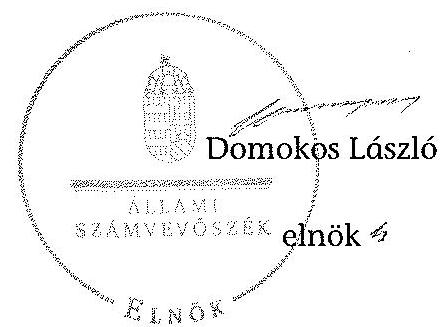
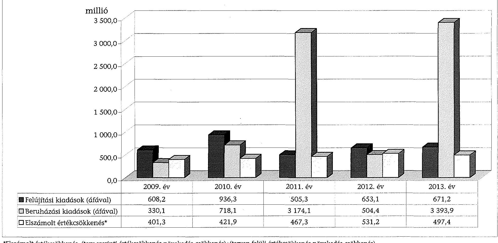
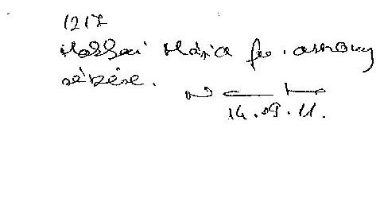
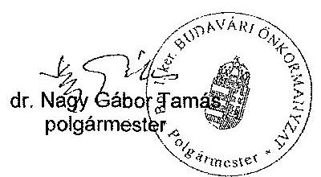
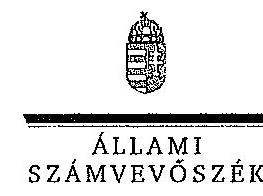

# ÁLLAMI   SZÁMVEVŐSZÉK 

## JELENTÉS

az önkormányzatok vagyongazdálkodása
szabályszerűségének ellenőrzéséről
Budapest I. kerület Budavár

---

# Állami Számvevőszék 

Iktatószám: V-0536-174/2014.
Témaszám: 1570
Vizsgálat-azonosító szám: V068301
Az ellenőrzést felügyelte:
Makkai Mária
felügyeleti vezető
Az ellenőrzést vezette és az ellenőrzés végrehajtásáért felelős:
Schósz Attila Ferencné
ellenőrzésvezető
A számvevőszéki jelentés összeállításában közreműködtek:
Molnár Istvánné
számvevő tanácsos
Molcsánné Márta Tünde
számvevő tanácsos
Gaálné Izsó Éva
számvevő tanácsos
Az ellenőrzést végezték:
Molnár Istvánné
Molcsánné Márta Tünde
számvevő tanácsos
Gaálné Izsó Éva
számvevő tanácsos

---

# TARTALOMJEGYZÉK 

BEVEZETÉS ..... 3
I. ÖSSZEGZŐ MEGÁLLAPÍTÁSOK, KÖVETKEZTETÉSEK ..... 6
II. RÉSZLETES MEGÁLLAPÍTÁSOK ..... 9

1. A vagyongazdálkodási tevékenység szabályozása ..... 9
1.1. A vagyongazdálkodási feladatellátás szabályozása ..... 9
1.2. A vagyon használatba adására, üzemeltetésére kötött szerződések megfelelősége ..... 12
2. A vagyongazdálkodási tevékenység szabályszerűsége ..... 14
2.1. A vagyon nyilvántartása és leltározása ..... 14
2.2. Meghatározó mértékű vagyonváltozások ..... 15
2.3. Beruházások, felújítások szabályszerűsége ..... 17
2.4. A vagyon értékesítésének, hasznosításának, a követelés elengedésének szabályszerűsége ..... 19
3. Az önkormányzati tulajdonosi jog gyakorlása ..... 22
4. Integritás érvényesülése ..... 23
5. A belső és a külső ellenőrzések hasznosulása ..... 24
5.1. A belső ellenőrzés javaslatainak hasznosulása ..... 24
5.2. A külső ellenőrzések javaslatainak hasznosulása ..... 25
MELLÉKLETEK
6. számú Budapest I. kerület Budavári Önkormányzat vagyonának alakulása 2009. január 1. és 2013. december 31. között
7. számú Budapest I. kerület Budavári Önkormányzat felújítási és beruházási kiadásainak, valamint az elszámolt értékcsökkenésnek a bemutatása a 2009-2013. években
8. számú Budapest I. kerület Budavári Önkormányzat polgármesterének észrevétele
9. számú Budapest I. kerület Budavári Önkormányzat polgármesterének észrevételére adott válasz

## FÜGGELÉKEK

1. számú Rövidítések jegyzéke
2. számú Értelmező szótár

---

# **Chemistry**

## **Chemical Reactions**

### **Balancing Chemical Equations**

1. **Write the unbalanced equation:**
   - Example: $$C_3H_8 + O_2 \rightarrow CO_2 + H_2O$$

2. **Balance the equation:**
   - Example: $$2C_3H_8 + 7O_2 \rightarrow 6CO_2 + 8H_2O$$

3. **Balance the equation:**
   - Example: $$2C_3H_8 + 7O_2 \rightarrow 6CO_2 + 8H_2O$$

### **Types of Reactions**

1. **Combination Reaction:**
   - Example: $$2H_2 + O_2 \rightarrow 2H_2O$$

2. **Decomposition Reaction:**
   - Example: $$2H_2O_2 \rightarrow 2H_2O + O_2$$

3. **Single Displacement Reaction:**
   - Example: $$Zn + 2HCl \rightarrow ZnCl_2 + H_2$$

4. **Double Displacement Reaction:**
   - Example: $$AgNO_3 + NaCl \rightarrow AgCl + NaNO_3$$

5. **Combustion Reaction:**
   - Example: $$CH_4 + 2O_2 \rightarrow CO_2 + 2H_2O$$

## **Stoichiometry**

### **Mole Concept**

- **Mole (mol):** The amount of substance containing as many particles (atoms, molecules, ions) as there are atoms in exactly 12 grams of carbon-12.
- **Avogadro's Number:** $$6.022 \times 10^{23}$$ particles per mole.

### **Molar Mass**

- **Molar Mass:** The mass of one mole of a substance.
- Example: The molar mass of water ($$H_2O$$) is 18.015 g/mol.

### **Calculations**

1. **Moles to Mass:**
   - Formula: $$n = \frac{m}{M}$$
   - Example: Calculate the number of moles of $$H_2O$$ in 18 grams of water.
     - $$n = \frac{18 \, \text{g}}{18.015 \, \text{g/mol}} \approx 0.999 \, \text{mol}$$

2. **Moles to Mass:**
   - Formula: $$m = n \times M$$
   - Example: Calculate the mass of 1 mole of water.
     - $$m = 1 \, \text{mol} \times 18.015 \, \text{g/mol} = 18.015 \, \text{g}$$

## **Gas Laws**

### **Ideal Gas Law**

- **Equation:** $$PV = nRT$$
- **Variables:**
  - $$P$$: Pressure (atm)
  - $$V$$: Volume (L)
  - $$n$$: Number of moles (mol)
  - $$R$$: Ideal gas constant (0.0821 L·atm/mol·K)
  - $$T$$: Temperature (K)

### **Boyle's Law**

- **Equation:** $$P_1V_1 = P_2V_2$$
- **Variables:**
  - $$P_1$$: Initial pressure (atm)
  - $$V_1$$: Initial volume (L)
  - $$P_2$$: Final pressure (atm)
  - $$V_2$$: Final volume (L)

### **Boyle's Law (Boyle's Law)**

- **Equation:** $$\frac{P_1V_1}{T_1} = \frac{P_2V_2}{T_2}$$

## **Thermochemistry**

### **Enthalpy (H)**

- **Definition:** The heat content of a system at constant pressure.
- **Equation:** $$\Delta H = q_p$$
- **Variables:**
  - $$\Delta H$$: Change in enthalpy (J or kJ)
  - $$q_p$$: Heat transferred at constant pressure (J or kJ)

### **Hess's Law**

- **Statement:** The enthalpy change for a reaction is the same whether it occurs in one step or multiple steps.
- **Equation:** $$\Delta H_{rxn} = \sum \Delta H_f (\text{products}) - \sum \Delta H_f (\text{reactants})$$
- **Variables:**
  - $$\Delta H_{rxn}$$ : Enthalpy change of reaction
  - $$\Delta H_f$$: Standard enthalpy of formation

### **Hess's Law (Hess's Law)**

- **Statement:** The enthalpy change for a reaction is the same whether it occurs in one step or multiple steps.
- **Equation:** $$\Delta H_{rxn} = \sum \Delta H_f (\text{products}) - \sum \Delta H_f (\text{reactants})$$
- **Variables:**
  - $$\Delta H_{rxn}$$ : Enthalpy change of reaction
  - $$\Delta H_f$$: Standard enthalpy of formation

## **Electrochemistry**

### **Oxidation and Reduction**

- **Oxidation:** Loss of electrons.
- **Reduction:** Gain of electrons.

### **Galvanic Cells**

- **Definition:** A cell that converts chemical energy into electrical energy.
- **Components:**
  - Anode: Oxidation occurs.
  - Cathode: Reduction occurs.
  - Salt Bridge: Connects the two half-cells.

### **Nernst Equation**

- **Equation:** $$E = E^\circ - \frac{RT}{nF} \ln Q$$
- **Variables:**
  - $$E$$: Cell potential (V)
  - $$E^\circ$$: Standard cell potential (V)
  - $$R$$: Ideal gas constant (8.314 J/mol·K)
  - $$T$$: Temperature (K)
  - $$n$$: Number of moles of electrons transferred
  - $$F$$: Faraday constant (96,485 C/mol)
  - $$Q$$: Reaction quotient

---

# JELENTÉS 

## az önkormányzatok vagyongazdálkodása szabályszerűségének ellenőrzéséről Budapest I. kerület Budavár

## BEVEZETÉS

Az ÁSZ stratégiai célkitűzése, hogy ellenőrzéseivel mind jobban segítse az átláthatóságot, az elszámoltathatóságot és elszámoltatást a közpénzekkel és a közvagyonnal való gazdálkodásban. Magyarország Alaptörvénye rögzíti, hogy az állam és a helyi önkormányzat tulajdona a nemzeti vagyon része. Az önkormányzati vagyon alapvető funkciója, hogy a közérdeket és egyúttal az önkormányzati célok - elsősorban a kötelezően ellátandó feladatok, és emellett a lehetőségek mértékéig az önként vállalt feladatok - megvalósítását szolgálja.

Az ÁSZ az önkormányzati vagyongazdálkodás 2012. évben indított és 2013. évben folytatott ellenőrzéseinek tapasztalatai alapján indokoltnak látta, hogy a 2014. évi ellenőrzési tervébe is beépítésre kerüljön a vagyongazdálkodási tevékenységek ellenőrzése. Az eddig elvégzett ellenőrzések rámutattak, hogy az önkormányzatok vagyongazdálkodási tevékenységét érintő szabályozottság, a kapcsolódó nyilvántartások, a beszámolók leltárral történő alátámasztása, a gazdálkodási jogkörök szabályszerű gyakorlása és a döntések megalapozottsága terén hiányosságok tapasztalhatók. Ez indokolttá tette a vagyongazdálkodás ellenőrzésének folytatását a jelentős vagyonnal rendelkező, vagy az ÁSZ kockázatelemzése alapján magas vagyoni kockázatot mutató önkormányzatoknál.

Az ellenőrzés célja annak megállapítása volt, hogy az önkormányzat vagyongazdálkodási tevékenységét a jogszabályi előírásokkal összhangban szabályozta-e, a vagyon nyilvántartása és a vagyongazdálkodási tevékenységek végrehajtása a jogszabályoknak és a belső előírásoknak megfelelően történt-e. Az ellenőrzés célja továbbá annak megállapítása, hogy az önkormányzatnál a vagyongazdálkodás során biztosították-e az átláthatóságot, valamint a külső és belső ellenőrzések megállapításai, javaslatai hozzájárultak-e a szabályszerű vagyongazdálkodáshoz.

Ennek keretében értékeltük, hogy az Önkormányzat:

- szabályszerűen alakította-e ki vagyongazdálkodási tevékenységének kereteit;
- biztosította-e a vagyongazdálkodás szabályszerűségét, megalapozottan hozta-e és jogszerűen, szabályszerűen hajtotta-e végre a vagyonváltozást eredményező meghatározó jelentőségű döntéseket;
- gondoskodott-e a tulajdonosi jogok gyakorlásáról;

---

- vagyongazdálkodási tevékenysége során biztosította-e az átláthatóság és az integritás érvényesülését;
- belső ellenőrzése elősegítette-e a vagyongazdálkodás szabályszerű működését, valamint hasznosította-e a vagyongazdálkodási tevékenységével kapcsolatos külső és belső ellenőrzések megállapításait, javaslatait.

Az ellenőrzés várható hasznosulása, hogy feltárja az önkormányzati vagyongazdálkodást meghatározó szabályok, szabályozások összhangjának hiányosságait, a szabályozással nem érintett vagyongazdálkodási területeket, a vagyongazdálkodási tevékenység gyakorlásának esetleges szabálytalanságait, valamint a jó gyakorlat kialakításán és terjesztésén keresztül az ellenőrzések elősegíthetik a vagyongazdálkodás szabályszerűségének javítását.

Az ellenőrzés típusa: szabályszerűségi ellenőrzés
Az ellenőrzött időszak: 2009. január 1-jétől 2013. december 31-ig, illetve a közbeszerzési eljárások lefolytatásának ellenőrzése 2012. január 1-jétől az Önkormányzat helyszíni ellenőrzésének kezdetét megelőző negyedév végéig (2014. március 31-ig) tartott.

Ellenőrzött szervezet: Budapest I. kerület Budavári Önkormányzat
Az ellenőrzés végrehajtásának jogszabályi alapját az Állami Számvevőszékről szóló 2011. évi LXVI. törvény 1. § (3) bekezdése, az 5. § (2)-(6) bekezdései, valamint az államháztartásról szóló 2011. évi CXCV. törvény 61. § (2) bekezdésének előírásai képezik.

Az ellenőrzés szakmai módszertana az ÁSZ hivatalos honlapján közzétett szakmai szabályokon alapult, amely a Legfőbb Ellenőrző Intézmények Nemzetközi Szervezete (INTOSAI) által kiadott nemzetközi standardok (ISSAI) figyelembevételével készült.

Az ellenőrzést az ÁSZ hatályos szervezeti szabályai és az ellenőrzési programban foglalt értékelési szempontok szerint folytattuk le. Megállapításainkat a helyszíni ellenőrzés tapasztalataira, az ellenőrzött szervezettől bekért dokumentumokra, a kitöltött tanúsítványok elemzésére, az adott időszakban hatályos jogszabályok és belső szabályzatok előírásaira alapoztuk. A részesedések értékelését tételesen ellenőriztük, míg irányított mintavétellel választottuk ki az ellenőrzött térítésmentes átadás-átvételeket, a beruházásokat, felújításokat, a közbeszerzési eljárásokat, a vagyon értékesítését, hasznosítását és a követelés elengedést, illetve leírást. A belső kontrollok megfelelő működését (a szakmai teljesítésigazolást, valamint a 2009-2011. években az utalvány ellenjegyzést, a 2012-2013. években az érvényesítést) a Polgármesteri hivatal felhalmozási kiadásaiból választott véletlen minta alapján, megfelelőségi teszttel ellenőriztük.

Az I. kerület lakosainak száma 2013. január 1-jén 25670 fő volt. A 2010. évi önkormányzati választásokig a 24 tagú Képviselő-testület munkáját hat állandó bizottság segítette. Az önkormányzati választások után a Képviselő-testület létszáma 15 főre csökkent és négy állandó bizottság működött. A polgármester az 1998. évi önkormányzati választás óta tölti be tisztségét, a jelenlegi jegyző 2013. december 1-jétől látja el feladatait.

---

Az Önkormányzat a 2013. évben az önállóan működő és gazdálkodó Polgármesteri hivatalon felül kettő önállóan működő és gazdálkodó, valamint öt önállóan működő költségvetési szervvel látta el a feladatát. A Polgármesteri hivatal négy szervezeti egységre tagolódott, elkülönített gazdasági szervezettel rendelkezett. A foglalkoztatott köztisztviselők száma 2013. december 31-én 92 fő volt. A vagyongazdálkodással kapcsolatos feladatokat a Polgármesteri hivatal Pénzügyi Igazgatóságához tartozó Gazdasági, Beruházási és Városüzemeltetési Iroda, valamint a Vagyoni Iroda látta el.

Az Önkormányzatnak a 2013. évben kettő 100%-os tulajdonú gazdasági társasága volt. A Budai Vár védett területén megvalósított gépjármű beléptető és parkolási rendszer üzemeltetési feladatait 2010. június 30-ig az Önkormányzat költségvetési szerve (GAMESZ), 2010. július 1-je és 2011. február 28-a között az Önkormányzat 100%-os tulajdonában levő Házgondnokság Kft. látta el. Ezt követően a parkolási feladatot a szintén 100%-ban önkormányzati tulajdonú Budavári Kapu Kft. végezte. A Házgondnokság Kft. a 2011. évtől a társasházak - köztük az önkormányzati tulajdonban lévők társasházi lakások - közös képviseletét látta el.

Az Önkormányzatnak a 2011. évtől egy haszonélvezeti jogot alapító szerződése volt hatályban. Az ellenőrzött időszakban az Önkormányzat vállalkozási tevékenységet nem végzett, vagyonkezelési és koncessziós jogot alapító szerződést nem kötött, PPP konstrukcióban megvalósított fejlesztésre nem került sor. Az ÁSZ 2009-2013. évek között az Önkormányzatnál ellenőrzést nem végzett.

Az Önkormányzat könyvviteli mérleg szerinti vagyona a 2009. évi 18042,0 millió Ft-os nyitó értékről a 2013. év végére 28888,5 millió Ft-ra, 60,1%-kal növekedett. A befektetett eszközökön belül elsősorban a

 tárgyi eszközök növekedtek. A forgóeszközökön belül a pénzeszközök emelkedése volt a meghatározó. Az Önkormányzat összes kötelezettségének állományi értéke 2013. december 31-én 2141,5 millió Ft, ebből a rövid és hosszú lejáratú kötelezettségek értéke 2079,7 millió Ft volt. A pénzintézeti kötelezettség állományi értéke 1177,2 millió Ft-ot tett ki, mely a 2014. évi adósság átvállalás eredményeként megszűnt. Az Önkormányzat 2013. évi költségvetési beszámolója szerint 11284,2 millió Ft költségvetési bevételt ért el és 10230,9 millió Ft költségvetési kiadást teljesített. Felhalmozási célú kiadásra 4207,3 millió Ft-ot, ezen belül felújítási és beruházási kiadásokra 4065,1 millió Ft-ot fordítottak.

Az Önkormányzat vagyonának főbb adatait, továbbá a felújítási és beruházási kiadásokat, valamint az elszámolt értékcsökkenést az 1-2. számú mellékletek mutatják be. Az alkalmazott rövidítéseket és az egyes fogalmak magyarázatát az 1-2. számú függelék tartalmazza.

Az ÁSZ a 2011. évi LXVI. törvény 29. §-a szerint a jelentéstervezetet megküldte Budapest I. kerület Budavári Önkormányzat polgármesterének egyeztetésre. A polgármester észrevételét és az arra adott választ a jelentés 3-4. számú mellékletei tartalmazzák.

---

# I. ÖSSZEGZŐ MEGÁLLAPÍTÁSOK, KÖVETKEZTETÉSEK 

Az Önkormányzat vagyongazdálkodási tevékenységének kereteit 2012. január 1. és 2013. május 31. közötti időszakot kivéve - szabályszerűen alakította ki. A 2012. január 1. és 2013. május 31. közötti időszakban az Áht. ${ }_{2}$ ben előírtak ellenére nem határozták meg az önkormányzati követelésről való lemondás eseteit. Az Önkormányzat továbbá az Nvtv. előírásaitól eltérő eseteket határozott meg a tulajdonában lévő vagyon ingyenes átruházására, valamint nem egyértelműen (bruttó, vagy nettó összeg) szabályozta a vagyon értékesítésére - az Áht. ${ }_{1}$-ben és az Nvtv.-ben - előírt pályáztatási kötelezettség értékhatárát. A Képviselő-testület - 2012. június 1. és 2013. május 31. között - az Mötv.-ben és a vagyongazdálkodási rendeletben előírtak ellenére nem rendelkezett a vagyonkezelői jog megszerzésének szabályairól. A hiányosságokat az Önkormányzat 2013. június 1-jétől megszűntette.

A vagyongazdálkodási rendeletben meghatározták az önkormányzati feladatellátást biztosító törzsvagyont, ezen belül elkülönítették a forgalomképtelen és a korlátozottan forgalomképes vagyonelemek körét. A forgalomképtelen vagyon tulajdonjogának megszerzése, a forgalomképes vagyon elidegenítése a Képviselő-testület hatáskörébe tartozott. A Képviselő-testület az Ötv.-ben és az Mötv.-ben biztosított jogával élve az önkormányzati SZMSZ-ben és a vagyongazdálkodási rendeletben - értékhatárhoz kötve - a polgármesternek, a Tulajdonosi, illetve a Pénzügyi és Tulajdonosi bizottságnak adott át vagyongazdálkodási hatáskört. Az Önkormányzat az Nvtv.-ben megjelölt határidőre, 2012. március 1-jéig meghatározta a forgalomképtelennek minősülő vagyonából a nemzetgazdasági szempontból kiemelt jelentőségű nemzeti vagyonként forgalomképtelen törzsvagyonnak minősített vagyonelemeket.

A Polgármesteri hivatal - az ellenőrzött időszakban - rendelkezett az Áhsz. ${ }_{1}$ ben foglaltaknak és a helyi sajátosságoknak megfelelő számviteli politika ${ }_{1-5}$-tel és a hozzá kapcsolódó pénzügyi-számviteli szabályzatokkal. A Képviselőtestület az eszközök mennyiségi felvétellel történő leltározását - az Áhsz. ${ }_{1}$ alapján - a vagyongazdálkodási rendeletben 2012. május 31-ig kétévente írta elő. A leltározási szabályzat ${ }_{1-3}$-ban - ezzel összhangban - a 2009-2011. években kétévenkénti, ezt követően évenkénti mennyiségi leltározást írták elő. Az operatív gazdálkodással kapcsolatos eljárásrendet, jogkörgyakorlást és az összeférhetetlenségi követelményeket - az Ámr. ${ }_{1,2}$-ben és az Ávr.-ben előírtaknak megfelelően - a gazdálkodási szabályzat ${ }_{1-8}$-ban rögzítették. A Polgármesteri hivatalban a gazdálkodási jogköröket az ellenőrzött felhalmozási kiadások esetében az Ámr. ${ }_{1,2}$, az Ávr., valamint a gazdálkodási szabályzat ${ }_{1-8}$-ban rögzítetteknek megfelelően szabályszerűen gyakorolták, a jogszabályokban előírt összeférhetetlenségi követelményeket betartották.

Az Önkormányzat az ellenőrzött időszakban a vagyonkezelési, üzemeltetési, működtetési feladatokat elsősorban a GAMESZ, illetve a 100%-os tulajdonú gazdasági társaságai útján látta el. Az üzemeltetési szerződések, illetve megállapodások alapján a vagyonelemek üzemeltetésre történő átadása a Képviselőtestület döntésének megfelelően, szabályszerűen történt. Az Önkormányzat a

---

tulajdonában lévő társasági részesedések esetében az Nvtv.-ben - 2012. december 31-i határidőig - előírt felülvizsgálati kötelezettségének eleget tett. Az Önkormányzatnak tulajdonosi érdekeltségei - egy kivétellel, amelyben az Önkormányzat részesedése 0,93% - átlátható szervezetekben voltak. Az Nvtv.-ben előírtak ellenére az Önkormányzat egy gazdasági társaság esetében nem kezdeményezte a gazdálkodó szervezet tulajdonosi szerkezetének e törvény előírásainak megfelelő átalakítását, vagyongazdálkodási szempontok alapján társasági részesedésének fenntartása mellett döntött.

Az Önkormányzatnál az ellenőrzött időszakban a vagyongazdálkodás működésének szabályszerűségét összességében biztosították. Az Önkormányzat a vagyon nyilvántartása során - a 2010-2012. évekre vonatkozó vagyonkimutatások kivételével - betartotta a jogszabályokban, a vagyongazdálkodási rendeletben és a belső szabályzatokban előírt követelményeket. A vagyonkimutatást minden évben elkészítették, amely a 2009. és a 2013. években megfelelt az előírásoknak. A 2010-2012. években az Áhsz. ${ }_{1}$-ben előírtak ellenére nem mutatták ki a „0”-ra leírt, de használatban lévő, illetve használaton kívüli eszközök állományát.

A jegyző ${ }_{1,2,4,6}$ - a 147/1992. (XI. 6.) Korm. rendelet előírása alapján - biztosította a számviteli nyilvántartás, az ingatlanvagyon-kataszter, és a földhivatali ingatlan-nyilvántartás azonos tartalmú adatai közötti egyezőséget. Az Önkormányzat az Áhsz. ${ }_{1-2}$-ben előírt leltározási kötelezettségének - a leltározási szabályzat ${ }_{1-2}$-ben foglaltaknak megfelelően - eleget tett. Az eszközök mennyiségi felvétellel történt leltározását a vagyongazdálkodási rendelet előírásainak megfelelően a 2010., 2012., 2013. években végezték el. Az üzemeltetésre, kezelésre átadott eszközök leltározását a 2010-2013. évekre vonatkozóan az Áhsz. ${ }_{1}$ előírásának megfelelően az üzemeltetetést, kezelést végző szerv elvégezte.

Az Önkormányzat az ellenőrzött időszakban megalapozottan, a gazdasági program ${ }_{1,2}$-ben foglalt fejlesztési célkitűzésekkel, a kötelező és önként vállalt feladatok ellátásával összhangban - a hatásköri előírások betartásával - döntött a beruházásokról és felújításokról. A fejlesztéseket szabályszerűen hajtották végre, valamint biztosították azok finanszírozhatóságát és fenntarthatóságát. Az Önkormányzat a 2012. év és a 2014. év I. negyedév vége közötti időszakban minden közbeszerzési értékhatárt elérő, vagy azt meghaladó felhalmozási célú beszerzés esetében közbeszerzési eljárást folytatott le. Az ellenőrzött közbeszerzési eljárások lebonyolítása megfelelt a Kbt. ${ }_{2}$ és a belső (közbeszerzési) szabályzat előírásainak. A szerződéseket - a pályázati kiírásnak megfelelően a legalacsonyabb összegű ellenszolgáltatást nyújtó, illetve az összességében legelőnyösebb ajánlattevővel kötötték meg. Az Önkormányzat - a Kbt. ${ }_{2}$ előírásai ellenére - a szerződésekkel kapcsolatos közzétételi kötelezettségének egy esetben, valamint egy előzetes vitarendezésnél nem tett eleget, az eljárás eredményére vonatkozóan egy esetben, a szerződések módosításánál két esetben késve teljesítette.

A vagyonváltozást eredményező döntéseket a jogszabályokban és a vagyongazdálkodási rendeletben előírtaknak megfelelően az arra felhatalmazottak (Képviselő-testület, polgármester, illetékes bizottságok) hozták meg. Az Önkormányzat az értékesítésre vonatkozó döntések során betartotta az Áht. ${ }_{1}$-ben és az Nvtv.-ben foglalt, nyilvános (indokolt esetben zártkörű) versenytárgyalás-

---

ra, versenyeztetésre vonatkozó előírást. A Képviselő-testület - a vagyongazdálkodási rendelet előírása ellenére - egy esetben nem döntött a pályázat formájáról, határozata a vételárra és a vevőre vonatkozott, továbbá két esetben három hónapnál régebbi volt az értékbecslés. Az ellenőrzött követelések elengedése, illetve a behajthatatlan követelések leírása szabályszerű volt, azokat megfelelő döntésekkel, illetve dokumentumokkal alátámasztották.

Az Önkormányzat - a 2009-2013. években - tartós részesedéseivel felelősen gazdálkodott, az alapító okiratokban rögzített tulajdonosi jogokat gyakorolta. Az ellenőrzött időszakban a Képviselő-testület megtárgyalta és elfogadta a 100%-ban tulajdonában lévő gazdasági társaságok éves beszámolóit és az üzleti terveket. Az Önkormányzat nyomon követte a gazdasági társaságai kötelezettség állományának alakulását, a folyamatos üzletmenet fenntarthatóságát, a társaságok alapfeladatainak teljesülését és a feladatellátás hatékonyságát. Az Önkormányzatnál - az értékelési szabályzat ${ }_{1.5}$-ben foglaltaknak megfelelően - minden évben vizsgálták a tulajdonosi részesedések, valamint az egyéb tartós részesedések alakulását, az abban bekövetkezett változásokat.

Az Önkormányzatnál a vagyongazdálkodási tevékenység integritása (feddhetetlensége) szempontjából az eredendő és a korrupciós kockázatok értéke - a 2013. évben az ÁSZ által - az önkormányzati alrendszerben mért átlagértékhez képest magasabb. Az Önkormányzatnál kiépült kontrollok azonban képesek kezelni a kockázatokat, valamint támogatni a szervezet feladatellátását.

Az ellenőrzött időszakban az Önkormányzat 170 belső ellenőrzést hajtott végre, amelyből 31 ellenőrzési jelentés a vagyongazdálkodással kapcsolatban is tartalmazott javaslatokat. A hiányosságok megszüntetésére intézkedési tervek készültek. A belső ellenőrzés megállapításaival, javaslataival segítette az Önkormányzat vagyongazdálkodásának szabályszerű működését. A javaslatok azonban maradéktalanul nem hasznosultak, mivel a közbeszerzések esetében a szerződések közzétételi kötelezettségének az Önkormányzat nem minden esetben, illetve késve tett eleget. A 2013. évről készített, intézményekre vonatkozó éves összefoglaló ellenőrzési jelentést - a Bkr.-ben foglaltak ellenére - a polgármester nem terjesztette a Képviselő-testület elé, míg a Polgármesteri hivatalra vonatkozó jelentést igen.

Az Önkormányzat hasznosította az ellenőrzött időszakban végzett külső ellenőrzések - vagyongazdálkodással összefüggő - megállapításait, javaslatait. A Kormányhivatal törvényességi felhívására a vagyongazdálkodási rendeletet módosították. Az Önkormányzat 2009-2013. évi költségvetési beszámolóit a könyvvizsgáló minden évben megbízhatónak és hitelesnek minősítette, a 2010. és a 2011. években a költségvetési intézmények gazdálkodására vonatkozóan figyelemfelhívással élt.

---

# II. RÉSZLETES MEGÁLLAPÍTÁSOK 

## 1. A VAGYONGAZDÁLKODÁSI TEVÉKENYSÉG SZABÁLYOZÁSA

### 1.1. A vagyongazdálkodási feladatellátás szabályozása

Az Önkormányzat a vagyongazdálkodással kapcsolatos célkitűzéseit, feladatait a 2009-2013. években hatályos gazdasági program ${ }_{1,2}$-ben határozta meg.

Az Önkormányzat a gazdasági program ${ }_{1}$-ben célul tűzte ki az önkormányzati tulajdonban levő helyiségek bérleti dijának növelését, az évek óta nem használt helyiségek hasznosítását. További célként nevezték meg az ingatlan fenntartási tevékenység jobb színvonalú, takarékosabb biztosítását, az utak és járdák akadálymentesítését, a társasház felújítási program folytatását, a térfigyelő kamerák számának bővítését. A feladatok megvalósításának forrásaként a hatékonyabb feladatellátásból, a saját bevételek növeléséből, valamint a pályázati támogatások igénybevételéből származó bevételeket jelölték meg. A gazdasági program ${ }_{2}$ ben a műemlék lakóházak és az utak további felújítását, a városképi szempontból kiemelt területek megújítását, a közvilágítás korszerűsítését tűzték ki célul. A feladatok finanszírozási forrásaként a saját bevételek növelését fogalmazták meg. A fő célok megvalósítására - határidők megjelölésével - intézkedési tervet készítettek.

Az Nvtv. 9. § (1) bekezdésében ${ }^{1}$ előírt közép- és hosszú távú vagyongazdálkodási tervet a Képviselő-testület 2013. december 31-ig nem fogadott el.

Az Önkormányzat - az államháztartáson kívüli szervezetekkel ellátott feladatokon kívül - a 2009-2013. években részben az önkormányzati SZMSZ-ben, részben az éves költségvetési rendeletekben határozta meg a kötelező és önként vállalt feladatainak körét, azok ellátásának mértékét és módját. A két 100%-ban önkormányzati tulajdonban lévő gazdasági társaság (Házgondnokság Kft. és Budavári Kapu Kft.) által ellátott közfeladatokat az Önkormányzat az Ötv. 16. § (1) bekezdésében előírtak ellenére nem határozta meg önkormányzati rendeletben, azokat csak az alapító okiratokban fogalmazták meg. Az Önkormányzat 2013. évi költségvetési rendelete - az Mötv. 111. § (3) bekezdésében előírtaknak megfelelően - elkülönítetten tartalmazta a kötelező és önként vállalt feladatok ellátásának forrásait és kiadásait.

Az Önkormányzat kötelező feladatait döntő részben költségvetési intézményrendszerén keresztül látta el. Az önkormányzati tulajdonú lakás és helyiség üzemeltetési, fenntartási feladat a GAMESZ-hez tartozott. A Budai Vár védett területén megvalósított gépjármű beléptető és parkolási rendszer üzemeltetési feladatait 2010. június 30-ig a GAMESZ, 2010. július 1. és 2011. február 28. között - az
 Ötv. 9. § (5) bekezdésében előírtaknak megfelelően – az Önkormányzat 100%-os tulajdonában levő Házgondnokság Kft. látta el. Ezt követően a parkolási felada-

[^0]
[^0]:    ${ }^{1}$ Az Nvtv. nem tartalmaz konkrét határidőt a közép- és hosszú távú vagyongazdálkodási terv elkészítésére vonatkozóan.

---

tokat az erre a feladatra 2010. december 16-án alapított, szintén az Önkormányzat tulajdonában lévő Budavári Kapu Kft., a társasházak – köztük az önkormányzati tulajdonban lévő társasházi lakások – közös képviseletét a Házgondnokság Kft. látta el.

Az Önkormányzat vagyongazdálkodási tevékenységének kereteit 2012. január 1. és 2013. május 31. közötti időszakot kivéve – szabályszerűen alakította ki. A Képviselő-testület – a Htv. 138. § (1) bekezdés j) pontjában előírtaknak megfelelően – az önkormányzati vagyongazdálkodási feladatokat a vagyongazdálkodási rendeletben szabályozta. Meghatározták és aktualizálták az önkormányzati feladatellátást biztosító törzsvagyont, ezen belül elkülönítették a forgalomképtelen és a korlátozottan forgalomképes vagyonelemek körét. A vagyongazdálkodási rendeletben rendelkeztek az egyes önkormányzati vagyonelemek forgalomképesség szerinti besorolása megváltoztatásának módjáról, amely szerint a forgalomképesség megváltoztatásáról a Képviselő-testület jogosult dönteni. A Képviselő-testület az Nvtv. 18. § (1) bekezdésében meghatározott határidőre – 2012. március 1-jéig – felülvizsgálta a törzsvagyonba tartozó vagyonelemeit. A Várnegyedet és a környezetében lévő közterületeket, valamint három kiemelt I. kategóriába tartozó műemléki védettségű ingatlant soroltak a nemzetgazdasági szempontból kiemelt jelentőségű nemzeti vagyonba, melyek körét 2013. június 1-jétől további műemléki védelem alatt álló lakóingatlanokkal bővítettek ki.

A Képviselő-testület az Ötv. 9. § (3) bekezdése ${ }^{2}$ alapján az önkormányzati SZMSZ-ben és a vagyongazdálkodási rendeletben – értékhatárokhoz kötve – a polgármesternek és a Tulajdonosi, illetve a Pénzügyi és Tulajdonosi bizottságnak adott át vagyongazdálkodási hatáskört. Az átruházott hatáskörök gyakorlásáról a Képviselő-testület részére történő évenkénti beszámolási kötelezettséget az önkormányzati SZMSZ-ben írták elő. A beszámolási kötelezettséget az éves zárszámadások beterjesztésével egyidejűleg teljesítették.

A forgalomképtelen vagyonnak a tulajdonjogát nem érintő hasznosítása a pol-
gármester, míg annak megszerzése a Képviselő-testület hatáskörébe tartozott. A
korlátozottan forgalomképes vagyontárgyak megterheléséről, bérleti, vagy hasz-
nálati jogának átengedéséről 20,0 millió Ft értékhatárig a Tulajdonosi bizottság,
a Pénzügyi és Tulajdonosi bizottság, felette a Képviselő-testület volt jogosult dön-
teni. A forgalomképes önkormányzati (üzleti) vagyon elidegenítése, gazdasági
társaságba apportként történő bevitele a Képviselő-testület hatáskörébe tartozott.
Ezen vagyoni kör tulajdonjogát nem érintő hasznosításáról 20,0 millió Ft-ig a
polgármester, 20,0-50,0 millió Ft között a Tulajdonosi bizottság, a Pénzügyi és
Tulajdonosi bizottság, felette a Képviselő-testület dönthetett.
A vagyongazdálkodási rendeletben – a 2012. június 1. és 2013. május 31. közötti időszakot kivéve – az Ötv. és az Mötv. előírásának megfelelően a vagyonkezelői jog megszerzésének eljárásrendjét szabályozták, meghatározták azt a vagyoni kört, amelyre vagyonkezelői jog létesíthető, valamint az ingyenes átengedés eseteit.

[^0]
[^0]:    ${ }^{2}$ 2013. január 1-jétől az Mötv. 41. § (4) bekezdése írja elő.

---

A Kormányhivatal 2013. március 21-én tett törvényességi felhívásában megfogalmazott észrevételt követően, 2013. június 1-jével a vagyongazdálkodási rendeletben a feltárt szabályozási hiányosságokat megszűntették.

A vagyon üzemeltetésre történő átadásának, az üzemeltető ellenőrzésének, a vagyon használatba adásának és a vagyonhasználat ellenőrzésének részletes szabályait a vagyongazdálkodási rendeletben nem rögzítették, azokat a – Budai Várbarlang Szentháromság téri lejárata kivételével – szerződésekben, megállapodásokban határozták meg.

A vagyongazdálkodási rendeletben meghatározták az Önkormányzat tulajdonában lévő vagyon ingyenes átruházásának módját és eseteit, ami 2012. január 1. és 2013. május 31. között nem felelt meg az Nvtv. 13. § (3) bekezdése előírásának, mivel attól eltérő eseteket határozott meg. A vagyongazdálkodási rendeletben az önkormányzati követelés lemondásának eseteit – az Áht. 108. § (2), illetve az Áht. 97. § (2) bekezdéseiben előírtak ellenére – nem határozták meg, módját azonban rögzítették. Az Önkormányzat a vagyon értékesítésére a nyilvános pályáztatási kötelezettséget – az Áht. 108. § (1), illetve az Nvtv. 13. § (1) bekezdésében előírtaknak megfelelően – a vagyongazdálkodási rendeletben határozta meg, azonban nem rögzítette egyértelműen az értékhatárokat (bruttó, vagy nettó összeg).

Az Önkormányzat – a Kormányhivatal észrevétele alapján – a 13/2013. (V. 31.) számú rendeletével módosította a vagyongazdálkodási rendeletet, és intézkedtek a jogsértések megszüntetéséről. Az önkormányzati vagyon tulajdonjogának ingyenes átruházását kizárólag a törvényben meghatározott módon és esetekben tették lehetővé. Követelés lemondására csak abban az esetben van lehetőség, ha a követelés teljesítése valamilyen okból nem áll az Önkormányzat érdekében. A versenyeztetési kötelezettséget a mindenkori költségvetési törvényben – a 2013. évben 25,0 millió Ft egyedi bruttó forgalmi érték – meghatározott értékhatárhoz kötötték.

Magán-, illetve jogi személy, valamint jogi személyiséggel nem rendelkező szervezet tartozásának méltányosságból történő elengedésére az ellenőrzött időszakban (értékhatárhoz kötve) a polgármester, a Pénzügyi bizottság, a Pénzügyi és Tulajdonosi bizottság, illetve a Képviselő-testület volt jogosult dönteni. A vagyon értékesítésére, kezelésbe adására, használati jogának átadására a nyilvános pályáztatási kötelezettség értékhatára 2009. január 1. és 2013. május 31. között 20,0 millió Ft volt.

Az Önkormányzat a vagyongazdálkodási rendeletben – az Áhsz. 1 44/A. § (1)(3) bekezdéseivel ${ }^{3}$ összhangban, az Áhsz. 1. számú mellékletében előírt részletezettséggel – határozta meg a vagyonkimutatás tartalmát. Az Önkormányzat nem élt az Áhsz. 44/A. § (2) bekezdésében foglalt lehetőséggel, a vagyonkimutatás további tételes alábontását rendeletben nem határozta meg.

A Polgármesteri hivatal rendelkezett az Áhsz. ${ }_{1}$-nek és a helyi sajátosságoknak megfelelő számviteli politika ${ }_{1-5}$-tel és az annak részét képező pénzkezelési, leltározási ${ }_{1-5}$, selejtezési ${ }_{1-3}$ és értékelési ${ }_{1-5}$ szabályzatokkal. Az Önkormányzat a számviteli politika ${ }_{1-5}$-ben és az értékelési szabályzat ${ }_{1-5}$-ben történt szabályozás

[^0]
[^0]:    ${ }^{3}$ 2014. január 1-jétől az Áhsz. 2 30. § (1)-(3) bekezdései szabályozzák.

---

szerint a befektetett pénzügyi eszközök vonatkozásában élt az Áhsz. 1 32. § (7) bekezdésében ${ }^{4}$ biztosított piaci értéken történő értékelés lehetőségével.

A Képviselő-testület az eszközök (a csak értékben nyilvántartott eszközök kivételével) mennyiségi felvétellel történő leltározását – az Áhsz., 37. § (7) bekezdése alapján – a vagyongazdálkodási rendeletben 2012. május 31-ig kétévente írta elő. A leltározási szabályzat ${ }_{1-3}$-ban – ezzel összhangban – a 2009-2011. években kétévenkénti, ezt követően évenkénti mennyiségi leltározást írtak elő.

A gazdálkodási szabályzat ${ }_{1-8}$-ban – az Ámr. ${ }_{1,2}$-ben és az Ávr.-ben előírtaknak megfelelően – meghatározták az operatív gazdálkodással kapcsolatos eljárásrendet és az összeférhetetlenségi követelményeket ${ }^{5}$. A Polgármesteri hivatalban a gazdasági szervezet feladatait a hivatali $\mathrm{SZMSZ}_{2}$ szerint a Pénzügyi Igazgatóság és az irányítása alá tartozó Gazdasági Iroda végezte. A hivatali $\mathrm{SZMSZ}_{2^{-}}$ ben megnevezték a gazdasági vezető személyét is, e feladatot a mindenkori pénzügyi igazgató látta el.

# 1.2. A vagyon használatba adására, üzemeltetésére kötött szerződések megfelelősége 

Az Önkormányzat az ellenőrzött időszakban koncessziós szerződést, az Ötv. 80/A. § előírása ${ }^{6}$ szerinti vagyonkezelési szerződést nem kötött, vagyonkezelői jogot nem alapított.

Az Önkormányzat az ellenőrzött időszakot megelőzően, a 2005. évben 10 évre szóló „koncessziós szerződést" kötött a közterületeit érintő és a közterületeiről látható hirdetésekkel és reklámokkal kapcsolatos rendszergazdai tevékenység ellátására, amely azonban tartalmában nem felelt meg a koncesszióról szóló 1991. évi XVI. törvényben előírtaknak, mert a szerződésben rögzített kötelmek vegyes tartalmú (vállalkozási, üzemeltetési) jogviszonyokat tartalmaztak.

Az ellenőrzött időszakban az Önkormányzat egy ingyenes használatba adási megállapodást, egy üzemeltetési szerződést és kettő (tartalmában üzemeltetési szerződésnek megfelelő) megállapodást kötött.

Az Önkormányzat határozatában foglaltaknak megfelelően került sor a 2010. évben a (Budai Várbarlang és a Rácskai barlang állagmegóvó rekonstrukciójának a Duna-Ipoly Nemzeti Park által történő elvégzését követően a projekt keretében megépítésre kerülő) Szentháromság téri lejárat és pavilon Duna-Ipoly Nemzeti Park részére történő ingyenes használatba adására.

A vagyonelemek üzemeltetésre történő átadása a Képviselő-testület döntése alapján szabályszerűen történt. Az üzemeltetési szerződésben, megállapodásokban az üzemeltetésre átadott vagyonnal való gazdálkodás szabályait, a vagyon állagának, értékének megőrzési feladatát, a vagyonnal való vállalkozás feltételeit meghatározták. Az üzemeltetési szerződésben szabályozták a beszámolási, nyilvántartási és adatszolgáltatási kötelezettséget. Előírták az évenkénti leltározás dokumentálási, adatszolgáltatási feladatait.

A 2010. évben alapított, 100%-os önkormányzati tulajdonban levő Budavári Kapu Kft.-vel az Önkormányzat 2011. március 1-jétől kötötte meg három éves határozott időtartamra a kötelező közfeladatai körébe tartozó parkolási feladatok ellátására az üzemeltetési szerződést. A szerződésnek az Nvtv. hatályba lépése utáni módosításában rögzítették, hogy az üzemeltető az Nvtv. 3. § (1) bekezdés ag) pontja alapján átlátható szervezet.

Az Önkormányzat ezen kívül két megállapodást kötött, amelyek alapján az átadott épületet, építményt és eszközöket az üzemeltetésre átadott eszközök között tartotta nyilván. A 2011. évben a Halászbástya északi szakaszán lévő étterem épületét és a hozzá tartozó berendezési eszközöket adta át üzemeltetésre. A Szentháromság téri pénztárfülke és információs pavilont a 2011. évtől az INCORONATA Mátyás-templom Kulturális Központjával kötött megállapodás felülvizsgálatát követően szerepeltették az üzemeltetésre átadott eszközök között (ezt megelőzően közös tulajdonú építményként tartották nyilván).

Az Önkormányzat az ellenőrzött időszakban az üzemeltetésre átadott eszközök után 363,9 millió Ft értékcsökkenést számolt el, ezzel szemben az eszközök pótlására, felújítására 1058,8 millió Ft-ot fordított.

Az Önkormányzat az Nvtv. 18. § (9) bekezdésében előírt rendelkezésnek megfelelően felülvizsgálta a 2012. július 1. napját megelőzően kötött haszonélvezeti jogot alapító szerződését, és megállapította, hogy a gazdálkodó szervezet átlátható.

Az Önkormányzat 2006. március 31-én megállapodást kötött az Oxygen Wellness Kft.-vel arra, hogy az Önkormányzat Czakó utca 2-4. szám alatti sporttelepén a vállalkozó felépít egy többfunkciós sportkomplexumot. Az Önkormányzat 2011. október 25-én ingatlan adásvételi szerződést kötött – haszonélvezeti jog fenntartása mellett – az Oxygen Wellness Kft.-vel. Az Oxygen Wellness Kft. 40 év haszonélvezeti jog fenntartása mellett adta el az Önkormányzat részére az ingatlant 2102,3 millió Ft+áfa összegben, amelyből a haszonélvezettel terhelt rész 2002,3 millió Ft+áfa volt.

Az Önkormányzat a tulajdonában lévő társasági részesedések esetében az Nvtv. 18. § (4) bekezdésében szereplő 2012. december 31-i határidőig előírt felülvizsgálati kötelezettségének eleget tett. Az Önkormányzatnak tulajdonosi érdekeltségei – 1993 szeptemberétől az Olimpia Kft.-ben lévő 0,93%-os részesedés kivételével – az Nvtv. 3. § (1) bekezdés a) pontja szerint átlátható szervezetben voltak. Az Olimpia Kft. átláthatóságát az Önkormányzat felülvizsgálta, és nyilatkozata alapján a gazdasági társaság nem átlátható. Az Nvtv. 18. § (4) bekezdésében előírtak ellenére az Önkormányzat nem kezdeményezte a gazdálkodó szervezet tulajdonosi szerkezetének e törvény átlátható szervezetre vonatkozó előírásainak megfelelő átalakítását. Az Önkormányzat vagyongazdálkodási szempontok alapján társasági részesedésének fenntartása mellett döntött.

---

# 2. A
 VAGYONGAZDÁLKODÁSI TEVÉKENYSÉG SZABÁLYSZERŰSÉGE 

### 2.1. A vagyon nyilvántartása és leltározása

Az Önkormányzatnál az ellenőrzött időszakban a vagyongazdálkodás működésének szabályszerűségét összességében biztosították.

Az Önkormányzat a számviteli nyilvántartásában a főkönyvi számlák alábontásával, valamint a számlákhoz kapcsolódó analitikus nyilvántartások vezetésével gondoskodott a törzsvagyon többi vagyontárgytól való elkülönített nyilvántartásáról.

A 2009-2013. években a jegyző ${ }_{1,2,4,6}$ elkészítette az Ötv. 78. § (2) bekezdésében ${ }^{7}$ meghatározott vagyonkimutatást, amelyet a polgármester az Áht. ${ }_{1} 118. § (2) bekezdése 2.c) pontjának ${ }^{8}$ előírása szerint a zárszámadási rendelettervezettel egyidejűleg terjesztett a Képviselő-testület elé. A 2009. és a 2013. évben a vagyonkimutatások megfeleltek, míg a 2010-2012. években nem feleltek meg az Áhsz. ${ }_{1} 44/A. § (3) bekezdésében, illetve a vagyongazdálkodási rendeletben foglalt előírásoknak, mivel

- a 2010-2012. évekre vonatkozóan nem tartalmazta a „0"-ra leírt, de használatban lévő, illetve használaton kívüli eszközök állományát, az érték nélkül nyilvántartott eszközöket;

A kezesség-, illetve garanciavállalás az Oxygen Wellness Kft. által a Wellness Központ üzemeltetésének finanszírozása céljából felvett hitelre állt fenn, az ellenőrzött időszak végéig kezesség- és garanciavállalás miatt az Önkormányzatnak fizetési kötelezettsége nem keletkezett.

Az Oxygen Wellness Kft. a finanszírozó bankkal 2011. január 11-én hosszú lejáratú refinanszírozási szerződést kötött. Az Önkormányzat, az Oxygen Wellness Kft. és a finanszírozó pénzintézet között 2011. november 18-án 1950,0 millió Ft összegre keretbiztosítéki jelzálogszerződés jött létre.

Az Önkormányzat a tulajdonában lévő ingatlanvagyonról a 147/1992. (XI. 6.) Korm. rendelet 1. § (1) bekezdésében meghatározott ingatlanvagyon-katasztert folyamatosan vezette. A számviteli nyilvántartás szerinti ingatlanvagyon bruttó érték adatait az ingatlanvagyon-kataszter adataival minden évben dokumentáltan egyeztették. A jegyző ${ }_{1,2,4,6}$ a nyilvántartások egyezőségét a 147/1992. (XI. 6.) Korm. rendelet 1. § (3) bekezdésében és 2. számú mellékletében foglalt előírásnak megfelelően biztosította - az idegen tulajdonon végzett aktivált beruházások kivételével -, az egyezőség fennállt ${ }^{9}$.

Az Önkormányzat a - 147/1992. (XI. 6.) Korm. rendelet 1. § (2) bekezdésében előírt - vagyonkataszter ingatlan adatlapjai és betétlapjai, valamint a földhi-

[^0]
[^0]:    ${ }^{7}$ 2012. január 1-jétől az Mötv. 110. § (2) bekezdése írja elő.
    ${ }^{8}$ 2012. január 1-jétől az Áht. ${ }_{2}$ 91. § (2) bekezdés c) pontja írja elő.
    ${ }^{9}$ A 147/1992. (XI. 6.) Korm. rendelet 2. számú melléklete szerint az idegen tulajdonon végzett beruházás aktivált értékét nem kell az ingatlanvagyon-kataszterbe felvezetni.

---

vatali ingatlan-nyilvántartás azonos tartalmú adatai közötti egyezőséget a 2009-2013. években biztosította. Az ingatlanokban bekövetkezett változásokat a földhivatali-nyilvántartásban való átvezetéséig - a 147/1992. (XI. 6.) Korm. rendelet 4. § (3) bekezdés rendelkezéseinek megfelelően - az ingatlanvagyonkataszter nyilvántartásban elkülönítetten, rendező tételként tartották nyilván.

Az Önkormányzat a 2009-2013. évi könyvviteli mérlegeiben kimutatott eszközöket és forrásokat az Áhsz. ${ }_{1} 37. § (1) bekezdésében ${ }^{10}$ előírtaknak megfelelően december 31-i fordulónappal készült leltárral alátámasztotta. A beszámoló, a főkönyvi és az analitikus nyilvántartás adatai közötti egyezőség biztosított volt. A könyvviteli mérlegben csak értékben kimutatott eszközök és források leltározását egyeztetéssel végezték el. A mennyiségben és értékben nyilvántartott eszközök mennyiségi felvétellel történő leltározását az Áhsz. ${ }_{1} 37. § (3) bekezdés ${ }^{11}$ és a leltározási szabályzat ${ }_{1.5}$ rendelkezései, valamint a vagyongazdálkodási rendelet előírása alapján a 2010., 2012., 2013. években végezték el. A 2009. és 2011. években a leltározást egyeztetéssel hajtották végre. Az Önkormányzat által üzemeltetésre, kezelésre átadott eszközök leltározását a 2010-2013. évekre vonatkozóan az Áhsz. ${ }_{1} 37. § (4) bekezdés előírásának megfelelően az üzemeltetetést, kezelést végző szerv végezte el.

A leltárak kiértékelésének eredményeként a 2012. évi leltározást követően állapítottak meg hiányt, melynek okait kivizsgálták, felelősség megállapíthatóságának hiányában kártérítési, vagy fegyelmi eljárást nem kezdeményeztek. A hiányt a jegyző ${ }_{2}$ a leltározási jegyzőkönyv aláírásával elfogadta.

A kis értékű tárgyi eszközök körében a kivezetést végrehajtották (két tétel, bruttó 69 ezer Ft). A számítástechnikai eszközöknél (öt tétel, bruttó érték 672 ezer Ft) a leltárhiány felülvizsgálata során az eszközöket egy kivételével (brutto 159 ezer Ft) megtalálták.

Az Önkormányzat az ellenőrzött időszakban a 2010. évben selejtezett, melyet a selejtezési szabályzat ${ }_{3}$ rendelkezései alapján hajtott végre. A selejtezésekre vonatkozó döntést a polgármester hozta meg, a selejtezett eszközök állományból való kivezetését a jegyző ${ }_{2}$ rendelte el. A selejtezés dokumentálása a selejtezési szabályzat ${ }_{2}$-ban foglaltaknak megfelelt.

# 2.2. Meghatározó mértékű vagyonváltozások 

Az Önkormányzat könyvviteli mérleg szerinti vagyona a 2009. évi 18 042,0 millió Ft-os nyitó értékről 2013. év végére 28 888,5 millió Ft-ra, 60,1\%kal növekedett. Ezen időszak alatt a befektetett eszközök 8 765,8 millió Ft-tal, a forgóeszközök 2 080,7 millió Ft-tal növekedtek.

A vagyonnövekedés elsősorban a befektetett eszközökön belül az ingatlanok és kapcsolódó vagyonértékű jogok, a forgóeszközök közül a pénzeszközök értékének emelkedése miatt következett be. Az ingatlanok és a kapcsolódó vagyoni

[^0]
[^0]:    ${ }^{10}$ 2014. január 1-jétől az Áhsz. ${ }_{2}$ 22. § (1) bekezdése szabályozza.
    ${ }^{11}$ 2014. január 1-jétől az Áhsz. ${ }_{2}$ 22. § (2) bekezdése alapján a Számv. tv. 69. § (2) bekezdése rendelkezik a leltározás végrehajtásáról.

---

értékű jogok állományi értéke a 2009. évi 12099,4 millió Ft-os nyitó értékről a 2013. évre 17718,4 millió Ft-ra növekedett az aktivált beruházások és felújítások hatására. A folyamatban lévő beruházások, felújítások könyvviteli mérlegben kimutatott 2009. évi nyitó értéke 571,2 millió Ft volt, ami 2013. év végére 3051,6 millió Ft-ra emelkedett.

Az ellenőrzött időszakban nagy értékű befejezett beruházások voltak: a 2011. évben bruttó 2502,8 millió Ft-tal az Oxygen Wellness Központ épületvásárlás, amelyhez bruttó 125,0 millió Ft használati jog vásárlása kapcsolódott. A Petermann bíró utca 9. szám alatti ingatlanon bruttó 217,1 millió Ft összegű beruházást és 157,0 millió Ft értékű felújítást hajtottak végre. A jelentősebb befejezett felújítások az Iskola utca 12. és 14. szám alatti lakóépületek 279,4 151,5 millió Ft, a Kapucinus utca 9. szám alatti épület 272,0 millió Ft, a Pala utca 8. szám alatti lakóépület 276,7 millió Ft bekerülési értékkel. Ez utóbbi épülethez további 47,9 millió Ft összegű beruházás is kapcsolódott.

A folyamatban lévő beruházások értékének növekedését elsősorban a Budai Vár és környéke közlekedési hálózatához kapcsolódó közösségi közlekedés fejlesztésére nyert 3000,0 millió Ft-os európai uniós pályázati összeg okozta. A 2013. évben a keretösszeget 9225,2 millió Ft-ra emelték. A komplex beruházás ebben az évben bővült a Várbazár rekonstrukcióval, Kormányhatározat alapján a Lánchid utca forgalmi rendezése beruházással, a vári beléptető rendszer-, illetve a hajókikötő létesítésével.

Az ellenőrzött időszakban az Önkormányzat vagyonának növekedéséhez hozzájárultak a felújítások bruttó 3374,1 millió Ft, a beruházások bruttó 8120,6 millió Ft összegei, amelyek meghaladták az elszámolt értékcsökkenés 2319,1 millió Ft-os összegét.

Üzemeltetésre, kezelésre átadott vagyonelem a 2009. évben nem volt. A 2010. évi nettó 27,1 millió Ft-ról 2013. év végére 735,9 millió Ft-ra növekedett, elsősorban a Halászbástya étterem és a Budavári Kapu Kft. részére átadott eszközök miatt.

A forgóeszközökön belül meghatározó volt a pénzeszközök értéke, ami az ellenőrzött időszakban 42,2\%-kal, a 2009. évi 4043,6 millió Ft-os nyitó értékről a 2013. év végére 5749,7 millió Ft-ra emelkedett. A követelések teljes összege a 2009. évi nyitó 296,2 millió Ft-ról a 2013. év végére 534,4 millió Ft-ra, 80,4\%kal emelkedett, amelyből az adósokkal szemben fennálló követelések 245,3 millió Ft-ról 375,1 millió Ft-ra növekedtek.

A saját tőke nagysága a 2009. évi nyitó 11967,7 millió Ft-ról 2013. év végére 20746,4 millió Ft-ra növekedett (778,7 millió Ft-tal), amelyből a 2013. évi növekmény 4388,3 millió Ft-ot képviselt. A tartalékok, illetve költségvetési tartalékok a 2009-2013. években mintegy két milliárd Ft-tal emelkedtek, a növekedés a 2012. évben 44,5% volt. A vagyon növekedését saját tőkéből finanszírozták. Az Önkormányzat tőkeerőssége a 2009. év elején 66,3% volt, amely a 2013. év végére 71,8%-ra emelkedett.

A 2009-2011. években a hosszú lejáratú kötelezettségek számottevően, 63,6\%kal emelkedtek, elsősorban a kötvénykibocsátáshoz kapcsolódó árfolyamváltozás (svájci frank) hatására. Az ellenőrzött időszakban a rövidlejáratú kötele-

---

zettségek 212,5 millió Ft-ról 702,2 millió Ft-ra (330,4\%-ra) növekedtek, döntően a szállítói kötelezettségek és az egyéb kötelezettségek növekedése hatására.

Az Önkormányzat 2008. év áprilisában 9230000 svájci frank összegű Mathias Rex kötvényt bocsátott ki, 18 éves lejárattal. A 2012. évig kamatot fizettek, ezt követően kezdték meg a tőke törlesztését. Az Önkormányzat óvadéki szerződés alapján rendelkezett 100,0 millió Ft betéttel, amelyet az adósságkonszolidációhoz kapcsolódóan át kellett utalnia a Magyar Állam részére. A kötvénykibocsátás 2008. évi forintban kifejezett összege 1500,0 millió Ft, a fizetett kamat, tőketörlesztés, óvadék együttes összege 418,4 millió Ft volt. A kötvénykibocsátás célja a fejlesztésekhez történő forrásbevonás volt, amely minimálisan teljesült, mivel a befejezett és a folyamatban lévő beruházásra, felújításra felhasznált összeg 343,1 millió Ft-ot tett ki.

Az Önkormányzat ellenőrzött időszakban meglévő adósságából a Magyar Állam két ütemben összesen 2020,0 millió Ft-ot vállalt át, ezzel az adósságállomány - a folyamatos törlesztések figyelembevételével - megszűnt.

# 2.3. Beruházások, felújítások szabályszerűsége 

Az Önkormányzat az ellenőrzött időszakban a beruházásokról és felújításokról a hatásköri előírások betartásával döntött, azokat szabályszerűen hajtotta végre. Az ellenőrzött időszakban az Önkormányzat által megvalósított beruházások és felújítások az elfogadott gazdasági programban ${ }_{1,3}$ szerepeltek, azzal összhangban voltak, a kötelező és önként vállalt feladatok ellátását szolgálták. A beruházások finanszírozhatóságáról, működtetésükről a Képviselőtestület az éves költségvetési rendeletek elfogadásakor és annak év közbeni módosításai során döntött, a fejlesztések finanszírozhatóságát és fenntarthatóságát biztosították.

Az Önkormányzat a 2009-2013. években a műszakilag befejezett fejlesztésekhez 7357,6 millió Ft-ot használt fel, amelynek fedezetét 219,3 millió Ft összegben európai uniós forrás, 221,0 millió Ft értékben kötvény kibocsátás, valamint 6917,3 millió Ft összegben saját bevételek képezték. Az ellenőrzött beruházások és felújítások minden esetben a Képviselő-testület jóváhagyásával, a szükséges esetekben közbeszerzési eljárás alapján kötött szerződések keretében valósultak meg.

Az ellenőrzött felújítások között szerepelt hat épület felújítás 1461,3 millió Ft, négy útfelújítás 286,5 millió Ft, egy épület homlokzati felújítása 52,3 millió Ft, Margaréta udvar burkolatcseréje 103,8 millió Ft, valamint a Polgármesteri hivatal gépészeti korszerűsítése 50,0 millió Ft bekerülési értékben. Ellenőriztük továbbá a Roham utcai fogorvosi rendelő, a Gellért-hegyi játszótér, a mesemúzeum, a Duna parti ciszternák megközelíthetőségének kialakítását, épület beruházást, épületvásárlást, összesen 3492,6 millió Ft bekerülési értékben.

A beruházási és felújítási szerződésekben az Önkormányzat részletesen meghatározta a vállalkozói kötelezettségeket, valamint a megvalósulást és a jó teljesítést elősegítő pénzügyi és garanciális biztosítékokat. Az elkészült beruházások műszaki átvétele és a teljesítés igazolása jegyzőkönyvek alapján, szabályszerűen történt. Az üzembe helyezés dokumentálását a számviteli politika ${ }_{1.5}$-ben és az Áhsz., 30. § (1) bekezdésében ${
 }^{12}$ előírtaknak megfelelően végezték el. Az aktivált beruházások bruttó nyilvántartási értékét a vagyonkataszteri nyilvántartásba bevezették.

Az Önkormányzat a 2012. év és a 2014. év I. negyedév vége közötti időszakban minden közbeszerzési értékhatárt elérő, vagy azt meghaladó felhalmozási célú beszerzés esetében közbeszerzési eljárást folytatott le. Az 55 közbeszerzési eljárásból 48 felhalmozási tevékenységhez kapcsolódott 16789,5 millió Ft+áfa, hét a működési kiadásokkal volt összefüggésben 211,6 millió Ft+áfa értékben. A kiírt pályázatok közül hat eredménytelenül zárult. Az eljárások közül egy közvetlen felhívással induló tárgyalás nélküli eljárás, 43 hirdetmény nélkül induló tárgyalásos eljárás, 11 nyílt eljárás volt. Az Önkormányzat által a 2012-2013. években és a 2014. I. negyedévében indított közbeszerzési eljárások ellen egy esetben - a Várkertbazár fejlesztése közösségi közlekedés fejlesztés műszaki ellenőri lebonyolítói feladatainak ellátása - kezdeményeztek jogorvoslati eljárást, melyet hiánypótlás nem teljesítése miatt utasítottak el.

Tételes ellenőrzésre került a Kapucinus utca 9. számú műemléki védelem alatt álló lakóépület helyreállításának, illetve tetőterének kivitelezése, a Várkertbazár rekonstrukciója és kapcsolódó közösségi közlekedésfejlesztés, a Batthyány tér gyalogos felületeinek felújítása. Ellenőriztük továbbá a Szentháromság tér, Szentháromság utca és Hess András tér, illetve a Polgármesteri hivatal hűtési rendszerének átépítését, a Clark Ádám tér rendezését, a Hunyadi János út - Színház utca csomópont, illetve Fortuna utca - parkoló útburkolat felújítását, valamint közforgalmú személyhajó kikötő létesítését.

Az ellenőrzött közbeszerzési eljárások lebonyolítása megfelelt a $\mathrm{Kbt}_{.2}$, valamint az Önkormányzat közbeszerzési szabályzata előírásainak. Az ajánlattételi felhívásokban rögzítették a bírálati szempontokat, a bíráló bizottság kijelölése az előírásoknak megfelelően történt. A kiegészítő tájékoztatási kötelezettségnek a Kbt. ${ }_{.2}$-ben előírt szabályok szerint eleget tettek. Az ajánlati (ajánlattételi) felhívások módosítása az ellenőrzött eljárásokban szabályszerűen történt. Az ajánlattevők ajánlatait a bíráló bizottság értékelte, melyről az írásbeli összegzés elkészült és az ajánlattevők részére megküldésre került. A szerződéseket - a pályázati kiírásnak megfelelően - a legalacsonyabb összegű ellenszolgáltatást nyújtó, illetve az összességében legelőnyösebb ajánlattevővel kötötték meg.

Az Önkormányzat a szerződésekkel kapcsolatos közzétételi kötelezettségét egy esetben, valamint egy előzetes vitarendezésnél nem, az eljárás eredményére vonatkozóan egy esetben, a szerződések módosítására vonatkozóan pedig két esetben késve teljesítette.

Az Önkormányzat a Kbt. 2 31. § (1) bekezdés e) pontjában ${ }^{13}$ szereplő, a szerződéskötésre vonatkozó közzétételi kötelezettségének a Kapucinus utca 9. számú műemléki védelem alatt álló lakóépület tetőtere teljes körű kivitelezése, illetve a Kbt. 2 31. § (1) bekezdés c) pontjában szereplő, az előzetes vitarendezéssel kapcsolatos adatok közzétételi kötelezettségének a Szentháromság tér, Szentháromság

[^0]
[^0]:    ${ }^{12}$ 2014. január 1-jétől a Számv. tv. 52. § (2) bekezdése szabályozza.
    ${ }^{13}$ 2013. július 1-jétől a Kbt. 2 31. § (1) bekezdés d) pontja szabályozza.

---

utca és Hess András tér átépítése tárgyú közbeszerzési eljárásoknál nem tett eleget. Az Önkormányzat késve tett eleget a Kbt. 30. § (2) bekezdése szerinti az eljárás eredményéről, illetve a 30. § (4) bekezdése szerinti a szerződésmódosításról szóló közzétételi kötelezettségének a Kapucinus utca 9. számú műemléki védelem alatt álló lakóépület helyreállításának teljes körű kivitelezése közbeszerzési eljárásnál, valamint a Batthyány tér gyalogos felületeinek felújítása tárgyú eljárás esetében.

A Polgármesteri hivatalban - az ellenőrzött időszakban - a gazdálkodási jogkörök gyakorlása során a 2009-2011. években az Ámr. ${ }_{1,2}$-ben, valamint a 2012-2013. években az Ávr.-ben rögzített összeférhetetlenségi követelményeket betartották. A Polgármesteri hivatalban a gazdálkodási jogköröket az ellenőrzött felhalmozási kiadások esetében az Ámr. ${ }_{1,2}$, az Ávr., valamint a gazdálkodási szabályzat ${ }_{1-8}$-ban rögzítetteknek megfelelően az arra írásban felhatalmazott, illetve kijelölt személyek gyakorolták, a jogkörök gyakorlása szabályszerű volt.

# 2.4. A vagyon értékesítésének, hasznosításának, a követelés elengedésének szabályszerűsége 

Az Önkormányzat - 2009-2013. évek közötti - vagyon értékének és összetételének változását befolyásoló vagyonértékesítésekkel, egyéb hasznosításokkal, a térítésmentes átadásokkal és a követelés elengedéssel kapcsolatos döntései részben voltak megalapozottak. A vagyonváltozást eredményező döntéseket - egy térítésmentes átadás kivételével - a Képviselő-testület, illetve átruházott hatáskörben eljárva, az arra felhatalmazott Pénzügyi bizottság vagy Tulajdonosi bizottság, a Pénzügyi és Tulajdonosi bizottság, illetve a polgármester hozta meg.

A forgalomképes vagyoni körbe tartozó ingatlanok elidegenítéséről - a vagyongazdálkodási rendeletben meghatározott tulajdonosi jogok gyakorlásának megfelelően - a Képviselő-testület döntött. A döntéshozatalt megelőzte az illetékes tulajdonosi jogokat gyakorló bizottságnak az állásfoglalása, határozata. Az előterjesztésekben a döntéseket szakmailag megalapozták.

Az ellenőrzött vagyonértékesítések, vagyonhasznosítások esetében - az előterjesztésekkel megegyező - bizottsági, képviselő-testületi döntésekkel azonos tartalmú szerződést, megállapodást kötöttek. A szerződésekbe az Önkormányzat érdekeit védő garanciális elemeket - a birtokba vételt, és a tulajdonjog bejegyzését megelőzően a teljes vételár kifizetését, illetve késedelmes fizetés esetére szankcióként késedelmi kamat felszámítását, a bérleti díj meg nem fizetése esetére a bérleti jogviszony felmondását - beépítették.

Az Önkormányzat a 2009-2013. években 95 lakás és nem lakás céljára szolgáló ingatlant értékesített 469,1 millió Ft értékben. Az Önkormányzat az értékesítésre vonatkozó döntések során betartotta az Áht.; 108. § (1) bekezdésében és az Nvtv. 13. § (1) bekezdésében foglalt, nyilvános (indokolt esetben zártkörű) versenytárgyalásra, versenyeztetésre vonatkozó előírást. A Budapest XII. kerület Hegyvidéki Önkormányzat részére egy ingatlant zártkörű

---

pályázattal értékesítettek ${ }^{14}$. A Képviselő-testület - a vagyongazdálkodási rendelet előírása ellenére - nem döntött a pályázat formájáról, határozata a vételárra, és a vevőre vonatkozott. Az ingatlant az értékbecslés által megállapított 69,1 millió Ft-os érték alatt, a megajánlott 57,6 millió Ft-ért adták el. Az értékesítés a vagyongazdálkodási rendelet előírásának megfelelően a két önkormányzat (eladó, vevő) képviselő-testületi döntésén alapult.

Az ellenőrzött mintatételeknél - a vagyongazdálkodási rendelet előírásával ellentétben - két ingatlan értékesítésére vonatkozóan a döntést megelőző három hónapnál régebbi volt az értékbecslés (Budapest XII. kerület Hegyvidéki Önkormányzat részére értékesített ingatlan, valamint egy lakás értékesítése).

Az ellenőrzött értékesítéseknél a vételár a szerződésben rögzített határidőn belül átutalásra került, az ingatlanokat a számviteli nyilvántartásból kivezették, az ingatlanvagyon-kataszter adatait módosították.

A 2009-2013. években az Önkormányzat kimutatása szerint tartósan - egy évet meghaladóan - használaton kívül 76 db lakás és 141 db nem lakás célú helyiség, illetve telekrész volt, melyeknek a könyv szerinti nettó értéke 1104,0 millió Ft-ot tett ki. A használaton kívüli tárgyi eszközök fenntartására, állagmegóvására fordított önkormányzati kiadások 2009-2013. évi együttes összege 3338,8 millió Ft volt.

A nem lakás céljára szolgáló, üzleti céllal hasznosított helyiségek (üzlet, iroda, egyéb) bérbeadása a vagyongazdálkodási rendelet előírásait betartva, szabályszerűen és a megfelelő döntésekkel alátámasztottan történt. A bérbeadásra vonatkozó döntéseket - az ellenőrzött mintatételeknél - a Képviselőtestület hozta meg a bérbeadási dokumentációkkal alátámasztottan. A bérleti szerződéseket a döntésnek megfelelően kötötték meg.

Az Önkormányzatnál a lakások és helyiségek hasznosítása során az ellenőrzött időszakban 110 db lakást piaci és költségalapon 79,1 millió Ft, 1399 db lakást szociális alapon 236,3 millió Ft éves nettó bérleti díj ellenében adtak bérbe.

Az Önkormányzat - a gazdasági program ${ }_{1,2}$ célkitűzésével összhangban - a fővárosi rehabilitációs program keretében végezte a Fővárosi Önkormányzattól elnyert támogatásból és saját forrásból lakóépületek felújítását, átalakítását. Az Önkormányzat eleget tett az Lakás tv. 63. § (1) bekezdésében foglalt befizetési kötelezettségének ${ }^{15}$, illetve a (3) bekezdésben foglalt célokra használta fel a bevételeit. Az ellenőrzött időszakban az Önkormányzat a vagyonhasznosításból származó bevételeket az ingatlanok állagának javítására, illetve megőrzésére fordította.

[^0]
[^0]:    ${ }^{14}$ Az ingatlan fogorvosi rendelő volt, amelyet az értékesítést megelőzően a Budapest XII. kerület Hegyvidéki Önkormányzat bérelt, illetve azt megelőzően a két kerület közösen használt.
    ${ }^{15}$ A kerületi önkormányzat a Lakás tv. 62. § (1) bekezdésében említett lakóépületeinek (a bennük lévő lakások) elidegenítéséből származó - 1994. március 31. napját követően befolyó, és a 62. § (5) bekezdése szerint csökkentett - bevételének ötven százalékát a fővárosi közgyűlés számláját vezető pénzintézethez, elkülönített számlára köteles befizetni.

---

A 2009-2013. években az önkormányzati vagyon tulajdonjogának térítésnélküli átadása és átvétele egy kivételével szabályszerűen, megfelelő döntésekkel alátámasztva történt.

Az ellenőrzött időszakban térítésmentes vagyonátadásra az államháztartáson kívülre négy esetben, összesen 3,6 millió Ft bruttó értékben, az államháztartáson belülre 24 alkalommal, összesen 1150,4 millió Ft bruttó értékben került sor. Ebből 59 ezer Ft bruttó értékben az I. kerületi Rendőrségnek adtak át egy digitális fényképezőgépet, valamint a Budapest XII. kerület Hegyvidéki Önkormányzatnak adtak át fogorvosi rendelőhöz tartozó gépeket, berendezéseket 5,4 millió Ft bruttó értékben. A további államháztartáson belüli térítésmentes átadások az Önkormányzaton belüli intézmények között történtek. Az ellenőrzött időszakban az államháztartáson belülről 29 alkalommal - összesen 1257,8 millió Ft bruttó értékben - történt térítés nélküli átvétel, kettő kivételével az Önkormányzaton belüli, intézmények közötti átvétel volt. Államháztartáson kívülről egy térítésmentes átvétel volt, melynek keretében az önkormányzati parkolási feladatokat ellátó Centrum Kft.-vel kötött szerződés lezárásaként, 2011. november 16-án átvételre került 28,8 millió Ft bruttó értéken 144 db parkolójegy kiadó automata.

Az államháztartáson belülre, a Budapest XII. kerület Hegyvidéki Önkormányzatnak a 2013. évben átadott bruttó 5,4 millió Ft értékű (nettó érték 26,7 ezer Ft) fogorvosi rendelőhöz tartozó eszközök, berendezések térítésmentes átadása során a döntést nem az Mötv. 41. § (3) bekezdésében foglalt hatásköri szabályok, valamint a vagyongazdálkodási rendelet szerint arra jogosult Képviselő-testület, hanem - az Önkormányzat nyilatkozata alapján - az Egészségügyi Szolgálat intézményvezetője hozta meg.

Az elszámolásokat az Áhsz. 51. § (1) bekezdés b) pontjában ${ }^{16}$ foglaltak szerint a tárgynegyedévet követő hónap 15. napjáig a számviteli nyilvántartásokban rögzítették.

Az Önkormányzatnál az ellenőrzött időszakban 26,0 millió Ft értékben történt követelés elengedés, illetve 339,1 millió Ft összegben behajthatatlan követelésből adódó követelés leírás.

A zárszámadás előterjesztésében a polgármester minden évben beszámolt a követelés állomány alakulásáról, a helyi és gépjármű adóhátralék és a behajthatatlan követelések nagyságának változásáról, valamint a behajtási cselekmények módjáról.

A követelések elengedése az ellenőrzött tételeknél szabályszerűen, dokumentumokkal alátámasztva történt. Az elengedett követelések ellenőrzött tételei esetében - az Áht. ${ }_{1,2}$-ben előírtak szerint - a vagyongazdálkodási rendeletben meghatározott értékhatároknak megfelelően a polgármester, a Pénzügyi bizottság, a Pénzügyi és Tulajdonosi bizottság, a Képviselő-testület, illetve hatósági jogkörökben a jegyző ${ }_{1-6}$ döntött. A döntésekről engedélyezési okirat készült.

Az ellenőrzött behajthatatlan követelések nyilvántartása és leírása a helyi és a gépjárműadó esetében az Art. 162-164. § rendelkezéseiben foglaltak alapján végrehajtható vagyon hiányában, illetve elévülés következtében - történt. A vevői követelések esetében a követelések leírásáról az Áhsz. 5. § 3. pontjában ${ }^{17}$ foglaltaknak megfelelően - jogerős felszámolási végzés és az abban foglalt adósi vagyon hiányában, illetve elévülés miatt - rendelkeztek.

A behajthatatlan és elengedett követeléseket az Áhsz. 38. § (6) bekezdés n) pontjában ${ }^{18}$ foglalt előírás ellenére az
 éves költségvetési beszámolók 53. úrlapjain (Tájékoztató adatok) nem mutatták be.

# 3. AZ ÖNKORMÁNYZATI TULAJDONOSI JOG GYAKORLÁSA 

Az Önkormányzat az ellenőrzött időszakban a részesedéseinél - az alapító okiratokban rögzített - tulajdonosi jogokat gyakorolta, tartós részesedéseivel felelősen gazdálkodott. A 100%-ban tulajdonában lévő gazdasági társaságok (Budavári Kapu Kft. és Házgondnokság Kft.) esetében gondoskodott a tisztségviselők megválasztásáról, visszahívásáról, díjazásának megállapításáról, könyvvizsgáló megbízásáról.

Az ellenőrzött időszakban a Képviselő-testület megtárgyalta és elfogadta a Budavári Kapu Kft. és Házgondnokság Kft. éves beszámolóit és az üzleti terveket. Az éves beszámolók mellékletét képezte a könyvvizsgálói jelentés. Az Önkormányzat nyomon követte a gazdasági társaságai kötelezettség-állományának alakulását, a folyamatos üzletmenet fenntarthatóságát, a társaságok alapfeladatainak teljesülését és a feladatellátás hatékonyságát.

Az Önkormányzat a parkolási rendszer üzemeltetése céljából a 2011. évben a Budavári Kapu Kft. törzstőkéjét 15,0 millió Ft-tal megemelte. Szerződéseit és szabályzatait - tulajdonosi jogkörében eljárva - a belső ellenőrzés megállapításai alapján a 2012. évben felülvizsgálta, mely alapján azok módosításra kerültek. A 2010. évben alapított Budavári Kapu Kft. adózott eredménye a 2011. évi 563 ezer Ft-ról 2012-ben 2,6 millió Ft-ra, 2013. évben 6,0 millió Ft-ra nőtt.

A Képviselő-testület a 2012. évben a társasházak közös képviselői feladatait, társasházkezelést ellátó Házgondnokság Kft. átvilágításával könyvvizsgálót bízott meg. Ezt megelőzően a belső ellenőrzés a 2011. évi üzleti tervet rendben találta, szabálytalanságot nem tárt fel. A könyvvizsgálat - az ügyvezető tevékenységével kapcsolatban - a számviteli fegyelem súlyos megsértését állapította meg. A Képviselő-testület az üzleti terv és az üzletpolitika módosításáról döntött, a kinevezett új ügyvezető a szabálytalanságok miatt feljelentést tett. A könyvvizsgáló - a 2012. év első öt havi pénztár- és szállítói bizonylatok hiánya miatt - a 2012. évi mérlegbeszámolóra a könyvvizsgálói véleményt megtagadta és a záradék megadását elutasította. A Képviselő-testület a Házgondnokság Kft. 2012. évi mérlegbeszámolóját 13,8 millió Ft eredménytartalék terhére elszámolt veszteséggel - és azzal a feltétellel, hogy a hiányzó bizonylatok rendelkezésre állásakor a beszámoló felülvizsgálatra és módosításra kerül - elfogadta.

Az Önkormányzatnak az ellenőrzött időszakban a társaságainál tőkepótlási kötelezettsége nem volt, illetve osztalékfelvételre nem került sor.

[^0]
[^0]:    ${ }^{17}$ 2014. január 1-jétől Áhsz. 1. § (1) bekezdés 1. pontja szabályozza.
    ${ }^{18}$ 2014. január 1-jétől Áhsz. 10. számú melléklet 10. pontja szabályozza.

---

A 2012. évben a Házgondnokság Kft.-nél keletkezett veszteség ellenére a saját tőkéje a jegyzett tőke alá két egymást követő évben nem esett, valamint éven belül a törzstőke felére nem csökkent, így tőkepótlási kötelezettség nem merült fel.

A kisebbségi részesedéssel érintett gazdasági társaságok (a Várgondnokság Kft. és az Olimpia Kft.) esetében - a vagyongazdálkodási rendeletben foglaltak szerint - a polgármester, vagy az általa megbízott személy útján gondoskodtak az Önkormányzat képviseletéről. A Képviselő-testület döntései kiterjedtek a kisebbségi részesedésű gazdasági társaságainak tevékenységére. A képviseletre jogosult személyek a tevékenységükről beszámoltak.

A képviselet kiterjedt a gazdasági társaság feladatának meghatározására, a tisztségviselők, illetve tulajdonosi képviselők megválasztására, valamint a beszámoló elfogadására.

Az Önkormányzat a Budavári Kapu Kft.-t az üzemeltetésre átadott vagyonnal való gazdálkodásáról az éves beszámoló részeként számoltatta be.

Az Önkormányzatnál - az értékelési szabályzat 1-5-ben foglaltaknak megfelelően - minden évben vizsgálták a tulajdonosi részesedések, valamint az egyéb tartós részesedések alakulását, a bekövetkezett változásokat, az értékvesztés elszámolásának és visszaírásának szükségességét. Értékvesztést, illetve annak visszaírását, értékhelyesbítést az ellenőrzött időszakban nem számoltak el.

Az Önkormányzat gazdasági társaságainak kölcsönt nem nyújtott. A Képviselő-testület az Önkormányzat a 100%-ban tulajdonában lévő gazdasági társasága által felvett hitelhez nem vállalt készfizető kezességet, illetve garancia vállalása sem volt az ellenőrzött időszak alatt.

# 4. INTEGRITÁS ÉRVÉNYESÜLÉSE 

Az Önkormányzat az ellenőrzés során az integritás szemlélet érvényesülésének értékeléséhez a 2011-2013. évi működésével (európai uniós támogatásokkal, közbeszerzésekkel, hatósági jogkörgyakorlással, a közvagyonnal és a közpénzekkel, valamint a humán erőforrással való gazdálkodással, a belső szabályozottsággal, a korrupció ellenes és a belső kontroll rendszerekkel) kapcsolatos információkat, adatokat szolgáltatott. Az adatok értékelése szerint az Önkormányzatnál a vagyongazdálkodási tevékenység integritása (feddhetetlensége) szempontjából az eredendő és a korrupciós kockázatok értéke - a 2013. évben az ÁSZ által - az önkormányzati alrendszerben mért átlagértékhez képest magasabb. Az Önkormányzatnál kiépült kontrollok azonban képesek kezelni a kockázatokat, valamint támogatni a szervezet feladatellátását.

Az eredendő veszélyeztetettségi tényező szintjét növelte, hogy a Polgármesteri hivatal hatósági jogkörei szerteágazóak, az Önkormányzat a költségvetési szervein keresztül számos közszolgáltatást nyújt.

A korrupciós veszélyeket növelő tényező szintjét emelte, hogy az elmúlt három évben az Önkormányzat a beruházásaihoz, felújításaihoz a saját erőn kívül 10 959,0 millió Ft európai uniós támogatásban részesült. Az elmúlt évben 28 közbeszerzési eljárást bonyolított le. A Közbeszerzési Döntőbizottság az Önkormányzatot több esetben a közbeszerzési szabályok megsértése miatt elmarasztalta. A 

---

vagyongazdálkodási tevékenység vonatkozásában rendszeres korrupciós kockázatelemzést annak ellenére nem végeztek, hogy az Önkormányzat az ingatlanait hasznosítja, és két gazdasági társaságban 100%-os részesedéssel rendelkezik. Korrupciós kockázati tényezőként van jelen a szervezeti struktúra elmúlt hat hónapon belüli változása, valamint a magas fluktuáció.

A kockázatokat mérséklő kontroll tényező szintjét emelte, hogy a végrehajtott közigazgatási reform eredményeként, a Polgármesteri hivatal és az intézmények alapító okiratait, az önkormányzati és a hivatali SZMSZ 2-t aktualizálták. Az Önkormányzatnál minden munkatárs rendelkezik munkaköri leírással, az összeférhetetlenség kérdéskörét a Hivataletikai Kódex szabályozza. Az álláshelyek többségét pályázat útján töltötték be.

# 5. A BELSŐ ÉS A KÜLSŐ ELLENŐRZÉSEK HASZNOSULÁSA 

### 5.1. A belső ellenőrzés javaslatainak hasznosulása

Az Önkormányzatnál a belső ellenőrzési feladatokat - a Ber. 6. § (2) bekezdésében foglalt előírásoknak megfelelően ${ }^{19}$ - a hivatali SZMSZ 1,2 rendelkezése alapján a jegyző 1,6-nak közvetlenül alárendelve látták el. Az ellenőrzött időszakban az Önkormányzat a Képviselő-testület által elfogadott, kockázatelemzéssel alátámasztott éves ellenőrzési terv szerinti, valamint soron kívül összesen 170 belső ellenőrzést hajtott végre, amelyből 31 érintette a vagyongazdálkodási feladatokat.

A belső ellenőrzési jelentések a Polgármesteri hivatalnál, az önkormányzati intézményeknél, illetve a 100%-os tulajdonú gazdasági társaságoknál is tártak fel szabályozási és működési hiányosságokat. Kijavításukra több esetben már az ellenőrzés időtartama alatt intézkedtek, így azokkal kapcsolatban javaslatot a belső ellenőrzési jelentés nem fogalmazott meg. A vagyongazdálkodást érintő 31 ellenőrzési jelentésben 85 javaslat fogalmazódott meg. A javaslatokra a Ber. 29. § (1) bekezdés ${ }^{20}$ előírásának megfelelően 27 jelentéshez kapcsolódóan készült intézkedési terv a felelősök és a határidők meghatározásával. A belső ellenőrzés az intézkedési tervek végrehajtásáról, a hiányosságok megszüntetéséről a 2013. év végéig utóellenőrzéssel, illetve az ellenőrzöttek beszámoltatásával 18 esetben győződött meg.

A 2009. évi közbeszerzések belső ellenőrzéséről készült jelentés javaslata alapján a polgármester utasítást adott ki a Kbt. 1 hatálya alá nem tartozó eljárások rendjéről. A 2010. évben az ellenőrzés felhívta a figyelmet az építési jellegű szerződések esetében a „jóteljesítési” garancia érvényesítésére. A 2011-2013. évekre vonatkozó jelentésekben - az intézkedési tervben rögzítettek ellenére - visszatérő javaslat volt a közzétételi kötelezettség határidőben történő teljesítése.

A 2009. évben lefolytatott ellenőrzés a GAMESZ belső szabályozottságának felülvizsgálatát javasolta. Az elkészített intézkedési tervben foglaltak végrehajtásáról az igazgató írásban beszámolt. A 2010. évben a vári beléptető rendszer vizsgálata a polgármester kezdeményezésére történt. A feltárt munkaügyi hiányosságok-

[^0]
[^0]:    ${ }^{19}$ 2012. január 1-jétől a Bkr. 18. §-a szabályozza.
    ${ }^{20}$ 2012. január 1-jétől a Bkr. 28. § c) pontja írja elő.

---

ra intézkedési terv készült, melynek teljesüléséről a 2012. évi ellenőrzés során meggyőződtek.

A 2012. évben a Budavári Kapu Kft. bank- és pénztárszámla ellenőrzése során a szabályzatok felülvizsgálatának szükségességét állapították meg, melynek elvégzésére a polgármester (tulajdonosi jogkörében eljárva) intézkedett. A 2013. évben a belső ellenőr megállapította, hogy az előző ellenőrzés javaslatai alapján a szabályzatokat kiegészítették, módosították, azonban további átdolgozást igényel a pénzkezelési szabályzat. Ezen túl javasolta a számviteli politika és a számlarend átdolgozását, valamint a Számv. tv.-ben a bizonylatok alaki és tartalmi kellékek előírására vonatkozó szabályainak betartását.

A belső ellenőrzés megállapításai, javaslatai elősegítették az Önkormányzat vagyongazdálkodásának szabályszerű működését, azonban javaslatai maradéktalanul nem hasznosultak, mivel a közbeszerzések esetében a szerződések közzétételi kötelezettségének nem minden esetben, illetve késve tettek eleget.

A belső ellenőrzések nyilvántartásának rendszere biztosította a belső ellenőrzési jelentésekben tett megállapítások és javaslatok alapján készült intézkedési tervekben foglalt feladatok végrehajtásának nyomon követését.

A jegyző 1,2 a 2009-2011. évekre nem tett eleget az Ámr. 1,2-ben előírt, a belső ellenőrzés és a belső kontroll működtetéséről szóló beszámolási kötelezettségének.

A 2009-2011. évekre a nyilatkozatot a költségvetési szerv vezetőjeként a polgármester írta alá, és a nyilatkozat-tétel a 2009. évre nem az Ámr., 23. számú mellékletében ${ }^{21}$ előírt formában és tartalommal történt.

A polgármester - az Ötv. 92. § (10) bekezdés előírását betartva - a 2009-2012. évi zárszámadási rendelettervezettel egyidejűleg a Képviselő-testület elé terjesztette az Önkormányzat felügyelete alá tartozó költségvetési szervek éves jelentései alapján készített összefoglaló ellenőrzési jelentést, amelyet a Képviselőtestület elfogadott. A 2013. évről készített, intézményekre vonatkozó éves összefoglaló ellenőrzési jelentést - a Bkr. 49. § (3a) bekezdésében előírtak ellenére - a polgármester nem terjesztette a Képviselő-testület elé, míg a Polgármesteri hivatalra vonatkozó jelentést igen.

# 5.2. A külső ellenőrzések javaslatainak hasznosulása 

Az Önkormányzat az ellenőrzött időszakban végzett külső ellenőrzések - vagyongazdálkodással összefüggő - megállapításait, javaslatait hasznosította, a Kormányhivatal törvényességi felhívására intézkedtek.

A Kormányhivatal a 2012-2013. években felülvizsgálta az Önkormányzat vagyongazdálkodási rendeletét. Az Önkormányzat a Kormányhivatal javaslatára nem, míg törvényességi felhívására módosította vagyongazdálkodási rendeletét.

[^0]
[^0]:    ${ }^{21}$ 2012. január 1-jétől Bkr. 1. számú melléklete szabályozza.

---

A Kormányhivatal a 2012. évben állampolgári panaszbejelentéshez kapcsolódóan felülvizsgálta a vagyongazdálkodási rendelet versenyeztetéssel kapcsolatos előírásait. A felülvizsgálat a versenyeztetéssel kapcsolatos rendelkezések egyes eljárási cselekmények során való érvényesülése körében tárt fel eljárási hibákat. A Képviselő-testület a Kormányhivatal javaslatainak soron kívüli realizálását nem tartotta indokoltnak.

A Kormányhivatal a 2013. évben törvényességi felhívást intézett az Önkormányzat felé. Jogsértőnek minősítette az ingyenes átruházás eseteit, a követelésről való lemondás eseteinek és a vagyonkezelői jog megszerzésének szabályozási hiányát, valamint a versenyeztetés útján történő értékesítés értékhatárának pontos meghatározását. Az Önkormányzat ezt követően a jogszabályoknak megfelelően módosította a vagyongazdálkodási rendeletét, amelyről tájékoztatta a Kormányhivatalt.

Az Önkormányzat a 2009-2012. években az Ötv. 92/A. § (1) bekezdése ${ }^{22}$ alapján könyvvizsgálatra kötelezett volt. A jogszabályi kötelezettség megszűnése ellenére - 2013. január 1-jétől - a Képviselő-testület továbbra is fenntartotta a könyvvizsgáló megbízását.

Az Önkormányzat a 2009-2013. évekre vonatkozó zárszámadási rendelettervezeteit a könyvvizsgáló a jogszabályi előírásoknak megfelelőnek és rendeletalkotásra alkalmasnak minősítette, az éves költségvetési beszámolókra elfogadó véleményt adott. A könyvvizsgáló emellett a 2010. és a 2011. évekre figyelemfelhívást fogalmazott meg az Önkormányzat részére.

A könyvvizsgáló 2010. évről szóló jelentésében felhívta a
 figyelmet arra, hogy a Budavári Művelődési Ház gazdálkodási jogkörének változása nem indokolja a tartós tőke csökkenését. A 2011. évi könyvvizsgálói jelentésben jelezte, hogy három költségvetési intézmény esetében a 2010. évi tartós tőke jogcímén lévő összegek technikai okok miatt módosításra szorulnak.

Az ÁSZ a 2009-2013. évek között nem ellenőrizte az Önkormányzat gazdálkodását.

Budapest, 2014. év A hó 2. nap

Melléklet:  4 db
Függelék:  2 db

[^0]
[^0]:    ${ }^{22}$ 2013. január 1-jétől hatályon kívül helyezte az MÖtv. 156. § (2) bekezdése.

---

# Budapest 1. kerület Budavári Önkormányzat vagyonának alakulása 2009. január 1. és 2013. december 31. között

|  Sorszám | Mérlegsor megnevezése | 2009. január 1. (millió Ft) | 2009. december 31. (millió Ft) | 2010. december 31. (millió Ft) | 2011. december 31. (millió Ft) | 2012. december 31. (millió Ft) | 2013. december 31. (millió Ft) | Változás %-a 2013. december 31. / 2009. január 1. (Előző időszak=100\%)  |
| --- | --- | --- | --- | --- | --- | --- | --- | --- |
|  1. | 2. | 3. | 4. | 5. | 6. | 7. | 8. | 12.  |
|  1. | Immateriális javak | 65,5 | 59,8 | 41,1 | 30,9 | 21,0 | 31,1 | 47,5  |
|  2. | Tárgyi eszközök | 13014,9 | 13558,0 | 14702,9 | 17342,7 | 17846,3 | 21203,0 | 162,9  |
|  3. | ebből: ingatlanok és kapcs. vagy értékjogok | 12099,4 | 12330,3 | 13527,9 | 16569,5 | 16936,3 | 17718,4 | 146,4  |
|  4. | beruházások, felújítások | 571,2 | 829,8 | 809,6 | 412,8 | 545,4 | 3051,6 | 534,2  |
|  5. | Befektetett pénzügyi eszközök | 444,3 | 458,0 | 419,9 | 412,8 | 364,4 | 320,5 | 72,1  |
|  6. | Üzemeltetésre átadott eszközök | 0,0 | 0,0 | 27,1 | 595,0 | 565,9 | 735,9 | -  |
|  7. | Befektetett eszközök összesen | 13524,7 | 14075,8 | 15191,0 | 18381,4 | 18797,6 | 22290,5 | 164,8  |
|  8. | Forgóeszközök összesen | 4517,3 | 4378,7 | 3726,5 | 4088,5 | 5735,4 | 6598,0 | 146,1  |
|  9. | ebből: követelések | 296,2 | 264,4 | 337,7 | 419,7 | 460,7 | 534,4 | 180,4  |
|  10. | pénzeszközök | 4043,6 | 3936,2 | 3165,1 | 3518,9 | 5142,2 | 5749,7 | 142,2  |
|  11. | Eszközök összesen | 18042,0 | 18454,5 | 18917,5 | 22469,9 | 24533,0 | 28888,5 | 160,1  |
|  12. | Saját tőke összesen | 11967,7 | 12482,9 | 13273,9 | 15848,6 | 16358,1 | 20746,4 | 173,4  |
|  13. | Tartalék összesen | 4023,0 | 3923,0 | 3171,8 | 3553,4 | 5133,3 | 6000,6 | 149,2  |
|  14. | Kötelezettségek összesen | 2051,3 | 2048,6 | 2471,8 | 3067,9 | 3041,6 | 2141,5 | 104,4  |
|  15. | ebből: hosszú lejáratú kötelezettségek | 1640,9 | 1683,0 | 2055,3 | 2685,1 | 2422,8 | 1377,5 | 83,9  |
|  16. | ebből: kötvény | 1640,9 | 1683,0 | 2055,3 | 2251,8 | 2011,8 | 1107,9 | 67,5  |
|  17. | ebből: hitel | 0,0 | 0,0 | 0,0 | 0,0 | 0,0 | 0,0 | -  |
|  18. | rövid lejáratú kötelezettségek | 212,5 | 174,5 | 199,7 | 267,5 | 477,6 | 702,2 | 330,4  |
|  19. | ebből: kötvény | 0,0 | 0,0 | 0,0 | 110,3 | 96,0 | 69,3 | -  |
|  20. | ebből: hitel | 0,0 | 0,0 | 0,0 | 0,0 | 0,0 | 0,0 | -  |
|  21. | Források összesen: | 18042,0 | 18454,5 | 18917,5 | 22469,9 | 24533,0 | 28888,5 | 160,1  |

Forrás: Magyar Államkincstár éves költségvetési beszámoló "01" számú űrlap adatai.

---

# Budapest I. kerület Budavári Önkormányzat felújítási és beruházási kiadásainak, valamint az elszámolt értékcsökkenésnek a bemutatása a 2009-2013. években 

*Elszámolt értékcsökkenés=(terv szerinti értékcsökkenés növekedés-csökkenés)+(terven felüli értékcsökkenés növekedés-csökkenés) Forrás: Magyar Államkincstár éves költségvetési beszámoló "05" és "38" számú űrlap adatai.

---

Budapest I. kerület Budavári Önkormányzat
Viziváros - Vár - Krisztinaváros - Tabán - Gellérthegy
POLGÁRMESTER

Szám: IX/23000-5/2014
Tárgy: Állami Számvevőszék V-0536-
164/2014 1570 témaszámú jelentése

Állami Számvevőszék
Domonkos László
elnök

Budapest
Pf. 54.
1364

ÁLLAMISZÁMVEVŐSZÉK
06.01.2014
Érkező: 2014 SZPI 0 3.
térdíszám: V-0536-144/2014.
Melléklet:

Tisztelt Elnök Úr!

A Budapest I. kerület Budavári Önkormányzat vagyongazdálkodásának
szabályszerűségéről szóló jelentéstervezetet köszönettel vettük, örömünkre szolgál,
hogy tevékenységünket döntően pozitívan értékelték, ugyanakkor néhány
megállapítással kapcsolatban az alábbi észrevételeket kívánom tenni:

I. összegző megállapítások, következtetések

Az ellenőrzés megállapítása szerint 2012. január 1. és 2013. május 31. közötti
időszakban az Önkormányzat vagyonrendelete nem rendelkezett az
önkormányzati követelésről való lemondás eseteiről, továbbá nem egyértelműen
(bruttó vagy nettó összeg) szabályozta a vagyon értékesítésére előírt pályáztatási
kötelezettség értékhatárát.
Álláspontunk szerint a 2012. januártól hatályos vagyonrendelet 24. §-a tartalmazta
a követelésről történő lemondás, részletfizetés engedélyezése, az önkormányzati
vagyonnal kapcsolatos egyezségkötés szabályait, tehát téves az a megállapítás,
hogy a követelés lemondás nem volt szabályozva. A Kormányhivatal
vagyonrendelettel kapcsolatos utólagos törvényességi észrevétele csupán annyit
tartalmaz, hogy a méltányosság gyakorlásának eseteit, szempontjait nem
határoztuk meg. Ezt a hiányosságot 2013-ban pótoltuk.
Fentiek alapján kérem, hogy a hivatkozott megállapítást a leírtaknak megfelelően
módosítani szíveskedjenek.

A vagyongazdálkodási rendelet valóban nem tartalmazott bruttó-nettó összegre
vonatkozó szabályozást, azonban az ÁFA törvény alkalmazásának analógiájára -
mely szerint minden olyan esetben, ha nincs külön feltüntetve a + ÁFA, akkor a

1

---

meghatározott érték bruttónak tekintendő - a jogalkalmazás során nem okozott bizonytalanságot, a felek számára egyértelmű volt, hogy bruttó értékről van szó. Ugyanez a probléma felvetődik a tervezet 11. oldalán is, kérjük mindkét helyről való törlését.

Szintén az összegző megállapítások között szerepel, hogy „az Önkormányzatnak tulajdonosi érdekeltségei - egy kivétellel - átlátható szervezetekben voltak." (7. oldal 3. sor) A fenti mondatot kérjük úgy kiegészíteni, hogy „az Önkormányzatnak tulajdonosi érdekeltségei - egy kivétellel, melyben a részesedése az Önkormányzatnak 0,93%-átlátható szervezetekben voltak." Mindezt azért tartjuk hangsúlyozandónak, mert ezzel az alacsony tulajdoni hányaddal a 99%-os többségi tulajdonossal szemben a gazdasági érdekünket szinte lehetetlen érvényesíteni.

Vitatjuk a jelentéstervezet azon megállapítását, mely szerint a 2010-2012. években az Áhsz-ben előírtak ellenére nem mutatták ki a „0"-ra leírt, de használatban nem lévő, illetve használaton kívüli eszközök állományát és a 2011. évben a kezesség-, illetve garanciavállalással kapcsolatos függő kötelezettségek 1950,0 millió Ft-os összegét (7. oldal második bekezdése és a 14. oldal). A helyszíni ellenőrzés során az ellenőrzést végzőknek eredetileg rendelkezésére bocsájtottuk az Önkormányzat Képviselő-testülete által minden évben jóváhagyott vagyonkimutatását, mely tartalmazza azokat a kimutatásokat, amelyeket a jelentéstervezet hiányol. A nagy terjedelmű adatra tekintettel jelen levelünkhöz CD-n mellékeljük a 2010-2012. évi vagyonkimutatást.

# II. részletes megállapítások 

Kérjük, a jelentéstervezetben szerepeljen, hogy az Önkormányzat Képviselőtestülete 2014. júniusában, még a helyszíni ellenőrzés ideje alatt elfogadta az Nvtv. 9. § (1) bekezdésében előírt közép-, és hosszú távú vagyongazdálkodási tervet, melynek megalkotására a jogszabály nem ír elő véghatáridőt. A jelentéstervezet jelen formájában megtévesztő, azt sugallja, hogy határidőt mulasztottunk. (9. oldal 3. bekezdése)

Meglátásunk szerint téves az a megállapítás, amely szerint a két 100%-ban önkormányzati tulajdonban lévő gazdasági társaság által ellátott közfeladatokat az Önkormányzat az Ötv. 16.§ (1) bekezdésében előírtak ellenére nem határozta meg önkormányzati rendeletben.
A Házgondnoksági Kft. piaci alapon társasházkezeléssel foglalkozik, az Önkormányzat egyik befektetése, nem közfeladatot lát el, így nem áll fent rendeletalkotási kötelezettségünk.
A Budavári Kapu Kft. parkolási tevékenységet lát el, mely közfeladat felsorolását az Önkormányzat SZMSZ-e tartalmazza.

Álláspontunk szerint helytelen az a megállapítás, hogy a vagyon üzemeltetésre történő átadásához, az üzemeltető ellenőrzésének, a vagyon használatba adásának és a vagyonhasználat ellenőrzésének részletes szabályait a vagyongazdálkodási rendeletben rögzítenünk kellett volna, és mulasztottunk azáltal, hogy azokat a szerződésekben, megállapodásokban határoztuk meg. (11.

---

oldal) Véleményünk szerint jogszabály nem írja elő, hogy ezeket a feltételeket rendeleti szinten kellene szabályoznunk, hisz egyedi, speciális feltételekről van szó, amiket normatív módon nem lehet rendezni.

Vitatjuk a jelentéstervezet azon megállapítását, amely egy ingatlan (fogorvosi rendelő) XII. kerületi Hegyvidéki Önkormányzat részére zártkörű pályázattal történő értékesítését, az értékbecslésben megállapított 69,1 millió Ft-os érték alatti eladást kifogásolja. (20 és 21. oldal).
Ahogyan a helyszíni szemle során az ellenőrzést végzőkkel már tisztáztuk, az érintett két önkormányzat tervei alapján a Hegyvidéki Önkormányzat kiköltöztette volna a fogorvosi rendelőt az épületből és az I. kerület az eredeti funkció szerint, lakásként tudta volna értékesíteni az ingatlant. Az értékbecslő ezt a tervezett állapotot vette alapul, amikor 69,1 millió Ft-ra becsülte az ingatlan értékét. A Hegyvidéki Önkormányzat Képviselő-testülete a későbbiekben megváltoztatta döntését, az ingatlanban továbbra is fogorvosi ellátást biztosít a kerület lakosai számára, ennek érdekében megvásárolták az ingatlant. A képviselő-testületi döntéshez a Hegyvidéki Önkormányzat készíttetett értékbecslést, amely már a végleges, fogászati rendelő funkciót alapul véve készült, és így az ingatlan értéke 57,6 millió Ft volt, a XII. kerület ezen a vételáron vásárolta meg. Tekintettel arra, hogy a Hegyvidéki Önkormányzat értékbecslése az értékesítést megelőző három hónapon belül készült, és az abban meghatározott 57,6 millió Ft-ot Önkormányzatunk is reális és piaci árnak minősítette, nem készítettünk feleslegesen, jelentős összegért újabb értékbecslést. Véleményünk szerint a vagyonrendeletben foglaltakat az értékesítés során maradéktalanul betartottuk, kérjük a hivatkozott megállapítás törlését.

Nem értünk egyet azzal a megállapítással, hogy a jegyző 2009-2011. évekre nem tett eleget az Ámr-ben előírt, a belső ellenőrzés és a belső kontroll működtetéséről szóló beszámolási kötelezettségének. A megállapítást arra alapozzák, hogy a 2009-2011. évekre a nyilatkozatot a költségvetési szerv vezetőjeként a polgármester írta alá. Az Ámr. 155. §-a alapján a költségvetési szerv vezetőjének kötelezettsége volt ezen dokumentumok aláírása. 2012. január 1-jéig valamennyi állásfoglalás alapján a költségvetési szerv vezetője egy személyben a Polgármester volt, a MÁK 2012. január 1-ig a Polgármesteri Hivatal beszámolójának aláírójaként - a szerv vezetőjének - a Polgármestert tekintette. Kérjük, hogy a téves megállapítást törölni szíveskedjenek.

A tervezet további megállapításaival egyetértünk, azokkal kapcsolatban észrevételt nem kívánunk megfogalmazni.

Budapest, 2014. szeptember 8.

---

# **Chemistry**

## **Chemical Reactions**

### **Balancing Chemical Equations**

1. **Write the unbalanced equation:**
   - Example: $$C_3H_8 + O_2 \rightarrow CO_2 + H_2O$$

2. **Balance the equation:**
   - Example: $$2C_3H_8 + 7O_2 \rightarrow 6CO_2 + 8H_2O$$

3. **Balance the equation:**
   - Example: $$2C_3H_8 + 7O_2 \rightarrow 6CO_2 + 8H_2O$$

 8H₂O$$

### **Types of Reactions**

1. **Combination Reaction:**
   - Example: $$2H_2 + O_2 \rightarrow 2H_2O$$

2. **Decomposition Reaction:**
   - Example: $$2H_2O_2 \rightarrow 2H_2O + O_2$$

3. **Single Displacement Reaction:**
   - Example: $$Zn + 2HCl \rightarrow ZnCl_2 + H_2$$

4. **Double Displacement Reaction:**
   - Example: $$AgNO_3 + NaCl \rightarrow AgCl + NaNO_3$$

5. **Combustion Reaction:**
   - Example: $$CH_4 + 2O_2 \rightarrow CO_2 + 2H_2O$$

## **Stoichiometry**

### **Mole Concept**

- **Mole (mol):** The amount of substance containing as many particles (atoms, molecules, ions) as there are atoms in exactly 12 grams of carbon-12.
- **Avogadro's Number:** $$6.022 \times 10^{23}$$ particles per mole.

### **Molar Mass**

- **Molar Mass:** The mass of one mole of a substance.
- Example: The molar mass of water ($$H_2O$$) is 18.015 g/mol.

### **Calculations**

1. **Moles to Mass:**
   - Formula: $$n = \frac{m}{M}$$
   - Example: Calculate the number of moles of $$H_2O$$ in 18 grams of water.
     - $$n = \frac{18 \, \text{g}}{18.015 \, \text{g/mol}} \approx 0.999 \, \text{mol}$$

2. **Moles to Mass:**
   - Formula: $$m = n \times M$$
   - Example: Calculate the mass of 1 mole of $$H_2O$$.
     - $$m = 1 \, \text{mol} \times 18.015 \, \text{g/mol} = 18.015 \, \text{g}$$

## **Gas Laws**

### **Ideal Gas Law**

- **Equation:** $$PV = nRT$$
- **Variables:**
  - $$P$$: Pressure (atm)
  - $$V$$: Volume (L)
  - $$n$$: Number of moles (mol)
  - $$R$$: Ideal gas constant (0.0821 L·atm/mol·K)
  - $$T$$: Temperature (K)

### **Boyle's Law**

- **Equation:** $$P_1V_1 = P_2V_2$$
- **Variables:**
  - P₁: Pressure (atm)
  - V₁: Volume (L)
  - P₂: Pressure (atm)
  - V₂: Volume (L)

### **Boyle's Law (Ideal Gas Law)**

- **Equation:** $$\frac{P_1V_1}{T_1} = \frac{P_2V_2}{T_2}$$
- **Variables:**
  - P₁: Pressure (atm)
  - V₁: Volume (L)
  - T₁: Temperature (K)
  - P₂: Pressure (atm)
  - V₂: Volume (L)
  - T₂: Temperature (K)

## **Thermochemistry**

### **Enthalpy (H)**

- **Definition:** The heat content of a system at constant pressure.
- **Change in Enthalpy (ΔH):** $$ΔH = q_p$$
- **Change in Enthalpy (ΔH₂):**  The provided equation is nonsensical and cannot be corrected.
- **Change in Enthalpy (ΔH₁):** The provided equation is nonsensical and cannot be corrected.

### **Hess's Law**

- **Statement:** The enthalpy change for a reaction is the same whether it occurs in one step or multiple steps.
- **Equation:** The provided equation is nonsensical and cannot be corrected.
  - The enthalpy change for a reaction is the same whether it occurs in one step or multiple steps.

### **Hess's Law (Hess's Law 1)**

- **Statement:** The enthalpy change for a reaction is the same whether it occurs in one step or multiple steps.
- **Equation:** The provided equation is nonsensical and cannot be corrected.
  - The enthalpy change for a reaction is the same whether it occurs in one step or multiple steps.

### **Calculations**

1. **Moles to Mass:**
   - Formula: $$m = n \times M$$
   - Example: Calculate the moles of $$H_2O$$ in 18 grams of water.
     - $$n = \frac{18 \, \text{g}}{18.015 \, \text{g/mol}} \approx 0.999 \, \text{mol}$$

2. **Moles to Mass:**
   - Formula: $$m = n \times M$$
   - Example: Calculate the mass of 1 mole of $$H_2O$$ in 18 grams of water.
     - $$m = 1 \, \text{mol} \times 18.015 \, \text{g/mol} = 18.015 \, \text{g}$$

## **Electrochemistry**

### **Oxidation and Reduction**

- **Oxidation:** Loss of electrons.
- **Reduction:** Gain of electrons.

### **Galvanic Cells**

- **Definition:** A cell that converts chemical energy into electrical energy.
- **Components:**
  - Anode: Oxidation occurs.
  - Cathode: Reduction occurs.
  - Salt Bridge: Connects the two half-cells.

### **Nernst Equation**

- **Equation:** $$E = E^\circ - \frac{RT}{nF} \ln Q$$
- **Variables:**
  - $$E$$: Cell potential
  - $$R$$: Ideal gas constant
  - $$T$$: Temperature (K)
  - $$n$$: Number of electrons transferred
  - $$F$$: Faraday constant
  - $$Q$$: Reaction quotient

---

ELKÖK

Ikt.szám: V-0536-172/2014.

Dr. Nagy Gábor Tamás úr
polgármester
Budapest 1. kerület Budavári Önkormányzat

Budapest

Tisztelt Polgármester Úr!

A „Jelentéstervezet az önkormányzatok vagyongazdálkodása szabályszerűségének ellenőrzéséről – Budapest 1. kerület Budavár” címmel készített számvevőszéki jelentéstervezetre tett észrevételeit köszönettel megkaptam.

Az Állami Számvevőszék észrevételekre vonatkozó álláspontjáról a felügyeleti vezető által készített részletes tájékoztatást csatoltan megküldöm.

Tájékoztatom Polgármester urat, hogy a számvevőszéki jelentés szövegezése az elfogadott észrevételei figyelembevételével készül.

Budapest, 2014. 40. hó 93. nap

Tisztelettel:

Domokos László

Melléklet: Tájékoztatás az elfogadott és az el nem fogadott észrevételekről

1052 BUDAPEST, AFÁCZY CSERE JÁNOS UTCA 10. 1364 Budapest 4. Pf. 54 telefon: 484 9101 fax: 484 9201

---

# Tájékoztatás   az elfogadott és az el nem fogadott észrevételekről 

A „Jelentéstervezet az önkormányzatok vagyongazdálkodása szabályszerűségének ellenőrzéséről - Budapest I. kerület Budavár" című jelentéstervezetre 2014. szeptember 9-én érkezett észrevételeit áttekintettük, azok kezelésével kapcsolatban a következő tájékoztatást adom.

## I. Összegző megállapítások, következtetések

## 6. oldal első bekezdés

Az észrevétel szerint téves az a megállapítás, hogy a követelés lemondás nem volt szabályozva. A jelentéstervezetben ilyen megállapítás nem szerepel. A jelentéstervezet 6. oldal első bekezdése azt tartalmazza, hogy „A 2012. január 1. és 2013. május 31. közötti időszakban az Áht. 2-ben előírtak ellenére nem határozták meg az önkormányzati követelésről való lemondás eseteit." A jelentéstervezet 11. oldal harmadik bekezdésében pedig az szerepel, hogy „A vagyongazdálkodási rendeletben az önkormányzati követelés lemondásának eseteit - az Aht. ${ }_{2} 108 . \S$ (2), illetve az Aht. ${ }_{2} 97 . \S$ (2) bekezdésben előírtak ellenére - nem határozták meg, módját azonban rögzítették." A Kormányhivatal törvényességi észrevétele - a levelükben foglaltakkal ellentétben - a méltányosságon túl azt is tartalmazza, hogy a behajthatatlannak nem minősülő önkormányzati követelés lemondásának eseteit és módjait kell helyi önkormányzati rendeletben szabályozni. A törvényességi észrevétel az esetre példát is tartalmaz. A követelés lemondásának módjához kapcsolódva szerepel a törvényességi észrevételben a méltányosság szabályozásának kérdése.
Az észrevételük megerősíti, hogy a vagyongazdálkodási rendelet nem tartalmazott bruttó-nettó összegre vonatkozó szabályozást.
Az előzőekben leírtak alapján a jelentéstervezet módosítása nem indokolt.

## 7. oldal első bekezdés

Az észrevételben jelzett 0,93%-os önkormányzati részesedést a részletes megállapítások (13. oldal utolsó bekezdés 2. mondat) tartalmazza. Az összegző megállapításokat is kiegészítjük ezzel az adattal. Megjegyezzük azonban, hogy a nemzeti vagyonról szóló 2011. évi CXCVI. törvény 18. § (4) bekezdése a tulajdoni részesedés nagyságától függetlenül írja elő azt, hogy kezdeményezni kell a gazdálkodó szervezet tulajdonosi szerkezetének a törvény átlátható szervezetre vonatkozó előírásainak megfelelő átalakítását.

## 7. oldal második bekezdés

Az észrevétel vitatja azon megállapításunkat, hogy 2010-2012. években nem mutatták ki a „0"ra leírt, de használatban nem lévő, illetve használaton kívüli eszközök állományát. A

---

vagyonkimutatás 2010-2012. években a „0" értéket képviselő vagyont bruttó/écs/nettó bontásban tartalmazza, azonban az Áhsz-1 44/A. § (3) bekezdésében foglalt előírás ellenére azt nem, hogy az eszköz használatban van, vagy használaton kívül, ezért megállapításunk helytálló.
A 7. oldal második bekezdés utolsó mondatából töröljük a következő szövegrészt.
..."és a 2011. évben a kezesség-, illetve garanciavállalással kapcsolatos függő kötelezettséget 1950,0 millió Ft-os összegét."
Továbbá töröljük a 14. oldal 5. bekezdését.

# II. Részletes megállapítások 

## 9. oldal 3. bekezdés

A közép-, és hosszú távú vagyongazdálkodási terv 2014. júniusában történő elfogadásáról szóló tájékoztatást köszönjük. Az észrevétellel ellentétben a 9. oldal 3. bekezdésében szereplő szövegrész lábjegyzete tartalmazza, hogy a közép-, és hosszú távú vagyongazdálkodási terv megalkotására a jogszabály nem ír elő véghatáridőt, ezért a jelentéstervezet kiegészítése nem indokolt.

## 9. oldal 4. bekezdés

Az észrevételben leírtakkal ellentétben helytálló az a megállapítás, hogy két 100%-ban önkormányzati tulajdonban lévő gazdasági társaság (Házgondnokság Kft. és Budavári Kapu Kft.) által ellátott közfeladatokat az Önkormányzat az Ötv. 16. § (1) bekezdésében előírtak ellenére nem határozta meg önkormányzati rendeletben.
A Házgondnokság Kft. 2010. július 1. és 2011. február 28. között közfeladatként látta el a gépjármű beléptető és parkolási rendszer üzemeltetési feladatait. Az SZMSZ valóban tartalmazza az Önkormányzat kötelező feladataként a parkoló, garázs üzemeltetését, fenntartását, azonban a parkolási tevékenységnek, mint feladatellátásnak a mértéke és módja nem derül ki. A leírtakra tekintettel a megállapítás módosítása nem indokolt.

## 11. oldal második bekezdés

Az észrevételben leírtakkal egyezően a jelentéstervezet nem tartalmaz olyan jogszabályi helyre való hivatkozást, amely kötelezően előírná, hogy a vagyon üzemeltetésre történő átadásának, az üzemeltető ellenőrzésének, a vagyon használatba adásának és a vagyonhasználat ellenőrzésének részletes szabályait a vagyongazdálkodási rendeletben kellett volna rögzíteni. A jelentéstervezet tényként rögzíti, hogy az előzőeket nem a vagyongazdálkodási rendeletben, hanem szerződésekben, megállapodásokban határozták meg.

## 20. oldal 2. és 3. bekezdés

Az észrevétel azt vitatja, hogy egy ingatlant (fogorvosi rendelő) az értékbecslés által megállapított 69,1 millió Ft-os érték alatt adták el. Ezt a tényt tartalmazza a jelentéstervezet és azt is, hogy az érintett ingatlan értékesítésére vonatkozóan a döntést megelőző 3 hónapnál régebbi volt az értékbecslés, ami az Önkormányzat rendelkezésére állt. Ezt az észrevétel nem

---

vitatja, hanem arról ad tájékoztatást, hogy a végső vételár (57,6 millió Ft) alapját a Hegyvidéki Önkormányzat által készített értékbecslés jelentette.
A jelentéstervezet megállapítása helytálló, mert az Önkormányzat a vagyongazdálkodási rendeletében - 10. § (2) bekezdés - önmagára nézve határozta meg, hogy az önkormányzati vagyon körébe tartozó vagyontárgy értékesítésére irányuló döntést megelőzően az adott vagyontárgy forgalmi (piaci) értékét ingatlan esetében 3 hónapnál nem régebbi forgalmi értékbecslés alapján kell meghatározni. Az 1. kerületi Önkormányzat által készített értékbecslés három hónapnál régebbi volt, a megállapítás módosítása nem indokolt.

# 25. oldal utolsó bekezdés 

Az észrevétel szerint a költségvetési szerv vezetője a polgármester, a 2009-2010. évekre a nyilatkozatot ő írta alá, ezért vitatják azt a megállapítást, hogy a jegyző ${ }_{1,2}$ a 2009-2011. évekre nem tett eleget az Ámr. ${ }_{1,2}$-ben előírt, a belső ellenőrzés és a belső kontroll működtetéséről szóló beszámolási kötelezettségének.

Az Ámr. ${ }_{1}$ 12. § (3) bekezdés a) pontja, valamint az Ámr. ${ }_{2}$ 8. § (3) bekezdés ab) pontja alapján önkormányzati költségvetési szerv a polgármesteri hivatal. Az Ötv. 36. § (2) bekezdése alapján a jegyző vezeti a Képviselő-testület hivatalát. Az Ötv. 38. § (1) bekezdése szerint a Képviselőtestület hivatala a Polgármesteri hivatal. Minderre tekintettel a megállapítás módosítása nem indokolt.

Tájékoztatom Polgármester urat, hogy a számvevőszéki jelentés mellékleteként szerepeltetjük a jelentéstervezethez tett észrevételeit, valamint az azokra adott válaszunkat.

Budapest, 2014. 16. hó 05. nap

Makkai Mária
felügyeleti vezető

---

# RÖVIDÍTÉSEK JEGYZÉKE 

| Törvények |  |
| :--: | :--: |
| Áht. 1 | az államháztartásról szóló

 1992. évi XXXVIII. törvény (hatálytalan 2012. január 1-jétől) |
| Áht. 2 | az államháztartásról szóló 2011. évi CXCV. törvény (hatályos 2012. január 1-jétől) |
| Art. | 2003. évi XCII. törvény az adózás rendjéről |
| ÁSZ tv. | 2011. évi LXVI. törvény az Állami Számvevőszékről |
| Htv. | a helyi önkormányzatok és szerveik, a köztársasági megbízottak, valamint egyes centrális alárendeltségű szervek feladat- és hatásköreiről szóló 1991. évi XX. törvény |
| Kbt. $_{1}$ | a közbeszerzésekről szóló 2003. évi CXXIX. törvény (hatálytalan 2012. január 1-jétől) |
| Kbt. 2 | a közbeszerzésekről szóló 2011. évi CVIII. törvény (hatályos 2011. augusztus 21-től, kivéve a 180. § (2) bekezdésében meghatározott paragrafusok egyes bekezdéseit és a mellékleteket, amelyek 2012. január 1-jétől léptek hatályba) |
| Mötv. | Magyarország helyi önkormányzatairól szóló 2011. évi CLXXXIX. törvény (hatályos 2012. január 1-jétől, kivéve a 144. § (2)-(5) bekezdéseiben meghatározott paragrafusok egyes bekezdéseit, pontjait, amelyek 2013. január 1-jén, illetve a 2014. évi általános önkormányzati választások napján lépnek hatályba) |
| Nvtv. | a nemzeti vagyonról szóló 2011. évi CXCVI. törvény (hatályos 2011. december 31-től, kivéve a 20. § (2)-(3) bekezdéseiben meghatározott paragrafusokat) |
| Ötv. | a helyi önkormányzatokról szóló 1990. évi LXV. törvény |
| Számv. tv. | a számvitelről szóló 2000. évi C. törvény |
| Rendeletek |  |
| Áhsz. 1 | az államháztartás szervezetei beszámolási és könyvvezetési kötelezettségének sajátosságairól szóló 249/2000. (XII. 24.) Korm. rendelet (hatálytalan 2014. január 1-jétől) |
| Áhsz. 2 | az államháztartás számviteléről szóló 4/2013. (I. 11.) Korm. rendelet (hatályos 2014. január 1-jétől) |
| Ámr. 1 | az államháztartás működési rendjéről szóló 217/1998. (XII. 30.) Korm. rendelet (hatálytalan 2010. január 1-jétől) |
| Ámr. 2 | az államháztartás működési rendjéről szóló 292/2009. (XII. 19.) Korm. rendelet (hatálytalan 2012. január 1-jétől) |
| Ávr. | az államháztartásról szóló törvény végrehajtásáról szóló 368/2011. (XII. 31.) Korm. rendelet (hatályos 2012. január 1-jétől) |
| Ber. | a költségvetési szervek belső ellenőrzéséről szóló 193/2003. (XI. 26.) Korm. rendelet (hatálytalan 2012. január 1-jétől) |

---

Bkr.

147/1992. (XI. 6.)
Korm. rendelet
lakásgazdálkodási rendelet $_{1}$
lakásgazdálkodási rendelet $_{2}$
önkormányzati SZMSZ
vagyongazdálkodási rendelet

2009. évi költségvetési rendelet

2010. évi költségvetési rendelet

2011. évi költségvetési rendelet

2012. évi költségvetési rendelet

2013. évi költségvetési rendelet

2009. évi zárszámadási rendelet
a költségvetési szervek belső kontrollrendszeréről és belső ellenőrzéséről szóló 370/2011. (XII. 31.) Korm. rendelet (hatályos 2012. január 1-jétől, kivéve a 15. § (5) bekezdése, mely 2012. július 1-jétől hatályos)
az önkormányzatok tulajdonában lévő ingatlanvagyon nyilvántartási és adatszolgáltatási rendjéről szóló 147/1992. (XI. 6.) Korm. rendelet

Budapest I. kerület Budavári Önkormányzat Képviselőtestületének 4/1994. (III. 17.) számú rendelete a Budavári Önkormányzat tulajdonában álló lakások és nem lakás céljára szolgáló helyiségek bérbeadásának feltételeiről (hatálytalan 2012. október 27-től)
Budapest I. kerület Budavári Önkormányzat Képviselőtestületének 21/2012. (X. 26.) számú rendelete Budavári Önkormányzat tulajdonában álló lakások és nem lakás céljára szolgáló helyiségek bérbeadásának feltételeiről (hatályos 2012. október 27-től)
Budapest I. kerület Budavári Önkormányzat Képviselőtestületének többször módosított 7/2008. (IV. 3.) számú rendelete az Önkormányzat Képviselő-testületének Szervezeti és Működési Szabályzatáról (utolsó módosítás 37/2013. (XII. 13.) számú rendelettel)
Budapest I. kerület Budavári Önkormányzat Képviselőtestületének többször módosított 16/1995. (XI. 30.) számú rendelete az Önkormányzat vagyonáról, a vagyontárgyak feletti tulajdonosi jogok gyakorlásáról (utolsó módosítás 13/2013. (V. 31.) számú rendelet)

Budapest I. kerület Budavári Önkormányzat Képviselőtestületének 2/2009. (II. 27.) számú rendelete a Budapest I. kerület Budavári Önkormányzat 2009. évi költségvetéséről
Budapest I. kerület Budavári Önkormányzat Képviselőtestületének 2/2010. (II. 26.) számú rendelete a Budapest I. kerület Budavári Önkormányzat 2010. évi költségvetéséről
Budapest I. kerület Budavári Önkormányzat Képviselőtestületének 2/2011. (III. 4.) számú rendelete a Budapest I. kerület Budavári Önkormányzat 2011. évi költségvetéséről
Budapest I. kerület Budavári Önkormányzat Képviselőtestületének 3/2012. (III. 2.) számú rendelete a Budapest I. kerület Budavári Önkormányzat 2012. évi költségvetéséről
Budapest Főváros I. kerület Budavári Önkormányzat Képviselőtestületének 3/2013. (III. 1.) számú rendelete a Budapest I. kerület Budavári Önkormányzat 2013. évi költségvetéséről
Budapest I. kerület Budavári Önkormányzat Képviselőtestületének 12/2010. (V. 7.) számú rendelete a 2009. évi költségvetés végrehajtásáról
Budapest I. kerület Budavári Önkormányzat Képviselőtestületének 9/2011. (IV. 29.) számú rendelete a 2010. évi költségvetés végrehajtásáról

---

2011. évi zárszámadási rendelet
2012. évi zárszámadási rendelet
2013. évi zárszámadási rendelet

## Szórövidítések

áfa
ÁSZ
Budavári Kapu Kft.
Duna-Ipoly Nemzeti Park
értékelési szabályzat$_{1}$
értékelési szabályzat$_{2}$
értékelési szabályzat$_{3}$
értékelési szabályzat$_{4}$
értékelési szabályzat$_{5}$

GAMESZ
gazdálkodási szabályzat$_{1}$
gazdálkodási szabályzat$_{2}$
gazdálkodási szabályzat$_{3}$
gazdálkodási szabályzat$_{4}$
gazdálkodási szabályzat$_{5}$
gazdálkodási szabályzat$_{6}$
gazdálkodási szabályzat$_{7}$

Budapest I. kerület Budavári Önkormányzat Képviselőtestületének 8/2012. (IV. 27.) számú rendelete a 2011. évi költségvetés végrehajtásáról
Budapest I. kerület Budavári Önkormányzat Képviselőtestületének 11/2013. (IV. 26.) számú rendelete a 2012. évi költségvetés végrehajtásáról
Budapest I. kerület Budavári Önkormányzat Képviselőtestületének 5/2014. (IV. 25.) számú rendelete a 2013. évi költségvetés végrehajtásáról
általános forgalmi adó
Állami Számvevőszék
Budavári Kapu Behajtási Rendszert Üzemeltető Korlátolt Felelősségű Társaság
Duna-Ipoly Nemzeti Park Igazgatóság
32/2008. számú jegyzői utasítás az Eszközök és Források Értékelési Szabályzatáról (hatálytalan 2010. január 1-jétől)
26/2010. számú jegyzői utasítás az Eszközök és Források Értékelési Szabályzatáról (hatálytalan 2011. január 1-jétől)
17/2011. számú jegyzői utasítás az Eszközök és Források Értékelési Szabályzatáról (hatálytalan 2012. január 1-jétől)
22/2012. számú polgármesteri-jegyzői együttes utasítás az Eszközök és Források Értékelési Szabályzatáról (hatálytalan 2013. január 1-jétől)
13/2013. számú polgármesteri-jegyzői együttes utasítás az Eszközök és Források Értékelési Szabályzatáról (hatályos 2013. január 1-jétől)
Budapest I. kerület Budavári Önkormányzat Gazdasági Műszaki Ellátó és Szolgáltató Szervezet
1/2007. számú polgármesteri-jegyzői együttes utasítás a Budapest I. kerület Budavári Önkormányzat Polgármesteri Hivatalához tartozó költségvetési előirányzatok a kötelezettségvállalási, ellenjegyzési, érvényesítési és utalványozási rendjéről (hatálytalan 2010. január 1-jétől)
Gazdálkodási Szabályzat 2010. január 1-jétől (hatálytalan 2011. január 3-tól)
Gazdálkodási Szabályzat 2011. január 3-tól (hatálytalan 2011. augusztus 1-jétől)
Gazdálkodási Szabályzat 2011. augusztus 1-jétől (hatálytalan 2012. január 25-től)

4/2012. számú polgármesteri-jegyzői együttes utasítás a Gazdálkodási Szabályzatról (hatálytalan 2012. november 26-tól) 30/2012. számú polgármesteri-jegyzői együttes utasítás a Gazdálkodási Szabályzatról (hatálytalan 2013. március 28-tól)
7/2013. számú polgármesteri-jegyzői együttes utasítás a Gazdálkodási Szabályzatról (hatálytalan 2013. december 2-tól)

---

gazdálkodási szabályzat$_{8}$
gazdasági program$_{1}$
gazdasági program$_{2}$

Házgondnokság Kft.
hivatali SZMSZ$_{1}$
hivatali SZMSZ$_{2}$
jegyző$_{1}$
jegyző$_{2}$
jegyző$_{3}$
jegyző$_{4}$
jegyző$_{5}$
jegyző$_{6}$
Képviselő-testület
Kincstár
leltározási szabályzat$_{1}$
leltározási szabályzat$_{2}$
leltározási szabályzat$_{4}$

22/2013. számú polgármesteri-jegyzői együttes utasítás a Gazdálkodási Szabályzatról (hatályos 2013. december 2-tól)
Budapest I. kerület Budavári Önkormányzat Képviselőtestületének a 30/2007. (III. 29.) számú határozatával elfogadott 2007-2010. évekre vonatkozó Gazdasági programja
Budapest I. kerület Budavári Önkormányzat Képviselőtestületének a 28/2011. (III. 31.) számú határozatával elfogadott 2011-2014. évekre vonatkozó Gazdasági programja
I. kerületi Házgondnoksági Korlátolt Felelősségű Társaság

Budapest I. kerület Budavári Önkormányzat Képviselőtestületének 21/2005. (III. 3.) számú határozata a Polgármesteri Hivatal Szervezeti és Működési szabályzatáról (hatálytalan 2010. április 1-jétől)

Budapest I. kerület Budavári Önkormányzat Képviselőtestületének 31/2010. (III. 25.) számú határozata a Polgármesteri Hivatal Szervezeti és Működési szabályzatáról (hatályos 2010. április 1-jétől, utolsó módosítás 164/2013. (XII. 13.) számú határozattal)
Budapest I. kerület Budavári Önkormányzat Jegyzője (2011. április 30-ig)
Budapest I. kerület Budavári Önkormányzat Jegyzője (2013. január 25-ig)
Budapest I. kerület Budavári Önkormányzat Jegyzője (2013. március 27-ig)
Budapest I. kerület Budavári Önkormányzat Jegyzője (2013. július 29-ig)
Budapest I. kerület Budavári Önkormányzat Jegyzője (2013. november 30-ig)
Budapest I. kerület Budavári Önkormányzat Jegyzője (2013. december 1-jétől)
Budapest I. kerület Budavári Önkormányzat Képviselőtestülete
Magyar Államkincstár
38/2008. számú jegyzői utasítás az eszközök és források leltározási és leltárkészítési szabályzatáról (hatálytalan 2010. január 1-jétől)
26/2010. számú jegyzői utasítás az eszközök és források leltározási és leltárkészítési szabályzatáról (hatálytalan december 31-től)
Jegyzői utasítás az eszközök és források leltározási és leltárkészítési szabályzatáról (hatálytalan 2011. december 31-től)
22/2012. számú polgármesteri-jegyzői együttes utasítás az eszközök és források leltározási és leltárkészítési szabályzatáról (hatálytalan 2012. december 31-től)

---

| leltározási szabályzat$_{5}$ | 13/2013. számú jegyzői utasítás az eszközök és források leltározási és leltárkészítési szabályzatáról (hatályos 2013. január 1-jétől) |
| :--: | :--: |
| Olimpia Kft. | Olimpia Kereskedelmi és Szolgáltató Korlátolt Felelősségű Társaság |
| Oxygen Wellness Kft. | OXYGEN WELLNESS Befektetési és Ingatlanhasznosító Korlátolt Felelősségű Társaság |
| Önkormányzat | Budapest I. kerület Budavári Önkormányzat |
| Pénzügyi bizottság | Budapest I. kerület Budavári Önkormányzat Pénzügyi Bizottság (2009-2010. év) |
| Pénzügyi és Tulajdonosi bizottság | Budapest I. kerület Budavári Önkormányzat Pénzügyi Tulajdonosi és Jogi Bizottság (2010-2013. év) |
| polgármester | Budapest I. kerület Budavári Önkormányzat Polgármestere (1998. évi helyhatósági választásoktól) |
| Polgármesteri hivatal | Budapest I. kerület Budavári Önkormányzat Polgármesteri Hivatala |
| 31/2008. számú jegyzői utasítás a felesleges vagyontárgyak hasznosításának és selejtezésének szabályzatáról (hatálytalan 2011. január 1-jétől) |  |
| selejtezési szabályzat$_{1}$ | 19/2011. számú jegyzői utasítás a felesleges vagyontárgyak |
| selejtezési szabályzat$_{2}$ | 18/2012. számú jegyzői utasítás a felesleges vagyontárgyak |
| selejtezési szabályzat$_{3}$ | 18/2012. számú jegyzői utasítás a felesleges vagyontárgyak |
| számviteli politika$_{1}$ | 10/2009. számú jegyzői utasítás a Polgármesteri Hivatal számviteli politikájáról (hatálytalan 2009. december 31-től) |
| számviteli politika$_{2}$ | Számviteli Politika (hatálytalan 2010. december 31-től) |
| számviteli politika$_{3}$ | 17/2011. számú jegyzői utasítás a Polgármesteri Hivatal számviteli politikájáról (hatálytalan 2011. december 31-től) |
| számviteli politika$_{4}$ | 22/2012. számú polgármesteri-jegyzői együttes utasítás a Polgármesteri Hivatal számviteli politikájáról (hatálytalan 2012. december 31-től) |
| számviteli politika$_{5}$ | 13/2013. számú polgármesteri-jegyzői együttes utasítás a Polgármesteri Hivatal számviteli politikájáról (hatályos 2013. január 1-jétől) |
| Tulajdonosi bizottság | Budapest I. kerület Budavári Önkormányzat Tulajdonosi Bizottság (2009-2010. év) |
| Várgondnokság Kft. | Várgondnokság Nonprofit Korlátolt Felelősségű Társaság |

---

# **Chemistry**

## **Chemical Reactions**

### **Balancing Chemical Equations**

1. **Write the unbalanced equation:**
   - Example: $$C_3H_8 + O_2 \rightarrow CO_2 + H_2O$$

2. **Balance the equation:**
   - Balance carbon atoms first.
   - Then balance hydrogen atoms.
   - Finally, balance oxygen atoms.
   - Balanced equation: $$C_3H_8 + 7O_2 \rightarrow 3CO_2 + 4H_2O$$

3. **Balance the equation:**
   - Balance oxygen atoms.
   - Finally, balance oxygen atoms.
   - Balanced equation: $$C_3H_8 + 7O_2 \rightarrow 3CO_2 + 4H_2O$$

### **Types of Reactions**

1. **Combination Reaction:**
   - Example: $$2H_2 + O_2 \rightarrow 2H_2O$$

2. **Decomposition Reaction:**
   - Example: $$2H_2O_2 \rightarrow 2H_2O + O_2$$

3. **Single Displacement Reaction:**
   - Example: $$Zn + 2HCl \rightarrow ZnCl_2 + H_2$$

4. **Double Displacement Reaction:**
   - Example: $$AgNO_3 + NaCl \rightarrow AgCl + NaNO_3$$

5. **Combustion Reaction:**
   - Example: $$CH_4 + 2O_2 \rightarrow CO_2 + 2H_2O$$

## **Stoichiometry**

### **Mole Concept**

- **Mole (mol):** The amount of substance containing as many particles (atoms, molecules, ions) as there are atoms in exactly 12 grams of carbon-12.
- **Avogadro's Number:** $$6.022 \times 10^{23}$$ particles per mol.

 mole.

### **Molar Mass**

- **Molar Mass:** The mass of one mole of a substance.
- Example: The molar mass of water ($$H_2O$$) is 18.015 g/mol.

### **Calculations**

1. **Moles to Mass:**
   - Formula: $$n = \frac{m}{M}$$
   - Example: Calculate the number of moles of $$H_2O$$ in 18 grams of water.
     - $$n = \frac{18 \, \text{g}}{18.015 \, \text{g/mol}} \approx 0.999 \, \text{mol}$$

2. **Mass to Moles:**
   - Formula: $$m = n \times M$$
   - Example: Calculate the mass of 1 mole of 18 grams of water.
     - $$m = 1 \, \text{mol} \times 18.015 \, \text{g/mol} = 18.015 \, \text{g}$$

## **Gas Laws**

### **Ideal Gas Law**

- **Equation:** $$PV = nRT$$
- **Variables:**
  - $$P$$: Pressure (atm)
  - $$V$$: Volume (L)
  - $$n$$: Number of moles (mol)
  - $$R$$: Ideal gas constant (0.0821 L·atm/mol·K)
  - $$T$$: Temperature (K)

### **Boyle's Law**

- **Equation:** $$P_1V_1 = P_2V_2$$
- **Variables:**
  - $$P_1$$: Pressure (atm)
  - $$V_1$$: Volume (L)
  - $$P_2$$: Pressure (atm)
  - $$V_2$$: Volume (L)

### **Boyle's Law**

- **Equation:** $$\frac{P_1V_1}{P_2V_2} = \frac{P_1}{V_1}$$

## **Thermochemistry**

### **Enthalpy (H)**

- **Definition:** The heat content of a system at constant pressure.
- **Equation:** $$\Delta H = q_p$$
- **Variables:**
  - $$q_p$$: Heat transferred at constant pressure.
  - $$\Delta H$$: Change in enthalpy (ΔH).
  - **Example:** The heat content of water (H₂O) at constant pressure.

### **Hess's Law**

- **Statement:** The enthalpy change for a reaction is the same whether it occurs in one step or multiple steps.
- **Example:** The enthalpy change for a reaction is the same whether it occurs in one step or multiple steps.

### **Hess's Law 2.0**

- **Statement:** The enthalpy change for a reaction is the same whether it occurs in one step or multiple steps.
- **Example:** The enthalpy change for a reaction is the same whether it occurs in one step or multiple steps.

## **Electrochemistry**

### **Oxidation and Reduction**

- **Oxidation:** Loss of electrons.
- **Reduction:** Gain of electrons.

### **Galvanic Cells**

- **Definition:** A cell that converts chemical energy into electrical energy.
- **Components:**
  - Anode: Oxidation occurs.
  - Cathode: Reduction occurs.
  - Salt Bridge: Connects the two half-cells.

### **Nernst Equation**

- **Equation:** $$E = E^\circ - \frac{RT}{nF} \ln Q$$
- **Variables:**
  - $$E$$: Cell potential (V)
  - $$E^\circ$$: Standard cell potential (V)
  - $$R$$: Ideal gas constant (8.314 J/mol·K)
  - $$T$$: Temperature (K)
  - $$n$$: Number of electrons transferred
  - $$F$$: Faraday constant (96,485 C/mol)
  - $$Q$$: Reaction quotient

---

# ÉRTELMEZŐ SZÓTÁR 

átlátható szervezet
befektetett eszközök
beruházás
eredendő veszélyeztetetségi tényezők
fejlesztés
felújítás

Államigazgatási, egyházi, köztestületi, önkormányzati, nemzetközi szervezet vagy gazdálkodó szervezet, amely a törvényben meghatározott feltételek szerinti tulajdonosi szerkezettel rendelkezik, illetve azon civil szervezet vagy vízi társulat, amelynek a törvényben meghatározott feltételek szerint vezető tisztségviselői megismerhetők. (Forrás: Nvtv. 3. § (1) bekezdés 1. pontja)
Befektetett eszközként csak olyan eszközt szabad kimutatni, amelynek az a rendeltetése, hogy az államháztartás szervezetének tevékenységét tartósan, legalább egy éven túl szolgálja. A befektetett eszközök közé az immateriális javakat, a tárgyi eszközöket, a befektetett pénzügyi eszközöket és az üzemeltetésre, kezelésre átadott, koncesszióba, vagyonkezelésbe adott, illetve vagyonkezelésbe vett eszközöket kell besorolni. (Forrás: Áhsz.; 16. § (1)-(2) bekezdései)
A tárgyi eszköz beszerzése, létesítése, saját vállalkozásban történő előállítása, a beszerzett tárgyi eszköz üzembe helyezése. A beruházás a meglévő tárgyi eszköz bővítését, rendeltetésének megváltoztatását, átalakítását, élettartamának, teljesítőképességének közvetlen növelését eredményező tevékenység. (Forrás: Számv. tv. 3. § (4) bekezdés 7. pontja)
Az eredendő veszélyeztetettségi tényezők (EVI) index a szervezetek jogállásától és feladatköreitől függő eredendő veszélyeztetettség összetevőit teszi mérhetővé. Olyan tényezők határozzák meg, melyek alakítása az alapítószerv jogalkotási hatáskörébe tartozik, így például a hatósági jogalkalmazás, a (jogi) szabályozás, vagy a különféle (oktatási, egészségügyi, szociális és kulturális) közszolgáltatások nyújtása. A mutató százalékos formában kerül megadásra, minél magasabb a mutató értéke, annál nagyobb az adott szervezet eredendő korrupciós veszélyeztetettsége. (Forrás: Elemzés a 2013. évi integritás felmérés „Helyi önkormányzatok" intézménycsoportban mért eredményeiről 2014.)
Alapvetően felhalmozási kiadásokban megtestesülő tevékenység, amely új, vagy a korábbinál műszaki, technikai szempontból korszerűbb tárgyi eszköz létrehozására irányul, illetve meglévő tárgyi eszköz műszaki, technikai paramétereinek korszerűsítését valósítja meg. (Forrás: Ávr. 1. § b) pontja)
Az elhasználódott tárgyi eszköz eredeti állaga (kapacitása, pontossága) helyreállítását szolgáló időszakonként visszatérő olyan tevékenység, melynek során az eszköz élettartama megnövekszik, minősége, használata jelentősen javul, így a pótlólagos ráfordításból a jövőben gazdasági előnyök származnak. (Forrás: Számv. tv. 3. § (4) bekezdés 8. pontja)

---

forgalomképtelen vagyon
garanciavállalás
hasznosítás
ingatlanvagyon-
kataszter
integritás
kezességvállalás

Forgalomképtelenek a helyi közutak és műtárgyaik, a terek, a parkok, továbbá a helyi önkormányzat kizárólagos tulajdonában álló, az Ötv. 9. § (5) bekezdése szerinti gazdasági társaságban fennálló részesedés - a 68/D. §-ban foglalt kivétellel - és minden más ingatlan és ingó dolog, amelyet törvény vagy a helyi önkormányzat forgalomképtelennek nyilvánít. (Forrás: Ötv. 79. § (2) bekezdés a) pontja, hatálytalan 2012. január 1-jétől)

Az a nemzeti vagyon, amely az Nvtv.-ben meghatározott kivétellel nem idegeníthető el, vagyonkezelői jog, jogszabályon alapuló, továbbá az ingatlanra közérdekből külön jogszabályban feljogosított szervek javára alapított használati jog, vezetékjog vagy ugyanezen okokból alapított szolgalom, továbbá a helyi önkormányzat javára alapított vezetékjog kivételével nem terhelhető meg, biztosítékul nem adható, azon osztott tulajdon nem létesíthető. (Forrás: Nvtv. 3. § (1) bekezdés 3. pontja, hatályos 2012. január 1-jétől)
A garanciavállalás valamilyen esemény jövőbeni bekövetkezéséhez kapcsolódó kötelezettségvállalás. Az önkormányzat kötelezettségvállalása arra vonatkozóan, hogy a szerződésben meghatározott feltételek beálltakor a garancia kedvezményezettje számára, meghatározott összegig, határozott időpontig, felszólításra azonnal fizet. Ez a kötelezettség az önkormányzat számára azzal a bizonytalansággal jár, hogy nem tudja, hogy ezt a kötelezettségvállalását igénybe veszik-e vagy nem, és ha igen, mikor, milyen összeg erejéig. (Forrás: Ptk. 272-276. §-ai)
A tulajdonosi joggyakorló vagy a nemzeti vagyon használója által a nemzeti vagyon birtoklásának, használatának, hasznok szedése jogának bármely - a tulajdonjog átruházását nem eredményező - jogcímen történő átengedése, ide nem értve a vagyonkezelésbe adást, valamint a haszonélvezeti jog alapítását. (Forrás: Nvtv. 3. § (1) bekezdése)
Az ingatlanvagyon-kataszter elkülönítetten tartalmazza törzsvagyon és egyéb vagyon szerinti bontásban - az ingatlanra vonatkozó főbb adatokat, továbbá, ha rendelkezésre áll, az ingatlan számviteli nyilvántartás szerinti bruttó értékét, értékbecslés esetén a becsült értékét. (Forrás: 147/1992. (XI. 6.) Korm. rendelet 1. § (3) bekezdése)

Az államigazgatási szerv működésére vonatkozó szabályoknak, valamint a hivatali szervezet vezetője és az irányító szerv által meghatározott célkitűzéseknek, értékeknek és elveknek megfelelő működés. (Forrás: 50/2013. (II. 25.) Korm. rendelet 2. § a) pontja)
A kezesség járulékos kötelezettségvállalás, amely lehet egyszerű vagy készfizető, és mindig feltételezi a főkötelezettet. Az egyszerű kezességvállalás esetén a kezes mindaddig megtagadhatja a teljesítést, míg az mindazoktól behajtható, akik őt megelőzően vállaltak kötelezettséget. A készfizető kezes nem illeti meg a sortartás kifogása. A fentiek következtében

---

kockázatokat mérséklő kontrollok tényezője
korlátozottan forgalomképes vagyon
korrupciós kockázat
korrupciós veszélyeket növelő tényezők
a kezességvállalás esetében az önkormányzatnak a futamidő teljes időtartama alatt azzal kell számolnia, hogy ha a főkötelezett elmulasztja teljesíteni a fizetést, a vállalt kötelezettséget vele szemben érvényesítik az adott időpontban fennálló összeg erejéig. (Forrás: Ptk. 272-276. §-ai)
A kockázatokat mérséklő kontrollok tényezője (KMKT) index azt tükrözi, hogy az adott szervezetnél léteznek-e intézményesült kontrollok, illetőleg, hogy ezek ténylegesen működnek-e, betöltik-e rendeltetésüket. Ehhez az indexhez olyan faktorok tartoznak, mint a szervezet belső szabályozása, a külső és belső ellenőrzés, valamint az egyéb integritás kontrollok: etikai követelmények meghatározása, összeférhetetlenségi helyzetek kezelése, a bejelentések, panaszok kezelése, rendszeres kockázatelemzés és tudatos stratégiai menedzsment. A mutató százalékos formában kerül megadásra, minél magasabb a mutató értéke, annál nagyobb a korrupciós kockázatokat mérséklő kontrollok kiépítettsége. (Forrás: Elemzés a 2013. évi integritás felmérés „Helyi önkormányzatok" intézménycsoportban mért eredményeiről 2014.)
Korlátozottan forgalomképesek a közművek, az intézmények és középületek, továbbá a helyi önkormányzat által meghatározott ingatlanok és ingó vagyontárgyak. (Forrás: Ötv. 79. § (2) bekezdés b) pontja, hatálytalan 2012. január 1-jétől)
A helyi önkormányzat kizárólagos tulajdonába, valamint a nemzetgazdasági szempontból kiemelt jelentőségű nemzeti vagyonba nem tartozó azon nemzeti vagyon, amelyről törvényben, illetve - a helyi önkormányzat tulajdonában álló vagyon esetében - törvényben vagy a helyi önkormányzat rendeletében meghatározott feltételek szerint lehet rendelkezni. (Forrás: Nvtv. 3. § (1) bekezdése, hatályos 2012. január 1-jétől)
A jogtalan előny nyújtásának vagy megszerzésének lehetősége (Forrás: 50/2013. (II. 25.) Korm. rendelet 2. § d) pontja) A korrupciós veszélyeket növelő tényezők (KVNT) index az egyes intézmények napi működésétől függő - az eredendő veszélyeztetettséget növelő - összetevőket jeleníti meg. Leképezi a költségvetési szervek jogi/intézményi környezetének jellemzőit, működésük kiszámíthatóságát, stabilitását, továbbá az intézmények működtetése során jelentkező - alapvetően a mindenkori menedzsment döntéseitől befolyásolt - olyan változó tényezőket, mint a stratégiai célok meghatározása, a szervezeti struktúra és kultúra alakítása, valamint a személyi és költségvetési erőforrásokkal, illetve a közbeszerzésekkel való gazdálkodás. A mutató százalékos formában kerül megadásra, minél magasabb a mutató értéke, annál nagyobb a korrupciós kockázatokat növelő tényezők jelenléte az adott intézménynél. (Forrás: Elemzés a 2013. évi integritás felmérés „Helyi önkormányzatok" intézménycsoportban mért eredményeiről 2014.)

---

közfeladat
nemzeti vagyon használója

PPP
saját vagyon
törzsvagyon

Jogszabályban meghatározott állami vagy önkormányzati feladat, amit az arra kötelezett közérdekből, jogszabályban meghatározott követelményeknek és feltételeknek megfelelve végez, ideértve a lakosság közszolgáltatásokkal való ellátását, továbbá az állam nemzetközi szerződésekben vállalt kötelezettségeiből adódó közérdekű feladatokat, valamint e feladatok ellátásához szükséges infrastruktúra biztosítását is. (Forrás: Nvtv. 3. § (1) bekezdés 7. pontja)
Az a természetes személy, jogi személy vagy jogi személyiséggel nem rendelkező szervezet, aki vagy amely állami vagyont törvény vagy szerződés alapján, a helyi önkormányzat vagyonát törvény, a helyi önkormányzat rendelete vagy szerződés alapján bármely jogcímen birtokol, használ, szedi annak hasznait. Nem tartozik e körbe a tulajdonosi joggyakorló. (Forrás: Nvtv. 3. § (1) bekezdés 11. pontja)
A köz- és a magánszféra partnersége, az állam (önkormányzat) és a magánszféra olyan együttműködési formája, amelyben a felek a közszolgáltatás nyújtásának felelősségét és kockázatát közösen viselik. Az állam (önkormányzat) a közszolgáltatások létrehozását a tradicionálisnál komplexebb módon bízza a magánszférára. Az állam (önkormányzat) a közszolgáltatás hosszú távú biztosítását rendeli meg a magánszférától. A magán partner felelőssége az infrastruktúra
 tervezésére, megépítésére, működtetésére és legalább részben a projekt finanszírozására terjed ki. A PPP keretében a magánpartner szolgáltatást nyújt az állam (önkormányzat) részére, átvállalja azok feladatait és ezért a szolgáltatásért az állam (önkormányzat) és/vagy a szolgáltatások tényleges igénybevevője szolgáltatási díjat fizet. (Forrás: PPP kézikönyv - A köz- és magánszféra sikeres együttműködése, Gazdasági és Közlekedési Minisztérium 2004.)
A könyvviteli mérlegben szereplő eszközöknek a kötelezettségekkel csökkentett összege, amellyel azonos a források között szereplő saját tőke és tartalékok együttes összege. A saját vagyonhoz tartoznak továbbá a számviteli nyilvántartásban érték nélkül szereplő eszközök.
A törzsvagyon körébe tartozó tulajdon vagy forgalomképtelen, vagy korlátozottan forgalomképes. (Forrás: Ötv. 78. § és 79. §, hatálytalan 2012. január 1-jétől)

A helyi önkormányzat tulajdonában lévő azon vagyon, amely közvetlenül a kötelező önkormányzati feladatkör ellátását vagy hatáskör gyakorlását szolgálja, és amelyet
a) az Nvtv. kizárólagos önkormányzati tulajdonban álló vagyonnak minősít;
b) törvény vagy a helyi önkormányzat rendelete nemzetgazdasági szempontból kiemelt jelentőségű nemzeti vagyonnak minősít;
c) törvény vagy a helyi önkormányzat rendelete korlátozottan forgalomképes vagyonelemként állapít meg. (Forrás: Nvtv. 5. § (2) bekezdése, hatályos 2012. január 1-jétől)

---

tulajdonosi joggyakorló
üzleti vagyon
vagyongazdálkodás
vagyonkezelő
vagyonkimutatás

Aki a nemzeti vagyon felett az államot vagy a helyi önkormányzatot megillető tulajdonosi jogok és kötelezettségek összességének gyakorlására jogosult. (Forrás: Nvtv. 3. § (1) bekezdés 17. pontja)

A nemzeti vagyon azon része, amely nem tartozik az önkormányzati vagyon esetén a törzsvagyonba. (Forrás: Nvtv. 3. § (1) bekezdés 18. pontja)

A vagyonnal felelős módon, rendeltetésszerűen kell gazdálkodni. (Forrás: Áht., 104. § (3) bekezdése, hatálytalan 2012. január 1-jétől)
A nemzeti vagyongazdálkodás feladata a nemzeti vagyon rendeltetésének megfelelő, az állam, az önkormányzat mindenkori teherbíró képességéhez igazodó, elsődlegesen a közfeladatok ellátásához és a mindenkori társadalmi szükségletek kielégítéséhez szükséges, egységes elveken alapuló, átlátható, hatékony és költségtakarékos működtetés, értékének megőrzése, állagának védelme, értéknövelő használata, hasznosítása, gyarapítása, továbbá az állam vagy a helyi önkormányzat feladatának ellátása szempontjából feleslegessé váló vagyontárgyak elidegenítése. (Forrás: Nvtv. 7. § (2) bekezdése, hatályos 2012. január 1-jétől)
A helyi önkormányzat tulajdonában álló nemzeti vagyon tekintetében az önkormányzati társulás, a költségvetési szerv vagy önkormányzati intézmény, a köztestület, az állam, a helyi önkormányzat, annak szervei és intézményei 100%-os tulajdonában álló gazdálkodó szervezet, illetve annak 100%-os tulajdonában álló gazdálkodó szervezet. (Forrás: Nvtv. 3. § (1) bekezdés 19. pontja)

A helyi önkormányzat Képviselő-testülete részére a zárszámadáshoz csatolt vagyonkimutatás az önkormányzat és intézményei saját vagyonának adatait (eszközeit és kötelezettségeit) mutatja be. (Forrás: Áhsz., 44/A. § (1) bekezdése)
