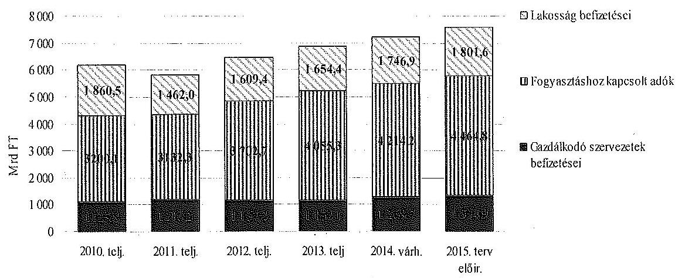
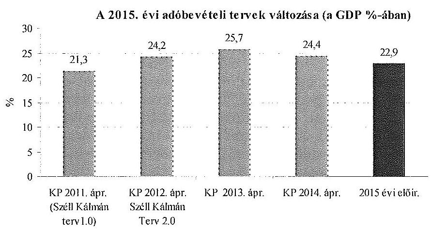
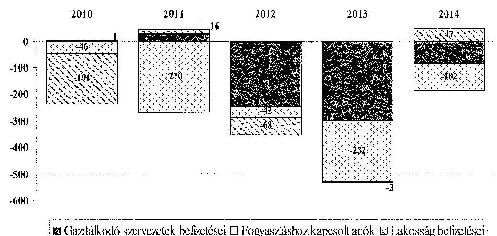
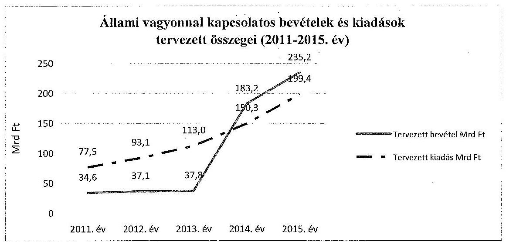
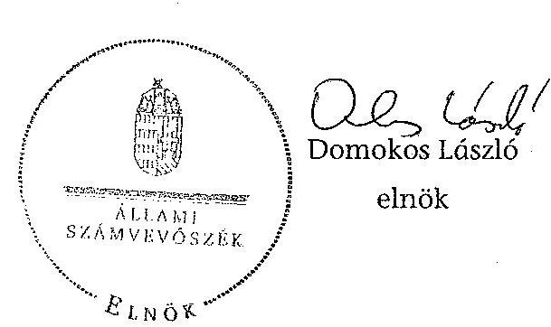

# ÁLLAMI   SZÁMVEVŐSZÉK 

## VÉLEMÉNY

a 2015. évi költségvetésről
Vélemény Magyarország 2015. évi központi költségvetéséről szóló törvényjavaslatról
14221
T/1794/11
2014. november

---

Állami Számvevőszék
Iktatószám: V-0447-499/2014.
Témaszám: 1481
Vizsgálat-azonosító szám: V0681
Az ellenőrzést felügyelte:
Dr. Pulay Gyula Zoltán
felügyeleti vezető
Az ellenőrzés végrehajtásáért felelős:
Dormán István Zoltán
ellenőrzésvezető
Az ellenőrzést vezette:
Dormán István Zoltán
ellenőrzésvezető
Az összefoglaló jelentést készítette:
Balázs Melinda
számvevő főtanácsos
Federics Adrienn
számvevő tanácsos
Fodor Edit
számvevő
Huszár Anna
számvevő tanácsos
Steinbacher Annamária Anett
számvevő
Várhegyi Anett
számvevő
Vörös Katalin
számvevő főtanácsos
Kliment Krisztián Endre
számvevő asszisztens
A számvevői jelentések feldolgozásában és a jelentés összeállításában
közreműködött:
Balázs Melinda
számvevő főtanácsos
Federics Adrienn
számvevő tanácsos
Fodor Edit
számvevő
Huszár Anna
számvevő tanácsos

---

# Steinbacher Annamária Anett 

számvevő
Várhegyi Anett
számvevő
Vörös Katalin
számvevő főtanácsos
Kliment Krisztián Endre
számvevő asszisztens

## Az ellenőrzést végezték:

Balázs Melinda számvevő főtanácsos

Dr. Dorogi Zsolt Pál számvevő

Gácsi Györgyi Ivett számvevő főtanácsos

Lucza Anikó számvevő tanácsos

Puskás Balázs számvevő

Szabó Zsuzsanna számvevő

Szeghő Kornélia számvevő

Vacsora Erika számvevő tanácsos

Vida László számvevő tanácsos

Bartolák Márta számvevő főtanácsos

Federics Adrienn számvevő tanácsos

Huszár Anna számvevő tanácsos

Luhály Matild számvevő

Steinbacher Annamária Anett számvevő

Szarvas Szilárd számvevő tanácsos

Tótfalusi Zoltán számvevő tanácsos

Várhegyi Anett számvevő

Vörös Katalin számvevő főtanácsos

Bertalan Rudolf Gyula számvevő

Fodor Edit számvevő
Dr. Korbuly Andrea számvevő tanácsos
Nagy Csilla Erzsébet számvevő
Szabó Leonóra Ildikó számvevő főtanácsos

Szilas István számvevő tanácsos

Tóth Richárd számvevő
Dr. Vass Gábor számvevő tanácsos
Kliment Krisztián Endre számvevő asszisztens

## A témához kapcsolódó eddig készített számvevőszéki jelentések:

## címe

Vélemény Magyarország 2014. évi központi költségvetéséről szóló 13110 törvényjavaslatról
Vélemény Magyarország 2013. évi központi költségvetéséről szóló 1289 törvényjavaslatról
Jelentés a 2013. évi zárszámadásról - Magyarország 2013. évi költségvetése végrehajtásának ellenőrzése

---

.

---

# TARTALOMJEGYZÉK 

BEVEZETÉS ..... 11
I. ÖSSZEGZŐ MEGÁLLAPÍTÁSOK ..... 14
II. RÉSZLETES MEGÁLLAPÍTÁSOK ..... 22

1. A költségvetési törvényjavaslat fő irányai ..... 22
1.1. A 2015. évi költségvetési tervezés összhangja a jogszabályi előírásokkal ..... 22
1.2. A központi alrendszer hiánya ..... 27
1.3. A központi alrendszer adósságának és az államadósság-mutatónak az alakulása ..... 27
2. A központi költségvetés közvetlen bevételi előirányzatai ..... 29
3. A központi költségvetés közvetlen kiadási előirányzatai ..... 40
3.1. Adósságszolgálattal kapcsolatos bevételek és kiadások ..... 42
3.2. Állami vagyonnal kapcsolatos bevételek és kiadások ..... 44
3.3. A központi költségvetés tartalékai ..... 46
4. A fejezeti előirányzatok tervezése ..... 48
5. Az európai uniós tagsággal összefüggő előirányzatok ..... 54
6. A társadalombiztosítás pénzügyi alapjai ..... 65
6.1. Nyugdíjbiztosítási Alap ..... 66
6.2. Egészségbiztosítási Alap ..... 67
7. A helyi önkormányzatok támogatásai ..... 68

---

# MELLÉKLETEK 

1. számú A költségvetés közvetlen bevételei
2. számú A költségvetés közvetlen kiadásai

---

# RÖVIDÍTÉSEK JEGYZÉKE 

| Alaptörvény | Magyarország Alaptörvénye |
| :--: | :--: |
| AT-HU | Ausztria-Magyarország Határon Átnyúló Együttműködési Program |
| ÁFA | általános forgalmi adó |
| Áht. | 2011. évi CXCV. törvény az államháztartásról |
| ÁKK Zrt. | Államadósság Kezelő Központ Zrt. |
| ÁSZ | Állami Számvevőszék |
| Ávr. | 368/2011. (XII. 31.) Korm. rendelet az államháztartásról szóló törvény végrehajtásáról |
| BM | Belügyminisztérium |
| E. Alap | Egészségbiztosítási Alap |
| EB | Európai Unió Bizottsága |
| EDP | Európai Unió Túlzott Hiány Eljárása (Excessive Deficit Procedure) |
| EFOP | Emberi Erőforrás Fejlesztési Operatív Program |
| EKÁER | Elektronikus Közúti Áruforgalom Ellenőrző Rendszer |
| ELKA | Elkülönített állami pénzalapok |
| EMMI | Emberi Erőforrások Minisztériuma |
| EMVA | Európai Mezőgazdasági Vidékfejlesztési Alap |
| ERFA | Európai Regionális Fejlesztési Alap |
| ESA | Nemzeti számlák európai rendszere |
| ESB alapok | Európai Strukturális és Beruházási alapok |
| ESZA | Európai Szociális Alap |
| ETE | Európai Területi Együttműködés |
| ETHA | Európai Tengerügyi és Halászati Alap |
| EU | Európai Unió |
| EUR | euró |
| EVA | egyszerűsített vállalkozói adó |
| FM | Földművelésügyi Minisztérium |
| GDP | bruttó hazai termék |
| GINOP | Gazdaságfejlesztési és Innovációs Operatív Program |
| GMO | Genetikailag Módosított Organizmusok |
| GNI | bruttó nemzeti jövedelem |
| Gst. | 2011. évi CXCIV. törvény Magyarország gazdasági stabilitásáról |
| GYED | gyermekgondozási díj |
| HOP | Halászati Operatív Program |
| HUF | Forint |
| HU-HR | Magyarország-Horvátország Határon Átnyúló Együttműködési Program |
| HU-RO-SK-UA | Magyarország-Románia-Szlovákia-Ukrajna ENPI Határon |

---

|  | Átnyúló Együttműködési Program |
| :--: | :--: |
| HU-SRB | Magyarország-Szerbia IPA Határon Átnyúló Együttműködési Program |
| IH | irányító hatóság, a programok tervezéséért felelős tárcák szervezeti egysége |
| IKOP | Integrált Közlekedésfejlesztési Operatív Program |
| KA | Kohéziós Alap |
| KAR | Költségvetési Adatcserélő Rendszer |
| KATA | Kisadózók tételes adója |
| KEHOP | Környezet és Energetikai Hatékonysági Operatív Program |
| KEOP | Környezet és Energia Operatív Program |
| Kincstár | Magyar Államkincstár |
| KIVA | Kisvállalati adó |
| KKM | Külgazdasági és Külügyminisztérium |
| KP | Konvergencia Program |
| KÖFOP | Közigazgatás- és Közszolgáltatás Fejlesztési Operatív Progrram |
| KÖZOP | Közlekedés Operatív Program |
| KSH | Központi Statisztikai Hivatal |
| MAHOP | Magyar Halgazdasági Operatív Program |
| ME | Miniszterelnökség |
| M Ft | millió forint |
| MNB | Magyar Nemzeti Bank |
| MNV Zrt. | Magyar Nemzeti Vagyonkezelő Zrt. |
| Mrd Ft | milliárd forint |
| NAV | Nemzeti Adó- és Vámhivatal |
| NFA | Nemzeti Foglakoztatási Alap |
| NFM | Nemzeti Fejlesztési Minisztérium |
| NGM | Nemzetgazdasági Minisztérium |
| NIF Zrt. | Nemzeti Infrastruktúra Fejlesztő Zrt. |
| NSRK | Nemzeti Stratégiai Referenciakeret |
| NTH | Nemzetgazdasági Tervezési Hivatal |
| Ny. Alap | Nyugdíjbiztosítási Alap |
| OGY | Országgyűlés |
| OEP | Országos Egészségbiztosítási Pénztár |
| ONYF | Országos Nyugdíjbiztosítási Főigazgatóság |
| OP | Operatív Program |
| PM | Partnerségi Megállapodás |
| Prognózis | a költségvetési törvényjavaslat tervezetéhez csatolt makrogazdasági előrejelzéseket tartalmazó kormányzati prognózis |
| PTI | pénzügyi tranzakciós illeték |
| RKI | Rendkívüli kormányzati intézkedések |
| RO-HU | Románia-Magyarország Határon Átnyúló Együttműködési Program |

---

| ROP | Regionális Operatív Program |
| :-- | :-- |
| RSZTOP | Rászoruló Személyeket Támogató Operatív Program |
| SA | Strukturális Alapok |
| SI-HU | Szlovénia-Magyarország Határon Átnyúló Együttműködé- |
|  | si Program |
| SK-HU | Szlovákia-Magyarország Határon Átnyúló Együttműködé- |
|  | si Program |
| SZJA | személyi jövedelemadó |
| TAO | társasági adó |
| TÁMOP | Társadalmi Megújulás Operatív Program |
| TB Alapok | Társadalombiztosítási Alapok |
| TEN-T | Transzeurópai közlekedési hálózat (Trans European |
|  | Transport Networks) |
| TIOP | Társadalmi Infrastruktúra Operatív Program |
| TOP | Területi- és Településfejlesztési Operatív Program |
| UF | Uniós Fejlesztések |
| ÜMVP | Új Magyarország Vidékfejlesztési Program |
| VEKOP | Versenyképes Közép-Magyarország Operatív Program |
| VOP | Végrehajtás Operatív Program |
| VP | Vidékfejlesztési Program |

---

# 6

---

# ÉRTELMEZŐ SZÓTÁR 

alátámasztott előirányzat
államadósság-mutató
államadósság-szabály

ESB alapok
felülről nyitott előirányzatok

Kincstári Egységes Számla (KESZ)
kockázatos előirányzat
konszolidált adósság
az előirányzat kialakítását dokumentáló számítások, hatástanulmányok, stratégia rendelkezésre áll; szabályozási háttere van, illetve biztosított
Az államadósság-mutató olyan százalékban kifejezett, egy tizedesig kerekített hányados, amely számlálójában az államháztartás központi alrendszerének, az államháztartás önkormányzati alrendszerének, és a kormányzati szektorba sorolt egyéb szervezetek egymással szembeni kötelezettségek kiszűrésével számított (konszolidált) adósságának, nevezőjében a nemzeti és regionális számlák európai rendszeréről szóló tanácsi rendeletben meghatározottak szerint számított bruttó hazai terméknek a Gst. szerinti értéke szerepel.
Az Alaptörvény 36. cikk (4) és (5) bekezdésében foglaltak szerint az Országgyűlés nem fogadhat el olyan központi költségvetésről szóló törvényt, amelynek eredményeképpen az államadósság meghaladná a teljes hazai össztermék felét. Mindaddig, amíg az államadósság a teljes hazai össztermék felét meghaladja, az Országgyűlés csak olyan központi költségvetésről szóló törvényt fogadhat el, amely az államadósság teljes hazai össztermékhez viszonyított arányának csökkentését tartalmazza.
Magában foglalja 1. az EU Kohéziós Politikájának pénzügyi alapjait (Strukturális Alapok (ERFA, ESZA) és Kohéziós Alap (KA)); 2. az Európai Mezőgazdasági Vidékfejlesztési Alapot (EMVA); 3. az Európai Tengerügyi és Halászati Alapot (ETHA).
A központi alrendszer azon - a költségvetési törvény mellékletében felsorolt - előirányzatai, amelyek teljesülése módosítás nélkül eltérhet (felfelé) az előirányzattól.
A Magyar Államkincstár Magyar Nemzeti Bank által vezetett pénzforgalmi számlája a pénzellátás és a pénzforgalom lebonyolítására.
nincs szabályozási háttere, számítási háttere, stratégia, hatástanulmány; nem teljesíthető előirányzat
A Gst. 2. § (1) bekezdésének a) pontja értelmében az államháztartás központi alrendszerének, az államháztartás önkormányzati alrendszerének, és a kormányzati szektorba sorolt egyéb szervezetek egymással szembeni kötelezettségek kiszűrésével számított adóssága.

---

Konvergencia Program

Kormányzati szektor

Költségvetési Tanács

Középtávú előrejelzés
makrogazdasági előrejelzések
megalapozott előirányzat
meghatározó előirányzat
$\mathrm{n}+2, \mathrm{n}+3$ szabály
nem megalapozott előirányzat
NSRK

Az 1997. június 16-án és június 17-én elfogadott Stabilitási és Növekedési Paktum egyik fő célja a Gazdasági és Monetáris Unió megteremtésének további lépéseihez szükséges költségvetési fegyelem biztosítása. Az euró-övezeti tagállamok által készített stabilitási, illetve az egyéb tagállamok által beterjesztett konvergencia program a tagállamok középtávú költségvetési stratégiáját ismerteti, azaz azt, hogy az egyes tagállamok a Paktummal összhangban miként kívánnak középtávon rendezett költségvetési egyenleget elérni vagy megőrizni.
Az uniós statisztika szerinti „kormányzati szektor" magában foglalja a "központi kormányzatot", a "tartományi kormányzatot", a "helyi önkormányzatot" és a "társadalombiztosítási alapokat". A magyar terminológia szerinti költségvetési szerveken kívül egyéb, meghatározott feltételeknek eleget tevő szervezetek is a kormányzati szektorhoz, azon belül meghatározott alszektorokba tartoznak. Magyarországon az állami költségvetés készítésének folyamatát felügyelő független testület. A KT-nak nincs vétójoga költségvetési kérdésekben, de saját számításokat végez, javaslatokat tesz és feladata, hogy tekintélye súlyával őrködjön az állami költségvetések megalapozottsága és átláthatósága felett.
A kormány által, a 2015-2017-ig terjedő időszakra vonatkozóan készített makrogazdasági és költségvetési előrejelzés.
A kormány által készített makrogazdasági előrejelzések.
megalapozott előirányzat
A költségvetési egyenlegcél betartására meghatározó hatást gyakorló, a központi alrendszer bevételi, illetve kiadási főösszegének 0,5%-át elérő, vagy meghaladó összegű előirányzatok, amelyek körének kialakítását további szűrők támogatják.
Az $\mathrm{n}+2, \mathrm{n}+3$ szabály a kötelezettségvállalás automatikus visszavonásának szabálya. Az Európai Bizottság automatikusan visszavonja a kötelezettségvállalásoknak azt a részét, amelyre a tagállam nem nyújtott be elfogadható kifizetési kérelmet a kötelezettségvállalás évét követő második, illetve harmadik év végéig.
nem megalapozott előirányzat
Nemzeti Stratégiai Referenciakeret. A 2007-2013 közötti uniós költségvetési periódusban a Strukturális Alapok és a Kohéziós Alap uniós forrásait, valamint a hazai költségvetési támogatásokat magában foglaló keretprogram.

---

| PM | Partnerségi Megállapodás. A 2014-2020 közötti uniós költségvetési periódusban hazánk rendelkezésére álló uniós és hazai támogatásokat magában foglaló támogatási keret-megállapodás. |
| :--: | :--: |
| részben megalapozott előirányzat | megalapozott és részben alátámasztott előirányzat |
| Tájékoztató | Az államháztartásért felelős miniszter Tájékoztatója a 2015. évi költségvetési törvényjavaslat összeállításához szükséges feltételekről és az érvényesítendő követelményekről. |
| tárgyév/bázisév | Az az év, amelyben a tervezett költségvetési törvényjavaslat véleményezését megalapozó ellenőrzés folyik. |
| megalapozott előirányzat | az előző évi tendenciákkal és várható értékkel a kialakított előirányzat összhangban van |

---

.

---

# VÉLEMÉNY   a 2015. évi költségvetésről 

## Vélemény Magyarország 2015. évi központi költségvetéséről szóló törvényjavaslatról

## BEVEZETÉS

Az Állami Számvevőszékről szóló 2011. évi LXVI. törvény 5. § (1) bekezdése alapján az ÁSZ az Országgyűlés (OGY) számára véleményt ad a központi költségvetésről szóló törvényjavaslat megalapozottságáról,

 a bevételi előirányzatok teljesíthetőségéről. A törvényjavaslatnak meg kell felelnie az Alaptörvényben és a Magyarország gazdasági stabilitásáról szóló 2011. évi CXCIV. törvényben (Gst.) és az Államháztartásról szóló 2011. évi CXCV. törvényben (Áht.) meghatározott követelményeknek.

A költségvetési törvényjavaslattal kapcsolatos feladatai ellátása érdekében az ÁSZ a központi költségvetési előirányzatok tervezését végző szerveknél, elsősorban a Nemzetgazdasági Minisztériumnál (NGM), illetve a költségvetési fejezetek irányító szerveinél végez ellenőrzést, amely alapján kialakítja véleményét a költségvetési törvényjavaslatról.

A költségvetési tervezés eljárási szabályait, a tervezési folyamat munkaszakaszait az Áht. 13., 13/A. és 13/B. §-ai, továbbá az Ávr. 15-18. §-ai szabályozzák.

## A véleményadáshoz kapcsolódó ellenőrzés célja annak értékelése, hogy:

- a költségvetési törvényjavaslat összeállítása megfelel-e a jogszabályi előírásoknak;
- Magyarország 2015. évi központi költségvetéséről szóló törvényjavaslat bevételi és kiadási előirányzatait a makrogazdasági előrejelzéseket is figyelembe véve tervezték-e meg;
- biztosítják-e a tervezésnél alkalmazott módszerek, háttérszámítások, hatástanulmányok, valamint az állami feladatrendszer és szabályozók javasolt módosításai a törvényjavaslat megalapozottságát;
- teljesültek-e a Tervezési Tájékoztatóban megfogalmazott követelmények;
- az Alaptörvényben és a Gst.-ben foglaltak alapján érvényesül-e az állam-adósság-szabály;
- biztosított-e az összhang a törvényjavaslat és a kormányzati programok részét képező tervek között;

---

- a tervezett előirányzatok tartalmazzák-e a közfeladatok ellátásához szükséges kiadásokat;
- számításba vették-e az EU tagság pénzügyi, gazdasági hatásait.

Az ellenőrzés során figyelembe vettük a 2013. évi költségvetés végrehajtásáról készült zárszámadási jelentés megállapításait, és azzal összefüggésben a 2014. évi költségvetési folyamatokat nyomon követő monitoring tevékenységet végeztünk, különös tekintettel az államadósság alakulására ható tényezőkre, az ÁSZ törvény 5. § (13) bekezdésében foglalt kötelezettség teljesítésének érdekében.

Az ellenőrzés alapvető hozadékaként, várható hasznosulásaként az ÁSZ törvényi kötelezettségének teljesítésével támogatja a megalapozott döntéshozatalt, elősegítve, hogy az OGY a követelményeknek megfelelő költségvetési törvényt fogadhasson el. Az ellenőrzés megállapításai segíthetik a költségvetés tervezésért felelős intézményeket és szervezeteket a megalapozott költségvetési tervek elkészítésében annak érdekében, hogy Magyarország központi költségvetésében az egyenlegcél és az adósságcsökkentés betartása a megtervezett előirányzatok alapján biztosított legyen, és a költségvetés megfeleljen az uniós módszertan szerinti, államadósságra és hiányra vonatkozó mutatóknak.

Az ellenőrzés típusa megfelelőségi (szabályszerűségi) ellenőrzés.
A véleményadással érintett időszak: a 2015. év.
A véleményadás jogi alapját az Állami Számvevőszékről szóló 2011. évi LXVI. törvény 5. §-ának (1) bekezdésében foglaltak képezték.

A törvényjavaslatot a véleményezéshez készített megújult Módszertan ${ }^{1}$ alapján értékeltük, amely tartalmazza a bevételi és kiadási előirányzatok minősítéseinek meghatározását. A bevételi és kiadási előirányzatok megalapozottságának, a bevételi előirányzatok teljesíthetőségének megítélése a rendelkezésre álló dokumentumok, információk alapján dokumentum-elemzési módszerrel történt.

Az ellenőrzés hatékonyságának növelése, valamint az ellenőrzöttek leterheltségének csökkentése érdekében, a költségvetési törvényjavaslat módosított benyújtási határidejére tekintettel az ellenőrzésre kijelölt ún. meghatározó előirányzatok kiválasztásának módszertana kiegészítésre került². A kiegészítés alapján az ÁSZ az ellenőrzött előirányzatok körét lényegességi, illetve kockázati alapon határozta meg annak szem előtt tartásával, hogy a kiválasztott előirányzatok 80%-ot meghaladó mértékben fedjék le a költségvetés kiadási, illetve bevételi főösszegét. Meghatározó a bevételi, illetve a kiadási előirányzat, ha

[^0]
[^0]:    ${ }^{1}$ Módszertani útmutató Magyarország költségvetéséről szóló törvényjavaslat véleményezését megalapozó ellenőrzéshez (2014. július), amely az ÁSZ honlapján megtekinthető.
    ${ }^{2}$ Kiegészítés a központi költségvetésről szóló törvényjavaslat véleményezését megalapozó ellenőrzéshez készített Módszertani útmutatóhoz - Magyarország 2015. évi központi költségvetéséről szóló törvényjavaslat véleményezése (2014. szeptember), amely az ÁSZ honlapján megtekinthető.

---

annak összege a központi alrendszer bevételi, illetve kiadási főösszegének 0,5%-át eléri, valamint, ha az ÁSZ a megelőző három év valamelyikében kockázatosnak jelezte. Lényegességi kritérium alapján meghatározó előirányzat az 1 Mrd Ft-nál magasabb összegű felülről nyitott előirányzat, akkor, ha az előző három évben a terv-tény adatok között a kiadások 10%-kal túl-, a bevételek 10%-kal alulteljesültek.

A minősítés során a bevételek esetében az alátámasztottságot és teljesíthetőséget, míg a kiadásoknál az alátámasztottságot és a közfeladat ellátásához tervezett kiadás biztosítottságát kell figyelembe venni, értékelni. Az alátámasztottság hiánya ellenére a bevételi előirányzat lehet teljesíthető, és a kiadási előirányzat tervezett összege biztosíthatja a közfeladat ellátását. Teljesíthető a bevételi előirányzat, ha az előző évi tendenciákkal és a várható értékkel a kialakított előirányzat összhangban van. A kiadásoknál vizsgálni kell, hogy az előirányzat számításokkal alátámasztott-e, és a vonatkozó paraméterek, mutatószámok figyelembevételével történt-e a kialakításuk, továbbá biztosítják-e a közfeladatok megfelelő ellátását. A költségvetési törvényjavaslat akkor megalapozott, ha a minősített előirányzatok összegének 80%-a megalapozott, valamint teljesül az államadósság-szabály követelménye.

A módszertan szerinti minősítés kategóriái a következők:

1. megalapozott (teljesíthető és alátámasztott előirányzat),
2. részben megalapozott (teljesíthető és részben alátámasztott előirányzat),
3. nem megalapozott (nem teljesíthető és nem alátámasztott előirányzat).

---

# I. ÖSSZEGZŐ MEGÁLLAPÍTÁSOK 

## A törvényjavaslat összhangja a jogszabályi előírásokkal

A 2015. évi tervezést meghatározta, hogy a költségvetési törvényjavaslatra vonatkozó előírások 2014. január 1-jétől új elemekkel egészültek ki a költségvetési keretrendszerekre vonatkozó követelményekről szóló 2011/85/EU tanácsi irányelv nemzeti jogrendbe átültetésével. Emellett 2014 szeptemberétől kezdődően az ESA2010 szabályai szerint kell az uniós adatszolgáltatásokat összeállítani (így a 2015. évi költségvetési tervezés adatai is már ez alapján készültek), mely több ponton eltér a korábbi ESA'95-től. Az ESA2010-re történő áttérés a hiány és államadósság kiszámításán túl hatással van a GDP- és GNI-adatokra is.

A 2014. szeptember 24-én elfogadott 2014. évi XXXIX. törvény 62. §-a módosította a költségvetési törvényjavaslat benyújtási határidejét, október 15-e helyett választási évben október 31-ére módosította. A törvény 63. §-a szerint a Kormány a központi költségvetésről szóló törvényjavaslatban foglaltak megalapozásához szükséges törvénymódosításokat tartalmazó törvényjavaslatot úgy nyújtja be az OGY-nak, hogy az a központi költségvetésről szóló törvénnyel legalább egyidejúleg hatályba lépjen. Ezért az ÁSZ Vélemény összeállításakor teljes körűen még nem álltak rendelkezésre a tervszámokat megalapozó törvénymódosítási javaslatok.

Az új előírások értelmében - az Áht. 13/B. §-a ${ }^{3}$ szerint - a Kormánynak április 30-áig kellett elkészítenie az aktuális és a következő három évre vonatkozóan a makrogazdasági és költségvetési előrejelzést (Középtávú előrejelzés) és azt a módszertanával együtt nyilvánosságra hozni. A Kormány határidőre összeállította és közzétette a Konvergencia Programot (KP), ami tartalmában megfelel a jogszabályban előírt Középtávú előrejelzésnek. Emellett az áprilisi KP részletesen tartalmazta a kormányzat középtávú (2014-2017. évek) gazdaságpolitikai elképzeléseit, a költségvetés-politika céljait és a fenntartható fejlődést biztosító adósságpályát. Ezt a makropályát a 2015. évi Középtávú előrejelzés tekintetében az NGM 2014 októberében - a költségvetési törvényjavaslat 2014. október 20-án átadott tervezetének előkészítése során felülvizsgálta. A 2015. évi költségvetési törvényjavaslat a 2014. évinél alacsonyabb, a KP-ban bemutatott növekedési ütemmel (2,5%) azonos mértékű gazdasági növekedést prognosztizál. Az összetevők tekintetében azonban számottevő elmozdulást jelez a KP előrejelzéseihez képest (például a termékek és szolgáltatások importját 6,5%-ról 7,0%-ra, a közösségi fogyasztást -0,6%-ról -2,0%-ra, az inflációt 2,9%-ról 1,8%-ra módosította).

Az NGM a központi költségvetés tervezésével összefüggő információkat tartalmazó Tájékoztatót és ütemtervet határidőre elkészítette ${ }^{4}$ és honlapján

[^0]
[^0]:    ${ }^{3}$ Hatályos: 2013. XII. 21-étől
    ${ }^{4}$ 2014. június 30.

---

nyilvánosságra hozta az Áht. 13. § (1) bekezdésében foglalt feladatának teljesítése érdekében.

Az Áht. 13/B. §-a értelmében a Kormány évente legalább két alkalommal, az aktuális és a következő három évre vonatkozóan makrogazdasági és költségvetési előrejelzést készít, és a költségvetési tervezésnek az így készült legfrissebb előrejelzésen kell alapulnia. Az Ávr. 18/A. §-a szerint a második előrejelzést az államháztartásért felelős miniszter a központi költségvetésről szóló törvényjavaslat Országgyűlésnek történő benyújtásáig készíti el és teszi közzé az általa vezetett minisztérium honlapján. Az Áht. előírása szerinti második Középtávú előrejelzés nem készült el. Következésképpen a nyilvánosságra hozott adatokból nem állapítható meg a 2015. évi költségvetési tervezés alapjául szolgáló aktualizált makrogazdasági pálya összhangja a kormányzat középtávú makrogazdasági előrejelzéseivel. Ezért az ÁSZ szükségesnek tartja, hogy az államháztartásért felelős miniszter az aktualizált kormányzati makrogazdasági prognózist - a jogszabályi előírásoknak megfelelően - nyilvánosságra hozza.

A költségvetési törvényjavaslat összeállítása során betartották a 2014. szeptember 1-jétől hatályos 549/2013/EK rendelet előírásait, a tervezett hiányt, adósságot és a GDP adatokat az ESA2010 elszámolási rendszer alapján határozták meg. A költségvetési törvényjavaslat indokolásának melléklete bemutatja a 2015. évi államháztartási pénzforgalmi egyenleg és a vonatkozó uniós szabályok szerint meghatározott kormányzati egyenleg közötti összefüggéseket (ESA híd). A törvényjavaslat összeállítása, szerkezete és tartalma megfelel az Alaptörvényben és a Gst.-ben meghatározott követelményeknek, valamint az államadósság-szabálynak és az államháztartásról szóló jogszabályok előírásainak. Rendelkezik a tartalékokról, azon belül az Országvédelmi Alapról.

A kormányzati szektor egyenlegének meghatározásakor az Áht. 13/A. § (2) bekezdésének előírásai teljesültek, mivel a költségvetési törvényjavaslatban meghatározott egyenleg mellett az árfolyamhatás kiszürésével számolt államadósság GDP-hez viszonyított arányát (államadósság-mutató) 2015. évre 75,4%-ban határozták meg, ami 0,9 százalékponttal alacsonyabb a 2014. év végére várt értéknél. A kormányzati szektor tervezett egyenlege összhangban van a középtávú cél elérésével. A kormányzati szektor 2015. évre tervezett GDP-hez viszonyított 2,4%-os hiánya kedvezőbb, mint a KP-ban prognosztizált 2,8%-os hiány. A 2015. évre tervezett hiány nem éri el a Tanács 479/2009/EK rendeletében referenciaként meghatározott 3%-ot.

A költségvetési törvényjavaslat részletes indokolásának VI. fejezete az Áht. előírásainak megfelelően bemutatja a gazdasági ingadozások és az egyedi tételek hatásának kiszürésével számított strukturális egyenleget. A KP-ban a középtávú költségvetési célt a GDP 1,7%-ának megfelelő összegben határozták meg (strukturális hiány). Az NGM számítása szerint a 2015. évi, a GDP 2,4%-ának megfelelő hiány 1,6%-os strukturális hiánynak felel meg.

# A költségvetési tervezés és a makrogazdasági prognózis összhangja 

Az ÁSZ-nak nem feladata a törvényjavaslat részét képező makrogazdasági prognózis (Prognózis) értékelése. Azt elfogadva az ÁSZ azt elemzi, hogy az

---

egyes makrogazdasági feltételek teljesülésétől függő bevételi előirányzatok (pl. általános forgalmi adó (ÁFA)) és kiadási előirányzatok (pl. nyugdíjkiadások) a makrogazdasági mutatókkal összhangban vannak-e. Az ÁSZ véleménye szerint a tervezés makrogazdasági mutatókkal való összhangja teljesült. Természetesen az ÁSZ sem hagyhatja figyelmen kívül, hogy a makrogazdasági folyamatoknak a Prognózistól eltérő alakulása kockázatot jelent egyes költségvetési bevételek és kiadások teljesíthetőségére. Ezen kockázatok kezelését a tartalékok kapcsán értékeljük.

Az ÁSZ érzékenységi elemzést végzett a 2015. évi költségvetési törvényjavaslatban meghatározott adatok, mutatók figyelembevételével annak megállapítására, hogy a GDP arányos hiány és az államadósság-mutató törvényjavaslatban meghatározottnál kedvezőtlenebb, de az EU, illetve a Gst. előírásainak még megfelelő alakulása milyen mozgásteret biztosíthat a 2015. évben esetleg felmerülő kockázatok kezelésére. A számítások alapján a GDP arányos hiány 2,4%-os mértéke a 3%-os korláthoz képest kereken 200 milliárd forint tartalékot jelent. Az államadósság-szabály pedig abban az esetben is teljesülhet, ha költségvetési törvényjavaslatban meghatározott GDP összege a tervezettnek megfelelően alakul és az államadósság közel 260,0 Mrd Ft-tal magasabb lesz.

A 2015. évről szóló törvényjavaslat az államháztartás központi alrendszerének pénzforgalmi hiányát 877,6 Mrd Ft-ban állapítja meg, ezen belül a két TB Alap egyenlege
 0 Mrd Ft. Az ELKA hiánya 52,0 Mrd Ft. A központi alrendszer 2015. évi tervezett hiánya 10,9%-kal alacsonyabb a 2014. évre tervezett hiány összegénél (984,6 Mrd Ft). A központi költségvetés tervezett hiányával összefüggésben a Kincstári Egységes Számla folyamatos likviditásának biztosítására a 2015. évi finanszírozási elképzelések számszakilag kimunkáltak, alátámasztottak.

# A meghatározó előirányzatok értékelésének eredményei 

Magyarország 2015. évi központi alrendszerének bevételi főösszegét 16 380,6 Mrd Ft-ban, kiadási főösszegét 17 258,2 Mrd Ft-ban állapították meg. Ellenőrzésünk a bevételi főösszeg 88,9%-ára, a kiadási főösszeg 82,7%-ára terjedt ki. A központi költségvetés ellenőrzött kiadási előirányzatainak 93,38%-a megalapozott, 6,58%-a részben megalapozott és 0,04%-a nem megalapozott. Az ellenőrzött bevételi előirányzatok 71,9%-a megalapozott, 26,9%-a részben megalapozott és 1,2%-a nem megalapozott.

Az ellenőrzés céljaival összhangban ellenőrzésünk során meggyőződtünk arról, hogy a tervezésnél alkalmazott módszerek, háttérszámítások, hatástanulmányok, valamint az állami feladatrendszer és szabályozók javasolt módosításai a törvényjavaslatot általában megalapozták. A Tájékoztatóban megfogalmazott követelmények teljesültek, az NGM által a keretszámokkal egyidejűleg adott további információk, paraméterek figyelembevétele megtörtént. A törvényjavaslat és a kormányzati programok részét képező tervek között biztosított volt az összhang. A kiadási előirányzatok a jelzett kockázatokkal elegendőek a közfeladatok ellátásához. Az EU tagság pénzügyi, gazdasági hatásait számításba vették a tervezés során.

---

A költségvetési törvényjavaslatban rögzített 2015. évi adóbevételi előirányzatoknál a bázisévi várhatóan alacsonyabb, illetve magasabb teljesítéseket figyelembe vették. Az adóbevételi előirányzatokat a gazdasági növekedés, az infláció, a fogyasztás bővülése, valamint a bruttó bér- és keresettömeg változásának figyelembevételével reális alapokon tervezték. Ugyanakkor az egyes intézkedéseknél kockázatot látunk. A feketegazdaság, illetve az adócsalások elleni küzdelem miatt tervezett EKÁER 2015. év januári bevezetéséhez és működtetéséhez elengedhetetlen olyan informatikai rendszer, amely már 2015. január 1-jétől lehetővé teszi az adóalanyok regisztrációját és nyilvántartását, a szállítmányokkal összefüggésben előírt adatok bejelentését és nyilvántartását, a beérkezett adatok alapján a folyamatba épített előzetes és utólagos kockázatelemzést, valamint a kockázati biztosíték kezelését. Meg kell jegyezni, hogy a bevezetéshez rendelkezésre álló határidő rendkívül szoros, csak abban az esetben tartható, ha valamennyi feltétel adott és a szükséges eszközbeszerzések határidőben megtörténnek. A próbaüzem hiányára és a fentiekre tekintettel ezen intézkedés kapcsán várt egész éves 60,0 Mrd Ft többlet egy részével számolunk csak. Az online pénztárgép bekötésének tényleges hatása a 2014. évi tény makrogazdasági paraméterek, valamint a teljesült bevételek függvényében lesz számszerúsíthető, a kötelezettek körének további kiszélesítéséből várt 25,0 Mrd Ft-os többlet egy része kockázatot hordoz. Bizonytalanságot jelent a kisvállalkozásokat segítő adók kapcsán feltételezett létszámbővülésből fakadó ÁFA bevételi többlet is (becsült elmaradás: 8-10 Mrd Ft). Mindezek alapján az ÁFA-nál összességében 40-45 Mrd Ft-os elmaradás valószínűsíthető, ami a teljes ÁFA bevételhez viszonyítva alacsony kockázatot jelent. A távközlési adó internetszolgáltatókra történő kiterjesztése még szerepel a törvényjavaslatban, azonban időközben az adóintézkedést visszavonták, így az ennek okán tervezett 25,0 Mrd Ft-os bevételi többlet elmarad. A megtett úttal arányos díj esetében a kapcsolódó jogszabályi háttér egyelőre nem készült el, erre és a várhatóan alacsonyabb bázisévi teljesülésre tekintettel 40,0 Mrd Ft-os kockázatot számszerúsítunk.

Az adóbevételek megalapozottsága tekintetében kiemelendő, hogy nem megalapozott adóbevételt - a tavalyi évhez hasonlóan - a törvényjavaslat nem tartalmaz. A fennmaradó kockázatokra tekintettel - a vizsgált költségvetési adóbevételek 51,3%-a megalapozott, 48,7%-a részben megalapozott (kisvállalkozások tételes adója, kisvállalati adó, ÁFA, távközlési adó, megtett úttal arányos díj). Az egyes adóbevételek esetében jelentkező összegszerű kockázatok általunk becsült összegét az 1. sz. melléklet tartalmazza.

A 2015. évi központi költségvetés tervezett kiadási főösszegének 57,6%-a (9946,3 Mrd Ft) felülről nyitott kiadási előirányzat, amely a tervezett hiánycél betartása szempontjából kockázatot jelenthet. A felülről nyitott előirányzatok 2015. évi tervezése nem minden esetben felel meg a Tájékoztatóban megadott szempontoknak, két esetben a tervezett előirányzat alatta marad a várható 2014. évi teljesítésnek. A kockázatokat csökkenti, hogy a 2015. évi felülről nyitott előirányzatok 36,2%-a kapcsolódik az Ny. Alap, E. Alaphoz, melyeknél a 2014. évi várható adatok alapján kicsi a valószínűsége a túlteljesítésnek. Az előző évi tapasztalatok alapján a felülről nyitott előirányzatoknak a teljesítése nem haladta meg jelentősen az eredeti előirányzatot.

---

A központi költségvetés meghatározó közvetlen kiadási előirányzatai megalapozottak (2. sz. melléklet⁵).

Az adósságszolgálattal kapcsolatos bevételek és kiadások fejezet 2015. évi tervezett előirányzatai teljes körűen tartalmazzák a várható kiadásokat (1196,0 Mrd Ft) és a bevételeket (82,6 Mrd Ft). A fejezet kiadási előirányzata a tranzakciós illeték kivételével (4,7%) részletes számításokkal alátámasztott. A kamatbevételek teljesíthetőek figyelembe véve a makrogazdasági előrejelzéseket. A tervezett tranzakciós illeték összege részben megalapozott, kockázatossága nem számszerúsíthető, mivel azt számításokkal nem alapozták meg, a bázis adatok alapján a finanszírozási terv figyelembevételével prognosztizálták. A fejezet további kiadási és bevételi előirányzatai alátámasztottak, a kiadások összege elégséges a közfeladat ellátásához, a bevételek teljesíthetőek, így az előirányzatok megalapozottak és nem kockázatosak.

Az állami vagyonnal kapcsolatos bevételek tervezett összege 237,1 Mrd Ft, az általunk ellenőrzött 2015. évi bevételi előirányzatok összege 216,8 Mrd Ft. Ebből 21,6%-ot megalapozottnak, 78,4%-ot nem megalapozottnak és nem teljesíthetőnek minősítettünk. Az egyéb értékesítési és hasznosítási bevételek jogcímen 2015. évre tervezett 169,0 Mrd Ft előirányzat összegét és a bevétel forrását képező tételeket dokumentált módszertan, számítás, hatástanulmány nem támasztja alá, ezért az előirányzat nem megalapozott és kockázatos.

Az állami vagyonnal kapcsolatos kiadások tervezett összege 199,4 Mrd Ft, az ÁSZ által ellenőrzött állami vagyonnal kapcsolatos kiadási előirányzatok tervezett összege (175,2 Mrd Ft) 76,7%-a megalapozott, 23,3%-a részben megalapozott. A hasznosítással kapcsolatos kifizetések, a jótállással, szavatossággal kapcsolatos kifizetések, az egyéb bírósági döntésekből eredő kiadások, a kezesi felelősségből eredő kifizetések, a konszernfelelősség alapján történő kifizetések, valamint az egyéb bírósági döntésekből eredő kiadások előirányzatai megalapozó számítási dokumentumok hiánya miatt részben megalapozottak, de teljesíthetőek.

A fejezetek a tervezőmunka során több ütemben is áttekintették következő évi feladataikat, hogy azok forrás- és létszámigényét felmérjék, és ahhoz fedezetül szolgáló bevételeiket reális alapon kalkulálják. A fejezetek a szervezeteik számára takarékos, reális tervezést írtak elő, és felhívták a figyelmet a kapacitásokkal, a forrásokkal való szigorúbb, racionálisabb, hatékonyabb gazdálkodást eredményező belső átszervezések átgondolására. A költségvetési szervek és a szakmai kezelésű előirányzatok (az uniós programokból támogatott kiadások nélkül) 2015. évre tervezett 4469,2 Mrd Ft-os kiadási előirányzata 18,4%-kal haladja meg az előző évit és ezzel a központi alrendszer kiadásainak 38,0%-át jelenti. A 2015. évi bevételek 1726,1 Mrd Ft-os összege alig 1%-os növekedést jelent az előző évhez képest, amivel 10,8%-át adja a költségvetés bevételeinek.

A fejezeti kiadások esetében a fejezetek ellenőrzött előirányzatainak 87,4%-a megalapozott, 12,5% részben, 0,1% nem megalapozott volt. A bevételeknél a

[^0]
[^0]: ⁵ A melléklet csak azokat az előirányzatokat tartalmazza, amelyeket az ÁSZ ellenőrzött.

---

fejezetek előirányzatainak 83,5%-a volt megalapozott, míg a részben megalapozottak aránya 16,5%. A 2015. évi költségvetésben a költségvetési szerveknél és a fejezeti kezelésű előirányzatokon megtervezett kiadások és bevételek takarékos, fegyelmezett költségvetési gazdálkodással teljesíthetők.

A 2007-2013 közötti uniós programozási periódusban finanszírozott Nemzeti Stratégiai Referenciakeret (NSRK) operatív programjai (OP) az UF fejezet 2563,1 Mrd Ft összegű kiadási előirányzatának közel háromnegyedét (72,1%-át) teszik ki. Az NSRK programjainak jövő évi tervezése a „maradék” vagyis a még hátralevő kifizetések/bevételek betervezését jelentette, tekintettel arra, hogy a programok keretében biztosított támogatások (számlák kedvezményezettek általi) kifizetésére 2015. december 31-ig nyílik lehetőség. A törvényjavaslat a 2015. évre 1838,1 Mrd Ft kiadást irányzott elő, amelyhez 1262,0 Mrd Ft EU forrást (bevételi előirányzatot), valamint 576,2 Mrd Ft költségvetési támogatást tervezett. Az NSRK kiadási előirányzatai megalapozottak, ugyanakkor a kiadási előirányzatok teljesíthetőségét (a kifizetések megfelelő ütemű előrehaladását) az ÁSZ abban az esetben látja biztosítottnak (nem kockázatosnak), ha a 2014-ben bevezetett szigorú monitoring rendszer működése a 2015. évben is megvalósul. Az ÁSZ véleménye szerint - az előző évek tapasztalatai alapján - a bevételi előirányzat teljesülése kockázatos a megalapozott tervezés ellenére, mivel a jövőbeni ellenőrzések (auditok) megállapítása következtében a Bizottsági kifizetéseket felfüggeszthetik, illetve szankciókat vethetnek ki a megvalósítás alatt álló projektekre. Az esetlegesen felfüggesztett kifizetések feloldása nem prognosztizálható.

A 2014-2020 közötti időszak uniós támogatási kereteit meghatározó Partnerségi Megállapodás (PM) 2014. szeptember 11-én aláírásra került. Az új időszakban 7764,5 Mrd Ft⁶ (25 038,5 M EUR) EU-támogatás áll hazánk rendelkezésére az ún. Európai Strukturális és Beruházási Alapokból (ESB alapok). A PM-ben kijelölt fejlesztési irányokat kilenc OP-ban (hét ágazati és területi, egy vidékfejlesztési és egy halászati programban) rögzítették. Jelenleg az EU Bizottság felé hét program benyújtása van folyamatban, az első pályázatokat meghirdették, összesen több mint 100 Mrd Ft értékben, amelyek az OP-ok elfogadásáig a hazai költségvetést terhelik. Az ESB alapokból a 2015. évre tervezett 345,7 Mrd Ft kiadási és 288,9 Mrd Ft (uniós) bevételi előirányzatok egyaránt kockázatosak és részben megalapozottak, mivel a jogszabályi környezet uniós hátterét jelentő (1303/2013/EU, 1305/2013/EU, 1306/2013/EU, 1380/2013/EU) rendeletek kivételével a források felhasználásának előírásait meghatározó hazai jogszabályok, és az előirányzatok kialakítását dokumentáló stratégia nem álltak rendelkezésre az ellenőrzési időszakban⁷. Az ÁSZ Vélemény véglegezésekor megjelent hazai jogszabály ellenére a „kockázatosak és részben megalapozottak” minősítés az ESB alapoknál nem változik, mivel az OP-ok EB általi idő-

[^0]
[^0]: ⁶ 310,1 HUF/EUR árfolyamon számolva
    ⁷ Az ÁSZ Vélemény véglegezésekor jelent meg a Magyar Közlöny 151. számában a 2014-2020 programozási időszakban az egyes európai uniós alapokból származó támogatások felhasználásának rendjéről szóló 272/2014. (XI. 5.) számú Korm. rendelet. A Korm. rendelet tartalmazza - más alapok mellett - az ESB alapokból származó források felhasználási szabályait (Egységes Működési Kézikönyvet), ugyanakkor az Európai Területi Együttműködés programjaira nyújtandó támogatásokra nem vonatkozik.

---

beli elfogadása továbbra sem ismert. Ugyanez állapítható meg az ETE 2014-2020 programok 2015. évre tervezett 5,6 Mrd Ft kiadási, és 3,9 Mrd Ft bevételi előirányzatoknál (részben megalapozottak és kockázatosak), mivel a programok EB általi elfogadása még nem történt meg, a hazai jogszabályok nem kerültek kiadásra.

A társadalombiztosítás pénzügyi alapjai 2015. évre tervezett előirányzata 4937,2 Mrd Ft, amely a 2014. évi törvényi előirányzatot (4848,8 Mrd Ft) 1,8%-kal haladja meg. A 2015. évre tervezett bevételeket befolyásolja, hogy a szociális hozzájárulási adó Ny. Alap és E. Alap közötti felosztásának aránya a 2014. évi 96,3%-3,7%-ról 85,91%-14,09%-ra változik. A társadalombiztosítás pénzügyi alapjai 2015. évre tervezett előirányzatai a bázis év teljesítési adatait figyelembe véve teljesíthetőek.

A Nyugdíjbiztosítási Alap kiadási és bevételi főösszege 3024,6 Mrd Ft, a 2014. évi előirányzatnál 2,0%-kal
 magasabb. A bevételek 99,0\%-át a szociális hozzájárulási adó és a biztosítotti nyugdíjjárulék jelenti. Az Ny. Alap bevételei megalapozottak és az előző évek tendenciái alapján teljesíthetőek. Az alap kiadásainak, ezen belül a nyugellátás előirányzatának tervezésénél 1,8\%-os fogyasztói árnövekedéssel számoltak a nyugdíjemelés meghatározásánál. A kiadások megalapozottak, és a tervezett kiadás összege elegendő a közfeladat ellátásra.

Az Egészségbiztosítási Alap kiadási és bevételi főösszege 1912,6 Mrd Ft, a 2014. évi eredeti előirányzatnál 1,5\%-kal magasabb. A bevételi oldalon jelentős változás a szociális hozzájárulási adó megosztási arányának 3,7\%-ról 14,09\%-ra történő emelése, amelynek következtében a 2014. évi 78,1 Mrd Ft törvényi előirányzat (83,6 Mrd Ft várható teljesítés mellett) 335,3 Mrd Ft-ra emelkedik 2015. évben, ezzel párhuzamosan a költségvetési hozzájárulások 37,7\%-kal (347,5 Mrd Ft), 575,2 Mrd Ft-ra csökkennek. Az E. Alap bevételei megalapozottak és az előző évek tendenciái alapján teljesíthetőek. A kiadások megalapozottak.

A helyi önkormányzatok 2015. évi finanszírozása a megváltozott önkormányzati feladatellátáshoz igazodóan történik. Az önkormányzatok támogatására a központi költségvetés a 2015. évre 690,5 Mrd Ft támogatást biztosít. A 2014. évi költségvetési törvényben jóváhagyott előirányzat 703,6 Mrd Ft volt. A tervezett előirányzatok változtatása jogszabályokkal, dokumentált számításokkal alátámasztott, ezért megalapozott.

A törvényjavaslat központi tartalékaiból a Rendkívüli kormányzati intézkedésekre szolgáló tartalék (RKI) 2015. évi 100,0 Mrd Ft összegű előirányzata megalapozott. A tartalék a 2014. évi várható felhasználásánál 12,0\%-kal alacsonyabb, ugyanakkor a törvényi követelményeknek megfelel. A céltartalékokon belül a Különféle kifizetések alcímeken szereplő előirányzat szabályozás hiánya miatt részben megalapozott.

Az Országvédelmi Alap 60,0 Mrd Ft összegű előirányzata részben megalapozott. Ezt a minősítést az indokolja, hogy bár a Költségvetési Tanács kezdeményezése alapján a tervezetben szereplő 40,0 Mrd Ft-os előirányzatot 60,0 Mrd Ft-ra növelték, a törvényjavaslat indokolása nem mutatja be, hogy az

---

Országvédelmi Alap mértékének meghatározásánál milyen jellegű és mértékű kockázatokkal számoltak.

A központi költségvetés 2015. év végére tervezett adóssága (24 427,4 Mrd Ft${ }^{8}$) a 2014. év végére tervezett adósságot (23 628,1 Mrd Ft) 3,4\%-kal haladja meg. A devizaadósság értéke${ }^{9}$ 2015. évben a kibocsátások és lejáratok figyelembevételével 3,2 százalékponttal csökken a 2014. éves várható 8648,7 Mrd Ft-ról 8372,2 Mrd Ft-ra. Ez a 2015. év végére tervezett költségvetési adósság 33,2\%-a, amely arány összhangban van a devizaadósság részarányának az államadósság-kezelési stratégiában célul kitűzött csökkentésével. A 2015. év végére tervezett forintadósság állomány a 2014. év végi várható állományhoz (14 832,2 Mrd Ft) képest 15 908,1 Mrd Ft-ra nő, ami 7,3\%-os növekedésnek felel meg.

A törvényjavaslatban szereplő makrogazdasági pálya alapján a 2015. év végére tervezett GDP-arányos, az árfolyamhatás kiszűrésével számolt államadósság mértéke a Gst.-ben foglaltaknak megfelelően csökkenő trendet követ, így az államadósság-szabály érvényesül.

A központi költségvetés finanszírozásának tervezésénél az egyik legnagyobb bizonytalansági tényezőnek az egyéb finanszírozandó tételek közt megjelenő EU transzferek egyenlege számít, amely évek óta problémát jelent. A prognózisok rövid időn belül bekövetkező, akár 100,0 Mrd Ft-os változása jelentős kockázatot jelent az államadósság-kezelés számára, mivel kikényszerítheti a finanszírozási tervtől való eltérést akár kedvezőtlen piaci körülmények között is.

[^0]
[^0]:    ${ }^{8}$ A központi költségvetés bruttó adóssága nem azonos a Gst.-ben alkalmazott, az államháztartás központi alrendszere adósságára vonatkozó definícióval.
    ${ }^{9}$ Az ÁKK Zrt. által rendelkezésre bocsátott finanszírozási tervek alapján.

---

# II. RÉSZLETES MEGÁLLAPÍTÁSOK 

## 1. A KÖLTSÉGVETÉSI TÖRVÉNYJAVASLAT FŐ IRÁNYAI

### 1.1. A 2015. évi költségvetési tervezés összhangja a jogszabályi előírásokkal

A 2014. szeptember 24-én elfogadott 2014. évi XXXIX. törvény 62 §-a módosította a költségvetési törvényjavaslat benyújtási határidejét október 15-e helyett választási évben október 31-ére. A törvény 63. §-a szerint a Kormány a központi költségvetésről szóló törvényjavaslatban foglaltak megalapozásához szükséges törvénymódosításokat tartalmazó törvényjavaslatot úgy nyújtja be az OGY-nak, hogy az a központi költségvetésről szóló törvénnyel legalább egyidejűleg hatályba lépjen. Az ÁSZ Vélemény összeállításakor teljes körűen ezért nem álltak rendelkezésre a tervszámokat megalapozó szabályozók.

Az Áht. 13/B. §-a${ }^{10}$ szerint a Kormánynak április 30-áig kellett elkészítenie az aktuális és a következő három évre vonatkozóan makrogazdasági és költségvetési Középtávú előrejelzést és azt a módszertanával együtt nyilvánosságra hozni. A Kormány határidőre összeállította és közzétette a Konvergencia Programot (KP), ami tartalmában megfelel a jogszabályban előírt Középtávú előrejelzésnek. Emellett az áprilisi KP részletesen tartalmazta a kormányzat középtávú (2014-2017. évek) gazdaságpolitikai elképzeléseit, a költségvetés-politika céljait és a fenntartható fejlődést biztosító adósságpályát. Az NGM az áprilisban kiadott KP-ban lévő makropálya feltételezéseket először 2014 júniusában a költségvetési tervezéshez kiadott Tájékoztatóhoz módosította. Ezt a makropályát az NGM 2014 októberében - a költségvetési törvényjavaslat 2014. október 20-án jóváhagyott tervezetéhez - felülvizsgálta. A 2015. évi költségvetési törvényjavaslat a 2014. évinél alacsonyabb, a KP-ban bemutatott növekedési ütemmel (2,5\%) azonos mértékű gazdasági növekedést prognosztizál, de az összetevők tekintetében számottevőbb elmozdulást jelez a KP-hoz képest (például a közösségi fogyasztást -0,6\%-ról -2,0\%-ra, a termékek és szolgáltatások importját 6,5\%-ról 7,0\%-ra, az inflációt 2,9\%-ról 1,8\%-ra módosította).

Az NGM a központi költségvetés tervezésével összefüggő információkat tartalmazó Tájékoztatót és ütemtervet határidőre elkészítette${ }^{11}$ és honlapján nyilvánosságra hozta az Áht. 13. § (1) bekezdésében foglalt feladatának teljesítése érdekében.

[^0]
[^0]:    ${ }^{10}$ Hatályos: 2013. XII. 21-étől
    ${ }^{11}$ 2014. június 30.

---

1. számú táblázat

A 2014. évi és a 2015. évre vonatkozó várható és tervezett GDP növekedési és inflációs adatok

|  | 2014. |  | 2015. |  |
| :--: | :--: | :--: | :--: | :--: |
|  | $\begin{gathered} \text { KP (2014. } \\ \text { ápr.) } \end{gathered}$ | $\begin{gathered} \text { Tv.jav. } \\ \text { (2014. } \\ \text { okt.) } \end{gathered}$ | $\begin{gathered} \text { KP (2014. } \\ \text { ápr.) } \end{gathered}$ | $\begin{gathered} \text { Tv.jav. } \\ \text { (2014. } \\ \text { okt.) } \end{gathered}$ |
| GDP növekedése | 2,3 | 3,2 | 2,5 | 2,5 |
| - Háztartások fogyasztása | 1,8 | 1,6 | 2,0 | 2,1 |
| - Közösségi fogyasztás | 1,5 | 2,0 | -0,6 | -2,0 |
| - Bruttó állóeszköz felhasználás | 6,2 | 10,3 | 4,1 | 4,3 |
| - Export | 5,8 | 7,0 | 6,8 | 6,9 |
| - Import | 6,2 | 7,6 | 6,5 | 7,0 |
| Infláció | 0,8 | 0,0 | 2,9 | 1,8 |

A 2014. évi GDP-növekedést az NGM összességében 0,9\%-ponttal felfelé korrigálta fél év alatt, elsősorban a bruttó állóeszköz-felhalmozás, valamint az export-import tekintetében várt adatok alapján. Az infláció tekintetében jelentős, 0,8\%-pontos lefelé korrigálás történt. A makropálya módosításait a KSH 2014. július-szeptemberi adatmérései alátámasztják, amelyek szerint mind a bruttó állóeszköz-felhalmozás, mind az export-import az első félévben az eredetileg tervezettnél gyorsabban bővültek, illetve ezzel párhuzamosan az infláció csökkenése következett be.

Az ÁSZ véleménye szerint a tervezés makrogazdasági mutatókkal való összhangja teljesült.

Az Áht. 13/B. §-a értelmében a Kormány évente legalább két alkalommal, az aktuális és a következő három évre vonatkozóan makrogazdasági és költségvetési előrejelzést készít, és a költségvetési tervezésnek az így készült legfrissebb előrejelzésen kell alapulnia. Az Ávr. 18/A. §-a szerint a második előrejelzést az államháztartásért felelős miniszter a központi költségvetésről szóló törvényjavaslat Országgyűlésnek történő benyújtásáig készíti el és teszi közzé az általa vezetett minisztérium honlapján. Az Áht. előírása szerinti második Középtávú előrejelzés nem készült el. Következésképpen a költségvetési tervezés nem az Áht.-ben meghatározott előrejelzésen alapul. A törvényjavaslat indokolása tartalmazza a 2014. évre várható és a 2015. évre tervezett makrogazdasági adatokat.

A 2014. áprilisi KP 2015-re a hiánycélt 2,8\%-ra, a középtávú hiánycélt 2017. évre 1,9\%-ban, az összes GDP-hez viszonyított államháztartási kiadást${ }^{12}$ (újraelosztási arányt) 2015. évre 45,9\%-ban, 2017. évben 43,3\%-ban határozta meg. Ezzel szemben a költségvetési törvényjavaslat - amely középtávú célokat nem

[^0]
[^0]:    ${ }^{12}$ Az EU módszertan szerint, EU transzferek nélkül számított államháztartási kiadás

---

tartalmazott - 2015. évre a hiányt 2,4\%-ban, az újraelosztási arányt 46,2\%-ban irányozta elő.

Az Áht. 22. § (4) bekezdés a) pontjának megfelelően a Kormány bemutatta a központi költségvetésről szóló törvényjavaslat benyújtásakor az OGY részére az államháztartás bevételeit és kiadásait mérlegszerűen, alrendszerenként és összevontan, közgazdasági és funkcionális tagolásban.

Az NGM a költségvetési törvényjavaslathoz a 2015. évi államháztartási pénzforgalmi és a maastrichti kritériumok szerint meghatározott kormányzati egyenleget, valamint a közöttük lévő összefüggéseket (ESA híd) kidolgozta és az ellenőrzés részére átadta. A két mutató közötti különbség levezetése a költségvetési törvényjavaslat általános indoklásában szerepel.

A költségvetési törvényjavaslat összeállításához a Kormány meghatározta az államháztartás központi alrendszerének, az államháztartás önkormányzati alrendszerének és a kormányzati szektorba sorolt egyéb szervezetek adósságának a költségvetési év utolsó napjára - az Alaptörvény 36. cikk (4) és (5) bekezdésének megfelelően - tervezett értékét.

Az Alaptörvény 36. cikk (4) és (5) bekezdésekben előírt feltételeknek a költségvetés törvényjavaslat eleget tesz. Tekintve, hogy a Gst. 8/A. §-ában előírtak teljesülnek azzal, hogy az államadósság meghaladja a bruttó hazai termék (GDP) felét, a Gst. 2. §-a szerint számított államadósság GDP-hez viszonyított arányának (államadósság-mutató) a 2014. évihez képest csökkennie kell, ami a 2015. évi törvényjavaslat alapján megvalósul, ezért teljesül az Alaptörvény szerinti államadósság-szabály. (Az adósságmutató tervezett értéke 2014. évben 76,3\%, 2015. évben 75,4\%.)

A költségvetés törvényjavaslat a Gst. 4. § (1) bekezdésének hatályos előírásától eltérően már csak az államadósság 2015. december 31-ére tervezett értékét tartalmazza összegszerűen, az államháztartás központi alrendszerének, az államháztartás önkormányzati alrendszerének és a kormányzati szektorba sorolt egyéb szervezetek („szektorok") adósságait nem. (A szerkezeti bontást a költségvetési törvényjavaslat indokolása bemutatja.) Ennek oka, hogy az NGM a törvény módosítását kezdeményezte${ }^{13}$ arra vonatkozóan, hogy a költségvetés törvényben csak az államadósság összege szerepeljen „szektorális" bontás nélkül. Az NGM módosítási javaslatát azzal indokolta, hogy az adósság csökkentésre vonatkozó kormányzati törekvés az államháztartás egészének adósságát érinti, ezért nem célszerű az alrendszeri adósságokat külön kiemelni. Az államháztartási adósságcélon belül az NGM továbbra is meg fogja tervezni a „szektorok" szerinti adósságcélt, de azok „szektoronkénti" betartása/betartatása nem lesz törvényi kötelezettség a Kormány/NGM részére.

Az adósságmutatókat számszakilag helyesen, a Gst. 4. § (3) bekezdésében előírtaknak megfelelően határozták meg; a számlálóban szereplő államadósság értékei mindkét évre vonatkozóan megegyeznek a kimutatott államadósság ada-

[^0]
[^0]:    ${ }^{13}$ Az NGM 27044/2014 iktatószámú előterjesztése „... az egyes törvényeknek a Magyarország 2015. évi központi költségvetésének megalapozásával összefüggő módosításáról szóló törvénytervezet" 5. §-a értelmében a költségvetési törvényekben az államadósság szerkezeti bontását a törvény elfogadását követően nem
 kell bemutatni.

---

tájékoztató. A Gst. 2. § (1) bekezdés b) pontjával összhangban a nevezőt, a folyó áron számított GDP értékét az Európai Unió (EU) statisztikai nómenklatúrájában meghatározott módon számították ki.

A nemzeti számlák összeállításának módszertana 2014 szeptemberétől megváltozott ${ }^{14}$. Az adósságmutatóhoz szükséges GDP értékét az NGM az ESA2010 alapján számította ki mindkét évre vonatkozóan, és ezt az értéket tartalmazza a törvényjavaslat, illetve az indokolás.

A Gst. 4. § (1) bekezdése által érintett szervezetek a törvényben foglaltak végrehajtásához szükséges adatokat az államháztartásért felelős miniszter rendelkezésére bocsátották. A költségvetés törvényjavaslat elkészítéséhez a kormányzati szektorba sorolt egyéb szervezetek, valamint a besorolás szempontjából statisztikai módszertani vizsgálat alá vett jogi személyek - az Áht. 13. § (3) bekezdésével ellentétesen - az államháztartásért felelős miniszternek nem teljes körűen teljesítettek adatszolgáltatást. Ennek oka, hogy az államháztartásért felelős miniszter munkaszervezete, az NGM nem is kér ilyen adatokat valamennyi érintett szervezettől. Az ESA 2010 előírja a közösségi tulajdonú termelők kormányzati szektorba sorolásának kritériumait, amit az NGM figyelembe vett.

A központi alrendszer, az államháztartás önkormányzati alrendszere és a kormányzati szektorba sorolt egyéb szervezetek (az előzőekben ismertetett módszer szerint) adósságának adatai az Áht. 108. § (3) bekezdésének megfelelően rendelkezésre állnak.

A Gst. 11-15. §-ainak előírása szerint az ÁKK Zrt. végzi a központi alrendszer (valójában a központi költségvetés) finanszírozási igényének és adósságának kezelését. A 11. § alapján az ÁKK Zrt. dolgozza ki a központi költségvetés éves és középtávú finanszírozási tervét. Az ÁKK Zrt.-nél a központi költségvetés adósságára vonatkozó adatok folyamatosan, részletezetten (devizanem-, instrumentum- és lejárat szerinti bontásban) rendelkezésre állnak. A központi alrendszer egyéb adósságának adatai - alátámasztottan - az NGM-ban rendelkezésre állnak. A költségvetési törvényjavaslat általános indokolásában az államháztartás központi alrendszere hiányának finanszírozása, az államadósság kezelése, az adósság alakulása címú rész tartalmazza az ÁKK Zrt. által szolgáltatott adatokkal összhangban lévő indokolást.

A konszolidációt a Gst. 3. § (1)-(2) bekezdésével összhangban teljes körűen, megbízhatóan végrehajtották. A 2015. évi államadóssággal kapcsolatos konszolidálás eredménye a költségvetési törvényjavaslatban számszakilag helyesen jelenik meg. Az adósságot keletkeztető ügyletek a Gst. 3. § (1) bekezdés szerinti bontásban rendelkezésre állnak, a 2016. első felében lejáró ügyletek előfinanszírozására keletkeztetett adósságot - mivel a tervek szerint ilyenre nem kerül sor - az ÁKK Zrt. nem vett figyelembe.

A tervezés során kialakított, a költségvetési törvényjavaslatban szereplő államadósság értékét a 2014. év és a 2015. év vonatkozásában egyaránt, a Gst. 6. §

[^0]
[^0]:    ${ }^{14}$ Az EU 2013. május 21-én elfogadta az 549/2013/EU parlamenti és tanácsi jogszabályt.

---

(1) bekezdésében foglaltaknak megfelelően, a törvényjavaslatban szereplő 310,1 HUF/EUR árfolyamon határozták meg.

A törvényjavaslat összeállítása, szerkezete az Alaptörvényben és a Gst.-ben meghatározottaknak, valamint az államadósság-szabálynak és az államháztartásról szóló jogszabályok előírásainak megfelel. Rendelkezik továbbá a tartalékokról, azon belül az Országvédelmi Alapról.

Az ÁSZ-nak nem feladata a törvényjavaslat részét képező makrogazdasági prognózis (Prognózis) értékelése. Ezért az egyes makrogazdasági feltételek teljesülésétől függő bevételi előirányzatok (pl. ÁFA) és kiadási előirányzatok (pl. nyugdíjkiadások) kapcsán az ÁSZ ellenőrzése során értékelte a tervezés makrogazdasági mutatók összhangját (pl. a nyugdíjkiadások változását a tervezett inflációval azonos mértékben tervezték-e meg). Természetesen az ÁSZ sem hagyhatja figyelmen kívül, hogy a makrogazdasági folyamatoknak a Prognózistól eltérő alakulása kockázatot jelent egyes költségvetési bevételek és kiadások teljesíthetőségére. Ezen kockázatok kezelését a tartalékok kapcsán értékeljük.

A 2015. évi költségvetési törvényjavaslat tervezete 2014. év végére 76,3%-os, 2015 év végére 75,4%-os adósságmutatót rögzít. A mutató 0,9 százalékpontos javulása egyúttal egy implicit tartalékot is jelent a makrogazdasági és a költségvetési kockázatok kezelésére. Ezért az ÁSZ érzékenységi elemzést végzett ${ }^{15}$ annak megállapítására, hogy az államadósság mutató 0,1% csökkenése esetén, a 0,8%-os implicit tartalék milyen a GDP növekedési ütemében kifejeződő, illetve költségvetési (az államadósság mértékében tükröződő) kockázat kezelésére képes.

Az érzékenységi elemzés eredménye alapján az államadósság-szabály akkor nem teljesülne, ha az államadósság további, közel 260,0 Mrd Ft-ot meghaladó mértékben nőne, vagy pedig a reál GDP növekedési üteme nem érné el az 1,0%-ot. Minden mást változatlannak tekintve alsó becsléssel az államadósságszabály teljesülése akkor kerülne veszélybe, ha a GDP-deflátor emelkedése nem érné el az 1,4%-ot. A GDP arányos hiány 2,4%-os mértéke szintén tartalmaz egy implicit tartalékot a 3%-os korláthoz képest. Ez a hiány tekintetében kereken 200 milliárd forint. A számítások szerint az államadósság-szabály abban az esetben is teljesülhet, ha költségvetési törvényjavaslatban meghatározott GDP összege a tervezettnek megfelelően alakul és az államadósság közel 260,0 Mrd Ft-tal magasabb lesz.

A bemutatott számok csak a felső és alsóhatárok technikai becslései, hiszen a valóságban az adósságmutató számlálója és nevezője között szerves, nem független a kapcsolat, a kockázatok kezelésére ténylegesen rendelkezésre álló összeg feltételezhetően kisebb.

[^0]
[^0]:    ${ }^{15}$ A 2015. évi költségvetési törvényjavaslatban meghatározott adatok, mutatók figyelembevételével.

---

A reál GDP növekedése az államadósság-szabály teljesülését kedvezően befolyásolja, ugyanakkor az alacsony infláció ${ }^{16}$ miatti nominális GDP alakulása mérsékelheti a javulást. Emellett a bruttó államadósság mértékét befolyásolja, hogy az állam likviditási célból, valamint az államadósságkezelési kockázatok csökkentése érdekében milyen forrásbővítést hajt végre, illetve kényszerül végrehajtani, a biztonságosabb, illetve az olcsóbb finanszírozás, vagy az európai uniós elszámolások átmeneti forrásigényének kielégítése érdekében.

# 1.2. A központi alrendszer hiánya 

A kormányzati szektor egyenlegének meghatározásakor az Áht. 13/A. § (2) bekezdésének előírásai teljesültek, mivel a költségvetési törvényjavaslattervezetben meghatározott egyenleg mellett az árfolyamhatás kiszűrésével számolt államadósság GDP-hez viszonyított aránya (államadósság-mutató) 2015-ben 75,4%-ban lett megtervezve, ami 0,9 százalékponttal alacsonyabb a 2014. évinél. A költségvetési törvényjavaslat tervezetének összeállítása során betartották a 2014. szeptember 1-jétől hatályos 479/2009/EK rendelet előírásait, a tervezett hiányt, adósságot és a GDP adatokat az ESA2010 elszámolási rendszer alapján határozták meg.

A 2015. évről szóló törvényjavaslat az államháztartás központi alrendszerének pénzforgalmi hiányát 877,6 Mrd Ft-ban állapítja meg, ezen belül a két TB Alap egyenlege 0 Mrd Ft. Az ELKA hiánya 52,0 Mrd Ft. A központi alrendszer 2015. évi tervezett hiánya 10,9%-kal alacsonyabb a 2014. évi tervezett hiány összegénél ( $984,6 \mathrm{Mrd}$ Ft). Az idén nyáron benyújtott költségvetési módosítás ${ }^{17}$ -elfogadása esetén - a pénzforgalmi egyenleget a vállalati részesedésvásárlások miatt mintegy 152,0 Mrd Ft-tal 1136,6 Mrd Ft-ra növeli meg, módosítva a pénzforgalmi hiánycélt (az uniós módszertan szerint számolt egyenleget viszont nem befolyásolja).

A központi költségvetés tervezett hiányával összefüggésben a Kincstári Egységes Számla folyamatos likviditásának biztosítására a 2015. évi finanszírozási elképzelések számszakilag kimunkáltak, alátámasztottak.

### 1.3. A központi alrendszer adósságának és az államadósságmutatónak az alakulása

A központi költségvetés bruttó adóssága 2014. szeptember végéig a 2013. év végi 21 998,0 Mrd Ft-ról 23 161,3 Mrd Ft-ra nőtt. A növekedésen belül a devizaadósság állományának változása -633,1 Mrd Ft-ot tesz ki, a forintadósság állománya 1796,4 Mrd Ft-ot, az egyéb kötelezettségeké 0 Mrd Ft-ot. Az önkormányzati adósságátvállalás összege 2013-ban 584,4 Mrd Ft volt,

[^0]
[^0]:    ${ }^{16}$ A folyóáras GDP mértékét közvetlenül nem a fogyasztói árak emelkedését tükröző infláció alakulása határozza meg, hanem a teljes termelésre számított árindex, az ún. GDP-deflátor.
    ${ }^{17}$ A T/804. sz. törvényjavaslat a Magyarország 2014. évi központi költségvetéséről szóló 2013. évi CCXXX. törvény módosításáról.

---

amit a 2014. februári adósságátvállalás 401,7 Mrd Ft-tal 986,1 Mrd Ft-ra növelt.

A törvényjavaslat indokolásában bemutatott tendenciák szerint 2015. év végére a központi költségvetés adóssága eléri a $24427,4 \mathrm{Mrd} \mathrm{Ft}$-ot${ }^{18}$, amely a 2014. év végére prognosztizált adósságot ( $23628,1 \mathrm{Mrd} \mathrm{Ft}) 3,4 \%$-kal haladja meg.

A költségvetés és az államadósság finanszírozása szempontjából 2015-ben kiemelt fontosságú a stabil finanszírozási helyzet megőrzése, a devizaadósság részarányának csökkentése a külső függés további csökkentése érdekében. Ezért a hiány és a lejáró forintadósság finanszírozását forintkibocsátásokkal tervezik. A devizaadósság a 2015-ös kibocsátások és lejáratok figyelembevételével a 2014. éves várható 8648,7 Mrd Ft-ról 2015. évben 8372,2 Mrd Ft-ra csökken (3,2 százalékponttal). Ez a központi költségvetés 2015. év végére tervezett bruttó adósságának ( $24427,4 \mathrm{Mrd}$ Ft) $34,3 \%$-a, amely arány megfelel az Államadósság-kezelési stratégia ${ }^{19}$ deviza-részarányra vonatkozó, a 2013. utáni évekre tervezett max. $45 \%$-os rátájának.

2015-ben több mint ezer Mrd Ft-tal emelkedik a hiányt finanszírozó és adósság megújító (lejáró és ezért refinanszírozandó) forintadósság nagysága. A forintadósság a 2014. év végi várható állományához ( $14832,2 \mathrm{Mrd}$ Ft) képest a 2015. év végi tervezett állomány $15908,1 \mathrm{Mrd}$ Ft-ra nő, amely $7,3 \%$-os növekedésnek felel meg.

Az államadósság GDP arányos csökkenése - az alacsony költségvetési hiányon túl a bázis évitől ugyan elmaradó, de még mindig kedvezőnek mondható GDP növekedési prognózis és más, adósságkezelést érintő tényezőknek köszönhető (például a KESZ év végi állománya, EU transzferekhez kapcsolódó előfinanszírozás).

Az államadósság-szabály teljesülésének jelentőségére való tekintettel az alábbiakban bemutatjuk a mutató számításához használt főbb adatokat és a mutató értékének alakulását.

[^0]
[^0]:    ${ }^{18}$ Az NGM által 2014. 10. 29-én rendelkezésre bocsátott számítások alapján.
    ${ }^{19}$ A 2013. december 11-ei államadósság-kezelési stratégia dokumentuma (ÁKK Zrt.).

---

# 2. számú táblázat 

Az államadósság-szabály érvényesülését alátámasztó adatok

|  | 2014. év végén   várható (Mrd Ft) | 2015. év végén vár-   ható (Mrd Ft) |
| :-- | --: | --: |
| GDP | 31601,3 | 33227,6 |
| Államháztartás központi alrendszeré-   nek adóssága, Gst. szerinti korrekciók-   kal | 23907,1 | 24707,7 |
| Önkormányzati alrendszer konszolidált   adóssága | 402,0 | 200,0 |
| Kormányzati szektorba sorolt egyéb   szervezetek konszolidált adóssága | 198,1 | 192,7 |
| Konszolidált államadósság értéke | 24109,4 | 25055,4 |
| Államadósság/GDP | $76,3 \%$ | $75,4 \%$ |

Forrás: Költségvetési törvényjavaslat és az NGM által rendelkezésre bocsátott végleges számszaki adatok.

A Gst. 5. § (1) bekezdése alapján a Kormány a féléves adatok alapján felülvizsgálja az adósság-szabály érvényesülését, az NGM az államadósság felülvizsgálatáról szóló tájékoztatót összeállította, az ellenőrzés számára a dokumentumot átadta, a Kormány elkezdte felülvizsgálatot.

A központi költségvetés finanszírozásának tervezésénél az egyik legnagyobb bizonytalansági tényezőnek az egyéb finanszírozandó tételek közt megjelenő nettó EU transzferek egyenlege számít. Az uniós finanszírozás beérkezési időpontjának bizonytalansága évek óta problémát jelent. A prognózisok rövid időn belül bekövetkező, akár 100,0 Mrd Ft-os változása jelentős kockázatot jelent az államadósság-kezelés számára, mivel kikényszerítheti a tervezett finanszírozás megváltoztatását akár kedvezőtlen piaci körülmények között is. Az ÁKK Zrt. 2014. évi finanszírozási terve szerint (az NGM prognózis alapján) a nettó EU transzferek egyenlege nem változtatta volna az éves nettó finanszírozási igényt. Az EU transzfer prognózis év közbeni romlása következtében azonban a 2014. évi várható adat szerint
 az év végi várható egyenleg már negatív ( $-13,1 \mathrm{Mrd}$ Ft), amelynek következtében a tárgyévben megnő az eredetileg tervezett finanszírozási igény. A finanszírozási terv az EU transzferek esetében 2015-re 178,0 Mrd Ft pozitív egyenleggel számol, ami 191,1 Mrd Ft-tal kedvezőbb a bázis évinél.

## 2. A KÖZPONTI KÖLTSÉGVETÉS KÖZVETLEN BEVÉTELI ELŐIRÁNYZATAI

Az adópolitikai célkitűzéseknek megfelelően, a 2010-től megfigyelhető adószerkezet-átalakítás eredményeként hazánkban a fogyasztási adók súlya megemelkedett. Az adóterhelés a jövedelemtípusú adók felől áttolódott a fogyasztási típusú adók felé. A fogyasztási adók összes adó és adójellegű

---

bevételen belüli tervezett arányuk 2015-ben 58,6\%-ra nő, ami a 2014. évi várható teljesüléstől 0,3 százalékponttal magasabb. Az adóbevételeken belüli átrendeződésre utal, hogy ez az arány 2010-ben még közel 7 százalékponttal alacsonyabb értéket mutatott. Ezzel egyidejűleg a jövedelemtípusú adókon belül a lakossági befizetések aránya tovább csökken, súlyuk 2015-ben már csak $23,8 \%$ (2010-ben $30,1 \%$ volt). A gazdálkodó szervek befizetéseinek az összes adóbevételen belüli $17,6 \%$-os aránya 2015-ben a javaslat szerint lényegében a bázissal azonos szinten marad.

A gazdálkodó szervezetek és a lakossági befizetések, valamint a fogyasztáshoz kapcsolt adók alakulását a 2010-2015. években az alábbi diagram mutatja be.

1. számú ábra

Az adó és adójellegű bevételek alakulása 2010-2015

Forrás: Magyar Államkincstár, NGM
A fogyasztáshoz kapcsolt adók költségvetésen belüli arányának jelentős emelkedéséhez az általános forgalmi adó normál adókulcs-emelésen túl (2009. július 1-jétől 25\%, 2012. január 1-jétől 27\%) a 2012-től bevezetett távközlési adóból, valamint a 2013-től bevezetett pénzügyi tranzakciós illetékből, biztosítási adóból származó bevételek járultak hozzá. Az SZJA tisztán egykulcsos rendszere a szuperbruttó kivezetésével 2013-tól valósult meg, azonban a klasszikus progresszív adózást már 2011-től felváltotta a $16 \%$-os adókulcs, továbbá lényeges változást jelentett a családi kedvezmények jelentős növelése. Ezek hatására 2011-ben a személyi jövedelemadó bevétel jelentősen csökkent. Az SZJA bevételek trendvonalában 2012-től megfigyelhető emelkedést a minimálbér növelése, valamint az adójóváírás és az egyes kedvezmények kivezetése okozza, melyek eredményeként az adóalap szélesedett. A gazdálkodó szervezetek befizetésének aránya az elmúlt években kis mértékben változott.

---

Forrás: KP programok, 2015. évről szóló Központi Költségvetési törvényjavaslat
A lenti táblázat a tervezett és tényleges adóbevételek alakulását ismerteti az elmúlt évek vonatkozásában. 2012-ben a tervekhez képest számottevő elmaradás jelentkezik a gazdálkodó szervezetek befizetéseinél. Ez főként két tényezőből adódott. Egyrészt az egyszerűsített vállalkozói adó (EVA) alanyainak száma 2011-ről 2012-re jelentősen csökkent, másrészt 2012-ben a bankok a 2011. évi különadó alapjukat a végtörlesztés miatti veszteség 30\%-ával csökkenthették. 2013-ban a munkahelyvédelmi akcióterv keretében bevezetett kisadók létszámfelfutásának elmaradása okozza a gazdálkodó szervezetek befizetéseinél jelentkező terv-tény különbséget, valamint fogyasztási adókból származó bevételek is jóval alacsonyabban teljesültek. A 2014. évben ténylegesen befolyt, mintegy 7 ezer Mrd Ft-ot kitevő adóbevételek mindössze $2 \%$-kal maradtak el az eredeti előirányzattól.
3. számú ábra

A tervezett és tényleges adóbevételek alakulása (eltérés Mrd Ft-ban)

Forrás: 2010-2013 Zárszámadási kötetek, 2014 NGM várható
A 2015. évi központi költségvetésről szóló törvényjavaslatban a költségvetés adóbevételeinek $51,3 \%$-a megalapozott, $48,7 \%$-a részben megalapozott, (ÁFA,

---

KATA, KIVA, távközlési adó, megtett úttal arányos díj). A részben megalapozott adóbevételek esetében is csak az adóbevételek egy meghatározott része tartalmaz kockázatot. Ez azt jelenti, hogy az adóbevételek előirányzatai különböző mértékben alulteljesülhetnek. Az alulteljesülés mértékét tervezett kapcsolódó jogszabály-módosítások befolyásolhatják. A bevételi előirányzatok tervezése során az aktuális előrejelzéseket, a makropálya paramétereit figyelembe vették. Az előirányzatokat megalapozó adócsomagot elkészítették és az Országgyűlésnek benyújtották ${ }^{20}$. Az előirányzatok tervezésénél a bevételeket befolyásoló szerkezeti változásokat és szintrehozásokat figyelembe vették. Következésképpen az ÁSZ véleménye az, hogy a Kormány makrogazdasági előrejelzéseinek teljesülése esetén az adóbevételeknél az előirányzott összegek befolyhatnak a költségvetésbe.

Az adóbevételeken belül a gazdálkodó szervezetek befizetéseinek 91,0\%-a megalapozott, $9,0 \%$-a részben megalapozott.

Társasági adóból (TAO) 2014. év szeptemberéig az eredeti előirányzat ( 358,8 Mrd Ft) $50,2 \%$-a folyt be a költségvetésbe, ami az előző év azonos időszakának bevételét 6,2 százalékponttal haladja meg. A 2014. évre várható bevétel az előirányzat összegében vagy azt kissé, 0-5 Mrd Ft-tal meghaladóan teljesül.

A törvényjavaslatban szereplő 2015. évi 341,4 Mrd Ft-os előirányzat a 2014. évi várhatótól $19,0 \mathrm{Mrd}$ Ft-tal alacsonyabb. Az előirányzat kialakításakor a bázisévi teljesülést figyelembe vették, ezen felül a tervezésekor az NGM a következőkkel számolt:

- gazdasági növekedés tervezett ütemének mértéke (+)
- a bázisévi egyszeri tételként megjelenő hitelintézeti járulék elmaradása (-)
- a KIVA-ra történő átlépések hatása (-)
- a bankok elszámoltatása révén keletkező visszaigénylések összege ${ }^{21}$ (-)
- a látvány-csapatsportok, filmalkotások, és az előadó-művészet támogatásához kapcsolódó adókedvezmények 2015-től a számított adó 70\%-a helyett $80 \%$-áig vehetők igénybe (-).

Az újonnan bevezetett, felsőoktatási intézményeknek nyújtott támogatásokhoz kapcsolódó adóalap-kedvezménnyel kapcsolatban további társasági adóbevétel-kieséssel nem számol az NGM. Várakozása szerint ez az intézkedés a támogatások kedvezményezett célok közötti szerkezeti átrendeződését eredményezheti. Ugyanakkor ezt a negatív kockázatot egyfelől a KIVA

[^0]
[^0]:    ${ }^{20} \mathrm{~T} / 1705$ számú törvényjavaslat az egyes adótörvények és azokkal összefüggő más törvények, valamint a Nemzeti Adó- és Vámhivatalról szóló 2010. évi CXXII. törvény módosításáról.
    ${ }^{21}$ A tervek szerint a bankok a visszamenőlegesen módosított mérlegadatokkal kapcsolatos visszaigényléseiket 2015-ben egyszeri tételként (kb. 14-17 Mrd Ft) a TAO-ból vonhatják le.

---

létszámbővülésének elmaradásából fakadó többlet, másfelől az adócsomagban szereplő több, társasági adóalap-szélesítő intézkedés ellensúlyozhatja. Ilyen pl. a K+F tevékenységhez kapcsolódó adóalap-kedvezmény igénybe vehetőségének korlátozása, illetve egyes, adóoptimalizáció visszaszorítására irányuló intézkedések (vállalatcsoporton belüli árképzés szabályainak szigorítása, stb). Összességében a 2015. évi TAO előirányzatnál kockázatot nem látunk, számításokkal alátámasztott és teljesíthető, ezáltal megalapozott.

A hitelintézeti járadék címén 2014 szeptemberéig 12,7 Mrd Ft bevétel teljesült, ami az előirányzat ( $22,6 \mathrm{MrdFt}$ ) 56,4\%-a. A 2015. évi előirányzat összege 25,0 Mrd Ft, ami a bázisévi várható 21,6 Mrd Ft-os bevételt 3,6 Mrd Ft-tal haladja meg. A tárgyévi magasabb előirányzatot az okozza, hogy a tervezés során az árfolyamgát-rendszerből fakadó befizetések növekedésével számolnak. A devizahitelek forintosításával kapcsolatban várható módosítás ennek eredményét befolyásolhatja, ugyanakkor a költségvetés teljes szintjén ez kockázatot nem jelent. Összességében a hitelintézeti járadék 2015. évi előirányzata számításokkal alátámasztott, teljesíthető, ezáltal megalapozott.

A pénzügyi szervezetek különadójánál a 144,0 Mrd Ft-os előirányzat 2014. évben várhatóan 4,0 Mrd Ft-tal túlteljesül, ezt a 2014. év során benyújtott bevallásokban megjelölt kötelezettség magasabb összege támasztja alá. A 2015. évi 144,2 Mrd Ft-os előirányzat összege a 2014. évi előirányzattal szinte azonos értékben marad. A tervezésnél a magasabb bázisévi teljesülést figyelembe vették, ezen felül a következőkkel számoltak. 2015-re tervezett egyik módosítás, hogy az adó legfeljebb 5,0 Mrd Ft-ig csökkenthető az ukrán válság kapcsán az ukrajnai leányvállalatokra elszámolt értékvesztés összegével, továbbá átalakításra kerül a befektetési alapok adóztatása. A befektetési alapkezelők bankadó-kötelezettségének megszüntetése mellett előírásra kerül a befektetési alapok beszedéses adóztatása. Az adó alapját a forgalmazót megillető, a befektetési alapot terhelő forgalmazói díj képezi, az adó mértéke $25 \%$. A befektetési alapkezelők eddig évi 1859,0 M Ft bankadót fizettek. A tervezett új szabályok és az MNB 2012. évi forgalmazói díjra vonatkozó 9,7 Mrd Ft-os adata alapján, a $25 \%$-os adómérték mellett a befektetési alapok évi 2425,0 M Ft-ot fognak fizetni. Az intézkedés tehát egyenlegében évi 560,0570,0 M Ft körüli egyenlegjavulást eredményezhet. Tekintettel a fentiekre a 2015. évi 144,2 Mrd Ft-os előirányzat számításokkal alátámasztott, teljesíthető, ezáltal megalapozott.

Az EVA esetében 2014. évi előirányzat jelentősen túlteljesül. Ennek oka, hogy a bázisévi előirányzat kialakításánál az NGM lényegesen nagyobb létszámcsökkenéssel számolt. Az EVA adóalanyok száma 2013 év elején hozzávetőleg 73,2 ezer fő, mely 2014. január 1-re 44,9 ezer főre csökkent. 2014. október 1-én az EVA adóalanyok száma 42,1 ezer fő. A kisadóknál tervezett létszámfelfutás elmaradása az EVA bevételeknél 25-30 Mrd Ft többletet jelent 2014. évben.

A 2015. évi 83,8 Mrd Ft-os előirányzata a 2014. évi várható szintjétől mintegy 13-15 Mrd Ft-tal alacsonyabban lett megállapítva, ami azt jelenti, hogy 2015-re a gazdasági növekedésre figyelemmel az EVA-s adóalanyok számának további mintegy $15,0 \%$-os csökkenésével számolnak. A kisadók létszámfelfutásával

---

kapcsolatos várakozások az előző évek tapasztalatai alapján lehet, hogy nem következnek be, így az EVA előirányzatra 10-12 Mrd Ft-os pozitív kockázatot hordoz. Mindazonáltal a 2015. évi előirányzat számításokkal alátámasztott, teljesíthető, ezáltal megalapozott.

A bányajáradék 2015. évi 49,0 Mrd Ft-os előirányzatának összege a 2014. évi várható bevételhez képest ( $64,0 \mathrm{Mrd}$ Ft) elmarad, ennek oka az, hogy az 1998. január 1. előtt termelésbe állított szénhidrogén-mezőkön kitermelt földgáz teljes mennyiségét a jövőben hatósági áron kell értékesíteni a 3 egyetemes közműszolgáltató részére. A tervezéskor a kitermelt mennyiségek tekintetében az elmúlt évek kőolaj és földgáz-termelési adatait figyelembe vették. A 2015. évi előirányzat számításokkal alátámasztott, teljesíthető, ezáltal megalapozott.

A játékadó 2014. évi várható bevétele a 33,0 Mrd Ft-os előirányzat összegével megegyezik. A 2015. évi 39,7 Mrd Ft-os előirányzat bázisévhez viszonyított 6,7 Mrd Ft-tal történő megemelését elsősorban az újonnan megnyíló kaszinók, illetve az Eurojackpot piaci megjelenésével járó piacbővülés indokolja. A tervezés során az egyes játéktípusok forgalomváltozásainak esetleges trendjeit, illetve a jogszabályi környezetváltozás hatásai kerültek figyelembe véve. A 2015. évi játékadó előirányzat számításokkal alátámasztott, teljesíthető, ezáltal megalapozott.

Az energiaellátók jövedelemadójának 2014. évi alakulásánál jelentős elmaradás várható. Ennek oka, hogy a 2014. évi előirányzat kialakításakor a 2013. január 1-jétől, illetve az évközi jogszabályi változások (adókulcs-emelés, alanyi kör-szélesedése, közműadó bevezetése, rezsicsökkentő intézkedések, fejlesztési adókedvezmény- és bányajáradék-levonhatósága) kötelezettségekre gyakorolt hatása ismeretlen volt. Az időközben feldolgozott bevallásokból nyert információk alapján a 2014. évi várható bevétel az előirányzattól 16,6 Mrd Ft-tal alacsonyabban teljesül. Ezen felül a pénzforgalmi bevételt - egyszeri hatásként - tovább mérsékli egyes adózók kiemelkedően magas túlfizetései utáni visszaigénylések összege. A fenti két negatív hatást együttesen véve, az energiaellátók jövedelemadójának 2014. évre várható bevétele az előirányzattól 26,5 Mrd Ft-tal elmarad. Az alacsonyabb bázist a tervezéskor figyelembe vették. A 2015. évi 44,7 Mrd Ft-os előirányzat a 2014. évi várható bevételt 9,1 Mrd Ft-tal haladja meg. Az eltérés oka, hogy a bázisévi folyamatoknál jelzett túlfizetések miatti visszaigénylések összege a 2015. évi bevételek kapcsán nem jelentkezik. A 2015. évi energiaellátók jövedelemadója előirányzat számításokkal alátámasztott, teljesíthető, ezáltal megalapozott.

A kisvállalkozásokat segítő adónemeket, vagyis a kisadózók tételes adóját (KATA) és kisvállalati adót (KIVA) az előzetes várakozásokkal szemben továbbra is lényegesen kevesebb adózó választotta a bázisévben. Az idei évi költségvetéssel kapcsolatos véleményezés során az ÁSZ ezt a kockázatot jelezte. A 2014. évi költségvetés tervezésekor a KATA esetében 150 ezer potenciális átlépőből indultak ki (számuk 2013. év végén mintegy 66 ezer fő volt). A tervezett mintegy 85 ezres létszámbővüléssel szemben ebben
 az évben

---

szeptember végéig 30 ezerrel nőtt az adóalanyok száma ${ }^{22}$. Az NGM becslése szerint az adóalanyok száma év végéig elérheti a 100 ezer főt. Ennek alapján 2014. évre az eredeti előirányzattól jóval alacsonyabb, 42,0 Mrd Ft-os KATA bevétellel kalkulál az NGM. Ez a várakozás már a júliusi előrejelzésünkkel megegyezik, számításaink szerint 2014. évben ezen soron mintegy 36-37 Mrd Ft bevételi elmaradás várható. A 2015. évi előirányzat kialakításánál a bázisévi alacsonyabb teljesülést az NGM figyelembe veszi, ugyanakkor egy 20%-os létszámbővüléssel számol, ami a bázisévi folyamatok tükrében kismértékű kockázatot hordoz. A 2015. évi 56,3 Mrd Ft-os KATA előirányzat mintegy 6,0 Mrd Ft-tal alacsonyabban teljesülhet. Az előirányzat esetében alulteljesülés várható, ezáltal részben megalapozott.

A KIVA esetében sem valósult meg a 2014. évi előirányzat tervezése során figyelembe vett adóalap növekedés, sőt a 2014. szeptemberi létszám a 2013. év végi létszámmal lényegében azonos. Véleményünk szerint a KIVA bevételben 2014. évben 33,0-34,0 Mrd Ft-os elmaradás várható. A 2015. évi előirányzatnál az NGM mintegy 2500 fős növekedéssel számol, valamint figyelembe veszi az adóelőleg szabályok pénzforgalmi bevételekre gyakorolt mintegy 1,5 Mrd Ft-os hatását. Az eddig megfigyelhető létszámadatokra tekintettel a 2015. évi 16,4 Mrd Ft-os előirányzat mintegy 3,0 Mrd Ft-tal alacsonyabban teljesülhet, ezáltal az előirányzat részben megalapozott.

Meg kell jegyezni, hogy a teljes költségvetés szintjén a KATA-ba, KIVAba átlépők vártnál alacsonyabb száma nem jelent kockázatot, hiszen a kevesebb átlépés miatt többen fizetnek TAO-t, EVA-t, szociális hozzájárulási adót, egyéni járulékokat és személyi jövedelemadót (SZJA).

A 2014. augusztus 15-től bevezetett reklámadóból az előzetesen bevallott kötelezettségi adatok alapján a bázisévben 2,4 Mrd Ft befizetés várható. A 2015. évi 6,0 Mrd Ft-os előirányzatának kialakítása a 2014. évre bevallott kötelezettségeken alapszik, az éves szintrehozást az adónem tekintetében elvégezték. A 2015. évi előirányzat számításokkal alátámasztott, teljesíthető, ezáltal megalapozott.

A fogyasztási adók 26,6%-a megalapozott, 73,4%-a részben megalapozott.
Az ÁFA 2014. évi bevétel várhatóan 2960 Mrd Ft-ra teljesül, ami az előirányzattól 54,1 Mrd Ft-tal - 1,8%-kal - elmarad. A 2014. évi tervezés alapját képező vártnál alacsonyabb inflációt (2,4% helyett 0%) és az előző évi alacsonyabb teljesülést részben kompenzálja a fogyasztás bővülése, valamint a pénztárgépek on-line bekötésének ÁFA bevételekre gyakorolt pozitív hatása (a bekötött pénztárgépek száma 2013. év vége óta folyamatosan futott fel és 2014. szeptemberében már a teljes bekötési arány elérte). Az ÁFA bevételeknél megfigyelhető 2014. évi kiesését mérsékli, hogy a 2014. évre benyújtott költségvetési törvényjavaslat még a tőkehúsok 27%-os ÁFA kulcsának 5%-os ÁFA kulcsba történő átsorolásával számolt, ugyanakkor az adótörvény-csomag csak az élő- és félsertés húsokra terjesztette ki a kedvezményes ÁFA kulcsot.

[^0]
[^0]:    ${ }^{22}$ 2014. október 1-jén 94589 fő, NAV adatszolgáltatás

---

A 2015. évi 3171,7 Mrd Ft-os előirányzat a 2014. évi várható bevételt több mint 230 Mrd Ft-tal haladja meg. A növekedést az NGM szerint vásárolt fogyasztás bővülésén és a bázisévhez képest 1,8%-kal magasabb infláción túl a következő intézkedések indokolják:

# 3. számú táblázat 

## Intézkedés

## NGM becslés

Az online pénztárgép használatának kiterjesztése, valamint az online pénztárgépek 2014. évi felfutása miatti áthúzódó hatás

A láncolatos ÁFA-csalások visszaszorítása érdekében 2015-től a tételes áfa-összesítő határának csökkentése 1 M Ft-ra a 2 M Ft-ot elérő, vagy azt meghaladó ÁFA-összeget tartalmazó számlák esetében.

A fiktív cégalapítások visszaszorítása érdekében az újonnan alakult vállalkozások számára havi áfa bevallási kötelezettség előírása. Így hamarabb felderíthető és kiszűrhető lesz az adócsalásra alapított vállalkozás.

Az éves szinten 50 M Ft feletti értékesítéssel, vagy beszerzéssel rendelkező éves adóbevallást választó vállalkozások ÁFA bevallási kötelezettségének negyedévessé tétele.

A köztes terméknek minősülő nagytestű állatok - szarvasmarha, juh és kecske - és vágott testek értékesítésének ÁFA kulcsa 27%-ról 5%-ra csökkentése.

Az „Elektronikus Közúti Áruforgalom Ellenőrző Rendszer" (EKÁER) bevezetése. Célja a közösségi adóköteles termék forgalomban az áruk valós útjának technikai eszközökkel történő nyomon követése, hogy az országban ne lehessen forgalomba hozni olyan árut, amely előzetesen nem volt bejelentve az adóhatósághoz.

A befektetési alapkezelők, a befektetési vállalkozások és hitelintézetek portfólió kezelés adókötelessé tétele.

A kiszák kapcsán várt létszámnövekedéséből fakadó ÁFA bevételi többlet

Várt ÁFA többletbevétel 25 Mrd Ft.

A teljesült bevételek függvényében és NAV információk alapján utólag számszerúsíthető.

Viszonylag szűk adózói kört érint. A teljesült bevételek függvényében és NAV információk alapján utólag számszerúsíthető.

A bevezetés évében a pénzforgalomban egyszeri 400,0 M Ft + potenciális fehéredés miatti jelenleg nem számszerúsíthető többlet hosszabb távon.

A nettó ÁFA bevételek tekintetében - a kiutalások áthúzódása miatt a bevezetés évében egyszeri pénzforgalmi bevétel kiesés 0,9-1,0 Mrd Ft között.

A néhány 100 Mrd Ft-ra tehető körhinta-csalások várakozások szerint közel 20%-os csökkentését segítheti elő. Ennek költségvetési egyenlegjavító hatása 60 Mrd Ft-ra becsülhető.

Az MNB adatai alapján becsült költségvetési egyenlegjavító hatás 1,8-2,0 Mrd Ft.

A kisadók kapcsán várt létszámnövekedéséből fakadó ÁFA bevételi többlet

Becsült ÁFA többletbevétel 16,6 Mrd Ft.

A felsorolt intézkedések a 2014. évi várható teljesüléshez viszonyított 2015. évre tervezett ÁFA bevétel növekedést nem fedik le. A fenti ellentétes irányú

---

intézkedések közül a feketegazdaság, illetve az adócsalások elleni küzdelem miatt tervezett többletbevétel kockázatot hordoz, mivel a 2015. év januárjától bevezetni tervezett EKÁER kivitelezésére rendelkezésre álló határidő rendkívül szoros, csak abban az esetben tartható, ha valamennyi feltétel adott és a szükséges eszközbeszerzések határidőben megtörténnek. Az online pénztárgép bekötésének tényleges hatása a 2014. évi tény makrogazdasági paraméterek, valamint a teljesült bevételek függvényében lesz számszerúsíthető. A kötelezettek körének további kiszélesítéséből várt 25 Mrd Ft-os többlet egy része kockázatot hordoz. Ezeken felül a kisadók létszámbővülésétől várt bevétel is alulteljesülhet. Az ÁFA bevételek bővülésére hat a megtett úttal arányos útdíj 2015-től tervezett 40 Mrd Ft összegű bevételi többlete, valamint a Kúria által meghozott - a lakossági hiteleket érintő - jogegységi határozat alapján történő banki elszámoltatásnak a lakossági fogyasztásra gyakorolt élénkítő hatása is.

Az ÁFA 2015. évi bevételi előirányzatának meghatározásakor az intézkedések hatását, ahol információk álltak rendelkezésre becsléssel kimutatták. A becslések és az intézkedések csak utólag mérhető, fent említett hatásai azonban kockázatokat hordoznak. A 2015. évi ÁFA előirányzat összességében mintegy 40,0-45,0 Mrd Ft-tal alacsonyabban teljesülhet. A bevételi előirányzatnál alulteljesülés valószínűsíthető, ezáltal részben megalapozott.

A jövedéki adó esetében a 2014. évi várható bevétel 25-30 Mrd Ft-tal elmarad az előirányzattól. Ennek fő oka a 2014. évi költségvetési előirányzat tervezésénél figyelembe nem vett 2013. évi alacsonyabb teljesülés (bázishatás), mivel a dohánytermékek utáni jövedéki adóbevételek bázisévi csökkenését, az üzemanyagok, szeszesitalok és egyéb termékek forgalom növekedéséből adódó bevételi többletét nagyrészt ellensúlyozza. A 2015. évi 913,5 Mrd Ft-os előirányzat a bázisévi várhatótól alacsonyabb összegben lett meghatározva.

A jövedéki adó bevételek 2015. évi előirányzatának tervezése során a makro paraméterek közül alapvetően a reál GDP, valamint a változatlan áras lakossági fogyasztási kiadás változásával számoltak. Így a lakossági fogyasztás várható növekedésének eredményeként a tervek szerint az üzemanyagok, valamint az alkohol és egyéb termékek jövedéki bevétele a prognózis alapján emelkedni fog. A dohánytermékek utáni bevételeket a dohánypiaci tendenciák határozzák meg. A kalkuláció során az üzemanyagok, valamint az alkoholtermékek esetében a gazdaság további élénkülésével, valamint a 2015. évi várható fogyasztásnövekedés bevételnövelő hatásával számolnak.

A 2015. évi tervezés során az NGM a makropálya paraméterei mellett figyelembe vette az európai uniós jogharmonizációhoz igazodó jövedéki adót törvény tervezett változását, ami az egyes adótörvények módosításáról benyújtott törvényjavaslat részét képezi.

- Az alkoholtermékek esetében megszűnik a kettős adómérték közül a magasabb, mely várhatóan 2 Mrd Ft jövedéki adóbevétel kieséssel jár. Egyidejűleg a népegészségügyi termékadóról szóló 2011. évi CIII. törvényt (Neta tv.) kiterjesztésre kerül az ún. alkoholos italokra is. Az intézkedés többletbevételi hatása 5,5 Mrd Ft, így a központi költségvetés egyenlege 3,5 Mrd Ft-tal javulhat.
A kereskedelmi gázolaj után literenként visszaigényelhető összege 2015-től 17 Ft-ról 11 Ft-ra csökken. Az intézkedés hatásának becslésekor figyelembe vet-

---

ték, hogy a gázolaj esetében nem történt környező országhoz képesti árelőny változás. 2013-ban a kereskedelmi gázolaj utáni jövedéki adó visszaigénylések összege mintegy 12,4 Mrd Ft volt. A módosulás alapján mintegy 4,2-4,3 Mrd Ft-tal csökken a visszaigényelhető adó, növelve ez által a költségvetés egyenlegét.
Növekszik a cseppfolyósított (LPG) targoncagáz nem közúti járművek üzemanyagaként, hanem egyéb motorikus célú felhasználásakénti jövedéki adója 12095 Ft/ezer kg-ról 12725 Ft/ezer kg-ra. Az egyenlegjavító hatása a számítások alapján 10 M Ft.
A fűtőolaj adómértéke 4425 Ft/ezer kg-ról 4655 Ft/ezer kg-ra emelkedik, amely a számítások szerint összesen 6 M Ft költségvetési bevétel többletet eredményez.

- Az eddig 0 Ft/nm3 jövedéki adójú sűrített gáz (CNG) után 2015-től 28 Ft/nm3 jövedéki adót kell fizetni. Ezzel párhuzamosan a helyi és helyközi közlekedést lebonyolító gázüzemű buszok esetén visszaigényelhetővé válik a megfizetett adó. Az intézkedés egyenlegjavító hatása 125 M Ft.

# A 2015. évi előirányzat számításokkal alátámasztott, teljesíthető, ezáltal megalapozott. 

A távközlési adó 2015. évi 69,2 Mrd Ft-os előirányzat a 2014. évi várható bevételt 12,8 Mrd Ft-tal haladja meg. Az 2015. évi előirányzat a bázisévi teljesülést figyelembe vették és számoltak az adócsökkentő tételként levonható megfizetett társasági adót 8 Mrd Ft-os összegével. Az előirányzat 25,0 Mrd Ft összegben tartalmazza az adónak az internet szolgáltatásokra történő kiterjesztését. Időközben az NGM kezdeményezte a távközlési törvény kiterjesztéséről szóló javaslat visszavonását az Országgyűlés Gazdasági Bizottságának elnökénél ${ }^{23}$. A tervezett módosítások miatt az előirányzat részben megalapozott.

A 2014. évi pénzügyi tranzakciós illeték (PTI) várható bevétele az éves előirányzat 269,4 Mrd Ft összegével megegyezik. A 2015. évi előirányzat 262,2 Mrd Ft, ami a 2014. évi várható előirányzattól 7,2 Mrd Ft-tal - 2,7%-kal marad el. Ennek okai:

- A bevétel nagyságát meghatározó piaci szektorban az illeték alap 2015. évi növekedésével nem számoltak. Indokoltságát alátámasztják a feldolgozott bevallások 2013. és a 2014. év I-VIII. havi halmozott adatai, amely szerint az illetékalap a viszonyítási időszakban átlagosan 0,4%-kal csökkent.
- A Magyar Államkincstár tranzakciós illeték befizetései esetében az illeték alap érdemi - a 2014. évi várható 28300 Mrd Ft-ról 2015-ben 23300 Mrd Ft-ra csökkenésével számoltak.

A törvényjavaslat szerint a bankkártyás vásárlások illetékmentessé válnak a bankkártyánként évi egyszeri illeték megfizetése mellett. Az intézkedés költségvetési hatása az MNB adatai alapján egyenleg-semleges.

Az ellenőrzött lakossági befizetések előirányzatai 100%-ban megalapozottak.

[^0]
[^0]:    ${ }^{23}$ http://www.kormany.hu/hu/nemzetgazdasagi-miniszterium/hirek/az-ngm-kezdemenyezte-a-tavkozlesi-torveny-kiterjesztesere-szolo-javaslat-visszavonasat

---

A PTI bevételi előirányzata a tervezés módszertana szempontjából megfelelő, továbbá a bázisoldali várható teljesülés és a számítások alapján, valamint a tervezett intézkedésnek az egyes adótörvények módosítására benyújtott törvényjavaslattal való alátámasztottságának figyelembe vételével megalapozott.

A lakossági befizetések túlnyomó részét lefedő SZJA befizetéseknél 2014. év végéig jelentkező 40-50 Mrd Ft-os többlet oka a vártnál kedvezőbb bérkiáramlás, illetve a gazdálkodó szervek befizetéseinél jelzett
 kisadók elmaradása. A 2015. évi 1634,7 Mrd Ft-os előirányzat tervezésénél a magasabb bázisból adódó növekményt és a makrogazdasági folyamatokat figyelembe vették, továbbá a kamatjövedelmek bázisévhez képesti további csökkenésével számoltak. A KATA tervezett létszámbővüléséből fakadó 14,4 Mrd Ft-nyi kisesés véleményünk szerint nem lesz ilyen nagyságrendű, e tekintetben az adónem pozitív kockázatot hordoz. A tervek szerint 2015. évre több, jelentős ellentétes költségvetési kihatással járó intézkedés kerül bevezetésre (első házasok adókedvezménye, cafetéria átalakítása, nem öngondoskodást célzó termékek adókedvezményének csökkentése). Az intézkedéseket megalapozó számítások elfogadása esetén az SZJA bevételekben a kedvező makrogazdasági prognózis megvalósulása mellett kockázatot nem jelentenek. A 2015. évi előirányzat számításokkal alátámasztott, teljesíthető, ezáltal megalapozott.

Az illetékbefizetésekből 2014. évben származó 5-7 Mrd Ft-os többlet az ez év elejétől megfigyelhető a tervezettnél magasabb forgalmi adatokra vezethető vissza. A 2015. évi 120,0 Mrd Ft-os előirányzat számszerűsítésénél a bevételek szintjét kisebb mértékben érintő szabályozásváltozással az NGM számolt, továbbá az utóbbi időszak kedvező forgalmi adatait figyelembe vették. A 2015. évi előirányzat számításokkal alátámasztott, teljesíthető, ezáltal megalapozott.

A központosított bevételeken belül a megtett úttal arányos útdíj 2014. évi várható összege az eddigi teljesítéseket figyelembe véve 6-10 Mrd Ft-tal elmaradhat az előirányzattól. A 2015. évi 169,0 Mrd Ft-os előirányzat a 2014. évi várható bevételt jelentősen több mint $40,0 \mathrm{Mrd}$ Ft-tal meghaladja. A magasabb bevételi előirányzat oka egyrészt a bázisévi várhatóan alacsonyabb teljesülés, valamint a megtett úttal arányos díjbevételekkel kapcsolatos jogszabályváltozás, aminek kidolgozása folyamatban van. A szabályozás hiánya miatt a 2015. évi előirányzat részben megalapozott, a 2015. évi előirányzatnál a fent jelzett hiányosságok miatt $40,0 \mathrm{Mrd}$ Ft kockázatot számszerűsítünk.
2015. évtől a központi költségvetés közvetlen bevételét képezi az időalapú útdíj, aminek 34,6 Mrd Ft-os előirányzata, amely 2014. évben még az NFM fejezethez tartozó Közlekedésfejlesztési Koordinációs Központ intézményi bevételét képezte. 2015-ben az egyes finanszírozási feladatok jobb célzottsága és az államháztartási kapcsolatok jobb megjelenítése érdekében került átcsoportosításra a költségvetés központosított bevételei közé.

---

# 3. A KÖZPONTI KÖLTSÉGVETÉS KÖZVETLEN KIADÁSI ELŐIRÁNYZATAI 

A kiadások egy része módosítási kötelezettség nélkül túlteljesíthető. Az előirányzatok felsorolását a törvényjavaslat 4. sz. melléklete tartalmazza. A felülről nyitott kiadási előirányzatok összege a 2015. évi költségvetési törvényjavaslatban 9946,3 Mrd Ft, ami a kiadási főösszeg 57,6\%-a. Ezen belül a külön szabályozás nélkül túlléphető előirányzatok összege 6453,8 Mrd Ft (a kiadási főösszeg 37,4\%-a). A felülről nyitott kiadási előirányzatok, különösen a külön szabályozás nélkül túlléphető előirányzatok kockázatot jelentenek a költségvetési egyenlegcél betartása szempontjából. Ugyanakkor az előző évek tendenciái alapján az előirányzatok teljesülései a költségvetési törvényben foglaltaknak megfelelően alakultak.

A központi költségvetés meghatározó közvetlen kiadási előirányzatai megalapozottak.

Megalapozottak a vállalkozások folyó támogatásai, a lakástámogatások, a szociálpolitikai menetdíj támogatás, az egyéb költségvetési kiadásokból a felszámolásokkal kapcsolatos kiadások, az egyéb vegyes kiadások, az átmeneti hulladék-közszolgáltatással kapcsolatos kiadások, az állam által vállalt kezesség és viszontgarancia érvényesítése előirányzatok. A kormányzati rendkívüli kiadások közül az 1947-es párizsi békeszerződésből eredő kárpótlás, a garancia és hozzájárulás a társadalombiztosítási ellátásokhoz címen belül a járulék címen átadott pénzeszköz, a rokkantsági, rehabilitációs ellátások részbeni fedezetére átadott pénzeszköz és a kiadások támogatására pénzeszközátadás, az Alapok támogatása cím tekintetében a munkahelyvédelmi akciótervvel összefüggő hozzájárulás NFA-nak, valamint a Központi Nukleáris Pénzügyi Alap támogatása kiadásainak előirányzatai számításokkal alátámasztottak, ezáltal megalapozottak.

A vállalkozások folyó támogatását két fejezet - XLII. ${ }^{24}$ és XVII. ${ }^{25}$ - tartalmazza. Az NFM fejezetben az egyedi támogatások, ellentételezések alcímen 2015. évre 278,5 Mrd Ft, a XLII. fejezetben az egyéb vállalati, illetve normatív támogatások alcímen 2015. évre 23,3 Mrd Ft, összesen 301,8 Mrd Ft felülről nyitott kiadási előirányzatot terveztek, amely a 2014. évi előirányzat 106,8\%-a. A kiadások növekedése - a várható infláció hatásának figyelembevétele mellett - döntően az Eximbank Zrt. kamatkiegyenlítése előirányzata emelkedő mértékű támogatására vezethető vissza. A két fejezetben megjelenő előirányzatok számításokkal alátámasztottak, megalapozottak.

A lakástámogatások felülről nyitott előirányzata az Otthonteremtési Program célkitűzéseinek megvalósítását és az otthonvédelmi akciótervet segítik. Az otthonvédelmi akcióterv keretében az árfolyamgát rendszerében a rögzített árfolyam feletti törlesztési kötelezettség kamatrészének felét a költségvetés, míg a másik felét a bankok vállalták át, az adósnak csak a tőkerészt kell visszafizetnie. Ezen túlmenően az állam a közszférában dolgozók számára az árfolyamgáthoz kapcsolódóan gyűjtőszámlahitel kamattámogatást nyújt. Az

[^0]
[^0]:    ${ }^{24}$ A költségvetés közvetlen bevételei és kiadásai fejezet.
    ${ }^{25}$ Nemzeti Fejlesztési Minisztérium fejezet

---

előirányzat a 2014. évben - az előző évekhez hasonlóan - várhatóan alulteljesül, amelynek egyik legfőbb oka az árfolyamgát rendszer lakossági igénybevételének elmaradása, valamint az árfolyam és a referenciahozamok változása.

A tervezés - az előző évekhez hasonlóan - a különböző jogcím csoportokhoz tartozó kamattámogatású kölcsönök várható átlagállománya és kamattámogatási kulcsai alapján történt. A 2015. évben új támogatási kedvezmény kerül kialakításra, a Családi Otthonteremtési Kedvezmény, amely 2015. július 1-jétől 700 ezertől 1,17 millió forintig vehető igénybe - a legalább kétgyermekes családok, illetve csökkentett támogatási összegben az egy gyermekes családok részére - új lakás építésére, használt lakásvásárlásra, valamint a meglévő lakás bővítésére. A támogatásra a 2015. évben 4,0 Mrd Ft áll rendelkezésre. Az új kedvezmény igénybevételi feltételeinek jogszabályi kidolgozása ${ }^{26}$ folyamatban van. A lakásépítési támogatások 2015. évi kiadási előirányzatának összege 144,8 Mrd Ft-ot tesz ki. Az előirányzat számításokkal alátámasztott, ezért megalapozott.

A szociálpolitikai menetdíj támogatás felülről nyitott kiadási előirányzata a személyszállítási közszolgáltatások kereteiben az állam által jogszabályban biztosított utazási kedvezmények igénybevételéhez nyújtott állami támogatás forrása. A 2015. évre tervezett előirányzata 104,0 Mrd Ft, amely megegyezik a 2014. évre tervezett előirányzattal. A támogatás mértékét, megállapításának és a jogosult közlekedési szolgáltató által történő igénybevételének szabályait a szociálpolitikai menetdíj-támogatás megállapításának és igénybevételének szabályairól szóló 121/2012. (VI. 26.) Korm. rendelet írja elő. A szociálpolitikai menetdíj támogatás kiadási előirányzata megalapozott.

A Nemzeti Családi és Szociálpolitikai Alap kiadási előirányzata összesen 646,0 Mrd Ft, amelynek 86,2\%-a került ellenőrzésre. A 2015. évi keretösszegéből 422,4 Mrd Ft-ot képvisel a családi támogatások összege, amely 5,4\%-kal alacsonyabb a 2014. évre tervezett előirányzattól. A családi támogatások előirányzatán belül jelentős, 77,4\%-ot képvisel a családi pótlék értéke (327,0 Mrd Ft), amely 2015. évre tervezett összegének alakulását nagymértékben befolyásolja az élveszületések száma, amely a 2014. évben az előző év azonos időszakához képest - a KSH adatai szerint - mintegy 2,9\%-kal emelkedett. A 2015-ben várható további élveszületés szám emelkedés nagysága azonban nem tudja teljes mértékben kompenzálni a rendszerből életkoruknál fogva kieső személyek számát, így kismértékű létszámcsökkenés prognosztizálható. A korhatár alatti ellátások 2015. évre tervezett összege 134,4 Mrd Ft. A tervezett összeg 23,5\%-kal marad el a 2014. évi tervezett értékhez képest. A korhatár alatti ellátások előirányzat 2014. évhez viszonyított csökkenését a jogosultak számának jelentős csökkenése indokolja, tekintettel a korhatár előtti öregségi nyugdíjak megszüntetéséről, a korhatár előtti ellátásról és a szolgálati járandóságról szóló 2011. évi CLXVII. törvényre. Az ellenőrzött előirányzatok számításokkal alátámasztottak, megalapozottak.

[^0]
[^0]:    ${ }^{26}$ A lakásépítési támogatásról szóló 256/2011. (XII. 6.) Korm. rendelet módosítása

---

Az egyéb költségvetési kiadások előirányzata összesen 23,7 Mrd Ft. Az ellenőrzött előirányzatok számításokkal alátámasztottak, megalapozottak. Új tételként jelent meg 2014. évben a hulladék-közszolgáltatással kapcsolatos kiadások, amelyre 5,0 Mrd Ft-ot biztosított a költségvetés, amelyből 2014. év VIII. hónapjában felhasználás nem volt. Az új Ht. ${ }^{27}$ szabályozási változásai fennakadásokat okoztak a hulladékgazdálkodási közszolgáltatásban. Amennyiben a közszolgáltató nem volt képes ellátni a feladatát, akkor az Eketv. ${ }^{28}$ katasztrófavédelem ideiglenes közszolgáltatót jelölt ki a feladat elvégzésére. Az Eketv. alapján az ideiglenes, valamint a szükségellátás költségeit a központi költségvetés terhére kell biztosítani, azonban a 2014. évben indokolt többletköltségek finanszírozásához szükséges forrást a 318/2013. (VIII. 28.) Korm. rendelet ${ }^{29}$ alapján a 2013. évre vonatkozóan befolyt hulladéklerakási járulék egy része biztosította. A 2014. évi XXXIX. törvény ${ }^{30}$ 1 évvel meghosszabbítja az ideiglenes hulladék-közszolgáltatás ellátására irányuló kijelölés határidejét. A 2014. évi folyamatok és jelentkezett igények alapján a 2015. évre az átmeneti hulladék-közszolgáltatással kapcsolatos, felülről nyitott kiadások előirányzatra tervezett 4,0 Mrd Ft fedezni fogja a várható, igazolt többletköltségeket.

# 3.1. Adósságszolgálattal kapcsolatos bevételek és kiadások 

Az XLI. Adósságszolgálattal kapcsolatos bevételek és kiadások fejezet 2015. évi tervezett előirányzatai teljes körűen tartalmazzák a kiadásokat és bevételeket, azok részletes számításokkal alátámasztottak (kivéve a Jutalékok és egyéb költségek kiadásai közül a tranzakciós illetéket) és a kamatbevételek teljesíthetőek figyelembe véve a makrogazdasági előrejelzéseket.

A XLI. fejezetben az adósság- és követéskezelés kamatkiadási előirányzatai - a kapcsolódó egyéb kiadásokkal (83,8 Mrd Ft) - a 2015. évre összesen 1196,0 Mrd Ft-ot tartalmaznak, ebből a devizában fennálló adósság és követelések kamatkiadási előirányzata 313,2 Mrd Ft (az előző év előirányzatának 94,3\%-a), a forintban fennálló adósság és követelések kamatkiadási előirányzata 799,0 Mrd Ft (az előző év előirányzatának 95,9\%-a). A kamatkiadások 2015. évi várható összege eléri a tervezett nominális GDP 3,6\%-át. A kamatkiadások - a kapcsolódó egyéb kiadásokkal - az előző évhez képest csökkennek: a 2014. év végére tervezett összegnek (1248,4 Mrd Ft)$^{31}$ várhatóan 95,8\%-kát érik el. 2014. évben a kamatkiadások csökkenése a piaci hozam csökkenésének eredménye.

[^0]
[^0]:    ${ }^{27}$ A hulladékról szóló 2012. évi CLXXXV. törvény.
    ${ }^{28}$ Az egyes közszolgáltatások ellátásáról szóló és az ezzel összefüggő törvénymódosításokról szóló 2013. évi CXXXIV. törvény.
    ${ }^{29}$ A hulladéklerakási járulék megfizetéséről és felhasználásának céljairól szóló 318/2013. (VIII. 28.) Korm. rendelet.
    ${ }^{30}$ Az egyes törvényeknek a költségvetési tervezéssel, valamint a pénzpiaci és a közüzemi szolgáltatások hatékonyabb nyújtásával összefüggő módosításáról szóló 2014. évi XXXIX. törvény.
    ${ }^{31}$ Az ÁKK Zrt. adata. A 2014 évi várható összegből 83,4 Mrd Ft-ot tettek ki az egyéb kiadások.

---

Az adósság- és követeléskezelés tervezett bevételei (a devizaadóssággal kapcsolatban 2,1 Mrd Ft, a forintadóssággal kapcsolatban 80,5 Mrd Ft) a 2014. évi várható teljesítésnek (92,5 Mrd Ft) a 89,3\%-át teszik ki. A bevételek legnagyobb része a forint adóssághoz kapcsolódik. Növelheti a bevételeket az értékesített devizaeszközök felhalmozott kamata.

A Jutalékok és egyéb költségek (jutalékok és egyéb költségek, devizaelszámolások, forintelszámolások és tranzakciós illeték költségei stb.) 2015. év végi előirányzata 83,8 Mrd Ft, amely a 2014. év végére várható teljesítés (83,4 Mrd Ft) közel 100\%-a.

Mind a deviza, mind a forint elszámolások jutaléka 2014. évben több mint 5 Mrd Ft-tal túlteljesül. A 2015. évi tervezés során a tárgyévhez képest a deviza elszámolások jutalékát - az előző évi tervezéshez hasonlóan -
 mintegy felére csökkentették a 2015. évi finanszírozási terv alapján, míg a forint elszámolások jutalékát közel azonos szinten tervezték meg. A tranzakciós illeték tervezett összege $56,0 \mathrm{Mrd}$ Ft, amely a bázis évi várható összeg $88,6 \%$-át teszi ki. A költségvetési előirányzat összegét számításokkal nem támasztották alá. Az előirányzat a 2014. évi teljesítési adatok alapján a kiadási előirányzaton belül teljesülhet, azonban a tranzakció illetékre számos nem tervezhető esemény gyakorolhat hatást, ilyen például az állampapír piac kedvezőtlen alakulása.

Az Állampapírok értékesítését támogató kommunikációs kiadások 2014. évre tervezett előirányzata ( $1,7 \mathrm{Mrd}$ Ft) várhatóan $100 \%$-ban teljesül az év során. A 2015. évre tervezett kiadást 5,9 százalékponttal alacsonyabb összegben, 1,6 Mrd Ft-ban irányozták elő.

Az Adósságszolgálattal kapcsolatos bevételek és kiadások fejezetnél a kiadások főösszege 1196,1 Mrd Ft, a bevételeké 82,6 Mrd Ft. Az ellenőrzött kiadási és bevételi előirányzatok a bevételeket és a kiadásokat 100%-ban lefedték.

Az előirányzatok számítási háttere kidolgozott, jogszabályi háttere rendelkezésre áll és az a hatályos ÁKK Zrt. stratégiájának megfelel, azonban a kiadások teljesülésére több - előre nem tervezhető, nehezen számszerűsíthető további tényező is hatással lehet az év során. Ezek: a forint/euró árfolyama, a kötvény-aukciókon jelentkező kereslet az állampapírok iránt, a nemzetközi folyamatok hatásai. A tervezés során az ÁKK Zrt. a finanszírozásra hatással bíró legvalószínűbb események bekövetkeztével számolt. Ennek ellenére a forint gyengülése, a kamatok emelkedése, valamint a megújítási és finanszírozási feltételek változása kockázatot hordoznak és a kamatkiadások túlteljesülését okozhatják, azonban 2015-re kamatkockázati tartalékot nem képeztek ${ }^{32}$ a költségvetésben.

A fejezet kiadási előirányzatán belül a tranzakciós illeték minősítése: a kiadási előirányzat részben alátámasztott, az előirányzat összegének elégségessége számítások hiányában nem megítélhető (bázis alapon

[^0]
[^0]:    ${ }^{32}$ Az NGM tájékoztatása szerint az OVA és az RKI a kamatkockázatok kezelésére is alkalmas.

---

prognosztizált). Ezért a tervezett kiadási összeg részben megalapozott, kockázatossága nem számszerűsíthető.

A fejezet további kiadási és bevételi előirányzatainak minősítése: a kiadási és bevételi előirányzatok alátámasztottak, összegük elégséges a közfeladat ellátásához, ezért az előirányzatok megalapozottak és nem kockázatosak.

# 3.2. Állami vagyonnal kapcsolatos bevételek és kiadások 

Az állami vagyonnal kapcsolatos bevételek 2015. évre tervezett összege 237,1 Mrd Ft, a tervezett kiadás összege 199,4 Mrd Ft. Az ellenőrzésre került állami vagyonnal kapcsolatos 2015. évi bevételi előirányzatok tervezett összege ( 216,8 Mrd Ft) 21,6%-a megalapozott, 78,4%-a nem megalapozott, és alulteljesítés valószínűsíthető. Az ellenőrzött állami vagyonnal kapcsolatos kiadási előirányzatok tervezett összege (175,2 Mrd Ft) 76,7%-a megalapozott, 23,3%-a részben megalapozott.

Az állami vagyonnal kapcsolatos bevételek tekintetében a 2014. évi előirányzat 183,2 Mrd Ft.

Az egyéb bevételek tekintetében az egyéb értékesítési és hasznosítási bevételekkel kapcsolatos 2015. évre tervezett 169,0 Mrd Ft előirányzat összegét és a bevétel forrását képező tételeket dokumentáló módszertan, számítás, hatástanulmány nem támasztja alá, ezért az előirányzat nem megalapozott és kockázatos. Részben a $169,0 \mathrm{Mrd}$ Ft bevételi előirányzat biztosítaná a Beruházási Alap kiadási tételeinek forrását, amelyek az állam tulajdonában lévő vagyonelemek (ingatlanvagyon, ingóságok, vagyoni értékű jogok) értékesítéséből befolyt bevételek útján realizálódhatnak.

Az állami vagyonnal kapcsolatos kiadások 2014. évre tervezett összege 150,3 Mrd Ft.

A Hasznosítással kapcsolatos kifizetésekre vonatkozóan a 2015. évre 37,2 Mrd Ft-ot terveztek, amely előirányzaton belül az ingatlanfenntartásra, üzemeltetésre és őrzésre 7,8 Mrd Ft előirányzatot terveztek. Az ingatlanok őrzése során többletigény jelentkezett, amelyet a fenntartási, üzemeltetési költségek előirányzatának csökkentésével ellensúlyoztak. Az ingatlanok fenntartásával járó kiadások számításokkal, szerződésekkel, RJGY határozatokkal alátámasztottak. Az állami tulajdonú társaságok támogatására 27,5 Mrd Ft-ot terveztek. A támogatások 81,5%-át, 22,4 Mrd Ft-ot számításokkal alátámasztottak, ugyanakkor az MN Filmalap Np. Zrt. 5,1 Mrd Ft támogatását számításokkal nem dokumentálták. Az egyéb vagyonkezelési kiadások 1,9 Mrd Ft összegű előirányzata tartalmazza a fizetett bérleti díjakat, a Közbeszerzési és Ellátási főigazgatóság, a Nemzetközi Vadászati és Vadvédelmi Tanács elhelyezésével kapcsolatos bérleti díjakat, valamint az állami vagyonnal kapcsolatos egyéb kiadásokat. A jogcímcsoport kiadásai számításokkal nem alátámasztottak. Az egyéb vagyonkezelési kiadások előirányzatát nehéz prognosztizálni és tervezni, a túlterhelt hagyatékok növekedő száma és a több évig elhúzódó hagyatéki eljárások miatt. A hasznosítással kapcsolatos folyó kiadások előirányzata összességében részben megalapozott, de teljesíthető.

---

A Jótállással, szavatossággal kapcsolatos kifizetések 2015. évre tervezett összege 30 M Ft. A Kezesi felelősségből eredő kifizetések 2015. évre tervezett összege 225,0 M Ft. A Konszernfelelősség alapján történő kifizetések 2015. évre tervezett összege 10,0 M Ft. A kiadások várható értékét a korábbi évek tapasztalatai, a szerződések, illetve a jogszabályi rendelkezésekből eredő kötelezettségek alapján állapították meg. Az előirányzatok kialakítását dokumentáló számítások azonban nem álltak rendelkezésre, ezért az előirányzatok részben megalapozottak, de teljesíthetők.

Az Egyéb bírósági döntésekből eredő kiadások értékét a 2015. évre 1,5 Mrd Ft-ra tervezték. A tervezés során az előző évek gyakorlatának megfelelően a biztonságos tervezés elve alapján azokat a folyamatban lévő pereket vették figyelembe, amelyeknél az MNV Zrt. alperesi pozícióban szerepel, így abból az MNV Zrt.-t jogerős perveszteség esetén fizetési kötelezettség terheli. Tekintettel arra, hogy mind a fizetési kötelezettség összege, mind annak várható időpontja a peres eljárás tárgyalásától, illetve a peres eljárásban érvényesülő bírói mérlegeléstől függ, így a tervezés során a teljes perben érvényesített tőkeköveteléssel kalkuláltak az előirányzat megállapítása során. Az előirányzat kialakítását dokumentáló számítások azonban nem álltak rendelkezésre, ezért az előirányzat részben megalapozott.

Az állami vagyonnal kapcsolatos bevételi és kiadási előirányzatok 2011-2015. évi tervadatainak ${ }^{33}$ alakulását a 4. számú ábra szemlélteti.
4. számú ábra

Forrás: ÁSZ adatgyűjtés
A 2011. és 2013. évek között az állami vagyonnal kapcsolatos tervezett bevételek nagyságrendileg egy szinten mozogtak. A 2014. évben a tervezett bevételek összege közel ötszörösére emelkedett. Ennek fő oka a frekvenciahasználati jog értékesítéséből származó bevétel, amely 120,0 Mrd Ft-

[^0]
[^0]:    ${ }^{33}$ Az idősoros összehasonlítás kiugró bevételi és kiadási tételeit jellemzően, egyszeri bevételek és kiadások okozzák.

---

ot képviselt. 2015-ben már nem számolhattak a tervezés során ezzel a bevételi jogcímmel, annak ellenére, hogy a 2015. éves tervezett bevétel 54,0 Mrd Ft-tal haladja meg a 2014. éves tervadatot. A 2015. évre tervezett bevétel növekedését az egyéb értékesítési és hasznosítási bevételekre tervezett 169,0 Mrd Ft-os többletbevétel okozza.

A 2011. és 2013. évek között az állami vagyonnal kapcsolatos kiadások tekintetében, folyamatos növekedés mellett kiugró változás nem tapasztalható. A 2014. év tekintetében jelentősebb növekedés az MNV Zrt. tulajdonosi joggyakorlásával kapcsolatos kiadások emelkedésében látható. További 8,4 Mrd Ft-os növekedést okoztak a Ferencvárosi labdarúgó stadion fejlesztési kiadásai. A 2015. évre tervezett kiadások közel 50,0 Mrd Ft-tal haladták meg a 2014. évre tervezett kiadási előirányzatot. A jelentős emelkedés oka az MVM Zrt. tőkeemelésére előirányzott összeg.

# 3.3. A központi költségvetés tartalékai 

A 2015. évi központi költségvetési törvényjavaslatban a központi alrendszer tartalék-előirányzatai - a korábbi évektől eltérően - már egy, a Miniszterelnökség fejezetben szerepelnek. Az előirányzatok összege 332,9 Mrd Ft, mely a 2014. évi előirányzatot mintegy 12,4%-kal haladja meg. A tartalékok növekedése mellett az egyes előirányzat címek nagysága között jelentős átrendeződés figyelhető meg a 2015. évben.

2015-re a XI. Miniszterelnökség fejezetben a 32. címen a Rendkívüli kormányzati intézkedésekre (RKI) - az év közben meghozott kormányzati döntésekből következő feladatok finanszírozására és az előirányzott, de elháríthatatlan ok miatt elmaradó költségvetési bevételek pótlására 100,0 Mrd Ft előirányzatot terveztek. Az RKI tényleges felhasználása a bázisévben az Áht. 21. § (3) bekezdésében foglaltaknak megfelelt, a teljesítés összege az első félévben 41,8 Mrd Ft volt, ami az éves előirányzat 40%-át nem haladta meg.

Az RKI 2015. évre tervezett előirányzata a 2014. évi várható felhasználás összegénél 12%-kal alacsonyabb. Ugyanakkor az előző évek kifizetései alapján a tervezett 2015. évi előirányzat elegendő a közfeladatok ellátására. A 100,0 Mrd Ft-os előirányzat a központi költségvetésről szóló törvényjavaslat kiadási főösszegének 0,6%-a, amely megfelel az Áht. 21. § (2) bekezdésében előírt tartalékképzési előírásnak ${ }^{34}$. A fentiek alapján a tervezett kiadás összege alátámasztott és elegendő a közfeladat ellátásához, ezáltal megalapozott.

A költségvetési törvényjavaslat 4. §-ában foglalt előírásnak megfelelően az 1. számú mellékletben a XI. Miniszterelnökség fejezetben 34. Céltartalékok cím 2015. évben három alcímet nevesít, amelyeken összesen 172,9 Mrd Ft-ot terveztek.

[^0]
[^0]:    ${ }^{34}$ Eszerint az RKI címen képzett tartalék összege nem lehet több a központi költségvetésről szóló törvény kiadási főösszegének 2%-ánál, és nem lehet kevesebb annak 0,5%-ánál.

---

A közszférában foglalkoztatottak bérkompenzációja alcímen 51,7 Mrd Ft előirányzatot terveztek, amely a 2014. évi várható felhasználási adatokkal megegyezik, a kompenzáció szabályozásában, mértékében, valamint az érintetti körben érdemi változást 2015-re vonatkozóan nem terveznek. A 2014. évi 71,2 Mrd Ft-os eredeti előirányzattól való eltérés oka, hogy a bázisévben ezen a soron szerepelt az 1055/2014. (II. 11.) Korm. határozattal átcsoportosított szociális ágazati pótlék, valamint a rendvédelmi és honvédelmi kiegészítő juttatás céljára történő kifizetést biztosító $19,5 \mathrm{Mrd}$ Ft-os összeg is.

A Különféle kifizetések alcímen 2015. évre 61,2 Mrd Ft-ot terveznek, ami a 2014. évi előirányzat ( $5,0 \mathrm{Mrd}$ Ft) több mint tizenkétszerese. A 2015. évi emelkedést főként két tényező befolyásolja. Az egyik a pedagógusok minősítésével kapcsolatos többletkiadás 12,2 Mrd Ft-os fedezete, a másik a fegyveres testületek életpályája bevezetésének bruttó többletkiadása 44,0 Mrd Ft összegben. A költségvetési törvényjavaslat tartalmazza a pedagógusok többlet személyi juttatásai, valamint az azokhoz kapcsolódó járulékok kifizetésére vonatkozó jogszabályhelyet ${ }^{35}$, azonban a fegyveres testületek tagjai többlet személyi juttatásai, valamint az azokhoz kapcsolódó járulékok kifizetésére vonatkozó jogszabály még nem készült el. A szabályozás hiányában a tervezett kiadás összege részben alátámasztott, de elegendő a közfeladat ellátásához, így az előirányzat részben megalapozott.

Új előirányzat a központi költségvetési szervek tartozásállományának csökkentése alcím, amelyen 60,0 Mrd Ft szerepel, azonban a törvényjavaslat indokolásában nem mutatták be a központi költségvetési szervek azon pénzügyi problémáit, melyek kezelésére az előirányzatot megtervezték. Az NGM tájékoztatása alapján a tartozásállomány csökkentésének szándékát a Kormány össze kívánja kötni az intézményrendszerek költséghatékonyabb működésének megteremtésével. A céltartalék felhasználásához a Kormány döntése szükséges. A tervezett kiadás összege elegendő a közfeladat ellátásához, az előirányzat megalapozott.

A központi költségvetés tartalékaként az Áht. 21. § (5) bekezdése alapján, a céltartalékon és a rendkívüli kormányzati intézkedésekre szolgáló tartalékon túl az előre nem várt kockázatok kivédése érdekében 2015-re vonatkozóan a XI. Miniszterelnökség fejezet 33. címen Országvédelmi Alap képzésére ismételten sor került.

Az Áht. 21. § (5) bekezdésének megfelelően a költségvetési törvényjavaslatban rögzítésre került az Országvédelmi Alap képzésének célja, felhasználásának módja és feltételei ${ }^{36}$. A rendelkezés alapján 2015. szeptember 30-át megelőzően az előirányzott összeget felhasználni nem lehet, felhasználásra ezt követően is csak abban az esetben van mód, ha a 2015. évre várható hiány - a
 felhasználni kívánt tartalékösszeg figyelembe vételével - nem haladja meg a GDP 2,4%-át.

[^0]
[^0]:    ${ }^{35}$ A nemzeti köznevelésről szóló 2011. évi CXC. törvény
    ${ }^{36}$ T/1794 számú törvényjavaslat Magyarország 2015. évi központi költségvetéséről 19. § (3)-(4) bekezdése

---

A 2015. évi Országvédelmi Alap 60,0 Mrd Ft-os előirányzata a bázisévi előirányzattól 40 Mrd Ft-tal alacsonyabb. A törvényjavaslat indokolása nem tartalmazza, hogy az Országvédelmi Alap mértékének meghatározásánál milyen jellegű és mértékű kockázatokkal számoltak. Erre tekintettel a GDP kevesebb, mint 0,2%-ában meghatározott összeg kockázatot hordoz, az előirányzat részben megalapozott.

A központi tartalékokra vonatkozóan a tervezett előirányzatok a Különféle kifizetések, a központi költségvetési szervek tartozásállományának csökkentése, valamint az Országvédelmi Alap kivételével megalapozottak.

# 4. A fejezeti előirányzatok tervezése 

A költségvetési szervek és a szakmai kezelésű előirányzatok (az uniós programokból támogatott kiadások nélkül) kiadásaira 2015. évre 4469,2 Mrd Ft-ot tervezett a költségvetés, ami 18,4%-kal haladja meg az előző évit. A központi alrendszeren belül a kiadások 38,0%-át költik el költségvetési szervek és a szakmai kezelésű előirányzatok kiemelt céljaira.

A központi költségvetés 2015. évre tervezett bevételeinek 10,8%-a származna költségvetési szervektől és szakmai kezelésű előirányzatoktól (az EU-s programokat nem számítva), mely részarány 0,4 százalékponttal csökkent az előző évhez mérten. A 2015. évre tervezett bevételek 1726,1 Mrd Ft-os összege 0,8%-kal magasabb az előző évinél. A bevételek döntő többsége (98,3%) a költségvetési szervektől származik, a szakmai előirányzatok bevételei csak kis részarányt képviselnek.

A költségvetési törvényjavaslat véleményezése során a fejezetek esetében az ellenőrzés az előző évek adataihoz mérten (11, illetve 20 fejezetre terjedt ki kettő, illetve egy évvel ezelőtt) kevesebb fejezetet érintett (7 ún. „hagyományos" fejezetet: ME egy címe és az Uniós Fejlesztések, FM, BM, NAV, KKM, NFM, EMMI), ugyanakkor az ellenőrzés alá vont fejezetek fejezeti főösszegének 80%-a felett biztosította a lefedettséget (kiadásoknál 82,0%, bevételeknél 92,0%), miközben az ellenőrzött előirányzatokon szereplő összegek nagysága is nőtt (közel 1800,0 Mrd Ft összeggel).
2013. évben a 2014. év tervezésének véleményezésekor az ellenőrzés alá vont fejezetek 4545,9 Mrd Ft kiadási főösszegéből az ellenőrzött előirányzatok összege 4012,6 Mrd Ft, 88,2% volt. A 2015. évi költségvetés tervezés során 5783,9 Mrd Ft volt az átvilágított kiadások és 2594,2 Mrd Ft a bevételek összege.

Az ellenőrzött fejezeti körben jelentős szervezeti és szerkezeti változás következett be a 2014. éves kiindulási állapothoz képest (új, megszűnő előirányzatok, fejezetek közötti átadás-átvétel, feladatbővülés, feladatszűkülés), amely a tervezés jelen szakaszában nem minden esetben jelent lezárt folyamatot. Az átalakulások megnehezítették a fejezeti tervezőmunka végrehajtását (az IM kiadási főösszege az átalakítások következtében közel ötödére zsugorodott, a ME kiadási főösszege több mint kétszeresére nőtt, az FM az előző évi kiadási főösszegének felével gazdálkodhat).

---

A költségvetési tervjavaslatok ellenőrzése során 25 új előirányzat minősítését végeztük el az EMMI fejezetnél.

Ezek között több, olyan beruházás is szerepel, mint pl. a 1526/2014. (IX. 18.) Korm. határozat a nyugat-magyarországi utánpótlás-nevelési centrum megvalósítási koncepciójáról és a szükséges pénzügyi fedezet biztosításáról, valamint a rendkívüli kormányzati intézkedésekre szolgáló tartalékból történő előirányzat-átcsoportosításról, melynek 2435,9 M Ft fedezete a Beruházási Alapból biztosított. 1527/2014. (IX. 18.) Korm. határozat a pécsi Nemzeti Kosárlabda Akadémia, valamint a dél-pesti utánpótlás-nevelési centrum beruházások megvalósításához szükséges források biztosítása érdekében a rendkívüli kormányzati intézkedésekre szolgáló tartalékból történő előirányzat-átcsoportosításról 2185,2 M Ft összegben.

Az NGM honlapján közzétett Tájékoztató ${ }^{37}$ alapján (egyes fejezetek már ennél korábban) a fejezetek irányító szervei belső körlevelet adtak ki, mely a fejezet szakmai és végrehajtó területeinek a 2015. évre vonatkozó költségvetési javaslat kialakításához szükséges szempontokat határozott meg.

A BM fejezet már 2014. március hónapban, a 2015. évi Tájékoztató kiadását megelőzően nyomon követte a fejezet költségvetési feszültségpontjait azzal, hogy előre bekérte az irányítása alá tartozó címektől, fejezeti kezelésű előirányzatok szakmai kezelőitől a 2015-2016-2017. évi költségvetésük levezetését cím szinten, kiemelt előirányzati bontásban, valamint a jogszabályokból, illetve kormánydöntésekből adódó többleteket vagy többletigényeket szakmai indokolással és háttérszámításokkal. A feladat tárcán belüli végrehajtásához az NFM fejezet 2014. július 11-én adott ki először tervezést indító belső körlevelet. Az EMMI gazdasági ügyekért felelős helyettes államtitkára 2014. május 28-án megfogalmazta az irányítása és/vagy felügyelete alá tartozó intézmények vezetői részére a 2015. évi költségvetés összeállításával kapcsolatos elvárásait, és 2014. június 6-i napra bekérte az előzetes adatokat.

A fejezetek a 2015. évi költségvetési keretszám NGM általi, 2014. augusztus 8-i kiadását követően indították többségében a következő évi költségvetés tervezését, amely a 2014. évi eredeti előirányzatból kiindulva, szerkezeti változások, szintre hozások és többlet előirányzatok alapján határozta meg a fejezeti keretszámot, azonban az Áht. módosítás - miszerint a költségvetési törvényjavaslat Országgyűlésnek történő benyújtási határideje október 31-re módosult - az eredetileg tervezett törvényjavaslat összeállítási határidők kitolódását hozta. A tervezési folyamat a fejezeteknél egy időre leállt.

A Tájékoztató tervezési alapelveit a fejezetek ágazati sajátosságaikra képezték le és alapvetően a 2014. évi bázisadatból kiinduló, de fejezeten belül differenciált 2015. évi keretszám kialakítására törekedtek, nem automatikusan indexált adatokkal terveztek.

A tervezésnél a várható teljesítéshez igazodó, reálisan tervezett adatokat kellett meghatározni és az éves várható adatoktól való eltérést mindkét irányban indokolni kellett. A fejezetek a szervezeteik számára takarékos, reális tervezést írtak elő körleveleikben, illetve felhívták a figyelmet a kapacitás-

[^0]
[^0]:    ${ }^{37}$ A 2015. évi költségvetési törvényjavaslat összeállításához szükséges feltételekről és érvényesítendő követelményekről szóló tájékoztató az Áht. 13. § (1) bekezdése alapján.

---

sokkal, a forrásokkal való szigorúbb, racionálisabb, hatékonyabb gazdálkodást eredményező belső átszervezések átgondolására. Meg kellett határozni a közfeladatok ellátása körében a szakmai, működtetési, foglalkoztatási, dijazási követelményekben, feltételekben érvényesítendő változásokat, ezek költségvetésre gyakorolt hatását.

A feladatellátáshoz szükséges, de bevétellel nem fedezett forrásigényt szöveges indokolással kellett alátámasztani. A szöveges indoklásnak ki kellett terjedni arra, hogy az adott közfeladat ellátása során milyen változásokkal számolnak, miként teljesül a hatékonyabb közfeladat ellátás követelménye. Be kellett mutatni a 2014. évben egyszeri jelleggel ellátott feladatokat, valamint a Kormánydöntés alapján 2015. évben ellátandó új feladatokat és a kapcsolódó forrásigényt (Kormányhivatalok, NFM).

Az 1930/2013. (XII. 11.) Korm. határozat alapján az életvitelszerű közterületi tartózkodás szabályainak megsértése szabálysértéssel összefüggő feladatok ellátására a rendkívüli kormányzati intézkedésekre szolgáló tartalékból történő előirányzat-átcsoportosításról (1003/2014. (I. 17.) Korm. határozat) a Kormányhivatalok részére 63 fő plusz létszámot és 226,8 M Ft forrásigényt jelentett.

A tervezés a létszámra is kiterjedt, amely a szervezeti változások hatásainak figyelembe vételével történt. A létszámnál a kiinduló adat a Miniszterelnökségen, a minisztériumokban, az igazgatási és az igazgatás jellegű tevékenységet ellátó központi költségvetési szerveknél foglalkoztatottak létszámáról szóló 1166/2010. (VIII. 4.) Korm. határozatban szereplő létszám volt.

Az FM Igazgatás 2014. évi eredeti előirányzata 598 fő, év közbeni módosítás keretében összesen plusz 5 fővel emelkedett. A 2015. évi tervezési előirányzatot 699 főben tervezték. ${ }^{38}$

A fejezet, mint irányító szerv, az intézmények, szakmai kezelők által kialakított egyedi terveket felülbírálta és azok pontosítására adott utasítást, ha hiányzó, vagy ellentmondásos adatokat tapasztalt.

Egyes kormányhivatalok esetén az őstermelői igazolványok kiadásával összefüggően többlettámogatási igény került megfogalmazásra, pedig a feladat átkerült a Magyar Agrár-, Élelmiszergazdasági és Vidékfejlesztési Kamara részére.

A fejezetet irányító szerv a tervezés során a korábban megkezdett, áthúzódó feladatok hatásait áttekintette, a korábbi évről áthúzódó, folyamatban lévő feladatok forrásigényét biztosítottnak ítélte.

Az NFM-nél hat törvényi sor esetében történt éven túli kötelezettségvállalás, melyből 2015. évben 124,3 Mrd Ft kifizetést terveztek, 2016. január 1-jét követően 2443,3 Mrd Ft kifizetése esedékes. Ebből az egyik legjelentősebb az autópálya rendelkezésre állási díj törvényi sornál a koncessziós autópálya szerződések (M5, M6-1, M6-2, M6-3 projektek, tanácsadói díjak, pénzügyi tranzakciós illetékek tárgyában kötött szerződések alapján keletkezett éven túli fizetési kötelezettség). A 2026-2038. években lejáró szerződések kapcsán 2015. évben 110,7 Mrd Ft, azt követő években, a lejáratig 2195,8 Mrd Ft a fennmaradó fizetési kötelezettség.

[^0]
[^0]:    ${ }^{38}$ A Hungarikum bizottsággal kapcsolatban további 15 fő; a Nemzeti Környezetügyi Intézettől átvett 26 fő és 55 fő T5 státusz.

---

A tervezett bevételi és kiadási előirányzatok egyeztetése az államháztartásért felelős államtitkárral, illetve miniszterrel 2014. szeptember-október hónapban történt meg, ahol a feladatellátáshoz kapcsolódó többletigényeket, a kapcsolódó számszaki adatokat pontosították, közelítették.

Az NGM részéről 2014. október hónap során került kiadásra a fejezettel egyeztetett 2015. évi költségvetési keretszám, mely tartalmazta az egyeztetés utáni NGM által jóváhagyott és biztosított többletforrásokat is.

A fejezetek 2014. október 17-től kezdődően a rendelkezésére álló támogatási előirányzat alapján a KAR-ban rögzítették a kiadási, bevételi, támogatási előirányzataikat, ami a fejezetbe sorolt költségvetési szervek, központi kezelésű előirányzatok, fejezeti kezelésű előirányzatok kiadási és bevételi összegeit jelentette.

A tervezés során kialakított fejezeti tervszám alapvetően az elfogadott szakmapolitikai stratégiákon, szakpolitikai célokon, a már meglévő éven túli kötelezettségvállalásokon, a korábban meghozott döntésekből származó determinációkon, valamint a közfeladat ellátást, annak körét érintő elfogadott döntéseken, jogszabályokon és az ezekkel összefüggésben tervezett közfeladat változásokon alapszik.

A fejezeti tervezőmunka lefolytatása után a kialakított tervszámok többségében elegendőnek bizonyultak a feladatellátáshoz, de voltak fejezetek, ahol lehetnek feszültségpontok. ${ }^{39}$

A fejezetek a tervezéshez kapcsolódó jogszabály módosító javaslataikat elkészítették és az NGM részére megküldték (pl.: EMMI ${ }^{40}$ ), de azok a törvényalkotási folyamatban még nem minden esetben kerültek elfogadásra, így a költségvetési tervek teljesülésének minősítése enélkül nem megállapítható, az alátámasztottság nem értelmezhető.

A központi költségvetési szervek és fejezetek nettó kiadásait fékezte a kormányzati megszorító intézkedések (összességében 110,0 Mrd Ft, mely jelentős részben a fejezeteknél éreztette hatását) bevezetése, amellyel a tervezés során számoltak.

A 2015. évre tervezett intézményi saját bevételek közel azonos szinten kerültek tervezésre a 2014. évivel, a szakmai fejezeti kezelésű előirányzatokon

[^0]
[^0]:    ${ }^{39}$ Az NGM tájékoztatása szerint egyes fejezetek többletforrás igényei az NGM előtt ismertek, a nevesített igények befogadása jelenleg is egyeztetés alatt áll, azok évközi finanszírozása lehetőség szerint tartalékok terhére is történhet.
    ${ }^{40}$ Az EMMI fejezet költségvetést megalapozó módosító javaslatot tett az NGM felé a következő jogszabályokra vonatkozóan: Az egészségügyről szóló 1997. évi CLIV. törvény módosítása, A szociális igazgatásról és szociális ellátásokról szóló 1993. évi III. törvény módosítása, A gyermekek védelméről és a gyámügyi igazgatásról szóló 1997. évi XXXI. törvény módosítása, A társadalombiztosítási nyugellátásról szóló 1997. évi LXXXI. törvény módosítása, Az Európai Unió tisztviselőinek és más alkalmazottainak nyugdíjbiztosítási átutalásáról és visszautalásáról, valamint egyes nyugdíjbiztosítási tárgyú és más kapcsolódó törvények módosításáról szóló 2012. évi CXII. törvény módosítása.

---

mintegy 10,0 Mrd Ft-tal kisebb bevételre számítanak, amely terv a várható adatok ismeretében nem hordoz kockázatot, inkább alultervezettnek mondható. A 2014. évre tervezett bevételek a harmadik negyedévben már túlteljesültek.
 elsősorban az EU-s források túlvállalásából és a megelőző évi maradványok nagyobb arányú felhasználásából eredően.

A 2015. évi központi költségvetés tervezett kiadási főösszegének 57,6%-a (9946,3 Mrd Ft) felülről nyitott kiadási előirányzat, amely a tervezett hiánycél betartása szempontjából kockázatot jelenthet. A 2015. évi felülről nyitott előirányzatok 36,2%-a kapcsolódik az Ny. Alap, E. Alaphoz. Az ellenőrzésünk látókörébe a felülről nyitott előirányzatok 93,6%-a (9311,2 Mrd Ft) került. Az NGM Tájékoztatója alapján a felülről nyitott előirányzatokat főszabályként legalább a 2014. évi várható teljesülés szintjén kellett megtervezni, ettől eltérni csak a költségvetési egyeztetéseken lehetett. A Tájékoztatóban megadott szempontok a felülről nyitott előirányzatok 2015. évi pontos tervezését nem minden esetben tették lehetővé, az egyeztetések eredményeként alultervezés illetve felültervezés is jelentkezett, amely valós kockázatot is jelenthet. A felülről nyitott előirányzatok elemzése során megállapítottuk, hogy a 2015. évben kettővel kevesebb előirányzatra 1,7%-kal magasabb összeget (169,3 Mrd Ft-ot) terveztek a 2014. évi eredeti előirányzathoz képest. Az előző évi tapasztalatok alapján a felülről nyitott előirányzatoknak a teljesítése nem haladta meg jelentősen az előirányzatot, vagy alatta is maradt.

Az FM Állat, növény- és GMO kártalanítás fejezeti kezelésű előirányzata megalapozottságát csak a tapasztalati tények támasztják alá, mivel az állat és növény betegségek, GMO kártalanítás körébe tartozó események bekövetkezése előre nem látható, ezért indokolt az előirányzatot felülről nyitottként tervezni. A 2014. évi előirányzat összege 1000,0 M Ft volt, a módosított tárgyévi előirányzat összege 1232,7 M Ft. Az FM a 2015. évi előirányzat összegét 1000,0 M Ft-ban, a 2014. évi szinten tervezte meg, a korábbi évek tényadatai 2011. évben 970,5 M Ft, 2012. évben 1461,5 M Ft, 2013. évben 963,8 M Ft összegek voltak.

Az FM Peres ügyek fejezeti kezelésű, felülről nyitott előirányzata 2015. évi összegének tervezésénél a 2014. évi előirányzat összegét (100,0 M Ft) vették alapul, holott 2014. évben a Kormány az 1124/2014. (III. 13.) számú határozatában engedélyezte az előirányzat további 325,9 M Ft összeggel történő túllépését. A peres ügyek 2014. évi előirányzata 100,0 M Ft volt, a módosított tárgyévi előirányzat 150,7 M Ft, a várható év végi teljesülés $425,9 \mathrm{MFt}$.

Az ÁSZ ellenőrzések hatásainak figyelembevételére is sor került, amikor az EMMI-nél a 2013. évi zárszámadás megállapításait követően a 6/1. alcímen az Oktatási Hivatal 145,0 M Ft felvételi eljárási díjjal kevesebbet tervezett, végrehajtva ezzel az ÁSZ figyelemfelhívó levelében foglaltakat.

A 2013. évi zárszámadás során az OH részére elnöki figyelemfelhívással éltünk, mert az OH a felsőoktatási eljárási díjak elszámolására nem dolgozott ki sajátos eljárásrendet. A felsőoktatási intézményeket illető megosztott/átutalt bevételeket az OH végleges bevételként kezelte, mely ellentétes az Áhsz. 9. melléklet 4. pont h) alpontja szerinti előírással.

Egyes fejezetek tudtak képezni tartalékot váratlan kiadásaik fedezetére, de ez nem tekinthető általánosnak.

---

Az EMMI fejezet 692,4 M Ft általános tartalékot tervezett, az előző évi előirányzatból kiindulva, csökkentve azt a zárolás miatti forrás hiány összegével.

A tervezés során nem számoltak fejezeti tartalékkal a BM-nél, és a fejezet szűk költségvetési mozgásterére tekintettel nem került sor annak tervezésére az NFM fejezetnél sem.

Az ellenőrzött fejezetek 2015. évre összeállított költségvetése összességében megalapozott. A kiadások esetében a fejezetek ellenőrzött előirányzatainak 87,4%-a megalapozott, 12,5% részben, 0,1% nem megalapozott volt. A bevételeknél a fejezetek előirányzatainak 83,5%-a volt megalapozott, míg a részben megalapozottak aránya 16,5%. Nem megalapozott bevétel nem volt.

A részben megalapozott minősítést többféle ok indukálta. Volt olyan új előirányzat, melynek csak a bevételi előirányzatát prognosztizáltuk kockázatosnak, mert olyan új intézményről volt szó, ahol előző évi adatok nem állnak rendelkezésre, így a teljesíthetőséget nem tudtuk értékelni.

A Design Terminál Nemzeti Kreatívipari Központ előző évben nem rendelkezett bevétellel, 2015. évre 70,8 M Ft bevétellel számoltak.

Részben megalapozott minősítést és kockázatos besorolást azok az elsősorban beruházási projektek kaptak, melyek teljesíthetőségének megítéléséhez nem állt rendelkezésünkre elegendő ${ }^{41}$ információ.

A 20/55/10 Lakitelek Népfőiskola épületeinek rekonstrukciója és fejlesztése 2,0 Mrd Ft kiadási összegben szerepel az EMMI 2015. éves tervében. Kockázatosnak ítéltük a projektet, mert ugyan a forrás a Beruházási Alapból biztosított, de az 1393/2014. (VII. 18.) Korm. határozat (a Lakitelek Népfőiskola épületei rekonstrukciója és fejlesztése érdekében a rendkívüli kormányzati intézkedésekre szolgáló tartalékból történő előirányzat-átcsoportosításról) 172,7 M Ft-ról döntött, 2015. évre nem határoz meg összeget, más dokumentumot a fejezettől sem kaptunk.

Nem tekinthető megalapozottnak és alátámasztottnak az EMMI fejezetben egyelőre 0 Ft összeggel megtervezett, a fejezet tájékoztatása szerint uniós forrás felhasználásával megvalósítandó ${ }^{42}$ projektek előirányzata.

A 20/55/15 a Győri Nagyboldogasszony Székesegyház belső felújítása projekthez az EMMI fejezetben nem került forrás hozzárendelésre. Az 1091/2014. (II. 28.) Korm. határozat alapján meghatározott a feladat, és a fejezet tájékoztatása szerint az 1,0 Mrd Ft fedezete uniós forrás, mely a fejezetben nem tervezhető. Ugyanilyen jellegű a 20/55/16 Szent Orsolya Római Katolikus Általános Iskola, Gimnázium és Kollégium rekonstrukciója: 0 Ft-os tervezett összeggel. A feladat 0,9 Mrd Ft-os fedezete uniós forrás, a fejezetben nem tervezhető.

[^0]
[^0]:    ${ }^{41}$ Az NGM-től kapott tájékoztatás szerint - az ÁSZ jegyzőkönyv lezárását követően - a beruházásban érintett fejezetekkel egyeztetést folytattak és a Miniszterelnökségtől beszerzett információk alapján alakítják ki a projekt jövőbeni forrásigényét.
    ${ }^{42}$ Az NGM tájékoztatása szerint az érintett projektek támogatása nem a hazai költségvetés, hanem az uniós források terhére valósul meg, azonban erre - a jegyzőkönyv lezárásáig - elfogadott OP-ok hiányában támogatási döntés nem született.

---

Nem megalapozott minősítést olyan előirányzat kapott, amelynél az ellenőrzés részére dokumentum átadásra nem került az előirányzat megalapozottságának, illetve a feladat elvégezhetőségének megítéléséhez (pl.: EMMI 20/4/12 Erzsébet program támogatása 5,0 Mrd Ft).

A részben megalapozott és/vagy kockázatos minősítésű előirányzatok növelik a teljesíthetőség kockázatát, de összegük kicsinysége miatt nem befolyásolják azt összességében.

Egyebekben, a kiemelt esetektől eltekintve a kiadási és bevételi előirányzatok biztosítják a feladatok ellátását, az előírt alapkövetelmények végrehajtását, rendelkezésre álltak az ezt alátámasztó szakmai indokolások, illetve számítások.

A 2015. évi költségvetésben a költségvetési szerveknél és a fejezeti kezelésű előirányzatokon megtervezett kiadások takarékos, fegyelmezett költségvetési gazdálkodással teljesíthetők.

# 5. AZ EURÓPAI UNIÓs TAGSÁGGAL ÖSSZEFÜGGŐ ELŐIRÁNYZATOK 

A 2015. évi költségvetés tervezése során a tárcáknak ${ }^{43}$ mind a 2014-2020. évi költségvetési ciklus alatt felhasználható uniós és hazai forrás 2015-re jutó részét, mind pedig a 2007-2013. évi programozási periódus kifutó programjainak a jövő évi bevételeit/kiadásait meg kellett tervezniük. Az ÁSZ az UF, az FM, a BM és az NFM fejezet uniós tagsággal összefüggő előirányzataiból az ÁSZ módszertan szerint kiválasztott előirányzatokat, valamint a XLII. fejezetnél megjelenő Hozzájárulás az EU költségvetéséhez előirányzat költségvetési kiadását ellenőrizte.

Az UF fejezet - 2015. évre tervezett - 2563,1 Mrd Ft összegű kiadási előirányzatának közel háromnegyedét (72,1%-át) a Nemzeti Stratégiai Referenciakeret (NSRK) operatív programjai (OP) jelentik. A 2007-2013-as uniós ciklus NSRK programjainak 2015. évi tervezése az n+2 szabály értelmében a „maradék" (a még hátralevő kifizetések/bevételek) jelentős részének a betervezését jelentette, tekintettel arra, hogy a programok keretében biztosított támogatások (számlák kedvezményezettek általi) kifizetésére 2015. december 31-ig nyílik lehetőség. A Miniszterelnökség (ME) az OP-okért felelős tárcák bevonásával 1849,2 Mrd Ft kiadási, 1273,0 Mrd Ft bevételi előirányzatot (EU forrást), valamint 576,2 Mrd Ft költségvetési támogatást tervezett a 2015. évre.

A teljes mértékű abszorpció érdekében a kiadási előirányzat kialakítása során a tervezésért felelős tárcák felmérték a még rendelkezésre álló forrásokat, azokhoz

[^0]
[^0]:    ${ }^{43}$ A 2014. évben az uniós forrásokat menedzselő intézményrendszer átalakult: január 1-vel a Kormány - Miniszterelnökség jogutóddal - megszüntette a Nemzeti Fejlesztési Ügynökséget, az irányító hatósági feladatok az egyes szaktárcákhoz kerültek, április 15-étől a szakminisztériumok a közreműködő szervezetek útján ellátott feladatokat is átvették.

---

kapcsolódó várható kifizetéseket, azok megoszlását 2015 és 2016 évek között ${ }^{44}$, a túlvállalásokat ${ }^{45}$, a projektek szakaszolását ${ }^{46}$. A tervezett kiadási előirányzat a 2014. évi várható teljesítéshez képest alig 1%-kal kevesebb, míg a 2014. évre tervezettet 61 247,5 M Ft-tal (3,4%-kal) meghaladja.

A bevételi előirányzat (vagyis az uniótól 2015-re várható kifizetések) tervezésekor figyelembe kellett venni az el nem számolható költségeket ${ }^{47}$, az EU által már korábbi években átutalt előlegek mértékét, az OP pénzügyi zárásáig viszszatartott utolsó 5%-ot, valamint a benyújtott lehívások időbeli átfutását ${ }^{48}$. A bevételi előirányzatok jobb megalapozása érdekében az NGM - a szankciók ${ }^{49}$ miatt - a 2014. évben felfüggesztett kifizetések 2015. évre befolyó összegeit is figyelembe vette.

Az egyes előirányzatok megalapozott tervezésének kockázatát növelték az alábbiak:

- Több OP (ROP, KÖZOP) esetében várható szankciók mértéke nem ismert. Az ún. „aszfaltügy" esetében a jelenlegi egyeztetések szerint az EB 90 Mrd Ft szankcióval számol, azonban ún. hearing keretében a magyar fél alacsonyabb mértékű szankció elérését tűzte ki célul. Az OP-ok tervezése során a szankciókkal érintett projekteknél 25%-os el nem számolható költséggel kalkuláltak.
- A felfüggesztett kifizetések (pl. KÖZOP ERFA) feloldásának időpontja nem ismert.
- Az előirányzatok teljesíthetősége szempontjából kockázatot hordoz, hogy a jövőbeni auditok következményeiként esetleg felfüggesztik további uniós források utalását, vagy egyéb szankciókat alkalmaznak.

[^0]
[^0]:    ${ }^{44}$ A 2015. évre minden esetben a kedvezményezett részére történő kifizetések és az ún. szállítói kifizetések, 2016. évre kizárólag a kedvezményezett részére történő kifizetések kerültek betervezésre.
    ${ }^{45}$ A többlet kötelezettségvállalás a lemorzsolódó projektek pótlására, a kötelezettségvállalási keret 100%-ának lekötése érdekében történik. 2014. október végéig pl. a KÖZOP-nál 123%, a TÁMOP-nál 107,4%, a TIOP-nál 105,4%, a KEOP-nál 105% volt a túlvállalás mértéke.
    ${ }^{46}$ A szakaszolás annak a lehetősége, hogy pl. KEOP és KÖZOP esetében a 2007-2013 időszaki projektek (szakaszolással) átvihetők legyenek a 2014-2020-as programozási periódusra. (hídprojekt)
    ${ }^{47}$ pl.: valamennyi NIF Zrt. által megvalósított KÖZOP projekt esetében az ÁFA nem elszámolható költségként jelenik meg, megtérítése EU forrásból nem lehetséges; a VOP Közép-magyarországi régióra - mint legfejlettebb régióra - jutó bizonyos költségek csak a hazai források terhére számolhatók el.
    ${ }^{48}$ A 2015-ben benyújtott utolsó lehívások pénzügyileg csak 2016-ban teljesülnek.
    ${ }^{49}$ Pl.: „Mérnökügy": a közbeszerzési eljárás során diszkriminatív kiválasztási kritérium alkalmazása a Magyar Mérnöki Kamarai tagsághoz kapcsolódóan; „aszfaltügy" a közbeszerzési eljárás során diszkriminatív kiválasztási kritérium alkalmazása az aszfaltkeverő telepnek az építkezés helyszínétől való távolsága, helye vonatkozásában.

---

- Az IH-k nem számoltak forrásvesztéssel, azonban ennek kockázata igen magas. A kifizetések 2013. év végén alig haladták meg a 60%-ot és a 2014. évi időarányos teljesítésük is 10%-os elmaradást
 mutatott I-III. negyedévre a (módosított) tervezettől. (Az 1948,8 Mrd Ft módosított előirányzat 2014. szeptember 30-ig 1256,2 Mrd Ft-ban teljesült, ami 64,5%-os teljesülést jelentett.) A kifizetések felgyorsulása - a 2013. évben bevezetett intézkedéseken túl ${ }^{50}$ nagyban visszavezethető az 1051/2014. (II. 7.) Korm. határozattal bevezetett szigorú monitoring rendszerre, melynek keretében a Kormány meghatározta az egyes OP-ok vonatkozásában a 2014. évre vonatkozó kötelezettségvállalási és kifizetési tervet (munkaterv). A munkaterv megvalósításáról havi rendszerességű beszámolási kötelezettséget rendelt el a Kormány. A munkatervben foglalt előrehaladástól való elmaradás esetén a Kormány negyedévente felszólította az érintett minisztereket az elmaradás megszüntetése érdekében szükséges intézkedések megtételére ${ }^{51}$.

A költségvetési támogatás kialakítása során figyelembe kellett venni, hogy az OP-ok uniós forrásainak megtérítése az Unió részéről a 95%-os mérték eléréséig történik meg, a 95% feletti részre hazai forrást kell tervezni ${ }^{52}$. Emellett a számítások során tekintetbe vették a központi költségvetési szervek által biztosított önerő mértékét és az el nem számolható költségek (hazai költségvetés által finanszírozott) összegeit is, beleértve az uniós ellenőrzésekből fakadó szankciókat is.

Az NSRK vonatkozásában a kiadási előirányzatok (1849,2 Mrd Ft) felülről nyitottak ${ }^{53}$, így az esetleges többletteljesítés esetén túlléphetőek. A kifizetések megfelelő ütemű előrehaladását (kiadási előirányzatok teljesíthetőségét) az ÁSZ abban az esetben látja biztosítottnak (nem kockázatosnak), ha a 2014. évi szigorú monitoring rendszer működése 2015. évben is megvalósul.

A bevételi előirányzat (1273,0 Mrd Ft) teljesülése az előző évek tapasztalatai alapján a megalapozott tervezés ellenére kockázatos az ÁSZ véleménye szerint, mivel a jövőbeni auditok megállapítása következtében a Bizottsági kifizetéseket felfüggeszthetik, illetve szankciókat vethetnek ki. Ezen kockázat mértéke nem prognosztizálható. A bevételi előirányzat teljesülését befolyásolja továbbá, hogy a felfüggesztett kifizetések mikor kerülnek feloldásra, amelynek időpontja azonban nem ismert.

A Területi Együttműködés alcímen 2015. évben már csak a XIX/2/5/1 jogcímcsoporton szereplő Európai Területi Együttműködés (ETE) programok megvalósítására ${ }^{54}$ terveztek előirányzatot. A határmenti és a transznacionális

[^0]
[^0]:    ${ }^{50}$ A 2013. évben intézkedési tervek készültek a nagyprojektesítés, a teljes költségre való átállás, a retrospektív projektek (hazai finanszírozásból indult, de uniós finanszírozásba beforgatott projektek) bevezetésére.
    ${ }^{51}$ A 1249/2014. (IV. 18.) és 1415/2014 (VII. 23.) Korm. határozatok.
    ${ }^{52}$ A források visszatartott 5%-át a programok lezárásáról szóló EB döntését követően (várhatóan 2017. évben) térítik meg.
    ${ }^{53}$ A támogatási előirányzat 30%-kal, e fölött a Kormány döntése alapján túlléphető.
    ${ }^{54}$ A hazai jogi szabályozás tekintetében a programok megvalósítását a 160/2009. (VIII. 3.) Korm. rendelet (a 2007-2013 programozási időszakban az Európai Regionális Fejlesztési Alap, valamint az Előcsatlakozási Támogatási Eszköz pénzügyi alapok egyes,

---

programok életszakaszából adódóan a kiadási előirányzatok csökkenő tendenciája az előző évek viszonylatában tovább folytatódott. A 2015. évre elfogadott keretszámok (kiadási előirányzat 16,4 Mrd Ft, bevételi előirányzat 14,7 Mrd Ft) a 2014. évi előirányzatoknak közel 85%-át teszik ki, mivel a nemzeti társfinanszírozás előfinanszírozása és a közösségi hozzájárulás megelőlegezése a hazai költségvetésből korábban megtörtént, így a projektvégrehajtás jelenlegi szakaszában a közösségi támogatás kifizetése a jellemző. A hazai partnereknek juttatott közösségi források kifizetését az ME utólag kiadásként és bevételként beforgatja a költségvetésbe.

Az Egyéb uniós előirányzatok alcímen belül a 2015. évi költségvetésben a Svájci Alapból, az EGT, Norvég Alap támogatásából megvalósuló 2009-2014 közötti projektek, valamint - új előirányzatként - a Rászoruló Személyeket Támogató OP (RSZTOP) finanszírozására került sor.

A svájci kormány által létrehozott Svájci Hozzájárulásról az EB és Svájc 2006. február 27-én kétoldalú megállapodást írt alá. A megállapodás értelmében Svájc a 2004-ben csatlakozott országok részére egyszeri, vissza nem térítendő támogatásként 5 éven keresztül összesen 1,0 Mrd svájci frank hozzájárulást biztosít. Ebből Magyarország részesedése 130,7 M CHF. A Svájci Alaphoz kapcsolódóan a 2014 első három negyedévi adatok alapján mind a kiadási, mind a bevételi előirányzatok felhasználása jelentősen alatta marad az időarányosnak (kiadási teljesülés 29,9%, bevételi teljesülés 5,7%). A kb. még 30 projekt megvalósítására - 2015. évre - 8,6 Mrd Ft kiadási, 7,7 Mrd Ft bevételi előirányzatot, és 0,9 Mrd Ft támogatást terveztek. A tervezés projektszinten történt a közreműködő szervezet bevonásával. A nemzeti társfinanszírozás és az EU forrás megelőlegezése és kifizetése a hazai költségvetést terheli, a Svájci Alapból utófinanszírozás történik. A programban a kifizetési határidő 2017. június 13.

Az Norvég Alaphoz kapcsolódó projektek 2014. I-IX. havi teljesülése az eredeti adatokhoz képest rendkívül csekély. A kiadási előirányzat 2,5%-ban (248,3 M Ft összegben), a bevételi előirányzat 0,9%-ban (78,9 M Ft nagyságban) realizálódott, a megnyitott hazai keretnek 46,4%-át (662,4 M Ft-ot) használtuk fel. A 2015. évi költségvetési törvényben 13,4 Mrd Ft összegű kiadási előirányzatot, 11,9 Mrd Ft bevételi előirányzatot és 1,5 Mrd Ft támogatási előirányzatot hagytak jóvá. A programok megvalósításának határideje a programok többségében 2016. április 30. A programszintű zárás határideje 2017. április 30., a nemzeti szintű zárás végső dátuma 2017. december 31.

Az RSZTOP a leginkább rászoruló személyeket támogató európai segítségnyújtás alapra (Fund for European Aid to the most Deprived - FEAD ${ }^{53}$) épül, amely a megfelelő étkeztetés biztosítását, alapvető fogyasztási cikkek beszerzését, továbbá másodlagos jelleggel kiegészítő szolgáltatások nyújtását tartalmazza a szegény családban élő gyermekek, a közterületen élők, a szociálisan rászoruló megváltozott munkaképességűek és a rendkívül alacsony jövedelmű időskorú személyek
a területi együttműködéshez kapcsolódó programjainak végrehajtásáról), és a 228/2008. (IX. 12.) Korm. rendelet (a 2007-2013. programozási időszakban az Európai Szomszédsági és Partnerségi Támogatási Eszközből társfinanszírozott Magyarország-Szlovákia-Románia-Ukrajna ENPI Határon Átnyúló Együttműködési Program végrehajtásáról) biztosítja.
${ }^{53}$ Az Európai Parlament és a Tanács 2014. március 11-i 223/2014/EU rendelete a leginkább rászoruló személyeket támogató európai segítségnyújtási alapról.

---

számára. Az EB-hez szeptemberben benyújtott 2014-2020-ra szóló szakmai programban rögzített, összesen 110450491 eurós pénzügyi tervből a 2015. évre biztosított keretnél kevesebb előirányzatot, megközelítőleg az 50%-át tervezte be az ME az EMMI IH bevonásával. Így a törvényjavaslatban 2,3 Mrd Ft kiadási előirányzattal, 2,0 Mrd Ft bevételi előirányzattal és 0,3 Mrd Ft támogatással számoltak. (A tervezés során figyelembe vették a 85%-os társfinanszírozási arányt, a támogatás 100%-os intenzitását, és az elszámolható költségek kiadásait.)

Az ETE, a Svájci Alap és az RSZTOP előirányzatok kiadási, bevételi tervszámai megalapozottak, a teljesítésük nem hordoz kockázatot. A Norvég Alap finanszírozású program végrehajtásában részt vevő EGT/Norvég Civil Támogatási Alapnál a közelmúltban történt események miatt a 2015. évre előirányzott, a donor államoktól érkező 11,9 Mrd Ft hozzájárulás (bevétel) teljesülése - az ÁSZ véleménye szerint - nagymértékben kockázatos.

Az Állami költségvetési kedvezményezettek sajáterő támogatására ${ }^{56}$ a 2014. évi költségvetési törvényben kiadási és támogatási előirányzatként 20,8 Mrd Ft került jóváhagyásra, amelynek első kilenc havi felhasználása jelentősen meghaladta az időarányost. A rendelkezésre álló kiadási előirányzatnak 87,9%-a, a támogatási előirányzatnak 130%-a került felhasználásra. (A túlteljesülés elsősorban a KÖZOP rendelkezésre álló EU-s források lehívásának növekedésével magyarázható a 100%-os abszorpció elérése érdekében.) Az ME - az NGM-mal történt egyeztetést követően - a 2015. évre a kiadási és támogatási oldalon 30,8 Mrd Ft igényt tervezett. A kiadási előirányzat megalapozott, a teljesítése nem hordoz kockázatot.

A 2014-2020 közötti időszakra érkező uniós fejlesztési források eredményes és hatékony felhasználásának feltételeit meghatározó Partnerségi Megállapodást ${ }^{57}$ (PM) 2014. augusztus 29-én az EB elfogadta.

A PM rögzítette, hogy a Magyarországra érkező uniós fejlesztési források, az ún. ESB alapok hogyan támogatják az EU Európa 2020 stratégiájának céljait, miközben integrálta Magyarország Nemzeti Reform Programjának és az Európai Tanács országspecifikus ajánlásainak releváns üzeneteit is.

[^0]
[^0]:    ${ }^{56}$ Az „Állami költségvetési kedvezményezettek sajáterő támogatása" előirányzat célja az európai uniós forrásból finanszírozott jövedelemtermelő projektek esetén a megtérülő részre jutó központi költségvetési kiadások, a közszféra szervezet kedvezményezettek esetén az európai uniós támogatásra számot tartó projektek előkészítési kiadásai fedezetének biztosítása, továbbá az átvevő jogutód fenntartónak, illetve átvett intézményi kedvezményezettnek az Európai Unió által vagy egyéb nemzetközi forrásból finanszírozott projektjeinek végrehajtásához szükséges saját forrás biztosítása. (20/2012. (VII. 19.) NFM utasítás 16. §)
    ${ }^{57}$ A Partnerségi Megállapodás alapja „A Parlament és a Tanács 2013. december 17-i 1303/2013/EU rendelete az Európai Regionális Fejlesztési Alapra, az Európai Szociális Alapra, a Kohéziós Alapra, az Európai Mezőgazdasági Vidékfejlesztési Alapra és az Európai Tengerügyi és Halászati Alapra vonatkozó közös rendelkezések megállapításáról, az Európai Regionális Fejlesztési Alapra, az Európai Szociális Alapra és a Kohéziós Alapra és az Európai Tengerügyi és Halászati Alapra vonatkozó általános rendelkezések megállapításáról és az 1083/2006/EK tanácsi rendelet hatályon kívül helyezéséről"

---

A PM-ben kijelölt fejlesztési irányok részleteit kilenc OP-ban határozták meg: az SA/KA (kohéziós politika) forrásaira épülő hét ágazati és területi operatív program (GINOP, VEKOP, TOP, IKOP, KEHOP, EFOP, KÖFOP), az EMVA forrásainak felhasználását meghatározó Vidékfejlesztési Program (VP), és az ETHA operatív program (Magyar Halgazdasági OP: MAHOP). A PM indikatív jelleggel meghatározta az OP-ok forrásallokációs összegeit - a teljesítménytartalékkal együtt összesen 25038545769 euró értékben ${ }^{58}$. A kohéziós politikai OP-ok esetében a 0,9%-os Technikai segítségnyújtást a KÖFOP előirányzaton tervezték be.

Az ÁSZ Vélemény írásakor hét OP vonatkozásában a Kormány jóváhagyta azok tervezetét és felhatalmazta a programok tervezéséért felelős minisztereket, hogy nyújtsák be azokat az EB számára ${ }^{59}$. Az egyeztetés alatt lévő OP-okhoz kapcsolódóan 2014 októberében meghirdetésre kerültek az első pályázatok ${ }^{60}$, az OP-ok elfogadásáig azonban ezek a hazai költségvetést terhelik, növelve ezáltal a támogatási előirányzat megalapozottságának a kockázatát.

A 2014-2020 közötti kohéziós politikai célt szolgáló OP-ok esetében a 2014. évre tervezett (41,2 Mrd Ft) bevételi és kiadási előirányzatok tekintetében megállapítható, hogy az első kilenc hónap során a bevételi, kiadási előirányzatokon teljesülés nem történt, év végére sem várható.

A 2014-2020 közötti kohéziós politikai OP-oknál a 2015. évi előirányzatok tervezése az új OP-ok szakmai tartalmának meghatározásáért felelős tárcák bevonásával valósult meg, de - elfogadott OP hiányában - nem prioritás, hanem OP szinten, a 2007-2013-as időszak tapasztalatai alapján. A tervezés során az IH-k figyelembe vették az OP-ok pénzügyi kereteit, várható tartalmát (támogatásra kijelölt területeket); az OP-okra tervezett társfinanszírozási arányokat ${ }^{61}$; a 2014. évben meghirdetett, illetve 2015. évben meghirdetésre tervezett pályázatok forrásigényét; a 2007-2013-as időszak OP túlvállalások terhére jóváhagyott projekteknek a 2014-2020-as időszakba átforgatott projektek kapcsolódó kifizetéseit; valamint az OP-k elfogadása után az EB-től várható lehívások összegeit. Az IH igények és az NGM javaslatának eredményeként összesen 285,6 Mrd Ft kiadási, 237,9 Mrd Ft bevételi és 47,7
 Mrd Ft támogatási (hazai társfinanszírozás) összeggel számoltak a költségvetési törvényjavaslatban.

A tervezés során kockázatot jelentett, hogy a jogszabályi környezet uniós hátterét jelentő 1303/2013/EU rendelet kivételével a források felhasználásának előírásait (pályázati mechanizmusok, az önrészre vonatkozó rendelkezések, a pénzügyi lebonyolítás rendje, az elszámolható költségek nemzeti szabályai stb.) meghatározó hazai jogszabályok, illetve az intézményrendszer működésének

[^0]
[^0]:    ${ }^{58} 7764,5$ Mrd Ft 310,1 HUF/EUR árfolyamon számolva
    ${ }^{59} 1286 / 2014$. (V. 5.) és 1334/2014. (VI. 6.) Korm. határozatok
    ${ }^{60} 5 \mathrm{db}$ GINOP, 2 db EFOP és 2 db KEHOP pályázat, összesen több mint 100 Mrd Ft értékben.
    ${ }^{61}$ A 1303/2013 EU rendelet 120. cikkében előírtak szerint az EB részére benyújtott OP-ok rögzítették a társfinanszírozás OP/prioritás szintű arányát. Totál cost alapú elszámolást figyelembe véve a társfinanszírozás arányát a teljes elszámolható kiadásra (beleértve a közkiadásokat és magánkiadásokat) számolták el, amelyek így $50 \%$ és $100 \%$ között szóródtak.

---

szabályait rögzítő működési kézikönyv nem kerültek kiadásra az ellenőrzési időszakban. ${ }^{62}$

A 2014-2020 közötti kohéziós politikai OP-ok esetében a 2015. évre tervezett 285,6 Mrd Ft kiadási és 237,9 Mrd Ft bevételi előirányzatok - az ÁSZ Vélemény véglegezésekor megjelent hazai jogszabály ellenére - egyaránt kockázatosak és részben megalapozottak, mivel az uniótól érkező előfinanszírozás és időközi kifizetések időpontja és mértéke az OP-ok EB általi elfogadásának időbeli függvénye, amely előre nem prognosztizálható.

Az Európai Területi Együttműködés (2014-2020) (ETE 2014-2020) határon átnyúló együttműködési programjai esetében az ME, a transznacionális és egyes interregionális európai területi együttműködési programok vonatkozásában az NGM felelős ${ }^{63}$ a programok intézményrendszereinek kiépítéséért, a tervezésért, a programdokumentáció kidolgozásáért a szomszédos országokkal.

A Duna Transznacionális Együttműködési Program esetében - melynek a partnerországokkal közös irányító hatósága a Nemzetgazdasági Tervezési Hivatal ${ }^{64}$ (NTH) - a programdokumentáció véglegesítése zajlik, amelyet a partnerországok (14 ország) általi elfogadása és az EB-hez való benyújtása követ. Pályázati kiírások a Duna program kapcsán csak 2015-től, évente várhatók. Az ERFA támogatású Közép-európai Transznacionális, illetve az Interreg Europe (korábban Interreg VC) Interrregionális Programoknál a program és a kapcsolódó dokumentumok kidolgozása folyamatban van, a feladatok hatékony lebonyolítását az NTH nemzeti kapcsolattartó pontként támogatja. Ezen programok EB általi elfogadása 2015. évben várható.

Az ETE 2014-2020 alcímen belül 2015. évre új előirányzat került megtervezésre ETE Határmenti Programok 2014-2020 néven a 2007-2013 között indított határokon átnyúló programok folytatásaként, mely hét darab határon átnyúló programot ${ }^{65}$ foglal magában. Mivel a programok EB általi elfogadására csak 2015. évben lehet számítani, a hazai társfinanszírozási szerződések és megelőlegezési szerződések megkötése, valamint kifizetése várhatóan 2015. év végén kezdődik csak el, közösségi kifizetés nem várható még jövőre. Azon programok esetében, ahol hazánk nemzeti hatósági feladatokat, illetve irányító hatósági feladatokat

[^0]
[^0]:    ${ }^{62}$ Az ÁSZ Vélemény véglegezésekor jelent meg a Magyar Közlöny 151. számában a 2014-2020 programozási időszakban az egyes európai uniós alapokból származó támogatások felhasználásának rendjéről szóló 272/2014. (XI. 5) számú Korm. rendelet. A Korm. rendelet tartalmazza - más alapok mellett - az ESB alapokból származó források felhasználási szabályait (Egységes Működési Kézikönyvet), ugyanakkor az Európai Területi Együttműködés programjaira nyújtandó támogatásokra nem vonatkozik. Mivel az OP-ok EB általi időbeli elfogadása továbbra is bizonytalan, a minősítés az ESB alapoknál a „kockázatosak és részben megalapozottak" nem változik.
    ${ }^{63}$ Az 1034/2013. (II. 1.) Korm. határozat (a 2014-2020-as programozási időszakban az Európai Területi Együttműködési Programok intézményrendszerével és tervezésével kapcsolatos felelősségi rend, feladatok és tárgyalási mandátum kialakításáról) alapján.
    ${ }^{64}$ A 126/2014. (IV. 10.) Korm. rendelet (a 2014-2020-as programozási időszakban a transznacionális és interregionális együttműködési programok végrehajtási intézményeiről) értelmében.
    ${ }^{65}$ Ezek a HU-HR, HU-SRB IPA, HU-RO-SK-UA ENPI, SK-HU, RO-HU, SI-HU, AT-HU Határon Átnyúló Együttműködési Programok.

---

fog ellátni ${ }^{66}$, ott már a Technikai segítségnyújtás előfinanszírozását is betervezték a 2015. évre.

Mivel az ETE 2014-2020 programok hazai szabályozása még nem készült el, a tervezés a korábbi (2007-2013-as) programok tervezése során szerzett tapasztalatokat és a korábbi időszakra vonatkozó 160/2009. (VIII. 3.) Korm. rendelet előírásait vette irányadónak (pl.: a hazai társfinanszírozási arány számításakor, 15%). Bevétel tervezése csak olyan programok esetében történt, ahol Magyarország irányító hatósági feladatokat lát el, míg a kiadás tervezéséhez a stratégiai projektek várható kifizetéseit (közösségi hozzájárulás megelőlegezését és a nemzeti társfinanszírozás kifizetését) vették alapul.

Az ETE 2014-2020 programok esetében mind az 5,6 Mrd Ft kiadási, mind a 3,9 Mrd Ft bevételi előirányzatok részben megalapozottak és így kockázatot jelentenek, mivel a programok EB általi elfogadása még nem történt meg, az előirányzat kialakítását dokumentáló stratégia nem áll rendelkezésre, az előirányzatok felhasználásának hazai jogszabályi háttere nem biztosított.

A Vidékfejlesztési és halászati programok (2007-2013) alcímhez tartozó előirányzatok, a Vidékfejlesztési és halászati programok 2014-2020 előirányzat és az Uniós Programok ÁFA fedezete előirányzat az 1483/2014. (VIII. 27.) Korm. határozat ${ }^{67}$ alapján 2014. szeptember 1-jei hatállyal az ME-hez került új címrendi besorolás alatt. Az előirányzatokat a Kincstár a XII. fejezetből beforgatással helyezte át a XIX. fejezetbe, a tervezést az ME koordinálta.

A 2007-2013 uniós periódus Vidékfejlesztési és Halászati programok alcímhez kapcsolódó Új Magyarország Vidékfejlesztési Program (ÚMVP) keretében az agrár- és vidékfejlesztési uniós támogatásokra a hazai társfinanszírozással együtt 1419,1 Mrd Ft-nak (5,2 Mrd EUR) megfelelő összeg volt lehívható. ${ }^{68}$
2007. évtől 2013. év végéig az ÚMVP-ben rendelkezésre álló keret 98,3%-át kötötték le szerződéssel, a támogatási szerződések 76,7%-át fizették ki a kedvezményezetteknek. A kifizetéseket legkésőbb 2015. december 31-ig teljesíteni kell a forrásvesztés elkerülése érdekében.

Az ÚMVP 2015. évi tervezése a Nemzeti Vidékfejlesztési Programban foglaltaknak megfelelően öt tengelybe csoportosítva történt. (A támogatás mértéke tengelyenként és intézkedésenként eltérő.) A tervezés során figyelembe vették a lehívható, illetve kifizetendő EMVA kereteket, a 2014. és 2015. évi lehívási előrejelzések összegeit, a 74%-os EU-s támogatási arányt, valamint az 5%-os visszatartási kötelezettséget. Az ÚMVP 2015. évre vonatkozó kiadási tervszáma

[^0]
[^0]:    ${ }^{66}$ Magyarország irányító hatósági feladatokat a HU-HR, HU-SRB IPA programoknál, nemzeti hatósági feladatokat a SK-HU, RO-HU, SI-HU, AT-HU programoknál fog ellátni.
    ${ }^{67}$ Az 1483/2014. (VIII. 27.) Korm. határozat Magyarország 2014. évi központi költségvetésének a Közös Agrárpolitika tagállami végrehajtásával összefüggő feladatmegosztásához kapcsolódó címrend módosításról.
    ${ }^{68}$ Magyarország 2013. évi költségvetése végrehajtásának ellenőrzéséről szóló 14207. számú ÁSZ jelentésben szereplő 2013. december 31-i adatok alapján.

---

239,1 Mrd Ft, amelyből az EU bevétel 118,4 Mrd Ft, a költségvetési támogatás 120,7 Mrd Ft.

A Halászati Operatív Program (HOP) 2015-ben három tengelyhez kapcsolódóan teljesít kifizetéseket összesen 3,3 Mrd Ft értékben 1,4 Mrd Ft hazai támogatással.

Az Uniós Programok ÁFA fedezete előirányzatból kerül finanszírozásra az EU leginkább rászoruló személyeinek az intervenciós készletekből juttatott élelmiszerek elosztásában, illetve élelmiszersegély programban résztvevő segélyszervezetek számára a visszatérítendő állami támogatás. Az előirányzat 2015. évi tervszáma 0,7 Mrd Ft, amely 65,5%-kal (1,3 Mrd Ft-tal) kevesebb a 2014. évben tervezettnél.

Az ÚMVP és a HOP kiadási (összesen 242,4 Mrd Ft) és bevételi (összesen 122,7 Mrd Ft) előirányzatai, valamint az Uniós Programok ÁFA fedezete kiadási (0,7 Mrd Ft) előirányzat 2015. évi tervszámai részben megalapozottak és teljesítésük kockázatot hordoznak, mivel a kialakításukat, levezetésüket dokumentáló számítások, hatástanulmányok nem álltak teljes körűen rendelkezésre, az előirányzatok felhasználásáról szóló új rendeletet ${ }^{69}$ az ME még nem alkotta meg.

A PM az - UF fejezetbe átkerült 2014-2020 közötti - EMVA támogatású Vidékfejlesztési Program (VP) indikatív kereteit 3455,3 M euróban, az ETHA finanszírozású Magyar Halgazdálkodási OP (MAHOP) pályázati keretét 39,1 M euróban határozta meg. A 2015. évi tervszámok kialakításakor a VP program benyújtásra került az EB-hez, a MAHOP esetében a program kidolgozása, véglegesítése folyamatban volt. Ezáltal a hazai jogszabályi háttér kialakítása, a programokhoz kapcsolódó pályázati feltételek meghatározása, a pénzügyi lebonyolítás rendszerének rögzítése, valamint a tagállami hatáskörbe tartozó befizetések kialakítása meg nem történt meg, így a korábbi (2007-2013-as) programok tervezése során szerzett tapasztalatokat és a korábbi időszakra vonatkozó 48/2013. (VI. 7.) VM rendelet ${ }^{70}$ előírásait vették irányadónak a tervezés során. A 2015. évre a VP vonatkozásában 59,3 Mrd Ft kiadási előirányzatot, 50,4 Mrd Ft bevételi előirányzatot és 8,9 Mrd Ft támogatást (10-47% hazai társfinanszírozási arányt) terveztek be. A MAHOP 0,8 Mrd Ft értékű kiadási előirányzata a 0,6 Mrd Ft bevételi és 0,2 Mrd Ft támogatási előirányzatokkal egyező összegű. (A MAHOP esetén a nemzeti társfinanszírozás 10-25% között alakul.) A tervezés számszaki levezetését dokumentumokkal teljes körűen az ME nem támasztotta alá.

A 2014-2020 közötti VP, MAHOP 2015. évre tervezett kiadási és bevételi előirányzatai (összesen 60,1 Mrd Ft, illetve 51,0 Mrd Ft) egyaránt kockázatosak és részben megalapozottak, mivel nem áll rendelkezésre az előirányzat kialakítását dokumentáló stratégia (OP tartalma és pénzügyi

[^0]
[^0]:    ${ }^{69}$ A tervezés időpontjában hatályos rendelet: a 48/2013. (VI. 7) VM rendelet a fejezeti kezelésű előirányzatok kezelésének és felhasználásának szabályairól.
    ${ }^{70}$ A 48/2013. (VI. 7.) VM rendelet a fejezeti kezelésű előirányzatok kezelésének és felhasználásának szabályairól.

---

keretei), a hazai jogszabályi háttere nem biztosított, illetve az Uniótól érkező előfinanszírozás és időközi kifizetések időpontja és mértéke az OP-ok EB általi elfogadásának időbeli függvénye, amely így nem prognosztizálható.

Az FM fejezetben az európai uniós agrárpiaci támogatásokhoz kapcsolódó központi források, nemzeti támogatások az Uniós programok kiegészítő támogatása alcímen ${ }^{71}$ jelennek meg a költségvetési törvényjavaslatban. Az alcímhez kapcsolódó tervezett kiadás (támogatás) összesen 8,1 Mrd Ft, amely 21,1%-kal haladja meg a 2014. évi előirányzatot. A jogcímcsoport előirányzatok tervszámai megalapozottak, a teljesítésük azonban - Az egyes állatbetegségek megelőzésének és felszámolásának támogatása előirányzaton kívül - kockázatot hordoz, mivel a programok megvalósításához szükséges, FM részéről jelzett többletigények 3,2 Mrd Ft-tal kevesebb összegben kerültek elfogadásra az NGM részéről ${ }^{72}$.

Az 1483/2014. (VIII. 27.) Korm. határozat értelmében az Uniós programok árfolyam-különbözete előirányzat az ME és az FM között Megállapodás alapján megosztásra került 2015. évtől. Az előirányzat 2015. évi kiadási előirányzata 0,2 Mrd Ft, amely a nem tervezhető árfolyammozgások miatt kockázatot hordoz.

Míg 2011-ben az árfolyamváltozásból adódóan 1,8 Mrd Ft árfolyamveszteség, 2012-ben 5,1 Mrd Ft, 2013-ban 12,4 Mrd Ft árfolyamnyereség keletkezett az előirányzaton. (A 2013. évben keletkezett kötelezettségvállalással nem terhelt maradvány teljes egészében elvonásra került kormányzati döntések alapján.) A 2014. évi eredeti előirányzat 0,3 Mrd Ft volt, míg a várható teljesítés - árfolyamnyereség következtében
 - 17 Mrd Ft körül fog alakulni. Az előirányzatot év közben 23,1 Mrd Ft-ra módosították.

A BM fejezetben megjelenő Szolidaritási programok - amely négy alapot ${ }^{73}$ és a hozzájuk kapcsolódó technikai költségeket és céltartalékot foglalja magában - 2015. évi tervezése az egyes projekteknél ténylegesen várható kifizetések, a hozzájuk kapcsolódó bevételek, a hazai ${ }^{74}$ és uniós jogszabályok, valamint az EB által jóváhagyott éves programokban vállalt kötelezettségek figyelembevételével történt. A támogatás a $25 \%$-os hazai társfinanszírozásra nyújt fedezetet az adott programok szempontjából elszámolható, illetve jogszabály szerint kötele-

[^0]
[^0]:    ${ }^{71}$ Méhészeti Nemzeti Program, Igyál tejet Program, Egyes speciális szövetkezések (TÉSZ) támogatása, Egyes állatbetegségek megelőzésének és felszámolásának támogatása, Iskolagyümölcs Program
    ${ }^{72}$ Az NGM kezdeményezte az „Igyál tejet Programot" szabályozó támogatási rendelet felülvizsgálatát és szigorítását.
    ${ }^{73}$ Az Európai Unió által létrehozott „Szolidaritás és a migrációs áramlások igazgatása" általános program a következő négy alapot öleli fel: Európai Menekültügyi Alap, Európai Integrációs Alap, Európai Visszatérési Alap, Külső Határok Alap.
    ${ }^{74}$ Az államháztartásról szóló 2011. évi CXCV. törvény, a 368/2011. (XII. 31.) Korm. rendelet az államháztartásról szóló törvény végrehajtásáról; a 23/2012. (IV. 26.) BM rendelet a 2007-2013 közötti programozási időszakban a Szolidaritási programokból származó támogatások felhasználásának alapvető szabályairól, intézményrendszeréről, a pénzügyi irányítási és kontrollrendszerekről; a 15/2013. (V. 2.) BM rendelet a fejezeti kezelésű előirányzatok felhasználásának rendjéről.

---

zően biztosítandó költségek kiadásai vonatkozásában. A költségvetési törvényjavaslatban 3,0 Mrd Ft kiadási előirányzathoz 2,6 Mrd Ft uniós bevételt és $0,4 \mathrm{Mrd}$ Ft hazai támogatást irányoztak elő.

A 2014-2020-as programozási időszakra létrehozott Belügyi Alapok esetében az EB részére megküldött Nemzeti Programok még nem kerültek az EB által jóváhagyásra, így a tervezéshez az uniós jogszabályok ${ }^{75}$ jelentették a kiindulási alapot. A megtervezett 2,9 Mrd Ft kiadási előirányzat teljesülése (és ezzel párhuzamosan a 2,7 Mrd Ft uniós bevétel realizálása is) a program elfogadásának, a pályáztatások elindításának, a Támogatási Szerződések megkötésének és a hazai jogszabályok végleges kialakításának a függvénye.

# A XIV. fejezet Szolidaritási programok és Belügyi Alapok 2015. évi kiadási és bevételi tervszámai megalapozottak, kockázatot nem hordoznak. 

Az NFM fejezetben tervezett TEN-T projektek és annak utódjaként induló (külön soron megjelenő, új) CEF projektek ${ }^{76}$ előirányzatok azon európai uniós és kapcsolódó központi költségvetési forrásokat tartalmazzák, amelyek közvetlenül az EU-hoz benyújtott pályázatok útján nyerhetők el. A felülről nyitott TEN-T projektek esetén a szakmailag felelős tárca a 2015. évre a hazai forrásigényt a meglévő tényleges kötelezettségvállalások ${ }^{77}$ és a TEN-T Pénzügyi Támogatási Bizottság által megítélt támogatás ${ }^{78}$ alapján várható kifizetések figyelembe vételével tervezte meg, melyhez $0,3 \mathrm{Mrd}$ Ft uniós bevétellel számolt. Az uniós forráshoz kapcsolódó központi költségvetési támogatásként csak az adott projekt szempontjából elszámolható költségek ${ }^{79}$ forrásait, illetve a kötelezően biztosítandó forrást tervezték meg. Így a 2,1 Mrd Ft összegben teljesíthető kiadáshoz $0,3 \mathrm{Mrd}$ Ft bevétellel és $1,8 \mathrm{Mrd}$ Ft költségvetési támogatással számoltak a folyamatban lévő két projektekhez.

A CEF projektek esetében az indikatív CEF projektlista Kormány általi jóváhagyása és a CEF hazai végrehajtási szabályozásának kialakítása az ÁSZ Vélemény megjelenésekor folyamatban volt. A 2015. évi teljes költségvetési igényt ( $4,4 \mathrm{Mrd}$ Ft-ot) hazai forrásra kellett tervezni a közösségi források beérkezésének időbeli bizonytalansága miatt. A várható kiadások tekintetében, amennyiben

[^0]
[^0]:    ${ }^{75}$ Az Európai Parlament és a Tanács 2014. április 16-i 513/2014/EU rendelete a Belső Biztonsági Alap részét képező, a rendőrségi együttműködés, a bűnmegelőzés és a bűnözés elleni küzdelem, valamint a válságkezelés pénzügyi támogatására szolgáló eszköz létrehozásáról; Az Európai Parlament és a Tanács 2014. április 16-i 515/2014/EU rendelete a Belső Biztonsági Alap részét képező, a külső határok és a vízumügy pénzügyi támogatására szolgáló eszköz létrehozásáról; Az Európai Parlament és a Tanács 2014. április 16-i 516/2014/EU rendelete a Menekültügyi, Migrációs és Integrációs Alap létrehozásáról.
    ${ }^{76}$ CEF: Connecting Europe Facility (Európai Hálózatfinanszírozási Eszköz) projektek
    ${ }^{77}$ „Tanulmányok a 22. számú kiemelt fontosságú vasúti projekt kidolgozásához" 0,7 Mrd Ft értékben
    ${ }^{78}$ "CROCODILE" projekt 1,4 Mrd Ft nagyságban
    ${ }^{79}$ A hazai szabályozás szerint az ÁFA tartalom elszámolható, az uniós jogrend szerint az nem képez elszámolható költséget.

---

a ténylegesen felmerülő finanszírozási igény meghaladja a tervezettet, arra biztonsági tartalékot képez a felülről nyitási lehetőségen túl a TEN-T projektek soron esetlegesen képződő 2014. évi szabad maradvány átcsoportosítása, amelynek 2014. évi tervezett célja a CEF előkészítések finanszírozása volt. A tervezett kötelezettségvállalásokra a költségvetési törvényjavaslat normaszövegében (34. §) szereplő 150,0 Mrd Ft-os tárgyévi és éven túli kötelezettségvállalási lehetőség megfelelő fedezetet nyújt.

A XVII. fejezetben a TEN-T projektek és a CEF projektek nem jelentenek kockázatot, annak ellenére, hogy a CEF projektek esetében a kiadási előirányzat részben alátámasztott a jogszabályi háttér és az indikatív projektlista - az ÁSZ Vélemény írásakor- folyamatban volt kialakítása, véglegezése miatt.

A törvényjavaslat XLII. fejezet kiadásai közt megjelenő Hozzájárulás az EU költségvetéséhez 2015. évi előirányzatának összege 295,6 Mrd Ft, amely az ÁFA alapú hozzájárulásból, a GNI alapú hozzájárulásból és a brit korrekcióból tevődik össze. A nemzeti hozzájárulások összegét elsősorban az uniós költségvetés várható kiadási főösszege és a forint euróhoz viszonyított árfolyama határozza meg.

A 2014-2020 közötti időszakra vonatkozóan új saját forrás határozat ${ }^{80}$ kerül elfogadásra, de a jogszabály hatályba lépése - várhatóan 2016-ban - a tagállami ratifikációk után történik meg. Ekkor kerül majd sor a 2014-2015. évekre vonatkozóan - utólagosan - egyszeri korrekcióra.

A 2015. évre az EU által előzetesen meghatározott GNI hozzájárulásunk egy esetlegesen előálló többlet-befizetést, mint tartalékot is tartalmaz (pl.: természeti katasztrófák esetén) 4,9 Mrd Ft értékben ${ }^{81}(2,1 \%)$ az előző évekhez hasonlóan. A kiadási előirányzat megalapozott, kockázatot nem hordoz.

# 6. A TÁRSADALOMBIZTOSÍTÁS PÉNZÜGYI ALAPJAI 

A társadalombiztosítás pénzügyi alapjai a 2015. évi tervezett kiadási és bevételi főösszege 4937,2 Mrd Ft, egyenlege $0,0 \mathrm{Ft}$, amely a 2014. évi törvényi előirányzatot ( 4848,8 Mrd Ft) 1,8\%-kal haladja meg. A társadalombiztosítás pénzügyi alapjainál a 2014. évi várható többletbevétel a járulékbevételek, hozzájárulások, ezen belül a szociális hozzájárulási adó és a biztosítotti járulékok időarányost meghaladó teljesítésének következménye, ennek alakulását részben a gazdasági növekedés és a foglalkoztatás bővülése, részben az új adónemek (KATA, KIVA) tervezetthez képest elmaradó igénybevétele befolyásolta.

A 2015. évre vonatkozó bevételeket befolyásoló tényező, hogy a szociális hozzájárulási adó az Ny. Alap és az E. Alap közötti felosztásának aránya a 2014. évi $96,3 \%-3,7 \%$-ról $85,91 \%-14,09 \%$-ra változik. A társadalombiztosítás pénzügyi alapjai 2015. évre tervezett előirányzatai a bázis év teljesítési adatait figyelem-

[^0]
[^0]:    ${ }^{80}$ A 2015. évi tervezés a jelenleg hatályos „A TANÁCS 2007. június 7-i 2007/436/EK, Euratom HATÁROZATA az Európai Közösségek saját forrásainak rendszeréről" jogszabállyal összhangban történt.
    ${ }^{81} 310,1$ HUF/EUR árfolyamon számolva

---

be véve teljesíthetőek. A bevételi oldalon folytatódik az adók, járulékok és hozzájárulások arányának növekedése a gazdasági folyamatokkal összhangban és a költségvetési támogatások mérséklése.

# 6.1. Nyugdíjbiztosítási Alap 

Az Ny. Alap kiadási és bevételi főösszegét 3024,6 Mrd Ft-tal null-szaldósra, a 2014. évi eredeti előirányzatnál 2,0\%-kal magasabb összegben tervezték. Az Ny. Alap 2014. évi várható egyenlege 167,8 Mrd Ft lesz. A Nyugdíjbiztosítási Alap többletének keletkezésében kiemelt szerepet játszott az év első kilenc hónapjában a járulékbevételek, hozzájárulások, ezen belül a szociális hozzájárulási adó Ny. Alapot megillető része és munkáltatói nyugdíjbiztosítási járulék időarányost 4,4 százalékponttal, a biztosítotti nyugdíjjárulék 2,9 százalékponttal meghaladó teljesítése. A többletbevételek a gazdasági növekedés felfutásából és a foglalkoztatás bővüléséből adódnak. További tényező, hogy a kisvállalkozók az új adónemeket (KATA, KIVA) a tervezetthez képest kisebb létszámban vették igénybe, így az új adónemek helyett az általános módon fizetik a közterheket, amelynek része a szociális hozzájárulási adó. A 2015. évben az alap bevételei között az adó és járulék bevételek emelkednek, míg a költségvetési támogatások mérséklődnek. A bevételek 99,0\%-át a szociális hozzájárulási adó és a biztosítotti nyugdíjjárulék jelenti.

Az Ny. Alap bevételei megalapozottak és az előző évek tendenciái alapján teljesíthetőek. A bevételek tervezésekor figyelembe vették a várható 2014. évi teljesítési adatokat, valamint az óvatosság elvét. A bevételi előirányzat teljesíthető, mert az előirányzatok az előző évi tendenciákkal és a várható értékekkel összhangban vannak, a tervezéskor ismert információk változatlansága esetén alulteljesítés nem valószínűsíthető.

Az Ny. Alap kiadásai megalapozottak, és a tervezett kiadás összege elegendő a közfeladat ellátásra. Az Alap kiadásainak, ezen belül a nyugellátás előirányzatának tervezésénél $1,8 \%$-os fogyasztói árnövekedést kalkuláltak a nyugdíjemelés meghatározásánál. A kiadási előirányzat számításakor figyelembe vették a 2014. évi várható teljesítési adatokat. Az öregségi nyugdíj tervezésénél számoltak a meghatározó éves átlagos állományi létszámmal, valamint az éves átlagos ellátási összegekkel. A 2014. évi várható decemberi létszámból kiindulva a szükséges beáramlási és kiáramlási folyamatokat figyelembe vették. A 2015. évben az éves átlagos ellátotti létszám 7495 fővel 0,4\%-kal haladja meg a 2014. évi várható létszámot.

---

| Év | Az ellátórendszer   átalakításának becsült   hatása (megtakarítás   folyó áron; Mrd Ft) | A korhatáremelés   becsült hatása   (Mrd Ft) | Összesen   (Mrd Ft) | A korhatáremelés   becsült hatása a   létszámra (ezer Fő) |
| :--: | :--: | :--: | :--: | :--: |
| 2012 | 12,4 |  | 12,4 |  |
| 2013 | 38,7 |  | 38,7 |  |
| 2014 | 69,4 | 20,7 | 90,1 | 15,0 |
| 2015 | 95,8 | 35,4 | 131,2 | 25,0 |

Forrás: ONYF
A nyugdíjrendszer átalakítása keretében az Országgyúlés elfogadta a korhatár előtti öregségi nyugdíjak megszüntetéséről, a korhatár előtti ellátásról és a szolgálati járandóságról szóló 2011. évi CLXVII. törvényt, valamint a megváltozott munkaképességű személyek ellátásairól és egyes törvények módosításáról szóló 2011. évi CXCI. törvényt, ez utóbbi a rokkantnyugdíj rendszer átalakítását tartalmazta. Az intézkedések célja az volt, hogy az Ny. Alapból csak nyugdíjcélú kifizetések történjenek. Az ellátórendszer átalakítása (profiltisztítás) hatása az első oszlopban kalkulált megtakarítást eredményezte az Ny. Alapnál. 2014. évtől kezdődően érvényesült az új szabályozás, amely következtében az öregségi nyugdíjra jogosító nyugdíjkorhatár fokozatosan 62 évről 65 évre emelkedik. Ennek hatásaként 2014. évben 90,1 Mrd Ft, 2015. évben 131,2 Mrd Ft megtakarítás keletkezik az Ny. Alapban, amely az Alap 2015. évi kiadási főösszegének 4,3\%-a.

# 6.2. Egészségbiztosítási Alap 

A törvényjavaslat szerint az E. Alap 2015. évi
 bevételi és kiadási főösszege 1912,6 Mrd Ft, az egyenleg 0,0 Mrd Ft. Az Alap előirányzatainak tervezése szabályosan történt, figyelembe vették a megadott tervezési paraméterek várható hatásait, az adó és járulék szabályozási sajátosságokat, valamint az adókkal és járulékokkal kapcsolatos törvénymódosítási javaslatokat. Az Alap bevételi és kiadási előirányzatát a 2014. évi eredeti előirányzathoz képest 1,5%-kal nagyobb összegben tervezték meg. A bevételi oldalt érintő legnagyobb változás, hogy a szociális hozzájárulási adó E. Alapot illető bevétele a 2014. évi 3,7%-ról 2015-ben 14,09%-ra változik.

Az E. Alap bevételi előirányzatai teljesíthetőek, az előirányzatok az előző évi tendenciákkal, a várható értékekkel, valamint a költségvetési törvényjavaslat indoklásában foglaltakkal összhangban vannak. Az ellenőrzött bevételi előirányzatok alátámasztottak és az előző évi tendenciák alapján teljesíthetők, megalapozottak. Az E. Alap szociális hozzájárulási adó és járulékok 78,1 Mrd Ft eredeti bevételi előirányzata 83,6 Mrd Ft várható teljesítés mellett 2015. évben 335,3 Mrd Ft-ra emelkedik. Ezzel párhuzamosan a Költségvetési hozzájárulások 922,8 Mrd Ft-ról 575,2 Mrd Ft-ra csökkennek, ezen belül a rokkantsági, rehabilitációs ellátások fedezetére átvett pénzeszköz a 2014. évi 345,0 Mrd Ft előirányzatról 2015. évre 165,6 Mrd Ft-ra csökken. A biztosítotti egészségbiztosítási járulékkal és az egészségügyi hozzájárulással kapcsolatban végzett számítások a 2014. évi időarányos teljesítési, valamint a várható éves adatokon alapulnak, figyelembe veszik a bruttó bér- és keresettömeg változását, illetve a fogyasztói árindex alakulását. Az előirányzatok tartalmazzák a fizetendő biztosítotti egészségbiztosítási járulékra és az egészségügyi hozzájárulásra vonatkozó törvénymódosítási javaslatok hatását.

Az E. Alap kiadási előirányzatai alátámasztottak, az előirányzatokat kezelő szerv felmérte a várható teljesítéseket, az előirányzatok kialakítását dokumentáló számítások és indokolások rendelkezésre állnak, alátámasztják a kialakított költségvetési előirányzatokat. A kiadási előirányzatok összege elegendő a közfeladat ellátásához, a tervezett kiadások megfelelően dokumentáltak.

Az egészségügyi intézményekben a strukturális reformok elmaradása miatt folyamatosan újratermelődő adósságállomány keletkezett, amelyet az elmúlt években adósságkonszolidációval kezeltek. A 2015. évre az ME céltartaléka tartalmaz 60 Mrd Ft-ot a központi költségvetési szervek - kiemelten az egészségügyi szolgáltatásokat nyújtó intézmények - pénzügyi problémáinak kezelésére.

A gyermekgondozási díj tervezése során a 2014. évi várható kiadást, a bruttó átlagkereset emelkedésére vonatkozó paramétert, és a GYED-extra intézkedéscsomag TAJ szintű adatállományok felhasználásával vizsgált hatását, igénybevételre gyakorolt hatását vették figyelembe. A gyermekgondozási díj 2014. évi eredeti előirányzata 106,4 Mrd Ft volt, a 2015. évi tervezett előirányzat 109,5 Mrd Ft. A gyógyító-megelőző ellátásokon belül a törvénytervezetben új tételként jelent meg a háziorvosi ellátórendszer megújításának első ütemére szánt 10 Mrd Ft kiadás. A gyógyító-megelőző ellátások kiadásainak 2014. évi eredeti előirányzata 931,9 Mrd Ft volt, a 2015. évi tervezett előirányzat 950,4 Mrd Ft. A gyógyszertámogatás kiadásainak 2014. évi eredeti előirányzata 294,1 Mrd Ft volt, a 2015. évi tervezett előirányzat 298,1 Mrd Ft.

# 7. A HELYI ÖNKORMÁNYZATOK TÁMOGATÁSAI 

A helyi önkormányzatok részére a 2015. évi központi költségvetés 690,5 Mrd Ft támogatást biztosít. A 2014. évi költségvetési törvényben jóváhagyott előirányzat 703,6 Mrd Ft volt.

A helyi önkormányzatok működésének általános támogatása előirányzat tekintetében a 2015. évre tervezett előirányzat a 2014. évi 170,8 Mrd Ft-ról 152,2 Mrd Ft-ra csökkent a finanszírozás szerkezeti változása következtében. A pénzbeli szociális ellátásokhoz adott hozzájárulás (39,1 Mrd Ft) átkerült ezen alcímből a 1/3. alcímbe (települési önkormányzatok egyes szociális, gyermekjóléti és gyermekétkeztetési feladatok).

A települési önkormányzatok egyes köznevelési feladatainak támogatásában szerkezeti változás nem következett be, a 2015. évre tervezett támogatás összege 165,9 Mrd Ft. Az óvodák működéséhez adott támogatás 7,5 Mrd Ft-tal (4,8%-kal) lett több a feladatellátás finanszírozottsága arányának növelése érdekében. A pedagógus életpálya és a pedagógus munkát segítők miatti bértámogatási többletigény 2015. évre összesen 3,8 Mrd Ft.

A települési önkormányzatok egyes szociális, gyermekjóléti és gyermekétkeztetési feladatainak támogatása vonatkozásában a 2015. évi bázis kialakításához a 2014. évi egyes jövedelempótló támogatások kiegészítése összegét 20,0 Mrd Ft-tal csökkentették. Ez a forrás az EMMI-be kerül átcsoportosításra a KLIK⁸² működéséhez kiegészítő finanszírozásként, mert a közoktatási feladatok állami átadásánál, az önkormányzatoknál több forrás maradt, mint amit 2013-ban valójában teljesített. Tekintve az önkormányzatok átengedett bevételeinek 2013-tól történt nagymértékű csökkenését, azok újbóli csökkentése nem megvalósítható. Köznevelési támogatások szintén nem csökkenthetők, azok determináltsága miatt. Ezért ez a 20,0 Mrd Ft 2015-től a IX. Helyi önkormányzatok támogatásai fejezet 1/3. alcím irányszámát csökkenti.

A helyi önkormányzatok által felhasználható működési és felhalmozási célú költségvetési támogatások esetében a fejlesztési feladatokhoz adott támogatások összetétele részben megváltozott. A hazai költségvetés tehermentesítése érdekében felülvizsgálatra kerültek azok az előirányzatok, amelyek céljaiknál fogva uniós forrásokból megvalósíthatóak. Az adósságkonszolidációban részt nem vett települési önkormányzatok fejlesztési támogatása előirányzat fejlesztési céljai uniós forrásokból finanszírozhatóak lesznek 2015. évben, ezért az előirányzat megszüntetését indokoltnak látták, amely 12,5 Mrd Ft csökkentést jelentett a fejezet számára.

A IX. Helyi önkormányzatok támogatásai fejezet 2015-re tervezett, 690,5 Mrd Ft összegű előirányzatainak 100,0%-a megalapozott.

Budapest, 2014. XI. hó 10. nap

Melléklet:  2 db

[^0]
[^0]:    ⁸² Klebelsberg Intézményfenntartó Központ

---

# **Chemistry**

## **Chemical Reactions**

### **Balancing Chemical Equations**

1. **Write the unbalanced equation:**
   - Example: $$C_3H_8 + O_2 \rightarrow CO_2 + H_2O$$

2. **Balance the equation:**
   - Balance carbon atoms first.
   - Then balance hydrogen atoms.
   - Finally, balance oxygen atoms.
   - Balanced equation: $$C_3H_8 + 7O_2 \rightarrow 3CO_2 + 4H_2O$$

3. **Balance the equation:**
   - Balance oxygen atoms.
   - Finally, balance oxygen atoms.
   - Balanced equation: $$C_3H_8 + 7O_2 \rightarrow 3CO_2 + 4H_2O$$

### **Types of Reactions**

1. **Combination Reaction:**
   - Example: $$2H_2 + O_2 \rightarrow 2H_2O$$

2. **Decomposition Reaction:**
   - Example: $$2H_2O_2 \rightarrow 2H_2O + O_2$$

3. **Single Displacement Reaction:**
   - Example: $$Zn + 2HCl \rightarrow ZnCl_2 + H_2$$

4. **Double Displacement Reaction:**
   - Example: $$AgNO_3 + NaCl \rightarrow AgCl + NaNO_3$$

5. **Combustion Reaction:**
   - Example: $$CH_4 + 2O_2 \rightarrow CO_2 + 2H_2O$$

## **Stoichiometry**

### **Mole Concept**

- **Mole (mol):** The amount of substance containing as many particles (atoms, molecules, ions) as there are atoms in exactly 12 grams of carbon-12.
- **Avogadro's Number:** $$6.022 \times 10^{23}$$ particles per mole.

### **Molar Mass**

- **Molar Mass:** The mass of one mole of a substance.
- Example: The molar mass of water ($$H_2O$$) is 18.015 g/mol.

### **Calculations**

1. **Moles to Mass:**
   - Formula: $$n = \frac{m}{M}$$
   - Example: Calculate the number of moles of $$H_2O$$ in 18 grams of water.
     - $$n = \frac{18.015 \, \text{g}}{18.015 \, \text{g/mol}} = 1 \, \text{mol}$$

2. **Mass to Moles:**
   - Formula: $$m = n \times M$$
   - Example: Calculate the mass of 1 mole of water.
     - $$m = 1 \, \text{mol} \times 18.015 \, \text{g/mol} = 18.015 \, \text{g}$$

## **Gas Laws**

### **Ideal Gas Law**

- **Equation:** $$PV = nRT$$
  - P = Pressure (atm)
  - V = Volume (L)
  - n = Number of moles (mol)
  - R = Ideal gas constant (0.0821 L·atm/mol·K)
  - T = Temperature (K)

### **Boyle's Law**

- **Equation:** $$P_1V_1 = P_2V_2$$
  - P₁ = Pressure (atm)
  - V₁ = Volume (L)
  - n = Number of moles (mol)
  - R = Ideal gas constant (0.0821 L·atm/mol·K)
  - T = Temperature (K)

### **Boyle's Law**

- **Equation:** $$\frac{P_1V_1}{T_1} = \frac{P_2V_2}{T_2}$$

## **Thermochemistry**

### **Enthalpy (H)**

- **Definition:** The heat content of a system at constant pressure.
- **Equation:** $$\Delta H = q_p$$
  - qₚ = Heat transferred at constant pressure.

### **Hess's Law**

- **Statement:** The enthalpy change for a reaction is the same whether it occurs in one step or multiple steps.
- **Equation:** $$\Delta H_{\text{reaction}} = \sum \Delta H_{\text{products}} - \sum \Delta H_{\text{reactants}}$$

## **Electrochemistry**

### **Oxidation and Reduction**

- **Oxidation:** Loss of electrons.
- **Reduction:** Gain of electrons.

### **Galvanic Cells**

- **Definition:** A cell that converts chemical energy into electrical energy.
- **Components:**
  - Anode: Oxidation occurs.
  - Cathode: Reduction occurs.
  - Salt Bridge: Connects the two half-cells.

### **Nernst Equation**

- **Equation:** $$E = E^\circ - \frac{RT}{nF} \ln Q$$
  - E = Cell potential (V)
  - E° = Standard cell potential (V)
  - R = Ideal gas constant (8.314 J/mol·K)
  - T = Temperature (K)
  - n = Number of moles of electrons transferred
  - F = Faraday constant (96,485 C/mol)
  - Q = Reaction quotient

---

# A költségvetés közvetlen bevételei (Mrd Ft-ban) 

| Megnevezés | 2015. évi előirányzat | Megalapozott | Részben megalapozott | Kockázat |
| :--: | :--: | :--: | :--: | :--: |
| Összesen | 7156,1 | 3674,2 | 3481,9 | 105,0-110,0 |
| Vállalkozások költségvetési befizetései | 815,8 | 743,8 | 72,0 | 0,0 |
| Társasági adó | 341,4 | 341,4 |  |  |
| Hitelintézeti járadék | 25,0 | 25,0 |  |  |
| Pénzügyi szervezetek különadója | 144,2 | 144,2 |  |  |
| Egyszerűsített vállalkozói adó | 83,8 | 83,8 |  |  |
| Bányajáradék | 49,0 | 49,0 |  |  |
| Játékadó | 49,7 | 49,7 |  |  |
| Energiaellátók jövedelemadója | 44,7 | 44,7 |  |  |
| Kisadózók tételes adója | 56,0 |  | 56,0 | 6,0¹ |
| Kisvállalati adó | 16,0 |  | 16,0 | 3,0¹ |
| Reklámadó | 6,0 | 6,0 |  |  |
| Fogyasztáshoz kapcsolt adók | 4416,6 | 1175,7 | 3240,9 | 65,0-70,0 |
| Általános forgalmi adó | 3171,7 |  | 3171,7 | 40,0-45,0 |
| Jövedéki adó | 913,5 | 913,5 |  |  |
| Távközlési adó | 69,2 |  | 69,2 | 25,0 |
| Pénzügyi tranzakciós illeték | 262,2 | 262,2 |  |  |
| Lakosság költségvetési befizetései | 1754,7 | 1754,7 |  |  |
| Személyi jövedelemadó | 1634,7 | 1634,7 |  |  |
| Lakossági illetékek | 120,0 | 120,0 |  |  |
| Központosított bevételek | 169,0 |  | 169,0 | 40,0 |
| Megtett úttal arányos útdíj | 169,0 |  | 169,0 | 40,0 |

[^1]
[^1]: ¹ A teljes költségvetés szintjén nem jelent kockázatot (a létszámfelfutás
 elmaradása esetén a TAO, EVA, SZJA, Szocho bevételek nőnek), így az összesen sorban a kockázat összege nem jelenik meg.

---

# 2. számú melléklet 

## A költségvetés közvetlen kiadásai (Mrd Ft-ban)

| Megnevezés | 2015. évi előirányzat | Megalapozott | Részben megalapozott |
| :--: | :--: | :--: | :--: |
| Összesen | 2122,1 | 2122,1 | 0,0 |
| Lakástámogatások | 144,8 | 144,8 |  |
| Vállalkozások folyó támogatása (XLII.) | 23,3 | 23,3 |  |
| Egyéb vállalati támogatások | 0,2 | 0,2 |  |
| Normatív támogatások | 23,0 | 23,0 |  |
| Fuvarozók kamattámogatása | 0,1 | 0,1 |  |
| Vállalkozások folyó támogatása (XVII.) | 278,5 | 278,5 |  |
| Bányabezárás | 1,0 | 1,0 |  |
| A vasúti pályahálózat működtetésének költségtérítése | 73,0 | 73,0 |  |
| Vasúti személyszállítási közszolgáltatások költségtérítése | 154,4 | 154,4 |  |
| Autóbusszal végzett személyszállítási közszolgáltatások költségtérítése | 33,5 | 33,5 |  |
| Vasúti személyszállítás korábbi költségtérítéseinek elszámolása | 12,1 | 12,1 |  |
| Autóbusszal végzett személyszállítás korábbi költségtérítéseinek elszámolása | 4,5 | 4,5 |  |
| Szociálpolitikai menetdíj támogatás | 104,0 | 104,0 |  |
| Egyéb költségvetési kiadások | 11,2 | 11,2 |  |
| Felszámolásokkal kapcsolatos kiadások | 3,0 | 3,0 |  |
| Egyéb vegyes kiadások | 4,2 | 4,2 |  |
| Átmeneti hulladék-közszolgáltatással kapcsolatos kiadások | 4,0 | 4,0 |  |
| Állam által vállalt kezesség és viszontgarancia | 27,8 | 27,8 |  |
| Kormányzati rendkívüli kiadások | 2,5 | 2,5 |  |
| Az 1947-es párizsi békeszerződésből eredő kárpótlás | 2,5 | 2,5 |  |
| Garancia és hozzájárulás a TB ellátásokhoz | 569,8 | 569,8 |  |
| Egészségbiztosítási Alap támogatása | 569,8 | 569,8 |  |
| Hozzájárulás az EU költségvetéshez | 295,6 | 295,6 |  |
| Munkahelyvédelmi akciótervvel összefüggő hozzájárulás NFA-nak | 100,5 | 100,5 |  |
| Központi Nukleáris Pénzügyi Alap támogatása | 5,7 | 5,7 |  |
| Nemzeti Család- és Szociálpolitikai Alap | 556,8 | 556,8 |  |
| Családi támogatások | 422,4 | 422,4 |  |
| Korhatár alatti ellátások | 134,4 | 134,4 |  |
| Peres ügyek (NFM) | 1,5 | 1,5 |  |
| Peres ügyek (FM) | 0,1 | 0,1 |  |

