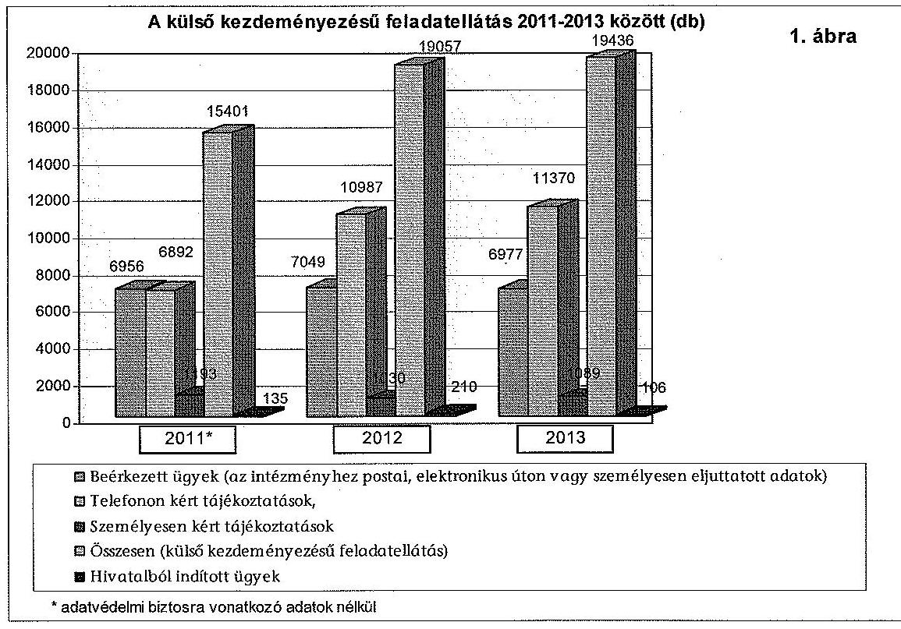
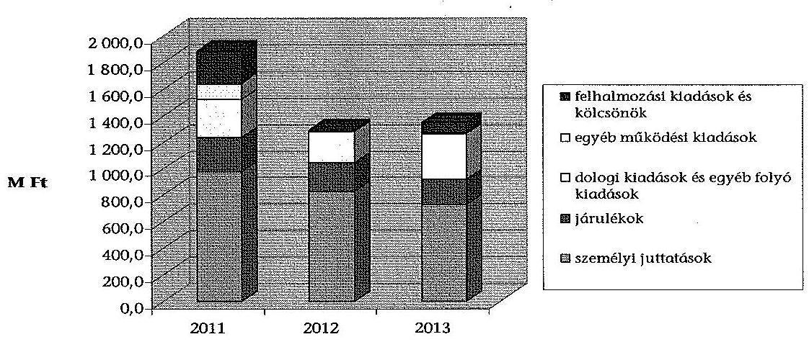
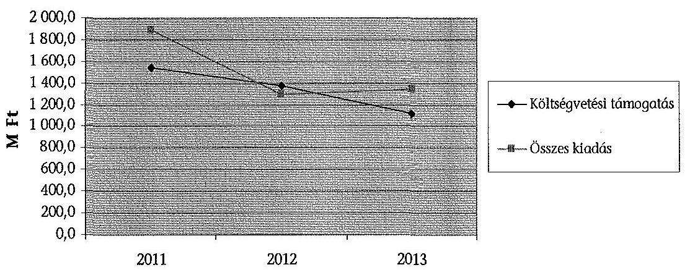
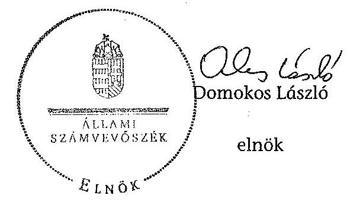
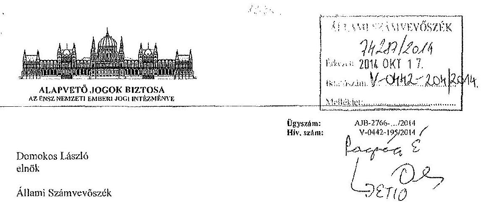
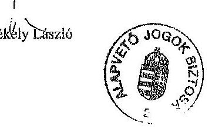
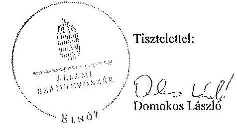
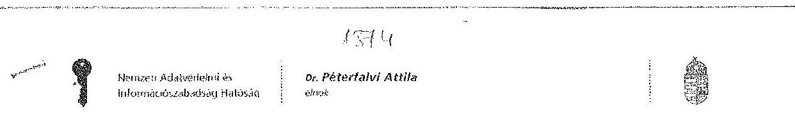

# JELENTÉS 

Az AJBH ellenőrzése - Az Alapvető Jogok Biztosának Hivatala működésének, gazdálkodásának és feladatellátásának ellenőrzéséről

---

# Állami Számvevőszék 

Iktatószám: V-0442-183/2014.
Témasorszám: 17.
Vizsgálat-azonosító szám: V-0672

## Az ellenőrzést felügyelte:

## Pongrácz Éva

felügyeleti vezető

## Az ellenőrzés végrehajtásáért felelős:

Dr. Jakab Kornél
ellenőrzésvezető

## A számvevői munkaanyagok feldolgozását és a Jelentés összeállítását

végezte:

## Dr. Jakab Kornél

ellenőrzésvezető
Velkei András
számvevő
Dr. Füredi Szabolcs
számvevő asszisztens

## Az ellenőrzést végezték:

| Beck Miklós | Farkas László | Gál Magdolna |
| :-- | :-- | :-- |
| számvevő tanácsos | számvevő tanácsos | számvevő főtanácsos |

## Velkei András

számvevő

## A témához kapcsolódó eddig készített számvevőszéki jelentések:

## címe

sorszáma
Jelentés a Magyar Köztársaság 2010. évi költségvetése végrehajtásának ellenőrzéséről
Jelentés a Magyar Köztársaság 2011. évi költségvetése végrehajtásának ellenőrzéséről
Vélemény Magyarország 2012. évi költségvetési javaslatáról 1121
Vélemény Magyarország 2014. évi központi költségvetéséről szóló 13110 törvényjavaslatról

---

# TARTALOMJEGYZÉK 

BEVEZETÉS ..... 11
I. ÖSSZEGZŐ MEGÁLLAPÍTÁSOK, KÖVETKEZTETÉSEK, JAVASLATOK ..... 14
II. RÉSZLETES MEGÁLLAPÍTÁSOK ..... 22

1. Az intézmény feladatellátása és a kapcsolódó belső kontrollok kialakítása ..... 22
1.1. Az intézmény szervezeti felépítése ..... 22
1.2. Az intézményi közfeladat ellátás kontrolljainak kialakítása ..... 24
1.3. Az intézmény közfeladat ellátásának megfelelősége ..... 27
2. Az intézmény pénzügyi gazdálkodása ..... 29
2.1. Az intézmény forrásfelhasználásának változása, értékelése ..... 30
2.2. Az intézmény kiadási előirányzatai felhasználásának, a pénzgazdálkodási jogkörök gyakorlásának szabályszerűsége ..... 33
2.3. Az előirányzat-maradvány megállapításának, felhasználásának szabályszerűsége ..... 37
3. Az intézmény vagyongazdálkodása ..... 40
3.1. Az intézmény vagyongazdálkodási tevékenységének szabályozottsága, vagyonnyilvántartásának megfelelősége ..... 40
3.2. A vagyonelemekkel való gazdálkodás szabályszerűsége ..... 42
3.3. Az intézmény vagyonváltozása ..... 42
4. Az ombudsmani intézmény átalakulása ..... 44
5. Az intézmény belső kontrollrendszerének kialakítása és működtetése ..... 48
5.1. A kontrollkörnyezet kialakítása ..... 48
5.2. A kockázatkezelési rendszer működése ..... 50
5.3. A kontrolltevékenység működése ..... 50
5.4. Az információs és kommunikációs rendszer kialakítása és működtetése ..... 51
5.5. A monitoring-rendszer működése ..... 52
5.6. A belső ellenőrzés működése ..... 52
5.7. A külső ellenőrzések megállapításai, javaslatai hasznosulása ..... 54
6. Az integritás kontrollok kialakítása és működtetése ..... 54

---

# MELLÉKLETEK 

| 1. számú | Az OBH/AJBH kiadási és bevételi előirányzatainak alakulása és azok teljesítése az ellenőrzött időszakban |
| :--: | :--: |
| 2. számú | Az OBH/AJBH saját bevételeinek az ellenőrzött időszakban történt előirányzat változásai |
| 3. számú | Az ellenőrzött időszakban hatáskörönként végrehajtott előirányzatmódosítások |
| 4. számú | Az Alapvető Jogok Biztosának észrevétele |
| 5. számú | Az Alapvető Jogok Biztosának észrevételére adott válasz |
| 6. számú | A Nemzeti Adatvédelmi és Információszabadság Hatóság elnökének észrevétele |

---

# RÖVIDÍTÉSEK ÉS JOGSZABÁLYOK JEGYZÉKE 

## Törvények

Ajbt. 1
Ajbt. 2

Avtv.

Ábtv.
Áht. 1
Áht. 2
ÁSZ tv.
Info tv.

Kbt. 1
Kbt. 2
Alkotmány
Magyarország Alaptörvénye
Mt. 1
Mt. 2
Számv. tv.
Vtv.
2012. évi Kvtv.
2013. évi XCII. tv.

## Korm. rendeletek

Áhsz.

Ámr. 1

Ámr. 2

1993. évi LIX. törvény az állampolgári jogok országgyűlési biztosáról
2011. évi CXI. törvény az alapvető jogok biztosáról
1992. évi LXIII. törvény a személyes adatok védelméről és a közérdekű adatok nyilvánosságáról
2011. évi CLI. törvény az Alkotmánybíróságról
1992. évi XXXVIII. törvény az államháztartásról
2011. évi CXCV. törvény az államháztartásról
2011. évi LXVI. törvény az Állami Számvevőszékről
az információs önrendelkezési jogról és az információszabadságról szóló 2011. évi CXII. törvény
2003. évi CXXIX. törvény a közbeszerzésekről
2011. évi CVIII. törvény a közbeszerzésekről
1949. évi XX. törvény a Magyar Köztársaság Alkotmánya
kihirdetve 2011. április 25-én
1992. évi XXII. törvény a Munka Törvénykönyvéről
2012. évi I. törvény a munka törvénykönyvéről
2000. évi C. törvény a számvitelről
2007. évi CVI. törvény az állami vagyonról
2011. évi CLXXXVIII. törvény Magyarország 2012. évi központi költségvetéséről

Magyarország 2013. évi központi költségvetéséről szóló 2012. évi CCIV. törvény módosításáról

249/2000. (XII. 24.) Korm. rendelet az államháztartás szervezetei beszámolási és könyvvezetési kötelezettségének sajátosságairól
az államháztartás működési rendjéről szóló 217/1998. (XII. 30.) Korm. rendelet (hatálytalan 2010. január 1-jétől)
292/2009. (XII. 19.) Korm. rendelet az államháztartás működési rendjéről

---

Ávr.
Ber.
Bkr.

Vtvr.

## OGY határozatok

105/2009. (XII. 21.) OGY határozat

## Korm. határozatok

1632/2013. (IX. 10.) Korm. határozat

1873/2013. (XI. 25.) Korm. határozat

## Utasítás

2/2012. (I. 20.) AJB utasítás

## Egyéb rövidítések

## ABI

AJBH
Alapító Okirat ${ }_{1}$

Alapító Okirat ${ }_{2}$
a helyiségek és berendezések használatának szabályzata ${ }_{1}$
a helyiségek és berendezések használatának szabályzata ${ }_{2}$
áfa
ÁJOB
ÁSZ

368/2011. (XII. 31.) Korm. rendelet az államháztartásról szóló törvény végrehajtásáról 193/2003. (XI. 26.) Korm. rendelet a költségvetési szervek belső ellenőrzéséről
370/2011. (XII. 31.) Korm. rendelet a költségvetési szervek belső kontrollrendszeréről és belső ellenőrzéséről
254/2007. (X. 4.) Korm. rendelet az állami vagyonnal való gazdálkodásról
a közszféra alapvető etikai követelményeiről
a 2012. évi kötelezettségvállalással nem terhelt előirányzat-maradványok egy részének felhasználásáról
a 2012. évi kötelezettségvállalással nem terhelt előirányzat-maradványok egy részének felhasználásáról, a rendkívüli kormányzati intézkedések előirányzat megemeléséről és egyes kormányhatározatok módosításáról
az alapvető jogok biztosa vizsgálatának szakmai szabályairól és módszereiről (egységes szerkezetben a 2/2013. (III. 8.) AJB utasítással)

Adatvédelmi Biztos Irodája
Alapvető Jogok Biztosának Hivatala (2012. január 1-jétől)
az ombudsmani intézmény - OBH-39/2010. iktatószámú 2011-ben hatályos alapító okirata
az ombudsmani intézmény - OBH-99/2011. iktatószámú - 2012-2013-ban hatályos alapító okirata
az állampolgári jogok országgyűlési biztosának 7/2010. (X. 22.) számú utasítása a helyiségek és berendezések használatának szabályzatáról
az AJBH főtitkárának 5/2012. (01. 20.) számú utasítása a helyiségek és berendezések használatáról
általános forgalmi adó
Állampolgári Jogok Országgyűlési Biztosa
Állami Számvevőszék

---

BEK

E Ft
EKOP
Hivatal

Hivatali gépjárművek üzemeltetésének szabályzata ${ }_{1}$

Hivatali gépjárművek üzemeltetésének szabályzata ${ }_{2}$

Intézmény
Informatikai Működési Szabályzat ${ }_{1}$
Informatikai Működési Szabályzat ${ }_{2}$

INTOSAI

JNO
Kincstár
Kötelezettségvállalási szabályzat
Közbeszerzési szabályzat ${ }_{1}$

Közbeszerzési szabályzat ${ }_{2}$

Közszolgálati szabályzat
KVI
Leltározási szabályzat ${ }_{1}$

Leltározási szabályzat ${ }_{2}$

M Ft
Mobiltelefon használatának szabályzata
az ombudsmani intézmény mindenkori belső ellenőrzési kézikönyve
Ezer forint
Elektronikus Közigazgatás Operatív Program
OBH (2011. december 31-ig)/ AJBH (2012. január 1-jétől)
Az állampolgári jogok országgyűlési biztosának 1/2006. (III. 1.) számú utasítása a hivatali gépjárművek üzemeltetéséről
az AJBH főtitkárának módosított, 4/2012. (01. 20.) számú utasítása a hivatali gépjárművek üzemeltetéséről
OBH (2011. december 31-ig) / AJBH (2012. január 1-jétől)
az OBH vezetőjének 5/2008. számú utasítása az informatikai működési szabályzatról
az AJBH főtitkárának 43/2012. (11. 12.) számú utasítása az informatikai működési szabályzatról
Legfőbb Ellenőrző Intézmények Nemzetközi Szervezete (INTOSAI)
Jövő Nemzedékek Országgyűlési Biztosa
Magyar Államkincstár
az ombudsmani intézmény mindenkori kötelezettségvállalási szabályzata
az állampolgári jogok országgyűlési biztosának többször módosított, 8/2007. (XII. 11.) számú utasítása a közbeszerzések szabályzatáról egységes szerkezetben
az AJBH főtitkárának többször módosított, 17/2012. (02. 17.) számú utasítása a közbeszerzések szabályzatáról
az ombudsmani intézmény mindenkori közszolgálati szabályzata
Kincstári Vagyoni Igazgatóság
az OBH vezetőjének módosított, 7/2007. (XI. 30.) számú utasítása az eszközök és a források leltárkészítéséről és leltározásáról egységes szerkezetben
az AJBH főtitkárának módosított, 7/2012. (01. 24.) számú utasítása az eszközök és a források leltárkészítéséről és leltározásáról Millió forint
Az állampolgári jogok országgyűlési biztosának 2/2003. számú szabályzata, valamint az AJBH főtitkárának 10/2012. (02.01.) számú utasítása

---

| MNV Zrt. | Magyar Nemzeti Vagyonkezelő Zrt. |
| :--: | :--: |
| NAIH | Nemzeti Adatvédelmi és Információszabadság Hatóság |
| NAV | Nemzeti Adó- és Vámhivatal |
| NEK | Nemzeti és Etnikai Kisebbségi Jogok Biztosa |
| NGM | Nemzetgazdasági Minisztérium |
| PM | Pénzügyminisztérium |
| OBH | Országgyűlési Biztos Hivatala (2011. december 31-ig) |
| OGY | Országgyűlés |
| ombudsmani intézmény | A 2011. évben működő OBH és a 2012. évtől működő AJBH összefoglaló néven |
| Országgyűlési biztos | állampolgári jogok országgyűlési biztosa |
| Selejtezési szabályzat ${ }_{1}$ | az OBH vezetőjének 3/2007. (XI. 30.) számú utasítása a felesleges vagyontárgyak hasznosításáról és selejtezéséről |
| Selejtezési szabályzat ${ }_{2}$ | az AJBH főtitkárának módosított, 9/2012. (01. 26.) számú utasítása a felesleges vagyontárgyak hasznosításáról és selejtezéséről |
| Számviteli politika $_{1}$ | az OBH vezetőjének többször módosított, 3/2006. (X. 1.) számú utasítása a számvitel politikáról |
| Számviteli politika $_{2}$ | az AJBH főtitkárának módosított, 13/2012. (02. 06.) számú utasítása a számviteli politikáról |
| Számlarend $_{1}$ | az OBH vezetőjének többször módosított, 3/2006. (X. 1.) számú utasítása a számvitel politikáról számlarend 2. sz. melléklete |
| Számlarend $_{2}$ | az AJBH főtitkárának 14/2012. (02. 08.) számú utasítása a számlarendről |
| SZMSZ $_{1}$ | Az állampolgári jogok országgyűlési biztosának többször módosított, 1/2003. (II. 21.) számú utasítása a Szervezeti és Működési Szabályzatról egységes szerkezetben |
| SZMSZ $_{2}$ | Az alapvető jogok biztosának többször módosított, 1/2012. (I. 6.) utasítása az Alapvető Jogok Biztosának Hivatala Szervezeti és Működési Szabályzatáról |
| VIR | Vezetői információs rendszer |

---

# FOGALOMTÁR 

állami vagyon értékesítése
«Állami vagyon tulajdonjogának bármely jogcímen történő, visszterhes átruházása"
(Forrás: Vtvr. 1. § (7) bekezdés d) pontja)
„Az a természetes személy, jogi személy, illetve jogi személyiséggel nem rendelkező szervezet, amely, illetve aki törvény vagy szerződés alapján, bármely jogcímen (pl. bérlet, haszonbérlet, vagyonkezelési szerződés, használat stb.) állami vagyont birtokol, használ, szedi annak hasznait, hasznosít, ide nem értve a tulajdonosi jogok gyakorlóját".
(Forrás: Vtvr. 2011. január 1-jétől hatályos 2011. december 31-ig)
„Az a természetes vagy jogi személy, jogi személyiséggel nem rendelkező szervezet, aki, vagy amely törvény vagy szerződés alapján, bármely jogcímen (bérlet, haszonbérlet, használat stb.) állami vagyont birtokol, használ, szedi annak hasznait, hasznosít, ide nem értve a haszonélvezőt, a vagyonkezelőt és a tulajdonosi jogok gyakorlóját".
(Forrás: Vtvr. 2012. január 1-jétől hatályos 1. § (7) bekezdés a) pontja)
„Az állami vagyont az MNV Zrt. maga kezeli, vagy szerződés - így különösen bérlet, haszonbérlet, szerződésen alapuló haszonélvezet, vagyonkezelés, megbízás - alapján központi költségvetési szervnek, természetes vagy jogi személynek, vagy jogi személyiséggel nem rendelkező gazdálkodó szervezetnek hasznosításra átengedi."
(Forrás: Vtv. 2011. december 31-éig hatályos 23. § (1) bekezdése)
„Az állami vagyont az MNV Zrt. maga kezeli, vagy szerződés - így különösen bérlet, haszonbérlet, megbízás - alapján központi költségvetési szervnek, természetes vagy jogi személynek, vagy jogi személyiséggel nem rendelkező gazdálkodó szervezetnek hasznosításra átengedi."
(Forrás: Vtv. 2012. január 1-jétől hatályos 23. § (1) bekezdése)
„Az állami vagyonnal a tulajdonosi joggyakorló maga gazdálkodik, vagy szerződés - így különösen bérlet, haszonbérlet, megbízás - alapján hasznosításra átengedi, illetőleg vagyonkezelésbe, haszonélvezetbe adja."
(Forrás: Vtv. 2013. június 28-ától hatályos 23. § (1) bekezdése)
„Az állami vagyon hasznosítására kötött szerződések elsődleges célja az állami vagyon hatékony működtetése, állagának védelme, értékének megőrzése, illetve gyarapítása, az állami és közfeladatok ellátásának elősegítése."
(Forrás: Vtv. 23. § (2) bekezdése)
«Az általános jogutódlással történő megszüntetés áta-

---

átlagos életkor mutató
befektetett eszközök aránya mutató
belső kontrollrendszer
elhasználódási szint
előirányzat-maradvány

FEUVE
forgóeszközök aránya mutató
használhatósági fok mutató
információ és kommunikáció
ingatlanok aránya mutató
integritás
látással történhet. Az átalakítás lehet egyesítés vagy különválás. Az egyesítés lehet beolvadás vagy összeolvadás." (Forrás: Áht. ${ }_{1}$ 95. §-a, Áht. ${ }_{2}$ 11. §-a)
elhasználódási szint százaléka/értékcsökkenési leírási kulcs százaléka
befektetett eszközök/eszközök összesen
2012. január 1-ig a Ber. szerint az Áht. ${ }_{1}$ 121. §-ban, meghatározott rendszer, 2012. január 1-től a Bkr. szerint az Áht. ${ }_{2}$ 69. § (1) bekezdésében meghatározott fogalom
(kockázatok kezelése és tárgyilagos bizonyosság megszerzése érdekében kialakított folyamatrendszer),
tárgyi eszközök elszámolt értékcsökkenése*100/tárgyi eszközök záró bruttó értéke
„Az államháztartás központi alrendszerébe tartozó költségvetési szerveknél a módosított bevételi és kiadási előirányzatok és azok teljesítésének a Kormány rendeletében meghatározott tételekkel korrigált különbözete az előirányzatmaradvány."
(Forrás: Áht. ${ }_{2}$ 2. § (1) bekezdés m) pontja).
Folyamatba épített előzetes, utólagos és vezetői ellenőrzés rendszere
forgóeszközök/eszközök összesen
tárgyi

 eszközök, immateriális javak nettó értéke*100/tárgyi eszközök, immateriális javak bruttó értéke
„A vezetés képességét a megfelelő döntések meghozatalára alapvetően befolyásolja az információ minősége, amely magában hordozza azt a követelményt, hogy az információnak megfelelőnek, időben rendelkezésre állónak, aktuálisnak, pontosnak és elérhetőnek kell lennie.
A hatékony kommunikáció lefelé, horizontálisan és felfelé irányuló információáramlatást jelent a szervezetben, annak minden részében és teljes struktúrájában.
A költségvetési szerv vezetője köteles olyan rendszereket kialakítani és működtetni, melyek biztosítják, hogy a megfelelő információk a megfelelő időben eljutnak az illetékes szervezethez, szervezeti egységhez, illetve személyhez."
(Forrás: Ámr 2 159. § (1) bekezdés, Bkr. 9. § (1) bekezdés)
ingatlanok/befektetett eszközök összesen
„Az integritás az elvek, értékek, cselekvések, módszerek, intézkedések konzisztenciáját jelenti, vagyis olyan magatartásmódot, amely meghatározott értékeknek megfelel."
(Forrás: Magyarországi államháztartási belső kontroll standardok Útmutató 1.6.1. pontja, 2012. december)

---

kincstári biztos
kincstári költségvetés
kockázatkezelés
kontrollkörnyezet
kontrolltevékenységek
költségvetési főfelügyelő, felügyelő
„A kincstári biztos kijelölését az államháztartásért felelős miniszternél a Kincstár kezdeményezi. A kincstári biztos köteles figyelemmel kísérni megbízatásának időpontjától kezdve a költségvetési szerv tervezését, gazdálkodását, beszámolását, a jogszabályokban előírt feladatainak ellátását, feltárni azokat az okokat, amelyek a tartós fizetésképtelenséghez vezettek, a szükséges intézkedések azonnali végrehajtására irányuló intézkedési tervet készíteni, azonnali intézkedéseket kezdeményezni és írásbeli utasításokat kiadni a tartozásállomány felszámolására, a gazdálkodás egyensúlyának biztosítására, a követelések behajtására." (Forrás: Ávr. 116-117. § hatályos 2013. augusztus 19-ig)
„A központi költségvetésről szóló törvény elfogadását követően a fejezetet irányító szerv az államháztartás központi alrendszerébe tartozó költségvetési szerv és a fejezeti kezelésű előirányzat kiemelt előirányzatait, valamint az elkülönített állami pénzalapok és a társadalombiztosítás pénzügyi alapjai jogszabályi előírás szerinti bevételeit és kiadásait kincstári költségvetés kiadásával állapítja meg."
(Forrás: Áht. ${ }_{1}$ 24. § (3) bekezdés, Áht. ${ }_{2}$ 28. § (2) bekezdés)
„A kockázatkezelés a szervezet céljai elérésével kapcsolatos kockázatok azonosításának és elemzésének, valamint a megfelelő válaszok meghatározásának folyamata."
(Forrás: Ámr 2 157. § (1) bekezdés, Bkr. 7. § (1) bekezdés)
„A kontrollkörnyezet alapozza meg a belső kontroll összes többi elemét a fegyelem és a struktúra biztosítása által.
A költségvetési szerv vezetője köteles olyan kontrollkörnyezetet kialakítani, amelyben
a) világos a szervezeti struktúra,
b) egyértelműek a felelősségi, hatásköri viszonyok és feladatok,
c) meghatározottak az etikai elvárások a szervezet minden szintjén,
d) átlátható a humánerőforrás-kezelés."
(Forrás: Ámr ${ }_{2}$ 156. § (1) bekezdés, Bkr. 6. § (1) bekezdés)
„Azok az elvek (politikák) és eljárások, amelyeket a kockázatok meghatározása és a szervezet céljainak elérése érdekében alakítanak ki."
(Forrás: Ámr ${ }_{2}$ 158. § (1) bekezdés, Bkr. 8. § (1) bekezdés)
„Az államháztartásért felelős miniszter a Kormány irányítása alá tartozó fejezetet irányító szervhez, a Kormány irányítása vagy felügyelete alá tartozó költségvetési szervhez, valamint az elkülönített állami pénzalapok és a társadalombiztosítás pénzügyi alapjai kezelő szerveihez költségvetési

---

kulcskontrollok
likviditási mutató
monitoring-rendszer
pénzeszköz likviditási mutató
saját tőke aránya mutató
főfelügyelőt, felügyelőt rendelhet ki. A költségvetési főfelügyelő, felügyelő a gazdálkodás költségvetéspolitikával való összhangja és a takarékos, szabályszerű, eredményes működés érdekében a Kormány rendeletében meghatározott intézkedéseket tehet, így különösen előzetesen véleményezi a kötelezettségvállalásra irányuló eljárásokat és a nagy összegű kötelezettségvállalások tekintetében kifogással élhet." (Forrás: Áht. ${ }_{2}$ 39. § (1)-(2) bekezdés)
A kiadások felhasználásához, illetve a bevételek beszedéséhez kapcsolódó pénzügyi jogkörök (kötelezettségvállalás, ellenjegyzés, teljesítésigazolás, érvényesítés, utalványozás) kontrolljai.
forgóeszközök/rövid lejáratú kötelezettségek „A költségvetési szerv vezetője köteles olyan monitoring rendszert működtetni, mely lehetővé teszi a szervezet tevékenységének, a célok megvalósításának nyomon követését. A költségvetési szerv monitoring rendszere az operatív tevékenységek keretében megvalósuló folyamatos és eseti nyomon követésből, valamint az operatív tevékenységektől függetlenül működő belső ellenőrzésből áll."
(Forrás: Ámr 2 160. §, Bkr. 10. §)
pénzeszközök/rövid lejáratú kötelezettségek
saját tőke összesen/források összesen

---

# JELENTÉS 

## Az AJBH ellenőrzése - Az Alapvető Jogok Biztosának Hivatala működésének, gazdálkodásának és feladatellátásának ellenőrzéséről

## BEVEZETÉS

A világ számos országában működő emberi jogi jogvédő intézmény jelenlegi hazai megfelelői - az országgyűlési képviselők kétharmadának szavazatával hat évre választott - az alapvető jogok biztosa, valamint a jövő nemzedékek érdekeinek védelmét, illetve a Magyarországon élő nemzetiségek jogainak védelmét ellátó helyettesei. A feladatellátáshoz az intézményi hátteret az Alapvető Jogok Biztosának Hivatala biztosítja.
2011. december 31-ig az állampolgári jogok országgyűlési biztosa, az adatvédelmi biztos, a jövő nemzedékek országgyűlési biztosa, valamint a nemzeti és etnikai kisebbségi jogok országgyűlési biztosa irodái tevékenységének elősegítésével kapcsolatos feladatokat - más jogszabályi háttérrel és struktúrában - az Országgyűlési Biztos Hivatalán belül működő közös hivatal látta el. Magyarország Alaptörvénye és az alapvető jogok biztosáról szóló 2011. évi CXL törvény (Ajbt.) értelmében 2012. január 1-jével megújult az emberi jogi jogvédelmi feladatok ellátásának jogszabályi és szervezeti háttere. A jogutód szervezetként létrejött AJBH szervezeti felépítése 2012. szeptember 1-jével jelentősen átalakult, mindamellett feladatait folyamatosan ellátta.

A Hivatal legfőbb feladata, hogy az alkotmányos jogokkal kapcsolatos visszásságokat kivizsgálja és orvoslásuk érdekében általános vagy egyedi intézkedéseket kezdeményezzen. Az ombudsmani feladatok a társadalom és a nyilvánosság egésze figyelmének homlokterében állnak.

Az AJBH 2012. évi eredeti kiadási és ezzel egyező támogatási előirányzata 1200,9 M Ft volt, ami a kiadásoknál 1657,1 M Ft-ra, a támogatást illetően 1407,5 M Ft-ra teljesült. A 2013. évi eredeti kiadási és ezzel egyező támogatási előirányzata 1138,2 M Ft volt, ami a kiadásoknál 1344,8 M Ft-ra, a támogatást illetően 1117,5 M Ft-ra teljesült.

A Hivatalt önálló ellenőrzés keretében az ÁSZ még nem vizsgálta.
Jelen ellenőrzés célja annak megállapítása volt, hogy az AJBH feladatellátása, pénzügyi és vagyongazdálkodási tevékenysége, valamint a szervezet átalakulása a jogszabályokban és a szervezet belső irányítási eszközeiben foglaltaknak megfelelően, az ombudsmani intézmény belső kontrollrendszere kialakítása és működtetése szabályszerűen történt-e.

---

Ennek keretében ellenőriztük:

- a Hivatal feladatellátásának, a kapcsolódó kontrollok kialakításának szabályszerűségét;
- az ombudsmani intézmény pénzügyi és vagyongazdálkodási tevékenységének, forrásfelhasználásának szabályszerűségét;
- az ombudsmani intézmény szervezeti átalakulásának, a feladat- és vagyonátadás lebonyolításának szabályszerűségét;
- az ombudsmani intézmény belső kontrollrendszerének kialakítását és működtetését.

Az ellenőrzés várható hasznosulásaként az AJBH feladatainak szabályozottságáról, valamint a feladatellátás szabályszerűségéről alkotott objektív kép segítheti a döntéshozókat, az Országgyűlést, a Kormányt a jogszabályok szükség szerinti felülvizsgálatában, módosításában. Megállapításaink, javaslataink hozzájárulhatnak a Hivatal tevékenységének javításához, fejlesztéséhez. Az ellenőrzés hozadékaként várható, hogy az ombudsmani intézmény, valamint az erre a célra fordított közpénzek felhasználása iránt a társadalom részéről megnyilvánuló érdeklődés fokozódik, felkelti az állampolgárokban az igényt az iránt, hogy alkotmányos jogaik sérülése esetén bátrabban forduljanak a biztosokhoz.

Az ellenőrzés típusa: szabályszerűségi ellenőrzés
Az ellenőrzött időszak: 2011. január 1 - 2013. december 31.
Az ellenőrzést az Alapvető Jogok Biztosának Hivatalánál, valamint az adatvédelmi biztos 2011. évi feladatellátása tekintetében a Nemzeti Adatvédelmi és Információszabadság Hatóságnál folytattuk le. Az ellenőrzés végrehajtására az Állami Számvevőszékről szóló 2011. évi LXVI. törvény 1. § (3) bekezdésében, az 5. § (2)-(6) bekezdéseiben, valamint az államháztartásról szóló 2011. évi törvény 61. § (2) bekezdésében foglaltak adtak jogszabályi alapot.

Az ellenőrzés során vizsgálni kellett minden olyan körülményt, információt, adatot, amely a program végrehajtása során felmerült, a pénzügyi és vagyoni helyzet szabályosságának megítélésére hatást gyakorolt, az ellenőrzés céljával releváns módon összefüggésben volt és a tények megalapozásához szükséges volt.

Az AJBH gazdálkodásának és belső kontrollrendszerének ellenőrzése során a 2013. évre vonatkozóan a 2013. évi zárszámadás ellenőrzési tapasztalatai és megállapításai az AJBH ellenőrzés céljának, várható hasznosulásának figyelembe vételével - annak értékelése után - felhasználásra kerültek.

A belső kontrollrendszer kialakításának és működtetésének értékelését a vonatkozó jogszabályi előírások, valamint az ellenőrzés gyakorlati tapasztalatai alapján végeztük el. Az értékelés során a jogszabályi előírások mellett az Ámr. 2 155. § (3) bekezdése, valamint a Bkr. 5. § (1) bekezdése alapján figyelembe vettük az államháztartásért felelős miniszter által közzétett irányelvekben és módszertani útmutatókban foglaltakat is.

---

A mintavétellel értékelt területek esetében a számvevőnek a kiválasztott mintatételek vonatkozásában kellett megválaszolnia a szabályszerűségre/megfelelőségre vonatkozó ellenőrzési kérdéseket, amely kiértékelésre került. Az összesített értékelés eredménye egy hibaszázalék volt, amelyet a megfelelő statisztikai eljárásokat alkalmazva kivetítettünk a sokaságra. A jogszabályoknak és a belső előírásoknak megfelelőnek, azaz szabályszerűnek tekintettük az adott területet, amennyiben a minta ellenőrzésének eredménye alapján 95%-os bizonyossággal a teljes sokaságban a hibaszázalék kisebb volt, mint 10%, nem megfelelőnek értékeltük, ha a hibaszázalék a 10%-ot meghaladta. Kockázatot, illetve magas kockázatot jeleztünk, amennyiben egy adott terület vonatkozásában a minta alapján a teljes sokaságban nem volt teljes körűen biztosított a jogszabályoknak és a belső szabályzatoknak megfelelő működés.

Az ellenőrzés az INTOSAI által kiadott nemzetközi standardok figyelembe vételével, az ellenőrzési programban foglalt értékelési szempontok szerint történt.

Az ÁSZ a 2011. évi LXVI. törvény 29. §-a szerint megküldte a jelentéstervezetet az alapvető jogok biztosa és a Nemzeti Adatvédelmi és Információszabadság Hatóság elnöke részére. A beérkezett észrevételeket és az azokra adott válaszokat a jelentés 4-6. számú mellékletei tartalmazzák.

---

# I. ÖSSZEGZŐ MEGÁLLAPÍTÁSOK, KÖVETKEZTETÉSEK, JAVASLATOK 

Az ombudsmani intézményrendszer átalakításával a négy önálló ombudsman helyett egységes ombudsmani intézmény jött létre. Az egyszemélyi felelős vezetés új rendszerében a felelősségi és hatáskörök egyértelmű meghatározására nyílt lehetőség, melynek eredményeként a feladatellátás hatékonyabbá, a gazdálkodás szabályozottabbá és átláthatóbbá vált.

Az AJBH jogelődjét, az OBH-t 1995. július 1-jével alapította a Magyar Köztársaság Országgyűlése. Az AJBH új biztosi struktúrával 2012. január 1-jével jött létre. Az adatvédelmi feladatokat 2012-től egy új intézmény, a NAIH látta el. Az ombudsmani intézmény az ellenőrzött időszakban egymást követően két Alapító Okirattal rendelkezett. Az Alapító Okiratok a vonatkozó jogszabályoknak megfeleltek. Az ellenőrzött időszakban a szervezeti változások következtében több SZMSZ is hatályban volt. Az intézmény SZMSZ-ei az Alapító Okiratban foglaltaknak megfeleltek, aktualizálásuk megtörtént, azonban a jogszabályi előírásokkal nem voltak teljes körűen összhangban. Az SZMSZ 2011-ben nem tartalmazta az OBH szervezeti ábráját, míg 2012-2013-ban a belső ellenőrzés feladatait nem a jogszabályi előírásoknak megfelelően határozták meg.

Az ombudsmani intézmény közfeladat ellátására vonatkozó kontrolljainak kialakítása az ellenőrzött időszakban hiányos volt.

2011-ben a kontrollkörnyezet kialakítása nem volt megfelelő, mert a monitoring rendszer működését, illetve a releváns kockázatok felmérésének hiányából eredően a kockázatkezelés módját nem szabályozták. Az etikai elvárásokat a szervezeti szinteken nem határozták meg egységes Etikai Kódex keretében. A szabályzatoknak, a szervezeti egységek ügyrendjeinek és a szervezeti ábrának a hiánya miatt 2011-ben a közfeladatok ellátására vonatkozóan egyes jogszabályi előírások - a világos szervezeti struktúrára, az egyértelmű felelősségi, hatásköri viszonyokra és feladatokra, az etikai elvárásokra és az átlátható humánerőforrás-kezelésre vonatkozóan - részben teljesültek. Működési folyamataik tekintetében - a pénzügyi folyamatok kivételével - nem alakították ki a FEUVE-t, illetve az ellenőrzési nyomvonalat.

A 2012-2013 közötti időszakra vonatkozóan a szabálytalanságok kezelésére készült utasítást, valamint a pénzügyi folyamatok ellenőrzési nyomvonalát késedelmesen, csak a 2013. év végén, míg az Etikai Kódexet a 2012. év végén fogadták el. Az intézménynél nem mérték fel, illetve nem állapították meg a tevékenységében és gazdálkodásában rejlő releváns kockázatokat, valamint
 nem határozták meg az egyes kockázatokkal kapcsolatban szükséges intézkedéseket. 2013-ban két kockázatkezelési szabályzat is hatályban volt, melyek egymásnak ellentmondó párhuzamos rendelkezéseket tartalmaztak. A kontrolltevékenységek részeként a költségvetési szerv vezetője nem biztosította minden tevékenység vonatkozásában a folyamatba épített, előzetes, utólagos és vezetői ellenőrzést. A szervezet tevékenységének, a célok megvalósításának nyomon követését biztosító monitoring - és az annak részét képező VIR - rendszert 2012-ben még

---

nem és 2013-ban is csak részben alakították ki. Mindezekkel megsértették a vonatkozó jogszabályi rendelkezéseket.

Az ellenőrzött időszakban a fejezetet irányító szerv vezetője ellátta az erőforrásokkal való szabályszerű gazdálkodáshoz szükséges követelmények érvényesítésére, számonkérésére, ellenőrzésére vonatkozó feladatait, ugyanakkor az erőforrásokkal való hatékony gazdálkodás követelményei tekintetében nem tett eleget a vonatkozó jogszabályi előírásoknak. A biztosok az ellenőrzött időszakban néhány hiányosságtól eltekintve eleget tettek a jogszabályokban és a belső szabályzatokban foglalt, a közfeladat ellátással összefüggésben előírt feladataiknak.

Az ellenőrzött időszak mindhárom évében határidőben elkészült a Hivatal működését bemutató beszámoló, amelyeket - a jogszabályi előírás ellenére - az Országgyűlés nem tárgyalt meg.

Az ombudsmani intézmény az ellenőrzött időszakban a kiadási előirányzatok felhasználása során a pénzgazdálkodással kapcsolatos gazdálkodási jogkörökhöz kapcsolódó belső kontrollokat a 2011. és 2013. évben nem megfelelően működtette, illetve azok - a feltárt hibák és hiányosságok következtében - a 2012. évben sem feleltek meg teljes körűen a jogszabályokban és belső szabályzatokban foglalt előírásoknak. Ez magas kockázatot jelent az ellenőrzött terület egészének szabályszerű működése szempontjából. Az ellenőrzött kiadások kötelezettségvállalási és kifizetési dokumentumai rendelkezésre álltak, valamennyi teljesített kiadáshoz készítettek utalványrendeletet, mely formailag megfelelt a jogszabályi előírásoknak. A kötelezettségvállalás nyilvántartását naprakészen vezették.

A pénzügyi-gazdálkodási jogkörök ellátására felhatalmazott személyekről - a teljesítésigazoló kivételével - az előírt nyilvántartást vezették, amely tartalmazta az aláírás mintákat is. Rendszerhibaként jelentkezett, hogy a teljesítés igazolását végző személyeket a kötelezettségvállalók - néhány kivételtől eltekintve - egyik évben sem jelölték ki írásban. Nyilvántartást nem vezettek róluk és az aláírás mintájuk sem állt rendelkezésre. Az intézménynél nem tartották be a vonatkozó jogszabályok rendelkezéseit.

A rendszeres és nem rendszeres személyi juttatások számfejtését több esetben nem támasztották alá munkaidő elszámolással (jelenléti ívvel vagy egyéb, a teljesített munkaidőre vonatkozó nyilvántartással). A munkáltatói jogok gyakorlása szabályszerűen történt, a kinevezéseket és azok módosításait, valamint a nem rendszeres személyi juttatásokkal kapcsolatos kötelezettségvállalásokat az arra jogosultak végezték.

A külső személyi juttatások esetében a megbízási szerződéseken a (szakmai) teljesítésigazoló személyét - ha az nem egyezett meg a kötelezettségvállalóval - megnevezték, de nyilvántartás és aláírás minta ebben az esetben sem készült a (szakmai) teljesítés igazolására jogosult személyekről.

A dologi kiadások előirányzatának teljesítése során a kötelezettségvállalás dokumentumain hiányzott az ellenjegyzés tényére történő utalás és az ellen-

---

jegyzés dátuma, néhány esetben az alkalmazott gyakorlat nem felelt meg a számviteli törvény bizonylatok javítására vonatkozó előírásainak.

A dologi kiadásoknál - az ellenőrzött időszakot megelőzően határozatlan időre megkötött, de az ellenőrzött időszakban kifizetéssel érintett szerződések között előfordult, hogy annak ellenére nem folytatták le a közbeszerzési eljárást, hogy az a szolgáltatások becsült értéke alapján meghaladta a közbeszerzési értékhatárt. Az intézmény a közbeszerzési eljárások lefolytatásának elmulasztásával megsértette a hatályos közbeszerzési törvény vonatkozó rendelkezéseit. A jogvesztő határidő letelte miatt az ÁSZ-nak már nem állt módjában jogorvoslati eljárást kezdeményezni.

A 2011-2013. években megkötött, ellenőrzött új szerződéseknél a közbeszerzési törvény hatálya alá tartozó beszerzéseknél lefolytatták a közbeszerzési eljárást.

Az éves fejezeti és intézményi szintű előirányzat-maradvány megállapítása az ellenőrzött időszakban megfelelt, a kötelezettségvállalással terhelt előirányzat-maradvány megállapítása és kimutatása 2011-ben és 2012-ben nem felelt meg, 2013-ban nem teljes körűen felelt meg a jogszabályi előírásoknak és belső szabályzatoknak.

Az ellenőrzött időszakban a székház felújítási, beruházási munkáira vonatkozó 212,8 M Ft kötelezettségvállalással terhelt előirányzat maradvány kimutatása nem volt megalapozott, mert az intézmény nem tudta bemutatni a jogszabályoknak megfelelő kötelezettségvállalási dokumentumot. A kötelezettségvállalással terhelt előirányzat-maradványok között két munkaügyi perrel összefüggésben 36,6 M Ft kimutatása sem volt megalapozott, mivel a perek még nem zárultak le, jogerős ítélet egyikben sem született. A kötelezettségvállalással terhelt maradványként történt kimutatással az intézmény megsértette a számviteli törvényt, valamint az államháztartás rendjéről szóló jogszabályokat, amelynek következtében az ÁSZ A 2013. évi zárszámadásról - Magyarország 2013. évi költségvetése végrehajtásának ellenőrzéséről szóló Jelentésében az AJBH 2013. évi beszámolóját elutasító záradékkal látta el.

Az ellenőrzött időszakban az intézmény gazdálkodása - az elrendelt tartalékképzési kötelezettség ellenére - kiegyensúlyozott volt, nem az előirányzati keretek előrehozására nem volt szükség. Az intézmény a kiemelt előirányzatait egyik évben sem lépte túl. Az intézményt nem érintették központi létszámleépítések. Az egyensúlyjavító intézkedések keretében elrendelt beszerzési tilalom előírásai, a zárolások, maradványtartási kötelezettségek az intézményre nem vonatkoztak.

Az intézmény pénzügyi helyzete a likviditási mutatók alapján stabil volt. Forgóeszközeinek és pénzeszközeinek értéke minden év végén meghaladta a rövid lejáratú kötelezettségek összegét. Az intézménynek hosszú lejáratú kötelezettségei nem voltak az ellenőrzött időszakban. Lejárt szállítói tartozással, lejárt, vagy behajthatatlannak minősített követeléssel nem rendelkezett.

Az ombudsmani intézmény vagyongazdálkodási tevékenységének szabályozottsága, vagyonnyilvántartásának vezetése megfelelt a jogszabályi előírásoknak. A tulajdonában lévő immateriális javak, tárgyi eszközök beszerzésének el-

---

járásrendjét közbeszerzési utasításban szabályozta. A közbeszerzési tervek 2011-ben és 2012-ben nem feleltek meg az utasítás mellékletében foglalt követelményeknek, a terveken nem szerepelt a hivatalvezető, illetve a főtitkár jóváhagyása. 2013-ban a fenti problémák már nem álltak fenn.

A vagyonhasznosítási és működési bevételek beszedése során az ombudsmani intézmény szabályszerűen járt el. Az ombudsmani intézmény az ellenőrzött időszakban bérbeadást nem végzett. Vagyona a 2011. január 1-jei 453,7 M Ftról a 2013. év végére 19,4%-kal, 365,8 M Ft-ra csökkent, elsősorban a forgóeszközök 21,2%-os (74,3 M Ft) és a befektetett eszközök 13,1%-os (13,6 M Ft) csökkenése miatt.

A könyvviteli mérlegeket leltárral és szabályszerű főkönyvi kivonattal alátámasztották, az egyes mérlegsorok tárgyévi állományi értékei megegyeztek a főkönyvi kivonatok megfelelő számláinak záró értékeivel, a mérlegtételek tárgyévi nyitó adatai megegyeztek az előző évi záró adatokkal. A mérleg sorait leltárral alátámasztották, az analitikus nyilvántartásokkal szabályszerűen egyeztették.

Az AJBH mérlegében kimutatott nemzeti vagyonra vonatkozó vagyonkezelési szerződést a KVI-vel, mint az MNV Zrt. jogelődjével az AJBH jogelődjeként az OBH kötötte meg. Az ellenőrzött időszakban a vagyonkezelési szerződés azonban ingatlant nem tartalmazott, az OBH/AJBH által használt ingatlan (székház) abban nem szerepelt. A szerződésben kizárólag az ingóságok jelentek meg. A székházként használt ingatlanra vonatkozó külön vagyonkezelési szerződés megkötésére sem került sor az ellenőrzött időszakban.

A KVI megszűnésekor a Vtv. rendelkezése ¹ alapján a vagyonkezelési szerződést felül kellett vizsgálni. A felülvizsgálat során és az ellenőrzés lezárásáig - több egyeztetést követően - sem született megállapodás az MNV Zrt. és az OBH/AJBH között a székházként használt ingatlan jogi helyzetének rendezéséről. Az AJBH az általa kezelt vagyonról minden évben elkészítette a vagyonkataszteri jelentést, amelyet megküldött az MNV Zrt. részére.

Az OBH, mint irányító szerv meghozta az átalakuláshoz kapcsolódó előírt döntéseket, azonban az intézmény megszüntetése során az OBH nem teljes körűen tett eleget a megszüntetéshez kapcsolódó jogszabályi előírásoknak. Az OBH megszüntetéséről rendelkező jogszabály kihirdetését követő harminc napon belül az intézmény nem adta ki a megszüntető okiratát, továbbá azt - az elkészítését követő tíz napon belül - nem nyújtotta be a Kincstárhoz. A megszüntető okirat nem tartalmazott rendelkezést az intézmény előirányzatairól és az adatvédelmi biztos azt nem hitelesítette.

Az AJBH, mint jogutódlással létrejött szervezet sem tett eleget teljes körűen az átalakuláshoz kapcsolódó jogszabályi előírásoknak. Az OBH megszűnésével a jogutód AJBH készítette el az átalakulás napjára vonatkozóan az éves beszámolót. A beszámolót leltárral és záró főkönyvi kivonattal alátámasztotta, valamint vagyonátadási jegyzőkönyvet készített. A 2011. évi beszámolón azonban nem szerepelt az intézmény vezetőjének aláírása. A költségvetési beszámoló egy-egy példányát a jogutód, valamint az átszervezést elrendelő irányító szerv a jogszabályban foglaltaknak megfelelően megőrizte. Az átalakuláshoz kapcsolódóan vagyon- és iratátadási jegyzőkönyvek készültek, azonban azok formai és tartalmi hiányosságai következtében nem minden esetben biztosították a vagyon, valamint az iratanyag teljes körű, dokumentált átadását.

A belső kontrollrendszer kialakítása és működtetése a gazdálkodási folyamatok tekintetében csak részben felelt meg a vonatkozó jogszabályi előírásoknak. A 2011. évre az OBH belső kontroll rendszerének összevont értékelése részben megfelelő volt, míg a 2012. évre nem megfelelő minősítést kapott. A nem megfelelő minősítés az új intézmény belső szabályozási környezetének hiányos kialakításával függött össze. A 2013. évben az értékelés ismét részben megfelelő volt. Az intézmény vezetője a 2011-2013. években évente értékelte a belső kontrollok kialakítását és működését, valamint erről nyilatkozatot tett, amely azonban nem volt teljes körűen összhangban a kontrollrendszer tényleges működésével.

A gazdálkodás részterületeit érintő szabályozással rendelkeztek, ugyanakkor az intézmény kontrollkörnyezete a jogszabályi előírásoknak nem felelt meg teljes körűen. A kötelezettségvállalási szabályzatok több jogszabályi előírással ellentétes rendelkezést tartalmaztak. A (szakmai) teljesítés igazolására jogosultak kijelöléséről nem a jogszabályi előírások szerint gondoskodtak, a kötelezettségvállalás folyamatába építetten belső ellenőri felülvizsgálatot írtak elő.

Az ellenőrzött időszakban a kontrolltevékenységek kialakítása - a (szakmai) teljesítésigazolás kivételével - megfelelt a vonatkozó jogszabályi előírásoknak. Az ellenőrzés a kontrollok működtetésében hibákat és hiányosságokat tapasztalt a kötelezettségvállalással terhelt előirányzat-maradvány összegének meghatározása, a (szakmai) teljesítésigazolás és a kötelezettségvállalás ellenjegyzésével és az utalványozással kapcsolatos jogkörök tekintetében. Az integrált ügyviteli rendszer hiánya kockázatot jelentett a gazdasági események elszámolásainak rögzítésekor.

A gazdálkodási területen az információ átadás formáit, valamint a dokumentumokhoz és az információkhoz való hozzáférést a belső szabályzatokban meghatározták.

Az ellenőrzött időszakban hatályos Belső Ellenőrzési Kézikönyv megfelelt a jogszabályi előírásoknak. A belső ellenőrzést külső szolgáltató igénybevételével látták el, aki a tevékenységét a vonatkozó jogszabályi előírásoknak megfelelően végezte. Az érintett belső ellenőrzéseknél nem minden esetben készítettek intézkedési tervet, így a belső ellenőri javaslatok ezekben az esetekben nem hasznosultak.

Az ombudsmani intézményt a belső kontrollrendszeren túlmutató integritás kontrollok szabályozására és működtetésére is kiható alapvető változások jellemezték. A 2012. évben a feladatellátás alapját képező új jogi környezet kialakítására és új szervezet létrehozására került sor, amely a működés minden területét érintette. Az ombudsmani intézmény integritása 2012-ben - az átalakulással összefüggésben - a belső szabályozottság tekintetében a megelőző évhez

---

képest romlott. A hiányosságok megszüntetését követően azonban a 2013. évben javult az integritás, az megfelelő minősítést kapott.

A helyszíni ellenőrzés intézkedést igénylő megállapításai és javaslatai

# az alapvető jogok biztosának:

1. Az intézmény SZMSZ-e az Alapító Okiratban foglaltaknak megfelelt, aktualizálása megtörtént, azonban az Áht. 2 70. § (1) bekezdésével, valamint a Bkr. 18. §-ával és a 19. § (2) bekezdés b) és c) pontjaival nem volt teljes körűen összhangban.

Javaslat:
Teremtse meg az SZMSZ jogszabályi előírásokkal való összhangját.
2. Az ellenőrzött időszakban a fejezetet irányító szerv vezetője ellátta az
 erőforrásokkal való szabályszerű gazdálkodáshoz szükséges követelmények érvényesítésére, számonkérésére, ellenőrzésére vonatkozó feladatait, ugyanakkor az erőforrásokkal való hatékony gazdálkodás követelményei tekintetében nem tett eleget az Áht. 1 49. § (5) bekezdés f) pontjában, valamint az Áht. 2 9. § (1) bekezdés f) pontjában foglalt vonatkozó jogszabályi előírásoknak.

Javaslat:
Fogalmazza meg és érvényesítse az AJBH közfeladat ellátására vonatkozó és az erőforrásokkal való hatékony gazdálkodásához szükséges pénzügyi típusú törvényekből, egyéb jogszabályokból levezethető konkrét követelményeket, és ezen követelményeket irányítási jogkörében az Áht. 2 9. § (1) bekezdés f) pontja alapján ellenőrizze és kérje számon.
3. Az intézménynél nem mérték fel, illetve nem állapították meg a tevékenységében és gazdálkodásában rejlő releváns kockázatokat, valamint nem határozták meg az egyes kockázatokkal kapcsolatban szükséges intézkedéseket.

A pénzgazdálkodással kapcsolatos gazdálkodási jogkörökhöz előírt belső kontrollok nem biztosították teljes körűen a szabályszerűségi hibák megelőzését.

A kötelezettségvállalással terhelt előirányzat-maradvány megállapítása és kimutatása nem felelt meg a Számv. tv. 15. § (3) bekezdése, Áht., 100/C. § (2) bekezdése, Ámr. ² 72. § (1) bekezdése, valamint az Ávr. 46. § (1) bekezdésében foglalt előírásoknak.

Javaslat:
Intézkedjen a kockázatkezeléssel, a belső kontrollokkal és a maradvány megállapítással összefüggésben feltárt hiányosságok és szabálytalanságok tekintetében a munkajogi felelősség kivizsgálására irányuló eljárás megindítása iránt, és az eljárás eredményének ismeretében a szükséges intézkedéseket tegye meg.

---

# az Alapvető Jogok Biztosának Hivatala főtitkárának: 

1. Az AJBH mérlegében kimutatott nemzeti vagyonra vonatkozó vagyonkezelési szerződést a KVI-vel, mint az MNV Zrt. jogelődjével az AJBH jogelődjeként az OBH kötötte meg. Az ellenőrzött időszakban a vagyonkezelési szerződés azonban ingatlant nem tartalmazott, az OBH/AJBH által használt ingatlan (székház) abban nem szerepelt. A szerződésben kizárólag az ingóságok jelentek meg. A székházként használt ingatlanra vonatkozó külön vagyonkezelési szerződés megkötésére sem került sor az ellenőrzött időszakban. A KVI megszűnésekor a Vtv. rendelkezése - Vtv. 59. § (5) bekezdése - alapján a vagyonkezelési szerződést felül kellett vizsgálni. A felülvizsgálat során és az ellenőrzés lezárásáig - több egyeztetést követően - sem született megállapodás az MNV Zrt. és az OBH/AJBH között a székházként használt ingatlan jogi helyzetének rendezéséről.

Javaslat:
Intézkedjen a székházra vonatkozó vagyonkezelési szerződés tekintetében a jogi helyzet mielőbbi rendezése érdekében.
2. Az intézménynél nem mérték fel, illetve nem állapították meg a tevékenységében és gazdálkodásában rejlő releváns kockázatokat, valamint nem határozták meg az egyes kockázatokkal kapcsolatban szükséges intézkedéseket. 2013-ban két kockázatkezelési szabályzat is hatályban volt, melyek egymásnak ellentmondó párhuzamosságokat tartalmaztak. A kontrolltevékenységek részeként a költségvetési szerv vezetője nem biztosította minden tevékenység vonatkozásában a folyamatba épített, előzetes, utólagos és vezetői ellenőrzést. A szervezet tevékenységének, a célok megvalósításának nyomon követését biztosító monitoring rendszert 2012-ben még nem és 2013-ban is csak részben alakították ki. Mindezekkel megsértették a Bkr. 7. § (2) bekezdésében, 8. § (2) bekezdésében és a Bkr. 10. § -ában foglalt rendelkezéseket.

Javaslat:
Intézkedjen a kockázatkezeléssel, a kontrolltevékenységekkel és a monitoring rendszerrel kapcsolatos hiányosságok megszüntetése érdekében.
3. A pénzgazdálkodással kapcsolatos gazdálkodási jogkörökhöz előírt belső kontrollok nem biztosították teljes körűen a szabályszerűségi hibák megelőzését.

A rendszeres és nem rendszeres személyi juttatások számfejtését több esetben nem támasztották alá munkaidő elszámolással (jelenléti ívvel vagy egyéb, a teljesített munkaidőre vonatkozó nyilvántartással), mellyel megsértették az Mt. , 140/A. § (1) és (3) bekezdését, 2012. július 1-től az Mt. 134. § (1)-(3) bekezdéseiben foglalt rendelkezéseket.

A teljesítés igazolását végző személyeket a kötelezettségvállalók - néhány kivételtől eltekintve - egyik évben sem jelölték ki írásban. Nyilvántartást nem vezettek róluk és aláírás mintájuk sem állt rendelkezésre. Az intézmény nem tartotta be az Ámr. 76. § (5) bekezdésében és a 80. § (3) bekezdésében, valamint az Ávr. 57. § (4) bekezdésében és a 60. § (3) bekezdésében foglalt rendelkezéseket.

---

Az ellenőrzött időszakot megelőzően határozatlan időre megkötött, de az ellenőrzött időszakban kifizetéssel érintett szerződések között előfordult, hogy annak ellenére nem folytatták le a közbeszerzési eljárást, hogy az a szolgáltatások becsült értéke alapján meghaladta a közbeszerzési értékhatárt. Az intézmény a közbeszerzési eljárások lefolytatásának elmulasztásával megsértette a Kbt. 1 38. § (1) bekezdés b) pontjában foglalt rendelkezéseket.

Javaslat:
Intézkedjen a személyi juttatások számfejtésével, a teljesítés igazolók felhatalmazásával és a közbeszerzési törvény hatálya alá tartozó beszerzésekre vonatkozó szerződésekkel kapcsolatban a jogszabályi előírásokkal összhangban lévő gyakorlat kialakítása érdekében.
4. A kötelezettségvállalással terhelt előirányzat-maradvány megállapítása és kimutatása nem felelt meg a Számv. tv. 15. § (3) bekezdése, Áht. 100/C. § (2) bekezdése, Ámr. 72. § (1) bekezdése, valamint az Ávr. 46. § (1) bekezdésében foglalt előírásoknak.

Javaslat:
Intézkedjen, hogy a kötelezettségvállalással terhelt előirányzat maradvány megállapítása és kimutatása során a jogszabályban előírtaknak megfelelően járjanak el.

---

# II. RÉSZLETES MEGÁLLAPÍTÁSOK 

## 1. Az intézmény feladATELLÁtása és a KAPCSOLÓDÓ BELSŐ KONTROLLOK KIALAKÍTÁSA

### 1.1. Az intézmény szervezeti felépítése

Az AJBH jogelődjét, az OBH-t 1995. július 1-jével alapította a Magyar Köztársaság Országgyűlése. Az alapító jogszabály, amelyet az Alkotmány 32/B. §-ának végrehajtására fogadott el az Országgyűlés, az Ajbt.¹ volt.

Az ombudsmani intézmény az ellenőrzött időszakban rendelkezett alapító okirattal. A 2011. évben hatályos Alapító Okirat¹ 2010. május 27-én került kibocsátásra. Az Alapító Okirat¹ szerint az intézmény önállóan működő és gazdálkodó költségvetési szerv, saját költségvetéssel, önálló gazdálkodási jogkörrel és felelősséggel. Alaptevékenységét önállóan látja el, gondoskodik fizikai (technikai) segítő feladatai ellátásáról és rendelkezik pénzügyi és számviteli szervezeti egységgel. Ezen Alapító Okirat 2011. december 31-én, az OBH megszűnésével hatályát vesztette. A 2012-2013. évekre a 2011. december 13-án elfogadott, 2012. január 1-jével hatályba lépő Alapító Okirat² vonatkozott. Az új alapító okirat kiadását az Ajbt.² elfogadása tette szükségessé. Az Alapító Okirat ¹,² a vonatkozó jogszabályok² megfelelt.

2011-ben a hatályos SZMSZ₁ megfelelt az Alapító Okiratban foglaltaknak, annak aktualizálásáról gondoskodtak. 2011-ben két alkalommal módosították³, amelyek célja az SZMSZ₁ pontosítása és jogszabályokkal való összhangjának megteremtése volt, ezek azonban nem jártak sem létszám, sem szervezeti változásokkal. 2011-ben az Országgyűlési Biztos Hivatalának hivatali szervei a következők voltak: az OBH Hivatalvezetőjének Irodája, az Állampolgári Jogok Országgyűlési Biztosának Irodája, az Adatvédelmi Országgyűlési Biztos Irodája, a Nemzeti és Etnikai Kisebbségi Jogok Országgyűlési Biztosának Irodája, a Jövő Nemzedékek Országgyűlési Biztosának Irodája. Az SZMSZ₁ rendelkezése alapján az országgyűlési biztosok a saját irodáik működési szabályait maguk állapították meg. 2011-ben a biztosi irodák - az ÁJOB iroda kivételével - szervezeti egységei önállóan kiadott ügyrendekkel nem rendelkeztek.⁴

A Magyar Köztársaság 2010. évi költségvetése végrehajtásának ÁSZ általi ellenőrzése több hiányosságot is megállapított az SZMSZ₁-szel kapcsolatban. A figyelemfelhívó megállapításokra készített intézkedési tervben foglaltak végrehajtása eredményeként módosult az OBH SZMSZ₁-e.

[^0]
[^0]:    ² Áht. 90. § (1) bekezdése, Ámr. 10. § (10) bekezdése, Ávr. 5. §
    ³ 5/2011. (IV. 2.) számú ÁJOB utasítás, 6/2011. (VIII. 16.) számú ÁJOB utasítás
    ⁴ Ámr. 2 20. § (7) bekezdése

---

A 2011. évi SZMSZ₁-nek azonban a módosítást követően sem volt része a szervezeti ábra, amely nem volt összhangban a vonatkozó jogszabályi⁵ rendelkezéssel.

A JNO esetében a szervezeti struktúra nem egyezett meg a 2011-ben hatályos SZMSZ₁-ben meghatározottakkal. A JNO Jogi Főosztályának feladatait 2011-ben az SZMSZ₁-ben nem szabályozták, ezért az nem felelt meg a vonatkozó kormányrendeletben⁶ előírtaknak.

Az alapvető jogok biztosáról szóló Ajbt.² 2011. július 26-án hirdették ki és 2012. január 1-jével lépett hatályba, létrehozva ezzel az AJBH-t.

A változás legfontosabb elemei:

- a négy önálló ombudsman helyett egységes ombudsmani intézmény jött létre, az új törvény egy biztost (alapvető jogok biztosa) és annak két helyettesét (jövő nemzedékek érdekeinek védelmét ellátó helyettes, és a Magyarországon élő nemzetiségek jogainak védelmét ellátó helyettes) nevesíti;
- az egyszemélyi felelős vezetés új rendszerében a biztos-helyettesek az ombudsman jelöltjei, önálló vizsgálati jogosítványok nélkül, szakmai tanácsadói feladatokkal;
- természetes és jogi személyek közvetlen érintettség hiányában már nem kezdeményezhetnek érdekeltség nélkül utólagos normakontrollt az Alkotmánybíróságon (AB), ilyen indítványt a megkeresésüket mérlegelve csak az alapvető jogok biztosa, saját nevében tehet;⁷
- a növekvő hazai és nemzetközi feladatok, az állampolgári jogokat érintő panaszok teljesebb statisztikájának elkészítése, valamint a Nemzeti Emberi Jogi Intézmény (National Human Rights Institution - NHRI) feladatának folyamatosan bővülő hatáskörében történő ellátása az alapvető jogok biztosának új megbízatásai közé tartoznak.

Az Info tv. alapján az adatvédelmi feladatokra egy új intézmény, a NAIH jött létre. Az Ajbt.² alapvető változásokat eredményezett az intézmény szervezetében, melynek megfelelően 2012-ben módosították⁸ az SZMSZ₂-t.

Az SZMSZ₂ 2013. évi módosítása⁹ több szervezeti egység számára új feladatot, illetve kismértékű szervezeti változást jelentett.

A 2012-ben, illetve 2013-ban hatályban lévő SZMSZ₂ részben felelt meg a vonatkozó jogszabályban foglaltaknak, mivel a belső ellenőrzési feladatokat nem szervezetileg elkülönült belső ellenőrzés, hanem az egyéb feladatokat is ellátó Főtitkári Titkárság végezte¹⁰ belső ellenőrzési feladatkörében, továbbá a belső ellenőrzés feladatai közé sorolták az intézményi kockázatkezelési, nyomon kö-

[^0]
[^0]:    ⁵ Ámr. 20. § (2) bekezdés i) pontja
    ⁶ Ámr. 2 20. § (2) bekezdés e) pontja
    ⁷ Ábtv. 24. § (2) bekezdése
    ⁸ 3/2012. (VIII. 31.) AJB utasítás
    ⁹ 1/2013. (II. 25.) AJB utasítás
    ¹⁰ Bkr. 18. §

---

vetési és monitoring, valamint a VIR működtetési feladatokat¹¹ is. Az intézmény SZMSZ₂-e az Alapító Okirat₂-ben foglaltaknak megfelelt, annak aktualizálása megtörtént, azonban a vonatkozó jogszabályi előírásokkal nem volt teljes körűen összhangban.¹²

Az ombudsmani intézmény az ellenőrzés által érintett minden évben betartotta az előírt létszámkeretet, az SZMSZ módosítások nem jártak létszámcsökkentéssel. Az engedélyezett létszám 2011-ben 188 fő, 2012-ben és 2013-ban 139 fő volt. A 2012. évi csökkenés oka az volt, hogy az adatvédelemmel kapcsolatos feladatokat 2012-től új intézmény vette át.

# 1.2. Az intézményi közfeladat ellátás kontrolljainak kialakítása 

Törvény¹³ írta elő a fejezetet irányító szerv számára, hogy érvényesítse, illetve módszertani segítséget nyújtva érvényesíttesse a közfeladatok ellátására vonatkozó követelményeket. Az Alapító Okirat¹ szerint a fejezetet irányító szerv vezetője 2011-ben az állampolgári jogok országgyűlési biztosa volt. A közfeladatok ellátására vonatkozó egységes követelményeket 2011-ben az ombudsmani intézményben nem dolgoztak ki, a 4 biztos önállóan alakította ki a tevékenysége ellátásának módját. A biztosok feladatellátásának szervezeti keretét a biztosi irodák jelentették.

Az ÁJOB és az adatvédelmi országgyűlési
 biztoshoz tartozó főosztályok nem rendelkeztek ügyrenddel, illetve más szabályozással, amely tartalmazta volna a közfeladat ellátás részletkérdéseit valamint a közfeladat ellátás folyamatba épített kontrollpontjait. ${ }^{14}$ A területre vonatkozóan a szabályozást csak a 2011-ben hatályos SZMSZ ${ }_{1}$ jelentette, amely a biztosokhoz tartozó titkárságnak és főosztályoknak a feladatait rögzítette, de az egyes feladatellátások felelőseit - a titkárság kivételével - nem határozta meg. A kiválasztott főosztályvezetők munkaköri leírásaiban nem írták elő a főosztályon dolgozók munkájának ellenőrzését, továbbá nem tartalmaztak a helyettesítésükre vonatkozó rendelkezést sem.

A NEK tevékenységét a Hivatal SZMSZ ${ }_{1}$-én kívül a biztos által kiadott ügyrend ${ }^{15}$ szabályozta. A NEK a hozzá tartozó közfeladatok ellátására nem adott ki egyéb utasítást, eljárásrendet, illetve a hozzá tartozó főosztályok sem rendelkeztek ügyrenddel. ${ }^{16}$ Az SZMSZ${ }_{1}$ vonatkozó részei a biztoshoz tartozó szervezeti egységek feladatait nevesítették. A főosztályvezetők ellenőrzött munkaköri leírásai tartalmazták a feladataikat, de csak részben nevesítették a munkatársaik tevékenységének ellenőrzését, valamint nem rendelkeztek a helyettesítésükre vonatkozóan. A munkatársak munkaköri leírásai konkrét, nevesített feladatokat tartalmaztak.

A JNO által kialakított szabályozás teljes körűen lefedte a biztosi feladatellátást. A JNO esetében a szervezeti felépítés nem felelt meg a 2011-ben hatályos SZMSZ ${ }_{1}$-ben meghatározottaknak. A JNO Jogi Főosztályának feladatai 2011-ben az SZMSZ ${ }_{1}$-ben nem voltak szabályozva, ezért nem felelt meg a kormányrendeletben ${ }^{17}$ előírtaknak. A főosztályvezetők munkaköri leírásai tartalmazták a hozzájuk tartozó munkatársak tevékenységének ellenőrzését, illetve a helyettesítésük rendjére vonatkozó részeket.

A fentiek alapján megállapítást nyert, hogy 2011-ben az ombudsmani intézmény egészére vonatkozóan csak részlegesen valósultak meg a vonatkozó kormányrendelet előírásai ${ }^{18}$.

Az ombudsmani intézmény a közfeladatok ellátására vonatkozóan nem működtetett olyan monitoring, illetve információs rendszert, ${ }^{19}$ amely lehetővé tette volna a szervezet tevékenységének és a célok megvalósításának nyomon követését, valamint a beszámolási rendszerek működtetése sem volt hatékony, megbízható és pontos. 2011-ben a kontrollkörnyezet kialakítása nem volt megfelelő, mert a monitoring rendszer működését, illetve a releváns kockázatok felmérésének ${ }^{20}$ hiányából eredően a kockázatkezelés módját nem szabályozták. Nem alakították ki a FEUVE-t, ${ }^{21}$ illetve az ellenőrzési nyomvonalat. ${ }^{22}$ Az etikai elvárásokat a szervezeti szinteken nem határozták meg egységes Etikai Kódex ${ }^{23}$ keretében.

A szabályzatok, ügyrendek és a szervezeti ábra hiányában 2011-ben a közfeladatok ellátására vonatkozóan nem teljesültek teljes körűen a jogszabály által ${ }^{24}$ a világos szervezeti struktúrára, az egyértelmű felelősségi, hatásköri viszonyokra és feladatokra, az etikai elvárásokra és az átlátható humánerőforrás-kezelésre előírtak.
2012. január 1-jével lépett hatályba az SZMSZ ${ }_{2}$, melyet az alapvető jogok biztosa normatív utasításban határozott meg. A közfeladatok ellátására vonatkozó legfontosabb változás, hogy a biztos helyettesek már nem rendelkeztek saját vizsgálatot lebonyolító osztályokkal, amely megteremtette az intézmény közfeladat ellátása egységes szabályozásának keretét. Ennek első lépéseként fogadták el az alapvető jogok biztosa által kiadott, a biztos vizsgálatának szabályairól és módszereiről szóló utasítást, ${ }^{25}$ majd elkészítették valamennyi szervezeti egység ügyrendjét.

A 2012-2013 közötti időszakra, illetve a közfeladatok ellátására vonatkozóan a szervezeti egységek ügyrendjei a szervezeti egységek által ellátott feladatok munkafolyamatait nem tartalmazták, így azok nem feleltek meg a vonatkozó jogszabályi rendelkezéseknek. ${ }^{26}$ A szabálytalanságok kezelésére vonatkozó utasítás ${ }^{27}$ elfogadására csak a 2013. év végén került sor. A szervezet minden szintjére vonatkozó etikai előírásokkal kapcsolatos jogszabálynak ${ }^{28}$ az intézmény 2012-ben nem tett eleget, az Etikai Kódex ${ }^{29}$ elfogadására csak a 2012. év végén került sor.

A kockázatkezelési rendszer vonatkozásában az ellenőrzési időszak végéig, 2013. december 31-ig a kockázatok elemzését ${ }^{30}$ nem végezték el. A kockázatkezelési szabályzat ${ }^{31}$ nem határozta meg a kockázatkezelés módját.

A kontrolltevékenységekkel összefüggésben 2012-ben és 2013-ban az ombudsmani intézmény nem biztosította a kontrolltevékenység részeként minden tevékenység vonatkozásában a folyamatba épített, előzetes, utólagos és vezetői ellenőrzést. ${ }^{32}$ A közfeladatok ellátására vonatkozóan a kontrolleljárásokat nem alakították ki a szervezet minden tevékenységére és azt írásban nem rögzítették. ${ }^{33}$

Az ombudsmani intézmény 2012-ben még nem, de 2013-ban már kialakított és működtetett olyan rendszereket, amelyek biztosították a megfelelő információk megfelelő időben való eljutását az illetékes szervezethez, szervezeti egységhez, személyhez, tekintettel arra, hogy 2012. december 13-án lépett hatályba az AJBH főtitkárának utasítása ${ }^{34}$ az információs és kommunikációs szabályzatról.

Az ellenőrzött időszakban a fejezetet irányító szerv vezetője ellátta az erőforrásokkal való szabályszerű gazdálkodáshoz szükséges követelmények érvényesítésére, számonkérésére, ellenőrzésére vonatkozó feladatait, ugyanakkor az erőforrásokkal való hatékony gazdálkodás követelményei tekintetében nem tett eleget a vonatkozó jogszabályi előírásoknak. ${ }^{35}$

2012-ben még nem, 2013-ban már részben kialakításra került a szervezet tevékenységének, a célok megvalósításának nyomon követését biztosító monitoring rendszer. 2012. december 13-án adták ki az AJBH főtitkárának utasítását ${ }^{36}$ a monitoring szabályzatról. A szabályzatban előírt stratégiai és az operatív céltérképek elkészültek. A szabályzat hiányossága, hogy nem tartalmaz folyamatos és eseti monitoring feladatokat, mely nem volt összhangban a vonatkozó kormányrendeletben ${ }^{37}$ előírt rendelkezésekkel. A monitoring szabályzat szerint a monitoring rendszert úgy kell működtetni, hogy annak eredményei segítsék a közfeladat ellátását, a hivatal személyi- és anyagi erőforrásainak hatékony felhasználását, illetve hogy támogassák a kontrollkörnyezet további elemeinek (így különösen a személyügyi, a kockázatelemzési, valamint információs rendszerek) eredményes működését. Ezek megvalósítása érdekében a 2012. év végén megkezdődött a VIR kiépítése.

A VIR kiépítésével az ombudsmani intézmény a jogszabályban ${ }^{38}$ előírt kötelezettségeknek kívánt megfelelni. A VIR részeit a monitoring szabályzat tartalmazza, amelyek közül az ellenőrzött időszak végéig nem készült el a személyügyi monitoring rendszer, a személyügyi stratégia, a kockázatelemzési terv, a kockázatkezelési program, illetve a VIR nem tartalmazta a Hivatal gazdálkodását, pénzügyi működését meghatározó információkat, szerződésállományának bemutatását. Összességében megállapítható, hogy a VIR még nem működik egységes rendszerként, de a működéséhez szükséges adatok feltöltése már megkezdődött.

# 1.3. Az intézmény közfeladat ellátásának megfelelősége 

Az intézmény közfeladat ellátása az ellenőrzött időszakban a vonatkozó jogszabályokban és belső szabályzatokban rögzítetteknek megfelelően biztosított volt.

2011-ben az állampolgári jogok országgyűlési biztosa tevékenységének jogszabályi keretét az Alkotmány 32/B. § (1) bekezdése, az Ajbt. 1. §, illetve 16-26. §-ai jelentették. Ennek alapján az ÁJOB legfontosabb feladata, hogy az alkotmányos jogokkal kapcsolatban a tudomására jutott visszásságokat kivizsgálja, kivizsgáltassa és orvoslásuk érdekében általános vagy egyedi intézkedéseket kezdeményezzen.

2012-től az ÁJOB helyett - megváltozott, kibővült jogkörrel - az alapvető jogok biztosa működik. Az alapvető jogok biztosa tevékenységének jogszabályi alapját 2012-ben és 2013-ban az Ajbt. 1-2. §-ai jelentették.

2011-ben a JNO tevékenységének jogszabályi keretét az Ajbt. 1 16-26. §-ai, illetve a 27/B-27/H. §-ai adták. 2012-től a JNO helyett - megváltozott jogkörrel - az alapvető jogok biztosának a jövő nemzedékek érdekei védelmét ellátó helyettese működik. A helyettes biztos tevékenységének jogszabályi alapját 2012-ben és 2013-ban az Ajbt. 2 3. § (1) bekezdése, illetve 18-39. §-ai jelentették. Az új szabályozás jellemzően megfigyelő, értékelő és figyelemfelhívó, vagyis közreműködő típusú eszközöket adott a helyettesnek. Az Ajbt. 2 41. §-a rendelkezése szerint az alapvető jogok biztosa a kiadmányozási jogot az SZMSZ ${ }_{2}$-ben a helyettesekre is átruházhatja. Ezt a lehetőséget a 2012. január 1-től érvényes SZMSZ ${ }_{2}$ tartalmazta. A helyettes biztos irodájának létszáma 2012-ben, illetve 2013-ban átlagban 4,5 fő volt.

2011-ben a NEK tevékenységének jogszabályi keretét az Ajbt. ${ }_{1}$ 16-26. §-ai, illetve a nemzeti és etnikai kisebbségek jogairól szóló 1993. évi LXXVII. törvény 20. §-a adták. 2012-től már a NEK helyett - megváltozott jogkörrel - az alapvető jogok biztosának a Magyarországon élő nemzetiségek jogainak védelmét ellátó helyettese működik. A helyettes biztos tevékenységének jogszabályi alapját 2012-ben és 2013-ban az Ajbt. 2 3. § (2) bekezdése, illetve 18-39. §-ai jelentették. A helyettes biztos irodájának létszáma 2012-ben, illetve 2013-ban átlagban 4,5 fő volt.

Az ombudsmani intézmény külső kezdeményezésű feladatellátásainak 2011-2012. közötti 26%-os növekedése a telefonon kért tájékoztatások számának nagymértékű növekedésével függött össze.

Az adatvédelmi biztos a feladatait az Ajbt. ${ }_{1}$ és az Avtv. alapján látta el. Az Avtv. szerint alapvető feladata a személyes adatok védelméhez és a közérdekű adatok nyilvánosságához való jog védelme. Az adatvédelmi biztos 2011-ben eleget tett a közfeladat ellátására vonatkozóan a jogszabályokban és belső szabályzatokban előírt feladatainak.

A biztosok feladatellátását mintavétellel ellenőriztük, melynek során megállapítottuk, hogy az intézménynél 2011. évben az elutasított és a - nem elutasítással - befejezett, a 2012-2013. években elutasított ügyek (beadványok/panaszok, közérdekű bejelentések,
 egyéb hivatalból indított ügyek) kezelése megfelelt a jogszabályi előírásoknak és belső szabályzatoknak.

Az intézménynél a 2012-2013. években - nem elutasítással - befejezett ügyek (beadványok/panaszok, közérdekű bejelentések, egyéb hivatalból indított ügyek) kezelése nem teljes körűen felelt meg a jogszabályi előírásoknak és belső szabályzatoknak. Ez magas kockázatot jelez az ellenőrzött terület egészének szabályszerű működése szempontjából.

2012-ben és 2013-ban a befejezett ügyekhez kapcsolódóan nem minden esetben tájékoztatták időben a panaszost a vizsgálat megindításáról, illetve nem minden esetben hívták fel a panaszos figyelmét arra, hogy az eljárás lefolytatása nincs határidőhöz kötve. ${ }^{39}$

Az ellenőrzött időszakban a biztosok - az adatvédelmi biztos kivételével - eleget tettek törvényi beszámolási kötelezettségüknek. ${ }^{40}$ A beszámolókat a törvényi határidőn belül benyújtották az Országgyűlésnek.

Az Országgyűlés mulasztást követett el azzal, hogy a törvényi előírás ${ }^{41}$ ellenére a beszámolót sem a benyújtás évében, sem azt követően nem tárgyalta, így azoknak a Magyar Közlönyben, illetve a Hivatal honlapján való közzétételére nem került sor. ${ }^{42}$

# 2. AZ INTÉZMÉNY PÉNZÜGYI GAZDÁLKODÁSA 

Az ellenőrzött időszakban a - 2011. évben a IV. OBH, a 2012-2013. években a IV. AJBH - fejezeten belül egy intézmény működött. A fejezet az ellenőrzött időszakban a fejezeti kezelésű előirányzatok címen belül alcímeket hozott létre.

A 2011. évben az OBH megszűnése miatt új fejezeti kezelésű előirányzatot hoztak létre a megszűntetés technikai lebonyolítására. Erre az alcímre csoportosították át az OBH előirányzat-felhasználási keretszámlájának december 31-i egyenlegét (284,1 M Ft), amely a jogutód AJBH-hoz 2012. január 2-án került átvezetésre.

A 2011. évi XXXII. törvény alapján a 2011. évben 80,7 M Ft összegű fejezeti tartalékot képeztek, melyet a maradvány-elszámolás keretében a fejezettől elvontak. A 2012. évi Kvtv. szerint eredeti előirányzatként 36,0 M Ft fejezeti egyensúlybiztosítási tartalékot képeztek, amelyet a tárgyévben nem használtak fel, az a maradvány-elszámolás részét képezte és a 2013. évben elvonásra került. A 2013. évben a 2013. évi XCII. tv. előírása alapján 22,8 M Ft fejezeti tartalékot képeztek, amely teljes egészében a fejezeti maradvány-elszámolásba került.

Az OBH/AJBH kiadási és bevételi előirányzatainak alakulását és azok teljesítését az ellenőrzött időszakban az 1. számú melléklet tartalmazza.

[^0]
[^0]:    ${ }^{39}$ 2/2012. (I. 20.) AJB utasítás 10. § (1) bekezdése
    ${ }^{40}$ Ájbt. ${ }_{1}$ 27. § (1) bekezdése és Ájbt. ${ }_{2}$ 40. § (2) bekezdése
    ${ }^{41}$ Ájbt. ${ }_{1}$ 27. § (2) bekezdése és Ájbt. ${ }_{2}$ 40. § (3) bekezdése
    ${ }^{42}$ Ájbt. ${ }_{1}$ 27. § (2) bekezdése és Ájbt. ${ }_{2}$ 40. § (4) bekezdése

---

# 2.1. Az intézmény forrásfelhasználásának változása, értékelése

Az ombudsmani intézmény eredeti kiadási előirányzata a 2011. évben 1614,0 M Ft, a 2012. évben 1164,9 M Ft, a 2013. évben 1138,2 M Ft volt. Az eredeti előirányzat az előző évihez képest 2012-ben 449,1 M Ft-tal (27,8%-kal), 2013-ban 26,7 M Ft-tal (2,3%-kal) csökkent. A 2011-2012. évek közötti előirányzat csökkenés oka, hogy az OBH 2011. december 31-i megszűnése után megalakuló AJBH nem vette át teljes körűen a megszűnt OBH feladatait. Az adatvédelmi biztos feladatait 2012. január 1-jétől a NAIH látta el.

Az év közben végrehajtott előirányzat-módosítások összességében mindhárom évben növelték az eredeti előirányzatot. Az eredeti előirányzat 2011-ben 276,6 M Ft-tal (17,1%-kal), 2012-ben 501,9 M Ft-tal (43,1%-kal), 2013-ban 477,0 M Ft-tal (41,9%-kal) emelkedett, elsősorban az előző évi maradvány felhasználása miatti előirányzat-módosítás miatt.

A saját bevételek ellenőrzött időszakban történt előirányzat változásait a 2. számú melléklet mutatja be.

Az éves költségvetésekben az ombudsmani intézménynek nem volt saját bevételi előirányzata, kizárólag támogatási előirányzattal rendelkezett. Évközben a realizált saját bevételeknek megfelelően az előirányzatot is megemelték. Az előző évi maradvány felhasználása miatt 2011-ben és 2013-ban 346,0 M Ft-tal, illetve 374,6 M Ft-tal, a 2012. évben az OBH 2011. évi maradványának átvétele miatt 288,7 M Ft-tal emelték a bevételi előirányzatot. A 2013. évi támogatásértékű bevételek kiugróan magas összege tartalmazza az EKOP 1.1.19-10-20110001. sz. pályázat keretében elnyert támogatás 2013. évben folyósított részét (84,4 M Ft-ot), valamint az 1632/2013. (IX. 10.) Korm. határozat alapján a biztosok mandátumváltására átvett 31,8 M Ft támogatás összegét. A költségvetési támogatások eredeti előirányzata 2011-ben 1614,0 M Ft, 2012-ben 1164,9 M Ft, 2013-ban 1138,2 M Ft volt. Az évközi változások eredményeként az előirányzat 2011-ben 77,1 M Ft-tal, a 2013. évben 20,7 M Ft-tal csökkent, 2012-ben 206,6 M Ft-tal nőtt. A csökkenések oka az évközben előírt fejezeti tartalékképzés volt. A 2012. évi növekedést az OBH megszüntetése miatt szükségessé vált átszervezés személyi juttatások és járulékai kiadásainak fedezetére biztosított 202,5 M Ft összegű céltámogatás eredményezte.

Az ellenőrzött időszakban hatáskörönként végrehajtott előirányzatmódosításokat a 3. számú melléklet mutatja be.

A Kormány hatáskörében végrehajtott módosítással a köztisztviselők egyszeri kereset kiegészítésére, valamint a 2012. évben az átszervezés kiadásainak támogatására kapott összeggel növelték a támogatási előirányzatot. Az irányító szervi hatáskörű előirányzat módosítás 2011-ben és 2013-ban az adott évben képzett fejezeti tartalék összegét, valamint a 2012-2013. években a saját bevétel növekedése miatti módosítást tartalmazta. Az intézményi hatáskörben végrehajtott módosításokat jellemzően az előző évi előirányzat maradvány felhasználása, átvétele, valamint az OBH számlaegyenlegének megszűntetése miatt az intézményi számlák és a fejezeti számla közötti pénzmozgás indokolta. Intézményi hatáskörben végezték el az EKOP támogatás és

---

más kisebb összegű támogatások miatti módosításokat is. Az előirányzatok változásáról vezetett nyilvántartások megfelelően alátámasztották az éves beszámolók 23. számú űrlapján szereplő adatokat. Az előirányzatok változását rögzítő dokumentumok a 2011. évben az Ámr. ${ }_{2}$ a 2012-2013. években az Ávr. előírásai ellenére ellenjegyzés tényére történő utalást ${ }^{43}$ nem tartalmaztak.

Az ellenőrzött időszakban az ombudsmani intézmény gazdálkodása - az elrendelt tartalékképzési kötelezettség ellenére - kiegyensúlyozott volt, nem kérték az előirányzati keretek előrehozását, kiemelt előirányzataikat egyik évben sem lépték túl. Az ombudsmani intézményt nem érintették központi létszámleépítések, arra az egyensúlyjavító intézkedések keretében elrendelt beszerzési tilalom előírásai, zárolások, maradványtartási kötelezettségek nem terjedtek ki.

A 2011. évben a 2011. évi XXXII. törvény 3. § (4) bekezdés e) pontja szerint a fejezetnél 80,7 M Ft tartalékot kellett képezni. A képzett fejezeti tartalékot a maradvány elszámolás keretében a fejezettől elvonták.

A 2012. évi Kvtv. szerint fejezeti egyensúlybiztosítási tartalékot kellett létrehozni 36,0 M Ft összegben, melyet az 1873/2013. (XI. 25.) Korm. határozat rendelkezése szerint átadtak.

A 2013. évi XCII. törvényben ${ }^{44}$ foglalt rendelkezéseknek megfelelően 22,8 M Ft fejezeti tartalékot képeztek, amely a maradvány elszámolásban szabad maradványként jelent meg.

A kiadási előirányzatok teljesítése a 2011-2013. években
2. ábra

A teljesített kiadások összege a 2012. évben a 2011. évihez képest a feladatváltozások miatt jelentősen, 31,5%-kal (593,8 M Ft-tal) csökkent, a 2013. évben

[^0]
[^0]:    ${ }^{43}$ 2011. évben Ámr. 74. § (1) bekezdése, 2012-2013. években az Ávr. 55. § (1) bekezdése
    ${ }^{44}$ 2013. évi XCII. törvény 7. § (3) bekezdés g) pontja

---

kismértékben, 4,1%-kal (52,6 M Ft-tal) emelkedett az EKOP pályázatból eredő többletforrás felhasználása miatt.

A kifizetett személyi juttatások összege évről évre csökkent, a 2011. évben 977,1 M Ft, a 2012. évben 825,4 M Ft, a 2013. évben 725,9 M Ft volt. A 2012. évi csökkenés oka elsősorban a feladatváltozásból adódó létszámcsökkenés volt. Az intézmény engedélyezett létszáma 2011-ben 188 fő volt, 2012-ben 139 főre (26,1%-kal) csökkent, 2013-ban nem változott. A 2012. évet terhelő egyszeri kiadások (végkielégítés, felmentési időre járó bér) emelték a 2012. évi személyi juttatásokon belül a nem rendszeres és a külső személyi juttatások összegét. A személyi juttatások és járulékok aránya az ellenőrzött időszakban az összes kiadás 70,7%-át tette ki.

A teljesített dologi kiadások összege a 2011. évi 289,4 M Ft-ról 2012-re 233,8 M Ft-ra (19,2%-kal) csökkent, 2013-ban 49,4%-kal nőtt az EKOP támogatás, a biztos váltásra átvett pénzeszközök felhasználása, illetve az előző évi maradvány visszafizetésének dologi kiadásként történt elszámolása miatt.

Az ombudsmani intézmény az ellenőrzött időszakban a felhalmozási kiadásokra eltérő összegeket fordított. A felhalmozási kiadások összege 2011-ben 25,3 M Ft, 2012-ben 8,0 M Ft, 2013-ban 71,2 M Ft volt. Az ellenőrzött időszakban felújítást nem végeztek, a felhalmozási kiadások növekedését 2013-ban az előző évekhez viszonyítva elsősorban az immateriális javak, gépek és berendezések beszerzésének növekedése okozta. A 2013. évben a beruházás összege majdnem háromszorosa (281,5%) volt a 2011. évinek, amely döntően a legnagyobb beruházási összegű EKOP-os pályázatból származott.

Az összes kiadás és a költségvetési támogatás alakulása

Az ellenőrzött időszakban a teljesített kiadásokat évente átlagosan 89%-ban fedezte a költségvetési támogatás. Az intézményi működési bevételek összes bevételen belüli aránya nem volt jelentős, mindhárom évben 0,1%-ot tett ki. Az egyéb bevételek meghatározó részét az előző évi előirányzat maradvány átvétele, illetve az előző évi maradvány felhasználásából származó bevétel jelentette,

---

2011. évben 348,0 M Ft, 2012-ben 288,7 M Ft, 2013-ban 374,5 M Ft összegben. Az ombudsmani intézménynél nem volt évközi feladat átadás-átvétel.

Az ombudsmani intézmény pénzügyi helyzete a december 31-ére vonatkozó likviditási mutatók alapján stabil volt, azt az intézményi átalakulások és feladat átadások nem befolyásolták. Forgóeszközeinek és pénzeszközeinek értéke minden év végén meghaladta a rövid lejáratú kötelezettségek összegét. A likviditási mutatók az ellenőrzött években kedvezően alakultak.

Az ombudsmani intézménynek hosszú lejáratú kötelezettségei nem voltak az ellenőrzött időszakban, és 2011-ben rövid lejáratú kötelezettsége sem volt. A rövid lejáratú kötelezettségek év végi állománya 2012-ben 1,4 M Ft, 2013-ban 0,1 M Ft volt, a források 0,1-0,3%-át tette ki. Kötelezettségei szállítói kötelezettségből adódtak. Lejárt szállítói tartozása nem volt.

Az ombudsmani intézmény követelésállománya 2011-ben 1,5 M Ft, 2012-ben 1,3 M Ft, 2013-ban 1,4 M Ft volt. Valamennyi követelés a dolgozóknak adott lakáscélú kölcsönök mérleg fordulónapot követő egy éven belül esedékes részleteit tartalmazza. Lejárt, vagy behajthatatlannak minősített követelés nem volt.

A kötelezettség és követelésállomány ellenőrzött időszaki alakulása nem volt hatással az ombudsmani intézmény likviditására.

# 2.2. Az intézmény kiadási előirányzatai felhasználásának, a pénzgazdálkodási jogkörök gyakorlásának szabályszerűsége 

Az ombudsmani intézménynél az ellenőrzött időszakban a kiadási előirányzatok felhasználása során - a feltárt hibák és hiányosságok következtében - a pénzgazdálkodással kapcsolatos gazdálkodási jogkörökhöz előírt belső kontrollok nem biztosították teljes körűen a szabályszerűségi hibák megelőzését, a 2011. és a 2013. évben nem megfelelően működtek, a 2012. évben nem teljes körűen feleltek meg a jogszabályoknak és belső szabályzatoknak. Ez magas kockázatot jelent az ellenőrzött terület egészének szabályszerű működése szempontjából.

Az ellenőrzött kiadási tételek esetében a kötelezettségvállalás és a kifizetések dokumentumai rendelkezésre álltak, valamennyi teljesített kiadáshoz készítettek utalványrendeletet, mely formailag megfelelt a jogszabályi előírásoknak. A kötelezettségvállalás
 nyilvántartást naprakészen vezették.

A 2011. évben a kötelezettségvállalási, ellenjegyzési, érvényesítési, utalványozási, utalványellenjegyzői, a 2012. és a 2013. években a kötelezettségvállalási, pénzügyi ellenjegyzői, érvényesítői, utalványozási feladatot végző személyeket az arra jogosultak hatalmazták fel, a pénzügyi-gazdálkodási jogkörök ellátására felhatalmazott személyekről - a (szakmai) teljesítésigazolók kivételével - az előírt nyilvántartást vezették, amely tartalmazta az aláírásmintákat is.

Rendszerhibaként jelentkezett, hogy a 2011. évben a szakmai teljesítésigazolást, a 2012-2013. években a teljesítés igazolását végző személyeket a kötelezettségvállalók - néhány kivételtől eltekintve - írásban nem jelölték ki, róluk

---

nyilvántartást nem vezettek, és az aláírásmintájuk sem állt rendelkezésre. Ezzel az intézmény nem tartotta be a 2011. évben az Ámr. ${ }_{22}{ }^{45}$ a 2012-2013. években pedig az Ávr. ${ }^{46}$ vonatkozó rendelkezéseiben foglaltakat. A feltárt hiányosság ellenére azonban jogosulatlan kifizetést az ellenőrzés nem tárt fel.

Az ellenőrzött időszakban a pénzügyi jogkörök gyakorlásához kapcsolódó kulcskontrollok működése nem biztosította teljes körűen a szabályszerűségi hibák megelőzését.

A 2011. évben a szakmai teljesítés igazolását elvégezték, az utalvány ellenjegyzése - a rendszeres és nem rendszeres személyi juttatások ellenőrzött tételei kivételével - megtörtént. A 2012. és 2013. években a teljesítés igazolását és az érvényesítést valamennyi ellenőrzött tételnél elvégezték.

A rendszeres és nem rendszeres személyi juttatások előirányzatainak felhasználása során a munkáltatói jogok gyakorlása szabályszerűen történt, a kinevezéseket, és azok módosításait, valamint a nem rendszeres személyi juttatásokkal kapcsolatos kötelezettségvállalásokat az arra jogosultak végezték. Ugyanakkor az ombudsmani intézmény - a vonatkozó jogszabályi ${ }^{47}$ előírások ellenére - nem tartotta nyilván a munkavállalók rendes és rendkívüli munkaidejével kapcsolatos adatokat. Az ellenőrzött időszakban nem vezettek jelenléti ívet. A dolgozók szabadságával, távollétével kapcsolatos adatokat „létszámjelentésben" tüntették fel, amelyet az érintett egységek vezetői aláírásukkal igazoltak.

A 2011-2013. évek ellenőrzésre kiválasztott tételei esetében a személyi juttatások számviteli elszámolása szabályos volt, ugyanakkor az elszámolások adminisztrációja során az ellenőrzés a következő hibákat tapasztalta.

A 2011. novemberi munkabérek és jutalmak kifizetése során az utalványrendeletet az ellenjegyző nem írta alá, nem tüntették fel a kötelezettségvállalás nyilvántartási számát, ezzel nem tartották be a vonatkozó kormányrendelet ${ }^{48}$ előírásait. A 2011. évben elkészített kinevezésmódosítások, átsorolások a mintatételek esetében a jogszabályban foglaltak ellenére ${ }^{49}$ nem tartalmazták az ellenjegyzés dátumát és az ellenjegyzésre történő utalást. A 2012. és 2013. évben a munkabérek és jutalmak kifizetésekor az utalványrendeleten az Ávr. ${ }^{50}$ előírásai ellenére nem tüntették fel a kötelezettségvállalás nyilvántartási számát. Az elkészített kinevezésmódosítások a 2012. és a 2013. évben több esetben a vonatkozó kormányrendelet ${ }^{51}$ ellenére nem tartalmazták a pénzügyi ellenjegyzés dátumát és a pénzügyi ellenjegyzés tényére történő utalást.

[^0]
[^0]:    ${ }^{45}$ Ámr. ${ }_{2} 76 . \S$ (5) bekezdése és a 80. § (3) bekezdése
    ${ }^{46}$ Ávr. 57. § (4) bekezdése és a 60. § (3) bekezdése
    ${ }^{47}$ Mt. 140/A. § (1) és (3) bekezdése, 2012. július 1-től az Mt. 134. § (1)-(3) bekezdése
    ${ }^{48}$ Ámr. ${ }_{2} 78 . \S$ (2) bekezdés a) és g) pontja
    ${ }^{49}$ Ámr. ${ }_{2} 74 . \S$ (1) bekezdése
    ${ }^{50}$ Ávr. 59. § (3) bekezdés f) pontja
    ${ }^{51}$ Ávr. 55. § (1) bekezdése

---

Normatív és teljesítményhez kötött jutalmazásra 2011-2013-ban eredeti előirányzatot nem terveztek. A jutalmak bérmegtakarításokból kifizetett összege együttesen egyik ellenőrzött évben sem haladta meg a rendszeres személyi juttatások eredeti előirányzatának 12%-át, ami megfelelt 2011-ben az Ámr. ${ }^{52}$ ben, 2012-ben és 2013-ban az Ávr. ${ }^{53}$ - ben foglaltaknak.

A külső személyi juttatások előirányzatának felhasználásánál a kifizetésekre szabályszerűen elkészített megbízási szerződések alapján került sor. A szerződéseket a tárgyévi előirányzatok terhére kötötték meg. A megbízási szerződéseken a (szakmai) teljesítésigazoló személyét - ha az nem egyezett meg a kötelezettségvállalóval - megnevezték, de a vonatkozó jogszabályok ${ }^{54}$ szerinti nyilvántartás és aláírásminta ebben az esetben sem készült a (szakmai) teljesítés igazolására jogosult személyekről. A mintába került kifizetéseknél 2011-ben és 2012-ben is hiányzott az utalványrendeletről a vonatkozó kormányrendeletben ${ }^{55}$ előírtak szerinti kötelezettségvállalás nyilvántartási szám. Az utalványellenjegyzője 2011-ben nem jelezte - az Ámr. ${ }^{56}$-ben foglaltak ellenére -, hogy az érvényesítő a nyilvántartási szám hiányában érvényesítette az okmányt. Megbízási szerződésekhez kapcsolódó kifizetés a 2013. évben nem volt.

A munkaadókat terhelő járulékok és a szociális hozzájárulási adó ellenőrzése a személyi juttatások mintáihoz kapcsolódóan történt, az ott feltárt hiányosságok ezek elszámolásánál is megjelentek.

A dologi kiadások előirányzatának teljesítése kapcsán az ellenőrzött időszakban a kötelezettségvállalás dokumentuma valamennyi előzetes írásbeli kötelezettségvállalást igénylő kifizetés esetében rendelkezésre állt, a dokumentumot az arra jogosultsággal rendelkező kötelezettségvállaló és ellenjegyző is aláírta, de az ellenjegyzés tényére történő utalást és az ellenjegyzés dátumát nem rögzítették ${ }^{57}$. A gazdálkodási jogkörök gyakorlói - a teljesítésigazolások kivételével - a belső szabályozásnak megfelelő személyek voltak.

Az ellenőrzésre kiválasztott tételek esetében a dologi kiadások számviteli elszámolásai szabályosak voltak, azonban azok adminisztrációját több esetben a következő hibák, hiányosságok jellemezték.

A bizonylatok - lefestéssel történő - javítása nem felelt meg a Számv. tv. ${ }^{58}$-nek a bizonylatok javítására vonatkozó előírásainak.

[^0]
[^0]:    ${ }^{52}$ Ámr. ${ }_{2} 90 . \S$ (5) bekezdése
    ${ }^{53}$ Ávr. 51. § (1) bekezdése
    ${ }^{54}$ Ámr. ${ }_{2}$ 80. § (3) bekezdése, valamint az Ávr. 60. § (3) bekezdése
    ${ }^{55}$ 2011-ben Ámr. ${ }_{2}$ 78. § (2) bekezdés g) pontja, 2012-ben Ávr. 59. § (3) bekezdés f) pontja
    ${ }^{56}$ Ámr. ${ }_{2}$ 79. § (3) bekezdése
    ${ }^{57}$ 2011-ben az Ámr. ${ }_{2}$ 74. § (1) bekezdése, 2012-ben és 2013-ban az Ávr. 55. § (1) bekezdése
    ${ }^{58}$ Számv. tv. 165. § (2) bekezdése

---

Az interneten történt kártyás vásárlás esetében a kifizetés dokumentumaként nem csatoltak olyan számviteli bizonylatot (számlát), amely a gazdasági eseményt, illetve a könyvviteli elszámolást alátámasztja, ezzel megsértették a Számv. tv. ${ }^{59}$ előírásait.

Az ellenőrzött tételek közül az utalványrendeleten az ellenőrzött időszakban a vonatkozó jogszabályokban ${ }^{60}$ előírtak ellenére a kötelezettségvállalás nyilvántartási számát nem tüntették fel.

A 2011-2013. években megkötött új szerződések vonatkozásában a Kbt. hatálya alá tartozó beszerzéseknél lefolytatták a közbeszerzési eljárást.

A dologi kiadásoknál - az ellenőrzött időszakot megelőzően határozatlan időre megkötött, de az ellenőrzött időszakban kifizetéssel érintett szerződések között előfordult, hogy annak ellenére nem folytatták le a közbeszerzési eljárást, hogy az a szolgáltatások becsült értéke alapján meghaladta a közbeszerzési értékhatárt. A Kbt. ${ }^{61}$ szerint a szolgáltatás becsült értéke határozatlan időre kötött szerződés esetén, ha az nem tartalmazza a teljes díjat, a havi ellenszolgáltatás negyvennyolcszorosa.

Az intézmény 2008. március 27-én megbízási szerződést kötött napi sajtófigyeléssel kapcsolatos szolgáltatás végzésére határozatlan időre, havi 580 E Ft+áfa összegben. A szerződést 2010. május 11-én módosították, mely szerint a szerződésmódosítás 2010. május 1-től lép hatályba és határozatlan ideig érvényes, a szolgáltatás ára 2010. május 1-től 464 E Ft+áfa/hó összegre módosult.
2009. április 3-án PR, kommunikációs szolgáltatásra kötöttek 255 E Ft/hó összegben szerződést, melyet 2010-ben módosítottak 300 E Ft/hó összegre.
2009. január 8-án vezetési tanácsadás és PR, kommunikációs szolgáltatásra kötöttek 240 E Ft+áfa/hó összegben szerződést, melyet 2010-ben módosítottak 300 E Ft+áfa/hó összegre.

A fent hivatkozott jogszabálynak megfelelően a szolgáltatás becsült értéke a sajtófigyelés esetében 22,3 M Ft; a PR, kommunikációs szolgáltatási szerződés esetében 12,2 M Ft, míg a vezetési tanácsadás és PR, kommunikációs szolgáltatásra kötött szerződés becsült értéke 11,5 M Ft volt.

Az ellenőrzött időszakban az adott évi költségvetéséről szóló törvény határozta meg az irányadó értékhatárokat, amelyek szerint szolgáltatás megrendelése esetén a klasszikus ajánlatkérők a Kbt. alkalmazásakor 8,0 M Ft összeghatár felett kötelesek közbeszerzési eljárást lefolytatni. Az ombudsmani intézmény a közbeszerzési eljárások lefolytatásának elmulasztásával megsértette a Kbt. vonatkozó rendelkezéseit. A jogvesztő határidő letelte miatt az ÁSZ-nak már nem állt módjában jogorvoslati eljárást kezdeményezni.

Az ellenőrzött felhalmozási kiadási tételek esetében a kötelezettségvállalás és a kifizetések dokumentumai rendelkezésre álltak, valamennyi teljesített ki-

[^0]
[^0]:    ${ }^{59}$ Számv. tv. 165. § (1) bekezdése és a 166. § (1) bekezdése
    ${ }^{60}$ Ámr. ${ }_{2}$ 78. § (2) bekezdés g) pontja, Ávr. 59. § (3) bekezdés f) pontja
    ${ }^{61}$ Kbt. 38. § (1) bekezdés b) pontja

---

adáshoz készítettek utalványrendeletet, mely formailag megfelelt a jogszabályi előírásoknak. A kötelezettségvállalások nyilvántartását naprakészen vezették, ugyanakkor a kulcskontrollok működése a felhalmozási kiadások esetében sem biztosította teljes körűen a szabályszerűségi hibák megelőzését.

A 2011. évben összesen 9,9 M Ft értékű felhalmozási kiadási tétel esetében a szakmai teljesítés dátuma (2011. 05. 30.) későbbi időpont volt, mint az utalványt ellenjegyző által feltüntetett dátum (2011. 05. 26.), ami nem felelt meg a vonatkozó kormányrendeletben ${ }^{62}$ foglaltaknak.

A pénzeszközátadások, támogatásértékű kiadások elszámolása - a teljesítésigazolások és a 2012. és 2013. évi utalványrendeletekről hiányzó kötelezettségvállalás nyilvántartási száma kivételével - szabályszerűen történt.

# 2.3. Az előirányzat-maradvány megállapításának, felhasználásának szabályszerűsége 

Az éves fejezeti és intézményi szintű előirányzat-maradvány megállapítása az ellenőrzött időszakban megfelelt a jogszabályi előírásoknak.

Az ellenőrzött időszakban az éves beszámolókban szereplő összegek megegyeztek a szöveges beszámolókban kimutatott maradványok összegével. Az ombudsmani intézmény, mint fejezetet irányító szerv a fejezet előirányzat-maradványáról az előírt határidőben teljesítette az NGM felé adatszolgáltatási kötelezettségét. Minden évben rendelkeztek az NGM értesítésével az előirányzat-maradvány jóváhagyásáról, ezt követően a szükséges előirányzat-módosításokat elvégezték, a kormányhatározatoknak megfelelően gondoskodtak az elvont összegek átutalásáról. Az előző évi előirányzat-maradvány igénybevételének számviteli elszámolása szabályszerűen történt.

A kötelezettségvállalással terhelt előirányzat-maradvány megállapítása és kimutatása 2011-ben és 2012-ben nem felelt meg, 2013-ban nem teljes körűen felelt meg a jogszabályi előírásoknak és belső szabályzatoknak. Az ellenőrzés a következő hiányosságokat tapasztalta. A jogszabálynak nem megfelelő kötelezettségvállalásokat, és azok ellenjegyzését hiányosan végezték el, az utalványrendeleten a kötelezettségvállalás sorszámát nem tüntették fel. Ez magas kockázatot jelez az ellenőrzött terület egészének szabályszerű működése szempontjából.

A mintavétellel kiválasztott tételek között 2011-ben és 2013-ban is megjelent kötelezettségvállalással terhelt előirányzat-maradványként „házfelújításra előző évek" megnevezéssel 170,0 M Ft. A tétel alátámasztására egy 2009-ben kelt szándéknyilatkozatot és a kapcsolódó levelezés dokumentumait tudták bemutatni.

Az OBH 2009. 02. 19-i levele szerint az MNV Zrt. felé szándéknyilatkozatot tett, amely szerint a 2008. évi maradványuk terhére önrészként 170,0 M
 Ft-ot a 1051 Budapest, Nádor u. 22. sz. alatti épület (Ombudsman-ház) felújítására rendelke-

[^0]
[^0]:    ${ }^{62}$ Ámr. ${ }_{2}$ 79. § (2) bekezdése

---

zésre tudnak bocsátani, ha ahhoz a PM hozzájárul. A PM 2009. 07. 03-i levelében az OBH 2008. évi kötelezettségvállalással nem terhelt előirányzat-maradványából felújítási munkákra 180,0 M Ft összeget hagyott jóvá. Ennek része volt a szándéknyilatkozatban jelzett 170,0 M Ft. Az OBH 2009. 09. 15-i levelében tájékoztatta az MNV Zrt.-t, hogy a felújításhoz a 170,0 M Ft-os keretösszeget rendelkezésre tudják bocsátani. A nevezett ingatlan felújítása a mai napig nem kezdődött el.

A PM által jóváhagyott 180,0 M Ft-os maradványból az ombudsmani intézmény további 4,8 M Ft-ot különített el a székház beruházási feladataira. Ezt követően a 2010. évben az NGM a kötelezettségvállalással nem terhelt maradványból további 38,0 M Ft-ot hagyott jóvá az épület felújítási munkáira. A felújításra szánt 208,0 M Ft-ot, valamint a ház beruházásra elkülönített 4,8 M Ft-ot 2011. évben az OBH, majd 2012-2013-ban az AJBH éves költségvetési beszámolóiban, mint kötelezettségvállalással terhelt maradványt mutatták ki. A mindösszesen 212,8 M Ft összeg kötelezettségvállalással terhelt maradványként történt kimutatása nem volt megalapozott. Az ombudsmani intézmény által a kötelezettségvállalás alátámasztásaként bemutatott dokumentumok nem feleltek meg a vonatkozó jogszabályi előírásoknak.

A 2011. évben hatályos Áht., ${ }^{63}$ kimondja, hogy a költségvetési szerv tárgyévi kiadási előirányzata terhére akkor vállalható kötelezettség, ha a szakmai, műszaki, pénzügyi teljesítés legkésőbb a tárgyévet követő év június 30-áig megtörténik. A dokumentumok keletkezésekor hatályos Ámr. ${ }^{64}$ taxatív jelleggel felsorolja a kötelezettségvállalás dokumentumait, aminek megfelelően a felsoroltakon kívüli dokumentumok - így például a szándéknyilatkozat - nem alapítanak kötelezettségvállalást.

A 2012. és 2013. évben hatályos Áht. ${ }_{2}{ }^{65}$ szerint a kötelezettségvállalás dokumentuma a kiadási előirányzatok és az idegen pénzeszközként nyilvántartott pénzeszközök terhére fizetési kötelezettség - így különösen a foglalkoztatásra irányuló jogviszony létesítésére, szerződés megkötésére, költségvetési támogatás biztosítására irányuló - vállalásáról szóló, szabályszerűen megtett jognyilatkozat. A 2012. és 2013. évben hatályos Ávr. ${ }^{66}$ kimondja, hogy a költségvetési szerv és a fejezeti kezelésű előirányzat költségvetési évi kiadási előirányzatai terhére abban az esetben vállalható kötelezettség, ha az abból származó valamennyi kifizetés a költségvetési évet követő év június 30-áig megtörténik.

A fent nevezett tételek alátámasztásaként benyújtott dokumentumok nem felelnek meg a kötelezettségvállalási dokumentumokkal kapcsolatban az Áht. ${ }_{1,2}$-ben előírtaknak. Ebből következően a 2011-2013. években, az összesen 212,8 M Ft összeg kötelezettségvállalással terhelt maradványként történt kimutatása nem volt megalapozott, nem felelt meg a vonatkozó jogszabályokban ${ }^{67}$ foglaltaknak.

[^0]
[^0]:    ${ }^{63}$ Áht. ${ }_{1}$ 100/C. § (2) bekezdése
    ${ }^{64}$ Ámr. ${ }_{1}$ 2. § 67. pontja
    ${ }^{65}$ Áht. ${ }_{2}$ 2. § (1) bekezdés o) pontja
    ${ }^{66}$ Ávr. ${ }_{2}$ 46. § (1) bekezdése
    ${ }^{67}$ Számv. tv. 15. § (3) bekezdése, Ámr. ${ }_{1}$ 2. § 67. pontja, Ámr. ${ }_{2}$ 72. § (1) bekezdése, Ávr. 46. § (1) bekezdése

---

Az OBH 2011. évi beszámolójában a kötelezettségvállalással terhelt előirányzat-maradványok között két - az intézmény ellen megindított - munkaügyi perre hivatkozva a személyi juttatások maradványában 28,9 M Ft-ot, járulékmaradványként 7,8 M Ft - összesen 36,7 M Ft - összeget mutatták ki. A két munkaügyi perben jogerős ítélet az ellenőrzött időszak végéig nem született. A 2012. évben egy harmadik munkaügyi pert viszont elveszítettek, melyből 65 E Ft összegű fizetési kötelezettség keletkezett. Az így kifizetett összeggel csökkentették az ezen a jogcímen kimutatott kötelezettségvállalással terhelt maradvány összegét, így 2012-ben és 2013-ban 28,8 M Ft és annak 7,8 M Ft összegű járuléka - összesen 36,6 M Ft - szerepelt a maradvány-elszámolásban a kötelezettségvállalással terhelt előirányzat maradványok között. A kötelezettségvállalások kapcsán az ellenőrzésnek bemutatott - bírósági kereset benyújtáson alapuló - kalkulációk nem felelnek meg a kötelezettségvállalás dokumentumával kapcsolatos jogszabályi előírásoknak. ${ }^{68}$ A fentiek szerint 2011-ben a 36,7 M Ft, 2012-2013-ban a 36,6 M Ft összeg kötelezettségvállalással terhelt maradványként történt kimutatása nem volt megalapozott, annak kötelezettségvállalással terhelt maradványként történt kimutatása nem felelt meg a Számv. tv. ${ }^{69}$-ben foglalt valódiság elvének. Mindezek következtében az ÁSZ a 2013. évi zárszámadásról - Magyarország 2013. évi költségvetése végrehajtásának ellenőrzéséről szóló Jelentésében az AJBH 2013. évi beszámolóját elutasító záradékkal látta el.

A kötelezettségvállalással terhelt előirányzat-maradvány kimutatása során nem tartották be a pénzgazdálkodási jogkörök gyakorlásának rendjét.

A 2011. évben előfordult, hogy a kötelezettségvállalást nem előzte meg az ellenjegyzés, ezzel nem tartották be a vonatkozó jogszabályban ${ }^{70}$ foglaltakat; ahol az ellenjegyzés megtörtént, néhány esetben az ellenjegyzés dátumát a vonatkozó kormányrendeletben ${ }^{71}$ foglaltak ellenére a kötelezettségvállalás dokumentumán nem tüntették fel; a kötelezettségvállalással terhelt maradvány következő évi kimutatásának adminisztrációja nem felelt meg a vonatkozó kormányrendelet ${ }^{72}$ előírásainak, mert az utalványrendeleten a kötelezettségvállalás nyilvántartási számát nem tüntették fel. A pénzügyi teljesítés - azok kivételével, ahol nem volt jogszabályi előírásoknak megfelelő kötelezettségvállalás - minden esetben 2012. június 30-ig megtörtént.

A 2012. évben több esetben - az Ávr. ${ }^{73}$-ben foglalt rendelkezések ellenére - nem történt meg a kötelezettségvállalás dokumentumán a pénzügyi ellenjegyzés dátumának megjelölése, és az ellenjegyzésre történő utalás is hiányzott. A 2013. június 30-át követő pénzügyi teljesítések esetében a kifizetések az NGM jóváhagyása alapján szabályszerűen történtek. A kötelezettségvállalással ter-

[^0]
[^0]:    ${ }^{68}$ 2011-ben az Áht. ${ }_{1}$ 100/F. § (1) bekezdése, 2012-2013-ban az Áht. ${ }_{2}$ 2. § (1) bekezdés o) pontja
    ${ }^{69}$ Számv. tv. 15. § (3) bekezdése
    ${ }^{70}$ Áht. ${ }_{1}$ 100/C. § (3) bekezdése
    ${ }^{71}$ Ámr. ${ }_{2}$ 74. § (1) bekezdése
    ${ }^{72}$ Ámr. ${ }_{3}$ 78. § (2) bekezdés g) pontja
    ${ }^{73}$ Ávr. 55. § (1) bekezdése

---

helt előirányzat-maradvány kimutatásának adminisztrációja során előfordult, hogy a kötelezettségvállalás nyilvántartási számát a vonatkozó jogszabály ${ }^{74}$ ellenére az utalványrendeleten nem tüntették fel.

A 2011. évi maradvány-elszámolásában kötelezettségvállalással terhelt maradványként kimutatott összegből 1,6 M Ft nem volt megalapozott, nem felelt meg a Számv. tv. ${ }^{75}$-ben foglaltaknak. A tévesen kimutatott maradvány, valamint a szerződés összege és a ténylegesen kifizetett összeg közötti különbség (összesen 2,1 M Ft) a 2012. évi maradvány-elszámolás keretében visszafizetésre került.

# 3. AZ INTÉZMÉNY VAGYONGAZDÁLKODÁSA 

### 3.1. Az intézmény vagyongazdálkodási tevékenységének szabályozottsága, vagyonnyilvántartásának megfelelősége

Az ombudsmani intézmény vagyongazdálkodási tevékenységének szabályait az SZMSZ ${ }_{1,2}$-ben, a Gazdálkodási és Humánpolitikai Főosztály ügyrendjében, valamint az Informatikai és Úgyviteli Főosztály ügyrendjében rögzítették.

Az ombudsmani intézmény a tulajdonában lévő immateriális javak, tárgyi eszközök beszerzésének eljárásrendjét a közbeszerzési szabályzatában szabályozta. A Közbeszerzési szabályzat ${ }_{1,2}$ rögzítette a közbeszerzés előkészítésének, lefolytatásának, ellenőrzésének felelősségi rendjét, a döntésért felelős személyek, illetve testületek felelősségi körét és a közbeszerzési eljárás dokumentálási rendjét.

Az ombudsmani intézmény által bemutatott közbeszerzési terveken nem szerepel a hivatalvezető, illetve a főtitkár jóváhagyása, így azok nem tekinthetők hiteles dokumentumoknak.

Az ombudsmani intézmény a Számviteli politika ${ }_{1,2}$-ben - a jogszabályi előírásoknak megfelelően - rögzítette a beszerzett immateriális javak és tárgyi eszközök üzembe helyezése dokumentálásának szabályait. A Selejtezési szabályzat ${ }_{1,2}$-ben szabályozták a használaton kívüli vagy felesleges vagyontárgyak hasznosításának, selejtezésének eljárásrendjét.

A Hivatali gépjárművek üzemeltetésének szabályzata ${ }_{1,2}$ a gépjárművek személyes célú használatának módjáról, a mobiltelefon személyes használatáról a Mobiltelefonok használatának szabályzata rendelkezett. Mindkét szabályzat rögzíti azokat a besorolási szinteket, amelyekhez személyi használatú gépkocsi, vagy telefonkészülék használat tartozik. Az ombudsmani intézménynél a gépek, berendezések használatáról a helyiségek és berendezések használatának szabályzata ${ }_{1,2}$ keretében rendelkeztek. A szabályzat rögzítette azt, hogy minden dolgozó egyénileg felelős a részére személyes használatára átadott be-

[^0]
[^0]:    ${ }^{74}$ Ávr. 59. § (3) bekezdés f) pontja
    ${ }^{75}$ Számv. tv. 15. § (3) bekezdése

---

rendezésekért, az intézményből a berendezéseket csak a hivatalvezető, illetve a gazdasági főigazgató engedélyével lehetett kivinni az épületből.

A felhalmozási kiadásokhoz kapcsolódó könyvelés, a főkönyvi számlakijelölés, üzembe helyezés, valamint a beszerzett vagyonelemek leltárba való felvétele a Számviteli politika és az Áhsz. előírásainak betartásával történt.

Az ellenőrzött időszakban az ombudsmani intézménynek volt hatályos Leltározási szabályzata ${ }_{1,2}$, az abban előírtakat a leltározáskor betartották.

A mérlegeket alátámasztó leltárak adattartalma megfelelt az Áhsz., illetve a Leltározási szabályzat ${ }_{1,2}$ előírásainak. A mérlegeket alátámasztó leltárak és az analitikus nyilvántartások, a főkönyvi kivonatok, valamint az egyes mérlegtételek között az egyezőség fennállt.

Az ellenőrzött időszakban az eszközök selejtezésének, hasznosításának előkészítése, végrehajtása, dokumentálása és ellenőrzése megfelelt a Selejtezési szabályzat ${ }_{1,2}$-ben előírtaknak.

Az ombudsmani intézmény vagyongazdálkodási tevékenységének szabályozottsága, vagyonnyilvántartásának vezetése megfelelt a jogszabályi előírásoknak, azzal összefüggő adatszolgáltatási kötelezettségének eleget tett. A tulajdonukban lévő immateriális javakkal, tárgyi eszközökkel bérbeadási tevékenységet nem folytattak, azok értékesítési folyamatát a Selejtezési szabályzat ${ }_{1,2}$-ben szabályozták, amely megfelelt a jogszabályi előírásoknak.

Az AJBH mérlegében kimutatott nemzeti vagyonra vonatkozó vagyonkezelési szerződést a KVI-vel, mint az MNV Zrt. jogelődjével az AJBH jogelődjeként az OBH kötötte meg. Az ellenőrzött időszakban a vagyonkezelési szerződés azonban ingatlant nem tartalmazott, az OBH/AJBH által használt ingatlan (székház, Budapest, Nádor utca 22. szám alatti) abban nem szerepelt. A szerződésben kizárólag az ingóságok jelentek meg. A székházként használt ingatlanra vonatkozó külön vagyonkezelési szerződés megkötésére sem került sor az ellenőrzött időszakban.

A Vtvr. vonatkozó rendelkezése szerint ${ }^{76}$ vagyonkezelési szerződés alapján a vagyonkezelői jog - ha a szerződés másként nem rendelkezik - a szerződés megkötésével keletkezik. Ingatlanra vonatkozó, szerződésen alapuló vagyonkezelői jog az ingatlan-nyilvántartásba történő bejegyzésével jön létre, a vagyonkezelőt azonban a szerződés megkötésének időpontjától kezdve megilletik a vagyonkezelő jogai és terhelik kötelezettségei.

A megkötött vagyonkezelési szerződésnek az ingóságokon kívül, az OBH/AJBH által használt ingatlant is tartalmaznia kellett volna. A vagyonkezelési szerződés 3. számú „A vagyonkezelésben lévő ingatlanok összesítő kimutatása" melléklete nemleges választ tartalmaz. A székházként használt ingatlan az ellenőrzött időszakban nem került az OBH, majd annak megszűnését követően az AJBH vagyonkezelésébe.

[^0]
[^0]:    ${ }^{76}$ Vtvr. 7. § (1) bekezdése

---

A KVI megszűnésekor a Vtv. rendelkezése ${ }^{77}$ alapján a vagyonkezelési szerződést felül kellett vizsgálni. A felülvizsgálat során és az ellenőrzés lezárásáig - több egyeztetést követően - sem született megállapodás az MNV Zrt. és az OBH/AJBH között a székházként használt ingatlan jogi helyzetének rendezéséről. Az AJBH az általa kezelt vagyonról minden évben elkészítette a vagyonkataszteri jelentést, amelyet megküldött az

 MNV Zrt. részére.

# 3.2. A vagyonelemekkel való gazdálkodás szabályszerűsége 

A részletező nyilvántartásokban helyesen történt az állománynövekedés elszámolása, az eszközök bekerülési értékének meghatározása, besorolása, értékelése megfelelt a jogszabályokban és a Számviteli politikában és más belső szabályzatokban megfogalmazott követelményeknek. Szabályszerű volt az üzembe helyezés dokumentálása, az értékcsökkenési leírást az Áhsz.-ben, illetve a belső számviteli szabályokban rögzített módon és mértékben állapították meg, az eszközök a tárgyévi mérleget alátámasztó leltárakban megtalálhatók voltak.

A közbeszerzések lebonyolítására külső cég igénybevételével, illetve központosított közbeszerzés keretében került sor.

A 2011-2013. években az ombudsmani intézménynek vagyonhasznosítási (vagyonelemek bérbeadása, tárgyi eszköz értékesítése) célú eredeti bevételi előirányzata, rendszeres bevétele nem volt. Az éves költségvetési beszámolók adatai alapján működési bevétellel - egyéb saját működési bevétel címén mindhárom évben rendelkeztek, vagyonhasznosítási - tárgyi eszközértékesítésből származó - bevételük csak 2011-ben volt. A vagyongazdálkodási bevételekkel kapcsolatos gazdálkodási jogkörökhöz előírt belső kontrollok megfelelően működtek.

2011-ben a vagyonhasznosítással kapcsolatos szabályokat betartották. A bevételeket kiszámlázták, azok a megfelelő összegben és határidőre befolytak. A vagyonhasznosítás során értékesített informatikai tárgyi eszközök (monitorok) a 2011-ben végrehajtott selejtezésből származtak. A tárgyi eszközök értékesítéséből származó bevétel megállapítása a jogszabályokban és a belső szabályozásban előírtaknak megfelelően történt.

Az ellenőrzött időszakban az ombudsmani intézménynél - vagyonelemekre vonatkozó - térítésmentes átadás-átvétel és az MNV Zrt. engedélyéhez kötött értékesítés nem volt.

### 3.3. Az intézmény vagyonváltozása

Az ombudsmani intézmény vagyona a 2011. január 1-jei 453,7 M Ft-ról 2013. év végére 19,4%-kal 365,8 M Ft-ra, ezen belül a forgóeszközök állományi értéke 21,2%-kal (74,3 M Ft-tal), a befektetett eszközök értéke 13,1%-kal (13,6 M Ft-tal) csökkent.

[^0]
[^0]:    ${ }^{77}$ Vtv. 59. § (5) bekezdése

---

Az OBH 2011. december 31-én megszűnt, az AJBH-t az OGY 2012. január első napjával - a 2011. évi CXL törvénnyel - hozta létre. Az ombudsmani intézmény vagyona a 2011. január 1-jei 453,7 M Ft-ról 2011. év végére 79,4%-kal 96,5 M Ft-ra csökkent, elsősorban a forgóeszközök, ezen belül a pénzeszközök értékének 99,1%-os (342,0 M Ft) csökkenése miatt. A mérlegfőösszegének jelentős csökkenését az OBH jogutódlással történő megszüntetéséből fakadó technikai elszámolások okozták. A mérlegelemzés adatait torzítja az a tény, hogy a 2011. év végét követően a mérlegadatok már nem tartalmazták a NAIH-nak átadott eszközöket. Az ombudsmani intézmény előirányzat-felhasználási keretszámlájának 2011. december 31-i egyenlegét (284,1 M Ft) átcsoportosították egy új fejezeti előirányzatra, amelyet az OBH megszűnése miatt hoztak létre.

A könyvviteli mérlegeket leltárral és szabályszerű főkönyvi kivonattal támasztották alá, az egyes mérlegsorok tárgyévi állományi értékei megegyeztek a főkönyvi kivonatok megfelelő számláinak záró értékeivel, a mérlegtételek tárgyévi nyitó adatai megegyeztek az előző évi záró adatokkal. A mérleg sorait leltárral alátámasztották, az analitikus nyilvántartásokkal szabályszerűen egyeztették.

Az ombudsmani intézmény mérleg szerinti vagyonában a befektetett eszközök értéke csökkent, de aránya nőtt az ellenőrzött időszakban.

A 2011-2013 közötti időszakon belül az immateriális javak értéke több mint kétszeresére, 28,9 M Ft-tal növekedett, ami vagyoni értékű jogok beszerzésével függött össze. Az immateriális javak belső összetétele 2011-2013 között nem változott, azok csak vagyoni értékű jogokból álltak.

A 2011-2013 közötti időszakon belül a tárgyi eszközök mérleg szerinti értéke 54,2%-kal, 40,2 M Ft-tal csökkent. A 2011. évhez viszonyított csökkenést nagyrészt a gépek, berendezések, felszerelések, valamint a járművek nettó értékének csökkenése okozta.

A forgóeszközök mérleg szerinti értékének 2011. és 2013. évek közötti csökkenését elsősorban a pénzeszközök 20,6%-os, 71,1 M Ft-os csökkenése okozta.

Az ellenőrzött időszakban a követelések - dolgozóknak adott lakáscélú kölcsönök egy éven belül esedékes részleteivel összefüggő - mérlegértéke csak kis mértékben változott, záró állománya 2013-ban 1,4 M Ft volt. Az ellenőrzött időszakban lejárt, vagy behajthatatlannak minősített követelés nem volt, követelés elengedés sem történt.

Az ombudsmani intézmény ellenőrzött időszaki vagyonváltozásai a feladatellátással összhangban voltak.

Az ombudsmani intézmény mérleg szerinti vagyonán belül a saját tőke összege a 2011. évi 107,0 M Ft-ról 2013. évre 95,3 M Ft-ra, a költségvetési tartalékok egyenlege a 2011. évi 346,0 M Ft-ról 2013. évre 270,3 M Ft-ra csökkent. A rövid lejáratú kötelezettségek állománya a 2011. évi 0,6 M Ft-ról 2013. évre 0,2 M Ft-ra csökkent, amely a források 0,1%-át tette ki. Hosszú lejáratú kötelezettségeik nem voltak az ellenőrzött időszakban, rövid lejáratú kötelezettségeik szállítói kötelezettségből adódtak. Lejárt szállítói tartozásuk nem volt.

---

A befektetett eszközök aránya az összes eszközhöz viszonyítva a 2011. évi 22,9%-ról a 2013. évre 24,7%-ra emelkedett. Az emelkedés oka, hogy az összes eszköz állomány 2011. évről 2013. évre történt csökkenésén belül a befektetett eszközök csökkenése kisebb mértékű volt. A forgóeszközök állománya a 2011. évi 349,8 M Ft-ról a 2013. évre 275,6 M Ft-ra, a forgóeszközök arányának mutatója 1,8%-kal csökkent 2013-ra a 2011. évhez viszonyítva. A kötelezettségek és a saját tőke arány mutatója a 2011. évi 0,6%-ról a 2013. évre 0,2%-ra változott, mivel a kötelezettségek a 2011. évi 0,6 M Ft-ról 0,2 M Ft-ra csökkentek. A saját tőke aránymutató az ellenőrzött időszakban kedvezően változott, a saját tőke aránya a 2011. évi 23,6%-ról a 2013. évre 26%-ra emelkedett.

A használhatósági fok mutató a számítástechnikai eszközök, az egyéb gépek, berendezések, felszerelések, valamint a járművek esetében csökkenő tendenciát mutatott. Ez azt jelenti, hogy az intézmény tárgyi eszközeinek átlagos elhasználtsága növekedett, a használhatóságuk nem javult, a le nem írt (nettó) érték az aktiválási (bekerülési) értéknek egyre kisebb hányadát képezte. Az elhasználódási szint és az átlagos életkor mutatója - a számítástechnikai eszközöket kivéve - növekvő tendenciát mutatott, az eszközök elhasználtsága növekedett. A vagyonelemek változásai döntő részben az intézményi keretek megváltozásából, valamint a fejlesztések ellenőrzött időszaki összegét meghaladó összegű elszámolt értékcsökkenésből adódtak.

Az ellenőrzött időszakban a vagyon hasznosításából származó bevételek elszámolása a jogszabályoknak és belső szabályzatoknak megfelelően történt, a vagyon hasznosításából származó bevételek felhasználása során a pénzgazdálkodással kapcsolatos gazdálkodási jogkörökhöz előírt belső kontrollok működtetése szabályszerű volt.

# 4. Az ombudsmani intézmény átalakulása 

Magyarország Országgyűlése az alapvető jogok hatékony, egységes szemléletű, és legteljesebb védelmének megteremtése értelmében az Alaptörvény végrehajtása céljából megalkotta a 2012. január 1-jétől hatályos Ajbt. ${ }_{2}$-t. Ezzel egyidejűleg hatályát vesztette az Ajbt. ${ }_{1}$. Az új szabályozás eredményeképpen az OBH 2011. december 31-én jogutódlással megszűnt.

Az átalakításhoz kapcsolódóan az AJBH jogelődje, az OBH, mint irányító szerv meghozta az előírt döntéseket, azonban az intézmény megszüntetése során az OBH nem minden esetben tett eleget a megszüntetéshez kapcsolódó - alábbiakban bemutatásra kerülő - jogszabályi előírásoknak.

Az OBH megszüntetéséről rendelkező jogszabály ${ }^{78}$ kihirdetését (2011. VII. 26.) követő harminc napon belül ${ }^{79}$ az intézmény nem adta ki megszüntető okiratát, az okirat elkészítését (2011. XII. 2.) követő tíz napon belül nem nyújtotta be azt a Kincstárhoz, mellyel megsértette az Áht. ${ }^{80}$-ben foglalt rendelkezéseket. A

[^0]
[^0]:    ${ }^{78}$ Ájbt $_{2} 45 . \S$ (4) bekezdése
    ${ }^{79}$ Áht $_{1} 96 . \S$ (4) bekezdése
    ${ }^{80}$ Áht $_{1} 96 . \S$ (4) bekezdése

---

megszüntető okirat a vonatkozó jogszabályban foglaltak ${ }^{81}$ ellenére nem tartalmazott rendelkezést az intézmény előirányzatairól.

Az OBH megkeresését követően a Kincstár intézkedett - az Áht ${ }_{1}{ }^{82}$ rendelkezéseinek megfelelően, az okirat beérkezésétől számított 15 napos határidőn belül az OBH közhiteles törzskönyvi nyilvántartásból való törléséről. Az OBH a Kincstár felé való bejelentési kötelezettsége keretében módosította a kincstári postafiók partneri szerződést, valamint gondoskodott a kincstári kártyák megszüntetéséről.

Az OBH jogutódja az AJBH új ellátandó feladatkörrel, valamint szervezeti felépítéssel 2012. január 1. napjával jött létre. A Kincstár határozata alapján 2012. január 1. alapítási és 2011. december 21. bejegyzési dátummal - az AJBH bejegyzésre került a Kincstár által vezetett közhiteles törzskönyvi nyilvántartásba.

Az AJBH, mint jogutódlással létrejött szervezet nem minden esetben tett eleget az átalakuláshoz kapcsolódó jogszabályi előírásoknak.

Az AJBH az OBH megszűnését követő 60 napon belül ${ }^{83}$ az előírt fordulónappal, az éves elemi költségvetési beszámolónak megfelelő adattartalommal elkészítette a leltárral és záró főkönyvi kivonattal alátámasztott 2011. évi beszámolóját, azonban azt az Áhsz. ${ }^{84}$-ben foglaltak ellenére az intézmény vezetője nem írta alá.

Az OBH megszüntetésekor az intézmény részéről soron kívüli adóbevallás benyújtására nem került sor tekintettel arra, hogy a megszűnés és megalakulás a 2011. naptári év végére (2011. december 31.), illetve a következő év elejére (2012. január 1.) esett, így a bevallást a NAV illetékes szerve felé 2012. január 13-án - a törvényi határidőn belül - teljesítették.

Az OBH az intézmény megszüntetését megelőzően intézkedett a folyamatos szolgáltatási szerződések (energia, kommunikáció, közművek, posta) rendezéséről. Az OBH feladatait - a megszűnését követően - két önálló intézmény látta el az Ajbt2 és az Info tv. alapján.

Az OBH átalakulása során az adatvédelmi biztos feladatellátását támogató dolgozók közül 23 fő áthelyezéssel került át a NAIH-hoz, melyből a GYES-en és GYED-en lévő köztisztviselők száma 3 volt.

Az AJBH szakfeladat ellátása a személyi állományban bekövetkezett változások ellenére folyamatosan biztosított volt tekintettel arra, hogy a távozó dolgozók mindegyike a jogelőd szervezet adatvédelemmel foglalkozó szakterületéről távozott.

[^0]
[^0]:    ${ }^{81}$ Áht ${ }_{1} 96 . \S$ (2) bekezdése
    ${ }^{82}$ Áht ${ }_{1} 96 . \S$ (4) bekezdése
    ${ }^{83}$ Áhsz. 13/A. §
    ${ }^{84}$ Áhsz. 13. § (1) bekezdése

---

A feladat ellátásával összefüggésben az intézmény felmérte a létszámszükséglet által meghatározott személyi juttatások és a bérjárulék nagyságát, valamint a kapcsolódó maradványokat. Az OBH megszűnését követően gondoskodott az egyeztetett maradványok jogutód intézmény részére történő biztosításáról.

Az OBH elkészítette a pénzügyileg nem teljesített kötelezettségvállalások átadási dokumentációját. Az intézmény az átalakulás időpontjában, folyamatban levő beruházással nem rendelkezett.

Az OBH megszűnésével a jogutód AJBH készítette el az átalakulás napjára vonatkozóan az éves beszámolót, amely teljes körűen tartalmazta a 2011. évi adatokat, az NGM módszertani útmutatója alapján elkészített „0"-ás vagyonjelentést. A beszámolót leltárral és záró főkönyvi kivonattal alátámasztotta, valamint vagyonátadási jegyzőkönyvet készített.

A költségvetési beszámoló egy-egy példányát a jogutód, valamint az átszervezést elrendelő irányító szerv (OBH) a jogszabályban ${ }^{85}$ foglaltaknak megfelelően megőrizte.

A 2011. évi beszámoló könyvviteli mérlegét leltárral, szabályszerű főkönyvi kivonattal és analitikus nyilvántartásokkal támasztották alá.

A leltározást a tárgyi eszközök és pénzeszközök esetében mennyiségi felvétellel, az immateriális javakat, a követeléseket és a kötelezettségeket, valamint az aktív és passzív pénzügyi elszámolásokat egyeztetéssel végezték. A leltározás befejezésének időpontjában a mérleg fordulónapjával elkészítették az egyes mérlegsorokat alátámasztó leltárakat főkönyvi számlánként, amelyeket a leltározást végző, a leltárfelelős és a leltárellenőr is ellenjegyzett.

Az OBH a megszűnésének napjára szóló
 bankkivonatok, valamint a pénztárkönyv zárása alapján megállapította a banki pénzeszközeinek, továbbá pénztárban levő pénzeszközeinek mennyiségét. Az intézmény megszűnése napjára megállapította továbbá a saját tőke, valamint a tartalékok 2011. évi mérleg szerinti záró összegét.

Az immateriális javak tartalma, besorolása és értékelése megfelelt a vonatkozó jogszabályi előírásoknak. A terv szerinti értékcsökkenést a jogszabályban ${ }^{86}$ foglaltaknak és a Számviteli politikának is megfelelő leírási kulcsok alkalmazásával az OBH megszűnése napjáig elszámolták. Az üzembe helyezés napjától a lineáris kulccsal történő amortizáció elszámolása szabályos volt.

A tárgyi eszközök terv szerinti értékcsökkenésének elszámolása során betartották mind az Áhsz. ${ }^{87}$-ben, mind a Számviteli politikában ${ }_{1}$ előírt rendelkezéseket. A terv szerinti értékcsökkenést az OBH a megszűnése napjáig elszámolta.

Az OBH a vagyoni értékű jogai, valamint tárgyi eszközei esetében terven felüli értékcsökkenési leírást nem alkalmazott. Az ellenőrzött időszakban az intéz-

[^0]
[^0]:    ${ }^{85}$ Áhsz. 13/A. § (6) bekezdése
    ${ }^{86}$ Áhsz. 30. §
    ${ }^{87}$ Áhsz. 30. §

---

mény vásárolt készletekkel nem rendelkezett, a Számv. tv. szerint piaci értékkel szembeni értékvesztést nem számolt el. Az intézmény a megszűnés időpontjában behajthatatlan követelésekkel, deviza és valutakészlettel nem rendelkezett.

Az OBH, mint intézmény 2011. évi maradványa ténylegesen $288,7 \mathrm{M}$ Ft volt, ebből az intézményi beszámoló $4,6 \mathrm{M}$ Ft-ot - az aktív és passzív pénzügyi elszámolások egyenlege - tartalmazott, mivel az OBH 2011. december 31-i megszűnésével az előirányzat-felhasználási keretszámla $284,1 \mathrm{M}$ Ft év végi egyenlegét az intézményi számláról fejezeti számlára vezették át. Az AJBH megalakulását követően, 2012. január 2-án a számlaegyenleg megszüntetésére létrehozott fejezeti számla egyenlegét visszavezették az AJBH előirányzat-felhasználási keretszámlájára.

Az átalakuláshoz kapcsolódó vagyon- és iratátadási jegyzőkönyvek készültek, azonban a formai és tartalmi hiányosságok következtében azok nem minden esetben biztosították a vagyon és iratanyag teljes körű, dokumentált átadását.

Az OBH és AJBH közötti vagyonátadás-átvételi jegyzőkönyvet mellékletét képező, tételes leltárral alátámasztott 2011. évi beszámoló tartalmazta a könyvviteli mérleget, a pénzforgalmi jelentést, a felhasználható előirányzat maradványt ( $4,6 \mathrm{M} \mathrm{Ft}$ ), valamint a kiegészítő mellékletek közül a pénzforgalom egyeztetését és a befektetett eszközök állományát.

Az OBH és AJBH közötti iratátadás-átvételt 2011. december 23. és 2012. január 11. között végezték el. Az erről készült jegyzőkönyv tartalmazta az állampolgári jogok országgyűlési biztosánál, a nemzeti és etnikai kisebbségi jogok országgyűlési biztosánál, valamint a jövő nemzedékek országgyűlési biztosánál folyamatban levő hivatali gazdálkodási ügyek megjelölését.

A két új intézmény (AJBH - NAIH) által ellátandó feladatok teljesítéséhez szükséges volt a rendelkezésre álló vagyontárgyak megosztása. Az ABI által korábban használt eszközök teljes körűen átadásra kerültek. Az eszközátadás a vonatkozó jogszabályokban ${ }^{88}$ foglalt előírásoknak megfelelően, az állami tulajdonú eszközök vagyonkezelői jogának átadás-átvételével történt.

Az átadás bizonylatai a vonatkozó jogszabályok és belső szabályzatok előírásainak megfelelően készültek. A könyvelési nyilvántartásokban az átadott eszközöket a szabályos jegyzőkönyvek és egyéb bizonylatok alapján vezették ki.

Az AJBH és NAIH között az iratátadás-átvételi jegyzőkönyvet elkészítésére 2012. március 12-én került sor. Az adatvédelmi biztoshoz 2012. január 1. előtt érkezett beadványok alapján folyamatban levő ügyekben - az Info tv. alapján - már a NAIH járt el, azonban a folyamatban lévő, valamint irattárba került ügyek átadását nem dokumentálták.

[^0]
[^0]:    ${ }^{88}$ Vtv. 27. § (1)-(5) és 71. § (1) bekezdés c) pontja, valamint a Vtvr. 11. §

---

# 5. Az intézmény Belső Kontrollrendszerének Kialakítása és Működtetése 

A belső kontroll kiértékelése szerint a belső kontroll rendszer 2011. és 2013. években részben megfelelő, 2012-ben nem megfelelő minősítést kapott.

A belső kontroll rendszerének pilléreit a kontrollkörnyezet, a kockázatkezelés, a kontrolltevékenységek, az információ és kommunikáció, valamint a monitoring képezik. Az ellenőrzött időszak mindhárom évében a kontrollkörnyezet megfelelőnek minősült, míg az információ és kommunikáció, valamint a monitoring kontroll elem nem megfelelő minősítésű lett. Az információt és kommunikációt, valamint a monitoring tevékenységet az ellenőrzés a 2013. évben megfelelőnek, a 2011. évben részben megfelelőnek, míg 2012-ben nem megfelelőnek minősítette. A kontroll tevékenységek 2012-ben nem megfelelő, a 2013. évben részben megfelelt, 2011. évben megfelelt minősítést kaptak.

Az ombudsmani intézmény vezetője a 2011-2013. években évente megfelelőnek értékelte a belső kontrollok kialakítását és működését, valamint erről nyilatkozatot tett, amely - a 2012-2013. éveket jellemző szabályozási és a teljes időszak kockázatkezelési hiányosságaira tekintettel - nem volt teljes körűen összhangban a kontrollrendszer tényleges működésével.

### 5.1. A kontrollkörnyezet kialakítása

Az OBH a 2011. évben rendelkezett hatályos SZMSZ${ }_{1}$-szel. Az SZMSZ${ }_{1}$ rögzítette az OBH feladatait, szervezeti egységeit és azok feladatait, ugyanakkor nem tartalmazta az OBH szervezeti ábráját. ${ }^{89}$

Az AJBH a 2012. és 2013. évben rendelkezett hatályos SZMSZ${ }_{2}$-szel. Az SZMSZ${ }_{2}$ rögzítette az AJBH feladatait, szervezeti egységeit és azok feladatait, azonban a vonatkozó jogszabályi előírásokkal ellentétes elemeket is tartalmazott. (A belső ellenőrzési feladatokat nem szervezetileg elkülönült belső ellenőrzés, hanem az egyéb feladatokat is ellátó Főtitkári Titkárság belső ellenőrzési feladatkörében látta el, ${ }^{90}$ továbbá a belső ellenőrzés feladatai közé sorolták az intézményi kockázatkezelési, nyomon követési és monitoring, valamint a VIR működtetési feladatokat ${ }^{91}$ is.)

A 2011. évben a Gazdálkodási és Humánpolitikai Főosztály a hivatalvezető közvetlen alárendeltségében végezte tevékenységét, amelynek élén főosztályvezetői besorolású gazdasági főigazgató állt. A főosztály feladatait az SZMSZ${ }_{1}$, a Hivatal ügyrendje és az annak 2. számú mellékletében szereplő Gazdálkodási és Humánpolitikai Főosztály ügyrendje tartalmazta.

Az OBH FEUVE szabályzata tartalmazta - a tervezési, pénzügyi lebonyolítási és ellenőrzési folyamatok táblázatba foglalt - ellenőrzési nyomvonalát, a kocká-

[^0]
[^0]:    ${ }^{89}$ Ámr. ${ }_{2}$ 20. § (2) bekezdés i) pontja
    ${ }^{90}$ Áht. ${ }_{2}$ 70. § (1) bekezdés és Bkr. 18. §
    ${ }^{91}$ Bkr. 19. § (2) bekezdése b) pontja

---

zatkezelés rendjét, és a szabálytalanságok eljárásának rendjét. A belső kontrollok 2011. évi működéséről szóló nyilatkozatot az Ámr. 2 21. számú mellékletének megfelelően elkészítették.

Az OBH a gazdálkodás részterületeit érintő szabályozással rendelkezett, a 2011. évben aktualizálták a Számviteli politikát, az Értékelési, a Kötelezettségvállalási és a Pénzkezelési szabályzatot, valamint a Számlarendet.

Az OBH-nál értékelésre került a gazdálkodás folyamatában kulcsszerepet betöltő belső kontrollok működésének megbízhatósága. A pénzügyi jogkörök kialakítása az alábbiakban rögzítettek kivételével megfelelt a jogszabályi előírásoknak.

A 2011. évben hatályos kötelezettségvállalási szabályzatban az OBH a szakmai teljesítés igazolására jogosultak kijelöléséről nem az Ámr., 76. § (5) bekezdésben előírtak szerint - a jogosult személyek írásos kijelölése formájában - gondoskodott. A kötelezettségvállalási szabályzat 2.6. pontja a kötelezettségvállalás folyamatába építetten belső ellenőri felülvizsgálatot írt elő. A szabályzat ezen előírásai ellentétesek az Áht. ${ }_{1} 121/$B. § (5) bekezdés e) pontjában és a Ber. 6. § (3) bekezdésében foglaltakkal, amely szerint a belső ellenőr nem vehet részt a költségvetési szerv operatív működésével kapcsolatos feladatok ellátásában.

Az informatikai biztonság szabályozásáról az Informatikai Működési Szabályzat${ }_{1}$ keretében, továbbá az OBH vezetőjének 3/2010. (IX. 20.) számú szabályzatában rendelkeztek. Az OBH 2011-ben az etikai elvárásokat a szervezeti szinteken - a belső ellenőrzés kivételével -nem határozta meg egységes Etikai Kódex ${ }^{92}$ keretében.

A 2012. évben a kontrollkörnyezet vonatkozásában az AJBH - a Bkr. ${ }^{93}$-ben foglaltak ellenére - nem rendelkezett szabálytalanság kezelési eljárásrenddel, valamint ellenőrzési nyomvonallal. Az AJBH elkészített szabályzatai az alábbiakban rögzítettek kivételével megfeleltek a jogszabályi előírásoknak.

A pénzügyi jogkörök kialakításával kapcsolatban az AJBH kötelezettségvállalási szabályzatában a teljesítés igazolására jogosultak kijelöléséről nem az Ávr. ${ }^{94}$-ben előírtak szerint - a jogosult személyek írásos kijelölése formájában - gondoskodott. A teljesítés igazolására jogosultak írásban történő kijelölése annak ellenére elmaradt, hogy azt kötelezettségvállalási szabályzat 3.7. pontjában is előírták. A kötelezettségvállalási szabályzat 2.6. pontja a kötelezettségvállalás folyamatába építetten belső ellenőri felülvizsgálatot ír elő. A kötelezettségvállalási szabályzat 2.6. pontjában előírtak ellentétesek a kapcsolódó jogszabályokban ${ }^{95}$ foglaltakkal, amely szerint a belső ellenőr nem vehet részt a költségvetési szerv operatív működésével kapcsolatos feladatok ellátásában.

A 2013. év végére az AJBH rendelkezett az előírt belső szabályzatokkal. Az ellenőrzés 2012. évben hatályos kötelezettségvállalási szabályzattal kapcsolatban

[^0]
[^0]:    ${ }^{92}$ 105/2009. (XII. 21.) OGY határozat
    ${ }^{93}$ Bkr. 6. § (3) és (4) bekezdése
    ${ }^{94}$ Ávr. 57. § (4) bekezdése
    ${ }^{95}$ Áht. 2 70. § (2) bekezdése, valamint Bkr. 19. § (2) bekezdése b) és c) pontjai

---

tett megállapításai a 2013. év tekintetében is fennálltak. A 2013. évben hatályos kockázatkezelési szabályzatok egymásnak ellentmondó párhuzamosságokat (pl. folyamatgazda fogalmát eltérően határozták meg) tartalmaztak.

Az AJBH több szabályzatát csak 2012. év végén - ellenőrzési nyomvonalát, kockázatkezelés rendjét, és szabálytalanságok eljárásának rendjét tartalmazó FEUVE, valamint Etikai Kódexét 2012. 12. 13-án, Informatikai Biztonsági Politikáját 2013. 11. 29-én - adták ki.

Az AJBH a 2012. és 2013. években a gazdálkodás részterületeit érintő szabályozással - Számviteli politikával, Értékelési, Kötelezettségvállalási és Pénzkezelési szabályzattal, valamint Számlarenddel - rendelkezett. Etikai Kódexüket a 48/2012. (XII. 13.) AJBH utasítással adták ki.

Informatikai biztonság szabályozásáról az AJBH Informatikai Működési Szabályzata${ }_{2}$, továbbá Informatikai Biztonsági Politikája keretében rendelkeztek.

Az ellenőrzött időszak egészében a számítógépes programok alkalmazása biztosította a főkönyvi számlák (előirányzat, pénzforgalmi, állományi), és a mérleg (eszközök és források) adatainak az egyezőségét. Az előirányzatok és a pénzforgalom, valamint az analitikus és főkönyvi számlák kapcsolata a programok által - integrált ügyviteli rendszer hiányában - automatikusan nem volt biztosított, ami a hiba (pl. rögzítési) lehetőségét magában hordozó kockázatot jelentett.

# 5.2. A kockázatkezelési rendszer működése 

A 2011. évben a FEUVE, ezen belül a kockázatkezelési rend - a kockázatok folyamatgazdái kivételével - tartalmazta a kockázat lényegi elemeit (a kockázat fogalmát, kockázatfelmérést, kockázat azonosítását, kockázatelemzést, kockázat értékelést, elemzést) a kockázati kategóriákat, a folyamatok kockázatának ellenőrzését. Kockázatkezelési terv nem készült, így az OBH a kockázatok értékelését, elemzését nem végezte el, azokat kategóriába nem sorolta be, a kockázatokra adható válaszokat nem mérlegelte, a kockázati környezetet a beszámolási év során nem vizsgálta meg. ${ }^{96}$ Az előbbiek alapján az OBH kockázatkezelési rendszere a 2011. év vonatkozásában nem megfelelő értékelést kapott.

A 2012. évben az előző évre megállapított hiányosságok továbbra is fennálltak, az AJBH kockázatkezelési rendszere a 2012. év vonatkozásában is nem megfelelő értékelést kapott. A 2013. évre adott nem megfelelő minősítés a belső kontroll hiányos működtetésével és az integritási terület hiányosságaival, valamint a hatályos kockázatkezelési szabályzatok egymásnak ellentmondó párhuzamosságaival függött össze.

### 5.3. A kontrolltevékenység működése

A 2011. évben az OBH ellenőrzési nyomvonalát a tervezési, pénzügyi lebonyolítási és ellenőrzési folyamatokra vonatkozóan a
 FEUVE keretében - a vonatkozó

[^0]
[^0]:    ${ }^{96}$ Ámr. ${ }_{2}$ 157. §

---

előírások figyelembe vételével - alakították ki. A pénzügyi és vagyongazdálkodási folyamatok kontrolltevékenységeinek kialakítása a szakmai teljesítésigazolás kivételével megfelelt a vonatkozó jogszabályi előírásoknak. A szakmai teljesítésigazolás - az arra jogosultak írásbeli kijelölésének elmaradásából adódó - szabályozási hiányosságok következtében nem felelt meg az Ámr. ${ }_{2}{ }^{97}$-ben foglaltaknak. Az ellenőrzés a kontrollok működtetésében több hibát és hiányosságot (a kötelezettségvállalással terhelt előirányzat-maradvány összegének helytelen meghatározása, a szakmai teljesítésigazolás és a kötelezettségvállalás ellenjegyzésével és az utalványozással kapcsolatos hiányosságai, a közbeszerzési eljárások elmulasztását eredményező kontroll hiányosság) tapasztalt. A 2011. évben a kontroll tevékenységek részben megfelelő minősítést kaptak, amit - az előbbieken kívül - a szabályozás és a számítástechnikai támogatás hiányosságai okoztak.

Az AJBH a 2012. évben ellenőrzési nyomvonallal nem rendelkezett. ${ }^{98}$ A pénzügyi és vagyongazdálkodási folyamatok kontrolltevékenységeinek kialakítása és működtetése a teljesítésigazolás kivételével megfelelt a vonatkozó jogszabályi előírásoknak. A teljesítésigazolás - az arra jogosultak írásbeli kijelölésének elmaradásából adódó - szabályozási hiányosságok következtében nem felelt meg az Ámr. ${ }_{2}{ }^{99}$-ben foglaltaknak. Az ellenőrzés a kontrollok működtetésében több hibát és hiányosságot (a kötelezettségvállalással terhelt előirányzatmaradvány összegének helytelen meghatározása, a teljesítésigazolás és a kötelezettségvállalás ellenjegyzésével és az utalványozással kapcsolatos adminisztráció hiányosságai, a közbeszerzési eljárások elmulasztását eredményező kontroll hiányosság) tapasztalt. A kontroll tevékenységek a 2012. év értékelés során nem megfelelő minősítést kaptak, amit - az előbbieken kívül - a szabályozás és a számítástechnikai támogatás hiányosságai okoztak.

A 2013. évben az AJBH ellenőrzési nyomvonalát - a vonatkozó előírások figyelembe vételével - alakították ki, azonban azt, a kontrolltevékenységek keretében a FEUVE részeként csak 2013. december 13-i dátummal adták ki. A pénzügyi és vagyongazdálkodási folyamatok kontroll tevékenységeinek kialakítását és működtetését a 2013. évben is a 2012. év tekintetében megállapított hibák és hiányosságok jellemezték. A kontroll tevékenységek a 2013. évi értékelés során részben megfelelő minősítést kaptak, amit - az előbbieken kívül - a 2013. év nagy részében fennállt szabályozási, valamint a számítástechnikai támogatás hiányosságai okoztak.

# 5.4. Az információs és kommunikációs rendszer kialakítása és működtetése 

Az OBH a jogszabályokban előírt információs és kommunikációs rendszer kialakításához szükséges szabályozással a 2011. évben nem rendelkezett. ${ }^{100}$ Iratkezelési szabályzatot készítettek, amely kiterjedt az iratkezelés fő területeire. Az

[^0]
[^0]:    ${ }^{97}$ Ámr. ${ }_{2} 76 . \S$ (3) bekezdése
    ${ }^{98}$ Bkr. 6. § (3) bekezdése
    ${ }^{99}$ Ámr. ${ }_{2} 76 . \S$ (3) bekezdése
    ${ }^{100}$ Ámr. 2 159. § (1) bekezdése

---

információ és kommunikáció részben megfelelő minősítést kapott, amit a szabályozás hiányosságai okoztak.

Az AJBH 2012-ben és 2013-ban rendelkezett információs és kommunikációs, valamint iratkezelési szabályozással, amelyek kiterjedtek azok fő területeire. Ugyanakkor a 2012. évben az információ és kommunikáció részben megfelelő minősítést kapott, ami elsősorban a szabálytalanság kezelés szabályozásának hiányosságaival függött össze. A 2013. évben az információ és kommunikáció a szabályozási hiányosságok megszüntetését követően megfelelő minősítést kapott.

# 5.5. A monitoring-rendszer működése 

Az OBH a 2011. évben nem alakított ki és nem működtetett monitoring rendszert, ${ }^{101}$ nem rendelkezett a tevékenységével kapcsolatos monitoring szabályozással. A FEUVE tartalmazott monitoringgal kapcsolatos részeket, azonban annak VIR elemei nem voltak. Az OBH belső kontrollrendszerének önértékelését a 2011. évben nem végezték el. ${ }^{102}$

Az AJBH SZMSZ ${ }_{2}$-e és 2012. december 13-án elfogadott monitoring szabályzata - többek között - a VIR rendszer kialakításáról és működtetéséről rendelkezett. Ugyanakkor a 2012. évben a monitoring - ezen belül a VIR - rendszer kiépítésére, működtetésére nem került sor, az AJBH belső kontrollrendszerének önértékelését nem végezték el. ${ }^{103}$

Az AJBH-nál a 2013. évben a monitoring - ezen belül a VIR - rendszer kiépítése működtetése keretében a szervezeti célok megvalósítására irányuló monitoring adatlapokat, valamint a szervezeti célok megvalósítására irányuló monitoring keretében a Stratégiai feladatok és operatív célok térképét készítették el. Az ellenőrzött időszakban a monitoring - ezen belül a VIR - rendszer szabályzatban előírtak szerinti további részeinek kiépítése és működtetése nem történt meg. A belső kontrollrendszer felmérését/önértékelését a belső ellenőrzés 2013. évi ellenőrzése keretében végezték el.

### 5.6. A belső ellenőrzés működése

A 2011. évben a hatályos BEK megfelelt a Ber. előírásainak. Az OBH-nál, a hivatalvezető közvetlen felügyelete alatt megbízásos jogviszonyban foglalkoztatott belső ellenőr megfelelő iskolai végzettséggel, szakmai képesítéssel és gyakorlati idővel rendelkezett. Az OBH SZMSZ ${ }_{1}$-e mellékleteként kiadott BEK rendelkezései szerint a belső ellenőr funkcionálisan független, csak a költségvetési szerv vezetőjének volt alárendelve.

A 2012. és 2013. években a belső ellenőrzési tevékenységet szabályozó BEK-ben foglaltak megfeleltek a vonatkozó jogszabályi előírásoknak. A jelen ellenőrzés

[^0]
[^0]:    ${ }^{101}$ Ámr $_{2} 160 . \S$
    ${ }^{102}$ Ber. 31. § (3) bekezdés a) pontja
    ${ }^{103}$ Bkr. 48. § a) pontja

---

megállapította, hogy a 2012-2013. években az AJBH SZMSZ ${ }_{2}$-e és kötelezettségvállalási szabályzata a belső ellenőrzés funkcionális függetlenségét biztosítani hivatott jogszabályi előírásokkal ellentétes szabályozási elemeket tartalmazott. A belső ellenőrzést a 2012-2013. években is külső szolgáltató igénybe vételével látták el. A belső ellenőrzés tevékenysége a gyakorlatban megfelelt a vonatkozó jogszabályi előírásoknak, ugyanakkor az és a kötelezettségvállalási szabályzat jogszabályi rendelkezésekkel, valamint az intézményi gyakorlattal való összehangolása szükséges.

Az ellenőrzött időszakban a belső ellenőr elkészítette a stratégiai tervet, az éves belső ellenőrzési terveket, az ellenőrzési programokat és jelentéseket, továbbá az éves összefoglaló ellenőrzési jelentéseket. Megállapítható, hogy az időszak során a tervezés, a végrehajtás, a jelentéskészítés jól dokumentált volt.

A 2011. évben az informatikai eszközök felmérésének, nyilvántartásának; a bizonylati rend kialakításának működésének; a tárgyévre tervezett és megvalósított takarékossági programoknak és a 2010. évi belső ellenőrzési javaslatokhoz kapcsolódó intézkedéseknek az ellenőrzését folytatták le. Az informatikai eszközök felmérésének, nyilvántartásának ellenőrzési megállapításai nyomán az ellenőrzött nem készített - a Ber. ${ }^{104}$-ben előírtak szerinti - intézkedési tervet. A bizonylati rend kialakításának, működésének ellenőrzési megállapításai kapcsán intézkedési terv készült, a többi tárgyévi ellenőrzés megállapításai intézkedést nem igényeltek.

A belső ellenőrzés a 2012. évben négy - tárgyi eszközök, immateriális javak 2011. évi selejtezése; a NAIH részére átadott eszközök bonyolítása; az intézményi költségvetési gazdálkodás belső szabályzatai kialakítása és a jogelőd intézmény (OBH) 2011. évi záró mérleg tételei alapján készített vagyon átadásátvételi jegyzőkönyv ellenőrzése tárgyú - ellenőrzést folytatott le. A belső ellenőrzés az intézményi költségvetési gazdálkodás belső szabályzatai kialakítása ellenőrzése keretében tett intézkedést igénylő megállapításokat. A megállapításokkal kapcsolatban - a Bkr. ${ }^{105}$-ban előírtak szerint - intézkedési terv nem készült, ugyanakkor a javasolt intézkedések megtörténtek.

A belső ellenőrzés a 2013. évben négy - a 2012. évi költségvetési beszámoló elkészítésének; az intézményi gondnoksági feladatok ellátásának; EU-s pályázat elszámolásának és az intézményi kontrollrendszer kiépítésének ellenőrzése tárgyú - ellenőrzést folytatott le. A belső ellenőrzés megállapításaival kapcsolatban intézkedési terv az intézményi kontrollrendszer kiépítésének ellenőrzésével összefüggésben készült, az ellenőrzési megállapítások nyomán tett intézkedésekkel a belső kontroll rendszer hiányosságait jelentős mértékben csökkenteni tudták. A jelen ellenőrzés során megállapítást nyert, hogy nem készítettek - a Bkr. ${ }^{106}$-ban előírtak szerint - intézkedési tervet az intézményi gondnoksági feladatok ellátásának ellenőrzési megállapításai kapcsán, továbbá a javasolt intézkedések is elmaradtak.

[^0]
[^0]:    ${ }^{104}$ Ber. 29. §
    ${ }^{105}$ Bkr. 28. § c) pontja
    ${ }^{106}$ Bkr. 28. § c) pontja

---

# 5.7. A külső ellenőrzések megállapításai, javaslatai hasznosulása 

Az OBH-t az ÁSZ a 2011. év során a Vélemény Magyarország 2012. évi költségvetési javaslatáról, valamint a Magyar Köztársaság 2010. évi költségvetése végrehajtásának ellenőrzése címú ellenőrzések keretében ellenőrizte. Az ÁSZ a 2010. évi költségvetés végrehajtásának zárszámadási ellenőrzése keretében 5 figyelemfelhívó megállapítást fogalmazott meg. Az ellenőrzési megállapítások alapján megfogalmazott intézkedéseket végrehajtották. Az OBH-nál 2011. évben az ÁSZ-on kívül külső ellenőrzést nem végeztek.

Az AJBH-t az ÁSZ a 2012. év során a Magyar Köztársaság 2011. évi költségvetése végrehajtásának ellenőrzése címú ellenőrzés keretében ellenőrizte, intézkedést igénylő javaslatokat nem tett. Az AJBH-nál 2012. évben az ÁSZ-on kívül külső ellenőrzést nem végeztek.

Az AJBH-t az ÁSZ a 2013. év során a Vélemény Magyarország 2014. évi központi költségvetéséről szóló törvényjavaslatról címú ellenőrzés keretében ellenőrizte, intézkedést igénylő javaslatokat nem tett. Az AJBH-nál a Magyar Gazdaságfejlesztési Központ Zrt. 2013. június 6-án lefolytatta az EKOP-1.1.9-10-20110001 azonosító számú projektjük záró ellenőrzését. Az erről készült jegyzőkönyvben intézkedést nem írtak elő az AJBH részére.

A külső ellenőrzések megállapításainak nyilvántartásáról gondoskodtak.

## 6. AZ INTEGRITÁS KONTROLLOK KIALAKÍTÁSA ÉS MŰKÖDTETÉSE

Az ÁSZ által elvégzett integritás felmérések célja, hogy felmérje a közszféra intézményei korrupciós kockázatoknak való kitettségét, illetőleg az azok mérséklésére hivatott kontrollok szintjét. Célja továbbá a társadalom által elvárt nyilvánossági, átláthatósági normáknak való megfelelés erősítése, a kormányzati szervek korrupcióellenes tevékenységének elősegítése, és az integritás alapú közigazgatási kultúra fejlesztéséhez való hozzájárulás. A projekt az Európai Unió támogatásával, az Európai Szociális Alap társfinanszírozásával valósul meg. A projekt részletei a http://integritas.asz.hu/ honlapon találhatóak meg.

Az AJBH a 2013. évben részt vett az ÁSZ integritás projektében - ahhoz a 2011. évben az OBH, a 2012. évben az AJBH nem csatlakozott - amelynek keretében kitöltötte a szervezet integritását felmérő részletes hosszú kérdőívet. A belső szabályozás integritás kontrolljainak értékelése a jelen ellenőrzés keretében, a 2013. évre vonatkozóan kitöltött tanúsítvány és az integritás projekt hosszú kérdőívének adatai segítségével, továbbá az ellenőrzés tapasztalatai alapján történt.

Az ombudsmani intézmény ellenőrzött időszakban való működését, annak integritási helyzetére is kiható alapvető változások jellemezték. A 2011. évhez képest a 2012. évben új lett a feladat ellátás alapját képező jogi környezet, az előírások végrehajtására pedig új szervezet létrehozására került sor, ami a működés minden területét érintette. Az ellenőrzés tapasztalatai alapján az ombudsmani intézmény integritása 2012-ben - az átalakulással összefüggésben - a belső szabályozottság tekintetében romlott a megelőző évhez képest. A

---

belső szabályozottság 2012. évben fennállt hiányosságainak megszüntetésével az ombudsmani intézmény integritása a 2013. évben javult. Az ellenőrzött időszakban az integritás szemlélet érvényesítését szolgálta, hogy a 2012. év során - az egész szervezetre kiterjedően - Etikai Kódexet készítettek.

Az AJBH által kitöltött kérdőív kiértékelése alapján az ombudsmani intézmény integritási helyzete összességében a felmérésben résztvevő költségvetési intézmények átlagánál jobbnak bizonyult. Az átlagosnál magasabb veszélyeztetettséget - főként a szervezeti struktúra ellenőrzött időszakot érintő változásai miatt - csak a korrupciós veszélyeket növelő tényezők indexe mutatott. Az AJBH integritás kontroll rendszere a 2013. év vonatkozásában megfelelő minősítést kapott. Ezen belül az összeférhetetlenség
 és etikai elvárások kategória kiváló, a többi kategória - a humánerőforrás-gazdálkodás; a szervezet vagyonának megvédésére tett intézkedések; a nem kívánatos dolgozói magatartással szembeni intézkedések és azok érvényesülése; az integritás erősítése, annak tudatosítása, valamint a kockázatelemzések alkalmazása - megfelelő értékelésű lett. Az ellenőrzés tapasztalatai az integritás kérdőívekben a 2013. év vonatkozásában adott válaszokat megerősítették.

A kérdőívre adott válaszok alapján az ombudsmani intézmény korrupciós kockázat szempontjából megfelelő minősítésű lett. Ugyanakkor a jelen ellenőrzés megállapításai és az integritás kérdőívben foglaltak alapján a korrupciós kockázatok további csökkentése érdekében fejlesztést igénylő terület a pénzügyi jogkörök gyakorlásának intézményi gyakorlata. A (szakmai) teljesítésigazolást végzők kijelölésének elmaradása kockázatot hordoz magában, egyrészt a teljesítésigazolás hiteles és igazolt elvégzése, valamint a pénzügyi kontrollok egymásra épülő jellegének érvényesülése tekintetében. Az ellenőrzött időszak egészét tekintve megállapítható, hogy fejlesztést igényel továbbá az intézményi kockázatkezelés - dokumentált formában történő - működtetése. Nem szabályozták a külső személyekkel való kapcsolattartás rendjét. Nem történt meg a szervezet rendszeres korrupciós kockázatelemzésének elvégzése, valamint az új munkatársak kiválasztásakor nem minden esetben került sor álláspályázat kiírására. Nem hívták fel továbbá a korrupciós szempontból veszélyeztetett beosztásokban dolgozó alkalmazottak figyelmét a jellemző kockázatokra és a kockázatokat megelőző intézkedésekre.

Budapest, 2014. 11. hónap 14. nap

Melléklet: $\quad 6 \mathrm{db}$

---

.

---

Az OBH/AJBH kiadási és bevételi előirányzatainak alakulása és azok teljesítése az ellenőrzött időszakban

|  Ssz. | Megnevezés | 2011 |  |  | 2012 |  |  | 2013 |  |   |
| --- | --- | --- | --- | --- | --- | --- | --- | --- | --- | --- |
|   |  | Eredeti előirányzat | Módosított előirányzat | Teljesítés | Eredeti előirányzat | Módosított előirányzat | Teljesítés | Eredeti előirányzat | Módosított előirányzat | Teljesítés  |
|  1 | KIADÁSOK |  |  |  |  |  |  |  |  |   |
|  2 | Személyi juttatások | 1038,5 | 977,1 | 977,1 | 766,3 | 917,2 | 825,4 | 745,1 | 756,8 | 725,9  |
|  3 | Munkaadótt terhelő járulékok | 291,8 | 258,4 | 258,4 | 206,9 | 246,1 | 219,9 | 201,4 | 204,2 | 191,2  |
|  4 | Dologi kiadások és egyéb folyó kiadások | 265,4 | 293,0 | 289,4 | 188,6 | 261,6 | 233,8 | 188,6 | 354,8 | 349,3  |
|  5 | Támogatásértékű működési kiadások | - | 50,8 | 49,7 | - | - | - | - | 5,5 | 5,5  |
|  6 | Támogatásértékű felhalmozási kiadások | - | 1,8 | 1,8 | - | - | - | - | - | -  |
|  7 | Előző évi előirányzat átadás | - | 283,2 | 283,2 | - | 3,8 | 3,8 | - | - | -  |
|  8 | Működési célú pénzeszköz átadás | - | - | - | - | 1,4 | 1,4 | - | 0,4 | 0,4  |
|  9 | Felhalmozási célú pénzeszköz átadás | - | - | - | - | - | - | - | 1,3 | 1,3  |
|  10 | Eljátszottak pénzbeli juttatásai | - | - | - | - | - | - | - | - | -  |
|  11 | Egyéb juttatás | - | - | - | - | - | - | - | - | -  |
|  12 | Felújítás | - | - | - | - | 208,0 |  | - | 208,0 | -  |
|  13 | Intézményi beruházási kiadások ÁFÁ-val | 18,3 | 25,3 | 25,3 | 3,1 | 28,7 | 8,0 | 3,1 | 84,2 | 71,2  |
|  14 | Központi beruházási kiadások ÁFÁ-val | - | - | - | - | - | - | - | - | -  |
|  15 | Lakásépítés kiadásai ÁFÁ-val | - | - | - | - | - | - | - | - | -  |
|  16 | Támogatási kölcsönök nyújtása | - | 1,0 | 1,0 | - | - | - | - | - | -  |
|  17 | Összesen | 1614,0 | 1890,6 | 1886,0 | 1164,9 | 1666,8 | 1292,2 | 1138,2 | 1615,2 | 1344,8  |
|  18 | BEVÉTELEK |  |  |  |  |  |  |  |  |   |
|  19 | Közhatalmi bevételek | - | - | - | - | - | - | - | - | -  |
|  20 | Intézményi működési bevételek | - | 2,7 | 2,7 | - | 1,2 | 1,2 | - | 1,7 | 1,7  |
|  21 | Működési célú pénzeszköz átvételek | - | 1,9 | 1,9 | - | 3,1 | 3,1 | - | 3,9 | 3,9  |
|  22 | Felhalmozási bevételek | - | 0,1 | 0,1 | - | - | - | - | - | -  |
|  23 | Felhalmozási célú pénzeszköz átvételek | - | - | - | - | - | - | - | 1,3 | 1,3  |
|  24 | Irányító szervtől kapott támogatás | 1614,0 | 1536,9 | 1536,9 | 1164,9 | 1371,5 | 1371,5 | 1138,2 | 1117,5 | 1117,5  |
|  25 | Támogatás értékű működési bevétel | - | - | - | - | 2,3 | 2,3 | - | 65,0 | 65,0  |
|  26 | Támogatás értékű felhalmozási bevétel | - | - | - | - | - | - | - | 51,2 | 51,2  |
|  27 | Előző évi maradvány átvétele | - | 2,0 | 2,0 | - | 288,7 | 288,7 | - | - | -  |
|  28 | Előirányzat maradvány felhasználás | - | 346,0 | 346,0 | - | - | - | - | 374,5 | 374,5  |
|  29 | Támogatási kölcsönök visszatérülése | - | 1,0 | 1,0 | - | - | - | - | - | -  |
|  30 | Összesen | 1614,0 | 1890,6 | 1890,6 | 1164,9 | 1666,8 | 1666,8 | 1138,2 | 1615,2 | 1615,2  |

---

.

---

# AZ OBH/AJBH SAJÁT BEVÉTELEINEK AZ ELLENŐRZÖTT IDŐSZAKBAN TÖRTÉNT ELŐIRÁNYZAT VÁLTOZÁSAI 

|  |  |  | M Ft |
| :--: | :--: | :--: | :--: |
| Előirányzat megnevezése | $\begin{aligned} & 2011 . \\ & \text { év } \end{aligned}$ | $\begin{aligned} & 2012 . \\ & \text { év } \end{aligned}$ | $\begin{aligned} & 2013 . \\ & \text { év } \end{aligned}$ |
| Eredeti előirányzat | 0,0 | 0,0 | 0,0 |
| Előirányzatmódosítás összesen | 353,7 | 295,3 | 497,7 |
| Intézményi működési bevételek | 2,7 | 1,2 | 1,7 |
| Működési célú pénzeszköz átvételek | 1,9 | 3,1 | 3,9 |
| Támogatásértékű működési bevételek | 0,0 | 2,3 | 65,0 |
| Támogatásértékű felhalmozási bevételek | 0,0 | 0,0 | 51,2 |
| Előző évi maradvány átvétele | 2,0 | 288,7 | 0,0 |
| Előirányzat maradvány felhasználás | 346,0 | 0,0 | 374,6 |
| Egyéb | 1,1 | 0,0 | 1,3 |
| Módosított előirányzat | 353,7 | 295,3 | 497,7 |

---

.

---

# AZ ELLENŐRZÖTT IDŐSZAKBAN HATÁSKÖRÖNKÉNT VÉGREHAJTOTT ELŐIRÁNYZAT-MÓDOSÍTÁSOK

|  |  |  | M Ft |
| :--: | :--: | :--: | :--: |
| Előirányzat   változások | $\begin{aligned} & 2011 . \\ & \text { év } \end{aligned}$ | $\begin{aligned} & 2012 . \\ & \text { év } \end{aligned}$ | $\begin{aligned} & 2013 . \\ & \text { év } \end{aligned}$ |
| Országgyűlési   hatáskör | 0,0 | 0,0 | 0,0 |
| Kormány   hatáskör | 3,6 | 205,3 | 2,1 |
| Irányító szer-   vi hatáskör | $-80,7$ | 2,5 | $-21,0$ |
| Intézményi   hatáskör | 353,7 | 294,1 | 495,9 |
| Összes   előirányzat   változás | 276,6 | 501,9 | 477,0 |

---

.

---

Budapest
Apáczai Cs. J. u. 10.
1052
Tisztelt Elnök Úr!
Köszönettel vettem, hogy megküldte számomra az Állami Számvevőszéknek (ÁSZ) az Alapvető Jogok Biztosának Hivatala (AJBH) működésének, gazdálkodásának és feladatellátásának ellenőrzéséről készült jelentésének tervezetét.

Az összegzö megállapítások között a számomra, valamint az AJBH főtitkára számára megfogalmazott javaslatokkal összefüggésben intézkedéseket tettem, amelyekről az Állami Számvevőszékről szóló 2011. évi LXVI. törvény 29. § (2) bekezdése alapján Elnök urat tájékoztatom.

# 1. Az AJBH működésével összefüggő szabályzatokkal összefüggésben 

1.1. A jelentéstervezetben megfogalmazott kifogás, miszerint a belső ellenőr szervezeti és funkcionális függetlenségére vonatkozó jogszabályi előírások nem érvényesülnek az AJBH Szervezeti és Működési Szabályzatában (SZMSZ), az SZMSZ törzsanyaga, és az 1. sz. (Szervezeti ábra), valamint a 3. sz. (Szervezeti egységek feladatai) függelékei közötti eltérésekre volt visszavezethető.

Az SZMSZ vonatkozó előírásaiból egyértelműen következik, hogy a belső ellenőr szervezetileg közvetlenül az AJBH első számú vezetőjéhez, a főtitkárhoz tartozik. A belső ellenőr funkcionális függetlenségét az SZMSZ mellékletét képező Belső Ellenőrzési Kézikönyv is tartalmazza.

Az SZMSZ 1. sz. függelékéből azonban nem derült ki a belső ellenőr szervezeti függetlensége, emellett a 3. sz. függeléknek a Főtitkári titkárság feladatait felsoroló része sem volt összhangban az SZMSZ törzsanyagával, mert félreérthető módon rögzítette a belső ellenőrzési feladatokat (a belső ellenőr által végzendő feladatokat összevonta a belső kontrollrendszer működtetési feladataival), amiből úgy tűnhetett, hogy a belső ellenőr a főtitkári titkárság része.

A fentiekre tekintettel a 2/2014. AJB utasítás az SZMSZ-t módosította, így az összhangba került a két függelékkel, kétséget kizáró módon rögzítve a belső ellenőr szervezeti és funkcionális függetlenségét. Megjegyzem azonban, hogy a jelentéstervezetben foglalt egyes megállapítások félrevezetőek, ugyanis a belső ellenőrzési tevékenységet mindenkor a belső ellenőr és nem a Főtitkári Titkárság
 végezte.

---

1.2. A kötelezettségvállalási szabályzat kapcsán megalapozottnak tartom azt a megállapítást, hogy a teljesítésigazolására jogosultak írásban történő kijelölése elmaradt. Ezért az államháztartásról szóló törvény végrehajtásáról rendelkező 368/2011. (XII. 31.) Korm. rendelet 57. § (4) bekezdésében előírtaknak megfelelően az intézmény kötelezettségvállalója írásban kijelölte a teljesítés igazolására jogosult személyeket, és erről az analitikus nyilvántartás is elkészült.

A kötelezettségvállalási szabályzatban foglaltak következetes betartását a monitoring főreferens folyamatosan figyelemmel kíséri, szabálytalanság észlelése esetén a szabálytalanságkezelési szabályzatban foglaltaknak megfelelően a szükséges intézkedéseket kezdeményezi.
1.3. A 2014. évben megkezdtük és folyamatosan végezzük a belső szabályzatok jogszabályváltozásokat követő, azokkal összhangban álló módosítását, korszerűsítését. Ennek keretében főtitkári utasításként sor került

- a kötelezettségvállalási szabályzat,
- a szabálytalanságkezelési szabályzat,
- a kockázatkezelési szabályzat,
- a belső kontrollrendszer szabályzata, amely részletes előírásokat tartalmaz a belső kontrollrendszer mind az öt elemének
- a kontrollkörnyezet,
- a kockázatkezelési rendszer,
- a kontrolltevékenységek, a FEUVE,
- az információs és kommunikációs rendszer,
- a nyomon követési (monitoring) rendszer
kialakítására, illetve kiadására, kiemelten utalva a külön szabályzatokban előírtak betartásának fontosságára, ezáltal megteremtve a belső kontrollrendszer integritását.

Kiadás előtt állnak a szervezeti egységek módosított tgyrendjei, amelyek a kontrollrendszer szabályzatában foglaltak, és a kockázatkezelési szabályzatnak a kockázatkezelés teljes folyamatára vonatkozó részletes előírásai alapján minden szervezeti egységnél tartalmazzák a tevékenységet meghatározó fő folyamatokat és táblázatos formában mellékletként a folyamatok jelentősebb kockázatait, valamint az azok kezelését szolgáló kontrollokat, és a felelős vezetők, illetve munkatársak megnevezését, különös tekintettel a FEUVE rendszer vezetői ellenőrzési elemeinek értelemszerű alkalmazására.

Folyamatban van a szakmai folyamatok ellenőrzési nyomvonalainak a folyamatgazdák (szervezeti egységek vezetői) általi, a Gazdálkodási és Humánpolitikai Főosztálynál már alkalmazott táblázatos formában való elkészítése. Az ellenőrzési nyomvonalak a szakmai területen is lehetővé teszik a belső szabályzatokban, eljárásrendekben előírt követelmények szabályszerű teljesítésének folyamatos ellenőrzését és számonkérését.

Előzőekhez kapcsolódva még ez évben a VIR meglévő és részben már alkalmazott elemeinek összehangolását és kiegészítését követően az informatikai és kommunikációs szabályzat mellékleteként a VIR kiadásra kerül.
1.4. A jelentés utalt arra is, hogy 2013-ban egyidejűleg két kockázatkezelési szabályzat volt hatályban, melyek egymásnak ellentmondó párhuzamosságokat tartalmaztak. Erre tekintettel az AJRH előkészítette azt az utasítást, amely intézkedik a (korábbi) kockázatkezelésről szóló 44/2012. főtitkári utasítás hatályon kívül helyezéséről.
1.5. A jelentéstervezet kifogásolta, hogy a rendszeres és nem rendszeres személyi juttatások számfejtését több esetben nem támasztották alá munkaidő elszámolással. Erre tekintettel utasítottam a Gazdasági és Humánpolitikai Főosztály vezetőjét, hogy 2014. november 1-jéig tegyen javaslatot a munkaidő nyilvántartásának és elszámolásának módjára.

---

# 2. A közbeszerzési eljárással összefüggésben 

A jelentéstervezet kifogásolta, hogy az ellenőrzött időszakban egyes szerződések között előfordult, hogy azok ellenére nem folytattak le közbeszerzési eljárást, hogy a szolgáltatások becsült értékhatára alapján meghaladta a közbeszerzési értékhatárt. Mivel az ezzel kapcsolatos javaslat a jogszabályi előírásokkal összhangban lévő gyakorlat kialakítására hívott fel, áttekintettem az AJBH vonatkozó belső szabályozását.

Tájékoztatom, hogy e területen eddig is működött belső ellenőrzés, melyet a kötelezettségvállalási szabályzat 2.4. pontja szabályozott. A hivatkozott előírás megfogalmazása (belső ellenőri felülvizsgálat) azonban nem volt pontos, ugyanis nem fedte a valós tevékenységet. Az AJBH célja a szabályzat 2.4.2. pontjából is kitűnően az volt, hogy a közbeszerzési értékhatárt elérő beszerzések esetén ne utólagosan kerüljön megállapítása az, ha az alkalmazott megoldás nem megfelelő, ugyanis ekkor már korrekcióra nincs lehetőség.

Ezért kizárólag ezen beszerzéseknél a kockázat mérséklése céljából szükségesnek tartottuk és tartjuk, hogy a belső ellenőr véleményét - a Bkr. 21. § (4) bekezdés a/pontjában foglalt tanácsadás keretében - még a beszerzés konkrét megkezdése előtt a döntéshozó kikérje. A szabályzat vonatkozó részei ennek megfelelően módosítottuk.

## 3. A kötelezettségvállalással terhelt előirányzat-maradvány tekintetében

A jelentéstervezetben ismételten felmerült, hogy a kötelezettségvállalással terhelt előirányzat maradvány megállapítása és kimutatása nem felelt meg a vonatkozó jogszabályi előírásoknak. Újból áttekintettem azokat az érveket, melyeket e tervezetben, valamint az AJBH beszámolójának elutasításánál hoztak fel.

E kérdésben azonban továbbra is az az álláspontom - melyről 2014. október 10-én kelt válaszlevelemben az AJBH főtitkárának 2014. július 30-i levelében foglaltakkal egyezően tájékoztattam - hogy az AJBH gazdálkodása ebben a tekintetben is megfelelt a vonatkozó jogszabályi előírásoknak.

A már korábban többször kifejtett jogi álláspontunkra figyelemmel fenntartom azon kérésemet, hogy egyeztessünk a kérdéses összeggel összefüggésben, amennyiben támogatja korábbi kérésemet, az Országgyűlés Költségvetési Bizottsága előtt.

## 4. Az AJBH székháza kapcsán

A jelentéstervezet megállapította, hogy az AJBH által székházként használt ingatlan (Budapest, Nádor u. 22.) jogi helyzete rendezetlen, ezért azt javasolta, hogy a székházra vonatkozó vagyonkezelési szerződés rendezése mielőbb történjen meg.

Tájékoztatom, hogy az ezzel kapcsolatos biztosítási utasításban előírtam, hogy a székház jogi helyzetének rendezése, valamint az ezzel szorosan összefüggő vagyonkezelési szerződés mielőbbi megkötése érdekében a főigazgató 2014. november 1-jéig tekintse át a szükséges intézkedéseket és tegye meg javaslatait.

Kérem Elnök urat, hogy fenti észrevételeimet vegye figyelembe a végleges jelentés elkészítése során.

Budapest, 2014. október 17.
Üdvözlettel:

---

.

---

# ELNÖK 

ÁLLAMI
SZÁMVEVŐSZÉK

Ikt.szám: V-0442-205/2014.

Dr. Székely László úr
alapvető jogok biztosa
Alapvető Jogok Biztosának Hivatala

## Budapest

Tisztelt Alapvető Jogok Biztosa Úr!

A „Jelentéstervezet AJBH ellenőrzése - Az Alapvető Jogok Biztosának Hivatala működésének, gazdálkodásának és feladatellátásának ellenőrzéséről" című jelentéstervezetre tett észrevételeit köszönettel megkaptam.
Az Állami Számvevőszék észrevételekre vonatkozó álláspontjáról a felügyeleti vezető által készített részletes tájékoztatást csatoltan megküldöm.

Tájékoztatom Alapvető Jogok Biztosát urat, hogy az ÁSZ. tv. 29. § (3) bekezdése alapján a számvevőszéki jelentések mellékleteként szerepeltetjük a jelentéstervezethez tett, figyelembe nem vett észrevételeket az elutasítás indokának feltüntetésével.

Melléklet: Tájékoztató az elfogadott és a figyelembe nem vett észrevételekről

---

# Tájékoztatás   a figyelembe nem vett észrevételekről 

A ,,Jelentéstervezet AJBH ellenőrzése - Az Alapvető Jogok Biztosának Hivatala működésének, gazdálkodásának és feladatellátásának ellenőrzéséről" című jelentéstervezethez kapcsolódó AJB-2766-.../2014. iktatószámú levélben tett észrevételeit köszönettel megkaptuk.
A jelentéstervezetre tett észrevételeket áttekintettük, azok kezeléséről a következő tájékoztatást adom:

1. Az AJBH működésével összefüggő szabályzatokkal összefüggésben az észrevétel 1.1. pontjában a jelentéstervezet Alapvető Jogok Biztosának címzett, 1. számú javaslatának hasznosulására vonatkozó tájékoztatását köszönettel vettük. Az ÁSZ jelentéstervezet kiegészítése az SZMSZ 2014. évi módosítására vonatkozóan azonban nem indokolt. Ellenőrzésünk a 2011. január 1. - 2013. december 31. közötti időszakot érintette, ezért csak az ellenőrzött három évre vonatkozó megállapításokat tudjuk bemutatni.

A belső ellenőrzési tevékenységgel kapcsolatos, az észrevételben félrevezetőnek jelzett bekezdést a jelentéstervezetben módosítottuk. A II. Részletes megállapítások fejezetben, a 23. oldal utolsó bekezdésében szereplő mondatot, illetve a 48. oldal 5.1 pont 2. bekezdésében a 2. mondatot kiegészítettük. (A 2012-ben, illetve 2013-ban hatályban lévő SZMSZ-ek részben feleltek meg a vonatkozó jogszabályban foglaltaknak, mivel a belső ellenőrzési feladatokat nem szervezetileg elkülönült belső ellenőrzés, hanem az egyéb feladatokat is ellátó Főtitkári Titkárság végezte belső ellenőrzési feladatkörében, továbbá a belső ellenőrzés feladatai közé sorolták az intézményi kockázatkezelési, nyomon követési és monitoring, valamint a VIR működtetési feladatokat.)
2. A közbeszerzési eljárással összefüggésben, a jelentéstervezetben az Alapvető Jogok Biztosának Hivatala főtitkárának szóló 3. számú javaslat hasznosulására vonatkozóan, a hivatkozott belső szabályzat 2014. évben történt módosításának beépítése az ÁSZ jelentéstervezetbe nem indokolt, tekintettel arra, hogy az ellenőrzés alá vont időszak 2011. január 1. - 2013. december 31. volt.
3. A kötelezettségvállalással terhelt előirányzat-maradvány tekintetében áttekintettem Alapvető Jogok Biztosa úr ÁSZ elnöke részére megküldött, 2014. október 9-én kelt, AJB-37555/2014. iktatószámú levelében hivatkozott 1562/2014. (X. 2.) Korm. határozatot és megállapítottam, hogy a kormányhatározatban engedélyezett - a kötelezettségvállalással terhelt, de 2014. június 30-ig pénzügyileg nem teljesült költségvetési maradvány - visszahagyás intézkedést jelent a jelentéstervezetben megfogalmazott, összesen $249,5 \mathrm{M}$ Ft értékű, a székház felújítási és beruházási munkáira, illetve a két munkaügyi perre vonatkozó megállapításra, ezért az Ön által kért egyeztetést nem tartom szükségesnek.
4. Az AJBH székháza kapcsán, az Alapvető Jogok Biztosának Hivatala főtitkárának szóló 1. számú javaslat hasznosulásával kapcsolatban - a székház jogi helyzetének rendezése és a vagyonkezelői szerződés mielőbbi megkötése érdekében - 2014. évben megtett intézkedéseinek jelentéstervezetben való megjelenítése nem indokolt, tekintettel arra, hogy az ellenőrzés a 2011. január 1. - 2013. december 31. közötti időszakot érintette.

---

Kérem a válaszlevelemben foglaltak szíves tudomásulvételét. Tájékoztatom Alapvető Jogok Biztosát urat, hogy a számvevőszéki jelentésben az ÁSZ. tv. 29. § (3) bekezdése alapján szerepeltetjük a figyelembe nem vett észrevételeket az elutasítás indokának feltüntetésével együtt.

Budapest, 2014. év hevesent hó  nap
Tisztelettel:
$\left.\begin{array}{l}\text { Pő́rácz Ilva } \\ \text { felügyeleti vezető }\end{array}\right.$

---

.

---

Iktatószám: NAIH-87-39/2014/B

Domokos László Úr részére
elnök

Állami Számvevőszék

Budapest

Tisztelt Elnök Úr!

Szeretném megköszönni Önnek „Az AJBH ellenőrzése - Az Alapvető Jogok Biztosának Hivatala működésének, gazdálkodásának és feladatellátásának ellenőrzéséről" címmel készített számvevőszéki jelentéstervezet megküldését a Nemzeti Adatvédelmi és Információszabadság Hatóság részére. A tervezetet átnéztük és a NAIH részéről nincs észrevétel.

További munkájához sok sikert és jó egészséget kívánok!

Budapest, 2014. október 14.

Tisztelettel:

Dr. Péterfalvi Attila

elnök, e. egyetemi tanár

1125 Budapest, Kolonyi 01. elter feve 2010. Tel.: +36 1 291-1401 Fax: +36 1 291-1419 info@ukjp.hu

