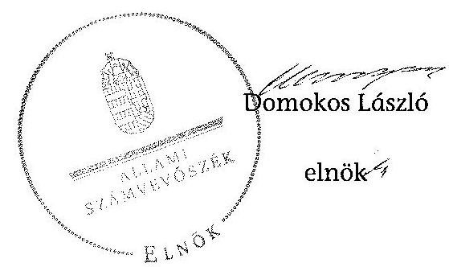
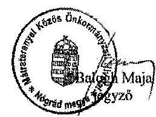
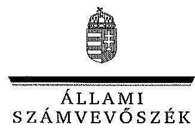
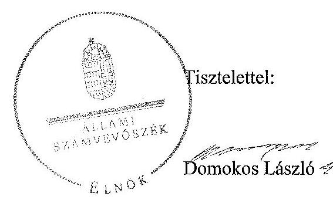
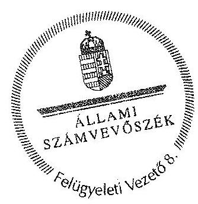

# ÁLLAMI   SZÁMVEVŐSZÉK 

## JELENTÉS

a helyi nemzetiségi önkormányzatok gazdálkodásának ellenőrzése
Mátraterenye Roma Nemzetiségi Önkormányzata

---

# Állami Számvevőszék 

Iktatószám: V-570-085/2014.
Témaszám: 1604
Vizsgálat-azonosító szám: V067610

## Az ellenőrzést felügyelte:

## Brebán Andrea

felügyeleti vezető

## Az ellenőrzést vezette:

## dr. Győri Gabriella

ellenőrzésvezető

## A számvevőszéki jelentéstervezet összeállításában közreműködött:

## dr. Győri Gabriella

ellenőrzésvezető
dr. Schreiber Judit
számvevő tanácsos

## Az ellenőrzést végezték:

| dr. Schreiber Judit | dr. Lőrincz Zoltán |
| :-- | :-- |
| számvevő tanácsos | számvevő főtanácsos |

---

# TARTALOMJEGYZÉK 

BEVEZETÉS ..... 3
I. ÖSSZEGZŐ MEGÁLLAPÍTÁSOK, KÖVETKEZTETÉSEK, JAVASLATOK ..... 6
II. RÉSZLETES MEGÁLLAPÍTÁSOK ..... 13

1. A Nemzetiségi Önkormányzat és a Települési Önkormányzat együttműködésének szabályozása, a működési feltételek biztosítása ..... 13
2. A gazdálkodási feladatok ellátásának szabályszerűsége ..... 14
2.1. A költségvetésre és a zárszámadásra, valamint a kincstári adatszolgáltatás rendjére vonatkozó jogszabályi előírások betartása ..... 14
2.2. A Nemzetiségi Önkormányzat gazdálkodásának szabályozottsága ..... 15
2.3. Az operatív gazdálkodási jogkörök kialakítása, gyakorlása ..... 16
3. A Nemzetiségi Önkormányzattal összefüggő gazdálkodási feladatok belső ellenőrzése ..... 18
MELLÉKLETEK
4. számú Mátraterenye Roma Nemzetiségi Önkormányzata 2013. évi gazdálkodási adatai
5. számú Mátraterenye Közös Önkormányzati Hivatal jegyzőjének észrevétele
6. számú Az ÁSZ válasza a Mátraterenye Közös Önkormányzati Hivatal jegyzőjének a jelentéstervezetre tett észrevételeire

## FÜGGELÉKEK

1. számú Rövidítések jegyzéke
2. számú Értelmező szótár

---

.

---

# JELENTÉS   a helyi nemzetiségi önkormányzatok gazdálkodásának ellenőrzése Mátraterenye Roma Nemzetiségi Önkormányzata 

## BEVEZETÉS

A Nemzetiségi Önkormányzat a 2002. évben alakult, elnöke a 2006. évi helyhatósági választások óta látja el feladatát. A Nemzetiségi Önkormányzat intézményt, gazdasági társaságot és más szervezetet nem alapított, illetve társulásban nem vett részt. A négytagú Képviselő-testület a munkája segítésére bizottságot nem hozott létre. A Nemzetiségi Önkormányzat költségvetési beszámolója szerint a 2013. évben a módosított költségvetési bevételi és kiadási előirányzat 864,0 ezer Ft, a teljesített költségvetési bevétel 867,0 ezer Ft, a teljesített költségvetési kiadás 861,0 ezer Ft volt. A Nemzetiségi Önkormányzat a 2013. évben 632,0 ezer Ft feladatalapú támogatásban részesült. A 2013. évi gazdálkodási adatokat részletesen az 1. számú mellékletben mutatjuk be.

Az Alaptörvény Szabadság és felelősség rész XXIX. cikk (1) bekezdése szerint a Magyarországon élő nemzetiségek államalkotó tényezők. Minden, valamely nemzetiséghez tartozó magyar állampolgárnak joga van önazonossága szabad vállalásához és megőrzéséhez. A hazánkban élő nemzetiségek helyi (települési és területi) valamint országos önkormányzatokat hozhatnak létre ${ }^{1}$. A helyi nemzetiségi önkormányzatok gazdálkodási feladatait jogszabályi előírás alapján a székhely szerinti helyi önkormányzat polgármesteri hivatala látja el.

A nemzetiségek helyzete, támogatása mind hazai, mind EU-s szinten kiemelt figyelmet kap napjainkban. A helyi nemzetiségi önkormányzatok gazdálkodására és támogatási rendszerére vonatkozó jogszabályok a 2010-2012. években jelentős változásokon mentek át. A helyi nemzetiségi önkormányzatok gazdálkodásának, a részükre juttatott költségvetési támogatások felhasználásának ellenőrzését az ÁSZ 2012. évben sorozatjellegű ellenőrzés keretében indította el. A 2014. évi ellenőrzések az önkormányzati ellenőrzésekre ráépülő (egyablakos) vagy önálló ellenőrzésként valósulnak meg.

Az ellenőrzés célja annak értékelése volt, hogy a helyi nemzetiségi önkormányzat gazdálkodási kereteinek kialakítása, gazdálkodása megfelelt-e a jogszabályoknak.

[^0]
[^0]:    ${ }^{1}$ A 2010. évben megtartott nemzetiségi önkormányzati választásokat követően 2304 települési, 58 területi és 13 országos nemzetiségi önkormányzat alakult meg.

---

Ennek keretében értékeltük, hogy:

- a helyi nemzetiségi önkormányzat és a helyi (települési) önkormányzat együttműködésének szabályozása, a működési feltételek biztosítása megfelel-e a jogszabályi előírásoknak;
- a felek együttműködése megfelel-e a megállapodásban foglaltaknak a gazdálkodási feladatok szabályszerű ellátása során, betartották-e a vonatkozó jogszabályi előírásokat;
- biztosított volt-e a helyi nemzetiségi önkormányzat gazdálkodásának belső ellenőrzése.

Az ellenőrzés várható hasznosulása: a nemzetiségi önkormányzatok testületi döntéseinek tapasztalatait összegezve következtetés vonható le a törvényalkotás számára a jogszabályi környezet esetleges módosításának indokoltságára vonatkozóan. Az ellenőrzés az ellenőrzött számára visszajelzést ad a rendezett gazdálkodási keretek kialakításáról, a működési hiányosságokról. Az ellenőrzés megállapításai és javaslatai, a jó gyakorlat bemutatása tanulságul szolgálhatnak más nemzetiségi önkormányzatok, szervezetek számára a rendezett gazdálkodási keretek kialakításához. A társadalom számára jelzi, hogy közpénz nem maradhat ellenőrizetlenül, az ÁSZ értékteremtő rend kialakításához és megőrzéséhez hozzájáruló tevékenysége pozitív hatással lesz a szervezetről kialakított összkép formálásában. Az ÁSZ szervezetén belül lehetőség nyílik arra, hogy a megállapítások szintetizálásával az intézmény a hozzáadott értéket teremtő elemző tevékenységét és tanácsadó szerepét erősítse.

A helyi nemzetiségi önkormányzatok gazdálkodásának ellenőrzéséről szóló jelentés I. fejezetének összegző része az ellenőrzés céljára adott rövid, szintetizáló összefoglalót és következtetéseket tartalmazza a II. fejezet részletes megállapításain alapulóan. A jelentés intézkedést igénylő megállapításait és javaslatait az összegzőben foglaltak mellett - az ellenőrzés során feltárt, a jelentés II. fejezetében rögzített részletes megállapítások alapozzák meg, illetve támasztják alá.

A gazdálkodási jogkörök gyakorlásának szabályszerűségét a dologi kiadásokkal és a pénzeszköz átadással kapcsolatos kifizetésekre vonatkozóan ellenőriztük, értékeltük. A jogszabályoknak és a belső előírásoknak megfelelőnek, azaz szabályszerűnek minősítettük az adott területet, ha az értékelés összesített eredménye nagyobb volt, mint 90 %, részben megfelelőnek, ha 71 % és 90 % közé esett, és nem megfelelőnek, ha 70 % vagy annál kisebb volt.

Az ellenőrzés típusa: szabályszerűségi ellenőrzés.
Az ellenőrzött időszak: a Nemzetiségi Önkormányzat és a Települési Önkormányzat együttműködésének, valamint a Nemzetiségi Önkormányzat gazdálkodásának szabályozása megfelelőségét a 2013. évre vonatkozóan (a 2013. december 31-i állapotnak megfelelően), a Nemzetiségi Önkormányzat gazdálkodásának szabályszerűségét, a működési feltételek, valamint a belső ellenőrzés biztosítását a 2013. január 1. - december 31-e közötti időszakot figyelembe véve kell értékelni.

---

Ellenőrzött szervezet: Mátraterenye Roma Nemzetiségi Önkormányzata és a gazdálkodási feladatait ellátó Mátraterenyei Közös Önkormányzati Hivatal.

Az ellenőrzés szakmai módszertana az ÁSZ hivatalos honlapján (www.asz.hu) közzétett szakmai szabályokon alapult, amely a Legfőbb Ellenőrző Intézmények Nemzetközi Szervezete (INTOSAI) által kiadott nemzetközi standardok (ISSAI) figyelembevételével készült.

Az ellenőrzés végrehajtásának jogszabályi alapját az ÁSZ tv. 5. § (2)-(3) és (6) bekezdéseiben foglaltak képezik.

Az ÁSZ tv. 29. § (1) bekezdése szerint a jelentéstervezetet megküldtük egyeztetésre a jegyzőnek és a Nemzetiségi Önkormányzat elnökének. A Nemzetiségi Önkormányzat elnöke az ÁSZ tv. 29. § (2) bekezdésében foglalt észrevételezési jogával nem élt, a jelentéstervezetre észrevételt nem tett. A jegyzőtől beérkezett észrevételek és az arra adott válaszok, ideértve az el nem fogadott észrevételeket és azok indokolását a jelentés 2-3. számú mellékletei tartalmazzák.

---

# I. ÖSSZEGZŐ MEGÁLLAPÍTÁSOK, KÖVETKEZTETÉSEK, JAVASLATOK 

A Nemzetiségi Önkormányzat és a Települési Önkormányzat együttműködésének szabályozása a feltárt hiányosságok miatt részben felelt meg a jogszabályi előírásoknak. A Nemzetiségi Önkormányzat rendelkezett a 2013. évben hatályban lévő, a Települési Önkormányzattal történő együttműködésre vonatkozó megállapodással, azonban annak felülvizsgálatát a 2013. évben a Nek. tv.-ben foglaltak ellenére nem végezték el. Az együttműködési megállapodás tartalmazta az Áht.-ban meghatározott, a Nemzetiségi Önkormányzat bevételeivel és kiadásaival kapcsolatos, a Települési Önkormányzatot terhelő feladatokat. Az együttműködési megállapodásban a Nek. tv. előírásait figyelmen kívül hagyva nem határozták meg az adószám igénylésével kapcsolatos határidőket, az önálló fizetési számla nyitásával és a törzskönyvi nyilvántartásba vétellel kapcsolatos együttműködési kötelezettségeket, valamint nem jelölték ki a felelősöket. Nem határozták meg a Nemzetiségi Önkormányzat kötelezettségvállalásaival kapcsolatosan a Települési Önkormányzatot terhelő érvényesítési, utalványozási és szakmai teljesítésigazolási feladatokat. Nem szabályozták továbbá a Nemzetiségi Önkormányzat működési feltételeinek és gazdálkodásának eljárási és dokumentációs részletszabályait, az ezeket végző személyek kijelölésének rendjével és a feladatok teljesítésével kapcsolatos eljárásokat, feltételeket. Az együttműködési megállapodásban nem rögzítették, hogy a jegyző vagy annak - a jegyzővel azonos képesítési előírásoknak megfelelő - megbízottja a Települési Önkormányzat megbízásából és képviseletében részt vesz a Nemzetiségi Önkormányzat képviselő-testületi ülésein és jelzi, amennyiben törvénysértést észlel. A Nek. tv.-ben foglaltaktól eltérően sem a Települési Önkormányzat SZMSZ-ében, sem a Nemzetiségi Önkormányzat SZMSZ-ében nem rögzítették az együttműködési megállapodás szerinti működési feltételeket a törvényi határidőn belül.

A Nemzetiségi Önkormányzat részére a működéssel kapcsolatos végrehajtási feladatok ellátása érdekében előírt személyi és tárgyi működési feltételek a szabályozási hiányosságok ellenére biztosítottak voltak a 2013. évben.

A Nemzetiségi Önkormányzat 2013. évi költségvetésének és zárszámadásának tartalma, jóváhagyása, valamint a kincstári adatszolgáltatás teljesítése részben felelt meg a jogszabályi előírásoknak. A Nemzetiségi Önkormányzat elnöke - elkészítés hiányában - az Áht.-ban előírt határidőig nem nyújtotta be a Képviselő-testület részére az ellenőrzött évre vonatkozó költségvetési koncepciót. A 2013. évi költségvetés előterjesztésekor az Áht. előírását figyelmen kívül hagyva a Képviselő-testület részére nem mutatták be tájékoztatásul, szöveges indoklással együtt a Nemzetiségi Önkormányzat előirányzat felhasználási tervét, a költségvetési mérleget közgazdasági tagolásban, továbbá a jóváhagyott költségvetés nem tartalmazta a bevételeket és a kiadásokat kötelező és önként vállalt feladatok-, valamint a költségvetési egyenleg összegét működési és felhalmozási cél szerinti bontásban. A jegyző a 2013. évben két alkalommal az Ávr. előírásaihoz képest késedelmesen teljesítette a Nemzetiségi Önkormányzat részére előírt kincstári adatszolgáltatást. A zárszámadási hatá-

---

rozat-tervezet előterjesztésekor az Áht.-ban foglalt előírások ellenére nem mutatták be a pénzeszközök változását. A bevételi és a kiadási előirányzatokat év közben nem módosították, így költségvetési kiadást az előirányzatot meghaladó mértékben teljesítettek. A zárszámadási határozatban valamennyi bevételről és kiadásról elszámoltak.

A Nemzetiségi Önkormányzat gazdálkodásának szabályozottsága az ellenőrzött időszakban nem volt megfelelő. A Nemzetiségi Önkormányzat rendelkezett önálló házipénztár és pénzkezelési szabályzattal, azonban nem rendelkezett a Számv. tv.-ben előírt eszközök és források leltározási és leltárkészítési szabályzatával. A Polgármesteri Hivatal számviteli politikája, számlarendje és az eszközök és források értékelési szabályzata kiterjedt a Nemzetiségi Önkormányzatra. A Bkr.-ben foglaltak ellenére nem biztosították a Nemzetiségi Önkormányzat gazdálkodásával kapcsolatos végrehajtási feladatokra vonatkozó folyamatba épített, előzetes, utólagos és vezetői ellenőrzést, továbbá nem rendelkeztek a szabálytalanságok kezelése eljárásrendjével és ellenőrzési nyomvonallal. A Polgármesteri Hivatalban a gazdálkodási feladatokat ellátó köztisztviselő munkaköri leírása csak utalás jelleggel tartalmazta a Nemzetiségi Önkormányzattal kapcsolatos feladatokat. Az Ávr. előírásától eltérően nem rögzítették a tervezéssel, gazdálkodással, így különösen az operatív gazdálkodási jogkörök gyakorlásának módjával, eljárási és dokumentációs részletszabályaival, valamint az ezeket végző személyek kijelölési rendjével és az ellenőrzési, adatszolgáltatási feladatok teljesítésével kapcsolatos belső előírásokat a Nemzetiségi Önkormányzatra vonatkozóan.

A Nemzetiségi Önkormányzat gazdálkodása tekintetében az operatív gazdálkodási jogkörök kialakítása nem felelt meg a jogszabályi előírásoknak. Az érvényesítő az Ávr.-ben szabályozott írásbeli kijelölés hiányában jogosulatlanul látta el feladatát.

A Nemzetiségi Önkormányzatnál az ellenőrzött időszakban a dologi kiadások és a pénzeszközátadással kapcsolatos kifizetések teljesítése során az operatív gazdálkodási jogkörökön belül kulcsszerepet betöltő teljesítésigazolás és érvényesítés kontrollok nem a jogszabályi előírásoknak megfelelően működtek. Az Ávr.-ben foglalt előírások ellenére a teljesítésigazolás és az érvényesítés során nem tüntették fel a teljesítésigazolás és az érvényesítés dátumát, így nem volt megállapítható, hogy azokra az Áht.-ban előírtak szerint az utalványozás előtt került sor.

Az érvényesítő a feladatát az Ávr. előírásától eltérően, a polgármester által jogosulatlanul kiadott felhatalmazás alapján végezte. Az érvényesítő az Ávr.-ben foglalt érvényesítési feladatokat nem megfelelően látta el, mivel nem észrevételezte, hogy a kötelezettségvállalásról nem vezettek nyilvántartást, valamint nem jelezte hét esetben az összeférhetetlenség fennállását.

Az összeférhetetlenségi követelmények érvényesülésének feltételei az ellenőrzött
 időszakban nem voltak biztosítottak. Az együttműködési megállapodásban a teljesítés igazolására megjelölésre került más képviselő az összeférhetetlenség elkerülése érdekében, azonban a Nemzetiségi Önkormányzat elnöke, mint kötelezettségvállaló az Ávr. vonatkozó rendelkezései alapján nem hatalmazott fel írásban a kötelezettségvállalás, a teljesítés igazolás és az utalványozás gyakorlására más képviselőt, ezért hét esetben összeférhetetlenséget állapított meg az ellenőrzés.

Az ellenőrzött időszakban a pénzeszközátadással kapcsolatos kifizetésekre az Áht. és az Ávr. rendelkezéseit figyelmen kívül hagyva, támogatási szerződések nélkül, képviselő-testületi döntések alapján került sor.

A jegyző az ellenőrzött időszakban nem biztosította a Nemzetiségi Önkormányzat gazdálkodásával összefüggő végrehajtási feladatok belső ellenőrzését. A Polgármesteri Hivatalnál a Bkr.-ben foglaltak ellenére a Nemzetiségi Önkormányzatra is kiterjedő, kockázatelemzéssel alátámasztott 2013. évi ellenőrzési tervet nem készítettek, így a Nemzetiségi Önkormányzat gazdálkodásával összefüggő végrehajtási feladatokra vonatkozóan belső ellenőrzést a 2013. évben nem terveztek és nem végeztek.

Az ellenőrzött időszakban a Nemzetiségi Önkormányzatot érintően a Kormányhivatal nem élt törvényességi felügyeleti eszközökkel.

Az operatív gazdálkodási jogkörök szabályozása, azok gyakorlása, valamint a belső ellenőrzés területén feltárt hiányosságok és hibák arra utalnak, hogy a Nemzetiségi Önkormányzatnak a gazdálkodása során figyelmet kell fordítania az integritás szemlélet teljes körű érvényesülésére.

Az ÁSZ tv. 33. § (1) bekezdésében foglaltak értelmében az ellenőrzött szervezet vezetője köteles a jelentésben foglalt megállapításokhoz kapcsolódó intézkedési tervet összeállítani, és azt a jelentés kézhezvételétől számított 30 napon belül az ÁSZ részére megküldeni. Amennyiben az intézkedési tervet határidőre nem küldi meg a szervezet, vagy az nem elfogadható, az ÁSZ elnöke az ÁSZ tv. 33. § (3) bekezdés a)-b) pontjaiban foglaltakat érvényesítheti.

A helyszíni ellenőrzés megállapításainak hasznosítása mellett javasoljuk:

# a jegyzőnek 

1. Az együttműködés szabályozásával kapcsolatban

A Nemzetiségi Önkormányzat és a Települési Önkormányzat együttműködését meghatározó együttműködési megállapodás tartalma részben felelt meg a Nek. tv. 80. § (3) bekezdés a), b) és d) pontjában és a 80. § (4) bekezdésében foglaltaknak. A Nek. tv. 80. § (2) bekezdésében foglaltak ellenére a 2013. évben nem végezték el az együttműködési megállapodás felülvizsgálatát.

Az együttműködési megállapodás szerinti működési feltételeket a Nek. tv. 80. § (2) bekezdésében előírtak ellenére a Települési Önkormányzat és a Nemzetiségi Önkormányzat SZMSZ-ében nem rögzítették a megállapodás megkötését követő 30 napon belül.

---

Javaslat
Az együttműködés szabályszerűsége érdekében:
a) készítse elő a Nek. tv. 80. § (3) bekezdés a), b) és d) pontjában és a 80. § (4) bekezdésében foglalt előírásoknak megfelelő együttműködési megállapodás módosítását és adja át a polgármesternek beterjesztés céljából;
b) gondoskodjon a jövőben az együttműködési megállapodás Nek. tv. 80. § (2) bekezdésében előírt határidő szerinti, évenkénti felülvizsgálatáról;
c) készítse elő a jövőben a Települési Önkormányzat SZMSZ-ének kiegészítését a Nek. tv. 80. § (2) bekezdésében foglalt határidőre és adja át a polgármesternek beterjesztés céljából;
d) készítse elő a jövőben a Nemzetiségi Önkormányzat SZMSZ-ének kiegészítését a Nek. tv. 80. § (2) bekezdésében foglalt határidőre.
2. A költségvetés és zárszámadás szabályszerűségével kapcsolatban

A 2013. évi költségvetési határozat az Áht. 23. § (2) bekezdés a) és c) pontjában foglaltaktól eltérően nem tartalmazta a Nemzetiségi Önkormányzat költségvetési bevételeit és kiadásait kötelező és önként vállalt feladatok-, valamint a költségvetési egyenleg összegét működési és felhalmozási cél szerinti bontásban. A költségvetés előterjesztésekor a Képviselő-testület részére tájékoztatásul nem mutatták be az Áht. 24. § (4) bekezdés a) pontjában előírtak ellenére szöveges indokolással együtt a Nemzetiségi Önkormányzat előirányzat felhasználási tervét, költségvetési mérlegét közgazdasági tagolásban.

A 2013. évi zárszámadási határozat-tervezet előterjesztésekor a Képviselő-testület részére tájékoztatásul nem mutatták be szöveges indokolással együtt az Áht. 91. § (2) bekezdés a) pontja alapján az Áht. 24. § (4) bekezdés a) pontja szerinti kimutatást a pénzeszközök változásáról.

A kiadások teljesítése az Áht. 6. § (1) bekezdésében foglalt előírások ellenére a megállapított előirányzatot meghaladó volt, ezáltal nem tartották be az Áht. 36. § (1) bekezdésében foglalt előírásokat.

Javaslat
a) Intézkedjen a jövőben arról, hogy a költségvetési határozat az Áht. 23. § (2) bekezdés a) és c) pontjában előírtaknak tartalmilag teljes körűen megfeleljen;
b) Intézkedjen a jövőben arról, hogy a költségvetési határozat-tervezet előterjesztésekor kerüljön bemutatásra a Képviselő-testületnek tájékoztatásul az Áht. 24. § (4) bekezdés a) pontjában előírt mérleg és kimutatás szöveges indokolással együtt;
c) Intézkedjen a jövőben arról, hogy a zárszámadási határozat-tervezet előterjesztésekor szöveges indokolással együtt kerüljön bemutatásra a Képviselő-testület részére tájékoztatásul az Áht. 91. § (2) bekezdés a) pontja alapján az Áht. 24. § (4) bekezdés a) pontjában előírt kimutatás;

---

d) Készítse el az előirányzatok szükséges mértékű módosítására vonatkozó határozat-tervezetet, az Áht. 36. § (1) bekezdés szerint meghatározott előirányzatokon belüli gazdálkodás érdekében.
3. A kincstári adatszolgáltatási kötelezettséggel kapcsolatban

A jegyző a Nemzetiségi Önkormányzatra vonatkozó kincstári adatszolgáltatási kötelezettségét két alkalommal késedelmesen teljesítette, mivel a 2013. évi elemi költségvetésről szóló adatszolgáltatást az Ávr. 33. § (1)-(2) bekezdéseiben, az időközi költségvetési jelentések közül az első negyedévi jelentést az Ávr. 169. § (2) bekezdésében szereplő határidőt követően küldte meg az illetékes szervnek.

Javaslat
Tegyen eleget a kincstári adatszolgáltatási kötelezettségének az Ávr. 33. § (1)-(2) bekezdéseiben és az Ávr. 169. § (2) bekezdésében foglalt határidők betartásával.
4. A gazdálkodási feladatok szabályozottságával kapcsolatban

A Nemzetiségi Önkormányzat sem a Polgármesteri Hivatal szabályzatának kiterjedése útján, sem önállóan nem rendelkezett a Számv. tv. 14. § (5) bekezdésének a) pontja szerinti, az eszközök és források leltározási és leltárkészítési szabályzatával.

Az Ávr. 13. § (2) bekezdés a) pontban foglaltak szerinti feladatokkal kapcsolatos szabályokat sem a Polgármesteri Hivatal SZMSZ-e, sem egyéb belső szabályozás nem rögzítette a Nemzetiségi Önkormányzatra vonatkozóan.

Szabályozás hiányában a Polgármesteri Hivatal nem rendelkezett a Nemzetiségi Önkormányzat gazdálkodásával kapcsolatos végrehajtási feladataira vonatkozó, a Bkr. 6. § (3) és (4) bekezdéseiben előírt ellenőrzési nyomvonallal, szabálytalanságok kezelésének eljárásrendjével. A Bkr. 8. § (2) bekezdésének előírásától eltérően nem biztosították a folyamatba épített, előzetes, utólagos és vezetői ellenőrzést.

Javaslat
A Nemzetiségi Önkormányzat gazdálkodásának végrehajtásával kapcsolatos feladataira készítse el:
a) a Számv. tv. 14. § (5) bekezdés a) pontjában előírt eszközök és források leltározási és leltárkészítési szabályzatát;
b) az Ávr. 13. § (2) bekezdés a) pontban foglaltaknak megfelelő belső szabályozást;
c) a Bkr. 6. § (3) és (4) bekezdéseiben meghatározott szabályozásokat és biztosítsa a Bkr. 8. § (2) bekezdésének megfelelően a folyamatba épített, előzetes, utólagos és vezetői ellenőrzést.
5. A kulcskontrollok működésével kapcsolatban

A teljesítésigazolás az Ávr. 57. § (3) bekezdésének előírása ellenére a teljesítésigazolás dátumának hiányában szabálytalan volt.

---

Az érvényesítést a Polgármesteri Hivatal állományába tartozó alkalmazottak az Ávr. 58. § (4) bekezdésében foglalt kijelölés hiányában végezték el. Az érvényesítés az Ávr. 58. § (3) bekezdésének előírása ellenére az érvényesítés dátumának hiányában szabálytalan volt. Az érvényesítő az Ávr. 58. § (1)-(2) bekezdéseiben foglalt ellenőrzési és jelzési feladatát szabálytalanul látta el. Nem ellenőrizte az érvényesítést megelőző ügymenet szabályszerűségét. Nem jelezte a teljesítésigazolások szabálytalanságát. Nem jelezte továbbá, hogy a kötelezettségvállalási, teljesítés igazolására és utalványozásra irányuló feladatot nem végezheti az a személy, aki ezt a tevékenységet a maga javára látja el.

Javaslat
Az operatív gazdálkodás működési hibáinak megelőzése, feltárása és kijavítása érdekében
a) intézkedjen, hogy a teljesítésigazolást az Ávr. 57. § (3) bekezdésében foglaltak betartásával végezzék;
b) jelölje ki az Ávr. 58. § (4) bekezdésében foglaltakra figyelemmel az érvényesítésre jogosult személyeket;
c) intézkedjen, hogy az érvényesítő az Ávr. 58. § (1)-(3) bekezdései alapján lássa el ellenőrzési és jelzési feladatát.

# a Nemzetiségi Önkormányzat elnökének 

1. A Nemzetiségi Önkormányzat és a Települési Önkormányzat együttműködését meghatározó együttműködési megállapodás tartalma nem felelt meg a Nek. tv. 80. § (3) bekezdés a), b) és d) pontjában és a 80. § (4) bekezdésében foglaltaknak. A hatályos együttműködési megállapodás szerinti működési feltételeket a Nek. tv. 80. § (2) bekezdésében előírtak ellenére a Nemzetiségi Önkormányzat SZMSZ-ében nem rögzítették a megállapodás megkötését követő 30 napon belül.

Javaslat
Terjessze a Képviselő-testület elé jóváhagyásra
a) a Nek. tv. 80. § (3) bekezdés a), b) és d) pontjában és a 80. § (4) bekezdésében foglalt előírások betartásával előkészített együttműködési megállapodás módosítását;
b) a jegyző által előkészített, a Nek. tv. 80. § (2) bekezdésében foglalt előírásnak megfelelően kiegészített Nemzetiségi Önkormányzati SZMSZ-t.
2. A költségvetési előterjesztésekor a Képviselő-testület részére tájékoztatásul nem mutatták be az Áht. 24. § (4) bekezdés a) pontjában előírtak ellenére szöveges indokolással együtt a Nemzetiségi Önkormányzat előirányzat felhasználási tervét, költségvetési mérlegét közgazdasági tagolásban.

A 2013. évi zárszámadási határozat-tervezet előterjesztésekor a Képviselő-testület részére tájékoztatásul nem mutatták be szöveges indokolással együtt az Áht. 91. § (2) bekezdés a) pontja alapján az Áht. 24. § (4) bekezdés a) pontja szerinti kimutatást a pénzeszközök változásáról.

A kiadások teljesítése az Áht. 6. § (1) bekezdésében foglalt előírások ellenére a megállapított előirányzatot meghaladó volt, ezáltal nem tartották be az Áht. 36. § (1) bekezdésében foglalt előírásokat.

Javaslat
Gondoskodjon a jövőben:
a) a Képviselő-testület elé terjesztésekor a költségvetési határozat-tervezet beterjesztése mellett az Áht. 24. § (4) bekezdés a) pontjában előírt mérleg, kimutatás tájékoztatásul való bemutatásáról;
b) a Képviselő-testület elé terjesztésekor a zárszámadási határozat-tervezet beterjesztése mellett az Áht. 91. § (2) bekezdés a) pontja alapján az Áht. 24. § (4) bekezdés a) pontjában előírt kimutatás tájékoztatásul való bemutatásáról;
c) a jegyző által elkészített, az előirányzatok szükséges módosítására vonatkozó határozat-tervezet Képviselő-testület elé terjesztéséről.
3. A Nemzetiségi Önkormányzat elnöke - mint kötelezettségvállaló - más képviselőt az Ávr. 52. § (7) bekezdésében foglaltak alapján nem hatalmazott fel írásban a kötelezettségvállalás és az Ávr. 59. § (1) bekezdésében foglaltak alapján írásban nem jelölt ki az utalványozás gyakorlására, emiatt hét esetben az Ávr. 60. § (2) bekezdésében foglalt összeférhetetlenségi követelmények nem érvényesültek.

Javaslat
Az Ávr. 60. § (2) bekezdésében foglalt összeférhetetlenség fennállása esetén az Ávr. 52. § (7) bekezdés alapján hatalmazzon fel írásban további kötelezettségvállaló személyt és Ávr. 59. § (1) bekezdés előírása alapján jelöljön ki további utalványozó személyt.

---

# II. RÉSZLETES MEGÁLLAPÍTÁSOK 

## 1. A Nemzetiségi Önkormányzat És a Települési Önkormányzat Együttműködésének Szabályozása, a Működési Feltételek Biztosítása

A Nemzetiségi Önkormányzat és a Települési Önkormányzat együttműködésének szabályozása részben felelt meg a jogszabályi előírásoknak.

A Nemzetiségi Önkormányzat a 2013. évben rendelkezett érvényes együttműködési megállapodással. Az együttműködési megállapodást a Nemzetiségi Önkormányzat és a Települési Önkormányzat képviselő-testületei határozattal ${ }^{2}$ jóváhagyták és az arra jogosult személyek aláírták.

A Nek. tv. 80. § (2) bekezdésében foglaltak ellenére az együttműködési megállapodás éves felülvizsgálatát a 2013. évben nem végezték el.

Az együttműködési megállapodás tartalmazta az Áht. 27. § (2) bekezdésében meghatározott, a Nemzetiségi Önkormányzat bevételeivel és kiadásaival kapcsolatban a Települési Önkormányzatot terhelő tervezési, gazdálkodási, ellenőrzési, finanszírozási, adatszolgáltatási és beszámolási feladatokat. A Nek. tv. 80. § (1) bekezdése szerinti előírásoknak megfelelően tartalmazta az együttműködési megállapodás a Nemzetiségi Önkormányzat működéséhez szükséges helyiség használatának biztosítását, továbbá a testületi ülések
 előkészítését, a kapcsolódó nyilvántartási, iratkezelési és egyéb adminisztrációs feladatok ellátásának feltételeit.

A jogszabályi előírások nem érvényesültek maradéktalanul, mert az együttműködési megállapodásban:

- a Nek. tv. 80. § (3) bekezdés a) pontjában foglaltak ellenére nem határozták meg az adószám igénylésével kapcsolatos határidőket, továbbá az önálló fizetési számla nyitásával és a törzskönyvi nyilvántartásba vétellel kapcsolatos együttműködési kötelezettségeket és nem jelölték ki a felelősöket;
- a Nek. tv. 80. § (3) bekezdés b) pontjában előírtak ellenére nem határozták meg a Nemzetiségi Önkormányzat kötelezettségvállalásaival kapcsolatosan a Települési Önkormányzatot terhelő érvényesítési, utalványozási, szakmai teljesítésigazolási feladatokat;
- a Nek. tv. 80. § (3) bekezdés d) pontjában foglaltak ellenére nem szabályozták a Nemzetiségi Önkormányzat működési feltételeinek és gazdálkodásá-

[^0]
[^0]:    ${ }^{2}$ A Nemzetiségi Önkormányzat 54/2012. (VI.27.) számú határozata és a Települési Önkormányzat 51/2012. (VI.21.) és 84/2012. (VIII.14.) számú határozatai. A Települési Önkormányzat Képviselő-testülete elé beterjesztett előterjesztések előkészítése a Települési Önkormányzat SZMSZ-ének 45.§ (1) bekezdés a) pontja alapján a jegyző feladata.

---

nak eljárási és dokumentációs részletszabályaival, valamint az ezeket végző személyek kijelölésének rendjével és a feladatok teljesítésével kapcsolatos előírásokat, feltételeket;

- a Nek. tv. 80. § (4) bekezdésének rendelkezése ellenére nem rögzítették, hogy a jegyző, vagy annak - a jegyzővel azonos képesítési előírásoknak megfelelő - megbízottja részt vesz a Települési Önkormányzat megbízásából és képviseletében a Nemzetiségi Önkormányzat képviselő-testületi ülésein és jelzi, amennyiben törvénysértést észlel.

A Nek. tv. 80. § (2) bekezdésében foglaltak ellenére sem a Települési Önkormányzat, sem a Nemzetiségi Önkormányzat SZMSZ-ében nem rögzítették a megállapodás szerinti működési feltételeket, az együttműködési megállapodás megkötését követő 30 napon belül.

A Települési Önkormányzat - a szabályozás hiányossága ellenére - a 2013. évben biztosította a Nemzetiségi Önkormányzat működéséhez szükséges személyi és tárgyi feltételeket.

# 2. A GAZDÁLKODÁSI FELADATOK ELLÁTÁSÁNAK SZABÁLYSZERŰSÉGE 

### 2.1. A költségvetésre és a zárszámadásra, valamint a kincstári adatszolgáltatás rendjére vonatkozó jogszabályi előírások betartása

A Nemzetiségi Önkormányzat 2013. évi költségvetésének és zárszámadásának tartalma, jóváhagyása, valamint a kapcsolódó adatszolgáltatás részben felelt meg a jogszabályi előírásoknak.

A Nemzetiségi Önkormányzat elnöke - az elkészítés hiánya miatt-az Áht. 26. § (1) bekezdése alapján, a 2013. évi költségvetési koncepciót nem nyújtotta be az Áht. 24. § (1) bekezdésében megjelölt határidőben a Képviselő-testület részére. ${ }^{3}$

Az Áht.-ban foglalt határidőben előterjesztett és jóváhagyott költségvetés ${ }^{4}$ az Áht. 23. § (2) bekezdés a) és c) pontjától eltérően nem tartalmazta a bevételeket és kiadásokat kötelező és önként vállalt feladatok-, valamint a költségvetési egyenleg összegét működési és felhalmozási cél szerinti bontásban.

A költségvetés előterjesztésekor a Képviselő-testület részére az Áht. 24. § (4) bekezdés a) pontjában foglaltak ellenére nem mutatták be tájékoztatásul, szöveges indoklással együtt a Nemzetiségi Önkormányzat előirányzat felhasználási tervét, továbbá a költségvetési mérlegét közgazdasági tagolásban.

[^0]
[^0]:    ${ }^{3}$ A 2013. évre vonatkozó, a jegyző által elkészített költségvetési koncepciót 2012. november 30 -áig kellett benyújtani. Az elfogadásról a 67/2012. (XII.14.) CKÖ számú határozat rendelkezett.
    ${ }^{4}$ 2/2013. (II.06.) MRNÖ számú határozat.

---

A zárszámadási határozat-tervezet előterjesztésekor a Képviselő-testület részére tájékoztatásul nem mutatták be szöveges indoklással együtt az Áht. 91. § (2) bekezdés a) pontja alapján az Áht. 24. § (4) bekezdés a) pontja szerinti kimutatást a pénzeszközök változásáról. A bevételi és a kiadási előirányzatokat, az év közben folyósított feladatalapú támogatás összegével nem módosították, arról - az Áht. 34. § (1) és (6) bekezdésének megfelelően - határozatot nem hoztak. A kiadások teljesítése az Áht. 6. § (1) bekezdésében foglalt előírások ellenére a megállapított előirányzatot meghaladó volt, ezáltal nem tartották be az Áht. 36. § (1) bekezdésében foglalt előírásokat.

A Nemzetiségi Önkormányzat a 2013. évről készített zárszámadási határozatában ${ }^{5}$ az Áht. rendelkezéseinek megfelelően valamennyi bevételéről és kiadásáról elszámolt. A zárszámadási határozat a költségvetési határozattal összehasonlítható szerkezetben készült.

A jegyző a Nemzetiségi Önkormányzatra vonatkozó kincstári adatszolgáltatási kötelezettségét két alkalommal késedelmesen teljesítette. A 2013. évi jóváhagyott elemi költségvetésről szóló adatszolgáltatás során az Ávr. 33. § (1)-(2) bekezdésében meghatározott 30 napos határidőt követően nyolc nappal, az időközi költségvetési jelentések közül az első negyedévi jelentést pedig az Ávr. 169. § (2) bekezdésében szereplő határidőt ${ }^{6}$ követően tíz nappal küldték el.

# 2.2. A Nemzetiségi Önkormányzat gazdálkodásának szabályozottsága 

A Nemzetiségi Önkormányzat gazdálkodásának szabályozottsága az ellenőrzött időszakban annak ellenére nem volt megfelelő, hogy a gazdálkodás egyes területei szabályozottak voltak:

- a Nemzetiségi Önkormányzat az ellenőrzött időszakban önálló házipénztár és pénzkezelési szabályzattal rendelkezett;
- a gazdálkodási feladatok végrehajtását ellátó Polgármesteri Hivatal 2013. január 1-jétől hatályos számviteli politikájának, számlarendjének, valamint az eszközök és források értékelési szabályzatának hatálya a Nemzetiségi Önkormányzat gazdálkodási feladataira kiterjedt.

A Nemzetiségi Önkormányzat sem a Polgármesteri Hivatal szabályzatának kiterjedése útján, sem önállóan nem rendelkezett a Számv. tv. 14. § (5) bekezdésének a) pontja szerinti, az eszközök és források leltározási és leltárkészítési szabályzatával.

A Polgármesteri Hivatal az Áht. 10. § (5) bekezdésében foglaltak ellenére nem rendelkezett jóváhagyott SZMSZ-szel és egyéb belső szabályzatban sem határozták meg a Nemzetiségi Önkormányzat gazdálkodásával kapcsolatosan - az

[^0]
[^0]:    ${ }^{5}$ 8/2014. (IV.30.) MRNÖ számú határozat.
    ${ }^{6}$ A Nemzetiségi Önkormányzat a költségvetési jelentést a költségvetési év első három hónapjáról április 20 -áig küldi meg a Kincstárnak. Az adatszolgáltatást 2013. április 30 -án teljesítették.

---

Ávr. 13. § (2) bekezdés a) pontjában foglaltak szerinti - a tervezéssel, gazdálkodással, így különösen a kötelezettségvállalás, ellenjegyzés, a teljesítés igazolása, az érvényesítés, utalványozás gyakorlásának módjával, eljárási és dokumentációs részletszabályaival kapcsolatos előírásokat. Továbbá nem határozták meg az ezeket végző személyek kijelölésének rendjével és az ellenőrzési, adatszolgáltatási feladatok teljesítésével kapcsolatos belső előírásokat, feltételeket.

A Polgármesteri Hivatalban a gazdálkodási feladatokat ellátó köztisztviselő munkaköri leírása nem részletesen, csak utalás jelleggel tartalmazta a Nemzetiségi Önkormányzat gazdálkodásával kapcsolatos feladatokat.

Szabályozás hiányában a Polgármesteri Hivatal nem rendelkezett a Nemzetiségi Önkormányzat gazdálkodásával kapcsolatos végrehajtási feladataira vonatkozó, a Bkr. 6. § (3)-(4) bekezdésében előírt ellenőrzési nyomvonallal, szabálytalanságok kezelésének eljárásrendjével. A Bkr. 8. § (2) bekezdésének előírásától eltérően nem biztosították a folyamatba épített, előzetes, utólagos és vezetői ellenőrzést (FEUVE).

# 2.3. Az operatív gazdálkodási jogkörök kialakítása, gyakorlása 

A Nemzetiségi Önkormányzat gazdálkodása tekintetében az operatív gazdálkodási jogkörök kialakítása nem felelt meg a jogszabályi előírásoknak.

A Polgármesteri Hivatal a 2013. évben nem rendelkezett gazdasági szervezettel. Az Ávr. 58. § (4) bekezdésében foglaltakat figyelmen kívül hagyva az érvényesítést olyan felhatalmazások alapján végezték, amelyeket a jegyző helyett - az Ávr. 55. § (2) bekezdés f) és g) pontjában foglaltak ellenére - a polgármester adott ki. Az érvényesítésre szabálytalanul kijelölt személyek azonban rendelkeztek az Ávr. 55. § (3) bekezdésében megjelölt végzettséggel.

A Nemzetiségi Önkormányzat elnöke - mint kötelezettségvállaló- az Ávr. 52. § (7) bekezdésében és az Ávr. 59. § (1) bekezdésében foglaltak alapján más képviselőt nem hatalmazott fel írásban a kötelezettségvállalás és az utalványozás gyakorlására. Ennek következtében hét esetben az Ávr. 60. § (2) bekezdésében foglalt összeférhetetlenségi követelmények nem érvényesültek.

Az összeférhetetlenség elkerülése érdekében a teljesítésigazoló személyt az együttműködési megállapodásban megnevezték, azonban ennek alapján a Nemzetiségi Önkormányzat elnöke az Ávr. 57. § (4) bekezdésében foglaltak ellenére írásban nem jelölte ki.

A Nemzetiségi Önkormányzatnál a 2013. évben a dologi kiadások és a pénzeszközátadással kapcsolatos kifizetések teljesítése során az operatív gazdálkodási jogkörökön belül kulcsszerepet betöltő teljesítésigazolás és érvényesítés kontrollokat a jogszabályi előírásoknak nem megfelelően működtették. Az érvényesítő az Ávr. 58. § (4) bekezdésében szabályozott írásbeli kijelölés hiányában jogosulatlanul látta el feladatát.

---

A dologi kiadásokkal kapcsolatban a 2013. évben teljesített, összesen 34 db kifizetés ellenőrzése során a teljesítésigazolás és az érvényesítés kulcskontrollok működtetésével összefüggésben az alábbi hiányosságokat tártuk fel:

- a teljesítésigazolást egyetlen esetben sem az Ávr. 57. § (3) bekezdésében foglaltaknak megfelelően végezték, mert nem tüntették fel a teljesítésigazolás időpontját. Ennek hiányában nem volt megállapítható, hogy a teljesítésigazolásra az Áht. 38. § (1) bekezdésében foglaltaknak megfelelően az érvényesítést megelőzően került sor;
- az érvényesítést a Polgármesteri Hivatal állományába tartozó alkalmazottak az Ávr. 58. § (4) bekezdésében foglalt kijelölés hiányában végezték. Az érvényesítési feladatot egyetlen esetben sem az Ávr. 58. § (3) bekezdésében foglaltaknak megfelelően látták el, mert az érvényesítés nem tartalmazta a keltezést, emiatt nem volt megállapítható, hogy az érvényesítésre az Ávr. 58. § (1) bekezdésében meghatározott teljesítésigazolást követően és az Ávr. 58. § (3) bekezdésében meghatározott utalványozás előtt került sor;
- az érvényesítők - az Ávr. 58. § (1) bekezdése szerinti feladat végrehajtása során az Ávr. 58. § (2) bekezdésében foglalt kötelezettségük ellenére -nem észrevételezték, hogy a teljesítésigazoló a feladatát nem az Ávr. 57. § (3) bekezdésének megfelelően végezte, valamint azt sem jelezték, hogy az Ávr. 56. § (1) bekezdésének rendelkezése ellenére a kötelezettségvállalásokról nem vezettek nyilvántartást. Nem jelezték hat, belföldi kiküldetéssel kapcsolatos - együttesen 200,8 ezer Ft összegű - kifizetés során, hogy a kötelezettségvállaló a feladatot a maga javára látta el és az Ávr. 59. § (1) bekezdésében foglalt kijelölés nélkül eljáró személy a közeli hozzátartozója javára végezte az utalványozást. Ezzel megsértették az Ávr. 60. § (2) bekezdésében foglalt összeférhetetlenségi szabályokat.

A pénzeszközátadással kapcsolatos kifizetések során a 2013. évben a teljesítésigazolás és az érvényesítés kulcskontrollok működtetésével kapcsolatban az alábbi hiányosságokat állapítottuk meg:

- az Áht. 48. § (1)-(2) bekezdésének, az Ávr. 71. § (1) bekezdésének és 73. § (1) bekezdésének rendelkezéseit figyelmen kívül hagyva, a civil szervezetek támogatásának kifizetésére támogatási szerződés nélkül, a Képviselő-testület döntése alapján került sor, négy esetben;
- a teljesítésigazolást egyetlen esetben sem az Ávr. 57. § (3) bekezdésében foglaltaknak megfelelően végezték, mert nem tüntették fel a teljesítésigazolás időpontját. Ennek hiányában nem volt megállapítható, hogy a teljesítésigazolásra az Áht. 38. § (1) bekezdésében foglaltaknak megfelelően az érvényesítést megelőzően került sor;
- az érvényesítést a Polgármesteri Hivatal állományába tartozó alkalmazottak az Ávr. 58. § (4) bekezdésében foglalt kijelölés hiányában végezték. Az érvényesítési feladatot egyetlen esetben sem az Ávr. 58. § (3) bekezdésében foglaltaknak megfelelően látták el, mert az érvényesítés nem tartalmazta a keltezést, emiatt nem volt megállapítható, hogy az érvényesítésre az Ávr. 58. § (1) bekezdésében meghatározott teljesítésigazolást követően és az Ávr. 58. § (3) bekezdésében meghatározott utalványozás előtt került sor;

---

- az érvényesítők - az Ávr. 58. § (1) bekezdése szerinti feladat végrehajtása során az Ávr. 58. § (2) bekezdésében foglalt kötelezettségük ellenére - nem észrevételezték, hogy a teljesítésigazoló a feladatát nem az Ávr. 57. § (3) bekezdésének megfelelően végezte, valamint azt sem jelezték, hogy az Ávr. 56. § (1) bekezdésének rendelkezése ellenére a
 kötelezettségvállalásokról nem vezettek nyilvántartást. Nem észrevételezték, hogy egy esetben 20 ezer Ft összegben - a Nemzetiségi Önkormányzat elnöke az Ávr. 60. § (2) bekezdésében szabályozott összeférhetetlenségi követelményeket megsértve a maga javára látta el a teljesítésigazolási és az utalványozási feladatokat. Ezzel megsértették a közpénzekből nyújtott támogatások átláthatóságáról szóló 2007. évi CLXXXI. törvény 6. § (1) bekezdésének a) és e) pontját.

A Nemzetiségi Önkormányzatnál személyi juttatásokkal, felhalmozási kiadásokkal valamint ellátottak juttatásaival kapcsolatos kifizetések nem voltak a 2013. évben.

Az ellenőrzés az operatív gazdálkodási jogkörök gyakorlása során összesen hét esetben tárt fel összeférhetetlenségi szabályt sértő kifizetést.

# 3. A Nemzetiségi Önkormányzattal összefüggő gazdálkodási feladatok belső ellenőrzése 

A jegyző az ellenőrzött időszakban nem biztosította a Polgármesteri Hivatalnál a Nemzetiségi Önkormányzat gazdálkodásával összefüggő végrehajtási feladatok belső ellenőrzését.

Belső szabályozás hiányában a Nemzetiségi Önkormányzat sem önállóan, sem a Polgármesteri Hivatal szabályozásának kiterjesztése útján nem rendelkezett a Bkr. 17. § (1) bekezdésében előírt belső ellenőrzési kézikönyvvel. A Bkr. 29. § (1) bekezdése szerinti, a Nemzetiségi Önkormányzatra kiterjedő hatályú, kockázatelemzéssel alátámasztott 2013. évre vonatkozó éves belső ellenőrzési terv nem készült. A jegyző a Bkr. 15. § (1) bekezdésében foglalt hatáskörében eljárva nem intézkedett a Nemzetiségi Önkormányzatot érintően a belső ellenőrzés kialakításáról, megfelelő működtetéséről. A Nemzetiségi Önkormányzat gazdálkodásával összefüggő végrehajtási feladatokra vonatkozóan belső ellenőrzést a 2013. évben nem terveztek és nem végeztek.

Az ellenőrzéshez szolgáltatott adatok alapján a 2013. évben a Kormányhivatal a Nemzetiségi Önkormányzatot érintően nem élt törvényességi felügyeleti eszközökkel.

Az integritás szemlélet érvényesülésének ellenőrzéséhez a Polgármesteri Hivatal és a Nemzetiségi Önkormányzat tanúsítványon szolgáltatott adatokat. Ezen adatok értékelése alapján az eredendő veszélyeztetettségi szint és a kockázatokat növelő tényező szintje is alacsony volt. Emellett a szervezetnél kiépült, kockázatok kezelésére hivatott kontrollok szintje is alacsony volt.

A kockázatok és a kontrollok szintje alapján megállapítható, hogy a szervezetnél jelenlévő eredendő korrupciós kockázatok, a kockázatokat növelő tényezők szintjén nem haladta meg az azok kezelésére kiépült kontrollok szintjét. Ugyanakkor az operatív gazdálkodási jogkörök szabályozása, azok gyakorlása,

---

valamint a belső ellenőrzés területén felmerült hiányosságok és hibák arra utalnak, hogy a Nemzetiségi Önkormányzatnak az integritás szemlélet érvényesülésében még fejlődést kell elérnie.

Budapest, 2014. 12. hó 29 nap

Melléklet: $\quad 3 \mathrm{db}$
Függelék: $\quad 2 \mathrm{db}$

---

.

---

# Mátraterenye Roma Nemzetiségi Önkormányzata 2013. évi gazdálkodási adatai 

A) Bevételek

| Megnevezés | Eredeti előirányzat |  | Módosított |  |
| :--: | :--: | :--: | :--: | :--: |
|  |  |  |  | Teljesítés |
|  | ezer Ft |  |  | megoszlás |
| Általános működési támogatás | 215,0 | 221,0 | 224,0 | 25,8\% |
| Feladatalapú támogatás | 0,0 | 632,0 | 632,0 | 72,9\% |
| Pénzforgalmi bevételek összesen | 215,0 | 853,0 | 856,0 | 98,7\% |
| Előző évi pénzmaradvány felhasználás | 0,0 | 11,0 | 11,0 | $1,3 \%$ |
| Bevételek összesen | 215,0 | 864,0 | 867,0 | 100,0\% |

B) Kiadások

| Megnevezés | Eredeti előirányzat | Módosított | Teljesítés |
| :--: | :--: | :--: | :--: |
|  |  |  |  |
|  |  | ezer Ft |  |
| Dologi kiadások | 215,0 | 474,0 | 472,0 | 54,8\% |
| Működési célú pénzeszközátadások államháztartáson kívülre | 0,0 | 390,0 | 389,0 | 45,2\% |
| Működési kiadások összesen | 215,0 | 864,0 | 861,0 | 100,0\% |
| Kiadások összesen | 215,0 | 864,0 | 861,0 | 100,0\% |

---

.

---

# Mátraterenyei Közös Önkormányzati Hivatal 3145 Mátraterenye Kossuth út 178. 

Tel.: 32-362-169, Fax: 362-305, e-mail:titharsag@matraterenye.hu
Szám: $4 A 3-A 9 / 2014 / 1$.
Tárgy: Észrevétel ellenőrzés megállapításaira
Hivatkozási szám: V-0570-066/2014.

## Állami Számvevőszék

## 1364 Budapest

Pf. 54
Tisztelt Cím!
A V-570-064/2014. iktatószámú, 1604/2014. témaszámú és VO67610 vizsgálati-azonosító számú jelentéstervezet kapcsán az alábbi észrevételt teszem:

Az ellenőrzés részletes megállapításai a jövőre vonatkozóan jelentősen segítik a hiányosságok megszüntetésével kapcsolatos feladatainkat. Némely esetben azonban objektív körülmények miatt nem volt biztosítható (vagy nem oldható meg) a hiányosságok felszámolása.

1.) L Összegzö megállapítások, következtetések, javaslatok
„Az együttműködési megállapodásban nem rögzítették, hogy a jegyző vagy annak - a jegyzővel azonos képesítési előírásoknak megfelelő - megbízottja a Települési Önkormányzat megbízásából és képviseletében rész vesz a Nemzetiségi Önkormányzat képviselő-testületi ülésein és jelzi, amennyiben törvénysértést észlel"
Az együttműködési megállapodás melléklete és belső utasítás, valamint munkaköri leírás szerint rögzített a nemzetiségi önkormányzat mellé rendelt ügyintéző személye. A jegyzővel azonos képesítési előírásoknak megfelelő közszolgálati megbízására azonban ilyen személy alkalmazására vonatkozó törvényi kötelezés hiányában (2011. évi CLXXXIX. tv. ) - nincs lehetőség.
2.) L Összegzö megállapítások, következtetések, javaslatok
„A jegyző az ellenőrzött időszakban nem biztosította a Nemzetiségi Önkormányzat gazdálkodásával összefüggő végrehajtási feladatok belső ellenőrzését."
A Bátonyterenye Önkormányzatainak Kistérségi Társulása keretében ellátott belső ellenőrzési rendszert a tagönkormányzatok elégséges állami támogatás, forráshiány miatt 2012. évben megszüntették. A továbbiakban a feladat ellátásához szükséges forrást az önkormányzat sem biztosította (nem tudta biztosítani).
( A belső ellenőr alkalmazására csak a 2013-ban létrehozott új önkormányzati társulásban (Mátrai Önkormányzati Társulás) tudtuk a kezdeti lépéseket megtenni, így a nemzetiségi önkormányzat belső ellenőrzése 2014-től már működik.)
3.) L Összegzö megállapítások, következtetések, javaslatok
3. A kincstári adatszolgáltatási kötelezettséggel kapcsolatban
„A jegyző a Nemzetiségi Önkormányzatra vonatkozó kincstári adatszolgáltatási kötelezettségét két alkalommal késedelmesen teljesítette...."
Az adatszolgáltatáshoz szükséges internet alapú KGR11 rendszer működtetését az Államkincstár részéről nem volt biztosított (hibásan működött a rendszer).

---

A Nemzetiségi Önkormányzat elnökének tett javaslatoknál a 2.a) pont esetében a hivatkozott jogszabályhely a 2014. évi XXXIX. tv. 64. § (1) bekezdés alapján 2014. IX.30-tól hatályát vesztette.

Kérem, hogy az észrevételben foglaltakat az ellenőrzés tapasztalatainál, (jogszabályi környezet esetleges módosításának indokoltságánál) szíveskedjenek figyelembe venni.

Mátraterenye, 2014. november 14.

Tisztelettel:

---

ELNÖK

# Balogh Maja úrhölgy 

jegyző
Mátraterenyei Közös Önkormányzati Hivatal

## Mátraterenye

## Tisztelt Jegyző úrhölgy!

Mátraterenye Roma Nemzetiségi Önkormányzata gazdálkodásának ellenőrzéséről készült számvevőszéki jelentéstervezetre tett, 413-19/2014/I. számú észrevételét köszönettel megkaptam.

Az Állami Számvevőszék észrevételekre vonatkozó álláspontjáról a felügyeleti vezető által készített részletes tájékoztatást csatoltan megküldöm.

Tájékoztatom Jegyző úrhölgyet, hogy a jelentés mellékletében - az Állami Számvevőszékről szóló 2011. évi LXVI. törvény 29. § (3) bekezdése alapján - az el nem fogadott észrevételeket szerepeltetjük az elutasítás indokának feltüntetésével együtt. Az elfogadott észrevételeket a jelentés szövegezésénél figyelembe vesszük.

Budapest, 2014. 12. hó 8 nap

Melléklet: Tájékoztatás az elfogadott és az el nem fogadott észrevételekről

---

# Tájékoztatás   az elfogadott és az el nem fogadott észrevételekről 

Mátraterenye Roma Nemzetiségi Önkormányzata gazdálkodásának ellenőrzése című jelentéstervezetre 2014. november 14 -én kelt levelében tett észrevételeit áttekintettük, azok kezelésével kapcsolatban a következőket válaszolom.

Az 1. pontban, az együttműködési megállapodás hiányosságával kapcsolatos észrevételét nem fogadjuk el, mivel az együttműködési megállapodásban nem rögzítették a Nek. tv. 80. § (4) bekezdésben foglaltakat. Az együttműködési megállapodásban az említett jogszabályban előírtak rögzítése törvényi kötelezettsége a feleknek és nem a Magyarország helyi önkormányzatairól szóló 2011. évi CLXXXIX. törvény szerinti, a települési önkormányzat által biztosítandó lehetőség. A jelentéstervezetben szereplő megállapítást fenntartjuk.

A 2. pontban a belső ellenőrzés megállapítására tett észrevételét nem fogadjuk el, mivel a megállapításunkat az ellenőrzött 2013. évre vonatkozóan tettük meg.

A 3. pontban a kincstári adatszolgáltatással kapcsolatos észrevételét, illetve tájékoztatását nem fogadjuk el. Az ellenőrzés részére rendelkezésre bocsátott dokumentumok alapján az adatszolgáltatás határidőn túl történő teljesítése volt megállapítható. A programhibákról, rendszer meghibásodásokról dokumentumokat nem csatoltak, így azokat nem vehettük figyelembe.

A Nemzetiségi Önkormányzat elnökének tett 2.a. pontban megfogalmazott javaslatra tett észrevételét elfogadjuk, a jogszabályhely hatálytalanná válása miatt a javaslatot töröljük.

Tájékoztatom, hogy a jelentéstervezethez tett figyelembe nem vett észrevételeit, valamint azok indokolását a számvevőszéki jelentés mellékletei között szerepeltetjük.

Budapest, 2014. 12. hó 19 nap

Brebán Andrea
felügyeleti vezető

---

# RÖVIDÍTÉSEK JEGYZÉKE 

## Törvények

Alaptörvény
Áht.
ÁSZ tv.
Nek. tv.
Számv. tv.

## Rendeletek

Ávr.
Bkr.
Települési Önkormányzat SZMSZ-e

## Határozatok

Nemzetiségi Önkormányzat SZMSZ-e

## Szórövidítések

ÁSZ
együttműködési megállapodás
jegyző
Képviselő-testület

Kincstár
Kormányhivatal
Nemzetiségi Önkormányzat
Nemzetiségi Önkormányzat elnöke
polgármester
Polgármesteri Hivatal
Polgármesteri Hivatal SZMSZ-e
Települési Önkormányzat
Települési Önkormányzat Képviselő-testülete

Magyarország Alaptörvénye
Az államháztartásról szóló 2011. évi CXCV. törvény
Az Állami Számvevőszékről szóló 2011. évi LXVI. törvény
A nemzetiségek jogairól szóló 2011. évi CLXXIX. törvény
A számvitelről szóló 2000. évi C. törvény

Az államháztartásról szóló törvény végrehajtásáról szóló 368/2011. (XII. 31.) Korm. rendelet
A költségvetési szervek belső kontrollrendszeréről és belső ellenőrzéséről szóló 370/2011. (XII. 31.) Korm. rendelet
Mátraterenye Község Önkormányzati Képviselő-testülete 5/2003. (IV.23.) Ör. számú rendelete Mátraterenye Község Önkormányzati Képviselő-testülete és Szervei Szervezeti és Működési Szabályzatáról (egységes szerkezetben)

Mátraterenye Roma Nemzetiségi Önkormányzat 31/2012. (II.04.) sz. MRNÖ határozatával elfogadott Szervezeti és Működési Szabályzat

Állami Számvevőszék
Mátraterenye Község Önkormányzatának 84/2012. (VIII. 14.) sz. határozatával, és Mátraterenye Település Roma Nemzetiségi Önkormányzata 54/2012. (VI.27.) sz. határozatával 2012. augusztus 14. én hatályba lépett megállapodás
Mátraterenyei Közös Önkormányzati Hivatal jegyzője
Mátraterenye Roma Nemzetiségi Önkormányzata Képviselő-testülete
Magyar Államkincstár
Nógrád Megyei Kormányhivatal
Mátraterenye Roma Nemzetiségi Önkormányzata
Mátraterenye Roma Nemzetiségi Önkormányzat elnöke
Mátraterenye Község polgármestere
Mátraterenyei Közös Önkormányzati Hivatal
Mátraterenyei Közös Önkormányzati Hivatal SZMSZ-e
Mátraterenye Község Önkormányzata
Mátraterenye Község Önkormányzat Képviselő-testülete

---

.

---

# ÉRTELMEZŐ SZÓTÁR 

belső ellenőrzés
belső kontrollrendszer
együttműködési megállapodás
integritás

A Bkr. 2. § b) pont meghatározásában független, tárgyilagos bizonyosságot adó és tanácsadó tevékenység, amelynek célja, hogy az ellenőrzött szervezet működését fejlessze és eredményességét növelje, az ellenőrzött szervezet céljai elérése érdekében rendszerszemléletű megközelítéssel és módszeresen értékeli, illetve fejleszti az ellenőrzött szervezet irányítási és belső kontrollrendszerének hatékonyságát.
A Bkr. 2. § d) pont és az Áht. 69. § (1) bekezdése alapján a belső kontrollrendszer a kockázatok kezelése és tárgyilagos bizonyosság megszerzése érdekében kialakított folyamatrendszer, amely azt a célt szolgálja, hogy a működés és gazdálkodás során a tevékenységeket szabályszerűen, gazdaságosan, hatékonyan, eredményesen hajtsák végre, az elszámolási kötelezettségeket teljesítsék, megvédjék az erőforrásokat a veszteségektől, károktól és nem rendeltetésszerű használattól.
Az Áht. 27. § (2) bekezdése és Nek. tv. 80. § (1) bekezdése értelmében a helyi önkormányzat a helyi nemzetiségi önkormányzat részére - annak székhelyén - biztosítja az önkormányzati működés személyi és tárgyi feltételeit, továbbá gondoskodik a működéssel kapcsolatos végrehajtási feladatok ellátásáról. A Nek. tv. 80. § (2) bekezdés szerinti a fenti kötelezettségének teljesítése érdekében a helyi önkormányzat harminc napon belül biztosítja a rendeltetésszerű helyiséghasználatot, valamint a helyiséghasználatra, a további feltételek biztosítására és a feladatok ellátására vonatkozóan megállapodást köt a helyi nemzetiségi önkormányzattal. A megállapodást minden év január 31. napjáig, általános vagy időközi választás esetén az alakuló ülést követő harminc napon belül felül kell vizsgálni. A helyi önkormányzat és a nemzetiségi önkormányzat szervezeti és működési szabályzatában rögzíti a megállapodás szerinti működési feltételeket, a megállapodás megkötését, módosítását követő harminc napon belül. Az Nek. tv. 80. § (3) bekezdés írja elő a megállapodásban rögzítendőket.
Az integritás elvek, értékek, cselekvések, módszerek, intézkedések konzisztenciáját jelenti: olyan magatartásmódot, amely meghatározott értékeknek felel meg. Az integritás a közszféra esetében a társadalom által elvárt nyilvánossági, átláthatósági, illetve jogi/etikai normáknak történő megfelelést jelenti.
(Forrás: a http://integritas.asz.hu honlapon közzétett „A

 2012. évi integritás felmérés eredményeinek összefoglalója" dokumentum 3. oldal 1. bekezdése)

---

jegyző
költségvetési szerv vezetője
korrupció
kulcskontroll
lényegesség
megfelelőségi teszt

A Mötv. 81. § (1) bekezdése értelmében a jegyző vezeti a polgármesteri hivatalt. Az Áht. 10. § (1) bekezdése szerint a jegyző, mint a költségvetési szerv vezetője felelős a közfeladatok jogszabályban, alapító okiratban, belső szabályzatban foglaltaknak megfelelő ellátásáért, valamint a költségvetési szerv számára jogszabályban előírt kötelezettségek teljesítéséért.
A Bkr. 2. § nd) pont meghatározásában a helyi önkormányzat, helyi nemzetiségi önkormányzat, illetve a fővárosi kerületi önkormányzat esetén a jegyző, körjegyző, főjegyző.
Azok a cselekmények, amelyek során a köz érdekében való eljárással megbízott és döntéshozatali felelősséggel felruházott személy a köz érdeke helyett önös vagy részérdekeket követve, mástól jogtalan vagy etikátlan előnyt elfogadva és őt jogtalan vagy etikátlan előnyhöz juttatva jár el, illetve amikor valaki a köz érdekében való eljárással megbízott és döntéshozatali felelősséggel felruházott személynek jogtalan vagy etikátlan előnyt nyújtva vagy felajánlva jogtalan vagy etikátlan előnyt kér. (Forrás: A Kormány korrupció megelőzési programja 2012-2014.)
Az azonosított kockázatok mérséklése érdekében kialakított kontrollok közül azok, amelyek elégtelen működése esetén a szervezetet jelentős veszteség érheti, vagy a működésükben bekövetkező hiba/hiányosság más kontrollok eredményességét csökkenti. Ezek ellenőrzése, értékelése elegendő bizonyítékot szolgáltat adott területen a kontrollrendszer értékeléséhez. Az önkormányzatok kontrollrendszere kialakításának ellenőrzése során a pénzügyi folyamatokban kulcsszerepet betöltő belső kontrollok a teljesítésigazolás és érvényesítés.
Egy információ akkor lényeges, ha hiánya vagy téves állítása befolyásolhatja ezen információkat felhasználók döntéseit, véleményét. Az ellenőrzés során a lényegesség három szempontból értelmezhető: érték, jelleg és összefüggés szerint.
Az ellenőrzés során alkalmazott módszer - a számvevő egy adatállomány, statisztikai sokaság összes tételének vizsgálata helyett a kiválasztott tételek meghatározott jellemzőinek elemzése és kiértékelése útján szerezhet a teljes állományra vonatkozó következtetések levonására alkalmas ellenőrzési bizonyítékokat - a mennyiségileg elegendő és a minőségileg megfelelő bizonyíték megszerzésére az ellenőrzött kulcskontroll (teljesítésigazolás, érvényesítés) működésének megfelelő, vagy nem megfelelő voltáról.

---

nemzetiség
nemzetiségi önkormányzat

Polgármesteri Hivatal

A Nek tv. 1. § (1) bekezdése alapján nemzetiség minden olyan Magyarország területén legalább egy évszázada honos népcsoport, amely az állam lakossága körében számszerű kisebbségben van, tagjai magyar állampolgárok és a lakosság többi részétől saját nyelve és kultúrája, hagyományai különböztetik meg, egyben olyan összetartozás-tudatról tesz bizonyságot, amely mindezek megőrzésére, történelmileg kialakult közösségeik érdekeinek kifejezésére és védelmére irányul.
A Nek tv. 2. § 2. pontja szerint törvényben meghatározott nemzetiségi közszolgáltatási feladatokat ellátó, testületi formában működő, jogi személyiséggel rendelkező, demokratikus választások útján e törvény alapján létrehozott szervezet, amely a nemzetiségi közösséget megillető jogosultságok érvényesítésére, a nemzetiségek érdekeinek védelmére és képviseletére, a feladat- és hatáskörébe tartozó nemzetiségi közügyek települési, területi vagy országos szinten történő önálló intézésére jön létre.
A Mötv. 41. § (2) bekezdése értelmében az önkormányzati feladatok ellátását a képviselő-testület és szervei biztosítják. A képviselő-testület szervei: a polgármester, a főpolgármester, a megyei közgyűlés elnöke, a képviselőtestület bizottságai, a részönkormányzat testülete, a polgármesteri hivatal, a megyei önkormányzati hivatal, a közös önkormányzati hivatal, a jegyző, továbbá a társulás.
A Mötv. 84. § (1) bekezdése értelmében a helyi önkormányzat képviselő-testülete az önkormányzat működésével, valamint a polgármester vagy a jegyző feladat- és hatáskörébe tartozó ügyek döntésre való előkészítésével és végrehajtásával kapcsolatos feladatok ellátására polgármesteri hivatalt vagy közös önkormányzati hivatalt hoz létre. A hivatal közreműködik az önkormányzatok egymás közötti, valamint az állami szervekkel történő együttműködésének összehangolásában.
