# Jelentés 

## Összegző az utóellenőrzésekről

Az önkormányzatok pénzügyi gazdálkodási helyzetének, szabályszerűségének 2011. évi ellenőrzésében érintett 62 városi önkormányzat utóellenőrzése 2014. december

Az önkormányzatok az ÁSZ javaslatainak hasznosítására elöirt intézkedéseik végrehajtásával hozzájárultak a fenntartható pénzügyi stabilitás feltételeinek javításához.

---

.

---

# Jelentés 

## Összegző az utóellenőrzésekről

Az önkormányzatok pénzügyi gazdálkodási helyzetének, szabályszerűségének 2011. évi ellenőrzésében érintett 62 városi önkormányzat utóellenőrzése 2014. december "az"
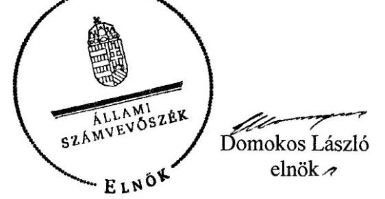

Az önkormányzatok az ÁSZ javaslatainak hasznosítására elöirt intézkedéseik végrehajtásával hozzájárultak a fenntartható pénzügyi stabilitás feltételeinek javításához.

---

# AZ ELLENŐRZÉST FELÜGYELTE: 

RENKÓ ZSUZSANNA felügyeleti vezető

## AZ ELLENŐRZÉST VEZETTÉK ÉS A VÉGREHAJTÁSÁÉRT FELELŐSÖK:

MOHL ANNA, BIALKÓ ZSOLT ellenőrzésvezetők

## A PROGRAM ÖSSZEÁLLÍTÁSÁÉRT FELELŐS:

LAJTERNÉ HUDÁK MAGDOLNA osztályvezető

## AZ ÖSSZEFOGLALÓ JELENTÉST KÉSZÍTETTÉK:

BAKSA ANIKÓ számvevő főtanácsos
DR. MEZEI IMRÉNÉ számvevő főtanácsos

## A TÉMÁHOZ KAPCSOLÓDÓ KORÁBBI SZÁMVEVŐSZÉKI JELENTÉSEK:

Jelentéseink az Országgyúlés számítógépes hálózatán és az Interneten a www.asz.hu címen is olvashatóak.

- címe: Összegzés a helyi önkormányzatok pénzügyi helyzetének és gazdálkodási rendszerének 2011. évi ellenőrzéseiről
- sorszáma: 1282

IKTATÓSZÁM: V-0736-008/2014.
TÉMASZÁM: 30
ELLENŐRZÉS-AZONOSÍTÓ SZÁM: V-0667

---

# TARTALOMJEGYZÉK 

■ ÖSSZEGZÉS ..... 5
■ AZ ELLENŐRZÉS CÉLJA ..... 7
■ AZ ELLENŐRZÉS TERÜLETE ..... 8
■ AZ ELLENŐRZÉS HÁTTERE, INDOKOLTSÁGA ..... 10
■ AZ UTÓELLENŐRZÉS FÓKUSZKÉRDÉSEI ..... 12
■ A MEGÁLLAPÍTÁSOKBÓL LEVONT KÖVETKEZTETÉSEK ÉS AZ ÖSSZEGZŐ ÉRTÉKELÉS KÉRDÉSEI ..... 12
■ ELLENŐRZÉS HATÓKÖRE ÉS MÓDSZEREI ..... 13
■ UTÓELLENŐRZÉSI MEGÁLLAPÍTÁSOK ÉS ELLENŐRZÉSI BIZONYÍTÉKOK ..... 15
■ AZ UTÓELLENŐRZÉS MEGÁLLAPÍTÁSAINAK ÉRTÉKELÉSE, LEVONT KÖVETKEZTETÉSEK ..... 27
■ MELLÉKLETEK ..... 41
I. sz. melléklet: Értelmező szótár ..... 41
II. sz. melléklet: Az utóellenőrzés megállapításai az ellenőrzött önkormányzatok intézkedési terveinek végrehajtásáról ..... 45
III. sz. melléklet: Az utóellenőrzésben érintett önkormányzatok intézkedési terveiben előírt feladatok teljesítésének értékelése ..... 47
IV. sz. melléklet: Az intézkedési tervekben előírt, időszerűvé vált feladatok teljesítése önkormányzatonként ..... 48
V. sz. melléklet: A 62 ellenőrzött önkormányzat bevételei és kiadásai, valamint adósságszolgálata a 2011. és a 2013. években, CLF módszer szerint, az éves beszámolók alapján ..... 50
VI. sz. melléklet: A kockázatelemzési rendszer adatbázisa ..... 51
■ RÖVIDÍTÉSEK JEGYZÉKE ..... 53

---

.

---

# ÖSSZEGZÉS 

Az Állami Számvevőszék utóellenőrzéssel értékelte a reprezentativ mintavétel szerint kiválasztott, 2011. évi pénzügyi ellenőrzésben érintett 62 városi önkormányzat jóváhagyott intézkedési tervének végrehajtását. Megállapította, hogy az önkormányzatok az ÁSZ javaslatainak hasznosítására előirt, időszerűvé vált intézkedéseknek a 77\%-át már részben, vagy teljes egészében végrehajtották. Új, holisztikus megközelítésű elemzéssel az önkormányzati alrendszer egészére levont következtetés, hogy az intézkedési tervekben foglaltak végrehajtása hozzájárult a fenntartható pénzügyi stabilitás feltételeinek megalapozásához.

## Az utóellenőrzés és a holisztikus megközelítésű összegzés célja

Az önkormányzati alrendszerben megjelenő gazdálkodási nehézségek, a pénzforgalmi hiány és az eladósodás növekedésére tekintettel az ÁSZ 2011-ben 62, reprezentatív mintavétel alapján kiválasztott város pénzügyi helyzetének ellenőrzését végezte el. Az ÁSZ jelentésekben szereplő javaslatok hasznosítására az önkormányzatok jogszabályi kötelezettségüknek eleget téve intézkedési tervet készítettek. Az utóellenőrzés célja annak megállapítása volt, hogy az ellenőrzött önkormányzatok végrehajtották-e a pénzügyi egyensúlyi helyzet helyreállítása érdekében kidolgozott, és az ÁSZ által elfogadott intézkedési tervekben előírt feladatokat.

Az utóellenőrzés megállapításaira alapozva - a reprezentativitásra tekintettel - az önkormányzati alrendszer egészére levonhatóak következtetések. Az utóellenőrzésről ezért olyan új típusú, holisztikus megközelítésű összegzés készült, amely az ellenőrzés tételes megállapításai mellett az önkormányzati alrendszer szintjén, együttesen elemzi és értékeli az önkormányzatok saját hatáskörben megtett és a kormányzati intézkedések hatását, hasznosulását. Kitekintést tartalmaz továbbá az alrendszer pénzügyi egyensúlyi helyzetének jövőbeni fenntartásához szükséges feladatokra is.

## Az utóellenőrzés főbb megállapításai

A 2011. évi ellenőrzések során feltárt kockázatokra tekintettel az ÁSZ az önkormányzatok számára pénzügyi helyzetük minősítése alapján különböző időtávon ható javaslatokat fogalmazott meg. Az ÁSZ főként olyan rövid és középtávon ható intézkedésekre hívta fel a figyelmet, amelyek a pénzügyi egyensúly helyreállítását, illetve javítását, valamint felelős gazdálkodás mellett a pénzügyi stabilitás hosszú távú megőrzését szorgalmazták.

Az ÁSZ jelentésekben szereplő 593 db javaslat hasznosítására az ellenőrzött önkormányzatok összesen 665 db feladat elvégzését határozták meg. Az intézkedési tervek felülvizsgálata során az ÁSZ az előírt feladatokat alkalmasnak találta a feltárt hiányosságok megszüntetésére.

Az utóellenőrzés megállapítása szerint az előírt
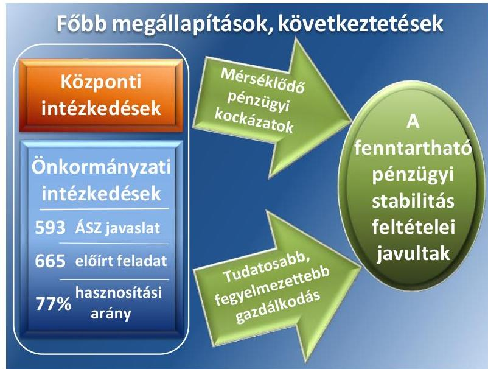
intézkedések 9\%-a, 57 db feladat végrehajtása döntően az intézkedési tervek elfogadását követően történt jogszabályi változások következtében okafogyottá, illetve időszerűtlenné vált. Az ÁSZ megállapításai szerint az önkormányzatok az időszerűvé vált feladataik 77\%-át már részben, vagy teljes egészében hasznosították. Az ÁSZ javaslatai és az előírt intézkedések megoszlása az előző ellenőrzés során beazonosított pénzügyi kockázatok súlyát, előfordulását

---

követték. A működőképesség megőrzésének kiemelt fontossága a működési kockázatok kezelésével kapcsolatos feladatok 84\%-os teljesítési arányában is megmutatkozott. A nemfizetési kockázatok mérséklésére előírt feladatok 69\%os hasznosításában a tervezett adósságkonszolidációs intézkedések is szerepet játszottak.

# A megállapításokból levont következtetések, összegző értékelés 

Az önkormányzatok pénzügyi tudatosságának értékelése során pozitív változást tapasztaltunk. A végrehajtott intézkedések hatására az önkormányzatok gazdaságszervező intézkedéseinek tudatossága, tervszerűsége és fegyelmezettsége javult. Fontos hangsúlyozni azonban, hogy a központi intézkedések - kiemelten az adósságkonszolidáció révén az állam jelentős szerepet vállalt a pénzügyi kockázatok mérséklésében.

Az ellenőrzött önkormányzatok költségvetési beszámoló adatainak elemzése alapján a 2011. évről a 2013. évre pozitív elmozdulás történt a működési jövedelem növekedésében, a kötelezettségek csökkenésében. A működési egyensúly megteremtésében a kiegészítő támogatások szerepe, jelentősége csökkent. A lejárt szállítói tartozások csökkenése, illetve a lejárt tartozások esedékességének kedvező alakulása következtében a szállítói kitettség miatti kockázat mérséklődött. A kezesség- és garanciavállalásból származó kötelezettségek csökkenésében a jogszabályi előírásokban időközben bekövetkezett, a stabilitási törvényben előírt szigorítás is szerepet játszott.

Az utóellenőrzés megállapításaiból levont következtetések alapján a helyi és központi intézkedések együttes eredményeként a pénzügyi stabilitás hosszú távú fenntarthatóságának feltételei javultak.

Az államháztartás önkormányzati alrendszerében felhalmozott adósság állam részéről történő kiegyenlítését, illetve átvállalását követően az önkormányzatok kiemelt feladata, egyben felelőssége az adósságállomány újratermelődésének megakadályozása. A működési egyensúly megteremtése, fenntartása, ezáltal a közfeladatellátás zavartalan biztosítása elsődleges prioritást élvező feladat. Ennek elérése érdekében a saját hatáskörű intézkedések végrehajtásán túl kiemelt jelentőségű szabályozásbeli változás volt, hogy 2013-tól az önkormányzatok költségvetése müködési hiánnyal nem tervezhető. Az intézkedési tervek végrehajtása révén kontrolláltabbá vált az önkormányzatok fejlesztési tevékenységének, finanszírozásának, fenntarthatóságának előkészítése is. A 2014-2020-as uniós programozási időszakban az önkormányzatoknál a pénzügyi lehetőségekre alapozó felelős döntési mechanizmus kialakítása és rendszerelvű működtetésére van szükség. A fejlesztések megvalósításában és annak jövőbeni fenntartásában a saját források felmérésére, a helyi közösség anyagi lehetőségeire, felelős kötelezettségvállalásaira, a fenntartható önkormányzatiság gazdasági alapjainak megerősödésére szükséges helyezni a fő hangsúlyt.

Az eredményszemléletű számvitelből nyerhető információk a pénzügyi kockázatok kezelésében hasznosíthatók, amely az önkormányzati alrendszer egészét tekintve a jó kormányzást támogatják. Az utóellenőrzési és kockázatelemzési tapasztalataink alátámasztják az önkormányzati alrendszer rendszeres monitoring tevékenységének szükségességét. A prevenciós monitoring, a több ütemű ellenőrzési beavatkozás lehetősége támogatja az önkormányzati gazdálkodásért való személyi felelősségi rendszer erősítését, az ÁSZ elemző és tanácsadó szerepének kiteljesedését.

---

# AZ ELLENŐRZÉS CÉLJA 

## Az ÁSZ által elfogadott intézkedési tervek végrehajtásának értékelése

AZ ELLENŐRZÉS CÉLJA annak megállapítása volt, hogy az ellenőrzött önkormányzatok végre-hajtották-e a pénzügyi egyensúlyi helyzet helyreállítása érdekében kidolgozott, és az ÁSZ által elfogadott intézkedési tervekben megfogalmazott feladatokat.

Ennek keretében ellenőriztük, hogy a polgármester az ÁSZ tv. ${ }^{1}$ előírásai értelmében az intézkedési tervet határidőben megküldte-e az ÁSZ részére, szükség volt-e az elfogadást megelőzően kiegészítésre, azt az előírt póthatáridőn belül megtették-e, a képviselő-testület a kiegészített intézkedési tervet elfogadta-e. Értékeltük, hogy az önkormányzat az elfogadott (kiegészített) intézkedési tervében foglaltak szerint, az abban előírt határidők betartásával gondoskodott-e az intézkedések megtételéről.

---

# AZ ELLENŐRZÉS TERÜLETE 

## A reprezentatív mintavétel alapján kiválasztott 62 város

Az ellenőrzött 62 önkormányzat kijelölésére - a települési önkormányzatok tevékenységére jellemző mutatószámok statisztikai elemzésén alapuló - reprezentatív mintavétel alapján került sor. A földrajzi elhelyezkedés szempontjából a legnagyobb számban az Észak-Alföldön (15 város) és a Dél-Dunántúlon (12 város) fekvő városok voltak érintettek, kilenc-kilenc és további nyolc város került kiválasztásra az Észak-Magyarországi és a KözépDunántúli, valamint a Dél-Alföldi megyék önkormányzatai közül. Az ellenőrzöttek körébe a legkisebb előfordulással a Közép-Magyarországi és a Nyugat-dunántúli megyék települései (öt, illetve négy város) tartoztak. Az ellenőrzött városi önkormányzatok földrajzi elhelyezkedését az 1. ábra mutatja be.
1. ábra
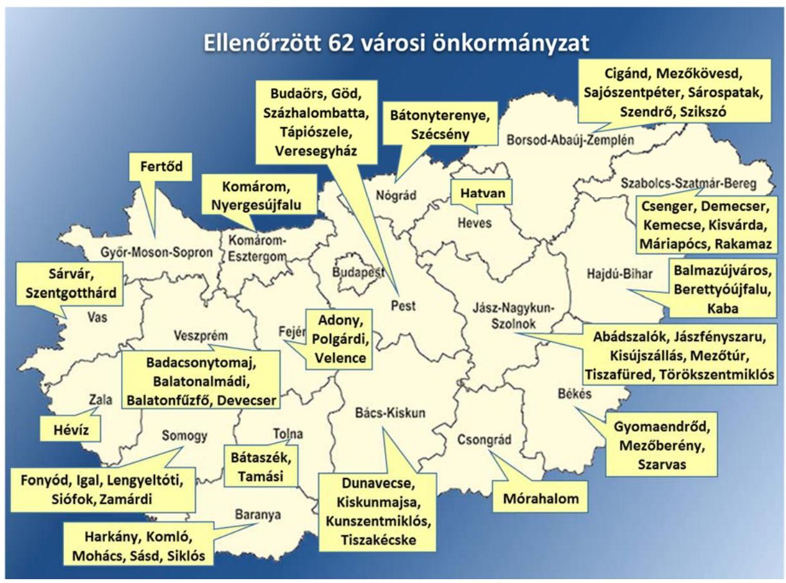

A városi önkormányzatok pénzügyi helyzetét az ÁSZ a 2012. évben nyilvánosságra hozott jelentéseivel lezárt ellenőrzések keretében a 20072011. év I. félév vonatkozásában értékelte. Az ellenőrzések megállapításai szerint a pénzügyi egyensúlyi helyzet 31 önkormányzatnál rövid távon, míg 15 önkormányzat esetében középtávon nem volt biztosított. 16 önkormányzat esetében az ÁSZ a meglévő pénzügyi egyensúly hosszú távú fenntartása érdekében fogalmazott meg javaslatokat.

---

A pénzügyi helyzet helyreállítása szempontjából azonnali intézkedést igénylők közül egy városnál már az ellenőrzés lezárását megelőzően képvi-selő-testületi döntés alapján megindult az adósságrendezési eljárás, további egy önkormányzat esetében az intézkedési terv jóváhagyását követően került sor az eljárás megindítására.

---

# AZ ELLENŐRZÉS HÁTTERE, INDOKOLTSÁGA 

## Megszűnt a következmények nélküli ellenőrzések korszaka

AZ ÁLLAMI SZÁMVEVŐSZÉK STRATÉGIÁJA a helyi önkormányzatok ellenőrzésében a pénzügyi kockázatok feltárására helyezte a fő hangsúlyt. Az önkormányzati alrendszer pénzügyi helyzetére vonatkozó összegző értékelés céljából a 2011. évben - a megyei jogú városokon túl - reprezentatív mintavétellel kiválasztott 62 város ellenőrzésére került sor. Az ÁSZ megállapította, hogy az önkormányzatok pénzügyi egyensúlyi helyzete összességében 2007-2010 között romlott, a pénzügyi kockázatok nőttek vagy a pénzügyi egyensúlyi helyzetet jellemző mutatószámok kedvezőtlenül változtak.

Az ellenőrzöttek az ÁSZ tv. 33. § (1)-(2) bekezdésében foglaltak alapján a jelentések intézkedést igénylő megállapításaihoz kapcsolódóan intézkedési tervet nyújtottak be, amelyet az ÁSZ - több esetben kiegészítés kérése után - elfogadott. Az elfogadásról szóló tájékoztatásban az Állami Számvevőszék elnöke valamennyi ellenőrzött szervezet vezetőjének figyelmét felhívta arra, hogy az intézkedési tervben foglaltak megvalósítása - az ÁSZ tv. 33. § (7) bekezdésében foglaltak alapján - utóellenőrzés keretében ellenőrizhető.

## AZ UTÓELLENŐRZÉS VÁRHATÓ HASZNOSULÁSA-

KÉNT az ellenőrzés megállapításai segítséget nyújthatnak a közpénzügyi helyzet javításához. Az ellenőrzöttek és a helyi döntéshozók számára visszajelzést ad az intézkedéseik hatásairól. A jóváhagyott intézkedési tervek megvalósításának értékelése révén megállapítható, hogy az önkormányzatok képességeikhez mérten megtették-e a szükséges intézkedéseket a pénzügyi stabilitás elérése, illetve megőrzése érdekében. A pénzügyi egyensúly megteremtése, illetve hosszú távú fenntarthatósága nélkül az önkormányzati alrendszerben az adósságállomány újratermelődhet, melynek megakadályozása az adósságkonszolidációt követően kiemelt feladat. A megállapítások visszacsatolása segítheti és erősítheti az ÁSZ hozzáadott értéket teremtő elemző tevékenységét és tanácsadó szerepét. Az utóellenőrzés jellegéből adódóan fokozza a legfőbb ellenőrző szervezet iránti közbizalmat.

AZ ADÓSSÁGKONSZOLIDÁCIÓ következtében az önkormányzatok pénzügyi helyzete jelentős mértékben megváltozott, amely a jóváhagyott intézkedési tervek végrehajtását is befolyásolta. Az ellenőrzött városok közül kilenc nem rendelkezett pénzintézeti kötelezettségekkel, ezért az adósságkonszolidációban nem volt érintett. További két város pénzintézeti tartozásait adósságrendezési eljárást követően - az utóellenőrzéssel érintett időszakon túl - konszolidálták. A magyar állam az ötezer fő alatti népességszámú 15 ellenőrzött város esetében a 2012. december

---

12-én fennálló teljes pénzintézeti adósságállományt és annak járulékait átvállalta, további egy városnál - a Kormány határozata alapján - ennek mértéke 70,0\% volt. Az ötezer főt elérő népességszámú 35 ellenőrzött város adósságainak konszolidálása két lépésben történt meg. A 2013. évben a 2012. december 31-én fennálló pénzintézetekkel szembeni tartozás és annak járulékai összegét az önkormányzatokkal kötött megállapodásban szereplő mértékben vállalta át a magyar állam. Ezt követően a 2013. december 31-én még fennálló adósság rendezésére a 2014. február 28-án lezárult adósságkonszolidáció keretében került sor.

---

# AZ UTÓELLENŐRZÉS FÓKUSZKÉRDÉSEI 

1- Az önkormányzatok által előirt intézkedések alkalmasak vol-tak-e az ÁSZ által feltárt hiányosságok megszüntetésére?
2- Az önkormányzatok az előirt feladatokat az ÁSZ által elfogadott intézkedési tervben foglalt határidőre végrehajtották-e?

## A MEGÁLLAPÍTÁSOKBÓL LEVONT KÖVETKEZTETÉSEK ÉS AZ ÖSSZEGZŐ ÉRTÉKELÉS KÉRDÉSEI

1- Tudatosabbá vált-e az önkormányzatok gazdálkodása az intézkedési tervek végrehajtásának hatására?
2. Az intézkedések következtében megteremtődtek-e az önkormányzatoknál a pénzügyi stabilitás feltételei?

---

# ELLENŐRZÉS HATÓKÖRE ÉS MÓDSZEREI 

## Az ellenőrzés típusa

Szabályszerúségi ellenőrzés

## Az ellenőrzött időszak

Az ellenőrzött időszak az intézkedési terv ÁSZ által történt elfogadásától az utóellenőrzés megkezdéséig tartó - az utóellenőrzés egyes ütemeinél eltérő - időszak volt. Az utóellenőrzés az I. ütemben érintett 34 önkormányzatnál 2013. december 13-ig, a II. ütemben érintett 2 városnál 2014. február 21-ig, a III. ütemhez tartozó 12 városnál 2014. március 18-ig, a IV. ütemhez tartozó 7 városnál 2014. május 30-ig, az V. ütemben érintett 5 városnál 2014. június 23 -ig, és a VI. ütemhez tartozó két városnál 2014. július 28 -ig tartó időszakot érintette.

A 2011. évi ellenőrzés kiterjedt az azt megelőző ÁSZ ellenőrzés során készített számvevői anyagokban szereplő, intézkedést igénylő megállapítások hasznosításának utóellenőrzésére is. Ezáltal a jelen utóellenőrzés alapjául szolgáló intézkedési tervek rendelkezést tartalmaztak - az érintett önkormányzatok esetében - a 2011. évet megelőzően végzett ellenőrzések nem teljesült javaslatainak végrehajtására is.

## Az ellenőrzés hatóköre

Az önkormányzatok pénzügyi gazdálkodási helyzetének, szabályszerűségének 2011. évi ellenőrzésében érintett 62 városi önkormányzat

Az ellenőrzés végrehajtásának jogszabályi alapját az ÁSZ tv. 1. § (3) bekezdése, az 5. § (2) és (6) bekezdései, a 33. § (7) bekezdése, valamint az Áht. ${ }^{2}$ 61. § (2) bekezdésének előírásai képezték.

## Az ellenőrzés módszerei

Az ellenőrzést a számvevőszéki ellenőrzés szakmai szabályai szerint, a szabályszerűségi ellenőrzés módszerével, a vonatkozó nemzetközi standardok figyelembevételével végeztük el.

A jelentésben használt egyes fogalmak magyarázatát az I. számú melléklet (Értelmező szótár) tartalmazza.

Az ellenőrzésre az önkormányzatok elektronikus adatszolgáltatása alapján került sor, helyszíni ellenőrzést nem végeztünk. A megállapítások rögzítése az önkormányzatok által rendelkezésre bocsátott dokumentumok, tanúsítványok alapján történt, melyek valódiságát és teljeskörűségét a polgármester, valamint a jegyző teljességi nyilatkozata igazolja.

---

A jóváhagyott intézkedési tervben előírt feladatok végrehajtásának ellenőrzését egységes szempontok, illetve értékelési kritériumok alapján végeztük. Figyelembe vettük az intézkedési terv jóváhagyását követően hatályba lépett jogszabályi előírások változásából következő események - kiemelten az önkormányzati alrendszerben lezajlott adósságkonszolidációs intézkedések, továbbá a feladat-ellátási és finanszírozási rendszer változásának - hatásait. Az önkormányzatok által megtett intézkedések pénzügyi egyensúlyi helyzetre gyakorolt hatásával kapcsolatban az ÁSZ egyedi megállapítást nem tett, ugyanakkor a tapasztalatok összegzése alapul szolgált az utóellenőrzési célokra adott válaszok alrendszer szintű megválaszolásához, a hasznosulás értékeléséhez.

# AZ INTÉZKEDÉSI TERVEKBEN ELŐíRT FELADA- 

TOK KATEGORIZÁLÁSA azok végrehajthatósága, illetve végrehajtása szempontjából az alábbiak szerint történt:
okafogyottá vált minősítést kapott az előírt feladat, ha végrehajtására - meghatározott esemény bekövetkezése, továbbá külső körülmény, a múködést érintő feltétel változása miatt - már nincs szükség, illetve lehetőség, és egyértelműen megállapítható, hogy az intézkedést szükségessé tevő körülmény a jövőben nem fordulhat elő;
$\longrightarrow$ nem időszerű (nem esedékes) feladatként kezeltük azon feladatot, melynek ellenőrzési időszakon belüli végrehajtására azért nem került (kerülhetett) sor, mert az intézkedés alapjául szolgáló esemény nem következett be, de annak jövőbeni előfordulása lehetséges;
$\longrightarrow$ határidőben végrehajtott feladatnak azt fogadtuk el, ha a teljesítés dokumentáltan az intézkedési tervben előírt határidőben és tartalommal megtörtént;
$\longrightarrow$ határidőn túl végrehajtott minősítést alkalmaztunk, ha a feladat teljesítése az intézkedési tervben meghatározott módon, de az előírt határidőn túl történt meg;
$\longrightarrow$ részben végrehajtott kategóriába soroltuk azt a feladatot, melynek végrehajtása teljes körűen az intézkedési tervben előírt módon nem történt meg, vagy a feladatot nem az előírt gyakorisággal hajtották végre;
$\longrightarrow$ nem végrehajtott minősítést kapott a feladat, ha a teljesítés annak ellenére maradt el, hogy az intézkedés megvalósítása a rendelkezésre álló információk alapján időszerűvé vált, vagy amennyiben a teljesítést nem dokumentálták.

---

# UTÓELLENŐRZÉSI MEGÁLLAPÍTÁSOK ÉS ELLENŐRZÉSI BIZONYÍTÉKOK 

## 1. Az önkormányzatok által előírt intézkedések alkalmasak vol-tak-e az ÁSZ által feltárt hiányosságok megszüntetésére?

Összegző megállapítás

### 1.1. számú megállapítás

Az ÁSZ által elfogadott intézkedési tervekben előírt feladatok alkalmasak voltak a feltárt hiányosságok megszüntetésére.
Az önkormányzatok által megküldött intézkedési tervek 30,6\%-ánál az ÁSZ annak kiegészítését és ismételt megküldését kérte.

Az ellenőrzött önkormányzatok összességében eleget tettek az ÁSZ tv.-ben foglalt intézkedési terv készítési kötelezettségüknek. A 2011. évi pénzügyi ellenőrzésekről szóló számvevőszéki jelentések átvételét követően az intézkedési terveket 26 önkormányzat az ÁSZ tv. 33. § (1) bekezdésében foglalt határidőben, 36 önkormányzat határidőn túl küldte meg az ÁSZ részére. Az ÁSZ az intézkedési tervek szakmai felülvizsgálatát követően - a hiányosságok megszüntetésére vonatkozó részletes indokolással - 19 önkormányzat esetében az intézkedési terv kiegészítését és ismételt megküldését kérte.

JELLEMZŐ HIÁNYOSSÁG volt, hogy az előírt intézkedés tartalmilag nem volt alkalmas az ÁSZ javaslatának hasznosítására, illetve a feladat kiszabása nem volt egyértelmű, konkrét, ezáltal a végrehajtás ellenőrizhetősége nem volt biztosított. Ezen túl a végrehajtás határidejét nem, vagy nem megfelelő módon, illetve rendszerességgel határozták meg, továbbá a végrehajtásért felelős személy kijelölése nem történt meg.

Az ÁSZ észrevételei alapján kiegészített intézkedési tervek mindegyike alkalmas volt a feltárt hiányosságok megszüntetésére, így azokat az ÁSZ elfogadta. Az intézkedési terv készítési kötelezettség teljesítése érdekében az ÁSZ tv.-ben szereplő szankciók alkalmazására nem került sor.
1.2. számú megállapítás

Az ÁSZ által elfogadott intézkedési terveket - hét önkormányzat kivételével - az utóellenőrzés megkezdéséig nem módosították.

Az ÁSZ által elfogadott intézkedési tervek módosítására utólag hét önkormányzatnál került sor:
$\longrightarrow$ öt városnál képviselő-testületi döntés alapján az intézkedési tervekben előírt 20 feladat végrehajtási határidejét, további egy esetben polgármesteri döntés alapján egy feladat végrehajtásának rendszerességét változtatták meg;
$\longrightarrow$ egy önkormányzatnál a képviselő-testület - a 2013. év I. félévi állami adósságkonszolidációs intézkedésekre tekintettel - a jövőbeni adósságszolgálat teljesítéséhez képzett elkülönített tartalék csökkentéséről döntött.

---

# 1.3. számú megállapítás 

Az ellenőrzött önkormányzatok közel fele beszámolt a képviselőtestületeknek az intézkedési tervben előírt feladatok végrehajtásáról.

A 62 ellenőrzött önkormányzat közül az intézkedési terv elfogadásakor mindössze 9 írt elő a feladatok elvégzéséről részbeni vagy teljes körű beszámolási kötelezettséget. Ennek a kötelezettségének 2 önkormányzat nem tett eleget. Az ellenőrzöttek közül 21 önkormányzat polgármestere viszont annak ellenére beszámolt a képviselő-testületnek a feladatok teljesítéséről, hogy erre írásban nem kötelezték. A képviselő-testület tájékoztatása jellemzően a végrehajtás megtörténtére korlátozódott, a polgármesterek nem mutatták be az intézkedési terv végrehajtásának a pénzügyi egyensúlyi helyzet alakulására gyakorolt hatását, eredményét.

## 2. Az önkormányzatok az előírt feladatokat az ÁSZ által elfogadott intézkedési tervben foglalt határidőre végrehajtották-e?

## Összegző megállapítás

Az önkormányzatok az intézkedési tervekben előírt, időszerűvé vált feladatok 77,1\%-át az utóellenőrzés lezárásáig már részben vagy teljes mértékben végrehajtották.

Az előírt intézkedések közel kétharmadát a működtetés és a fizetőképesség megőrzéséhez kapcsolódó feladatok tették ki.

AZ ÁSZ JAVASLATAI a pénzügyi egyensúlyi helyzet javítása, fenntartása érdekében a beazonosított pénzügyi kockázatok alapján kialakított önkormányzati csoportok számára különböző fokozatú intézkedésekre irányultak. A 62 számvevőszéki jelentésben mindösszesen 593 db javaslat szerepelt. A 2011. évi pénzügyi ellenőrzésekről szóló ÁSZ jelentésekben tett javaslatok számát - a feltárt kockázati tényezők és a pénzügyi egyensúly szerinti kockázati besorolású önkormányzati csoportok szerint az 1. táblázat mutatja be.

1. táblázat

| AZ ÁSZ JAVASLATAINAK SZÁMA, ÖSSZETÉTELE (db) |  |  |  |  |
| :--: | :--: | :--: | :--: | :--: |
| Megnevezés | Azonnali intézkedést igénylő (31 város) | Középtávon ható intézkedést igénylő (15 város) | Hosszú távon ható intézkedést igénylő (16 város) | Ellenőrzött városok összesen: (63 város) |
| Müködési kockázatokat érintő | 102 | 34 | 3 | 139 |
| Nemfizetési kockázatokat érintő | 153 | 52 | 29 | 234 |
| Felhalmozási kockázatokat érintő | 36 | 6 | 1 | 43 |
| Gazdasági társaságokkal kapcsolatos kockázatokat érintő | 23 | 7 | 8 | 38 |
| Egyéb javaslatok | 84 | 32 | 23 | 139 |
| ÖSSZESEN: | 398 | 131 | 64 | 593 |

Forrás: 2011. évi pénzügyi ellenőrzésekről szóló ÁSZ jelentések
Az ÁSZ javaslatainak hasznosítására az önkormányzatok összesen 665 db feladat elvégzését írták elő, melynek legnagyobb része ( $36,1 \%$-a) a nemfizetési kockázatok csökkentésére, a rövid és hosszú távú fizetőképesség

---

megőrzésére vonatkozott. A kötelező feladatellátás biztosítására, a méretgazdaságossági szempontok szerinti intézményhálózat kialakítására, a hosszú távon is stabil múködtetésre az intézkedések több, mint negyede (28,9\%-a) irányult. Az előírt feladatok 6,9\%-a a gazdasági társaságokkal kapcsolatos kockázatok, további 5,9\%-a a felhalmozási kockázatok kezelésére vonatkozott. Az egyéb intézkedések közé a gazdálkodási, számviteli hiányosságok megszüntetése, az előző ÁSZ ellenőrzések nem hasznosult javaslatainak teljesítése, valamint a pénzügyi kockázatok kezeléséhez közvetlenül nem kapcsolódó feladatok tartoztak.

Az intézkedési tervekben előírt feladatok - az ÁSZ javaslatainak bemutatásánál leírtak szerint - a kockázati tényezők súlyát, előfordulását követik. Az intézkedési tervekben előírt feladatok számát kockázati tényezők szerint a 2. ábra mutatja be.
2. ábra
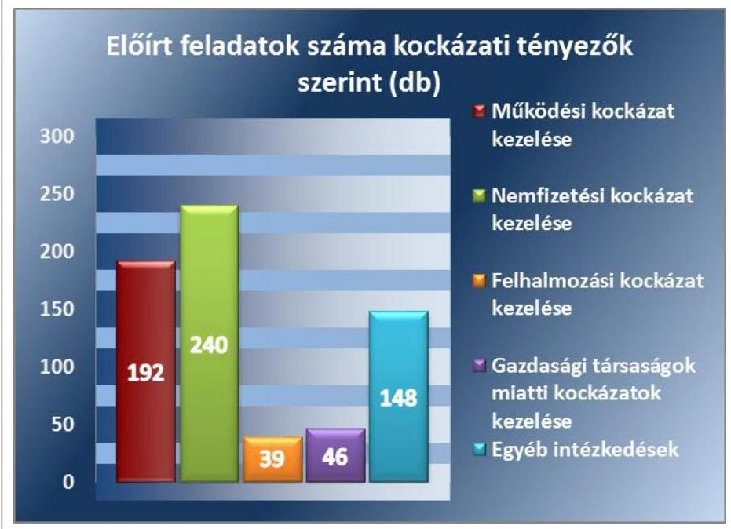

Forrás: Az utóellenőrzés megállapításairól szóló ÁSZ jelentés mellékletei
A MŰKÖDÉSI KOCKÁZATOK körében a 2011. évben lefolytatott pénzügyi ellenőrzések az alábbiakat tárták fel:
az önkormányzatok folyó költségvetésének egyenlege a 2009. évet követően jelentős mértékben csökkent. A 2010. évben már az ellenőrzött önkormányzatok több mint harmada (22 önkormányzat) negatív múködési jövedelemmel rendelkezett;
bevételi kitettséget jelentett, hogy a múködőképesség fenntartásában egyre nagyobb szerepet játszottak a központi költségvetésből igényelt kiegészítő támogatások;
az önkormányzatok pénzügyi helyzetük kedvezőtlen alakulása ellenére sem vizsgálták felül, illetve korlátozták az önként vállalt feladatokra fordított kiadásaikat;
a beruházások révén jellemzően nem képződtek olyan pótlólagos saját bevételek, kiadási megtakarítások, amelyek biztosítják a létesítmények múködési forrásait;
egyes önkormányzatok pénzügyi helyzete erősen függött a helyi adóbevételek nagyságától.

---

A múködési kockázatok megszüntetése érdekében tett 139 ÁSZ javaslat hasznosítására az intézkedési tervekben előírt intézkedések:
$\longrightarrow$ főként a múködési jövedelemtermelő képesség növelésére, a bevételi kitettség csökkentésére (49,5\%);
$\longrightarrow$ a pénzügyi stabilitás rövid távú helyreállítását célzó reorganizációs program, illetve a pénzügyi egyensúly hosszú távú fenntarthatóságát biztosító kibontakozási program kidolgozására (19,8\%);
$\longrightarrow$ az önként vállalt feladatok felülvizsgálatára, optimalizálására, az ellátásukhoz szükséges források biztosítására (17,7\%);
és $13,0 \%$-ban az intézmények rentábilis üzemeltetésére vonatkoztak.

A NEMFIZETÉSI KOCKÁZATOK a 2011. évi pénzügyi ellenőrzések megállapításai alapján az alábbiak szerint jelentkeztek:
$\longrightarrow$ a tőketörlesztéssel csökkentett múködési jövedelem a 2010. évre jelentős mértékben romlott a múködési jövedelem csökkenését meghaladóan növekvő tőketörlesztési kiadások következtében. 2010ben már 33 város esetében volt negatív a nettó múködési jövedelem (pénzügyi kapacitás). A pénzintézetek felé fennálló, növekvő tendenciájú kötelezettségek finanszírozhatósága 31 önkormányzatnál már rövid távon sem volt biztosított. Az önkormányzatok múködőképességét veszélyeztette az adósságszolgálat 2011-től várható további növekedése, kockázatot jelentettek a törlesztések finanszírozására felvett újabb hitelek, továbbá a devizában fennálló kötelezettségek miatti árfolyamkitettség;
$\longrightarrow$ az önkormányzatok felénél a folyószámla- és egyéb rövid lejáratú hitelek napi átlagos állományának és a hitellel zárt napok növekedése már a költségvetésbe beépült tartós forráshiányt jelezte. Ezen önkormányzatoknál további mobilizálható, likvid források hiányában növekvő mértékben folytatódott a pénzügyi hiány képződése;
$\longrightarrow$ a lejárt esedékességú szállítói tartozások 2007-ről 2010-re jelentősen ( $74,8 \%$-kal) növekedtek, meghaladták a dologi kiadások egy havi átlagos mértékét. Emellett a 60 napot meghaladó lejárt szállítói tartozások miatti szállítói kitettség is erősödött, az érintett önkormányzatokkal szemben az adósságrendezési eljárás kezdeményezhetőségére tekintettel.
Az ÁSZ 234 javaslata alapján az önkormányzatok által előírt intézkedések a nemfizetési kockázatok kezeléséhez kapcsolódóan:
$\longrightarrow 77,1 \%$-ban a kötelezettségek jövőbeni kifizethetőségét biztosító finanszírozási források bemutatására, az adósságszolgálat teljesítéséhez felhasználható elkülönített tartalék képzésére vonatkoztak;
$\longrightarrow$ a feladatok $12,1 \%$-a a banki kitettség csökkentését;
$\longrightarrow$ további 10,8\%-a a lejárt szállítói állomány kezelését, illetve megszüntetését célozta.

---

A FELHALMOZÁSI KOCKÁZATOK erősödése a 2011. évben lefolytatott pénzügyi ellenőrzések alapján az alábbi okokra vezethető vissza:

- az EU-s pályázati források felhasználása miatt fokozódott a beruházások iránti érdeklődés. A pályázatok önrészének finanszírozása növelte az eladósodást, mivel a nettó működési jövedelem a felhalmozási költségvetés hiányára teljes mértékben nem nyújtott fedezetet, ami külső források bevonását tette szükségessé;
- a pályázatok során elnyert támogatások előfinanszírozása likviditási nehézséget okozott;
- a beruházások révén létrehozott létesítmények jövőbeni fenntartási kötelezettsége tovább terhelte az önkormányzatok költségvetését.
A felhalmozási kockázatok megszüntetésére - az ÁSZ 43 javaslatának hasznosítására - előírt intézkedések a folyamatban lévő beruházásokkal kapcsolatos kötelezettségek átütemezési lehetőségeinek felmérését, illetve a folyamatban lévő és tervezett beruházások finanszírozásának, a beruházások révén létrejött létesítmények jövőbeni fenntarthatóságának felülvizsgálatát írták elő.

# A GAZDASÁGI TÁRSASÁGOK MIATTI KOCKÁZA- 

TOK vonatkozásában a 2011. évi pénzügyi ellenőrzések megállapították, hogy az önkormányzatok gazdasági társaságai jelentős adósságállománynyal rendelkeztek, melyekhez döntően a tulajdonosok kezesség-, illetve garanciavállalása kapcsolódott. A gazdasági társaságok pénzügyi helyzetének stabilizálása helyett az önkormányzatok rendszeres pénzeszközátadásokkal, tagi kölcsönökkel segítették azok működő- és fizetőképességének fenntartását. A számviteli beszámolók konszolidálásának hiánya azonban elfedte a tulajdonosi felelősségből adódóan az önkormányzatok pénzügyi helyzetére kiható kockázatokat.

Az e kockázatok kezelése érdekében - az ÁSZ által tett 38 javaslat alapján - előírt feladatok 60,9\%-a a gazdasági társaságok pénzügyi helyzetének képviselő-testület részére történő rendszeres bemutatására, míg 39,1\%-a a gazdasági társaságok pénzügyi helyzetének stabilizálását szolgáló intézkedési tervek elkészítésére, a tulajdonosi érdekeket szolgáló intézkedések megtételére vonatkozott.

AZ EGYÉB ÁSZ JAVASLATOK hasznosítására előírt intézkedések kiemelt jogcímei közül:

- 27,0\% az értékcsökkenés és ezzel összevetve az elhasználódott eszközök pótlására fordított kiadások, valamint az eszközök használhatósági fokának rendszeres bemutatására;
- 19,6\% a számviteli szabálytalanságok megszüntetésére;
- 12,8\% az előző ÁSZ ellenőrzések nem hasznosult javaslatainak végrehajtására;
- 6,1\% az önkormányzati vagyontárgyak fedezetbe adása esetén a jogszabályi előírások betartására vonatkozott.

---

### 2.2. számú megállapítás

Az önkormányzatok az intézkedési tervekben meghatározott, időszerűvé vált feladatok közel 60\%-át maradéktalanul, további közel egyötödét részben már hasznosították.

Az ellenőrzött önkormányzatok által előírt feladatokat, és az azok teljesítésére vonatkozóan az utóellenőrzés által tett egyedi megállapításokat a II. számú melléklet tartalmazza. Az előírt feladatok teljesítésének ellenőrzése során elsőként a feladat végrehajthatóságát minősítettük. Ennek keretében figyelembe vettük az intézkedési tervek elfogadását követően lezajlott állami adósságkonszolidációs intézkedések, a feladatellátásban, az intézményi rendszerben bekövetkezett változások hatását. Mindezek alapján megállapítottuk, hogy az előírt intézkedések 6,2\%-a az ellenőrzött időszakban nem volt időszerű, illetve 2,4\%-a okafogyottá vált.

AZ OKAFOGYOTTÁ VÁLT INTÉZKEDÉSEK jellemzően az adósságkonszolidáció keretében megszűnt pénzintézeti kötelezettségállomány, valamint az állam által átvállalt PPP szerződésből származó kötelezettség visszafizetési forrásainak biztosításához, a devizában fennállt hitelek számviteli elszámolásához kapcsolódtak. Az állami feladatátvételeket követően megváltozott intézményi kör, illetve gazdálkodási feltételek, az intézkedési tervben előírt feladattal érintett gazdasági társaság megszűnése, valamint az önkormányzati társulások múködésében 2012-től hatályba lépő jogszabályi változások következtében több feladat jövőbeni végrehajtása már nem volt indokolt, illetve lehetséges.

## AZ ELLENŐRZÖTT IDŐSZAK VONATKOZÁSÁBAN

IDŐSZERŰTLEN INTÉZKEDÉSEK elsősorban - az újabb adósságot keletkeztető kötelezettségvállalások hiányában - a várható kockázatok, a visszafizetés forrásainak döntés-előkészítéskor történő bemutatására irányulóak voltak. Az előírt feladatot érintő gazdasági események (hitelfelvétel, tagi kölcsön nyújtása, deviza alapú kötelezettség fennállása, pénzforgalom nélküli bevétel vagy kiadás) bekövetkezésének hiányában nem vált szükségessé az azokra vonatkozó számviteli, gazdálkodási, illetve közbeszerzési jogszabályi előírások betartása. A pénzügyi egyensúlyi helyzet további stabilitására tekintettel nem volt időszerű intézkedés kezdeményezése a kedvezőtlen folyamatok megállítása, az egyensúly helyreállítása érdekében. Előfordult továbbá, hogy az intézkedési terv elfogadását követően elrendelt adósságrendezési eljárás miatt, a gazdálkodásra vonatkozó sajátos jogszabályi előírások következtében több feladat végrehajtása nem volt lehetséges.

Az intézkedési tervekben előírt feladatok, és azon belül az időszerűvé vált feladatok számát, teljesítésének összetételét a 3. ábra mutatja be.

---

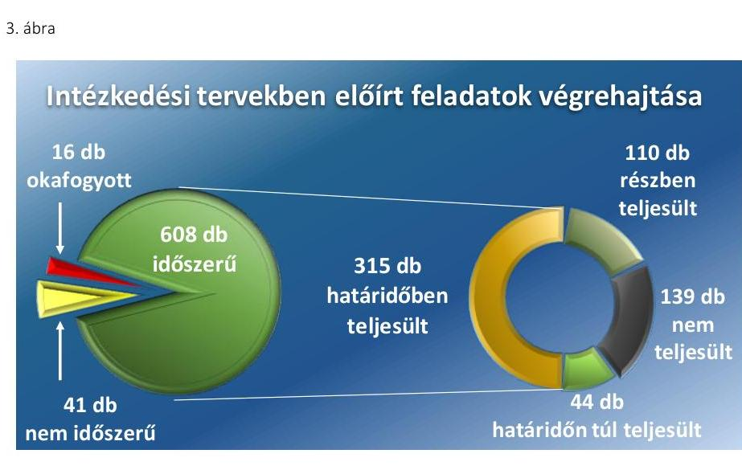

Forrás: Az utóellenőrzés megállapításairól szóló ÁSZ jelentés mellékletei

Az intézkedési tervekben előírt időszerűnek minősített feladatok 51,8\%-át az önkormányzatok határidőben, további 7,2\%-át az előírt végrehajtási határidő után - de még az utóellenőrzés megkezdését megelőzően végrehajtották. A tartalmi szempontból, illetve a végrehajtás gyakoriságában tapasztalt hiányosságok alapján a feladatok 18,1\%-a részben teljesült. Egyáltalán nem hajtották végre az intézkedési tervben előírt, időszerűvé vált kötelezettségek 22,9\%-át. Az intézkedési tervekben előírt feladatok tartalmi csoportosítás szerinti végrehajtását a III. számú melléklet mutatja be.

# 2.3. számú megállapítás 

Az előírt intézkedések közül a múködési kockázatok csökkentésére hozott intézkedések 84,0 \%-os hasznosítási aránya volt a legmagasabb.

Az önkormányzatok működőképességük fenntartását elsődlegesnek tekintették, az e csoportba tartozó intézkedések esetén volt a legkisebb a nem teljesítés aránya. A múködési kockázatok kezelésére az intézkedési tervekben előírt 187 db időszerű feladat 63,1\%-át határidőben, 11,3\%-át határidőt követően, további 9,6\%-át részben hajtották végre. A múködési kockázatok kezelésére előírt, időszerűvé vált feladatok végrehajtását a 2011. évi ellenőrzéskor kialakított, a pénzügyi egyensúly szerinti kockázati besorolású önkormányzati csoportonként a 2. táblázat mutatja be.
2. táblázat

| A MŰKÖDÉSI KOCKÁZATOK KEZELÉSÉRE ELŐÍRT FELADATOK VÉGREHAJTÁSA (db,\%) |  |  |  |  |  |
| :--: | :--: | :--: | :--: | :--: | :--: |
| A pénzügyi egyensúly sze-   rinti kockázati besorolású   városok | Időszerűvé vált   feladatok   összesen | Végrehajtott | Részben telje-   sult | Nem teljesült | Nem teljesült   feladatok   aránya |
| Rövid távú | 135 | 101 | 12 | 22 | $16,3 \%$ |
| Középtávú | 42 | 30 | 5 | 7 | $16,7 \%$ |
| Hosszú távú | 10 | 8 | 1 | 1 | $10,0 \%$ |
| Összesen | 187 | 139 | 18 | 30 | $16,0 \%$ |

Forrás: Az utóellenőrzés megállapításairól szóló ÁSZ jelentés mellékletei
A múködési kockázatok csökkentésére - alapvetően négy fő számvevőszéki javaslat hasznosítására - előírt feladatokat a pénzügyi egyensúlyi

---

helyzetük szempontjából hosszú távú intézkedésekre kötelezett városok teljesítették a legmagasabb arányban. Az időszerűvé vált összes feladat, ezen belül a múködési és nemfizetési kockázatok kezeléséhez kapcsolódó feladatok teljesítését ellenőrzött városonként a IV. számú melléklet mutatja be.

# A BEVÉTELSZERZŐ ÉS KIADÁSCSÖKKENTŐ LE- 

HETŐSÉGEK feltárására 51 önkormányzat 93 db intézkedése vált időszerűvé. Az intézkedések 81,7\%-át teljesen, 12,9\%-át részben hajtották végre. A feladatok 5,4\%-át nem teljesítették, amely kedvező arány. Az utóellenőrzés főként azt tárta fel hiányosságként, hogy a kitűzött feladatokat nem az előírt rendszerességgel hajtották végre. Az önkormányzatok jellemzően a bevételnövelés lehetőségeit vizsgálták, több esetben a kiadások csökkentésére, a kintlévőségek behajtására nem tettek lépéseket. Előfordult, hogy konkrét egyensúlyjavító intézkedésekről nem döntöttek, azokat csupán tervezési szempontként határozták meg, továbbá több esetben a bevételnövelő, kiadáscsökkentő lehetőségeket feltárták, azonban ezt konkrét intézkedések megtétele nem követte.

## A REORGANIZÁCIÓS, ILLETVE KIBONTAKOZÁSI

PROGRAM készítésére 34 önkormányzat által előírt 36 db időszerűnek minősített intézkedést értékeltünk. Az intézkedések 52,8\%-át teljesen, 5,5\%-át részben hajtották végre. A feladatok 41,7\%-át nem teljesítették. A végrehajtás elmaradását az ellenőrzöttek jellemzően azzal indokolták, hogy hoztak egyéb egyensúlyt javító döntéseket, és ezen túl a központi intézkedések hatására a pénzügyi helyzetük jelentős mértékben javult. A pénzügyi egyensúlyi helyzet változása függvényében meghatározott intézkedéseket a nem megfelelő helyzetfelmérésre hivatkozással nem hajtották végre. Az utóellenőrzés ezen túl nem fogadta el reorganizációs programként a kizárólag a pénzügyi helyzet elemzésére, a múltbeli intézkedések bemutatására szorítkozó dokumentumot, amelyben a jövőre vonatkozó konkrét célkitűzések, egyensúlyjavító intézkedések nem szerepeltek.

## A FELADATELLÁTÁS INTÉZMÉNYI SZERKEZETÉ-

NEK FELÜLVIZSGÁLATA, racionalizálása céljából 19 önkormányzat 24 db időszerűnek minősített intézkedést írt elő. Az intézkedések 75,0\%-át teljesen, 4,2\%-át részben hajtották végre. A feladatok 20,8\%-át nem teljesítették. Az intézményi gazdálkodásra vonatkozó helyi előírások szigorítása, a felhasználható előirányzatok lehetséges szűkítésének felmérése, a tervezett kifizetésekkel kapcsolatos beszámoltatás az utóellenőrzés megállapításai szerint több esetben elmaradt. Az intézményi szerkezet és az intézményfinanszírozás átfogó áttekintése nem történt meg, ehelyett létszámcsökkentésre, intézmény összevonásra irányuló egyedi döntések születtek.

## AZ ÖNKÉNT VÁLLALT FELADATOK FINANSZí-

ROZHATÓSÁGÁNAK ÁTTEKINTÉSE 32 önkormányzat esetében 34 intézkedést jelentett. Az időszerűvé vált intézkedések 76,5\%át teljesen, 8,8\%-át részben hajtották végre. A feladatok 14,7\%-át nem teljesítették. Az önkormányzatok jellemzően ragaszkodtak a már meglévő önként vállalt közszolgáltatások jövőbeni biztosításához. Az SZMSZ-ben elvé-

---

# 2.4. számú megállapítás 

gezték az ellátott feladatok megfelelő besorolását, ennek ellenére a gazdálkodási gyakorlatban előfordult, hogy nem ennek megfelelően jártak el. A képviselő-testület tájékoztatására nem az előírt rendszerességgel került sor. A költségvetés összeállítása során jogszabályi előírás alapján be kell mutatni a bevételi és kiadási előirányzatok kötelező és önként vállalt feladatok szerinti megoszlását, azonban a zárszámadási rendeletek keretében a képviselő-testület tájékoztatása nem történt meg.

## A nemfizetési kockázatok csökkentésére hozott intézkedéseknek csak a 69,2\%-át hasznosították, amelyben a várható adósságkonszolidációs lépések hatása is közrejátszott.

A nemfizetési kockázatok csökkentésének kiemelt fontossága ellenére a végre nem hajtott feladatok aránya ezen csoportnál volt a legmagasabb. Ebben az is szerepet játszott, hogy a tervezett adósságkonszolidációra vonatkozó információk sajtóban való megjelenését követően több önkormányzat „várakozó" álláspontra helyezkedett, és az intézkedési tervben előírt feladatait nem, vagy csak részben teljesítette. A nemfizetési kockázatok kezelésére az intézkedési tervekben előírt 201 db időszerű feladat 41,8\%-át határidőben, 6,0\%-át határidőt követően hajtották végre. Az előírt feladatok 21,4\%-át részben megvalósították, 30,8\%-ának teljesítését pedig elmulasztották. A nemfizetési kockázatok kezelésére előírt, időszerűvé vált feladatok végrehajtását a 2011. évi ellenőrzéskor kialakított, a pénzügyi egyensúly szerinti kockázati besorolású önkormányzati csoportonként a 3. táblázat mutatja be.
3. táblázat

| A nemfizetési kockázatok kezelésére előírt feladatok végrehajtása (db,\%) |  |  |  |  |  |
| :--: | :--: | :--: | :--: | :--: | :--: |
| A pénzügyi egyensúly sze-   rinti kockázati besorolású   városok | Időszerüvé vált   feladatok   összesem | Végrehajtott | Részben telje-   sült | Nem teljesült | Nem teljesült   feladatok   aránya |
| Rövid távú | 127 | 52 | 27 | 48 | 37,8\% |
| Középtávú | 44 | 22 | 11 | 11 | 25,0\% |
| Hosszú távú | 30 | 22 | 5 | 3 | 10,0\% |
| Összesen | 201 | 96 | 43 | 62 | 30,8\% |

Forrás: Az utóellenőrzés megállapításairól szóló ÁSZ jelentés mellékletei

## AZ ÁLLANDÓSULT LIKVID HITELEK ÁTALAKÍ-

TÁSA lehetőségeinek áttekintésére 24 önkormányzat 24 db időszerűnek minősített intézkedést írt elő. Az intézkedések 70,8\%-át teljesen, 4,2\%-át részben hajtották végre. A feladatok 25,0\%-át nem teljesítették, melynek fő oka az adósságkonszolidációra való kivárás volt. Előfordult azonban, hogy a számlavezető bank zárkózott el a tárgyalásoktól, illetve a közbeszerzési eljárás eredménytelensége miatt nem került sor a hiteltartozások átütemezésére, a likvid hitelek hosszú távú kötelezettséggé történő átalakítására.

A KÖTELEZETTSÉGEK FINANSZÍROZÁSA érdekében azok visszafizetési forrásainak rendszeres bemutatására 55 önkormányzat 58 db időszerűvé vált intézkedést írt elő. Az intézkedések 43,1\%-át teljesen, 41,4\%-át részben hajtották végre. A feladatok 15,5\%-át nem teljesítették.

---

Jellemző hiányosság volt, hogy a képviselő-testület tájékoztatására nem az előírt gyakorisággal, illetve nem az előre meghatározott időbeni kitekintéssel (három évre előre, illetve a féléven belül esedékes kötelezettségek vonatkozásában) került sor. Előfordult, hogy nem a kötelezettségek teljes körét mutatták be.

# A VÁRHATÓ KOCKÁZATOK, A VISSZAFIZETÉS 

JÖVÖBENI FORRÁSAI vonatkozásában a képviselő-testület tájékoztatására az adósságot keletkeztető kötelezettségvállalások esetén 28 önkormányzat 43 db intézkedése vált időszerűvé. Az intézkedések 44,2\%át teljesen, $14,0 \%$-át részben hajtották végre. A feladatok $41,8 \%$-át nem teljesítették.

Az utóellenőrzés főként a kezességvállalásoknál, a már meglévő likvid hitelek meghosszabbításakor, új likvid hitel felvétele esetén állapított meg hiányosságokat a várható kamat, árfolyam és törlesztési kockázatok, valamint a visszafizetés forrásainak felmérése, bemutatása tekintetében.

## AZ ADÓSSÁGSZOLGÁLAT TELJESÍTÉSÉHEZ EL-

KÜLÖNÍTETT TARTALÉK képzésével kapcsolatosan 47 önkormányzat 51 db időszerű intézkedésének 54,9\%-a teljesült. A feladatok $45,1 \%$-át nem hajtották végre, melyet egyrészt forráshiányra való hivatkozással indokoltak, jelentős részben azonban a várható állami adósságátvállalásra tekintettel nem hajtották végre az előírt feladatot. Előfordult, hogy a költségvetési rendeletekben képeztek általános és céltartalékot, azonban annak felhasználási jogcímei között az adósságszolgálati kiadásokat nem határozták meg.

## A LEJÁRT SZÁLLÍTÓI TARTOZÁSOKBÓL ADÓDÓ

KITETTSÉG kezelése, az ehhez kapcsolódó jogszabályi következmények elkerülése érdekében 25 önkormányzat 25 db intézkedése vált időszerűvé. A feladatok 28,0\%-át teljesítették, 48,0\%-át részben, 24,0\%-át viszont nem hajtották végre. Jellemző hiányosság volt, hogy a képviselő-testület tájékoztatására nem, vagy nem az előírt rendszerességgel került sor. Hibaként állapítottuk meg, ha nem az aktuális tartozásokról számoltak be, vagy nem mutatták be a megtett intézkedéseket. A lejárt tartozások átütemezése, részletekben történő kiegyenlítése érdekében nem kezdeményeztek tárgyalást a szállítókkal, illetve azt nem dokumentálták, így az utóellenőrzés számára az nem volt bizonyítható.
2.5. számú megállapítás

A felhalmozási kockázatok csökkentésére előírt intézkedések 76,3\%-os hasznosításában szerepet játszott a kedvező támogatási konstrukciójú fejlesztésekhez kapcsolódó helyi igényeknek való megfelelés.

A BERUHÁZÁSOKKAL KAPCSOLATOS KÖTELEZETTSÉGEK FELÜLVIZSGÁLATA tárgyában 25 önkormányzat 38 db intézkedése vált időszerűvé. A felhalmozási kockázatok döntően a pénzügyi egyensúlyi helyzet helyreállítása tekintetében rövid távon ható intézkedést igénylő önkormányzatoknál jelentkeztek. A kedvező támogatási konstrukciójú fejlesztések megvalósításához az önkormányzatok adott esetben pénzügyi lehetőségeiket meghaladó, vagy jelentős

---

4. táblázat

AZ IDŐSZERŰVÉ VÁLT FELADATOK VÉGREHAJTÁSA (db)

|  Onkormány- | Teljesítés |  |   |
| --- | --- | --- | --- |
|  zati csoportok | Igen | Részben | Nem  |
|  Rövid távú | 15 | 7 | 7  |
|  Középtávú | 4 | 2 | 2  |
|  Hosszú távú | 1 | 0 | 0  |
|  Összesen: | 20 | 9 | 9  |

Forrás: Utóellenőrzésről szóló ÁSZ jelentés mellékletei

### 2.6. számú megállapítás

5. táblázat

AZ IDŐSZERŰVÉ VÁLT FELADATOK VÉGREHAJTÁSA (db)

|  Onkormány- | Teljesítés |  |   |
| --- | --- | --- | --- |
|  zati csoportok | Igen | Részben | Nem  |
|  Rövid távú | 10 | 8 | 12  |
|  Középtávú | 2 | 3 | 2  |
|  Hosszú távú | 8 | 1 | 0  |
|  Összesen: | 20 | 12 | 14  |

Forrás: Utóellenőrzésről szóló ÁSZ jelentés mellékletei terhet jelentő megoldások ellenére is ragaszkodtak. Az utóellenőrzés megállapításai alapján az időszerű vált intézkedések végrehajtását a 2011. évi ellenőrzéskor kialakított, a pénzügyi egyensúly szerinti kockázati besorolású önkormányzati csoportonként a 4. táblázat mutatja be.

Az ellenőrzött önkormányzatok az intézkedések 52,6\%-át teljesen, 23,7\%-át részben hajtották végre. A feladatok 23,7\%-át nem teljesítették. A hiányosságok főként abból adódtak, hogy a tervezett és a folyamatban lévő beruházások teljes körű felülvizsgálata elmaradt. A beruházások révén létrejövő létesítmények jövőbeni fenntartásához szükséges források felmérése nem történt meg, amely a használatba vételt követően a működési jövedelemtermelő képesség nem megfelelő színvonala miatt problémát okozhat. A folyamatban lévő beruházásokkal kapcsolatosan nem tettek lépéseket a szállítói kötelezettségek átütemezésének kezdeményezésére.

## A gazdasági társaságok miatti kockázatok csökkentésére hozott intézkedések 69,6 \%-os hasznosítása elmaradt az átlagostól.

A gazdasági társaságok miatti kockázatok kezelésére az intézkedési tervekben előírt 46 db feladat 43,5\%-át határidőben, 26,1\%-át határidőt követően hajtották végre. A feladatok 30,4\%-ának teljesítése elmaradt. Az utóellenőrzés kizárólag az e kockázatokhoz kapcsolódó intézkedéseknél nem állapított meg okafogyottá vált, illetve nem időszerű feladatot. Az önkormányzatok ennek ellenére nem fordítottak kellő figyelmet az ÁSZ javaslatainak hasznosítására. Az intézkedési tervekben előírt időszerűvé vált feladatok megoszlását a 2011. évi ellenőrzéskor kialakított, a pénzügyi egyensúly szerinti kockázati besorolású önkormányzati csoportonként az 5. táblázat mutatja be.

A TULAJ DONOSI ÉRDEKEK VÉDELME érdekében a minősített többségi tulajdonú gazdasági társaságok aktuális pénzügyi helyzetének meghatározott rendszerességú figyelemmel kísérésére 23 önkormányzat 28 db intézkedést írt elő. Az intézkedések 53,6\%-át teljesen, 25,0\%-át részben hajtották végre. A feladatok 21,4\%-át nem teljesítették. Az utóellenőrzés megállapításai szerint a gazdasági társaságok beszámoltatására jellemzően nem az előírt rendszerességgel került sor. Az éves számviteli beszámolók elfogadásán túl az aktuális pénzügyi adatok alapján a képviselő-testület részére tájékoztatás nem történt.

## A GAZDASÁGI TÁRSASÁGOK PÉNZÜGYI HELYZETÉNEK STABILIZÁLÁSA érdekében intézkedési terv készítésére 16 önkormányzat 18 db intézkedést írt elő. Az intézkedések 27,8\%-át teljesen, további 27,8\%-át részben hajtották végre. A feladatok 44,4\%-át nem teljesítették. Jellemző hiányosság volt, hogy az intézkedési terv készítése helyett a tulajdonos önkormányzatok egyéb döntéseket hoztak, melyek főként a gazdasági társaságok szerződéseinek felülvizsgálatára, tevékenységének átszervezésére vonatkoztak. Esetenként nem az összes gazdasági társaság helyzetét vizsgálták meg. Előfordult, hogy az intézkedési terv készítését előre meghatározott eredménymutató alakulásához kötötték, melyről az utóellenőrzés megállapította, hogy kedvezőtlen irányban változott.

---

# 2.7. számú megállapítás 

Az egyéb intézkedések 82,4 \%-át hasznosították, a szabályszerűségi hibák kijavítására fokozott figyelem irányult.

A gazdálkodást érintő egyéb, nem közvetlenül a pénzügyi kockázatok kezelésére vonatkozó, valamint a különféle szabályszerűségi hibák megszüntetésére előírt 136 db intézkedés $61,8 \%$-át teljesen, 20,6\%-át részben hajtották végre. A feladatok $17,6 \%$-át nem teljesítették, amely a többi intézkedés kategóriával való összehasonlítás alapján kedvezőnek minősül. A kiemelt jogcímek szerinti teljesítési adatokat a 6. táblázat mutatja be.
6. táblázat

## AZ IDŐSZERŰVÉ VÁLT EGYÉB INTÉZKEDÉSEK VÉGREHAJTÁSA JOGCÍMENKÉNT (db, \%)

| Megnevezés | Időszerüvé   vált feladatok   száma | Nem teljesült feladatok aránya |
| :--: | :--: | :--: |
| Az értékcsökkenés, eszközpótlási kiadások bemutatása | 40 | $25,0 \%$ |
| Számviteli elszámolásokban feltárt hibák megszüntetése | 24 | $4,2 \%$ |
| Előző ÁSZ ellenőrzés nem hasznosult javaslatainak teljesítése | 18 | $22,2 \%$ |
| Önkormányzati vagyon fedezetként való felhasználása esetén a jogszabályi előírások betartása | 9 | $33,3 \%$ |
| Adott és igénybevett kölcsönökkel kapcsolatos intézkedések, szerződések felülvizsgálata, biztosíték kikötése | 8 | $50,0 \%$ |
| Szabályozásbeli hiányosságok megszüntetése | 5 | $0 \%$ |
| A költségvetési rendelet jogszabályi előírásoknak megfelelő összeállítása | 2 | $0 \%$ |
| Felelősségre vonásra irányuló intézkedések | 2 | $0 \%$ |
| További egyedi jogcímek összesen | 28 | 7,1\% |
| Összesen: | 136 | 17,6\% |

Forrás: Az utóellenőrzésről szóló ÁSZ jelentés mellékletei
Az utóellenőrzés megállapításai szerint az elhasználódott eszközállomány jövőbeni pótlásával kapcsolatos kockázat kezelésére az önkormányzatok nem készültek fel. Az elhasználódott eszközök pótlására forrást biztosító amortizációs alap képzésének elmaradása a feladatellátást szolgáló tárgyi eszközök állagának romlásából adódóan rejtett adósságot jelent.

A belső szabályzatokban, valamint a költségvetési rendeletek összeállításában feltárt hiányosságokat az önkormányzatok maradéktalanul pótolták, és a számviteli hibák megszüntetésére előírt feladatok végrehajtásának aránya is kiemelkedően magas volt.

---

# AZ UTÓELLENŐRZÉS MEGÁLLAPÍTÁSAINAK ÉRTÉKELÉSE, LEVONT KÖVETKEZTETÉSEK 

## 1. Tudatosabbá vált-e az önkormányzatok gazdálkodása az intézkedési tervek végrehajtásának hatására?

Összegző értékelés Az intézkedési tervekben előírt feladatok végrehajtásának hatására az önkormányzatok gazdálkodása tudatosabbá, pénzügyileg fegyelmezettebbé vált, a múködtetés elsődlegessége a figyelem középpontjába került.

### 1.1. számú értékelés

Az önkormányzatok gazdaságszervező intézkedéseinek tudatossága, tervszerűsége és pénzügyi fegyelmezettsége javult.

Az önkormányzatok pénzügyi helyzetét - a központi szabályozás feladatrendszert és finanszírozást érintő változásain túl - jelentősen befolyásolta az általuk elkészített intézkedési tervekben előírt feladatok végrehajtásának hatása is.

Az egyensúly helyreállítása érdekében kitűzött célok végrehajtásának szervezése az operatív gazdálkodás folyamatos részévé vált. Tudatosult az azokról való beszámolás kötelezettsége, ezzel együtt erősödött az egyensúly megteremtéséért érzett személyes és testületi felelősség.

Az intézkedési tervekben voltak olyan feladatok, amelyek
$\longrightarrow$ hatása azonnal érzékelhető volt, pl. lejárt szállítói állomány kezelése, kintlévőségek behajtása;
$\longrightarrow$ hatása csak hosszabb távon hoz számszerűsíthető eredményt, pl. méretgazdaságos intézményhálózat kialakítása, folyamatban lévő és tervezett beruházások felülvizsgálata, reorganizációs terv készítése, gazdasági társaságok pénzügyi helyzetének stabilizálására intézkedési terv készítése;
$\longrightarrow$ valamint olyanok is, amelyek a hosszú távú stabil gazdálkodást alapozzák meg pl. a kötelezettségek finanszírozási forrásainak rendszeres bemutatása, stabilizációs program készítése, elkülönített egyensúlyi tartalék létrehozása, adósságot keletkeztető kötelezettségvállalások során a kockázatok és a visszafizetés forrásainak bemutatása.
Az intézkedési tervek készítésekor és elfogadásakor a képviselő-testületeknek, a tisztségviselőknek, illetve a döntéseket előkészítő hivatali szakembereknek rendszerszemléletben kellett végiggondolniuk az önkormányzat pénzügyi helyzetét és annak stabilizálásával kapcsolatos feladatokat. Az intézkedések jelentős részének a végrehajtási határideje folyamatos volt. A pénzügyi egyensúlyi helyzet kérdésköre, annak áttekintése és értékelése rendszeresen (havonta, negyedévente, félévente vagy évente) ellátandó feladatként épült be az önkormányzatok tevékenységébe. Az intézkedési tervében meghatározott, időszerű feladatokat 12 önkormányzat (az ellenőrzöttek 19,4\%-a) teljes mértékben teljesítette. További 31 önkormányzat

---

(az ellenőrzöttek fele) a tervezett intézkedéseinek több mint 70\%-át megvalósította. Az intézkedési tervek teljesítésére vonatkozó összegzett információkat a 4. ábra mutatja be.
4. ábra
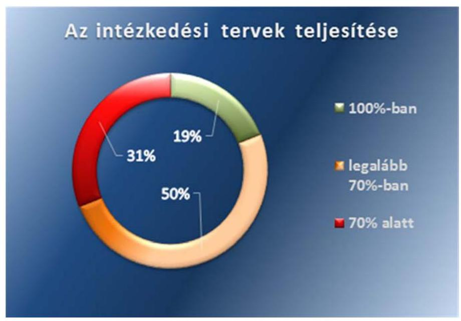

Fornás: Az utóellenőrzésről szóló ÁSZ jelentés mellékletei

# 1.2. számú értékelés Az önkormányzatok pénzügyi helyzetének alakulásában kedvező változások indultak el. 

A MŰKÖDÉSI JÖVEDELEM az utóellenőrzéssel érintett önkormányzatok körében - az ellenőrzött időszak költségvetési beszámolói szerint - a 2011. évi 13,3 milliárd Ft-ról 22,4 milliárd Ft-ra (68,4\%-kal) nőtt. Az önkormányzatok 35,5\%-ának (22 ellenőrzöttnek) azonban csökkent a működési jövedelme. Kedvező, hogy 12 önkormányzatnál a működési jövedelem mutató a csökkenés ellenére is pozitív maradt. Az önkormányzatok 16,1\%-ának (10 ellenőrzöttnek) sikerült elérnie, hogy a megtett intézkedések eredményeként a 2011. évi működési hiányukat megszüntetve a 2013. év végére a realizált bevételeik meghaladták a kiadásaikat. A működési jövedelem csökkenéssel érintett 22 önkormányzat közül csupán nyolc önkormányzat volt, amelynek működési bevételei 2011-ben még fedezték a kiadásait, azonban 2013 végére már működési hiányuk keletkezett. Mindössze három olyan önkormányzat volt, ahol a működési jövedelem az ellenőrzött időszak egésze alatt negatív volt, ebből két önkormányzatnál volt tapasztalható, hogy a negatív működési jövedelem tovább csökkent.

Az ellenőrzött önkormányzatok bevételeinek és kiadásainak alakulását a CLF módszer szerint, az éves beszámoló jelentések adatai alapján az V. számú melléklet mutatja be.

## A KIEGÉSZÍTŐ TÁMOGATÁSOK NÉLKÜLI MŰKÖDÉSI JÖVEDELEM növekedése kedvező elmozdulást okozott a költségvetési tartalékok növekedésében, továbbá a szállítói állomány csökkenésében. A korábbi ellenőrzés során az egyik legjelentősebb kockázatként azonosítottuk, hogy az önkormányzatok fizetőképessége nagymértékben függ az esetileg kapott - a működőképesség megtartását segítő,

---

egyedi elbírálású - kiegészítő költségvetési támogatásoktól. Kedvező változás, hogy az önkormányzatok kiegészítő támogatások nélküli összes működési jövedelme 81,6\%-kal nőtt, 10,3 milliárd Ft-ról 18,7 milliárd Ft-ra. Ez a működési költségvetésben az önkormányzatok önfenntartó képességének egyértelmű javulását jelzi.

A kiegészítő támogatások nélküli működési bevételek a 2011. évben még csak 40 önkormányzatnál, míg az ellenőrzött időszak végén már 49 önkormányzatnál fedezték a működési kiadásokat. Külön kiemelhető, hogy 15 olyan önkormányzat volt, ahol a mutatószám az időszak alatt negatívról pozitívra változott. További hét önkormányzatnál ugyan az időszak egésze alatt negatív maradt a mutató, de két ellenőrzöttnél a hiány mértéke csökkent. Az önkormányzatok 11,3\%-ánál (7 városnál) fordult elő, hogy a kiegészítő támogatások nélküli bevételek az ellenőrzött időszak egésze alatt nem fedezték a kiadásokat. Míg a működőképesség megőrzéséhez az ellenőrzött városi önkormányzatoknak 2011-ben 3,0 milliárd Ft-ot biztosított az állam, addig 2013-ban 3,7 milliárd Ft kiegészítő támogatás mellett alakultak ilyen kedvezően a mutatók. Az egyes működési jövedelem kategóriák összegeinek ellenőrzött időszakban bekövetkezett változását az 5. ábra mutatja be.
5. ábra
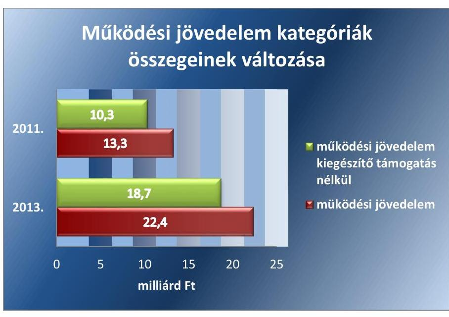

Forrás: Az ellenőrzött önkormányzatok 2011. és 2013. évi költségvetési beszámolói

A pénzügyi egyensúly javítása érdekében tett központi és önkormányzati intézkedések hatása többek között a szállítói, ezen belül a lejárt szállítói tartozások állományának csökkenésével mérhető. A szállítói tartozás az ellenőrzött időszakban a 2011. év végi 12,2 milliárd Ft-ról a 2013. év végére alig több mint egyharmadára, 4,4 milliárd Ft-ra csökkent.

A LEJÁRT SZÁLLÍTÓI TARTOZÁS csökkenése különösen kedvező. Míg 2011-ben a szállítói tartozások több mint fele (55\%-a) lejárt fizetési határidejű tartozás volt, 2013-ra ez az arány 29,5\%-ra csökkent. A 2011. év végén 6,6 milliárd Ft összegben kimutatott lejárt tartozás a 2013. év végére 1,3 milliárd Ft-ra csökkent. A változás 48 önkormányzat (az ellenőrzöttek 77,4\%-a) tartozásainak 5,6 milliárd Ft összegű csökkenéséből,

---

valamint mindössze 9 önkormányzat tartozásának 0,3 milliárd Ft-os növekedéséből adódott. A lejárt szállítói tartozások jelentős csökkenésének következtében számottevően csökkent az önkormányzatoknál a nemfizetési kockázat és a szállítói kitettség.

A lejárt szállítói tartozások állományán belül - a 2013. évi önkormányzati beszámolók szerint - a 30 nap alatti lejárt szállítói tartozása 36 önkormányzatnak volt, 0,7 milliárd Ft összegben. A 30-60 nap között lejárt tartozással rendelkező önkormányzatok száma 24 volt, a tartozás összege mindössze 0,1 milliárd Ft-ot tett ki. Eközben 21 önkormányzat 60 napon túli fizetési határidejű lejárt szállítói állománnyal is rendelkezett, ezek együttes összege 0,5 milliárd Ft volt. A 2013. év végi lejárt szállítói tartozásállomány lejárat szerinti összetételét a 6. ábra szemlélteti.
6. ábra
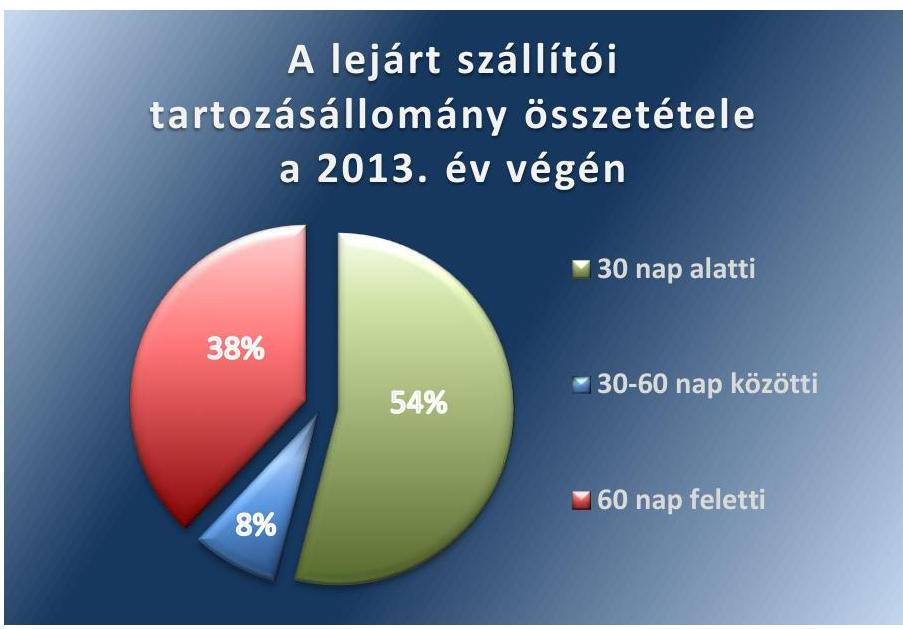

Forrás: Az ellenőrzött önkormányzatok 2013. évi költségvetési beszámolói
A KEZESSÉG ÉS A GARANCIAVÁLLALÁS állománya is kedvezően változott. Az ellenőrzött körben a 2011. év végén fennálló 10,4 milliárd Ft összegű feltételes kötelezettségvállalás állománya a 2013. év végére 1,9 milliárd Ft-tal (18,3\%-kal) csökkent. A fennálló 8,5 milliárd Ftból 7,6 milliárd Ft (89,4\%) három önkormányzat által vállalt kötelezettség, amely - a 2013. évi költségvetési beszámolók tanúsága szerint - az érintett önkormányzatok többségi tulajdonú gazdasági társaságainak múködéséhez kapcsolódó kötelezettségvállalás állományát tartalmazza. Az ellenőrzött időszak végén az önkormányzatok mindössze 19,4\%-ának, (12 ellenőrzöttnek) volt kezesség vagy garancia vállalása.

A PPP SZERZŐDÉSEK ÁLLOMÁNYA az ellenőrzött önkormányzati körben kormányzati intézkedés következtében a 2013. év végére megszűnt. A 2011. évben még fennálló 3,0 milliárd Ft összegű PPP szerződések miatti kötelezettségek megszűnése négy önkormányzatot érintett. A kötelezettségek állam általi átvállalásának szerepe volt az érintett négy önkormányzat múködési jövedelmének növekedésében és a lejárt szállítói állományának csökkenésében. A különböző jogcímen fennálló kötelezettségek összegének alakulását és összetételének változását a 7. ábra tartalmazza.

---

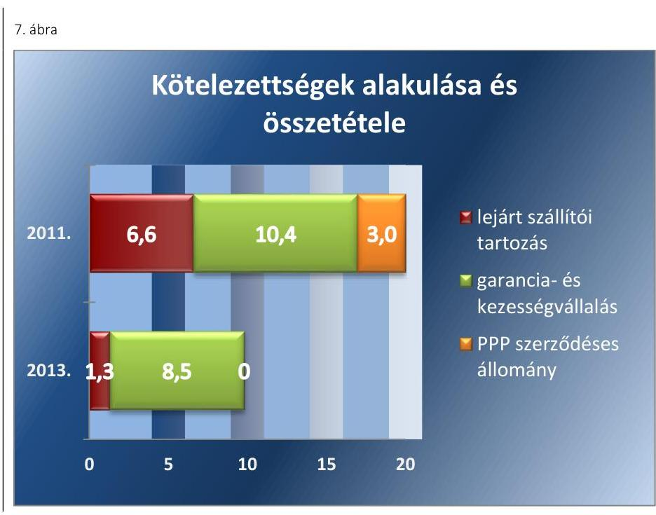

*Forrás: Az ellenőrzött önkormányzatok 2011. és 2013. évi költségvetési beszámolói*

# 1.3. számú értékelés

## Az ellenőrzéseink által kezdeményezett, önkormányzatok által végrehajtott feladatszervező és feladatfinanszírozási intézkedések az adósság újratermelődésének megakadályozását szolgálják.

Az önkormányzatok feladatszerkezetét érintő változások összegzett hatásaként – a 2013. évi zárszámadási törvényjavaslat indoklása szerint – egyaránt mintegy 20%-kal csökkentek az alrendszer működési bevételei és kiadásai. A folyó működési egyenleg pozitív előjelű (218,2 milliárd Ft) volt, amelynek alakulásában mind a központi intézkedések, mind pedig a helyi bevételszerző és kiadásmérséklő intézkedések hatása is megnyilvánult. Egyik legjelentősebb tényező a működésre fordítható állami hozzájárulások és támogatások változása, amely az egyes közszolgáltatások állami fenntartásba való kerülését követően is közel egyötödével biztosított több forrást az önkormányzatoknál maradó feladatokra, mint az előző évben.

### Az önkormányzatok saját hatáskörben tett intézkedései hozzájárultak a működési egyensúly kialakításához/fenntartásához. A működési kockázatok kezelésére az intézkedési tervekben előírt időszerű feladatok 74,4%-át teljes egészében, 9,6%-át pedig részben végrehajtották.

Bevételszerző és kiadáscsökkentő lehetőségek feltárására az önkormányzatok több mint háromnegyede (51) írt elő, átlagosan két intézkedést. A tervezett intézkedések főként a helyi adóhátralékok csökkentésére, a térítési és bérleti díjak felülvizsgálatára, az egyéb bevételszerzési lehetőségek feltárására irányultak. A kiadások csökkentése a működésben rejlő ésszerű takarékosság fokozott figyelemmel kísérését jelentette. A 93 db időszerűvé vált intézkedés 81,7%-át teljesen, 12,9%-át részben hajtották végre, a bevételszerző és kiadásmérséklő intézkedések ezáltal kedvező irányban befolyásolták a működési egyensúly megteremtésére irányuló törekvéseket.

---

7. táblázat

| INTÉZKEDÉSEK SZÁMOKBAN |  |
| :--: | :--: |
| intézkedést   megvalósító   önkormány-   zatok száma | Intézkedések   típusa |
| 51 | bevételszerző és kiadás-   csökkentő |
| 35 | reorganizációs program   feladat ellátás racionali-   zálása |
| 20 | önként vállalt feladatok   felülvizsgálata |
| 32 | gazdasági társaságok   felügyeletének erősítése |

A kedvezőtlen pénzügyi folyamatok megállítására, a pénzügyi helyzet gyors stabilizálására vonatkozó reorganizációs program készítését, illetve a pénzügyi helyzet javítása és hosszú távú megőrzése érdekében kibontakozási program készítését az önkormányzatok több mint fele (35) írta elő. Az időszerűvé vált intézkedések 52,8\%-át megvalósították, további 5,5\%-át pedig részben hajtották végre. A reorganizációs programok készítését és végrehajtását jelentősen befolyásolta a már folyamatban lévő adósságkonszolidáció előkészítése. Az önkormányzatok által megvalósított különböző intézkedés típusokat és az érintett önkormányzatok számát a 7. táblázat összegzi.

A feladatellátás intézményi szerkezetének felülvizsgálatát, racionalizálását az önkormányzatok negyede (20) látta szükségesnek. Az előírt, időszerűvé vált 24 db intézkedés háromnegyedét teljesen, 4,2\%-át részben hajtották végre. A feladatellátás szerkezetének felülvizsgálatát érintő feladattervi intézkedések megfogalmazására döntő hatást gyakorolt az egyes kiemelt közszolgáltatások állami fenntartásba vétele. Ennek az ismeretében az önkormányzatok szűkebb köre vállalta fel, hogy a megkezdett folyamatba helyi szervezési intézkedésekkel beavatkozzon.

A kötelező feladatellátás elsődlegességének biztosítása érdekében az önként vállalt feladatok finanszírozhatóságának áttekintését az önkormányzatok több mint fele (32) írta elő. Az intézkedések több mint háromnegyedét (76,5\%) teljesen, 8,8\%-át részben hajtották végre. A kötelező és önként vállalt feladatok körének felülvizsgálata elősegítette, hogy az önkormányzatok a jogszabályi előírások, a gazdaságossági szempontok és a fenntarthatósági érdekek együttes figyelembe vételével, alternatívák alapján döntsenek az általuk ellátott feladatok köréről. A felülvizsgálat hozzájárult ahhoz is, hogy rendszerbe foglalja azokat a fenntartási kötelezettségeket, amelyet az adósságkonszolidációt követően a múködtetés elsődlegessége tekintetében a központi szabályozás az önkormányzatoktól elvár.

A közszolgáltatások ellátására választott szervezeti keretek, ezen belül a gazdasági társaságok által hordozott kockázatok fontosságára az ÁSZ ellenőrzés irányította rá az önkormányzatok figyelmét. A gazdasági társasági keretek között történő feladatellátás esetében az önkormányzatok jelentős hányada a szervezeti formában rejlő magasabb szabadságfokot, a kevésbé szigorú pénzügyi és gazdálkodási fegyelmet, rugalmasabb adózási szabályokat előnyként értékelte. A tulajdonosi és közfeladat ellátási felelősség, az ahhoz párosuló gazdasági következmények, az esetleges helytállási kötelezettség felismerése általánosan nem volt jellemző. Az ellenőrzött önkormányzatok több mint fele (33) ezért fogalmazott meg intézkedési kötelezettséget a gazdasági társaságok tulajdonosi jogainak gyakorlása, pénzügyi helyzetének és a társaságok gazdálkodásában rejlő kockázatok bemutatása, intézkedési terv készítése tekintetében. Az előírt intézkedések 43,5\%-át teljes egészében, 26,1\%-át részben megvalósították. Ezzel a döntés előkészítés és tulajdonosi joggyakorlás testületi és személyi felelősségének érvényesítését egyaránt támogatták.

---

# 2. Az intézkedések következtében megteremtődtek-e az önkormányzatoknál a pénzügyi stabilitás feltételei? 

Összegző értékelés 2.1. számú értékelés

A végrehajtott intézkedések hatására javultak az önkormányzati alrendszer pénzügyi stabilitásának feltételei.

Az adósságkonszolidáció helyreállította az önkormányzatok múködési egyensúlyát.

Jelentős változások történtek az önkormányzati feladat ellátási és finanszírozási rendszerben. Az intézményhálózat fenntartásában 2013. január 1jétől több ágazatban nőtt az állami szerepvállalás. Az igazgatás területén létrejöttek a járási hivatalok, az iskolák szakmai feladatainak ellátása - ezzel együtt a finanszírozásának döntő hányada - az államhoz került. A szociális és gyermekvédelmi szakellátás területén csökkent az önkormányzatok kompetenciája, 2013-tól már csak az idősek és a hajléktalan személyek bentlakásos ellátásáról kellett gondoskodniuk. Az adósságkonszolidáció révén megteremtődtek a racionális, felelős, fenntartható közszolgáltatások kialakításának és ellátásának keretfeltételei. A pénzügyi egyensúly megteremtése és fenntartása, az adósságállomány újratermelődésének elkerülése - az állam elmúlt évekbeli hathatós beavatkozása ellenére - azonban továbbra is az önkormányzatok feladata.

## AZ ADÓSSÁGTERHEK ALÓL FELSZABADULÓ ÖNKORMÁNYZATOK - a 2013. évi zárszámadási törvényjavaslat általános indoklása szerint - a múködési bevételek és kiadások pozitív egyenlegének mintegy felét ( 105,3 milliárd Ft-ot) felhalmozási bevételeiket meghaladó felhalmozási kiadásaik fedezetére fordították. A fejlesztések forrásoldali átrendeződése a bevezetett korlátozó intézkedések, valamint a felelős, távlati hatásokkal számoló fejlesztési döntéseket szorgalmazó és számon kérő ÁSZ ellenőrzések hatására megkezdődött.

Az önkormányzati alrendszer hitelfelvételből és kötvénykibocsátásból származó bevételei az előző évi ténytől 37,9 milliárd Ft-tal, a hitel és kötvénytörlesztési kiadások pedig 91,6 milliárd Ft-tal maradtak el. Ennek oka a 2012-2013. években több ütemben végrehajtott adósságkonszolidáció, amelynek 2013. évi üteme 625,5 milliárd Ft volt. Az adósságkonszolidációból 2013-ban legnagyobb mértékben ( $38,1 \%$-kal, 237,9 milliárd Ft összeggel) a megyei jogú városok részesültek. Az egyéb városi kategóriába sorolt települések részesedése 227,9 milliárd Ft (36,5\%) volt, azaz a 2013-ban az e célra szánt állami források háromnegyedét az önkormányzati középszint pénzügyi helyzetének stabilizálására fordították. Az adósságkonszolidáció címén 1368,9 milliárd Ft adósság alól mentesült az önkormányzati alrendszer, amelynek 13\%-a törlesztési célú támogatással kifizetésre került, 87\%a pedig kormányzati adósságátvállalás volt. A konszolidáció 2056 önkormányzatot és 24 önkormányzati társulást érintett.

Az adósságkonszolidációval egyidejűleg az ellenőrzött önkormányzatok a múködési kockázatok kezelését követő második helyen a nemfizetési kockázatok csökkentése érdekében is tettek intézkedéseket. A különböző súlyú kockázatok kezelésében valamennyi ellenőrzött önkormányzat érin-

---

tett volt. Legmagasabb arányban (84,5\%-ban) a kötelezettségek finanszírozási forrásainak rendszeres bemutatására, 75\%-ban a folyószámla és likvid hitelek hosszú távú kötelezettséggé történő átalakítására, 58,1\%-ban az árfolyam és a törlesztési kockázatokra vonatkozó feladatokat részben vagy teljes körűen végrehajtották. Az egyensúlyi tartalék képzés kapcsán előírt feladatokat 54,9\%-ban legalább részben teljesítették.

Az önkormányzati alrendszer 2013. év végén fennálló adósságállományát és annak önkormányzat típusonkénti összetételét a 8. táblázat tartalmazza.
8. táblázat

# AZ ÖNKORMÁNYZATOK ADÓSSÁGÁLLOMÁNYA A 2013. ÉV VÉGÉN (millió Ft) 

| Megnevezés | Főváros | Fővárosi kerületek | Megyei jogú városok | Egyéb   városok | Nagyközségek | Községek | Megyei ön-   kormány-   zatok | Önkor-   mányzati   társulások | Helyi nemze-   tiségi önkor-   mányzatok | Összesen |
| :--: | :--: | :--: | :--: | :--: | :--: | :--: | :--: | :--: | :--: | :--: |
| Kötvény | 0 | 31305 | 41600 | 86601 | 3446 | 365 | 0 | 3461 | 0 | 166778 |
| Hitel, kölcsön | 100794 | 26161 | 85209 | 66012 | 1232 | 8798 | 0 | 3638 | 30 | 291874 |
| Egyéb kötelezettség | 0 | 652 | 165 | 115 | 5 | 22 | 0 | 3 | 0 | 962 |
| Összesen | 100794 | 58118 | 126974 | 152728 | 4683 | 9185 | 0 | 7102 | 30 | 459614 |

Forrás: 2013. évi zárszámadási törvényjavaslat, Általános indoklás, III. fejezet
Az önkormányzati adósságkeletkeztetés szabályozásának alapintézkedései - részben az ÁSZ jelzéseire is alapozottan - már 2012-ben érvénybe léptek. Az éves költségvetési törvény 2013-tól rögzíti az önkormányzati alrendszer adósságának lehetséges legmagasabb mértékét. Szigorítások történtek 2013 közepétől is, ekkortól vált engedélykötelessé az önkormányzati garancia és kezességvállalás. Több, kormányzati engedélyt nem igénylő ügyletre 2014. január 1-jétől előzetes adatszolgáltatási kötelezettséget vezettek be, 2015. január 1-jétől pedig az európai uniós forrásból támogatott fejlesztések önerejéhez felveendő hitel is engedélykötelessé válik.

AZ ÁLLAMNAK AZ ADÓSSÁG ÁTVÁLLALÁSA UTÁN IS KONTROLLT KELL TARTANIA az újabb hitelfelvételek és kötelezettségvállalások felett. A múködési költségvetés egyensúlyhiánya esetén ugyanis kellő pénzintézeti mértéktartás hiányában - alacsonyabb egyedi veszélyezettséggel ugyan, de - fennáll a veszélye az adósság újratermelődésének. A jelenlegi szabályozás szerint ugyanis múködési célra likvid hitel a Kormány előzetes hozzájárulása nélkül igénybe vehető. A Stabilitási tv. ${ }^{3}$ szerint likvid hitelnek a naptári éven belül lejáró (visszafizetésre is kerülő) hitel tekinthető. Ugyanakkor a pénzintézeti hitelezési gyakorlat ettől eltérő értelmezésű szerződéses konstrukció mellett lehetővé teszi a hitelforrás állandósulását, fenntartva ezzel az indokolatlan banki kitettség kockázatát.

---

### 2.2. számú értékelés

Az intézkedések hatására kontrolláltabbá vált az önkormányzatok fejlesztési tevékenységének, finanszírozásának, fenntarthatóságának előkészítése.

Az Mötv. ${ }^{4}$ előírása szerint a képviselő-testület hosszú távú fejlesztési elképzeléseit gazdasági programban, fejlesztési tervben rögzíti. Célja, hogy helyi szinten - a megyei területfejlesztési elképzelésekkel összhangban - meghatározza mindazokat a célkitűzéseket és feladatokat, amelyek a helyi önkormányzat lehetőségeivel összhangban, a helyi társadalmi, környezeti és gazdasági adottságok átfogó figyelembe vételével az önkormányzat által nyújtandó közszolgáltatások biztosítását, színvonalának javítását szolgálja. A gazdasági program, fejlesztési terv tartalmi követelménye törvényben megfogalmazott. Az önkormányzat fejlesztési támogatást csak a gazdasági programjában, fejlesztési tervében szereplő feladat megvalósítására kaphat, valamint kiemelt szempont a létrejövő fejlesztések jövőbeni fenntarthatósága is. A fejlesztések koordinálása a megyei önkormányzat újraépített területfejlesztési szerepére alapoz. A fejlesztések tervezésével, koordinációjával összefüggésben felmerülő elvárásokat, ezek kölcsönhatásait a 8. ábra szemlélteti.
8. ábra
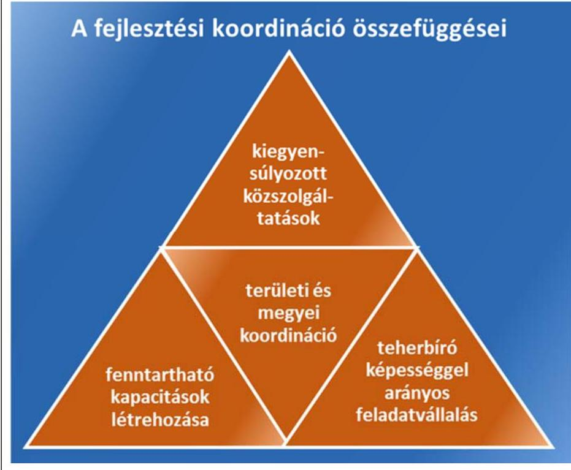

FELÉRTÉKELŐDÖTT A FEJLESZTÉSEK TERVEZÉSE. A fenntartható, műszaki, gazdaságossági, méretgazdaságossági szempontok által indokolt kapacitások érdekében az eddig meghozott fejlesztési döntések, érvényesített fejlesztési prioritások ellenére szükség van arra, hogy a működési bevételekben megjelenő feladatfinanszírozás elemeinek finomhangolása a kitűzött célokkal összhangban történjen. Az önkormányzatok fejlesztési tevékenységének rendszerszerű szabályozása mind a tervezés-előkészítés, mind pedig a finanszírozás feltételrendszere és korlátai vonatkozásában, a fenntarthatóság és az adósság újratermelődésének megakadályozását szolgálja. Ennek érdekében éven túli hiteleket

---

csak fejlesztésekhez vehetnek fel az önkormányzatok, s a kormány a döntésnél pedig figyelembe veszi, hogy önkormányzati, állami feladathoz kapcsolódó beruházásról vagy önként vállalt feladatról van-e szó. A szabályozási korrekció így teremti meg a feltételét annak, hogy az önkormányzati alrendszer adósságállománya hosszú távon is alacsony szinten maradjon. Hangsúlyos elvárás, hogy a fejlesztések tervezése az önkormányzat teherbíró képességével arányban állóan történjen. A felelős forrástervezés része a lakosság és a helyi gazdasági szereplők teherviselésének reális, arányos számbavétele is. A helyben képződő jövedelmek reális számbavétele a pénzügyi stabilitást szolgálja, amelynek révén a közfeladat ellátás színvonala, biztonsága kiegyensúlyozottabbá válhat.

Az ellenőrzött önkormányzatok a pénzügyi egyensúly helyreállítására szolgáló intézkedéseik között a felhalmozási kockázatokat kezelő javaslatok keretében kiemelten kezelték a folyamatban lévő és tervezett beruházások felülvizsgálatát. Ennek során a fejlesztések finanszírozhatósága, a források tervezése és ütemezése mellett a tervezett intézkedések között a fejlesztéssel létrejövő létesítmények jövőbeni fenntarthatósága is nagyobb figyelmet kapott. Ezt igazolja, hogy az önkormányzatok az erre irányuló intézkedések 76,3\%-át megvalósították. Az igények és a lehetőségek összehangolásához, a vállalt feladatok reális megvalósíthatóságához hozzájárult az önként vállalt feladatok áttekintése is, amelyet az intézkedések 85,3\%ában teljesítettek a helyzetük stabilizálására törekvő önkormányzatok.

A fejlesztések szabályozásának újragondolásánál fontos a felelős gazdálkodást elismerő és értékelő támogatási konstrukció érvényesítése, amely támogatja azokat az önkormányzatokat is, amelyek az elmúlt években adósságot nem halmoztak fel. Az adósságkonszolidációval nem érintett települések fejlesztéseit a 2013-2014. évi költségvetési törvényben e célra elkülönített előirányzatok (2014-ben 10 milliárd Ft összeggel) külön támogatták.

# 2.3. számú értékelés Az önkormányzatok pénzügyi kockázatainak elemzésénél és értékelésénél használt módszereink előkészítették az eredményszemléletű számvitelből nyerhető információk hasznosítását. 

Az Állami Számvevőszék küldetése szerint javaslataival, elemző és tanácsadó tevékenységével a közpénzek szabályos, gazdaságos, hatékony és eredményes felhasználását, használatát segíti elő.

Az ÁSZ a 2011-2013. években az önkormányzatok pénzügyi helyzetét a pénzforgalmi számvitelben rendelkezésre álló adatok alapján, a pénzintézeti gyakorlatban alkalmazott ún. CLF módszer segítségével értékelte. Az elemzési módszer ezáltal több tekintetben is előkészítette az eredményszemléletű számvitelben rejlő lehetőségek önkormányzati szinten való hasznosításának lehetőségét. Ráirányította a figyelmet a pénzforgalmi szemléletben való értékelés hiányosságaira, bemutatta az eredményszemléletű értékelési módszer előnyeit, az ellenőrzöttek körében előkészítette annak szélesebb szakmai körben való alkalmazási lehetőségét.

---

AZ EREDMÉNYSZEMLÉLETŰ SZÁMVITEL alkalmazásával ugyanis az önkormányzatoknál is javul az elszámoltathatóság, nő az átláthatóság, jobb minőségű, reálisabb információ áll rendelkezésre a gazdálkodási és szakpolitikai döntések előkészítéséhez. Mindez az önkormányzati alrendszer egészét tekintve a jogalkotó döntésein keresztül a jó kormányzás hatékonyságának fokozását támogatja. Az eredményszemléletű számvitel előnye, hogy megbízható, összehasonlítható információt nyújt a közfeladat ellátás erőforrás-szükségletének megítéléséhez. A tevékenység költségei között megjelenik az annak ellátását szolgáló immateriális javak és tárgyi eszközök értékcsökkenése, amely
$\longrightarrow$ egyrészt a valós gazdasági teljesítmény bemutatását teszi lehetővé, megbízhatóbb információt szolgáltat az erőforrás allokációval kapcsolatos döntésekhez,
$\longrightarrow$ továbbá megfelelő tájékoztatást nyújt a kormányzat részére az önkormányzati feladatellátáshoz a központi költségvetésből biztosított támogatások „reálértékének" megítéléséhez.
Az általános múködésre és ágazati feladatok ellátására folyósított támogatásokba ugyanis jelenleg nem épül be a jövőbeni eszközpótlások fedezete.

Az önkormányzati gazdálkodás és pénzügyi helyzet értékeléséhez, a fejlesztések komplex megközelítésű tervezéséhez egyaránt érdemi segítséget nyújt a 2014. január 1-jétől hatályba lépett Áhsz. ${ }^{5}$ előírásai szerint bevezetett eredményszemléletű számvitel. Az eredményszemléletű számvitel alkalmazásától elvárt kedvező - rendszerszintű - hatások összegzését a 9. ábra szemlélteti.
9. ábra
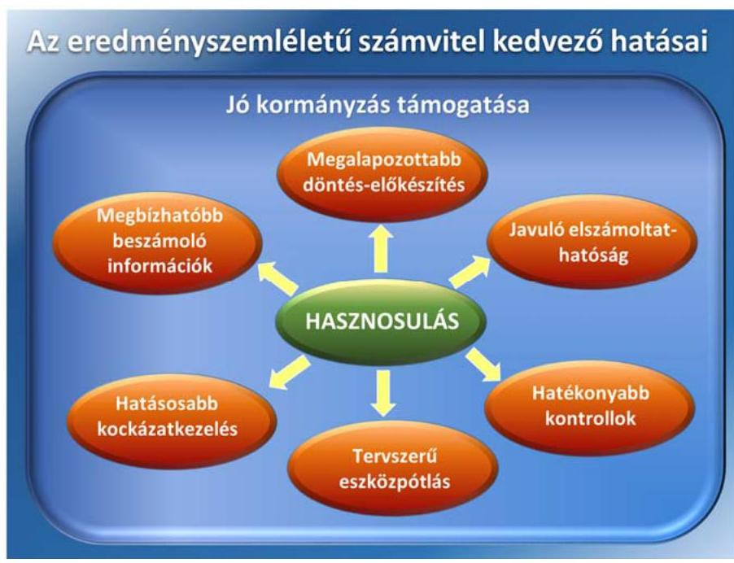

Az utóellenőrzés azt is tapasztalta, hogy az eszközállomány használhatósági fokának bemutatásával, az értékcsökkenés elszámolásával, az eszközpótlás elmaradásával, valamint a különböző számviteli elszámolásokkal kapcsolatos intézkedési tervben szereplő feladatok megvalósítási aránya az átlagos szintet meghaladó volt. Az eszközpótlással - elsősorban annak elmaradásával, felelős tervezésével - összefüggő feladatok 75\%-át, a

---

# 2.4. számú értékelés 

számviteli elszámolásokhoz köthető intézkedések 95,8\%-át hajtották végre az önkormányzatok. Ez utóbbiak is előkészítették az eredményszemléletű számvitelből nyerhető információk helyi gazdálkodói szinten való hasznosításának lehetőségét.

## Az ÁSZ kockázatelemzési rendszere támogatja az önkormányzati monitoring kialakítását, az önkormányzati gazdálkodásért való személyi felelősségi rendszer erősítését.

Az önkormányzati alrendszerben - az Mötv.-ben foglalt elvárásnak megfelelően - olyan egységes információs rendszer kialakítása a cél, amellyel az önkormányzatok gazdálkodásával kapcsolatos összes anomália lehetőség szerint előre jelezhető, illetve amely alapján megalapozott fejlesztési programok dolgozhatók ki. Olyan monitoring rendszer kialakítása az elvárás, amely túl azon, hogy folyamatos képet ad az önkormányzatok pénzügyi, jövedelmi és vagyoni helyzetéről, egységes, átlátható rendszerben teremt lehetőséget az adatszolgáltatásra. Emellett biztosítani szükséges, hogy a napi múködéssel kapcsolatos gazdálkodási adatok mellett az adott önkormányzat költségvetése, a különböző pályázati elszámolásai is figyelemmel kísérhetőek legyenek.

AZ ÁSZ-NÁL KIALAKÍTOTT ADATBÁZIS a kockázatelemzés keretein belül, az ellenőrzések helyszíneinek kiválasztásával, az ellenőrzés szervezési módszerek megújításával megalapozza az önkormányzati monitoring rendszer alapjait.

Az önkormányzati alrendszer monitorizálása keretében végzett kockázatelemzés a 2009. évtől rendelkezésre álló, beszámolókból nyert idősorok pénzügyi-gazdálkodási, vagyoni mutatóira, szervezeti tényezők alakulására és ellenőrzési megállapítások kockázati jelzéseire alapoz. A kockázatelemzési rendszer adatbázis tartalmát a VI. számú melléklet mutatja be.

Valamennyi önkormányzat (és központi költségvetési fejezet) vonatkozásában rendelkezésre áll a költségvetési szervek törzsadattára, a közfeladatokat ellátó gazdasági társaságok cégadattára, az éves költségvetés az éves/féléves elemi költségvetési beszámoló, az azokból előállított 78 adatot tartalmazó CLF tábla, az éves beszámolóból számított 22 különböző vagyoni helyzet alakulását jelző mutató, valamint az időközi (negyedéves) mérlegjelentés és éves gyorsjelentés. Az adatbázis idősorai lehetőséget adnak önkormányzat típusonként illetve népesség kategóriák szerinti elemzésre. Az ellenőrzési helyszínek kiválasztásánál a nyilvántartott adatok kiegészülnek a korábbi ellenőrzési előfordulást érintő adatokkal, valamint az ellenőrzést követő kockázatjelzésből kapott információkkal. A rendszer részét képezi a közérdekű bejelentések kockázatelemzési szempontú feldolgozása is. A kockázatelemzési adatbázis múködését, az önkormányzati gazdálkodás alappilléreihez való kapcsolatát a 10. ábra szemlélteti.

---

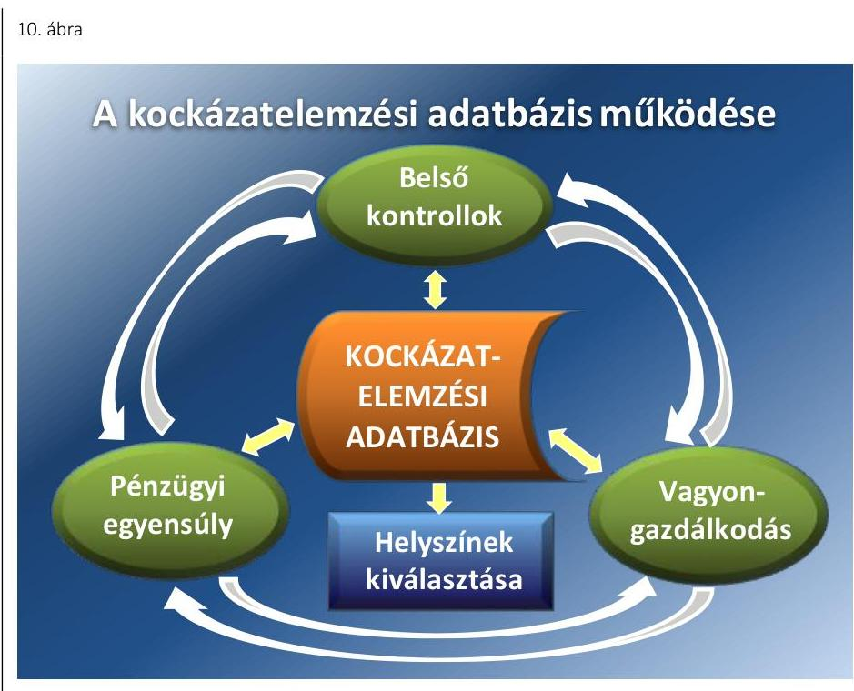

A kialakított adatbázis és nyilvántartás elért arra a szintre, amely a pénzügyi helyzet utóellenőrzésének szervezése során lehetővé tette a helyszíni jelenlét mellőzését, igazolja a rendszer aktuális ellenőrzési fókuszterületekhez való rugalmas alkalmazkodásának és távfelügyeleti jelleggel való működésének lehetőségét. A kialakított rendszer alkalmas az eredményszemléletű számviteli rendszer bevezetését követően megváltozó elem-zési-értékelési szempontok folyamatosságának biztosítására, valamint támogatja az „Independent audit" önkormányzati területen való bevezetésével összefüggő számvevőszéki feladatok megvalósítását is.

# A PREVENCIÓS MONITORING MŰKÖDTETÉSE, A TÖBB ÜTEMŰ ELLENŐRZÉSI BEAVATKOZÁS lehető- 

sége - az állandó számvevőszéki jelenlét hatására - támogatja az értékteremtő rend kialakulását, közvetlenebb kapcsolatot teremt a gazdálkodásért való személyes felelősség érvényesítéséhez, valamint hozzájárul az ÁSZ elemző és tanácsadó tevékenységének fejlesztéséhez is.

---

.

---

# MELLÉKLETEK 

- I. SZ. MELLÉKLET: ÉRTELMEZŐ SZÓTÁR
adósságkonszolidáció
adósságszolgálat
adósságszolgálat miatti kockázat
árfolyamkockázat
banki kitettség
bevételi kitettség

CLF módszer
eredményszemléletű számvitel
felhalmozási kockázat
garanciavállalás
használhatósági fok

Az adósságkonszolidációról szóló Korm. hat. ${ }^{6}$ kihirdetését követően több ütemben lezajlott központi intézkedések, amelyek a helyi önkormányzatok adósságállományának a magyar állam által történő átvállalása irányultak. Az adósságkonszolidációs csomag releváns rendelkezéseit a 2012-2014. évi központi költségvetésről szóló törvények tartalmazták.
Az adósság tőkerészének és az esedékes kamat együttes összegének törlesztése.
Annak kockázata, hogy az adós az adósság tőkerészének és az esedékes kamat együttes összegének határidőben történő törlesztését csak újabb hitel felvételével tudja teljesíteni.
Annak kockázata, hogy a külföldi devizában fennálló pénzügyi eszközök hazai fizetőeszközben kifejezett értéke az árfolyam elmozdulásával megváltozik.
Olyan függőségi viszony, ahol egy szervezet pénzügyi helyzete olyan külső körülmények hatására változhat, amely kizárólag a bank egyoldalú döntésén múlik.
Olyan függőségi viszony, ahol egy szervezet pénzügyi helyzetét meghatározó bevételek nagysága külső körülmények hatására azonnal és kedvezőtlen irányba változhat.
Az önkormányzatok költségvetése elemzésének módszere, amely a pénzügyi kapacitás (más néven a nettó múködési jövedelem) fogalmát helyezi a középpontba. A módszer következetesen elkülöníti a folyó és a felhalmozási költségvetés bevételeit és kiadásait, azok költségvetési egyenlegeit. Bizonyos mértékig a vállalati gazdálkodás logikai elemeit érvényesíti az önkormányzatok pénzügyi, jövedelmi helyzetének vizsgálata során.
Az Áhsz. alapján az eredményszemlélet a pénzügyi számvitel keretében érvényesül. A számviteli nyilvántartásokban a pénzügyi rendezéstől függetlenül a bevételek annak az időszaknak a teljesítményében jelennek meg, amikor azt az önkormányzat tevékenységével „megszolgálta", és az eredmény terhére az annak elérése érdekében felmerült költségek, ráfordítások számolhatók el. Az összemérés számviteli alapelv érvényesítése révén lehetővé válik a valós „gazdasági" teljesítmény megítélése, az egyes időszakok teljesítményének összehasonlítása.
Annak kockázata, hogy a folyamatban lévő felhalmozási feladatok finanszírozásához szükséges pénzügyi forrás nem fog rendelkezésre állni.
Olyan kötelezettségvállalás, ahol a garanciát vállaló valamely jövőbeni esemény bekövetkezésekor, a szerződésben meghatározott feltételek beálltakor a garancia kedvezményezettje számára meghatározott öszszegig, meghatározott időpontig, felszólításra azonnal fizet.
A tárgyi eszközállomány állagának elemzéséhez használt mutató, amely megmutatja, hogy a le nem írt (nettó) érték milyen hányadát képezi az aktiválási (bekerülési) értéknek. Számításakor a tárgyi eszköz

---

independent audit
jövőbeni kötelezettségek kifizethetőségének kockázata
kamatkockázat
kezességvállalás
kezességvállalás kockázata
készfizető kezesség
közfeladat
mérlegen kívüli tétel
mérlegen kívüli tétel kockázata
könyv szerinti nettó értékét viszonyítják a tárgyi eszköz bruttó (beszerzési/létesítési) értékéhez.
Az állami számviteli rendszer független ellenőrzésére vonatkozó követelmény, amelyet a Tanács 2011/85/EU irányelve a tagállamok költségvetési keretrendszerére vonatkozó követelményekről (2011. november 8.) szóló dokumentumában a kormányzati szektor valamennyi alszektorára - így többek közt a helyi önkormányzatokra - vonatkozóan is előír.
Annak kockázata, hogy a kötelezett jövőbeni kötelezettségeit nem tudja teljesíteni, mert nem rendelkezik szabad pénzeszköz tartalékkal, nem intézkedett annak érdekében, hogy bevételeit növelje, kiadásait csökkentse, a követelésállományból a kétes kintlévőségek nagysága számottevő, a fedezetként felhasználható ingatlanállomány forgalmi értéke csökkent és értékesítésének lehetősége piaci oldalról korlátozott.
Annak kockázata, hogy a változó kamatozású forint-, vagy a devizahitel futamideje alatt kedvezőtlen irányban változhat a hitel kamata. Szerződésben vállalt olyan kötelezettség, amelyben a kezes arra vállal kötelezettséget, hogy ha a szerződés kötelezettje nem teljesít, a kezes maga fog helyette teljesíteni a jogosultnak.
Annak kockázata, hogy a szerződés kötelezettje a szerződésben vállalt kötelezettségeit nem teljesíti a jogosultnak, azokért a kezes köteles helytállni. A kezes kötelezettsége nem válhat terhesebbé, mint amit a szerződés megkötésekor elvállalt. Nem köteles helytállni a kezes a kötelezettségért, amíg a teljesítés a kötelezettől vagy olyan kezesektől behajtható, akik őt megelőzően, reá tekintet nélkül vállaltak kezességet. A kezes, amennyiben teljesíteni köteles, mintegy az eredeti kötelezett helyébe lép, érvényesítheti azokat a kifogásokat, amelyeket a kötelezett érvényesíthet a jogosulttal szemben. Amennyiben teljesít, a kezességgel biztosított jogok (ideértve a kezességvállalást megelőzően keletkezett jogokat és a végrehajtási jogot is) átszállnak a kezesre.
Olyan kezességtípus, amelynél a szerződés kötelezettje nemfizetése esetén a hitelező közvetlenül a kezeshez fordulhat a hitel törlesztése érdekében.
Jogszabályban meghatározott állami vagy önkormányzati feladat, amit az arra kötelezett közérdekből, a jogszabályban meghatározott követelményeknek és feltételeknek megfelelve végez, ideértve a lakossági közszolgáltatásokkal való ellátását, továbbá az állam nemzetközi szerződésekben vállalt kötelezettségeiből adódó közérdekű feladatokkal, valamint e feladatok ellátásakor szükséges infrastruktúra biztosítását is. (Forrás: Vagyon tv. ${ }^{7}$ 3. § 7. pontja)
A mérlegen kívüli tétel olyan, szerződés alapján fennálló mérlegen kívüli [függő vagy biztos (jövőbeni)] kötelezettség, illetve követelés, amely pénzeszköz vagy egyéb eszköz átadására, illetve átvételére vonatkozik, a mérleg fordulónapján már fennáll, de mérlegtételkénti szerepeltetése egy jövőbeni esemény bekövetkezésétől vagy a szerződés teljesítésétől függ. (Forrás: Számv. tv. ${ }^{8}$ 3. § (7) bekezdés 16. pont)

Annak kockázata, hogy a mérlegben ki nem mutatható kötelezettségvállalásból fizetési kötelezettség keletkezik.

---

múködési kockázat
monitoring
monitoring rendszer
nemfizetési kockázat
nettó múködési jövedelem
novelláris módosítás
ÖNHIKI támogatás
önkormányzat folyó költségvetési egyenlege
önkormányzat többségi tulajdonában lévő gazdasági társaságok
önkormányzat gazdasági társasága miatti kockázatot jelentő tényezők

Annak kockázata, hogy nem megfelelő múködésből, emberi hibákból, rendszerhibákból vagy külső eseményekből adódik veszteség.
A monitoring a források felhasználásának (pénzügyi monitoring), az eredményeknek és a teljesítményeknek (szakmai monitoring) mindenre kiterjedő - többek között szabályossági, hatékonysági és célszerűségi - vizsgálata rendszeres jelleggel projekt, illetve program szinten.
A monitoring folyamatos adatgyűjtésen alapszik, amely alapján a menedzsment (irányítás) vizsgálhatja az adott tevékenység előrehaladását a kitűzött célok viszonylatában.
A monitoring rendszer a monitoring tevékenység folytatása céljából létrehozott intézmények, szervezetek, testületek és eszközök, eljárásrendek, valamint az ezek múködtetése érdekében foganatosított intézkedések összessége.
Annak kockázata, hogy a kötelezett fennálló kötelezettségét átmenetileg vagy véglegesen nem tudja határidőre megfizetni.
A nettó múködési jövedelem (pénzügyi kapacitás) a jövedelemtermelő képességet méri. Megmutatja a múködési bevételekből a múködési kiadások és a hitelek tőketörlesztésének kifizetése után fennmaradó jövedelmet.
A jogszabály átfogó, jelentős kiterjedésú módosítása.
Az önkormányzatok múködőképességét szolgáló, önhibájukon kívül hátrányos helyzetben levő települési önkormányzatok támogatása.
A folyó költségvetés egyenlege, azaz a múködési jövedelem megmutatja, hogy az önkormányzat éves folyó bevétele fedezetet biztosít-e a kötelező és önként vállalt feladatellátáshoz kapcsolódó éves folyó kiadására. A múködési jövedelem negatív értéke pénzügyileg fenntarthatatlan helyzetet jelez. A mutató pozitív értéke megtakarítást mutat, amely forrásul szolgálhat az önkormányzat fennálló kötelezettségei megfizetéséhez, valamint fejlesztéseihez.
Azok a gazdasági társaságok, amelyekben az önkormányzat a szavazatok több mint ötven százalékával vagy jogszabályban rögzített meghatározó befolyással rendelkezik. A befolyással rendelkező akkor rendelkezik egy jogi személyben meghatározó befolyással, ha annak tagja, illetve részvényese, és jogosult e jogi személy vezető tisztségviselői vagy felügyelő bizottsága tagjai többségének megválasztására, illetve visszahívására, vagy a jogi személy más tagjaival, illetve részvényeseivel kötött megállapodás alapján egyedül rendelkezik a szavazatok több mint ötven százalékával. A meghatározó befolyás akkor is fennáll, ha a befolyással rendelkező számára e jogosultságok közvetett módon (köztes vállalkozásain keresztül) biztosítottak.
Az önkormányzat gazdasági társaságának kedvezőtlen pénzügyi döntései következtében az önkormányzat pénzügyi egyensúlyi helyzetét veszélyeztető tényezők:
— az önkormányzat az önként vállalt és/vagy a kötelező feladatot ellátó társaságának a tevékenység ellátásához pénzeszközt ad át;
— az önkormányzat nem vizsgálja a feladatellátás választott szervezeti megoldásának hatékonyságát;

---

pénzügyi kockázat

PPP
szállítói kockázat
szállítói kitettség
a kötelező feladatellátást biztosító gazdasági társaság tevékenységének ágazati szabályozása változik (vízi közművagyon üzemeltetése);
a kizárólagos vagy többségi tulajdonú társaságok pénzügyi helyzete nem stabil, amely az alapítóra kötelezettségeket háríthat;
az önkormányzat a társaságok tevékenységét nem kísérte figyelemmel, nem élt az alapítói (irányítói) jogok gyakorlásával, a társaságok gazdálkodásának önkormányzati szintű konszolidálása nem biztosított;
az önkormányzat garanciát vagy kezességet vállal a gazdasági társaság kötelezettségeire;
a társaságoknak átadott pénzeszköz uniós elvárásoknak megfelelő kezelése.
A pénzügyi kockázat magában foglalja mindazon kockázatokat, amelyek a szervezet pénzügyi helyzetére hatással vannak. PI.: az adósságszolgálat miatti kockázatot, árfolyamkockázatot, felhalmozási kockázatot, fizetőképességi kockázatot, jövőbeni kötelezettségek kifizethetőségének kockázatát, kamatkockázatot, kezességvállalás kockázatát, likviditási kockázat, mérlegen kívüli tételek kockázata, nemfizetési kockázat, stb.
A köz- és a magánszféra együttműködésén alapuló fejlesztési konstrukció. Az állami és a magánszféra együttműködésének egyik formáját jelöli a PPP. A rövidítés a „köz- és magánszféra partnersége" angol nyelvű megfelelője. A PPP keretében a közcél a magánszféra jelentős mértékű közreműködésével valósul meg. Az állam (önkormányzat) a közszolgáltatások létrehozását a tradicionálisnál komplexebb módon bízza a magánszférára. Az együttműködés keretében megvalósuló közszolgáltatás hosszú távra szól.
Annak kockázata, hogy a kötelezett a szállítókkal szemben fennálló, már elismert kötelezettségét átmenetileg vagy véglegesen nem tudja határidőre teljesíteni.
Olyan függőségi viszony, ahol egy szervezet pénzügyi helyzete a szállítói tartozások rendezése érdekében foganatosított intézkedések hatására azonnal és kedvezőtlen irányba változhat.

---

II. SZ. MELLÉKLET: AZ UTÓELLENŐRZÉS MEGÁLLAPÍTÁSAI AZ ELLENŐRZÖTT ÖNKORMÁNYZATOK INTÉZKEDÉSI TERVEINEK VÉGREHAJTÁSÁRÓL
Az egyedi dokumentumok elérése: külön kötetben, illetve a www.asz.hu honlapon.

| Ssz. | Ellenőrzött önkormányzat neve | Az ÁSZ tv. 29. § (2) bekezdése szerinti észrevétel |
| :--: | :--: | :--: |
| II.1. | Abádszalók Város Önkormányzata | Észrevétel nem érkezett. |
| II.2. | Adony Város Önkormányzata | Észrevétel nem érkezett. |
| II.3. | Badacsonytomaj Város Önkormányzata | Észrevétel nem érkezett. |
| II.4. | Balatonalmádi Város Önkormányzata | Észrevétel nem érkezett. |
| II.5. | Balatonfűzfő Város Önkormányzata | Észrevétel nem érkezett. |
| II.6. | Balmazújváros Város Önkormányzata | Észrevétel nem érkezett. |
| II.7. | Bátaszék Város Önkormányzata | Észrevétel nem érkezett. |
| II.8. | Bátonyterenye Város Önkormányzata | A melléklet része az észrevétel és az ÁSZ arra adott válaszlevele. |
| II.9. | Berettyóújfalu Város Önkormányzata | Észrevétel nem érkezett. |
| II.10. | Budaörs Város Önkormányzata | A melléklet része az észrevétel és az ÁSZ arra adott válaszlevele. |
| II.11. | Cigánd Város Önkormányzata | Észrevétel nem érkezett. |
| II.12. | Csenger Város Önkormányzat | Észrevétel nem érkezett. |
| II.13. | Demecser Város Önkormányzata | Észrevétel nem érkezett. |
| II.14. | Devecser Város Önkormányzata | Észrevétel nem érkezett. |
| II.15. | Dunavecse Város Önkormányzata | Észrevétel nem érkezett. |
| II.16. | Fertőd Város Önkormányzata | A melléklet része az észrevétel és az ÁSZ arra adott válaszlevele. |
| II.17. | Fonyód Város Önkormányzata | Észrevétel nem érkezett. |
| II.18. | Göd Város Önkormányzata | Észrevétel nem érkezett. |
| II.19. | Gyomaendrőd Város Önkormányzata | Észrevétel nem érkezett. |
| II.20. | Harkány Város Önkormányzata | Észrevétel nem érkezett. |
| II.21. | Hatvan Város Önkormányzata | A melléklet része az észrevétel és az ÁSZ arra adott válaszlevele. |
| II.22. | Hévíz Város Önkormányzat | Észrevétel nem érkezett. |
| II.23. | Igal Város Önkormányzata | Észrevétel nem érkezett. |
| II.24. | Jászfényszaru Városi Önkormányzat | A melléklet része az észrevétel és az ÁSZ arra adott válaszlevele. |
| II.25. | Kaba Város Önkormányzata | Észrevétel nem érkezett. |
| II.26. | Kemecse Város Önkormányzata | Észrevétel nem érkezett. |
| II.27. | Kiskunmajsa Városi Önkormányzat | A melléklet része az észrevétel és az ÁSZ arra adott válaszlevele. |
| II.28. | Kisújszállás Város Önkormányzata | Az Önkormányzat nemleges észrevételt tett. |
| II.29. | Kisvárda Város Önkormányzata | A melléklet része az észrevétel és az ÁSZ arra adott válaszlevele. |
| II.30. | Komárom Város Önkormányzata | Az Önkormányzat nemleges észrevételt tett. |
| II.31. | Komló Város Önkormányzat | A melléklet része az észrevétel és az ÁSZ arra adott válaszlevele. |
| II.32. | Kunszentmiklós Város Önkormányzat | Észrevétel nem érkezett. |
| II.33. | Lengyeltóti Város Önkormányzata | Az Önkormányzat nemleges észrevételt tett. |
| II.34. | Máriapócs Város Önkormányzata | Észrevétel nem érkezett. |
| II.35. | Mezőberény Város Önkormányzata | A melléklet része az észrevétel és az ÁSZ arra adott válaszlevele. |
| II.36. | Mezőkövesd Város Önkormányzata | Az Önkormányzat nemleges észrevételt tett. |
| II.37. | Mezőtúr Város Önkormányzata | Az Önkormányzat nemleges észrevételt tett. |
| II.38. | Mohács Város Önkormányzata | Észrevétel nem érkezett. |
| II.39. | Mórahalom Városi Önkormányzat | Észrevétel nem érkezett. |
| II.40. | Nyergesújfalu Város Önkormányzata | Észrevétel nem érkezett. |
| II.41. | Polgárdi Város Önkormányzata | Észrevétel nem érkezett. |
| II.42. | Rakamaz Város Önkormányzata | Észrevétel nem érkezett. |
| II.43. | Sajószentpéter Városi Önkormányzat | A melléklet része az észrevétel és az ÁSZ arra adott válaszlevele. |
| II.44. | Sárospatak Város Önkormányzata | Észrevétel nem érkezett. |
| II.45. | Sárvár Város Önkormányzata | Észrevétel nem érkezett. |
| II.46. | Sásd Város Önkormányzata | Észrevétel nem érkezett. |
| II.47. | Siklós Város Önkormányzata | Észrevétel nem érkezett. |
| II.48. | Siófok Város Önkormányzata | Az Önkormányzat nemleges észrevételt tett. |
| II.49. | Szarvas Város Önkormányzata | Észrevétel nem érkezett. |
| II.50. | Százhalombatta Város Önkormányzata | A melléklet része az észrevétel és az ÁSZ arra adott válaszlevele. |

---

| Ssz. | Ellenőrzött önkormányzat neve | Az ÁSZ tv. 29. § (2) bekezdése szerinti észrevétel |
| :-- | :--: | :--: |
| II.51. | Szécsény Város Önkormányzata | Észrevétel nem érkezett. |
| II.52. | Szendrő Város Önkormányzata | Észrevétel nem érkezett. |
| II.53. | Szentgotthárd Város Önkormányzata | Észrevétel nem érkezett. |
| II.54. | Szikszó Város Önkormányzata | Észrevétel nem érkezett. |
| II.55. | Tamási Város Önkormányzata | A melléklet része az észrevétel és az ÁSZ arra adott válaszlevele. |
| II.56. | Tápiószele Város Önkormányzata | Észrevétel nem érkezett. |
| II.57. | Tiszafüred Város Önkormányzata | A melléklet része az észrevétel és az ÁSZ arra adott válaszlevele. |
| II.58. | Tiszakécske Város Önkormányzata | Észrevétel nem érkezett. |
| II.59. | Törökszentmiklós Városi Önkormányzat | A melléklet része az észrevétel és az ÁSZ arra adott válaszlevele. |
| II.60. | Velence Város Önkormányzata | A melléklet része az észrevétel és az ÁSZ arra adott válaszlevele. |
| II.61. | Veresegyház Város Önkormányzata | Észrevétel nem érkezett. |
| II.62. | Zamárdi Város Önkormányzata | Észrevétel nem érkezett. |

---

### III. SZ. MELLÉKLET: AZ UTÓELLENŐRZÉSBEN ÉRINTETT ÖNKORMÁNYZATOK INTÉZKEDÉSI TERVEIBEN ELŐÍRT FELADATOK TELJESÍTÉSÉNEK ÉRTÉKELÉSE

|  Megnevezés | Előírt feladatok összesen | Szabályoltá váló feladatok száma | Nem feltételei feladatok száma | Ás előzetűek vált feladatokból |  |  |  |  |   |
| --- | --- | --- | --- | --- | --- | --- | --- | --- | --- |
|   |  |  |  | tartalékban
fajadhatott | hatatlóan túl
fajadhatott | Vérően
vágathatott | Végíttek
fajadhatott | Nem
feltételei feladatok | Nem feltételei feladatok száma  |
|  Bevételek növelése, kiadások csökkentése, kintlévőségek behajtása | 95 | 1 | 1 | 68 | 8 | 12 | 94,6 | 5 | 5,4  |
|  Reorganizációs, illetve kibontakozási program készítése | 38 | 0 | 2 | 16 | 3 | 2 | 58,3 | 15 | 41,7  |
|  Intézmények működtetése, finanszírozása | 25 | 1 | 0 | 17 | 1 | 1 | 79,2 | 5 | 20,8  |
|  Önként vállalt feladatok finanszírozhatóságának felülvizsgálata | 34 | 0 | 0 | 17 | 9 | 3 | 85,3 | 5 | 14,7  |
|  MŰRÖDÉSI KOCKÁZATOKAT KEZELŐ INTÉZKEDÉSEK ÖSSZESEN: | 192 | 2 | 3 | 118 | 21 | 18 | 84,0 | 30 | 16,0  |
|  Folyószámla és egyéb likvid hitelek hosszú lejáratú kötelezettséggé történő átalakítása | 29 | 5 | 0 | 11 | 6 | 1 | 75,0 | 6 | 25,0  |
|  Kötelezettségük finanszírozási forrásainak rendszeres bemutatása | 61 | 0 | 3 | 22 | 3 | 24 | 84,5 | 9 | 15,5  |
|  A várható pénzügyi kockázatok és a visszafizetés forrásainak bemutatása a döntés előkészítés során | 67 | 0 | 24 | 18 | 1 | 6 | 58,1 | 18 | 41,9  |
|  Egyensúlyi (elkülönített) tartalék képzése | 57 | 3 | 3 | 26 | 2 | 0 | 54,9 | 23 | 45,1  |
|  Lejárt szállítói állomány, szállítói kitettség kezelése | 26 | 0 | 1 | 7 | 0 | 12 | 76,0 | 6 | 24,0  |
|  NEMFIZETÉSI KOCKÁZATOKAT KEZELŐ INTÉZKEDÉSEK ÖSSZESEN: | 240 | 8 | 31 | 84 | 12 | 43 | 69,2 | 62 | 30,8  |
|  A FELHALMOZÁSI KOCKÁZATOKAT KEZELŐ INTÉZKEDÉSEK (BERUHÁZÁSOK FELÜLVIZSGÁLATA) ÖSSZESEN: | 39 | 0 | 1 | 19 | 1 | 9 | 76,3 | 9 | 23,7  |
|  A gazdasági társaságok pénzügyi helyzetének rendszeres bemutatása | 28 | 0 | 0 | 13 | 2 | 7 | 78,6 | 6 | 21,4  |
|  Intézkedési terv készítése a gazdasági társaságok pénzügyi helyzetének stabilizálása érdekében | 18 | 0 | 0 | 4 | 1 | 5 | 55,6 | 8 | 44,4  |
|  GAZDASÁGI TÁRSASÁGOKKAL KAPCSOLATOS KOCKÁZATOKAT KEZELŐ INTÉZKEDÉSEK ÖSSZESEN: | 46 | 0 | 0 | 17 | 3 | 12 | 69,6 | 14 | 30,4  |
|  Értékcsökkenés, eszközpótlás, elhasználódási fok bemutása | 40 | 0 | 0 | 14 | 0 | 16 | 75,0 | 10 | 25,0  |
|  Számviteli hiányosságok megszüntetése | 29 | 2 | 3 | 21 | 1 | 1 | 95,8 | 1 | 4,2  |
|  Előző ÁSZ ellenőrzés nem hasznosult javaslatainak teljesítése | 19 | 1 | 0 | 10 | 0 | 4 | 77,8 | 4 | 22,2  |
|  Önkormányzati vagyon szabályszerű fedezetként való felhasználása | 9 | 0 | 0 | 6 | 2 | 0 | 66,7 | 3 | 33,3  |
|  Egyéb jogcímeéhez tartozó ÁSZ javaslatok hasznosítása | 51 | 3 | 3 | 28 | 4 | 7 | 86,7 | 6 | 13,3  |
|  EGYÉB ÁSZ JAVASLATOK HASZNOSÍTÁSÁRA ELŐÍRT INTÉZKEDÉSEK ÖSSZESEN: | 148 | 6 | 6 | 77 | 7 | 28 | 82,4 | 24 | 17,6  |
|  INTÉZKEDÉSEK MINDÖSSZESEN: | 13 | 16 | 41 | 315 | 44 | 110 | 77,1 | 139 | 22,9  |

Főmű: az utóellenőrsések alapján készült ÁSZ kimutatás

---

- IV. SZ. MELLÉKLET: AZ INTÉZKEDÉSI TERVEKBEN ELŐíRT, IDŐSZERÜVÉ VÁLT FELADATOK TELJESÍTÉSE ÖNKORMÁNYZATONKÉNT

| Megnevezés | Idószerúvé vált feladatok (darab) |  |  |  |  |  |  |
| :--: | :--: | :--: | :--: | :--: | :--: | :--: | :--: |
|  | ÖSSZESZEN: | Ebböl: |  | Ebböl: |  |  |  |
|  |  |  |  | A müködési kockázatok kezeléséhez kapcsolódó: |  | A nemfizetési kockázatok kezeléséhez kapcsolódó: |  |
|  |  | Legalább részben teljesített | Nem teljesített | Legalább részben teljesített | Nem teljesített | Legalább részben teljesített | Nem teljesített |
| Abádszalók | 7 | 5 | 2 | 3 | 0 | 0 | 1 |
| Badadonytomaj | 7 | 6 | 1 | 2 | 1 | 2 | 0 |
| Balmazújváros | 23 | 22 | 1 | 14 | 1 | 3 | 0 |
| Bátaszék | 8 | 7 | 1 | 2 | 0 | 3 | 1 |
| Bátonyterenye | 14 | 7 | 7 | 2 | 1 | 4 | 2 |
| Berettyóújfalu | 13 | 9 | 4 | 1 | 2 | 3 | 2 |
| Cigánd | 9 | 8 | 1 | 5 | 0 | 2 | 1 |
| Demecser | 22 | 22 | 0 | 13 | 0 | 4 | 0 |
| Devecser | 5 | 5 | 0 | 1 | 0 | 3 | 0 |
| Fertőd | 7 | 4 | 3 | 1 | 0 | 1 | 1 |
| Fonyód | 18 | 8 | 10 | 3 | 4 | 2 | 4 |
| Harkány | 16 | 10 | 6 | 3 | 1 | 3 | 3 |
| Igal | 10 | 10 | 0 | 4 | 0 | 2 | 0 |
| Kemecse | 12 | 5 | 7 | 2 | 2 | 0 | 3 |
| Kisújszállás | 7 | 7 | 0 | 4 | 0 | 1 | 0 |
| Kisvárda | 17 | 7 | 10 | 3 | 2 | 1 | 6 |
| Komló | 13 | 8 | 5 | 2 | 1 | 2 | 4 |
| Máriapócs | 11 | 10 | 1 | 4 | 0 | 3 | 1 |
| Mezőtúr | 13 | 13 | 0 | 4 | 0 | 4 | 0 |
| Rakamaz | 15 | 7 | 8 | 3 | 1 | 0 | 4 |
| Sajószentpéter | 13 | 12 | 1 | 2 | 1 | 6 | 0 |
| Sárospatak | 18 | 12 | 6 | 2 | 1 | 8 | 2 |
| Sásd | 7 | 7 | 0 | 1 | 0 | 5 | 0 |
| Szécsény | 7 | 4 | 3 | 2 | 0 | 2 | 2 |
| Szendrő | 11 | 7 | 4 | 4 | 1 | 2 | 0 |
| Szentgotthárd | 18 | 18 | 0 | 9 | 0 | 4 | 0 |
| Szikszó | 10 | 8 | 2 | 2 | 1 | 2 | 1 |
| Tamási | 16 | 7 | 9 | 3 | 2 | 1 | 4 |
| Tiszafüred | 10 | 7 | 3 | 4 | 0 | 1 | 2 |
| Velence | 15 | 14 | 1 | 3 | 0 | 2 | 1 |
| Veresegyház | 28 | 18 | 10 | 5 | 0 | 3 | 3 |
| Rövid távú intézkedést igénylő városok összesen: | 400 | 294 | 106 | 113 | 22 | 79 | 48 |

---

| Megnevezés | Idószerúvé vált feladatok (darab) |  |  |  |  |  |  |
| :--: | :--: | :--: | :--: | :--: | :--: | :--: | :--: |
|  | Összesen: | Ebböl: |  | Ebböl: |  |  |  |
|  |  |  |  | A müködési kockázatok kezeléséhez kapcsolódó: |  | A nemfizetési kockázatok kezeléséhez kapcsolódó: |  |
|  |  | Legalább részben teljesített | Nem teljesített | Legalább részben teljesített | Nem teljesített | Legalább részben teljesített | Nem teljesített |
| Balatonfüzfó | 12 | 10 | 2 | 3 | 0 | 2 | 2 |
| Csenger | 9 | 9 | 0 | 2 | 0 | 4 | 0 |
| Dunavecse | 4 | 3 | 1 | 2 | 1 | 1 | 0 |
| Hatvan | 8 | 7 | 1 | 3 | 0 | 2 | 0 |
| Kiskunmajsa | 6 | 4 | 2 | 2 | 1 | 2 | 1 |
| Kunszentmiklós | 9 | 3 | 6 | 1 | 2 | 1 | 3 |
| Lengyeltóti | 7 | 7 | 0 | 4 | 0 | 1 | 0 |
| Mórahalom | 12 | 10 | 2 | 1 | 0 | 3 | 0 |
| Mezökövesd | 7 | 7 | 0 | 1 | 0 | 4 | 0 |
| Polgárdi | 7 | 5 | 2 | 2 | 0 | 2 | 1 |
| Siklós | 15 | 12 | 3 | 6 | 1 | 3 | 1 |
| Szarvas | 10 | 10 | 0 | 4 | 0 | 4 | 0 |
| Tápiószele | 8 | 5 | 3 | 1 | 1 | 1 | 1 |
| Törökszentmiklós | 8 | 6 | 2 | 1 | 0 | 2 | 1 |
| Középtávú intézkedést igénylő városok összesen: | 122 | 98 | 24 | 33 | 6 | 32 | 10 |
| Balatonalmádi | 4 | 4 | 0 | 1 | 0 | 2 | 0 |
| Budaörs | 8 | 7 | 1 | 1 | 0 | 4 | 0 |
| Göd | 13 | 13 | 0 | 3 | 0 | 3 | 0 |
| Gyomaendröd | 4 | 4 | 0 | 0 | 0 | 1 | 0 |
| Hévíz | 2 | 2 | 0 | 1 | 0 | 0 | 0 |
| Jászfényszaru | 7 | 7 | 0 | 3 | 0 | 2 | 0 |
| Kaba | 1 | 1 | 0 | 0 | 0 | 1 | 0 |
| Komárom | 5 | 5 | 0 | 0 | 0 | 3 | 0 |
| Mezöberény | 6 | 4 | 2 | 0 | 1 | 2 | 0 |
| Mohács | 3 | 3 | 0 | 0 | 0 | 1 | 0 |
| Nyergesújfalu | 4 | 4 | 0 | 0 | 0 | 1 | 0 |
| Sárvár | 7 | 3 | 4 | 0 | 0 | 1 | 3 |
| Siófok | 4 | 4 | 0 | 0 | 0 | 2 | 0 |
| Százhalombatta | 3 | 3 | 0 | 0 | 0 | 1 | 0 |
| Tiszakécske | 1 | 1 | 0 | 0 | 0 | 1 | 0 |
| Zamárdi | 6 | 6 | 0 | 0 | 0 | 2 | 0 |
| Hosszú távú intézkedést igénylő városok összesen: | 78 | 71 | 7 | 9 | 1 | 27 | 3 |
| 62 ellenőrzött város összesen: | 600 | 463 | 137 | 155 | 29 | 138 | 61 |

Forrás: az utóellenőrzések alapján készült ÁSZ kimutatás

---

V. SZ. MELLÉKLET: A 62 ELLENŐRZÖTT ÖNKORMÁNYZAT BEVÉTELEI ÉS KIADÁSAI, VALAMINT ADÓSSÁGSZOLGÁLATA A 2011. ÉS A 2013. ÉVEKBEN, CLF MÓDSZER SZERINT, AZ ÉVES BESZÁMOLÓK ALAPJÁN

|   |  | millió Ft  |
| --- | --- | --- |
|  Megnevezés | 2011. | 2013.  |
|  1. FOLYÓ KÖLTSÉGVETÉS* |  |   |
|  1.1.1. Saját müködési bevételek | 58056,1 | 66810,2  |
|  1.1.2. Költségvetési támogatások ÖNHIKI támogatások nélkül | 52613,2 | 42010,1  |
|  1.1.3. Átengedett bevételek | 18371,2 | 1722,0  |
|  1.1.4. Államháztartáson belülről kapott támogatások | 28345,3 | 18867,0  |
|  1.1.5. EU-tól és külföldről kapott bevételek | 343,6 | 256,5  |
|  1.1.6. Államháztartáson kívülről kapott bevételek | 506,0 | 219,3  |
|  1.1.7. Hozam- és kamatbevételek | 1549,0 | 1142,7  |
|  1.1.8. Kölcsönök visszatérülése, igénybevétele | 751,4 | 580,4  |
|  1.1.9. Előző évi pénzmaradvány átvétel | 1493,9 | 0,0  |
|  1.1.10. A müködőképesség megőrzését szolgáló kiegészítő támogatások (ÖNHIKI) | 3006,6 | 3660,8  |
|  1.1. Folyó bevételek =1.1.1.+1.1.2.+1.1.3.+1.1.4.+1.1.5.+1.1.6.+1.1.7.+1.1.8.+1.1.9.+1.1.10. | 165036,1 | 135268,9  |
|  1.2.1. Müködési kiadások kamatkiadások nélkül | 127118,6 | 85391,1  |
|  1.2.2. Államháztartáson belülre átadott pénzeszközök | 3849,5 | 10308,9  |
|  1.2.3. Transzferkiadások | 17484,4 | 15688,4  |
|  1.2.4. Kamatkiadások | 1380,0 | 717,3  |
|  1.2.5. Kölcsönök nyújtása, törlesztése | 601,4 | 754,5  |
|  1.2.6. Előző évi pénzmaradvány átadás | 1263,1 | 0,0  |
|  1.2. Folyó kiadások = 1.2.1.+1.2.2.+1.2.3.+1.2.4.+1.2.5.+1.2.6. | 151697,1 | 112860,2  |
|  1.3. Folyó költségvetés egyenlege, müködési jövedelem (1.1. - 1.2.) | 13339,0 | 22408,7  |
|  2. FELHALMOZÁSI KÖLTSÉGVETÉS** |  |   |
|  2.1.1. Saját tőkebevételek | 13067,4 | 8136,9  |
|  2.1.2. Költségvetési támogatások | 0,0 | 8232,2  |
|  2.1.3. Államháztartáson belülről kapott támogatások | 29882,0 | 18762,9  |
|  2.1.4. EU-tól és külföldről kapott támogatások | 2231,0 | 1120,5  |
|  2.1.5. Államháztartáson kívülről kapott bevételek | 2379,2 | 3188,6  |
|  2.1.6. Hozam- és kamatbevételek | 1296,4 | 694,7  |
|  2.1.7. Kölcsönök visszatérülése, igénybevétele | 515,7 | 708,6  |
|  2.1.8. Előző évi pénzmaradvány átvétel | 42,9 | 0,0  |
|  2.1. Felhalmozási bevételek =2.1.1.+2.1.2.+2.1.3.+2.1.4.+2.1.5.+2.1.6.+2.1.7.+2.1.8. | 49414,3 | 40844,5  |
|  2.2.1. Saját beruházási kiadás áfával | 47596,9 | 29601,6  |
|  2.2.2. Saját felújítási kiadás áfával | 7899,2 | 7546,0  |
|  2.2.3. Államháztartáson belülre átadott pénzeszközök | 897,0 | 370,9  |
|  2.2.4. EU-nak és külföldnek adott pénzeszközök | 0,3 | 28,1  |
|  2.2.5. Államháztartáson kívülre adott pénzeszközök | 1883,2 | 3357,0  |
|  2.2.6. Befektetési célú részesedések vásárlása | 2677,6 | 786,8  |
|  2.2.7. Kamatkiadások | 2211,3 | 1176,2  |
|  2.2.8. Kölcsönök nyújtása, törlesztése | 778,4 | 1493,5  |
|  2.2.9. Előző évi pénzmaradvány átadás | 31,5 | 0,0  |
|  2.2.10. ÁFA befizetések | 4697,3 | 2847,8  |
|  2.2. Felhalmozási kiadások = 2.2.1.+2.2.2.+2.2.3.+2.2.4.+2.2.5.+2.2.6.+2.2.7.+2.2.8.+2.2.9.+2.2.10. | 68672,8 | 47207,9  |
|  2.3. Felhalmozási költségvetés egyenlege (2.1. - 2.2.) | $-19258,3$ | $-6363,4$  |
|  3. FINANSZÍROZÁSI MÜVELETEK NÉLKÜLI (GFS) POZÍCIO (1.3.+2.3.) | $-5919,3$ | 16045,2  |
|  4. FINANSZÍROZÁSI MÜVELETEK |  |   |
|  4.1. Hitelfelvétel | 12462,4 | 8871,8  |
|  4.2. Hitelförlesztés | 11067,7 | 14193,7  |
|  4.3. Forgatási és befektetési célú értékpapírok kibocsátása | 718,3 | 0,0  |
|  4.4. Forgatási és befektetési célú értékpapírok beváltása | 2035,0 | 5941,8  |
|  4.5. Forgatási és befektetési célú értékpapírok értékesítése | 2633,6 | 5358,4  |
|  4.6. Forgatási és befektetési célú értékpapírok vásárlása | 1907,8 | 6571,6  |
|  4.7. Egyéb finanszírozási bevételek (függő, átfutó, kiegyenlítői) | $-1058,0$ | $-704,1$  |
|  4.8. Egyéb finanszírozási kiadások (függő, átfutó, kiegyenlítői) | $-801,2$ | 170,0  |
|  4.9. Finanszírozási müveletek egyenlege (4.1.-4.2.+4.3.-4.4.+4.5.-4.6.+4.7.-4.8.) | 547,0 | $-13351,0$  |
|  5. TÁRGYÉVI PÉNZÜGYI POZÍCIO (1.3.+ 2.3.+4.9.) | $-5372,3$ | 2694,2  |
|  6. NETTÓ MÜKÖDÉSI JÖVEDELEM = müködési jövedelem (1.3.) - tőketörlesztés (4.2.+4.4.) | 236,2 | 2273,2  |

- A költségvetési szerveknél a számviteli szabályoknak megfelelően a bevételekben nem térül, a kiadásokban nem jelenik meg az amortizáció, a vagyoni helyzetet az egyenleg befolyásolja. ** Bevételekben vagyonmegőrzésre és -bővítésre fordítható források.

---

| Adatállomány megnevezése | Előállítható információ | Időszak |
| :--: | :--: | :--: |
| Önkormányzatok bevételeinek és kiadásainak CLF módszer szerinti kimutatása | A táblázatok összeállíthatók önkormányzatonként, évenkénti részletezésben, a pénzügyi ellenőrzéseknél használt sablon szerinti adattartalom | 2009-2012 évek   (a 2013. évi folyamatban) |
| Önkormányzati és központi költségvetési és beszámoló adatok, alapok és nemzetiségi önkormányzatok éves, féléves beszámolói, gyorsjelentés, időközi mérlegjelentés, PM infó | Az adatbázisból informatikai támogatással az ellenőrzési tevékenység bármely szakaszához hozzárendelhető feladattal | 1995-2003 között részleges, 2003-tól teljes körü, a beszámolásra elöirt gyakorisággal |
| Mérlegből számítható 22 db mutató | eszközgazdálkodási (7db)   likviditási és pénzügyi ( 9 db )   bevételi, kiadási, felhalmozási (6 db) | 2009-2012 évekre, önkormányzati részletezettségben |
|  | Költségvetési szervek aktuális MÁK, és egyéb ellenőrzött szervezetek adattára | havi frissitéssel |
| Kockázatelemző osztály ellenőrzési helyszínek kiválasztását támogató egyedi nyilvántartásai | önkormányzati tulajdonú gazdasági társaságok tevékenységi köre, cégtár és mérlegadatai | ellenőrzési helyszín kiválasztáshoz, igény szerint |
|  | Állami tulajdonú gazdasági társaságok tevékenységi köre, cégtár és mérlegadatai |  |
|  | ESA szervezetek nyilvántartása |  |
|  | ÁSZ ellenőrzésekkel érintett szervezetek nyilvántartása (megállapítások, feltárt kockázatok) |  |
|  | ÁSZ jelentések megállapításainak nyilvántartása (megállapítások, feltárt kockázatok) |  |
|  | Közérdekú bejelentések által feltárt és beazonosított kockázatok nyilvántartása |  |

---

.

---

# RÖVIDÍTÉSEK JEGYZÉKE 

${ }^{1}$ ÁSZ tv.
${ }^{2}$ Áht.
${ }^{3}$ Stabilitási tv.
${ }^{4}$ Mötv.
${ }^{5}$ Áhsz.
${ }^{6}$ Adósságkonszolidációról szóló Korm.hat
${ }^{7}$ Vagyon tv.
${ }^{8}$ Számv. tv.
2011. évi LXVI. törvény az Állami Számvevőszékről, hatályos 2011. július 1-jétől 2011. évi CXCV. törvény az államháztartásról
2011. évi CXCIV. törvény Magyarország gazdasági stabilitásáról
2011. évi CLXXXIX. törvény Magyarország helyi önkormányzatairól
4/2013. (I. 11.) Korm. rendelet az államháztartás számviteléről
1540/2012. (XII.4.) Korm. határozata a helyi önkormányzatok adósságállományának részleges konszolidációjáról
2011. évi CXCVI. törvény a nemzeti vagyonról
2000. évi C. törvény a számvitelről

---

.

---

# ÁLLAMI SZÁMVEVŐSZÉK 

1052 Budapest, Apáczai Csere János utca 10.
Levélcím: 1364 Budapest 4. Pf. 54
Telefon: +36 14849100 Telefax: +36 14849200
www.asz.hu