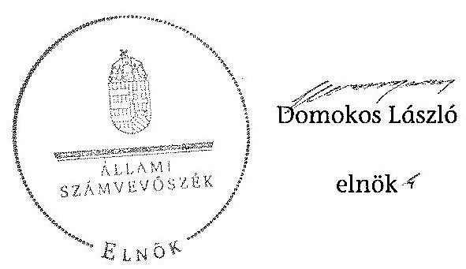

# ÁLLAMI   SZÁMVEVŐSZÉK 

## JELENTÉS

a helyi nemzetiségi önkormányzatok gazdálkodásának ellenőrzéséről
Lepsényi Roma Nemzetiségi Önkormányzat

---

# Állami Számvevőszék 

Iktatószám: V-0569-065/2014.
Témaszám: 1603
Vizsgálat-azonosító szám: V067609

## Az ellenőrzést felügyelte:

## Brebán Andrea

felügyeleti vezető
Az ellenőrzést vezette és az ellenőrzés végrehajtásáért felelős:
Solymár Ágnes
ellenőrzésvezető

## A számvevőszéki jelentést készítették:

## Solymár Ágnes

ellenőrzésvezető

## Az ellenőrzést végezték:

## Bertalan Rudolf

számvevő

## Koczor László

számvevő tanácsos

## Koczor László

számvevő tanácsos

---

# TARTALOMJEGYZÉK 

BEVEZETÉS ..... 3
I. ÖSSZEGZŐ MEGÁLLAPÍTÁSOK, KÖVETKEZTETÉSEK, JAVASLATOK ..... 6
II. RÉSZLETES MEGÁLLAPÍTÁSOK ..... 13

1. A Nemzetiségi Önkormányzat és a Települési Önkormányzat együttműködésének szabályozása, a működési feltételek biztosítása ..... 13
2. A gazdálkodási feladatok ellátásának szabályozerúsége ..... 14
2.1. A költségvetésre és zárszámadásra, valamint a kincstári adatszolgáltatás rendjére vonatkozó jogszabályi előírások betartása ..... 14
2.2. A Nemzetiségi Önkormányzat gazdálkodásának szabályozottsága ..... 16
2.3. Az operatív gazdálkodási jogkörök kialakítása, gyakorlása ..... 17
3. A Nemzetiségi Önkormányzattal összefüggő gazdálkodási feladatok belső ellenőrzése ..... 19

## MELLÉKLET

1. számú A Nemzetiségi Önkormányzat 2013. évi gazdálkodásának főbb adatai

## FÜGGELÉKEK

1. számú Rövidítések jegyzéke
2. számú Fogalomtár

---

.

---

# JELENTÉS 

## A helyi nemzetiségi önkormányzatok gazdálkodásának ellenőrzéséről Lepsényi Roma Nemzetiségi Önkormányzat

## BEVEZETÉS

A Nemzetiségi Önkormányzat a 2002. évben alakult, elnöke 2011. június 27. óta látja el feladatát. A Nemzetiségi Önkormányzat intézményt, gazdasági társaságot és más szervezetet nem alapított, illetve társulásban nem vett részt. A háromtagú Képviselő-testület a munkája segítésére bizottságot nem hozott létre. A Nemzetiségi Önkormányzat költségvetési beszámolója szerint a 2013. évben a módosított költségvetési bevételi és kiadási előirányzat 377,0 ezer Ft, a teljesített költségvetési bevétel 377,0 ezer Ft, a teljesített költségvetési kiadás 348,0 ezer Ft volt. A Nemzetiségi Önkormányzat a 2013. évben feladatalapú támogatásban részesült. A 2013. évi gazdálkodási adatokat részletesen az 1. számú mellékletben mutatjuk be.

Az Alaptörvény Szabadság és felelősség rész XXIX. cikk (1) bekezdése szerint a Magyarországon élő nemzetiségek államalkotó tényezők. Minden, valamely nemzetiséghez tartozó magyar állampolgárnak joga van önazonossága szabad vállalásához és megőrzéséhez. A hazánkban élő nemzetiségek helyi (települési és területi) valamint országos önkormányzatokat hozhatnak létre ${ }^{1}$. A helyi nemzetiségi önkormányzatok gazdálkodási feladatait jogszabályi előírás alapján a székhely szerinti helyi önkormányzat polgármesteri hivatala látja el.

A nemzetiségek helyzete, támogatása mind hazai, mind EU-s szinten kiemelt figyelmet kap napjainkban. A helyi nemzetiségi önkormányzatok gazdálkodására és támogatási rendszerére vonatkozó jogszabályok a 2010-2012. években jelentős változásokon mentek át. A helyi nemzetiségi önkormányzatok gazdálkodásának, a részükre juttatott költségvetési támogatások felhasználásának ellenőrzését az ÁSZ 2012-ben sorozatjellegú ellenőrzés keretében indította el. A 2014. évi ellenőrzések az önkormányzati ellenőrzésekre ráépülő (egyablakos) ellenőrzésként valósulnak meg.

Az ellenőrzés célja annak értékelése volt, hogy a helyi nemzetiségi önkormányzat gazdálkodási kereteinek kialakítása, gazdálkodása megfelelt-e a jogszabályoknak.

[^0]
[^0]:    ${ }^{1}$ A 2010. évben megtartott nemzetiségi önkormányzati választásokat követően 2304 települési, 58 területi és 13 országos nemzetiségi önkormányzat alakult meg

---

Ennek keretében értékeltük, hogy:

- a helyi nemzetiségi önkormányzat és a helyi (települési) önkormányzat együttműködésének szabályozása, a működési feltételek biztosítása megfelel-e a jogszabályi előírásoknak;
- a felek együttműködése megfelel-e a megállapodásban foglaltaknak a gazdálkodási feladatok szabályszerű ellátása során, betartották-e vonatkozó jogszabályi előírásokat;
- biztosított volt-e a helyi nemzetiségi önkormányzat gazdálkodásának belső ellenőrzése.

Az ellenőrzés várható hasznosulása: a nemzetiségi önkormányzatok testületi döntéseinek tapasztalatait összegezve következtetés vonható le a törvényalkotás számára a jogszabályi környezet esetleges módosításának indokoltságára vonatkozóan. Az ellenőrzés az ellenőrzött számára visszajelzést ad a rendezett gazdálkodási keretek kialakításáról, a múködésbeli hiányosságokról. Az ellenőrzés megállapításai és javaslatai, a jó gyakorlat bemutatása tanulságul szolgálhatnak más nemzetiségi önkormányzatok, szervezetek számára a rendezett gazdálkodási keretek kialakításához. A társadalom számára jelzi, hogy közpénz nem maradhat ellenőrizetlenül. Az ÁSZ értékteremtő rend kialakításához és megőrzéséhez hozzájáruló tevékenysége pozitív hatással lesz a szervezetről kialakított összkép formálásában. Az ÁSZ szervezetén belül lehetőség nyílik arra, hogy a megállapítások szintetizálásával az intézmény a hozzáadott értéket teremtő elemző tevékenységét és tanácsadó szerepét erősítse.

A helyi nemzetiségi önkormányzat gazdálkodásának ellenőrzéséről szóló jelentés I. fejezetének összegző része az ellenőrzés céljára adott rövid, szintetizáló összefoglalót és következtetéseket tartalmazza a II. fejezet részletes megállapításain alapulóan. A jelentés intézkedést igénylő megállapításait és javaslatait az összegzőben foglaltak mellett - az ellenőrzés során feltárt, a jelentés II. fejezetében rögzített részletes megállapítások alapozzák meg, illetve támasztják alá.

Az ellenőrzés típusa: szabályszerűségi ellenőrzés.
Az ellenőrzött időszak: a Nemzetiségi Önkormányzat és a Települési Önkormányzat együttműködésének, valamint a Nemzetiségi Önkormányzat gazdálkodásának szabályozása megfelelőségét a 2013. évre vonatkozóan (a 2013. december 31-i állapotnak megfelelően), a Nemzetiségi Önkormányzat gazdálkodásának szabályszerűségét, a múködési feltételek, valamint a belső ellenőrzés biztosítását a 2013. január 1. - december 31-e közötti időszakot figyelembe véve értékeltük.

Ellenőrzött szervezet: a Lepsényi Roma Nemzetiségi Önkormányzat és a gazdálkodási feladatait ellátó Lepsényi Polgármesteri Hivatal.

Az ellenőrzés szakmai módszertana az ÁSZ hivatalos honlapján (www.asz.hu) közzétett szakmai szabályokon alapult, amely a Legfőbb Ellenőrző Intézmények Nemzetközi Szervezete (INTOSAI) által kiadott nemzetközi standardok (ISSAI) figyelembevételével készült.

---

A gazdálkodási jogkörök gyakorlásának szabályszerű múködését a dologi kiadásokkal és a személyi juttatásokkal kapcsolatos kifizetésekre vonatkozóan ellenőriztük, értékeltük. A jogszabályoknak és a belső előírásoknak megfelelőnek, azaz szabályszerűnek minősítettük az adott területet, ha az értékelés összesített eredménye nagyobb volt, mint $90 \%$, részben megfelelőnek, ha 71 és $90 \%$ közé esett, és nem megfelelőnek, ha $70 \%$ vagy annál kisebb volt.

Az ellenőrzés végrehajtásának jogszabályi alapját az ÁSZ tv. 5. § (2)-(3) és (6) bekezdéseiben foglaltak képezik.

Az ÁSZ tv. 29. § (1) bekezdése szerint a jelentéstervezetet megküldtük egyeztetésre a jegyzőnek és a Nemzetiségi Önkormányzat elnökének. A Nemzetiségi Önkormányzat elnöke az ÁSZ tv. 29. § (2) bekezdésében foglalt észrevételezési jogával nem élt, a jelentéstervezetre észrevételt nem tett. A jegyző az ÁSZ tv. 29. § (2) bekezdésében foglalt 15 napos észrevételezésre küldött válaszlevelében a jelentéstervezetre észrevételt nem tett.

---

# I. ÖSSZEGZŐ MEGÁLLAPÍTÁSOK, KÖVETKEZTETÉSEK, JAVASLATOK 

A Nemzetiségi Önkormányzat és a Települési Önkormányzat együttmüködésének szabályozása a feltárt tartalmi hiányosságok ellenére megfelelt a jogszabályi előírásoknak. A Nemzetiségi Önkormányzat rendelkezett a 2013. év folyamán hatályban lévő, a Települési Önkormányzattal történő együttműködésre vonatkozó megállapodással. Az együttmúködési megállapodás felülvizsgálatát a Nek. tv. előírásának eleget téve 2013. január 31-éig elvégezték. A 2013. december 31 -én hatályos megállapodás a Nek. tv. előírásától eltérően nem tartalmazta a Nemzetiségi Önkormányzat törzskönyvi nyilvántartásba vételével és adószám igénylésével kapcsolatos határidőket, továbbá a Nemzetiségi Önkormányzat múködési feltételeinek és gazdálkodásának dokumentációs részletszabályait. Az együttmúködési megállapodás szerinti múködési feltételeket a megállapodás megkötését követő harminc napon belül a Nek. tv. előírásának megfelelően a Nemzetiségi Önkormányzat SZMSZ-ében rögzítették. Ugyanakkor a Nek. tv. előírása ellenére a Települési Önkormányzat SZMSZében nem rögzítették a megállapodás szerinti a Nemzetiségi Önkormányzatra vonatkozó múködési feltételeket. A Nemzetiségi Önkormányzat részére az előírt személyi és tárgyi múködési feltételek biztosítottak voltak 2013. évben.

A Nemzetiségi Önkormányzat 2013. évi költségvetésének és zárszámadásának tartalma, jóváhagyása, valamint a kincstári adatszolgáltatás részben felelt meg a jogszabályi előírásoknak. A Nemzetiségi Önkormányzat elnöke az előírásoknak megfelelően határidőre benyújtotta a Képviselő-testület részére a költségvetési-határozat tervezetet és a jegyző által előkészített, az ellenőrzött évre vonatkozó költségvetési koncepciót. A 2013. évi költségvetési ha-tározat-tervezet előterjesztésekor a Képviselő-testület részére az Áht.-ben foglaltaktól eltérően - a jegyző mulasztása miatt - tájékoztatásul nem mutatták be szöveges indokolással együtt a Nemzetiségi Önkormányzat előirányzat felhasználási tervét. A 2013. évi költségvetési határozat az Áht. és az Ávr. előírásától eltérően nem tartalmazta a költségvetési egyenleg összegét, a költségvetés végrehajtásával kapcsolatos hatásköröket, továbbá az évközi többletigények, valamint az elmaradt bevételek pótlására szolgáló általános tartalékot és céltartalékot. A jegyző az előírt határidőre elkészítette, a Nemzetiségi Önkormányzat elnöke az előírt határidőig beterjesztette a Képviselő-testület elé a Nemzetiségi Önkormányzat 2013. évi zárszámadási határozat-tervezetét. A 2013. évi zárszámadási határozat-tervezet előterjesztésekor a Képviselő-testület részére az Áht. előírásától eltérően - a jegyző mulasztása miatt - tájékoztatásul nem mutatták be szöveges indokolással együtt a pénzeszközök változását és a vagyonkimutatást. A zárszámadásról szóló határozat tartalma az előírásoknak megfelelt, azonban az Áht. előírásától eltérően összehasonlíthatósága az elfogadott költségvetéssel nem volt biztosított. A jegyző a 2013. évben az Ávr. és az Áhsz. előírásai szerinti határidőben teljesítette a Nemzetiségi Önkormányzat részére előírt költségvetéshez és zárszámadáshoz kapcsolódó kincstári adatszolgáltatást.

---

A Nemzetiségi Önkormányzat gazdálkodásának szabályozottsága az ellenőrzött időszakban nem volt megfelelő. A gazdálkodási feladatok végrehajtását ellátó Polgármesteri Hivatal a Számv. tv. által előírt számviteli szabályzatokkal rendelkezett, de azok hatálya a pénzkezelési szabályzat kivételével nem terjedt ki a Nemzetiségi Önkormányzat gazdálkodásával kapcsolatos feladataira. A Nemzetiségi Önkormányzat önállóan sem rendelkezett az előírt szabályzatokkal. A Bkr.-ben foglaltak ellenére nem terjedt ki a Polgármesteri Hivatal folyamatba épített, előzetes, utólagos és vezetői ellenőrzése, továbbá a szabálytalanságok kezelése eljárásrendjének és az ellenőrzési nyomvonalának hatálya a Nemzetiségi Önkormányzat gazdálkodásával kapcsolatos végrehajtási feladataira. A Nemzetiségi Önkormányzat a szabályzatokkal önállóan sem rendelkezett. A jegyző a Nemzetiségi Önkormányzat gazdálkodását a fentieken túl is hiányosan szabályozta, mert a Polgármesteri Hivatal SZMSZ-e az Ávr. előírásainak ellenére nem tartalmazta az SZMSZ-ben nevesített munkakörökhöz tartozó feladat és hatáskörökre, a helyettesítés rendjére, és az ezekhez kapcsolódó felelősségi szabályokra vonatkozó előírásokat. A Polgármesteri Hivatalban a Nemzetiségi Önkormányzat gazdálkodásával kapcsolatos feladatokat ellátó köztisztviselők munkaköri leírásai nem tartalmazták a Nemzetiségi Önkormányzattal kapcsolatos feladatokat.

A Nemzetiségi Önkormányzat gazdálkodása tekintetében az operatív gazdálkodási jogkörök kialakítása nem felelt meg a jogszabályi előírásoknak. A kötelezettségvállalás pénzügyi ellenjegyzése, az érvényesítés és az utalványozás gyakorlásának módjával, eljárási és dokumentációs részletszabályaival kapcsolatos előírásokat az Ávr. előírásától eltérően nem a jegyző szabályozta, hanem az együttmúködési megállapodásban rögzítették. A teljesítésigazolás gyakorlásának módját az Ávr. előírásától eltérően nem rögzítették. A pénzügyi ellenjegyzés gyakorlására és az érvényesítés ellátására az Ávr.-ben rögzítettekkel szemben - a jegyző helyett - a Nemzetiségi Önkormányzat elnöke jelölte ki a Polgármesteri Hivatal állományába tartozó köztisztviselőket.

A Nemzetiségi Önkormányzatnál a 2013. évben a személyi juttatások, dologi kiadások teljesítése során az operatív gazdálkodási jogkörökön belül kulcsszerepet betöltő teljesítésigazolás és érvényesítés kontrollokat nem a jogszabályi előírásoknak megfelelően múködtették. A teljesítésigazolást az Ávr. előírása ellenére nem, vagy írásos kijelölés hiányában végezték. A teljesítésigazoló az Ávr. előírása ellenére a kiadások teljesítése jogosságának, összegszerűségének ellenőrzését kötelezettségvállalás és ellenőrizhető okmányok hiányában nem végezte el. Az érvényesítést nem az Ávr. előírásának megfelelő kijelölés alapján végezték, továbbá az érvényesítő az Ávr.-ben foglalt ellenőrzési és jelzési feladatait nem végezte el, mert nem ellenőrizte a megelőző ügymenetben a jogszabályi és az együttmúködési megállapodásban foglalt előírások betartását. Nem jelezte a hiányzó, vagy nem az arra kijelölt által végzett teljesítésigazolás tényét, az együttmúködési megállapodásban előírt írásbeli kötelezettségvállalás, továbbá a kötelezettségvállalások nyilvántartásba vételének hiányát. Nem kifogásolta, hogy az Áht. előírásától eltérően kötelezettségvállalásra pénzügyi ellenjegyzés nélkül került sor. A kulcskontrollok nem megfelelő múködtetése miatt nem volt biztosított a hibák megelőzése, feltárása és kijavítása. A számvevőszéki ellenőrzés a kifizetések bizonylatainak ellenőrzése során - a rendelkezésre bocsátott dokumentumok alapján - összeférhetetlenséget, illetve jogosulatlan kifizetést nem tárt fel.

---

A jegyző az ellenőrzött időszakban nem biztosította a Polgármesteri Hivatalnál a Nemzetiségi Önkormányzat gazdálkodásával összefüggő végrehajtási feladatok belsö ellenörzését. A Polgármesteri Hivatalnál a Bkr.-ben foglaltak ellenére a Nemzetiségi Önkormányzatra is kiterjedő, kockázatelemzéssel alátámasztott 2013. évi ellenőrzési tervet nem készítettek, így a Nemzetiségi Önkormányzat gazdálkodásával összefüggő végrehajtási feladatokra vonatkozóan a 2013. évre vonatkozóan belső ellenőrzést nem terveztek és nem végeztek.

Az ellenőrzött időszakban a Nemzetiségi Önkormányzat múködésével összefüggésben a Fejér Megyei Kormányhivatal nem élt törvényességi felhívással.

A Nemzetiségi Önkormányzatnak a gazdálkodás során figyelmet kell fordítania az integritás szemlélet teljes körű érvényesítésére, különös tekintettel a belső ellenőrzés megfelelő biztosítására és a gazdálkodási jogkörök gyakorlásához kapcsolódó kontrollok fejlesztésére, amellyel csökkenthetőek a szervezet múködéséből eredő korrupciós kockázatok.

Az ÁSZ tv. 33. § (1) bekezdésében foglaltak értelmében az ellenőrzött szervezet vezetője köteles a jelentésben foglalt megállapításokhoz kapcsolódó intézkedési tervet összeállítani és azt a jelentés kézhezvételétől számított 30 napon belül az ÁSZ részére megküldeni. Amennyiben az intézkedési tervet határidőre nem küldi meg a szervezet, vagy az nem elfogadható, az ÁSZ elnöke az ÁSZ tv. 33. § (3) bekezdés a)-b) pontjaiban foglaltakat érvényesítheti.

A helyszíni ellenőrzés megállapításainak hasznosítása mellett javasoljuk:

# a jegyzőnek 

1. Az együttműködés szabályozásával kapcsolatban

A Nemzetiségi Önkormányzat és a Települési Önkormányzat együttműködését meghatározó együttműködési megállapodás tartalma nem felelt meg a Nek. tv. 80. § (3) bekezdés a) és d) pontjaiban foglaltaknak. A Nek. tv. 80. § (2) bekezdésében foglaltak ellenére a Települési Önkormányzat 2013-ban hatályos SZMSZ-e az együttműködési megállapodás szerinti Nemzetiségi Önkormányzatra vonatkozó működési feltételeket nem tartalmazta.

Javaslat
Az együttműködés szabályszerűsége érdekében készítse elő:
a) a Nek. tv. 80. § (3) bekezdés a) és d) pontjaiban foglalt előírásoknak megfelelő együttműködési megállapodás módosítását és kezdeményezze a módosítás Települési Önkormányzat Képviselő-testülete elé terjesztését;
b) a Települési Önkormányzat SZMSZ-ének kiegészítését a Nek.tv. 80. § (2) bekezdésében foglalt előírás alapján és kezdeményezze a kiegészítés Települési Önkormányzat Képviselő-testülete elé terjesztését.

---

2. A költségvetés és zárszámadás szabályszerűségével kapcsolatban

A 2013. évi költségvetési határozat az Áht. 23. § (2) bekezdés c) és h) pontjaiban foglalt előírás ellenére nem tartalmazta a költségvetési egyenleg összegét müködési és felhalmozási cél szerinti bontásban és a költségvetés végrehajtásával kapcsolatos hatásköröket. Az Áht. 23. § (3) bekezdésében előírtak ellenére a költségvetési határozatban elkülönítetten nem szerepeltek az évközi többletigények, valamint az elmaradt bevételek pótlására szolgáló általános tartalék és céltartalék.

A 2013. évi költségvetési határozat-tervezet előterjesztésekor - a jegyző mulasztása miatt - a Nemzetiségi Önkormányzat Képviselő-testülete részére az Áht. 24. § (4) bekezdés a) pontjában foglalt előírásoktól eltérően tájékoztatásul nem mutatták be szöveges indokolással együtt a Nemzetiségi Önkormányzat előirányzat felhasználási tervét.

A 2013. évi zárszámadási határozat-tervezet előterjesztésekor - a jegyző mulasztása miatt - a Képviselő-testület részére tájékoztatásul nem mutatták be szöveges indokolással együtt az Áht. 91. § (2) bekezdés a) pontja alapján az Áht. 24. § (4) bekezdés a) pontja szerinti pénzeszközök változását és az Áht. 91. § (2) bekezdés c) pontja szerinti vagyonkimutatást. Az Áht. 89. § (1) bekezdésében előírtak ellenére a költségvetés és a zárszámadás összehasonlíthatósága nem volt biztosított.

Javaslat
Intézkedjen a jövőben arról, hogy:
a) a költségvetési határozat tartalmazza az Áht. 23. § (2) bekezdés c) és h) pontjaiban, valamint a 23. § (3) bekezdésében foglaltakat;
b) a költségvetési határozat-tervezet előterjesztésekor a Képviselő-testületnek tájékoztatásul bemutatásra kerüljön az Áht. 24. § (4) bekezdés a) pontjában előírt felhasználási terv szöveges indoklással együtt;
c) a zárszámadási határozat-tervezet előterjesztésekor a Képviselő-testület részére tájékoztatásul bemutatásra kerüljön az Áht. 91. § (2) bekezdés a) pontja alapján az Áht. 24. § (4) bekezdés a) pontja szerinti pénzeszközök változása és az Áht. 91. § (2) bekezdés c) pontja szerinti vagyonkimutatás;
d) a költségvetés és a zárszámadás Áht. 89. § (1) bekezdése szerinti összehasonlíthatósága biztosított legyen.
3. A gazdálkodási feladatok szabályozottságával kapcsolatban

A jegyző a Nemzetiségi Önkormányzat gazdálkodását hiányosan szabályozta, mert a Számv. tv. 14. § (3)-(4) bekezdéseiben és az (5) bekezdés a) és b) pontjaiban, valamint a Számv. tv. 161. § (1) bekezdésében előírt, az ellenőrzött időszakban hatályos számviteli politika, számlarend, leltározási és leltárkészítési szabályzat, valamint az értékelési szabályzat nem terjedt ki a Nemzetiségi Önkormányzat gazdálkodási feladataira, és azokkal a Nemzetiségi Önkormányzat önállóan sem rendelkezett.

---

A Polgármesteri Hivatal a Nemzetiségi Önkormányzat gazdálkodásának végrehajtásával kapcsolatos feladataira kiterjedő, a Bkr. 6. § (3) és (4) bekezdéseiben előírt ellenőrzési nyomvonallal és a szabálytalanságok kezelésének eljárásrendjével nem rendelkezett. A Nemzetiségi Önkormányzat ezekkel önálló módon sem rendelkezett. A jegyző a Bkr. 8. § (2) bekezdés előírásától eltérően a Nemzetiségi Önkormányzat gazdálkodásának végrehajtásával kapcsolatos feladataira vonatkozóan nem biztosította a folyamatba épített, előzetes, utólagos és vezetői ellenőrzést.

A Polgármesteri Hivatal SZMSZ-e az Ávr. 13. § (1) bekezdés g) pontjában előírtak ellenére nem tartalmazta az SZMSZ-ben nevesített munkakörökhöz tartozó - a Nemzetiségi Önkormányzat gazdálkodásának végrehajtásával kapcsolatos - feladat- és hatásköröket, a hatáskörök gyakorlásának módját, a helyettesítés rendjét, valamint az ezekhez kapcsolódó felelősségi szabályokat.

Javaslat
A Nemzetiségi Önkormányzat gazdálkodásának végrehajtásával kapcsolatos feladataira készítse el:
a) a Számv. tv. 14. § (3)-(4) bekezdéseiben előírt számviteli politikát, a Számv. tv. 161. § (1) bekezdésben előírt számlarendet, a Számv. tv. 14. § (5) bekezdés a) pontjában előírt eszközök és források leltározási és leltárkészítési szabályzatát és a Számv. tv. 14. § (5) bekezdés b) pontjában előírt értékelési szabályzatot;
b) a Bkr. 6. § (3) és (4) bekezdéseiben meghatározott szabályozásokat és biztosítsa a Bkr. 8. § (2) bekezdésének megfelelően a folyamatba épített, előzetes, utólagos és vezetői ellenőrzést;
c) a Polgármesteri Hivatal SZMSZ-ének módosítását, hogy az feleljen meg az Ávr. 13. § (1) bekezdés g) pontjában foglalt előírásnak és kezdeményezze a módosítás Települési Önkormányzat Képviselő-testülete elé terjesztését.
4. A kulcskontrollok múködésével kapcsolatban

A teljesítésigazolás és érvényesítés gyakorlásának módját, eljárási és dokumentációs részletszabályait az Ávr. 13. § (2) bekezdés a) pontjának előírásától eltérően nem rögzítették. A pénzügyi ellenjegyzés gyakorlására az Ávr. 55. § (2) bekezdés g) pontjában és az érvényesítés ellátására az Ávr. 58. § (4) bekezdésében rögzítettekkel szemben - a jegyző helyett - a Nemzetiségi Önkormányzat elnöke jelölte ki a Polgármesteri Hivatal állományába tartozó köztisztviselőket.

A teljesítésigazolást az Ávr. 57. § (1) és (3) bekezdésében foglaltak ellenére nem, vagy írásos kijelölés hiányában végezték el. A teljesítésigazoló az Ávr. 57. § (1) bekezdés előírása ellenére a kiadások teljesítése jogosságának, összegszerűségének ellenőrzését kötelezettségvállalás és ellenőrizhető okmányok hiányában nem végezte el.

Az érvényesítő feladatát nem az Ávr. 58. § (4) bekezdésében előírtak szerinti jegyző általi kijelölés alapján végezte, továbbá az érvényesítő az Ávr. 58. §(1) (2) bekezdéseiben előírt ellenőrzési és jelzési feladatait nem végezte el, mert nem ellenőrizte a megelőző ügymenetben a jogszabályi és az együttműködési megállapodásban foglalt előírások betartását. Nem jelezte a hiányzó vagy szabálytalan teljesí-

---

tésigazolás tényét, az együttműködési megállapodásban előírt írásbeli kötelezettségvállalás, továbbá a kötelezettségvállalások nyilvántartásba vételének hiányát. Nem kifogásolta, hogy a kötelezettségvállalásra pénzügyi ellenjegyzés nélkül került sor.

Javaslat
Az operatív gazdálkodás működési hibáinak megelőzése, feltárása és kijavítása érdekében:
a) intézkedjen a teljesítésigazolás gyakorlási módjának, eljárási és dokumentációs részletszabályainak az Ávr. 13. § (2) bekezdés a) pontja szerinti rögzítetéséről;
b) intézkedjen a pénzügyi ellenjegyzés gyakorlására az Ávr. 55. § (2) bekezdés g) pontjában és az érvényesítés ellátására az Ávr. 58. § (4) bekezdésében rögzítettek figyelembe vételével történő kijelölésről;
c) intézkedjen, hogy a teljesítésigazolást az Ávr. 57 § (1) és (3) bekezdéseiben előírtaknak megfelelően végezzék;
d) intézkedjen, hogy az érvényesítő az Ávr. 58. § (1)-(2) bekezdései alapján lássa el ellenőrzési és jelzési feladatát.

# a Nemzetiségi Önkormányzat elnökének 

1. A Nemzetiségi Önkormányzat és a Települési Önkormányzat együttműködését meghatározó együttműködési megállapodás tartalma nem felelt meg a Nek. tv. 80. § (3) bekezdés a) és d) pontjaiban foglaltaknak.

Javaslat
Terjessze a Képviselő-testület elé jóváhagyásra a Nek. tv. 80. § (3) bekezdés a) és d) pontjaiban foglalt előírások betartásával a jegyző által előkészített együttműködési megállapodás módosítást.
2. A Nemzetiségi Önkormányzat elnöke a 2013. évi költségvetési határozat-tervezet előterjesztésekor - a jegyző mulasztása miatt - a Nemzetiségi Önkormányzat Képvi-selő-testülete részére az Áht. 24. § (4) bekezdés a) pontjában foglalt előírásoktól eltérően tájékoztatásul nem mutatta be szöveges indokolással együtt a Nemzetiségi Önkormányzat előirányzat felhasználási tervét.

A Nemzetiségi Önkormányzat elnöke a 2013. évi zárszámadási határozat-tervezet előterjesztésekor - a jegyző mulasztása miatt -a Képviselő-testület részére tájékoztatásul nem mutatta be szöveges indokolással együtt az Áht. 91. § (2) bekezdés a) pontja alapján az Áht. 24. § (4) bekezdés a) pontja szerinti pénzeszközök változását és az Áht. 91. § (2) bekezdés c) pontja szerinti vagyonkimutatást.

---

# Javaslat 

A Képviselő-testület részére:
a) tájékoztatásul mutassa be a költségvetési határozat-tervezet előterjesztésekor az Áht. 24. § (4) bekezdés a) pontjában előírt előirányzat felhasználási tervét;
b) tájékoztatásul mutassa be a zárszámadási határozat-tervezet előterjesztésekor az Áht. 91. § (2) bekezdés a) pontja alapján az Áht. 24. § (4) bekezdés a) pontja szerinti pénzeszközök változását és az Áht. 91. § (2) bekezdés c) pontja szerinti vagyonkimutatást.

---

# II. RÉSZLETES MEGÁLLAPÍTÁSOK 

## 1. A Nemzetiségi Önkormányzat És a Települési Önkormányzat EGYÜTTMÜKÖDÉSÉNEK SZABÁLYOZÁSA, A MÜKÖDÉSI FELTÉTELEK BIZTOSÍTÁSA

A Nemzetiségi Önkormányzat és a Települési Önkormányzat együttmüködésének szabályozása a feltárt tartalmi hiányosságok ellenére megfelelt a jogszabályi előírásoknak.

A Nemzetiségi Önkormányzat rendelkezett a 2013. év folyamán hatályban lévő, a Települési Önkormányzattal történő együttműködésre vonatkozó megállapodással. A 2012. június 1-jén hatályba lépett megállapodást a Nemzetiségi Önkormányzat és a Települési Önkormányzat Képviselő-testületi határozattal jóváhagyták és az arra jogosult személyek aláírták.

Az együttműködési megállapodást a Települési Önkormányzat Képviselő testülete a 43/2012. (V. 29.) számú, a Nemzetiségi Önkormányzat Képviselő testülete az 5/2012. (V. 30.) számú határozatával hagyta jóvá. ${ }^{2}$

A Nek. tv. 80. § (2) bekezdés előírásának megfelelően 2013. január 31-éig elvégezték a megállapodás felülvizsgálatát. Erről a Nemzetiségi Önkormányzat Képviselő-testülete és a Települési Önkormányzat Képviselő-testülete is határozatban döntött.

A 2013. december 31-én hatályos megállapodásban a Nemzetiségi Önkormányzat múködésének feltételeit a Nek. tv. 80. § (1) bekezdésében foglalt előírásoknak megfelelően rögzítették, azonban a jogszabályi előírások nem érvényesültek maradéktalanul.

Az együttműködési megállapodás az Áht. 27. § (2) bekezdésében foglaltaknak megfelelően tartalmazta a Nemzetiségi Önkormányzat gazdálkodásához kapcsolódó tervezési, gazdálkodási, ellenőrzési, finanszírozási, adatszolgáltatási és beszámolási feladatokat. Ugyanakkor nem tartalmazta az együttmúködési megállapodás:

- a Nek. tv. 80. § (3) bekezdés a) pontja által előírt a Nemzetiségi Önkormányzat törzskönyvi nyilvántartásba vételével, valamint az adószám igényléssel kapcsolatos határidőket;

[^0]
[^0]:    ${ }^{2}$ Az együttműködési megállapodás elfogadásáról szóló határozat-tervezetet az aljegyzö és a polgármester által aláírt beterjesztés alapján fogadta el a Települési Önkormányzat Képviselő-testülete. A képviselő-testületi SZMSZ 62. § értelmében előterjesztő lehet a polgármester, alpolgármester, települési képviselő, a bizottság, a bizottsági tag, a jegyző.

---

- a Nek. tv. 80. § (3) bekezdés d) pontjában foglaltaktól eltérően a Nemzetiségi Önkormányzat múködési feltételeinek és gazdálkodásának dokumentációs részletszabályait.

A megállapodás szerinti múködési feltételeket a megállapodás megkötését, illetve módosítását követő harminc napon belül a Nek. tv. 80. § (2) bekezdésében foglaltak szerint a Nemzetiségi Önkormányzat SZMSZ-ében rögzítették ${ }^{3}$. A Nek. tv. 80. § (2) bekezdésében foglaltak ellenére a Települési Önkormányzat a 2013-ban hatályos SZMSZ-e az együttmúködési megállapodás szerinti Nemzetiségi Önkormányzatra vonatkozó működési feltételeket nem tartalmazta.

A Nemzetiségi Önkormányzat részére a Nek. tv.-ben elöírt müködési (személyi és tárgyi) feltételek biztosítottak voltak a 2013. évben.

# 2. A GAZDÁLKODÁSI FELADATOK ELLÁTÁSÁNAK SZABÁLYSZERÜSÉGE 

### 2.1. A költségvetésre és zárszámadásra, valamint a kincstári adatszolgáltatás rendjére vonatkozó jogszabályi előírások betartása

A Nemzetiségi Önkormányzat 2013. évi költségvetésének és zárszámadásának tartalma, jóváhagyása, valamint a kapcsolódó kincstári adatszolgáltatás részben felelt meg a jogszabályi előírásoknak.

A Nemzetiségi Önkormányzat elnöke az Áht. 26.§ (1) bekezdés alapján az Áht. 24. § (1) bekezdésben előírtaknak megfelelően november 30 -ig benyújtotta ${ }^{4}$ a Nemzetiségi Önkormányzat Képviselő-testülete részére a jegyző által előkészített, az ellenőrzött évre vonatkozó költségvetési koncepciót. A Nemzetiségi Önkormányzat elnöke az Áht. 26.§ (1) bekezdés alapján az Áht. 24. § (2) bekezdésben ${ }^{5}$ rögzítettek szerint a központi költségvetésről szóló törvény hatálybalépését követő 45. napig benyújtotta ${ }^{6}$ a Nemzetiségi Önkormányzat Képviselő-testülete részére a költségvetési határozat tervezetét.

A 2013. évi költségvetési határozat-tervezet előterjesztésekor - a jegyző mulasztása miatt - a Nemzetiségi Önkormányzat Képviselő-testülete részére az Áht. 24. § (4) bekezdés a) pontjában rögzítettekkel szemben tájékoztatásul nem mutatták be szöveges indokolással együtt a Nemzetiségi Önkormányzat előirányzat felhasználási tervét. A 2013. évi költségvetési határozat az Áht. 26.§ (1) bekezdésében és az Ávr. 29. § (1) bekezdésében foglalt előírás szerinti tartalmi elemek közül az alábbiakat nem tartalmazta:

- a költségvetési egyenleg összegét az Áht. 23. § (2) bekezdés c) pontjában előírtak ellenére;

[^0]
[^0]:    ${ }^{3}$ A Nemzetiségi Önkormányzat Képviselő testülete 13/2011. (II. 17.) számú határozata
    ${ }^{4}$ 2012. november 26 -án
    ${ }^{5}$ 2013. december 21-étől az Áht. 24. § (3) bekezdése írja elő
    ${ }^{6}$ 2013. február 11-én

---

- az Áht. 23. § (2) bekezdés h) pontjában rögzítettekkel szemben a költségvetés végrehajtásával kapcsolatos hatásköröket;
- az évközi többletigények, valamint az elmaradt bevételek pótlására szolgáló általános tartalékot és céltartalékot az Áht. 23. § (3) bekezdésében előírtak ellenére.

A zárszámadási határozat tervezetének előterjesztésekor - a jegyző mulasztása miatt - a Képviselő-testület részére tájékoztatásul nem mutatták be szöveges indokolással együtt az Áht. 91. § (2) bekezdés a) pontjának előírásától eltérően az Áht. 24. § (4) bekezdés a) pontja szerinti pénzeszközök változását, továbbá a vagyonkimutatást az Áht. 91. § (2) bekezdés c) pontjában előírtak ellenére. A Nemzetiségi Önkormányzat a 2013. évben többéves kihatással járó döntést nem hozott, közvetett támogatásban nem részesült. A jegyző az Áht. 91 § (1) és (3) bekezdéseiben előírt határidőre elkészítette a Nemzetiségi Önkormányzat 2013. évi zárszámadási határozat-tervezetét, a Nemzetiségi Önkormányzat elnöke az előírt határidőig beterjesztette'azt a Képviselő-testület elé. A Nemzetiségi Önkormányzat a zárszámadásról a 8/2014. (III. 26.) számú képviselőtestületi határozatot alkotta. A zárszámadásról szóló határozat tartalma az előírásoknak megfelelt, azonban az összehasonlíthatósága az elfogadott költségvetéssel az Áht. 89. § (1) bekezdésében rögzítettekkel szemben nem volt biztosított.

A jegyző az Ávr. 169. § (2) bekezdése ${ }^{8}$, az Ávr. 170. § (5) bekezdése ${ }^{9}$ és az Áhsz 10. § (5a) bekezdés ${ }^{10}$ szerinti határidöben teljesítette a Nemzetiségi Önkormányzat részére előírt kincstári adatszolgáltatást a 2013. évben, így:

- a Nemzetiségi Önkormányzat a 2013. évben a negyedéves és éves időközi költségvetési jelentéseket az Ávr. 169. § (2) bekezdése szerinti határidőre megküldte ${ }^{11}$ a Kincstár területileg illetékes szervének;

[^0]
[^0]:    ${ }^{7}$ 2014. március 26-án
    ${ }^{8}$ A nemzetiségi önkormányzat az időközi költségvetési jelentést a költségvetési év első három hónapjáról április 20-álg, a költségvetési év első hat hónapjáról július 20-álg, a költségvetési év első kilenc hónapjáról október 20-álg, a költségvetési év tizenkét hónapjáról a költségvetési évet követő év január 20-álg küldi meg a Kincstár területileg illetékes szervéhez.
    ${ }^{9}$ Az irányító szerv az időközi mérlegjelentéseket a tárgynegyedévet követő hónap 25. napjáig, a negyedik negyedévre vonatkozó gyorsjelentést öt munkanapon belül, az éves jelentést az éves költségvetési beszámoló továbbításának határidejével megegyezően juttatja el feldolgozásra a Kincstár területileg illetékes szervéhez.
    ${ }^{10}$ A helyi nemzetiségi önkormányzat felülvizsgált éves és féléves elemi költségvetési beszámolóit az Áhsz 10. § (1) bekezdés szerinti határidő lejártát követő 10 naptári napon belül kell benyújtani a Kincstár területileg illetékes szervéhez. 2014. január 1-jétől az Áhsz 32. § (4) bekezdése szabályozza.
    ${ }^{11}$ 2013. április 20-án, 2013. július 23-án, illetve 2013. október 16-án

---

- a Nemzetiségi Önkormányzat a 2013. évben az időközi mérlegjelentéseket az Ávr. 170. § (5) bekezdés szerinti határidőre megküldte ${ }^{12}$ a Kincstár területileg illetékes szervének;
- a Nemzetiségi Önkormányzat a 2013. év I. féléves és éves elemi költségvetési beszámolóját az Áhsz; 10. § (5a) bekezdés szerinti határidőre benyújtotta ${ }^{13}$ a Kincstár területileg illetékes szervének.

# 2.2. A Nemzetiségi Önkormányzat gazdálkodásának szabályozottsága 

A Nemzetiségi Önkormányzat gazdálkodásának szabályozottsága az ellenőrzött időszakban nem volt megfelelő, mivel a jogszabályokban előírt szabályzatokkal nem rendelkezett.

A gazdálkodási feladatai végrehajtását ellátó Polgármesteri Hivatal a 2013. évben a Számv. tv. által előírt számviteli szabályzatok közül csak a pénzkezelési szabályzattal rendelkezett a Nemzetiségi Önkormányzat gazdálkodási feladataira kiterjedő hatállyal. A jegyző a Nemzetiségi Önkormányzat gazdálkodását hiányosan szabályozta, mert:

- a Számv. tv. 14. § (3)-(4) bekezdéseiben és (5) bekezdés a) és b) pontjaiban, valamint a Számv. tv. 161. § (1) bekezdésében előírt, az ellenőrzött időszakban hatályos számviteli politika, számlarend, leltározási és leltárkészítési szabályzat, valamint az értékelési szabályzat nem terjedt ki a Nemzetiségi Önkormányzat gazdálkodási feladataira, azokkal a Nemzetiségi Önkormányzat önállóan sem rendelkezett;
- a Polgármesteri Hivatal hatályos SZMSZ ${ }^{14}$-e az Ávr. 13. § (1) bekezdés g) pontjában megfogalmazottak ellenére nem tartalmazta az SZMSZ-ben nevesített munkakörökhöz tartozó - a Nemzetiségi Önkormányzat gazdálkodásával kapcsolatos - feladat- és hatásköröket, a hatáskörök gyakorlásának módját, a helyettesítés rendjét, az ezekhez kapcsolódó felelősségi szabályokat;
- a Polgármesteri Hivatalban a Nemzetiségi Önkormányzat gazdálkodásával kapcsolatos feladatokat ellátó köztisztviselők munkaköri leírásai a Kttv. 75. § (1) bekezdés d) pontjában előírtak ellenére nem tartalmazták a Nemzetiségi Önkormányzat gazdálkodásával kapcsolatos feladatokat.

Az Ávr. 13. § (2) bekezdés a) pontjában foglaltak szerinti belső szabályozás tartalmi követelményeit - a tervezéssel, gazdálkodással, különösen az operatív gazdálkodási jogkörök (kivéve a teljesítésigazolás) gyakorlásának módjával, eljárási és dokumentációs részletszabályaival, valamint az ezeket végző személyek kijelölési rendjével és ellenőrzési, adatszolgáltatási feladatok teljesítésével

[^0]
[^0]:    ${ }^{12}$ 2013. április 25-én, 2013. július 23-án, illetve 2013. október 22-én
    ${ }^{13}$ 2013. augusztus 2-án, illetve 2014. március 10-én
    ${ }^{14}$ A Lepsényi Polgármesteri Hivatal Úgyrendjét a Lepsény Nagyközségi Önkormányzat Képviselő-testülete a 68/2013. (VI. 25.) számú határozatával fogadta el.

---

kapcsolatos belső előírásokat, feltételeket - az együttmúködési megállapodás rögzítette. Az együttmúködési megállapodás 3.1.2. pontja alapján a százezer forintot el nem érő kötelezettségvállalások is csak írásban történhettek.

A Polgármesteri Hivatalban a Bkr. 6. § (3) és (4) bekezdéseiben előírtakkal szemben nem készítették el az ellenőrzési nyomvonalat és a szabálytalanságok kezelésének eljárásrendjét, így azok nem terjedtek ki a Nemzetiségi Önkormányzat gazdálkodásával kapcsolatos végrehajtási feladataira sem. A Nemzetiségi Önkormányzat ezekkel önálló módon sem rendelkezett. A jegyző a Bkr. 8. § (2) bekezdés előírásától eltérően a Nemzetiségi Önkormányzatra vonatkozóan nem biztosította a folyamatba épített, előzetes, utólagos és vezetői ellenőrzést.

# 2.3. Az operatív gazdálkodási jogkörök kialakítása, gyakorlása 

A Polgármesteri Hivatal az ellenőrzött időszakban nem rendelkezett gazdasági szervezettel. A Nemzetiségi Önkormányzat elnöke, mint kötelezettségvállaió felhatalmazott írásban a kötelezettségvállalás és teljesítésigazolás gyakorlására más képviselőt az Áht. 36. § (7) bekezdése és az Ávr. 52. § (7) bekezdés és az Ávr. 57. § (4) bekezdés alapján. Ezáltal biztosított volt az Ávr. 60. § (2) bekezdés szerinti összeférhetetlenségi szabályok érvényesítése.

A Nemzetiségi Önkormányzat gazdálkodása tekintetében az operatív gazdálkodási jogkörök kialakítása nem felelt meg a jogszabályi elöírásoknak, az alábbiak miatt:

- a kötelezettségvállalás pénzügyi ellenjegyzése, az érvényesítés és az utalványozás gyakorlásának módjával, eljárási és dokumentációs részletszabályaival kapcsolatos előírásokat az Ávr. 13. § (2) bekezdés a) pontjában előírtak ellenére nem a jegyző szabályozta, hanem az együttmúködési megállapodásban rögzítették, melyet a Települési Önkormányzat polgármestere és a Nemzetiségi Önkormányzat elnöke írtak alá;
- a teljesítés igazolása gyakorlásának módját, eljárási és dokumentációs részletszabályait az Ávr. 13. § (2) bekezdés a) pontjában előírtak ellenére nem rögzítették;
- a pénzügyi ellenjegyzés gyakorlására az Ávr. 55. § (2) bekezdés g) pontjában rögzítettekkel szemben - a jegyző helyett - a Nemzetiségi Önkormányzat elnöke jelölt ki a Polgármesteri Hivatal állományába tartozó köztisztviselőket;
- az érvényesítés ellátására az Ávr. 58. § (4) bekezdésében és az Ávr. 55. § (2) bekezdés g) pontjában előírtak ellenére - a jegyző helyett - a Nemzetiségi Önkormányzat elnöke jelölt ki a Polgármesteri Hivatal állományába tartozó köztisztviselőt.

A Nemzetiségi Önkormányzatnál a 2013. évben a személyi juttatások, dologi kiadások teljesítése során az operatív gazdálkodási jogkörökön belül kulcsszerepet betöltő teljesítésigazolás és érvényesítés kontrollokat nem a jogszabályi előírásoknak megfelelően múködtették. A számvevőszéki ellenőrzés a kifizetések bizonylatainak ellenőrzése során - a rendelkezésre bocsá-

---

tott dokumentumok alapján - összeférhetetlenséget, illetve jogosulatlan kifizetést nem tárt fel.

A személyi juttatásokkal kapcsolatos kifizetések során ${ }^{15}$ a 2013. évben a teljesítésigazolás és az érvényesítés kulcskontrollok kapcsán az alábbi hiányosságokat állapítottuk meg:

A teljesítésigazolás öt kifizetés esetében az Ávr. 57. § (1) bekezdésében rögzítettekkel szemben nem történt meg. A teljesítésigazoló további négy kifizetésnél nem a jogszabályi előírásoknak megfelelően látta el a feladatát, mert az Ávr. 57. § (1) bekezdésében foglaltak ellenére a kiadások teljesítése jogosságának és összegszerűségének ellenőrzését - az együttműködési megállapodásban előírt írásbeli kötelezettségvállalás hiányában - nem végezte el.

Az érvényesítő az érvényesítési feladatokat jogosulatlanul látta el, mert nem rendelkezett az Ávr. 58. § (4) bekezdésében és az Ávr. 55. § (2) bekezdés g) pontjában előírtak szerinti jegyző általi kijelöléssel. Az érvényesítő az Ávr. 58. § (1) - (2) bekezdései ellenére feladatát nem látta el, mert nem ellenőrizte a jogszabályi és az együttműködési megállapodásban foglalt előírások betartását a megelőző ügymenetben, továbbá nem jelezte, hogy:

- kilenc kifizetés esetében az Áht. 37. § (1) bekezdésében rögzítettekkel és az együttműködési megállapodás előírása ellenére nem történt meg az írásbeli kötelezettségvállalás;
- a kötelezettségvállalások nyilvántartásáról az Ávr. 56. § (1) bekezdésében előírtakkal szemben nem gondoskodtak;
- az Áht. 37. § (1) bekezdésében rögzítettek ellenére a pénzügyi ellenjegyzésre nem került sor;
- a teljesítésigazolás nem történt meg teljes körűen és az Ávr. 58. § (2) bekezdésében foglaltak ellenére a jogszabálytól és az együttműködési megállapodásban foglaltaktól való eltéréseket nem jelezte az utalványozónak.

A dologi kiadásokkal kapcsolatos kifizetések során ${ }^{16}$ a 2013. évben a teljesítésigazolás és az érvényesítés kulcskontrollok kapcsán az alábbi hiányosságokat állapítottuk meg:

A teljesítésigazolást hat kifizetés esetében az Ávr. 57. § (1) bekezdésében előírtak ellenére nem végezték el. További négy kifizetésnél a teljesítést az Ávr. 57. § (3) bekezdésében foglaltak ellenére a kötelezettségvállaló írásos kijelölése hiányában igazolták. A teljesítésigazoló valamennyi tétel esetében nem a jogszabályi előírásoknak megfelelően látta el a feladatát, mert az Ávr. 57. § (1) bekezdésében foglaltak ellenére a kiadások teljesítése jogosságának, összegszerűségének ellenőrzését - ellenőrizhető okmányok hiányában nem végezte el.

[^0]
[^0]:    ${ }^{15}$ Tételesen ellenőriztük a személyi juttatásokkal kapcsolatos 18 kiadási tételt.
    ${ }^{16}$ Tételesen ellenőriztük a dologi kiadásokkal kapcsolatos 13 kiadási tételt.

---

Az érvényesítő az érvényesítési feladatokat jogosulatlanul látta el, mert nem rendelkezett az Ávr. 58. § (4) bekezdésében és az Ávr. 55. § (2) bekezdés g) pontjában előírtak szerinti jegyző általi kijelöléssel. Az érvényesítő az Ávr. 58. § (1) - (2) bekezdései ellenére feladatát nem látta el, mert nem ellenőrizte a megelőző ügymenetben a jogszabályi és az együttműködési megállapodásban foglalt előírások betartását, továbbá nem jelezte, hogy:

- nyolc kifizetés esetében az Áht. 37. § (1) bekezdésében és az együttmúködési megállapodás 3.1.2. pontjában előírtakkal szemben nem történt meg az írásbeli kötelezettségvállalás;
- a pénzügyi ellenjegyzésre az Áht. 37. § (1) bekezdésében rögzítettek ellenére - három kifizetés kivételével - nem került sor;
- a pénzügyi ellenjegyzést a három kifizetés esetében az Ávr. 55. § (2) bekezdés g) pontjában rögzítettekkel szemben nem a jegyző által kijelölt személy végezte;
- a kötelezettségvállalások nyilvántartásáról az Ávr. 56. § (1) bekezdésében előírtakkal szemben nem gondoskodtak;
- a teljesítésigazolás tíz esetben nem, vagy nem az arra kijelölt által történt meg, továbbá az Ávr. 58. § (2) bekezdésében foglaltak ellenére a jogszabálytól és az együttműködési megállapodásban foglaltaktól való eltéréseket nem jelezte az utalványozónak.

A Nemzetiségi Önkormányzat a 2013. évben nem teljesített felhalmozási kiadásokkal, pénzeszközátadással/ellátottak juttatásaival kapcsolatos kifizetéseket.

# 3. A Nemzetiségi Önkormányzattal összefüggő gazdálkodÁsi feladatok Belsö Ellenörzése 

A jegyző az ellenőrzött időszakban nem biztosította a Polgármesteri Hivatalnál a Nemzetiségi Önkormányzat gazdálkodásával összefüggő végrehajtási feladatok belső ellenőrzését. A Polgármesteri Hivatalnál a Bkr. 29. § (1) bekezdésében foglaltak ellenére a Nemzetiségi Önkormányzatra is kiterjedő, kockázatelemzéssel alátámasztott 2013. évi ellenőrzési tervet nem készítettek, így a Nemzetiségi Önkormányzat gazdálkodásával összefüggő végrehajtási feladatokra vonatkozóan a 2013. évre belső ellenőrzést nem terveztek és nem végeztek.

Az ellenőrzött időszakban a Fejér Megyei Kormányhivatal a Nemzetiségi Önkormányzat müködésével összefüggésben nem élt törvényességi felhívással.

Az integritás szemlélet érvényesülésének ellenőrzéséhez a Polgármesteri Hivatal és a Nemzetiségi Önkormányzat tanúsítványon szolgáltatott adatokat. Ezen adatok értékelése alapján az eredendő veszélyeztetettségi szint és a kockázatokat növelő tényező szintje is alacsony. Emellett a szervezetnél kiépült, kockázatok kezelésére hivatott kontrollok szintje is alacsony.

---

A szervezetnél jelenlévő eredendő korrupciós kockázatok, valamint a kockázatokat növelő tényezők szintje nem haladta meg az azok kezelésére kiépült kontrollok szintjét. Ugyanakkor a gazdálkodási jogkörök szabályozása és gyakorlása területén feltárt hiányosságok és hibák arra utalnak, hogy a Nemzetiségi Önkormányzatnak még fejlődést kell elérnie az integritás szemlélet érvényesítésében. A Nemzetiségi Önkormányzat gazdálkodásával összefüggő végrehajtási feladatok belső ellenőrzésének hiánya és a gazdálkodási jogkörök gyakorlásához kapcsolódó kontrollok nem megfelelő múködtetése növelte a szervezet múködéséből eredő korrupciós kockázatokat.

Budapest, 2015. év 01. hó 05 .nap

Melléklet: $\quad 1 \mathrm{db}$
Függelék: $\quad 2 \mathrm{db}$

---

# A NEMZETISÉGI ÖNKORMÁNYZAT 2013. ÉVI GAZDÁLKODÁSÁNAK FÖBB ADATAI 

A) Bevételek

| Megnevezés | Eredeti elöirányzat |  | Módosított | Teljesités |
| :--: | :--: | :--: | :--: | :--: |
|  |  |  |  | megoszlás |
| Intézményi múködési bevételek | 0,0 | 1,0 |  | 1,0 |
| Felhalmozási saját bevételek |  |  |  | 0,0\% |
| Általános múködési támogatás | 0,0 | 146,0 |  | 146,0 |
| Feladatalapú támogatás | 222,0 | 225,0 |  | 225,0 |
| Települési Önkormányzat által nyújtott támogatás |  |  |  | 0,0\% |
| Megyei Nemzetiségi Alapítványtól támogatás |  |  |  | 0,0\% |
| ......... által nyújtott támogatás |  |  |  | 0,0\% |
| Pénzforgalmi bevételek összesen | 222,0 | 372,0 |  | 372,0 |
| Előző évi pénzmaradvány felhasználás | 0,0 | 5,0 |  | 5,0 |
| Bevételek összesen | 222,0 | 377,0 |  | 377,0 |

B) Kiadások

| Megnevezés | Eredeti elöirányzat | Módosított | Teljesítés |
| :--: | :--: | :--: | :--: |
|  |  | ezer Ft |  |
| Személyi juttatások | 57,0 | 106,0 | 100,0 | 28,7\% |
| Munkaadókat terhelő járulékok és szocális hozzájárulási adó összesen |  |  |  | 0,0\% |
| Dologi kiadások | 165,0 | 271,0 | 248,0 | 71,3\% |
| Támogatásértékủ múködési kiadások |  |  |  | 0,0\% |
| Müködési célú pénzeszkózátadások államháztartáson kívülre |  |  |  | 0,0\% |
| Müködési kiadások összesen | 222,0 | 377,0 | 348,0 | 100,0\% |
| Felhalmozási kiadások |  |  |  | 0,0\% |
| Kiadások összesen | 222,0 | 377,0 | 348,0 | 100,0\% |

---

.

---

# RÖVIDÍTÉSEK JEGYZÉKE 

## Törvények

Alaptörvény
Áht.
ÁSZ tv.
Kttv.
Nek. tv.
Számv. tv.

## Rendeletek

$\mathrm{Ahsz}_{1}$

Áhsz $_{2}$
Ávr.
Bkr.

## Szórövidítések

ÁSZ
együttmúködési megállapodás

EU
jegyzó
Képviselő-testület
Kincstár
kulcskontroll

Nemzetiségi Önkor-
mányzat
Nemzetiségi Önkor-
mányzat elnöke
operatív gazdálkodási jogkör
Polgármesteri Hivatal
SZMSZ
Települési Önkormányzat
Települési Önkormányzat Képviselőtestülete

Magyarország Alaptörvénye
az államháztartásról szóló 2011. évi CXCV. törvény
az Állami Számvevőszékről szóló 2011. évi LXVI. törvény
a közszolgálati tisztviselők ről szóló 2011. évi CXCIX. törvény
a nemzetiségek jogairól szóló 2011. évi CLXXIX. törvény
a számvitelről szóló 2000 . évi C. törvény
az államháztartás szervezetei beszámolási és könyvvezetési kötelezettségének sajátosságairól szóló 249/2000. (XII. 24.) Korm. rendelet
Az államháztartás számviteléról szóló 4/2013. (I. 11.) Korm. rendelet (hatályos 2014. január 1-jétől)
az államháztartási törvény végrehajtásáról szóló 368/2011. (XII. 31.) Korm. rendelet
a költségvetési szervek belső kontrollrendszeréről és belső ellenőrzéséről szóló 370/2011. (XII. 31.) Korm. rendelet

Állami Számvevőszék
Lepsény Nagyközségi Önkormányzata és Lepsényi Roma Nemzetiségi Önkormányzat között létrejött együttmúködési megállapodás
Európai Unió
Lepsény Nagyközségi Önkormányzat jegyzője
Lepsényi Roma Nemzetiségi Önkormányzat Képviselö-testülete Magyar Államkincstár
az operatív gazdálkodási jogkörök közül kulcskontroll a teljesítésigazolás és az érvényesítés
Lepsényi Roma Nemzetiségi Önkormányzat
Lepsényi Roma Nemzetiségi Önkormányzat elnöke
kötelezettségvállalás; pénzügyi ellenjegyzés; utalványozás; érvényesítés; teljesítésigazolás jogkör
Lepsényi Polgármesteri Hivatal
Lepsényi Polgármesteri Hivatal Ügyrendje
Lepsény Nagyközségi Önkormányzat
Lepsény Nagyközségi Önkormányzat Képviselő-testülete

---

.

---

# FOGALOMTÁR 

## Megnevezés

belső ellenőrzés
belső kontrollrendszer
együttmúködési megállapodás/megállapodás

## Fogalom magyarázat

A Bkr. 2. § b) pont meghatározásában független, tárgyilagos bizonyosságot adó és tanácsadó tevékenység, amelynek célja, hogy az ellenőrzött szervezet múködését fejlessze és eredményességét növelje, az ellenőrzött szervezet céljai elérése érdekében rendszerszemléletű megközelítéssel és módszeresen értékeli, illetve fejleszti az ellenőrzött szervezet irányítási és belső kontrollrendszerének hatékonyságát.
A Bkr. 2. § d) pont és az Áht. 69. § (1) bekezdése alapján a belső kontrollrendszer a kockázatok kezelése és a tárgyilagos bizonyosság megszerzése érdekében kialakított folyamatrendszer, amely azt a célt szolgálja, hogy a múködés és gazdálkodás során a tevékenységeket szabályszerűen, gazdaságosan, hatékonyan, eredményesen hajtsák végre, az elszámolási kötelezettségeket teljesítsék, megvédjék az erőforrásokat a veszteségektől, károktól és a nem rendeltetésszerű használattól. Az Áht. 27. § (2) bekezdése és a Nek. tv. 80. § (1) bekezdése értelmében a helyi önkormányzat a helyi nemzetiségi önkormányzat részére - annak székhelyén - biztosítja az önkormányzati múködés személyi és tárgyi feltételeit, továbbá gondoskodik a múködéssel kapcsolatos végrehajtási feladatok ellátásáról. A Nek. tv. 80. § (2) bekezdés szerinti a fenti kötelezettségének teljesítése érdekében a helyi önkormányzat harminc napon belül biztosítja a rendeltetésszerú helyiséghasználatot, valamint a helyiséghasználatra, a további feltételek biztosítására és a feladatok ellátására vonatkozóan megállapodást köt a helyi nemzetiségi önkormányzattal. A megállapodást minden év január 31. napjáig, általános vagy időközi választás esetén az alakuló ülést követő harminc napon belül felül kell vizsgálni. A helyi önkormányzat és a nemzetiségi önkormányzat szervezeti és múködési szabályzatában rögzíti a megállapodás szerinti múködési feltételeket, a megállapodás megkötését, módosítását követő harminc napon belül. A Nek. tv. 80. § (3) bekezdés írja elő a megállapodásban rögzítendőket.

---

integritás
jegyzö
költségvetési
szerv vezetője
korrupció
kulcskontroll
lényegesség

Az integritás elvek, értékek, cselekvések, módszerek, intézkedések konzisztenciáját jelenti: olyan magatartásmódot, amely meghatározott értékeknek felel meg. Az integritás a közszféra esetében a társadalom által elvárt nyilvánossági, átláthatósági, illetve jogi/etikai normáknak történő megfelelést jelenti. (Forrás: a http://integritas.asz.hu honlapon közzétett „A 2012. évi integritás felmérés eredményeinek összefoglalója" dokumentum 3. oldal 1. bekezdése)
A Mötv. 81. § (1) bekezdése értelmében a jegyző vezeti a polgármesteri hivatalt. Az Áht. 10. § (1) bekezdése szerint a jegyző, mint a költségvetési szerv vezetője felelős a közfeladatok jogszabályban, alapító okiratban, belső szabályzatban foglaltaknak megfelelő ellátásáért, valamint a költségvetési szerv számára jogszabályban előírt kötelezettségek teljesítéséért.
A Bkr. 2. § nd) pont meghatározásában a helyi önkormányzat, helyi nemzetiségi önkormányzat, illetve a fővárosi kerületi önkormányzat esetén a jegyző, körjegyző, főjegyzö.
Azok a cselekmények, amelyek során a köz érdekében való eljárással megbízott és döntéshozatali felelősséggel felruházott személy a köz érdeke helyett önös vagy részérdekeket követve, mástól jogtalan vagy etikátlan előnyt elfogadva és őt jogtalan vagy etikátlan előnyhöz juttatva jár el, illetve amikor valaki a köz érdekében való eljárással megbízott és döntéshozatali felelősséggel felruházott személynek jogtalan vagy etikátlan előnyt nyújtva vagy felajánlva jogtalan vagy etikátlan előnyt kér. (Forrás: A Kormány korrupció megelőzési programja 2012-2014.)
Az azonosított kockázatok mérséklése érdekében kialakított kontrollok közül azok, amelyek elégtelen múködése esetén a szervezetet jelentős veszteség érheti, vagy a múködésükben bekövetkező hiba/hiányosság más kontrollok eredményességét csökkenti. Ezek ellenőrzése, értékelése elegendő bizonyítékot szolgáltat adott területen a kontrollrendszer értékeléséhez. Az önkormányzatok kontrollrendszere kialakításának ellenőrzése során a pénzügyi folyamatokban kulcsszerepet betöltő belső kontrollok a teljesítésigazolás és érvényesítés.
Egy információ akkor lényeges, ha hiánya vagy téves állítása befolyásolhatja ezen információkat felhasználók döntéseit, véleményét. Az ellenőrzés során a lényegesség három szempontból értelmezhető: érték, jelleg és összefüggés szerint.

---

megfelelőségi teszt
nemzetiség
nemzetiségi önkormányzat

Polgármesteri Hivatal

Az ellenőrzés során alkalmazott módszer - a számvevő egy adatállomány, statisztikai sokaság összes tételének vizsgálata helyett a kiválasztott tételek meghatározott jellemzőinek elemzése és kiértékelése útján szerezhet a teljes állományra vonatkozó következtetések levonására alkalmas ellenőrzési bizonyítékokat - a mennyiségileg elegendő és a minőségileg megfelelő bizonyíték megszerzésére az ellenőrzött kulcskontroll (teljesítésigazolás, érvényesítés) müködésének megfelelő, vagy nem megfelelő voltáról. (A számvevőszéki ellenőrzés általános alapelvei 4.1.2. és 4.2 pontjai)
A Nek tv. 1. § (1) bekezdése alapján nemzetiség minden olyan Magyarország területén legalább egy évszázada honos népcsoport, amely az állam lakossága körében számszerü kisebbségben van, tagjai magyar állampolgárok és a lakosság többi részétől saját nyelve és kultúrája, hagyományai különböztetik meg, egyben olyan összetartozás-tudatról tesz bizonyságot, amely mindezek megőrzésére, történelmileg kialakult közösségeik érdekeinek kifejezésére és védelmére irányul.
A Nek tv. 2. § 2. pontja szerint törvényben meghatározott nemzetiségi közszolgáltatási feladatokat ellátó, testületi formában müködő, jogi személyiséggel rendelkező, demokratikus választások útján e törvény alapján létrehozott szervezet, amely a nemzetiségi közösséget megillető jogosultságok érvényesítésére, a nemzetiségek érdekeinek védelmére és képviseletére, a feladat- és hatáskörébe tartozó nemzetiségi közügyek települési, területi vagy országos szinten történő önálló intézésére jön létre.
A Mötv. 41. § (2) bekezdése értelmében az önkormányzati feladatok ellátását a képviselő-testület és szervei biztosítják. A képviselő-testület szervei: a polgármester, a főpolgármester, a megyei közgyűlés elnöke, a képviselő-testület bizottságai, a részönkormányzat testülete, a polgármesteri hivatal, a megyei önkormányzati hivatal, a közös önkormányzati hivatal, a jegyző, továbbá a társulás.
A Mötv. 84. § (1) bekezdése értelmében a helyi önkormányzat képviselő-testülete az önkormányzat müködésével, valamint a polgármester vagy a jegyző feladat- és hatáskörébe tartozó ügyek döntésre való előkészítésével és végrehajtásával kapcsolatos feladatok ellátására polgármesteri hivatalt vagy közös önkormányzati hivatalt hoz létre. A hivatal közremüködik az önkormányzatok egymás közötti, valamint az állami szervekkel történő együttműködésének összehangolásában.