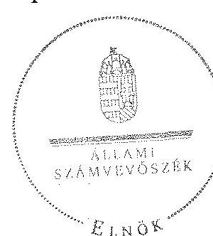
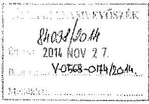
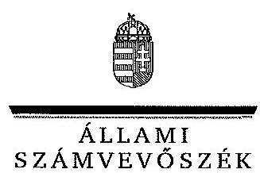
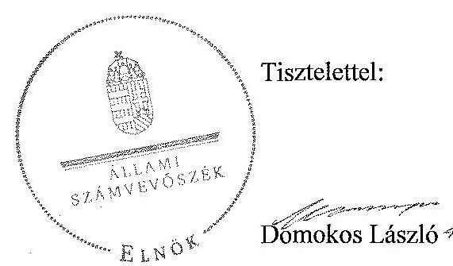
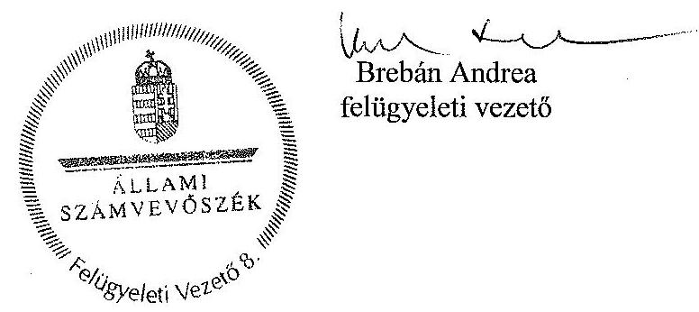

# ÁLLAMI   SZÁMVEVŐSZÉK 

## JELENTÉS

a helyi nemzetiségi önkormányzatok gazdálkodásának ellenőrzéséről
Kazincbarcika Város Roma Nemzetiségi Önkormányzat

---

# Állami Számvevőszék 

Iktatószám: V-0568-077/2014.
Témaszám: 1602
Vizsgálat-azonosító szám: V067608

## Az ellenőrzést felügyelte:

## Brebán Andrea

felügyeleti vezető
Az ellenőrzést vezette és az ellenőrzés végrehajtásáért felelős:
Solymár Ágnes
ellenőrzésvezető
A számvevőszéki jelentést készítették:

## Solymár Ágnes

ellenőrzésvezető

## Számvevőszéki vizsgálatot végezték:

## Sipos Attila

számvevő

## Sipos Attila

számvevő

## Somlai Gábor

számvevő

---

# TARTALOMJEGYZÉK 

BEVEZETÉS ..... 3
I. ÖSSZEGZŐ MEGÁLLAPÍTÁSOK, KÖVETKEZTETÉSEK, JAVASLATOK ..... 6
II. RÉSZLETES MEGÁLLAPÍTÁSOK ..... 14

1. A Nemzetiségi Önkormányzat és a Települési Önkormányzat együttműködésének szabályozása, a működési feltételek biztosítása ..... 14
2. A gazdálkodási feladatok ellátásának szabályszerűsége ..... 16
2.1. A költségvetésre és zárszámadásra, valamint a kincstári adatszolgáltatás rendjére vonatkozó jogszabályi előírások betartása ..... 16
2.2. A Nemzetiségi Önkormányzat gazdálkodásának szabályozottsága ..... 17
2.3. Az operatív gazdálkodási jogkörök kialakítása, gyakorlása ..... 18
3. A Nemzetiségi Önkormányzattal összefüggő gazdálkodási feladatok belső ellenőrzése ..... 21
MELLÉKLET
4. számú A Nemzetiségi Önkormányzat 2013. évi gazdálkodásának főbb adatai
5. számú Kazincbarcika Város Önkormányzat jegyzőjének észrevétele
6. számú Az ÁSZ válasza a Kazincbarcika Város Önkormányzat jegyzőjének a jelentéstervezetre tett észrevételeire

## FÜGGELÉKEK

1. számú Rövidítések jegyzéke
2. számú Fogalomtár

---

.

---

# JELENTÉS   a helyi nemzetiségi önkormányzatok gazdálkodásának ellenőrzéséről Kazincbarcika Város Roma Nemzetiségi Önkormányzat 

## BEVEZETÉS

A Nemzetiségi Önkormányzat 2010. október 15-én alakult, elnöke a 2006. évi helyhatósági választások óta látja el feladatát. A Nemzetiségi Önkormányzat intézményt, gazdasági társaságot és más szervezetet nem alapított, illetve társulásban nem vett részt. A négytagú Képviselő-testület a munkája segítésére bizottságot nem hozott létre. A Nemzetiségi Önkormányzatnak - költségvetési beszámolója szerint - a 2013. évben a módosított költségvetési bevételi és kiadási előirányzata 23319 ezer Ft, a teljesített költségvetési bevétele 23318 ezer Ft, a teljesített költségvetési kiadása 23054 ezer Ft volt. A Nemzetiségi Önkormányzat a 2013. évben feladatalapú támogatásban nem részesült. A 2013. évi gazdálkodási adatokat részletesen az 1. számú mellékletben mutatjuk be.

Az Alaptörvény Szabadság és felelősség rész XXIX. cikk (1) bekezdése szerint a Magyarországon élő nemzetiségek államalkotó tényezők. Minden, valamely nemzetiséghez tartozó magyar állampolgárnak joga van önazonossága szabad vállalásához és megőrzéséhez. A hazánkban élő nemzetiségek helyi (települési és területi) valamint országos önkormányzatokat hozhatnak létre ${ }^{1}$. A Nemzetiségi Önkormányzatok gazdálkodási feladatait jogszabályi előírás alapján a székhely szerinti Települési Önkormányzat polgármesteri hivatala látja el.

A nemzetiségek helyzete, támogatása mind hazai, mind EU-s szinten kiemelt figyelmet kap napjainkban. A Nemzetiségi Önkormányzatok gazdálkodására és támogatási rendszerére vonatkozó jogszabályok a 2010-2012. években jelentős változásokon mentek át. A Nemzetiségi Önkormányzatok gazdálkodásának, a részükre juttatott költségvetési támogatások felhasználásának ellenőrzését az ÁSZ 2012-ben sorozatjellegű ellenőrzés keretében indította el.

Az ellenőrzés célja annak értékelése volt, hogy a helyi nemzetiségi önkormányzat gazdálkodási kereteinek kialakítása, gazdálkodása megfelelt-e a jogszabályoknak.

[^0]
[^0]:    ${ }^{1}$ A 2010. évben megtartott nemzetiségi önkormányzati választásokat követően 2304 települési, 58 területi és 13 országos nemzetiségi önkormányzat alakult meg.

---

Ennek keretében értékeltük, hogy:

- a helyi nemzetiségi önkormányzat és a helyi (települési) önkormányzat együttműködésének szabályozása, a működési feltételek biztosítása megfelelt-e a jogszabályi előírásoknak;
- a felek együttműködése megfelelt-e a megállapodásban foglaltaknak a gazdálkodási feladatok szabályszerű ellátása során, betartották-e a vonatkozó jogszabályi előírásokat;
- biztosított volt-e a helyi nemzetiségi önkormányzat gazdálkodásának belső ellenőrzése.

Az ellenőrzés várható hasznosulása: a nemzetiségi önkormányzatok testületi döntéseinek tapasztalatait összegezve következtetés vonható le a törvényalkotás számára a jogszabályi környezet esetleges módosításának indokoltságára vonatkozóan. Az ellenőrzés az ellenőrzött számára visszajelzést ad a rendezett gazdálkodási keretek kialakításáról, a működésbeli hiányosságokról. Az ellenőrzés megállapításai és javaslatai, a jó gyakorlat bemutatása tanulságul szolgálhatnak más nemzetiségi önkormányzatok, szervezetek számára a rendezett gazdálkodási keretek kialakításához. A társadalom számára jelzi, hogy közpénz nem maradhat ellenőrizetlenül. Az ÁSZ értékteremtő rend kialakításához és megőrzéséhez hozzájáruló tevékenysége pozitív hatással lesz a szervezetről kialakított összkép formálásában. Az ÁSZ szervezetén belül lehetőség nyílik arra, hogy a megállapítások szintetizálásával az intézmény a hozzáadott értéket teremtő elemző tevékenységet és tanácsadó szerepét erősítse.

A helyi nemzetiségi önkormányzat gazdálkodásának ellenőrzéséről szóló jelentés I. fejezetének összegző része az ellenőrzés céljára adott rövid, szintetizáló összefoglalót és következtetéseket tartalmazza a II. fejezet részletes megállapításain alapulóan. A jelentés intézkedést igénylő megállapításait és javaslatait az összegzőben foglaltak mellett - az ellenőrzés során feltárt, a jelentés II. fejezetében rögzített részletes megállapítások alapozzák meg, illetve támasztják alá.

Az ellenőrzés típusa: szabályszerűségi ellenőrzés.
Az ellenőrzött időszak: a Nemzetiségi önkormányzat és a Települési Önkormányzat együttműködésének, valamint a Nemzetiségi Önkormányzat gazdálkodásának szabályozása megfelelőségét a 2013. évre vonatkozóan (a 2013. december 31-i állapotnak megfelelően), a Nemzetiségi Önkormányzat gazdálkodásának szabályszerűségét, a működési feltételek, valamint a belső ellenőrzés biztosítását a 2013. január 1. - december 31-e közötti időszakot figyelembe véve értékeltük.

Ellenőrzött szervezet: a Kazincbarcika Város Roma Nemzetiségi Önkormányzat és a gazdálkodási feladatait ellátó Kazincbarcikai Polgármesteri Hivatal.

Az ellenőrzés szakmai módszertana az ÁSZ hivatalos honlapján (www.asz.hu) közzétett szakmai szabályokon alapult, amely a Legfőbb Ellenőrző Intézmények Nemzetközi Szervezete (INTOSAI) által kiadott nemzetközi standardok (ISSAI) figyelembevételével készült.

A gazdálkodási jogkörök gyakorlásának szabályszerű működését a dologi kiadásokkal és a személyi juttatásokkal kapcsolatos kifizetésekre vonatkozóan ellenőriztük, értékeltük. A jogszabályoknak és a belső előírásoknak megfelelőnek, azaz szabályszerűnek minősítettük az adott területet, ha az értékelés összesített eredménye nagyobb volt, mint 90%, részben megfelelőnek, ha 71 és 90% közé esett, és nem megfelelőnek, ha 70% vagy annál kisebb volt.

Az ellenőrzés végrehajtásának jogszabályi alapját az ÁSZ tv. 5. § (2)-(3) és (6) bekezdéseiben foglaltak képezik.

Az ÁSZ tv. 29. § (1) bekezdése szerint a jelentéstervezetet megküldtük egyeztetésre a jegyzőnek és a Nemzetiségi Önkormányzat elnökének. A Nemzetiségi Önkormányzat elnöke az ÁSZ tv. 29. § (2) bekezdésében foglalt észrevételezési jogával nem élt, a jelentéstervezetre észrevételt nem tett. A jegyzőtől beérkezett észrevételek és az arra adott válaszok, ideértve az el nem fogadott észrevételeket és azok indokolását a jelentés 2-3. számú mellékletei tartalmazzák.

---

# I. ÖSSZEGZŐ MEGÁLLAPÍTÁSOK, KÖVETKEZTETÉSEK, JAVASLATOK 

A Nemzetiségi Önkormányzat és a Települési Önkormányzat együttműködésének szabályozása részben felelt meg a jogszabályi előírásoknak. A Nemzetiségi Önkormányzat rendelkezett a 2013. év folyamán hatályban lévő, a Települési Önkormányzattal történő együttműködésre vonatkozó megállapodással. Az együttműködési megállapodást a Nek. tv.-ben előírtak ellenére 2013. január 31-ig nem vizsgálták felül. Az együttműködési megállapodás a Nek. tv. előírásai ellenére nem tartalmazta a Nemzetiségi Önkormányzat működéséhez szükséges tárgyi feltételek biztosítását, a kapcsolódó rezsiköltségek viselését, a működést, testületi és tisztségviselői döntés-előkészítést és döntéshozatalt támogató adminisztrációs feladatok ellátását. Nem tartalmazta továbbá a költségvetéssel kapcsolatos feladatok és adatszolgáltatási kötelezettségek ellátását, sem a törzskönyvi nyilvántartásba vételt. A megállapodás szerinti működési feltételeket a megállapodás megkötését vagy módosítását követő harminc napon belül a Nek. tv. előírásától eltérően sem a Nemzetiségi Önkormányzat, sem a Települési Önkormányzat SZMSZ-ében nem rögzítették.

A Nemzetiségi Önkormányzat részére az előírt működési (személyi és tárgyi) feltételek részben voltak biztosítottak a 2013. évben. A Nek. tv. előírásai ellenére a Települési Önkormányzat által a Nemzetiségi Önkormányzat részére dokumentáltan nem biztosították az önkormányzati feladatellátásához szükséges eszközökkel felszerelt helyiség használatát, a testületi és tisztségviselői döntés-előkészítéshez és döntéshozatalhoz kapcsolódó adminisztrációs feladatok ellátását. A Nek. tv-ben foglaltaktól eltérően a Települési Önkormányzat által a Nemzetiségi Önkormányzat részére nem biztosították, hogy a jegyző vagy annak - a jegyzővel azonos képesítési előírásoknak megfelelő - megbízottja a Települési Önkormányzat megbízásából és képviseletében részt vegyen a Nemzetiségi Önkormányzat testületi ülésein.

A Nemzetiségi Önkormányzat 2013. évi költségvetésének és zárszámadásának tartalma, jóváhagyása - a kincstári adatszolgáltatás kivételével - nem felelt meg a jogszabályi előírásoknak. A Nemzetiségi Önkormányzat elnöke az Áht.-ben foglalt előírásoknak megfelelően benyújtotta a Képviselőtestület részére a jegyző által előkészített, a 2013. évre vonatkozó költségvetési koncepciót. A Nemzetiségi Önkormányzat elnöke az Áht.-ben foglalt előírás ellenére a központi költségvetésről szóló törvény hatálybalépését követő 45. napig nem nyújtotta be a Képviselő-testület részére a költségvetési határozat tervezetét. A jegyző által előkészített 2013. évi költségvetési határozat az Áht.-ben foglalt előírások szerinti tartalmi elemek közül nem tartalmazta a költségvetés végrehajtásával kapcsolatos hatásköröket, a Mötv. szerinti értékhatárt és a finanszírozási kiadásokkal kapcsolatos hatásköröket. A 2013. évi költségvetés előterjesztésekor - a jegyző mulasztása miatt - a Képviselő-testület részére az Áht.-ben foglalt előírásoknak megfelelően tájékoztatásul nem mutatták be szöveges indokolással együtt a Nemzetiségi Önkormányzat előirányzat felhasználási tervét, költségvetési mérlegét közgazdasági tagolásban, valamint a közvetett támogatásokat tartalmazó kimutatást.

---

A jegyző az Áht. előírását megsértve, az előírt határidőre nem készítette elő a Nemzetiségi Önkormányzat 2013. évi zárszámadási határozat-tervezetét, ezért a Nemzetiségi Önkormányzat elnöke nem terjesztette be határidőben a zárszámadási határozat-tervezetet a Képviselő-testület elé. A zárszámadási határozat-tervezet előterjesztésekor - a jegyző mulasztása miatt - az Áht.-ben foglalt előírások ellenére nem mutatták be szöveges indokolással együtt a Nemzetiségi Önkormányzat pénzeszközeinek változását, költségvetési mérlegét közgazdasági tagolásban, a többéves kihatással járó döntések számszerűsítését évenkénti bontásban és összesítve, a közvetett támogatásokat tartalmazó kimutatást. A Nemzetiségi Önkormányzat a zárszámadásról határozatot alkotott. A zárszámadásról szóló határozat tartalma az előírásoknak megfelelt, összehasonlíthatósága az elfogadott költségvetéssel nem volt biztosított. Az Áht. előírása ellenére nem volt biztosított a 2013. évi zárszámadási határozat összehasonlíthatósága az elfogadott költségvetéssel. A jegyző az Ávr.-ben és az Áhsz.-ban meghatározott határidőben teljesítette a Nemzetiségi Önkormányzat részére előírt kincstári adatszolgáltatásokat a 2013. évben.

A Nemzetiségi Önkormányzat gazdálkodásának szabályozottsága az ellenőrzött időszakban megfelelő volt, azonban a jogszabályokban előírt szabályzatokkal részben rendelkezett. A gazdálkodási feladatai végrehajtását ellátó Polgármesteri Hivatal a 2013. évben a Számv. tv. által előírt számviteli szabályzatok közül számviteli politikával, számlarenddel, valamint az eszközök és források értékelési szabályzatával, pénzkezelési szabályzattal a Nemzetiségi Önkormányzat gazdálkodási feladataira kiterjedő hatállyal rendelkezett. A jegyző a Számv. tv. előírása ellenére nem készítette el a számviteli szabályzatok közül a leltározási és leltárkészítési szabályzatot. A jegyző a Nemzetiségi Önkormányzat gazdálkodását hiányosan szabályozta, mert az Ávr. előírásai ellenére a Polgármesteri Hivatal SZMSZ-e a nevesített munkakörökhöz tartozó - a Nemzetiségi Önkormányzat gazdálkodásával kapcsolatos - hatáskörök gyakorlásának módját, valamint az ezekhez kapcsolódó felelősségi szabályokat nem tartalmazta. A Polgármesteri Hivatalban a gazdálkodási feladatokat ellátó köztisztviselők munkaköri leírásai teljes körűen tartalmazták a Nemzetiségi Önkormányzat gazdálkodásával kapcsolatos feladatokat. Az Ávr.-ben foglaltak szerinti, tervezéssel, gazdálkodással kapcsolatos belső előírásokat - az együttműködési megállapodás, a gazdasági szervezet ügyrendje, valamint a gazdálkodási szabályzat rögzítette. A Bkr.-ben foglaltak ellenére nem terjedt ki a Polgármesteri Hivatal folyamatba épített, előzetes, utólagos és vezetői ellenőrzése, továbbá a szabálytalanságok kezelése eljárásrendjének hatálya a Nemzetiségi Önkormányzat gazdálkodásával kapcsolatos végrehajtási feladataira. A Nemzetiségi Önkormányzat az eljárásrenddel önálló módon sem rendelkezett.

A Nemzetiségi Önkormányzat gazdálkodása tekintetében az operatív gazdálkodási jogkörök kialakítása megfelelt a jogszabályi előírásoknak. A Polgármesteri Hivatal az ellenőrzött időszakban rendelkezett gazdasági szervezettel, a gazdasági vezető végzettsége megfelelt az Ávr.-ben előírtaknak. Az összeférhetetlenségi
 követelmények érvényesülésének feltételei biztosítottak voltak, mivel a Nemzetiségi Önkormányzat elnöke, mint kötelezettségvállaló felhatalmazott írásban a kötelezettségvállalás és teljesítésigazolás gyakorlására más képviselőt. Ugyanakkor a kiadások teljesítésének igazolása során az Ávr. előírása ellenére az összeférhetetlenségi előírásokat nem érvényesítették. A Nemzetiségi Önkormányzat lehetővé tette a 100 ezer Ft alatti kifizetések előzetes írásbeli kötelezettségvállalás nélküli teljesítését, de az Ávr.-ben előírtak ellenére az eljárás rendjét nem határozták meg, továbbá az Ávr.-ben előírtak ellenére a teljesítésigazolást, érvényesítést végző személyek aláírás-mintájáról a belső szabályozással összhangban lévő naprakész nyilvántartást nem vezettek.

A Nemzetiségi Önkormányzatnál a 2013. évben a személyi juttatások és dologi kiadások teljesítése során az operatív gazdálkodási jogkörökön belül kulcsszerepet betöltő teljesítésigazolás és érvényesítés kontrollokat nem a jogszabályi előírásoknak megfelelően működtették. A teljesítésigazolás az összes mintatétel esetében nem felelt meg az Ávr.-ben foglaltaknak az arra jogosult személy aláírásának hiánya miatt. A teljesítésigazoló a belső szabályzatokban, valamint az Ávr.-ben előírtak ellenére, ellenőrizhető okmányok hiányában igazolta a kifizetés jogosságát, összegszerűségét, a szolgáltatás teljesítését. A teljesítést igazoló a teljesítésigazolást a maga javára végezte, megsértve ezzel az Ávr.-ben foglalt összeférhetetlenségi előírásokat.

Az érvényesítést az együttműködési megállapodásban erre a feladatra kijelöléssel nem rendelkező munkatárs látta el. Az érvényesítő az Ávr.-ben foglalt jelzési és ellenőrzési feladatait nem végezte el, mert nem jelezte az utalványozónak, hogy a törvényben, valamint a belső szabályzatokban foglaltakat nem tartották be a megelőző ügymenet során. Nem ellenőrizte a kifizetés összegszerűségét, valamint a fedezet meglétét, nem kifogásolta, hogy a kötelezettségvállalást követően nem gondoskodtak annak nyilvántartásba vételéről és nem vezettek kötelezettségvállalás nyilvántartást, nem kifogásolta, hogy kötelezettségvállalásra pénzügyi ellenjegyzés nélkül került sor, a kötelezettségvállalási, teljesítés igazolására irányuló feladatot nem végezheti az a személy, aki ezt a tevékenységet a maga javára látná el. A kulcskontrollok nem megfelelő működtetése nem biztosította a hibák megelőzését, feltárását és kijavítását.

A jegyző az ellenőrzött időszakban nem megfelelően biztosította a Polgármesteri Hivatalnál a Nemzetiségi Önkormányzat gazdálkodásával összefüggő végrehajtási feladatok belső ellenőrzését. A Polgármesteri Hivatal belső ellenőrzési vezetője a Bkr. előírásának megfelelően kockázatelemzést készített a Nemzetiségi Önkormányzat gazdálkodásával összefüggő végrehajtási feladatokra. Annak ellenére, hogy a belső ellenőrzési vezető a kockázatelemzés alapján a pénzgazdálkodás folyamatát kritikusnak ítélte és javasolta a pénzgazdálkodás ellenőrzését, a Nemzetiségi Önkormányzat gazdálkodásával összefüggő végrehajtási feladatokra vonatkozóan a 2013. évre belső ellenőrzést nem terveztek és nem végeztek.

Az ellenőrzött időszakban a Borsod-Abaúj-Zemplén Megyei Kormányhivatal egy esetben élt törvényességi felhívással. A Kormányhivatal a Nemzetiségi Önkormányzat gazdálkodásának szabályszerűségével kapcsolatos kifogásokat fogalmazott meg.

A Nemzetiségi Önkormányzatnak a gazdálkodás során figyelmet kell fordítania az integritás szemlélet teljes körű érvényesítésére, különös tekintettel az összeférhetetlenséghez kapcsolódó kontrollok fejlesztésére, amellyel csökkenthetőek a szervezet működéséből eredő korrupciós kockázatok.

Az ÁSZ tv. 33. § (1) bekezdésében foglaltak értelmében az ellenőrzött szervezet vezetője köteles a jelentésben foglalt megállapításokhoz kapcsolódó intézkedési tervet összeállítani, és azt a jelentés kézhezvételétől számított 30 napon belül az ÁSZ részére megküldeni. Amennyiben az intézkedési tervet határidőre nem küldi meg a szervezet, vagy az nem elfogadható, az ÁSZ elnöke az ÁSZ tv. 33. § (3) bekezdés a)-b) pontjaiban foglaltakat érvényesítheti.

A helyszíni ellenőrzés megállapításainak hasznosítása mellett javasoljuk:

# a jegyzőnek 

1. Az együttműködés szabályozásával kapcsolatban

A Nemzetiségi Önkormányzat és a Települési Önkormányzat együttműködését meghatározó együttműködési megállapodás tartalma nem felelt meg a Nek. tv. 80. § (1) bekezdés a), c), d), e) és g) pontjaiban és a Nek. tv. 80. § (3) bekezdés a) pontjában foglaltaknak. A Nek. tv. 80. § (2) bekezdésében foglaltak ellenére 2013. január 31-éig nem végezték el az együttműködési megállapodás felülvizsgálatát.

A 2013. december 31-én hatályos együttműködési megállapodás szerinti működési feltételeket a Nek. tv. 80. § (2) bekezdésében előírtak ellenére a Települési Önkormányzat és a Nemzetiségi Önkormányzat SZMSZ-ében nem rögzítették.

Javaslat
Az együttműködés szabályszerűsége érdekében:
a) készítse elő a Nek. tv. 80. § (1) bekezdés a), c), d), e) és g) pontjaiban, és a Nek. tv. 80. § (3) bekezdés a) pontjában foglalt előírásoknak megfelelő együttműködési megállapodás módosítását és kezdeményezze a módosítás Települési Önkormányzat Képviselő-testülete elé terjesztését;
b) gondoskodjon az együttműködési megállapodás Nek. tv. 80. § (2) bekezdésében előírt határidő szerinti évenkénti felülvizsgálatáról;
c) készítse elő a Települési Önkormányzat SZMSZ-ének kiegészítését a Nek. tv. 80. § (2) bekezdésében foglalt előírás alapján és kezdeményezze a kiegészítés Települési Önkormányzat Képviselő-testülete elé terjesztését;
d) készítse elő a Nemzetiségi Önkormányzat SZMSZ-ének kiegészítését a Nek. tv. 80. § (2) bekezdésében foglalt előírás alapján.
2. A költségvetés és zárszámadás szabályszerűségével kapcsolatban

A 2013. évi költségvetési határozat az Áht. 26. § (1) bekezdésében foglalt előírás alapján az Áht. 23. § (2) bekezdés h) pontjában megjelölt tartalmi elemek közül nem tartalmazta a költségvetés végrehajtásával kapcsolatos hatásköröket, így különösen a Mötv. 68. § (4) bekezdése szerinti értékhatárt, a finanszírozási kiadásokkal kapcsolatos hatásköröket.

A 2013. évi költségvetési határozat-tervezet előterjesztésekor - a jegyző mulasztása miatt - a Képviselő-testület részére az Áht. 24. § (4) bekezdés a) és c) pontjaiban foglalt előírásoktól eltérően tájékoztatásul nem mutatták be szöveges indokolással együtt a Nemzetiségi Önkormányzat előirányzat felhasználási tervét, költségvetési mérlegét közgazdasági tagolásban, valamint a közvetett támogatásokat tartalmazó kimutatást.

A 2013. évi zárszámadási határozat-tervezet előterjesztésekor - a jegyző mulasztása miatt - a Képviselő-testület részére tájékoztatásul nem mutatták be szöveges indokolással együtt az Áht. 91. § (2) bekezdés a) pontja alapján az Áht. 24. § (4) bekezdés a)-c) pontjaiban előírt mérleget és kimutatásokat. Az Áht. 89. § (1) bekezdésében előírtak ellenére a költségvetés és a zárszámadás összehasonlíthatósága nem volt biztosított.

Javaslat
Intézkedjen a jövőben arról, hogy:
a) a költségvetési határozat az Áht. 23. § (2) bekezdés h) pontjában előírtaknak tartalmilag feleljen meg;
b) a költségvetési határozat-tervezet előterjesztésekor a Képviselő-testületnek tájékoztatásul bemutatásra kerüljenek szöveges indoklással együtt az Áht. 24. § (4) bekezdés a) és c) pontjaiban előírt mérleg és kimutatások;
c) a zárszámadási határozat-tervezet előterjesztésekor a Képviselő-testület részére tájékoztatásul bemutatásra kerüljenek szöveges indoklással együtt az Áht. 91. § (2) bekezdés a) pontja alapján az Áht. 24. § (4) bekezdés a)-c) pontjaiban előírt mérleg és kimutatások;
d) a költségvetés és a zárszámadás Áht. 89. § (1) bekezdése szerinti összehasonlíthatósága biztosított legyen.
3. A gazdálkodási feladatok szabályozottságával kapcsolatban

A jegyző nem készítette el a Számv. tv. 14. § (5) bekezdés a) pontjában előírt, a Nemzetiségi Önkormányzatra vonatkozó leltározási és leltárkészítési szabályzatot.

A Polgármesteri Hivatal a Bkr. 6. § (4) bekezdésében előírtak alapján elkészített szabálytalanságok kezelésének eljárásrendje nem terjedt ki a Nemzetiségi Önkormányzat gazdálkodásával kapcsolatos végrehajtási feladatokra. A Nemzetiségi Önkormányzat ez utóbbi eljárásrenddel önálló módon sem rendelkezett. A jegyző a Bkr. 8. § (2) bekezdés előírásától eltérően a Nemzetiségi Önkormányzat gazdálkodásának végrehajtásával kapcsolatos feladataira vonatkozóan nem biztosította a folyamatba épített, előzetes, utólagos és vezetői ellenőrzést.

A Polgármesteri Hivatal SZMSZ-e az Ávr. 13. § (1) bekezdés g) pontjának megfelelően tartalmazta az SZMSZ-ben nevesített munkakörökhöz tartozó - a Nemzetiségi Önkormányzat gazdálkodásával kapcsolatos - feladat és hatásköröket és a helyettesítés rendjét, míg a hatáskörök gyakorlásának módját, valamint az ezekhez kapcsolódó felelősségi szabályokat nem tartalmazta.

Az Ávr. 53. § (2) bekezdésében rögzített kötelezettség ellenére a százezer forintot el nem érő kötelezettségvállalások esetében az előzetes írásbeli kötelezettségvállalást nem igénylő kifizetések rendjét nem szabályozták.

Javaslat
A Nemzetiségi Önkormányzat gazdálkodásának végrehajtásával kapcsolatos feladataira készítse el:
a) a Számv. tv. 14. § (5) bekezdés a) pontjában előírt leltározási és leltárkészítési szabályzatot;
b) a Bkr. 6. § (4) bekezdéseiben meghatározott szabályozást és biztosítsa a Bkr. 8. § (2) bekezdésének megfelelően a folyamatba épített, előzetes, utólagos és vezetői ellenőrzést;
c) a Polgármesteri Hivatal SZMSZ-ének módosítását, hogy az teljes körűen feleljen meg az Ávr. 13. § (1) bekezdés g) pontjában foglalt előírásnak és kezdeményezze a módosítás Települési Önkormányzat Képviselő-testülete elé terjesztését;
d) az Ávr. 53. § (2) bekezdésében előírt előzetes írásbeli kötelezettségvállalást nem igénylő kifizetések rendjére vonatkozó szabályozást.
4. A kulcskontrollok működésével kapcsolatban

Az Ávr. 60. § (3) bekezdésének előírása ellenére a teljesítésigazolást, valamint az érvényesítést végző személyek aláírás-mintájáról naprakész nyilvántartást nem vezettek.

A teljesítésigazolás nem felelt meg az Ávr. 57.§ (3) bekezdésében foglaltaknak az arra jogosult személy aláírásának hiánya miatt. A teljesítésigazoló a belső szabályzatokban, valamint az Ávr. 57. § (1) és (3) bekezdéseiben előírtakat megsértve igazolta a kifizetés jogosságát, összegszerűségét, a szolgáltatás teljesítését. Sérült a teljesítésigazolás során az Ávr. 60. § (2) bekezdésében foglalt összeférhetetlenségi előírás, mivel a teljesítést igazoló a teljesítésigazolást a maga javára is végezte.

Az érvényesítést az Ávr. 58. § (4) bekezdésében foglalt előírástól eltérően a feladatra kijelöléssel nem rendelkező munkatárs látta el. Az érvényesítő az Ávr. 58. § (1)-(2) bekezdésében foglalt ellenőrzési és jelzési feladatait nem végezte el. Nem ellenőrizte a kifizetés összegszerűségét, valamint a fedezet meglétét, továbbá a megelőző ügymenetben a jogszabályi előírások és a belső szabályzatok előírásainak betartását. Nem jelezte, hogy a teljesítésigazolások az Ávr. 57. § (3) bekezdésével ellentétesen, aláírás hiányában történtek, továbbá azt, hogy a kötelezettségvállalási, teljesítés igazolására irányuló feladatot nem végezheti az a személy, aki ezt a tevékenységet a maga javára látja el. Nem jelezte a kötelezettségvállalásokról vezetendő nyilvántartás hiányát, a kötelezettségvállalást megelőző pénzügyi ellenjegyzés elmaradását.

Javaslat
Az operatív gazdálkodás működési hibáinak megelőzése, feltárása és kijavítása érdekében
a) intézkedjen a teljesítésigazolásra és az érvényesítésre jogosult személyek aláírásmintájának Ávr. 60. § (3) bekezdése szerinti naprakész nyilvántartásáról;
b) intézkedjen, hogy a teljesítésigazolást az Ávr. 57. § (1) és (3) bekezdéseiben foglaltak betartásával végezzék, az Ávr. 60. § (2) bekezdésében foglalt előírásokra figyelemmel;
c) intézkedjen, hogy az érvényesítő az Ávr. 58. § (1)-(2) bekezdései alapján lássa el ellenőrzési és jelzési feladatát.

# a Nemzetiségi Önkormányzat elnökének 

1. A Nemzetiségi Önkormányzat és a Települési Önkormányzat együttműködését meghatározó együttműködési megállapodás tartalma nem felelt meg a Nek.tv. 80. § (1) bekezdés a), c), d), e) és g) pontjaiban és a Nek. tv. 80. § (3) bekezdés a) pontjában foglaltaknak. A 2013. december 31-én hatályos együttműködési megállapodás szerinti működési feltételeket a Nek.tv. 80. § (2) bekezdésében előírtak ellenére a Nemzetiségi Önkormányzat SZMSZ-ében nem rögzítették.

Javaslat
Terjessze a Képviselő-testület elé jóváhagyásra
a) a Nek. tv. 80. § (1) bekezdés a), c), d), e) és g) pontjaiban, és a Nek. tv. 80. § (3) bekezdés a) pontjában foglalt előírások betartásával a jegyző által előkészített együttműködési megállapodás módosítást;
b) jegyző által előkészített, a Nek. tv. 80. § (2) bekezdésében foglalt előírásnak megfelelően kiegészített Nemzetiségi Önkormányzati SZMSZ-t.
2. A Nemzetiségi Önkormányzat elnöke a jegyző által előkészített 2013. évi költségvetési határozat-tervezetet nem nyújtotta be a Képviselő-testület részére az Áht. 24. § (2) bekezdésében meghatározott határideig. A 2013. évi zárszámadási határozattervezetet a Nemzetiségi Önkormányzat elnöke
 az Áht. 91. § (1) bekezdésében előírt határidőig nem terjesztette be a Nemzetiségi Önkormányzat Képviselő-testület elé.

A Nemzetiségi Önkormányzat elnöke a Képviselő-testület részére tájékoztatásul – a jegyző mulasztása miatt – nem mutatta be a költségvetési határozat-tervezet előterjesztésekor az Áht. 24. § (4) bekezdés a) és c) pontjaiban előírtak ellenére szöveges indokolással együtt a Nemzetiségi Önkormányzat előirányzat felhasználási tervét, költségvetési mérlegét közgazdasági tagolásban, valamint a közvetett támogatásokat tartalmazó kimutatást. A 2013. évi zárszámadási határozat-tervezet előterjesztésekor – a jegyző mulasztása miatt – a Képviselő-testület részére tájékoztatásul nem

---

mutatta be szöveges indokolással együtt az Áht. 91. § (2) bekezdés a) pontja alapján az Áht. 24. § (4) bekezdés a)-c) pontjai szerinti mérleget és kimutatásokat.

Javaslat
A Képviselő-testület részére:
a) történő előterjesztésekor gondoskodjon a költségvetési határozat-tervezet esetében az Áht. 24. § (3) bekezdésében, a zárszámadási határozat-tervezet esetében az Áht. 91. § (1) bekezdésében meghatározott határidők betartásáról;
b) tájékoztatásul mutassa be a költségvetési határozat-tervezet előterjesztésekor az Áht. 24. § (4) bekezdés a) és c) pontjaiban előírt mérleget, kimutatást;
c) tájékoztatásul mutassa be a zárszámadási határozat-tervezet előterjesztésekor az Áht. 91. § (2) bekezdés a) pontja alapján az Áht. 24. § (4) bekezdés a)-c) pontjaiban előírt mérleget, kimutatásokat.

---

# II. RÉSZLETES MEGÁLLAPÍTÁSOK 

## 1. A Nemzetiségi Önkormányzat és a Települési Önkormányzat együttműködésének szabályozása, a működési feltételek biztosítása

A Nemzetiségi Önkormányzat és a Települési Önkormányzat együttműködésének szabályozása részben felelt meg a jogszabályi előírásoknak.

A Nemzetiségi Önkormányzat rendelkezett a 2013. év folyamán hatályban lévő, a Települési Önkormányzattal történő együttműködésre vonatkozó megállapodással. A megállapodást a Nemzetiségi Önkormányzat és a Települési Önkormányzat képviselő-testületi határozattal jóváhagyták és az arra jogosult személyek aláírták.

Az Együttműködési megállapodást a Települési Önkormányzat a 211/2012. (VIII. 03.) számú, a Nemzetiségi Önkormányzat a 41/2012. (VIII. 10.) számú határozatával hagyta jóvá. ${ }^{2}$

A Nek. tv. 80. § (2) bekezdésében előírtak ellenére 2013. január 31-éig nem végezték el a megállapodás felülvizsgálatát.

A 2013. december 31-én hatályos megállapodásban a Nemzetiségi Önkormányzat működésének feltételeit nem a Nek. tv. 80. § (1) bekezdésnek megfelelően rögzítették. A Települési Önkormányzat által a Nemzetiségi Önkormányzat részére biztosítandó működés feltételei és az ezzel kapcsolatos végrehajtási feladatok közül a megállapodásból hiányzik:

- a Nek. tv. 80. § (1) bekezdés a) pontjától eltérően a Települési Önkormányzat által a Nemzetiségi Önkormányzat részére havonta igény szerint, de legalább tizenhat órában, az önkormányzati feladatellátásához szükséges tárgyi, technikai eszközökkel felszerelt helyiség ingyenes használatának biztosítása;
- a Nek. tv. 80. § (1) bekezdés a) pontjától eltérően a helyiséghez, a helyiség infrastruktúrájához kapcsolódó rezsiköltségek és fenntartási költségek viselése;
- a Nek. tv. 80. § (1) bekezdés c) pontjától eltérően a testületi ülések előkészítése (meghívók, előterjesztések, hivatalos levelezés előkészítése, postázása, a testületi ülések jegyzőkönyveinek elkészítése, postázása);

[^0]
[^0]:    ${ }^{2}$ Az együttműködési megállapodás elfogadásáról szóló határozat-tervezetet az aljegyző és a polgármester által aláírt beterjesztés alapján fogadta el a Települési Önkormányzat Képviselő-testülete. A Polgármesteri Hivatal SZMSZ-e (II. fejezet 3. pont) értelmében a jegyző közreműködik a polgármester képviselő-testületi előterjesztésének előkészítésében.

---

- a Nek. tv. 80. § (1) bekezdés d) pontjától eltérően a testületi döntések és a tisztségviselők döntéseinek előkészítése, a testületi és tisztségviselői döntéshozatalhoz kapcsolódó nyilvántartási, sokszorosítási, postázási feladatok ellátása;
- a Nek. tv. 80. § (1) bekezdés e) pontjától eltérően a Nemzetiségi Önkormányzat működésével, gazdálkodásával kapcsolatos nyilvántartási, iratkezelési feladatok ellátása;
- a Nek. tv. 80. § (1) bekezdés g) pontjától eltérően a feladatellátáshoz kapcsolódó költségek – a testületi tagok és tisztségviselők telefonhasználata költségei kivételével – viselése.

A megállapodás szerinti működési feltételeket a megállapodás megkötését, vagy módosítását követő harminc napon belül a Nek. tv. 80. § (2) bekezdésében foglaltak szerint a Nemzetiségi Önkormányzat valamint a Települési Önkormányzat SZMSZ-ében nem rögzítették.

A 2013. december 31-én hatályos megállapodás a Nek. tv. 80. § (3) bekezdés a) pontjában foglaltakkal ellentétesen nem tartalmazta a törzskönyvi nyilvántartásba vételt, valamint a Települési Önkormányzat és a Nemzetiségi Önkormányzat költségvetésének elkészítésével és megalkotásával, valamint a költségvetéssel összefüggő adatszolgáltatási kötelezettségek teljesítésével kapcsolatban az együttműködési kötelezettséget.

A Nemzetiségi Önkormányzat részére az előírt működési (személyi és tárgyi) feltételek részben voltak biztosítottak a 2013. évben.

A Települési Önkormányzat által a Nemzetiségi Önkormányzat részére dokumentáltan nem biztosították:

- a Nek. tv. 80. § (1) bekezdés a) pontjától eltérően Települési Önkormányzat által a Nemzetiségi Önkormányzat részére havonta igény szerint, de legalább tizenhat órában, az önkormányzati feladatellátásához szükséges tárgyi, technikai eszközökkel felszerelt helyiség ingyenes használatát;
- a Nek. tv. 80. § (1) bekezdés c) pontjától eltérően a testületi ülések előkészítését (meghívók, előterjesztések, hivatalos levelezés előkészítése, postázása, a testületi ülések jegyzőkönyveinek elkészítése, postázása);
- Nek. tv. 80. § (1) bekezdés d) pontjától eltérően a testületi döntések és a tisztségviselők döntéseinek előkészítését, a testületi és tisztségviselői döntéshozatalhoz kapcsolódó nyilvántartási, sokszorosítási, postázási feladatok ellátását;
- Nek. tv. 80. § (1) bekezdés e) pontjától eltérően a Nemzetiségi Önkormányzat működésével, gazdálkodásával kapcsolatos nyilvántartási, iratkezelési feladatok ellátását;
- a jegyzőnek, vagy annak megbízottjának a Nemzetiségi Önkormányzat testületi ülésein való részvételét, annak ellenére, hogy az együttműködési megállapodásban a Nek. tv. 80. § (4) bekezdésében foglaltaknak megfelelően rögzítésre került, hogy a jegyző vagy annak – a jegyzővel azonos képesítési

---

előírásoknak megfelelő – megbízottja a Települési Önkormányzat megbízásából és képviseletében részt vesz a nemzetiségi önkormányzat testületi ülésein.

# 2. A gazdálkodási feladatok ellátásának szabályszerűsége 

### 2.1. A költségvetésre és zárszámadásra, valamint a kincstári adatszolgáltatás rendjére vonatkozó jogszabályi előírások betartása

A Nemzetiségi Önkormányzat 2013. évi költségvetésének és zárszámadásának tartalma, jóváhagyása, – a kapcsolódó kincstári adatszolgáltatás kivételével – nem felelt meg a jogszabályi előírásoknak.

A Nemzetiségi Önkormányzat elnöke az Áht. 26. § (1) bekezdése alapján, az Áht. 24. § (1) bekezdésében előírtaknak megfelelően november 30-ig benyújtotta a Képviselő-testület részére a jegyző által előkészített, a 2013. évre vonatkozó költségvetési koncepciót.

A Nemzetiségi Önkormányzat elnöke az Áht. 26. § (1) bekezdésben és az Áht. 24. § (2) bekezdésében ${ }^{3}$ előírtaktól eltérően a központi költségvetésről szóló törvény hatálybalépését követő 45. napig nem nyújtotta be a Képviselő-testület részére a költségvetési határozat tervezetét. A jegyző által előkészített 2013. évi költségvetési határozat az Áht. 26. § (1) bekezdésében foglalt előírás szerinti tartalmi elemek közül, az Áht. 23. § (2) bekezdés h) pontjától eltérően nem tartalmazta a költségvetés végrehajtásával kapcsolatos hatásköröket, így különösen a Mötv. 68. § (4) bekezdése szerinti értékhatárt, a finanszírozási kiadásokkal kapcsolatos hatásköröket. A 2013. évi költségvetési határozat-tervezet előterjesztésekor a Képviselő-testület részére az Áht. 24. § (4) bekezdés a) és c) pontjai előírásától eltérően tájékoztatásul – a jegyző mulasztása miatt – nem mutatták be szöveges indokolással együtt a Nemzetiségi Önkormányzat előirányzat felhasználási tervét, költségvetési mérlegét közgazdasági tagolásban, valamint a közvetett támogatásokat tartalmazó kimutatást.

A zárszámadási határozat tervezetének előterjesztésekor az Áht. 91. § (2) bekezdés a) pontja alapján az Áht. 24. § (4) bekezdés a)-c) pontjaiban előírtaktól eltérően – a jegyző mulasztása miatt – tájékoztatásul nem mutatták be szöveges indokolással együtt a Nemzetiségi Önkormányzat pénzeszközeinek változását, a költségvetési mérlegét közgazdasági tagolásban, a többéves kihatással járó döntések számszerűsítését évenkénti bontásban és összesítve, valamint a közvetett támogatásokat tartalmazó kimutatást. A jegyző nem készítette elő és a Nemzetiségi Önkormányzat elnöke nem terjesztette be a Képviselő-testület elé a Nemzetiségi Önkormányzat 2013. évi zárszámadási határozat-tervezetét az Áht. 91. § (1) és (3) bekezdésében előírt határidőre, 2014. április 30-ig. A Nemzetiségi Önkormányzat a 2013. évi zárszámadásról határozatot alkotott. A zárszámadásról szóló határozat tartalma az előírásoknak

[^0]
[^0]:    ${ }^{3}$ 2013. december 21-étől az Áht. 24. § (3) bekezdése írja elő.

---

megfelelt, azonban összehasonlíthatósága az Áht. 89. § (1) bekezdésében foglaltak ellenére az elfogadott költségvetéssel nem volt biztosított.

A jegyző az Ávr.-ben előírt határidőben teljesítette a Nemzetiségi Önkormányzat részére előírt kincstári adatszolgáltatást a 2013. évben, így:

- a Nemzetiségi Önkormányzat 2013. évben a negyedéves és éves időközi költségvetési jelentéseket az Ávr. 169. § (2) bekezdése ${ }^{4}$, szerinti határidőre megküldte a Kincstár területileg illetékes igazgatóságának;
- a Nemzetiségi Önkormányzat 2013. évben az időközi mérlegjelentéseket az Ávr. 170. § (5) bekezdése ${ }^{5}$ szerinti határidőre megküldte a Kincstár területileg illetékes szervének;
- a Nemzetiségi Önkormányzat a 2013. év I. féléves és éves elemi költségvetési beszámolóját az Áhsz ${ }_{1} 10 . \S$ (5a) bekezdés ${ }^{6}$ szerinti határidőre benyújtotta a Kincstár területileg illetékes szervének.

# 2.2. A Nemzetiségi Önkormányzat gazdálkodásának szabályozottsága 

A Nemzetiségi Önkormányzat gazdálkodásának szabályozottsága az ellenőrzött időszakban megfelelő volt, azonban a jogszabályokban előírt szabályzatokkal részben rendelkezett.

A gazdálkodási feladatai végrehajtását ellátó Polgármesteri Hivatal a 2013. évben a Számv. tv. által előírt számviteli szabályzatok közül számviteli politikával, számlarenddel, valamint az eszközök és források értékelési szabályzatával a Nemzetiségi Önkormányzat gazdálkodási feladataira kiterjedő hatállyal rendelkezett. A jegyző nem készítette el a számviteli szabályzatok közül a leltározási és leltárkészítési szabályzatot a Számv. tv. 14. § (5) bekezdés a) pontjában előírtaktól eltérően. A 8/2012. számú polgármester-jegyző együttes rendelkezés a pénzkezelési szabályzatról 2012. június 15-től volt hatályos.

A jegyző a Nemzetiségi Önkormányzat gazdálkodását a fentieken túl is hiányosan szabályozta, mert a Polgármesteri Hivatal SZMSZ-e az Ávr. 13. § (1) bekezdés g) pontjának megfelelően tartalmazta az SZMSZ-ben nevesített munkakörökhöz tartozó – a Nemzetiségi Önkormányzat gazdálkodásával kapcsolatos feladat és hatásköröket és a helyettesítés rendjét, míg a hatáskörök gyakorlásának módját, valamint az ezekhez kapcsolódó felelősségi szabályokat nem.

A Polgármesteri Hivatalban a gazdálkodási feladatokat ellátó köztisztviselők munkaköri leírásai teljes körűen tartalmazták a Nemzetiségi Önkormányzattal kapcsolatos feladatokat.

Az Ávr. 13. § (2) bekezdés a) pontban foglaltak szerinti belső szabályozás tartalmi követelményeit – a tervezéssel, gazdálkodással, különösen az operatív

 gazdálkodási jogkörök gyakorlásának módjával, eljárási és dokumentációs részletszabályaival, valamint az ezeket végző személyek kijelölési rendjével és az ellenőrzési, adatszolgáltatási feladatok teljesítésével kapcsolatos belső előírásokat – az együttműködési megállapodás, a gazdasági szervezet ügyrendje, valamint a gazdálkodási szabályzat rögzítette.

A Polgármesteri Hivatalban – a Bkr. 6. § (3) bekezdésében előírtak alapján – elkészített ellenőrzési nyomvonal kiterjedt, a Bkr. 6. § (4) bekezdésében előírtak alapján elkészített szabálytalanságok kezelésének eljárásrendje nem terjedt ki a Nemzetiségi Önkormányzat gazdálkodásával kapcsolatos végrehajtási feladatokra. A Nemzetiségi Önkormányzat ez utóbbi eljárásrenddel önálló módon sem rendelkezett. A jegyző a Bkr. 8. § (2) bekezdések előírásától eltérően a Nemzetiségi Önkormányzatra vonatkozóan nem biztosította a folyamatba épített, előzetes, utólagos és vezetői ellenőrzést.

# 2.3. Az operatív gazdálkodási jogkörök kialakítása, gyakorlása 

A Nemzetiségi Önkormányzat gazdálkodása tekintetében az operatív gazdálkodási jogkörök kialakítása megfelelt a jogszabályi előírásoknak. A Nemzetiségi Önkormányzat gazdálkodási feladatai végrehajtását ellátó Polgármesteri Hivatal az ellenőrzött időszakban rendelkezett gazdasági szervezettel, a gazdasági vezető végzettsége megfelelt az Ávr. 12. §-ában előírt szakképesítési követelményeknek. A Nemzetiségi Önkormányzat elnöke, mint kötelezettségvállaló az Áht. 36. § (7) bekezdés, az Ávr. 52. § (7) bekezdése, valamint az Ávr. 57. § (4) alapján felhatalmazott írásban a kötelezettségvállalás és teljesítésigazolás gyakorlására más képviselőt. Ezzel biztosította az Ávr. 60. § (2) bekezdése szerinti összeférhetetlenségi szabályok érvényesítését. Ugyanakkor a kiadások teljesítésének igazolása során az Ávr. 60. § (2) bekezdésének előírása ellenére az összeférhetetlenségi előírásokat nem érvényesítették.

A Nemzetiségi Önkormányzat a gazdálkodási szabályzatban lehetővé tette a 100 ezer Ft alatti kifizetések előzetes írásbeli kötelezettségvállalás nélküli teljesítését, azonban az Ávr. 53. § (1) és (2) bekezdésében előírtak ellenére az eljárás rendjét nem határozták meg.

A Nemzetiségi Önkormányzat gazdálkodási feladatait ellátó Települési Önkormányzat 2013. évben hatályos gazdálkodási szabályzatának mellékletei tartalmazták a Nemzetiségi Önkormányzatra vonatkozóan a kötelezettségvállalásra, pénzügyi ellenjegyzésre, szakmai teljesítés igazolására, érvényesítésre, utalványozásra jogosult személyek kijelölését, de a szabályzat mellékleteiben a jogosult aláírása rovat nem került kitöltésre, ezáltal az Ávr. 60. § (3) bekezdésében foglaltaktól eltérően az aláírás-mintáról a nyilvántartás vezetése nem volt biztosított.

A Nemzetiségi Önkormányzatnál a 2013. évben a személyi juttatások és dologi kiadások teljesítése során az operatív gazdálkodási jogkörökön belül kulcsszerepet betöltő teljesítésigazolás és érvényesítés kontrollokat nem a jogszabályi előírásoknak megfelelően működtették.

A személyi juttatásokkal kapcsolatos kifizetések során ${ }^{7}$ a 2013. évben a teljesítésigazolás és az érvényesítés kulcskontrollok kapcsán az alábbi hiányosságokat állapítottuk meg:

A teljesítésigazolás az összes mintatétel esetében nem felelt meg az Ávr. 57.§ (3) bekezdésében foglaltaknak az arra jogosult személy aláírásának hiánya miatt. A teljesítésigazoló az Ávr. 57. § (1) bekezdésétől eltérően két kifizetés esetében nem végezte el az összegszerűség ellenőrzését. Továbbá a teljesítésigazoló egy kifizetésnél az utalványrendeleten nem a megfelelő dokumentumra hivatkozott. A teljesítésigazoló 18 kifizetésnél az igazolást a maga javára végezte, megsértve ezzel az Ávr. 60. § (2) bekezdésében foglalt összeférhetetlenségi előírásokat.

Az érvényesítést az összes mintatétel esetében az Ávr. 58. § (4) bekezdésben foglalt előírásoktól eltérően az erre a feladatra kijelöléssel nem rendelkező munkatárs látta el. Az érvényesítő az Ávr. 58. § (1)-(2) bekezdései ellenére feladatát nem látta el, mert nyilvántartás hiányában nem ellenőrizte a kifizetés összegszerűségét, valamint a fedezet meglétét, továbbá a megelőző ügymenetben a jogszabályi előírások és a belső szabályzatok előírásainak betartását, valamint nem jelezte, hogy:

- a teljesítésigazolások az Ávr. 57. § (3) bekezdésével ellentétesen, aláírás hiányában történtek;
- a kötelezettségvállalásokat követően az Ávr. 56. § (1) bekezdés előírása ellenére nem gondoskodtak azok nyilvántartásba vételéről;
- hat kifizetés esetében hibás főkönyvi számlaszámra könyvelték a tételt;
- 21 kifizetés esetében nem tartották be az Áht. 37. § (1) és az Ávr. 55. § (1) bekezdéseiben foglaltakat, mivel kötelezettségvállalásra pénzügyi ellenjegyzés nélkül került sor;
- 18 kifizetés esetében az Ávr. 60. § (2) bekezdésben foglaltakat megsértve a teljesítésigazoló az igazolást a maga javára végezte el;

[^0]
[^0]:    ${ }^{7}$ A személyi juttatásokkal kapcsolatosan 32 kiadási tételt ellenőriztünk.

---

- két kifizetéshez kapcsolódóan a Nemzetiségi Önkormányzat elnöke a felvett készpénzzel késedelmesen számolt el, ezzel megsértve a számviteli politika előírását. ${ }^{8}$

A dologi kiadásokkal kapcsolatos kifizetések során ${ }^{9}$ a 2013. évben a teljesítésigazolás és az érvényesítés kulcskontrollok kapcsán az alábbi hiányosságokat állapítottuk meg:

A teljesítésigazolás az összes mintatétel esetében nem felelt meg az Ávr. 57.§ (3) bekezdésében foglaltaknak az arra jogosult személy aláírásának hiánya miatt. A teljesítésigazolás az Ávr. 57. § (1) és (3) bekezdéseitől eltérően egy kifizetés esetében a teljesítést igazoló aláírásának hiánya miatt nem történt meg, továbbá 44 kifizetésnél a teljesítésigazoló a belső szabályzatokban, valamint az Ávr. 57. § (1) bekezdésében előírtak ellenére, ellenőrizhető okmányok hiányában igazolta a kifizetés jogosságát, összegszerűségét, a szolgáltatás teljesítését ${ }^{10}$. Két kifizetés esetében a teljesítésigazoló az igazolást az Ávr. 60. §. (2) bekezdését megsértve a maga javára végezte.

Az érvényesítést az összes mintatétel esetében az Ávr. 58. § (4) bekezdésben foglalt előírásoktól eltérően az erre a feladatra kijelöléssel nem rendelkező munkatárs látta el, továbbá egy esetben az érvényesítés az Ávr. 58. § (3) bekezdésétől eltérően nem tartalmazott keltezést. Az érvényesítő az Ávr. 58. § (1) (2) bekezdései ellenére feladatát nem látta el, mert nyilvántartás hiányában nem ellenőrizte a kifizetés összegszerűségét, valamint a fedezet meglétét, továbbá a megelőző ügymenetben a jogszabályi előírások és a belső szabályzatok előírásainak betartását, valamint nem jelezte, hogy:

- 23 kifizetésnél a Nemzetiségi Önkormányzat elnöke a felvett készpénzzel késedelmesen számolt el, ezzel megsértve a számviteli politika előírását;
- egy kifizetés esetében az Áht. 37. § (1) és az Ávr. 55. § (1) bekezdéseiben foglaltaktól eltérően a kötelezettségvállalásra pénzügyi ellenjegyzés nélkül került sor;
- két kifizetés során az Ávr. 60. § (2) bekezdésben foglaltakat megsértve a teljesítésigazoló az igazolást a maga javára végezte ${ }^{11}$.

Felhalmozási kiadásokkal és pénzeszközátadással/ellátottak juttatásaival kapcsolatos kifizetés a 2013. év során nem történtek.

[^0]
[^0]:    ${ }^{8}$ A számviteli politika I. 13. a) pontja szerint a pénzeszközöket érintő gazdasági műveletek, események bizonylatainak adatait késedelem nélkül, készpénzforgalom esetében a pénzmozgással egyidejűleg, illetve bankszámla forgalomnál a hitelintézeti értesítés megérkezésekor, az egyéb pénzeszközöket érintő tételeket legkésőbb a tárgyhót követő hó 15. -éig a könyvekben rögzíteni kell.
    ${ }^{9}$ A dologi kiadásokkal kapcsolatosan 68 tételt ellenőriztünk.
    ${ }^{10}$ A Nemzetiségi Önkormányzat gazdálkodási feladatait ellátó Települési Önkormányzat 2013. évben hatályos Gazdálkodási Szabályzatának II. fejezete szerint a gazdasági eseményenként százezer forintot el nem érő kifizetéseknél nem kell írásbeli kötelezettségvállalás, de a részletes szabályozás nem került kidolgozásra.
    ${ }^{11}$ A számlán a számla aláírója megegyezik a teljesítést igazoló személlyel.

---

A számvevőszéki ellenőrzés az ellenőrzött kifizetésekkel összefüggésben, a rendelkezésre bocsátott dokumentumok alapján kár bekövetkeztére utaló adatot, tényt nem állapított meg, azonban a gazdálkodásban kulcsszerepet betöltő kontrollok nem megfelelő működése miatt fennáll a hibák bekövetkezésének kockázata.

# 3. A Nemzetiségi Önkormányzattal összefüggő gazdálkodási feladatok belső ellenőrzése 

A jegyző az ellenőrzött időszakban nem megfelelően biztosította a Polgármesteri Hivatalnál a Nemzetiségi Önkormányzat gazdálkodásával összefüggő végrehajtási feladatok belső ellenőrzését. A Polgármesteri Hivatal belső ellenőrzési vezetője a Bkr. 22. § (1) bekezdés b) pontjának megfelelően kockázatelemzést készített a Nemzetiségi Önkormányzat gazdálkodásával összefüggő végrehajtási feladatokra. Annak ellenére, hogy a belső ellenőrzési vezető a kockázatelemzés alapján a pénzgazdálkodás folyamatát kritikusnak ítélte és javasolta a pénzgazdálkodás ellenőrzését, a Nemzetiségi Önkormányzat gazdálkodásával összefüggő végrehajtási feladatokra vonatkozóan a 2013. évre belső ellenőrzést nem terveztek és nem végeztek.

Az ellenőrzött időszakban a Borsod-Abaúj-Zemplén Megyei Kormányhivatal egy esetben élt törvényességi felhívással. A Kormányhivatal a Nemzetiségi Önkormányzat gazdálkodásának szabályszerűségével kapcsolatos kifogásokat fogalmazott meg.

Az integritás szemlélet érvényesülésének ellenőrzéséhez a Polgármesteri Hivatal és a Nemzetiségi Önkormányzat tanúsítványon szolgáltatott adatokat. Ezen adatok értékelése alapján az eredendő veszélyeztetettségi szint és a kockázatokat növelő tényező szintje is alacsony. Emellett a szervezetnél kiépült, kockázatok kezelésére hivatott kontrollok szintje is alacsony.

A szervezetnél jelenlévő eredendő korrupciós kockázatok, valamint a kockázatokat növelő tényezők szintje nem haladta meg az azok kezelésére kiépült kontrollok szintjét. Ugyanakkor a gazdálkodási jogkörök szabályozása és gyakorlása területén feltárt hiányosságok és hibák arra utalnak, hogy a Nemzetiségi Önkormányzatnak még fejlődést kell elérnie az integritás szemlélet érvényesítésében.

Budapest, 2014. 12. hó 29. nap

Melléklet: $\quad 3 \mathrm{db}$
Függelék: $\quad 2 \mathrm{db}$

Domokos László
elnök ${ }^{\text {® }}$

21

---

.

---

# A Nemzetiségi Önkormányzat 2013. évi gazdálkodásának főbb adatai 

A) Bevételek

| Megnevezés | Eredeti előirányzat |  | Módosított | Teljesítés |
| :--: | :--: | :--: | :--: | :--: |
|  |  | ezer Ft |  | megoszlás |
| Intézményi működési bevételek | 0,0 | 356,0 | 355,0 | $1,5 \%$ |
| Felhalmozási saját bevételek |  |  |  | $0,0 \%$ |
| Átvett pénzeszközök   államháztartáson belülről: | 222,0 | 222,0 | 222,0 | $1,0 \%$ |
| Feladatalapú támogatás |  |  |  | $0,0 \%$ |
| Települési Önkormányzat által nyújtott támogatás | 2500,0 | 2673,0 | 2673,0 | $11,5 \%$ |
| Megyei Nemzetiségi Alapítványtól támogatás |  |  |  | $0,0 \%$ |
| EMI által nyújtott támogatás | 0,0 | 18074,0 | 18074,0 | $77,5 \%$ |
| Pénzforgalmi bevételek összesen | 2722,0 | 21325,0 | 21324,0 | 91,4\% |
| Előző évi pénzmaradvány felhasználás | 0,0 | 1994,0 | 1994,0 | 8,6\% |
| Bevételek összesen | 2722,0 | 23319,0 | 23318,0 | 100,0\% |

B) Kiadások

| Megnevezés | Eredeti előirányzat | Módosított | Teljesítés |
| :--: | :--: | :--: | :--: |
|  |  | ezer Ft |  |
| Személyi juttatások | 0,0 | 15919,0 | 15919,0 | 69,1\% |
| Munkaadókat terhelő járulékok és szociális hozzájárulási adó | 0,0 | 2261,0 | 2149,0 | 9,3\% |
| Dologi kiadások | 2722,0 | 5139,0 | 4986,0 | 21,6\% |
| Támogatásértékű működési kiadások | 0,0 | 0,0 | 0,0 | 0,0\% |
| Működési célú pénzeszközátadások | 0,0 | 0,0 | 0,0 | 0,0\% |
| Működési kiadások összesen | 2722,0 | 23319,0 | 23054,0 | 100,0\% |
| Felhalmozási kiadások |  |  |  | 0,0\% |
| Kiadások összesen | 2722,0 | 23319,0 | 23054,0 | 100,0\% |

---

.

---

# 2. SZÁMÚ MELLÉKLET A V-0568-077/2014. SZÁMÚ JELENTÉSHEZ 

## Kazincbarcika Város Önkormányzat Jegyzője

E: 3700 Kazincbarcika, Fő tér 4.
T: 48/314-768; Fax: 48/314-732
e-mail: jegyzo@kazincbarcika.hu

1893-58/2014/IK

Tárgy: Kazincbarcika Város Roma Nemzetiségi Önkormányzat gazdálkodásának ellenőrzéséről szóló jelentéstervezethez kapcsolódó észrevétel.

## Domokos László   Állami Számvevőszék Elnöke

Budapest
Apáczai Csere János utca 10.
1364

Tisztelt Elnök
 Úr!
Köszönettel vettük a V-0568-055/2014. iktatószámú levelükben közölt megállapításaikat. Munkánkat – a későbbiekben – ezeket figyelembe véve igyekszünk végezni. Észrevételeikkel kapcsolatosan azonban néhány dolgot szeretnénk megjegyezni:

A Nemzetiségi Önkormányzat és a Települési Önkormányzat közötti együttműködési megállapodás felülvizsgálata 2013. január 31-ig megtörtént, függetlenül attól, hogy a Képviselő-testület elé később lett beterjesztve.

Az együttműködési megállapodás – megállapításoik szerint – nem tartalmazta a Nemzetiségi Önkormányzat működéséhez szükséges tárgyi feltételeket, ugyanakkor a város 2013. évi költségvetésében – az előző évekhez hasonlóan – elkülönítésre került 2.500 E Ft támogatás. A Képviselő-testület a támogatást a Nemzetiségi Önkormányzat működési kiadásainak fedezetére biztosította.

Megállapításaik között szerepel, hogy a teljesítést igazoló személy több esetben maga javára is végezte a teljesítésigazolást. Ez nyilván sérti az Ávr. 60.§ (2) bekezdésében foglalt összeférhetetlenségi előírásokat, de mivel a Roma Nemzetiségi Önkormányzat négy képviselője közül gyakorlatilag az elnök és az elnökhelyettes látta el a napi feladatokat, illetve a négy tag közül három

---

# 2. SZAMÚ MELLÉKLET A V-0568-077/2014. SZAMÚ JELENTÉSHEZ

rokoní kapcsolatban állt egymással, nehéz volt a jogszabályoknak maradéktalanul eleget tenni.

A 2013. évi költségvetéssel és zárszámadással kapcsolatos hiányosságok egy része abból eredt, hogy a Polgármesteri Hivatal által elkészített költségvetési illetve zárszámadási határozat tervezetek hiányosan kerültek a Roma Nemzetiségi Önkormányzat által elfogadásra és továbbküldésre a BAZ. Megyei Kormányhivatal felé.

Nyilván a fent leírtak a megállapítások szempontjából nem mentesítik az Önkormányzatunkat a felelősség alól.

Azonban talán érzékeltetik azt, hogy a napi munkavégzés során milyen nehézségekkel szembesülnek a kollégák a jogszabályok betartása, illetve betartatása során.

Kazincbarcika, 2014. november 18.

Tisztelettel:

![Signature]

Dr. Szuromi Krisztina
jegyző

---

ELNÖK

# Dr. Szuromi Krisztina úrhölgy 

jegyző
Kazincbarcikai Polgármesteri Hivatal

## Kazincbarcika

## Tisztelt Jegyző úrhölgy!

Kazincbarcika Város Roma Nemzetiségi Önkormányzat gazdálkodásának ellenőrzéséről készült számvevőszéki jelentéstervezetre tett, 1893-58/2014/IK. számú észrevételét köszönettel megkaptam.

Az Állami Számvevőszék észrevételekre vonatkozó álláspontjáról a felügyeleti vezető által készített részletes tájékoztatást csatoltan megküldöm.

Tájékoztatom Jegyző úrhölgyet, hogy a jelentés mellékletében – az Állami Számvevőszékről szóló 2011. évi LXVI. törvény 29. § (3) bekezdése alapján – az el nem fogadott észrevételeket szerepeltetjük az elutasítás indokának feltüntetésével együtt.

Budapest, 2014. 12. hó 19 nap

Melléklet: Tájékoztatás az elfogadott és az el nem fogadott észrevételekről

---

# Tájékoztatás   az elfogadott és az el nem fogadott észrevételekről 

A helyi nemzetiségi önkormányzatok gazdálkodásának ellenőrzéséről – Kazincbarcika Város Roma Nemzetiségi Önkormányzat című jelentéstervezetre 2014. november 18-án kelt levelében tett észrevételeit áttekintettük, azok kezelésével kapcsolatban a következőket válaszoljuk.

Az együttműködési megállapodás felülvizsgálatával kapcsolatos észrevételét nem fogadjuk el, mivel az ellenőrzés rendelkezésére bocsátott dokumentumok között nem szerepelt a felülvizsgálat tényét alátámasztó dokumentum. Így a jelentéstervezetben szereplő megállapítást fenntartjuk.

Az ellenőrzésre átadott együttműködési megállapodás nem tartalmazza a Nek. tv. 80. § (1) bekezdés a) pontjától eltérően a Települési Önkormányzat által a Nemzetiségi Önkormányzat részére havonta igény szerint, de legalább tizenhat órában, az önkormányzati feladatellátásához szükséges tárgyi, technikai eszközökkel felszerelt helyiség ingyenes használatának biztosítását. Ezért észrevételét nem fogadjuk el, észrevétele alapján a jelentéstervezet módosítása nem szükséges.

A teljesítés igazoló személy összeférhetetlenségére, továbbá a 2013. évi költségvetéssel és zárszámadással kapcsolatos hiányosságokra vonatkozó észrevételei megállapításainkat alátámasztja, így jelentéstervezet módosítása nem szükséges.

Tájékoztatom, hogy a jelentéstervezethez tett figyelembe nem vett észrevételeit, valamint azok indokolását a számvevőszéki jelentés mellékletei között szerepeltetjük.

Budapest, 2014. 12. hó 19 nap

---

# RÖVIDÍTÉSEK JEGYZÉKE 

| Törvények |  |
| :--: | :--: |
| Alaptörvény | Magyarország Alaptörvénye |
| Áht. | az államháztartásról szóló 2011. évi CXCV. törvény |
| ÁsZ tv. | az Állami Számvevőszékről szóló 2011. évi LXVI. törvény |
| Mötv. | Magyarország helyi önkormányzatairól szóló 2011. évi CLXXXIX. törvény |
| Nek. tv. | a nemzetiségek jogairól szóló 2011. évi CLXXIX. törvény |
| Számv. tv. | a számvitelről szóló 2000. évi C. törvény |
| Rendeletek |  |
| $\mathrm{Ahsz}_{1}$ | az államháztartás szervezetei beszámolási és könyvvezetési kötelezettségének sajátosságairól szóló 249/2000. (XII. 24.) Korm. rendelet |
| $\mathrm{Ahsz}_{2}$ | az államháztartás számviteléről szóló 4/2013. (I. 11.) Korm. rendelet (hatályos 2014. január 1-jétől) |
| Ávr. | az államháztartási törvény végrehajtásáról szóló 368/2011. (XII. 31.) Korm. rendelet |
| Bkr. | a költségvetési szervek belső kontrollrendszeréről és belső ellenőrzéséről szóló 370/2011. (XII. 31.) Korm. rendelet |
| Szórövidítések |  |
| együttműködési megállapodás | Kazincbarcika Város Roma Nemzetiségi Önkormányzat és Kazincbarcika Város Önkormányzata között kötött együttműködési megállapodás |
| EU | Európai Unió |
| gazdálkodási szabályzat | kötelezettségvállalás, pénzügyi ellenjegyzés, teljesítés igazolása, érvényesítés, utalványozás és adatszolgáltatás rendjéről |
| jegyző | Kazincbarcika Város Önkormányzatának jegyzője |
| Képviselő-testület | Kazincbarcika Város Roma Nemzetiségi Önkormányzat Képviselő-testülete |
| Kincstár | Magyar Államkincstár |
| kulcskontroll | az operatív gazdálkodási jogkörök közül kulcskontroll a teljesítésigazolás és az érvényesítés |
| Nemzetiségi Önkormányzat | Kazincbarcika Város Roma Nemzetiségi Önkormányzat |
| Nemzetiségi Önkormányzat elnöke | Kazincbarcika Város Roma Nemzetiségi Önkormányzat elnöke |
| operatív gazdálkodási jogkör | kötelezettségvállalás; pénzügyi ellenjegyzés; utalványozás; érvényesítés; teljesítésigazolás jogkör |
| Polgármesteri Hivatal | Kazincbarcikai Polgármesteri Hivatal |
| SZMSZ | szervezeti és működési szabályzat |
| Települési Önkormányzat | Kazincbarcika Város Önkormányzata |
| Települési Önkormányzat Képviselőtestülete | Kazincbarcika Város Önkormányzatának Képviselő-testülete |

---

# **Chemistry**

## **Chemical Reactions**

### **Balancing Chemical Equations**

1. **Write the unbalanced equation:**
   - Example: $$C_3H_8 + O_2 \rightarrow CO_2 + H_2O$$

2. **Balance the equation:**
   - Balance carbon atoms first.
   - Then balance hydrogen atoms.
   - Finally, balance oxygen atoms.
   - Balanced equation: $$C_3H_8 + 5O_2 \rightarrow 3CO_2 + 4H_2O$$

3. **Balance the equation:**
   - Balance oxygen atoms.
   - Finally, balance oxygen atoms.
   - Balanced equation: $$C_3H_8 + 5O_2 \rightarrow 3CO_2 + 4H_2O$$

### **Types of Reactions**

1. **Combination Reaction:**
   - Example: $$2H_2 + O_2 \rightarrow 2H_2O$$

2. **Decomposition Reaction:**
   - Example: $$2H_2O_2 \rightarrow 2H_2O + O_2$$

3. **Single Displacement Reaction:**
   - Example: $$Zn + 2HCl \rightarrow ZnCl_2 + H_2$$

4. **Double Displacement Reaction:**
   - Example: $$AgNO_3 + NaCl \rightarrow AgCl + NaNO_3$$

5. **Combustion Reaction:**
   - Example: $$CH_4 + 2O_2 \rightarrow CO_2 + 2H_2O$$

## **Stoichiometry**

### **Mole Concept**

- **Mole (mol):** The amount of substance containing as many particles (atoms, molecules, ions) as there are atoms in exactly 12 grams of carbon-12.
- **Avogadro's Number:** $$6.022 \times 10^{23}$$ particles per mole.

### **Molar Mass**

- **Molar Mass:** The mass of one mole of a substance.
- Example: The molar mass of water ($$H_2O$$) is 18.015 g/mol.

### **Calculations**

1. **Moles to Mass:**
   - Formula: $$n = \frac{m}{M}$$
   - Example: Calculate the number of moles of $$H_2O$$ in 18 grams of water.
     - $$n = \frac{18 \, \text{g}}{18.015 \, \text{g/mol}} \approx 0.999 \, \text{mol}$$

2. **Mass to Moles:**
   - Formula: $$m = n \times M$$
   - Example: Calculate the mass of 1 mole of water.
     - $$m = 1 \, \text{mol} \times 18.015 \, \text{g/mol} = 18.015 \, \text{g}$$

## **Gas Laws**

### **Ideal Gas Law**

- **Equation:** $$PV = nRT$$
  - P = Pressure (atm)
  - V = Volume (L)
  - n = Number of moles (mol)
  - R = Ideal gas constant (0.0821 L·atm/mol·K)
  - T = Temperature (K)

### **Boyle's Law**

- **Equation:** $$P_1V_1 = P_2V_2$$
  - P₁ = Pressure (atm)
  - V₁ = Volume (L)
  - n = Number of moles (mol)
  - R = Ideal gas constant (0.0821 L·atm/mol·K)
  - T = Temperature (K)

### **Charles's Law**

- **Equation:** $$\frac{V_1}{T_1} = \frac{V_2}{T_2}$$

## **Thermochemistry**

### **Enthalpy (H)**

- **Definition:** The heat content of a system at constant pressure.
- **Equation:** $$\Delta H = q_p$$
  - qₚ = Heat transferred at constant pressure.

### **Hess's Law**

- **Statement:** The enthalpy change for a reaction is the same whether it occurs in one step or multiple steps.
- **Equation:** $$\Delta H_{\text{reaction}} = \sum \Delta H_{\text{products}} - \sum \Delta H_{\text{reactants}}$$

## **Electrochemistry**

### **Oxidation and Reduction**

- **Oxidation:** Loss of electrons.
- **Reduction:** Gain of electrons.

### **Galvanic Cells**

- **Definition:** A cell that converts chemical energy into electrical energy.
- **Components:**
  - Anode: Oxidation occurs.
  - Cathode: Reduction occurs.
  - Salt Bridge: Connects the two half-cells.

### **Nernst Equation**

- **Equation:** $$E = E^\circ - \frac{RT}{nF} \ln Q$$
  - E = Cell potential (V)
  - E° = Standard cell potential (V)
  - R = Ideal gas constant (8.314 J/mol·K)
  - T = Temperature (K)
  - n = Number of moles of electrons transferred
  - F = Faraday constant (96,485 C/mol)
  - Q = Reaction quotient

---

# FOGALOMTÁR 

## Megnevezés

belső ellenőrzés
belső kontrollrendszer
együttműködési megállapodás/megállapodás

## Fogalom magyarázat

A Bkr. 2. § b) pont meghatározásában független, tárgyilagos bizonyosságot adó és tanácsadó tevékenység, amelynek célja, hogy az ellenőrzött szervezet működését fejlessze és eredményességét növelje, az ellenőrzött szervezet céljai elérése érdekében rendszerszemléletű megközelítéssel és módszeresen értékeli, illetve fejleszti az ellenőrzött szervezet irányítási és belső kontrollrendszerének hatékonyságát.
A Bkr. 2. § d) pont és az Áht. 69. § (1) bekezdése alapján a belső kontrollrendszer a kockázatok kezelése és tárgyilagos bizonyosság megszerzése érdekében kialakított folyamatrendszer, amely azt a célt szolgálja, hogy a működés és gazdálkodás során a tevékenységeket szabályszerűen, gazdaságosan, hatékonyan, eredményesen hajtsák végre, az elszámolási kötelezettségeket teljesítsék, megvédjék az erőforrásokat a veszteségektől, károktól és nem rendeltetésszerű használattól. Az Áht. 27. § (2) bekezdése és a Nek. tv. 80. § (1) bekezdése értelmében a helyi önkormányzat a helyi nemzetiségi önkormányzat részére – annak székhelyén – biztosítja az önkormányzati működés személyi és tárgyi feltételeit, továbbá gondoskodik a működéssel kapcsolatos végrehajtási feladatok ellátásáról. A Nek. tv. 80. § (2) bekezdés szerinti a fenti kötelezettségének teljesítése érdekében a helyi önkormányzat harminc napon belül biztosítja a rendeltetésszerű helyiséghasználatot, valamint a helyiséghasználatra, a további feltételek biztosítására és a feladatok ellátására vonatkozóan megállapodást köt a helyi nemzetiségi önkormányzattal. A megállapodást minden év január 31. napjáig, általános vagy időközi választás esetén az alakuló ülést követő harminc napon belül felül kell vizsgálni. A helyi önkormányzat és a nemzetiségi önkormányzat szervezeti és működési szabályzatában rögzíti a megállapodás szerinti működési feltételeket, a megállapodás megkötését, módosítását követő harminc napon belül. A Nek. tv. 80. § (3) bekezdés írja elő a megállapodásban rögzítendőket.

---

integritás
jegyző
költségvetési
szerv vezetője
korrupció
kulcskontroll
lényegesség

Az integritás elvek, értékek, cselekvések, módszerek, intézkedések konzisztenciáját jelenti: olyan magatartásmódot, amely meghatározott értékeknek felel meg. Az integritás a közszféra esetében a társadalom által elvárt nyilvánossági,
 átláthatósági, illetve jogi/etikai normáknak történő megfelelést jelenti.
(Forrás: a http://integritas.asz.hu honlapon közzétett „A 2012. évi integritás felmérés eredményeinek összefoglalója" dokumentum 3. oldal 1. bekezdése)
A MÖtv. 81. § (1) bekezdése értelmében a jegyző vezeti a polgármesteri hivatalt. Az Áht. 10. § (1) bekezdése szerint a jegyző, mint a költségvetési szerv vezetője felelős a közfeladatok jogszabályban, alapító okiratban, belső szabályzatban foglaltaknak megfelelő ellátásáért, valamint a költségvetési szerv számára jogszabályban előírt kötelezettségek teljesítéséért.
A Bkr. 2. § nd) pont meghatározásában a helyi önkormányzat, helyi nemzetiségi önkormányzat, illetve a fővárosi kerületi önkormányzat esetén a jegyző, körjegyző, főjegyző.
Azok a cselekmények, amelyek során a köz érdekében való eljárással megbízott és döntéshozatali felelősséggel felruházott személy a köz érdeke helyett önös vagy részérdekeket követve, mástól jogtalan vagy etikátlan előnyt elfogadva és őt jogtalan vagy etikátlan előnyhöz juttatva jár el, illetve amikor valaki a köz érdekében való eljárással megbízott és döntéshozatali felelősséggel felruházott személynek jogtalan vagy etikátlan előnyt nyújtva vagy felajánlva jogtalan vagy etikátlan előnyt kér. (Forrás: A Kormány korrupció megelőzési programja 2012-2014.)
Az azonosított kockázatok mérséklése érdekében kialakított kontrollok közül azok, amelyek elégtelen működése esetén a szervezetet jelentős veszteség érheti, vagy a működésükben bekövetkező hiba/hiányosság más kontrollok eredményességét csökkenti. Ezek ellenőrzése, értékelése elegendő bizonyítékot szolgáltat adott területen a kontrollrendszer értékeléséhez. Az önkormányzatok kontrollrendszere kialakításának ellenőrzése során a pénzügyi folyamatokban kulcsszerepet betöltő belső kontrollok a teljesítésigazolás és érvényesítés.
Egy információ akkor lényeges, ha hiánya vagy téves állítása befolyásolhatja ezen információkat felhasználók döntéseit, véleményét. Az ellenőrzés során a lényegesség három szempontból értelmezhető: érték, jelleg és összefüggés szerint.

---

megfelelőségi teszt
nemzetiség
nemzetiségi
önkormányzat

Polgármesteri
Hivatal

Az ellenőrzés során alkalmazott módszer - a számvevő egy adatállomány, statisztikai sokaság összes tételének vizsgálata helyett a kiválasztott tételek meghatározott jellemzőinek elemzése és kiértékelése útján szerezhet a teljes állományra vonatkozó következtetések levonására alkalmas ellenőrzési bizonyítékokat - a mennyiségileg elegendő és a minőségileg megfelelő bizonyíték megszerzésére az ellenőrzött kulcskontroll (teljesítésigazolás, érvényesítés) működésének megfelelő, vagy nem megfelelő voltáról. (A számvevőszéki ellenőrzés általános alapelvei 4.1.2. és 4.2 pontjai)
A Nemzetiségi tv. 1. § (1) bekezdése alapján nemzetiség minden olyan Magyarország területén legalább egy évszázada honos népcsoport, amely az állam lakossága körében számszerű kisebbségben van, tagjai magyar állampolgárok és a lakosság többi részétől saját nyelve és kultúrája, hagyományai különböztetik meg, egyben olyan összetartozás-tudatról tesz bizonyságot, amely mindezek megőrzésére, történelmileg kialakult közösségeik érdekeinek kifejezésére és védelmére irányul.
A Nemzetiségi tv. 2. § 2. pontja szerint törvényben meghatározott nemzetiségi közszolgáltatási feladatokat ellátó, testületi formában működő, jogi személyiséggel rendelkező, demokratikus választások útján e törvény alapján létrehozott szervezet, amely a nemzetiségi közösséget megillető jogosultságok érvényesítésére, a nemzetiségek érdekeinek védelmére és képviseletére, a feladat- és hatáskörébe tartozó nemzetiségi közügyek települési, területi vagy országos szinten történő önálló intézésére jön létre.
A MÖtv. 41. § (2) bekezdése értelmében az önkormányzati feladatok ellátását a képviselő-testület és szervei biztosítják. A képviselő-testület szervei: a polgármester, a főpolgármester, a megyei közgyűlés elnöke, a képviselő-testület bizottságai, a részönkormányzat testülete, a polgármesteri hivatal, a megyei önkormányzati hivatal, a közös önkormányzati hivatal, a jegyző, továbbá a társulás.
A MÖtv. 84. § (1) bekezdése értelmében a helyi önkormányzat képviselő-testülete az önkormányzat működésével, valamint a polgármester vagy a jegyző feladat- és hatáskörébe tartozó ügyek döntésre való előkészítésével és végrehajtásával kapcsolatos feladatok ellátására polgármesteri hivatalt vagy közös önkormányzati hivatalt hoz létre. A hivatal közreműködik az önkormányzatok egymás közötti, valamint az állami szervekkel történő együttműködésének összehangolásában.
