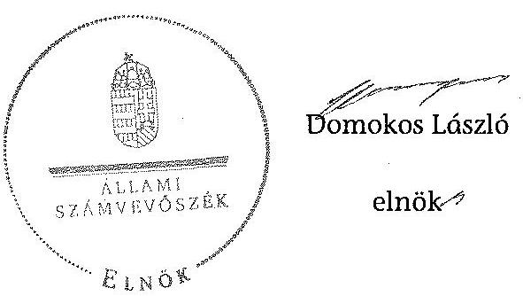

# ÁLLAMI   SZÁMVEVŐSZÉK 

## JELENTÉS

a helyi nemzetiségi önkormányzatok gazdálkodásának ellenőrzéséről
Dunaharaszti Lengyel Nemzetiségi Önkormányzat

---

# Állami Számvevőszék 

Iktatószám: V-0567-059/2014.
Témaszám: 1601
Vizsgálat-azonosító szám: V067607

## Az ellenőrzést felügyelte:

## Brebán Andrea

felügyeleti vezető
Az ellenőrzést vezette és az ellenőrzés végrehajtásáért felelős:
Solymár Ágnes
ellenőrzésvezető

## A számvevőszéki jelentést készítették:

## Solymár Ágnes

ellenőrzésvezető

## Az ellenőrzést végezték:

## Szabó Tamás

számvevő tanácsos

## Szabó Tamás

számvevő

## Winter Zsuzsa

számvevő főtanácsos

---

# TARTALOMJEGYZÉK 

BEVEZETÉS ..... 3
I. ÖSSZEGZŐ MEGÁLLAPÍTÁSOK, KÖVETKEZTETÉSEK, JAVASLATOK ..... 6
II. RÉSZLETES MEGÁLLAPÍTÁSOK ..... 12

1. A Nemzetiségi Önkormányzat és a Települési Önkormányzat együttműködésének szabályozása, a működési feltételek biztosítása ..... 12
2. A gazdálkodási feladatok ellátásának szabályszerűsége ..... 13
2.1. A költségvetésre és a zárszámadásra, valamint a kincstári adatszolgáltatás rendjére vonatkozó jogszabályi előírások betartása ..... 13
2.2. A Nemzetiségi Önkormányzat gazdálkodásának szabályozottsága ..... 15
2.3. Az operatív gazdálkodási jogkörök kialakítása, gyakorlása ..... 16
3. A Nemzetiségi Önkormányzattal összefüggő gazdálkodási feladatok belső ellenőrzése ..... 17
MELLÉKLET
4. számú A Nemzetiségi Önkormányzat 2013. évi gazdálkodásának főbb adatai
FÜGGELÉKEK
5. számú Rövidítések jegyzéke
6. számú Értelmező szótár

---

.

---

# Jelentés 

## a helyi nemzetiségi önkormányzatok gazdálkodásának ellenőrzéséről Dunaharaszti Lengyel Nemzetiségi Önkormányzat

## BEVEZETÉS

A Nemzetiségi Önkormányzat a 2010. évben alakult, elnöke a 2010. évi helyhatósági választások óta látja el feladatát. A Nemzetiségi Önkormányzat intézményt, gazdasági társaságot és más szervezetet nem alapított, illetve társulásban nem vett részt. A háromtagú Nemzetiségi Önkormányzat Képviselőtestület a munkája segítésére bizottságot nem hozott létre. A Nemzetiségi Önkormányzat költségvetési beszámolója szerint a 2013. évben a módosított költségvetési bevételi és kiadási előirányzat 1767,0 ezer Ft, a teljesített költségvetési bevétel 1587,0 ezer Ft, a teljesített költségvetési kiadás 86,0 ezer Ft volt. A Nemzetiségi Önkormányzat a 2013. évben feladatalapú támogatásban nem részesült. A 2013. évi gazdálkodási adatokat részletesen az 1. számú mellékletben mutatjuk be.

Az Alaptörvény Szabadság és felelősség rész XXIX. cikk (1) bekezdése szerint a Magyarországon élő nemzetiségek államalkotó tényezők. Minden, valamely nemzetiséghez tartozó magyar állampolgárnak joga van önazonossága szabad vállalásához és megőrzéséhez. A hazánkban élő nemzetiségek helyi (települési és területi) valamint országos önkormányzatokat hozhatnak létre ${ }^{1}$. A helyi nemzetiségi önkormányzatok gazdálkodási feladatait jogszabályi előírás alapján a székhely szerinti helyi önkormányzat polgármesteri hivatala látja el.

A nemzetiségek helyzete, támogatása mind hazai, mind EU-s szinten kiemelt figyelmet kap napjainkban. A helyi nemzetiségi önkormányzatok gazdálkodására és támogatási rendszerére vonatkozó jogszabályok a 2010-2012. években jelentős változásokon mentek át. A helyi nemzetiségi önkormányzatok gazdálkodásának, a részükre juttatott költségvetési támogatások felhasználásának ellenőrzését az ÁSZ 2012-ben sorozatjellegű ellenőrzés keretében indította el.

Az ellenőrzés célja annak értékelése volt, hogy a helyi Nemzetiségi Önkormányzat gazdálkodási kereteinek kialakítása, gazdálkodása megfelelt-e a jogszabályoknak.

[^0]
[^0]:    ${ }^{1}$ A 2010. évben megtartott nemzetiségi önkormányzati választásokat követően 2304 települési, 58 területi és 13 országos nemzetiségi önkormányzat alakult meg.

---

Ennek keretében értékeltük, hogy:

- a helyi Nemzetiségi Önkormányzat és a helyi (települési) önkormányzat együttműködésének szabályozása, a működési feltételek biztosítása megfelel-e a jogszabályi előírásoknak;
- a felek együttműködése megfelel-e a megállapodásban foglaltaknak a gazdálkodási feladatok szabályszerű ellátása során, betartották-e a vonatkozó jogszabályi előírásokat;
- biztosított volt-e a helyi Nemzetiségi Önkormányzat gazdálkodásának belső ellenőrzése.

Az ellenőrzés várható hasznosulása: a nemzetiségi önkormányzatok testületi döntéseinek tapasztalatait összegezve következtetés vonható le a törvényalkotás számára a jogszabályi környezet esetleges módosításának indokoltságára vonatkozóan. Az ellenőrzés az ellenőrzött számára visszajelzést ad a rendezett gazdálkodási keretek kialakításáról, a működésbeli hiányosságokról. Az ellenőrzés megállapításai és javaslatai, a jó gyakorlat bemutatása tanulságul szolgálhatnak más nemzetiségi önkormányzatok, szervezetek számára a rendezett gazdálkodási keretek kialakításához. A társadalom számára jelzi, hogy közpénz nem maradhat ellenőrizetlenül. Az ÁSZ értékteremtő rend kialakításához és megőrzéséhez hozzájáruló tevékenysége pozitív hatással lesz a szervezetről kialakított összkép formálásában. Az ÁSZ szervezetén belül lehetőség nyílik arra, hogy a megállapítások szintetizálásával az intézmény a hozzáadott értéket teremtő elemző tevékenységét és tanácsadó szerepét erősítse.

A helyi nemzetiségi önkormányzat gazdálkodásának ellenőrzéséről szóló jelentés I. fejezetének összegző része az ellenőrzés céljára adott rövid, szintetizáló összefoglalót és következtetéseket tartalmazza a II. fejezet részletes megállapításain alapulóan. A jelentés intézkedést igénylő megállapításait és javaslatait az összegzőben foglaltak mellett - az ellenőrzés során feltárt, a jelentés II. fejezetében rögzített részletes megállapítások alapozzák meg, illetve támasztják alá.

Az ellenőrzés típusa: szabályszerűségi ellenőrzés.
Az ellenőrzött időszak: a Nemzetiségi Önkormányzat és a Települési Önkormányzat együttműködésének, valamint a Nemzetiségi Önkormányzat gazdálkodásának szabályozása megfelelőségét a 2013. évre vonatkozóan (a 2013. december 31-i állapotnak megfelelően), a Nemzetiségi Önkormányzat gazdálkodásának szabályszerűségét, a működési feltételek, valamint a belső ellenőrzés biztosítását a 2013. január 1. - december 31-e közötti időszakot figyelembe véve értékeltük.

Ellenőrzött szervezet: a Dunaharaszti Lengyel Nemzetiségi Önkormányzat és a gazdálkodási feladatait ellátó Dunaharaszti Polgármesteri Hivatal.

Az ellenőrzés szakmai módszertana az ÁSZ hivatalos honlapján (www.asz.hu) közzétett szakmai szabályokon alapult, amely a Legfőbb Ellenőrző Intézmények Nemzetközi Szervezete (INTOSAI) által kiadott nemzetközi standardok (ISSAI) figyelembevételével készült.

---

A gazdálkodási jogkörök gyakorlásának szabályszerű működését a dologi kiadásokkal kapcsolatos kifizetésekre vonatkozóan ellenőriztük, értékeltük. A jogszabályoknak és a belső előírásoknak megfelelőnek, azaz szabályszerűnek minősítettük az adott területet, ha az értékelés összesített eredménye nagyobb volt, mint 90%, részben megfelelőnek, ha 71 és 90% közé esett, és nem megfelelőnek, ha 70% vagy annál kisebb volt.

Az ellenőrzés végrehajtásának jogszabályi alapját az ÁSZ tv. 5. § (2)-(3) és (6) bekezdéseiben foglaltak képezik.

Az ÁSZ tv. 29. § (1) bekezdése szerint a jelentéstervezetet megküldtük a jegyző részére, aki az ÁSZ tv. 29. § (2) bekezdésében foglalt észrevételezési jogával nem élt, a jelentéstervezetre észrevételt nem tett.

---

# I. ÖSSZEGZŐ MEGÁLLAPÍTÁSOK, KÖVETKEZTETÉSEK, JAVASLATOK 

A Nemzetiségi Önkormányzat és a Települési Önkormányzat együttműködésének szabályozása a feltárt tartalmi hiányosság ellenére megfelelt a jogszabályi előírásoknak. A Nemzetiségi Önkormányzat a 2013. év egészét érintően rendelkezett a Települési Önkormányzattal kötött együttműködési megállapodással. Az együttműködési megállapodást a Nek. tv. előírása ellenére 2013. január 31-éig nem vizsgálták felül. Az együttműködési megállapodás a Nek. tv. előírása ellenére nem tartalmazta a testületi ülések előkészítését, a gazdálkodással kapcsolatos iratkezelési feladatok ellátását, a feladat ellátáshoz kapcsolódó költségek viselését, az önálló fizetési számla nyitásával, törzskönyvi nyilvántartásba vételével és adószám igénylésével kapcsolatos feladatok végrehajtásának határidejét és a kötelezettségvállalással kapcsolatos ellenjegyzési feladatokat, továbbá a felelősök konkrét kijelölését. Nem rögzítette továbbá az együttműködési megállapodás a Nek. tv. előírásától eltérően a jegyzőnek vagy annak - a jegyzővel azonos képesítési előírásoknak megfelelő - megbízottjának a Települési Önkormányzat megbízásából és képviseletében a Nemzetiségi Önkormányzat testületi ülésein való részvételét. Az együttműködési megállapodás szerinti működési feltételeket a Nemzetiségi Önkormányzat SZMSZ-ében a megállapodás megkötését követő harminc napon belül rögzítették. Ugyanakkor a Nek. tv. előírása ellenére a Települési Önkormányzat SZMSZ-ében nem rögzítették a megállapodás szerinti a Nemzetiségi Önkormányzatra vonatkozó működési feltételeket.

A Települési Önkormányzat a szabályozási hiányosságok ellenére biztosította a Nemzetiségi Önkormányzat működéséhez szükséges tárgyi feltételeket. Az együttműködési megállapodás hiányosságára is visszavezethető, hogy a személyi feltételeket a Települési Önkormányzat a Nek. tv. előírásától eltérően csak részben biztosította, mert a jegyző, vagy annak - a jegyzővel azonos képesítési előírásoknak megfelelő - megbízottja az Önkormányzat megbízásából és képviseletében nem vett részt a Nemzetiségi Önkormányzat testületi ülésein.

A Nemzetiségi Önkormányzat 2013. évi költségvetésének, zárszámadásának tartalma, jóváhagyása, valamint a kincstári adatszolgáltatás szabályszerűsége nem felelt meg a jogszabályi előírásoknak. A Nemzetiségi Önkormányzat elnöke az Áht.-ben foglaltak ellenére nem nyújtotta be határidőben a Nemzetiségi Önkormányzat Képviselő-testülete részére a jegyző által előkészített az ellenőrzött évre vonatkozó költségvetési koncepciót és a költségvetési határozat tervezetét. A 2013. évi költségvetés előterjesztésekor a Nemzetiségi Önkormányzat Képviselő-testülete részére az Áht.-ben foglalt előírásoktól eltérően - a jegyző mulasztása miatt - tájékoztatásul nem mutatták be szöveges indokolással együtt a Nemzetiségi Önkormányzat előirányzat felhasználási tervét, költségvetési mérlegét közgazdasági tagolásban, valamint a közvetett támogatásokat tartalmazó kimutatást. A jóváhagyott költségvetési határozat az Áht.-ben foglalt előírások ellenére nem tartalmazta a bevételeket, valamint a kiadásokat előirányzat csoportok és feladatok szerinti bontásban.

---

A jegyző az Áht. előírása szerinti határidőre elkészítette a Nemzetiségi Önkormányzat 2013. évi zárszámadási határozat-tervezetét, de a Nemzetiségi Önkormányzat elnöke az Áht.-ban előírt határidőig nem terjesztette be azt a Nemzetiségi Önkormányzat Képviselő-testülete elé. A zárszámadási határozat tervezetének előterjesztésekor a Nemzetiségi Önkormányzat Képviselő-testülete részére az Áht. előírásától eltérően - a jegyző mulasztása miatt - tájékoztatásul nem mutatták be szöveges indokolással együtt a Nemzetiségi Önkormányzat pénzeszközeinek változását, költségvetési mérlegét közgazdasági tagolásban, valamint a közvetett támogatásokat tartalmazó kimutatást. A zárszámadásról szóló határozat tartalma az előírásoknak részben felelt meg, mert összehasonlíthatósága az elfogadott költségvetéssel, az Áht. előírása ellenére nem volt biztosított. A jegyző a 2013. évi költségvetéshez kapcsolódó, a Nemzetiségi Önkormányzatra vonatkozó, kincstári adatszolgáltatási kötelezettségének két esetben - a I. féléves és az éves elemi költségvetési beszámoló benyújtásakor - az Áhsz.-ben előírt határidőn túl tett eleget.

A Nemzetiségi Önkormányzat gazdálkodásának szabályozottsága az ellenőrzött időszakban megfelelő volt, a jogszabályokban előírt szabályzatokkal rendelkezett. A gazdálkodási feladatok végrehajtását ellátó Polgármesteri Hivatal a Számv. tv. által előírt számviteli szabályzatainak - leltározási és leltárkészítési, eszközök és források értékelési és pénzkezelési szabályzat, számlarend, számviteli politika - hatálya kiterjedt a Nemzetiségi Önkormányzat gazdálkodására. A Bkr.-ben foglaltak ellenére nem terjedt ki a Polgármesteri Hivatal folyamatba épített, előzetes, utólagos és vezetői ellenőrzése, továbbá a szabálytalanságok kezelése eljárásrendjének és az ellenőrzési nyomvonalának hatálya a Nemzetiségi Önkormányzat gazdálkodásával kapcsolatos végrehajtási feladataira. A Nemzetiségi Önkormányzat a szabályzatokkal önálló módon sem rendelkezett. A Polgármesteri Hivatal SZMSZ-e az Ávr.-ben előírtak ellenére csak részben tartalmazta - az SZMSZ-ben nevesített munkakörökhöz tartozó - a Nemzetiségi Önkormányzat gazdálkodásának végrehajtásával kapcsolatos feladat- és hatásköröket, mivel a hatáskörök gyakorlásának módját, a helyettesítés rendjét szabályozták, de az ezekhez kapcsolódó felelősségi szabályokat nem rögzítették.

A Nemzetiségi Önkormányzat gazdálkodása tekintetében az operatív gazdálkodási jogkörök kialakítása a 2013. évben megfelelő volt. Az összeférhetetlenségi követelmények érvényesülésének feltételei biztosítottak voltak, mivel a Nemzetiségi Önkormányzat elnöke a kötelezettségvállalás, teljesítésigazolás gyakorlására felhatalmazott más képviselőt. A gazdasági vezető az Ávr. előírásának megfelelően alakította ki az operatív gazdálkodási jogkörök gyakorlására vonatkozó belső előírásokat és feltételeket.

A Nemzetiségi Önkormányzatnak a 2013. évben kizárólag dologi kiadásai voltak, ezzel kapcsolatos kifizetések teljesítése során az operatív gazdálkodási jogkörökön belül kulcsszerepet betöltő teljesítésigazolás és érvényesítés kulcskontrollokat a jogszabályi előírásoknak megfelelően működtették. A kulcskontrollok működése biztosította a hibák megelőzését, feltárását és kijavítását. A számvevőszéki ellenőrzés a kifizetések bizonylatainak ellenőrzése során - a rendelkezésre bocsátott dokumentumok alapján - összeférhetetlenséget, illetve jogosulatlan kifizetést nem tárt fel.

---

A jegyző az ellenőrzött időszakban biztosította a Polgármesteri Hivatalnál a Nemzetiségi Önkormányzat gazdálkodásával összefüggő végrehajtási feladatok belső ellenőrzését. A Polgármesteri Hivatal belső ellenőrzési vezetője a Bkr. előírásának megfelelően kockázatelemzést készített a Nemzetiségi Önkormányzat gazdálkodásával összefüggő végrehajtási feladatokra. A kockázat elemzés alapján a kockázatok szintje
 alacsony volt, ezért a Nemzetiségi Önkormányzat gazdálkodásával összefüggő végrehajtási feladatokra vonatkozóan a 2013. évre belső ellenőrzést nem terveztek és nem végeztek.

Az ellenőrzéshez szolgáltatott adatok alapján az ellenőrzött időszakban a Pest Megyei Kormányhivatal a Nemzetiségi Önkormányzatot illetően nem élt törvényességi felhívással, törvényességi ellenőrzést nem végzett, egyéb törvényességi felügyeleti intézkedést nem tett.

Az integritás szemlélet érvényesülésének ellenőrzéséhez a Polgármesteri Hivatal és a Nemzetiségi Önkormányzat tanúsítványon szolgáltatott adatokat. A kockázatok és a kontrollok szintje alapján megállapítható, hogy a szervezetnél jelenlévő eredendő korrupciós kockázatok, valamint a kockázatokat növelő tényezők szintjén nem haladják meg az azok kezelésére kiépült kontrollok szintjét.

A helyszíni ellenőrzés megállapításainak hasznosítása mellett javaslatot fogalmaztunk meg a jegyzőnek és a Nemzetiségi Önkormányzat elnökének. A Nemzetiségi Önkormányzat 2014. október 12-i megszűnése miatt az ellenőrzött szervezetek vezetőinek az intézkedési terv készítési kötelezettsége okafogyottá vált.

Az ellenőrzés megállapításai és azok alapján megfogalmazott javaslatok:

# a jegyzőnek 

1. Az együttműködés szabályozásával kapcsolatban

A Nemzetiségi Önkormányzat és a Települési Önkormányzat együttműködését meghatározó együttműködési megállapodás tartalma nem felelt meg a Nek. tv. 80. § (1) bekezdés c), e), g) pontjaiban és a Nek. tv. 80. § (3) bekezdés a), b) pontjaiban foglaltaknak. A Nek. tv. 80. § (4) bekezdés ellenére az együttműködési megállapodásban nem rögzítették, hogy a jegyző vagy annak - a jegyzővel azonos képesítési előírásoknak megfelelő - megbízottja a Települési Önkormányzat megbízásából és képviseletében a Nemzetiségi Önkormányzat testületi ülésein részt vesz és jelzi a törvénysértést. A Nek. tv. 80. § (2) bekezdésében foglaltak ellenére 2013. január 31-éig nem végezték el az együttműködési megállapodás felülvizsgálatát.

A 2013. december 31-én hatályos együttműködési megállapodás szerinti működési feltételeket a Nek. tv. 80. § (2) bekezdésében előírtak ellenére a Települési Önkormányzat SZMSZ-ében nem rögzítették.

---

Javaslat
Az együttműködés szabályszerűsége érdekében:
a) készítse elő a Nek. tv. 80. § (1) bekezdés c), e), g) pontjaiban, a (3) bekezdés a), b) pontjaiban és a (4) bekezdésében foglalt előírásoknak megfelelő együttműködési megállapodás módosítását és kezdeményezze a módosítás Települési Önkormányzat Képviselő-testülete elé terjesztését;
b) készítse elő a Települési Önkormányzat módosított SZMSZ-ét a Nek. tv. 80. § (2) bekezdésében foglalt előírás figyelembe vételével és kezdeményezze a módosítás Települési Önkormányzat Képviselő-testülete elé terjesztését;
c) gondoskodjon az együttműködési megállapodás Nek. tv. 80. § (2) bekezdésében előírt határidő szerinti évenkénti felülvizsgálatáról.
2. A költségvetés és zárszámadás szabályszerűségével kapcsolatban

A 2013. évi költségvetési határozat az Áht. 26. § (1) bekezdésében foglalt előírás alapján az Áht. 23. § (2) bekezdés a) pontjától eltérően nem tartalmazta a Nemzetiségi Önkormányzat költségvetési bevételeit. Nem tartalmazta továbbá a költségvetési kiadásait előirányzat csoportok és feladatok szerinti bontásban, csak a kiemelt előirányzatokat.

A 2013. évi költségvetési határozat-tervezet előterjesztésekor - a jegyző mulasztása miatt - a Nemzetiségi Önkormányzat Képviselő-testülete részére az Áht. 24. § (4) bekezdés a) és c) pontjaiban foglalt előírásoktól eltérően tájékoztatásul nem mutatták be szöveges indokolással a Nemzetiségi Önkormányzat előirányzat felhasználási tervét, költségvetési mérlegét közgazdasági tagolásban, valamint a közvetett támogatásokat tartalmazó kimutatást.

A 2013. évi zárszámadási határozat-tervezet előterjesztésekor - a jegyző mulasztása miatt - a Nemzetiségi Önkormányzat Képviselő-testülete részére tájékoztatásul nem mutatták be szöveges indokolással együtt az Áht. 91. § (2) bekezdés a) pontja alapján az Áht. 24. § (4) bekezdés a) és c) pontjai szerint a Nemzetiségi Önkormányzat pénzeszközök változását, költségvetési mérlegét közgazdasági tagolásban, valamint a közvetett támogatásokat tartalmazó kimutatást. Az Áht. 89. § (1) bekezdésében előírtak ellenére a költségvetés és a zárszámadás összehasonlíthatósága nem volt biztosított.

Javaslat
Intézkedjen a jövőben arról, hogy:
a) a költségvetési határozat az Áht. 23. § (2) bekezdés a) pontjában előírtaknak tartalmilag feleljen meg;
b) a költségvetési határozat-tervezet előterjesztésekor a Nemzetiségi Önkormányzat Képviselő-testületének tájékoztatásul szöveges indoklással bemutatásra kerüljenek az Áht. 24. § (4) bekezdés a) és c) pontjaiban előírt mérleg és kimutatások;

---

c) a zárszámadási határozat-tervezet előterjesztésekor a Nemzetiségi Önkormányzat Képviselő-testületének tájékoztatásul bemutatásra kerüljenek az Áht. 91. § (2) bekezdés a) pontja alapján az Áht. 24. § (4) bekezdés a) és c) pontjaiban előírt mérleg és kimutatások;
d) a költségvetés és a zárszámadás Áht. 89. § (1) bekezdése szerinti összehasonlíthatósága biztosított legyen.
3. A kincstári adatszolgáltatási kötelezettséggel kapcsolatban

A jegyző a Nemzetiségi Önkormányzatra vonatkozó kincstári adatszolgáltatási kötelezettségének csak részben tett eleget, mert a 2013. I. féléves és éves elemi költségvetési beszámolót az Áhsz. 10. § (5a) bekezdése szerinti határidőre nem nyújtotta be a Kincstár területileg illetékes szervének.

Javaslat
Tegyen eleget a kincstári adatszolgáltatási kötelezettségének az Ávr. 169. § (2) valamint az Áhsz. 32. § (4) bekezdésében foglalt határidők betartásával.
4. A gazdálkodási feladatok szabályozottságával kapcsolatban

A Polgármesteri Hivatal a Bkr. 6. § (3) és (4) bekezdéseiben előírtak alapján elkészített ellenőrzési nyomvonala és szabálytalanságok kezelésének eljárásrendje nem terjedt ki a Nemzetiségi Önkormányzat gazdálkodásával kapcsolatos végrehajtási feladatokra. A Nemzetiségi Önkormányzat ezekkel önálló módon sem rendelkezett. A jegyző a Bkr. 8. § (2) bekezdés előírásától eltérően a Nemzetiségi Önkormányzat gazdálkodásának végrehajtásával kapcsolatos feladataira vonatkozóan nem biztosította a folyamatba épített, előzetes, utólagos és vezetői ellenőrzést.

A Polgármesteri Hivatal SZMSZ-e az Ávr. 13. § (1) bekezdés g) pontjában előírtak ellenére csak részben tartalmazta az SZMSZ-ben nevesített munkakörökhöz tartozó a Nemzetiségi Önkormányzat gazdálkodásával kapcsolatos feladat- és hatásköröket, mivel a hatáskörök gyakorlásának módjára, a helyettesítés rendjére tartalmaztak előírásokat, azonban az ezekhez kapcsolódó felelősségi szabályokat nem rögzítették. Ezen előírásokat a gazdálkodási szabályzat és az együttműködési megállapodás tartalmazta.

Javaslat
A Nemzetiségi Önkormányzat gazdálkodásának végrehajtásával kapcsolatos feladataira készítse el:
a) a Bkr. 6. § (3) és (4) bekezdéseiben meghatározott szabályozásokat és biztosítsa a Bkr. 8. § (2) bekezdésének megfelelően a folyamatba épített, előzetes, utólagos és vezetői ellenőrzést;
b) a Polgármesteri Hivatal SZMSZ-ének módosítását, hogy az teljes körűen feleljen meg az Ávr. 13. § (1) bekezdés g) pontjában foglalt előírásnak és kezdeményezze a módosítás Települési Önkormányzat Képviselő-testülete elé terjesztését.

---

# a Nemzetiségi Önkormányzat elnökének 

1. A Nemzetiségi Önkormányzat és a Települési Önkormányzat együttműködését meghatározó együttműködési megállapodás nem felelt meg a Nek. tv. 80. § (1) bekezdés c), e), g) pontjaiban, a 80. § (3) bekezdés a) és b) pontjaiban és a 80. § (4) bekezdésben foglaltaknak.

Javaslat
Terjessze a Nemzetiségi Önkormányzat Képviselő-testülete elé jóváhagyásra a Nek. tv. 80. § (1) bekezdés c), e), g) pontjában, valamint a 80. § (3) bekezdés a) és b) pontjaiban és a (4) bekezdésben foglalt előírások betartásával a jegyző által előkészített együttműködési megállapodás módosítást.
2. A Nemzetiségi Önkormányzat elnöke a jegyző által előkészített 2013. évi költségvetési koncepciót, továbbá a 2013. évi költségvetési határozat-tervezetet nem nyújtotta be a Nemzetiségi Önkormányzat Képviselő-testülete részére az Áht. 24. § (1) és (2) bekezdéseiben meghatározott határidőig. A 2013. évi zárszámadási határozattervezetét a Nemzetiségi Önkormányzat elnöke az Áht. 91. § (1) bekezdésében előírt határidőig nem terjesztette be a Nemzetiségi Önkormányzat Képviselő-testülete elé.

A Nemzetiségi Önkormányzat Képviselő-testülete részére az Áht. 24. § (4) bekezdés a) és c) pontjaiban foglalt előírásoktól eltérően - a jegyző mulasztása miatt - tájékoztatásul nem mutatták be szöveges indokolással 2013. évi költségvetési határozattervezet előterjesztésekor a Nemzetiségi Önkormányzat előirányzat felhasználási tervét, a 2013. évi zárszámadási határozat-tervezet előterjesztésekor az Áht. 91. § (2) bekezdése alapján a Nemzetiségi Önkormányzat pénzeszközök változását, illetve mindkét előterjesztéskor a költségvetési mérlegét közgazdasági tagolásban, valamint a közvetett támogatásokat tartalmazó kimutatást.

Javaslat
A Képviselő-testület részére:
a) történő előterjesztésekor gondoskodjon a költségvetési koncepció és határozattervezet esetében az Áht. 24. § (1) és (3) bekezdéseiben, a zárszámadási határozat-tervezet esetében az Áht. 91. § (1) bekezdésében meghatározott határidő betartásáról;
b) tájékoztatásul mutassa be a költségvetési határozat-tervezet előterjesztésekor az Áht. 24. § (4) bekezdés a) és c) pontjaiban előírt mérleget, kimutatásokat;
c) tájékoztatásul mutassa be a zárszámadási határozat-tervezet előterjesztésekor az Áht. 91. § (2) bekezdés a) pontja alapján az Áht. 24. § (4) bekezdés a) és c) pontjaiban előírt mérleget, kimutatásokat.

---

# II. RÉSZLETES MEGÁLLAPÍTÁSOK 

## 1. A Nemzetiségi Önkormányzat És a Települési Önkormányzat Együttműködésének Szabályozása, a Működési Feltételek Biztosítása

A Nemzetiségi Önkormányzat és a Települési Önkormányzat együttműködésének szabályozása a feltárt hiányosságok ellenére megfelelt a jogszabályi előírásoknak.

A Nemzetiségi Önkormányzat rendelkezett a 2013. év folyamán hatályban lévő, a Települési Önkormányzattal történő együttműködésre vonatkozó megállapodással ${ }^{2}$. A megállapodást a Nemzetiségi Önkormányzat és a Települési Önkormányzat Képviselő-testületei határozattal jóváhagyták és az arra jogosult személyek aláírták. A Nek. tv. 80. § (2) bekezdésében foglaltak ellenére 2013. január 31-éig nem végezték el az együttműködési megállapodás felülvizsgálatát.

Az együttműködési megállapodást a Települési Önkormányzat a 43/2012. (IV. 02.) számú, a Nemzetiségi Önkormányzat a 3/2012. (III. 16.) számú határozatával hagyta jóvá. ${ }^{3}$

A 2013. december 31-én hatályos megállapodásban a Nemzetiségi Önkormányzat működésének feltételeit rögzítették, azonban a jogszabályi előírások nem érvényesültek maradéktalanul.

Az együttműködési megállapodás az Áht. 27. § (2) bekezdésében foglaltaknak megfelelően tartalmazta a Nemzetiségi Önkormányzat gazdálkodásához kapcsolódó feladatokat. Ugyanakkor a Nemzetiségi Önkormányzat működési feltételeit hiányosan szabályozta, mert nem tartalmazta az alábbiakban felsorolt, a Nek. tv.-ben foglaltakat:

- a Nek. tv. 80. § (1) bekezdés c) pont előírása ellenére a testületi ülések előkészítését (meghívók, előterjesztések, hivatalos levelezés előkészítését);
- a Nek. tv. 80. § (1) bekezdés e) pontja előírása ellenére a gazdálkodással kapcsolatos iratkezelési feladatok ellátását;
- a Nek. tv. 80. § (1) bekezdés g) pontjában foglaltak ellenére a feladatellátáshoz kapcsolódó költségek - a testületi tagok és tisztségviselők telefonhasználata költségei kivételével - viselését;

[^0]
[^0]:    ${ }^{2}$ Az együttműködési megállapodást 2012. április 2-án kötötték meg.
    ${ }^{3}$ Az együttműködési megállapodás elfogadásáról szóló határozat-tervezetet a jegyző és a polgármester által aláírt beterjesztés alapján fogadta el a Települési Önkormányzat Képviselő-testülete.

---

- a Nek. tv. 80. § (3) bekezdés a) pontja által a Nemzetiségi Önkormányzat részére előírt önálló fizetési számla nyitásával, törzskönyvi nyilvántartásba vételével és adószám igénylésével kapcsolatos feladatok végrehajtásának határidejét;
- a Nek. tv. 80. § (3) bekezdés b) pontja által előírt, a Nemzetiségi Önkormányzat kötelezettségvállalásaival kapcsolatosan a Települési Önkormányzatot terhelő ellenjegyzési feladatokat, továbbá a felelősök konkrét kijelölését;
- a Nek. tv. 80. § (4) bekezdésben foglaltak ellenére azt, hogy a jegyző vagy annak - a jegyzővel azonos képesítési előírásoknak megfelelő - megbízottja a Települési Önkormányzat megbízásából és képviseletében részt vesz a Nemzetiségi Önkormányzat testületi ülésein és jelzi, amennyiben törvénysértést észlel.

A Nek. tv. 80. § (2) bekezdésétől eltérően a Települési Önkormányzat SZMSZ-ében az együttműködési megállapodás szerinti a Nemzetiségi Önkormányzatra vonatkozó működési feltételeket nem rögzítették.

Az együttműködési megállapodás szerinti működési feltételeket a Nemzetiségi Önkormányzat SZMSZ-ében a megállapodás megkötését követő harminc napon belül rögzítették. Az együttműködési megállapodás az Áht.-ben foglaltak szerint tartalmazta a Nemzetiségi Önkormányzathoz kapcsolódó gazdálkodási és egyéb feladatellátás részletes
 szabályait.

A Települési Önkormányzat a Nemzetiségi Önkormányzat 2013. évi működése során a személyi feltételeket részben biztosította, mivel a Nek. tv. 80. § (4) bekezdésétől eltérően a jegyző vagy annak – a jegyzővel azonos képesítési előírásoknak megfelelő – megbízottja a Települési Önkormányzat megbízásából és képviseletében nem vett részt a Nemzetiségi Önkormányzat testületi ülésein.

A jegyző és a Nemzetiségi Önkormányzat által tett nyilatkozat alapján a Települési Önkormányzat a Nemzetiségi Önkormányzat működéséhez a 2013. évben a tárgyi feltételeket biztosította.

# 2. A GAZDÁLKODÁSI FELADATOK ELLÁTÁSÁNAK SZABÁLYSZERŰSÉGE 

### 2.1. A költségvetésre és a zárszámadásra, valamint a kincstári adatszolgáltatás rendjére vonatkozó jogszabályi előírások betartása

A Nemzetiségi Önkormányzat 2013. évi költségvetésének és zárszámadásának tartalma, jóváhagyása, valamint a kapcsolódó adatszolgáltatás nem felelt meg a jogszabályi előírásoknak.

A Nemzetiségi Önkormányzat elnöke az Áht. 26. § (1) bekezdésben és az Áht. 24. § (1) bekezdésében előírtaktól eltérően november 30-áig nem nyújtotta be

---

a Nemzetiségi Önkormányzat Képviselő-testülete részére a jegyző által előkészített az ellenőrzött évre vonatkozó költségvetési koncepciót.

A Nemzetiségi Önkormányzat elnöke az Áht. 26. § (1) bekezdése alapján, az Áht. 24. § (2) bekezdésében ${ }^{4}$ előírtaktól eltérően a központi költségvetésről szóló törvény hatálybalépését követő 45 napig nem nyújtotta be a Nemzetiségi Önkormányzat Képviselő-testülete részére költségvetési határozat tervezetét ${ }^{5}$.

A 2013. évi költségvetési határozat az Áht. 26. § (1) bekezdésében foglalt előírás alapján az Áht. 23. § (2) bekezdés a) pontjától eltérően nem tartalmazta a Nemzetiségi Önkormányzat költségvetési bevételeit. Nem tartalmazta továbbá a költségvetési kiadásait előirányzat csoportok és feladatok szerinti bontásban, csak a kiemelt előirányzatokat.

A 2013. évi költségvetési határozat-tervezet előterjesztésekor – a jegyző mulasztása miatt – a Nemzetiségi Önkormányzat Képviselő-testülete részére az Áht. 24. § (4) bekezdés a) és c) pontjai előírásától eltérően tájékoztatásul nem mutatták be szöveges indokolással együtt a Nemzetiségi Önkormányzat előirányzat felhasználási tervét, költségvetési mérlegét közgazdasági tagolásban, valamint a közvetett támogatásokat tartalmazó kimutatást.

A 2013. évi költségvetésről szóló 1/2013. (III. 10.) sz. határozatban a Nemzetiségi Önkormányzat a Települési Önkormányzat 200 ezer Ft összegű támogatását megjelenítették. A Nemzetiségi Önkormányzat elnöke nyilatkozatban lemondott az előirányzat felhasználásáról, amelyet nem előzött meg a Nemzetiségi Önkormányzat Képviselő-testületének határozata a támogatási előirányzat lemondásáról. Ez a gyakorlat ellentétes a Nek. tv. 76. § (3) bekezdésben foglaltakkal, mivel a nemzetiségi önkormányzati feladat- és hatáskörök a Nemzetiségi Önkormányzat testületét illetik meg, és nem felel meg a Nek. tv. 114. § (1) bekezdés f) pontjában foglaltaknak, mert a Nemzetiségi Önkormányzat át nem ruházható hatáskörben dönt a támogatás lemondásáról.

A zárszámadási határozat tervezetének előterjesztésekor – a jegyző mulasztása miatt – a Nemzetiségi Önkormányzat Képviselő-testülete részére az Áht. 24. § (4) bekezdés a) és c) pontjaitól és az Áht. 91. § (2) bekezdés a) pontjától eltérően nem mutatták be tájékoztatásul szöveges indokolással együtt a Nemzetiségi Önkormányzat pénzeszközeinek változását, költségvetési mérlegét közgazdasági tagolásban, valamint a közvetett támogatásokat tartalmazó kimutatást. A jegyző az Áht. 91. § (1) bekezdésében előírt határidőre elkészítette a Nemzetiségi Önkormányzat 2013. évi zárszámadási határozat-tervezetét, de azt a Nemzetiségi Önkormányzat elnöke az előírt határidőig nem terjesztette be a Nemzetiségi Önkormányzat Képviselő-testülete elé. A Nemzetiségi Önkormányzat a zárszámadásról határozatot alkotott. A zárszámadásról szóló határozat tartalma az előírásoknak csak részben felelt meg, mert az Áht.

[^0]
[^0]:    ${ }^{4}$ 2013. december 21-étől az Áht. 24. § (3) bekezdése írja elő.
    ${ }^{5}$ A 2013.évi költségvetést a Nemzetiségi Önkormányzat Képviselő-testülete 2013. március 10-én tárgyalta és fogadta el az $1 / 2013$. (III.10.) számú határozatával ez a törvényben megfogalmazott 45 naphoz (február 15.) képest 23 nap késést jelentett.

---

89. § (1) bekezdés előírásától eltérően nem volt biztosított az elfogadott költségvetéssel való összehasonlíthatósága.

A jegyző a Nemzetiségi Önkormányzatra vonatkozó kincstári adatszolgáltatási kötelezettségének csak részben tett eleget, mert a 2013. év I. féléves és éves elemi költségvetési beszámolót az Áhsz ${ }_{1} 10 . \S$ (5a) bekezdés ${ }^{6}$ szerinti határidőre nem nyújtotta be a Kincstár területileg illetékes szervének ${ }^{7}$.

A jegyző a negyedéves és éves időközi költségvetési jelentéseket az Ávr. 169. § (2) bekezdése ${ }^{8}$ szerinti határidőre megküldte a Kincstár területileg illetékes szervének. A Nemzetiségi Önkormányzat 2013. évben az időközi mérlegjelentéseket az Ávr. 170. § (5) bekezdése ${ }^{9}$ szerinti határidőre megküldte a Kincstár területileg illetékes szervének.

# 2.2. A Nemzetiségi Önkormányzat gazdálkodásának szabályozottsága 

A Nemzetiségi Önkormányzat gazdálkodásának szabályozottsága az ellenőrzött időszakban megfelelő volt, a jogszabályokban előírt szabályzatokkal rendelkezett.

A gazdálkodási feladatok végrehajtását ellátó Polgármesteri Hivatal a 2013. évben a Számv. tv. által előírt számviteli szabályzatok közül az eszközök és források értékelési szabályzatával, eszközök és források leltározási és leltárkészítési szabályzatával, számlarenddel, pénzkezelési szabályzattal rendelkezett, amelyek hatálya a Nemzetiségi Önkormányzat gazdálkodási feladataira kiterjedt és a 2013. évre aktualizáltak voltak.

A jegyző a Nemzetiségi Önkormányzat gazdálkodását a fentieken túl hiányosan szabályozta, mert:

- a Polgármesteri Hivatal SZMSZ-e az Ávr. 13. § (1) bekezdés g) pontjában előírtak ellenére csak részben tartalmazta az SZMSZ-ben nevesített munkakörökhöz tartozó – a Nemzetiségi Önkormányzat gazdálkodásával kapcsolatos – feladat-és hatásköröket, mivel a hatáskörök gyakorlásának módjára, a helyettesítés rendjére tartalmaztak előírásokat, azonban az ezekhez kapcsolódó
${ }^{6}$ 2014. január 1-jétől Áhsz 32. § (4) bekezdés szabályozza.
${ }^{7}$ A 2013. évi I. féléves beszámoló 2013.10.07-én és az éves elemi beszámoló 2014. 03.12-én került megküldésre.
${ }^{8}$ A Nemzetiségi Önkormányzat az időközi költségvetési jelentést a költségvetési év első három hónapjáról április 20-áig, a költségvetési év első hat hónapjáról július 20-áig, a költségvetési év első kilenc hónapjáról október 20-áig, a költségvetési év tizenkét hónapjáról a költségvetési évet követő év január 20-áig az Igazgatóságnak küldi meg.
${ }^{9}$ Az irányító szerv az időközi mérlegjelentéseket a tárgynegyedévet követő hónap 25. napjáig, a negyedik negyedévre vonatkozó gyorsjelentést öt munkanapon belül, az éves jelentést az éves költségvetési beszámoló továbbításának határidejével megegyezően juttatja el feldolgozásra a Kincstárnak, az államháztartás önkormányzati alrendszerébe tartozó irányító szerv esetén az Igazgatóságnak.

---

felelősségi szabályokat nem rögzítették. Ezen előírásokat a gazdálkodási szabályzat és az együttműködési megállapodás tartalmazta;

- a Polgármesteri Hivatalban a Bkr. 6. § (3) és (4) bekezdéseiben előírtak alapján elkészített ellenőrzési nyomvonal, a szabálytalanságok kezelésének eljárásrendje hatálya nem terjedt ki a Nemzetiségi Önkormányzat gazdálkodásával kapcsolatos végrehajtási feladataira. A Nemzetiségi Önkormányzat ezekkel önálló módon sem rendelkezett. A jegyző a Bkr. 8. § (2) bekezdés előírásától eltérően a Nemzetiségi Önkormányzatra vonatkozóan nem biztosította a folyamatba épített, előzetes, utólagos és vezetői ellenőrzést.

A százezer forintot el nem érő kifizetések esetében sem a szabályozásban, sem a gyakorlatban nem éltek az Ávr. 53. § (1) bekezdés a) pontjában meghatározott előzetes írásbeli kötelezettségvállalás használatának mellőzésével. A Polgármesteri Hivatalban a gazdálkodási feladatokat ellátó köztisztviselők munkaköri leírásai teljes körűen tartalmazták a Nemzetiségi Önkormányzattal kapcsolatos feladatokat.

Az Ávr. 13. § (2) bekezdés a) pontban foglaltak szerinti belső szabályozás tartalmi követelményeit – a tervezéssel, gazdálkodással, különösen az operatív gazdálkodási jogkörök gyakorlásának módjával, eljárási és dokumentációs részletszabályaival, valamint az ezeket végző személyek kijelölési rendjével és az ellenőrzési, adatszolgáltatási feladatok teljesítésével kapcsolatos belső előírásokat és feltételeket – a gazdasági vezető által kialakított gazdasági szervezet ügyrendje és a gazdálkodási szabályzat az együttműködési megállapodással összhangban rögzítette.

# 2.3. Az operatív gazdálkodási jogkörök kialakítása, gyakorlása 

A Nemzetiségi Önkormányzat gazdálkodása tekintetében az operatív gazdálkodási jogkörök kialakítása megfelelt a jogszabályi előírásoknak, valamint az együttműködési megállapodásban foglaltaknak.

A Polgármesteri Hivatal a 2013. évben rendelkezett gazdasági szervezettel, a gazdasági vezető végzettsége megfelelt az Ávr. 12. §-ában előírt szakképesítési követelményeknek. A Nemzetiségi Önkormányzat elnöke, mint kötelezettségvállaló az Áht. 36. § (7) bekezdése, az Ávr. 52. § (7) és az Ávr. 57. § (4) bekezdései alapján más képviselőt írásban felhatalmazott a kötelezettségvállalásra, és kijelölt teljesítésigazolás gyakorlására, biztosítva ezzel az Ávr. 60. § (2) bekezdése szerinti összeférhetetlenségi szabályok érvényesítését.

A Nemzetiségi Önkormányzatnak a 2013. évben kizárólag dologi kiadásai voltak ${ }^{10}$, az ezzel kapcsolatos kifizetések teljesítése során az operatív gazdálkodási jogkörökön belül kulcsszerepet betöltő teljesítésigazolás és érvényesítés kulcskontrollokat a jogszabályi előírásoknak megfelelően működtették. A számvevőszéki ellenőrzés a kifizetések bizonylatainak ellen-

[^0]
[^0]:    ${ }^{10}$ A Nemzetiségi Önkormányzatnak az ellenőrzött időszakban személyi juttatások, felhalmozási kiadások, pénzeszközátadás és ellátottak juttatása címen kiadása nem volt.

---

őrzése során – a rendelkezésre bocsátott dokumentumok alapján – összeférhetetlenséget, illetve jogosulatlan kifizetést nem tárt fel. A kulcskontrollok megfelelő működtetése révén biztosított volt az esetleges hibák megelőzése, feltárása és kijavítása.

# 3. A Nemzetiségi ÖNKORMÁNYZATTAL ÖSSZEFÜGGŐ GAZDÁLKODÁSI FELADATOK BELSŐ ELLENŐRZÉSE 

A jegyző az ellenőrzött időszakban biztosította a Polgármesteri Hivatalnál a Nemzetiségi Önkormányzat gazdálkodásával összefüggő végrehajtási feladatok belső ellenőrzését. A Polgármesteri Hivatal belső ellenőrzési vezetője a Bkr. 22. § (1) bekezdés b) pontjának megfelelően kockázatelemzést készített a Nemzetiségi Önkormányzat gazdálkodásával összefüggő végrehajtási feladatokra. A kockázatelemzés alapján a kockázatok szintje alacsony volt, ezért a Nemzetiségi Önkormányzat gazdálkodásával összefüggő végrehajtási feladatokra vonatkozóan a 2013. évre belső ellenőrzést nem terveztek és nem végeztek.

Az ellenőrzéshez szolgáltatott adatok alapján az ellenőrzött időszakban a Pest Megyei Kormányhivatal a Nemzetiségi Önkormányzatot illetően nem élt törvényességi felhívással, törvényességi ellenőrzést nem végzett, egyéb, törvényességi felügyeleti intézkedést nem tett.

Az integritás szemlélet érvényesülésének ellenőrzéséhez a Polgármesteri Hivatal és a Nemzetiségi Önkormányzat tanúsítványon szolgáltatott adatokat. Ezen adatok értékelése alapján az eredendő veszélyeztetettségi szint és a kockázatokat növelő tényező szintje is alacsony. Emellett a szervezetnél kiépült, a kockázatok kezelésére hivatott kontrollok szintje is alacsony. A szervezetnél jelenlévő eredendő korrupciós kockázatok, valamint a kockázatokat növelő tényezők szintje nem haladta meg az azok kezelésére kiépült kontrollok szintjét.
Budapest, 2015. O1. hó 10. nap

Melléklet: $\quad 1 \mathrm{db}$
Függelék: $\quad 2 \mathrm{db}$

---

.

---

# A NEMZETISÉGI ÖNKORMÁNYZAT 2013. ÉVI GAZDÁLKODÁSÁNAK FŐBB ADATAI 

A) Bevételek

| Megnevezés | Eredeti előirányzat |  | Módosított | Teljesítés |
| :--: | :--: | :--: | :--: | :--: |
|  |  |  |  | megoszlás |
| Intézményi működési bevételek |  |  | 20,0 | $1,3 \%$ |
| Felhalmozási saját bevételek |  |  |  | $0,0 \%$ |
| Általános működési támogatás | 222,0 | 225,0 | 225,0 | $14,2 \%$ |
| Feladatalapú támogatás |  |  |  | $0,0 \%$ |
| Települési Önkormányzat által nyújtott támogatás | 200,0 | 200,0 | 0,0 | $0,0 \%$ |
| Megyei Nemzetiségi Alapítványtól támogatás |  |  |  | $0,0 \%$ |
| $\ldots \ldots .$. által nyújtott támogatás |  |  |  | $0,0 \%$ |
| Pénzforgalmi bevételek

 összesen | 422,0 | 425,0 | 245,0 | $15,4 \%$ |
| Előző évi pénzmaradvány felhasználás |  | 1342,0 | 1342,0 | $84,6 \%$ |
| Bevételek összesen | 422,0 | 1767,0 | 1587,0 | 100,0\% |

B) Kiadások

| Megnevezés | Eredeti előirányzat | Módosított | Teljesítés |
| :--: | :--: | :--: | :--: |
|  |  | ezer Ft |  |
| Személyi juttatások |  |  |  | $0,0 \%$ |
| Munkaadókat terhelő járulékok és szociális hozzájárulási adó összesen |  |  |  | $0,0 \%$ |
| Dologi kiadások | 222,0 | 1567,0 | 86,0 | 100,0\% |
| Támogatásértékű működési kiadások | 200,0 | 200,0 |  | $0,0 \%$ |
| Működési célú pénzeszközátadások államháztartáson kívülre |  |  |  | $0,0 \%$ |
| Működési kiadások összesen | 422,0 | 1767,0 | 86,0 | 100,0\% |
| Felhalmozási kiadások |  |  |  | $0,0 \%$ |
| Kiadások összesen | 422,0 | 1767,0 | 86,0 | 100,0\% |

---

.

---

# RÖVIDÍTÉSEK JEGYZÉKE 

## Törvények

Alaptörvény
Áht.
ÁSZ tv.
Nek tv.
Számv. tv.

## Rendeletek

$\mathrm{Ahsz}_{1}$

Áhsz $_{2}$
Ávr.
Bkr.

## Szórövidítések

EU
Gazdálkodási szabályzat
Jegyző
Nemzetiségi Önkormányzat Képviselőtestülete
Kincstár
kulcskontroll
Nemzetiségi Önkormányzat

Nemzetiségi Önkormányzat elnöke
operatív gazdálkodási jogkör
Polgármesteri hivatal
Polgármesteri Hivatal SZMSZ

Magyarország Alaptörvénye
az államháztartásról szóló 2011. évi CXCV. törvény
az Állami Számvevőszékről szóló 2011. évi LXVI. törvény
a nemzetiségek jogairól szóló 2011. évi CLXXIX. törvény
a számvitelről szóló 2000. évi C. törvény
az államháztartás szervezetei beszámolási és könyvvezetési kötelezettségének sajátosságairól szóló 249/2000. (XII. 24.) Korm. rendelet
az államháztartás számviteléről szóló 4/2013. (I. 11.) Korm. rendelet (hatályos 2014. január 1-jétől)
az államháztartási törvény végrehajtásáról szóló 368/2011. (XII. 31.) Korm. rendelet
a költségvetési szervek belső kontrollrendszeréről és belső ellenőrzéséről szóló 370/2011. (XII. 31.) Korm. rendelet

Európai Unió
Dunaharaszti Város Önkormányzata gazdálkodási szabályzat a kötelezettségvállalás, pénzügyi ellenjegyzés, teljesítés igazolása, érvényesítés, utalványozás és adatszolgáltatás rendjéről
Dunaharaszti Város Önkormányzatának jegyzője
Dunaharaszti Lengyel Nemzetiségi Önkormányzat Képviselőtestülete

Magyar Államkincstár
az operatív gazdálkodási jogkörök közül kulcskontroll a teljesítésigazolás és az érvényesítés
Dunaharaszti Lengyel Nemzetiségi Önkormányzat
Dunaharaszti Lengyel Nemzetiségi Önkormányzat elnöke
kötelezettségvállalás; pénzügyi ellenjegyzés; utalványozás; érvényesítés; teljesítésigazolás jogkör
Dunaharaszti Polgármesteri Hivatal
Dunaharaszti Polgármesteri Hivatal Szervezeti és Működési Szabályzata

---

Települési Önkormányzat SZMSZ
Települési Önkormányzat
Települési Önkormányzat Képviselőtestülete

Dunaharaszti Város Önkormányzatának Szervezeti és Működési Szabályzata
Dunaharaszti Város Önkormányzata
Dunaharaszti Város Önkormányzatának Képviselő-testülete

---

# FOGALOMTÁR 

## Megnevezés

belső ellenőrzés
belső kontrollrendszer
együttműködési megállapodás/megállapodás

## Fogalom magyarázat

A Bkr. 2. § b) pont meghatározásában független, tárgyilagos bizonyosságot adó és tanácsadó tevékenység, amelynek célja, hogy az ellenőrzött szervezet működését fejlessze és eredményességét növelje, az ellenőrzött szervezet céljai elérése érdekében rendszerszemléletű megközelítéssel és módszeresen értékeli, illetve fejleszti az ellenőrzött szervezet irányítási és belső kontrollrendszerének hatékonyságát.
A Bkr. 2. § d) pont és az Áht. 69. § (1) bekezdése alapján a belső kontrollrendszer a kockázatok kezelése és tárgyilagos bizonyosság megszerzése érdekében kialakított folyamatrendszer, amely azt a célt szolgálja, hogy a működés és gazdálkodás során a tevékenységeket szabályszerűen, gazdaságosan, hatékonyan, eredményesen hajtsák végre, az elszámolási kötelezettségeket teljesítsék, megvédjék az erőforrásokat a veszteségektől, károktól és nem rendeltetésszerű használattól. Az Áht. 27. § (2) bekezdése és a Nek tv. 80. § (1) bekezdése értelmében a helyi önkormányzat a helyi nemzetiségi önkormányzat részére - annak székhelyén - biztosítja az önkormányzati működés személyi és tárgyi feltételeit, továbbá gondoskodik a működéssel kapcsolatos végrehajtási feladatok ellátásáról. A Nek tv. 80. § (2) bekezdés szerint a fenti kötelezettségének teljesítése érdekében a helyi önkormányzat harminc napon belül biztosítja a rendeltetésszerű helyiséghasználatot, valamint a helyiséghasználatra, a további feltételek biztosítására és a feladatok ellátására vonatkozóan megállapodást köt a helyi nemzetiségi önkormányzattal. A megállapodást minden év január 31. napjáig, általános vagy időközi választás esetén az alakuló ülést követő harminc napon belül felül kell vizsgálni. A helyi önkormányzat és a nemzetiségi önkormányzat szervezeti és működési szabályzatában rögzíti a megállapodás szerinti működési feltételeket, a megállapodás megkötését, módosítását követő harminc napon belül. A Nek tv. 80. § (3) bekezdés írja elő a megállapodásban rögzítendőket.

---

integritás Az integritás elvek, értékek, cselekvések, módszerek, intézkedések konzisztenciáját jelenti: olyan magatartásmódot, amely meghatározott értékeknek felel meg. Az integritás a közszféra esetében a társadalom által elvárt nyilvánossági, átláthatósági, illetve jogi/etikai normáknak történő megfelelést jelenti. (Forrás: a http://integritas.asz.hu honlapon közzétett „A 2012. évi integritás felmérés eredményeinek összefoglalója" dokumentum 3. oldal 1. bekezdése)
jegyző
költségvetési
szerv vezetője
korrupció
kulcskontroll
lényegesség

A Mötv. 81. § (1) bekezdése értelmében a jegyző vezeti a polgármesteri hivatalt. Az Áht. 10. § (1) bekezdése szerint a jegyző, mint a költségvetési szerv vezetője felelős a közfeladatok jogszabályban, alapító okiratban, belső szabályzatban foglaltaknak megfelelő ellátásáért, valamint a költségvetési szerv számára jogszabályban előírt kötelezettségek teljesítéséért.
A Bkr. 2. § nd) pont meghatározásában a helyi önkormányzat, helyi nemzetiségi önkormányzat, illetve a fővárosi kerületi önkormányzat esetén a jegyző, körjegyző, főjegyző.
Azok a cselekmények, amelyek során a köz érdekében való eljárással megbízott és döntéshozatali felelősséggel felruházott személy a köz érdeke helyett önös vagy részérdekeket követve, mástól jogtalan vagy etikátlan előnyt elfogadva és őt jogtalan vagy etikátlan előnyhöz juttatva jár el, illetve amikor valaki a köz érdekében való eljárással megbízott és döntéshozatali felelősséggel felruházott személynek jogtalan vagy etikátlan előnyt nyújtva vagy felajánlva jogtalan vagy etikátlan előnyt kér. (Forrás: A Kormány korrupció megelőzési programja 2012-2014.)
Az azonosított kockázatok mérséklése érdekében kialakított kontrollok közül azok, amelyek elégtelen működése esetén a szervezetet jelentős veszteség érheti, vagy a működésükben bekövetkező hiba/hiányosság más kontrollok eredményességét csökkenti. Ezek ellenőrzése, értékelése elegendő bizonyítékot szolgáltat adott területen a kontrollrendszer értékeléséhez. Az önkormányzatok kontrollrendszere kialakításának ellenőrzése során a pénzügyi folyamatokban kulcsszerepet betöltő belső kontrollok a teljesítésigazolás és érvényesítés.
Egy információ akkor lényeges, ha hiánya vagy téves állítása befolyásolhatja ezen információkat felhasználók döntéseit, véleményét. Az ellenőrzés során a lényegesség három szempontból értelmezhető: érték, jelleg és összefüggés szerint.

---

megfelelőségi teszt
nemzetiség
nemzetiségi
önkormányzat

Polgármesteri
Hivatal

Az ellenőrzés során alkalmazott módszer - a számvevő egy adatállomány, statisztikai sokaság összes tételének vizsgálata helyett a kiválasztott tételek meghatározott jellemzőinek elemzése és kiértékelése útján szerezhet a teljes állományra vonatkozó következtetések levonására alkalmas ellenőrzési bizonyítékokat - a mennyiségileg elegendő és a minőségileg megfelelő bizonyíték megszerzésére az ellenőrzött kulcskontroll (teljesítésigazolás, érvényesítés) működésének megfelelő, vagy nem megfelelő voltáról. (A számvevőszéki ellenőrzés általános alapelvei 4.1.2. és 4.2 pontjai)
A Nek tv. 1. § (1) bekezdése alapján nemzetiség minden olyan Magyarország területén legalább egy évszázada honos népcsoport, amely az állam lakossága körében számszerű kisebbségben van, tagjai magyar állampolgárok és a lakosság többi részétől saját nyelve és kultúrája, hagyományai különböztetik meg, egyben olyan összetartozás-tudatról tesz bizonyságot, amely mindezek megőrzésére, történelmileg kialakult közösségeik érdekeinek kifejezésére és védelmére irányul.
A Nek tv. 2. § 2. pontja szerint törvényben meghatározott nemzetiségi közszolgáltatási feladatokat ellátó, testületi formában működő, jogi személyiséggel rendelkező, demokratikus választások útján e törvény alapján létrehozott szervezet, amely a nemzetiségi közösséget megillető jogosultságok érvényesítésére, a nemzetiségek érdekeinek védelmére és képviseletére, a feladat- és hatáskörébe tartozó nemzetiségi közügyek települési, területi vagy országos szinten történő önálló intézésére jön létre.
A Mötv. 41. § (2) bekezdése értelmében az önkormányzati feladatok ellátását a képviselő-testület és szervei biztosítják. A képviselő-testület szervei: a polgármester, a főpolgármester, a megyei közgyűlés elnöke, a képviselő-testület bizottságai, a részönkormányzat testülete, a polgármesteri hivatal, a megyei önkormányzati hivatal, a közös önkormányzati hivatal, a jegyző, továbbá a társulás.
A Mötv. 84. § (1) bekezdése értelmében a helyi önkormányzat képviselő-testülete az önkormányzat működésével, valamint a polgármester vagy a jegyző feladat- és hatáskörébe tartozó ügyek döntésre való előkészítésével és végrehajtásával kapcsolatos feladatok ellátására polgármesteri hivatalt vagy közös önkormányzati hivatalt hoz létre. A hivatal közreműködik az önkormányzatok egymás közötti, valamint az állami szervekkel történő együttműködésének összehangolásában.

