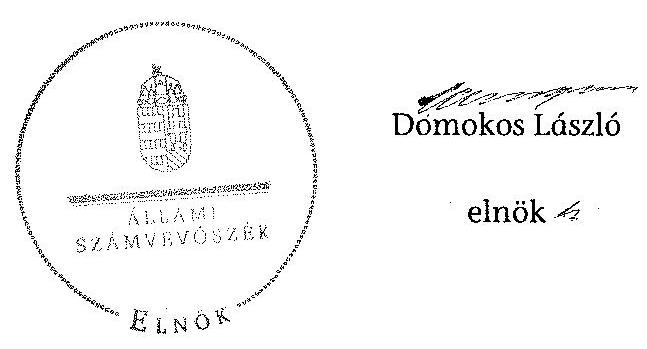
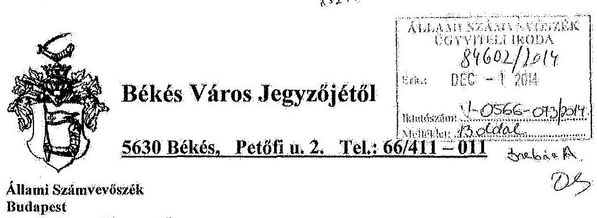
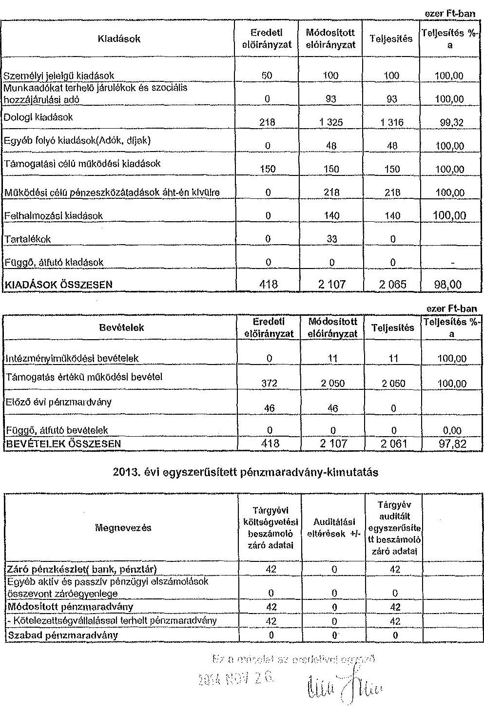
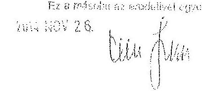
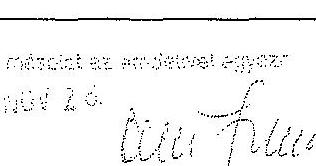
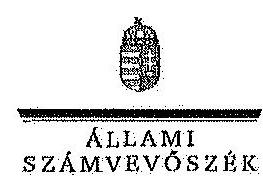
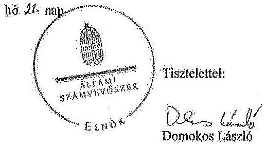
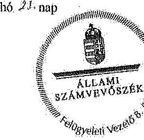
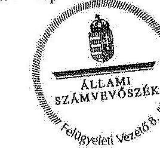

# ÁLLAMI   SZÁMVEVŐSZÉK 

## JELENTÉS

a helyi nemzetiségi önkormányzatok gazdálkodásának ellenőrzéséről
Békési Roma Nemzetiségi Önkormányzat

---

# Állami Számvevőszék 

Iktatószám: V-0566-077/2014.
Témaszám: 1600
Vizsgálat-azonosító szám: V067606

## Az ellenőrzést felügyelte:

## Brebán Andrea

felügyeleti vezető
Az ellenőrzést vezette és az ellenőrzés végrehajtásáért felelős:
Solymár Ágnes
ellenőrzésvezető

## A számvevőszéki jelentést készítették:

## Solymár Ágnes

ellenőrzésvezető

## Az ellenőrzést végezték:

## Vitányi István

számvevő tanácsos

## Gölöncsér Péter

számvevő

## Gölöncsér Péter

számvevő

---

# TARTALOMJEGYZÉK 

BEVEZETÉS ..... 3
I. ÖSSZEGZŐ MEGÁLLAPÍTÁSOK, KÖVETKEZTETÉSEK, JAVASLATOK ..... 6
II. RÉSZLETES MEGÁLLAPÍTÁSOK ..... 12

1. A Nemzetiségi Önkormányzat és a Települési Önkormányzat együttműködésének szabályozása, a működési feltételek biztosítása ..... 12
2. A gazdálkodási feladatok ellátásának szabályszerűsége ..... 13
2.1. A költségvetésre és zárszámadásra, valamint a kincstári adatszolgáltatás rendjére vonatkozó jogszabályi előírások betartása ..... 13
2.2. A Nemzetiségi Önkormányzat gazdálkodásának szabályozottsága ..... 15
2.3. Az operatív gazdálkodási jogkörök kialakítása, gyakorlása ..... 16
3. A Nemzetiségi Önkormányzattal összefüggő gazdálkodási feladatok belső ellenőrzése ..... 17

## MELLÉKLETEK

1. számú A Nemzetiségi Önkormányzat 2013. évi gazdálkodásának adatai
2. számú Békés Város jegyzőjének észrevétele
3. számú Az ÁSZ válasza a Békés Város jegyzőjének a jelentéstervezetre tett észrevételeire

## FÜGGELÉKEK

1. számú Rövidítések jegyzéke
2. számú Fogalomtár

---

# **Chemistry**

## **Chemical Reactions**

### **Balancing Chemical Equations**

1. **Write the unbalanced equation:**
   - Example: $$C_3H_8 + O_2 \rightarrow CO_2 + H_2O$$

2. **Balance the equation:**
   - Example: $$2C_3H_8 + 7O_2 \rightarrow 6CO_2 + 8H_2O$$

3. **Balance the equation:**
   - Example: $$2C_3H_8 + 7O_2 \rightarrow 6CO_2 + 8H_2O$$

### **Types of Reactions**

1. **Combination Reaction:**
   - Example: $$2H_2 + O_2 \rightarrow 2H_2O$$

2. **Decomposition Reaction:**
   - Example: $$2H_2O_2 \rightarrow 2H_2O + O_2$$

3. **Single Displacement Reaction:**
   - Example: $$Zn + 2HCl \rightarrow ZnCl_2 + H_2$$

4. **Double Displacement Reaction:**
   - Example: $$AgNO_3 + NaCl \rightarrow AgCl + NaNO_3$$

5. **Combustion Reaction:**
   - Example: $$CH_4 + 2O_2 \rightarrow CO_2 + 2H_2O$$

## **Stoichiometry**

### **Mole Concept**

- **Mole (mol):** The amount of substance containing as many particles (atoms, molecules, ions) as there are atoms in exactly 12 grams of carbon-12.
- **Avogadro's Number:** $$6.022 \times 10^{23}$$ particles per mole.

### **Molar Mass**

- **Molar Mass:** The mass of one mole of a substance.
- Example: The molar mass of water ($$H_2O$$) is 18.015 g/mol.

### **Calculations**

1. **Moles to Mass:**
   - Formula: $$n = \frac{m}{M}$$
   - Example: Calculate the number of moles of $$H_2O$$ in 18 grams of water.
     - $$n = \frac{18 \, \text{g}}{18.015 \, \text{g/mol}} \approx 0.999 \, \text{mol}$$

2. **Moles to Mass:**
   - Formula: $$m = n \times M$$
   - Example: Calculate the mass of 1 mole of water.
     - $$m = 1 \, \text{mol} \times 18.015 \, \text{g/mol} = 18.015 \, \text{g}$$

## **Gas Laws**

### **Ideal Gas Law**

- **Equation:** $$PV = nRT$$
- **Variables:**
  - $$P$$: Pressure (atm)
  - $$V$$: Volume (L)
  - $$n$$: Number of moles (mol)
  - $$R$$: Ideal gas constant (0.0821 L·atm/mol·K)
  - $$T$$: Temperature (K)

### **Boyle's Law**

- **Equation:** $$P_1V_1 = P_2V_2$$
- **Variables:**
  - $$P_1$$: Pressure (atm)
  - $$V_1$$: Volume (L)
  - $$P_2$$: Pressure (atm)
  - $$V_2$$: Volume (L)

### **Boyle's Law (Boyle's Law)**

- **Equation:** $$\frac{P_1V_1}{T_1} = \frac{P_2V_2}{T_2}$$
- **Variables:**
  - $$P_1$$: Pressure (atm)
  - $$V_1$$: Volume (L)
  - $$T_1$$: Temperature (K)
  - $$P_2$$: Pressure (atm)
  - $$V_2$$: Volume (L)
  - $$T_2$$: Temperature (K)

## **Thermochemistry**

### **Enthalpy (H)**

- **Definition:** The heat content of a system at constant pressure.
- **Change in Enthalpy (ΔH):** $$ΔH = q_p$$

### **Hess's Law**

- **Statement:** The enthalpy change for a reaction is the same whether it occurs in one step or multiple steps.

### **Hess's Law (Hess's Law)**

- **Statement:** The enthalpy change for a reaction is the same whether it occurs in one step or multiple steps.

## **Electrochemistry**

### **Oxidation and Reduction**

- **Oxidation:** Loss of electrons.
- **Reduction:** Gain of electrons.

### **Galvanic Cells**

- **Definition:** A cell that converts chemical energy into electrical energy.
- **Components:**
  - Anode: Oxidation occurs.
  - Cathode: Reduction occurs.
  - Salt Bridge: Connects the two half-cells.

### **Nernst Equation**

- **Equation:** $$E = E^\circ - \frac{RT}{nF} \ln Q$$
- **Variables:**
  - E: Cell potential
  - R: Ideal gas constant
  - F: Faraday constant
  - Q: Reaction quotient

---

# JELENTÉS   a helyi nemzetiségi önkormányzatok gazdálkodásának ellenőrzéséről Békési Roma Nemzetiségi Önkormányzat 

## BEVEZETÉS

A Nemzetiségi Önkormányzat az 1995. évben alakult, jelenlegi elnöke a 2010. évi helyhatósági választásokat követően 2011. április 27-étől ${ }^{1}$ látja el feladatát. A Nemzetiségi Önkormányzat intézményt, gazdasági társaságot és más szervezetet nem alapított, illetve társulásban nem vett részt. A négytagú Képviselőtestület a munkája segítésére bizottságot nem hozott létre. A Nemzetiségi Önkormányzat költségvetési beszámolója szerint a 2013. évben a módosított költségvetési bevételi és kiadási előirányzat 2106,8 ezer Ft, a teljesített költségvetési bevétel 2060,8 ezer Ft, a teljesített költségvetési kiadás 2064,3 ezer Ft volt. A Nemzetiségi Önkormányzat a 2013. évben 1678,0 ezer Ft feladatalapú támogatásban részesült. A 2013. évi gazdálkodási adatokat részletesen az 1. számú mellékletben mutatjuk be.

Az Alaptörvény Szabadság és felelősség rész XXIX. cikk (1) bekezdése szerint a Magyarországon élő nemzetiségek államalkotó tényezők. Minden, valamely nemzetiséghez tartozó magyar állampolgárnak joga van önazonossága szabad vállalásához és megőrzéséhez. A hazánkban élő nemzetiségek helyi (települési és területi) valamint országos önkormányzatokat hozhatnak létre². A helyi nemzetiségi önkormányzatok gazdálkodási feladatait jogszabályi előírás alapján a székhely szerinti helyi önkormányzat polgármesteri hivatala látja el.

A nemzetiségek helyzete, támogatása mind hazai, mind EU-s szinten kiemelt figyelmet kap napjainkban. A helyi nemzetiségi önkormányzatok gazdálkodására és támogatási rendszerére vonatkozó jogszabályok a 2010-2012. években jelentős változásokon mentek át. A helyi nemzetiségi önkormányzatok gazdálkodásának, a részükre juttatott költségvetési támogatások felhasználásának ellenőrzését az ÁSZ 2012-ben sorozatjellegű ellenőrzés keretében indította el.

[^0]
[^0]:    ${ }^{1}$ A Békési Cigány Kisebbségi Önkormányzat képviselő-testületének 29/2010. (X. 18.) számú határozatával alakult meg a Békési Cigány Kisebbségi Önkormányzat, a megválasztott elnök lemondását (31/2011. (IV. 27.) számú BCKÖ határozat) követően a jelenlegi elnök a 33/2011. (IV. 27.) BCKÖ határozattal lett vezetője a kisebbségi képviselő-testületnek.
    ${ }^{2}$ A 2010. évben megtartott nemzetiségi önkormányzati választásokat követően 2304 települési, 58 területi és 13 országos nemzetiségi önkormányzat alakult meg.

---

Az ellenőrzés célja annak értékelése volt, hogy a helyi nemzetiségi önkormányzat gazdálkodási kereteinek kialakítása, gazdálkodása megfelelt-e a jogszabályoknak.

Ennek keretében értékeltük, hogy:

- a helyi nemzetiségi önkormányzat és a helyi (települési) önkormányzat együttműködésének szabályozása, a működési feltételek biztosítása megfelel-e a jogszabályi előírásoknak;
- a felek együttműködése megfelelt-e a megállapodásban foglaltaknak a gazdálkodási feladatok szabályszerű ellátása során, betartották-e vonatkozó jogszabályi előírásokat;
- biztosított volt-e a helyi nemzetiségi önkormányzat gazdálkodásának belső ellenőrzése.

Az ellenőrzés várható hasznosulása: a nemzetiségi önkormányzatok testületi döntéseinek tapasztalatait összegezve következtetés vonható le a törvényalkotás számára a jogszabályi környezet esetleges módosításának indokoltságára vonatkozóan. Az ellenőrzés az ellenőrzött számára visszajelzést ad a rendezett gazdálkodási keretek kialakításáról, a működésbeli hiányosságokról. Az ellenőrzés megállapításai és javaslatai, a jó gyakorlat bemutatása tanulságul szolgálhatnak más nemzetiségi önkormányzatok, szervezetek számára a rendezett gazdálkodási keretek kialakításához. A társadalom számára jelzi, hogy közpénz nem maradhat ellenőrizetlenül. Az ÁSZ értékteremtő rend kialakításához és megőrzéséhez hozzájáruló tevékenysége pozitív hatással lesz a szervezetről kialakított összkép formálásában. Az ÁSZ szervezetén belül lehetőség nyílik arra, hogy a megállapítások szintetizálásával az intézmény a hozzáadott értéket teremtő elemző tevékenységet és tanácsadó szerepét erősítse.

A helyi nemzetiségi önkormányzat gazdálkodásának ellenőrzéséről szóló jelentés I. fejezetének összegző része az ellenőrzés céljára adott rövid, szintetizáló összefoglalót és következtetéseket tartalmazza a II. fejezet részletes megállapításain alapulóan. A jelentés intézkedést igénylő megállapításait és javaslatait az összegzőben foglaltak mellett - az ellenőrzés során feltárt, a jelentés II. fejezetében rögzített részletes megállapítások alapozzák meg, illetve támasztják alá.

Az ellenőrzés típusa: szabályszerűségi ellenőrzés.
Az ellenőrzött időszak: a Nemzetiségi Önkormányzat és a Települési Önkormányzat együttműködésének, valamint a Nemzetiségi Önkormányzat gazdálkodásának szabályozása megfelelőségét a 2013. évre vonatkozóan (a 2013. december 31-i állapotnak megfelelően), a Nemzetiségi Önkormányzat gazdálkodásának szabályszerűségét, a működési feltételek, valamint a belső ellenőrzés biztosítását a 2013. január 1. - december 31-e közötti időszakot figyelembe véve értékeltük.

Ellenőrzött szervezet: a Békési Roma Nemzetiségi Önkormányzat és a gazdálkodási feladatait ellátó Békési Polgármesteri Hivatal.

---

Az ellenőrzés szakmai módszertana az ÁSZ hivatalos honlapján (www.asz.hu) közzétett szakmai szabályokon alapult, amely a Legfőbb Ellenőrző Intézmények Nemzetközi Szervezete (INTOSAI) által kiadott nemzetközi standardok (ISSAI) figyelembevételével készült.

A gazdálkodási jogkörök gyakorlásának szabályszerű működését a dologi kiadásokkal, a személyi juttatásokkal, a felhalmozási kiadásokkal és a pénzeszközátadással/ellátottak juttatásaival kapcsolatos kifizetésekre vonatkozóan ellenőriztük, értékeltük. A jogszabályoknak és a belső előírásoknak megfelelőnek, azaz szabályszerűnek minősítettük az adott területet, ha az értékelés összesített eredménye nagyobb volt, mint 90%, részben megfelelőnek, ha 71 és 90% közé esett, és nem megfelelőnek, ha 70% vagy annál kisebb volt.

Az ellenőrzés végrehajtásának jogszabályi alapját az ÁSZ tv. 5. § (2)-(3) és (6) bekezdéseiben foglaltak képezik.

Az ÁSZ tv. 29. § (1) bekezdése szerint a jelentéstervezetet megküldtük egyeztetésre a jegyzőnek és a Nemzetiségi Önkormányzat elnökének. A Nemzetiségi Önkormányzat elnöke az ÁSZ tv. 29. § (2) bekezdésében foglalt észrevételezési jogával nem élt, a jelentéstervezetre észrevételt nem tett. A jegyzőtől beérkezett észrevételek és az arra adott válaszok, ideértve az el nem fogadott észrevételeket és azok indokolását a jelentés 2-3. számú mellékletei tartalmazzák.

---

# I. ÖSSZEGZŐ MEGÁLLAPÍTÁSOK, KÖVETKEZTETÉSEK, JAVASLATOK 

A Nemzetiségi Önkormányzat és a Települési Önkormányzat együttműködésének szabályozása a feltárt tartalmi hiányosságok ellenére megfelelt a jogszabályi előírásoknak. A Nemzetiségi Önkormányzat rendelkezett a 2013. év folyamán hatályban lévő, a Települési Önkormányzattal történő együttműködésre vonatkozó megállapodással. Az együttműködési megállapodás felülvizsgálatát a Nek. tv. előírása ellenére 2013. január 31-éig nem végezték el. A 2013. december 31-én hatályos megállapodás az előírásoknak megfelelően tartalmazta a Nemzetiségi Önkormányzat működésének feltételeit. Az együttműködési megállapodás az Áht. által előírt tartalmi elemek közül nem tartalmazta

 a bevételekkel és kiadásokkal kapcsolatos finanszírozási rendelkezéseket, valamint nem tartalmazta a Nek. tv. előírása ellenére a Nemzetiségi Önkormányzat kötelezettségvállalásaival kapcsolatosan a Települési Önkormányzatot terhelő ellenjegyzési, érvényesítési, utalványozási, szakmai teljesítésigazolási feladatokat, továbbá a felelősök konkrét kijelölését. Nem tartalmazta továbbá a Nemzetiségi Önkormányzat kötelezettségvállalásának SZMSZ-ben meghatározott nyilvántartási szabályait sem. A megállapodás szerinti működési feltételeket a megállapodás megkötését követő harminc napon belül a Nek. tv.-ben foglaltaknak megfelelően mind a Nemzetiségi Önkormányzat, mind a Települési Önkormányzat SZMSZ-ében rögzítették. A Nemzetiségi Önkormányzat részére az előírt személyi és tárgyi működési feltételek biztosítottak voltak a 2013. évben.

A Nemzetiségi Önkormányzat 2013. évi költségvetésének és zárszámadásának tartalma, jóváhagyása, valamint a kincstári adatszolgáltatás megfelelt a jogszabályi előírásoknak. A Nemzetiségi Önkormányzat elnöke az előírásoknak megfelelően határidőre benyújtotta a Képviselő-testület részére a jegyző által előkészített, az ellenőrzött évre vonatkozó költségvetési koncepciót. A 2013. évi költségvetési koncepció elfogadása határozat útján megtörtént. A Nemzetiségi Önkormányzat elnöke az előírásoknak megfelelően határidőre benyújtotta a Képviselő-testület részére a költségvetési határozat tervezetét. A tervezet a költségvetés határozat alapján elfogadásra került, a jogszabályi előírás szerinti tartalmi elemeket tartalmazta. A 2013. évi költségvetés előterjesztésekor a Képviselő-testület részére az Áht.-ben foglaltak ellenére - a jegyző mulasztása miatt - tájékoztatásul nem mutatták be szöveges indokolással együtt a Nemzetiségi Önkormányzat költségvetési mérlegét közgazdasági tagolásban, valamint a közvetett támogatásokat tartalmazó kimutatást.

A jegyző az előírt határidőre elkészítette a Nemzetiségi Önkormányzat 2013. évi zárszámadási határozat-tervezetét, a Nemzetiségi Önkormányzat elnöke az előírt határidőig beterjesztette azt a Képviselő-testület elé. A zárszámadási határozat tervezetének előterjesztésekor - a jegyző mulasztása miatt - a Képviselőtestület részére az Áht. előírásától eltérően nem mutatták be tájékoztatásul szöveges indokolással az előírt mérleget és kimutatásokat. A Nemzetiségi Önkormányzat a zárszámadásról határozatot alkotott. A zárszámadásról szóló határozat tartalma az előírásoknak megfelel, valamennyi bevételről és kiadásról elszámolt, összehasonlíthatósága az elfogadott költségvetéssel biztosított volt. A jegyző a 2013. évben az Ávr. és az Áhsz. előírásai szerinti határidőben teljesítette a Nemzetiségi Önkormányzat részére előírt kincstári adatszolgáltatást.

A Nemzetiségi Önkormányzat gazdálkodásának szabályozottsága az ellenőrzött időszakban megfelelőnek minősült, annak ellenére, hogy a jogszabályokban előírt szabályzatokkal csak részben rendelkezett. A gazdálkodási feladatok végrehajtását ellátó Polgármesteri Hivatal a 2013. évben a Számv. tv. által előírt számviteli szabályzatokkal a Nemzetiségi Önkormányzat gazdálkodási feladataira kiterjedő hatállyal rendelkezett. Ezen túl a sajátos gazdálkodási szabályokat a Nemzetiségi Önkormányzat önálló szabályzatai tartalmazták. A Bkr.-ben foglaltak ellenére nem terjedt ki a Polgármesteri Hivatal folyamatba épített, előzetes, utólagos és vezetői ellenőrzése, továbbá a szabálytalanságok kezelése eljárásrendjének és az ellenőrzési nyomvonalának hatálya a Nemzetiségi Önkormányzat gazdálkodásával kapcsolatos végrehajtási feladataira. A Nemzetiségi Önkormányzat a szabályzatokkal önálló módon sem rendelkezett. A Polgármesteri Hivatalban a gazdálkodási feladatokat ellátó köztisztviselők munkaköri leírásai az ellenőrzési és adatszolgáltatási feladatok kivételével tartalmazták a Nemzetiségi Önkormányzattal kapcsolatos feladatokat. A Polgármesteri Hivatal SZMSZ-e az Ávr.-ben előírtak ellenére nem tartalmazta a Nemzetiségi Önkormányzat gazdálkodása végrehajtásához kapcsolódó, az SZMSZ-ben nevesített munkakörökhöz tartozó helyettesítés rendjét és az ezekhez kapcsolódó felelősségi szabályokat.

A Nemzetiségi Önkormányzat gazdálkodása tekintetében az operatív gazdálkodási jogkörök kialakítása megfelelt a jogszabályi előírásoknak. Az összeférhetetlenségi követelmények érvényesülésének feltételei nem voltak biztosítottak, mivel a Nemzetiségi Önkormányzat elnöke, mint kötelezettségvállaló nem hatalmazott fel írásban a kötelezettségvállalás, a teljesítésigazolás gyakorlására más képviselőt az Áht. és az Ávr. vonatkozó rendelkezései alapján. A felhatalmazás hiányára visszavezethető, hogy a számvevőszéki ellenőrzés a kifizetések bizonylatainak ellenőrzése során - a rendelkezésre bocsátott dokumentumok alapján - a teljesítésigazolás esetében összeférhetetlenséget tárt fel.

A Nemzetiségi Önkormányzatnál a 2013. évben az operatív gazdálkodási jogkörökön belül kulcsszerepet betöltő teljesítésigazolás és érvényesítés kontrollok működtetése részben felelt meg a jogszabályi előírásoknak. A teljesítésigazolás nem az Ávr. előírásának megfelelően történt, mivel hiányzott a teljesítésigazoló aláírása, valamint nem a vonatkozó szabályzatban rögzített aláírásmintával rendelkező személy végezte, továbbá a készpénzfizetési számlák teljesítésigazolása során az összeférhetetlenségi előírásokat nem érvényesítették. Az érvényesítő az Ávr. előírásától eltérően nem ellenőrizte az érvényesítést megelőző ügymenet szabályszerűségét, valamint nem jelezte a teljesítésigazolások elmaradását és szabálytalanságát. Továbbá az Ávr. előírásától eltérően két kiadási tétel esetében az érvényesítés nem történt meg. A kulcskontrollok működtetése nem biztosította a hibák megelőzését, feltárását és kijavítását.

A jegyző az ellenőrzött időszakban nem biztosította a Polgármesteri Hivatalnál a Nemzetiségi Önkormányzat gazdálkodásával összefüggő végrehajtási feladatok belső ellenőrzését.

A Polgármesteri Hivatalnál a Bkr.-ben foglaltak ellenére a Nemzetiségi Önkormányzatra is kiterjedő, kockázatelemzéssel alátámasztott 2013. évi ellenőrzési tervet nem készítettek, így a Nemzetiségi Önkormányzat gazdálkodásával összefüggő végrehajtási feladatokra vonatkozóan a 2013. évre belső ellenőrzést nem terveztek és nem végeztek.

Az ellenőrzött időszakban a Nemzetiségi Önkormányzat belső ellenőrzésével kapcsolatban a Békés Megyei Kormányhivatal nem élt törvényességi felhívással.

A Nemzetiségi Önkormányzatnak a gazdálkodás során figyelmet kell fordítania az integritás szemlélet teljes körű érvényesítésére, különös tekintettel a Nemzetiségi Önkormányzat gazdálkodásával összefüggő végrehajtási feladatok belső ellenőrzésének megfelelő biztosítására, amellyel csökkenthetőek a szervezet működéséből eredő korrupciós kockázatok.

Az ÁSZ tv. 33. § (1) bekezdésében foglaltak értelmében az ellenőrzött szervezet vezetője köteles a jelentésben foglalt megállapításokhoz kapcsolódó intézkedési tervet összeállítani, és azt a jelentés kézhezvételétől számított 30 napon belül az ÁSZ részére megküldeni. Amennyiben az intézkedési tervet határidőre nem küldi meg a szervezet, vagy az nem elfogadható, az ÁSZ elnöke az ÁSZ tv. 33. § (3) bekezdés a)-b) pontjaiban foglaltakat érvényesítheti.

A helyszíni ellenőrzés megállapításainak hasznosítása mellett javasoljuk:

# a jegyzőnek 

1. Az együttműködés szabályozásával kapcsolatban

A Nemzetiségi Önkormányzat és a Települési Önkormányzat együttműködését meghatározó együttműködési megállapodás tartalma nem felelt meg az Áht. 27. § (2) bekezdésében foglalt a bevételekkel és kiadásokkal kapcsolatos finanszírozási rendelkezés előírásának és a Nek. tv. 80. § (3) bekezdés b) és c) pontjaiban foglaltaknak. A Nek. tv. 80. § (2) bekezdésében foglaltak ellenére 2013. január 31-éig nem végezték el az együttműködési megállapodás felülvizsgálatát.

Javaslat
Az együttműködés szabályszerűsége érdekében:
a) készítse elő az Áht. 27. § (2) bekezdésében és a Nek. tv. 80. § (3) bekezdés b) és c) pontjaiban foglalt előírásoknak megfelelő együttműködési megállapodás módosítását és kezdeményezze a módosítás Települési Önkormányzat Képviselőtestülete elé terjesztését;
b) gondoskodjon az együttműködési megállapodás Nek. tv. 80. § (2) bekezdésében előírt határidő szerinti évenkénti felülvizsgálatáról.

2. A költségvetés és zárszámadás szabályszerűségével kapcsolatban

A 2013. évi költségvetési határozat-tervezet előterjesztésekor - a jegyző mulasztása miatt - a Képviselő-testület részére az Áht. 24. § (4) bekezdés a) és c) pontjaiban foglalt előírásoktól eltérően tájékoztatásul nem mutatták be szöveges indokolással együtt a Nemzetiségi Önkormányzat költségvetési mérlegét közgazdasági tagolásban, valamint a közvetett támogatásokat tartalmazó kimutatást.

A 2013. évi zárszámadási határozat-tervezet előterjesztésekor - a jegyző mulasztása miatt - a Képviselő-testület részére tájékoztatásul nem mutatták be szöveges indokolással együtt az Áht. 91. § (2) bekezdés a) pontja alapján az Áht. 24. § (4) bekezdés a)-c) pontjai szerint szöveges indoklással a Nemzetiségi Önkormányzat pénzeszközeinek változását, költségvetési mérlegét közgazdasági tagolásban, a többéves kihatással járó döntések számszerűsítését évenkénti bontásban és összesítve, valamint a közvetett támogatásokat tartalmazó kimutatást.

Javaslat
Intézkedjen a jövőben arról, hogy:
a) a költségvetési határozat-tervezet előterjesztésekor a Képviselő-testületnek tájékoztatásul bemutatásra kerüljenek szöveges indoklással az Áht. 24. § (4) bekezdés a) és c) pontjaiban előírt mérleg és kimutatások;
b) a zárszámadási határozat-tervezet előterjesztésekor a Képviselő-testületnek tájékoztatásul bemutatásra kerüljenek az Áht. 91. § (2) bekezdés a) pontja alapján az Áht. 24. § (4) bekezdés a)-c) pontjai szerinti mérleg és kimutatások.
3. A gazdálkodási feladatok szabályozottságával kapcsolatban

A Polgármesteri Hivatal a Bkr. 6. § (3) és (4) bekezdéseiben előírtak alapján elkészített ellenőrzési nyomvonala és szabálytalanságok kezelésének eljárásrendje nem terjedt ki a Nemzetiségi Önkormányzat gazdálkodásával kapcsolatos végrehajtási feladatokra. A Nemzetiségi Önkormányzat a szabályzatokkal önálló módon sem rendelkezett. A jegyző a Bkr. 8. § (2) bekezdés előírásától eltérően a Nemzetiségi Önkormányzat gazdálkodásának végrehajtásával kapcsolatos feladataira vonatkozóan nem biztosította a folyamatba épített, előzetes, utólagos és vezetői ellenőrzést.

A Polgármesteri Hivatal SZMSZ-e az Ávr. 13. § (1) bekezdés g) pontjában előírtak ellenére nem tartalmazta az SZMSZ-ben nevesített munkakörökhöz tartozó - a Nemzetiségi Önkormányzat gazdálkodásának végrehajtásával kapcsolatos - a helyettesítés rendjét, valamint az ezekhez kapcsolódó felelősségi szabályokat.

Javaslat
A Nemzetiségi Önkormányzat gazdálkodásának végrehajtásával kapcsolatos feladataira készítse el:
a) a Bkr. 6. § (3) és (4) bekezdéseiben meghatározott szabályozásokat és biztosítsa a Bkr. 8. § (2) bekezdésének megfelelően a folyamatba épített, előzetes, utólagos és vezetői ellenőrzést;
b) a Polgármesteri Hivatal SZMSZ-ének módosítását, hogy az feleljen meg az Ávr. 13. § (1) bekezdés g) pontjában foglalt előírásnak és kezdeményezze a módosítás Települési Önkormányzat Képviselő-testülete elé terjesztését.
4. A kulcskontrollok működésével kapcsolatban

A teljesítés igazolását nem, illetve nem a vonatkozó szabályzatban rögzített aláírásmintával rendelkező személy látta el, ezért az Ávr. 57. § (1) és (3) bekezdéseiben foglaltakat megsértve, nem szabályszerűen történt a kifizetés jogosságának, összegszerűségének és a teljesítésnek az igazolása.

Az érvényesítő az Ávr. 58. § (1)-(2) bekezdéseiben foglalt ellenőrzési és jelzési feladatát szabálytalanul látta el. Nem ellenőrizte az érvényesítést megelőző ügymenet szabályszerűségét, nem jelezte a teljesítésigazolások elmaradását és szabálytalanságát, továbbá két esetben az érvényesítés nem történt meg.

Javaslat
Az operatív gazdálkodás működési hibáinak megelőzése, feltárása és kijavítása érdekében
a) intézkedjen, hogy teljesítésigazolást az Ávr. 57. § (1) és (3) bekezdéseiben előírtaknak megfelelően végezzék;
b) intézkedjen, hogy az érvényesítő az Ávr. 58. § (1)-(2) bekezdései alapján lássa el ellenőrzési és jelzési feladatát.

# a Nemzetiségi Önkormányzat elnökének 

1. A Nemzetiségi Önkormányzat és a Települési Önkormányzat együttműködését meghatározó együttműködési megállapodás tartalma nem felelt meg az Áht. 27. § (2) bekezdésében foglalt a bevételekkel és kiadásokkal kapcsolatos finanszírozási rendelkezés előírásának és a Nek. tv. 80. § (3) bekezdés b) és c) pontjaiban foglaltaknak.

Javaslat
Terjessze a Képviselő-testület elé jóváhagyásra az Áht. 27. § (2) bekezdésében foglalt a bevételekkel és kiadásokkal kapcsolatos finanszírozási rendelkezés előírásának és a Nek. tv. 80. § (3) bekezdés b) és c) pontjaiban foglalt előírások betartásával a jegyző által előkészített együttműködési megállapodás módosítást.
2. A Nemzetiségi Önkormányzat elnöke a 2013. évi költségvetési határozat-tervezet előterjesztésekor - a jegyző mulasztása miatt - a Képviselő-testület részére az Áht. 24. § (4) bekezdés a) és c) pontjaiban foglalt előírásoktól eltérően tájékoztatásul nem mutatta be szöveges indokolással együtt a Nemzetiségi Önkormányzat költségvetési mérlegét közgazdasági tagolásban, valamint a közvetett támogatásokat tartalmazó kimutatást. A 2013. évi zárszámadási határozat-tervezet előterjesztésekor a jegyző mulasztása miatt - a Képviselő-testület részére tájékoztatásul nem mutatta be szöveges indokolással együtt az Áht. 91. § (2) bekezdés a) pontja alapján az Áht. 24. § (4) bekezdés a)-c) pontjai szerinti mérleget és kimutatásokat.

Javaslat
A Képviselő-testület részére
a) tájékoztatásul mutassa be a költségvetési határozat-tervezet előterjesztésekor az Áht. 24. § (4) bekezdés a) és c) pontjaiban előírt mérleget és kimutatásokat;
b) tájékoztatásul mutassa be a zárszámadási határozat-tervezet előterjesztésekor az Áht. 91. § (2) bekezdés a) pontja alapján az Áht. 24. § (4) bekezdés a)-c) pontjai szerinti mérleget és kimutatásokat.
 és kimutatást;
b) tájékoztatásul mutassa be a zárszámadási határozat-tervezet előterjesztésekor az Áht. 91. § (2) bekezdés a) pontja és az Áht. 24. § (4) bekezdés a)-c) pontjaiban előírt mérleget és kimutatásokat.
3. A Nemzetiségi Önkormányzat elnöke, mint kötelezettségvállaló nem hatalmazott fel írásban a teljesítés igazolás gyakorlására más képviselőt az Ávr. 57. § (4) bekezdése alapján, így a Nemzetiségi Önkormányzat elnöke által lefolytatott és kifizetett beszerzésekről szóló készpénzfizetési számlák teljesítésigazolása során az Ávr. 60. § (2) bekezdésének előírása ellenére az összeférhetetlenségi előírásokat nem érvényesítették.

Javaslat
Az Ávr. 60. §. (2) bekezdésében foglalt összeférhetetlenség fennállása esetén jelöljön ki további teljesítést igazoló személyt az Ávr. 52. § (7) bekezdésében foglalt előírás alapján.

---

# II. RÉSZLETES MEGÁLLAPÍTÁSOK 

## 1. A Nemzetiségi Önkormányzat és a Települési Önkormányzat együttműködésének szabályozása, a működési feltételek biztosítása

A Nemzetiségi Önkormányzat és a Települési Önkormányzat együttműködésének szabályozása a feltárt tartalmi hiányosságok ellenére megfelelt a jogszabályi előírásoknak.

A Nemzetiségi Önkormányzat rendelkezett a 2013. év folyamán hatályban lévő, a Települési Önkormányzattal történő együttműködésre vonatkozó megállapodással. A megállapodást a Nemzetiségi és a Települési Önkormányzat képviselő-testületei határozatokkal jóváhagyták és az arra jogosult személyek aláírták.

Az együttműködési megállapodást a Települési Önkormányzat a 131/2012. (IV. 26.) számú, a Nemzetiségi Önkormányzat a 16/2012. (IV. 25.) számú határozatával hagyta jóvá. ${ }^{3}$

A Nek. tv. 80. § (2) bekezdésében előírtak ellenére 2013. január 31-éig nem végezték el a megállapodás felülvizsgálatát.

A 2013. december 31-én hatályos megállapodásban a Nemzetiségi Önkormányzat működésének feltételeit a Nek. tv. 80. § (1) bekezdésében foglalt előírásoknak megfelelően rögzítették. A jogszabályi előírások azonban nem érvényesültek maradéktalanul, mivel az együttműködési megállapodás az Áht. 27. § (2) bekezdésében és a Nek. tv. 80. § (3) bekezdésében előírt tartalmi elemek közül az alábbiakat nem tartalmazta:

- az Áht. 27. § (2) bekezdése szerinti, a Nemzetiségi Önkormányzathoz kapcsolódó gazdálkodási és egyéb feladatellátás részletes szabályai közül, a bevételeivel és kiadásaival kapcsolatban felmerülő finanszírozási rendelkezéseket,

[^0]
[^0]:    ${ }^{3}$ Az együttműködési megállapodás elfogadásáról szóló határozat-tervezetet a jegyző és a polgármester által aláírt beterjesztés alapján fogadta el a Települési Önkormányzat Képviselő-testülete. A Polgármesteri Hivatal SZMSZ-e (14. § (3) bekezdés) értelmében az előterjesztés-tervezetet a polgármester írja alá, abban az esetben, ha az előterjesztésen szerepel a jegyző aláírása ellenjegyzésként.

---

- a Nek. tv. 80. § (3) bekezdés b) pontja szerinti, a Nemzetiségi Önkormányzat kötelezettségvállalásaival kapcsolatosan a Települési Önkormányzatot terhelő ellenjegyzési, érvényesítési, utalványozási, szakmai teljesítésigazolási feladatokat, továbbá a felelősök konkrét kijelölését ${ }^{4}$,
- a Nek. tv. 80. § (3) bekezdés c) pontja szerinti, a Nemzetiségi Önkormányzat kötelezettségvállalásának SZMSZ-ben meghatározott nyilvántartási szabályait ${ }^{5}$.

A megállapodás szerinti működési feltételeket a megállapodás megkötését követő harminc napon belül a Nek. tv. 80. § (2) bekezdésében foglaltak szerint mind a Nemzetiségi Önkormányzat SZMSZ-ében, mind a Települési Önkormányzat SZMSZ-ében rögzítették ${ }^{6}$.

A Nemzetiségi Önkormányzat részére az előírt működési (személyi és tárgyi) feltételek biztosítottak voltak a 2013. évben.

A 2013. december 31-én hatályban lévő együttműködési megállapodás II.-V. pontjával rögzítették a Nemzetiségi Önkormányzat működéséhez szükséges személyi és tárgyi feltételek biztosításának módját.

# 2. A GAZDÁLKODÁSI FELADATOK ELLÁTÁSÁNAK SZABÁLYSZERŰSÉGE 

### 2.1. A költségvetésre és zárszámadásra, valamint a kincstári adatszolgáltatás rendjére vonatkozó jogszabályi előírások betartása

A Nemzetiségi Önkormányzat 2013. évi költségvetésének és zárszámadásának tartalma, jóváhagyása, valamint a kapcsolódó adatszolgáltatás megfelelt a jogszabályi előírásoknak.

A Nemzetiségi Önkormányzat elnöke az Áht. 26. § (1) bekezdése alapján, az Áht. 24. § (1) bekezdésében előírtaknak megfelelően november 30-ig benyújtotta a Képviselő-testület részére a jegyzője által előkészített az ellenőrzött évre vonatkozó költségvetési koncepciót. A 2013. évi költségvetési koncepció elfogadása a 49/2012. (XI. 15.) BRNÖNK számú határozattal történt.

[^0]
[^0]:    ${ }^{4}$ Az Együttműködési megállapodás V. pontja a felsoroltakat általánosan tartalmazza, a részletes szabályokat és a személyek kijelölését a "Nemzetiségi Önkormányzat számviteli politikája pénzügyi-gazdálkodási szabályzatokkal" megnevezésű dokumentum rögzíti.
    ${ }^{5}$ A "Nemzetiségi Önkormányzat számviteli politikája pénzügyi-gazdálkodási szabályzatokkal" megnevezésű dokumentum rendelkezik a nyilvántartási szabályokról.
    ${ }^{6}$ A Békési Roma Nemzetiségi Önkormányzat képviselő-testülete 25/2012. (V. 23.) számú Nemzetiségi Önkormányzat határozata. A helyi önkormányzat képviselőtestületének 17/2012. (V. 25.) önkormányzati rendelete.

---

A Nemzetiségi Önkormányzat elnöke az Áht. 26. § (1) bekezdése alapján az Áht. 24. § (2) bekezdésében ${ }^{7}$ előírtaknak megfelelően a központi költségvetésről szóló törvény hatálybalépését követő 45 napig benyújtotta a Képviselő-testület részére a költségvetési határozat tervezetét, ami a 6/2013. (II. 12.) BRNÖNK számú határozat szerint elfogadásra került.

A 2013. évi költségvetés előterjesztésekor - a jegyző mulasztása miatt - a Képviselő-testület részére az Áht. 24. § (4) bekezdés a) és c) pontjaiban foglalt előírásoktól eltérően tájékoztatásul nem mutatták be szöveges indoklással együtt a Nemzetiségi Önkormányzat költségvetési mérlegét közgazdasági tagolásban, valamint a közvetett támogatásokat tartalmazó kimutatást. A 2013. évi költségvetési határozat az Áht. 26. § (1) bekezdésében foglalt előírás alapján az Áht. 23. §(2) és (3) bekezdések szerinti tartalmi elemek közül valamennyit tartalmazta.

A zárszámadási határozat tervezetének előterjesztésekor - a jegyző mulasztása miatt - a Képviselő-testület részére az Áht. 91. § (2) bekezdés alapján az Áht. 24. § (4) bekezdés a)-c) pontjaitól eltérően nem mutatták be tájékoztatásul szöveges indokolással a Nemzetiségi Önkormányzat pénzeszközeinek változását, költségvetési mérlegét közgazdasági tagolásban, a többéves kihatással járó döntések számszerűsítését évenkénti bontásban és összesítve, valamint a közvetett támogatásokat tartalmazó kimutatást. A jegyző az Áht. 91. § (1) és (3) bekezdésében előírt határidőre elkészítette a Nemzetiségi Önkormányzat a 2013. évi zárszámadási határozat-tervezetét, a Nemzetiségi Önkormányzat elnöke az előírt határidőig beterjesztette azt a Képviselő-testület elé.

A Nemzetiségi Önkormányzat a zárszámadásról határozatot alkotott. A zárszámadásról szóló határozat tartalma az előírásoknak megfelelt, valamennyi bevételről és kiadásról elszámolt, összehasonlíthatósága az elfogadott költségvetéssel biztosított volt. A Nemzetiségi Önkormányzat 2013. év során több éves kihatással járó döntést nem hozott, közvetett támogatásban nem részesült.

A jegyző a 2013. évben a jogszabályokban előírt határidőben teljesítette a Nemzetiségi Önkormányzat részére előírt kincstári adatszolgáltatást, így:

- a Nemzetiségi Önkormányzat 2013. évben a negyedéves és éves időközi költségvetési jelentéseket az Ávr. 169. § (2) bekezdése ${ }^{8}$ szerinti határidőre megküldte a Kincstár területileg illetékes igazgatóságának,

[^0]
[^0]:    ${ }^{7}$ 2013. december 21-étől az Áht. 24. § (3) bekezdése írja elő.
    ${ }^{8}$ A nemzetiségi önkormányzat, az időközi költségvetési jelentést a költségvetési év első három hónapjáról április 20-áig, a költségvetési év első hat hónapjáról július 20-áig, a költségvetési év első kilenc hónapjáról október 20-áig, a költségvetési év tizenkét hónapjáról a költségvetési évet követő év január 20-áig az Igazgatóságnak küldi meg.

---

- a Nemzetiségi Önkormányzat 2013. évben az időközi mérlegjelentéseket az Ávr. 170. § (5) bekezdése ${ }^{9}$ szerinti határidőre megküldte a Kincstár területileg illetékes szervének,
- a Nemzetiségi Önkormányzat a 2013. évi elemi költségvetési beszámolóját az Áhsz; 10. § (5a) bekezdése ${ }^{10}$ szerinti határidőre benyújtotta a Kincstár területileg illetékes szervének.

# 2.2. A Nemzetiségi Önkormányzat gazdálkodásának szabályozottsága 

A Nemzetiségi Önkormányzat gazdálkodásának szabályozottsága az ellenőrzött időszakban megfelelőnek minősült, azonban a jogszabályokban előírt szabályzatokkal csak részben rendelkezett.

A gazdálkodási feladatai végrehajtását ellátó Polgármesteri Hivatal a 2013. évben a Számv. tv. által előírt számviteli szabályzatok közül valamennyi szabályzattal, a Nemzetiségi Önkormányzat gazdálkodási feladataira kiterjedő hatállyal rendelkezett. A sajátos gazdálkodásra vonatkozó szabályokat, a Nemzetiségi Önkormányzat önálló szabályzatai tartalmazták. A Polgármesteri Hivatalban a gazdálkodási feladatokat ellátó köztisztviselők munkaköri leírásai tartalmazták a Nemzetiségi Önkormányzattal kapcsolatos feladatokat, kivéve az ellenőrzési és adatszolgáltatási feladatokat.

A Polgármesteri Hivatal SZMSZ-e az Ávr. 13. § (1) bekezdés g) pontjában előírtak ellenére nem tartalmazta a Nemzetiségi Önkormányzat gazdálkodása végrehajtásához kapcsolódó, az SZMSZ-ben nevesített munkakörökhöz tartozó helyettesítés rendjét és az ezekhez kapcsolódó felelősségi szabályokat. Ezek a Polgármesteri Hivatal SZMSZ-e által hivatkozott munkaköri leírásokban kerültek rögzítésre.

Az Ávr. 13. § (2) bekezdés a) pontban foglaltak szerinti belső szabályozás tartalmi követelményeit az együttműködési megállapodás, a Polgármesteri Hivatal és a Nemzetiségi Önkormányzat SZMSZ-e, és annak a pénzgazdálkodással kapcsolatos kötelezettségvállalás, utalványozás, érvényesítés és ellenjegyzés hatásköri rendjéről szóló szabályzata rögzítette.

A Polgármesteri Hivatalban a Bkr. 6. § (3) és (4) bekezdéseiben előírtak alapján elkészített ellenőrzési nyomvonal, a szabálytalanságok kezelésének eljárásrendje nem terjedt ki a Nemzetiségi Önkormányzat gazdálkodásával kapcsolatos

[^0]
[^0]:    ${ }^{9}$ Az irányító szerv az időközi mérlegjelentéseket a tárgynegyedévet követő hónap 25. napjáig, a negyedik negyedévre vonatkozó gyorsjelentést öt munkanapon belül, az éves jelentést az éves költségvetési beszámoló továbbításának határidejével megegyezően juttatja el feldolgozásra a Kincstárnak, az államháztartás önkormányzati alrendszerébe tartozó irányító szerv esetén az Igazgatóságnak.
    ${ }^{10}$ A Nemzetiségi Önkormányzat felülvizsgált éves és féléves elemi költségvetési beszámolóit az Áhsz; 10. § (1) bekezdés szerinti határidő lejártát követő 10 naptári napon belül kell benyújtani a Kincstár területi szerveihez. 2014. január 1-jétől az Áhsz; 32. § (4) bekezdés szabályozza.

---

végrehajtási feladataira. A Nemzetiségi Önkormányzat ezekkel önálló módon sem rendelkezett. A jegyző a Bkr. 8. § (2) bekezdés előírásától eltérően a Nemzetiségi Önkormányzatra vonatkozóan nem biztosította a folyamatba épített, előzetes, utólagos és vezetői ellenőrzést.

# 2.3. Az operatív gazdálkodási jogkörök kialakítása, gyakorlása 

A Nemzetiségi Önkormányzat gazdálkodása tekintetében az operatív gazdálkodási jogkörök kialakítása megfelelt a jogszabályi előírásoknak.

A Polgármesteri Hivatal az ellenőrzött időszakban rendelkezett gazdasági szervezettel, a gazdasági vezető végzettsége megfelelt az Ávr. 12. §-ában előírt szakképesítési követelményeknek. A Nemzetiségi Önkormányzat elnöke, mint kötelezettségvállaló nem hatalmazott fel írásban a kötelezettségvállalás, teljesítésigazolás gyakorlására más képviselőt az Áht. 36. § (7) bekezdése és az Ávr. 52. § (7) és 57. § (4) bekezdése alapján. Ezáltal nem volt biztosított az Ávr. 60. § (2) bekezdése szerinti összeférhetetlenségi szabályok érvényesítése.

A kijelölés hiányára visszavezethető, hogy a kiadások teljesítésének igazolása során az Ávr. 60. § (2) bekezdésének előírása ellenére az összeférhetetlenségi előírásokat nem érvényesítették.

A Nemzetiségi Önkormányzatnál a 2013. évben az operatív gazdálkodási jogkörökön belül kulcsszerepet betöltő teljesítésigazolás és érvényesítés kontrollok működtetése részben felelt meg a jogszabályi előírásoknak.

A személyi juttatásokkal kapcsolatos kifizetések során ${ }^{11}$ a 2013. évben a teljesítésigazolás és az érvényesítés kulcskontrollok működtetése kapcsán az alábbi hiányosságokat tártuk fel:

- a teljesítésigazolás egy esetben az Áht. 38. § (1) bekezdésben rögzítettekkel szemben elmaradt, valamint két esetben azt nem a vonatkozó szabályzatban rögzített aláírás mintával rendelkező személy végezte, ezért az Ávr. 57. § (1) és (3) bekezdéseiben foglaltak ellenére nem, illetve nem szabályszerűen történt a kifizetés jogosságának, összegszerűségének és a teljesítésnek az igazolása.
- az érvényesítő az Ávr. 58. § (1) bekezdésében előírtak ellenére nem ellenőrizte három esetben, hogy a megelőző ügymenetben az Áht.-ben és

 az Ávr.-ben, és a vonatkozó szabályzatban előírtakat nem tartották be. Az érvényesítő az Ávr. 58. § (2) bekezdésében előírtak ellenére nem jelezte, hogy az Ávr. 57. § (1) és (3) bekezdésekben előírtak ellenére a teljesítésigazolás nem, illetve nem szabályszerűen történt.

[^0]
[^0]:    ${ }^{11}$ A személyi juttatásokkal kapcsolatosan 7 kiadási tételt ellenőriztünk.

---

A dologi kiadásokkal kapcsolatos kifizetések során ${ }^{12}$ a 2013. évben a teljesítésigazolás és az érvényesítés kulcskontrollok működtetése során az alábbi hiányosságokat tártuk fel:

- a teljesítésigazolás két esetben elmaradt, ezért az Ávr. 57. § (1) és (3) bekezdéseiben foglaltak ellenére nem történt meg a kifizetés jogosságának, összegszerűségének és a teljesítésnek az igazolása. A Nemzetiségi Önkormányzat elnöke által lefolytatott és kifizetett beszerzésekről szóló készpénzfizetési számlákat teljesítésigazolóként az elnök igazolta, amely gyakorlat ellentétes volt az Ávr. 60. § (2) bekezdésében foglalt előírásokkal.
- az érvényesítő két esetben az érvényesítés elmaradása miatt az Ávr. 58. § (1) bekezdésében előírtak ellenére nem ellenőrizte, hogy a megelőző ügymenetben az Áht.-ben és az Ávr.-ben és a vonatkozó szabályzatban előírtakat betartották-e. A két másik esetben pedig az Ávr. 58. § (2) bekezdésében előírtaktól eltérően nem jelezte, hogy az Ávr. 57. § (1) és (3) bekezdéseiben előírtak ellenére a teljesítésigazolás nem történt meg, továbbá, hogy az Ávr. 60. § (2) bekezdésben foglaltakat megsértve végezte el a teljesítésigazolást.

A felhalmozási kiadásokkal kapcsolatos egy kifizetés során a 2013. évben a teljesítésigazolás és az érvényesítés kulcskontrollok működtetése során a teljesítésigazolás és az érvényesítés is a vonatkozó jogszabályi előírások szerint történt. A pénzeszközátadással/ellátottak juttatásaival kapcsolatos három kifizetés során a 2013. évben a teljesítésigazolás és az érvényesítés kulcskontrollok működtetésekor a teljesítésigazolás és az érvényesítés is a vonatkozó jogszabályi előírások szerint történt.

# 3. A Nemzetiségi Önkormányzattal összefüggő gazdálkodási feladatok belső ellenőrzése 

A jegyző az ellenőrzött időszakban nem biztosította a Polgármesteri Hivatalnál a Nemzetiségi Önkormányzat gazdálkodásával összefüggő végrehajtási feladatok belső ellenőrzését. A Polgármesteri Hivatalnál a Bkr. 29. § (1) bekezdésében foglaltak ellenére a Nemzetiségi Önkormányzatra is kiterjedő, kockázatelemzéssel alátámasztott 2013. évi ellenőrzési tervet nem készítettek, így a Nemzetiségi Önkormányzat gazdálkodásával összefüggő végrehajtási feladatokra vonatkozóan a 2013. évre belső ellenőrzést nem terveztek és nem végeztek.

Az ellenőrzött időszakban a Nemzetiségi Önkormányzat belső ellenőrzésével kapcsolatban a Békés Megyei Kormányhivatal nem élt törvényességi felhívással.

Az integritás szemlélet érvényesülésének ellenőrzéséhez a Polgármesteri Hivatal és a Nemzetiségi Önkormányzat tanúsítványon szolgáltatott adatokat. Ezen adatok értékelése alapján az eredendő veszélyeztetettségi szint és a kockázatokat növelő tényező szintje is alacsony volt. Emellett a szervezetnél kiépült, kockázatok kezelésére hivatott kontrollok szintje is alacsony volt. A szervezetnél jelenlévő eredendő korrupciós kockázatok, valamint a kockázatokat növelő tényezők szintje nem haladta meg az azok kezelésére kiépült kontrollok szintjét. Ugyanakkor a gazdálkodási jogkörök szabályozása és gyakorlása területén feltárt hiányosságok és hibák arra utalnak, hogy a Nemzetiségi Önkormányzatnak még fejlődést kell elérnie az integritás szemlélet érvényesítésében. A Nemzetiségi Önkormányzat gazdálkodásával összefüggő végrehajtási feladatok belső ellenőrzésének hiánya növelte a szervezet működéséből eredő korrupciós kockázatokat.

Budapest, 2015. év 01. hó 19. nap

Melléklet: $\quad 3 \mathrm{db}$
Függelék: $\quad 2 \mathrm{db}$

---

# A NEMZETISÉGI ÖNKORMÁNYZAT 2013. ÉVI GAZDÁLKODÁSÁNAK FŐBB ADATAI 

A) Bevételek

| Megnevezés | Eredeti előirányzat |  | Módosított | Teljesítés |
| :--: | :--: | :--: | :--: | :--: |
|  |  | ezer Ft |  | megoszlás |
| Intézményi működési bevételek |  | 11,0 | 11,0 | $0,5 \%$ |
| Felhalmozási saját bevételek |  |  |  | $0,0 \%$ |
| Általános működési támogatás | 222,0 | 221,8 | 221,8 | $10,8 \%$ |
| Feladatalapú támogatás |  | 1678,0 | 1678,0 | $81,4 \%$ |
| Települési Önkormányzat által nyújtott támogatás | 150,0 | 150,0 | 150,0 | $7,3 \%$ |
| Megyei Nemzetiségi Alapítványtól támogatás |  |  |  | $0,0 \%$ |
| ......... által nyújtott támogatás |  |  |  | $0,0 \%$ |
| Pénzforgalmi bevételek összesen | 372,0 | 2060,8 | 2060,8 | 100,0\% |
| Előző évi pénzmaradvány felhasználás | 46,0 | 46,0 |  | $0,0 \%$ |
| Bevételek összesen | 418,0 | 2106,8 | 2060,8 | 100,0\% |

B) Kiadások

| Megnevezés | Eredeti előirányzat | Módosított | Teljesítés |
| :--: | :--: | :--: | :--: |
|  |  | ezer Ft |  |
| Személyi juttatások | 50,0 | 100,1 | 99,9 |
| Munkaadókat terhelő járulékok és szocális hozzájárulási adó összesen |  | 93,1 | 93,1 |
| Dologi kiadások | 218,0 | 1372,7 | 1363,3 |
| Támogatásértékű működési kiadások | 150,0 | 150,0 | 150,0 |
| Működési célú pénzeszközátadások államháztartáson kívülre |  | 217,5 | 217,5 |
| Tartalékok |  | 32,9 |  |
| Működési kiadások összesen | 418,0 | 1966,3 | 1923,8 |
| Felhalmozási kiadások |  | 140,5 | 140,5 |
| Kiadások összesen | 418,0 | 2 106,8 | 2064,3 |

---

.

---

# Domokos László elnök 

## Tisztelt Elnök Úr!

Az Állami Számvevőszék a Békési Roma Nemzetiségi Önkormányzat (a továbbiakban: BRNÖ) 2013. évi gazdálkodásának szabályszerűsége témájában 2014. július 7-11. között helyszíni ellenőrzést végzett. Az ellenőrzésről készült jelentéstervezetet megkaptuk, az abban foglalt egyes megállapításokkal részben nem értek egyet, melyeket az alábbiakban részletesen indokolok.

## A jegyzőnek írt javaslatok közül:

1. Az együttműködés szabályozása:

Az együttműködési megállapodás B. pontjában gyakorlati utalás van a bevételekkel és kiadásokkal kapcsolatos könyvelési feladatokról a pénzügyi kifizetések teljesítéséről, melyet a gazdálkodó szervezet végzett el. A finanszírozási feladatokra történő utalás értelmezésére a vizsgálatot vezetők nem tudtak választ adni. Véleményünk szerint a finanszírozás olyan pénzügyi kapcsolat, ami a helyi önkormányzat és intézménye között van. Tekintettel arra, hogy a BRNÖ nem fenntartott intézménye az önkormányzatnak és az önkormányzattól nem kapott támogatást, ezért a finanszírozási fogalom együttműködési megállapodásba foglalása részünkről nem értelmezhető.
2. A költségvetés és a zárszámadás szabályszerűsége:

BRNÖ a 2013. évi költségvetését a 6/2013. (II.12.) határozatával fogadta el. A határozatot megalapozó táblázat kizárólag működési célú bevételeket és kiadásokat tartalmazott. Erre való utalás a táblázat szöveges részében megtalálható. Ezért a hiányolt kimutatások és indoklások mindenképpen nemleges adatot tartalmaztak volna. A 2013. évi költségvetés a nemleges felhalmozási célú kiadások és bevételek hiányában a csatolt táblázat véleményünk szerint részleteiben és összességében is eleget tesz a költségvetési mérlegnek, tartalmi hiba nem keletkezett, ezért a „jegyző mulasztása miatt" kifejezést indokolatlanul súlyosnak tartom.
A BRNÖ a 2013. zárszámadását a 4/2014. (II.03.) határozatával fogadta el. A zárszámadás 140 E/Pt felhalmozási kiadást tartalmazott. A BRNÖ a 2013. évi zárszámadást újratárgyalta és azt a 21/2014. (VI. 30.) határozatával ismét

---

elfogadta. A zárszámadásról szóló határozat mellékletei kiegészültek a pénzeszközök változásának bemutatásával és a költségvetési mérleg csatolásával. A közvetett támogatások és többéves kihatással járó döntések táblázatos kimutatását adatok és kapcsolódó kötelezettségvállalások hiánya miatt mellőztük. A vizsgálat idejére az adattartalommal bíró kimutatások csatolásával a BRNÖ a 2013. zárszámadást 2014. 06. 30-án újból elfogadta. Az előzőekre tekintettel mivel tartalmi hiba nem történt - a „jegyző mulasztása miatt" kifejezést indokolatlanul súlyosnak tartom.
3. A gazdálkodási feladatok szabályozottsága:

A BRNÖ rendelkezik önálló szabályzatokkal, melyek a vizsgálat idején bemutatásra kerültek. A szabályozás csak azokon a területeken történt meg önállóan, melyek kizárólag a BRNÖ sajátos gazdálkodására jellemzők. Ilyen módon önálló szabályzatban került elhelyezésre a kötelezettségvállalás, utalványozás, ellenjegyzés és érvényesítés rendje, a fizetési számlával kapcsolatos eljárásrend. Önálló szabályzat készült a BRNÖ készpénzkezeléséről. A BRNÖ a továbbiakban úgy szabályozta saját működését, hogy az alábbi szabályzatok tekintetében a helyi önkormányzat szabályzatait alkalmazza:

- Számviteli politika
- Értékelési szabályzat
- Leltár szabályzat
- Selejtezési szabályzat

Kérem, hogy a fentebb leírt észrevételeimet szíveskedjen a végleges jelentés elkészítésekor figyelembe venni.

Békés, 2014. november 25.

Tisztelettel:
Támók Lászlóné
jegyző

---

# BÉKÉSI ROMA NEMZETISÉGI ÖNKORMÁNYZAT KÉPVISELŐ-TESTÜLETÉNEK

21/2014. (VI. 30.) határozata az ÖNKORMÁNYZAT 2013. ÉVI ZÁRSZÁMADÁSÁRÓL

Az államháztartásról szóló 2011. évi CXCV. tv. 91. § (1)-(4) bekezdései alapján a Békési Roma Nemzetiségi Önkormányzat az alábbi határozatot alkotja.

1. A Békési Roma Nemzetiségi Önkormányzat Képviselő-testülete hatályon kívül helyezi a 4/2014. (II. 03.) határozatát.
2. A Békési Roma Nemzetiségi Önkormányzat Képviselő-testülete a Békési Roma Nemzetiségi Önkormányzat 2013. évi költségvetése teljesítését a határozat 1. melléklete szerint: a.) 2 061 000 Ft tárgyévi költségvetési bevétellel, b.) 2 065 000 Ft költségvetési kiadással fogadja el.
3. A Békési Roma Nemzetiségi Önkormányzat Képviselő-testület a Roma Nemzetiségi Önkormányzat 2013. évi pénzmaradványát a határozat 1. melléklete szerint 42.000 Ft-ban állapítja meg.
4. A Békési Roma Nemzetiségi Önkormányzat bevételeinek teljesítését a határozat 2. melléklete tartalmazza.
5. A Békési Roma Nemzetiségi Önkormányzat Képviselő-testülete a Békési Roma Nemzetiségi Önkormányzat kiadásainak teljesítését a határozat 3. melléklete szerint fogadja el.
6. A Békési Roma Nemzetiségi Önkormányzat 2013. évi pénzeszközeinek változását a határozat 4. melléklete tartalmazza.
7. A Békési Roma Nemzetiségi Önkormányzat Képviselő-testülete a Békési Roma Nemzetiségi Önkormányzat 2013. évi egyszerűsített mérlegét és vagyonkimutatását a határozat 5. melléklete szerint fogadja el.
8. A Békési Roma Nemzetiségi Önkormányzat a működési és felhalmozási kiadások alakulását bemutató mérleget a határozat 6. melléklet tartalmazza.
9. A Békési Roma Nemzetiségi Önkormányzat Képviselő-testülete a Békési Roma Nemzetiségi Önkormányzat 2013. évi vagyonleltárát az alábbiak szerint fogadja el:

|   | Megnevezés | Könyvszerinti érték | A vagyonelem minősítése  |
| --- | --- | --- | --- |
|  a) | 1 db asztali számítógép | 140 500 Ft | Üzleti vagyon  |

Határidő: azonnal Felelős: Balogh Krisztián elnök Békés, 2014. július 07.

Czinanó Tíhamér elnökhelyettes levezető elnök

Ez a másolat az eredetivel egyező. 2014. szeptember 21. 21. 2014.

Tárnok László J. Tárnok Lászlóné jegyző

---

Békési Roma Nemzetiségi Önkormányzat 2013. évi költségvetésének teljesítése

---

# Békési Roma Nemzetiségi Önkormányzat 2013. évi bevételi előirányzat teljesítése 

A 8411271 szakfeladat bevételeinek teljesítése forrásonként

| ezer Ft-ban |  |  |  |  |  |
| :--: | :--: | :--: | :--: | :--: | :--: |
|  | Megnevezés | Eredeti előirányzat | Módosított előirányzat | Teljesítés | Teljesítés % a |
|  | Működési célú kamatbevétel | 0 | 11 | 11 | 100,00 |
| I. | Intézményi működési bevételek | 0 | 11 | 11 | 100,00 |
|  | Támogatásértékű működési bevétel központi költségvetési szervtől | 222 | 1900 | 1900 | 100,00 |
|  | Támogatásértékű működési bevétel önkormányzatoktól | 150 | 150 | 150 | 100,00 |
| II.

 | Támogatások, kiegészítések, átvett pénzeszközök | 372 | 2050 | 2050 | 100,00 |
| III. | Pénzforgalom nélküli bevételek, (Előző évi pénzmaradvány) | 46 | 46 | 0 | 0 |
|  | Függő, átfutó bevételek | 0 | 0 | 0 | 0 |
| BEVÉTELEK ÖSSZESEN (I+II+III) |  | 418 | 2107 | 2061 | 97,82 |

---

# 2. SZÁMÚ MELLÉKLET A V-0566-077/2014. SZÁMÚ JELENTÉSHEZ

## 3. melléklet a 21/2014. (VI. 30.) felelősségvállalási

tádiéni Home Homezdőségi Önkormányzat 2013. évi kiadási előirányzatainak teljesítése

A 5411271 eszköztető teljesítése kiadási jogcímenként

|  Megnevezés | Eredeti előirányzat | Módosított előirányzat | Teljesítés | Teljesítés %  |
| --- | --- | --- | --- | --- |
|  Pármámára nem bekezdik juttatókat | 50 | 100 | 100 | 100,00  |
|  Személyi juttaték fényvesen | 69 | 169 | 169 | 100,00  |
|  Munkavállalást befejező juttatások és szociális hozzájárulás |  |  |  |   |
|  Indózszer, nyeretelvény | 0 | 3 | 3 | 100,00  |
|  Nem adatjütötti célú felelősségvállalás | 35 | 30 | 21 | 70,00  |
|  Kiadási előirányzatú eszközök, szellemi termékek | 0 | 42 | 42 | 100,00  |
|  Szállítási szolgáltatás előirányzata | 0 | 67 | 67 | 100,00  |
|  Egyéb üzemeltetési és szolgáltatási előirányzata | 141 | 588 | 588 | 100,00  |
|  Vízékolt termékek és szolgáltatások ÁFA-ja | 47 | 203 | 203 | 100,00  |
|  Összöndelgő | 0 | 257 | 257 | 100,00  |
|  Egyéb különféle ólatai kiadás | 0 | 115 | 115 | 100,00  |
|  Munkáltató által kintett köla | 0 | 48 | 48 | 100,00  |
|  BŐLÓGÓ KIADÁSOK ÖSSZESEN | 219 | 1 273 | 1 284 | 99,34  |
|  Felhalmozdó kiadás | 0 | 140 | 140 | 100,00  |
|  FELHALMOZÁSI KIADÁSOK ÖSSZESEN | 0 | 149 | 149 | 100,00  |
|  Támogatásköltségvetési kiadás | 120 | 388 | 388 | 100,00  |
|  ÁTADOTT PÉNZESZKÖZÖK ÖSSZESEN | 139 | 368 | 368 | 100,00  |
|  Függő, átbóli korlátolék | 0 | 0 | 0 | 0  |
|  Módosítási célkiadások | 0 | 33 | 0 | 0  |
|  TARTALÉKOK ÖSSZESEN | 0 | 23 | 0 | 0  |
|  KIADÁSOK ÖSSZESEN (I.+II.+III.+IV.+V.+VI) | 418 | 2 197 | 2 065 | 98,00  |

Ez a másolat az eredetivel egyezik.

2014. 10. 26.

---

# Békési Roma Nemzetiségi Önkormányzat 

## Pénzeszközök változásának bemutatása

2013. év
ezer Ft-ban

| 1. | Pénzkészlet január 1-én | 46 |
| --: | :-- | --: |
| 2. | Saját bevételek | 11 |
| 3. | Támogatásértékű működési bevétel | 2050 |
| 4. | Előző évi kiegészítések, visszatérítések | 0 |
| 5. | Függő bevételek | 0 |
| 6. | Finanszírozási bevételek | 0 |
| 7. | Költségvetési kiadások | 2065 |
| 8. | Függő kiadások | 0 |
| 9. | Finanszírozási kiadások | 0 |
| 10. | Pénzkészlet változás összesen (2+3+4+5-7-8-9): | -4 |
| 11 | Pénzkészlet tárgyidőszak végén (1+11): | 42 |

---

# 2. SZÁMÚ MELLÉKLET A V-0566-077/2014. SZÁMÚ JELENTÉSHEZ

## 5. melléklet a 21/2014. (VI. 30.) határukmány

### Békési Roma Nemzetiségi Önkormányzat

#### 2013. évi egyszerűsített mérlege és vagyonkimutatása a 4/2013. (I.11.) kormányrendelet szerint

|  Eszközök | Közel évi költségvetési beszámoló záró adatai | Tárgyévi költségvetési beszámoló záró adatai  |
| --- | --- | --- |
|  A) BEFEKTETETT ESZKÖZÖK | 0 | 140  |
|  I. Immateriális javak | 0 | 0  |
|  II. Tárgyi eszközök | 0 | 140  |
|  - ebből üzleti vagyon (1 db számítógép) | 0 | 140  |
|  III. Befektetett pénzügyi eszközök | 0 | 0  |
|  IV. Üzemeltetésre, kezelésre átadott, koncesszióba, vagyonkezelésbe adott, illetve vagyonkezelésbe vett eszközök | 0 | 0  |
|  B) FORGÓESZKÖZÖK | 48 | 42  |
|  I. Készletek | 0 | 0  |
|  II. Követelések | 0 | 0  |
|  III. Értékpapírok | 0 | 0  |
|  IV. Pénzeszközök | 48 | 42  |
|  V. Egyéb aktív pénzügyi elszámolások | 0 | 0  |
|  ESZKÖZÖK ÖSSZESEN: | 48 | 182  |

|  Források | Közel évi költségvetési beszámoló záró adatai | Tárgyévi költségvetési beszámoló záró adatai  |
| --- | --- | --- |
|  D) SAJÁT TÖKE | 0 | 140  |
|  1. Induló tőke - tartós tőke | 0 | 140  |
|  2. Tőkeváltozások | 0 | 0  |
|  3. Értékelési tartalék | 0 | 0  |
|  E) TARTALÉKOK | 48 | 42  |
|  I. Költségvetési tartalékok | 48 | 42  |
|  II. Vállalkozási tartalékok | 0 | 0  |
|  F) KÖTELEZETTSÉGEK | 0 | 0  |
|  I. Hosszú lejáratú kötelezettségek | 0 | 0  |
|  II. Rövid lejáratú kötelezettségek | 0 | 0  |
|  III. Egyéb passzív pénzügyi elszámolások | 0 | 0  |
|  FORRÁSOK ÖSSZESEN: | 48 | 182  |

F. a mérleg és eszközök egyeznek

2013. 2014. 2015. 2016.

---

# Békési Roma Nemzetiségi Önkormányzat

## A működési és felhalmozási célú bevételek és kiadások alakulását külön bemutató mérleg

|  I. Működési bevételek és kiadások |  |  |   |
| --- | --- | --- | --- |
|  Bevételek megnevezése |  | Kiadások megnevezése |   |
|  Intézményi működési bevételek | 11 | Személyi juttatások | 100  |
|  Közhasznú bevételek | 0 | Munkaadót terhelő járulékok | 93  |
|  Működési célú költségvetési támogatás | 1000 | Dologi és egyéb folyó kiadások | 1384  |
|  Működési célú átvett pénzeszközök | 150 | Szociális ellátások és egyéb juttatások | 0  |
|  Működési célú kölcsönök visszatérülése | 0 | Egyéb működési célú kiadások | 368  |
|  Működési célú pénzmaradvány igénybevétele | 0 | Működési célú kölcsönök | 0  |
|  Kiegyenlítő, függő, átfutó bevételek | 0 | Kiegyenlítő, függő átfutó kiadások | 0  |
|  Működési bevételek összesen | 2001 | Működési kiadások összesen: | 1925  |
|  Működési bevételek többlete |  |  | 138  |
|  II. Felhalmozási kiadások |  |  |   |
|  Felhalmozási célú átvett pénzeszköz | 0 | Beruházások, felújítások | 140  |
|  Felhalmozási célú kölcsönök visszatérülése | 0 | Egyéb felhalmozási célú kiadások | 0  |
|  Felhalmozási és tőkejellegű bevételek | 0 | Hitel, kölcsön törlesztése | 0  |
|  Felhalmozási célú központi támogatás | 0 |  |   |
|  Felhalmozási célú pénzmaradvány igénybevétele | 0 | Kölcsön nyújtása | 0  |
|  Felhalmozási bevételek összesen | 0 | Felhalmozási kiadások összesen | 140  |
|  Felhalmozási kiadások hiánya |  |  | -140  |
|  Bevételek összesen (I.+II.): | 2001 | Kiadások összesen(I.+II.): | 2065  |
|  Költségvetési egyenleg |  |  | -4  |

Ez a másolat az eredetivel egyezik. 2018. nov. 28.

---

# BÉKÉSI ROMA NEMZETISÉGI ÖNKORMÁNYZAT ELNÖKÉTŐL 

BÉKÉS, Petőfi u. 2. sz.
JIK/5-1/2013. ikt.sz.

## KIVONAT

Békési Roma Nemzetiségi Önkormányzat Képviselő-testületének 2013. február 12-én tartott rendkívüli ülése jegyzőkönyvéből:

A képviselő-testület 4 igen szavazattal - egyhangúlag - az alábbi határozatot hozza:

## Békési Roma Nemzetiségi Önkormányzat   Képviselő-testületének   6/2013. (II. 12.) BRNÖNK. határozata:

1 A Békési Roma Nemzetiségi Önkormányzat a 2013. évi költségvetés bevételi előirányzatát 418000 Ft összegben állapítja meg.
a) előző évi pénzmaradvány $46000 \mathrm{Ft}$
b)támogatásértékű működési bevételek 372000 Ft
2. A Békési Roma Nemzetiségi Önkormányzat a 2013. évi költségvetés kiadási előirányzatát 418.000 Ft összegben állapítja meg, mely kiadási előirányzaton belül.
a) a személyi juttatások előirányzata 50000 Ft
b) a dologi kiadások előirányzata 218000 Ft
c) pénzeszközátadások és egyéb támogatások előirányzata 150000 Ft
3. A Békési Roma Nemzetiségi Önkormányzat a 2013. évi költségvetését az 1. melléklet szerint fogadja el.
4. A Békési Roma Nemzetiségi Önkormányzat szakfeladatainak részletes eredeti előirányzatait a 2. és 3. melléklet szerint fogadja el.

## Határidő: azonnal   Felelős: Balog Krisztián elnök

K.m.f.

Balog Krisztián sk. elnök

Kovács Gusztáv sk. jkv. hitelesítő

Ez a másolat az eredetivel egyező.
A kivonat hiteles:
Békés, 2013. március 4.
2014. nov. 26.

---

Tárgy: A Békési Roma Nemzetiségi Önkormányzat
2013. évi költségvetésének elfogadása

Előkészítette: Váczi Julianna osztályvezető Kiss Lászlóné pénzügyi előadó Gazdasági Osztály

# Döntéshozatal módja: 

Egyszerű szótöbbség
Tárgyalás módja:
Nyilvános ülés

## Előterjesztés   Békési Roma Nemzetiségi Önkormányzat Képviselő-testületének 2013. 02.12.-i ülésére

## Tisztelt Képviselő-testület!

Az állami adóztatásról szóló 2011. évi CXCV. tv. 24. § (2) bekezdése alapján a nemzetiségi önkormányzat elnöke a nemzetiségi önkormányzat költségvetési határozatát a központi költségvetés hatálybalépésétől számított negyvenötödik napon, de legkésőbb február 15-ig benyújtja a Képviselő-testületnek.
Békés város Polgármesteri Hivatala előkészítésében a Békési Roma Nemzetiségi Önkormányzat 2013. évi költségvetése az alábbiak szerint kerül tárgyalásra.

## 2. Bevételi előirányzatok

A Békési Roma Nemzetiségi Önkormányzat 2013. évben 222 E Ft államtól kapott általános működési támogatással számol. Békés város önkormányzatától 150 E Ft támogatást terveztünk, melyet megállapodás, és a Képviselő-testület döntése alapján Békés város önkormányzata felé fennálló adósságának rendezésére kell fordítani. Az előző évben képződött és testület által jóváhagyott pénzmaradvány összege megegyezik a záró pénzkészlettel, összege 46 E Ft. A Békési Roma Nemzetiségi Önkormányzat 2013. évi eredeti bevételi előirányzata fentiek alapján 418 E Ft (1. és 2. sz. melléklet).

## 3.Kiadási előirányzatok

A kiadási előirányzatok fő összege - megegyezően a bevételi előirányzatával 418 E Ft. Személyi juttatásra önköltség jogcímen 50 E Ft-ot javaslok tervezni járulékmentesen, dologi kiadásokra 218 E Ft-ot. A kiadási előirányzatok között támogatási kiadások jogcímen 150 E Ft-ot javaslok tervezni, melyet Békés város Önkormányzata felé fennálló tartozás tárgyévi előírása miatt kell teljesíteni (1. és 3. sz. melléklet).

Ez a másolat az eredetivel egyezik.
Kérem a Tisztelt Képviselő-testületet a mellékelt határozati javaslat elfogadásáról: 1. 1. 2. 2. 8.

Békés, 2013. február 1.
Balogh
 Krisztián
előbb.

---

# Határozati javaslat: 

## Békési Roma Nemzetiségi Önkormányzat Képviselő-testületének

$\qquad$ /2013. ( .) határozata
az Önkormányzat 2013. évi költségvetéséről

## (TERVEZET)

Az állambáztartásról szóló 2011. évi CXCV. tv. 24. § (2) bekezdései alapján, a Békési Roma Nemzetiségi Önkormányzat 2013. évi költségvetéséről az alábbi határozatot alkotja.

1. A Békési Roma Nemzetiségi Önkormányzat a 2013. évi költségvetés bevételi előirányzatát 418000 Ft összegben állapítja meg.
a) előző évi pénzmaradvány
46000 Ft
b) támogatásértékű működési bevételek
372000 Ft
2. A Békési Roma Nemzetiségi Önkormányzat a 2013. évi költségvetés kiadási előirányzatát 418.000 Ft összegben állapítja meg, mely kiadási előirányzaton belül.
a) a személyi juttatások előirányzata
50000 Ft
b) a dologi kiadások előirányzata
218000 Ft
c) a pénzeszközátadások és egyéb támogatások előirányzata
150000 Ft
3. A Békési Roma Nemzetiségi Önkormányzat a 2013. évi költségvetését az 1. melléklet szerint fogadja el.
4. A Békési Roma Nemzetiségi Önkormányzat szakfeladatának részletes eredeti és előirányzatait, a 2. és 3. melléklet szerint fogadja el.

Határidő: azonnal
Felelős: Balogh Krisztián elnök

Békés, 2013. február 1.

Balogh Krisztián
elnök sk.

---

# Roma Nemzetiségi Önkormányzat 2013. évi költségvetése 

| ezer Ft-ban |  |  |  |  |
| :--: | :--: | :--: | :--: | :--: |
| Kiadások | Eredeti előirányzat | Módosított előirányzat | Teljesítés | $\begin{gathered} \text { Teljesítés \% } \\ \text { a } \end{gathered}$ |
| Személyi jellegű kiadások | 50 | 0 | 0 |  |
| Munkaadókat terhelő járulékok és szociális hozzájárulási adó | 0 | 0 | 0 |  |
| Dologi kiadások | 218 | 0 | 0 |  |
| Támogatási célú működési kiadások | 150 | 0 | 0 |  |
| Szociális ellátások és egyéb támogatások | 0 | 0 | 0 | - |
| Felhalmozási kiadások | 0 | 0 | 0 | - |
| Tartalékok | 0 | 0 | 0 | - |
| Függő, átülő kiadások | 0 | 0 | 0 | - |
| Kiadások Összesen | 418 | 0 | 0 |  |

| Bevételek | Eredeti előirányzat | Módosított előirányzat | Teljesítés | $\begin{gathered} \text { ezer Ft-ban } \\ \text { Teljesítés \% } \\ \text { a } \end{gathered}$ |
| :--: | :--: | :--: | :--: | :--: |
| Intézményi működési bevételek | 0 | 0 | 0 |  |
| Támogatás értékű működési bevételek | 372 | 0 | 0 |  |
| Előző évi pénzmaradvány | 48 | 0 | 0 |  |
| Függő, átülő bevételek | 0 | 0 | 0 |  |
| BEVÉTELEK ÖSSZESEN | 418 | 0 | 0 |  |

Ez a másolat az eredetivel egyező. 2014. 02. 26.

---

# Roma Nemzetiségi Önkormányzat 2013. évi bevételi előirányzatai

A 8411271 szakfeladat bevételeinek teljesítése forrásonként

|   | Megnevezés | Eredeti előirányzat | Módosított előirányzat | Teljesítés | Teljesítés %-a | Indoklás  |
| --- | --- | --- | --- | --- | --- | --- |
|   | Működési célú kamatbevétel | 0 | 0 | 0 |  |   |
|   | Egyéb sajátos bevétel | 0 | 0 | 0 |  |   |
|   | Kiszámlázott szolgáltatások ÁFA | 0 | 0 | 0 |  |   |
|  I. | Intézményi működési bevételek | 0 | 0 | 0 |  |   |
|   | Támogatásértékű működési bevétel központi költségvetési szervtől | 222 | 0 | 0 |  | általános működési támogatás  |
|   | Támogatásértékű működési bevétel önkormányzatoktól | 150 | 0 | 0 |  | önkormányzati támogatás  |
|  II. | Támogatások, kiegészítések, átvett pénzeszközök | 372 | 0 | 0 |  |   |
|  III. | Pénzforgalom nélküli bevételek, (Előző évi pénzmaradvány) | 46 | 0 | 0 |  | bankszámla, pénztár egyenleg  |
|   | Függő, átfutó bevételek | 0 | 0 | 0 |  |   |
|  BEVÉTELEK ÖSSZESEN (I+II) |  | 418 | 0 | 0 |  |   |

---

### 3. melléklete

### A 8411271 szakfeladat teljesítése kiadási jogcímenként

|  Megnevezés | Eredeti előirányzat | Működött előirányzat | Teljesítés | Teljesítés %-a | Indoklás  |
| --- | --- | --- | --- | --- | --- |
|  Állományba nem tartozó juttatások | 50 | 0 | 0 |  |   |
|  Személyi juttatások összesen | 50 | 0 | 0 |  |   |
|  Munkajövedelem terhelő járulékok és szociális hozzájárulás | 0 | 0 | 0 |  |   |
|  Indoklás | 0 | 0 | 0 |  |   |
|  Egyéb készletbeszerzés | 0 | 0 | 0 |  |   |
|  Adatátviteli célú távközlési díjak | 30 | 0 | 0 |  | Internet előfizetés  |
|  Egyéb üzemeltetési és szolgáltatási díjak | 141 | 0 | 0 |  | Igénybe vett költségek  |
|  Utánpótlás termékek és szolgáltatások ÁFA-ja | 47 | 0 | 0 |  |   |
|  Reprezentáció | 0 | 0 | 0 |  |   |
|  Egyéb dologi kiadás | 0 | 0 | 0 |  |   |
|  Hivatali eszközök üzemeltetési adó | 0 | 0 | 0 |  |   |
|  D. DOLOGI KIADÁSOK ÖSSZESEN | 218 | 0 | 0 |  |   |
|  Támogatási célú működési kiadás | 150 | 0 | 0 |  | Megállapodás alapján önkormányzatnak történő átutalás |
|  IV. ÁTADOTT PÉNZESZKÖZÖK ÖSSZESEN | 150 | 0 | 0 |  |   |
|  Működési előtervek | 0 | 0 | 0 |  |   |
|  V. TARTALÉKOK ÖSSZESEN | 0 | 0 | 0 |  |   |
|  Függő, átfutó bevételek | 0 | 0 | 0 |  |   |
|  KIADÁSOK ÖSSZESEN (I.+II.+III.+IV.) | 418 | 0 | 0 |  |   |

---

.

---

ELNÖK

Ikt.szám: V- 0566-074/2014.

Tárnok Lászlóné asszony
jegyző
Békési Polgármesteri Hivatal

Békés

Tisztelt Jegyző Asszony!

Békési Roma Nemzetiségi Önkormányzat gazdálkodásának ellenőrzéséről készült számvevőszéki jelentéstervezetre tett, HIK/4454-7/2014. ikt. számú észrevételét köszönettel megkaptam.

Az Állami Számvevőszék észrevételekre vonatkozó álláspontjáról a felügyeleti vezető által készített részletes tájékoztatást csatoltan megküldöm.

Tájékoztatom Jegyző asszonyt, hogy a jelentés mellékletében - az Állami Számvevőszékről szóló 2011. évi LXVI. törvény 29. § (3) bekezdése alapján - az el nem fogadott észrevételeket szerepeltetjük az elutasítás indokának feltüntetésével együtt. Az elfogadott észrevételt a jelentés szövegezésénél figyelembe vesszük.

Budapest, 2014.

Melléklet: Tájékoztatás az elfogadott és az el nem fogadott észrevételekről

1052 BUDAPEST, AFÁCZY CSERE JÁNOS UTCA 10. 1364 Budapest 4. Pl. 54 telefon. 484 9101 fax. 484 8251

---

# Tájékoztatás   az elfogadott és az el nem fogadott észrevételekről 

..A helyi nemzetiségi önkormányzatok gazdálkodásának ellenőrzése - Békési Roma Nemzetiségi Önkormányzat" című jelentéstervezetre 2014. november 25 -én kelt levelében tett észrevételeit áttekintettük, azok kezelésével kapcsolatban a következőket válaszolom.

Az 1. pontban, az együttműködési megállapodás hiányosságával kapcsolatos észrevételét nem fogadjuk el, mivel az együttműködési megállapodás nem tartalmazza az Áht. tv. 27. § (2) bekezdésében foglaltak közül a bevételekkel és kiadásokkal kapcsolatos finanszírozási rendelkezéseket. Az említett jogszabályban felsorolt feladatok ellátásának részletes szabályait az együttműködési megállapodásban kell rögzíteni. A jelentéstervezetben szereplő megállapítást fenntartjuk.

A 2. pontban a költségvetés és a zárszámadás szabályszerűségére vonatkozó megállapításra tett észrevételét nem fogadjuk el. A 6/2013. (II.12.) BRNÖNK. határozat 3-4. pontjában utalt 1. és 2. számú mellékletben közvetett támogatást tartalmazó kimutatás, továbbá a költségvetési mérleg közgazdasági tagolás bontásban nem szerepel. Így a jelentéstervezetben szereplő megállapítást fenntartjuk. A zárszámadással kapcsolatos észrevétele alátámasztja a megállapításunkat, így a jelentéstervezet nem igényel módosítást. A „jegyző mulasztása miatt" használt szófordulat törlését nem tartjuk indokoltnak, mivel a felelős személy megállapítására került sor a hiányosságokkal kapcsolatban.

A 3. pontban a gazdálkodási feladatok szabályozottságával kapcsolatos észrevételét elfogadjuk. Az Összegző megállapítások, következtetések, javaslatok 7. oldal második bekezdése kiegészült az alábbiakkal: „Ezen túl a sajátos gazdálkodási szabályokat a Nemzetiségi Önkormányzat önálló szabályzatai tartalmazták."A jelentéstervezet 2.2. pont második bekezdése kiegészítésre került a következőkkel: „A sajátos gazdálkodásra vonatkozó szabályokat, a Nemzetiségi Önkormányzat önálló szabályzatai tartalmazták."

Tájékoztatom, hogy a jelentéstervezethez tett figyelembe nem vett észrevételeit, valamint azok indokolását a számvevőszéki jelentés mellékletei között szerepeltetjük.

Budapest, 2014.

21. nap

Brebán Andrea
felügyeleti vezető

---

# RÖVIDÍTÉSEK JEGYZÉKE 

## Törvények

Alaptörvény
Áht.
ÁSZ tv.
Nek tv.
Számv. tv.

## Rendeletek

$\mathrm{Ahsz}_{1}$

Áhsz $_{2}$
Ávr.
Bkr.

## Szórövidítések

ÁSZ
BCKÖ
BRNÖNK
EU
jegyző
Képviselő-testület
Kincstár
kulcskontroll

Nemzetiségi Önkormányzat
operatív gazdálkodási jogkör
Polgármesteri Hivatal
SZMSZ
Települési Önkormányzat
Települési Önkormányzat Képviselő testülete

Magyarország Alaptörvénye
az államháztartásról szóló 2011. évi CXCV. törvény
az Állami Számvevőszékről szóló 2011. évi LXVI. törvény
a nemzetiségek jogairól szóló 2011. évi CLXXIX. törvény
a számvitelről szóló 2000. évi C. törvény
az államháztartás szervezetei beszámolási és könyvvezetési kötelezettségének sajátosságairól szóló 249/2000. (XII. 24.) Korm. rendelet
az államháztartás számviteléről szóló 4/2013. (I. 11.) Korm. rendelet (hatályos 2014. január 1-jétől)
az államháztartási törvény végrehajtásáról szóló 368/2011. (XII. 31.) Korm. rendelet
a költségvetési szervek belső kontrollrendszeréről és belső ellenőrzéséről szóló 370/2011. (XII. 31.) Korm. rendelet

Állami Számvevőszék
Békési Cigány Kisebbségi Önkormányzat
Békési Roma Nemzetiségi Önkormányzat
Európai Unió
Békés Város Önkormányzatának jegyzője
Békési Roma Nemzetiségi Önkormányzat Képviselő-testülete
Magyar Államkincstár
az operatív gazdálkodási jogkörök közül kulcskontroll a teljesítésigazolás és az érvényesítés
Békési Roma Nemzetiségi Önkormányzat
kötelezettségvállalás; pénzügyi ellenjegyzés; utalványozás; érvényesítés; teljesítésigazolás jogkör
Békési Polgármesteri Hivatal
szervezeti és működési szabályzat
Békés Város Önkormányzata
Békés Város Önkormányzatának Képviselő-testülete

---

.

---

# FOGALOMTÁR 

## Megnevezés

belső ellenőrzés
belső kontrollrendszer
együttműködési megállapodás/megállapodás

## Fogalom magyarázat

A Bkr. 2. § b) pont meghatározásában független, tárgyilagos bizonyosságot adó és tanácsadó tevékenység, amelynek célja, hogy az ellenőrzött szervezet működését fejlessze és eredményességét növelje, az ellenőrzött szervezet céljai elérése érdekében rendszerszemléletű megközelítéssel és módszeresen értékeli, illetve fejleszti az ellenőrzött szervezet irányítási és belső kontrollrendszerének hatékonyságát.
A Bkr. 2. § d) pont és az Áht. 69. § (1) bekezdése alapján a belső kontrollrendszer a kockázatok kezelése és tárgyilagos bizonyosság megszerzése érdekében kialakított folyamatrendszer, amely azt a célt szolgálja, hogy a működés és gazdálkodás során a tevékenységeket szabályszerűen, gazdaságosan, hatékonyan, eredményesen hajtsák végre, az elszámolási kötelezettségeket teljesítsék, megvédjék az erőforrásokat a veszteségektől, károktól és a nem rendeltetésszerű használattól.
Az Áht. 27. § (2) bekezdése és a Nek tv. 80. § (1) bekezdése értelmében a helyi

 önkormányzat a helyi nemzetiségi önkormányzat részére annak székhelyén - biztosítja az önkormányzati működés személyi és tárgyi feltételeit, továbbá gondoskodik a működéssel kapcsolatos végrehajtási feladatok ellátásáról. A Nek tv. 80. § (2) bekezdés szerint a fenti kötelezettségének teljesítése érdekében a helyi önkormányzat harminc napon belül biztosítja a rendeltetésszerű helyiséghasználatot, valamint a helyiséghasználatra, a további feltételek biztosítására és a feladatok ellátására vonatkozóan megállapodást köt a helyi nemzetiségi önkormányzattal. A megállapodást minden év január 31. napjáig, általános vagy időközi választás esetén az alakuló ülést követő harminc napon belül felül kell vizsgálni. A helyi önkormányzat és a nemzetiségi önkormányzat szervezeti és működési szabályzatában rögzíti a megállapodás szerinti működési feltételeket, a megállapodás megkötését, módosítását követő harminc napon belül. A Nek tv. 80. § (3) bekezdés írja elő a megállapodásban rögzítendőket.

---

integritás
jegyző
költségvetési
szerv vezetője
kulcskontroll
lényegesség
megfelelőségi teszt

Az integritás elvek, értékek, cselekvések, módszerek, intézkedések konzisztenciáját jelenti: olyan magatartásmódot, amely meghatározott értékeknek felel meg. Az integritás a közszféra esetében a társadalom által elvárt nyilvánossági, átláthatósági, illetve jogi/etikai normáknak történő megfelelést jelenti. (Forrás: a http://integritas.asz.hu honlapon közzétett „A 2012. évi integritás felmérés eredményeinek összefoglalója" dokumentum 3. oldal 1. bekezdése)
A Mötv. 81. § (1) bekezdése értelmében a jegyző vezeti a polgármesteri hivatalt. Az Áht. 10. § (1) bekezdése szerint a jegyző, mint a költségvetési szerv vezetője felelős a közfeladatok jogszabályban, alapító okiratban, belső szabályzatban foglaltaknak megfelelő ellátásáért, valamint a költségvetési szerv számára jogszabályban előírt kötelezettségek teljesítéséért.
A Bkr. 2. § nd) pont meghatározásában a helyi önkormányzat, helyi nemzetiségi önkormányzat, illetve a fővárosi kerületi önkormányzat esetén a jegyző, körjegyző, főjegyző.
Az azonosított kockázatok mérséklése érdekében kialakított kontrollok közül azok, amelyek elégtelen működése esetén a szervezetet jelentős veszteség érheti, vagy a működésükben bekövetkező hiba/hiányosság más kontrollok eredményességét csökkenti. Ezek ellenőrzése, értékelése elegendő bizonyítékot szolgáltat adott területen a kontrollrendszer értékeléséhez. Az önkormányzatok kontrollrendszere kialakításának ellenőrzése során a pénzügyi folyamatokban kulcsszerepet betöltő belső kontrollok a teljesítésigazolás és érvényesítés.
Egy információ akkor lényeges, ha hiánya vagy téves állítása befolyásolhatja ezen információkat felhasználók döntéseit, véleményét. Az ellenőrzés során a lényegesség három szempontból értelmezhető: érték, jelleg és összefüggés szerint. Az ellenőrzés során alkalmazott módszer - a számvevő egy adatállomány, statisztikai sokaság összes tételének vizsgálata helyett a kiválasztott tételek meghatározott jellemzőinek elemzése és kiértékelése útján szerezhet a teljes állományra vonatkozó következtetések levonására alkalmas ellenőrzési bizonyítékokat - a mennyiségileg elegendő és a minőségileg megfelelő bizonyíték megszerzésére az ellenőrzött kulcskontroll (teljesítésigazolás, érvényesítés) működésének megfelelő, vagy nem megfelelő voltáról. (A számvevőszéki ellenőrzés általános alapelvei 4.1.2, és 4.2 pontjai)

---

nemzetiség
nemzetiségi önkormányzat

Polgármesteri
Hivatal

A Nek tv. 1. § (1) bekezdése alapján nemzetiség minden olyan Magyarország területén legalább egy évszázada honos népcsoport, amely az állam lakossága körében számszerű kisebbségben van, tagjai magyar állampolgárok és a lakosság többi részétől saját nyelve és kultúrája, hagyományai különböztetik meg, egyben olyan összetartozás-tudatról tesz bizonyságot, amely mindezek megőrzésére, történelmileg kialakult közösségeik érdekeinek kifejezésére és védelmére irányul.
A Nek tv. 2. § 2. pontja szerint törvényben meghatározott nemzetiségi közszolgáltatási feladatokat ellátó, testületi formában működő, jogi személyiséggel rendelkező, demokratikus választások útján e törvény alapján létrehozott szervezet, amely a nemzetiségi közösséget megillető jogosultságok érvényesítésére, a nemzetiségek érdekeinek védelmére és képviseletére, a feladat- és hatáskörébe tartozó nemzetiségi közügyek települési, területi vagy országos szinten történő önálló intézésére jön létre.
A Mötv. 41. § (2) bekezdése értelmében az önkormányzati feladatok ellátását a képviselő-testület és szervei biztosítják. A képviselő-testület szervei: a polgármester, a főpolgármester, a megyei közgyűlés elnöke, a képviselő-testület bizottságai, a részönkormányzat testülete, a polgármesteri hivatal, a megyei önkormányzati hivatal, a közös önkormányzati hivatal, a jegyző, továbbá a társulás.
A Mötv. 84. § (1) bekezdése értelmében a helyi önkormányzat képviselő-testülete az önkormányzat működésével, valamint a polgármester vagy a jegyző feladat- és hatáskörébe tartozó ügyek döntésre való előkészítésével és végrehajtásával kapcsolatos feladatok ellátására polgármesteri hivatalt vagy közös önkormányzati hivatalt hoz létre. A hivatal közreműködik az önkormányzatok egymás közötti, valamint az állami szervekkel történő együttműködésének összehangolásában.
