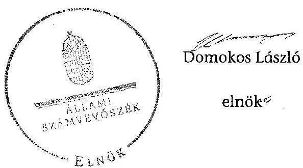

# ÁLLAMI   SZÁMVEVŐSZÉK 

## JELENTÉS

a helyi nemzetiségi önkormányzatok gazdálkodásának ellenőrzéséről
Abaújszántói Roma Nemzetiségi Önkormányzat

---

# Állami Számvevőszék 

Iktatószám: V-0565-086/2014.
Témaszám: 1599
Vizsgálat-azonosító szám: V067605

## Az ellenőrzést felügyelte:

## Brebán Andrea

felügyeleti vezető
Az ellenőrzést vezette és az ellenőrzés végrehajtásáért felelős:
Solymár Ágnes
ellenőrzésvezető

## A számvevőszéki jelentést készítették:

## Solymár Ágnes

ellenőrzésvezető
Az ellenőrzést végezték:
L. Kovács János
számvevő

## L. Kovács János

számvevő

## Puskás Balázs

számvevő

---

# TARTALOMJEGYZÉK 

BEVEZETÉS ..... 3
I. ÖSSZEGZŐ MEGÁLLAPÍTÁSOK, KÖVETKEZTETÉSEK, JAVASLATOK ..... 6
II. RÉSZLETES MEGÁLLAPÍTÁSOK ..... 12

1. A Nemzetiségi Önkormányzat és a Települési Önkormányzat együttműködésének szabályozása, a működési feltételek biztosítása ..... 12
2. A gazdálkodási feladatok ellátásának szabályszerűsége ..... 13
2.1. A költségvetésre és zárszámadásra, valamint a kincstári adatszolgáltatás rendjére vonatkozó jogszabályi előírások betartása ..... 13
2.2. A Nemzetiségi Önkormányzat gazdálkodásának szabályozottsága ..... 15
2.3. Az operatív gazdálkodási jogkörök kialakítása, gyakorlása ..... 16
3. A Nemzetiségi Önkormányzattal összefüggő gazdálkodási feladatok belső ellenőrzése ..... 17

## MELLÉKLET

1. számú A Nemzetiségi Önkormányzat 2013. évi gazdálkodásának főbb adatai

## FÜGGELÉKEK

1. számú Rövidítések jegyzéke
2. számú Fogalomtár

---

|  1 |  |  |  |  |  |  |  |  |  |  |  |  |  |  |  |  |  |  |  |  |  |  |  |  |  |  |  |  |  |  |  |  |  |  |  |  |  |  |  |  |  |  |  |  |  |  |  |  |  |  |  |  |  |  |  |  |  |  |  |  |  |  |  |  |  |  |  |  |  |  |  |  |  |  |  |  |  |  |  |  |  |  |  |  |  |  |  |  |  |  |  |  |  |  |  |  |  |  |  |  |  |  |  |  |  |  |  |  |  |  | 

---

# JELENTÉS   a helyi nemzetiségi önkormányzatok gazdálkodásának ellenőrzéséről Abaújszántói Roma Nemzetiségi Önkormányzat 

## BEVEZETÉS

A Nemzetiségi Önkormányzat 2010. évben alakult, jelenlegi elnöke a 2010. évi helyhatósági választásokat követően, a testület megalakulásától, 2010. október 14-étől ${ }^{1}$ látja el feladatát. A Nemzetiségi Önkormányzat intézményt, gazdasági társaságot és más szervezetet nem alapított, illetve társulásban nem vett részt. A négytagú Képviselő-testület a munkája segítésére bizottságot nem hozott létre. A Nemzetiségi Önkormányzat költségvetési beszámolója szerint a 2013. évben a módosított költségvetési bevételi és kiadási előirányzat 331 ezer Ft, a teljesített költségvetési bevétel 330 ezer Ft, a teljesített költségvetési kiadás 318 ezer Ft volt. A Nemzetiségi Önkormányzat a 2013. évben 97 ezer Ft feladatalapú támogatásban részesült. A 2013. évi gazdálkodási adatokat részletesen az 1. számú mellékletben mutatjuk be.

Az Alaptörvény Szabadság és felelősség rész XXIX. cikk (1) bekezdése szerint a Magyarországon élő nemzetiségek államalkotó tényezők. Minden, valamely nemzetiséghez tartozó magyar állampolgárnak joga van önazonossága szabad vállalásához és megőrzéséhez. A hazánkban élő nemzetiségek helyi (települési és területi) valamint országos önkormányzatokat hozhatnak létre². A helyi nemzetiségi önkormányzatok gazdálkodási feladatait jogszabályi előírás alapján a székhely szerinti helyi önkormányzat polgármesteri hivatala látja el.

A nemzetiségek helyzete, támogatása mind hazai, mind EU-s szinten kiemelt figyelmet kap napjainkban. A helyi nemzetiségi önkormányzatok gazdálkodására és támogatási rendszerére vonatkozó jogszabályok a 2010-2012. években jelentős változásokon mentek át. A helyi nemzetiségi önkormányzatok gazdálkodásának, a részükre juttatott költségvetési támogatások felhasználásának ellenőrzését az ÁSZ 2012-ben sorozatjellegű ellenőrzés keretében indította el.

[^0]
[^0]:    ${ }^{1}$ Az Abaújszántói Roma Nemzetiségi Önkormányzat Képviselő-testületének 1./2010. (X. 14.) számú határozatával alakult meg az Abaújszántói Roma Nemzetiségi Önkormányzat
    ${ }^{2}$ A 2010. évben megtartott nemzetiségi önkormányzati választásokat követően 2304 települési, 58 területi és 13 országos nemzetiségi önkormányzat alakult meg.

---

Az ellenőrzés célja annak értékelése volt, hogy a helyi nemzetiségi önkormányzat gazdálkodási kereteinek kialakítása, gazdálkodása megfelelt-e a jogszabályoknak.

Ennek keretében értékeltük, hogy:

- a helyi nemzetiségi önkormányzat és a helyi (települési) önkormányzat együttműködésének szabályozása, a működési feltételek biztosítása megfelel-e a jogszabályi előírásoknak;
- a felek együttműködése megfelelt-e a megállapodásban foglaltaknak a gazdálkodási feladatok szabályszerű ellátása során, betartották-e vonatkozó jogszabályi előírásokat;
- biztosított volt-e a helyi nemzetiségi önkormányzat gazdálkodásának belső ellenőrzése.

Az ellenőrzés várható hasznosulása: a nemzetiségi önkormányzatok testületi döntéseinek tapasztalatait összegezve következtetés vonható le a törvényalkotás számára a jogszabályi környezet esetleges módosításának indokoltságára vonatkozóan. Az ellenőrzés az ellenőrzött számára visszajelzést ad a rendezett gazdálkodási keretek kialakításáról, a működésbeli hiányosságokról. Az ellenőrzés megállapításai és javaslatai, a jó gyakorlat bemutatása tanulságul szolgálhatnak más nemzetiségi önkormányzatok, szervezetek számára a rendezett gazdálkodási keretek kialakításához. A társadalom számára jelzi, hogy közpénz nem maradhat ellenőrizetlenül. Az ÁSZ értékteremtő rend kialakításához és megőrzéséhez hozzájáruló tevékenysége pozitív hatással lesz a szervezetről kialakított összkép formálásában. Az ÁSZ szervezetén belül lehetőség nyílik arra, hogy a megállapítások szintetizálásával az intézmény a hozzáadott értéket teremtő elemző tevékenységet és tanácsadó szerepét erősítse.

A helyi nemzetiségi önkormányzat gazdálkodásának ellenőrzéséről szóló jelentés I. fejezetének összegző része az ellenőrzés céljára adott rövid, szintetizáló összefoglalót és következtetéseket tartalmazza a II. fejezet részletes megállapításain alapulóan. A jelentés intézkedést igénylő megállapításait és javaslatait az összegzőben foglaltak mellett - az ellenőrzés során feltárt, a jelentés II. fejezetében rögzített részletes megállapítások alapozzák meg, illetve támasztják alá.

Az ellenőrzés típusa: szabályszerűségi ellenőrzés.
Az ellenőrzött időszak: a helyi nemzetiségi önkormányzat és a települési önkormányzat együttműködésének, valamint a helyi nemzetiségi önkormányzat gazdálkodásának szabályozása megfelelőségét a 2013. évre vonatkozóan (a 2013. december 31-i állapotnak megfelelően), a helyi nemzetiségi önkormányzat gazdálkodásának szabályszerűségét, a működési feltételek, valamint a belső ellenőrzés biztosítását a 2013. január 1. - december 31-e közötti időszakot figyelembe véve értékeltük.

Ellenőrzött szervezet: az Abaújszántói Roma Nemzetiségi Önkormányzat és a gazdálkodási feladatait ellátó Abaújszántói Közös Önkormányzati Hivatal.

---

Az ellenőrzés szakmai módszertana az ÁSZ hivatalos honlapján (www.asz.hu) közzétett szakmai szabályokon alapult, amely a Legfőbb Ellenőrző Intézmények Nemzetközi Szervezete (INTOSAI) által kiadott nemzetközi standardok (ISSAI) figyelembevételével készült.

A gazdálkodási jogkörök gyakorlásának szabályszerűségét a dologi kiadásokkal és a pénzeszközátadással/ellátottak juttatásaival kapcsolatos kifizetésekre vonatkozóan ellenőriztük, értékeltük. A jogszabályoknak és a belső előírásoknak megfelelőnek, azaz szabályszerűnek minősítettük az adott területet, ha az értékelés összesített eredménye nagyobb volt, mint 90%, részben megfelelőnek, ha 71 és 90% közé esett, és nem megfelelőnek, ha 70% vagy annál kisebb volt.

Az ellenőrzés végrehajtásának jogszabályi alapját az ÁSZ tv. 5. § (2)-(3) és (6) bekezdéseiben foglaltak képezik.

Az ÁSZ tv. 29. § (1) bekezdése szerint a jelentéstervezetet megküldtük a jegyző és Nemzetiségi Önkormányzat elnöke részére, akik az ÁSZ tv. 29. § (2) bekezdésében foglalt észrevételezési jogukkal nem éltek, a jelentéstervezetre észrevételt nem tettek.

---

# I. ÖSSZEGZŐ MEGÁLLAPÍTÁSOK, KÖVETKEZTETÉSEK, JAVASLATOK 

A Nemzetiségi Önkormányzat és a Települési Önkormányzat együttműködésének szabályozása a feltárt tartalmi hiányosságok ellenére megfelelt a jogszabályi előírásoknak. A Nemzetiségi Önkormányzat rendelkezett a 2013. év folyamán hatályban lévő, a Települési Önkormányzattal történő együttműködésre vonatkozó megállapodással. Az együttműködési megállapodás felülvizsgálatát a Nek. tv.-ben foglaltak szerint 2013. január 31-éig elvégezték. Az együttműködési megállapodás az Áht. előírásától eltérően nem tartalmazta a bevételekkel és kiadásokkal kapcsolatos finanszírozási rendelkezéseket. A megállapodás a Nek. tv. előírásától eltérően nem rögzítette az önálló fizetési számla nyitásával, törzskönyvi nyilvántartásba vételével és adószám igénylésével kapcsolatos határidőket, együttműködési kötelezettséget és ezek felelőseinek konkrét kijelölését. Nem tartalmazta továbbá a költségvetés előkészítésével és megalkotásával, az azzal összefüggő adatszolgáltatási kötelezettségek teljesítésével kapcsolatos együttműködési kötelezettséget, a Nemzetiségi Önkormányzat kötelezettségvállalásaival kapcsolatosan a helyi önkormányzatot terhelő ellenjegyzési, érvényesítési, utalványozási, szakmai teljesítésigazolási feladatokat, továbbá a felelősök konkrét kijelölését, és a kötelezettségvállalással összefüggő összeférhetetlenségi és nyilvántartási szabályokat.

Az együttműködési megállapodás a Nek. tv. előírásától eltérően nem tartalmazta a Nemzetiségi Önkormányzat gazdálkodásának eljárási és dokumentációs részletszabályait, az ezeket végző személyek kijelölésének rendjét és az adatszolgáltatási feladatok teljesítésével kapcsolatos előírásokat, feltételeket, valamint a jegyzőnek vagy annak - a jegyzővel azonos képesítési előírásoknak megfelelő - megbízottjának a Települési Önkormányzat megbízásából és képviseletében a Nemzetiségi Önkormányzat ülésein való részvételét. A Nemzetiségi Önkormányzat a Nek. tv.-ben és az Áht.-ben foglalt előírások ellenére nem rendelkezett SZMSZ-el, ezáltal a Nek. tv.-ben foglaltaktól eltérően az együttműködési megállapodás szerinti működési feltételek rögzítésére sem került sor a megállapodás megkötését követő harminc napon belül. A Nemzetiségi Önkormányzat részére a működéssel kapcsolatos végrehajtási feladatok ellátása érdekében előírt személyi és tárgyi működési feltételek a szabályozási hiányosságok ellenére biztosítottak voltak a 2013. évben.

A Nemzetiségi Önkormányzat 2013. évi költségvetésének és zárszámadásának tartalma, jóváhagyása, valamint a kincstári adatszolgáltatás részben felelt meg a jogszabályi előírásoknak. A Nemzetiségi Önkormányzat elnöke az Áht. előírásaival ellentétesen nem nyújtotta be határidőre a Képviselő-testület részére az ellenőrzött évre vonatkozó költségvetési koncepciót. A Nemzetiségi Önkormányzat elnöke az Áht. előírásainak megfelelően határidőre benyújtotta a Képviselő-testület részére a költségvetési határozat tervezetét. A költségvetés a határozat alapján elfogadásra került, a jogszabályi előírás szerinti tartalmi elemeket tartalmazta. A 2013. évi költségvetés előterjesztésekor a Képviselő-testület részére az Áht. szerinti előírásnak megfelelően tájékoztatásul bemutatták szöveges indoklással az előírt mérleget és kimutatásokat. A jegyző

---

az Áht.-ben előírt határidőre nem készítette el a Nemzetiségi Önkormányzat 2013. évi zárszámadási határozat-tervezetét, ezért a Nemzetiségi Önkormányzat elnöke az előírt határidőig nem terjesztette be azt a Képviselő-testület elé. A Nemzetiségi Önkormányzat a zárszámadásról határozatot alkotott. A zárszámadási határozat-tervezet előterjesztésekor az Áht. előírásainak megfelelően tájékoztatásul bemutatták a Képviselő-testület részére az előírt mérleget és kimutatásokat. A zárszámadásról szóló határozat tartalma az előírásoknak megfelelt, valamennyi bevételről és kiadásról elszámolt, összehasonlíthatósága az elfogadott költségvetéssel biztosított volt. A jegyző a 2013. évben az Ávr. és az Áhsz. előírásai szerinti határidőben teljesítette a Nemzetiségi Önkormányzat részére előírt kincstári adatszolgáltatást.

A Nemzetiségi Önkormányzat gazdálkodásának szabályozottsága az ellenőrzött időszakban nem volt megfelelő. A gazdálkodási feladatok végrehajtását ellátó Polgármesteri Hivatal a Számv. tv. által előírt számviteli szabályzatokkal rendelkezett, de azok hatálya nem terjedt ki a Nemzetiségi Önkormányzat gazdálkodási feladataira. A Bkr.-ben foglaltak ellenére nem terjedt ki a Polgármesteri Hivatal folyamatba épített, előzetes, utólagos és vezetői ellenőrzése, továbbá a szabálytalanságok kezelése eljárásrendjének és az ellenőrzési nyomvonalának hatálya a Nemzetiségi Önkormányzat gazdálkodásával kapcsolatos végrehajtási feladataira. A Nemzetiségi Önkormányzat a szabályzatokkal önállóan sem rendelkezett. Az Ávr. előírásától eltérően sem a Polgármesteri hivatal SZMSZ-e,
 sem egyéb belső szabályozás nem rögzítette a tervezéssel, gazdálkodással, különösen az operatív gazdálkodási jogkörök gyakorlásának módjával, eljárási és dokumentációs részletszabályaival, valamint az ezeket végző személyek kijelölési rendjével és ellenőrzési, adatszolgáltatási feladatok teljesítésével kapcsolatos belső előírásokat a Nemzetiségi Önkormányzatra vonatkozóan. A jegyző a Nemzetiségi Önkormányzat gazdálkodását a fentieken túl is hiányosan szabályozta, mert a Polgármesteri Hivatal SZMSZ-e az Ávr. előírásainak ellenére nem tartalmazta az SZMSZ-ben nevesített munkakörökhöz tartozó helyettesítés rendjét, az ezekhez kapcsolódó felelősségi szabályokat. A Polgármesteri Hivatalban a gazdálkodási feladatokat ellátó köztisztviselők munkaköri leírásai nem tartalmazták a Nemzetiségi Önkormányzattal kapcsolatos feladatokat.

A Nemzetiségi Önkormányzat gazdálkodása tekintetében az operatív gazdálkodási jogkörök kialakítása nem felelt meg a jogszabályi előírásoknak. Az összeférhetetlenségi követelmények érvényesülésének feltételei nem voltak biztosítottak, mivel a Nemzetiségi Önkormányzat elnöke, mint kötelezettségvállaló az Áht. és az Ávr. vonatkozó rendelkezései alapján nem hatalmazott fel írásban a kötelezettségvállalásra más képviselőt. A felhatalmazás hiányára visszavezethető a támogatási szerződésekkel kapcsolatban feltárt összeférhetetlenségi előírások megsértése.

A Nemzetiségi Önkormányzatnál a 2013. évben a dologi kiadások és a pénzeszközátadással/ellátottak juttatásaival kapcsolatos kifizetések teljesítése során az operatív gazdálkodási jogkörökön belül kulcsszerepet betöltő teljesítésigazolás és érvényesítés kontrollokat a jogszabályi előírásoknak nem megfelelően működtették. A teljesítésigazolás az összes tételnél nem felelt meg az Ávr.ben foglaltaknak az arra jogosult személy aláírásának hiánya miatt, továbbá

---

a teljesítés igazolására jogosult személyekről és aláírás-mintájukról az Ávr. előírásától eltérően nem vezettek naprakész nyilvántartást.

A teljesítésigazoló egy támogatási szerződés kifizetése esetében az Ávr. előírásától eltérően nem ellenőrizte az összegszerűséget, a teljesítés jogosságát, valamint az összes támogatási szerződés vonatkozásában a képviselő-testületi határozat meglétét. Az érvényesítés az összes kifizetési tétel vonatkozásában kijelölés hiánya miatt nem felelt meg az Ávr. előírásának. Az érvényesítő nem látta el az Ávr. szerinti feladatát, mivel nem ellenőrizte az érvényesítést megelőző ügymenetben a jogszabályi előírások betartását és nem jelezte a teljesítésigazolások szabálytalanságát, a kötelezettségvállalási nyilvántartás hiányát, továbbá a két támogatási szerződés esetén fennálló összeférhetetlenség tényét. A kulcskontrollok nem megfelelő működtetése nem biztosította a hibák megelőzését, feltárását és kijavítását.

A jegyző az ellenőrzött időszakban nem biztosította a Polgármesteri Hivatalnál a Nemzetiségi Önkormányzat gazdálkodásával összefüggő végrehajtási feladatok belső ellenőrzését. A Polgármesteri Hivatalnál a Bkr.-ben foglaltak ellenére a Nemzetiségi Önkormányzatra is kiterjedő, kockázatelemzéssel alátámasztott 2013. évi ellenőrzési tervet nem készítettek, így a Nemzetiségi Önkormányzat gazdálkodásával összefüggő végrehajtási feladatokra vonatkozóan a 2013. évre vonatkozóan belső ellenőrzést nem terveztek és nem végeztek.

Az ellenőrzött időszakban a Nemzetiségi Önkormányzat belső ellenőrzésével kapcsolatban a BAZ Megyei Kormányhivatal két alkalommal élt törvényességi felhívással.

A Nemzetiségi Önkormányzatnak a gazdálkodás során figyelmet kell fordítania az integritás szemlélet teljes körű érvényesítésére, különös tekintettel a belső ellenőrzés megfelelő biztosítására és az összeférhetetlenséghez kapcsolódó kontrollok fejlesztésére, amellyel csökkenthetőek a szervezet működéséből eredő korrupciós kockázatok.

Az ÁSZ tv. 33. § (1) bekezdésében foglaltak értelmében az ellenőrzött szervezet vezetője köteles a jelentésben foglalt megállapításokhoz kapcsolódó intézkedési tervet összeállítani, és azt a jelentés kézhezvételétől számított 30 napon belül az ÁSZ részére megküldeni. Amennyiben az intézkedési tervet határidőre nem küldi meg a szervezet, vagy az nem elfogadható, az ÁSZ elnöke az ÁSZ tv. 33. § (3) bekezdés a)-b) pontjaiban foglaltakat érvényesítheti.

A helyszíni ellenőrzés megállapításainak hasznosítása mellett javasoljuk:

# a jegyzőnek 

1. Az együttműködés szabályozásával kapcsolatban

A Nemzetiségi Önkormányzat és a Települési Önkormányzat együttműködését meghatározó együttműködési megállapodás tartalma nem felelt meg az Áht. 27. § (2) bekezdésében foglalt, a bevételekkel és kiadásokkal kapcsolatos finanszírozási rendelkezés előírásának és a Nek. tv. 80. § (3) és (4) bekezdéseiben foglaltaknak.

---

A Nemzetiségi Önkormányzat a Nek. tv. 88. § (1) bekezdésében és az Áht. 10. § (5) bekezdésében foglalt előírások ellenére nem rendelkezett SZMSZ-szel, ezáltal a Nek. tv. 80. § (2) bekezdésében foglaltaktól eltérően az együttműködési megállapodás szerinti működési feltételek rögzítésére sem került sor a megállapodás megkötését követő harminc napon belül.

Javaslat
Az együttműködés szabályszerűsége érdekében készítse elő:
a) az Áht. 27. § (2) bekezdés és a Nek. tv. 80. § (3) és (4) bekezdéseiben foglalt előírásoknak megfelelő módosított együttműködési megállapodást és terjessze a Települési Önkormányzat Képviselő-testülete elé;
b) a Nemzetiségi Önkormányzat SZMSZ-ét a Nek. tv. 88. § (1) bekezdésében foglalt előírás alapján, figyelemmel a Nek. tv. 80. § (2) bekezdésében előírtakra.
2. A gazdálkodási feladatok szabályozottságával kapcsolatban

A gazdálkodási feladatok végrehajtását ellátó Polgármesteri Hivatal a Számv. tv. 14. § (3)-(5) bekezdéseiben és 161. § (1)-(2) bekezdéseiben előírt számviteli szabályzatokkal rendelkezett, de azok hatálya nem terjedt ki a Nemzetiségi Önkormányzat gazdálkodási feladataira. A Nemzetiségi Önkormányzat önállóan sem rendelkezett az előírt számviteli szabályzatokkal.

A Polgármesteri Hivatal a Bkr. 6. § (3) és (4) bekezdéseiben előírtak alapján elkészített ellenőrzési nyomvonala és szabálytalanságok kezelésének eljárásrendje nem terjedt ki a Nemzetiségi Önkormányzat gazdálkodásával kapcsolatos végrehajtási feladatokra. A Nemzetiségi Önkormányzat ezekkel önálló módon sem rendelkezett. A jegyző a Bkr. 8. § (2) bekezdés előírásától eltérően a Nemzetiségi Önkormányzat gazdálkodásának végrehajtásával kapcsolatos feladataira vonatkozóan nem biztosította a folyamatba épített, előzetes, utólagos és vezetői ellenőrzést.

A Polgármesteri Hivatal SZMSZ-e az Ávr. 13. § (1) bekezdés g) pontjában előírtak ellenére nem tartalmazta az SZMSZ-ben nevesített munkakörökhöz tartozó - a Nemzetiségi Önkormányzat gazdálkodásának végrehajtásával kapcsolatos - feladat és hatásköröket, a hatáskörök gyakorlásának módját, a helyettesítés rendjét, valamint az ezekhez kapcsolódó felelősségi szabályokat.

Az Ávr. 13. § (2) bekezdés a) pontban foglaltak szerinti követelményeket sem a Polgármesteri Hivatal SZMSZ-e, sem egyéb belső szabályozás nem rögzítette a Nemzetiségi Önkormányzatra vonatkozóan.

Javaslat
A Nemzetiségi Önkormányzat gazdálkodásának végrehajtásával kapcsolatos feladataira készítse el:
a) a Számv. tv. 14. § (3)-(5) bekezdéseiben és 161. § (1)-(2) bekezdéseiben előírt számviteli szabályzatokat;

---

b) a Bkr. 6. § (3) és (4) bekezdéseiben meghatározott szabályozásokat és biztosítsa a Bkr. 8. § (2) bekezdésének megfelelően a folyamatba épített, előzetes, utólagos és vezetői ellenőrzést;
c) a Polgármesteri Hivatal SZMSZ-ének módosítását, hogy az feleljen meg az Ávr. 13. § (1) bekezdés g) pontjában foglalt előírásnak és terjessze a Települési Önkormányzat Képviselő-testülete elé;
d) az Ávr. 13. § (2) bekezdés a) pontban foglaltaknak megfelelő belső szabályozást.
3. A kulcskontrollok működésével kapcsolatban

A teljesítés igazolására jogosult személyekről és aláírás-mintájukról az Ávr. 60. § (3) bekezdésében előírtaktól eltérően nem vezettek naprakész nyilvántartást. A teljesítésigazolások nem feleltek meg az Ávr. 57. § (3) bekezdésében foglaltaknak az arra jogosult személy aláírásának hiánya miatt. A teljesítésigazoló egy szerződés alapján történő kifizetés esetében az Ávr. 57. § (1) bekezdésében foglaltaktól eltérően nem ellenőrizte a teljesítés összegszerűségét.

Az érvényesítést az összes tétel esetében a Polgármesteri Hivatal állományába tartozó alkalmazottak az Ávr. 58. § (4) bekezdésében foglalt kijelölés hiányában végezték el. Az érvényesítő nem látta el az Ávr. 58. § (1) és (2) bekezdések szerinti feladatát. Nem ellenőrizte az érvényesítést megelőző ügymenetben a jogszabályi előírások betartását és nem jelezte a teljesítésigazolások szabálytalanságát, a kötelezettségvállalási nyilvántartás hiányát, továbbá a két támogatás esetén fennálló összeférhetetlenség tényét.

Javaslat
Az operatív gazdálkodás működési hibáinak megelőzése, feltárása és kijavítása érdekében:
a) intézkedjen, hogy az Ávr. 60. § (3) bekezdésének megfelelően a teljesítés igazoló jogosult személy aláírás-mintájáról naprakész nyilvántartást vezessenek;
b) intézkedjen, hogy a teljesítésigazolást az Ávr. 57. § (1) és (3) bekezdéseiben foglaltak betartásával végezzék;
c) jelölje ki az Ávr. 58. § (4) bekezdésében foglaltakra figyelemmel az érvényesítésre jogosult személyeket;
d) intézkedjen, hogy az érvényesítő az Ávr. 58. § (1)-(2) bekezdései alapján lássa el ellenőrzési és jelzési feladatát.

# a Nemzetiségi Önkormányzat elnökének 

1. A Nemzetiségi Önkormányzat és a Települési Önkormányzat együttműködését meghatározó együttműködési megállapodás tartalma nem felelt meg az Áht. 27. § (2) bekezdésében foglalt, a bevételekkel és kiadásokkal kapcsolatos finanszírozási rendelkezés előírásának és a Nek. tv. 80. § (3) és (4) bekezdéseiben foglaltaknak.

---

A Nemzetiségi Önkormányzat a Nek. tv. 88. § (1) bekezdésében és az Áht. 10. § (5) bekezdésében foglalt előírások ellenére nem rendelkezett SZMSZ-szel, ezáltal a Nek. tv. 80. § (2) bekezdésében foglaltaktól eltérően az együttműködési megállapodás szerinti működési feltételek rögzítésére sem került sor a megállapodás megkötését követő harminc napon belül.

Javaslat
Terjessze a Képviselő-testület elé jóváhagyásra
a) az Áht. 27. § (2) bekezdésében és a Nek. tv. 80. § (3) és (4) bekezdéseiben foglalt előírások betartásával az előkészített együttműködési megállapodás módosítást;
b) a jegyző által előkészített Nemzetiségi Önkormányzati SZMSZ-t.
2. A 2013. évi zárszámadási határozattervezetét a Nemzetiségi Önkormányzat elnöke az Áht. 91. § (1) bekezdésében előírt határidőig nem terjesztette be a Képviselőtestület elé.

Javaslat
Gondoskodjon a jövőben a Képviselő-testület elé terjesztésekor a zárszámadási határozattervezet esetében az Áht. 91. § (1) bekezdésében előírt határidő betartásáról.
3. A Nemzetiségi Önkormányzat elnöke, mint kötelezettségvállaló nem hatalmazott fel írásban a kötelezettségvállalás gyakorlására más képviselőt az Ávr. 52. § (7) alapján így két támogatási szerződés aláírása esetében az Ávr. 60. § (2) bekezdése szerinti összeférhetetlenségi szabály nem érvényesült.

Javaslat
Az Ávr. 60. §. (2) bekezdésében foglalt összeférhetetlenség fennállása esetén jelöljön ki további kötelezettségvállaló személyt az Ávr. 52. § (7) bekezdésében foglalt előírás alapján.

---

# II. RÉSZLETES MEGÁLLAPÍTÁSOK 

## 1. A Nemzetiségi Önkormányzat És a Települési Önkormányzat EGYÜTTMŰKÖDÉSÉNEK SZABÁLYOZÁSA, A MŰKÖDÉSI FELTÉTELEK BIZTOSÍTÁSA

A Nemzetiségi Önkormányzat és a Települési Önkormányzat együttműködésének szabályozása, a feltárt tartalmi hiányosságok ellenére megfelelt a jogszabályi előírásoknak.

A Nemzetiségi Önkormányzat rendelkezett a 2013. év folyamán hatályban lévő, a Települési Önkormányzattal történő együttműködésre vonatkozó megállapodással. A megállapodást a Nemzetiségi és a Települési Önkormányzat képviselő-testületi határozattal jóváhagyták és az arra jogosult személyek aláírták.

Az együttműködési megállapodást a Települési Önkormányzat a 33/2012. (V. 29.) számú, a Nemzetiségi Önkormányzat a 3/2012. (V. 25.) számú határozatával hagyta jóvá. ${ }^{3}$

A Nek. tv. 80. § (2) bekezdés alapján 2013. január 31-éig elvégezték a megállapodás felülvizsgálatát.

A együttműködési megállapodás felülvizsgálatát 2013. január 21-én végezték el. A felvett jegyzőkönyvben rögzítették, hogy az együttműködési megállapodás módosítása nem indokolt, nem aktuális, így arra nem került sor.

A 2013. december 31-én hatályos megállapodásban a Nemzetiségi Önkormányzat működésének feltételeit a Nek. tv. 80. § (1) bekezdésének megfelelően rögzítették, azonban a további jogszabályi előírások nem érvényesültek maradéktalanul. Az együttműködési megállapodás az Áht. 27. § (2) bekezdésében és a Nek. tv. 80. § (3) és (4) bekezdéseiben előírt tartalmi elemek közül az alábbiakat nem tartalmazta:

- az Áht. 27. § (2) bekezdés szerinti, a helyi nemzetiségi önkormányzathoz kapcsolódó gazdálkodási és egyéb feladatellátás részletes szabályai közül, a bevételeivel és kiadásaival kapcsolatban felmerülő finanszírozási rendelkezéseket;
- a Nek. tv. 80. § (3) bekezdés a) pontja által a Nemzetiségi Önkormányzat részére előírt, önálló fizetési számla nyitásával, törzskönyvi nyilvántartásba vételével és adószám igénylésével kapcsolatos határidőket, együttműködési kötelezettséget és ezek felelőseinek konkrét kijelölését;

[^0]
[^0]:    ${ }^{3}$ Az együttműködési megállapodás elfogadásáról szóló

 határozat-tervezetet a jegyző és a polgármester által aláírt beterjesztés alapján fogadta el a Települési Önkormányzat Képviselő-testülete. A Polgármesteri Hivatal SZMSZ-e (33. § (2) bekezdés) értelmében előterjesztés benyújtására a jegyző önállóan is jogosult.

---

- a Nek. tv. 80. § (3) bekezdés a) pontjában foglaltak ellenére a Települési Önkormányzat és a Nemzetiségi Önkormányzat költségvetésének előkészítésével és megalkotásával, valamint a költségvetéssel összefüggő adatszolgáltatási kötelezettségek teljesítésével kapcsolatos határidőket, együttműködési kötelezettséget és ezek felelőseinek konkrét kijelölését;
- a Nek. tv. 80. § (3) bekezdés b) pontjában foglaltak alapján a Nemzetiségi Önkormányzat kötelezettségvállalásaival kapcsolatosan a helyi önkormányzatot terhelő ellenjegyzési, érvényesítési, utalványozási és szakmai teljesítésigazolási feladatokat, továbbá a felelősök konkrét kijelölését;
- a Nek. tv. 80. § (3) bekezdés c) pontja által előírt, kötelezettségvállalással összefüggő összeférhetetlenségi és nyilvántartási szabályokat;
- a Nek. tv. 80. § (3) bekezdés d) pontja által előírt, a Nemzetiségi Önkormányzat gazdálkodásának eljárási és dokumentációs részletszabályait, az ezeket végző személyek kijelölésének rendjét és az adatszolgáltatási feladatok teljesítésével kapcsolatos előírásokat, feltételeket;
- a Nek. tv. 80. § (4) bekezdése ellenére azt, hogy jegyző vagy annak - a jegyzővel azonos képesítési előírásoknak megfelelő - megbízottja a Települési Önkormányzat megbízásából és képviseletében részt vesz a Nemzetiségi Önkormányzat ülésein és jelzi, amennyiben törvénysértést észlel.

Az együttműködési megállapodás szerinti működési feltételeket az együttműködési megállapodás megkötését követő harminc napon belül - a Nek. tv. 80. § (2) bekezdésében foglaltak ellenére - a Nemzetiségi Önkormányzat SZMSZ-ében nem rögzítették. A Nemzetiségi Önkormányzatnak az Áht. 10. § (5) bekezdésében foglaltak ellenére a megalakulása óta nincs SZMSZ-e, holott annak megalkotását a Nek. tv. 88. § (1) bekezdése, mint az alakuló ülésen elvégzendő teendőt írja elő.

Az együttműködési megállapodás szerinti működési feltételeket - a Nek. tv. 80. § (2) bekezdésében foglaltak ellenére - az együttműködési megállapodás megkötését követő harminc napon túl rögzítették a Települési Önkormányzat SZMSZ-ében.

A Nemzetiségi Önkormányzat részére a működéssel kapcsolatos végrehajtási feladatok ellátása érdekében előírt működési (személyi és tárgyi) feltételek a szabályozási hiányosságok ellenére biztosítottak voltak a 2013. évben.

# 2. A GAZDÁLKODÁSI FELADATOK ELLÁTÁSÁNAK SZABÁLYSZERŰSÉGE 

### 2.1. A költségvetésre és zárszámadásra, valamint a kincstári adatszolgáltatás rendjére vonatkozó jogszabályi előírások betartása

A Nemzetiségi Önkormányzat 2013. évi költségvetésének és zárszámadásának tartalma, jóváhagyása, valamint a kapcsolódó adatszolgáltatás részben felelt meg a jogszabályi előírásoknak.

---

A Nemzetiségi Önkormányzat elnöke az Áht. 26. § (1) bekezdése alapján, az Áht. 24. § (1) bekezdésében foglaltakkal ellentétesen - a jegyző késedelmes előkészítése miatt - november 30-ig nem nyújtotta be a Képviselő-testület részére az ellenőrzött évre vonatkozó költségvetési koncepciót.

A Nemzetiségi Önkormányzat elnöke az Áht. 26. § (1) bekezdése alapján az Áht. 24. § (2) bekezdésében ${ }^{4}$ előírtaknak megfelelően a központi költségvetésről szóló törvény hatálybalépését követő 45 napig benyújtotta a Képviselő-testület részére a költségvetési határozat tervezetét, amelyet a testület 1/2013. (II. 13.) számú határozatával elfogadott. A 2013. évi költségvetés előterjesztésekor a Képviselő-testület részére az Áht. 24. § (4) bekezdés a) pont előírásának megfelelően tájékoztatásul bemutatták szöveges indokolással együtt az előírt mérlegeket és kimutatásokat. A Nemzetiségi Önkormányzat 2013. év során több éves kihatással járó döntést nem hozott. A 2013. évi költségvetési határozat tartalmazta az Áht. 26. § (1) bekezdésében foglalt előírás alapján az Áht. 23. § (2) és (3) bekezdések szerinti tartalmi elemeket.

A zárszámadási határozat tervezetének előterjesztésekor a Képviselőtestület részére az Áht. 24. § (4) bekezdés a)-c) pontjai és az Áht. 91. § (2) bekezdés a) pontjában és (3) bekezdésében foglaltaknak megfelelően bemutatták tájékoztatásul szöveges indoklással az előírt mérleget és kimutatásokat. A jegyző nem készítette el az Áht. 91. § (1) és (3) bekezdésében előírt határidőre a Nemzetiségi Önkormányzat 2013. évi zárszámadási határozat-tervezetét, ezért a Nemzetiségi Önkormányzat elnöke április 30-ig nem terjesztette be azt a Képviselő-testület elé. A Nemzetiségi Önkormányzat a zárszámadásról 2/2014.(V. 21.) számon határozatot alkotott. A zárszámadásról szóló határozat tartalma az előírásoknak megfelelt, összehasonlíthatósága az azonos szerkezet folytán az elfogadott költségvetéssel biztosított volt. A Nemzetiségi Önkormányzatnál a 2013. évben közvetett támogatás nem volt, leltározandó vagyoni eszközei - a bankszámlán és a pénztárban levő kisösszegű pénzeszközön túlmenően - nem voltak.

A jegyző a 2013. évben a jogszabályokban előírt határidőben teljesítette a helyi nemzetiségi önkormányzat részére előírt kincstári adatszolgáltatást, így:

- a Nemzetiségi Önkormányzat 2013. évben a negyedéves és éves időközi költségvetési jelentéseket az Ávr. 169. § (2) ${ }^{5}$ bekezdése szerinti határidőre megküldte a Kincstár területileg illetékes igazgatóságának;

[^0]
[^0]:    ${ }^{4}$ 2013. december 21-étől az Áht. 24. § (3) bekezdése írja elő.
    ${ }^{5}$ A nemzetiségi önkormányzat, az időközi költségvetési jelentést a költségvetési év első három hónapjáról április 20-áig, a költségvetési év első hat hónapjáról július 20-áig, a költségvetési év első kilenc hónapjáról október 20-áig, a költségvetési év tizenkét hónapjáról a költségvetési évet követő év január 20-áig az Igazgatóságnak küldi meg.

---

- a Nemzetiségi Önkormányzat 2013. évben az időközi mérlegjelentéseket az Ávr. 170. § (5) ${ }^{6}$ bekezdése szerinti határidőre megküldte a Kincstár területileg illetékes szervének;
- a Nemzetiségi Önkormányzat a 2013. évi elemi költségvetési beszámolóját az Áhsz1 10. § (5a) bekezdés ${ }^{7}$ szerinti határidőre benyújtotta a Kincstár területileg illetékes szervének.

# 2.2. A Nemzetiségi Önkormányzat gazdálkodásának szabályozottsága 

A Nemzetiségi Önkormányzat gazdálkodásának szabályozottsága az ellenőrzött időszakban nem volt megfelelő, a jogszabályokban előírt szabályzatokkal nem rendelkezett.

A gazdálkodási feladatai végrehajtását ellátó Polgármesteri Hivatal 2013. évben a Számv. tv. 14. § (3)-(5) bekezdéseiben és 161. § (1)-(2) bekezdéseiben előírt számviteli szabályzatok közül valamennyi szabályzattal rendelkezett, de azok hatálya a Nemzetiségi Önkormányzat gazdálkodási feladataira nem terjedt ki. A Nemzetiségi Önkormányzat ezekkel önállóan sem rendelkezett.

A jegyző a Nemzetiségi önkormányzat gazdálkodását a fentieken túl hiányosan szabályozta, mert a Polgármesteri Hivatal SZMSZ-e az Ávr. 13. § (1) bekezdés g) pontjában előírtak ellenére nem tartalmazta az SZMSZ-ben nevesített munkakörökhöz tartozó - a Nemzetiségi Önkormányzat gazdálkodásával kapcsolatos - feladat- és hatásköröket, a hatáskörök gyakorlásának módját, a helyettesítés rendjét, az ezekhez kapcsolódó felelősségi szabályokat.

A Polgármesteri Hivatalban a gazdálkodási feladatokat ellátó köztisztviselők munkaköri leírásai nem tartalmazták a Nemzetiségi Önkormányzattal kapcsolatos feladatokat, beleértve az ellenőrzési és adatszolgáltatási feladatokat is.

Az Ávr. 13. § (2) bekezdés a) pontban foglaltak szerinti belső szabályozás tartalmi követelményeit - a tervezéssel, gazdálkodással, különösen az operatív gazdálkodási jogkörök gyakorlásának módjával, eljárási és dokumentációs részletszabályaival, valamint az ezeket végző személyek kijelölési rendjével és az ellenőrzési, adatszolgáltatási feladatok teljesítésével kapcsolatos belső előírásokat - sem a Polgármesteri hivatal SZMSZ-e, sem egyéb belső szabályozás nem rögzítette a Nemzetiségi Önkormányzatra vonatkozóan.

[^0]
[^0]:    ${ }^{6}$ Az irányító szerv az időközi mérlegjelentéseket a tárgynegyedévet követő hónap 25. napjáig, a negyedik negyedévre vonatkozó gyorsjelentést öt munkanapon belül, az éves jelentést az éves költségvetési beszámoló továbbításának határidejével megegyezően juttatja el feldolgozásra a Kincstárnak, az államháztartás önkormányzati alrendszerébe tartozó irányító szerv esetén az igazgatóságnak.
    ${ }^{7}$ A Nemzetiségi Önkormányzat felülvizsgált éves és féléves elemi költségvetési beszámolóit az Áhsz1 10. § (1) bekezdés szerinti határidő lejártát követő 10 naptári napon belül kell benyújtani a Kincstár területi szerveihez. 2014. január 1-jétől az Áhsz2 32. § (4) bekezdés szabályozza.

---

A Polgármesteri Hivatalban a Bkr. 6. § (3) és (4) bekezdéseiben előírtak alapján elkészített ellenőrzési nyomvonal, a szabálytalanságok kezelésének eljárásrendje nem terjedt ki a Nemzetiségi Önkormányzat gazdálkodásával kapcsolatos végrehajtási feladataira. A Nemzetiségi Önkormányzat ezekkel önálló módon sem rendelkezett. A jegyző a Bkr. 8. § (2) bekezdés előírásától eltérően a Nemzetiségi Önkormányzatra vonatkozóan nem biztosította a folyamatba épített, előzetes, utólagos és vezetői ellenőrzést.

# 2.3. Az operatív gazdálkodási jogkörök kialakítása, gyakorlása 

A Nemzetiségi Önkormányzat gazdálkodása tekintetében az operatív gazdálkodási jogkörök kialakítása nem felelt meg a jogszabályi előírásoknak. A Nemzetiségi Önkormányzat 2010. évi megalakulása óta nem rendelkezett a gazdálkodási jogkörök ellátására vonatkozó érvényes szabályzatokkal. A Polgármesteri Hivatal az ellenőrzött időszakban nem rendelkezett gazdasági szervezettel. A Nemzetiségi Önkormányzat elnöke, mint kötelezettségvállaló nem hatalmazott fel írásban a kötelezettségvállalásra más képviselőt az Ávr. 52. § (7) bekezdése alapján. Ezáltal nem volt biztosított az Ávr. 60. § (2) bekezdése szerinti összeférhetetlenségi szabályok betartása a kötelezettségvállalás során, a kijelölési hiányosság miatt két támogatási szerződés esetében az összeférhetetlenségi előírást nem tartották be. A teljesítésigazolásnál összeférhetetlenségi szabályt sértő kifizetést az ellenőrzés nem tárt fel.

A Nemzetiségi Önkormányzatnál a 2013. évben a dologi kiadások és a pénzeszközátadással/ellátottak juttatásaival kapcsolatos kifizetések teljesítése során az operatív gazdálkodási jogkörökön belül kulcsszerepet betöltő teljesítésigazolás és érvényesítés kontrollokat a jogszabályi előírásoknak nem megfelelően működtették.

A dologi kiadásokkal kapcsolatos kifizetések során a 2013. évben a teljesítésigazolás és az érvényesítés kulcskontrollok működtetésével kapcsolatosan az alábbi hiányosságokat állapítottuk meg:

- a teljesítésigazolások nem feleltek meg az Ávr. 57. § (3) bekezdésében foglaltaknak az arra jogosult személy aláírásának hiánya miatt. A teljesítés igazolására jogosult személyekről és aláírás-mintájukról az Ávr. 60. § (3) bekezdésében előírtaktól eltérően nem vezettek naprakész nyilvántartást;
- az érvényesítést az összes tétel esetében a Polgármesteri Hivatal állományába tartozó alkalmazottak az Ávr. 58. § (4) bekezdésében foglaltaktól eltérően érvényes kijelölés hiányában végezték. Az érvényesítő az Ávr. 58. § (1) (2) bekezdései ellenére feladatát nem látta el, mert nem ellenőrizte a megelőző ügymenetben a jogszabályi előírások betartását, valamint nem jelezte, hogy a teljesítésigazolások az Ávr. 57. § (3) bekezdésével ellentétesen, aláírás-minta hiányában történtek. Nem jelezte, hogy a Nemzetiségi Önkormányzat az Ávr. 56. § (1) bekezdésében előírtak ellenére nem rendelkezett kötelezettségvállalási nyilvántartással.

---

A Nemzetiségi Önkormányzatnál felhalmozási kiadásokkal kapcsolatos kifizetések nem voltak 2013. évben.

A pénzeszközátadással/ellátottak juttatásaival kapcsolatos négy támogatási szerződés ${ }^{8}$ alapján történő kifizetések során a 2013. évben a teljesítésigazolás és az érvényesítés kulcskontrollok működtetésével kapcsolatosan az alábbi hiányosságokat állapítottuk meg:

- a teljesítésigazolások nem feleltek meg az Ávr. 57. § (3) bekezdésében foglaltaknak az arra jogosult személy aláírásának hiánya miatt. A teljesítésigazoló egy szerződés alapján történő kifizetés esetében az Ávr. 57. § (1) bekezdésében foglaltaktól eltérően nem ellenőrizte a teljesítés összegszerűségét. Ugyanis a települési önkormányzattal megkötött tízezer forint összegű támogatásról szóló 2013. február 27-i szerződés a támogatás összegét ellentmondásosan tartalmazta (nem azonos a számjegyekkel és betűkkel kiírt összeg), a pénzmozgás dokumentációja a számmal kiírt összeg átutalását igazolta. A teljesítésigazoló nem ellenőrizte továbbá a teljesítés jogosságát sem, mivel nem kifogásolta, hogy a szerződés szövegében a városi önkormányzat szerepel kedvezményezettként, ezzel ellentétben egy egyesület nevében írták alá a szerződést.
- az érvényesítést az összes tétel esetében a Polgármesteri Hivatal állományába tartozó alkalmazottak az Ávr. 58. § (4)
 bekezdésében foglaltaktól eltérően érvényes kijelölés hiányában végezték. Az érvényesítést végzők az Ávr. 58. §. (1) bekezdés előírásától eltérően nem ellenőrizték, hogy szabálytalanságot észleltek az érvényesítést megelőző ügymenetben, valamint, hogy a Nemzetiségi Önkormányzat az Ávr. 56. § (1) bekezdésében előírtak ellenére nem rendelkezett kötelezettségvállalási nyilvántartással. Az érvényesítő az Ávr. 58. § (2) bekezdésében foglaltaktól eltérően nem jelezte, hogy az egyesületnek nyújtott két támogatás esetében mind a támogató, egyben kötelezettségvállaló, mind a támogatott szervezet részéről aláíró személy ugyanaz volt, ezért az Ávr. 60. § (2) bekezdése, valamint a közpénzekből nyújtott támogatások átláthatóságáról szóló 2007. évi CLXXXI. törvény 6. § (1) bekezdés a) és e) pontja szerinti összeférhetetlenség állt fenn. A támogatás felhasználásával az egyesület a szerződésben előírt határidőig elszámolt.

# 3. A Nemzetiségi Önkormányzattal összefüggő gazdálkodási feladatok belső ellenőrzése 

A jegyző az ellenőrzött időszakban nem biztosította a Polgármesteri Hivatalnál a Nemzetiségi Önkormányzat gazdálkodásával összefüggő végrehajtási feladatok belső ellenőrzését. A Polgármesteri Hivatalnál a Bkr. 29. § (1) bekezdésében foglaltak ellenére a Nemzetiségi Önkormányzatra is kiterjedő, kockázatelemzéssel alátámasztott 2013. évi ellenőrzési tervet nem készítettek, így a Nemzetiségi Önkormányzat gazdálkodásával összefüggő végrehajtási felada-

[^0]
[^0]:    ${ }^{8}$ A Nemzetiségi Önkormányzat két támogatási szerződést kötött a Települési Önkormányzattal (10000 Ft és 35000 Ft összegben) és két szerződést egy egyesülettel (50000 Ft és 190000 Ft összegben).

---

tokra vonatkozóan a 2013. évre vonatkozóan belső ellenőrzést nem terveztek és nem végeztek.

Az ellenőrzött időszakban a BAZ Megyei Kormányhivatal két esetben élt törvényességi felhívással. A BAZ Megyei Kormányhivatal a Nemzetiségi Önkormányzat esetében kifogásolta, hogy a 2013. I. félévi gazdálkodásról szóló tájékoztatót a Képviselő-testület nem tárgyalta meg, valamint a 2012. évre vonatkozóan a közmeghallgatásról készített jegyzőkönyv nem érkezett meg részére. A felhívás hatására a Nemzetiségi Önkormányzat a szükséges intézkedéseket megtette ${ }^{9}$. A BAZ Megyei Kormányhivatal részére a Nemzetiségi Önkormányzat a közmeghallgatásról készült jegyzőkönyvet ${ }^{10}$ a felhívásban meghatározott határidőben megküldte.

Az integritás szemlélet érvényesülésének ellenőrzéséhez a Polgármesteri Hivatal és a Nemzetiségi Önkormányzat tanúsítványon szolgáltatott adatokat. Ezen adatok értékelése alapján az eredendő veszélyeztetettségi szint és a kockázatokat növelő tényező szintje is alacsony volt. Emellett a szervezetnél kiépült, kockázatok kezelésére hivatott kontrollok szintje is alacsony volt. A szervezetnél jelenlévő eredendő korrupciós kockázatok, valamint a kockázatokat növelő tényezők szintje nem haladta meg az azok kezelésére kiépült kontrollok szintjét. Ugyanakkor a gazdálkodási jogkörök szabályozása és gyakorlása területén feltárt hiányosságok és hibák arra utalnak, hogy a Nemzetiségi Önkormányzatnak még fejlődést kell elérnie az integritás szemlélet érvényesítésében.

A Nemzetiségi Önkormányzat gazdálkodásával összefüggő végrehajtási feladatok belső ellenőrzésének hiánya növelte a szervezet működéséből eredő korrupciós kockázatokat.

Budapest, 2013. 01. hó 0. nap

Melléklet: 1 db
Függelék: 2 db

[^0]
[^0]:    ${ }^{9}$ A Nemzetiségi Önkormányzat a 3/2013. számú 2013. november 5-én kelt ügyiratában jelezte, hogy adminisztrációs hiba következtében a 2013. szeptember 25-én megtárgyalt a 2013. évi gazdálkodás első félévéről szóló beszámolót téves napirendi pont alatt (Egyéb indítványok, javaslatok) szerepeltették. Megküldésre került továbbá a 2013. év féléves költségvetési beszámoló másolata is.
    ${ }^{10}$ A jegyzőkönyv tanúsága szerint a közmeghallgatás 2012. december 13-án történt meg. A Nemzetiségi Önkormányzat a jegyzőkönyvet (az előírt április 10-ei határidő előtt) 2013. március 19-én az 1-6/2013. ügyiratszám alatt megküldte.

---

# A NEMZETISÉGI ÖNKORMÁNYZAT 2013. ÉVI GAZDÁLKODÁSÁNAK FŐBB ADATAI

A) Bevételek

|  Megnevezés | Eredeti előirányzat | Módosított | Teljesítés  |
| --- | --- | --- | --- |
|   | ezer Ft |  | megoszlás  |
|  Intézményi működési bevételek | 0,0 | 0,0 | 0,0  |
|  Felhalmozási saját bevételek | 0,0 | 0,0 | 0,0  |
|  Átvett pénzeszközök államháztartáson belülről: működési célú támogatásértékű bevétel központi kez. előír. | 222,0 | 225,3 | 225,3  |
|  Feladatalapú támogatás | 0,0 | 97,1 | 97,1  |
|  Települési Önkormányzat által nyújtott támogatás | 0,0 | 0,0 | 0,0  |
|  Megyei Nemzetiségi Alapítványtól támogatás | 0,0 | 0,0 | 0,0  |
|  EMI által nyújtott támogatás | 0,0 | 0,0 | 0,0  |
|  Pénzforgalmi bevételek összesen | 222,0 | 322,4 | 322,4  |
|  Előző évi pénzmaradvány felhasználás | 0,0 | 8,0 | 8,0  |
|  Bevételek összesen | 222,0 | 330,4 | 330,4  |

B) Kiadások

|  Megnevezés | Eredeti előirányzat | Módosított | Teljesítés  |
| --- | --- | --- | --- |
|   | ezer Ft |  | megoszlás  |
|  Személyi juttatások | 0,0 | 0,0 | 0,0  |
|  Munkaadókat terhelő járulékok és szociális hozzájárulási adó összesen | 0,0 | 0,0 | 0,0  |
|  Dologi kiadások | 222,0 | 230,0 | 32,8  |
|  Támogatásértékű működési kiadások | 0,0 | 0,0 | 0,0  |
|  Működési célú pénzeszközátadások államháztartáson kívülre (civil szervezetnek adott támogatások) | 0,0 | 101,0 | 285,0  |
|  Működési kiadások összesen | 222,0 | 331,0 | 317,8  |
|  Felhalmozási kiadások | 0,0 | 0,0 | 0,0  |
|  Kiadások összesen | 222,0 | 331,0 | 317,8  |

---

.

---

# RÖVIDÍTÉSEK JEGYZÉKE 

## Törvények

Alaptörvény
Áht.
ÁSZ tv.
Nek. tv.
Számv. tv.

## Rendeletek

$\mathrm{Ahsz}_{1}$

Áhsz $_{2}$
Ávr.
Bkr.

## Szórövidítések

együttműködési megállapodás/megállapodás
ÁSZ
BAZ megye
jegyző
Képviselő-testület
Kincstár
kulcskontroll

Nemzetiségi Önkormá- Abaújszántói Roma Nemzetiségi Önkormányzat és mányzat elnöke
operatív gazdálkodási jogkör
Polgármesteri Hivatal SZMSZ
Települési Önkormányzat
Települési Önkormányzat Képviselőtestülete

Magyarország Alaptörvénye
az államháztartásról szóló 2011. évi CXCV. törvény
az Állami Számvevőszékről szóló 2011. évi LXVI. törvény
a nemzetiségek jogairól szóló 2011. évi CLXXIX. törvény,
a számvitelről szóló 2000. évi C. törvény
az államháztartás szervezetei beszámolási és könyvvezetési kötelezettségének sajátosságairól szóló 249/2000. (XII. 24.) Korm. rendelet
az államháztartás számviteléről szóló 4/2013. (I. 11.) Korm. rendelet (hatályos 2014. január 1-jétől)
az államháztartási törvény végrehajtásáról szóló 368/2011. (XII. 31.) Korm. rendelet
a költségvetési szervek belső kontrollrendszeréről és belső ellenőrzéséről szóló 370/2011. (XII. 31.) Korm. rendelet

Abaújszántói Roma Nemzetiségi Önkormányzat és Abaújszántó Város Önkormányzata között kötött együttműködési megállapodás
Állami Számvevőszék
Borsod Abaúj Zemplén megye
Abaújszántó Város Önkormányzatának jegyzője
Abaújszántói Roma Nemzetiségi Önkormányzat Képviselőtestülete
Magyar Államkincstár
az operatív gazdálkodási jogkörök közül kulcskontroll a teljesítésigazolás és az érvényesítés
Abaújszántói Roma Nemzetiségi Önkormányzat
Abaújszántói Roma Nemzetiségi Önkormányzat elnöke
kötelezettségvállalás; pénzügyi ellenjegyzés; utalványozás; érvényesítés; teljesítésigazolás jogkör
Abaújszántói Közös Önkormányzati Hivatal
szervezeti és működési szabályzat
Abaújszántó Város Önkormányzata
Abaújszántó Város Önkormányzatának Képviselő-testülete

---

.

---

# FOGALOMTÁR 

## Megnevezés

belső ellenőrzés
belső kontrollrendszer
együttműködési megállapodás/megállapodás

## Fogalom magyarázat

A Bkr. 2. § b) pont meghatározásában független, tárgyilagos bizonyosságot adó és tanácsadó tevékenység, amelynek célja, hogy az ellenőrzött szervezet működését fejlessze és eredményességét növelje, az ellenőrzött szervezet céljai elérése érdekében rendszerszemléletű megközelítéssel és módszeresen értékeli, illetve fejleszti az ellenőrzött szervezet irányítási és belső kontrollrendszerének hatékonyságát.
A Bkr. 2. § d) pont és az Áht. 69. § (1) bekezdése alapján a belső kontrollrendszer a kockázatok kezelése és tárgyilagos bizonyosság megszerzése érdekében kialakított folyamatrendszer, amely azt a célt szolgálja, hogy a működés és gazdálkodás során a tevékenységeket szabályszerűen, gazdaságosan, hatékonyan, eredményesen hajtsák végre, az elszámolási kötelezettségeket teljesítsék, megvédjék az erőforrásokat a veszteségektől, károktól és a nem rendeltetésszerű használattól. Az Áht. 27. § (2) bekezdése és a Nek. tv. 80. § (1) bekezdése értelmében a helyi önkormányzat a helyi nemzetiségi önkormányzat részére - annak székhelyén - biztosítja az önkormányzati működés személyi és tárgyi feltételeit, továbbá gondoskodik a működéssel kapcsolatos végrehajtási feladatok ellátásáról. A Nek. tv. 80. § (2) bekezdés szerinti a fenti kötelezettségének teljesítése érdekében a helyi önkormányzat harminc napon belül biztosítja a rendeltetésszerű helyiséghasználatot, valamint a helyiséghasználatra, a további feltételek biztosítására és a feladatok ellátására vonatkozóan megállapodást köt a helyi nemzetiségi önkormányzattal. A megállapodást minden év január 31. napjáig, általános vagy időközi választás esetén az alakuló ülést követő harminc napon belül felül kell vizsgálni. A helyi önkormányzat és a nemzetiségi önkormányzat szervezeti és működési szabályzatában rögzíti a megállapodás szerinti működési feltételeket, a megállapodás megkötését, módosítását követő harminc napon belül. A Nek. tv. 80. § (3) bekezdés írja elő a megállapodásban rögzítendőket.

---

integritás
jegyző
költségvetési
szerv vezetője
korrupció
kulcskontroll
lényegesség

Az integritás elvek, értékek, cselekvések, módszerek, intézkedések konzisztenciáját jelenti: olyan magatartásmódot, amely meghatározott értékeknek felel meg. Az integritás a közszféra esetében a társadalom által elvárt nyilvánossági, átláthatósági, illetve jogi/etikai normáknak történő megfelelést jelenti. (Forrás: a http://integritas.asz.hu honlapon közzétett „A 2012. évi integritás felmérés eredményeinek összefoglalója" dokumentum 3. oldal 1. bekezdése)
A Mötv. 81. § (1) bekezdése értelmében a jegyző vezeti a polgármesteri hivatalt. Az Áht. 10. § (1) bekezdése szerint a jegyző, mint a költségvetési szerv vezetője felelős a közfeladatok jogszabályban, alapító okiratban, belső szabályzatban foglaltaknak megfelelő ellátásáért, valamint a költségvetési szerv számára jogszabályban előírt kötelezettségek teljesítéséért.
A Bkr. 2. § nd) pont meghatározásában a helyi önkormányzat, helyi nemzetiségi önkormányzat, illetve a fővárosi kerületi önkormányzat esetén a jegyző, körjegyző, főjegyző.
Azok a cselekmények, amelyek során a köz érdekében való eljárással megbízott és döntéshozatali felelősséggel felruházott személy a köz érdeke helyett önös vagy részérdekeket követve, mástól jogtalan vagy etikátlan előnyt elfogadva és őt jogtalan vagy etikátlan előnyhöz juttatva jár el, illetve amikor valaki a köz érdekében való eljárással megbízott és döntéshozatali felelősséggel felruházott személynek jogtalan vagy etikátlan előnyt nyújtva vagy felajánlva jogtalan vagy etikátlan előnyt kér. (Forrás: A Kormány korrupció megelőzési programja 2012-2014.)
Az azonosított kockázatok mérséklése érdekében kialakított kontrollok közül azok, amelyek elégtelen működése esetén a szervezetet jelentős veszteség érheti, vagy a működésükben bekövetkező hiba/hiányosság más kontrollok eredményességét csökkenti. Ezek ellenőrzése, értékelése elegendő bizonyítékot szolgáltat adott területen a kontrollrendszer értékeléséhez. Az önkormányzatok kontrollrendszere kialakításának ellenőrzése során a pénzügyi folyamatokban kulcsszerepet betöltő belső kontrollok a teljesítésigazolás és érvényesítés.
Egy információ akkor lényeges, ha hiánya vagy téves állítása befolyásolhatja ezen információkat felhasználók döntéseit, véleményét. Az ellenőrzés során a lényegesség három szempontból értelmezhető: érték, jelleg és összefüggés szerint.

---

megfelelőségi teszt
nemzetiség
nemzetiségi önkormányzat

Polgármesteri Hivatal

Az ellenőrzés során alkalmazott módszer - a számvevő egy adatállomány, statisztikai sokaság összes tételének vizsgálata helyett a kiválasztott tételek meghatározott jellemzőinek elemzése és kiértékelése útján szerezhet a teljes állományra vonatkozó következtetések levonására alkalmas ellenőrzési bizonyítékokat - a mennyiségileg elegendő és a minőségileg megfelelő bizonyíték megszerzésére az ellenőrzött kulcskontroll (teljesítésigazolás, érvényesítés) működésének megfelelő, vagy nem megfelelő voltáról. (A számvevőszéki ellenőrzés általános alapelvei 4.1.2, és 4.2 pontjai)
A Nek tv. 1. § (1) bekezdése alapján nemzetiség minden olyan Magyarország területén legalább egy évszázada honos népcsoport, amely az állam lakossága körében számszerű kisebbségben van, tagjai magyar állampolgárok és a lakosság többi részétől saját nyelve és kultúrája, hagyományai különböztetik meg,

 egyben olyan összetartozás-tudatról tesz bizonyságot, amely mindezek megőrzésére, történelmileg kialakult közösségeik érdekeinek kifejezésére és védelmére irányul.
Az Nktv. 2. § 2. pontja szerint törvényben meghatározott nemzetiségi közszolgáltatási feladatokat ellátó, testületi formában működő, jogi személyiséggel rendelkező, demokratikus választások útján e törvény alapján létrehozott szervezet, amely a nemzetiségi közösséget megillető jogosultságok érvényesítésére, a nemzetiségek érdekeinek védelmére és képviseletére, a feladat- és hatáskörébe tartozó nemzetiségi közügyek települési, területi vagy országos szinten történő önálló intézésére jön létre.
A Mötv. 41. § (2) bekezdése értelmében az önkormányzati feladatok ellátását a képviselő-testület és szervei biztosítják. A képviselő-testület szervei: a polgármester, a főpolgármester, a megyei közgyűlés elnöke, a képviselő-testület bizottságai, a részönkormányzat testülete, a polgármesteri hivatal, a megyei önkormányzati hivatal, a közös önkormányzati hivatal, a jegyző, továbbá a társulás.
A Mötv. 84. § (1) bekezdése értelmében a helyi önkormányzat képviselő-testülete az önkormányzat működésével, valamint a polgármester vagy a jegyző feladat- és hatáskörébe tartozó ügyek döntésre való előkészítésével és végrehajtásával kapcsolatos feladatok ellátására polgármesteri hivatalt vagy közös önkormányzati hivatalt hoz létre. A hivatal közreműködik az önkormányzatok egymás közötti, valamint az állami szervekkel történő együttműködésének összehangolásában.
