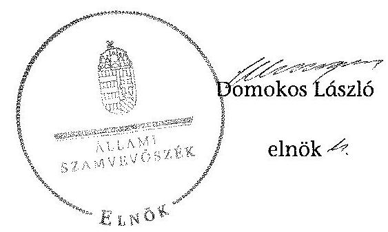
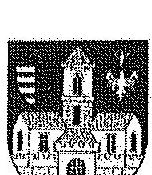
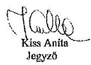
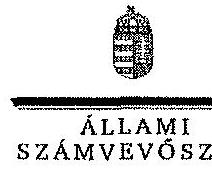
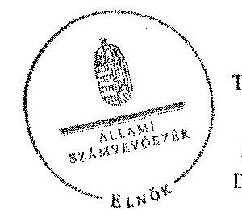

ÁLLAMI
SZÁMVEVŐSZÉK

# JELENTÉS 

a helyi nemzetiségi önkormányzatok gazdálkodásának ellenőrzéséről
Óbuda-Békásmegyer Cigány Nemzetiségi Önkormányzat

---

# Állami Számvevőszék 

Iktatószám: V-0563-099/2014.
Témaszám: 1597
Vizsgálat-azonosító szám: V067603

## Az ellenőrzést felügyelte:

Brebán Andrea
felügyeleti vezető
Az ellenőrzést vezette:
dr. Győri Gabriella
ellenőrzésvezető
A számvevőszéki jelentéstervezet összeállításában közreműködött:
dr. Győri Gabriella
ellenőrzésvezető
Krüzselyi Attila
számvevő tanácsos
Az ellenőrzést végezték:

| Janota Gabriella | Krüzselyi Attila | Vasváriné Molnár Judit |
| :-- | :-- | :-- |
| számvevő | számvevő tanácsos | számvevő |

---

# TARTALOMJEGYZÉK 

BEVEZETÉS ..... 3
I. ÖSSZEGZŐ MEGÁLLAPÍTÁSOK, KÖVETKEZTETÉSEK, JAVASLATOK ..... 6
II. RÉSZLETES MEGÁLLAPÍTÁSOK ..... 13

1. A Nemzetiségi Önkormányzat és a Települési Önkormányzat együttműködésének szabályozása, a működési feltételek biztosítása ..... 13
2. A gazdálkodási feladatok ellátásának szabályszerűsége ..... 14
2.1. A költségvetésre és a zárszámadásra, valamint a kincstári adatszolgáltatás rendjére vonatkozó jogszabályi előírások betartása ..... 14
2.2. A Nemzetiségi Önkormányzat gazdálkodásának szabályozottsága ..... 16
2.3. Az operatív gazdálkodási jogkörök kialakítása, gyakorlása ..... 17
3. A Nemzetiségi Önkormányzattal összefüggő gazdálkodási feladatok belső ellenőrzése ..... 18
MELLÉKLETEK
4. számú Óbuda-Békásmegyer Cigány Nemzetiségi Önkormányzat 2013. évi gaz- dálkodási adatai
5. számú Budapest Főváros III. Kerület Óbuda-Békásmegyeri Polgármesteri Hivatal jegyzőjének észrevétele
6. számú Az ÁSZ válasza Budapest Főváros III. Kerület Óbuda-Békásmegyeri Pol- gármesteri Hivatal jegyzőjének a jelentéstervezetre tett észrevételeire
FÜGGELÉKEK
7. számú Rövidítések jegyzéke
8. számú Értelmező szótár

---

.

---

# JELENTÉS   a helyi nemzetiségi önkormányzatok gazdálkodásának ellenőrzéséről   Óbuda-Békásmegyer Cigány Nemzetiségi Önkormányzat 

## BEVEZETÉS

A Nemzetiségi Önkormányzat az 1995. évben alakult, elnöke a 2006. évi helyhatósági választások óta látja el feladatát. A Nemzetiségi Önkormányzat intézményt és más szervezetet nem alapított, illetve társulásban nem vett részt. 2013. évben egy gazdasági társasággal rendelkezett, melynek a főtevékenysége zöldterület kezelés volt. A négytagú Képviselő-testület a munkája segítésére bizottságot nem hozott létre. A Nemzetiségi Önkormányzat költségvetési beszámolója szerint 2013. évben a módosított költségvetési bevételi és kiadási előirányzat 2889,0 ezer Ft, a teljesített költségvetési bevétel 2876,0 ezer Ft, a teljesített költségvetési kiadás 3778,0 ezer Ft volt. A kiadások teljesítése a finanszírozási (függő, átfutó, kiegyenlítő) kiadások figyelembevételével 3096 ezer Ft volt. A Nemzetiségi Önkormányzat a 2013. évben 367,0 ezer Ft feladatalapú támogatásban részesült. A 2013. évi gazdálkodási adatokat részletesen az 1. számú mellékletben mutatjuk be.

Az Alaptörvény Szabadság és felelősség rész XXIX. cikk (1) bekezdése szerint a Magyarországon élő nemzetiségek államalkotó tényezők. Minden, valamely nemzetiséghez tartozó magyar állampolgárnak joga van önazonossága szabad vállalásához és megőrzéséhez. A hazánkban élő nemzetiségek helyi (települési és területi) valamint országos önkormányzatokat hozhatnak létre ${ }^{1}$. A helyi nemzetiségi önkormányzatok gazdálkodási feladatait jogszabályi előírás alapján a székhely szerinti helyi önkormányzat polgármesteri hivatala látja el.

A nemzetiségek helyzete, támogatása mind hazai, mind EU-s szinten kiemelt figyelmet kap napjainkban. A helyi nemzetiségi önkormányzatok gazdálkodására és támogatási rendszerére vonatkozó jogszabályok a 2010-2012. években jelentős változásokon mentek át. A helyi nemzetiségi önkormányzatok gazdálkodásának, a részükre juttatott költségvetési támogatások felhasználásának ellenőrzését az ÁSZ 2012. évben sorozatjellegű ellenőrzés keretében indította el. A 2014. évi ellenőrzések az önkormányzati ellenőrzésekre ráépülő (egyablakos) vagy önálló ellenőrzésként valósulnak meg.

[^0]
[^0]:    ${ }^{1}$ A 2010. évben megtartott nemzetiségi önkormányzati választásokat követően 2304 települési, 58 területi és 13 országos nemzetiségi önkormányzat alakult meg.

---

Az ellenőrzés célja annak értékelése volt, hogy a helyi nemzetiségi önkormányzat gazdálkodási kereteinek kialakítása, gazdálkodása megfelelt-e a jogszabályoknak.

Ennek keretében értékeltük, hogy:

- a helyi nemzetiségi önkormányzat és a helyi (települési) önkormányzat együttműködésének szabályozása, a működési feltételek biztosítása megfelel-e a jogszabályi előírásoknak;
- a felek együttműködése megfelelt-e a megállapodásban foglaltaknak a gazdálkodási feladatok szabályszerű ellátása során, betartották-e vonatkozó jogszabályi előírásokat;
- biztosított volt-e a helyi nemzetiségi önkormányzat gazdálkodásának belső ellenőrzése.

Az ellenőrzés várható hasznosulása: a nemzetiségi önkormányzatok testületi döntéseinek tapasztalatait összegezve következtetés vonható le a törvényalkotás számára a jogszabályi környezet esetleges módosításának indokoltságára vonatkozóan. Az ellenőrzés az ellenőrzött számára visszajelzést ad a rendezett gazdálkodási keretek kialakításáról, a működésbeli hiányosságokról. Az ellenőrzés megállapításai és javaslatai, a jó gyakorlat bemutatása tanulságul szolgálhatnak más nemzetiségi önkormányzatok, szervezetek számára a rendezett gazdálkodási keretek kialakításához. A társadalom számára jelzi, hogy közpénz nem maradhat ellenőrizetlenül, az ÁSZ értékteremtő rend kialakításához és megőrzéséhez hozzájáruló tevékenysége pozitív hatással lesz a szervezetről kialakított összkép formálásában. Az ÁSZ szervezetén belül lehetőség nyílik arra, hogy a megállapítások szintetizálásával az intézmény a hozzáadott értéket teremtő elemző tevékenységét és tanácsadó szerepét erősítse.

A helyi nemzetiségi önkormányzatok gazdálkodásának ellenőrzéséről szóló jelentés I. fejezetének összegző része az ellenőrzés céljára adott rövid, szintetizáló összefoglalót és következtetéseket tartalmazza a II. fejezet részletes megállapításain alapulóan. A jelentés intézkedést igénylő megállapításait és javaslatait az összegzőben foglaltak mellett - az ellenőrzés során feltárt, a jelentés II. fejezetében rögzített részletes megállapítások alapozzák meg, illetve támasztják alá.

A gazdálkodási jogkörök gyakorlásának szabályszerűségét a dologi kiadásokkal kapcsolatos kifizetésekre vonatkozóan ellenőriztük, értékeltük. A jogszabályoknak és a belső előírásoknak megfelelőnek, azaz szabályszerűnek minősítettük az adott területet, ha az értékelés összesített eredménye nagyobb volt, mint $90 \%$, részben megfelelőnek, ha $71 \%$ és $90 \%$ közé esett, és nem megfelelőnek, ha $70 \%$ vagy annál kisebb volt.

Az ellenőrzés típusa: szabályszerűségi ellenőrzés.
Az ellenőrzött időszak: a Nemzetiségi Önkormányzat és a Települési Önkormányzat együttműködésének, valamint a Nemzetiségi Önkormányzat gazdálkodásának szabályozása megfelelőségét a 2013. évre vonatkozóan (a 2013. december 31-i állapotnak megfelelően), a Nemzetiségi Önkormányzat gazdál-

---

kodásának szabályszerűségét, a működési feltételek, valamint a belső ellenőrzés biztosítását a 2013. január 1. - december 31-e közötti időszakot figyelembe véve kell értékelni.

Ellenőrzött szervezet: az Óbuda-Békásmegyer Cigány Nemzetiségi Önkormányzat és a gazdálkodási feladatait ellátó Budapest Főváros III. Kerület Óbuda-Békásmegyeri Polgármesteri Hivatal.

Az ellenőrzés „Az önkormányzatok vagyongazdálkodása szabályszerűségének ellenőrzése - Budapest Főváros III. kerületi Óbuda-Békásmegyer Önkormányzat" ellenőrzésére ráépülően valósult meg. Az integritás kontrollok értékelését az alapellenőrzés számvevőszéki jelentése tartalmazza.

Az ellenőrzés szakmai módszertana az ÁSZ hivatalos honlapján (www.asz.hu) közzétett szakmai szabályokon alapult, amely a Legfőbb Ellenőrző Intézmények Nemzetközi Szervezete (INTOSAI) által kiadott nemzetközi standardok (ISSAI) figyelembevételével készült.

Az ellenőrzés végrehajtásának jogszabályi alapját az ÁSZ tv. 5. § (2)-(3) és (6) bekezdéseiben foglaltak képezik.

Az ÁSZ tv. 29. § (1) bekezdése szerint a jelentéstervezetet megküldtük egyeztetésre a jegyzőnek és a Nemzetiségi Önkormányzat elnökének. A Nemzetiségi Önkormányzat elnöke az ÁSZ tv. 29. § (2) bekezdésében foglalt észrevételezési jogával nem élt, a jelentéstervezetre észrevételt nem tett. A jegyzőtől beérkezett észrevételek és az arra adott válaszok, ideértve az el nem fogadott észrevételeket és azok indokolását a jelentés 2-3. számú mellékletei tartalmazzák.

---

# I. ÖSSZEGZŐ MEGÁLLAPÍTÁSOK, KÖVETKEZTETÉSEK, JAVASLATOK 

A Nemzetiségi Önkormányzat és a Települési Önkormányzat együttműködésének szabályozása a feltárt hiányosságok miatt részben felelt meg a jogszabályi előírásoknak. A Nemzetiségi Önkormányzat 2013. évben rendelkezett a Települési Önkormányzattal történő együttműködésre vonatkozó megállapodással, azonban annak felülvizsgálatát a Nek. tv.-ben foglalt határidőig csak a Nemzetiségi Önkormányzat végezte el. Az együttműködési megállapodás tartalmazta az Áht.-ban meghatározottak szerint a tervezési, gazdálkodási, ellenőrzési, finanszírozási, adatszolgáltatási és beszámolási feladatok ellátásának szabályait. Meghatározták a feladatellátáshoz szükséges tárgyi, technikai eszközökkel felszerelt helyiség ingyenes használatát, annak időtartama kivételével. Rögzítették a költségvetés elkészítésével kapcsolatos és az ezzel összefüggő adatszolgáltatási feladatokat. Nem rögzítették a testületi döntéshozatalhoz kapcsolódó nyilvántartási feladatokat, a Nemzetiségi Önkormányzat működésével, gazdálkodásával kapcsolatos nyilvántartási, iratkezelési feladatok ellátását. Nem határozták meg az adószám igénylésével, az önálló fizetési számla nyitásával és a törzskönyvi nyilvántartásba vétellel kapcsolatos határidőket, a felelősök konkrét kijelölését. Nem szabályozták a Nemzetiségi Önkormányzat kötelezettségvállalásaival összefüggésben az operatív gazdálkodási jogkörök gyakorlására jogosultak konkrét kijelölését. Nem rögzítették a Nemzetiségi Önkormányzat kötelezettségvállalásának SZMSZ-ében meghatározott szabályait. Nem határozták meg a Nek. tv. által előírt, a Nemzetiségi Önkormányzat működési feltételeinek és gazdálkodásának eljárási és dokumentációs részletszabályait. Az együttműködési megállapodás szerinti működési feltételeket nem rögzítették a Nek. tv.-ben foglalt határidőben a Nemzetiségi Önkormányzat SZMSZ-ében, illetve a Települési Önkormányzat SZMSZ ${ }_{1}$-ben.

A Települési Önkormányzat - a szabályozás hiányossága ellenére - a 2013. évben biztosította a Nemzetiségi Önkormányzat működéséhez szükséges személyi és tárgyi feltételeket.

A Nemzetiségi Önkormányzat 2013. évi költségvetésének és zárszámadásának tartalma, jóváhagyása, valamint a kincstári adatszolgáltatás teljesítése részben felelt meg a jogszabályi előírásoknak.

A Nemzetiségi Önkormányzat elnöke az Áht.-ban előírtaknak megfelelően határidőben benyújtotta a Képviselő-testület részére az ellenőrzött évre vonatkozó költségvetési koncepciót és a jegyző által előkészített költségvetési határozattervezetét. A 2013. évi költségvetési határozat tartalmazta a költségvetési bevételeket és kiadásokat előirányzat csoportok szerinti bontásban, azonban nem tartalmazta a költségvetési bevételeket és kiadásokat kötelező- és önként vállalt feladatok szerinti bontásban. Nem mutatták be a Képviselő-testület részére tájékoztatásul - szöveges indokolással együtt - az előirányzat felhasználási tervet.

---

A jegyző a 2013. évi zárszámadási határozat-tervezetét nem készítette el az Áht.-ban előírt határidőben, ezért a Képviselő-testület a zárszámadásról késedelmesen alkotott határozatot. Az Áht.-ban foglaltaknak megfelelően a zárszámadási határozat tervezetének előterjesztésekor tájékoztatásul bemutatták a Nemzetiségi Önkormányzat költségvetési mérlegét közgazdasági tagolásban, azonban nem került sor a pénzeszközök változásának bemutatására. Az Áht.-ban foglaltakkal ellentétesen az év közben folyósított feladatalapú támogatás összegével nem módosították a költségvetést. A 2013. évi zárszámadási határozat a költségvetési határozattal összehasonlítható szerkezetben készült, a zárszámadási határozatban valamennyi bevételről és kiadásról elszámoltak.

A kincstári adatszolgáltatási kötelezettséget a jegyző öt esetben - az Ávr. előírásaihoz képest - késedelmesen teljesítette.

A Nemzetiségi Önkormányzat gazdálkodásának szabályozottsága az ellenőrzött időszakban nem volt megfelelő. A Polgármesteri Hivatal a 2013. évben rendelkezett a Számv. tv. és a Bkr. által előírt gazdálkodási tárgyú szabályzatokkal, azonban azok hatálya a Nemzetiségi Önkormányzatra nem terjedt ki és önállóan sem rendelkezett ezekkel a szabályzatokkal. A jegyző a Bkr. előírásától eltérően nem biztosította a Nemzetiségi Önkormányzat gazdálkodásának végrehajtásával kapcsolatos feladataira vonatkozóan a folyamatba épített, előzetes, utólagos és vezetői ellenőrzést. A Nemzetiségi Önkormányzat gazdálkodásával kapcsolatos munkakörökhöz tartozó hatáskörök gyakorlásának módjára, az ezekhez tartozó felelősségi szabályokra vonatkozó előírásokat az Ávr.-ben foglaltak ellenére a Polgármesteri Hivatal SZMSZ ${ }_{1,2}$ nem tartalmazta. A Nemzetiségi Önkormányzat nem rendelkezett - az Ávr.-ben előírt - a tervezéssel, gazdálkodással, így különösen a kötelezettségvállalással, pénzügyi ellenjegyzéssel és teljesítésigazolással, az érvényesítés, utalványozás gyakorlásának módjával, eljárási és dokumentálási részletszabályaival, valamint az ezeket végző személyek kijelölésének rendjével, az ellenőrzési és adatszolgáltatási feladatok teljesítésével kapcsolatos belső előírásokat, feltételeket tartalmazó belső szabályzattal.

A Nemzetiségi Önkormányzatnál az operatív gazdálkodási jogkörök kialakítása nem felelt meg a jogszabályi előírásoknak. Az ellenőrzött időszakban a Nemzetiségi Önkormányzat nem rendelkezett az operatív gazdálkodási jogkörök ellátására vonatkozó érvényes szabályzattal.

A Nemzetiségi Önkormányzatnál az ellenőrzött időszakban a dologi kiadásokkal kapcsolatos kifizetések teljesítése során az operatív gazdálkodási jogkörökön belül kulcsszerepet betöltő teljesítésigazolás és érvényesítés kontrollok nem a jogszabályi előírásoknak megfelelően működtek. Az Ávr.-ben foglalt előírások ellenére a teljesítésigazolás 39,3%-ánál és az érvényesítés 26,1%-ánál nem tüntették fel a teljesítésigazolás és az érvényesítés dátumát, így nem volt megállapítható, hogy azokra az Áht.-ban előírtak szerint az utalványozás előtt került sor. Az érvényesítő nem észrevételezte, hogy a teljesítésigazoló feladatellátása nem felelt meg az Ávr. előírásainak. Az érvényesítő a feladatát az Ávr. előírásától eltérően, kijelölés hiányában végezte.

A jegyző az ellenőrzött időszakban nem biztosította a Nemzetiségi Önkormányzat gazdálkodásával összefüggő végrehajtási feladatok belső ellenőrzé-

---

sét. A Polgármesteri Hivatalnál a Bkr.-ben foglaltak ellenére a Nemzetiségi Önkormányzatra is kiterjedő, kockázatelemzéssel alátámasztott 2013. évi ellenőrzési tervet nem készítettek, így a Nemzetiségi Önkormányzat gazdálkodásával összefüggő végrehajtási feladatokra vonatkozóan belső ellenőrzést a 2013. évben nem terveztek és nem végeztek.

Az ellenőrzött időszakban a Nemzetiségi Önkormányzatot érintően a Kormányhivatal kettő esetben élt törvényességi felügyeleti eszközökkel, melyek alapján a Nemzetiségi Önkormányzat a szükséges intézkedéseket megtette.

Az ÁSZ tv. 33. § (1) bekezdésében foglaltak értelmében az ellenőrzött szervezet vezetője köteles a jelentésben foglalt megállapításokhoz kapcsolódó intézkedési tervet összeállítani, és azt a jelentés kézhezvételétől számított 30 napon belül az ÁSZ részére megküldeni. Amennyiben az intézkedési tervet határidőre nem küldi meg a szervezet, vagy az nem elfogadható, az ÁSZ elnöke az ÁSZ tv. 33. § (3) bekezdés a)-b) pontjaiban foglaltakat érvényesítheti.

A helyszíni ellenőrzés megállapításainak hasznosítása mellett javasoljuk:

# a jegyzőnek 

1.  Az együttműködés szabályozásával kapcsolatban

A Nemzetiségi Önkormányzat és a Települési Önkormányzat együttműködését meghatározó együttműködési megállapodás tartalma részben felelt meg a jogszabályi előírásoknak, mivel a Nek. tv. 80. § (1) bekezdés a), d) és e) pontjaiban, valamint a 80. § (3) bekezdésében előírtakat nem tartalmazta. A Nek. tv. 80. § (2) bekezdésében foglaltak ellenére az együttműködési megállapodás felülvizsgálata nem történt meg.

Az együttműködési megállapodás szerinti működési feltételeket a Nek. tv. 80. § (2) bekezdésében előírtak ellenére a Nemzetiségi Önkormányzat SZMSZ-ében nem rögzítették az együttműködési megállapodás megkötését követő 30 napon belül.

Javaslat
Az együttműködés szabályszerűsége érdekében:
a) készítse elő a Nek. tv. 80. § (1) bekezdés a), d) és e) pontjaiban, valamint a Nek. tv. 80. § (3) bekezdésében foglalt előírásoknak megfelelő együttműködési megállapodás módosítását és terjessze a Települési Önkormányzat Képviselő-testülete elé;
b) gondoskodjon az együttműködési megállapodás Nek. tv. 80. § (2) bekezdésében előírt határidő szerinti, évenkénti felülvizsgálatáról;
c) készítse elő a Nemzetiségi Önkormányzat SZMSZ-ének kiegészítését a Nek. tv. 80. § (2) bekezdésében foglalt határidőre az együttműködési megállapodás megkötése, módosítása esetén.

---

2.  A költségvetés és zárszámadás szabályszerűségével kapcsolatban

A 2013. évi költségvetési határozat az Áht. 23. § (2) bekezdés a) pontjától eltérően nem tartalmazta a Nemzetiségi Önkormányzat költségvetési bevételeit és kiadásait kötelező és önként vállalt feladatok szerinti bontásban. A költségvetési határozattervezet előterjesztésekor a Képviselő-testület részére tájékoztatásul nem mutatták be az Áht. 24. § (4) bekezdés a) pontjában előírtak ellenére szöveges indokolással együtt a Nemzetiségi Önkormányzat előirányzat felhasználási tervét.

A 2013. évi zárszámadási határozat-tervezet előterjesztésekor - a jegyző mulasztása miatt - a Képviselő-testülete részére tájékoztatásul nem mutatták be szöveges indokolással együtt az Áht. 91. § (2) bekezdés a) pontja alapján az Áht. 24. § (4) bekezdés a) pontja szerinti pénzeszközök változását.

A kiadások teljesítése az Áht. 6. § (1) bekezdésében foglalt előírások ellenére a költségvetésben megállapított kiadási előirányzatot meghaladó volt, ezáltal nem tartották be az Áht. 36. § (1) bekezdésében foglalt kötelezettségvállalásra vonatkozó előírásokat.

Javaslat
a) Intézkedjen a jövőben arról, hogy a költségvetési határozat az Áht. 23. § (2) bekezdés a) pontjától előírtaknak tartalmilag teljes körűen feleljen meg.
b) Intézkedjen a jövőben arról, hogy a költségvetési határozat-tervezet előterjesztésekor a Képviselő-testületnek tájékoztatásul bemutatásra kerüljön az Áht. 24. § (4) bekezdés a) pontjában előírt előirányzat felhasználási terv szöveges indoklással együtt.
c) Intézkedjen a jövőben arról, hogy a zárszámadási határozat-tervezet előterjesztésekor a Képviselő-testület részére tájékoztatásul bemutatásra kerüljön az Áht. 91. § (2) bekezdés a) pontja alapján az Áht. 24. § (4) bekezdés a) pontja szerinti pénzeszközök változása.
d) Készítse el az előirányzatok szükséges mértékű módosítására vonatkozó határozat tervezetet az Áht. 36. § (1) bekezdése szerint meghatározott előirányzatokon belüli gazdálkodás érdekében.
3.  A kincstári adatszolgáltatási kötelezettséggel kapcsolatban

A jegyző a Nemzetiségi Önkormányzat részére jogszabályban előírt kincstári adatszolgáltatási kötelezettséget öt alkalommal késedelmesen teljesítette. Az Ávr. 169. § (2) bekezdésében előírt határidőt követően teljesítette az adatszolgáltatást az I. és a III. negyedéves időközi költségvetési jelentések vonatkozásában. Az időközi mérlegjelentések esetében nem tartotta be az Ávr. 170. § (5) bekezdésében előírt határidőket.

Javaslat
Tegyen eleget a kincstári adatszolgáltatási kötelezettségének az Ávr. 169. § (2) bekezdésében és az Ávr. 170. § (5) bekezdésében foglalt határidők betartásával.

---

4.  A gazdálkodási feladatok szabályozottságával kapcsolatban

A gazdálkodási feladatok végrehajtását ellátó Polgármesteri Hivatal a 2013. évben a Számv. tv. 14. § (3)-(5) bekezdéseiben és a 161. § (1)-(2) bekezdéseiben előírt számviteli szabályzatok közül valamennyi szabályzattal rendelkezett, de azok hatálya a Nemzetiségi Önkormányzat gazdálkodási feladataira nem terjedt ki. A Nemzetiségi Önkormányzat ezekkel a szabályzatokkal önállóan sem rendelkezett.

A Nemzetiségi Önkormányzat gazdálkodásával kapcsolatos munkakörökhöz tartozó hatáskörök gyakorlásának módjára, az ezekhez tartozó felelősségi szabályokra vonatkozó előírásokat a Polgármesteri Hivatal SZMSZ-e ${ }_{1,2}$ az Ávr. 13. § (1) bekezdés g) pontjában foglaltak ellenére nem tartalmazta.

Az Ávr. 13. § (2) bekezdés a) pontjában foglaltak szerinti feladatokkal kapcsolatos szabályokat a Polgármesteri Hivatal SZMSZ-e ${ }_{1,2}$, sem egyéb belső szabályozás nem rögzítette a Nemzetiségi Önkormányzatra vonatkozóan.

A Polgármesteri Hivatal rendelkezett a Bkr. 6. § (3)-(4) bekezdéseiben előírt ellenőrzési nyomvonallal, szabálytalanságok kezelésének eljárásrendjével, azonban ezek nem terjedtek ki a Nemzetiségi Önkormányzat gazdálkodásával kapcsolatos végrehajtási feladatokra. A jegyző a Bkr. 8. § (2) bekezdés előírásától eltérően a Nemzetiségi Önkormányzat gazdálkodásának végrehajtásával kapcsolatos feladataira vonatkozóan nem biztosította a folyamatba épített, előzetes, utólagos és vezetői ellenőrzést.

Javaslat
A Nemzetiségi Önkormányzat gazdálkodásának végrehajtásával kapcsolatos feladataira készítse el:
a) a Számv. tv. 14. § (3)-(5) bekezdéseiben és a 161. § (1)-(2) bekezdéseiben előírt szabályzatokat;
b) a Polgármesteri Hivatal SZMSZ-ének ${ }_{2}$ módosítását, hogy az feleljen meg az Ávr. 13. § (1) bekezdés g) pontjában foglalt előírásnak és terjessze a Települési Önkormányzat Képviselő-testülete elé;
c) az Ávr. 13. § (2) bekezdés a) pontjában foglaltaknak megfelelő belső szabályozást;
d) a Bkr. 6. § (3)-(4) bekezdéseiben meghatározott szabályozásokat és biztosítsa a Bkr. 8. § (2) bekezdésének megfelelően a folyamatba épített, előzetes, utólagos és vezetői ellenőrzést.
5.  A kulcskontrollok működésével kapcsolatban

A teljesítésigazolás az Ávr. 57. § (3) bekezdésének előírása ellenére a teljesítésigazolás dátumának hiányában szabálytalan volt.

Az érvényesítést a Polgármesteri Hivatal állományába tartozó alkalmazottak az Ávr. 58. § (4) bekezdésében foglalt kijelölés hiányában végezték el. Az érvényesítés az Ávr. 58. § (3) bekezdésének előírása ellenére az érvényesítés keltezésének hiányában

---

szabálytalan volt. Az érvényesítő az Ávr. 58. § (1)-(2) bekezdéseiben foglalt ellenőrzési és jelzési feladatát szabálytalanul látta el. Nem ellenőrizte az érvényesítést megelőző úgymenet szabályszerűségét, továbbá nem jelezte az megelőző úgymenetnél az Ávr. megsértését.

Javaslat
Az operatív gazdálkodás működési hibáinak megelőzése, feltárása és kijavítása érdekében:
a) intézkedjen, hogy a teljesítésigazolást az Ávr. 57. § (3) bekezdésének betartásával végezzék;
b) jelölje ki az Ávr. 58. § (4) bekezdésében foglaltakra figyelemmel az érvényesítésre jogosultakat;
c) intézkedjen, hogy az érvényesítő az Ávr. 58. § (1)-(2) bekezdései alapján lássa el ellenőrzési és jelzési feladatát.

# a Nemzetiségi Önkormányzat elnökének 

1.  A Nemzetiségi Önkormányzat és a Települési Önkormányzat együttműködését meghatározó együttműködési megállapodás tartalma részben felelt meg a jogszabályi előírásoknak, mivel a Nek. tv. 80. § (1) bekezdés a), d) és e) pontjaiban, valamint a 80. § (3) bekezdésében előírtakat nem tartalmazta. Az együttműködési megállapodás szerinti működési feltételeket a Nek. tv. 80. § (2) bekezdésében előírtak ellenére a Nemzetiségi Önkormányzat SZMSZ-ében nem rögzítették az együttműködési megállapodás megkötését követő 30 napon belül.

Javaslat
Terjessze a Képviselő-testület elé jóváhagyásra
a) a Nek. tv. 80. § (1) bekezdés a), d) és e) pontjaiban, valamint a Nek. tv. 80. § (3) bekezdésében foglalt előírások betartásával a jegyző által előkészített együttműködési megállapodás módosítását;
b) a jegyző által előkészített, a Nek. tv 80. § (2) bekezdésében foglalt előírásnak megfelelően kiegészített Nemzetiségi Önkormányzati SZMSZ-t.
2.  A költségvetési határozat-tervezet előterjesztésekor a Képviselő-testület részére tájékoztatásul nem mutatták be az Áht. 24. § (4) bekezdés a) pontjában előírtak ellenére szöveges indokolással együtt a Nemzetiségi Önkormányzat előirányzat felhasználási tervét.

A Nemzetiségi Önkormányzat elnöke - a határidőben történő elkészítés hiánya miatt - a 2013. évi zárszámadási határozat-tervezetet nem nyújtotta be az Áht. 91. § (1) bekezdésében megjelölt határidőben a Képviselő-testület részére, így az késedelmesen hozott határozatot.

---

A 2013. évi zárszámadási határozat-tervezet előterjesztésekor a Képviselő-testület részére tájékoztatásul nem mutatták be szöveges indokolással együtt az Áht. 91. § (2) bekezdés a) pontja alapján az Áht. 24. § (4) bekezdés a) pontja szerinti kimutatást a pénzeszközök változásáról.

A kiadások teljesítése az Áht. 6. § (1) bekezdésében foglalt előírások ellenére a megállapított előirányzatot meghaladó volt, ezáltal nem tartották be az Áht. 36. § (1) bekezdésében foglalt kötelezettségvállalásra vonatkozó előírásokat.

Javaslat
A Képviselő-testület részére:
a) tájékoztatásul mutassa be a költségvetési határozat-tervezet előterjesztésekor az Áht. 24. § (4) bekezdés a) pontjában előírt kimutatást;
b) történő előterjesztésekor gondoskodjon az Áht. 91. § (1) bekezdésében meghatározott határidő betartásáról a zárszámadási határozat-tervezet esetében;
c) tájékoztatásul mutassa be a zárszámadási határozat-tervezet előterjesztésekor az Áht. 91. § (2) bekezdés a) pontja alapján az Áht. 24. § (4) bekezdés a) pontja szerinti kimutatást;
d) terjessze be a jegyző által elkészített, az előirányozatok szükséges módosítására vonatkozó határozat-tervezetet.

---

# II. RÉSZLETES MEGÁLLAPÍTÁSOK 

## 1. A Nemzetiségi Önkormányzat És a Települési Önkormányzat EGYÜTTMŰKÖDÉSÉNEK SZABÁLYOZÁSA, A MŰKÖDÉSI FELTÉTELEK BIZTOSÍTÁSA

A Nemzetiségi Önkormányzat és a Települési Önkormányzat együttműködésének szabályozása részben felelt meg a jogszabályi előírásoknak.

A Nemzetiségi Önkormányzat rendelkezett az ellenőrzött időszakban a Nek. tv.-ben előírt együttműködési megállapodással², melyet a Nemzetiségi Önkormányzat és a Települési Önkormányzat Képviselő-testülete határozattal jóváhagyott és az arra jogosult személyek aláírták. Az együttműködési megállapodás felülvizsgálata a Nek. tv. alapján az előírt határidőig ${ }^{3}$ a Nemzetiségi Önkormányzat részéről megtörtént, azonban a Települési Önkormányzat Képvise-lő-testülete a Nek. tv. 80. § (2) bekezdésében foglaltak ellenére az együttműködési megállapodást nem vizsgálta felül.

A 2013. december 31-én hatályos együttműködési megállapodás - az Áht.-ban foglaltak szerint - tartalmazta a tervezési, gazdálkodási, ellenőrzési, finanszírozási, adatszolgáltatási és beszámolási feladatok ellátásának szabályait. Az együttműködési megállapodás a Nek. tv.-ben foglaltaknak megfelelően tartalmazta a feladatellátáshoz szükséges tárgyi, technikai eszközökkel felszerelt helyiség ingyenes használatát, a működéshez kapcsolódó tárgyi és személyi feltételek biztosítását, a testületi ülések előkészítéséhez és a döntéshozatalhoz kapcsolódó feladatok ellátását. Szabályozták továbbá a költségvetés elkészítésével kapcsolatos és az ezzel összefüggő adatszolgáltatási feladatokat.

A jogszabályi előírások nem érvényesültek maradéktalanul, mert az együttműködési megállapodásban

- nem határozták meg a Nek. tv. 80. § (1) bekezdés a) pontjában foglaltaknak megfelelően, a Nemzetiségi Önkormányzat feladatellátásához szükséges tárgyi, technikai eszközökkel felszerelt helyiség használatának időtartamát;
- nem rögzítették a Nek. tv. 80. § (1) bekezdés d) pontja szerint a testületi döntéshozatalhoz kapcsolódó nyilvántartási feladatokat;

[^0]
[^0]:    ${ }^{2}$ A 2013. évben hatályos együttműködési megállapodást a Képviselő-testület a 26/CNÖ/2012. (V. 21.) számú határozattal, a Települési Önkormányzat Képviselőtestülete a 326/ÖK/2012. (V. 31.) számú határozattal fogadta el. Az együttműködési megállapodást 2012. május 31-én írta alá a polgármester, a jegyző és a Nemzetiségi Önkormányzat elnöke. A Települési Önkormányzat SZMSZ 2 16. § (2) bekezdése alapján előterjesztést tehet a jegyző.
    ${ }^{3}$ A 2013. évben a Képviselő-testület módosítást nem javasolt, erről a 3/CNÖ/2013. (I. 25.) számú határozatával döntött.

---

- nem szabályozták a Nek. tv. 80. § (1) bekezdés e) pontja szerint a Nemzetiségi Önkormányzat működésével, gazdálkodásával kapcsolatos nyilvántartási, iratkezelési feladatok ellátását;
- nem határozták meg a Nek. tv. 80. § (3) bekezdés a) pontja által előírt feladatokkal (az adószám igénylésével, az önálló fizetési számla nyitásával és a törzskönyvi nyilvántartásba vétellel) kapcsolatos határidőket, a felelősök konkrét kijelölését;
- nem határozták meg a Nek. tv. 80. § (3) bekezdés b) pontja által előírt, a Nemzetiségi Önkormányzat kötelezettségvállalásaival kapcsolatosan az operatív gazdálkodási jogkörök gyakorlására jogosultak konkrét kijelölését;
- nem rögzítették a Nek. tv. 80. § (3) bekezdés c) pontjában előírt, a Nemzetiségi Önkormányzat kötelezettségvállalásának az SZMSZ-ében meghatározott szabályait;
- nem szabályozták a Nek. tv. 80. § (3) bekezdés d) pontja által előírt, a Nemzetiségi Önkormányzat működési feltételeinek és gazdálkodásának eljárási és dokumentációs részletszabályait.

Az együttműködési megállapodás szerinti működési feltételeket az együttműködési megállapodás megkötését követő harminc napon belül - a Nek. tv. 80. § (2) bekezdésében foglaltak ellenére - a Települési Önkormányzat SZMSZ ${ }^{4}$-ben és a Nemzetiségi Önkormányzat SZMSZ-ében nem rögzítették.

A Nek. tv.-ben foglaltaknak megfelelően szabályozták, hogy a jegyző vagy annak - a jegyzővel azonos képesítési előírásoknak megfelelő - megbízottja a Települési Önkormányzat megbízásából és képviseletében részt vesz a Nemzetiségi Önkormányzat képviselő-testületi ülésein és jelzi, amennyiben törvénysértést észlel.

A Települési Önkormányzat - a szabályozás hiányossága ellenére - a 2013. évben biztosította a Nemzetiségi Önkormányzat működéséhez szükséges személyi és tárgyi feltételeket.

# 2. A GAZDÁLKODÁSI FELADATOK ELLÁTÁSÁNAK SZABÁLYSZERŰSÉGE 

### 2.1. A költségvetésre és a zárszámadásra, valamint a kincstári adatszolgáltatás rendjére vonatkozó jogszabályi előírások betartása

A Nemzetiségi Önkormányzat 2013. évi költségvetésének és zárszámadásának tartalma, jóváhagyása, valamint a kapcsolódó adatszolgáltatás részben felelt meg a jogszabályi előírásoknak.

[^0]
[^0]:    ${ }^{4}$ A Települési Önkormányzat SZMSZ ${ }_{2}$-ben az együttműködési megállapodás megkötését követő 30 napon túl rögzítették, hogy a Nemzetiségi Önkormányzat részére külön megállapodásban meghatározott módon és eljárási rend szerint biztosítják a működési feltételeket.

---

A Nemzetiségi Önkormányzat elnöke az Áht.-ban előírtaknak megfelelően határidőben benyújtotta a Képviselő-testülete részére az ellenőrzött évre vonatkozó költségvetési koncepciót ${ }^{5}$.

A Nemzetiségi Önkormányzat elnöke az Áht.-ban előírt határidőben benyújtotta a Képviselő-testület részére a jegyző által előkészített költségvetési határozat tervezetét. A 2013. évi költségvetési határozat ${ }^{6}$ a jogszabályi előírásoknak megfelelően tartalmazta a Nemzetiségi Önkormányzat költségvetési bevételeit és költségvetési kiadásait előirányzat csoportok szerinti bontásban. A költségvetési határozat nem tartalmazta a költségvetési bevételeket és kiadásokat az Áht. 23. § (2) bekezdés a) pontja szerint előírt kötelező- és önként vállalt feladatok szerinti bontásban. A költségvetési határozat-tervezet előterjesztésekor a Képviselő-testület részére az Áht. 24. § (4) bekezdés a) pontjában foglaltak ellenére nem mutatták be tájékoztatásul - szöveges indoklással - együtt a Nemzetiségi Önkormányzat előirányzat felhasználási tervét.

A jegyző a 2013. évi zárszámadási határozat-tervezetet nem készítette el az Áht. 91. § (1) és (3) bekezdésében előírt határidőben ${ }^{7}$, ezért arról a Képviselőtestület késedelmesen hozott határozatot. Az Áht.-ban foglaltaknak megfelelően a zárszámadási határozat tervezetének előterjesztésekor tájékoztatásul bemutatták a Nemzetiségi Önkormányzat költségvetési mérlegét közgazdasági tagolásban.

A jogszabályi előírástól eltérően nem került sor az Áht. 91. § (2) bekezdés a) pontja alapján az Áht. 24. § (4) bekezdés a) pontja szerinti pénzeszközök változásának bemutatására. A bevételi és a kiadási előirányzatokat az év közben folyósított feladatalapú támogatás összegével nem módosították, arról határozatot nem hoztak. A kiadások teljesítése az Áht. 6. § (1) bekezdésében foglalt előírások ellenére a jóváhagyott előirányzatot meghaladó volt, ezáltal nem tartották be az Áht. 36. § (1) bekezdésében foglalt kötelezettségvállalásra vonatkozó előírásokat.

A Nemzetiségi Önkormányzat a 2013. évről alkotott zárszámadási határozatában ${ }^{8}$ az Áht. rendelkezéseinek megfelelően valamennyi bevételéről és kiadásáról elszámolt. A zárszámadási határozat a költségvetési határozattal összehasonlítható szerkezetben készült.

A jegyző a Nemzetiségi Önkormányzat részére jogszabályban előírt kincstári adatszolgáltatási kötelezettséget öt alkalommal késedelmesen teljesítette. Az Ávr. 169. § (2) bekezdésében előírt határidőt követően teljesítette az adatszolgáltatást az I. és a III. negyedéves időközi költségvetési jelentések ${ }^{9}$ vonatkozá-

[^0]
[^0]:    ${ }^{5}$ 46/CNÖ/2012. (XI. 26) számú határozat
    ${ }^{6}$ 6/CNÖ/2013. (II. 11) számú határozat
    ${ }^{7}$ A költségvetési évet követő negyedik hónap utolsó napjáig kell elkészíteni és előterjeszteni.
    ${ }^{8}$ 18/2014. (VI. 03.) CNÖ számú határozat
    ${ }^{9}$ Az adatszolgáltatási kötelezettségét - az előírt április 20-ai és október 20-ai határidőt -egy-egy munkanappal túllépve teljesítette (figyelemmel arra is, hogy az eredeti határidő munkaszüneti napra esett).

---

sában. Az időközi mérlegjelentések esetében nem tartotta be ${ }^{10}$ az Ávr. 170. § (5) bekezdésében előírt határidőket.

# 2.2. A Nemzetiségi Önkormányzat gazdálkodásának szabályozottsága 

A Nemzetiségi Önkormányzat gazdálkodásának szabályozottsága nem volt megfelelő.

A gazdálkodási feladatok végrehajtását ellátó Polgármesteri Hivatal a 2013. évben a Számv. tv. 14. § (3)-(5) bekezdéseiben és a 161. § (1)-(2) bekezdéseiben előírt számviteli szabályzatok közül valamennyi szabályzattal rendelkezett, de azok hatálya a Nemzetiségi Önkormányzat gazdálkodási feladataira nem terjedt ki. A Nemzetiségi Önkormányzat ezekkel a szabályzatokkal önállóan sem rendelkezett.

A Nemzetiségi Önkormányzat gazdálkodásával kapcsolatos munkakörökhöz tartozó hatáskörök gyakorlásának módjára, az ezekhez tartozó felelősségi szabályokra vonatkozó előírásokat a Polgármesteri Hivatal SZMSZ ${ }_{1,2}$ az Ávr. 13. § (1) bekezdés g) pontjában foglaltak ellenére nem tartalmazta. A Nemzetiségi Önkormányzat gazdálkodásával kapcsolatos feladatok és hatáskörök az azzal megbízott köztisztviselők munkaköri leírásaiban szerepeltek.

A Polgármesteri Hivatal SZMSZ ${ }_{1,2}$-ben vagy egyéb belső szabályzatában nem határozták meg a Nemzetiségi Önkormányzat gazdálkodásával kapcsolatosan - az Ávr. 13. § (2) bekezdés a) pontja szerinti - a tervezéssel, gazdálkodással, így különösen a kötelezettségvállalással, pénzügyi ellenjegyzéssel és teljesítésigazolással, az érvényesítés, utalványozás gyakorlásának módjával, eljárási és dokumentálási részletszabályaival kapcsolatos előírásokat. Továbbá nem határozták meg az ezeket végző személyek kijelölésének rendjével, az ellenőrzési és adatszolgáltatási feladatok teljesítésével kapcsolatos belső előírásokat, feltételeket.

A Polgármesteri Hivatal rendelkezett a Bkr. 6. § (3)-(4) bekezdésében előírt ellenőrzési nyomvonallal, szabálytalanságok kezelésének eljárásrendjével, azonban ezek nem terjedtek ki a Nemzetiségi Önkormányzat gazdálkodásával kapcsolatos végrehajtási feladatokra, mely szabályozásokkal önállóan sem rendelkezett. A jegyző a Bkr. 8. § (2) bekezdés előírásától eltérően a Nemzetiségi Önkormányzat gazdálkodásának végrehajtásával kapcsolatos feladataira vonatkozóan nem biztosította a folyamatba épített, előzetes, utólagos és vezetői ellenőrzést.

[^0]
[^0]:    ${ }^{10}$ Az előírt április 25., július 25. és október 25. helyett az adatszolgáltatást április 26án, július 29-én és október 29-én teljesítette.

---

# 2.3. Az operatív gazdálkodási jogkörök kialakítása, gyakorlása 

Az ellenőrzött időszakban a Nemzetiségi Önkormányzatnál az operatív gazdálkodási jogkörök kialakítása nem felelt meg a jogszabályi előírásoknak.

A Kötelezettségvállalási szabályzat ${ }_{1,2}$-ben a Polgármesteri Hivatal vonatkozásában - az Ávr.-ben előírtaknak megfelelően - a jegyző meghatározta ${ }^{11}$ az operatív gazdálkodással kapcsolatos eljárásrendet és az összeférhetetlenségi követelményeket, azonban ez a szabályozás nem terjedt ki a Nemzetiségi Önkormányzatra, mely önállóan sem rendelkezett az operatív gazdálkodási jogkörök ellátására vonatkozó érvényes szabályzattal.

Az együttműködési megállapodás alapján a teljesítésigazoló a Nemzetiségi Önkormányzat elnöke volt. Az érvényesítési feladatról az együttműködési megállapodásban rendelkeztek, azonban az abban foglaltak alapján a feladat ellátására - az Ávr. 58. § (4) bekezdésében foglaltak ellenére - a jegyző írásos kijelölést nem adott.

A Nemzetiségi Önkormányzatnál a 2013. évben a dologi kiadásokkal kapcsolatos összesen 28 db kifizetés teljesítése során az operatív gazdálkodási jogkörökön belül kulcsszerepet betöltő teljesítésigazolás és érvényesítés kontrollokat a jogszabályi előírásoknak nem megfelelően működtették.

A kulcskontrollok működtetésével kapcsolatban az alábbi hiányosságokat tártuk fel:

- a teljesítésigazolás a mintatételek 39,3%-ánál nem felelt meg az Ávr. 57. § (1) és (3) bekezdésében foglalt előírásoknak. Hiányosságként tártuk fel, hogy a teljesítésigazolás időpontját az Ávr. 57. § (3) bekezdésében foglaltakkal ellentétben nem tüntették fel;
- nem vezettek nyilvántartást az Ávr. 60. § (3) bekezdésében előírtak ellenére az operatív gazdálkodási jogkörök gyakorlására jogosult személyekről és aláírás mintájukról, továbbá a kötelezettségvállalásra vonatkozó nyilvántartás - a folyamatos vezetésének hiánya miatt - nem felelt meg az Ávr. 56. § (1) bekezdésében foglalt követelményeknek;
- az érvényesítést az Ávr. 58. § (4) bekezdésében foglalt szabályszerű kijelölés hiányában a Polgármesteri Hivatal állományába tartozó - az Ávr.-ben foglalt képesítési követelményeknek megfelelő - köztisztviselők végezték. Az érvényesítés a mintatételek 26,1%-ánál nem felelt meg az Ávr. 58. § (1)(2) bekezdéseiben előírtaknak. Az érvényesítő nem észrevételezte, hogy a teljesítésigazoló a feladatát nem az Ávr. 57. § (1) és (3) bekezdésének megfelelően végezte, az érvényesítés egyes esetekben nem tartalmazta a keltezést, ami nem felelt meg az Ávr. 58. § (3) bekezdésében foglaltaknak. Az érvénye-

[^0]
[^0]:    ${ }^{11}$ A Polgármesteri Hivatal a 2013. évben nem rendelkezett gazdasági szervezettel.

---

sítő nem jelezte azt sem, hogy az Ávr. 56. § (1) bekezdésének rendelkezése ${ }^{12}$ ellenére a kötelezettségvállalásokról nem folyamatosan vezettek nyilvántartást, valamint nem észrevételezte az Ávr. 60. § (3) bekezdésében foglalt operatív gazdálkodási jogkörök gyakorlására jogosult személyek nyilvántartásának hiányát.

A Nemzetiségi Önkormányzatnál 2013. évben a pénzügyi folyamatokban kulcsszerepet betöltő belső kontrollok működésében feltárt hiányosságok következtében az ellenőrzés az ellenőrzött tételek vonatkozásában - a rendelkezésre álló dokumentumok alapján - összeférhetetlenségre, jogosulatlan kifizetésre, illetve kár bekövetkeztére utaló adatot, tényt nem állapított meg, azonban a kulcskontrollok jogszabályi előírásoknak nem megfelelő működtetése miatt fennáll a hibák bekövetkezésének lehetősége.

# 3. A Nemzetiségi ÖNKORMÁNYZATTAI ÖSSZEFÜGGŐ GAZDÁlKODÁSI FELADATOK BELSŐ ELLENŐRZÉSE 

A jegyző az ellenőrzött időszakban nem biztosította a Polgármesteri Hivatalnál a Nemzetiségi Önkormányzat gazdálkodásával összefüggő végrehajtási feladatok belső ellenőrzését.

Az ellenőrzött időszakban a Települési Önkormányzat nem rendelkezett a Bkr. 17. § (1) és (4) bekezdései, a Bkr. 22. § (1) bekezdés a) pontja szerinti - a Nemzetiségi Önkormányzatra is vonatkozó - rendszeresen felülvizsgált és aktualizált belső ellenőrzési kézikönyvvel.

A Bkr. 29. § (1) bekezdése szerinti, a Nemzetiségi Önkormányzatra kiterjedő hatályú, kockázatelemzéssel alátámasztott 2013. évre vonatkozó éves belső ellenőrzési terv nem készült.

A jegyző a Bkr. 15. § (1) bekezdésében foglalt hatáskörében eljárva nem intézkedett a Nemzetiségi Önkormányzatot érintően a belső ellenőrzés kialakításáról, megfelelő működtetéséről. A Nemzetiségi Önkormányzat gazdálkodásával összefüggő végrehajtási feladatokra vonatkozóan belső ellenőrzést a 2013. évben nem terveztek és nem végeztek.

Az ellenőrzött időszakban a Kormányhivatal kettő esetben élt törvényességi felhívással.

A Kormányhivatal egy esetben kifogásolta, hogy a Nemzetiségi Önkormányzat Képviselő-testületének jegyzőkönyve határidőn túl érkezett meg részére. A Nemzetiségi Önkormányzat a 18/CNÖ/2013. (VII. 22.) számú határozatával a törvényességi felhívást tudomásul vette.

A Kormányhivatal kifogásolta továbbá, hogy a Nemzetiségi Önkormányzat 7/CNÖ/2013. (II. 11.) számú határozata jogszabálysértő. A kifogásolt határo-

[^0]
[^0]:    ${ }^{12}$ A kötelezettségvállalások nyilvántartására vonatkozó előírásokat 2014. január 1-jétől az államháztartás számviteléről szóló 4/2013. (I. 11.) Korm. rendelet 14. számú mellékletének II. pontja tartalmazza.

---

zatban az Ávr. előírása ellenére a CNÖ Képviselő-testülete jelölte ki a kötelezettségvállalásra, utalványozásra, teljesítésigazolásra, illetve a pénzügyi ellenjegyzésre és érvényesítésre jogosultak körét. A 25/CNÖ/2013. (IX. 11.) számú határozatával a Képviselő-testület a kifogásolt jogsértő határozatot hatályon kívül helyezte, a megtett intézkedésről az előírt 60 napon belül tájékoztatta a Kormányhivatalt.

Budapest, 2015 év 01. hó 09. nap

Melléklet: $\quad 3 \mathrm{db}$
Függelék: $\quad 2 \mathrm{db}$

---

# **Chemistry**

## **Chemical Reactions**

### **Balancing Chemical Equations**

1. **Write the unbalanced equation:**
   - Example: $$C_3H_8 + O_2 \rightarrow CO_2 + H_2O$$

2. **Balance the equation:**
   - Example: $$2C_3H_8 + 7O_2 \rightarrow 6CO_2 + 8H_2O$$

3. **Balance the equation:**
   - Example: $$2C_3H_8 + 7O_2 \rightarrow 6CO_2 + 8H_2O$$

### **Types of Reactions**

1. **Combination Reaction:**
   - Example: $$2H_2 + O_2 \rightarrow 2H_2O$$

2. **Decomposition Reaction:**
   - Example: $$2H_2O_2 \rightarrow 2H_2O + O_2$$

3. **Single Displacement Reaction:**
   - Example: $$Zn + 2HCl \rightarrow ZnCl_2 + H_2$$

4. **Double Displacement Reaction:**
   - Example: $$AgNO_3 + NaCl \rightarrow AgCl + NaNO_3$$

5. **Combustion Reaction:**
   - Example: $$CH_4 + 2O_2 \rightarrow CO_2 + 2H_2O$$

## **Stoichiometry**

### **Mole Concept**

- **Mole (mol):** The amount of substance containing as many particles (atoms, molecules, ions) as there are atoms in exactly 12 grams of carbon-12.
- **Avogadro's Number:** $$6.022 \times 10^{23}$$ particles per mole.

### **Molar Mass**

- **Molar Mass:** The mass of one mole of a substance.
- Example: The molar mass of water ($$H_2O$$) is 18.015 g/mol.

### **Calculations**

1. **Moles to Mass:**
   - Formula: $$n = \frac{m}{M}$$
   - Example: Calculate the number of moles of $$H_2O$$ in 18 grams of water.
     - $$n = \frac{18.015 \, \text{g}}{18.015 \, \text{g/mol}} = 18.015 \, \text{g/mol}$$

2. **Moles to Mass:**
   - Formula: $$m = n \times M$$
   - Example: Calculate the mass of 18.015 g of water.
     - $$m = 18.015 \, \text{g/mol} = 18.015 \, \text{g/mol}$$

## **Gas Laws**

### **Ideal Gas Law**

- **Equation:** $$PV = nRT$$
- **Variables:**
  - $$P$$: Pressure (atm)
  - $$V$$: Volume (L)
  - $$n$$: Number of moles (mol)
  - $$R$$: Ideal gas constant (0.0821 L·atm/mol·K)
  - $$T$$: Temperature (K)

### **Boyle's Law**

- **Equation:** $$P_1V_1 = P_2V_2$$
- **Variables:**
  - P₁: Pressure (atm)
  - P₂: Volume (L)
  - P₃: Temperature (K)
  - P₁: Pressure (atm)
  - P₂: Volume (L)
  - P₃: Temperature (K)
  - P₁: Pressure (atm)

### **Boyle's Law (Boyle's Law)**

- **Equation:** $$\frac{P_1V_1}{P_2V_2} = \frac{P_1}{V_1}$$

## **Thermochemistry**

### **Enthalpy Change (ΔH)**

- **Definition:** The heat content of a system at constant pressure.
- **Equation:** $$\Delta H = q_p$$
- **Equation:** $$\Delta H = q_p + q_1$$
- **Example:** Calculate the heat content of 1.5 kJ/m^{2} of water.

### **Hess's Law**

- **Statement:** The enthalpy change for a reaction is the same whether it occurs in one step or multiple steps.
- **Example:** Calculate the enthalpy change for a reaction in a reaction with one mole of the substance.

## **Electrochemistry**

### **Oxidation and Reduction**

- **Oxidation:** Loss of electrons.
- **Reduction:** Gain of electrons.

### **Galvanic Cells**

- **Definition:** A cell that converts chemical energy into electrical energy.
- **Components:**
  - Anode: Oxidation occurs.
  - Cathode: Reduction occurs.
  - Salt Bridge: Connects the two half-cells.

### **Nernst Equation**

- **Equation:** $$E = E^\circ - \frac{RT}{nF} \ln Q$$
- **Variables:**
  - E°: Standard cell potential
  - R: Ideal gas constant
  - Q: Reaction quotient

## **Acids and Bases**

### **Arrhenius Theory**

- **Acid:** Substance that dissociates in water to produce H⁺ ions.
- **Base:** Substance that dissociates in water to produce OH⁻ ions.
- **Acid:** Substance that dissociates in water to produce OH⁻ ions.

### **Brønsted-Lowry Theory**

- **Acid:** Proton donor.
- **Base:** Proton acceptor.

### **Lewis Theory**

- **Acid:** Electron pair acceptor.
- **Base:** Electron pair donor.

## **Nuclear Chemistry**

### **Radioactive Decay**

- **Alpha Decay (α):** The decay of a substance to another energy.
- **Beta Decay (β):** The decay of a substance to another energy.

### **Half-Life (t₁/₂)**

- **Alpha Decay (α):** The time required for a quantity to decay.
- **Beta Decay (β):** The time required for a quantity to decay.

### **Nuclear Reactions**

- **Fission:** Splitting of a heavy nucleus into smaller nuclei.
- **Fusion:** Combining of light nuclei to form a heavier nucleus.

## **Organic Chemistry**

### **Functional Groups**

- **Alkanes:** -C=O -C=18 - C=18 - O=C - -C=O -C=18 - C=18 -
 -C=18 - -C=18 - -C=18 - -C=18 - -C=18 - -C=18 - -C=18 - -C=18 - -C=18 - -C=18 - -C=18 - -C=18 - -C=18 - -C=18 - -C=18 - -C=18 - -C=18 - -C=18 - -C=18 - -C=18 - -C=18 - -C=18 - -C=18 - -C=18 - -C=18 - -C=18 - -C=18 - -C=18 - -C=18 - -C=18 - -C=18 - -C=18 - -C=18 - -C=18 - -C=18 - -C=18 - -C=18 - -C=18 - -C=18 - -C=18 - -C=18 - -C=18 - -C=18 - -C=18 - -C=18 - -C=18 - -C=18 - -C=18 - -C=18 - -C=18 - -C=18 - -C=18 - -C=18 - -C=18 - -C=18 - -C=18 - -C=18 - -C=18 - -C=18 - -C=18 - -C=18 - -C=18 - -C=18 - -C=18 - -C=18 - -C=18 - -C=18 - -C=18 - -C=18 - -C=18 - -C=18 - -C=18 - -C=18 - -C=18 - -C=18 - -C=18 - -C=18 - -C=18 - -C=18 - -C=18 - -C=18 - -C=18 - -C=18 - -C=18 - -C=18 - -C=18 - -C=18 - -C=18 - -C=18 - -C=18 - -C=18 - -C=18 - -C=18 - -C=18 - -C=18 - -C=18 - -C=18 - -C=18 - -C=18 - -C=18 - -C=18 - -C=18 - -C=18 - -C=18 - -C=18 - -C=18 - -C=18 - -C=18 - -C=18 - -C=18 - -C=18 - -C=18 - -C=18 - -C=18 - -C=18 - -C=18 - -C=18 - -C=18 - -C=18 - -C=18 - -C=18 - -C=18 - -C=18 - -C=18 - -C=18 - -C=18 - -C=18 - -C=18 - -C=18 - -C=18 - -C=18 - -C=18 - -C=18 - -C=18 - -C=18 - -C=18 - -C=18 - -C=18 - -C=18 - -C=18 - -C=18 - -C=18 - -C=18 - -C=18 - -C=18 - -C=18 - -C=18 - -C=18 - -C=18 - -C=18 - -C=18 - -C=18 - -C=18 - -C=18 - -C=18 - -C=18 - -C=18 - -C=18 - -C=18 - -C=18 - -C=18 - -C=18 - -C=18 - -C=18 - -C=18 - -C=18 - -C=18 - -C=18 - -C=18 - -C=18 - -C=18 - -C=18 - -C=18 - -C=18 - -C=18 - -C=18 - -C=18 - -C=18 - -C=18 - -C=18 - -C=18 - -C=18 - -C=18 - -C=18 - -C=18 - -C=18 - -C=18 - -C=18 - -C=18 - -C=18 - -C=18 - -C=18 - -C=18 - -C=18 - -C=18 - -C=18 - -C=18 - -C=18 - -C=18 - -C=18 - -C=18 - -C=18 - -C=18 - -C=18 - -C=18 - -C=18 - -C=18 - -C=18 - -C=18 - -C=18 - -C=18 - -C=18 - -C=18 - -C=18 - -C=18 - -C=18 - -C=18 - -C=18 - -C=18 - -C=18 - -C=18 - -C=18 - -C=18 - -C=18 - -C=18 - -C=18 - -C=18 - -C=18 - -C=18 - -C=18 - -C=18 - -C=18 - -C=18 - -C=18 - -C=18 - -C=18 - -C=18 - -C=18 - -C=18 - -C=18 - -C=18 - -C=18 - -C=18 - -C=18 - -C=18 - -C=18 - -C=18 - -C=18 - -C=18 - -C=18 - -C=18 - -C=18 - -C=18 - -C=18 - -C=18 - -C=18 - -C=18 - -C=18 - -C=18 - -C=18 - -C=18 - -C=18 - -C=18 - -C=18 - -C=18 - -C=18 - -C=18 - -C=18 - -C=18 - -C=18 - -C=18 - -C=18 - -C=18 - -C=18 - -C=18 - -C=18 - -C=18 - -C=18 - -C=18 - -C=18 - -C=18 - -C=18 - -C=18 - -C=18 - -C=18 - -C=18 - -C=18 - -C=18 - -C=18 - -C=18 - -C=18 - -C=18 - -C=18 - -C=18 - -C=18 - -C=18 - -C=18 - -C=18 - -C=18 - -C=18 - -C=18 - -C=18 - -C=18 - -C=18 - -C=18 - -C=18 - -C=18 - -C=18 - -C=18 - -C=18 - -C=18 - -C=18 - -C=18 - -C=18 - -C=18 - -C=18 - -C=18 - -C=18 - -C=18 - -C=18 - -C=18 - -C=18 - -C=18 - -C=18 - -C=18 - -C=18 - -C=18 - -C=18 - -C=18 - -C=18 - -C=18 - -C=18 - -C=18 - -C=18 - -C=18 - -C=18 - -C=18 - -C=18 - -C=18 - -C=18 - -C=18 - -C=18 - -C=18 - -C=18 - -C=18 - -C=18 - -C=18 - -C=18 - -C=18 - -C=18 - -C=18 - -C=18 - -C=18 - -C=18 - -C=18 - -C=18 - -C=18 - -C=18 - -C=18 - -C=18 - -C=18 - -C=18 - -C=18 - -C=18 - -C=18 - -C=18 - -C=18 - -C=18 - -C=18 - -C=18 - -C=18 - -C=18 - -C=18 - -C=18 - -C=18 - -C=18 - -C=18 - -C=18 - -C=18 - -C=18 - -C=18 - -C=18 - -C=18 - -C=18 - -C=18 - -C=18 - -C=18 - -C=18 - -C=18 - -C=18 - -C=18 - -C=18 - -C=18 - -C=18 - -C=18 - -C=18 - -C=18 - -C=18 - -C=18 - -C=18 - -C=18 - -C=18 - -C=18 - -C=18 - -C=18 - -C=18 - -C=18 - -C=18 - -C=18 - -C=18 - -C=18 - -C=18 - -C=18 - -C=18 - -C=18 - -C=18 - -C=18 - -C=18 - -C=18 - -C=18 - -C=18 - -C=18 - -C=18 - -C=18 - -C=18 - -C=18 - -C=18 - -C=18 - -C=18 - -C=18 - -C=18 - -C=18 - -C=18 - -C=18 - -C=18 - -C=18 - -C=18 - -C=18 - -C=18 - -C=18 - -C=18 - -C=18 - -C=18 - -C=18 - -C=18 - -C=18 - -C=18 - -C=18 - -C=18 - -C=18 - -C=18 - -C=18 - -C=18 - -C=18 - -C=18 - -C=18 - -C=18 - -C=18 - -C=18 - -C=18 - -C=18 - -C=18 - -C=18 - -C=18 - -C=18 - -C=18 - -C=18 - -C=18 - -C=18 - -C=18 - -C=18 - -C=18 - -C=18 - -C=18 - -C=18 - -C=18 - -C=18 - -C=18 - -C=18 - -C=18 - -C=18 - -C=18 - -C=18 - -C=18 - -C=18 - -C=18 - -C=18 - -C=18 - -C=18 - -C=18 - -C=18 - -C=18 - -C=18 - -C=18 - -C=18 - -C=18 - -C=18 - -C=18 - -C=18 - -C=18 - -C=18 - -C=18 - -C=18 - -C=18 - -C=18 - -C=18 - -C=18 - -C=18 - -C=18 - -C=18 - -C=18 - -C=18 - -C=18 - -C=18 - -C=18 - -C=18 - -C=18 - -C=18 - -C=18 - -C=18 - -C=18 - -C=18 - -C=18 - -C=18 - -C=18 - -C=18 - -C=18 - -C=18 - -C=18 - -C=18 - -C=18 - -C=18 - -C=18 - -C=18 - -C=18 - -C=18 - -C=18 - -C=18 - -C=18 - -C=18 - -C=18 - -C=18 - -C=18 - -C=18 - -C=18 - -C=18 - -C=18 - -C=18 - -C=18 - -C=18 - -C=18 - -C=18 - -C=18 - -C=18 - -C=18 - -C=18 - -C=18 - -C=18 - -C=18 - -C=18 - -C=18 - -C=18 - -C=18 - -C=18 - -C=18 - -C=18 - -C=18 - -C=18 - -C=18 - -C=18 - -C=18 - -C=18 - -C=18 - -C=18 - -C=18 - -C=18 - -C=18 - -C=18 - -C=18 - -C=18 - -C=18 - -C=18 - -C=18 - -C=18 - -C=18 - -C=18 - -C=18 - -C=18 - -C=18 - -C=18 - -C=18 - -C=18 - -C=18 - -C=18 - -C=18 - -C=18 - -C=18 - -C=18 - -C=18 - -C=18 - -C=18 - -C=18 - -C=18 - -C=18 - -C=18 - -C=18 - -C=18 - -C=18 - -C=18 - -C=18 - -C=18 - -C=18 - -C=18 - -C=18 - -C=18 - -C=18 - -C=18 - -C=18 - -C=18 - -C=18 - -C=18 - -C=18 - -C=18 - -C=18 - -C=18 - -C=18 - -C=18 - -C=18 - -C=18 - -C=18 - -C=18 - -C=18 - -C=18 - -C=18 - -C=18 - -C=18 - -C=18 - -C=18 - -C=18 - -C=18 - -C=18 - -C=18 - -C=18 - -C=18 - -C=18 - -C=18 - -C=18 - -C=18 - -C=18 - -C=18 - -C=18 - -C=18 - -C=18 - -C=18 - -C=18 - -C=18 - -C=18 - -C=18 - -C=18 - -C=18 - -C=18 - -C=18 - -C=18 - -C=18 - -C=18 - -C=18 - -C=18 - -C=18 - -C=18 - -C=18 - -C=18 - -C=18 - -C=18 - -C=18 - -C=18 - -C=18 - -C=18 - -C=18 - -C=18 - -C=18 - -C=18 - -C=18 - -C=18 - -C=18 - -C=18 - -C=18 - -C=18 - -C=18 - -C=18 - -C=18 - -C=18 - -C=18 - -C=18 - -C=18 - -C=18 - -C=18 - -C=18 - -C=18 - -C=18 - -C=18 - -C=18 - -C=18 - -C=18 - -C=18 - -C=18 - -C=18 - -C=18 - -C=18 - -C=18 - -C=18 - -C=18 - -C=18 - -C=18 - -C=18 - -C=18 - -C=18 - -C=18 - -C=18 - -C=18 - -C=18 - -C=18 - -C=18 - -C=18 - -C=18 - -C=18 - -C=18 - -C=18 - -C=18 - -C=18 - -C=18 - -C=18 - -C=18 - -C=18 - -C=18 - -C=18 - -C=18 - -C=18 - -C=18 - -C=18 - -C=18 - -C=18 - -C=18 - -C=18 - -C=18 - -C=18 - -C=18 - -C=18 - -C=18 - -C=18 - -C=18 - -C=18 - -C=18 - -C=18 - -C=18 - -C=18 - -C=18 - -C=18 - -C=18 - -C=18 - -C=18 - -C=18 - -C=18 - -C=18 - -C=18 - -C=18 - -C=18 - -C=18 - -C=18 - -C=18 - -C=18 - -C=18 - -C=18 - -C=18 - -C=18 - -C=18 - -C=18 - -C=18 - -C=18 - -C=18 - -C=18 - -C=18 - -C=18 - -C=18 - -C=18 - -C=18 - -C=18 - -C=18 - -C=18 - -C=18 - -C=18 - -C=18 - -C=18 - -C=18 - -C=18 - -C=18 - -C=18 - -C=18 - -C=18 - -C=18 - -C=18 - -C=18 - -C=18 - -C=18 - -C=18 - -C=18 - -C=18 - -C=18 - -C=18 - -C=18 - -C=18 - -C=18 - -C=18 - -C=18 - -C=18 - -C=18 - -C=18 - -C=18 - -C=18 - -C=18 - -C=18 - -C=18 - -C=18 - -C=18 - -C=18 - -C=18 - -C=18 - -C=18 - -C=18 - -C=18 - -C=18 - -C=18 - -C=18 - -C=18 - -C=18 - -C=18 - -C=18 - -C=18 - -C=18 - -C=18 - -C=18 - -C=18 - -C=18 - -C=18 - -C=18 - -C=18 - -C=18 - -C=18 - -C=18 - -C=18 - -C=18 - -C=18 - -C=18 - -C=18 - -C=18 - -C=18 - -C=18 - -C=18 - -C=18 - -C=18 - -C=18 - -C=18 - -C=18 - -C=18 - -C=18 - -C=18 - -C=18 - -C=18 - -C=18 - -C=18 - -C=18 - -C=18 - -C=18 - -C=18 - -C=18 - -C=18 - -C=18 - -C=18 - -C=18 - -C=18 - -C=18 - -C=18 - -C=18 - -C=18 - -C=18 - -C=18 - -C=18 - -C=18 - -C=18 - -C=18 - -C=18 - -C=18 - -C=18 - -C=18 - -C=18 - -C=18 - -C=18 - -C=18 - -C=18 - -C=18 - -C=18 - -C=18 - -C=18 - -C=18 - -C=18 - -C=18 - -C=18 - -C=18 - -C=18 - -C=18 - -C=18 - -C=18 - -C=18 - -C=18 - -C=18 - -C=18 - -C=18 - -C=18 - -C=18 - -C=18 - -C=18 - -C=18 - -C=18 - -C=18 - -C=18 - -C=18 - -C=18 - -C=18 - -C=18 - -C=18 - -C=18 - -C=18 - -C=18 - -C=18 - -C=18 - -C=18 - -C=18 - -C=18 - -C=18 - -C=18 - -C=18 - -C=18 - -C=18 - -C=18 - -C=18 - -C=18 - -C=18 - -C=18 - -C=18 - -C=18 - -C=18 - -C=18 - -C=18 - -C=18 - -C=18 - -C=18 - -C=18 - -C=18 - -C=18 - -C=18 - -C=18 - -C=18 - -C=18 - -C=18 - -C=18 - -C=18 - -C=18 - -C=18 - -C=18 - -C=18 - -C=18 - -C=18 - -C=18 - -C=18 - -C=18 - -C=18 - -C=18 - -C=18 - -C=18 - -C=18 - -C=18 - -C=18 - -C=18 - -C=18 - -C=18 - -C=18 - -C=18 - -C=18 - -C=18 - -C=18 - -C=18 - -C=18 - -C=18 - -C=18 - -C=18 - -C=18 - -C=18 - -C=18 - -C=18 - -C=18 - -C=18 - -C=18 - -C=18 - -C=18 - -C=18 - -C=18 - -C=18 - -C=18 - -C=18 - -C=18 - -C=18 - -C=18 - -C=18 - -C=18 - -C=18 - -C=18 - -C=18 - -C=18 - -C=18 - -C=18 - -C=18 - -C=18 - -C=18 - -C=18 - -C=18 - -C=18 - -C=18 - -C=18 - -C=18 - -C=18 - -C=18 - -C=18 - -C=18 - -C=18 - -C=18 - -C=18 - -C=18 - -C=18 - -C=18 - -C=18 - -C=18 - -C=18 - -C=18 - -C=18 - -C=18 - -C=18 - -C=18 - -C=18 - -C=18 - -C=18 - -C=18 - -C=18 - -C=18 - -C=18 - -C=18 - -C=18 - -C=18 - -C=18 - -C=18 - -C=18 - -C=18 - -C=18 - -C=18 - -C=18 - -C=18 - -C=18 - -C=18 - -C=18 - -C=18 - -C=18 - -C=18 - -C=18 - -C=18 - -C=18 - -C=18 - -C=18 - -C=18 - -C=18 - -C=18 - -C=18 - -C=18 - -C=18 - -C=18 - -C=18 - -C=18 - -C=18 - -C=18 - -C=18 - -C=18 - -C=18 - -C=18 - -C=18 - -C=18 - -C=18 - -C=18 - -C=18 - -C=18 - -C=18 - -C=18 - -C=18 - -C=18 - -C=18 - -C=18 - -C=18 - -C=18 - -C=18 - -C=18 - -C=18 - -C=18 - -C=18 - -C=18 - -C=18 - -C=18 - -C=18 - -C=18 - -C=18 - -C=18 - -C=18 - -C=18 - -C=18 - -C=18 - -C=18 - -C=18 - -C=18 - -C=18 - -C=18 - -C=18 - -C=18 - -C=18 - -C=18 - -C=18 - -C=18 - -C=18 - -C=18 - -C=18 - -C=18 - -C=18 - -C=18 - -C=18 - -C=18 - -C=18 - -C=18 - -C=18 - -C=18 - -C=18 - -C=18 - -C=18 - -C=18 - -C=18 - -C=18 - -C=18 - -C=18 - -C=18 - -C=18 - -C=18 - -C=18 - -C=18 - -C=18 - -C=18 - -C=18 - -C=18 - -C=18 - -C=18 - -C=18 - -C=18 - -C=18 - -C=18 - -C=18 - -C=18 - -C=18 - -C=18 - -C=18 - -C=18 - -C=18 - -C=18 - -C=18 - -C=18 - -C=18 - -C=18 - -C=18 - -C=18 - -C=18 - -C=18 - -C=18 - -C=18 - -C=18 - -C=18 - -C=18 - -C=18 - -C=18 - -C=18 - -C=18 - -C=18 - -C=18 - -C=18 - -C=18 - -C=18 - -C=18 - -C=18 - -C=18 - -C=18 - -C=18 - -C=18 - -C=18 - -C=18 - -C=18 - -C=18 - -C=18 - -C=18 - -C=18 - -C=18 - -C=18 - -C=18 - -C=18 - -C=18 - -C=18 - -C=18 - -C=18 - -C=18 - -C=18 - -C=18 - -C=18 - -C=18 - -C=18 - -C=18 - -C=18 - -C=18 - -C=18 - -C=18 - -C=18 - -C=18 - -C=18 - -C=18 - -C=18 - -C=18 - -C=18 - -C=18 - -C=18 - -C=18 - -C=18 - -C=18 - -C=18 - -C=18 - -C=18 - -C=18 - -C=18 - -C=18 - -C=18 - -C=18 - -C=18 - -C=18 - -C=18 - -C=18 - -C=18 - -C=18 - -C=18 - -C=18 - -C=18 - -C=18 - -C=18 - -C=18 - -C=18 - -C=18 - -C=18 - -C=18 - -C=18 - -C=18 - -C=18 - -C=18 - -C=18 - -C=18 - -C=18 - -C=18 - -C=18 - -C=18 - -C=18 - -C=18 - -C=18 - -C=18 - -C=18 - -C=18 - -C=18 - -C=18 - -C=18 - -C=18 - -C=18 - -C=18 - -C=18 - -C=18 - -C=18 - -C=18 - -C=18 - -C=18 - -C=18 - -C=18 - -C=18 - -C=18 - -C=18 - -C=18 - -C=18 - -C=18 - -C=18 - -C=18 - -C=18 - -C=18 - -C=18 - -C=18 - -C=18 - -C=18 - -C=18 - -C=18 - -C=18 - -C=18 - -C=18 - -C=18 - -C=18 - -C=18 - -C=18 - -C=18 - -C=18 - -C=18 - -C=18 - -C=18 - -C=18 - -C=18 - -C=18 - -C=18 - -C=18 - -C=18 - -C=18 - -C=18 - -C=18 - -C=18 - -C=18 - -C=18 - -C=18 - -C=18 - -C=18 - -C=18 - -C=18 - -C=18 - -C=18 - -C=18 - -C=18 - -C=18 - -C=18 - -C=18 - -C=18 - -C=18 - -C=18 - -C=18 - -C=18 - -C=18 - -C=18 - -C=18 - -C=18 - -C=18 - -C=18 - -C=18 - -C=18 - -C=18 - -C=18 - -C=18 - -C=18 - -C=18 - -C=18 - -C=18 - -C=18 - -C=18 - -C=18 - -C=18 - -C=18 - -C=18 - -C=18 - -C=18 - -C=18 - -C=18 - -C=18 - -C=18 - -C=18 - -C=18 - -C=18 - -C=18 - -C=18 - -C=18 - -C=18 - -C=18 - -C=18 - -C=18 - -C=18 - -C=18 - -C=18 - -C=18 - -C=18 - -C=18 - -C=18 - -C=18 - -C=18 - -C=18 - -C=18 - -C=18 - -C=18 - -C=18 - -C=18 - -C=18 - -C=18 - -C=18 - -C=18 - -C=18 - -C=18 - -C=18 - -C=18 - -C=18 - -C=18 - -C=18 - -C=18 - -C=18 - -C=18 - -C=18 - -C=18 - -C=18 - -C=18 - -C=18 - -C=18 - -C=18 - -C=18 - -C=18 - -C=18 - -C=18 - -C=18 - -C=18 - -C=18 - C=18 - -C=18 - C=18 - -C=18 - C=18 - -C=18 - C=18 - -C=18 - C=18 - C=18 - C=18 - C=18 - C=18 - C=18 - C=18 - C=18 - C=18 - C=18 - C=18 - C=18 - C=18 - C=18 - C=18 - C=18 - C=18 - C=18 - C=18 - C=18 - C=18 - C=18 - C=18 - C=18 - C=18 - C=18 - C=18 - C=18 - C=18 - C=18 - C=18 - C=18 - C=18 - C=18 - C=18 - C=18 - C=18 - C=18 - C=18 - C

---

# Óbuda-Békásmegyer Cigány Nemzetiségi Önkormányzat 2013. évi gazdálkodási adatai 

A) Bevételek

| Megnevezés | Eredeti | Módosított | Teljesítés |
| :--: | :--: | :--: | :--: |
|  | előirányzat |  |  |
|  | ezer Ft |  |  |
| Általános működési támogatás | 222,0 | 222,0 | 222,0 |
| Feladatalapú támogatás | 0,0 | 367,0 | 367,0 |
| Települési Önkormányzat által nyújtott támogatás | 2300,0 | 2300,0 | 2287,0 |
| Költségvetési bevételek összesen | 2522,0 | 2889,0 | 2876,0 |
| Bevételek összesen | 2522,0 | 2889,0 | 2876,0 |

B) Kiadások

| Megnevezés | Eredeti | Módosított | Teljesítés |
| :--: | :--: | :--: | :--: |
|  | előirányzat |  |  |
|  |  | ezer Ft |  |
| Dologi kiadások | 2522,0 | 2870,0 | 3778,0 |
| Egyéb működési célú kiadások | 0,0 | 19,0 | 0,0 |
| Költségvetési kiadások összesen | 2522,0 | 2889,0 | 3778,0 |
| Finanszírozási kiadások | 0,0 | 0,0 | $-682,0$ |
| Kiadások összesen | 2522,0 | 2889,0 | 3096,0 |

---

.

---

Budapest-Főváros III. Kerületi Polgármesteri Hivatal

JEGYZŐ
1033 Budapest, Fő tér 3.

Ikt.szám: UJ/384-2/2014
Tárgy: Észrevételek Óbuda-Békásmegyer
Cigány Nemzetiségi Önkormányzat
jelentéstervezetére

Domokos László
Elnök Úr

Állami Számvevőszék
1052 Budapest
Apáczai Csere János u.10.

Tisztelt Elnök Úr!

Az Állami Számvevőszékről szóló 2011. évi LXVI. tv. 29.§. (2) bekezdése alapján az alábbiakban megküldöm észrevételezni a helyi nemzetiségi önkormányzatok gazdálkodásának ellenőrzése témájában az Óbuda-Békásmegyer Cigány Nemzetiségi Önkormányzat gazdálkodásának ellenőrzéséről szóló jelentéstervezetre.

# ÉSZREVÉTELEK: 

## ÁSZ: II. RÉSZLETES MEGÁLLAPÍTÁSOK

1. A Nemzetiségi Önkormányzat és a Települési Önkormányzat együttműködésének szabályozása, a működési feltételek biztosítása

- 2. bekezdés:
"...Az együttműködési megállapodás felülvizsgálata a Nek. tv. alapján az előírt határidőig a nemzetiségi Önkormányzat részéről megtörtént, azonban a települési Önkormányzat Képviselő-testülete a Nek. tv. 80. §.(2) bekezdésben foglaltak ellenére az együttműködési megállapodást nem vizsgálta felül."

Észrevétel 1: A Polgármesteri Hivatal működésének reális megítélése szempontjából fontosnak tartjuk kiemelni, hogy a 2013. évei kivéve 2011-ben (136/ÖK/2011.(IV.7.) Határozat), 2012-ben (326/ÖK/2012.(V.31.) Határozat) és 2014-ben (20/ÖK/2014.(I.30.) Határozat) is sor került az együttműködési megállapodás elfogadására, felülvizsgálatára az Önkormányzat Képviselő-testülete részéről.

## ÁSZ: II. RÉSZLETES MEGÁLLAPÍTÁSOK

2. A gazdálkodási feladatok ellátásának szabályszerűsége
2.1. A költségvetésre és a zárszámsdásra, valamint a kincstári adatszolgáltatás rendjére vonatkozó jogszabályi előírások betartása

- 5. bekezdés:
"...A bevételi és a kiadási előirányzatokat az év közben folyósított feladatalapú támogatás összegével nem módosították, arról határozatot nem hoztak."

Észrevétel 2: A 19/2014. (VI.3.) CNÖ határozat tartalmazza a CNÖ 2013. évi költségvetéséről szóló határozatának 2013. december 31-i határnappal történő módosítását, melynek során a 2013. évi feladatalapú támogatás és a 2013. évi működési költségvetési támogatás összegével a bevételi és a kiadási előirányzatok módosításra kerültek:

---

# 2. SZÁMÚ MELLÉKLET A V-0563-099/2014. SZÁMÚ JELENTÉSHEZ

## A 2013. évi költségvetési bevételi főösszeg módosított előirányzatát 367 eFt-tal növeli. INDOKLÁS

A 2013. évi költségvetési módosítás 2013. december 31-i módosítását az alábbiak indokolják:

### Bevételi előirányzatok:

Működési bevételek: a 2013. évi feladatalapú támogatás és kiegészítő támogatás beemelése: 367 eFt.

## ÁSZ: II. RÉSZLETES MEGÁLLAPÍTÁSOK

2. A gazdálkodási feladatok ellátásának szabályozottsága

2.1. A költségvetésre és a zárszámsdásra, valamint a kincstári adatszolgáltatás rendjére vonatkozó jogszabályi előírások betartása

- 7. bekezdés:
  - A Jegyző a Nemzetiségi Önkormányzat részére jogszabályban előírt kincstári adatszolgáltatás kötelezettségeit három alkalommal késedelmesen teljesítette.

### Észrevétel 3:
A Költségvetési Gazdálkodási Rendszerben (továbbiakban: KGR) leadott 2013. évi jelentések "Státusz történetét" átnézve megállapítható, hogy a "Mentett" státusz kivétel nélkül mindig az Ávr. által előírt határidő szerinti teljesítést mutatja, míg a "Feladott" státusznál figyelhető meg rövid (több esetben 1 napos) eltérés a leadási határidőhöz képest.

A KGR-ben történő adatszolgáltatásokat érintően a "Mentett" státusz azt jelenti, hogy az adott jelentés utolsó módosított állapota a "Feladott" státusz előtt. Tehát a "Mentett" és a "Feladott" jelentések adattartalma teljesen megegyezett.

A gyakorlati tapasztalatok azt mutatják, hogy az adatszolgáltatások leadási határidejében a KGR rendszer túlterheltté válik a számos Felhasználó miatt, valamint még az utolsó napokban is a programgazdák folyamatosan frissítik a programokat, és eközben a rendszert a Felhasználók előtt - és így számomra is lezárják. Ez a lezárás gyakran több órás időtartamot is igénybe vesz, ami miatt a "Mentett" állapot "Feladása" átcsúszhat a következő munkanapra. Ezzel magyarázható a rövid időbeli eltérés a "Mentett" és a "Feladott" jelentések között.

## ÁSZ: II. RÉSZLETES MEGÁLLAPÍTÁSOK

2. A gazdálkodási feladatok ellátásának szabályozottsága

2.2. A Nemzetiségi Önkormányzat gazdálkodásának szabályozottsága

- 2. bekezdés:
  - A gazdálkodási feladatok végrehajtását ellátó Polgármesteri Hivatal a 2013. évben a Számv. tv. 14. §.(3)-(5) bekezdéseiben és a 161.§.(1)-(2) bekezdéseiben előírt számviteli szabályzatok közül valamennyi szabályzattal rendelkezett, de azok hatálya a Nemzetiségi Önkormányzat gazdálkodási feladataira nem terjedt ki.

### Észrevétel 4:
A teljes körű értékelés szempontjából fontosnak tartjuk bemutatni a Polgármesteri Hivatalnak a Nemzetiségi Önkormányzattal kapcsolatos feladatai szabályozottságának fejlődését. Ezért a Jelentésben javasoljuk kiemelni, hogy a Képviselőtestület a 20/ÖK/2014.(I.30) Határozatával fogadta el a módosított együttműködési megállapodást a nemzetiségi önkormányzatokkal, melyben a Jegyző gondoskodott arról, hogy a Polgármesteri Hivatal számviteli és pénzügyi szabályzatainak hatálya a Nemzetiségi Önkormányzat gazdálkodási feladataira is terjedjen ki. A megállapodás IV.4. pontja szerint "Az Önkormányzat és a Hivatal számviteli és pénzügyi szabályzatai vonatkoznak a Nemzetiségi Önkormányzatra is."

A gyakorlatot megvizsgálva pedig megállapítható, hogy a nemzetiségek gazdálkodásával kapcsolatos pénzügyi és számviteli feladatok a Polgármesteri Hivatal szabályzatai alapján kerültek és kerülnek végrehajtásra.

## ÁSZ: II. RÉSZLETES MEGÁLLAPÍTÁSOK

2. A gazdálkodási feladatok ellátásának szabályozottsága

2.2. A Nemzetiségi Önkormányzat gazdálkodásának szabályozottsága

- 3. bekezdés:
  - A Nemzetiségi Önkormányzat gazdálkodásával kapcsolatos munkakörökhöz tartozó hatáskörök gyakorlásának módjára, az ezekhez tartozó felelősségi szabályokra vonatkozó előírásokat a Polgármesteri Hivatal SZMSZ az Ávr. 15. §.(1) bekezdés g) pontjában foglaltak ellenére nem tartalmazza.

---

Észrevétel 5: A „Budapest Főváros III. Kerületi Polgármesteri Hivatal Szervezeti és Működési Szabályzatáról" (SZMSZ) szóló 1/2013. polgármesteri-jegyzői utasítás IV. fejezet „Szervezeti Egységek feladatai" részben a Pénzügyi és Gazdálkodási Főosztály feladatainál a nemzetiségekkel kapcsolatos feladatok részletesen meghatározásra kerültek. Továbbá az SZMSZ 5. melléklet „Pénzügyi és Gazdálkodási Főosztály feladat és hatásköre" címszó alatt külön fejezet is foglalkozik a nemzetiségekkel kapcsolatos gazdálkodási feladatok és hatáskörök meghatározásával „Gazdálkodás - A helyi nemzetiségi önkormányzatok gazdálkodásával kapcsolatos feladatok" címen. Az előzőeken felül a nemzetiségi önkormányzatokkal kapcsolatos feladat és hatáskörök az azzal megbízott köztisztviselők munkaköri leírásában is szerepelnek.

# ÁSZ: II. RÉSZLETES MEGÁLLAPÍTÁSOK 

2. A gazdálkodási feladatok ellátásának szabályszerűsége
2.2. A Nemzetiségi Önkormányzat gazdálkodásának szabályozottsága

- 4. bekezdés:
„A Polgármesteri Hivatal SZMSZ-ban vagy egyéb belső szabályzatában nem határozták meg a Nemzetiségi Önkormányzat gazdálkodásával kapcsolatosan - az Áv:13.§.(2) bekezdés a) pontja szerinti - a
 tervezéssel, gazdálkodással, így különösen a kötelezettségvállalással, pénzügyi ellenjegyzéssel és teljesítésigazolással, az érvényesítés, utalványozás gyakorlásának módjával, eljárási és dokumentálási részletszabályaival kapcsolatos előírásokat."
valamint,

2. A gazdálkodási feladatok ellátásának szabályszerűsége
2.3. Az operatív gazdálkodási jogkörök kialakítása, gyakorlása
- 2. bekezdés:
„A Kötelezettségvállalást szabályzatban a Polgármesteri Hivatal vonatkozásában - az Ávr:-ben előírásának megfelelően - a jegyző meghatározta az operatív gazdálkodással kapcsolatos eljárásrendet és az összeférhetetlenségi követelményeket, azonban ez a szabályozás nem terjedt ki a Nemzetiségi Önkormányzatra, mely önállóan sem rendelkezett az operatív gazdálkodási jogkörök ellátására vonatkozó érvényes szabályzattal."

Észrevétei 6: 2013. évben a 7/CNÖ/2013./(II.11.) határozat és a Nemzetiségi Önkormányzattal kötött Megállapodás szabályozza a „kötelezettségvállalás, pénzügyi ellenjegyzés, utalványozás és érvényesítés" előírások.
A Nemzetiségi Önkormányzattal kötött Megállapodás III. fejezete részletesen tartalmazza a Nemzetiségi Önkormányzat „kötelezettségvállalás, pénzügyi ellenjegyzés, utalványozás és érvényesítés" rendjét. A III. fejezet 7. pontja az összeférhetetlenségi követelményeket is megfogalmazza az Ávr: 60.§-ban foglaltak szerint.
A 7/CNÖ/2013./(II.11.) határozatban konkrétan kijelölésre kerültek az egyes jogkörrel rendelkező személyek. A kötelezettségvállalás, utalványozás és teljesítés igazolásra jogosultak aláírás mintáit a banki aláírás kartonok tartalmazzák, mivel a banki aláírók egyben a kötelezettségvállalásra, utalványozásra és teljesítés igazolásra jogosultak is.
A pénzügyi ellenjegyzésre és érvényesítésre jogosultak aláírás mintáit az Önkormányzat 7/2012. sz. és 7/2013. polgármesteri utasításai tartalmazzák, ebben az esetben is a kijelölt személyek megegyeznek.
2014. évtől elnöki utasítás szabályozza a kötelezettségvállalás, utalványozás, érvényesítés és teljesítés igazolás rendjét, melyhez aláírási címpéldány melléklet tartozik, továbbá a Képviselőtestület a 20/ÖK//2014.(I.30) Határozatával fogadta el a módosított együttműködési megállapodást a nemzetiségi önkormányzatokkal, melyben a Jegyző gondoskodott arról, hogy a Polgármesteri Hivatal számviteli és pénzügyi szabályzatainak hatálya a Nemzetiségi Önkormányzat gazdálkodási feladataira is terjedjen ki.

## ÁSZ: II. RÉSZLETES MEGÁLLAPÍTÁSOK

3. A nemzetiségi önkormányzattal összefüggő gazdálkodási feladatok belső ellenőrzése

- 1. bekezdés:
„A jegyző az ellenőrzött időszakban nem biztosította a Polgármesteri Hivatalnál a Nemzetiségi Önkormányzat gazdálkodásával összefüggő végrehajtási feladatok belső ellenőrzését."
- 4. bekezdés:
„A jegyző a Bkr.15.§.(1) bekezdésben foglalt hatáskörében eljárva nem intézkedett a Nemzetiségi Önkormányzatot érintően a belső ellenőrzés kialakításáról, megfelelő működtetéséről. A Nemzetiségi Önkormányzat gazdálkodásával összefüggő végrehajtási feladatokra vonatkozóan belső ellenőrzést a 2013. évben nem terveztek és nem végeztek."

---

# 2. SZÁMÚ MELLÉKLET 

A V-0563-099/2014. SZÁMÚ JELENTÉSHEZ

Észrevétel 7: A 2013-ban érvényben levő, a Nemzetiségi Önkormányzattal kötött Megállapodás VII. fejezete részletesen tartalmazza a Nemzetiségi Önkormányzattal kapcsolatos belső ellenőrzési feladatokat:

1. „A Nemzetiségi Önkormányzat költségvetési tervezésének felülvizsgálata, a költségvetés végrehajtásának és az operatív gazdálkodás ellenőrzése - az Önkormányzat költségvetésétől és gazdálkodásától függetlenül - a Hivatal függetlenített belső ellenőrzésének feladatát képezi.
2. A belső ellenőrzés - Nemzetiségi Önkormányzat gazdálkodásával kapcsolatos - megállapításainak értékelése, majd a szükséges termelő megállapítón a Jegyző és a Nemzetiségi Önkormányzat elnökésének feladata, akik a Polgármestert tájékoztatják a belső ellenőrzés megállapításairól és realizálásáról."

A Polgármesteri Hivatal működésének reális megítélése szempontjából fontosnak tartjuk kiemelni, hogy a 2013. évet kivéve 2011-ben „A 2010. évben céljelleggel juttatott támogatások ellenőrzése" tárgyában és 2012. évben „A helyi kisebbségi önkormányzatok költségvetési tervezésének és a költségvetés végrehajtásának felülvizsgálata" témában is történtek belső ellenőrzési vizsgálatok.

Budapest, 2014. 11.27.

Tisztelettel:

---

ELNÖK

Ikt.szám: V- 0563-096/2014.

Kiss Anita úrhölgy
jegyző
Budapest Főváros III. Kerület
Óbuda-Békásmegyeri Polgármesteri Hivatal

Budapest

Tisztelt Jegyző Úrhölgy!

Óbuda-Békásmegyer Cigány Nemzetiségi Önkormányzat gazdálkodásának ellenőrzéséről készült számvevőszéki jelentéstervezetre tett, I/J/384-2/2014. ikt. számú észrevételét köszönettel megkaptam.

Az Állami Számvevőszék észrevételekre vonatkozó álláspontjáról a felügyeleti vezető által készített részletes tájékoztatást csatoltan megküldöm.

Tájékoztatom Jegyző úrhölgyet, hogy a jelentés mellékletében – az Állami Számvevőszékről szóló 2011. évi LXVI. törvény 29. § (3) bekezdése alapján – az el nem fogadott észrevételeket szerepeltetjük az elutasítás indokának feltüntetésével együtt.

Budapest, 2014. év 12. hó 23. nap

Tisztelettel:

Domokos László

Melléklet: Tájékoztatás az elfogadott és az el nem fogadott észrevételekről

1052 BUDAPEST, KIHÁCZIN CSERE JÁNOS UTCA 10. 1384 Budapest 4. Pf. 54 telefon: 484 8181 fax: 484 8201

---

# Tájékoztatás   az elfogadott és az el nem fogadott észrevételekről 

A helyi nemzetiségi önkormányzatok gazdálkodásának ellenőrzése - Óbuda-Békásmegyer Cigány Nemzetiségi Önkormányzat című jelentéstervezetre 2014. november 27 -én kelt levelében tett észrevételeit áttekintettük, azok kezelésével kapcsolatban a következőket válaszolom.

1. számú észrevétel:

Az együttműködési megállapodás felülvizsgálatával kapcsolatos észrevételét nem fogadjuk el, mivel az ellenőrzött időszak 2013. év volt, ebben az évben kifogásoltuk a felülvizsgálat elmaradását a Települési Önkormányzat részéről.
2. számú észrevétel:

Az előirányzat módosítással összefüggésben tett észrevételét nem fogadjuk el, mivel a hivatkozott 19/2014. (VI.3.) CNÖ határozat a zárszámadás előtti utolsó módosítást tartalmazza, azonban a módosításra év közben kellett volna, sor kerüljön, ennek hiányában a jóváhagyott előirányzatot meghaladóan teljesítettek év közben kiadást.
3. számú észrevétel:

A kincstári adatszolgáltatás késedelmes teljesítésére vonatkozó megállapításra tett észrevételt nem fogadjuk el. A „feladott" státusz szerint ellenőriztük a dátumokat, mert ez jelzi, hogy az adatszolgáltatást határidőben továbbították-e, az ellenőrzés alapján állapítottuk meg a jelentéstervezetben az egy-egy munkanapos határidő túllépést.
4. számú észrevétel:

A Polgármesteri Hivatalnak a Nemzetiségi Önkormányzattal kapcsolatos feladatai szabályozottságára vonatkozó észrevételét nem fogadjuk el, mivel az ellenőrzött időszak 2013. év volt, a hivatkozott dokumentum az ellenőrzött időszakon túl terjesztette ki a szabályzatok hatályát.
5. számú észrevétel:

A Nemzetiségi Önkormányzat gazdálkodásának szabályozottságával kapcsolatos észrevételt nem fogadjuk el, mivel a Polgármesteri Hivatal SZMSZ-e a Pénzügyi és Gazdálkodási főosztály feladatait tartalmazza, azonban nem rögzíti azt, hogy ezek mely munkakörökhöz kapcsolódnak, nem tartalmazza az Ávr.-ben előírt hatásköri és felelősségi szabályokat. Az észrevételben hivatkozott 5. számú melléklet nem a Pénzügyi és Gazdálkodási főosztály,

---

hanem a Szociális Szolgáltató Főosztály hatásköri jegyzék szerinti feladatait rögzíti (a Pénzügyi és Gazdálkodási főosztályra a 6. számú melléklet vonatkozik), továbbá ott sincs munkakörökhöz rendelve a feladat.

# 6. számú észrevétel: 

Az operatív gazdálkodási jogkörök kialakításával kapcsolatos észrevételét nem fogadjuk el, mivel a hivatkozott 7/CNÖ/2013. (II. 11.) határozat nem felelt meg a jogszabályi előírásoknak, mert abban az Ávr. előírásai ellenére a Képviselő-testület adta a felhatalmazást a gazdálkodási jogkörök kijelölésére, gyakorlására és nem Nemzetiségi Önkormányzat elnöke. Ebben a kérdésben a Kormányhivatal törvényességi felhívással élt, mely alapján a Képviselő-testület a határozatot 2013. szeptember 2-án hatályon kívül helyezte (ez az információ a jelentéstervezet utolsó oldalán megjelenik). A jogszabályi előírásoknak megfelelő szabályozást csak az ellenőrzött időszakon túl alkották meg. A megállapodás nem váltja ki a szabályzatot és a jogszabályi előírásoknak megfelelő szabályozás nem állt rendelkezésre.

## 7. számú észrevétel:

A Nemzetiségi Önkormányzattal összefüggő gazdálkodási feladatok belső ellenőrzésére vonatkozó észrevételét nem fogadjuk el, mivel az ellenőrzött időszakban hatályos belső ellenőrzési kézikönyv 2004-ben készült, azt 2013. évben nem vizsgálták felül, nem aktualizálták. A 2013. évben a nemzetiségi önkormányzatnál nem került sor kockázatelemzésre, nem terveztek és nem végeztek belső ellenőrzést sem, ezt a megállapítását az észrevételében foglaltak is alátámasztják. A megállapodás tartalmazza a belső ellenőrzési feladatokat, de annak alapján a szabályok kialakítására vagy a gyakorlati működtetésre nem került sor az ellenőrzött időszakban.

A fentiek alapján az észrevételekben foglaltak nem indokolják a jelentéstervezetben foglalt megállapítások módosítását. Tájékoztatom, hogy a jelentéstervezethez tett és figyelembe nem vett észrevételeit, valamint azokkal kapcsolatos indoklást a számvevőszéki jelentés mellékletei között szerepeltetjük.

Budapest, 2014 év 12 hó 23 nap

Brebán Andrea
felügyeleti vezető

---

# **Chemistry**

## **Chemical Reactions**

### **Balancing Chemical Equations**

1. **Write the unbalanced equation:**
   - Example: $$C_3H_8 + O_2 \rightarrow CO_2 + H_2O$$

2. **Balance the equation:**
   - Balance carbon atoms first.
   - Then balance hydrogen atoms.
   - Finally, balance oxygen atoms.
   - Balanced equation: $$C_3H_8 + 7O_2 \rightarrow 3CO_2 + 4H_2O$$

3. **Balance the equation:**
   - Balance oxygen atoms.
   - Finally, balance oxygen atoms.
   - Balanced equation: $$C_3H_8 + 7O_2 \rightarrow 3CO_2 + 4H_2O$$

### **Types of Reactions**

1. **Combination Reaction:**
   - Example: $$2H_2 + O_2 \rightarrow 2H_2O$$

2. **Decomposition Reaction:**
   - Example: $$2H_2O_2 \rightarrow 2H_2O + O_2$$

3. **Single Displacement Reaction:**
   - Example: $$Zn + 2HCl \rightarrow ZnCl_2 + H_2$$

4. **Double Displacement Reaction:**
   - Example: $$AgNO_3 + NaCl \rightarrow AgCl + NaNO_3$$

5. **Combustion Reaction:**
   - Example: $$CH_4 + 2O_2 \rightarrow CO_2 + 2H_2O$$

## **Stoichiometry**

### **Mole Concept**

- **Mole (mol):** The amount of substance containing as many particles (atoms, molecules, ions) as there are atoms in exactly 12 grams of carbon-12.
- **Avogadro's Number:** $$6.022 \times 10^{23}$$ particles per mole.

### **Molar Mass**

- **Molar Mass:** The mass of one mole of a substance.
- Example: The molar mass of water ($$H_2O$$) is 18.015 g/mol.

### **Calculations**

1. **Moles to Mass:**
   - Formula: $$n = \frac{m}{M}$$
   - Example: Calculate the number of moles of $$H_2O$$ in 18 grams of water.
     - $$n = \frac{18.015 \, \text{g}}{18.015 \, \text{g/mol}} = 18.015 \, \text{g/mol}$$

2. **Mass to Moles:**
   - Formula: $$m = n \times M$$
   - Example: Calculate the mass of 18.015 g of 18 grams of water.
     - $$m = 18.015 \, \text{g/mol} = 18.015 \, \text{g/mol}$$

## **Gas Laws**

### **Ideal Gas Law**

- **Equation:** $$PV = nRT$$
  - P = Pressure (atm)
  - V = Volume (L)
  - n = Number of moles (mol)
  - R = Ideal gas constant (0.0821 L·atm/mol·K)
  - T = Temperature (K)

### **Boyle's Law**

- **Equation:** $$P_1V_1 = P_2V_2$$
  - P₁ = Pressure (atm)
  - V₁ = Volume (L)
  - n = Number of moles (mol)
  - R = Ideal gas constant (0.0821 L·atm/mol·K)
  - T = Temperature (K)

### **Boyle's Law**

- **Equation:** $$\frac{P_1V_1}{P_2V_2} = \frac{V_1}{T_1}$$

## **Thermochemistry**

### **Enthalpy (H)**

- **Definition:** The heat content of a system at constant pressure.
- **Equation:** $$\Delta H = q_p$$
  - qₚ = Heat transferred at constant pressure.

### **Hess's Law**

- **Statement:** The enthalpy change for a reaction is the same whether it occurs in one step or multiple steps.
- **Equation:** $$\Delta H_{\text{reaction}} = \Delta H - \Delta H_0$$
  - $$\Delta H_{\text{reaction}} = \Delta H - \Delta H_0$$

## **Electrochemistry**

### **Oxidation and Reduction**

- **Oxidation:** Loss of electrons.
- **Reduction:** Gain of electrons.

### **Galvanic Cells**

- **Definition:** A cell that converts chemical energy into electrical energy.
- **Components:**
  - Anode: Oxidation occurs.
  - Cathode: Reduction occurs.
  - Salt Bridge: Connects the two half-cells.

### **Nernst Equation**

- **Equation:** $$E = E^\circ - \frac{RT}{nF} \ln Q$$
  - E = Cell potential (V)
  - E° = Standard cell potential (V)
  - R = Ideal gas constant (0.0821 L·atm/mol·K)
  - T = Temperature (K)
  - n = Number of moles of electrons transferred
  - F = Faraday constant (96,485 C/mol)
  - Q = Reaction quotient

---

# RÖVIDÍTÉSEK JEGYZÉKE 

## Törvények

Alaptörvény
Áht.
ÁSZ tv.
Nek. tv.
Számv. tv.

## Rendeletek

Ávr.
Bkr.
Települési Önkormányzat SZMSZ ${ }_{1}$

Települési Önkormányzat SZMSZ ${ }_{2}$

## Határozatok

Nemzetiségi Önkormányzat SZMSZ-e

## Szórövidítések

ÁSZ
CNÖ
együttműködési megállapodás
jegyző
Képviselő-testület

Kincstár
Kormányhivatal
Kötelezettségvállalási szabályzat ${ }_{1}$

Magyarország Alaptörvénye
az államháztartásról szóló 2011. évi CXCV. törvény az Állami Számvevőszékről szóló 2011. évi LXVI. törvény a nemzetiségek jogairól szóló 2011. évi CLXXIX. törvény a számvitelről szóló 2000. évi C. törvény
az államháztartásról szóló törvény végrehajtásáról szóló 368/2011. (XII. 31.) Korm. rendelet
a költségvetési szervek belső kontrollrendszeréről és belső ellenőrzéséről szóló 370/2011. (XII. 31.) Korm. rendelet
Óbuda-Békásmegyer Önkormányzat Képviselőtestületének 9/1995. (VI. 1.) számú rendelete az Önkormányzat Szervezeti és Működési Szabályzatáról (2013. április 1-ig hatályos)
Óbuda-Békásmegyer Önkormányzat Képviselőtestületének 22/2013. (III. 29.) számú rendelete az Önkormányzat Szervezeti és Működési Szabályzatáról (2013. április 2-től hatályos)

Óbuda-Békásmegyer Cigány Nemzetiségi Önkormányzat Képviselő-testületének 9/CNÖ/2012. (III. 05.) számú, határozata a Szervezeti és Működési Szabályzatáról (hatályos 2012. március 5-től)

Állami Számvevőszék
cigány nemzetiségi önkormányzat
Budapest III. Kerület Óbuda-Békásmegyer Önkormányzat, Budapest III. kerületi Cigány Nemzetiségi Önkormányzat és Budapest III. Kerület Óbuda-Békásmegyer Önkormányzat Polgármesteri Hivatal között megkötött megállapodás
Budapest Főváros III. Kerületi Óbuda-Békásmegyer Önkormányzat jegyzője
Óbuda-Békásmegyer Cigány Nemzetiségi Önkormányzatának Képviselő-testülete
Magyar Államkincstár
Budapest Főváros Kormányhivatala
10/2012. jegyzői utasítás Budapest Főváros III. kerület Óbuda-Békásmegyer Önkormányzat Polgármesteri Hivatala kötelezettségvállalási, pénzügyi ellenjegyzési, érvényesítési, teljesítésigazolási és utalványozási rendjéről (2012. július 30-tól hatályos)

---

Kötelezettségvállalási szabályzat $_{2}$

Nemzetiségi Önkormányzat
Nemzetiségi Önkormányzat elnöke ÖK
polgármester
Polgármesteri Hivatal
Polgármesteri Hivatal SZMSZ $_{1}$

Polgármesteri Hivatal SZMSZ $_{2}$

Települési Önkormányzat
Települési Önkormányzat Képviselő-testülete

4/2013. jegyzői utasítás Budapest Főváros III. kerületi Polgármesteri Hivatal kötelezettségvállalási, pénzügyi ellenjegyzési, érvényesítési, teljesítésigazolási és utalványozási rendjéről szóló 10/2012. jegyzői utasítás módosításáról (2013. augusztus 1-jétől hatályos)
Óbuda-Békásmegyer Cigány Nemzetiségi Önkormányzat
Óbuda-Békásmegyer Cigány Nemzetiségi Önkormányzat elnöke
önkormányzati képviselő-testület
Budapest Főváros III. Kerület Óbuda-Békásmegyer Önkormányzat polgármestere
Budapest Főváros III. Kerület Óbuda-Békásmegyeri Polgármesteri Hivatal
Óbuda-Békásmegyer Önkormányzat 10/2012. számú polgármesteri-jegyzői együttes utasítás a Polgármesteri Hivatal Szervezeti és Működési szabályzatáról (2012. november 15-től hatályos)
Budapest Főváros III. Kerületi Polgármesteri Hivatal Szervezeti és Működési szabályzatáról szóló 1/2013. számú polgármesteri-jegyzői együttes utasítás (2013. március 1-jétől hatályos)
Budapest Főváros III. Kerületi Óbuda-Békásmegyer Önkormányzat
Budapest Főváros III. Kerületi Óbuda-Békásmegyer Önkormányzatának Képviselő-testülete

---

# ÉRTELMEZŐ SZÓTÁR 

belső ellenőrzés
belső kontrollrendszer
együttműködési megállapodás
integritás

A Bkr. 2. § b) pont meghatározásában független, tárgyilagos bizonyosságot adó és tanácsadó tevékenység, amelynek célja, hogy az ellenőrzött szervezet működését fejlessze és eredményességét növelje, az ellenőrzött szervezet céljai elérése érdekében rendszerszemléletű megközelítéssel és módszeresen értékeli, illetve fejleszti az ellenőrzött szervezet irányítási és belső kontrollrendszerének hatékonyságát.
A Bkr. 2. § d) pont és az Áht. 69. § (1) bekezdése alapján a belső kontrollrendszer a kockázatok kezelése és tárgyilagos bizonyosság megszerzése érdekében kialakított folyamatrendszer, amely azt a célt szolgálja, hogy a működés és gazdálkodás során a tevékenységeket szabályszerűen, gazdaságosan, hatékonyan, eredményesen hajtsák végre, az elszámolási kötelezettségeket teljesítsék, megvédjék az erőforrásokat a veszteségektől, károktól és nem rendeltetésszerű használattól.
Az Áht. 27. § (2) bekezdése és Nek tv. 80. § (1) bekezdése értelmében a helyi önkormányzat a helyi nemzetiségi önkormányzat részére - annak székhelyén - biztosítja az önkormányzati működés személyi és tárgyi feltételeit, továbbá gondoskodik a működéssel kapcsolatos végrehajtási feladatok ellátásáról. A Nek tv. 80. § (2) bekezdés szerinti a fenti kötelezettségének teljesítése érdekében a helyi önkormányzat harminc napon belül biztosítja a rendeltetésszerű helyiséghasználatot, valamint a helyiséghasználatra, a további feltételek biztosítására és a feladatok ellátására vonatkozóan megállapodást köt a helyi nemzetiségi önkormányzattal. A megállapodást minden év január 31. napjáig, általános vagy időközi választás esetén az alakuló ülést követő harminc napon belül felül kell vizsgálni. A helyi önkormányzat és a nemzetiségi önkormányzat szervezeti és működési szabályzatában rögzíti a megállapodás szerinti működési feltételeket, a megállapodás megkötését, módosítását követő harminc napon belül. Az Nek tv. 80. § (3) bekezdés írja elő a megállapodásban rögzítendőket.
Az integritás elvek, értékek, cselekvések, módszerek, intézkedések konzisztenciáját jelenti: olyan magatartásmódot, amely meghatározott értékeknek felel meg. Az integritás a közszféra esetében a társadalom által elvárt nyilvánossági, átláthatósági, illetve jogi/etikai normáknak történő megfelelést jelenti.
(Forrás: a http://integritas.asz.hu honlapon közzétett „A 2012. évi integritás felmérés eredményeinek összefoglalója" dokumentum 3. oldal 1. bekezdése)

---

jegyző
költségvetési szerv vezetője
korrupció
kulcskontroll
lényegesség
megfelelőségi teszt

A Mötv. 81. § (1) bekezdése értelmében a jegyző vezeti a polgármesteri hivatalt. Az Áht. 10. § (1) bekezdése szerint a jegyző, mint a költségvetési szerv vezetője felelős a közfeladatok jogszabályban, alapító okiratban, belső szabályzatban foglaltaknak megfelelő ellátásáért, valamint a költségvetési szerv számára jogszabályban előírt kötelezettséget teljesítéséért.
A Bkr. 2. § nd) pont meghatározásában a helyi önkormányzat, helyi nemzetiségi önkormányzat, illetve a fővárosi kerületi önkormányzat esetén a jegyző, körjegyző, főjegyző.
Azok a cselekmények, amelyek során a köz érdekében való eljárással megbízott és döntéshozatali felelősséggel felruházott személy a köz érdeke helyett önös vagy részérdekeket követve, mástól jogtalan vagy etikátlan előnyt elfogadva és őt jogtalan vagy etikátlan előnyhöz juttatva jár el, illetve amikor valaki a köz érdekében való eljárással megbízott és döntéshozatali felelősséggel felruházott személynek jogtalan vagy etikátlan előnyt nyújtva vagy felajánlva jogtalan vagy etikátlan előnyt kér. (Forrás: A Kormány korrupció megelőzési programja 2012-2014.)
Az azonosított kockázatok mérséklése érdekében kialakított kontrollok közül azok, amelyek elégtelen működése esetén a szervezetet jelentős veszteség érheti, vagy a működésükben bekövetkező hiba/hiányosság más kontrollok eredményességét csökkenti. Ezek ellenőrzése, értékelése elegendő bizonyítékot szolgáltat adott területen a kontrollrendszer értékeléséhez. Az önkormányzatok kontrollrendszere kialakításának ellenőrzése során a pénzügyi folyamatokban kulcsszerepet betöltő belső kontrollok a teljesítésigazolás és érvényesítés.
Egy információ akkor lényeges, ha hiánya vagy téves állítása befolyásolhatja ezen információkat felhasználók döntéseit, véleményét. Az ellenőrzés során a lényegesség három szempontból értelmezhető: érték, jelleg és összefüggés szerint.
Az ellenőrzés során alkalmazott módszer - a számvevő egy adatállomány, statisztikai sokaság összes tételének vizsgálata helyett a kiválasztott tételek meghatározott jellemzőinek elemzése és kiértékelése útján szerezhet a teljes állományra vonatkozó következtetések levonására alkalmas ellenőrzési bizonyítékokat - a mennyiségileg elegendő és a minőségileg megfelelő bizonyíték megszerzésére az ellenőrzött kulcskontroll (teljesítésigazolás, érvényesítés) működésének megfelelő, vagy nem megfelelő voltáról.

---

nemzetiség
nemzetiségi önkormányzat

Polgármesteri Hivatal

A Nek tv. 1. § (1) bekezdése alapján nemzetiség minden olyan Magyarország területén legalább egy évszázada honos népcsoport, amely az állam lakossága körében számszerű kisebbségben van, tagjai magyar állampolgárok és a lakosság többi részétől saját nyelve és kultúrája, hagyományai különböztetik meg, egyben olyan össze-tartozás-tudatról tesz bizonyságot, amely mindezek megőrzésére, történelmileg kialakult közösségeik érdekeinek kifejezésére és védelmére irányul.
A Nek tv. 2. § 2. pontja szerint törvényben meghatározott nemzetiségi közszolgáltatási feladatokat ellátó, testületi formában működő, jogi személyiséggel rendelkező, demokratikus választások útján e törvény alapján létrehozott szervezet, amely a nemzetiségi közösséget megillető jogosultságok érvényesítésére, a nemzetiségek érdekeinek védelmére és képviseletére, a feladat- és hatáskörébe tartozó nemzetiségi közügyek települési, területi vagy országos szinten történő önálló intézésére jön létre.
A Mötv. 41. § (2) bekezdése értelmében az önkormányzati feladatok ellátását a képviselő-testület és szervei biztosítják. A képviselő-testület szervei: a polgármester, a főpolgármester, a megyei közgyűlés elnöke, a képviselőtestület bizottságai, a részönkormányzat testülete, a polgármesteri hivatal, a megyei önkormányzati hivatal, a közös önkormányzati hivatal, a jegyző, továbbá a társulás.
A Mötv. 84. § (1) bekezdése értelmében a helyi önkormányzat képviselő-testülete az önkormányzat működésével, valamint a polgármester vagy a jegyző feladat- és hatáskörébe tartozó ügyek döntésre való előkészítésével és végrehajtásával kapcsolatos feladatok ellátására polgármesteri hivatalt vagy közös önkormányzati hivatalt hoz létre. A hivatal közreműködik az önkormányzatok egymás közötti, valamint az állami szervekkel történő együttműködésének összehangolásában.