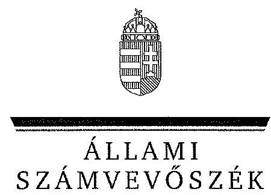
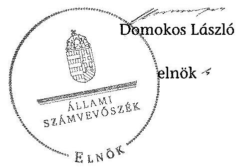
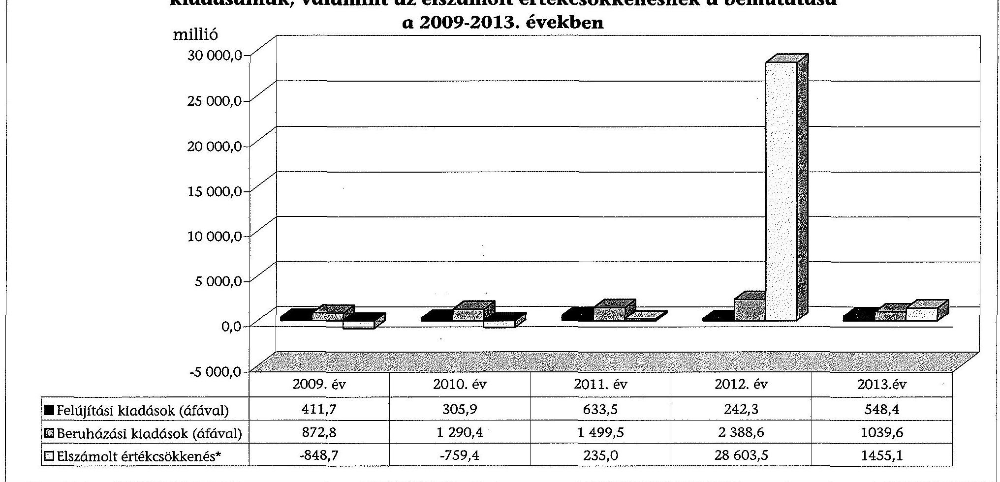
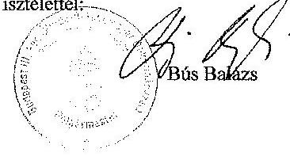

ÁLLAMI
SZÁMVEVÔSZÉK

# JELENTÉS 

az önkormányzatok vagyongazdálkodása
szabályszerúségének ellenôrzésérôl
Budapest III. Kerület Óbuda-Békásmegyer

---

# Állami Számvevőszék 

Iktatószám: V-0538-062/2014.
Témaszám: 1572
Vizsgálat-azonosító szám: V068303
Az ellenőrzést felügyelte:
Makkai Mária
felügyeleti vezető
Az ellenőrzést vezette és az ellenőrzés végrehajtásáért felelős:
Schósz Attila Ferencné
ellenőrzésvezető
A számvevőszéki jelentés összeállításában közremúködtek:
Dr. Zelei Andrásné
számvevő
Vasváriné Molnár Judit
számvevő
Krüzselyi Attila
számvevő tanácsos
Az ellenőrzést végezték:
Dr. Zelei Andrásné
Vasváriné Molnár Judit
számvevő
Krüzselyi Attila
számvevő tanácsos
Winter Zsuzsa
számvevő főtanácsos

A témához kapcsolódó eddig készített számvevőszéki jelentések:
címe
sorszáma
Jelentés a Budapest Főváros III. kerület Óbuda-Békásmegyer Önkormányzata gazdálkodási rendszerének 2010. évi ellenőrzéséről

---

# TARTALOMJEGYZÉK 

BEVEZETÉS ..... 3
I. ÖSSZEGZŐ MEGÁLLAPÍTÁSOK, KÖVETKEZTETÉSEK, JAVASLATOK ..... 6
II. RÉSZLETES MEGÁLLAPÍTÁSOK ..... 11

1. A vagyongazdálkodási tevékenység szabályozása ..... 11
1.1. A vagyongazdálkodási feladatellátás szabályozása ..... 11
1.2. A vagyon használatba adására, kezelésére, üzemeltetésére kötött szerződések megfelelősége ..... 14
2. A vagyongazdálkodási tevékenység szabályszerűsége ..... 15
2.1. A vagyon nyilvántartása és leltározása ..... 15
2.2. Meghatározó mértékű vagyonváltozások ..... 17
2.3. Beruházások, felújítások szabályszerűsége ..... 18
2.4. A vagyon értékesítésének, hasznosításának, a követelés elengedésének szabályszerűsége ..... 20
3. Az önkormányzati tulajdonosi jog gyakorlása ..... 22
4. Integritás érvényesülése ..... 23
5. belső és a külső ellenőrzések hasznosulása ..... 24
5.1. A belső ellenőrzés javaslatainak hasznosulása ..... 24
5.2. A külső ellenőrzések javaslatainak hasznosulása ..... 25

## MELLÉKLETEK

1. számú Budapest III. Kerület Óbuda-Békásmegyer Önkormányzat vagyonának alakulása 2009. január 1. és 2013. december 31. között
2. számú Budapest III. Kerület Óbuda-Békásmegyer Önkormányzat felújítási és beruházási kiadásainak, valamint az elszámolt értékcsökkenésnek a bemutatása a 2009-2013. években
3. számú Budapest III. kerület Óbuda-Békásmegyer Önkormányzat polgármesterének nemleges észrevétele

## FÜGGELÉKEK

1. számú Rövidítések jegyzéke
2. számú Értelmező szótár

---

.

---

# JELENTÉS 

## az önkormányzatok vagyongazdálkodása szabályszerűségének ellenőrzéséről Budapest III. Kerület Óbuda-Békásmegyer

## BEVEZETÉS

Az ÁSZ stratégiai célkitűzése, hogy ellenőrzéseivel mind jobban segítse az átláthatóságot, az elszámoltathatóságot és elszámoltatást a közpénzekkel és a közvagyonnal való gazdálkodásban. Magyarország Alaptörvénye rögzíti, hogy az állam és a helyi önkormányzat tulajdona a nemzeti vagyon része. Az önkormányzati vagyon alapvető funkciója, hogy a közérdeket és egyúttal az önkormányzati célok - elsősorban a kötelezően ellátandó feladatok, és emellett a lehetőségek mértékéig az önként vállalt feladatok - megvalósítását szolgálja.

Az ÁSZ az önkormányzati vagyongazdálkodás 2012. évben indított és 2013. évben folytatott ellenőrzéseinek tapasztalatai alapján indokoltnak látta, hogy a 2014. évi ellenőrzési tervébe is beépítésre kerüljön a vagyongazdálkodási tevékenységek ellenőrzése. Az eddig elvégzett ellenőrzések rámutattak, hogy az önkormányzatok vagyongazdálkodási tevékenységét érintő szabályozottság, a kapcsolódó nyilvántartások, a beszámolók leltárral történő alátámasztása, a gazdálkodási jogkörök szabályszerű gyakorlása és a döntések meglapozottsága terén hiányosságok tapasztalhatók. Ez indokolttá tette a vagyongazdálkodás ellenőrzésének folytatását a jelentős vagyonnal rendelkező, vagy az ÁSZ kockázatelemzése alapján magas vagyoni kockázatot mutató önkormányzatoknál.

Az ellenőrzés célja annak megállapítása volt, hogy az önkormányzat vagyongazdálkodási tevékenységét a jogszabályi előírásokkal összhangban sza-bályozta-e, a vagyon nyilvántartása és a vagyongazdálkodási tevékenységek végrehajtása a jogszabályoknak és a belső előírásoknak megfelelően történt-e. Az ellenőrzés célja továbbá annak megállapítása, hogy az önkormányzatnál a vagyongazdálkodás során biztosították-e az átláthatóságot, valamint a külső és belső ellenőrzések megállapításai, javaslatai hozzájárultak-e a szabályszerű vagyongazdálkodáshoz.

Ennek keretében értékeltük, hogy az Önkormányzat:

- szabályszerűen alakította-e ki vagyongazdálkodási tevékenységének kereteit;
- biztosította-e a vagyongazdálkodás szabályszerűségét, megalapozottan hozta-e és jogszerűen, szabályszerűen hajtotta-e végre a vagyonváltozást eredményező meghatározó jelentőségű döntéseket;
- gondoskodott-e a tulajdonosi jogok gyakorlásáról;

---

- vagyongazdálkodási tevékenysége során biztosította-e az átláthatóság és az integritás érvényesülését;
- belső ellenőrzése elősegítette-e a vagyongazdálkodás szabályszerű működését, valamint hasznosította-e a vagyongazdálkodási tevékenységével kapcsolatos külső és belső ellenőrzések megállapításait, javaslatait.

Az ellenőrzés várható hasznosulása, hogy feltárja az önkormányzati vagyongazdálkodást meghatározó szabályok, szabályozások összhangjának hiányosságait, a szabályozással nem érintett vagyongazdálkodási területeket, a vagyongazdálkodási tevékenység gyakorlásának esetleges szabálytalanságait, valamint a jó gyakorlat kialakításán és terjesztésén keresztül az ellenőrzések elősegíthetik a vagyongazdálkodás szabályszerűségének javítását.

Az ellenőrzés típusa: szabályszerűségi ellenőrzés
Az ellenőrzött időszak: 2009. január 1-jétől 2013. december 31-ig, illetve a közbeszerzési eljárások lefolytatásának ellenőrzése 2012. január 1-jétől az Önkormányzat helyszíni ellenőrzésének kezdetét megelőző negyedév végéig (2014. március 31 -ig) tartott.

Ellenőrzött szervezet: Budapest III. Kerület Óbuda-Békásmegyer Önkormányzat

Az ellenőrzés végrehajtásának jogszabályi alapját az Állami Számvevőszékről szóló 2011. évi LXVI. törvény 1. § (3) bekezdése, az 5. § (2)-(6) bekezdései, valamint az államháztartásról szóló 2011. évi CXCV. törvény 61. § (2) bekezdésének előírásai képezik.

Az ellenőrzés szakmai módszertana az ÁSZ hivatalos honlapján közzétett szakmai szabályokon alapult, amely a Legfőbb Ellenőrző Intézmények Nemzetközi Szervezete (INTOSAI) által kiadott nemzetközi standardok (ISSAI) figyelembevételével készült.

Az ellenőrzést az ÁSZ hatályos szervezeti szabályai és az ellenőrzési programban foglalt értékelési szempontok szerint folytattuk le. Megállapításainkat a helyszíni ellenőrzés tapasztalataira, az ellenőrzött szervezettől bekért dokumentumokra, a kitöltött tanúsítványok elemzésére, az adott időszakban hatályos jogszabályok és belső szabályzatok előírásaira alapoztuk. A részesedések értékelését tételesen ellenőriztük, míg irányított mintavétellel választottuk ki az ellenőrzött térítésmentes átadás-átvételeket, a beruházásokat, felújításokat, a közbeszerzési eljárásokat, a vagyon értékesítését, hasznosítását és a követelés elengedést, illetve leírást. A belső kontrollok megfelelő működését (a szakmai teljesítésigazolást, valamit a 2009-2011. években az utalvány ellenjegyzést, a 2012-2013. években az érvényesítést) a Polgármesteri hivatal felhalmozási kiadásaiból választott véletlen minta alapján, megfelelőségi teszttel ellenőriztük.

A III. kerület lakosainak száma 2013. január 1-jén 124542 fő volt. A 2010. évi önkormányzati választásokig a 36 tagú Képviselő-testület munkáját 10 állandó bizottság segítette. Az önkormányzati választások után a Képviselő-testület létszáma 23 före csökkent és hat állandó bizottság múködött. A polgármester a

---

2006. évi önkormányzati választás óta tölti be tisztségét, a jelenlegi jegyző 2010. december 1-jétől látja el feladatait.

Az Önkormányzat a 2013. évben az önállóan működő és gazdálkodó Polgármesteri hivatalon felül hat önállóan működő és gazdálkodó, valamint kilenc önállóan működő költségvetési szervvel látta el a feladatát. A Polgármesteri hivatal 36 szervezeti egységre tagolódott, elkülönített gazdasági szervezettel nem rendelkezett. A foglalkoztatott köztisztviselők száma 2013. december 31 -én 217 fő volt. A vagyongazdálkodással kapcsolatos feladatokat az Önkormányzat 100\%-os tulajdonában lévő Celer Kft., a Polgármesteri hivatal Vagyonhasznosítási Irodája, majd a Városüzemeltetési Osztálya, 2011. szeptember 1-jétől a Vagyonkezelő Zrt. látta el.

Az Önkormányzatnak a 2013. évben hét 100\%-os tulajdonú gazdasági társasága volt. A Vagyonkezelő Zrt. az Önkormányzat vagyongazdálkodási tevékenységének, a Rendelőintézet Kft. egészségügyi, a Kulturális Kft. kulturális események szervezésének, a Danubia Kft. hangversenyek adásának, a Sport Kft. sport szervezésének, a Közbiztonsági Kft. védelmi és figyelőszolgálati rendszer működtetésének, a Városfejlesztő Kft. projektmunka (bölcsőde építése) támogatásának elvégzésére alakult. Az Önkormányzat az információstechnológia feladatokat ellátó Kártya Kft.-ben 50\%-os tulajdoni hányaddal rendelkezett.

Az Önkormányzat a 2009-2013. évek között vállalkozási tevékenységet nem végzett, haszonélvezeti és koncessziós jogot alapító szerződést nem kötött. Az ÁSZ a 2010. évben ellenőrizte az Önkormányzat gazdálkodási rendszerét.

Az Önkormányzat könyvviteli mérleg szerinti vagyona a 2009. évi 116218,5 millió Ft-os nyitó értékről a 2013. év végére 115768,3 millió Ft-ra, $0,4 \%$-kal csökkent a befektetett eszközök csökkenésének és a forgóeszközök növekedésének együttes hatására. A befektetett eszközökön belül elsősorban a tárgyi eszközök csökkentek. A forgóeszközökön belül a pénzeszközök emelkedése volt a meghatározó. Az Önkormányzat összes kötelezettségének állományi értéke 2013. december 31-én 2941,4 millió Ft, ebből a rövid és hosszú lejáratú kötelezettségek értéke 2892,8 millió Ft volt. A pénzintézeti kötelezettség állományi értéke 2013. december 31-én 1666,6 millió Ft-ot tett ki, mely az adósságkonszolidáció eredményeként megszűnt. Az Önkormányzat 2013. évi költségvetési beszámolója szerint 19976,3 millió Ft költségvetési bevételt ért el és 18694,9 millió Ft költségvetési kiadást teljesített. Felhalmozási célú kiadásra 2880,4 millió Ft-ot, ezen belül felújítási és beruházási kiadásokra 1588,0 millió Ft-ot fordítottak.

Az Önkormányzat vagyonának főbb adatait, továbbá a felújítási és beruházási kiadásokat, valamint az elszámolt értékcsökkenést az 1-2. számú mellékletek mutatják be. Az alkalmazott rövidítéseket és az egyes fogalmak magyarázatát az 1-2. számú függelék tartalmazza.

Az ÁSZ a 2011. évi LXVI. törvény 29. §-a szerint a jelentéstervezetet megküldte Budapest III. Kerület Öbuda-Békásmegyer Önkormányzat polgármesterének egyeztetésre. A polgármester nemleges észrevételét a 3. számú melléklet tartalmazza.

---

# I. ÖSSZEGZŐ MEGÁLLAPÍTÁSOK, KÖVETKEZTETÉSEK, JAVASLATOK 

Az Önkormányzat vagyongazdálkodási tevékenységének kereteit az ellenőrzött időszakban - a vagyonkezelői jog kivételével - szabályszerűen alakította ki. A vagyongazdálkodási rendeletben meghatározták az önkormányzati feladatellátást biztosító törzsvagyont, ezen belül a forgalomképtelen és a korlátozottan forgalomképes vagyonelemek körét. A Képviselő-testület a vagyon értékesítésére, kezelésbe adására, használati jogának átadására a nyilvános pályáztatási kötelezettséget és annak értékhatárát - az Áht. ${ }_{1}$ és az Nvtv. előírásainak megfelelően - a vagyongazdálkodási rendeletben szabályozta. A Képvise-lő-testület az Ötv.-ben és az Mötv.-ben biztosított lehetőséggel élve az önkormányzati SZMSZ ${ }_{1,2}$-ben és a vagyongazdálkodási rendeletben - értékhatár függvényében - a polgármesternek, és a képviselő-testületi bizottságoknak adott át vagyongazdálkodási hatáskört. Az önkormányzati vagyon tulajdonjogának ingyenes, vagy kedvezményes átruházásáról a döntés joga - a vagyongazdálkodási rendelet szerint - a Képviselő-testületet illette meg.

A Képviselő-testület az Ötv.-ben és az Mötv.-ben előírtak ellenére nem határozta meg azon vagyonelemeket, amelyekre vagyonkezelői jogot létesíthet, ugyanakkor a vagyonkezelői jog megszerzésének, gyakorlásának és a vagyonkezelés ellenőrzésének eljárásrendjét szabályozták. Vagyonkezelői jogot az ellenőrzött időszakban nem létesítettek. Az Önkormányzat az Nvtv.-ben megjelölt 2012. március 1-jei határidőn túl, 2013. április 25 -én határozta meg a forgalomképtelennek minősülő vagyonából a nemzetgazdasági szempontból kiemelt jelentőségű nemzeti vagyonelemeket.

A Polgármesteri hivatal - az ellenőrzött időszakban - rendelkezett az Áhsz. ${ }_{1}$ nek és a helyi sajátosságoknak megfelelő számviteli politika ${ }_{1,2}$-vel és a hozzá kapcsolódó pénzügyi-számviteli szabályzatokkal. A Képviselő-testület élt az Áhsz. ${ }_{1}$-ben biztosított lehetőséggel és rendeletben döntött a kétévenkénti menynyiségi leltárfelvételről. Az operatív gazdálkodással kapcsolatos eljárásrendet, jogkörgyakorlást és az összeférhetetlenségi követelményeket - az Ámr. ${ }_{1,2}$-ben és az Ávr.-ben előírtaknak megfelelően - a kötelezettségvállalási szabályzat ${ }_{1-5}$-ben rögzítették. A Polgármesteri hivatalban a gazdálkodási jogkörök gyakorlása során a 2009-2011. években az Ámr. ${ }_{1,3}$-ben, valamint a 2012-2013. években az Ávr.-ben rögzített összeférhetetlenségi követelményeket betartották. Az ellenőrzött felhalmozási kiadások esetében a gazdálkodási jogkörök gyakorlása megfelelt a jogszabályi előírásoknak, a kontrollok múködése - eseti hibák kivételével - megfelelő volt.

Az Önkormányzat az ellenőrzött időszakban a vagyonkezelési, üzemeltetési, működtetési feladatokat elsősorban saját gazdasági társaságaival látta el. Az Önkormányzat a tulajdonában lévő lakások és nem lakás célú helyiségek, valamint a belterületi telekingatlanok üzemeltetésének, illetve hasznosításának az ellátására gazdasági társaságaival megbízási szerződéseket kötött. Az ellenőrzött szerződésekben rögzítették a kötelezően ellátandó önkormányzati feladatokat és meghatározták a vagyon állagának, értékének megőrzési feladatát,

---

valamint a beszámolási kötelezettséget. Az Önkormányzat a 2012. évben - az Nvtv. alapján átláthatónak minősülő - gazdálkodó szervezetekben rendelkezett társasági részesedésekkel.

Az Önkormányzat a 2009-2013. években vagyongazdálkodási feladatainak szabályszerűségét hiányosan biztosította. A vagyonkimutatás szerkezete és tartalma nem felelt meg teljes körűen az Áhsz. ${ }_{1}$-ben, valamint a vagyongazdálkodási rendeletben meghatározott előírásoknak, mivel az ellenőrzött időszakban a forrásokon belül a tartalékokat, a 2010. évtől a saját tőke elemeit nem mutatták be. A vagyonkimutatás - az ingatlanok kivételével - nem tartalmazta a törzsvagyon, törzsvagyonon kívüli egyéb (üzleti) vagyon csoportba sorolást, a „0"-ra leírt és az érték nélkül nyilvántartott eszközök állományát, valamint a mérlegben értékkel nem szereplő kötelezettségeket.

Az Önkormányzatnál az ingatlan-nyilvántartó rendszer ${ }_{2}$-t a 2012. évtől vezették be. A 2010-2011. évek vagyonkataszteri adatait (az ingatlan-nyilvántartó rendszer ${ }_{1}$ megszűnése miatt) papír alapon őrizték meg. A 2009. évi adatok azonban nem álltak rendelkezésre. A jegyző ${ }_{1,2}$ a 2010-2013. években - a 147/1992. (XI. 6.) Korm. rendelet előírása alapján - biztosította a számviteli nyilvántartás, az ingatlanvagyon-kataszter, és a földhivatali ingatlan nyilvántartás azonos tartalmú adatai közötti egyezőséget.

Az Önkormányzatnál a 2010. és a 2012. években az ingatlanokat, valamint a 2012. évben a gépjárműveket az Áhsz. ${ }_{1,2}$, a rendeleti szabályozás és az értékelési szabályzat ${ }_{1,2}$ előírása ellenére nem mennyiségi felvétellel, hanem egyeztetéssel leltározták. A 2010. évben a gépek, berendezések, felszerelések, illetve gépjárművek mennyiségi leltározását követően a kiértékelés a beszámoló elkészítése után történt meg. A mérlegben az üzemeltetésre, kezelésre átadott eszközöket a 2011-2013. években az Áhsz. ${ }_{1}$ előírása ellenére nem az üzemeltetetést, kezelést végző szerv által készített hitelesített leltárakkal támasztották alá, azokat a Polgármesteri hivatal az egyeztetés módszerével leltározta.

Az Önkormányzat az ellenőrzött időszakban megalapozottan, a gazdasági program ${ }_{1,2}$-ben foglalt fejlesztési célkitűzésekkel, a kötelező és önként vállalt feladatok ellátásával összhangban - a hatásköri előírások betartásával - döntött a beruházásokról és felújításokról. A fejlesztéseket szabályszerűen hajtották végre, valamint biztosították azok finanszírozhatóságát és fenntarthatóságát. Az Önkormányzat a 2012. év és a 2014. év 1. negyedév vége között minden közbeszerzési értékhatárt elérő, vagy azt meghaladó felhalmozási célú beszerzés esetében közbeszerzési eljárást folytatott le. Az ellenőrzött közbeszerzési eljárások lebonyolítása megfelelt a Kbt. előírásainak. A szerződéseket az összességében legelőnyösebb ajánlattevővel kötötték meg.

A vagyonváltozást eredményező döntéseket a jogszabályokban és a vagyongazdálkodási rendeletben előírtaknak megfelelően az arra felhatalmazottak (Képviselő-testület, polgármester, illetékes bizottságok) hozták meg. Az Önkormányzat az értékesítésre vonatkozó döntések során betartotta az Áht. ${ }_{1}$-ben és az Nvtv.-ben foglalt versenyeztetésre vonatkozó előírásokat. Az ellenőrzött vagyonértékesítésekre pályázati kiírások, értékbecsléssel alátámasztott ellenérték alapján, a vagyongazdálkodási rendelet, a lakásgazdálkodási rendelet ${ }_{1,2}$ és a versenyeztetési rendelet ${ }_{1,2}$ előírásainak megfelelően került sor. Az ellenőrzött

---

térítésmentes átadások esetében a döntéseket indokoltan és jogszerűen hozták meg. A követelések elengedése, illetve a behajthatatlan követelések leírása szabályszerű volt, azokat megfelelő dokumentumokkal alátámasztották.

Az Önkormányzat az ellenőrzött időszakban a tartós részesedéseivel felelősen gazdálkodott, az alapító okiratokban rögzített tulajdonosi jogokat gyakorolta. Az ellenőrzött időszakban a Képviselő-testület megtárgyalta és elfogadta gazdasági társaságai éves beszámolóit és az üzleti terveket. Az Önkormányzat nyomon követte a gazdasági társaságai kötelezettség állományának alakulását, a folyamatos üzletmenet fenntarthatóságát, a társaságok alapfeladatainak teljesülését és a feladatellátás hatékonyságát. Minden évben vizsgálták a tulajdonosi részesedések alakulását, az értékvesztés elszámolásának és visszaírásának szükségességét.

A jegyző ${ }_{2}$ által szolgáltatott adatok értékelése alapján az Önkormányzat integritás kontrollrendszerének kiépítettsége fejlesztendő. A szabályozási és működési hiányosságok akadályozták a vagyongazdálkodási tevékenység integritásának, az átláthatósági és elszámoltathatósági követelmények teljes mértékű érvényesülésének, valamint a stabil és kiegyensúlyozott működés feltételeinek biztosítását. A jegyző a 2012-2013. években - a Bkr. előírása ellenére - a kontrollkörnyezet kialakítása során az etikai elvárásokat, a Képviselőtestület a Kttv. szerinti hivatásetikai alapelvek részletes tartalmát és az etikai eljárás szabályait nem állapította meg.

Az ellenőrzött időszakban az Önkormányzat összesen 165 belső ellenőrzést hajtott végre a Polgármesteri hivatalban, az intézményeknél és a gazdasági társaságoknál, amelyből 35 ellenőrzési jelentés tartalmazott vagyongazdálkodással kapcsolatos javaslatokat. A stratégiai és az éves ellenőrzési terveket az ellenőrzött időszakban - a Ber.-ben és a Bkr.ben foglalt előírások ellenére - nem támasztották alá kockázatelemzéssel. A belső ellenőrzés az intézkedési tervek végrehajtásáról utóellenőrzéssel, illetve az ellenőrzöttek beszámoltatásával győződött meg. A belső ellenőrzés megállapításaival, javaslataival hozzájárult az önkormányzati vagyongazdálkodás szabályszerű működéséhez.

Az Önkormányzat az ellenőrzött időszakban hasznosította a külső ellenőrzések közül a Kormányhivatal - vagyongazdálkodással összefüggő - megállapításait, javaslatait, a vagyongazdálkodási rendelettel kapcsolatos törvényességi felhívásra intézkedtek. Az Önkormányzat 2009-2013. évi költségvetési beszámolóit a könyvvizsgáló minden évben megbízhatónak és hitelesnek minősítette, vagyongazdálkodással kapcsolatos javaslatokat nem fogalmazott meg.

Az ÁSZ az Önkormányzat gazdálkodási rendszerének 2010. évi ellenőrzése során 32 javaslatot fogalmazott meg, melyből 19-et hasznosítottak, hármat részben, egyet határidőn túl valósítottak meg. Kilenc javaslatot nem hasznosítottak, melyek közül a belső ellenőrzéshez szabályszerűségi, az európai uniós forrásokhoz, a külső szervezettel kötött szerződésekhez, a fejlesztések lebonyolításához célszerűségi javaslatok kapcsolódtak. Nem hasznosultak továbbá az informatikai rendszerekkel, a munkaköri leírásokkal, valamint a közbeszerzési eljárások lebonyolításának kockázatával kapcsolatos célszerűségi javaslatok.

---

Az Állami Számvevőszékről szóló 2011. évi LXVI. törvény 33. § (1) bekezdésében foglaltak értelmében a jelentésben foglalt megállapításokhoz kapcsolódó intézkedési tervet köteles az ellenőrzött szervezet vezetője összeállítani, és azt a jelentés kézhezvételétől számított 30 napon belül az ÁSZ részére megküldeni. Amennyiben az intézkedési tervet határidőben nem küldi meg a szervezet, vagy az nem elfogadható, az ÁSZ elnöke a hivatkozott törvény 33. § (3) bekezdés a)-b) pontjaiban foglaltakat érvényesítheti.

Az ellenőrzés intézkedést igénylő megállapításai és javaslatai:

# a jegyzőnek 

1. A vagyonkimutatás szerkezete és tartalma az ellenőrzött időszakban nem felelt meg teljes körűen az Áhsz., 44/A. § (2)-(3) bekezdéseiben, valamint a vagyongazdálkodási rendelet 6-7. §-aiban meghatározott előírásoknak, mivel a források eszközcsoporton belül a tartalékokat, illetve a 2010. évtől a saját tőke elemeit nem mutatták be. Az ingatlanok kivételével a vagyonkimutatás nem tartalmazta a törzsvagyon, törzsvagyonon kívüli egyéb vagyon (üzleti vagyon) csoportba sorolást, a „0"-ra leírt és az érték nélkül nyilvántartott eszközök állományát, valamint a mérlegben értékkel nem szereplő kötelezettségeket.

Javaslat:
Intézkedjen arról, hogy a vagyonkimutatás a vonatkozó jogszabályi és önkormányzati rendeletben foglalt előírás szerinti szerkezetben mutassa be az Önkormányzat vagyonát.
2. A 2011-2013. években az üzemeltetésre, kezelésbe adott eszközök mérleg szerinti értékét az Áhsz., 37. § (4) bekezdésében foglaltak ellenére nem az üzemeltető által készített és hitelesített leltárral támasztották alá.

Javaslat:
Intézkedjen arról, hogy az előírásoknak megfelelően a könyvviteli mérlegben kimutatott üzemeltetésre, vagyonkezelésbe adott eszközöket az üzemeltetést, kezelést végző szerv által elkészített, hitelesített leltárral támasszák alá.
3. Az Önkormányzatnál - az Áhsz., 37. § (7) bekezdésében, a 2005. évi zárszámadási rendeletben, a leltározási szabályzat ${ }_{1,2}$-ben és az értékelési szabályzat ${ }_{1,2}$-ben foglaltak ellenére - a 2010. és a 2012. években az ingatlanokat, a 2012. évben a gépjárműveket mennyiségi felvétellel nem leltározták, azok mérleg szerinti értékét egyeztetésekkel támasztották alá.

Javaslat:
Intézkedjen arról, hogy az ingatlanok és a gépjárművek mennyiségi felvétellel történő leltározása az előírásoknak megfelelő gyakorisággal történjen meg.
4. A vagyongazdálkodási rendeletben a vagyonkezelői jog megszerzésének, gyakorlásának és a vagyonkezelés ellenőrzésének eljárásrendjét szabályozták, azonban az Önkormányzat az Ötv. 80/A. § (1) bekezdésében és az Mötv. 143. § (4) bekezdés i)

---

pontjában foglaltak ellenére nem határozta meg azon vagyonelemeket, amelyekre vagyonkezelői jogot létesíthet.

Javaslat:
Készítsen elő rendelet-tervezetet azon vagyonelemek meghatározásáról, amelyekre az Önkormányzat vagyonkezelői jogot létesíthet és kezdeményezze a polgármesternél annak Képviselő-testület elé terjesztését.
5. A jegyző, a 2012-2013. évben - a Bkr. 6. § (1) bekezdés c) pontjának előirása ellenére - a kontrollkörnyezet kialakítása során az etikai elvárásokat, a Képviselő-testület a Kttv. 231. § (1) bekezdése szerinti, a Kttv. 83. §-ában rögzített, a köztisztviselökre vonatkozó hivatásetikai alapelvek részletes tartalmát és az etikai eljárás szabályait nem állapította meg.

Javaslat:
Készítse elő a vonatkozó jogszabályi előírásoknak megfelelő etikai elvárásokat, hivatásetikai alapelveket, az etikai eljárás szabályait és terjessze a Képviselő-testület elé jóváhagyásra.
6. A stratégiai és az éves ellenőrzési terveket az ellenőrzött időszakban - a Ber. 18. § és 21. § (2) bekezdésében, illetve a Bkr. 29. § (1) bekezdésében és a 31. § (2) bekezdésében foglalt előírások ellenére - nem támasztották alá kockázatelemzéssel. A Képvi-selő-testület által elfogadott ellenőrzési tervekben foglalt ellenőrzéseket, továbbá a soron kívüli ellenőrzéseket a belső ellenőrzési vezető által jóváhagyott ellenőrzési programok alapján hajtották végre.

Javaslat:
Intézkedjen arról, hogy a belső ellenőrzés a jogszabályi előírásoknak megfelelően a stratégiai és éves ellenőrzési terveket kockázatelemzéssel támassza alá, illetve az éves ellenőrzési terv a kockázatelemzés alapján felállított prioritásokon alapuljon.

---

# II. RÉSZLETES MEGÁLLAPÍTÁSOK 

## 1. A VAGYONGAZDÁlKODÁSI TEVÉKENYSÉG SZABÁLYOZÁSA

### 1.1. A vagyongazdálkodási feladatellátás szabályozása

A Képviselő-testület a 2009-2013. években hatályos gazdasági program ${ }_{1,2}$-ben meghatározta a vagyongazdálkodással kapcsolatos célkitűzéseit, feladatait.

Az Önkormányzat a gazdasági program ${ }_{1}$-ben a városi hálózatok összekapcsolását, alközpontok létrehozását, lakótelepek átfogó fejlesztését, rehabilitációját, az egészségügyi ellátórendszer intézményhálózatának korszerűsítését, közoktatási és szociális beruházásokat, ingatlanhasznosítást, infrastrukturális és forgalomtechnikai fejlesztéseket, valamint útfenntartási és felújítási programot tüzött ki célul.

A gazdasági program ${ }_{2}$-ben célként tűzték ki a piac és városközpont kialakítását a Heltai Jenő téren, a Római part, a Békási Ifjúsági Tábor fejlesztését, víz, közvilágítás, csatornázás és csapadékvíz-elvezetést, közlekedési infrastrukturális, valamint kulturális célú és intézményi fejlesztéseket, energiaracionalizálási programokat, akadálymentesítést és az egészségügyi ellátó rendszer bővítését.

A feladatok forrásaként a gazdasági program ${ }_{1,2}$-ben a helyi adók növeléséből, valamint az ingatlan értékesítésekből származó bevételeket jelölték meg.

Az Önkormányzat az Nvtv. 9. § (1) bekezdésében ${ }^{1}$ előírt hosszú távú vagyongazdálkodási tervet nem készített, a 2012-2014. évekre középtávú vagyongazdálkodási stratégiával rendelkezett.

Az Önkormányzat stratégiájában ingatlangazdálkodásának, részesedéseinek legfontosabb céljait, valamint a vagyonnyilvántartás és vagyonhasznosítás korszerűsítése területén megfogalmazott konkrét feladatokat rögzítette.

Az Önkormányzat az ellenőrzött időszakban az Ötv. 8. § (2) bekezdése ${ }^{2}$ szerinti kötelező és önként vállalt feladatainak körét, azok ellátásának mértékét és módját az éves költségvetési rendeletekben határozta meg.

Az Önkormányzat feladatait a Polgármesteri hivatalon, az intézményrendszerén, a tulajdonában lévő gazdasági társaságain keresztül látta el. A 2010. évben 100\%-os tulajdoni hányaddal megalapították a Városfejlesztő Kft.-t. Az Önkormányzat a 2011. évben a Celer Kft. átalakulásával létrehozta a Vagyonkezelő Zrt.-t, az önkormányzati vagyongazdálkodási feladatok teljes körű ellátására, ugyanez a cég 100\%-os tulajdoni hányaddal a 2012. évben létrehozta a Parkolási Kft.-t.

[^0]
[^0]:    ${ }^{1}$ Az Nvtv. nem tartalmaz konkrét határidőt a közép- és hosszú távú vagyongazdálkodási terv elkészítésére.
    ${ }^{2}$ 2013. január 1-jétől az Mötv. 10. § (1) bekezdése és a 12. § (2) bekezdése szabályozza.

---

Az Önkormányzat vagyongazdálkodási tevékenységének kereteit az ellenőrzött időszakban - a vagyonkezelői jog kivételével - szabályszerűen alakította ki. A Képviselő-testület - a Htv. 138. § (1) bekezdés j) pontjában előírtaknak megfelelően - az önkormányzati vagyongazdálkodási feladatokat a vagyongazdálkodási rendeletben szabályozta. Az Önkormányzat tulajdonában álló lakások és nem lakás céljára szolgáló helyiségek elidegenítésének, bérbeadásának, bérleti díj megállapításának szabályait külön rendeletek tartalmazták. A vagyongazdálkodási rendeletben meghatározták az önkormányzati feladatellátást biztosító törzsvagyont, ezen belül a forgalomképtelen és a korlátozottan forgalomképes vagyonelemek körét, nem tartalmazta viszont a forgalomképesség megváltoztatásának módjára vonatkozó rendelkezést. Az Önkormányzat az Nvtv. 18. § (1) bekezdésében megjelölt határidőre, 2012. március 1-jéig nem határozta meg a forgalomképtelennek minősülő vagyonából azon vagyonelemeket, amelyeket nemzetgazdasági szempontból kiemelt jelentőségű nemzeti vagyonnak minősít. A Kormányhivatal törvényességi felhívására az Önkormányzat a vagyongazdálkodási rendeletben 2013. április 25én két ingatlant sorolt a nemzetgazdasági szempontból kiemelt jelentőségű nemzeti vagyonban tartandó vagyonelemek körébe.

A Képviselő-testület az Ötv. 9. § (3) bekezdésében ${ }^{3}$ biztosított lehetőséggel élve, a vagyongazdálkodási rendeletben és az önkormányzati SZMSZ ${ }_{1,2}$-ben a polgármesternek és a Képviselő-testület bizottságainak ${ }^{4}$ adott át vagyongazdálkodási hatáskört. Az átruházott hatáskörök gyakorlóinak - annak célszerűsége ellenére - beszámolási kötelezettséget nem írtak elő.

A vagyongazdálkodási rendelet szabályai szerint elidegenítés esetében a döntés joga a Képviselő-testületet illette meg. A forgalomképtelen vagyon 3 éven belüli tulajdonjogot nem érintő - hasznosítása a polgármester hatáskörébe tartozott. Az 50,0 millió Ft egyedi bruttó értéket el nem érő forgalomképtelen ingatlan, vagy ingó vagyon felett a Képviselő-testület hatáskörrel felruházott bizottsága gyakorolta a tulajdonosi jogokat. A forgalomképes önkormányzati vagyon részét képező vagyontárgy megszerzéséről és megterheléséről - zálogjoggal való megterhelést kivéve - 50,0 millió Ft értékhatárig a Képviselő-testület illetékes bizottsága dönthetett.

A vagyongazdálkodási rendeletben a vagyonkezelői jog megszerzésének, gyakorlásának és a vagyonkezelés ellenőrzésének eljárásrendjét szabályozták, azonban az Ötv. 80/A. § (1) bekezdésében ${ }^{5}$ foglalt előírás ellenére nem határozták meg tételesen azon vagyonelemeket, amelyre vagyonkezelői jogot létesíthetnek. Ezen szerződések megkötésére - értékhatártól függetlenül - kizárólag a Képviselő-testület volt jogosult.

A vagyon használatba adásának (bérbeadás, ingyenes vagy kedvezményes használatba adás) és a használó ellenőrzésének részletes szabályait a vagyongazdálkodási rendeletben rögzítették. A vagyon üzemeltetésre történő átadásá-

[^0]
[^0]:    ${ }^{3}$ 2013. január 1-jétől az Mötv. 41. § (4) bekezdése írja elő.
    ${ }^{4}$ Az ellenőrzött időszakban az önkormányzati SZMSZ ${ }_{1,2}$ szerint a bizottságok elnevezése és hatáskörük többször változott.
    ${ }^{5}$ 2012. január 1-jétől az Mötv. 143. § (4) bekezdés i) pontja szabályozza.

---

nak, az üzemeltető ellenőrzésének szabályait a vagyongazdálkodási rendelet nem tartalmazta, azokat a megkötött szerződésekben, megállapodásokban határozták meg.

A vagyon tulajdonjogának, valamint az önállóan forgalomképes vagyoni értékű jogok ingyenes vagy kedvezményes átruházásának módját és eseteit, az átadás célját és az átvevők körét a vagyongazdálkodási rendeletben az Áht. ${ }_{1}$, illetve az Nvtv. előírásainak megfelelően meghatározták. Az önkormányzati vagyon tulajdonjogának ingyenes vagy kedvezményes átruházására a Képviselőtestületnek volt döntési hatásköre. A vagyongazdálkodási rendeletben az önkormányzati követelésről való lemondást szabályozták.

A Képviselő-testület a vagyon értékesítésére, kezelésbe adására, használati jogának átadására a nyilvános pályáztatási kötelezettségét - az Áht. ${ }_{1}$ 108. § (1), az Nvtv. 11. § (16) és 13. § (1) bekezdéseiben előírtaknak megfelelően - a vagyongazdálkodási rendeletben (ingatlan vagyon bruttó 20,0 millió Ft-os, ingó vagyontárgy bruttó 5,0 millió Ft-os értékhatárt meghaladó esetekben) írta elő.

Az Önkormányzatnál az Áhsz. ${ }_{1}$ 44/A. § (1)-(3) bekezdéseivel ${ }^{6}$ összhangban, a rendelet 1. számú melléklete szerinti részletezettséggel határozták meg a vagyongazdálkodási rendeletben a vagyonkimutatás tartalmát. Az Önkormányzat nem élt az Áhsz. ${ }_{1}$ 44/A. § (2) bekezdésében foglalt lehetőséggel, a vagyonkimutatás további tételes alábontását rendeletben nem írta elő.

A Polgármesteri hivatal az ellenőrzött időszakban rendelkezett az Áhsz. ${ }_{1}$-nek és a helyi sajátosságoknak megfelelő számviteli politika ${ }_{1,2}$-vel és az annak részét képező pénzkezelési, leltározási ${ }_{1,2}$, és értékelési szabályzat ${ }_{1,2}$-vel, ezen túl selejtezési szabályzat ${ }_{1,2}$-vel. Az Önkormányzat a tárgyi eszközök közül a forgalomképes ingatlanok esetében élt - az Áhsz. ${ }_{1}$ 32. § (7) bekezdésében biztosított - piaci értéken történő értékelés lehetőségével.

Az Önkormányzat a leltározási szabályzat ${ }_{1,2}$-ben - az Áhsz. ${ }_{1}$ 37. § (1)-(3) bekezdésével összhangban - évenkénti leltározást írt elő. A Képviselő-testület az Áhsz. ${ }_{1}$ 37. § (7) bekezdésével összhangban a 2005. évi zárszámadási rendeletben szabályozta a kétévenkénti mennyiségi felvétellel történő leltározás lehetőségét, melyről ennek megfelelően az értékelési szabályzat ${ }_{1,2}$-ben rendelkeztek. A leltározási szabályzat ${ }_{1,2}$ a 2010-2013. években nem tartalmazta az üzemeltetésre átadott eszközök leltározásának - az Áhsz. ${ }_{1}$ 37. § (4) bekezdésében ${ }^{7}$ foglaltaknak megfelelő - módját.

A kötelezettségvállalási szabályzat ${ }_{1,5}$-ben - az Ámr. ${ }_{1,2}$-ben és az Ávr.-ben előírtaknak megfelelően - a polgármester és a jegyző meghatározta az operatív gazdálkodással kapcsolatos eljárásrendet és az összeférhetetlenségi követelmé-

[^0]
[^0]:    ${ }^{6}$ 2014. január 1-jétől az Áhsz. ${ }_{2}$ 30. § (1)-(3) bekezdései szabályozzák.
    ${ }^{7}$ Megállapította a 317/2009. (XII. 29.) Korm. rendelet 18. §-a. Először a 2010. évről készített beszámolókra kellett alkalmazni. 2014. január 1-jétől az Áhsz. ${ }_{2}$ 22. § (2) bekezdés a) pontja szerint csak a koncesszióba, vagyonkezelésbe adott eszközöket kell a működtető, vagyonkezelő által elkészített és hitelesített leltárral alátámasztani.

---

nyeket ${ }^{8}$. Az Önkormányzatnál a gazdasági szervezet megnevezése az Ávr. 13. § (1) bekezdés e) pontjában előírtak ellenére nem történt meg a hivatali SZMSZ $_{2,3}$-ban. Az Ávr. 11. § (2) bekezdésében foglaltak alapján a jegyző ${ }_{2}$ a gazdasági vezető, aki a 2012. március 31-ét követő jogszabályváltozások után is jogszerűen jelölte ki a pénzügyi ellenjegyzőt és az érvényesítőt.

# 1.2. A vagyon használatba adására, kezelésére, üzemeltetésére kötött szerződések megfelelősége 

Az Önkormányzat az ellenőrzött időszakban koncessziós szerződést, az Ötv. 80/A. § előírása ${ }^{9}$ szerinti vagyonkezelési szerződést nem kötött, vagyonkezelői jogot nem alapított.

Az Önkormányzat az ellenőrzött időszakot megelőzően (a 2007. évben) kötött vagyonkezelési szerződést a 100\%-ban tulajdonában lévő Sport Kft.-vel a kerület sport életének szervezésére. A vagyonkezelésbe adott vagyont az Önkormányzat a 2009-2011. évi könyvviteli mérlegében az Áhsz., 20. § (1) bekezdésében előírtak ellenére nem az üzemeltetésre, kezelésre átadott eszközök között, hanem az ingatlanok, gépek, berendezések között mutatta ki.

Az Önkormányzat és a 100\%-ban tulajdonában lévő Kulturális Kft. között 2009 októberében aláírt, elnevezésében vagyonkezelési szerződésben - az Áht. ${ }_{1}$ 105/A. § (10) bekezdése ellenére - nem rendelkeztek a vagyonkezelői jog ingat-lan-nyilvántartásba történő bejegyzéséről. Ezen kötelező jogszabályi feltétel hiányában a szerződés tartalmában nem vagyonkezelési, hanem üzemeltetési, illetve hasznosítási szerződésnek tekinthető.

A vagyon kezelését mindkét gazdasági társaság ingyenesen végezte, az Önkormányzat az éves költségvetési rendeletekben meghatározott mértékig támogatást nyújtott a feladatok ellátására, amit az Önkormányzat az elfogadott üzleti tervek alapján pénzeszközátadásként juttatott részükre.

Az Önkormányzat a Kulturális Kft.-vel és a Sport Kft.-vel 2012. február 16-án felbontotta a szerződést és mindkét társasággal ingatlan-használati szerződést kötött. A vagyon ingyenes használatba adása a Képviselő-testület döntése alapján szabályszerűen történt.

Az Önkormányzat a tulajdonában lévő lakások és nem lakás célú helyiségek, valamint a belterületi telekingatlanok üzemeltetéséről, hasznosításáról a 100\%-os tulajdonában lévő Celer Kft.-vel egy 2005. évi keret megállapodás és az ez alapján - minden feladatra külön - kötött megbízási szerződések útján gondoskodott. A megbízási szerződéseket többször módosították, aktualizálták. Az Önkormányzat forgalomképes és korlátozottan forgalomképes ingatlanvagyonának üzemeltetési és hasznosítási feladatait 2011. szeptember 1-jétől a Képviselő-testület döntése alapján a Vagyonkezelő Zrt., mint a Celer Kft. jog-

[^0]
[^0]:    ${ }^{8}$ Az Ámr. ${ }_{1}$ 134-137. § és 138. § (1)-(3) bekezdése, Ámr. ${ }_{2}$ 72. §, 74-79. § és 80. § (1)-(2) bekezdése, valamint az Ávr. 52. § (1) bekezdés c) pontja, 53-59. §-a, és a 60. § (1)-(2) bekezdése szerint.
    ${ }^{9}$ 2012. január 1-jétől az Mötv. 109. §-a szabályozza.

---

utódja látta el. Az ellenőrzött megbízási szerződésekben rögzítették a kötelezően ellátandó önkormányzati feladatokat és meghatározták a vagyon állagának, értékének megőrzési feladatát. A szerződésekben szabályozták a beszámolási kötelezettséget.

Az Önkormányzat a 2012. évben hét 100\%-ban önkormányzati tulajdonú gazdálkodó szervezetben rendelkezett társasági részesedéssel, amely társaságok az Nvtv. 3. § (1) bekezdés 1. pontja alapján átlátható szervezetnek minősültek. Az Önkormányzat ezen túl a Kártya Kft.-ben 50\%-os tulajdoni hányaddal rendelkezett, mely gazdasági társaság szintén átlátható szervezet.

# 2. A VAGYONGAZDÁLKODÁSI TEVÉKENYSÉG SZABÁLYSZERŰSÉGE 

### 2.1. A vagyon nyilvántartása és leltározása

Az Önkormányzat a 2009-2013. években vagyongazdálkodási feladatainak szabályszerűségét hiányosan biztosította. A jegyzö ${ }_{1,2}$ a 2009-2013. években elkészítette az Ötv. 78. § (2) bekezdésében ${ }^{10}$ meghatározott vagyonkimutatást, amelyet a polgármester az Áht. ${ }_{1}$ 118. § (2) bekezdése 2. c) pontjának ${ }^{11}$ előírása szerint a zárszámadási rendelettervezettel egyidejűleg a Képvise-lő-testület elé terjesztett. A vagyonkimutatás szerkezete és tartalma az ellenőrzött időszakban nem felelt meg teljes körűen az Áhsz. ${ }_{1}$ 44/A. § (2)-(3) bekezdéseiben ${ }^{12}$, 1. számú mellékletében, valamint a vagyongazdálkodási rendelet 6-7. §-aiban meghatározott előírásoknak.

A vagyonkimutatásban a forrásokon belül a költségvetési és vállalkozási tartalékokat, illetve a 2010. évtől a saját tőke elemelt (tartós tőke, tőkeváltozások, értékelési tartalék) nem szerepeltették. Az ingatlanok kivételével a kimutatás az ellenőrzött időszakban nem tartalmazta a törzsvagyon, azon belül a forgalomképtelen és korlátozottan forgalomképes, illetve a törzsvagyonon kívüli egyéb (üzleti) vagyon csoportba sorolást. A vagyonkimutatásban nem mutatták ki a „0"-ra leírt, de használatban lévő, illetve használaton kívüli eszközök állományát, az Önkormányzat tulajdonában lévő, érték nélkül nyilvántartott eszközök állományát, valamint a mérlegben értékkel nem szereplő kötelezettségeket.

Az Önkormányzat a 2009-2013. években a számviteli nyilvántartásában a főkönyvi számlák alábontásával, valamint a számlákhoz kapcsolódó analitikus nyilvántartások vezetésével gondoskodott a törzsvagyon többi vagyontárgytól elkülönített nyilvántartásáról. A jegyzö ${ }_{1,2}$ a 147/1992. (XI. 6.) Korm. rendelet 1. §-ában előírtak szerint biztosította az ingatlanvagyon-kataszter felfektetését és az ingatlanvagyon törzsvagyon (ezen belül a forgalomképtelen, és korlátozottan forgalomképes) és egyéb (üzleti) vagyon szerinti bontásban történő elkülönített nyilvántartását.

[^0]
[^0]:    ${ }^{10}$ 2012. január 1-jétől az Mötv. 110. § (2) bekezdése írja elő.
    ${ }^{11}$ 2012. január 1-jétől az Áht. 2 91. § (2) bekezdés c) pontja írja elő.
    ${ }^{12}$ 2014. január 1-jétől az Áhsz. 2 30. § (2)-(3) bekezdései szabályozzák.

---

Az Önkormányzatnál az ellenőrzött időszakban az ingatlanvagyon-kataszter nyilvántartásában változás történt. Az ingatlan-nyilvántartó rendszer ${ }_{2}$-t a 2012. évtől vezették be. A 2010-2011. évek ingatlanvagyon-kataszteri adatainak megőrzését (az ingatlan-nyilvántartó rendszer ${ }_{1}$-ből kinyert) papír alapú dokumentumok biztosították. A 2009. évi adatok azonban nem álltak rendelkezésre.

A jegyző ${ }_{1,2}$ a számviteli nyilvántartás és az ingatlanvagyon-kataszter adatai közötti egyezőséget - az idegen tulajdonon végzett beruházások öszszegének kivételével ${ }^{13}$ - a 2010-2013. években a 147/1992. (XI. 6.) Korm. rendelet 1. § (3) bekezdésében és a 2. számú mellékletében előírtaknak megfelelően biztosította. Az Önkormányzat ingatlanvagyonában bekövetkezett változásokat a 2010-2013. években az ingatlanvagyon-kataszterben folyamatosan rögzítették, értékesítés során a földhivatali határozat beérkezése után az ingatlanokat a nyilvántartásból kivezették. Az ingatlanvagyon-kataszter és a földhivatal ingatlan nyilvántartás azonos tartalmú adatai között ezáltal a 147/1992. (XI. 6.) Korm. rendelet 1. § (2) bekezdésében előírt egyezőséget biztosították. A tulajdonjogban bekövetkezett változások földhivatali ingatlannyilvántartásban való átvezetésig - a 147/1992. (XI. 6.) Korm. rendelet 4. § (3) bekezdésében foglalt előírás ellenére - az ingatlanokat nem elkülönítetten (földhivatallal rendezendő tételként) tartották nyilván.

Az Önkormányzatnál - az Áhsz. ${ }_{1}$ 37. § (7) bekezdésében, a 2005. évi zárszámadási rendeletben és az értékelési szabályzat ${ }_{1,2}$-ben foglaltak ellenére - a 2010. és a 2012. években az ingatlanokat mennyiségi felvétellel nem leltározták, azok mérleg szerinti értékét az ingatlanok analitikus nyilvántartásán, valamint az ingatlanvagyon-kataszteren alapuló egyeztetésekkel támasztották alá. A 2010. évben a gépek, berendezések, felszerelések, illetve gépjárművek mennyiségi leltározását követően a kiértékelés a leltározási ütemtervben foglalt határidőn túl, a beszámoló elkészítése után történt meg, így a mérleg megfelelő sorai valódiságának alátámasztását nem biztosították. A 2012. évben a gépjárművek mennyiségi felvétellel történő leltározása elmaradt, a nyilvántartások egyeztetésével végezték el a leltározást.

A 2011-2013. évekre vonatkozóan az üzemeltetésre, kezelésbe adott eszközök mérleg szerinti értékét az Áhsz. ${ }_{1}$ 37. § (4) bekezdésében előírtak ellenére nem az üzemeltetést, illetve kezelést végző szervek által készített hitelesített leltárral támasztották alá, hanem azokat a Polgármesteri hivatal az egyeztetés módszerével leltározta.

A mérlegben kimutatott részesedéseket, értékpapírokat, követeléseket, kötelezettségeket, pénzeszközöket a 2009-2013. évek vonatkozásában egyeztetéssel leltározták, analitikus kimutatásokkal és mérleg alátámasztására szolgáló alapdokumentumokkal, bizonylatokkal támasztották alá.

[^0]
[^0]:    ${ }^{13}$ Az idegen (nem önkormányzati) tulajdonon végzett beruházást az ingatlanvagyonkataszterben a 147/1992. (XI. 6.) Korm. rendelet előírása alapján nem kell rögzíteni, a főkönyvi és az analitikus nyilvántartásban vezetni kell.

---

A Polgármesteri hivatalban az ellenőrzött időszakon belül a 2010. évben végeztek selejtezést. A nyilvántartásból kivezetett, rendeltetésszerű használatra nem alkalmas ügyviteli és számítástechnikai eszközöket tételesen kimutatták. A selejtezési szabályzat ${ }_{2}$-ben előírtak ellenére a selejtezésről nem készült selejtezési jegyzőkönyv, a jegyző ${ }_{2}$ a felesleges eszközök további kezeléséről (hasznosítás, megsemmisítés) nem döntött.

# 2.2. Meghatározó mértékú vagyonváltozások 

Az Önkormányzat könyvviteli mérleg szerinti vagyona a 2009. évi 116218,5 millió Ft-os nyitó értékről 2013. év végére 115768,3 millió Ft-ra, $0,4 \%$-kal csökkent. A befektetett eszközök állományának nettó értéke a 2009. évi 115036,1 millió Ft nyitó értékről 2013. év végére 2,4\%-kal 112252,8 millió Ft-ra csökkent. Ezt elsősorban a tárgyi eszközök, illetve a befektetett pénzügyi eszközök állományának csökkenése okozta. Az ingatlanok mérlegértékében bekövetkezett 20\%-ot meghaladó csökkenés a 2012. évben fordult elő, az ingatlanok és kapcsolódó vagyoni értékủ jogok értéke a 2011. évi 80358,8 millió Ft-ról a 2012. évben 58089,1 millió Ft-ra csökkent.

Az ingatlanállomány értékében bekövetkezett jelentős csökkenés abból adódott, hogy a 2012. évben az ingatlan-nyilvántartó rendszer ${ }_{2}$ bevezetésével megtörtént a forgalomképtelen ingatlanok teljes körű átvizsgálása, melynek következtében 28603,5 millió Ft terven felüli értékcsökkenést számoltak el.

Az Önkormányzat pénzügyi befektetéseinek értéke a befektetett eszközöknek évente $0,7-1,2 \%$-át tette ki. A 2009. évhez viszonyítva jelentősen ( $40,4 \%$-kal) csökkent, a 2009. évi 1354,6 millió Ft-ról 2013. év végére 807,7 millió Ft-ra változott. A befektetett pénzügyi eszközök csökkenését leginkább a 2009. évi tartósan adott kölcsönök (helyi támogatások, munkáltatói-, társasházi kölcsönök) állományának $47,9 \%$-os csökkenése okozta.

Üzemeltetésre, kezelésre átadott vagyonelemet a 2009-2010. években nem tartottak nyilván. Az üzemeltetésre, kezelésre átadott, illetve vagyonkezelésbe adott és vett eszközök állománya a 2013. év végére - elsősorban a Magyar Nemzeti Vagyonkezelő Zrt.-től vagyonkezelésbe vett Zichy kastély, a Fővárosi Önkormányzat vagyonkezelésébe adott Duna-parti ingatlanok állományi értéke és az átadott ingatlanok piaci értéke alapján kimutatott értékhelyesbítés öszszege miatt - 72,0 millió Ft-ra nőtt.

A forgóeszközök állományi értéke a 2009. év elején kimutatott 1182,4 millió Ft-ról a 2013. év végére 3515,5 millió Ft-ra (197,3\%-kal) emelkedett. A forgóeszközökön belül a követelések összege 686,7 millió Ft-ról (120,5\%kal) 1514,0 millió Ft-ra, a pénzeszközök állománya 77,9 millió Ft-ról 1748,6 millió Ft-ra emelkedett. A nagyarányú növekedés a pénzeszközökön belül - az elhúzódó beruházások kiadásai, illetve az áthúzódó kötelezettségvállalással terhelt pénzmaradvány miatt - a költségvetési pénzforgalmi számla 1632,3 millió Ft-os növekedésének az eredménye.

Az Önkormányzat könyvviteli mérleg szerinti forrásai a 2009. évi nyitó értékről a 2013. évre $0,4 \%$-kal ( 450,2 millió Ft-tal) csökkentek, elsősorban a rövid lejá-

---

ratú kötelezettségek állományának a 2009. évi 3332,1 millió Ft nyitó értékről a 2013. év végére 1288,2 millió Ft-ra történő ( $61,3 \%$-os) csökkenése miatt.

A tartalékok állománya a 2009. évről a 2013. évre 1849,4 millió Ft-tal ( $2164,6 \%$-ra) növekedett az elmaradt, illetve az áthúzódó infrastrukturális fejlesztések kiadásából, az 1939,0 millió Ft kötelezettséggel terhelt pénzmaradványból adódóan.

A hosszú lejáratú kötelezettségek 2009. évi nyitó állománya (1 167,4 millió Ftról) a 2013. év végére $37,5 \%$-kal ( 1604,6 millió Ft-ra) nőtt az ellenőrzött időszakot megelőzően kötött fejlesztési célú hitelszerződések alapján igénybe vett hitelek esedékes törlesztési, valamint a 2009-2013. években felvett beruházási és fejlesztési hitelek hatására.

Az Önkormányzat 2009. június 23-án a Sikeres Magyarországért Önkormányzati Fejlesztési Hitelprogram keretében 1915,0 millió Ft összegű fejlesztési célú hitel felvételére kötött bankhitelszerződést. A szerződés alapján lehívott összeg a 2009. évben a panel plusz programra 240,0 millió Ft, a 2010-2011. években játszótér és közpark építésre összesen 309,9 millió Ft, a 2012. évben épületenergetikai beruházásokra 204,9 millió Ft, röntgengép beszerzésre 569,9 millió Ft volt.

A Képviselő-testület a 2010. évben a műfüves labdarúgópálya finanszírozásához kapcsolódó hitelfelvételt ( 48,2 millió Ft) hagyott jóvá, amely beruházáshoz a szükséges külső forrást a Sikeres Magyarországért Önkormányzati Fejlesztési Hitelprogram keretében folyósították.

Az Önkormányzat 2012. december 31-én fennálló adósságállománya 2434,1 millió Ft volt, amelyből a Magyar Állam 973,7 millió Ft-ot átvállalt. A 2013. december 31-én fennálló pénzintézeti kötelezettség állományi értéke 1666,6 millió Ft volt, amely az adósságkonszolidáció eredményeként megszűnt.

# 2.3. Beruházások, felújítások szabályszerűsége 

Az ellenőrzött időszakban az Önkormányzat által teljesített beruházások és felújítások az elfogadott gazdasági program $1,2^{\text {-ben }}$ szerepeltek, azzal összhangban voltak, a kötelező és önként vállalt feladatok ellátását szolgálták. A beruházások finanszírozhatóságáról, müködtetésükről a Képviselő-testület a gazdasági program ${ }_{1,2}$, valamint az éves költségvetési rendeletek elfogadásakor döntött, a fejlesztések finanszírozhatóságát és fenntarthatóságát biztosították.

Az Önkormányzat adatszolgáltatása szerint a műszakilag befejezett fejlesztésekhez felhasznált 7606,3 millió Ft fedezetét 1085,3 millió Ft összegben európai uniós forrás, 1152,7 millió Ft értékben hitel, 164,5 millió Ft összegben központi támogatás, valamint 5203,8 millió Ft összegben saját bevételek képezték. Az ellenőrzött beruházások és felújítások minden esetben a Képviselő-testület jóváhagyásával, közbeszerzési eljárás alapján kötött szerződések keretében, szabályszerűen valósultak meg.

Az ellenőrzött felújítások az iskolák, parkok, játszóterek, városi terek, tanuszoda, gondozó központ felújítása, az ellenőrzött beruházások iskolák és szabadidő köz-

---

pont sport pályáinak, a kerület teljes szerkezetű útjainak építése, szobor állítása voltak.

A beruházási szerződésekben az Önkormányzat részletesen meghatározta a vállalkozói kötelezettségeket, valamint a megvalósulást és a jó teljesítést elősegítő pénzügyi és garanciális biztosítékokat. Az elkészült beruházások műszaki átvétele és teljesítés igazolása jegyzőkönyvek alapján történt. A Polgármesteri hivatalban az üzembe helyezés dokumentálását a számviteli politika ${ }_{1,2}$-ben és az Áhsz., 30. § (1) bekezdésében ${ }^{14}$ előírtaknak megfelelően végezték. Az aktivált beruházások bruttó nyilvántartási értékét a vagyonkataszteri nyilvántartásban átvezették.

A Képviselő-testület a 399/2008. (VI. 25.) számú határozatával rendelkezett intézményeinek világítástechnikai felújítása, a 702/2009. (XI. 25.) számú határozatával a gázfűtéses intézményeinek fűtéskorszerűsítése érdekében az Oktatási Minisztérium által meghirdetett Szemünk Fénye Programban való részvételéről. Ennek érdekében az Önkormányzat PPP konstrukcióban megvalósított fejlesztésére a Caminus Zrt.-vel 2008. december 31-én, illetve 2010. július 31-én, összesen 587,0 millió Ft értékű kötelezettségvállalással, 15 éves futamidővel kötött szerződést. Az Önkormányzat teljesítette a vonatkozó szerződésekben vállalt szolgáltatási díffizetési kötelezettséget, 2013. év végén összesen 452,0 millió Ft volt a kötelezettségvállalás összege.

Az Önkormányzat a 2012. év és a 2014. év I. negyedév vége közötti időszakban minden közbeszerzési értékhatárt elérő, vagy azt meghaladó beszerzés esetében közbeszerzési eljárást folytatott le. A közbeszerzési eljárásokból 50 felhalmozási tevékenységhez kapcsolódott bruttó 10088,0 millió Ft értékben, míg 13 múködési kiadásokkal volt összefüggésben bruttó 11566,8 millió Ft értékben. Az Önkormányzat 21654,8 millió Ft értékű közbeszerzési eljárás $37 \%$-át nyílt, $63 \%$-át hirdetmény nélkül induló tárgyalásos eljárással folytatta le.

Tételes ellenőrzésre kerültek az ingatlan értékbecslések, a földmérések és az oktatási intézmények felújításai. Ellenőriztük továbbá földútalap terhére történő építési munkák kivitelezését, bölcsőde, járda és sebesség csökkentő küszöbök, burkolatlan földutakon teljes szerkezetű út, járda és csatorna építését, országzászló állítását, rendezését, valamint városüzemeltetési feladatok ellátását.

Az ellenőrzött közbeszerzési eljárások lebonyolítása megfelelt a Kbt. előírásainak. Az ajánlattételi felhívásokban rögzítették a bírálati szempontokat, a bíráló bizottság kijelölése az előírásoknak megfelelően történt. Az ajánlatokat a bíráló bizottság értékelte, a szerződést az összességében legelőnyösebb ajánlattevővel kötötték meg.

Az Önkormányzatnál a felhalmozási kiadások dokumentumaiból vett minta alapján végeztük el a 2009-2011. években a szakmai teljesítésigazolás és az utalvány ellenjegyzés, a 2012-2013. években a teljesítésigazolás és az érvényesítés kontrollok múködésének ellenőrzését. A Polgármesteri hivatalban az ellenőrzött időszakban a gazdálkodási jogkörök gyakorlása során a 2009-2011.

[^0]
[^0]:    ${ }^{14}$ 2014. január 1-jétől a Számv. tv. 52. § (2) bekezdése szabályozza.

---

években az Ámr. ${ }_{1,2}$-ben, a 2012-2013. években az Ávr.-ben rögzített összeférhetetlenségi követelményeket betartották.

A 2009-2011. években a szakmai teljesítésigazolás és utalvány ellenjegyzés kontrollok múködése - eseti hibák kivételével - megfelelő volt, mivel az összes ellenőrzött tétel 93,2\%-ában a kontrollok működtek:

- a szakmai teljesítésigazolás hét esetben az Ámr. ${ }_{1} 135 . \S$ (1) bekezdésében, és az Ámr. ${ }_{2} 76 . \S$ (1) bekezdésében foglaltak ellenére nem történt meg. Egy esetben az aláírás minta hiányában nem volt megállapítható, hogy a teljesítést az arra jogosult személy igazolta-e az Ámr. ${ }_{1} 135 . \S$ (2) bekezdésében foglaltaknak megfelelően;
- hat esetben az utalványt az ellenjegyzó nem írta alá, nem végezte el az Ámr. ${ }_{1} 137 . \S$ (3) bekezdésében, illetve az Ámr. ${ }_{2} 79 . \S$ (2) bekezdésében foglalt ellenőrzési feladatait, így elmaradt a gazdálkodásra vonatkozó szabályok betartásának, a szakmai teljesítés igazolás és érvényesítés megtörténtének ellenőrzése.

A 2012-2013. években a teljesítésigazolás és érvényesítés kontrollok múködése eseti hibák kivételével - megfelelő volt, mivel az összes ellenőrzött tétel 96,6\%ában a kontrollok múködtek:

- a teljesítésigazolás három esetben az Ávr. 57. § (1) bekezdésében foglaltak ellenére nem történt meg, így elmaradt a kiadás jogosságának, összegszerűségének és a teljesítésnek az igazolása;
- egy esetben az érvényesítő az Ávr. 58. § (3) bekezdésében előírtak ellenére az utalványrendeletet nem írta alá, így nem történt meg az összegszerűségnek, a fedezet meglétének és a belső szabályzatokban foglaltak betartásának ellenőrzése.

# 2.4. A vagyon értékesítésének, hasznosításának, a követelés elengedésének szabályszerűsége 

A vagyonváltozást eredményező döntések előkészítése és végrehajtása során betartották az Ótv. 9. § (3) bekezdésében foglaltakat, a döntéshozók a vagyongazdálkodási rendeletben felhatalmazott személyek, meghatározott döntési hatáskörrel felruházott szervek ${ }^{15}$ voltak. A vagyon értékesítése, hasznosítása során az Önkormányzat betartotta a vagyongazdálkodási rendeletben, a lakásgazdálkodási rendelet ${ }_{1-5}$-ben foglalt előírásokat.

Az Önkormányzat a 2009-2013. évek között 121 ingatlant és két gazdasági társasági részesedést értékesített 2998,9 millió Ft, illetve 11,9 millió Ft értékben. Az értékesítéseket az Önkormányzat az Áht. ${ }_{1}$ 108. § (1) bekezdésében, illetve az Nvtv. 13. § (1) bekezdésében foglalt versenyeztetési eljárás szabályai szerint pályáztatás útján bonyolította le.

Az ellenőrzött vagyonértékesítésekre pályázati kiírások, értékbecsléssel alátámasztott ellenérték alapján, a vagyongazdálkodási rendelet, a lakásgazdálko-

[^0]
[^0]:    ${ }^{15}$ Képviselő-testület, illetve az átruházott hatáskörben eljáró polgármester, képviselőtestületi bizottság.

---

dási rendelet ${ }_{1,2}$ és a versenyeztetési rendelet ${ }_{1,2}$ elöírásainak megfelelően került sor. Az értékesítésekről a képviselő-testületi döntésekkel összhangban kötötték meg a szerződéseket, amelyekbe beépítették az Önkormányzat érdekeit védő garanciális elemeket. Az értékesített ingatlanokat a teljes vételár kifizetése, a földhivatali bejegyzésről megküldött határozat beérkezése után kivezették a számviteli és a vagyonkataszteri nyilvántartásból.

Az Önkormányzat a 2009-2013. évek között 726 lakást és 241 nem lakás célú bérleményt adott bérbe, melyből összesen 68,7 millió Ft, illetve 357,9 millió Ft bevétele keletkezett. Az önkormányzati tulajdonú lakások bérbeadási feladatait a 2009-2013. évek között a Celer Kft., illetve jogutódjaként a Vagyonkezelő Zrt. látta el, az Önkormányzattal kötött megbízási szerződés alapján. A bérleti szerződések megkötése a díjak megállapítása, kiszámlázása, beszedése a vagyongazdálkodási rendeletben és a lakásgazdálkodási rendelet ${ }_{2,3}$-ban meghatározottak szerint, a mindenkori bérleti díjtáblázat alapján, szabályszerűen történt.

Az Önkormányzat kimutatása szerint az ellenőrzött időszakban tartósan - egy évet meghaladóan - használaton kívül 126 nem lakás célú helyiséget 215,7 millió Ft, illetve 263 földterületet 9 174,9 millió Ft könyv szerinti nettó értéken tartottak nyilván. A 2013. évben 12 tartósan használaton kívüli lakással rendelkeztek, melyeknek könyv szerinti nettó értéke 3,8 millió Ft-ot tett ki. A lakások fenntartására összesen 1,5 millió Ft-ot költöttek.

Az Önkormányzat középtávú vagyongazdálkodási stratégiájában határozta meg az ingatlanállomány korszerűsítésére, értékesítésére, bérbeadására vonatkozó fontosabb céljait. Évenként hasznosítási irányelveket fogalmazott meg, melyben értékelte a korábbi célkitűzések végrehajtását és a jövőre vonatkozóan helyiséggazdálkodási célokat határozott meg.

Az Önkormányzat eleget tett a Lakás tv. 63. § (1) bekezdésében ${ }^{16}$ foglalt - a lakóépületek elidegenítéséből származó bevételek utáni - befizetési kötelezettségének, illetve a (3) bekezdésben foglalt célokra használta fel a bevételeit, melyet a Kincstár határozatban elfogadott.

Az Önkormányzatnál az ellenőrzött időszakban egy esetben történt térítésmentes vagyonátvétel. Az Óbuda-Békásmegyer Közterület Felügyelet adott át számítógépet, mobiltelefont, fénymásoló gépet, egy tehergépkocsit és egy személygépkocsit összesen 1,0 millió Ft bruttó értékben. Az Önkormányzatnál az ellenőrzött időszakban térítésmentes vagyonátadásra az államháztartáson belülre három esetben 5,4 millió Ft bruttó értékben, államháztartáson kívülre egy esetben 3,4 millió Ft bruttó értékben került sor. A 8,8 millió Ft bruttó értékű vagyonátadásból az Önkormányzat az Óbuda-Békásmegyer Közterület Felügyeletnek és a Budapesti Rendőr-főkapitányságnak ügyviteli, számtechnikai eszközöket, a Sport Kft.-nek és a Budapesti Rendőr-főkapitányságnak gépkocsikat adott át.

[^0]
[^0]:    ${ }^{16}$ A kerületi önkormányzat a Lakás tv. 62. § (1) bekezdésében említett lakóépületeinek (a bennük lévő lakások) elidegenítéséből származó - 1994. március 31. napját követően befolyó, és az (5) bekezdés szerint csökkentett - bevételének 50\%-át a fővárosi közgyűlés számláját vezető pénzintézethez, elkülönített számlára köteles befizetni.

---

Az ellenőrzött térítésmentes átadások esetében a döntéseket indokoltan és jogszerúen - a vagyongazdálkodási rendeletben meghatározottak szerint minden esetben az arra hatáskörrel rendelkező Képviselő-testület hozta meg, kellő információt tartalmazó előterjesztések alapján. Az átadások dokumentálása szabályszerűen, a Számv. tv. 165. § (2) bekezdésének megfelelően kiállított bizonylatok alapján történt.

Az Önkormányzatnál az ellenőrzött időszakban 123,5 millió Ft értékben történt követelés elengedés, illetve 566,1 millió Ft összegben behajthatatlan követelésből adódó leírás.

Az építmény-, telek- és gépjármú adók, valamint a késedelmi pótlék, bírság elengedése kérelemre történt, minden ellenőrzött esetben a jegyző ${ }_{1,2}$ hatósági jogkörében eljárva, dokumentumokkal alátámasztva, szabályszerűen döntött. Az Önkormányzat az ellenőrzött öt év alatt összesen 4,8 millió Ft értékben engedett el lakásépítéshez, illetve vásárláshoz nyújtott önkormányzati hitel visszafizetést, mely a lakásépítés és vásárlás helyi önkormányzati támogatásáról szóló 32/1995. (XII. 29.) számú rendeletében előírtaknak megfelelően, dokumentumokkal alátámasztva történt.

Az ellenőrzött (késedelmi pótlék, gépjármú adó, nem lakás jellegű helyiség használati díja, egyéb szolgáltatásokhoz és ellátásokhoz kapcsolódó) követelések behajthatatlanná minősítése szabályszerűen, dokumentumokkal alátámasztva, az Áhsz. ${ }_{1} 5 . \S 3$. pontjában ${ }^{17}$ előírtaknak megfelelően - jogerős felszámolási végzéssel, fedezet, illetve az adós fellelhetőségének hiányában történt.

A Polgármesteri hivatalban a főkönyvi számlákhoz kapcsolódóan analitikus nyilvántartásokat vezettek. Ennek ellenére - az Áhsz. ${ }_{1} 38 . \S$ (6) bekezdése n) pontjában ${ }^{18}$ foglalt előírással szemben - az éves költségvetési beszámolók tájékoztató adatai között (az 53. úrlapon) a behajthatatlan követeléseket a 20092010. években nem mutatták be, a 2011-2013. években 445,2 millió Ft-tal szemben 40,2 millió Ft-ot mutattak be.

# 3. Az ÖNKORMÁNYZATI TULAJDONOSI JOG GYAKORLÁSA 

Az Önkormányzat az ellenőrzött időszakban tartós részesedéseivel felelősen gazdálkodott, az alapító okiratokban rögzített tulajdonosi jogokat gyakorolta. A 100\%-ban tulajdonában lévő gazdasági társaságok esetében gondoskodott a tisztségviselők megválasztásáról, visszahívásáról, díjazásának megállapításáról, könyvvizsgáló megbízásáról. Az Önkormányzat a 2009. évben hat társaságban 100\%-os és egy társaságban (Csillaghegyi Kulturális Kht.) 67\%-os részesedéssel rendelkezett. A 2013. évben hét társaságban 100\%-os és egy társaságban (Kártya Kft.) 50\%-os részesedése volt.

A Városfejlesztő Kft.-t 2010. október 14-én alapította meg az Önkormányzat projektfeladatok végrehajtásának támogatására. Az Önkormányzat a Celer Kft.-ből

[^0]
[^0]:    ${ }^{17}$ 2014. január 1-jétől az Áhsz. ${ }_{2} 1 . \S$ (1) bekezdés 1. pontja szabályozza.
    ${ }^{18}$ 2014. január 1-jétől az Áhsz. ${ }_{2} 10$. számú mellékletnek 10. pontja szabályozza.

---

2011. július 31-én létrehozta az önkormányzati vagyongazdálkodási feladatok ellátására a Vagyonkezelő Zrt.-t. A Csillaghegyi Kulturális Kht. 2011. december 29én jogutód nélkül megszűnt. Információtechnológiai főtevékenység végzése céljából 2011. július 14-én alapította az Önkormányzat és az AQUA SOFT 2004. Szoftverfejlesztő és Szolgáltató Kft. 50-50\%-os tulajdoni hányaddal a Kártya Kft.-t.

Az ellenőrzött időszakban a Képviselő-testület megtárgyalta és elfogadta a gazdasági társaságai éves beszámolóit és az üzleti terveket. Az éves beszámolók mellékletét képezte a könyvvizsgálói jelentés. Az Önkormányzat nyomon követte a gazdasági társaságai kötelezettség állományának alakulását, a folyamatos üzletmenet fenntarthatóságát, a társaságok alapfeladatainak teljesülését és a feladatellátás hatékonyságát.

Az Önkormányzat a 2011. évben rendelettel szabályozta gazdasági társaságai nyilvántartási és adatszolgáltatási kötelezettségeit. A 2012. évben belső ellenőrzés keretében a rendeletben foglaltak teljesülését vizsgálták és megállapították, hogy az üzleti tervek csak részben feleltek meg az önkormányzati rendeletben előírtaknak. Megállapították továbbá, hogy néhány társaság nem rendelkezett elfogadott szervezeti és múködési szabályzattal, a közhasznú jogállású társaságok könyvvezetésére vonatkozó speciális szabályoknak a nonprofit társaságok csak részben feleltek meg. Az ellenőrzés megállapításai alapján intézkedési tervek készültek.

Az Önkormányzatnál tőkepótlási kötelezettség a tulajdonában álló társaságok múködése következtében az ellenőrzött időszakban nem keletkezett, illetve osztalékfelvételre nem került sor. Az Önkormányzat a nem 100\%-ban tulajdonában lévő gazdasági társaságai esetében a taggyűlésbe és a felügyelőbizottságba delegált tagok révén gyakorolta tulajdonosi jogait.

Az Önkormányzatnál a tartós részesedéseket könyv szerinti értéken tartották nyilván. Minden évben vizsgálták a tulajdonosi részesedések alakulását, az értékvesztés elszámolásának és visszaírásának szükségességét. Az ellenőrzött időszakban értékvesztést, illetve annak visszaírását nem számoltak el.

A Képviselő-testület az ellenőrzött időszakban a tulajdonában lévő gazdasági társaságai érdekében nem vállalt készfizető kezességet, illetve garanciát. Az Önkormányzat a 100\%-ban, illetve többségi tulajdonában lévő gazdasági társaságai részére a 2009-2013. években nem nyújtott kölcsönt, míg a Kártya Kft. részére a 2012. évben 5,0 millió Ft tagi kölcsönről döntött.

Az Önkormányzat a Kártya Kft. részére 2012. május 31-én a likviditás fenntartására nyújtott tagi kölcsönt. A visszafizetés határidejét 2013. május 31-ben határozták meg, de a kölcsöntartozást a Kártya Kft. 2013. december 31-ig nem rendezte és a visszafizetés érdekében az Önkormányzat nem intézkedett.

# 4. INTEGRITÁS ÉRVÉNYESÜLÉSE 

Az Önkormányzat a 2013. évben önkéntesen kitöltötte az ÁSZ Integritás projekt kérdőívet, ezért jelen ellenőrzés keretében a jegyző ${ }_{2}$ egyszerűsített tanúsítványon szolgáltatott adatokat az integritás szemlélet érvényesülésének ellenőrzéséhez. Az adatok értékelése alapján az Önkormányzat integritás kontrollrendszerének kiépítettsége fejlesztendő. A szabályozási és múködési hiányosságok akadályozták a vagyongazdálkodási tevékenység integritásának

---

(feddhetetlenségének), az átláthatósági és elszámoltathatósági követelmények teljes mértékű érvényesülésének, valamint a stabil és kiegyensúlyozott múködés feltételeinek biztosítását.

A jegyző ${ }_{2}$ a 2012-2013. években - a Bkr. 6. § (1) bekezdés c) pontjának előírása ellenére - a kontrollkörnyezet kialakítása során az etikai elvárásokat, a Képviselőtestület a Kttv. 231. § (1) bekezdése szerinti, a Kttv. 83. §-ában rögzített, a köztisztviselőkre vonatkozó hivatásetikai alapelvek részletes tartalmát és az etikai eljárás szabályait nem állapította meg. Az Önkormányzatnál nem határozták meg a vagyongazdálkodási tevékenységben résztvevő köztisztviselők és közalkalmazottak által - ajándék, meghívás felajánlása esetén - követendő magatartási szabályokat.

Az Önkormányzat nem határozta meg a szervezeten belülről érkező közérdekű bejelentések eljárásrendjét, nem szabályozta a bejelentést tevők megfelelő védelmének biztosítását, továbbá nem végzett rendszeresen korrupciós kockázatelemzést és nem múködtetett a szervezeten kívülről érkező panaszokat és közérdekú bejelentéseket kezelő rendszert.

# 5. BELSŐ ÉS A KÜLSŐ ELLENŐRZÉSEK HASZNOSULÁSA 

### 5.1. A belső ellenőrzés javaslatainak hasznosulása

Az Önkormányzatnál az ellenőrzött időszakban - az Ötv. 92. § (7) bekezdésében, valamint az Mötv. 119. § (4) bekezdésében foglalt előírásoknak megfelelően - a jegyző ${ }_{1,2}$ gondoskodott a belső ellenőrzés szervezetének kialakításáról. A belső ellenőrzési feladatokat a Polgármesteri hivatal Belső Ellenőrzési Csoportja látta el.

A stratégiai terveket, továbbá az éves ellenőrzési terveket az ellenőrzött időszakban - a Ber. 18. §-ában és 21. § (2) bekezdésében ${ }^{19}$ foglalt előírások ellenére - nem támasztották alá kockázatelemzéssel. A Képviselő-testület által elfogadott ellenőrzési tervekben foglalt ellenőrzéseket, továbbá a soron kívüli ellenőrzéseket a belső ellenőrzési vezető által jóváhagyott ellenőrzési programok alapján hajtották végre. Az ellenőrzött időszakban a belső ellenőrzés összesen 165 ellenőrzést végzett el, amelyből a Polgármesteri hivatalt 32, az intézményeket 119, a gazdasági társaságokat 14 ellenőrzés érintette. A befejezett ellenőrzések 11,5\%-a (19 ellenőrzés) volt soron kívüli.

Az ellenőrzött időszakban a vagyongazdálkodási feladatokra vonatkozóan összesen 35 belső ellenőrzés történt, amelyből a Polgármesteri hivatalt 11, az intézményeket 19, a gazdasági társaságokat öt ellenőrzés érintette. A Polgármesteri hivatal ellenőrzése során feltárták, hogy az üzembe helyezési okmányokat egy öszszegben, nem kellő részletezettséggel állították ki. A közbeszerzési eljárás ellenőrzése kapcsán a dokumentumok nyilvántartott megőrzését nem biztosították. A pályázatok kapcsán indokoltan felmerülő, de nem támogatott költségeket nem tartották külön nyilván. Több intézménynél javasolták a belső szabályozás aktualizálását.

[^0]
[^0]:    ${ }^{19}$ 2012. január 1-jétől a Bkr. 29. § (1) bekezdése és a 31. § (2) bekezdése szabályozza.

---

A Sport Kft.-nél javasolták, hogy teljesítésigazolással ellátott számlákat fogadjanak el, a középtávú tervet dolgozzák át, továbbá minden évben számoljanak el az önkormányzati támogatásokkal. A Celer Kft.-nél az Önkormányzattal szemben rendezetlen követeléseket tártak fel, továbbá a belső kontrollrendszer múködésének hiányát is megállapították. A Vagyonkezelő Zrt.-nél javasolták a szerződésekben és a nyilvántartásokban szereplő adatok egyeztetését, a pénzügyi vezető munkaköri leírásának kiegészítését, valamint az informatikai rendszer továbbfejlesztését.

Az ellenőrzött szervezetek, illetve szervezeti egységek egy részénél a feltárt hiányosságok kijavítására már az ellenőrzés időtartama alatt intézkedtek, így azokkal kapcsolatban javaslatot a belső ellenőrzési jelentés nem fogalmazott meg. Az ellenőrzési jelentésekben foglalt javaslatokra a Ber. és a Bkr. előírásának megfelelően intézkedési tervek készültek a felelősök és a határidők meghatározásával. A belső ellenőrzés a hiányosságok megszüntetéséről utóellenőrzéssel és az ellenőrzöttek beszámoltatásával győződött meg.

A belső ellenőrzés megállapításaival, javaslataival és azok végrehajtásának nyomon követésével hozzájárult az önkormányzati vagyongazdálkodás szabályszerű múködéséhez.

A jegyző ${ }_{1,2}$ a 2009-2013. évben az Ámr. ${ }_{1,2}$ előírásának megfelelően beszámolt a belső kontrollok, valamint a belső ellenőrzés múködtetéséről. A polgármester az Ötv. és a Bkr. előírását betartva, évente a zárszámadási rendelettervezettel egyidejúleg a Képviselő-testület elé terjesztette az éves összefoglaló ellenőrzési jelentést, amelyet a Képviselő-testület elfogadott.

# 5.2. A külső ellenőrzések javaslatainak hasznosulása 

A Kormányhivatal a vagyongazdálkodási rendelet felülvizsgálata eredményeként a 2013. évben törvényességi felhívást tett. Kifogásolta, hogy a Képviselő-testület nem teremtette meg belső szabályozásában az Nvtv.-vel, valamint az Mötv.-vel a szükséges összhangot. Nem döntött az Nvtv. 18. § (1) bekezdésében foglaltak ellenére arról, hogy vagyonából mit minősít kiemelt jelentőségű nemzeti vagyonként forgalomképtelen törzsvagyonnak. Az Önkormányzat - a Kormányhivatal által előírt határidőn belül, 2013. április 25 -én módosította a vagyongazdálkodási rendeletet, amelyről tájékoztatta a Kormányhivatalt.

Az Önkormányzat a 2009-2012. években az Ötv. 92/A. § (1) bekezdése ${ }^{20}$ alapján könyvvizsgálatra kötelezett volt. A Képviselő-testület - a jogszabályi kötelezettség megszűnése ellenére - 2013. január 1-jétől továbbra is fenntartotta a könyvvizsgáló megbízatását. Az Önkormányzat 2009-2013. évi zárszámadási rendelettervezeteit a könyvvizsgáló a jogszabályi előírásoknak megfelelőnek és rendeletalkotásra alkalmasnak minősítette. A kapcsolódó egyszerűsített összevont éves költségvetési beszámolókra elfogadó véleményt adott. A jelentésekben vagyongazdálkodással kapcsolatos javaslatokat nem fogalmazott meg.

[^0]
[^0]:    ${ }^{20}$ 2013. január 1-jétől hatályon kívül helyezte az Mötv. 156. § (2) bekezdése.

---

Az ÁSZ az Önkormányzat gazdálkodási rendszerének 2010. évi ellenőrzése során a polgármesternek címezve két célszerűségi, valamint a jegyző ${ }_{1}$-nek 19 szabályszerűségi és 11 célszerűségi javaslatot fogalmazott meg. Az intézkedési tervben meghatározott határidőre az Önkormányzatnál a 32 javaslatból 19-et hasznosítottak, hármat részben valósítottak meg. Kilenc esetben nem hajtották végre a feladatot, míg egy javaslatot határidőn túl hasznosítottak.

Az intézkedési tervben meghatározott határidőre hasznosult a számvevőszéki jelentésben foglalt javaslatokhoz kapcsolódó intézkedési terv készitésére, a hitelfelvétel során a megfelelő fedezetre, a költségvetési rendeletben a többéves kihatással járó feladatok éves bontásban, illetve az európai uniós forrásból finanszírozott projekt elkülönített bemutatására vonatkozó javaslatok. Teljesültek továbbá a közpénzek felhasználásának közzétételére, a selejtezés esetében a döntéshozatalra jogosultak kijelölésére, a hivatali SZMSZ ${ }_{1}$, a szabálytalanságok kezelésére vonatkozó eljárásrend, a számviteli politika ${ }_{2}$ és a számlarend kiegészítésére irányuló javaslatok. Hasznosultak továbbá a pénzügyi-számviteli rendszerrel kapcsolatos informatikai, továbbá az ellenőrzési program jóváhagyására, az ellátott feladatokkal arányos és tervezett ellenőrzések végrehajtására vonatkozó javaslatok. Szabályozták a nyilvántartás vezetésének feladatait és felelőstt, elkészítették az önköltségszámítás rendjének szabályozását. Rendelkeztek a szakmai teljesítésigazolás módjáról és kijelölték az azt végző személyeket. A Képviselő-testületet tájékoztatták arról, hogy a hosszú lejáratú, adósságot keletkeztető kötelezettségvállalásokból adódó kötelezettségét milyen feltételek biztosítása mellett tudja teljesíteni az Önkormányzat.

Az Önkormányzatnál az intézkedési tervben meghatározott határidőre részben hasznosították az európai uniós forrásokkal kapcsolatos pályázatok esetében a pályázati önrész megjelölésére vonatkozó javaslatot. A jegyző ${ }_{1}$ nem szabályozta az Áhsz. ${ }_{1} 8 . \S$ (5) bekezdés a) pontjában ${ }^{21}$ foglalt előírás ellenére a számviteli elszámolás és értékelés szempontjából mi tekintendő figyelembe veendő szempontnak a vagyoni értékű jogok és szellemi termékek minősitésénél, míg a szabályozás a kis értékű tárgyi eszközökre kiterjedt. Rögzítették az ellenőrzési nyomvonalban a folyamatokat, a folyamatgazdákat, feladatokat, utalást a belső szabályzatokra, azonban az Ámr. ${ }_{2}$ 156. § (2) bekezdésében ${ }^{22}$ előírtak ellenére nem határozták meg az ellenőrzési pontokat, az egyes feladatok elvégzését igazoló dokumentumok megnevezését és nyilvántartási helyét.

Nem hasznosították a Ber. 4. § (6) bekezdésében ${ }^{23}$ foglaltak ellenére a belső ellenőrök számának kapacitás felméréssel történő megállapítására, a belső ellenőrzés stratégiai tervének a Ber. 18. §-a szerinti kockázatelemzéssel való alátámasztására vonatkozó szabályszerűségi javaslatokat. A célszerűségi javaslatok közül a jegyző ${ }_{1}$ az európai uniós forrásokkal kapcsolatban nem gondoskodott a pályázatok nyilvántartásának vezetéséről, a külső szervezettel kötött szerződésekben a kapcsolattartás és az ellenőrzés rendjének rögzítéséről, a fejlesztések lebonyolításával kapcsolatban a kapcsolattartás és az információ-szolgáltatás rendjének szabályozásáról. A jegyző ${ }_{1}$ nem gondoskodott továbbá az e-közszolgáltatási feladatokat ellátó informatikai rendszer ügyfelek általi igénybevételének figyelemmel kíséréséről és a tapasztalatok értékeléséről. Nem határozta meg az értékelé-

[^0]
[^0]:    ${ }^{21}$ 2013. március 12-től az Áhsz. ${ }_{2}$ 50. §-a szabályozza.
    ${ }^{22}$ 2012. január 1-jétől a Bkr. 6. § (3) bekezdése szabályozza.
    ${ }^{23}$ 2012. január 1-jétől a Bkr. 31. §-a szabályozza.

---

sek ellenőrzéséért felelős munkaköröket, a dolgozók munkaköri leírásában az értékelési és az értékelés ellenőrzési feladatokat. Nem értékelték a Polgármesteri hivatal és az intézmények tekintetében az európai uniós forrásból megvalósitott feladatok végrehajtásának, valamint a közbeszerzési eljárások lebonyolításának kockázatát.

A jegyző az intézkedési tervben meghatározott határidő után négy hónappal előirta az intézményi pénzmaradványok kimunkálása szabályszerűségének ellenőrzését.

Budapest, 2014. 12. hó CZnap

Melléklet: $\quad 3 \mathrm{db}$
Függelék: $\quad 2 \mathrm{db}$

---

# **Chemistry**

## **Chemical Reactions**

### **Balancing Chemical Equations**

1. **Write the unbalanced equation:**
   - Example: $$C_3H_8 + O_2 \rightarrow CO_2 + H_2O$$

2. **Balance the equation:**
   - Example: $$2C_3H_8 + 7O_2 \rightarrow 6CO_2 + 8H_2O$$

3. **Balance the equation:**
   - Example: $$2C_3H_8 + 7O_2 \rightarrow 6CO_2 + 8H_2O$$

### **Types of Reactions**

1. **Combination Reaction:**
   - Example: $$2H_2 + O_2 \rightarrow 2H_2O$$

2. **Decomposition Reaction:**
   - Example: $$2H_2O_2 \rightarrow 2H_2O + O_2$$

3. **Single Displacement Reaction:**
   - Example: $$Zn + 2HCl \rightarrow ZnCl_2 + H_2$$

4. **Double Displacement Reaction:**
   - Example: $$AgNO_3 + NaCl \rightarrow AgCl + NaNO_3$$

5. **Combustion Reaction:**
   - Example: $$CH_4 + 2O_2 \rightarrow CO_2 + 2H_2O$$

## **Stoichiometry**

### **Mole Concept**

- **Mole (mol):** The amount of substance containing as many particles (atoms, molecules, ions) as there are atoms in exactly 12 grams of carbon-12.
- **Avogadro's Number:** $$6.022 \times 10^{23}$$ particles per mole.

### **Molar Mass**

- **Molar Mass:** The mass of one mole of a substance.
- Example: The molar mass of water ($$H_2O$$) is 18.015 g/mol.

### **Calculations**

1. **Moles to Mass:**
   - Formula: $$n = \frac{m}{M}$$
   - Example: Calculate the number of moles of $$H_2O$$ in 18 grams of water.
     - $$n = \frac{18.015 \, \text{g}}{18.015 \, \text{g/mol}} = 18.015 \, \text{g/mol}$$

2. **Moles to Mass:**
   - Formula: $$m = n \times M$$
   - Example: Calculate the mass of 2 moles of $$H_2O$$.
     - $$m = 2 \, \text{mol} \times 48.015 \, \text{g/mol} = 24.015 \, \text{g/mol}$$

## **Gas Laws**

### **Ideal Gas Law**

- **Equation:** $$PV = nRT$$
  - P = Pressure (atm)
  - V = Volume (L)
  - n = Number of moles (mol)
  - R = Ideal gas constant (0.0821 L·atm/mol·K)
  - T = Temperature (K)

### **Boyle's Law**

- **Equation:** $$P_1V_1 = P_2V_2$$
  - P₁ = Pressure (atm)
  - V₁ = Volume (L)
  - n = Number of moles (mol)
  - R = Ideal gas constant (0.0821 L·atm/mol·K)
  - T = Temperature (K)

### **Boyle's Law**

- **Equation:** $$\frac{P_1V_1}{T_1} = \frac{P_2V_2}{T_2}$$

## **Thermochemistry**

### **Enthalpy (H)**

- **Definition:** The heat content of a system at constant pressure.
- **Equation:** $$\Delta H = q_p$$
  - qₚ = Heat transferred at constant pressure.

### **Hess's Law**

- **Statement:** The enthalpy change for a reaction is the same whether it occurs in one step or multiple steps.
- **Equation:** $$\Delta H_{\text{reaction}} = \Delta H - Q_p$$
  - Qₚ = Heat transferred at constant pressure.

### **Hess's Law1**

- **Statement:** The enthalpy change for a reaction is the same whether it occurs in one step or multiple steps.
- **Equation:** $$\Delta H_{\text{reaction1}} = \Delta H - Q_p$$
  - Qₚ = Heat transferred at constant pressure.

## **Electrochemistry**

### **Oxidation and Reduction**

- **Oxidation:** Loss of electrons.
- **Reduction:** Gain of electrons.

### **Galvanic Cells**

- **Definition:** A cell that converts chemical energy into electrical energy.
- **Components:**
  - Anode: Oxidation occurs.
  - Cathode: Reduction occurs.
  - Salt Bridge: Connects the two half-cells.

### **Nernst Equation**

- **Equation:** $$E = E^\circ - \frac{RT}{nF} \ln Q$$
  - E = Cell potential
  - R = Ideal gas constant
  - T = Temperature (K)
  - n = Number of moles of electrons transferred
  - F = Faraday constant
  - Q = Reaction quotient

## **Acids and Bases**

### **Arrhenius Theory**

- **Acid:** Substance that dissociates in water to produce H⁺ ions.
- **Base:** Substance that dissociates in water to produce OH⁻ ions.
- **Acid:** Proton donor.
- **Base:** Proton acceptor.

### **Brønsted-Lowry Theory**

- **Acid:** Proton acceptor.
- **Base:** Proton donor.
- **Base:** Proton donor.

### **Lewis Theory**

- **Acid:** Electron pair acceptor.
- **Base:** Electron pair donor.

## **Organic Chemistry**

### **Functional Groups**

- **Alkanes:** -C=O -C=18 -C=18 -C=18 -C=18 -C=18 -C=18 -C=18 -C=18 -C=18 -C=18 -C=18 -C=18 -C=18 -C=18 -C=18 -C=18 -C=18 -C=18 -C=18 -C=18 -C=18 -C=18 -C=18 -C=18 -C=18 -C=18 -C=18 -C=18 -C=18 -C=18 -C=18 -C=18 -C=18 -C=18 -C=18 -C=18 -C=18 -C=18 -C=18 -C=18 -C

---

# Budapest III. Kerület Óbuda-Békásmegyer Önkormányzat vagyonának alakulása 2009. január 1. és 2013. december 31. között

|  2009. | Mérlegior megnevezése | 2009. január 1. (millió Ft) | 2009. december 31. (millió Ft) | 2010. december 31. (millió Ft) | 2011. december 31. (millió Ft) | 2012. december 31. (millió Ft) | 2013. december 31. / 2009. január 1. (tölző időszab=100\%) |   |
| --- | --- | --- | --- | --- | --- | --- | --- | --- |
|  1. | 2. | 3. | 4. | 5. | 6. | 7. | 8. | 9.  |
|  1. | Immateriális javak | 106,4 | 102,7 | 102,8 | 108,8 | 153,6 | 138,6 | 130,3  |
|  2. | Tárgyi eszközök | 113575,1 | 119871,9 | 128114,1 | 127439,4 | 112951,7 | 111234,5 | 97,9  |
|  3. | ebből: ingatlanok és kapcs vagy ért jogok | 65802,9 | 74735,1 | 78981,3 | 80358,8 | 58089,1 | 58927,2 | 89,6  |
|  4. | beruházások, felújítások | 3405,3 | 928,5 | 774,4 | 638,1 | 1380,3 | 386,2 | 11,3  |
|  5. | Befektetett pénzügyi eszközök | 1354,6 | 954,2 | 918,0 | 937,9 | 777,5 | 807,7 | 59,6  |
|  6. | Üzemeltetésre és vagyonkezelésbe adott eszközök | 0,0 | 0,0 | 0,0 | 7,1 | 36,1 | 72,0 | -  |
|  7. | Befektetett eszközök összesen | 115036,1 | 120928,8 | 129134,9 | 128493,2 | 113918,9 | 112252,8 | 97,6  |
|  8. | Forgóeszközök összesen | 1182,4 | 1982,1 | 1828,5 | 1665,9 | 2122,3 | 3515,5 | 297,3  |
|  9. | ebből: követelések | 686,7 | 1327,8 | 1527,6 | 1192,5 | 1516,1 | 1514,0 | 220,5  |
|  10. | pénzeszközök | 77,9 | 201,0 | 176,7 | 170,9 | 284,7 | 1748,6 | 2246,0  |
|  11. | Eszközök összesen | 116218,5 | 122910,9 | 130963,4 | 130159,1 | 116041,2 | 115768,3 | 99,6  |
|  12. | Sojót tőke összesen | 111254,0 | 120978,6 | 129533,9 | 127167,8 | 112424,7 | 110887,9 | 99,7  |
|  13. | Tartalék összesen | 89,6 | $-607,2$ | $-1851,3$ | 352,9 | 461,0 | 1939,0 | 2164,6  |
|  14. | Kötelezettségek összesen | 4874,9 | 2539,5 | 3280,8 | 2638,4 | 3155,5 | 2941,4 | 60,3  |
|  15. | ebből: hosszú lejáratú kötelezettségek | 1167,4 | 556,6 | 765,3 | 864,2 | 1493,6 | 1604,6 | 137,5  |
|  16. | ebből: kötvény | 0,0 | 0,0 | 0,0 | 0,0 | 0,0 | 0,0 | -  |
|  17. | ebből: hitel | 29,9 | 536,6 | 765,3 | 864,2 | 1464,0 | 1547,9 | 5184,2  |
|  18. | rövid lejáratú kötelezettségek | 3332,1 | 1618,0 | 2039,1 | 1664,3 | 1527,7 | 1288,2 | 38,7  |
|  19. | ebből: kötvény | 0,0 | 0,0 | 0,0 | 0,0 | 0,0 | 0,0 | -  |
|  20. | ebből: hitel | 42,5 | 920,8 | 1665,9 | 56,4 | 145,0 | 118,7 | 279,3  |
|  21. | Források összesen: | 116218,5 | 122910,9 | 130963,4 | 130159,1 | 116041,2 | 115768,3 | 99,6  |

Forrás: Magyar Államkincstár éves költségvetési beszámoló "01" számú űrlap adatai.

---

# Budapest III. Kerület Óbuda-Békásmegyer Önkormányzat felújítási és beruházási kiadásainak, valamint az elszámolt értékcsökkenésnek a bemutatása a 2009-2013. években 

*Elszámolt értékcsökkenés=(terv szerinti értékcsökkenés növekedés-csökkenés)+(terven felüli értékcsökkenés növekedés-csökkenés) Farrás: Magyar Államkincstár éves költségvetési beszámoló "05" és "38" számú űrlap adatai.

---

# 1492 

## ÓBUDA-BÉKÁSMEGYER ÖNKORMÁNYZAT

## POLGÁRMESTER

1033 Budapest, Fő tér 3.

Domokos László
Elnök Úr részére
Állami Számvevőszék

## Budapest

Apáczai Csere János utca 10.
1052

Hivatkozási szám: V-0538-058/2014.
Úgyszám: 933-2/PM/Pénzügy
$113 / 110-812-014$

Tisztelt Elnök Úr!
A fenti hivatkozási számú „Az önkormányzatok vagyongazdálkodása szabályszersúségének ellenörzéséről - Budapest III. Kerület, Óbuda-Békásmegyer" címmel készített számvevőszéki jelentéstervezetet köszönettel megkaptam.

Tájékoztatom Elnök Urst, hogy a jelentéstervezetben foglaltakkal egyetértek, annak megállapításaira nem kívánok észrevételt tenni.

Óbuda-Békásmegyer, 2014. november 10.
[Dú]

Tisztelettel:

---

.

---

# RÖVIDÍTÉSEK JEGYZÉKE 

## Törvények

Áht. 1
Áht. 2
Htv.

Kbt.

Kttv.
Lakás tv.
Mötv.

Nvtv.

Ötv.

Számv. tv.

## Rendeletek

Áhsz. 1
Áhsz. 2
Ámr. 1
Ámr. 2
Ávr.

Ber.
az államháztartásról szóló 1992. évi XXXVIII. törvény (hatálytalan 2012. január 1-jétől)
az államháztartásról szóló 2011. évi CXCV. törvény (hatályos 2012. január 1-jétől)
a helyi önkormányzatok és szerveik, a köztársasági megbízottak, valamint egyes centrális alárendeltségủ szervek feladat- és hatásköreiről szóló 1991. évi XX. törvény
a közbeszerzésekről szóló 2011. évi CVIII. törvény (hatályos 2011. augusztus 21-től, kivéve a 180. § (2) bekezdésében meghatározott paragrafusok egyes bekezdéseit és a mellékleteket, amelyek 2012. január 1-jétől léptek hatályba)
a közszolgálati tisztviselőkről szóló 2011. évi CXCIX. törvény
a lakások és helyiségek bérletére, valamint az elidegenítésükre vonatkozó egyes szabályokról szóló 1993. évi LXXVIII. törvény
Magyarország helyi önkormányzatairól szóló 2011. évi CLXXXIX. törvény (hatályos 2012. január 1-jétől, kivéve a 144. § (2)-(5) bekezdéseiben meghatározott paragrafusok egyes bekezdéseit, pontjait, amelyek 2013. január 1-jén, illetve a 2014. évi általános önkormányzati választások napján lépnek hatályba)
a nemzeti vagyonról szóló 2011. évi CXCVI. törvény (hatályos 2011. december 31-től, kivéve a 20. § (2)-(3) bekezdéseiben meghatározott paragrafusokat)
A helyi önkormányzatokról szóló 1990. évi LXV. törvény (hatálytalan 2013. január 1-től)
a számvitelről szóló 2000 . évi C. törvény
az államháztartás szervezetei beszámolási és könyvvezetési kötelezettségének sajátosságairól szóló 249/2000. (XII. 24.) Korm. rendelet (hatálytalan 2014. január 1-jétől)
az államháztartás számviteléről szóló 4/2013. (I. 11.) Korm. rendelet (hatályos 2014. január 1-jétől)
az államháztartás múködési rendjéről szóló 217/1998. (XII. 30.) Korm. rendelet (hatálytalan 2010. január 1-jétől)
az államháztartás múködési rendjéről szóló 292/2009. (XII. 19.) Korm. rendelet (hatálytalan 2012. január 1-jétől)
az államháztartásról szóló törvény végrehajtásáról szóló 368/2011. (XII. 31.) Korm. rendelet (hatályos 2012. január 1jétől)
a költségvetési szervek belső ellenőrzéséről szóló 193/2003. (XI. 26.) Korm. rendelet (hatálytalan 2012. január 1-jétől)

---

| Bkr. | a költségvetési szervek belső kontrollrendszeréről és belső ellenőrzéséről szóló 370/2011. (XII. 31.) Korm. rendelet (hatályos 2012. január 1-jétől, kivéve a 15. § (5) bekezdése, mely 2012. július 1-jétől hatályos) |
| :--: | :--: |
| lakásgazdálkodási   rendelet $_{1}$ | Budapest III. Kerület Óbuda-Békásmegyer Önkormányzat Kép-viselő-testületének 19/1998. (IX. 16.) számú rendelete az önkormányzati tulajdonú nyugdíjasházban lévő lakások bérbeadásáról és lakbérének megállapításáról a lakások bérletéről és elidegenítéséről (hatályos 1998. szeptember 16-tól) |
| lakásgazdálkodási   rendelet $_{2}$ | Budapest III. Kerület Óbuda-Békásmegyer Önkormányzat Kép-viselő-testületének 46/2001. (I. 2.) számú rendelete az Önkormányzat tulajdonában álló lakások bérbeadásának feltételeiről (hatályos 2002. január 2-től) |
| lakásgazdálkodási   rendelet $_{3}$ | Budapest III. Kerület Óbuda-Békásmegyer Önkormányzat Kép-viselő-testületének 47/2001. (I. 2.) számú rendelete az Önkormányzat tulajdonában álló nem lakás céljára szolgáló helyiségek bérbeadásának feltételeiről (hatályos 2002. január 2-től) |
| lakásgazdálkodási   rendelet $_{4}$ | Budapest III. Kerület Óbuda-Békásmegyer Önkormányzat Kép-viselő-testületének 12/1998. (V. 7.) számú rendelete az Önkormányzat tulajdonában lévő lakások elidegenítésének egyes feltételeiről (hatályos 1998. május 7-től) |
| lakásgazdálkodási   rendelet $_{5}$ | Budapest III. Kerület Óbuda-Békásmegyer Önkormányzat Kép-viselő-testületének 34/1997. (X. 10.) számú rendelete az Önkormányzat tulajdonában lévő nem lakás célú helyiségek elidegenítésének egyes feltételeiről (hatályos 1997. október 10től) |
| önkormányzati   SZMSZ $_{1}$ | Budapest III. Kerület Óbuda-Békásmegyer Önkormányzat Kép-viselő-testületének 9/1995. (VI. 1.) számú rendelete az Önkormányzat Képviselő-testületének Szervezeti és Múködési Szabályzatáról (hatálytalan 2013. április 2-től) |
| önkormányzati   SZMSZ $_{2}$ | Budapest III. Kerület Óbuda-Békásmegyer Önkormányzat Kép-viselő-testületének 22/2013. (III. 29.) számú rendelete az Önkormányzat Képviselő-testületének Szervezeti és Müködési Szabályzatáról (hatályos 2013. április 2-től) |
| vagyongazdálko-   dási rendelet | Budapest III. Kerület Óbuda-Békásmegyer Önkormányzat Kép-viselő-testületének 23/1995. (XII. 28.) számú rendelete az Önkormányzat vagyonáról, a vagyontárgyak feletti tulajdonosi jogok gyakorlásáról (hatályos 1995. december 28-tól) |
| versenyeztetési   rendelet $_{1}$ | Budapest III. Kerület Óbuda-Békásmegyer Önkormányzat Kép-viselő-testületének 13/1998. (V. 29.) számú rendelete az Önkormányzat vagyonának értékesítése, hasznosítása során alkalmazandó versenyeztetési szabályokról (hatálytalan 2011. július 11-től) |
| versenyeztetési   rendelet $_{2}$ | Budapest III. Kerület Óbuda-Békásmegyer Önkormányzat Kép-viselő-testületének 27/2011. (VII. 11.) számú rendelete az Önkormányzat vagyonának értékesítése, hasznosítása során alkalmazandó versenyeztetési szabályokról (hatályos 2011. július 11-től) |

---

147/1992. (XI. 6.) Korm. rendelet

2009. évi költségvetési rendelet

2010. évi költségvetési rendelet

2011. évi költségvetési rendelet

2012. évi költségvetési rendelet

2013. évi költségvetési rendelet

2005. évi zárszámadási rendelet

2011. évi zárszámadási rendelet

2012. évi zárszámadási rendelet

2013. évi zárszámadási rendelet

## Szórövidítések

ÁSZ
Csillaghegyi Kulturális Kht.
Celer Kft.
az önkormányzatok tulajdonában lévő ingatlanvagyon nyilvántartási és adatszolgáltatási rendjéről szóló 147/1992. (XI. 6.) Korm. Rendelet

Budapest III. Kerület Óbuda-Békásmegyer Önkormányzat Kép-viselő-testületének a 2009. évi költségvetésről szóló 3/2009. (III. 23.) számú rendelete

Budapest III. Kerület Óbuda-Békásmegyer Önkormányzat Kép-viselő-testületének a 2010. évi költségvetésről szóló 3/2010. (III. 23.) számú rendelete

Budapest III. Kerület Óbuda-Békásmegyer Önkormányzat Kép-viselő-testületének a 2011. évi költségvetésről szóló 5/2011. (II. 28.) számú rendelete

Budapest III. Kerület Óbuda-Békásmegyer Önkormányzat Kép-viselő-testületének a 2012. évi költségvetésről szóló 9/2012. (II. 7.) számú rendelete

Budapest III. Kerület Óbuda-Békásmegyer Önkormányzat Kép-viselő-testületének a 2013. évi költségvetésről szóló 13/2013. (II. 18.) számú rendelete

Budapest III. Kerület Óbuda-Békásmegyer Önkormányzat Kép-viselő-testületének 25/2006. (V. 26) számú rendelete a 11/2005. (III. 30.) költségvetési rendelet végrehajtásáról (zárszámadás) szóló beszámoló elfogadásáról
Budapest III. Kerület Óbuda-Békásmegyer Önkormányzat Kép-viselő-testületének 15/2010. (V. 13.) számú rendelete a 3/2009. (III. 23.) költségvetési rendelet végrehajtásáról (zárszámadás) szóló beszámoló elfogadásáról
Budapest III. Kerület Óbuda-Békásmegyer Önkormányzat Kép-viselő-testületének 16/2011. (V. 11.) számú rendelete a 3/2010. (III. 23.) költségvetési rendelet végrehajtásáról (zárszámadás) szóló beszámoló elfogadásáról
Budapest III. Kerület Óbuda-Békásmegyer Önkormányzat Kép-viselő-testületének 20/2012. (IV. 27.) számú rendelete a 2011. évi költségvetésről szóló 5/2011. (II. 28.) költségvetési rendelet végrehajtásáról (zárszámadás) szóló beszámoló elfogadásáról
Budapest III. Kerület Óbuda-Békásmegyer Önkormányzat Kép-viselő-testületének 29/2013. (IV. 29.) számú rendelete a 2012. évi költségvetésről szóló 9/2012. (II. 7.) költségvetési rendelet végrehajtásáról (zárszámadás) szóló beszámoló elfogadásáról
Budapest III. Kerület Óbuda-Békásmegyer Önkormányzat Kép-viselő-testületének 16/2014. (IV. 25.) számú rendelete a 2013. évi költségvetésről szóló 13/2013. (II. 18.) költségvetési rendelet végrehajtásáról (zárszámadás) szóló beszámoló elfogadásáról

Állami Számvevőszék
Csillaghegyi Kulturális Központ Kulturális és Szolgáltató Közhasznú Társaság
Celer Épületfenntartó és Szolgáltató Korlátolt Felelősségű Társaság

---

Danubia Kft.
értékelési szabály$\mathrm{zat}_{1}$
értékelési szabály$\mathrm{zat}_{2}$
Fővárosi Önkormányzat
gazdasági prog$\mathrm{ram}_{1}$
gazdasági progra $\mathrm{ma}_{2}$
hivatali $\mathrm{SZMSZ}_{1}$
hivatali $\mathrm{SZMSZ}_{2}$
hivatali $\mathrm{SZMSZ}_{3}$
ingatlannyilvántartó rendszer $_{1}$
ingatlannyilvántartó rend$\mathrm{szer}_{2}$
jegyzö ${ }_{1}$
jegyzö ${ }_{2}$
Kártya Kft.
Képviselö- testület
Kormányhivatal
kötelezettségválla-
lási szabályzat ${ }_{1}$
kötelezettségválla-
lási szabályzat $_{2}$

Óbudai Danubia Szimfónikus Zenekar Nonprofit Korlátolt Felelősségű Társaság
Budapest III. Kerület Óbuda-Békásmegyer Önkormányzat Polgármesteri Hivatalának Értékelési szabályzata (hatálytalan 2011. január 1-jétől)

Budapest III. Kerület Óbuda-Békásmegyer Önkormányzat Polgármesteri Hivatalának Értékelési szabályzata (hatályos 2011. január 1-jétől)
Budapest Főváros Önkormányzata
Budapest III. Kerület Óbuda-Békásmegyer Önkormányzat Kép-viselő-testületének 666/2007. (XII. 19.) számú határozatával elfogadott Gazdasági-Városfejlesztési program (2008-2010.)
Budapest III. Kerület Óbuda-Békásmegyer Önkormányzat Kép-viselő-testületének 256/2011. (V. 5.) számú határozatával elfogadott Gazdasági-Városfejlesztési program (2011-2014.)
Budapest III. Kerület Óbuda-Békásmegyer Önkormányzat Polgármesteri Hivatalának Szervezeti és Müködési Szabályzatáról szóló 3/2007. számú polgármesteri-jegyzői együttes utasítás (hatálytalan 2012. november 14 -től)
Budapest III. Kerület Óbuda-Békásmegyer Önkormányzat Polgármesteri Hivatalának Szervezeti és Müködési Szabályzatáról szóló 10/2012. számú polgármesteri-jegyzői együttes utasítás (hatálytalan 2013. március 1-jétől)
Budapest III. Kerület Óbuda-Békásmegyer Önkormányzat Polgármesteri Hivatalának Szervezeti és Müködési Szabályzatáról szóló 1/2013. számú polgármesteri-jegyzői együttes utasítás (hatályos 2013. március 1-jétől)
Gispán térinformatikai- és vagyonkataszteri rendszer
e-Kata vagyonkataszteri, analitikai és MINERVA térinformatikai rendszer

Budapest III. Kerület Óbuda-Békásmegyer Önkormányzat jegyzöje (2010. december 19-ig)
Budapest III. Kerület Óbuda-Békásmegyer Önkormányzat jegyzöje (2010. december 20-től)
Óbudai Kártya Korlátolt Felelősségű Társaság
Budapest III. Kerület Óbuda-Békásmegyer Önkormányzat Kép-viselö-testülete
Budapest Főváros Kormányhivatala
4/2008. (VI. 9.) számú polgármesteri-jegyzői együttes utasítás a kötelezettségvállalás, utalványozás, ellenjegyzés és érvényesítés rendjéről (hatálytalan 2009. június 26 -tól)
5/2009. (VI. 26.) számú polgármesteri-jegyzői együttes utasítás a kötelezettségvállalás, utalványozás, ellenjegyzés és érvényesítés rendjéről (hatálytalan 2010. november 30-tól)

---

kötelezettségvállalási szabályzat ${ }_{3}$
kötelezettségvállalási szabályzat ${ }_{4}$
kötelezettségvállalási szabályzat ${ }_{5}$

Közbiztonsági Kft. Kulturális Kft.
leltározási szabályzat ${ }_{1}$
leltározási szabályzat ${ }_{2}$
Önkormányzat Parkolási Kft. polgármester

Polgármesteri hivatal
Rendelőintézet Kft.
10/2010. (XI. 30.) számú polgármesteri-jegyzői együttes utasítás a kötelezettségvállalás, utalványozás, ellenjegyzés és érvényesítés rendjéről (hatálytalan 2011. május 19-től)
7/2011. (V. 19.) számú polgármesteri-jegyzői együttes utasítás a kötelezettségvállalás, utalványozás, ellenjegyzés és érvényesítés rendjéről (hatálytalan 2012. július 30 -tól)
10/2012. (VII. 30.) számú jegyzői utasítás a Budapest III. Kerület Óbuda-Békásmegyer Önkormányzat Polgármesteri Hivatala kötelezettségvállalási, ellenjegyzési, szakmai teljesítésigazolási, érvényesítési és utalványozási rendjéről (hatályos 2012. július 30 -tól)
Óbudai Közbiztonsági Nonprofit Korlátolt Felelősségű Társaság
Óbudai Kulturális Központ Nonprofit Korlátolt Felelősségű Társaság
7/2005. (VII. 1.) számú polgármesteri-jegyzői együttes utasítás az eszközök és források leltározási és leltárkészítési szabályzatáról (hatálytalan 2009. december 21-től)
14/2009. (XII. 21.) számú jegyzői utasítás; leltározási és leltárkészítési szabályzat (hatályos 2009. december 21-től)
Budapest III. Kerület Óbuda-Békásmegyer Önkormányzat
Óbudai Parkolási Korlátolt Felelősségű Társaság
Budapest III. Kerület Óbuda-Békásmegyer Önkormányzat Polgármestere (2006. október 1-jétől)
Budapest III. Kerület Óbuda-Békásmegyer Önkormányzat Polgármesteri Hivatala
Szent Margit Rendelőintézet Nonprofit Korlátolt Felelősségű Társaság
2/1997. (V. 31.) számú polgármesteri-jegyzői együttes utasítás a felesleges vagyontárgyak hasznosításának selejtezésének szabályzatáról (hatálytalan 2009. december 1-jétől)
14/2009. (XII. 1.) számú polgármesteri-jegyzői együttes utasítás a felesleges vagyontárgyak hasznosításának selejtezésének szabályzatáról (hatályos 2009. december 1-jétől)
Óbudai Sport és Szabadidő Nonprofit Korlátolt Felelősségű Társaság
számviteli politika ${ }_{1}$ Budapest III. Kerület Óbuda-Békásmegyer Önkormányzat Polgármesteri Hivatalának számviteli politikája és számlarendje (hatálytalan 2011. január 1-jétől)
számviteli politika $_{2}$ Budapest III. Kerület Óbuda-Békásmegyer Önkormányzat Polgármesteri Hivatalának számviteli politikája és számlarendje (hatálytalan 2014. január 1-jétől)
Vagyonkezelő Zrt. Óbudai Vagyonkezelő Zártkörűen Múködő Részvénytársaság
Városfejlesztő Kft. Óbuda-Békásmegyer Városfejlesztő Nonprofit Korlátolt Felelősségű Társaság

---

.

---

# ÉRTELMEZŐ SZÓTÁR 

átlátható szervezet
befektetett eszközök

Beruházás

Fejlesztés

Felújítás
forgalomképtelen vagyon

Államigazgatási, egyházi, köztestületi, önkormányzati, nemzetközi szervezet vagy gazdálkodó szervezet, amely a törvényben meghatározott feltételek szerinti tulajdonosi szerkezettel rendelkezik, illetve azon civil szervezet vagy vízi társulat, amelynek a törvényben meghatározott feltételek szerint vezető tisztségviselői megismerhetők. (Forrás: Nvtv. 3. § (1) bekezdés 1. pontja)

Befektetett eszközként csak olyan eszközt szabad kimutatni, amelynek az a rendeltetése, hogy az államháztartás szervezetének tevékenységét tartósan, legalább egy éven túl szolgálja. A befektetett eszközök közé az immateriális javakat, a tárgyi eszközöket, a befektetett pénzügyi eszközöket és az üzemeltetésre, kezelésre átadott, koncesszióba, vagyonkezelésbe adott, illetve vagyonkezelésbe vett eszközöket kell besorolni. (Forrás: Áhsz.; 16. § (1)-(2) bekezdései)
A tárgyi eszköz beszerzése, létesítése, saját vállalkozásban történő előállítása, a beszerzett tárgyi eszköz üzembe helyezése. A beruházás a meglévő tárgyi eszköz bővítését, rendeltetésének megváltoztatását, átalakítását, élettartamának, teljesítőképességének közvetlen növelését eredményező tevékenység. (Forrás: Számv. tv. 3. § (4) bekezdés 7. pontja)
Alapvetően felhalmozási kiadásokban megtestesülő tevékenység, amely új, vagy a korábbinál műszaki, technikai szempontból korszerűbb tárgyi eszköz létrehozására irányul, illetve meglévő tárgyi eszköz műszaki, technikai paramétereinek korszerűsítését valósítja meg. (Forrás: Ávr. 1. § b) pontja)
Az elhasználódott tárgyi eszköz eredeti állaga (kapacitása, pontossága) helyreállítását szolgáló időszakonként visszatérő olyan tevékenység, melynek során az eszköz élettartama megnövekszik, minősége, használata jelentősen javul, így a pótlólagos ráfordításból a jövőben gazdasági előnyök származnak. (Forrás: Számv. tv. 3. § (4) bekezdés 8. pontja)
Forgalomképtelenek a helyi közutak és műtárgyaik, a terek, a parkok, továbbá a helyi önkormányzat kizárólagos tulajdonában álló, az Ötv. 9. § (5) bekezdése szerinti gazdasági társaságban fennálló részesedés - a 68/D. §-ban foglalt kivétellel - és minden más ingatlan és ingó dolog, amelyet törvény vagy a helyi önkormányzat forgalomképtelennek nyilvánít. (Forrás: Ötv. 79. § (2) bekezdés a) pontja, hatálytalan 2012. január 1-jétől)

Az a nemzeti vagyon, amely az Nvtv.-ben meghatározott kivétellel nem idegeníthető el, vagyonkezelői jog, jogszabályon alapuló, továbbá az ingatlanra közérdekből külön jogszabályban feljogosított szervek javára alapított használati jog, vezetékjog vagy ugyanezen okokból alapított szolgalom, továbbá a helyi önkormányzat javára alapított vezetékjog

---

garanciavállalás
hasznosítás
ingatlanvagyon-
kataszter
integritás
kezességvállalás
korlátozottan forgalomképes vagyon
kivételével nem terhelhető meg, biztosítékul nem adható, azon osztott tulajdon nem létesíthető. (Forrás: Nvtv. 3. § (1) bekezdés 3. pontja, hatályos 2012. január 1-jétől)
A garanciavállalás valamilyen esemény jövőbeni bekövetkezéséhez kapcsolódó kötelezettségvállalás. Az önkormányzat kötelezettségvállalása arra vonatkozóan, hogy a szerződésben meghatározott feltételek beálltakor a garancia kedvezményezettje számára, meghatározott összegig, határozott időpontig, felszólításra azonnal fizet. Ez a kötelezettség az önkormányzat számára azzal a bizonytalansággal jár, hogy nem tudja, hogy ezt a kötelezettségvállalását igénybe veszik$\cdot$ e vagy nem, és ha igen, mikor, milyen összeg erejéig. (Forrás: Ptk. 272-276. §-ai)
A tulajdonosi joggyakorló vagy a nemzeti vagyon használója által a nemzeti vagyon birtoklásának, használatának, hasznok szedése jogának bármely - a tulajdonjog átruházását nem eredményező - jogcímen történő átengedése, ide nem értve a vagyonkezelésbe adást, valamint a haszonélvezeti jog alapítását. (Forrás: Nvtv. 3. § (1) bekezdése)
Az ingatlanvagyon-kataszter elkülönítetten tartalmazza törzsvagyon és egyéb vagyon szerinti bontásban - az ingatlanra vonatkozó főbb adatokat, továbbá, ha rendelkezésre áll, az ingatlan számviteli nyilvántartás szerinti bruttó értékét, értékbecslés esetén a becsült értékét. (Forrás: 147/1992. (XI. 6.) Korm. rendelet 1. § (3) bekezdése)

Az államigazgatási szerv működésére vonatkozó szabályoknak, valamint a hivatali szervezet vezetője és az irányító szerv által meghatározott célkitűzéseknek, értékeknek és elveknek megfelelő múködés. (Forrás: 50/2013. (II. 25.) Korm. rendelet 2. § a) pontja)
A kezesség járulékos kötelezettségvállalás, amely lehet egyszerű vagy készfizető, és mindig feltételezi a főkötelezettet. Az egyszerű kezességvállalás esetén a kezes mindaddig megtagadhatja a teljesítést, míg az mindazoktól behajtható, akik őt megelőzően vállaltak kötelezettséget. A készfizető kezest nem illeti meg a sortartás kifogása. A fentiek következtében a kezességvállalás esetében az önkormányzatnak a futamidő teljes időtartama alatt azzal kell számolnia, hogy ha a főkötelezett elmulasztja teljesíteni a fizetést, a vállalt kötelezettséget vele szemben érvényesítik az adott időpontban fennálló összeg erejéig. (Forrás: Ptk. 272-276. §-ai)
Korlátozottan forgalomképesek a közművek, az intézmények és középületek, továbbá a helyi önkormányzat által meghatározott ingatlanok és ingó vagyontárgyak. (Forrás: Ötv. 79. § (2) bekezdés b) pontja, hatálytalan 2012. január 1jétől)
A helyi önkormányzat kizárólagos tulajdonába, valamint a nemzetgazdasági szempontból kiemelt jelentőségű nemzeti vagyonba nem tartozó azon nemzeti vagyon, amelyről törvényben, illetve - a helyi önkormányzat tulajdonában álló

---

korrupciós kockázat
Közfeladat

PPP (Public Private
Partnership)
törzsvagyon
tulajdonosi joggyakorló
vagyon esetében - törvényben vagy a helyi önkormányzat rendeletében meghatározott feltételek szerint lehet rendelkezni. (Forrás: Nvtv. 3. § (1) bekezdése, hatályos 2012. január 1-jétől)
A jogtalan előny nyújtásának vagy megszerzésének lehetősége (Forrás: 50/2013. (II. 25.) Korm. rendelet 2. § d) pontja) Jogszabályban meghatározott állami vagy önkormányzati feladat, amit az arra kötelezett közérdekből, jogszabályban meghatározott követelményeknek és feltételeknek megfelelve végez, ideértve a lakosság közszolgáltatásokkal való ellátását, továbbá az állam nemzetközi szerződésekben vállalt kötelezettségeiből adódó közérdekű feladatokat, valamint e feladatok ellátásához szükséges infrastruktúra biztosítását is. (Forrás: Nvtv. 3. § (1) bekezdés 7. pontja)
A köz- és a magánszféra partnersége, az állam (önkormányzat) és a magánszféra olyan együttmúködési formája, amelyben a felek a közszolgáltatás nyújtásának felelősségét és kockázatát közösen viselik. Az állam (önkormányzat) a közszolgáltatások létrehozását a tradicionálisnál komplexebb módon bízza a magánszférára. Az állam (önkormányzat) a közszolgáltatás hosszú távú biztosítását rendeli meg a magánszférától. A magán partner felelőssége az infrastruktúra tervezésére, megépítésére, múködtetésére és legalább részben a projekt finanszírozására terjed ki. A PPP keretében a magánpartner szolgáltatást nyújt az állam (önkormányzat) részére, átvállalja azok feladatait és ezért a szolgáltatásért az állam (önkormányzat) és/vagy a szolgáltatások tényleges igénybe vevője szolgáltatási díjat fizet. (Forrás: PPP kézikönyv - A köz- és magánszféra sikeres együttműködése, Gazdasági és Közlekedési Minisztérium 2004.)
A törzsvagyon körébe tartozó tulajdon vagy forgalomképtelen, vagy korlátozottan forgalomképes. (Forrás: Ötv. 78. § és 79. §, hatálytalan 2012. január 1-jétől)

A helyi önkormányzat tulajdonában lévő azon vagyon, amely közvetlenül a kötelező önkormányzati feladatkör ellátását vagy hatáskör gyakorlását szolgálja, és amelyet
a) az Nvtv. kizárólagos önkormányzati tulajdonban álló vagyonnak minősít;
b) törvény vagy a helyi önkormányzat rendelete nemzetgazdasági szempontból kiemelt jelentőségű nemzeti vagyonnak minősít;
c) törvény vagy a helyi önkormányzat rendelete korlátozottan forgalomképes vagyonelemként állapít meg. (Forrás: Nvtv. 5. § (2) bekezdése, hatályos 2012. január 1-jétől)
Aki a nemzeti vagyon felett az államot vagy a helyi önkormányzatot megillető tulajdonosi jogok és kötelezettségek összességének gyakorlására jogosult. (Forrás: Nvtv. 3. § (1) bekezdés 17. pontja)

---

| üzleti vagyon | A nemzeti vagyon azon része, amely nem tartozik az önkormányzati vagyon esetén a törzsvagyonba. (Forrás: Nvtv. 3. § (1) bekezdés 18. pontja) |
| :--: | :--: |
| vagyongazdálkodás | A vagyonnal felelős módon, rendeltetésszerüen kell gazdálkodni. (Forrás: Áht.; 104. § (3) bekezdése, hatálytalan 2012. január 1-jétől) |
|  | A nemzeti vagyongazdálkodás feladata a nemzeti vagyon rendeltetésének megfelelő, az állam, az önkormányzat mindenkori teherbíró képességéhez igazodó, elsődlegesen a közfeladatok ellátásához és a mindenkori társadalmi szükségletek kielégítéséhez szükséges, egységes elveken alapuló, átlátható, hatékony és költségtakarékos müködtetése, értékének megőrzése, állagának védelme, értéknövelő használata, hasznosítása, gyarapítása, továbbá az állam vagy a helyi önkormányzat feladatának ellátása szempontjából feleslegessé váló vagyontárgyak elidegenítése. (Forrás: Nvtv. 7. § (2) bekezdése, hatályos 2012. január 1-jétől) |
| vagyonkezelő | A helyi önkormányzat tulajdonában álló nemzeti vagyon tekintetében az önkormányzati társulás, a költségvetési szerv vagy önkormányzati intézmény, a köztestület, az állam, a helyi önkormányzat, annak szervei és intézményei 100\%-os tulajdonában álló gazdálkodó szervezet, illetve annak 100\%os tulajdonában álló gazdálkodó szervezet. (Forrás: Nvtv. 3. § (1) bekezdés 19. pontja) |
| vagyonkimutatás | A helyi önkormányzat Képviselő-testülete részére a zárszámadáshoz csatolt vagyonkimutatás az önkormányzat és intézményei saját vagyonának adatait (eszközeit és kötelezettségeit) mutatja be. (Forrás: Áhsz.; 44/A. § (1) bekezdése) |