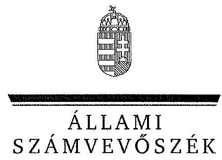
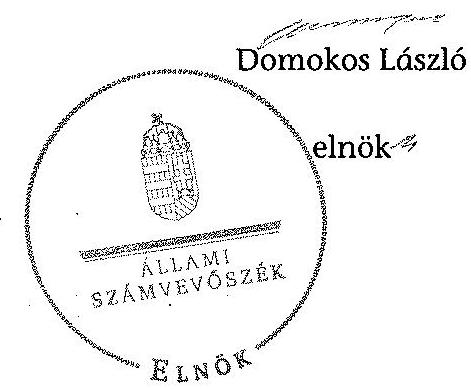
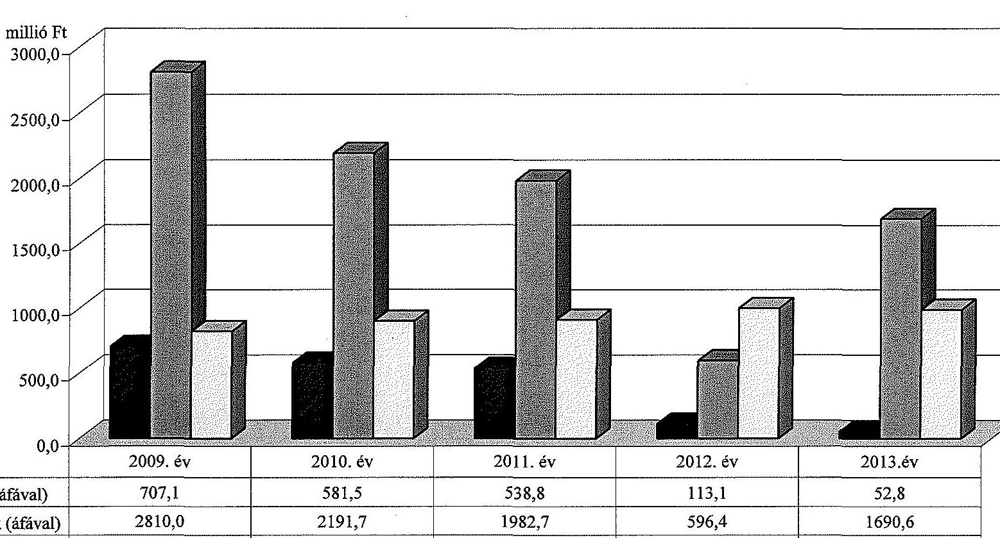
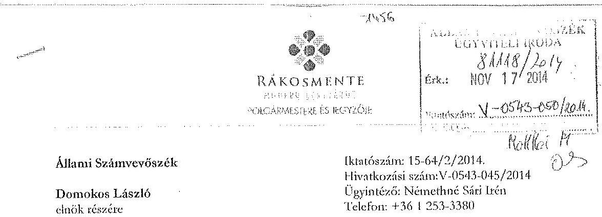
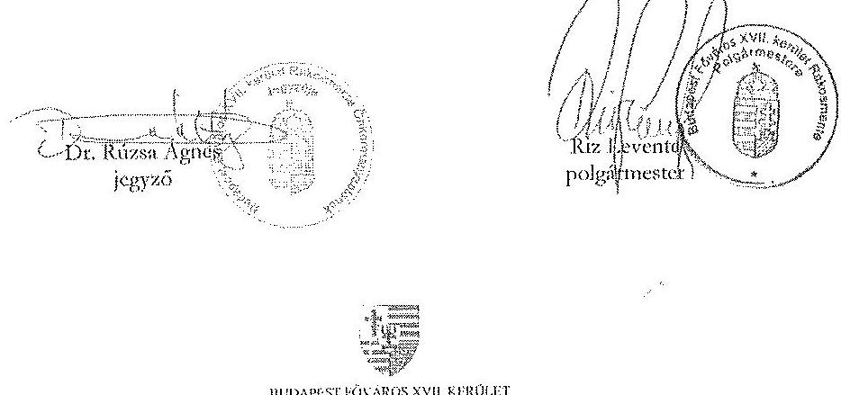

ÁLLAMI
SZÁMVEVÔSZÉK

# JELENTÉS 

az önkormányzatok vagyongazdálkodása
szabályszerúségének ellenôrzésérôl
Budapest Fôváros XVII. kerület Rákosmente

---

# Állami Számvevőszék 

Iktatószám: V-0543-049/2014.
Témaszám: 1577
Vizsgálat-azonosító szám: V068308
Az ellenőrzést felügyelte:
Makkai Mária
felügyeleti vezető
Az ellenőrzést vezette és az ellenőrzés végrehajtásáért felelős:
Schósz Attila Ferencné
ellenőrzésvezető
A számvevőszéki jelentés összeállításában közreműködtek:
Vacsora Erika
számvevő tanácsos
Hálóné Pelikán Veronika
számvevő
Illésné Borsik Andrea
számvevő
Az ellenőrzést végezték:
Vacsora Erika
számvevő tanácsos
Hálóné Pelikán Veronika
számvevő
Illésné Borsik Andrea
számvevő

A témához kapcsolódó eddig készített számvevőszéki jelentések:
címe
sorszáma
Jelentés a Budapest Főváros XVII. kerület Rákosmente Önkormányzata gazdálkodási rendszerének 2009. évi ellenőrzéséről

---

# TARTALOMJEGYZÉK 

BEVEZETÉS ..... 3
I. ÖSSZEGZŐ MEGÁLLAPÍTÁSOK, KÖVETKEZTETÉSEK, JAVASLATOK ..... 6
II. RÉSZLETES MEGÁLLAPÍTÁSOK ..... 10

1. A vagyongazdálkodási tevékenység szabályozása ..... 10
1.1. A vagyongazdálkodási feladatellátás szabályozása ..... 10
1.2. A vagyon használatba adására, kezelésére, üzemeltetésére kötött szerződések megfelelősége ..... 12
2. A vagyongazdálkodási tevékenység szabályszerűsége ..... 13
2.1. A vagyon nyilvántartása és leltározása ..... 13
2.2. Meghatározó mértékű vagyonváltozások ..... 15
2.3. Beruházások, felújítások szabályszerűsége ..... 16
2.4. A vagyon értékesítésének, hasznosításának, a követelés elengedésének szabályszerűsége ..... 18
3. Az önkormányzati tulajdonosi jog gyakorlása ..... 20
4. Integritás érvényesülése ..... 22
5. A belső és a külső ellenőrzések hasznosulása ..... 23
5.1. A belső ellenőrzés javaslatainak hasznosulása ..... 23
5.2. A külső ellenőrzések javaslatainak hasznosulása ..... 24
MELLÉKLETEK
6. számú Budapest Főváros XVII. kerület Rákosmente Önkormányzata vagyonának alakulása 2009. január 1. és 2013. december 31. között
7. számú Budapest Főváros XVII. kerület Rákosmente Önkormányzata felújítási és beruházási kiadásainak, valamint az elszámolt értékcsökkenésnek a bemutatása a 2009-2013. években
8. számú Budapest Főváros XVII. kerület Rákosmente Önkormányzata polgármesterének nemleges észrevétele

## FÜGGELÉKEK

1. számú Rövidítések jegyzéke
2. számú Értelmező szótár

---

# **Chemistry**

## **Chemical Reactions**

### **Balancing Chemical Equations**

1. **Write the unbalanced equation:**
   - Example: $$C_3H_8 + O_2 \rightarrow CO_2 + H_2O$$

2. **Balance the equation:**
   - Balance carbon atoms first.
   - Then balance hydrogen atoms.
   - Finally, balance oxygen atoms.
   - Balanced equation: $$C_3H_8 + 7O_2 \rightarrow 3CO_2 + 4H_2O$$

3. **Balance the equation:**
   - Balance oxygen atoms.
   - Finally, balance oxygen oxygen.
   - Balanced equation: $$C_3H_8 + 7O_2 \rightarrow 3CO_2 + 4H_2O$$

### **Types of Reactions**

1. **Combination Reaction:**
   - Example: $$2H_2 + O_2 \rightarrow 2H_2O$$

2. **Decomposition Reaction:**
   - Example: $$2H_2O_2 \rightarrow 2H_2O + O_2$$

3. **Single Displacement Reaction:**
   - Example: $$Zn + 2HCl \rightarrow ZnCl_2 + H_2$$

4. **Double Displacement Reaction:**
   - Example: $$AgNO_3 + NaCl \rightarrow AgCl + NaNO_3$$

5. **Combustion Reaction:**
   - Example: $$CH_4 + 2O_2 \rightarrow CO_2 + 2H_2O$$

## **Stoichiometry**

### **Mole Concept**

- **Mole (mol):** The amount of substance containing as many particles (atoms, molecules, ions) as there are atoms in exactly 12 grams of carbon-12.
- **Avogadro's Number:** $$6.022 \times 10^{23}$$ particles per mole.

### **Molar Mass**

- **Molar Mass:** The mass of one mole of a substance.
- Example: The molar mass of water ($$H_2O$$) is 18.015 g/mol.

### **Calculations**

1. **Mass to Moles:**
   - Formula: $$n = \frac{m}{M}$$
   - Example: Calculate the number of moles of $$H_2O$$ in 18 grams of water.
     - $$n = \frac{18.015 \, \text{g}}{18.015 \, \text{g/mol}} = 2 \, \text{mol}$$

2. **Moles to Mass:**
   - Formula: $$m = n \times M$$
   - Example: Calculate the mass of 2 moles of $$H_2O$$.
     - $$m = 2 \, \text{mol} \times 44.01 \, \text{g/mol} = 88.01 \, \text{g}$$

## **Gas Laws**

### **Ideal Gas Law**

- **Equation:** $$PV = nRT$$
- **Variables:**
  - $$P$$: Pressure (atm)
  - $$V$$: Volume (L)
  - $$n$$: Number of moles (mol)
  - $$R$$: Ideal gas constant (0.0821 L·atm/mol·K)
  - $$T$$: Temperature (K)

### **Boyle's Law**

- **Equation:** $$P_1V_1 = P_2V_2$$
- **Variables:**
  - P₁: Pressure (atm)
  - P₂: Volume (L)
  - P₃: Pressure (atm)
  - P₁: Pressure (atm)
  - P₂: Volume (L)
  - P₃: Pressure (atm)
  - P₁: Pressure (atm)

### **Boyle's Law (Boyle's Law)**

- **Equation:** $$\frac{P_1V_1}{P_2V_2} = \frac{P_2V_2}{T_1} = \frac{P_1}{T_2}$$

## **Thermochemistry**

### **Enthalpy (H)**

- **Definition:** The heat content of a system at constant pressure.
- **Equation:** $$\Delta H = q_p$$
- **Variables:**
  - $$q_p$$: Heat transferred at constant pressure.
  - $$q_p + \Delta H$$: Heat transferred at constant pressure.

### **Hess's Law**

- **Statement:** The enthalpy change for a reaction is the same whether it occurs in one step or multiple steps.
- **Equation:** $$\Delta H_{\text{rest}} = \Delta H - \Delta H_0$$
- **Variables:**
  - $$\Delta H$$: Heat transferred at constant pressure.
  - $$\Delta H_0$$: Heat transferred at constant pressure.

### **Hess's Law (Hess's Law)**

- **Statement:** The enthalpy change for a reaction is the same whether it occurs in one step or multiple steps.
- **Equation:** $$\Delta H_{\text{rest}} = \Delta H - \Delta H_0$$
- **Variables:**
  - $$\Delta H$$: Heat transferred at constant pressure.
  - $$\Delta H_0$$: Heat transferred at constant pressure.

## **Electrochemistry**

### **Oxidation and Reduction**

- **Oxidation:** Loss of electrons.
- **Reduction:** Gain of electrons.

### **Galvanic Cells**

- **Definition:** A cell that converts chemical energy into electrical energy.
- **Components:**
  - Anode: Oxidation occurs.
  - Cathode: Reduction occurs.
  - Salt Bridge: Connects the two half-cells.

### **Nernst Equation**

- **Equation:** $$E = E^\circ - \frac{RT}{nF} \ln Q$$
- **Variables:**
  - $$E$$: Energy (K)
  - $$E^\circ$$: Standard deviation (m)
  - $$R$$: Ideal gas constant (0.0821 L·atm/mol·K)
  - $$T$$: Temperature (K)
  - $$n$$: Number of electrons transferred
  - $$F$$: Faraday constant (96,485 C/mol)
  - $$Q$$: Reaction quotient

---

# JELENTÉS 

## az önkormányzatok vagyongazdálkodása szabályszerűségének ellenőrzéséről Budapest Főváros XVII. kerület Rákosmente

## BEVEZETÉS

Az ÁSZ stratégiai célkitűzése, hogy ellenőrzéseivel mind jobban segítse az átláthatóságot, az elszámoltathatóságot és elszámoltatást a közpénzekkel és a közvagyonnal való gazdálkodásban. Magyarország Alaptörvénye rögzíti, hogy az állam és a helyi önkormányzat tulajdona a nemzeti vagyon része. Az önkormányzati vagyon alapvető funkciója, hogy a közérdeket és egyúttal az önkormányzati célok - elsősorban a kötelezően ellátandó feladatok, és emellett a lehetőségek mértékéig az önként vállalt feladatok - megvalósítását szolgálja.

Az ÁSZ az önkormányzati vagyongazdálkodás 2012. évben indított és 2013. évben folytatott ellenőrzéseinek tapasztalatai alapján indokoltnak látta, hogy a 2014. évi ellenőrzési tervébe is beépítésre kerüljön a vagyongazdálkodási tevékenységek ellenőrzése. Az eddig elvégzett ellenőrzések rámutattak, hogy az önkormányzatok vagyongazdálkodási tevékenységét érintő szabályozottság, a kapcsolódó nyilvántartások, a beszámolók leltárral történő alátámasztása, a gazdálkodási jogkörök szabályszerű gyakorlása és a döntések meglapozottsága terén hiányosságok tapasztalhatók. Ez indokolttá tette a vagyongazdálkodás ellenőrzésének folytatását a jelentős vagyonnal rendelkező, vagy az ÁSZ kockázatelemzése alapján magas vagyoni kockázatot mutató önkormányzatoknál.

Az ellenőrzés célja annak megállapítása volt, hogy az önkormányzat vagyongazdálkodási tevékenységét a jogszabályi előírásokkal összhangban szabályozta-e, a vagyon nyilvántartása és a vagyongazdálkodási tevékenységek végrehajtása a jogszabályoknak és a belső előírásoknak megfelelően történt-e. Az ellenőrzés célja továbbá annak megállapítása, hogy az önkormányzatnál a vagyongazdálkodás során biztosították-e az átláthatóságot, valamint a külső és belső ellenőrzések megállapításai, javaslatai hozzájárultak-e a szabályszerű vagyongazdálkodáshoz.

Ennek keretében értékeltük, hogy az Önkormányzat:

- szabályszerűen alakította-e ki vagyongazdálkodási tevékenységének kereteit;
- biztosította-e a vagyongazdálkodás szabályszerűségét, megalapozottan hozta-e és jogszerűen, szabályszerűen hajtotta-e végre a vagyonváltozást eredményező meghatározó jelentőségű döntéseket;

---

- gondoskodott-e a tulajdonosi jogok gyakorlásáról;
- vagyongazdálkodási tevékenysége során biztosította-e az átláthatóság és az integritás érvényesülését;
- belső ellenőrzése elősegítette-e a vagyongazdálkodás szabályszerű működését, valamint hasznosította-e a vagyongazdálkodási tevékenységével kapcsolatos külső és belső ellenőrzések megállapításait, javaslatait.

Az ellenőrzés várható hasznosulása, hogy feltárja az önkormányzati vagyongazdálkodást meghatározó szabályok, szabályozások összhangjának hiányosságait, a szabályozással nem érintett vagyongazdálkodási területeket, a vagyongazdálkodási tevékenység gyakorlásának esetleges szabálytalanságait, valamint a jó gyakorlat kialakításán és terjesztésén keresztül az ellenőrzések elősegíthetik a vagyongazdálkodás szabályszerűségének javítását.

Az ellenőrzés típusa: szabályszerűségi ellenőrzés
Az ellenőrzött időszak: 2009. január 1-jétől 2013. december 31-ig, illetve a közbeszerzési eljárások lefolytatásának ellenőrzése 2012. január 1-jétől az Önkormányzat helyszíni ellenőrzésének kezdetét megelőző negyedév végéig (2014. március 31-ig) tartott.

Ellenőrzött szervezet: Budapest XVII. kerület Rákosmente Önkormányzata
Az ellenőrzés végrehajtásának jogszabályi alapját az Állami Számvevőszékről szóló 2011. évi LXVI. törvény 1. § (3) bekezdése, az 5. § (2)-(6) bekezdései, valamint az államháztartásról szóló 2011. évi CXCV. törvény 61. § (2) bekezdésének előírásai képezik.

Az ellenőrzés szakmai módszertana az ÁSZ hivatalos honlapján közzétett szakmai szabályokon alapult, amely a Legfőbb Ellenőrző Intézmények Nemzetközi Szervezete (INTOSAI) által kiadott nemzetközi standardok (ISSAI) figyelembevételével készült.

Az ellenőrzést az ÁSZ hatályos szervezeti szabályai és az ellenőrzési programban foglalt értékelési szempontok szerint folytattuk le. Megállapításainkat a helyszíni ellenőrzés tapasztalataira, az ellenőrzött szervezettől bekért dokumentumokra, a kitöltött tanúsítványok elemzésére, az adott időszakban hatályos jogszabályok és belső szabályzatok előírásaira alapoztuk. A részesedések értékelését tételesen ellenőriztük, míg irányított mintavétellel választottuk ki az ellenőrzött térítésmentes átadás-átvételeket, a beruházásokat, felújításokat, a közbeszerzési eljárásokat, a vagyon értékesítését, hasznosítását és a követelés elengedést, illetve leírást. A belső kontrollok megfelelő működését (a szakmai teljesítésigazolást, valamit a 2009-2011. években az utalvány ellenjegyzést, a 2012-2013. években az érvényesítést) a Polgármesteri hivatal felhalmozási kiadásaiból választott véletlen minta alapján, megfelelőségi teszttel ellenőriztük.

Budapest Főváros Rákosmente XVII. kerület lakosainak száma 2013. január 1jén 87137 fő volt. A 2010. évi önkormányzati választásokig a 29 tagú Képvise-lő-testület munkáját 13 állandó bizottság segítette. Az önkormányzati választások után a Képviselő-testület létszáma 21 főre csökkent és négy állandó bizott-

---

ság múködött. A polgármester a 2006. évi önkormányzati választás óta tölti be tisztségét, a jegyző 2007. augusztus 1-jétől látja el feladatait.

Az Önkormányzat a 2013. évben az önállóan működő és gazdálkodó Polgármesteri hivatalon felül egy önállóan működő és gazdálkodó, valamint 23 önállóan működő költségvetési szervvel látta el a feladatát. A Polgármesteri hivatal hét szervezeti egységre tagolódott, elkülönített gazdasági szervezettel nem rendelkezett. A foglalkoztatott köztisztviselők száma 2013. december 31-én 194 fő volt. A vagyongazdálkodással kapcsolatos feladatokat a Polgármesteri hivatal Vagyongazdálkodási és Gazdasági Irodája, valamint az Önkormányzat gazdasági társaságai láttak el. Az uszodák és a sportpályák üzemeltetéséről a Rákosmente Kft., a városfejlesztési és projekt menedzseri feladatokról a Pro Rákosmente Kft. és a Rákosmente Kft. útján gondoskodott az Önkormányzat. A Pro Rákosmente Kft. a 2011. évben a Rákosmente Kft.-be, mint jogutódba történő beolvadással megszűnt. Az Önkormányzatnak az Újlak utcai uszodára a 2011. év végéig volt vagyonkezelői jogot alapító szerződése.

Az Önkormányzat a 2009-2013. évek között vállalkozási tevékenységet nem végzett, haszonélvezeti és koncessziós jogot alapító szerződést nem kötött. Az ellenőrzött időszakban PPP konstrukcióban megvalósított fejlesztésre nem került sor. Az ÁSZ a 2009-2013. évek között az Önkormányzatnál egy - vagyongazdálkodást érintő - ellenőrzést végzett.

Az Önkormányzat könyvviteli mérleg szerinti vagyona a 2009. évi 59625,2 millió Ft-os nyitó értékről a 2013. év végére 68600,2 millió Ft-ra, $15,1 \%$-kal növekedett. A befektetett eszközökön belül elsősorban a tárgyi eszközök növekedtek. A forgóeszközökön belül a pénzeszközök emelkedése volt a meghatározó. Az Önkormányzat összes kötelezettségének állományi értéke 2013. december 31-én 4493,8 millió Ft, ebből a pénzintézeti kötelezettség állományi értéke 1461,5 millió Ft-ot tett ki, amely a 2014. évi adósság átvállalás eredményeként megszűnt. Az Önkormányzatnak 2013. december 31-én nem volt hosszú lejáratú kötelezettsége a 2013. évi 1143,1 millió Ft adósságkonszolidáció hatására. Az Önkormányzat 2013. évi költségvetési beszámolója szerint 12566,6 millió Ft költségvetési bevételt ért el és 10614,1 millió Ft költségvetési kiadást teljesített. Felhalmozási célú kiadásra 1913,4 millió Ft-ot, ezen belül felújítási és beruházási kiadásokra 1743,4 millió Ft-ot fordítottak.

Az Önkormányzat vagyonának főbb adatait, továbbá a felújítási és beruházási kiadásokat, valamint az elszámolt értékcsökkenést az 1-2. számú mellékletek mutatják be. Az alkalmazott rövidítéseket és az egyes fogalmak magyarázatát az 1-2. számú függelék tartalmazza.

Az ÁSZ a 2011. évi LXVI. törvény 29. §-a szerint a jelentéstervezetet megküldte Budapest Főváros XVII. kerület Rákosmente Önkormányzata polgármesterének egyeztetésre. A polgármester nemleges észrevételét a 3. számú melléklet tartalmazza.

---

# I. ÖSSZEGZŐ MEGÁLLAPÍTÁSOK, KÖVETKEZTETÉSEK, JAVASLATOK 

Az Önkormányzat a 2009-2013. évek között vagyongazdálkodási tevékenységének kereteit - a követelésről való lemondás kivételével - szabályszerűen alakította ki. Meghatározták az önkormányzati feladatellátást biztosító törzsvagyont, a forgalomképtelen és a korlátozottan forgalomképes vagyonelemek körét. Az Áht. ${ }_{1}$ és az Nvtv. előírása alapján rögzítették azt az értékhatárt, amely felett csak nyilvános pályázat útján lehet a vagyont értékesíteni, kezelésbe, használatba adni. Szabályozták a vagyon tulajdonjogának, a vagyonértékű jogok ingyenes, vagy kedvezményes átruházásának módját, eseteit és céljait.

A Képviselő-testület az Ötv.-ben és az Mötv.-ben biztosított lehetőségével élve az önkormányzati SZMSZ ${ }_{1,2}$-ben és a vagyongazdálkodási rendelet ${ }_{1,2}$-ben - értékhatárokhoz kötve - a polgármesternek és a Képviselő-testület bizottságainak adott át vagyongazdálkodási hatáskört. A vagyongazdálkodási rendelet ${ }_{1,2}$ alapján a vagyonkezelői szerződés megkötéséről, megszűntetéséről a Képviselőtestület dönthetett. A vagyongazdálkodási rendelet ${ }_{1}$-ben az Áht. ${ }_{1}$-ben foglaltak ellenére a követelés lemondás eseteit, módját nem szabályozták. Az Önkormányzat a vagyongazdálkodási rendelet ${ }_{2}$-ben a szabályozási hiányosságot megszűntette. A Képviselő-testület az Nvtv.-ben meghatározott 2012. március 1-jei határidőn túl - 2013. október 1-jén - vizsgálta felül a törzsvagyonát és úgy döntött, hogy nincs nemzetgazdasági szempontból kiemelt jelentőségű nemzeti vagyonná minősíthető vagyoneleme.

A Polgármesteri hivatal - az ellenőrzött időszakban - rendelkezett az Áhsz. ${ }_{1}$ ben foglaltaknak és a helyi sajátosságoknak megfelelő számviteli politika ${ }_{1-5}$-tel és a hozzá kapcsolódó pénzügyi-számviteli szabályzatokkal. A leltározási szabályzat ${ }_{2}$-ban az ingatlanok mennyiségi leltározásának gyakoriságát - az Áhsz. ${ }_{1}$ és a vagyongazdálkodási rendelet ${ }_{2}$-ben foglalt előírástól eltérően - kettő év helyett öt évben határozták meg. A 2010-2013. években a leltározási szabályzat ${ }_{2,3}$-ban - az Áhsz. ${ }_{1}$-nek megfelelően - az üzemeltetésre, vagyonkezelésre átadott eszközök tekintetében az üzemeltető, vagyonkezelő leltározási kötelezettségét írták elő.

Az operatív gazdálkodással kapcsolatos eljárásrendet és az összeférhetetlenségi követelményeket az Ámr. ${ }_{1,2}$-ben és az Ávr.-ben előírtaknak megfelelően a gazdálkodási jogkörök szabályzata ${ }_{1-12}$ és a gazdálkodási szabályzat rögzítette. Az Önkormányzatnál a hivatali SZMSZ ${ }_{1,2}$-ben az Ávr.-ben előírtak ellenére a gazdasági szervezet megnevezése nem történt meg. A Polgármesteri hivatalban a gazdálkodási jogkörök gyakorlása során a 2009-2011. években az Ámr. ${ }_{1,2}{ }^{-}$ ben, a 2012-2013. években az Ávr.-ben rögzített összeférhetetlenségi követelményeket betartották. A 2009-2013. években az ellenőrzött felhalmozási kiadások teljesítése esetében a kontrollok nem megfelelően múködtek, a gazdálkodási jogkörök gyakorlása nem felelt meg a jogszabályi előírásoknak. A 20122013. években a kontrollok nem megfelelő működése elsősorban abból adó-

---

dott, hogy az érvényesítőket nem az arra jogosult jegyző jelölte ki, mely azonban jogosulatlan kiadás teljesítést nem eredményezett.

Az Önkormányzat az ellenőrzött időszakban a vagyonkezelési, üzemeltetési, működtetési feladatokat elsősorban intézményrendszerén, illetve a saját gazdasági társasága útján látta el. A Képviselő-testület az ellenőrzött időszakot megelőzően, az ingatlanok üzemeltetésére a saját gazdasági társaságával kötött megállapodást, melyet a 2009-2013. években többször módosított. Az ellenőrzött időszakban a vagyontárgyak átadása a Képviselő-testület döntése alapján szabályszerűen történt. A megállapodásban rögzítették a finanszírozás és az adatszolgáltatási kötelezettség teljesítésének módját. Az Önkormányzatnak 2012. december 31 -én egy $100 \%$-os tulajdonú gazdasági társasága volt, amely az Nvtv. alapján átlátható szervezetnek minősült.

Az Önkormányzatnál az ellenőrzött időszakban a vagyongazdálkodási tevékenység szabályszerűségét hiányosan biztosították. A 2009-2013. években a vagyonkimutatás tartalma és felépítése nem felelt meg az Áhsz. ${ }_{1}$-ben foglalt előírásoknak, mivel a „0"-ra leírt eszközöket nem bontották meg, valamint nem mutatták ki az érték nélkül nyilvántartott eszközök állományát és a mérlegben értékkel nem szereplő függő kötelezettségeket. A 2012-2013. években a vagyonkimutatás nem a vagyongazdálkodási rendelet ${ }_{1,3}$, valamint a költségvetés és zárszámadás követelményeiről szóló rendelet ${ }_{3}$ mellékletében meghatározott formai szerkezetben készült. A jegyző a számviteli nyilvántartások és az ingatlanvagyon-kataszter egyezőségét a 147/1992. (XI. 6.) Korm. rendelet előírása és az egyeztetések ellenére a 2009. és a 2011-2013. években nem biztosította. A feltárt eltéréseket kijavították. Az ingatlanvagyon-kataszter és a földhivatal ingatlan-nyilvántartás azonos tartalmú adatai között az egyezőség a 2009-2013. években fennállt.

Az Önkormányzat a 2009-2013. évi könyvviteli mérlegeiben kimutatott eszközöket és forrásokat az Áhsz. ${ }_{1}$-ben előírtaknak megfelelően - a 2009. és a 2011. évben az ingatlanok kivételével - december 31-ei fordulónappal készült leltárral alátámasztotta. Az ingatlanok kétévenkénti mennyiségi felvétellel történő leltározását az Áhsz. ${ }_{1}$, a vagyongazdálkodási rendelet ${ }_{1,2}$ és a leltározási szabályzat ${ }_{1,2}$ előírásai ellenére a Polgármesteri hivatalnál a 2009. és a 2011. évben nem, míg a 2013. évben elvégezték. Az üzemeltetésre átadott eszközök leltározását a 2010. évtől az Áhsz. ${ }_{1}$ előírása szerint az üzemeltető elvégezte. A vagyonkezelésbe adott eszközöket a 2010-2011. években a vagyonkezelő által készített hitelesített leltár hiányában a Polgármesteri hivatal az egyeztetés módszerével leltározta.

Az Önkormányzat az ellenőrzött időszakban megalapozottan, a gazdasági program ${ }_{1,2}$-ben foglalt fejlesztési célkitűzésekkel, a kötelező és önként vállalt feladatok ellátásával összhangban - a hatásköri előírások betartásával - döntött a beruházásokról és felújításokról. A szabályszerűen végrehajtott fejlesztések finanszírozhatóságát és fenntarthatóságát biztosították. Az Önkormányzat a 2012. év és a 2014. év I. negyedév vége között minden közbeszerzési értékhatárt elérő, vagy azt meghaladó felhalmozási célú beszerzés esetében lefolytatta a közbeszerzési eljárást. Az ellenőrzött közbeszerzési eljárások lebonyolítása megfelelt a Kbt. és a közbeszerzési szabályzat előírásainak. A szerződéseket az összességében legelőnyösebb ajánlattevővel kötötték meg.

---

Az Önkormányzat vagyonváltozást eredményezô döntései jogszerűek voltak, azokat a Képviselő-testület, illetve az arra felhatalmazottak (Vagyongazdálkodási bizottság, polgármester) szabályszerűen hozták meg. Az értékesítésekhez az előterjesztések - a vagyongazdálkodási rendelet ${ }_{1,2}$ elöírásának megfelelően - értékbecsléseket tartalmaztak. Az ellenőrzött vagyonértékesítések, vagyonhasznosítások esetében az előterjesztésekkel megegyező, a képviselőtestületi döntésekkel azonos tartalmú szerződést, megállapodást kötöttek. Az ellenőrzött térítés nélküli átadások az Önkormányzat által ellátott közfeladatok változásával összhangban történtek. A Képviselő-testület a döntéseket a jogszabályokban és a vagyongazdálkodási rendelet ${ }_{1,2}$-ben foglaltak betartásával hozta meg. Az Önkormányzatnál a 2009-2013. években követelés elengedésére nem került sor. Az ellenőrzött behajthatatlannak minősített követelések leírása szabályszerűen, dokumentumokkal alátámasztva történt.

Az Önkormányzat az ellenőrzött időszakban tartós részesedéseivel felelősen gazdálkodott, az alapító okiratokban rögzített tulajdonosi jogokat gyakorolta. A Képviselő-testület megtárgyalta és elfogadta a 100\%-ban tulajdonában lévő gazdasági társaságok könyvvizsgálói jelentéssel kiegészített éves beszámolóit és üzleti terveit. Az Önkormányzat nyomon követte a gazdasági társaságai kötelezettség állományának alakulását, a folyamatos üzletmenet fenntarthatóságát, a társaságok alapfeladatainak teljesülését és a feladatellátás hatékonyságát. Az Önkormányzatnál - az értékelési szabályzat ${ }_{1,2}$-ben foglaltaknak megfelelően - minden évben vizsgálták a tulajdonosi részesedések alakulását, valamint az értékvesztés elszámolásának és visszaírásának szükségességét.

Az Önkormányzatnál a vagyongazdálkodási tevékenység integritása (feddhetetlensége) szempontjából az eredendő és a korrupciós kockázatok értéke - a 2013. évben az ÁSZ által - az önkormányzati alrendszerben mért átlagértékhez képest magasabb. Az Önkormányzatnál kiépült kontrollok azonban képesek kezelni a kockázatokat, valamint támogatni a szervezet feladatellátását.

Az ellenőrzött időszakban a Polgármesteri hivatalnál és az önkormányzati intézményeknél végzett 57 belső ellenőrzésből 43 érintette a vagyongazdálkodási feladatokat. A javaslatokra intézkedési tervek készültek. A belső ellenőrzés az intézkedési tervek végrehajtásáról utóellenőrzéssel, illetve az ellenőrzöttek beszámoltatásával győződött meg. A belső ellenőrzés megállapításai, javaslatai elősegítették az Önkormányzat vagyongazdálkodásának szabályszerű múködését.

Az Önkormányzat az ellenőrzött időszakban a külső ellenőrzések közül a Kormányhivatal - vagyongazdálkodással összefüggő - megállapításait, javaslatait hasznosította. A vagyongazdálkodási rendelet ${ }_{1}$ előírásaival kapcsolatos törvényességi felhívásra intézkedtek. A könyvvizsgáló az Önkormányzat vagyongazdálkodásával kapcsolatos javaslatokat nem fogalmazott meg, az éves költségvetési beszámolókra elfogadó véleményt adott. Az ÁSZ az Önkormányzat gazdálkodási rendszerének 2009. évi ellenőrzése során 12 javaslatot fogalmazott meg, melyből hat teljesült, hármat részben valósítottak meg. Három - pénzügyi-számviteli programokhoz kapcsolódó szabályozásra, dokumentálásra vonatkozó - célszerűségi javaslatot nem hasznosítottak.

---

Az Állami Számvevőszékről szóló 2011. évi LXVI. törvény 33. § (1) bekezdésében foglaltak értelmében a jelentésben foglalt megállapításokhoz kapcsolódó intézkedési tervet köteles az ellenőrzött szervezet vezetője összeállítani, és azt a jelentés kézhezvételétől számított 30 napon belül az ÁSZ részére megküldeni. Amennyiben az intézkedési tervet határidőben nem küldi meg a szervezet, vagy az nem elfogadható, az ÁSZ elnöke a hivatkozott törvény 33. § (3) bekezdés a)-b) pontjaiban foglaltakat érvényesítheti.

Az ellenőrzés intézkedést igénylő megállapításai és javaslatai:

# a jegyzőnek 

1. Az ingatlanok mennyiségi leltározását a Képviselő-testület a vagyongazdálkodási rendelet ${ }_{1,2}$-ben - a leltározási szabályzat ${ }_{1,2}$ előírásával összhangban - kétévente írta elő, a leltározási szabályzat ${ }_{2}$-ban az Áhsz. ${ }_{1} 37 . \S$ (7) bekezdésben és a vagyongazdálkodási rendelet ${ }_{2}$-ben foglalt előírástól eltérően ötévente határozták meg.

Javaslat:
Intézkedjen a leltározási szabályzat módosításáról annak érdekében, hogy az ingatlanok mennyiségi leltározásának szabályozása megfeleljen a jogszabályi előírásoknak.
2. A vagyonkimutatás a 2009-2013. években nem felelt meg az Áhsz. ${ }_{1}$ 44/A. § (2)(3) bekezdéseiben, a 2012-2013. években a vagyongazdálkodási rendelet ${ }_{1,2}$-ben, valamint a költségvetés és zárszámadás követelményeiről szóló rendelet ${ }_{2}$-ben meghatározott előírásoknak. A „0"-ra leírt eszközöknél nem adták meg, hogy használatban lévő vagy használaton kívüli eszközökről van szó, nem mutatták ki az érték nélkül nyilvántartott eszközök állományát és a mérlegben értékkel nem szereplő függő kötelezettségeket, a 2012-2013. években a vagyonkimutatás nem a vagyongazdálkodási rendelet ${ }_{1,2}$-ben és a költségvetés és zárszámadás követelményeiről szóló rendelet ${ }_{2}$ mellékletében meghatározott formai szerkezetben készült.

Javaslat:
Intézkedjen az Önkormányzat vagyonkimutatásának a vonatkozó jogszabály és önkormányzati rendeletek előírása szerinti elkészítéséről.
3. A Polgármesteri hivatal Gazdasági Iroda vezetője 2012. január 1-jét követően a pénzügyi ellenjegyzést, illetve érvényesítést ellátó személyek kijelölésére nem volt jogosult, a kijelölést az Ávr. 55. § (2) bekezdésének f) pontja, illetve 58. § (4) bekezdése alapján jogszerűen a jegyző tehette volna meg.

Javaslat:
Intézkedjen a pénzügyi ellenjegyző, illetve érvényesítést ellátó személyek jogszerú kijelöléséről.

---

# II. RÉSZLETES MEGÁLLAPÍTÁSOK 

## 1. A VAGYONGAZDÁLKODÁSI TEVÉKENYSÉG SZABÁLYOZÁSA

### 1.1. A vagyongazdálkodási feladatellátás szabályozása

A Képviselő-testület a 2009-2013. években hatályos gazdasági program ${ }_{1,2}$-ben meghatározta a vagyongazdálkodással kapcsolatos célkitűzéseit, feladatait.

Az Önkormányzat a gazdasági program ${ }_{1}$-ben a hiányzó infrastrukturális feltételek pótlását (csapadékvíz-elvezetés, csatornázás, utak aszfaltozása, közlekedési lehetőségek fejlesztése, bölcsődei és óvodai férőhely-bővítés), a minőségi élet kialakítását tüzte ki célul, hogy megmaradjon a kerület zöld, kertvárosias hangulata. A gazdasági program ${ }_{2}$-ben az infrastrukturális feltételek pótlása kibővült az oktatási intézmények korszerűsítésével, a helyi szolgáltatások bővítésével, fejlesztésével. Munkahelyteremtő beruházások megvalósításával tervezik elősegíteni a helyben maradást és növelni az adóbevételeket, melyet a kerület intézményrendszerének fenntartására, városfejlesztésre fordíthatnak. Az Önkormányzat a gazdasági program ${ }_{1,2}$-ben nagy hangsúlyt helyezett a pályázati források elnyerésére.

A Képviselő-testület a 2013. évben fogadta el az Nvtv. 9. § (1) bekezdésében előírt közép- és hosszú távú vagyongazdálkodási tervet.

Az Önkormányzat az ellenőrzött időszakban - az Ötv. és Mötv. szabályozása szerint - az önként vállalt és a kötelező feladatainak körét, azok ellátásának mértékét és módját a 2009-2013. évi költségvetési rendeletekben elkülönítetten rögzítette.

Az Önkormányzat az ellenőrzött időszakban kötelező feladatait döntő részben költségvetési intézményrendszerén és $100 \%$-os tulajdonú, vagyongazdálkodással kapcsolatos feladatokat végző gazdasági társaságai (Pro Rákosmente Kft. és a Rákosmente Kft.) tevékenységén keresztül látta el. Az uszodák és a sportpályák üzemeltetéséről a Rákosmente Kft., a városfejlesztési és projekt menedzseri feladatokról a Pro Rákosmente Kft. és a Rákosmente Kft. útján gondoskodott.

Az Önkormányzat a 2009-2013. évek között vagyongazdálkodási tevékenységének kereteit - a követelésről való lemondás kivételével - szabályszerűen alakította ki. A Képviselő-testület - a Htv. 138. § (1) bekezdés j) pontjában előírtaknak megfelelően - az önkormányzati vagyongazdálkodási feladatokat a vagyongazdálkodási rendelet ${ }_{1,2}$-ben, továbbá a lakás és nem lakás céljára szolgáló helyiségek bérbeadását és elidegenítését, a vásárcsarnokok és piaci ingatlanok hasznosítását, és a közterületek hasznosítását külön rendeletben szabályozta. Meghatározták az önkormányzati feladatellátást biztosító törzsvagyont, ezen belül a forgalomképtelen és a korlátozottan forgalomképes vagyonelemek körét. A vagyongazdálkodási rendelet ${ }_{1}$ nem tartalmazott a forgalomképesség megváltoztatásának módjára vonatkozó rendelkezést, a vagyongazdálkodási rendelet ${ }_{2}$ szerint a forgalomképesség megváltoztatásáról a Képviselő-testület jogosult dönteni. A Képviselő-testület az Nvtv. 18. § (1) bekezdésében meghatározott 2012. március 1-jei határidőn túl -

---

2013. október 1-jén - felülvizsgálta a törzsvagyonát és úgy döntött, hogy nincs nemzetgazdasági szempontból kiemelt jelentőségű nemzeti vagyonná minősíthető vagyoneleme.

A Képviselő-testület az Ötv. 9. § (3) bekezdésében ${ }^{1}$ biztosított lehetőséggel élve az önkormányzati SZMSZ ${ }_{1,2}$-ben és a vagyongazdálkodási rendelet ${ }_{1,2}$-ben - értékhatárokhoz kötve - a polgármesternek és a Képviselő-testület bizottságainak adott át vagyongazdálkodási hatáskört. A negyedéves gyakorisággal előírt beszámolási kötelezettséget a hatáskörök gyakorlói a Képviselő-testület ülésein teljesítették.

A vagyontárgyak feletti tulajdonosi jogok gyakorlásának módját a vagyongazdálkodási rendelet ${ }_{1,2}$-ben és az önkormányzati SZMSZ ${ }_{1,2}$-ben határozták meg. A vagyongazdálkodási rendelet ${ }_{1,2}$ szabályai szerint elidegenítés esetében a döntés joga értékhatár alapján a Képviselő-testületet, a Vagyongazdálkodási bizottságot, valamint a polgármestert illette meg. A Vagyongazdálkodási bizottság átruházott hatáskörei a vagyongazdálkodással, környezetvédelemmel, városfejlesztéssel, közlekedéssel, európai uniós kapcsolatokkal összefüggő feladatok voltak. A polgármester átruházott hatásköreit az Önkormányzat vagyonával, a lakások és helyiségek bérletével, elidegenítésével kapcsolatos feladatok képezték.

A vagyongazdálkodási rendelet ${ }_{1,2}$-ben az Ötv. és az Mötv. alapján meghatározták a vagyonkezelői jog megszerzésének, gyakorlásának és ellenőrzésének részletes szabályait. A szerződés megkötéséről, illetve megszűntetéséről a döntés joga a Képviselő-testületet illette meg. A vagyon használatba adását (bérbeadás, ingyenes vagy kedvezményes használatba adás) a vagyongazdálkodási rendelet ${ }_{1,2}$-ben szabályozták, az üzemeltetésre történő átadásának, ellenőrzésének szabályait a megkötött szerződésekben, megállapodásokban határozták meg.

A vagyon tulajdonjogának, valamint az önállóan forgalomképes vagyoni értékủ jogok ingyenes vagy kedvezményes átruházásának módját és eseteit, az átadás célját és az átvevők körét a vagyongazdálkodási rendelet ${ }_{1,2}$-ben az Áht. ${ }_{1}$, illetve az Nvtv. előírásainak megfelelően határozták meg.

A Képviselő-testület a vagyon értékesítésére, kezelésbe adására, használati jogának átadására a nyilvános pályáztatási kötelezettségét az Áht. 108. § (1) bekezdésében és az Nvtv. 13. § (1) bekezdésében előírtaknak megfelelően, a vagyongazdálkodási rendelet ${ }_{1,2}$-ben a mindenkori költségvetési törvényben foglalt, 25,0 millió Ft-os értékhatárt meghaladó esetekben írta elő. A vagyongazdálkodási rendelet ${ }_{2}$-ben 2013. október 1-jétől rögzítették, hogy vagyonértékesítési, vagyonhasznosítási pályázati eljárás résztvevője csak természetes személy vagy az Nvtv. 3. § (1) pontjában meghatározott átlátható szervezet lehet.

A vagyongazdálkodási rendelet ${ }_{1}$-ben az Áht. ${ }_{1}$ 108. § (2) bekezdésében foglaltak ellenére a követelésről való lemondás eseteit, módját nem szabályozták. A Kép-viselő-testület a vagyongazdálkodási rendelet ${ }_{2}$-ben a szabályozási hiányosságot megszűntette. Értékhatárhoz kötötten a polgármester, a Vagyongazdálkodási bizottság és a Képviselő-testület volt jogosult dönteni.

[^0]
[^0]:    ${ }^{1}$ 2013. január 1-jétől az Mötv. 41. § (4) bekezdése írja elő.

---

Az Önkormányzatnál az Áhsz. ${ }_{1}$ 44/A. § (1)-(3) bekezdéseivel ${ }^{2}$ összhangban, a rendelet 1 . számú melléklete szerinti részletezettséggel határozták meg a vagyongazdálkodási rendelet ${ }_{1,2}$-ben, valamint a költségvetés és zárszámadás követelményeiről szóló rendelet ${ }_{1,2}$-ben a vagyonkimutatás tartalmát.

A Polgármesteri hivatal rendelkezett az Áhsz. ${ }_{1}$-nek megfelelő számviteli politi$\mathrm{ka}_{1-5}$-tel és az annak keretében készítendő pénzkezelési ${ }_{1-6}$, leltározási ${ }_{1-3}$, selejtezési ${ }_{1,4}$ és értékelési ${ }_{1,2}$ szabályzatokkal. Az Önkormányzat nem élt a befektetett eszközök - Áhsz. ${ }_{1} 32 . \S$ (7) bekezdésében biztosított - piaci értéken történő értékelésének lehetőségével.

Az ingatlanok mennyiségi leltározását a Képviselő-testület a vagyongazdálkodási rendelet ${ }_{1,2}$-ben - a leltározási szabályzat ${ }_{1,2}$ előírásával összhangban - kétévente írta elő, a leltározási szabályzat ${ }_{2}$-ban az Áhsz. ${ }_{1} 37 . \S$ (7) bekezdésében és a vagyongazdálkodási rendelet ${ }_{2}$-ben foglalt előírástól eltérően ötévente határozták meg. A leltározási szabályzat ${ }_{1,3}$-ban minden további eszköz, illetve forrás évenkénti leltározását írták elő. A leltározási szabályzat ${ }_{2,3}$ a 2010-2013. években az Áhsz. ${ }_{1} 37 . \S$ (4) bekezdésében ${ }^{3}$ foglaltaknak megfelelően tartalmazta, hogy az üzemeltetésre, vagyonkezelésre átadott eszközöket az üzemeltető, vagyonkezelő köteles leltározni és megküldeni a Polgármesteri hivatalnak.

A gazdálkodási jogkörök szabályzata ${ }_{1,12}$ és a gazdálkodási szabályzat az Ámr. ${ }_{1,2}$-ben és az Ávr.-ben előírtaknak megfelelően meghatározta az operatív gazdálkodással kapcsolatos eljárásrendet és az összeférhetetlenségi követelményeket ${ }^{4}$. Az Önkormányzatnál a gazdasági szervezet megnevezése a 2012. január 1-jétől hatályba lépő Ávr. 13. § (1) bekezdés e) pontjában előírtak ellenére nem történt meg a hivatali $\mathrm{SZMSZ}_{1,2}$-ben. Ebből adódóan a pénzügyi ellenjegyzést, illetve érvényesítést ellátó köztisztviselők kijelölésére - az Ávr. 55. § (2) bekezdésének f) pontja, illetve 58. § (4) bekezdése alapján - a jegyző volt jogosult. Ennek ellenére 2012. január 1-jétől a Gazdasági Iroda vezetője jelölte ki a pénzügyi ellenjegyzőket és érvényesítőket.

# 1.2. A vagyon használatba adására, kezelésére, üzemeltetésére kötött szerződések megfelelősége 

Az Önkormányzat az ellenőrzött időszakban koncessziós szerződést, az Ötv. 80/A. § előírása ${ }^{5}$ szerinti vagyonkezelési szerződést nem kötött, vagyonkezelői jogot nem létesített.

[^0]
[^0]:    ${ }^{2}$ 2014. január 1-jétől az Áhsz. ${ }_{2}$ 30. § (1)-(3) bekezdései szabályozzák.
    ${ }^{3}$ 2014. január 1-jétől az Áhsz. ${ }_{2}$ 22. § (2) bekezdése alapján a Számv. tv. 69. § (2) bekezdése rendelkezik a leltározás végrehajtásáról. 2014. január 1-jétől az Áhsz. ${ }_{2}$ 22. § (2) bekezdés a) pontja kizárólag a koncesszióba, vagyonkezelésbe adott eszközökre írja elő vagyonkezelő által történő leltározást.
    ${ }^{4}$ Az Ámr. ${ }_{1}$ 134-137. § és 138. § (1)-(3) bekezdése, az Ámr. ${ }_{2}$ 72. §, 74-79. § és 80. § (1)(2) bekezdése, valamint az Ávr. 52 § (1) bekezdés c) pontja, 53-59. §-a, és a 60. § (1)(2) bekezdése szerint.
    ${ }^{5}$ 2012. január 1-jétől az Mötv. 109. §-a szabályozza.

---

Az Önkormányzat az ellenőrzött időszakot megelőzően, a 2008. évben létesített vagyonkezelői jogot a Rákosmente-Fürdő Kft. javára az Újlak utcai uszoda kezelésére. A vagyonkezelési szerződésben rögzítették a vagyon állagának, értékének, őrzésének feltételeit, a vagyon nyilvántartási, adatszolgáltatási és elszámolási kötelezettségek teljesítésének módját és formáját. Előírták a vagyonkezelő kötelezettségeként a vagyon felújítását, pótlását az Áht. 105/A. § (6) bekezdése alapján. A vagyonkezelői szerződés megszüntetése közös megegyezéssel, 2011. december 31-i dátummal történt. A vagyonkezelő a szerződés megszűnését követően átadta az eszközöket az Önkormányzatnak.

Az Önkormányzatnak a 2007. évben alapított 100\%-os tulajdonosi részesedésű gazdasági társaságával, a Rákosmente Kft.-vel volt megállapodása a közfeladatok ellátására, az önkormányzati ingatlanok üzemeltetésére. Az ellenőrzött időszak alatt a megállapodást többször módosították. A 2009-2010. években lakásokat és helyiségeket, a 2012-2013. években telkeket, lakótelkeket, épületeket, építményeket és gépeket, berendezéseket, felszereléseket adtak át üzemeltetésre (uszoda, műfüves pálya, sporttelep, tanuszoda sport centrum, kerékpárút) a Rákosmente Kft.-nek. Ezen vagyontárgyak átadása a Képviselő-testület döntésének megfelelően szabályszerűen történt. A megállapodásban rögzítették a finanszírozás módját, mértékét és előírták az adatszolgáltatási kötelezettség teljesítésének módját, formáját, az évenkénti leltározás dokumentálásának kötelezettségét.

A Képviselő-testület döntése alapján megállapodásban rögzítették, hogy ingyenesen átadják a 2011. évben a Jókai Mór Általános Iskola fenntartói jogát a Rákoscsabai Református Egyházközösség részére, majd a 2012. évben az Eszterlánc Óvoda és Laborcz Ferenc Általános Iskola fenntartását a Magyarországi Evangélikus Egyháznak. A Sérültek Napközi és Átmeneti Otthonának fenntartói jogát a Rákoscsabai Baptista Gyülekezetnek a 2013. évben adta át az Önkormányzat. A megállapodások tartalmazták az átadott vagyonnal kapcsolatos kötelezettségeket és jogokat. Az ingyenes használatba adások - a vagyongazdálkodási rendelet ${ }_{1}$-ben előírtaknak megfelelően - a közfeladatok átadásához kapcsolódtak.

Az Önkormányzatnak 2012. december 31-én egy 100\%-os tulajdonú gazdasági társasága volt, mely az Nvtv. 3. § (1) bekezdés 1. pontja alapján átlátható szervezetnek minősült.

# 2. A VAGYONGAZDÁLKODÁSI TEVÉKENYSÉG SZABÁLYSZERŰSÉGE 

### 2.1. A vagyon nyilvántartása és leltározása

Az Önkormányzat a számviteli nyilvántartásában a főkönyvi számlák alábontásával és a számlákhoz kapcsolódó analitikus nyilvántartások vezetésével biztosította a törzsvagyon többi vagyontárgytól való elkülönített nyilvántartását.

Az Önkormányzatnál az ellenőrzött időszakban a vagyongazdálkodási tevékenység szabályszerűségét hiányosan biztosították. A 2009-2013.

---

években a jegyző elkészítette az Ötv. 78. § (2) bekezdésében ${ }^{6}$ meghatározott vagyonkimutatást, amelyet a polgármester az Áht. ${ }_{1}$ 118. § (2) bekezdés 2. c) pontjának ${ }^{7}$ előírása szerint a zárszámadási rendelettervezettel egyidejűleg terjesztett a Képviselő-testület elé. A vagyonkimutatás tartalma és felépítése a 20092013. években nem felelt meg az Áhsz. ${ }_{1}$ 44/A. § (2)-(3) bekezdéseiben és a 2012-2013. években a vagyongazdálkodási rendelet ${ }_{1,2}$-ben, valamint a költségvetés és zárszámadás követelményeiről szóló rendelet ${ }_{2}$-ben meghatározott előírásoknak, mivel

- a „O"-ra leírt eszközöknél nem adták meg, hogy használatban vagy használaton kívüli eszközökről van szó;
- nem mutatták ki az érték nélkül nyilvántartott eszközök állományát, (képzőmúvészeti alkotásokat, kulturális javakat) és a mérlegben értékkel nem szereplő, garancia és kezességvállalással kapcsolatos 74,3 millió Ft függő kötelezettségeket;
- a 2012-2013. években a vagyonkimutatás más formai szerkezetben készült, mint azt a vagyongazdálkodási rendelet ${ }_{1,2}$-ben és költségvetés és zárszámadás követelményeiről szóló rendelet ${ }_{2} 18$. számú mellékletében meghatározták, mivel az előírt bruttó állományi érték és nettó állományi érték oszlopok helyett bruttó-, könyv szerinti és becsült állományi érték oszlopokat használtak.

Az Önkormányzat a tulajdonában lévő ingatlanvagyonról a 147/1992. (XI. 6.) Korm. rendelet 1. § (1) bekezdésében meghatározott ingatlanvagyon-katasztert folyamatosan vezette. A jegyző a számviteli nyilvántartások és az ingatlanva-gyon-kataszter egyezőségét a 147/1992. (XI. 6.) Korm. rendelet 1. § (3) bekezdésében és 2. számú mellékletében foglalt előírás ellenére a 2009. és a 2011-2013. években - az egyeztetések ellenére - nem biztosította, mivel

- az ingatlanvagyon-kataszter a 2009. évben 2,3 millió Ft-tal volt több, míg a 2011. évben 251,3 millió Ft-tal, a 2012. évben 480,3 millió Ft-tal volt kevesebb a számviteli nyilvántartás bruttó értékénél. Programhibából adódóan 2009ben a betétlapok értékét duplán számolták, a 2011. és 2012. években az önkormányzati intézmények értékelt az összesítésbe nem számolták bele. A 2013. évben az eltéréseket kijavították;
- a 2013. évi eltérés 0,2 millió Ft volt, az önállóan múködő és gazdálkodó intézményének felújítás értéke nem realizálódott a rendszerben, mely javításra került.

Az Önkormányzat a - 147/1992. (XI. 6.) Korm. rendelet 1. § (2) bekezdésében előírt - vagyonkataszter ingatlan adatlapjai és betétlapjai, valamint a földhivatali ingatlan-nyilvántartás azonos tartalmú adatai közötti egyezőséget a 2009-2013. években biztosította.

Az Önkormányzat a 2009-2013. évi könyvviteli mérlegeiben kimutatott eszközöket és forrásokat az Áhsz. 37. § (1) bekezdésében előírtaknak megfelelően az ingatlanok kivételével - december 31-ei fordulónappal készült leltárral alátámasztotta. A mennyiségben és értékben nyilvántartott eszközök közül az ingatlanok mennyiségi felvétellel történő leltározását az Áhsz. 37. §

[^0]
[^0]:    ${ }^{6}$ 2012. január 1-jétől az Mötv. 110. § (2) bekezdése írja elő.
    ${ }^{7}$ 2012. január 1-jétől az Áht. 2 91. § (2) bekezdés c) pontja írja elő.

---

(7) bekezdése, valamint a vagyongazdálkodási rendelet ${ }_{1,2}$ és a leltározási szabályzat ${ }_{1,2}$ előírásai ellenére a Polgármesteri hivatalnál kétévente (a 2009. és a 2011. években) nem végezték el. A Polgármesteri hivatalnál az ellenőrzött időszakon belül az ingatlanokat mennyiségi felvétellel csak a 2013. évben leltározták, míg az intézményeknél minden páratlan évben.

Az üzemeltetésre átadott eszközök leltározását a 2010. évtől az Áhsz. ${ }_{1}$ 37. § (4) bekezdésének előírása szerint az üzemeltető Rákosmente Kft. elvégezte. A leltározás elvégzését igazoló, hitelesített leltárakat az Önkormányzat rendelkezésére bocsátotta a leltározási szabályzat ${ }_{2,3}$-ban meghatározott határidőn belül. A vagyonkezelésbe adott eszközökről a 2010-2011. években a vagyonkezelő Rákosmente-Fürdő Kft. - az Áhsz. ${ }_{1}$ 37. § (4) bekezdésében és a leltározási szabályzat ${ }_{2}$-ben foglalt előírások ellenére - az általa készített leltárt nem küldte meg az Önkormányzatnak, az átadott eszközöket a Polgármesteri hivatal az egyeztetés módszerével leltározta.

A leltárak kiértékelésének eredményeként a 2010. évben a Polgármesteri hivatalban a kis értékű tárgyi eszközök mennyiségi leltározása során megállapított hiány okát kivizsgálták. Kártérítési vagy fegyelmi eljárást nem kezdeményeztek, mivel az eszköz megkerült.

Az Önkormányzatnál a selejtezést a selejtezési szabályzat ${ }_{1-3}$ alapján éves ütemtervek szerint végezték. Az Önkormányzat az értékesítésre nem került használhatatlanná vált eszközöket selejtezte le. A selejtezést minden esetben megelőzte a minősítés, melyet szakvéleménnyel támasztották alá, a selejtezések dokumentálása a selejtezési szabályzat ${ }_{1-3}$-ban foglaltaknak megfelelt.

# 2.2. Meghatározó mértékú vagyonváltozások 

Az Önkormányzat könyvviteli mérleg szerinti vagyona a 2009. évi 59625,2 millió Ft-os nyitó értékről 2013. év végére 68600,2 millió Ft-ra, 15,1\%kal növekedett. Ezen időszak alatt a befektetett eszközök 7215,5 millió Ft-tal, a forgóeszközök 1759,5 millió Ft-tal növekedtek.

A vagyonnövekedés elsősorban a befektetett eszközökön belül az ingatlanok és kapcsolódó vagyoni értékű jogok, a forgóeszközök közül a pénzeszközök értékének emelkedése miatt következett be. Az ingatlanok és vagyoni értékű jogok a 2009. évi 53630,5 millió Ft-ról 2013. december 31-re 60810,1 millió Ft-ra növekedtek az aktivált beruházások, felújítások és az üzemeltetésre, vagyonkezelésre átadott ingatlanok 2011. évi visszavételezése hatására. A folyamatban lévő beruházások, felújítások könyvviteli mérlegben kimutatott 2009. évi 1110,8 millió Ft nyitó értéke 2013. év végére 1590,4 millió Ft-ra emelkedett.

Az ellenőrzött időszak alatt 256 befejezett beruházás és felújítás növelte az Önkormányzat eszközeinek értékét. Az Önkormányzat az értékcsökkenési leírást meghaladó beruházást és fejlesztést hajtott végre az ellenőrzött időszakban. A 2009-2013. években felújításra bruttó 1993,3 millió Ft-ot, valamint beruházásra bruttó 9271,4 millió Ft-ot fordítottak. Az elszámolt értékcsökkenés 4618,0 millió Ft volt.

---

Az ellenőrzött időszakban az ingatlanok értékét - út és járdafelújítás, kialakítás, orvosi rendelők, művelődési ház, lakások, bölcsődék, óvodák és általános iskolák felújítása, illetve akadálymentesítése, ingatlanvásárlások, önkormányzati irodaházak beruházása, kerékpárút és P+R parkoló építése, Ferihegyi út meghosszabbítása, csapadék árok kialakítása - befejezett beruházások növelték.

Az Önkormányzat üzemeltetésre és vagyonkezelésbe adott eszközeinek értéke a 2009. január 1-jei 1348,5 millió Ft-ról 2013. december 31-re 969,4 millió Ft-ra csökkent, elsősorban a vagyonkezelési szerződés 2011. évi megszüntetése következtében.

A forgóeszközökön belül meghatározó volt a pénzeszközök értéke. A 2009. évi 1839,9 millió Ft-os nyitó érték 2010. évre jelentősen, 108,0 millió Ft-ra csökkent, ezt követően folyamatosan emelkedett és a 2013. évben 3408,0 millió Ft volt.

Az Önkormányzat szabad pénzmaradványa a 2012. évben 730,6 millió Ft, a 2013. évben 1304,3 millió Ft volt. A rövid lejáratú bankbetét állomány 2012. december 31-én 1206,9 millió Ft, 2013. december 31-én 2715,4 millió Ft, míg a 2012-2013. években elszámolt kamatbevétel 71,0 millió Ft volt.

A követelések teljes összege a 2009. év elejei 1126,5 millió Ft-ról 2013. év végére 1361,8 millió Ft-ra, 20,9\%-kal emelkedett, amelyből az adósokkal szemben fennálló követelések 478,1 millió Ft-ról 1071,0 millió Ft-ra növekedtek.

A saját tőke nagysága a 2009. év eleji 56530,9 millió Ft-ról 2013. év végére 60716,6 millió Ft-ra (4 185,7 millió Ft-tal) nőtt. A tartalékok 1697,4 millió Fttal, a kötelezettségek 3091,9 millió Ft-tal emelkedtek. A kötelezettségek értéke 2013. december 31-én 4493,8 millió Ft volt.

Az Önkormányzat a 2007. évben 5660 457,0 CHF értékű kötvényt bocsátott ki 2015. évi lejárattal, ingatlan és ingóság líingszerződései előtörlesztése érdekében. A 2009. évben négy hitelszerződést kötöttek kedvezményes kamatozású forinthitelre a Sikeres Magyarországért Önkormányzati Fejlesztési Hitelprogram keretében összesen 3000,0 millió Ft keretösszegben, 3 éves rendelkezésre tartással, 15 éves futamidővel.

Az Önkormányzat hosszú lejáratú kötelezettségének 2009. évi nyitó értéke 758,0 millió Ft volt, mely a 2013. évi (1 143,1 millió Ft összegű) adósságkonszolidáció hatására megszűnt. A rövid lejáratú kötelezettségek állománya jelentősen nőtt, a 2009. évi 396,4 millió Ft nyitó értékről a 2013. december 31-én 4419,4 millió Ft-ra változott, melyet elsősorban a beruházási és fejlesztési hitelek 1461,5 millió Ft következő évet terhelő törlesztő részletei és a helyi adó túlfizetés miatti kötelezettség okozott. Az Önkormányzat 2013. december 31-i pénzintézeti kötelezettség állományi értéke 1461,5 millió Ft-ot tett ki, mely az adósság átvállalás eredményeként megszűnt.

# 2.3. Beruházások, felújítások szabályszerűsége 

Az Önkormányzat által - a 2009-2013. években - megvalósított beruházások és felújítások a gazdasági program ${ }_{1,2}$-ben foglalt fejlesztési célkitűzésekkel összhangban voltak, valamint a kötelező és önként vállalt feladatok ellátását szol-

---

gálták. A beruházások finanszírozhatóságáról, működtetésükről a Képviselőtestület a gazdasági program ${ }_{1,2}$, valamint az éves költségvetési rendeletek elfogadásakor döntött, a fejlesztések finanszírozhatóságát és fenntarthatóságát biztosították. Az Önkormányzat a 2009-2013. években a befejezett fejlesztésekre 10672,1 millió Ft-ot fordított. A vagyon növekedésének pénzügyi fedezetét 2855,2 millió Ft összegben uniós forrás, 2017,9 millió Ft összegben központi támogatás, 2452,3 millió Ft összeg hitel, valamint 3346,7 millió Ft összegben saját bevételek képezték.

Az ellenőrzött felújítások (bölcsődei játszóudvar, iskolák, parkok, játszóterek, szilárd burkolatú utak, járdák, orvosi rendelő, lift felújítása) és beruházások (földutak szilárd burkolattal, városközpont rehabilitáció, müfüves pályák, könnyűszerkezetes csarnokok, óvodaépítés, kerékpárút, P+R parkoló építése, csapadékvíz elvezetés, szociális célú város rehabilitáció, Ferihegyi út, ingatlan vásárlás) minden esetben a Képviselő-testület jóváhagyásával valósultak meg.

Az Önkormányzat az ellenőrzött beruházások előkészítése és döntéshozatala során - a kapcsolódó közbeszerzési eljárásokkal együtt - szabályszerűen járt el. A szerződéskötések a döntéseknek megfelelően történtek, az Önkormányzat érdekeit védő garanciális elemek a szerződésekben rögzítésre kerültek. A műszaki átadás-átvételt dokumentálták, a kifizetésekre a teljesítés igazolását követően került sor, az analitikus nyilvántartásba vétel megtörtént. Az ellenőrzött beruházások esetében a számviteli politika ${ }_{1-3}$-ben megjelölt üzembe helyezési dokumentumokat kiállították. Az aktivált beruházások bruttó nyilvántartási értékét az ingatlanvagyon-kataszteri nyilvántartásban átvezették.

Az Önkormányzat a 2012. év és a 2014. év I. negyedév vége közötti időszakban minden közbeszerzési értékhatárt elérő, vagy azt meghaladó felhalmozási célú beszerzés esetében közbeszerzési eljárást folytatott le. A közbeszerzéseknél 20 eljárás ( 2468,3 millió Ft+áfa értékben) felhalmozási tevékenységhez kapcsolódott, míg hat ( 174,1 millió Ft+áfa értékben) a múködési kiadásokkal volt összefüggésben. Az ellenőrzött eljárások közül három hirdetmény nélkül induló tárgyalásos eljárás, egy hirdetménnyel induló tárgyalásos eljárás, kettő keret megállapodásos eljárás, kettő nyílt eljárás volt.

Tételes ellenőrzésre a csapadék-csatorna építése és buszsáv szélesítéssel történő kialakítása, panelházak energetikai felújítása és akadálymentesítése, zöldfelületi rekonstrukció, óvoda férőhely bővítése, Ferihegyi út meghosszabbítása került. Ellenőriztük továbbá a belterületi utak szilárd burkolattal való ellátását, multifunkciós csarnok kiviteli terveinek elkészítését, orvosi rendelő energetikai megújítását, parkolók kialakítását.

Az ellenőrzött közbeszerzési eljárások lebonyolítása megfelelt a Kbt. és a közbeszerzési szabályzat előírásainak. Az ajánlattételi felhívásokban rögzítették a bírálati szempontokat, a bíráló bizottság kijelölése az előírásoknak megfelelően történt. Az ajánlatokat a bíráló bizottság értékelte, a szerződést az összességében legelőnyösebb ajánlattevővel kötötték meg.

Az Önkormányzatnál a felhalmozási kiadások dokumentumaiból vett minta alapján végeztük el a 2009-2011. években a szakmai teljesítésigazolás és az utalvány ellenjegyzés, a 2012-2013. években a teljesítésigazolás és az érvényesítés kontrollok müködésének ellenőrzését. A Polgármesteri hivatalban az ellen-

---

őrzött időszakban a gazdálkodási jogkörök gyakorlása során a 2009-2011. években az Ámr. ${ }_{1,2}$-ben, a 2012-2013. években az Ávr.-ben rögzített összeférhetetlenségi követelményeket betartották.

A 2009-2011. években a szakmai teljesítésigazolás és utalvány ellenjegyzés kontrollok múködése nem volt megfelelő, mivel az összes ellenőrzött tétel $36,8 \%$-ában a kontrollok valamelyike nem megfelelően múködött:

- a szakmai teljesítésigazolást 64 esetben nem az Ámr. ${ }_{1} 135 . \S$ (2) bekezdésében ${ }^{8}$ foglaltak szerint kijelölt személyek gyakorolták;
- a gazdálkodási jogkörök gyakorlása során az utalvány ellenjegyzöje - az Ámr. ${ }_{1}$ 137. § (3) bekezdésében foglaltak ellenére - a fenti gazdálkodásra vonatkozó szabályok betartását nem ellenőrizte, mivel nem jelezte a jogosulatlan személyek általi teljesítésigazolást. Aláírása ellenére nem észrevételezte továbbá, hogy hét esetben a kötelezettségvállalást nem foglalták írásba.

A 2012-2013. években a teljesítésigazolás és az érvényesítés kontrollok múködése nem volt megfelelő, mivel az összes ellenőrzött tételek 68,9\%-ában a kontrollok valamelyike nem megfelelően múködött:

- az Ávr. 60. § (3) bekezdésében foglalt előírás ellenére egy teljesítésigazoló aláírás mintája nem szerepelt a nyilvántartásban;
- az érvényesítők jogszerưtlen kijelölés alapján látták el feladatukat, mely azonban jogosulatlan kiadás teljesítését nem eredményezte.

# 2.4. A vagyon értékesítésének, hasznosításának, a követelés elengedésének szabályszerűsége 

Az Önkormányzat - 2009-2013. évek közötti - vagyon értékének és összetételének változását befolyásoló vagyonértékesítésekkel, egyéb hasznosításokkal kapcsolatos döntései jogszerúek voltak. A vagyonváltozást eredményező döntéseket az arra felhatalmazással rendelkezők (a Képviselő-testület, a Vagyongazdálkodási bizottság, a polgármester) szabályszerűen hozták meg.

Az Önkormányzat az ellenőrzött időszakban biztosította a vagyongazdálkodás szabályszerűségét, mivel a vagyonváltozást eredményező döntések végrehajtásánál a vagyongazdálkodási rendelet ${ }_{1,2}$-ben, a lakásgazdálkodási rendeletben és lakbér rendeletben, a képviselő-testületi határozatokban foglaltak figyelembe vételével járt el.

Az ellenőrzött vagyonértékesítések, vagyonhasznosítások esetében - az előterjesztésekkel megegyező - Vagyongazdálkodási bizottsági, képviselő-testületi döntésekkel azonos tartalmú szerződést, megállapodást kötöttek. A szerződésekbe az Önkormányzat érdekelt védő garanciális elemeket - tulajdonjog bejegyzését megelőzően a teljes vételár kifizetését, előleg, foglaló, valamint késedelmi kötbér és óvadék fizetését, késedelmi kamat felszámítását, szerződés azonnali hatállyal történő felmondásának lehetőségét - beépítették.

[^0]
[^0]:    ${ }^{8}$ 2010. január 1-jétől az Ámr. ${ }_{2}$ 76. § (5) bekezdése szabályozza.

---

Az Önkormányzat a 2009-2013. években 34 ingatlant értékesített 181,1 millió Ft és egy részesedést 23,3 millió Ft értékben. Az Önkormányzat az értékesítések előtt a vagyongazdálkodási rendelet ${ }_{1,2}$-nek megfelelően értékbecsléseket tartalmazó előterjesztések alapján hozta meg a döntéseket. Betartották az Áht., 108. § (1) bekezdésében, illetve az Nvtv. 13. § (1) bekezdésében foglalt, nyilvános versenytárgyalásra vonatkozó előírást. Az ingatlanokat a számviteli nyilvántartásból kivezették, az ingatlanvagyon-kataszter adatait módosították.

Az ellenőrzött bérbeadásoknál - az Áht. 108. § (1) bekezdésében ${ }^{9}$ és a lakásgazdálkodási rendeletben meghatározottaknak megfelelően - nyilvános, egyfordulós pályázati felhívás közzétételére a 2009-2013. évek között egy esetben, nem lakás céljára szolgáló helyiség bérbeadásánál került sor. Az idegen tulajdonú felépítménnyel terhelt földterületek bérbeadásánál a vagyongazdálkodási rendelet ${ }_{2}$-ben foglaltaknak megfelelően versenyeztetés nélkül kötötték meg a szerződéseket az ingatlanon lévő felépítmény tulajdonosával.

Az ellenőrzött időszakban az Önkormányzat kimutatása szerint tartósan - egy évet meghaladóan - használaton kívül 28 lakás, három nem lakáscélú helyiség, illetve három mezőgazdasági rendeltetésű ingatlan volt, melyeknek könyv szerinti nettó értéke 46,6 millió Ft-ot tett ki. A használaton kívüli eszközök fenntartására, állagmegóvásra fordított önkormányzati kiadások 2009-2013. évi együttes összege 1,8 millió Ft volt.

Az Önkormányzatnál az ellenőrzött időszakban a lakások és helyiségek, területek hasznosítása 705 lakásra, 86 helyiségre és 555 földterületre kiterjedően évente nettó 334,9 millió Ft bevételt realizáltak.

Az Önkormányzat eleget tett a Lakás tv. 63. § (1) bekezdésében ${ }^{10}$ foglalt - a lakóépületek elidegenítéséből származó bevételek utáni - befizetési kötelezettségének, illetve a (3) bekezdésben foglalt célokra használta fel a bevételeit, melyet a Kincstár határozatban elfogadott.

A 2009-2013. években az államháztartáson belülről öt alkalommal, 1975,0 millió Ft értékben történt térítés nélküli átvétel, melyből négy Önkormányzaton belüli átadás-átvétel volt. Az Önkormányzat államháztartáson kívülről 13 esetben 61,9 millió Ft értékben vett át térítésmentesen vagyont.

Az Önkormányzat az ellenőrzött időszakban térítésmentes vagyonátadást államháztartáson kívülre nyolc esetben, összesen 739,5 millió Ft bruttó értékben mutatott ki.

Az Önkormányzat - a Számv. tv. 16. § (3) bekezdésében, valamint az Áhsz. 9. § (11) bekezdésében ${ }^{11}$ rögzítettek ellenére - a 2009. évben 17,7 millió Ft, a 2010. évben 19,7 millió Ft és a 2013. évben 585,9 millió Ft bruttó értékben térítés nélkül-

[^0]
[^0]:    ${ }^{9}$ 2013. január 1-jétől az Nvtv. 11. § (16) bekezdése szabályozza.
    ${ }^{10}$ A kerületi önkormányzat a Lakás tv. 62. § (1) bekezdésében említett lakóépületeinek (a bennük lévő lakások) elidegenítéséből származó - 1994. március 31. napját követően befolyó, és az (5) bekezdés szerint csökkentett - bevételének 50\%-át a fővárosi közgyűlés számláját vezető pénzintézethez, elkülönített számlára köteles befizetni.
    ${ }^{11}$ 2014. január 1-jétől az Áhsz. 2 4. § (1) bekezdése szabályozza.

---

li átadásként mutatta be az üzemeltetésre átadott ingatlanokon végzett beruházások értékét.

Az Önkormányzat megállapodás alapján 2013. január 1-jétől átadta a Sérültek Napközi és Átmeneti Otthona fenntartói jogát, továbbá a 2012. december 31-ei vagyonleltárban meghatározott ingóságokat térítésmentesen a Rákoscsabai Baptista Gyülekezetnek. Az ingóságok térítés nélküli tulajdonba adása megfelel a vagyongazdálkodási rendelet ${ }_{1}$-ben előirtaknak, mivel önkormányzati feladat átadásához kapcsolódott.

Térítésmentes vagyonátadásra államháztartáson belülre nyolc esetben, összesen 415,8 millió Ft bruttó értékben került sor, amiből hat Önkormányzaton belüli átadás volt. Az ellenőrzött térítés nélküli átadások az Önkormányzat által ellátott közfeladatok változásával összhangban történtek. A Kép-viselő-testület a döntéseket a jogszabályokban és a vagyongazdálkodási rende-let ${ }_{1,2}$-ben foglaltak betartásával - az önkormányzati SZMSZ ${ }_{1,2}$-ben szabályozott döntési hatásköröknek megfelelően - a Vagyongazdálkodási bizottság előterjesztései alapján hozta meg.

Az elszámolásokat az Áhsz. ${ }_{1} 51 . \S$ (1) bekezdés b) pontjában ${ }^{12}$ foglaltak szerint a tárgynegyedévet követő hónap 15. napjáig a számviteli nyilvántartásban rögzítették.

Az Önkormányzatnál az ellenőrzött időszakban követelés elengedésére nem került sor. Behajthatatlan követelésként 86,3 millió Ft-ot írtak le. A behajthatatlannak minősített követelések leírása szabályszerűen, dokumentumokkal alátámasztva történt. A döntésekhez szakmailag megalapozott előterjesztések készültek.

Az ellenőrzött behajthatatlan követelések nyilvántartása és leírása a gépjármúadótartozásnál az Art. 162-164. § rendelkezéseiben foglaltak alapján - végrehajtható vagyon hiányában, illetve elévülés következtében - történt. A vevői követelések esetében a követelések leírásáról az Áhsz. ${ }_{1} 5 . \S 3$. pontjában ${ }^{13}$ foglaltaknak megfelelően - jogerős felszámolási végzés és az abban foglalt adósi vagyon hiányában, illetve elévülés miatt - rendelkeztek.

A behajthatatlan követeléseket az Áhsz. 38. § (6) bekezdés n) pontja ${ }^{14}$ alapján az éves költségvetési beszámolók 53. űrlapjain (Tájékoztató adatok) szerepeltették.

# 3. Az ÖNKORMÁNYZATI TULAJDONOSI JOG GYAKORLÁSA 

Az Önkormányzat az ellenőrzött időszakban tartós részesedéseivel felelősen gazdálkodott, az alapító okiratokban rögzített tulajdonosi jogokat gyakorolta. A 100\%-ban tulajdonában lévő gazdasági társaságok (Pro Rákosmente Kft. és Rákosmente Kft.) esetében gondoskodott a tisztségviselők megválasztásá-

[^0]
[^0]:    ${ }^{12}$ 2014. január 1-jétől az Áhsz. ${ }_{2}$ 53. § (2) bekezdése szabályozza.
    ${ }^{13}$ 2014. január 1-jétől az Áhsz. ${ }_{2}$ 1. § (1) bekezdés 1. pontja szabályozza.
    ${ }^{14}$ 2014. január 1-jétől az Áhsz. 2 10. számú melléklet 10. pontja szabályozza.

---

ról, visszahívásáról, díjazásának megállapításáról, könyvvizsgáló megbízásáról. A Képviselő-testület meghatározta a gazdasági társaság felügyelőbizottságában való képviseletét, beszámoltatta a felügyelő-bizottsági tagokat, illetve a képviseleti joggal rendelkezőket a tulajdonosi jogok gyakorlásáról.

Az ellenőrzött időszakban a Képviselő-testület megtárgyalta és elfogadta a 100\%-ban tulajdonában lévő gazdasági társaságok éves beszámolóit és az üzleti terveket. Az éves beszámolók mellékletét képezte a könyvvizsgálói jelentés. Az Önkormányzat nyomon követte a gazdasági társaságai kötelezettség állományának alakulását, a folyamatos üzletmenet fenntarthatóságát, a társaságok alapfeladatainak teljesülését és a feladatellátás hatékonyságát.

A felügyelő bizottságok ellenőrizték az ügyvezetést, a pénz- és hitelgazdálkodást, a gazdálkodás eredményességét. Írásbeli jelentést készítettek az Önkormányzat részére a Számv. tv. szerinti társasági beszámolóról és az adózott eredmény felhasználásáról. Folyamatosan informálódtak az Önkormányzat által jóváhagyott éves terv teljesítéséről, részletesen megvizsgálták a mérleget, a nyereség felosztására, az osztalék megállapítására vonatkozó indítványokat, előterjesztéseket. A Vagyongazdálkodási bizottság - az önkormányzati $\mathrm{SZMSZ}_{1,2}$-ben előírt feladatai teljesítése érdekében - rendszeresen (negyedévente) megvitatta a gazdasági társaságok müködését érintő kérdéseket, a gazdálkodás eredményelt, az új feladatokat, beszámoltatta a felügyelő bizottság elnökét.

Az Önkormányzat 2009. december 14-én egyszemélyes gazdasági társaságot hozott létre a „Tényerő - Újítsuk meg együtt keresztúr köztereit! Rákosmente kerületközpont fejlesztése" címú pályázatban foglaltak megvalósitása érdekében. A 2,0 millió Ft jegyzett tőkéjű, Pro Rákosmente Kft. néven létrehozott társaság tevékenységi körébe vagyonkezelés, saját tulajdonú ingatlan adásvétele, bérbeadása, üzemeltetése, ingatlankezelés, épületüzemeltetés tartozott. Az Önkormányzat két gazdasági társaságának müködésében lévő párhuzamosságok és költségek miatt a Képviselő-testület 2011. augusztus 25-i határozatában a Pro Rákosmente Kft.-t a Rákosmente Kft.-be, mint jogutódba történő beolvadással megszüntette.

Az Önkormányzat a részvények birtoklásából osztalékban, értékesítéséből árfolyamnyereség formájában jövedelemre tett szert.

Az Önkormányzat az ELMŰ részvényei után az ellenőrzött időszakban összesen 27,7 millió Ft osztalékban részesült. A 2012. évben a 11,4 millió Ft könyv szerinti értéken nyilvántartott ELMŰ részvényeket kedvező megbízási árfolyamon (205\%on) értékesítette és 23,2 millió Ft bevételt realizált.

Az Önkormányzatnál - az értékelési szabályzat ${ }_{1,2}$ előírásaival összhangban minden évben vizsgálták a tulajdonosi részesedések értékét, valamint az értékvesztés elszámolásának és visszaírásának szükségességét, a részvények árfolyamának alakulását. Értékvesztést, illetve visszaírást az ellenőrzött időszakban nem számoltak el.

Az Önkormányzat 100\%-os tulajdonában álló gazdasági társaságai hitelt nem vettek fel, így azokhoz kapcsolódó garancia- és kezességvállalás nem merült fel. Az Önkormányzat a 2012. évben készfizető kezességet vállalt a Rákosmente Kft. üzemeltetőnél felmerült bérlői közüzemi díjhátralékokhoz. Ezzel kapcsolatban keletkezett 1,2 millió Ft fizetési kötelezettsége nem térült meg.

---

Az Önkormányzat a 2008. évben 80,0 millió Ft tagi kölcsönt nyújtott a Rákosmente Kft. likviditásának biztosításához. A Képviselő-testület tőkekivonással teremtette meg a tagi kölcsön visszafizetésének feltételeit.

A 2009. december 31-i visszafizetési határidő meghiúsulása miatt a Képviselőtestület a Rákosmente Kft. tőkeszerkezetének módosításával - a saját tőkéjének 80 millió Ft-tal történő csökkentésével és a jegyzett tőkéjének 34 millió Ft-tal történő leszállitásával - biztosította a visszafizetés feltételeit.

Az Önkormányzat a Rákosmente Kft.-t az üzemeltetésre átadott vagyonnal való gazdálkodásáról az éves beszámoló részeként és a függetlenített könyvvizsgálói jelentés alapján számoltatta be. A vagyonkezelő Rákosmente-Fürdő Kft.-t a Képviselő-testület az éves beszámolók alapján ellenőrizte. Az Önkormányzat a tulajdonában lévő vagyonelemek használóit szerződés alapján ellenőrizte, számoltatta be.

# 4. INTEGRITÁS ÉRVÉNYESÜLÉSE 

Az Önkormányzat az ellenőrzés során az integritás szemlélet érvényesülésének értékeléséhez a 2013. évi múködésével (európai uniós támogatásokkal, közbeszerzésekkel, hatósági hatáskörökkel, a közvagyonnal és a közpénzekkel, közszolgáltatásokkal, egyéb veszélytényezőkkel, külső szabályozási környezettel, szervezeti struktúrával és értékekkel, múködési jellemzőkkel, belső szabályozottsággal, humán-erőforrás gazdálkodással, belső ellenőrzési- és korrupcióellenes rendszerekkel, külső ellenőrzöttséggel) kapcsolatosan információkat, adatokat szolgáltatott. Az adatok értékelése szerint az Önkormányzatnál a vagyongazdálkodási tevékenység integritása (feddhetetlensége) szempontjából az eredendő és a korrupciós kockázatok értéke - a 2013. évben az ÁSZ által - az önkormányzati alrendszerben mért átlagértékhez képest magasabb. Az Önkormányzatnál kiépült kontrollok azonban képesek kezelni a kockázatokat, valamint támogatni a szervezet feladatellátását.

Az eredendő veszélyeztetettségi tényező szintjét növelte, hogy a Polgármesteri hivatal hatósági jogkörei szerteágazóak, az Önkormányzat a költségvetési szervein keresztül számos közszolgáltatást nyújt.

A korrupciós veszélyeket növelő tényező szintjét emelte, hogy az elmúlt három évben az Önkormányzat a beruházásaihoz, felújításaihoz a saját erőn kívül 2 125,8 millió Ft európai uniós támogatásban részesült. Az elmúlt évben 12 közbeszerzési eljárást bonyolított le. A vagyongazdálkodási tevékenység vonatkozásában rendszeres korrupciós kockázatelemzést annak ellenére nem végeztek, hogy az Önkormányzat az ingatlanjait hasznosítja és egy 100\%-os tulajdonú gazdasági társasággal rendelkezik. Korrupciós kockázati tényezőként van jelen a szervezeti struktúra utóbbi három év folyamán több alkalommal történő változása, valamint a magas fluktuáció.

A kockázatokat mérséklő kontrolltényező szintjét emelte, hogy a végrehajtott közigazgatási reform eredményeként a Polgármesteri hivatal és az intézmények alapító okiratait, az önkormányzati és a hivatali SZMSZ ${ }_{1,2}$-t aktualizálták. Az Önkormányzatnál minden munkatárs rendelkezik munkaköri leírással, az összeférhetetlenség kérdéskörét a Hivataletikai Kódex szabályozza.

---

# 5. A Belső És a KÜLSŐ ELLENŐRZÉSEK HASZNOSULÁSA 

### 5.1. A belső ellenőrzés javaslatainak hasznosulása

Az Önkormányzatnál a belső ellenőrzési feladatokat - a Ber. 6. § (2) bekezdésében foglalt előírásoknak megfelelően ${ }^{15}$ - a Polgármesteri hivatal állományában közvetlen jegyzői irányítás alá tartozó belső ellenőrök, illetve megbízásos jogviszonyban foglalkoztatott külső szakértők látták el. Az ellenőrzött időszakban az Önkormányzatnál a kockázatelemzéssel alátámasztott éves ellenőrzési tervek szerint összesen 57 belső ellenőrzést hajtottak végre, ebből 43 érintette a vagyongazdálkodási feladatokat.

A belső ellenőrzési jelentések a Polgármesteri hivatalnál és az önkormányzati intézményeknél szabályozási és múködési hiányosságokat tártak fel, kijavításukra több esetben már az ellenőrzés időtartama alatt intézkedtek, így azokkal kapcsolatban javaslatot a belső ellenőrzési jelentés nem fogalmazott meg. A vagyongazdálkodást érintő ellenőrzési jelentésekben 120 javaslatot fogalmaztak meg. A javaslatokra a Ber. 29. § (1) bekezdés ${ }^{16}$ előírásának megfelelően 25 jelentéshez kapcsolódóan készült intézkedési terv a felelősök és a határidők meghatározásával. A belső ellenőrzés az intézkedési tervek végrehajtásáról, a hiányosságok megszüntetéséről utóellenőrzéssel, jellemzően a következő ellenőrzés alkalmával, illetve az ellenőrzöttek beszámoltatásával győződött meg.

A közbeszerzési eljárások szabályozottsága, szabályszerűsége ellenőrzéséről készült 2011. évi jelentésben javasolták, hogy a közbeszerzési dokumentáció terjedjen ki az alapelvek szem előtt tartását alátámasztó információkra, a kiválasztást megalapozó döntésekre. Javasolták továbbá, hogy a lebonyolítóval kötött megbízási szerződésben foglaltakat hozzák összhangba a belső szabályozással, az öszszeférhetetlenségi nyilatkozatok minden résztvevő részéről kerüljenek a dokumentáció anyagába, a határidőket megfelelően dokumentálják.

A helyi adók megállapításának, a méltányossági kérelmek elbírálásának folyamatával kapcsolatban a 2012. évben az ellenőrzés intézkedési terv készítését írta elő a hátralékok csökkentése érdekében, valamint a tevékenység folyamatainak szabályozásához az ellenőrzési nyomvonal pontosítását.

A vagyongazdálkodást érintő javaslatok az intézményeknél (az ellenőrzött időszakban) a nyilvántartások és a statisztikai adatok egyezőségének biztosítására, a pénzügyi-számviteli szabályzatok felülvizsgálatára, a pénzkezelés szabályainak betartására, az utalványozásra és a teljesítés igazolására felhatalmazott személyek körének felülvizsgálatára vonatkoztak. Javaslatot tettek a készletek áttekinthetőbb nyilvántartására, az analitikus nyilvántartások vezetésére, a követelések behajtására, a beszedett helypénz és a kiadott nyugták értékének egyezőségére, a leltározási folyamat belső szabályzatban foglaltak szerinti lebonyolítására. Javasolták továbbá a jogtalanul igénybe vett étkeztetési kedvezmény visszafizetését, az ellátmányok elszámolási határidejének betartását, a szigorú számadású nyomtatványok áttekinthetőbb nyilvántartását, az elszámolási határidők betartását, étkezési kedvezmény igénybevételi időszakának felülvizsgálatát, a kiszabott bírságok behajtását.

[^0]
[^0]:    ${ }^{15}$ 2012. január 1-jétől a Bkr. 18. §-a szabályozza.
    ${ }^{16}$ 2012. január 1-jétől a Bkr. 28. § c) pontja és a 45. § (1)-(3) bekezdése írja elő.

---

A belső ellenőrzés megállapításai, javaslatai elősegítették az Önkormányzat vagyongazdálkodásának szabályszerű múködését.

A jegyző a 2009-2013. évekre eleget tett az Ámr. ${ }_{1,2}$-ben előírt, a belső ellenőrzés és a belső kontroll múködtetéséről szóló beszámolási kötelezettségének. A polgármester - az Ötv. 92. § (10) bekezdés ${ }^{17}$ előírását betartva - a 2009-2013. évi zárszámadási rendelettervezettel egyidejűleg a Képviselő-testület elé terjesztette az Önkormányzat felügyelete alá tartozó költségvetési szervek éves jelentései alapján készített összefoglaló ellenőrzési jelentést, amelyet a Képviselő-testület elfogadott.

# 5.2. A külső ellenőrzések javaslatainak hasznosulása 

A Kormányhivatal a 2013. évben felülvizsgálta a vagyongazdálkodási rendelet ${ }_{1}$ előírásait, mellyel kapcsolatban törvényességi felhívással élt. A törvényességi felhívás eredményeként az Önkormányzat megalkotta a vagyongazdálkodási rendelet ${ }_{2}$-t.

#### Abstract

A Kormányhivatal törvényességi felhívásában megállapította, hogy a Képviselốtestület - az Nvtv. 18. § (1) bekezdése értelmében, az Nvtv. hatálybalépésétől számított 60 napon belül - nem jelölte meg a forgalomképtelen vagyonából azokat a vagyonelemeket, amelyeket az Nvtv. 5. § (4) bekezdés szerint nemzetgazdasági szempontból kiemelt jelentőségű nemzeti vagyonként forgalomképtelen törzsvagyonnak minősít, továbbá nem tett eleget az Nvtv. 18. § (2) bekezdésében előírtaknak, 2012. október 31-ig nem módosította rendeletét az Nvtv. által korlátozottan forgalomképes törzsvagyonnak minősített vagyonelemek tekintetében.

Az Önkormányzat a 2009-2012. években az Ötv. 92/A. § (1) bekezdése ${ }^{18}$ alapján könyvvizsgálatra kötelezett volt. A Képviselő-testület a jogszabályi kötelezettség megszűnése után is fenntartotta a könyvvizsgáló megbízatását. Az Önkormányzat 2009-2013. évekre vonatkozó zárszámadási rendelettervezeteit a könyvvizsgáló a jogszabályi előírásoknak megfelelőnek és rendeletalkotásra alkalmasnak minősítette, az éves költségvetési beszámolókra elfogadó véleményt adott. A jelentésekben vagyongazdálkodással kapcsolatos javaslatokat nem fogalmazott meg.

Az ÁSZ a 2009. évben ellenőrizte az Önkormányzat gazdálkodási rendszerét. A polgármesternek címzett kettő, a jegyzőnek megfogalmazott 10 javaslatból hat teljesült, három részben valósult meg. Három célszerűségi javaslat nem teljesült.

A polgármester kezdeményezte a számvevőszéki jelentésben foglaltak Képviselőtestület általi megtárgyalását, és a feltárt hiányosságok megszüntetése érdekében (a határidők és felelősök megjelölésével) intézkedési tervet készíttetett.

A jegyző biztosította, hogy a 2010. évi költségvetési rendeletben finanszírozási célú pénzügyi műveleteket ne vegyenek figyelembe költségvetési hiányt, illetve költségvetési többletet módosító költségvetési bevételként, illetve költségvetési ki-

[^0]
[^0]:    ${ }^{17}$ 2013. július 12-től a Bkr. 49. § (3a) bekezdése szabályozza.
    ${ }^{18}$ 2013. január 1-jétől hatályon kívül helyezte az Mötv. 156. § (2) bekezdése.

---

adásként. Biztosította továbbá, hogy az előző évi kötelezettségvállalások áthúzódó kiadásait, valamint azok forrásaként az előző évi pénzmaradványt reális öszszegben vegyék figyelembe. Intézkedett, hogy értékeljék az e-közigazgatási feladatokat ellátó informatikai rendszerek ügyfelek általi igénybevételét, valamint a hozzáférési jogosultságokra eljárásrend készüljön. Gondoskodott a pénzügyiszámviteli programban ellenőrzési lista készítéséről.

A jegyző részben gondoskodott a belső ellenőrzéssel kapcsolatos javaslat teljesüléséről, mivel a belső ellenőrzési kézikönyvben a Ber. 5. § (2) bekezdés f) pontjában ${ }^{19}$ előírtak ellenére a belső ellenőrzési tevékenység minőségét biztosító szabályokat nem írtak elő, de a belső ellenőrzés egységes értékelési rendszerének kialakításához elkészített önértékelési kérdőív az éves összefoglaló jelentés mellékletét képezte. Az Önkormányzatnál a középületek akadálymentesítése 2013. év végéig nem történt meg teljes körűen.

A jegyző nem gondoskodott a Polgármesteri hivatalban a pénzügyi-számviteli programokhoz a külső fejlesztők hozzáférése tilalmának szabályzatban történő rögzítéséről és e program-változások ellenőrzésére, tesztelésére vonatkozó szabályozásról, dokumentálásáról, illetve a mentési eljárás keretében a felelősségi viszonyok szabályozásáról.

Budapest, 2014. 12 . hó 02 .nap

Melléklet: $\quad 3 \mathrm{db}$
Függelék: $\quad 2 \mathrm{db}$

${ }^{19}$ 2012. január 1-jétől a Bkr. 48. § a) pontja szabályozza.

---

.

---

# Budapest Főváros XVII. kerület Rákosmente Önkormányzata vagyonának alakulása 2009. január 1. és 2013. december 31. között

|  1. | 2. | 3. | 4. | 5. | 6. | 7. | 8. | 12.  |
| --- | --- | --- | --- | --- | --- | --- | --- | --- |
|  1. | Immateriális javak | 46,6 | 65,6 | 85,9 | 113,8 | 84,2 | 50,7 | 108,7  |
|  2. | Tárgyi eszközök | 55064,4 | 58340,5 | 60269,0 | 63114,2 | 62433,9 | 62655,2 | 113,8  |
|  3. | ebből: ingatlanok és kapcs vagy.ért.jogok | 53630,5 | 56015,1 | 57564,9 | 60917,4 | 61003,6 | 60810,1 | 113,4  |
|  4. | beruházások, felújítások | 1110,8 | 1999,2 | 2426,9 | 1936,2 | 1201,2 | 1590,4 | 143,2  |
|  5. | Befektetett pénzügyi eszközök | 99,2 | 99,9 | 175,8 | 165,4 | 144,6 | 98,9 | 99,7  |
|  6. | Üzemeltetésre és vagyonkezelésbe adott eszközök | 1348,5 | 1420,2 | 1434,1 | 238,0 | 388,0 | 969,4 | 71,9  |
|  7. | Befektetett eszközök összesen | 56558,7 | 59926,2 | 61964,8 | 63631,4 | 63050,7 | 63774,2 | 112,8  |
|  8. | Forgóeszközök összesen | 3066,5 | 1617,8 | 1534,0 | 1303,9 | 3086,6 | 4826,0 | 157,4  |
|  9. | ebből: követelések | 1126,5 | 1218,5 | 1054,2 | 974,5 | 1299,9 | 1361,8 | 120,9  |
|  10. | pénzeszközök | 1839,9 | 315,9 | 108,0 | 241,9 | 1677,0 | 3408,0 | 185,2  |
|  11. | Eszközök összesen | 59625,2 | 61544,0 | 63498,8 | 64935,3 | 66137,3 | 68600,2 | 115,1  |
|  12. | Saját tőke összesen | 56530,9 | 59720,8 | 59980,2 | 60671,6 | 60507,2 | 60716,6 | 107,4  |
|  13. | Tartalék összesen | 1692,4 | 170,5 | $-331,5$ | 297,1 | 1692,8 | 3389,8 | 200,3  |
|  14. | Kötelezettségek összesen | 1401,9 | 1652,7 | 3850,1 | 3966,6 | 3937,3 | 4493,8 | 320,6  |
|  15. | ebből: hosszú lejáratú kötelezettségek | 758,0 | 953,0 | 2106,5 | 2223,4 | 2461,8 | 0,0 | 0,0  |
|  16. | ebből: kötvény | 754,7 | 645,1 | 630,2 | 543,2 | 341,1 | 0,0 | 0,0  |
|  17. | ebből: hitel | 0,0 | 308,0 | 1476,3 | 1680,2 | 2120,7 | 0,0 | -  |
|  18. | rövid lejáratú kötelezettségek | 396,4 | 470,9 | 1705,3 | 1710,8 | 1381,7 | 4419,4 | 1115,0  |
|  19. | ebből: kötvény | 125,8 | 129,0 | 157,6 | 181,1 | 170,6 | 0,0 | 0,0  |
|  20. | ebből: hitel | 20,1 | 0,0 | 773,0 | 183,7 | 225,5 | 1461,5 | 7271,1  |
|  21. | Források összesen: | 59625,2 | 61544,0 | 63498,8 | 64935,3 | 66137,3 | 68600,2 | 115,1  |

Forrás: Magyar Államkincstár éves költségvetési beszámoló "01" számú úrlap adatai.

---

# Budapest Főváros XVII. kerület Rákosmente Önkormányzata felújítási és beruházási kiadásainak, valamint az elszámolt értékcsökkenésnek a bemutatása a 2009-2013. években

|   | 2009. év | 2010. év | 2011. év | 2012. év | 2013. év  |
| --- | --- | --- | --- | --- | --- |
|  Felújítási kiadások (áfával) | 707,1 | 581,5 | 538,8 | 113,1 | 52,8  |
|  Beruházási kiadások (áfával) | 2810,0 | 2191,7 | 1982,7 | 596,4 | 1690,6  |
|  Elszámolt értékcsökkenés* | 821,5 | 900,3 | 909,6 | 997,6 | 989,0  |

*Elszámolt értékcsökkenés=(terv szerinti értékcsökkenés növekedés-csökkenés)+(terven felüli értékcsökkenés növekedés-csökkenés)

Forrás: Magyar Államkincstár éves költségvetési beszámoló "05" és "38" számú űrlap adatai.

---

Állami Számvevőszék
Domokos László
elnök részére

Iktatószám: 15-64/2/2014.
Hivatkozási szám:V-0543-045/2014
Úgyintéző: Némethné Sári Izen
Telefon: +36 1 253-3380

1052 Budapest
Apáczai Csere János u. 10.

Tárgy: Ézzrevétel

# Tisztelt Elnök Úr! 

„Az önkormányzatok vagyongazdálkodása szabályszerűségének ellenőrzéséről - Budapest Fóváros XVII. kerület Rákosmentc" címmel készített számvevői jelentéstervezetet megkapitak. Az Állami Számvevőszékről szóló 2011. évi LXVI. törvény 29. § (2) bekezdése alapján az ellenőrzés megállapításaira a Polgármester 15 napon belül írásban észrevételt tehet.

Az ellenőrzésröl készült jelentéstervezetet megismertük, a benne tett megállapításokkal kapesvàrban észrevételt nem kivánunk tenni.

A jelentés megküldését követőcn a jóváhagyott intézkedési tervet megküldjük.

Budapest, 2014. november 10.

Tisztelettel:

1173 Budapest, Pesti út 165.: Levélden: 1656 Budapest, Pf.: 110.; Tel.: +36 1 253-3306; Fax: +36 1 253-3313;
E-mail: onkormanyzatl@rakosmentc.hu

---

.

---

# RÖVIDÍTÉSEK JEGYZÉKE 

| Törvények |  |
| :--: | :--: |
| Áht. 1 | Az államháztartásról szóló 1992. évi XXXVIII. törvény (hatálytalan 2012. január 1-jétől) |
| Áht. 2 | Az államháztartásról szóló 2011. évi CXCV. törvény (hatályos 2012. január 1-jétől) |
| Htv. | A helyi önkormányzatok és szerveik, a köztársasági megbízottak, valamint egyes centrális alárendeltségú szervek fel-adat- és hatásköreiről szóló 1991. évi XX. törvény   A közbeszerzésekről szóló 2011. évi CVIII. törvény (hatályos 2011. augusztus 21-től, kivéve a 180. § (2) bekezdésében meghatározott paragrafusok egyes bekezdéseit és a mellékleteket, amelyek 2012. január 1-jétől léptek hatályba)   A lakások és helyiségek bérletére, valamint az elidegesítésükre vonatkozó egyes szabályokról szóló 1993. évi LXXVIII. törvény   Magyarország helyi önkormányzatairól szóló 2011. évi CLXXXIX. törvény (hatályos 2012. január 1-jétől, kivéve a 144. § (2)-(5) bekezdéseiben meghatározott paragrafusok egyes bekezdéseit, pontjait, amelyek 2013. január 1-jén, illetve a 2014. évi általános önkormányzati választások napján lépnek hatályba)   A nemzeti vagyonról szóló 2011. évi CXCVI. törvény (hatályos 2011. december 31-től, kivéve a 20. § (2)-(3) bekezdéseiben meghatározott paragrafusokat) |
| Nvtv. | A helyi önkormányzatokról szóló 1990. évi LXV. törvény   A számvitelről szóló 2000. évi C. törvény |
| Ötv.   Számv. tv. | A számvitelről szóló 2000. évi C. törvény |
| Rendeletek |  |
| Áhsz. 1 | Az államháztartás szervezetei beszámolási és könyvvezetési kötelezettségének sajátosságairól szóló 249/2000. (XII. 24.) Korm. rendelet (hatálytalan 2014. január 1-jétől) |
| Áhsz. 2 | Az államháztartás számviteléről szóló 4/2013. (I. 11.) Korm. rendelet (hatályos 2014. január 1-jétől) |
| Ámr. 1 | Az államháztartás múködési rendjéről szóló 217/1998. (XII. 30.) Korm. rendelet (hatálytalan 2010. január 1-jétől) |
| Ámr. 2 | Az államháztartás múködési rendjéről szóló 292/2009. (XII. 19.) Korm. rendelet (hatálytalan 2012. január 1-jétől)   Az államháztartásról szóló törvény végrehajtásáról szóló 368/2011. (XII. 31.) Korm. rendelet (hatályos 2012. január 1-jétől)   A költségvetési szervek belső ellenőrzéséről szóló 193/2003. (XI. 26.) Korm. rendelet (hatálytalan 2012. január 1-jétől) |

---

Bkr.

147/1992. (XI. 6.) Korm. rendelet
költségvetés és zárszámadás követelményeiről szóló rendelet ${ }_{1}$
költségvetés és zárszámadás követelményeiről szóló rendelet ${ }_{2}$
lakásgazdálkodási rendelet
lakbér rendelet
önkormányzati SZMSZ $_{1}$
önkormányzati SZMSZ $_{2}$
vagyongazdálkodási rendelet ${ }_{1}$
vagyongazdálkodási rendelet ${ }_{2}$
2009. évi költségvetési rendelet
2010. évi költségvetési rendelet

A költségvetési szervek belső kontrollrendszeréről és belső ellenőrzéséről szóló 370/2011. (XII. 31.) Korm. rendelet (hatályos 2012. január 1-jétől, kivéve a 15. § (5) bekezdése, mely 2012. július 1-jétől hatályos)
Az önkormányzatok tulajdonában lévő ingatlanvagyon nyilvántartási és adatszolgáltatási rendjéről szóló 147/1992. (XI. 6.) Korm. rendelet

Budapest Főváros XVII. kerület Önkormányzatának 10/2006. (XII. 22.) számú rendelete a költségvetés és a zárszámadás mellékleteként tájékoztatásul bemutatandó mérlegek és kimutatások tartalmi követelményeiről (hatálytalan 2012. február 27-től)
Budapest Főváros XVII. kerület Rákosmente Önkormányzatának 49/2012. (II. 27.) számú rendelete az Önkormányzat költségvetésének és a zárszámadásnak mellékleteként tájékoztatásul bemutatandó mérlegek és kimutatások tartalmi követelményeiről (hatályos 2012. február 27-től)
Budapest Főváros XVII. kerület Rákosmente Önkormányzata Képviselö-testületének 4/2008. (I. 23.) számú rendelete a lakások bérletéről és elidegenítéséről (hatályos 2008. április 1-jétől)
Budapest Főváros XVII. kerület Rákosmente Önkormányzatának 45/2006. (XII. 22.) számú rendelete az Önkormányzat tulajdonában álló lakások lakbéréről
Budapest Főváros XVII. kerület Rákosmente Önkormányzatának 21/2003. (V. 7.) számú rendelete a Képviselő-testület Szervezeti és Müködési Szabályzatáról (hatálytalan 2013. április 2-től)
Budapest Főváros XVII. kerület Rákosmente Önkormányzata Képviselő-testületének 16/2013. (III. 22.) számú rendelete a Képviselő-testület Szervezeti és Müködési Szabályzatáról (hatályos 2013. április 2-től)
Budapest Főváros XVII. kerület Rákosmente Önkormányzata Képviselö-testületének 52/2004. (X. 27.) számú rendelete az Önkormányzat vagyonáról való rendelkezési jog gyakorlásának szabályairól (hatálytalan 2013. október 1-jétől)
Budapest Főváros XVII. kerület Rákosmente Önkormányzata Képviselő-testületének 33/2013. (VIII. 29.) számú rendelete az Önkormányzat vagyonáról, a vagyonelemek feletti tulajdonosi jogok gyakorlásáról (hatályos 2013. október 1-jétől) Budapest Főváros XVII. kerület Rákosmente Önkormányzata Képviselő-testületének a 2009. évi költségvetésről szóló 13/2009. (III. 13.) számú rendelete
Budapest Főváros XVII. kerület Rákosmente Önkormányzata Képviselő-testületének a 2010. évi költségvetésről szóló 9/2010. (II. 22.) számú rendelete

---

2011. évi költségvetési rendelet
2012. évi költségvetési rendelet
2013. évi költségvetési rendelet
2009. évi zárszámadási rendelet
2010. évi zárszámadási rendelet
2011. évi zárszámadási rendelet
2012. évi zárszámadási rendelet
2013. évi zárszámadási rendelet
2014. évi zárszámadási rendelet
2015. évi zárszámadási rendelet
2016. évi zárszámadási rendelet
Szórövidítések
áfa
ÁSZ
Kormányhivatal ELMŰ
értékelési szabályzat ${ }_{1}$
értékelési szabályzat ${ }_{2}$
gazdálkodási jogkörök szabályzata ${ }_{1}$
gazdálkodási jogkörök szabályzata ${ }_{3}$
gazdálkodási jogkörök szabályzata ${ }_{4}$

Budapest Főváros XVII. kerület Rákosmente Önkormányzata Képviselő-testületének a 2011. évi költségvetésről szóló 6/2011. (II. 28.) számú rendelete
Budapest Főváros XVII. kerület Rákosmente Önkormányzata Képviselő-testületének a 2012. évi költségvetésről szóló 9/2012. (II. 27.) számú rendelete
Budapest Főváros XVII. kerület Rákosmente Önkormányzata Képviselő-testületének a 2013 évi költségvetésről szóló 11/2013. (II. 22.) számú rendelete
Budapest Főváros XVII. kerület Rákosmente Önkormányzata Képviselő-testületének 21/2010. (V. 31.) számú rendelete az Önkormányzat 2009. évi zárszámadásáról
Budapest Főváros XVII. kerület Rákosmente Önkormányzata Képviselő-testületének 18/2011. (V. 30.) számú rendelete az Önkormányzat 2010. évi zárszámadásáról
Budapest Főváros XVII. kerület Rákosmente Önkormányzata Képviselő-testületének 20/2012. (V. 31.) számú rendelete az Önkormányzat 2011. évi zárszámadásáról
Budapest Főváros XVII. kerület Rákosmente Önkormányzata Képviselő-testületének 21/2013. (V. 23.) számú rendelete az Önkormányzat 2012. évi zárszámadásáról
Budapest Főváros XVII. kerület Rákosmente Önkormányzata Képviselő-testületének 136/2014. (V. 22.) számú rendelete az Önkormányzat 2012. évi zárszámadásáról

Általános forgalmi adó
Állami Számvevőszék
Budapest Főváros Kormányhivatala
Elektromos Múvek
Budapest Főváros XVII. kerület Rákosmente Önkormányzata Eszközök és Források Értékelési Szabályzatának kiadásáról (hatálytalan 2009. április 10-től)
Budapest Főváros XVII. kerület Rákosmente Önkormányzata Eszközök és Források Értékelési Szabályzatának kiadásáról (hatályos 2009. április 10-től)
Budapest Főváros XVII. kerület Rákosmente Önkormányzatának 9/2008. számú jegyzői utasítása az ellenjegyzésről és érvényesítés rendjéről (hatálytalan 2009. január 15-től)
Budapest Főváros XVII. kerület Rákosmente Önkormányzatának 1/2009. számú jegyzői utasítása az ellenjegyzésről és érvényesítés rendjéről (hatálytalan 2009. augusztus 1-jétől)
Budapest Főváros XVII. kerület Rákosmente Önkormányzatának 5/2009. számú jegyzői utasítása az ellenjegyzésről és érvényesítés rendjéről (hatálytalan 2011. április 15-től)
Budapest Főváros XVII. kerület Rákosmente Önkormányzatának 5/2011. számú jegyzői utasítása az ellenjegyzésről és érvényesítés rendjéről (hatálytalan 2012. március 15-től)

---

gazdálkodási jogkörök szabályzata ${ }_{5}$
gazdálkodási jogkörök szabályzata ${ }_{6}$
gazdálkodási jogkörök szabályzata ${ }_{7}$
gazdálkodási jogkörök szabályzata ${ }_{8}$
gazdálkodási jogkörök szabályzata
gazdálkodási jogkörök szabályzata ${ }_{10}$
gazdálkodási jogkörök szabályzata ${ }_{11}$
gazdálkodási jogkörök szabályzata ${ }_{12}$
gazdálkodási szabályzat
gazdasági progra $\mathrm{m}_{1}$
gazdasági progra $\mathrm{m}_{2}$
hivatali SZMSZ ${ }_{1}$
hivatali SZMSZ ${ }_{2}$
jegyzö

2/2008. számú polgármesteri-jegyzői együttes utasítás a szerződések, megrendelések, megállapodások teljesítésének szakmai igazolásáról (hatálytalan 2009. január 15-től)
1/2009. számú polgármesteri-jegyzői együttes utasítás a szerződések, megrendelések, megállapodások teljesítésének szakmai igazolásáról (hatálytalan 2010. május 3-tól)
1/2010. számú polgármesteri-jegyzői együttes utasítás a szerződések, megrendelések, megállapodások teljesítésének szakmai igazolásáról (hatálytalan 2011. május 5-től)
1/2011. számú polgármesteri-jegyzői együttes utasítás a szerződések, megrendelések, megállapodások teljesítésének szakmai igazolásáról (hatálytalan 2012. március 15-től)
2/2008. számú polgármesteri utasítás a kötelezettségvállalás, az utalványozás rendjéről (hatálytalan 2012. március 15-től)

Szabályzat a Polgármesteri Hivatal és a részben önálló gazdálkodó költségvetési szervek közötti munkamegosztás és felelősségvállalás rendjéről 266/2007. (VI. 21.) (hatálytalan 2010. július 1-jétől)

Szabályzat a Polgármesteri Hivatal és a részben önálló gazdálkodó költségvetési szervek közötti munkamegosztás és felelősségvállalás rendjéről 270/2010. (VI. 17.) (hatálytalan 2012. február 23-tól)

Szabályzat a Polgármesteri Hivatal és a részben önálló gazdálkodó költségvetési szervek közötti munkamegosztás és felelősségvállalás rendjéről 50/2012. (II. 23.) (hatályos 2012. február 23-tól)
Budapest Főváros XVII. kerület Rákosmente Önkormányzatának, Polgármesteri Hivatala gazdálkodási szabályzat (hatályos 2012. március 15-től)
Budapest Főváros XVII. kerület Rákosmente Önkormányzata Képviselő-testületének 632/2008. (XII. 11.) számú határozatával elfogadott, 2009-2010. évekre szóló Gazdasági Programja
Budapest Főváros XVII. kerület Rákosmente Önkormányzata Képviselő-testületének a 145/2011. (IV. 28.) számú határozat alapján jóváhagyott, 2011-2014. évekre szóló Gazdasági Programja
Budapest Főváros XVII. kerület Rákosmente Önkormányzata Polgármesteri Hivatalának Szervezeti és Múködési szabályzata, melyet a Képviselő-testület a 380/2007. (VIII. 30.) számú határozatával fogadott el (hatálytalan 2013. április 19-től)
Budapest Főváros XVII. kerület Rákosmente Önkormányzata Polgármesteri Hivatalának Szervezeti és Múködési szabályzata (hatályos 2013. április 19-től)
Budapest Főváros XVII. kerület Rákosmente Önkormányzatának jegyzője (2007. augusztus 1-jétől)

---

Képviselő-testület
közbeszerzési szabályzat
leltározási szabályzat ${ }_{1}$
leltározási szabályzat ${ }_{2}$
leltározási szabályzat ${ }_{3}$
Önkormányzat
pénzkezelési szabályzat ${ }_{1}$
pénzkezelési szabályzat ${ }_{2}$
pénzkezelési szabályzat ${ }_{6}$
polgármester
Polgármesteri
hivatal
Pro Rákosmente Kft.

Rákosmente Kft.
RákosmenteFürdő Kft.
selejtezési szabályzat ${ }_{1}$
selejtezési sza-

Budapest Főváros XVII. kerület Rákosmente Önkormányzatának Képviselő-testülete
Budapest Főváros XVII. kerület Rákosmente Önkormányzatának Közbeszerzési Szabályzata (hatályos 2012. február 24től)
Budapest Főváros XVII. kerület Rákosmente Önkormányzata eszközök és források leltárkészítési és leltározási szabályzat (hatálytalan 2009. szeptember 15-től)
Budapest Főváros XVII. kerület Rákosmente Önkormányzata eszközök és források leltárkészítési és leltározási szabályzat (hatálytalan 2013. január 1-jétől)
Budapest Főváros XVII. kerület Rákosmente Önkormányzata eszközök és források leltárkészítési és leltározási szabályzat (hatályos 2013. január 1-jétől)
Budapest Főváros XVII. kerület Rákosmente Önkormányzata Budapest Főváros XVII. kerület Rákosmente Önkormányzata Polgármesteri Hivatalának pénzkezelési szabályzata (hatálytalan 2009. március 23 -tól)
Budapest Főváros XVII. kerület Rákosmente Önkormányzata Polgármesteri Hivatalának pénzkezelési szabályzata (hatálytalan 2009. április 10-tól)
Budapest Főváros XVII. kerület Rákosmente Önkormányzata Polgármesteri Hivatalának pénzkezelési szabályzata (hatálytalan 2010. május 25 -től)
Budapest Főváros XVII. kerület Rákosmente Önkormányzata Polgármesteri Hivatalának pénzkezelési szabályzata (hatálytalan 2010. augusztus 1-jétől)
Budapest Főváros XVII. kerület Rákosmente Önkormányzata Polgármesteri Hivatalának pénzkezelési szabályzata (hatálytalan 2013. augusztus 1-jétől)
Budapest Főváros XVII. kerület Rákosmente Önkormányzatának, Polgármesteri Hivatala és az önállóan működő intézményeinek, Nemzetiségi Önkormányzatának pénzkezelési szabályzata (hatályos 2013. augusztus 1-jétől)
Budapest Főváros XVII. kerület Rákosmente Önkormányzatának polgármestere (2006-tól)
Budapest Főváros XVII. kerület Rákosmente Önkormányzatának Polgármesteri Hivatala
Pro Rákosmente Városfejlesztési Korlátolt Felelősségű Társaság
Rákosmente Városüzemeltető, Kivitelező, Karbantartó és Szolgáltató Korlátolt Felelősségű Társaság (2007. október 6-tól)
Rákosmente-Fürdő Építőipari, Beruházó, Ingatlanfejlesztő és Ingatlanforgalmazó Korlátolt Felelősségű Társaság
Felesleges vagyontárgyak hasznosításának, selejtezésének szabályzata (hatálytalan 2009. június 1-jétől)
Felesleges vagyontárgyak hasznosításának, selejtezésének

---

bályzat $_{2}$
selejtezési sza-
bályzat $_{3}$
selejtezési sza-
bályzat $_{4}$
számviteli politi$\mathrm{ka}_{1}$
számviteli politi$\mathrm{ka}_{2}$
számviteli politi$\mathrm{ka}_{3}$
számviteli politi$\mathrm{ka}_{4}$
számviteli politi$\mathrm{ka}_{5}$

Vagyongazdálkodási bizottság
szabályzata (hatálytalan 2010. június 1-jétől)
Felesleges vagyontárgyak hasznosításának, selejtezésének szabályzata (hatálytalan 2013. január 1-jétől)
Budapest Főváros XVII. kerület Rákosmente Önkormányzatának, Polgármesteri Hivatalának és az önállóan múködő intézményeinek, Nemzetiségi Önkormányzatának Felesleges vagyontárgyak hasznosításának, selejtezésének szabályzata (hatályos 2013. január 1-jétől)
Budapest Főváros XVII. kerület Rákosmente Önkormányzatának, Polgármesteri Hivatala számviteli politika (hatálytalan 2010. április 28 -tól)
Budapest Főváros XVII. kerület Rákosmente Önkormányzatának, Polgármesteri Hivatala számviteli politika (hatálytalan 2011. április 28 -tól)
Budapest Főváros XVII. kerület Rákosmente Önkormányzatának, Polgármesteri Hivatala számviteli politika (hatálytalan 2012. március 30 -tól)
Budapest Főváros XVII. kerület Rákosmente Önkormányzatának, Polgármesteri Hivatala számviteli politika (hatálytalan 2013. március 30 -tól)
Budapest Főváros XVII. kerület Rákosmente Önkormányzatának, Polgármesteri Hivatala számviteli politika (hatályos 2013. március 30 -tól)

Budapest Főváros XVII. kerület Rákosmente Önkormányzatának Vagyongazdálkodási Bizottsága (2013. április 2-től Városfejlesztési és Vagyongazdálkodási Bizottság)

---

# ÉRTELMEZŐ SZÓTÁR 

átlátható szervezet
befektetett eszközök
beruházás
eredendő veszélyeztetetségi tényezők
fejlesztés
felújítás

Államigazgatási, egyházi, köztestületi, önkormányzati, nemzetközi szervezet vagy gazdálkodó szervezet, amely a törvényben meghatározott feltételek szerinti tulajdonosi szerkezettel rendelkezik, illetve azon civil szervezet vagy vízi társulat, amelynek a törvényben meghatározott feltételek szerint vezető tisztségviselői megismerhetők. (Forrás: Nvtv. 3. § (1) bekezdés 1. pontja)

Befektetett eszközként csak olyan eszközt szabad kimutatni, amelynek az a rendeltetése, hogy az államháztartás szervezetének tevékenységét tartósan, legalább egy éven túl szolgálja. A befektetett eszközök közé az immateriális javakat, a tárgyi eszközöket, a befektetett pénzügyi eszközöket és az üzemeltetésre, kezelésre átadott, koncesszióba, vagyonkezelésbe adott, illetve vagyonkezelésbe vett eszközöket kell besorolni. (Forrás: Áhsz.; 16. § (1)-(2) bekezdései)
A tárgyi eszköz beszerzése, létesítése, saját vállalkozásban történő előállítása, a beszerzett tárgyi eszköz üzembe helyezése. A beruházás a meglévő tárgyi eszköz bővítését, rendeltetésének megváltoztatását, átalakítását, élettartamának, teljesítőképességének közvetlen növelését eredményező tevékenység. (Forrás: Számv. tv. 3. § (4) bekezdés 7. pontja)
Az eredendő veszélyeztetettségi tényezők index a szervezetek jogállásától és feladatköreitől függő eredendő veszélyeztetettség összetevőit teszi mérhetővé. Olyan tényezők határozzák meg, melyek alakítása az alapítószerv jogalkotási hatáskörébe tartozik, így például a hatósági jogalkalmazás, a (jogi) szabályozás, vagy a különféle (oktatási, egészségügyi, szociális és kulturális) közszolgáltatások nyújtása. A mutató százalékos formában kerül megadásra, minél magasabb a mutató értéke, annál nagyobb az adott szervezet eredendőkorrupciós veszélyeztetettsége. (Forrás: Elemzés a 2013. évi integritás felmérés „Helyi önkormányzatok" intézménycsoportban mért eredményeiről 2014.)
Alapvetően felhalmozási kiadásokban megtestesülő tevékenység, amely új, vagy a korábbinál műszaki, technikai szempontból korszerűbb tárgyi eszköz létrehozására irányul, illetve meglévő tárgyi eszköz műszaki, technikai paramétereinek korszerűsítését valósítja meg. (Forrás: Ávr. 1. § b) pontja)
Az elhasználódott tárgyi eszköz eredeti állaga (kapacitása, pontossága) helyreállítását szolgáló időszakonként visszatérő olyan tevékenység, melynek során az eszköz élettartama megnövekszik, minősége, használata jelentősen javul, így a pótlólagos ráfordításból a jövőben gazdasági előnyök származnak. (Forrás: Számv. tv. 3. § (4) bekezdés 8. pontja)

---

forgalomképtelen vagyon
garanciavállalás
hasznosítás
ingatlanvagyon-
kataszter
integritás
kezességvállalás

Forgalomképtelenek a helyi közutak és mütárgyaik, a terek, a parkok, továbbá a helyi önkormányzat kizárólagos tulajdonában álló, az Ötv. 9. § (5) bekezdése szerinti gazdasági társaságban fennálló részesedés - a 68/D. §-ban foglalt kivétellel - és minden más ingatlan és ingó dolog, amelyet törvény vagy a helyi önkormányzat forgalomképtelennek nyilvánít. (Forrás: Ötv. 79. § (2) bekezdés a) pontja, hatálytalan 2012. január 1-jétől)

Az a nemzeti vagyon, amely az Nvtv.-ben meghatározott kivétellel nem idegeníthető el, vagyonkezelői jog, jogszabályon alapuló, továbbá az ingatlanra közérdekből külön jogszabályban feljogosított szervek javára alapított használati jog, vezetékjog vagy ugyanezen okokból alapított szolgalom, továbbá a helyi önkormányzat javára alapított vezetékjog kivételével nem terhelhető meg, biztosítékul nem adható, azon osztott tulajdon nem létesíthető. (Forrás: Nvtv. 3. § (1) bekezdés 3. pontja, hatályos 2012. január 1-jétől)
A garanciavállalás valamilyen esemény jövőbeni bekövetkezéséhez kapcsolódó kötelezettségvállalás. Az önkormányzat kötelezettségvállalása arra vonatkozóan, hogy a szerződésben meghatározott feltételek beálltakor a garancia kedvezményezettje számára, meghatározott összegig, határozott időpontig, felszólításra azonnal fizet. Ez a kötelezettség az önkormányzat számára azzal a bizonytalansággal jár, hogy nem tudja, hogy ezt a kötelezettségvállalását igénybe veszike vagy nem, és ha igen, mikor, milyen összeg erejéig. (Forrás: Ptk. 272-276. §-ai)
A tulajdonosi joggyakorló vagy a nemzeti vagyon használója által a nemzeti vagyon birtoklásának, használatának, hasznok szedése jogának bármely - a tulajdonjog átruházását nem eredményező - jogcímen történő átengedése, ide nem értve a vagyonkezelésbe adást, valamint a haszonélvezeti jog alapítását. (Forrás: Nvtv. 3. § (1) bekezdése)
Az ingatlanvagyon-kataszter elkülönítetten tartalmazza törzsvagyon és egyéb vagyon szerinti bontásban - az ingatlanra vonatkozó főbb adatokat, továbbá, ha rendelkezésre áll, az ingatlan számviteli nyilvántartás szerinti bruttó értékét, értékbecslés esetén a becsült értékét. (Forrás: 147/1992. (XI. 6.) Korm. rendelet 1. § (3) bekezdése)

Az államigazgatási szerv múködésére vonatkozó szabályoknak, valamint a hivatali szervezet vezetője és az irányító szerv által meghatározott célkitűzéseknek, értékeknek és elveknek megfelelő múködés. (Forrás: 50/2013. (II. 25.) Korm. rendelet 2. § a) pontja)
A kezesség járulékos kötelezettségvállalás, amely lehet egyszerű vagy készfizető, és mindig feltételezi a főkötelezettet. Az egyszerű kezességvállalás esetén a kezes mindaddig megtagadhatja a teljesítést, míg az mindazoktól behajtható, akik őt megelőzően vállaltak kötelezettséget. A készfizető kezest nem illeti meg a sortartás kifogása. A fentiek következtében

---

kockázatokat mérsék- A kockázatokat mérséklő kontrollok tényezője index azt tükrözi, hogy az adott szervezetnél léteznek-e intézményesült
je kontrollok, illetőleg, hogy ezek ténylegesen múködnek-e, betöltik-e rendeltetésüket. Ehhez az indexhez olyan faktorok tartoznak, mint a szervezet belső szabályozása, a külső és belső ellenőrzés, valamint az egyéb integritás kontrollok: etikai követelmények meghatározása, összeférhetetlenségi helyzetek kezelése, a bejelentések, panaszok kezelése, rendszeres kockázatelemzés és tudatos stratégiai menedzsment. A mutató százalékos formában kerül megadásra, minél magasabb a mutató értéke, annál nagyobb a korrupciós kockázatokat mérséklő kontrollok kiépítettsége. (Forrás: Elemzés a 2013. évi integritás felmérés „Helyi önkormányzatok" intézménycsoportban mért eredményeiről 2014.)
korlátozottan forgalomképes vagyon
korrupciós kockázat
korrupciós veszélyeket növelő tényezők

Korlátozottan forgalomképesek a közművek, az intézmények és középületek, továbbá a helyi önkormányzat által meghatározott ingatlanok és ingó vagyontárgyak. (Forrás: Ötv. 79. § (2) bekezdés b) pontja, hatálytalan 2012. január 1jétől)
A helyi önkormányzat kizárólagos tulajdonába, valamint a nemzetgazdasági szempontból kiemelt jelentőségű nemzeti vagyonba nem tartozó azon nemzeti vagyon, amelyről törvényben, illetve - a helyi önkormányzat tulajdonában álló vagyon esetében - törvényben vagy a helyi önkormányzat rendeletében meghatározott feltételek szerint lehet rendelkezni. (Forrás: Nvtv. 3. § (1) bekezdése, hatályos 2012. január 1-jétől)
A jogtalan előny nyújtásának vagy megszerzésének lehetősége (Forrás: 50/2013. (II. 25.) Korm. rendelet 2. § d) pontja) A korrupciós veszélyeket növelő tényezők index az egyes intézmények napi múködésétől függő - az eredendő veszélyeztetettséget növelő- összetevőket jeleníti meg. Leképezi a költségvetési szervek jogi/intézményi környezetének jellemzőit, múködésük kiszámíthatóságát, stabilitását, továbbá az intézmények működtetése során jelentkező- alapvetően a mindenkori menedzsment döntéseitől befolyásolt - olyan változó tényezőket, mint a stratégiai célok meghatározása, a szervezeti struktúra és kultúra alakítása, valamint a személyi és költségvetési erőforrásokkal, illetve a közbeszerzésekkel való gazdálkodás. A mutató százalékos formában kerül megadásra, minél magasabb a mutató értéke, annál nagyobb a korrupciós kockázatokat növelő tényezők jelenléte az adott intézménynél. (Forrás: Elemzés a 2013. évi integritás felmérés „Helyi önkormányzatok" intézménycsoportban mért eredményeiről 2014.)

---

# 2. SZÁMÚ FÜGGELÉK 

A V-0543-049/2014. SZÁMÚ JELENTÉSHEZ
közfeladat
törzsvagyon
tulajdonosi joggyakorló
vagyongazdálkodás
vagyonkezelő

Jogszabályban meghatározott állami vagy önkormányzati feladat, amit az arra kötelezett közérdekből, jogszabályban meghatározott követelményeknek és feltételeknek megfelelve végez, ideértve a lakosság közszolgáltatásokkal való ellátását, továbbá az állam nemzetközi szerződésekben vállalt kötelezettségeiből adódó közérdekű feladatokat, valamint e feladatok ellátásához szükséges infrastruktúra biztosítását is. (Forrás: Nvtv. 3. § (1) bekezdés 7. pontja)
A törzsvagyon körébe tartozó tulajdon vagy forgalomképtelen, vagy korlátozottan forgalomképes. (Forrás: Otv. 78. § és 79. §, hatálytalan 2012. január 1-jétől)

A helyi önkormányzat tulajdonában lévő azon vagyon, amely közvetlenül a kötelező önkormányzati feladatkör ellátását vagy hatáskör gyakorlását szolgálja, és amelyet
a) az Nvtv. kizárólagos önkormányzati tulajdonban álló vagyonnak minősít;
b) törvény vagy a helyi önkormányzat rendelete nemzetgazdasági szempontból kiemelt jelentőségű nemzeti vagyonnak minősít;
c) törvény vagy a helyi önkormányzat rendelete korlátozottan forgalomképes vagyonelemként állapít meg. (Forrás: Nvtv. 5. § (2) bekezdése, hatályos 2012. január 1-jétől)
Aki a nemzeti vagyon felett az államot vagy a helyi önkormányzatot megillető tulajdonosi jogok és kötelezettségek összességének gyakorlására jogosult. (Forrás: Nvtv. 3. § (1) bekezdés 17. pontja)

A vagyonnal felelős módon, rendeltetésszerűen kell gazdálkodni. (Forrás: Áht., 104. § (3) bekezdése, hatálytalan 2012. január 1-jétől)
A nemzeti vagyongazdálkodás feladata a nemzeti vagyon rendeltetésének megfelelő, az állam, az önkormányzat mindenkori teherbíró képességéhez igazodó, elsődlegesen a közfeladatok ellátásához és a mindenkori társadalmi szükségletek kielégítéséhez szükséges, egységes elveken alapuló, átlátható, hatékony és költségtakarékos müködtetése, értékének megőrzése, állagának védelme, értéknövelő használata, hasznosítása, gyarapítása, továbbá az állam vagy a helyi önkormányzat feladatának ellátása szempontjából feleslegessé váló vagyontárgyak elidegenítése. (Forrás: Nvtv. 7. § (2) bekezdése, hatályos 2012. január 1-jétől)
A helyi önkormányzat tulajdonában álló nemzeti vagyon tekintetében az önkormányzati társulás, a költségvetési szerv vagy önkormányzati intézmény, a köztestület, az állam, a helyi önkormányzat, annak szervei és intézményei 100\%-os tulajdonában álló gazdálkodó szervezet, illetve annak 100\%os tulajdonában álló gazdálkodó szervezet. (Forrás: Nvtv. 3. § (1) bekezdés 19. pontja)

---

vagyonkimutatás

A helyi önkormányzat Képviselő-testülete részére a zárszámadáshoz csatolt vagyonkimutatás az önkormányzat és intézményei saját vagyonának adatait (eszközeit és kötelezettségeit) mutatja be. (Forrás: Áhsz., 44/A. § (1) bekezdése)