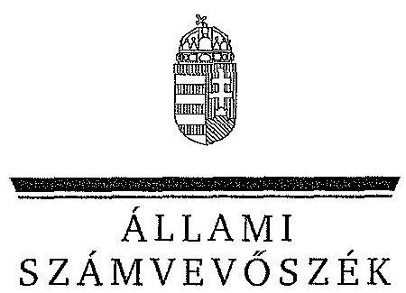
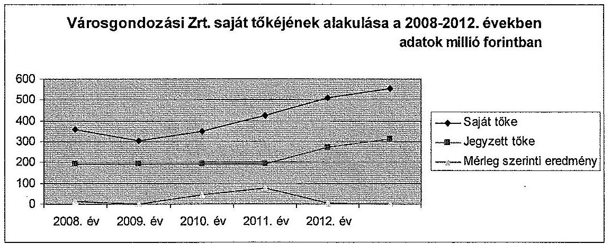
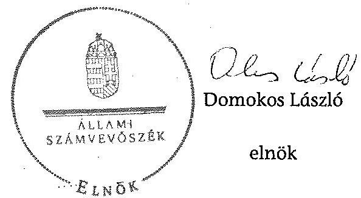
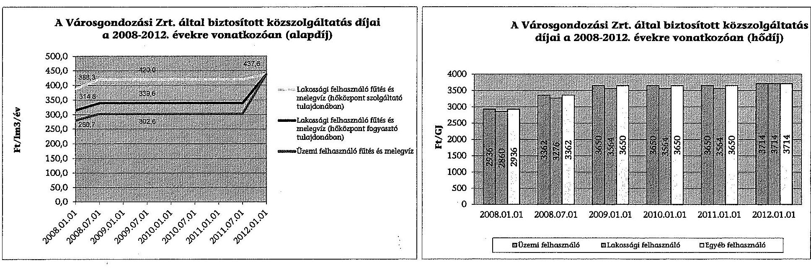
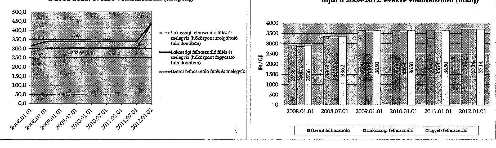

ÁLLAMI
SZÁMVEVŐSZÉK

# JELENTÉS 

Az önkormányzatok gazdasági társaságai - Az önkormányzatok többségi tulajdonában lévő gazdasági társaságok közfeladat-ellátását érintő gazdálkodási tevékenysége szabályszerűségének ellenőrzése Városgondozási Zrt. (Gyöngyös)

---

# Állami Számvevőszék 

Iktatószám: V-0473-162/2014.
Témaszám: 1507
Vizsgálat-azonosító szám: V067107
Az ellenőrzést felügyelte:
Dr. Horváth Margit
felügyeleti vezető
Az ellenőrzést vezette és az ellenőrzés végrehajtásáért felelős:
Valastyánné dr. Vízhányó Júlia
ellenőrzésvezető
A jelentéstervezet összeállításában közreműködött:
Répásné Szappanos Márta
számvevő
Az ellenőrzést végezték:
Répásné Szappanos Márta Szémán Anna
számvevő
külső szakértő

---

# TARTALOMJEGYZÉK 

BEVEZETÉS ..... 7
I. ÖSSZEGZŐ MEGÁLLAPÍTÁSOK, KÖVETKEZTETÉSEK, JAVASLATOK ..... 11
II. RÉSZLETES MEGÁLLAPÍTÁSOK ..... 16

1. Az Önkormányzat közfeladat-ellátásának szabályszerűsége ..... 16
1.1. A közfeladat-ellátás megszervezése és a feladatellátás feltételrendszerének kialakítása ..... 16
1.2. A közfeladat-ellátás felügyelete és a tulajdonosi jogok érvényesítése ..... 18
2. A Városgondozási Zrt. közfeladat-ellátással kapcsolatos tevékenysége ..... 21
2.1. A Városgondozási Zrt. gazdálkodásának szabályozottsága ..... 21
2.2. A Városgondozási Zrt. vagyongazdálkodása ..... 23
2.3. A beszámolási kötelezettség teljesítése ..... 24
3. Az ellátott közfeladat bevételei és ráfordításai elszámolása, valamint az önköltségszámítás szabályszerűsége ..... 25
3.1. A távhőszolgáltatás közfeladat bevételeinek és ráfordításainak szabályszerűsége ..... 25
3.2. Az önköltségszámítás szabályszerűsége ..... 29
4. Az ÁSZ korábbi, az önkormányzatok többségi tulajdonában lévő gazdasági társaságok közfeladat-ellátását, gazdálkodását, pénzügyi helyzetét érintő javaslataira tett intézkedések ..... 30
4.1. Az Önkormányzat intézkedési terve és annak hasznosulása ..... 30

## MELLÉKLETEK

1. számú A Városgondozási Zrt. tevékenységének főbb adatai
2. számú A Városgondozási Zrt. működésének főbb jellemzői
3. számú A Városgondozási Zrt. által biztosított közszolgáltatás díjai a 2008-2012. évekre vonatkozóan (alapdíj/hődíj)

## FÜGGELÉKEK

1. számú Értelmező szótár
2. számú Mintavételi eljárások ellenőrzési területenként

---

.

---

# RÖVIDÍTÉSEK JEGYZÉKE 

## Törvények

Ámt.
ÁSZ tv.

Gt.
Nvtv.

Ötv.

Ptk.
Számv. tv.
Taktv.

Tszt.

## Rendeletek

50/2011. (IX. 30.) NFM rendelet

SZMSZ $_{1}$

SZMSZ $_{2}$
távhő rendelet
vagyongazdálkodási rendelet
az árak megállapításáról szóló 1990. évi LXXXVII. törvény (hatályos:1991. január 1-jétől)
az Állami Számvevőszékről szóló 2011. évi LXVI. törvény (hatályos: 2011. július 1-jétől)
a gazdasági társaságokról szóló 2006. évi IV. törvény
a nemzeti vagyonról szóló 2011. évi CXCVI. törvény (hatályos: 2011. december 31-étől, kivéve a 20. § (2) bekezdésben meghatározott paragrafusok, amelyek 2012. január 1-jétől, a (3) bekezdésben meghatározott paragrafusok 2013. január 1-jétől, a (4) bekezdésben meghatározott paragrafus 2012. március 2-ától léptek hatályba)
a helyi Önkormányzatokról szóló 1990. évi LXV. törvény (hatálytalan: a 2014. évi általános Önkormányzati választások napjától)
a Polgári Törvénykönyvről szóló 1959. évi IV. törvény
a számvitelről szóló 2000. évi C. törvény
a köztulajdonban álló gazdasági társaságok takarékosabb működéséről szóló 2009. évi CXXII. törvény
a távhőszolgáltatásról szóló 2005. évi XVIII. törvény
50/2011. (IX. 30.) NFM rendelet a távhőszolgáltatónak értékesített távhő árának, valamint a lakossági felhasználónak és a külön kezelt intézménynek nyújtott távhőszolgáltatás díjának megállapításáról
Gyöngyös Város Képviselő Testületének többször módosított 8/2007. (III. 26.) számú KT rendelete Gyöngyös Város Önkormányzata Szervezeti és Működési Szabályzatáról (hatályos 2008. november 25-étől 2011. március 25-éig)
Gyöngyös Város Képviselő Testületének többször módosított 7/2011. (III. 25.) számú KT rendelete Gyöngyös Város Önkormányzata Szervezeti és Működési Szabályzatáról (hatályos: 2011. március 26-ától)
Gyöngyös Város Képviselő-testületének többször módosított 28/2006. (VI.19.) számú KT. rendelete a távhőszolgáltatásról, hatósági díjának megállapításáról és a díjalmazás feltételeiről (hatályos: 2006. június 19-étől)
Gyöngyös Város Képviselő-testületének többször módosított 19/1994. (IX. 29.) számú KT. rendelete az Önkormányzat vagyonáról való rendelkezési jog gyakorlásának szabályairól (hatályos: 1994. október 10-étől)

---

# Szórövidítések 

| Alapszabály | Városgondozási Zrt. Alapszabálya |
| :--: | :--: |
| ÁSZ | Állami Számvevőszék |
| FB | Városgondozási Zrt. Felügyelőbizottsága |
| Igazgató | Városgondozási Zrt. ügyvezetésének vezetője: az Igazgatóság elnöke 2010. április 30-áig, ezt követően elnökvezérigazgató |
| Igazgatóság | Városgondozási Zrt. igazgatósága |
| javadalmazási szabályzat | Városgondozási Zrt. javadalmazási szabályzata (hatályos: 2010. január 24-étől-) |
| jegyző | Gyöngyös Város Önkormányzatának jegyzője |
| KEOP | Környezet és Energia Operatív Program |
| Képviselő-testület | Gyöngyös Város Képviselő-testülete |
| Közgyűlés | Városgondozási Zrt. közgyűlése 2008-ig, 2008-tól a közgyűlés nem működött, jogait az egyedüli részvényes, az Önkormányzat gyakorolta |
| KT határozat | Képviselő-testületi határozat |
| leltározási szabályzat | Városgondozási Zrt. leltározási szabályzata (hatályos: 2001. január 1-jétől) |
| Magyar Energia Hivatal | Magyar Energetikai és Közmű-szabályozási Hivatal 2013. április 4-étől a Magyar Energetikai Hivatal jogutódja |
| NFM | Nemzeti Fejlesztési Minisztérium |
| Önkormányzat | Gyöngyös Város Önkormányzata |
| önköltségszámítási sza-   bályzat ${ }_{1}$ | Városgondozási Zrt. önköltségszámítási szabályzata (hatályos: 2001. január 1-jétől-2008. december 31-éig) |
| önköltségszámítási sza-   bályzat ${ }_{2}$ | Városgondozási Zrt. önköltségszámítási szabályzata (hatályos: 2009. január 1-jétől) |
| Patina Zrt. | „Patina" Közszolgáltató és Vagyonkezelő Zártkörűen Működő Részvénytársaság |
| pénzkezelési szabályzat ${ }_{1}$ | Városgondozási Zrt. pénzkezelési szabályzata (hatályos: 2007. január 1-jétől 2008. december 31-éig) |
| pénzkezelési szabályzat ${ }_{2}$ | Városgondozási Zrt. pénzkezelési szabályzata (hatályos: 2009. január 1-jétől-) |
| polgármester $_{1}$ | Gyöngyös Város Önkormányzatának Polgármestere 2010. október 17-éig |
| polgármester $_{2}$ | Gyöngyös Város Önkormányzatának Polgármestere 2010. október 18-ától |
| selejtezési szabályzat ${ }_{1}$ | Városgondozási Zrt. selejtezési szabályzata (hatályos: 1991. január 1-jétől 2008. december 31-éig) |
| selejtezési szabályzat ${ }_{2}$ | Városgondozási Zrt. selejtezési szabályzata (hatályos: 2009. január 1-jétől-) |
| számlarend | Városgondozási Zrt. számlarendje (hatályos: 2001. január 1-jétől) |
| számviteli politika ${ }_{1}$ | Városgondozási Zrt. számviteli politikája (hatályos: 2007.január 1-jétől 2008. december 31-éig) |
| számviteli politika ${ }_{2}$ | Városgondozási Zrt. számviteli politikája (hatályos: |

---

|  | 2009. január 1-jétől) |
| :--: | :--: |
| SZMSZ | Városgondozási Zrt. Szervezeti és Működési Szabályzata |
| Üzletszabályzat | Üzletszabályzat Gyöngyös város távhőszolgáltatásáról, annak igénybe vételéről, az ezzel kapcsolatos feladatokról és kötelezettségekről |
| Városgondozási Zrt. | Városgondozási Zártkörűen Működő Részvénytársaság, amely 1991. június 1-jétől 2006. július 12-éig részvénytársasági formában, majd 2006. július 13-ától zártkörűen működő részvénytársasági formában működött |

---

$\cdot$
$\cdot$
$\cdot$
$\cdot$
$\cdot$
$\cdot$
$\cdot$
$\cdot$
$\cdot$
$\cdot$
$\cdot$
$\cdot$
$\cdot$
$\cdot$
$\cdot$
$\cdot$
$\cdot$
$\cdot$
$\cdot$
$\cdot$
$\cdot$
$\cdot$
$\cdot$
$\cdot$
$\cdot$
$\cdot$
$\cdot$
$\cdot$
$\cdot$
$\cdot$
$\cdot$
$\cdot$
$\cdot$
$\cdot$
$\cdot$
$\cdot$
$\cdot$
$\cdot$
$\cdot$
$\cdot$
$\cdot$
$\cdot$
$\cdot$
$\cdot$
$\cdot$
$\cdot$
$\cdot$
$\cdot$
$\cdot$
$\cdot$
$\cdot$
$\cdot$
$\cdot$
$\cdot$
$\cdot$
$\cdot$
$\cdot$
$\cdot$
$\cdot$
$\cdot$
$\cdot$
$\cdot$
$\cdot$
$\cdot$
$\cdot$
$\cdot$
$\cdot$
$\cdot$
$\cdot$
$\

---

# JELENTÉS 

## Az önkormányzatok gazdasági társaságai - Az önkormányzatok többségi tulajdonában lévő gazdasági társaságok közfeladat-ellátását érintő gazdálkodási tevékenysége szabályszerűségének ellenőrzése Városgondozási Zrt. (Gyöngyös)

## BEVEZETÉS

Az Állami Számvevőszék középtávra szóló stratégiájában megfogalmazta, hogy a helyi önkormányzatok gazdálkodásában rejlő pénzügyi kockázatok feltárásával, az államháztartáson kívülre nyújtott költségvetési támogatások és ingyenes vagyonjuttatások, valamint az államháztartáson kívül működő közfeladat-ellátó rendszerek ellenőrzéseivel hozzájárul ahhoz, hogy a közpénzeket az államháztartáson kívül működő szervezetek is átlátható, rendezett módon használják fel a közfeladatok szerződésben vállalt ellátása érdekében.

Az önkormányzatok szervezetalakítási szabadságának következménye, hogy a korábban is vállalati formában működő (nagyvárosi tömegközlekedés, víz-, szennyvízcsatorna, köztisztasági, ingatlankezelés stb.) közszolgáltatások mellett, mind a kötelező, mind az önként vállalt feladatok ellátásában a gazdasági társaságok kiemelt fontosságú szerephez jutottak.

Gyöngyös Város területén az ellenőrzött időszakban a távhőtermelést és szolgáltatást az 1991-ben létrehozott Városgondozási Zrt. látta el. A Városgondozási Zrt.-t az Önkormányzat 80%-os és a Gondoskodás Alapítvány 20%-os tulajdoni részesedéssel hozta létre, melynek 100%-os tulajdoni jogát az Önkormányzat 2008-ban megvásárolta.

A Városgondozási Zrt. alaptevékenysége a 2012. január 1-jén 31369 fő lakosság számú Gyöngyös Város közigazgatási területén a távhőenergia termelése, elosztása, értékesítése, fűtés- és használati melegvíz-szolgáltatás, valamint hőtermelő-hőelosztó és hőfelhasználó berendezések létesítése, fenntartása, javítása és üzemeltetése. További tevékenységei: szennyvízkezelés, temetőfenntartás és temetkezési szolgáltatás, önkormányzati vagyontárgyak kezelése és üzemeltetése, fizető parkolók üzemeltetése, parkfenntartás, valamint köztisztasági szolgáltatás.

A távhőszolgáltatási közfeladat bevételeinek aránya a Városgondozási Zrt. teljes nettó árbevételéből 2008. évben 27,2% (520,1 M Ft), 2012. évben 35,1% ( $552,3 \mathrm{M} \mathrm{Ft}$ ) volt. Az átlagos állományi létszám 2008-ban 103 fő, 2012-ben 70 fő, a távfűtéssel ellátott lakások száma 2008-ban 2818, 2012-ben 2816, a távfűtött nem lakáscélú ingatlanok 72, illetve 73 volt. A Városgondozási Zrt. az ellenőrzött időszak éveiben nyereségesen gazdálkodott.

Az ellenőrzött időszakban a vezető tisztségviselő (vezérigazgató) és a gazdasági igazgató személye egy alkalommal változott. A vezérigazgató 2010. május 1-je óta, a gazdasági igazgató 2008. november 1-je óta tölti be tisztségét.

Az ellenőrzött időszakban a polgármester személye egy alkalommal változott, a jegyző személye változatlan volt.

Gyöngyös Város Önkormányzatánál az ÁSZ 2013. évben pénzügyi szabályszerűségi ellenőrzést hajtott végre. Az ellenőrzött időszak érintette a jelen ellenőrzés időszakát.

Az önkormányzati tulajdonú gazdasági társaságok teljes körű ellenőrzésének lehetőségét az Állami Számvevőszékről szóló 1989. évi XXXVIII. törvény 2011. január 1-jétől hatályos módosítása teremtette meg.

Az ellenőrzés célja annak értékelése volt, hogy

- az Önkormányzat a jogszabályi előírások figyelembevételével döntött-e az ellenőrzésre kerülő közfeladat megszervezéséről; az Önkormányzat szabályszerűen gyakorolta-e a tulajdonosi jogokat;
- a gazdasági társaság közfeladat-ellátása bevételeinek, ráfordításainak elszámolása, és vagyongazdálkodási tevékenysége megfelelt-e a jogszabályi, illetve a közszolgáltatási szerződésben foglalt tulajdonosi előírásoknak, azok végrehajtása szabályszerű volt-e;
- a közfeladatok átláthatósága és elszámoltathatósága érdekében biztosítva volt-e a közszolgáltatás díjának megalapozottsága szabályszerű önköltségszámítással.

Az ellenőrzés során értékeltük az ÁSZ korábbi, önkormányzat többségi tulajdonában lévő gazdasági társaságát érintő javaslataira tett intézkedések hasznosulását.

Az ellenőrzés kiterjedt Gyöngyös Város Önkormányzatára és a Városgondozási Zártkörűen Működő Részvénytársaságra.

Az ellenőrzés várható hasznosulása: A törvényalkotás számára - az észlelt problémák, szabálytalanságok, vagy egyéb nem kívánatos jelenségek felszínre kerülésével - az ellenőrzés megállapításai segítséget nyújthatnak az államháztartáson kívüli közfeladat-ellátás értékeléséhez, jogszabályi keretei pontosításához, átláthatóságot biztosító szabályozásához. Meghatározhatóvá válnak a közfeladat ellátásában részt vevő államháztartáson kívüli szervezeteknek - az önkormányzat költségvetését és pénzügyi helyzetét is befolyásoló - kockázatai, lehetővé válik ezen kockázatok csökkentése. A feladatot ellátó gazdasági társaság a közszolgáltatási szerződésben foglaltak betartásával, a közvagyon használatával biztosította-e a szolgáltatás folytatásának feltételeit. Ezzel az ellenőrzöttek és a helyi döntéshozók számára az ÁSZ visszajelzést ad feladatszervezési, feladat-ellátási kockázataikról, alapot ad a meglévő hibák megszüntetéséhez, a jobb közfeladat-ellátás biztosításához. Fokozza a fegyelmet, igazolja, hogy lejárt a következmények nélküli ellenőrzések időszaka. Az ÁSZ értékteremtő rend kialakításához és megőrzéséhez hozzájáruló tevékenysége pozitív hatással van a szervezetről kialakított összkép formálására is.

A bevételek és ráfordítások elszámolása, valamint a vagyonnyilvántartás terén az egyes területek szabályszerű működését mintavétellel ellenőriztük, ez alapján a sokaságokban előforduló hibás tételek arányát becsültük. A jogszabályoknak és a belső előírásoknak megfelelőnek, azaz szabályszerűnek tekintettük az adott bevételek és ráfordítások elszámolását, a vagyonnyilvántartást, amennyiben a minta ellenőrzésének eredménye alapján 95%-os bizonyossággal a teljes sokaságban a hibás tételek aránya kisebb volt, mint 10%, nem megfelelőnek értékeltük, ha a hibás tételek aránya a 10%-ot meghaladta. Kockázatot, illetve magas kockázatot jeleztünk, amennyiben egy adott terület vonatkozásában a minta alapján a teljes sokaságban nem volt teljes körűen biztosított a jogszabályoknak és a belső szabályzatoknak megfelelő működés.

Az ellenőrzést a számvevőszéki ellenőrzés szakmai szabályai szerint, szabályszerűségi ellenőrzés módszerével, a nemzetközi standardok figyelembevételével végeztük. Az ellenőrzés a 2008-2012. évekre terjedt ki, a korábbi ÁSZ ellenőrzés a 2013. évet is érintette.

Az ellenőrzés végrehajtásának jogszabályi alapját az Állami Számvevőszékről szóló 2011. évi LXVI. törvény 5. § (3)-(5) bekezdése képezte.

A Jelentés tervezetét észrevételezésre megküldtük Gyöngyös Város Önkormányzata polgármesterének, valamint a társaság vezérigazgatójának. Az érintettek észrevételt nem tettek.

---

.

---

# I. ÖSSZEGZŐ MEGÁLLAPÍTÁSOK, KÖVETKEZTETÉSEK, JAVASLATOK 

Gyöngyös Város Önkormányzata az ellenőrzött időszakot megelőzően - a 1991. évben - döntött
 arról, hogy a távhőszolgáltatási közfeladatot gazdasági társaság útján látja el. Az Önkormányzat 2008. január 2-ától rendelkezik a Városgondozási Zrt. 100%-os tulajdonjogával. A Városgondozási Zrt. fő tevékenysége gőzellátás, légkondicionálás. Az Önkormányzat a közvagyont apport formájában biztosította a Városgondozási Zrt. részére a Tszt.-ben meghatározott közfeladat ellátásához. A Városgondozási Zrt. a távhőszolgáltatás működtetéséhez szükséges engedély birtokában működött és a 2008-2012. években nyereségesen gazdálkodott.

Az Önkormányzat a közfeladat megszervezése és a feladatellátás feltételrendszerének kialakítása érdekében csak részben intézkedett.

Az Önkormányzat az ellenőrzött időszakban rendelkezett az Ötv előírásaival összhangban lévő, a 2007-2013. évekre szóló gazdasági programmal, amelyet az Ötv.-ben foglaltak szerint felülvizsgáltak, módosításának szükségessége nem merült fel. A gazdasági program a távhőszolgáltatásra vonatkozó konkrét elképzeléseket - az Ötv.-ben foglaltak ellenére - nem tartalmazott.

A távhőszolgáltatási közfeladat-ellátás kötelező jellegét, gazdasági társasággal történő ellátását az SZMSZ$_{1,2}$-ben előírták. Az ellenőrzött időszakban a közfeladat-ellátás formájában változás nem történt.

Az Önkormányzat vagyongazdálkodási rendeletben szabályozta az egyes vagyontárgyak kezelésének elveit, jogosultságait és eljárásrendjét. A tulajdonosi jogokat az Ötv.-ben meghatározott előírásokkal összhangban a Képviselőtestület szabályszerűen gyakorolta. Az Önkormányzat belső szabályzatai a távhőszolgáltatást végző Városgondozási Zrt. működésére és beszámoltatására vonatkozóan nem tartalmaztak előírásokat, azokat az Alapszabály rögzítette.

Az Önkormányzat a 2012. évben vagyongazdálkodási tervet nem készített, megsértve ezzel az Nvtv. azon rendelkezését, mely szerint közép- és hosszú távú vagyongazdálkodási tervben kell rögzíteni a nemzeti vagyonnal kapcsolatosan a közfeladat-ellátásához szükséges, egységes elven alapuló, hatékony és költségtakarékos működés biztosításának elveit.

Az Önkormányzat a Tszt. által előírt rendeletalkotási kötelezettségének eleget tett. A Tszt. előírásával ellentétben azonban a rendelet nem tartalmazta azon területek meghatározását, ahol területfejlesztési, környezetvédelmi és levegőtisztaságvédelmi szempontok alapján szükséges lett volna a távhőszolgáltatás fejlesztése.

A Képviselő-testület a távhőszolgáltatás hatósági díjának megállapítását és a díjalkalmazás feltételeit a Tszt. és az Ámt. előírásaival összhangban távhő rendeletben szabályozta. Az ár két elemből állt: alapdíjból és hődíjból. A távhő

---

rendelet tartalmazta a csatlakozási díj mértékét is. A díjak változtatására a Városgondozási Zrt. tett javaslatot.

Az Önkormányzat belső ellenőrzése a távhőszolgáltatás, mint közfeladatellátás szabályszerű teljesítéséhez, az önkormányzati vagyon megóvásához nem járult hozzá, mivel a Városgondozási Zrt. távhőszolgáltatási tevékenységét nem ellenőrizte. A kockázatelemzés a Városgondozási Zrt. távhőszolgáltatási tevékenységére nem terjedt ki. Külső szakértői ellenőrzésre nem került sor. A jegyző a Tszt.-ben előírt ellenőrzési kötelezettségének dokumentáltan nem tett eleget.

A Városgondozási Zrt. saját tőkéje az ellenőrzött időszakban 303,5 M Ft-ról 553,4 M Ft-ra nőtt. A távhőszolgáltatási tevékenység számviteli szétválasztására - összhangban a Tszt. előírásával - a 2012. évben sor került. A könyvvizsgáló a Tszt. szerinti - 2012. január 1-jétől hatályos - szétválasztás szabályosságát a jelentésében a 2012. év tekintetében igazolta. A Városgondozási Zrt. az ellenőrzött időszak alatt nyereségesen gazdálkodott, azonban a 2012. évben az 50/2011. (IX. 30.) NFM rendelet szerint juttatott távhőszolgáltatási támogatás nélkül a társaság távhőszolgáltatási üzletága már veszteséges lett volna. A 2011-2012. években a Városgondozási Zrt. összesen 59,8 M Ft távhőszolgáltatási támogatásban részesült.

A Városgondozási Zrt.-nél a távhőszolgáltatási közfeladattal kapcsolatban a vagyongazdálkodás szabályozottsága megfelelő volt.

A Városgondozási Zrt. a 2008-2012. évekre vonatkozóan a Számv. tv.-ben előírtaknak megfelelően elkészítette a számviteli politika 1,2-t, és ennek keretében az eszközök és források értékelési szabályzatát, leltározási szabályzatát, pénzkezelési szabályzatát és önköltségszámítási szabályzatát, valamint rendelkezett selejtezési szabályzattal, és a kintlévőségek kezelésének szabályzatával. A Városgondozási Zrt. rendelkezett továbbá a Számv. tv. 161. §-a szerinti számlarenddel.

A Városgondozási Zrt. üzleti tervei az ellenőrzött időszakban azonos struktúrában készültek. Tartalmazták tevékenységenkénti és ágazatonkénti bontásban az adott év bevételeinek és ráfordításainak tervezett adatait, a beruházásokra vonatkozó és humánpolitikai információkat. Az ellenőrzött időszakban a Városgondozási Zrt. üzleti terveit az FB véleménye alapján a tulajdonos Önkormányzat Képviselő-testülete határozatban fogadta el.

A Számv. tv. szerinti éves beszámolókat a Képviselő-testület a könyvvizsgáló és az FB véleménye alapján megtárgyalta, és határozatban döntött a beszámoló elfogadásáról. Az éves beszámolók közzététele az ellenőrzött időszakban a Számv. tv. előírásainak megfelelően, szabályszerűen történt. A beszámolókat a könyvvizsgáló hitelesítő záradékkal látta el.

Az ellenőrzött időszakban a távhőszolgáltatási közfeladat bevételeinek és ráfordításainak elszámolása, a vagyon nyilvántartása, valamint a Városgondozási Zrt. önköltségszámítása szabályszerű volt.

---

A Városgondozási Zrt. a közfeladatok bevételeinek és ráfordításainak elkülönített nyilvántartását a számlarendben és az önköltségszámítási szabályzatban határozta meg. A belső szabályozás megfelelt a Számv. tv. vonatkozó előírásainak. A bevételek és ráfordítások elszámolása az ellenőrzött időszakban a hatályos szabályozások szerint történt, mely megfelelt a Számv. tv.-ben foglalt előírásoknak és 2012. január 1-jétől a Tszt. előírásainak.

A Városgondozási Zrt. beruházásainak és felújításainak elszámolása és vagyongazdálkodási tevékenysége megfelelt a jogszabályi előírásoknak. A távhőszolgáltatási közfeladat ellátását biztosító tárgyi eszközöknél a bekerülési értéket és az értékcsökkenési leírást az eszközök és források értékelési szabályzata szerint állapították meg.

A tárgyi eszközök pótlása a távhőszolgáltatáshoz kapcsolódó három kiemelt eszközcsoport esetében nem volt arányban az elszámolt értékcsökkenési leírással, a használhatósági fok folyamatosan csökkent, a kazánok és hőközpontok használhatósági foka is romlott az ellenőrzött időszakban.

A Városgondozási Zrt. a fizetési határidőn túli követelésállományának hatékony kezelése és behajtása érdekében az ellenőrzött időszakban hatályos kintlévőség kezelési szabályzattal rendelkezett. A szabályzatban meghatározott eljárási rend szerint történt a kintlévőségek folyamatos beszedése, behajtása. A követelések értékelését a Számv. tv. előírásaival összhangban elvégezték. A megtett intézkedések ellenére a Városgondozási Zrt. értékvesztés nélküli, teljes elismert vevőkövetelése és az értékvesztés elszámolt állománya is nőtt. A 360 napon túli követelések összege a 2008. évben a teljes vevőkövetelés 33,8%-át, a 2012. évben 53,7%-át tette ki. Behajthatatlan követelésként a 2008. évben 4,3 M Ft-ot, 2012-ben 6,2 M Ft-ot számoltak el az adózás előtti eredmény terhére.

A Városgondozási Zrt. önköltségszámítási szabályzata szerint végezték a társaságnál folytatott tevékenységek közvetlen és általános költségeinek elszámolását, valamint az általános költségek - szabályzatban rögzített - vetítési alap segítségével történő megosztását. Az önköltségszámítási szabályzat szerint vezetett nyilvántartások alapján tevékenységenként és ágazatonként elkülönítették az egyes tevékenységek költségeit.

A Városgondozási Zrt. az ellenőrzött időszakban a közfeladatok átláthatósága és elszámoltathatósága érdekében a közszolgáltatás díjának megalapozottságát szabályszerű önköltségszámítással biztosította.

Az ÁSZ a 2013. évben szabályszerűségi ellenőrzést végzett Gyöngyös Város Önkormányzatánál. Az ellenőrzés célja volt az Önkormányzat pénzügyi helyzetének, szabályosságának értékelése, a pénzügyi egyensúly alakulására ható kockázatok feltárása. Az ÁSZ az ellenőrzéséről készült jelentésében javasolta a kizárólagos tulajdonú társaságok jövőbeni kötelezettségeinek teljesítésére elkülönített tartalék képzését, valamint pénzügyi helyzetük stabilizálása érdekében intézkedési terv elkészítést. A javaslatokra az Önkormányzat intézkedési tervet állított össze, melynek végrehajtása a helyszíni ellenőrzés lezárásakor még folyamatban volt.

---

A fentiekben leírtak összegzéseként az alábbi megállapításokat tesszük:
A konstrukcióból eredő sajátosság az volt, hogy az Önkormányzat a közfeladat ellátására szolgáló közvagyont apport formájában biztosította a Városgondozási Zrt. részére.

A tulajdonosi jogokat a Képviselő-testület szabályszerűen gyakorolta, azonban a 2012. évben vagyongazdálkodási tervet nem készítettek,

A Városgondozási Zrt. az ellenőrzött időszak alatt nyereségesen gazdálkodott, azonban a 2012. évben a távhőszolgáltatási támogatás nélkül a távhőszolgáltatási üzletág veszteséges lett volna.

Működési kockázatot jelentett, hogy az Önkormányzat belső ellenőrzése a távhőszolgáltatás, mint közfeladat-ellátás szabályszerű teljesítéséhez, az önkormányzati vagyon megóvásához érdemben nem járult hozzá. A jegyző az előírt ellenőrzési kötelezettségének dokumentáltan nem tett eleget.

A megtett intézkedések ellenére a Városgondozási Zrt. értékvesztés nélküli, teljes elismert vevőkövetelése és az értékvesztés elszámolt állománya is nőtt, mely pénzügyi kockázatot hordoz magában. További pénzügyi kockázatot jelentett, hogy a tárgyi eszközök esetében a használhatósági fok folyamatosan romlott.

Az Állami Számvevőszékről szóló 2011. évi LXVI. törvény 33. § (1) bekezdésében foglaltak értelmében a jelentésben foglalt megállapításokhoz kapcsolódó intézkedési tervet köteles az ellenőrzött szervezet vezetője összeállítani, és azt a jelentés kézhezvételétől számított 30 napon belül az ÁSZ részére megküldeni. Amennyiben az intézkedési tervet határidőben nem küldi meg a szervezet, vagy az nem elfogadható, az ÁSZ elnöke a hivatkozott törvény 33. § (3) bekezdés a)-b) pontjaiban foglaltakat érvényesítheti.

Az ellenőrzés intézkedést igénylő megállapításai és javaslatai:
Javaslataink célja az önkormányzat szabályos működésének elősegítése, továbbá az önkormányzati tulajdonosi joggyakorlás kontrolljainak erősítése.

# Javasoljuk Gyöngyös Város Önkormányzata polgármesterének: 

1. Az Önkormányzat nem tett eleget a 2012. január 1-jétől hatályos Nvtv. 9. § (1) és a 7. § (2) bekezdésében előírt közép- és hosszú távú vagyongazdálkodási terv készítési kötelezettségének. Ezzel sérültek a nemzeti vagyonnal kapcsolatosan a közfeladatellátásához szükséges, egységes elven alapuló, hatékony és költségtakarékos működés biztosításának elvei.

---

Javaslat:
Gondoskodjon a jogszabályi előírások szerinti gyakorlat biztosítására, ezen belül:
a nemzeti vagyon hatékony és költségtakarékos működtetése érdekében intézkedjen az Nvtv.-ben előírt közép- és hosszú távú vagyongazdálkodási terv összeállítására, majd terjessze a Képviselő-testület elé jóváhagyásra.

# Javasoljuk Gyöngyös Város Önkormányzata jegyzőjének: 

1. A Társaság elkészítette a Tszt. 3. § v) pontja szerinti Üzletszabályzatát. Az ellenőrzött időszakban azonban a jegyző nem tett eleget a Tszt. 7. § (1) bekezdés c) pontjában előírt ellenőrzési kötelezettségének.

Az Önkormányzat belső ellenőrzése az ellenőrzéseivel a távhőszolgáltatás, mint közfeladat-ellátás szabályszerű teljesítéséhez, valamint az önkormányzati vagyon megóvásához ellenőrzéseivel nem járult hozzá. Az ellenőrzött időszakban a társaság gazdálkodásával és működésével kapcsolatban ellenőrzést nem folytatott le.

Javaslat:
Gondoskodjon a jogszabályi előírások szerinti gyakorlat biztosítására, ezen belül:
a) rendszeresen ellenőrizze a társaság távhőszolgáltató tevékenységét a Tszt-ben előírt szempontok szerint.
b) fordítson kiemelt figyelmet arra, hogy az önkormányzat belső ellenőrzése az ellenőrzéseivel a távhőszolgáltatás, mint közfeladat-ellátás szabályszerű teljesítéséhez, valamint az önkormányzati vagyon megóvásához ellenőrzéseivel járuljon hozzá.

---

# II. RÉSZLETES MEGÁLLAPÍTÁSOK 

## 1. Az ÖNKORMÁNYZAT KÖZFELADAT-ELLÁTÁSÁNAK SZABÁLYSZERŰSÉGE

### 1.1. A közfeladat-ellátás megszervezése és a feladatellátás feltételrendszerének kialakítása

Az Ötv. 91. § (1) bekezdése$^1$ rendelkezése szerint a Képviselő-testület határozatával$^2$ elfogadta az Önkormányzat 2007-2013. évekre szóló gazdasági programját. Az Önkormányzat gazdasági programját az Ötv. 91. § (6)-(7) bekezdései$^3$ rendelkezéseinek megfelelően - összhangban az SZMSZ$_1$ előírásaival - készítette el, amelyet az Ötv. 91. § (7) bekezdésében foglaltak szerint felülvizsgáltak, módosításának szükségessége nem merült fel. A gazdasági program a távhőszolgáltatásra vonatkozóan fejlesztési elképzelést - az Ötv. 91. § (6) bekezdésében$^4$ foglaltak ellenére - nem tartalmazott.

A fejlesztési terveket a Városgondozási Zrt. saját hatáskörében az éves üzleti terveiben határozta meg. Az éves üzleti terveket a Képviselő-testület elé terjesztették, ahol azt határozatok formájában jóváhagyták$^5$.

Az Önkormányzat a 2012. évben vagyongazdálkodási tervet nem készített, megsértve ezzel az Nvtv. 9. § (1) bekezdésében foglaltakat, mely szerint közép- és hosszú távú vagyongazdálkodási tervben kell rögzíteni a nemzeti vagyonnal kapcsolatosan a közfeladat-ellátásához szükséges, egységes elven alapuló, hatékony és költségtakarékos működés biztosításának elveit. Az Önkormányzat a 2008-2012. években rendelkezett vagyongazdálkodási rendelettel. A vagyongazdálkodási rendeletben szabályozta az egyes vagyontárgyak kezelésének elveit, jogosultságait, eljárásrendjét.

Az ellenőrzött időszakban az Önkormányzat - a gazdasági program mellett hosszú távú tervként Integrált városfejlesztési stratégiát, Gyöngyös Város Környezetvédelmi programját,
 valamint éghajlatváltozási stratégiát ${ }^{6}$ készített, amelyek a távhőszolgáltatással kapcsolatos elképzeléseket koncepcionális szinten fogalmazták meg, konkrét fejlesztési irányokat nem tartalmaztak.

[^0]
[^0]:    ${ }^{1}$ hatályon kívül helyezve 2013. jan. 1-jétől
    ${ }^{2}$ 125/2007. (IV. 26.) KT számú határozat
    ${ }^{3}$ hatályon kívül helyezve 2013. jan. 1-jétől
    ${ }^{4}$ hatályon kívül helyezve 2013. január 1-jétől
    ${ }^{5}$ 111/2008. (IV. 17.) KT számú határozat, 160/2009. (V. 28.) KT számú határozat, 92/2010. (III. 22.) KT számú határozat, 120/2011. (IV. 21.) számú KT határozat, 20/2012. (I. 26.) KT számú határozat
    ${ }^{6}$ Gyöngyös Város Éghajlatváltozási Stratégiája

---

Az Önkormányzat a közfeladat gazdasági társasággal történő ellátásáról az ellenőrzött időszak előtt döntött. Az ellenőrzött időszakban az Önkormányzat az Ötv. 18. §-ában foglaltakkal összhangban rendelkezett SZMSZ $_{1,2}$-szel. Az SZMSZ 18. számú, valamint az SZMSZ 2. 1. számú mellékletei határozták meg az Önkormányzat kötelezően ellátott és önként vállalt feladatait, a feladatellátás módját, melyek alapján a kötelezően ellátandó, helyi energia-szolgáltatás, távhő ellátás biztosítása többségi tulajdonú önkormányzati társaság útján történik. Az Önkormányzat a Tszt. 6. § (1) bekezdésében foglalt előírás szerint a távhőszolgáltatásra engedéllyel rendelkező Városgondozási Zrt. útján biztosította Gyöngyös Város közigazgatási területén a létesítmények távhő ellátását.

A Városgondozási Zrt. 2012. március 4-ig a jegyzőtől kapott 6/12429/1999. számú működési engedély, 2012. március 5-től a Magyar Energia Hivatal 163/2012. számú határozatában foglalt engedély alapján végezte a távhőszolgáltatási közfeladatot.

A közfeladat-ellátás minőségének mérésének rendszerét nem dolgozták ki az ellenőrzött időszakban. A Városgondozási Zrt. feladatellátásának és teljesítményének egyetlen mérési módszere az üzleti tervben meghatározott éves eredmény, továbbá a tervezett fejlesztések, beruházások megvalósítása volt. Az üzleti tervet az FB és a könyvvizsgáló is véleményezte, majd a véleményükkel együtt a Képviselő-testület megtárgyalta és jóváhagyta. Az üzleti terv megvalósításáról az igazgató az éves beszámoló keretében számolt be.

Az Önkormányzat a Városgondozási Zrt. által ellátott közfeladatokkal kapcsolatosan egységesen az Alapszabályában írta elő a beszámolási kötelezettséget, évente egyszer, május 31-i határidővel, valamint további kötelezettségként az üzleti terv készítése szerepelt. A beszámolókat ${ }^{7}$ és az üzleti terveket a Képviselőtestület az ellenőrzött időszakban jóváhagyta.

Az Önkormányzat a Tszt. által előírt rendeletalkotási kötelezettségének eleget tett. A távhő rendeletben a Tszt. előírásaival összhangban meghatározták a távhőszolgáltatás területi hatályát, a szüneteltetés, korlátozás szabályait, a felhasználói berendezés működtetését, karbantartását, a mérést, a díjmegállapítás és alkalmazás feltételeit. A rendeletet az ellenőrzött időszakban a jogszabályi változások követése érdekében többször módosították. A Tszt. 6. § (2) bekezdés c.) pontjában előírtak ellenére azonban a távhő rendeletben nem határozták meg azon területeket, ahol területfejlesztési, környezetvédelmi és levegőtisztaságvédelmi szempontok alapján célszerű a távhőszolgáltatás fejlesztése, így az Önkormányzat nem jelölte ki a távhőszolgáltatás jövőbeni fejlesztési területeit.

A díjmegállapítás alapja a Városgondozási Zrt. által készített előkalkuláció volt. Az árkalkulációt három fogyasztói kategóriára (üzemi fogyasztó, hőközponti berendezés a fogyasztó tulajdonában, hőközponti berendezés a

[^0]
[^0]:    ${ }^{7}$ 158/2009. (V. 28.) KT számú határozat, 131/2010. (IV. 22.) KT számú határozat, 180/2011. (V. 26.) KT számú határozat, 173/2012. (V. 24.) KT számú határozat, 145/2013. (V. 30.) KT számú határozat

---

szolgáltató tulajdonában) alakították ki. Az alapdíjban a gázköltség nélküli közvetlen és közvetett költségek kerültek érvényesítésre, a hődíjban a gáz költségek jelentek meg. Az árképzés rendszerét a Tszt. 57. § (1)-(2) bekezdései és az 57. § (3) bekezdésében foglalt előírások figyelembevételével határozták meg. Az Önkormányzat távhő rendeletében megállapította a csatlakozási díj mértékét is. A csatlakozási díj megállapításának a legfőbb követelménye volt, hogy mértéke fedezetet nyújtson a hatékonyan működő közszolgáltató szükséges és indokoltan felmerült ráfordításaira és a működéshez szükséges nyereségre.

Az ellenőrzött időszakot megelőzően az Önkormányzat a működéshez szükséges közvagyont apport formájában adta át a Városgondozási Zrt. részére. Az átadott vagyon tulajdonjoga az ellenőrzött időszakban a Városgondozási Zrt.-nél volt, a beruházások, a felújítások és az amortizáció a Városgondozási Zrt. számviteli rendszerében kerültek kimutatásra.

# 1.2. A közfeladat-ellátás felügyelete és a tulajdonosi jogok érvényesítése 

Az Önkormányzat a vagyongazdálkodási rendeletben határozta meg a tulajdonosi jogok gyakorlásának szabályait. A szabályozás szerint a tulajdonosi jogokat a Képviselő-testület gyakorolta. Az Önkormányzat, mint tulajdonos képviseletében a polgármester ${ }_{1,2}$ járt el. Az Önkormányzat az ellenőrzött időszakban nem adott át tulajdonosi joggyakorlási jogokat, azokat szabályszerűen gyakorolta.

Az Igazgatóság és az FB tagjait, valamint a könyvvizsgálót a Képviselő-testület nevezte ki. Az Alapszabályban megfogalmazott szabályok az Igazgatóság és az FB feladatai tekintetében összhangban voltak a Gt. előírásaival.

Az Önkormányzat nem képviseltette magát az Igazgatóság ülésein, tulajdonosi ellenőrzését az FB-n keresztül gyakorolta. Az FB-be az Önkormányzat nem delegált személyt. Az Alapszabály III. C. szerint „a felügyelőbizottság az egyedüli részvényes részére ellenőrzi a társaság ügyvezetését". Ennek keretében az FB elnöke részt vett az igazgatósági üléseken. Az FB valamennyi előterjesztést megtárgyalta az ellenőrzött időszakban.

A 2009. november 26-án kihirdetett Taktv. 3. § (1) bekezdésében foglaltaknak megfelelően a Képviselő-testület, módosítva az Alapszabályt, 2010. április 30-ai hatállyal visszahívta az Igazgatóságot és helyette vezérigazgatót nevezett ki ${ }^{8}$.

A Gt. 231. § (2) bekezdés e) pontjában foglaltakkal ${ }^{9}$ összhangban, az Alapszabály 9-11. pontjai tartalmazták a Városgondozási Zrt. beszámolási kötelezettséget. E szerint évente egyszer, május 31-ig beszámolót kellett készíteni az éves tevékenységről. Az Alapszabály a Közgyűlés, illetve 2008-tól az egyedüli részvényes hatáskörét a Gt. 231. § rendelkezéseinek megfelelően határozta meg. Az Alapszabály,

[^0]
[^0]:    ${ }^{8}$ 131/2010. (IV. 22.) KT számú határozat
    ${ }^{9}$ hatályon kívül helyezve 2014. március 15-étől

---

az SZMSZ $_{1,2}$ és a vagyongazdálkodási rendelet egymással és a vonatkozó jogszabályokkal összhangban állapította meg a tulajdonosi joggyakorlás szabályait.

Az Önkormányzat üzleti terv készítési kötelezettséget írt elő a Városgondozási Zrt. részére, melyet adott év május 31-ig kellett benyújtani a Képviselőtestület elé. A Városgondozási Zrt. ennek megfelelően az ellenőrzött időszakban elkészítette éves üzleti terveit, melyekben részletesen megtervezték a társaság következő évi tevékenységét.

Az Önkormányzat a Taktv. 2009. november 26-ai kihirdetését követően készítette el és a 2010. január 28-ai képviselő-testületi ülésén elfogadta ${ }^{10}$ a Városgondozási Zrt. javadalmazási szabályzatát. A szabályzatot a Taktv. 6. § előírásai figyelembevételével készítették el, az FB véleményezte és a Képviselőtestület határozatban jóváhagyta. A szabályzat II. 1.2 pontja tartalmazta az igazgató premizálási szabályait. E szerint az adott év üzletpolitikai és gazdasági célkitűzéseinek eredményes megvalósítását elősegítő, hatékony működésre ösztönző premizálást kellett készíteni. A prémiumfeladatok kitűzése során alkalmaztak eredményességi kritériumot is. A prémium feladat kiírása az üzleti tervet megtárgyaló Képviselő-testületi ülésen történt. A prémium kifizetéséről az éves beszámoló elfogadásakor döntött a Képviselő-testület.

Az Önkormányzat a távhőszolgáltatásra vonatkozó árképzés szabályait a távhő rendeletben állapította meg. A távhő rendeletben meghatározták a távhőszolgáltatás 2008-2011. április 14. közötti legmagasabb fogyasztói árát az alapdíj és hődíj, valamint a csatlakozási díjra ${ }^{11}$ vonatkozóan. 2011. április 15-től - a jogszabályi változásokra tekintettel - módosították a távhő rendeletet, melyből kikerült az alapdíjra és hődíjra vonatkozó meghatározás. Az árképzés rendszerét a Tszt. 57. § (1)-(3) bekezdéseiben foglalt előírások figyelembevételével határozták meg. Az ellenőrzött időszakban a módosításokat a díj egyes költségelemeinek változása indokolta. Az alkalmazott díjak megállapítására a távhőszolgáltató tett javaslatot évenként egyszer, amennyiben ezt a díjat alkotó költségek változása indokolta. A Képviselő-testület felhatalmazta a jegyzőt, hogy a távhő rendelet 23. § (4) bekezdésében foglalt képlet alapján meghatározott hődíj értékét a földgáz hatósági árváltozásának hatályba lépésével egyidejűleg vezesse át a rendelet 1. számú mellékletében található díjtáblázaton. Az ellenőrzött időszakban az alapdíj először 2008-ban módosult ${ }^{12}$, alapja a Városgondozási Zrt. részletes kalkulációval megalapozott előterjesztése volt. Az alapdíj módosítás szabályszerűen, a Tszt. előírásainak figyelembe vételével történt. A hődíj a 2008. és a 2009. évben a gáz hatósági árváltozása alapján módosult. A Tszt. 57/D. § (1) bekezdésében foglalt rendelkezés szerint 2011. április 15-étől az ármegállapítás már az energiapolitikért felelős miniszter hatásköre volt. Az alapdíjat és a hődíjat az ellenőrzött időszakban utoljára 2012. január 1-jén módosították. Csatlakozási díjváltozás egyszer volt, a 2008. évben. A díjak alakulását az ellenőrzött időszakban a 3. számú melléklet mutatja be.

[^0]
[^0]:    ${ }^{10}$ 22/2010. (I. 28.) KT számú határozat
    ${ }^{11}$ Ámt. 7. § (5) bekezdés szerint
    ${ }^{12}$ 23/2008. (VI. 23.) KT számú rendelet

---

Az ellenőrzött időszakban a Városgondozási Zrt. éves beszámolóit elkészítette. ${ }^{13}$, melyet a társaság választott könyvvizsgálójának véleménye alapján az FB megtárgyalt. A Képviselő-testület a könyvvizsgáló és az FB írásos véleménye alapján megtárgyalta a beszámolót és határozatban döntött annak elfogadásáról. A 2008-2012. évek beszámolóiról a könyvvizsgáló hitelesítő záradékot adott. A könyvvizsgáló ezzel eleget tett a Számv. tv. 156. § (1) bekezdésében előírt véleményalkotási kötelezettségének. A 2012. évben a könyvvizsgáló - a Tszt. 18/B. § (1) bekezdése szerinti kötelezettségének eleget téve - igazolta, hogy az alkalmazott számviteli szétválasztási szabályok biztosították a vállalkozás tevékenységei közötti keresztfinanszírozás-mentességet.

A választott könyvvizsgáló és az FB elfogadó nyilatkozata szerint a Városgondozási Zrt. éves beszámolóit az ellenőrzött időszakban a jogszabályi előírásoknak megfelelően készítették el, a beszámolót az előírt határidőig a Képviselőtestület határozatban jóváhagyta és azt letétbe helyezték.

Az ellenőrzött időszakban hatályos $\mathrm{SZMSZ}_{1}$ 8. számú melléklet 9. pontja és $\mathrm{SZMSZ}_{2}$ 1. számú melléklet 9. pontja szerint a belső ellenőrzési feladatokat Gyöngyös Körzete Kistérség Többcélú Társulása útján látta el. Az ellenőrzési feladatokat a jóváhagyott éves terv alapján végezték. Az éves terveket kockázatelemzés támasztotta alá. A kockázatelemzés a Városgondozási Zrt. távhőszolgáltatási tevékenységére nem terjedt ki. Az Önkormányzat nem kért soron kívüli ellenőrzést. Az Önkormányzat belső ellenőrzése a távhőszolgáltatás, mint közfeladat-ellátás szabályszerű teljesítéséhez, az önkormányzati vagyon megóvásához nem járult hozzá. Külső szakértői ellenőrzés nem volt az ellenőrzött időszakban. A jegyző a Tszt. 7. § (1) bekezdés c) pontjában előírt az Üzletszabályzatban foglaltak betartása vonatkozásában - ellenőrzési kötelezettségének dokumentáltan nem tett eleget.

Az Önkormányzat nem élt az Ötv. 92. § (11) bekezdés b) pontjában, valamint az Áht ${ }_{2}$ 70. § (1) bekezdés d) pontjában biztosított lehetőséggel, a Városgondozási Zrt.-nél a 2008-2012. években tulajdonosi ellenőrzést nem végzett.

Az ellenőrzött időszakban a Képviselő-testület döntése alapján osztalékot nem fizettek.

[^0]
[^0]:    ${ }^{13}$ Az éves beszámoló részei voltak a közfeladat-ellátásról szóló igazgatósági beszámoló, az FB jelentése a Városgondozási Zrt. üzleti teljesítményéről, gazdasági évéről és a könyvvizsgáló tájékoztatása könyvvizsgálati tapasztalatairól, valamint az Üzleti jelentés.

---

A Városgondozási Zrt. 2008-2012. évi saját tőkéjének alakulását a következő grafikon mutatja
 be:

A Városgondozási Zrt. az ellenőrzött időszakban nyereséges volt, saját tőkéje a 2008-2012. évek között folyamatosan nőtt, a mérleg szerinti eredménye 2008-2010. években nőtt, a 2011. és 2012. években csökkent, de az ellenőrzött időszakban mindvégig pozitív volt. A 2012. évi saját tőke záró értéke 553,4 M Ft, tőkepótlásra nem volt szükség. Az alapításkori jegyzett tőke 70,7 M Ft, mely az ellenőrzési időszak kezdetén, a 2008. évben 191,7 M Ft volt. A növekedés oka a Patina Zrt. 2005. évben történő beolvadása. Az Önkormányzat további tőkeemelésről határozott a társaság likviditásának folyamatos biztosítása érdekében, a 2011. évben 274,3 M Ft-ra, a 2012. évben 315,7 M Ft-ra emelték a jegyzett tőkét. A tőkeemelés formája pénzbeli juttatás volt.

Az Önkormányzat az ellenőrzött időszakban garancia- és kezességvállalásról nem döntött, működési támogatást nem nyújtott a Városgondozási Zrt. részére.

Az Önkormányzat közvagyonhoz kapcsolódó fejlesztési támogatást nyújtott a Városgondozási Zrt. részére 4,0 M Ft értékben 2012-ben. A támogatásból a Városgondozási Zrt. megvalósíthatósági tanulmányt készíttetett. A megvalósíthatósági tanulmány célja volt a helyi hő és hűtési igény kielégítése megújuló energiaforrásokkal, melyre részletes projekttervet dolgoztak ki. A tanulmány a KEOP 2012-4.10.0/B számú pályázat benyújtásához készült.

# 2. A Városgondozási Zrt. KÖZFELADAT-ELLÁTÁSSAL KAPCSOLATOS TEVÉKENYSÉGE 

### 2.1. A Városgondozási Zrt. gazdálkodásának szabályozottsága

A Városgondozási Zrt. az ellenőrzött időszakban az adott év üzleti tervében részletesen bemutatta szakmai és gazdasági elképzeléseit. Az Önkormányzat Képviselő-testülete határozattal fogadta el a Városgondozási Zrt. 2008-2012. évekre vonatkozó üzleti terveit.

---

A Számv. tv. 14. § (5) bekezdésében foglalt előírások szerinti szabályzatokat a Városgondozási Zrt. elkészítette. A számviteli politika ${ }_{1,2}$ a beszámolókészítés, a könyvvezetés, a lényegesség, tartósság kritériumait a Számv. tv.-ben rögzített általános szabályok szerint szabályozta. A Városgondozási Zrt. rendelkezett továbbá a Számv. tv. 161. §-a szerinti számlarenddel.

Az értékelési szabályzat a Számv. tv. előírásainak megfelelően tartalmazta az értékcsökkenési leírás elszámolásának szabályait, mely szerint az értékcsökkenést egyedileg kell meghatározni a várható élettartam figyelembe vételével, tartalmazta továbbá az eszközök és források év végi értékelésének elveit, módszereit.

A Városgondozási Zrt. elkészítette a leltározási szabályzatát, amely megfelel a Számv. tv. 69. § (3) bekezdésében foglalt előírásnak.

A Városgondozási Zrt. a tulajdonában lévő felesleges vagyontárgyak hasznosítására, selejtezésére, valamint a hiányzó és megsemmisült vagyontárgyak elszámolására vonatkozóan selejtezési szabályzat${ }_{1,2}$-ot készített. Az ellenőrzött időszakban hatályos szabályzatokban meghatározták a felesleges eszközök ismérveit, hasznosításának lehetőségeit, továbbá a selejtezési, vagy csökkentett áron való értékesítési eljárás rendjét. A selejtezési szabályzat${ }_{1,2}$ szerint a selejtezési eljárást a leltározás megkezdése előtt kellett lefolytatni.

A Számv. tv. 14. § (5) bekezdés c) pontja és (7) bekezdése előírásaival összhangban elkészítették a Városgondozási Zrt. önköltségszámítási szabályzatát${ }_{1,2}$. A szabályozás célja az volt, hogy a főkönyvi könyvelés keretében biztosítva legyen a költségek tevékenységenkénti és költségnemenkénti bemutatása. Az önköltségszámítási szabályzat${ }_{1,2}$ 1-4. számú mellékleteiben meghatározott belső elszámolási díjakat és vetítési alapokat az utókalkuláció alapján a társaság az ellenőrzött időszakban folyamatosan aktualizálta. Az önköltségszámítási szabályzat${ }_{1,2}$ tartalmazta a Tszt. 18/A. § (2) bekezdésében előírt számviteli szétválasztási szabályokra vonatkozó előírásokat.

Az önköltségszámítási szabályzat${ }_{1,2}$ átláthatóan biztosította a társaságnál folytatott sokrétű tevékenység közvetlen költségeinek kimutatását és az általános költségek szabályzatban rögzített vetítési alap segítségével történő megosztását. A Városgondozási Zrt. költségeiről az önköltségszámítási szabályzat${ }_{1,2}$ alapján tevékenységenként el tudott számolni. A szabályzat tételesen megadta a kalkulációs séma elemeit a közvetlen önköltség szintjén, a tevékenységek szűkített önköltségének osztókalkulációját, továbbá az alkalmazandó költségfelosztási módszerek részletes eljárási szabályait.

Az ellenőrzött időszakra vonatkozóan elkészített pénzkezelési szabályzat tartalmazta mindazokat az előírásokat, melyeket a Számv. tv. 14. § (8) bekezdése meghatározott. A pénzkezelési szabályzat mellékletében meghatározták a pénztárban lévő készpénzállomány nagyságrendjét, melyet évente a Számv. tv.

---

és az azt módosító törvényeknek${ }^{14}$ megfelelően módosítottak. A pénzkezelési szabályzat módosításait szabályszerűen hatályba helyezték, tartalmuk megfelelt a hatályos Számv. tv. előírásának.

A közfeladat-ellátásának módját, az ezzel kapcsolatos eljárásrendet, szabályokat az ellenőrzött időszakban az Üzletszabályzat tartalmazta, amelyet a jegyző a Tszt. előírásainak megfelelően jóváhagyott. Az Üzletszabályzat a távhőszolgáltató és a felhasználó közötti szerződéses viszonyt szabályozta. Az Üzletszabályzat tartalmazta az ellátási területet, a távhő gazdaságos, folyamatos és biztonságos termelése, szolgáltatása és fogyasztása kapcsán jelentkező feladatokat, kötelezettségeket. Szabályozta továbbá a szerződéses kötelezettségeket a szolgáltató és fogyasztó között, a közüzemi szerződés tartalmát, a szerződés felmondását, a panaszügyek kezelését, a távhőszolgáltatás árképzési rendszerét. Az árképzési rendszer a díjfizetés elemeit, fizetési gyakoriságát és a feltételeit is tartalmazta.

# 2.2. A Városgondozási Zrt. vagyongazdálkodása 

A Városgondozási Zrt. az ellenőrzött időszakban a távhőszolgáltatási tevékenységhez az Önkormányzattól apportba kapott és könyveiben sajátként nyilvántartott vagyonnal rendelkezett, vagyonkezelésre átvett eszköze nem volt. A Városgondozási Zrt. vagyonának kezelésére, nyilvántartására és eljárási szabályokra az ellenőrzési időszakban hatályos Alapszabály, az eszközök és források értékelési szabályzata, a leltározási szabályzat és a selejtezési szabályzat${ }_{1,2}$ tartalmazott előírásokat.

A Városgondozási Zrt. vagyonnal történő gazdálkodása, a vagyon nyilvántartása során az ellenőrzött időszakban szabályszerűen járt el.

Az immateriális javak és tárgyi eszközök nyilvántartása analitikus nyilvántartás keretében, egyedi nyilvántartókartonokon történt, amelyeken folyamatosan nyomon követhetők voltak az eszközök bruttó értékében és értékcsökkenési leírásában történt változások. Az eszközök értékét az ellenőrzött időszak mérlegbeszámolójában leltárral támasztották alá. A vagyonnyilvántartáson belül elkülöníthető volt a távhőszolgáltatási közfeladat ellátását biztosító eszközállomány és az elszámolt értékcsökkenési leírás. A Tszt. 18/A. § (2) bekezdésében előírtakkal összhangban a 2012. évi beszámoló kiegészítő mellékletében elkészítették a távhőszolgáltatás és távhőtermelés eszközeinek, forrásainak, bevételeinek és ráfordításainak elkülönített kimutatását a számviteli szétválasztás szabályai szerint.

A mérlegben kimutatott eszközök állományát az ellenőrzött időszakban leltárral támasztották alá. A tárgyi eszközök leltározása tényleges mennyiségi felvétellel megtörtént. A leltárak előkészítése, lebonyolítása dokumentálva volt, a leltáreredmény kiértékelése és a könyvelésben történő elszámolása megtörtént.

[^0]
[^0]:    ${ }^{14}$.egyes, a vállalkozókat korlátozó adótörvények hatályon kívül helyezéséről szóló 2009. évi V. törvény; egyes adótörvények és azzal összefüggő egyéb törvények módosításáról szóló 2011. évi CLVI. törvény

---

A Városgondozási Zrt. vagyoni helyzetét jellemző könyvviteli mérleg szerinti főbb adatok 2008. január 1. és 2012. december 31. között az alábbiak voltak:

| Megnevezés | 2008.01.01 | 2008.12.31 | 2009.12.31 | 2010.12.31 | 2011.12.31 | 2012.12.31 |
| :--: | :--: | :--: | :--: | :--: | :--: | :--: |
| Befektetett eszközök | 750303 | 642280 | 580500 | 560033 | 664454 | 662562 |
| ebből: tárgyi eszközök | 733954 | 626598 | 564546 | 536122 | 645276 | 647763 |
| Forgóeszközök | 357008 | 511133 | 474758 | 683676 | 549357 | 681678 |
| ebből: követelések | 311118 | 321997 | 368847 | 413690 | 350609 | 364858 |
| Aktív időbeli elhatárolások | 52394 | 1903 | 1418 | 100974 | 100174 | 65189 |
| ESZKÖZÖK   ÖSSZESEN | 1159705 | 1155316 | 1056676 | 1344683 | 1313985 | 1409429 |
|  |  |  |  |  |  |  |
| Saját tőke | 356877 | 303526 | 350114 | 425714 | 511141 | 553414 |
| ebből: mérleg szerinti eredmény | 15578 | 177 | 46587 | 75600 | 2768 | 942 |
| Céltartalékok | 122759 | 133659 | 136952 | 174637 | 188057 | 169702 |
| Kötelezettségek | 609664 | 656638 | 515058 | 672867 | 566821 | 608852 |
| Passzív időbeli elhatárolások | 70105 | 61493 | 54552 | 71465 | 47966 | 77461 |
| FORRÁSOK ÖSSZESEN | 1159705 | 1155316 | 1056676 | 1344683 | 1313985 | 1409429 |

A Városgondozási Zrt. eszközállományának 2008. január 1-jei értéke az ellenőrzött időszakban 21,5%-kal, 1159,7 M Ft-ról 1409,4 M Ft-ra növekedett. Az állományváltozás legjelentősebb növelő tényezője a forgóeszközök állományának (357,0 M Ft-ról 681,7 M Ft-ra történő) 324,7 M Ft-os emelkedése, illetve a befektetett eszközök 750,3 M Ft-ról 662,6 M Ft-ra (11,7%-os) történő csökkenése volt. A befektetett eszközök állományváltozásának oka egyrészt a végrehajtott fejlesztések aktiválása, másrészt az ellenőrzött időszakban elszámolt értékcsökkenés együttes hatása volt. A közfeladat ellátásához használt befektetett eszközök használhatósági foka, a tehergépjárművek kivételével, nem alakult kedvezően.

A kötelezettségek mérleg szerinti átlagos állománya az ellenőrzött öt év záró adatai alapján 604,4 M Ft volt. A 2012. év végi 608,9 M Ft-os kötelezettségállomány kiemelten az Otthonház II. beruházási hiteléből (169,5 MFt), szállítói tartozásból (194,2 MFt) és egyéb kötelezettségből (244,5 MFt) tevődött össze.

A bevételeket, költségeket, ráfordításokat érintő aktív és passzív időbeli elhatárolásokat a Kiegészítő mellékletben részletesen bemutatták. Az aktív időbeli elhatárolás 2010. évi 99,6 M Ft-os növekményéből 82,7 M Ft-ot tett ki az Otthonház II. és a belvárosi távvezeték megépítéséhez kapcsolódó deviza alapú beruházási hitelek év végi, nem realizált árfolyamvesztesége.

# 2.3. A beszámolási kötelezettség teljesítése 

A távhőszolgáltatási közfeladat ellátásával kapcsolatosan az Önkormányzat nem fogalmazott meg adatszolgáltatási igényt a Városgondozási Zrt. felé, ezért arra vonatkozó szabályozást nem is alakítottak ki.

---

A Városgondozási Zrt. a 2008-2012. évek üzleti terveit az FB írásos véleménye alapján felülvizsgálta. Az üzleti tervek elfogadásáról az Alapszabályban foglaltaknak megfelelően a Képviselő-testületi határozatban döntöttek.

A Városgondozási Zrt. az Alapszabály III/A/2. e) pontja és a Számv. tv. előírásai alapján az ellenőrzött időszak éves beszámolóit a Számv. tv.-ben előírt letétbehelyezés időpontját megelőzően a Képviselő-testület elé terjesztette elfogadásra.

Az ellenőrzött időszak beszámolóit a társaság választott könyvvizsgálójának véleménye alapján az FB megtárgyalta és véleményt készített a tulajdonos részére. A könyvvizsgáló hitelesítő záradéka szerint a Városgondozási Zrt. 2008-2012. évi éves beszámolóit a számviteli törvényben foglaltak és az általános számviteli elvek szerint készítették el, az éves beszámoló megbízható és valós képet mutatott a társaság vagyoni, pénzügyi és jövedelmi helyzetéről. A FB az ellenőrzött időszakban megtárgyalta és elfogadásra javasolta a Képviselőtestületnek a Városgondozási Zrt. éves beszámolóit. A Képviselő-testület a 2008-2012. évek gazdálkodásáról szóló éves beszámolókat a választott könyvvizsgáló és az FB írásos, elfogadó véleménye alapján megtárgyalta és határozatban döntött a beszámoló elfogadásáról az előterjesztett adattartalommal. A beszámolókat a Számv. tv. 153. § (1) bekezdése szerint az előírt határidőben letétbe helyezték.

A 2008-2012. éves beszámolók eredménykimutatásának adatai szerint a Városgondozási Zrt. változó nagyságrendben, de minden évben nyereséges volt.

# 3. AZ ELLÁTOTT KÖZFELADAT BEVÉTELEI ÉS RÁFORDÍTÁSAI ELSZÁMOLÁSA, VALAMINT AZ ÖNKÖLTSÉGSZÁMÍTÁS SZABÁLYSZERŰSÉGE 

### 3.1. A távhőszolgáltatás közfeladat bevételeinek és ráfordításainak szabályszerűsége

A Városgondozási Zrt. a közfeladatok ráfordításainak és bevételeinek elkülönített nyilvántartását az előírás szerint elkészített számlarendben és az önköltségszámítási szabályzat${ }_{1,2}$-ban határozta meg. A Városgondozási Zrt. kimutatása alapján az ellenőrzött öt évben a közszolgáltatással összefüggő
 értékesítés nettó árbevétele összesen 2748,1 M Ft volt. A legalacsonyabb értéket a 2008. évi 520,1 M Ft képviselt, a legmagasabb 2010-ben volt, elérte az 573,7 M Ft-ot, majd 2012-ben 538,1 M Ft-ra csökkent.

A nyilvántartásban tevékenységenként és ezen belül önelszámoló egységenként is kimutatták a bevételeket és ráfordításokat. A távhőszolgáltatási közfeladatra vonatkozóan és az önkormányzattal kötött egyéb üzemeltetési, szolgáltatási szerződések árképzésének és a szolgáltatási díjak elszámolásának alapját a tevékenységenként elhatárolt bevétel és költségelszámolás adta.

A bevételek és ráfordítások könyvviteli elszámolása a számlarendnek és az önköltségszámítási szabályzat ${ }_{1,2}$-nak megfelelő részletezésben és tartalommal történt. A 2008-2012. éves beszámolók kiegészítő mellékletében az egyes tevékenységek bevételeit részletesen bemutatták. A Városgondozási Zrt. számviteli

---

nyilvántartása megfelelt az előírásoknak. A számviteli szétválasztással kimutatásra került a távhő termeléssel és távhő szolgáltatással kapcsolatosan felmerült bevételek, költségek, eszközök és források értéke.

Az ellenőrzött időszakban a költségek a távhőszolgáltatási közfeladat, elkülönült üzletágak, tevékenységek szerinti kimutatása az analitikus költségnyilvántartásban történt, összhangban az önköltségszámítási szabályzat ${ }_{1,2}$ előírásaival. Az éves üzleti tervekben a költségeket költségnemenkénti részletezésben tervezték, az éves beszámolókban is költségnemenkénti részletezésben szerepeltek a költségek. Az anyagjellegű ráfordítások elszámolása és azok közfeladat ellátással kapcsolatos elkülönítése szabályszerűen, a belső szabályozásnak megfelelően történt. A tervezett bevételektől történő elmaradás okait az éves beszámoló kiegészítő mellékletében mutatták be.

A távhőszolgáltatási közfeladat bevételeinek elszámolása során a Városgondozási Zrt. szabályszerűen járt el. A bevételek előírása és kiszámlázása a belső szabályozásnak megfelelően történt, a bevételeket a megfelelő számlacsoportban számolták el. Az alkalmazott szolgáltatási díjak megfeleltek a belső szabályozásnak és a tulajdonosi követelményeknek.

A távhőszolgáltatási közfeladat ráfordításainak elszámolása során a Városgondozási Zrt. szabályszerűen járt el. A költségelszámolást megalapozó kötelezettségvállalás, a költségek elszámolása a jogszabályi előírásoknak és a belső szabályozásnak megfelelően történt. A költségelszámolást megalapozó dokumentumok rendelkezésre álltak. A költségeket a megfelelő költségnemre, közfeladatra számolták el.

A Városgondozási Zrt. beruházásainak, felújításainak elszámolása során szabályszerűen járt el. Az immateriális- és tárgyi eszközök állománynövekedésének, valamint értékcsökkenésének elszámolása megfelelt a vonatkozó szabályozásnak. A beszerzett eszközök állományba vétele, üzembe helyezése megtörtént. A bekerülési érték meghatározása, az eszközök besorolása és nyilvántartása, valamint az értékcsökkenés elszámolása szabályos volt.

Az értékcsökkenési leírás elszámolásának módszere a 2008-2012. években nem változott. Az eszközök állományba vétele külső számla, vagy saját vállalkozásban végzett beruházásnál utókalkulációval megállapított belső számla, üzembehelyezési okmány alapján történt. A beruházás bekerülési értékét az eszközök és források értékelési szabályzata szerint, a Számv. tv. 47. § (4) bekezdésében és az 51. § (1) bekezdésében foglalt előírások szerint határozták meg. Az értékcsökkenési leírást az üzembehelyezés napjával kezdődően naptári napra kalkulálva, összegét havonta számolták ki és adták fel a főkönyvi könyvelés részére. Az elszámolt értékcsökkenés összege az ellenőrzött öt évben összesen 350,5 M Ft volt, a 2008. évi 99,8 M Ft 2012-ben fokozatosan csökkenve 56,6 M Ft-ot tett ki.

Az éves beszámoló kiegészítő mellékletében, mely azonos szerkezetben és tartalommal készült a 2008-2012. években, részletesen bemutatták az immateriális javak és tárgyi eszközök bruttó értékének állományváltozásait főkönyvi számlánkénti csoportosításban és a változás jogcímei szerint. Részletezték továbbá a terv szerinti és terven felüli értékcsökkenési leírás növekedését, csökkenését és a

---

nettó értéket. A terven felüli értékcsökkenés egyik évben sem volt jelentős, a 2008. évben 38 ezer Ft, a 2010. évben 124 ezer Ft, a 2011. évben 2 ezer Ft, a 2012. évben 35 ezer Ft volt elszámolva.

A tárgyi eszközök pótlása a távhőszolgáltatáshoz kapcsolódó három kiemelt eszközcsoport esetében nem volt arányban az elszámolt értékcsökkenési leírással. A gőz és forróvíz vezetékeknél a használhatósági fok a 2008. évben 88,0 %, évenként csökkenve, a 2012. évben 75,4 % volt. A kazánok és hőközpontok használhatósági foka is romlott az ellenőrzött időszakban, a 2008. évben 45,9 %, a 2012-ben már csak 33,0 % volt. A közfeladat ellátásához használt harmadik eszközcsoport a tehergépjárművek 9,5%-os használhatósági foka a 2010-évi fejlesztés miatt 2012-ben 19,5 % volt.

A Városgondozási Zrt. a fizetési határidőn túli követelésállományának kezelése és hatékony behajtása érdekében az ellenőrzött időszak tekintetében hatályos kintlévőség kezelési szabályzattal${ }_{1,2}$ rendelkeztek. A szabályzatban meghatározott eljárási rend szerint folyamatos volt a kintlévőségek beszedése, behajtása. A vevő követelések nyilvántartása a Városgondozási Zrt. számlarendjéhez igazodó vevőcsoportok analitikus nyilvántartása alapján történt. A kiegyenlítetlen számlák listáját havonta lejárat szerint csoportosítva (korosítva) elkészítették, ennek alapján a díjkönyvelés szervezeti keretei között történt a szabályzat szerinti intézkedés a követelés beszedése érdekében. A behajtásra átadott lakossági távhő- és lakbérköveteléseket a főkönyvi könyvelésben elkülönítetten tartották nyilván.

A Városgondozási Zrt. a távhődíakat a saját nevében és javára szedte be az ellenőrzött időszakban. A társaság követeléseinek egy része a saját nevében, másik része a közszolgáltatási, üzemeltetési és egyéb szerződések alapján a megbízó tulajdonos Önkormányzat javára beszedett követelés, melyet a szerződés szerint számoltak el a megbízóval. A megbízó szerződésben előírta a Városgondozási Zrt. adatszolgáltatási kötelezettségét, melyet negyedévenként, kérésre havonta küldött meg az Önkormányzat részére. Az adatszolgáltatáson szerepelt, hogy az adott követelés éppen melyik behajtási fázisban volt, milyen intézkedések történtek a követelés rendezése érdekében.

A kintlévőségek bemutatása, értékelése a 2008-2012. évek éves beszámoló kiegészítő mellékletében lejárat szerinti bontásban szerepelt, ezen belül is kiemelésre került a 360 napon túli vevő tartozások összege. A követelés behajtás mellett, évente jelentős értékvesztés elszámolására és a behajthatatlan követelés leírására került sor.

---

Az ellenőrzött időszak kintlévőségeinek jellemző értékeit az alábbi táblázat szemlélteti:
adatok M Ft-ban

|  | 2008.év | 2009.év | 2010.év | 2011.év | 2012.év |
| :-- | :--: | :--: | :--: | :--: | :--: |
| Értékvesztés nélküli   összes vevő követelés | 309,0 | 308,1 | 342,1 | 289,5 | 329,1 |
| - ebből 360 napon   túli követelés | 104,4 | 120,2 | 150,5 | 165,1 | 176,8 |
| Értékvesztés év végi   állománya | 47,9 | 64,6 | 82,7 | 85,0 | 110,7 |
| Tárgyévben elszá-   molt értékvesztés   (egyéb ráfordítás) | 28,5 | 21,1 | 19,7 | 7,1 | 38,3 |
| Behajthatatlan köve-   telés leírása (egyéb   ráfordítás) | 4,3 | 9,2 | 1,2 | 6,4 | 6,2 |
| Értékvesztés vissza-   írása (egyéb bevétel) | 0,2 | 3,5 | 1,6 | 0,8 | 11,1 |
| 360 napon túli köve-   telés az összes köve-   telés %-ban | 33,8 % | 39,0 % | 44,0 % | 57,1 % | 53,7 % |

A vevő követelés összege az előző évhez képest a 2009. évben csökkent, a 2010. évben jelentősen nőtt, majd újabb csökkenés után a 2012. évben 329,1 M Ft volt. Az összes követelésen belül gyors ütemben növekedett a 360 napon túli követelések aránya, a 2008. évben az összes követelés 33,8 %-a, a 2012. évben már 53,7 %-a volt. Évente jelentős volt az értékvesztés elszámolása, mely 2008-ban 28,5 MFt, 2012-ben már 38,3 M Ft-tal rontotta az eredményt. A behajthatatlan követelés összege az ellenőrzött időszak alatt összesen 27,3 M Ft-tal csökkentette az adózás előtti eredményt. Az értékvesztés visszaírása a leírt, de pénzügyileg rendezett tételek miatt változó mértékben, 2008-ban 0,2 M Ft-tal, 2012-ben 11,1 M Ft-tal javította az eredményt.

A Városgondozási Zrt. a fizetési hátralék felhalmozásának megelőzésére az ellenőrzött időszakban intézkedett.

A Városgondozási Zrt. egyenlegközlő levelet küldött minden adós részére a tárgyévet követő év február 20-ig. Az ingatlannál történő tulajdonos váltás esetén az ügyfélszolgálat tájékoztatta a bejelentőt a meglévő tartozás összegéről, az adós részletfizetést kérhetett, érvényesíteni kellett a felszámított késedelmi kamat összegét is. A kialakult fizetési hátralék rendezése érdekében a Városgondozási Zrt. vállalati kézbesítők és díjbeszedők alkalmazásával igyekezett gyorsítani a hátralékbehajtási folyamatot. A vállalati kézbesítők és díjbeszedők aktuális tartozásilista alapján személyesen felkeresték a fizetési hátralékkal rendelkezőket és lehetőség szerint a helyszínen pénztárbizonylattal igazolva átvették a kifizetett díjakat vagy segítettek a részletfizetési kérelem kitöltésében az ügyfeleknek. A behajtási ügyintéző kéthavonta - tértívevénnyel ellátott - fizetési felszólítást küldött a

---

100 ezer Ft feletti tartozással rendelkező ügyfeleknek. Ha minden előző eljárás eredménytelen volt, a behajtási ügyintéző átadta az adós listát a Városgondozási Zrt. jogi képviseletét ellátó ügyvédi iroda részére, aki a közjegyzőnél intézkedett a fizetési meghagyások kibocsátására. Amennyiben a fizetési meghagyás jogerőre emelkedett és adós továbbra sem fizetett, végrehajtási eljárást indítottak az adós ellen. A behajtási ügyintéző naprakész nyilvántartást vezetett, amelyből megállapítható a tartozás összegén felül, hogy a megindított nem peres eljárások melyik szakaszban voltak. A nyilvántartást adósonként és ügyszám szerint vezették, melyből kimutatták, és a könyvelés részére összesítve feladták a végrehajtási eljárás költségét is.

A Városgondozási Zrt. 2012. december 31-én fennálló távhőszolgáltatásból származó kintlévőségeinek összegét az alábbi táblázat szemlélteti:
adatok: M Ft-ban

| Megnevezés | 0-30   nap | 31-60   nap | 61-90   nap | 91-180   nap | 181-360   nap | 360 na-   pon túli | összesen |
| :-- | :--: | :--: | :--: | :--: | :--: | :--: | :--: |
| Távhőszolgálta-   tásból származó   vevő követelés   összesen | 18,5 | 8,5 | 4,6 | 6,6 | 15,0 | 78,2 | 131,4 |
| - ebből végre-   hajtásra átadott | - | - | - | - | - | 57,4 | 57,4 |

# 3.2. Az önköltségszámítás szabályszerűsége 

A Városgondozási Zrt. az önköltségszámítási szabályzatát ${ }_{1,2}$ a számviteli előírásoknak megfelelően készítette el. Az általános költségek közé sorolták a felmerüléskor tevékenységre közvetlenül el nem számolható (közvetett) költségeket. A közvetett költségek tartalmát és részletezését, valamint a közvetett költségek vetítési alapok szerinti felosztásának módszerét az önköltségszámítási szabályzat${ }_{1,2}$-ban tételesen meghatározták. Az önköltségszámítási szabályzat ${ }_{1,2}$ tartalmazta a közvetlen önköltség meghatározásának kalkulációs sémáját. Az önköltségszámítási szabályzat ${ }_{1,2}$ alapján határozták meg az analitikus költségelszámolás rendszerét, melyben a költség számlákat elsődlegesen költségviselő/költséghely szerint, másodlagosan költségnemenként kell könyvelni. A költséganalitika alapján az éves beszámoló alátámasztás érdekében üzletáganként, ezen belül tevékenységenként évente kell kimutatni a közvetlen önköltséget és a szűkített önköltséget.

A Városgondozási Zrt. önköltségszámítási szabályzata előírta a tevékenységenkénti utókalkulációt. Az önköltségszámítási szabályzat definiálta a Városgondozási Zrt. üzletágait, mint önelszámoló egységeket. Hat üzletágat nevesített, kommunális, hőszolgáltatás, szennyvíztelep és hálózatüzemeltetés, vagyongazdálkodás, parkoló üzemeltetés, temetőkezelés. Az önelszámoló egység alkotott egy utókalkulációs egységet. Az üzletágban felmerült közvetlen költségeket a 7-es számlaosztályba könyvelték, a közvetett költségeket önelszámoló egységenként és tevékenységenként meghatározott séma alapján felosztották. Ez az eljárás megfelel az értékesítés közvetlen és közvetett költségelszámolásra vonatkozó előírásnak.

---

Az önköltségszámítási szabályzat ${ }_{1,2}$ előírásai a 2012. január 1-jétől hatályos számviteli szétválasztási szabályoknak is megfeleltek. Az önköltségszámítási szabályzat
 ${ }_{1,2}$ tartalmazta a társüzemi szolgáltatások költségeinek az elkülönített tevékenységekre történő felosztásának szabályozását is.

A közvetlen önköltség szabályozás szerinti tartalma megfelelt a számviteli előírásoknak, igazgatási és egyéb általános költségeket nem tartalmazott, az elszámolt értékcsökkenési leírás szabályszerűen, az adott tevékenységhez kapcsolódóan került az utókalkulációban kimutatásra. Az ellenőrzött időszakban a távhőszolgáltatási közfeladat árképzése, a díj megállapítása önköltségszámítási szabályzat ${ }_{1,2}$ szerint átlátható módon, szabályszerűen végzett utókalkuláció adatain alapult.

A távhőtermelés és szolgáltatási közfeladat önköltségét az önköltségszámítási szabályzat ${ }_{1,2}$-ban előírt formában és tartalommal határozták meg a 2008-2012. üzleti évek beszámolójának és a távhőszolgáltatási díjak megállapításának alátámasztására. Az ellenőrzött időszakban az önköltségszámítási szabályzat ${ }_{1,2}$ alapján valamennyi tevékenység közvetlen és szűkített önköltségét kimutatták, az analitikus költségnyilvántartás alapján az éves beszámolóhoz kapcsolódóan az utókalkuláció minden évben szabályszerűen és átlátható módon elkészült.

# 4. Az ÁSZ KORÁBBI, AZ ÖNKORMÁNYZATOK TÖBBSÉGI TULAJDONÁBAN LÉVŐ GAZDASÁGI TÁRSASÁGOK KÖZFELADAT-ELLÁTÁSÁT, GAZDÁLKODÁSÁT, PÉNZÜGYI HELYZETÉT ÉRINTŐ JAVASLATAIRA TETT INTÉZKEDÉSEK 

### 4.1. Az Önkormányzat intézkedési terve és annak hasznosulása

Az ÁSZ szabályszerűségi ellenőrzést végzett Gyöngyös Város Önkormányzatánál 2013-ban. Az ellenőrzés célja az Önkormányzat pénzügyi helyzetének, szabályosságának értékelése, a pénzügyi egyensúly alakulására ható kockázatok feltárása volt. Az ÁSZ megállapította, hogy az Önkormányzat pénzügyi egyensúlya középtávon nem biztosított. Az ÁSZ által megfogalmazott javaslatokból kettő érintette a közfeladat-ellátási tevékenységet.

- Javasoltuk a polgármesternek, hogy az Önkormányzat a kizárólagos tulajdonában lévő gazdasági társaságok kötelezettségeinek jövőbeni teljesítése érdekében terjesszen a Képviselő-testület elé olyan egyensúlyi (elkülönített) tartalék képzésére vonatkozó döntési javaslatot, amelyben a Képviselőtestület meghatározza annak összegét, és kötelezettséget vállal arra, hogy a tartozások kiegyenlítéséig a tartalékot a költségvetési rendeleteiben minden évben betervezi az esedékessé váló kötelezettségek teljesítésére.
- Az Önkormányzat középtávú pénzügyi egyensúlyának megteremtése érdekében az ÁSZ javasolta továbbá, hogy a polgármester ${ }_{2}$ a jegyző közreműködésével terjessze a Képviselő-testület elé jóváhagyásra az Önkormányzat kizárólagos tulajdonában lévő gazdasági társaságok által, a pénzügyi helyzetük stabilizálása érdekében elkészített intézkedési tervet.

Az ÁSZ javaslataira az Önkormányzat elkészítette és 2014. március 3-án megküldte intézkedési tervét, melyet az ÁSZ jóváhagyott.

Az intézkedési terv tartalmazza:

- Egyensúlyi (elkülönített) tartalék képzésére vonatkozó döntési javaslat Képviselő-testület elé terjesztését az Önkormányzat kizárólagos tulajdonában lévő gazdasági társaságok éves kötelezettségeire.
- Stabilizációs intézkedési terv készítésének feladatát az Önkormányzat kizárólagos tulajdonában lévő gazdasági társaságokra vonatkozóan.

Az intézkedések végrehajtása folyamatban van.
Budapest, 2014. december " 54 ".

Melléklet: $\quad 3 \mathrm{db}$
Függelék: $\quad 2 \mathrm{db}$

---

- 
-

---

A Városgondozási Zrt. tevékenységének főbb adatai

|  Sorszám | Megnevezés | 2008. | 2009. | 2010. | 2011. | 2012.  |
| --- | --- | --- | --- | --- | --- | --- |
|  1. | A gazdasági társaság székhelye | 5200 Gyöngyös, Kenyérgyár út 17. | 5201 Gyöngyös, Kenyérgyár út 17. | 5202 Gyöngyös, Kenyérgyár út 17. | 5203 Gyöngyös, Kenyérgyár út 17. | 5204 Gyöngyös, Kenyérgyár út 17.  |
|  2. | adószáma |  |  | 10571763-2-10 |  |   |
|  3. | alapításának éve |  |  | 1991. |  |   |
|  4. | A gazdasági társaság többségi tulajdonú leányvállalatainak száma (db) |  |  |  |  |   |
|  5. | A gazdasági társaság leányvállalataiban való részesedésének mértéke (\%) |  |  |  |  |   |
|  6. | Az önkormányzat számára (megbízásából, koncessziós, közszolgáltatási, vagy egyéb szerződéses jogviszony alapján) ellátott közfeladatok szakági besorolása: |  |  |  |  |   |
|  7. | Egészségügy |  |  |  |  |   |
|  8. | Kultúra és sport |  |  |  |  |   |
|  9. | Település üzemeltetés, ezen belül: |  |  |  |  |   |
|  10. | köztemető üzemeltetés | X | X | X | X | X  |
|  11. | kéményseprés |  |  |  |  |   |
|  12. | helyi közutak fejlesztése, fenntartása és üzemeltetése |  |  |  |  |   |
|  13. | parkok és egyéb közterület fenntartás | X | X | X | X | X  |
|  14. | közterületi parkolás | X | X | X | X | X  |
|  15. | Lakás és helységgazdálkodás | X | X | X | X | X  |
|  16. | Víz és csatorna közmű szolgáltatás | X | X | X | X | X  |
|  17. | Hulladékkezelés- szállítás | X |  |  |  |   |
|  18. | Távhő- és energiaszolgáltatás | X | X | X | X | X  |
|  19. | Helyi közösségi közlekedés |  |  |  |  |   |
|  20. | Vagyongazdálkodás |  |  |  |  |   |
|  21. | Pénzügyi gazdasági szolgáltatás |  |  |  |  |   |
|  22. | Egyéb: éspedig |  |  |  |  |   |
|  23. | A közfeladatellátására a gazdasági társaságnál alkalmazottak éves átlagos statisztikai létszáma (fő) | 149 | 107 | 105 | 104 | 104  |

---

.

---

# A Városgondozási Zrt. működésének főbb jellemzői

|  Sorszám | Megnevezés |  | 2008. | 2009. | 2010. | 2011. | 2012.  |
| --- | --- | --- | --- | --- | --- | --- | --- |
|  1. | A gazdasági társaság cégformája |  | Zártkörűen Működő Részvénytársaság |  |  |  |   |
|  2. | A gazdasági társaság tulajdonosi összetétele: |  |  |  |  |  |   |
|   | Önkormányzat megnevezése: |  | Gyöngyös Város Önkormányzata |  |  |  |   |
|  3. | Önkormányzat tulajdoni részesedésének arány | $\%$ | 100,00 | 100,00 | 100,00 | 100,00 | 100,00  |
|  4. | Önkormányzat tulajdoni részesedésének összege | ezer Ft | 191660,0 | 191660,0 | 191660,0 | 274320,0 | 315650,0  |
|   | Más önkormányzatok, többcélú társulás megnevezése: |  |  |  |  |  |   |
|  5. | Más önkormányzatok, többcélú társulások tulajdoni részesedésének arány | $\%$ | 0,0 | 0,0 | 0,0 | 0,0 | 0,0  |
|  6. | Más önkormányzatok, többcélú társulások tulajdoni részesedésének összege | ezer Ft | 0,0 | 0,0 | 0,0 | 0,0 | 0,0  |
|   | Gazdasági társaság megnevezése: |  |  |  |  |  |   |
|  7. | Gazdasági társaságok tulajdoni részesedés arány | $\%$ |  |  |  |  |   |
|  8. | Gazdasági társaságok tulajdoni részesedés összege | ezer Ft |  |  |  |  |   |
|   | Egyéb tulajdonos megnevezése: |  |  |  |  |  |   |
|  9. | Egyéb tulajdonosok tulajdoni részesedés arány | $\%$ | 0,0 | 0,0 | 0,0 | 0,0 | 0,0  |
|  10. | Egyéb tulajdonosok tulajdoni részesedés összege | ezer Ft | 0,0 | 0,0 | 0,0 | 0,0 | 0,0  |
|  12. | A tárgyévben a gazdasági társaság vagyonkezelésben lévő önkormányzati vagyon után elszámolt értékcsökkenés összege (ezer Ft) |  | 0,0 | 0,0 | 0,0 | 0,0 | 0,0  |
|  13. | A tárgyévben az önkormányzati tulajdonú, gazdasági társaság által kezelt eszközök pótlására (karbantartás, felújítás, beruházás) elszámolt kiadás (ezer Ft) |  | 0,0 | 0,0 | 0,0 | 0,0 | 0,0  |
|  14. | A tárgyévben a gazdasági társaság saját vagyona után elszámolt értékcsökkenés összege (ezer Ft) |  | 99766,0 | 83185,0 | 54239,0 | 56684,0 | 56637,0  |
|  15. | A tárgyévben a saját tulajdonú eszközök pótlására (karbantartás, felújítás, beruházás) elszámolt kiadás (ezer Ft) |  | 2717,0 | 3884,0 | 4534,0 | 20725,0 | 3522,0  |

---

# **Chemistry**

## **Chemical Reactions**

### **Balancing Chemical Equations**

1. **Write the unbalanced equation:**
   - Example: $$C_3H_8 + O_2 \rightarrow CO_2 + H_2O$$

2. **Balance the equation:**
   - Balance carbon atoms first.
   - Then balance hydrogen atoms.
   - Finally, balance oxygen atoms.
   - Balanced equation: $$C_3H_8 + 7O_2 \rightarrow 3CO_2 + 4H_2O$$

3. **Balance the equation:**
   - Balance oxygen atoms.
   - Finally, balance oxygen atoms.
   - Balanced equation: $$C_3H_8 + 7O_2 \rightarrow 3CO_2 + 4H_2O$$

### **Types of Reactions**

1. **Combination Reaction:**
   - Example: $$2H_2 + O_2 \rightarrow 2H_2O$$

2. **Decomposition Reaction:**
   - Example: $$2H_2O_2 \rightarrow 2H_2O + O_2$$

3. **Single Displacement Reaction:**
   - Example: $$Zn + 2HCl \rightarrow ZnCl_2 + H_2$$

4. **Double Displacement Reaction:**
   - Example: $$AgNO_3 + NaCl \rightarrow AgCl + NaNO_3$$

5. **Combustion Reaction:**
   - Example: $$CH_4 + 2O_2 \rightarrow CO_2 + 2H_2O$$

## **Stoichiometry**

### **Mole Concept**

- **Mole (mol):** The amount of substance containing as many particles (atoms, molecules, ions) as there are atoms in exactly 12 grams of carbon-12.
- **Avogadro's Number:** $$6.022 \times 10^{23}$$ particles per mole.

### **Molar Mass**

- **Molar Mass:** The mass of one mole of a substance.
- Example: The molar mass of water ($$H_2O$$) is 18.015 g/mol.

### **Calculations**

1. **Moles to Mass:**
   - Formula: $$n = \frac{m}{M}$$
   - Example: Calculate the number of moles of $$H_2O$$ in 18 grams of water.
     - $$n = \frac{18.015 \, \text{g}}{18.015 \, \text{g/mol}} = 1 \, \text{mol}$$

2. **Mass to Moles:**
   - Formula: $$m = n \times M$$
   - Example:

 Calculate the mass of 18.015 g of 18 grams of water.
     - $$m = 18.015 \, \text{g/mol} = 18.015 \, \text{g/mol}$$

## **Gas Laws**

### **Ideal Gas Law**

- **Equation:** $$PV = nRT$$
- **Variables:**
  - $$P$$ = Pressure (atm)
  - $$V$$ = Volume (L)
  - $$n$$ = Moles of gas

### **Boyle's Law**

- **Equation:** $$P_1V_1 = P_2V_2$$
- **Variables:**
  - P₁ = Pressure (atm)
  - P₂ = Volume (L)
  - P₃ = Moles of gas (L)
  - P₁ = Moles of water (L)
  - P₂ = Moles of water (L)

### **Charles's Law**

- **Equation:** $$\frac{V_1}{T_1} = \frac{V_2}{T_2}$$

## **Thermochemistry**

### **Enthalpy (H)**

- **Definition:** The heat content of a system at constant pressure.
- **Equation:** $$\Delta H = q_p$$
- **Variables:**
  - $$q_p$$ = Heat transferred at constant pressure.
  - $$\Delta H$$ = Heat transferred at constant pressure.

### **Hess's Law**

- **Statement:** The enthalpy change for a reaction is the same whether it occurs in one step or multiple steps.
- **Example:**
  - $$C_3H_8 + 7O_2 \rightarrow 3CO_2 + 4H_2O$$

  - $$\Delta H_{rxn} = \sum \Delta H_f (\text{products}) - \sum \Delta H_f (\text{reactants})$$

## **Electrochemistry**

### **Oxidation and Reduction**

- **Oxidation:** Loss of electrons.
- **Reduction:** Gain of electrons.

### **Galvanic Cells**

- **Definition:** A cell that converts chemical energy into electrical energy.
- **Components:**
  - Anode: Oxidation occurs.
  - Cathode: Reduction occurs.
  - Salt Bridge: Connects the two half-cells.

### **Nernst Equation**

- **Equation:** $$E = E^\circ - \frac{RT}{nF} \ln Q$$

## **Nuclear Chemistry**

### **Radioactive Decay**

- **Definition:** The process by which unstable nuclei emit radiation to decay.
- **Types of Decay:**
  - Alpha (α)
  - Beta (β)
  - Gamma (γ)

  - ε' = Alpha 79.94 (eV)
  - γ (γ) = Alpha 79.95 (eV)
  - δ (δ) = Alpha 79.96 (eV)
  - ε (ε) = Alpha 79.97 (eV)
  - ε' = Alpha 79.98 (eV)
  - γ (γ) = Alpha 79.99 (eV)
  - δ (δ) = Alpha 79.900 (eV)
  - ε (ε) = Alpha 79.910 (eV)
  - ε' = Alpha 79.920 (eV)
  - γ (γ) = Alpha 79.930 (eV)
  - δ (δ) = Alpha 79.940 (eV)
  - ε (ε) = Alpha 79.950 (eV)
  - ε' = Alpha 79.960 (eV)
  - γ (γ) = Alpha 79.970 (eV)
  - δ (δ) = Alpha 79.980 (eV)
  - ε (ε) = Alpha 79.990 (eV)
  - ε' = Alpha 79.991 (eV)
  - γ (γ) = Alpha 79.992 (eV)
  - δ (δ) = Alpha 79.993 (eV)
  - ε (ε) = Alpha 79.994 (eV)
  - ε' = Alpha 79.995 (eV)
  - γ (γ) = Alpha 79.960 (eV)
  - δ (δ) = Alpha 79.970 (eV)
  - ε (ε) = Alpha 79.980 (eV)
  - ε' = Alpha 79.990 (eV)
  - ε' = Alpha 79.991 (eV)
  - γ (γ) = Alpha 79.992 (eV)
  - δ (δ) = Alpha 79.993 (eV)
  - ε (ε) = Alpha 79.994 (eV)
  - ε' = Alpha 79.995 (eV)
  - ε' = Alpha 79.996 (eV)
  - γ (γ) = Alpha 79.997 (eV)
  - δ (δ) = Alpha 79.980 (eV)
  - ε (ε) = Alpha 79.998 (eV)
  - ε' = Alpha 79.999 (eV)
  - γ (γ) = Alpha 79.999 (eV)
  - δ (δ) = Alpha 79.900 (eV)
  - ε (ε) = Alpha 79.999 (eV)
  - ε' = Alpha 79.999 (eV)
  - γ (γ) = Alpha 79.998 (eV)
  - δ (δ) = Alpha 79.999 (eV)
  - ε (ε) = Alpha 79.999 (eV)
  - ε' = Alpha 79.998 (eV)
  - γ (γ) = Alpha 79.997 (eV)
  - δ (δ) = Alpha 79.999 (eV)
  - ε (ε) = Alpha 79.980 (eV)
  - ε' = Alpha 79.997 (eV)
  - γ (γ) = Alpha 79.997 (eV)
  - δ (δ) = Alpha 79.998 (eV)
  - ε (ε) = Alpha 79.999 (eV)
  - ε' = Alpha 79.997 (eV)
  - γ (γ) = Alpha 79.998 (eV)
  - δ (δ) = Alpha 79.997 (eV)
  - ε (ε) = Alpha 79.997 (eV)
  - ε' = Alpha 79.996 (eV)
  - γ (γ) = Alpha 79.995 (eV)
  - δ (δ) = Alpha 79.995 (eV)
  - ε (ε) = Alpha 79.994 (eV)
  - ε' = Alpha 79.993 (eV)
  - γ (γ) = Alpha 79.993 (eV)
  - δ (δ) = Alpha 79.992 (eV)
  - ε (ε) = Alpha 79.991 (eV)
  - ε' = Alpha 79.990 (eV)
  - γ (γ) = Alpha 79.989 (eV)
  - δ (δ) = Alpha 79.988 (eV)
  - ε (ε) = Alpha 79.987 (eV)
  - ε' = Alpha 79.986 (eV)
  - γ (γ) = Alpha 79.985 (eV)
  - δ (δ) = Alpha 79.984 (eV)
  - ε (ε) = Alpha 79.983 (eV)
  - ε' = Alpha 79.982 (eV)
  - γ (γ) = Alpha 79.981 (eV)
  - δ (δ) = Alpha 79.979 (eV)
  - ε (ε) = Alpha 79.978 (eV)
  - ε' = Alpha 79.977 (eV)
  - γ (γ) = Alpha 79.977 (eV)
  - δ (δ) = Alpha 79.976 (eV)
  - ε (ε) = Alpha 79.975 (eV)
  - ε' = Alpha 79.974 (eV)
  - γ (γ) = Alpha 79.973 (eV)
  - δ (δ) = Alpha 79.972 (eV)
  - ε (ε) = Alpha 79.971 (eV)
  - ε' = Alpha 79.970 (eV)
  - γ (γ) = Alpha 79.970 (eV)
  - δ (δ) = Alpha 79.970 (eV)
  - ε (ε) = Alpha 79.971 (eV)
  - ε' = Alpha 79.970 (eV)
  - γ (γ) = Alpha 79.970 (eV)
  - δ (δ) = Alpha 79.970 (eV)
  - ε (ε) = Alpha 79.970 (eV)
  - ε' = Alpha 79.970 (eV)
  - γ (γ) = Alpha 79.970 (eV)
  - δ (δ) = Alpha 79.970 (eV)
  - ε (ε) = Alpha 79.970 (eV)
  - ε' = Alpha 79.970 (eV)
  - γ (γ) = Alpha 79.970 (eV)
  - δ (δ) = Alpha 79.970 (eV)
  - ε (ε) = Alpha 79.970 (eV)
  - ε' = Alpha 79.971 (eV)
  - ε' = Alpha 79.970 (eV)
  - γ (γ) = Alpha 79.970 (eV)
  - δ (δ) = Alpha 79.970 (eV)
  - ε (ε) = Alpha 79.970 (eV)
  - ε' = Alpha 79.970 (eV)
  - ε' = Alpha 79.970 (eV)
  - γ (γ) = Alpha 79.970 (eV)
  - δ (δ) = Alpha 79.970 (eV)
  - ε (ε) = Alpha 79.970 (eV)
  - ε' = Alpha 79.970 (eV)
  - γ (γ) = Alpha 79.970 (eV)
  - δ (δ) = Alpha 79.970 (eV)
  - ε (ε) = Alpha 79.970 (eV)
  - ε' = Alpha 79.970 (eV)
  - γ (γ) = Alpha 79.970 (eV)
  - δ (δ) = Alpha 79.970 (eV)
  - ε (ε) = Alpha 79.970 (eV)
  - ε' = Alpha 79.970 (eV)
  - ε' = Alpha 79.970 (eV)
  - γ (γ) = Alpha 79.970 (eV)
  - δ (δ) = Alpha 79.970 (eV)
  - ε (ε) = Alpha 79.970 (eV)
  - ε' = Alpha 79.970 (eV)
  - γ (γ) = Alpha 79.970 (eV)
  - δ (δ) = Alpha 79.970 (eV)
  - ε (ε) = Alpha 79.970 (eV)
  - ε' = Alpha 79.970 (eV)
  - γ (γ) = Alpha 79.970 (eV)
  - δ (δ) = Alpha 79.970 (eV)
  - ε (ε) = Alpha 79.970 (eV)
  - ε' = Alpha 79.970 (eV)
  - ε' = Alpha 79.970 (eV)
  - γ (γ) = Alpha 79.970 (eV)
  - δ (δ) = Alpha 79.970 (eV)
  - ε (ε) = Alpha 79.970 (eV)
  - ε' = Alpha 79.970 (eV)
  - ε' = Alpha 79.970 (eV)
  - ε' = Alpha 79.970 (eV)
  - γ (γ) = Alpha 79.970 (eV)
  - δ (δ) = Alpha 79.970 (eV)
  - ε (ε) = Alpha 79.970 (eV)
  - ε' = Alpha 79.970 (eV)
  - ε' = Alpha 79.970 (eV)
  - ε' = Alpha 79.970 (eV)
  - γ (γ) = Alpha 79.970 (eV)
  - δ (δ) = Alpha 79.970 (eV)
  - ε (ε) = Alpha 79.970 (eV)
  - ε' = Alpha 79.970 (eV)
  - ε' = Alpha 79.970 (eV)
  - ε' = Alpha 79.970 (eV)
  - ε' = Alpha 79.970 (eV)
  - ε' = Alpha 79.970 (eV)
  - ε' = Alpha 79.970 (eV)
  - ε' = Alpha 79.970 (eV)
  - ε' = Alpha 79.970 (eV)
  - ε' = Alpha 79.970 (eV)
  - ε' = Alpha 79.970 (eV)
  - ε' = Alpha 79.970 (eV)
  - ε' = Alpha 79.970 (eV)
  - ε' = Alpha 79.970 (eV)
  - ε' = Alpha 79.970 (eV)
  - ε' = Alpha 79.970 (eV)
  - ε' = Alpha 79.970 (eV)
  - ε' = Alpha 79.970 (eV)
  - ε' = Alpha 79.970 (eV)
  - ε' = Alpha 79.970 (eV)
  - ε' = Alpha 79.970 (eV)
  - ε' = Alpha 79.970 (eV)
  - ε' = Alpha 79.970 (eV)
  - ε' = Alpha 79.970 (eV)
  - ε' = Alpha 79.970 (eV)
  - ε' = Alpha 79.970 (eV)
  - ε' = Alpha 79.970 (eV)
  - ε' = Alpha 79.970 (eV)
  - ε' = Alpha 79.970 (eV)

---

A Városgondozási Zrt. által biztosított közszolgáltatás díjai a 2008-2012. évekre vonatkozóan (alapdíj)

---

- 
-

---

# ÉRTELMEZŐ SZÓTÁR 

garancia
gazdasági társaság
keresztfinanszírozás tilalma
holding
kezesség
közfeladat

A garancia olyan önálló, az Önkormányzat nevében vállalt kötelezettség, amely alapján az Önkormányzat az Önkormányzati költségvetés terhére szerződésben meghatározott feltételek szerint, a kötelezett nem teljesítése esetén a jogosultnak fizetést teljesít az előzetesen rögzített összeghatárig.
A Gt. 3. § (1) bekezdése szerint „gazdasági társaságot üzletszerű közös gazdasági tevékenység folytatására külföldi és belföldi természetes és jogi személyek, valamint jogi személyiség nélküli gazdasági társaságok alapíthatnak, működő társaságba tagként beléphetnek, társasági részesedést (részvényt) szerezhetnek."
A közszolgáltatás díját úgy kell megállapítani, hogy az maradéktalanul fedezetet nyújtson a közszolgáltatás indokolt költségeire és ráfordításaira, valamint a közszolgáltató e tevékenységével kapcsolatos ésszerű nyereségére; az ésszerű nyereség nem tartalmazhatja a közszolgáltatáson kívül eső egyéb gazdasági tevékenységei költségeinek, ráfordításainak fedezetét.
A holding olyan gazdasági társaság, amely tartós részesedéssel rendelkezik egy vagy több jogilag önálló társaságban.
A kezességre vonatkozó előírásokat a Ptk. 272-276. §-ai tartalmazzák. A kezesség a polgári jogban a szerződést biztosító járulékos mellékkötelezettség, amely egy másik kötelem teljesítését biztosítja azáltal, hogy a kezes a főadós nem teljesítése esetére kötelezettséget vállal a főadósi kötelem teljesítésére. A kezes tehát a főadóshoz képest járulékos adós. A kezesség kiterjed az elvállalása utáni mellékszolgáltatásokra, ha a kezes ezek kikötéséről tudott.
A Ptk. szerint kezességet csak írásban lehet vállalni. Lényeges, hogy a kezesség mindig az alapügylet hitelezője és a kezes közötti ingyenes szerződéssel jön létre. A kezesség a különböző hitelfelvételekhez kapcsolódóan a hitel visszafizetésének biztosítékaként jöhet szóba. Az adós helyett nemfizetés esetén a kezes felel, ő tartozik fizetni. Az
 egyszerű kezesség esetén előbb az adóson kell behajtani a tartozást, s ha ez sikertelen, akkor lehet a kezestől követelni a fizetést. Készfizető kezesség esetében a fizetést elmulasztó adós helyett rögtön a kezesen követelhetik a tartozást. Ha bank vállalja a kezességet, akkor az minden esetben készfizetői kezesség.
Jogszabályban meghatározott állami vagy önkormányzati feladat, amit az arra kötelezett közérdekből, jogszabályban meghatározott követelményeknek és feltételeknek megfelelve végez, ideértve a lakosság közszolgáltatá-

---

# 1. SZÁMÚ FÜGGELÉK 

A V-0473-162/2014. SZÁMÚ JELENTÉSHEZ
sokkal való ellátását, továbbá az állam nemzetközi szerződésekben vállalt kötelezettségeiből adódó közérdekű feladatokat, valamint e feladatok ellátásához szükséges infrastruktúra biztosítását is (Nvtv. tv. 3. § (1) bekezdés 7. pont).
közszolgáltatás
nemzeti vagyon

A közszolgáltatás: „közcélú, illetőleg közérdekű szolgáltatást jelent, amely egy nagyobb közösség (állam, település) minden tagjára nézve megközelítőleg azonos feltételek mellett vehető igénybe, ezért valamilyen mértékig közösségi megszervezést, illetve szabályozást, ellenőrzést igényel." Az Ebktv. 3. § d) pontja a következőképpen határozza meg a közszolgáltatást: „szerződéskötési kötelezettség alapján a lakosság alapvető szükségleteinek ellátására irányuló szolgáltatás, így különösen a villamos energia-, gáz-, hő-, víz-, szennyvíz- és hulladékkezelési, köztisztasági, postai és távközlési szolgáltatás, továbbá a menetrend alapján közlekedő járművekkel végzett közforgalmú személyszállítás."
A Nvtv. 1. § (2) bekezdése szerint:
„az állam vagy a helyi önkormányzat kizárólagos tulajdonában álló dolgok,
az a) pont hatálya alá nem tartozó, állam vagy a helyi önkormányzat tulajdonában lévő dolog,
az állam vagy a helyi önkormányzat tulajdonában lévő pénzügyi eszközök, továbbá az államot vagy a helyi önkormányzatot megillető társasági részesedések,
az államot vagy a helyi önkormányzatot megillető bármely vagyoni értékkel rendelkező jogosultság, amelyet jogszabály vagyoni értékű jogként nevesít,
Magyarország határa által körbezárt terület feletti légtér, az üvegházhatású gázok kibocsátási egységeinek kereskedelméről szóló törvény szerint kibocsátási egység és légiközlekedési kibocsátási egység, valamint az ENSZ Éghajlatváltozási Keretegyezménye és annak Kiotói Jegyzőkönyve végrehajtási keretrendszeréről szóló törvény szerinti kiotói egység, állami vagy helyi önkormányzati fenntartású közgyűjtemény (muzeális intézmény, levéltár, közgyűjteményként működő kép- és hangarchívum, valamint könyvtár) saját gyűjteményében nyilvántartott kulturális javak körébe tartozó dolog, a régészeti lelet,
a nemzeti adatvagyon körébe tartozó állami nyilvántartások fokozottabb védelméről szóló törvény szerinti nemzeti adatvagyon." (hatályos 2012. január 1-jétől, g) pont módosult 2012. június 30-ától)
tulajdonosi joggyakorló Aki a nemzeti vagyon felett az államot vagy a helyi önkormányzatot megillető tulajdonosi jogok és kötelezettségek összességének gyakorlására jogosult (Nvtv. 3. § (1) bekezdés 17. pont).

---

### 2.2.2.4.10.10.10.10.10.10.10.10.10.10.10.10.10.10.10.10.10.10.10.10.10.10.10.10.10.10.10.10.10.10.10.10.10.10.10.10.10.10.10.10.10.10.10.10.10.10.10.10.10.10.10.10.10.10.10.10.10.10.10.10.10.10.10.10.10.10.10
