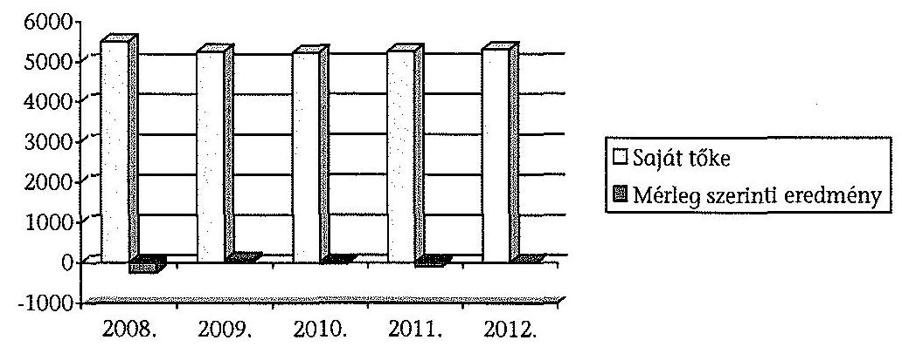
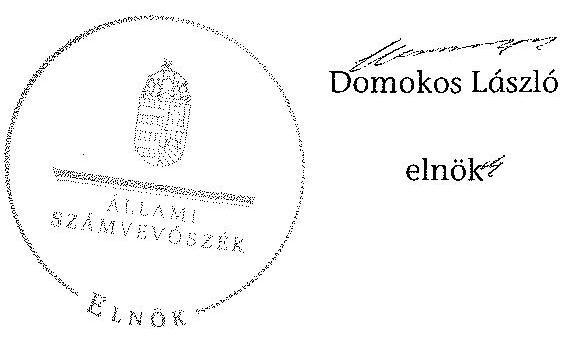
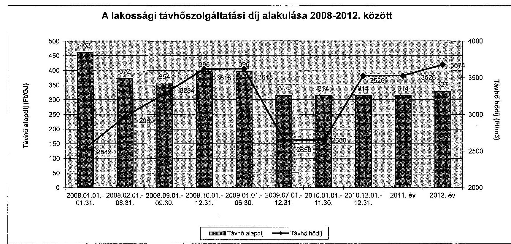

# ÁLLAMI   SZÁMVEVŐSZÉK 

## JELENTÉS

Az önkormányzatok gazdasági társaságai - Az önkormányzatok többségi tulajdonában lévő gazdasági társaságok közfeladat-ellátását érintő gazdálkodási tevékenysége szabályszerűségének ellenőrzése
TiszaSzolg 2004 Közszolgáltató, Vagyonkezelő és Gazdaságfejlesztő Kft.

---

# Állami Számvevőszék 

Iktatószám: V-0525-171/2014.
Témaszám: 1559
Vizsgálat-azonosító szám: V0671

## Az ellenőrzést felügyelte:

Dr. Horváth Margit
felügyeleti vezető

## Az ellenőrzést vezette és az ellenőrzés végrehajtásáért felelős:   Salamin Viktor   ellenőrzésvezető

A jelentéstervezet összeállításában közreműködtek:
Dr. Mezei Imréné
számvevő tanácsos
Czékus Balázs Imre
számvevő

## Az ellenőrzést végezték:

Nagy Tünde
okleveles könyvvizsgáló, külső szakértő

Kelemen Lajos
okleveles könyvvizsgáló, külső szakértő

Tóth Kálmán
okleveles könyvvizsgáló, külső szakértő

---

# TARTALOMJEGYZÉK 

BEVEZETÉS ..... 7
I. ÖSSZEGZŐ MEGÁLLAPÍTÁSOK, KÖVETKEZTETÉSEK, JAVASLATOK ..... 10
II. RÉSZLETES MEGÁLLAPÍTÁSOK ..... 16

1. Az Önkormányzat közfeladat-ellátásának szabályszerűsége ..... 16
1.1. A közfeladat-ellátás megszervezése és a feladatellátás feltételrendszerének kialakítása ..... 16
1.2. A közfeladat-ellátás felügyelete és a tulajdonosi jogok érvényesítése ..... 19
2. A TiszaSzolg 2004 Kft. közfeladat-ellátással kapcsolatos tevékenysége ..... 23
2.1. A TiszaSzolg 2004 Kft. gazdálkodásának szabályozottsága ..... 23
2.2. A TiszaSzolg 2004 Kft. vagyongazdálkodása ..... 25
2.3. A beszámolási kötelezettség teljesítése ..... 28
3. A távhőszolgáltatás közfeladata bevételei és ráfordításai elszámolásának és önköltség-számításának szabályszerűsége ..... 31
3.1. A távhőszolgáltatás közfeladat bevételeinek és ráfordításainak szabályszerűsége ..... 31
3.2. Az önköltség-számítás szabályszerűsége ..... 35
MELLÉKLETEK
4. számú A TiszaSzolg 2004 Kft. tevékenységének főbb adatai
5. számú A TiszaSzolg 2004 Kft. működésének főbb jellemzői
6. számú A lakossági távhőszolgáltatási díj alakulása 2008-2012. között
FÜGGELÉKEK
7. számú Értelmező szótár
8. számú Mintavételi eljárások ellenőrzési területenként

---

# **Chemistry**

## **Chemical Reactions**

### **Balancing Chemical Equations**

1. **Write the unbalanced equation:**
   - Example: $$C_3H_8 + O_2 \rightarrow CO_2 + H_2O$$

2. **Balance the equation:**
   - Example: $$2C_3H_8 + 7O_2 \rightarrow 6CO_2 + 8H_2O$$

3. **Balance the equation:**
   - Example: $$2C_3H_8 + 7O_2 \rightarrow 6CO_2 + 8H_2O$$

### **Types of Reactions**

1. **Combination Reaction:**
   - Example: $$2H_2 + O_2 \rightarrow 2H_2O$$

2. **Decomposition Reaction:**
   - Example: $$2H_2O_2 \rightarrow 2H_2O + O_2$$

3. **Single Displacement Reaction:**
   - Example: $$Zn + 2HCl \rightarrow ZnCl_2 + H_2$$

4. **Double Displacement Reaction:**
   - Example: $$AgNO_3 + NaCl \rightarrow AgCl + NaNO_3$$

5. **Combustion Reaction:**
   - Example: $$CH_4 + 2O_2 \rightarrow CO_2 + 2H_2O$$

## **Stoichiometry**

### **Mole Concept**

- **Mole (mol):** The amount of substance containing as many particles (atoms, molecules, ions) as there are atoms in exactly 12 grams of carbon-12.
- **Avogadro's Number:** $$6.022 \times 10^{23}$$ particles per mole.

### **Molar Mass**

- **Molar Mass:** The mass of one mole of a substance.
- Example: The molar mass of water ($$H_2O$$) is 18.015 g/mol.

### **Calculations**

1. **Moles to Mass:**
   - Formula: $$n = \frac{m}{M}$$
   - Example: Calculate the number of moles of $$H_2O$$ in 18 grams of water.
     - $$n = \frac{18 \, \text{g}}{18.015 \, \text{g/mol}} \approx 0.999 \, \text{mol}$$

2. **Moles to Mass:**
   - Formula: $$m = n \times M$$
   - Example: Calculate the mass of 1 mole of water.
     - $$m = 1 \, \text{mol} \times 18.015 \, \text{g/mol} = 18.015 \, \text{g}$$

## **Gas Laws**

### **Ideal Gas Law**

- **Equation:** $$PV = nRT$$
- **Variables:**
  - $$P$$: Pressure (atm)
  - $$V$$: Volume (L)
  - $$n$$: Number of moles (mol)
  - $$R$$: Ideal gas constant (0.0821 L·atm/mol·K)
  - $$T$$: Temperature (K)

### **Boyle's Law**

- **Equation:** $$P_1V_1 = P_2V_2$$
- **Variables:**
  - $$P_1$$: Initial pressure (atm)
  - $$V_1$$: Initial volume (L)
  - $$P_2$$: Final pressure (atm)
  - $$V_2$$: Final volume (L)

### **Boyle's Law (Boyle's Law)**

- **Equation:** $$\frac{P_1V_1}{T_1} = \frac{P_2V_2}{T_2}$$

## **Thermochemistry**

### **Enthalpy (H)**

- **Definition:** The heat content of a system at constant pressure.
- **Equation:** $$\Delta H = q_p$$
- **Variables:**
  - $$\Delta H$$: Change in enthalpy (J)
  - $$q_p$$: Heat transferred at constant pressure (J)

### **Hess's Law**

- **Statement:** The enthalpy change for a reaction is the same whether it occurs in one step or multiple steps.
- **Equation:** $$\Delta H_{\text{reaction}} = \sum \Delta H_{\text{products}} - \sum \Delta H_{\text{reactants}}$$

### **Hess's Law (Hess's Law)**

- **Statement:** The enthalpy change for a reaction is the same whether it occurs in one step or multiple steps.
- **Equation:** $$\Delta H_{\text{reaction}} = \sum \Delta H_{\text{products}} - \sum \Delta H_{\text{reactants}}$$

## **Electrochemistry**

### **Oxidation and Reduction**

- **Oxidation:** Loss of electrons.
- **Reduction:** Gain of electrons.

### **Galvanic Cells**

- **Definition:** A cell that converts chemical energy into electrical energy.
- **Components:**
  - Anode: Oxidation occurs.
  - Cathode: Reduction occurs.
  - Salt Bridge: Connects the two half-cells.

### **Nernst Equation**

- **Equation:** $$E = E^\circ - \frac{RT}{nF} \ln Q$$
- **Variables:**
  - $$E$$: Cell potential (V)
  - $$E^\circ$$: Standard cell potential (V)
  - $$R$$: Ideal gas constant (8.314 J/mol·K)
  - $$T$$: Temperature (K)
  - $$n$$: Number of electrons transferred
  - $$F$$: Faraday constant (96485 C/mol)
  - $$Q$$: Reaction quotient

---

# RÖVIDÍTÉSEK JEGYZÉKE 

## EU-s joganyagok

2005/842/EK bizottsági határozat

## Törvények

Ámt.
Gt.
Mötv.

Nvtv.

Ötv.

Számv. Tv.
Tszt.

## Rendeletek

SZMSZ
távhődíjak megállapításáról szóló rendelet

Távhőszolgáltatási üzletszabályzat vagyongazdálkodási rendelet ${ }_{1}$
a Bizottság határozata az EK-Szerződés 86. cikke (2) bekezdésének az általános gazdasági érdekű szolgáltatások működtetésével megbízott vállalkozásoknak közszolgáltatással járó ellentételezés formájában megítélt állami támogatásokra történő alkalmazásáról
az árak megállapításáról szóló 1990. évi LXXXVII. törvény (hatályos: 1991. január 1-jétől)
a gazdasági társaságokról szóló 2006. évi IV. törvény (hatálytalan: 2014. március 15-étől)
Magyarország helyi önkormányzatairól szóló 2011. évi CLXXXIX. törvény (hatályos: 2012. január 1-jétől, kivéve a 144. § (2) bekezdésben meghatározott paragrafusok, amelyek 2012. április 15-én, a (3) bekezdésben meghatározott paragrafusok, amelyek 2013. január 1-jén léptek hatályba, a (4) bekezdésben meghatározott paragrafusok a 2014. évi általános önkormányzati választások napján lépnek hatályba)
a nemzeti vagyonról szóló 2011. évi CXCVI. törvény (hatályos: 2011. december 31-étől, kivéve a 20. § (2) bekezdésben meghatározott paragrafusok, amelyek 2012. január 1-jétől, a (3) bekezdésben meghatározott paragrafusok 2013. január 1-jétől, a (4) bekezdésben meghatározott paragrafus 2012. március 2-ától léptek hatályba)
a helyi önkormányzatokról szóló 1990. évi LXV. törvény (hatálytalan: a 2014. évi általános önkormányzati választások napjától)
a számvitelről szóló 2000. évi C. törvény (hatályos: 2001. január 1-jétől)
a távhőszolgáltatásról szóló 2005. évi XVIII. törvény (hatályos: 2005. július 1-jétől)

TiszaSzolg 2004 Kft. 44/2012. (VI.14.) Taggyűlési határozatában elfogadott Szervezeti és Működési Szabályzatáról (hatályos:2012. június 14-től)
Tiszaújváros Város Önkormányzata Képviselőtestületének 29/2008. (IX. 29.) számú rendelete a távhőszolgáltatás legmagasabb hatósági díjáról szóló 24/1992 (XII.23) rendelet módosítása

TiszaSzolg 2004 Kft. Távhőszolgáltatási üzletszabályzata (hatályos:2012. december 01-től)
Tiszaújváros Város Önkormányzatának 5/1998 (IV.10.) rendelete az Önkormányzat vagyonáról, a vagyontárgyak feletti tulajdonosi jogok gyakorlásáról

---

vagyongazdálkodási rendelet $_{2}$
vagyongazdálkodási rendelet ${ }_{3}$
vagyongazdálkodási rendelet $_{4}$
vagyongazdálkodási rendelet ${ }_{5}$

157/2005. (VIII. 15.) Korm. rendelet az Európai Parlament és a Tanács 2007. október 23-ai 1370/2007/EK rendelete
50/2011. (IX.30.) NFM rendelet

51/2011. (IX.30.) NFM rendelet

## Szórövidítések

ÁSZ
Értékelési szabályzat
FB
Jegyző
KEOP
Képviselő-testület
Közszolgáltatási szerződés

Leltározási szabályzat
MEH
MEKH
Önkormányzat
Önköltség számítási szabályzat

Tiszaújváros Város Önkormányzatának 17/2010 (IX.10.) rendelete az Önkormányzat vagyonáról, a vagyontárgyak feletti tulajdonosi jogok gyakorlásáról (hatályos: 2010. október 1.-től - 2010- október 2.-ig)

Tiszaújváros Város Önkormányzatának 22/2010. (XII.03.) rendelete az Önkormányzat vagyonáról, a vagyontárgyak feletti tulajdonosi jogok gyakorlásáról (hatályos: 2011. január 1. - 2011. január 2.-ig)
Tiszaújváros Város Önkormányzatának 4/2012. (III.02.) rendelete az Önkormányzat vagyonáról, a vagyontárgyak feletti tulajdonosi jogok gyakorlásáról (hatályos: 2012. március 15.-től)

Tiszaújváros Város Önkormányzatának 12/2012. (V.04.) rendelete az Önkormányzat vagyonáról, a vagyontárgyak feletti tulajdonosi jogok gyakorlásáról (hatályos: 2012. március 15.-től - 2012. május 16.-ig)
a távhőszolgáltatásról szóló 2005. évi XVIII. törvény végrehajtásáról
az Európai Parlament és a Tanács 2007. október 23-i 1370/2007/EK rendelete a vasúti és közúti személyszállítási közszolgáltatásról, valamint az 1191/69/EGK és az 1107/70/EGK tanácsi rendelet hatályon kívül helyezéséről a távhőszolgáltatónak értékesített távhő árának, valamint a lakossági felhasználónak és a külön kezelt intézménynek nyújtott távhőszolgáltatás díjának megállapításáról
a távhőszolgáltatási támogatásról

Állami Számvevőszék
TiszaSzolg 2004 Kft. eszközök és források értékelési szabályzata (hatályos: 2009. február 01-jétől)
TiszaSzolg 2004 Kft. Felügyelőbizottsága
Tiszaújváros Város Önkormányzatának jegyzője
Környezet és Energia Operatív Program
Tiszaújváros Város Önkormányzatának Képviselőtestülete
a Tiszaújváros. Önkormányzat és a Tiszaszolg 2004 Kft. között létrejött, 2011. február 15-től hatályos Közszolgáltatási Szerződés és annak módosításai
TiszaSzolg 2004 Kft. Leltárkészítési és leltározási szabályzata (hatályos: 2009. január 1-jétől)
Magyar Energia Hivatal
Magyar Energetikai és Közmű-szabályozási Hivatal
Tiszaújváros Város Önkormányzata
TiszaSzolg 2004 Kft. Önköltség számítási szabályzata (hatályos: 2009. február 1-jétől)

---

polgármester
Selejtezési szabályzat

Számlarend
számviteli politika
számviteli politika ${ }_{2}$
Taggyűlés
Társaság
Társasági szerződés
TiszaSzolg 2004 Kft.
ügyvezetés

Tiszaújváros Város Önkormányzatának Polgármestere
TiszaSzolg 2004 Kft. Felesleges vagyontárgyak hasznosításának, selejtezésének szabályzata (hatályos: 2013. július 1-jétől)
TiszaSzolg 2004 Kft. számlarendje
TiszaSzolg 2004 Kft. számviteli politikája (hatályos: 2004. január 1-jétől)
TiszaSzolg 2004 Kft. számviteli politikája (hatályos: 2009. január 1-jétől)
TiszaSzolg 2004 Kft. Taggyűlése
TiszaSzolg 2004 Kft.
a TiszaSzolg 2004 Kft. társasági szerződése módosításokkal egységes szerkezetben
TiszaSzolg 2004 Közszolgáltató, Vagyonkezelő és Gazdaságfejlesztő Korlátolt Felelősségű Társaság
TiszaSzolg 2004 Kft. ügyvezetése

---

# **Chemistry**

## **Chemical Reactions**

### **Balancing Chemical Equations**

1. **Write the unbalanced equation:**
   - Example: $$C_3H_8 + O_2 \rightarrow CO_2 + H_2O$$

2. **Balance the equation:**
   - Balance carbon atoms first.
   - Then balance hydrogen atoms.
   - Finally, balance oxygen atoms.
   - Balanced equation: $$C_3H_8 + 5O_2 \rightarrow 3CO_2 + 4H_2O$$

3. **Balance the equation:**
   - Balance oxygen atoms.
   - Finally, balance oxygen atoms.
   - Balanced equation: $$C_3H_8 + 5O_2 \rightarrow 3CO_2 + 4H_2O$$

### **Types of Reactions**

1. **Combination Reaction:**
   - Example: $$2H_2 + O_2 \rightarrow 2H_2O$$

2. **Decomposition Reaction:**
   - Example: $$2H_2O_2 \rightarrow 2H_2O + O_2$$

3. **Single Displacement Reaction:**
   - Example: $$Zn + 2HCl \rightarrow ZnCl_2 + H_2$$

4. **Double Displacement Reaction:**
   - Example: $$AgNO_3 + NaCl \rightarrow AgCl + NaNO_3$$

5. **Combustion Reaction:**
   - Example: $$CH_4 + 2O_2 \rightarrow CO_2 + 2H_2O$$

## **Stoichiometry**

### **Mole Concept**

- **Mole (mol):** The amount of substance containing as many particles (atoms, molecules, ions) as there are atoms in exactly 12 grams of carbon-12.
- **Avogadro's Number:** $$6.022 \times 10^{23}$$ particles per mole.

### **Molar Mass**

- **Molar Mass:** The mass of one mole of a substance.
- Example: The molar mass of water ($$H_2O$$) is 18.015 g/mol.

### **Calculations**

1. **Moles to Mass:**
   - Formula: $$n = \frac{m}{M}$$
   - Example: Calculate the number of moles of $$H_2O$$ in 18 grams of water.
     - $$n = \frac{18 \, \text{g}}{18.015 \, \text{g/mol}} \approx 0.999 \, \text{mol}$$

2. **Mass to Moles:**
   - Formula: $$m = n \times M$$

 \times M$$
   - Example: Calculate the mass of 18.015 g of 18 grams of water.
     - $$m = 18.015 \, \text{g/mol} = 18.015 \, \text{g/mol}$$

## **Gas Laws**

### **Ideal Gas Law**

- **Equation:** $$PV = nRT$$
  - P = Pressure (atm)
  - V = Volume (L)
  - n = Number of moles (mol)
  - R = Ideal gas constant (0.0821 L·atm/mol·K)
  - T = Temperature (K)

### **Boyle's Law**

- **Equation:** $$P_1V_1 = P_2V_2$$
  - P₁ = Pressure (atm)
  - V₁ = Volume (L)
  - n = Number of moles (mol)
  - R = Ideal gas constant (0.0821 L·atm/mol·K)
  - T = Temperature (K)

### **Boyle's Law**

- **Equation:** $$\frac{P_1V_1}{P_2V_2} = \frac{V_1}{T_1}$$

## **Thermochemistry**

### **Enthalpy (H)**

- **Definition:** The heat content of a system at constant pressure.
- **Equation:** $$\Delta H = q_p$$
  - qₚ = Heat transferred at constant pressure.

### **Hess's Law**

- **Statement:** The enthalpy change for a reaction is the same whether it occurs in one step or multiple steps.
- **Equation:** $$\Delta H_{\text{reaction}} = \Delta H - \Delta H_0$$
  - $$\Delta H_{\text{reaction}} = \Delta H - \Delta H_0$$

## **Electrochemistry**

### **Oxidation and Reduction**

- **Oxidation:** Loss of electrons.
- **Reduction:** Gain of electrons.

### **Galvanic Cells**

- **Definition:** A cell that converts chemical energy into electrical energy.
- **Components:**
  - Anode: Oxidation occurs.
  - Cathode: Reduction occurs.
  - Salt Bridge: Connects the two half-cells.

### **Nernst Equation**

- **Equation:** $$E = E^\circ - \frac{RT}{nF} \ln Q$$
  - E = Cell potential (V)
  - E° = Standard cell potential (V)
  - R = Ideal gas constant (0.0821 L·atm/mol·K)
  - T = Temperature (K)
  - n = Number of moles of electrons transferred
  - F = Faraday constant (96,485 C/mol)
  - Q = Reaction quotient

---

# JELENTÉS 

## Az önkormányzatok gazdasági társaságai Az önkormányzatok többségi tulajdonában lévő gazdasági társaságok közfeladat-ellátását érintő gazdálkodási tevékenysége szabályszerűségének ellenőrzése

TiszaSzolg 2004 Közszolgáltató, Vagyonkezelő és Gazdaságfejlesztő Kft.

## BEVEZETÉS

Az Állami Számvevőszék középtávra szóló stratégiájában megfogalmazta, hogy a helyi önkormányzatok gazdálkodásában rejlő pénzügyi kockázatok feltárásával, az államháztartáson kívülre nyújtott költségvetési támogatások és ingyenes vagyonjuttatások, valamint az államháztartáson kívül működő közfeladat-ellátó rendszerek ellenőrzéseivel hozzájárul ahhoz, hogy a közpénzeket az államháztartáson kívül működő szervezetek is átlátható, rendezett módon használják fel a közfeladatok szerződésben vállalt ellátása érdekében.

Az önkormányzatok szervezetalakítási szabadságának következménye, hogy a korábban is vállalati formában működő (nagyvárosi tömegközlekedés, víz-, szennyvízcsatorna, köztisztasági, ingatlankezelés stb.) közszolgáltatások mellett, mind a kötelező, mind az önként vállalt feladatok ellátásában a gazdasági társaságok kiemelt fontosságú szerephez jutottak.

Tiszaújváros Város Önkormányzata - Sajószöged, Sajóörös és Nagycsécs Önkormányzataival közösen - 1992. december 30-án alapította meg a SAJÓ Vízmű Szolgáltató Korlátolt Felelősségű Társaságot. A Társaság főtevékenysége a víztermelés, -kezelés, -elosztás volt. A Társaság 2004. és 2009. évek között több alkalommal is átalakult. E több szervezetet érintő átalakulási folyamat során integrálták a Társaság szervezeti keretei közé az Önkormányzat távhő szolgáltatási feladatait ellátó a TISZA-TÁVHŐ Szolgáltató Kft.-t, amely 1992. augusztus 27-e óta, 100%-os önkormányzati tulajdonú gazdasági társaságként látta el város távhőszolgáltatási feladatait az Ötv. 9. § (4) bekezdésének megfelelően.

Az átalakulásokat követően az ellenőrzött időszakban a TiszaSzolg 2004 Kft. négy önkormányzat tulajdonában volt. Az Önkormányzat 2008. évtől minősített többségi befolyást biztosító részesedéssel (98,34%-kal) rendelkezett a Társaságban.

---

A TiszaSzolg 2004 Kft. éves árbevétele 2310,6 M Ft és 2663,5 M Ft között, az eszközök és források értéke 5935,9 M Ft és 7139,9 M Ft között alakult az ellenőrzött öt évben. A jegyzett tőke összege nem változott jelentősen a megalakulás óta, az ellenőrzött időszakban 5221,3 M Ft volt. A TiszaSzolg 2004 Kft. a több mint 16 ezer fős népességű városban 5519 lakásban biztosította a fűtést és a melegvíz-ellátást, a lakossági felhasználás aránya 80% körül alakult. A hőtermelésben és hőszolgáltatásban foglalkoztatottak száma 2008-ban 62 fő, míg 2012-ben 52 fő volt.

Az ellenőrzött időszakban a polgármester és a jegyző személye egy alkalommal változott, a jelenlegi polgármester a 2010. évi önkormányzati választások óta tölti be tisztségét. A helyszíni ellenőrzés időszakában a munkakört betöltő jegyző 2010. június 1-től látja el a jegyzői feladatokat. Az ellenőrzött időszakban az ügyvezető személye három, a főkönyvelő/gazdasági igazgató személye egy alkalommal változott. A Társaság jelenlegi ügyvezetője a korábbi főkönyvelő lett.

Az önkormányzati tulajdonú gazdasági társaságok teljes körű ellenőrzésének lehetőségét az Állami Számvevőszékről szóló 1989. évi XXXVIII. törvény 2011. január 1-jétől hatályos módosítása teremtette meg.

Az ellenőrzés célja annak értékelése, hogy

- az önkormányzat a jogszabályi előírások figyelembevételével döntött-e az ellenőrzésre kerülő közfeladat megszervezéséről; az önkormányzat szabályszerűen gyakorolta-e a tulajdonosi jogokat;
- a gazdasági társaság közfeladat-ellátása bevételeinek, ráfordításainak elszámolása, és vagyongazdálkodási tevékenysége megfelelt-e a jogszabályi, illetve a Közszolgáltatási szerződésben foglalt tulajdonosi előírásoknak, azok végrehajtása szabályszerű volt-e;
- a közfeladatok átláthatósága és elszámoltathatósága érdekében biztosítva volt-e a közszolgáltatás díjának megalapozottsága szabályszerű önköltségszámítással.

Az ellenőrzés várható hasznosulása: A törvényalkotás számára - az észlelt problémák, szabálytalanságok, vagy egyéb nem kívánatos jelenségek felszínre kerülésével - az ellenőrzés megállapításai segítséget nyújthatnak az államháztartáson kívüli közfeladat-ellátás értékeléséhez, jogszabályi keretei pontosításához, átláthatóságot biztosító szabályozásához. Meghatározhatóvá válnak a közfeladat ellátásában részt vevő államháztartáson kívüli szervezeteknek - az önkormányzat költségvetését és pénzügyi helyzetét is befolyásoló - kockázatai, lehetővé válik ezen kockázatok csökkentése. Értékelhetővé válik, hogy a feladatot ellátó gazdasági társaság a Közszolgáltatási szerződésben foglaltak betartásával, a közvagyon használatával biztosította-e a szolgáltatás folytatásának feltételeit. Ezzel az ellenőrzöttek és a helyi döntéshozók számára visszajelzést ad feladatszervezési, feladat-ellátási kockázataikról, alapot ad a meglévő hibák megszüntetéséhez, a jobb közfeladat-ellátás biztosításához. Fokozza a fegyelmet, igazolja, hogy lejárt a következmények nélküli ellenőrzések időszaka. Az ÁSZ értékteremtő rend kialakításához és megőrzéséhez hozzájáruló tevékenysége pozitív hatással van a szervezetről kialakított összkép formálására is.

---

A bevételek és ráfordítások elszámolása, valamint a vagyonnyilvántartás terén az egyes területek szabályszerű működését mintavétellel ellenőriztük, ez alapján a sokaságokban előforduló hibás tételek arányát becsültük. A jogszabályoknak és a belső előírásoknak megfelelőnek, azaz szabályszerűnek tekintettük az adott bevételek és ráfordítások elszámolását, a vagyonnyilvántartást, amennyiben a minta ellenőrzésének eredménye alapján 95%-os bizonyossággal a teljes sokaságban a hibás tételek aránya kisebb volt, mint 10%, nem megfelelőnek értékeltük, ha a hibás tételek aránya a 10%-ot meghaladta. Kockázatot, illetve magas kockázatot jeleztünk, amennyiben egy adott terület vonatkozásában a minta alapján a teljes sokaságban nem volt teljes körűen biztosított a jogszabályoknak és a belső szabályzatoknak megfelelő működés.

Az ellenőrzést a számvevőszéki ellenőrzés szakmai szabályai szerint, szabályszerűségi ellenőrzés módszerével, a vonatkozó nemzetközi standardok figyelembe vételével végeztük. Az ellenőrzés kiterjedt Tiszaújváros Város Önkormányzatára és a TiszaSzolg 2004 Közszolgáltató, Vagyonkezelő és Gazdaságfejlesztő Korlátolt Felelősségű Társaságra. Az ellenőrzés a 2008-2012. évekre terjedt ki.

Az ellenőrzés végrehajtásának jogszabályi alapját az ÁSZ tv. 5. § (3)-(5) bekezdése képezte.

A Jelentés tervezetét észrevételezésre megküldtük Tiszaújváros Város Önkormányzata polgármesterének, valamint a társaság ügyvezetőjének. Az érintettek észrevételt nem tettek.

---

# I. ÖSSZEGZŐ MEGÁLLAPÍTÁSOK, KÖVETKEZTETÉSEK, JAVASLATOK 

A TiszaSzolg 2004 Kft. jogelődjét, a Sajó Vízmű Szolgáltató Kft.-t az Önkormányzat és három, a térségben működő községi önkormányzat közösen alapította 1992. december 30-án. A Társaság több átalakuláson ment keresztül az Önkormányzat tulajdonában lévő más gazdasági társaságok beolvadásával és kiválásával. A 2008-2012. években időszakban a Társaság több közfeladatot - távhőszolgáltatás, települési kommunális hulladékszállítás, valamint víz- és csatorna közműszolgáltatás - látott el. A Társaság minősített többségi tulajdonosa 98,34%-os tulajdonrésszel az Önkormányzat volt.

Az Ötv. 1. § (5), Ötv. 8. § (3) bekezdései felhatalmazást adtak arra, hogy törvényben a helyi önkormányzatnak kötelező feladatot állapítsanak meg. Ezzel élve a Tszt. 6. § (1) bekezdése rögzíti, hogy a távhőszolgáltatás az önkormányzatok kötelező feladata. A Képviselő-testület az Önkormányzat közigazgatási területén a távhőszolgáltatás közfeladatának megszervezéséről a jogszabályi előírásoknak megfelelően döntött.

Az Önkormányzat 2007-2010. és 2011-2014. évekre szóló gazdasági programjai tartalmaztak elképzeléseket a távhőszolgáltatás működtetésével, fejlesztésével kapcsolatban. A 2007-2010. évi gazdasági programban az Önkormányzat a TiszaSzolg 2004 Kft. részére középtávú fejlesztési terv kidolgozását írta elő a távhőszolgáltatás, valamint az ivóvíz és szennyvízellátás területén működtetett rendszerek felújítására, karbantartására, a közszolgáltatás színvonalának és biztonságos működtetésének fenntartására, ezt a Társaság azonban nem készítette el. A 2011-2014. évekre vonatkozó program a távfűtés 2020. utáni ellátásában a megújuló energiák felhasználásának növelését és a gázenergiától való függetlenedést tűzte ki célul.

A Társaság KEOP pályázata kapcsán került sor 2011. február 15-én az Önkormányzat és a Társaság között Közszolgáltatási szerződés megkötésére, melynek konstrukcióját többször módosították. A közszolgáltatás ellátásának biztosítására vonatkozó szerződésben a feladat ellátására vonatkozóan beszámolási kötelezettséget is meghatároztak a Társaság számára, amely ezeknek az elvárásoknak csak részben tett eleget. Nem tartotta be a támogatás elszámolására vonatkozóan az Áht.-ban meghatározott előírásokat, valamint nem készítette el a támogatási szerződésben előírt, két évre vonatkozó koncepcionális terveit sem.

A távhő-vagyon kezelése, gyarapítása, hasznosítása szabályszerű volt. Az ellenőrzött időszakban a távhő-ellátást szolgáló eszközöket nem idegenítették el. Az eszközök karbantartására, felújítására fordított összegek, valamint a beruházások meghaladták a távhő-vagyon elszámolt értékcsökkenését, ezáltal a Társaság gondoskodott a folyamatos és biztonságos távhő-ellátásról, valamint a vagyon visszapótlásáról. A Társaság az ellenőrzött időszakban belső és külső forrásokból jelentős távhő fejlesztéseket hajtott végre. A fejlesztések tulajdonosi, pályázati támogatásokból és saját forrásokból kerültek megvalósításra. Az Önkormányzat a fejlesztésekhez a 2008. évben 50,0 M Ft összegű, felhalmozási célú tagi kölcsönt biztosított, ezen túl a Társaság a 2010-2012. években két KEOP pályázaton 146,9 M Ft támogatást nyert, amelyet a távhőellátás távfelügyeleti rendszerének fejlesztésére, valamint távfűtési vezeték és hőközpont kiépítésére fordított.

A TiszaSzolg 2004 Kft. minden évben elkészítette üzleti tervét. A Társaság éves üzleti terveiben részletesen foglalkozott az egyes üzletágak gazdálkodásával, illetve a következő évek fejlesztési terveivel, ugyanakkor az eredményterv üzletági részletezését a 2009., 2011. és 2012. évi üzleti terv nem tartalmazta. Ezzel megnehezítették az egyes üzletágak adatainak évek közötti összehasonlítását, egyben a gazdálkodás áttekinthetőségét. Az üzleti tervekben meghatározott fejlesztésekről, azok ütemezéséről és végrehajtásáról a tulajdonosi joggyakorló a Társaság éves beszámolóiból, a negyedéves kontrolling jelentésekből és az ügyvezetés saját hatáskörében készített havi pénzügyi jelentésekből kapott tájékoztatást.

Az Önkormányzat az ellenőrzött időszakban a lakossági távfűtés- és melegvízszolgáltatási díjak legmagasabb hatósági árát, az árképzés szabályait a távhődíjak megállapításáról szóló rendeletében rögzítette. A Távhőszolgáltatási rendeletben az Önkormányzat az előírásoknak megfelelően rendelkezett a Tszt.-ben foglaltak alkalmazásáról. A díjak megállapítása az ellenőrzött időszakban az indokolt költségek és ráfordítások tételes és arányosításos számbavételén alapult, alkalmazták
 az elő- és utókalkuláció módszerét.

A Társasági szerződés értelmében a TiszaSzolg 2004 Kft. tulajdonosi jogait a Képviselő-testület, a menedzsmenttel kapcsolatos jogokat a mindenkori ügyvezető gyakorolta. A tulajdonosi joggyakorlással kapcsolatos feladatköröket az Ötv., a Társasági szerződés és a vagyongazdálkodási rendelet ${ }_{1-5}$ előírásai szerint alakították ki. Meghatározták a TiszaSzolg 2004 Kft. feletti tulajdonosi joggyakorló személyét, a Taggyűlés kizárólagos hatáskörét, az FB összetételét és működését, a Képviselő-testület hatáskörét. Az ellenőrzött időszakban az Önkormányzat részéről a tulajdonosi ellenőrzés elsősorban az FB-n keresztül működött.

Az ellenőrzött időszakban a TiszaSzolg 2004 Kft. az éves beszámolóinak kiegészítő mellékletében és üzleti jelentésében a távhőszolgáltatás közszolgáltatási feladat ellátásáról beszámolt. Az éves beszámolókat a Taggyűlés elfogadta, a könyvvizsgálói jelentéseket tudomásul vette. A Társaság gazdálkodása 2008-ban és 2010-ben, valamint 2011-ben veszteséges volt (összesen 380,5 M Ft). A Képviselő-testület 2010 decemberében a Gt. előírásainak megfelelően 122,0 M Ft pénzbeli hozzájárulással történő jegyzett tőkeemelésről döntött. A jegyzett tőke-emeléssel a Társaság jegyzett tőkéje 5221,3 M Ft-ra emelkedett. A Társaság saját tőkéjének értéke minden évben meghaladta a jegyzett tőke értékét. A tulajdonos a 2009. és a 2012. években keletkezett nyereséget (összesen 86,0 M Ft-ot) eredménytartalékba helyeztette. Osztalékfizetés az ellenőrzött időszakban nem történt.

Az Önkormányzat belső ellenőrzése az ellenőrzött időszakban nem folytatott le ellenőrzést a Társaságnál. Külső ellenőrzést a Társaságnál az Energiaközpont Nonprofit Kft. a KEOP pályázatokon elnyert támogatások felhasználásával kapcsolatban végzett, hiányosságot nem tárt fel.

A Társaság 2009-től kialakította belső számviteli szabályrendszerét, megfelelő módon szabályozta a beszámolási és adatszolgáltatási feladatait. A szabályozás biztosította, hogy a Társaság határidőben és meghatározott adattartalommal, a tulajdonosi joggyakorló elvárásainak megfelelően tegyen eleget az adatszolgáltatási kötelezettségének. A Társaság éves beszámolóit szabályosan közzétették és letétbe helyezték. A 2012. üzleti évtől a Tszt. előírásainak megfelelő számviteli szétválasztási szabályait a gyakorlatban alkalmazták.

A TiszaSzolg 2004 Kft. az ellenőrzött időszakban önköltség számítási szabályzat készítésére volt kötelezett a Számv. tv. alapján. A szabályzatában meghatározta 2009. január 1-től a közfeladatok ráfordításai és bevételei elhatárolásának előírásait. Elkülönítette a közvetlen és közvetett költségeket, tartalmazta a felosztandó költségek vetítési alapjait. Az önköltség-számítás elő- és utókalkulációs módszerrel történt az ellenőrzött időszakban, amely megfelelt a vonatkozó előírásoknak. Az ellenőrzött években a távhőszolgáltatási közfeladat átláthatósága és elszámoltathatósága biztosított volt.

A Társaság rendelkezett átlátható, naprakész vagyonnyilvántartással. A Társaság a rendelkezésére bocsátott vagyonelemek leltározási kötelezettségéről és annak módjáról megfelelően rendelkezett.

A könyvvizsgáló a Számv. tv. szerinti határidőn belül, minősítés nélküli záradékot adott az ellenőrzött időszak beszámolóiról. A beszámolókat az FB is megtárgyalta és elfogadta.

A TiszaSzolg 2004 Kft. közfeladat-ellátása bevételeinek, ráfordításainak elszámolása összességében szabályszerű volt, azt az ellenőrzés megfelelőnek minősítette. Ugyanakkor hibát állapítottunk meg a beruházások, felújítások aktiválása és az értékcsökkenési leírás gyakorlatánál, azt nem megfelelőnek minősítettük. A Társaság Számviteli politikájában rögzítette, hogy amennyiben az adott eszköz használatának időtartamában, az adott eszköz értékében jelentős változás következik be, az értékcsökkenés elszámolásának leírási kulcsát újraértékelik. Az ellenőrzött időszakban az eszközök értékcsökkenési leírásának elszámolásához az újraértékelést nem végezték el, megsértve ezzel a Számv. tv.-ben rögzített valódiság elvét.

A távhőszolgáltatási közfeladat anyagjellegű ráfordításainak elszámolása megfelelő volt, a TiszaSzolg 2004 Kft. betartotta a Tszt. tevékenységek elkülönítésére és a díjak átláthatóságára vonatkozó előírásait.

A TiszaSzolg 2004 Kft. a távhőszolgáltatási közfeladat bevételeinek elszámolása során szabályszerűen járt el, az elszámolás megfelelő volt. A bevételek előírása és kiszámlázása a belső szabályozásnak megfelelően történt, a bevételeket a megfelelő számlacsoportban számolták el. Az alkalmazott szolgáltatási díjak megfeleltek a belső szabályozásnak és a tulajdonosi követelményeknek.

A TiszaSzolg 2004 Kft.-nél a kintlévőségek kezelése a szabályozás szerint folyamatosan, a számlázás folyamatába építetten működött. A Társaság a jogszabályi előírások alapján intézkedett a követelésállomány csökkentése érdekében. Ennek ellenére az év végi vevői kintlévőségek állományában - az ellenőrzött időszakban - jelentős mértékű növekedés ( $174,2 \mathrm{M} \mathrm{Ft}$ ) következett be. A határidőn túli követelésekhez kapcsolódó értékvesztés elszámolásakor nem vette figyelembe az Értékelési szabályzat, illetve a Számviteli politika előírásait.

A Társaság 2011-ben 140,9 M Ft, 2012-ben 502,1 M Ft távhőszolgáltatási támogatásban részesült. A Társaság a 2011-ben igénybe vett támogatás ellenére is veszteséges volt, míg a 2012. évben a támogatás igénybevételével gazdálkodása nyereségessé vált.

Az információs önrendelkezési jogról és az információszabadságról szóló 2011. évi CXII. törvény előírásainak megfelelő közérdekű adatok közzététele nem teljes körűen történt meg. A gazdálkodási adatokhoz a Társaság honlapján nem lehet teljes körűen hozzáférni. A Társaság elkészítette az eljárásrendjét a közérdekű adatok igényléséről, amelyben bemutatják az egyedi igénylések szabályait, módját, valamint a jogorvoslati lehetőségeket. A TiszaSzolg 2004 Kft. a közvagyonnal kapcsolatos adatok védelmét az informatikai eszközök technikai védelmével részben biztosította, a külső adattárolók térbeni elkülönítésének megoldatlansága veszélyezteti az adatbiztonságot.

A fentiekben leírtak összegzéseként az alábbi megállapításokat tesszük:
Tiszaújváros Város Önkormányzatának Képviselő-testülete a távhőszolgáltatás közfeladatának megszervezéséről, annak felügyeletéről a jogszabályi előírásoknak megfelelően gondoskodott. A feladatellátásra vonatkozóan a szolgáltatóval közszolgáltatási szerződést kötöttek, amelynek előírásait azonban a Társaság az üzleti tervek készítésének tartalmi követelményei és a támogatással való elszámolás vonatkozásában nem tartotta be. A távhővagyon kezelése, gyarapítása, hasznosítása az ellenőrzött időszakban szabályszerű volt, a Társaság saját és külső forrásokból, a 2009. és a 2012. években keletkezett nyereség eredménytartalékba helyeztetett összegéből jelentős távhő üzletági fejlesztéseket hajtottak végre. A Tiszaszolg 2004. Kft. tevékenységének szabályozottsága és annak gyakorlata az ellenőrzött időszakban - az előírt számviteli szétválasztási szabályokról való rendelkezést, valamint a beruházások, felújítások aktiválása és az értékcsökkenési leírás elszámolását kivéve - az előírásoknak megfelel, az önköltség-számítás rendje biztosította a távhőszolgáltatási közfeladat átláthatóságát és elszámoltathatóságát. A Társaságnál a kintlévőségek kezelése a szabályozás szerint folyamatosan, a számlázás folyamatába építetten működött, a követelésállomány csökkentése érdekében tett intézkedések ellenére - az ellenőrzött időszakban - a vevői kintlévőségek állományában jelentős mértékű növekedés következett be.

Az Állami Számvevőszékről szóló 2011. évi LXVI. törvény 33. § (1) bekezdésében foglaltak értelmében a jelentésben foglalt megállapításokhoz kapcsolódó intézkedési tervet köteles az ellenőrzött szervezet vezetője összeállítani, és azt a jelentés kézhezvételétől számított 30 napon belül az ÁSZ részére megküldeni. Amennyiben az intézkedési tervet határidőben nem küldi meg a szervezet, vagy az nem elfogadható, az ÁSZ elnöke a hivatkozott törvény 33. § (3) bekezdés a)-b) pontjaiban foglaltakat érvényesítheti.

Az ellenőrzés intézkedést igénylő megállapításai és javaslatai:
Javaslataink célja a Kft. gazdálkodása szabályszerűségének javítása annak érdekében, hogy a szabályozási környezet megfelelően tudja támogatni az átlátható működést.

# A TiszaSzolg 2004 Közszolgáltató, Vagyonkezelő és Gazdaságfejlesztő Kft. ügyvezető Igazgatójának: 

1. A Társaság a követelés-állományra történő értékvesztés elszámolásánál nem tartotta be a Számviteli politikája előírásait, továbbá eltért az Értékelési szabályzata 2.5.1. pontjában az Adósok, vevők minősítések, értékelési szempontjainál meghatározott minősítési kritériumoktól. Így a gyakorlatban a vevőkövetelések értékvesztésének összege a társaság év végi beszámolójában nem a megfelelő összegben szerepelt.

Az ellenőrzött időszakban a társaság a tárgyi eszközök értékcsökkenésének elszámolásánál a műszaki felújításokból származó hosszabb élettartamot figyelmen kívül hagyta, így nem a megfelelő leírási kulcsot alkalmazták.

A Társaság köteles a tárgyévet megelőző év október 31-ig a következő évre vonatkozó üzleti tervét elkészíteni, amelyhez csatolni kell a Közszolgáltatási szerződés 5.3.4. pontjába foglalt előírásnak megfelelően a további két évre kitekintő koncepcionális (gördülő) üzleti tervet. Ezt az előírást a Társaság nem tartotta be, az éves üzleti tervei nem tartalmazták a kétéves koncepcionális kitekintést.

Javaslat:
Gondoskodjon a jogszabályi előírások szerinti gyakorlat és a szabályos működés biztosítására, ezen belül:

Intézkedjen, hogy
a) a követelésállományra vonatkozó értékvesztés elszámolásának gyakorlata a szabályozással összhangban, továbbá a tárgyi eszközök értékcsökkenésének elszámolása a műszaki felújításokból származó hosszabb élettartam figyelembe vételével történjen;
b) a Közszolgáltatási szerződésben rögzített elvárások maradéktalanul teljesüljenek, a társaság üzleti tervei tartalmazzák a két évre kitekintő koncepcionális üzleti terveket is.

Javaslataink célja az önkormányzat szabályszerű működésének elősegítése, továbbá az önkormányzati tulajdonosi joggyakorlás kontrolljainak erősítése.

## Javasoljuk Tiszaújváros Város Önkormányzata Jegyzöjének:

1. A belső ellenőrzés többször is betervezte ugyan az Áht1 121/B. § (4) bekezdés b) pontja szerinti az önkormányzat többségi tulajdonában lévő gazdasági társaságok részére átadott pénzeszközök célirányos elszámolásának vizsgálatát, az ellenőrzést azonban nem folytatták le. Az Önkormányzat belső ellenőrzése az ellenőrzéseivel a távhőszolgáltatás, mint közfeladat-ellátás szabályszerű teljesítéséhez, valamint az önkormányzati vagyon megóvásához ellenőrzéseivel nem járult hozzá. Az ellenőrzött időszakban a társaság gazdálkodásával és működésével kapcsolatban ellenőrzést nem folytatott le.

# Intézkedjen a jogszabályi előírások szerinti gyakorlat és a szabályos működés biztosítására, ezen belül: 

Javaslat:
fordítson kiemelt figyelmet arra, hogy az önkormányzat belső ellenőrzése az ellenőrzéseivel a távhőszolgáltatás, mint közfeladat-ellátás szabályszerű teljesítéséhez, valamint az önkormányzati vagyon megóvásához ellenőrzéseivel járuljon hozzá.

# II. RÉSZLETES MEGÁLLAPÍTÁSOK 

## 1. Az ÖNKORMÁNYZAT KÖZFELADAT-ELLÁTÁSÁNAK SZABÁLYSZERÜSÉGE

### 1.1. A közfeladat-ellátás megszervezése és a feladatellátás feltételrendszerének kialakítása

Az Ötv. 1. § (5), Ötv. 8. § (3) bekezdései felhatalmazást adtak arra, hogy törvény a helyi önkormányzatnak kötelező feladatot állapítson meg. A Tszt. 6. § (1) bekezdése a területileg illetékes települési önkormányzatra ruházta azt a feladatot, hogy a távhőszolgáltatásra engedéllyel rendelkezők útján biztosítsa a távhőszolgáltatással ellátott létesítmények távhőellátását. Az önkormányzatoknak ez alapján a távhőszolgáltatást, mint kötelező feladatot kellett ellátniuk. A Képviselő-testület az Önkormányzat közigazgatási területén a távhőszolgáltatás közfeladatának megszervezéséről a jogszabályi előírásoknak megfelelően döntött.

A TiszaSzolg 2004 Kft. jogelődjét, a Sajó Vízmű Szolgáltató Kft.-t az Önkormányzat és három, a térségben működő községi önkormányzat közösen alapította 1992. december 30-án. A Társaság több átalakuláson ment keresztül, az Önkormányzat tulajdonában lévő más gazdasági társaságok beolvadásával és kiválásával. A 2008-2012. évek közötti időszakban a Társaság több közfeladatot - távhőszolgáltatás, települési kommunális hulladékszállítás, valamint víz- és csatorna közműszolgáltatás - látott el. A Társaság minősített többségi tulajdonosa 98,34%-os tulajdonrésszel az Önkormányzat volt. A Társaság minősített többségi tulajdonosán kívül Sajóörös, Sajószöged és Nagycsécs községek önkormányzatai összesen 1,66%-ban rendelkeztek tulajdonrésszel.

Az Önkormányzat által elkészített, az egyes önkormányzati ciklusokra vonatkozó gazdasági programjai tartalmaztak közfeladat-ellátással kapcsolatos rendelkezéseket az Ötv. 91. § (6) bekezdésének megfelelően.

A 2007-2010. évekhez kapcsolódó gazdasági programban az Önkormányzat a TiszaSzolg 2004 Kft. részére középtávú fejlesztési terv kidolgozását írta elő a távhőszolgáltatás, valamint az ivóvíz és szennyvízellátás területén működtetett rendszerek felújítására, karbantartására, a közszolgáltatás színvonalának és biztonságos működtetésének fenntartására. A Társaság a gazdasági programban foglalt fejlesztési terv elkészítési kötelezettségének nem tett eleget.

Az Önkormányzat az Ötv. 91. § (1) és (6) bekezdéseiben foglaltaknak megfelelően a 2011-2014. évi gazdasági programjában koncepcióként a távfűtés hálózat rekonstrukciójának beruházását írta elő. A távhő szolgáltatás esetében azt a célt tűzték ki, hogy a szolgáltató, és a hőenergiát felhasználó lakosság saját erővel, valamint állami és önkormányzati pályázati támogatási források bevonásával a hálózati hőveszteséget, a lakóépületek hőigényét az épületek energetikai jellemzőinek javításával csökkentse.

A gazdasági programban a Képviselő-testület célul tűzte ki a város
 fűtési rendszerének 2020. év utáni ellátásának alternatíváira program kidolgozását, illetve a megújuló erőforrások bevonásának és a gázenergiától való függetlenítés megvizsgálásának lehetőségét.

A távhőszolgáltatás feladatellátásához szükséges vagyont alapításkor a Társaság apportként kapta az Önkormányzattól. Az apportként átadott közművagyon az Önkormányzat nyilvántartásaiban az ellenőrzött időszakban befektetett eszközként, azaz részesedésként szerepelt, a Számv. tv. 27. § (1) és (2) bekezdések előírásainak megfelelően.

Az Ötv. 80/A. § előírása szerinti vagyonkezelői jogot az Önkormányzat az ellenőrzött időszakban nem létesített. A közfeladat ellátásához kapcsolódó vagyon a Társaság tulajdonában volt, leltározásáról a Számv. tv. 69. §-a, valamint a saját számviteli politikája és szabályzatai szerint gondoskodott.

Az ellenőrzött időszakban az Önkormányzat részesedésének értéke nem csökkent. A Társaság saját tőkéjének értéke az ellenőrzött időszakban minden esetben meghaladta a jegyzett tőke értékét.

Az Önkormányzat és a Társaság 2011. február 15-i dátummal kötött Közszolgáltatási szerződést ${ }^{1}$ a távhőszolgáltatás biztosítására. A felek rögzítették a Közszolgáltatási szerződésben, hogy a közszolgáltatás ellátásához szükséges meglévő távhőszolgáltatást biztosító létesítmények, berendezések a Társaság tulajdonát képezik. Rögzítették továbbá, hogy a TiszaSzolg 2004 Kft. a KEOP támogatással megvalósuló beruházásokat saját nevében és saját javára végzi, és a beruházás eredményeként létrejövő eszközöket saját könyveiben aktiválja.

A KEOP pályázatban elnyert beruházási támogatásra vonatkozó támogatási szerződés aláírásának feltétele volt, hogy az Önkormányzat és a Közszolgáltató határozott időre, de legalább a projekt fizikai befejezését követő 5 és legfeljebb 10 naptári évre szóló időszakra, a KEOP Pályázat-bíráló Bizottságának határozatában foglaltaknak megfelelő tartalommal Közszolgáltatási szerződést kössenek. Ezzel a Társaság eleget tett a KEOP 2009-5.4.0 Tiszaújváros távhőellátás hőközponti szabályozásának és távfelügyeleti rendszerének fejlesztése pályázatban kiírt feltételeknek.

A közszolgáltatás ellátásának részletes feltételeit és a Társaság kötelezettségeit a jogszabályi előírások ${ }^{2}$ alapján a Képviselő-testület 34/2005. (XII. 23.) számú rendelete, valamint a tevékenység végzésére jogosító működési engedélye határozta meg. A Társaság köteles volt a közszolgáltatást a jogszabályi előírások betartásával, a 157/2005. (VIII. 15.) Korm. rendelet 3. számú mellékletét képező Távhőszolgáltatási Közüzemi Szabályzat alapján elkészített és a jegyző által, 2009. március 30-án kelt határozattal jóváhagyott Távhőszolgáltatási üzletszabályzat szerint ellátni. A jegyző a Távhőszolgáltatási üzletszabályzat jóváhagyását a Tszt. 7. § (1) bekezdés b) pontja alapján gyakorolta.

[^0]
[^0]:    ${ }^{1}$ Felek: Tiszaújváros Önkormányzata; TiszaSzolg 2004 Kft; Kelt.: 2011.02.15.
    ${ }^{2}$ A Tszt. és annak végrehajtásáról szóló 157/2005 (VIII. 15.) Korm. rendelet

---

A Közszolgáltatási szerződés nem tért ki a közszolgáltatás színvonalának követelményeire, továbbá az Ötv. 92. § (11) bekezdés b) pontja szerinti tulajdonosi ellenőrzés lehetőségére.

Az Önkormányzat a 34/2005. (XII. 23.) számú rendeletének megalkotásával eleget tett a távhőszolgáltatásra vonatkozóan a Tszt. 6. § (2) bekezdése szerinti rendeletalkotási kötelezettségének. A távhőszolgáltatási feladat részleteit az Önkormányzat Távhőszolgáltatási rendeletében részletesen szabályozta, ezen belül a II. fejezet a távhőszolgáltatás díjának és díjalmazásának feltételeit rögzítette.

A területileg illetékes települési önkormányzat az engedélyes útján köteles volt biztosítani a távhőszolgáltatással ellátott létesítmények távhőellátását. Ehhez rendeletalkotási kötelezettséget írt elő a jogszabály távhőszolgáltatás ellátásának szabályozására.

Az Ámt. 7. § (5) rendelkezései szerint az Önkormányzatnak a távhőszolgáltatáshoz kapcsolódóan ármegállapítási kötelezettsége volt.

Az Önkormányzat hatósági ár megállapítása 2008. január 1. - 2011. április 14. között a távhőszolgáltatás csatlakozási díjára és lakossági távhőszolgáltatás díjára, ezt követően a távhőszolgáltatás csatlakozási díjára vonatkozott, az Ámt. 7. § (5) előírásai szerint. A Tszt. 57/D. § (1) bekezdése szerint az energiapolitikáért felelős miniszter rendeletben rögzíti a távhőszolgáltatás díját, azok szerkezetét, valamint a lakossági felhasználónak és a külön kezelt intézménynek nyújtott távhőszolgáltatás (fűtés és használati melegvíz) díját.

Az Önkormányzat a Tszt. 6. § (2) bekezdése szerint rendeletben rögzítette a távhőszolgáltatás díjainak megállapításáról és alkalmazásáról szóló rendelkezéseit. A Távhőszolgáltatás díjáról szóló rendelet kiterjedt az alkalmazható árszabásokra, a díjfizetésre, a díjak áthárításának szabályaira, a díjkedvezményre, díjvisszatérítésre, pótdíj szabályaira.

Az Önkormányzat a távhődíjak megállapításáról szóló rendeletében meghatározta a távhődíj összetételét, amely 2011. december 31-ig az alapdíjból és a hődíjból állt. A díjaknak az alábbi költségekre, egyéb tételekre kellett fedezetet nyújtania: a távhőszolgáltató által vásárolt távhő összes teljesítmény díjára (alapdíj, hődíj), a távhőszolgáltató által előállított távhő összes tüzelőanyag költségére (alapdíj, hődíj), a távhőszolgáltató által vásárolt pótvíz és villamos energia díjára, a távhőszolgáltató saját hőtermelő létesítményeinek, távhővezetékeinek és tartozékainak, a tulajdonában lévő berendezéseknek, valamint az általa üzemeltetett hőközpontoknak, létesítményeknek, szervezetének, bér, üzemeltetési, fenntartási, amortizációs és működtetési költségére, a felvett hitelek kamataira, a díjhátralékok után képzett árkockázati tartalékra, a nyereség adón kívüli adók összegére, a tárgyi eszközök bruttó értékének alapulvételével számított eszközarányos fedezet összegére, a primer és szekunder hálózati hőveszteség és a rendszerben elfolyt víz hőtartalmának ellenértékére.

---

A távhődíjak megállapításáról szóló rendeletet az ellenőrzött időszakban nyolc alkalommal módosította a Képviselő-testület ${ }^{3}$. A rendeletben szereplő díjak levezetéséből megállapítható, hogy az alapdíj és hődíj részeként az Ámt. 8. § (1) bekezdésében előírtakkal szemben nem határoztak meg nyereség tényezőt.

A Társaság által elkészített üzleti tervek tartalmazták a költségek alakulását. Mivel a díjakat elsősorban a szolgáltatás előállításához szükséges költségek határozták meg, ezért a tervezett költségek alakulása alapján határozták meg a mindenkori díjakat. A távhőszolgáltatási díjak módosításához a Társaság elmulasztotta beszerezni Tszt. 57/A. § (7) bekezdése szerinti, a díjak megfelelőségéről szóló MEH jogerős határozatot a 2009. július 1-je és a 2011. április 15-e közötti időszakban.

# 1.2. A közfeladat-ellátás felügyelete és a tulajdonosi jogok érvényesítése 

A tulajdonosi jogok érvényesítését a közfeladat-ellátással kapcsolatos önkormányzati döntések, valamint a gazdasági társaság közfeladat-ellátásának és működésének a felügyelete jelentette.

A közfeladatot ellátó Társaság legfőbb szerve a Taggyűlés volt, működése megfelelt a Gt. 19. §-ban foglalt előírásoknak. Az ügyvezetés ellenőrzése céljából létrehozták és működtették az FB-t, melyet a Társasági szerződés kötelezően előírt a Gt. 33. § (2) bekezdésének megfelelően. Az FB tagjait a Taggyűlés választotta, 2004. július 1-től 2011. április 7-ig öt tagból, ezt követően három tagból állt. A Társasági szerződésben az FB feladataként rögzítették a Társaság működésének, ügyvezetésének ellenőrzését, illetve minden Taggyűlés elé kerülő előterjesztés vizsgálatát. Tájékoztatási kötelezettséget írtak elő az FB-nek jogszabály, vagy a Társaság érdekeit sértő magatartás esetén. Az FB a Társaságnál jogszabálysértést vagy a Társaság érdekeit sértő magatartást nem tapasztalt.

A Társasági szerződés szerint a Taggyűlés kizárólagos hatásköre volt a Társaság vezető tisztségviselőire, az FB tagjaira, a munkavállalók javadalmazására vonatkozó, valamint a jogviszony megszűnése esetére biztosított juttatások módjának, mértékének elveiről, annak rendszeréről szóló szabályozások megalkotása.

A Taggyűlésen a törzsbetétek minden 10000 Ft-ja egy szavazatot jelentett, ami az Önkormányzat törzsbetétének arányában (98,34%) azt jelentette, hogy az Önkormányzat minősített többségi befolyást biztosító részesedéssel bírt 2008-2012. évek között a taggyűlési határozatok meghozatalában.

[^0]
[^0]:    ${ }^{3}$ 49/2006. (XII.29.) számú önkormányzati rendelet; 1/2008. (I. 31.) számú önkormányzati rendelet; 17/2008. (IV. 26.) számú önkormányzati rendelet; 26/2008. (XII. 23.) számú önkormányzati rendelet; 29/2008. (IX. 29) számú önkormányzati rendelet; 25/2009. (VI. 26.) számú önkormányzati rendelet; 1/2010. (I. 29.) számú önkormányzati rendelet; 23/2010. (XI. 26.) számú önkormányzati rendelet.

---

Az Önkormányzatnál a tulajdonosi jogokat a vagyongazdálkodási rendelet 21. §-a szerint a Képviselő-testület gyakorolta. Az ügyvezetés részére az Önkormányzat nem adott át tulajdonosi joggyakorlást.

Az Önkormányzat a vagyongazdálkodási rendeletében előírta, hogy az egyszemélyes vagy többségi tulajdonában lévő gazdasági társaságainak, illetve nonprofit gazdasági társaságainak a 20 millió forintot meghaladó elidegenítéssel járó jogügyletei megkötése előtt a Képviselő-testület hozzájárulását meg kellett kérni, ezzel a tulajdonosi jogkörében eljárva a Társaság által kötendő jogügyletek feletti felügyeleti jogait gyakorolta.

A tulajdonos Önkormányzat a Társaság üzleti terveire vonatkozóan minden évben elvárásokat fogalmazott meg a likviditás folyamatos biztosítására, illetve a pozitív eredmény elérésének módszereire. A közfeladatot ellátó Társaság az érvényes tulajdonosi döntéseket figyelembe vette és betartotta az üzleti tervek elkészítésénél.

A Társaság bemutatta a 2008-2012. évek üzleti jelentéseiben az üzleti terv bevételének, költségének alakulását. Az ellenőrzött időszakban a tulajdonosi jogokat gyakorló elé terjesztett üzleti tervek - az FB véleményével együtt - határozatban elfogadásra kerültek.

Az Önkormányzat tulajdonosi joggyakorlóként az Nvtv. 10. § (2) bekezdésében foglalt rendszeres társasági ellenőrzéseihez nem határozott meg ${ }^{4}$ az ellenőrzött időszakra vonatkozóan a közszolgáltatási tevékenysége, szakmai feladatellátása gazdaságosságának, hatékonyságának mérésére alkalmas kritériumrendszert, mutatószámokat, egyéb indikátorokat.

A Képviselő-testület a Társaság által a Számv. tv. szerint készített éves beszámolók elfogadásáról a jogszabálynak megfelelően tulajdonosi határozatot hozott. ${ }^{5}$

Az ellenőrzött időszakban az éves beszámolók a Számv. tv. előírásai szerint kerültek összeállításra. Az éves beszámolókkal egyidejűleg elkészített üzleti jelentések a feladatellátás tárgyévi megvalósulását ismertették. Az üzleti jelentések kitértek az üzleti, jogi környezet, a fejlesztések alakulására, a költségek bemutatására, a likviditási helyzet, a kinnlevőség alakulására. Ismertették a Társaság környezetvédelemmel, marketing tevékenységével kapcsolatos feladatait.

A beszámolót elfogadó határozatokban a tulajdonos a 2009. és a 2012. években döntött a keletkezett eredmény eredménytartalékba való átvezetéséről.

Az éves beszámolók szabályossági felülvizsgálatára a Társaság könyvvizsgálót bízott meg az Alapító okiratban és Gt. 40. § (1) bekezdésben foglaltaknak megfelelően. A tulajdonos által elfogadott beszámolókhoz a könyvvizsgálói je-

[^0]
[^0]:    ${ }^{4}$ A helyszíni ellenőrzés megállapításait megalapozó 14. számú tanúsítvány szerint
    ${ }^{5}$ 36/2009.61/Képviselő-testületi határozat; I/41-1/2010.64/Képviselő-testületi határozat; I/186-1/2011.65/Képviselő-testületi határozat; I/351/2012.56/Képviselő-testületi határozat; IX/376/2013.68/Képviselő-testületi határozat

---

lentéseket minden évben csatolták. A tulajdonos elé terjesztett 2012. évi éves beszámolóról készült könyvvizsgálói jelentés tartalmazta a Tszt. 18/A. § előírásai alapján könyvvizsgálói jelentéstételi kötelezettség alá vont számviteli szétválasztás betartására vonatkozó igazolást.

A könyvvizsgáló nyilatkozott arról, hogy a Társaság a 2012. évi éves beszámolója kiegészítő mellékletében bemutatott, a Tszt. szerint történő számviteli szétválasztás vizsgálatát elvégezte. Eszerint a Társaság 2012. évi éves beszámolójához kapcsolódóan a Társaság által kidolgozott és alkalmazott számviteli szétválasztási szabályok, valamint az egyes tevékenységek közötti tranzakciók árazása biztosítja a Társaság 2012. évi tevékenységei közötti keresztfinanszírozás-mentességet.

A Társaság ügyvezetőjének év végi prémium előírásait minden évben azonos módon határozták meg.

A prémium megítélésében a pozitív mérleg szerinti eredmény 20%-os, a cash-flow-val kapcsolatos elvárások teljesítése 10%-os, valamint a Társaság tevékenységének és a vezető munkájának értékelése 70%-os súlyozással szerepelt.

A Társaság a 2009. és a 2012. éveket pozitív mérleg szerinti eredménnyel zárta. Képviselő-testületi döntés született a mérleg szerinti eredmény eredménytartalékba helyezéséről, valamint az ügyvezetőt megillető előirányzott prémiumról. Az Önkormányzat az ügyvezetés részére csak nyereség elérésekor engedélyezte a tervezett év végi prémium kifizetését.

A tulajdonosi ellenőrzés az ellenőrzött időszakban nem vizsgálta a távhőszolgáltatási közfeladat ellátását és az azt biztosító vagyonnal való gazdálkodást. A belső ellenőrzés többször is betervezte ugyan az Áht 121/B. § (4) bekezdés b) pontja szerinti az önkormányzat többségi tulajdonában lévő gazdasági társaságok részére átadott pénzeszközök célirányos elszámolásának vizsgálatát, az ellenőrzést azonban nem folytatták.
 le.

Az Önkormányzat belső ellenőrzési tervei az ellenőrzött időszakban nem tartalmaztak a gazdasági társasági keretek közt ellátott közfeladatokkal kapcsolatos belső ellenőrzési feladatot, a kontrollkörnyezet elemeire vonatkozó kockázatelemzést csak az önkormányzat illetve az önkormányzati költségvetési szervek vonatkozásában végezték.

A 2010. évben tervezték témavizsgálatként az Önkormányzat többségi tulajdonában lévő gazdasági társaságok részére átadott pénzeszközök felhasználásának szúrópróbaszerű ellenőrzését. A tervezett vizsgálat áthúzódott 2011. évre, az Önkormányzat többségi tulajdonában lévő gazdasági társaságok részére átadott pénzeszközök célirányos elszámolásának vizsgálata azonban ekkor is elmaradt.

A Társaság gazdálkodása 2008-ban és 2010-ben, valamint 2011-ben veszteséges volt. A Képviselő-testület 2010. december 22-én megtartott ülésén a Gt. 154-155. § előírásainak megfelelően döntött 122,0 M Ft pénzbeli hozzájárulással történő jegyzett tőkeemelésről. A jegyzett tőke-emeléssel a Társaság jegyzett tőkéje 5221,3 M Ft-ra emelkedett. A Társaság saját tőkéjének értéke minden évben meghaladta a jegyzett tőke értékét. A tulajdonos beszámolót elfogadó határozatai alapján a 2009. és a 2012. években keletkezett nyereség (összesen 86,0 M Ft) eredménytartalékba került a Számv. tv. 37. § (1) a) pontjának megfelelően.

---

1. számú táblázat: A Társaság gazdálkodásának főbb adatai
(adatok M Ft-ban)

|  | $\begin{aligned} & 2008 \\ & 01.01 . \end{aligned}$ | $\begin{aligned} & 2008 . \\ & 12.31 . \end{aligned}$ | $\begin{aligned} & 2009 . \\ & 12.31 . \end{aligned}$ | $\begin{aligned} & 2010 \\ & 12.31 . \end{aligned}$ | $\begin{aligned} & 2011 \\ & 12.31 . \end{aligned}$ | $\begin{aligned} & 2012 \\ & 12.31 . \end{aligned}$ | $2012^{6}$ |
| :--: | :--: | :--: | :--: | :--: | :--: | :--: | :--: |
| Befekte-   tett   eszközök   - ebből   tárgyi   eszközök   Forgóesz-   közök   Aktív idő-   beli elha-   tárolások   Eszközök   összesen | $\begin{gathered} 6563,0 \\ 6548,1 \\ 71,6 \\ 188,4 \\ 7463,0 \end{gathered}$ | $\begin{gathered} 6456,7 \\ 6449,5 \\ 557,2 \\ 126,0 \\ 7139,9 \end{gathered}$ | $\begin{gathered} 5273,3 \\ 5267,3 \\ 509,9 \\ 152,8 \\ 5935,9 \end{gathered}$ | $\begin{gathered} 5575,8 \\ 5568,5 \\ 579,8 \\ 19,1 \\ 6174,8 \end{gathered}$ | $\begin{gathered} 5756,9 \\ 6023,3 \\ 739,4 \\ 0,3 \\ 6496,6 \end{gathered}$ | $\begin{gathered} 6031,6 \\ 6023,3 \\ 776,6 \\ 7,1 \\ 6815,3 \end{gathered}$ | $\begin{gathered} 385,2 \\ 382,8 \\ 350,4 \\ 2,9 \\ 738,5 \end{gathered}$ |
| Saját tőke ebből   Jegyzett tőke ebből Mérleg szerinti eredmény Céltartalék   Kötelezettségek Passzív időbeli elhatárolások | $\begin{gathered} 5745,0 \\ 5419,3 \\ 5,3 \end{gathered}$ | $\begin{gathered} 5488,6 \\ 5419,3 \\ -256,4 \\ 0 \end{gathered}$ | $\begin{gathered} 5245,5 \\ 5099,3 \\ 73,2 \end{gathered}$ | $\begin{gathered} 5217,3 \\ 5099,3 \\ -28,2 \end{gathered}$ | $\begin{gathered} 5243,5 \\ 5221,3 \\ -95,9 \end{gathered}$ | $\begin{gathered} 5297,1 \\ 5221,3 \\ 12,8 \end{gathered}$ | $\begin{gathered} 264,2 \\ 290,3 \\ -32,9 \end{gathered}$ |
| Források összesen   Kifizetett osztalék tárgyév terhére | $\begin{gathered} 7463,0 \\ 0 \end{gathered}$ | $\begin{gathered} 7139,9 \\ 0 \end{gathered}$ | $\begin{gathered} 5935,9 \\ 0 \end{gathered}$ | $\begin{gathered} 6174,8 \\ 0 \end{gathered}$ | $\begin{gathered} 6496,6 \\ 0 \end{gathered}$ | $\begin{gathered} 6815,3 \\ 0 \end{gathered}$ | $\begin{gathered} 738,5 \\ 0 \end{gathered}$ |

Forrás: 2008-2012. évi Éves beszámolók
A 2008. és 2009. évek közötti jelentős eredmény-növekedés nem kapcsolódik a távhőszolgáltató tevékenységhez. A 2012. évben a Társaság Ingatlanüzemeltetési tevékenysége volt nyereséges, amelynek hatására a Társaság egésze pozitív eredménnyel zárt.

A vásárolt hődíj költség csökkenésének következtében 2008-2009-ben a Társaság a távhő szolgáltatási díját csökkentette, melynek hatására a következő év-

[^0]
[^0]:    ${ }^{6}$ Távhőszolgáltatás adatai a 2012. évi beszámoló kiegészítő melléklete alapján.

---

ben az árbevétel csökkenő tendenciát mutatott. A Társaság az anyagjellegű ráfordításait nem tudta tovább csökkenteni, így az eredmény ismét negatív lett a 2010. évben. A távhő szolgáltatás díjának 2010. decemberi emelésének következtében ugyan nőtt a tevékenység bevétele, azonban a Társaság egyéb tevékenységeinek árbevétele elmaradt a tervezettektől. Jelentős hatással volt az eredményre az Adóhatóság által megállapított adóhiány. A Társaság 2011-ben ismét negatív mérleg szerinti eredménnyel zárta a gazdasági évet.

A távhő szolgáltatási feladat ellátásához kapcsolódóan az Önkormányzatnak mérlegen kívüli kötelezettsége nem volt az ellenőrzött időszakban.

# 2. A TiszaSzolg 2004 Kft. közfeladat ellátással kapcsolatos tevékenysége 

### 2.1. A TiszaSzolg 2004 Kft. gazdálkodásának szabályozottsága

Az ellenőrzött időszakra érvényes szabályzatok és az alkalmazott gyakorlat alapján megállapítható, hogy a Társaság a jogszabályok előírásainak és a tulajdonos által elvárt követelményeknek megfelelt. A számviteli nyilvántartásaikban - az önköltségszabályzatban kialakított munkaszámrendszer alkalmazásán keresztül és a Számlarend bővítésével - az egyes tevékenységek számviteli adatai megbonthatók voltak, így azok megalapozták a Társaság számára előírt, a távhőszolgáltatási tevékenységet elkülönítetten ${ }^{7}$ bemutató beszámolási kötelezettség teljesítését.

A Társaság ellenőrzött időszakban hatályos SZMSZ-ét - 2010. év kivételével minden évben aktualizálták. A szabályzatban megfelelően mutatták be a Társaság szervezetét, szervezeti egységeit, a cég képviseletét, a kötelezettségvállalás és utalványozás szabályait, valamint a munkáltatói jogokat és az üzleti titkok kezelésének módját. A szabályzatot a Taggyűlés jóváhagyta.

Üzleti terv készítését jogszabály nem tette kötelezővé, azonban a Társaság SZMSZ-eiben és a Közszolgáltatási szerződésben a gazdasági, illetve üzleti terv készítésének kötelezettsége megjelenik. A Társaság 2008. évi üzleti tervében részletesen bemutatták a következő év elvárt eredményeit, így különösen a Társaság egészére vonatkozó mérleg- és eredménytervet, az egyes üzletágak, köztük a távhőszolgáltatás eredménytervét, valamint az adott üzletágak következő 5 évre szóló beruházási, fejlesztési terveit. A 2010. éves üzleti terv ismételten tartalmazta az egyes üzletágak eredménytervének levezetését. Ebben az évben a távhő üzletágra veszteséget terveztek. A 2012-es üzleti terv bemutatta a Társaság távhő üzletágra vonatkozó beruházási tervét.

A Társaság rendelkezik a Szám. tv. 14. § (5) szerinti szabályzatokkal. A Számv. tv. 14. § (3) és (4) bekezdésének megfelelően elkészített számviteli politika az ellenőrzött időszak egészében hatályos volt. A Számv. tv. 14. § (5) bekezdése szerinti, a számviteli politika részét képező további gazdálkodási szabályzatokat (a Leltározási szabályzatot; az Értékelési szabályzatot; a Pénzkezelési szabályzatot) a 2009. évtől helyezték hatályba. A kiadott szabályzatok aktualizálása - a számviteli elkülönítési kötelezettség rögzítése kivételével - a Számv. tv. 14. § (11) és (12) bekezdéseinek megfelelően megtörtént, de a szabályozás változás részleteinek nyomon követése nehézkes volt, mivel a szabályzatok módosításait nem foglalták egységes szerkezetbe.

A változtatásokat a szabályzathoz csatolt fedőlap megjegyzései alapján lehetett figyelemmel kísérni. Ebből megállapítható, hogy a Tszt. 18/A. § pontjában a 2012. gazdasági évre előírt számviteli elkülönítési kötelezettség a számviteli politikában csak 2013. július 1-től került meghatározásra.

A TiszaSzolg 2004 Kft. az ellenőrzött időszakban önköltség számítási szabályzat készítésére volt kötelezett a Számv. tv. 14. § (7) bekezdése alapján. Az egyes tevékenységek önköltségét az utókalkuláció módszerével kellett meghatároznia.

A Tszt. 57. § (4) bekezdése szerint „Az engedélyes köteles nyilvántartási és elszámolási rendszerét úgy kialakítani, hogy az megfeleljen az információs önrendelkezési jogról és az információszabadságról szóló törvényben előírtaknak, és tegye lehetővé az árak és díjak átláthatóságát.", továbbá az Európai Parlament és a Tanács 2007. október 23-ai 1370/2007/EK rendelete mellékletének 5. pontja a közfeladat átláthatósága és a keresztfinanszírozás elkerülése érdekében előírja a tevékenységek elkülönítését és a közvetett, valamint általános költségek hatályos számviteli és adóügyi szabályok szerinti felosztását.

A Társaság az üzleti terveinek előkészítéséhez, termelés, szolgáltatás nyújtás megkezdése előtt a terv szerinti önköltség meghatározásához az előkalkulációt, míg a beszámoló összeállításához és a díjtételek megállapításának alapjaként az egyes tevékenységek, szolgáltatások közvetlen önköltségének meghatározásához az utókalkuláció módszerét használta. Az önköltség-számítási szabályzat 1/a mellékletében bemutatta a távhődíj árkalkulációs mintáját. A közvetett költségek felosztására egyszerű osztókalkulációt határoztak meg, valamennyi tevékenységet érintően.

A Társaságnál az ellenőrzött időszakban két számviteli politika - az egyik 2004. július 1-jétől, a másik 2009. január 1-jétől - volt hatályban. A számviteli politika ${ }_{1-2}$-ban írták elő a számviteli elszámolások alapelveit, ebben kerültek meghatározásra a Társaság gazdasági események elszámolásának részletes szabályai, a beszámolás tartalma, formája. A Számv. tv. 161. §-ának megfelelő Számlarend hatályba lépésének időpontja nem volt megállapítható.

A Társaság Értékelési szabályzatban ${ }^{8}$ határozta meg a mérleg alátámasztására szolgáló eszközök és források értékelésének részleteit. Az önköltség számítási szabályzatot ${ }^{9}$ az ügyvezető hitelesítette. A Társaság a szabályzatban megfelelő módon, részletesen meghatározta az előállított eszközök, nyújtott szolgáltatások tényleges közvetlen önköltségének megállapítását, az általános költségek felosztását, valamint a használt munkaszám-rendszer kialakítását. A

[^0]
[^0]:    ${ }^{8}$ Számv. tv. 14. § (5) b)
    ${ }^{9}$ Számv. tv. 14. § (5) c)

---

Társaság Pénzkezelési szabályzatáról ${ }^{10}$ hiányzott az ügyvezetői hitelesítés és nem tartalmazta a megismerési nyilatkozatokat ${ }^{11}$. Itt került szabályozásra a jogszabályi előírásoknak és a Társaság működésének megfelelő készpénz- és bankszámlaforgalom kezelésének rendje. A Leltározási szabályzatot ${ }^{12}$ és a Selejtezési szabályzatot egyaránt az ügyvezető hitelesítette, és tartalmazták a megismerési nyilatkozatot. A szabályzatok a jogszabályok előírásainak megfelelően kerültek kialakításra.

A Távhőszolgáltatási üzletszabályzat 2009. március 30-án került jóváhagyásra a jegyző által. ${ }^{13}$ Az ellenőrzött időszak végén érvényben lévő szabályzatot 2012. december 1-jén léptették hatályba. A jegyző a Távhőszolgáltatási üzletszabályzat jóváhagyását a Tszt. 7. § (1) bekezdés b) pontja alapján gyakorolta.

Mindkét szabályzat tartalmazta a jogszabályok által előírt követelményeket, ebben meghatározták a Társaság távhőszolgáltatással összefüggő működését, kötelezettségeit, jogait, a felhasználók szerződéses viszonyát, a mérés és az elszámolás rendjét.

Az SZMSZ-en és az általános számviteli szabályzatokon kívül a Társaság rendelkezik beruházási, beszerzési, közbeszerzési, valamint adatvédelmi és adatbiztonsági szabályzattal is.

# 2.2. A TiszaSzolg 2004 Kft. vagyongazdálkodása 

A TiszaSzolg 2004 Kft. közszolgáltatási feladatait saját vagyonával, továbbá saját beruházásban létrehozott tárgyi eszközökkel látta el.

Az alapító önkormányzatok a Társaság jogelődjét 1992. december 30-án kelt társasági szerződéssel hozták létre. A társasági szerződés szerint az alapításkor 1,2 M Ft készpénzt bocsátottak a Társaság rendelkezésére. A Társaság cégjogi változásainak következtében (beolvadások, kiválás) a beolvadó társaságok vagyona, mint apport került a Társaság részére átadásra. Az ellenőrzött időszakban a további átalakulást és a 122,0 M Ft-os tőkeemelést követően alakult ki a jegyzett tőke 2012. évi záró állományának 5221,3 M Ft-os értéke.

Az Önkormányzat részéről a távhő-ellátást szolgáló vagyon átadására az ellenőrzött időszakot és a társaságok beolvadását megelőzően került sor. Az ellenőrzött időszakban a Társaság a távhő-vagyon körébe tartozó eszközöket nem idegenítette el, nem terhelte meg azokat.

A távhő-vagyon kezelése, gyarapítása, hasznosítása szabályszerű volt. Az eszközök karbantartására, felújítására fordított összegek, valamint a beruházások meghaladták a távhő-vagyon elszámolt értékcsökkenését, ezáltal a Társaság

[^0]
[^0]:    ${ }^{10}$ Számv. tv. 14. § (5) d)

  ${ }^{11}$ A hiányosságokat 2013-ban pótolták.
    ${ }^{12}$ Számv. tv. 14. § (5) a)
    ${ }^{13}$ TiszaSzolg 2004. Kft. honlapján közzétett dokumentum.

---

ség gondoskodott a folyamatos és biztonságos távhőellátásról, valamint a vagyon visszapótlásáról.

1. számú ábra: saját tőke és mérleg szerinti eredmény alakulása
(adatok M Ft-ban)

Forrás: adatok a 2008-2012. évi Éves beszámolókból
A Társaság rendelkezett átlátható, naprakész vagyonnyilvántartással. A Társaság a távhő-ellátáshoz kapcsolódó vagyonát, annak változásait és értékét elkülönítve az analitikus nyilvántartásaiban, az Önköltség számítási szabályzatban meghatározott munkaszám-rendszer használatával tartotta nyilván. A Társaság a befektetett eszközeit analitikus nyilvántartásban rögzítette, ami a főkönyvi nyilvántartással az integrált programrendszernek köszönhetően megegyezett. A vagyonnyilvántartásban folyamatos volt a vagyonváltozás kimutatása. A Társaság főkönyvi nyilvántartási adatai alapján havi rendszerességgel felvezette a vagyonnyilvántartásba a beszerzett eszközöket és az elszámolt értékcsökkenést. A vagyonnyilvántartáson belül elkülönült a távhő közfeladat ellátását biztosító vagyon.

A Társaság 2012. évi számviteli beszámolójának kiegészítő mellékletében - a Tszt. 18/A. § (1)-(4), 18/B. § (1)-(4) pontjai előírásainak megfelelően kiemelten kezelve bemutatta a távhőszolgáltatás elkülönített adatait.

Az ellenőrzött időszakban a beszámolókban és a számviteli nyilvántartásokban lévő vagyontárgyak állományát szabályszerűen, a leltározási szabályzatban foglaltak alapján elkészített leltározási dokumentumokkal támasztották alá.

A vagyontárgyakat az analitikus nyilvántartásban mennyiségben és értékben tartották nyilván. Elkülönítésük az egyedileg nyilvántartott eszközök esetén az egyedi kartonok alapján történt. A bevételek és ráfordítások elkülönítését az önköltség-számítási szabályzatban meghatározott munkaszám-rendszer alkalmazásával valósították meg.

A TiszaSzolg 2004 Kft. a saját vagyon változását nyilvántartásában követte, azok leltározását elvégezte. A saját tulajdonában lévő eszközök vonatkozás-

---

ában az amortizációt lineáris leírási kulccsal számolta el, amit az éves beszámoló kiegészítő mellékletében minden évben bemutatott.

A Társaság a vagyon felújításáról, pótlólagos beruházásáról megfelelő mértékben gondoskodott. ${ }^{14}$ Az egyes években elszámolt értékcsökkenést meghaladó mértékben történtek eszközberuházások, felújítások, karbantartások. Ezek a fejlesztések az üzleti tervekben, egyedi szerződésben, és a 2011-ben megkötött Közszolgáltatási szerződésben foglaltak szerint, az azokban megfogalmazott követelmények alapján kerültek végrehajtásra.

Az értékcsökkenés elszámolásának mintavételes ellenőrzése során megállapított hiba a vagyonpótlás kimenetelét összességében nem befolyásolta, mivel többlet értékcsökkenés elszámolására került sor.
2. számú táblázat: A tárgyi eszközökre elszámolt értékcsökkenés és az eszközök fejlesztésére és üzembiztonságának fenntartására fordított összegek
(adatok M Ft-ban)

| Megnevezés | 2008. | 2009. | 2010. | 2011. | 2012. |
| :-- | :-- | :-- | :-- | :-- | :-- |
| A tárgyévben a gazdasági társaság saját vagyona után elszámolt értékcsökkenés összege | 279,1 | 251,8 | 237,4 | 254,6 | 261,7 |
| A tárgyévben a saját tulajdonú eszközök pótlására (karbantartás, felújítás, beruházás) elszámolt költség | 299,6 | 347,2 | 592,9 | 516,5 | 669,5 |

Forrás: Az ellenőrzött által kitöltött 3. számú tanúsítvány
A Társaság a beruházási és felújítási feladatait belső és külső források felhasználásával hajtotta végre. A Képviselő-testület 2008. évben a közműrendszerek korszerűsítésére felhalmozási célú pénzeszközátadásként a Társaság részére 50,0 M Ft támogatást biztosított ${ }^{15}$. A támogatás összegéből 24,0 M Ft a távhőszolgáltatás vezetékhálózatának felújítására, 13,6 M Ft pedig a hőközpontok felújítására került felhasználásra. Ezen kívül az ellenőrzött időszakban ivóvíz vezetékhálózat fejlesztést hajtottak végre.

A támogatási szerződésben előírták, hogy a támogatást a megjelölt célokra 2009. december 31-ig fel kell használni, illetve, hogy a 2008. és 2009. évi társasági beszámolókban a támogatás felhasználását be kell mutatni. A beszámolókban a támogatáshoz kapcsolódó részletes tájékoztatás nem szerepelt. Helyette a Társaság egy szakmai tájékoztatót adott, mely részletezte a támogatás felhasználásának műszaki, gazdasági tartalmát, azok évek közötti megosztásában. Ezt a Társaság elektronikusan küldte meg az Önkormányzat részére. A támogatással való elszámolás nem felelt meg a támogatási szerződésben és az Áht. 13/A. § (2) bekezdésében meghatározott elszámolási szabálynak.

[^0]
[^0]:    ${ }^{14}$ A helyszíni ellenőrzés megállapításait megalapozó 3. sz. tanúsítvány szerint.
    ${ }^{15}$ Képviselő-testület 3765-2/2007. /185 számú határozata.

---

A távhőszolgáltatási vagyont érintő fejlesztésekre a Társaság külső forrásokat is igénybe vett. Ilyen forrás volt a 2010. márciusában elnyert KEOP-5.4.0/09-20090002. számú programban biztosított támogatás, amelyet a Tiszaújvárosi rendelőintézet melegellátását biztosító távfűtési vezeték és hőközpont kiépítésére nyertek 43,8 M Ft összegben. A másik forrás a 2011. május hónapban megkötött támogatási szerződés alapján a KEOP-5.4.0/09-2010-0005. program keretében kapott 103,1 M Ft összegű támogatás a távhő-ellátás hőközponti szabályozására és távfelügyeleti rendszerére. A pályázatok elszámolását az Energia Központ Nonprofit Kft., mint közreműködő szervezet elfogadta.

A TiszaSzolg 2004 Kft. eszközállományának 2009. január 1-je és 2012. december 31-e közötti emelkedését döntően a tárgyi eszközök és a forgóeszközök, ezen belül a követelések állományának növekedése eredményezte. A követelések állománya minden ellenőrzött évben meghaladta az előző évit. A tárgyi eszközök könyv szerinti értéke az ellenőrzött időszakban folyamatosan nőtt, a 2009. december 31-ei 5267,3 M Ft értékről a 2012. december 31-re 6023,3 M Ftra emelkedett.

A Társaság az üzleti terveit és a terveiben meghatározott beruházási és fejlesztési terveit a tulajdonosi joggyakorló minden esetben jóváhagyta. A jóváhagyást megelőzően az FB véleményezte a Taggyűlésnek benyújtott javaslatokat. A Társaság a tulajdonosi joggyakorló által elfogadott üzleti tervek és az üzleti tervekben meghatározott beruházási tervek alapján hajtotta végre beruházásait. Az üzleti tervekben meghatározott fejlesztésekről, a fejlesztések végrehajtásáról, a végrehajtás ütemezéséről a tulajdonosi joggyakorló a Társaság éves beszámolóiban, a negyedéves kontrolling jelentésekben és a havi pénzügyi jelentésekben kapott tájékoztatást.

# 2.3. A beszámolási kötelezettség teljesítése 

A Társaság az ellenőrzött időszakot érintően nem tartozott a kormányzati szektorba sorolt egyéb szervezetek közé, ezzel összefüggésben beszámolási kötelezettsége nem volt. A tulajdonosi joggyakorlók az Önkormányzatok a Társasági szerződésben és a Társaság SZMSZ-ében, kizárólag a Számv. tv. 4. §, 5. § által megkövetelt évente egyszeri beszámolási kötelezettséget írták elő. A Társaságnak a szerződéses kötelezettségeiből - támogatási szerződés, Közszolgáltatási szerződés - is adódtak beszámolási, adatszolgáltatási és tájékoztatási feladatai.

Az éves beszámoláson kívül a tulajdonosi joggyakorló további beszámolási kötelezettséget határozott meg a Közszolgáltatási szerződésben, ilyen kötelezettség a Társaság negyedéves kontrolling jelentési kötelezettsége. A Társaság saját hatáskörben meghatározott havi pénzügyi jelentése is a Társaság és a tulajdonos közötti adatszolgáltatás része volt.

A Társaság az Önkormányzattal 2011. február 15-én kötött Közszolgáltatási szerződést a távhőszolgáltatási feladatok ellátására. A Közszolgáltatási szerződés megkötésére a Társaság által megpályázott KEOP pályázati támogatás feltételeinek való megfelelés érdekében került sor. A Közszolgáltatási szerződés kizárólag a távhőszolgáltatás ellátási feladathoz kapcsolódott, amely a feladat ellátásáról való beszámolási kötelezettséget is érintette.

---

A Közszolgáltatási szerződésben rögzített elvárás volt, hogy a beruházás megvalósulásából származó költségmegtakarítást figyelembe kell venni a távhődíj megállapításánál, a Társaság vesztesége nem terhelheti a távhőszolgáltatás díját, a Társaság köteles a tárgyévet megelőző év október 31-ig a következő évre vonatkozó üzleti tervét és az azt követő két évre koncepcionális (gördülő) üzleti tervet készíteni, a Társaság köteles a következő év május 31-ig olyan beszámolót elkészíteni, ami a Számv. tv. 4-5. §-aiban előírtak mellett a távhőszolgáltatáshoz kapcsolódó bevételeket, közvetlen költségeket és ráfordításokat, a működtetés általános ráfordításait, az egyes tevékenységek eredményét is bemutatja, a Társaság köteles a távhőszolgáltatás tárgyi eszközeit úgy üzemeltetni, hogy az ellátás folyamatos és biztonságos legyen, köteles az ellátást biztosító eszközökre vagyonbiztosítást kötni, a Társaság az eszközein nem alapítható olyan teher, mely veszélyezteti a szolgáltatás ellátását.

A Társaság ezeknek az elvárásoknak részben tett eleget. Nem tett teljes mértékben eleget a Támogatási szerződésben és a Közszolgáltatási szerződésben meghatározott adatszolgáltatási kötelezettségeinek, mivel a Támogatási szerződésben meghatározásra került, hogy a Társaság köteles a 2008. és a 2009. évi beszámolójában a támogatás felhasználásának bemutatására. A Társaság beszámolója (kiegészítő melléklet) és az üzleti jelentése nem tartalmazta ezt az elkülönített beszámolót. A Társaság a Támogató Önkormányzatot elektronikus formában tájékoztatta a támogatás felhasználásáról. Ez nem felelt meg a Támogatási szerződésben és az Áht.-ben meghatározott követelménynek. A Társaság nem készítette el a Közszolgáltatási szerződés előírásának megfelelően, az éves üzleti tervekkel összhangban lévő az üzleti terv készítését követő kétévi koncepcionális terveit sem.

A Társaságnál a Gt. 33. § (2) bekezdés előírásainak megfelelően, a Társasági szerződésben foglaltak szerint FB működik, ezért a Számv. tv. 4 és 5. §-ai szerinti beszámolóról a gazdasági társaság legfőbb szerve csak az FB írásbeli jelentésének birtokában határozhat. A Társasági szerződés alapján ezeket a Taggyűlés elé terjesztendő beszámolókat az FB-nek véleményeznie kell a tulajdonosi jóváhagyást megelőzően. A beszámolókat az elkészítésüket követően az FB véleményezte, a tulajdonosi joggyakorló elfogadta azokat.

A gazdasági társaság legfőbb szerve által választott könyvvizsgáló feladata volt, hogy gondoskodjon a Számv. tv. 155. §-ában meghatározott könyvvizsgálat elvégzéséről, és ennek során mindenekelőtt annak megállapításáról, hogy a gazdasági társaság Számv. tv. szerinti beszámolója megfelel-e a jogszabályoknak, továbbá megbízható és valós képet ad-e a társaság vagyoni és pénzügyi helyzetéről, működésének eredményéről. A 2012. üzleti évtől a könyvvizsgáló feladata, hogy a Tszt 18/B. § előírása szerint igazolja a Társaság által alkalmazott számviteli szétválasztási szabályok megfelelőségét.

A Gt. 40. § (1) bekezdés és a Számv. tv. 156. § előírásainak a Társaság eleget tett. Az ellenőrzött időszakban a beszámolók jóváhagyása előtt a könyvvizsgáló független könyvvizsgálói jelentésben mondott véleményt a Társaság éves gazdálkodásáról. A könyvvizsgálói jelentések minden évben minősítés nélküli hitelesítő záradékkal kerültek kibocsátásra. 2012. évtől a könyvvizsgáló a Tszt 18/B §-ra hivatkozva, jelentésében igazolta, hogy a vállalkozás által alkalmazott számviteli szétválasztási szabályok és a tevékenységek közötti tranzakciók árazása biztosítja a Társaság tevékenységei közötti keresztfinanszí-

---

rozás-mentességet. A könyvvizsgálói jelentés figyelembe vételével az FB megtárgyalta és elfogadásra javasolta a beszámolókat.

A Társaság az éves beszámolóit a jogszabályi előírásoknak megfelelően ${ }^{16}$ készítette el. A beszámolók felügyelőbizottsági és könyvvizsgálói ellenőrzése ${ }^{17}$, valamint tulajdonosi jóváhagyása az előírt határidőig megtörtént. Az elkészített beszámolókat, a könyvvizsgálói véleménnyel az ügyvezetés az FB elé terjesztette. Az FB az éves beszámolókat véleményezte és határozatával minden évben elfogadásra javasolta a Taggyűlésnek, amely az ügyvezetés által előterjesztett, az FB által javasolt, az ellenőrzött időszakra vonatkozó beszámolókat elfogadta. A beszámolók elfogadásra kerültek a Képviselő-testület által is.

A Taggyűlés által jóváhagyott beszámolókat határidőben - a Számv. tv. 153. és 154. §-ai szerint - letétbe helyezte és közzétette. A Számv. tv. előírása szerint a beszámolóval egyidőben az adózott eredmény felhasználására vonatkozó határozatot is letétbe kell helyezni és közzé kell tenni. A Társaság a 2010., 2011., 2012. évi beszámolóinak közzététele során nem a Taggyűlési határozatokat, hanem a Képviselő-testületi határozatot csatolta a letétbe helyezésnél.

Az ügyvezetés és az FB anyagi ösztönzésének lehetőségeit az Önkormányzat Javadalmazási szabályzatban rögzítette.

A szabályzat figyelembe vette a köztulajdonban álló gazdasági társaságok takarékosabb működéséről szóló 2009. évi
 CXXII. törvény rendelkezéseit. Meghatározta az ügyvezetés alapbérét, prémiumát, munkaszerződésének feltételeit, munkaviszonyának megszűnésekor adható juttatásokat. A Javadalmazási szabályzat alapján a Képviselő-testület minden évben az üzleti terv elfogadásakor meghatározta az ügyvezető prémiumának feltételeit. A prémium feltételek teljesüléséről a Képviselő-testület a beszámoló elfogadásakor döntött.

A Javadalmazási szabályzatnak, az évente előírt prémium feltételeknek megfelelően az ügyvezető önértékelési beszámolója alapján a Képviselő-testület meghatározta az évente kifizethető vezetői prémiumokat.

Ez alapján 2008., 2010. és 2011. évre a veszteséges gazdálkodás miatt nem teljesülő feltételnek megfelelően nem fizettek ki prémiumot, a 2009. évre 100%-os, a 2012-re 90%-os prémium kifizetését fogadta el a Képviselő-testület. Az ügyvezetőt a 2010-ben végzett munkája elismeréseként, a Képviselő-testület I/1861/2011.65/ számú határozatában foglalt javaslata alapján kettő havi jutalomban részesítették.

A Társaságnál az ellenőrzött időszakban négy esetben került sor külső ellenőrzésre.

A 2010-ben két átfogó NAV ellenőrzés történt. Az egyik a Társaság 2005-2006. évi gazdálkodását, a másik 2007-2009. évi gazdálkodását ellenőrizte. A vizsgálatok jelentős adóhiányt állapítottak meg, aminek hatása volt a Társaság eredményességére és beszámolójára. Az adóhiány okaként az 1993-ban apportként a Társaság rendelkezésére bocsátott víziközmű-vagyon jogszerűtlen átadása miatt elszámolt értékcsökkenés társasági adóalap csökkentő hatását jelölték meg. A NAV ellenőrzés felhívta a figyelmet a víziközmű-vagyon nem megfelelő kezelésére. 2011-ben az Energia Központ Nonprofit Kft. hajtott végre záró helyszíni ellenőrzést a KEOP-5.4.0-09-2009-0002 sz. projekttel kapcsolatban. 2012-ben szintén az Energia Központ Nonprofit Kft. tartott záró helyszíni ellenőrzést a KEOP-5.4.0-09-2010-0005 sz. projekt tárgykörében. A közreműködő szervezet a helyszíni ellenőrzések során megállapítást nem tett. A NAV ellenőrzés eredményéről a havi pénzügyi beszámoló, valamint az éves beszámoló 3. oszlopa tájékoztatta a tulajdonosi joggyakorlót.

Az információs önrendelkezési jogról és az információszabadságról szóló 2011. évi CXII. törvény előírásainak megfelelő közérdekű adatok közzététele nem teljes körűen történt meg. A gazdálkodási adatok a Társaság honlapján nem voltak teljes körűen hozzáférhetők. A Társaság elkészítette az eljárásrendjét a közérdekű adatok igényléséről, amelyben bemutatják az egyedi igénylések szabályait, módját, valamint a jogorvoslati lehetőségeket. Ugyanakkor a Társaság a személyes adatok védelméről és a közérdekű adatok nyilvánosságáról szóló 1992. évi LXIII. tv. 31/A. § (2) bekezdés d) pontja, majd az információs önrendelkezési jogról és az információszabadságról szóló 2011. évi CXII. törvény 24. § (2) bekezdés d) pontja szerinti Adatvédelmi és adatbiztonsági szabályzattal nem rendelkezett ${ }^{18}$. A gyakorlatban az informatikai eszközök védelme megoldott (tűzfal, adatvédelem, hozzáférési jogosultságok), viszont az adatbiztonság nem teljes körű - vannak napi, heti, havi mentések a szerverre, éves mentések archiválással, de külső adathordozóra ezek az adatok nem kerültek mentésre. A Társaság a közvagyonnal kapcsolatos adatok védelmét az informatikai eszközök technikai védelmével részben biztosította, a külső adattárolók térbeni elkülönítésének megoldatlansága veszélyezteti az adatbiztonságot.

# 3. A távhőszolgáltatás közfeladata bevételei és ráfordításai elszámolásának és önköltség-számításának szabályszerűsége 

### 3.1. A távhőszolgáltatás közfeladat bevételeinek és ráfordításainak szabályszerűsége

A TiszaSzolg 2004 Kft.-nél - mivel a távhőszolgáltatási közfeladat mellett egyéb tevékenységet is ellátott az ellenőrzött időszakban - a közfeladat átláthatósága és a keresztfinanszírozás elkerülése érdekében fennállt a bevételek és ráfordítások elkülönítésének kötelezettsége. A Társaság a Számlarendben az értékesítés árbevétele, bevételek számlaosztályon belül egyértelműen szétválasztotta a közfeladat ellátáshoz kapcsolódó ivóvíz, szennyvíz, hőszolgáltatás, hulladék-gazdálkodás bevételeket. A Számlarendben elkülönítette a hőszolgáltató üzem lakossági, közületi, intézményi és a karbantartásból származó árbevételeit is. A Társaság a távhőszolgáltatás érdekében felmerült ráfordítások egyértelmű elkülönítését az önköltség számítási szabályzatban határozta meg, ennek keretében előírta a költségek munkaszámon történő kimutatását.

A kalkulációs egységekhez minden esetben egyedi azonosító munkaszámot rendeltek. A munkaszám a főkönyvi könyveléshez való kapcsolódást segítette elő. A kiadott munkaszámokról az év elejétől kezdődően folyamatos nyilvántartást vezetett a Társaság. A kiadott munkaszámokat az adott kalkulációs egységekkel kapcsolatos valamennyi bizonylaton feltüntették. A szolgáltatás nyújtása nem kezdődhetett meg munkaszám kiadása nélkül. A főkönyvi nyilvántartásból lekért dokumentumok alapján megállapítható volt, hogy a 2008-2012. gazdasági években a Számlarendnek megfelelően főkönyvi számokon elkülönítetten kezelték a távhőszolgáltatáshoz kapcsolódó bevételeket. A ráfordítások elkülönítése munkaszámos legyűjtés alkalmazásával valósult meg. Az egyes közfeladatokhoz kapcsolódó összegek egyértelműen és tételesen elkülönítésre kerültek (azonos eredmény mellett, a munkaszámos illetve a főkönyvi számokon történő elkülönítés külön-külön is alkalmazható a bevételek esetében).
2012. január elsejétől a Tszt. 18/A. § (1)-(4) bekezdésében előírt számviteli szétválasztási szabályokról a Társaság számviteli politikájában az ellenőrzött időszak végéig nem rendelkezett.

Az eredmény-kimutatásban történő szétválasztást lehetővé tette az ellátott feladatok különböző számlaszámonkénti elkülönítése (árbevételek esetében), valamint a munkaszámos legyűjtés.

A 2012. gazdasági évtől a mérleg eszköz oldalán, a befektetett és tárgyi eszközök, készletek, követelések, aktív időbeli elhatárolások esetében munkaszámok segítségével tételes szétválasztás került alkalmazásra. Kivételt képeztek ez alól az egyéb követelések, értékpapírok, pénzeszközök, mivel ezeknél az eszközöknél arányosítással történt a szétválasztás. A mérleg forrás oldalán a saját tőke elemei, a hosszú lejáratú kötelezettségek és a rövid lejáratú kötelezettségek arányosítási módszerrel, a szállítói kötelezettségek és a passzív időbeli elhatárolások tételesen kerültek szétválasztásra. Az alkalmazott arányosítási módszerek megfeleltek a Tszt. előírásainak.

A Társaság költségeinek és ráfordításainak előírások szerinti elszámolása szabályszerű volt, betartotta a tevékenységek elkülönítésére és a díjak átláthatóságára vonatkozó ágazati jogszabályokban foglaltakat. Az ellenőrzés előírások szerinti elszámolást állapított meg, a mintavétellel kiválasztott költségeket és ráfordításokat a megfelelő költségnemre, közfeladatra számolták el. A hibás mintaelemek aránya a mintán belül 0% volt, az elszámolás szabályszerűen történt.

A Társaság bevételei előírások szerinti elszámolása szabályszerű volt. Az ellenőrzés megállapította, hogy a mintavétellel kiválasztott bevételek kiszámlázása a belső szabályozásnak megfelelően történt; közfeladatonként elkülönítetten számolták el; a megfelelő számlacsoportba számolták el és megfelelő árat alkalmaztak. A hibás mintaelemek aránya a mintán belül 0% volt, az elszámolás szabályszerűen történt.

---

3. számú táblázat: Távhőszolgáltatási ágazat bevételei és ráfordításai
(adatok M Ft-ban)

| Megnevezés | 2008 | 2009 | 2010 | 2011 | 2012 |
| :--: | :--: | :--: | :--: | :--: | :--: |
| Összes bevétel | 2844,7 | 2796,1 | 2602,4 | 2631,8 | 2936,3 |
| ebből: közszolgáltatással összefüggő értékesítés nettó árbevétele | 1216,1 | 1221,4 | 1095,6 | 1273,5 | 1410,0 |
| ebből: önkormányzattól kapott támogatások | 5,3 | 5,0 | 5,0 | 5,1 | 5,1 |
| ebből:   egyéb bevétel | 1623,3 | 1569,7 | 1501,8 | 1353,2 | 1521,2 |
| Összes ráfordítás | 3092,3 | 2719,8 | 2623,4 | 2722,5 | 2915,4 |
| ebből: közszolgáltatással összefüggő ráfordítások | 1148,0 | 981,2 | 1136,1 | 1301,8 | 1797,9 |
| ebből:   egyéb ráfordítás | 1944,3 | 1738,6 | 1487,3 | 1420,7 | 1117,4 |

Forrás: 2008-2012. évi Éves beszámolók
A távhőszolgáltatás feladatellátáshoz használt tárgyi eszközök az ellenőrzött időszakot megelőzően, beolvadás keretében kerültek a Társasághoz. Az eszközök bekerülési értéke a jogelődnél kimutatott könyv szerinti nettó érték volt. Annak érdekében, hogy az amortizáció azonos ütemben történjen, mint a jogelődnél, az értékcsökkenési leírási kulcsokat az apport időpontjában még hátralévő használati idő alapján kalkulálták.

A tárgyi eszközök közül mintavétellel kiválasztott 30 tétel esetében az ellenőrzés meghatározta a számviteli politikának megfelelő amortizációs kulcsokat. Az ellenőrzés megállapította, hogy a tárgyi eszközöknél történt ráaktiválások leírási kulcsai nem megfelelően kerültek megállapításra. A Társaság saját vagyonának előírások szerinti nyilvántartása szabályszerűségének megállapításához elvégzett mintavételezés során rendelkezésre álltak olyan dokumentumok, amelyek tartalmazták a műszaki élettartamot, a Társaság azonban figyelmen kívül hagyta a leírási kulcsok aktiváláskor történő felülvizsgálatát és nem határozott meg új leírási kulcsokat. Az ellenőrzés megállapította, hogy a hibás mintaelemek aránya 73,3%-os volt. Az értékcsökkenés elszámolása nem volt megfelelő. A díjmegállapítás alapját az utókalkulációs önköltség képezte, amelynek egyik tétele az elszámolt amortizáció volt.

A távhőszolgáltatást ellátó tárgyi eszközök 2012. évi összevont használhatósági foka 40,8%-os értéket mutatott. Az elhasználódási szint 59,2%-os mértékű volt. Az eszközök átlagos életkora 10 év volt. A hibásan kalkulált amortizációs kulcsok az elhasználódási fok, az átlagos életkor és az elhasználódási szint értékeit torzították.

A Társaságnál a távhőszolgáltatáshoz kapcsolódó vevőkövetelés állomány szétválasztása érdekében a könyvelési rendszerében külön legyűjtési modul került létrehozásra.

A vevőkövetelések szétválasztására azért volt szükség, mert a Társaság által kiállított számlán több szolgáltatás is szerepelt. A legyűjtési modul biztosította a távhőszolgáltatáshoz kapcsolódó vevői tételek egyértelmű elkülönítését. A Társaság elkészítette a távhőszolgáltatással kapcsolatos vevő korosított (a kintlévőségek lejárat szerint csoportosított) listát a 2012. gazdasági évre vonatkozóan. Az előző években ilyen lista nem készült.

A Társaság a követelés állomány kezelésére értékvesztést számolt el, amelynek során nem vette figyelembe az Értékelési szabályzatban ${ }^{19}$ meghatározott minősítési kritériumokat, illetve a számviteli politika előírásait. A gyakorlatban alkalmazott módszerrel kiszámított értékvesztés összege 3,0 M Ft-tal volt kevesebb, mint az Értékelési szabályzat alapján kiszámított érték, így az év végi beszámolóban a vevő követelés állomány értéke magasabb értéken került bemutatásra. Az értékvesztések elszámolása ellenére az év végi vevőkövetelések állománya a vizsgált időszakban 36,7%-kal növekedett.

A Társaság a követelés állomány csökkentésére intézkedéseket tett az ellenőrzött időszakban. A lejárt követelések behajtása érdekében Igazgatói utasítás ${ }^{20}$ formájában eljárásrend került bevezetésre. Az eljárásrend tartalmazta a behajthatatlan követelés minősítésének kritériumait, a végrehajtással kapcsolatos részletes költségeket és az alkalmazandó intézkedéseket.

Az eljárásrendben meghatározott, számlatartozásból eredő követelések behajtási rendjének lépései a következők: egyenlegközlő levél megküldése, felszólító levél megküldése ajánlott küldeményként, ügyvédi felszólító levél megküldése öt napos határidővel, tértivevénnyel, fizetési meghagyás kibocsátása iránti kérelem kezdeményezése az illetékes bíróságnál, végrehajtási eljárás kezdeményezése.

A Távhőszolgáltatási üzletszabályzat rendelkezett a lejárt vevő követelések kezeléséről.

Szociális támogatások, különböző rászorultsági alapon - alapítványok és önkormányzatok által - nyújtott támogatások számlában történt érvényesítésével lehetőség volt a felhasználók fizetői körben tartására. A támogatások igénybevételének részletes feltételeit a Képviselő-testület rendeletben határozta meg. Felszólítási eljárások, amennyiben a felhasználó a díjfizetési határidőig nem rendezte kötelezettségét, felszólítási eljárás alá került, illetve a jogszabályokban meghatározottak szerint késedelmi kamat került felszámításra. Részletfizetési megállapodás, a felhasználó írásbeli vagy személyes kérésére engedélyezhető volt, ha a felhasználó vállalta, hogy kötelezettségét határidőben és teljes egészében teljesíti.

 meghagyásos intézkedéseket (hat személy); önkormányzati segélyben részesült adósokat (26 személy) illetve az önkormányzati adósságkezelési programjában (35 személy) résztvevő adósokat.

A Társaság a kintlévőségek kezelését a vonatkozó előírásoknak megfelelően végezte. A Társaság a távhőszolgáltatáshoz kapcsolódó lejárt vevő követelésekkel kapcsolatos intézkedések ellenére is jelentős mértékű, 321,7 M Ft-os kintlévőséget tartott nyilván az ellenőrzött időszak végén.

Az 51/2011. (IX.30.) NFM rendelet előírásai szerint a Társaság 2011-2012. évben távhőszolgáltatási támogatást vett igénybe.

A Tszt. 57/E. § (1) bekezdése szerint a hatósági árnál magasabb árat szerződésben kikötni nem lehet, amely feltételeinek a Társaság eleget tett. A támogatás igénylése excel táblázatba feltöltött adatok alapján történt, melyet minden hónapban megküldtek a MAVIR Zrt-nek.

A távhőszolgáltató részére járó támogatás kiszámítása során a Társaság a 51/2011. (IX.30.) NFM rendelet 2. számú melléklete szerint járt el. A Társaság 2011-ben, október hónaptól kezdődően 140,9 M Ft, 2012-ben 502,1 M Ft támogatásban részesült.

A mérleg szerinti eredmény 2011-ben támogatás nélkül -236,8 M Ft, támogatással -95,9 M Ft, 2012-ben -489,3 M Ft, támogatással 12,8 M Ft összegben volt kimutatható.

A Társaság a rendeletben meghatározottak szerint külön nyilvántartást vezetett a támogatásokról, valamint a Számv. tv. 77.§. (2) bekezdés rendelkezéseinek megfelelően az egyéb bevételek főkönyvi számlára számolta el a kapott támogatás összegét. A Társaság támogatás igénylései a nyilvántartás alapján megfeleltek az 51/2011. (IX.30.) NFM rendeletben rögzített előírásoknak.

# 3.2. Az önköltség-számítás szabályszerűsége 

A TiszaSzolg 2004 Kft. betartotta az ellenőrzött időszakban a Tszt. 57. § (4) bekezdésében, az Európai Parlament és Tanács 2007. október 23-ai 1370/2007/EK rendelete mellékletének 5. pontjában, valamint a távhődíjak megállapításáról szóló rendelet 33. § (2) bekezdésében foglalt előírásokat, mivel önköltségszámításával meghatározta a díjkalkulációt megalapozó árképzés szabályait, és biztosította a közszolgáltatási tevékenység díjainak átláthatóságát.

A TiszaSzolg 2004 Kft. a Számv. tv. 14. § (7) bekezdése alapján kötelezett volt önköltség-számítási szabályzat elkészítésére.

Ugyanakkor a Tszt. 57. § (4) bekezdése, valamint az Európai Parlament és a Tanács 2007. október 23-ai 1370/2007/EK számú rendelet mellékletének 5. pontja a közfeladat átláthatósága és a keresztfinanszírozás elkerülése érdekében előírja a nem kizárólag közfeladatot ellátók számára a tevékenységek elkülönítését és a közvetett, és általános költségek hatékony számviteli jogszabályok szerinti felosztását.

Ennek lényege, hogy amennyiben egy közszolgáltató nem kizárólag közszolgáltatói kötelezettségek hatálya alá tartozó, ellentételezett szolgáltatásokat működtet, hanem más tevékenységeket is végez, az átláthatóság növelése és a keresztfinanszírozás elkerülése érdekében az említett közszolgáltatók számvitelében legalább az alábbi feltételeknek megfelelő elkülönítéseket kell végezni. Az egyes tevékenységeknek megfelelő működési számlákat egymástól el kell különíteni, a megfelelő eszközök részét és az állandó költségeket a hatályos számviteli és adóügyi szabályok szerint kell felosztani. A közszolgáltató bármely egyéb tevékenységéhez kapcsolódóan valamennyi változó költséget, az állandó költségekhez való megfelelő hozzájárulást és az ésszerű hasznot semmilyen esetben sem lehet a kérdéses közszolgáltatásra terhelni. A közszolgáltatással összefüggő költségeket az üzemeltetési bevételekkel és a hatóságok kifizetéseivel kell kiegyenlíteni, kizárva a bevételek átvitelének lehetőségét a közszolgáltató más tevékenységi területére.

A Társaság rendelkezett hatályos Önkölttség-számítási szabályzattal, amelyet a 2009. január 1-től hatályos számviteli politika ² keretében készített el. A szabályzat megfelelt a Számv. tv²¹ előírásainak. Az önköltség-számítás elő- és utókalkulációs módszerrel történt az ellenőrzött időszakban, amely megfelelt a vonatkozó előírásoknak²².

A Társaság az Önköltség-számítási szabályzatban meghatározta a közvetlen és közvetett költségek tartalmát. A közvetlen költségek kimutatására munkaszámos lekérdezést, a közvetett költségek megosztására arányosítási módszert alakított ki. A közvetett költségek felosztási aránya a tevékenységekhez kapcsolódó árbevételek alapján történt. Az Önköltség-számítási szabályzat 7. pontja előírásainak megfelelően a közvetlen és közvetett költségek adatai az egyes önköltség-számítási egységekre (pl. távhő-szolgáltatás) havonta kerültek feladásra a Társaságnál. Az adatszolgáltatás elkészítését a „Havi jelentések" igazolták. Az ellenőrzés megállapította, hogy az adatszolgáltatások megfelelő adatokat biztosítottak az önköltség-számításhoz. A Társaságon belüli egyéb tevékenységek egymás közti tranzakcióiból származó bevételek és költségek minden esetben kiszűrésre kerültek. Az önköltség-számítás előkalkulációval történő elvégzése minden évben az üzleti tervek elkészítése során, az utókalkuláció az év végén a tényadatok alapján történt meg.

A díjak megállapítása az ellenőrzött időszakban az indokolt költségek és ráfordítások tételes számbavételén alapult. A közszolgáltatás díja a 2008-2010. években nyolc alkalommal módosult (Képviselő-testület által elfogadott díjak), a Képviselő-testületi hatáskörbe tartozó ármegállapítást 2011-ben a hatósági ármegállapítás váltotta fel. Az elő- és utókalkulációs díjak eltértek a Képviselő-testület által határozatban elfogadott díjaktól. A Képviselőtestület a kalkuláció ismeretében a szolgáltatást igénybe vevők teherbíró képességére is figyelemmel eltérő döntéseket hozott.
4. számú táblázat: Hő díjak alakulása az ellenőrzött időszakban

[^0]
[^0]:    ²¹ Számv. tv. 14. § (7) bekezdés
    ²² Számv. tv. 51. §

---

| Kalkulációs módszer | Díjak | 2008 | 2009 | 2010 | 2011 |
| :--: | :--: | :--: | :--: | :--: | :--: |
| Előkalkulációs díjak | Alapdíj   Ft/GJ | 372 | 395 | 314 | 413 |
|  | Hő díj   Ft/m3/év | 2969 | 3618 | 3526 | 3526 |
| Utókalkulációs díjak | Alapdíj   Ft/GJ | 395 | 400 | 370 | Hatósági ár |
|  | Hő díj   Ft/m3/év | 3618 | 3720 | 3170 | Hatósági ár |
| Képviselőtestület által elfogadott díjak ${ }^{23}$ | Alapdíj   Ft/GJ | $\begin{aligned} & 482 \\ & 372 \\ & 354 \\ & 395 \end{aligned}$ | 395 | 314 |  |
|  | Hő díj   Ft/m3/év | $\begin{aligned} & 2542 \\ & 2989 \\ & 3284 \\ & 3618 \end{aligned}$ | $\begin{aligned} & 3618 \\ & 2650 \end{aligned}$ | $\begin{aligned} & 2650 \\ & 3526 \end{aligned}$ | Hatósági ár |

Forrás: Az ellenőrzött által kitöltött 13. számú tanúsítvány
A Társaság által ellátott távhőszolgáltatási közfeladat önköltségét ugyan az Önköltség-számítási szabályzatban előírt módszernek megfelelően állapította meg, az önköltségben érvényesített, hibásan (nem a számviteli politikában foglaltaknak megfelelően) kalkulált értékcsökkenés azonban torzulást okozott a kalkulált díjban.

Az 50/2011. (IX.30.) NFM rendelet adott iránymutatást a távhőszolgáltató tevékenység éves eredményének lehetséges nagyságáról (nyereségkorlát). A távhőszolgáltatás 2012. évi adózás előtti eredménye negatív volt, így az NFM rendelet szerinti nyereségkorlát számítása nem érintette a Társaságot.

Budapest, 2014. december 24.

| Melléklet: | 3 db |
| :-- | --: |
| Függelék: | 2 db |

[^0]
[^0]:    ${ }^{23}$ A tárgyévben a Képviselő-testület által elfogadott változtatások.

---

.

---

A TiszaSzolg 2004 Kft. tevékenységének főbb adatai

|  Sor-
szám | Megnevezés | 2008. | 2009. | 2010. | 2011. | 2012.  |
| --- | --- | --- | --- | --- | --- | --- |
|  1. | A gazdasági társaság székhelye | 3580 Tiszaújváros, Tisza út 2/a. |  |  |  |   |
|  2. | adószáma | 11064686-2-05 |  |  |  |   |
|  3. | alapításának éve | 2004. |  |  |  |   |
|  4. | A gazdasági társaság többségi tulajdonú leányvállalatainak száma (db) | 1 | 0 | 0 | 0 | 0  |
|  5. | A gazdasági társaság Tisza Janus Kft. leányvállalataiban való részesedésének mértéke (\%) | 97% | - | - | - | -  |
|  6. | Az önkormányzat számára (megbízásából, koncessziós, közszolgáltatási, vagy egyéb szerződéses jogviszony alapján) ellátott közfeladatok szakági besorolása: |  |  |  |  |   |
|  7. | Egészségügy |  |  |  |  |   |
|  8. | Kultúra és sport |  |  |  |  |   |
|  9. | Település üzemeltetés, ezen belül: |  |  |  |  |   |
|  10. | köztemető üzemeltetés |  |  |  |  |   |
|  11. | kéményseprés |  |  |  |  |   |
|  12. | helyi közutak fejlesztése, fenntartása és üzemeltetése |  |  |  |  |   |
|  13. | parkok és egyéb közterület fenntartás |  |  |  |  |   |
|  14. | közterületi parkolás |  |  |  |  |   |
|  15. | Lakás és helységgazdálkodás |  |  |  |  |   |
|  16. | Víz és csatorna közmű-szolgáltatás | X | X | X | X | X  |
|  17. | Hulladékkezelés-szállítás | X | X | X | 2011.04.14-ig |   |
|  18. | Távhő- és energiaszolgáltatás | X | X | X | X | X  |
|  19. | Helyi közösségi közlekedés |  |  |  |  |   |
|  20. | Vagyongazdálkodás |  |  |  |  |   |
|  21. | Pénzügyi gazdasági szolgáltatás |  |  |  |  |   |
|  22. | Egyéb: éspedig |  |  |  |  |   |
|  23. | A közfeladatellátására a gazdasági társaságnál alkalmazottak éves átlagos statisztikai létszáma | 62 | 61 | 60 | 58 | 52  |

- A tevékenység 2008.06.30-án megszűnt. Jogutód nélküli végelszámolás.

---

# **Chemistry**

## **Chemical Reactions**

### **Balancing Chemical Equations**

1. **Write the unbalanced equation:**
   - Example: $$C_3H_8 + O_2 \rightarrow CO_2 + H_2O$$

2. **Balance the equation:**
   - Example: $$2C_3H_8 + 7O_2 \rightarrow 6CO_2 + 8H_2O$$

3. **Balance the equation:**
   - Example: $$2C_3H_8 + 7O_2 \rightarrow 6CO_2 + 8H_2O$$

### **Types of Reactions**

1. **Combination Reaction:**
   - Example: $$2H_2 + O_2 \rightarrow 2H_2O$$

2. **Decomposition Reaction:**
   - Example: $$2H_2O_2 \rightarrow 2H_2O + O_2$$

3. **Single Displacement Reaction:**
   - Example: $$Zn + 2HCl \rightarrow ZnCl_2 + H_2$$

4. **Double Displacement Reaction:**
   - Example: $$AgNO_3 + NaCl \rightarrow AgCl + NaNO_3$$

5. **Combustion Reaction:**
   - Example: $$CH_4 + 2O_2 \rightarrow CO_2 + 2H_2O$$

## **Stoichiometry**

### **Mole Concept**

- **Mole (mol):** The amount of substance containing as many particles (atoms, molecules, ions) as there are atoms in exactly 12 grams of carbon-12.
- **Avogadro's Number:** $$6.022 \times 10^{23}$$ particles
 per mole.

### **Molar Mass**

- **Molar Mass:** The mass of one mole of a substance.
- Example: The molar mass of water ($$H_2O$$) is 18.015 g/mol.

### **Calculations**

1. **Moles to Mass:**
   - Formula: $$n = \frac{m}{M}$$
   - Example: Calculate the number of moles of $$H_2O$$ in 18 grams of water.
     - $$n = \frac{18 \, \text{g}}{18.015 \, \text{g/mol}} \approx 0.999 \, \text{mol}$$

2. **Mass to Moles:**
   - Formula: $$m = n \times M$$
   - Example: Calculate the mass of 1 mole of water.
     - $$m = 1 \, \text{mol} \times 18.015 \, \text{g/mol} = 18.015 \, \text{g}$$

## **Gas Laws**

### **Ideal Gas Law**

- **Equation:** $$PV = nRT$$
- **Variables:**
  - $$P$$: Pressure (atm)
  - $$V$$: Volume (L)
  - $$n$$: Number of moles (mol)
  - $$R$$: Ideal gas constant (0.0821 L·atm/mol·K)
  - $$T$$: Temperature (K)

### **Boyle's Law**

- **Equation:** $$P_1V_1 = P_2V_2$$
- **Variables:**
  - P₁: Pressure (atm)
  - V₁: Volume (L)
  - P₂: Pressure (atm)
  - V₂: Volume (L)

### **Boyle's Law (Boyle's Law)**

- **Equation:** $$\frac{P_1V_1}{T_1} = \frac{P_2V_2}{T_2}$$
- **Variables:**
  - P₁: Pressure (atm)
  - V₁: Volume (L)
  - T₁: Temperature (K)
  - P₂: Pressure (atm)
  - V₂: Volume (L)
  - T₂: Temperature (K)

## **Thermochemistry**

### **Enthalpy (H)**

- **Definition:** The heat content of a system at constant pressure.
- **Change in Enthalpy (ΔH):** $$ΔH = q_p$$
- **Change in Enthalpy (ΔH₂):**  The provided equation is incorrect and cannot be fixed without further context.
- **Change in Enthalpy (ΔH₁):** The provided equation is incorrect and cannot be fixed without further context.
- **Change in Enthalpy (ΔH₂H):** The provided equation is incorrect and cannot be fixed without further context.

### **Hess's Law**

- **Statement:** The enthalpy change for a reaction is the same whether it occurs in one step or multiple steps.
- **Equation:** The provided equation is incorrect and cannot be fixed without further context.
- **Statement:** The enthalpy change for a reaction is the same whether it occurs in one step or multiple steps.

### **Hess's Law (Hess's Law)**

- **Statement:** The enthalpy change for a reaction is the same whether it occurs in one step or multiple steps.
- **Equation:** The provided equation is incorrect and cannot be fixed without further context.
- **Statement:** The enthalpy change for a reaction is the same whether it occurs in one step or multiple steps.

### **Calculations**

1. **Moles to Mass:**
   - Formula: $$n = \frac{m}{M}$$
   - Example: Calculate the moles of $$H_2O$$ in 18 grams of water.
     - $$n = \frac{18 \, \text{g}}{18.015 \, \text{g/mol}} \approx 0.999 \, \text{mol}$$

2. **Mass to Moles:**
   - Formula: $$m = n \times M$$
   - Example: Calculate the mass of 1 mole of water.
     - $$m = 1 \, \text{mol} \times 18.015 \, \text{g/mol} = 18.015 \, \text{g}$$

## **Electrochemistry**

### **Oxidation and Reduction**

- **Oxidation:** Loss of electrons.
- **Reduction:** Gain of electrons.

### **Galvanic Cells**

- **Definition:** A cell that converts chemical energy into electrical energy.
- **Components:**
  - Anode: Oxidation occurs.
  - Cathode: Reduction occurs.
  - Salt Bridge: Connects the two half-cells.

### **Nernst Equation**

- **Equation:** $$E = E^\circ - \frac{RT}{nF} \ln Q$$
- **Variables:**
  - $$E$$: Cell potential (V)
  - $$E^\circ$$: Standard cell potential (V)
  - $$R$$: Ideal gas constant (8.314 J/mol·K)
  - $$T$$: Temperature (K)
  - $$n$$: Number of electrons transferred
  - $$F$$: Faraday constant (96,485 C/mol)
  - $$Q$$: Reaction quotient

---

### A TiszaSzolg 2004 Kft. működésének főbb jellemzői

|  Sorszám | Megnevezés |  | 2008. | 2009. | 2010. | 2011. | 2012.  |
| --- | --- | --- | --- | --- | --- | --- | --- |
|  1. | A gazdasági társaság cégformája |  | Kft. | Kft. | Kft. | Kft. | Kft.  |
|  2. | A gazdasági társaság tulajdonosi összetétele: |  |  |  |  |  |   |
|   | Önkormányzat megnevezése: |  | Tiszaújváros Város Önkormányzata | Tiszaújváros Város Önkormányzata | Tiszaújváros Város Önkormányzata | Tiszaújváros Város Önkormányzata | Tiszaújváros Város Önkormányzata  |
|  3. | Önkormányzat tulajdoni részesedésének arány | % | 98,41% | 98,32% | 98,32% | 98,34% | 98,34%  |
|  4. | Önkormányzat tulajdoni részesedésének összege | ezer Ft | 5 332 830 | 5 012 830 | 5 012 830 | 5 134 830 | 5 134 830  |
|   | Más önkormányzatok, többcélú társulás megnevezése: |  | Sajószöged | Sajószöged | Sajószöged | Sajószöged | Sajószöged  |
|  5. | Más önkormányzatok, többcélú társulások tulajdoni részesedésének arány | % | 1,13% | 1,20% | 1,20% | 1,18% | 1,18%  |
|  6. | Más önkormányzatok, többcélú társulások tulajdoni részesedésének összege | ezer Ft | 61 340 | 61 340 | 61 340 | 61 340 | 61 340  |
|   | Más önkormányzatok, többcélú társulás megnevezése: |  | Sajóörös | Sajóörös | Sajóörös | Sajóörös | Sajóörös  |
|  5. | Más önkormányzatok, többcélú társulások tulajdoni részesedésének arány | % | 0,26% | 0,26% | 0,26% | 0,27% | 0,27%  |
|  6. | Más önkormányzatok, többcélú társulások tulajdoni részesedésének összege | ezer Ft | 14 010 | 14 010 | 14 010 | 14 010 | 14 010  |
|   | Más önkormányzatok, többcélú társulás megnevezése: |  | Nagycsécs | Nagycsécs | Nagycsécs | Nagycsécs | Nagycsécs  |
|  5. | Más önkormányzatok, többcélú társulások tulajdoni részesedésének arány | % | 0,20% | 0,22% | 0,22% | 0,21% | 0,21%  |
|  6. | Más önkormányzatok, többcélú társulások tulajdoni részesedésének összege | ezer Ft | 11 080 | 11 080 | 11 080 | 11 080 | 11 080  |
|   | Gazdasági társaság megnevezése: |  |  |  | Ipart Hulladék Hasznosító Kft. | Ipart Hulladék Hasznosító Kft. | Ipart Hulladék Hasznosító Kft. *  |
|  7. | Gazdasági társaságok tulajdoni részesedés arány | % |  |  | 0,14% | 0,14% | 0,14%  |
|  8. | Gazdasági társaságok tulajdoni részesedés összege | ezer Ft |  |  | 500 | 500 | 500  |
|   | Egyéb tulajdonos megnevezése: |  |  |  | nincs adat | nincs adat | nincs adat  |
|  9. | Egyéb tulajdonosok tulajdoni részesedés arány | % |  |  | nincs adat | nincs adat | nincs adat  |
|  10. | Egyéb tulajdonosok tulajdoni részesedés összege | ezer Ft |  |  | nincs adat | nincs adat | nincs adat  |
|  12. | A tárgyévben a gazdasági társaság vagyonkezelésben lévő önkormányzati vagyon után elszámolt értékcsökkenés összege (ezer Ft) |  | n/a | n/a | n/a | n/a | n/a  |
|  13. | A tárgyévben az önkormányzati tulajdonú, gazdasági társaság által kezelt eszközök pótlására (karbantartás, felújítás, beruházás) elszámolt kiadás (ezer Ft) |  | n/a | n/a | n/a | n/a | n/a  |
|  14. | A tárgyévben a gazdasági társaság saját vagyona után elszámolt értékcsökkenés összege (ezer Ft) |  | 279 123,0 | 251 847,0 | 237 424,0 | 254 566,0 | 261 733,0  |
|  15. | A tárgyévben a saját tulajdonú eszközök pótlására (karbantartás, felújítás, beruházás) elszámolt kiadás (ezer Ft) |  | 299 580,0 | 347 233,0 | 592 911,0 | 516 538,0 | 669 499,0  |

- 2012.02.27-i dátummal végelszámolás jogcímen megszűnt.

---

# **Chemistry**

## **Chemical Reactions**

### **Balancing Chemical Equations**

1. **Write the unbalanced equation:**
   - Example: $$C_3H_8 + O_2 \rightarrow CO_2 + H_2O$$

2. **Balance the equation:**
   - Balance carbon atoms first.
   - Then balance hydrogen atoms.
   - Finally, balance oxygen atoms.
   - Balanced equation: $$C_3H_8 + 5O_2 \rightarrow 3CO_2 + 4H_2O$$

### **Types of Reactions**

1. **Combination Reaction:**
   - Example: $$2H_2 + O_2 \rightarrow 2H_2O$$

2. **Decomposition Reaction:**
   - Example: $$2H_2O_2 \rightarrow 2H_2O + O_2$$

3. **Single Displacement Reaction:**
   - Example: $$Zn + 2HCl \rightarrow ZnCl_2 + H_2$$

4. **Double Displacement Reaction:**
   - Example: $$AgNO_3 + NaCl \rightarrow AgCl + NaNO_3$$

5. **Combustion Reaction:**
   - Example: $$CH_4 + 2O_2 \rightarrow CO_2 + 2H_2O$$

## **Stoichiometry**

### **Mole Concept**

- **Mole (mol):** The amount of substance containing as many particles (atoms, molecules, ions) as there are atoms in exactly 12 grams of carbon-12.
- **Avogadro's Number:** $$6.022 \times 10^{23}$$ particles per mole.

### **Molar Mass**

- **Molar Mass:** The mass of one mole of a substance.
- Example: The molar mass of water ($$H_2O$$) is 18.015 g/mol.

### **Calculations**

1. **Moles to Mass:**
   - Formula: $$n = \frac{m}{M}$$
   - Example: Calculate the number of moles of $$H_2O$$ in 18 grams of water.
     - $$n = \frac{18 \, \text{g}}{18.015 \, \text{g/mol}} \approx 0.999 \, \text{mol}$$

2. **Mass to Moles:**
   - Formula: $$m = n \times M$$
   - Example: Calculate the mass of 1 mole of water.
     - $$m = 1 \, \text{mol} \times 18.015 \, \text{g/mol} = 18.015 \, \text{g}$$

## **Gas Laws**

### **Ideal Gas Law**

- **Equation:** $$PV = nRT$$
- **Variables:**
  - $$P$$: Pressure (atm)
  - $$V$$: Volume (L)
  - $$n$$: Number of moles (mol)
  - $$R$$: Ideal gas constant (0.0821 L·atm/mol·K)
  - $$T$$: Temperature (K)

### **Boyle's Law**

- **Equation:** $$P_1V_1 = P_2V_2$$
- **Variables:**
  - P₁: Pressure (atm)
  - V₁: Volume (L)
  - P₂: Pressure (atm)
  - V₂: Volume (L)

### **Charles's Law**

- **Equation:** $$\frac{V_1}{T_1} = \frac{V_2}{T_2}$$
- **Variables:**
  - V₁: Volume (L)
  - T₁: Temperature (K)
  - V₂: Volume (L)
  - T₂: Temperature (K)

 H = q_p
- **Variables:**
  - q_p: Heat transferred at constant pressure.
  - q_p: Heat transferred at constant pressure.

### **Hess's Law**

- **Statement:** The enthalpy change for a reaction is the same whether it occurs in one step or multiple steps.
- **Equation:** ΔH_rest = ΔH - ΔH₀
- **Variables:**
  - ΔH: Heat transferred at constant pressure.
  - ΔH₀: Heat transferred at constant pressure.

## **Electrochemistry**

### **Oxidation and Reduction**

- **Oxidation:** Loss of electrons.
- **Reduction:** Gain of electrons.

### **Galvanic Cells**

- **Definition:** A cell that converts chemical energy into electrical energy.
- **Components:**
  - Anode: Oxidation occurs.
  - Cathode: Reduction occurs.
  - Salt Bridge: Connects the two half-cells.

### **Nernst Equation**

- **Equation:** E = E° - (RT/nF) ln Q
- **Variables:**
  - E: Cell potential (V)
  - E°: Standard cell potential (V)
  - R: Ideal gas constant (8.314 J/mol·K)
  - T: Temperature (K)
  - n: Number of electrons transferred
  - F: Faraday constant (96,485 C/mol)
  - Q: Reaction quotient

---

# A lakossági távhőszolgáltatási díj alakulása 2008-2012. között

---

# **SOLUTIONS**

## **PROBLEM 1**

### **Part (a)**

1. **Step 1:**
   - Let the number of the points in the equation (a) be equal to the number of points in the equation (a).

 The equation (a) in the equation (a) in the equation (a) in the equation (a) in the equation (a) in the equation (a) in the equation (a) in the equation (a) in the equation (a) in the equation (a) in the equation (a) in the equation (a) in the equation (a) in the equation (a) in the equation (a) in the equation (a) in the equation (a) in the equation (a) in the equation (a) in the equation (a) in the equation (a) in the equation (a) in the equation (a) in the equation (a) in the equation (a) in the equation (a) in the equation (a) in the equation (a) in the equation (a) in the equation (a) in the equation (a) in the equation (a) in the equation (a) in the equation (a) in the equation (a) in the equation (a) in the equation (a) in the equation (a) in the equation (a) in the equation (a) in the equation (a) in the equation (a) in the equation (a) in the equation (a) in the equation (a) in the equation (a) in the equation (a) in the equation (a) in the equation (a) in the equation (a) in the equation (a) in the equation (a) in the equation (a) in the equation (a) in the equation (a) in the equation (a) in the equation (a) in the equation (a) in the equation (a) in the equation (a) in the equation (a) in the equation (a) in the equation (a) in the equation (a) in the equation (a) in the equation (a) in the equation (a) in the equation (a) in the equation (a) in the equation (a) in the equation (a) in the equation (a) in the equation (a) in the equation (a) in the equation (a) in the equation (a) in the equation (a) in the equation (a) in the equation (a) in the equation (a) in the equation (a) in the equation (a) in the equation (a) in the equation (a) in the equation (a) in the equation (a) in the equation (a) in the equation (a) in the equation (a) in the equation (a) in the equation (a) in the equation (a) in the equation (a) in the equation (a) in the equation (a) in the equation (a) in the equation (a) in the equation (a) in the equation (a) in
 The equation (a) in the equation (a) in the equation (a) in the equation (a) in the equation (a) in the equation (a) in the equation (a) in the equation (a) in the equation (a) in the equation (a) in the equation (a) in the equation (a) in the equation (a) in the equation (a) in the equation (a) in the equation (a) in the equation (a) in the equation (a) in the equation (a) in the equation (a) in the equation (a) in the equation (a) in the equation (a) in the equation (a) in the equation (a) in the equation (a) in the equation (a) in the equation (a) in the equation (a) in the equation (a) in the equation (a) in the equation (a) in the equation (a) in the equation (a) in the equation (a) in the equation (a) in the equation (a) in the equation (a) in the equation (a) in the equation (a) in the equation (a) in the equation (a) in the equation (a) in the equation (a) in the equation (a) in the equation (a) in the equation (a) in the equation (a) in the equation (a) in the equation (a) in the equation (a) in the equation (a) in the equation (a) in the equation (a) in the equation (a) in the equation (a) in the equation (a) in the equation (a) in the equation (a) in the equation (a) in the equation (a) in the equation (a) in the equation (a) in the equation (a) in the equation (a) in the equation (a) in the equation (a) in the equation (a) in the equation (a) in the equation (a) in the equation (a) in the equation (a) in the equation (a) in the equation (a) in the equation (a) in the equation (a) in the equation (a) in the equation (a) in the equation (a) in the equation (a) in the equation (a) in the equation (a) in the equation (a) in the equation (a) in the equation (a) in the equation (a) in the equation (a) in the equation (a) in the equation (a) in the equation (a) in the equation (a) in the equation (a) in the equation (a) in the equation (a) in the equation (a) in the equation (a) in the equation (a) in the equation (a) in the equation (a) in
 The equation (a) in the equation (a) in the equation (a) in the equation (a) in the equation (a) in the equation (a) in the equation (a) in the equation (a) in the equation (a) in the equation (a) in the equation (a) in the equation (a) in the equation (a) in the equation (a) in the equation (a) in the equation (a) in the equation (a) in the equation (a) in the equation (a) in the equation (a) in the equation (a) in the equation (a) in the equation (a) in the equation (a) in the equation (a) in the equation (a) in the equation (a) in the equation (a) in the equation (a) in the equation (a) in the equation (a) in the equation (a) in the equation (a) in the equation (a) in the equation (a) in the equation (a) in the equation (a) in the equation (a) in the equation (a) in the equation (a) in the equation (a) in the equation (a) in the equation (a) in the equation (a) in the equation (a) in the equation (a) in the equation (a) in the equation (a) in the equation (a) in the equation (a) in the equation (a) in the equation (a) in the equation (a) in the equation (a) in the equation (a) in the equation (a) in the equation (a) in the equation (a) in the equation (a) in the equation (a) in the equation (a) in the equation (a) in the equation (a) in the equation (a) in the equation (a) in the equation (a) in the equation (a) in the equation (a) in the equation (a) in the equation (a) in the equation (a) in the equation (a) in the equation (a) in the equation (a) in the equation (a) in the equation (a) in the equation (a) in the equation (a) in the equation (a) in the equation (a) in the equation (a) in the equation (a) in the equation (a) in the equation (a) in the equation (a) in the equation (a) in the equation (a) in the equation (a) in the equation (a) in the equation (a) in the equation (a) in the equation (a) in the equation (a) in the equation (a) in the equation (a) in the equation (a) in the equation (a) in the equation (a) in the equation (a) in
 The equation (a) in the equation (a) in the equation (a) in the equation (a) in the equation (a) in the equation (a) in the equation (a) in the equation (a) in the equation (a) in the equation (a) in the equation (a) in the equation (a) in the equation (a) in the equation (a) in the equation (a) in the equation (a) in the equation (a) in the equation (a) in the equation (a) in the equation (a) in the equation (a) in the equation (a) in the equation (a) in the equation (a) in the equation (a) in the equation (a) in the equation (a) in the equation (a) in the equation (a) in the equation (a) in the equation (a) in the equation (a) in the equation (a) in the equation (a) in the equation (a) in the equation (a) in the equation (a) in the equation (a) in the equation (a) in the equation (a) in the equation (a) in the equation (a) in the equation (a) in the equation (a) in the equation (a) in the equation (a) in the equation (a) in the equation (a) in the equation (a) in the equation (a) in the equation (a) in the equation (a) in the equation (a) in the equation (a) in the equation (a) in the equation (a) in the equation (a) in the equation (a) in the equation (a) in the equation (a) in the equation (a) in the equation (a) in the equation (a) in the equation (a) in the equation (a) in the equation (a) in the equation (a) in the equation (a) in the equation (a) in the equation (a) in the equation (a) in the equation (a) in the equation (a) in the equation (a) in the equation (a) in the equation (a) in the equation (a) in the equation (a) in the equation (a) in the equation (a) in the equation (a) in the equation (a) in the equation (a) in the equation (a) in the equation (a) in the equation (a) in the equation (a) in the equation (a) in the equation (a) in the equation (a) in the equation (a) in the equation (a) in the equation (a) in the equation (a) in the equation (a) in the equation (a) in the equation (a) in the equation (a) in the equation (a) in
 The equation (a) in the equation (a) in the equation (a) in the equation (a) in the equation (a) in the equation (a) in the equation (a) in the equation (a) in the equation (a) in the equation (a) in the equation (a) in the equation (a) in the equation (a) in the equation (a) in the equation (a) in the equation (a) in the equation (a) in the equation (a) in the equation (a) in the equation (a) in the equation (a) in the equation (a) in the equation (a) in the equation (a) in the equation (a) in the equation (a) in the equation (a) in the equation (a) in the equation (a) in the equation (a) in the equation (a) in the equation (a) in the equation (a) in the equation (a) in the equation (a) in the equation (a) in the equation (a) in the equation (a) in the equation (a) in the equation (a) in the equation (a) in the equation (a) in the equation (a) in the equation (a) in the equation (a) in the equation (a) in the equation (a) in the equation (a) in the equation (a) in the equation (a) in the equation (a) in the equation (a) in the equation (a) in the equation (a) in the equation (a) in the equation (a) in the equation (a) in the equation (a) in the equation (a) in the equation (a) in the equation (a) in the equation (a) in the equation (a) in the equation (a) in the equation (a) in the equation (a) in the equation (a) in the equation (a) in the equation (a) in the equation (a) in the equation (a) in the equation (a) in the equation (a) in the equation (a) in the equation (a) in the equation (a) in the equation (a) in the equation (a) in the equation (a) in the equation (a) in the equation (a) in the equation (a) in the equation (a) in the equation (a) in the equation (a) in the equation (a) in the equation (a) in the equation (a) in the equation (a) in the equation (a) in the equation (a) in the equation (a) in the equation (a) in the equation (a) in the equation (a) in the equation (a) in the equation (a) in the equation (a) in the equation (a) in
 The equation (a) in the equation (a) in the equation (a) in the equation (a) in the equation (a) in the equation (a) in the equation (a) in the equation (a) in the equation (a) in the equation (a) in the equation (a) in the equation (a) in the equation (a) in the equation (a) in the equation (a) in the equation (a) in the equation (a) in the equation (a) in the equation (a) in the equation (a) in the equation (a) in the equation (a) in the equation (a) in the equation (a) in the equation (a) in the equation (a) in the equation (a) in the equation (a) in the equation (a) in the equation (a) in the equation (a) in the equation (a) in the equation (a) in the equation (a) in the equation (a) in the equation (a) in the equation (a) in the equation (a) in the equation (a) in the equation (a) in the equation (a) in the equation (a) in the equation (a) in the equation (a) in the equation (a) in the equation (a) in the equation (a) in the equation (a) in the equation (a) in the equation (a) in the equation (a) in the equation (a) in the equation (a) in the equation (a) in the equation (a) in the equation (a) in the equation (a) in the equation (a) in the equation (a) in the equation (a) in the equation (a) in the equation (a) in the equation (a) in the equation (a) in the equation (a) in the equation (a) in the equation (a) in the equation (a) in the equation (a) in the equation (a) in the equation (a) in the equation (a) in the equation (a) in the equation (a) in the equation (a) in the equation (a) in the equation (a) in the equation (a) in the equation (a) in the equation (a) in the equation (a) in the equation (a) in the equation (a) in the equation (a) in the equation (a) in the equation (a) in the equation (a) in the equation (a) in the equation (a) in the equation (a) in the equation (a) in the equation (a) in the equation (a) in the equation (a) in the equation (a) in the equation (a) in the equation (a) in the equation (a) in the equation (a) in
 The equation (a) in the equation (a) in the equation (a) in the equation (a) in the equation (a) in the equation (a) in the equation (a) in the equation (a) in the equation (a) in the equation (a) in the equation (a) in the equation (a) in the equation (a) in the equation (a) in the equation (a) in the equation (a) in the equation (a) in the equation (a) in the equation (a) in the equation (a) in the equation (a) in the equation (a) in the equation (a) in the equation (a) in the equation (a) in the equation (a) in the equation (a) in the equation (a) in the equation (a) in the equation (a) in the equation (a) in the equation (a) in the equation (a) in the equation (a) in the equation (a) in the equation (a) in the equation (a) in the equation (a) in the equation (a) in the equation (a) in the equation (a) in the equation (a) in the equation (a) in the equation (a) in the equation (a) in the equation (a) in the equation (a) in the equation (a) in the equation (a) in the equation (a) in the equation (a) in the equation (a) in the equation (a) in the equation (a) in the equation (a) in the equation (a) in the equation (a) in the equation (a) in the equation (a) in the equation (a) in the equation (a) in the equation (a) in the equation (a) in the equation (a) in the equation (a) in the equation (a) in the equation (a) in the equation (a) in the equation (a) in the equation (a) in the equation (a) in the equation (a) in the equation (a) in the equation (a) in the equation (a) in the equation (a) in the equation (a) in the equation (a) in the equation (a) in the equation (a) in the equation (a) in the equation (a) in the equation (a) in the equation (a) in the equation (a) in the equation (a) in the equation (a) in the equation (a) in the equation (a) in the equation (a) in the equation (a) in the equation (a) in the equation (a) in the equation (a) in the equation (a) in the equation (a) in the equation (a) in the equation (a) in the equation (a) in
 The equation (a) in the equation (a) in the equation (a) in the equation (a) in the equation (a) in the equation (a) in the equation (a) in the equation (a) in the equation (a) in the equation (a) in the equation (a) in the equation (a) in the equation (a) in the equation (a) in the equation (a) in the equation (a) in the equation (a) in the equation (a) in the equation (a) in the equation (a) in the equation (a) in the equation (a) in the equation (a) in the equation (a) in the equation (a) in the equation (a) in the equation (a) in the equation (a) in the equation (a) in the equation (a) in the equation (a) in the equation (a) in the equation (a) in the equation (a) in the equation (a) in the equation (a) in the equation (a) in the equation (a) in the equation (a) in the equation (a) in the equation (a) in the equation (a) in the equation (a) in the equation (a) in the equation (a) in the equation (a) in the equation (a) in the equation (a) in the equation (a) in the equation (a) in the equation (a) in the equation (a) in the equation (a) in the equation (a) in the equation (a) in the equation (a) in the equation (a) in the equation (a) in the equation (a) in the equation (a) in the equation (a) in the equation (a) in the equation (a) in the equation (a) in the equation (a) in the equation (a) in the equation (a) in the equation (a) in the equation (a) in the equation (a) in the equation (a) in the equation (a) in the equation (a) in the equation (a) in the equation (a) in the equation (a) in the equation (a) in the equation (a) in the equation (a) in the equation (a) in the equation (a) in the equation (a) in the equation (a) in the equation (a) in the equation (a) in the equation (a) in the equation (a) in the equation (a) in the equation (a) in the equation (a) in the equation (a) in the equation (a) in the equation (a) in the equation (a) in the equation (a) in the equation (a) in the equation (a) in the equation (a) in the equation (a) in
 The equation (a) in the equation (a) in the equation (a) in the equation (a) in the equation (a) in the equation (a) in the equation (a) in the equation (a) in the equation (a) in the equation (a) in the equation (a) in the equation (a) in the equation (a) in the equation (a) in the equation (a) in the equation (a) in the equation (a) in the equation (a) in the equation (a) in the equation (a) in the equation (a) in the equation (a) in the equation (a) in the equation (a) in the equation (a) in the equation (a) in the equation (a) in the equation (a) in the equation (a) in the equation (a) in the equation (a) in the equation (a) in the equation (a) in the equation (a) in the equation (a) in the equation (a) in the equation (a) in the equation (a) in the equation (a) in the equation (a) in the equation (a) in the equation (a) in the equation (a) in the equation (a) in the equation (a) in the equation (a) in the equation (a) in the equation (a) in the equation (a) in the equation (a) in the equation (a) in the equation (a) in the equation (a) in the equation (a) in the equation (a) in the equation (a) in the equation (a) in the equation (a) in the equation (a) in the equation (a) in the equation (a) in the equation (a) in the equation (a) in the equation (a) in the equation (a) in the equation (a) in the equation (a) in the equation (a) in the equation (a) in the equation (a) in the equation (a) in the equation (a) in the equation (a) in the equation (a) in the equation (a) in the equation (a) in the equation (a) in the equation (a) in the equation (a) in the equation (a) in the equation (a) in the equation (a) in the equation (a) in the equation (a) in the equation (a) in the equation (a) in the equation (a) in the equation (a) in the equation (a) in the equation (a) in the equation (a) in the equation (a) in the equation (a) in the equation (a) in the equation (a) in the equation (a) in the equation (a) in the equation (a) in the equation (a) in
 The equation (a) in the equation (a) in the equation (a) in the equation (a) in the equation (a) in the equation (a) in the equation (a) in the equation (a) in the equation (a) in the equation (a) in the equation (a) in the equation (a) in the equation (a) in the equation (a) in the equation (a) in the equation (a) in the equation (a) in the equation (a) in the equation (a) in the equation (a) in the equation (a) in the equation (a) in the equation (a) in the equation (a) in the equation (a) in the equation (a) in the equation (a) in the equation (a) in the equation (a) in the equation (a) in the equation (a) in the equation (a) in the equation (a) in the equation (a) in the equation (a) in the equation (a) in the equation (a) in the equation (a) in the equation (a) in the equation (a) in the equation (a) in the equation (a) in the equation (a) in the equation (a) in the equation (a) in the equation (a) in the equation (a) in the equation (a) in the equation (a) in the equation (a) in the equation (a) in the equation (a) in the equation (a) in the equation (a) in the equation (a) in the equation (a) in the equation (a) in the equation (a) in the equation (a) in the equation (a) in the equation (a) in the equation (a) in the equation (a) in the equation (a) in the equation (a) in the equation (a) in the equation (a) in the equation (a) in the equation (a) in the equation (a) in the equation (a) in the equation (a) in the equation (a) in the equation (a) in the equation (a) in the equation (a) in the equation (a) in the equation (a) in the equation (a) in the equation (a) in the equation (a) in the equation (a) in the equation (a) in the equation (a) in the equation (a) in the equation (a) in the equation (a) in the equation (a) in the equation (a) in the equation (a) in the equation (a) in the equation (a) in the equation (a) in the equation (a) in the equation (a) in the equation (a) in the equation (a) in the equation (a) in the equation (a) in
 The equation (a) in the equation (a) in the equation (a) in the equation (a) in the equation (a) in the equation (a) in the equation (a) in the equation (a) in the equation (a) in the equation (a) in the equation (a) in the equation (a) in the equation (a) in the equation (a) in the equation (a) in the equation (a) in the equation (a) in the equation (a) in the equation (a) in the equation (a) in the equation (a) in the equation (a) in the equation (a) in the equation (a) in the equation (a) in the equation (a) in the equation (a) in the equation (a) in the equation (a) in the equation (a) in the equation (a) in the equation (a) in the equation (a) in the equation (a) in the equation (a) in the equation (a) in the equation (a) in the equation (a) in the equation (a) in the equation (a) in the equation (a) in the equation (a) in the equation (a) in the equation (a) in the equation (a) in the equation (a) in the equation (a) in the equation (a) in the equation (a) in the equation (a) in the equation (a) in the equation (a) in the equation (a) in the equation (a) in the equation (a) in the equation (a) in the equation (a) in the equation (a) in the equation (a) in the equation (a) in the equation (a) in the equation (a) in the equation (a) in the equation (a) in the equation (a) in the equation (a) in the equation (a) in the equation (a) in the equation (a) in the equation (a) in the equation (a) in the equation (a) in the equation (a) in the equation (a) in the equation (a) in the equation (a) in the equation (a) in the equation (a) in the equation (a) in the equation (a) in the equation (a) in the equation (a) in the equation (a) in the equation (a) in the equation (a) in the equation (a) in the equation (a) in the equation (a) in the equation (a) in the equation (a) in the equation (a) in the equation (a) in the equation (a) in the equation (a) in the equation (a) in the equation (a) in the equation (a) in the equation (a) in the equation (a) in
 The equation (a) in the equation (a) in the equation (a) in the equation (a) in the equation (a) in the equation (a) in the equation (a) in the equation (a) in the equation (a) in the equation (a) in the equation (a) in the equation (a) in the equation (a) in the equation (a) in the equation (a) in the equation (a) in the equation (a) in the equation (a) in the equation (a) in the equation (a) in the equation (a) in the equation (a) in the equation (a) in the equation (a) in the equation (a) in the equation (a) in the equation (a) in the equation (a) in the equation (a) in the equation (a) in the equation (a) in the equation (a) in the equation (a) in the equation (a) in the equation (a) in the equation (a) in the equation (a) in the equation (a) in the equation (a) in the equation (a) in the equation (a) in the equation (a) in the equation (a) in the equation (a) in the equation (a) in the equation (a) in the equation (a) in the equation (a) in the equation (a) in the equation (a) in the equation (a) in the equation (a) in the equation (a) in the equation (a) in the equation (a) in the equation (a) in the equation (a) in the equation (a) in the equation (a) in the equation (a) in the equation (a) in the equation (a) in the equation (a) in the equation (a) in the equation (a) in the equation (a) in the equation (a) in the equation (a) in the equation (a) in the equation (a) in the equation (a) in the equation (a) in the equation (a) in the equation (a) in the equation (a) in the equation (a) in the equation (a) in the equation (a) in the equation (a) in the equation (a) in the equation (a) in the equation (a) in the equation (a) in the equation (a) in the equation (a) in the equation (a) in the equation (a) in the equation (a) in the equation (a) in the equation (a) in the equation (a) in the equation (a) in the equation (a) in the equation (a) in the equation (a) in the equation (a) in the equation (a) in the equation (a) in the equation (a) in
 The equation (a) in the equation (a) in the equation (a) in the equation (a) in the equation (a) in the equation (a) in the equation (a) in the equation (a) in the equation (a) in the equation (a) in the equation (a) in the equation (a) in the equation (a) in the equation (a) in the equation (a) in the equation (a) in the equation (a) in the equation (a) in the equation (a) in the equation (a) in the equation (a) in the equation (a) in the equation (a) in the equation (a) in the equation (a) in the equation (a) in the equation (a) in the equation (a) in the equation (a) in the equation (a) in the equation (a) in the equation (a) in the equation (a) in the equation (a) in the equation (a) in the equation (a) in the equation (a) in the equation (a) in the equation (a) in the equation (a) in the equation (a) in the equation (a) in the equation (a) in the equation (a) in the equation (a) in the equation (a) in the equation (a) in the equation (a) in the equation (a) in the equation (a) in the equation (a) in the equation (a) in the equation (a) in the equation (a) in the equation (a) in the equation (a) in the equation (a) in the equation (a) in the equation (a) in the equation (a) in the equation (a) in the equation (a) in the equation (a) in the equation (a) in the equation (a) in the equation (a) in the equation (a) in the equation (a) in the equation (a) in the equation (a) in the equation (a) in the equation (a) in the equation (a) in the equation (a) in the equation (a) in the equation (a) in the equation (a) in the equation (a) in the equation (a) in the equation (a) in the equation (a) in the equation (a) in the equation (a) in the equation (a) in the equation (a) in the equation (a) in the equation (a) in the equation (a) in the equation (a) in the equation (a) in the equation (a) in the equation (a) in the equation (a) in the equation (a) in the equation (a) in the equation (a) in the equation (a) in the equation (a) in the equation (a) in
 The equation (a) in the equation (a) in the equation (a) in the equation (a) in the equation (a) in the equation (a) in the equation (a) in the equation (a) in the equation (a) in the equation (a) in the equation (a) in the equation (a) in the equation (a) in the equation (a) in the equation (a) in the equation (a) in the equation (a) in the equation (a) in the equation (a) in the equation (a) in the equation (a) in the equation (a) in the equation (a) in the equation (a) in the equation (a) in the equation (a) in the equation (a) in the equation (a) in the equation (a) in the equation (a) in the equation (a) in the equation (a) in the equation (a) in the equation (a) in the equation (a) in the equation (a) in the equation (a) in the equation (a) in the equation (a) in the equation (a) in the equation (a) in the equation (a) in the equation (a) in the equation (a) in the equation (a) in the equation (a) in the equation (a) in the equation (a) in the equation (a) in the equation (a) in the equation (a) in the equation (a) in the equation (a) in the equation (a) in the equation (a) in the equation (a) in the equation (a) in the equation (a) in the equation (a) in the equation (a) in the equation (a) in the equation (a) in the equation (a) in the equation (a) in the equation (a) in the equation (a) in the equation (a) in the equation (a) in the equation (a) in the equation (a) in the equation (a) in the equation (a) in the equation (a) in the equation (a) in the equation (a) in the equation (a) in the equation (a) in the equation (a) in the equation (a) in the equation (a) in the equation (a) in the equation (a) in the equation (a) in the equation (a) in the equation (a) in the equation (a) in the equation (a) in the equation (a) in the equation (a) in the equation (a) in the equation (a) in the equation (a) in the equation (a) in the equation (a) in the equation (a) in the equation (a) in the equation (a) in the equation (a) in the equation (a) in
 The equation (a) in the equation (a) in the equation (a) in the equation (a) in the equation (a) in the equation (a) in the equation (a) in the equation (a) in the equation (a) in the equation (a) in the equation (a) in the equation (a) in the equation (a) in the equation (a) in the equation (a) in the equation (a) in the equation (a) in the equation (a) in the equation (a) in the equation (a) in the equation (a) in the equation (a) in the equation (a) in the equation (a) in the equation (a) in the equation (a) in the equation (a) in the equation (a) in the equation (a) in the equation (a) in the equation (a) in the equation (a) in the equation (a) in the equation (a) in the equation (a) in the equation (a) in the equation (a) in the equation (a) in the equation (a) in the equation (a) in the equation (a) in the equation (a) in the equation (a) in the equation (a) in the equation (a) in the equation (a) in the equation (a) in the equation (a) in the equation (a) in the equation (a) in the equation (a) in the equation (a) in the equation (a) in the equation (a) in the equation (a) in the equation (a) in the equation (a) in the equation (a) in the equation (a) in the equation (a) in the equation (a) in the equation (a) in the equation (a) in the equation (a) in the equation (a) in the equation (a) in the equation (a) in the equation (a) in the equation (a) in the equation (a) in the equation (a) in the equation (a) in the equation (a) in the equation (a) in the equation (a) in the equation (a) in the equation (a) in the equation (a) in the equation (a) in the equation (a) in the equation (a) in the equation (a) in the equation (a) in the equation (a) in the equation (a) in the equation (a) in the equation (a) in the equation (a) in the equation (a) in the equation (a) in the equation (a) in the equation (a) in the equation (a) in the equation (a) in the equation (a) in the equation (a) in the equation (a) in the equation (a) in the equation (a) in
 The equation (a) in the equation (a) in the equation (a) in the equation (a) in the equation (a) in the equation (a) in the equation (a) in the equation (a) in the equation (a) in the equation (a) in the equation (a) in the equation (a) in the equation (a) in the equation (a) in the equation (a) in the equation (a) in the equation (a) in the equation (a) in the equation (a) in the equation (a) in the equation (a) in the equation (a) in the equation (a) in the equation (a) in the equation (a) in the equation (a) in the equation (a) in the equation (a) in the equation (a) in the equation (a) in the equation (a) in the equation (a) in the equation (a) in the equation (a) in the equation (a) in the equation (a) in the equation (a) in the equation (a) in the equation (a) in the equation (a) in the equation (a) in the equation (a) in the equation (a) in the equation (a) in the equation (a) in the equation (a) in the equation (a) in the equation (a) in the equation (a) in the equation (a) in the equation (a) in the equation (a) in the equation (a) in the equation (a) in the equation (a) in the equation (a) in the equation (a) in the equation (a) in the equation (a) in the equation (a) in the equation (a) in the equation (a) in the equation (a) in the equation (a) in the equation (a) in the equation (a) in the equation (a) in the equation (a) in the equation (a) in the equation (a) in the equation (a) in the equation (a) in the equation (a) in the equation (a) in the equation (a) in the equation (a) in the equation (a) in the equation (a) in the equation (a) in the equation (a) in the equation (a) in the equation (a) in the equation (a) in the equation (a) in the equation (a) in the equation (a) in the equation (a) in the equation (a) in the equation (a) in the equation (a) in the equation (a) in the equation (a) in the equation (a) in the equation (a) in the equation (a) in the equation (a) in the equation (a) in the equation (a) in the equation (a) in
 # ÉRTELMEZŐ SZÓTÁR 

Garancia

Gazdasági társaság

Hatósági ár

Holding

Kezesség

A garancia olyan önálló, az önkormányzat nevében vállalt kötelezettség, amely alapján az önkormányzat az önkormányzati költségvetés terhére szerződésben meghatározott feltételek szerint, a kötelezett nem teljesítése esetén a jogosultnak fizetést teljesít az előzetesen rögzített összeghatárig.
Gt. 3. § (1) bekezdése szerint „gazdasági társaságot üzletszerű közös gazdasági tevékenység folytatására külföldi és belföldi természetes és jogi személyek, valamint jogi személyiség nélküli gazdasági társaságok alapíthatnak, működő társaságba tagként beléphetnek, társasági részesedést (részvényt) szerezhetnek.”
A Magyar Energia Hivatal javaslatának figyelembevételével a miniszteri rendeletben megállapított, a távhőszolgáltatónak értékesített távhő ára, valamint a lakossági felhasználónak és a külön kezelt intézménynek nyújtott távhőszolgáltatás (fűtés és használati melegvíz) díja – mint legmagasabb hatósági ár. (Tszt. 57/D. § (1) bekezdése)
A holding olyan gazdasági társaság, amely tartós részesedéssel rendelkezik egy vagy több jogilag önálló társaságban.
A kezességre vonatkozó előírásokat a Ptk. 272-276. §-ai tartalmazzák. A kezesség a polgári jogban a szerződést biztosító járulékos mellékkötelezettség, amely egy másik kötelem teljesítését biztosítja azáltal, hogy a kezes a főadós nem teljesítése esetére kötelezettséget vállal a főadósi kötelem teljesítésére. A kezes tehát a főadóshoz képest járulékos adós. A kezesség kiterjed az elvállalása utáni mellékszolgáltatásokra, ha a kezes ezek kikötéséről tudott.
A Ptk. szerint kezességet csak írásban lehet vállalni. Lényeges, hogy a kezesség mindig az alapügylet hitelezője és a kezes közötti ingyenes szerződéssel jön létre. A kezesség a különböző hitelfelvételekhez kapcsolódóan a hitel visszafizetésének biztosítékaként jöhet szóba. Az adós helyett nemfizetés esetén a kezes felel, ő tartozik fizetni. Az egyszerű kezesség esetén előbb az adóson kell behajtani a tartozást, s ha ez sikertelen, akkor lehet a kezesől követelni a fizetést. Készfizető kezesség esetében a fizetést elmulasztó adós helyett rögtön a kezesen követelhetik a tartozást. Ha bank vállalja a kezességet, akkor az minden esetben készfizetői kezesség.

---

Közfeladat

Közszolgáltatás

Közvetett tulajdon, illetve közvetett befolyás

Nyereségkorlát

Jogszabályban meghatározott állami vagy önkormányzati feladat, amit az arra kötelezett közérdekből, jogszabályban meghatározott követelményeknek és feltételeknek megfelelve végez, ideértve a lakosság közszolgáltatásokkal való ellátását, továbbá az állam nemzetközi szerződésekben vállalt kötelezettségeiből adódó közérdekű feladatokat, valamint e feladatok ellátásához szükséges infrastruktúra biztosítását is (Vagyon tv. 3. § (1) bekezdés 7. pont).

A közszolgáltatás: „közcélú, illetőleg közérdekű szolgáltatást jelent, amely egy nagyobb közösség (állam, település) minden tagjára nézve megközelítőleg azonos feltételek mellett vehető igénybe, ezért valamilyen mértékig közösségi megszervezést, illetve szabályozást, ellenőrzést igényel.” Az Ebktv. 3. § d) pontja a következőképpen határozza meg a közszolgáltatást: „szerződéskötési kötelezettség alapján a lakosság alapvető szükségleteinek ellátására irányuló szolgáltatás, így különösen a villamos energia-, gáz-, hő-, víz-, szennyvíz- és hulladékkezelési, köztisztasági, postai és távközlési szolgáltatás, továbbá a menetrend alapján közlekedő járművekkel végzett közforgalmú személyszállítás.”
Egy vállalkozás tulajdoni hányadának, illetőleg szavazati jogának a vállalkozásban tulajdoni részesedéssel, illetőleg szavazati joggal rendelkező más vállalkozás (köztes vállalkozás) tulajdoni hányadán, szavazati jogán keresztül történő gyakorlása. A közvetett tulajdon, a közvetett befolyás arányának megállapításához a közvetett tulajdonnal, közvetett befolyással rendelkezőnek a köztes vállalkozásban fennálló szavazati jogát vagy tulajdoni hányadát meg kell szorozni a köztes vállalkozásnak a vállalkozásban fennálló szavazati vagy tulajdoni hányada közül azzal, amelyik a nagyobb. Ha a köztes vállalkozásban fennálló szavazati vagy tulajdoni hányad az ötven százalékot meghaladja, akkor azt egy egészként kell figyelembe venni (a tőkepiacról szóló 2001. évi CXX. törvény 5. § (1) bekezdés 84. pont).
Az értékesítő, valamint a távhőszolgáltató tárgyévi
 auditált éves számviteli beszámolójában szereplő, a Tszj. hatálya alá tartozó tevékenységéből származó adózás előtti eredménye nem haladhatja meg az ármegállapítás során figyelembe vett könyv szerinti bruttó eszközérték és a törvény felhatalmazása alapján kiadott miniszteri rendeletben meghatározott nyereségtényező szorzatának mértékét. Nyereségtényező a távhőszolgáltató esetében 2,0% (a távhőszolgáltatónak értékesített távhő árának, valamint a lakossági felhasználónak és a külön kezelt intézménynek nyújtott távhőszolgáltatás dijának megállapításáról szóló 50/2011. (IX. 30.) NFM rendelet 5.§ (2) c) pontja).

---

Tulajdonosi joggyakorló: Aki a nemzeti vagyon felett az államot vagy a helyi önkormányzatot megillető tulajdonosi jogok és kötelezettségek összességének gyakorlására jogosult (Vagyon tv. 3. § (1) bekezdés 17. pont).

---

# **SOLUTIONS**

## **PROBLEM 1**

### **Part (a)**

1. **Step 1:**
   - The problem is to find the value of $$x$$ from $$y$$.
   - The value of $$x$$ is given by $$x = \frac{1}{x-1}$$.

2. **Step 2:**
   - The problem is to find the value of $$x = 0$$.
   - The value of $$x$$ is given by $$x = \frac{1}{x-1} = 0$$.

3. **Step 3:**
   - The problem is to find the value of $$x = 1$$.
   - The value of $$x$$ is given by $$x = \frac{1}{1 - 1} = 1$$.

4. **Conclusion:**
   - The problem is to find the value of $$x = 1$$.

## **PROBLEM 2**

### **Part (a)**

1. **Step 1:**
   - The problem is to find the value of $$x = 1$$.
   - The value of $$x$$ is given by $$x = \frac{1}{1 - 1} = 1$$.

2. **Step 2:**
   - The problem is to find the value of $$x = 1$$.
   - The value of $$x$$ is given by $$x = \frac{1}{1 - 1} = 1$$.

3. **Step 3:**
   - The problem is to find the value of $$x = 1$$.

4. **Conclusion:**
   - The problem is to find the value of $$x = 1$$.

## **PROBLEM 3**

### **Part (a)**

1. **Step 1:**
   - The problem is to find the value of $$x = 1$$.
   - The value of $$x$$ is given by $$x = \frac{1}{1 - 1} = 1$$.

2. **Step 2:**
   - The problem is to find the value of $$x = 1$$.
   - The value of $$x$$ is given by $$x = \frac{1}{1 - 1} = 1$$.

3. **Step 3:**
   - The problem is to find the value of $$x = 1$$.

4. **Conclusion:**
   - The problem is to find the value of $$x = 1$$.

## **PROBLEM 4**

### **Part (a)**

1. **Step 1:**
   - The problem is to find the value of $$x = 1$$.
   - The value of $$x$$ is given by $$x = \frac{1}{1 - 1} = 1$$.

2. **Step 2:**
   - The problem is to find the value of $$x = 1$$.

3. **Step 3:**
   - The problem is to find the value of $$x = 1$$.

4. **Conclusion:**
   - The problem is to find the value of $$x = 1$$.

## **PROBLEM 5**

### **Part (a)**

1. **Step 1:**
   - The problem is to find the value of $$x = 1$$.
   - The value of $$x$$ is given by $$x = \frac{1}{1 - 1} = 1$$.

2. **Step 2:**
   - The problem is to find the value of $$x = 1$$.

3. **Step 3:**
   - The problem is to find the value of $$x = 1$$.

4. **Conclusion:**
   - The problem is to find the value of $$x = 1$$.

## **PROBLEM 6**

### **Part (a)**

1. **Step 1:**
   - The problem is to find the value of $$x = 1$$.
   - The value of $$x$$ is given by $$x = \frac{1}{1 - 1} = 1$$.

2. **Step 2:**
   - The problem is to find the value of $$x = 1$$.

3. **Step 3:**
   - The problem is to find the value of $$x = 1$$.

4. **Conclusion:**
   - The problem is to find the value of $$x = 1$$.

## **PROBLEM 7**

### **Part (a)**

1. **Step 1:**
   - The problem is to find the value of $$x = 1$$.
   - The value of $$x$$ is given by $$x = \frac{1}{1 - 1} = 1$$.

2. **Step 2:**
   - The problem is to find the value of $$x = 1$$.

3. **Step 3:**
   - The problem is to find the value of $$x = 1$$.

4. **Conclusion:**
   - The problem is to find the value of $$x = 1$$.

## **PROBLEM 8**

### **Part (a)**

1. **Step 1:**
   - The problem is to find the value of $$x = 1$$.
   - The value of $$x$$ is given by $$x = \frac{1}{1 - 1} = 1$$.

2. **Step 2:**
   - The problem is to find the value of $$x = 1$$.

3. **Step 3:**
   - The problem is to find the value of $$x = 1$$.

4. **Conclusion:**
   - The problem is to find the value of $$x = 1$$.

## **PROBLEM 9**

### **Part (a)**

1. **Step 1:**
   - The problem is to find the value of $$x = 1$$.
   - The value of $$x$$ is given by $$x = \frac{1}{1 - 1} = 1$$.

2. **Step 2:**
   - The problem is to find the value of $$x = 1$$.

3. **Step 3:**
   - The problem is to find the value of $$x = 1$$.

4. **Conclusion:**
   - The problem is to find the value of $$x = 1$$.

## **PROBLEM 10**

### **Part (a)**

1. **Step 1:**
   - The problem is to find the value of $$x = 1$$.
   - The value of $$x$$ is given by $$x = \frac{1}{1 - 1} = 1$$.

2. **Step 2:**
   - The problem is to find the value of $$x = 1$$.

3. **Step 3:**
   - The problem is to find the value of $$x = 1$$.

4. **Conclusion:**
   - The problem is to find the value of $$x = 1$$.

## **PROBLEM 2**

### **Part (a)**

1. **Step 1:**
   - The problem is to find the value of $$x = 1$$.
   - The value of $$x$$ is given by $$x = \frac{1}{1 - 1} = 1$$.

2. **Step 2:**
   - The problem is to find the value of $$x = 1$$.

3. **Step 3:**
   - The problem is to find the value of $$x = 1$$.

4. **Conclusion:**
   - The problem is to find the value of $$x = 1$$.

## **PROBLEM 3**

### **Part (a)**

1. **Step 1:**
   - The problem is to find the value of $$x = 1$$.
   - The value of $$x$$ is given by $$x = \frac{1}{1 - 1} = 1$$.

2. **Step 2:**
   - The problem is to find the value of $$x = 1$$.

3. **Step 3:**
   - The problem is to find the value of $$x = 1$$.

4. **Conclusion:**
   - The problem is to find the value of $$x = 1$$.

## **PROBLEM 4**

### **Part (a)**

1. **Step 1:**
   - The problem is to find the value of $$x = 1$$.
   - The value of $$x$$ is given by $$x = \frac{1}{1 - 1} = 1$$.

2. **Step 2:**
   - The problem is to find the value of $$x = 1$$.

3. **Step 3:**
   - The problem is to find the value of $$x = 1$$.

4. **Conclusion:**
   - The problem is to find the value of $$x = 1$$.

## **PROBLEM 5**

### **Part (a)**

1. **Step 1:**
   - The problem is to find the value of $$x = 1$$.
   - The value of $$x$$ is given by $$x = \frac{1}{1 - 1} = 1$$.

2. **Step 2:**
   - The problem is to find the value of $$x = 1$$.

3. **Step 3:**
   - The problem is to find the value of $$x = 1$$.

4. **Conclusion:**
   - The problem is to find the value of $$x = 1$$.

## **PROBLEM 6**

### **Part (a)**

1. **Step 1:**
   - The problem is to find the value of $$x = 1$$.
   - The value of $$x$$ is given by $$x = \frac{1}{1 - 1} = 1$$.

2. **Step 2:**
   - The problem is to find the value of $$x = 1$$.

3. **Step 3:**
   - The problem is to find the value of $$x = 1$$.

4. **Conclusion:**
   - The problem is to find the value of $$x = 1$$.

## **PROBLEM 7**

### **Part (a)**

1. **Step 1:**
   - The problem is to find the value of $$x = 1$$.
   - The value of $$x$$ is given by $$x = \frac{1}{1 - 1} = 1$$.

2. **Step 2:**
   - The problem is to find the value of $$x = 1$$.

3. **Step 3:**
   - The problem is to find the value of $$x = 1$$.

4. **Conclusion:**
   - The problem is to find the value of $$x = 1$$.

## **PROBLEM 8**

### **Part (a)**

1. **Step 1:**
   - The problem is to find the value of $$x = 1$$.
   - The value of $$x$$ is given by $$x = \frac{1}{1 - 1} = 1$$.

2. **Step 2:**
   - The problem is to find the value of $$x = 1$$.

3. **Step 3:**
   - The problem is to find the value of $$x = 1$$.

4. **Conclusion:**
   - The problem is to find the value of $$x = 1$$.

## **PROBLEM 9**

### **Part (a)**

1. **Step 1:**
   -

 The problem is to find the value of $$x = 1$$.
   - The value of $$x$$ is given by $$x = \frac{1}{1 - 1} = 1$$.

2. **Step 2:**
   - The problem is to find the value of $$x = 1$$.

3. **Step 3:**
   - The problem is to find the value of $$x = 1$$.

4. **Conclusion:**
   - The problem is to find the value of $$x = 1$$.

## **PROBLEM 10**

### **Part (a)**

1. **Step 1:**
   - The problem is to find the value of $$x = 1$$.
   - The value of $$x$$ is given by $$x = \frac{1}{1 - 1} = 1$$.

2. **Step 2:**
   - The problem is to find the value of $$x = 1$$.

3. **Step 3:**
   - The problem is to find the value of $$x = 1$$.

4. **Conclusion:**
   - The problem is to find the value of $$x = 1$$.

## **PROBLEM 11**

### **Part (a)**

1. **Step 1:**
   - The problem is to find the value of $$x = 1$$.
   - The value of $$x$$ is given by $$x = \frac{1}{1 - 1} = 1$$.

2. **Step 2:**
   - The problem is to find the value of $$x = 1$$.

3. **Step 3:**
   - The problem is to find the value of $$x = 1$$.

4. **Conclusion:**
   - The problem is to find the value of $$x = 1$$.

## **PROBLEM 12**

### **Part (a)**

1. **Step 1:**
   - The problem is to find the value of $$x = 1$$.
   - The value of $$x$$ is given by $$x = \frac{1}{1 - 1} = 1$$.

2. **Step 2:**
   - The problem is to find the value of $$x = 1$$.

3. **Step 3:**
   - The problem is to find the value of $$x = 1$$.

4. **Conclusion:**
   - The problem is to find the value of $$x = 1$$.

## **PROBLEM 2**

### **Part (a)**

1. **Step 1:**
   - The problem is to find the value of $$x = 1$$.
   - The value of $$x$$ is given by $$x = \frac{1}{1 - 1} = 1$$.

2. **Step 2:**
   - The problem is to find the value of $$x = 1$$.

3. **Step 3:**
   - The problem is to find the value of $$x = 1$$.

4. **Conclusion:**
   - The problem is to find the value of $$x = 1$$.

## **PROBLEM 3**

### **Part (a)**

1. **Step 1:**
   - The problem is to find the value of $$x = 1$$.
   - The value of $$x$$ is given by $$x = \frac{1}{1 - 1} = 1$$.

2. **Step 2:**
   - The problem is to find the value of $$x = 1$$.

3. **Step 3:**
   - The problem is to find the value of $$x = 1$$.

4. **Conclusion:**
   - The problem is to find the value of $$x = 1$$.

## **PROBLEM 4**

### **Part (a)**

1. **Step 1:**
   - The problem is to find the value of $$x = 1$$.
   - The value of $$x$$ is given by $$x = \frac{1}{1 - 1} = 1$$.

2. **Step 2:**
   - The problem is to find the value of $$x = 1$$.

3. **Step 3:**
   - The problem is to find the value of $$x = 1$$.

4. **Conclusion:**
   - The problem is to find the value of $$x = 1$$.

## **PROBLEM 5**

### **Part (a)**

1. **Step 1:**
   - The problem is to find the value of $$x = 1$$.
   - The value of $$x$$ is given by $$x = \frac{1}{1 - 1} = 1$$.

2. **Step 2:**
   - The problem is to find the value of $$x = 1$$.

3. **Step 3:**
   - The problem is to find the value of $$x = 1$$.

4. **Conclusion:**
   - The problem is to find the value of $$x = 1$$.

## **PROBLEM 6**

### **Part (a)**

1. **Step 1:**
   - The problem is to find the value of $$x = 1$$.
   - The value of $$x$$ is given by $$x = \frac{1}{1 - 1} = 1$$.

2. **Step 2:**
   - The problem is to find the value of $$x = 1$$.

3. **Step 3:**
   - The problem is to find the value of $$x = 1$$.

4. **Conclusion:**
   - The problem is to find the value of $$x = 1$$.

## **PROBLEM 7**

### **Part (a)**

1. **Step 1:**
   - The problem is to find the value of $$x = 1$$.
   - The value of $$x$$ is given by $$x = \frac{1}{1 - 1} = 1$$.

2. **Step 2:**
   - The problem is to find the value of $$x = 1$$.

3. **Step 3:**
   - The problem is to find the value of $$x = 1$$.

4. **Conclusion:**
   - The problem is to find the value of $$x = 1$$.

## **PROBLEM 8**

### **Part (a)**

1. **Step 1:**
   - The problem is to find the value of $$x = 1$$.
   - The value of $$x$$ is given by $$x = \frac{1}{1 - 1} = 1$$.

2. **Step 2:**
   - The problem is to find the value of $$x = 1$$.

3. **Step 3:**
   - The problem is to find the value of $$x = 1$$.

4. **Conclusion:**
   - The problem is to find the value of $$x = 1$$.

## **PROBLEM 9**

### **Part (a)**

1. **Step 1:**
   - The problem is to find the value of $$x = 1$$.
   - The value of $$x$$ is given by $$x = \frac{1}{1 - 1} = 1$$.

2. **Step 2:**
   - The problem is to find the value of $$x = 1$$.

3. **Step 3:**
   - The problem is to find the value of $$x = 1$$.

4. **Conclusion:**
   - The problem is to find the value of $$x = 1$$.

## **PROBLEM 10**

### **Part (a)**

1. **Step 1:**
   - The problem is to find the value of $$x = 1$$.
   - The value of $$x$$ is given by $$x = \frac{1}{1 - 1} = 1$$.

2. **Step 2:**
   - The problem is to find the value of $$x = 1$$.

3. **Step 3:**
   - The problem is to find the value of $$x = 1$$.

4. **Conclusion:**
   - The problem is to find the value of $$x = 1$$.

## **PROBLEM 11**

### **Part (a)**

1. **Step 1:**
   - The problem is to find the value of $$x = 1$$.
   - The value of $$x$$ is given by $$x = \frac{1}{1 - 1} = 1$$.

2. **Step 2:**
   - The problem is to find the value of $$x = 1$$.

3. **Step 3:**
   - The problem is to find the value of $$x = 1$$.

4. **Conclusion:**
   - The problem is to find the value of $$x = 1$$.

## **PROBLEM 12**

### **Part (a)**

1. **Step 1:**
   - The problem is to find the value of $$x = 1$$.
   - The value of $$x$$ is given by $$x = \frac{1}{1 - 1} = 1$$.

2. **Step 2:**
   - The problem is to find the value of $$x = 1$$.

3. **Step 3:**
   - The problem is to find the value of $$x = 1$$.

4. **Conclusion:**
   - The problem is to find the value of $$x = 1$$.

## **PROBLEM 13**

### **Part (a)**

1. **Step 1:**
   - The problem is to find the value of $$x = 1$$.
   - The value of $$x$$ is given by $$x = \frac{1}{1 - 1} = 1$$.

2. **Step 2:**
   - The problem is to find the value of $$x = 1$$.

3. **Step 3:**
   - The problem is to find the value of $$x = 1$$.

4. **Conclusion:**
   - The problem is to find the value of $$x = 1$$.

## **PROBLEM 14**

### **Part (a)**

1. **Step 1:**
   - The problem is to find the value of $$x = 1$$.
   - The value of $$x$$ is given by $$x = \frac{1}{1 - 1} = 1$$.

2. **Step 2:**
   - The problem is to find the value of $$x = 1$$.

3. **Step 3:**
   - The problem is to find the value of $$x = 1$$.

4. **Conclusion:**
   - The problem is to find the value of $$x = 1$$.

## **PROBLEM 15**

### **Part (a)**

1. **Step 1:**
   - The problem is to find the value of $$x = 1$$.
   - The value of $$x$$ is given by $$x = \frac{1}{1 - 1} = 1$$.

2. **Step 2:**
   - The problem is to find the value of $$x = 1$$.

3. **Step 3:**
   - The problem is to find the value of $$x = 1$$.

4. **Conclusion:**
   - The problem is to find the value of $$x = 1$$.

## **PROBLEM 16**

### **Part (a)**

1. **Step 1:**
   - The problem is to find the value of $$x = 1$$.
   - The value of $$x$$ is given by $$x = \frac{1}{1 - 1} = 1$$.

2. **Step 2:**
   - The problem is to find the value of $$x = 1$$.

3. **Step 3:**
   - The problem is to find the value of $$x = 1$$.

4. **Conclusion:**
   - The problem is to find the value of $$x = 1$$.

## **PROBLEM 17**

### **Part (a)**

1. **Step 1:**
   - The problem is to
 find the value of $$x = 1$$.
   - The value of $$x$$ is given by $$x = \frac{1}{1 - 1} = 1$$.

2. **Step 2:**
   - The problem is to find the value of $$x = 1$$.

3. **Step 3:**
   - The problem is to find the value of $$x = 1$$.

4. **Conclusion:**
   - The problem is to find the value of $$x = 1$$.

## **PROBLEM 18**

### **Part (a)**

1. **Step 1:**
   - The problem is to find the value of $$x = 1$$.
   - The value of $$x$$ is given by $$x = \frac{1}{1 - 1} = 1$$.

2. **Step 2:**
   - The problem is to find the value of $$x = 1$$.

3. **Step 3:**
   - The problem is to find the value of $$x = 1$$.

4. **Conclusion:**
   - The problem is to find the value of $$x = 1$$.

## **PROBLEM 19**

### **Part (a)**

1. **Step 1:**
   - The problem is to find the value of $$x = 1$$.
   - The value of $$x$$ is given by $$x = \frac{1}{1 - 1} = 1$$.

2. **Step 2:**
   - The problem is to find the value of $$x = 1$$.

3. **Step 3:**
   - The problem is to find the value of $$x = 1$$.

4. **Conclusion:**
   - The problem is to find the value of $$x = 1$$.

## **PROBLEM 20**

### **Part (a)**

1. **Step 1:**
   - The problem is to find the value of $$x = 1$$.
   - The value of $$x$$ is given by $$x = \frac{1}{1 - 1} = 1$$.

2. **Step 2:**
   - The problem is to find the value of $$x = 1$$.

3. **Step 3:**
   - The problem is to find the value of $$x = 1$$.

4. **Conclusion:**
   - The problem is to find the value of $$x = 1$$.

## **PROBLEM 21**

### **Part (a)**

1. **Step 1:**
   - The problem is to find the value of $$x = 1$$.
   - The value of $$x$$ is given by $$x = \frac{1}{1 - 1} = 1$$.

2. **Step 2:**
   - The problem is to find the value of $$x = 1$$.

3. **Step 3:**
   - The problem is to find the value of $$x = 1$$.

4. **Conclusion:**
   - The problem is to find the value of $$x = 1$$.

## **PROBLEM 22**

### **Part (a)**

1. **Step 1:**
   - The problem is to find the value of $$x = 1$$.
   - The value of $$x$$ is given by $$x = \frac{1}{1 - 1} = 1$$.

2. **Step 2:**
   - The problem is to find the value of $$x = 1$$.

3. **Step 3:**
   - The problem is to find the value of $$x = 1$$.

4. **Conclusion:**
   - The problem is to find the value of $$x = 1$$.

## **PROBLEM 23**

### **Part (a)**

1. **Step 1:**
   - The problem is to find the value of $$x = 1$$.
   - The value of $$x$$ is given by $$x = \frac{1}{1 - 1} = 1$$.

2. **Step 2:**
   - The problem is to find the value of $$x = 1$$.

3. **Step 3:**
   - The problem is to find the value of $$x = 1$$.

4. **Conclusion:**
   - The problem is to find the value of $$x = 1$$.

## **PROBLEM 24**

### **Part (a)**

1. **Step 1:**
   - The problem is to find the value of $$x = 1$$.
   - The value of $$x$$ is given by $$x = \frac{1}{1 - 1} = 1$$.

2. **Step 2:**
   - The problem is to find the value of $$x = 1$$.

3. **Step 3:**
   - The problem is to find the value of $$x = 1$$.

4. **Conclusion:**
   - The problem is to find the value of $$x = 1$$.

## **PROBLEM 25**

### **Part (a)**

1. **Step 1:**
   - The problem is to find the value of $$x = 1$$.
   - The value of $$x$$ is given by $$x = \frac{1}{1 - 1} = 1$$.

2. **Step 2:**
   - The problem is to find the value of $$x = 1$$.

3. **Step 3:**
   - The problem is to find the value of $$x = 1$$.

4. **Conclusion:**
   - The problem is to find the value of $$x = 1$$.

## **PROBLEM 26**

### **Part (a)**

1. **Step 1:**
   - The problem is to find the value of $$x = 1$$.
   - The value of $$x$$ is given by $$x = \frac{1}{1 - 1} = 1$$.

2. **Step 2:**
   - The problem is to find the value of $$x = 1$$.

3. **Step 3:**
   - The problem is to find the value of $$x = 1$$.

4. **Conclusion:**
   - The problem is to find the value of $$x = 1$$.

## **PROBLEM 27**

### **Part (a)**

1. **Step 1:**
   - The problem is to find the value of $$x = 1$$.
   - The value of $$x$$ is given by $$x = \frac{1}{1 - 1} = 1$$.

2. **Step 2:**
   - The problem is to find the value of $$x = 1$$.

3. **Step 3:**
   - The problem is to find the value of $$x = 1$$.

4. **Conclusion:**
   - The problem is to find the value of $$x = 1$$.

## **PROBLEM 28**

### **Part (a)**

1. **Step 1:**
   - The problem is to find the value of $$x = 1$$.
   - The value of $$x$$ is given by $$x = \frac{1}{1 - 1} = 1$$.

2. **Step 2:**
   - The problem is to find the value of $$x = 1$$.

3. **Step 3:**
   - The problem is to find the value of $$x = 1$$.

4. **Conclusion:**
   - The problem is to find the value of $$x = 1$$.

## **PROBLEM 29**

### **Part (a)**

1. **Step 1:**
   - The problem is to find the value of $$x = 1$$.
   - The value of $$x$$ is given by $$x = \frac{1}{1 - 1} = 1$$.

2. **Step 2:**
   - The problem is to find the value of $$x = 1$$.

3. **Step 3:**
   - The problem is to find the value of $$x = 1$$.

4. **Conclusion:**
   - The problem is to find the value of $$x = 1$$.

## **PROBLEM 30**

### **Part (a)**

1. **Step 1:**
   - The problem is to find the value of $$x = 1$$.
   - The value of $$x$$ is given by $$x = \frac{1}{1 - 1} = 1$$.

2. **Step 2:**
   - The problem is to find the value of $$x = 1$$.

3. **Step 3:**
   - The problem is to find the value of $$x = 1$$.

4. **Conclusion:**
   - The problem is to find the value of $$x = 1$$.

## **PROBLEM 31**

### **Part (a)**

1. **Step 1:**
   - The problem is to find the value of $$x = 1$$.
   - The value of $$x$$ is given by $$x = \frac{1}{1 - 1} = 1$$.

2. **Step 2:**
   - The problem is to find the value of $$x = 1$$.

3. **Step 3:**
   - The problem is to find the value of $$x = 1$$.

4. **Conclusion:**
   - The problem is to find the value of $$x = 1$$.

## **PROBLEM 32**

### **Part (a)**

1. **Step 1:**
   - The problem is to find the value of $$x = 1$$.
   - The value of $$x$$ is given by $$x = \frac{1}{1 - 1} = 1$$.

2. **Step 2:**
   - The problem is to find the value of $$x = 1$$.

3. **Step 3:**
   - The problem is to find the value of $$x = 1$$.

4. **Conclusion:**
   - The problem is to find the value of $$x = 1$$.

## **PROBLEM 33**

### **Part (a)**

1. **Step 1:**
   - The problem is to find the value of $$x = 1$$.
   - The value of $$x$$ is given by $$x = \frac{1}{1 - 1} = 1$$.

2. **Step 2:**
   - The problem is to find the value of $$x = 1$$.

3. **Step 3:**
   - The problem is to find the value of $$x = 1$$.

4. **Conclusion:**
   - The problem is to find the value of $$x = 1$$.

## **PROBLEM 34**

### **Part (a)**

1. **Step 1:**
   - The problem is to find the value of $$x = 1$$.
   - The value of $$x$$ is given by $$x = \frac{1}{1 - 1} = 1$$.

2. **Step 2:**
   - The problem is to find the value of $$x = 1$$.

3. **Step 3:**
   - The problem is to find the value of $$x = 1$$.

4. **Conclusion:**
   - The problem is to find the value of $$x = 1$$.

## **PROBLEM 35**

### **Part (a)**

1. **Step 1:**
   - The problem is to find the value of $$x = 1$$.
   - The value of $$x = 1$$.

2. **Step 2:**
   - The problem is to find the value of $$x = 1$$.

3. **Step 3:**
   - The problem is to find the value of $$x = 1$$.

4. **Conclusion:**
   - The problem is to find the value of $$x = 1$$.

## **PROBLEM 36**

### **Part (a)**

1. **Step 1:**
   - The problem is to find the value of $$x = 1$$.
   - The value
 of $$x = 1$$.

2. **Step 2:**
   - The problem is to find the value of $$x = 1$$.

3. **Step 3:**
   - The problem is to find the value of $$x = 1$$.

4. **Conclusion:**
   - The problem is to find the value of $$x = 1$$.

## **PROBLEM 37**

### **Part (a)**

1. **Step 1:**
   - The problem is to find the value of $$x = 1$$.
   - The value of $$x = 1$$.

2. **Step 2:**
   - The problem is to find the value of $$x = 1$$.

3. **Step 3:**
   - The problem is to find the value of $$x = 1$$.

4. **Conclusion:**
   - The problem is to find the value of $$x = 1$$.

## **PROBLEM 38**

### **Part (a)**

1. **Step 1:**
   - The problem is to find the value of $$x = 1$$.
   - The value of $$x = 1$$.

2. **Step 2:**
   - The problem is to find the value of $$x = 1$$.

3. **Step 3:**
   - The problem is to find the value of $$x = 1$$.

4. **Conclusion:**
   - The problem is to find the value of $$x = 1$$.

## **PROBLEM 39**

### **Part (a)**

1. **Step 1:**
   - The problem is to find the value of $$x = 1$$.
   - The value of $$x = 1$$.

2. **Step 2:**
   - The problem is to find the value of $$x = 1$$.

3. **Step 3:**
   - The problem is to find the value of $$x = 1$$.

4. **Conclusion:**
   - The problem is to find the value of $$x = 1$$.

## **PROBLEM 40**

### **Part (a)**

1. **Step 1:**
   - The problem is to find the value of $$x = 1$$.
   - The value of $$x = 1$$.

2. **Step 2:**
   - The problem is to find the value of $$x = 1$$.

3. **Step 3:**
   - The problem is to find the value of $$x = 1$$.

4. **Conclusion:**
   - The problem is to find the value of $$x = 1$$.

## **PROBLEM 41**

### **Part (a)**

1. **Step 1:**
   - The problem is to find the value of $$x = 1$$.
   - The value of $$x = 1$$.

2. **Step 2:**
   - The problem is to find the value of $$x = 1$$.

3. **Step 3:**
   - The problem is to find the value of $$x = 1$$.

4. **Conclusion:**
   - The problem is to find the value of $$x = 1$$.

---

# Mintuvételi eljárások ellenőrzési területekenként

|  Sz. | Mintuvétellel ellenőrzendő területek | Főbb kérdés | Ellenőrzési kérdések | Adatforrások | Alapozás | Mintavétel | Mintuvételi eljárás | A minta elemszáma |
|---|---|---|---|---|---|---|---|---|
|  1. | Az ellátott közfeladat ráfordításainak elkülönített, szabályszerű elszámolása |  |  |  |  |  |  |   |
|  2. | Anyagjellegű ráfordítások | Az anyagjellegű ráfordítások elszámolása során betartották-e a belső szabályzatokban és a jogszabályokban foglaltakat és azokat a közfeladat-ellátással kapcsolatosan elkülönítették-e? | - a számla szerinti anyagjellegű ráfordításoknál kötött szerződéssel betartották-e az Számv. tv. előírásait, a kifizetés megelőzően a kötelezettségvállalás megfelel-e az előírásoknak? - a beszerzett anyagok nyilvántartásba vétele megfelelő-e, azokat a közfeladat-ellátással kapcsolatosan elkülönítették-e a szabályozásnak megfelelően? - a kötelezettségvállalás megfelel-e az előírásoknak? - a költségeket alátámasztó dokumentumok (szerződések, megrendelések, stb.), költségtámogatásokat igazoló egyéb dokumentumok, - az ellátás nyilvántartásai, anyagok nyilvántartásba vétele, a műszaki terv, az elvégzett és az eladott közvetített szolgáltatások értéke. | Az anyagjellegű ráfordítások közül az 21-22. illéknyvi számlázásportból vett minta esetében - a költségeket alátámasztó dokumentumok (szerződések, megrendelések, stb.), költségtámogatásokat igazoló egyéb dokumentumok, - az ellátás nyilvántartásai, anyagok nyilvántartásba vétele, a műszaki terv, az elvégzett és az eladott közvetített szolgáltatások értéke. | Évente a illéknyvi adattárból - közös rész szükséges - képeznek az 21-22. anyagjellegű ráfordítások számlázásportba tartozó ráfordítások, kivéve az ÁFA-t és az eladott közvetített szolgáltatások értéke. | A. A. számú munkalap | A mintavétel megelőzően a szükségletből ki kell emelni - tételek ellenőrzése - évente a 3-3 legnagyobb összegű tételt, másokat megvéve. Egyszerű véletlen mintavétel évreként és csoportosan, rétegződéssel.  |
|  3. | Beruházások, felújítások | A feladat ellátásához az önkormányzattól kaszálásra átvett közvagyon állományváltozásai, nyilvántartási és elszámolási kötelezettségének teljesítése kapcsán a felújítások, beruházások kiszámolási aktivitásos és az értékesítésével tételek elszámolása megfelel-e az előírásoknak? | - a kifizetés megelőzően a kötelezettségvállalás megfelel-e az előírásoknak, továbbá betartotta-e a belső szabályzat előírásait és a bővítményező hatósági előírásait, beruházások kiszámolási aktivitásos és az értékesítésével tételek elszámolása megfelel-e az előírásoknak? | A kiválasztott beruházásra vagy felújításra vonatkozó szerződések, számítások, a belső szabályzat, beruházások, felújítások analitikus nyilvántartása, immateriális javak, tárgyi eszközök analitikus nyilvántartása, a beszerzett eszköz üzembehelyezési eljárás, állományváltozás bizonyítéka, egyedi eszköznyilvántartó kórtosja - az értékesítésével elszámolása az egyedi eszköznyilvántartó kórtosja, illetve analitikus nyilvántartása | Évente a illéknyvi adattárból a 11-14. számlázásport állományváltozás tételeit, elérés kapcsán az értékesítésére elszámolásának tételeit | A. A. számú munkalap | A mintavétel megelőzően a szükségletből ki kell emelni - tételek ellenőrzése - évente a 3-3 legnagyobb összegű tételt. Egyszerű véletlen mintavétel évreként, rétegződéssel. Kiválasztott tételek eszközszámainak tételeinek ellenőrzése.  |
|  4. | Az ellátott közfeladat bevételeinek elkülönített, szabályszerű elszámolása területén |  |  |  |  |  |  |   |
|  5. | Értékesítés nettó árbevétel | Az értékesítés nettó árbevételének bevételezése, elszámolása során betartották-e a belső szabályzatokban és a jogszabályokban foglaltakat és azokat a közfeladat-ellátással kapcsolatosan elkülönítették-e? | - a bevétel előírása, elszámolása a belső szabályzatnak megfelelően történt-e? - a bevételi előírás és a befolyt bevétel nyilvántartásba vétele (analitikus, illéknyvi) megfelelő-e, azokat a közfeladat-ellátással kapcsolatosan elkülönítették-e? - a bevételek bevételezése, elszámolása során betartották-e a szabályzatban foglaltakat és a megfelelő számlázásportba számolták el a bevételeket? - a felújításra vonatkozó követelményeknek, belső szabályzatnak megfelelő árat alkalmazott-e? | A. A. számú előírása, elszámolása a belső szabályzatnak megfelelően történt-e? - a bevételek díjjegyzék, a számlák száma, befolyt bevétel analitikus nyilvántartása, befejezett teljesítések dokumentumai, - kapcsolódó illéknyvi számlák tételei, - bevétel betétenkénti igazoló banki kivonatok. | Évente a illéknyvi adattárból a 91-94. számlázásport bevételei | A. A. számú munkalap | Egyszerű véletlen mintavétel évreként, rétegződéssel.  |
|  11 OLDALBÓL |  |  |  |  |  |  |  |   |

