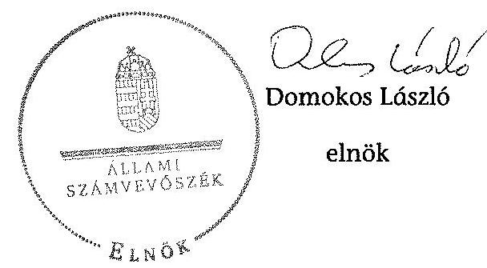

# JELENTÉS 

Az önkormányzatok gazdasági társaságai - Az önkormányzatok többségi tulajdonában lévő gazdasági társaságok közfeladat ellátását érintő gazdálkodási tevékenysége szabályszerűségének ellenőrzése Záhonyi Hőtermelő és Távhőszolgáltató Korlátolt Felelősségű Társaság

---

# Állami Számvevőszék 

Iktatószám: V-0475-194/2014.
Témaszám: 1509
Vizsgálat-azonosító szám: V067116

## Az ellenőrzést felügyelte:

Dr. Horváth Margit
felügyeleti vezető
Az ellenőrzést vezette és az ellenőrzés végrehajtásáért felelős:
Valastyánné dr. Vízhányó Júlia
ellenőrzésvezető
A jelentéstervezet összeállításában közreműködtek:
Dr. Baloghné Sebestyén Éva
számvevő
Szarka Péterné
számvevő vezető főtanácsos
Az ellenőrzést végezték:
Dr. Nagyné dr. Stieber Dr. Knapp József
Tünde
külső szakértő
külső szakértő

---

# TARTALOMJEGYZÉK 

BEVEZETÉS ..... 7
I. ÖSSZEGZŐ MEGÁLLAPÍTÁSOK, KÖVETKEZTETÉSEK, JAVASLATOK ..... 10
II. RÉSZLETES MEGÁLLAPÍTÁSOK ..... 20

1. Az Önkormányzat közfeladat-ellátásának szabályszerűsége ..... 20
1.1. A közfeladat-ellátás megszervezése és a feladatellátás feltételrendszerének kialakítása ..... 20
1.2. A közfeladat-ellátás felügyelete és a tulajdonosi jogok érvényesítése ..... 24
2. A HŐTÁV Kft. közfeladat ellátással kapcsolatos tevékenysége ..... 33
2.1. A HŐTÁV Kft. gazdálkodásának szabályozottsága ..... 33
2.2. A HŐTÁV Kft. vagyongazdálkodása ..... 34
2.3. A beszámolási kötelezettség teljesítése ..... 37
3. A távhőszolgáltatás közfeladata bevételei és ráfordításai elszámolásának és önköltségszámításának szabályszerűsége ..... 37
3.1. A távhőszolgáltatás közfeladat bevételeinek és ráfordításainak szabályszerűsége ..... 37
3.2. Az önköltségszámítás szabályszerűsége ..... 43
MELLÉKLETEK
4. számú A Záhonyi HŐTÁV Kft. tevékenységének főbb adatai
5. számú A Záhonyi HŐTÁV Kft. működésének főbb jellemzői
6. számú A Záhonyi HŐTÁV Kft. által biztosított közszolgáltatás díjai a 2009-2012. évekre vonatkozóan
FÜGGELÉKEK
7. számú Értelmező szótár
8. számú Mintavételi eljárások ellenőrzési területenként

---

.

---

# RÖVIDÍTÉSEK JEGYZÉKE 

## EU-s joganyagok

479/2009EK rendelete

## Törvények

Áfa tv.
Áht. 1
Áht. 2
Ámt.
ÁSZ tv.
Gt.
Kbt.
Mötv.

Nvtv.

Ptk.
Számv. tv.
Taktv.

A Tanács 2009. május 25-i 479/2009/EK rendelete, az Európai Közösséget létrehozó szerződéshez csatolt, a túlzott hiány esetén követendő eljárásról szóló jegyzőkönyv alkalmazásáról
az általános forgalmi adóról szóló 2007. évi CXXVII. törvény (hatályos: 2008. január 1-jétől)
az államháztartásról szóló 1992. évi XXXVIII. törvény (hatálytalan: 2012. január 1-jétől)
az államháztartásról szóló 2011. évi CXCV. törvény (hatályos: 2012. január 1-jétől)
az árak megállapításáról szóló 1990. évi LXXXVII. törvény (hatályos: 1991. január 1-jétől)
az Állami Számvevőszékről szóló 2011. évi LXVI. törvény (hatályos: 2011. július 1-jétől)
a gazdasági társaságokról szóló 2006. évi IV. törvény (hatálytalan: 2014. március 15-étől)
a közbeszerzésekről szóló 1995. évi XL. törvény (hatályos: 1995. november 1-jétől 2004. április 30-ig)
Magyarország helyi önkormányzatairól szóló 2011. évi CLXXXIX. törvény (hatályos: 2012. január 1-jétől, kivéve a 144. § (2) bekezdésben meghatározott paragrafusok, amelyek 2012. április 15-én, a (3) bekezdésben meghatározott paragrafusok, amelyek 2013. január 1-jén léptek hatályba, a (4) bekezdésben meghatározott paragrafusok a 2014. évi általános önkormányzati választások napján lépnek hatályba)
a nemzeti vagyonról szóló 2011. évi CXCVI. törvény (hatályos: 2011. december 31-étől, kivéve a 20. § (2) bekezdésben meghatározott paragrafusok, amelyek 2012. január 1-jétől, a (3) bekezdésben meghatározott paragrafusok 2013. január 1-jétől, a (4) bekezdésben meghatározott paragrafus 2012. március 2-ától léptek hatályba)
a helyi önkormányzatokról szóló 1990. évi LXV. törvény (hatálytalan: a 2014. évi általános önkormányzati választások napjától)
a Polgári Törvénykönyvről szóló 1959. évi IV. törvény (hatálytalan: 2014. március 15-étől)
a számvitelről szóló 2000. évi C. törvény (hatályos: 2001. január 1-jétől)
a köztulajdonban álló gazdasági társaságok takarékosabb működéséről szóló 2009. évi CXXII. törvény (hatályos: 2009. december 4-étől)

---

Tao. tv.
Tszt.
Stabilitási tv.

## Rendeletek

157/2005. (VIII. 15.)
Korm. rendelet
289/2007. (X. 31.) Korm. rendelet
36/2009. (VII. 22.)
KHEM rendelet

50/2011. (IX. 30.) NFM rendelet

51/2011. (IX. 30.) NFM rendelet
Ávr.
önkormányzati SZMSZ

Hivatali SZMSZ
vagyonrendelet
távhő rendelet ${ }_{1}$
a társasági adóról és az osztalékadóról szóló 1996. évi LXXXI. törvény (hatályos 1997. január 1-jétől)
a távhőszolgáltatásról szóló 2005. évi XVIII. törvény (hatályos: 2005. július 1-jétől)
Magyarország gazdasági stabilitásáról szóló 2011. évi CXCIV. Tv (hatályos 2012. január 1-jétől)
a távhőszolgáltatásról szóló 2005. évi XVIII. törvény végrehajtásáról
a lakossági vezetékes gázfogyasztás és távhő-felhasználás szociális támogatásáról
a távhőszolgáltatás csatlakozási díjának és a lakossági távhőszolgáltatás díjának, valamint a hőenergia távhőtermelő és a távhőszolgáltató közötti szerződésben alkalmazott árának meghatározása során figyelembe veendő szempontokról, és a Magyar Energia Hivatal által lefolytatott eljárásban kötelezően benyújtandó adatok köréről (hatályos: 2009. augusztus 25-től)
a távhőszolgáltatónak értékesített távhő árának, valamint a lakossági felhasználónak és a külön kezelt intézménynek nyújtott távhőszolgáltatás díjának megállapításáról (hatályos: 2011. október 1-jétől)
a távhő-szolgáltatási támogatásról (hatályos: 2011. október 1-jétől)
az államháztartási törvény végrehajtásáról szóló 368/2011. (XII. 31.) Korm. rendelet (hatályos: 2012. I. 1-jétől)
Záhony Város Önkormányzat Képviselő-testületének 13/2011. (VI. 1.) számú rendelete a Képviselő-testület Szervezeti és Működési Szabályzatáról (hatályos: 2011. július 1-től, módosítások: 10/2012. (III. 9.), 13/2012. (V. 31.), 24/2012. (XII. 20.) számú rendelet)

Záhony Város Önkormányzat Képviselő- testület Hivatalának Szervezeti és Működési szabályzata (31/2008. (IV. 23.) ÖKT számú, hatályos: 2008. május 1-től, módosítások: 12/2010. (II. 25.) számú ÖKT határozat)
Záhony Város Önkormányzatának 9/2001. (IV. 27.) számú rendelete az Önkormányzat vagyonáról, a vagyontárgyak feletti tulajdonosi jogok gyakorlásáról (hatályos: 2001. május 27-étől, módosítások: 14/2001 (V. 25.), 25/2001 (XII. 27.), 9/2002. (IV. 30.), 11/2002. (VI. 17.), 17/2003. (VI. 4.), 32/2003. (XII. 30.), 23/2005. (XI. 28.), 9/2006. (IV. 7.), 17/2007. (XI. 19.), 19/2009. (XII. 22.), 10/2010. (IV. 6.), 6/2011. (II. 21.), 8/2011. (III. 9.), 24/2011. (XII. 28.), 8/2012. (III. 9.), 11/2013. (V. 22.)
a távhőszolgáltatásról szóló 12/2008. (VII. 9.) rendelet, hatályos: 2008. 07. 15. napjától, 2011. 09. 15. napjáig

---

távhő rendelet ${ }_{2}$
távhődíj rendelet

## Szórövidítések

Alapító Okirat
áfa
ÁSZ
EU
HŐTÁV Kft.
FB
jegyző
Képviselő-testület
Önkormányzat
polgármester
Polgármesteri hivatal
Képviselő-testület
TIGÁZ
szolgáltatási szerződés

Magyar Energia Hivatal ügyvezetés
a távhőszolgáltatásról szóló 15/2011. (IX. 15.) rendelet, hatályos: 2011. szeptember 15-étől
A távhőszolgáltatás legmagasabb hatósági díjáról és a díjalkalmazás feltételeiről szóló 31/2004. sz. rendelet, hatályos: 2004. június 01. napjától, módosítások: 21/2007.(XII.22.) ÖKT számú rendelet, 11/2008. (VII. 9.) ÖKT számú rendelet, 18/2008. (IX. 27.) ÖKT számú rendelet, 21/2008. (XII. 27.) ÖKT számú rendelet, 17/2009. (XI. 3.) ÖKT számú rendelet, 19/2009. (XII. 22.) ÖKT számú rendelet, 14/2010. (IV. 27.) számú rendelet, 1/2011.(I. 22.) számú rendelet, 17/2011. (IX. 17.) számú rendelet, 4/2012. (III. 9.) számú rendelet.

Záhony Város Önkormányzatának Alapító Okirata 100/2008. (IX. 22.), és módosításai: 62/2009. (V. 27.), 56/2011. (IV. 15.), 90/2011. (VI. 21.), 29/2012. (III. 9.). általános forgalmi adó
Állami Számvevőszék
Európai Unió
Záhonyi Hőtermelő és Távhőszolgáltató Korlátolt Felelősségű Társaság
HŐTÁV Kft. Felügyelőbizottsága
Záhony Város Önkormányzatának jegyzője
Záhony Város Önkormányzatának Képviselő-testülete
Záhony Város Önkormányzata
Záhony Város Önkormányzatának Polgármestere
Záhony Város Önkormányzatának Polgármesteri hivatal
Záhony Város Önkormányzatának Képviselő-testülete
TIGÁZ Tiszántúli Gázszolgáltató Zártkörűen működő Részvénytársaság
Záhony Város Önkormányzata és a Záhonyi Hőtermelő és Távhőszolgáltató Korlátolt Felelősségű Társaság között létrejött szolgáltatási szerződés (hatályos: 1997. október 1-jétől és annak módosításai: 1. számú: hatályos: 1999. július 22-étől, 2. számú 6/1999. (I. 28.) ÖKT sz. határozat, hatályos: 1999. november 4-től, 3. számú: 11/2000. ((II. 29.) ÖKT számú határozat, hatályos: 2000. február 29-étől, 4. számú: hatályos 2007. január 15-étől, 5. számú: 14/2010. (II. 25.) számú ÖKT határozat, hatályos 2010. február 25-étől. 6. számú: hatályos 2011. január 3-ától, 7. számú: hatályos 2011. április 19-étől, 8. számú: hatályos 2011. június 20-ától, 9. számú: 176/2011. (XII. 28.) ÖKT. számú határozat, hatályos 2011. február 28-ától, 10. számú: hatályos 2012. június 21-étől, (az Önkormányzat csak a bérleti díj emeléséről hozott határozatot, egyéb esetben a polgármester járt el.)
Magyar Energetikai és Közmű-szabályozási Hivatal HŐTÁV Kft. ügyvezetése

---

.

---

# JELENTÉS 

## Az önkormányzatok gazdasági társaságai - Az önkormányzatok többségi tulajdonában lévő gazdasági társaságok közfeladat ellátását érintő gazdálkodási tevékenysége szabályszerűségének ellenőrzése   Záhonyi Hőtermelő és Távhőszolgáltató Korlátolt Felelősségű Társaság

## BEVEZETÉS

Az Állami Számvevőszék középtávra szóló stratégiájában megfogalmazta, hogy a helyi önkormányzatok gazdálkodásában rejlő pénzügyi kockázatok feltárásával, az államháztartáson kívülre nyújtott költségvetési támogatások és ingyenes vagyonjuttatások, valamint az államháztartáson kívül működő közfeladat-ellátó rendszerek ellenőrzéseivel hozzájárul ahhoz, hogy a közpénzeket az államháztartáson kívül működő szervezetek is átlátható, rendezett módon használják fel a közfeladatok szerződésben vállalt ellátása érdekében.

Az önkormányzatok szervezetalakítási szabadságának következménye, hogy a korábban is vállalati formában működő (nagyvárosi tömegközlekedés, víz-, szennyvízcsatorna, köztisztasági, ingatlankezelés stb.) közszolgáltatások mellett, mind a kötelező, mind az önként vállalt feladatok ellátásában a gazdasági társaságok kiemelt fontosságú szerephez jutottak.

Záhony Városában az ellenőrzött időszakban a 1997-ben a MÁV Rt. és a MÁV Vagyonkezelő Rt. által alapított Záhonyi Hőtermelő és Távhőszolgáltató Kft. (HŐTÁV Kft.) alapfeladatként látta el a hőtermelési és távhőszolgáltatási tevékenységet. Záhony Város Önkormányzata 2009. évben megvásárolta a HŐTÁV Kft. 100\%-os üzletrészét, melynek jegyzett tőkéje ekkor $86,6 \mathrm{M} \mathrm{Ft}$ volt.

A HŐTÁV Kft. alaptevékenysége a 4385 fős lakosú Záhony Város közigazgatási területén a lakossági és intézményi körre kiterjedő, a hatályos jogszabályoknak megfelelő tartalmú közüzemi szolgáltatás, amely a felhasználónak a távhőtermelő létesítményből távhővezeték-hálózaton keresztül, az engedélyes által végzett, üzletszerű tevékenység keretében történő hőellátásával, fűtési, illetve egyéb hőszolgáltatási célú energia ellátásával valósult meg az ellenőrzött időszakban. A szolgáltatással nyolc kiszolgáló telephelyről 7 intézmény, 501 lakás és 38 közület ellátását biztosították. A HŐTÁV Kft. átlagos állományi létszáma 2012. január 1-jén 14 fő, 2013. január 1-jén 12 fő volt.

---

A társaság éves nettó árbevétele a 2009-2012. években 149,0 M Ft és 202,0 M Ft közötti volt. A HŐTÁV Kft. összes bevétele az ellenőrzött időszak egyetlen évében sem fedezte a ráfordításokat.

A társaság mérleg szerinti eszközállománya a 2009. évi 69,5 M Ft-ról a 2012. év végére $14,8 \%$-os növekedést követően $79,8 \mathrm{M}$ Ft-ra változott, ezen belül a tárgyi eszközök állománya $33 \%$-kal emelkedett.

Az ellenőrzött időszakban a HŐTÁV Kft. veszteségesen gazdálkodott, a saját tőke összetétele jelentősen megváltozott. A 2011. és a 2012. években a saját tőke hiányba fordult, a 2009. évi 28,6 M Ft-ról 2012. év végére $-7,8 \mathrm{M}$ Ft lett. A veszteség megszüntetésére és a tőkeegyensúly helyreállítására a tulajdonos intézkedéseket tett, de azok nem voltak elegendőek ahhoz, hogy a HŐTÁV Kft. pénzügyi egyensúlya helyreálljon, és a tőkeellátottsága megfeleljen az előírtaknak.

Záhony Város Önkormányzata a 2012. évben 125,1 M Ft állam által biztosított egyszeri vissza nem térítendő támogatást vett igénybe az adósságkonszolidáció keretében, amelynek egy részét az Önkormányzat tulajdonában lévő I. és II. számú hőközpont felújítására felvett hosszú lejáratú $32,6 \mathrm{M}$ Ft hitel és $0,9 \mathrm{M}$ Ft kamata megtérítésére fordították.

Az ellenőrzött időszakban a HŐTÁV Kft. ügyvezetőjének személye öt alkalommal, a gazdasági igazgató személye egy alkalommal változott. A jelenlegi ügyvezető 2012. július 1. óta tölti be tisztségét, gazdasági igazgató 2012. július 1-je óta nincs a HŐTÁV Kft-nél. A könyvelést külső könyvelő végzi, a jelenlegi ügyvezető felsőfokú közgazdasági végzettséggel rendelkezik, ennek megfelelően, valamint a HŐTÁV Kft. személyi és gazdasági volumenének csökkenése miatt a gazdálkodási feladatokat is ő látja el.

Az ellenőrzött időszakban a polgármester személye egy, a jegyző személye három alkalommal változott. A polgármester a 2010. évi önkormányzati választások óta tölti be tisztségét, a helyszíni ellenőrzés időszakában a munkakört betöltő jegyző 2013. augusztus 15-e óta látja el feladatát.

Az önkormányzati tulajdonú gazdasági társaságok teljes körű ellenőrzésének lehetőségét az Állami Számvevőszékről szóló 1989. évi XXXVIII. törvény 2011. január 1-jétől hatályos módosítása teremtette meg.

Az ellenőrzés célja annak értékelése volt, hogy

- az önkormányzat a jogszabályi előírások figyelembevételével döntött-e az ellenőrzésre kerülő közfeladat megszervezéséről; az önkormányzat szabályszerűen gyakorolta-e a tulajdonosi jogokat;
- a gazdasági társaság közfeladat-ellátása bevételeinek, ráfordításainak elszámolása, és vagyongazdálkodási tevékenysége megfelelt-e a jogszabályi, illetve a közszolgáltatási szerződésben foglalt tulajdonosi előírásoknak, azok végrehajtása szabályszerű volt-e;
- a közfeladatok átláthatósága és elszámoltathatósága érdekében biztosítva volt-e a közszolgáltatás díjának megalapozottsága szabályszerű önköltségszámítással.

---

Az ellenőrzés kiterjedt Záhony Város Önkormányzatára és a Záhonyi Hőtermelő és Távhőszolgáltató Korlátolt Felelősségű Társaságra.

Az ellenőrzés várható hasznosulása: A törvényalkotás számára - az észlelt problémák, szabálytalanságok, vagy egyéb nem kívánatos jelenségek felszínre kerülésével - az ellenőrzés megállapításai segítséget nyújthatnak az államháztartáson kívüli közfeladat-ellátás értékeléséhez, jogszabályi keretei pontosításához, átláthatóságot biztosító szabályozásához. Meghatározóvá válnak a közfeladat ellátásában részt vevő államháztartáson kívüli szervezeteknek az önkormányzat költségvetését, pénzügyi helyzetét is befolyásoló - kockázatai, lehetővé válik ezen kockázatok csökkentése. A feladatot ellátó gazdasági társaság a közszolgáltatási szerződésben foglaltak betartásával, a közvagyon használatával biztosította-e a szolgáltatás folytatásának feltételeit. Ezzel az ellenőrzöttek és a helyi döntéshozók számára az ÁSZ visszajelzést ad feladatszervezési, feladat-ellátási kockázataikról, alapot ad a meglévő hibák megszüntetéséhez, a jobb közfeladat-ellátás biztosításához. Fokozza a fegyelmet, igazolja, hogy lejárt a következmények nélküli ellenőrzések időszaka. Az ÁSZ értékteremtő rend kialakításához és megőrzéséhez hozzájáruló tevékenysége pozitív hatással van a szervezetről kialakított összkép formálására is.

A bevételek és ráfordítások elszámolása, valamint a vagyonnyilvántartás terén az egyes területek szabályszerű működését mintavétellel ellenőriztük, ez alapján a sokaságokban előforduló hibás tételek arányát becsültük. A jogszabályoknak és a belső előírásoknak megfelelőnek, azaz szabályszerűnek tekintettük az adott bevételek és ráfordítások elszámolását, a vagyonnyilvántartást, amennyiben a minta ellenőrzésének eredménye alapján $95 \%$-os bizonyossággal a teljes sokaságban a hibás tételek aránya kisebb volt, mint $10 \%$, nem megfelelőnek értékeltük, ha a hibás tételek aránya a 10\%-ot meghaladta. Kockázatot, illetve magas kockázatot jeleztünk, amennyiben egy adott terület vonatkozásában a minta alapján a teljes sokaságban nem volt teljes körűen biztosított a jogszabályoknak és a belső szabályzatoknak megfelelő működés.

Az ellenőrzést a számvevőszéki ellenőrzés szakmai szabályai szerint, szabályszerűségi ellenőrzés módszerével, a nemzetközi standardok figyelembevételével végeztük. Az ellenőrzés a 2008-2012. évekre terjedt ki.

Az ellenőrzés végrehajtásának jogszabályi alapját az Állami Számvevőszékről szóló 2011. évi LXVI. törvény 5. § (3)-(5) bekezdései képezték.

A Jelentés tervezetét észrevételezésre megküldtük Záhony Város Önkormányzata polgármesterének, valamint a társaság ügyvezetőjének. Az érintettek észrevételt nem tettek.

---

# I. ÖSSZEGZŐ MEGÁLLAPÍTÁSOK, KÖVETKEZTETÉSEK, JAVASLATOK 

A Záhonyi Hőtermelő és Távhőszolgáltató Kft.-t 1997. március 1-jén a MÁV Rt. és a MÁV Vagyonkezelő Rt. alapította hőtermelési és távhő-szolgáltatási tevékenység ellátására. A 2009. április 21-én kelt üzletrész adásvételi szerződés szerint Záhony Város Önkormányzata a 36/2009. (III. 25.) sz. határozata alapján 1000 Ft összegben vásárolta meg a MÁV Zrt. (90%) és a MÁV Vagyonkezelő Zrt. (10%) tulajdonában lévő HÖTÁV Kft. 100\%-os üzletrészét. Ekkor a gazdasági társaság jegyzett tőkéje 86,6 M Ft volt.

A gazdasági társaság megvásárlásának oka a MÁV Zrt. térségből való kivonulása volt. Az üzletrész-adásvételi megállapodás megkötése a Gt. és az Ötv. előírásaiban foglaltak figyelembevételével történt.

Az Önkormányzat kényszerhelyzetben volt a hőszolgáltatási kötelezettség, mint a Tszt.-ben meghatározott kötelező közfeladat teljesítésére tekintettel, mert a távhőtermelő létesítmény, a távhővezeték-hálózat és az eszközök önkormányzati tulajdonban voltak, továbbá csak a HÖTÁV Kft. rendelkezett a térségben a távhőtermelésre, valamint a távhőszolgáltatásra engedéllyel, ami a működéshez szükséges volt.

Az Önkormányzat az ellenőrzött időszakban két gazdasági programmal rendelkezett. Meghatározták a fejlesztési alapelveket, továbbá a stratégiai célok között a közüzemi szolgáltatások önkormányzati tulajdonú vagy érdekeltségű gazdasági társaságok ellátásával történő megvalósulását. A program a közszolgáltatási, városüzemeltetési feladatok között racionalizáló lépések megtételét írta elő a HÖTÁV Kft. működésével kapcsolatban. Az Önkormányzat és a HÖTÁV Kft. a közszolgáltatás biztosítására szolgáltatási szerződést kötött, ami a kötelező tartalmi elemeket rögzítette, azonban a gazdasági programban előírt racionalizáló intézkedésekre nem tért ki.

Az Önkormányzat a HÖTÁV Kft. részére biztosította a közfeladat ellátásához szükséges közvagyont, amelyet a tulajdonjog fenntartásával éves bérleti díj fizetése fejében üzemeltetésre adott át. A bérleti díjat a Képviselő-testület határozatai, valamint a szolgáltatási szerződés módosításáról szóló megállapodások tartalmazták, melynek megállapításánál az Önkormányzat figyelembe vette a HÖTÁV Kft. gazdasági helyzetét.

Az Önkormányzat vagyonrendeletben határozta meg a tulajdonosi jogok gyakorlásának szabályait. A szabályozás szerint a tulajdonosi jogokat a Képviselő-testület gyakorolta, illetve átruházott hatáskörben a polgármester. Az Önkormányzat, mint tulajdonos képviseletében a polgármester járt el. Az ellenőrzött időszakban a HÖTÁV Kft. működésének közvetlen felügyeletére két alkalommal tulajdonosi képviselőt jelölt ki a Képviselő-testület. A tulajdonosi jogokat az Önkormányzat az Ötv.-ben és a Gt.-ben meghatározott előírások szerint gyakorolta.

---

A HÖTÁV Kft. 2009. évi gazdálkodása veszteséges volt, ennek ellenére az Önkormányzat az ügyvezetőt 50\% prémiumban részesítette, illetve 2010. év első negyedéves teljesítménye alapján az első negyedév vonatkozásában bruttó bére 75\%-ának megfelelő prémiumelőleget határozott meg. A HÖTÁV Kft. annak ellenére fizetett ki az ügyvezető részére prémiumelőleget, hogy a javadalmazási szabályzat ezt kifejezetten megtiltotta.

A távhőszolgáltatás legmagasabb hatósági díjáról és a díjalkalmazás feltételeiről az Önkormányzat rendeletben döntött, melyet az ellenőrzött időszakban többször módosítottak. A rendelet mellékletét képező árkalkuláció szerint kerültek megállapításra az alapdíj és a hődíjak. A rendelet mellékleteiben az Önkormányzat az energiaárak változására figyelemmel standard paraméterek szerint állapította meg a távhőszolgáltatás legmagasabb hatósági díját. Az árkalkuláció számadataihoz részletes kimutatást a változtatások időpontjára nem készítettek, így annak valós tartalma nem volt megállapítható. Az árkalkulációban nem szerepelt az amortizáció és a működéshez szükséges nyereségtétel. A Tszt.-ben foglaltak ellenére az ármegállapítási kalkulációt előzetes véleményezésre nem küldték meg a Nemzeti Fogyasztóvédelmi Hatóságnak. A távhőszolgáltatás legmagasabb hatósági díjáról és a díjalkalmazás feltételeiről szóló rendeletében az Önkormányzat a Tszt.-ben foglalt előírás ellenére nem határozott meg csatlakozási díjat.

A HÖTÁV Kft. üzletrészének Önkormányzat által történt megvásárlását követően üzleti tervet sem a 2009. évre, sem a 2010. évre a társaság ügyvezetése nem készített, annak kötelezettségét az Önkormányzat nem írta elő. A 2011. és 2012. évekre készített a HÖTÁV Kft. üzleti terveket, amelyek azonban nem tartalmaztak a közfeladat-ellátás mennyiségére és minőségére meghatározott elvárásokat. A hiányosságok jogszabályi rendelkezést nem sértettek.

A HÖTÁV Kft. vesztesége 2009-ben 16,9 M Ft, 2010-ben 34,3 M Ft, 2011-ben 10,3 M Ft és 2012-ban 12 ezer Ft volt. Az ellenőrzött négy évben realizált 773,2 M Ft bevétel nem nyújtott fedezetet a 834,8 M Ft-ot kitevő költségekre és ráfordításokra, melynek következtében az időszak felhalmozott mérleg szerinti vesztesége 61,6 M Ft volt.

A veszteséges gazdálkodás következtében a HÖTÁV Kft. tőkeegyensúlya felborult. A 2010. évben a saját tőke a jegyzett tőkének csupán 6\%-át tette ki, a 2011. és 2012. évet egyaránt 7,8 M Ft saját tőke hiánnyal zárták.

A munkaerőlétszám csökkentése, valamint a korszerű fűtőanyagok használata sem oldotta meg a HÖTÁV Kft. rossz gazdasági helyzetét, ezért az Önkormányzat 2009. évben tulajdonosi döntéssel a törzstőkét 86,6 M Ft-ról 1,0 M Ft-ra szállította le a Gt. előírásaiban meghatározott saját tőke rendezése érdekében. A HÖTÁV Kft. működőképessége azonban ezután is csak további intézkedésekkel volt fenntartható. Az Önkormányzat 2009. évben a HÖTÁV Kft. 20,0 M Ft folyószámlahiteléhez és annak járulékos költségeihez készfizető kezességet vállalt.

Az Önkormányzat a 2010. és 2011. években negyedévente beszámoltatta a HÖTÁV Kft. ügyvezetőjét, valamint további létszámcsökkentésről intézkedett. A likviditási helyzet átmeneti megoldására a 2010. évben kölcsönt nyújtott a

---

HÖTÁV Kft. részére 25,3 M Ft összegben. A kölcsön összegéből 8,3 M Ft a Képviselő-testület döntése értelmében a 2011. évben tőketartalékba került. Az Önkormányzat döntéseinél figyelembe vette az FB és a HÖTÁV Kft. könyvvizsgálójának a véleményét.

A gázszolgáltatás felfüggesztésének megakadályozása érdekében a 2012. évben a tulajdonos Önkormányzat közjegyző előtt tett egyoldalú kötelezettségvállalással nyilatkozott a TIGÁZ-zal szemben fennálló 57,3 M Ft összegű lejárt tartozás megfizetéséről. A HÖTÁV Kft. ismételt részletfizetési kérelmét a TIGÁZ elutasította, ezért a hőszolgáltatási tevékenység fenntartása érdekében a Képviselő-testület döntése szerint az Önkormányzatnak, mint tulajdonosnak a HÖTÁV Kft. helyett annak kötelezettségét teljesíteni kellett.

A tőkeegyensúly helyreállítására tett tulajdonosi intézkedések nem voltak elegendőek ahhoz, hogy a HÖTÁV Kft. tőkeellátottsága megfeleljen a Gt. előírásaiban foglaltaknak. Súlyosbította a helyzetet, hogy a HÖTÁV Kft. éves beszámolói elsősorban a követelések szabálytalan értékelése miatt nem a valós vagyoni, jövedelmi helyzetet mutatták, a veszteség és a tőkehiány valójában a beszámolókban kimutatottnál magasabb volt.

A HÖTÁV Kft. éves számviteli beszámolóit a 2009-2011. években könyvvizsgáló ellenőrizte. Az Alapító Okirat 2012. március 28-i módosítása szerint a könyvvizsgáló jogviszonyát megszüntették. A 2012. július 1-jei Alapító Okirat módosítása szerint az FB-t is megszüntették, ami ellentétes a Taktv.-ben előírtakkal, miszerint a köztulajdonban álló gazdasági társaságnál felügyelő bizottság létrehozása kötelező.

A 2011. évi számviteli beszámolóhoz közzétett és csatolt könyvvizsgálói jelentés nem felelt meg a Számv. tv.-ben foglaltaknak, mert annak adatai eltértek a beszámoló adataitól. Az eltérés indoka nem volt megállapítható. A HÖTÁV Kft. a könyvvizsgálói vélemény nélkül kibocsátott 2012. évi számviteli beszámolójával megsértette a Tszt. előírását.

Az Önkormányzat belső ellenőrzési feladatait ellátó Záhony és Térsége Többcélú Kistérségi Társulása a Képviselő-testület által jóváhagyott 2011. évi ellenőrzési tervében szerepeltette a HÖTÁV Kft. ellenőrzését a rendelkezésre álló erőforrásokkal való gazdálkodás, a vagyon megóvása, gyarapítása, az elszámolások, beszámolók megbízhatósága tárgyában, de a HÖTÁV Kft. ellenőrzése elmaradt.

A HÖTÁV Kft. nem határozta meg a jogszabályi előírásoknak és ágazati sajátosságoknak megfelelően az üzletágak bevételeinek és ráfordításainak elkülönített nyilvántartását. Nem hajtotta végre a Tszt. számviteli szétválasztásra vonatkozó előírásait. A közfeladatok bevételeinek és ráfordításainak egyértelmű elhatárolásához szükséges előírásokat nem dolgozták ki, ezeket a számviteli szabályzataiban nem rögzítették, illetve az ellenőrzött időszakban nem adtak ki olyan vezetői utasítást sem, amelyben a Tszt. szerinti számviteli elkülönítési szabályok érvényre jutása érdekében intézkedtek volna.

A HÖTÁV Kft. számviteli politikája nem felelt meg a Számv. tv. előírásainak, és nem történt meg az előírásoknak megfelelő aktualizálása sem. A Számv. tv.

---

rendelkezése ellenére a számviteli politika részeként nem készítették el a leltárkészítési és leltározási szabályzatot. A Számv. tv.-ben előírt számlarendet 2009. január 1-jétől helyezték hatályba, de azt a jogszabályi változásoknak megfelelően nem módosították.

A HÖTÁV Kft. az ellenőrzött időszakban nem készített üzletszabályzatot, ennek megfelelően azt az Önkormányzat jegyzője nem hagyta jóvá, és a fogyasztóvédelmi hatóság nem véleményezte, megsértve ezzel a Tszt.-ben foglaltakat.

A HÖTÁV Kft. az ellenőrzött időszak minden egyes évében jelentős követelésállománnyal rendelkezett, melynek meghatározó része a közszolgáltatáshoz kapcsolódó vevőkövetelés-állomány. A hátralékos állomány csökkentésére irányuló intézkedéseket nem határozták meg, a követelések behajtását nem szabályozták, ily módon az eredményes behajtást belső szabályzat alkalmazása nem segíthette. A fizetési határidő lejárta után a követelések behajtására tett intézkedések, melyek részletfizetési megállapodások megkötésében, illetve a fogyasztók szolgáltatásból történő kizárásában merültek ki, nem eredményezték a behajtási tevékenység javulását, illetve a követelésállomány csökkenését. Az adósokról vezetett nyilvántartás csak részben biztosított információt a hátralékos követelésekről. A követelések év végi értékelése nem volt szabályszerű, a HŐTÁV Kft. nem tett eleget a Számv. tv. előírásaiban foglaltaknak, mert a bizonytalan megtérülésűnek minősülő követelésekre az értékvesztés elszámolása - az e nélkül is veszteséges gazdálkodás miatt - elmaradt, vagy nem megfelelően történt meg. Behajthatatlan követelést egyik évben sem írtak le, holott a HŐTÁV Kft. becslése alapján a lejárt követelések mintegy 40-50%-a behajthatatlan kategóriába tartozott, ezáltal a HŐTÁV Kft. nem tartotta be a Számv. tv. előírását. Az értékvesztések és a behajthatatlan követelések jogszerű elszámolása hiányának eredményeként a beszámolók az ellenőrzött időszakban nem a valós vagyoni, jövedelmi helyzetet mutatták azzal, hogy a szabálytalan elszámolás nem megfelelő mértékben mutatta be a veszteséget, egyben a gazdasági társaság saját tőke hiányát.

A HŐTÁV Kft. az ellenőrzött időszakban nem rendelkezett iratkezelési, adatvédelmi, adatbiztonsági és a közérdekű adatok közzétételére vonatkozó szabályzattal. Az ellenőrzött időszak minden évében eleget tettek a jogszabályokban és az Önkormányzat belső szabályzatában előírt adatszolgáltatási kötelezettségnek, így a tárgyévet követő év május 31-éig a Képviselő-testület elé terjesztették az éves számviteli beszámolót és a Számv. tv.-ben foglaltakkal összhangban biztosították az éves számviteli beszámoló könyvvizsgálói záradékkal (2012. évet kivéve) együtt határidőben történő közzétételét.

A HŐTÁV Kft. 2009-2011. évi bevételeinek, anyagjellegű és egyéb ráfordításainak elszámolása nem volt szabályszerű, mert a közfeladattal kapcsolatos bevételek és ráfordítások elkülönítése a főkönyvi és analitikus elszámolásokban és az éves beszámolókban nem történt meg. A Tszt. előírásai és a Magyar Energia Hivatal határozatában foglaltak végrehajtása érdekében a HŐTÁV Kft. a 2012. évi beszámoló kiegészítő melléklete részeként - analitikus kigyűjtések alapján - elkészítette a mérleg és az eredménykimutatás adatainak tevékenységi bontását, de az nem volt pontos, mert a közfeladat bevételei alaptevékenységen kívüli bevételeket is tartalmazott, továbbá - helytelenül - az

---

alaptevékenységen kívüli tevékenységként tartalmazta az energiaadó összegét. A kiegészítő melléklet részeként közzétett utólagos feldolgozást a főkönyvi könyvelési adatok nem támasztották alá. A bevételek főkönyvi elszámolásának eseti hiányossága volt, hogy a bevételeket nem a megfelelő számlacsoportban számolták el. Az egyszerű mintavétellel vett minták ellenőrzése során könyvelési minősítési hibát és alapbizonylat, illetve számla hiányát tártunk fel, mellyel a HŐTÁV Kft. megsértette a Számv. tv. valódiság elvére vonatkozó előírását.

A HŐTÁV Kft. a tulajdonában lévő tárgyi eszközökről (saját eszközeiről) nem vezetett analitikus nyilvántartást, illetve a közfeladat végzését szolgáló saját eszközöket nem különítette el, ezáltal nem biztosították a távhődíjről szóló KHEM rendeletben meghatározott árképzési költségelemek meghatározhatóságát. Az ellenőrzött időszak éves számviteli beszámolóinak kiegészítő mellékleteiben a Számv. tv. előírásának megfelelően szerepeltették az eszközök leírásával kapcsolatos információkat, valamint rögzítették, hogy terven felüli értékcsökkenési leírás elszámolására, illetve visszaírására nem került sor. Az ellenőrzött időszakban a saját eszközök értékcsökkenési leírásának elszámolási módszere nem változott, egyik évről a másikra azonban több eszköz leírási kulcsát megváltoztatták, de a Számv. tv. előírása ellenére a kiegészítő mellékletben ezt nem indokolták.

A HŐTÁV Kft. számviteli politikában rögzített döntése szerint az 50 ezer Ft egyedi beszerzési érték alatti tárgyi eszközök értékét a használatbavételkor egy összegben számolták el értékcsökkenési leírásként. A számviteli politika szabályozásától eltérően azonban a HŐTÁV Kft. 2010. évtől már a 100 ezer Ft alatti tárgyi eszközök és immateriális javak bekerülési értékét is elszámolta azonnali leírásként. Emellett a kis értékű eszközökről semmiféle nyilvántartást nem vezettek. A kis értékű tárgyi eszközök értékcsökkenésének elszámolása nem felelt meg a számviteli politikában rögzítetteknek.

A HŐTÁV Kft. a Számv. tv.-ben előírt önköltség-számítási szabályzat készítésére az ellenőrzött években nem volt kötelezett. Ugyanakkor a Tszt., valamint az Európai Parlament és a Tanács 1370/2007/EK. számú rendelet melléklete a közfeladat átláthatósága és a keresztfinanszírozás elkerülése érdekében előírja a nem kizárólag közfeladatot ellátók számára a tevékenységek elkülönítését és a közvetett, és általános költségek hatékony számviteli jogszabályok szerinti felosztását. A közszolgáltatás díjainak, a közpénzek felhasználásának, és a köztulajdon használatának nyilvánossága, és ellenőrizhetősége érdekében is szükséges a közszolgáltatási tevékenység önköltségszámítását szabályozni, és azt bemutatni. A HŐTÁV Kft.-nél az önköltségszámítás megítéléséhez szükséges információk nem álltak rendelkezésre, emiatt nem volt biztosított a 36/2009. (VII. 22.) KHEM rendeletben foglaltak teljesülése, nem állapítható meg, hogy a lakossági távhőszolgáltatás díjában kizárólag az e tevékenységhez kapcsolódóan ténylegesen felmerülő és a távhő-szolgáltatási tevékenység folytatásához szükséges költségeket, valamint a hatékony vállalkozás működéséhez szükséges nyereséget vették-e figyelembe.

A fentiekben leírtak összegzéseként az alábbi megállapításokat tesszük:
A konstrukcióból eredő sajátosság az volt, hogy az Önkormányzat a közfeladat ellátásához szükséges közvagyont a tulajdonjog fenntartásával éves

---

bérleti díj fizetése fejében üzemeltetésre adta át. A tulajdonosi jogokat az Önkormányzat a jogszabályi előírásoknak megfelelően gyakorolta. A HŐTÁV Kft. részére az Önkormányzat üzleti terv-készítési kötelezettséget nem írt elő. A HŐTÁV Kft. az ellenőrzött időszakban veszteséggel gazdálkodott. A veszteség fő oka a szolgáltatási díj ellenértékének meg nem fizetése volt. A távhőszolgáltatás legmagasabb hatósági díjáról és a díjalkalmazás feltételeiről szóló rendeletében az Önkormányzat nem határozott meg csatlakozási díjat.

Ezen túlmenően a működés kockázata növekedett, mert a 2012. évben az FB-t és a könyvvizsgáló jogviszonyát megszüntették, továbbá az Önkormányzat belső ellenőrzése a távhőszolgáltatás, mint közfeladat-ellátás szabályszerű teljesítéséhez nem járult hozzá. Az ellenőrzött időszakban a HŐTÁV Kft. nem hajtotta végre a számviteli szétválasztásra vonatkozó előírásokat.

Pénzügyi kockázatot jelentett, hogy a társaság számviteli politikája nem felelt meg a törvényben foglaltaknak és nem történt meg az előírásoknak megfelelő aktualizálása sem. A HŐTÁV Kft. nem készített leltárkészítési és leltározási szabályzatot, illetve nem rendelkezett üzletszabályzattal, iratkezelési, adatvédelmi, adatbiztonsági és a közérdekű adatok közzétételére vonatkozó szabályzattal. A HŐTÁV Kft. 2009-2011. évi bevételeinek, anyagjellegű és egyéb ráfordításainak elszámolása nem volt szabályszerű. A társaság az ellenőrzött időszak minden egyes évében jelentős követelésállománnyal rendelkezett, azonban a bizonytalan megtérülésűnek minősülő követeléseire nem kellő mértékben, illetve egyáltalán nem számolt el értékvesztést.

Az Állami Számvevőszékről szóló 2011. évi LXVI. törvény 33. § (1) bekezdésében foglaltak értelmében a jelentésben foglalt megállapításokhoz kapcsolódó intézkedési tervet köteles az ellenőrzött szervezet vezetője összeállítani, és azt a jelentés kézhezvételétől számított 30 napon belül az ÁSZ részére megküldeni. Amennyiben az intézkedési tervet határidőben nem küldi meg a szervezet, vagy az nem elfogadható, az ÁSZ elnöke a hivatkozott törvény 33. § (3) bekezdésében foglaltakat érvényesítheti.

Az ellenőrzés intézkedést igénylő megállapításai és javaslatai:
Javaslataink célja a Kft. gazdálkodása szabályszerűségének helyreállítása annak érdekében, hogy a szabályozási környezet megfelelően tudja támogatni az átlátható működést.

# Javasoljuk a Záhonyi Hőtermelő és Távhőszolgáltató Kft. (HŐTÁV Kft.) ügyvezető igazgatójának:

1.  A HŐTÁV Kft. nem készített a Számv. tv. 14.§ (5) bekezdésében foglaltak ellenére a számviteli politika részeként leltárkészítési és leltározási szabályzatot. A HŐTÁV Kft. nem készített a Tszt. 7. § (1) bekezdés b) pontja szerinti üzletszabályzatot, valamint hiányzott az információs önrendelkezési jogról és az információszabadságról szóló 2011. évi CXII. törvény előírásai szerinti adatvédelmi, adatbiztonsági és a közérdekű adatok közzétételére vonatkozó szabályzata, továbbá elmulasztotta a közfeladatot ellátó szervek iratkezelésének általános követelményeiről szóló 335/2005. (XII. 29.) Korm. rendeletben előírt iratkezelési szabályzat elkészítését. A HŐTÁV Kft. a Számv.

---

tv. 14. § (11) bekezdésében előírtak ellenére elmulasztotta szabályzatainak aktualizálását.

A HŐTÁV Kft. számlarendje nem tartalmazta a Kft. tevékenységéhez, a közfeladat sajátosságaihoz igazodó főkönyvi és analitikus nyilvántartások rendjét, ezzel megsértették a Számv. tv. 161/A. § (1) és (2) bekezdésében foglaltakat, valamint a Magyar Energia Hivatal 2012. március 5-én kelt 164/2012. sz. határozata I.1.8. pontja szerinti számviteli szétválasztásra vonatkozó előírásait, melyek szerint úgy kell megbontani a közfeladattal kapcsolatos bevételeket és ráfordításokat a főkönyvi és analitikus elszámolásokban, hogy a Tszt. 18/A. §-ban meghatározott részletező adatok rendelkezésre állhassanak. A HŐTÁV Kft. nem határozta meg a jogszabályi előírásoknak és ágazati sajátosságoknak megfelelően az üzletágak bevételeinek és ráfordításainak elkülönített nyilvántartását. A közfeladatok bevételeinek és ráfordításainak egyértelmű elhatárolásához szükséges előírásokat nem dolgozta ki, ezeket a számviteli szabályzataiban nem rögzítette, illetve az ellenőrzött időszakban nem adott ki olyan vezetői utasítást sem, amelyben a kötelező elkülönítésre intézkedés történt volna.

Javaslat:

# Intézkedjen a szabályozási hiányosságok megszüntetésére, ennek keretében:

a) készítse el a leltárkészítési és leltározási, valamint az üzletszabályzatát, továbbá az iratkezelési, adatvédelmi, adatbiztonsági és a közérdekű adatok közzétételére vonatkozó szabályzatát;
b) gondoskodjon továbbá a szabályzatai jogszabályi előírásoknak megfelelő aktualizálásáról;
c) egészítse ki a Számviteli politikáját az értékcsökkenés szabályozásával, illetőleg Számlarendjét úgy, hogy az a jogszabályokban előírt számviteli szétválasztási szabályokat megfelelő részletezésben teljesítse, ennek megfelelően készítsen olyan elkülönített nyilvántartást, amely biztosítja az egyes tevékenységek átláthatóságát, az üzletágak bevételeinek és ráfordításainak elkülönítését;
2. A HŐTÁV Kft. az ellenőrzött időszak minden egyes évében jelentős követelésállománnyal rendelkezett, melynek meghatározó része a közszolgáltatáshoz kapcsolódó vevőkövetelés-állomány volt, és döntő részben a magánszemély fogyasztók tartozását tartalmazta. A hátralékos állomány csökkentésére nem határoztak meg intézkedéseket. A behajtási tevékenység nem volt kellően hatékony.

A HŐTÁV Kft. a Számv. tv. 16. § (1) bekezdésében foglaltakkal ellentétben évente és fogyasztónként nem mutatta ki az összes tartozást és az elszámolt értékvesztés, valamint a visszaírás összegét. A HŐTÁV Kft. értékelési szabályzatában előírt, az év végi zárlati munkák keretében történő vevőkövetelések minősítését (teljes értékű, kétes, határidőn túli stb.) nem dokumentálták. Behajthatatlan követelést egyik évben sem írtak le, holott a HŐTÁV Kft. becslése alapján a lejárt követelések mintegy 40-50%-a a behajthatatlan kategóriába tartozott. A Számv. tv. 65. § (7) bekezdésének előírásával ellentétben a bizonytalan megtérülésűnek minősülő követelésekre az értékvesztés elszámolása elmaradt vagy nem kellő mértékben történt meg.

Javaslat:

---

# Gondoskodjon a jogszabályi előírások szerinti gyakorlat és a szabályos működés biztosítására, ezen belül:

tegyen intézkedéseket a lejárt vevőkövetelés- állomány csökkentésére, ennek érdekében:
a) alakítson ki naprakész és teljes körű nyilvántartást a lejárt vevőkövetelések állományáról, amely biztosítja a követelések alakulásának adósok szerinti áttekinthetőségét és nyomon követését;
b) intézkedjen a követelések lejárati kategóriák szerinti minősítésére vonatkozó előírások betartása érdekében;
c) intézkedjen a behajthatatlannak minősített követelések év végi, jogszabályoknak megfelelő elszámolásáról;
d) a határidőn túli követeléseknél a jogszabályi előírásoknak megfelelően számoljon el értékvesztést.
3. A HŐTÁV Kft. a bevételeit nem minden esetben a megfelelő számlacsoportban számolta el, ugyanis a lakosság részére végzett különböző szerelési munkákat több esetben az alaptevékenység árbevétele főkönyvi számlára könyvelték.

A HŐTÁV Kft. a tulajdonában lévő tárgyi eszközökről nem vezetett analitikus nyilvántartást, így nem tudta teljesíteni a Számv. tv. 165. § (4) bekezdésében előírtakat. A társaság a közfeladat végzését szolgáló saját eszközöket nem különítette el, ezáltal nem biztosították a 36/2009. (VII. 22.) KHEM rendeletben meghatározott árképzési költségelemek meghatározhatóságát.

A társaság saját Számviteli politikájában történő szabályozásától eltérően 2010. évtől már a 100 ezer Ft alatti tárgyi eszközök és immateriális javak bekerülési értékét is elszámolta azonnali leírásként.

Az éves értékcsökkenési leírás elszámolása során egyik évről a másikra több eszköz leírási kulcsát indoklás nélkül megváltoztatták, ezzel megsértették a Számv. tv. 46. § (2) bekezdése előírását, mely szerint a változtatás okait és körülményeit a kiegészítő mellékletben be kell mutatni.

Javaslat:
Gondoskodjon a jogszabályi előírások szerinti gyakorlat és a szabályos működés biztosítására, ezen belül:
a) intézkedjen a bevételek megfelelő számlacsoportokban történő elszámolására;
b) alakítsa ki az eszközök megfelelő nyilvántartását;
c) biztosítsa az elszámolásoknál a belső szabályzatokkal való összhangot;
d) mutassa be az éves beszámoló kiegészítő mellékletében az éves értékcsökkenési leírás elszámolásánál a leírási kulcsok változtatásának okait és körülményeit.

---

# Javaslataink célja az önkormányzati tulajdonosi joggyakorlás kontrolljainak erősítése. 

## Javasoljuk Záhony Város Önkormányzata Polgármesterének:

1. A HŐTÁV Kft. Alapító Okiratának 2012. július 1-ei módosítása szerint az FB-t megszüntették, holott a Taktv. 4. § (1) bekezdése előírta, hogy a köztulajdonban lévő gazdasági társaságnál a felügyelő bizottság létrehozása kötelező.

A HŐTÁV Kft.-nek 2012-ben nem volt könyvvizsgálója, ezzel megsértette a Tszt. 18/B. § (1) és (2) bekezdésében foglaltakat.

Javaslat:
Gondoskodjon a jogszabályi előírások szerinti gyakorlat és a szabályos működés biztosítására, ezen belül:
kezdeményezze a felügyelő bizottság felállítását, valamint a távhőszolgáltatási tevékenység miatt könyvvizsgáló alkalmazását.

## Javasoljuk Záhony Város Önkormányzata jegyzőjének:

1. Az Önkormányzat a távhőszolgáltatás legmagasabb hatósági díjáról és a díjalkalmazás feltételeiről szóló rendeletében nem határozta meg a csatlakozási díjat, ezzel megsértette az Ámt. 11. § (1) bekezdése és a Tszt. 6. § (2) bekezdése e) pontja szerinti előírásokat.

A HŐTÁV Kft. az ellenőrzött időszakban nem készített üzletszabályzatot, így elmaradt az Üzletszabályzatnak a Fogyasztóvédelmi Hatóság részéről történő véleményezése, valamint az Önkormányzat jegyzőjének jóváhagyása, ezzel megsértették a Tszt. 7. § (1) bekezdés a) és b) pontjában foglaltakat.

Javaslat:

## Intézkedjen a szabályozási hiányosságok megszüntetésére, ennek keretében:

a) készítse elő az önkormányzat rendeletének módosítását annak érdekében, hogy az a csatlakozási díj tekintetében megfeleljen a jogszabályi előírásoknak, majd gondoskodjon a vonatkozó belső szabályzat előírásai szerint a Képviselő-testület elé történő beterjesztéséről;
b) gondoskodjon a társaság elkészített üzletszabályzatának Fogyasztóvédelmi Hatóság által történő véleményeztetéséről és jóváhagyásáról.
2. Az Önkormányzat a Záhony és Térsége Többcélú Kistérségi Társulást bízta meg a belső ellenőrzési feladatok ellátásával. A szervezet évente belső ellenőrzési tervet készített, amelyet az Önkormányzat jóváhagyott, és határozattal elfogadott. A 2011. évi ellenőrzési tervben szerepelt a HŐTÁV Kft. ellenőrzése a rendelkezésre álló erőforrásokkal való gazdálkodás, a vagyon megóvása, gyarapítása, az elszámolások, beszámolók megbízhatósága tárgyában. A 2011. évi ellenőrzési tervet elfogadó határozatot a Képviselő-testület határozattal módosította, mivel a Záhony és Térsége

---

Többcélú Kistérségi Társulásnak nem volt elegendő anyagi erőforrása a betervezett ellenőrzések elvégzéséhez. A HŐTÁV Kft. ellenőrzését nem folytatták le, így az Önkormányzat belső ellenőrzése az ellenőrzéseivel a távhőszolgáltatás, mint közfeladatellátás szabályszerű teljesítéséhez, valamint az önkormányzati vagyon megóvásához ellenőrzéseivel nem járult hozzá.

Javaslat:
Intézkedjen a jogszabályi előírások szerinti gyakorlat és a szabályos működés biztosítására, ezen belül:
fordítson kiemelt figyelmet arra, hogy az önkormányzat belső ellenőrzése az ellenőrzéseivel a távhőszolgáltatás, mint közfeladat-ellátás szabályszerű teljesítéséhez, valamint az önkormányzati vagyon megóvásához ellenőrzéseivel járuljon hozzá.

---

# II. RÉSZLETES MEGÁLLAPÍTÁSOK 

## 1. Az ÖNKORMÁNYZAT KÖZFELADAT-ELLÁTÁSÁNAK SZABÁLYSZERŰSÉGE

### 1.1. A közfeladat-ellátás megszervezése és a feladatellátás feltételrendszerének kialakítása

Az Önkormányzat rendelkezett a 2009-2010. és 2011-2014. évekre szóló határozattal elfogadott gazdasági programmal ${ }^{1}$, amelyekben az Önkormányzat egyik fő célkitűzése a közüzemi szolgáltatások önkormányzati tulajdonú, gazdasági társaságok által történő ellátása volt. Meghatározták többek között a közszolgáltatások és városüzemeltetés feladatait, a városfejlesztés szempontjait és a legfontosabb önkormányzati fejlesztési terveket. A programok a közszolgáltatási, városüzemeltetési feladatok között racionalizáló lépések megtételét határozták meg a HŐTÁV Kft. által nyújtott szolgáltatás komplex reformjának szükségessége érdekében.

A 2011-2014. évekre készült gazdasági program kiemelt feladatnak tekintette az Önkormányzat által ellátott kötelező és önként vállalt feladatokat, de a közfeladatok között a távhőszolgáltatást kötelező feladatként nem nevesítették. Meghatározták a fejlesztési alapelveket és a stratégiai fejlesztési célokat, amelyek között szerepelt a II. hőközpont bővítése is.

A 2011-2014. évekre készült gazdasági program megvalósításáról a költség és az előirányzat rögzítésével ütemtervet készítettek, a hőközpont fejlesztésére 168,0 M Ft összegű beruházást irányoztak elő, melynek felújítását 137,5 M Ft összegben végezték el. Az Önkormányzat ezzel megvalósította a gazdasági programban meghatározott hőszolgáltatói tevékenység fejlesztését.

Az Önkormányzat a gazdasági programon kívül a közfeladatok ellátásra vonatkozó egyéb tervet nem készített.

Az ellenőrzött időszakban 2008. január 1-jétől 2009. április 20-ig Záhony Városában a távhőellátást, fűtés- és melegvíz-szolgáltatást a 1997. október 1-jén kötött szolgáltatási szerződés alapján a HŐTÁV Kft. látta el. A 2009. évben az Önkormányzat az Ötv. 9. § (4) bekezdésében foglaltakkal összhangban határozatot ${ }^{2}$ hozott a HŐTÁV Kft. 100%-os üzletrészének megvásárlásáról 1000 Ft vé-

[^0]
[^0]:    ${ }^{1}$ 98/2008. (IX. 22.) számú ÖKT határozat, illetve az 53/2011. (IV. 15.) számú ÖKT határozat
    ${ }^{2}$ 36/2009. (III. 25.) számú ÖKT határozat

---

telárért, ${ }^{3}$ hatáskörét az Ötv. 80. § (1) és (3) bekezdéseinek előírásával összhangban gyakorolta.

A HŐTÁV Kft. megvételét az indokolta, hogy az Önkormányzat kényszerhelyzetben volt a hőszolgáltatási kötelezettség, mint kötelező közfeladat teljesítésére tekintettel, mivel a távhőtermelő létesítmény, a távhővezeték-hálózat és az eszközök is önkormányzati tulajdonban voltak, és csak a HŐTÁV Kft., mint engedélyes rendelkezett a távhőtermelésre, valamint a távhőszolgáltatásra a működési engedéllyel.

Az üzletrész megvásárlását megelőzően az Önkormányzat független könyvvizsgálót kért fel a Kft. pénzügyi-vagyoni helyzetének elemzésére, a 2009-2010. gazdasági év lehetőségeinek és terveinek felmérésére, a HŐTÁV Kft. likviditási helyzetének megállapítására és a közfeladat ellátása várható eredményének, ráfordításainak elemzésére. A könyvvizsgálói részletes elemzés bemutatta, hogy a veszteséges gazdálkodás miatt az Önkormányzatnak felül kell vizsgálni a HŐTÁV Kft. szervezeti és működési tevékenységét, költségracionalizálást, illetve a saját tőke egyensúlyának helyreállítása érdekében tőkeleszállítást kell végrehajtani. A Gt. 159. § (1) bekezdésében foglaltakkal összhangban a könyvvizsgálói elemzés figyelembevételével végezték el a törzstőke leszállítását.

A HŐTÁV Kft. 2009. évben történő megvásárlását követően az Önkormányzat és a HŐTÁV Kft. között a korábban megkötött szolgáltatási szerződést hatályban tartották, a változtatásokat a szerződésmódosításokban rögzítették. A szolgáltatási szerződés értelmében bérleti díj ellenében az Önkormányzat eszközeivel a HŐTÁV Kft. végzi el a szolgáltatást a lakosság és a közüzemi szolgáltatók részére. A vagyon tulajdonjoga az Önkormányzatnál maradt, ennek megfelelően a beruházások, a felújítások és az amortizáció az Önkormányzat számviteli rendszerében kerültek kimutatásra.

A szerződés 2010. évi módosítása szerint az üzemeltetésre átvett eszközök, létesítmények, berendezések bérleti díja 12,5 M Ft + áfa/év. A 2011. január 3-án megkötött szerződésmódosítás szerint a bérleti díj összegét változatlanul hagyták. A módosító okirat tartalmazta, hogy az üzemeltetésre átvett létesítmények, berendezések karbantartási költsége a szolgáltatót, a felújítási költségek az Önkormányzatot terhelik. A szerződésmódosítás mellékletét képezte az üzemeltetésre átadott eszközök kimutatása, mennyiségben és értékben. A későbbi szerződésmódosítások is minden esetben tartalmazták az átadott vagy időközben felújított létesítmények felsorolását és a létesítmények bruttó értékét, valamint a bérleti díj meghatározását. A létesítmények és eszközök értéke megőrzési kötelezettségének az Önkormányzat eleget tett.

A HŐTÁV Kft.-vel kötött szolgáltatási szerződés és módosításai nem tartalmazták azt a közigazgatási területet, ahol a HŐTÁV Kft.-nek szolgáltatási kötelezettsége volt. Nem határozták meg a szerződés időtartamát, azokat a költségeket és ráfordításokat, amelyeket az ellátás díjának meghatározásánál

[^0]
[^0]:    ${ }^{3}$ Az Önkormányzat a 2009. április 21-én aláírt adásvételi szerződés szerint - amit a Cégbíróság 2009. május 7-i hatállyal jegyzett be a cégbírósági nyilvántartásba - megvásárolta a Záhonyi HŐTÁV Kft. 100%-os üzletrészét.

---

figyelembe kellett venni, továbbá a szolgáltatások nyújtásához kapcsolódó költségek megosztására vonatkozó szabályokat, a szerződés felmondásának és módosításának feltételeit. A szerződésben nem jelölték meg a szerződés megszüntetésére, módosítására vonatkozó szabályokat, valamint a teljesítési kötelezettség meghatározását, továbbá az ellenőrzési kötelezettségre vonatkozó előírást. A hiányosságok jogszabályi rendelkezésbe nem ütköztek, azonban a kötelezettségek meghatározása nem volt teljes körű, amely jogvitára adhat lehetőséget.

Az Önkormányzat a Tszt. 6. §-a szerint távhő rendelettel, ${ }^{4}$ szabályozta a távhőszolgáltatással kapcsolatos feladatellátását. A Tszt. végrehajtására kiadott 157/2005. (VIII. 15.) Korm. rendelet alapján az Önkormányzat hatályon kívül helyezte a 12/2008. számú távhőrendeletét ${ }_{1}$ és új távhőrendeletet ${ }_{2}$ fogadott el a távhőszolgáltatásról. ${ }^{5}$ A távhő rendelet ${ }_{2}$ a Tszt. 6. § (2) bekezdés c) pontjában foglaltak ellenére a szabályozás területi hatályát nem határozta meg. Mindkét távhő rendeletből ${ }_{1,2}$ hiányzott a Tszt. 6. § (2) bekezdés c) és h) pontjai szerint a távhőszolgáltatás fejlesztési területének a levegőtisztasági szempontok alapján történő meghatározása, a pozitív előjelű széni-dioxid-kibocsátás utáni díjfizetési kötelezettség.

A távhőszolgáltatás legmagasabb hatósági díjáról és a díjalkalmazás feltételeiről az Önkormányzat távhődíj rendeletben döntött ${ }^{6}$. A díjak mértékét a 3. számú melléklet tartalmazza.

A távhődíj rendelet módosításaiban az Önkormányzat folyamatosan felülvizsgálta a távhőszolgáltatás díját, a villamos energia, valamint a földgáz alap- és energiadíjának változása alapján.

A lakossági, közületi távhőszolgáltatás díját alapdíjban és hődíjban, valamint melegvíz-szolgáltatási díjban határozták meg. A lakossági távhőszolgáltatás állandó költségeit az alapdíjban, a változó költségeket (pl.: földgáz teljesítmény díja) a hődíjban számították fel. A földgáz árának változását a HŐTÁV Kft minden esetben közölte az Önkormányzattal. A távhődíj rendelet meghatározta a csatlakozási díj fogalmát és a fizetési kötelezettséget, de annak mértékét sem a rendelet, sem a módosítások nem tartalmazták.

Az Önkormányzat az ellenőrzött időszakban működési, illetve fejlesztési célú támogatást a HŐTÁV Kft. részére nem nyújtott.

[^0]
[^0]:    ${ }^{4}$ 12/2008. (VII. 9.) számú ÖKT rendelet a távhőszolgáltatásról
    ${ }^{5}$ 15/2011. (IX. 15.) számú ÖKT rendelet a távhőszolgáltatásról, Hatályos: 2011. szeptember 15. (Hatályon kívül helyezte a 12/2008. (VII. 9.) számú ÖKT rendelet.)
    ${ }^{6}$ 31/2004. (V. 28.) számú ÖKT rendelet, Hatályos:2004. június 1-től, Módosítások: 21/2007. (XII. 22.) számú ÖKT rendelet, 11/2008. (VII. 9.) számú ÖKT rendelet, 18/2008. (IX. 27.) számú ÖKT rendelet, 21/2008. (XII. 27.) számú ÖKT rendelet, 17/2009. (XI. 3.) számú ÖKT rendelet, 19/2009.(XII. 22.) számú ÖKT rendelet, 14/2010. (IV. 27.) számú ÖKT rendelet, 1/2011. (I. 22.) számú ÖKT rendelet, 15/2011. (IX. 15.) számú ÖKT rendelet, 17/2011. (XI. 17.) számú ÖKT rendelet, 4/2012. (III. 9.) számú ÖKT rendelet

---

Az Önkormányzat a vagyonrendeletében ${ }^{7}$ és az SZMSZ-ében szabályozta az önkormányzati vagyon kezelését, megőrzését, nyilvántartását. A vagyonrendelet 5. számú mellékletének 2.5. pontja szerint az önkormányzati vállalatokra bízott vagyon számbavétele azonos a költségvetési szervek használatában lévő vagyonéval. A vagyonrendelet előírta, hogy a vagyonleltárba kizárólag az önkormányzati tulajdonban lévő vagyontárgyak vehetők fel, a vagyonleltárt a költségvetési év zárónapján meglévő vagyonállapot szerint kell számba venni mennyiségben és értékben. Az Önkormányzat vagyona feletti tulajdonosi jogokat a Képviselő-testület, illetve átruházott
 hatáskörben a polgármester gyakorolta. A vagyon körének meghatározása keretében évente a zárszámadáshoz csatolt vagyonleltárral kellett számot adni az Önkormányzat vagyonáról, amelyet az Önkormányzat elvégzett.

Az Önkormányzat leltározási szabályzatában külön kitért az üzemeltetésre átadott eszközök leltározásának módjára. Az üzemeltetésre átadott eszközöket évente egyszer, december 31-i fordulónappal kellett leltároznia az üzemeltetést, kezelést végző szervnek, a leltáríveket pedig a tulajdonosnak megküldeni. A leltározást ennek megfelelően mennyiségi felvétellel és egyeztetéssel végezték el minden ellenőrzött évben. Az alkalmazott gyakorlat a 2008-2009. években az Áhsz. 37. § (3) bekezdésében, 2010. január 1-jétől az Áhsz. 37. § (4) bekezdésében foglalt előírásoknak megfelelt.

A HŐTÁV Kft. Alapító Okirata előírta az Önkormányzat felé történő beszámolási kötelezettséget oly módon, hogy a társaság a gazdasági év lezárását követően a számviteli beszámolóját, üzleti jelentését az alapító részére megküldi, melyet az határozattal elfogad. Az Önkormányzat tulajdonosi ellenőrzési kötelezettségét az FB-n keresztül gyakorolta.

Az Önkormányzat a HŐTÁV Kft. vezető tisztségviselői, felügyelő bizottsági tagjai és más vezető állású munkavállalói részére javadalmazási szabályzatot fogadott el ${ }^{8}$. A szabályzat a Taktv.-ben foglaltak szerint a HŐTÁV Kft. ügyvezető igazgatójára, mint vezető tisztségviselőre vonatkozott. Az ügyvezető igazgató havi díjazását a Taktv. 5. § (2) bekezdése ${ }^{9}$ alapján határozták meg, mely szerint teljesítménykövetelményként az üzleti terv fő számainak teljesítése mellett csak olyan feltétel határozható meg, amelynek teljesítése a munkakör elvárható szakértelemmel és gondossággal való ellátásán túlmutató, objektíven meghatározható teljesítményt takar. Az ügyvezető részére a Képviselő-testület prémium feltételt nem határozott meg, prémiumelőleg fizetését a szabályzat nem engedélyezte. Az FB tagjai feladatukat ingyenesen látták el. A HŐTÁV Kft. ügyvezetőjének javadalmazásáról a Képviselő-testület határozattal döntött.

A HŐTÁV Kft. 2010. évi bérszámfejtési dokumentumai szerint az ügyvezetőnek 2010. május hónapban 100 ezer Ft jutalom, december hónapban a kilépésével egyidejűleg 190 ezer Ft prémium került kifizetésre.

[^0]
[^0]:    ${ }^{7}$ 9/2001. (IV. 27.) számú ÖKT rendelet
    ${ }^{8}$ 13/2010. (II. 25) számú ÖKT határozat, hatálybaléptetés: 2010. március 1.
    ${ }^{9}$ Hatályát vesztette 2012. július 1-jétől.

---

A HŐTÁV Kft. 2009. évi gazdálkodása veszteséges volt, ennek ellenére az Önkormányzat az ügyvezetőt $50\%$-os prémiumban részesítette ${ }^{10}$, illetve 2010. év első negyedéves teljesítménye alapján az első negyedév vonatkozásában bruttó bére 75\%-ának megfelelő prémiumelőleget határozott meg $^{11}$. A HŐTÁV Kft. annak ellenére fizetett ki az ügyvezető részére prémiumelőleget, hogy a javadalmazási szabályzat ezt kifejezetten megtiltotta.

# 1.2. A közfeladat-ellátás felügyelete és a tulajdonosi jogok érvényesítése 

Az Önkormányzat Képviselő-testülete a Nvtv. 3. § (1) bekezdés 17. pontjában foglaltak szerint ${ }^{12}$ a HŐTÁV Kft.-ben a tulajdonosi joggyakorlással a Képviselő-testület egyik tagját bízta meg. A határozat nem tartalmazta a megbízás időtartamát. A tulajdonosi joggyakorló feladat- és hatáskörét a Képviselőtestület külön határozatban állapította meg ${ }^{13}$.

A határozat szerint a tulajdonosi joggyakorló feladat- és hatásköre, hogy részt vesz a Képviselő-testület elé kerülő, megtárgyalandó szakmai anyagok előkészítésében, véleményezi HŐTÁV Kft. üzleti tervét, javaslatokat fogalmaz meg a HŐTÁV Kft. pénzügyi pozíciójának megerősítéséhez, folyamatosan figyelemmel kíséri a gazdálkodást, folyamatosan ellenőrzi a kintlévőségek beszedésére, a beszedés hatékonyságának növelésére tett intézkedéseket, véleményezi a működés kapcsán megkötésre kerülő szerződéseket, az ügyvezetéssel folyamatosan kapcsolatot tart az üzleti tárgyalások során képviselt álláspontok tekintetében. A tulajdonosi képviselőnek negyedévente tájékoztatási kötelezettséget írt elő a képviselőtestületi döntés.

A tulajdonosi képviselői hatáskört 2010. december 1. napjától az Önkormányzat megszüntette, majd 2012. július 1-jétől 2012. december 31-ig ismét létrehozta. ${ }^{14}$

A HŐTÁV Kft. Alapító Okirata szerint a taggyűlés hatáskörébe tartozó kérdésekben az alapító határozattal dönt, és erről az ügyvezetőt írásban értesíti. Az Önkormányzat belső szabályzataiban a HŐTÁV Kft-nek beszámoltatási kötelezettséget a gazdasági évet lezáró számviteli beszámoló készítésén túl nem írt elő, üzleti terv készítését nem határozta meg, ezzel jogszabályi előírást nem sértett. Az Önkormányzat a Gt. 34. § (5) bekezdésében foglaltak ellenére nem határozta meg az FB-ben való képviselet feltételét, a bizottságot a Képviselő-testület választotta meg és hívta vissza.

A 2011. évi számviteli beszámoló tartalmazta a könyvvizsgálói jelentést, az éves beszámolót, a kiegészítő mellékletet, az üzleti jelentést, azonban nem tartalmazta az FB jelentését a számviteli beszámoló felülvizsgálatáról,

[^0]
[^0]:    ${ }^{10}$ 63/2010. (IV. 22.) számú ÖKT határozat
    ${ }^{11}$ 85/2010. (V. 27.) számú ÖKT határozat
    ${ }^{12}$ 50/2009. (IV. 20.) számú ÖKT határozat
    ${ }^{13}$ 82/2009. (VI. 29.) számú ÖKT határozat
    ${ }^{14}$ 135/2010. (XI. 11.) számú ÖKT határozat, 89/2012. (VI. 20.) számú ÖKT határozat

---

megsértve ezzel a Gt. 35. § (3) bekezdésében foglalt előírást, mely szerint, ha a gazdasági társágnál felügyelő bizottság működik, a Számv. Tv. szerinti beszámolóról a gazdasági társaság legfőbb szerve csak az FB írásbeli jelentésének birtokában határozhat.

A 2011. évi számviteli beszámolóhoz csatolt könyvvizsgálói jelentés adatai eltértek a közzétett mérleg adataitól. Az eltérés oka nem volt megállapítható.

A könyvvizsgálói jelentés szerint a 2011. évi éves beszámoló 2011. december 31-i fordulónapra elkészített mérlegének főösszege $69,5 \mathrm{M} \mathrm{Ft}$, az eredmény $17,0 \mathrm{M} \mathrm{Ft}$ veszteség, ezzel szemben a közzétett beszámoló mérleg főösszege $84,0 \mathrm{M} \mathrm{Ft}$, eredménye $10,4 \mathrm{M} \mathrm{Ft}$ veszteség volt.

A 2012. évi számviteli beszámoló tartalmazta az éves beszámolót, a kiegészítő mellékletet, de könyvvizsgálói jelentést nem. A HŐTÁV Kft. Alapító Okiratának 2012. március 28-i módosítása szerint a könyvvizsgáló jogviszonyát megszüntették, megsértve ezzel a Tszt. 18/B. § (1)-(2) bekezdésében foglaltakat, ami kötelezővé teszi az engedélyes részére a könyvvizsgáló megbízását. A könyvvizsgáló az éves számviteli beszámolóhoz készített jelentésében köteles igazolni, hogy a HŐTÁV Kft. által kidolgozott és alkalmazott számviteli szétválasztási szabályok, valamint az egyes tevékenységek közötti tranzakciók árazása biztosítják a vállalkozás tevékenységei közötti keresztfinanszírozás-mentességet. Minden engedélyesnek az auditált számviteli beszámolóját a könyvvizsgálói jelentéssel együtt a Magyar Energia Hivatalnak a Számv. tv. szerinti letétbe helyezéssel egyidejűleg meg kell küldenie. Az Önkormányzat az éves számviteli beszámolókat határozattal fogadta el.

A HŐTÁV Kft. Alapító Okirata előírta, hogy a Gt. 131. § (1) bekezdésében meghatározott felosztható és felosztani rendelt, a Számv. tv. szerinti tárgyévi adózott eredményből, illetve a szabad eredménytartalékkal kiegészített tárgyévi adózott eredményből osztalék fizethető. Az ellenőrzött időszak minden évében a gazdálkodás veszteséges volt, osztalékfizetésre nem került sor.

A HŐTÁV Kft. Alapító Okiratának 2012. július 1-ei módosítása szerint az FB-t megszüntették a kötelező jogszabályi rendelkezés hiányára való hivatkozással, a Gt. 33. § (2) bekezdés c. pontja alapján, azonban a Taktv. 4. § (1) bekezdése előírta, hogy a köztulajdonban lévő gazdasági társaságnál a felügyelő bizottság létrehozása kötelező.

Az Önkormányzat a HŐTÁV Kft. megvásárlásának tervezett időpontjában a korábbi tulajdonosok az Önkormányzat rendelkezésére bocsátották a 2009. április 1. és 2010. március 31-e közötti időszakra készített eredménytervet. A HŐTÁV Kft. üzletrészének megvásárlását követően a társaság ügyvezetése sem 2009. évre, sem 2010. évre üzleti tervet nem készített, annak kötelezettségét az Önkormányzat nem írta elő.

A HŐTÁV Kft 2011. év üzleti terve, amelyet az Önkormányzat a 20/2011. (II. 16.) számú határozatával elfogadott, a számviteli mérleg adatainak tervezését és a költségek jogcímenkénti kimutatását tartalmazta. Nem tar-

---

talmazott számításokat arra vonatkozóan, hogy a hőszolgáltatási alapdíj, illetve hődíj, valamint a melegvíz-szolgáltatás lakossági és közületi meghatározására milyen javaslatot tesz, nem tartalmazott a hőszolgáltatási tevékenységre vonatkozó ágazati elemzést, megvalósíthatósági tanulmányt, kockázatelemzést, humánpolitikai intézkedést. Az üzleti terv egy pénzügyi kimutatásból állt, amely nem tartalmazott cash-flow kimutatást, nem mutatta be a fedezeti és megtérülési pontokat, valamint nem tartalmazta a pénzügyi mutatókat. A hiányosságok jogszabályi rendelkezést nem sértettek, azonban meghatározásuk jobban segítette volna a HŐTÁV Kft. vesztesége okainak feltárását. A mérlegadatok tervezése azt mutatta, hogy a követeléseket lényegesen kisebb mértékben kívánják csökkenteni, mint a kötelezettség állományt.

A 2012. évre készített üzleti terv felépítése azonos volt az előző évben benyújtott üzleti tervvel. A HŐTÁV Kft. a 2012. évet 0 Ft eredménnyel tervezte zárni. A tényleges eredmény 12 ezer Ft veszteség volt, amely megközelítette a pénzügyi kimutatásban tervezett összeget.

Az Önkormányzat 2012. január 1-től hatályos önköltség-számítási szabályzata meghatározta azokat az alapfogalmakat és általános alapelveket, amelyeket az alap- és vállalkozási tevékenység keretében előállított termékek, illetve szolgáltatások árainak kalkulációinál, megállapításainál alkalmazni kell. A szabályzat meghatározta továbbá az önköltségszámítás fogalmát, összetevőit, a közvetlen és közvetett költségeket, valamint a költségek könyvviteli elszámolásának rendjét.

Az Önkormányzat az ellenőrzött időszakban a Tszt. 6. § (2) bekezdés b) pontja ellenére a közszolgáltatásra vonatkozó díjkoncepcióval nem rendelkezett, közszolgáltatási árképzést nem készített, a díjmegállapításra vonatkozó szabályokat nem írt elő, nem határozta meg a hatósági díjak nyereségtartalmát sem. A díjmegállapítással kapcsolatosan nem határozták meg a díjmegállapítás folyamatát, az indokolt és szükséges költségek körét, a kapcsolódó határidőket és felelősöket és a díjak változtatásának lehetőségét, gyakoriságát sem szabályozták. Az Önkormányzat a HŐTÁV Kft. előterjesztése alapján tárgyalta a távhő- és melegvíz-díjakat, amelyek módosítására az energiaárak változása alapján tettek javaslatot, amit a Képviselő-testület a távhődíj-rendelet módosításaként rendelettel elfogadott.

A távhőszolgáltatás legmagasabb hatósági díjáról szóló önkormányzati távhődíj rendelet mellékleteiben az Önkormányzat az Ámt., valamint a Tszt. 6. § és 57. §-ainak alapján állapította meg a távhőszolgáltatás legmagasabb hatósági díját. Az árkalkuláció a rendelet mellékletét képezte.

Az árkalkulációt a HŐTÁV Kft. készítette el, amely tartalmazta azokat a paramétereket, amelyeket az Ámt. és a Tszt. a távhőszolgáltatás díjának megállapításához meghatározott. Ezek a következők: az éves mért hőmennyiség GJ-ben, a fűtött összes légtérfogat lm3-ben, az éves villamosenergia-felhasználás, az anyagfelhasználás, az egyéb igénybevett szolgáltatás, a munkabér, a munkabér járulékai és az egyéb személyi költségek. Nem került kimutatásra az amortizációs és egyéb költség, mivel azt az Önkormányzatnál számolták el. Az alapdíjszámítás mellé elkészítették a távhő-szolgáltatási hődíjakra, valamint a melegvíz-használatra vonatkozó díjkalkulációt is. A melléklet bemutatta a vásárolt gáz bekerülési értékét, az energiaköltség kimutatását és a mért energiamennyiségek alakulását. Az árkalkuláció 2008. évi felülvizsgálatát a Nemzeti Fogyasztóvédelmi hatóság elfogadta, ellene kifogást nem tett.

A 2009-2011. évekre vonatkozóan a Tszt. 10. § a) pontjában foglaltak ellenére a fogyasztóvédelmi hatóságnak előzetes véleményezésre nem küldték meg az ármegállapítás kalkulációs rendjére vonatkozó képviselő-testületi előterjesztés tervezetét.

A Tszt. 57/D. § (1) bekezdésének 2011. április 15-től hatályos előírása szerint a távhőszolgáltatónak értékesített távhő árát, valamint a lakossági felhasználónak és a külön kezelt intézménynek nyújtott távhőszolgáltatás, fűtés és használati melegvíz díját, mint legmagasabb hatósági árat a Magyar Energia Hivatal javaslatára a miniszteri rendelet állapította meg.

Az Önkormányzat a távhőszolgáltatás legmagasabb hatósági díjáról és a díjalkalmazás feltételeiről szóló rendeletében ${ }^{15}$ nem határozta meg a csatlakozási díjat.

Az önkormányzati rendelet mellékletét képező árkalkulációk számadataihoz részletes kimutatást a változtatások időpontjára nem csatoltak, így az árkalkuláció számításának helyessége nem volt megállapítható. Az árkalkuláció paramétereit úgy állapították meg, hogy az Ámt. 8. § (3) bekezdésének figyelembevételével a legalacsonyabb ár legalább a hatékonyan működő vállalkozó ráfordításaira fedezetet biztosítson, tekintettel az elvonásokra és a támogatásokra.

A távhőszolgáltatás legmagasabb hatósági díjáról és a díjalkalmazás feltételeiről az Önkormányzat a 31/2004. (V. 28.) rendeletében ${ }^{16}$ döntött, melyet az ellenőrzött időszakban többször módosítottak. Az árak megállapításánál a Tszt. 57. § (3) bekezdésével ellentétben nyereséggel nem kalkuláltak.

Az alapdíj összege az ellenőrzött időszakban nem változott, 2009. január 1-je és 2012. december 31-e között $590 \mathrm{Ft} / \mathrm{lm}^{3} /$ év volt.

A 2009. évben a HŐTÁV Kft. kétszer kezdeményezte - az évközi energia árváltozásokra hivatkozással - a díjak módosítását. 2009. január 1-től ${ }^{17}$ az alapdíjat $5,4 \%$-kal emelték $560 \mathrm{Ft} / \mathrm{lm}^{3} /$ év-ről $590 \mathrm{Ft} / \mathrm{lm}^{3} /$ év-re. A hődíjak nem változtak.

A 2009. október 1-jétől ${ }^{18}$ a lakossági és közületi hődíjat $555 \mathrm{Ft} / \mathrm{lm}^{3} /$ fűtési idény-ről $545 \mathrm{Ft} / \mathrm{lm}^{3} /$ fűtési idényre, a hőenergia díját pedig $3450 \mathrm{Ft} / \mathrm{GJ}$-ról 3037 Ft/GJ-ra csökkentették a gáz árának csökkenése miatt.

[^0]
[^0]:    ${ }^{15}$ A 31/2004. (V. 28.) Önkormányzati rendelet és módosításai, a 9. számú lábjegyzetnél részletezettek szerint.
    ${ }^{16}$ Módosítások: 21/2007. (XII. 22.) számú ÖKT rendelet, 11/2008. (VII. 9.) számú ÖKT rendelet, 18/2008. (IX. 27.) számú ÖKT rendelet, 21/2008. (XII. 27.) számú ÖKT rendelet, 17/2009. (XI. 3.) számú ÖKT rendelet, 19/2009. (XII. 22.) számú ÖKT rendelet, 14/2010. (IV. 27.) számú ÖKT rendelet, 1/2011. (I. 22.) ÖKT rendelet, 15/2011. (IX. 15.) számú ÖKT rendelet, 17/2011. (XI. 17.) számú ÖKT rendelet, 4/2012. (III. 9.) számú ÖKT rendelet
    ${ }^{17} 21 / 2008$. (XII. 27.) számú ÖKT rendelet

---

A 2010. április 1-jétől a földgáz ára 14,67\%-kal emelkedett, melyre a $3037 \mathrm{Ft} / \mathrm{GJ}$ nem nyújtott fedezetet. A HŐTÁV Kft. az áremelkedésnél alacsonyabb mértékű, 13,59\%-os növelést kezdeményezett, melyet az Önkormányzat Képviselő-testülete elfogadott, és 2010. május 1-jétől ${ }^{19}$ a mért hőenergia díját a korábbi $3450 \mathrm{Ft} / \mathrm{GJ}$-ról $3648 \mathrm{Ft} / \mathrm{GJ}$-ra emelték.

A 2011. január 1-jétől ${ }^{20}$ áttértek a $\mathrm{Ft} / \mathrm{lm}^{3}$ mértékegységről a $\mathrm{Ft} / \mathrm{GJ}$ mértékegységre, mely alapján a hődíj a lakossági és közületi fogyasztóknál $545 \mathrm{Ft} / \mathrm{lm}^{3}$-ről $3648 \mathrm{Ft} / \mathrm{GJ}$-ra változott. A mért hőenergia díja pedig $3450 \mathrm{Ft} / \mathrm{GJ}$-ról $3648 \mathrm{Ft} / \mathrm{GJ}$-ra nőtt.

A 2011. április 15-től már nem az Önkormányzat, hanem az energiapolitikáért felelős miniszter állapítja meg rendeletben a legmagasabb hatósági díjat.

Az 50/2011. (IX. 30.) NFM rendelet 4. §-ában 2011. március 31-én alkalmazott szinten rögzítésre kerültek a díjak, így 2011. november 30-áig ez az ár volt érvényben.

A jogalkotásról szóló 2010. évi CXXX. tv. 17. §-ában előírtak szerint elkészített hatásvizsgálat megállapította, hogy a hőenergia előállítási költsége jelentősen növekedett a gázár-változások miatt. 2011. első negyedévében a két távhős kazánházban felhasznált gáz ára $2788 \mathrm{Ft} / \mathrm{GJ}$ volt, rendszerhasználati díj nélkül, míg 2011 utolsó negyedévében már $3308 \mathrm{Ft} / \mathrm{GJ}$ áron vásárolták a földgázt. A földgáz alapú hőtermelés önköltsége 18,65\%-kal emelkedett. Az Önkormányzat Képviselő-testülete 2011. december 1-jétől ${ }^{21}$ - a költségnövekedéssel arányosan - a nem lakossági fogyasztók hődíját $3648 \mathrm{Ft} / \mathrm{GJ}$-ról $4325 \mathrm{Ft} / \mathrm{GJ}$-ra módosította.

A 2012. január 1-jétől az 50/2011. (IX. 30.) NFM rendelet 4. § alapján a 2011. március 31-én alkalmazott szinten rögzített díjakhoz képest $4,2 \%$-kal magasabb hatósági árat állapítottak meg és a lakossági fogyasztók hődíját $3648 \mathrm{Ft} / \mathrm{GJ}$-ról $3801 \mathrm{Ft} / \mathrm{GJ}$-ra emelték.

A HŐTÁV Kft. ár-megállapítási gyakorlata az ellenőrzött időszakban nem felelt meg az Ámt. 8. § (1) bekezdése szerinti előírásoknak, miszerint a legmagasabb árat úgy kell megállapítani, hogy a hatékonyan működő vállalkozó ráfordításaira és a működéséhez szükséges nyereségre fedezetet biztosítson. A HŐTÁV Kft. az ellenőrzött években veszteséges volt, az általa kimutatott eredmény - az évek óta növekvő kintlévőség után el nem számolt értékvesztés, valamint behajthatatlan követelés leírás elmaradása miatt - nem a valós vagyoni helyzetet mutatta.

[^0]
[^0]:    ${ }^{18} 17 / 2009$. (XI. 3.) számú ÖKT rendelet
    ${ }^{19} 14 / 2010$. (IV. 27.) számú ÖKT rendelet
    ${ }^{20} 1 / 2011$. (I. 22.) számú ÖKT rendelet
    ${ }^{21} 17 / 2011$. (XI. 17.) számú ÖKT rendelet

---

Az Önkormányzat és a HŐTÁV Kft., mint távhőtermelő gazdálkodó szervezet között létrejött szolgáltatási szerződés nem tartalmazott rendelkezést a HŐTÁV Kft. beszámoltatásával kapcsolatosan.

Az Önkormányzat, annak ellenére, hogy monitoring tevékenységet a HŐTÁV Kft. működésére nem alakított ki és nem szabályozta az adatszolgáltatások, elemzések, értékelések tartalmát, határidejét és belső hasznosítását a gazdálkodás fokozott figyelemmel kísérését rendelte el a HŐTÁV Kft. részére a 2010–2011. években, amely szerint az ügyvezetőnek negyedéves pénzügyi beszámolót kellett készíteni ${ }^{22}$.

Az ügyvezetés a 2010. év harmadik negyedéves beszámolójában rögzítette, hogy a $20,0 \mathrm{M} \mathrm{Ft}$ folyószámlahitel és a $8,3 \mathrm{M} \mathrm{Ft}$ kamatmentes tagi kölcsön ellenére a munkavállalók fizetését határidőre nem tudták teljesíteni.

A 2011. évre vonatkozó negyedéves beszámolók is tételesen bemutatták a gazdálkodás adatait és azt, hogy a követelések behajtása jelentős eredményt nem hozott. A szállítói tartozások kiegyenlítésére időpont meghatározással kiegyenlítési tervet készítettek. Minden ügyvezetői beszámolóban kimutatásra került, hogy a várható bevétel nem nyújt fedezetet a szállítói tartozások kifizetésére, illetve a költségek fedezetére. A beszámolók tartalmazták, hogy a fizetési meghagyások kibocsátásának és a végrehajtások elindításának költségét sem tudták fedezni. A 2011. harmadik negyedévi beszámolóban az ügyvezető jelezte, hogy az FB is áttekintette a gazdasági helyzetet, és arra tett javaslatot, hogy a korábban adott $10,0 \mathrm{MFt}$ tagi kölcsön tőketartalékba kerüljön, továbbá, hogy a bérleti díj fizetését csak 2011. december 1-től állapítsák meg, mivel a kazánházakon végzett tulajdonosi beruházás 2011. november 30-án került üzembe helyezésre, és a beruházás hozadéka ezt követően várható. A beszámoló tartalmazta az ügyvezető azon megállapítását is, hogy a negatív eredmény a saját tőke helyzetét kedvezőtlen irányba változtatta, ezért a HŐTÁV Kft. könyvvizsgálóját javaslattételre kérték fel a saját tőke rendezése érdekében. A könyvvizsgáló a tőkerendezés lehetséges körülményeiről a tulajdonosnak címzett levelet készített, amelyben a javaslata szerint pótbefizetést kell teljesíteni 10,3 M Ft összegben, és a társasági szerződést a pótbefizetés lehetőségének tárgyában módosítani kell.

A HŐTÁV Kft. követelés- és kötelezettségállománya meghatározóan nem csökkent az ellenőrzött időszakban.

A számviteli beszámolók szerint 2009. évben a követelés 42,4 M Ft volt, 2012-ben 62,9 M Ft, ami $48 \%$-os növekedést jelent. A kötelezettségállomány a 2009. évi 24,3 M Ft-ról 2012-re 66,2 M Ft-ra, 172\%-kal emelkedett.

Az Önkormányzat a HŐTÁV Kft. veszteségének rendezése érdekében két alkalommal törzstőke leszállításáról határozott. A HŐTÁV Kft. Alapító Okirata pótbefizetési kötelezettséget nem írt elő, és ezt tulajdonosi döntéssel sem módosították, ezért a Gt. 120. § (1) bekezdésében foglaltak figyelembe vételével a veszteséget pótbefizetéssel nem lehetett rendezni. A Gt. 51. § (1) bekezdé-

[^0]
[^0]:    ${ }^{22}$ 151/2009. (XI. 30.) számú ÖKT határozat

---

se, 143. § (2)-(3) bekezdései, 159. § (1) bekezdése figyelembe vételével a HŐTÁV Kft. üzletrészének megvásárlását követően a törzstőkét 86,6 M Ft-ról a veszteség rendezése érdekében 40,0 M Ft-ra szállították le ${ }^{23}$. A tartósan veszteséges gazdálkodás miatt a saját tőke/jegyzett tőke arány nem állt helyre, ezért az Önkormányzat 8,3 M Ft tagi kölcsönt nyújtott ${ }^{24}$ a HŐTÁV Kft részére, amit a Képviselő-testület döntése alapján tőketartalékba rendeltek helyezni ${ }^{25}$. A további veszteség rendezése érdekében a 40,0 M Ft törzstőkét 1 M Ft-ra szállították le ${ }^{26}$.

Az Önkormányzat a törzstőke leszállításához nem szerezte be a Magyar Energia Hivatal jóváhagyó határozatát, így nem tett eleget a Tszt. 19. § (1) bekezdés c) pontjában foglaltaknak. A cégbíróság - a Tszt. 19. § (2) és (4) bekezdéseiben foglaltak ellenére - nem kifogásolta, hogy a cégjegyzékbe való bejegyzésre irányuló kérelem mellé nem csatolták a Magyar Energia Hivatal határozatát.

A HŐTÁV Kft. megvásárlásának időpontjában a vételár összege, illetve a HŐTÁV Kft. elemzéséről készült könyvvizsgálói jelentés bemutatta, hogy a tárgyi eszközök értéke 2,6\%-ot jelentenek az eszközök között, amelynek összege 2,3 M Ft volt. A HŐTÁV Kft.-nek ingatlan vagyona nem volt. A követelése 46,6 M Ft, a szállítói kötelezettsége 30,0 M Ft volt. A könyvvizsgálói jelentés szerint a havonta kiszámlázott szolgáltatási díjak közel 50\%-a nem került megfizetésre, amely a lakossági fogyasztókra volt jellemző. A korábbi tulajdonostól a HŐTÁV Kft. 2007. évben már 30,0 M Ft összegű tagi kölcsönt kapott, a likviditási problémák megoldására. A saját tőke/jegyzett tőke aránya 2008-ban 52,6\% volt, 2009. évben a tőkeleszállítás miatt, 71,5\% volt. A tartós veszteséges gazdálkodás miatt 2010. évben a saját tőke/jegyzett tőke aránya 6,5\%-ra esett vissza. Az ismételt tőke leszállítás a 2011. évben a 8,3 M Ft tagi kölcsön tőketartalékba helyezésével sem állította helyre a saját tőke jegyzett tőke arányát. A tagi kölcsön a létszám racionalizálásra tekintettel, az elbocsátott dolgozók végkielégítésének és járuléka, megállapodással végrehajtott munkaviszony megszüntetéséhez kapcsolódó kiadásokat fedezte. A HŐTÁV Kft. intézkedéseinek következtében sikerült a követelés állomány további növekedése mellett a kötelezettség állományt csökkenteni, amely azonban lényeges hatással a saját tőke/jegyzett tőke arányára nem volt.

Az ellenőrzött időszakban a tulajdonosi szerepvállalás pénzügyi vonatkozásában az alábbi fontosabb események történtek.

Az alapító Önkormányzat 2009. évben 20,0 M Ft folyószámlahitelhez és annak járulékos költségeihez készfizető kezességet vállalt ${ }^{27}$. A folyó-

[^0]
[^0]:    ${ }^{23}$ 89/2009. (VI. 29.) számú ÖKT határozat
    ${ }^{24}$ 86/2010. (VI. 25.) számú ÖKT határozat
    ${ }^{25}$ 19/2011. (II. 16.) számú ÖKT határozat
    ${ }^{26}$ 18/2011. (II. 16.) számú ÖKT határozat
    ${ }^{27}$ 151/2009. (XI. 30.) számú ÖKT határozat

---

számlahitelt az Önkormányzat kezességvállalása mellett a futamidő lejártával újra kötötték ${ }^{28}$.

A kezességvállaláshoz az Önkormányzat az 1/1 tulajdonában álló Záhony 220/2 hrsz-ú, Városi Uszoda forgalomképes ingatlant ajánlotta fel ingatlanbiztosítéknak 2011. és 2012. években.

A saját tőke alakulását az alábbi táblázat szemlélteti:
Adatok: ezer Ft-ban

| Megnevezés | 2008 | 2009 | 2010 | 2011 | 2012 |
| :-- | --: | --: | --: | --: | --: |
| Jegyzett tőke | 86660 | 40000 | 40000 | 1000 | 1000 |
| Tőketartalék | 0 | 0 | 8250 | 8250 | 8250 |
| Eredménytartalék |
 -5379 | 5574 | -11390 | -6655 | -17017 |
| Mérleg szerinti eredmény | -35707 | -16963 | -34265 | -10362 | -12 |
| Saját tőke | $\mathbf{4 5 5 7 4}$ | $\mathbf{2 8 6 1 1}$ | $\mathbf{2 5 9 5}$ | $\mathbf{- 7 7 6 7}$ | $\mathbf{- 7 7 7 9}$ |

Az Önkormányzat 2010. június 29-én és szeptember 7-én összesen 8,3 M Ft összegű, majd 2010. december 2-án ${ }^{29}$, szoros elszámolás mellett, a kifizetendő számlák részletezésével további $10,0 \mathrm{M} \mathrm{Ft}$ összegű tagi kölcsönt nyújtott a HÖTÁV Kft. részére a tartozásai rendezésére, 2010. december 31-i lejárattal. A társaság a $10,0 \mathrm{M} \mathrm{Ft}$ kölcsönt visszafizette, a $8,3 \mathrm{M} \mathrm{Ft}$ kölcsön tőketartalékba került.

Az Önkormányzat további kamatmentes kölcsönt nyújtott a HÖTÁV Kft. részére 7,0 M Ft összegben ${ }^{30}$, amelynek lejárati határideje 2011. április 30-a volt. A HÖTÁV Kft. a kölcsönt visszafizette.

Az Önkormányzat az FB javaslatára képviselő-testületi határozattal ${ }^{31}$ arról döntött, hogy 2012. május 31. napi hatállyal, a gázszolgáltatás megszűnésére tekintettel átvállalja a HÖTÁV Kft. TIGÁZ-zal szemben fennálló lejárt tartozását. Az önkormányzati döntést tartozásátvállaló közhiteles nyilatkozatban kellett rögzíteni, amelynek aláírására a polgármestert jogosította fel a határozat. A tartozásátvállaló nyilatkozatot 2012. június 15-én közjegyzői okiratba foglalták. A közjegyzői okiratban a 2012. június 30-ig fennálló tartozás összegét határozták meg átvállalt kötelezettségnek, 57,3 M Ft összegben.

Az önkormányzati döntést megelőzően az FB 2011. június 21-én vizsgálatot végzett a HÖTÁV Kft.-nél a gázszolgáltató általi szolgáltatás felfüggesztéséhez kapcsolódó TIGÁZ értesítés alapján. A TIGÁZ levele szerint a HÖTÁV Kft. által kért

[^0]
[^0]:    ${ }^{28}$ 148/2010. (XII. 2.) számú ÖKT határozat, 28/2011. (III. 9.) számú ÖKT határozat, 41/2011. (III. 30.) számú ÖKT határozat, 25/2012. (III. 9.) számú ÖKT határozat,110/2012. (VIII. 30.) számú ÖKT határozat
    ${ }^{29}$ 153/2010. (XII. 2.) számú ÖKT határozat, 165/2010. (XII. 20.) számú ÖKT határozat
    ${ }^{30} 42 / 2011$. (III. 30.) számú ÖKT határozat
    ${ }^{31} 78 / 2012$. (VI. 4.) számú ÖKT határozat

---

részletfizetési kérelmet a fennálló $31,0 \mathrm{M}$ Ft összegre nem engedélyezték, mivel a 2011. május 18-án kelt kérelemben biztosított részletfizetési kedvezményt csak részben teljesítették. A 2011. június 21-én kelt tájékoztató levél egyben rögzítette, hogy a lejárt határidejű kötelezettség teljesítésének elmaradása esetén a gázszolgáltatást minden további értesítés nélkül megszüntetik. A FB jegyzőkönyvhöz csatolt kimutatás, dátum megjelölése nélkül a szolgáltatási helyek felsorolásával $35,2 \mathrm{M}$ Ft összegű tartozást mutatott ki, amelyből a kikapcsolási összeg $28,6 \mathrm{M} \mathrm{Ft}$ volt.

A kialakult helyzet megtárgyalását követően az FB javaslatot tett arra, hogy függesszék fel valamennyi szolgáltatási helyet, a HÖTÁV Kft. kérje le valamennyi fogyasztási hely tartozási összegét a gázszolgáltatótól. A tulajdonos ennek ismeretében döntsön, hogy esetlegesen mely fogyasztási helyek élvezzenek prioritást a szolgáltatásból való kizárás tekintetében. Kerüljön a fogyasztók részére „Tájékoztató" formájában kifüggesztésre valamennyi lépcsőházat érintően a szolgáltatásból való kizárás, annak oka, a tartozók cím szerinti listája és a tartozás összege. A jelentést az Önkormányzat megtárgyalta, és az abban foglaltakkal egyetértett ${ }^{32}$. A döntés szerint az Önkormányzat tulajdonosi levelet fogalmazott meg a HÖTÁV Kft. ügyvezetője részére, a szükséges intézkedések megtétele érdekében.

Magyarország 2012. évi központi költségvetéséről szóló 2011. évi CLXXXVIII. törvény 76/C. § (1) bekezdése szerint Záhony Város Önkormányzata igénybe vette az állam által biztosított egyszeri vissza nem térítendő támogatást az adósságkonszolidáció keretében, amelynek összege $125,1 \mathrm{M}$ Ft volt. Az adósságkonszolidációban az Önkormányzat tulajdonában lévő I. és II. számú hőközpont felújítására felvett hosszú lejáratú hitel $32,6 \mathrm{M}$ Ft tőke, és $0,9 \mathrm{MFt}$ kamat összeg is szerepelt.

Az Önkormányzat a Záhony és Térsége Többcélú Kistérségi Társulást bízta meg a belső ellenőrzési feladatok ellátásával. A szervezet évente belső ellenőrzési tervet készített, amelyet az Önkormányzat jóváhagyott, és határozattal elfogadott ${ }^{33}$. A 2011. évi ellenőrzési tervben szerepelt a HÖTÁV Kft. ellenőrzése a rendelkezésre álló erőforrásokkal való gazdálkodás, a vagyon megóvása, gyarapítása, az elszámolások, beszámolók megbízhatósága tárgyában. A 2011. évi ellenőrzési tervet elfogadó határozatot a Képviselő-testület határozattal módosította, mivel a Záhony és Térsége Többcélú Kistérségi Társulásnak nem volt elegendő anyagi erőforrása a betervezett ellenőrzések elvégzéséhez, így a HÖTÁV Kft. ellenőrzését nem folytatták le.

Az Önkormányzat megbízása alapján külső szakértői ellenőrzések sem történtek.

[^0]
[^0]:    ${ }^{32}$ 99/2011. (VI. 21.) számú ÖKT határozat
    ${ }^{33}$ 138/2009. (XI. 13.) számú ÖKT határozat, 150/2010. (XII. 2.) számú ÖKT határozat, 162/2011. (XI. 24.) számú ÖKT határozat, 41/2012. (IV. 12.) számú ÖKT határozat a 162/2011. (X. 24.) számú ÖKT határozat módosításáról

---

# 2. A HŐTÁV Kft. közfeladat ellátással kapcsolatos tevékenysége

### 2.1. A HŐTÁV Kft. gazdálkodásának szabályozottsága

A HŐTÁV Kft. a szervezet felépítésére és működésére vonatkozó szervezeti és működési szabályzattal nem rendelkezett - mellyel jogszabályi előírást nem sértett -, a mindenkor hatályos Alapító Okiratának megfelelően működött.

A HŐTÁV Kft. elkészítette a Számv. tv. 14. § (4)-(5) bekezdésében foglaltak szerint a számviteli politikát, azonban abban nem szerepel, hogy mikortól hatályos. A szabályzat a törvényi változásokat nem követte, az ellenőrzött időszakot megelőzően készült, és általános rendelkezéseket tartalmazott. A számviteli politikában nem jelenítették meg a közfeladatra, közvagyonra vonatkozó jogszabályi előírásokat, és elmaradt az aktualizálása. A HŐTÁV Kft. a számviteli politika keretében elkészítette a számlarendet, ami a Számv. tv. 161. § és a 161/A. § (1) bekezdésben foglaltak szerint tartalmazta a számlák megnevezését és a gazdasági folyamatok könyvelésének leírását. A számlarend a Számv. tv. 161. § (2) bekezdés d) pontja ellenére nem tartalmazta a benne foglaltakat alátámasztó bizonylati rendet. A számlarend nem tartalmazta továbbá a Számv. tv. 161/A. § (2) bekezdésében meghatározott, a közpénzek felhasználásának és a köztulajdon használatának nyilvánossága és ellenőrizhetősége érdekében a nyilvántartási rendszer továbbrészletezését, továbbá 2012. január 1-jétől a Tszt. 18/A. §-ban meghatározott részletező adatokat.

A Számv. tv. 14. § (4)-(5) bekezdéseiben foglaltak ellenére a számviteli politika részeként nem készítették el a leltárkészítési és leltározási szabályzatot. A HŐTÁV Kft. rendelkezett selejtezési, pénzkezelési- és értékelési szabályzattal, de a számviteli politikához hasonlóan az utóbbi nem tartalmazta a hatályba lépésének dátumát. A szabályzatok minden esetben a HÖTÁV Kft. tulajdonosváltozását megelőző - 2009. év, vagy az előtti - időszakból származtak, a Számv. tv. 14. § (11) bekezdésében foglaltak ellenére aktualizálásuk elmaradt. A HŐTÁV Kft. a Számv. tv. 14. § (5) bekezdés c) pontjában előírt önköltségszámítási szabályzat készítésére az ellenőrzött években nem volt kötelezett.

A számviteli politika elkészítéséért, módosításáért a gazdálkodó képviseletére jogosult személy a felelős a Számv. tv. 14. § (12) bekezdése szerint.

A HŐTÁV Kft. 2012. január 1-jétől nem dolgozott ki a Tszt. 18/A. § (2) bekezdése szerint olyan számviteli szétválasztási szabályokat, és nem vezetett olyan elkülönített nyilvántartást, amely biztosította volna az egyes tevékenységek átláthatóságát és a diszkriminációmentességet, kizárta volna a keresztfinanszírozást és a versenytorzítást.

A HŐTÁV Kft. az ellenőrzött időszakban nem készített üzletszabályzatot, ennek megfelelően azt az Önkormányzat jegyzője nem hagyta jóvá, és a fo-

---

gyasztóvédelmi hatóság nem véleményezte, megsértve ezzel a Tszt. 7. § (1) bekezdés a) és b) pontjában ${ }^{34}$ foglaltakat.

Az Önkormányzat az Ötv. 80/A-B. §, valamint az Áht.; 105/A. § (11)-(15) bekezdéseiben, a 105/B. § (1) bekezdés c-d) pontjában, illetve a (2)-(3) bekezdéseiben meghatározott vagyonkezelői jogot az Önkormányzat tulajdonában lévő létesítményekre és eszközökre nem létesített, a HÖTÁV Kft. nem volt vagyonkezelője az átadott eszközöknek. Az Önkormányzat és a HÖTÁV Kft. között létrejött szolgáltatási szerződés melléklete tartalmazta a kimutatást az üzemeltetésre átadott létesítményekről és eszközökről.

# 2.2. A HŐTÁV Kft. vagyongazdálkodása

A HÖTÁV Kft. a közfeladat-ellátáshoz az önkormányzati tulajdonú létesítményeket, eszközöket bérleti díj megfizetése mellett, üzemeltetésre vette át, a tulajdonviszonyok megváltozása nélkül, a szolgáltatási szerződés mellékletében részletezettek szerint.

A HÖTÁV Kft. számviteli nyilvántartásában saját tulajdonában lévő eszközeit mutatta ki és azokra számolta el az értékcsökkenést, a Számv. tv. 23. § (1) bekezdésében, 24. § (1)-(2) bekezdéseiben, 26. § (1)-(2) bekezdéseiben, és az 52. § (1)-(7) bekezdéseiben foglaltak szerint. A számviteli politikában rögzített eszközökre vonatkozó nyilvántartási kötelezettsége megfelelt a Számv. tv.-ben foglaltaknak.

Az Önkormányzat leltározási szabályzatában külön kitért az üzemeltetésre átadott eszközök leltározásának módjára, de ebben a gazdasági társaságot, név szerint a HÖTÁV Kft.-t nem nevesítette. Az Önkormányzat leltározási szabályzata szerint az üzemeltetésre átadott eszközöket évente egyszer, december 31-ei fordulónappal kellett leltároznia a HÖTÁV Kft.-nek, mint az üzemeltetést, kezelést végző szervnek, a leltáríveket pedig a tulajdonosnak megküldeni. A leltározást ennek megfelelően mennyiségi felvétellel és egyeztetéssel végezték el minden ellenőrzött évben.

Az Önkormányzat és a HÖTÁV Kft. között létrejött szolgáltatási szerződés és hatályos módosításai szerint a HÖTÁV Kft. kötelezettséget vállalt az üzemeltetéssel kapcsolatban felmerülő karbantartási feladatok ellátására.

A HŐTÁV Kft. a saját tulajdonú eszközeit könyveiben nyilvántartotta.
A saját eszközeinek értéke az értékcsökkenés elszámolásával csökkent, illetve 2011. évben a követelések fejében megszerzett ingatlan értékével nőtt. A HÖTÁV Kft. az Önkormányzattal szemben fennálló kötelezettségének teljesítése érdekében ingatlant adott az Önkormányzat tulajdonába a 2012. évben.

[^0]
[^0]:    ${ }^{34}$ Megállapította az energetikai tárgyú törvények módosításáról szóló 2011. évi XXIX. törvény 223. § (9) bekezdése, hatályos 2011. április 15-étől. 2008. január 1-jétől 2011. április 14-éig a Tszt. 7. § (1) bekezdés c) és d) pontjai írták elő.

---

Mivel az Önkormányzat, mint tulajdonos nem írt elő a vagyongazdálkodási döntések megalapozására előterjesztés-készítési kötelezettséget a HÖTÁV Kft., így a HÖTÁV Kft. vagyongazdálkodással kapcsolatosan előterjesztést az Önkormányzat részére nem készített. A vagyongazdálkodási döntéseket az Önkormányzat a hőszolgáltatás vonatkozásában a gazdasági programjában fogalmazta meg, és a programban megfogalmazottak szerint hagyta jóvá.

A HÖTÁV Kft. üzemeltetésébe átadott, az Önkormányzat által beszerzett és az Önkormányzat tulajdonában lévő MANITOU teleszkópos rakodógépet a társaság a polgármester engedélyével bérbe adta. Az engedély keltének időpontja megegyezett a szolgáltatási szerződés módosításának időpontjával ${ }^{35}$. A polgármester a vagyonrendeletben meghatározott jogkörrel, mint a tulajdonosi jogok átruházott hatáskörrel rendelkező jogosult személy adta ki a bérbeadáshoz az engedélyt.

Az Önkormányzat által üzemeltetésre átadott eszközökre, mint önkormányzati tulajdonban álló nemzeti vagyon elidegenítésére az ellenőrzött időszakban a HÖTÁV Kft. nem tett javaslatot, nem is történt elidegenítés, megterhelés, biztosítékként átadás. A HÖTÁV Kft. üzemeltetésére átadott vagyon ingyenes átruházására sem került sor az ellenőrzött időszakban.

A szolgáltatási szerződés szerint közfeladat ellátásához kapcsolódó eszközfejlesztést az Önkormányzat végezte. A HÖTÁV Kft. ilyen irányú tevékenységet nem végzett, fejlesztési célú támogatásban sem részesült.

A HÖTÁV Kft. az ellenőrzött időszak minden egyes évében jelentős követelésállománnyal rendelkezett, melynek meghatározó része a közszolgáltatáshoz kapcsolódó vevőkövetelés-állomány volt, és döntő részben a magánszemély fogyasztók tartozását tartalmazta. Az ellenőrzött időszakban emelkedett a nem vitatott jogszerű követelések határidőre ki nem fizetett összege.

A hátralékos állomány csökkentésére irányuló intézkedéseket nem határozták meg, a követelések behajtását nem szabályozták, ily módon az eredményes behajtást a belső szabályzat alkalmazása nem segíthette. A behajtási tevékenység (likviditási problémák, költségtakarékosság miatt) nem volt elég hatékony. A fizetési határidő lejárta után a követelések behajtására tett intézkedések, melyek részletfizetési megállapodások megkötésében, illetve a fogyasztók szolgáltatásból történő kizárásában merültek ki, nem eredményezték a behajtási tevékenység javulását, illetve a követelésállomány csökkenését. A behajtás alatt lévő hátralékos díjbevételekről az analitikus nyilvántartás nem tartalmazott információt és külön nyilvántartást sem vezettek.

A HŐTÁV Kft. a Számv. tv. 16. § (1) bekezdésében foglaltakkal ellentétben évente és fogyasztónként nem mutatta ki az összes tartozást és az elszámolt értékvesztés, valamint a visszaírás összegét.

[^0]
[^0]:    ${ }^{35}$ 2011. április 19.

---

A HŐTÁV Kft. értékelési szabályzatának előírt, év végi zárlati munkák keretében történő vevőkövetelések minősítését (teljes értékű, kétes, határidőn túli stb.) az ellenőrzött időszak vonatkozásában dokumentációval nem tudta igazolni.

A Számv. tv. 65. § (7) bekezdésének előírásával ellentétben a bizonytalan megtérülésűnek minősülő követelésekre az értékvesztés elszámolása - az e nélkül is veszteséges gazdálkodás miatt - elmaradt, vagy nem kellő mértékben történt meg. Behajthatatlan követelést egyik évben sem írtak le, holott a HŐTÁV Kft. becslése alapján a lejárt követelések mintegy 40-50\%-a behajthatatlan kategóriába tartozott.

A 2009. január 1-jén fennálló, 45,2 M Ft összegű követeléshez 6,1 M Ft értékvesztés elszámolás kapcsolódott (13\%). 2009. december 31-én a követelés 42,4 M Ft volt. A HŐTÁV Kft. a 2009. évre 4,3 M Ft értékvesztést és 0,3 M Ft visszaírást számolt el, így az értékvesztés összege 10,1 M Ft-ra nőtt. A kintlévőség behajtására keretszerződést kötöttek egy követelésbehajtást végző társasággal, de annak eredményessége elmaradt a várakozástól. Ennek oka a városban élők rossz fizetőképessége. Annak ellenére, hogy 2010. decemberre a kintlévőség 55,3 M Ft-ra emelkedett (31\%), a HŐTÁV Kft. nem számolt el további értékvesztést. Év közben 2,0 M Ft visszaírás történt, így év végén az elszámolt értékvesztés összege 8,1 M Ft-ra csökkent. A 2011. évben a kintlévőség nem csökkent, 57,7 M Ft volt a követelésállomány. Értékvesztés nem került elszámolásra, ellenben 2,0 M Ft visszaírás történt. A 2012. évben a követelések összege tovább nőtt 62,9 M Ft-ra. Ebből az éven túli kintlévőség 44,8 M Ft-ot képviselt. Ez 24 közületi és 392 lakossági fogyasztóval szemben keletkezett. 65 db részletfizetési megállapodást kötöttek, 31 fogyasztót zártak ki a szolgáltatásból. A HŐTÁV Kft. 2012. december 31-én az összesen 44,8 M Ft éven túli lejárt határidejű követelésre 12,8 M Ft értékvesztéssel rendelkezett (29\%).

A HŐTÁV Kft. a 2010-2012. években nem tett eleget a Számv. tv. 55. § (1) bekezdésében foglalt előírásnak, mely szerint a vevő, az adós minősítése alapján az üzleti év mérlegforduló napján fennálló és a mérlegkészítés időpontjáig pénzügyileg nem rendezett követelésnél értékvesztést kell elszámolni - a mérlegkészítés időpontjában rendelkezésre álló információk alapján - a követelés könyv szerinti értéke és a követelés várhatóan megtérülő összege közötti - veszteségjellegű - különbözet összegében, ha ez a különbözet tartósnak mutatkozik és jelentős összegű.

A HŐTÁV Kft. a hátralékos követelések behajtását nem szabályozta, a hátralékos állomány csökkentésére teendő intézkedéseket nem határozták meg. Az adósokról vezetett nyilvántartás csak részben biztosított információt a hátralékos követelésekről. A behajtási tevékenység eredményessége igen alacsony volt, a követelések év végi értékelése nem volt szabályszerű, az elszámolt értékvesztés mértéke nem volt megfelelő, az éven túli követelésekre a jelenleg megképzett átlagos $29 \%$ helyett a reális mérték a 100\%-ot közelítő lenne. Az értékvesztések és a behajthatatlan követelések jogszerű elszámolásával válna biztosítottá, hogy a beszámoló a valós vagyoni, jövedelmi helyzetet mutassa.

---

# 2.3. A beszámolási kötelezettség teljesítése 

A HŐTÁV Kft. beszámolási kötelezettségét az Alapító Okirata szabályozta. Az Alapító Okirat az adatszolgáltatási, beszámolási kötelezettséget a gazdasági év lezárását követően a számviteli beszámoló, üzleti jelentés alapító elé terjesztésével határozta meg. A HŐTÁV Kft. a beszámolási kötelezettségének minden ellenőrzött évben eleget tett.

A HŐTÁV Kft. a számviteli politikájában foglaltak szerint éves beszámolót készített, annak ellenére, hogy a Számv. tv. 9. § (2) bekezdésének előírása szerint elegendő lett volna az egyszerűsített éves beszámolót elkészíteni. A részletesebb mérleg és eredménykimutatás készítése, mivel a számviteli politikában ezt szabályozták, nem ellentétes a Számv. tv. 9. § (2) bekezdésének előírásával. A mérleget összköltség eljárással készítették. Az éves beszámoló részét képezte a kiegészítő melléklet. A beszámoló mellé üzleti jelentés készítését is előírta a számviteli politika. A számviteli politikában rögzítettek szerint a könyvvizsgálói záradékkal ellátott, az alapító által elfogadott beszámolót a beszámoló fordulónapjától (minden év december 31.) számított 150 napon belül közzé kellett tenni.

A HŐTÁV Kft. az éves számviteli beszámolóját minden évben az előírt határidőig elkészítette, a Képviselő-testület elé terjesztette, és minden év május 31-ig közzétette. Az éves számviteli beszámolókat a Kép-viselő-testület a Gt. 141. §-ban foglaltak szerint határozattal fogadta el, majd azokat a HŐTÁV Kft. a Magyar Energia Hivatalnak megküldte.

A HŐTÁV Kft. az ellenőrzött időszakban nem rendelkezett iratkezelési, adatvédelmi, adatbiztonsági és a közérdekű adatok közzétételére vonatkozó szabályzattal, ennek ellenére az éves számviteli beszámoló közzététele a könyvvizsgálói záradékkal együttesen (kivéve a 2012. év) a Számv. tv. 154. §-ban foglaltak szerint az adott üzleti év mérlegfordulónapját követő ötödik hónap utolsó napjáig megtörtént.

## 3. A TÁVHŐSZOLGÁLTATÁS KÖZFELADATA BEVÉTELEI ÉS RÁFORDÍTÁSAI ELSZÁMOLÁSÁNAK ÉS ÖNKÖLTSÉGSZÁMÍTÁSÁNAK SZABÁLYSZERŰSÉGE

### 3.1. A távhőszolgáltatás közfeladat bevételeinek és ráfordításainak szabályszerűsége

A 2009-2012. évekre vonatkozóan a HŐTÁV Kft. közfeladat-ellátása bevételeinek, ráfordításainak elszámolása nem felelt meg a jogszabályi előírásoknak. A tevékenységek elkülönítésének hiányában a közfeladatellátás bevétele, ráfordítása és jövedelmezősége nem állapítható meg. A HŐTÁV Kft. évenkénti számviteli beszámolóiban nem a valós jövedelmi helyzetet mutatta ki, azok a tulajdonosi döntésekhez - annak ellenére, hogy a Képviselő-testület által elfogadásra kerültek - nem szolgáltak megfelelő alapul. A HŐTÁV Kft. a 2011-2012. éveket tőkehiánnyal zárta, a tulajdonos a Gt. 143. § (3) bekezdésének és az 51. § (1) bekezdésének előírásai szerinti saját tőkét a

---

működéséhez nem biztosította. A közszolgáltatási szerződésben foglalt tulajdonosi előírásoknak a HŐTÁV Kft. eleget tett, azok végrehajtására intézkedett.

A HŐTÁV Kft. ellátandó közfeladata kizárólag hőtermelésre és távhőszolgáltatásra vonatkozott, amely az ellenőrzött időszakban nem változott. Közfeladata mellett a közszolgáltatás ellátásához kapcsolódó kiegészítő tevékenységet végzett a lakosság részére, illetve a veszteség csökkentése érdekében egyéb jövedelemszerző tevékenységet folytatott.

A HŐTÁV Kft. a közfeladatok bevételeinek és ráfordításainak egyértelmű elhatárolásához szükséges előírásokat nem dolgozta ki, a jogszabályi előírásoknak és az ágazati sajátosságoknak megfelelően nem határozta meg az üzletágak bevételeinek és ráfordításainak elkülönített nyilvántartásának szabályait, azokat a számviteli szabályzatokban nem rögzítette. Ezen eljárása 2012. január 1-jétől nem felelt meg a Tszt. 18/A. § (2) bekezdése előírásának.

A Magyar Energia Hivatal által a HŐTÁV Kft. részére a 2012. évben kiadott távhő-szolgáltatói működési engedély I.1.8. pontjának ${ }^{36}$ való megfelelés érdekében a 2012. évi számviteli beszámoló kiegészítő mellékletének részeként analitikus kimutatások alapján - a társaság elkészítette a mérleg és az eredménykimutatás adatainak tevékenységi bontását, ami nem tekinthető a hivatkozott szabályozás szerinti áttekinthető könyvelési, elszámolási rendszernek, mert a kimutatás adatai főkönyvi könyvelési adatokkal és szabályszerű analitikus kimutatásokkal nem alátámasztottak. Emellett az eszközök és források tevékenységenkénti felosztásának módszertanát, illetve a bevételek és a ráfordítások felosztási technikáját nem foglalták írásba, számviteli szabályzataikba (számlarend, számviteli politika) nem építették be.

A tevékenységenkénti felosztásban a 2012. évi értékesítés 173,9 M Ft-os nettó árbevételéből 139,6 M Ft-ot távhő-szolgáltatási tevékenységként, 32,3 M Ft-ot távhőtermelési tevékenységként és 2,0 M Ft-ot egyéb tevékenységként mutattak ki.

A főkönyvi könyvelés és a kimenő számlák ellenőrzése során megállapítást nyert, hogy a tevékenységenkénti bontás nem pontos, mert az ellenőrzött időszakban a közfeladat bevételei alaptevékenységen kívüli bevételeket is tartalmaztak, a társaság hóeltakarításból, gép bérbeadásból, alvállalkozói szerelési munkából származó 3,3 M Ft-os bevétele nem minősül távhőszolgáltatási tevékenységnek. Emellett az alaptevékenységen kívüli tevékenységek között mutatták ki az energiaadó 2,0 M Ft-os összegét.

A HŐTÁV Kft. összes bevétele az ellenőrzött időszak egyetlen évében sem fedezte a ráfordításokat, még 2011. évben sem, annak ellenére, hogy ebben az évben az Önkormányzat 15,6 M Ft bérleti díj-tartozást engedett el. A követelés el-

[^0]
[^0]:    ${ }^{36}$ A Magyar Energia Hivatal a HŐTÁV Kft. részére kiadott távhő-szolgáltatói működési engedély I.1.8. pontja előírja, hogy „Az engedélyes köteles olyan áttekinthető elszámolási, könyvelési, nyilvántartási rendszert vezetni, melyben a távhő-szolgáltatói tevékenysége más tevékenységtől - ideértve a távhőtermelő tevékenység költségeit is - elkülöníthető és nyomon követhető."

---

engedése szabályszerűen történt. ${ }^{37}$ A HŐTÁV Kft. tehát minden évben veszteséges gazdálkodást folytatott és az ellenőrzött négy évben 61,6 M Ft veszteséget halmozott fel. Az éves számviteli beszámolókban kimutatott veszteség mértékének valódisága minden évben megkérdőjelezhető, mert a HŐTÁV Kft. a Számv. tv. 65. § (7) bekezdésével ellentétben egyetlen ellenőrzött évben sem számolta el a behajthatatlan követeléseit az eredménye terhére, illetve a Számv. tv. 55. § (1) bekezdésében foglaltakat nem tartotta be maradéktalanul, mert az indokoltnál alacsonyabb értékvesztés elszámolására hozott döntést. Eljárásával nem realizált nyereséget (alacsonyabb veszteséget) mutatott ki, amellyel megsértette a Számv. tv. 15. § (8) bekezdésében előírt óvatosság számviteli alapelvet. A beszámolókat a HŐTÁV Kft. könyvvizsgálója (2012. évet kivéve) és a tulajdonos Önkormányzat minden évben a beterjesztett tartalommal elfogadta.

A HŐTÁV Kft. a közfeladat ellátásával kapcsolatos nettó árbevételét az ellenőrzött időszakban tevékenységenként nem elkülönített főkönyvi számlákon tartotta nyilván, az értékesítés nettó árbevételét alaptevékenységből és alaptevékenységen kívüli tevékenységből származó bevételre bontotta. Ezzel a főkönyvi elszámolással 2012. január 1-jétől nem biztosította a Tszt. 18/A. § (2) bekezdésének előírását.

A HŐTÁV Kft. az alaptevékenység nettó árbevételeként a távhőszolgáltatást és a távhőtermelést számolta el. A HŐTÁV Kft. összes nettó árbevétele a 2009. évi 201,9 M Ft-ról 2012-re 173,9 M Ft-ra, 14\%-kal csökkent. Jelentős, 25\%-os csökkenés a 2009. és 2010. évek viszonylatában következett be, melynek alapvető oka volt, hogy a MÁV Zrt. berendezéseinek üzemeltetési szerződése (havi 5,0 M Ft) 2010. április 15-én, az üzletrész adásvételi szerződésben foglaltak szerint, felmondásra került.

Az alaptevékenységen kívüli tevékenység árbevétele az alaptevékenység árbevételéhez viszonyítva nem volt jelentős, 2009., 2011. és 2012. években nem érte el a 2\%-ot, 2010. évben 8\% körül alakult. Ez a tevékenység egyrészt a közszolgáltatás ellátásához kapcsolódó kiegészítő tevékenység bevételét (lakosság részére végzett vízóracsere, radiátorszelep csere, plombálás, költségelosztók beszerelése, melegvíztároló javítása) tartalmazta, másrészt a veszteség csökkentése érdekében végeztek egyéb tevékenységet (alvállalkozóként településen kívül végzett épületgépészeti, szerelési munkák, a Polgármesteri hivatalnak hó-eltakarítás, vásárolt eszköz - pl. szivattyú - továbbértékesítését.) Emellett bérbeadási tevékenységet is folytattak, a HŐTÁV Kft. által az Önkormányzattól üzemeltetésre átvett eszközök köre 2011-ben bővült egy teleszkópos rakodógéppel, melyet esetenként bérbe adtak ${ }^{38}$. A bérbeadáshoz történő tulajdonosi hozzájárulás a vagyongazdálkodási rendelet 11. § (3)-(4) bekezdéseiben foglaltaknak megfelelően történt.

[^0]
[^0]:    ${ }^{37}$ Az Önkormányzat Képviselő-testületének „Az önkormányzat vagyonának meghatározásáról, a vagyontárgyak feletti tulajdonosi jogok gyakorlásának szabályozásáról szóló 9/2001. (IV. 27.) számú rendelete módosításokkal egységes szerkezetben. A 12/A. § az önkormányzat követeléseiről való lemondását, követelés elengedés szabályait tartalmazta. 12/A. §-a alapján meghozott 175/2011. (XII. 28.) számú képviselőtestületi határozaton alapult a képviselő-testületi döntés.
    ${ }^{38}$ 2011. április 19-én kelt tulajdonosi hozzájárulás

---

A HŐTÁV Kft. mintavételes ellenőrzése alapján megállapítottuk, hogy a távhőszolgáltatási közfeladat bevételeinek elszámolása során nem érvényesültek teljes körűen a jogszabályok és a belső szabályok előírásai a bevételek előírása/kiszámlázása tekintetében. Ez magas kockázatot jelez az ellenőrzött terület egészének szabályos működése szempontjából. Megállapítottuk, hogy a nettó árbevétel elszámolása nem volt szabályszerű, mert a közfeladat ellátásával kapcsolatos bevételeket nem különítették el, továbbá a főkönyvi elszámolásban a bevételeket nem minden esetben a megfelelő számlacsoportban számolták el, ugyanis a lakosság részére végzett különböző szerelési munkákat több esetben az alaptevékenység árbevétele főkönyvi számlára könyvelték.

A HŐTÁV Kft. a bevételekhez hasonlóan a költségek és ráfordítások jogszabályi előírásoknak és ágazati sajátosságoknak megfelelő elkülönített nyilvántartását nem határozta meg, így a közfeladat-ellátással kapcsolatos ráfordítások nem állapíthatók meg. Eljárása 2012. január 1-jétől nem felelt meg a Tszt. 18/A. § (2) bekezdésének, valamint az 57. § (2)-(3) bekezdéseiben előírtaknak, amelyek kimondják, hogy a díjak megállapításánál a vállalkozó szükséges és indokoltan felmerült ráfordításai vehetők figyelembe.

A HŐTÁV Kft. összes üzemi szintű ráfordítása a 2009. évi 235,8 M Ft-ról 2012. évre 195,5 M Ft-ra (17\%-kal) csökkent. A ráfordítások csökkenése elmaradt a bevételek csökkenésének mértékétől, amely a veszteség keletkezésének döntő forrása volt.

Az anyagjellegű ráfordítások legnagyobb költségtényezője a vásárolt fűtőanyag volt, egyrészt gáz, másrészt szilárd (pellet, szén, fa, biomassza, faapríték stb.) tüzelőanyag. A HŐTÁV Kft. a gáz beszerzését 2012. júniusig a TIGÁZ-tól bonyolította, majd 2012. június 21-én szerződést kötött a Magyar Telekom Nyrt.-vel, 2012. július 1-jei kezdő határidővel a tevékenység ellátásához szükséges földgáz biztosítására. Az új szállító kiválasztása a Magyar Energia Hivatal 1/2012. ajánlása szerint történt. ${ }^{39}$ Az ajánlás 2. pontjában foglaltak szerint javasolt volt a hirdetményi úton közzétett nyílt, egyidejű ajánlattétellel egybekötött árlejtéses eljárás felhasználásával lefolytatott beszerzési eljárás alkalmazása. A HŐTÁV Kft. az eljárás lefolytatásával az ajánlásnak megfelelően beszerzési tanácsadó céget bízott meg ${ }^{40}$. A benyújtott dokumentáció alapján megállapítottuk, hogy Magyar Telekom Nyrt.-vel megkötött szerződés a Magyar Energia Hivatal 1/2012. ajánlásán alapult.

A Képviselő-testület által megállapított bérleti díjakhoz képest - melynek megállapításakor figyelembe vették a HŐTÁV Kft. adott évi gazdasági helyzetét - a HŐTÁV Kft. részére ténylegesen leszámlázott bérleti díjak a következők szerint alakultak: 2009. évben 1,3 M Ft, 2010. évben az Önkormányzat nem bocsátott ki bérleti díj számlát. 2011. évben 13,5 M Ft, melyből 12,5 M Ft 2010. március 1-jétől 2011. február 28-ig és 1,0 M Ft 2011. március 1-jétől december 31-ig tar-

[^0]
[^0]:    ${ }^{39}$ A Magyar Energia Hivatal 1/2012. ajánlása a távhő-szolgáltató- és termelő szektor szereplőinek gázbeszerzésére.
    ${ }^{40}$ A tanácsadó cég a Get-Energy Magyarország Kft. volt, amellyel 2012. május 24-én megbízási szerződést kötöttek. A szerződés szerint a Megbízott a Megbízó nevében és érdekében földgáz energia kereskedelmi engedélyesek ajánlatait versenyezteti, továbbá közreműködik a legelőnyösebb energia beszerzési ajánlat alapján létrejövő földgáz energia ellátási szerződés megkötésében.

---

tó időszakra vonatkozott (ebből elengedett kötelezettség 12,0 M Ft). 2012. évben - a szerződésmódosításnak megfelelően - bérleti díjat nem számlázott ki az Önkormányzat.

Az anyagjellegű ráfordítások elszámolásának szabályszerűségére is helytálló a költségekre és ráfordításokra általánosan megállapított alapvető hiányosság, azaz a közfeladat ellátásával kapcsolatos elkülönítés meghatározásának és szabályozásának hiánya. A távhőszolgáltatási közfeladat ráfordításainak elszámolása magas kockázatú a ráfordítások elszámolása során nem érvényesültek teljes körűen a jogszabályokban előírtak és a Tszt. 18/A. § (2) bekezdésében foglaltak ellenére a belső szabályzatokban nem írták elő a tevékenységek elkülönítésének kötelezettségét. Ez kockázatot jelez az ellenőrzött terület egészének szabályos működése szempontjából. Az egyszerű mintavétellel vett minták ellenőrzése során, könyvelési minősítési hibát és alapbizonylat, illetve számla hiányát tártunk fel, mellyel a HŐTÁV Kft. megsértette a Számv. tv. valódiság elvére vonatkozó 15. § (3) bekezdésének előírását.

A HŐTÁV Kft. az 51/2011. (IX. 30.) NFM rendelet szerint a lakossági távhőszolgáltatási tevékenység során értékesített távhőmennyiség alapján a 2011. évben 3,4 M Ft, és a 2012. évben 14,4 M Ft távhő-szolgáltatási támogatást kapott. A távhő-szolgáltatási támogatás eredményre ható tényezőként mindkét évben a HŐTÁV Kft. veszteségét csökkentette.

Az üzemeltetésre átvett eszközöket sem analitikusan, sem a főkönyvi könyvelés nullás számlaosztályában, mint idegen tulajdonú eszközt nem mutatták ki. Az üzemeltetésre átvett közvagyont érintően a HŐTÁV Kft. élettartam-növelő felújításokat, a használhatósági fokra, életkorra vonatkozó elemzéseket nem végzett, ilyen kimutatásokkal nem rendelkezett, tekintettel arra, hogy a HŐTÁV Kft. az eszközöket nem vagyonkezelésre, hanem üzemeltetésre vette át.

A 2009. május 7-én az átvett eszközök bruttó értéke 172,9 M Ft volt, mely az ellenőrzött időszakban - az elvégzett felújítások és beruházások következtében 341,2 M Ft $^{41}$-ra nőtt.

A HŐTÁV Kft. a saját tulajdonában lévő tárgyi eszközökről sem vezetett az ellenőrzött időszakban analitikus nyilvántartást, az eszközök értékcsökkenési leírását manuálisan (Excel táblában) állapították meg és a főkönyvi elszámolás ezen kimutatásból történt. A közfeladat végzését szolgáló saját eszközöket nem különítették el, így nem biztosították a 36/2009. (VII. 22.) KHEM rendelet 2. sz. melléklet 3.2. pontjában meghatározott árképzési költségelemek (többek között az értékcsökkenés) meghatározhatóságát.

Az éves számviteli beszámolók kiegészítő mellékleteiben évenként szerepeltették, hogy az eszközök leírása időarányosan és lineáris módszerrel történt havonkénti gyakorisággal, részletesen bemutatták az elszámolt ér-

[^0]
[^0]:    ${ }^{41}$ 2012. június 21-én kelt Megállapodás a szolgáltatási szerződés módosításáról (7. sz. módosítás) Melléklete szerint

---

tékcsökkenési leírást, valamint rögzítették, hogy a terven felüli értékcsökkenési leírás elszámolására, illetve visszaírására nem került sor.

Az ellenőrzött időszakban a saját eszközök értékcsökkenési leírásának elszámolási módszere nem változott. A 2009. után beszerzett eszközöknél is azokat a leírási kulcsokat használták, mint amelyeket az első tulajdonos, a MÁV Zrt. alkalmazott, az új eszközök leírási kulcsait a Számv. tv. 52. § (1) és (2) bekezdése előírásaitól ${ }^{42}$ eltérően nem egyedileg, nem a használatnak megfelelően állapították meg.

A HŐTÁV Kft. belső szabályzatai nem tartalmazták a társaságnál eszközcsoportonként alkalmazandó leírási kulcsokat. Az értékelési szabályzat (melynek hatályba lépése dátum hiányában nem igazolt), csupán azt tartalmazta, hogy a tárgyi eszközök leírási kulcsai eltérnek (alacsonyabbak) a Tao tv. szerint figyelembe vehető értékektől, ezért az adó alapjának meghatározásához a törvényben előírt kulcsokkal is kiszámításra került az értékcsökkenésként elszámolható összeg.

Az éves értékcsökkenési leírás elszámolása során a Számv. tv. 46. § (2) bekezdése előírásától ${ }^{43}$ eltérően egyik évről a másikra több eszköz leírási kulcsát megváltoztatták, de ennek indoklása nem történt meg. A változtatásról a kiegészítő melléklet nem tartalmazott adatot (pl.: fénymásoló, számítógépek, porszívó 20%-ról 25%-ra, szivattyú 8%-ról 14%-ra).

Az ellenőrzött időszakban 2010-től a HŐTÁV Kft. a számviteli politikában rögzítettektől ${ }^{44}$ eltérően már a 100 ezer Ft alatti tárgyi eszközök és immateriális javak bekerülési értékét is elszámolta azonnali leírásként, mellyel jogszabályi előírást nem sértett. A kis értékű eszközökről semmiféle nyilvántartást nem vezettek.

A HŐTÁV Kft. beruházásai, felújításai során nem érvényesültek teljes körűen a jogszabályok és belső szabályok előírásai az eszközök beszerzése/nyilvántartása tekintetében. Ez magas kockázatot jelez az ellenőrzött terület egészének szabályos működése szempontjából. Megállapítottuk, hogy az üzembe helyezés időpontját üzembe helyezési okmány nem támasztotta alá. A vásárolt eszközök besorolása megfelelően történt.

[^0]
[^0]:    ${ }^{42}$ A Számv. tv. 52. § (1) és (2) bekezdése szerint az immateriális javaknak, a tárgyi eszközöknek a hasznos élettartam végén várható maradványértékkel csökkentett bekerülési (beszerzési, illetve előállítási) értékét azokra az évekre kell felosztani, amelyekben ezeket az eszközöket előreláthatóan használni fogják (az értékcsökkenés elszámolása).
    ${ }^{43}$ A Számv. tv. 46. § (2) bekezdése szerint „az előző üzleti év mérlegkészítésénél alkalmazott értékelési elvek csak akkor változtathatók meg, ha a változtatást előidéző tényezők tartósan - legalább egy éven túl - jelentkeznek, és emiatt a változás állandónak, tartósnak minősül. Ez esetben a változtatást előidéző tényezőket és számszerűsített hatásukat a kiegészítő mellékletben részletezni kell."
    ${ }^{44}$ A számviteli politikában rögzítettek szerint a 2001. után használatba vett tárgyi eszközök közül az 50 ezer Ft egyedi beszerzési érték alatti tárgyi eszközök értékét a használatbavételkor egy összegben elszámolják értékcsökkenési leírásként.

---

# 3.2. Az önköltségszámítás szabályszerűsége

A HŐTÁV Kft. a Számv. tv. 14. § (5) bekezdés c) pontjában előírt önköltségszámítási szabályzat készítésére az ellenőrzött években nem volt kötelezett. Ugyanakkor a Tszt. 57. § (4) bekezdése, valamint az Európai Parlament és a Tanács 2007. október 23-ai 1370/2007/EK. számú rendelet mellékletének 5. pontja a közfeladat átláthatósága és a keresztfinanszírozás elkerülése érdekében előírja a nem kizárólag közfeladatot ellátók számára a tevékenységek elkülönítését és a közvetett, és általános költségek hatékony számviteli jogszabályok szerinti felosztását ${ }^{45}$. A közszolgáltatás díjainak, a közpénzek felhasználásának, és a köztulajdon használatának nyilvánossága, és ellenőrizhetősége érdekében is szükséges a közszolgáltatási tevékenység önköltségszámítását szabályozni, és azt bemutatni. A HŐTÁV Kft. a közszolgáltatás egységére vetített költség és ráfordítás adatokat nem hozott nyilvánosságra, megsértve ezzel a hivatkozott jogszabályi előírásokat.

Önköltség-számítási szabályzat hiányában a HŐTÁV Kft.-nél az önköltségszámítás megítéléséhez az információk nem álltak rendelkezésre. Emiatt nem biztosított a 36/2009. (VII. 22.) KHEM rendelet 4. § (3)-(4) bekezdéseiben foglaltak teljesülése, nem állapítható meg, hogy a lakossági távhőszolgáltatás díjában kizárólag az e tevékenységhez kapcsolódóan ténylegesen felmerülő és a távhőszolgáltatási tevékenység folytatásához szükséges költségeket, valamint a hatékony vállalkozás működéséhez szükséges nyereséget vették-e figyelembe.

A HŐTÁV Kft. a részletes kalkuláció elvégzéséhez szükséges előírásokat nem dolgozta ki, a közvetlen és közvetett költségek elkülönítésére vonatkozó előírásokkal nem rendelkezett. Nem volt szabályozás a kalkulációs módszerek tekintetében, a felosztandó költségek vetítési alapjának meghatározásában.

[^0]
[^0]:    ${ }^{45}$ Amennyiben egy közszolgáltató nem kizárólag közszolgáltatói kötelezettségek hatálya alá tartozó, ellentételezett szolgáltatásokat működtet, hanem más tevékenységeket is végez, az átláthatóság növelése és a
 keresztfinanszírozás elkerülése érdekében az említett közszolgáltatók számvitelében legalább az alábbi feltételeknek megfelelő elkülönítéseket kell végezni:

    - az egyes tevékenységeknek megfelelő működési számlákat egymástól el kell különíteni, és a megfelelő eszközök részét és az állandó költségeket a hatályos számviteli és adóügyi szabályok szerint kell felosztani;
    - a közszolgáltató bármely egyéb tevékenységéhez kapcsolódóan valamennyi változó költséget, az állandó költségekhez való megfelelő hozzájárulást és az ésszerű hasznot semmilyen esetben sem lehet a kérdéses közszolgáltatásra terhelni;
    - a közszolgáltatással összefüggő költségeket az üzemeltetési bevételekkel és a hatóságok kifizetéseivel kell kiegyenlíteni, kizárva a bevételek átvitelének lehetőségét a közszolgáltató más tevékenységi területére.

---

A gazdasági társaság nem határozta meg az árképzéséhez szükséges önköltségszámítás során alkalmazandó előkalkuláció tartalmát, az elő- és utókalkuláció készítésének határidejét, a könyvviteli rendszerrel való egyeztetés módját. Nem volt előírás az önköltség-számítási adatok szolgáltatásáért, a kalkuláció ellenőrzéséért felelős személyek/munkakörök/szervezetek kijelölésére vonatkozóan sem.

Budapest, 2014. december " 4.".

Melléklet: $\quad 3 \mathrm{db}$
Függelék: $\quad 2 \mathrm{db}$

---

# Mellékletek és Függelékek

---

.

---

A Záhonyi HÖTÁV Kft. tevékenységének főbb adatai

|  Sor-
szám | Megnevezés | 2008. | 2009. | 2010. | 2011. | 2012.  |
| --- | --- | --- | --- | --- | --- | --- |
|  1. | A gazdasági társaság székhelye |  | Záhony, Ady E. út 3. | Záhony, Ady E. út 3. | Záhony, Baross G. út 11. | Záhony, Baross G. út 11.  |
|  2. | adószáma |  |  | 11495967-2-15 |  |   |
|  3. | alapításának éve |  |  | 1997 |  |   |
|  4. | A gazdasági társaság többségi tulajdonú leányvállalatainak száma (db) | 0 | 0 | 0 | 0 | 0  |
|  5. | A gazdasági társaság .............(név) leányvállalataiban való részesedésének mértéke (\%) | - | - | - | - | -  |
|  6. | Az önkormányzat számára (megbízásából, koncessziós, közszolgáltatási, vagy egyéb szerződéses jogviszony alapján) ellátott közfeladatok szakági besorolása: |  |  |  |  |   |
|  7. | Egészségügy |  |  |  |  |   |
|  8. | Kultúra és sport |  |  |  |  |   |
|  9. | Település üzemeltetés, ezen belül: |  |  |  |  |   |
|  10. | köztemető üzemeltetés |  |  |  |  |   |
|  11. | kéményseprés |  |  |  |  |   |
|  12. | helyi közutak fejlesztése, fenntartása és üzemeltetése |  |  | $x$ |  |   |
|  13. | parkok és egyéb közterület fenntartás |  |  |  |  |   |
|  14. | közterületi parkolás |  |  |  |  |   |
|  15. | Lakás és helységgazdálkodás |  |  |  |  |   |
|  16. | Víz és csatorna közmű-szolgáltatás |  |  |  |  |   |
|  17. | Hulladékkezelés- szállítás |  |  |  |  |   |
|  18. | Távhő- és energiaszolgáltatás |  | $x$ | $x$ | $x$ | $x$  |
|  19. | Helyi közösségi közlekedés |  |  |  |  |   |
|  20. | Vagyongazdálkodás |  |  |  |  |   |
|  21. | Pénzügyi gazdasági szolgáltatás |  |  |  |  |   |
|  22. | Egyéb: éspedig |  |  |  |  |   |
|  23. | A közfeladatellátására a gazdasági társaságnál alkalmazottak éves átlagos statisztikai létszáma |  | 39 | 24 | 15 | 12  |

---

# **Chemistry**

## **Chemical Reactions**

### **Balancing Chemical Equations**

1. **Write the unbalanced equation:**
   - Example: $$C_3H_8 + O_2 \rightarrow CO_2 + H_2O$$

2. **Balance the equation:**
   - Example: $$2C_3H_8 + 7O_2 \rightarrow 6CO_2 + 8H_2O$$

3. **Balance the equation:**
   - Example: $$2C_3H_8 + 7O_2 \rightarrow 6CO_2 + 8H_2O$$

### **Types of Reactions**

1. **Combination Reaction:**
   - Example: $$2H_2 + O_2 \rightarrow 2H_2O$$

2. **Decomposition Reaction:**
   - Example: $$2H_2O_2 \rightarrow 2H_2O + O_2$$

3. **Single Displacement Reaction:**
   - Example: $$Zn + 2HCl \rightarrow ZnCl_2 + H_2$$

4. **Double Displacement Reaction:**
   - Example: $$AgNO_3 + NaCl \rightarrow AgCl + NaNO_3$$

5. **Combustion Reaction:**
   - Example: $$CH_4 + 2O_2 \rightarrow CO_2 + 2H_2O$$

## **Stoichiometry**

### **Mole Concept**

- **Mole (mol):** The amount of substance containing as many particles (atoms, molecules, ions) as there are atoms in exactly 12 grams of carbon-12.
- **Avogadro's Number:** $$6.022 \times 10^{23}$$ particles per mole.

### **Molar Mass**

- **Molar Mass:** The mass of one mole of a substance.
- Example: The molar mass of water ($$H_2O$$) is 18.015 g/mol.

### **Calculations**

1. **Moles to Mass:**
   - Formula: $$n = \frac{m}{M}$$
   - Example: Calculate the number of moles of $$H_2O$$ in 18 grams of water.
     - $$n = \frac{18.015 \, \text{g}}{18.015 \, \text{g/mol}} = 18.015 \, \text{g/mol}$$

2. **Moles to Mass:**
   - Formula: $$m = n \times M$$
   - Example: Calculate the mass of 18.015 g of water.
     - $$m = 18.015 \, \text{g/mol} = 18.015 \, \text{g/mol}$$

## **Gas Laws**

### **Ideal Gas Law**

- **Equation:** $$PV = nRT$$
- **Variables:**
  - $$P$$: Pressure (atm)
  - $$V$$: Volume (L)
  - $$n$$: Number of moles (mol)
  - $$R$$: Ideal gas constant (0.0821 L·atm/mol·K)
  - $$T$$: Temperature (K)

### **Boyle's Law**

- **Equation:** $$P_1V_1 = P_2V_2$$
- **Variables:**
  - P₁: Pressure (atm)
  - P₂: Volume (L)
  - P₃: Temperature (K)
  - P₁: Pressure (atm)
  - P₂: Volume (L)
  - P₃: Temperature (K)
  - P₁: Pressure (atm)

### **Boyle's Law (Boyle's Law)**

- **Equation:** $$\frac{P_1V_1}{P_2V_2} = \frac{P_1}{V_1}$$

## **Thermochemistry**

### **Enthalpy (H)**

- **Definition:** The heat content of a system at constant pressure.
- **Equation:** $$\Delta H = q_p$$
- **Variables:**
  - $$q_p$$: Heat transferred at constant pressure.
  - $$q_p$$: Heat transferred at constant pressure.

### **Hess's Law**

- **Statement:** The enthalpy change for a reaction is the same whether it occurs in one step or multiple steps.
- **Equation:** $$\Delta H_{\text{rest}} = \Delta H - \Delta H_0$$
- **Variables:**
  - $$\Delta H$$: Heat transferred at constant pressure.
  - $$\Delta H_0$$: Heat transferred at constant pressure.

### **Hess's Law (Hess's Law)**

- **Statement:** The enthalpy change for a reaction is the same whether it occurs in one step or multiple steps.
- **Equation:** $$\Delta H_{\text{rest}} = \Delta H - \Delta H_0$$
- **Variables:**
  - $$\Delta H$$: Heat transferred at constant pressure.
  - $$\Delta H_0$$: Heat transferred at constant pressure.

## **Electrochemistry**

### **Oxidation and Reduction**

- **Oxidation:** Loss of electrons.
- **Reduction:** Gain of electrons.

### **Galvanic Cells**

- **Definition:** A cell that converts chemical energy into electrical energy.
- **Components:**
  - Anode: Oxidation occurs.
  - Cathode: Reduction occurs.
  - Salt Bridge: Connects the two half-cells.

### **Nernst Equation**

- **Equation:** $$E = E^\circ - \frac{RT}{nF} \ln Q$$
- **Variables:**
  - $$E$$: Energy (K)
  - $$E^\circ$$: Standard deviation (m)
  - $$R$$: Ideal gas constant (0.0821 L·atm/mol·K)
  - $$T$$: Temperature (K)
  - $$n$$: Number of electrons transferred
  - $$F$$: Faraday constant (96,485 C/mol)
  - $$Q$$: Reaction quotient

---

# A Záhonyi HÖTÁV Kft. működésének főbb jellemzői

|  Sor-
szám | Megnevezés |  | 2008. | 2009. | 2010. | 2011. | 2012.  |
| --- | --- | --- | --- | --- | --- | --- | --- |
|  1. | A gazdasági társaság cégformája |  |  | Kft. | Kft. | Kft. | Kft.  |
|  2. | A gazdasági társaság tulajdonosi összetétele: |  |  |  |  |  |   |
|   | Önkormányzat megnevezése: |  |  |  |  |  |   |
|  3. | Önkormányzat tulajdoni részesedésének aránya | $\%$ |  | $100 \%$ | $100 \%$ | $100 \%$ | $100 \%$  |
|  4. | Önkormányzat tulajdoni részesedésének összege | ezer Ft |  | 40000 | 40000 | 1000 | 1000  |
|   | Más önkormányzatok, többcélú társulás megnevezése: |  |  |  |  |  |   |
|  5. | Más önkormányzatok, többcélú társulások tulajdoni részesedésének aránya | $\%$ |  |  |  |  |   |
|  6. | Más önkormányzatok, többcélú társulások tulajdoni részesedésének összege | ezer Ft |  |  |  |  |   |
|   | Gazdasági társaság megnevezése: |  |  |  |  |  |   |
|  7. | Gazdasági társaságok tulajdoni részesedés arány | $\%$ |  |  |  |  |   |
|  8. | Gazdasági társaságok tulajdoni részesedés összege | ezer Ft |  |  |  |  |   |
|   | Egyéb tulajdonos megnevezése: |  |  |  |  |  |   |
|  9. | Egyéb tulajdonosok tulajdoni részesedés arány | $\%$ |  |  |  |  |   |
|  10. | Egyéb tulajdonosok tulajdoni részesedés összege | ezer Ft |  |  |  |  |   |
|  12. | A tárgyévben a gazdasági társaság vagyonkezelésben lévő önkormányzati vagyon után elszámolt értékcsökkenés összege (ezer Ft) |  |  |  | |  |   |
|  13. | A tárgyévben az önkormányzati tulajdonú, gazdasági társaság által kezelt eszközök pótlására (karbantartás, felújítás, beruházás) elszámolt kiadás (ezer Ft) |  |  | 1828 | 1592 | 921 | 1086  |
|  14. | A tárgyévben a gazdasági társaság saját vagyona után elszámolt értékcsökkenés összege (ezer Ft) |  |  | 1727 | 1091 | 384 | 366  |
|  15. | A tárgyévben a saját tulajdonú eszközök pótlására (karbantartás, felújítás, beruházás) elszámolt kiadás (ezer Ft) |  |  | 1604 | 2306 | 9671 | 3011  |

---

.

---

# A Záhonyi HÖTÁV Kft. által biztosított közszolgáltatás díjai a 2009-2012. évekre vonatkozóan

|  A közszolgáltatás díjainak megnevezése | Kalkuláció elemei | $\begin{gathered} 2009 . \ 01.01 \text {-től } \ \text { e Ft } \end{gathered}$ | $\begin{gathered} 2009.01 .01- \ \text { től } \ \text { alkalmazott } \ \text { díj } \end{gathered}$ | $\begin{gathered} 2009 . \ 10.01 \text {-től } \ \text { e Ft } \end{gathered}$ | $\begin{gathered} 2009.10 .01- \ \text { től } \ \text { alkalmazott } \ \text { díj } \end{gathered}$ | $\begin{gathered} 2010 . \ 05.01 \text {-től } \ \text { e Ft } \end{gathered}$ | $\begin{gathered} 2010.05 .01- \ \text { től } \ \text { alkalmazott } \ \text { díj } \end{gathered}$ | $\begin{gathered} 2011 . \ 01.01 \text {-től } \ \text { e Ft } \end{gathered}$ | $\begin{gathered} 2011.01 .01- \ \text { től } \ \text { alkalmazott } \ \text { díj } \end{gathered}$ | $\begin{gathered} 2011 . \ 12.01 \text {-től } \ \text { e Ft } \end{gathered}$ | $\begin{gathered} 2011.12 .01- \ \text { től } \ \text { alkalmazott } \ \text { díj } \end{gathered}$  |
| --- | --- | --- | --- | --- | --- | --- | --- | --- | --- | --- | --- |
|  Alap díj | Közvetlen költségek | 12643 | $590 \mathrm{Ft} / \mathrm{Im} 3 / \mathrm{ev}$ | 12643 | $590 \mathrm{Ft} / \mathrm{Im} 3 / \mathrm{ev}$ | 12643 | $590 \mathrm{Ft} / \mathrm{Im} 3 / \mathrm{ev}$ | 12643 | $590 \mathrm{Ft} / \mathrm{Im} 3 / \mathrm{ev}$ | 12643 | $590 \mathrm{Ft} / \mathrm{Im} 3 / \mathrm{ev}$  |
|   |  |  |  | 15386 |  | 15386 |  | 15386 |  | 15386 |   |
|  Hődíj fűtési célú | Közvetlen költségek | 60570 | $555 \mathrm{Ft} / \mathrm{Im} 3$ | 56330 | $545 \mathrm{Ft} / \mathrm{Im} 3$ | 56330 | $545 \mathrm{Ft} / \mathrm{Im} 3$ | 64945 | $3648 \mathrm{Ft} / \mathrm{GJ}$ | 64945 | $3648 \mathrm{Ft} / \mathrm{GJ}$  |
|  Hődíj melegvíz célú | Közvetlen költségek | 60570 | $1230 \mathrm{Ft} / \mathrm{m} 3$ | 56330 | $1230 \mathrm{Ft} / \mathrm{m} 3$ | 56330 | $1230 \mathrm{Ft} / \mathrm{m} 3$ | 64945 | $1330 \mathrm{Ft} / \mathrm{m} 3$ | 64945 | $1330 \mathrm{Ft} / \mathrm{m} 3$  |
|  Mért hőenergia fűtési célú | Közvetlen költségek | 60570 | $3450 \mathrm{Ft} / \mathrm{GJ}$ | 56330 | $3037 \mathrm{Ft} / \mathrm{GJ}$ | 56330 | $3450 \mathrm{Ft} / \mathrm{GJ}$ | 64945 | $3648 \mathrm{Ft} / \mathrm{GJ}$ | 64945 | $3648 \mathrm{Ft} / \mathrm{GJ}$  |
|  Mért hőenergia melegvíz célú | Közvetlen költségek | 60570 | $3450 \mathrm{Ft} / \mathrm{GJ}$ | 56330 | $3037 \mathrm{Ft} / \mathrm{GJ}$ | 56330 | $3450 \mathrm{Ft} / \mathrm{GJ}$ | 64945 | $3648 \mathrm{Ft} / \mathrm{GJ}$ | 64945 | $4325 \mathrm{Ft} / \mathrm{GJ}$  |

---

.

---

# ÉRTELMEZŐ SZÓTÁR 

| garancia | A garancia olyan önálló, az önkormányzat nevében vállalt kötelezettség, amely alapján az önkormányzat az önkormányzati költségvetés terhére szerződésben meghatározott feltételek szerint, a kötelezett nem teljesítése esetén a jogosultnak fizetést teljesít az előzetesen rögzített összeghatárig. |
| :--: | :--: |
| gazdasági társaság | Gt. 3. § (1) bekezdése szerint „gazdasági társaságot üzletszerű közös gazdasági tevékenység folytatására külföldi és belföldi természetes és jogi személyek, valamint jogi személyiség nélküli gazdasági társaságok alapíthatnak, működő társaságba tagként beléphetnek, társasági részesedést (részvényt) szerezhetnek." |
| gazdálkodó szervezet | A Ptk. 685. § c) pontja szerint gazdálkodó szervezet: „az állami vállalat, az egyéb állami gazdálkodó szerv, a szövetkezet, a lakásszövetkezet, az európai szövetkezet, a gazdasági társaság, az európai részvénytársaság, az egyesülés, az európai gazdasági egyesülés, az európai területi együttműködési csoportosulás, az egyes jogi személyek vállalata, a leányvállalat, a vízgazdálkodási társulat, az erdőbirtokossági társulat, a végrehajtói iroda, az egyéni cég, továbbá az egyéni vállalkozó." |
| holding | A holding olyan gazdasági társaság, amely tartós részesedéssel rendelkezik egy vagy több jogilag önálló társaságban. |
| engedélyes | A távhőtermelő létesítmény létesítésére, távhőtermelésre, valamint a távhőszolgáltatásra engedéllyel rendelkező. |
| jegyzett tőke | Jegyzett tőke a cégbíróságon bejegyzett tőke a létesítő okiratban meghatározott összegben. (Számv. tv. 35. § (3) bekezdés) |
| keresztfinanszírozás tilalma | A közszolgáltatás díját úgy kell megállapítani, hogy az maradéktalanul fedezetet nyújtson a közszolgáltatás indokolt költségeire és ráfordításaira, valamint a közszolgáltató e tevékenységével kapcsolatos ésszerű nyereségére; az ésszerű nyereség nem tartalmazhatja a közszolgáltatáson kívül eső egyéb gazdasági tevékenységei költségeinek, ráfordításainak fedezetét. |
| kezesség | A kezességre vonatkozó előírásokat a Ptk. 272-276. §-ai tartalmazzák. A kezesség a polgári jogban a szerződést biztosító járulékos mellékkötelezettség, amely egy másik kötelem teljesítését biztosítja azáltal, hogy a kezes a főadós nem teljesítése esetére kötelezettséget vállal a főadósi kötelem teljesítésére. A kezes tehát a főadóshoz képest járulékos adós. A kezesség kiterjed az elvállalása utáni mellékszolgáltatásokra, ha a kezes ezek kikötéséről tudott.   A Ptk. szerint kezességet csak írásban lehet vállalni. Lényeges, hogy a kezesség mindig az alapügylet hitelezője |

---

közfeladat
közszolgáltatás
közvetett tulajdon, illetve közvetett befolyás
meghatározó befolyás
és a kezes közötti ingyenes szerződéssel jön létre. A kezesség a különböző hitelfelvételekhez kapcsolódóan a hitel visszafizetésének biztosítékaként jöhet szóba. Az adós helyett nemfizetés esetén a kezes felel, ő tartozik fizetni. Az egyszerű kezesség esetén előbb az adóson kell behajtani a tartozást, s ha ez sikertelen, akkor lehet a kezestől követelni a fizetést. Készfizető kezesség esetében a fizetést elmulasztó adós helyett rögtön a kezesen követelhetik a tartozást. Ha bank vállalja a kezességet, akkor az minden esetben készfizetői kezesség.
Jogszabályban meghatározott állami vagy önkormányzati feladat, amit az arra kötelezett közérdekből, jogszabályban meghatározott követelményeknek és feltételeknek megfelelve végez, ideértve a lakosság közszolgáltatásokkal való ellátását, továbbá az állam nemzetközi szerződésekben vállalt kötelezettségeiből adódó közérdekű feladatokat, valamint e feladatok ellátásához szükséges infrastruktúra biztosítását is (Nvtv. 3. § (1) bekezdés 7. pont).

A közszolgáltatás: „közcélú, illetőleg közérdekű szolgáltatást jelent, amely egy nagyobb közösség (állam, település) minden tagjára nézve megközelítőleg azonos feltételek mellett vehető igénybe, ezért valamilyen mértékig közösségi megszervezést, illetve szabályozást, ellenőrzést igényel." Az Ebktv. 3. § d) pontja a következőképpen határozza meg a közszolgáltatást: „szerződéskötési kötelezettség alapján a lakosság alapvető szükségleteinek ellátására irányuló szolgáltatás, így különösen a villamos energia-, gáz-, hő-, víz-, szennyvíz- és hulladékkezelési, köztisztasági, postai és távközlési szolgáltatás, továbbá a menetrend alapján közlekedő járművekkel végzett közforgalmú személyszállítás"
Egy vállalkozás tulajdoni hányadának, illetőleg szavazati jogának a vállalkozásban tulajdoni részesedéssel, illetőleg szavazati joggal rendelkező más vállalkozás (köztes vállalkozás) tulajdoni hányadán, szavazati jogán keresztül történő gyakorlása. A közvetett tulajdon, a közvetett befolyás arányának megállapításához a közvetett tulajdonnal, közvetett befolyással rendelkezőnek a köztes vállalkozásban fennálló szavazati jogát vagy tulajdoni hányadát meg kell szorozni a köztes vállalkozásnak a vállalkozásban fennálló szavazati vagy tulajdoni hányada közül azzal, amelyik a nagyobb. Ha a köztes vállalkozásban fennálló szavazati vagy tulajdoni hányad az ötven százalékot meghaladja, akkor azt egy egészként kell figyelembe venni (a tőkepiacról szóló 2001. évi CXX. törvény 5. § (1) bekezdés 84. pont).
A Ptk. 685/B. § (2)-(3) bekezdései szerint „a befolyással rendelkező akkor rendelkezik egy jogi személyben meghatározó befolyással, ha annak tagja, illetve részvényese és
a) jogosult e jogi személy vezető tisztségviselői vagy felügyelőbizottsága tagjai többségének megválasztására, illet-

---

1.  SZÁMÚ FÜGGELÉK A V-0475-194/2014. SZÁMÚ JELENTÉSHEZ
ve visszahívására, vagy
b) a jogi személy más tagjaival, illetve részvényeseivel kötött megállapodás alapján egyedül rendelkezik a szavazatok több mint ötven százalékával.
2.  A meghatározó befolyás akkor is fennáll, ha a befolyással rendelkező számára a (2) bekezdés szerinti jogosultságok közvetett módon biztosítottak. A befolyással rendelkezőnek egy jogi személyben a szavazatok több mint ötven százalékával közvetett módon való rendelkezése vagy egy jogi személyben közvetetten fennálló meghatározó befolyása megállapítása során a jogi személyben szavazati joggal rendelkező más jogi személyt (köztes vállalkozást) megillető szavazatokat meg kell szorozni a befolyással rendelkezőnek a köztes vállalkozásban, illetve vállalkozásokban fennálló szavazatával. Ha a köztes vállalkozásban fennálló szavazatok mértéke az ötven százalékot meghaladja, akkor azt egy egészként kell figyelembe venni."
minősített többséget biztosító részesedés
nemzeti vagyon

A minősített befolyásszerző az ellenőrzött társaságban a szavazatok legalább hetvenöt százalékával rendelkezik. (Gt. 52. § (2) bekezdés)
Nvtv. 1. § (2) bekezdése szerint:
„az állam vagy a helyi önkormányzat kizárólagos tulajdonában álló dolgok,
az a) pont hatálya alá nem tartozó, állam vagy a helyi önkormányzat tulajdonában lévő dolog,
az állam vagy a helyi önkormányzatot tulajdonában lévő pénzügyi eszközök, továbbá az államot vagy a helyi önkormányzatot megillető társasági részesedések,
az államot vagy a helyi önkormányzatot megillető bármely vagyoni értékkel rendelkező jogosultság, amelyet jogszabály vagyoni értékű jogként nevesít,
Magyarország határa által körbezárt terület feletti légtér,
az üvegházhatású gázok kibocsátási egységeinek kereskedelméről szóló törvény szerint kibocsátási egység és légiközlekedési kibocsátási egység, valamint az ENSZ Éghajlatváltozási Keretegyezménye és annak Kiotói Jegyzőkönyve végrehajtási keretrendszeréről szóló törvény szerinti kiotói egység, állami vagy helyi önkormányzati fenntartású közgyűjtemény (muzeális intézmény, levéltár, közgyűjteményként működő kép- és hangarchívum, valamint könyvtár) saját gyűjteményében nyilvántartott kulturális javak körébe tartozó dolog, a régészeti lelet,
a nemzeti adatvagyon körébe tartozó állami nyilvántartások fokozottabb védelméről szóló törvény szerinti nemzeti adatvagyon." (hatályos 2012. január 1-jétől, g) pont módosult 2012. június 30-tól.)
nonprofit gazdasági társaság

Gt. 4. § (1) bekezdése szerint „gazdasági társaság nem jövedelemszerzésre irányuló közös gazdasági tevékenység folytatására is alapítható (nonprofit gazdasági társaság). Nonprofit

---

1.  SZÁMÚ FÜGGELÉK

A V-0475-194/2014. SZÁMÚ JELENTÉSHEZ
gazdasági társaság bármely társasági formában alapítható és működtethető. A gazdasági társaság nonprofit jellegét a gazdasági társaság cégnevében a társasági forma megjelölésénél fel kell tüntetni."
saját tőke
többségi befolyást biztosító részesedés
tulajdonosi joggyakorló
Saját tőke a mérlegben olyan tőkerész, amelyet a tulajdonos bocsátott a vállalkozó rendelkezésére, vagy melyet a tulajdonos az adózott eredményből hagyott a vállalkozónál. A saját tőke részeként kell kimutatni az értékhelyesbítés értékelési tartalékát és a valós értékelés értékelési tartalékát is. (Számv. tv. 35. § (1) bekezdés.)
A Ptk. 685/B. § (1) bekezdése szerint „többségi befolyás: az olyan kapcsolat, amelynek révén természetes személy, jogi személy vagy jogi személyiség nélküli gazdasági társaság (a továbbiakban együtt: befolyással rendelkező) egy jogi személyben a szavazatok több mint ötven százalékával vagy meghatározó befolyással rendelkezik."
Aki a nemzeti vagyon felett az államot vagy a helyi önkormányzatot megillető tulajdonosi jogok és kötelezettségek összességének gyakorlására jogosult. (Nvtv. 3. § (1) bekezdés 17. pont)

---

| Ssz. | Mintavételi
ellenőrzendő területek | Főbb kérdés | Ellenőrzési módszerek | Adatgyűjtések | Alaposság | Mintavételi eljárás |
| --- | --- | --- | --- | --- | --- | --- |
| | 1. | 2. | 3. | 4. | 5. | 6. |
| 1. | Az ellátott közfeladat ráfordításainak
elkülönített, szabályszerű elszámolása területén | | | | | |
| 2. | Anyagjellegű ráfordítások | Az anyagjellegű ráfordítások
elszámolása során betartották
a belső szabályzatokban és
a jogszabályokban foglaltakat
és azokat a közfeladat-
ellátással kapcsolatosan
elkülönítették-e? | - a számviteli tv. anyagjellegű ráfordításokra kötött szerződésnél
betartották-e az Számv. tv. előírását, a kifizetés megelőzően a
kötelezettségvállalás megfelel-e az előírásoknak?
- a beérkezett anyagok nyilvántartásba vételre megtörtént-e,
azokat a közfeladat-ellátással kapcsolatosan elkülönítették-e a
szabályozásnak megfelelően?
- a készlet bekerülési értékét a Számv. tv., a számviteli politika,
illetve az értékelési szabályzat előírásai szerint vették-e
számításba, azokat a közfeladat-ellátással kapcsolatosan
elkülönítették-e?
- az anyagjellegű ráfordításokat a megfelelő költségnemre, illetve
közfeladatra számolták-e el? | Az anyagjellegű ráfordítások közül az 31-33. főkönyvi
számlacsoportokból vett számla esetében
a költségtérítést megalapozó dokumentumok (szerződések,
megrendelések, stb.), költségtérítéshez benyújtott számlák,
feljegyzések megtörténtét, a kifizetést alátámasztó egyéb
dokumentumok,
- analitikus nyilvántartások, anyagok nyilvántartásba vételét
igazoló dokumentumok, ha a számviteli politika szerint
nyilvántartásba kellett venni azokat. | Évente a főkönyvi adatbázisból
- külön rétegsokszágról képeznek az 31-33.
Anyagjellegű ráfordítások
számlacsoportba a tényleges ráfordítások,
kivéve az ELÁBÉ és az eladott közvetített
szolgáltatások értéke. | A mintavételt megelőzően a
sokaságból ki kell emelni -
tételes ellenőrzésre - évente a
3-5 legnagyobb összegű tételt
minden egyes csoportból. Egyszerű
véletlen mintavétel évenként
és csoportonként
elemszámmal arányos
rétegzéssel. |
| 3. | Beruházások, felújítások
aktiválása és
értékcsökkenési leírás | A feladat ellátásához az
önkormányzattól kapott
díjbevétel közvagyon állományba
vételi, nyilvántartási és
elszámolási kötelezettségének
teljesítése kapcsán a
felújítások, beruházások
költségeinek aktiválása és az
értékcsökkenési leírás
elszámolása megfelel-e | - a kifizetést megelőzően a kötelezettségvállalás megfelelő
ellátásoknak, továbbá be lett kérve a tulajdonosi jogok
gyakorlójának előzetes, írásbeli engedélye - amennyiben előírták
az önkormányzati tulajdonoson lévő szakaszén elszámolt
beruházáshoz/felújításhoz?
- a beruházások, felújítások állományba vétele, beszerzése, a
bekerülési érték megbontó részletezése, az üzembe helyezések
(aktiválások) dokumentálása megfelel-e a Számv. tv., a
számviteli politika, illetve az értékelési szabályzat előírásainak?
- az ellenőrzésre kiválasztott immateriális javak és tárgyi eszközök
szerepelnek-e a mérlegel alátámasztó leírásban?
- az értékcsökkentés elszámolása a jogszabályban és a számviteli
politikában meghatározott szabályozásnak megfelel-e? | A kiválasztott beruházásra vagy felújításra,
szerződések, számlák, a befejezetlen beruházások, felújítások
analitikus nyilvántartása, immateriális javak, tárgyi eszközök
analitikus nyilvántartása, a beérkezett szakasz üzembe helyezési
okmánya, állományba vételi bizonyítványa, egyedi
számlanyilvántartó kartonja - az értékcsökkentés elszámolása az
egyedi számlanyilvántartó kartonja, illetve analitikus
nyilvántartása | Évente a főkönyvi adatbázisból a 11-14.
számlacsoportok állományművekedési
tételét, ehhez kapcsolatos az
értékcsökkentés elszámolásának tételét | A mintavételt megelőzően a
sokaságból ki kell emelni -
tételes ellenőrzésre - évente a
3-5 legnagyobb összegű
tételt. Egyszerű véletlen
mintavétel évenként,
elemszámmal arányos
rétegzéssel. Kiválasztott
tételek szabályszerűségének
tételes ellenőrzése. |
| 4. | Az ellátott közfeladat bevételének elkülönített,
szabályszerű elszámolása területén | | | | | |
| 5. | Értékesítés nettó árbevétel | Az értékesítés nettó árbevétele
beszedése, elszámolási során
betartották-e a belső
szabályzatokban és a
jogszabályokban foglaltakat
és azokat a közfeladat-
ellátással kapcsolatosan
elkülönítették-e? | - a bevétel előírása, elszámítására a belső szabályozásnak
megléteiben történt-e?
- a bevételi előírás és a befolyt bevétel nyilvántartásba vételre
(analitikus, főkönyvi) megtörtént-e, azokat a közfeladat-ellátással
kapcsolatosan elkülönítették-e?
- a bevételek beszedése, elszámolási során betartották-e a
szabályozásban foglaltakat és a megfelelő számlacsoportba
számolták el a bevételt?
- a tulajdonosi követelményeknek, belső szabályozásnak
megfelelő árat alkalmazták-e? | A kiválasztott értékesítés nettó árbevétel jogcímen befolyt
bevételre
az egyes bevételek díjmegállapítása,
a kibocsátott számla, befolyt bevétel analitikus nyilvántartása,
behajtásra tett intézkedések dokumentumai,
- kapcsolódó főkönyvi számla tételes fogadása,
- bevétel befejezését (igazoló bank kivonat) (éts) | Évente a főkönyvi adatbázisból a 91-94.
számlacsoportok bevételét | Egyszerű véletlen mintavétel
évenként, elemszámmal
arányos rétegzéssel. |