# ÁLLAMI   SZÁMVEVŐSZÉK 

## JELENTÉS

az állami vagyon feletti tulajdonosi joggyakorlással kapcsolatos tevékenységek ellenőrzéséről

---

# Állami Számvevőszék 

Iktatószám: V-0458-627/2014.
Témaszám: 1492
Vizsgálat-azonosító szám: V0684
Az ellenőrzést felügyelte:
Makkai Mária
felügyeleti vezető
Az ellenőrzést vezette és az ellenőrzés végrehajtásáért felelős:
Barta József
ellenőrzésvezető
A számvevői munkaanyagok feldolgozásában és a jelentés összeállításaiban közremüködtek:

| Bocsi Sándor számvevő tanácsos | Marozsán Lászlóné számvevő | Vincze Béla Róbert számvevő |
| :--: | :--: | :--: |
| Az ellenőrzést végezték: |  |  |
| Bocsi Sándor számvevő tanácsos | Buús Zoltánné Hütter Erzsébet számvevő tanácsos | Dr. Dorogi Zsolt Pál számvevő |
| Draviczky Éva számvevő | Fülöp Istvánné számvevő vezető főtanácsos | Gelencsér Zoltán számvevő főtanácsos |
| Dr. Halmné Harsányi Zsuzsanna számvevő tanácsos | Kozma Gábor számvevő tanácsos | Kiss Rita Teréz számvevő tanácsos |
| Marozsán Lászlóné számvevő | Vámos Rita számvevő | Vincze Béla Róbert számvevő |

Az ellenőrzés végrehajtásában közremüködött:

## Szarvas Endre

számvevő gyakornok

A témához kapcsolódó eddig készített számvevőszéki jelentések:
címe
sorszáma
Jelentés az állami vagyon feletti kontroll - Az állami vagyon feletti 13193
tulajdonosi joggyakorlással kapcsolatos tevékenységek ellenőrzéséről
Jelentés az állami vagyon feletti tulajdonosi joggyakorlással kap- 12109 csolatos 2011. évi tevékenységek ellenőrzéséről

---

Jelentés az állami vagyon feletti tulajdonosi joggyakorlással kapcsolatos 2010. évi tevékenységek ellenőrzéséről
Jelentés a Magyar Nemzeti Vagyonkezelő Zrt. 2009. évi tevékenységének ellenőrzéséről

---

# **Chemistry**

## **Chemical Reactions**

### **Balancing Chemical Equations**

1. **Write the unbalanced equation:**
   - Example: $$C_3H_8 + O_2 \rightarrow CO_2 + H_2O$$

2. **Balance the equation:**
   - Example: $$2C_3H_8 + 7O_2 \rightarrow 6CO_2 + 8H_2O$$

3. **Balance the equation:**
   - Example: $$2C_3H_8 + 7O_2 \rightarrow 6CO_2 + 8H_2O$$

### **Types of Reactions**

1. **Combination Reaction:**
   - Example: $$2H_2 + O_2 \rightarrow 2H_2O$$

2. **Decomposition Reaction:**
   - Example: $$2H_2O_2 \rightarrow 2H_2O + O_2$$

3. **Single Displacement Reaction:**
   - Example: $$Zn + 2HCl \rightarrow ZnCl_2 + H_2$$

4. **Double Displacement Reaction:**
   - Example: $$AgNO_3 + NaCl \rightarrow AgCl + NaNO_3$$

5. **Combustion Reaction:**
   - Example: $$CH_4 + 2O_2 \rightarrow CO_2 + 2H_2O$$

## **Stoichiometry**

### **Mole Concept**

- **Mole (mol):** The amount of substance containing as many particles (atoms, molecules, ions) as there are atoms in exactly 12 grams of carbon-12.
- **Avogadro's Number:** $$6.022 \times 10^{23}$$ particles per mole.

### **Molar Mass**

- **Molar Mass:** The mass of one mole of a substance.
- Example: The molar mass of water ($$H_2O$$) is 18.015 g/mol.

### **Calculations**

1. **Moles to Mass:**
   - Formula: $$n = \frac{m}{M}$$
   - Example: Calculate the number of moles of $$H_2O$$ in 18 grams of water.
     - $$n = \frac{18.015 \, \text{g}}{18.015 \, \text{g/mol}} = 18.015 \, \text{g/mol}$$

2. **Moles to Mass:**
   - Formula: $$m = n \times M$$
   - Example: Calculate the mass of 18.015 g of water.
     - $$m = 18.015 \, \text{g/mol} = 18.015 \, \text{g/mol}$$

## **Gas Laws**

### **Ideal Gas Law**

- **Equation:** $$PV = nRT$$
- **Variables:**
  - $$P$$: Pressure (atm)
  - $$V$$: Volume (L)
  - $$n$$: Number of moles (mol)
  - $$R$$: Ideal gas constant (0.0821 L·atm/mol·K)
  - $$T$$: Temperature (K)

### **Boyle's Law**

- **Equation:** $$P_1V_1 = P_2V_2$$
- **Variables:**
  - P₁: Pressure (atm)
  - P₂: Volume (L)
  - P₃: Temperature (K)
  - P₁: Pressure (atm)
  - P₂: Volume (L)
  - P₃: Temperature (K)
  - P₁: Pressure (atm)

### **Boyle's Law (Boyle's Law)**

- **Equation:** $$\frac{P_1V_1}{P_2V_2} = \frac{P_1}{V} \times P_2V$$
- **Variables:**
  - P₁: Pressure (atm)
  - P₂: Volume (L)
  - P₃: Temperature (K)
  - P₁: Pressure (atm)
  - P₂: Volume (L)
  - P₁: Pressure (atm)

## **Thermochemistry**

### **Enthalpy (H)**

- **Definition:** The heat content of a system at constant pressure.
- **Change in Enthalpy (ΔH):** $$ΔH = q_p$$
- **Change in Enthalpy (ΔH_2):** $$ΔH_2H_2 + q_1$$
- **Change in Enthalpy (ΔH_1):** $$ΔH_1H_1 + q_2$$

### **Hess's Law**

- **Statement:** The enthalpy change for a reaction is the same whether it occurs in one step or multiple steps.
- **Equation:** $$\Delta H = q_p \Delta H_2$$
  - The enthalpy change for a reaction is the same whether it occurs in one step or multiple steps.

### **Hess's Law (Hess's Law)**

- **Statement:** The enthalpy change for a reaction is the same whether it occurs in one step or multiple steps.
- **Equation:** $$\Delta H_2 = q_p \Delta H_2$$
  - The enthalpy change for a reaction is the same whether it occurs in one step or multiple steps.

## **Electrochemistry**

### **Oxidation and Reduction**

- **Oxidation:** Loss of electrons.
- **Reduction:** Gain of electrons.

### **Galvanic Cells**

- **Definition:** A cell that converts chemical energy into electrical energy.
- **Components:**
  - Anode: Oxidation occurs.
  - Cathode: Reduction occurs.
  - Salt Bridge: Connects the two half-cells.

### **Nernst Equation**

- **Equation:** $$E = E^\circ - \frac{RT}{nF} \ln Q$$
- **Variables:**
  - E: Cell potential
  - R: Ideal gas constant
  - F: Faraday constant
  - Q: Reaction quotient

## **Acids and Bases**

### **Arrhenius Theory**

- **Acid:** Substance that dissociates in water to produce H⁺ ions.
- **Base:** Substance that dissociates in water to produce OH⁻ ions.
- **Acid:** Proton donor.
- **Base:** Proton acceptor.

### **Brønsted-Lowry Theory**

- **Acid:** Proton acceptor.
- **Base:** Proton donor.

### **Lewis Theory**

- **Acid:** Electron pair acceptor.
- **Base:** Electron pair donor.

## **Organic Chemistry**

### **Functional Groups**

- **Alkanes:** -C=O -C=18 -C=18 -C=18 -C=18 -C=18 -C=18 -C=18 -C=18 -C=18 -C=18 -C=18 -C=18 -C=18 -C=18 -C=18 -C=18 -C=18 -C=18 -C=18 -C=18 -C=18 -C=18 -C=18 -C=18 -C=18 -C=18 -C=18 -C=18 -C=18 -C=18 -C=18 -C=18 -C=18 -C=18 -C=18 -C=18 -C=18 -C=18 -C=18 -C=18 -C

---

# TARTALOMJEGYZÉK 

BEVEZETÉS ..... 17
I. ÖSSZEGZŐ MEGÁLLAPÍTÁSOK, KÖVETKEZTETÉSEK, JAVASLATOK ..... 23
II. RÉSZLETES MEGÁLLAPÍTÁSOK ..... 31

1. Tulajdonosi joggyakorlás és tulajdonosi ellenőrzés az NFM-nél, a VM-nél és az EMMI-nél ..... 31
1.1. Nemzeti Fejlesztési Minisztérium ..... 31
1.2. Vidékfejlesztési Minisztérium ..... 33
1.3. Emberi Erőforrások Minisztériuma ..... 35
2. Magyar Nemzeti Vagyonkezelő Zrt. ..... 38
2.1. A tulajdonosi joggyakorláshoz szükséges kontrollkörnyezet kialakítása ..... 38
2.2. A vagyonátadással és átvétellel összefüggő feladat- és hatáskörök szabályszerűsége ..... 43
2.3. A hasznosításra és vagyonkezelésre átengedett ingatlanokkal való gazdálkodás szabályszerűsége ..... 45
2.4. Az állami ingatlanok tulajdonjoga ingyenes átruházásának kontrollkörnyezete és nyomon követési rendszere ..... 52
2.5. Az állami vagyonnal való gazdálkodás tulajdonosi ellenőrzési rendszerének kialakítása és múködése ..... 54
3. Magyar Fejlesztési Bank Zrt. ..... 57
3.1. A tulajdonosi joggyakorláshoz szükséges kontrollkörnyezet kialakítása ..... 57
3.2. A tulajdonosi ellenőrzés rendszerének kialakítása, a javaslatok hasznosulása ..... 63
4. Nemzeti Földalapkezelő Szervezet ..... 64
4.1. A tulajdonosi joggyakorlásához szükséges kontrollkörnyezet kialakítása ..... 64
4.2. Az ingatlanok hasznosítására és vagyonkezelésére vonatkozó belső szabályzatok és a jogszabályok összhangja ..... 68
4.3. Az állami tulajdonú hasznosításra átengedett, illetve jogszabályok alapján átvett ingatlanokkal való gazdálkodás szabályszerűsége ..... 71
4.4. A földrészleteknek a szociális földprogram keretében történő vagyonkezelésbe adásának szabályszerűsége ..... 75
4.5. A tulajdonosi ellenőrzési rendszer kialakítása és az ellenőrzések végrehajtása ..... 77

---

5. Gyógyszerészeti és Egészségügyi Minőség- és Szervezetfejlesztési Intézet ..... 80
5.1. A tulajdonosi joggyakorláshoz szükséges kontrollkörnyezet kialakítása ..... 80
5.2. A vagyonátvétellel kapcsolatos intézkedések szabályszerűsége ..... 84
5.2.1. A GYEMSZI-nél vagyonbővülést eredményező, vagyonátvétellel kapcsolatos intézkedések szabályszerűsége ..... 87
5.3. A tulajdonosi joggyakorlás és az állami vagyonnal való gazdálkodás tulajdonosi ellenőrzési rendszerének kialakítása ..... 88
6. Utóellenőrzés ..... 90
MELLÉKLETEK
7. számú A GYEMSZI által a 2013. évi XXV. tv. alapján átvett, és vagyonkezelésbe adott egészségügyi vagyon
8. számú A GYEMSZI által átvett gazdasági társaságok átadása a befogadó intéz- ményeknek
9. számú A GYEMSZI-nél a vagyon bővülését eredményező, a 2013. évi XXV. törvé- nyi előíráson alapuló vagyonátvétel
10. számú Gyógyszerészeti és Egészségügyi Minőség- és Szervezetfejlesztési Intézet főigazgatójának észrevétele
11. számú Gyógyszerészeti és Egészségügyi Minőség- és Szervezetfejlesztési Intézet főigazgatójának észrevételére adott válasz
12. számú Magyar Fejlesztési Bank Zrt. vezérigazgatójának észrevétele
13. számú Magyar Fejlesztési Bank Zrt. vezérigazgatójának észrevételére adott válasz
14. számú Nemzeti Földalapkezelő Szervezet elnökének észrevétele
15. számú Nemzeti Földalapkezelő Szervezet elnökének észrevételére adott válasz
16. számú Földművelésügyi Minisztérium miniszterének észrevétele
17. számú Földművelésügyi Minisztérium miniszterének észrevételére adott válasz
18. számú Magyar Nemzeti Vagyonkezelő Zrt. vezérigazgatójának észrevétele
19. számú Magyar Nemzeti Vagyonkezelő Zrt. vezérigazgatójának észrevételére adott válasz
20. számú Emberi Erőforrások Minisztériuma miniszterének észrevétele
21. számú Emberi Erőforrások Minisztériuma miniszterének észrevételére adott válasz

---

# RÖVIDÍTÉSEK JEGYZÉKE 

## Törvények

Áht.
Gt.
Kbt.
Kttv.
Mfbtv.
Mt.
Nfatv.
Nvtv.

Ptk.
Számv. tv.
Tft.
Vtv.
1993. évi III. törvény
1998. évi XXXIX. törvény
2001. évi LXXXIV. törvény
2011.évi CLIV. törvény
2011. évi CLIV. törvény
2011. évi CLXXXVI. törvény
2012. évi XXXVIII. törvény
2013. évi XXV. törvény
az államháztartásról szóló 2011. évi CXCV. törvény (hatályos: 2012. január 1-jétől)
a gazdasági társaságokról szóló 2006. évi IV. törvény
a közbeszerzésekről szóló 2011. évi CVIII. törvény
a közszolgálati tisztviselőkról szóló 2011. évi CXCIX. törvény
a Magyar Fejlesztési Bank Részvénytársaságról szóló 2001. évi XX. törvény
A munka törvénykönyvéről szóló 2012. évi I. törvény
a Nemzeti Földalapról szóló 2010. évi LXXXVII. törvény
a nemzeti vagyonról szóló 2011. évi CXCVI. törvény (hatályos: 2012. december 31-től, kivéve a 20. § (2)-(3) bekezdéseiben meghatározott paragrafusokat)
a Polgári törvénykönyvről szóló 1959. évi IV. törvény
a számvitelről szóló 2000 . évi C. törvény
a termőfölről szóló 1994. évi LV. törvény
az állami vagyonról szóló 2007. évi CVI. törvény
a kedvezményezett térségek besorolásáról, a szociális igazgatásról és szociális ellátásokról szóló 1993. évi III. törvény
a társadalombiztosítás pénzügyi alapjainak és a társadalombiztosítás szerveinek állami felügyeletéről szóló 1998. évi XXXIX. törvény
a társadalombiztosítás pénzügyi alapjai 2000. évi költségvetésének végrehajtásáról szóló 2001. évi LXXXIV. törvény
a megyei önkormányzatok konszolidációjáról, a megyei önkormányzati intézmények és a Fővárosi Önkormányzat egyes egészségügyi intézményeinek átvételéről szóló 2011. évi CLIV. törvény

Esztergom Város Önkormányzata egyes intézményeinek átvételéről szóló 2011. évi CLXXXVI. törvény
a települési önkormányzatok fekvőbeteg-szakellátó intézményeinek átvételéről és az átvételhez kapcsolódó egyes törvények módosításáról szóló 2012. évi XXXVIII. törvény
a fekvőbeteg-szakellátó és egyes fekvőbetegszakellátóhoz kapcsolódó egészségügyi háttérszolgáltatást nyújtó, $100 \%$-os állami tulajdonban lévő, valamint azok $100 \%$-os tulajdonában lévő gazdasági társaságok által ellátott feladatok központi költségvetési szervek általi átvételéről, valamint az ezzel kapcsolatos eljárási kérdések rendezéséről szóló 2013. évi XXV. törvény

---

2013. évi CXVIII. törvény

## Rendeletek

Ávr.

Bkr.

Nfatv. vhr.

Szr.

Vhr.
347/2010. (XII. 28.) Korm. rendelet

11/2011. (II.22.) Korm. rendelet
34/2011. (III. 17) Korm. rendelet

## Közjogi szervezetszabályozó eszközök és belsö szabályzatok, utasítások

7/2010. (XI. 29.) számú NFA elnöki utasítás

37/2011. (XII. 16.) számú NFA elnöki utasítás

3/2012. (I. 26.) számú NFA elnöki utasítás
egyes állami és önkormányzati ingatlanok ingyenes tulajdonba adásáról, valamint a hitelszerződésből eredő kötelezettségeiknek eleget tenni nem tudó természetes személyek lakhatásának biztosításáról szóló 2011. évi CLXX. törvény módosításáról rendelkező 2013. évi CXVIII. törvény
az államháztartásról szóló törvény végrehajtásáról szóló 368/2011. (XII. 31.) Korm. rendelet (hatályos: 2012. január 1-jétől)
a költségvetési szervek belső kontrollrendszeréről és belső ellenőrzéséről szóló 370/2011. (XII. 31.) Korm. rendelet (hatályos: 2012. január 1-jétől, kivéve a 15. § (5) bekezdése, mely 2012. július 1-jétől hatályos)
a Nemzeti Földalapba tartozó földrészletek hasznosításának részletes szabályairól szóló 262/2010. (XI. 17.) Korm. rendelet
a Nemzeti Földalapba tartozó földrészletek szociális földprogram megvalósítása céljából az önkormányzatok számára történő ingyenes tulajdonba vagy vagyonkezelésbe adásának szabályairól szóló 263/2010. (XI. 17.) Korm. rendelet
az állami vagyonnal való gazdálkodásról szóló 254/2007. (X. 4.) Korm. rendelet
a Magyar Állam nevében tulajdonosi jogokat gyakorló szervezetek rábízott állami vagyonnal kapcsolatos éves beszámoló készítési és könyvvezetési kötelezettségéről szóló 347/2010. (XII. 28.) Korm. rendelet
a Nemzeti Földalap vagyonnyilvántartásának szabályairól szóló 11/2011. (II.22.) Korm.rendelet
a Nemzeti Földalapba tartozó rábízott földvagyonnal kapcsolatos éves beszámoló-készítési és könyvvezetési kötelezettségről szóló 34/2011. (III. 17) Korm. rendelet

7/2010. (XI. 29.) számú NFA Elnöki utasítása a haszonbérfizetési kedvezmény, illetve a fizetési haladék biztosításával kapcsolatos Szabályzatáról
37/2011. (XII. 16.) számú elnöki utasítás a Nemzeti Földalapba tartozó földterületek haszonbérbe adásának részletes pályázati, bírálati és szerződéskötési szabályairól szóló eljárásrendről
3/2012 (I. 26.) számú elnöki utasítás az NFA földrészletek szociális földprogram megvalósítása céljából az önkormányzatok számára történő ingyenes vagyonkezelésbe adásának eljárási rendjéről

---

8/2012. (III. 21.) számú NFA elnöki utasítás.

1102/2013. (III. 7.) Korm. határozat

## Szórövidítések

Avatar
ÁSZ
ÁPV Rt.
ÁPV Zrt.
BEF
BPT

BM
döntések előkészítése
rendjének szabályozása

Ealap
EB
ebr42
EIG
EMMI
EMMI miniszter
FB
FEUVE
FM
FM miniszter
Földalap
GYEMSZI
ha
HM
IG határozat
JI
KGTF

8/2012. (III. 21.) számú elnöki utasítás a Nemzeti Földalapba tartozó földrészletek szociális földprogram megvalósítása céljából az önkormányzatok számára történő ingyenes vagyonkezelésbe adásának eljárási rendjéről
Az állami tulajdonú ingatlanok ingyenes tulajdonba adásához szükséges intézkedésekről szóló 1102/2013. (III. 7.) Korm. határozat

A Nemzeti Földalapkezelő Szervezetben 2014-től alkalmazott vagyon-nyilvántartási informatikai rendszer
Állami Számvevőszék
Állami Privatizációs és Vagyonkezelő Részvénytársaság
Állami Privatizációs és Vagyonkezelő Zártkörűen Múködős Részvénytársaság
Befektetett Eszközök Nyilvántartása (A Forrás SQL rendszermodulja)
Nemzeti Földalapkezelő Szervezet Birtokpolitikai Tanácsa
Belügyminisztérium
A Magyar Nemzeti Vagyonkezelő Zártkörűen Múködő Részvénytársaságnál a döntések előkészítésének és a döntésekkel kapcsolatos iratok kezelésének rendjének szabályozása a 35/2012. és a 44/2013. számú Vig. utasítás és a 114/2012. sz. Vig. határozat alapján
Egészségbiztosítási Alap
Nemzeti Földalapkezelő Szervezet Ellenőrző Bizottsága
A belügyminisztérium web alapú informatikai rendszere
Magyar Nemzeti Vagyonkezelő Zártkörűen Múködő Részvénytársaság Ellenőrzési Igazgatósága
Emberi Erőforrások Minisztériuma
az emberi erőforrások minisztere
Felügyelő Bizottság
Folyamatba épített Előzetes és Utólagos Vezetői Ellenőrzés
Földművelésügyi Minisztérium
földmúvelésügyi miniszter
Nemzeti Földalap
Gyógyszerészeti és Egészségügyi Minőség- és Szervezetfejlesztési Intézet
hektár
Honvédelmi Minisztérium
Igazgatósági határozat
Nemzeti Földalapkezelő Szervezet Jogi Igazgatóság
A Nemzeti Fejlesztési Minisztérium Kiemelt Gazdasági Társaságok Főosztálya

---

| KIR | Központi Informatikai Rendszer |
| :--: | :--: |
| KIVING Kft. | KIVING Ingatlangazdálkodó és Beruházásszervező Kor-   látolt Felelősségű Társaság |
| KVI | Kincstári Vagyoni Igazgatóság |
| KVKIG | Kontrolling, Vagyonértékelő és Könyvszakértő Igazgató-   ság |
| MFB | MFB Magyar Fejlesztési Bank Zártkörűen Múködő Rész-   vénytársaság |
| MNV | Magyar Nemzeti Vagyonkezelő Zártkörűen Múködő   Részvénytársaság |
| NEFMI | Nemzeti Eröforrás Minisztériuma |
| NFA | Nemzeti Földalapkezelő Szervezet |
| NFM | Nemzeti Fejlesztési Minisztérium |
| NFM miniszter | nemzeti fejlesztési miniszter |
| NPI | Nemzeti Park Igazgatóságok |
| NÚSZ Zrt. | Nemzeti Útdíjfizetési Szolgáltató Zártkörűen Múködő   Részvénytársaság |
| Nyalap | Nyugdíjbiztosítási Alap |
| OEP | Országos Egészségbiztosítási Pénztár |
| OGY | Országgyúlés |
| ONYF | Országos Nyugdíj-biztosítási Főigazgatóság |
| PAO | Projekt Alapító Okirat |
| RFH Nonprofit Zrt. | Regionális Fejlesztési Holding Nonprofit Zártkörűen   Múködő Részvénytársaság |
| RFH Zrt. | Regionális Fejlesztési Holding Zártkörűen Múködő Rész-   vénytársaság |
| RJGY | Részvényesi Jogok Gyakorlója |
| SAP | Systems, Applications and Products in Data Processing,   integrált vállalatirányítási rendszer |
| SZMSZ | Szervezeti és Múködési Szabályzat |
| TB | Társadalombiztosítás |
| TEO | Nemzeti Földalapkezelő Szervezet Tulajdonosi Ellenőrzé-   si Osztálya |
| TKI | Nemzeti Földalapkezelő Szervezet Területi Koordinációs   Igazgatósága |
| Tulajdonosi és Vezetői | Magyar Nemzeti Vagyonkezelő Zártkörűen Múködő |
| Ellenőrzési Igazgatóság | Részvénytársaság Tulajdonosi és Vezetői Ellenőrzési   Igazgatósága (2013. április 22-ig) |
| VHI | Nemzeti Földalapkezelő Szervezet Vagyonhasznosítási   Igazgatósága |
| VIR | Vagyonkezelési Információs Rendszer |
| VFF | Nemzeti Fejlesztési Minisztérium Vagyonfelügyeleti Fö-   osztálya |
| VKI | Nemzeti Földalapkezelő Szervezet Vagyonkezelési Igaz-   gatóság |
| VM | Vidékfejlesztési Minisztérium |

---

| VM miniszter | vidékfejlesztési miniszter |  |  |
| :-- | :-- | :-- | :-- |
| VNYI | Nemzeti Földalapkezelő   nyilvántartási Igazgatóság | Szervezet | Vagyon- |

---

.

---

# FOGALOMTÁR 

állami vagyon
átlátható szervezet

A vagyontörvény szerint:
a) az állam tulajdonában lévő dolog, valamint dolog módjára hasznosítható természeti erő;
b) az a) pont hatálya alá tartozó mindazon vagyon, amely vonatkozásában törvény az állam kizárólagos tulajdonjogát nevesíti;
c) az állam tulajdonában lévő tagsági jogviszonyt megtestesítő értékpapír, illetve az államot megillető egyéb társasági részesedés;
d) az államot megillető olyan immateriális, vagyoni értékkel rendelkező jogosultság, amelyet jogszabály vagyoni értékű jogként nevesít;
e) az állam tulajdonában lévő pénzügyi eszközök.
(Forrás: Vtv. 1. § (2) bekezdése)
A nemzeti vagyontörvény szerint:
a) az állam, a költségvetési szerv, a köztestület, a helyi önkormányzat, a nemzetiségi önkormányzat, a társulás, az egyházi jogi személy, az olyan gazdálkodó szervezet, amelyben az állam vagy a helyi önkormányzat külön-külön vagy együtt 100\%-os részesedéssel rendelkezik, a nemzetközi szervezet, a külföldi állam, a külföldi helyhatóság, a külföldi állami vagy helyhatósági szerv és az Európai Gazdasági Térségről szóló megállapodásban részes állam szabályozott piacára bevezetett nyilvánosan múködő részvénytársaság,
b) az olyan belföldi vagy külföldi jogi személy vagy jogi személyiséggel nem rendelkező gazdálkodó szervezet, amely megfelel a következő feltételeknek:
ba) tulajdonosi szerkezete, a pénzmosás és a terrorizmus finanszírozása megelőzéséről és megakadályozásáról szóló törvény szerint meghatározott tényleges tulajdonosa megismerhető,
bb) az Európai Unió tagállamában, az Európai Gazdasági Térségről szóló megállapodásban részes államban, a Gazdasági Együttmúködési és Fejlesztési Szervezet tagállamában vagy olyan államban rendelkezik adóilletőséggel, amellyel Magyarországnak a kettős adóztatás elkerüléséről szóló egyezménye van,
bc) nem minősül a társasági adóról és az osztalékadóról szóló törvény szerint meghatározott ellenőrzött külföldi társaságnak,
bd) a gazdálkodó szervezetben közvetlenül vagy közvetetten több mint $25 \%$-os tulajdonnal, befolyással vagy szavazati joggal bíró jogi személy, jogi személyiséggel nem rendelkező gazdálkodó szervezet tekintetében a ba), bb) és bc) alpont szerinti feltételek fennállnak;

---

befogadó intézmény
belső kontrollrendszer
hasznosítás
információ és kommunikáció
c) az a civil szervezet és a vízitársulat, amely megfelel a következő feltételeknek:
ca) vezető tisztségviselői megismerhetők,
cb) a civil szervezet és a vízitársulat, valamint ezek vezető tisztségviselői nem átlátható szervezetben nem rendelkeznek 25\%-ot meghaladó részesedéssel,
cc) székhelye az Európai Unió tagállamában, az Európai Gazdasági Térségről szóló megállapodásban részes államban, a Gazdasági Együttmüködési és Fejlesztési Szervezet tagállamában vagy olyan államban van, amellyel Magyarországnak a kettős adóztatás elkerüléséről szóló egyezménye van.
(Forrás: Nvtv. 3. § (1) 1. pontja)
A megszűnő egészségügyi szolgáltatást nyújtó gazdasági társaság feladatát átvevő költségvetési szerv
A belső kontrollrendszer a kockázatok kezelése és tárgyilagos bizonyosság megszerzése érdekében kialakított folyamatrendszer, amely azt a célt szolgálja, hogy megvalósuljanak a következő célok:
a) a múködés és gazdálkodás során a tevékenységeket szabályszerűen, gazdaságosan, hatékonyan, eredményesen hajtsák végre,
b) az elszámolási kötelezettségeket teljesítsék, és
c) megvédjék az erőforrásokat a veszteségektől, károktól és nem rendeltetésszerű használattól.
(Forrás: Áht. 69. § (1) bekezdése)
A nemzeti vagyontörvény szerint:
a tulajdonosi joggyakorló vagy a nemzeti vagyon használója által a nemzeti vagyon birtoklásának, használatának, hasznok szedése jogának bármely - a tulajdonjog átruházását nem eredményező - jogcímen történő átengedése, ide nem értve a vagyonkezelésbe adást, valamint a haszonélvezeti jog alapítását.
(Forrás: Nvtv. 3. § (1) 4. pontja)
A vezetés képességét a megfelelő döntések meghozatalára alapvetően befolyásolja az információ minősége, amely magában hordozza azt a követelményt, hogy az információnak megfelelőnek, időben rendelkezésre állónak, aktuálisnak, pontosnak és elérhetőnek kell lennie.
A hatékony kommunikáció lefelé, horizontálisan és felfelé irányuló információ áramoltatást jelent a szervezetben, annak minden részében és teljes struktúrájában. A költségvetési szerv vezetője köteles olyan rendszereket kialakítani és múködtetni, melyek biztosítják, hogy a megfelelő információk a megfelelő időben eljutnak az illetékes szervezethez, szervezeti egységhez, illetve személyhez

---

kockázatkezelés
kontrollkörnyezet
kontrolltevékenységek
meghatározó befolyás

Nemzeti Földalap
(Forrás: Bkr. 9. § (1) bekezdése).
A kockázatkezelés a szervezet céljai elérésével kapcsolatos kockázatok azonosításának és elemzésének, valamint a megfelelő válaszok meghatározásának folyamata. A szervezet vezetője köteles a kockázati tényezők figyelembevételével kockázatelemzést végezni és kockázatkezelési rendszert múködtetni
Forrás: (Bkr. 7. § (1) bekezdése).
A kontrollkörnyezet alapozza meg a belső kontroll öszszes többi elemét a fegyelem és a struktúra biztosítása által. A szervezet vezetője köteles olyan kontrollkörnyezetet kialakítani, amelyben
a) világos a szervezeti struktúra,
b) egyértelműek a felelősségi, hatásköri viszonyok és feladatok,
c) meghatározottak az etikai elvárások a szervezet minden szintjén,
d) átlátható a humánerőforrás-kezelés.
(Forrás: Bkr. 6. § (1) bekezdése)
A kontrolltevékenységek azok az elvek (politikák) és eljárások, amelyeket a kockázatok meghatározása és a szervezet céljainak elérése érdekében alakítanak ki.
A szervezet vezetője köteles a szervezeten belül kontrolltevékenységeket kialakítani, melyek biztosítják a kockázatok kezelését, hozzájárulnak a szervezet céljainak eléréséhez
(Forrás: Bkr. 8. § (1) bekezdése).
Az MNV/MFB portfóliójába tartozó gazdasági társaság egy másik gazdasági társaságban a Ptk. 685/B. § (2)(3) bekezdéseiben rögzített meghatározó befolyással rendelkezik. A befolyással rendelkező akkor rendelkezik egy jogi személyben meghatározó befolyással, ha annak tagja, illetve részvényese és jogosult e jogi személy vezető tisztségviselői vagy felügyelőbizottsága tagjai többségének megválasztására, illetve visszahívására, vagy a jogi személy más tagjaival, illetve részvényeseivel kötött megállapodás alapján egyedül rendelkezik a szavazatok több mint ötven százalékával (Ptk. 685/B. § (2) bekezdés). A meghatározó befolyás akkor is fennáll, ha a befolyással rendelkező számára e jogosultságok közvetett módon (köztes vállalkozásain keresztül, a Ptk. 685/B § (3)-(4) bekezdés szerint) biztosítottak.
(Forrás: Ptk. 685/B. § (2)-(4) bekezdése)
A Nemzeti Földalapba tartozik az állam tulajdonában lévő, az ingatlan-nyilvántartásban
a) szántó, szőlő, gyümölcsös, kert, rét, legelő (gyep), nádas, erdő, fásított terület vagy halastó művelési ágban nyilvántartott terület,

---

nemzeti vagyon
négy szem elve
b) művelés alól kivett területként nyilvántartott olyan terület (ide nem értve az Állami terület I; Állami terület II; és Állami terület III. megnevezésű művelés alóli kivett területet), amelyre az Országos Erdőállomány Adattárban erdőként nyilvántartott terület jogi jelleg ténye van feljegyezve, és az Országos Erdőállomány Adattárban foglaltak szerint elsődleges gazdasági rendeltetésű erdőnek minősül;
c) művelés alól kivett területként nyilvántartott olyan terület, amely a Nemzeti Földalapba tartozó földrészlet mező-, erdőgazdasági tevékenységét szolgálja, vagy ahhoz szükséges,
d) művelés alól kivett, honvédelmi célra feleslegessé nyilvánított területként nyilvántartott földrészlet.
(Forrás: Nfatv. 1. § (1) bekezdése)
Magyarország Alaptörvénye rögzíti, hogy az állam és a helyi önkormányzat tulajdona nemzeti vagyon.
A nevezeti vagyonba tartozik:
a) az állam vagy a helyi önkormányzat kizárólagos tulajdonában álló dolgok,
b) az a) pont hatálya alá nem tartozó, az állam vagy a helyi önkormányzat tulajdonában lévő dolog,
c) az állam vagy a helyi önkormányzat tulajdonában lévő pénzügyi eszközök, továbbá az államot vagy a helyi önkormányzatot megillető társasági részesedések,
d) az államot vagy a helyi önkormányzatot megillető bármely vagyoni értékkel rendelkező jogosultság, amelyet jogszabály vagyoni értékű jogként nevesít,
e) Magyarország határa által körbezárt terület feletti légtér,
f) az üvegházhatású gázok kibocsátási egységeinek kereskedelméről szóló törvény szerinti kibocsátási egység és légiközlekedési kibocsátási egység, valamint az ENSZ Éghajlat-változási Keretegyezménye és annak Kiotói Jegyzőkönyve végrehajtási keretrendszeréről szóló törvény szerinti kiotói egység,
g) állami vagy helyi önkormányzati fenntartású közgyűjtemény (muzeális intézmény, levéltár, közgyűjteményként működő kép- és hangarchívum, valamint könyvtár) saját gyűjteményében nyilvántartott kulturális javak körébe tartozó dolog,
h) a régészeti lelet,
i) a nemzeti adatvagyon körébe tartozó állami nyilvántartások fokozottabb védelméről szóló törvény szerinti nemzeti adatvagyon.
(Forrás: Nvtv. 1. § (2) bekezdése)
Egy adott feladatot ellátó személy munkáját egy másik személy felülvizsgálja.
(Forrás:
160/2009. (VIII. 3.) Korm. rendelet 37. § (4) bekezdése)

---

nyomon követési tevékenység (monitoring)
rábízott állami vagyon
társasági portfólió
többségi tulajdon
tulajdonosi ellenőrzés
tulajdonosi joggyakorlás módja

A szervezet tevékenységének, a célok megvalósitásának nyomon követését biztosító rendszer, amely az operatív tevékenységek keretében megvalósuló folyamatos és eseti nyomon követésből, valamint az operatív tevékenységektől függetlenül múködő belső ellenőrzésből áll.
(Forrás: Bkr. 10. §-a).
A Vtv. 22. § (6) bekezdése alapján a Vtv. alkalmazásában állami vagyonnak minősülő vagyon, amit az MNV- a saját vagyonától elkülönítetten - kezel és nyilvántart.
Az Mfbtv. 3. § (9) bekezdése szerint az a vagyon, amely felett az Mfbtv. erejénél fogva a Magyar Állam nevében az MFB gyakorolja a tulajdonosi jogokat.
A Nfatv. 1. § (1) bekezdése szerint a Nemzeti Földalapba tartozó földvagyon tekinthető rábízott vagyonnak.
(Forrás: Vtv. 22. § (6) bekezdése; Mfbtv. 3. § (9) bekezdése; Nfatv. 1. § (1) bekezdése)
Az MNV és az MFB rábízott vagyonába tartozó állami tulajdonú társasági részesedések.
Az MNV/MFB portfóliójába tartozó gazdasági társaság egy másik gazdasági társaságban a szavazatok több mint ötven százalékával vagy a Ptk. 685/B. § (2)(3) bekezdéseiben rögzített meghatározó befolyással rendelkezik.
(Forrás: Ptk. 685/B. § (2)-(3) bekezdései)
A Vhr. 20. §. (2) bekezdés alapján a tulajdonosi ellenőrzés célja az állami vagyonnal való gazdálkodás vizsgálata, ennek keretében a rendeltetésellenes, jogszerútlen, szerződésellenes, vagy a tulajdonos érdekeit sértő, illetve a központi költségvetést hátrányosan érintő vagyongazdálkodási intézkedések feltárása és a jogszerú állapot helyreállítása, továbbá a vagyonnyilvántartás hitelességének, teljességének és helyességének biztosítása.
A Nemzeti Földalapba tartozó földrészletek hasznosításának részletes szabályairól 262/2010. (XI. 17.) Korm. rendelet 47. § (2) bekezdése szerint a tulajdonosi ellenőrzés célja a földrészlettel való gazdálkodás vizsgálata, ennek keretében a rendeltetésellenes, jogszerútlen, szerződésellenes, vagy a tulajdonos érdekeit sértő intézkedések feltárása és a jogszerú állapot helyreállítása, továbbá a vagyonnyilvántartás hitelességének, teljességének és helyességének biztosítása.
(Forrás: Vhr. 20. §. (2) bekezdése; 262/2010. (XI. 17.) Korm. rendelet 47. § (2) bekezdése)
2013. június 27 -éig a Vtv. 3. § (1) bekezdése szerint az állami vagyon felett a Magyar Államot megillető tulajdonosi jogoknak (és kötelezettségeknek) az összességét az állami vagyon felügyeletéért felelős miniszter gyako-

---

rolja, aki e feladatát az MNV, az MFB, illetve a (2) bekezdés szerinti tulajdonosi joggyakorló szervezet (pl. központi költségvetési szervek, 100\%-ban állami tulajdonban álló gazdasági társaságok) útján látja el.
2013. június 28 -tól a Vtv. 3. § (1) bekezdése szerint a rábízott állami vagyon felett az államot megillető tulajdonosi jogok és kötelezettségek összességét már tulajdonosi joggyakorlóként, ha törvény vagy miniszteri rendelet eltérően nem rendelkezik, az MNV, vagy törvényben kijelölt személy, vagy az állami vagyon felügyeletéért felelős miniszter által rendeletben kijelölt személy gyakorolja.
Az Egészségbiztosítási Alap ellátási vagyona tekintetében a tulajdonosi jogokat az egészségbiztosításért felelős miniszter, a Nyugdíjbiztosítási Alap ellátási vagyona tekintetében a tulajdonosi jogokat a nyugdíjpolitikáért felelős miniszter gyakorolja.
A települési önkormányzatok fekvőbeteg-szakellátó intézményeinek átvételéről és az átvételhez kapcsolódó egyes törvények módosításáról szóló 2012. évi XXXVIII. törvény szerint a Magyar Âllamot megillető tulajdonosi jogok és kötelezettségek összességének gyakorlására 2012. május 1-jétől a Gyógyszerészeti és Egészségügyi Minőség- és Szervezetfejlesztési Intézet (GYEMSZI) jogosult. A fekvőbeteg-szakellátó és egyes fekvőbetegszakellátóhoz kapcsolódó egészségügyi háttérszolgáltatást nyújtó, $100 \%$-os állami tulajdonban lévő, valamint azok 100\%-os tulajdonában lévő gazdasági társaságok által ellátott feladatok központi költségvetési szervek általi átvételéről, valamint az ezzel kapcsolatos eljárási kérdések rendezéséről szóló 2013. évi XXV. törvény szerint a feladat átvételének időpontjától az állam tulajdonába kerülő vagyon tekintetében a tulajdonosi jogok gyakorlására a GYEMSZI jogosult.
Az Nfatv. 3. § (1) bekezdése szerint a Nemzeti Földalap felett a Magyar Állam nevében a tulajdonosi jogokat (és kötelezettségeket) az agrárpolitikáért felelős miniszter a Nemzeti Földalapkezelő Szervezet (NFA) útján gyakorolja. A Nemzeti Földalappal kapcsolatos polgári jogviszonyokban az államot az NFA képviseli. Azon állami tulajdonban álló ingatlanok felett, amelyek egy része a Nemzeti Földalapba tartozik, a tulajdonosi jogokat a miniszter a nemzeti fejlesztési miniszterrel közösen gyakorolja.
(Forrás: Vtv., Nfatv.)
tulajdonosi joggyakorlás és vagyongazdálkodás feladata

A Vtv. 2. § (1) bekezdése szerint az állami vagyon rendeltetésének megfelelő - az állami feladatok ellátásához, a társadalmi szükségletek kielégítéséhez, valamint a Kormány gazdaságpolitikája megvalósításának elősegítéséhez szükséges, egységes elveken alapuló, önálló

---

tulajdonosi joggyakorló
vagyonkezelői jog
zártkörű pályázat
ágazatként megjelenő - hatékony, költségtakarékos, értékmegőrző, értéknövelő felhasználásának biztosítása (közvetlen felhasználás), illetve közvetett hasznosítása (beleértve a vagyoni kör változását eredményező értékesítést), valamint az állami vagyon gyarapítása (ideértve a vagyoni kör bővítését is).
(Forrás: Vtv. 2. § (1) bekezdése)
Nvtv. 3. § (1) bekezdés 17. pontja szerint, aki a nemzeti vagyon felett az államot vagy a helyi önkormányzatot megillető tulajdonosi jogok és kötelezettségek összességének gyakorlására jogosult.
(Forrás: Nvtv. 3. § (1) bekezdés 17. pontja)
A Vtv. alapján a vagyonkezelői jog az állami vagyon hasznosítására az MNV-vel kötött vagyonkezelési szerződéssel jön létre. A vagyonkezelési szerződés alapján a vagyonkezelő jogosult (vagyonkezelői jog) meghatározott, állami tulajdonba tartozó dolog birtoklására, használatára és hasznai szedésére.
Az Nfatv. alapján a vagyonkezelői jog az erre irányuló (NFA-val kötött) szerződéssel jön létre. A vagyonkezelői szerződés alapján a vagyonkezelő jogosult meghatározott földrészlet birtoklására, használatára és hasznai szedésére.
(Forrás: Vtv., Nfatv.)
Az MNV rábízott vagyonára vonatkozó kivételes értékesítésére és az állami vagyon használatára vonatkozó (különösen bérleti, haszonbérleti) szerződés megkötésére irányuló pályázati eljárás, amelynek során a kiíró az érdekelteket kizárólag közvetlenül hívja fel ajánlattételre.

---

.

---

# JELENTÉS 

## az állami vagyon feletti tulajdonosi joggyakorlással kapcsolatos tevékenységek ellenőrzéséről

## BEVEZETÉS

Magyarország Alaptörvénye 2011-ben alapvetően átrendezte az állami vagyon fogalomrendszerét. Az Nvtv. Magyarország Alaptörvényének rendelkezéseihez igazodóan meghatározta a nemzeti vagyon fogalmát (az állam és a helyi önkormányzatok tulajdonában álló vagyon), rendeltetését (alapvetően a közfeladat ellátásának biztosítása), a vagyongazdálkodás keretszabályait, valamint kategóriákba sorolta a nemzeti vagyont. Az Nvtv. kimondja, hogy a törvényben meghatározott elvek mentén az állam tulajdonában álló vagyon feletti tulajdonosi joggyakorlás módját, valamint a vagyonnal való gazdálkodás szabályait a Vtv. szabályozza. Továbbá, hogy az állami tulajdonban lévő termőföldvagyon hasznosítására, vagyonkezelésére és nyilvántartására, a - kincstári vagyon ${ }^{1}$ részét képező - Nemzeti Földalap (Földalap) feletti tulajdonosi jogok gyakorlására vonatkozó szabályokat az Nfatv. állapítja meg.

A Vtv. 3. § (1) bekezdése szerint 2013. június 27-ig az állami vagyon felett a Magyar Âllamot megillető tulajdonosi jogok és kötelezettségek összességét - ha törvény eltérően nem rendelkezett - az állami vagyon felügyeletéért felelős miniszter (NFM miniszter) gyakorolta, aki e feladatát a Magyar Nemzeti Vagyonkezelő Zrt. (MNV) és a Magyar Fejlesztési Bank Zrt. (MFB), illetve a miniszter által kijelölt tulajdonosi joggyakorló szervezet útján látta el. A Vtv. 2013. június 28 -tól hatályos módosítása alapján a rábízott állami vagyon felett az államot megillető tulajdonosi jogok és kötelezettségek összességét tulajdonosi joggyakorlóként - ha törvény vagy miniszteri rendelet eltérően nem rendelkezik - az MNV, törvényben kijelölt személy vagy az állami vagyon felügyeletéért felelős miniszter által rendeletben kijelölt személy gyakorolja. A módosítás az MFB-re vonatkozó szabályozást annyiban érintette, hogy a Vtv. az MFB-t már nem nevesíti, hanem külön törvény, az Mfbtv. alapján önállóan a törvény 1. számú mellékletében meghatározott gazdálkodó szervezetek állami tulajdonú részesedése tekintetében - a 3. §-ban foglaltaknak megfelelően - gyakorolja a Magyar Állam nevében a tulajdonosi jogokat. Az NFM miniszter gyakorolja a részvényesi - és az azzal összefüggő meghatározott irányítási - jogokat a két tulajdonosi joggyakorló az $\mathrm{MNV}^{2}$ és az $\mathrm{MFB}^{3}$ felett. A NFM miniszter törvények (pl.: a

[^0]
[^0]:    ${ }^{1}$ Az Nfatv. 1. § (1) bekezdés alapján a Földalap a kincstári vagyon része.
    ${ }^{2}$ Vtv. 19. § (1) bekezdése alapján
    ${ }^{3}$ Mfbtv. 13. § (1) bekezdése alapján

---

légiközlekedésről szóló törvény ${ }^{4}$ vagy a vasúti közlekedésről szóló törvény ${ }^{5}$ ) kijelölése alapján is gyakorol tulajdonosi jogokat állami vagyonelemek felett.

A Vtv. 3. § (1b) bekezdése szerint az Egészségbiztosítási Alap és a Nyugdíjbiztosítási Alap ellátási vagyona tekintetében a tulajdonosi jogokat az egészségbiztosításért és nyugdíjpolitikáért felelős EMMI miniszter gyakorolja.

A Vtv. 3. § (2) bekezdése alapján az NFM miniszter - a 2. §-ban meghatározott célok hatékonyabb elérése érdekében és állami vagyoni kör tekintetében, határozott időtartamra - a 3. § (1) bekezdés alapján őt megillető tulajdonosi jogok és kötelezettségek összességének gyakorlására, miniszteri rendeletben központi költségvetési szerveket, ezek intézményét, továbbá a 100\%-ban állami tulajdonban álló gazdasági társaságokat jelölhet ki.
2010. szeptember 1-jétől az Nfatv.-ben foglaltakat kell alkalmazni a Földalap feletti tulajdonosi jogok gyakorlására. Az Nfatv. szerint a Földalap felett a Magyar Állam nevében a tulajdonosi jogokat és kötelezettségeket a VM miniszter az NFA útján gyakorolja.

A Gyógyszerészeti és Egészségügyi Minőség- és Szervezetfejlesztési Intézet (GYEMSZI) gyakorolja a Magyar Âllamot megillető tulajdonosi jogokat a 2011. évi CLIV. törvény, a 2011. évi CLXXXVI. törvény, valamint a 2012. évi XXXVIII. törvény 13. § (1) bekezdésében meghatározott vagyoni kör tekintetében, A 2013. évi XXV. törvény 4. § (5) bekezdése alapján a 2013. április 1-én állami tulajdonba került további vagyon felett is tulajdonosi jogokat gyakorol.

A tulajdonosi joggyakorló szervezeteknél a joggyakorlás eltérő vagyoni kört érint, az MNV-nél minden vagyoncsoportra (ingatlanok, földterületek, gazdasági társaságok), az MFB-nél (2013-ban) 37 gazdasági társaságra, az NFA esetében a Földalapba tartozó termőföldekre, a GYEMSZI esetében a fekvőbetegszakellátó intézmények vagyonára, az NFM miniszter esetében gazdasági társaságokra vonatkozik. A Vtv. az EMMI minisztert, mint tulajdonosi joggyakorlót nevesíti az Egészségbiztosítási Alap és a Nyugdíjbiztosítási Alap ellátási vagyona tekintetében. Az NFM rendeletek a Nemzeti Adó- és Vámhivatal, a Nemzeti Fejlesztési Ügynökség, az NFM, a Miniszterelnökség és az Állami Autópálya Kezelő Zrt. részére tulajdonosi joggyakorlással kapcsolatos feladatokat határoznak meg társaságokra, társasági részesedésekre, kockázati tőkealapjegyekre, integrált elektronikus díjszedési rendszer kiépítése és múködtetése során az állam tulajdonába kerülő vagyonelemekre vonatkozóan.

Az MNV és az MFB esetében a gazdasági társaságok feletti tulajdonosi jogok gyakorlására a Gt. és a Ptk. rendelkezéseit is figyelembe kell venni, az Nvtv.ben, a Vtv.-ben, vagy az Mfbtv.-ben szabályozott eltérésekkel. Az NFM, a VM, az EMMI, az NFA és a GYEMSZI központi költségvetési szerv, múködésük során - a tulajdonosi joggyakorlás tevékenységét szabályozó törvényeken kívül - az Áht. és az Ávr. rendelkezéseit is figyelembe kell venni.

[^0]
[^0]:    ${ }^{4}$ A légiközlekedésről szóló 1995. évi XCVII. törvény 61/A. § (2) bekezdés d) pont
    ${ }^{5}$ A vasúti közlekedésről szóló 2005. évi CLXXXIII. törvény 67. § (2) bekezdés

---

Az éves költségvetési törvények XLIII. és a XLIV. fejezete határozza meg az állami vagyonnal és a Földalappal kapcsolatos bevételeket és kiadásokat. ${ }^{6}$ A 2013. évi költségvetési törvény XLIII. fejezetében az állami vagyonnal kapcsolatos tervezett bevételi előirányzat $102194,4 \mathrm{M}$ Ft, a tervezett kiadási előirányzat $229940,0 \mathrm{M}$ Ft, e törvény XLIV. fejezetében a Földalappal kapcsolatos tervezett bevételi előirányzat $13810,0 \mathrm{M}$ Ft, a tervezett kiadási előirányzat $18700,0 \mathrm{M}$ Ft.

# Az ellenőrzés célja annak értékelése volt, hogy 

- a tulajdonosi joggyakorló szervezetek a joggyakorláshoz szükséges kontroll környezetet kialakították-e;
- a szervezetek jogszabályokban meghatározott vagyonátadással, átvétellel összefüggő intézkedései szabályosak voltak-e;
- az állami tulajdonú ingatlanokkal való gazdálkodás kontrollrendszere biztositotta-e a hasznosításra átengedett ingatlanok tekintetében a vonatkozó jogszabályok és a hasznosításra kötött szerződések előírásainak érvényesülését;
- kialakították és működtették-e az állami vagyonba tartozó ingatlanok tulajdonjogának ingyenes átruházása szabályszerűségét biztosító kontrollkörnyezetet és nyomon követési rendszert;
- az ellenőrzési rendszer támogatta-e az állami vagyonnal való gazdálkodás és a tulajdonosi joggyakorlás tevékenységeinek ellátását;
- hasznosították-e a korábbi számvevőszéki ellenőrzések megállapításait.

Az ellenőrzés típusa: szabályszerűségi ellenőrzés volt.
Az ellenőrzött időszak: az állami vagyon feletti tulajdonosi joggyakorlással kapcsolatos 2013. évi tevékenységek. Az összefüggések feltárása érdekében azonban a tulajdonosi joggyakorlók és szervezetek korábbi tevékenységét is érintheti az ellenőrzés. A helyszíni tapasztalatok alapján az ellenőrzés befejezéséig terjedő időszak lényeges szabályozási tevékenységei is figyelembe vehetőek.

Az ellenőrzéssel érintett szervezetek: az NFM, a VM, az EMMI, az MNV, az MFB, az NFA és a GYEMSZI.

Az ellenőrzés jogszabályi alapját az Állami Számvevőszékről szóló 2011. évi LXVI. törvény 5. § (4) bekezdése, továbbá az állami vagyonról szóló 2007. évi CVI. törvény 3. § (4) bekezdése, és a Nemzeti Földalapról szóló 2010. évi LXXXVII. törvény 14. § (1) bekezdése képezi.

Az MNV rábízott vagyona 2013. év végén 15916621 M Ft volt. Ebből 11974731 M Ft a központi költségvetési szerveknél, 1887493 M Ft az egyéb vagyonkezelőknél volt vagyonkezelésében. Az MNV által közvetlenül kezelt esz-

[^0]
[^0]:    ${ }^{6}$ Az állami vagyonnal kapcsolatos bevételek és kiadások elszámolását az ÁSZ az éves zárszámadási jelentéseiben értékeli.

---

közök mérleg szerinti értéke 2054397 M Ft volt. Az MNV tulajdonosi joggyakorlása alá tartozó teljes társasági portfólió korrigált vagyontömege 1495504 M Ft. Az MNV társasági portfoliójába (rábízott állami vagyonában) 2013. év végén 548 társasági részesedés tartozott, ebből 400 müködő társasági részesedés volt, 105 felszámolás, 43 végelszámolás alatt állt. A társaságok közül az MNV közvetlen kezelésébe 545 részesedés tartozott, ebből 333 a többségi tulajdonú részesedések száma. Vagyonkezelésben, megbízásban három társasági részesedés volt. Az MNV vagyonkezelésével kapcsolatos kontrolljai kialakítását mintavétellel kiválasztott ingatlanok és társaságok tekintetében mértük fel és értékeltük. Az ellenőrzés kitért az MNV, törvényi változás miatti új feladatainak ellátásához szükséges kontrollkörnyezetet kialakítására is.
2013. évben az MFB tulajdonosi joggyakorlása alá tartozó gazdasági társaságok száma 37 volt. Az MFB rábízott vagyona mérlegfőösszege 2013. év december 31 -én 195290 M Ft , eredménye 1327 M Ft (nyereség) volt. Az MFB 37 társasági részesedése feletti kontrolljainak kialakítását mintavétellel kiválasztott társaságokkal kapcsolatos tevékenységein mértük fel és értékeltük.

A Földalapba összesen 1796943 ha földterület tartozott, melyet az NFA 2013. évi rábízott vagyonában 436362 M Ft értéken tartott nyilván. Ebből 19995 M Ft a központi költségvetési szervek vagyonkezelésében lévő-, 291883 M Ft az egyéb vagyonkezelőknél lévő-, 124484 M Ft a közvetlenül kezelt eszközök mérleg szerinti értéke volt. Az NFA-nál az ellenőrzés a Földalapba tartozó vagyonnal kapcsolatos tulajdonosi joggyakorlására vonatkozó kontrollkörnyezet kialakítására terjedt ki.

A GYEMSZI 2013. december 31-én 100 költségvetési egészségügyi intézmény, illetve 19 társasági részesedés felett gyakorolta a tulajdonosi jogokat. Rábízott vagyonának mérlegfőösszege 510920 M Ft volt, melyből 491855 M Ft a központi költségvetési szervek vagyonkezelésében lévő-, 19065 M Ft a közvetlenül kezelt eszközök mérleg szerinti értéke volt.

Az ellenőrzés szakmai módszertana az ÁSZ hivatalos honlapján (www.asz.hu) közzétett szakmai szabályokon alapult, amely a Legfőbb Ellenőrző Intézmények Nemzetközi Szervezete (INTOSAI) által kiadott nemzetközi standardok (ISSAI) figyelembevételével készült.

Az ÁSZ az ellenőrzés megállapításait az ellenőrzött időszakban hatályos, az intézkedést igénylő megállapításokra tett javaslatokat a jelenleg hatályos jogszabályok alapján fogalmazta meg.

Az ellenőrzés alapvetően a 2013. évi állami vagyon feletti tulajdonosi joggyakorlás kontrollkörnyezetét és szabályszerűségét értékelte. Megállapításainkkal hozzá kívánunk járulni az állami vagyon feletti kontrollrendszer erősítéséhez, az évek óta fennálló szabályozási hiányosságok, feladatelmaradások pótlásához. A feltárt rendszer és kontroll hibák kijavításával ellenőrzésünk támogatja a jó kormányzást és közvetve hozzájárul az állami vagyonnal való gazdálkodással kapcsolatos közbizalom erősítéséhez.

Az ellenőrzés során értékeltük a tulajdonosi joggyakorló szervezeteknél (NFM, VM, EMMI, MNV, MFB, NFA, GYEMSZI) a tulajdonosi joggyakorlásra vonatkozó kontrollkörnyezetek kialakítását.

---

Az ellenőrzés során értékeltük a tulajdonosi joggyakorlók jogszabályokban meghatározott vagyonátadással, átvétellel összefüggő intézkedéseinek szabályosságát. Az MNV-nél és az NFA-nál ellenőriztük a hasznosításra átengedett ingatlanok tekintetében az állami tulajdonú ingatlanokkal való gazdálkodás kontrollrendszerének, valamint az ingatlanok tulajdonjogának ingyenes átruházása szabályszerűségét biztosító kontrollkörnyezet és nyomon követési rendszer kialakítását és múködését.

A kontrollkörnyezet kialakítását, valamint a nyomon követési rendszer kialakítását és múködését a jogszabályoknak megfelelőnek tekintettük amennyiben a szabályszerűségi kérdések értékelése eredménye alapján a megfelelőségi százalék nagyobb volt vagy egyenlő, mint $85 \%$, nem megfelelőnek értékeltük, ha a megfelelőségi százalék $70 \%$-nál kisebb volt, és részben megfelelőnek, amenynyiben a megfelelőségi százalék értéke 70 -nel egyenlő vagy 70 és $85 \%$ közé esett.

Az ellenőrzés során értékeltük a tulajdonosi joggyakorló szervezetek (NFM, VM, EMMI, MNV, MFB, NFA, GYEMSZI) ellenőrzési rendszere vonatkozásában a tulajdonosi joggyakorlás tevékenységei ellátásának támogatását és az állami vagyonnal való gazdálkodás segítését.

Az ellenőrzött tulajdonosi joggyakorló szervezeteknél az alábbi ellenőrzött területek szabályszerűségét ellenőriztük mintavétellel, amely alapján a sokaságban előforduló hibás tételek arányát becsültük:

- az MNV-nél, az NFA-nál és a GYEMSZI-nél a 2013. évi jogszabályokban meghatározott vagyonátadással/átvétellel kapcsolatos intézkedések;
- az MNV-nél a 2013. évi CXVIII. törvény alapján ingyenesen tulajdonba adott ingatlanokkal kapcsolatos intézkedések;
- a GYEMSZI-nél a vagyonátvétellel összefüggő intézkedések;
- MNV-nél és az NFA-nál a hasznosításra átengedett ingatlanokkal összefüggő intézkedések.

A jogszabályoknak és a belső előírásoknak megfelelőnek, azaz szabályszerűnek tekintettük az adott területet, amennyiben a minta ellenőrzésének eredménye alapján $95 \%$-os bizonyossággal a teljes sokaságban a hibás tételek aránya kisebb volt, mint $10 \%$, nem megfelelőnek értékeltük, ha a hibás tételek aránya a $10 \%$-ot meghaladta. Kockázatot, illetve magas kockázatot jeleztünk, amennyiben egy adott terület vonatkozásában a minta alapján a teljes sokaságban nem volt teljes körűen biztosított a jogszabályoknak és a belső szabályzatoknak megfelelő múködés.

Az MNV által 2013. december 31-ig vagyonkezelésbe adott ingatlanokkal kapcsolatos intézkedések, az NFA által szociális földprogram megvalósítása céljából 2013. december 31-ig vagyonkezelésbe adott földrészletekkel összefüggő intézkedések és az állami ingatlanokkal való gazdálkodás kontrollrendszere esetében az ellenőrzött mintatételek között előforduló, a vonatkozó jogszabályoknak, belső szabályzatoknak nem megfelelő tételek arányát határoztuk meg.

---

Megállapításainkat a helyszíni ellenőrzés tapasztalataira, az ellenőrzött szervezettől bekért dokumentumokra, a kitöltött tanúsítványok elemzésére, az adott időszakban hatályos jogszabályok és belső szabályzatok előírásaira alapoztuk. Utóellenőrzés keretében az előző évi ÁSZ ellenőrzés során tett javaslataink hasznosulását értékeltük. Az ellenőrzést a szakmai programban foglalt értékelési szempontok szerint folytattuk le.

Az ÁSZ a 2011. évi LXVI. törvény 29. §-a szerint a jelentéstervezetet megküldte a Gyógyszerészeti és Egészségügyi Minőség- és Szervezetfejlesztési Intézet főigazgatójának, a Magyar Fejlesztési Bank Zrt. vezérigazgatójának, a Nemzeti Földalapkezelő Szervezet elnökének, a Földművelésügyi Minisztérium miniszterének, a Magyar Nemzeti Vagyonkezelő Zrt. vezérigazgatójának, az Emberi Erőforrások Minisztériuma miniszterének és a Nemezeti Fejlesztési Minisztérium miniszterének egyeztetésre. Az észrevételeket és az azokra adott válaszokat a jelentés 4-15. számú mellékletei tartalmazzák. A Nemzeti Fejlesztési Minisztérium minisztere az ÁSZ tv. 29. § (2) bekezdésében foglalt észrevételezési jogával nem élt, a törvényes határidőn belül észrevételt nem tett.

---

# I. ÖSSZEGZŐ MEGÁLLAPÍTÁSOK, KÖVETKEZTETÉSEK, JAVASLATOK 

Az állami vagyonnal való gazdálkodás stratégiai és éves kereteit meghatározó Nemzeti Vagyongazdálkodási Irányelvek és az Éves Nemzeti Vagyongazdálkodási Program 2013. évben nem került megalkotásra, amelyeknek előkészítésében a Vtv. az MNV közreműködéséről rendelkezett, az elkészítés felelősét nem határozta meg.

Az NFM alapító okirata az Áht. és az Ávr. előírásainak megfelelően tartalmazta az NFM tulajdonosi joggyakorlásra vonatkozó feladatait, továbbá meghatározta az állami vagyonnal való gazdálkodással kapcsolatos feladatokat. Az NFM a tulajdonosi joggyakorlással kapcsolatos feladatok ellátásához megfelelő szervezeti keretekkel rendelkezett, a miniszter meghatározta és kialakította a tulajdonosi joggyakorlással kapcsolatos feladat-és hatásköröket. Az NFM által a tulajdonosi joggyakorláshoz kialakított és múködtetett belső kontrollrendszer megfelelően támogatta az NFM szabályszerű működését.

Az MNV alapító okirata kijelölte a szervezet múködésének kereteit, a Vtv.-ben előírt szerkezeti struktúra szerint rögzítette az MNV-t irányító testületeket. Az MNV az állami vagyonnal való gazdálkodás belső kontrollkörnyezetét nem teljes körűen alakította ki. Az SZMSZ 2013-ban történő módosulása nem tartalmazta a Vtv. 2013. június 28 -ától hatályos változását, ami szerint az állami vagyon felett a Magyar Államot megillető tulajdonosi jogokat már nem az állami vagyon felügyeletéért felelős miniszter, hanem az MNV, vagy törvényben kijelölt személy, vagy az állami vagyon felügyeletéért felelős miniszter által rendeletben kijelölt személy gyakorolja, a múködési gyakorlatban azonban a módosított Vtv. szerint jártak el.

Az MNV-nél az állami tulajdonú ingatlanokkal való gazdálkodás kontrollrendszere nem biztosította a jogszabályok és a hasznosításra kötött szerződések előírásai érvényesülését. A hasznosításra átengedett ingatlanok esetében, a Vtv. és az Nvtv. szerinti követelmények esetében a minta 10\% feletti szabályszerűségi hibát tartalmazott.

Az MNV vagyon hasznosításáról szóló szabályzatát - a jogszabályváltozások, és az MNV belső szabályzatainak, utasításainak módosítását követően - nem módosították, így azok összhangja nem volt biztosított, nem tartalmazta a Vtv. - a szerződés tartalmi egyezőségére vonatkozó - előírását az ajánlati felhívás kötelező elemeként.

Az állami tulajdonú ingatlanok ingyenes tulajdonba adására a helyi önkormányzat igénylése alapján került sor. Az MNV-nél az ingyenes vagyonátadással kapcsolatos intézkedések nem feleltek meg teljes körűen az állami ingatlanok ingyenes tulajdonba adásáról szóló 2013. évi CXVIII. törvényben foglalt előírásoknak, mivel az átadások során előfordultak nyilvántartási, forgalmi érték figyelembevételére, a köztartozás mentesség igazolására és az igénylés beadási határidőjére vonatkozó előírások megsértései.

---

Az MNV-nél a vagyonkezelésbe adással kapcsolatos intézkedéseknél az ellenőrzött mintatételek esetében részben érvényesültek a jogszabályi előírások, a mulasztások egy részét a vagyonkezelők követték el. Nem teljesült maradéktalanul a Vhr. rendelkezése a vagyonkezelői jog ingatlan-nyilvántartásba történő bejegyeztetéséről, a mintatételek $86 \%$-ában a vagyonkezelők nem küldték meg a jogerős bejegyző határozatot az MNV-nek. A mintatételek 94\%-ában a szerződés hatálya alá tartozó vagyontárgyak körének változása esetén a felek nem foglalták egységes szerkezetbe a szerződést 60 napon belül a módosításokkal a folyamat jellemzően 6-8 hónapig tartott.

Az MNV a szerződések mintegy negyedében ellenőrizte, hogy a használó/bérlő az Nvtv. alapján az előírásoknak és a tulajdonosi rendelkezéseknek, valamint a meghatározott hasznosítási célnak megfelelően használja-e az ingatlant, ezzel eleget tett a törvény szerinti rendeszeres ellenőrzési kötelezettségének.

Az MNV 2013. évre az RJGY által jóváhagyott tulajdonosi ellenőrzési tervvel a Vhr.-ben előírtak ellenére nem rendelkezett. Az EIG által végzett ellenőrzések több szabályszerűségi és egyéb hiányosságot tártak fel, melyek kiküszöbölésére javaslatokat fogalmaztak meg, így hozzájárultak a Vhr. 20. § (2) bekezdésében megfogalmazott célok megvalósításához.

A VM tulajdonosi joggyakorláshoz kialakított belső kontrollkörnyezete megfelelő volt. A VM az Áht., valamint a Bkr. előírásainak megfelelő szervezeti keretekkel rendelkezett a tulajdonosi joggyakorlással kapcsolatos feladatok ellátásához. A VM alapító okirata megfelelt az Áht., továbbá az Ávr. előírásainak. A VM Áht., valamint az Ávr. előírásainak megfelelő szervezeti és működési szabályzatában rögzítették a szervezeti felépítést és a múködés rendjét, a szervezeti egységek feladatait, valamint a tulajdonosi joggyakorlással kapcsolatos feladatokat.

Az EMMI tulajdonosi joggyakorláshoz kialakított belső kontrollkörnyezete részben volt megfelelő, a minisztérium szervezeti struktúrája az ellenőrzött időszakban szabályozott volt. A minisztérium vagyongazdálkodási koncepciójának kialakítását és végrehajtásának irányítását ellátó szervezeti egység az ellenőrzött időszakban ügyrenddel rendelkezett. A rábízott vagyonra vonatkozó belső szabályzatok az ellenőrzött időszakban nem álltak rendelkezésre, a Bkr. előírása ellenére a TB alapok ellátási vagyona vonatkozásában a tulajdonosi joggyakorlás szabályszerű ellátásához szükséges kontrollkörnyezet kialakítására nem került sor. Az ellátási vagyon vonatkozásában külön szabályzat, illetve a vagyon feletti tulajdonosi jogok gyakorlására vonatkozó eljárásrend nem állt rendelkezésre. Az EMMI miniszter tulajdonosi joggyakorlása keretében a TB Alapok ellátási vagyonát érintő tulajdonosi határozat elfogadására, kiadására nem került sor.

Az NFA tulajdonosi joggyakorláshoz kialakított belső kontrollkörnyezetének kialakítása és müködtetése a 2012. évihez viszonyítva javult, azonban 2013-ban sem volt teljes körü. Az NFA kialakította a tulajdonosi joggyakorlással kapcsolatos feladatok ellátásához szükséges szervezeti kereteket, a feladatokkal érintett köztisztviselők munkaköri leírásaiban egyértelműen rögzítették a tulajdonosi joggyakorlással kapcsolatos feladat- és hatásköröket. Az NFA alapító okirata megfelelt az Áht., valamint az Ávr. előírásainak.

---

Az SZMSZ-ben meghatározták a szervezet feladatrendszerét és előírták a feladatkörökbe tartozó tevékenységek eljárásrendjének kialakítását. A tulajdonosi joggyakorlásra vonatkozó belső eljárásrendek köre nem volt teljes. Nem készítettek eljárásrendet az SZMSZ előírása ellenére a Földalapba tartozó ingatlanok nyilvános pályázat mellőzésével történő vagyonkezelésbe adására és eladására, ugyanakkor elkészült a 3 ha alatti földrészletek értékesítésére vonatkozó eljárás folyamatának leírása, valamint nem készítettek eljárásrendet a telekalakítási eljárásokkal és vagyonváltozással járó birtokrendezéssel kapcsolatos feladatok ellátására.

Az NFA nem rendelkezett teljes körűen a kialakított eljárásrendekhez és igazgatósági ügyrendekhez kapcsolódó - a Bkr. alapján kiadott - ellenőrzési nyomvonallal.

Az NFA-nál az állami tulajdonú ingatlanokkal való gazdálkodás kontrollrendszere a hasznosításra átengedett földrészletek (haszonbérbeadás, megbízási szerződéskötés) tekintetében az ellenőrzött mintatételek esetében részben biztosította a jogszabályok érvényesülését. A pályázati eljárás eredményének közlésekor, valamint a szerződéskötéskor az esetek 81,8 , illetve $72,7 \%$ában nem tartották be az Nfatv. vhr.-ben rögzített öt, illetve 30 napos határidőt. A határidők elmulasztása ellenére a közzétételek és szerződéskötések megtörténtek, a csúszás a kontrolltevékenységek nem megfelelő működésének a következménye volt.

A vagyon-nyilvántartási rendszer 2013-ban részben volt alkalmas a 11/2011. (II. 22.) Korm. rendelet által előírt adattartalom nyilvántartására, mivel az előírt, a vagyonkezelői joggal kapcsolatos adatokat nem teljes körűen tartalmazta. Nem szerepelt a nyilvántartási rendszerben a vagyonkezelői jog lejáratának dátuma, a földrészletek piaci értéke és az ingyenesség ténye.

Az NFA a korábbi évekhez hasonlóan nem rendelkezett az Nfatv. által előírt, a Földalapba tartozó földrészletek hasznosításával kapcsolatos, 2011-2013. évekre vonatkozó, jóváhagyott középtávú stratégiai tervvel. Az NFA 2013-ban a haszonbérleti pályáztatást a „Földet a gazdáknak program" keretében látta el. A haszonbérleti szerződések megkötése pályázati eljárás keretében, a Nfatv. vhr.nek és a 37/2011. (XII. 16.) számú Elnöki utasítás formájában kiadott eljárásrendnek megfelelően történt.

Az NFA-nál a Földalapba tartozó földrészleteknek a szociális földprogram megvalósítása céljából az önkormányzatok számára történt vagyonkezelésbe adása során az ellenőrzött mintatételek esetében részben érvényesültek a jogszabályi és a vagyonkezelési szerződésben foglaltak döntően a vagyonkezelő önkormányzatok mulasztásai miatt. A Földalapba tartozó földrészletek közül a termőföldek és mezőgazdasági művelés alatt álló belterületi földek, kötelező önkormányzati feladatok ellátásának elősegítése érdekében voltak ingyenesen vagyonkezelésbe adhatók. Az NFA és a jogosult önkormányzat közötti vagyonkezelési szerződést az Szr. előírásai ellenére a szociális földprogram, illetve a közfoglalkoztatási program esetében a földrészletekhez kapcsolódó szerződést az esetek 16\%-ában a 15 napos rendeleti határidőn túl írták alá. A vagyonkezelői jog ingatlan-nyilvántartásba történő bejegyeztetéséről az Nfatv. vhr. alapján a vagyonkezelő önkormányzatok $21 \%$-a gondoskodott a szerződés

---

megkötésétől számított 30 napos határidőn belül, 27\%-uk egyáltalán nem jegyeztette be a helyszíni ellenőrzés idejéig. Az önkormányzatok a program előrehaladásáról, megvalósulásáról a vagyonkezelésbe vett földrészletek 4\%-ához kapcsolódóan küldték be az Szr. szerinti éves beszámolót.

A vagyonkezelésbe adott tárgyi eszközök bruttó értékét és értékcsökkenését a vagyonkezelésbe adáskor az NFA könyveiből a 34/2011. (III. 17.) Korm. rendelet előírása ellenére nem vezették ki, és a vagyonkezelési szerződésben szereplő értéket, mint bekerülési értéket az NFA könyveibe nem vették fel, mert a vagyonkezelési szerződések nem tartalmazták a földrészletek értékét. Az NFA a vagyonkezelőktől az értékadatokat alátámasztó adatszolgáltatást nem kért, a vagyonkezelési szerződések nem rendelkeztek a 34/2011. (III. 17.) Korm. rendelet szerinti adatszolgáltatásról.

Az NFA SZMSZ-ében szabályozta a tulajdonosi ellenőrzés szervezetét, ellátásának formáját, módját és folyamatát. Az NFA 2013. évben lefolytatott tulajdonosi ellenőrzései a haszonbérleti és vagyonkezelési szerződésekben vállalt kötelezettségek teljesítésére irányultak, az ellenőrzések célja összhangban volt az Nfatv. vhr.-ben előírtakkal. Az EB 2013. évi munkaterve tartalmazta az NFA tevékenységének ellenőrzését.

A GYEMSZI tulajdonosi joggyakorláshoz kialakított belső kontrollkörnyezete részben volt megfelelő, közepes szintű kockázati besorolásúnak értékelhető. Az intézmény szervezeti struktúrája szabályozott, alapító okirattal ${ }_{1,2}$ és SZMSZ-szel ${ }_{1,2}$ rendelkezett, azonban az alapító okirat, módosítására az ellátott feladatok bővülése ellenére 2013. április 13-ig nem került sor. A GYEMSZI vezetője a Bkr.-ben foglaltaknak részben tett eleget, mivel a szervezet minden szintjére kiterjedő, teljes körű kontrollkörnyezetet és kockázatkezelési rendszert nem alakított ki 2013-ban.

A belső ügyrendek részben kerültek kiadásra, hatályba lépésük részben az ellenőrzött időszakon kívül estek, a szabályzatok aktualizálására az ellenőrzött időszakban részben került sor, az etikai elvárásokat 2013. augusztus 31 -ig nem határozták meg. A vagyonátvétel számviteli rendjére, az átvett vagyonelemek értékelési elveire, számviteli nyilvántartásokban történő rögzítésükre, beszámolási kötelezettségére vonatkozó szabályokat a 2013. október 1-jével hatályba lépett szabályzatok rögzítik. A hiányos szabályozás és a megfelelő kontrollkörnyezet kialakításának hiánya miatt az Áht.-ban foglalt államháztartási kontroll céljainak teljesülése az ellenőrzött időszakban nem volt biztosított, a kockázatok meghatározására teljes körűen nem került sor.

A GYEMSZI 2013. évben a Bkr.-ben foglaltak ellenére a tulajdonosi joggyakorlás folyamataira vonatkozó ellenőrzési nyomvonallal, kockázatkezelési eljárásrenddel nem rendelkezett. A főigazgató által az ideiglenes működési rendet meghatározó szabályzatról kiadott utasítás ellentétesen határozta meg a költségvetési szerv múködését, a hatályos, a miniszter által kiadott SZMSZ ${ }_{2}$-nek az intézmény szervezeti felépítésére, struktúrájára vonatkozó rendelkezéseivel, és a Jogi, Igazgatási és Humánpolitikai Főigazgatóság a szabályzat hatálybalépését követően, ezen keretek között végezte feladatát

---

A 2013. évi XXV. törvény értelmében 28 társasági formában múködő fekvőbeteg szakellátó és ahhoz kapcsolódó háttérszolgáltató egészségügyi szervezet 2013. április 1-én megszűnt, vagyonuk közvetlen állami tulajdonba került. A vagyon felett ettől az időponttól a GYEMSZI gyakorolta a tulajdonosi jogokat. Az állami tulajdonba kerülő vagyont a GYEMSZI átvette, majd a 2013. évi XXV. törvényben meghatározott befogadó intézmények számára átadta. Az Nvtv. alapján a nemzeti vagyont, annak értékét, változását a tulajdonosi joggyakorlónak nyilván kell tartani, azonban a nyilvántartás felvételéhez szükséges vagyonelemek mennyiségének megállapításáról a GYEMSZI a vagyon átvételekor nem intézkedett, az átadó által készített eszköz és vagyonleltárt követően átvevő leltár felvétele a GYEMSZI által nem történt. A GYEMSZI 2013. évben a 2013. évi XXV. törvény alapján átvett, rábízott vagyonra vonatkozóan nem végzett folyamatos könyvelést, elkülönített vagyonnyilvántartást nem vezetett, mely eljárás nem felelt meg az Nvtv., a 2013. XXV. törvény, valamint a 347/2010. (XII. 28.) Korm. rendelet által előírt, a rábízott állami vagyon feletti tulajdonosi joggyakorló számára kötelező nyilvántartási kötelezettségnek. Az intézmény nem tett eleget a 2013. április 1-jével átvett vagyonra vonatkozóan a 347/2010. (XII. 28.) Korm. rendeletben előírt 2013. második és harmadik negyedévi időközi mérlegjelentés készítési kötelezettségének.

A GYEMSZI belső szabályozása általánosan és csak részben fedte le a tulajdonosi joggyakorlásból adódó feladatok körében a tulajdonosi ellenőrzéssel kapcsolatos feladatok ellátását. A tulajdonosi ellenőrzés feladatellátására vonatkozó hatályos szabályzattal, eljárásrenddel az intézmény nem rendelkezett, tulajdonosi ellenőrzési ellenőrzési tervet nem készítettek, az ellenőrzésekről nyilvántartást nem vezettek.

Az SZMSZ-ben a tulajdonosi joggyakorlással összefüggő ellenőrzési feladatokat a Műszaki Főosztály által ellátott feladatként határozták meg. Az egészségügyi intézmények vagyonkezelésében lévő ingatlanok használatával kapcsolatban tartott helyszíni szemlék alapvetően a műszaki állapotra és a szükséges javítási felújítási feladatokra vonatkoztak.

Tulajdonosi ellenőrzés keretében a GYEMSZI közvetlen kezelésébe került társasági részesedés tulajdonosi szerkezetét megvizsgálták, a cégnyilvántartási hiányosságok esetén intézkedést kezdeményeztek az érintett társaság ügyvezetője felé.

Az MFB tulajdonosi joggyakorlásához kapcsolódó belső kontrollkörnyezetének kialakítása az ellenőrzött időszakban megfelelő volt, a jogszabályi előírásai alapján készített belső szabályzatokkal rendelkezett.

A feladat-, hatás- és felelősségi körök az alapító okirat ${ }_{1,2}$-ban, SZMSZ ${ }_{1,2,3}$-ben és a munkaköri leírásokban meghatározottak. A rábízott vagyonnal kapcsolatos gazdálkodásában rejlő kockázatok feltérképezése megtörtént, az azonosított kockázatokat ellenőrzés keretében kezelték.

Az MFB monitoring rendszere a folyamatos és eseti nyomon követésből, valamint a belső ellenőrzésből állt, mely rendszer alkalmas volt a rábízott vagyonnal foglalkozó szervezeti egységek tevékenységének, a célok megvalósításának nyomon követésére.

---

Az MFB függetlenített belső ellenőrzési szervezete, az Ellenőrzési Igazgatóság folytatott 2013-ban ellenőrzéseket a rábízott vagyonnal kapcsolatban. Az Ellenőrzési Igazgatóság éves gyakorisággal tájékoztatást nyújtott tevékenységéről az FB részére.

Az ÁSZ az állami vagyon feletti tulajdonosi joggyakorlással kapcsolatos 2012. évi tevékenységekről szóló számvevőszéki jelentésben az NFM miniszternek, az MNV vezérigazgatójának és az NFA elnökének fogalmazott meg javaslatokat.

Az NFM miniszter számára megfogalmazott javaslatok részben teljesültek. A társaságok által kezelt állami ingatlanok és egyéb vagyonelemek értéken történő nyilvántartása érdekében kidolgozandó kiemelt kontrollokra vonatkozó lejárt határidejú feladatok végrehajtása nem történt meg. Az új erdőgazdasági vagyonkezelési szerződések tervezete határidőben elkészült, a helyszíni ellenőrzés lezárásáig megkötésükre nem került sor. Az erdőgazdasági társaságok által használt, a Földalapba tartozó földterületeknek az áttekintésére és egyeztetésére az intézkedési tervben szereplő határidő lejárt, annak végrehajtása a helyszíni ellenőrzés lezárásáig nem történt meg.

Az MNV vezérigazgatója részére a vagyonkezelési szerződések folyamatos felülvizsgálatát biztosító kontrollrendszer kialakítására tett javaslat határidőben megvalósult.

Az ÁSZ javasolta az NFA elnökének a vagyonkezelési szerződések folyamatos felülvizsgálatát biztosító kontrollrendszer kialakítását. A javaslatra készült intézkedési tervben az NFA részéről vállalt határidő (2014. december 31.) még nem járt le. Részben hasznosult az NFA elnökének tett javaslat, hogy intézkedjen az NFA belső kontrollrendszerének teljes körű kialakításáról, mely keretében gondoskodjon a hiányzó szabályozások elkészítéséről és kiadásáról. Elkészült a szabálytalanságok kezelésének eljárási rendje, valamint a belső adatvédelmi és adatbiztonsági szabályzat. Nem készült el az informatikai biztonsági szabályzat, a katasztrófa-elhárítási terv, a rábízott vagyon bizonylati rendje, a múködésfolytonossági terv és a közérdekú adatok közzétételére vonatkozó belső szabályzat. Nem egészítették ki a kockázatkezelési szabályzatot, nem jelölték ki az ellenőrzési nyomvonalakat, nem aktualizálták a rábízott vagyon számviteli politikáját.

Az Állami Számvevőszékről szóló 2011. évi LXVI. törvény 33. § (1) bekezdésében foglaltak értelmében a jelentésben foglalt megállapításokhoz kapcsolódó intézkedési tervet köteles az ellenőrzött szervezet vezetője összeállítani, és azt a jelentés kézhezvételétől számított 30 napon belül az ÁSZ részére megküldeni. Amennyiben az intézkedési tervet határidőben nem küldi meg a szervezet, vagy az nem elfogadható, az ÁSZ elnöke a hivatkozott törvény 33. § (3) bekezdés a)-b) pontjaiban foglaltakat érvényesítheti.

---

Az ellenőrzés intézkedést igénylő megállapításai és javaslatai:

# az EMMI miniszternek 

A TB alapok ellátási vagyona vonatkozásában a tulajdonosi joggyakorlás szabályszerű ellátásához szükséges - a Bkr. 3. § a) és 6. § (1) bekezdése b) pontjaiban foglaltaknak megfelelő - kontrollkörnyezet kialakítása nem történt meg.

Javaslat:
Intézkedjen a TB alapok ellátási vagyona vonatkozásában a tulajdonosi joggyakorlás szabályszerű ellátásához szükséges kontrollkörnyezet kialakításáról.

## az MNV Zrt. vezérigazgatójának

Az SZMSZ nincs összhangban a Vtv. 3. § (1) bekezdésében foglaltakkal, mert nem tartalmazza a Vtv. 2013. június 28 -ától hatályos változását. Annak értelmében az állami vagyon felett a Magyar Államot megillető tulajdonosi jogok és kötelezettségek összességét már nem az állami vagyon felügyeletéért felelős miniszter, hanem az MNV, vagy törvényben kijelölt személy, vagy az állami vagyon felügyeletéért felelős miniszter által rendeletben kijelölt személy gyakorolja. A gyakorlatban a tulajdonosi joggyakorlás a Vtv.-nek megfelelően történt.

Javaslat:
Intézkedjen az SZMSZ módosításáról annak érdekében, hogy az a vonatkozó törvényi szabályozásnak megfelelően tartalmazza az állami vagyon feletti tulajdonosi joggyakorlást.

## az NFA elnökének

1. Az SZMSZ-ben meghatározták a szervezet feladatrendszerét és előírták a feladatkörökbe tartozó tevékenységek eljárásrendjének kialakítását. Az NFA SZMSZ-ében kialakított feladatrendszerhez viszonyítva a belső eljárásrendek kére nem volt teljes. Nem készítettek eljárásrendet az SZMSZ előírása ellenére a Földalapba tartozó ingatlanok nyilvános pályázat mellőzésével történő vagyonkezelésbe adására és eladására, valamint a telekalakítási eljárásokkal és vagyonváltozással járó birtokrendezéssel kapcsolatos feladatok ellátására.

Javaslat:
Intézkedjen a Földalapba tartozó ingatlanok nyilvános pályázat mellőzésével történő vagyonkezelésbe adására és eladására, valamint a telekalakítási eljárásokkal és vagyonváltozással járó birtokrendezéssel kapcsolatos feladatok ellátására vonatkozó belső eljárásrendek elkészítéséről.

---

2. A vagyonkezelésbe adott tárgyi eszközök bruttó értékét és értékcsökkenését a vagyonkezelésbe adáskor az NFA a könyveiből a 34/2011. (III. 17.) Korm. rendelet 6. § előírása ${ }^{7}$ ellenére nem vezették ki és ezzel egyidejűleg a vagyonkezelési szerződésben szereplő értéket, mint bekerülési értéket az NFA könyveibe nem vették fel. A vagyonkezelési szerződések nem tartalmazták a földrészletek értékét.

Javaslat:
Intézkedjen a jogszabályi környezet változására figyelemmel a vagyonkezelésbe adott tárgyi eszközök bruttó értékének és elszámolt értékcsökkenésének az átvezetéséről a vagyonkezelésbe adott eszközök közé.

# a GYEMSZI fölgazgatójának 

A GYEMSZI 2013. évben a rábízott vagyonra vonatkozóan nem végzett folyamatos könyvelést, elkülönített vagyonnyilvántartást nem vezetett, ami nem felelt meg az Nvtv. 10. § (1) bekezdésében, a 347/2010. (XII. 28.) Korm. rendelet 2. § (1) bekezdésében, valamint a 2013. XXV. törvény 4. § (3) bekezdésében a rábízott állami vagyon feletti tulajdonosi joggyakorló számára előírt nyilvántartási kötelezettségnek.

Az átadó által készített eszköz és vagyonleltárt követően ismételt, átvevő leltár felvétele a GYEMSZI által nem történt. Az Nvtv. 10. § (1) bekezdése alapján a nemzeti vagyont, annak értékét, változását a tulajdonosi joggyakorlónak nyilván kell tartani. A nyilvántartás felvételéhez szükséges vagyonelemek értékének, mennyiségének megállapításáról a GYEMSZI-nek leltár készítésével vagy egyéb módon intézkedni kellett volna, ami nem történt meg.

Javaslat:
Intézkedjen a rábízott vagyon könyvelésével, elkülönített nyilvántartásával, valamint a vagyonátvételhez kapcsolódó szabálytalanságokkal összefüggésben a munkajogi felelősség kivizsgálására irányuló eljárás megindítása iránt, és a vizsgálat eredményének ismeretében tegye meg a szükséges intézkedéseket.

[^0]
[^0]:    ${ }^{7}$ 2014. január 1-jétől az államháztartás számviteléről szóló 4/2013. (I. 11.) Korm. rendelet 11. § (11) bekezdés

---

# II. RÉSZLETES MEGÁLLAPÍTÁSOK 

## 1. TULAJDONOSI JOGGYAKORLÁS ÉS TULAJDONOSI ELLENŐRZÉS AZ NFM-NÉL, A VM-NÉL ÉS AZ EMMI-NÉL

### 1.1. Nemzeti Fejlesztési Minisztérium

A Vtv. 2010. június 17-től hatályos módosításával, az állami vagyon felett a Magyar Államok megillető tulajdonosi jogok és kötelezettségek összességének a gyakorlója 2013. június 27-ig az NFM miniszter volt.

A Vtv. 3. § (1) bekezdése 2013. június 28 -át követően tulajdonosi joggyakorlóként az MNV-re, vagy a törvényben, illetve az NFM miniszter által rendeletben kijelölt személyre ruházta a rábízott állami vagyon felett az államot megillető tulajdonosi jogok és kötelezettségek összességét.

A Bkr. 6. § (1) bekezdésében foglaltak értelmében az NFM miniszter felelős olyan kontrollkörnyezet kialakításáért és múködtetéséért, amely az Áht. 61. § (1) bekezdésének megfelelően biztosítja az államháztartás pénzeszközeivel és a nemzeti vagyonnal történő szabályszerű, gazdaságos, hatékony és eredményes gazdálkodást.

Az NFM rendelkezett azokkal az alapdokumentumokkal, amelyek a 2013. évet érintően meghatározták a tulajdonosi joggyakorlással kapcsolatos feladatok ellátásához szükséges szervezeti kereteket. Az NFM által kialakított és múködtetett kontrollrendszer megfelelően támogatta az NFM szabályszerű működését.

Az NFM alapító okirata ${ }^{8}$ az Ávr. 5. § (1) bekezdés előírásainak megfelelően tartalmazta az NFM közfeladatait, amelyek között szerepelt a tulajdonosi joggyakorlással kapcsolatos feladatellátás is.

Az NFM SZMSZ-ei ${ }^{9}$ meghatározták a szervezeti felépítést és a múködési rendet, a szervezeti egységek feladatait, beleértve a tulajdonosi joggyakorlással kapcsolatos feladatokat, amelyeket két szervezeti egység (a VFF és a KGTF) látott el a vagyongazdálkodásért felelős államtitkár irányítása alatt.

A VFF feladatai az MFB és az MNV kivételével azon gazdasági társaságokra terjedtek ki, amelyek felett a tulajdonosi jogokat a miniszter közvetlenül gyakorolta és amelyek nem minősülnek kiemelt gazdasági társaságnak.

[^0]
[^0]:    ${ }^{8}$ Hivatalos Értesítő, 2012. évi 53. szám: A Nemzeti Fejlesztési Minisztérium Alapító Okirata (a módosításokkal egységes szerkezetben) kelt: 2012. október 27-én
    ${ }^{9}$ Az NFM 2013. július 12-ig hatályos SZMSZ ${ }_{1}$-e (25/2012. (IX. 17.) NFM utasítás) és az NFM 2013. július 13-tól hatályos SZMSZ ${ }_{2}$-je (24/2013. (VII. 12.) NFM utasítás)

---

A VFF előkészítette, koordinálta és nyilvántartotta a társaságokkal kapcsolatos tulajdonosi döntéseket, figyelemmel kísérte a társaságok müködését, meghatározta a társaságok felügyeleti kontrolling rendszer koncepcióját, vezette a szükséges nyilvántartásokat, figyelemmel kísérte a társaságok gazdálkodási tevékenységét és összegyüjtötte a társaságokkal kapcsolatos, tulajdonosi szempontból releváns pénzügyi-számviteli információkat. Ezeken túlmenően felügyelte a felsőoktatási vagyont, különösen a felsőoktatási intézmények vagyonkezelésében lévő ingatlanok értékesítését és hasznosítását, valamint a fejlesztések indítását illetően, továbbá értékelte az intézmények vagyongazdálkodásának hatékonyságát. Előkészítette a társaságok létesítő okiratát, illetve módosítását, és azokat nyilvántartotta.

A KGTF feladatkörét az MFB-re és az MNV-re, valamint a minisztérium tulajdonosi jogkörébe tartozó kiemelt gazdasági társaságokra vonatkozóan határozták meg.

A KGTF feladatai közé tartozott a részvényesi joggyakorló NFM miniszter képviselete az MFB Igazgatóságának ülésein, az MFB által az állami tulajdonban lévő tulajdonosi joggyakorlásuk alá tartozó gazdasági társaságok, valamint a kiemelt gazdasági társaságok részére nyújtandó tulajdonosi kölcsönök, támogatások, illetve tőkeemelések engedélyezésnek az előkészítése. A KGTF összesítette ezeknek a gazdasági társaságoknak az MNV-n és az MFB-n keresztül érkezett gazdasági adatait és folyamatosan nyomon követte a gazdálkodásukat. Adatgyűjtést végzett az állami vagyonnal kapcsolatos vagyonpolitikai kérdéseket érintő kormányzati döntések, állásfoglalások, és jogszabályok előkészítése érdekében. Egyéb feladatai körében figyelemmel kísérte az MFB müködését, különösen az MFB gazdálkodásának célszerűsége, jövedelmezősége és szakszerűsége tekintetében.

Az SZMSZ 2 97. § (1) bekezdésének rendelkezése szerint az önálló szervezeti egységek vezetői az SZMSZ hatálybalépésétől számított 45 napon belül elkészítik az adott szervezeti egység feladataira vonatkozó ügyrendet.

A két főosztály rendelkezett az ellenőrzött időszakra vonatkozó, aktualizált ügyrenddel, ${ }^{10}$ amely megfelelt az Ávr. 13. § (5) bekezdés által előírtaknak.

Az ügyrendek tartalmazták a dolgozók besorolását és tevékenységi körét, a tulajdonosi joggyakorlással kapcsolatos munkafolyamatok leírását, a főosztályok ügykörébe, hatáskörébe tartozó ügycsoportokat. Megł̧atározták továbbá a főosztályok szervezeti egységei közötti együttműködés szabályait, a kiadmányozás és a helyettesítés rendjét.

A külső-és belső kapcsolattartás szabályait a kommunikációs és nyilatkozati rend ${ }^{11}$ szabályozta.

A tulajdonosi joggyakorlással kapcsolatos feladatokat ellátó dolgozók rendelkeztek munkaköri leírással, amely tartalmazta a tulajdonosi joggyakorlással

[^0]
[^0]:    ${ }^{10}$ A VFF ügyrendje (VFF/20824/2013.) 2013. november 1-től hatályos. A KGTF ügyrendje (KGTF/20857/2013-NFM) 2013. október 30-án lépett hatályba.
    ${ }^{11}$ A 2/2012. (I. 27.) NFM utasítás a kommunikációs és nyilatkozati rendről, hatályos 2012. január 29-től

---

kapcsolatos irányítási, közreműködési, kapcsolattartási és nyilvántartási feladatokat.

Az NFM a kormánytisztviselőkre vonatkozó, 2013. június 11-én hatályba lépett, hivatásetikai kódexet ${ }^{12}$ alkalmazta, amely előírta a szakmai felkészültség és az erkölcsi fedhetetlenség értékeinek érvényre juttatását, a közérdek előtérbe helyezését az egyéni érdekekkel szemben. Az NFM-nél 2013. június 11. előtt a Közlekedési, Hírközlési és Energiaügyi Minisztérium Etikai Kódexe ${ }^{13}$ volt érvényben.

Az NFM 2013-ban aktualizált, kockázatkezelésről szóló szabályzata meghatározta az ellenőrzési nyomvonalat és a kockázatkezelés szabályait ${ }^{14}$. Az NFM rendelkezett a Bkr. 6. § (4) bekezdésének megfelelő szabálytalanságok kezelésének eljárásrendjével, amely meghatározta a szabálytalanság fogalmát, a szabálytalanságok észlelését, az intézkedéseket, eljárásokat és azok nyomon követését, a szabálytalanság és az intézkedés nyilvántartását ${ }^{15}$.

Az MNV az éves ellenőrzési tapasztalatairól készített jelentést a Vhr. 20. § (3) bekezdésének megfelelően határidőben megküldte a miniszter részére. A beszámoló alapján az NFM miniszter, mint a részvényesi jogok gyakorlója további intézkedést, illetve beavatkozást az MNV tulajdonosi ellenőrzése során feltárt hiányosságok kiküszöbölése érdekében nem tett.

# 1.2. Vidékfejlesztési Minisztérium 

A VM - az Áht., valamint a Bkr. előírásainak megfelelően - kialakította a tulajdonosi joggyakorlással kapcsolatos feladatok ellátásához szükséges szervezeti kereteket. A VM belső kontrollkörnyezete megfelelő volt.

A VM 2013. március 20-án kiadott alapító okirata megfelelt az Áht. 8. § (4) bekezdései, továbbá az Ávr. 5. § előírásainak. Az alapító okirata tartalmazta a minisztérium közfeladatát, alaptevékenységét.

A VM - az Áht. 10. § (5), valamint az Ávr. 13. § (1) bekezdésének megfelelően elkészítette szervezeti és müködési szabályzatát, amelyben rögzítették a szervezet felépítését és múködési rendjét, bemutatták a minisztérium szervezeti ábráját, szervezeti egységeinek feladatait, engedélyezett létszámát, valamint a tulajdonosi joggyakorlással kapcsolatos feladatokat.

[^0]
[^0]:    ${ }^{12}$ A Magyar Kormánytisztviselői Kar Hivatásetikai Kódexe, hatályba lépett 2013. június 11-én.
    ${ }^{13}$ A 25/2009. (IV. 15.) számú KHEM utasítás a Közlekedési, Hírközlési és Energiaügyi Minisztérium Etikai Kódexéről, hatályos 2009. április 16-tól
    ${ }^{14}$ 31/2013. NFM utasítás a Nemzeti Fejlesztési Minisztérium gazdálkodásával kapcsolatos kockázatkezelésről és folyamatba épített, előzetes, utólagos és vezetői ellenőrzésről
    ${ }^{15}$ 31/2011. (V. 27.) NFM utasítás, 32/2013. NFM utasítás a szabálytalanságok kezelésének eljárásrendjéről

---

Az SZMSZ ${ }_{1}{ }^{16}$ a közigazgatási államtitkár feladataként határozta meg a miniszter tulajdonosi joggyakorlása alá tartozó gazdasági társaságok ${ }^{17}$, valamint a tárca irányítási, felügyeleti jogkörébe tartozó költségvetési szervek vagyongazdálkodási feladatait, továbbá az NFA-val való kapcsolattartási szabályait.

A közigazgatási államtitkár irányítása alá tartozó Költségvetési és Gazdálkodási Főosztály látta el a miniszter tulajdonosi joggyakorlása, vagyonkezelése alá tartozó állami tulajdonú társaságok, valamint a minisztérium által irányított költségvetési intézmények vagyongazdálkodásához, a vagyon kezeléséhez és a tulajdonosi jogok gyakoriásához kapcsolódó döntések előkészítését, továbbá a meghozott döntések végrehajtását és koordinálását az SZMSZ ${ }_{1}$ rendelkezései szerint. Az NFA-val való kapcsolattartási feladatokat miniszteri biztos látta el. Az SZMSZ ${ }_{2}$-ben ${ }^{18}$ az NFA-val való kapcsolattartást, a közigazgatási államtitkár feladatai közül az állami földprogramért felelős államtitkár feladatkörébe csoportosították át, 2013. november 5-i hatállyal.

Az SZMSZ ${ }_{1,2}$-ben, valamint a tulajdonosi joggyakorlással kapcsolatos feladatokat ellátó Költségvetési és Gazdálkodási Főosztály aktualizált ügyrendjében meghatározták, továbbá a feladatokkal érintett köztisztviselők munkaköri leírásaiban egyértelműen rögzítették a tulajdonosi joggyakorlással kapcsolatos feladat- és hatásköröket.

A Költségvetési és Gazdálkodási Főosztály szervezetén belül a tulajdonosi joggyakorlással összefüggő feladatokat a Vagyongazdálkodási Osztály látta el. Az ügyrend Vagyongazdálkodási Osztályra vonatkozó része tartalmazta a tulajdonosi joggyakorlással kapcsolatos munkafolyamatok leírását, az adatszolgáltatással kapcsolatos feladatokat- és hatásköröket, a helyettesítés rendjét, a külső és belső kapcsolattartás szabályait, nyilvántartási és beszámolási feladatokat.

A VM rendelkezett - a Bkr. 6. § (1) bekezdés c) pontja alapján kiadott - Etikai Kódexszel, amelyet a minisztérium honlapján hozzáférhetővé és megismerhetővé tettek a dolgozók és a közvélemény számára.

A VM a tulajdonosi joggyakorlásra vonatkozó, egységes belső eljárásrendet nem készített, azonban belső irányítási eszközeiben meghatározta a tulajdonosi joggyakorlás tárca szintű feladatait.

A Magyar Állam tulajdonában álló ingatlanokat érintő jogügyletekkel kapcsolatos előzetes miniszteri nyilatkozatok kiadásának rendjéről szóló 5/2011. (IV. 28.) VM utasításban meghatározták az Nfatv. vhr. 3. §-ában előírt egyetértő miniszteri nyilatkozatok kiadásának rendjét. Az egyetértő miniszteri nyilatkozatok kiadását az NFA kezdeményezhette az eladásra, illetve vagyonkezelésbe adásra irányuló pályázati felhívás közzétételéhez, valamint csereszerződés megkötéséhez. Az utasításban rögzítették a döntés-előkészítési, végrehajtási, a minisztériumi társfőosztályok közötti kapcsolattartási feladatokat, továbbá az

[^0]
[^0]:    ${ }^{16}$ A 7/2012. (IV. 21.) VM utasítás a Vidékfejlesztési Minisztérium Szervezeti és Müködési Szabályzatáról (hatályos 2013. június 18-ig)
    ${ }^{17}$ TIG Tartalékgazdálkodási Nonprofit Kft., Országos Hulladékgazdálkodási Ügynökség Nonprofit Kft.
    ${ }^{18}$ A 12/2013. (VI. 18.) VM utasítás a Vidékfejlesztési Minisztérium Szervezeti és Müködési Szabályzatáról (hatályos 2013. június 19-től)

---

egyes főosztályok illetékességét, valamint az egyes feladatok végrehajtási határidejét.

A VM rendelkezett - a Bkr. 6. § (3)-(4) bekezdései alapján kiadott - ellenőrzési nyomvonallal és szabálytalanságkezelési eljárásrenddel.

Az NFA Elnöke által az Nfatv. vhr. 47. § (3) bekezdése alapján a VM Miniszter részére felterjesztett - a 2013. éves ellenőrzési tapasztalatokról, a tett intézkedésekről készült - jelentésre a VM részéről észrevételezés nem történt. A jelentés tartalmával kapcsolatos intézkedéssel, irányító szervi döntéssel, utasítással kapcsolatos dokumentumok nem keletkeztek. A jelentést a VM miniszter 2014. június 26 -án jóváhagyta.

# 1.3. Emberi Eröforrások Minisztériuma 

A TB alapokhoz (Ealap és Nyalap) tartozó vagyonnal kapcsolatos tulajdonosi jogokat a Kormány az egészségbiztosítási ágazatra vonatkozóan az egészségbiztosításért felelős miniszter, a nyugdíjbiztosítási ágazat tekintetében a szociá-lis- és nyugdíjpolitikáért felelős miniszter útján gyakorolta a 1998. évi XXXIX. törvény 3. §-a alapján a Vtv. 3. § (1b) rendelkezéseivel összhangban. Az alapokhoz tartozó múködési vagyonnal kapcsolatos tulajdonosi joggyakorlók az alapokat kezelő szervek vezetői voltak. A TB alapok ellátási vagyona tekintetében az egészségbiztosításért és a szociálisés nyugdíjpolitikáért együttesen felelős EMMI (korábban NEFMI) miniszter volt az ellenőrzött időszakban a tulajdonosi joggyakorló.

Az EMMI tulajdonosi joggyakorláshoz kialakított belső kontrollkörnyezete részben volt megfelelő, közepes szintű kockázati besorolásúnak értékelhető.

Az intézmény szervezeti struktúrája szabályozott volt. A minisztérium az ellenőrzött időszakban alapító okirattal ${ }_{1,2}$ rendelkezett. Az alapító okirat ${ }_{1}$-ot ${ }^{19}$ a miniszterelnök 2012. augusztus 30 -án adta ki 2012. május 14 -i hatályba léptetéssel. Az alapító okirat ${ }_{2}$ 2013. január 16-án a törzskönyvi nyilvántartásba vétel napjával lépett hatályba ${ }^{20}$.

A tulajdonosi joggyakorlással kapcsolatos külön feladatok ellátása az EMMI alaptevékenységei között az alapító okiratában ${ }_{1,2}$ nem került szabályozásra, azt a minisztérium szervezeti és múködési szabályzata tartalmazta, tekintettel arra, hogy a tulajdonosi joggyakorlás nem tartozik bele az EMMI miniszter szakmai alapfeladatai közé ${ }^{21}$.

Az ellenőrzött időszakban a minisztérium NEFMI SZMSZ ${ }^{22}$-el és EMMI SZMSZ ${ }^{23}$ szel rendelkezett.

[^0]
[^0]:    ${ }^{19}$ A VIII/365/15/2012. számon kiadott alapító okirat
    ${ }^{20}$ A VIII/29/3/2013. számon kiadott alapító okiratot a miniszterelnök 2013. január 16án írta alá.
    ${ }^{21}$ 212/2010. (VII. 1.) Korm. rendelet
    ${ }^{22}$ 6/2010. (X. 19.) NEFMI utasítás

---

A NEFMI SZMSZ 4. § j) bekezdése alapján a NEFMI minisztere gyakorolta az át nem ruházott felügyeleti és tulajdonosi jogokat, továbbá ellátta azokat a feladatokat, gyakorolta azokat a hatásköröket, amelyeket jogszabály számára meghatározott.

Az EMMI SZMSZ 4. § (2) bekezdés j) pontja alapján az EMMI minisztere gyakorolta a tulajdonosi jogokat, valamint 4. § (3) bekezdése alapján gyakorolta a tulajdonosi, alapítói, felügyeleti, közreműködői jogokat a minisztérium tulajdonosi joggyakorlása alá tartozó gazdasági társaságok felett.

Az EMMI SZMSZ 57. § e) pontjában foglaltaknak megfelelően a gazdasági ügyekért felelős helyettes államtitkár volt felelős a minisztérium állami va-gyon-kezeléséhez kapcsolódó feladatainak szabályszerű és hatékony ellátásáért, valamint ellátta az EMMI SZMSZ 4. függelék II/2. pontja szerinti gazdasági társaságok tekintetében a minisztérium hatáskörébe tartozó tulajdonosi, alapítói jogosítványok gyakorlását.

Az EMMI SZMSZ 57. § k) pontjában foglalt, a gazdasági társaságokkal, alapítványokkal, közalapítványokkal kapcsolatos alapítói, felügyeleti, illetve tulajdonosi jogok gyakorlásának rendjéről szóló szabályzat nem állt rendelkezésre az ellenőrzött szervezetnél.

A Vagyongazdálkodási és Közbeszerzési Főosztály látta el a minisztérium vagyongazdálkodási koncepciójának kialakítását és végrehajtásának irányítását. A szervezeti egység az ellenőrzött időszakban ügyrenddel ${ }_{1,2}$ rendelkezett ${ }^{24}$.

Az Ügyrend ${ }_{2}$ szabályozta a főosztály belső tagozódását, a létszámát, a helyettesítés rendjét, a munkavégzés menetét és a kiadmányozási jog gyakorlását, a munkavégzés alapelveit és a kapcsolattartás rendjét. Nem tartalmazta azonban. az Ávr. 13. § (5) bekezdése ellenére a tulajdonosi joggyakorlással kapcsolatosan ellátott feladatok munkafolyamatainak leírását. A tulajdonosi joggyakorlásban érintett dolgozók hatályos munkaköri leírásai a tulajdonosi joggyakorlás körében felmerülő pontos feladatok ellátását nem tartalmazták.

Az EMMI miniszter a Vtv.-ben előírt vagyongazdálkodási feladatokról az éves beszámolót a 2012. évről 2013-ban a 347/2010. (XII.28.) Korm. rendelet 3. § (1) bekezdésének előírása ellenére nem készítette el.

A minisztérium nyilatkozata alapján az OEP és ONYF vagyonkezelői jogállása sajátságos az ellátási vagyon vonatkozásában és az OEP és ONYF mint törvényes vagyonkezelő a főkönyvi nyilvántartás vezetésének jogával, míg az MNV Zrt. 2013. december 31-ig, mint szerződéses vagyonkezelő vezette az analitikus nyilvántartást és hozzá voltak telepítve a hasznosítás és értékesítés vonatkozásában fennálló rendelkezési jogosultságok is.

[^0]
[^0]:    ${ }^{23} 4 / 2013$. (I. 31.) EMMI utasítás
    ${ }^{24}$ Az ügyrend ${ }_{1}$ 2012. október 1-től, az ügyrend ${ }_{2}$ 2013. június 3-án került kiadásra.

---

A Bkr. 3. § a) bekezdése ellenére a TB alapok ellátási vagyona vonatkozásában a tulajdonosi joggyakorlás szabályszerű ellátásához szükséges kontrollkörnyezet kialakítására nem került sor. Az ellátási vagyon vonatkozásában külön szabályzat, illetve a vagyon feletti tulajdonosi jogok gyakorlására vonatkozó eljárásrend az ellenőrzött nyilatkozata szerint nem állt rendelkezésre.

Az EMMI miniszter 2012. július 18 -án szabályzatot adott ki az EMMI kockázatkezeléséről, a szabálytalanságok kezeléséről és a gazdálkodási tevékenységeinek ellenőrzési nyomvonalairól, 2012 címmel. A szabályzatban a Bkr. 6. § (3) bekezdésében foglalt kötelezettség ellenére a rábízott vagyon tekintetében a tulajdonosi joggyakorlás folyamatát érintő ellenőrzési nyomvonal nem került szabályozásra.

A szabályzat tartalmazta a kockázatkezelés és értékelés szabályait. A szabálytalanságok kezelésére vonatkozóan rögzítette a szabálytalanság fogalmát, észlelését és az ezekkel kapcsolatban folytatandó intézkedéseket, annak nyomon követését és nyilvántartását.

Az EMMI miniszter a kontrollkörnyezet részeként a szervezet minden szintjére vonatkozóan a Bkr. 6. § (1) bekezdés c) pontjának előírása ellenére az etikai elvárásokat 2013. augusztus 31-ig nem határozta meg, a minisztérium kormánytisztviselői állományára 2013. szeptember 1-től a Magyar Kormánytisztviselői Kar hivatásetikai szabályainak hatályát kiterjesztette.

A TB pénzügyi alapjainak az 1999. évi költségvetéséről szóló25 törvény ellenőrzött időszakban hatályos rendelkezése előírta a társadalombiztosítás pénzügyi alapjainak és a társadalombiztosítás szerveinek állami felügyeletéről szóló törvény szerinti állami vagyon - a múködést közvetlenül szolgáló vagyonelemek kivételével ${ }^{26}$ történő - értékesítési kötelezettségét.

A jogutódlással szerzett vagyonelemek értékesítésére és átmeneti vagyonkezelői jog alapítására 1999. március 16-án a Miniszterelnöki Hivatal politikai államtitkára és az ÁPV. Rt. kötött szerződést. A kötelezettség teljesítésére háromoldalú megállapodás jött létre a Magyar Állam képviseletében eljáró egészségügyi miniszter, az OEP és az ÁPV Zrt. ${ }^{27}$ között 2006. november 15-én.

A szerződésben az Ealap vagyonát képező, jogutódlással szerzett vagyonelemek - 15 budapesti ingatlan - értékesítésre történő megbízása került szabályozásra, amely alapján a Magyar Állam képviselője megbízta az ÁPV Zrt.-t az értékesítésen túl vagyonkezelői feladatok ellátásával. A szerződés 2013. december 31-ig volt hatályban.

[^0]
[^0]:    ${ }^{25}$ A 1998. évi XCL törvény 9. §
    ${ }^{26}$ Az ingyenes vagyonjuttatás keretében átadott vagyonelemek elidegenítéséből származtatott Budapest VII. ker., Wesselényi u. 20-22. szám alatti székház és parkoló ingatlan kivételével.
    ${ }^{27}$ A jogutódlással szerzett vagyonelemek értékesítését a 2001. évi LXXXIV. törvény 14. § a) pontja szerint az ÁPV Rt. útján kell végrehajtani.

---

Az EMMI az ellenőrzött időszakban a szükséges intézkedéseket az értékesítés érdekében megtette, 2013-ban azonban az értékesítés nem zárult le.

Az EMMI miniszter az MNV a részesedések elidegenítésével kapcsolatos megkeresésére 2013-ban a 13 ingatlan vonatkozásában meghatalmazásokat állított ki. Két ingatlan értékesítésére nem volt lehetőség csereingatlan hiánya miatt. A követelések fejében átvett három társasági részesedés értékesítési célú kezeléséről szóló meghatalmazások az EMMI részéről 2013. április 29-én kerültek aláírására, egy szövetkezeti részesedést 2014. május 2-án írtak alá. A meghatalmazásban az EMMI miniszter felhatalmazta az MNV-t a részesedések feletti tulajdonosi (tagsági) jogok gyakorlására, az értékesítés jogát is beleértve.

A TB Alapok ellátási vagyonába tartozó vagyonelemek az előírt értékesítési kötelezettség ellenére nem kerültek értékesítésre. A jogutódlással szerzett vagyonelemek értékesítését a 2001. évi LXXXIV. törvény 14. § a) pontja alapján az ÁPV Rt. útján kellett volna végrehajtani 2013. december 31-ig.

Az EMMI miniszter tulajdonosi joggyakorlása keretében a TB Alapok ellátási vagyonát érintő tulajdonosi határozat elfogadására, kiadására nem került sor ${ }^{28}$.

A NEFMI SZMSZ 5. § I) alapján a miniszter irányította a Belső Ellenőrzési Főosztály vezetőjének tevékenységét. A Belső Ellenőrzési Főosztály funkcionális feladatai körében a szabályszerűségi ellenőrzést, pénzügyi ellenőrzést, rendszerellenőrzést végezhetett a szervezeten belül. Az EMMI miniszter tulajdonosi joggyakorlása alá tartozó, jelen ellenőrzéssel érintett állami vagyonnal kapcsolatban 2013-ban a tulajdonosi joggyakorló részéről önálló (külön) eljárásban nem történt ellenőrzés.

Az EMMI SZMSZ ${ }_{3}$ 11. § alapján a közigazgatási államtitkár irányította a Belső Ellenőrzési Főosztály tevékenységét.

Az EMMI SZMSZ alapján a Belső Ellenőrzési Főosztály kodifikációs feladatai körében előkészítette a belső ellenőrzéssel kapcsolatos szabályzatokat és a belső ellenőrzési kézikönyv alapján ellenőrzési tevékenységet végzett, amely kiterjedhetett a minisztérium és a miniszter által irányított és felügyelt költségvetési szervek tevékenységére, különösen az eszközökkel és forrásokkal való gazdálkodásra, valamint az EMMI SZMSZ 4. függelék II/1. és II/2. pontjában szereplő gazdasági társaságok tevékenységének vizsgálatára.

# 2. MaGyar Nemzeti Vagyonkezelö ZRT. 

### 2.1. A tulajdonosi joggyakorláshoz szükséges kontrollkörnyezet kialakítása

Az MNV az állami vagyonnal való gazdálkodás kontrollkörnyezetét nem teljes körűen alakította ki. Az MNV alapító okirata kijelölte a szervezet

[^0]
[^0]:    ${ }^{28}$ a Gazdasági ügyekért felelős helyettes államtitkár 2014. június 24-én kelt nyilatkozata .

---

múködésének kereteit és fő irányait, a Vtv. 20.-21. §-okban előírt szerkezeti struktúra szerint rögzítette az MNV-t irányító testületeket. Az MNV ügyvezetését az Igazgatóság, müködésének és az állami vagyonnal való gazdálkodásának ellenőrzését az FB hatáskörébe utalta, és előírta az irányító, ellenőrző testületek ügyrendjeinek elfogadását. Az alapító okirat és módosításainak elfogadása és módosítása a miniszter hatáskörébe tartozott ${ }^{29}$. Az alapító okiratot az 5/2013. (II. 18.) RJGY határozattal módosították. A Vtv. 18. § (3) bekezdésében foglaltak ellenére a módosítást a Magyar Közlönyben nem tették közzé.

A társaság müködésének és szervezeti felépítésének legfőbb szabályait az SZMSZ ${ }^{30}$ tartalmazta.

Az SZMSZ rögzítette a szervezeti ábra szerinti vezetési és müködési szintek alapvető feladat és hatásköreit, az irányítás rendjét, a döntési hatásköröket, megfogalmazta az MNV müködését meghatározó általános müködési szabályokat, továbbá rögzítette a Magyar Állam részvényesi jogait gyakorló miniszter hatáskörébe utalt jogokat és kötelezettségeket is.

Az SZMSZ 2013. évi módosítása során a szervezeti müködést érintő, nagyobb mértékű átalakítás az ingó és ingatlan vagyonért felelős főigazgató irányítása alatt álló igazgatóságok, valamint az ellenőrzési területen történt. A 2013. július 1-jétől hatályos SZMSZ szövegében a Vtv. 3. § (1) bekezdése szerinti változást nem vezették át, a Vtv. 3. § (1) bekezdésének 2013. június 27 -ig hatályos szövegét tartalmazták. A Vtv. 3. § (1) bekezdése szerint 2013. június 27 -ig az állami vagyon felett a Magyar Államot megillető tulajdonosi jogok és kötelezettségek összességét - ha törvény eltérően nem rendelkezik - az állami vagyon felügyeletéért felelős miniszter gyakorolta, aki e feladatát az MNV útján látta el. A 2013. június 28 -tól módosított törvényszöveg közvetlenül az MNV-t, vagy törvényben kijelölt személyt, vagy az állami vagyon felügyeletéért felelős miniszter által kijelölt személyt nevezte meg tulajdonosi joggyakorlóként. Az MNV müködési gyakorlatában a módosított Vtv. szerint jártak el.

Az irányítás és a végrehajtás szintjeinek SZMSZ-ben rögzített alapvető feladatait a szervezeti egységek feladatköreiről, a hatáskörök átruházásáról, valamint az aláírási jog gyakorlásáról szóló vezérigazgatói utasítások ${ }^{31}$, továbbá a munkaköri leírások részletezték. Az SZMSZ módosítását a feladat és hatáskörökről szóló utasítás módosítása nem teljes körüen tartalmazta.

A rábízott vagyonnal való gazdálkodás szakmai feladatainak irányítását az In-gó- és Ingatlanvagyonért felelős főigazgató, valamint a Társasági portfólióért felelős főigazgatók látták el. Az irányításuk alatt müködő Igazgatóságok végezték a rábízott vagyonhoz kapcsolódó operatív feladatokat (állami vagyon gyarapítá-

[^0]
[^0]:    ${ }^{29}$ A Vtv. 18. § (1) bekezdése
    ${ }^{30}$ A 2012. október 8-tól hatályos, 508/2012. (X. 8.) IG sz. határozattal elfogadott SZMSZ ${ }_{1}$, a 2013. április 25 -tól hatályos, 246/2013. (IV. 22.) IG sz. határozattal módosított SZMSZ ${ }_{2}$ és a 2013. július 1-tól hatályos, 430/2013. (VI. 17.) IG sz. határozattal módosított SZMSZ ${ }_{3}$.
    ${ }^{31}$ 30/2012. és a 29/2013. számú Vig. utasítások

---

sa, megőrzése, értéknövelő hasznosítása - beleértve a vagyoni kör változását eredményező értékesítést is).

A vagyongazdálkodással kapcsolatos kontrolling feladatokat a gazdasági főigazgató irányításával a KVKIG végezte. Feladata a gazdálkodás tervszerű irányításához szükséges vezetői információk biztosítása érdekében a rábízott vagyonhoz kapcsolódó tervezési és beszámoltatási tevékenységek koordinálása volt.

Az ellenőrzési terület összevonása 2013. április 22-én történt. Az Ingó- és Ingatlanvagyonért felelős Főigazgatóság szervezetét 2013. május 6-án szervezték át. Az SZMSZ módosítását egyik esetben sem követte a feladat- és hatáskörökre vonatkozó vezérigazgatói utasítás kiegészítése. Az egységes, 2013. július 1-től hatályos SZMSZ hatálybalépésével történt meg a feladat- és hatáskörökre vonatkozó vezérigazgatói utasítás módosítása, és a változásokkal kiegészített egységes szerkezetű kiadmányozása.

A Vtv. 17. § (1) bekezdés g) pontja a Nemzeti Vagyongazdálkodási Irányelvek és az Éves Nemzeti Vagyongazdálkodási Program előkészítésében az MNV közreműködésről rendelkezett, az elkészítés felelősét nem határozta meg. Az elmúlt években nem kerültek megalkotásra az állami vagyonnal való gazdálkodás stratégiai és éves kereteit meghatározó dokumentumok.

A szervezeti egységek tevékenységének folyamataira a Minőségirányítási Kézikönyv tartalmazott leírást. A szervezeti egységek feladataihoz hozzárendelte a tevékenységeket szabályozó belső irányítási eszközöket, mellyel áttekinthetővé tette a belső kontrollok kialakítottságát. A Kézikönyv érvéyességéhez az ISI tanúsítványát évente meg kell újítani. A Kézikönyv tartalmi módosítását a 2013. évben nem végezték el, a tanúsítvány érvényességének ideje 2012. december 2-án megszűnt.

Az MNV rábízott vagyonával való gazdálkodása tekintetében a tulajdonosi joggyakorlással kapcsolatos feladatok alapvetően három tevékenységi területet érintettek:

- a rábízott vagyonnal való gazdálkodással kapcsolatos feladatok, mely magába foglalja a tervezési, beszámolási, kockázatkezelési és kontrolling, valamint a nyilvántartással kapcsolatos tevékenységet is;
- a társaságok működésével kapcsolatos óperatív feladatok ellátása;
- a társaságok tulajdonosi felügyeleti rendszere.

A rábízott vagyonnal való gazdálkodás alapvetően az előirányzatok kezelésével, a tervezéssel, nyomon követéssel, és a beszámolással kapcsolatos tevékenységekből állt.

A mindenkori üzleti évre, a kiemelt társasági körre vonatkozó tervezési irányelveket az Igazgatóság határozatban fogadta el.

A kiemelt társasági körre vonatkozó 2013. évi tervezési irányelvek ${ }^{32}$ tartalmazták az osztalékízetési előírásokat, meghatározták a többségi állami tulajdonú társa-

[^0]
[^0]:    ${ }^{32}$ 558/2012. (X. 24.) IG sz. határozat

---

ságok tekintetében a 2013. évi keresetszabályozás elveit, valamint a benyújtandó üzleti terv tartalmi elemeit. Felhívták a figyelmet a tervezés során kiemelten kezelendő likviditási, finanszírozhatósági kérdésekre, rögzítették a tervezési folyamat ütemtervét.

Az MNV a rábízott vagyona 2013. évi vagyonkezelési tervének javaslatát 2013. júniusában fogadta el az Igazgatóság ${ }^{33}$. A Vtv. 20. § 4) bekezdés m) pontjának megfelelően benyújtott vagyonkezelési tervet a részvényesi jogokat gyakorló miniszter júliusban jóváhagyta ${ }^{34}$, a költségvetés bevételeit 44,5 Mrd Ft-ban, a kiadásokat 161,7 Mrd Ft-ban határozta meg.

A rábízott vagyon feletti kontrolling és monitoring tevékenységeket támogatta a monitoring rendszer és a gazdálkodásról történő beszámolás.

A 2013. év végén kiadmányozott Társasági Monitoring Szabályzat ${ }^{35}$, az MNV valamennyi joggyakorlása alá tartozó gazdasági társaságok adatszolgáltatási rendjéről, felelősségi köréről, a gazdasági társaságok által szolgáltatott adatokból öszszeállított menedzsment riportok készítési rendjéről rendelkezett.

A monitoring rendszert a társaságok gazdálkodásának nyomon követésére, a gazdálkodási kockázatok beazonosítására vonatkozó elvek figyelembevételével alakították ki. A Társasági Monitoring Szabályzat részletesen szabályozta a kontrolling feladatokkal kapcsolatos tevékenységek rendjét. Az adatszolgáltatást, a bekért adatok körét és az adatszolgáltatás gyakoriságát az MNV gazdasági társaságokban meglévő tulajdoni hányada alapján határozták meg. Az adatszolgáltatás gyakoriságát is az állami tulajdoni hányad aránya szerint szabályozták.

A többségi állami tulajdonban lévő for-profit/non-profit társaságok havi, a közvetlen, illetve közvetett kezelésű, $10 \%$-nál nagyobb állami részesedésű kisebbségi tulajdonban lévő for-profit/non-profit társaságok negyedévente, a közvetlen, illetve közvetett kezelésű, $10 \%$-nál nem nagyobb részesedésű kisebbségi állami tulajdonban lévő for-profit/non-profit társaságok valamint a tőzsdére bevezetett társaságok évente szolgáltattak adatot.

A gazdasági társaságok havi, negyedéves és éves beszámolói nyújtottak információkat a gazdálkodási tevékenység várható állapotának megítéléséhez, a kockázatok beazonosításához. A beérkező adatok a KIR rendszerben automatikusan kerültek rögzítésre, melynek alrendszere a korai riasztórendszer. A korai riasztórendszer a beérkező adatok alapján kiszűrte azokat a társaságokat, ahol a múködésben a tervezettől lényeges eltérések mutatkoztak, és jelezte a folyamatokba való beavatkozás szükségességét.

A társaságokkal kapcsolatos operatív műveletek ellátását, a társaságok szakmai felügyeletét, a gazdálkodással összefüggő ügyintézést a többször módosított, és a 2013. július 1-jétől hatályos egységes szerkezetű SZMSZ-ben

[^0]
[^0]:    ${ }^{33} 422 / 2013$. (VI. 10.) IG sz. határozat
    ${ }^{34} 50 / 2013$. (VII. 18.) RJGY sz. határozat
    ${ }^{35} 51 / 2013$. számú számú Víg.utasítás

---

foglaltak szerint a Társasági portfólióért felelős főigazgatóságokon ${ }^{36}$ belül kialakított négy igazgatóság látta el. A feladatmegosztás az igazgatóságok között alapvetően a társaságok ágazati besorolása szerint történt. Külön kezelték a részvénytársasági formában működő, valamint a végelszámolási eljárás alatt álló társaságokat.

Az FB javasolta ${ }^{37}$ az Igazgatóságok feladatainak ellátását segitő, az MNV társasági portfóliójának kezelésére szolgáló részletes eljárásrend kidolgozását, ez azonban nem történt meg. Ennek hiánya lehetőséget adott arra, hogy a társaságok csoportjait, a kapcsolattartás módjait és rendjét, a részvénytársaságokra és közhasznú társaságokra vonatkozó szabályokat, a dokumentumok kezelését, valamint a társaságok testületi ülésein való részvétel szabályait az egyes Főigazgatóságok eltérően kezeljék.

A kitűzött célok végrehajtását segítették az egyes cégek által összeállított, jóváhagyásra beérkező stratégiák. Átfogó portfólió stratégiai koncepció és portfólió stratégia a 30/2012. és 29/2013. számú Vig. utasításokban foglaltak ellenére azonban nem készült.

Az MNV rábízott vagyonába tartozó állami tulajdonú társaságok számára az Igazgatóság a társaságok gazdálkodásának elősegittésére, az egységes adatszolgáltatás feltételeinek megteremtésére és a folyamatok hatékony nyomon követése érdekében „Ajánlásokat" ${ }^{38}$ fogadott el.

Az Ajánlások kiterjedtek az állami tulajdonú társaságok múködése és döntéshozatali rendszerére, az állami tulajdonú társaságok ellenőrzésére, az összeférhetetlenségi szabályokra, a belső kontrollokra és kockázatkezelésre, az átláthatóságra.

A társaságok tulajdonosi felügyeleti rendszerét alapvetően a képviseleti rendszer és az alapítói ellenőrzések és az információs rendszer alkotta. A tevékenységhez szükséges információkat a kontrolling területről érkező adatszolgáltatások, különösen a korai riasztó rendszer jelzései, az Alapítói Határozatok, valamint a társaságoktól érkező megkeresések alkották.

A kisebbségi állami tulajdoni hányadot képviselő társaságok esetében az MNV nem fejthet ki közvetlen hatást a társaságok múködésére. Az e társaságokkal kapcsolatos összetett feladatok ellátására külön eljárásrendet dolgoztak ki, mely tartalmazta a speciális területet érintő szabályokat ${ }^{39}$.

A 100\%-os állami tulajdonú gazdaság működésével kapcsolatban hozott Alapítói Határozatok teljesítését félévente ellenőrizték. Az átruházott hatáskörben hozott döntések végrehajtásának negyedévenkénti ellenőrzéséről a határozatot hozó döntéshozók kötelesek gondoskodni. A vezérigazgatói utasítás szerint a

[^0]
[^0]:    ${ }^{36}$ Az 508/2012. (X. 08.) és a 430/2013. (VI. 17.) IG sz. határozat melléklete - SZMSZ 22. és 23. §-a
    ${ }^{37}$ A 3/2013. (I. 23.) FB sz. határozat és az FB 2013. évi vizsgálatainak főbb megállapításai, 1. pont
    ${ }^{38}$ A 167/2013. (III. 25.) IG sz. határozat
    ${ }^{39}$ 25/2012. számú Vig. utasítás

---

szakterület kérésére az ellenőrzésekről tájékoztatást kell adni. A szakterület ilyen tájékoztatást a 2013. évben nem kért.

Az MNV információs és kommunikációs rendszerének kialakítását a belső és külső kommunikáció elveit és szabályait rögzítő kommunikációs szabályzat ${ }^{40}$ támogatta. Meghatározta a külső kapcsolatok (sajtó, média) kezelésének rendjét, felhatalmazza az MNV képviseletében nyilatkozattételre jogosultak körét, előírta a tájékoztatási kötelezettséggel kapcsolatos tennivalókat. A belső kommunikáció eszközrendszerét az intranet, az elektronikus hírlevél és a rendezvények szervezése jelentette.

# 2.2. A vagyonátadással és átvétellel összefüggő feladat- és hatáskörök szabályszerűsége 

Az MNV a vagyonátadással és átvétellel kapcsolatos feladatokat, felelősségeket és hatásköröket az SZMSZ-ben, belső irányítási eszközökben, valamint munkaköri leírásokban határozta meg.

Az SZMSZ-ben és belső szabályozó eszközökben az átadott és átvett vagyonelemek teendői a teljes vagyonnal összefüggő teendők részeként kerültek meghatározásra. Az SZMSZ a vagyon átadását az elidegenítés részeként, a vagyon nagysága alapján hatáskörönként megosztva szabályozta.

A feladatok részletes lebontását vezérigazgatói utasítások tartalmazták. A feladatok meghatározása ${ }^{41}$ kiterjedt az állami vagyon hasznosításra történő átadására, az állami vagyon vagyonkezelésbe adására, az állami vagyon értékesítésére és tulajdonba adására, nyilvántartásokban történő szerepeltetésére, a vagyon beszámolóban történő szerepeltetésére, a tulajdonosi joggyakorló képviseletének a meghatározására. A szabályzatok a vagyon átadással összefüggő feladatai összhangban voltak a Vtv. 36. § (1)-(6) bekezdéseiben előírtakkal. A munkaköri leírásokban tovább bontották az MNV szervezeti egységeinek feladatairól és hatásköreinek átruházásáról, az aláírási jogosultságról rendelkező vezérigazgatói utasítások teendőit.

Az egyes állami és önkormányzati ingatlanok 2013. évi ingyenes tulajdonba adására a 2013. évi CXVIII. törvény vonatkozott. A 2013. évi CXVIII. törvény előkészítéseként a 1102/2013. (III. 7.) Korm. határozat alapján az MNV az érintett önkormányzatok megkeresésével a BM ebr42 internet alapú rendszerében felmérte az ingatlanokra vonatkozó önkormányzati igényeket. Az igények felméréséhez tájékoztatást nyújtottakak a BM önkormányzati helyettes államtitkárának a vonatkozó jogszabályi előírásokat tartalmazó körlevelei.

A 2013. január 8-i körlevélben részletesen tájékoztatták az önkormányzatokat a tulajdonba adást érintő az Nvtv. 13. §-ban megfogalmazott feltételekről és a kére-

[^0]
[^0]:    ${ }^{40}$ 41/2009. számú Vig. utasítás egységes szerkezetben a 43/2011. számú Vig. utasítással.
    ${ }^{41}$ Az MNV szervezeti egységeinek feladatairól és hatásköreinek átruházásáról, az aláírási jogosultságról rendelkező 30/2012. és 29/2013. számú Vig. utasítások

---

lem tartalmára vonatkozóan a Vhr. 50. § (2) bekezdés szerinti előírásokról. Az igényeket az ebr42 rendszerében a vonatkozó jogszabályi előírások szerint 2013. január 21-ig lehetett jelezni.

A 1102/2013. (III. 7.) Korm. határozat végrehajtásának keretében a 2013. március 11-i körlevél lehetőséget nyújtott a pótlólagos igények jelzésére. Az igények tartalmi követelményei között kiemelten szerepelt a Vhr. 50. § (2) a) pontjában részletezett konkrét felhasználási cél, valamint a segítendő feladat, az azt előíró jogszabályi rendelkezés megjelölése. Az ingatlanok átadására vonatkozó újabb igényeket 2013. március 18-ig lehetett továbbítani.

Az ebr42 rendszerben összesen 577 önkormányzat jelezte igényét 2236 ingatlanra. A 2013. évi CXVIII. törvény 1. számú mellékletében 1174 db ingatlan szerepel átadandóként.
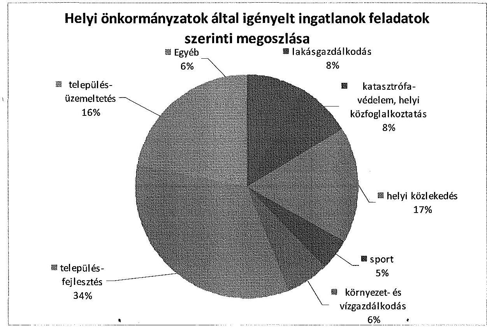

Az önkormányzatok az általuk igényelt ingatlanok mintegy fele esetében a településüzemeltetést és a településfejlesztést jelölte meg ellátandó feladatként.

A vagyonelemek átadásának előkészítéseként az MNV vezérigazgatója a 2013. évi CXVIII. törvénnyel összhangban, körlevélben ${ }^{42}$ hívta fel az érintett polgármesterek figyelmét a vagyonátadások törvény által előírt legfontosabb teendőire.

A vezérigazgatói körlevél támogatást nyújtott az önkormányzatok számára, mert magában foglalta a képviselő-testületi döntés legfontosabb tartalmi elemeit, a

[^0]
[^0]:    ${ }^{42}$ MNV/01/59929/2/2013. ikt. sz. körlevél

---

határozat elfogadását követően teendő feladatokat, a tartozásmentesség kritériumait.

Az átadások előkészítése során 526 db ingatlan esetében érkezett be írásban igény. A törvényben megadott határidőig 469 db ingatlan átadására kötötték meg a szerződést.

A kiválasztott minta alapján megállapítható volt, hogy az állami tulajdonú ingatlanok ingyenes tulajdonba adására minden esetben a helyi önkormányzat igénylése alapján került sor. Az igénylést benyújtó önkormányzat képviselő-testülete/közgyűlése valamennyi esetben határozatot hozott arról, hogy az ingatlant a tulajdonába kívánja venni, a határozatok tartalma megfelelit a 2013. évi CXVIII. törvény előírásainak. A megkötött szerződések valamennyi ellenőrzött tétel esetében tartalmazták a 2013. évi CXVIII. törvény által előírtakat.

Az MNV-nél az ingyenes vagyonátadással kapcsolatos intézkedések nem feleltek meg teljes körűen 2013. évi CXVIII. törvény 4. § (1) bekezdés a) és b) pontjaiban foglalt előírásoknak. Az átadás egy esetben olyan vagyonelemre ${ }^{43}$ terjedt ki, amely nem szerepelt az MNV rábízott vagyon nyilvántartásában, egy esetben ${ }^{44}$ az átadás előkészítésekor figyelmen kívül hagyták ${ }^{45}$ az MNV KVKIG feljegyzésében szereplő forgalmi értéket; két esetben ${ }^{46}$ nem volt igazolt a köztartozás mentesség; két esetben ${ }^{47}$ az igénylés beadása meghaladta az előírt 60 napot.

# 2.3. A hasznosításra és vagyonkezelésre átengedett ingatlanokkal való gazdálkodás szabályszerűsége 

Az állami vagyonnal való gazdálkodás szabályait a Vtv. IV. Fejezete, az állami vagyon hasznosításának, vagyonkezelésének és használatának szabályait a Vhr. III. Fejezete tartalmazta.

Az MNV a vagyon hasznosításáról szóló szabályzatot - a jogszabályváltozások, az MNV szervezeti struktúráját, feladatkörét meghatározó SZMSZ, a szervezeti egységek feladatköreiről, hatáskörök átruházásáról, valamint az aláírási jog gyakorlásáról szóló vezérigazgatói utasítások ${ }^{48}$, a döntéselőkészítésekkel és a döntésekkel kapcsolatos iratok kezelésének rendjéről szóló vezérigazgatói utasítások, valamint a szerződések kezeléséről és nyilvántartásá-

[^0]
[^0]:    ${ }^{43}$ Az SZT-41014 számú Megállapodás
    ${ }^{44}$ Az SZT-41320 számú Megállapodás
    ${ }^{45}$ Az MNV érdekkörében elvégzendő vagyonértékelések eljárásrendjéről szóló 12/2013. számú Vig. utasítás, továbbá a 29/2013. számú Vig. utasítás
    ${ }^{46}$ Az SZT-41288 számú és az SZT-41285 számú Megállapodások
    ${ }^{47}$ Az SZT-41205 számú és az SZT-41285 számú Megállapodások
    ${ }^{48}$ 2013-ban a 30/2012. és a 29/2013. számú Vig. utasítás

---

ról szóló vezérigazgatói utasítások ${ }^{49}$ módosítását követően - nem módosították, így azok összhangja nem volt biztosított.

Az állami vagyonnal kapcsolatos hasznosítási eljárásokra vonatkozó pályázatok kiírásra, kezelésére, elbírálására vonatkozó eljárási rendet ${ }^{50}$ nem módosították így a jogszabályváltozások (pl. titoktartásra vonatkozó rendelkezés a Munka törvénykönyvéről szóló 1992. évi XXII. törvény, amely 2013-ban már nem volt hatályban), a szervezeti és hatáskörí változások nem kerültek aktualizálásra.

Az állami vagyon hasznosítására irányuló versenyeztetésről szóló szabályozás ${ }^{51}$ a Vtv. 23. §-ában foglaltaknak megfelelően meghatározta a versenyeztetés útján való vagyonhasznosítás célját, alapelveit, kidolgozta a tárgyi és személyi hatályát. A szabályzat tárgyi hatálya nem terjedt ki a versenyeztetés mellőzésével történő hasznosításra. A szabályzat 2010. március 3-án lépett hatályba, ezért az Nvtv.-ben a nemzeti vagyon hasznosítására vonatkozó elöírásokkal - 11. § (10)-(12) és (16)-(17) bekezdések - nem volt összhangban. A Vtv. és a Vhr. 2013. december 31-ig többször is módosításra került ${ }^{52}$, amelyek érintették a pályáztatásra vonatkozó szabályokat is.

A szabályzat a Vtv. 24. §-ának megfelelően rendelkezett a pályázatok típusairól, továbbá a pályázati kiírásra vonatkozó döntés-előkészítési és jóváhagyási eljárásrendről, amely azonban - az aktualizálás elmaradása miatt - az ellenőrzött időszakban nem volt összhangban a hatályos SZMSZ-szel, a szervezeti egységek feladatköreiről, a hatáskörök átruházásáról, valamint az aláírási jog gyakorlásáról szóló vezérigazgatói utasítással.

A szabályzat a Vhr. 4. § (1) bekezdésben foglaltaknak megfelelően tartalmazta a pályázati felhívás kötelező tartalmi elemeit, azonban nem rendelkezett a Vtv. 23. § (4) bekezdésre vonatkozó, 2013. június 28 -ától hatályos előírás végrehajtásáról, amely szerint az állami vagyon hasznosítását biztosító szerződés megkötésére kiírt pályázat eredményeként a szerződés a pályázati kiírástól, valamint a nyertes pályázattól eltérő tartalommal nem köthető meg.

A szabályzat melléklete tartalmazta a nyilvános és a zártkörű pályázati eljárás menetének folyamatát, valamint a pályázathoz kapcsolódó adatlap, nyilatkozat mintákat, amelyek segítették a végrehajtást és annak ellenőrzését. A szabályzat módosításának elmaradása azonban a pályáztatások végrehajtása során nem tette lehetővé az adatlapok módosítás nélküli alkalmazását.

A folyamatok nyomon követésének hiánya nehezítette a rábízott vagyon hasznosítására vonatkozó szabályok, eljárások összehangolását, a szerződések folyamatba épített ellenőrzését, kockázatot jelent a feladatok végrehajtásában.

[^0]
[^0]:    ${ }^{49}$ 2013-ban a 4/2013. számú Vig. utasítás
    ${ }^{50}$ 19/2010. számú Vig. utasítás
    ${ }^{51} 13 / 2010$. számú Vig. utasítás
    ${ }^{52}$ A Vtv. 23. § (1), (3)-(4) bekezdés, Vtv. 25. § (2), Vtv. 25/A. § (1)-(3) bekezdés

---

Az MNV 2013-ban rendelkezett a Szerződéstárának múködési rendjéről ${ }^{53}$, amelyben meghatározták a szerződések nyilvántartásának szabályait, a szerződések kötelezően rögzítendő tartalmát.

Eljárásrendben szabályozták az állami vagyon hasznosításával kapcsolatos szerződések menedzselését ${ }^{54}$. Az utasítás meghatározta a menedzselésre kötelezett, és a menedzselés nélkül lezárásra kötelezett szerződések fogalmát és körét, ennek megfelelően határozta meg a szerződés nyomon követéséért felelős szervezeti egységet. Az utasítás aktualizálása az SZMSZ és a feladatkörökről szóló szabályozás módosítását követően még nem történt meg.

Az MNV a közvetlen kezelésében lévő ingatlanok vagyonkezelésbe adásával, illetve az egyéb vagyongazdálkodással kapcsolatos feladatok végrehajtásának szervezeti kereteit a Vtv.-ben és a Vhr.-ben előírtak szerint megfelelően kialakította.

Az MNV nem rendelkezett az SZMSZ 19. § (2) bekezdésében előírt a vagyonkezelési eljárások fejlesztése érdekében kidolgozott módszertannal.

A rábízott vagyon nyilvántartási kötelezettségét a Vhr. 13. § és a 14. § (2) bekezdései és az Nvtv. 10. § (1) bekezdése határozták meg. Az MNV a 347/2010. Korm. rendelet 2. § (1) bekezdés előírásainak megfelelően a saját vagyonuktól elkülönített nyilvántartást vezetett a rábízott vagyonról. A VIR alapját a három elődszervezet (ÁPV Zrt., KVI, NFA) által 2007. december 31. napjáig kezelt vagyonelemekre vonatkozó nyilvántartások képezték. A VIR rendszerben tárolt adatok a Vhr. 13. § (1) bekezdésben meghatározott egységesség elvének nem tettek eleget.

Az átvett vagyonelemeket korábban kezelő szervezetek eltérő adattartalmú és technológiájú nyilvántartó rendszereket alkalmaztak, az adatok migrálása és az adattisztítás nem tudta kiszürni a nyilvántartásban a duplikált tételeket.

A Vtv. 17. § (1) bekezdése szerint az MNV Zrt. nyilvántartást vezet a tulajdonosi joggyakorlása alá tartozó állami vagyonról, az Országleltár elkészítésével kapcsolatos időszerű intézkedésekről szóló 1172/2010. (VIII. 18.) Korm. határozat tartalmazza az egyes tárcák vonatkozó feladatait. A határozat szerint az NFM miniszter, az FM/VM miniszterrel együttmúködve gondoskodik az Országleltár, azon belül az egységes, integrált állami vagyon-nyilvántartási rendszer elkészítéséről az MNV Zrt. közreműködésével, a folyamatban lévő fejlesztésekkel összhangban. Az Országleltár internetes portál már elindult, ugyanakkor még nem végleges, feltöltése a helyszíni ellenőrzés alatt is folyamatos volt.

Az analitikus ingatlan-nyilvántartást 2013. évben a Forrás SQL informatikai rendszer BEF segítségével végezték. Az MNV az Országleltár Program részeként új SAP integrált vállalatirányítási/vagyonnyilvántartási rendszer bevezetését készítette elő 2013-ban ${ }^{55}$.

[^0]
[^0]:    ${ }^{53} 4 / 2013$. számú Vig. utasítás
    ${ }^{54} 47 / 2011$. számú Vig. utasítás
    ${ }^{55}$ A 490/2013. (VII. 08.) IG sz. határozattal elfogadott MNV Országleltár Program PAO 3.0.

---

A Számviteli politikában a beszámolóra vonatkozó előírások megfeleltek a Számv. tv.-ben előírtaknak.

Az MNV rábízott vagyonának nyilvántartási, elszámolási és beszámolási rendszerének sajátosságait a Számviteli politikáról, Számlarendről, Számlatükörről szóló 16/2013. számú, valamint a 36/2013. számú Vig. utasítás tartalmazta.

Az MNV a rábízott vagyonra vonatkozó 2013-as vagyonkezelési, vagyonhasznosítási stratégiáján és tervén ${ }^{56}$, belül nem rendelkezett a közvetlenül kezelt ingatlanokról. Ezt az ingatlanvagyonnal kapcsolatos gazdálkodási tevékenység vizsgálatáról szóló 2013-ban készült 20/2013. (III. 23.) sz. FB határozattal elfogadott jelentés is megállapított ${ }^{57}$. Az FB a 38/2013. (V. 22.) sz. határozata az MNV közvetlen kezelésében lévő ingatlanállományra vonatkozóan hasznosítási terv kidolgozását és az érdemi gazdálkodási tevékenység megkezdését írta elő.

Az MNV az Nvtv. 10. § (2) bekezdése alapján a szerződések mintegy negyedében ellenőrizte, hogy a használó/bérlő az Nvtv. 11. § (11) bekezdés b) pontjában foglaltaknak eleget tett-e, az előírásoknak és a tulajdonosi rendelkezéseknek, valamint a meghatározott hasznosítási célnak megfelelően használja-e az ingatlant. Ezzel az MNV eleget tett a törvény szerinti rendeszeres ellenőrzési kötelezettségének.

Az ingó- és ingatlanvagyonért felelős szervezeti egységeknek a célszerűsége ellenére nem volt beszámolási kötelezettsége a szerződésekben foglalt követelések és kötelezettségek nyomon követéséről és ellenőrzéséről, így előfordult, hogy a szerződés lejártát követően a bérlő továbbra is használta az ingatlant. A szerződéstár a szerződések ellenőrzéséről nem tartalmazott adatokat.

A tulajdonosi joggyakorlása alá tartozó, hasznosításra átengedett ingatlanokról 2013. december 31-én az MNV összesen 998 db hatályos ingatlanhasznosításra vonatkozó szerződést tartott nyilván.

A szerződések közül 663 db a Vtv. hatálybalépését megelőzően keletkezett, ezért a minta kiválasztása a szerződések dátuma szerint ${ }^{58}$ rétegezett mintavétellel történt.

A veršenyeztetés nélkül, 90 napra kötött hasznosítási szerződések esetében a szerződéskötést megelőző kontrollok, és a szerződésekben foglaltak folyamatos nyomon követését biztosító kontrollok múködése nem volt megfelelő a fizetési kötelezettségek teljesítése kivételével.

A mintatételek között két olyan szerződés volt, amelyet az Nvtv. 11. § (16) bekezdés, a Vtv. 24. § (1) bekezdés, valamint az MNV-nek a vagyonhasznosításra irányuló versenyeztetési szabályzatáról szóló 13/2010. számú Vig. utasítás alapján, nyilvános versenyeztetést követően, és egy olyan szerződés,

[^0]
[^0]:    ${ }^{56}$ Az MNV a Vtv. 20. § (4) m) pont szerinti vagyonkezelési terve a rábízott vagyon 2013. évi költségvetési kiadásainak és bevételeinek tervét tartalmazza.
    ${ }^{57}$ FB beszámoló 2010-2014. I. félév 4. melléklet
    ${ }^{58}$ A 2008 előtt kötött szerződések a mintában maximum 25\% -ban szerepeltek.

---

amelyet a Vtv. 24. § (1), (2)-(3) bekezdéseinek megfelelően zártkörű versenyeztetés útján kötöttek.

A három szerződés közül egy nem felelt meg a Vhr. 1. § (6) bekezdésnek, mert az ajánlati felhívásban nem határozták meg a pályázati ajánlatok elbírálási időpontját, az ajánlattevők értesítésének módját, és az érvényesség feltételeit. A pályázatok kiírását követően a pályáztatások lebonyolításának folyamata, a pályázatok értékelése, a döntéshozatali folyamat megfelelt a Vtv.-ben és a 13/2010. számú Vig. utasításban foglalt előírásoknak.

A mintában szereplő 90 napos, határozott időre kötött szerződések esetében négy esetben előfordult, hogy a szerződés lejártát követően a bérlő továbbra is használta az ingatlant, az MNV kiszámlázta részére a bérleti díjat, amelyet a jogcím nélküli használó a fizetési határidőig, vagy késedelmesen, de befizetett. A szerződések felülvizsgálatára, a jogcím nélküli használat rendezésére azonban hosszú ideig - előfordul, hogy több évig - nem került sor.

A szerződés nyilvántartási rendszerben a hasznosítási szerződések lejárati határidejének rögzítése a Szerződéstár működési rendjéről szóló vezérigazgatói utasítás alapján ${ }^{59}$ nem volt kötelezö, annak ellenére, hogy a rendszer tartalmazta ezt a paramétert. Az előírás hiánya miatt a szerződések lejárati határidejét nem minden esetben rögzítették, így a lejárt határidejű szerződések lekérdezése a rendszerből nem adott naprakész információt, azok nyomon követését nem biztosította, így nem nyújtott megfelelő támogatást a hasznosítási feladatok hatékony ellátásához.

Az SZT-3785 szerződés szerint az MNV 2012. május 7 -én 90 napra kötött határozott idejű bérleti szerződést az ingatlant használó Trianon Múzeum Alapítványnyal a várpalotai Zichy-kastélyra. A lejáratot követően a szerződés megújítása nem történt meg. Ennek előzménye volt a KVI és a Trianon Múzeum Alapítvány 2002. május 7 -én 10 éves határozott időre kötött bérleti szerződése a várpalotai Zichy-kastélyra és a hozzá tartozó területre. A bérleti szerződésben utalás történt az ingatlan vagyonkezelésbe adására, azonban ez ismeretlen okokból nem valósult meg.

A hasznosítási célú pályáztatásra vonatkozó 13/2010. számú Vig. utasítást a jogszabályváltozások, az MNV szervezeti struktúráját, feladatkörét meghatározó belső szabályzatok módosítását követően nem aktualizálták, így az nem tartalmazta a Vtv. 23. § (4) bekezdése - a szerződés tartalmi egyezőségére vonatkozó - előírását az ajánlati felhívás kötelező elemeként.

Az MNV-nél az állami tulajdonú ingatlanokkal való gazdálkodás kontrollrendszere a hasznosításra átengedett ingatlanok tekintetében nem biztosította a jogszabályok és a hasznosításra kötött szerződések előírásai érvényesülését a hasznosításra átengedett ingatlanok esetében.

A mintába került szerződéseket az Nvtv. 3. § (1) bekezdés 1. pontja, 11. § (10) bekezdésének megfelelően az ingatlanhasznosítási szerződést természetes személlyel vagy átlátható szervezettel kötötték.

[^0]
[^0]:    ${ }^{59} 4 / 2013$. számú Vig. utasítás

---

A minta 10\% vagy afeletti szabályszerűségi hibát tartalmazott a szerződés kötelező előírásainak megfogalmazásainál ${ }^{60}$.

Az Nvtv. hatályba lépését követően megkötött 11 db hasznosítási szerződés közül kettő ( $18,2 \%$ ) nem tartalmazta a beszámolási, nyilvántartási, adatszolgáltatási kötelezettségeket.

A szerződések 10\%-a nem tartalmazta, hogy a hasznosításban - a hasznosítóval közvetlen vagy közvetett módon jogviszonyban álló harmadik félként - kizárólag természetes személyek vagy átlátható szervezetek vesznek részt.

A szerződések 40\%-a nem tartalmazta az MNV vagyon nyilvántartási szabályzatának megismerését és magára nézve kötelező érvényű elismerését.

A mintatételekben szereplő, releváns ingatlanhasznosítási szerződések 50\%ában - a Vhr. 20. § (1) bekezdése ellenére - nem rögzítették, hogy a tulajdonosi ellenőrzés eljárásrendjét, a felek jogait, kötelezettségeit a felek a szerződés részének tekintik. Az eljárásrendet tartalmazó szerződések 10\%-a nem foglalta magába a vagyonhasznosítással összefüggő feladatok Nvtv. 11. § (11) bekezdés b) pontja, a Vtv. 2. § (1) és a Vhr. 3. § (1) bekezdéseiben szabályozott és átlátható módon történő végrehajtását, a vagyon használatának ellenőrzését.

Az MNV 2013-ban ingatlanra, valamint ahhoz kapcsolódó ingóságra 1305 db vagyonkezelési szerződéssel rendelkezett, amelyek 304842 db ingatlan vagyonkezelésére vonatkoztak.

A vagyonkezelési szerződésállomány megoszlása a szerződéskötés időpontja szerint 2013. december 31-én

| szerződéskötés vagy   módosítás dátuma | tulajdonosi   joggyakorló | db | részarány |
| :-- | :-- | --: | --: |
| 2007. december 31. előtt | KVI | 1049 | $80,38 \%$ |
| 2007. december 31. - |  |  |  |
| 2013. december 31. között | MNV | 256 | $19,62 \%$ |
| - ebből 2013. január 1. és december 31. |  |  |  |
| között | MNV | 22 | $1,68 \%$ |
| Összesen: |  | $\mathbf{1 3 0 5}$ | $\mathbf{1 0 0 \%}$ |

Az MNV-nél az állami tulajdonú ingatlanokra vonatkozóan készített belső szabályozás rögzítette a vagyonkezelésbe adással kapcsolatos feladatokat.

A szervezeti egységek feladatköreit meghatározó vezérigazgatói ${ }^{61}$ a Vagyonkezelők Vagyongazdálkodási Igazgatósága számára írtak elő a vagyonkezelésbe

[^0]
[^0]:    ${ }^{60}$ Az Nvtv. 11. § (11) bekezdése, a Vhr. 14. § (3) bekezdése
    ${ }^{61}$ A 30/2012. számú Vig. utasítás Az MNV szervezeti egységeinek feladatköreiről, a hatáskörök átruházásáról, valamint az aláírási jog gyakorlásáról (hatályos: 2012. november 23-től), valamint a 29/2013. számú Vig. utasítás Az MNV szervezeti egységeinek feladatköreiről, a hatáskörök átruházásáról, valamint az aláírási jog gyakorlásáról (hatályos: 2013. július 1-jétől)

---

adáshoz kapcsolódó feladatokat. Az állami tulajdonú ingatlanok vagyonkezelésbe adását a fentieken túl a döntések előkészítésének rendjére ${ }^{62}$ és a vagyonnyilvántartásra vonatkozó ${ }^{63}$ belső utasítások szabályozták.

Az MNV-nél a vagyonkezelésbe adással kapcsolatos intézkedéseknél az ellenőrzött mintatételek esetében részben érvényesültek a jogszabályi előírások, a mulasztások egy részét a vagyonkezelők követték el.

Nem teljesült maradéktalanul a Vhr. 7. § (1) bekezdésének rendelkezése, a mintatételek $86 \%$-ában a vagyonkezelők nem küldték meg a vagyonkezelői jog in-gatlan-nyilvántartásba történő bejegyzéséről szóló határozatot az MNV-nek.

Nem teljesült a Vhr. 8. § (2) bekezdésének rendelkezése a mintatételek 94\%-ára vonatkozóan, amely szerint a szerződés hatálya alá tartozó vagyontárgyak körének változása esetén a felek kötelesek a szerződést 60 napon belül a módosításokkal egységes szerkezetbe foglalni.

A felek 33 db vagyonkezelési szerződésmódosítás esetében voltak kötelesek 60 napon belül a szerződést egységes szerkezetbe foglalni. A fenti jogszabályi előírás az MNV nyilatkozata szerint nem tartható be. Különösen nem tartható a 60 napos határidő a költségvetési szervek esetében, ahol a szerződés-módosítás folyamata - amely legalább három fél: a vagyonkezelő, az MNV és a vagyonkezelő felügyeleti szerve együttműködését igényli - több, esetenként akár 6-8 hónapig tart.

A szerződéses jogviszony megszűnésére a mintatételek közül egy esetben került sor, ahol nem teljesült a Vhr. 16. § előírása. A jogszabályi előírás szerint az állami vagyon kezelője a szerződéses jogviszony megszűnésekor köteles az állami vagyon értékének az átvételkor fennálló állapothoz viszonyított különbözetével (csökkenésével vagy növekedésével) a szerződés szerint elszámolni ${ }^{64}$.

Nem teljesült a Vhr. 14. § előírása a vagyonkezelők éves adatszolgáltatási kötelezettségére vonatkozóan a mintatételek 16\%-ában. Az MNV a nem teljesítő vagyonkezelőket felszólította a mulasztás pótlására.

[^0]
[^0]:    ${ }^{62}$ 35/2012. számú Vig. utasítás; 44/2013. számú Vig. utasítás (hatályos: 2013. november 4-étől) a döntések előkészítésének és a döntésekkel kapcsolatos iratok kezelésének rendjéről
    63 46/2008. számú Vig. utasítás a Magyar Nemzeti Vagyonkezelő Zrt. Vagyonnyilvántartási Szabályzatáról (hatályos: 2008. június 11-étől, hatályon kívül helyezte a 68/2011. (III. 28.) számú Vig. utasítás melléklete; A Vtv. 17. § (1) bekezdés b) pontja alapján az MNV nyilvántartási feladatkörébe tartozó vagyonelemek vagyonnyilvántartási ügyviteli eljárásrendjének keretszabályai (hatályos: 2011. március 28ától)
    ${ }^{64}$ Az SZT 34106. számú szerződés esetében a vagyonkezelő az elszámolási kötelezettségét nem teljesítette.

---

# 2.4. Az állami ingatlanok tulajdonjoga ingyenes átruházásának kontrollkörnyezete és nyomon követési rendszere 

Az állami vagyon ingyenes átruházásának szabályait az Nvtv. 13. § (3)(11), a Vtv. 36. §-a és a Vhr. 50-51. §-ai rögzítik. Ezek többek között az ingyenes átadás feltételeit, az átadások éves költségvetésben maximalizált keretösszegét, a tulajdonba adásra vonatkozó kérelem tartalmi követelményeit, kellékeit, a kérelem megfelelőségi vizsgálatának kritériumait, a tulajdonba adásra javasolt/nem javasolt előterjesztés megküldésének módját, határidőket, stb. szabályozzák. A Vtv. 20. § (4) bekezdés g) pontja alapján az ingyenes vagyonátadásra vonatkozó javaslat kialakítása az Igazgatóság hatáskörébe tartozik.

Az MNV nem teljes körűen alakította ki az ingatlanok tulajdonjogának átruházása szabályszerűségét biztosító kontrollkörnyezetet és nyomon követési rendszert.

Az Nvtv.-ben, a Vtv.-ben és a Vhr.-ben előírt, az állami vagyon ingyenes átruházására vonatkozó szabályokat az MNV nem bontotta tovább részfeladatokra a saját belső szabályzataiban, az ingyenes átruházásra vonatkozó eljárásrenddel az ellenőrzött időszakban nem rendelkezett.

Az ingyenesen átadott ingatlanokkal kapcsolatos monitoring feladatokat a hatályos SZMSZ-ben a szerződésekben foglalt követelések és kötelezettségek nyomon követéséről rendelkező ${ }^{65}$, a Szerződéstár múködési rendjét szabályozó ${ }^{66}$ és a döntések előkészítésének és a döntésekkel kapcsolatos iratok kezelésének rendjéről szóló utasítások szabályozták.

Az MNV és jogelődjei által az állami vagyonra vonatkozóan kötött ingyenes és visszterhes tulajdonjog átruházási szerződésekben foglalt követelések, kötelezettségek nyilvántartása és nyomon követése a Szerződésmenedzselési Iroda feladatait képezte.

Az MNV és jogelődjei által kötött szerződéseket a VIR Szerződéstár szerződésmenedzselés almodulja gyűjti, nyilvántartja, kezeli és tárolja. A vonatkozó belső utasítások ${ }^{67}$ határozták meg a szerződések nyilvántartásának szabályait, a szerződések kötelezően rögzítendő adatait (a szerződés nyilvántartási számát, dátumát, típusát, besorolását, állapotát, tárgyát, értékét, ügyintézőjét, a szerződő feleket, stb).

A szerződésekben foglalt követelések és kötelezettségek nyomon követéséről rendelkező eljárásrendek szabályozták a követelések, kötelezettségek rögzítése ellenőrzésének határidejét, felelősét, a követelések, kötelezettségek teljesülésének figyelemmel kísérését (a teljesítés érdekében történő, nem teljesítés esetén a követelések érvényesítése iránti intézkedéseket). Az átadott ingatlanok esetében

[^0]
[^0]:    ${ }^{65}$ A 13/2013. számú Vig. utasítással módosított 47/2011. számú Vig. utasítás
    ${ }^{66}$ 19/2012. és 4/2013. számú Vig. utasítás
    ${ }^{67}$ A feladatokat alapvetően a 2013. évben a 13/2013. számú Vig. utasítással módosított 47/2011. számú Vig. utasítás szabályozta, a Szerződéstár 2013. évi hatályos müködését a 19/2012. és a 4/2013. számú Vig. utasítások tartalmazták.

---

a tulajdonba kerülés a birtokbaadástól számítható. A birtokbaadási jegyzőkönyv leadásának időpontja ezért megkülönbözetett jelentőséggel bír, amit a nyilvántartásban minden esetben rögzítenek. A helyszíni ellenőrzés időszakában, az ellenőrzés által véletlenszerűen kiválasztott szerződések alapján a birtokbaadás nyilvántartásban való rögzítése nem volt naprakész ${ }^{68}$.

Az Nvtv. 13. § (4) bekezdés b) pontja előírta a nemzeti vagyon tulajdonjogának ingyenes átruházása esetén a tulajdonjogot megszerző félnek az átruházott vagyon hasznosításáról évente történő beszámolást a vagyont átadó szervezet felé. A nyomon követésre szolgáló eljárásrend a beszámolási kötelezettségre általános megfogalmazásokat tartalmazott, nem kerültek rögzítésre a szerződésekben rögzített beszámolási kötelezettség tartalmi és formai elvárásai. Így a gyakorlatban a szabályozás nem adott kellő támogatást az eltérő színvonalú és tartalmú beszámolások értékeléséhez. Ezáltal az Nvtv. 13. § (4) bekezdés a) és b) pontjaiban és a (7) bekezdésében foglaltak teljesítése nem volt maradéktalanul biztosított. Kellően részletes eljárásrend hiányában a szerződések legfontosabb jellemzőinek (elidegenítési tilalom, rendeltetésszerű állapot, felhasználási cél teljesítése) egységes értékelése nem volt biztosítható.

A nyomon követési rendszer múködését biztosító kontrollok nem voltak teljes körúek, mert az MNV nem rendelkezett olyan kontrollmechanizmussal, ami jelzéssel élne az elidegenítési tilalom bejegyzésének elmulasztása esetén. Az elidegenítési tilalom betartásának ellenőrzése esetenként a partnerek nyilatkozatainak bekérésével, valamint az ingatlan-nyilvántartás adatainak lekérdezésével történt.

A VIR Szerződéstár szerződésmenedzselés almodulja az elidegenítési tilalom földhivatalnál történő teljesítéséről (bejegyzéséről), az ingatlanok terheltségi állapotáról (pl. bérlőkkel terhelt-e az ingatlan stb.) közvetlenül nem nyújtott tájékoztatást. A szerződések nyomon követéséhez szükséges adatokat a Szerződéstárban elektronikusan rögzített megállapodásokból egyedileg lehet csak kinyerni. Az ingatlan elidegenítési tilalmára, terheltségére vonatkozó információkat a tulajdoni lapok lekérésével, valamint helyszíni szemlék megtartásával biztosította az MNV.

Az MNV az előírt felhasználási cél betartásának ellenőrzését az átvevő által megküldött beszámoló alapján végezte. A tulajdont átvevő szervek beszámolási kötelezettségüknek eltérő formában, különböző információs tartalommal és részletezettséggel tettek eleget.

A nyomon követés során a Szerződésmenedzselési Iroda a beszámoló kiegészítését kérte, ha a beszámoló tartalma dokumentumokkal nem volt kellően alátámasztott, vagy, ha a felhasználási célra vonatkozó nyilatkozat nem volt elégséges ${ }^{69}$.

[^0]
[^0]:    ${ }^{68}$ V-0458-272/2014. iktatási számú emlékeztető
    ${ }^{69}$ MNV 01/724/2/2013. ikt. számú felhívása

---

# 2.5. Az állami vagyonnal való gazdálkodás tulajdonosi ellenőrzési rendszerének kialakítása és múködése 

Az MNV-nél a tulajdonosi joggyakorlás és az állami vagyonnal való gazdálkodás tulajdonosi ellenőrzési rendszerét részlegesen alakították ki és müködtették. A szabályozási elemek több dokumentumban (tulajdonosi ellenőrzési szabályzat, SZMSZ, hatásköri utasítás) fellelhetők, az elvégzett ellenőrzések tapasztalatairól való beszámolást csak az EIG részére írtak elő.

A tulajdonosi ellenőrzés célját a tulajdonosi ellenőrzési szabályzatban rögzítették a Vhr. 20. § (2) bekezdésben foglaltakkal összhangban. A szabályzat kiterjedt az MNV megbízásából tulajdonosi ellenőrzést végző valamennyi személyre és szervezetre.

A szabályzatban ${ }^{70}$ nem rögzítették, hogy a tulajdonosi ellenőrzési feladatot egy önálló szervezeti egység látja-e el, vagy több szervezeti egységnek is vannak ezzel kapcsolatos feladatai. A szabályzat a szervezeti egységek közül az $\mathrm{EIG}^{71}$ tulajdonosi ellenőrzéssel kapcsolatos főbb feladatait sorolta csak fel, annak ellenére, hogy az SZMSZ ${ }^{72}$ és a hatásköri utasítások szerint más szervezeti egység is ellát ezzel kapcsolatos feladatokat. A szabályzatban azok eljárásrendjére sem történt utalás.

Az EIG feladatkörébe nem kizárólag tulajdonosi ellenőrzések végzése tartozott, hanem az FB és az Igazgatóság által elrendelt vezetői ellenőrzések végrehajtása is. Az SZMSZ és a hatásköri utasítások szerint az EIG-en kívül más szervezeti egységek (Költségvetési Szervek Vagyongazdálkodási és Elhelyezési Igazgatóság, Vagyonkezelők Vagyongazdálkodási Igazgatósága, Közvetlen Kezelésű Ingatlanok Portfólió Menedzsmentje Csoport) is láttak el tulajdonosi típusú ellenőrzést.

A szabályzatban a tulajdonosi ellenőrzés végrehajtásával kapcsolatban felsorolt vizsgálati eljárások között a vagyonkezelésre, haszonélvezeti jog alapítására, a vagyon hasznosítására kötött szerződések ellenőrzésére nem tértek ki. A Vhr. 20. § (1) bekezdésében foglaltak szerint viszont az ellenőrzés érdekében a vagyon kezelésére, haszonélvezeti jog alapítására, vagy hasznosítására kötött szerződésben rögzíteni kell, hogy a tulajdonosi ellenőrzés eljárásrendjét a felek a szerződés részének tekintik.

Az MNV a rábízott vagyoni körét érintő tulajdonosi ellenőrzésekhez szükséges „ellenőrzési lefedettség" növelése érdekében együttműködési formákat alakított ki a gazdasági társaságok felügyelő bizottságaival, belső ellenőreivel, melyeket a szabályzatban rögzített.

A bérlemények ellenőrzésének feladatát a 2013. évben az MNV a 100\%-os tulajdonú gazdasági társaságával (KIVING Kft.) látta el, szerződésellenes vagyongazdálkodási intézkedést nem tártak fel. A 90 napnál rövidebb időre kö-

[^0]
[^0]:    ${ }^{70}$ 468/2011. (X. 3.) IG. sz. határozattal elfogadva, módosítva és egységes szerkezetben az 569/2013. (VIII. 05.) IG. sz. határozat szerint
    ${ }^{71}$ A 2013. január 1-jén hatályos SZMSZ szerint Tulajdonosi és Vezetői Ellenőrzési Igazgatóság is múködött.
    ${ }^{72}$ 2013. január 1-jén és 2013. április 25-től hatályos SZMSZ

---

tött szerződések esetében a szerződésben foglalt kötelezettségek ellenőrzése a birtokbaadás, majd a visszavétel keretében történt.

Az MNV rendelkezett elfogadott tulajdonosi stratégiai ellenőrzési tervvel 2009-2014. évi időszakra vonatkozóan. Kiemelték, hogy az ellenőrzések megalapozása érdekében hangsúlyt kell adni a folyamatelemzéseknek, a rendszerellenőrzéseknek, a kockázatelemzéseknek. A stratégiai tervben az MNV célul tűzte ki a vagyonkezelők belső ellenőreivel való együttműködést, amely folyamatosan biztosítja az információáramlást és az ellenőrzések összehangolását. Előírták továbbá az éves tulajdonosi ellenőrzési tapasztalatokról, azok nyomán tett intézkedésekről éves jelentés készítését.

A Vhr. 20. § (3) bekezdésében előírt éves tulajdonosi ellenőrzési terv és a stratégiai terv elkészítésének kötelezettségét belső szabályozásban ${ }^{73}$ rögzítették. A 2013-ban hatályos SZMSZ-ben ${ }^{74}$ rögzítették az éves tulajdonosi ellenőrzési terv elkészítésének kötelezettségét. A 2013. évi hatásköri utasításokban ${ }^{75}$ rögzítették az MNV éves tulajdonosi ellenőrzési tervének, valamint a tulajdonosi stratégiai ellenőrzési terv döntésre történő előkészítési kötelezettségét. E feladatokat a tulajdonosi ellenőrzési szabályzat is tartalmazta az EIG feladatai között.

A 2013. évre az RJGY által jóváhagyott tulajdonosi ellenőrzési tervvel a Vhr. 20. § (3) bekezdésében előírtak ellenére az MNV nem rendelkezett.

Az EIG által végzett, jelentéssel záruló ellenőrzéseknél a megállapításokat tartalmazó jelentéstervezet megküldése, az észrevételek kezelése a Vhr. 21-22. §aiban foglaltaknak megfelelően történt.

Az ellenőrzések több szabályszerűségi és egyéb hiányosságot tártak fel, melyek kiküszöbölésére javaslatokat fogalmaztak meg, így hozzájárultak a Vhr. 20. § (2) bekezdésében megfogalmazott célok megvalósításához.

Az éves ellenőrzési tapasztalatokról az MNV vezérigazgatója jelentést ${ }^{76}$ készített, melyet határidőben megküldött a miniszter részére.

# Az MNV-nél az intézkedési tervek végrehajtásának nyomon követését biztosították. 

Az ellenőrzésekkel és a megtett intézkedésekkel kapcsolatos nyilvántartás kialakítása megfelelő volt, a tulajdonosi ellenőrzési szabályzat előírásaival való összhangot biztosították.

[^0]
[^0]:    ${ }^{73}$ SZMSZ, hatásköri utasítás, tulajdonosi ellenőrzési szabályzat
    ${ }^{74}$ A 2013. január 1-jén hatályos SZMSZ 31. §-ában foglaltak szerint a Tulajdonosi és Vezetői Ellenőrzési Igazgatóság feladatai között, a 2013. április 25-től hatályos SZMSZ 13/A. § szerint az EIG feladatai között rögzítették.
    ${ }^{75}$ Az MNV Zrt. szervezeti egységek feladatköreiről, a hatáskörök átruházásáról, valamint az aláírási jog gyakorlásáról szóló 30/2012 (IX.23.) számú Vig. utasításban a Tulajdonosi és Vezetői Ellenőrzési Igazgatóság feladatai között, a 2013. július 1-jétől hatályos hatásköri utasításban az EIG feladatai között rögzítették.
    ${ }^{76}$ A 203/2014. (V. 05.) Vig. sz. határozat

---

Az intézkedési tervekben rögzített intézkedések nyomon követése az ellenőrzött szervezetek beszámolási kötelezettségén alapult. A tulajdonosi ellenőrzési szabályzatban azt rögzítették, hogy az ellenőrzött szerv vezetője felelős az intézkedési terv végrehajtásáért és annak nyomon követéséért.

Amennyiben az ellenőrzött az intézkedési tervet nem küldte be határidőre, az MNV újbóli tájékoztatást kért annak megvalósulásáról.

Az EIG 2013-ban nem végzett tulajdonosi ellenőrzéssel kapcsolatos utóellenőrzést. Az intézkedések végrehajtását, az ellenőrzések során tett megállapítások, javaslatok hasznosulását utóellenőrzés keretében nem vizsgálta meg. Az ellenőrzöttek tájékoztatása szerint az intézkedések megtörténtek.

Az MNV a tulajdonosi ellenőrzés keretében tett megállapítások alapján, indokoltnak tartotta saját szervezete részére javaslatok megfogalmazását. Az intézkedések megvalósítása egy kivétellel megtörtént.

A 270/2011. (V. 30.) IG és 271/2011. (V. 30.) IG sz. határozatokkal megadott vagyonkezelői meghatalmazások alapján kötött szerződések ellenőrzésére vonatkozó jelentésben javasolták a vagyonkezelők meghatalmazás alapján megtett intézkedései nyomon követési feladatának megjelentetését a hatásköri szabályzatban, valamint a vagyonkezelők részéről jelentés bekérését a meghatalmazás alapján tett intézkedésekről. Ezt az ellenőrzési feladatot a hatásköri utasításban ${ }^{77}$ nem szerepeltették.

Az Igazgatóság külön ellenőrzést rendelt el ${ }^{78}$ az alapítói határozatok végrehajtásáról szóló beszámolót késve teljesítő gazdasági társaságoknál a késés okainak vizsgálatára. Amennyiben a FB tájékoztatása szerint a késedelem a társaság működésével kapcsolatos ok miatt keletkezett, javasolták a társaság első számú vezetője 2013. évi prémiuma csökkentésének lehetőségét adatszolgáltatási kötelezettség nem teljesítése címen.

Az EIG az FB által elrendelt 2013. évi ellenőrzések keretében is fogalmazott meg a tulajdonosi ellenőrzést érintő ajánlásokat, amelyek végrehajtása 2013-ban nem történt meg.
„Az állami vagyon feletti tulajdonosi joggyakorlással kapcsolatos 2011. évi tevékenységek ellenőrzéséről készített ÁSZ jelentésben levő javaslatok teljesitésének értékelése" tárgyú ellenőrzés során ${ }^{79}$ javasolták, hogy az MNV készítsen az FB részére összefoglaló beszámolót, hogy az ingyenes ingatlan tulajdonba adási szerződésekben meghatározott feltételek teljesítését milyen egységes szempontrendszer figyelembevételével ellenőrzi.
„Az MNV Zrt. portfóliójába tartozó társaságok tevékenységének, gazdálkodásának portfólió igazgatóságok/portfólió menedzserek által végzett nyomon követési rendszeré-

[^0]
[^0]:    ${ }^{77}$ A 2013. július 1-jétől hatályos hatásköri utasítás III. fejezet A/4.pont a) 12. alpontjában ellenőrzési feladatként a vagyonkezelők vagyonkezelési szerződéseinek, továbbá a vagyonkezelők által e vagyon hasznosítására, vagyonkezelésére kötött szerződéseinek ellenőrzése, indokolt esetben a szerződés módosítása vagy megszüntetése szerepel.
    ${ }^{78} 773 / 2013$. (X. 21.) IG. sz. határozat
    ${ }^{79} 6 / 2014$. (I. 22.) sz. FB határozat

---

nek vizsgálata" során indokoltnak tartották ${ }^{80}$ olyan szabályozó elkészitését, amely biztosítja a társasági portfóllókezelés egységességét.
„Az MNV Zrt-nél lévő ingatlanvagyonnal kapcsolatos gazdálkodási tevékenység vizsgálata" során ${ }^{81}$ az FB kiemelte az egyes folyamatba épített ellenőrzési feladatok öszszehangolását, arra való tekintettel, hogy az ingatlanokat érintő eljárások folyamatát különböző szakterületek végzik. Megfontolásra javasolta eljárásonként egy folyamatgazda kijelölését az illetékes szakterület részéről.

A 2012. évben az önkormányzatoknak ingyenesen vagy térítésmentesen történt ingatlanátadások jog- és szabályszerűségének vizsgálata során ${ }^{82}$ az FB felkérte az MNV vezetését, hogy 2014. évben utóvizsgálat keretében kerüljön ellenőrzésre, hogy az önkormányzatok a 2012. évben megkötött megállapodásokban előírt beszámolási kötelezettségüket 2013. december 31-ig teljesítették-e, nem teljesítés esetén az MNV érvényesített-e kötbért.

# 3. MaGyar Fejlesztési Bank Zrt. 

### 3.1. A tulajdonosi joggyakorláshoz szükséges kontrollkörnyezet kialakítása

Az MFB tulajdonosi joggyakorlása alá 2013. évben 37 állami tulajdonú társaság ${ }^{83}$ tartozott, melyből öt korlátolt felelősségű társaság formájában, a többi pedig zártkörű részvénytársaságként működött. A Magyar Állam nevében az MFB minősített többséget biztosító befolyással bírt 34 társaság, többségi befolyással egy cég esetében, míg két szervezetben kisebbségi befolyással rendelkezett. A társaságok 91,9\%-a ( 34 társaság) vagyona kincstári körbe tartozott, a maradék három üzleti vagyon. Valamennyi kincstári vagyon egyben az Nvtv. szerint nemzetgazdasági szempontból kiemelt jelentőségű nemzeti vagyon is.

A társaságok közül 2013-ban hat volt veszteséges, míg a többi cég nyereséggel zárta az évet. A cégek összevont eredménye 17,35 Mrd Ft veszteség volt, mely a NÚSZ Zrt. kimagasló (mintegy 26 Mrd Ft-ot kitevő), negatív eredményének a hatása.

A NÚSZ Zrt. vesztesége két okra vezethető vissza: egyfelől 14,7 Mrd Ft veszteséget okozott az üzemeltetés és karbantartás üzletág - az 1600/2013. (IX.3.) számú kormányhatározat alapján történő - ingyenes átadása a Magyar Közút Nonprofit Zrt.-nek (vagyonelemek térítés nélküli átadása rendkívüli ráfordításként jelentkezett). Másfelől pedig 12,9 Mrd Ft veszteséget okozott az elvégzett üzemeltetési, karbantartási, valamint fenntartási tevékenység saját forrás terhére történő finanszírozása, amelyet az 1875/2013. (XI. 28.) kormányhatározat írt elő. A közútkezelés kapcsán az Operating \& Maintenance - Kezelés és Fenntartás szerződés megkötésére 2013-ban nem került sor, ezért a NFM miniszter 2014. január 9-én kelt levelében felszólította az MFB-t, hogy a Közlekedéspénztár

[^0]
[^0]:    ${ }^{80}$ 3/2013. (II. 23.) sz. FB határozat
    ${ }^{81} 38 / 2013$. (V. 22.) sz. FB határozat
    ${ }^{82}$ 89/2013. (XI. 25.) sz. FB határozat
    ${ }^{83}$ A 2013. évben hatályos Mfbtv. 1. számú melléklete, illetve annak módosítása 38 céget tartalmaz, de ebből a Bábolna Nemzeti Ménesbirtok Kft. kétszer szerepel.

---

forráshiánya miatt az elvégzett tevékenységet a NÚSZ Zrt. saját pénzeszközállománya terhére, véglegesen finanszírozza. A veszteség a jövőben ebben a formában már nem merülhet fel, hiszen a NÚSZ Zrt. a közútkezelést azóta átadta a Magyar Közút Nonprofit Zrt-nek. 2014-ben veszteségrendezés okán mintegy 7 Mrd Ft alaptőke-leszállításra került sor. A társaság könyvvizsgálója jelentésében figyelemfelhívással élt.

Az MFB rábízott vagyonának saját tőkéje és mérlegfőösszege 2010. óta folyamatos csökkenést mutat, melyet az alábbi grafikon és táblázat szemléltet ${ }^{84}$.

# Az MFB Zrt. rábízott vagyonának induló és saját tőkéje, valamint mérlegfőösszege (millió Ft) 

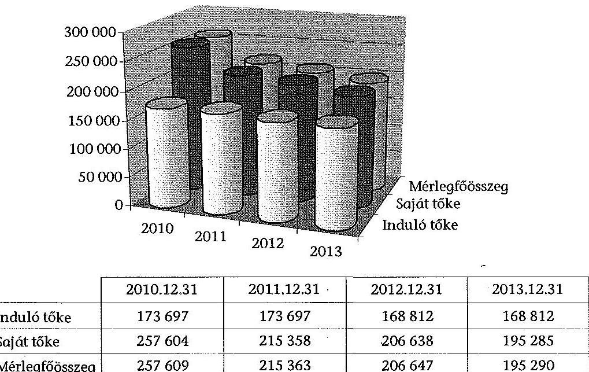

Az MFB tulajdonosi joggyakorlásának módjára, illetve e vagyonnal való gazdálkodás szabályaira 2013-ban alapvetően a Ptk., a Gt., az Nvtv. és az Mfbtv. vonatkozott, a Vtv. és végrehajtási rendeletei csak körülhatárolt esetekben voltak alkalmazhatók.

Így például a Vhr.-t is kizárólag á társasági részesedés tulajdonjogának átruházása, biztosítékul adása, vagy más módon történő megterhelése, a részesedésekre vételi jog, elővásárlási jog szerződéssel történő alapítása, illetve a gazdálkodó szervezet végelszámolással történő megszüntetése esetén kellett alkalmazni.

Az Áht. 61. § (1) bekezdése értelmében „Az államháztartási kontrollok célja az államháztartás pénzeszközeivel és a nemzeti vagyonnal történő szabályszerű, gazdaságos, hatékony és eredményes gazdálkodás biztositása." Az Áht. a belső kontrollrendszert definiálja, azonban ezek az MFB-re - tekintve, hogy nem költségvetési szerv és nem is kormányzati szektorba sorolt egyéb szervezet - nem vonatkoznak.

Nem vonatkozott az MFB-re, mint vagyonkezelő szervezetre a Bkr. sem, mivel annak hatálya nem terjedt ki az állam által alapított vagyonkezelő szervekre.

[^0]
[^0]:    ${ }^{84}$ Adatok forrása: MFB rábízott állami vagyonról szóló 2013. évi éves beszámolója.

---

Ugyanakkor a 347/2010. (XII. 28.) Korm. rendelet hatálya kiterjedt az MFB-re is.

Az MFB egy közös stratégiai csoportba sorolta a tulajdonosi joggyakorlása alá tartozó, valamint a tulajdonában álló gazdálkodó szervezeteket.

A stratégiai csoport definícióját az $\mathrm{SZMSZ}_{1,2,3,4}{ }^{85}$ I. fejezete tartalmazta, mely szerint „a Stratégiai csoport tagjának kell tekinteni az Mfbtv. 1. és 2. számú mellékleteiben meghatározott gazdálkodó szervezeteket, az MV-Magyar Vállalkozásfinanszirozási Zrtt, továbbá a Magyar Tranzitgazdasági Iroda Nonprofit Kft.-t."

Az MFB tulajdonában lévő, illetve tulajdonosi joggyakorlásával érintett befektetéseket közvetlenül - azok tevékenységi köre szerint strukturálva - az MFB két szervezeti egysége kezelte: a Befektetési Vezérigazgatóság és a Banküzemi Vezérigazgatóság.

A társaságok kezelését, tulajdonosi irányítását a Befektetési Vezérigazgatóság végezte. Mind az SZMSZ, mind pedig a Befektetési Vezérigazgatósághoz tartozó egyes igazgatóságok önálló ügyrendjei tartalmazták az egyes igazgatóságok vagyonkezelése alá tartozó gazdasági szervezetek megnevezését.

Az Ellenőrzési Igazgatóság az elfogadott éves munkaterv ${ }^{86}$ alapján végezte ellenőrzéseit a Stratégiai csoport tagjainál.

A Banküzemi Vezérigazgatóság feladatkörébe tartozott a rábízott vagyonnal, illetve a stratégiai csoporttal kapcsolatos információtechnológiai, üzemeltetési és közbeszerzési, kontrolling, valamint számviteli és a bankműveleti feladatok ellátása.

A tulajdonosi joggyakorláshoz kapcsolódó kontrollkörnyezet kialakítása az ellenőrzött időszakban - összességében és évenként egyaránt - megfelelő volt, mivel az MFB a jogszabályi környezetnek megfelelő belső szabályzatokkal rendelkezett, amelyek felölelték a belső kontrollrendszer elemeit, illetve meghatározták az MFB-n belüli feladat-, hatás- és felelősségi köröket.

Az ellenőrzött időszakban az MFB rendelkezett hatályos alapító okirattal ${ }_{1,2}{ }^{87}$, SZMSZ-szel, a rábízott vagyonnal foglalkozó szervezeti egységek rendelkeztek ügyrenddel. Az MFB rendelkezett-továbbá Kötelezettségvállalási szabályzat ${ }_{1,2}{ }^{-}$ $\mathrm{tal}^{88}$, Számviteli politika ${ }_{1,2}$-val $^{89}$, Számlarend ${ }_{1,2}$-del $^{90}$, Bizonylati renddel, Pénz-

[^0]
[^0]:    ${ }^{85}$ A 2013. február 28-ig hatályos 38/2012. számú, a 2013. március 1-jétől hatályos 03/2013. számú, a 2013. július 23 -tól hatályos, 20/2013. számú Elnök-vezérigazgatói utasítás és a 2013. december 11-től hatályos 04/2013. számú Vig. utasítás
    ${ }^{86} 122 / 2012$. sz. FB határozat.
    ${ }^{87}$ A 2013. május 29-ig hatályos, 44/2012. (VIII. 24) és a 2013. május 30 -tól hatályos, 25/2013. (V. 30.) számú alapítói határozattal jóváhagyott alapító okirat
    ${ }^{88}$ A 2013. december 22-ig hatályos, 40/2012. számú Elnök-vezérigazgatói utasítás és a 2013. december 23 -tól hatályos, 08/2013. számú Vig. utasítás
    ${ }^{89}$ A 2013. június 24 -ig hatályos, 25/2012. számú és a 2013. június 25 -tól hatályos, 17/2013. számú Elnök-vezérigazgatói utasítás

---

kezelési szabályzattal ${ }^{91}$, Értékelési szabályzattal, Leltározási szabályzattal ${ }^{92}$, Közbeszerzési szabályzat ${ }_{1,2,3}$-tal ${ }^{93}$, Informatikai jogosultságok szabályzatával ${ }^{94}$, a munkatársak munkaköri leírásaival.

A feladat-, hatás- és felelősségi körök az alapító okirat ${ }_{1,2}$-ban, az SZMSZ-ben, szervezeti ábrákban és a munkaköri leírásokban meghatározottak. Etikai Irányelvek írták elő az MFB munkatársaival szemben támasztható legfontosabb magatartási, viselkedési követelményeket.

Az MFB rendelkezett:

- a Gt. 11. §-ában és az Mfbtv. 13/B. §-ában foglaltaknak megfelelően Alapító Okirat ${ }_{1,2}$-tal. Az Alapító Okirat ${ }_{1,2}$-ban - a Gt. 12. § előírásaival összhangban megjelentek a kötelező elemek;
- a hitelintézetekről és pénzügyi vállalkozásokról szóló 1996. évi CXII. törvény rendelkezéseivel összhangban hatályos szervezeti és múködési szabályzattal (SZMSZ), világos, áttekinthető szervezeti ábrával;
- az SZMSZ-ben nem szabályozott kérdések tekintetében az MFB ügyrendekben az egyes szervezeti egységek, illetve munkavállalóik által ellátandó munkafolyamatokról, felelősségi és hatáskörökröl;
- a Számv. tv. 14. § (3) bekezdése és 161. § (1) bekezdése előírásaival összhangban hatályos számviteli politikával és számlarenddel, a számviteli politika a Számv. tv. 14. § (4) bekezdésének és 47-51. §-ainak megfelelően tartalmazta az előírásokat;
- a Kbt. 22. § (1) és (2) bekezdései előírásaival összhangban hatályos közbeszerzési szabályzattal ${ }_{1,2,3}$, amely tartalmazta a Kbt. 22. § (1) bekezdése előírásaival összhangban a közbeszerzési eljárásokban közremúködők feladatait, a Kbt. 22. § (1) bekezdése és 34-37. §-ainak előírásainak megfelelően a közbeszerzési eljárás dokumentálási rendjét;
- a Számv. tv. 14. § (5) bekezdés a) pontja előírásaival összhangban hatályos leltározási és leltárkészítési szabályzattal, amelyben nevesítette a rábízott vagyon leltározásának sajátosságait, az elkülönített leltározás előírását;
- a Számv. tv. 14. § (5) bekezdés b) pontjával összhangban a Számviteli politika részeként az eszközök és források értékelési szabályairól;
- a Számv. tv. 161. § (2) bekezdés d) pontjában és a 165. §-ában foglaltaknak megfelelően hatályos bizonylati renddel, amely tartalmazta a Számv. tv.167. § előírásaival összhangban a bizonylatok alaki és tartalmi követelményeit, illetve a bizonylatok megőrzésének módját, idejét.

[^0]
[^0]:    ${ }^{90}$ 2013. szeptember 18-ig hatályos, 26/2011. számú és a 2013. szeptember 19-től hatályos, 02/2013. számú Elnök-vezérigazgatói utasítás
    ${ }^{91}$ 53/2012. számú Elnök-vezérigazgatói utasítás
    ${ }^{92}$ 23/2011. számú Elnök-vezérigazgatói utasítás
    ${ }^{93}$ A 2013. szeptember 18-ig hatályos, 33/2012. számú Elnök-vezérigazgatói utasítás, a 2013. szeptember 19-től hatályos, 01/2013. számú és a 2013. november 13-tól hatályos, 08/2013. számú Vig. utasítás
    ${ }^{94}$ 26/2014. számú Vig. utasítás

---

Az MFB munkavállalói - az Mt. 46. § (1) bekezdés a-h) pontokban foglaltakkal összhangban - rendelkeztek megfelelő munkaköri leírásokkal.

A munkaköri leírások tartalmazták a munkaköri leírás hatályát, az ellátandó munkakört, a munkáltatói jogkör gyakorlóját, illetve a közvetlen irányító felettes vezető megnevezését, a munkakör betöltésének feltételeit (iskolai végzettség, elvárt kompetenciák stb.), a helyettesítési viszonyokat, az ellátandó feladatokat és felelősségi köröket.

Az MFB kockázatkezelési rendszerének alapvető feladata a hitelintézeti tevékenységből adódó kockázatok kezelése volt.

Az SZMSZ VI. fejezet 1.7. pontja alapján a Kockázatkezelési Fölgazgatóság feladata az MFB-t érintő hitelezési, befektetési, piaci, likviditási és múködési kockázatok felismerése, mérése, folyamatos értékelése. Az MFB rendelkezett Kockázatkezelési Stratégiával, Kockázatvállalási Szabályzattal, Úgyfél-kockázatvállalási Szabályzattal, de jellemzően ezek a szabályozások is az MFB egészét érintő közvetlen üzleti kockázatvállalási tevékenység szabályozására terjedtek ki, leginkább a tőkekövetelmény, illetve megfelelés értékelési eljáráshoz kapcsolódó kockázatokat ölelték fel.

Ezen szabályzatok hatálya csak abban az esetben terjedt ki a rábízott vagyon körére, amennyiben az MFB közvetlen kockázatvállalást (pl. hitelezést) végzett.

A tulajdonosi joggyakorlással kapcsolatos közvetlen kockázatkezelés a - Befektetési Vezérigazgatóság egyes igazgatóságainak feladatkörébe tartozó - társaságok évenkénti minősítése alapján történő kockázati besorolás meghatározásával történt. A felmerülő kockázatok a szabályzatokban nem kerültek nevesítésre, a Társaságok kezelésének eljárásrendje ${ }_{\mathrm{L}, 2}{ }^{95}$ ad alapot az év közben felmerülő kockázatok felismerésére, kezelésére.

A havi adatszolgáltatásokból a cégfelelősök ún. státuszjelentéseket készítettek a vagyonkezelési igazgató részére. E jelentések szöveges módon ismertették az egyes cégekkel kapcsolatos legfontosabb eseményeket, kiemelve a kockázatot hordozó területeket. A folyamatokat és az elvégzendő teendőket a Társaságok kezelésének eljárásrendje ${ }_{\mathrm{L}, 2}$ és az egyes vagyonkezelési Igazgatóságok ügyrendjei írták le.

A rábízott vagyonnal kapcsolatos gazdálkodásában rejlő kockázatok feltérképezése megtörtént, az azonosított kockázatokat a Számviteli Igazgatóság ügyrendjében meghatározott folyamatos vezetői ellenőrzés keretében kezelték.

A folyamatalapú kockázatértékelés koordinálása az Ellenőrzési Igazgatóság feladata a kockázati tényezők és hatások körének, illetve erősségének felmérése.

A kontrolltevékenység rendszerének és elveinek kialakítása összességében megfelelő volt, a kontrollok a kötelezettségvállalás, a teljesítésigazolás és a

[^0]
[^0]:    ${ }^{95}$ A 2013. december 16-ig hatályos, 19/2012. számú Elnök-vezérigazgatói utasítás és a 2013. december 17-től hatályos, 06/2013. számú Vig. utasítás

---

számvitel területén kialakításra kerültek, alkalmazták a „négy szem elve" és a vezetői ellenőrzés elvét.

Az MFB saját webhelyén (mfb.hu) történő internetes kommunikációjának eljárásrendjét a 31/2007. számú Vezérigazgatói utasításban szabályozták, amelynek jogszabályi kereteit az információs önrendelkezési jogról és az információszabadságról szóló 2011. évi CXII. törvény, a közzétételi listákon szereplő adatok közzétételéhez szükséges közzétételi mintákról szóló 18/2005. (XII. 27.) IHM rendelet, valamint az Ávr. képezte. A közérdekú adatok szolgáltatásának és közzétételének részletes rendjét a közérdekű adatok megismeréséről és közzétételéről szóló utasításban ${ }^{96}$ szabályozták, valamint a közbeszerzésekkel kapcsolatos közzétételt a Közbeszerzési szabályzat ${ }_{1,2,3}$-ban írták elő. Az MFB az Ávr. 173. § (3) bekezdésében előírt közzétételi kötelezettségének eleget tett.

Az MFB monitoring rendszere az operatív tevékenységek keretében megvalósuló folyamatos és eseti nyomon követésből, valamint az operatív tevékenységektől függetlenül múködő belső ellenőrzésből állt, mely rendszer alkalmas volt a rábízott vagyonnal foglalkozó szervezeti egységek tevékenységének, a célok megvalósításának nyomon követésére.

Az MFB által működtetett monitoring rendszer a szervezet belső kontrollrendszerének múködésére irányult, illetve a rábízott vagyonba tartozó gazdálkodó szervezetek közvetlen ellenőrzését szolgálta.

A Társaságok kezelésének eljárásrendje ${ }_{1,2}$ határozta meg 2013-ban az MFB tulajdonosi joggyakorlása alatt álló állami tulajdonú társaságainak kezelési módját. A társaságok kezelésével kapcsolatos tevékenység kiterjed a cégek múködésének ellenőrzésére, valamint a múködést befolyásoló lényeges tényezők folyamatos figyelemmel kísérésére.

A Befektetési Vezérigazgatóság által ellátott monitoring célja a rendszeres teljesítményértékelés (az aktuális eredmények összevetése a kitűzött célokkal), a kockázatok feltárása, azonosítása, értékelése és az MFB számára elfogadható keretek között tartása, továbbá az eredményesség és a hatékonyság mérése volt.

Az SZMSZ alapján az MFB-n belül létrehozott Kontrolling Igazgatóság feladata volt többek közt a Vezetői Információs Rendszer múködtetése, továbbfejlesztése, továbbá javaslattétel a vezetés részére a folyamatok optimalizálására, a tervtől való eltérések megszüntetésére.

Az MFB a rábízott állami vagyonnal való gazdálkodás gazdaságosságáról, hatékonyságáról és eredményességéről a rendszeres adatszolgáltatás révén, a társaságok által szolgáltatott pénzügyi mutatószámok nyomon követésével rendelkezett a tulajdonosi irányítást és döntéseket megalapozó információkkal. A monitoring tevékenység a stratégiai csoportba sorolt cégek adatszolgáltatásán alapult.

[^0]
[^0]:    ${ }^{96}$ 42/2012. számú Elnök-vezérigazgatói utasítás

---

# 3.2. A tulajdonosi ellenőrzés rendszerének kialakítása, a javaslatok hasznosulása 

Az MFB-nél a tulajdonosi ellenőrzési formái a Gt. rendelkezései alapján:

- a felügyelőbizottság útján (Gt. 33-39. §);
- a könyvvizsgáló útján (Gt. 40-44. §);
- a vezető tisztségviselőktől kért felvilágosítás, illetve a társaság üzleti könyveibe és irataiba való betekintés útján (Gt. 27.);
- a társaság legfőbb szerve útján (Gt. 19. § (3) bek.);
- a többségi tulajdoni hányad esetén egyéb formák.

Az MFB egy kivételével valamennyi tulajdonosi joggyakorlása alá tartozó állami társaságánál delegált tagot a felügyelóbizottságba.

Az RFH Nonprofit Zrt. felügyelőbizottságába az MFB 0,1\%-os tulajdoni részaránya miatt nem delegált tagot. A részvények 99,9\%-át az RFH Zrt. birtokolta, mely társaság szintén az MFB tulajdonosi joggyakorlása alatt állt.

Az MFB joggyakorlása alatt álló valamennyi társaság rendelkezett a Gt. 41. §-a alapján 2013-ban könyvvizsgálóval.

A vezető tisztségviselőktől kért felvilágosítás a Stratégiai csoport adatszolgáltatásának rendjéről szóló 09/2012. számú Elnök-vezérigazgatói utasítás által előírt kötelező havi és negyedéves adatszolgáltatás útján történt, amely a folyamatos monitoring mellett az ellenőrzési rendszernek is része volt.

A társaság legfőbb szerve útján végzett ellenőrzés közvetlenül érvényesült azokban a társaságokban, amelyekben az MFB az egyedüli, vagy a többségi tulajdonos, illetve tulajdonosi joggyakorló.

Az MFB tulajdonosi joggyakorlása alá tartozó 37 társaság közül 2013-ban az Állam két társaságban rendelkezett kisebbségi tulajdonnal. A Garantiqa Hitelgarancia Zrt. esetében a közvetlen állami részesedés aránya $30,7 \%$, azonban az MFB saját jogán is tulajdonos $46,8 \%$-ban, mely arány együttesen biztosítja a többségi döntéshozatalt. Az RFH Nonprofit Zrt-nél a többségi döntéshozatalt az MFB tulajdonosi joggyakorlása alatt álló RFH Zrt. útján gyakorolta.

Amennyiben valamely társaság az MFB tulajdonosi joggyakorlása alatt vagy legalább többségi befolyást biztosító közvetlen tulajdonban áll, úgy az MFB dönthet az ellenőrzés egyéb formáiról, így például az Ellenőrzési Igazgatóság, illetve külső szervezetek által végzett ellenőrzések, átvilágítások elrendeléséről.

Az MFB függetlenített belső ellenőrzési szervezete, az Ellenőrzési Igazgatóság folytatott 2013-ban ellenőrzéseket a rábízott vagyonnal kapcsolatban. A belső ellenőrzés funkcionális függetlenségét biztosította, hogy a szakmai felügyelet az FB-hez tartozott.

---

Az Ellenőrzési Igazgatóság éves gyakorisággal tájékoztatást nyújt tevékenységéről az FB részére, a 2013. évit az FB a 33/2014. (III. 16.) számú határozatában hagyta jóvá.

Az intézkedési tervben foglaltak végrehajtásának, hasznosulásának nyomon követése megfelelő volt, mivel alkalmas a feltárt negatív tendenciák, szabálytalan gyakorlatok, kockázatos területek kezelésének ellenőrzésére, figyelemmel kísérésére.

Az Ellenőrzési Igazgatóság az intézkedések megvalósulását és az ezen kívül tett intézkedéseket utóellenőrzés, célvizsgálat vagy átfogó ellenőrzés keretében ellenőrizhette, azonban erre 2013. évben nem került sor.

A 2013. évi öt ellenőrzésből kettő még nem zárult le az ÁSZ helyszíni ellenőrzése megkezdéséig.

Le nem zárt ellenőrzés az Infrastruktúra Igazgatóság vagyonkezelési tevékenységének vizsgálata, valamint a Regionális Fejlesztési Holding Zrt. vagyonkezelési rendszerének és tevékenységének vizsgálata. Lezárult a 2012. évről áthúzódó, az MFB stratégiai csoport peres ügyeinek, valamint a peres ügyekhez kapcsolódó cél-tartalék-képzésének vizsgálata. A 2013-ban indult ellenőrzések közül „az Agrármarketing Centrum tevékenységének integrálása a Magyar Turizmus Zrt. szervezetébe, tevékenységébe" tárgyú ellenőrzés, valamint az Agrár Vagyonkezelési Igazgatóság vagyonkezelési tevékenységének vizsgálata zárult le.

A lezárult három ellenőrzésből egy 2012-ről húzódott át és az Mfbtv. 2012. július 24 -én hatályos 1 . és 2 . számú mellékletében szereplő valamennyi társaságára kiterjedt. A jelentés megállapításaira az Ellenőrzési Igazgatóság öt intézkedést fogalmazott meg.

A 2013. évben megkezdett és lezárult további két vizsgálat nyomán született intézkedési tervek lezárt státuszúak, végrehajtásukról az ellenőrzött szervezetek beszámoltak az Ellenőrzési Igazgatóság felé.

# 4. Nemzeti Földalapkezeló SzerVEZET 

### 4.1. A tulajdonosi joggyakorlásához szükséges kontrollkörnyezet kialakítása

Az NFA belső kontrollkörnyezetének kialakítása és müködtetése a 2012. évihez viszonyítva javult, azonban 2013-ban sem volt teljes körü.

Az NFA kialakította a tulajdonosi joggyakorlással kapcsolatos feladatok ellátásához szükséges szervezeti kereteket. Az NFA 2013. március 20-án kiadott alapító okirata megfelelt az Áht. 8. § (3)-(4), valamint az Ávr. 5. § előírásainak. Az NFA alapító okirata tartalmazta a szervezet közfeladatát, alaptevékenységét, irányító szervét és székhelyét, továbbá a szervezet gazdálkodási besorolását.

Az NFA - az Áht. 10. § (5) bekezdésének megfelelően - elkészítette szervezeti és működési szabályzatát, melyben rögzítették a szervezet felépítését és műkö-

---

dési rendjét, bemutatták a szervezeti ábrát, a szervezeti egységek feladatait, valamint a tulajdonosi joggyakorlással kapcsolatos feladatokat.

Az NFA három szervezeti egysége (a JI, a VHI, valamint a VKI) látta el a tulajdonosi joggyakorlással kapcsolatos feladatokat, amelyek területi és helyszíni végrehajtását a TKI fogta össze. A sajátos ellenőrzési feladatokat országos szinten a TEO végezte.

Az SZMSZ ${ }^{97}$-ében nem mutatták be - az Ávr.13. § (1) bekezdés e) pontjában foglaltak ellenére - a szervezet engedélyezett létszámát ${ }^{98}$.

Az SZMSZ-ében, a JI, a VHI, a VKI, VNYI, valamint a TKI ügyrendjeiben meghatározták, továbbá a feladatokkal érintett köztisztviselők munkaköri leírásaiban egyértelműen rögzítették a tulajdonosi joggyakorlással kapcsolatos feladat- és hatásköröket. A tulajdonosi joggyakorlással kapcsolatos feladatokat ellátó igazgatóságok ügyrendjei rögzítették a helyettesítés rendjét. Az SZMSZ egyes igazgatóságokra vonatkozó pontjai tartalmazták a belső kapcsolattartást, az SZMSZ 25.3. pontja a külső kapcsolattartásról rendelkezett. A felsorolt igazgatóságok ügyrendjeit 2013. évben nem aktualizálták.

A TEO részére ügyrendet nem készítettek, azonban ellenőrzési tevékenységeit részletes belső eljárási rendben szabályozták ${ }^{99}$.

Az NFA szervezetén belül a tulajdonosi joggyakorlással kapcsolatos feladatokat ellátó JI, VHI, VKI, valamint TKI, továbbá TEO vezetője és köztisztviselői -a Kttv. 43. § (4) bekezdésében foglaltaknak megfelelően - a tulajdonosi joggyakorlás feladatait tartalmazó munkaköri leírással rendelkeztek. Az NFA a Bkr. 6. § (1) bekezdés c) pontja alapján elkészítette a szervezet Etikai Kódexét, amelyet a dolgozókkal megismertettek.

Az NFA a tulajdonosi joggyakorlásra vonatkozó - a Bkr. 6. § (2) bekezdésének figyelembe vételével a források szabályszerű, szabályozott felhasználási követelményét érvényesítő - belső eljárásrendeket készített, amelyekben ügytípusonként, több belső szervezeti egység feladat - és hatáskörét érintően szabályozták az ellátandó feladatokat. Az SZMSZ-ben kialakított feladatrendszerhez viszonyítva ${ }^{100}$ a belső eljárásrendek köre továbbra sem teljes. Nem készítettek eljárásrendeket, a Földalapba tartozó ingatlanok nyilvános pályázat mellőzésével történő vagyonkezelésbe adására és eladására, valamint a telekalakítási eljárásokkal és vagyonváltozással járó birtokrendezéssel kapcsolatos feladatok ellátására ${ }^{101}$.

[^0]
[^0]:    ${ }^{97}$ A 18/2012. (VIII. 14.) számú NFA Elnöki utasítással kiadott Szervezeti és Múködési Szabályzat
    ${ }^{98}$ Az NFA létszámát az 1166/2010. (VIII. 4.) számú Korm. határozat 145 fơben, majd az 1054/2013. (II. 13.) számú Korm. határozat 225 főben állapította meg.
    ${ }^{99}$ A 9/2012. (III. 21.) számú, valamint a 7/2013. (IV. 2.) számú NFA Elnöki utasítások a tulajdonosi ellenőrzések eljárási rendjéről
    ${ }^{100}$ Az SZMSZ-ben a VHI részére a 16.7.1.3., a 16.8.1.2., 16.8.3. pontokban előírt feladatellátási kötelezettségek.
    ${ }^{101}$ Az ÁSZ a 13193. számú jelentésében is megállapította.

---

Az NFA továbbra sem rendelkezett teljes körűen a kialakított eljárásrendekhez és igazgatósági ügyrendekhez kapcsolódó - a Bkr. 6. § (3) bekezdése alapján kiadott - ellenőrzési nyomvonallal ${ }^{102}$. A FEUVE szabályzatban ${ }^{103}$ rögzítették a szervezeti egységek, illetve a belső eljárásrendek esetében az ellenőrzési nyomvonal elkészítésének kötelezettségét a szervezeti egység vezetője részére, azonban 2013. évre vonatkozóan az eljárásrendek (kivéve a haszonbérleti pályáztatást, a szociális földprogramot) nem tartalmazták az ellenőrzési nyomvonalat.

Az NFA rendelkezett - a Bkr. 6. § (4) bekezdése alapján kiadott - szabálytalanságkezelési eljárásrenddel.

Az NFA vagyonátadással-átvétellel kapcsolatos feladatokat a vonatkozó jogszabályok ${ }^{104}$ és a vagyonátadás, vagyonhasznosítás területeinek külön belső szabályozási eszközei alapján látta el. A vagyonátadási-átvételi feladat nagyságára és sokrétűségére tekintettel az NFA elnöke a tárgykörre vonatkozóan önálló belső szabályzatot adott ki ${ }^{105}$, amelyre 2013 decemberében került sor. A szabályzat a más tulajdonosi joggyakorlóktól való vagyonátvétel részletes szabályait határozta meg, beleértve a vagyonnyilvántartást is. A vagyonátvételre vonatkozó önálló eljárásrend, illetve szabályzat korábban nem készült az NFAnál.

A rábízott vagyon leltározási feladatainak ellátását az NFA elnökének a 40/2011. (XII. 27.) számú utasítása szabályozta, amely teljes körűen rögzítette a leltárfajtákat, a leltározás előkészítését és lebonyolítását. A rábízott vagyon számviteli nyilvántartásokban való rögzítésének előírásait, valamint a beszámolóban történő szerepeltetését a 34/2011. (III. 17) Korm. rendelet előírásainak megfelelő számviteli politika, számlarend és az eszközök és források értékelési szabályzata tartalmazta.

A 11/2011. (II. 22.) Korm. rendelet 7. §-a szerinti vagyon-nyilvántartási szabályzattal 2013. évben az NFA nem rendelkezett. Az NFA-nak a vagyonnyilvántartás vezetésére vonatkozó szabályzata 2014-ben, a 10/2014. (IV. 8.) számú elnöki utasítással lépett hatályba.

A vagyonátadás-átvétel során a tulajdonosi joggyakorlót az SZMSZ 7.4.9. pontja értelmében elsősorban az NFA elnöke képviseli, aki felhatalmazást adhatott a képviselet ellátására más személynek. Ezzel a lehetőséggel a 2013. évben folytatott vagyonrendezési eljárásnál élt az NFA elnöke.

Az NFA múködése során, a 2010-2013. közötti időszakban az önkormányzatok részére temető létesítése céljából - az Nfatv. 22. § (1)-(2) bekezdéseiben foglalt előírások szerint - ingyenes vagyonátruházás nem történt. Az Nfatv. 22. §-ában

[^0]
[^0]:    ${ }^{102}$ Az ÁSZ a 13193. számú jelentésében is megállapította.
    ${ }^{103}$ A 16/2012. (V. 24.) NFA elnöki utasítás a Nemzeti Földalapkezelő Szervezet FEUVE eljárási rendjéről
    ${ }^{104}$ Nfatv; az ingatlannyilvántartásról szóló 1997. évi CXLI. törvény; Nfatv.vhr.
    ${ }^{105}$ 24/2013. (XII. 17.) NFA elnöki utasítás

---

szabályozott további esetekben a földrészletek csak ingyenes vagyonkezelésbe adhatók.

Egy esetben került sor - az Nfatv. 21. § (5) bekezdése alapján - önálló helyrajzi számon nyilvántartott út ingyenes önkormányzati tulajdonba adására 2013ban. A 2010-2013. közötti időszakban négy önkormányzat részére, összesen hat önálló helyrajzi számon nyilvántartott utat adtak át, mely esetekben az Nfatv. 8. § (1) bekezdésének f) pontja szerint a BPT hozott döntést.

Az NFA 2013. március 14-én kötött szerződést Kaposvár Megyei Jogú Város Önkormányzatával a Kaposvári Egyetem vagyonkezelésében lévő földrészlet ingyenes önkormányzati tulajdonban adásáról, közút létesítésének céljára, a közúton elvégzendő útfelújítás érdekében. A szakhatósági egyeztetéseket követően a BPT 2012. március 20-i határozatában döntött a földrészlet átadásáról.

Az NFA nem alakított ki - a Bkr. 6. § (2) bekezdésében foglaltak ellenére az ingatlanok tulajdonjogának ingyenes átruházásával kapcsolatos belső eljárásrendet, azonban az SZMSZ-ben meghatározták az ingyenes átruházással kapcsolatos döntés előkészítési és végrehajtási feladatokat, amelyeket a VHI Speciális Vagyonhasznosítási Osztálya látott el.

A VHI ügyrendjében nem határozták meg - az Ávr. 13. § (5) bekezdésében foglaltak ellenére - az állami ingatlanok tulajdonjogának ingyenes átruházásával kapcsolatos feladatok munkafolyamatainak leírását, az adatszolgáltatással kapcsolatos feladatokat, valamint az állami ingatlanok tulajdonjogának ingyenes átruházásával kapcsolatos feladatokat ellátók feladat- és hatáskörét.

Az NFA az állami ingatlanok tulajdonjogának ingyenes átruházásával kapcsolatos - a Bkr. 10. §-ában foglaltaknak megfelelő - nyomon követési rendszert 2013-ban nem alakított ki. ${ }^{106}$

A vagyonnyilvántartás vezetését részlegesen biztosították. A vagyonnyilvántartás tartalmazta az ingatlanra vonatkozó és az ingatlan átruházással kapcsolatos legfontosabb adatokat (az ingatlan jellege, sajátosságai, az ingatlan átruházás célja). Nem rögzítették azonban a vagyonnyilvántartásban - az Nvtv. 13. § (5) bekezdése alapján - az NFA részéről kezdeményezendő korlátozásokat (a 15 éves elidegenítési és terhelési tilalom ingatlannyilvántartásba történő bejegyzése), továbbá az Nvtv. 13. § (4) bekezdés b) pontja szerinti beszámolási kötelezettségek teljesítését nyomon követő rovatot.

Az NFA belső ellenőrzését egy fő belső ellenőrzési vezetővel és három fő teljes munkaidőben foglalkoztatott köztisztviselővel látták el az ellenőrzött időszakban. A belső ellenőrzés feladatkörét - figyelemmel a Bkr. 15. § (2) bekezdésben

[^0]
[^0]:    ${ }^{106}$ A nyomon követési rendszer kialakításában 2014-ben előrelépés történt. Az NFA elnöke 9/2014. (III. 27.) számú utasításában az NFA Szerződéstárának működési rendjét, 10/2014. (IV. 8.) számú utasításában az NFA vagyonnyilvántartásának rendjét szabályozta.

---

foglaltakra - az SZMSZ-ben, a Belső Ellenőrzési Osztály ügyrendjében ${ }^{107}$, valamint a belső ellenőrzési kézikönyvben ${ }^{108}$ határozták meg. A belső ellenőrzés helye a szervezeti struktúrában megfelelt a Bkr. 15. § (1) bekezdése előírásainak, a belső ellenőrzési kézikönyv tartalmát a Bkr. 17. §-ában foglaltaknak megfelelően határozták meg. A belső ellenőri megbízásoknál érvényesültek a Bkr. 24. §ában meghatározott, a belső ellenőrre vonatkozó általános és szakmai követelmények.

A Belső Ellenőrzési Osztály a Bkr. 29. §-ában foglaltaknak megfelelően elkészítette a kockázatelemzésen alapuló stratégiai ellenőrzési tervét és a 2013. évre vonatkozó éves ellenőrzési tervét. A terveket az NFA elnöke hagyta jóvá, ezek nem tartalmaztak az állami ingatlanok tulajdonjogának ingyenes átruházásával kapcsolatos ellenőrzést. Ebben a tárgyban, soron kívül elrendelt belső ellenőrzést 2013. évben nem folytattak. A Bkr. 48. § előírásának megfelelően éves ellenőrzési jelentést készítettek a 2013-ban végzett belső ellenőrzésekről. A belső ellenőrzési vezető az elvégzett ellenőrzésekről a Bkr. 50. § (1)(2) bekezdéseinek megfelelő nyilvántartást vezetett.

# 4.2. Az ingatlanok hasznosítására és vagyonkezelésére vonatkozó belső szabályzatok és a jogszabályok összhangja 

A Földalap felett a Magyar Állam nevében a tulajdonosi jogokat és kötelezettségeket az agrárpolitikáért felelős miniszter az NFA útján gyakorolta. A Földalapba tartozó földrészleteket az Nfatv.-ben rögzített földbirtok-politikai irányelvek szerint kellett hasznosítani. Az Nfatv. 18. § (1) bekezdése értelmében az NFA a Földalapba tartozó földrészletet a törvényben rögzítettek kivételével nyilvános pályázat vagy árverés útján történő eladással, nyilvános pályázat útján történő haszonbérbe adással, vagyonkezelésbe adással vagy cserével hasznosítja.

Az NFA-nál az Nfatv-ben rögzített vagyonhasznosítási tevékenységek folyamatait ügyrendek és eljárásrendek útján szabályozták. Az eljárásrendek megfeleltek az Nfatv. és az Nfatv. vhr. II-VII. fejezetei előírásainak. Az NFA-n belül a földrészletek hasznosítása alapvetően a VHI, a VKI és a VNYI feladatkörébe tartozott. Az igazgatóságok ügyrendjei összevontan tartalmazták az ellátandó feladatköröket, de nem tértek ki az egyes feladatokat ellátók feladat- és hatáskörére.

A VHI volt a felelős a Földalapba tartozó földrészletek vagyonhasznosításával összefüggő tevékenységek végrehajtásáért.

A Földalapba tartozó földterületek haszonbérbe adásának részletes pályázati, bírálati és szerződéskötési szabályairól szóló 37/2011. (XII. 16.) számú Elnöki utasítás az Nfatv. vhr. előírásainak megfelelően készült.

[^0]
[^0]:    ${ }^{107}$ 25/2012. (XII. 4.) NFA elnöki utasítás
    ${ }^{108}$ 20/2012. (IX. 12.) NFA elnöki utasítás

---

A szabályozás kitért a pályázati eljárás előkészítésére, az értékelő bizottság kialakítására, pályázati felhívás közzétételére, a pályázatok benyújtására, felbontására, értékelésére, a pályázat eredményéről való döntésre, az eredmény kihirdetésére, a szerződéskötésre, a szerződéstől való visszalépésre, a pályázati felhívás viszszavonására.

Az eljárásrend az Nfatv. vhr. időközben bekövetkezett változásait nem tartalmazta, illetve a 2013. évben hatályos SZMSZ struktúrának sem felelt meg teljes körűen.

Az eljárásrendet nem módosították az Nfatv. vhr. 10. § (6) bekezdése (biztosíték visszafizetése), illetve 11. §-ában (pályázati példányok) bekövetkezett változásokkal. Az eljárásrend alapján a hasznosítandó földrészletek jegyzékét a Vagyonnyilvántartási és Informatikai Igazgatóság állítja össze. A hatályos SZMSZ szerint a 2013. évben ilyen nevú szervezeti egység nem volt az NFA-n belül.

Az Nfatv. vhr. 2013. augusztus 29-től hatályos módosítása a 100 ha térmértéket elérő birtoktestek haszonbérbe adására vonatkozó pályázatok esetében külön szabályokat is megállapított. A 22/2013. (X. 16.) Elnöki utasítással kiadott, a Földalapba tartozó, 100 ha térmértéket elérő birtoktestekre vonatkozó földhaszonbérleti eljárások részletes pályázati, bírálati és szerződéskötési szabályairól szóló eljárásrendbe a Nfatv. vhr. változásait beépítették. Rögzítették a nyertes pályázók kiválasztásának szempontjait, a birtoktest használatának nyertes pályázók közötti megosztási arányát, és hogy a pályázat során több nyertes pályázó is lehet.

A Nfatv. 18. § (4)-(5) bekezdései értelmében, amíg az NFA a Földalapba került földrészletet a törvényben meghatározott módon nem tudja hasznosítani, köteles a föld hasznosítási kötelezettségének teljesítéséről, valamint a művelés alól kivett területekkel összefüggő gazdálkodási feladatok ellátásáról gondoskodni. Ezen átmeneti időszakban a földterületek hasznosítása megbízási szerződés révén történik. A 11/2012. (III. 21.) számú Elnöki utasítás keretében kiadott, a Földalapba tartozó földrészletek hasznosítási kötelezettségének teljesítéséhez kapcsolódó megbízási szerződésekről és a megbízottak kiválasztásáról szóló eljárásrendben rögzítették, hogy mely földrészletek hasznosításához szükséges megbízási szerződés kötése. A BPT határozata ${ }^{109}$ alapján meghatározták a megbízási szerződések megkötésénél kiemelt szempontokat, kidolgozták a döntéshozatal folyamatát. Az eljárásrend aktualizálása a 2013. évre vonatkozóan elmaradt.

Az eljárásrend megbízási szerződéssel hasznosítandó földterületek jegyzékét a 2011-2012. évben lejárt szerződések köréből határozta meg a 2013. évben lejáró szerződések helyett, mivel elmaradt az eljárásrend aktualizálása. Ez a hiányosság a gazdálkodás kontrollrendszerére nem volt befolyással, mivel a gyakorlatban a 2013. évben lejáró szerződésekre történt megbízási szerződéskötés.

A nyilvános pályázat, illetve árverés útján történő eladás folyamatát a 7/2012. (III. 14.) számú Elnöki utasítás a Földalapba tartozó földterületek nyilvános pályáztatással történő értékesítéséről, valamint a 2/2012. (I. 11.) számú Elnöki utasítás az NFA földterületek nyilvános árveréssel történő értékesítéséről

[^0]
[^0]:    109 14/2011. (II. 22.) számú határozata

---

szóló eljárásrend határozta meg az Nfatv.vhr. alapján. E két módon a 2013. évben földterületet nem hasznosítottak.

Nem készült eljárásrend a nyilvános pályázat mellőzésével történő eladásra. Az Nfatv. 21. § (3a) b. pontja értelmében 2013. május 23 -ig ez alapvetően az 1 ha-t, ezt követően a 3 ha-t el nem érő földrészletek adásvételét jelentette. Ugyanakkor a VHI elkészítette a 3 ha alatti földrészletek értékesítésére vonatkozó eljárás folyamatának leírását. A dokumentum alkalmazását 2013. október 9-én az Elnök jóváhagyta. A folyamatleírás rögzítette az értékesítési eljárásba bevont ingatlanok körét, az értékesítés keretében elvégzendő feladatokat, a döntéshozatal, a szerződéskötés, valamint az utógondozás témakörét.

A vagyonkezelésre vonatkozóan az NFA-nál egyes feladatokhoz kapcsolódva készítettek eljárásrendeket. A 2013. évben az Nfatv. vhr. előírásainak megfelelve a vagyonkezelésbe adásra vonatkozóan a 3/2012. (I. 26.) számú NFA elnöki utasítás és a 8/2012. (III. 21.) számú NFA elnöki utasítás volt hatályban. Vagyonkezelési szerződéseket az NFA 2013. évben még az NPI-kal kötött, a feladatra eljárásrend nem készült, tekintettel a jogszabályok részletes kidolgozottságára. Ugyanakkor a területre vonatkozóan a Bkr. 10. §-ában megfogalmazott nyomon követési rendszert nem alakították ki.

A földrészletek cseréjével kapcsolatos tevékenységet a Magyar Állam tulajdonába és az NFA tulajdonosi joggyakorlásába tartozó földrészletek cserével történő hasznosításának eljárási rendjéről szóló 10/2011. (III. 23.) számú Elnöki utasítás keretében - a jogszabályi előírásoknak megfelelően - szabályozták.

A VKI feladatköre volt a Földalapba tartozó földrészletekhez és vagyoni értékű jogokhoz kapcsolódó tulajdonosi joggyakorlás. A VKI feladatait a 7/2010. (XI. 29.) számú NFA elnöki utasítás, valamint a tulajdonosi hozzájárulások kibocsátásának, a közérdekű használati- és telki szolgalmi jogi megállapodások megkötésének szabályzatáról szóló 9/2010. (XII. 02.) számú Elnöki utasítás szerint látta el. Az eljárásrendeket nem aktualizálták.

A 7/2010. (XI. 29.) számú NFA elnöki utasítás aktualizálását indokolta, hogy megváltozott a Tft: szerint a haszonbérfizetési kedvezmény jogosultságának-alapja, illetve külön jogszabály ${ }^{110}$ rendelkezik a vis maiornak minősülő esetekről. Az eljárásrendek aktualizálásának elmaradása az ügyintézés folyamatát nem befolyásolta, mert a hatályos jogszabályoknak megfelelően készítették elő a döntéseket.

A VNYI feladatkörébe tartozott a Földalapba tartozó földrészletekhez és vagyonértékű jogokhoz kapcsolódó, jogszabályokban előírt vagyon-nyilvántartás, és a Földalappal összefüggő szerződés-nyilvántartás vezetése.

Az NFA az ingatlanok adatait elektronikusan a Forrás-SQL rendszerben tartotta nyilván, amely a 11/2011. (II. 22.) Korm. rendeletben meghatározott adat-

[^0]
[^0]:    ${ }^{110}$ A mezőgazdasági termelést érintő időjárási és más természeti kockázatok kezeléséről szóló 2011. évi CLXVIII. törvény

---

tartalom nyilvántartására teljes körűen nem volt alkalmas, mivel nem tartalmazta a rendelet $3 . \S(2)$ a)-b), $4 . \S$ a), fb)-fd), j) és az 5. § b) pontjai által előírtakat.

A következő adatokat nem tartotta nyilván a rendszer: a Magyar Állam tulajdonszerzésének jogcímét és időpontját (csak az NFA-hoz kerülés időpontját). Müvelés alól kivett terület esetében annak leírását, hogy az milyen mező-, erdőgazdálkodási tevékenységet szolgál, hogy a földrészlet jövedelmező mezőgazdasági művelésre nem, vagy kevésbé alkalmas, a haszonbérleti pályázati felhívásban való közzététel tényét és időpontját. Az egyéb vagyoni értékủ jogra vonatkozó lényeges információkat, a vagyonkezelői jog lejáratának dátumát, a földrészletek piaci értékét és az ingyenesség tényét.

A helyszíni ellenőrzés idején a FORRÁS SQL rendszer már csak lekérdezésekre volt használható. A 2014. évben bevezetett új, Avatar rendszer már alkalmas az Nfatv. 17. §-a és a 11/2011. (II. 11.) Korm. rendeletben elöírt adatok nyilvántartására. Az új rendszert a FORRÁS SQL rendszer adattartamával feltöltötték, az abban hiányzó adatok pótlását folyamatosan végzik.

# 4.3. Az állami tulajdonú hasznosításra átengedett, illetve jogszabályok alapján átvett ingatlanokkal való gazdálkodás szabályszerűsége 

Az NFA-nál az állami tulajdonú ingatlanokkal való gazdálkodás kontrollrendszere a hasznosításra átengedett földrészletek (haszonbérbeadás, megbízási szerződéskötés) tekintetében az ellenőrzött mintatételek esetében a jogszabályok és a hasznosításra kötött szerződések előírásai érvényesülését részben biztosította.

Az NFA a haszonbérleti szerződések kötésével kapcsolatos feladatait az Nfatv., a Tft., az Nfatv. vhr. és a 37/2011. (XII. 16.) számú Elnöki utasítással kiadott eljárásrend alapján végezte. A haszonbérleti pályáztatás a „Földet a gazdáknak program" keretében történt.

Az Nfatv. 8. § (1) bekezdés a) pontja alapján a BPT 2011. július 20 -án elkészítette a Földalapba tartozó földrészletek hasznosításával kapcsolatos, 2011= 2013. évekre vonatkozó középtávú stratégiai tervet évekre lebontva, amit az agrárpolitikáért felelős miniszter az Nfatv. 6. § d) pontjában foglaltak ellenére nem terjesztett elő a Kormánynak elfogadásra. Ezért az NFA a 2013. évben a földvagyon hasznosítását, elfogadott középtávú stratégia és jóváhagyott éves terv nélkül, a BPT által elkészített stratégiai terv mentén, a kormányzati szinten meghozott feladatkiszabás alapján („Földet a gazdáknak program") végezte.

Az NFA a 2013. évben 1308 db haszonbérleti szerződést kötött, amely 27234 ha területet érintett.

Az NFA az állami földrészletek haszonbérbe adását nyilvános pályázat útján hirdette meg. Egyeztetéseket követően a pályázati anyagot a VM jóváhagyta. A BPT a haszonbérleti pályáztatással kapcsolatos feladatokról szóbeli

---

egyeztetéseket végzett. A pályázati felhívásokat és a pályázati kiírásokat az Nfatv. 26. §-a, valamint az Nfatv. vhr. 7. §-ában foglaltaknak megfelelően készítették el, azokat minden esetben az Nfatv. vhr. 6. § (2) bekezdésének megfelelően az Elnök írta alá. Az NFA a pályázók számára biztosította az esélyegyenlőséget. A pályázatokat honlapján, megyei irodáin tette közzé, az adott település önkormányzati hivatalában legalább 30 napra hirdetőtáblán kifüggesztette. A haszonbérleti pályázati felhívásokban rögzítették, hogy a pályázat az Nfatv. 15. § (2)-(3) bekezdéseiben foglalt birtokpolitikai irányelvek figyelembevételével kerül kihirdetésre.

A pályázati felhívásokban rögzítették az adott pályázathoz kapcsolódóan fizetendő ellenszolgáltatási díj alsó határát. A kedvezőtlenebb összegű ellenszolgáltatást ajánló pályázatok érvénytelennek minősültek. A pályázati felhívások tartalmazták, hogy a szerződéskötést követő egy éven belül, majd azt követően az NFA rendszeresen ellenőrzi a pályázatban vállaltak teljesítését. A teljesítés elmaradása a szerződés azonnali hatályú felmondását vonja maga után.

A pályázatok elbírálására vonatkozó döntés előkészítése érdekében az NFA a 37/2011. (XII. 16.) számú eljárásrendnek megfelelően az alkalmazottaiból értékelő bizottságot hozott létre. A pályázatok értékeléséről készített bizottsági jegyzőkönyvek tartalma megfelelt az Nfatv. vhr. 17. §-a és a vonatkozó eljárásrend előírásainak. A beérkezett pályázatok felbontásáról és ismertetéséről a közjegyzők az Nfatv. vhr. 15. § (4) bekezdésének megfelelő jegyzőkönyvet készítettek. Az állami ingatlan hasznosítására vonatkozó pályázatok nyertesei az összességében legkedvezőbb ajánlatot kínáló érvényes pályázatok voltak.

Az ellenőrzési mintában található 11 darab haszonbérleti szerződés alapján megállapítható volt, hogy az NFA a pályázati eljárás eredményét az Nfatv. vhr. 22. § (1) bekezdése ellenére kilenc esetben (81,8\%) öt munkanapon túl közölte írásban a pályázókkal, illetve az Nfatv. 26. § (3) bekezdésében rögzítettek ellenére nyolc alkalommal ( $72,7 \%$ ) a pályázat elbírálását követő 30 napon túl kötött szerződést a nyertessel. A határidők csúszása a kontrolltevékenységek nem megfelelő működésének a következménye volt. Az NFA a pályázati eljárások eredményét az Nfatv. vhr. 22. § (2) bekezdésében előírt határidőben hirdetmény formájában közzétette.

Az államí ingatlan hasznosítási szerződéseket az Nvtv. 11. § (10) bekezdésének megfelelően természetes személlyel vagy átlátható szervezettel kötötték meg. Az érintettek nem tartoztak az Nfatv. 19. § (1) bekezdésének hatálya alá, illetve a pályázók nyilatkoztak arról is, hogy a szerződés létrejöttével nem lépik túl a mező- és erdőgazdasági földek forgalmáról szóló 2013. évi CXXII. törvényben meghatározott birtokmaximumot. A szerződő felek vállalták a hasznosításra vonatkozó előírt adatszolgáltatási kötelezettség (előrehaladási jelentés) teljesítését, az átengedett nemzeti vagyonra vonatkozó szerződési előírásoknak és a tulajdonosi rendelkezéseknek, valamint a meghatározott hasznosítási célnak megfelelő használatát, valamint az NFA részéről lefolytatandó tulajdonosi ellenőrzést.

A haszonbérleti szerződések tartalmazták a hasznosításba adott ingatlan sajátosságait, a hasznosítás során érvényesítendő szempontokat, valamint a vagyon hasznosítójának ehhez kapcsolódó kötelezettségeit. A haszonbérleti szer-

---

ződések előírták a haszonbérlőnek az állagmegóvásra vonatkozó kötelezettségeit is (földrészlet művelési ága szerinti hasznosítása, termőképességének fenntartása, termőföld termékenységének és minőségének megóvása).

A szerződések mellékletében rögzítették a haszonbérbe vett területek listáját és a szerződés tárgyát képező földrészletek rendeltetését. A szerződésben vállalt kötelezettséget a haszonbérleti pályázati kiírás mellékletének megfelelően a pályázó által benyújtott gazdálkodási terv jelentette.

A haszonbérleti szerződésekben meghatározták a hasznosítás fejében fizetendő ellenértéket.

Ez a BPT határozata alapján évi 1250 Ft volt aranykoronánként, amelyet az NFA két évenként felülvizsgálhat. A szerződés értelmében, ha a felek a felülvizsgált díj összegében 30 napon belül nem tudnak megegyezni, az NFA a haszonbérleti szerződést a gazdasági év végére felmondhatja. A vizsgált esetekben a két éves időtartam még nem telt le, így a haszonbérleti díj összegére vonatkozó felülvizsgálat nem volt aktuális. A haszonbérleti szerződések ingyenes használati lehetőséget nem engedélyeztek.

A szerződések szabályozták a haszonbérleti szerződés azonnali hatállyal történő felmondásának eseteit.

Az NFA azonnali hatállyal felmondja a szerződést, amennyiben a bérlő nem a művelési ágnak megfelelő gazdálkodást folytat, a haszonbérleti díjat felszólítás ellenére sem fizeti meg, ha a haszonbérlő a földet alhaszonbérbe adja, vagy az NFA előzetes írásbeli hozzájárulása nélkül, illetőleg attól eltérően a föld használatát másnak bármilyen jogcímen átengedi, írásos hozzájárulás nélkül a rendes gazdálkodás körét meghaladó beruházást végez, ha bejelentési, adatszolgáltatási kötelezettségének nem tesz eleget, ha a termőföld védelmére vonatkozó jogszabályi rendelkezéseket nem tartja be.

A vizsgált szerződések esetében felmondási okot adó cselekmény még nem merült fel, így felmondás nem történt.

A haszonbérlő a haszonbérleti szerződés megszűnése esetén köteles a földrészleteket olyan állapotban visszaadni, hogy azon a földrészlet művelési ágának megfelelő gazdálkodás azonnal folytatható legyen. Ellenkező esetben a haszonbérlő köteles az NFA részére a keletkező kárt megtéríteni.

A vizsgált haszonbérleti szerződések esetében adatszolgáltatási kötelezettség még nem állt fenn, tulajdonosi ellenőrzésre még nem került sor. Az állami ingatlan hasznosításából származó bevételek központi költségvetési bevételek közé tartoznak, azokat az NFA nem használhatja fel.

A Nemzeti Földalapba tartozó földrészletek hasznosítási kötelezettségének teljesítéséhez kapcsolódó megbízási szerződésekről és a megbízottak kiválasztásról szóló 11/2012. (III. 21.) számú elnöki utasítással kiadott eljárásrend, a BPT 14/2011. (II. 22.) számú határozata alapján, a megbízási szerződések megkötésénél három kiemelt szempontot határozott meg a megbízottak kiválasztására (Nfatv. 1. § (3) bekezdés a) pont, 15. § (3) a)-b) és h) pont, 18. § (2) bekezdésében preferált személyek).

---

Az NFA 2013 őszén levélben tájékoztatta a földhasználókat, hogy a BPT döntése értelmében azon állami tulajdonban lévő földrészleteket, amelyekre a korábbi időszakban megkötött hasznosítási szerződések megszűntek, és amelyek a folyamatban lévő haszonbérleti pályáztatási eljárásban nem érintettek, megbízási szerződés kötésével kívánja az NFA hasznosítani.

A beérkezett kérelmek alapján, a megyei irodák előkészítését követően a döntést döntési lap aláírásával - az Elnök hozta meg. A döntés érdekében mellékelték a kérelmet, a földrészletek jegyzékét, a kérelmező nyilatkozatát, a Gazdasági Igazgatóság a tartozásmentességről, illetve a Jogi Igazgatóság nyilatkozatát arról, hogy a gazdálkodó nem áll perben az NFA-val. A szerződéseket legfeljebb egy gazdasági év időtartamra kötötték, lejáratuk 2014. október 15-e. A megbízási szerződésekben rögzítették a földhasználó jogait, kötelezettségeit, a szerződés időtartamát, a használati díj összegét, a megbízott felelősségét, tájékoztatási kötelezettségét, a tulajdonos által végzett ellenőrzést.

Az NFA a 2013. évben 169 db vagyonkezelői szerződést (természetvédelmi, szociális program) kötött, amely 32112 ha területet érintett. A folyamat minden részére a hatályos jogszabályok részletes kimunkáltsága biztosított volt, ezért az NFA az NPI-k részére történő vagyonkezelésbe adásra vonatkozóan eljárásrendet nem készített.

A szerződések előzményét jelentette, hogy az ország nemzeti parkjai a korábbi években közel 40 ezer ha védett természeti területet vásároltak a Magyar Állam javára, mely területekre vagyonkezelési szerződés megkötésére nem került sor. A szerződések mielőbbi megkötését indokolta, az Nfatv. 21. § (3c) bekezdésének rendelkezése, amely szerint a védett természeti terültek természetvédelmi kezeléséért felelős szerv vagyonkezelésébe kell adni azt a földrészletet, amelynek állami tulajdonba vételére a védett természeti területek védettségi szintjének helyreállítása, vagy természetvédelmi célok megvalósítása érdekében kerül sor.

Az Nfatv. 20. § (3) bekezdésének megfelelően a VM miniszter egyetértésével - az Nfatv. 19/A. § (2) bekezdésében foglaltakra tekintettel határozatlan időtartamra, díjmentesen - kötöttek vagyonkezelési szerződést. Az NPI-k kizárólagos állami tulajdonban vannak, így átlátható szervezetnek minősülnek. A vagyonkezelési szerződésekben meghatározták a vagyonkezelés részletes szabályait, rögzítették a szerződés megszűnésének, illetve azonnali hatályú felmondásának eseteit is. A vagyonkezelői jog ingatlan-nyilvántartásba történő bejegyeztetéséről a vagyonkezelőnek a szerződés megkötésétől számított 30 napon belül kellett gondoskodni. A mintatételek közül három földrészlet vonatkozásában a tulajdonosi joggyakorlás ingatlan-nyilvántartási bejegyzése még nem történt meg, ugyanis az MNV-nél a tulajdonosi joggyakorlásra vonatkozó átadási okirat kiállítása még folyamatban van.

Az NFA-nál vagyonátadással, vagyonátvétellel kapcsolatos intézkedést 2013. évben jogszabály nem írt elő. Három tárgykörre vonatkozóan kezdődött 2013. évben vagyonrendezéssel kapcsolatos folyamat az NFA-nál, azonban ezek az ellenőrzött időszakban nem zárultak le. Mindhárom esetben 2012. évi jogszabály-módosítások képezték a vagyonátvételek-átadások alapját ${ }^{111}$.

[^0]
[^0]:    ${ }^{111}$ Vtv.69/A §; 2012. évi. CCXIII. törvény 72. §; 2012. évi CXCII. törvény 2-3. §

---

Az NFA részéről 2013-ban a szükséges egyeztetések lefolytatására, a vagyonát-vételek-átadások előkészítésére került sor.

Az MNV és az NFA együttműködik a MÁV Magyar Államvasutak Zártkörűen Müködő Részvénytársaság és a Magyar Állam között folyamatban lévő vagyonrendezéssel kapcsolatban, amely során felülvizsgálják a vasútüzemhez nem szükséges, a Magyar Állam javára átadandó ingatlanok tulajdonjogi helyzetét. Az egyeztetések lezárultával 379 ingatlan esetében - az NFA elnök-helyettese által 2013. december 12 -én adott meghatalmazás alapján - az MNV jár el az NFA helyett és nevében az NFA tulajdonosi joggyakorlásának ingatlan-nyilvántartásban való rögzítése érdekében.

Az Nfatv. 2012. évi módosításával ${ }^{112}$, 2013. január 1-jétől a Földalapba tartozik az állam tulajdonában lévő „müvelés alól kivett, honvédelmi célra feleslegessé nyilvánított területként nyilvántartott földrészlet". A HM kezdeményezte a jogszabályváltozás alapján az ingatlan-nyilvántartás módosítását 220 ingatlanra vonatkozóan és megkezdődött a HM-NFA-MNV között egy háromoldalú megállapodás előkészítése, amelynek aláírása és ezzel egyidejűleg a HM vagyonkezelői jogának megszüntetése 2014. évben történt meg.

A 2012. évi CXCII. törvény alapján Budapest Főváros Önkormányzata fenntartásában múködtetett szociális és gyermekvédelmi szakellátást nyújtó intézmények feladat és vagyon átadása kezdődött meg 2013-ban. Az átadás-átvételi megállapodásban átvevőként a Szociális és Gyermekvédelmi Felügyelőség, az MNV és az NFA szerepelt. A Földalapba és így az NFA tulajdonosi joggyakorlása alá tartozó ingatlanok meghatározására, a négyoldalú megállapodás aláírására és az átvett intézmények vagyoni helyzetének, a tulajdonosi joggyakorló személyének a rendezésére 2014. évben került sor.

# 4.4. A földrészleteknek a szociális földprogram keretében történő vagyonkezelésbe adásának szabályszerűsége 

A vagyonkezelés útján való hasznosítás speciális formáját jelentette 2012-ben és 2013-ban az Nfatv. 22. § (1) bekezdése szerint a Földalapba tartozó földrészletek önkormányzatok részére történő ingyenes vagyonkezelésbe adása a szociális földprogram és a közfoglalkoztatási program megvalósítása céljából. Az NFA-nál a szociális földprogram megvalósítására 27 darab, a közfoglalkoztatási program megvalósítására 575 darab, a Földalapba tartozó földrészletet adtak ingyenesen vagyonkezelésbe.

A programok szabályozási hátterét: az Nfatv., az Nfatv. vhr., az Szr., a kedvezményezett térségek besorolásáról szóló 311/2007. (XI. 17.) Korm. rendelet, az 1993. évi III. törvény, valamint az NFA-nál a 3/2012. (I. 26.) és 8/2012. (III. 21.) számú NFA elnöki utasítások jelentették.

Az NFA-nál a Földalapba tartozó földrészleteknek a szociális földprogram megvalósítása céljából az önkormányzatok számára történt vagyonkezelésbe adása során az ellenőrzött mintatételek esetében részben érvényesültek a jogszabályi és a vagyonkezelési szerződésben foglaltak döntően a vagyonkezelő önkormányzatok mulasztásai miatt.

[^0]
[^0]:    ${ }^{112}$ Az egyes agrár tárgyú törvények módosításáról szóló 2012. évi CCXIII. törvény 72. §

---

Az Szr. 8. § (1) bekezdése szerint a program céljára olyan területnagyságú földrészlet adható, hogy egy fő részére legfeljebb 1 ha területnagyságú földrészlet jusson. A vizsgált szerződések esetében a területi korlátot betartották.

Az Nfatv. vhr. 4. § (2) bekezdése és az Szr. 1. § (4) bekezdésének megfelelően a hirdetmény közzétételét megelőzően az NFA elvégeztette a vagyonkezelésbe adásra kijelölt földrészletek forgalmi értékbecslését az Nfatv. vhr. 4/A. §ában meghatározott feltételeknek megfelelő értékbecslővel.

A programok felhívását az NFA az Szr. 1. § (1) bekezdése szerinti hirdetmény formájában tette közzé az Szr. 2. § (1) bekezdésének megfelelően. Vagyonkezelési szerződést határozott időtartamra köthettek, amelynek időtartama az Nfatv. 20. § (5) bekezdés alapján legalább öt év, legfeljebb a Tft.-ben előírt, a termőföldre vonatkozó haszonbérleti szerződés leghosszabb időtartama lehet. Az Szr. 8. § (2) bekezdés alapján a program céljára földrészletet az Nfatv. rendelkezésétől eltérően legalább két évre, legfeljebb tizenöt évre lehetett vagyonkezelésbe adni.

Az Nfatv. 20. §-a határozta meg, hogy vagyonkezelési szerződést mely szervezetekkel köthet az NFA. Az Szr. 4. § (3) bekezdése meghatározta, hogy a programok céljára mely önkormányzat nem szerezhet a földrészletek felett vagyonkezelői jogot, illetve, hogy mely önkormányzatokkal nem köthető vagyonkezelési szerződés (5. §). A feltételek teljesülését, a kizáró okokat a kérelmek elbírálásakor az NFA megvizsgálta.

A kérelmező önkormányzatok az Szr. 4. § (1) bekezdésének megfelelő tartalmú, a kérelem benyújtásakor hatályos 1993. évi III. törvény alapján megalkotott önkormányzati rendeletben szabályozták a szociális földprogram megvalósítását. A vagyonkezelésbe adás iránti kérelmek tartalmazták az Szr. 7. § (1) bekezdésében előírt elemeket, a vagyonkezelésbe adás iránti kérelmekhez a 7. § (4) bekezdés előírásainak megfelelően minden esetben csatolták a rendelet 4. § (1) bekezdésében előírtakat. Az önkormányzatokat az NFA az ellenőrzött földrészletek 72\%-a esetében szólította fel hiánypótlásra, amelynek eleget tettek.

A kérelmek elbírálását követően az NFA megküldte javaslatait a VM-nek, amely alapján a VM miniszter a döntési javaslatot is tartalmazó előterjesztést benyújtotta a Kormány részére. A Kormány a szociális földprogram esetében az 1271/2012. (VII. 27.) számú, a közfoglalkoztatási program esetében az 1142/2013. (III. 21.) számú és az 1469/2013. (VII. 24.) számú Kormány határozatokkal döntött az állami földterületek önkormányzatok részére történő vagyonkezelésbe adásáról. A Kormánynak a vagyonkezelésbe adásról szóló döntésének a Magyar Közlönyben történő közzétételétől számított 15 napon belül az NFA a jogosult önkormányzatokkal megkötötte a vagyonkezelési szerződéseket - a minta által tartalmazott nyolc földrészlet (16\%) kivételével - az Szr. 10. § (1) bekezdésének megfelelően.

Az Nfatv. vhr. 39. § (3) bekezdése alapján a vagyonkezelői jog ingatlannyilvántartásba történő bejegyeztetéséről a vagyonkezelő önkormányzatok 21\%-a gondoskodott a szerződés megkötésétől számított 30 napos határidőn belül, 40 napon belül további $29 \%, 23 \%$-uk 40 napon túl, $27 \%$-uk egyáltalán nem jegyeztette be a helyszíni ellenőrzés idejéig.

---

A vagyonkezelési szerződések szerepeltek az NFA-nak a rábízott vagyonról vezetett elkülönített nyilvántartásában.

A vagyonkezelési szerződésekben az Szr. 10. § (4)-(5) bekezdéseinek megfelelően rögzítették, hogy a vagyonkezelő önkormányzatnak a vagyonkezelésébe vett vagyon használatából, működtetéséből származó bevételeit, valamint közvetlen költségeit és ráfordításait elkülönítetten kell nyilvántartania, illetve hogy a vagyonkezelő önkormányzat köteles az NFA-t tájékoztatni a jogviszony körülményeinek minden olyan lényeges változásáról, mely a vagyonkezelési szerződés módosítását teszi indokolttá. A vagyonkezelésbe adott földrészletek mindössze 4\%-ához kapcsolódóan küldtek be az önkormányzatok az Szr. 10. § (3) bekezdése szerinti éves beszámolót a program előrehaladásáról, megvalósulásáról. Az Szr. 13. § (1) bekezdése szerint az NFA a vagyonkezelési szerződést azonnali hatállyal írásban felmondhatja, ha „h) az önkormányzat a beszámolási kötelezettségének határidőn belül nem tesz eleget". Az NFA nem élt a fenti indokkal vagyonkezelési szerződés azonnali hatállyal történő felmondásának lehetőségével.

A vagyonkezelésbe adott tárgyi eszközök bruttó értékét és értékcsökkenését a vagyonkezelésbe adáskor az NFA a könyveiből a 34/2011. (III. 17.) Korm. rendelet 6. §-a előírása ellenére nem vezette ki. Ezzel egyidejűleg a vagyonkezelési szerződésben szereplő értéket, mint bekerülési értéket az NFA könyveibe nem vették fel, mert a vagyonkezelési szerződések nem tartalmazták a földrészletek értékét. A főkönyvi könyvelés analitikus nyilvántartásául szolgáló vagyon-nyilvántartás a 11/2011. (II. 22.) Korm. rendelet 4. § fb) pontja ellenére a piaci értéket nem tartalmazta. A Forrás SQL programban vezetett főkönyvi könyvelésben az eszközöket a 34/2011. (III. 17.) Korm. rendelet 3. § (3) bekezdésében előírt tagolás szerint részletezték. A rendelet 3. § (4) bekezdésének, az eszközök értékére vonatkozó előírásait az NFA nem tartotta be. Az NFA a vagyonkezelőktől az értékadatokat alátámasztó adatszolgáltatást nem kért, a vagyonkezelési szerződések nem rendelkeztek a rendelet 3. § (4) bekezdése szerinti adatszolgáltatásról.

A 34/2011. (III. 17.) Korm. rendelet 3. § (4) bekezdése szerint az egyéb vagyonkezelőnél lévő eszközöknek, illetve azok forrásainak a vagyonkezelők által szolgáltatott adatokkal egyeztetett értékeit kell a mérlegben szerepeltetni. Ezen értékadatokat alátámasztó leltárt az adatokat szolgáltató vagyonkezelő készíti el és őrzi meg. Az adatszolgáltatást a Földalapba tartozó földvagyon tekintetében a tárgyév december 31-i állományáról évente egyszer, a tárgyévet követő év május 31-ig, az NFA és az érintettek között létrejött megállapodásban rögzítetteknek megfelelő formában és tartalommal kell teljesíteni.

# 4.5. A tulajdonosi ellenőrzési rendszer kialakítása és az ellenőrzések végrehajtása 

Az NFA tulajdonosi joggyakorlása keretében ellátott ellenőrzési tevékenységének jogi alapjait az Nfatv. és az Nfatv. vhr. és az Szr. előírásai biztosították. Az Nfatv. vhr. 47. § (1) bekezdése előírja, hogy a vagyonkezelőt, a haszonbérlőt megillető jogok gyakorlását, annak szabályszerűségét, célszerűségét az NFA ellenőrzi.

---

Az NFA szabályozta a tulajdonosi ellenőrzés szervezetét, ellátásának formáját, módját és folyamatát.

Az SZMSZ III/18. pontjában szabályozottak szerint a TEO az általános és vagyongazdálkodási elnökhelyettes irányítása alá rendelten, önálló osztályként látta el tevékenységét. A TEO által ellátandó, tulajdonosi ellenőrzéssel kapcsolatos feladatokat az SZMSZ-ben szabályozták.

A tulajdonosi ellenőrzések tervezésének és végrehajtásának szabályait a tulajdonosi ellenőrzés eljárási rendje ${ }_{1,2}$-ben rögzítették ${ }^{113}$. Az NFA szervezetébe tartozó megyei osztályok ${ }^{114}$ munkatársainak és a külső közremúködőknek a tulajdonosi ellenőrzés végrehajtásában való részvételét elnöki utasításban ${ }^{115}$ szabályozták. Az NFA tulajdonosi ellenőrzési tevékenységének feladatellátását szolgáló belső szabályozások a hatályos jogszabályi előírásokon alapultak, a belső szabályozó követelményeknek eleget tettek. Az NFA a tulajdonosi ellenőrzések szervezetét kialakította, a TEO 2012-ben kezdte meg tevékenységét.

Az Nfatv. 14. § (2) bekezdése értelmében az NFA tevékenységét öttagú EB ellenőrzi. Az EB tagjainak megválasztásánál és az összeférhetetlenségre vonatkozóan betartották az Nfatv. 14. § (2)-(5) bekezdéseiben foglaltakat. Az EB rendelkezett az Nfatv. 14. § (6) bekezdésében előírt ügyrenddel. Az Nfatv. 14. § (8) bekezdésében előírtaknak megfelelően ${ }^{116}$ a 2012. éves működésről elkészítették a beszámolót, melynek a VM miniszter részére történő felterjesztését igazoló dokumentuma a helyszíni ellenőrzés befejezéséig nem állt rendelkezésre. A 2013. éves beszámolót 2014. augusztus 29 -én küldték meg az FM miniszternek.

Az SZMSZ-ben előírtak szerint a TEO felelt az NFA éves tulajdonosi ellenőrzési tervének összeállításáért. A 2013. évi tulajdonosi ellenőrzési tervet elkészítették, amelyet az NFA elnöke 2013. április 15 -én hagyott jóvá.

Az ellenőrzési tervben rögzítették a 2013. évben végrehajtandó ellenőrzések típusait, ellenőrzés típusonként csoportosítva meghatározták az ellenőrzés módszerét, lefolytatásának időszakát, az ellenőrizendő időszakot és a jelentéstervezetek elkészítésének határidejét. A 2013. évre 80 db átfogó ellenőrzést, 30 db célellenőrzést és 1000 db témaellenőrzést terveztek. A tervezett utóellenőrzéseket nem számszerúsítették.

Az ellenőrzési terv az ellenőrzésre kíjelöltek megnevezését nem tartalmazta, az ellenőrizendő használókat véletlenszerű kiválasztással jelölték ki.

A tulajdonosi ellenőrzéseket az NFA a tulajdonosi joggyakorlásába tartozó földrészletek tekintetében a tulajdonosi ellenőrzés eljárási rend ${ }_{2}$-ben szabályozott

[^0]
[^0]:    ${ }^{113}$ A 9/2012. (III. 21.) és a 9/2013. (IV. 2.) számú NFA elnöki utasítások (hatályosak: 2012. március 21 -től és 2013. április 2-től)
    ${ }^{114}$ A TKI szervezetébe 19 - területi elv alapján elkülönített illetékességgel múködő - osztály tartozik.
    ${ }^{115}$ Az NFA elnökének a 14/2013. (V. 9.) számú utasítása
    ${ }^{116}$ Az EB a müködéséről évente, a tárgyévet követő év szeptember 1. napjáig beszámolót készít a miniszter részére.

---

előírásoknak megfelelően, a TKI szervezetébe tartozó megyei osztályok bevonásával folytatta le. A TEO koordinálta a helyszíni ellenőrzéseket, végezte a helyszíni ellenőrzések során felvett jegyzőkönyvek, jelentéstervezetek felülvizsgálatát, kontrollját, elkészítette a jelentéseket.

Az NFA ellenőrizte a vagyonkezelőt és a haszonbérlőt megillető jogok gyakorlását, annak szabályszerűségét, célszerűségét. A helyszíni ellenőrzések során az ellenőrzött földterületek tulajdoni lapjának adatait egyeztették az ingatlan természetbeni állapotára vonatkozó adatokkal (földterület rendeltetésszerű használata, művelési ág egyezősége az ingatlan-nyilvántartási adatokkal). Az ellenőrzést végzők az Nfatv. vhr. 48. § (2) bekezdés b) pontjában előírtakkal összhangban rendelkeztek megbízólevéllel.

A témaellenőrzésként feltüntetett tervezett ellenőrzési feladat a lényegét tekintve előrehaladási jelentés bekérését jelentette, amely közvetlenül nem - csak az adatok valóságtartalmának ellenőrzése esetében - tartozik az ellátandó tulajdonosi ellenőrzési feladatok körébe ${ }^{117}$.

Az NFA 2013. évre vonatkozóan a haszonbérleti szerződésekben a használók által vállalt szerződéses kötelezettségek teljesüléséről előrehaladási jelentéseket kért be. Az előrehaladási jelentés adására 1752 esetben kérték a használókat, az adatszolgáltatási kötelezettséget 1483 esetben ( $84,6 \%$-ban) teljesítették. A hiánypótlásra vonatkozóan 22 esetben felszólítást küldtek, 208 esetben újabb adatbekérést kezdeményeztek.

A földhasználó és az NFA közötti, a földrészlet használatára, hasznosítására létesített - az ellenőrzések mintájába tartozó - szerződések az Nfatv. vhr. 47. § (1) bekezdésében foglaltak ellenére nem tartalmazták, hogy a tulajdonosi ellenőrzés Nfatv. vhr. szerinti eljárásrendjét, valamint a felek jogait, kötelezettségeit a szerződő felek a szerződés részének tekintik. Tekintettel arra, hogy az NFA vagyonnyilvántartási szabályzattal 2013. évben nem rendelkezett, ezért nem rögzítették az Nfatv. vhr. 50/B. §-a ${ }^{118}$ szerint, hogy a használó a szabályzatot megismerte, és magára nézve kötelező érvényűnek ismeri el.

Az EB 2013. évi munkaterve tartalmazta az NFA tevékenységének ellenőrzését, ezt elsősorban a vezetői beszámoltatás útján gyakorolta. Az EB munkaterve, alapján napirendre tűzte a földhaszonbérleti pályáztatás tapasztalatairól, az erdők, nemzeti parkok vagyonkezelésének helyzetéről és a szociális földprogramról szóló tájékoztatást, valamint a TEO által végzett tulajdonosi ellenőrzésekről szóló beszámolót. Az EB az NFA működése kapcsán nem tárt fel jogszabályba, az alapító okiratba, az SZMSZ-be ütköző körülményt.

Az Nfatv. vhr. 47. § (3) bekezdésében előírtaknak megfelelően a 2013. évi ellenőrzési tapasztalatokról, az azok nyomán tett intézkedésekről az NFA elnöke 2014. május 31-ig elkészítette a jelentést és azt megküldte az agrárpolitikáért felelős miniszter részére. A jelentést a VM miniszter 2014. június 26 -án jóvá-

[^0]
[^0]:    ${ }^{117}$ Összhangban a Belső Ellenőrzési Osztály ellenőrzési jelentésének megállapításával.
    ${ }^{118}$ Beiktatta a 153/2013. (V. 24.) Korm. rendelet 17. §-a, hatályos 2013. május 25-től.

---

hagyta. Az anonimizált jelentés NFA honlapján történő közzététele 2014. augusztus 18 -án megtörtént.

Az NFA az ellenőrzésekről és a megtett intézkedésekről nyilvántartást vezetett. A nyilvántartás alapján nyomon követték az ellenőrzések javaslatainak megvalósulását. A 2013. évben az NFA a befejezett ellenőrzések közül négy használó esetében a haszonbérleti szerződések egyoldalú felmondásáról döntött, egy vagyonkezelő esetében a vagyonkezelési szerződés módosítását kezdeményezte. Az ellenőrzések során a művelési ágnak megfelelő földhasználat visszaállítására, a szerződésbe ütköző jogszerütlenségek megszüntetésére, a gazdálkodási tervben vállaltak betartására tettek javaslatokat a használók felé. A feltárt hiányosságok és jogszerütlenségek megszüntetésére, a nem teljesítések pótlására felszólították a használókat a határidő és a jogkövetkezmény megjelölésével.

# 5. Gyógyszerészeti és EgészségüGyi Minőség- és SzervezetFEJLESZTÉSI IntÉzet 

### 5.1. A tulajdonosi joggyakorláshoz szükséges kontrollkörnyezet kialakítása

A GYEMSZI tulajdonosi joggyakorláshoz kialakított belső kontrollkörnyezete részben volt megfelelő, közepes szintű kockázati besorolásának értékelhető.

Az intézmény szervezeti struktúrája szabályozott, azonban a rábízott vagyonra vonatkozó belső szabályzatok a teljes ellenőrzött időszakra vonatkozóan nem álltak rendelkezésre.

A GYEMSZI az ellenőrzött időszakra hatályos alapító okirat ${ }_{1,2}$-tal ${ }^{119}$ és szervezeti és múködési szabályzat ${ }_{1,2}$-tal rendelkezett. Az alapító okirat ${ }_{1}$-ot 2011. május 1-jei hatállyal a nemzeti erőforrás minisztere adta ki és 2013. május 22-ig volt hatályban. Az alapító okirat ${ }_{1}$ módosítására 2013. április 13-ig annak ellenére nem került sor, hogy az ellenőrzött szervezet által ellátott feladatok az alapító okirat ${ }_{1}$ kiadását követően bővültek.

Az egészségügyi feladatellátást szolgáló állami vagyon feletti tulajdonosi joggyakorlás az Ávr. 5. § c) rendelkezése ellenére az alapító okirat ${ }_{1}$-ban nem szerepelt.

Az alapító okirat ${ }_{2}$ az EMMI miniszter által meghatározott tartalommal 2013. május 23-án, a törzskönyvi nyilvántartásba vétellel lépett hatályba, mely a tulajdonosi joggyakorlást a GYEMSZI közfeladataként és alaptevékenységeként már tartalmazta.

Az Áht. 10. § (5) bekezdésével ellentétben a költségvetési szerv tényleges feladatellátásnak részletes belső rendje és módja az SZMSZ ${ }_{1}$-ben nem került

[^0]
[^0]:    ${ }^{119}$ A 10774-6/2011-JOGI és a 19155-4/2013/JOGI számon kiadott alapító okirat

---

meghatározásra, az SZMSZ ${ }_{1}{ }^{120}$ nem tartalmazta a tulajdonosi joggyakorlással kapcsolatos feladatokat, hatásköröket, felelősöket csupán a vagyongazdálkodás körében a tulajdonosi joggyakorlás körén kívül eső vagyonkezelői, ingatlan és létesítménygazdálkodási feladatokat.

Az SZMSZ ${ }_{2}$-ben ${ }^{121}$ szabályozásra került a ráruházott egészségügyi vagyonra vonatkozó tulajdonosi joggyakorlói és vagyonkezelői feladatok ellátása. Az SZMSZ ${ }_{2}$ szabályozása szerint három főigazgatóság feladatkörébe tartozik a tulajdonosi joggyakorláson belül az állami vagyonnal való hatékony és szabályos gazdálkodás ${ }^{122}$.

Az SZMSZ ${ }_{2}$ IV./1.1. pontja alapján a feladatellátást a jogszabályok és egyéb belső szervezetszabályozó dokumentumok és az egyes közszolgálati tisztviselők részletes munkafeladatait az érintettek munkaköri leírásai tartalmazták.

Az SZMSZ ${ }_{2}$ az Ávr. 13. § (1) e) bekezdésével ellentétben - a Belső Ellenőrzési Főosztály ügyrendjében történt szabályozás kivételével - nem tartalmazta a szervezeti egységek engedélyezett létszámát.

Az SZMSZ ${ }_{2}$ pontosan definiálta az egyes szervezeti egységek fogalmát, valamint a tulajdonosi joggyakorlással kapcsolatos feladataikat.

A GYEMSZI által ellátott feladatok bővülését követően a belső szabályozatok aktualizálására és a belső szervezetszabályzó eszközök kiadására az ellenőrzött időszakban részben került sor.

Az Ávr. 9. § (5) bekezdésének előírása ellenére 2013-ban nem készítették el a gazdasági szervezet feladatait ellátó Gazdasági Főigazgatóság ügyrendjét, valamint az Intézményfelügyeleti és Műszaki Főigazgatóság sem rendelkezett az Ávr. 13. § (5) bekezdésének és az SZMSZ ${ }_{2}$ II./1.2. rendelkezésével ellentétben a tulajdonosi joggyakorlással kapcsolatos feladatokat tartalmazó ügyrenddel.

A Gazdasági Főigazgatóság ügyrendjének kiadására az 1-GF/2014. számú fő-igazgató-helyettesi utasítás formájában került sor 2014. március 31-i hatálybalépéssel. A Müszaki Főigazgatóság ügyrend tervezete 2013. szeptember hónapban elkészült, azonban az év végéig kiadásra nem került.

A Belső Ellenőrzési Főosztály tevékenységét szervezetileg elkülönülten, függetlenségét biztosítva a főigazgató közvetlen alárendeltségében végezte. Ügyrendje 2012. július 12-én lépett hatályba és az ellenőrzött időszakban módosításra nem került.

Az ügyrend a főosztály által ellátott feladatokat, a főosztály belső szervezetét, létszámát és belső múködési folyamatait, továbbá a munkatársak feladatait, a helyettesítés rendjét szabályozta.

[^0]
[^0]:    ${ }^{120} 1 / 2012$. (I.6.) NEFMI utasítás (hatályos: 2012. január 7-től 2013. március 14-ig)
    ${ }^{121}$ A 2013. március 15 -től hatályos 9/2013. (III.14.) EMMI utasítás I./2.1. fejezet 16. pontjában
    ${ }^{122}$ Minősítési, Beszerzési, Intézményfelügyeleti és Műszaki Főigazgatóság; Jogi, Igazgatási és Humánpolitikai Főigazgatóság; Gazdasági Főigazgatóság

---

A GYEMSZI-t érintő külső és belső ellenőrzésekkel kapcsolatos tevékenységekről szóló szabályzat ${ }^{123}$ 2012. június 4 -én lépett hatályba. A szabályzat részletesen meghatározta a belső ellenőrzés körében használatos alapfogalmakat és a 3. pontja biztosította a belső ellenőrzés szervezeti és szakmai függetlenségét, valamint előírta a főigazgató felé történő beszámolási kötelezettséget.

A GYEMSZI 2013. évben a Bkr. 6. § (3) bekezdésében és a 7. § (2) bekezdésében foglaltak ellenére a tulajdonosi joggyakorlás folyamataira vonatkozó ellenőrzési nyomvonallal, kockázatkezelési eljárásrenddel nem rendelkezett. A szervezet kockázatkezelési rendszere nem volt megfelelő, mivel a Kockázatkezelési Szabályzat ${ }^{124}$ kiadására 2013. december 31-én került sor 2014. január 1-től történő hatályba helyezéssel.

A 37/2013. számon kiadott főigazgatói utasítás rendelkezett a GYEMSZI Minősítési, Beszerzési, Intézményfelügyeleti és Müszaki Igazgatósága, valamint egyes törzskari szervezeti egységek irányításának és ellenőrzésének ideiglenes rendjéről szóló szabályzatról. A főigazgató az ideiglenes szabályzat kiadásával az SZMSZ ${ }_{2}$-nek az intézmény szervezeti felépítésére, struktúrájára vonatkozó rendelkezéseivel ellentétesen határozta meg a költségvetési szerv múködését.

A szabályzat 5.1.2. c) pontja szerint az Intézményfelügyeleti és Müszaki Igazgatóság irányítását, a feladatellátás koordinálását és ellenőrzését a jogi igazgatási és humánpolitikai főigazgató-helyettes látta el. A szabályzat rögzítette, hogy az SZMSZ $_{2}$ módosításra kerül és az ideiglenes szervezeti rend a szabályzat 6. pontjában lévő záró rendelkezés szerint az SZMSZ ${ }_{2}$ következő módosításának hatálybalépésével hatályát fogja veszteni. A kiadott szabályzat az átmeneti múködési rendet határozta meg, és a Jogi, Igazgatási és Humánpolitikai Főigazgatóság a szabályzat hatálybalépését követően, ezen keretek között végezte feladatát, ugyanakkor az SZMSZ ${ }_{2}$ módosítására a helyszíni ellenőrzés lezárásáig nem került sor.

A GYEMSZI főigazgatója a tulajdonosi joggyakorlás tekintetében az egyes területeket érintően szabályzatokat, illetve iránymutatást adott ki.

A főigazgató 2012. november 30-án adta ki, az azonos napon hatályba lépő Ideiglenes Versenyeztetési Szabályzatot ${ }^{125}$. A szabályzatban a hivatal tulajdonosi joggyakorlói körébe rendelt állami vagyon értékesítésével, vagyonkezelésével és hasznosításával kapcsolatos versenyeztetési szabályokat állapította meg. A szabályzat hatálya kiterjedt a GYEMSZI tulajdonosi joggyakorló körébe tartozó ingó és ingatlan vagyonra, a társasági részesedésekre és más vagyoni értékú jogokra.

[^0]
[^0]:    ${ }^{123}$ 12/2012. számú főigazgatói utasítás
    ${ }^{124}$ 34/2013. számú főigazgatói utasítás
    ${ }^{125}$ 23/2012. számú főigazgatói utasítás

---

A GYEMSZI főigazgatója a tulajdonosi joggyakorlásában tartozó, az egészségügyi intézmények által használt állami tulajdonban lévő ingatlanok bérbeadásához iránymutatást ${ }^{126}$ adott ki 2012. július 1-i hatályba lépéssel.

A GYEMSZI vezetése a szabályozottság aktualizálásának, az új szervezeti felépítéshez igazodó belső kontrollkörnyezet kialakításának szükségessége, valamint a belső ellenőrzés és az irányító szerv ellenőrzései által feltárt belső kontroll környezetet érintő hiányosságokat érzékelve szabályzatot adott ki „A belső Szervezetszabályozó dokumentumok készítése, kezelésére vonatkozó szabályzat"127 címmel, 2013. szeptember 2-i hatályba lépéssel.

A rábízott vagyonról szóló beszámolók elkészítéséhez és jóváhagyásához kapcsolódó feladat-, hatás- és felelősségi köröket érintő szabályzatok, a számviteli politika, a számlarend, a Számv. tv. 14. § (3) bekezdése és a 161. § (1) bekezdésnek megfelelően elkészültek továbbá elkészült az értékelési szabályzat, azonban nem álltak rendelkezésre a teljes ellenőrzött idöszakra vonatkozóan, mivel kiadásukra 2013. október 1-én került sor.

A GYEMSZI főigazgatója a kontrollkörnyezet részeként a szervezet minden szintjére vonatkozóan a Bkr. 6. § (1) bekezdés c) pontjának előirása ellenére az etikai elvárásokat 2013. augusztus 31-ig nem határozta meg, azonban 2013. szeptember 1-től a GYEMSZI közszolgálati tisztviselői állományára a Magyar Kormánytisztviselői Kar Hivatásetikai Kódex hatályát kiterjesztette és a szabályzatot hozzáférhetővé tette.

A GYEMSZI 2012-2015. évekre vonatkozó Stratégiai Ellenőrzési Terve a GYEMSZI vagyonnal, eszközökkel, forrásokkal való gazdálkodását, valamint a belső kontroll rendszer egységes kiépítésének, múködtetésének elhúzódását magas kockázatúnak ítélte meg. A szabályzatok hiányára a belső ellenőrzések, az irányító szerv rendszerszintű ellenőrzése rámutatott, ennek feltárására az ellenőrzési jelentések megállapításokat tartalmaztak. Az intézkedési tervek elkészítésével, az intézkedési terv szerinti szabályzatok elkészítésével az ellenőrzések megállapításai az ellenőrzött időszakra vonatkozóan hasznosultak.

A GYEMSZI 2011. május 1-jei megalakulása óta folyamatosan bővülő feladatokkal múködik. 2012. évben két ütemben valósult meg a megyei és a települési önkormányzatok fenntartásában lévő fekvőbeteg szakellátó intézmények állami tulajdonba vétele szervezeti formától függetlenül ${ }^{128}$. 2013. április 1-jével a 2012-ben már állami tulajdonba került, társasági formában múködő egészségügyi szolgáltatást nyújtó szervezetek a 2013. évi XXV. törvény erejénél fogva megszűntek, jogaik és kötelezettségeik tekintetében a 2013. évi XXV. törvény 1. számú melléklete nevesítette a jogutódként kijelölt befogadó intézményeket.

[^0]
[^0]:    ${ }^{126}$ 3818-4/2012. számú főigazgatói iránymutatás
    127 26/2013. számú főigazgatói utasítás
    128 2011. évi CLIV. törvény, a 2011. évi CLXXXVI. törvény és a 2012. évi XXXVIII. törvény

---

A vagyon átvételével kapcsolatos eljárásrend az ellenőrzött időszakban nem készült, a vagyonátvételt a vonatkozó 2013. évi XXV. törvényben rögzített iránymutatás alapján hajtotta végre a GYEMSZI.

A vagyonátvétel számviteli rendjére, az átvett vagyonelemek értékelési elveire, számviteli nyilvántartásokban történő rögzítésükre, beszámolási kötelezettségére vonatkozó szabályokat a 2013. október 1-jével hatályba lépett rábízott vagyon eszközeire és forrásaira vonatkozó értékelési szabályzat ${ }^{129}$, a rábízott vagyonra vonatkozóan kiadott számviteli politika ${ }^{130}$ és a rábízott vagyonra vonatkozó számlarend ${ }^{131}$ rögzíti.

Ezek a szabályzatok tartalmaznak előírást arra vonatkozóan, hogy a rábízott vagyont a GYEMSZI-nek saját (vagyonkezelésében lévő) eszközeitől elkülönítetten kell nyilvántartani oly módon, hogy alkalmas legyen a nyilvántartás az eszközök beazonosítására, a vagyonváltozás követésére, a vagyon értékének naprakész kimutatására. A GYEMSZI 2013. évben a rábízott vagyonra vonatkozóan nem végzett folyamatos könyvelést, elkülönített vagyonnyilvántartást nem vezetett, mely eljárás nem felelt meg az Nvtv. 10. § (1) bekezdésében, a 347/2010. (XII. 28.) Korm. rendelet 2. § (1) bekezdésében a rábízott állami vagyon feletti tulajdonosi joggyakorló számára előírt nyilvántartási kötelezettségnek.

Az SZMSZ,-ben rögzítésre került, hogy a GYEMSZI-t a főigazgató képviseli, azonban eseti feladatok ellátására, kiadmányozási jogosultságra írásbeli felhatalmazással kerül sor ${ }^{132}$. Eseti felhatalmazások alapján történt a 2013. évi XXV. törvény alapján megszűnt gazdasági társaságok és a GYEMSZI között létrejött átadás-átvételi jegyzőkönyvek GYEMSZI által történő aláírása is.

# 5.2. A vagyonátvétellel kapcsolatos intézkedések szabályszerűsége 

A GYEMSZI jogosult a tulajdonosi jogkör gyakorlására a 2012. évi XXXVIII. törvény rendelkezése alapján a települési önkormányzatoktól 2012. május 1-jével átvett, a Magyar Állam tulajdonába került 54 fekvőbeteg szakellátó intézmény vagyona felett. Az átadás-átvételi, illetve birtokbaadási jegyzőkönyveket az érintettek 2012. évben minden intézményre vonatkozóan aláírták, az átadás-átvételi folyamat 2012. évben teljes körűen lezárult.

A 2013. évi XXV. törvény 1. számú mellékletében nevesített, 28 társasági formában múködő fekvőbeteg szakellátó és ahhoz kapcsolódó háttérszolgáltató egészségügyi szervezet 2013. április 1-jei megszűnésével a törvény 4. § (5) bekezdésének felhatalmazása alapján az állami tulajdonba kerülő vagyon tekin-

[^0]
[^0]:    ${ }^{129}$ 31/2013. számú főigazgatói utasítás: a rábízott vagyon eszközeire és forrásaira vonatkozó értékelési szabályzat kiadása
    ${ }^{130}$ 32/2013. számú főigazgatói utasítás: a rábízott vagyonra vonatkozó számviteli politika
    ${ }^{131}$ 33/2013. számú főigazgatói utasítás: a rábízott vagyonra vonatkozó számlarend
    ${ }^{132}$ 20/2011. számú főigazgatói utasítás a kiadmányozásról

---

tetében a GYEMSZI gyakorolja a tulajdonosi jogokat. A GYEMSZI által a feladat ellátáshoz átadott vagyon értéke, az átvevő befogadó intézmények nyitó mérlegében összesen 48,3 Mrd Ft volt (1. sz. melléklet).

A megszűnő gazdasági társaságok és a GYEMSZI között a 2013. évi XXV. törvény 8. § (2) bekezdésének megfelelően átadás-átvételi jegyzőkönyvek készültek ügyvédi közremúködéssel (2. sz. melléklet). A jegyzőkönyveket a megszűnő társaságok vezető tisztségviselői és a GYEMSZI képviselői írták alá.

Az átadó gazdasági társaságok vezető tisztségviselői a jegyzőkönyv részét képező teljességi nyilatkozat aláírásával vállaltak felelősséget az átadott tények, adatok, dokumentumok valódiságáért, teljes körűségéért.

Az átadó által készített eszköz és vagyonleltárt követően ismételt, átvevő leltár felvétele a GYEMSZI által nem történt. Az Nvtv. 10. § (1) bekezdése alapján a nemzeti vagyont, annak értékét, változását a tulajdonosi joggyakorlónak nyilván kell tartani. A nyilvántartás felvételéhez szükséges vagyonelemek értékének, mennyiségének megállapításáról a GYEMSZI-nek eszköz és vagyon leltár felvételével intézkedni kellett volna, ennek hiányában a nyitó leltárak a befogadó intézményekben készültek.

A GYEMSZI tájékoztatása szerint a társaságok által használt valamennyi eszközt a GYEMSZI az átvétel napján a befogadó intézmény számára átadta a feladat ellátása érdekében.

A 2013. évi XXV. törvény 5. § (1) bekezdése előírta, hogy a megszűnő társaságnak legkésőbb a feladat átvételének időpontjáig át kell adni a pénzeszközeit a befogadó intézmény számára. A megszűnt társaságok záró pénztárnaplója, pénztárjelentése, illetve bankkivonata alapján megállapítható volt, hogy a társaságok átadták a befogadó intézményeknek a pénzeszközeiket, azonban ez nem történt meg minden esetben 2013. április 1-jéig.

Kilenc gazdasági társaság záró pénztári vagy banki bizonylata alapján megállapítható volt, hogy a 2013. március 31-ei záró pénzeszközök átadása a befogadó intézmények számára 2013. május 2 -ig történt meg. A MÁK által vezetett számlák közötti átvezetés esetenként több lépésben zajlott le.

A hatvani Albert Schweitzer Kórház- Rendelőintézet Egészségügyi Szolgáltató Nonprofit Közhasznú Kft. részéről a Cafeteria pénztárban lévő 1299980 Ft záró egyenleget és az utalvány pénztár 653600 Ft záró egyenlegét a kórház pénzügyi vezetőjének a nyilatkozata szerint pénztárellenőrzést követően 2014. augusztus 7én vételezték be a pénztárba.

A Körmendi Vagyongazdálkodási és Ingatlanhasznosítási Kft. 2013. március 31-i pénztári záró egyenlegét ( 750 Ft ) 2013. július 26 -án vételezte be a feladat jogutódjaként megjelölt szombathelyi kórház a házipénztárába.

A Szabolcs- Szatmár-Bereg megyei megszűnő három gazdasági társaság bankszámlái 2013. május 22 -én lettek megszüntetve, azonban az Erste Banknál kezelt letéti számla egyenlegét csak 2013. szeptember 6-án sikerült a befogadó intézmény részére átadni, illetve a CIB Banknál vezetett lakásalap számla megszünte-

---

tése csak 2014. február 19-én történt meg. A kórház főigazgatója mindkét számla esetében 2013. áprilisában kérte a pénzintézetektől az intézkedést.

A 2013. évi XXV. törvény 8. § (4) bekezdése egy éves jogvesztő határidővel lehetőséget biztosított a befogadó költségvetési szerv számára, hogy a megszűnt társaság vezető tisztségviselőjével szemben, az átadási eljárás során okozott esetleges kárért, valótlan adatszolgáltatásért kártérítési igénnyel éljen. Erre egy esetben sem került sor.

A GYEMSZI a 2013. évi XXV. törvény 6. § (3) bekezdésének előírásainak megfelelően intézkedett a gazdasági társaságok megszűnésére vonatkozó cégközlönyben közzétett felhívásról.

A számviteli beszámoló elkészítése és közzététele a 2013. évi XXV. törvény 6. § (6) bekezdésében foglaltaknak megfelelően a 2012. és a 2013. üzleti évet érintően minden megszűnt társaság esetében megtörtént. A záró adóbevallásokat megküldték az adóhatóság felé.

A GYEMSZI-nek a vagyonkezelésében lévő vagyonától elkülönítetten kell nyilvántartani a Magyar Állam tulajdonában lévő rábízott vagyont. A vagyonnyilvántartás vezetésének kötelezettségét az Nvtv. 10. § (1) bekezdése és a 347/2010. (XII. 28.) Korm. rendelet 2. § (1) bekezdése rögzíti. A 2013. évi vagyonátvétel jogi kereteit meghatározó 2013. évi XXV. törvény 4. § (3) bekezdése értelmében a nyilvántartásban az átadó könyveiben szereplő értéken kellett rögzíteni a vagyonelemeket. Az intézmény a jogszabályi előírásokra figyelemmel az átvételt követően fél év késéssel, 2013. október 1.-én hatályba lépett belső számviteli szabályzataiban ${ }^{133}$ is lefektette az elkülönített nyilvántartás vezetésének feladatát.

A 2013. évi XXV. törvény alapján átvett vagyon vonatkozásában az Nvtv., a 347/2010. (XII. 28.) Korm. rendelet és a GYEMSZI 2013. október 1-jén hatályba lépett belső számviteli szabályzatai előírásai ellenére 2013-ban nem történt meg a rábízott vagyon könyvelése és elkülönített nyilvántartásba vétele. A 2013-ban átvett rábízott vagyon 2013. évre vonatkozó könyvelésére és elkülönített nyilvántartásának vezetésére a 347/2010. (XII. 28.) Korm. rendelet 2. § (1)-(2) bekezdéseinek alapján 2014-ben, a helyszíni ellenőrzés ideje alatt került sor ${ }^{134}$. Az elkülönített vagyonnyilvántartás készítése, a befogadó intézményeknél lévő vagyonelemekre vonatkozóan a helyszíni ellenőrzés idején még folyamatban volt. Ezzel a GYEMSZI nem tett eleget a Számv. tv. 165. § (3) bekezdés b) pontjában - a bizonylatok feldolgozási idejére vonatkozó - előírásoknak, valamint a 347/2010. (XII. 28.) Korm. rendelet 3. § (4)-(5) bekezdésében, a rábízott állami vagyonnal kapcsolatosan előírt idöközi mérlegjelentés készítési kötelezettségének sem a 2013. második és harmadik negyedévének vonatkozásában. A GYEMSZI könyvei a befogadó intézmények által könyvelt adatokat összesítve tartalmazták, ezért az ellenőrzés a gazdasági társaságok által átadott vagyonelemeknek a - 2013. évi XXV. törvény 4. § (3) bekezdése szerinti - bekerülési értékét nem tudta egyeztetni. A

[^0]
[^0]:    ${ }^{133}$ A 31/2013. számú és a 32/2013. számú főigazgatói utasítások
    ${ }^{134}$ A 024447-004/2014. számú nyilatkozat

---

kormányrendelet 3. § (1)-(3) bekezdésében előírt beszámolót a befogadó intézmények beszámolói és az Intézményfelügyeleti Főosztály által adott kimutatás alapján készítették el.

A társasági formában múködő egészségügyi szolgáltatók megszűnésével a 2013. évi XXV. törvény alapján 24 ingatlan került a Magyar Állam tulajdonába 2013. évben. A magyar állam tulajdonosi bejegyzése a földhivatali nyilvántartásba 20 ingatlan esetében 2013-ban, kettőnél 2014-ben megtörtént, két ingatlannál a bejegyző határozat még nem készült el.

Két dombóvári ingatlan esetén a GYEMSZI tájékoztatása szerint a Magyar Állam tulajdonjogának bejegyzésével kapcsolatban tárgyalások folynak Dombóvár várossal.

# 5.2.1. A GYEMSZI-nél vagyonbővülést eredményező, vagyonátvétellel kapcsolatos intézkedések szabályszerűsége 

A 2013. évi XXV. törvény 4. § (1) bekezdése értelmében 2013. április 1-jével a 28 egészségügyi szolgáltatást nyújtó, megszűnő gazdasági társaság vagyonába tartozó 14 társasági részesedése is állami tulajdonba került ${ }^{135}$, amelyek nem szűntek meg (3. sz. melléklet). A hivatkozott törvény 4. § (5) bekezdése alapján a tulajdonosi jogokat e vagyonelemek tekintetében a GYEMSZI gyakorolja. Tekintettel a Nvtv. 8. § (7) bekezdésére ${ }^{136}$, ezek a részesedések a GYEMSZI rábízott vagyonán belül közvetlen kezelésű vagyonelemként, vagyonbővülést eredményeztek az intézménynél.

A rábízott vagyon között szereplő, GYEMSZI által közvetlenül kezelt 14 társasági részesedés tekintetében sem történt meg a könyvelés és az elkülönített nyilvántartás vezetése a 2013. évben.

A vagyonbővülés az átvett társasági részesedések vonatkozásában 123658 ezer Ft értékben érintette a jegyzett tőkét.

A GYEMSZI tájékoztatása szerint ${ }^{137}$ a ProMed Complex Kft. 500000 Ft jegyzett tőkéje a befogadó intézmény 2013. december 31-i vagyonnyilvántartásában szerepelt, ezért a GYEMSZI 2013-évre közvetlen kezelésű vagyonelemként azt nem mutatta ki könyveiben.

A megszűnő 28 gazdasági társaságtól átvett vagyon többi eleme (ingatlan, ingóság) nem jelentett vagyonbővülést a GYEMSZI számára 2013-ban, mivel azok a 2013. április 1-jei feladatátvétellel egyidejűleg a befogadó intézmények vagyonkezelésébe kerültek, nem maradtak a tulajdonosi jogokat gyakorló szervezet közvetlen kezelésében.

[^0]
[^0]:    ${ }^{135}$ A 14 részesedés 12 gazdasági társaságban állt fenn
    ${ }^{136}$ „...gazdasági társaságban fennálló állami vagy önkormányzati tulajdonban lévő társasági részesedés nem lehet vagyonkezelés tárgya..."
    ${ }^{137}$ 2014. augusztus 7 -én kelt nyilatkozat

---

A megszűnt gazdasági társaságok saját vagyonát képező eszközöket, illetve az általuk vagyonhasználati szerződéssel használt, korábban önkormányzati tulajdonban lévő eszközöket a GYEMSZI a befogadó intézmények vagyonkezelésébe adta (kivéve a társasági részesedéseket). A vagyonkezelési szerződések aláírására 2014-ben került sor, illetve hét intézménynél még folyamatban van. A vagyonkezelési szerződések 2013. április 1-jei visszamenőleges hatályúak, amely nem felel meg az állami vagyon kezelésére vonatkozó általános elveknek.

A 14 társasági részesedés átvételét, egy kivételével a megszűnő gazdasági társaságok és a GYEMSZI között létrejött átadás-átvételi jegyzőkönyvek tartalmazták. A jegyzőkönyv nélküli átvétel nem felelt meg a 2013. XXV. törvény 8. § (2) bekezdésében foglaltaknak.

A tulajdonosi joggyakorló GYEMSZI Intézményfelügyeleti Főosztálya az átadási jegyzőkönyvek, a cégnyilvántartás és a beszámolók segítségével felülellenőrzést végzett a megszűnő gazdasági társaságok tulajdonát érintően. Ennek következtében szerzett tudomást egy esetben arról, hogy a megszűnt MISEK Miskolci Semmelweis Ignác Egészségügyi Központ és Egyetemi Oktató Kórház Nonprofit Korlátolt Felelősségű Társaság tulajdonosi joggal rendelkezett a „Kórház Informatika 2000" Informatikai és Szolgáltató Nonprofit Kft-ben és ezt a tulajdont az átadásátvételi jegyzőkönyv korábban nem nevesítette. Jegyzőkönyv nélkül, cégkivonat és pénzügyi beszámolók alapján vették át a gazdasági társasági részesedést ( 150 ezer Ft értékben), amely a számviteli nyilvántartásban 2014-ben került rögzítésre.

Az átvett 14 üzletrész közül négy üzletrészre vonatkozóan 2013. december 31-ig még nem történt meg a tulajdonos változásának átvezetése a cégnyilvántartásban, illetve egy esetben nem a vonatkozó 2013. évi XXV. törvény 2. § (2) és 4. § (1) bekezdése által megjelölt nappal került bejegyzésre a Magyar Állam, mint egyszemélyi tulajdonos.

A vagyonátvételt követően, 2013. október 1-jén a GYEMSZI vezetői értekezlete ${ }^{138}$ döntött arról, hogy megvizsgálják a részesedésekhez tartozó társaságok múködését, feladatellátását és döntenek a tulajdonosi jogok további megtartásáról. A munkacsoport 2013-ban még nem kezdte meg munkáját.

# 5.3. A tulajdonosi joggyakorlás és az állami vagyonnal való gazdálkodás tulajdonosi ellenőrzési rendszerének kialakítása 

Az állami vagyonnal való gazdálkodás tulajdonosi ellenőrzésére a GYEMSZI tulajdonosi joggyakorlása körébe tartozó vagyon vonatkozásában az ágazati jogszabályok nem tartalmaznak részletes előírásokat, azonban az Nvtv. 10. § (2) bekezdése értelmében a „tulajdonosi joggyakorló rendszeresen ellenőrzi a nemzeti vagyon használójának a nemzeti vagyonnal való gazdálkodását", továbbá az Áht. 61. § (1) bekezdés előirása szerint „az államháztartási kontrollok célja az államháztartás pénzeszközeivel és a nemzeti vagyonnal történő szabályszerű, gazdaságos, hatékony és eredményes gazdálkodás biztositása".

[^0]
[^0]:    ${ }^{138}$ A GYEMSZI gazdasági igazgató-helyettesének 2014. augusztus 7-ei keltezéssel készített összefoglalój

---

A GYEMSZI belső szabályozása általánosan és csak részben fedte le a tulajdonosi joggyakorlásból adódó feladatok körében a tulajdonosi ellenőrzéssel kapcsolatos feladatok ellátását. A 2013. évben hatályos SZMSZben rögzítették a tulajdonosi joggyakorlással kapcsolatos feladatokat. Az ezzel összefüggő ellenőrzési feladatokat a Műszaki Főosztály által ellátott feladatként határozták meg.

A feladatellátás az állami vagyon védelmének, felelős őrzésének, rendeltetésszerú használatának ellenőrzésére, valamint az ingatlan és nagy értékủ eszközök múszaki adatbázisának, a műszaki dokumentumok elektronikus és papír alapú tárolásának megszervezésére, ellenőrzésére terjed ki.

A tulajdonosi ellenőrzés feladatellátására vonatkozó hatályos szabályzattal, eljárásrenddel az intézmény nem rendelkezett. A tulajdonosi ellenőrzés feladatellátásával összefüggő szervezeti intézkedés 2013. évben nem történt. A tulajdonosi ellenőrzési feladatokra vonatkozó ellenőrzési tervet nem készítettek, az ellenőrzésekről nyilvántartást nem vezettek.

A Műszaki Főosztály a 2013. évben a tulajdonosi joggyakorlás körébe tartozó, egészségügyi intézmények vagyonkezelésében lévő ingatlanvagyon használatával kapcsolatban 12 alkalommal tartott helyszíni, szemlét, amelyről „Vagyon használatához kapcsolódó helyszini szemle jegyzőkönyv" készült. A jegyzőkönyvek a szemle tárgyára irányuló megállapításokat, értékeléseket tartalmazták, amelyek azonban alapvetően a műszaki állapotra és a szükséges javítási felújítási feladatokra vonatkoztak. A vagyonkezelési szerződésekben foglaltakra vonatkozó rendeltetésellenes, jogszerütlen, központi költségvetést hátrányosan érintő vagyongazdálkodási intézkedést, hiányosságot nem tártak fel, ezzel összefüggő - a vagyon kezelőjének címzett javaslatot nem tartalmaztak.

A tulajdonosi ellenőrzés keretében valamennyi a GYEMSZI közvetlen kezelésébe került társasági részesedés tulajdonosi szerkezetét megvizsgálta a GYEMSZI. Amennyiben megállapításra került, hogy a cégnyilvántartás hiányos, vagy abban a döntések rosszul kerültek átvezetésre, intézkedést kezdeményeztek az érintett társaság ügyvezetője felé.

---

# 6. UTÓELLENŐRZÉS 

Az utóellenőrzés során az állami vagyon feletti tulajdonosi joggyakorlással kapcsolatos 2012. évi tevékenységekről szóló 13193. számú számvevőszéki jelentésben megfogalmazott javaslatok teljesülését értékeltük. Javaslatokat az NFM miniszternek, az MNV vezérigazgatójának és az NFA elnökének fogalmazott meg az ÁSZ.

Az ÁSZ javasolta az NFM miniszternek, hogy dolgozza ki - a VM miniszter közremúködésével - az erdőgazdasági társaságok vagyonkezelésének kiemelt kontrolljait. A VM és az NFM külön intézkedési tervet készített, amelyeket az ÁSZ elnöke 2014. március 18-án és 2014. augusztus 5-én fogadott el. Az intézkedési tervek megvalósulása az alábbiak szerint történt.

- A társaságok által kezelt állami ingatlanok és egyéb vagyonelemek értéken történő nyilvántartása érdekében kidolgozandó kiemelt kontrollokra vonatkozóan az intézkedési tervben szereplő, lejárt határidejú feladatok végrehajtása nem történt meg. (Az intézkedési tervben rögzített határidők: NFM részéről a földterületeknél 2014. május 31., a felépítményeknél 2014. december 31., VM részéről: javaslattétel jogszabály-módosításra „azonnal", érték-megállapítási- és karbantartási módszerre 2014. június 30., értékek megállapítása és átvezetése a nyilvántartásokban 2014. december 31.)
- A vagyonkezelési díjak egyértelmú és tulajdonosi joggyakorló szervezetenkénti meghatározására az egyeztetések során három vagyonkezelési díjszámítási módszert alakítottak ki, döntés a VM tájékoztatása szerint még nem született. (Az intézkedési tervben rögzített határidők: NFM részéről 2014. december 31., VM részéről díjszámítási módszer 2014. március 31-ig, felülvizsgálat és karbantartás 2014. április 30-ig.)
- Az új erdőgazdasági vagyonkezelési szerződések előkészítése érdekében 2014. március 18-án tartott közös megbeszélést az NFA, az MNV, az MFB és az erdészeti társaságok munkabizottsága a vagyonkezelési szerződések tartalmáról (ingatlanlista, szerződéstervezet, vagyonelemek nyilvántartási értéke, vagyonkezelési díj, szükséges ingatlanrendezési intézkedések, vadászati jog). Az új vagyonkezelési szerződéstervezet határidőben elkészült, a helyszíni ellenőrzés lezárásáig megkötésükre nem került sor. (Az intézkedési tervben rögzített határidők: NFM részéről földterületeknél 2014. december 31., felépítményeknél 2014. II. félév során, VM részéről az előkészítés 2014. április 30 -ig, a megkötés 2014. május 31 -ig.)
- A társaságok kezelt és saját vagyonának vagyonelemenkénti, valamint a kezelt vagyonelemek tulajdonosi joggyakorló szerinti elhatárolása profiltisztítást tesz szükségessé. Az erdőgazdasági társaságok által használt a Földalapba tartozó földterületeknek az MNV által az NFA részére történő átadás lezárásával és az új vagyonkezelési szerződések megkötésével válik lehetővé a vagyonelemeknek a javaslatban szereplő két szempont szerinti elhatárolása. (Az intézkedési tervben rögzített határidők: NFM részéről 2014. május 31., VM részéről földrészlet állomány meghatározása 2014. április 30 -ig, ingat-lan-nyilvántartási bejegyzések rendezése folyamatosan.) Az ingatlanlista

---

szükséges áttekintése és leegyeztetése a helyszíni ellenőrzés lezárásáig nem történt meg.

Az ÁSZ javasolta az MNV vezérigazgatójának, hogy az MNV a Vtv. 23. § (1)(3) bekezdéseinek érvényesülése érdekében alakítson ki a vagyonkezelési szerződések folyamatos felülvizsgálatát biztosító kontrollrendszert.

Az ÁSZ javaslata határidőben megvalósult. A Jelentésben foglaltak alapján az MNV 2014. január 30 -án három pontból álló intézkedési tervet fogadott el.

- Az MNV a 2014. április 30-i határidőig felmérte a vagyonkezelési szerződésekben rögzített kötelezettségek nyilvántartásának, valamint határidőknek a figyelését és előrejelzését biztosító kontrollrendszer kialakítása érdekében szükséges intézkedések körét.
- A vagyonkezelési szerződések felülvizsgálatát, nyomon követését biztosító kontrollrendszer kialakítására három terület alkalmazásával került sor határidőben, 2014. június 30 -áig. Kialakították az Integrált Vagyongazdálkodási Rendszert, amelyben beállításra került a vagyonkezelői szerződésekhez kapcsolódó egyes kötelezettségek nyomon követésének funkciója. A vagyonkezelési szerződésekben rögzített kötelezettségek felülvizsgálata projekt keretében megkezdődött a vagyonkezelési szerződésekben rögzített kötelezettségek felülvizsgálata egy excel alapú, központi nyilvántartással. A vagyonkezelők számára előírt jelentéstételi kötelezettség alapján, a Kincstári Vagyonkataszter rendszerbe érkező jelentések képezik a kontrollrendszer harmadik részét.
- Az MNV szerepeltette a 2014. évi tulajdonosi ellenőrzési tervében a vagyonkezelők vagyonkezelési szerződéseiben foglalt kötelezettségei teljesítésének ellenőrzését. A tulajdonosi ellenőrzési tervet az RJGY a 19/2014. (VI. 3.) számú határozatával hagyta jóvá, amelynek 17. pontjaként szerepel a vagyonkezelők kötelezettségei teljesítésének ellenőrzési feladata.

Az ÁSZ javasolta az NFA elnökének, hogy az NFA a Bkr. 8. § (2) bekezdése a) pontjának érvényesülése érdekében alakítson ki a vagyonkezelési szerződések folyamatos felülvizsgálatát biztosító kontrollrendszert.

Az intézkedési tervben az NFA részéről vállalt határidő (2014. december 31.) nem járt le. Az NFA által készített intézkedési terv 1. pontja tartalmazta, hogy az NFA vezetése kezdeményezi a VM-nél az Nfatv. kiegészítését annak érdekében, hogy az NFA törvényi felhatalmazás alapján jogosult legyen a vagyonkezelt területek tulajdonosi ellenőrzésére, valamint adatszolgáltatási kötelezettséget írjon elő a vagyonkezelők részére.

Az NFA elnökének javasolta az ÁSZ továbbá, hogy intézkedjen az NFA belső kontrollrendszerének teljes körű kialakításáról. Ennek keretében gondoskodjon a hiányzó szabályozások elkészítéséről és kiadásáról.

Az ÁSZ javaslata részben hasznosult. Az intézkedési tervben az egyes szabályzatok elkészítésére 2014. február 28. és szeptember 1. közötti határidőket határoztak meg. Elkészült a 15/2013. (V. 13.) számú NFA elnöki utasítással a

---

szabálytalanságok kezelésének eljárási rendje, valamint a 13/2013. (IV. 25.) számú NFA elnöki utasítással a belsó adatvédelmi és adatbiztonsági szabályzat. Nem készült el az informatikai biztonsági szabályzat, a katasztró-fa-elhárítási terv, a rábízott vagyon bizonylati rendje, a múködésfolytonossági terv és a közérdekú adatok közzétételére vonatkozó belső szabályzat. Nem egészítették ki a kockázatkezelési szabályzatot, nem jelölték ki az ellenőrzési nyomvonalakat, nem aktualizálták a rábízott vagyon számviteli politikáját.

Budapest, 2014. 12. hó 29 nap

Melléklet: $\quad 15 \mathrm{db}$
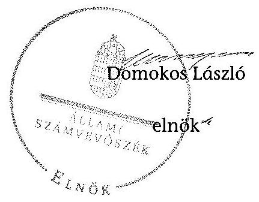

---

# A GYEMSZI által a 2013. évi XXV. tv. alapján átvett, és vagyonkezelésbe adott egészségügyi vagyon 

| Megszűnő gazdasági társaság | Befogadó intézmény | Nyitó vagyon (eFt) |
| :--: | :--: | :--: |
| Albert Schweitzer Kórház-Rendelőintézet Egészségügyi Szolgáltató Nonprofit Közhasznú Korlátolt Felelősségű Társaság | Albert Schweitzer Kórház-   Rendelőintézet Hatvan | 149075 |
| Dombóvári Szent Lukács Egészségügyi Nonprofit Korlátolt Felelősségű Társaság | Dombóvári Szent Lukács Kórház | 1894706 |
| Jász-Nagykun-Szolnok Megyei Egészségügyi Szolgáltató Közhasznú Nonprofit Korlátolt Felelősségű Társaság | Kunhegyesi Szakorvosi és Ápolási Intézet | 8869 |
| KOMLÓI EGÉSZSÉGCENTRUM Nonprofit Korlátolt Felelősségű Társaság | Komlói Egészségcentrum | 341405 |
| Markhot Ferenc Kórház Egészségügyi Szolgáltató Nonprofit Kiemelkedően Közhasznú Nonprofit Korlátolt Felelősségű Társaság | Markhot Ferenc Oktatókórház és Rendelőintézet Eger | 300735 |
| Mezőtúr Városi Kórház - Rendelőintézet Egészségügyi Szolgáltató Kiemelten Közhasznú Nonprofit Korlátolt Felelősségű Társaság | Mezőtúri Kórház és Rendelőintézet | 182194 |
| MISEK Miskolci Semmelweis Ignác Egészségügyi Központ és Egyetemi Oktató Kórház Nonprofit Korlátolt Felelősségű Társaság | Miskolci Semmelweis Kórház és Egyetemi Oktatókórház | 9934110 |
| Misszió Egészségügyi Központ Nonprofit Korlátolt Felelősségű Társaság | Misszió Egészségügyi Központ Veresegyház | 590187 |
| Oroszlányi Szakorvosi- és Ápolási Szolgáltató Közhasznú Nonprofit Korlátolt Felelősségủ Társaság | Oroszlányi Szakorvosi és Ápqlási Intézet | 504852 |
| SEMMELWEIS HALASI KÓRHÁZ Nonprofit Korlátolt Felelősségű Társaság | Kiskunhalasi Semmelweis Kórház | 993400 |
| SzigetvárMed Nonprofit Korlátolt Felelősségű Társaság | Szigetvári Kórház | 1082510 |
| Tapolcai Kórház Egészségügyi Nonprofit Korlátolt Felelősségű Társaság | Deák Jenő Kórház Tapolca | 1172540 |
| Toldy Ferenc Kórház - Rendelőintézet Nonprofit Közhasznú Korlátolt Felelősségủ Társaság | Toldy Ferenc Kórház és Rendelőintézet Cegléd | 2596049 |
| Veszprém Megyei Csolnoky Ferenc Kórház Nonprofit Zártkörűen Müködő Részvénytársaság | Csolnoky Ferenc Kórház Veszprém | 1995849 |

---

|  Vas Megyei Markusovszky Kórház, Egyetemi
Oktatókórház Nonprofit Zártkörűen Müködő
Részvénytársaság | Markusovszky Egyetemi
Oktatókórház Szombathely | 74885  |
| --- | --- | --- |
|  Körmendi Vagyongazdálkodási és
Ingatlanhasznosítási Korlátolt Felelősségű
Társaság | Jászberényi Szent Erzsébet
Kórház | 137609  |
|  SZENT ERZSÉBET KÓRHÁZ Egészségügyi
Szolgáltató Nonprofit Közhasznú Korlátolt
Felelősségű Társaság | Jászberényi Szent Erzsébet
Kórház | 1822561  |
|  Hévízgyógyfürdő és Szent András
Reumakórház Nonprofit Korlátolt Felelősségű
Társaság | Hévízgyógyfürdő és Szent
András Reumakórház | 56105  |
|  Dorogi Szent Borbála Szakkórház és
Szakorvosi Rendelő Nonprofit Korlátolt
Felelősségű Társaság | Dorogi Szent Borbála
Szakkórház és Szakorvosi
Rendelő | 21613758  |
|  Szabolcs-Szatmár-Bereg Megyei Egészségügyi
Szervezési és Szolgáltató Holding Nonprofit
Zártkörűen Müködő Részvénytársaság | Szabolcs-Szatmár-Bereg megyei
Kórházak és Egyetemi
Oktatókórház Nyíregyháza | 21613758  |
|  Jósa András Oktatókórház Egészségügyi
Szolgáltató Nonprofit Korlátolt Felelősségű
Társaság |  |   |
|  Szatmár-Beregi Kórházak Egészségügyi
Szolgáltató Nonprofit Korlátolt Felelősségű
Társaság |  |   |
|  Egészségügyi Háttérszolgáltató Zártkörűen
Müködő Részvénytársaság |  |   |
|  KENÉZY KÓRHÁZ Rendelőintézet Egészségügyi
Szolgáltató Nonprofit Korlátolt Felelősségű
Társaság |  |   |
|  EGÉSZSÉGÜGYI JÁRÓBETEG KÖZPONT
Szolgáltató Nonprofit Korlátolt Felelősségű
Társaság | Kenézy Gyula Kórház és
Rendelőintézet Debrecen | 2894819  |
|  MEGYEI EGÉSZSÉGÜGYI Vagyonkezelő és
Ingatlanhasznosító Korlátolt Felelősségű
Társaság |  |   |
|  VESZ VAGYONKEZELŐ Korlátolt Felelősségű
Társaság |  |   |
|  Nagyerdei Gyógyászati Szolgáltató Korlátolt
Felelősségű Társaság |  |   |
|  Összesen |  | 48346218  |

---

# A GYEMSZI által átvett gazdasági társaságok átadása a befogadó intézményeknek

|  Megszűnő gazdasági társaság neve, székhelye |  | Befogadó intézmény megnevezése, székhelye | Átvett szervezet szervezeti formája | Az átadás-átvételi jegyzőkönyv aláírásának dátuma  |
| --- | --- | --- | --- | --- |
|  1 | Albert Schweitzer Kórház-Rendelőintézet Egészségügyi Szolgáltató Nonprofit Kórhasszú Korlátolt Felelősségű Társaság | Albert Schweitzer Kórház-Rendelőintézet, Hatvan | gazdasági társaság | 2013.04.04  |
|  2 | Dombóvár Szent Lukács Egészségügyi Nonprofit Korlátolt Felelősségű Társaság | Dombóvár Szent Lukács Kórház, Dombóvár | gazdasági társaság | 2013.04.05  |
|  3 | Jósz-Magykun-Szolnok Megyei Egészségügyi Szolgáltató Kórhasszú Nonprofit Korlátolt Felelősségű Társaság | Kunhegyesi Szakorvosi és Ápolási Intézet, Kunhegye | gazdasági társaság | 2013.04.09  |
|  4 | KOMLÓI EGÉSZSÉGCENTRUM Nonprofit Korlátolt Felelősségű Társaság Komló | Komlói Egészségcentrum, Komló | gazdasági társaság | 2013.04.05  |
|  5 | Markhot Ferenc Kórház Egészségügyi Szolgáltató Nonprofit Kiemelkedően Kizihasszú Nonprofit Korlátolt Felelősségű Társaság | Markhot Ferenc Oktatókórház és Rendelőintézet, Eger | gazdasági társaság | 2013.04.04  |
|  6 | Mezőtár Városi Kórház - Rendelőintézet Egészségügyi Szolgáltató Kiemelten Kizihasszú Nonprofit Korlátolt Felelősségű Társaság | Mezőtári Kórház és Rendelőintézet, Mezőtár | gazdasági társaság | 2013.04.09  |
|  7 | MISSK Miskolc Semmelweis Ignác Egészségügyi Központ és Egyetemi Oktató Kórház Nonprofit Korlátolt Felelősségű Társaság Miskolc | Miskolc Semmelweis Kórház és Egyetemi Oktatókórház, Miskolc | gazdasági társaság | 2013.04.04  |
|  8 | Minzitő Egészségügyi Központ Nonprofit Korlátolt Felelősségű Társaság Veresegyház | Minzitő Egészségügyi Központ, Veresegyház | gazdasági társaság | 2013.04.03  |
|  9 | Oroszlányi Szakorvosi- és Ápolási Szolgáltató Kórhasszú Nonprofit Korlátolt Felelősségű Társaság | Oroszlányi Szakorvosi és Ápolási Intézet, Oroszlány | gazdasági társaság | 2013.04.04  |
|  10 | SEMMELWIES HALASI KÓRHÁZ Nonprofit Korlátolt Felelősségű Társaság | Szigetvár Kórház, Szigetvár | gazdasági társaság | 2013.04.05  |
|  11 | Szigetvárkéed Nonprofit Korlátolt Felelősségű Társaság | Desik Jenő Kórház, Tapolca | gazdasági társaság | 2013.04.05  |
|  12 | Tapolcol Kórház Egészségügyi Nonprofit Korlátolt Felelősségű Társaság Tapolca | Toldy Ferenc Kórház és Rendelőintézet, Cegléd | gazdasági társaság | 2013.04.05  |
|  13 | Toldy Ferenc Kórház - Rendelőintézet Nonprofit Kórhasszú Korlátolt Felelősségű Társaság Cegléd | Csolnoky Ferenc Kórház, Veszprém | gazdasági társaság | 2013.04.05  |
|  14 | Veszprém Megyei Csolnoky Ferenc Kórház Nonprofit Zártkörűen Működő Részvénytársaság Veszprém | Markusovszky Egyetemi Oktatókórház, Szombathely | gazdasági társaság | 2013.04.05  |
|  15 | Vás Megyei Markusovszky Kórház, Egyetemi Oktatókórház Nonprofit Zártkörűen Működő Részvénytársaság | Markusovszky Egyetemi Oktatókórház, Szombathely | gazdasági társaság | 2013.04.05  |
|  16 | Szombathely | Markusovszky Egyetemi Oktatókórház, Szombathely | gazdasági társaság | 2013.04.05  |
|  17 | Körmenál Vagrongazdálkodási és Ingašlanhasznosítási Korlátolt Felelősségű Társaság | Jászberényi Szent Erzsébet Kórház, Jászberény | gazdasági társaság | 2013.04.08  |
|  18 | SZENT EKZSÉBET KÓRHÁZ Egészségügyi Szolgáltató Nonprofit Kórhasszú Korlátolt Felelősségű Társaság | Hévízgyógyfürdő és Szent András Reumakórház, Hévíz | gazdasági társaság | 2013.04.05  |
|  19 | Hévízgyógyfürdő és Szent András Reumakórház Nonprofit Korlátolt Felelősségű Társaság | Dologi Szent Borbála Szakkórház és Szakorvosi Rendelő, Doreg | gazdasági társaság | 2013.04.05  |
|  20 | Szabolcs-Szatmár-Bereg Megyei Egészségügyi Szervezési és Szolgáltató Holding Nonprofit Zártkörűen Működő Részvénytársaság | Szabolcs-Szatmár-Bereg megyei Kórházak és Egyetemi Oktatókórház, Nyíregyháza | gazdasági társaság | 2013.04.02  |
|  21 | Jósa András Oktatókórház Egészségügyi Szolgáltató Nonprofit Korlátolt Felelősségű Társaság | Szabolcs-Szatmár-Bereg megyei Kórházak és Egyetemi Oktatókórház, Nyíregyháza | gazdasági társaság | 2013.04.02  |
|  22 | Szatmár-Beregi Kórházak Egészségügyi Szolgáltató Nonprofit Korlátolt Felelősségű Társaság | Szabolcs-Szatmár-Bereg megyei Kórházak és Egyetemi Oktatókórház, Nyíregyháza | gazdasági társaság | 2013.04.02  |
|  23 | Egészségügyi Háttérszolgáltató Zártkörűen Működő Részvénytársaság Debrecen | Kenézy Gyula Kórház és Rendelőintézet, Debrecen | gazdasági társaság | 2013.04.02  |
|  24 | KENÉZY KÓRHÁZ Rendelőintézet Egészségügyi Szolgáltató Nonprofit Korlátolt Felelősségű Társaság | Kenézy Gyula Kórház és Rendelőintézet, Debrecen | gazdasági társaság | 2013.04.03  |
|  25 | EGÉSZSÉGÜGYI JÁRÓBETEG KÖZPONT Szolgáltató Nonprofit Korlátolt Felelősségű Társaság | Kenézy Gyula Kórház és Rendelőintézet, Debrecen | gazdasági társaság | 2013.04.03  |
|  26 | MEGYEI EGÉSZSÉGÜGYI Vagyonkezelő és Ingašlanhasznosító Korlátolt Felelősségű Társaság | Kenézy Gyula Kórház és Rendelőintézet, Debrecen | gazdasági társaság | 2013.04.03  |
|  27 | VESZ VAGYONKEZELŐ Korlátolt Felelősségű Társaság | Kenézy Gyula Kórház és Rendelőintézet, Debrecen | gazdasági társaság | 2013.04.03  |
|  28 | Nagyerdei Gyógyászati Szolgáltató Korlátolt Felelősségű Társaság | Kenézy Gyula Kórház és Rendelőintézet, Debrecen | gazdasági társaság | 2013.04.03  |

---

A GYEMSZI-nél a vagyon bővülését eredményező, a 2013. évi XXV. törvényl előíráson alapuló vagyonátvétel

|  Átvett cég/részesedés megnevezése, címe | Vagyonelem típusa | A vagyon átvételi dokumentum típusa | A vagyon átvételi dokumentum kelte | Jegyzett tőke részesedéssel arányos része (ezer Ft-ban)  |
| --- | --- | --- | --- | --- |
|  ProMed Complex Nonprofit Közhasznú Kft. (3000 Hatvan, Balassi Bálint út 3.) | Részesedés 100\% | Átadás-átvételi jegyzőkönyv | 2013.04.04 | 500  |
|  VEMESZ Veszprém Megyei Egészségügyi és Szolgáltató Kft. (8200 Veszprém, Kórház u. 1.) | Részesedés 100\% | Átadás-átvételi jegyzőkönyv | 2013.04.05 | 80000  |
|  Reg-EüInfo Észak-alföldi Reg. Egészségügyi Informatikai Nonprofit Közhasznú Kft. (4032 Debrecen, Nagyerdei körút 98.) | Részesedés 5\% | Átadás-átvételi jegyzőkönyv | 2013.04.08 | 150  |
|  Reg-EüInfo Észak-alföldi Reg. Egészségügyi Informatikai Nonprofit Közhasznú Kft. (4032 Debrecen, Nagyerdei körút 98.) | Részesedés 10\% | Átadás-átvételi jegyzőkönyv | 2013.04.03 | 300  |
|  Termál-Egészségipari Klaszter Kft. (székhely: 4032 Debrecen, Nagyerdei park 1.) | Részesedés 33\% | Átadás-átvételi jegyzőkönyv | 2013.04.03 | 198  |
|  Cívis Termál Kutató Kft. (székhely: 4032 Debrecen, Nagyerdei park 1.) | Részesedés 19\% | Átadás-átvételi jegyzőkönyv | 2013.04.03 | 190  |
|  Pharmapolis Debrecen Kutató és Fejlesztő Kft. (4032 Debrecen, Nagyerdei krt. 98.) | Részesedés 12\% | Átadás-átvételi jegyzőkönyv | 2013.04.03 | 360  |
|  Pharmapolis Klaszter Kft. (4025 Debrecen, Petőfi tér 10.) | Részesedés 7,5\% | Átadás-átvételi jegyzőkönyv | 2013.04.03 | 750  |
|  "Kórház Informatika 2000" Informatikai és Szolgáltató Nonprofit Kft. (3526 Miskolc, Szentpéteri kapu 72-76.) | Részesedés 17\% | Átadás-átvételi jegyzőkönyv | 2013.04.04 | 510  |
|  MITIME Kft. (3529 Miskolc, Csabai kapu 9-11) | Részesedés 25\% | Átadás-átvételi jegyzőkönyv | 2013.04.04 | 150  |
|  "Kórház Informatika 2000" Informatikai és Szolgáltató Nonprofit Kft. (3526 Miskolc, Szentpéteri kapu 72-76.) | Részesedés 5\% | Cégkivonat alapján | n.a. | 150  |
|  EH Centrum Egészségügyi Szolgáltató Nonprofit Kft. (4400 Nyíregyháza, Szent István utca 68.) | Részesedés 100\% | Átadás-átvételi jegyzőkönyv | 2013.04.02 | 500  |
|  EH Ügyelet Egészségügyi Szolgáltató Nonprofit Kft. (4400 Nyíregyháza, Szent István utca 68.) | Részesedés 100\% | Átadás-átvételi jegyzőkönyv | 2013.04.02 | 500  |
|  "Klinkoord" Klinikai Kutatási Koordinációs Központ Kft. (1121 Budapest, Szanatórium utca 19.) | Részesedés 100\% | Átadás-átvételi jegyzőkönyv | 2013.04.02 | 39900  |
|  ÖSSZESEN |  |  |  | 124158  |

---

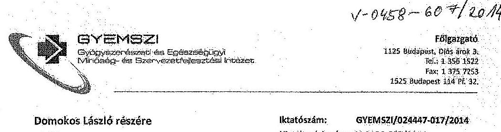

# Tisztelt Elnök Úr!

Köszönettel megkapjuk: "Az állami vagyon feletti tulajdonosi joggyakorlóssal kapcsolatos tevékenységek „ellenőrzése” címmel készített számvevőszaki jelentéstervezetet, amelyre ezúton szeretnénk észrevételt tenni.

1. Észrevételezett szövegírások:

25. oldal, 1. bekezdés: "A GYEMSZI 2013. évben a 2013 évi XXV. törvény alapján átvett, rábízott vagyonra vonatkozóan nem végzett folyamatos könyvelést, elkülönített vagyonnyilvántartást nem vezetett, mely eljárás nem felelt meg az Nytv., a 2013. XXV. törvény, valamint a 347/2010 (XII.28.) Korm. rendelet által előírt, a rábízott állami vagyon feletti tulajdonosi joggyakorló számára kötelező nyilvántartási kötelezettségnek."

82. oldal 4. bekezdés: "A GYEMSZI 2013. évben a rábízott vagyonra vonatkozóan nem végzett folyamatos könyvelést, elkülönített vagyonnyilvántartást nem vezetett, mely eljárás nem felelt meg az Nytv. 10.§ (1) bekezdésében, a 347/2010 (XII.28.) Korm. rendelet 2.§ (1) bekezdésében, a rábízott állami vagyon feletti tulajdonosi joggyakorló számára előírt nyilvántartási kötelezettségnek."

84. oldal, utolsó bekezdés: "A 2013. évi XXV. törvény alapján átvett vagyon vonatkozásában az Nytv., a 347/2010 (XII.28.) Korm. rendelet és a GYEMSZI 2013. október 1-jn hatályba lépett belső számviteli szabályzatai előírásai ellenére 2013-ban nem történt meg a rábízott vagyon könyvelése és elkülönített nyilvántartásba vétele. A 2013-ban átvett rábízott vagyon 2013. évre vonatkozó könyvelésére és elkülönített nyilvántartásának vezetésére a 347/2010 (XII.28.) Korm. rendelet 2.§ (1)-(2) bekezdésének alapján 2014-ben, a helyszíni ellenőrzés ideje alatt került sor. Az elkülönített vagyonnyilvántartás készítése, a befogadó intézményeknél lévő vagyonelemekre vonatkozóan a helyszíni ellenőrzés idején még folyamatban volt."

---

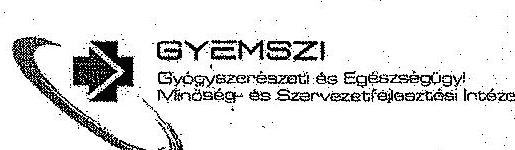

Fölgazgató
1125 Budapest, Bós. krak 2.
Tel.: 1 306 1522
Fax: 1 375 7254
1525 Budapest 114 Pf. 12.
28. oldal, megállapítás:
„A GYEMSZI 2013. évben a rábizott vagyonra vonatkozóan nem végzett folyamatos könyvelést, elkülönített vagyonnyilvántartást nem vezetett, ami nem felett meg az Nvtv. 10.§ (1) bekezdésében, a 347/2010 (XII.28.) Korm.rendelet 2.§ (1) bekezdésében, valamint a 2013. XXV. törvény 4.§ (3) bekezdésében a rábizott állami vagyon feletti tulajdonosi joggyakorló számára elöírt nyilvántartási kötelezettségnek."
28. oldal Javaslat:
„Javaslat: Intézkedjen a rábizott vagyon könyvelésével, elkülönített nyilvántartásával, valamint a vagyonátvételhez kapcsolódó szabálytalanságokkal összefüggésben a munkajogi felelősség kivizsgálására irányuló eljárás megindítása iránt és a vizsgálat eredményének ismeretében tegye meg a szükséges intézkedéseket."

# Észrevételünk: 

Tervezet megállapítását, miszerint Intézetünk a rábizott vagyon tekintetében nem rendelkezik elkülönített nyilvántartással, nem tudjuk elfogadni, mivel a saját vagyon és a rábízott vagyon nyilvántartása a számviteli rendszerünkben elkülönítetten történik, közvetlen elektronikus kórházi (vagyonkezelői) kapcsolattal. A CT Ecostat program, mely a számviteli nyilvántartásunkat szolgálja, rendelkezik kettős könyvviteli modullal, melyet 2012. óta használunk.

Ezt támasztja alá, hogy a rábizott vagyonról szóló beszámolót a 2012-es évre vonatkozóan Intézetünk határidőben elkészítette és közzétette, illetve a 2013-as számszaki és szöveges beszámoló az ellenőrzés időszakában elkészült, azt a Nemzeti Fejlesztési Minisztériumba beküldtük. Az NFM a beszámolót befogadta és ez alapján készítette el „Az állam nevében tulajdonosi jogokat gyakorló szervezetek 2013. évi múködéséről, az állami vagyon állományának alakulásáról, az állami vagyonnal való gazdálkodás folyamatairól" címú országgyűlési jelentést.

## Módosító szöveglavaslatunk:

A 25. oldal 1. bekezdés hivatkozott szövegrészét kérjük törölni. („A GYEMSZI 2013. évben a 2013 évi XXV. törvény alapján átvett, rábizott vagyonra vonatkozóan nem végzett folyamatos könyvelést, elkülönített vagyonnyilvántartást nem vezetett, mely eljárás nem felett meg az Nvtv., a 2013. XXV törvény, valamint a 347/2010 (XII.28.) Korm. rendelet által elöirt, a rábizott állami vagyon feletti tulajdonosi joggyakorló számára kötelezö nyilvántartási kötelezettségnek"). Helyette kérjük az alábbi szöveg rögzítését megfontolni

---

# GyEMSZI 

Glyógyerezer-őszorti ésa Egyhermógi Zyyt
Némózotig- ésa Tiszar-rszetechajszsztátol V-Kolczati

Négségstó
1125 Budapest, thós árist 5.
hó.: 12561522
Fax: 12557253
1525 Budapest 114 M. 32.
szíveskedjenek: „A GYEMSZI 2013. évben elkülönített nyilvántartást vezetett, azonban a tárgyévi változásokat a könyvelésbe késve vezette fel. A 2013. évi beszámoló határidőre beadásra került a Nemzeti Fejlesztési Minisztériumba, amely azt elfogadta és „Az Állam nevében tulajdonosi jogokat gyakorló szervezetek 2013. évi müködéséröl, az állami vagyon állományának alakulásáról, az állami vagyonnal való gazdálkodás folyamatairál" címü jelentésében szexepeltette."

A 82. oldal 4. bekezdésében lévő szövegrész után (,A GYEMSZI 2013. évben a rábízott vagyonra vonatkozóan nem végzett folyamatos könyvelést, elkülönített vagyonnyilvántartást nem vezetett, mely eljárás nem felelt meg az Nvtv. 10.§ (1) bekezdésében, a 347/2010 (XII.28.) karm.rendelet 2.§ (1) bekezdésében a rábízott állami vagyon feletti tulajdonosi joggyakorló számára elöirt nyilvántartási kötelezettségnek.") kérjük, hogy a következő észrevételünket rögzíteni szíveskedjenek: „A GYEMSZI tájékoztatása szerint a GYEMSZI 2013. évben elkülönített nyilvántartást vezetett, azonban a tárgyévi változásokat a könyvelésbe késve vezette fel. A 2013. évi beszámoló határidőre beadásra került a Nemzeti Fejlesztési Minisztériumba, amely azt elfogadta és „Az Állam nevében tulajdonosi jogokat gyakorló szervezetek 2013. évi müködéséröl, az állami vagyon állományának alakulásáról, az állami vagyonnal való gazdálkodás folyamatairál" címü jelentésében szerepeltette."

A 84. oldal utolsó bekezdésében hivatkozott szövegrész után (,A 2013. évi XXV. törvény alapján átvett vagyon vonatkozásában az Nvtv., a 347/2010 (XII.28.) Karm.rendelet és a GYEMSZI 2013. október 1-jn hatályba lépett belső számviteli szabályzatai elöirásai ellenére 2013-ban nem történt meg a rábízott vagyon könyvelése és elkülönített nyilvántartásba vétele. A 2013-ban átvett rábízott vagyon 2013. évre vonatkozó könyvelésére és elkülönített nyilvántartásának vezetésére a 347/2010 (XII.28.) Karm.rendelet 2.§ (1)-(2) bekezdéseinek alapján 2014-ben,- a helyszíni ellenőrzés ideje alatt került sor. Az elkülönített vagyonnyilvántartás készítése, a befogadó intézményeknél lévő vagyonelenvekre vonatkozóan a helyszíni ellenőrzés idején még folyamatban volt.") kérjük, hogy a következő észrevételünket rögzíteni szíveskedjenek: „A GYEMSZI tájékoztatása szerint a GYEMSZI 2013. évben elkülönített nyilvántartást vezetett, azonban a tárgyévi változásokat a könyvelésbe késve vezette fel. A 2013. évi beszámoló határidőre beadásra került a Nemzeti Fejlesztési Minisztériumba, amely azt elfogadta és „Az Állam nevében tulajdonosi jogokat gyakorló szervezetek 2013. évi müködéséröl, az állami vagyon állományának alakulásáról, az állami vagyonnal való gazdálkodás folyamatairál" címü jelentésében szerepeltette."

A 28. oldal megállapítása (,A GYEMSZI 2013. évben a rábízott vagyonra vonatkozóan nem végzett folyamatos könyvelést, elkülönített vagyonnyilvántartást nem vezetett, ami nem felelt meg az Nvtv. 10.§ (1) bekezdésében, a 347/2010 (XII.28.) Karm.rendelet 2.§ (1) bekezdésében, valamint a 2013. XXV. törvény 4.§ (3) bekezdésében a rábízott állami vagyon

---

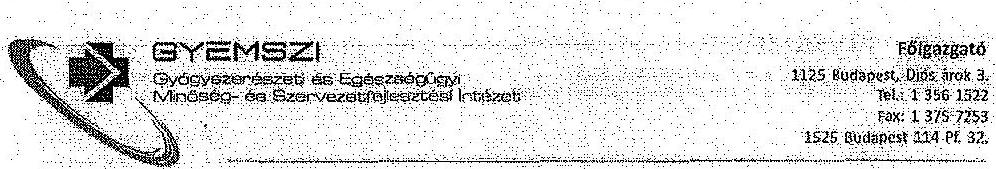
feletti tulajdonosi joggyakoriá számára elöirt nyilvántartási kötelezettségnek.") helyett kérjük az alábbi szövegrész beillesztését: „A GYEMSZI a 2013. évben a rábizott vagyonra vonatkozáan elkülönített nyilvántartást vezetett, azonban a tárgyévi változásokat a könyvelésbe késve vezette fel."
A 28. oldal javaslata (Javaslat: Intézkedjen a rábizott vagyon könyvelésével, elkülönített nyilvántartásával, valamint a vagyonátvételhez kapcsolódó szabálytalanságokkal összefüggésben a munkajogi felelősség kivizsgálására irányuló eljárás meginditása iránt és a vizsgálat eredményének ismeretében tegye meg a szükséges intézkedéseket") szöveget törölni szíveskedjenek. Javaslathoz szöveglavaslatunk: „Intézkedjen a rábizott vagyonra vonatkozó könyvelés folyamatosságáról"

Megjegyezni kívánjuk, hogy
A helyszíni ellenőrzés lefolytatása után a számviteli osztályvető személyében változás történt, a jelenlegi vezetővel biztosítottnak látjuk a folyamatos könyvelést. A számviteli területen a feladat ellátására alkalmas munkaerő felvételéről gondoskodtunk.
A rábízott vagyon tekintetében pedig folyamatban van - jogszabályban egyébként nem előírt módon - könyvvizsgáló kiválasztása a 2014 -évi beszámoló könyvvizsgálatára, biztosítandó a vonatkozó jogszabályok betartását.

A fentieken kívül fontosnak tartom megjeleníteni a végleges anyagban, hogy intézetünk a tulajdonosi joggyakoriól kijelöléssel csak többlet feladatokat kapott, de sem külön pénzügyi forrás, sem szabad erőforrás nem állt és nem áll rendelkezésére. A rábízott vagyonnal kapcsolatos kiadások saját költségvetését terhelik, bevétele (használaton kivüll ingatlanuk értékesítése) pedig nem származik belöle.
2..

Észrevételezett szövegrészek:
28. oldal megállapítások: „Az átadó által készített eszköz és vagyonleltárt követően ismételt, átvevö leltár felvétele a GYEMSZI által nem történt. Az Nvtv. 105 (1) bekezdése alapján a nemzeti vagyont, annak értékét, változását a tulajdonosi joggyakoriának nyilván kell tartani. A nyilvántartás felvételéhez szükséges vagyonelemek értékének, mennyiségének megállapításáról a GYEMSZi-nek leltár készitésével vagy egyéb módon intézkedni kellett volna, ami nem történt meg."
33. oldal, 4. bekezdés: „Az átadó által készített eszköz és vagyonleltárt követően ismételt, átvevő leltár felvétele a GYEMSZI által nem történt. Az Nvtv. 10.5 (1) bekezdése alapján a

---

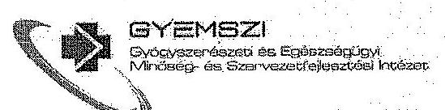

Fölgesgető
1125 Budapest, Utós desk 1.
Tel.: 1 256 1522
Fax: 1 376 7253
1325 Budapest 124 PL 32.

nemzeti vagyont, annak értékét, változását a tulajdonosi joggyakorlónak nyilván kell tartani.
A nyilvántartás felvételéhez szükséges vagyonelemek értékének, mennyiségének
megállapításáról a GYEMSZI-nek eszköz és vagyon leltár felvételével intézkedni kellett volna,
ennek hiányában a nyitó leltárak a befogadó intézményekben készültek."

Észrevételünk:

A Tervezet is megállapítja:

- Intézetünk a 2013. évi XXV. törvény által megszüntetett gazdasági társaságok teljes
vagyonát a törvény szellemének megfelelően, a befogadó intézményeknek a
feladatátadás napjával vagyonkezelésbe adta;
- A megszűnő gazdasági társaságok vezető tisztségviselői teljességi nyilatkozat
aláírásával igazolták az általuk átadott adatok, így a záró leltár hitelességét is.

A fentieket kiegészítve azzal, hogy a befogadó intézmények vezetői néhány értelemszerű
kivétellel személyükben megegyeztek a megszűnő társaságok vezetőivel, a személyes leltár
felelősség nem szakadt meg. A vagyonvesztés kockázata így rendkívül alacsony, ezért
intézetünk nem terhelte az átalakuló szervezeteket egy rövid időn belül lebonyolítandó,
második leltárral.

Módosító javaslatunk

Kérjük, hogy a hivatkozott szövegrésteket -az észrevételeink figyelembe vételével-
módosítani szíveskedjenek.

3.,

Észrevételezett szövegrész

79. oldal, 6. bekezdés: „Az SZMSZ AZ Ávr. 13.§ (1) e) bekezdésével ellentétben - a Belső
Ellenőrzési Főosztály ügyrondjében történt szabályozás kivételével - nem tartalmazta a
szervezeti egységek engedélyezett létszámát."

Észrevételünk:

Tájékoztatom, hogy a GYEMSZI ez engedélyezett létszámot szerepeltette az SZMSZ
tervezetében, az engedélyezett létszámra vonatkozó adatok az SZMSZ közzététele során, a
KIM instrukciói alapján kerültek ki az SZMSZ-ből. Tájékoztatom továbbá, hogy az EMMI-be
jóváhagyásra 2014. április 30-án megküldött tervezet is tartalmazza a létszámot.

---

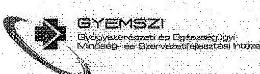

Föigazgató
1125 Budapest, Dán Jind. 2. Tel.: 13561522 Fő: 1.370 .1014 1525 Budapest 114 Pl. 32.

# Módosító szöveglavadatunk: 

A 79. oldal font is hivatkozott 6. bekezdése (,Az SZMSZ AZ Ávr. 19.5 (1) e) bekezdésével ellentétben - a Belső Ellenőrzési Főosztály ügyrendjében történt szabályozás kivételével nem tartalmazta a szervezeti egységek engedélyezett létszámát.") szövegrészt kérjük kiegészíteni a következő mondattal: „A GYEMSZI tájékoztatása szerint a GYEMSZI valamennyi, általa jóváhagyásra elökészített és megküldött SZMSZ tervezet tartalmazta és tartalmazza az engedélyezett létszámat."

## 4.,

## Észrevételazett szövegrész

24. oldal, utolsó bekezdés, 2. mondat: „A föigazgató által az ideiglenes müködési rendet meghatározó szabályzatról kiadott utasítás ellentétesen határosta meg a költségvetési szerv müködését, a hatályos, a miniszter által kiadott SZMSZ-nek az intézmény szervezeti felépitésére, struktúrájára vonatkozó rendelkezéseivel, és a logi, igazgatási és Humánpolitikai Föigazgatóság a szabályzat hatálybalépését követően, ezen keretek között végezte feladatát."
25. oldal, 4. bekezdés: „A 37/2013. számon kiadott föigazgatói utasítás rendelkezett a GYEMSZI Minősítési, Beszerzési, Intézményfelügyeleti és Müszaki Igazgatósága, valamint egyes törzskari szervezeti egységek irányításának és ellenőrzésének ideiglenes rendjéről szóló szabályzatról. A föigazgató az ideiglenes szabályzat kiadásával az SZMSZ-nek az intézmény szervezeti felépitésére, struktúrájára vonatkozó rendelkezéseivel ellentétesen határozza meg a költségvetési szerv müködését."

## Észrevételünk:

- A föigazgatói utasítással a szervezeti struktúra nem változott, létező szervezeti egységek megszüntetésére, átalakítására, új szervezeti egység alapítására, új vezetői szintek létrehozására nem került sor, hiszen ezek módosításához valóban szükség lett volna az SZMSZ módosítására. A föigazgatói utasítás kizárólag a meglévő szervezeti egységeken alapult, ezek irányítási rendszerét, belső testületek feladatmegosztását módosította, figyelemmel az új SZMSZ tervezetére, valamint arra, hogy a Minőségügyi Föigazgatóhelyettesi státusz nem volt betöltve.
- Bevett gyakorlat a központi államigazgatási szervek müködésében, hogy a szerv feladatainak megváltozása során ideiglenes müködési rend került kiadásra az új SZMSZ elkészültélg, annak érdekében, hogy az irányítási változások a szervezeti egységek feladatainak módosítása nélkül már érvényesülhessenek.

---

**GYEMSZI**

*Összegző*

1125 Budapest, Olós átok 3.
Tel.: 1 356 1522
Fax: 1 371 7754
1525 Budapest 133. M. 32.

- Egyebekben az SZMSZ tervezetét, mely már a főigazgatói utasítás figyelembevételével készült, 2014. 04.30.-án beküldtük az EMMI-be. Az SZMSZ-re 2014.07.21-én az EMMI észrevételek beérkeztek. Ezt követően ezek egyeztetését megkezdtük. Az SZMSZ-re tett észrevételek jelentős részét közben átvezettük az anyagon, jóváhagyásra azonban még nem küldtük meg, az időközben jelzett várható szervezeti változásokra figyelemmel.

### Módosító szöveglavaslatunk

A 80. oldal 4., hivatkozott bekezdését ("A 37/2013. számon kiadott főigazgatói utasítás rendelkezett a GYEMSZI Minősítési, Beszerzési, intézményfelügyeleti és Műszaki Igazgatósága, valamint egyes törzskari szervezeti egységek irányításának és ellenőrzésének ideiglenes rendjáról szóló szabályzatról. A főigazgató az ideiglenes szabályzat kiadásával az SZMSZ-nek az intézmény szervezeti felépítésére, struktúrájára vonatkozó rendelkezéseivel ellentétesen határozta meg a költségvetési szerv működését.") kérjük kiegészíteni az alábbi szöveggel: "A főigazgatói utasítással a szervezeti struktúra nem változott, létező szervezeti egységek megszüntetésére, átalakítására, új szervezeti egység alapítására, új vezetői szintek létrehozására nem került sor. A főigazgatói utasítás a meglévő szervezeti egységek irányítási rendszerét, belső testületek feladatmegosztását módosította. A szabályzat kiadására az államigazgatásban gyakran eljárás szerint került sor, amivel biztosították, hogy - az SZMSZ módosítás hatályba lépéséig - ideiglenes működési rend kiadásával érvényesülhessenek az irányítási változások a szervezeti egységek feladatainak módosítása nélkül."

A 24. oldal utolsó bekezdésben, fent hivatkozott rész ("A főigazgató által az ideiglenes működési rendet meghatározó szabályzatról kiadott utasítás ellentétesen határozta meg a költségvetési szerv működését, a hatályos, a miniszter által kiadott SZMSZ-nek az intézmény szervezeti felépítésére, struktúrájára vonatkozó rendelkezéseivel, és a jogi, igazgatási és Humánpolitikai Főigazgatóság a szabályzat hatálybolépését követően, ezen keretek között végezte feladatát") helyett az alábbi szöveg beillesztését kérjük. "A főigazgató az ideiglenes működési rendet meghatározó utasításával módosította a meglévő szervezeti egységek irányítási rendszerét, belső testületek feladatmegosztását, ezzel az új SZMSZ hatályba lépésekor bevezetendő új struktúra feladatainak ellátására vonatkozóan biztosította - az SZMSZ hatályba lépését megelőző-szabályos működést.

### 5.

### Észrevételezett szövegrészek

I. Összegző megállapítások, következtetések, javaslatok c. fejezet GYEMSZI tulajdonosi ellenőrzéssel kapcsolatos feladatellátására tett megállapításaihoz (25. oldal 2., 3.).

---

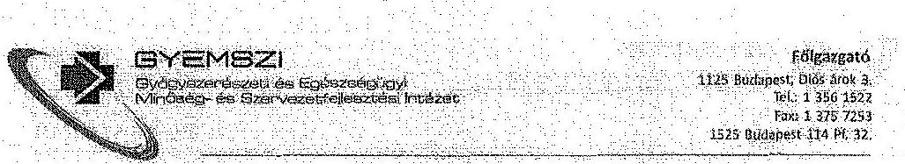
bekezdésekben), illetve a II. Részletes Megállapítások, 5.4. A tulajdonosi joggyakorlás és az állami vagyonnal való gazdálkodás tulajdonosi ellenőrzési rendszerének kialakítása c. alfejezethez (86-87. oldalakon)

# Észrevételeink 

Az intézményfelügyeleti és Múszaki Igazgatóság vagyonnal való gazdálkodás és ellenőrzés feladatait alapvetően a nemzeti vagyonról szóló 2011. évi CXCVI. törvény, az állami vagyonnal való gazdálkodásról szóló 254/2007. (X. 4.) Korm. rendelet, az államháztartásról szóló 2011. évi CXCV. törvény, valamint az államháztartásról szóló törvény végrehajtásáról szóló 368/2011. (XII. 31.) Korm. rendelet, a fenntartói támogatásokról szóló EMMI utasítás, továbbá GYEMSZI Szervezeti és Müködési Szabályzatában rögzítettek határozzák meg.

Ennek megfelelően az állami tulajdonba, GYEMSZI tulajdonosi joggyakorlásába került ingatlanok esetében végzi a vagyonkezelésbe adott ingatlanok esetében a vagyonhasználat ezen belül a hasznosítás, megóvás - ellenőrzését. Az intézmények és a GYEMSZI között létrejött vagyonkezelési szerződésekben szereplő ingatlanok tekintetében, az ingatlan adatainak helyességére, az ingatlanokkal kapcsolatos változásokra, valamint a jelentési kötelezettségekre fordít kiemelt figyelmet a GYEMSZI a tulajdonosi ellenőrzés végrehajtása során. A tulajdonosi ellenőrzések során tapasztaltak alapján a GYEMSZI eljárt az ingatlannyllvántartási állapot rendezése érdekében. A vagyonkezelt ingatlanokon végzett beruházások, azokkal kapcsolatos hatósági eljárások során a GYEMSZI - a vagyonkezelési szerződés feltételrendszere szerint - egyedi tulajdonosi hozzájárulások és meghatalmazások kiadását megelőzően tulajdonosi mérlegelési jogkörében ellenőrzi az állami vagyonnal való gazdálkodást.

A GYEMSZI fenntartásában múködő intézmények az általuk használt ingatlanok üzemszerú müködésének biztosítására, vis maior helyzetnek minősülő beavatkozást igénylő feladatok finanszírozására - a 13/2013.(IV.24.) EMMI utasításnak megfelelően - fenntartói támogatás iránti igényt (vis maior igényt) nyújthatnak be. A benyújtott, vagyonkezelt ingatlanra vonatkozó beruházási/felújítási/fejlesztési igényeket - a Vis Maior Bizottság elé való beterjesztést megelőzően - a műszaki terület a helyszínen ellenőrzi, illetőleg a megítélt vis maior támogatás felhasználását követően szintén tulajdonosi ellenőrzés történik a műszaki megvalósulás tekintetében. Az intézményekkel kötött támogatási szerződésekben foglaltak szerint az egészségügyi intézmények pénzügyi és szakmai beszámolót kötelesek készíteni a megítélt támogatás felhasználásáról.

A GYEMSZI felügyelete alá tartozó teljes intézményi körre kiterjedően bevezetésre került az intézmények fenntartásával, az általuk vagyonkezelt vagyonnal való gazdálkodással

---

# GYEMSZI 

Glyfgyester ónunóz és Ggitszsefgügyí
Míróságy- ós Szorveszetfejlesztései Miséreti

Fölgazgató
1125 Budapest, Diók ánti 3.
tel.: 13561522
Fax: 13567763
1525 Budapest 124 PL 32.
kapcsolatosan felmerüló tulajdonosi intézkedést igénylő kérdésekben a GYEMSZI online ügymenetkövető rendszere (ügykörrendszer). Az intézmények ezen a felületen keresztül nyújtják be többek között az általuk vagyonkezeit ingatlanokkal kapcsolatos éves fejlesztési terveiket, melynek elkészítésére a műszaki osztály iránymutatásai alapján kerül sor. Az éves beruházási, felújítási tervek tartalmazzák a vagyonnal kapcsolatos fejlesztési elképzeléseket és annak tervezett forrásait, külön megjelölve a biztonságos müködéshez minimálisan szükséges állagmegóvási, karbantartási munkák, valamint az uniós forrásból tervezett beruházások összegét; az önrész mértékét, stb. Ezen felmérést a GYEMSZI a tárgyévet megelőző év október hó során kezdi meg.

Az Úgykörrendszeren keresztül valósulnak meg a további, tulajdonosi ellenőrzés feladatellátásával összefüggésben az alábbiak is:
az egészségügyi intézményeknek a GYEMSZI jóváhagyását kell kérniük a vagyonkezelési, használati szerződésének kialakításához, módosításához;
jóváhagyás szükséges a vagyonkezelésben és a GYEMSZI tulajdonosi joggyakorlásában lévő ingó és ingatlanvagyon bérbeadásához, használatának átengedéséhez, új szerződés megkötéséhez vagy a meglévő szerződések módosításához. Készletes eljárásrendet és az intézmény összes bérleti szerződésére kiterjedő adatszolgáltatási kötelezettséget irz elő a GYEMSZI valamennyi intézménynek kiadott iránymutatásában;
az egészségügyi intézmények kötelesek vagyonkezelésükben és a GYEMSZI tulajdonosi joggyakorlásában lévő ingó és ingatlan bérbeadásával, használatának átengedésével, új szerződés megkötésével vagy a meglévő szerződések módosításával kapcsolatos ügyek összességéről minden negyedévré vonatkozóan összegző kimutatást küldeni a GYEMSZI részére;
az egészségügyi intézmények a vagyonkezelésükben lévő ingatlanok építési, bontási, telekalakítási építéshatósági engedély kéréséről és az engedélyek megadásáról, valamint az építési engedélyköteles munkálatok megkezdéséről, a munkálatok befejezéséről kötelesek a GYEMSZI-t tájékoztatni;

GYEMSZI jóváhagyása szükséges az egészségügyi intézmények vagyonkezelésében lévő eszközön végzett, annak éves értékcsökkenését meghaladó, értékét növelő felújításhoz, beruházáshoz.

Összegezve, a GYEMSZI a fentiek tekintetében valamennyi fenntartásában lévő intézmény részére körlevél formájában, vagyonkezelési, támogatási és egyéb szerződések megküldésével; az állami vagyongazdálkodásra vonatkozóan kiadott iránymutatással

---

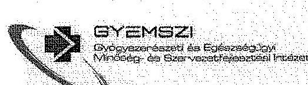

Fölgazgató
1125 Budapest, 10466 Arus 2.
Tel.: 12561522
Fax: 13257253
1525 Budapest 114. 7. 32.

Intézkedést tett, melyekkel az állami vagyonnal való gazdálkodás tulajdonosi ellenőrzési feladatellátása megvalósul. Ezen feladatellátás erősítése érdekében pedig a fenntartói ellenőrzési szabályzat fölgazgatói utasításba foglalása - szakterületi vélemények beérkezését/feldolgozását követően - folyamatban van.

Álláspontunk szerint, az állami vagyonnal való gazdálkodás tulajdonosi ellenőrzésének feladatellátásával összefüggésben a GYEMSZI fenntartásába tartozó valamennyi intézmény felé intézkedések történtek, kérjük a jelentéstervezet megállapításainál ennek figyelembevételét, illetve ennek megfelelő korrigálását.

# Módosító javaslatunk 

Kérjük, hogy a fentiek figyelembe vételével a jelentés tervezet vonatkozó szövegrészeit módosítani szíveskedjenek.

## 6.,

## Észrevételezett szövegrész

24. oldal utolsó bekezdés: „A GYEMSZI 2013. évben a Bkr.-ben foglaltak ellenére ellenőrzési nyomvonallal, kockázatkezelési eljárásrenddel nem rendelkezett."
25. oldal 3. bekezdés: „A GYEMSZI 2013. évben a Bkr. 6.§ (3) bekezdésében és a 7. § (2) bekezdésében foglaltak ellenére ellenőrzési nyomvonallal, kockázatkezelési eljárásrenddel nem rendelkezett. A szervezet kockázatkezelési rendszere nem volt megfelelő, mivel a Kockázatkezelési Szabályzat kiadására 2013. december 31-én került sor 2014. január 1-től történő hatályba helyezéssel."

## Észrevételünk

A GYEMSZI 2013-ban az akkreditált folyamatainak mindegyikére vonatkozóan rendelkezett ellenőrzési nyomvonallal, ezért a hivatkozott megfogalmazás nem pontos.

A költségvetési szervek belső kontrollrendszeréről és belső ellenőrzéséről szóló 370/2011. kormányrendelet értelmében a belső ellenőrzés kockázatfelmérés alapján készíti az éves ellenőrzési tervét. A belső ellenőrzés létrehozta a kockázatkezelési eljárásrendjét, amely a 2012. október 11-i hatálybalépésével a vizsgált 2013-as évben hatályban volt. A módszertan alapján a GYEMSZI valamennyi vezetője évente egyszer feltérképezte és értékelte a kockázatokat, a kockázatok magas prioritású körét pedig az intézmény kezelte azzal, hogy a fölgazgató az éves ellenőrzési tervet jóváhagyta, a belső ellenőrzés pedig az ellenőrzéseket lefolytatta.

---

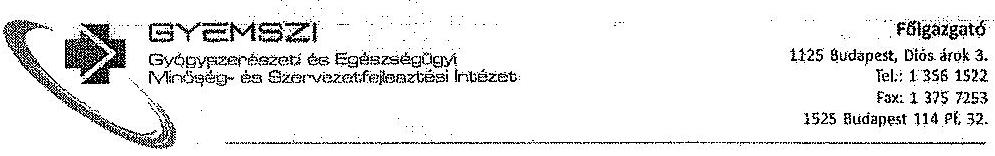

# Módosító szöveglavaslatunk: 

Kérjük, hogy 24. oldal utolsó bekezdésében szereplő mondatot (,A GYEMSZI 2013. évben a Bkr.-ben foglaltak ellenére ellenőrzési nyomvonallal, kockázatkezelési eljárásrenddel nem rendelkezett.") kiegészíteni szíveskedjenek az alábbiak szerint: „A GYEMSZI 2013. évben a Bkr.-ben foglaltak ellenére a tulajdonosi joggyakorlás folyamataira vonatkozó ellenőrzési nyomvonallal, kockázatkezelési eljárásrenddel nem rendelkezett."

Kérjük, hogy a 80. oldal 3. bekezdését (,A GYEMSZI 2013. évben a Bkr. 6.§ (3) bekezdésében és a 7. § (2)-bekezdésében foglaltak ellenére ellenőrzési nyomvonallal, kockázatkezelési eljárásrenddel nem rendelkezett. A szervezet kockázatkezelési rendszere nem volt megfelelő, mivel a Kockázatkezelési Szabályzat kiadására 2013. december 31-én került sor 2014. január 1-től történő hatályba helyezéssel.") kiegészíteni szíveskedjenek a következőképpen: „A GYEMSZI 2013. évben a Bkr. 6.§ (3) bekezdésében és a 7. § (2) bekezdésében foglaltak ellenére a tulajdonosi joggyakorlás folyamataira vonatkozó ellenőrzési nyomvonallal, kockázatkezelési eljárásrenddel nem rendelkezett. A szervezet kockázatkezelési rendszere nem volt megfelelő, mivel az intézményi szintü Kockázatkezelési Szabályzat kiadására 2013. december 31-én került sor 2014. január 1-től történő hatályba helyezéssel."

Kérem Tisztelt Elnök Urat, hogy a fent rögzített észrevételeinket a jelentésben rögzíteni, a jelentést a javaslataink figyelembe vételével módosítani, továbbá a tervezetben megfogalmazott javaslatot törölni szíveskedjen.

A lehetőséget ezúton is köszönjük.

Budapest, 2014. december 16.
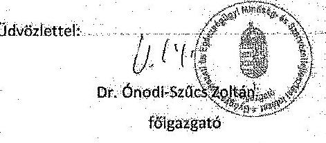

---

.

---

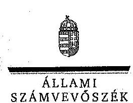

ELNÖK

Ikt.szám: V-0458-608/2014.

Dr. Önodi-Szűcs Zoltán úr
Főigazgató
Gyógyszerészeti és Egészségügyi Minőség- és Szervezetfejlesztési Intézet

Budapest

Tisztelt Főigazgató Úr!

A „Jelentéstervezet az állami vagyon feletti tulajdonosi joggyakorlással kapcsolatos tevékenységek ellenőrzéséről” című jelentéstervezetre tett észrevételeit köszönettel megkaptam.

Az Állami Számvevőszék észrevételekre vonatkozó álláspontjáról a felügyeleti vezető által készített részletes tájékoztatást csatoltan megküldöm.

Tájékoztatom Főigazgató urat, hogy a számvevőszéki jelentés szövegezése az elfogadott észrevételek figyelembevételével készül.

Budapest, 2014. 12. hó 12. nap

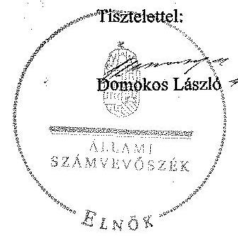

Melléklet: Tájékoztatás az elfogadott és az el nem fogadott észrevételekről

1052 BUDAPEST, AFRICAN COSTE JANOS UTCK 10. 1364 Budapest 4. Pf. 54 telefon: 484 8181 fax: 484 9291

---

# Tájékoztatás   az elfogadott és az el nem fogadott észrevételekről 

A „Jelentéstervezet az állami vagyon feletti tulajdonosi joggyakorlással kapcsolatos tevékenységek ellenörzéséről" címủ jelentéstervezetre a GYEMSZI/024447-017/2014. iktatószámmal ékezett észrevételeket áttekintettük, azok kezelésével kapcsolatban a következỏ tájékoztatást adom.
25. oldal 1. bekezdés, 82. oldal 4. bekezdés, 84. oldal utolsó bekezdés, 28. oldal megállapítás és javaslat

Az ellenőrzés során átadott dokumentumok és nyilvántartások szerint 2013-ban nem történt meg az átvett és rábízott vagyon könyvelése és elkülönített nyilvántartásba vétele. A jelentéstervezet tartalmazza, hogy 2014-ben a hiányosságok javítása megtörtént, illetve folyamatban volt, azonban az ellenőrzött időszakban - 2013-ban - azok még fennálltak.

Az észrevétel szerint a CT Ecostat program rendelkezik kettős könyvviteli modullal, ez azonban önmagában nem jelenti azt, hogy a könyvelés a jogszabályban elöírt módon történik. A beszámoló NFM részéről történő befogadása sem bizonyítja a vagyon szabályszerű könyvelését és elkülönített nyilvántartásba vételét.

Mindezek alapján az átvett és rábízott vagyon könyvelésére és elkülönített nyilvántartásba vételére vonatkozó megállapításainkat fenntartjuk. A könyveléssel és az elkülönített nyilvántartással kapcsolatos 2013-ban megállapított hiányosságokkal összefüggésben fontosnak tartjuk valamennyi körülmény, a kialakult helyzetet előidéző okok kivizsgálását, amelyek alapján lehetőség van az esetleges rendszerbeli hiányosságok korrigálására, a szükséges intézkedések megtételére, ezért a javaslatot fenntartjuk.

## 28. oldal megállapítás, 83. oldal 4. bekezdés

Az Nvtv. 10. § (1) bekezdése elöírja, hogy a nemzeti vagyont, annak értékét és változásait a tulajdonosi joggyakorlónak nyilván kell tartani. A jelentéstervezet valóban tartalmaz az átadás körülményeire vonatkozó kiegészítő információkat, mint az eszközök GYEMSZI részéről történő átadása a befogadó intézmény számára a feladatellátás érdekében és az átadó gazdasági társaságok vezetői részéről aláírt teljességi nyilatkozatok rendelkezésre állása. Mindezek azonban nem helyettesítik azt, hogy a GYEMSZI az Nvtv. 10. § (1) bekezdésében elöírt nyilvántartásának felvételéhez szükséges vagyonelemek értékének, mennyiségének. megállapításáról leltár készítésével vagy egyéb módon nem intézkedett. Az észrevételükben leírtak a kialakult helyzetre vonatkozó magyarázatot tartalmaznak, ezért a jelentéstervezet módosítása nem indekelt.

## 79. oldal 6. bekezdés

Az SZMSZ tervezetére vonatkozó tájékoztatást köszönjük. A megállapításunk nem a tervezett, hanem a jóváhagyott SZMSZ-re vonatkozik, abban nem szerepel a szervezeti egységek

---

engedélyezett létszáma, ezért - az SZMSZ tervezetében foglaltakra való hivatkozással - a megállapítás módosítása nem indokolt.

# 24. oldal utolsó bekezdés 2. mondat, 80 . oldal 4. bekezdés 

Az észrevételükben foglaltak, miszerint az ideiglenes müködési rendet az új SZMSZ tervezethez igazították megerősítik azt a kifogásolt megállapításunkat, hogy az ideiglenes müködési rend a hatályos SZMSZ-szel ellentétes rendelkezéseket tartalmazott. Minderre tekintettel a megállapítás módosítása nem indokolt.

## 25. oldal 2., 3. bekezdés és 86-87. oldalak

A tulajdonosi ellenőrzéssel kapcsolatos feladatellátás keretében megtett intézkedésekről adott részletes tájékoztatást köszönjük, amely nem mond ellent a jelentéstervezetben foglalt megállapításoknak. Észrevételükben továbbá megerősítik, hogy a feladatellátásra vonatkozó hatályos szabályzattal nem rendelkeznek, annak utasításba foglalása folyamatban van, ezért a megállapítások módosítása nem indokolt.

## 24. oldal utolsó bekezdés, 80 . oldal 3. bekezdés

Az észrevétel és a rendelkezésünkre álló dokumentumok ismételt áttekintése alapján a 24. oldal utolsó bekezdését a következőkre pontosítjuk:
„A GYEMSZI 2013. évben a Bkr.-ben foglaltak ellenére a tulajdonosi joggyakorlás folyamataira vonatkozó ellenőrzési nyomvonallal, kockázatkezelési eljárásrenddel nem rendelkezett."

Az előbbiekkel összefüggésben a 80. oldal 3. bekezdését az alábbiak szerint pontosítjuk:
„A GYEMSZI 2013. évben a Bkr. 6. § (3) bekezdésében és a 7. § (2) bekezdésében foglaltak ellenére a tulajdonosi joggyakorlás folyamataira vonatkozó ellenőrzési nyomvonallal, kockázatkezelési eljárásrenddel nem rendelkezett. A szervezet kockázatkezelési rendszere nem volt megfelelő, mivel a Kockázatkezelési Szabályzat kiadására 2013. december 31-én került sor 2014.január 1-től történő hatályba helyezéssel."

Tájékoztatom Főigazgató urat, hogy a számvevőszéki jelentés mellékleteként szerepeltetjük a jelentéstervezethez tett észrevételeit, valamint az azokra adott válaszunkat.

Budapest, 2014. év 12 hó 23 nap

Makkai Mária
felügyeleti vezető

---

.

---

Domokos László úr
elnök részére
Állami Számvevőszék

Budapest

Tisztelt Elnök Úr!
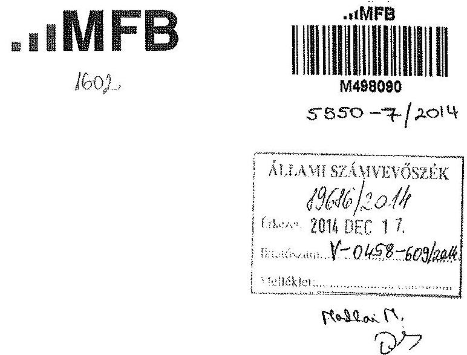
2014. december 2-án köszönettel kézhez vettük az állami vagyon feletti tulajdonosi joggyakorlással kapcsolatos tevékenységek ellenőrzéséről készült számvevőszéki jelentéstervezetüket.

Mellékelten küldjük az MFB Zrt. jelentéstervezettel kapcsolatos észrevételeit, amelyet elektronikusan is eljuttattunk az allamivagyon@asz.hu e-mail címre.

Budapest, 2014. december 16.

Tisztelettel:
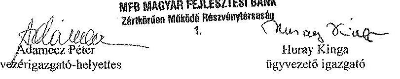

---

# Észrevételek 

## 6. oldal

A szórővidítések között javasolunk egy pontositást, az MFB teljes neve MFB Magyar Fejlesztési Bank Zártkörüen Müködő Részvénytársaság.

## 18. oldal

„2013. évben az MFB tulajdonosi joggyakorlása alá tartozó gazdasági társaságok száma 37 volt. Az MFB rábizott vagyona mérlegfőösszege 2013. év december 31-én 195290 M Ft, eredménye - 1327 M Ft (nyereség) volt. Az MFB 37 társasági részesedése feletti kontrolljainak kialakítását mintavétellel kiválasztott társaságokkal kapcsolatos tevékenységein mértük fel és értékeltük."

Véleményünk szerint az „1.327 M Ft (nyereség)" előtt a mínusz jel megtévesztő, gondolatjelként pedig nem illik a mondatba, ezért javasoljuk a szám előtt található írásjel törlését.

## 56. oldal

„Az MFB tulajdonosi joggyakorlása alá tartozó állami társaságok saját tőkéje és mérlegfőösszege 2010. óta folyamatos csökkenést mutat, melyet az alábbi grafikon és táblázat szemléltet. "

A táblázatban szereplő számok az MFB rábízott vagyonának tőkéjét tartalmazza, amely nem teljesen egyezik meg a jelenlegi 37 tulajdonosi joggyakorlás alatt álló társaság tőkéjével.

Indoklás: Például 2010-ben a Bank 40 társaság tulajdonosi joggyakorlását kapta meg, amelyből 2012-ben az Eximbank Zrt. és a Mehib Zrt. feletti tulajdonosi jogokat át kellett adni a Nemzetgazdasági Miniszternek, egy társaság pedig beolvadással megszünt. A tulajdonosi jogok átadása kapcsán csak az MFB rábízott vagyonának induló tőkéje csökkent, értelemszerűen az Eximbank és a Mehib saját tőkéje nem.

Fentiek miatt a mondatot az alábbiak szerint javasoljuk pontosítani:
„Az MFB tuiajdonosi-joggyakorlása-alá-tartozó-állami-társaságokrábizott vagyonának saját tőkéje és mérlegfőösszege 2010. óta folyamatos csökkenést mutat, melyet az alábbi grafikon és táblázat szemléltet."

## 56. oldal

„A veszteség két okra vezethető vissza: egyfelől 14,7 Mrd Ft veszteséget okozott az üzletág ingyenes átadása (vagyonelemek térítés nélküli átadása rendkívüli ráfordításként jelentkezett). Másfelől pedig 12,9 Mrd Ft veszteséget okozott az, hogy a közútkezelés kapcsán az Operating \& Maintenance - Kezelés és Fenntartás szerződés megkötésére 2013-ban nem került sor, ezért a NFM miniszter 2014. január 9-én kelt levelében felszólította az MFB-t, hogy a Közlekedéspénztár forráshiánya miatt az elvégzett tevékenységet a NÚSZ Zrt. saját pénzeszközállományn terhére, véglegesen finanszírozza. A veszteség a javöben ebben a formában már nem merülhet fel, hiszen a NÚSZ Zrt. a közútkezelést azóta átadta a Magyar

---

Közút Nonprofit Zrt-nek. 2014-ben veszteségrendezés okán mintegy 7 Mrd Ft alaptőke leszállitásra kerïlt sor. A társaság könyvvizsgálója jelentésében figyelenfelhívással élt."

A jobb érthetőség kedvéért javasoljuk a tervezetben szereplő helyett az alábbi szöveg használatát:
„A NÚSZ Zrt. 2013-ban az Üzleti Tervének általános iránymutatásai szerint müködött, de egyszeri, a Társaság illetékességi területén kivül eső döntések következtében 25,9 Mrd Ft veszteséggel zárta az üzleti évet. E jelentős vagyonvesztést okozó tényezők:

- Az Üzemeltetés és karbantartás üzletág átadása a Magyar Közút Nonprofit Zrt.-nek. Magyarország Kormánya az 1600/2013. (IX.3.) számú határozatával döntött arról, hogy a NÚSZ Zrt. (akkori nevén Állami Autópálya Kezelő Zrt.) a gyorsforgalmi úthálózat üzemeltetői és fenntartási tevékenységét a Magyar Közút Nonprofit Zrt. részére, a tevékenység ellátásához szükséges eszközökkel, vagyonnal és munkavállalókkal együtt, ingyenes üzletágátadás keretében adja át.
Az üzletág átadás 14,7 Mrd Ft veszteséget okozott a Társaságnak.
- A 2013. év során elvégzett üzemeltetési, karbantartási, valamint fenntartási tevékenységeket a NÚSZ Zrt.-nek a saját forrásai terhére kellett finanszíroznia.
A 2013. évi központi költségvetésben biztosított források mértéke nem volt elegendő a közúti ágazat minimális forrásigényének kielégítésére, így az állami megrendelő, a Közlekedésfejlesztési Koordinációs Központ a NÚSZ Zrt.-vel a Társaság által kezelt gyorsforgalmi utak üzemeltetési feladatainak ellátására a 2013. évre nem kötött vállalkozási szerződést. A nemzeti fejlesztési miniszter 2014. január 9-én kelt levelében tájékoztatta az MFB-t arról, hogy tekintettel a 1875/2013. (XI. 28.) Kormányhatározatra, a NÚSZ-nak kell saját pénzeszközeinek terhére, véglegesen megfinanszíroznia ezen tevékenységet.

A 2013. évi üzemeltetési, karbantartási, valamint fenntartási tevékenység saját forrásai terhére történő finanszírozása 12,9 Mrd Ft veszteséget okozott a Társaságnak."

# 57. oldal 

„Az MFB tulajdonában lévő, illetve tulajdonosi joggyakorlásával érintett befektetéseket közveilenül- azok tevékenységi köre szerint strukturálva- az MFB három szervezeti egysége kezelte: a Befektetési Vezérigazgatóság, az Ellenörzési Igazgatóság és a Banküzemi Vezérigazgatóság."

Az Ellenőrzési Igazgatóság nem kezeli a befektetéseket, de ellenőrzési feladatai közé rendszeresen beépíti az ezzel kapcsolatos ellenőrzési tevékenységet. Javasoljuk a szöveg pontositását.

---

# 58. oldal 

„Az ellenôrzött idôszakban az MFB rendelkezett hatályos alapító okirattal, SZMSZ-zzel, a rábizott vagyonnal foglalkozó szervezeti egységek a Kontrolling Igazgatóság kivételével rendelkeztek ügyrenddel."

A Bank a Kontrolling kézikönyvet átadta a helyszíni ellenőrzés során, amely a Kontrolling Igazgatóság ügyrendjét tartalmazza. Kérjük ennek megfelelően a szöveg pontosítását.

## 62. oldal

„A 2013. évi öt ellenőrzésböl kettő még nem zárult le az ÁSZ helyszini ellenőrzése megkezdéséig.
Le nem zárt ellenőrzés az Infrastruktúra Igazgatóság vagyonkezelési tevékenységének vizsgálata, valamint a Regionális Fejlesztési Holding Zrt. vagyonkezelési rendszerének és tevékenységének vizsgálata."

A jelentés-tervezetben szerepel, hogy az ÁSZ helyszini vizsgálatának megkezdéséig 2 vizsgálat nem készült el (Infrastruktúra, RFH). Jelezni kívánjuk, hogy az Infrastruktúra jelentést az ÁSZ jelentés véleményezésre való megküldését megelőzően megküldtük az ÁSZnak, valamint idôközben az RFH jelentés véglegesítése is megtörtént.

Levelünkhöz mellékelve megküldjük a két végleges jelentést.

---

# ELNÖK 

## Nagy Csaba úr

vezérigazgató
Magyar Fejlesztési Bank Zrt.

## Budapest

## Tisztelt Vezérigazgató Úr!

A „Jelentéstervezet az állami vagyon feletti tulajdonosi joggyakorlással kapcsolatos tevékenységek ellenőrzéséről" címú jelentéstervezetre tett észrevételeit köszönettel megkaptam.

Az Állami Számvevőszék észrevételekre vonatkozó álláspontjáról a felügyeleti vezető által készített részletes tájékoztatást csatoltan megküldöm.

Tájékoztatom Vezérigazgató urat, hogy a számvevőszéki jelentés szövegezése az elfogadott észrevételek figyelembevételével készül.

Budapest, 2014. 12. hó 29 nap
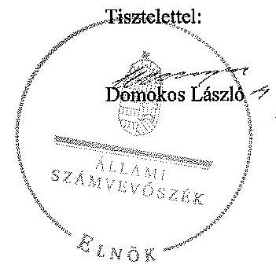

Melléklet: Tájékoztatás az elfogadott és az el nem fogadott észrevételekről

---

# Tájékoztatás   az elfogadott és az el nem fogadott észrevételekról 

A „Jelentéstervezet az állami vagyon feletti tulajdonosi joggyakorlással kapcsolatos tevékenységek ellenőrzéséről" című jelentéstervezetre 2014. december 17-én érkezett észrevételeit áttekintettük, azok kezelésével kapcsolatban a következő tájékoztatást adom.

## 6. oldal

Az MFB teljes nevét a jelentéstervezet 6. oldalán szereplő szórövidítések között a következőre pontosítjuk:
„MFB Magyar Fejlesztési Bank Zártkörüen Müködő Részvénytársaság"

## 18. oldal

A jelentéstervezet 18. oldal 2. bekezdésében a 1327 M Ft előtt szereplő gondolatjelet töröljük.

## 56. oldal

A jelentéstervezet 56. oldal 4. bekezdését a következőkre pontosítjuk:
„Az MFB rábízott vagyonának saját tőkéje és mérlegfőösszege 2010. óta folyamatos csökkenést mutat, melyet az alábbi grafikon és táblázat szemléltet."

## 56. oldal

A jelentéstervezet 56. oldal 3. bekezdését a közérthetőség érdekében következőkre pontosítjuk:
„A NÚSZ Zrt. vesztesége két okra vezethető vissza: egyfelől 14,7 Mrd Ft veszteséget okozott az üzemeltetés és karbantartás üzletág - az 1600/2013. (IX.3.) számú kormányhatározat alapján történő - ingyenes átadása a Magyar Közút Nonprofit Zrt.nek (vagyonelemek térítés nélküli átadása rendkívüli ráfordításként jelentkezett). Másfelől pedig 12,9 Mrd Ft veszteséget okozott az elvégzett üzemeltetési, karbantartási, valamint fenntartási tevékenység saját forrás terhére történő finanszirozása, amelyet az 1875/2013. (XI. 28.) kormányhatározat írt elő. A közútkezelés kapcsán az Operating \& Maintenance - Kezelés és Fenntartás szerződés megkötésére 2013-ban nem került sor, ezért a NFM miniszter 2014. január 9-én kelt levelében felszólította az MFB-t, hogy a Közlekedéspénztár forráshiánya miatt az elvégzett tevékenységet a NÚSZ Zrt. saját pénzeszközállománya terhére, véglegesen finanszirozza. A veszteség a jövőben ebben a formában már nem merülhet fel, hiszen a NÚSZ Zrt. a közútkezelést azóta átadta a Magyar Közút Nonprofit Zrt-nek. 2014-ben veszteségrendezés okán mintegy 7 Mrd Ft

---

alaptőke-leszállitásra került sor. A társaság könyvvizsgálója jelentésében figyelemfelhívással élt."

# 57. oldal 

A jelentéstervezet 57. oldal 7. bekezdését a következőkre pontosítjuk:
„Az MFB tulajdonában lévő, illetve tulajdonosi joggyakorlásával érintett befektetéseket közvetlenül - azok tevékenységi köre szerint strukturálva - az MFB két szervezeti egysége kezelte: a Befektetési Vezérigazgatóság és a Banküzemi Vezérigazgatóság."

## 58. oldal

A dokumentumok ismételt áttekintése alapján a jelentéstervezetet az alábbiak szerint pontositjuk:
„Az ellenőrzött időszakban az MFB rendelkezett hatályos alapító okírattal, SZMSZ-szel, a ráblzott vagyonnal foglalkozó szervezeti egységek rendelkeztek ügyrenddel."

## 62. oldal

A 2013. évi két ellenőrzéssel (Infrastruktúra Igazgatóság, Regionális Fejlesztési Holding Zrt.) kapcsolatos, időközben felmerült körülményekre vonatkozó tájékoztatást köszönjük. A megállapításunk tartalmazza, hogy az ÁSZ helyszíni ellenőrzése megkezdésének időpontjára vonatkozik, melyet az észrevételük is megerősít. Az előbbiekre tekintettel a megállapításunk helytálló, annak módosítása nem indokolt.

Tájékoztatom Vezérigazgató urat, hogy a számvevőszéki jelentés mellékleteként szerepeltetjük a jelentéstervezethez tett észrevételeit, valamint az azokra adott válaszunkat.

Budapest, 2014. év 12. hó 29 nap

Makkai Mária
felügyeleti vezető

---

.

---

# Nemzeti Földalapkezelő   Szervezet   Székhely: 1149 Budapest, Bosnyák tíz 5.   Törzsikönyvi azonosítósáam: 775706 

Domokos László
Elnök
Állami Számvevőszék

Budapest
Apáczai Czere János utca 10.
1052

Tárgy: Észrevétel megküldése az ÁSZ, az állami vagyon feletti tulajdonosi joggyakorlással kapcsolatos tevékenység ellenörzése, címmel készített számvevöszéki jelentéstervezetre.

Tisztelt Elnök Úr!

Az Állami Számvevőszéktől 2014. 12. 02.-án az NFA-hoz érkezett V-0458-598/2014. számú levelében megküldött az NFA ,,az állami vagyon feletti tulajdonosi joggyakorlással kapcsolatos tevékenységének ellenörzése alapján készitett jelentéstervezetre az alábbi észrevételt tesszük:

A Nemzeti Földalapkezelő Szervezet Vagyonkezelési területét érintő megfogalmazásokkal kapcsolatban:

Az ÁSZ jelentés tervezet kapcsán a 4.4. A földrészleteknek a szociális földprogram keretében történő vagyonkezelésbe adásának szabályszerűsége alcímhez az alábbi észrevételünk.

Az első bekezdésben (73. oldal alja) leírtak alapján az önkormányzatok részére ingyenes vagyonkezelésbe adása a szociális földprogram Szr. szerinti megvalósítása céljából történik, amely program a szociális és a közfoglalkoztatási programokat foglalja magában.

Ez a megfogalmazás nem teljesen helytálló. A szociális földprogram nem egy gyűjtőfogalom, amely magában foglalja a szociális és a közfoglalkoztatási programokat.

Az Nfatv. 22. §. (1) bekezdése szerint "A Nemzeti Földalapba tartozó földrészlet szociális földprogram és a közfoglalkoztatási program megvalósitása céljából az önkormányzat számára ingyenesen vagyonkezelésbe adható. Az önkormányzat a vagyonkezelői jogot nem adhatja tovább.

---

E törvényhelyből is kitűnik, hogy kétféle programról van szó az egyik a szociális földprogram, a másik pedig a közfoglalkoztatási program.

Mindkét programra vonatkozó részletszabályokat a Nemzeti Földalapba tartozó földrészletek szociális földprogram megvalósítása céljából az önkormányzatok számára történő ingyenes tulajdonba, vagy vagyonkezelésbe adásának szabályairól szóló 263/2010. (XI. 17.) Korm. rendelet (Szr.) tartalmazza.

Az Szr. 13/B. § tartalmazza azt, hogy az Szr. rendelkezéseit milyen eltérésekkel kell alkalmazni a közfoglalkoztatási programra vonatkozóan.

A jelentés tervezeten végig követhetö, hogy mindkét programra vonatkoztatják az Szr. rendelkezéseit, holott a közfoglalkoztatási programra egyes paragrafusait nem kell alkalmazni. Pl. 4. § (1) bekezdés, 5. §.

A Nemzeti Földalapkezelő Szervezet Vagyonhasznosítási területét érintő megfogalmazásokkal kapcsolatban:

A tervezet 65. oldalának 1. bekezdése (folytatólagos szöveg az előző oldalról) szerint nem készült eljárásrend a versenyeztetés mellőzésével történő értékesítési eljárásokra vonatkozóan. A tervezet 68. oldalának 3. bekezdése ismételten megállapítja, hogy nem készült eljárásrend a versenyeztetés mellőzésével történő értékesítésre, azonban ennek és a tervezet korábban jelzett pontjának (65. oldal 1. bekezdés) ellentmondóan ugyanezen bekezdésen belül megállapításra kerül, hogy „ ugyanakkor a VIII elkészítette a 3 ha alatti földrészletek értékesítésére vonatkozó eljárás folyamatának a leírását. A dokumentum alkalmazását 2013. október 9-én az elnök jóváhagyta. A folyamatleírás rögzítette az értékesítési eljárásba bevont ingatlanok körét, az értékesítés keretében elvégzendő feladatokat, a döntéshozatai, a szerződéskötés, valamint az utógondozás témakörét."

A megállapítás nem helyes, mert készült eljárásrend, mely a jelentéstervezet megállapítésai szerint is tartalmaz minden elvárt rendelkezést, az eljárásba bevonandó ingatlanok körétől kezdve egészen az utógondozásig. A jelentés tervezet emiatt, nem pontosan fogalmaz. Nem egy hivatalos elnöki utasításról van szó, de egy elnök által jóváhagyott eljárásrendről. A megállapítás ennek megfelelően véleményünk szerint nem helyes. Az NFA rendelkezik a versenyeztetés mellőzésével történő értékesitéere vonatkozó folyamaileírásai, melynek rendje szerint kötelesek eljárni a Szervezet munkatársai.

A jelentés tervezet 68. oldal 4. bekezdése szerint nem készült eljárásrend a nemzeti park igazgatóságok részére történő vagyonkezelésbe adás vonatkozásában. A vagyonkezelésbe adási eljárások 2013.-ban szinte csak erre a körre vonatkoztak. Figyelembe véve, hogy a Kormány által meghirdetett „Földet a gazdáknak program" keretében a nemzeti park igazgatóságok által kezelt földrészletek nyilvános haszonbérleti pályáztatás útján történő

---

hasznosítása volt a kormányzati cél, ezért egy a korábbi tulajdonosi joggyakorlók által 10 évre visszamenôleg nem rendezett helyzetet kellett a lehető leggyorsabban és leghatékonyabban rendeznie az NFA-nak. Az eljárás minden rézlete az FM illetékes szakfőosztálya és az NFA munkatársai által egyeztetésre került. Ennek eredményeként kerülhetett sor a vagyonkezelési szerződések megkötésére, amelynek eredményeként lehetővé vált, hogy a nemzeti parkok vagyonkezelésében lévô ingatlanok is bevonásra kerülhessenek a haszonbérleti pályáztatás rendszerébe.

Kérem Elnök Urat, hogy a Nemzeti Földalapkezelő Szervezet jelentéstervezetre tett észrevételeit a végleges jelentésbe beépiteni szíveskedjenek.

Budapest, 2014. december 15.

Tisztelettel:
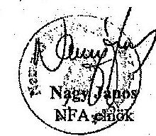

Kapják:
1.: Címzett
2.: Irattár

---

.

---

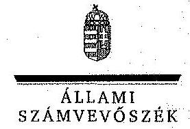

ELNÖK

Ikl.szám: V-0458-613/2014.

Nagy János úr
elnök
Nemzeti Földalapkezelő Szervezet

Budapest

Tisztelt Elnők Úr!

A „Jelentéstervezet az állami vagyon feletti tulajdonosi joggyakorlással kapcsolatos tevékenységek ellenőrzéséről” című jelentéstervezetre tett észrevételeit köszönettel megkaptam.

Az Állami Számvevőszék észrevételekre vonatkozó álláspontjáról a felügyeleti vezető által készített részletes tájékoztatást csatoltan megküldöm.

Tájékoztatom Elnök urat, hogy a számvevőszéki jelentés szövegezése az elfogadott észrevételek figyelembevételével készül.

Budapest, 2014. 12. hó 29. nap

Tisztelettel:

Domokos László

Melléklet: Tájékoztatás az elfogadott és az el nem fogadott észrevételekről

1052 BUDAPEST, APÁGZIN CSÉRE JÓNOS HITZA 16. 1364 Budapest 4. Pl. 54 telefon: 484 9181 fax: 484 9201

---

# Tájékoztatás   az elfogadott és az el nem fogadott észrevételekről 

A „Jelentéstervezet az állami vagyon feletti tulajdonosi joggyakorlással kapcsolatos tevékenységek ellenőrzéséről" címủ jelentéstervezetre az NFA-010633/006/2014 iktatószámon érkezett észrevételeit áttekintettük, azok kezelésével kapcsolatban a következő tájékoztatást adom.

## 73. oldal utolsó bekezdés

A jelentéstervezet az észrevételben is hivatkozott, a Nemzeti Földalapba tartozó földrészletek szociális földprogram megvalósítása céljából az önkormányzatok számára történő ingyenes tulajdonba vagy vagyonkezelésbe adásának szabályairól szóló 263/2010. (XI. 17.) Korm. rendelet megfogalmazását használja, amennyiben a megállapításunkhoz kapcsolódóan szükséges, abban az esetben a jelentéstervezetben szerepel a kétféle - szociális földprogram és a közfoglalkoztatási - program fogalma is.

Az egyértelműség érdekében azonban a jelentéstervezet 73. oldal utolsó bekezdés 1. mondatát a következőkre pontosítjuk:
„A vagyonkezelés útján való hasznosítás speciális formáját jelentette 2012-ben és 2013ban az Nfatv. 22. § (1) bekezdése szerint a Földalapba tartozó földrészletek önkormányzatok részére történő ingyenes vagyonkezelésbe adása a szociális földprogram és a közfoglalkoztatási program megvalósítása céljából."

## 68. oldal 3. bekezdés

A jelentéstervezet 68. oldal 3. bekezdésében szereplő megállapítások között nincs ellentmondás, mivel a folyamatleírás nem azonos az eljárásrenddel, továbbá az ellenőrzés rendelkezésre bocsátott folyamatleírás az elnök által nem került aláírásra. Az előbbiekre tekintettel a megállapítás módosítása nem indokolt.

## 68. oldal 4. bekezdés

A nemzeti parkok vagyonkezelésbe adására vonatkozó tájékoztatást köszönjük, az nem vitatja a jelentéstervezetben foglalt megállapításokat, így a módosítás nem indokolt.

Tájékoztatom Elnök urat, hogy a számvevőszéki jelentés mellékleteként szerepeltetjük a jelentéstervezethez tett észrevételeit, valamint az azokra adott válaszunkat.
Budapest, 2014. év 12 . hó 29 nap

Makkai Mária
felügyeleti vezető

---

# FÖLDMÖVELÉSÜGYI MINISZTÉRIUM 

DR. FAZEKAS SÁNDOR

Iktatószám: IPF/519-2/2014.

Ügyintéző: dr. Petneházy Zsolt
Telefonszám: 79-53-839
E-mail: zsolt.petnehazy@fin.gov.hu
Hiv. szám: V-0458-601/2014.

## Domokos László úr   elnök   részére

## Állami Számvevöszék

Budapest
Apáczai Csere János utca 10.
1052

Tárgy: Állami Számvevőszék jelentés tervezetének véleményezése

## Tisztelt Elnök Úr!

Az Állami Számvevőszék (a továbbiakban: ÁSZ) megküldte V-0458-601/2014. iktatószámon „Az állami vagyon feletti tulajdonosi joggyakorlászal kapcsolatos tevékenységek ellenőrzése" címmel készített számvevőszéki jelentéstervezetet a Földművelésügyi Minisztérium (a továbbiakban: FM) részére, amelyet 2014. december 3-án kézbesítettek.
Az Állami Számvevőszékről szóló 2011. évi LXVI. törvény 29. § (2) bekezdése szerint az ellenőrzés megállapításaira 15 (tizenöt) napon belül írásban észrevételt tehet tárcánk.

A jelentéstervezet 4. főcím (Nemzeti Földalapkezelő Szervezet), 4.1. alcím (A tulajdonosi joggyakorláshoz szükséges kontrollkörnyezet kialakítása) vonatkozásában az alábbi észrevételt kívánom tenni:

A tervezet 64. oldalának 1. bekezdése (folytatólagos szöveg az előző oldalról) szerint nem készült eljárásrend a versenyeztetés mellőzésével történő értékesítési eljárásokra vonatkozóan. A tervezet 68. oldalának 3. bekezdése ismételten megállapítja, hogy nem készült eljárásrend a versenyeztetés mellőzésével történő értékesítésre, azonban ennek és a tervezet korábban jelzett pontjának (64. oldal 1. bekezdés) ellentmondóan

---

ugyanczen bekezdésen belül megállapításra kerül, hogy „ugyanakkor a VHI elkészítette a 3 ha alatti földrészletek értékesítésére vonatkozó eljárás folyamatának a leírását. A dokumentum alkalmazását 2013. október 9-én az elnök jóváhagyta. A folyamatleírás rögzítette az értékesítési eljárásba bevont ingatlanok körét, az értékesítés keretében elvégzendő feladatokat, a döntéshozatal, a szerződéskötés, valamint az utógondozás témakörét."

Álláspontom szerint a megállapítás nem helyes, mert készült eljárásrend, mely a jelentéstervezet megállapításai szerint is tartalmaz minden elvárt rendelkezést az eljárásba bevonandó ingatlanok körétől kezdve egészen az utógondozásig. A jelentéstervezet emiatt pontatlanul fogalmaz. Nem egy hivatalos elnöki utasításról van szó, de egy elnök által jóváhagyott eljárásrendről.
Az NFA rendelkezik a versenyeztetés mellőzésével történő értékesítésre vonatkozó folyamatleírásai, melynek rendje szerint kötelesek eljárni a Szervezet munkatársai.

A jelentéstervezet 68. oldal 4. bekezdése szerint nem készült eljárásrend a nemzeti park igazgatóságok részére történő vagyonkezelésbe adás vonatkozásában.
A vagyonkezelésbe adási eljárások 2013-ban szinte csak erre a körre vonatkoztak. Figyelembe véve, hogy a Kormány által meghirdetett „Földet a gazdáknak program" keretében a nemzeti park igazgatóságok által kezelt földrészletek nyilvános haszonbérleti pályáztatás útján történő hasznosítása volt a kormányzati cél, ezért egy a korábbi tulajdonosi joggyakorlók által 10 évre visszamenőleg nem rendezett helyzetet kellett a lehető leggyorsabban és leghatékonyabban rendeznie az NFA-nak. Az eljárás minden részlete az FM illetékes szakfőosztálya és az NFA munkatársai által egyeztetésre került. Ennek eredményeként kerülhetett sor a vagyonkezelési szerződések megkötésére, amelynek eredményeként lehetővé vált, hogy a nemzeti parkok vagyonkezelésében lévő ingatlanok is bevonásra kerülhessenek a haszonbérleti pályáztatás rendszerébe.

A 4.4. alcím (A földrészleteknek a szociális földprogram keretében történő vagyonkezelésbe adásának szabályszerűsége) vonatkozásában az alábbi észrevételt kívánom tenni:

A jelentéstervezet 73. oldal első bekezdésben leírtak alapján az önkormányzatok részére ingyenes vagyonkezelésbe adás a szociális földprogram fïzr. szerinti megvalósítása céljából történik, amely program a szociális és a közfoglalkoztatási programokat foglalja magában.

Ez a megfogalmazás nem teljesen helytálló. A szociális földprogram nem egy gyűjtőfogalom, amely magában foglalja a szociális és a közfoglalkoztatási programokat.

Az Nfatv. 22. § (1) bekezdése szerint „A Nemzeti Földalapba tartozó földrészlet szociális földprogram és a közfoglalkoztatási program megvalósítása céljából az önkormányzat számára ingyenesen vagyonkezelésbe adható. Az önkormányzat a vagyonkezelői jogot nem adhatja tovább."
E törvényhelyből is kitűnik, hogy kétféle programról van szó az egyik a szociális földprogram, a másik pedig a közfoglalkoztatási program.

---

Mindkét programra vonatkozó részletszabályokat a Nemzeti Földalapba tartozó földrészletek szociális földprogram megvalósítása céljából az önkormányzatok számára történő ingyenes tulajdonba vagy vagyonkezelésbe adásának szabályairól szóló 263/2010. (XI. 17.) Korm. rendelet (Szr.) tartalmazza.
Az Szr. 13/B. § tartalmazza azt, hogy az Szr. rendelkezéseit milyen eltérésekkel kell alkalmazni a közfoglalkoztatási programra vonatkozóan.
A jelentéstervezeten végig követhető, hogy mindkét programra vonatkoztatják az Szr. rendelkezéseit, pedig a közfoglalkoztatási programra egyes paragrafusait nem kell alkalmazni. (Pl. 4. § (1) bekezdés, 5. §.)

Kérem észrevételeim szíves tudomásul vételét.
Budapest, 2014. december „ $45^{\prime \prime}$.
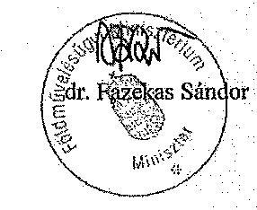

---

.

---

# 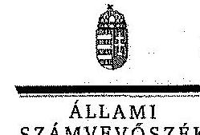 

## Dr. Fazekas Sándor úr

miniszter
Földműveléstigyi Minisztérium

## Budapest

## Tisztelt Miniszter Úr!

A „Jelentéstervezet az állami vagyon feletti tulajdonosi joggyakorlással kapcsolatos tevékenységek ellenőrzéséről" című jelentéstervezetre tett észrevételeit köszönettel megkaptam.

Az Állami Számvevőszék észrevételekre vonatkozó álláspontjáról a felügyeleti vezető által készített részletes tájékoztatást csatoltan megküldöm.

Tájékoztatom Miniszter urat, hogy a számvevőszéki jelentés szövegezése az elfogadott észrevételek figyelembevételével készül.

Budapest, 2014. 12. hó 29 nap
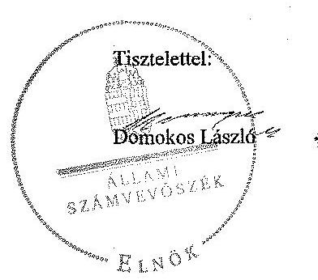

Melléklet: Tájékoztatás az elfogadott és az el nem fogadott észrevételekről

---

# Tájékoztatás   az elfogadott és az el nem fogadott észrevételekröl 

A „Jelentéstervezet az állami vagyon feletti tulajdonosi joggyakorlóssal kapcsolatos tevékenységek ellenörzéséröl" címü jelentéstervezetre az IfPF/519-2/2014. iktatószámon érkezett észrevételeit áttekintettük. Az észrevételek azonosak a Nemzeti Földalapkezelő Szervezet (NFA) elnöke által tett észrevételekkel, így azok kezelésével kapcsolatban - az NFA elnökének észrevételeire adott válaszunkhoz hasonlóan - a következő tájékoztatást adom.

## 68. oldal 3. bekezdés

A jelentéstervezet 68. oldal 3. bekezdésében szereplő megállapítások között nincs ellentmondás, mivel a folyamatleírás nem azonos az eljárásrenddel, továbbá az ellenőrzés rendelkezésre bocsátott folyamatleírás az elnök által nem került aláírásra. Az előbbiekre tekintettel a megállapítás módosítása nem indokolt.

## 68. oldal 4. bekezdés

A nemzeti parkok vagyonkezelésbe adására vonatkozó tájékoztatást köszönjük, az nem vitatja a jelentéstervezetben foglalt megállapításokat, így a módosítás nem indokolt.

## 73. oldal utolsó bekezdés

A jelentéstervezet az észrevételben is hivatkozott, a Nemzeti Földalapba tartozó földrészletek szociális földprogram megvalósítása céljából az önkormányzatok számára történő ingyenes tulajdonba vagy vagyonkezelésbe adásának szabályairól szóló 263/2010. (XI. 17.) Korm. rendelet megfogalmazását használja, amennyiben a megállapításunkhoz kapcsolódóan szükséges, abban az esetben a jelentéstervezetben szerepel a kétféle - szociális földprogram és a közfoglalkoztatási - program fogalma is.

Az egyértelműség érdekében azonban a jelentéstervezet 73. oldal utolsó bekezdés 1. mondatát a következőkre pontosítjuk:
„A vagyonkezelés útján való hasznosítás`speciális formáját jelentette 2012-ben és 2013ban az Nfatv. 22. § (1) bekezdése szerint a Földalapba tartozó földrészletek önkormányzatok részére történő ingyenes vagyonkezelésbe adása a szociális földprogram és a közfoglalkoztatási program megvalósítása céljából."

Tájékoztatom Miniszter urat, hogy a számvevőszéki jelentés mellékleteként szerepeltetjük a jelentéstervezethez tett észrevételeit, valamint az azokra adott válaszunkat.
Budapest, 2014. év 12. hó 29. nap

Makkai Mária
feltügyeleti vezető

---

# 1613 

## 1613

## Állami Számvevőszék

## Domokos László

## elnök

1052 Budapest
Apáczai Cs. J. u. 10.

Ikt. sz.: MNV/01/32761/ 6 /2014.
Hiv. sz.: V-0458-603/2014.

Tisztelt Elnök Úr!

A 2014. december 02. napján „Az állami vagyon feletti kontroll - Az állami vagyon feletti tulajdonosi joggyakorlással kapcsolatos tevékenységek ellenôrzéséról" tárgyában kézhez vett, V-0458-603/2014. i.ct. sz. Jelentés-tervezetre az alábbi észrevételeket kívánjuk tenni.

1. fejezet / 21. old. harmadik bekezdés és 27. old. Javaslat, valamint II.2.1. fejezet / 37. old. negyedik bekezdés

Az MNV Zrt. SZMSZ-ét az MNV Zrt. Igazgatósága 430/2013. (VI.17.) IG határozattal 2013. június 17én hagyta jóvá, 2013. július 1-i hatályba lépéssel, ezért értelemszerüen nem tartalmazhatta a hivatkozott, 2013. június 28 -ától hatályos törvényi változást. (SZMSZ módosítás ezen időpont óta nem történt.)

A törvényi módosulás az MNV Zrt. tulajdonosi joggyakorlásában nem eredményez változást, hiszen az MNV Zrt. a korábban hatályos törvényszöveg szerint is tulajdonosi joggyakorló volt a hozzá rendelt vagyonelemek vonatkozásában. A változás annyi, hogy az MNV Zrt. korábbi tulajdonosi joggyakorlása elméleti megközelítésben - közvetett volt (a miniszter gyakorolta a tulajdonosi jogokat az MNV Zrt. útján), míg a módosítást követően a törvény erejénél fogva illeti meg az az MNV Zrt-t. A tulajdonosi joggyakorlásban bekövetkezett változás semmilyen külön jogi aktust nem igényelt, és nem jelent a hatáskörökben és a feladatkörökben változást, sem a minisztériumban, sem az MNV Zrt-ben. Pontosítást egyedül csak az SZMSZ I. Fejezet 1. § Bevezető rendelkezése igényel, ami szó szerint beidézi a törvény hivatkozott, 3. § (1) rendelkezését.

Az SZMSZ egyéb, alábbi rendelkezései összhangban vannak a Vtv-vel és helyesen utalnak az MNV Zrt. tulajdonosi joggyakorlásának módjára is:

---

„7. § (1) ...... az Igazgatóság hatáskörébe tartozik: [Vtv. 20. § (4) bek.]
k) döntés az MNV Zrt-t, mint a Magyar Állam képviselssében tulajdonosi joggyakorlót megillető előbárlati, elővásárlási jogról való lemondásról, ha ......,
„10. § (3) A vezérigazgató hatáskörébe tartozik:
h) döntés az MNV Zrt-t, mint a Magyar Állam képviselssében tulajdonosi joggyakorlót megillető előbárlati, elővásárlási jogról való lemondásról, ha ....."
„17. § (1) ..... A vezérigazgató az MNV Zrt, feladatainak végrehajtása érdekében az alábbi feladatokat látja el:
d) rendelkezik az MNV Zrt. rábízott vagyonába tartozó társasági részesedések feletti tulajdonosi joggyakorlásból eredő feladatok szervezeti egységek közötti megosztásáról, valamint az MNV Zrt. tulajdonosi joggyakorlása alá tartozó állami vagyonelemeket használó szervezetekkel kapcsolatos feladatok szervezeti egységek közötti megosztásáról, valamint a feladatmegosztások módosításáról,"
„19. § (1) Az ingó- és ingatlanvagyonért felelős fötgazgató látja el az MNV Zrt. rábízott vagyonába tartozó társasági részesedések kivételével, a kincstári vagyonnal, valamint az üzleti vagyon részét képező állami tulajdoni ingó és ingatlanvagyonnal, az MNV Zrt. rábízott vagyonába tartozó és a külön vezérigazgatói utasítás alapján feladatkörébe, valamint az irányítása alá tartozó szervezeti egységek feladatkörébe tartozó (a továbbiakban: feladatkörébe tartozó) állami vagyonelemekkel történő gazdálkodás, valamint az ilyen jellegü vagyonelemek tekintetében az állami vagyon gyarapítása, továbbá az MNV Zrt. tulajdonosi joggyakorlása körébe tartozó vagyon gyarapítása körébe tartozó feladatok szakmai irányítását."
„22. § (1) A társasági portföltoért felelős fötgazgató I. irányítja a rábízott vagyonba tartozó, a nemzetgazdasági szempontból kiemelt jelentőségü nemzeti vagyonban tartandó állami tulajdonban álló, valamint az üzleti vagyonba tartozó feladatkörébe tartozó társaságı részesedések hasznosításával, értékesítésével, kezelésével kapcsolatos gazdálkodási feladatokat, így különösen:
h) a feladatkörébe tartozó gazdasági társaságok feletti tulajdonosi joggyakorlással összefüggő feladatok ellátását,"
„23. § (1) A társasági portföltoért felelős fötgazgató II. irányítja a rábízott vagyonba tartozó, a nemzetgazdasági szempontból kiemelt jelentőségü nemzeti vagyonban tartandó állami tulajdonban álló, valamint az üzleti vagyonba tartozó feladatkörébe tartozó társaságı részesedések hasznosításával, értékesítésével, kezelésével kapcsolatos gazdálkodási feladatokat, így különösen:
h) a feladatkörébe tartozó gazdasági társaságok feletti tulajdonoai joggyakorlással összefüggő feladatok ellátását,"

Tekintettel arra, hogy az SZMSZ módosítására vonatkozó Állami Számvevőszéki javaslat teljesítése semmilyen vonatkozásban nem befolyásolja az MNV Zrt. eddigi müködését, a javaslat inkább technikai, pontositó jellegü, és nem olyan horderejű kérdés, ami az MNV Zrt. 2013. évi müködése megítélésének szempontjából releváns lenne, ezért azt törölni javasoljuk. Természetesen az SZMSZ soron következő módosításakor a megfogalmazást pontosítjuk.

Ugyanezen okból javasoljuk a fent leírtakkal az Állami Számvevőszéki megállapításokat is módosítani, az alábbiak szerint:
„Az SZMSZ 2013. június 17-én jóváhagyott módosítása még nem tartalmazhatta a Vtv. 2013. június 28-ától hatályos változását, ami szerint az állami vagyon felett a Magyar Államot megillető tulajdonosi jogokat már nem az állami vagyonért felelős miniszter, hanem ha törvény vagy miniszteri rendelet eltérően nem rendelkezik az MNV, vagy törvényben kijelölt személy vagy az állami vagyon felügyeletéért felelős miniszter által rendeletben kijelölt személy gyakorolja. A tulajdonosi joggyakorlásban bekövetkezett változás érdemben az MNV Zrt. müködését nem befolyásolta."
„A 2013. július 1-jétől hatályos SZMSZ - annak 2013. június 17-én történt elfogadásai miatt - még nem tartalmazhatta a Vtv. 3. § (1) bekezdése szerinti változást. A Vtv. 3. § (1) bekezdése szerint 2013. június 27ig az állami vagyon felett a Magyar Államot megillető tulajdonosi jogok és kötelezettségek összességét - ha törvény eltérően nem rendelkezik - az állami vagyon felügyeletéért felelős miniszter gyakorolta, aki e feladatát az MNV útján látta el.

---

A 2013. június 28 -tól módosittott törvényszöveg - ha törvény vagy miniszteri rendelet elidrôan nem rendelkezik - közvetlenül az MNV-t, vagy törvényben kijelölt személyt, vagy az állami vagyon felügyeletéért felelös miniszter által kijelölt személyt nevezte meg tulajdonosi joggyakorlékéni. A tulajdonosi joggyakorlékben bekövetkezett változás külön jogi oktusi nem igényelt, érdemben az MNV Zrt. müködését nem befolyásolta, sem a hatáskörökben, sem a feladatkörökben nem eredményezett változást."

Megjegyezzük, hogy a Vtv. 3. § (1) bekezdése a 2013. június 28 -tól hatályos szöveghez képest is módosult - 2014. július 16. napjával -, amely módosulás szintén nem érinti az MNV Zrt. tulajdonosi joggyakorlását.

A Jelentés-tervezet rögziti továbbá, hogy "Az alapító okirat és módosításainak elfogadása és módosítása a miniszter hatáskörébe tartozott. (...) A Vtv. 18. § (3) bekezdésében foglaltak ellenére a módosítást a Magyar Közlönyben nem tették közzé."

Az MNV Zrt. Igazgatóságának 14/2013. (I.14.) határozata arra kérte fel a vezérigazgatót, hogy kezdeményezze a részvényesi jogok gyakorlójánál az Alapító Okiratának módosítást és annak a Magyar Közlönyben való közzétételét, és e célból küldje meg az NFM miniszternek az Alapító Okiratra vonatkozó-módosítási javaslatunkat. Az MNV Zrt. vezérigazgatója az 1. sz. mellékletként csatnít, 2013. január 18. kelt, MNV/01/0292/1/2013. iktatószámú levelében a miniszter részére felterjesztette az MNV Zrt. Alapító okiratának tervezetét jóváhagyás és közzététel céljából.

# II.2.1. fejezet / 38. old. harmadik bekezdés 

Az MNV Zrt. az ellenőrzés során több alkalommal kinyilvánította, hogy a Vtv. 17. § (1) bekezdés g) pontja a Nemzeti Vagyongazdálkodási Irányelvek és az Éves Nemzeti Vagyongazdálkodási Program elkészítésével kapcsolatosan hatáskört, döntés-előkészítési jogkört vagy az Irányelvek és a Program elkészítésének kezdeményezésére vonatkozó kötelezettséget nem tartalmaz. Az MNV Zrt-nek csupán közremüködési kötelezettsége áll fenn a hivatkozott dokumentumok előkészítésével kapcsolatosan, de azok elkészítésének kezdeményezése, koordinálása és különösen az elfogadásra történő javaslattétel nem tartozik az MNV Zrt. feladatkörébe.

Erre tekintettel javasoljuk a megállapítás törlését, illetve annak egyértelmủ megjelölését, hogy a Nemzeti Vagyongazdálkodási Irányelvek és az Éves Nemzeti Vagyongazdálkodási Program elkészítésének kezdeményezése és jóváhagyásra történő előterjesztése sem tartozik az MNV Zrt. feladatkörébe a vonatkozó jogszabályi előírások alapján.

## II.2.1. fejezet / 40. old. második és harmadik bekezdés

Rögzítésre került, hogy az MNV Zrt. felügyelőbizottsága javasolta a portfólióért felelős igazgatóságok feladatainak ellátását segítő, az MNV társasági portfóliójának kezelésére szolgáló részletes eljárásrend kidolgozását, ez azonban nem történt meg.

A portfólió kezelésére vonatkozó részletes eljárásrend még valóban nem került utasítás formájában kiadásra, de annak kidolgozása jelenleg is folyamatban van. Tekintettel arra, hogy az MNV Zrt. feladatait érintő, teljes körűségre türekvő folyamatszabályozás kialakítása a cél, amely a portfóliós szaktertíleten kívül az MNV Zrt. csaknem összes szakterületét is szorosan érinti, ezért hosszabb időt vesz igénybe.

---

Emellett az új átfogó „Portfóliókezelési kódex" kidolgozásával párhuzamosan át kell tekinteni az MNV Zrt. által kiadott, jelenleg hatályos utasítások, szabályzatok teljes körét annak érdekében, hogy azokból egyrészt átemelésre kerüljenek a portfóliókezelést érintő rendelkezésék a kódexbe, illetve az egyéb kapcsolódó szabályzatok esetében gondoskodni kell a teljes összhang megteremtéséről. A fenti okok miatt a Portfóliókezelési Kódex kidolgozását és szabályzatként történő kiadását az MNV Zrt. 2015. március 31-ig tervezi megvalósítani.

# II.2.2. fejezet / 43. old. harmadik és negyedik bekezdés 

A Jelentés-tervezet érintett megállapítása szerint az MNV Zrt-nél az ingyenes vagyonátadásral kapcsolatos intézkedések nem feleltek meg teljes körűen a 2013. évi CXVIII. törvény 4. § (1) bekezdésének a) és b) pontjaiban foglalt előírásoknak. A megállapítással kapcsolatosan szükségesnek tartjuk felhívni a figyelmet az alábbi körülményekre.

Az SZT-41014 számú megállapodás esetében megállapításaa került, hogy az átadás olyan vagyonelemre terjedt ki, amely nem szerepelt az MNV Zrt. rábízott vagyonnyilvántartásában, azonban a Jelentés arra nem tér ki, hogy a közhiteles ingatlan-nyilvántartás alapján is a Magyar Állam tulajdonába tartozott az érintett ingatlan, és egyúttal az MNV Zrt. tulajdonosi joggyakorlása alatt állt, ezért kérjük, hogy ez a Jelentés-tervezet szövegében kerüljön feltüntetésre.

Az Országgyülés tehát állami tulajdonú ingatlan átadásáról döntött, így a Felek érvényes szerződés kötöttek, a vagyon-nyilvántartási állapotnak semmilyen szerepe, jelentőzége nincs az ügylet érvényességével, szabályszerűségével kapcsolatosan. Álláspontunk szerint az MNV Zrt. rábízott vagyonnyilvántartásának rendezése nem jelent kockázatot a szabályszerű működésben, mivel a vonatkozó jogszabály végrehajtása során az ingatlan közhiteles ingatlan-nyilvántartási adatait vettük figyelembe.

Az SZT-41320 számú megállapodás a Jelentés-tervezet megállapítása alapján nem az MNV Zrt. KVKIG feljegyzésében szereplő forgalmi értéket tartalmazza. Társaságunk a Budapest XXI., Csepel Önkormányzat részére tájékoztatást küldött arról, hogy a hivatkozott szerződés felülvizsgálata megtörtént, amelynek során megállapítottuk, hogy a Budapest, XXI. kerület 202788/69 helyrajzi számú ingatlan esetében az ingatlan forgalmi értéke tévesen került feltüntetésre, továbbá arról, hogy ennek megfelelően intézkedtünk a megállapodás II. pontjának módosításáról.

Az SZT-41288 és az SZT-41285 számú megállapodások esetében a Jelentés-tervezetben megállapításra került, hogy nem volt igazolt a köztartozás mentesség, amely álláspontunk szerint azonban a vonatkozó jogszabályi előírások alapján megtörtént. A 2013. évi CXVIII. törvény 4. § (1) bekezdésének a) pontja alapján a szerződés csak abban az esetben köthető meg, ha a helyi önkormányzat a szerződés általa történő aláírásának időpontjában az adózás rendjéről szóló 2003. évi XCII. törvény 178. § 32. pontja szerint köztartozásmentes adózónak minősül és az MNV Zrt-vel szemben lejárt tartozással nem rendelkezik.

---

A hivatkozott jogszabály 4. § (2) bekezdésének szerint az (1) bekezdés a) pontja szerinti kizáró feltétel fennállásának hiányát a helyi önkormányzat harminc napnál nem régebben kiállított közokirattal igazolja, vagy nyilatkozik arról, hogy szerepel a köztartozásmentes adózói adatbázisban. Megállapítható tehát, hogy Budapest Főváros XX. kerület Pesterzsébet Önkormányzata a vonatkozó jogszabályi előírások alapján 2013. november 29 -én kelt nyilatkozatával - amely megtalálható Társaságunk szerződéstárában igazolta és szavatolta tartozásmentességét, míg Budapest Főváros XVII. kerület Rákosmenta Önkormányzata által benyújtott együttes adóigazolás a megállapodás általa történt aláírásakor érvényes volt. Megjegyzendő tehát külön az is, hogy a szerződés szerint az igazolási kötelezettség a jogosult általi szerződéskötés (aláírás) időpontjához kapcsolódik.

Az SZT-41205 megállapodás vonatkozásában az önkormányzat igényét a törvényben foglaltakat figyelembe véve küldte meg, elektronikus úton 2013. augusztus 21 -én, majd az eredeti kérelem postai úton 2013. augusztus 26 -én került érkeztetésre az MNV Zrt.-nél;

Az SZT-41285 megállapodás vonatkozásában nem szögezhető le az sem, hogy Budapest Főváros XVII. kerület Rákosmente Önkormányzata az igénylés beadására elöírt időtartamon túl nyújtotta volna be igénylését, hiszen a polgármester 2013. augusztus 26. napján kelt levelével jelezte, hogy az Önkormányzat igényli az ingatlanokat, de a közigazgatási szünet miatt a képviselő-testület a kezdeményezéérői döntést hozni nem tudott. Társaságunk a polgármester levelét a Magyarország helyi önkormányzatairól szóló 2011. évi CLXXXIX. törvény 42. §. és 68. § (3) bekezdése alapján elfogadta.

Összességében megállapítható, hogy az MNV Zrt. projektjellegủ feladatként, a rendes müködés által biztosított keretek között, határidőre 469 db ingatlan vonatkozásában kötött térítésmentes tulajdonba adásra vonatkozó megállapodást a külön törvény szerint eljárás alapján.

A fenti hiányosságok tehát - különösen a terület egészének szabályszerű müködésének szempontjából még abban az esetben sem jelentenének gyakorlati kockázatot, amennyiben a Jelentés-tervezet idézett megállapításai minden esetben helytállóak. Megjegyzendő az is, hogy a Jelentés-tervezet a leírtakkal ellentétben nem sorol fel további hiányosságot, kizárólag öt szerződés vonatkozásában tesz megállapítást, így e szempontból sem értelmezhető a szabályszerű müködés egészének kockázatos minősítése.

A fentiek alapján javasoljuk a 43. oldal 2.2. pout utolsó bekezdésének törlését.

# II.2.3. fejezet / 45. old. negyedik bekezdés 

A Jelentés-tervezet megállapítja, hogy az MNV Zrt. nem rendelkezett a Vtv. 27. §-ában és a Vhr. 7-12. §ában előírtaknak megfelelő, a vagyonkezelés részletes szabályait, az eljárások teljes folyamatát átfogó szabályozási rendszerrel, illetve az SZMSZ 19. § (20) bekezdése alapján - a „vagyonkezelési eljárások fejlesztése" érdekében kidolgozott módszertannal.

Amint azt az MNV Zrt. az ellenőrzés során is jelezte, a vagyonkezeléssel kapcsolatos eljárás folyamatát átfogó szabályozási rendszert a jogszabályi előírások biztosítják, ahhoz külön eljárásrend kidolgozása nem szükségez. Az állami vagyon értékesítése mellett a vagyonkezelésbe adás jelenti az állami vagyon kezelésének azon szegmensét, amelyet a vonatkozó jogszabályi előírások - így különösen a Vtv. és a Vhr. - teljes egészében szabályoznak, és a jogszabályi előírások tekintetében belső eljárásrend kidolgozása nem indokolt.

---

Megjegyzendő továbbá, hogy a központi költségvetési szervek esetében elkészült egy ún. minta szerződés, amelyet az érintett központi költségvetési szervek felügyeleti szerveivel is véglegesítettek. [ld. pl. a 77/2013. (II.25.) IG számú határozattal elfogadott „A Belügyminisztérium felügyelete alá tartozó egyes nemzetbiztonsági, rendszert valamint katasztrófavédelmi szervekkel kötendő, a vagyonkezelés szabályait tartalmazó szerződés-minta" megállapodást].

Megjegyzendő, hogy a Jelentés-tervezetben hivatkozott Vtv. 27. §-a valamint a Vhr. 7-12. §-ai nem tartalmaznak arra vonatkozó kötelezettséget, hogy az MNV Zrt-nek átfogó szabályozási rendszert, eljárásrendet köteles kidolgozni, az érintett jogszabályi rendelkezések éppen a vagyonkezelési jogviszonnyal kapcsolatos részletes szabályokat tartalmazzák. Az SZMSZ 20. § (19) bekezdésében rögzített hatáskör - „(20) Gondoskodik a vagyonkezelési eljárások fejlesztése érdekében módszertani eljárások kidolgozásáról" - nem eljárásrend kidolgozását, hanem az egyes vagyonkezelési kérdésekben történő módszertanok kidolgozást jelenti. Ilyen például az egyes vagyonkezelők részére szóló meghatalmazások kiadásáról szóló egységes döntéseit, vagy a vagyonkezelők egy csoportja tekintetében a díjszámitás módszerének meghatározása.

A fentiekre tekintettel javasoljuk a Jelentés-tervezet érintett megállapításainak módosítását illetve kiegészítését. Kiemelendő továbbá, hogy a Jelentés-tervezet 49. oldalának első bekezdése egyébként helyesen - azt állapítja meg, hogy az MNV Zrt-nél belső szabályozás rögzítette a vagyonkezelésbe adással kapcsolatos egyes feladatokat.

# II.2.3. fejezet / 46. old. negyedik bekezdés 

Az MNV Zrt. Felügyelő Bizottságának 38/2013. (V.22.) sz. határozata az MNV Zrt. közvetlen kezelésében lévő ingatlanállományra vonatkozóan hasznosítási terv kidolgozását és az érdemi gazdálkodási tevékenység megkezdését írta elő. Az FB határozatában előírtsának megfelelően megkezdődött az MNV Zrt. közvetlen kezelésében lévő ingatlanállományra vonatkozóan a hasznosítási terv kidolgozása, melynek során a hasznosítási koncepciót két ütemben javasoltak kidolgozni:

1. ütem: ingatlantípusonként a hozzárendelhető hasznosítási lehetőségek feltérképezése, prioritálás, intézkedési terv megalkotása;
2. ütem: egyes ingatlan(csoport)okra részletes hasznosítási terv(ek) kialakítása.

A fentiek szerinti 1. ütem haladéktalan megindítása érdekében 2013. júniusában elkészült az ingatlangszdálkodási stratégia-tervezet, melyben bemutatatásra került a közvetlen kezelésben lévő ingatlan-állomány összététele és rögzítésre kerültek a föbb hasznosítási alaplehetőségek, a hasznosítás formái. A megalkotott vagyongazdálkodási stratégia vezetői értekezleten, az MNV Zrt. Igazgatóságának ülésen bemutatásra került, és az NFM részére is megküldésre került. Ténylegesen nem kerültek deklarálásra az állami vagyonnal való gazdálkodás stratégiai és éves kereteit meghatározó dokumentumok, - a Nemzeti Vagyongazdálkodási Irányelv és az Éves Nemzeti Vagyongazdálkodási Program -, azonban a nemzeti vagyonról szóló 2011. évi CXCVI. törvény olyan általános jellegủ vagyongazdálkodási elveket rögzít, amely alkalmas a vagyongazdálkodással összefüggő stratégia kialakítására és a felelős vagyongazdálkodás folytatására.

A stratégia 2. ütemeként az egyes - kiemelt - ingatlanokra vonatkozó részletes hasznosítási tervek kialakításának előkészületei is megtörténtek.

---

2014. évben az ún. ingatlanaktiválási projekt keretében Budapest-Pest megyében 19 kiemelt ingatlan vonatkozásában konkrét hasznosítási elképzeléseket mutattunk be.

# II.2.3. fejezet / 46. old. nyolcadik bekezdés 

A Jelentés-tervezet részletesen bemutatja, hogy az egyes hasznosítást szerzödések tartalmaták-e a jogszabályoknak megfelelő tartalmi elemeket. A Jelentés tartalmazza, hogy az összes hasznosítási szerződés kétharmada 2007 előtti. A vizsgálathoz vett 50 téteiből álló listában 12 szerződés a Vtv. hatálybalépése előtt, további 13 az Nvt. hatálybalépése előtt jött létre. 11 olyan szerződés volt a listában, melybe a Magyar Állam nevében eljáró MNV Zrt. jogutódként lépett be. A 2012 után kötött 25 szerződésből 8 átvett szerződés volt. A vizsgálathoz vett mintában is számos 2007 előtti vagy jogutódlással átvett szerződés szerepelt. A szerződések tartalmi követelményeit a szerződéskötés időpontjában hatályos jogszabályi rendelkezések nagy mértékben meghatározzák, így a különböző időben megkötött szerződések tartalma nagy mértékben eltérhet egymástól. A mintában emellett több olyan szerződés is szerepelt, melybe a Magyar Állam nevében eljáró MNV Zrt. jogutódként lépett be. Ezen szerződésekre a megkötéskor nem vonatkoztak ez MNV Zrt.-re irányadó jogszabályok. Emellett figyelemmel kell lenni arra a tényre is, hogy a korábban már megkötött hasznosítási, bérleti szerződések hatályos jogszabályoknak való módosítása minden esetben függ a szerződésben szereplő másik félnek (pl. bérlő) a szerződés módosításához való hozzáállásától, amelyet konstruktivitás hiányában egyoldalúan nem tud az MNV Zrt. sem módosítani. A Jelentésből nem minden esetben állapítható meg egyértelműen, hogy a megállapítások mely szerződési körre vonatkoznak.

## II.2.3. fejezet / 47. old. hatodik bekezdés

A Jelentés külön neveelti az SZT-3785 számú Trianon Múzeum Alapítvánnyal megkötött 90 napos bérleti szerződést (47. oldal), bár konkrét megállapítást nem tartalmaz. Szeretnénk felhívni a figyelmet az alábbiakra:

A KVI és a Trianon Múzeum Alapítvány 2002. május 7 -én 10 év határozati időre bérleti szerződést kötött a Várpalota, Zichy-kastélyra és a hozzá tartozó 1 ha 1057 m 2 területre. A bérleti szerződésben utalás történik az ingatlan vagyonkezelésbe adására, azonban ez ismeretlen okokból nem valósult meg. A Trianon Múzeum Alapítvány kuratóriumi elnöke, dr. Szabó Pál Csaba a bérleti szerződés 2014. december 31-ig történő meghosszabbítását kezdeményezte. Válaszlevélben tájékoztattuk Elnök unst, hogy sajnos a jelenleg hatályos jogszabályok nem teszik lehetővé az MNV Zrt. számára a bérleti szerződés versenyeztetés mellőzésével történő meghosszabbítását. A végleges konstrukció kidolgozásáig - azért, hogy az Alapítvány addig is jogcímmel rendelkezzen az ingatlan használatára vonatkozóan - 90 napos bérleti szerződést kötöttünk.

Tekintettel arra, hogy az Nvt. 3. § 19. pontja alapján az Alapítvánnyal vagyonkezelési szerződés nem köthető, így a vagyonkezelésbe adással kapcsolatosan további egyeztetésekre volt szükség az EMMI bevonásával.

A jogcím rendezése ügyében többször egyeztettünk az érintett felekkel, melynek eredményeképpen az a megoldás született, hogy az MNV Zrt. vagyonkezelésbe adja a múzeumot befogadó ingatlant a Délvidék Ház Közhasznú Nonprofit Kft. részére, aki a múzeum müködtetésével az Alapítványt bízza meg. A Kft. részére történő vagyonkezelésbe adás érdekében megkerestük a védettség jellege szerinti minisztert, aki az alábbi feltételekkel jóváhagyta az ingatlan Kft. részére történő vagyonkezelésbe adást:

---

- az új vagyonkezelőnek vállalnia kell a múemléki értékek megóvását és az ingatlan jó karban tartását
- az ingatlannak a Délvidék Ház Közhasznú Nonprofit Kft. részére történő vagyonkezelésbe adása nem akadályozhatja az ott található Trianon Múzeum müködését
- az előző két pontban meghatározott kötelezettségek elmulasztása esetén a Magyar Állam jogosult a vagyonkezelői szerződés megszüntetését kezdeményezni.

A Kft. ügyvezetője az Alapítvány korábbi elnöke, dr. Szabó Pál Csaba. A Délvidék Ház Közhasznú Nkft. és az MNV Zrt. között 2012.12.05-én létrejött a vagyonkezelési szerződés.

# II.2.3. fejezet / 48. old. második-hotedik bekezdés 

A Jelentés-tervezet megállapítja, hogy a hasznosítási szerződések megkötésére minden esetben természetes személlyel vagy ún. „átlátható szervezettel" került sor. Fontosnak tartjuk hangsúlyozni, hogy a Jelentés-tervezet nem tartalmazza külön bontásban, hogy az Állami Számvevőszék által jelzett hiányosságok pontosan mely szerződések esetében merültek fel. Lényeges szempont azonban, hogy az adott hasznosítási szerződést közvetlenül az MNV Zrt., vagy egyébként - ilyen irányú jogosultsága alapján - valamely vagyonkezelő kötötte-e meg.

Az Nvt. 11. § (11) bekezdés a) pontja nem beszámolási, nyilvántartási és adatszolgáltatási kötelezettséget ír elő a nemzeti vagyon használója részére, hanem arról rendelkezik, hogy a hasznosítási szerződésben vállalnia kell, hogy ilyen irányú kötelezettségeit teljesíti. Azonban továbbhasznosítás esetén a használónak az MNV Zrt-vel szemben beszámolási, nyilvántartási és adatszolgáltatási kötelezettsége nem áll fenn, mivel ilyen kötelezettség az MNV Zrt-vel szemben csak magát a vagyonkezelőt terheli. Ennek alapján tehát a továbbhasznosításra irányuló hasznosítási szerződésben nem kötelező beszámolási, nyilvántartási és adatszolgáltatási kötelezettséget előírni.

A továbbhasznosításra irányuló hasznosítási szerződésekben éppen ezért nem értelmezhető az MNV Zrt. vagyon-nyilvántartási szabályzatának elfogadására vonatkozó - a Vhr. 14. § (3) bekezdésében előírt kötelezettség sem, mivel a továbbhasznosításra irányuló szerződés jogosultja (jellemzően a bérlő) az MNV Zrt-vel szemben vagyon-nyilvántartási kötelezettséggel nem rendelkezik, azt a vagyonkezelő köteles teljesíteni abban az esetben is, ha valamely - a vagyonkezelésében lévő - állami tulajdonú vagyonelemet részben vagy egészben továbbhasznosít. A Vhr. 14. § (3) bekezdése arról rendelkezik, hogy az MNV Zrt. saját maga határozza meg az adatszolgáltatási részletes tartalmát. Amennyiben a továbbhasznosítás jogosultjának nincs az MNV Zrt. felé adatszolgáltatási kötelezettsége, értelemszerüen a vagyon-nyilvántartási szabályzatot sem szükséges (kötelező) elfogadni.

Fentiek vonatkoznak az MNV Zrt. vagyon-nyilvántartási szabályzatának megismerésére is. A vagyonkezelők kötelesek jelentést tenni az állami vagyon-nyilvántartás felé. Egyéb használóknak ilyen kötelezettsége nem áll fenn, nem szükséges és nem indokolt megismerniük az MNV Zrt. nyilvántartását.

Megjegyezzük, hogy a Jelentés-tervezet szerint „11 db hasznosítási szerződés közül kettő (18,2\%) nem tartalmazza a beszámolási, nyilvántartási adatszolgáltatási, kötelezettségeket". A fent kifejtettek szerint a megállapítás nem releváns.

---

További megállapítás, hogy „a szerződések 10\%-a nem tartalmazza" az Nvt. 11. § (11) c) pontjában foglaltakat, mely az előzőek alapján egy szerződést jelenthet. „A szerződések 40\%-a nem tartalmazza az MNV vagyon nyilvántartási szabályzatának megismerését." Az előzőekben írtak szerint a vagyonkezelési szerződések kivételével, egyéb esetekben a megállapítás szerepeltetése sem indokolt, nem releváns.

A 2012. évben minden vagyonkezelő részére kiküldésre került egy általános tájékoztató levél, amelynek melléklete volt a „Vagyonkezelők jelentéstételi kötelezettségei/Összefoglaló tájékoztató az MNV Zrt. által vagyonkezelésbe adott vagyonelemekkel kapcsolatos jelentéstételi kötelezettségekről" tárgyú összefoglaló is. A kiküldésre került tájékoztató levél egy példányát 2. sz. mellékletként megküldjük.

A tulajdonosi ellenőrzés szabályai pedig attól függetlenül érvényesek a Vhr. előírásai alapján, hogy azt a vagyonkezelő vagy maga az MNV Zrt. az adott hasznosítási szerződésben külön feltüntette-e.

Megjegyezzük azonban, hogy a Vhr. és az Nvt. által előírt rendelkezések szerződésekbe építésének kifogásolt hiányát a jövőben megoldja, hogy az MNV Zrt. belső informatikai hálózatán valamennyi munkatárs által elérhető szerződés-minták tekintetében a szükséges kiegészítések megtörténtek és az egyedi szerződések megkötése során alkalmazásra kerülnek.

Kizárólag azon előírás alkalmazható minden hasznosítási szerződés esetében - függetlenül attól, hogy azt közvetlenül az MNV Zrt. vagy valamely vagyonkezelő kötötte-e meg -, hogy a hasznosításban a hasznosítóval közvetlen vagy közvetett módon jogviszonyban álló harmadik félként természetes személyek vagy átlátható szervezetek vehetnek részt. Az Nvt. 11. § (11) bekezdés c) pontjának erre vonatkozó rendelkezése ugyanis egyértelműen vonatkozik a vagyonkezelő által történő továbbhasznosításra is.

A fentiek alapján javasoljuk a vonatkozó megállapítás kiegészítését azzal, hogy a Vhr. 14. § (3) bekezdése és az Nvt. 11. § (11) bekezdés a) pontja szerinti kötelezettségek elsősorban az MNV Zrt. közvetlen kezelésében lévő vagyonelemek hasznosítása esetén relevánsak. Vagyis a hiányosság kérdése véleményünk szerint azon hasznosítási szerződések esetében vethető fel, amelyek nem az egyes vagyonkezelők részéről kerültek megkötésre.

Kérjük a Jelentés-tervezetben annak rögzítését, hogy az érintett megállapodások jelentős részének megkötésére nem a vizsgálat tárgyát képező 2013. évben került sor, hanem azt megelőzően, ideértve az MNV Zrt. megalakulását megelőző időszakot is,

# II.2.3. fejezet / 49. old. negyedik bekezdés 

Nem vitatható, hogy a vagyonkezelők az esetek egy részében elmulasztják a vagyonkezelői jog ingatlannyilvántartási bejegyzéséről szóló határozat MNV Zrt. részére történő megküldését, annak ellenére, hogy a Vhr. 7. § (1) bekezdése ezt kötelezettségként írja elő. Javasoljuk azonban a Jelentés-tervezetben szerepeltetni, hogy „Az ingatlanügyi hatóság a vagyonkezelési jog bejegyzéséről szóló határozatot a tulajdonosi joggyakorló MNV Zrt. részére kézbesíti, tehát a vagyonkezelői jog bejegyzéséről az MNV Zrt. minden esetben visszajelzést kap", vagyis megállapítható, hogy a vagyonkezelők ebben az esetben olyan jogszabályi kötelezettséget mulasztanak el, amelynek vagyongazdálkodási indoka, létjogosultsága nincsen, hiszen az MNV Zrt. minden esetben hivatalos tudomással bír arról, hogy a vagyonkezelői jog az ingatlan-nyilvántartásba bejegyzésre kerül(i).

---

# II.2.3. fejezet / 49. old. ötödik-hatodik bekezdés 

A Vhr. 8. § (2) bekezdésében meghatározott elöirással - vagyonkezelési szerződés 60 napon belül történő egységes szerkezetbe foglalása - kapcsolatosan a Jelentés-tervezet kiemeli, hogy a jogszabályi elöírás az MNV Zrt. nyilatkozata szerint „nem tartható be".

Javasoljuk kiegészíteni a Jelentés-tervezetet azzal, hogy az MNV Zrt. Igazgatóságának döntése alapján az MNV Zrt. az MNV/01/44484/0/2014. ügyiratszámú - a nemzeti fejlesztési miniszter részére megküldöttmegkeresésében kezdeményezte az érintett jogszabályi rendelkezés hatályon kívül helyezését, mivel a hivatkozott rendelkezésnek vagyongazdálkodási vagy egyébként jogi, célszerűségi indoka nincsen.

Megjegyzendő továbbá, hogy ha az adott vagyonkezelővel az Nvt. elöírásai alapján már nem lehetne szerződést kötni - vagyis vagyonkezelői jogát az Nvt. 17. § (1) bekezdése alapján, szerzett jogként gyakorolja -, úgy a változást követően az egységes szerkezetbe foglalás lehetősége egyébként is kizárt.

## II.2.3. fejezet / 49. old. hetedik bekezdés

A Jelentés-tervezet megállapítja, hogy egy esetben - az SZT-34106 számú megállapodás vonatkozásában - a vagyonkezelő elszámolására nem került sor.

Javasoljuk a Jelentés-tervezetben annak feltüntetését, hogy az érintett vagyonkezelő központi költségvetési szerv, amely esetében - visszapótlási kötelezettség és díjfizetés hiányában - elszámolás nem szükséges, és az elszámolás - amint ezt egyébként a hivatkozott megállapodáshoz kapcsolódó SZT34106/1 számú megállapodás is tartalmazza - a gyakorlatban a Vhr. 14. §-ban meghatározott adatszolgáltatási kötelezettség teljesítésével következik be, amely a vagyonkezelő jogszabályi kötelezettsége.

## II.2.3. fejezet / 50. old. második bekezdés

A Vtv. 27. § (6) bekezdése és a Vhr. 17. § (3) bekezdése a számviteli politika egyeztetésével illetve elfogadásával kapcsolatos előirást (is) tartalmaz. A Jelentés-tervezet alapján nem egyértelmű, hogy a hiányosság az értékcsökkenés elszámolásának hiányára vagy a számviteli politika egyezetésének/elfogadásának hiányára vonatkozik (az ellenőrzés során folytatott munkamegbeszélések alapján ez utóbbit érinti a hiányosság). Javasoljuk e tekintetben pontosítani a Jelentés-tervezetet.

## II.2.4. fejezet / 52. old. utolsó bekezdés

A Tulajdonosi ellenőrzési szabályzattal kapcsolatos megállapítás tényszerủ, azonban az utolsó mondatát, vagy annak „egyéb vonatkozásában" szóösszetételét kérjük törölni azzal az indokkal, hogy egy-egy meghatározott jogügylet (mint például a vagyonkezelésre, haszonélvezeti jog alapítására, a vagyon hasznosítására kötött szerződések) ellenőrzésére külön eljárásrend kialakítása és a szabályzatba rögzítése nem indokolt, az adott jogügyletek vizsgálata is végbemehet a szabályzatban rögzített általános eljárásrend szerint. Mindezek alapján nem értünk egyet azzal sem, hogy a hivatkozott speciális eljárásrendek szabályzatba építése eredményeként lenne csak megfelelő a szabályzat a Vhr. elöírásainak.

---

# II.2.5. fejezet / 54. old. nyolcadik és kilencedik bekezdés 

A 203/2014. (V.05.) Víg határozattal került jóváhagyásra az MNV Zrt. Ellenőrzési Igazgatósága által készített, az MNV Zrt. 2013. évi Tulajdonosi Ellenőrzési Beszámolója. A Beszámoló az alábbiakat tartalmazta:
„Kerüljön megfontolásra „Az MNV Zrt. szervezeti egységeinek feladatköreiröl, a hatáskörök átruházásáról, valamint az aláirási jog gyakorlásáról" szóló 29/2013. Vig utasítás kiegészitése a Vagyonkezelők Meghatalmazás alapján megtett intézkedései nyomon követési feladatának megjelentetésével az erre kijelölt szervezeti egység(ek) feladatai között."

Az MNV Zrt. szervezeti egységeinek feladatköreiről, a hatáskörök átruházásáról, valamint az aláírási jog gyakorlásáról szóló utasítás tervezetébe az Ellenőrzési Igazgatóság javaslatát beépítettük, az utasítás soron következő módosításakor e szövegjavaslattal kerül az utasítás döntésre előterjesztésre.

Fentiek alapján kérjük a hivatkozott bekezdések helyébe az alábbi szövegrész beépítését:
„A MNV Zrt. vezérigazgatója által a 203/2014. (V.05.) Vig határozattal jóváhagyott, az MNV Zrt. 2013. évi Tulajdonosi Ellenőrzési Beszámolájában az MNV Zrt. Ellenőrzési Igazgatósága megfontolásra javasolta „Az MNV Zrt. szervezeti egységeinek feladatköreiröl, a hatáskörök átruházásáról, valamint az aláírási jog gyakorlásáról" szóló 29/2013. Vig utasítás kiegészitését a Vagyonkezelők Meghatalmazás alapján megtett intézkedései nyomon követési feladatának megjelentetésével az erre kijelölt szervezeti egység(ek) feladatai között. Az MNV Zrt. válaszában jelezte, hogy az utasítás soron következö átfogó módosításakor az Ellenőrzési Igazgatóság javaslata beépitésre kerül az utasításba."

Kérem Elnök Urat, hogy a Jelentés véglegesítése során jelen észrevételeinket szíveskedjenek figyelembe venni.

Budapest, 2014. december ${ }_{4} \mathrm{~J}^{1} 4$,
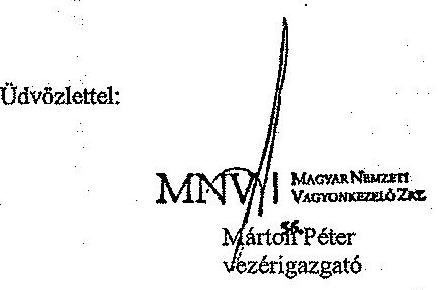

## Melléklet:

- 2013. január 18. kelt, MNV/01/0292/1/2013. iktatószámú levél
- Tájékoztató levél - „Vagyonkezelők jelentéstételi kötelezettségei/Öszzefoglaló tájékoztató az MNV Zrt. által vagyonkezelésbe adott vagyonelemekkel kapcsolatos jelentéstételi kötelezettségckröl"

---

# **Chemistry**

## **Chemical Reactions**

### **Balancing Chemical Equations**

1. **Write the unbalanced equation:**
   - Example: $$C_3H_8 + O_2 \rightarrow CO_2 + H_2O$$

2. **Balance the equation:**
   - Balance carbon atoms first.
   - Then balance hydrogen atoms.
   - Finally, balance oxygen atoms.
   - Balanced equation: $$C_3H_8 + 7O_2 \rightarrow 3CO_2 + 4H_2O$$

### **Types of Reactions**

1. **Combination Reaction:**
   - Example: $$2H_2 + O_2 \rightarrow 2H_2O$$

2. **Decomposition Reaction:**
   - Example: $$2H_2O_2 \rightarrow 2H_2O + O_2$$

3. **Single Displacement Reaction:**
   - Example: $$Zn + 2HCl \rightarrow ZnCl_2 + H_2$$

4. **Double Displacement Reaction:**
   - Example: $$AgNO_3 + NaCl \rightarrow AgCl + NaNO_3$$

5. **Combustion Reaction:**
   - Example: $$CH_4 + 2O_2 \rightarrow CO_2 + 2H_2O$$

## **Stoichiometry**

### **Mole Concept**

- **Mole (mol):** The amount of substance containing as many particles (atoms, molecules, ions) as there are atoms in exactly 12 grams of carbon-12.
- **Avogadro's Number:** $$6.022 \times 10^{23}$$ particles per mole.

### **Molar Mass**

- **Molar Mass:** The mass of one mole of a substance.
- Example: The molar mass of water ($$H_2O$$) is 18.015 g/mol.

### **Calculations**

1. **Moles to Mass:**
   - Formula: $$n = \frac{m}{M}$$
   - Example: Calculate the number of moles of $$H_2O$$ in 18 grams of water.
     - $$n = \frac{18.015 \, \text{g}}{18.015 \, \text{g/mol}} = 18.015 \, \text{g/mol}$$

2. **Moles to Mass:**
   - Formula: $$m = n \times M$$
   - Example: Calculate the mass of 18.015 g of water.
     - $$m = 18.015 \, \text{g/mol} = 18.015 \, \text{g/mol}$$

## **Gas Laws**

### **Ideal Gas Law**

- **Equation:** $$PV = nRT$$
- **Variables:**
  - $$P$$: Pressure (atm)
  - $$V$$: Volume (L)
  - $$n$$: Number of moles (mol)
  - $$R$$: Ideal gas constant (0.0821 L·atm/mol·K)
  - $$T$$: Temperature (K)

### **Boyle's Law**

- **Equation:** $$P_1V_1 = P_2V_2$$
- **Variables:**
  - P₁: Pressure (atm)
  - P₂: Volume (L)
  - P₃: Temperature (K)
  - P₁: Pressure (atm)
  - P₂: Volume (L)
  - P₃: Temperature (K)
  - P₁: Pressure (atm)

### **Boyle's Law (Boyle's Law)**

- **Equation:** $$\frac{P_1V_1}{P_2V_2} = \frac{P_1}{V_1}$$

## **Thermochemistry**

### **Enthalpy (H)**

- **Definition:** The heat content of a system at constant pressure.
- **Equation:** $$\Delta H = q_p$$
- **Variables:**
  - $$q_p$$: Heat transferred at constant pressure.
  - $$q_p$$: Heat transferred at constant pressure.

### **Hess's Law**

- **Statement:** The enthalpy change for a reaction is the same whether it occurs in one step or multiple steps.
- **Equation:** $$\Delta H_{\text{rest}} = \Delta H - \Delta H_0$$
- **Variables:**
  - $$\Delta H$$: Heat transferred at constant pressure.
  - $$\Delta H_0$$: Heat transferred at constant pressure.

### **Hess's Law (Hess's Law)**

- **Statement:** The enthalpy change for a reaction is the same whether it occurs in one step or multiple steps.
- **Equation:** $$\Delta H_{\text{rest}} = \Delta H - \Delta H_0$$
- **Variables:**
  - $$\Delta H$$: Heat transferred at constant pressure.
  - $$\Delta H_0$$: Heat transferred at constant pressure.

## **Electrochemistry**

### **Oxidation and Reduction**

- **Oxidation:** Loss of electrons.
- **Reduction:** Gain of electrons.

### **Galvanic Cells**

- **Definition:** A cell that converts chemical energy into electrical energy.
- **Components:**
  - Anode: Oxidation occurs.
  - Cathode: Reduction occurs.
  - Salt Bridge: Connects the two half-cells.

### **Nernst Equation**

- **Equation:** $$E = E^\circ - \frac{RT}{nF} \ln Q$$
- **Variables:**
  - $$E$$: Energy (K)
  - $$E^\circ$$: Standard deviation (M)
  - $$R$$: Ideal gas constant (0.0821 L·atm/mol·K)
  - $$T$$: Temperature (K)
  - $$n$$: Number of electrons transferred
  - $$F$$: Faraday constant (96,485 C/mol)
  - $$Q$$: Reaction quotient

---

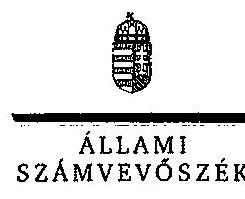

ELHök

Ikt.szám: V-0458-622/2014.

Márton Péter úr
vezérigazgató
Magyar Nemzeti Vagyonkezelő Zrt.

Budapest

Tisztelt Vezérigazgató Úr!

A „Jelentéstervezet az állami vagyon feletti tulajdonosi joggyakorlással kapcsolatos tevékenységek ellenőrzéséről" című jelentéstervezetre tett észrevételeit köszönettel megkaptam.

Az Állami Számvevőszék észrevételekre vonatkozó álláspontjáról a felügyeleti vezető által készített részletes tájékoztatást csatoltan megküldöm.

Tájékoztatom Vezérigazgató urat, hogy a számvevőszéki jelentés szövegezése az elfogadott észrevételek figyelembevételével készül.

Budapest, 2014. 12. hó 29 nap

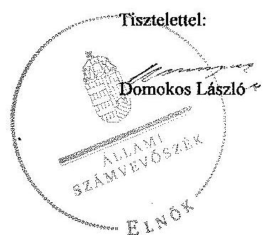

Melléklet: Tájékoztatás az elfogadott és az el nem fogadott észrevételekről

1052 BUDAPEST, APÁLON CSERE, JÁNOS UTCA 10. 1264 Budapest 4. Pf. 54 telefon: 494 9101 fax: 494 6201

---

# Tájékoztatás   az elfogadott és az el nem fogadott észrevételekről 

A „Jelentéstervezet az állami vagyon feletti tulajdonosi joggyakorlással kapcsolatos tevékenységek ellenörzéséről" címủ jelentéstervezetre az MNV/01/32761/6/2014. iktatószámon érkezett észrevételeit áttekintettük, azok kezelésével kapcsolatban a következő tájékoztatást adom.

1. fejezet /21. oldal harmadik bekezdés és 27. oldal Javaslat, valamint II.2.1. fejezet/ 37. oldal negyedik bekezdés

Az SZMSZ-el kapcsolatos tájékoztatást köszönjük. Az észrevétel szerint az SZMSZ módosítását 2013. június 17 -én hagyták jóvá, 2013. július 1 -i hatályba lépéssel, emiatt nem tartalmazhatta a jelentéstervezetben hivatkozott 2013. június 28 -ától hatályos törvényi változást.

Az észrevétel nem mond ellent a jelentéstervezetben foglalt megállapításnak, amely azt a tényt tartalmazza, hogy a 2013. július 1-jétől hatályos SZMSZ szövegében a vonatkozó jogszabály szerinti változást nem vezették át. Megállapításunk helytálló, amelyet tájékoztatása is megerősít, miszerint SZMSZ módosítás ezen időpont óta nem történt. Erre tekintettel a jelentéstervezet módosítása nem indokolt.

Az alapító okirat módosításával kapcsolatos tájékoztatást köszönjük, ami nem mond ellent a jelentéstervezetben foglalt megállapításoknak, magyarázatot nyújt az azokban foglaltakra, ezért a jelentéstervezet módosítása nem indokolt.

## II.2.1. fejezet /38. oldal harmadik bekezdés

A Vtv. 17. § (1) bekezdés g) pontjában elöírt, a Nemzeti Vagyongazdálkodási Irányelvek és az Éves Nemzeti Vagyongazdálkodási Program elkészítésével kapcsolatos észrevétellel ellentétben a jelentéstervezetben foglalt megállapítás összhangban van a hivatkozott jogszabályban foglaltakkal. A megállapítás tartalmazza azt is, hogy a hivatkozott anyag elkészítésében az MNV Zrt.-nek közremüködési kötelezettsége van.

A megállapítás az észrevétellel ellentétben nem tartalmaz a hivatkozott jogszabályi rendelkezésen túli - kezdeményezés, jóváhagyásra történő előterjesztés - az MNV Zrt.-vel kapcsolatos jogköröket, hatásköröket, ezért annak módosítása nem indokolt.

## II.2.1. fejezet /40. oldal második és harmadik bekezdés

Az MNV társasági portfóliójának kezelésére szolgáló részletes eljárásrend kidolgozásával kapcsolatos tájékoztatást köszönjük, az megerősíti az ellenőrzés megállapítását. A tájékoztatás magyarázatot nyújt a jelentéstervezetben foglalt megállapításokra, ezért a jelentéstervezet módosítása nem indokolt.

---

# II.2.2 fejezet /43. oldal harmadik és negyedik bekezdés 

Az ingyenes vagyonátadással kapcsolatos tájékoztatást köszönjük.
A SZT-41014 és az SZT-41320 számú megállapítással kapcsolatos tájékoztatás nem mond ellent a jelentéstervezetben foglalt megállapításoknak, magyarázatot nyújt az abban foglaltakra.

A köztartozás mentesség igazolására vonatkozó dokumentum az észrevételük szerint az MNV Zrt. szerződéstárában található, azonban ezt nem adták át az ellenőrzés részére. A határidőn túli igénybenyújtás esetében arról adnak tájékoztatást, hogy elektronikus úton, határidőn belül az érintettek jelezték igényüket. A törvény elektronikus igény-bejelentési lehetőséget nem tartalmaz.

Az ellenőrzés a program kérdéseire az átadott dokumentumok, a vonatkozó jogszabályok alapján fogalmazta meg a megállapításokat. Az előzőekben kifejtettek miatt az SZT-41288, SZT-41285 és az SZT-41205 számú megállapodás esetében a jelentéstervezet megállapításainak módosítása nem indokolt.

A jelentéstervezet a térítésmentes tulajdonba adásra vonatkozó adatokat ( 469 db ) tartalmazza. Az egyértelműség érdekében a 43. oldal 2.2 pont utolsó bekezdését a jelentéstervezetből töröljük.

## II.2.3. fejezet /45. oldal negyedik bekezdés

Az észrevétel szerint a vagyonkezeléssel kapcsolatos eljárás folyamatát átfogó szabályozási rendszert a jogszabályi előírások biztosítják, ahhoz külön eljárásrend nem szükséges, annak elkészítését jogszabály nem írja elő.

Az észrevétel és a dokumentumok ismételt áttekintése alapján a 45. oldal 4. bekezdését a következőre pontosítjuk.
„Az MNV nem rendelkezett az SZMSZ 19. § (2) bekezdésében elôlrt a vagyonkezelési eljárások fejlesztése érdekében kidolgozott módszertannal."

## II.2.3. fejezet /46. oldal negyedik bekezdés

Az MNV Zrt. közvetlen kezelésében lévő ingatlanállományra vonatkozó hasznosítási terv kidolgozásával kapcsolatos tájékoztatását köszönjük, amely nem vitatja a jelentéstervezetben foglalt megállapításokat, így módosítás nem indokolt.

## II.2.3. fejezet /46. oldal nyolcadik bekezdés

A jelentéstervezetben a mintatételek esetében szerepel, hogy melyik jogszabály hatályba lépése előtt vagy után jött létre a szerződés. Az észrevételben leírt ezzel kapcsolatos részletes tájékoztatást köszönjük, a jelentéstervezet módosítása nem indokolt.

## II.2.3. fejezet /47. oldal 6. bekezdés

---

Az SZT-3785 szerződéssel kapcsolatos tájékoztatást köszönjük. A tájékoztatás nem mond ellent a jelentéstervezetben szereplő leírtaknak, hanem részletezi a szerződés megújítása elmaradásának körülményét, ezért a jelentéstervezet módosítása nem indokolt.

# II.2.3. fejezet /48. oldal második-hetedik bekezdés 

A hasznosítási szerződésekkel kapcsolatos észrevétele alapján a jelentéstervezet 48. oldal 3. bekezdését követő három részbekezdést töröljük. A jelentéstervezet a 48. oldalon táblázat formájában tartalmazza a vagyonkezelési szerződés állomány megoszlását a szerződéskötés időpontja szerint, ezért a jelentéstervezet további kiegészítése e témában nem indokolt.

## II.2.3. fejezet /49. oldal negyedik bekezdés

Az észrevétel megállapításunkkal összhangban leírja, hogy a vagyonkezelők a jogszabályi kötelezettség ellenére az esetek egy részében elmulasztják a vagyonkezelői jog ingatlannyilvántartási bejegyzéséről szóló határozat MNV Zrt. részére történő megküldését. A hivatkozott megállapításunk helytálló, annak kiegészítése nem indokolt.

## II.2.3. fejezet /49. oldal ütödik-hatodik bekezdés

A Vhr. 8. § (2) bekezdésében foglalt előírások be nem tarthatóságával kapcsolatos intézkedésekről szóló tájékoztatást köszönjük, amely nem vitatja a jelentéstervezetben foglalt megállapításokat, így azok kiegészítése nem indokolt.

## II.2.3. fejezet/ 49. oldal hetedik bekezdés

Köszönjük a tájékoztatást, miszerint az MNV Zrt. nem tartja szükségesnek az elszámolást, ha a vagyonkezelő központi költségvetési szerv. A jelentéstervezetben szereplő megállapítás helytálló, a jogszabályi előírásnak megfelelő, az észrevétel alapján kiegészítése nem indokolt.

## II.2.3. fejezet /50. oldal második bekezdés

Az észrevétel és az áttekintett dokumentumok alapján a jelentéstervezet 50. oldal 2. bekezdését töröljük.

## II.2.4. fejezet /52. oldal utolsó bekezdés

Az észrevétel alapján a jelentéstervezet 53. oldal első bekezdés utolsó mondatát töröljük.

---

# II.2.5. fejezet/ 54. oldal nyolcadik és kilencedik bekezdés 

A 2013. évi Tulajdonosi Ellenőrzési Beszámolóval kapcsolatos intézkedésekről a tájékoztatást köszönjük, a vonatkozó megállapítás helytálló, azt az észrevétel nem vitatja.

Tájékoztatom Vezérigazgató urat, hogy a számvevőszéki jelentés mellékleteként szerepeltetjük a jelentéstervezethez tett észrevételeit, valamint az azokra adott válaszunkat.

Budapest, 2014. év 12. hó 27 nap

Makkai Mária
felügyeleti vezető

---

.

---

# 14. SZÁMÚ MELLÉKLET A V-0458-627/2014. SZÁMÚ JELENTÉSHEZ 

## EMBÉRI ERÓFORRÁSOK MINISZTÉRIUMA MINISZTER

$V-0458-61612014$
Iktatószám: 29054-11/2014/ELL
Hiv, szám: V-0458-600/2014
Melléklet: -

## Domokos László részére

elnök
Állami Számvevőszék

## Budapest

Apáczai Csere János u. 10.
1052

Tárgy: Észrevétel „Az állami vagyon feletti tulajdonosi joggyakorlással kapcsolatos tevékenységek ellenőrzése" címü számvevőszéki jelentéstervezethez

Tisztelt Elnök Úr!
„Az állami vagyon feletti tulajdonosi joggyakorlással kapcsolatos tevékenységek ellenőrzése" címủ számvevőszéki jelentéstervezethez az alábbi észrevételeket teszem.

| 14. SZÁMÚ MELLÉKLET |  |
| :--: | :--: |
| A TB alapok ellátási vagyona vonatkozásában a tulajdonosi joggyakorlás szabályozert ellátásához szükséges - a Bkr. 3. § a. és 6. § (1) bekezdése b. pontjaiban foglaltaknak megfelelő kontrollkórnyezet kialakítása nem történt meg (26. és 27. oldal). | Az emberi erőforrások minisztere - a TB alapok ellátási vagyona tekintetében - a tulajdonosi jogokat az MNV Zrt-vel kötött megállapodások szerint, és a hatályos jogszabályi elölrások együttes alkalmazásával gyakorolja, széles együttmüködői kör - OEP, ONYF, MNV Zrt, EMMI érintett szakmai ágazatai, illetve jogi szakterülete - bevonásával. Az EMMI tulajdonosi joggyakorlása ennek megfelelően szabályozott gyakorlat keretében valósult meg, amely az ügykezeléssel kapcsolatos dokumentációban harmadik személy számára is nyomon követhető.   A jelentéstervezet 33. oldalán az ÁSZ részéről az alábbi olvasható: „Az EMMI tulajdonosi joggyakorlásához kialakított belaő kontrollkörnyezete részben volt megfelelő, kórapos szintü kockázati besorolásának értékelhető". Ezen megállapítás ellentéées az ÁSZ kifogásolt megállapításával. Az ÁSZ megállapítása szövegszerüen kiegészítendő. |

---

# Javasolt megfogalmazás: 

A TB alapok ellátási vagyona vonatkozásában a tulajdonosi joggyakorlás szabályszerű ellátásához szükséges - a Bkr. 3. § a. és 6. § (1) bekezdése b. pontjaiban foglaltaknak megfelelő kontrollkörnyezet kialakítása részben történt meg.

Az EMMI miniszter a Vtv.-ben elöirt vagyongazdálkodási feladatokról az éves beszámolót a 2012. évröl 2013-ban a 347/2010. (XII. 28.) Korm. r. 3. § (1) bekezdésének elöirása ellenére nem készítette el.

A minisztérium nyilatkozata alapján az OEP és az ONYF vagyonkezelői jogállása sajátságos az ellátási vagyon vonatkozásában, és az OEP és az ONYF mint törvényes vagyonkezelő a fökönyvi nyilvántartás vezetésének jogával, míg az MNV Zrt. 2013. decembert 31-ig, mint szerződéses vagyonkezelő vezette az analitikus nyilvántartást és hozzá voltak telepítve a hasznosítás és értékesítés vonatkozásában fennálló rendelkezési jogosultságok is (34. oldal).

Az E. Alap és az Ny. Alap ellátási vagyoni körébe tartozó - az emberi erőforrások minisztere tulajdonosi joggyakorlása alá eső - vagyon ( 15 db VIII. kerületi társasházi albetét) vonatkozásában az OEP-től, az ONYF-től, illetve az MNV Zrt-től nem állt az EMMI számára rendelkezésre vagyonkezelöi beszámoló. Az ÁSZ megállapítása kiegészítendő.

## Javasolt megfogalmazás:

Az emberi erőforrások minisztere a Vtv.-ben előirt vagyongazdálkodási feladatokról az éves beszámolót a 2012. évröl 2013-ban a 347/2010. (XII. 28.) Korm. rendelet, 3. § (1) bekezdésének elöirása ellenére nem készítette el.
A minisztérium nyilatkozata alapján az OEP és az ONYF vagyonkezelői jogállása sajátságos az ellátási vagyon vonatkozásában, az OEP és az ONYF mint törvényes vagyonkezelő a főkönyvi nyilvántartás vezetésének jogával, míg az MNV Zrt. 2013. decembert 31-ig, mint szerződéses vagyonkezelő vezette az analitikus nyilvántartást és hozzá voltak telepítve a hasznosítás és értékesítés vonatkozásában fennálló rendelkezési jogosultságok is.

Az E. Alap és az Ny. Alap ellátási vagyoni körébe tartozó - az emberi erőforrások minisztere tulajdonosi joggyakorlása alá eső - vagyon ( 15 db VIII. kerületi társasházi albetét) vonatkozásában az OEP-től, az ONYF-től, illetve az MNV Zrt-től az EMMI számára nem állt rendelkezésre vagyonkezelői beszámoló.

A Bkr. 3. § a) bekezdése ellenére a TB alapok
Lásd észrevételek az „I. ÁSZ megállapítás" c. ellátási vagyona vonatkozásában a tulajdonosi joggyakorlás szabályszerű ellátásához szükséges kontrollkörnyezet kialakítására nem került sor. (35. oldal).

---

# Javasolt megfogalmasás: 

A Bkr. 3. § a) bekezdése ellenére a TB alapok ellátási vagyona vonatkozásában a tulajdonosi joggyakorlás szabályszerű ellátásához szükséges kontrollkörnyezet kialakítására részben került sor.

Tekintettel arra, hogy a jelentéstervezet a Gyógyszerészeti és Egészségügyi Minőség- és Szervezetfejlesztési Intézetre (a továbbiakban: GYEMSZI) vonatkozóan is tartalmaz megállapításokat, a jelentéstervezetet véleményezésre megküldtük az intézmény részére, ugyanakkor a GYEMSZI a jelentéstervezetet az Állami Számvevőszéktől (a továbbiakban: ÁSZ) is megkapta véleményezésre, ezért az intézmény az észrevételeit az ÁSZ-nak küldi meg.

A jelentéstervezetben a GYEMSZI-re vonatkozó megállapításokkal kapcsolatban nem teszek észrevételt, ugyanakkor az intézmény által tett észrevételek ismeretében - az intézmény észrevételeinek elfogadása esetén - indokoltnak tartom a GYEMSZI föigazgatójának címzett, a munkajogi felelősség megállapítására irányuló javaslat módosítását.

Kérem Elnök Urat, hogy az észrevételeimet szíveskedjen elfogadni.
Budapest, 2014. december ${ }_{m} 10_{m}$.
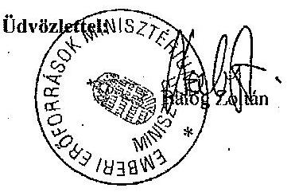

---

.

---

# 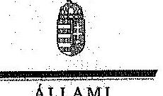 

Ikt.szám: V-0458-621/2014.

## Balog Zoltán úr

miniszter
Emberi Eröforrások Minisztériuma

## Budapest

## Tisztelt Miniszter Úr!

A „Jelentéstervezet az állami vagyon feletti tulajdonosi foggyakorlással kapcsolatos tevékenységek ellenőrzéséről" című jelentéstervezetre tett észrevételeit köszönettel megkaplani.

Az Állami Számvevőszék észrevételekre vonatkozó álláspontjáról a felfigyeleti vezető által készített részletes tájékoztatást csatoltan megküldöm.

Tájékoztatom Miniszter urat, hogy a számvevőszéki jelentés mellékleteként szerepeltetjük a jelentéstervezethez tett észrevételeit, valamint az azokra adott válaszunkat.

Budapest, 2014. 12. hó $0^{0} 9$ nap

Tisztelettel:

Domokos László

Melléklet: Tájékoztatás az el nem fogadott észrevételekről

---

# Tájékoztatás   az el nem fogadott észrevételekröl 

A „Jelentéstervezet az állami vagyon feletti tulajdonosi joggyakorlással kapcsolatos tevékenységek ellenörzéséröl" címü jelentéstervezetre az 29054-11/2014/ELL iktatószámon érkezett észrevételeit áttekintettük, azok kezelésével kapcsolatban a következő tájékoztatást adom.

## 26. oldal utolsó bekezdés

A tulajdonosi joggyakorlással kapcsolatos tájékoztatást köszönjük. Az ellenőrzés során rendelkezéstinkre bocsátott nyilatkozatban erösítették meg, hogy a TB ellátási vagyon vonatkozásában külön szabályzattal, illetve a vagyon feletti tulajdonosi jogok gyakorlására vonatkozó eljárásrenddel nem rendelkeznek. A kifogásolt megállapításunkat erre és az ellenőrzés részére e témában átadott dokumentumaira alapozva fogalmaztuk meg.

A jelentéstervezet 26. oldalán és a 33. oldalán szereplő az észrevételben is hivatkozott megállapítás nem ellentétes egymással. A 33. oldal megállapítása főmegállapításként, a minisztérium belső kontrollkörnyezetének egészét illetően rögzíti, hogy a tulajdonosi joggyakorláshoz kialakított belső kontrollkörnyezete részben volt megfelelő. A 26. oldal megállapítása a főmegállapításhoz kapcsolódó részmegállapításként a TB alapok ellátási vagyona vonatkozásában a tulajdonosi joggyakorlás szabályszerű ellátásához szükséges kontrollkörnyezetére irányul (melyet a 35. oldal részletesen is taglal). A 33. oldal kifogásolt megállapítása utáni szövegrészek tehát alátámasztják a főmegállapitást.

A megállapításunkat fenntartjuk, tekintettel arra, hogy a kifogásolt intézkedést igénylő megállapítás kifejezetten a TB alapok ellátási vagyona vonatkozásában a tulajdonosi joggyakorlás szabályszerű ellátásához szükséges kontrollkörnyezetre irányul.

## 34. oldal 7. és 8. bekezdése

A vagyongazdálkodási feladatokra vonatkozó éves beszámoló elkészítésével kapcsolatban adott tájékoztatást köszönjük, az nem vitatja a jelentéstervezetben foglalt megállapítást. Továbbá az ellenőrzésnek nem volt tárgya, hogy feltárja - a jogszabályi előírás ellenére - miért nem készítették el az éves beszámolót, ezért a megállapítás kiegészítése nem indokolt.

## 35. oldal 1. bekezdés

A jelentéstervezet 35. oldal 1. bekezdésével kapcsolatosan tett észrevételre adott válaszunk azonos 26. oldal utolsó bekezdésre tett észrevételre adott válaszunkkal.

---

# A Gyógyszerészeti és Egészségügyi Minőség- és Szervezetfejlesztési Intézet (GYEMSZI) föigazgatójának címzett javaslat 

A GYEMSZI föigazgatójának észrevételét megkaptuk. Tájékoztatom, hogy a GYEMSZI föigazgatójának címzett javaslatot az alábbiakra tekintettel fenntartjuk.

Az ellenőrzés során átadott dokumentumok és nyilvántartások szerint 2013-ban nem történt meg az átvett és rábízott vagyon könyvelése és elkülönített nyilvántartásba vétele. A jelentéstervezet tartalmazza, hogy 2014-ben a hiányosságok javítása megtörtént, illetve folyamathan volt, azonban az ellenőrzött időszakban-2013-ban-azok még fennálltak.

A GYEMSZI észrevétele szerint a CT Ecostat program rendelkezik kettős könyvviteli modullal, ez azonban önmagában nem jelenti azt, hogy a könyvelés a jogszabályban előírt módon történik. A beszámoló NFM részéről történő befogadása sem bizonyítja a vagyon szabályszerű könyvelését és elkülönített nyilvántartásba vételét.

Mindezek alapján az átvett és rábízott vagyon könyvelésére és elkülönített nyilvántartásba vételére vonatkozó megállapításainkat fenntartjuk. A könyveléssel és az elkülönített nyilvántartással kapcsolatos 2013-ban megállapított hiányosságokkal összefüggésben fontosnak tartjuk valamennyi körülmény, a kialakult helyzetet előidéző okok kivizagálását, amelyek alapján lehetőség van az esetleges rendszerbeli hiányosságok korrigálására, a szükséges intézkedések megtételére, ezért a javaslatot fenntartjuk.

Tájékoztatom Miniszter urat, hogy a számvevőszéki jelentés mellékleteként szerepeltetjük a jelentéstervezethez tett észrevéteteit, valamint az azokra adott válaszunkat.

Budapest, 2014. év 12. hó 23. nap

Makkai Mária
felügyeleti vezetö