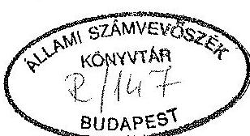
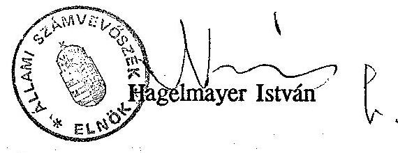
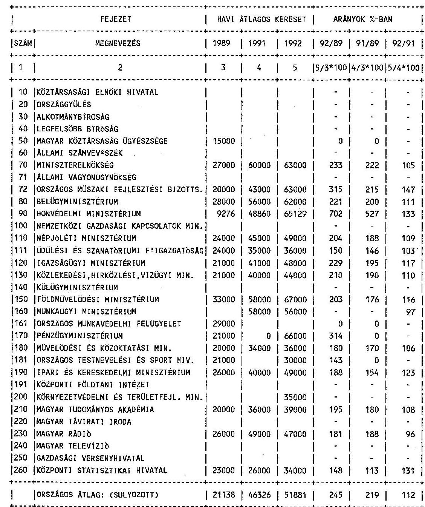
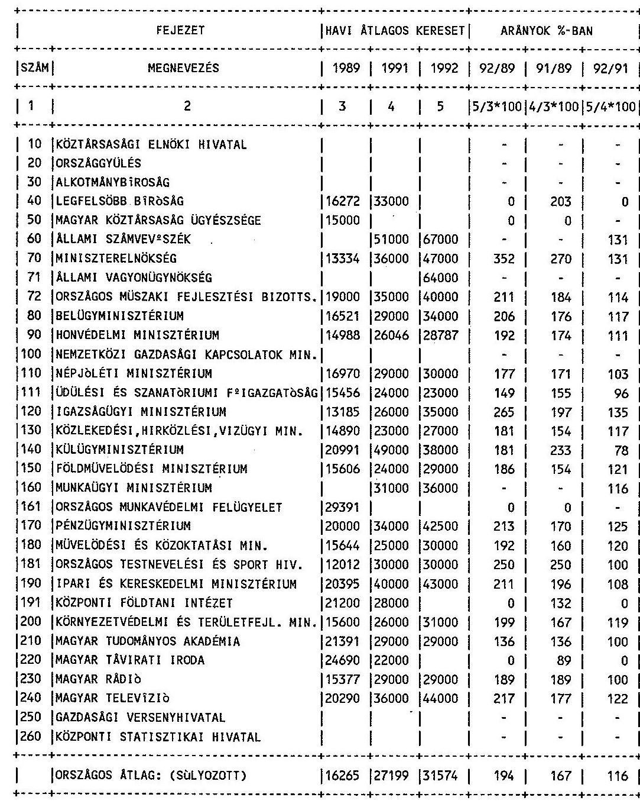
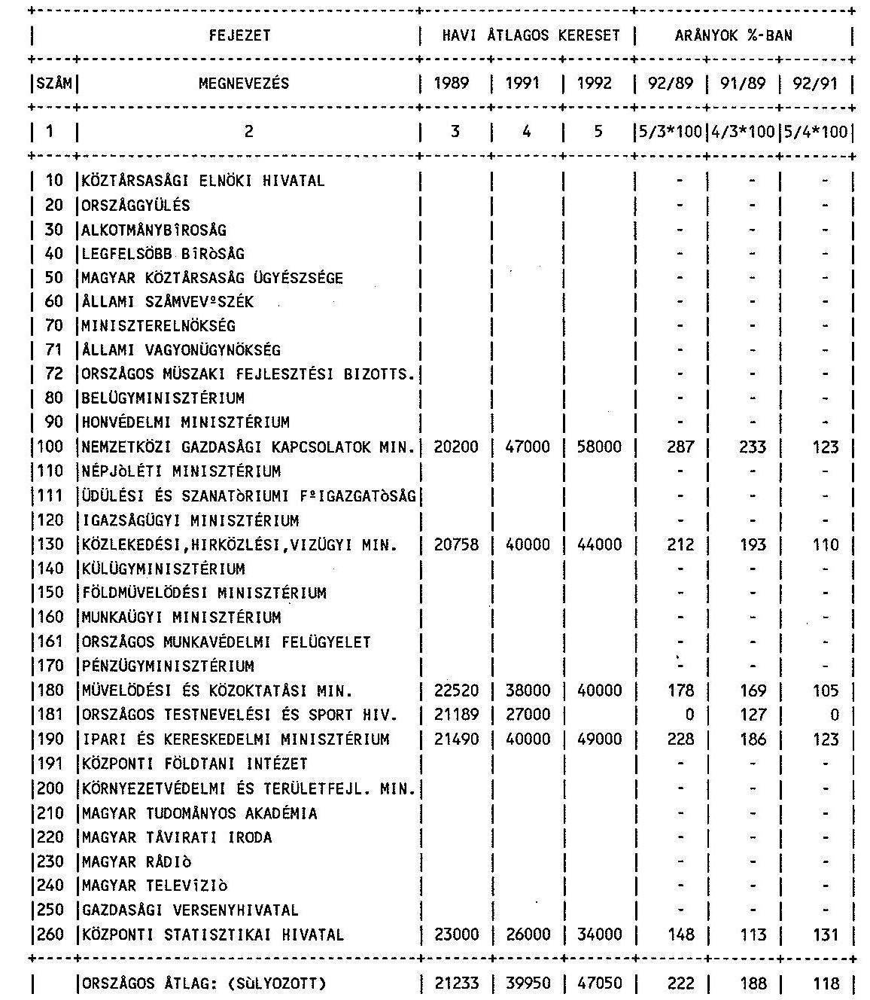

# JELENTÉS 

a minisztériumok, országos hatáskörú szervek költségvetési és vállalati felügyeleti ellenőrzési tevékenységének, valamint a belső ellenőrzési rendszere müködésének vizsgálatáról

---

Az ellenőrzést vezette:

| Kolossváry György | igazgatóhelyettes |
| :-- | :-- |

# Az ellenőrzést végezték: 

Balázs Andrásné
Kovácsné Szepesi Etel
Molnár János
Nagy Ákosné
Surányi Tamás
Csizmadia József
Hajnal István
Varga Ildikó
számvevö-tandcsos
számvevö-tandcsos
számvevö
fötandcsos
számvevö
külsö szakértő
külsö szakértő
külsö szakértő

---

# JELENTÉS 

a minisztériumok, országos hatáskörú szervek költségvetési és vállalati felügyeleti ellenőrzési tevékenységének, valamint a belső ellenőrzési rendszere müködésének vizsgálatáról

A minisztériumok, országos hatáskörű szervek (továbbiakban: központi államigazgatási szervek) felügyelete és a költségvetési ellenőrzés hatálya alá tartozó önálló költségvetési szervek száma - a Honvédelmi Minisztérium fejezet nélkül, az I. 1-i adatok szerint az 1989. évi 506 -ról 1992 -re 607 -re emelkedett. (A HM adatait az összesítésnél figyelmen kívül hagytuk, egyrészt a fejezet sajátos szervezeti rendje, másrészt a vizsgált időszakban bekövetkezett jelentős szervezeti átrendeződések miatt.)

Az ellenőrizendő pénzügyi nagyságrendet érzékelteti, hogy a központi költségvetési szervek 1991. évben mintegy 342,9 Mrd Ft müködési, fenntartási célú kiadást teljesítettek.

A központi államigazgatási szervek felügyelete alá 1989. évben 304, míg 1992. évben (I. 1-i állapot szerint) 268 vállalat tartozott.

A vizsgálat célja annak értékelése volt, hogy a központi államigazgatási szervek és intézményeik ellenőrző tevékenysége hogyan felelt meg rendeltetésének, mennyiben segítette elő a gazdálkodás célszerűségét, eredményességét és szabályszerűségét, valamint az állami vagyon védelmét. Helyzetértékelésünknél figyelemmel voltunk az államigazgatás és intézményrendszerének átalakulására.

A vizsgálat megállapításai 27 központi államigazgatási szerv helyszíni ellenőrzésén és 5 központi szerv számszaki információin alapulnak (1. sz. melléklet).

A vizsgálat az 1989-1992. III. negyedévig terjedő időszakra terjedt ki.

---

# I.   Következtetések, javaslatok 

Az állami költségvetés tartós feszültségei az elmúlt években egyre inkább előtérbe állították a költségvetési szervek müködtetésének és gazdálkodásának racionalizálását, a belső tartalékok feltárását, a gazdálkodásnak - mind a felügyeleti, mind az ellenőrzött szerv részére hasznosítható - célszerűségi, eredményességi és törvényességi (szabályszerűségi) szempontok szerinti értékelését. A költségvetési ellenőrzési tevékenységet ehhez igazodva kellett megszervezni és ennek szolgálatában kellett a belső ellenőrzésnek az intézményvezetést segítenie.

A központi államigazgatási szervek vezetői sok esetben még most sem ismerték fel az ellenőrzésnek - mint az irányítás egyik alapvető eszközének - a jelentőségét és így tartós lemaradás tapasztalható a követelményekkel szemben. Bár helyenként jó irányú elmozdulás is érzékelhető az ellenőrzési tevékenységben, de nem ez a jellemző.

A költségvetési és a belső ellenőrzés az államigazgatás egészében nem lépett előre, rendeltetésének igen mérsékelten felelt meg. Ez összefügg azzal, hogy az ellenőrzést rangon alul, másodlagosan kezelték, a felügyeletét alsóbb vezetői szintekre adták (így hiányzott a függetlensége), a személyi feltételeket nem megfelelően biztosították, továbbá elmaradt az ellenőrzés beszámoltatása és helyzetértékelése.

Ennek következtében fordulhatott elő, hogy a költségvetési ellenőrzést több helyen nem a jogszabályban előírt gyakorisággal szervezték meg, sőt esetenként huzamosabb időn át nem a jogszabály szerinti tartalommal és jelleggel müködtették. A vizsgálati jelentésekben a kritikai és az ok-okozati összefüggések szerinti értékelés hiánya vagy a megállapítások érdemi hasznosításának, illetve a szükséges intézkedéseknek az elmaradása lényegében az ellenőrzés rendeltetésszerű működését kérdőjelezi meg. Az ellenőrzések tartalmilag hiányos ellátása azt jelenti, hogy hatékonysági és szabályszerűségi szempontból a müködés, a gazdálkodás olyan lényeges területei képezték az értékelés "fehérfolt"-ját, mint például a feladat- és a szervezetrendszer (létszámok) összhangja, a költségvetési tervezés és az előirányzatmódosítások megalapozottsága, vagy a költségvetési beszámoló és mérleg valódisága. Az a tény, hogy az ellenőrzés huzamosabb időn keresztül tartalmilag hézagos volt, magában rejti annak veszélyét, hogy az érintetlen területeken a célszerűtlen és szabálytalan gazdálkodás feltáratlan maradt, számottevően rontva így a költségvetési eszközök hasznosulását.

A felelősség liberális kezelése, a szankciók elmaradása az ellenőrzés szabálytalanságoktól, mulasztásoktól való visszatartó erejét gyakran lényegesen gyöngítette.

---

A belső ellenőrzés működése - bár helyenként tapasztalható előrelépés - viszonylag széles körben nem felelt meg a követelményeknek. Általában jellemző volt, hogy a belső ellenőrzés nem képezett hézagmentes rendszert, nem érvényesült töretlenül a rendfenntartó, a szabályos múködést, a célszerű gazdálkodást elősegítő funkciója. A belső ellenőrzés egységes rendszere sok helyen azért nem épült ki, mert a müködési, a gazdálkodási folyamatok és az ellenőrzési tevékenység egymással összehangolt szabályozására hibákkal, következetlenül került sor.

Csak korlátozottan valósult meg az az elvárás, hogy az ellenőrzés előre szabályozottan, közvetlenül kapcsolódjon az intézményi feladatellátási, gazdasági, ügyviteli és vezetési folyamatokhoz.

A vezetői ellenőrzés többnyire a követelmények irányában - de nem mindenütt egységesen és valamennyi eszközében - fejlődött. A vezetők pénzügyi jogkörének gyakorlását számos helyen a gazdálkodási kötelezettségekhez kapcsolódó hatáskörök, felelősségek nem egyértelmű rendezettsége, illetve zárt rendszerének hiánya gátolta. Ez következményeiben esetenként a gazdálkodás rendjét, fegyelmét is veszélyeztette.

A függetlenített belső ellenőrzés gyakran a szabályszerűségi kérdéseket helyezte előtérbe, így a gazdálkodás célszerűségi és eredményességi szempontú értékelésével csak szűkebb körben segítette a vezetést. Ennek következtében és a ritkább kritikai értékelések miatt az ellenőrzések hasznosítása, hatékonysága mérsékelt volt.

Az államigazgatási szervek tevékenységében a vállalati felügyeleti ellenőrzés több helyen indokolatlanul háttérbe szorult. A felügyelőbizottságok létrehozásának lehetőségével az alapító szervek kisebb hányada - és nem mindig teljes körben - élt. Esetenként működésüket nem kisérték kellő figyelemmel.

A vállalati felügyeleti ellenőrzéseket több esetben nem a jogszabályi követelményeknek megfelelően szervezték meg. Ennek oka részben a privatizációs folyamatok, illetve az ezzel kapcsolatos alapítói döntések elhúzódása volt.

Az elmúlt években az átfogó vállalatfelügyeleti ellenőrzés szerepének visszaszorulásával - esetenként megszűnésével - az államigazgatási felügyelet egyik legfontosabb eszközéről mondott le, amellyel segíthette volna az állami vagyon hatékony múködtetését.

Amennyiben az államigazgatási felügyelet alatt álló vállalatok - a privatizációs törvények alapján - társasággá alakulnak, úgy állami tulajdonosi ellenőrzésük az 1988. évi VI.

---

törvény előírásai szerint megoldottnak tekinthető. Ugyanakkor nem egyértelműen szabályozott a minisztériumok szerepe az országos közszolgáltató tevékenységet ellátó gazdálkodó szervezetekkel kapcsolatos tulajdonosi jogok gyakorlásában. A törvény nem rendelkezik egyértelműen arról, hogy a minisztériumok a vagyon múködtetéséhez milyen nyilvántartási és értékelési rendszert kötelesek alkalmazni, továbbá milyen szervezettel oldják meg a tulajdonosi jogok gyakorlását (minisztériumi apparátussal, e célra szervezett költségvetési intézménnyel vagy az ÁV Rt-hez hasonlóan müködő gazdasági társasággal).

A költségvetési szervek felügyeleti jellegű pénzügyi-gazdasági ellenőrzését (költségvetési ellenőrzés) és belső ellenőrzését, valamint az államigazgatási felügyeletű vállalatok felügyeleti ellenőrzését meghatározó jogszabályok az elmúlt évek során többször módosultak. A tapasztalatok szerint azonban a gyakorlat sokszor eltért a jogszabályokban rögzített követelményektől. Ennek szankcionálására viszont - a belső ellenőrzés egyes eseteit kivéve - általában nem került sor.

Az államháztartás gazdálkodásának ellenőrzésében 1990. évtől lényeges változást jelentett az Országgyűlés ellenőrző szervének, az Állami Számvevőszéknek a létrehozása.

Az államháztartásról szóló 1992. évi XXXVIII. törvény rendelkezik a számvevőszéki és a költségvetési ellenőrzésről, a költségvetési szerveknél a belső ellenőrzés megszervezésének és működtetésének kötelezettségéről, valamint az adók és más befizetések ellenőrzéséről. Ugyanakkor nem szabályozza az államháztartás alrendszereihez kapcsolódó vállalkozói vagyon ellenőrzését (tulajdonosi ellenőrzés).

Újabb változás, hogy az államháztartási törvény alapján a Kormány 1993. I. 19-ével létrehozta saját ellenőrző szervét, a Központi Számvevőségi Hivatalt. A Hivatal létrehozásával és a számvevőségek tervezett felállításával létrejönnek a feltételei, hogy a Kormány folyamatba építve ellenőrizze a központi költségvetés bevételeit és kiadásait. Így elkerülhetők lennének a 12/1993. (I.18.) Korm. rendelet szerinti párhuzamos ellenőrzések az ÁSZ-szal.

Az ellenőrzés jogi szabályozásának változásai az utóbbi időben azzal jártak, hogy - néhány új ellen.ízési formát kivéve - az ellenőrök jogai és kötelezettségei nincsenek meghatározva, ugyanakkor a pénzügyi-gazdasági ellenőrzésnek és a belső ellenőrzésnek nincs elvi irányítója.

---

Az ellenőrzés megállapításai alapján a következőket javasoljuk:

# 1. A Kormány 

a) az államháztartási törvény szellemében dolgozzon ki intézkedési programot a költségvetési ellenőrzés és a költségvetési szervek belső ellenőrzésének továbbfejlesztése érdekében, figyelemmel a Központi Számvevőségi Hivatal létrehozására, illetve a számvevôségek felállítására;

## Ennek keretében

— tekintse át a költségvetési ellenőrzés, valamint a költségvetési szervek belső ellenőrzése helyzetét, rendeltetését és szervezeti elhelyezését az államigazgatásban, illetve az államháztartásban,
— mérlegelje a jogi szabályozás indokolt módosítását (a jogszabályi módosításnál vizsgálja meg a költségvetési ellenőrzés gyakorisága differenciált megállapításának célszerűségét - pl. bizonyos költségvetési nagyságrend és egyszerű feladatrendszer esetén 3 évenkénti ellenőrzés - a módosítással kényszerítse ki az ellenőrzés fontosságának megfelelő kezelését, személyi feltételeinek biztosítását, tartalmi színvonalát, a gazdálkodás felelősségének érvényesítését és az ellenőrzési tapasztalatok maradéktalan hasznosítását, rögzítse a felelősséget az ellenőrzésről szóló jogszabályi előírások betartásáért);
b) szabályozza a minisztériumokhoz tartozó országos közszolgáltató tevékenységet ellátó gazdálkodó szervezetekkel kapcsolatos állami tulajdonosi ellenőrzést.

## 2. A központi államigazgatási szervek

a) rendeljék el intézményeik részére a belső szervezeti, működési és gazdálkodási szabályzataik felülvizsgálatát és szükséges megújítását, kiigazítását úgy, hogy azokhoz a folyamatba épített ellenőrzés szervesen illeszkedjen;
b) szorgalmazzák intézményeik felé a függetlenített belső ellenőrzés személyi és egyéb feltételeinek megteremtését, az ellenőrzés felügyeletének jogszabály szerinti rendezését és az ellenőrzés szervezett, követelményeknek megfelelő működtetését;
c) módszertani útmutatók kiadásával, a belső ellenőrzés helyzetének fejezet szintű értékelésével segítsék annak megerősítését, hatékonyságának javítását.

---

# II. 

Részletes megállapítások

## A. Költségvetési ellenőrzés

A felügyeleti jellegű költségvetési ellenőrzés szabályait a többször módosított 23/1979. (VI.28.) MT rendelet és a 96/1987. (XII.30.) PM rendelet írta elő.

A szabályozás szerint a miniszter, az országos hatáskörű szerv vezetője a felügyelete alá tartozó önálló költségvetési intézménynél felügyeleti jellegű költségvetési ellenőrzést végez, amelyet két évenként kell megtartani. Az ellenőrzés célja a rendelkezésre álló eszközökkel való gazdálkodás hatékonyságának és szabályszerűségének, valamint az alapító határozat szerinti tevékenység értékelése. Az ellenőrzés a felügyeleti irányítás részét képezi, amelyet a felügyeleti szervek az állam tulajdonjogát érvényesítve gyakorolnak. Az ellenőrzés az intézmények gazdálkodását lényegében teljes keresztmetszetben értékeli. Így vizsgálnia kell a finanszírozott feladatok és szervezetek indokoltságát, az önfinanszírozó képesség javítását, a bevételi lehetőségek feltárását, a pénzeszközök felhasználásának célszerűségét, az erőforrások működtetésének hatékonyságát, a működés és a gazdálkodás szabályozottságát és szabályszerűségét, valamint a belső ellenőrzés hatékonyságát.

Ezeknek a jogszabályi követelményeknek az ellenőrző szervek a következők szerint tettek eleget.

## 1. Az ellenőrzési feladatok végrehajtása

A központi államigazgatási szervek jelentős hányadánál a két évenkénti költségvetési ellenőrzési kötelezettségnek nem tettek eleget, illetve a felügyeletük alá tartozó költségvetési intézmények egy részénél (vagy egészénél) ezt nem hajtották végre. Ezáltal a módosított 23/1979. (VI.28.) MT rendelet 97. paragrafusában az ellenőrzés gyakoriságáról szóló előírást megsértették. A két évnél régebben ellenőrzött szervek aránya összességében 1989-ben és 1991-ben egyaránt $19 \%$-ot tett ki és az 1992. I. félévi adatok sem utaltak javulásra.

A két évnél régebben ellenőrzött szervek száma 1989-ben hat, míg 1991-ben nyolc államigazgatási szervnél volt jelentősebb arányú. Mindkét évben jellemzö volt ez az NM-nél, az ÜSZF-nél, a PM-nél, az MKM-nél és az OTSH-nál, illetve jogelődjeiknél.

---

Az MM-nél 1992-ben (várható adatok szerint) az ellenőrizendő szervek $72 \%$-át, az OMMF-nél $100 \%$-át ( 3 intézmény), az NGKM-nél ( 4 intézmény) több mint a felét, míg a KTM-nél mintegy a felét két évnél régebben ellenőrizték.

A költségvetési ellenőrzést több esetben nem a jogszabályi előírásoknak megfelelően szervezték meg. Helyenként huzamosabb időn át nem működtették az ellenőrzést, máshol cél- vagy témavizsgálatokkal próbálták helyettesíteni az átfogó értékelést.

Az OMMF-nél 1990-től egyáltalán nem tettek eleget a két évenkénti ellenőrzésnek, ugyanakkor cél- és témavizsgálatot sem végeztek.

A KTM-nél és az OTSH-nál az új szervezet életbe lépésének első évében költségvetési ellenőrzést nem szerveztek.

Az NGKM-nél és az MM-nél a jogszabályi előírások szerinti tartalommal két évenkénti ellenőrzést nem végeztek, az intézményi gazdálkodás egészét nem értékelték. (Módosított 23/1979. (VI.28.) MT rendelet 96. par. (2) bek. és a 96/1987. (XII.30.) PM rendelet 3. par. (1) bek.). Ehelyett cél-, illetve témavizsgálatokra került sor.

Más esetekben a két évenkénti ellenőrzések mellett a szükséges cél- és témavizsgálatok megtartása is nehézségekbe ütközött a szűk ellenőrzési kapacitás miatt.

A két évenkénti ellenőrzésen kívül középtávú tervidőszakonként egyszer, a szakmai tevékenység értékelésére is kiterjedő ellenőrzést írt elő a Minisztertanács rendelete 1991. évig. E komplex ellenőrzésre általában csak szűkebb körben és mérsékelt eredménnyel került sor. Egyes helyeken azonban még a jogszabályi előírás hatálytalanítását követően is kedvező gyakorlat tapasztalható.

A BM-ben az ellenőrzések súlypontja a komplex ellenőrzések felé tolódott el, a szakmai területek bevonásával, a vizsgálandó szervektől függően, esetenként a személyi feltételek jelentős koncentrálásával.

Az FM-ben a vizsgált időszakban csaknem minden költségvetési ellenőrzést a szakmai főosztályok közreműködésével folytattak le, az ellenőrzési és a szakmai terület zavartalan együttműködésével.

Az ellenőrzések tartalmi színvonala a vizsgált esetek számottevő hányadánál nem elégíti ki a követelményeket.

Az ellenőrzés főként az IM-nél, az MM-nél és a KTM-nél volt alacsony színvonalú. Mérsékelt színvonalú volt az ellenőrzési munka a Miniszterelnökségnél és az MK Ügyészségnél, ugyanakkor az átlagnál jobb színvonalúnak minősíthető a KHVM-nél és az IKM-nél.

A jelentések összeállításánál jellemző hiányosság volt - differenciált megjelenéssel az ismertető, leíró részek túlzott mértéke, a kritikai értékelés, illetve a minősítés háttérbe

---

szorulása, az ok-okozati összefüggések, a rendszerbeli okok nem kellő feltárása, helyenként a szabályszerűségi szempontok túlságos előtérbe kerülése, ugyanakkor a célszerűségi és hatékonysági szempontú értékelés kis súlya és sok esetben a hasznosítható javaslatok elmaradása. Ezek a hiányosságok az ellenőrzés szakmai követelményrendszerétől, valamint a jogszabályi előírásoktól való eltérést jelentenek.

Az ellenőrzések gyakran lényeges gazdálkodási területek értékelését mellőzték, így az intézményi gazdálkodás teljeskörű megítélésére hosszabb távon sem került sor. Így több esetben elmaradt a feladat- és a szervezetrendszer (létszámok) összhangjának, a költségvetési tervezés és az előirányzat módosítási igények megalapozottságának, a költségvetési beszámoló és mérlegvalódiságának, a belső ellenőrzési rendszer működésének, valamint az intézmények - vállalkozásba befektetése esetén - tulajdonosi ellenőrzésének értékelése. Egyes minisztériumoknál még a létszám- és bérgazdálkodást is alig érintették (IM).

Ugyanakkor kedvező, hogy helyenként felkérték a költségvetési ellenőrzés szervezetét az Állami Számvevőszék vizsgálatait követően megteendő intézkedések ellenőrzésére (KHVM, MM, KSH).

A felelősség megállapításának gyakorlata, az erre vonatkozó jogszabályi előírások (96/1987. (XII.30.) PM rendelet 18. par.) figyelmen kívül hagyása, esetenként az elfogadhatatlan liberalizmus gátolták az ellenőrzési tapasztalatok megfelelő hasznosítását és a gazdálkodás rendjének, fegyelmének megszilárdítását. Az eljáró revizorok többször, indokolt esetekben, a jogszabály által meghatározott mulasztások alkalmával sem állapították meg a felelősséget.

Ezt a hiányosságot az NM-nél, az MM-nél, a PM-nél, a KTM-nél és a KSH-nál állapította meg a vizsgálat. Az FM-nél viszont valamennyi mulasztásért általános érvénnyel az intézmények első számú vezetőit tették felelőssé, nem vizsgálták ki, illetve nem vizsgáltatták ki a személyre szóló felelősséget.

Az ellenőrzések realizálási gyakorlata, annak határozatlansága helyenként nem segítette kellően a megállapítások minél jobb hasznosítását, az ellenőrzés súlyát nem növelte. A zárótárgyalás rendszerét helyenként nem alkalmazták, így a megteendő intézkedéseket személyes gondolatcsere keretében nem alapozták meg. Esetenként elmaradt az intézkedési tervek összeállítása vagy azok felülvizsgálata, továbbá az intézkedések végrehajtásának következetes számonkérése. Utóellenőrzést többségében a következő költségvetési ellenőrzés keretében tartottak. Egyes esetekben azonban az indokolt külön utóellenőrzéseket - a szűk ellenőri létszám miatt - nem hajtották végre. A feltárt hiányosságok megszüntetésére helyenként és esetenként elmaradt az érdemi intézkedés (Miniszterelnökség, MTA, KSH).

---

Az ellenőrzések hatásfokát rontotta, hogy a jelentésekben rögzített mulasztásokat és felelősségfelvetéseket nem mindig követte a tényleges felelősségre vonás.

Az MTA-nál a Mátraházi Üdülő, a Műszerügyi Szolgálat és a Balatoni Limnológiai Intézet esetében maradt el a felelősségre vonás.

A KSH-nál nem érvényesítették a felelősséget az Állami Népességnyilvántartó Hivatal és a Gazdaságkutató Intézet ellenőrzését követően.

Kedvező, hogy az MKM-nél és az IKM-nél a felelősség kezelésének körültekintő, a jogszabálynak megfelelő gyakorlata volt tapasztalható.

Az MKM-nél gyakran és indokoltan vetették fel a felelősséget. A felelősségre vonás keretében helyenként a felelőst polgári peres eljárás keretében kártérítésre kötelezték (Központi Múzeumi Igazgatóság) vagy állásából felfüggesztették (Balatoni Gyermekközpont), büntető eljárást és kártérítést kezdeményeztek (Nemzetközi Hungarológiai Központ), emellett előfordult, hogy fegyelmi eljáráson kívül vezetőcserét hajtottak végre (Magyar Táncművészeti Főiskola).

# 2. Az ellenőrzési tevékenységet befolyásoló tényezők 

a) Az ellenőrzés államigazgatási szerven belüli helye, szerepe, jogállása alapvetően meghatározza annak érdemi működését, függetlenségét és feltételrendszerét. A vizsgált években gyakori volt, hogy a költségvetési ellenőrzés felügyeletét az államtitkárhelyettesnél alacsonyabb szintre helyezték. Ez az államigazgatási szervek több mint $40 \%$-ánál fordult elő még 1992-ben is (MK Ügyészség, Miniszterelnökség, OMFB, ÜSZF, OTSH, PM, KFI, KTM, MTA). A HM-nél 1992. előtt az ellenőrzések végrehajtásához - a szerv vezetőjének, vagy helyettesének alárendelt független szervezet nem múködött.

Az ellenőrzés így a felső vezetéstől eltávolodott, nem önálló szervezetként működik, ami függetlenségét nem biztosítja.

Kedvezőtlen, hogy az utóbbi időben megalakult új szervezeteknél is főosztályi szervezeten belülre sorolták a költségvetési ellenőrzést (OTSH, KTM). Ugyanakkor néhány helyen az ellenőrzés jelentőségének felismerését mutatja, hogy - a korábbi évekkel szemben - magasabb rangra, államtitkári felügyelet alá helyezték a költségvetési ellenőrzést (BM, FM, IKM). Az MM-nél a felső vezetéshez kapcsolt, független ellenőrzési szervezetet építettek ki és az ellenőrzés tapasztalatait rendszeresen értékelték.

A minisztériumi szervezeti és működési szabályzatokban (SZMSZ) helyenként nem vagy nem megfelelően határozták meg a költségvetési ellenőrzési tevékenységet,

---

annak szervezeti és személyi feltételeit, ami hozzájárult az ellenőrzés rendezetlenségéhez, müködési gondjaihoz.

Az NGKM-nél és a KTM-nél nem rendelkeztek az ellenőrzési feladatok ellátásáról, szervezeti, személyi feltételeiről.

A KHVM-nél az Ellenőrzési Osztály - az SZMSZ szerint - az államtitkár felügyelete alatt, de nem önálló osztályként müködik, így vezetőjének jogállása rendezetlen.

A KSII-nál célszerütlen volt, hogy a titkos ügykezelési feladatokat is az Ellenőrzési Osztályhoz csatolták.

Az előzőek mellett az ellenőrzés nem jelentőségének megfelelő kezelését mutatja, hogy az államigazgatási szervek vezetése sokszor nem kellően támaszkodott annak megállapításaira, javaslataira és tevékenységének vezetői fórumokon való megtárgyalása is többnyire elmaradt. Ilyen módon az ellenőrzés nem válhatott az irányító munka szerves részévé.
b) A vizsgált időszakban a költségvetési ellenőrzés hatálya alá eső szervek száma (HM nélkül) összességében $20 \%$-kal emelkedett. Ezzel szemben az ellenőrzési apparátusok álláshelyei $37 \%$-kal, a tényleges létszámok pedig $43 \%$-kal csökkentek. Az ellenőrzési feladatok növekedése mellett több helyen a személyi feltételek romlottak, csökkent az ellenőrzést ellátók létszáma, illetve az tartósan elégtelen volt.

Az ellenőrzési feladatok az NM-nél $12 \%$-kal, a KHVM-nél $160 \%$-kal, az OTSH-nál pedig háromszorosára növekedtek. Ezzel szemben az ellenőri álláshelyek és a tényleges létszámok az NM-nél $50 \%$-kal, illetve $37 \%$-kal, a KHVM-nél $67 \%$-kal, illetve $62 \%$-kal, míg az OTSH-nál $25 \%$-kal, illetve 75 $\%$-kal csökkentek.

Az MTA-nál az ellenőrzési feladatok $15 \%$-kal, az ellenőri álláshelyek és a tényleges létszám viszont $29 \%$-kal csökkent.

Az FM-nél a feladatok $20 \%$-os növekedése mellett az ellenőri álláshelyek változatlanok maradtak, míg a tényleges létszám egyharmaddal csökkent. Az MM-nél 1992-ben 23 intézmény ellenőrzéséhez (és a belső ellenőrzés ellátásához) 3 ellenőri státuszt rendeltek, ami nem arányos a feladatokkal. Az MKMben a vizsgált időszak egészében elégtelen volt a tényleges létszám.

A létszámfeszültségeket az NM és a KHVM megbízásos jogviszonyú foglalkoztatásokkal, míg az FM részfoglalkozásúakkal igyekezett enyhíteni. Az MM csak mérsékelten, az OTSH pedig nem élt ezzel a lehetőséggel az 1992. évben. Más foglalkoztatási formát a PM is csak kismértékben alkalmazott.

---

Az ellenőrzés személyi feltételeit rontotta, hogy a rendelkezésre álló álláshelyek 1991-ben és 1992. I. félévben csak részben voltak betöltve.

Az üres álláshelyek aránya a HM-nél $33 \%$, illetve $25 \%$, az FM-nél $25 \%$, illetve $50 \%$, az MM-nél $55 \%$, illetve $22 \%$, az MKM-nél 30-30 \%, az OTSH-nál 1992-ben $67 \%$, míg a KSH-nál $67 \%$, illetve $33 \%$ volt. A PM-nél 1991-ben mind a 3 álláshely betöltetlen volt.

Az ellenőrzést ellátók felkészültsége csak részben felel meg a követelményeknek. A 96/1987. (XII.30.) PM rendelet előírta, hogy a költségvetési ellenőrzést csak egyetemi, fóiskolai végzettséggel és felsőfokú költségvetési képesítéssel lehet ellátni. Az 1992. évben a revizori állomány $80 \%$-a rendelkezett felsőfokú iskolai végzettséggel. Ez az arány javuló irányzatot mutat az 1989. évi $73 \%$-kal szemben.

A szakképesítést tekintve 1992-ben a revizorok $9 \%$-ának volt okleveles könyvvizsgálói és $49 \%$-ának felsőfokú költségvetési (mérlegképes könyvelői) szakképesítése. A további $42 \%$-nak nem volt meg az előírt szakképesítése. A revizorok szakképesítés szerinti felkészültsége romlott 1989-hez képest, mert a felsőfokú költségvetési képesítéssel kevesebben rendelkeznek, ezek aránya $10 \%$-kal csökkent.

Az 1992. évben az MTA-nál a revizori állománynak $80 \%$-a, az MM-nél $50 \%$-a, a BM-nél $21 \%$-a csak középiskolai végzettséggel rendelkezett. A BM-nél a revizori állomány $79 \%$-a, az NM-nél és az MM-nél $50 \%$-a, a KHVM-nél és a HM-nél $67 \%$-a nem rendelkezett a felsőfokú költségvetési képesítéssel. A HM-nél ebben közrejátszott az, hogy katonai, múszaki és jogi képzettségüek foglalkoztatására is szükség van, akik esetében a költségvetési szakképesítés alóli felmentést a vizsgált időszakban még nem kezdeményezték.

Az iskolai végzettség, de főként a szakképzettség szerinti színvonal még akkor sem mondható kielégítőnek, ha figyelembe vesszük, hogy a miniszter, az országos hatáskörű szerv vezetője bizonyos esetekben az előírt képesítés megszerzése alól felmentést adhat.

A főfoglalkozású revizorok havi átlagos keresete 1989-ről 1992-re két és félszeresére - 21,1 e Ft-ról 51,9 e Ft-ra - nőtt. Az 1992. I. félévi adatok szerint a kereseti szint jelentősen szóródik. Egyes államigazgatási szerveknél határozott törekvés tapasztalható a revizorok fokozottabb anyagi megbecsülésére, itt a keresetek az államigazgatás átlagnál jóval magasabbak (pl. FM, HM, PM, Miniszterelnökség, OMFB; 63-67 e Ft). Az államigazgatás átlagtól lényegesen elmaradnak a keresetek az OTSH-nál ( 30 e Ft ), a KSH-nál ( 34 e Ft ), az MKM-nél ( 36 e Ft ), a KTM-nél ( 37 e Ft ) és az MTA-nál ( 39 e Ft ).

Jelentős részben az adott államigazgatási szerven belüli átlagnak felelnek meg a revizori keresetek. A bérezési lehetőségek azonban gyakran korlátot szabtak a kvalifikáltabb munkaerő alkalmazásának.

---

c) Az ellenőrzések eljárási gyakorlata esetenként nem segítette elő azok jogszabályok szerinti, szakszerű végrehajtását.

Az éves (féléves) ellenőrzési terveket többségében a felsőszintű vezetők (miniszter, államtitkár, elnök, főtitkár) hagyták jóvá.

Egyes esetekben azonban már a tervekben megfogalmazták a két évenkénti ellenőrzési kötelezettségtől való elmaradást, amivel így előre számoltak (pl. PM, MM). Más esetben az ellenőrzési terv formális volt, mivel az előirányzott feladatok teljesítése személyi kapacitással nem volt megalapozva (KTM).

A jóváhagyott ellenőrzési tervek helyenként időbeni ütemezést, az ellenőrzések kezdésének és befejezésének időpontját nem tartalmazták, így kellő szervező erővel nem rendelkeztek (IM, FM, KSH).

Az ellenőrzési programok nagy mértékben befolyásolták a vizsgálatok eredményességét. Az ellenőrző szervek gyakran alapvető kérdéseket hagytak el a programból (IM, PM), ugyanakkor nem emelték ki a kulcsfontosságú, aktuális és az intézményi sajátosságokhoz igazított szempontokat (MTA, PM, KTM).

A programok szervezési része helyenként nélkülözte a szükséges konkrétságot. Nem határozták meg az ellenőrzésben résztvevőket, a határidőket (FM), valamint a revizorok közötti munkamegosztást (FM, PM). Ez kizárta volna a feladat végrehajtásáért való személyes felelősség érvényesítését.

Az MM-nél a vizsgálatokat általában nem alapozták meg ellenőrzési programokkal. Ennek hiánya azzal járt, hogy esetenként a gazdálkodás lényegi kérdéseinek vizsgálata elmaradt és nem volt számonkérhető a programfegyelem sem.

Néhány esetben a programok célratörő, megalapozott összeállításával is lehetett találkozni, ahol a gazdálkodás legfontosabb kérdéseinek értékelését irányozták elő, úgy, hogy figyelemmel voltak az aktualitásokra és a vizsgálandó szervek sajátosságaira is (BM, HM, KHVM, FM).

Esetenként a jogszabály előírásaitól eltérően jártak el az ellenőrzések végrehajtása során.

A KTM az Alsó-Tiszavidéki Környezetvédelmi Felügyelóségnél 1992. évben tartott ellenőrzését - a számviteli rend hiányosságai miatt - felfüggesztette, de nem állapították meg az intézmény vezetőjének és a számvitelért felelős vezetőnek a felelősségét ( $96 / 1987$. /XII.30./ PM rendelet 15. par. (2) és (5) bek.).

Az MTA ellenőrzései során több alkalommal az Akadémia Kutatási Alapjába történő befizetés elmaradását állapították meg. Az előirások szerint büntető jellegü befizetést kellett volna kezdeményezni, illetve elrendelni, - még akkor

---

is, ha ez összességében csak 23,7 e Ft befizetését jelentette volna - erre azonban fótitkári döntés alapján (egy esettől eltekintve) nem került sor (23/1979./VL28./ MT rendelet 91. par.).

Az MKM-nél gyakori volt a programfegyelem megsértése anélkül, hogy a programot az azt kiadó vezető engedélyével módosították volna (96/1987. /XII.30./ PM rendelet 12. par. (4) bek.).

# B. Belső ellenőrzés 

A költségvetési szervek belső ellenőrzéséről ugyanazok a jogszabályok rendelkeznek, amelyek a költségvetési ellenőrzésről. Eszerint a költségvetési szervek belső ellenőrzési rendszerének elő kell segítenie az intézményi feladatok ésszerű, minél kisebb ráfordítással való ellátását, valamint a feladatok ellátásában a belső rendet és fegyelmet, az állami tulajdon védelmét.

A belső ellenőrzés akkor tölti be rendeltetését, ha a belső irányítási rendszer szerves részéve, produktív elemévé válik és elősegíti a vezetői döntések megalapozottságát.

A belső ellenőrzést a vezetői, - a munkafolyamatba épített - és a függetlenített ellenőrzés egységes rendszere által kell működtetni. A belső ellenőrzés rendszerét, mechanizmusát az intézményi múködés átfogó szabályozásával kell megalapozni. A szabályozás szerint a függetlenített belső ellenőrzés a költségvetési szerv vezetőjének közvetlen felügyelete alatt áll.

A belső ellenőrzési rendszer kialakításáért, szabályozottságáért és hatékony működéséért a költségvetési szerv vezetője a felelős.

## 1. Az ellenőrzési rendszer múködése

A belső ellenőrzés a vizsgált időszakban az intézmények jelentős részében elmaradt a követelményektől, mert nem építettek ki olyan rendszert amelyben az ellenőrzés három eleme - a vezetői, a munkafolyamatba épített és a függetlenített ellenőrzés - egymást erősítő és kiegészítő módon működne. Így a szükségesnél kisebb szerepet töltött be a belső rend és fegyelem fenntartásában, valamint az intézményi irányításban.

A vezetői ellenőrzések többnyire elősegítették a gazdálkodás rendjét.
Számos eszköze közül a vizsgált körben a beszámoltatások, azon belül különösen a vezetői értekezletek rendszere funkcionált jól. A munkaértekezletek tervszerűségét, hatékonyságát jól segítették a feladattervek, továbbá a döntésekről szóló, azok végrehajtását, számonkérését szolgáló dokumentumok (pl. MTI, MR, PM, OMMF, FM és

---

egyes intézményeik). Az NM egyes intézményeinél jelentős szerepe volt a vezetők közvetlen helyszíni ellenőrzésének.

Másutt a beszámoltatások még nem alkottak egységes és folyamatosan müködtetett rendszert. Azokat utólag dokumentálisan nem mindig lehetett nyomonkövetni, s így hatásfokuk nem volt kellően mérhető. Rontotta a beszámoltatások hatékonyságát, hogy a döntések, utasítások végrehajtásának ellenőrzése nem ritkán elmaradt.

A KTM-nél a dolgozók rendszeres és eseti beszámoltatása kivétel nélkül elmaradt.

Az információ rendszerre épülő vezetői ellenőrzés a szükségesnél kisebb, de általában növekvő szerepet kapott (MTI, MTA, OMMF). Nem kielégítő szervezettsége ugyanakkor esetenként hátráltatta a pénzügyi gazdasági folyamatok figyelemmel kísérését, a szükséges intézkedések kezdeményezését (pl. FM egyes intézményei).

Az aláírási jogkör gyakorlásában a vezetői ellenőrzést - többnyire az ellenőrzött időszak első felére jellemzően - gyakran a szabályozatlanság, illetve esetenként szabályellenes gyakorlat gyengítette.

A kötelezettségvállalás, utalványozás, ellenjegyzés, érvényesités rendjét nem, vagy egyes vonatkozásában nem a 4/1991. (II.12.) PM rendelet előirásának megfelelően szabályozták (MTI, MTA, MM egyes intézményei). Esetenként hiányosan gyakorolták az aláírási jogkört, általában a kötelezettságvállalások ellenjegyzése és az érvényesités volt hézagos (MTA, PM, MM egyes intézményei).

A munkafolyamatba épített ellenőrzés eredményessége a vizsgált szerveknél változó volt, helyenként színvonala javult.

Több helyen az ellenőrzés elfogadható színvonalára utaltak, hogy csak kis számban fordultak elő munkahibák (KTM, MKM, NM).

Más esetekben a munkafolyamatba épített ellenőrzés nem működött megfelelően.
A munkafolyamatba épített ellenőrzés elégtelensége miatt a szerv késedelmesen tett eleget jövedelemadó előleg átutalási kötelezettségének, ezért jelentős összegű késedelmi pótlékot fizetett (Pest Megyei Rendőrfőkapitányság).

A szakellenőrzések önállósult formái (pénztárellenőrzés, számlaellenőrzés, stb.) többnyire kielégítően funkcionáltak. Az ellenőrzés hézagos müködése miatt munkahibák maradtak feltáratlanul, elsősorban a házipénztári elszámolás rendjének kialakításában, a kötelezettségvállalás, ellenjegyzés, érvényesítés, utalványozás folyamatában, az előlegelszámolásban és nyilvántartásban, valamint a leltározásban.

---

A belső ellenőrzés működését ugyanakkor nem mindenütt alapozta meg kellően a működési és a gazdálkodási folyamatok szabályozása. Az intézményi feladatok, a jogszabályok változását gyakran nem követte, vagy nem kellő ütemben követte a belső reguláció. Így sokszor egyes folyamatok szabályozása elmaradt, vagy egyes belső rendelkezések - részben vagy egészben - korszerűtlenné váltak.

A vizsgált intézmények szélesebb körének nem volt, vagy elavult az SZMSZ-e, számlarendje, leltározási, házipénztárkezelési szabályzata, stb.

Ezek a hiányosságok a munkafolyamatba épített ellenőrzés működését kedvezőtlenül befolyásolták.

Az ügyviteli szabályzatokban, munkaköri leírásokban az ellenőrzési feladatok rögzítésének az elmaradása, a számviteli, pénzügyi folyamatok szabályozásának hiánya, hiányosságai számos helyen hátráltatták a folyamatba épített ellenőrzés szervezettebb müködését.

Felelős dolgozók nem rendelkeztek aktuális munkaköri leírással (OGY Hivatala, MTA Természettudományi Kutató Laboratórium, Müszaki Fizikai Kutató Intézet).

A munkaköri leírások részben hiányoztak, vagy azokban az ellenőrzési feladatok nem, vagy nem megfelelően szerepeltek (MTV).

A számítógépes feldolgozás okozta feladatváltozások rögzítésének hiánya miatt, a munkaköri leírások még nem voltak teljeskörüek (IM).

Belső müködési, ügyviteli szabályzatok részben hiányoztak, vagy nem voltak korszerüek. A számviteli törvény hatálybalépését követően az intézmények túlnyomó többségénél a számlarend, esetenként egyes kapcsolódó szabályzatok (pl. leltározás) nem készültek el.

A függetlenített belső ellenőrzés nem fejlődött kielégítően. Tevékenységének színvonala, hatékonysága az intézmények nagyobb hányadánál - különböző okokból - elmaradt a követelményektől.

A függetlenített belső ellenőrzés tartalmi színvonalát meghatározta, hogy a vizsgálatok többségükben a gazdálkodás egy-egy részterületét (helyenként évenként visszatérően ugyanazt) és elsősorban szabályszerűségi szempontból értékelték.

Ilyen fontosabb hagyományos vizsgálati területek voltak a leltározás, a bizonylati fegyelem betartása, a kötelezettségvállalások rendje, a pénztárellenőrzés, stb.

---

Újabban előtérbe került helyenként az intézmények működőképességét befolyásoló területek, a vállalkozások eredményességének, a befektetések szabályosságának, a likviditásnak, stb. vizsgálata (KHVM).

A belső ellenőri jelentések nagyobb hányada leíró jellegű volt, érdemi megállapítások nélkül. Az okok mélyebb feltárása és a minősítés általában nem volt jellemző. A felelősség felvetésével elvétve éltek. Az intézményvezetés munkáját sokszor a javaslatok sem segítették, hiányuk, vagy kidolgozatlanságuk miatt (pl. Legfelsőbb Bíróság, NM, KÜM, MM egyes intézményei).

Szűkebb körben volt tapasztalható, hogy az ellenőrzés színvonalasan, kellő mélységben és rendszerszemlélettel értékelte a gazdálkodást és jól kimunkált javaslatokkal segítette az intézkedések megtételét (MR, BM, KSH egyes intézményei).

Ezek közül több felkért szakértők által végzett vizsgálat volt (MEH, OMMF, PM egyes intézményei).

A függetlenített belső ellenőrzés egyik leggyengébb pontja a realizálás volt. A vizsgálatokat gyakran nem követte a hiányosságok, szabálytalanságok megszüntetését következetesen és eredményesen szolgáló vezetői intézkedés.

A tapasztalatok, javaslatok hasznosítása sokszor formálisan sem felelt meg a követelményeknek. A belső ellenőrt nem mindig vonták be a realizálás folyamatába, a tett intézkedésekről nem kapott visszacsatolást. Több esetben a vizsgálati megállapítások hasznosítását nem tudták dokumentálni (pl. realizáló levél, intézkedési terv, utasítás /MTA, MM, PM, FM/).

Ezek hiányában az ellenőrzések eredményessége, hatékonysága alacsony szintű.

# 2. A függetlenített belső ellenőrzést befolyásoló tényezők 

a) A függetlenített belső ellenőrzés felügyeleti rendje - a jogszabályi előírás ellenére még mindig sok helyen nem biztosította a törzskari jelleget, a tevékenység viszonylagos függetlenségét (23/1979. (VI.28.) MT sz. rendelet 98. par.).

Az intézmények 1992-ben a függetlenített belső ellenőrök $36 \%$-át (1989-ben $31 \%$-át) nem az intézményi fơlgazgató irányítása alá helyezték.

Kedvezőtlen, hogy nőtt a gazdasági vezetők felügyeletéhez, vagy az alacsonyabb szinthez rendelt belső ellenőrök száma, aránya.

---

A gazdasági igazgató irányítása alá - lényegében összeférhetetlenül - tartozott 1989-ben a függetlenített belső ellenőrök 7 \%-a, 1992-ben $11 \%$. Az egyéb szervezeti megoldások aránya 22-23 \% között mozgott.

Különösen gyakori volt az ellenőrzés alacsonyabb szintre helyezése a BM, az NM és a PM intézményeinél.
b) A központi államigazgatási szervek intézményeinél a függetlenített belső ellenőrzés formái egyre változatosabbak.

A függetlenített belső ellenőrzést leggyakrabban 1 fó főfoglalkozású belső ellenőr alkalmazásával látták el. Több főből álló belső ellenőri szervezetet csak a legnagyobb intézményeknél müködtettek. Több esetben éltek a részfoglalkozású, a megbizásos jogviszonyú és az osztott munkakörü belső ellenőr foglalkoztatásával.

Az intézmények egyharmadánál függetlenített belső ellenőrt nem foglalkoztatnak. Ezek egy részénél a tevékenység, a gazdálkodás kisebb nagyságrendjénél fogva ez nem is indokolt. Az OGY-nél az ellenőrzés hiánya azonban azzal járt, hogy lényeges területek (pl. frakciók gazdálkodása) értékelése maradt el és adott lehetőséget szabálytalanságok elkövetésére.

Az intézmények vezetése fokozatosan, egyre nagyobb hangsúlyt fektetett a függetlenített belső ellenőrzés szervezeti, személyi feltételeinek kialakítására, de az több helyen még nem arányos a feladatokkal.

Összességében 1989-1992. között $13 \%$-kal emelkedett a főfoglalkozású ellenőri álláshelyek száma. Emellett osztott munkakörben $61 \%$-kal, megbizásos jogviszonyban $39 \%$-kal több belső ellenőrt foglalkoztattak. Ugyanakkor valamelyest csökkent a részfoglalkozású revizorok száma.

Helyenként az előzőektől eltérő tendenciák is tapasztalhatók.
A KHVM-nél az intézmények száma több mint két és félszeresére nőtt, míg a belső ellenőri álláshelyek száma és a tényleges létszám mintegy $30 \%$-kal csökkent.

Az MTA-nál a belső ellenőri álláshelyek és a tényleges létszám mintegy 70 $\%$-kal, 11 fővel csökkent, mivel a KFKI-nál a belső ellenőrzési osztályt megszüntették.

A Magyar Televiziónál (MTV) a belső ellenőri álláshelyeket 45 \%-kal, a tényleges létszámot pedig mintegy $40 \%$-kal csökkentették.

Az újonnan létrejött szervezeteknél a függetlenített belső ellenőrzés szervezeti személyi feltételei az indokoltnál lassabb ütemben követték az intézményi struktúra kiépítését, s az a vizsgálat időszakában sem épült ki, illetve nem funkcionált az

---

elvárható mértékben (MM, IM, FM, NGKM). A HM-nél a kialakított szervezeti struktúrák - a szervezet vezetőjének közvetlen felügyeletével működő - függetlenített belső ellenőri apparátust nem tartalmaznak.

Kedvezőtlen volt, hogy a szervezett álláshelyeket növekvő arányban nem sikerült teljeskörűen és tartósan betölteni.

A központi államigazgatási szervek és intézményeik egészében a főfoglalkozású álláshelyek $20 \%$-a volt 1992-ben betöltetlen, míg 1989-ben az üres álláshelyek aránya $13 \%$ volt.

Az üres álláshelyek száma a BM-nél, HM-nél és az NM-nél a legtöbb.
A függetlenített belső ellenőrzési kapacitást, tevékenységének hatékonyságát rontotta, hogy több helyen gyakran operatív és nem a munkakörükbe tartozó feladatokra (szabályozás, helyettesítés, stb.) kaptak megbízást (MEH, PM, MTA egyes intézményei). Előfordult, hogy a belső ellenőr ellenőrzési munkát nem végzett, munkaterve nem volt, feladatainak számonkérése elmaradt (MTI).

A belső ellenőrök iskolai végzettsége összességében elmarad a 96/1987. (XII.30.) PM rendelet követelményeitől, ugyanakkor többségüknek megvan az előírt szakképzettsége. A felsőfokú iskolai végzettségűek aránya - a kismértékủ javulás ellenére - nem megfelelő, az 1989. évi $38 \%$-kal szemben 1992-ben $45 \%$ volt. Ez az arány még akkor is kedvezőtlen, ha tekintetbe vesszük az intézmények nagyságrend szerinti differenciálódását és a képesítés alóli felmentési lehetőség érvényesítését.

Az 1992. évben a sok jelentős intézménnyel rendelkező NM-nél a belső ellenőrök $18 \%$-ának, a KHVM-nél $14 \%$-ának, az FM-nél $49 \%$-ának, az MKM-nél $51 \%$-ának, az IKM-nél $57 \%$-ának, a KTM-nél $43 \%$-ának és az MTA-nál $33 \%$-ának volt csak felsőfokú iskolai végzettsége.

A függetlenített belső ellenőrök anyagi elismerésének mértéke dinamikusan emelkedett. A főfoglalkozású revizorok havi átlagos keresete 1989-1992. között közel duplájára emelkedett, 16,3 e Ft-ról 31,6 e Ft-ra. A szakmai átlagtól elmaradó szint azonban meghatározó ok az álláshelyek betöltetlenségében, a helyenként tapasztalt fluktuációban.

Az 1992. I. félévi adatok szerint az átlaghoz képest kiugró a keresete az Állami Vagyonügynökség (ÁVÜ) belső ellenőrének, az átlagot meghaladó a Miniszterelnökség, az MTV és az IKM intézményei belső ellenőreinek.

Az átlagnál rosszabbul fizetik a belső ellenőröket a KHVM ( 27 e Ft), a HM ( 28,8 e Ft), az FM ( 29 e Ft) és az MTA ( 29 E Ft) intézményeinél, valamint a Magyar Rádiónál (MR, 29 e Ft).

---

c) A függetlenített belső ellenőrzés rendjének szabályozottsága összességében nem javult. Az intézmények tendenciájában növekvő számban és arányban nem tettek eleget a 96/1987. (XII.30.) PM rendelet vonatkozó előírásainak.

A belső ellenőrzés müködését, feltételeit és eljárását 1992-ben az intézmények $26 \%$-ánál (1989-ben $24 \%$-ánál) nem szabályozták. A legtöbbször ez a KTM, a KHVM, IKM, BM és MKM intézményeinél fordult elő.

Számos helyen a szabályzatok korszerűtlenek voltak, elavultak (OTSH, NM intézményei, MTI, Legfelsőbb Ügyészség).

A függetlenített belső ellenőrzés eljárási rendjét az intézmények többsége betartotta. Szűkebb körben előfordult, hogy nem készítettek feladattervet, a vizsgálatokat nem programra alapozták.

# C. Vállalati felügyeleti ellenőrzés 

Az állami vállalatokról szóló többször módosított 1977. évi VI. törvény az alapító szerv feladatkörébe tartozóan határozza meg az államigazgatási felügyelet alá tartozó vállalatok tevékenységének átfogó értékelését. A vállalati felügyeleti ellenőrzés célját, feladatát, gyakoriságát, szervezeti kereteit, az ellenőrzési megállapítások hasznosítását a 39/1978. (VII.18.) MT rendelet szabályozta. A szükség szerint, de legalább 5 évenként egyszer a helyszínen végrehajtandó átfogó vállalati felügyeleti ellenőrzés célja, hogy teljes körben és komplex módon értékelje a vállalat tevékenységét, annak szervezettségét és gazdaságosságát, a vállalati vezetés erre irányuló munkájának hatékonyságát.

A korábbi szabályozás az államigazgatási szerv részére lehetővé tette, hogy a felügyelete alatt álló állami vállalat tevékenységének átfogó felügyeleti ellenőrzésére, értékelésére és a vállalat müködését befolyásoló meghatározott kérdések véleményezésére felügyelő bizottságot hozzon létre. A 24/1990. (VIII.13.) Korm. rendelet ugyanakkor előírja, hogy a felügyelő bizottság az alapító szerv megbízásából ellenőrzi a vállalat, illetve a vállalat ügyvezetésének tevékenységét és köteles az alapító szerv felkérésére a vállalat átfogó ellenőrzését elvégezni.

## 1. Az ellenőrzési feladatok végrehajtása

A vizsgált időszakban a központi államigazgatási szerveknek kevesebb mint a fele látott el vállalati felügyeletet (1989-ben 10, míg 1992-ben 13 szerv).

Jellemzően közel egyharmadukhoz koncentrálódott a felügyelt vállalatok $90 \%$-a.

---

Növekvő számban és arányban az FM ( $15 \%$ - $18 \%$ ), a KHVM ( $11 \%$ - $18 \%$ ), lényegében változatlan mértékben az MKM ( $16 \%$ - $18 \%$ ) és lényegesen csökkenő mértékben, de továbbra is számos vállalat felett gyakorolt felügyeletet az IKM.

A közgazdasági környezet változása, a kiépülő piaci gazdasági feltételekhez igazodás, az állami vagyon eredményes müködtetésének követelménye a vállalati felügyeleti ellenőrzések jelentőségének növekedését igényelte. Ugyanakkor a központi államigazgatási szervek nagyobb részénél a felügyeleti jogosítványok közül indokolatlanul háttérbe szorult, esetenként leértékelődött az ellenőrzés.

Növekvő hányaduk nem, vagy egyre kevésbé tett eleget a többször módosított 39/1978. (VII.18.) MT rendelet vonatkozó előírásainak.

Csökkent az ellenőrzések gyakorisága. A szükség szerint, de a legalább öt évenként esedékes átfogó felügyeleti ellenőrzésekre egyre szűkebb körben került sor, helyette sok esetben célellenőrzést végeztek.

Nem folytatott vállalatfelügyeleti ellenőrzést a PM, KTM, és OTSH.
Csökkent a felügyeleti ellenőrzések száma az IKM-nél, NGKM-nél és az MKM-nél. Az FM-nél 1990. II. félévétől nem volt komplex vizsgálat.

Az FM felügyelete alá tartozó vállalatok több mint felénél 1992-ben 5 évnél régebben volt felügyeleti ellenőrzés.

A vizsgált szervek szűkebb körére jellemző kedvező tapasztalat, hogy ellenőrzési kötelezettségüknek maradéktalanul eleget tettek (KHVM, NM, MTA, BVOP).

A felügyeleti ellenőrzések jogszabályban meghatározott tartalmi követelményei a végzett átfogó vizsgálatoknál csak részben érvényesültek (BVOP, KHVM).

A célszerűségi és eredményességi szempontok mellett a gazdálkodás törvényességének, belső rendjének és fegyelmének vizsgálata esetenként háttérbe szorult (NM).

Ugyanakkor az átfogó ellenőrzések elmaradása és helyettük a célvizsgálatok előtérbe helyezése miatt a felügyeleti ellenőrzések jogszabály szerinti célja nem, vagy csak erősen korlátozottan teljesült (FM, IKM, MKM).

A vizsgálatok tartalmára a közgazdasági környezet változása hatással volt. A privatizációs folyamatok felerősödésével, a müködési feltételek szigorodásával a vizsgálatok hangsúlya többségüknél áthelyeződött a gazdasági stabilitás, likviditás helyzetének értékelésére, az átalakulás előkészítését szolgáló intézkedések ellenőrzésére.

---

Az 1991-1992. évben - elsősorban a közérdekű bejelentésekre - elrendelt célellenőrzések meghatározóan a privatizáció lebonyolításának módjára, a vagyonkimentések vizsgálatára irányultak.

Az ellenőrzések tartalmi szinvonala differenciált volt. Azok az ellenőrzések, amelyek a gazdálkodást összefüggéseiben értékelték, az ok-okozati összefüggéseket feltárták és a tapasztalatok alapján sokirányú javaslatot tettek hatékonyan segítették a felügyeleti munkát (MTA, KHVM, NM, IKM, NGKM).

Az FM-nél célellenőrzéseket több fóosztály együttmüködésével jól szervezetten hajtották végre, a tényszerü jelentésekhez jól illeszkedtek a vezetők számára javasolt intézkedések (büntető eljárás, munkajogi eljárás megindításának kezdeményezése, illetve szakmai jellegü intézkedések megtétele).

A javaslatok között gyakran előtérbe került a külső tőkebevonás igénye, a gazdasági társasággá átalakulás szükségessége (NM).

Több alkalommal kezdeményeztek felelősségre vonást, elsősorban bejelentésre elrendelt ellenőrzések. A vétkes kötelezettségszegések gyakran a privatizációs folyamatokhoz, a vagyonátmentésekhez voltak kapcsolhatók (FM, KSH, MKM).

Az ellenőrzések szervezésének, előkészítésének és végrehajtásának, realizálásának rendje általában megfelelt a követelményeknek.

Az utóellenőrzések hiánya és az ellenőrzések ritkább gyakorisága miatt az ellenőrzések megállapításainak hasznosulásáról az államigazgatási szervek többségükben közvetett információkkal rendelkeztek. A javasolt intézkedések végrehajtásáról számos esetben kedvezőek voltak a tapasztalatok.

Az MTA-hoz tartozó Akadémiai Kiadó és Nyomda Vállalatnál folytatott vizsgálatot követően elvégeztették a vállalat teljes átvilágitását, s a hatékonyságot célzó átszervezéseket hajtottak végre.

A KHVM-nél több esetben indítottak személyi felelősségre vonást az ellenőrzések kezdeményezésére. A kiszabott fegyelmi büntetések - a megállapítások súlyától függően - leváltás, jutalom csökkentés, írásbeli figyelmeztetés voltak.

A KSH vezetése a Statisztikai Kiadó Vállalatnál a Computerworld Informatikai Kft-ben törzstőke átruházásával kapcsolatos intézkedések célvizsgálata alapján a Fővárosi Ügyészséghez fordult jogi tisztázás és büntetőeljárás megindítása végett. A Fővárosi Ügyészség, majd külön megkeresésre a Legfőbb Ügyészség az érintettekkel szemben büntető eljárást nem tartott indokoltnak és az ügyet esetleges polgári peres eljárás lehetőségére utaló megjegyzéssel adta vissza.

---

# 2. Az ellenőrzés tevékenységét befolyásoló tényezők 

a) A vállalati felügyeleti ellenőrzés feladataira kijelölt saját ellenőrző szervezetre, annak jogállására a 39/1978. (VII.18.) MT rendelet nem tartalmaz külön megkötést. Részben ebből, de meghatározóan az ellenőrzési funkcióval kapcsolatos szemléletből eredt az alkalmazott megoldás.

A központi államigazgatási szervek a vállalati és más - elsősorban költségvetési ellenőrzési feladataikra célszerűen közös ellenőrző szervezetet jelöltek ki (MKM, PM, KSH, IKM, KHVM).

Az ellenőrzés felügyeletét több esetben nem a felsővezetés látta el.
Az NGKM-nél a szakmai felügyeleti ellenőrzések szervezését, irányítását és a
közérdekủ bejelentések vizsgálatát az államtitkár helyettes alá rendelt Ellenőr-
zési Önálló Osztály látta el.
Az MTA-nál a Pénzügyi Főosztály szervezetébe tartozó Beruházási Osztály
koordinálta a felügyeleti vizsgálatokat.
Az NGAKm-nél a szakmai felügyeleti ellenőrzések szervezését, irányítását és a közérdekủ bejelentések vizsgálatát az államtitkár helyettes alá rendelt Ellenőrzési Önálló Osztály látta el.

Az MTA-nál a Pénzügyi Főosztály szervezetébe tartozó Beruházási Osztály koordinálta a felügyeleti vizsgálatokat.

Több helyen nem jelölték ki a vállalati felügyeleti ellenőrzések előkészítését, a végrehajtás megszervezését és összehangolását ellátó szervezeti egységet (KTM, IM, NM, OTSH), illetve azt a vizsgált időszakban indokolatlanul felszámolták (FM).

A vállalatok számának növekedése ellenére az FM-ben végrehajtott átszervezések során először megszűnt a vállalati felügyeleti ellenőrzéseket összefogó, végrehajtó vállalatfelügyeleti fóosztály, majd fokozatosan felszámolták az egyes ágazati fóosztályokon belül kialakított revizori csoportokat, függetlenített revizori álláshelyeket.

A központi államigazgatási szervek egy része a 73/1982. (XII.15.) MT, majd a 24/1990. (VIII.13.) Kormányrendelet alapján felügyelőbizottságokat hozott létre. Szűk, de növekvő körben a 39/1978. (VII.18.) MT rendeletben előírt felügyeleti ellenőrzési feladatokkal a felügyelőbizottságokat bízták meg.

1989-ben a központi államigazgatási szervek $11 \%$-ánál, 1992-ben $30 \%$-ánál a vállalatok felügyeleti ellenőrzését a felügyelőbizottságuk látta el.

A felügyelőbizottságok tevékenységét a jogszabályi előírások betartásával több helyen hatékonyan irányították.

A KHVM a bizottságok müködéséhez miniszteri szabályzatot adott ki. Évente beszámoltatták a bizottságokat végzett munkájukról és a vállalatok gazdasági helyzetének értékeléséről, az erről készült összefoglaló jelentést a minisztérium vezetőtestülete is megtárgyalta.

---

Az NGKM megfelelően érvényesitette az ellenőrzési szempontjait a felügyelő bizottságok éves munkatervében, és beszámoltatta azokat a végzett vizsgálatokról, a vállalat tevékenységéről.

Másutt kevésbé éltek a felügyelőbizottságok létrehozásának lehetőségével (MKM, PM). Esetenként nem fordult kellő figyelem a már létrehozott felügyelőbizottságok müködésére.

Az FM a vállalatok kisebb részénél létrehozott felügyelőbizottságok tevékenységét nem orientálta, tapasztalataikat nem értékelte, átfogó ellenőrzéssel nem bízta meg. Gyakorlatilag 1992-tól a minisztérium és a felügyelőbizottságok közötti kapcsolat megszünt.
b) A vállalatfelügyeleti ellenőrzések személyi feltételei a központi államigazgatási szerveknél jellemzően romlottak. Az 1989-1992. években az ellenőrizendő vállalatok számának $12 \%$-os csökkenése mellett az ellenőrzést ellátók álláshelyeit $28 \%$-kal mérsékelték, míg a tényleges létszám $20 \%$-kal volt kevesebb, azaz kedvezőtlenebbé vált az álláshelyek betöltöttsége.

A fő̋oglalkozású revizori álláshelyeknek összességében $26 \%$-a betöltetlen volt 1991-1992. években.

A vállalati felügyeleti ellenőrzéseket ellátók a vizsgált időszakban általában megfelelő felkészültséggel rendelkeztek.

Az 1989. és az 1991. években valamennyiük egyetemi végzettségű volt, míg 1992-ben csupán egy főnek nem volt felsőfokú iskolai végzettsége.

Az ellenőrzést végzők szakképzettség szerinti összetétele romlott 1989-1992. évek között és csak részben kielégítő.

Az állomány egyaránt $17 \%$-a volt okleveles könyvvizsgáló 1989-ben és 1992ben, míg a mérlegképes oklevéllel rendelkezők aránya $62 \%$-ról $43 \%$-ra esett vissza.

A fő̋oglalkozású revizorok havi átlagos keresete 1989-1992. között több mint duplájára - 21,2 e Ft-ról 47,1 e Ft-ra - nőtt.

Az 1992. I. félévi adatok szerint az átlagot jóval meghaladja az NGKM, illetve attól lényegesen elmarad a KSH revizorainak keresete.
c) Az 1992. évi LIII. és LIV. törvények, valamint a 126/1992. (VIII.28.) Kormányrendelet hatályba lépése új helyzetet teremtett. A központi államigazgatási szervek csak az országos közszolgáltató tevékenységet ellátó - s a jogszabályok meghatá-

---

rozta keretek között gazdasági társaságokká alapítandó - egyes vállalataik felett gyakorolják az állami tulajdonosi jogokat. Így erősen csökkent a minisztériumi felügyelet alá tartozó vállalatok száma.

Az idölegesen állami tulajdonban lévô vállalatokat a vizsgált idôszak végére az Állami Vagyonügynökségnek átadták. A részben, vagy egészben tartósan állami tulajdonban maradó vállalatok átadása az Állami Vagyonkezelő Részvénytársaságnak a helyszini vizsgálat befejezéséig nem zárult le.

Az államigazgatási felügyelet alatt álló vállalatok gazdasági társasággá alakulásának megtörténtét követően - a törvényben elôírt határidő 1993. december 31. - a vállalati felügyeleti ellenőrzés létjogosultsága megszűnik.

A minisztériumok a hozzájuk tartozó országos közszolgáltató tevékenységet ellátó gazdálkodó szervezetekkel kapcsolatosan az állam tulajdonosi jogait fogják gyakorolni. Az 1990. évi LIII. törvényben azonban nem szabályozták következetesen a minisztériumok vagyonkezelői tevékenységét.

Budapest, 1993. április 15 .
Melléklet: 20 lap

---

1) Az Állami Számvevőszék helyszíni ellenőrzést tartott a következő szerveknél:

Országgyűlés (OGY), Alkotmánybíróság, Legfelsőbb Bíróság, Magyar Köztársaság Ügyészsége (MK Ügyészség), Miniszterelnökség, Belügyminisztérium (BM), Honvédelmi Minisztérium (HM), Nemzetközi Gazdasági Kapcsolatok Minisztériuma (NGKM), Népjöléti Minisztérium (NM), Igazságügyi Minisztérium (IM), Közlekedési, Hírközlési és Vízügyi Minisztérium (KHVM), Külügyminisztérium (KÜM), Földművelésügyi Minisztérium (FM), Munkaügyi Minisztérium (MM), Országos Munkavédelmi és Munkaügyi Főfelügyelőség (OMMF), Pénzügyminisztérium (PM), Művelődési és Közoktatási Minisztérium (MKM), Országos Testnevelési és Sporthivatal (OTSH), Ipari és Kereskedelmi Minisztérium (IKM), Környezetvédelmi és Területfejlesztési Minisztérium (KTM), Magyar Tudományos Akadémia (MTA), Magyar Távirati Iroda (MTI), Magyar Rádió (MR), Magyar Televíio (MTV), Gazdasági Versenyhivatal, Központi Statisztikai Hivatal (KSH), Országos Műszaki Fejlesztési Bizottság (OMFB).

Ezek közül az OGY-nél, az MK Ügyészségnél, a Miniszterelnökségnél, a HM-nél, az NM-nél, az MKM-nél, az MR-nél, az MTV-nél és az OMFB-nél a fejezet szintű ellenőrzés keretében került sor az ellenőrzési tevékenység értékelésére.
2) Az Állami Számvevőszék számszaki információkból vont le következtetést a következő szervek esetében:

Köztársasági Elnöki Hivatal (KEH), Állami Vagyonügynökség (ÁVÜ), Üdülési és Szanatóriumi Főigazgatóság (ÜSZF), Központi Földtani Intézet (KFI), Állami Számvevőszék (ÁSZ).

---

A = ÁLLAMTITKÁR
B = ÁLLAMTITKÁR H.
$C=$ MÁs

| FEJEZET |  | 1989 |  |  | 1991 |  |  | 1992 |  |  |
| :--: | :--: | :--: | :--: | :--: | :--: | :--: | :--: | :--: | :--: | :--: |
| SZÁM | MEGNEVEZÉS | A | B | C | A | B | C | A | B | C |
| 1 | 2 |  |  |  |  |  |  |  |  |  |
| 10 | KÖZTÁRSASÁGI ELNÖKI HIVATAL |  |  |  |  |  |  |  |  |  |
| 20 | ORSZÁGGYÜLÉS |  |  |  |  |  |  |  |  |  |
| 30 | ALKOTMÁNYBIROSÁG |  |  |  |  |  |  |  |  |  |
| 40 | LEGFELSÖBB BIRÓSÁG |  |  |  |  |  |  |  |  |  |
| 50 | MAGYAR KÖZTÁRSASÁG ÜGYÉSZSÉGE |  |  | X |  |  | X |  |  | X |
| 60 | ÁLLAMI SZÁMVEVÖSZÉK |  |  |  |  |  | X |  |  | X |
| 70 | MINISZTERELNÖKSÉG |  |  | X |  |  | X |  |  | X |
| 71 | ÁLLAMI VAGYONÜGYNÖKSÉG |  |  |  |  |  |  |  |  |  |
| 72 | ORSZÁGOS MÜSZAKI FEJLESZTÉSI BIZOTTS. | X |  |  |  |  | X |  |  | X |
| 80 | BELÜGYMINISZTÉRIUM |  | X |  |  | X |  | X |  |  |
| 90 | HONVÉDELMI MINISZTÉRIUM |  |  | X |  |  | X |  | X |  |
| 100 | NEMZETKÖZI GAZDASÁGI KAPCSOLATOK MIN. |  |  |  |  |  |  |  |  |  |
| 110 | NÉPJOLÉTI MINISZTÉRIUM |  | X |  |  | X |  |  | X |  |
| 111 | ÜDÜLÉSI ÉS SZANATORIUMI FÖIGAZGATOSÁG |  |  | X |  |  | X |  |  | X |
| 120 | IGAZSÁGÜGYI MINISZTÉRIUM |  | X |  | X |  |  | X |  |  |
| 130 | KÖZLEKEDÉSI, HIRKÖZLÉSI, VIZÜGYI MIN. | X |  |  |  |  | X | X |  |  |
| 140 | KÜLÜGYMINISZTÉRIUM |  |  |  |  |  |  |  |  |  |
| 150 | FÖLDMÜVELÖDÉSI MINISZTÉRIUM |  |  | X | X |  |  | X |  |  |
| 160 | MUNKAÜGYI MINISZTÉRIUM |  |  |  | X |  |  | X |  |  |
| 161 | ORSZÁGOS MUNKAVÉDELMI FELÜGYELET | X |  |  |  |  |  |  |  |  |
| 170 | PÉNZÜGYMINISZTÉRIUM | X |  |  |  |  | X |  |  | X |
| 180 | MÜVELÖDÉSI ÉS KÖZOKTATÁSI MIN. | X |  |  | X |  |  | X |  |  |
| 181 | ORSZÁGOS TESTNEVELÉSI ÉS SPORT HIV. |  | X |  |  |  |  |  |  | X |
| 190 | IPARI ÉS KERESKEDELMI MINISZTÉRIUM |  |  | X | X |  |  | X |  |  |
| 191 | KÖZPONTI FÖLDTANI INTÉZET |  |  | X |  |  | X |  |  | X |
| 200 | KÖRNYEZETVÉDELMI ÉS TERÜLETFEJL. MIN. |  |  |  |  |  |  |  |  | X |
| 210 | MAGYAR TUDOMÁNYOS AKADÉMIA |  |  | X |  |  | X |  |  | X |
| 220 | MAGYAR TÁVIRATI IRODA |  |  |  |  |  |  |  |  |  |
| 230 | MAGYAR RÁDIO | X |  |  | X |  |  | X |  |  |
| 240 | MAGYAR TELEVIZIO |  |  |  |  |  |  |  |  |  |
| 250 | GAZDASÁGI VERSENYHIVATAL |  |  |  |  |  |  |  |  |  |
| 260 | KÖZPONTI STATISZTIKAI HIVATAL | X |  |  | X |  |  | X |  |  |
|  | ÖSSZESEN: | 7 | 4 | 8 | 7 | 2 | 10 | 9 | 2 | 10 |
|  | MINDÖSSZESEN (A+B+C): |  | 19 |  |  | 19 |  |  | 21 |  |
|  | MEGOSZLÁS \%-BAN: | 37 | 21 | 42 | 37 | 11 | 53 | 43 | 10 | 48 |

Megjegyzés: 1-6 sorszámig a költségvetési ellenőrzésre vonatkozó táblák ( 6 db )

---

AZ ELLENÖRZÉST ELLÁTÓ FÓFOGLALKOZÁSÚ ÁLLÁSHELYEK BETOLTOTTSÉGE

|  FEJEZET |  | 1989 |  |  | 1991 |  |  | 1992 |  |   |
| --- | --- | --- | --- | --- | --- | --- | --- | --- | --- | --- |
|  SZAM | MÉGNEVEZÉS | TÉNY LÓZ. BETOLTNET |  |  | TÉNY LÓZ. BETOLTNET |  |  | TÉNY LÓZ. BETOLTNET |  |   |
|  1 | 2 | 3 | 4 | 5 | 6 | 7 | 8 | 9 | 10 | 11  |
|  10 | KÖZTÁRSASÁGI ELNORI HIVATAL | 0 | 0 | - | 0 | 0 | - | 0 | 0 | -  |
|  20 | ORSZÁGGYÜLÉS | 0 | 0 | - | 0 | 0 | - | 0 | 0 | -  |
|  30 | ALKOTMÁNYBÍROSÁG | 0 | 0 | - | 0 | 0 | - | 0 | 0 | -  |
|  40 | LEGFELSOBB BÍRÓSÁG | 0 | 0 | - | 0 | 0 | - | 0 | 0 | -  |
|  50 | MAGYAR KÖZTÁRSASÁG ÚGYÉSZSÉGE | 1 | 2 | 50.00 | 0 | 2 | 0.00 | 0 | 2 | 0.00  |
|  60 | ÁLLAMI SZÁMVEVŐSZÉK | 0 | 0 | - | 0 | 0 | - | 0 | 0 | -  |
|  70 | MINISZTERELNÖKSÉG | 3 | 3 | 100.00 | 3 | 3 | 100.00 | 2 | 2 | 100.00  |
|  71 | ÁLLAMI VAGYONÜGYNÖKSÉG | 0 | 0 | - | 0 | 0 | - | 0 | 0 | -  |
|  72 | ORSZÁGOS MÚSZAKI FEJLÉSZTÉSI BIZOTTS. | 1 | 1 | 100.00 | 1 | 1 | 100.00 | 1 | 1 | 100.00  |
|  80 | BELÜGYMINISZTÉRIUM | 20 | 22 | 95.91 | 15 | 15 | 100.00 | 14 | 15 | 93.33  |
|  90 | HONVÉDELMI MINISZTÉRIUM | 21 | 27 | 77.78 | 6 | 9 | 66.67 | 9 | 12 | 75.00  |
|  100 | NEMZETKÖZI GAZDASÁGI KAPCSOLATOK MIN. | 0 | 0 | - | 0 | 0 | - | 0 | 0 | -  |
|  110 | NÉPJÓLÉTI MINISZTÉRIUM | 8 | 8 | 100.00 | 4 | 4 | 100.00 | 5 | 4 | 125.00  |
|  111 | ÜGÜLÉSI ÉS SZANATÓRIUMI FÓIGAZGATÓSÁG | 2 | 2 | 100.00 | 1 | 2 | 50.00 | 1 | 2 | 50.00  |
|  120 | IGAZSÁGÜGYI MINISZTÉRIUM | 4 | 4 | 100.00 | 4 | 5 | 80.00 | 4 | 4 | 100.00  |
|  130 | KÖZLEKEDÉSI, HIRKÖZLÉSI, VIZÜGYI MIN. | 8 | 9 | 88.89 | 3 | 3 | 100.00 | 3 | 3 | 100.00  |
|  140 | KÜLÜGYMINISZTÉRIUM | 0 | 0 | - | 0 | 0 | - | 0 | 0 | -  |
|  150 | FÖLDMÜVELŐDÉSI MINISZTÉRIUM | 3 | 4 | 75.00 | 3 | 4 | 75.00 | 2 | 4 | 50.00  |
|  160 | MUNKAGGYI MINISZTÉRIUM | 0 | 0 | - | 2 | 3 | 66.67 | 2 | 3 | 66.67  |
|  161 | ORSZÁGOS MUNKAVÉDELMI FELÜGYELET | 1 | 1 | 100.00 | 0 | 0 | - | 0 | 0 | -  |
|  170 | PÉNZÜGYMINISZTÉRIUM | 45 | 45 | 100.00 | 0 | 3 | 0.00 | 2 | 3 | 66.67  |
|  180 | MÜVELODÉSI ÉS KÖZOKTATÁSI MIN. | 4 | 7 | 57.14 | 7 | 10 | 70.00 | 7 | 10 | 70.00  |
|  181 | ORSZÁGOS TESTNEVELÉSI ÉS SPORT HIV. | 4 | 4 | 100.00 | 0 | 0 | - | 1 | 3 | 33.33  |
|  190 | IPARI ÉS KERESKÉDELMI MINISZTÉRIUM | 8 | 10 | 80.00 | 9 | 12 | 75.00 | 11 | 12 | 91.67  |
|  191 | KÖZPONTI FOLDTANI INTÉZET | 0 | 0 | - | 0 | 0 | - | 0 | 0 | -  |
|  200 | KORNYEZETVÉDELMI ÉS TERÜLETFEJL. MIN. | 0 | 0 | - | 0 | 1 | 0.00 | 1 | 1 | 100.00  |
|  210 | MAGYAR IUGOMANTUS AKADEMIA | 7 | 7 | 100.00 | 4 | 5 | 80.00 | 5 | 5 | 100.00  |
|  220 | MAGYAR TÁVIRATI IRODA | 0 | 0 | - | 0 | 0 | - | 0 | 0 | -  |
|  230 | MAGYAR RÁDÍS | 2 | 2 | 100.00 | 2 | 2 | 100.00 | 2 | 2 | 100.00  |
|  240 | MAGYAR TELEVIZIS | 0 | 0 | - | 0 | 0 | - | 0 | 0 | -  |
|  250 | GAZDASÁGI VERSENYHIVATAL | 0 | 0 | - | 0 | 0 | - | 0 | 0 | -  |
|  260 | KÖZPONTI STATISZTIKAI HIVATAL | 1 | 3 | 33.33 | 1 | 3 | 33.33 | 2 | 3 | 66.67  |
|   | ÖSSZESEN: | 143 | 161 | 88.82 | 65 | 87 | 74.71 | 74 | 91 | 81.32  |

Megjegyzés: a Munkaügyi Minisztériumnál ebben a táblában 1991. és 1992. évre a pénzügyi-gazdasági ellenőrzés osztály álláshelyei és létszáma, míg a 3. sorsz. táblában az Ellenőrzési Főosztály adatai szerepelnek. Ezért a két tábla összesen adatai is eltérnek egymástól.

---

A SZERVEZETT ÁLLÁSHELYEK, VALAMINT A TÉNYLEGES LÉTSZÁMOK ALAKULÁSA 1989-1992

|  FEJEZET |  | S Z E R V E Z E T T |  |  |  |  |  |  |  |  |  |  |  |   |
| --- | --- | --- | --- | --- | --- | --- | --- | --- | --- | --- | --- | --- | --- | --- |
|  SZÁM | MEGNEVEZÉS | 1989 | 1991 | 1992 | 92/89 | 91/89 | 92/91 | 1989 | 1991 | 1992 | 92/89 | 91/89 | 92/91 |   |
|  1 | 2 | 3 | 4 | 5 | $5 / 3 * 100$ | $4 / 3 * 100$ | $5 / 4 * 100$ | 6 | 7 | 8 | $8 / 6 * 100$ | $7 / 6 * 100$ | $8 / 7 * 100$ |   |
|  10 | KÖZTÁRSASÁGI ELNOKI HIVATAL | 0 | 0 | 0 | - | - | - | 0 | 0 | 0 | - | - | - |   |
|  20 | ORSZÁGGYÚLÉS | 0 | 0 | 0 | - | - | - | 0 | 0 | 0 | - | - | - |   |
|  30 | ALKOTMÁNYB IROSÁG | 0 | 0 | 0 | - | - | - | 0 | 0 | 0 | - | - | - |   |
|  40 | LEGFELSÜBB BIRÁSÁG | 0 | 0 | 0 | - | - | - | 0 | 0 | 0 | - | - | - |   |
|  50 | MAGYAR KÖZTÁRSASÁG ÚGYÉSZSÉGE | 2 | 2 | 2 | 100.00 | 100.00 | 100.00 | 1 | 0 | 0 | 0.00 | 0.00 | - |   |
|  60 | ÁLLAMI SZÁMVEVÖSZÉK | 0 | 0 | 0 | - | - | - | 0 | 0 | 0 | - | - | - |   |
|  70 | MINISZTERELNÖKSÉG | 3 | 3 | 2 | 66.67 | 100.00 | 66.67 | 3 | 3 | 2 | 66.67 | 100.00 | 66.67 |   |
|  71 | ÁLLAMI VAGYONÚGYNOKSÉG | 0 | 0 | 0 | - | - | - | 0 | 0 | 0 | - | - | - |   |
|  72 | ORSZÁGOS MÚSZAKI FEJLESZTÉSI BIZOTTS. | 1 | 1 | 1 | 100.00 | 100.00 | 100.00 | 1 | 1 | 1 | 100.00 | 100.00 | 100.00 |   |
|  80 | BELÚGYMINISZTÉRIUM | 22 | 15 | 15 | 68.18 | 68.18 | 100.00 | 20 | 15 | 14 | 70.00 | 75.00 | 93.33 |   |
|  90 | HONVÉDELMI MINISZTÉRIUM | 27 | 9 | 12 | 44.44 | 33.33 | 133.33 | 21 | 6 | 9 | 42.86 | 28.57 | 150.00 |   |
|  100 | NEMZETKÖZI GAZDASÁGI KAPCSOLATOK MIN. | 0 | 0 | 0 | - | - | - | 0 | 0 | 0 | - | - | - |   |
|  110 | NÉPJÓLÉTI MINISZTÉRIUM | 8 | 4 | 4 | 50.00 | 50.00 | 100.00 | 8 | 4 | 5 | 62.50 | 50.00 | 125.00 |   |
|  111 | ÜDÜLÉSI ÉS SZANATDRIUMI FÓIGAZGAYÁSÁG | 2 | 2 | 2 | 100.00 | 100.00 | 100.00 | 2 | 1 | 1 | 50.00 | 50.00 | 100.00 |   |
|  120 | IGAZSÁGÚGYI MINISZTÉRIUM | 4 | 5 | 4 | 100.00 | 125.00 | 80.00 | 4 | 4 | 4 | 100.00 | 100.00 | 100.00 |   |
|  130 | KÖZLEKEDÉSI, JÚRKÖZLÉSI, VIZÚGYI MIN. | 9 | 3 | 3 | 33.33 | 33.33 | 100.00 | 8 | 3 | 3 | 37.50 | 37.50 | 100.00 |   |
|  140 | KÜLÚGYMINISZTÉRIUM | 0 | 0 | 0 | - | - | - | 0 | 0 | 0 | - | - | - |   |
|  150 | FÓLDMÚVELÖDÉSI MINISZTÉRIUM | 4 | 4 | 4 | 100.00 | 100.00 | 100.00 | 3 | 3 | 2 | 66.67 | 100.00 | 66.67 |   |
|  160 | MUNKÁÚGYI MINISZTÉRIUM | 0 | 9 | 9 | - | - | 100.00 | 0 | 4 | 7 | - | - | 175.00 |   |
|  161 | ORSZÁGOS MUNKAVÉDELMI FELÚGYÉLET | 1 | 0 | 0 | 0.00 | 0.00 | - | 1 | 0 | 0 | 0.00 | 0.00 | - |   |
|  170 | PÉNZÜGYMINISZTÉRIUM | 45 | 3 | 3 | 6.67 | 6.67 | 100.00 | 45 | 0 | 2 | 4.44 | 0.00 | - |   |
|  180 | MÚVELÖDÉSI ÉS KÖZOKTATÁSI MIN. | 7 | 10 | 10 | 142.86 | 142.86 | 100.00 | 4 | 7 | 7 | 175.00 | 175.00 | 100.00 |   |
|  181 | ORSZÁGOS TESTNEVELÉSI ÉS SPORT HIV. | 4 | 0 | 3 | 75.00 | 0.00 | - | 4 | 0 | 1 | 25.00 | 0.00 | - |   |
|  190 | IPARI ÉS KERESKEDELMI MINISZTÉRIUM | 10 | 12 | 12 | 120.00 | 120.00 | 100.00 | 8 | 9 | 11 | 137.50 | 112.50 | 122.22 |   |
|  191 | KÖZPONTI FÓLDTANI INTÉZET | 0 | 0 | 0 | - | - | - | 0 | 0 | 0 | - | - | - |   |
|  200 | KÖRNYEZETVÉDELMI ÉS TERÜLETFEJL. MIN. | 0 | 1 | 1 | - | - | 100.00 | 0 | 0 | 1 | - | - | - |   |
|  210 | MAGYAR TUDOMÁNYOS AKADÉMIA | 7 | 5 | 5 | 71.43 | 71.43 | 100.00 | 7 | 4 | 5 | 71.43 | 57.14 | 125.00 |   |
|  220 | MAGYAR TÁVIRATI IRODA | 0 | 0 | 0 | - | - | - | 0 | 0 | 0 | - | - | - |   |
|  230 | MAGYAR RÁDID | 2 | 2 | 2 | 100.00 | 100.00 | 100.00 | 2 | 2 | 2 | 100.00 | 100.00 | 100.00 |   |
|  240 | MAGYAR TELEVIZID | 0 | 0 | 0 | - | - | - | 0 | 0 | 0 | - | - | - |   |
|  250 | GAZDASÁGI VERSENYHIVATAL | 0 | 0 | 0 | - | - | - | 0 | 0 | 0 | - | - | - |   |
|  260 | KÖZPONTI STATISZTIKAI HIVATAL | 3 | 3 | 3 | 100.00 | 100.00 | 100.00 | 1 | 1 | 2 | 200.00 | 100.00 | 200.00 |   |
|   | ORSZÁGOS ÖSSZESEN: | 161 | 93 | 97 | 60.25 | 57.76 | 104.30 | 143 | 67 | 79 | 55.24 | 46.85 | 117.91 |   |

---

A FÜFOGLALKOZÁSU REVIZOROK ISKOLAI VÉGZETTSÉGÉNEK MEGOSZLÁSA 1989-1992

|  FEJEZET |  | 1989 |  |  |  | 1991 |  |  |  | 1992 |  |  |   |
| --- | --- | --- | --- | --- | --- | --- | --- | --- | --- | --- | --- | --- | --- |
|  SZAM | MEGNEVEZÉS | EGYETEM |  |  |  | EGYETEM |  |  |  | EGYETEM |  |  |   |
|   |  | SZAMA | ARÁNYA | SZAMA | ARÁNYA | SZAMA | ARÁNYA | SZAMA | ARÁNYA | SZAMA | ARÁNYA | SZAMA | ARÁNYA  |
|  1 | 2 | 3 | 4 | 5 | 6 | 7 | 8 | 9 | 10 | 11 | 12 | 13 | 14  |
|  10 | KÖZTÁRSASÁGI ELNOKI HIVATAL | 0 | - | 0 | - | 0 | - | 0 | - | 0 | - | 0 | -  |
|  20 | ORSZÁGGYÚLÉS | 0 | - | 0 | - | 0 | - | 0 | - | 0 | - | 0 | -  |
|  30 | ALKOTMÁNYB IROSÁG | 0 | - | 0 | - | 0 | - | 0 | - | 0 | - | 0 | -  |
|  40 | LEGFELSÖBB B IROSÁG | 0 | - | 0 | - | 0 | - | 0 | - | 0 | - | 0 | -  |
|  50 | MAGYAR KÖZTÁRSASÁG ÚGYÉSZSÉGE | 0 | 0.00 | 1 | 100.00 | 0 | - | 0 | - | 0 | - | 0 | -  |
|  60 | ALLAMI SZÁMVEVŐSZÉK | 0 | - | 0 | - | 0 | - | 0 | - | 0 | - | 0 | -  |
|  70 | MINISZTERELNÖKSÉG | 3 | 100.00 | 0 | 0.00 | 3 | 100.00 | 0 | 0.00 | 2 | 100.00 | 0 | 0.00  |
|  71 | ALLAMI VAGYONÚGYNÖKSÉG | 0 | - | 0 | - | 0 | - | 0 | - | 0 | - | 0 | -  |
|  72 | ORSZÁGOS MÚSZAKI FEJLÉSZTÉSI BIZOTTS. | 0 | 0.00 | 1 | 100.00 | 0 | 0.00 | 1 | 100.00 | 0 | 0.00 | 1 | 100.00  |
|  80 | BELÚGYMINISZTÉRIUM | 12 | 60.50 | 8 | 40.00 | 12 | 80.00 | 3 | 20.00 | 11 | 78.57 | 3 | 21.43  |
|  90 | HONVÉDELMI MINISZTÉRIUM | 7 | 43.75 | 9 | 56.25 | 6 | 100.00 | 0 | 0.00 | 9 | 100.00 | 0 | 0.00  |
|  100 | NEMZETKÖZI GAZDASÁGI KAPCSOLATOK MIN. | 0 | - | 0 | - | 0 | - | 0 | - | 0 | - | 0 | -  |
|  110 | NÉPJOLÉTI MINISZTÉRIUM | 8 | 100.00 | 0 | 0.00 | 4 | 100.00 | 0 | 0.00 | 5 | 100.00 | 0 | 0.00  |
|  111 | ÚDÚLÉSI ÉS SZANATÓRIUMI FÓIGAZGATÓSÁG | 1 | 50.00 | 1 | 50.00 | 0 | 0.00 | 1 | 100.00 | 0 | 0.00 | 1 | 100.00  |
|  120 | IGASZÁGGYI MINISZTÉRIUM | 4 | 100.00 | 0 | 0.00 | 4 | 100.00 | 0 | 0.00 | 4 | 100.00 | 0 | 0.00  |
|  130 | KÖZLEKEDÉSI, HIRKÓZLÉSI, VIZÚGYI MIN. | 8 | 100.00 | 0 | 0.00 | 3 | 100.00 | 0 | 0.00 | 3 | 100.00 | 0 | 0.00  |
|  140 | KÜLÚGYMINISZTÉRIUM | 0 | - | 0 | - | 0 | - | 0 | - | 0 | - | 0 | -  |
|  150 | FÖLDMÚVELODÉSI MINISZTÉRIUM | 3 | 100.00 | 0 | 0.00 | 3 | 100.00 | 0 | 0.00 | 2 | 100.00 | 0 | 0.00  |
|  160 | MUNKAÚGYI MINISZTÉRIUM | 0 | - | 0 | - | 3 | 75.00 | 1 | 25.00 | 5 | 71.43 | 2 | 28.57  |
|  161 | ORSZÁGOS MUNKAVÉDELMI FELÚGYELET | 1 | 100.00 | 0 | 0.00 | 0 | - | 0 | - | 0 | - | 0 | -  |
|  170 | PÉNZÚGYMINISZTÉRIUM | 40 | 88.89 | 5 | 11.11 | 0 | - | 0 | - | 2 | 100.00 | 0 | 0.00  |
|  180 | MÚVELODÉSI ÉS KÖZOKTATÁSI MIN. | 4 | 100.00 | 0 | 0.00 | 7 | 100.00 | 0 | 0.00 | 7 | 100.00 | 0 | 0.00  |
|  181 | ORSZÁGOS TESTNEVELÉSI ÉS SPORT RIV. | 2 | 50.00 | 2 | 50.00 | 0 | - | 0 | - | 0 | 0.00 | 1 | 100.00  |
|  190 | IPARI ÉS KÉRESKEDELMI MINISZTÉRIUM | 8 | 100.00 | 0 | 0.00 | 9 | 100.00 | 0 | 0.00 | 11 | 100.00 | 0 | 0.00  |
|  191 | KÖZPONTI FÓLDTANI INTÉZET | 0 | - | 0 | - | 0 | - | 0 | - | 0 | - | 0 | -  |
|  200 | KÖRNYEZETVÉDELMI ÉS TERÚLETFEJL. MIN. | 0 | - | 0 | - | 0 | 0.00 | 1 | 100.00 | 0 | 0.00 | 1 | 100.00  |
|  210 | MAGYAR TUDOMÁNYOS AKADÉMIA | 3 | 42.86 | 4 | 57.14 | 1 | 25.00 | 3 | 75.00 | 1 | 20.00 | 4 | 80.00  |
|  220 | MAGYAR TÁVIRATI IRODA | 0 | - | 0 | - | 0 | - | 0 | - | 0 | - | 0 | -  |
|  230 | MAGYAR KÁDÍS | 0 | 0.00 | 2 | 100.00 | 0 | 0.00 | 2 | 100.00 | 0 | 0.00 | 2 | 100.00  |
|  240 | MAGYAR TELEVÍZÍS | 0 | - | 0 | - | 0 | - | 0 | - | 0 | - | 0 | -  |
|  250 | GAZDASÁGI VÉRSENYHIVATAL | 0 | - | 0 | - | 0 | - | 0 | - | 0 | - | 0 | -  |
|  260 | KÖZPONTI STATISZTIKAI HIVATAL | 1 | 100.00 | 0 | 0.00 | 1 | 100.00 | 0 | 0.00 | 1 | 50.00 | 1 | 50.00  |
|   | OSSZESEN: | 105 | 76.09 | 33 | 23.91 | 56 | 82.35 | 12 | 17.65 | 63 | 79.75 | 16 | 20.25  |

Megjegyzés: a Munkaügyi Minisztériumnál 1991-1992. években az Ellenőrzési Főosztály létszámának bontása szerepel.

---

|  FEJEZET |  | OKL. KÖNYVV. |  | MÉRLEGKEPES K. |  | EGYÉB |  |  |  | 1989 |  |  |  | 1991 |  |  |  | 1992 |  |   |
| --- | --- | --- | --- | --- | --- | --- | --- | --- | --- | --- | --- | --- | --- | --- | --- | --- | --- | --- | --- | --- |
|  SZÁM | MEGNEVEZÉS | 1989 | 1991 | 1992 | 1989 | 1991 | 1992 | 1989 | 1991 | 1992 | OKL. | MÉRL. | EGYÉB | OKL. | MÉRL. | EGYÉB | OKL. | MÉRL. | EGYÉB |   |
|  1 | 2 | 3 | 4 | 5 | 6 | 7 | 8 | 9 | 10 | 11 | 3*100/ | 6*100/ | 9*100/ | 4*100/ | 7*100/ | 10*100/ | 5*100/ | 8*100/ | 11*100/ |   |
|   |  |  |  |  |  |  |  |  |  |  | (3+6+9) | (3+6+9) | (3+6+9) | (4+7+10) | (4+7+10) | (4+7+10) | (5+8+11) | (5+8+11) | (5+8+11) |   |
|  10 | KÖZTÁRSASÁGI ELNOKI HIVATAL |  |  |  |  |  |  |  |  |  |  |  |  |  |  |  |  |  |  |   |
|  20 | ORSZÁGGYÜLÉS |  |  |  |  |  |  |  |  |  |  |  |  |  |  |  |  |  |  |   |
|  30 | ALKOTMÁNYBÍROSÁG |  |  |  |  |  |  |  |  |  |  |  |  |  |  |  |  |  |  |   |
|  40 | LEGFELSÖBB BÍRÓSÁG |  |  |  |  |  |  |  |  |  |  |  |  |  |  |  |  |  |  |   |
|  50 | MAGYAR KÖZTÁRSASÁG ÜGYÉSZSÉGE |  |  |  | 1 |  |  |  |  |  | 0 | 100 | 0 |  |  |  |  |  |  |   |
|  60 | ÁLLAMI SZÁMVEVŐSZÉK |  |  |  |  |  |  |  |  |  |  |  |  |  |  |  |  |  |  |   |
|  70 | MINISZTÉRELNÖKSÉG |  |  |  | 3 | 3 | 2 |  |  |  | 0 | 100 | 0 | 0 | 100 | 0 | 0 | 100 | 0 |   |
|  71 | ÁLLAMI VAGYONÜGYNÖKSÉG |  |  |  |  |  |  |  |  |  |  |  |  |  |  |  |  |  |  |   |
|  72 | ORSZÁGOS MÚSZAKI FEJLESZTÉSI BIZOTTS. |  |  |  | 1 | 1 | 1 | 0 | 0 | 0 | 0 | 100 | 0 | 0 | 100 | 0 | 0 | 100 | 0 |   |
|  80 | BELÜGYMINISZTÉRIUM |  |  |  | 3 | 3 | 3 | 17 | 12 | 11 | 0 | 15 | 85 | 0 | 20 | 80 | 0 | 21 | 79 |   |
|  90 | HUNVÉDELMI MINISZTÉRIUM |  |  |  |  | 3 | 3 | 9 | 3 | 6 | 0 | 0 | 100 | 0 | 50 | 50 | 0 | 33 | 67 |   |
|  100 | NEMZETKÖZI GAZDASÁGI KAPCSOLATOK MIN. |  |  |  |  |  |  |  |  |  |  |  |  |  |  |  |  |  |  |   |
|  110 | NÉPJELETI MINISZTÉRIUM | 3 | 1 | 1 |  |  |  | 4 | 3 | 3 | 43 | 0 | 57 | 25 | 0 | 75 | 25 | 0 | 75 |   |
|  111 | ÜDÜLÉSI ÉS SZANATÓRIUMI FÖIGAZGATÓSÁG |  |  |  | 2 | 1 | 1 |  |  |  | 0 | 100 | 0 | 0 | 100 | 0 | 0 | 100 | 0 |   |
|  120 | IGAZSÁGÜGYI MINISZTÉRIUM |  |  |  | 3 | 4 | 4 | 1 |  |  | 0 | 75 | 25 | 0 | 100 | 0 | 0 | 100 | 0 |   |
|  130 | KÖZLEKEDÉSI, HIRKÖZLÉSI, VIZÜGYI MIN. | 1 | 1 | 1 | 3 |  |  | 4 | 2 | 2 | 13 | 38 | 50 | 33 | 0 | 67 | 33 | 0 | 67 |   |
|  140 | KÜLÜGYMINISZTÉRIUM |  |  |  |  |  |  |  |  |  |  |  |  |  |  |  |  |  |  |   |
|  150 | FÖLDMÜVELŐDÉSI MINISZTÉRIUM | 1 | 1 | 1 | 2 | 2 | 1 |  |  |  | 33 | 67 | 0 | 33 | 67 | 0 | 50 | 50 | 0 |   |
|  160 | MUNKAÜGYI MINISZTÉRIUM |  |  |  |  | 1 | 1 |  | 2 | 3 |  |  |  | 0 | 33 | 67 | 0 | 25 | 75 |   |
|  161 | ORSZÁGOS MUNKAVÉDELMI FELÜGYELET |  |  |  | 1 |  |  |  |  |  | 0 | 100 | 0 |  |  |  |  |  |  |   |
|  170 | PÉNZÜGYMINISZTÉRIUM | 0 | 0 | 0 | 40 |  | 2 | 5 |  |  | 0 | 89 | 11 |  |  |  |  | 0 | 100 | 0  |
|  180 | MÜVELŐDÉSI ÉS KÖZOKTATÁSI MIN. | 1 |  |  | 3 | 5 | 5 |  | 2 | 2 | 25 | 75 | 0 | 0 | 71 | 29 | 0 | 71 | 29 |   |
|  181 | ORSZÁGOS TESTNEVELÉSI ÉS SPORT HIV. |  |  |  | 2 |  | 1 | 2 |  |  | 0 | 50 | 50 |  |  |  |  | 0 | 100 | 0  |
|  190 | IPARI ÉS KERESKÉDELMI MINISZTÉRIUM | 3 | 3 | 3 | 4 | 4 | 4 | 1 | 2 | 4 | 38 | 50 | 13 | 33 | 44 | 22 | 27 | 36 | 36 |   |
|  191 | KÖZPONTI FÖLDTANI INTÉZET |  |  |  |  |  |  |  |  |  |  |  |  |  |  |  |  |  |  |   |
|  200 | KÖRNYEZETVÉDELMI ÉS TERÜLETFEJL. MIN. |  |  |  |  | 1 | 1 |  |  |  |  |  |  | 0 | 100 | 0 | 0 | 100 | 0 |   |
|  210 | MAGYAR TUDOMÁNYOS AKADÉMIA |  |  |  | 7 | 4 | 5 |  |  |  | 0 | 100 | 0 | 0 | 100 | 0 | 0 | 100 | 0 |   |
|  220 | MAGYAR TÁVIRATI IRODA |  |  |  |  |  |  |  |  |  |  |  |  |  |  |  |  |  |  |   |
|  230 | MAGYAR RADIÓ | 1 | 1 | 1 | 1 | 1 | 1 |  |  |  | 50 | 50 | 0 | 50 | 50 | 0 | 50 | 50 | 0 |   |
|  240 | MAGYAR TELEVIZIÓ |  |  |  |  |  |  |  |  |  |  |  |  |  |  |  |  |  |  |   |
|  250 | GAZDASÁGI VERSENYHIVATAL |  |  |  |  |  |  |  |  |  |  |  |  |  |  |  |  |  |  |   |
|  260 | KÖZPONTI STATISZTIKAI HIVATAL |  |  |  | 1 | 1 | 2 |  |  |  | 0 | 100 | 0 | 0 | 100 | 0 | 0 | 100 | 0 |   |
|   | OSSZESEN: | 10 | 7 | 7 | 77 | 34 | 37 | 43 | 26 | 31 | 8 | 59 | 33 | 10 | 51 | 39 | 9 | 49 | 41 |   |

---

A FOFOGLALKOZÁSU REVIZOROK HAVI ÁTLAGOS KERESETÉNEK ALAKULÁSA

---

|   |  |  |  |  |  |  |  |  |  |  |  |  |  |  |  |  |  |  |  |  |  |  |  |  |  |  |  |  |  |  |  |  |  |   |
| --- | --- | --- | --- | --- | --- | --- | --- | --- | --- | --- | --- | --- | --- | --- | --- | --- | --- | --- | --- | --- | --- | --- | --- | --- | --- | --- | --- | --- | --- | --- | --- | --- | --- | --- |
|   |  |  |  |  |  |  |  |  |  |  |  |  |  |  |  |  |  |  |  |  |  |  |  |  |  |  |  |  |  |  |  |  |  |   |
|  1 |  |  |  |  |  |  |  |  |  |  |  |  |  |  |  |  |  |  |  |  |  |  |  |  |  |  |  |  |  |  |  |  |  |   |
|  2 |  |  |  |  |  |  |  |  |  |  |  |  |  |  |  |  |  |  |  |  |  |  |  |  |  |  |  |  |  |  |  |  |  |   |
|  3 |  |  |  |  |  |  |  |  |  |  |  |  |  |  |  |  |  |  |  |  |  |  |  |  |  |  |  |  |  |  |  |  |  |   |
|  4 |  |  |  |  |  |  |  |  |  |  |  |  |  |  |  |  |  |  |  |  |  |  |  |  |  |  |  |  |  |  |  |  |  |   |
|  5 |  |  |  |  |  |  |  |  |  |  |  |  |  |  |  |  |  |  |  |  |  |  |  |  |  |  |  |  |  |  |  |  |  |   |
|  6 |  |  |  |  |  |  |  |  |  |  |  |  |  |  |  |  |  |  |  |  |  |  |  |  |  |  |  |  |  |  |  |  |  |   |
|  7 |  |  |  |  |  |  |  |  |  |  |  |  |  |  |  |  |  |  |  |  |  |  |  |  |  |  |  |  |  |  |  |  |  |   |
|  8 |  |  |  |  |  |  |  |  |  |  |  |  |  |  |  |  |  |  |  |  |  |  |  |  |  |  |  |  |  |  |  |  |  |   |
|  9 |  |  |  |  |  |  |  |  |  |  |  |  |  |  |  |  |  |  |  |  |  |  |  |  |  |  |  |  |  |  |  |  |  |   |
|  10 |  |  |  |  |  |  |  |  |  |  |  |  |  |  |  |  |  |  |  |  |  |  |  |  |  |  |  |  |  |  |  |  |  |   |
|  11 |  |  |  |  |  |  |  |  |  |  |  |  |  |  |  |  |  |  |  |  |  |  |  |  |  |  |  |  |  |  |  |  |  |   |
|  12 |  |  |  |  |  |  |  |  |  |  |  |  |  |  |  |  |  |  |  |  |  |  |  |  |  |  |  |  |  |  |  |  |  |   |
|  13 |  |  |  |  |  |  |  |  |  |  |  |  |  |  |  |  |  |  |  |  |  |  |  |  |  |  |  |  |  |  |  |  |  |   |
|  14 |  |  |  |  |  |  |  |  |  |  |  |  |  |  |  |  |  |  |  |  |  |  |  |  |  |  |  |  |  |  |  |  |  |   |
|  15 |  |  |  |  |  |  |  |  |  |  |  |  |  |  |  |  |  |  |  |  |  |  |  |  |  |  |  |  |  |  |  |  |  |   |
|  16 |  |  |  |  |  |  |  |  |  |  |  |  |  |  |  |  |  |  |  |  |  |  |  |  |  |  |  |  |  |  |  |  |  |   |
|  17 |  |  |  |  |  |  |  |  |  |  |  |  |  |  |  |  |  |  |  |  |  |  |  |  |  |  |  |  |  |  |  |  |  |   |
|  18 |  |  |  |  |  |  |  |  |  |  |  |  |  |  |  |  |  |  |  |  |  |  |  |  |  |  |  |  |  |  |  |  |  |   |
|  19 |  |  |  |  |  |  |  |  |  |  |  |  |  |  |  |  |  |  |  |  |  |  |  |  |  |  |  |  |  |  |  |  |  |   |
|  20 |  |  |  |  |  |  |  |  |  |  |  |  |  |  |  |  |  |  |  |  |  |  |  |  |  |  |  |  |  |  |  |  |  |   |
|  21 |  |  |  |  |  |  |  |  |  |  |  |  |  |  |  |  |  |  |  |  |  |  |  |  |  |  |  |  |  |  |  |  |  |   |
|  22 |  |  |  |  |  |  |  |  |  |  |  |  |  |  |  |  |  |  |  |  |  |  |  |  |  |  |  |  |  |  |  |  |  |   |
|  23 |  |  |  |  |  |  |  |  |  |  |  |  |  |  |  |  |  |  |  |  |  |  |  |  |  |  |  |  |  |  |  |  |  |   |
|  24 |  |  |  |  |  |  |  |  |  |  |  |  |  |  |  |  |  |  |  |  |  |  |  |  |  |  |  |  |  |  |  |  |  |   |
|  25 |  |  |  |  |  |  |  |  |  |  |  |  |  |  |  |  |  |  |  |  |  |  |  |  |  |  |  |  |  |  |  |  |  |   |
|  26 |  |  |  |  |  |  |  |  |  |  |  |  |  |  |  |  |  |  |  |  |  |  |  |  |  |  |  |  |  |  |  |  |  |   |
|  27 |  |  |  |  |  |  |  |  |  |  |  |  |  |  |  |  |  |  |  |  |  |  |  |  |  |  |  |  |  |  |  |  |  |   |
|  28 |  |  |  |  |  |  |  |  |  |  |  |  |  |  |  |  |  |  |  |  |  |  |  |  |  |  |  |  |  |  |  |  |  |   |
|  29 |  |  |  |  |  |  |  |  |  |  |  |  |  |  |  |  |  |  |  |  |  |  |  |  |  |  |  |  |  |  |  |  |  |   |
|  30 |  |  |  |  |  |  |  |  |  |  |  |  |  |  |  |  |  |  |  |  |  |  |  |  |  |  |  |  |  |  |  |  |  |   |
|  31 |  |  |  |  |  |  |  |  |  |  |  |  |  |  |  |  |  |  |  |  |  |  |  |  |  |  |  |  |  |  |  |  |  |   |
|  32 |  |  |  |  |  |  |  |  |  |  |  |  |  |  |  |  |  |  |  |  |  |  |  |  |  |  |  |  |  |  |  |  |  |   |
|  33 |  |  |  |  |  |  |  |  |  |  |  |  |  |  |  |  |  |  |  |  |  |  |  |  |  |  |  |  |  |  |  |  |  |   |
|  34 |  |  |  |  |  |  |  |  |  |  |  |  |  |  |  |  |  |  |  |  |  |  |  |  |  |  |  |  |  |  |  |  |  |   |
|  35 |  |  |  |  |  |  |  |  |  |  |  |  |  |  |  |  |  |  |  |  |  |  |  |  |  |  |  |  |  |  |  |  |  |   |
|  36 |  |  |  |  |  |  |  |  |  |  |  |  |  |  |  |  |  |  |  |  |  |  |  |  |  |  |  |  |  |  |  |  |  |   |
|  37 |  |  |  |  |  |  |  |  |  |  |  |  |  |  |  |  |  |  |  |  |  |  |  |  |  |  |  |  |  |  |  |  |  |   |
|  38 |  |  |  |  |  |  |  |  |  |  |  |  |  |  |  |  |  |  |  |  |  |  |  |  |  |  |  |  |  |  |  |  |  |   |
|  39 |  |  |  |  |  |  |  |  |  |  |  |  |  |  |  |  |  |  |  |  |  |  |  |  |  |  |  |  |  |  |  |  |  |   |
|  40 |  |  |  |  |  |  |  |  |  |  |  |  |  |  |  |  |  |  |  |  |  |  |  |  |  |  |  |  |  |  |  |  |  |   |
|  41 |  |  |  |  |  |  |  |  |  |  |  |  |  |  |  |  |  |  |  |  |  |  |  |  |  |  |  |  |  |  |  |  |  |   |
|  42 |  |  |  |  |  |  |  |  |  |  |  |  |  |  |  |  |  |  |  |  |  |  |  |  |  |  |  |  |  |  |  |  |  |   |
|  43 |  |  |  |  |  |  |  |  |  |  |  |  |  |  |  |  |  |  |  |  |  |  |  |  |  |  |  |  |  |  |  |  |  |   |
|  44 |  |  |  |  |  |  |  |  |  |  |  |  |  |  |  |  |  |  |  |  |  |  |  |  |  |  |  |  |  |  |  |  |  |   |
|  45 |  |  |  |  |  |  |  |  |  |  |  |  |  |  |  |  |  |  |  |  |  |  |  |  |  |  |  |  |  |  |  |  |  |   |
|  46 |  |  |  |  |  |  |  |  |  |  |  |  |  |  |  |  |  |  |  |  |  |  |  |  |  |  |  |  |  |  |  |  |  |   |
|  47 |  |  |  |  |  |  |  |  |  |  |  |  |  |  |  |  |  |  |  |  |  |  |  |  |  |  |  |  |  |  |  |  |  |   |
|  48 |  |  |  |  |  |  |  |  |  |  |  |  |  |  |  |  |  |  |  |  |  |  |  |  |  |  |  |  |  |  |  |  |  |   |
|  49 |  |  |  |  |  |  |  |  |  |  |  |  |  |  |  |  |  |  |  |  |  |  |  |  |  |  |  |  |  |  |  |  |  |   |
|  50 |  |  |  |  |  |  |  |  |  |  |  |  |  |  |  |  |  |  |  |  |  |  |  |  |  |  |  |  |  |  |  |  |  |   |
|  51 |  |  |  |  |  |  |  |  |  |  |  |  |  |  |  |  |  |  |  |  |  |  |  |  |  |  |  |  |  |  |  |  |  |   |
|  52 |  |  |  |  |  |  |  |  |  |  |  |  |  |  |  |  |  |  |  |  |  |  |  |  |  |  |  |  |  |  |  |  |  |   |
|  53 |  |  |  |  |  |  |  |  |  |  |  |  |  |  |  |  |  |  |  |  |  |  |  |  |  |  |  |  |  |  |  |  |  |   |
|  54 |  |  |  |  |  |  |  |  |  |  |  |  |  |  |  |  |  |  |  |  |  |  |  |  |  |  |  |  |  |  |  |  |  |   |
|  55 |  |  |  |  |  |  |  |  |  |  |  |  |  |  |  |  |  |  |  |  |  |  |  |  |  |  |  |  |  |  |  |  |  |   |
|  56 |  |  |  |  |  |  |  |  |  |  |  |  |  |  |  |  |  |  |  |  |  |  |  |  |  |  |  |  |  |  |  |  |  |   |
|  57 |  |  |  |  |  |  |  |  |  |  |  |  |  |  |  |  |  |  |  |  |  |  |  |  |  |  |  |  |  |  |  |  |  |   |
|  58 |  |  |  |  |  |  |  |  |  |  |  |  |  |  |  |  |  |  |  |  |  |  |  |  |  |  |  |  |  |  |  |  |  |   |
|  59 |  |  |  |  |  |  |  |  |  |  |  |  |  |  |  |  |  |  |  |  |  |  |  |  |  |  |  |  |  |  |  |  |  |   |
|  60 |  |  |  |  |  |  |  |  |  |  |  |  |  |  |  |  |  |  |  |  |  |  |  |  |  |  |  |  |  |  |  |  |  |   |
|  61 |  |  |  |  |  |  |  |  |  |  |  |  |  |  |  |  |  |  |  |  |  |  |  |  |  |  |  |  |  |  |  |  |  |   |
|  62 |  |  |  |  |  |  |  |  |  |  |  |  |  |  |  |  |  |  |  |  |  |  |  |  |  |  |  |  |  |  |  |  |  |   |
|  63 |  |  |  |  |  |  |  |  |  |  |  |  |  |  |  |  |  |  |  |  |  |  |  |  |  |  |  |  |  |  |  |  |  |   |
|  64 |  |  |  |  |  |  |  |  |  |  |  |  |  |  |  |  |  |  |  |  |  |  |  |  |  |  |  |  |  |  |  |  |  |   |
|  65 |  |  |  |  |  |  |  |  |  |  |  |  |  |  |  |  |  |  |  |  |  |  |  |  |  |  |  |  |  |  |  |  |  |   |
|  66 |  |  |  |  |  |  |  |  |  |  |  |  |  |  |  |  |  |  |  |  |  |  |  |  |  |  |  |  |  |  |  |  |  |   |
|  67 |  |  |  |  |  |  |  |  |  |  |  |  |  |  |  |  |  |  |  |  |  |  |  |  |  |  |  |  |  |  |  |  |  |   |
|  68 |  |  |  |  |  |  |  |  |  |  |  |  |  |  |  |  |  |  |  |  |  |  |  |  |  |  |  |  |  |  |  |  |  |   |
|  69 |  |  |  |  |  |  |  |  |  |  |  |  |  |  |  |  |  |  |  |  |  |  |  |  |  |  |  |  |  |  |  |  |  |   |
|  70 |  |  |  |  |  |  |  |  |  |  |  |  |  |  |  |  |  |  |  |  |  |  |  |  |  |  |  |  |  |  |  |  |  |   |
|  71 |  |  |  |  |  |  |  |  |  |  |  |  |  |  |  |  |  |  |  |  |  |  |  |  |  |  |  |  |  |  |  |  |  |   |
|  72 |  |  |  |  |  |  |  |  |  |  |  |  |  |  |  |  |  |  |  |  |  |  |  |  |  |  |  |  |  |  |  |  |  |   |
|  73 |  |  |  |  |  |  |  |  |  |  |  |  |  |  |  |  |  |  |  |  |  |  |  |  |  |  |  |  |  |  |  |  |  |   |
|  74 |  |  |  |  |  |  |  |  |  |  |  |  |  |  |  |  |  |  |  |  |  |  |  |  |  |  |  |  |  |  |  |  |  |   |
|  75 |  |  |  |  |  |  |  |  |  |  |  |  |  |  |  |  |  |  |  |  |  |  |  |  |  |  |  |  |  |  |  |  |  |   |
|  76 |  |  |  |  |  |  |  |  |  |  |  |  |  |  |  |  |  |  |  |  |  |  |  |  |  |  |  |  |  |  |  |  |  |   |
|  77 |  |  |  |  |  |  |  |  |  |  |  |  |  |  |  |  |  |  |  |  |  |  |  |  |  |  |  |  |  |  |  |  |  |   |
|  78 |  |  |  |  |  |  |  |  |  |  |  |  |  |  |  |  |  |  |  |  |  |  |  |  |  |  |  |  |  |  |  |  |  |   |
|  79 |  |  |  |  |  |  |  |  |  |  |  |  |  |  |  |  |  |  |  |  |  |  |  |  |  |  |  |  |  |  |  |  |  |   |
|  80 |  |  |  |  |  |  |  |  |  |  |  |  |  |  |  |  |  |  |  |  |  |  |  |  |  |  |  |  |  |  |  |  |  |   |
|  81 |  |  |  |  |  |  |  |  |  |  |  |  |  |  |  |  |  |  |  |  |  |  |  |  |  |  |  |  |  |  |  |  |  |   |
|  82 |  |  |  |  |  |  |  |  |  |  |  |  |  |  |  |  |  |  |  |  |  |  |  |  |  |  |  |  |  |  |  |  |  |   |
|  83 |  |  |  |  |  |  |  |  |  |  |  |  |  |  |  |  |  |  |  |  |  |  |  |  |  |  |  |  |  |  |  |  |  |   |
|  84 |  |  |  |  |  |  |  |  |  |  |  |  |  |  |  |  |  |  |  |  |  |  |  |  |  |  |  |  |  |  |  |  |  |   |
|  85 |  |  |  |  |  |  |  |  |  |  |  |  |  |  |  |  |  |  |  |  |  |  |  |  |  |  |  |  |  |  |  |  |  |   |
|  86 |  |  |  |  |  |  |  |  |  |  |  |  |  |  |  |  |  |  |  |  |  |  |  |  |  |  |  |  |  |  |  |  |  |   |
|  87 |  |  |  |  |  |  |  |  |  |  |  |  |  |  |  |  |  |  |  |  |  |  |  |  |  |  |  |  |  |  |  |  |  |   |
|  88 |  |  |  |  |  |  |  |  |  |  |  |  |  |  |  |  |  |  |  |  |  |  |  |  |  |  |  |  |  |  |  |  |  |   |
|  89 |  |  |  |  |  |  |  |  |  |  |  |  |  |  |  |  |  |  |  |  |  |  |  |  |  |  |  |  |  |  |  |  |  |   |
|  90 |  |  |  |  |  |  |  |  |  |  |  |  |  |  |  |  |  |  |  |  |  |  |  |  |  |  |  |  |  |  |  |  |  |  |   |
|  91 |  |  |  |  |  |  |  |  |  |  |  |  |  |  |  |  |  |  |  |  |  |  |  |  |  |  |  |  |  |  |  |  |  |  |   |
|  92 |  |  |  |  |  |  |  |  |  |  |  |  |  |  |  |  |  |  |  |  |  |  |  |  |  |  |  |  |  |  |  |  |  |  |  |   |
|  93 |  |  |  |  |  |  |  |  |  |  |  |  |  |  |  |  |  |  |  |  |  |  |  |  |  |  |  |  |  |  |  |  |  |  |  |   |
|  94 |  |  |  |  |  |  |  |  |  |  |  |  |  |  |  |  |  |  |  |  |  |  |  |  |  |  |  |  |  |  |  |  |  |  |  |  |   |
|  95 |  |  |  |  |  |  |  |  |  |  |  |  |  |  |  |  |  |  |  |  |  |  |  |  |  |  |  |  |  |  |  |  |  |  |  |  |   |
|  96 |  |  |  |  |  |  |  |  |  |  |  |  |  |  |  |  |  |  |  |  |  |  |  |  |  |  |  |  |  |  |  |  |  |  |  |  |   |
|  97 |  |  |  |  |  |  |  |  |  |  |  |  |  |  |  |  |  |  |  |  |  |  |  |  |  |  |  |  |  |  |  |  |  |  |  |  |  |   |
|  98 |  |  |  |  |  |  |  |  |  |  |  |  |  |  |  |  |  |  |  |  |  |  |  |  |  |  |  |  |  |  |  |  |  |  |  |  |  |   |
|  99 |  |  |  |  |  |  |  |  |  |  |  |  |  |  |  |  |  |  |  |  |  |  |  |  |  |  |  |  |  |  |  |  |  |  |  |  |  |  |   |
|  100 |  |  |  |  |  |  |  |  |  |  |  |  |  |  |  |  |  |  |  |  |  |  |  |  |  |  |  |  |  |  |  |  |  |  |  |  |  |  |  |   |
|  101 |  |  |  |  |  |  |  |  |  |  |  |  |  |  |  |  |  |  |  |  |  |  |  |  |  |  |  |  |  |  |  |  |  |  |  |  |  |  |  |  |   |
|  102 |  |  |  |  |  |  |  |  |  |  |  |  |  |  |  |  |  |  |  |  |  |  |  |  |  |  |  |  |  |  |  |  |  |  |  |  |  |  |  |  |  |   |
|  103 |  |  |  |  |  |  |  |  |  |  |  |  |  |  |  |  |  |  |  |  |  |  |  |  |  |  |  |  |  |  |  |  |  |  |  |  |  |  |  |  |  |   |
|  104 |  |  |  |  |  |  |  |  |  |  |  |  |  |  |  |  |  |  |  |  |  |  |  |  |  |  |  |  |  |  |  |  |  |  |  |  |  |  |  |  |  |  |   |
|  105 |  |  |  |  |  |  |  |  |  |  |  |  |  |  |  |  |  |  |  |  |  |  |  |  |  |  |  |  |  |  |  |  |  |  |  |  |  |  |  |  |  |  |   |
|  106 |  |  |  |  |  |  |  |  |  |  |  |  |  |  |  |  |  |  |  |  |  |  |  |  |  |  |  |  |  |  |  |  |  |  |  |  |  |  |  |  |  |  |  |   |
|  107 |  |  |  |  |  |  |  |  |  |  |  |  |  |  |  |  |  |  |  |  |  |  |  |  |  |  |  |  |  |  |  |  |  |  |  |  |  |  |  |  |  |  |  |   |
|  108 |  |  |  |  |  |  |  |  |  |  |  |  |  |  |  |  |  |  |  |  |  |  |  |  |  |  |  |  |  |  |  |  |  |  |  |  |  |  |  |  |  |  |  |  |   |
|  109 |  |  |  |  |  |  |  |  |  |  |  |  |  |  |  |  |  |  |  |  |  |  |  |  |  |  |  |  |  |  |  |  |  |  |  |  |  |  |  |  |  |  |  |  |   |
|  110 |  |  |  |  |  |  |  |  |  |  |  |  |  |  |  |  |  |  |  |  |  |  |  |  |  |  |  |  |  |  |  |  |  |  |  |  |  |  |  |  |  |  |  |  |  |   |
|  111 |  |  |  |  |  |  |  |  |  |  |  |  |  |  |  |  |  |  |  |  |  |  |  |  |  |  |  |  |  |  |  |  |  |  |  |  |  |  |  |  |  |  |  |  |  |  |  |   |
|  112 |  |  |  |  |  |  |  |  |  |  |  |  |  |  |  |  |  |  |  |  |  |  |  |  |  |  |  |  |  |  |  |  |  |  |  |  |  |  |  |  |  |  |  |  |  |  |  |  |  |  |   |
|  113 |  |  |  |  |  |  |  |  |  |  |  |  |  |  |  |  |  |  |  |  |  |  |  |  |  |  |  |  |  |  |  |  |  |  |  |  |  |  |  |  |  |  |  |  |  |  |  |  |  |  |  |  |   |
|  114 |  |  |  |  |  |  |  |  |  |  |  |  |  |  |  |  |  |  |  |  |  |  |  |  |  |  |  |  |  |  |  |  |  |  |  |  |  |  |  |  |  |  |  |  |  |  |  |  |  |  |  |  |  |   |
|  115 |  |  |  |  |  |  |  |  |  |  |  |  |  |  |  |  |  |  |  |  |  |  |  |  |  |  |  |  |  |  |  |  |  |  |  |  |  |  |  |  |  |  |  |  |  |  |  |  |  |  |  |  |   |
|  116 |  |  |  |  |  |  |  |  |  |  |  |  |  |  |  |  |  |  |  |  |  |  |  |  |  |  |  |  |  |  |  |  |  |  |  |  |  |  |  |  |  |  |  |  |  |  |  |  |  |  |  |  |  |  |   |
|  117 |  |  |  |  |  |  |  |  |  |  |  |  |  |  |  |  |  |  |  |  |  |  |  |  |  |  |  |  |  |  |  |  |  |  |  |  |  |  |  |  |  |  |  |  |  |  |  |  |  |  |  |  |  |  |  |  |  |  |   |
|  118 |  |  |  |  |  |  |  |  |  |  |  |  |  |  |  |  |  |  |  |  |  |  |  |  |  |  |  |  |  |  |  |  |  |  |  |  |  |  |  |  |  |  |  |  |  |  |  |  |  |  |  |  |  |  |  |  |  |  |  |  |   |
|  119 |  |  |  |  |  |  |  |  |  |  |  |  |  |  |  |  |  |  |  |  |  |  |  |  |  |  |  |  |  |  |  |  |  |  |  |  |  |  |  |  |  |  |  |  |  |  |  |  |  |  |  |  |  |  |  |  |  |  |  |   |
|  120 |  |  |  |  |  |  |  |  |  |  |  |  |  |  |  |  |  |  |  |  |  |  |  |  |  |  |  |  |  |  |  |  |  |  |  |  |  |  |  |  |  |  |  |  |  |  |  |  |  |  |  |  |  |  |  |  |  |  |  |  |   |
|  121 |  |  |  |  |  |  |  |  |  |  |  |  |  |  |  |  |  |  |  |  |  |  |  |  |  |  |  |  |  |  |  |  |  |  |  |  |  |  |  |  |  |  |  |  |  |  |  |  |  |  |  |  |  |  |  |  |  |   |
|  122 |  |  |  |  |  |  |  |  |  |  |  |  |  |  |  |  |  |  |  |  |  |  |  |  |  |  |  |  |  |  |  |  |  |  |  |  |  |  |  |  |  |  |  |  |  |  |  |  |  |  |  |  |  |  |  |  |  |   |
|  123 |  |  |  |  |  |  |  |  |  |  |  |  |  |  |  |  |  |  |  |  |  |  |  |  |  |  |  |  |  |  |  |  |  |  |  |  |  |  |  |  |  |  |  |  |  |  |  |  |  |  |  |  |  |  |  |  |  |  |  |  |   |
|  124 |  |  |  |  |  |  |  |  |  |  |  |  |  |  |  |  |  |  |  |  |  |  |  |  |  |  |  |  |  |  |  |  |  |  |  |  |  |  |  |  |  |  |  |  |  |  |  |  |  |  |  |  |  |  |  |  |  |  |  |  |   |
|  125 |  |  |  |  |  |  |  |  |  |  |  |  |  |  |  |  |  |  |  |  |  |  |  |  |  |  |  |  |  |  |  |  |  |  |  |  |  |  |  |  |  |  |  |  |  |  |  |  |  |  |  |  |  |  |  |  |  |  |  |  |  |  |  |  |  |  |  |  |  |  |  |  |  |  |  |  |  |  |  |  |  |  |  |  |  |  |  |  |  |  |  |  |  |  |  |  |  |  |  | 

---

A FUGGETLENITETT BELSO ELLENÖRSES FELGUYELETI SZINTJEINEK MEGOSILASA

|  FEJESET |  |  |  |  |  |  |  |  |  |  |  |  |  |  |  |  |  |  |  |  |  |  |  |  |  |   |
| --- | --- | --- | --- | --- | --- | --- | --- | --- | --- | --- | --- | --- | --- | --- | --- | --- | --- | --- | --- | --- | --- | --- | --- | --- | --- | --- |
|   |  |  |  |  |  |  |  |  |  |  |  |  |  |  |  |  |  |  |  |  |  |  |  |  |  |   |
|  FIZI | MEGNEVEJES |  |  |  |  |  |  |  |  |  |  |  |  |  |  |  |  |  |  |  |  |  |  |  |  |   |
|  1 | 2 | 3 | 4 | 5 | 6 | 7 | 8 | 9 | 10 | 11 | 12 | 13 | 14 | 15 | 16 | 17 | 18 | 19 | 20 | 21 | 22 | 23 | 24 | 25 | 26 |   |
|  10 | KOSTANZASAGI ELNGKI HIVATAL |  |  |  |  |  |  |  |  |  |  |  |  |  |  |  |  |  |  |  |  |  |  |  |  |   |
|  20 | ORSZÁGGYULÉS |  |  |  |  |  |  |  |  |  |  |  |  |  |  |  |  |  |  |  |  |  |  |  |  |   |
|  30 | ALEOTMÁNYDI HOSÁG |  |  |  |  |  |  |  |  |  |  |  | 1 | 1 | 1 | 0 | 0 | 0 | 0 | 0 | 0 | 0 | 0 | 0 | 100 | 100  |
|  40 | LEGFELSORB BIROSÁG |  |  |  |  |  |  |  |  |  |  |  | 1 | 1 | 1 | 0 | 0 | 0 | 0 | 0 | 0 | 0 | 0 | 0 | 100 | 100  |
|  50 | MAGYAR KOSTÁREASÁG GUYÉSISEGE |  |  |  |  |  |  |  |  |  |  |  | 1 | 1 | 1 | 0 | 0 | 0 | 0 | 0 | 0 | 0 | 0 | 0 | 100 | 100  |
|  60 | ÁLLAMI SZÁMVEVPSZÉK |  |  |  |  |  |  |  |  |  |  |  | 1 | 1 | 1 | 0 | 0 | 0 | 0 | 0 | 0 | 0 | 0 | 0 | 100 | 100  |
|  70 | MINISZTERELNÖKSEG |  | 1 | 2 | 1 |  |  |  | 1 |  |  |  | 1 | 1 | 2 | 33 | 67 | 33 | 0 | 0 | 0 | 33 | 0 | 0 | 33 | 33  |
|  71 | ÁLLAMI VAGYONGUYNÖKSEG |  |  |  |  |  |  |  |  |  |  |  |  |  |  |  |  |  |  |  |  |  |  |  |  | 100  |
|  72 | ORSZÁGOS MESSAKI FEJLESZTESI BIZOTTS. |  | 3 | 1 | 1 |  |  |  |  |  |  |  | 5 | 4 | 5 | 38 | 20 | 17 | 0 | 0 | 0 | 0 | 0 | 0 | 63 | 80  |
|  80 | BELGUYMINISZTÉRIUM |  | 10 | 12 | 9 |  | 1 | 2 | 4 | 17 | 20 | 10 | 15 | 21 | 42 | 27 | 17 | 0 | 2 | 4 | 17 | 38 | 38 | 42 | 33 | 40  |
|  90 | KOHVEDELMI MINISZTÉRIUM |  |  |  |  |  |  |  |  |  |  |  | 1 | 1 | 1 | 0 | 0 | 0 | 0 | 0 | 0 | 0 | 0 | 0 | 100 | 100  |
|  100 | NEMZETEGSI GAZDASÁGI KAPCSOLATOR MIN. |  |  |  |  |  |  |  |  |  |  |  |  |  |  |  |  |  |  |  |  |  |  |  |  |   |
|  110 | NÉPJÜLÉTI MINISZTÉRIUM |  | 22 | 23 | 22 |  |  |  | 1 | 3 | 3 | 8 | 6 | 8 | 71 | 68 | 67 | 0 | 0 | 0 | 3 | 9 | 9 | 26 | 24 | 24  |
|  111 | GUGLÉSI ÉS SZANATÚRIUMI F*IGASGATÓSÁG |  |  |  |  |  |  |  |  |  |  |  | 1 | 1 | 1 | 0 | 0 | 0 | 0 | 0 | 0 | 0 | 0 | 0 | 100 | 100  |
|  120 | IGASZÁGGGYI MINISZTÉRIUM |  | 2 | 3 | 3 |  |  |  |  |  |  |  |  | 2 |  | 100 | 60 | 100 | 0 | 0 | 0 | 0 | 0 | 0 | 40 | 0  |
|  130 | KOLLEKEDESI, MINSOLLÉSI, VISOGYI MIN. |  | 23 | 34 | 44 |  | 1 | 1 | 1 | 3 | 1 | 9 | 8 | 8 | 70 | 74 | 81 | 0 | 2 | 2 | 3 | 7 | 5 | 37 | 17 | 15  |
|  140 | KOLGUYMINISZTÉRIUM |  |  |  |  |  |  |  |  |  |  |  | 1 | 1 | 1 | 0 | 0 | 0 | 0 | 0 | 0 | 0 | 0 | 0 | 100 | 100  |
|  150 | FOLDMÓVELSDESI MINISZTÉRIUM |  | 26 | 28 | 29 |  | 1 | 1 | 2 | 1 | 2 | 4 | 3 | 3 | 81 | 85 | 83 | 0 | 3 | 3 | 6 | 3 | 6 | 13 | 9 | 9  |
|  160 | MÓNKAGGYI MINISZTÉRIUM |  |  | 5 | 17 |  |  | 1 |  |  |  |  |  | 2 | 2 | 71 | 85 | 0 | 0 | 5 | 0 | 0 | 0 | 0 | 28 | 10  |
|  161 | ORSZÁGOS MÓNKAVÉDELMI FELGUYELET |  | 1 | 1 | 1 |  |  |  |  |  |  |  |  | 1 | 1 | 1 | 50 | 50 | 50 | 0 | 0 | 0 | 0 | 0 | 50 | 50  |
|  170 | PÉNZGUYMINISZTÉRIUM |  | 3 | 5 | 5 |  |  |  |  |  |  |  |  | 2 | 2 | 4 | 60 | 71 | 56 | 0 | 0 | 0 | 0 | 0 | 40 | 29  |
|  180 | MOVELGDESI ÉS KOSOKTATÁSI MIN. |  | 50 | 57 | 54 | 3 | 2 | 1 |  |  |  |  |  | 2 | 2 | 3 | 2 | 91 | 92 | 92 | 5 | 3 | 2 | 0 | 0 | 3  |
|  181 | ORSZÁGOS TESTNEVELÉSI ÉS SPORT HIV. |  | 1 | 1 | 1 |  |  |  |  |  |  |  |  |  |  |  |  |  |  |  |  |  |  |  |  | 50  |
|  190 | IPARI ÉS KERESKEDELMI MINISZTÉRIUM |  | 13 | 12 | 12 |  |  |  |  |  |  |  |  |  |  |  |  |  |  |  |  |  |  |  |  | 100  |
|  191 | KOSPORTI FOLSTANI INTÉZET |  | 2 | 2 |  |  |  |  |  |  |  |  |  | 1 | 1 | 1 | 1 | 67 | 50 | 0 | 0 | 0 | 0 | 0 | 25 | 50  |
|  200 | KERNYSZETVÉDELMI ÉS TÉRGLETFEJL. MIN. |  | 3 | 4 | 7 |  |  |  |  |  |  |  |  |  |  |  |  |  |  |  |  |  |  |  |  | 20  |
|  210 | MAGYAR TUDOMÁNTOS AKADEMIA |  | 5 | 5 | 5 | 1 | 1 |  |  |  |  |  |  | 5 | 5 | 4 | 2 | 2 | 2 | 38 | 38 | 45 | 8 | 8 | 0 | 38  |
|  220 | MAGYAR TÁVIRATI IRODA |  |  |  |  |  |  |  |  |  |  |  |  |  |  |  |  |  |  |  |  |  |  |  |  | 100  |
|  230 | MAGYAR RÁDIS |  | 1 | 1 | 1 |  |  |  |  |  |  |  |  |  |  |  |  |  |  |  |  |  |  |  |  | 100  |
|  240 | MAGYAR TELEVISIS |  |  |  |  |  |  |  |  |  |  |  |  |  |  |  |  |  |  |  |  |  |  |  |  | 100  |
|  250 | GAZDASÁGI VERSENYHIVATAL |  |  |  |  |  |  |  |  |  |  |  |  |  |  |  |  |  |  |  |  |  |  |  |  |   |
|  260 | KOSPORTI STATISYTIKAI HIVATAL |  | 1 | 1 | 1 |  |  |  |  |  |  |  |  |  |  |  |  |  |  |  |  |  |  |  |  |   |
|   |  |  |  |  |  |  |  |  |  |  |  |  |  |  |  |  |  |  |  |  |  |  |  |  |  |   |
|   |  |  |  |  |  |  |  |  |  |  |  |  |  |  |  |  |  |  |  |  |  |  |  |  |  |   |
|   |  |  |  |  |  |  |  |  |  |  |  |  |  |  |  |  |  |  |  |  |  |  |  |  |  |   |
|   |  |  |  |  |  |  |  |  |  |  |  |  |  |  |  |  |  |  |  |  |  |  |  |  |  |   |
|   |  |  |  |  |  |  |  |  |  |  |  |  |  |  |  |  |  |  |  |  |  |  |  |  |  |   |
|   |  |  |  |  |  |  |  |  |  |  |  |  |  |  |  |  |  |  |  |  |  |  |  |  |  |   |
|   |  |  |  |  |  |  |  |  |  |  |  |  |  |  |  |  |  |  |  |  |  |  |  |  |  |   |
|   |  |  |  |  |  |  |  |  |  |  |  |  |  |  |  |  |  |  |  |  |  |  |  |  |  |   |
|   |  |  |  |  |  |  |  |  |  |  |  |  |  |  |  |  |  |  |  |  |  |  |  |  |  |   |
|   |  |  |  |  |  |  |  |  |  |  |  |  |  |  |  |  |  |  |  |  |  |  |  |  |  |   |
|   |  |  |  |  |  |  |  |  |  |  |  |  |  |  |  |  |  |  |  |  |  |  |  |  |  |   |
|   |  |  |  |  |  |  |  |  |  |  |  |  |  |  |  |  |  |  |  |  |  |  |  |  |  |   |
|   |  |  |  |  |  |  |  |  |  |  |  |  |  |  |  |  |  |  |  |  |  |  |  |  |  |   |
|   |  |  |  |  |  |  |  |  |  |  |  |  |  |  |  |  |  |  |  |  |  |  |  |  |  |   |
|   |  |  |  |  |  |  |  |  |  |  |  |  |  |  |  |  |  |  |  |  |  |  |  |  |  |   |
|   |  |  |  |  |  |  |  |  |  |  |  |  |  |  |  |  |  |  |  |  |  |  |  |  |  |   |
|   |  |  |  |  |  |  |  |  |  |  |  |  |  |  |  |  |  |  |  |  |  |  |  |  |  |   |
|   |  |  |  |  |  |  |  |  |  |  |  |  |  |  |  |  |  |  |  |  |  |  |  |  |  |   |
|   |  |  |  |  |  |  |  |  |  |  |  |  |  |  |  |  |  |  |  |  |  |  |  |  |  |   |
|   |  |  |  |  |  |  |  |  |  |  |  |  |  |  |  |  |  |  |  |  |  |  |  |  |  |   |
|   |  |  |  |  |  |  |  |  |  |  |  |  |  |  |  |  |  |  |  |  |  |  |  |  |  |   |
|   |  |  |  |  |  |  |  |  |  |  |  |  |  |  |  |  |  |  |  |  |  |  |  |  |  |   |
|   |  |  |  |  |  |  |  |  |  |  |  |  |  |  |  |  |  |  |  |  |  |  |  |  |  |   |
|   |  |  |  |  |  |  |  |  |  |  |  |  |  |  |  |  |  |  |  |  |  |  |  |  |  |   |
|   |  |  |  |  |  |  |  |  |  |  |  |  |  |  |  |  |  |  |  |  |  |  |  |  |  |   |
|   |  |  |  |  |  |  |  |  |  |  |  |  |  |  |  |  |  |  |  |  |  |  |  |  |  |   |
|   |  |  |  |  |  |  |  |  |  |  |  |  |  |  |  |  |  |  |  |  |  |  |  |  |  |   |
|   |  |  |  |  |  |  |  |  |  |  |  |  |  |  |  |  |  |  |  |  |  |  |  |  |  |   |
|   |  |  |  |  |  |  |  |  |  |  |  |  |  |  |  |  |  |  |  |  |  |  |  |  |  |   |
|   |  |  |  |  |  |  |  |  |  |  |  |  |  |  |  |  |  |  |  |  |  |  |  |  |  |   |
|   |  |  |  |  |  |  |  |  |  |  |  |  |  |  |  |  |  |  |  |  |  |  |  |  |  |   |
|   |  |  |  |  |

---

A FØFOGLALKOZÅSØ ÅLLÅSØELYEK BETOLTOTTSØGE

|  FEJEZET | FØFOGL. ÅLLÅSØELY | TØNYL. LØTSZÅM | ARÅNYOK 8-BAN  |
| --- | --- | --- | --- |
|  SZAM | MEGNEVEZES | 1989 | 1991  |
|  1 | 2 | 3 | 4  |
|  10 | KØZTÅRSASÅGI ELØGKI BIVATAL |  |   |
|  20 | ORSZÅGGYULES |  |   |
|  30 | ALKOTHÅNYBIROSÅG |  |   |
|  40 | LEGFELSØBB BIROSÅG | 1 | 1  |
|  50 | MAGYAR KØZTÅRSASÅG OGYESZSØGE | 2 | 2  |
|  60 | ÅLLAMI SZAMVEVPSZEK |  | 1  |
|  70 | MINISZTERELØGKSØG | 9 | 3  |
|  71 | ÅLLAMI VAGYONOGYNSKSØG |  |   |
|  72 | ORSZÅGOS MOSZAKI FEJLESZTØSI BIZOTTS. | 6 | 5  |
|  80 | BELØGYMINISZTØRIUM | 30 | 56  |
|  90 | HONVØDELMI MINISZTØRIUM | 56 | 66  |
|  100 | NEMZETKØZI GAZDASÅGI KAPCSOLATOK MIN. |  |   |
|  110 | NØPJØLØTI MINISZTØRIUM | 39 | 40  |
|  111 | UDULESI ES SZANATØRIUMI F*IGAZGATOSÅG |  |   |
|  120 | IGAZSÅGGGYI MINISZTØRIUM | 3 | 6  |
|  130 | KØZLEKEDØSI, HIRKØZLØSI, VIZOGYI MIN. | 57 | 42  |
|  140 | KØLOGYMINISZTØRIUM | 1 | 1  |
|  150 | FOLDMØVELODØSI MINISZTØRIUM | 31 | 29  |
|  160 | MUNKAGGYI MINISZTØRIUM |  | 4  |
|  161 | ORSZÅGOS MUNKAVØDELMI FÆLØGYELET | 1 | 1  |
|  170 | PØNZOGYMINISZTØRIUM | 4 | 4  |
|  180 | MØVELODØSI ES KØZOKTATÅSI MIN. | 41 | 40  |
|  181 | ORSZÅGOS TESTNEVELØSI ES SPORT BIV. | 3 | 2  |
|  190 | IPARI ES KERESKEDELMI MINISZTØRIUM | 3 | 3  |
|  191 | KØZPONTI FOLDTANI INTØZET | 2 | 1  |
|  200 | KØRNYEZETVØDELMI ES TERULETFEJL. MIN. | 2 | 2  |
|  210 | MAGYAR TUDOMÅNYOS AKADEMIA | 16 | 10  |
|  220 | MAGYAR TAVIRATI IRODA | 1 | 1  |
|  230 | MAGYAR RÅDIO | 3 | 3  |
|  240 | MAGYAR TELEVIZIO | 9 | 6  |
|  250 | GAZDASÅGI VERSENYBIVATAL |  |   |
|  260 | KØZPONTI STATISZTIKAI BIVATAL |  |   |
|   | OSSZESEN: | 320 | 329  |

---

A F=FOGLALKOZASUAK ALLASNELYEINEK VALAMINT TÉNYLEGES LÉTSZÁMÁNAK ALAKULÁSA

|  FEJEZET |  | FOP | OGL. ALLAS |  | TÉNYL. LÉTSZÁM |  | FOP | OGL. ALLASHE |  |  |  |  | TÉNYL. LÉTSZÁM (6) |  |   |
| --- | --- | --- | --- | --- | --- | --- | --- | --- | --- | --- | --- | --- | --- | --- | --- |
|  SZAM | MEGNEVEZÉS | 1989 | 1991 | 1992 | 1989 | 1991 | 1992 | 92/89 | 91/89 | 92/91 |  | 92/89 | 91/89 | 92/91 |   |
|  1 | 2 | 3 | 4 | 5 | 6 | 7 | 8 | $5 / 3+100$ | $4 / 3+100$ | $5 / 4+100$ | $8 / 6+100$ | $7 / 6+100$ | $8 / 7+100$ |  |   |
|  10 | KOZTÁRSASÁGI ELNOKI HIVATAL |  |  |  |  |  |  | - | - | - | - | - | - |  |   |
|  20 | ORSZÁGGYOLÉS |  |  |  |  |  |  | - | - | - | - | - | - |  |   |
|  30 | ALKOTMÁNYBÍROSÁG |  |  |  |  |  |  | - | - | - | - | - | - |  |   |
|  40 | LEGFELSOBB BÍRÓSÁG | 1 | 1 | 1 | 1 | 1 |  | 100 | 100 | 100 |  | 0 | 100 |  | 0  |
|  50 | MAGYAR KOZTÁRSASÁG OGYESZSÉGE | 2 | 2 | 2 | 1 |  |  | 100 | 100 | 100 |  | 0 | 0 |  | -  |
|  60 | ALLAMI SZÁMVEV=SZÉK |  | 1 | 1 |  | 1 | 1 | - | - | 100 |  | - | - |  | 100  |
|  70 | MINISZTERELBSKSEG | 9 | 3 | 1 | 7 | 2 | 1 | 11 | 33 | 33 |  | 14 | 29 |  | 59  |
|  71 | ALLAMI VAGYONOGYBOKSÉG |  |  | 1 |  |  | 1 | - | - | - |  | - | - |  | -  |
|  72 | ORSZÁGOS MOSZAKI FEJLESZTÉSI BIZOTTS. | 6 | 5 | 5 | 5 | 4 | 4 | 83 | 83 | 100 |  | 80 | 80 |  | 100  |
|  80 | BELOGYMINISZTÉRIUM | 30 | 56 | 65 | 29 | 52 | 53 | 217 | 187 | 116 |  | 183 | 179 |  | 102  |
|  90 | HONVÉDELMI MINISZTÉRIUM | 56 | 66 | 86 | 48 | 57 | 62 | 154 | 118 | 130 |  | 129 | 119 |  | 109  |
|  100 | NEMZETKÓZI GAZDASÁGI KAPCSOLATOK MIN. |  |  |  |  |  |  | - | - | - |  | - | - |  | -  |
|  110 | NÉPJÓLÉTI MINISZTÉRIUM | 39 | 40 | 38 | 30 | 29 | 29 | 97 | 103 | 95 |  | 97 | 97 |  | 100  |
|  111 | UDULÉSI ÉS SZANATÓRIUMI F=IGAZGATÓSÁG |  |  |  |  |  |  | - | - | - |  | - | - |  | -  |
|  120 | IGAZSÁGGGYI MINISZTÉRIUM | 3 | 6 | 7 | 2 | 5 | 7 | 233 | 200 | 117 |  | 356 | 250 |  | 140  |
|  130 | KOZLEKEDÉSI, BÍRKÖZLÉSI, VIZOGYI MIN. | 57 | 42 | 41 | 52 | 36 | 36 | 72 | 74 | 98 |  | 69 | 69 |  | 100  |
|  140 | KULOGYMINISZTÉRIUM | 1 | 1 | 1 | 1 | 1 | 1 | 100 | 100 | 100 |  | 100 | 100 |  | 100  |
|  150 | FOLDMUVELODÉSI MINISZTÉRIUM | 31 | 29 | 28 | 26 | 25 | 24 | 90 | 94 | 97 |  | 92 | 96 |  | 96  |
|  160 | MUNKADGYI MINISZTÉRIUM |  | 4 | 14 |  | 2 | 12 | - | - | 350 |  | - | - |  | 600  |
|  161 | ORSZÁGOS MUNKAVÉDELMI FELOGYELET | 1 | 1 | 1 | 1 |  |  | 100 | 100 | 100 |  | 0 | 0 |  | -  |
|  170 | PÉNZOGYMINISZTÉRIUM | 4 | 4 | 11 | 4 | 4 | 8 | 275 | 100 | 275 |  | 200 | 100 |  | 200  |
|  180 | MUVELODÉSI ÉS KÓZOKTATÁSI MIN. | 41 | 40 | 37 | 34 | 35 | 33 | 90 | 98 | 93 |  | 97 | 103 |  | 94  |
|  181 | ORSZÁGOS TESTNEVELÉSI ÉS SPORT HIV. | 3 | 2 | 2 | 3 | 1 | 1 | 67 | 67 | 100 |  | 33 | 33 |  | 100  |
|  190 | IPARI ÉS KERESKEDELMI MINISZTÉRIUM | 3 | 3 | 3 | 3 | 3 | 3 | 100 | 100 | 100 |  | 100 | 100 |  | 100  |
|  191 | KOZPONTI FOLDTANI INTÉZET | 2 | 1 |  | 2 | 1 |  | 0 | 50 | 0 |  | 0 | 50 |  | 0  |
|  200 | KORNYEZETVÉDELMI ÉS TERULETFEJL. MIN. | 2 | 2 | 5 | 2 | 3 | 3 | 250 | 100 | 250 |  | 150 | 150 |  | 100  |
|  210 | MAGYAR TUDOMÁNYOS AKADEMIA | 16 | 10 | 5 | 15 | 9 | 4 | 31 | 63 | 50 |  | 27 | 60 |  | 44  |
|  220 | MAGYAR TÁVIRATI IRODA | 1 | 1 |  | 1 | 1 |  | 0 | 100 | 0 |  | 0 | 100 |  | 0  |
|  230 | MAGYAR RÁDIÓ | 3 | 3 | 3 | 2 | 3 | 1 | 100 | 100 | 100 |  | 50 | 150 |  | 33  |
|  240 | MAGYAR TELEVIZIÓ | 9 | 6 | 5 | 8 | 5 | 5 | 56 | 67 | 83 |  | 63 | 63 |  | 100  |
|  250 | GAZDASÁGI VERSENYHIVATAL |  |  |  |  |  |  | - | - | - |  | - | - |  | -  |
|  260 | KOZPONTI STATISZTIKAI HIVATAL |  |  |  |  |  |  | - | - | - |  | - | - |  | -  |
|   | OSSZESEN: | 320 | 329 | 363 | 277 | 280 | 289 | 113 | 103 | 110 |  | 104 | 101 |  | 103  |

---

|   |  |  |  |  |  |  |  |  |  |  |  |  |  |  |  |  |  |  |  |  |  |  |  |  |  |  |  |  |  |  |  |  |   |
| --- | --- | --- | --- | --- | --- | --- | --- | --- | --- | --- | --- | --- | --- | --- | --- | --- | --- | --- | --- | --- | --- | --- | --- | --- | --- | --- | --- | --- | --- | --- | --- | --- | --- |
|   |  |  |  |  |  |  |  |  |  |  |  |  |  |  |  |  |  |  |  |  |  |  |  |  |  |  |  |  |  |  |  |  |   |
|   |  |  |  |  |  |  |  |  |  |  |  |  |  |  |  |  |  |  |  |  |  |  |  |  |  |  |  |  |  |  |  |  |   |
|   |  |  |  |  |  |  |  |  |  |  |  |  |  |  |  |  |  |  |  |  |  |  |  |  |  |  |  |  |  |  |  |  |   |
|   |  |  |  |  |  |  |  |  |  |  |  |  |  |  |  |  |  |  |  |  |  |  |  |  |  |  |  |  |  |  |  |  |   |
|   |  |  |  |  |  |  |  |  |  |  |  |  |  |  |  |  |  |  |  |  |  |  |  |  |  |  |  |  |  |  |  |  |   |
|   |  |  |  |  |  |  |  |  |  |  |  |  |  |  |  |  |  |  |  |  |  |  |  |  |  |  |  |  |  |  |  |  |   |
|   |  |  |  |  |  |  |  |  |  |  |  |  |  |  |  |  |  |  |  |  |  |  |  |  |  |  |  |  |  |  |  |  |   |
|   |  |  |  |  |  |  |  |  |  |  |  |  |  |  |  |  |  |  |  |  |  |  |  |  |  |  |  |  |  |  |  |  |   |
|   |  |  |  |  |  |  |  |  |  |  |  |  |  |  |  |  |  |  |  |  |  |  |  |  |  |  |  |  |  |  |  |  |   |
|   |  |  |  |  |  |  |  |  |  |  |  |  |  |  |  |  |  |  |  |  |  |  |  |  |  |  |  |  |  |  |  |  |   |
|   |  |  |  |  |  |  |  |  |  |  |  |  |  |  |  |  |  |  |  |  |  |  |  |  |  |  |  |  |  |  |  |  |   |
|   |  |  |  |  |  |  |  |  |  |  |  |  |  |  |  |  |  |  |  |  |  |  |  |  |  |  |  |  |  |  |  |  |   |
|   |  |  |  |  |  |  |  |  |  |  |  |  |  |  |  |  |  |  |  |  |  |  |  |  |  |  |  |  |  |  |  |  |   |
|   |  |  |  |  |  |  |  |  |  |  |  |  |  |  |  |  |  |  |  |  |  |  |  |  |  |  |  |  |  |  |  |  |   |
|   |  |  |  |  |  |  |  |  |  |  |  |  |  |  |  |  |  |  |  |  |  |  |  |  |  |  |  |  |  |  |  |  |   |
|   |  |  |  |  |  |  |  |  |  |  |  |  |  |  |  |  |  |  |  |  |  |  |  |  |  |  |  |  |  |  |  |  |   |
|   |  |  |  |  |  |  |  |  |  |  |  |  |  |  |  |  |  |  |  |  |  |  |  |  |  |  |  |  |  |  |  |  |   |
|   |  |  |  |  |  |  |  |  |  |  |  |  |  |  |  |  |  |  |  |  |  |  |  |  |  |  |  |  |  |  |  |  |   |
|   |  |  |  |  |  |  |  |  |  |  |  |  |  |  |  |  |  |  |  |  |  |  |  |  |  |  |  |  |  |  |  |  |   |
|   |  |  |  |  |  |  |  |  |  |  |  |  |  |  |  |  |  |  |  |  |  |  |  |  |  |  |  |  |  |  |  |  |   |
|   |  |  |  |  |  |  |  |  |  |  |  |  |  |  |  |  |  |  |  |  |  |  |  |  |  |  |  |  |  |  |  |  |   |
|   |  |  |  |  |  |  |  |  |  |  |  |  |  |  |  |  |  |  |  |  |  |  |  |  |  |  |  |  |  |  |  |  |   |
|   |  |  |  |  |  |  |  |  |  |  |  |  |  |  |  |  |  |  |  |  |  |  |  |  |  |  |  |  |  |  |  |  |   |
|   |  |  |  |  |  |  |  |  |  |  |  |  |  |  |  |  |  |  |  |  |  |  |  |  |  |  |  |  |  |  |  |  |   |
|   |  |  |  |  |  |  |  |  |  |  |  |  |  |  |  |  |  |  |  |  |  |  |  |  |  |  |  |  |  |  |  |  |   |
|   |  |  |  |  |  |  |  |  |  |  |  |  |  |  |  |  |  |  |  |  |  |  |  |  |  |  |  |  |  |  |  |  |   |
|   |  |  |  |  |  |  |  |  |  |  |  |  |  |  |  |  |  |  |  |  |  |  |  |  |  |  |  |  |  |  |  |  |   |
|   |  |  |  |  |  |  |  |  |  |  |  |  |  |  |  |  |  |  |  |  |  |  |  |  |  |  |  |  |  |  |  |  |   |
|   |  |  |  |  |  |  |  |  |  |  |  |  |  |  |  |  |  |  |  |  |  |  |  |  |  |  |  |  |  |  |  |  |   |
|   |  |  |  |  |  |  |  |  |  |  |  |  |  |  |  |  |  |  |  |  |  |  |  |  |  |  |  |  |  |  |  |  |   |
|   |  |  |  |  |  |  |  |  |  |  |  |  |  |  |  |  |  |  |  |  |  |  |  |  |  |  |  |  |  |  |  |  |   |
|  

---

|   |  |  |  |  |  |  |  |  |  |  |  |  |  |  |  |  |  |  |  |  |  |  |  |  |  |  |  |  |  |  |  |  |   |
| --- | --- | --- | --- | --- | --- | --- | --- | --- | --- | --- | --- | --- | --- | --- | --- | --- | --- | --- | --- | --- | --- | --- | --- | --- | --- | --- | --- | --- | --- | --- | --- | --- | --- |
|  1992-09-15 |  |  |  |  |  |  |  |  |  |  |  |  |  |  |  |  |  |  |  |  |  |  |  |  |  |  |  |  |  |  |  |  |   |
|  1993 |  |  |  |  |  |  |  |  |  |  |  |  |  |  |  |  |  |  |  |  |  |  |  |  |  |  |  |  |  |  |  |  |   |
|  1994 |  |  |  |  |  |  |  |  |  |  |  |  |  |  |  |  |  |  |  |  |  |  |  |  |  |  |  |  |  |  |  |  |   |
|  1995 |  |  |  |  |  |  |  |  |  |  |  |  |  |  |  |  |  |  |  |  |  |  |  |  |  |  |  |  |  |  |  |  |   |
|  1996 |  |  |  |  |  |  |  |  |  |  |  |  |  |  |  |  |  |  |  |  |  |  |  |  |  |  |  |  |  |  |  |  |   |
|  1997 |  |  |  |  |  |  |  |  |  |  |  |  |  |  |  |  |  |  |  |  |  |  |  |  |  |  |  |  |  |  |  |  |   |
|  1998 |  |  |  |  |  |  |  |  |  |  |  |  |  |  |  |  |  |  |  |  |  |  |  |  |  |  |  |  |  |  |  |  |   |
|  1999 |  |  |  |  |  |  |  |  |  |  |  |  |  |  |  |  |  |  |  |  |  |  |  |  |  |  |  |  |  |  |  |  |   |
|  2000 |  |  |  |  |  |  |  |  |  |  |  |  |  |  |  |  |  |  |  |  |  |  |  |  |  |  |  |  |  |  |  |  |   |
|  2001 |  |  |  |  |  |  |  |  |  |  |  |  |  |  |  |  |  |  |  |  |  |  |  |  |  |  |  |  |  |  |  |  |   |
|  2002 |  |  |  |  |  |  |  |  |  |  |  |  |  |  |  |  |  |  |  |  |  |  |  |  |  |  |  |  |  |  |  |  |   |
|  2003 |  |  |  |  |  |  |  |  |  |  |  |  |  |  |  |  |  |  |  |  |  |  |  |  |  |  |  |  |  |  |  |  |   |
|  2004 |  |  |  |  |  |  |  |  |  |  |  |  |  |  |  |  |  |  |  |  |  |  |  |  |  |  |  |  |  |  |  |  |   |
|  2005 |  |  |  |  |  |  |  |  |  |  |  |  |  |  |  |  |  |  |  |  |  |  |  |  |  |  |  |  |  |  |  |  |   |
|  2006 |  |  |  |  |  |  |  |  |  |  |  |  |  |  |  |  |  |  |  |  |  |  |  |  |  |  |  |  |  |  |  |  |   |
|  2007 |  |  |  |  |  |  |  |  |  |  |  |  |  |  |  |  |  |  |  |  |  |  |  |  |  |  |  |  |  |  |  |  |   |
|  2008 |  |  |  |  |  |  |  |  |  |  |  |  |  |  |  |  |  |  |  |  |  |  |  |  |  |  |  |  |  |  |  |  |   |
|  2009 |  |  |  |  |  |  |  |  |  |  |  |  |  |  |  |  |  |  |  |  |  |  |  |  |  |  |  |  |  |  |  |  |   |
|  2010 |  |  |  |  |  |  |  |  |  |  |  |  |  |  |  |  |  |  |  |  |  |  |  |  |  |  |  |  |  |  |  |  |   |
|  2011 |  |  |  |  |  |  |  |  |  |  |  |  |  |  |  |  |  |  |  |  |  |  |  |  |  |  |  |  |  |  |  |  |   |
|  2012 |  |  |  |  |  |  |  |  |  |  |  |  |  |  |  |  |  |  |  |  |  |  |  |  |  |  |  |  |  |  |  |  |   |
|  2013 |  |  |  |  |  |  |  |  |  |  |  |  |  |  |  |  |  |  |  |  |  |  |  |  |  |  |  |  |  |  |  |  |   |
|  2014 |  |  |  |  |  |  |  |  |  |  |  |  |  |  |  |  |  |  |  |  |  |  |  |  |  |  |  |  |  |  |  |  |   |
|  2015 |  |  |  |  |  |  |  |  |  |  |  |  |  |  |  |  |  |  |  |  |  |  |  |  |  |  |  |  |  |  |  |  |   |
|  2016 |  |  |  |  |  |  |  |  |  |  |  |  |  |  |  |  |  |  |  |  |  |  |  |  |  |  |  |  |  |  |  |  |   |
|  2017 |  |  |  |  |  |  |  |  |  |  |  |  |  |  |  |  |  |  |  |  |  |  |  |  |  |  |  |  |  |  |  |  |   |
|  2018 |  |  |  |  |  |  |  |  |  |  |  |  |  |  |  |  |  |  |  |  |  |  |  |  |  |  |  |  |  |  |  |  |   |
|  2019 |  |  |  |  |  |  |  |  |  |  |  |  |  |  |  |  |  |  |  |  |  |  |  |  |  |  |  |  |  |  |  |  |   |
|  2020 |  |  |  |  |  |  |  |  |  |  |  |  |  |  |  |  |  |  |  |  |  |  |  |  |  |  |  |  |  |  |  |  |   |
|  2021 |  |  |  |  |  |  |  |  |  |  |  |  |  |  |  |  |  |  |  |  |  |  |  |  |  |  |  |  |  |  |  |  |   |
|  2022 |  |  |  |  |  |  |  |  |  |  |  |  |  |  |  |  |  |  |  |  |  |  |  |  |  |  |  |  |  |  |  |  |   |
|  2023 |  |  |  |  |  |  |  |  |  |  |  |  |  |  |  |  |  |  |  |  |  |  |  |  |  |  |  |  |  |  |  |  |   |
|  2024 |  |  |  |  |  |  |  |  |  |  |  |  |  |  |  |  |  |  |  |  |  |  |  |  |  |  |  |  |  |  |  |  |   |
|  2025 |  |  |  |  |  |  |  |  |  |  |  |  |  |  |  |  |  |  |  |  |  |  |  |  |  |  |  |  |  |  |  |  |   |
|  2026 |  |  |  |  |  |  |  |  |  |  |  |  |  |  |  |  |  |  |  |  |  |  |  |  |  |  |  |  |  |  |  |  |   |
|  2027 |  |  |  |  |  |  |  |  |  |  |  |  |  |  |  |  |  |  |  |  |  |  |  |  |  |  |  |  |  |  |  |  |   |
|  2028 |  |  |  |  |  |  |  |  |  |  |  |  |  |  |  |  |  |  |  |  |  |  |  |  |  |  |  |  |  |  |  |  |   |
|  2029 |  |  |  |  |  |  |  |  |  |  |  |  |  |  |  |  |  |  |  |  |  |  |  |  |  |  |  |  |  |  |  |  |   |
|  2030 |  |  |  |  |  |  |  |  |  |  |  |  |  |  |  |  |  |  |  |  |  |  |  |  |  |  |  |  |  |  |  |  |   |
|  2031 |  |  |  |  |  |  |  |  |  |  |  |  |  |  |  |  |  |  |  |  |  |  |  |  |  |  |  |  |  |  |  |  |   |
|  2032 |  |  |  |  |  |  |  |  |  |  |  |  |  |  |  |  |  |  |  |  |  |  |  |  |  |  |  |  |  |  |  |  |   |
|  2033 |  |  |  |  |  |  |  |  |  |  |  |  |  |  |  |  |  |  |  |  |  |  |  |  |  |  |  |  |  |  |  |  |   |
|  2034 |  |  |  |  |  |  |  |  |  |  |  |  |  |  |  |  |  |  |  |  |  |  |  |  |  |  |  |  |  |  |  |  |   |
|  2035 |  |  |  |  |  |  |  |  |  |  |  |  |  |  |  |  |  |  |  |  |  |  |  |  |  |  |  |  |  |  |  |  |   |
|  2036 |  |  |  |  |  |  |  |  |  |  |  |  |  |  |  |  |  |  |  |  |  |  |  |  |  |  |  |  |  |  |  |  |   |
|  2037 |  |  |  |  |  |  |  |  |  |  |  |  |  |  |  |  |  |  |  |  |  |  |  |  |  |  |  |  |  |  |  |  |   |
|  2038 |  |  |  |  |  |  |  |  |  |  |  |  |  |  |  |  |  |  |  |  |  |  |  |  |  |  |  |  |  |  |  |  |   |
|  2039 |  |  |  |  |  |  |  |  |  |  |  |  |  |  |  |  |  |  |  |  |  |  |  |  |  |  |  |  |  |  |  |  |   |
|  2040 |  |  |  |  |  |  |  |  |  |  |  |  |  |  |  |  |  |  |  |  |  |  |  |  |  |  |  |  |  |  |  |  |   |
|  2041 |  |  |  |  |  |  |  |  |  |  |  |  |  |  |  |  |  |  |  |  |  |  |  |  |  |  |  |  |  |  |  |  |   |
|  2042 |  |  |  |  |  |  |  |  |  |  |  |  |  |  |  |  |  |  |  |  |  |  |  |  |  |  |  |  |  |  |  |  |   |
|  2043 |  |  |  |  |  |  |  |  |  |  |  |  |  |  |  |  |  |  |  |  |  |  |  |  |  |  |  |  |  |  |  |  |   |
|  2044 |  |  |  |  |  |  |  |  |  |  |  |  |  |  |  |  |  |  |  |  |  |  |  |  |  |  |  |  |  |  |  |  |   |
|  2045 |  |  |  |  |  |  |  |  |  |  |  |  |  |  |  |  |  |  |  |  |  |  |  |  |  |  |  |  |  |  |  |  |   |
|  2046 |  |  |  |  |  |  |  |  |  |  |  |  |  |  |  |  |  |  |  |  |  |  |  |  |  |  |  |  |  |  |  |  |   |
|  2047 |  |  |  |  |  |  |  |  |  |  |  |  |  |  |  |  |  |  |  |  |  |  |  |  |  |  |  |  |  |  |  |  |   |
|  2048 |  |  |  |  |  |  |  |  |  |  |  |  |  |  |  |  |  |  |  |  |  |  |  |  |  |  |  |  |  |  |  |  |   |
|  2049 |  |  |  |  |  |  |  |  |  |  |  |  |  |  |  |  |  |  |  |  |  |  |  |  |  |  |  |  |  |  |  |  |   |
|  2050 |  |  |  |  |  |  |  |  |  |  |  |  |  |  |  |  |  |  |  |  |  |  |  |  |  |  |  |  |  |  |  |  |   |
|  2051 |  |  |  |  |  |  |  |  |  |  |  |  |  |  |  |  |  |  |  |  |  |  |  |  |  |  |  |  |  |  |  |  |   |
|  2052 |  |  |  |  |  |  |  |  |  |  |  |  |  |  |  |  |  |  |  |  |  |  |  |  |  |  |  |  |  |  |  |  |   |
|  2053 |  |  |  |  |  |  |  |  |  |  |  |  |  |  |  |  |  |  |  |  |  |  |  |  |  |  |  |  |  |  |  |  |   |
|  2054 |  |  |  |  |  |  |  |  |  |  |  |  |  |  |  |  |  |  |  |  |  |  |  |  |  |  |  |  |  |  |  |  |   |
|  2055 |  |  |  |  |  |  |  |  |  |  |  |  |  |  |  |  |  |  |  |  |  |  |  |  |  |  |  |  |  |  |  |  |   |
|  2056 |  |  |  |  |  |  |  |  |  |  |  |  |  |  |  |  |  |  |  |  |  |  |  |  |  |  |  |  |  |  |  |  |   |
|  2057 |  |  |  |  |  |  |  |  |  |  |  |  |  |  |  |  |  |  |  |  |  |  |  |  |  |  |  |  |  |  |  |  |   |
|  2058 |  |  |  |  |  |  |  |  |  |  |  |  |  |  |  |  |  |  |  |  |  |  |  |  |  |  |  |  |  |  |  |  |   |
|  2059 |  |  |  |  |  |  |  |  |  |  |  |  |  |  |  |  |  |  |  |  |  |  |  |  |  |  |  |  |  |  |  |  |   |
|  2060 |  |  |  |  |  |  |  |  |  |  |  |  |  |  |  |  |  |  |  |  |  |  |  |  |  |  |  |  |  |  |  |  |   |
|  2061 |  |  |  |  |  |  |  |  |  |  |  |  |  |  |  |  |  |  |  |  |  |  |  |  |  |  |  |  |  |  |  |  |   |
|  2062 |  |  |  |  |  |  |  |  |  |  |  |  |  |  |  |  |  |  |  |  |  |  |  |  |  |  |  |  |  |  |  |  |   |
|  2063 |  |  |  |  |  |  |  |  |  |  |  |  |  |  |  |  |  |  |  |  |  |  |  |  |  |  |  |  |  |  |  |  |   |
|  2064 |  |  |  |  |  |  |  |  |  |  |  |  |  |  |  |  |  |  |  |  |  |  |  |  |  |  |  |  |  |  |  |  |   |
|  2065 |  |  |  |  |  |  |  |  |  |  |  |  |  |  |  |  |  |  |  |  |  |  |  |  |  |  |  |  |  |  |  |  |   |
|  2066 |  |  |  |  |  |  |  |  |  |  |  |  |  |  |  |  |  |  |  |  |  |  |  |  |  |  |  |  |  |  |  |  |   |
|  2067 |  |  |  |  |  |  |  |  |  |  |  |  |  |  |  |  |  |  |  |  |  |  |  |  |  |  |  |  |  |  |  |  |   |
|  2068 |  |  |  |  |  |  |  |  |  |  |  |  |  |  |  |  |  |  |  |  |  |  |  |  |  |  |  |  |  |  |  |  |   |
|  2069 |  |  |  |  |  |  |  |  |  |  |  |  |  |  |  |  |  |  |  |  |  |  |  |  |  |  |  |  |  |  |  |  |   |
|  2070 |  |  |  |  |  |  |  |  |  |  |  |  |  |  |  |  |  |  |  |  |  |  |  |  |  |  |  |  |  |  |  |  |   |
|  2071 |  |  |  |  |  |  |  |  |  |  |  |  |  |  |  |  |  |  |  |  |  |  |  |  |  |  |  |  |  |  |  |  |   |
|  2072 |  |  |  |  |  |  |  |  |  |  |  |  |  |  |  |  |  |  |  |  |  |  |  |  |  |  |  |  |  |  |  |  |   |
|  2073 |  |  |  |  |  |  |  |  |  |  |  |  |  |  |  |  |  |  |  |  |  |  |  |  |  |  |  |  |  |  |  |  |   |
|  2074 |  |  |  |  |  |  |  |  |  |  |  |  |  |  |  |  |  |  |  |  |  |  |  |  |  |  |  |  |  |  |  |  |   |
|  2075 |  |  |  |  |  |  |  |  |  |  |  |  |  |  |  |  |  |  |  |  |  |  |  |  |  |  |  |  |  |  |  |  |   |
|  2076 |  |  |  |  |  |  |  |  |  |  |  |  |  |  |  |  |  |  |  |  |  |  |  |  |  |  |  |  |  |  |  |  |   |
|  2077 |  |  |  |  |  |  |  |  |  |  |  |  |  |  |  |  |  |  |  |  |  |  |  |  |  |  |  |  |  |  |  |  |   |
|  2078 |  |  |  |  |  |  |  |  |  |  |  |  |  |  |  |  |  |  |  |  |  |  |  |  |  |  |  |  |  |  |  |  |   |
|  2079 |  |  |  |  |  |  |  |  |  |  |  |  |  |  |  |  |  |  |  |  |  |  |  |  |  |  |  |  |  |  |  |  |   |
|  2080 |  |  |  |  |  |  |  |  |  |  |  |  |  |  |  |  |  |  |  |  |  |  |  |  |  |  |  |  |  |  |  |  |   |
|  2081 |  |  |  |  |  |  |  |  |  |  |  |  |  |  |  |  |  |  |  |  |  |  |  |  |  |  |  |  |  |  |  |  |  |   |
|  2082 |  |  |  |  |  |  |  |  |  |  |  |  |  |  |  |  |  |  |  |  |  |  |  |  |  |  |  |  |  |  |  |  |  |   |
|  2083 |  |  |  |  |  |  |  |  |  |  |  |  |  |  |  |  |  |  |  |  |  |  |  |  |  |  |  |  |  |  |  |  |  |  |   |
|  2084 |  |  |  |  |  |  |  |  |  |  |  |  |  |  |  |  |  |  |  |  |  |  |  |  |  |  |  |  |  |  |  |  |  |  |   |
|  2085 |  |  |  |  |  |  |  |  |  |  |  |  |  |  |  |  |  |  |  |  |  |  |  |  |  |  |  |  |  |  |  |  |  |  |  |   |
|  2086 |  |  |  |  |  |  |  |  |  |  |  |  |  |  |  |  |  |  |  |  |  |  |  |  |  |  |  |  |  |  |  |  |  |  |  |   |
|  2087 |  |  |  |  |  |  |  |  |  |  |  |  |  |  |  |  |  |  |  |  |  |  |  |  |  |  |  |  |  |  |  |  |  |  |  |   |
|  2088 |  |  |  |  |  |  |  |  |  |  |  |  |  |  |  |  |  |  |  |  |  |  |  |  |  |  |  |  |  |  |  |  |  |  |  |   |
|  2089 |  |  |  |  |  |  |  |  |  |  |  |  |  |  |  |  |  |  |  |  |  |  |  |  |  |  |  |  |  |  |  |  |  |  |  |   |
|  2090 |  |  |  |  |  |  |  |  |  |  |  |  |  |  |  |  |  |  |  |  |  |  |  |  |  |  |  |  |  |  |  |  |  |  |  |  |   |
|  2091 |  |  |  |  |  |  |  |  |  |  |  |  |  |  |  |  |  |  |  |  |  |  |  |  |  |  |  |  |  |  |  |  |  |  |  |  |  |   |
|  2092 |  |  |  |  |  |  |  |  |  |  |  |  |  |  |  |  |  |  |  |  |  |  |  |  |  |  |  |  |  |  |  |  |  |  |  |  |  |  |   |
|  2093 |  |  |  |  |  |  |  |  |  |  |  |  |  |  |  |  |  |  |  |  |  |  |  |  |  |  |  |  |  |  |  |  |  |  |  |  |  |  |  |   |
|  2094 |  |  |  |  |  |  |  |  |  |  |  |  |  |  |  |  |  |  |  |  |  |  |  |  |  |  |  |  |  |  |  |  |  |  |  |  |  |  |  |  |   |
|  2095 |  |  |  |  |  |  |  |  |  |  |  |  |  |  |  |  |  |  |  |  |  |  |  |  |  |  |  |  |  |  |  |  |  |  |  |  |  |  |  |  |   |
|  2096 |  |  |  |  |  |  |  |  |  |  |  |  |  |  |  |  |  |  |  |  |  |  |  |  |  |  |  |  |  |  |  |  |  |  |  |  |  |  |  |  |  |   |
|  2097 |  |  |  |  |  |  |  |  |  |  |  |  |  |  |  |  |  |  |  |  |  |  |  |  |  |  |  |  |  |  |  |  |  |  |  |  |  |  |  |  |  |   |
|  2098 |  |  |  |  |  |  |  |  |  |  |  |  |  |  |  |  |  |  |  |  |  |  |  |  |  |  |  |  |  |  |  |  |  |  |  |  |  |  |  |  |  |  |   |
|  2099 |  |  |  |  |  |  |  |  |  |  |  |  |  |  |  |  |  |  |  |  |  |  |  |  |  |  |  |  |  |  |  |  |  |  |  |  |  |  |  |  |  |  |   |
|  2100 |  |  |  |  |  |  |  |  |  |  |  |  |  |  |  |  |  |  |  |  |  |  |  |  |  |  |  |  |  |  |  |  |  |  |  |  |  |  |  |  |  |  |  |   |
|  2101 |  |  |  |  |  |  |  |  |  |  |  |  |  |  |  |  |  |  |  |  |  |  |  |  |  |  |  |  |  |  |  |  |  |  |  |  |  |  |  |  |  |  |  |   |
|  2102 |  |  |  |  |  |  |  |  |  |  |  |  |  |  |  |  |  |  |  |  |  |  |  |  |  |  |  |  |  |  |  |  |  |  |  |  |  |  |  |  |  |  |  |  |   |
|  2103 |  |  |  |  |  |  |  |  |  |  |  |  |  |  |  |  |  |  |  |  |  |  |  |  |  |  |  |  |  |  |  |  |  |  |  |  |  |  |  |  |  |  |  |  |  |  |   |
|  2104 |  |  |  |  |  |  |  |  |  |  |  |  |  |  |  |  |  |  |  |  |  |  |  |  |  |  |  |  |  |  |  |  |  |  |  |  |  |  |  |  |  |  |  |  |  |  |  |  |  |   |
|  2105 |  |  |  |  |  |  |  |  |  |  |  |  |  |  |  |  |  |  |  |  |  |  |  |  |  |  |  |  |  |  |  |  |  |  |  |  |  |  |  |  |  |  |  |  |  |  |  |  |  |  |  |   |
|  2106 |  |  |  |  |  |  |  |  |  |  |  |  |  |  |  |  |  |  |  |  |  |  |  |  |  |  |  |  |  |  |  |  |  |  |  |  |  |  |  |  |  |  |  |  |  |  |  |  |  |  |  |   |
|  2107 |  |  |  |  |  |  |  |  |  |  |  |  |  |  |  |  |  |  |  |  |  |  |  |  |  |  |  |  |  |  |  |  |  |  |  |  |  |  |  |  |  |  |  |  |  |  |  |  |  |  |  |   |
|  2108 |  |  |  |  |  |  |  |  |  |  |  |  |  |  |  |  |  |  |  |  |  |  |  |  |  |  |  |  |  |  |  |  |  |  |  |  |  |  |  |  |  |  |  |  |  |  |  |  |  |  |  |  |  |   |
|  2109 |  |  |  |  |  |  |  |  |  |  |  |  |  |  |  |  |  |  |  |  |  |  |  |  |  |  |  |  |  |  |  |  |  |  |  |  |  |  |  |  |  |  |  |  |  |  |  |  |  |  |  |  |  |  |  |  |   |
|  2110 |  |  |  |  |  |  |  |  |  |  |  |  |  |  |  |  |  |  |  |  |  |  |  |  |  |  |  |  |  |  |  |  |  |  |  |  |  |  |  |  |  |  |  |  |  |  |  |  |  |  |  |  |  |  |  |  |  |   |
|  21111 |  |  |  |  |  |  |  |  |  |  |  |  |  |  |  |  |  |  |  |  |  |  |  |  |  |  |  |  |  |  |  |  |  |  |  |  |  |  |  |  |  |  |  |  |  |  |  |  |  |  |  |  |  |  |  |  |  |  |  |   |
|  2112 |  |  |  |  |  |  |  |  |  |  |  |  |  |  |  |  |  |  |  |  |  |  |  |  |  |  |  |  |  |  |  |  |  |  |  |  |  |  |  |  |  |  |  |  |  |  |  |  |  |  |  |  |  |  |  |  |  |   |
|  2113 |  |  |  |  |  |  |  |  |  |  |  |  |  |  |  |  |  |  |  |  |  |  |  |  |  |  |  |  |  |  |  |  |  |  |  |  |  |  |  |  |  |  |  |  |  |  |  |  |  |  |  |  |  |   |
|  2114 |  |  |  |  |  |  |  |  |  |  |  |  |  |  |  |  |  |  |  |  |  |  |  |  |  |  |  |  |  |  |  |  |  |  |  |  |  |  |  |  |  |  |  |  |  |  |  |  |  |  |  |  |   |
|  2115 |  |  |  |  |  |  |  |  |  |  |  |  |  |  |  |  |  |  |  |  |  |  |  |  |  |  |  |  |  |  |  |  |  |  |  |  |  |  |  |  |  |  |  |  |  |  |  |   |
|  2116 |  |  |  |  |  |  |  |  |  |  |  |  |  |  |  |  |  |  |  |  |  |  |  |  |  |  |  |  |  |  |  |  |  |  |  |  |  |  |  |  |  |  |  |  |   |
|  2117 |  |  |  |  |  |  |  |  |  |  |  |  |  |  |  |  |  |  |  |  |  |  |  |  |  |  |  |  |  |  |  |  |  |  |  |  |  |  |  |  |  |  |  |  |  |  |  |   |
|  2118 |  |  |  |  |  |  |  |  |  |  |  |  |  |  |  |  |  |  |  |  |  |  |  |  |  |  |  |  |  |  |  |  |  |  |  |  |  |  |  |  |  |  |  |  |  |  |  |  |  |  |   |
|  2119 |  |  |  |  |  |  |  |  |  |  |  |  |  |  |  |  |  |  |  |  |  |  |  |  |  |  |  |  |  |  |  |  |  |  |  |  |  |  |  |  |  |  |  |  |   |
|  2120 |  |  |  |  |  |  |  |  |  |  |  |  |  |  |  |  |  |  |  |  |  |  |  |  |  |  |  |  |  |  |  |  |  |  |  |  |  |  |  |  |  |  |  |  |   |
|  2121 |  |  |  |  |  |  |  |  |  |  |  |  |  |  |  |  |  |  |  |  |  |  |  |  |  |  |  |  |  |  |  |  |  |  |  |  |  |  |  |  |  |  |  |  |  |  |   |
|  21222 |  |  |  |  |  |  |  |  |  |  |  |  |  |  |  |  |  |  |  |  |  |  |  |  |  |  |  |  |  |  |  |  |  |  |  |  |  |  |  |  |  |  |  |  |  |   |
|  2123 |  |  |  |  |  |  |  |  |  |  |  |  |  |  |  |  |  |  |  |  |  |  |  |  |  |  |  |  |  |  |  |  |  |  |  |  |  |  |  |  |  |  |  |  |  |  |  |  |  |   |
|  2124 |  |  |  |  |  |  |  |  |  |  |  |  |  |  |  |  |  |  |  |  |  |  |  |  |  |  |  |  |  |  |  |  |  |  |  |  |  |  |  |  |  |  |  |  |  |  |   |
|  2125 |  |  |  |  |  |  |  |  |  |  |  |  |  |  |  |  |  |  |  |  |  |  |  |  |  |  |  |  |  |  |  |  |  |  |  |  |  |  |  |  |  |  |  |  |  |  |  |   |
|  2126 |  |  |  |  |  |  |  |  |  |  |  |  |  |  |  |  |  |  |  |  |  |  |  |  |  |  |  |  |  |  |  |  |  |  |  |  |  |  |  |  |  |  |  |  |  |  |  |  |  |   |
|  2127 |  |  |  |  |  |  |  |  |  |  |  |  |  |  |  |  |  |  |  |  |  |  |  |  |  |  |  |  |  |  |  |  |  |  |  |  |  |  |  |  |  |  |  |  |  |  |  |   |
|  2128 |  |  |  |  |  |  |  |  |  |  |  |  |  |  |  |  |  |  |  |  |  |  |  |  |  |  |  |  |  |  |  |  |  |  |  |  |  |  |  |  |  |  |  |  |  |  |  |  |  |   |
|  2130 |  |  |  |  |  |  |  |  |  |  |  |  |  |  |  |  |  |  |  |  |  |  |  |  |  |  |  |  |  |  |  |  |  |  |  |  |  |  |  |  |  |  |  |  |  |  |  |  |  |  |  |   |
|  2131 |  |  |  |  |  |  |  |  |  |  |  |  |  |  |  |  |  |  |  |  |  |  |  |  |  |  |  |  |  |  |  |  |  |  |  |  |  |  |  |  |  |  |  |  |  |  |  |  |  |  |  |  |  |  |  |  |   |
|  21325 |  |  |  |  |  |  |  |  |  |  |  |  |  |  |  |  |  |  |  |  |  |  |  |  |  |  |  |  |  |  |  |  |  |  |  |  |  |  |  |  |  |  |  |  |  |  |  |  |  |  |  |  |  |  |  |  |  |  |  |  |  |  |  |  |  |  |  |  |  |  |  |  |  |  |  |  |  |  |  |  |  |  |  |  |  |  |  |  |  |  |  |  |  |  |  |  |  |  |  | 

---

A FÓFOGLALKOZÁSU FÜGGETLENITETT BELSO ELLENÖROK HAVI ÁTLAGOS KERESETÉNEK ALAKULÁSA

---

A = MINISZT.SZERVEZ. B = FELÜGY.BIZOTTS. C = EGYÉB

| FEJEZET |  | 1989 |  |  | 1991 |  |  | 1992 |  |  |
| :--: | :--: | :--: | :--: | :--: | :--: | :--: | :--: | :--: | :--: | :--: |
| SZÂM | MEGNEVEZÉS | A | B | C | A | B | C | A | B | C |
| 1 | 2 |  |  |  |  |  |  |  |  |  |
| 10 | KÖZTÁRSASÁGI ELNÖKI HIVATAL |  |  |  |  |  |  |  |  |  |
| 20 | ORSZÁGGYÜLÉS |  |  |  |  |  |  |  |  |  |
| 30 | ALKOTMÅNYBIROSÅG |  |  |  |  |  |  |  |  |  |
| 40 | LEGFELSÖBB BIRÓSÁG |  |  |  |  |  |  |  |  |  |
| 50 | MAGYAR KÖZTÁRSASÁG ÜGYÉSZSÉGE |  |  |  |  |  |  |  |  |  |
| 60 | ÁLLAMI SZÁMVEVÖSZÉK |  |  |  |  |  |  |  |  |  |
| 70 | MINISZTERELNÖKSÉG |  |  |  |  |  |  |  |  |  |
| 71 | ÁLLAMI VAGYONÜGYNÖKSÉG |  |  |  |  |  |  |  |  |  |
| 72 | ORSZÁGOS MÜSZAKI FEJLESZTÉSI BIZOTTS. |  |  |  |  |  |  |  |  |  |
| 80 | BELÜGYMINISZTÉRIUM |  |  |  |  |  |  |  |  |  |
| 90 | HONVÉDELMI MINISZTÉRIUM |  |  | X |  | X |  |  | X |  |
| 100 | NEMZETKÖZI GAZDASÁGI KAPCSOLATOK MIN. |  | X |  |  | X |  |  | X |  |
| 110 | NÉPJOLÉTI MINISZTÉRIUM |  |  |  |  | X |  |  | X |  |
| 111 | ÜDÜLÉSI ÉS SZANATÓRIUMI FÖIGAZGATÓSÁG |  |  |  |  |  |  |  |  |  |
| 120 | IGAZSÁGÜGYI MINISZTÉRIUM |  |  |  |  |  |  |  |  |  |
| 130 | KÖZLEKEDÉSI, HIRKÖZLÉSI, VIZÜGYI MIN. | X |  |  | X |  |  | X |  |  |
| 140 | KÜLÜGYMINISZTÉRIUM |  |  |  |  |  |  |  |  |  |
| 150 | FÖLDMÜVELÖDÉSI MINISZTÉRIUM | X |  |  | X |  |  | X |  |  |
| 160 | MUNKAÜGYI MINISZTÉRIUM |  |  |  |  |  |  |  |  |  |
| 161 | ORSZÁGOS MUNKAVÉDELMI FELÜGYELET |  |  |  |  |  |  |  |  |  |
| 170 | PÉNZÜGYMINISZTÉRIUM |  |  |  |  |  |  |  |  |  |
| 180 | MÜVELÖDÉSI ÉS KÖZOKTATÁSI MIN. | X |  |  | X |  |  | X |  |  |
| 181 | ORSZÁGOS TESTNEVELÉSI ÉS SPORT HIV. | X |  |  | X |  |  | X |  |  |
| 190 | IPARI ÉS KERESKEDELMI MINISZTÉRIUM | X |  |  | X |  |  | X |  |  |
| 191 | KÖZPONTI FÖLDTANI INTÉZET |  |  |  |  |  |  |  |  |  |
| 200 | KÖRNYEZETVÉDELMI ÉS TERÜLETFEJL. MIN. |  |  |  |  |  |  |  |  |  |
| 210 | MAGYAR TUDOMÁHYOS AKADÉMIA |  |  | X |  |  | X |  |  | X |
| 220 | MAGYAR TÁVIRATI IRODA |  |  |  |  |  |  |  |  |  |
| 230 | MAGYAR RÁDIO |  |  |  |  |  |  |  |  |  |
| 240 | MAGYAR TELEVIZIO |  |  |  |  |  |  |  |  |  |
| 250 | GAZDASÁGI VERSENYHIVATAL |  |  |  |  |  |  |  |  |  |
| 260 | KÖZPONTI STATISZTIKAI HIVATAL | X |  |  | X |  |  | X |  |  |
|  | ÖSSZESEN: | 6 | 1 | 2 | 6 | 3 | 1 | 6 | 3 | 1 |
|  | MINDÖSSZESEN (A+B+C): |  | 9 |  |  | 10 |  |  | 10 |  |
|  | MEGOSZLÁS 3-BAN: | 67 | 11 | 22 | 60 | 30 | 10 | 60 | 30 | 10 |

Megjegyzós: 14-13 sorszámig a vállalati felügyeleti ellenúrzósre vonatkozo tábllik $/ 6 \mathrm{db} /$

---

## ELLENÖRZÉST ELIÁTO FŐFOGLAIKOZÁSU ÁLLÁSHELYEK BETÖLTÖTTNÉGE 1989-1992

|  FEJEZET | 1 | 9 | 8 | 9 | 1 | 9 | 9 | 1 | 1 | 9 | 9 | 2 | 1 | 9 | 9 | 2  |
| --- | --- | --- | --- | --- | --- | --- | --- | --- | --- | --- | --- | --- | --- | --- | --- | --- |
|  SZÁM | MEGNEVEZÉS | TÉNY LISZ. | BETÖLT | NET | % | TÉNY LISZ. | BETÖLT | NET | % | TÉNY LISZ. | BETÖLT | NET | % | TÉNY LISZ. | BETÖLT | NET  |
|  1 | 2 | 3 | 4 | 5 | 6 | 7 | 8 | 9 | 10 | 11 |  |  |  |  |  |   |
|  10 | KOZTÁRSASÁGI ELNOKI HIVATAL | 0 | 0 | ** | 0 | 0 | 0 | 0 | 0 | 0 | 0 | 0 | 0 | 0 | 0 |   |
|  20 | ORSZÁGGYÜLÉS | 0 | 0 | ** | 0 | 0 | ** | 0 | 0 | ** | 0 | 0 | ** | 0 | 0 |   |
|  30 | ALKOTMÁNYBYROSÁG | 0 | 0 | ** | 0 | 0 | ** | 0 | 0 | ** | 0 | 0 | ** | 0 | 0 |   |
|  40 | LEGFELSÖBB BYRÉSÁG | 0 | 0 | ** | 0 | 0 | ** | 0 | 0 | ** | 0 | 0 | ** | 0 | 0 |   |
|  50 | MAGYAR KÖZTÁRSASÁG ÜGYÉSZSÉGE | 0 | 0 | ** | 0 | 0 | ** | 0 | 0 | ** | 0 | 0 | ** | 0 | 0 |   |
|  60 | ÁLLAMI SZÁMVEVÉSZÉK | 0 | 0 | ** | 0 | 0 | ** | 0 | 0 | ** | 0 | 0 | ** | 0 | 0 |   |
|  70 | MINISZTÉRELNÖKSÉG | 0 | 0 | ** | 0 | 0 | ** | 0 | 0 | ** | 0 | 0 | ** | 0 | 0 |   |
|  71 | ÁLLAMI VAGYONÜGYNÖKSÉG | 0 | 0 | ** | 0 | 0 | ** | 0 | 0 | ** | 0 | 0 | ** | 0 | 0 |   |
|  72 | ORSZÁGOS MÜSZAKI FEJLESZTÉSI BIZOTTS. | 0 | 0 | ** | 0 | 0 | ** | 0 | 0 | ** | 0 | 0 | ** | 0 | 0 |   |
|  80 | BELÜGYMINISZTÉRIUM | 0 | 0 | ** | 0 | 0 | ** | 0 | 0 | ** | 0 | 0 | ** | 0 | 0 |   |
|  90 | HONVÉDELMI MINISZTÉRIUM | 0 | 0 | ** | 0 | 0 | ** | 0 | 0 | ** | 0 | 0 | ** | 0 | 0 |   |
|  100 | NEMZETKÖZI GAZDASÁGI KAPCSOLATOK MIN. | 4 | 4 | 100 | 3 | 4 | 75 | 3 | 4 | 75 |  |  |  |  |  |   |
|  110 | NÉPJÉLÉTI MINISZTÉRIUM | 0 | 0 | ** | 0 | 0 | ** | 0 | 0 | ** | 0 | 0 | ** | 0 | 0 |   |
|  111 | ÜDÜLÉSI ÉS SZANATÓRIUMI PÉIGAZGATÚSÁG | 0 | 0 | ** | 0 | 0 | ** | 0 | 0 | ** | 0 | 0 | ** | 0 | 0 |   |
|  120 | IGAZSÁGÜGYI MINISZTÉRIUM | 0 | 0 | ** | 0 | 0 | ** | 0 | 0 | ** | 0 | 0 | ** | 0 | 0 |   |
|  130 | KÖZLEKEDÉSI, HIRKÖZLÉSI, VIZÜGYI MIN. | 8 | 9 | 89 | 3 | 3 | 100 | 3 | 3 | 100 |  |  |  |  |  |   |
|  140 | KÜLÜGYMINISZTÉRIUM | 0 | 0 | ** | 0 | 0 | ** | 0 | 0 | ** | 0 | 0 | ** | 0 | 0 |   |
|  150 | FÖLDMÜVELÖDÉSI MINISZTÉRIUM | 0 | 0 | ** | 0 | 0 | ** | 0 | 0 | ** | 0 | 0 | ** | 0 | 0 |   |
|  160 | MUNKAÜGYI MINISZTÉRIUM | 0 | 0 | ** | 0 | 0 | ** | 0 | 0 | ** | 0 | 0 | ** | 0 | 0 |   |
|  161 | ORSZÁGOS MUNKAVÉDELMI FELÜGYELET | 0 | 0 | ** | 0 | 0 | ** | 0 | 0 | ** | 0 | 0 | ** | 0 | 0 |   |
|  170 | PÉNZÜGYMINISZTÉRIUM | 0 | 0 | ** | 0 | 0 | ** | 0 | 0 | ** | 0 | 0 | ** | 0 | 0 |   |
|  180 | MÜVELÖDÉSI ÉS KÖZOKTATÁSI MIN. | 2 | 4 | 50 | 4 | 5 | 80 | 4 | 5 | 80 |  |  |  |  |  |   |
|  181 | ORSZÁGOS TESTNEVELÉSI ÉS SPORT HIV. | 0 | 0 | ** | 0 | 0 | ** | 0 | 0 | ** | 0 | 0 | ** | 0 | 0 |   |
|  190 | IPARI ÉS KÉRESKÉDELMI MINISZTÉRIUM | 14 | 16 | 88 | 9 | 12 | 75 | 9 | 12 | 75 |  |  |  |  |  |   |
|  191 | KÖZPONTI FÖLDTANI INTÉZET | 0 | 0 | ** | 0 | 0 | ** | 0 | 0 | ** | 0 | 0 | ** | 0 | 0 |   |
|  200 | KÖRNYEZETVÉDELMI ÉS TERÜLETFEJL. MIN. | 0 | 0 | ** | 0 | 0 | ** | 0 | 0 | ** | 0 | 0 | ** | 0 | 0 |   |
|  210 | MAGYAR TUDOMÁNYOS AKADÉMIA | 0 | 0 | ** | 0 | 0 | ** | 0 | 0 | ** | 0 | 0 | ** | 0 | 0 |   |
|  220 | MAGYAR TÁVIRATI IRODA | 0 | 0 | ** | 0 | 0 | ** | 0 | 0 | ** | 0 | 0 | ** | 0 | 0 |   |
|  230 | MAGYAR RÁDIS | 0 | 0 | ** | 0 | 0 | ** | 0 | 0 | ** | 0 | 0 | ** | 0 | 0 |   |
|  240 | MAGYAR TELEVÍZIS | 0 | 0 | ** | 0 | 0 | ** | 0 | 0 | ** | 0 | 0 | ** | 0 | 0 |   |
|  250 | GAZDASÁGI VÉRSENYHIVATAL | 0 | 0 | ** | 0 | 0 | ** | 0 | 0 | ** | 0 | 0 | ** | 0 | 0 |   |
|  260 | KÖZPONTI STATESZTIKAI HIVATAL | 1 | 3 | 33 | 1 | 3 | 33 | 1 | 3 | 33 |  |  |  |  |  |   |
|   | ORSZÁGOS ÖSSZÉSEN | 29 | 36 | 61 | 20 | 27 | 74 | 20 | 27 | 74 |  |  |  |  |  |   |

---

A SUSPENEST ACADEMIA VELANUT A TAPAJANUS LAPEGANDE ALARTAJOL 1950-1952

|  A | B | C | D | E | F | G | H | I | J | K | L | M | N | O | P | Q | R | S | T | U | V | W  |
| --- | --- | --- | --- | --- | --- | --- | --- | --- | --- | --- | --- | --- | --- | --- | --- | --- | --- | --- | --- | --- | --- | --- |
|  1 | 2 | 3 | 4 | 5 | 6 | 7 | 8 | 9 | 10 | 11 | 12 | 13 | 14 | 15 | 16 | 17 | 18 | 19 | 20 | 21 | 22 | 23  |
|  2 | 4 | 5 | 6 | 7 | 8 | 9 | 10 | 11 | 12 | 13 | 14 | 15 | 16 | 17 | 18 | 19 | 20 | 21 | 22 | 23 | 24 | 25  |
|  3 | 6 | 7 | 8 | 9 | 10 | 11 | 12 | 13 | 14 | 15 | 16 | 17 | 18 | 19 | 20 | 21 | 22 | 23 | 24 | 25 | 26 | 27  |
|  4 | 8 | 9 | 10 | 11 | 12 | 13 | 14 | 15 | 16 | 17 | 18 | 19 | 20 | 21 | 22 | 23 | 24 | 25 | 26 | 27 | 28 | 29  |
|  5 | 10 | 11 | 12 | 13 | 14 | 15 | 16 | 17 | 18 | 19 | 20 | 21 | 22 | 23 | 24 | 25 | 26 | 27 | 28 | 29 | 30 | 31  |
|  6 | 12 | 13 | 14 | 15 | 16 | 17 | 18 | 19 | 20 | 21 | 22 | 23 | 24 | 25 | 26 | 27 | 28 | 29 | 30 | 31 | 32 | 33  |
|  7 | 14 | 15 | 16 | 17 | 18 | 19 | 20 | 21 | 22 | 23 | 24 | 25 | 26 | 27 | 28 | 29 | 30 | 31 | 32 | 33 | 34 | 35  |
|  8 | 16 | 17 | 18 | 19 | 20 | 21 | 22 | 23 | 24 | 25 | 26 | 27 | 28 | 29 | 30 | 31 | 32 | 33 | 34 | 35 | 36 | 37  |
|  9 | 18 | 19 | 20 | 21 | 22 | 23 | 24 | 25 | 26 | 27 | 28 | 29 | 30 | 31 | 32 | 33 | 34 | 35 | 36 | 37 | 38 | 39  |
|  10 | 20 | 21 | 22 | 23 | 24 | 25 | 26 | 27 | 28 | 29 | 30 | 31 | 32 | 33 | 34 | 35 | 36 | 37 | 38 | 39 | 40 | 41  |
|  11 | 22 | 23 | 24 | 25 | 26 | 27 | 28 | 29 | 30 | 31 | 32 | 33 | 34 | 35 | 36 | 37 | 38 | 39 | 40 | 41 | 42 | 43  |
|  12 | 24 | 25 | 26 | 27 | 28 | 29 | 30 | 31 | 32 | 33 | 34 | 35 | 36 | 37 | 38 | 39 | 40 | 41 | 42 | 43 | 44 | 45  |
|  13 | 26 | 27 | 28 | 29 | 30 | 31 | 32 | 33 | 34 | 35 | 36 | 37 | 38 | 39 | 40 | 41 | 42 | 43 | 44 | 45 | 46 | 47  |
|  14 | 28 | 29 | 30 | 31 | 32 | 33 | 34 | 35 | 36 | 37 | 38 | 39 | 40 | 41 | 42 | 43 | 44 | 45 | 46 | 47 | 48 | 49  |
|  15 | 29 | 31 | 32 | 33 | 34 | 35 | 36 | 37 | 38 | 39 | 40 | 41 | 42 | 43 | 44 | 45 | 46 | 47 | 48 | 49 | 50 | 51  |
|  16 | 30 | 31 | 32 | 33 | 34 | 35 | 36 | 37 | 38 | 39 | 40 | 41 | 42 | 43 | 44 | 45 | 46 | 47 | 48 | 49 | 50 | 51  |
|  17 | 31 | 32 | 33 | 34 | 35 | 36 | 37 | 38 | 39 | 40 | 41 | 42 | 43 | 44 | 45 | 46 | 47 | 48 | 49 | 50 | 51 | 52  |
|  18 | 33 | 34 | 35 | 36 | 37 | 38 | 39 | 40 | 41 | 42 | 43 | 44 | 45 | 46 | 47 | 48 | 49 | 50 | 51 | 52 | 53 | 54  |
|  19 | 34 | 35 | 36 | 37 | 38 | 39 | 40 | 41 | 42 | 43 | 44 | 45 | 46 | 47 | 48 | 49 | 50 | 51 | 52 | 53 | 54 | 55  |
|  20 | 35 | 36 | 37 | 38 | 39 | 40 | 41 | 42 | 43 | 44 | 45 | 46 | 47 | 48 | 49 | 50 | 51 | 52 | 53 | 54 | 55 | 56  |
|  21 | 36 | 37 | 38 | 39 | 40 | 41 | 42 | 43 | 44 | 45 | 46 | 47 | 48 | 49 | 50 | 51 | 52 | 53 | 54 | 55 | 56 | 57  |
|  22 | 37 | 38 | 39 | 40 | 41 | 42 | 43 | 44 | 45 | 46 | 47 | 48 | 49 | 50 | 51 | 52 | 53 | 54 | 55 | 56 | 57 | 58  |
|  23 | 38 | 39 | 40 | 41 | 42 | 43 | 44 | 45 | 46 | 47 | 48 | 49 | 50 | 51 | 52 | 53 | 54 | 55 | 56 | 57 | 58 | 59  |
|  24 | 39 | 40 | 41 | 42 | 43 | 44 | 45 | 46 | 47 | 48 | 49 | 50 | 51 | 52 | 53 | 54 | 55 | 56 | 57 | 58 | 59 | 60  |
|  25 | 40 | 41 | 42 | 43 | 44 | 45 | 46 | 47 | 48 | 49 | 50 | 51 | 52 | 53 | 54 | 55 | 56 | 57 | 58 | 59 | 60 | 61  |
|  26 | 41 | 42 | 43 | 44 | 45 | 46 | 47 | 48 | 49 | 50 | 51 | 52 | 53 | 54 | 55 | 56 | 57 | 58 | 59 | 60 | 61 | 62  |
|  27 | 42 | 43 | 44 | 45 | 46 | 47 | 48 | 49 | 50 | 51 | 52 | 53 | 54 | 55 | 56 | 57 | 58 | 59 | 60 | 61 | 62 | 63  |
|  28 | 43 | 44 | 45 | 46 | 47 | 48 | 49 | 50 | 51 | 52 | 53 | 54 | 55 | 56 | 57 | 58 | 59 | 60 | 61 | 62 | 63 | 64  |
|  29 | 44 | 45 | 46 | 47 | 48 | 49 | 50 | 51 | 52 | 53 | 54 | 55 | 56 | 57 | 58 | 59 | 60 | 61 | 62 | 63 | 64 | 65  |
|  30 | 45 | 46 | 47 | 48 | 49 | 50 | 51 | 52 | 53 | 54 | 55 | 56 | 57 | 58 | 59 | 60 | 61 | 62 | 63 | 64 | 65 | 66  |
|  31 | 46 | 47 | 48 | 49 | 50 | 51 | 52 | 53 | 54 | 55 | 56 | 57 | 58 | 59 | 60 | 61 | 62 | 63 | 64 | 65 | 66 | 67  |
|  32 | 47 | 48 | 49 | 50 | 51 | 52 | 53 | 54 | 55 | 56 | 57 | 58 | 59 | 60 | 61 | 62 | 63 | 64 | 65 | 66 | 67 | 68  |
|  33 | 48 | 49 | 50 | 51 | 52 | 53 | 54 | 55 | 56 | 57 | 58 | 59 | 60 | 61 | 62 | 63 | 64 | 65 | 66 | 67 | 68 | 69  |
|  34 | 49 | 50 | 51 | 52 | 53 | 54 | 55 | 56 | 57 | 58 | 59 | 60 | 61 | 62 | 63 | 64 | 65 | 66 | 67 | 68 | 69 | 70  |
|  35 | 50 | 51 | 52 | 53 | 54 | 55 | 56 | 57 | 58 | 59 | 60 | 61 | 62 | 63 | 64 | 65 | 66 | 67 | 68 | 69 | 70 | 71  |
|  36 | 51 | 52 | 53 | 54 | 55 | 56 | 57 | 58 | 59 | 60 | 61 | 62 | 63 | 64 | 65 | 66 | 67 | 68 | 69 | 70 | 71 | 72  |
|  37 | 52 | 53 | 54 | 55 | 56 | 57 | 58 | 59 | 60 | 61 | 62 | 63 | 64 | 65 | 66 | 67 | 68 | 69 | 70 | 71 | 72 | 73  |
|  38 | 53 | 54 | 55 | 56 | 57 | 58 | 59 | 60 | 61 | 62 | 63 | 64 | 65 | 66 | 67 | 68 | 69 | 70 | 71 | 72 | 73 | 74  |
|  39 | 54 | 55 | 56 | 57 | 58 | 59 | 60 | 61 | 62 | 63 | 64 | 65 | 66 | 67 | 68 | 69 | 70 | 71 | 72 | 73 | 74 | 75  |
|  40 | 55 | 56 | 57 | 58 | 59 | 60 | 61 | 62 | 63 | 64 | 65 | 66 | 67 | 68 | 69 | 70 | 71 | 72 | 73 | 74 | 75 | 76  |
|  41 | 56 | 57 | 58 | 59 | 60 | 61 | 62 | 63 | 64 | 65 | 66 | 67 | 68 | 69 | 70 | 71 | 72 | 73 | 74 | 75 | 76 | 77  |
|  42 | 57 | 58 | 59 | 60 | 61 | 62 | 63 | 64 | 65 | 66 | 67 | 68 | 69 | 70 | 71 | 72 | 73 | 74 | 75 | 76 | 77 | 78  |
|  43 | 57 | 58 | 59 | 60 | 61 | 62 | 63 | 64 | 65 | 66 | 67 | 68 | 69 | 70 | 71 | 72 | 73 | 74 | 75 | 76 | 77 | 78  |
|  44 | 57 | 58 | 59 | 60 | 61 | 62 | 63 | 64 | 65 | 66 | 67 | 68 | 69 | 70 | 71 | 72 | 73 | 74 | 75 | 76 | 77 | 78  |
|  45 | 57 | 58 | 59 | 60 | 61 | 62 | 63 | 64 | 65 | 66 | 67 | 68 | 69 | 70 | 71 | 72 | 73 | 74 | 75 | 76 | 77 | 78  |
|  46 | 57 | 58 | 59 | 60 | 61 | 62 | 63 | 64 | 65 | 66 | 67 | 68 | 69 | 70 | 71 | 72 | 73 | 74 | 75 | 76 | 77 | 78  |
|  47 | 57 | 58 | 59 | 60 | 61 | 62 | 63 | 64 | 65 | 66 | 67 | 68 | 69 | 70 | 71 | 72 | 73 | 74 | 75 | 76 | 77 | 78  |
|  48 | 57 | 58 | 59 | 60 | 61 | 62 | 63 | 64 | 65 | 66 | 67 | 68 | 69 | 70 | 71 | 72 | 73 | 74 | 75 | 76 | 77 | 78  |
|  49 | 57 | 58 | 59 | 60 | 61 | 62 | 63 | 64 | 65 | 66 | 67 | 68 | 69 | 70 | 71 | 72 | 73 | 74 | 75 | 76 | 77 | 78  |
|  50 | 57 | 58 | 59 | 60 | 61 | 62 | 63 | 64 | 65 | 66 | 67 | 68 | 69 | 70 | 71 | 72 | 73 | 74 | 75 | 76 | 77 | 78  |
|  51 | 57 | 58 | 59 | 60 | 61 | 62 | 63 | 64 | 65 | 66 | 67 | 68 | 69 | 70 | 71 | 72 | 73 | 74 | 75 | 76 | 77 | 78  |
|  52 | 57 | 58 | 59 | 60 | 61 | 62 | 63 | 64 | 65 | 66 | 67 | 68 | 69 | 70 | 71 | 72 | 73 | 74 | 75 | 76 | 77 | 78  |
|  53 | 57 | 58 | 59 | 60 | 61 | 62 | 63 | 64 | 65 | 66 | 67 | 68 | 69 | 70 | 71 | 72 | 73 | 74 | 75 | 76 | 77 | 78  |
|  54 | 57 | 58 | 59 | 60 | 61 | 62 | 63 | 64 | 65 | 66 | 67 | 68 | 69 | 70 | 71 | 72 | 73 | 74 | 75 | 76 | 77 | 78  |
|  55 | 57 | 58 | 59 | 60 | 61 | 62 | 63 | 64 | 65 | 66 | 67 | 68 | 69 | 70 | 71 | 72 | 73 | 74 | 75 | 76 | 77 | 78  |
|  56 | 57 | 58 | 59 | 60 | 61 | 62 | 63 | 64 | 65 | 66 | 67 | 68 | 69 | 70 | 71 | 72 | 73 | 74 | 75 | 76 | 77 | 78  |
|  57 | 57 | 58 | 59 | 60 | 61 | 62 | 63 | 64 | 65 | 66 | 67 | 68 | 69 | 70 | 71 | 72 | 73 | 74 | 75 | 76 | 77 | 78  |
|  58 | 57 | 58 | 59 | 60 | 61 | 62 | 63 | 64 | 65 | 66 | 67 | 68 | 69 | 70 | 71 | 72 | 73 | 74 | 75 | 76 | 77 | 78  |
|  59 | 57 | 58 | 59 | 60 | 61 | 62 | 63 | 64 | 65 | 66 | 67 | 68 | 69 | 70 | 71 | 72 | 73 | 74 | 75 | 76 | 77 | 78  |
|  60 | 57 | 58 | 59 | 60 | 61 | 62 | 63 | 64 | 65 | 66 | 67 | 68 | 69 | 70 | 71 | 72 | 73 | 74 | 75 | 76 | 77 | 78  |
|  61 | 57 | 58 | 59 | 60 | 61 | 62 | 63 | 64 | 65 | 66 | 67 | 68 | 69 | 70 | 71 | 72 | 73 | 74 | 75 | 76 | 77 | 78  |
|  62 | 57 | 58 | 59 | 60 | 61 | 62 | 63 | 64 | 65 | 66 | 67 | 68 | 69 | 70 | 71 | 72 | 73 | 74 | 75 | 76 | 77 | 78  |
|  63 | 57 | 58 | 59 | 60 | 61 | 62 | 63 | 64 | 65 | 66 | 67 | 68 | 69 | 70 | 71 | 72 | 73 | 74 | 75 | 76 | 77 | 78  |
|  64 | 57 | 58 | 59 | 60 | 61 | 62 | 63 | 64 | 65 | 66 | 67 | 68 | 69 | 70 | 71 | 72 | 73 | 74 | 75 | 76 | 77 | 78  |
|  65 | 57 | 58 | 59 | 60 | 61 | 62 | 63 | 64 | 65 | 66 | 67 | 68 | 69 | 70 | 71 | 72 | 73 | 74 | 75 | 76 | 77 | 78  |
|  66 | 57 | 58 | 59 | 60 | 61 | 62 | 63 | 64 | 65 | 66 | 67 | 68 | 69 | 70 | 71 | 72 | 73 | 74 | 75 | 76 | 77 | 78  |
|  67 | 57 | 58 | 59 | 60 | 61 | 62 | 63 | 64 | 65 | 66 | 67 | 68 | 69 | 70 | 71 | 72 | 73 | 74 | 75 | 76 | 77 | 78  |
|  68 | 57 | 58 | 59 | 60 | 61 | 62 | 63 | 64 | 65 | 66 | 67 | 68 | 69 | 70 | 71 | 72 | 73 | 74 | 75 | 76 | 77 | 78  |
|  69 | 57 | 58 | 59 | 60 | 61 | 62 | 63 | 64 | 65 | 66 | 67 | 68 | 69 | 70 | 71 | 72 | 73 | 74 | 75 | 76 | 77 | 78  |
|  70 | 57 | 58 | 59 | 60 | 61 | 62 | 63 | 64 | 65 | 66 | 67 | 68 | 69 | 70 | 71 | 72 | 73 | 74 | 75 | 76 | 77 | 78  |
|  71 | 57 | 58 | 59 | 60 | 61 | 62 | 63 | 64 | 65 | 66 | 67 | 68 | 69 | 70 | 71 | 72 | 73 | 74 | 75 | 76 | 77 | 78  |
|  72 | 57 | 58 | 59 | 60 | 61 | 62 | 63 | 64 | 65 | 66 | 67 | 68 | 69 | 70 | 71 | 72 | 73 | 74 | 75 | 76 | 77 | 78  |
|  73 | 57 | 58 | 59 | 60 | 61 | 62 | 63 | 64 | 65 | 66 | 67 | 68 | 69 | 70 | 71 | 72 | 73 | 74 | 75 | 76 | 77 | 78 | 78  |
|  74 | 57 | 58 | 59 | 60 | 61 | 62 | 63 | 64 | 65 | 66 | 67 | 68 | 69 | 70 | 71 | 72 | 73 | 74 | 75 | 76 | 77 | 78 | 78 | 78  |
|  75 | 57 | 58 | 59 | 60 | 61 | 62 | 63 | 64 | 65 | 66 | 67 | 68 | 69 | 70 | 71 | 72 | 73 | 74 | 75 | 76 | 77 | 78 | 78 | 78 | 78  |
|  76 | 57 | 58 | 59 | 60 | 61 | 62 | 63 | 64 | 65 | 66 | 67 | 68 | 69 | 70 | 71 | 72 | 73 | 74 | 75 | 76 | 77 | 78 | 78 | 78 | 78  |
|  77 | 57 | 58 | 59 | 60 | 61 | 62 | 63 | 64 | 65 | 66 | 67 | 68 | 69 | 70 | 71 | 72 | 73 | 74 | 75 | 76 | 77 | 78 | 78 | 78 | 78  |
|  78 | 57 | 58 | 59 | 60 | 61 | 62 | 63 | 64 | 65 | 66 | 67 | 68 | 69 | 70 | 71 | 72 | 73 | 74 | 75 | 76 | 77 | 78 | 78 | 78 | 78 | 78  |
|  79 | 57 | 58 | 59 | 60 | 61 | 62 | 63 | 64 | 65 | 66 | 67 | 68 | 69 | 70 | 71 | 72 | 73 | 74 | 75 | 76 | 77 | 78 | 78 | 78 | 78 | 78 | 78  |
|  80 | 57 | 58 | 59 | 60 | 61 | 62 | 63 | 64 | 65 | 66 | 67 | 68 | 69 | 70 | 71 | 72 | 73 | 74 | 75 | 76 | 77 | 78 | 78 | 78 | 78 | 78 | 78 | 78 | 78  |
|  81 | 57 | 58 | 59 | 60 | 61 | 62 | 63 | 64 | 65 | 66 | 67 | 68 | 69 | 70 | 71 | 72 | 73 | 74 | 75 | 76 | 77 | 78 | 78 | 78 | 78 | 78 | 78 | 78 | 78 | 78  |
|  82 | 57 | 58 | 59 | 60 | 61 | 62 | 63 | 64 | 65 | 66 | 67 | 68 | 69 | 70 | 71 | 72 | 73 | 74 | 75 | 76 | 77 | 78 | 78 | 78 | 78 | 78 | 78 | 78 | 78 | 78 | 78  |
|  83 | 57 | 58 | 59 | 60 | 61 | 62 | 63 | 64 | 65 | 66 | 67 | 68 | 69 | 70 | 71 | 72 | 73 | 74 | 75 | 76 | 77 | 78 | 78 | 78 | 78 | 78 | 78 | 78 | 78 | 78 | 78  |
|  84 | 57 | 58 | 59 | 60 | 61 | 62 | 63 | 64 | 65 | 66 | 67 | 68 | 69 | 70 | 71 | 72 | 73 | 74 | 75 | 76 | 77 | 78 | 78 | 78 | 78 | 78 | 78 | 78 | 78 | 78 | 78 | 78  |
|  85 | 57 | 58 | 59 | 60 | 61 | 62 | 63 | 64 | 65 | 66 | 67 | 68 | 69 | 70 | 71 | 72 | 73 | 74 | 75 | 76 | 77 | 78 | 78 | 78 | 78 | 78 | 78 | 78 | 78 | 78 | 78 | 78 | 78  |
|  86 | 57 | 58 | 59 | 60 | 61 | 62 | 63 | 64 | 65 | 66 | 67 | 68 | 69 | 70 | 71 | 72 | 73 | 74 | 75 | 76 | 77 | 78 | 78 | 78 | 78 | 78 | 78 | 78 | 78 | 78 | 78 | 78 | 78 | 78  |
|  87 | 57 | 58 | 59 | 60 | 61 | 62 | 63 | 64 | 65 | 66 | 67 | 68 | 69 | 70 | 71 | 72 | 73 | 74 | 75 | 76 | 77 | 78 | 78 | 78 | 78 | 78 | 78 | 78 | 78 | 78 | 78 | 78 | 78 | 78 | 78  |
|  88 | 57 | 58 | 59 | 60 | 61 | 62 | 63 | 64 | 65 | 66 | 67 | 68 | 69 | 70 | 71 | 72 | 73 | 74 | 75 | 76 | 77 | 78 | 78 | 78 | 78 | 78 | 78 | 78 | 78 | 78 | 78 | 78 | 78 | 78 | 78 | 78 | 78  |
|  89 | 57 | 58 | 59 | 60 | 61 | 62 | 63 | 64 | 65 | 66 | 67 | 68 | 69 | 70 | 71 | 72 | 73 | 74 | 75 | 76 | 77 | 78 | 78 | 78 | 78 | 78 | 78 | 78 | 78 | 78 | 78 | 78 | 78 | 78 | 78 | 78 | 78 | 78 | 78 | 78 | 78  |
|  90 | 57 | 58 | 59 | 60 | 61 | 62 | 63 | 64 | 65 | 66 | 67 | 68 | 69 | 70 | 71 | 72 | 73 | 74 | 75 | 76 | 78 | 78 | 78 | 78 | 78 | 78 | 78 | 78 | 78 | 78 | 78 | 78 | 78 | 78 | 78 | 78 | 78 | 78 | 78 | 78 | 78 | 78 | 78 | 78  |
|  91 | 57 | 58 | 59 | 60 | 61 | 62 | 63 | 64 | 65 | 66 | 67 | 68 | 69 | 70 | 71 | 72 | 73 | 74 | 75 | 76 | 78 | 78 | 78 | 78 | 78 | 78 | 78 | 78 | 78 | 78 | 78 | 78 | 78 | 78 | 78 | 78 | 78 | 78 | 78 | 78 | 78 | 78 | 78 | 78 | 78 | 78 | 78 | 78 | 78 | 78 | 78  |
|  92 | 57 | 58 | 59 | 60 | 61 | 62 | 63 | 64 | 65 | 66 | 67 | 68 | 69 | 70 | 71 | 72 | 73 | 74 | 75 | 76 | 78 | 78 | 78 | 78 | 78 | 78 | 78 | 78 | 78 | 78 | 78 | 78 | 78 | 78 | 78 | 78 | 78 | 78 | 78 | 78 | 78 | 78 | 78 | 78 | 78 | 78 | 78 | 78 | 78 | 78 | 78 | 78 | 78 | 78 | 78 | 78 | 78 | 78 | 78 | 78 | 78 | 78 | 78 | 78 | 78 | 78 | 78 | 78 | 78 | 78 | 7

---

|  1989-1992 |  |  |  |  |  |  |  |  |  |  |  |  |   |
| --- | --- | --- | --- | --- | --- | --- | --- | --- | --- | --- | --- | --- | --- |
|  1989-1992 |  |  |  |  |  |  |  |  |  |  |  |  |   |
|  1989-1992 |  |  |  |  |  |  |  |  |  |  |  |  |   |
|  1989-1992 |  |  |  |  |  |  |  |  |  |  |  |  |   |
|  1989-1992 |  |  |  |  |  |  |  |  |  |  |  |  |   |
|  1989-1992 |  |  |  |  |  |  |  |  |  |  |  |  |   |
|  1989-1992 |  |  |  |  |  |  |  |  |  |  |  |  |   |
|  1989-1992 |  |  |  |  |  |  |  |  |  |  |  |  |   |
|  1989-1992 |  |  |  |  |  |  |  |  |  |  |  |  |   |
|  1989-1992 |  |  |  |  |  |  |  |  |  |  |  |  |   |
|  1989-1992 |  |  |  |  |  |  |  |  |  |  |  |  |   |
|  1989-1992 |  |  |  |  |  |  |  |  |  |  |  |  |   |
|  1989-1992 |  |  |  |  |  |  |  |  |  |  |  |  |   |
|  1989-1992 |  |  |  |  |  |  |  |  |  |  |  |  |   |
|  1989-1992 |  |  |  |  |  |  |  |  |  |  |  |  |   |
|  1989-1992 |  |  |  |  |  |  |  |  |  |  |  |  |   |
|  1989-1992 |  |  |  |  |  |  |  |  |  |  |  |  |   |
|  1989-1992 |  |  |  |  |  |  |  |  |  |  |  |  |   |
|  1989-1992 |  |  |  |  |  |  |  |  |  |  |  |  |   |
|  1989-1992 |  |  |  |  |  |  |  |  |  |  |  |  |   |
|  1989-1992 |  |  |  |  |  |  |  |  |  |  |  |  |   |
|  1989-1992 |  |  |  |  |  |  |  |  |  |  |  |  |   |
|  1989-1992 |  |  |  |  |  |  |  |  |  |  |  |  |   |
|  1989-1992 |  |  |  |  |  |  |  |  |  |  |  |  |   |
|  1989-1992 |  |  |  |  |  |  |  |  |  |  |  |  |   |
|  1989-1992 |  |  |  |  |  |  |  |  |  |  |  |  |   |
|  1989-1992 |  |  |  |  |  |  |  |  |  |  |  |  |   |
|  1989-1992 |  |  |  |  |  |  |  |  |  |  |  |  |   |
|  1989-1992 |  |  |  |  |  |  |  |  |  |  |  |  |   |
|  1989-1992 |  |  |  |  |  |  |  |  |  |  |  |  |   |
|  1989-1992 |  |  |  |  |  |  |  |  |  |  |  |  |   |
|  1989-1992 |  |  |  |  |  |  |  |  |  |  |  |  |   |
|

---

## A POPOGLALROSASUAR SIAKKKPISTTSEGENEK HEGOSSLASA EVENTE

|  FEJESET | OKL. | VENYVV. | MINLEGKEPES E. | EGYER | 1990 | 1991 | 1992  |
| --- | --- | --- | --- | --- | --- | --- | --- |
|  SIAK |  |  |  |  |  |  |   |
|  1 | 2 | 3 | 4 | 5 | 6 | 7 | 8  |
|  9 | 10 | 11 | 12 | 13 | 14 | 15 | 16  |
|  17 | 18 | 19 | 20 | 21 | 22 | 23 | 24  |
|  18 | 19 | 22 | 23 | 24 | 25 | 26 | 27  |
|  19 | 20 | 23 | 24 | 25 | 26 | 27 | 28  |
|  20 | 21 | 26 | 27 | 28 | 29 | 30 | 31  |
|  21 | 22 | 28 | 29 | 30 | 31 | 32 | 33  |
|  22 | 23 | 29 | 30 | 31 | 32 | 33 | 34  |
|  23 | 24 | 31 | 32 | 33 | 34 | 35 | 36  |
|  24 | 25 | 33 | 34 | 35 | 36 | 37 | 38  |
|  25 | 26 | 35 | 36 | 37 | 38 | 39 | 40  |
|  26 | 27 | 37 | 38 | 39 | 40 | 41 | 42  |
|  27 | 28 | 38 | 39 | 40 | 41 | 42 | 43  |
|  28 | 29 | 39 | 40 | 41 | 42 | 43 | 44  |
|  28 | 30 | 40 | 41 | 42 | 43 | 44 | 45  |
|  28 | 31 | 41 | 42 | 43 | 44 | 45 | 46  |
|  28 | 32 | 42 | 43 | 44 | 45 | 46 | 47  |
|  28 | 33 | 43 | 44 | 45 | 46 | 47 | 48  |
|  28 | 34 | 44 | 45 | 46 | 47 | 48 | 49  |
|  28 | 35 | 45 | 46 | 47 | 48 | 49 | 50  |
|  28 | 36 | 46 | 47 | 48 | 49 | 50 | 51  |
|  28 | 37 | 47 | 48 | 49 | 50 | 51 | 52  |
|  28 | 38 | 48 | 49 | 50 | 51 | 52 | 53  |
|  28 | 39 | 49 | 50 | 51 | 52 | 53 | 54  |
|  28 | 40 | 50 | 51 | 52 | 53 | 54 | 55  |
|  28 | 41 | 51 | 52 | 53 | 54 | 55 | 56  |
|  28 | 42 | 52 | 53 | 54 | 55 | 56 | 57  |
|  28 | 43 | 53 | 54 | 55 | 56 | 57 | 58  |
|  28 | 44 | 54 | 55 | 56 | 57 | 58 | 59  |
|  28 | 45 | 55 | 56 | 57 | 58 | 59 | 60  |
|  28 | 46 | 56 | 57 | 58 | 59 | 60 | 61  |
|  28 | 47 | 57 | 58 | 59 | 60 | 61 | 62  |
|  28 | 48 | 58 | 59 | 60 | 61 | 62 | 63  |
|  28 | 49 | 59 | 60 | 61 | 62 | 63 | 64  |
|  28 | 50 | 60 | 61 | 62 | 63 | 64 | 65  |
|  28 | 51 | 61 | 62 | 63 | 64 | 65 | 66  |
|  28 | 52 | 62 | 63 | 64 | 65 | 66 | 67  |
|  28 | 53 | 63 | 64 | 65 | 66 | 67 | 68  |
|  28 | 54 | 64 | 65 | 66 | 67 | 68 | 69  |
|  28 | 55 | 65 | 66 | 67 | 68 | 69 | 70  |
|  28 | 56 | 66 | 67 | 68 | 69 | 70 | 71  |
|  28 | 57 | 67 | 68 | 69 | 70 | 71 | 72  |
|  28 | 58 | 68 | 69 | 70 | 71 | 72 | 73  |
|  28 | 59 | 69 | 70 | 71 | 72 | 73 | 74  |
|  28 | 60 | 70 | 71 | 72 | 73 | 74 | 75  |
|  28 | 61 | 70 | 71 | 72 | 73 | 74 | 75  |
|  28 | 62 | 71 | 72 | 73 | 74 | 75 | 76  |
|  28 | 63 | 72 | 73 | 74 | 75 | 76 | 77  |
|  28 | 64 | 73 | 74 | 75 | 76 | 77 | 78  |
|  28 | 65 | 74 | 75 | 76 | 77 | 78 | 79  |
|  28 | 66 | 75 | 76 | 77 | 78 | 79 | 80  |
|  28 | 67 | 76 | 77 | 78 | 79 | 80 | 81  |
|  28 | 68 | 77 | 78 | 79 | 80 | 81 | 82  |
|  28 | 69 | 78 | 79 | 80 | 81 | 82 | 83  |
|  28 | 70 | 80 | 81 | 82 | 83 | 84 | 85  |
|  28 | 71 | 81 | 82 | 83 | 84 | 85 | 86  |
|  28 | 72 | 82 | 83 | 84 | 85 | 86 | 87  |
|  28 | 73 | 83 | 84 | 85 | 86 | 87 | 88  |
|  28 | 74 | 84 | 85 | 86 | 87 | 88 | 89  |
|  28 | 75 | 85 | 86 | 87 | 88 | 89 | 90  |
|  28 | 76 | 86 | 87 | 88 | 89 | 90 | 91  |
|  28 | 77 | 87 | 88 | 89 | 90 | 91 | 92  |
|  28 | 78 | 88 | 89 | 90 | 91 | 92 | 93  |
|  28 | 79 | 90 | 91 | 92 | 93 | 94 | 95  |
|  28 | 80 | 92 | 93 | 94 | 95 | 96 | 97  |
|  28 | 81 | 93 | 94 | 95 | 96 | 97 | 98  |
|  28 | 82 | 95 | 96 | 97 | 98 | 99 | 100  |
|  28 | 83 | 97 | 98 | 99 | 100 | 101 | 102  |
|  28 | 84 | 98 | 99 | 101 | 102 | 103 | 104  |
|  28 | 85 | 100 | 101 | 102 | 103 | 104 | 105  |
|  28 | 86 | 102 | 102 | 103 | 104 | 105 | 106  |
|  28 | 87 | 103 | 103 | 104 | 105 | 106 | 107  |
|  28 | 88 | 104 | 104 | 105 | 106 | 107 | 108  |
|  28 | 89 | 105 | 105 | 106 | 107 | 108 | 109  |
|  28 | 90 | 105 | 105 | 107 | 108 | 109 | 110  |
|  28 | 91 | 105 | 107 | 108 | 109 | 110 | 111  |
|  28 | 92 | 107 | 108 | 109 | 110 | 111 | 112  |
|  28 | 93 | 108 | 109 | 110 | 111 | 112 | 113  |
|  28 | 94 | 110 | 111 | 112 | 113 | 114 | 115  |
|  28 | 95 | 112 | 113 | 114 | 115 | 116 | 117  |
|  28 | 96 | 113 | 114 | 115 | 116 | 117 | 118  |
|  28 | 97 | 114 | 115 | 116 | 117 | 118 | 119  |
|  28 | 98 | 115 | 116 | 117 | 118 | 119 | 120  |
|  28 | 99 | 116 | 117 | 118 | 119 | 120 | 121  |
|  28 | 100 | 117 | 118 | 119 | 120 | 121 | 122  |
|  28 | 101 | 118 | 119 | 120 | 121 | 122 | 123  |
|  28 | 102 | 119 | 120 | 121 | 122 | 123 | 124  |
|  28 | 103 | 120 | 121 | 122 | 123 | 124 | 125  |
|  28 | 104 | 122 | 123 | 124 | 124 | 125 | 126  |
|  28 | 105 | 123 | 124 | 125 | 125 | 126 | 127  |
|  28 | 106 | 124 | 125 | 125 | 126 | 127 | 128  |
|  28 | 107 | 125 | 125 | 126 | 127 | 128 | 129  |
|  28 | 108 | 126 | 127 | 128 | 129 | 130 | 131  |
|  28 | 109 | 128 | 128 | 129 | 130 | 131 | 132  |
|  28 | 110 | 129 | 130 | 131 | 132 | 133 | 134  |
|  28 | 111 | 130 | 131 | 132 | 133 | 134 | 135  |
|  28 | 112 | 132 | 132 | 133 | 134 | 135 | 136  |
|  28 | 113 | 133 | 133 | 134 | 135 | 136 | 137  |
|  28 | 114 | 134 | 134 | 135 | 136 | 137 | 138  |
|  28 | 115 | 135 | 135 | 136 | 137 | 138 | 139  |
|  28 | 116 | 136 | 136 | 137 | 138 | 139 | 140  |
|  28 | 117 | 137 | 137 | 138 | 139 | 140 | 141  |
|  28 | 118 | 138 | 138 | 139 | 140 | 141 | 142  |
|  28 | 119 | 139 | 139 | 140 | 141 | 142 | 143  |
|  28 | 120 | 139 | 139 | 141 | 142 | 143 | 144  |
|  28 | 121 | 139 | 139 | 142 | 143 | 144 | 145  |
|  28 | 122 | 139 | 139 | 142 | 143 | 144 | 146  |
|  28 | 123 | 139 | 139 | 142 | 143 | 144 | 147  |
|  28 | 124 | 139 | 139 | 142 | 143 | 144 | 148  |
|  28 | 125 | 139 | 139 | 142 | 143 | 144 | 149  |
|  28 | 126 | 139 | 139 | 142 | 143 | 144 | 145  |
|  28 | 127 | 139 | 139 | 142 | 143 | 144 | 146  |
|  28 | 128 | 139 | 139 | 142 | 143 | 144 | 147  |
|  28 | 129 | 139 | 139 | 142 | 143 | 144 | 148  |
|  28 | 130 | 139 | 139 | 142 | 143 | 144 | 149  |
|  28 | 121 | 139 | 139 | 142 | 143 | 144 | 145  |
|  28 | 131 | 139 | 139 | 142 | 143 | 144 | 146  |
|  28 | 132 | 139 | 139 | 142 | 143 | 144 | 147  |
|  28 | 133 | 139 | 139 | 142 | 143 | 144 | 148  |
|  28 | 134 | 139 | 139 | 142 | 143 | 144 | 149  |
|  28 | 135 | 139 | 139 | 142 | 143 | 144 | 145  |
|  28 | 136 | 139 | 139 | 142 | 143 | 144 | 146  |
|  28 | 137 | 139 | 139 | 142 | 143 | 144 | 147  |
|  28 | 138 | 139 | 139 | 142 | 143 | 144 | 148  |
|  28 | 139 | 139 | 139 | 142 | 143 | 144 | 149  |
|  28 | 139 | 139 | 139 | 142 | 143 | 144 | 145  |
|  28 | 140 | 139 | 139 | 142 | 143 | 144 | 146  |
|  28 | 131 | 139 | 139 | 142 | 143 | 144 | 147  |
|  28 | 132 | 139 | 139 | 142 | 143 | 144 | 148  |
|  28 | 133 | 139 | 139 | 142 | 143 | 144 | 149  |
|  28 | 134 | 139 | 139 | 142 | 143 | 144 | 145  |
|  28 | 135 | 139 | 139 | 142 | 143 | 144 | 146  |
|  28 | 136 | 139 | 139 | 142 | 143 | 144 | 147  |
|  28 | 137 | 139 | 139 | 142 | 143 | 144 | 148  |
|  28 | 138 | 139 | 139 | 142 | 143 | 144 | 149  |
|  28 | 139 | 139 | 139 | 142 | 143 | 144 | 145  |
|  28 | 139 | 139 | 139 | 142 | 143 | 144 | 146  |
|  28 | 140 | 139 | 139 | 142 | 143 | 144 | 145  |
|  28 | 131 | 139 | 139 | 142 | 143 | 144 | 146  |
|  28 | 132 | 139 | 139 | 142 | 143 | 144 | 147  |
|  28 | 133 | 139 | 139 | 142 | 143 | 144 | 148  |
|  28 | 134 | 139 | 139 | 142 | 143 | 144 | 149  |
|  28 | 135 | 139 | 139 | 142 | 143 | 144 | 145  |
|  28 | 136 | 139 | 139 | 142 | 143 | 144 | 146  |
|  28 | 137 | 139 | 139 | 142 | 143 | 144 | 147  |
|  28 | 138 | 139 | 139 | 142 | 143 | 144 | 148  |
|  28 | 139 | 139 | 139 | 142 | 143 | 144 | 149  |
|  28 | 139 | 139 | 139 | 142 | 143 | 144 | 145  |
|  28 | 131 | 139 | 139 | 142 | 143 | 144 | 146  |
|  28 | 132 | 139 | 139 | 142 | 143 | 144 | 147  |
|  28 | 133 | 139 | 139 | 142 | 143 | 144 | 148  |
|  28 | 134 | 139 | 139 | 142 | 143 | 144 | 149  |
|  28 | 135 | 139 | 139 | 142 | 143 | 144 | 145  |
|  28 | 136 | 139 | 139 | 142 | 143 | 144 | 146  |
|  28 | 137 | 139 | 139 | 142 | 143 | 144 | 147  |
|  28 | 138 | 139 | 139 | 142 | 143 | 144 | 148  |
|  28 | 139 | 139 | 139 | 142 | 143 | 144 | 149  |
|  28 | 139 | 139 | 139 | 142 | 143 | 144 | 145  |
|  28 | 139 | 139 | 139 | 142 | 143 | 144 | 146  |
|  28 | 131 | 139 | 139 | 142 | 143 | 144 | 147  |
|  28 | 132 | 139 | 139 | 142 | 143 | 144 | 148  |
|  28 | 133 | 139 | 139 | 142 | 143 | 144 | 149  |
|  28 | 134 | 139 | 139 | 142 | 143 | 144 | 145  |
|  28 | 135 | 139 | 139 | 142 | 143 | 144 | 146  |
|  28 | 136 | 139 | 139 | 142 | 143 | 144 | 147  |
|  28 | 137 | 139 | 139 | 142 | 143 | 144 | 148  |
|  28 | 138 | 139 | 139 | 142 | 143 | 144 | 149  |
|  28 | 139 | 139 | 139 | 142 | 143 | 144 | 145  |
|  28 | 139 | 139 | 139 | 142 | 143 | 144 | 146  |
|  28 | 139 | 139 | 139 | 142 | 143 | 144 | 147  |
|  28 | 131 | 139 | 139 | 142 | 143 | 144 | 148  |
|  28 | 132 | 139 | 139 | 142 | 143 | 144 | 149  |
|  28 | 133 | 139 | 139 | 142 | 143 | 144 | 145  |
|  28 | 134 | 139 | 139 | 142 | 143 | 144 | 146  |
|  28 | 135 | 139 | 139 | 142 | 143 | 144 | 147  |
|  28 | 136 | 139 | 139 | 142 | 143 | 144 | 148  |
|  28 | 137 | 139 | 139 | 142 | 143 | 144 | 149  |
|  28 | 138 | 139 | 139 | 142 | 143 | 144 | 145  |
|  28 | 139 | 139 | 139 | 142 | 143 | 144 | 146  |
|  28 | 139 | 139 | 139 | 142 | 143 | 144 | 147  |
|  28 | 139 | 139 | 139 | 142 | 143 | 144 | 148  |
|  28 | 131 | 139 | 139 | 142 | 143 | 144 | 149  |
|  28 | 132 | 139 | 139 | 142 | 143 | 144 | 145  |
|  28 | 133 | 139 | 139 | 142 | 143 | 144 | 146  |
|  28 | 134 | 139 | 139 | 142 | 143 | 144 | 147  |
|  28 | 135 | 139 | 139 | 142 | 143 | 144 | 148  |
|  28 | 136 | 139 | 139 | 142 | 143 | 144 | 149  |
|  28 | 137 | 139 | 139 | 142 | 143 | 144 | 146  |
|  28 | 138 | 139 | 139 | 142 | 143 | 144 | 147  |
|  28 | 139 | 139 | 139 | 142 | 143 | 144 | 148  |
|  28 | 139 | 139 | 139 | 142 | 143 | 144 | 149  |
|  28 | 139 | 139 | 139 | 142 | 143 | 144 | 145  |
|  28 | 139 | 139 | 139 | 142 | 143 | 144 | 146  |
|  28 | 139 | 139 | 139 | 142 | 143 | 144 | 147  |
|  28 | 139 | 139 | 139 | 142 | 143 | 144 | 148  |
|  28 | 139 | 139 | 139 | 142 | 143 | 144 | 149  |
|  28 | 139 | 139 | 139 | 142 | 143 | 144 | 146  |
|  28 | 139 | 139 | 139 | 142 | 143 | 144 | 147  |
|  28 | 139 | 139 | 139 | 142 | 143 | 144 | 148  |
|  28 | 139 | 139 | 139 | 142 | 143 | 144 | 149  |
|  28 | 139 | 139 | 139 | 142 | 143 | 144 | 146  |
|  28 | 139 | 139 | 139 | 142 | 143 | 144 | 147  |
|  28 | 139 | 139 | 139 | 142 | 143 | 144 | 148  |
|  28 | 139 | 139 | 139 | 142 | 143 | 144 | 149  |
|  28 | 139 | 139 | 139 | 142 | 143 | 144 | 146  |
|  28 | 139 | 139 | 139 | 142 | 143 | 144 | 147  |
|  28 | 139 | 139 | 139 | 142 | 143 | 144 | 148  |
|  28 | 139 | 139 | 139 | 142 | 143 | 144 | 149  |
|  28 | 139 | 139 | 139 | 142 | 143 | 144 | 147  |
|  28 | 139 | 139 | 139 | 142 | 143 | 144 | 148  |
|  28 | 139 | 139 | 139 | 142 | 143 | 144 | 149  |
|  28 | 139 | 139 | 139 | 142 | 143 | 144 | 149  |
|  28 | 139 | 139 | 139 | 142 | 143 | 144 | 146  |
|  28 | 139 | 139 | 139 | 142 | 143 | 144 | 147  |
|  28 | 139 | 139 | 139 | 142 | 143 | 144 | 148  |
|  28 | 139 | 139 | 139 | 142 | 143 | 144 | 149  |
|  28 | 139 | 139 | 139 | 142 | 143 | 144 | 149  |
|  28 | 139 | 139 | 139 | 142 | 143 | 144 | 149  |
|  28 | 139 | 139 | 139 | 142 | 143 | 144 | 149  |
|  28 | 139 | 139 | 139 | 142 | 143 | 144 | 149  |
|  28 | 139 | 139 | 139 | 142 | 143 | 144 | 149  |
|  28 | 139 | 139 | 139 | 142 | 143 | 144 | 149  |
|  28 | 139 | 139 | 139 | 142 | 143 | 144 | 149  |
|  28 | 139 | 139 | 139 | 142 | 143 | 144 | 149  |
|  28 | 139 | 139 | 139 | 142 | 143 | 144 | 149  |
|  28 | 139 | 139 | 139 | 142 | 143 | 144 | 149  |
|  28 | 139 | 139 | 139 | 142 | 143 | 144 | 149  |
|  28 | 139 | 139 | 139 | 142 | 143 | 144 | 149  |
|  28 | 139 | 139 | 139 | 142 | 143 | 144 | 149  |
|  28 | 139 | 139 | 139 | 142 | 143 | 144 | 149  |
|  28 | 139 | 139 | 139 | 142 | 143 | 144 | 149  |
|  28 | 139 | 139 | 139 | 142 | 143 | 144 | 149  |
|  28 | 139 | 139 | 139 | 142 | 143 | 144 | 149  |
|  28 | 139 | 139 | 139 | 142 | 143 | 144 | 149  |
|  28 | 139 | 139 | 139 | 142 | 143 | 144 | 149  |
|  28 | 139 | 139 | 139 | 142 | 143 | 144 | 149  |
|  28 | 139 | 139 | 139 | 142 | 143 | 149  |
|  28 | 139 | 139 | 139 | 142 | 143 | 144 | 149  |
|  28 | 139 | 139 | 139 | 142 | 143 | 149  |
|  28 | 139 | 139 | 139 | 142 | 143 | 149  |
|  28 | 139 | 139 | 142 | 143 | 143 | 149  |
|  28 | 139 | 139 | 139 | 142 | 143 | 149  |
|  28 | 139 | 139 | 142 | 143 | 143 | 149  |
|  28 | 139 | 139 | 139 | 142 | 143 | 149  |
|  28 | 139 | 139 | 142 | 143 | 149  |
|  28 | 139 | 139 | 142 | 143 | 149  |
|  28 | 139 | 139 | 142 | 143 | 149  |
|  28 | 139 | 139 | 142 | 143 | 149  |
|  28 | 139 | 139 | 142 | 143 | 149  |
|  28 | 139 | 139 | 142 | 143 | 149  |
|  28 | 139 | 139 | 142 | 143 | 149  |
|  28 | 139 | 139 | 142 | 143 | 149  |
|  28 | 139 | 139 | 142 | 149  |
|  28 | 139 | 139 | 142 | 149  |
|  28 | 139 | 142 | 143 | 149  |
|  28 | 139 | 142 | 143 | 149  |
|  28 | 139 | 142 | 143 | 149  |
| 29 | 139 | 142 | 143 | 149  |
|  29 | 139 | 142 | 143 | 149  |
|  29 | 139 | 142 | 143 | 149  |
|  29 | 139 | 142 | 149  |
|  29 | 139 | 142 | 149  |
|  29 | 139 | 142 | 149  |
|  29 | 139 | 143 | 149  |
|  29 | 139 | 143 | 149  |
|  29 | 139 | 143 | 149  |
|  29 | 139 | 143 | 149  |
|  29 | 139 | 143 | 149  |
|  29 | 139 | 149  |
|  29 | 139 | 143 | 149  |
| 29 | 139 | 143 | 149  |
|  29 | 139 | 143 | 149  |
| 29 | 139 | 143 | 149  |
| 29 | 139 | 143 | 149  |
| 29 | 139 | 143 | 149  |
| 29 | 139 | 143 | 149  |
| 29 | 139 | 143 | 149  |
| 29 | 139 | 143 | 149  |
| 29 | 139 | 143 | 149  |
| 29 | 139 | 143 | 149  |
| 29 | 139 | 143 | 149  |
| 29 | 139 | 143 | 149  |
| 29 | 139 | 143 | 149  |
| 29 | 139 | 143 | 149  |
| 29 | 139 | 143 | 149  |
| 29 | 139 | 143 | 149  |
| 29 | 139 | 143 | 149  |
| 29 | 139 | 143 | 149  |
| 29 | 139 | 143 | 149  |
| 29 | 139 | 143 | 149  |
| 29 | 139 | 143 | 149  |
| 29 | 139 | 143 | 149  |
| 29 | 139 | 143 | 149  |
| 29 | 139 | 143 | 149  |
| 29 | 139 | 143 | 149  |
| 29 | 139 | 143 | 149  |
| 29 | 139 | 143 | 149  |
| 29 | 139 | 143 | 149  |
| 29 | 139 | 143 | 149  |
| 29 | 139 | 143 | 149  |
| 29 | 139 | 149  |
| 29 | 139 | 143 | 149  |
| 29 | 139 | 143 | 149  |
| 29 | 139 | 143 | 149  |
| 29 | 139 | 143 | 149  |
| 29 | 139 | 149  |
| 29 | 139 | 143 | 149  |
| 29 | 139 | 149  |
| 29 | 139 | 143 | 149  |
| 29 | 139 | 149  |
| 29 | 139 | 143 | 149  |
| 29 | 139 | 149  |
| 29 | 139 | 143 | 149  |
| 29 | 139 | 149  |
| 29 | 139 | 149  |
| 29 | 139 | 149  |
| 29 | 139 | 149  |
| 29 | 139 | 149  |
| 29 | 139 | 149  |
| 29 | 139 | 149  |
| 29 | 139 | 149  |
| 29 | 139 | 149  |
| 29 | 139 | 149  |
| 29 | 139 | 149  |
| 29 | 139 | 149  |
| 29 | 139 | 149  |
| 29 | 139 | 149  |
| 29 | 139 | 149  |
| 29 | 139 | 149  |
| 29 | 139 | 149  |
| 29 | 139 | 149  |
| 29 | 139 | 149  |
| 29 | 139 | 149  |
| 29 | 139 | 149  |
| 29 | 139 | 149  |
| 29 | 139 | 149  |
| 29 | 139 | 149  |
| 29 | 139 | 149  |
| 29 | 139 | 149  |
| 29 | 149  |
| 29 | 139 | 149  |
| 29 | 139 | 149  |
| 29 | 139 | 149  |
| 29 | 139 | 149  |
| 29 | 139 | 149  |
| 29 | 139 | 149  |
| 29 | 139 | 149  |
| 29 | 139 | 149  |
| 29 | 139 | 149  |
| 29 | 139 | 149  |
| 29 | 139 | 149  |
| 29 | 139 | 149  |
| 29 | 139 | 149  |
| 29 | 139 | 149  |
| 29 | 139 | 149  |
| 29 | 139 | 149  |
| 29 | 139 | 149  |
| 29 | 139 | 149  |
| 29 | 139 | 149  |
| 29 | 139 | 149  |
| 29 | 139 | 149  |
| 29 | 139 | 149  |
| 29 | 139 | 149  |
| 29 | 139 | 149  |
| 29 | 139 | 149  |
| 29 | 139 | 149  |
| 29 | 139 | 149  |
| 29 | 139 | 149  |
| 29 | 139 | 149  |
| 29 | 139 | 149  |
| 29 | 139 | 149  |

---

A FÖFOGLALKOZÁSUAK HAVI ÁTLAGOS KERESETÉNEK ALAKULÁSA
