# JELENTÉS 

a Szerencsejáték Részvénytársaság 1991-1992. évi működéséről és gazdálkodásáról
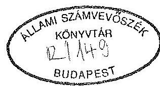

---

A vizsgálatot vezette:
dr. Kovácsné
dr. Pósfay Zsuzsanna
osztályvezető főtanácsos

A vizsgálatot végezte:

Korondi János
számvevő
Podonyi László
számvevő

---

# TARTALOMJEGYZÉK 

I. BEVEZETÉS
II. ÖSSZEFOGLALÓ MEGÁLLAPÍTÁSOK, AJÁNLÁSOK
III. RÉSZLETES MEGÁLLAPÍTÁSOK

1. A fő tevékenységekre és azok ellátására vonatkozó szabályozások
1.1. A Szerencsejáték Rt. létesítése, cégbejegyzése
1.2. A Szerencsejáték Rt. működését biztosító belső szabály-
zatok és egyéb utasítások
2. A Szerencsejáték Rt. vagyonmegőrző és vagyonhasznosító tevékenysége
2.1. Induláshoz kapott vagyon
2.2. Az SZRt. vagyonának alakulása
2.3. Az SZRt. költségvetési kapcsolatainak alakulása
2.4. Az SZRt. befektetéseinek alakulása
2.5. Az SZRt. által alapítványokba, közérdekű kötelezettségvállalásra fordított juttatások
3. Az SZRt. gazdálkodásának alakulása
3.1. A jövedelmezőség és eredmény alakulása
3.2. Költségek és ráfordítások alakulása
3.3. A gazdálkodás terén feltárt főbb hiányosságok, valamint a kártérítések alakulása
3.4. Az SZRt. létszám és bérgazdálkodása
3.5. Külföldi kiküldetések
3.6. Belső ellenőrzési tevékenység (szervezet, létszám, feladatvégzés) felülvizsgálata
4. A szerencsejátékok szolgáltatási színvonalának, gépesítésének alakulása

---

IV. VAGYONELLENŐRZÉSI IGAZGATÓSÁG
$\mathrm{V}-25-25 / 1992 / 93$.
Témaszám: 136.

# JELENTÉS 

a Szerencsejáték Részvénytársaság 1991-1992. évi működéséről és gazdálkodásáról

## 1 .

## BEVEZETÉS

Egy 46 évvel ezelőtt hozott kormányrendelet értelmében az 1947-ben bevezetett totó és az 1957-ben indított lottó-játék lebonyolítását - a Pénzügyminisztérium hatáskörébe utalva - az Országos Takarékpénztár (továbbiakban: OTP) végezte. Kezdetben a játékok bonyolítását főosztályi keretben, majd 1957-től igazgatósági rendszerben szervezték. Ekkor alakult meg a Sportfogadási és Lottó Igazgatóság (továbbiakban: SLIG), mely a totó- és lottószelvények, valamint a sorsjegyek értékesítésének szervezésével, a tevékenység szakmai irányításával 1990 végéig foglalkozott. A SLIG, bár az OTP keretein belül helyezkedett el, sajátos szervezet volt, működése a többi igazgatóságétól eltért.

A sportfogadási bevételek mindenkor erőteljesen és közvetlenül kötődnek a pénzügyi-költségvetési érdekekhez. A játékok extra-nyereségét - az OTP egyéb nyereségével együtt - a központi költségvetésbe kellett befizetni, ahonnan az egyes célok (sport, kulturális, szociális) között újra elosztották. A nyereség növelésére ösztönző rendszert azonban évtizedekig nem dolgoztak ki.

---

A Szerencsejáték Rt. megalakulása, alapítása

Az 1990. november 29-én hozott minisztertanácsi határozat végrehajtása érdekében az OTP tevékenységén belül előbb a nem pénzintézeti tevékenységet folytató totó-lottó üzletágat leválasztották, majd a pénzügyminiszter 1990. december 31-i hatállyal az OTP Sportfogadási és Lottó Igazgatóságából államigazgatási felügyelet alatt álló vállalat alapítását rendelte el. A vállalatot már a következő napon részvénytársasággá alakították. A Szerencsejáték Rt. (továbbiakban: Rt.) néven 1991. január 1-jétől működő szervezet főbb részei: vezérigazgatóság, szelvényfeldolgozó-helyek, 6 területi igazgatóság, mintegy 260 totó-lottó kirendeltség.

Az alapítás folyamatában az eredetileg 1.758 millió Ft-ban meghatározott állami vállalati saját vagyon az OTP-vel folytatott vagyonmegosztási tárgyalások eredményeként az Rt. rendezőmérlege szerint 1.818 millió Ft-ra növekedett. A 819 fős induló létszámú Részvénytársaság tevékenységi körébe sorsolásos játékként a lottó és a bingó, nem sorsolásos játékként a borítékos sorsjegyek, fogadásos játékként a totójátékok tartoznak. Az állami bevételek szempontjából a szerencsejátékok jelentőségét érzékelteti, hogy az Rt. 1991. évi nettó árbevétele 15.741 millió Ft, az 1992. évi pedig 14.112 millió Ft volt.

A vizsgálat alapvetően annak megállapítására irányult, hogy a Szerencsejáték Rt. a kezelésében lévő állami vagyonnal miként gazdálkodik. Az 1991-1992 évekre kiterjedő ellenőrzés négy kérdéskört érintett:

- A fő tevékenységekre és azok ellátására vonatkozó szabályozás.
- Az SZRt. vagyonmegőrző tevékenysége, továbbá a kezelésében lévő állami vagyon összetételének változása.
- Az SZRt. gazdálkodása tekintetében a mérleg szerinti eredményre ható főbb tényezők.
- A szerencsejátékok szolgáltatási színvonala.

---

A vizsgálat 1992. december 15-től 1993. március 26-ig - a vizsgálati jelentés ellenőrzött szervezet részére észrevételezésre átadásáig - tartott, amelyen belül a helyszíni vizsgálat 1992. december 15-én kezdődött és 1993. március 1-én fejeződött be.

# II. 

## ÖSSZEFOGLALÓ TAPASZTALATOK, AJÁNLÁSOK

## Összefoglaló tapasztalatok

A Szerencsejáték Rt. vizsgálata alapján - nem mindenben visszatérve a részletes megállapításokban foglaltakra - a működés jogi feltételei, a vagyonmegőrzés, vagyonhasznosítás, a gazdálkodás, a szolgáltatási színvonal tekintetében az alábbi, összefoglaló tapasztalatok fogalmazhatók meg.

A működés jogi feltételei:

A Szerencsejáték Rt. létesítésekor az alapítók a cégbejegyzés iránti kérelmet a törvényi határidőn túl, öt hónapos késéssel nyújtották be. Később az ÁVÜ a részvénytársasággá alakulást hasonlóan más esetekhez, melyeket az Állami Számvevőszék rendre kifogásolt - visszadátumozva hagyta jóvá. A Cégbíróság a Szerencsejáték Rt.-t bejegyezte és a bejegyzés jogerőre emelkedett.

A vizsgálat idején hatályban lévő, hiányosan elkészített - az OTP SLIG gyakorlatát követő - szervezeti és működési szabályzat nem biztosított megfelelő eljárási hátteret az Részvénytársaság működéséhez. Az új, részletes SZMSZ-t a vizsgálatot követően léptették hatályba.

---

Vagyonmegőrzés, vagyonhasznosítás:

Az Rt. induláskor kapott vagyona megfelelő volt a szerencsejátékok szervezéséhez. A vagyon átadásánál problémát jelentett, hogy az ingatlanok egy részének tulajdonjoga tisztázatlan volt. Megoldásként az OTP a kérdéses vagyonrészek helyett végül pénzeszközöket adott át, ami az Rt. pozíciói, vagyoni helyzete szempontjából előnyösnek bizonyult.

A játékadó bevezetéséig kedvező adózási feltételek között működött az SZRt. Jelenleg a társasági adó által meghatározott diktált költségek miatt (meghatározott költségszint túllépése adó-alapnövelő tétel) extra költségvetési elvonás érvényesül.

Az Rt. működése két évében jelentős vagyonnövekedésre tett szert. Vagyona az induláshoz viszonyítva 2 és félszeresére növekedett. Extenzív befektetési politikát folytatva a kaszinópiacon 1 milliárd Ft-os befektetéssel 70%-os részesedést szerzett. Ennek ún. működő része már az első, tört évben is megfelelő hozadékot biztosított, amelyet az Rt. visszaforgatott az ún. "forintos" kaszinók kialakításához.

A lóversenyzésben 1,2 milliárd Ft-os befektetéssel szerzett 90%-os részesedés hasznossága jelenleg nem ítélhető meg. E mélyponton lévő ágazat helyzete a befektetés óta is tovább romlott.

A dokumentumokból kitűnő erőfeszítések ellenére közel kétszeresére nőtt lóversenyzés vesztesége. Az 1991-ben 88 millió Ft-ot, 1992-ben pedig - előzetes adatok szerint - 160 millió Ft-ot elérő veszteségben különösen a korábbi évek pályafenntartási elmaradásainak, az érdeklődés visszaesésének volt szerepe.

---

Utóbbi a nyereményeket terhelő 20%-os adó bevezetésére és a játékok tisztaságát érintő, a Szerencsejáték Felügyelet beavatkozását kiváltó problémáknak tulajdonítható. Az elkészült koncepciók ismeretében ma csak remélni lehet, hogy a lóversenyzést az Rt. hosszabb távon nyereségessé tudja tenni.

Az említett két, milliárdos nagyságrendű befektetés mellett az Rt. több kisebb befektetésben is részesedést szerzett, amelyek közül eddig csupán egy hozott osztalékot. E befektetések jelentősebb hányada - az áttekintett dokumentumok, megismert prognózisok szerint - hosszabb távon jónak minősíthető. Néhány befektetésből azonban valószínűleg szükségessé válik a tőke kivonása.

Az Rt. igen jelentős összegeket - 1991-ben 480 millió Ft-ot, 1992-ben 1060 millió Ft-ot fordított - közérdekű kötelezettségvállalásra, alapítványok támogatására. A Szerencsejáték Alapon kívüli támogatások odaítélése előkészítési kötöttségeire, valamint a támogatások irányultságának, területeinek meghatározására, az ilyen kérelmek kielégítése elvi sorolására megfelelő belső szabályozást nem alakítottak ki.

Az 1992. évi eredménytartalékból való - összesen 236 millió Ft-os - támogatásoknál az Rt. elnök-vezérigazgatója minden esetben egyszemélyben döntött. Indoklása szerint a sürgős elbírálási igények miatt nem volt módja az erre a célra általa létrehozott, a belső szabályzatban szereplő, az objektív döntést szolgáló, az igazgatótanács tagjaiból álló háromtagú bizottság bevonására. Végül e testület anélkül, hogy egyetlen alkalommal véleményére támaszkodtak volna, beszüntette működését.

---

A Szerencsejáték Rt-t társasági adó kedvezmény igénybevételére jogosító, és a támogatni szándékozott alapítvány közérdekű kötelezettségvállalását igazoló okmányok az egyszemélyi döntések meghozatalakor általában nem álltak rendelkezésre. Sőt később sem minden esetben jutottak el az Rt. Számviteli Osztálya részére. Az alapítványi támogatásokhoz szükséges bizonylatok belső feldolgozási rendje zavarai miatt az Rt. nem vette teljeskörűen igénybe azokat az adókedvezményeket, melyekre egyébként lehetősége lett volna.

Az átvizsgált támogatások esetében az Rt. jogszabályt nem sértett és az adózás szabályai szerint - megfelelő időhatárok között - a kifogásolt esetekben az adókorrekcióra (visszaigénylésre is) lehetőség van. A támogatások bemutatott nagyságrendje mellett azonban ezen a társadalmilag érzékeny, közösségi érdekeket képviselő, fontos területen az ilyen eljárási mechanizmus, szubjektív döntési rendszer és belső nyilvántartás-információ átadás elfogadhatatlan, kétségeket ébreszthet a támogatások indokoltságát illetően.

# Gazdálkodás 

A játékok jövedelmezősége csökkent, a bingó 1992-ben veszteséget hozott. Néhány területen - elsősorban a reklámköltségekben - kiugró költségnövekedés tapasztalható. Ezek nagyobb részét objektív körülmények idézték elő, így a TV részéről a reklámárak emelése, valamint az Rt. reklámtevékenységének fokozása a konkurrens játékok ellensúlyozására.

Az Rt. szabad forrásainak lekötésénél három, összesen 62 millió Ft-os kölcsön kihelyezésénél és egy 65 millió Ft opciós ügyletnél nem járt el elég körültekintően, nem mérlegelt minden körülményt. Ugyanez vonatkozik a Danubius Rt.-vel kapcsolatos ügyletnél kifizetett 120 millió Ft-os kártérítésre is.

---

A "közérdekű kifizetés" címen nyújtott 236 millió Ft-os támogatás a gazdálkodás szempontjából a vagyon ezen részének ellenszolgáltatás nélküli átadását jelentette. Miközben a "közérdekűséget" bizonyító dokumentumok számos esetben, összesen 33 millió Ft átadására nézve a vizsgálat idején is hiányoztak. Bár a szabályok a támogatások adott formáit megengedték, azok - még ha társadalmilag hasznos célokat szolgáltak is - az állam érdekeivel nem feltétlenül egyeznek meg.

A vizsgált időszakban az Rt. szerződéses jogai érvényesítésében nem minden esetben járt el következetesen. A határidőre vissza nem fizetett kölcsönök behajtása iránt csak késve, a vizsgálat nyomán intézkedett. A kivitelezők által leadott költségterveket és költségszámlákat nem ellenőrizte megfelelően. Az átvizsgált vállalkozási szerződések az Rt. kötelezettségeit rögzítették, ugyanakkor a kivitelezőkkel szemben nem tartalmaztak szankciókat.

Az Rt. munkaerőgazdálkodása kiegyensúlyozott, megalakulása óta folyamatosan töltötte be az engedélyezett munkahelyeket. A szerencsejátékok és egyéb szolgáltatások ellátásához biztosították a létszámot és megfelelő szakmai összetételt. A dolgozók ösztönzésére az anyagi fedezet biztosított volt, azonban az alkalmazott bérrendszer a játékszelvény értékesítésben - a vezetőket kivéve - a teljesítmény növelésére csak kevéssé hathatott. Az alkalmazott jutalékok már nem ösztönzőek, mert az infláció miatt csökkent a vásárlóerejük.

Az Rt. belső ellenőrzése számos vizsgálatot végzett, azonban az ÁSZ által kifogásolt területek ellenőrzésére nem kapott megbízást. Nem állapíthatott meg ezért olyan mulasztásokat sem, amelyek személyi felelősség megállapítását igényelték volna.

---

A szolgáltatások színvonala

Magyarországon a totó-lottó játék szervezésének helyzete elfogadható, de a lebonyolítás és kiértékelés jelenlegi rendszere messze elmarad a nyugat-európai országokban elfogadott és szokásos színvonaltol.

A szolgáltatás színvonalára a reklamációk számából lehet következtetni. A reklamációk száma az OTP-től történt átvétel után a lottó játékszelvényeknél először növekedett, majd visszaállt a régi szintre. A növekedés nem tulajdonítható az átszervezésnek vagy a gyakoribb emberi hibáknak, hanem a megnövekedett szelvényszám nyomán bevezetett ún. "biankó szelvények" következménye. A totó tekintetében a reklamációk száma változatlan maradt. A reklamációk számának jelentősebb csökkenésére csak az új rendszer teljeskörű bevezetése után lehet számítani.

Az Rt. amikor a játékok lebonyolításának gépesítését megkezdte, olyan, a játékok szolgáltatási színvonalában - távlatilag - minőségi változás lehetőségét jelentő döntést hozott, amelyet a jogelőd 15 évig halogatott.

# A vizsgálat fogadtatása 

A vizsgálat nyomán az Rt. intézkedéseket kezdeményezett a feltárt hiányosságok egy részének megszüntetésére. Így hozzákezdett a kivitelezőkkel az előlegek és a vállalási összegek felülvizsgálatához, egyben csökkentéséhez; folyamatosan készítette az új SZMSZ-t, amelyet a vizsgálat lezárása után írnak alá; az alapítványoknak adott és le
 járt határidejű kölcsönök visszafizettetését kezdeményezte (eddig egy alapítványtól kapta vissza a kölcsönt).

---

A tulajdonosi jogokat gyakorló Állami Vagyonkezelő Rt. pedig arról adott tájékoztatást, hogy részletesen ellenőrizni fogja az észrevételezett hiányosságok kiküszöbölését, és külön figyelmet fordít társaságainál a támogatások elbírálási és elszámolási gyakorlatára.

# Javaslatok, a javaslatok 

A vizsgálati tapasztalatok bizonyítják, hogy a költségvetési-bevételi érdekből kulcsfontosságú vállalat, miközben pozíciója lehetőségeit kihasználva a vagyon gyarapításában jelentős eredményeket ért el, működése szabályozottsága, gazdálkodása, szolgáltatásai színvonala, a rábizott állami vagyon - pénzeszközök támogatási célokra átadásának eljárási mechanizmusa kifogásolható, illetve az állam tulajdonosi érdekeivel ütközik.

A vizsgálat alapján, figyelembevéve az eddig tett intézkedéseket is javasoljuk, hogy
az Állami Vagyonkezelő Részvénytársaság

- tulajdonosi jogkörében követelje meg, hogy a Szerencsejáték Rt. a rendelkezésére álló pénzeszközök támogatási célú felhasználásakor elveiben szabályozott, egyértelmű, az állam tulajdonosi érdekeivel összhangban álló, a szubjektív megoldásokat kizáró gyakorlatot folytasson;
- vizsgáltassa meg az állami monopólium gyakorlásával elért bevételekből származó "szabad" pénzeszközök felhasználását és készíttessen részletes elemzést a befektetések gazdaságosságáról;
- gondoskodjon arról, hogy hatáskörében a társaságalakítások során ne szülessenek olyan utólagos döntések, amelyek visszamenőleges hatályúak, s a kész helyzet tudomásulvételét szolgálják.

---

a Szerencsejáték Részvénytársaság

- szabályozza újra az eredménytartalékból juttatott támogatások elbírálásának és elszámolásának rendszerét;
- vizsgálja felül a meglévő befektetéseket, határozza meg az elvárható minimális hozadékot és az ezt el nem érő részesedéseket a piaci viszonyok figyelembe vétele mellett értékesítse;
- nagyobb súlyt helyezzen a takarékosságra, szorgalmazza a célra orientált és integrált reklámtevékenységet, javítsa az egységei között a munkakapcsolatot, gondoskodjon a megfelelő információáramlásról;
- gondoskodjon arról, hogy a szerződések és megállapodások az Rt. részére egyoldalú, hátrányt jelentő kikötéseket ne tartalmazzanak, előkészítésük megfelelő legyen, feleljen meg a versenyeztetés szabályainak, továbbá az Rt. érdekei a szerződések végrehajtása során következetesen érvényesüljenek;
- biztosítsa, hogy a belső bizonylatí, nyilvántartási és információs rendszer zárt, és az Rt. érdekei érvényesítésére alkalmas legyen;
- törekedjen a társaság bérgazdálkodásában az egységes elvek keretei között olyan konkrét feladatoknak megfelelő bérrendszer kialakítására, amely a lehető legközvetlenebb érdekeltséget teremt a bevétel növelését és befektetési célok minél jobb megvalósítását érintően;
- haladéktalanul gondoskodjon az alapítványi kölcsönfolyósítások kifogásolt eseteiben a felvett kölcsönök visszafizettetéséről.

---

# RÉSZLETES MEGÁLLAPÍTÁSOK 

1.) A fő tevékenységekre és azok ellátására vonatkozó szabályozások

### 1.1. A Szerencsejáték Rt. létesítése, cégbejegyzése

A pénzügyminiszter által 1990. december 31-én létesített Magyar Szerencsejáték Vállalat 1991. január 1-én történő részvénytársasággá alakítása részleteiben előkészítetlen és jogilag megalapozatlan volt. (1.-2. sz. melléklet)

E ténnyel is összefüggésben, az Alapszabályon szereplő 1990. december 31-hez (működés megkezdése: 1991. január 1.) képest több mint 5 hónappal később, 1991. június 18-án nyújtották be az Rt. cégbejegyzési kérelmét a Fővárosi Bírósághoz, mint Cégbírósághoz.

Az 1990. december 31-én történt vállalat létesítés és a másnapi, 1991. január 1-i részvénytársasággá alakulás előkészítetlenségére utal, hogy

- a Rt. létesítésével kapcsolatban 1990. december 20-i dátumú az OTP részéről készített "Átalakulási terv", amelyet 6 munkanapon belül miniszteri rendelet formájában jóváhagytak,
- figyelmen kívül hagyták azt az előírást, hogy a cégbejegyzési kérelem benyújtásához szükséges, hogy az átalakuló szervezet már be legyen jegyezve (erre ténylegesen 1991. május 15-én került sor; 3. sz. melléklet);

---

- az átalakulás Cégközlönyben - két alkalommal - történő kötelező közzétételére csak 1991. július 4-én és július 25-én került sor;
- 1991. októberében még ingatlanügyek is akadályozták a cégbejegyzést. Az apportban olyan ingatlanok is szerepeltek, amelyek az ingatlannyilvántartásban rendezetlenek voltak.

Az alapítás és az átalakulás vázolt megoldása indítékainak minden részlete a vizsgálat során nem volt tisztázható, mert az Rt. nem tudta az ÁSZ rendelkezésére bocsátani a szükséges dokumentumokat, s azok más forrásból sem voltak utólag beszerezhetők.

A Pénzügyminisztérium közlése szerint, a cégbírósági benyújtás késedelme az OTP átalakulása - e vizsgálat tárgyát nem érintő - általános nehézségeihez is kapcsolódott. A nem jogi személyként működő Sportfogadási és Lottó Igazgatóság először vállalattá, majd részvénytársasággá alakításáról született döntés. A vonatkozó, 1990. december 28-i pénzügyminiszteri rendeletben a végleges állapotnak megfelelő szövegezés került. A rendelet az OTP jogutódjaként a Szerencsejáték Rt-t jelölte meg. A cégbíróság azonban megtagadta a Szerencsejáték Vállalat bejegyzését, mert a hivatkozott rendelet az OTP jogutódjaként a szerencsejáték szervezési tevékenység tekintetében a Részvénytársaságot és nem a Vállalatot jelölte meg. Így jogszabálymódosításra volt szükség. Az új, 1992. május 7-i rendeletben a "Szerencsejáték Rt" megnevezés helyett a "jogutód szervezet" megnevezés szerepelt. A bejegyzési kérelmet ezt követően nyújtották be.

Az eljáráshoz kapcsolódik, hogy az Állami Vagyonügynökség (továbbiakban: ÁvÜ) Igazgatótanácsa 1991. május 29-i ülésén hagyta jóvá - visszamenőleges hatállyal a Magyar Szerencsejáték Vállalat 1991. január 1-i hatályú átalakulását.

---

Ezen, az ÁSZ által ismétlődően kifogásolt, visszatérő ÁVÜ gyakorlatból jelen esetben is az a következtetés vonható le, hogy a döntés formális volt. Lényegében a már befejeződött és az ÁVÜ hatáskörén kívül született, visszafordíthatatlan lépések utólagos szentesítését szolgálta.

Az Rt. cégbejegyzésére végül 1991. december 4-én került sor (4. sz. melléklet).

# 1.2. Az Rt. működését biztosító belső szabályzatok és egyéb utasítások 

Az Rt. a vizsgált időszakban a legszükségesebb belső szabályzatokkal rendelkezett. (5. sz. melléklet)

A vizsgált időszakban hatályban lévő belső szabályozás folyamatát meghatározta, hogy az OTP-től szétválás útján létrejött Rt. részére induláskor a korábbi belső szabályzatok, utasítások rendelkezésre álltak. Az SZRt. szervezett működését az alapításkor (1990. december 31-én) a már elkészült "A Magyar Szerencsejáték Rt. alapszabályzata" biztosította.

Az alapszabályzat egyes pontjait négyszer módosította az Rt. mielőtt az Rt. jelenleg érvényben lévő alapszabálya elkészült 1992. május 18-án.

A vizsgált időszakban, 1991-92-ben hozott vezérigazgatói utasításokat összevetve megállapítható, hogy az általános működési szabályokat tartalmazó vezérigazgatói utasítások, illetve szabályzatok megjelenése döntően a működés első évében, 1991-ben történt.

---

A Szerencsejáték Rt. Szervezeti és Működési Szabályzata

Az Rt. az alapítását követően már 1991. januárjában rendelkezett az Igazgatóság által jóváhagyott és ezen időszakban hivatalban lévő vezérigazgató által aláírt Szervezeti és Működési Szabályzattal.

Ez a vizsgálat idején is hatályban lévő SZMSZ azonban tartalmilag hiányos volt, mert

- csak az első része készült el, melyben semmiféle utalás nem történt arra vonatkozólag, hogy a második rész mikor készül el és milyen előírásokat tartalmaz;
- a vizsgálat idején is hatályos SZMSZ többek között nem tartalmazta:
= az Rt. alapadatait (társaság neve, székhelye, fióktelepei, működési területe, megalakulásának és tevékenységek megkezdésének időpontja);
= az Rt. alapítását, tevékenységi körét, jogállását;
= az Rt. szervezeti felépítését;
= az Rt. működésének általános szabályait (törvényességi felügyelet, alaptőke és részvény, cégbejegyzése, részvény átruházása, a részvényes jogai);
= az Rt. működésére vonatkozóan a vezetési, tervezési és az érdekeltségi rendszert; a vállalkozás, a pénzgazdálkodás, a számvitel folyamatát; a vezetők, beosztottak általános feladatait, hatáskörét és felelősségét; szolgálati út, függőmi kapcsolat; szervezeti egységek együttműködését; munkabizottságokat; helyettesítések, munkakör átadások rendjét; külső kapcsolattartás, képviselet módját; munkaköri leírás rendjét.

---

Mint már utalás történt rá, az Rt. a vizsgált időszakban jelentős, több százmillió forintos nagyságrendben támogatott alapítványokat. Mind a támogatások nagyságrendje, mind száma és sokfélesége indokolta volna, hogy a térítés nélküli vagyonkihelyezésnek e módját szabályozzák. Sem a hatályos SZMSZ sem más előírás nem tartalmazott azonban arra rendelkezést, hogy az eredménytartalékból történő támogatásoknál miként kell az előkészítés és döntés során eljárni. A vonatkozó vezérigazgatói utasítás, amelynek tartalmáról és betartásáról a 2.5. alatt részletesen szólunk nem tekinthető érdemi útmutatásnak.

A helyszíni vizsgálat lezárását követően készült és lépett hatályba az új, sokkal részletesebb SZMSZ. Ez sem rendelkezik azonban az eredménytartalékból való támogatások rendjéről.

A játékok szervezését biztosító szabályzatok

A sportfogadás (totó), a számsorsjáték (lottó), a különböző sorsjátékok (BONGÓ, KORONA Kéthuszas, Kabala-sorsjegy, Gyors-lutri, GÉNIUSZ) és a borítékos sorsjáték szervezésére, bonyolítására, részvételi szabályzatára, játéktervére vonatkozó engedélyezési, jóváhagyási határozatok a Pénzügyminisztériumtól és a Szerencsejáték Felügyelettől rendelkezésre állnak.

A borítékos sorsjegyek értékesítéséhez és egyéb új sorsjátékok bevezetéséhez a Vám- és Pénzügyőrség, továbbá a PM engedélye is szükséges. Ezen engedélyek beszerzése is megtörtént.

A szerencsejátékok lebonyolításának és szelvényfeldolgozási munkálatainak ellenőrzését a szerencsejáték törvény megjelenéséig, 1991. augusztus 31-ig a Pénzügyminisztérium ellenőrei látták el. A törvény megjelenése után már az ellenőrzéseket a Szerencsejáték Felügyelet látja el.

---

A szolgáltatás teljesítésében az OTP-nek és a Magyar Posta Vállalatnak meghatározó közreműködése van. Velük megfelelő megállapodásokat kötöttek, az abban előírtakat betartották.

A jogérvényesítés módja az Rt.-nél

A jogi ügyek napi intézése centralizált. A területi igazgatóságok önálló jogi képviselettel nem rendelkeznek. A Vezérigazgatóság Jogi és Igazgatási Főosztálya látja el a képviseletet. A vizsgált időszakban a főosztály 1.383 peres ügyben látott el jogi képviseletet. A perek jellemzően a fogadói reklamációkhoz (pl. szelvények elvesztése) kapcsolódtak, döntő többségükben - a szolgáltatót védő szabályok nyomán - az Rt. előnyére záródtak le.

Az Rt. szabályozta a szerződéskötések és a kintlevőségek behajtásának rendjét. A szerződéskötések rendje decentralizált, vagyis a megfelelő szakterületeken az illetékes osztályok feladata ezek elvégzése. A 100 ezer Ft feletti összegű szerződéseket minden esetben az Elnök-vezérigazgató írja alá. Az SZRt Igazgatósága felhatalmazása alapján az SZRt elnök-vezérigazgatója külön hozzájárulása nélkül 30 millió forintos egyedi értékhatárig más társaságokban akár meglévőkben, akár alakulókban - érdekeltséget szerezzen az igazgatósági keret határáig. (15.melléklet)

# A leltározás, selejtezés rendjének szabályozottsága 

Az Rt. központjában lévő tárgyi eszközök nyilvántartása az elnök-vezérigazgatói utasítás előírásai alapján történik. A vizsgált időszakban az SZRt. rendelkezett Leltározási és Selejtezési Szabályzattal. A leltározási szabályzat 1991. március 1-i, míg a selejtezési szabályzat március 25-i hatállyal készült el.

---

A leltározások előírás szerinti végrehajtására "Leltározási Utasítás és Ütemterv" készült 1992-ben. A vizsgált időszakban az évi fordulónapi leltározásokat végrehajtotta az Rt. Megtörtént a raktári készletek leltározása során megállapított készletértékek összehasonlítása a főkönyvi nyilvántartással.

A selejtezéseket (készletek, tárgyi eszközök) a kiadott szabályzat szerint a rendszeresített, szabályosan kitöltött nyomtatványokon végezték el. Az Rt. mérlege leltáron alapult, az eszközök és források értékelése a hatályos jogszabályoknak megfelel.

Az Rt. beruházási rendje

Az állóeszközök (1992. január 1-je után "tárgyi" eszköz értendő), beruházások lebonyolításának, elszámolásának és nyilvántartásának rendjéről szóló elnök-vezérigazgatói utasítás 1991. október 1-jével lépett életbe, de rendelkezéseit visszamenőleges hatállyal kellett végrehajtani. Így 1991. és 1992. évi beruházásokat már ezen utasítás szabályozta. Hiányzik azonban ezen elnök-vezérigazgatói utasítás alapján álló, az Rt. egészére vonatkozó beruházási szabályzat.

A fejlesztési pénzeszközök gondos, gazdaságos felhasználása szempontjából az ellenőrzés kiterjedt arra, hogy a szabályozás mit ír elő a döntési jogosultsággal, a beruházások nyilvántartásával és a beruházások ellenőrzésével kapcsolatban, és ezekre vonatkozóan az előírások a gyakorlatban hogyan érvényesültek.

---

A kötelezettségvállalásról, utalványozásról szóló vezérigazgatói utasítás értelmében a vezérigazgató az Rt. nevében - a jogszabályok keretei között - összeghatárra való tekintet nélkül önállóan vállalhat mindenre kiterjedő kötelezettséget és utalványozhat.

A beruházásokra és a hálózatfejlesztési költségkeretek terhére a budapesti és vidéki beruházásokra, átalakítási-fejlesztési munkákra a Hálózatfejlesztési Osztály vezetője - a jóváhagyott éves beruházási és pénzügyi kereteken belül - 1 millió Ft értékhatárig vállalhat kötelezettséget és utalványozhat.

Egy 1991
 júliusában kelt elnök-vezérigazgatói utasítás szerint minden 100 ezer Ft feletti számlát kifizetés előtt aláírásra az elnök-vezérigazgatóhoz be kell nyújtani. A Számviteli és Pénzügyi Osztály átutalás céljából csak az Rt. első számú vezetője által igazolt számlákat fogadja el.

A beruházások előkészítését és lebonyolítását, a beépítésre kerülő gépek, berendezések és egyéb eszközök beszereztetését a Budapesti Területi Igazgatóságon és a központban a Hálózatfejlesztési Osztály végzi. A beruházások műszaki ellenőrzés ellátása, megvalósításának ellenőrzése is szintén ezen osztály feladata.

Az osztály ellenőrzési tevékenységének hibájaként róható fel, hogy a kivitelezőtől nem követelik meg az átalányáras munkák esetében is a "Felmérési napló" vezetését, bár a vonatkozó elnök-vezérigazgatói utasítás értelmében a számlán csak az szerepelhet, ami a naplóban is dokumentálva van.

---

Az egyes elvégzett beruházási munkák során az alábbi hiányosságok fordultak elő:

- A költségvetésekben a különböző munkákra megállapított árak eléggé magasak. Különösen igaz ez a megállapítás a PROVIZÍÓ Rt. által végzett munkákra. Ezen Rt-nél a vállalkozási szerződés megkötése után - még a munkák megkezdése előtt - a vállalkozási összeg 20-40%-át utalták át előlegként a vállalkozó számlájára.
- Az átalányáras szerződéseknél beállított 10%-os tartalékkeret felhasználása nem lett feltételhez kötve, vagyis nem határozták meg, hogy milyen előre be nem tervezett munkák esetében használható fel a keret. Így minden esetben kifizették a betervezett összeget.
- Nem tartották be annak a vezérigazgatói utasításnak az előírásait, amely kimondja, hogy a szerződéseket megkötésük előtt - előzetes jogi véleményezésre - az Igazgatási Önálló Osztálynak be kell mutatni.

Az Rt. rendelkezett éves beruházási tervvel. Az 1992. évi beruházási tervet azonban az Állami Vagyonügynökség csak későn, augusztus 6-i dátummal hagyta jóvá. A beruházási munkák megvalósításának helyszíni ellenőrzését az Rt. központjában és a budapesti Területi Igazgatóságon a Hálózatfejlesztési Osztály végezte.

A beruházásoknak érvényes jogszabályok és kiadott vezérigazgatói utasítások szerinti végrehajtásának ellenőrzését a központban a belső ellenőr, míg a Területi Igazgatóságon az ellenőrzési csoport megfelelő színvonalon végezte el, amit a belső ellenőri jelentések is alátámasztottak. Igazgatósági szinten hat, a Központban egy jelentés készült e téma-

---

körben, amelyből a belső ellenőr készített összefoglalót az Elnök-vezérigazgató részére. A vizsgálat érdemi elmarasztaló megállapításokat nem tartalmazott.
2.) Az Rt. vagyonmegőrző és vagyonhasznosító tevékenysége

# 2.1. Induláshoz kapott vagyon 

A társaság indulásához 1.818 millió Ft vagyont kapott. A kapott vagyon nagysága és összetétele megfelelően biztosította a szerencsejátékok szervezésének ellátását. Az Rt. alaptőkéjéből 1.461 millió Ft a pénzbeli hozzájárulás és 357 millió Ft a nem pénzbeli apport.

Az alaptőke átadásánál problémákat jelentett, hogy az OTP által átadott apportlista rendezetlen helyzetű ingatlanokat tartalmazott. Az apportlista eltért az ingatlanok tulajdonlapjain szereplő címektől. Több ingatlan nem volt telekkönyvezve, illetve nem volt az OTP kezelői, vagy tulajdonjoga bejegyezve.

A tulajdonviszonyok rendezése hosszabb időt igényelt, ami gátolta a cégbírósági bejegyzését, ezáltal az Rt. társaságok alapításában való részvételét (alakulás 1991. január 1., cégbírósági bejegyzés 1991. december 4.).

A vitás tételek feloldásaként az OTP a nem pénzbeli apport egy része helyett is pénzbeli hozzájárulást fizetett 50 millió Ft értékben, amely az összes átadott apport 3%-át teszi ki.

---

# 2.2. Az Rt. vagyonának alakulása 

Az Rt. működése 2 éve alatt vagyonát 247%-kal növelte.

|  |  |  |  | millió Ft-ban |
| :--: | :--: | :--: | :--: | :--: |
| Megnevezés | $\begin{aligned} & 1991. \\ & 1.01. \end{aligned}$ | $\begin{aligned} & 1991. \\ & 12.31. \end{aligned}$ | $\begin{aligned} & 1992. \\ & 12.31. \end{aligned}$ | Vált. %   1992/nyitó |
| Jegyzett tőke   (alapítói vagyon)   Vagyonváltozás   egyenlege | 1.818 | 1.818 | 1.818 | 100 |
| Saját tőke | 1.818 | 4.065 | 4.497 | 247 |

Az Rt. vagyonnövekedésének forrása a mérleg szerinti eredmény.

- 1991. évben 2.247 millió Ft-tal nőtt a vagyon. Ez 2.252 millió Ft mérleg szerinti eredmény és 5 millió Ft eredménytartalék felhasználás egyenlege.
- 1992. évben 432 millió Ft-tal nőtt a vagyon. A növekedés 697 millió Ft mérleg szerinti eredmény és 265 millió Ft eredménytartalék évközi felhasználásának (döntően közérdekű célok támogatására fordított összegek) a különbözete.

Az Rt. éves mérlegeiben kimutatott eszközeinek vizsgálatából megállapítható, hogy jelentősen növekedtek a befektetett pénzügyi eszközök.

A részesedések 1991. évről 1992-re 24 millió Ft-ról 1.483 millió Ft-ra növekedtek. Elsősorban ennek következményeképpen a pénzeszközök közül a bankbetétek 3.421 millió Ft-ról 1.547 millió Ft-ra csökkentek. (6. sz. melléklet)

---

# 2.3. Az Rt. költségvetési kapcsolatainak alakulása 

Az Rt. működése során jelentős összegeket fizetett a költségvetésbe. Támogatásban és adókedvezményben nem részesült.

|  |  | millió Ft-ban |  |
| :-- | --: | --: | --: |
| Megnevezés | 1991. év | 1992. év* | % |
| Társasági adó (VANYA) | 1.703 | 1.304 | 77 |
| Személyi jövedelemadó | 1.675 | 1.541 | 92 |
| Játékadó | 413 | 1.174 | 284 |
| Egyéb adó | 32 | 265 | 828 |
| Összesen | 3.823 | 4.284 | 112 |

*Várható adat

Az állam a szerencsejátékok hasznát a társasági adóval vonja el az Rt.-ből. Adózás technikai eljárása az, hogy a bevételekkel szemben nem a tényleges ráfordításokat, hanem a társasági törvény által diktált költségszintet állapít meg. Ennek az a következménye, hogy a jelentős nyereségcsökkenés ellenére a fizetendő adó csak kisebb mértékben csökken, mivel a társasági adó törvény a szelvények eladási árának (20 Ft) 20%-ában (4 Ft) határozza meg a költségszintet - költségszint az elvonásokat és a szükség szerint felhasználandó költségeket sem fedezi -, az e fölötti költségeket adóalapnövelő tételként kezeli. Az általánosan 40%-os társasági adó az SZRt. esetében összességében 60% feletti. 1992. évben a társasági adótörvény e tétele 1.154 millió Ft adóalap növekedést jelentett a társaságnak.

A fizetendő nyereségadó mértéke 1992. évben a totónál 48%, az 5 a 90-ből lottónál 69%, 6 a 45-ből 279%, vagyis az utóbbi esetben az elvonást a képződött nyereség nem fedezi. A társasági adón keresztül megvalósuló extra elvonás a költségfelhasználás optimalizálása mellett is árnövelés irányába hat.

---

A játékadó növekedésének oka az, hogy az adókötelezettség csak 1991. év közben lépett be, addig kedvező adózási feltételek között működött a társaság.

Az egyéb adóknál a műszaki fejlesztési hozzájárulás 1992. évi belépése eredményezett növekedést.

# 2.4. Az Rt. befektetéseinek alakulása 

Az Rt. működése során jelentős befektetéseket valósított meg. Ezt hatékony gazdálkodás tette lehetővé.

A társaság főleg 1991-ben magas kamathozadékot biztosító értékpapírok helyett vállalkozásokban szerzett részesedést, stratégiai befektetéseket valósított meg. Több üzletágban bővítette addigi tevékenységét. Legjelentősebb térnyerése a lóverseny üzletágban és a kaszinójátékokban történt. Folyamatban van a gépesített szelvényfeldolgozási rendszer kiépítése, valamint tervezik egy saját szelvénynyomda megvalósítását. Az Rt. több kisebb vállalkozásban is részesedést szerzett.

Az Rt. 1991-ben 3 befektetést eszközölt 24 millió Ft pénzügyi teljesítéssel, 24 millió Ft befektetést valósított meg 21 millió Ft törzsbetét szerzése mellett. Osztalékot csupán egy befektetésből kapott 0,3 millió Ft értékben, mivel a másik két befektetése év végére esett.
1992. évben 13 vállalkozásban történt üzletszerzés 1.460 millió Ft pénzügyi teljesítéssel. A megszerzett 1.261 millió Ft törzsbetéthez 1.960 millió Ft befektetési összeg szükséges, amely az esedékességkor rendelkezésre áll.

---

Osztalékot 0,3 millió Ft értékben csupán az előző évben is nyereséges Rt. KB Bt. utalt. A már működő devizás kaszinókban szerzett részesedésnél a tört évben is keletkezett nyereség, amelyből az Rt.-t 72 millió Ft illette (14% tőkemegtérülés), de ezt az összeget visszaforgatták a forintos kaszinók kialakítására. (A befektetések tételes felsorolását, a törzsbetéteket és a részesedési hányadot a 7. sz. melléklet tartalmazza.)

# Kaszinó játékokba történt befektetések 

Az Rt. a Casinó Ausztriával együtt (70-30%-os megosztásban) a magyar kaszinópiacon többségi részesedést birtokol. Az Rt. az Első Magyar Játékkaszinó Kft.-be 763 millió Ft-ot, a Magyar Játékkaszinó Kft.-be pedig 203 millió Ft-ot fektetett be. A már működő devizás kaszinók eddig is jó jövedelmezőségűek. A folyamatosan beinduló forintos kaszinókba befektetett tőke megtérülése is kedvező, átlagos hozamokkal számolva.

## Lóversenyzés terén szerzett részesedések

Az Rt. a Nemzeti Lóverseny Kft.-be 357 millió Ft-ot a Magyar Lóversenyfogadás szervező vállalkozásba 3 millió Ft-ot fektetett be. A Kft.-ben 88,6%-os részesedést szerzett (1.064 millió Ft törzsbetét) 1.163 millió Ft befektetés mellett.

Az Rt. kedvező fizetési feltételek mellett (10 évi részlet) jutott az üzlethez. A lóverseny üzletág azonban jelenleg mélyponton van, s az átvétel óta a veszteség tovább nőtt.

---

Évek óta nem volt fejlesztés, elavult a pálya és környezete, a versenyek tisztasága megkérdőjelezhető. Hiányzik a széleskörű fogadási lehetőség, nem megfelelő a reklám. A bevezetett 20%-os forrásadó, amely csökkenti a nyereménya1apot, jelentősen visszavetette a forgalmat, s az sem szolgálta az érdeklődést, hogy a Szerencsejáték Felügyeletnek több alkalommal kellett a fogadás tisztaságának kétségessége miatt fellépnie.

Az Rt. jelentős munkaráfordítással próbálja nyereségessé tenni az üzletágat:

- Korszerűsítette a versenyszabályzatot, folyamatosan átszervezi és fejleszti a versenyrendszert.
- Átfogó koncepciót dolgozott ki a fogadási kör szélesítésére (folyamatos TV közvetítés, fogadóirodák létrehozása). A szükséges fejlesztésekhez külső tőkét is be kívánnak vonni.

A lóversenyüzletágban megvalósítandó feladatok és fejlesztések nem kockázatmentesek, összetettek, időben egymásra hatnak, ezért nem teszik lehetővé a hosszútávú folyamatok alakulásának, s a jelenidőben megtett intézkedések következményeinek egyértelmű előrejelzését.

# Egyéb befektetések 

Az egyéb befektetések, - amelyek törzsbetétje fél millió és 55 millió Ft között alakul - döntő többsége rövid távon is magas osztalékot biztosíthat, mert gazdasági eredményeik a vártnál kedvezőbben alakulnak.

---

Néhány részesedés értékesítésének megvizsgálása viszont indokolt, s így éppen a legnagyobb 55 millió Ft lekötéstől nem várható rövid távon osztalék. Az ilyen nyereség nélküli lekötések későbbiekben a növekvő kötelezettségek (pl. gépesítés lízingje) teljesítése mellett a likviditást kedvezőtlenül befolyásolhatják.
2.5. Az Rt. által alapítványokba, közérdekű kötelezettségvállalásra fordított juttatások

A társasági adóról szóló, 1992. január 22-én hatályba lépett törvény szerint a gazdálkodó szervezetek alapítványokat támogathatnak. Azon alapítványok esetében pedig, amelyek az APEH igazolása szerint "közcélú"-nak minősülnek a nyújtott támogatás jelentős, mert adóalapot csökkentő tétel. Meg kell azonban jegyezni, hogy a "közcélúnak" minősítést meglehetősen laza keretek között értelmezhetik.

Az Rt. működése két évében 1,5 milliárd Ft-ot fordított közérdekű célokra a következő forrásokból (a tételes felsorolást a 8. sz. melléklet tartalmazza).

|  |  | millió Ft-ban |
| :-- | :--: | :--: |
| Megnevezés | 1991. év | 1992. év |
| Eredménytartalékból | - | 236 |
| Lottó nyereményalapból | 181 | 36 |
| Szerencsejáték alapba fizetve | 248 | 791 |
| Összesen | 480 | 1060 |

A
 támogatás összege a két év között kétszeresére emelkedett. A támogatások fizetésének nagyobb részét jogszabályok írják elő.

---

- Eredménytartalékból az Rt. saját elhatározásból eszközölt támogatásokat.
- 1991. április 1-től július 15-ig a társaság a nyereményalapból meghatározott részt elkülöníthetett (5%), s ezt saját belátása szerint használhatta fel támogatásra.
- 1991. július 16-tól a nyereményalap meghatározott részét a Szerencsejáték Alapba fizeti a társaság.

Az elkülönített nyereményalapokból történt támogatások odaítélését az Igazgatóság végezte el. Figyelembe véve a beérkezett igényeket és az Rt. üzleti érdekeit sport, kulturális és egészségügyi célokat támogattak. Az Igazgatóság rendszeresen, félévente tételes tájékoztatást kapott arról, hogy kinek, mikor és pontosan mekkora összegű támogatást nyújtott az Rt.

E tény ellenére az eredménytartalékból történt támogatások szabályozása és különösen a kapcsolódó napi eljárási gyakorlat nem megfelelő az SZRt-nél.

A működés megkezdése után másfél évvel kiadott és 1992. július 1-én hatályba lépett elnök-vezérigazgatói utasítás ugyan foglalkozik a támogatások odaítélésének és elszámolásának rendjével, mely szerint három tagú választott bizottság készíti elő a döntéseket az Igazgatási és Jogi Főosztály koordinálása mellett, de a döntések megalapozásához nem ad további támpontot, s a gyakorlatban még a benne foglaltakat sem valósították meg. (10., 11. melléklet)

A döntéseket az elnök-vezérigazgató hozza, bizottsági előkészítés nélkül. A bizottság ugyan formálisan megalakult, ügyrendet azonban már nem dolgozott ki és tényleges feladatokat sem látott el.

---

Az 1992. szeptember 3-án kelt Emlékeztetőben a bizottság bejelenti - az el sem kezdett közreműködésének megszüntetését, arra hivatkozva, hogy az Elnök-vezérigazgató által elbírált sürgős és kivételes méltánylást igénylő kérelmek miatt csekély a rendelkezésre álló összeg. (12. melléklet)

Az állami vagyon, a pénzeszközök védelme szempontjából elfogadhatatlan az Rt. azon gyakorlata, hogy a támogatások folyósítása nem ritkán megelőzi az alapítványoktól a szükséges iratok beszerzését (adólevonási jog, alapszabály). Jogszabály ugyan nem tiltja ezt az eljárást, de a támogatások elbírálásának objektivitását kérdésessé teszi.

Az 1992. évi társasági adóbevallás idejéig (1993. február 28.) a Számviteli és Pénzügyi Osztálynak 130 millió Ft alapítványi kifizetésről nem volt adólevonási igazolása, tehát ezzel az összeggel az adóalapot módosítani kellett.

Az Rt.-nél a vizsgálat befejezésekor 33 millió Ft kifizetése mellett nem található kedvezmény igénybevételére jogosító igazolás az alapítványoktól. Ez azzal a joghátránnyal jár, hogy az SZRt. e tételeknél nem érvényesítheti a társasági adó mentességet közérdekű kötelezettségvállalásként.

# 3. Az Rt. gazdálkodásának alakulása 

Az Rt. gazdálkodási eredménye 1992-ben, 1991. évhez viszonyítva csökkent. A jövedelmezőség romlásának fő oka a tervezett bevételek elmaradása, de szerepet játszik a növekvő költségvetési elvonás és néhány területen a kiugró költségnövekedés. Az Rt. gazdálkodása összességében jó, de az eddigi működése során néhány gazdálkodási hiányosság is felmerült.

---

# 3.1. A jövedelmezőség és eredmény alakulása 

A jövedelmezőség csökkenését az egy szelvényre jutó fajlagos mutatók jól reprezentálják.

|  |  |  |  |  |  |  |
| :-- | --: | --: | --: | --: | --: | --: |
| Megnevezés | Totó |  | Lottó | $(5 / 90)$ | Lottó | $(6 / 45)$ |
|  | 1991. | 1992. | 1991. | 1992. | 1991. | 1992. |
| Eladási ár | 16,5 | 20,0 | 18,4 | 20,0 | 17,4 | 20,0 |
| Ráfordítás | 12,6 | 16,7 | 14,9 | 17,7 | 14,7 | 20,6 |
| Eredmény | 3,9 | 3,3 | 3,5 | 2,3 | 2,7 | $-0,6$ |

A táblázatból megállapítható, hogy a 6 a 45-ből lottójáték az Rt. szempontjából már a társasági adó megfizetése előtt is veszteséges, ugyanez mondható el a bingó sorsolásos játékra is.

Az eredményre ható tényezőket vizsgálva megállapítható, hogy a jövedelmezőségi mutatók romlása mellett elsősorban a forgalom visszaesése miatt csökken az eredmény.

A forgalomvisszaesés az 5-ös lottónál az 1990-91-es évekhez viszonyítva jelentős, de az 1992. évi szintje megfelel az OTP régebbi átlagos mutatóinak.

A totó üzletágban az Rt. a korábban az OTP-nél forgalmazott szelvényszámhoz képest, jelenleg csupán a felét értékesíti. Ez a jelentős visszaesés az eladási ár 20,- Ft-ra való emelése után következett be. A csökkenésben emellett szerepe lehet a nem megfelelő reklámnak, csapatkiválasztásnak, valamint annak, hogy az SZRt. és a labdarúgás között a támogatási és érdekrendszer a vizsgált időszakban még nem volt megnyugtatóan megoldva.

---

A totójáték forgalmának növelése azért is indokolt, mivel ennek a játéknak a legjobb a nyeresége.

Az Rt. 1991. évben 15.741 millió Ft, 1992. évben 14.112 millió Ft bevételt ért el a játékokból. A bevétel kétharmad része a lottóból, 20%-a a totóból származott.

Az Rt. mindkét évben 800 millió Ft feletti pénzügyi és rendkívüli bevételre tett szert. Az Rt. jó pénzügyi műveletekkel - kihasználva a magas kamatokat - jelentősen hozzájárult nyeresége növeléséhez.

Az Rt. 1991-ben 2.252 millió Ft, 1992-ben pedig 697 millió Ft mérleg szerinti eredményt ért el. Az eredménycsökkenés legfőbb oka a játékokból befolyt bevétel 1.628 millió Ft-tal való visszaesése, továbbá a játékadó bevezetése miatt 760 millió Ft és a költségvetési többlet elvonás miatt 460 millió Ft volt.

Az adózott eredményből 1991. évben 200 millió Ft, 1992. évben 182 millió Ft osztalék került jóváhagyásra.

# 3.2. Költségek és ráfordítások alakulása 

Az Rt. költségei és ráfordításai összességében 2,6%-kal növekedtek (332 millió Ft). A forgalomcsökkenés változó költségeinek csökkenését kiegyenlítette néhány költségfajta növekedése. Az állandó kiadások a forgalom visszaesésekor növelik a fajlagos költségeket. Az egyes költségfajták évenkénti alakulását a 9. sz. melléklet tartalmazza.

Kiugró költségnövekedés a következő területeken következett be.

---

# Társadalombiztosítási kötelezettség 

Az Rt. az 1991. évi 236 millió Ft-tal szemben 1992. évben 397 millió Ft társadalombiztosítási kifizetést eszközölt. A változás egyik oka a 20%-os bérfejlesztés áthúzódó hatása. Legjelentősebb növelő tényező a megbízásos díjak után fizetett társadalombiztosítási kötelezettség jogszabályváltozása. (1992. március 1-től nem a kifizetett összeg 50%-a, hanem a teljes összeg után kell az Alapba fizetni.) Az Rt. a megbízásos dolgozók egészségügyi és nyugdíjbiztosítását is átvállalta.

## Reklámköltség

Az Rt. reklámköltsége 159 millió Ft-ról 551 millió Ft-ra emelkedett. Elsősorban a sajtónak, rádiónak és a TV-nek fizetett reklám-, propagandaköltségek, valamint a szponzorálási díjak emelkedtek kiugróan. Az emelkedés oka a szolgáltatás díjainak és számának növekedése. A szerencsejátékok piacán a játékok nagy számú terjedése miatt csak erőteljes reklámtevékenységgel lehet a részesedést megtartani. Összehangoltabb, integráltabb reklámtevékenységgel - párhuzamos és egymásra ható reklámok - elkerülhető lehet a költségek további növekedése.

Az egyéb ráfordítások közül a játékadó egész évi hatása, illetve az eredményt terhelő általános forgalmi adó jelent növelő tételt.
3.3. A gazdálkodás terén feltárt főbb hiányosságok, valamint a kártérítések alakulása

## Kölcsönfolyósítások

Az Rt. az alapítványi támogatások mellett néhány alapítványnak kölcsönt is folyósított. Az alapítványok kötelezettségeikért csak a vagyonuk erejéig felelnek. Folyamatos bevételre

---

általában nem számíthatnak, főleg a támogatásokból van bevételük. A leírtak miatt a hitelező intézetek az alapítványokba a kockázatos visszafizetés miatt nem helyeznek ki szabad pénzeszközöket.

Az Rt. mellőzve az elvárható üzleti gondosságot három alapítvánnyal (Tulipán, Nemzeti Transsylvánia, Pro Professione) kötött 61,7 millió Ft összegben hitelezési szerződést.

A folyósított összeget a lejárat napjáig a kötelezettek nem fizették vissza. A vizsgálat befejezéséig egy tartozás lett rendezve. Az alapítványok támogatására nagy számú kérés érkezik a részvénytársasághoz. Az előbb említett esetekben az Rt. engedve a külső nyomásnak nem üzleti megfontolások alapján folyósította a hitelt.

Cél-West Kft.-vel kötött opciós megállapodás

Az Rt. a Cél-West Kereskedelmi és Lizing Kft.-nek az 1991. november 26-án kötött megállapodás (1991. május 31-i emlékeztetőre hivatkozva) alapján 65 millió Ft-ot utalt át a Kft. kamatköltségeinek fedezetére. Az Rt. az átutalt összeg ellenében megvásárlási lehetőséget szerzett volna a Cél-West Kft.-nek a Cél-Lizing Rt-ben lévő részvényeire. A részvények vásárlására külön konkrét megállapodással az Rt. nem rendelkezik. Egy 1992. szeptember 2-án kelt megállapodás alapján az átutalt összeget az Rt. 1992. decemberében visszakapta.

Az állam tulajdonosi érdekeit sérti, hogy az Rt. pénzét a Kft. egy évig ellenérték nélkül használta. A megkötött megállapodások hátrányosak voltak az Rt. számára; pl. az 1991. november 26-án kelt megállapodás azt tartalmazza, hogy ha az Rt. megadott időtartamon belül nem nyilatkozik a vásárlásról, akkor a Kft. nem kötelezhető az átvállalt kamatköltségek visszafizetésére. Ez az opciós üzlet nem volt megalapozott.

---

# Kártérítések 

Az Rt.-t ért károk legfőbb oka a bizományosok által eladott szelvények után befolyt összegek befizetésének elmaradása, valamint a kollektív totóval kapcsolatos perek során megítélt összegek. A fenti károk összege a két év során 71,5 millió Ft volt.

Az Rt. 1991. decemberében szándéknyilatkozatot, majd szerződést írt alá a Danubius Szálloda és Gyógyüdülő Rt.-vel, melyben a kaszinó üzletrész megvásárlását rögzítették. Ebben 120 millió Ft kártérítési lehetőség szerepel mindkét fél számára, ha a másik fél hibájából elmarad az üzletkötés. A szerződés 400 millió Ft 1991. december 31-ig történő előleg átutalását is előírja SZRt. számára. Az átutalás nem jött létre (személyi mulasztás is közrejátszott), így az üzlet sem, ezért az SZRt. kártérítést fizetett. A két fél később új feltételekkel megkötötte az üzletet a kaszinók megvásárlása vonatkozásában, a korábbinál 100 millió Ft-tal alacsonyabb áron.

Az Rt 1992-ben kártérítés címén végül kifizette 120 millió Ft-ot, mely megfizetése elkerülhető lett volna. A kártérítés jogossága - a rendelkezésre bocsátott iratok alapján - nem egyértelmű, de az Rt. a hosszabb távú jó üzleti kapcsolatokra hivatkozva a pereskedés helyett a kártérítés átutalását választotta. Megfelelő üzleti elemzéssel azonban ezt nem támasztotta alá, ezért az üzleti gondosság szempontjából eljárását kifogásoljuk.

### 3.4. Az Rt. létszám és bérgazdálkodása

Az Rt. - kizárólagos állami tulajdonú társaságként - 1991. január 1-én alakult meg. Alaptevékenysége az OTP-től átvett totó-lottó szerencsejáték szervezése, lebonyolítása.

---

A tevékenység ellátásához szükséges létszám az OTP egyidejűleg megszűnt Sportfogadási és Lottó Igazgatóságától szervezetten került áthelyezésre a Szerencsejáték Rt.-hez. Az OTP - a hatályos jogszabályi előírásoknak megfelelően jegyzőkönyvben rögzítette az Rt. bérgazdálkodásának bázisát képező adatokat.

Ennek megfelelően az 1990. évi

- képzett létszám 591,8 fő,
- bérköltség 502,8 millió Ft
volt.

A Részvénytársaság szervezete a Központra és az önálló munkáltatói jogokat gyakorló hat területi igazgatóságra tagolódik.

A fogadók igényeihez igazodó munkacsoportokba szervezve a totó-lottó kirendeltségeknél jellemző a részmunkaidős, illetve a nyugdíjas munkavállalók foglalkoztatása. A tevékenység jellegéből adódóan az összlétszám közel 90%-a, míg a teljes munkaidőben foglalkoztatottak esetében a 95%-ot is eléri a szellemi dolgozók aránya. A társaság létszámának háromnegyede teljes munkaidős munkavállaló.

A totó-lottó szelvények feldolgozását a Szerencsejáték Rt. alkalmi munkavállalók foglalkoztatásával végezte, illetve végzi a szelvényfeldolgozó centrumaiban. Jogszabály változás miatt e tevékenységet jelenleg megbízásos jogviszony keretében végezteti el.

---

Az Rt. szintű létszám alakulását az alábbi táblázatban mutatjuk be:

| Foglalkoztatás | Létszám (fő) |

  |  |  |  |
| :--: | :--: | :--: | :--: | :--: | :--: |
| jellege | $\begin{gathered} \text { Nyitó } \\ 1991.01.01. \end{gathered}$ | $\begin{gathered} \text { átl. } \\ 1991. \end{gathered}$ | stat-al   1992. Index (X) |  | Záró   1992.12.31. |
| Teljes m. idős | 654 | 833 | 967 | 116 | 1006 |
| Rész m. idős | 79 | 147 | 147 | 100 | 155 |
| Nyugdijas | 86 | 140 | 138 | 99 | 210 |
| Összesen: | 819 | 1120 | 1252 | 112 | 1371 |

Részvénytársasági szinten a teljes munkaidőben foglalkoztatottak 1991. január 1-i 892 fős létszámengedélyhez képest a tényleges létszám 654 fő volt. A hiányzó 238 fő felvételére a technikai feltételek biztosításával összhangban folyamatosan került sor. Így az 1991. évi átlaglétszám 833 főre emelkedett.

A teljes munkaidőben foglalkoztatottak létszámának 1991. évről 1992. évre történő 134 fős emelkedése 16%-os növekménynek felel meg. Ezt új kirendeltségek nyitása, elszámoltatása, sportközi totózók átvétele, saját bizományosi hálózat kialakítása és működtetése, valamint a piaci igényekhez igazodó szervezet kialakítása indokolta.

A részmunkaidőben foglalkoztatottak és a nyugdijasok átlagos állományi létszáma társasági szinten 1992. évben 2 fővel csökkent az összes munkavállalók létszáma bázis évhez viszonyítva 12%-kal nőtt.

A foglalkoztatható létszámkeret növelésére csak igen indokolt esetben, Elnök-vezérigazgatói engedély alapján kerülhetett sor.

---

# Bérgazdálkodás 

A munkavállalók - a társaság célkitűzéseivel való azonosulását célzó - anyagi érdekeltségi rendszerének alapelvei, az ösztönzés irányai, mértékei évente kerülnek kidolgozásra, illetve elfogadásra.

Az anyagi ösztönzés forrása a bérköltség, illetve 1991. évben az adózott eredmény. Az adózott eredmény terhére a magasabb vezető állásúak prémiuma, a jutalmak (törzsgárda, egyéb), valamint az Igazgatóság és a Felügyelő Bizottság tagjainak tiszteletdíja került kifizetésre.

Az Rt. bérköltsége technikailag két elkülönített rendszerre oszlik:
a) relatív bérköltség

Döntően tiszta teljesítménybéres díjazás; a szelvényfeldolgozásban foglalkoztatottak munkabére, valamint az eladási és beváltási jutalék tartozik ide.
b) abszolút bérköltség

Az a) pontba nem tartozó valamennyi bérköltség.

Az önállóan gazdálkodó egységek részére éves abszolút bérkeretet határoztak meg. A bérkeret a szelvény forgalmától függő fix tételű relatív bérkeretet nem tartalmazza. Ezt a tárgyévi felhasználástól függően év végén írják jóvá.

Az engedélyezett induló bérkeret meghatározása az OTP Kereskedelmi Banktól levált és a Szerencsejáték Rt-hez a feladatokkal együtt szervezetten átkerült dolgozók 1990. év december 31-i besorolási alapbére, pénzkezelési pótléka, jogelődnél megállapított nyelvpótléka figyelembevételével történt meg.

---

Az alapító által elfogadott és hiányzó, be nem töltött létszám felvételét az alábbi alapbérekkel engedélyezték:
kirendeltségi dolgozó 15.000,- Ft/hó,
központi dolgozó 18.000,- Ft/hó
összeget kap.

A Szerencsejáték Rt. bérköltségei

Mérleg szerinti bérköltség alakulása millió Ft-ban:

|  | Bér | Kereset |
| :-- | :--: | :--: |
| 1990. év OTP bázis | 502,8 | -- |
| 1991. év Rt. korr.bázis | 779,3 | -- |
| 1991. év felhasználás | 686,2 | 688,7 |
| 1992. év felhasználás | -- | 877,2 |

A létszámnövekedés miatt korrigált bázishoz viszonyítva az 1991. évi bérfelhasználás 12%-kal csökkent. Az 1992. évi kereset azonban az 1991. évihez viszonyítva 27,4%-kal növekedett.

A teljes munkaidőben foglalkoztatottak átlagkeresetének alakulása a következő:

| Szervezeti | Átlagkereset | (Ft/fő/hó) | Növekedés | Index |
| :-- | :--: | :--: | :--: | :--: |
| egység | 1991. év | 1992. év |  | (%) |
| Területi Ig. | 33546 | 40183 | 6637 | 119,8 |
| összes | 45989 | 59843 | 13858 | 130,1 |
| Központ | 35204 | 42785 | 7581 | 121,5 |
| SZRt. összes |  |  |  |  |

Az átlagkeresetek az Rt. szintjén 1991. évről 1992. évre átlagosan 7581,- Ft-tal emelkedtek. Ez 21,5% növekménynek felel meg.

---

A játékok színvonalas ellátásához szükséges létszám és az alkalmazott bérpolitika

A Szerencsejáték Rt.-nél a legnagyobb bevételt biztosító totó-lottó szerencsejátékok szervezését, irányítását, lebonyolítását, koordinálását és ellenőrzését egy ügyvezető igazgató vezetésével a Hálózati és Értékesítési Központ dolgozói végzik. Ezen feladatok végrehajtásában közreműködnek a Területi Igazgatóságokhoz tartozó totó-lottó kirendeltségek dolgozói is.

Országosan 262 kirendeltség van, ezek az Rt. úgynevezett szaküzletei, melyek fő feladata az értékesítési tevékenység és a nyeremények kifizetésének a végzése. A fogadókkal közvetlenül ők vannak kapcsolatban.

A Hálózati és Értékesítési Központ 1992. évi létszám és jövedelmi helyzete a következő:

| Munkakörök | Létszám (fő) |  | Átl. havi bér (Ft/fő) |
| :--: | :--: | :--: | :--: |
| osztályvez. | 2 | 80000 | +70% prémium |
| csop. vez. | 4 | 56750 | Átlagosan |
| főelőadó | 14 | 38354 | havi alapfizetésnek megfelelő |
| előadó | 5 | 30800 |  |
| értékkezelő | 7 | 34328 |  |
| nyugdijas | 3 | 11366 |  |
| Összesen: | 35 | 38638 |  |

---

A totó-lottó kirendeltségi dolgozók 1992. évi létszám és kereset alakulását az alábbi táblázatban mutatjuk be Rt. szinten:

| Foglalkoztatás | Átl.stat.   létszám   (fő) | Kereset   (millió Ft/év) |  | Egy főre jutó   havi   (Ft/fő/hó) |  |
| :--: | :--: | :--: | :--: | :--: | :--: |
|  |  |  |  | kereset jutalék |  |
| Teljes m. idős | 448 | 165,3 | 28,1 | 30746 | 5222 |
| Rész m. idős | 130 | 20,1 | 2,8 | 12905 | 1780 |
| Nyugdijas | 113 | 15,5 | 1,8 | 11434 | 1342 |
| Összesen: | 691 | 200,9 | 32,7 | 24232 | 3940 |

# 3. 5. Külföldi kiküldetések 

A Szerencsejáték Rt-nél 1991. évben 17 db külföldi kiküldetés fordult elő, melyből két esetben - a társaság Elnök-vezérigazgatójával közösen - külső személyek (egy igazgatósági tag és egy kormányfőtanácsos) is részt vettek. A kiküldetések összes költsége 2,75 millió Ft volt, melyből 0,27 millió Ft a külső személyek részvételi költsége.
1992. évben 25 db külföldi kiküldetés fordult elő, melyből szintén az Elnök-vezérigazgatóval közösen - két esetben külső személyek (két igazgatósági tag) is részt vettek. A kiküldetésekre kifizetett összes költség 5,35 millió Ft-ot tett ki, melyben a külső személyek 0,56 millió Ft-ot kitevő részvételi költsége is szerepel. A kiküldetések engedélyezése és költségelszámolása a vonatkozó szabályoknak megfelel.
3.6. Belső ellenőrzési tevékenység (szervezet, létszám, feladatvégzés) felülvizsgálata

Az Rt. Vezérigazgatósága önálló belső ellenőrzési szervezettel (osztály, csoport) nem rendelkezett, illetve rendelkezik. A vizsgált időszakban az ellenőrzési feladatokat a Központban egy fő függetlenített belső ellenőr, míg a Területi Igazgatóságokon 3-4 főből álló ellenőrzési csoport végezte.

A Központ belső ellenőre közvetlenül az elnök-vezérigazgatóhoz tartozik, akinek fő feladata:

- Éves ellenőrzési terv összeállítása és jóváhagyatása a Felügyelő Bizottság által.
- Az ellenőrzési tervben előírt feladatok elvégzése.
- A területi ellenőrzési csoportok tevékenységének koordinálása, ellenőrzése, a belső ellenőrökkel állandó, folyamatos munkakapcsolat kialakítása.
- Területi Igazgatóságok vezetési szintjének, az ellenőrzési tervben rögzített feladatainak ellenőrzése.
- Az ellenőrzés során tett megállapítások esetenkénti visszaellenőrzése, realizálása.

A Vezérigazgatóságon mind az 1991. éves, mind az 1992. éves ellenőrzési terv elkészült és jóváhagyásra is került a Felügyelő Bizottság részéről. Az ellenőrzési tervben nemcsak a Központot érintő feladatok ellenőrzése, hanem a Területi Igazgatóságokon végzett munkák (saját bizományosi hálózat kiépítése, elszámoltatási tevékenység, stb.) ellenőrzése is szerepelt.

A belső ellenőrzés évente 70 ellenőrzést végzett, ebből 60-at az igazgatóságokon, 10-et pedig a központban végeztek. Az Elnök-vezérigazgató részére a jelentésekből évente 10 témakörben készült összefoglaló. Súlyos elmarasztaló megállapítás nem volt. A tárgyi eszközök utólagos bizonylatolásánál, valamint a bizományosok elszámolásánál voltak említést érdemlő megállapítások. Az ellenőrzést hátráltatta, hogy az OTP-től átvett, korszerűtlen szabályzatok nem biztosítottak megfelelő összehasonlítási alapot, hiszen az új szabályzatok csak fokozatosan készültek és készülnek el.

A Központban a tervezett ellenőrzési feladatokat végrehajtották, azonban hiányosságként kell említenünk, hogy sem realizáló levelek nem készültek a feltárt hibák megszüntetésére vonatkozóan, sem utóvizsgálatokat nem végeztek.

A Központban a függetlenített belső ellenőrzés - a felvetett hiányosságokat is figyelembe véve - igyekezett megfelelő segítséget nyújtani a döntések végrehajtásánál, a megalapozottabb munka kialakításánál a vezetés részére. A kifogásolt témák, eljárások nem szerepeltek a belső ellenőrzés munkatervében, így annak belső feltárása sem történhetett meg.
4.) A szerencsejátékok szolgáltatási színvonalának, gépesítésének alakulása

A szolgáltatások színvonalának alakulása

A totó és lottó játékok lebonyolítása összességében elmaradottnak minősíthető. A bingó és egyéb sorsjegyek játékbiztonsága általában megoldott. A totó és lottó játékokkal kapcsolatban megállapítható, hogy a fogadási, beérkezési és kiértékelési biztonságot az adott rendszerben az Rt. nem tudta pozitívan változtatni.

Egyedül a kollektív totószelvények átvételéről és helyességéről kap igazolást a fogadó. Magas a reklamációk száma mind a totó, mind a lottó vonatkozásában. Százezer darab szelvényre 10-20 db reklamáció érkezik, s ennek egyharmada jogos felszólalás.

---

A százezer darab szelvényre jutó jogos reklamációk számának alakulása

| Megnevezés | 1988. | 1989. | 1990. | 1991. | 1992. |
| :-- | :--: | :--: | :--: | :--: | :--: |
| Lottó 5/90 | 4,06 | 4,60 | 6,65 | 8,06 | 5,37 |
| Lottó 6/45 | - | 4,25 | 5,31 | 7,17 | 5,67 |
| Totó | 6,15 | 5,06 | 5,53 | 5,84 | 5,74 |

A táblázatból megállapítható, hogy a jogos reklamációk száma az Rt. megalakulásával (1991.) lényegileg nem változott, illetve a lottónál az átmeneti növekedés a biankó szelvények nehezebb egyeztethetőségének következménye. A nagyobb találatokra beérkezett jogos óvások száma minimális, éves szinten is csak esetenként fordul elő. A kisebb találatokra beérkezett jogos óvások száma magas, a reklamációs ügyintézést megnöveli a biankó szelvények használata.

Az Rt. a lehetőségeken belül igyekezett kiszűrni a feldolgozási hibákat s ezzel elérte, hogy a reklamációs mutatók az OTP-hez képest lényegileg nem romlottak. Az átvétel és feldolgozás új rendszerének bevezetéséig e területen nem várható lényegi javulás.

# Feldolgozás és kiértékelés gépesítése 

Az Rt. számára a két éves működése során egyértelművé vált, hogy a totó és lottó játék gépesítésével tovább nem várhat, mert az alacsony színvonal miatt a szerencsejáték piacon csökkenhet a részesedése. Ez irányba hatott az is, hogy a megalakult Szerencsejáték Felügyelet a hozzá beérkezett panaszok miatt szorgalmazta a gépesítés mielőbbi megvalósítását. A pályázatok kiértékelése után a megvalósítás fázisában van a gépesítés. A rendszer indulását 1993. november 1-re tervezik Budapesten. Az országos rendszer 24 hónap alatt hozható létre.

---

Az Rt. amikor a játékok lebonyolításának gépesítését megkezdte, megteremtette a játékok szolgáltatási színvonalában - távlatilag - minőségi változás lehetőségét, amelyet a jogelőd 15 évig halogatott. A
 vizsgálat ideje alatt írták alá a külföldi partnerrel a számítógépes hálózatra épülő rendszer működését garantáló utolsó szerződéseket. Jelenleg folyamatban van a műszaki és szabályozási háttér kiépítése.

A gépesítés bevezetésénél természetes nehézségként merül fel, hogy a hagyományos és új rendszer hosszabb ideig egymás mellett párhuzamosan fog működni.

A pontosított játékszabály tervezetet, amely alkalmas mind a hagyományos, mind a gépesített totó-lottó játékok egyidejű szervezésének szabályozására, jóváhagyásra júniusban terjesztik elő.

Budapest, 1993. május 24.
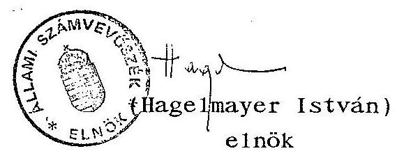

---

# ÁLLAMI SZÁMVEVŐSZÉK 

## MELLÉKLETEK

a Szerencsejáték Rt. 1991-1992. évi működéséről és gazdálkodásáról szóló "Jelentés"-hez

---

# MELLÉKLETEK TARTALOMJEGYZÉKE   a V-25-25/1992/93. sz. jelentéshez 

1. sz. melléklet

A Magyar Szerencsejáték Vállalat 1990. december 31-én kelt 237/1990. sz. létesítő határozata
2. sz. melléklet

A Magyar Szerencsejáték Rt. 1990. december 31-én kelt 3227/1990. sz. létesítő határozata
3. sz. melléklet

A Magyar Szerencsejáték Vállalat 01-01-003466/03. sz. cégbejegyzése
4. sz. melléklet

A Magyar Szerencsejáték Rt. 01-01-041628/12. sz. cégbejegyzése
5. sz. melléklet

A legszükségesebb belső szabályzatok jegyzéke
6. sz. melléklet

Mérlegadatok 1991-1992. évek
7. sz. melléklet

Befektetett pénzügyi eszközök alakulása 1992. december 31-én
8. sz. melléklet

Közérdekű kifizetések 1991-1992. évek

---

9. sz. melléklet

Eredménykimutatás 1991-1992. évek
10. sz. melléklet

42/1992. sz. elnök-vezérigazgatói utasítás közérdekű célokat szolgáló támogatások odaítéléséről
11. sz. melléklet

Az SZRt. Igazgatótanácsának 1992. július 9-i ülésének határozatai
12. sz. melléklet

Emlékeztető a bizottsági munka megszüntetéséről
13./a-f. sz. melléklet

A jelentésre tett észrevételek

---

# 237/1990/dr.Kupa   ÁLLAPÍTVÁNY! VÁLLALATI LÉTESÍTŐ HATÁROZAT! 

A Minisztertanács elrendelte az Országos Takarékpénztár szerencsejáték szervezését és lebonyolítását végző szervezeti egységének, a Sportfogadási és Lottóigazgatóságnak leválasztását, és e tevékenységre 1990. december 31-i hatállyal önálló vállalat alapítását.

A minisztertanácsi határozat végrehajtása érdekében az 1979. évi 11. tv. 34/C. §-ában kapott felhatalmazás alapján az 1977. évi VI. tv. 1. §-a szerint az Országos Takarékpénztár Sportfogadási és Lottóigazgatóságából önálló, államigazgatási felügyelet alatt álló vállalat alapítását rendelem el.

Az új vállalat neve: Magyar Szerencsejáték Vállalat Székhelye: Budapest, V. Nádor u. 15.

A vállalat induló vagyona: 1.758.- millió Ft, azaz
Egymilliárd-hétszázötvennyolc-millió forint
A vállalat tevékenységi köre:
7521 lottó-totó és egyéb szerencsejátékok lebonyolítása.
A vállalat államigazgatási felügyelet alatt áll.

A vállalat alapításának időpontja: 1990. december 31.
A vállalat alapító szerve: Pénzügyminiszter
A 23/1986. (VII.21.) IM. és a 62/1987. (XII.7.) IM. rendeletekben, valamint mindazon állami intézkedésekben, megállapodásokban, amelyekben a szerencsejátékok szervezésével és lebonyolításával kapcsolatosan az Országos Takarékpénztár számára jogok és kötelezettségek vannak megállapítva, a Magyar Szerencsejáték Vállalatot illetik, illetve terhelik. A Magyar Szerencsejáték Vállalat megalakulásával egyidejűleg az Országos Takarékpénztár Alapító Okiratának a szerencsejátékok szervezésére és lebonyolítására vonatkozó rendelkezései megszűnnek, és ezen jogosítványok a Magyar Szerencsejáték Vállalatot illetik.

Budapest, 1990. december 31.

---

# HATÁROZAT 

A Pénzügyminiszter 3227/1990. számú határozata az Országos Takarékpénztár állami gazdasági irányítása alatt álló állami vállalat egyszemélyes állami részvénytársasággá történő átalakításáról.

Az 1990. évi LXXII. számú törvénnyel módosított, a gazdálkodó szervezetek és a gazdasági társaságok átalakulásáról szóló 1989. évi XII. számú törvény 16. § (1) bekezdésében megállapított jogkörömben eljárva, - az Állami Vagyonügynökség egyetértésével, - a 3312/1990. Kormányhatározatban foglaltaknak megfelelően, a mai napon az alábbi határozatot hoztam.

Mindenekelőtt megállapítom, hogy az Országos Takarékpénztár az előzetes egyetértésemmel készült és a rendelkezésemre bocsátott, szabályszerűen aláírt alapszabálya szerint megalapította az "OIP-Ingatlan Részvénytársaságot" és az "OIP-IKKA Kereskedelmi Részvénytársaságot". Így az Országos Takarékpénztár eleget tett annak a 3312/1990. számú kormányhatározatban megállapított kötelezettségének, hogy még az átalakítást megelőzően egyszemélyes részvénytársaságok létrehozásával válassza le a nem pénzügyi tevékenységeket végző szervezeti egységeit, nevezetesen a lakásruházást és a kereskedelmi (külkereskedelmi) feladatokat ellátó egységeit.

Megállapítom továbbá, hogy 3226/1990. számú határozatommal megtörtént az Országos Takarékpénztár Sportfogadási és Lottóigazgatóságának Országos Takarékpénztártól való leválasztása és teljes egészében önállóan működő állami szer-

---

vezetté történő átalakítása is, ahogyan azt a Kormány a 3312/1990. számú határozatában ugyancsak az Országos Takarékpénztár átalakításának előfeltételéül előírta.

Ilyen előzmények után az államigazgatási irányítás alatt álló Országos Takarékpénztár állami vállalatnak egyszemélyes állami részvénytársasággá történő átalakítását határoztam el 1991. január 1-ei hatállyal.

Határozatom - az átalakulással elérni kívánt cél megjelölését, valamint a vagyonmérleg legfontosabb adatait is tartalmazó - átalakulási tervre alapszik, amely egyben határozatom mellékletét képezi.

Az "Országos Takarékpénztár és Kereskedelmi Bank Részvénytársaság" cégnevű egyszemélyes állami részvénytársaság zártkörű alapítását az ugyancsak határozatom mellékletét képező "Alapszabály" egyidejű aláírásával rendelem el.

Budapest, 1990. december 31.
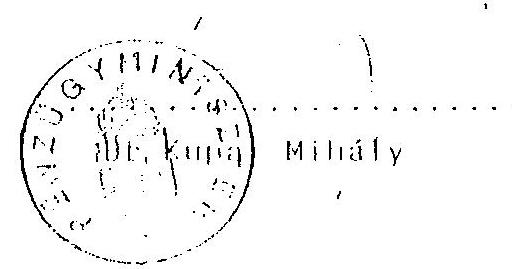

---

# A Fővárosi Bíróság mint cégbíróság. 01-01-003466/03 szám 

## V E G Z É S

A Fővárosi Bíróság mint cégbíróság a(z) Magyar Szerencsejáték Vállalat kérelmére elrendeli a társaságnak a 01-01-003466 szám alatti cégnyilvántartásba vételét az alábbi adatokkal:

2 A cég elnevezése
2/001 Magyar Szerencsejáték Vállalat

5 A cég székhelye
5/001 1051 Budapest, Nádor u. 15.

8 A társasági szerződés (alapszabály, alapító okirat, létesítő okirat) kelte
8/001 1990. 12. 31

9 A cég tevékenységi köre(i)
9/101 7521 Totó-lottó és egyéb szerencsejáték
lebonyolítása

10 A cég tevékenysége megkezdésének (a működés megkezdésének) időpontja
10/001 1990. 12. 31

11 A cég működésének időtartama (határozott, határozatlan)

11,001 Határozatlan idő

12 A cég induló vagyona; vagy törzstőkéje, vagy alaptőkéje

12,001 1758000000 Ft egymilliárd-hétszázötvennyolcmillió Ft

---

13 A cégjegyzés módja
13/001 A vezérigazgató önállóan írja a nevét.

15 A cégjegyzésre jogosult(ak) személyi száma, neve, tisztsége, lakóhelye
15/001 Dr. Tisza László -vezérigazgató- 1137 Budapest, Szent István park 24.

16 A jogelőd cég(ek) volt cégjegyzékszáma, neve
16/001 01-01-002049
Országos Takarékpénztár Budapest, V. Nádor u. 16.

17 A vállalat típusa
17/001 állami vállalat

18 A vállalatot alapító-, illetve létesítő szerv megnevezése és okiratának száma
18/001 A pénzügyminiszter 1990. dec. 31. létesítő határozata 273/1990. dr. Kupa

19 A vállalat irányítási formája
19/001 államigazgatási felügyelet
Felhívja a bíróság a cég figyelmét, hogy a bejegyzett EÁOR besorolású tevékenységeken belüli hatósági engedélyhez kötött tevékenység csak az erre vonatkozó külön engedély birtokában kezdhető meg és gyakorolható.

A külön engedélyt annak megszerzését követő 30 napon belül bejegyzés és közzététel végett szabályszerűen be kell jelenteni a Cégbíróságon.

---

A bíróság a cég nyilvántartásba vételéről a kérelmezőt jelen végzés 3 példányának, a záradékolt társasági szerződés 2 példányának, valamint 2 db cimpéldány megküldésével azzal értesíti, hogy e bejegyzett cégjegyzésre jogosult(ak) az üzleti aláírásai(ka)t a cégjegyzéssel azonos módon köteles(ek) teljesíteni.

Cégnyilvántartásba bejegyezve: 1991. május 15.

Dr. Pethőné dr. Kovács Ágnes s.k. fővárosi bírósági tanácselnök

Budapest, 1991. május 17.
A ladmány hiteléül:
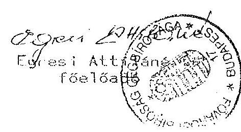

---

# A Fővárosi Bíróság mint cégbíróság. 01-10-041628/12 szám 

## V E G Z É S

A Fővárosi Bíróság mint cégbíróság a(z) Magyar Szerencsejáték Vállalat társaságból átalakulással létrehozott Magyar Szerencsejáték Részvénytársaság kérelmére elrendeli a kérelmezőnek nyilvántartásba vételét a 01-10-041628 számú cégjegyzékbe az alábbi adatokkal:

2 A cég elnevezése
2/001 Magyar Szerencsejáték Részvénytársaság

3 A cég rövidített elnevezése(i)
3/001 Szerencsejáték Rt.

5 A cég székhelye
5/001 1015 Budapest, I. Csalogány u. 30-32.

8 A társasági szerződés (alapszabály, alapító okirat, létesítő okirat) kelte

8/001 1990. 12. 31

9 A cég tevékenységi köre(i)
9/001 7521 Hitel-, kereskedelmi banki és egyéb pénzügyi szolgáltatás

9/002 5211 Áruk, műszaki-szellemi termékek és szolgáltatások külkereskedelme

9/003 1731 Nyomdaipar

---

| 9/004 | 8532 Lapkiadás |
| :-- | :-- |
| 10 | A cég tevékenysége megkezdésének (a működés   megkezdésének) időpontja |
| 10/001 | 1991. 01. 01 |
| 11 | A cég működésének időtartama (határozott,   határozatlan) |
| 11/001 | Határozatlan |
| 12 | A cég induló vagyona, vagy törzstőkéje, vagy   alaptőkéje |
| 12/001 | 1817630000 ft Egymilliárd-nyolcszáztizenhétmillió-   hatszáz- harmincezer ft |
| 13 | A cégjegyzés módja |
| 13/001 | A társaság cégjegyzése akként történik, hogy az   írott vagy előnyomott (nyomtatott) cégnévhez a   társaság cégjegyzésre jogosított tagjai a saját   nevüket az alábbiak szerint írják: - vezérigazgató   önállóan, - két igazgatósági tag együttesen, - az   igazgatóság által cégjegyzésre feljogosított   alkalmazottak közül két személy együttesen, -   bármelyik igazgatósági tag a cégjegyzésre   feljogosított alkalmazottal együttesen. |
| 14 | A cégjegyzésre jogosultság korlátozása |
| 14/001 | Az igazgatóság által cégjegyzésre feljogosított   alkalmazottak közül két személy együttesen az   Igazgatóság által meghatározott körben jogosult a   cégjegyzésre. |

---

| 15 | A cégjegyzésre jogosult(ak) személyi száma, neve, tisztsége, lakóhelye |
| :--: | :--: |
| $15 / 001$ | dr. Tisza László igazgatóság elnöke, vezérigazgató 1137 Budapest, Szent István park 24. |
| $15 / 002$ | dr. Mányai Nóra igazgatósági tag 1013 Budapest, Attila u. 4. |
| $15 / 003$ | Földi Zoltán igazgatósági tag 1193 Budapest, Szigligeti u. 2. |
| $15 / 004$ | Lex Zoltán igazgatósági tag 1121 Budapest, Mártonhegyi u. 25/B. |
| $15 / 005$ | dr. Kertész Pál igazgatósági tag 1155 Budapest, Mozdonyvezető u. 2. |
| $15 / 006$ | Sárosi Ferenc igazgatósági tag 1149 Budapest, Varga Gyula András park 4/B. |
| $15 / 007$ | Schmitt Pál igazgatósági tag 1022 Budapest, Filler u. 84/b. |
| $15 / 008$ | dr. Malasics András vezérigazgató-helyettes, -cégjegyzésre jogosult alkalmazott 1013 Budapest, Attila u. 4. |
| $15 / 009$ | dr. Vaszily Béla cégjegyzésre jogosult alkalmazott 1165 Budapest, Ezerjó u. 36/a. |
| $15 / 010$ | Gölöncsér Magdolna cégjegyzésre jogosult alkalmazott 1043 Budapest, Munkásotthon u. 49. |
| $15 / 011$ | Csizmás Béláné cégjegyzésre jogosult alkalmazott 1031 Budapest, Fiedler u. 10. |
| $15 / 012$ | dr. Magyar Mária cégjegyzésre jogosult alkalmazott 1144 Budapest, Füredi u. 7/b. |
| $15 / 013$ | Nagy Sándorné cégjegyzésre jogosult alkalmazottak 1161 Budapest, Kővasút sor 78. |

---

15/014 Petrás Gyuláné cégjegyzésre jogosult alkalmazott 1098 Budapest, Déri Huber u. 3/1.

15/015 dr. Kollin Ferencné cégjegyzésre jogosult alkalmazott
1093 Budapest, Közraktár u. 24.
15/016 Nádas Antal cégjegyzésre jogosult alkalmazott 1155 Budapest, Mozdonyvezető u. 6.

15/017 Páva Károly cégjegyzésre jogosult alkalmazott 1194 Budapest, Temesvár u. 183.

16 A jogelőd cég(ek) volt cégjegyzékszáma, neve
16/001 01-01-003466
Magyar Szerencsejáték Vállalat

18 A névre szóló részvények száma és névértéke
18/001 181763 db Egyszáznyolcvanegyezer-
hétszázhatvanhárom
10000 ft
Tízezer ft

21 A társasági határozatok valamint a közgyűlési meghívók közzétételének módja

21/001 A társaság hirdetményeit a Magyar Hírlap című napilapban kell közzétenni.

22 A könyvvizsgáló(k) személyi száma, neve, lakóhelye
22/001 dr. Baricz Rezső
1118 Budapest, Ugron Gábor u. 69.

---

23 A felügyelőbizottsági tag(ok) személyi száma, neve, lakóhelye

23/001 Csáki Gyula
1119 Budapest, Fehérvári út 151.
23/002 dr. Pócsik Ilona
1052 Budapest, Apáczai Cs. János u. 17.
23/003 Mihalek Sándor
1056 Budapest, Telepy u. 9/a.
23/004 Mersich András
Győr, Aradi vértanúk u. 15/b.
23/005 Nagy Sándorné
1161 Budapest, Kővasút sor 78.
Felhívja a bíróság a cég figyelmét, hogy a bejegyzett EÁOR besorolású tevékenységeken belüli hatósági engedélyhez kötött tevékenység csak az erre vonatkozó külön engedély birtokában kezdhető meg és gyakorolható.

A külön engedélyt annak megszerzését követő 30 napon belül bejegyzés és közzététel végett szabályszerűen be kell jelenteni a Cégbíróságon.

---

A bíróság a cég nyilvántartásba vételéről a kérelmezőt jelen végzés 3 példányának, a záradékolt társasági szerződés 4 példányának, valamint 34 db cimpéldány megküldésével azzal értesíti, hogy a bejegyzett cégjegyzésre jogosult(ak) az üzleti aláírásai(ka)t a cégjegyzéssel azonos módon köteles(ek) teljesíteni.

Cégnyilvántartásba bejegyezve: 1991. december
 4.
dr. Tőkés Géza sk.
fővárosi bírósági tanácselnök

Budapest, 1991. december 4.
A kiadmány hiteléül:
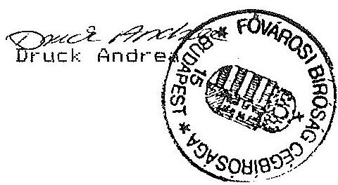

---

# A legszükségesebb belső szabályzatok jegyzéke 

- Szervezeti és Működési Szabályzat (SZMSZ) (1/1991. Vig.) Megjegyzés: az SZRt. alapítását követően az SZMSZ-nek csak az első része készült el.
- Az SZRt. feladatainak lebonyolítása a szerencsejáték üzletágban (2/1991. Vig.)
- A kötelezettségvállalás, utalványozás (5/1991. Vig.)
- A sportfogadás (totó) és a számsorsjáték (5/90, 6/45 lottó) részvételi díjának, valamint a szerencsejátékok nyereményalapja felosztásának módosítása (8/1991. Vig.)
- A totó- és lottószelvény, a sorsjegyek és a BONGÓ eladási jutalékának szabályozása (9/1991. Vig.)
- Az SZRt. Tűzvédelmi Szabályzata (11/1991. Vig.)
- Leltározási Szabályzat (13/1991. Vig.)
- Titkos Iratkezelési Szabályzat (14/1991. Vig.)
- Az SZRt. Törzsgárda Szabályzata (15/1991. Vig.)
- Selejtezési Szabályzat (17/1991. Vig.)
- Az iratok kezelési szabályzata (21/1991. Vig.)
- Pénzkezelési Szabályzat (24/1991. Vig.)
- Bizonylat Szabályzat (22/1991. Vig.)
- Állóeszközök beszerzésének, elszámolásának és nyilvántartásának rendje (25/1991. Vig.)
- Munkavédelmi Szabályzat (36/1992. EVig.)
- Az üzemi titok védelmének eljárási szabályzata a Szerencsejáték Rt. területén (37/1992. EVig.)
- A közérdekű célokat szolgáló támogatások odaítélése (42/1992. EVig.)
- Ügyviteli Szabályzat
- Munkaügyi Szabályzat
- Újítási Szabályzat

---

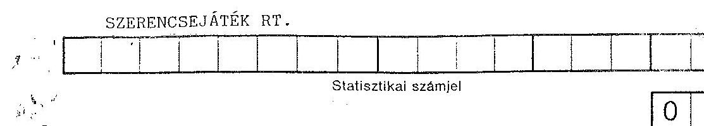

1992. december 31-én

MERLEG Eszközök (aktívák)
Készült a 93.02.24-én állapot szerint
adatok eFt-ban

| Sor-   szám | A tétel megnevezése | Előző év   1991. év | Tárgyév   1992. év előző |
| :--: | :--: | :--: | :--: |
| a | b | c | d |
| 01. | A. Befektetett eszközök (02.+08.+14. sor) | 1.038.641.- | 2.768.316.- |
| 02. | I. IMMATERIÁLIS JAVAK (03.-07. sorok) | 39.090.- | 44.933.- |
| 03. | Vagyoni értékű jogok | 33.900.- | 34.708.- |
| 04. | Üzleti vagy cégérték | - | - |
| 05. | Szellemi termékek | 5.190.- | 10.225.- |
| 06. | Kísérleti fejlesztés aktivált értéke | - | - |
| 07. | Alapítás-átszervezés aktivált értéke | - | - |
| 08. | II. TÁRGYI ESZKÖZÖK (09.-13. sorok) | 971.930.- | 1.213.001.- |
| 09. | Ingatlanok | 785.033.- | 951.128.- |
| 10. | Műszaki berendezések, gépek, járművek | 89.001.- | 91.192.- |
| 11. | Egyéb berendezések, felszerelések, járművek | 75.505.- | 98.818.- |
| 12. | Beruházások | 16.790.- | 71.863.- |
| 13. | Beruházásokra adott előlegek | 5.601.- | - |
| 14. | III. BEFEKTETETT PÉNZÜGYI ESZKÖZÖK (15.-18. sorok) | 27.621.- | 1.510.382.- |
| 15. | Részesedések | 23.550.- | 1.483.372.- |
| 16. | Értékpapírok | 500.- | 437.- |
| 17. | Adott kölcsönök | 3.571.- | 26.573.- |
| 18. | Hosszú lejáratú bankbetétek | - | - |

Terv. 1708. r. sz. - Patria-Nyomda - (Faz: 5-6301) - 5176 - Patria Rt

---

SZERENCSEJÁTÉK RÉSZVÉNYTÁRSASÁG

Statisztikai számjel

1992. december 31. /93.02.24-i állapot/

MÉRLEG Források (passzívák)

adatok eFt-ban

|  Sor-
szám | A tétel megnevezése | Előző év
1991. év | Tárgyév
1992. év  |
| --- | --- | --- | --- |
|  a | b | c | d  |
|  42. | D. Saját tőke (43.-47. sorok) | 4.064.393.- | 4.497.340.-  |
|  43. | I. JEGYZETT TŐKE | 1.817.630.- | 1.817.630.-  |
|  44. | II. TŐKETARTALÉK |  |   |
|  45. | III. EREDMÉNYTARTALÉK | -5.318.- | 1.982.619.-  |
|  46. | IV. ELŐZŐ ÉVEK ÁTHOZOTT VESZTESÉGE |  |   |
|  47. | V. MÉRLEG SZERINTI EREDMÉNY | 2.252.081.- | 697.091.-  |
|  48. | E. Céltartalékok (49.-51. sorok) |  |   |
|  49. | 1. Céltartalék a várható veszteségekre |  |   |
|  50. | 2. Céltartalék a várható kötelezettségekre |  |   |
|  51. | 3. Egyéb céltartalék |  |   |
|  52. | F. Kötelezettségek (53.+60. sor) | 1.806.398.- | 1.305.085.-  |
|  53. | I. HOSSZÚ LEJÁRATÚ KÖTELEZETTSÉGEK (54.-59. sorok) |  |   |
|  54. | Beruházási és fejlesztési hitelek |  |   |
|  55. | Egyéb hosszú lejáratú hitelek |  |   |
|  56. | Hosszú lejáratra kapott kölcsönök |  |   |
|  57. | Tartozások kötvénykibocsátásból |  |   |
|  58. | Alapítókkal szembeni kötelezettségek |  |   |
|  59. | Egyéb hosszú lejáratú kötelezettségek |  |   |
|  60. | II. RÖVID LEJÁRATÚ KÖTELEZETTSÉGEK (61.-66. sorok) | 1.806.398.- | 1.305.085.-  |
|  61. | Vevőtől kapott előlegek |  |   |
|  62. | Kötelezettségek áruszállításból és szolgáltatásból (szállítók) | 136.694.- | 135.610.-  |
|  63. | Váltótartozások |  |   |
|  64. | Rövid lejáratú hitelek |  |   |
|  65. | Rövid lejáratú kölcsönök |  |   |
|  66. | Egyéb rövid lejáratú kötelezettségek | 1.669.704.- | 1.169.475.-  |
|  67. | G. Passzív időbeli elhatárolások | 67.157.- | 149.967.-  |
|  82. | FORRÁSOK (PASSZÍVÁK) ÖSSZESEN (42.+48.+52.+67. sor) | 5.937.948.- | 5.952.392.-  |

Keltezés: Budapest, 1993. március 31.

a vállalkozás vezetője (képviselője)

Terv. 1708. f. sz. - Patria-nyomda - (Fsz.: 5-8301) - 5177 - Patria 01

---

# BEFEKTETETT PÉNZÜGYI ESZKÖZÖK 1992. december 31-én 

MEGNEVEZÉS
Belépés kelte
1991. évben:

Magyar Befektetési és Fejl.Rt. Provizió Főv. és Váll. Rt. SZRT KB Bt

1992. évben:

Nemzeti Lóverseny Kft.
Automata Fortuna Kft.
Szerencsekerék Kft.
Első Magyar Játékaszinó Kft.
Transsylvania Váll.Ker. Rt.
Magyar Fórum Borháza Kft.
AMITOURS Kft.
Fortuna Press Kft.
Press Tige Kft.
Gambling Kft.
Liget Kft.
Magyar Játékaszinó Kft.
Magyar Lóversenyfogadás Sz. V.
BEFEKTETETT PÉNZÜGYI ESZKÖZÖK ÖSSZESEN:

Belépés kelte
1991. XI. 27. 1991. XII. 6. 1991. VII. 20 Összesen:

1992. VIII. 19. 1992. VII. 2. 1992. III.6. 1992. V.1. 1991. XII. 20. 1992. VII.17. 1992. XI. 30. 1992. VIII. 25 1992. VI. 4. 1992. III. 6. 1992. III. 6. 1992. XI. 24. 1992. X. 19. Összesen:
1.483.372.000

Budapest, 1993. január 15.

Befektetés összege A részesedés Utalt/Várható %-a osztalék Ft
10.000.000 1,5
13.500.000 27.-
50.000 71,4 utalt 300.030.-
357.400.000 88,6
2.800.000 70,-
20.832.000 67,2
762.500.000 65.-
55.000.000 16,7
30.000.000 31,5
6.710.000 51,3
15.000.000 100,-
4.000.000 21,7
490.000 49,-
201.600.000 70,-
3.000.000 letét alapításra

---

1992. évi közérdekű kifizetések mindösszesen:
(ezer Ft-ban)
73.500
15.286
70.120
8.950
32.293
24.550
17.300
2.335
9.940
6.780
11.549

ÖSSZESEN: 272.603

Budapest, 1992. dec. 31.

SZERENCSEJÁTÉK RT.
Pénzügyi és Számviteli Főosztály
Beszámító

---

|  Megnevezés |  |  |  |  |  |  |  |  |   |
| --- | --- | --- | --- | --- | --- | --- | --- | --- | --- |
|   |  |  |  |  |  |  |  |  | eFt  |
|   |  |  |  |  |  |  |  |  | Összesen  |
|  Velinszky Ált.Iskola | 100 |  |  |  |  |  |  |  | 100  |
|   | 01.07. |  |  |  |  |  |  |  |   |
|  Agysérültek Rehab.Alap. | 1.500 |  |  |  |  |  |  |  | 1.500  |
|   | 01.08. |  |  |  |  |  |  |  |   |
|  Zrínyi Nyomda | 400 |  |  |  |  |  |  |  | 400  |
|   | 01.10. |  |  |  |  |  |  |  |   |
|  Veszprémi Reform.Egyház | 50 |  |  |  |  |  |  |  | 50  |
|   | 01.20. |  |  |  |  |  |  |  |   |
|  Esztergomi Polg.Hív. | 100 |  |  |  |  |  |  |  | 100  |
|   | 01.30. |  |  |  |  |  |  |  |   |
|  Hortobágyi Alkotó Tábor | 150 |  |  |  |  |  |  |  | 150  |
|   | 02.03. |  |  |  |  |  |  |  |   |
|  Testben lélekben egészség.Alap. | 250 |  |  |  |  |  |  |  | 250  |
|   | 02.05. |  |  |  |  |  |  |  |   |
|  Országos Commodore Egy. | 1.500 |  |  |  |  |  |  |  | 1.500  |
|   | 02.20. |  |  |  |  |  |  |  |   |
|  Erdélyi Magyarság Alap. | 4.000 | 2.000 | 1.000 | 2.000 |  |  |  |  | 9.000  |
|   | 02.24. | 05.14. | 06.19. | 08.25. |  |  |  |  |   |
|  Magyarok Világlapja | 8.000 | 5.000 | 3.000 | 5.000 |  |  |  |  | 21.000  |
|   | 02.24. | 05.14. | 06.19. | 08.25. |  |  |  |  |   |
|  Illyés Alapítvány | 2.500 | 15.000 | 300 | 2.000 | 100 | 4.000 | 3.500 | 150 | 27.550  |
|   | 02.27. | 01.03 | 04.06. | 04.13. | 04.16. | 06.17. | 08.25. | 03.31. | 10.19.  |
|  Nagykőrősi Polgm.Hív. | 100 |  |  |

 |  |  |  |  | 11.26.  |
|   | 02.27. |  |  |  |  |  |  |  |   |
|  ÖSSZESEN: |  |  |  |  |  |  |  |  | 73.500  |

---

|  Megnevezés | ÁTUTALÁSOK |  |  |  |  |  |   |
| --- | --- | --- | --- | --- | --- | --- | --- |
|   | Ft | időpont | Ft | időpont | Ft | időpont | összesen  |
|  Ady Endre Sajtóalapítvány | 700 | 100 |  |  |  |  | 800  |
|   | 02.28. | 05.07. |  |  |  |  |   |
|  Rodata Sportegy. | 80. |  |  |  |  |  | 80  |
|   | 03.03. |  |  |  |  |  |   |
|  Haza és Haladás Alap. | 550 | 2.000 | 100 | 250 |  |  | 2.900  |
|   | 03.03. | 04.13. | 09.21. | 12.28. |  |  |   |
|  Csalogány Alap. | 100 |  |  |  |  |  | 100  |
|   | 03.06. |  |  |  |  |  | 50  |
|  Nemzetközi Bihari Lelkész Tal. | 50 |  |  |  |  |  |   |
|   | 03.11. |  |  |  |  |  | 455  |
|  Egészségügyi Karitatív Alap. | 255 | 200 |  |  |  |  |   |
|   | 03.16. | 07.28. |  |  |  |  | 2.500  |
|  Szegedi Reform. Egyház | 2.500 |  |  |  |  |  |   |
|   | 03.19. |  |  |  |  |  | 5.000  |
|  Rák és más betegség Alap. | 5.000 |  |  |  |  |  | 5.000  |
|   | 03.31. |  |  |  |  |  |   |
|  Kritika Alapítvány | 300 |  |  |  |  |  | 300  |
|   | 04.02. |  |  |  |  |  |   |
|  Salgótarjáni Polg. Hiv. | 100 |  |  |  |  |  | 100  |
|   | 04.06. |  |  |  |  |  |   |
|  Táncművészeti Alap. | 250 |  |  |  |  |  | 250  |
|   | 04.06. |  |  |  |  |  | 2.000  |
|  Széchenyi Társaság | 2.000 |  |  |  |  |  | 2.000  |
|   | 04.06. |  |  |  |  |  | 750  |
|  Hild-Ybl Alapítvány | 750 |  |  |  |  |  |   |
|   | 04.07. |  |  |  |  |  |   |
|  Összesen: |  |  |  |  |  |  | 15.285  |

---

| Megnevezés |  |  |  |  |  |  |  |  |  |  |  |  |  |  |  |  |  |  |  |  |  |  |  |  |  |  |  |  |  |  |  |  |  |  |  |   |
| --- | --- | --- | --- | --- | --- | --- | --- | --- | --- | --- | --- | --- | --- | --- | --- | --- | --- | --- | --- | --- | --- | --- | --- | --- | --- | --- | --- | --- | --- | --- | --- | --- | --- | --- | --- | --- | --- | --- |
|  |   |   |   |   |   |   |   |   |   |   |   |   |   |   |   |   |   |   |   |   |   |   |   |   |   |   |   |   |   |   |   |   |   |   |   |   |
|  Természettudomány Alap. |  |  |  |  |  |  |  |  |  |  |  |  |  |  |  |  |  |  |  |  |  |  |  |  |  |  |  |  |  |  |  |  |  |  |  |   |
|  Laki Telek Alap. |  |  |  |  |  |  |  |  |  |  |  |  |  |  |  |  |  |  |  |  |  |  |  |  |  |  |  |  |  |  |  |  |  |  |  |  |   |
|  Horizon Multiplan Kft. |  |  |  |  |  |  |  |  |  |  |  |  |  |  |  |  |  |  |  |  |  |  |  |  |  |  |  |  |  |  |  |  |  |  |  |  |   |
|  Magyar Protestáns Közműv. |  |  |  |  |  |  |  |  |  |  |  |  |  |  |  |  |  |  |  |  |  |  |  |  |  |  |  |  |  |  |  |  |  |  |  |  |   |
|  Tulipán Alap. |  |  |  |  |  |  |  |  |  |  |  |  |  |  |  |  |  |  |  |  |  |  |  |  |  |  |  |  |  |  |  |  |  |  |  |  |   |
|  Tiszántúli Reform. Koll. |  |  |  |  |  |  |  |  |  |  |  |  |  |  |  |  |  |  |  |  |  |  |  |  |  |  |  |  |  |  |  |  |  |  |  |  |   |
|  Gyorssegély Alap. |  |  |  |  |  |  |  |  |  |  |  |  |  |  |  |  |  |  |  |  |  |  |  |  |  |  |  |  |  |  |  |  |  |  |  |  |   |
|  Orvostud. Egyetem |  |  |  |  |  |  |  |  |  |  |  |  |  |  |  |  |  |  |  |  |  |  |  |  |  |  |  |  |  |  |  |  |  |  |  |  |   |
|  Közgazdaság Szemle Alap. |  |  |  |  |  |  |  |  |  |  |  |  |  |  |  |  |  |  |  |  |  |  |  |  |  |  |  |  |  |  |  |  |  |  |  |  |   |

 |  |  |  |  |  |  |  |  |  |  |  |  |   |
|  Gene-Káción a Rákkutat. |  |  |  |  |  |  |  |  |  |  |  |  |  |  |  |  |  |  |  |  |  |  |  |  |  |  |  |  |  |  |  |  |  |  |  |  |  |  |  |  |   |
|  Együttlét Alap. |  |  |  |  |  |  |  |  |  |  |  |  |  |  |  |  |  |  |  |  |  |  |  |  |  |  |  |  |  |  |  |  |  |  |  |  |  |  |  |  |   |
|  Magyarországért Alap. |  |  |  |  |  |  |  |  |  |  |  |  |  |  |  |  |  |  |  |  |  |  |  |  |  |  |  |  |  |  |  |  |  |  |  |  |  |  |  |  |   |
|  Páholy Színház Alap. |  |  |  |  |  |  |  |  |  |  |  |  |  |  |  |  |  |  |  |  |  |  |  |  |  |  |  |  |  |  |  |  |  |  |  |  |  |  |  |  |   |
|  Összesen |  |  |  |  |  |  |  |  |  |  |  |  |  |  |  |  |  |  |  |  |  |  |  |  |  |  |  |  |  |  |  |  |  |  |  |  |  |  |  |  |   |

Eft

1992. év

-3-

ÁTUTALÁSOK

1892. év

---

|  Megnevezés |  |  |  |  |  |   |
| --- | --- | --- | --- | --- | --- | --- |
|   |  |  |  |  |  | ÁTUTALÁSOK  |
|   | időpont | időpont | időpont | időpont | időpont | Összesen  |
|  Kaposvári Polg.Hív. | 100 |  |  |  |  | 100  |
|   | 04.29. |  |  |  |  |   |
|  Batthyány Lajos Alap | 2.000 | 600 |  |  |  | 2.600  |
|   | 04.29. | 07.24. |  |  |  |   |
|  Látó Alapítvány | 1.000 |  |  |  |  | 1.000  |
|   | 04.29. |  |  |  |  |   |
|  Kulturális Alap.aTextil Müv. | 350 |  |  |  |  | 350  |
|   | 04.29. |  |  |  |  |   |
|  Modern Techn. a sebészetben | 200 |  |  |  |  | 200  |
|   | 04.29. |  |  |  |  |   |
|  Farkas János Ifj.Alap | 100 |  |  |  |  | 100  |
|   | 04.29. |  |  |  |  |   |
|  Egészséget az életnek alap. | 100 |  |  |  |  | 100  |
|   | 05.06. |  |  |  |  |   |
|  Sérült emberek támog. | 200 |  |  |  |  | 200  |
|   | 05.06. |  |  |  |  |   |
|  Liberális Fórum Alap. | 1.000 |  |  |  |  | 1.000  |
|   | 05.07. |  |  |  |  |   |
|  Petőfi Sándor Iskolafejl.Alap. | 200 |  |  |  |  | 200  |
|   | 05.07. |  |  |  |  |   |
|  Kisebbség a piacgazdaságban | 100 |  |  |  |  | 100  |
|   | 05.11. |  |  |  |  |   |
|  Honfoglalás 1100.Alap. | 1.500 | 1.500 |  |  |  | 3.000  |
|   | 05.11. | 09.24. |  |  |  |   |
|  ÖSSZESEN: |  |  |  |  |  | 8.950  |

---

|  Megnevezés |  |  |  |  |  |   |
| --- | --- | --- | --- | --- | --- | --- |
|   |  |  |  |  |  | ÁTUTALÁSOK  |
|   | időpont | időpont | időpont | időpont | időpont | Összesen  |
|  ELTE Radnóti Gyakorló Iskola | 200 |  |  |  |  | 200  |
|   | 05.13. |  |  |  |  |   |
|  Csehszlovák-Magyar kult.Alap. | 1.200 | 5.000 | 3.000 |  |  | 9.200  |
|   | 05.14. | 05.27. | 03.04. |  |  |   |
|  Oktatási és Szoc.Alap. | 1.000 |  |  |  |  | 1.000  |
|   | 05.14. |  |  |  |  |   |
|  Koraujkori Társ.Kult.Egy. | 350 |  |  |  |  | 350  |
|   | 05.15. |  |  |  |  |   |
|  Harmónia Alap. | 50 |  |  |  |  | 50  |
|   | 05.19. |  |  |  |  |   |
|  Piacfejl.Alapítvány | 1.000 |  |  |  |  | 1.000  |
|   | 05.19. |  |  |  |  |   |
|  Joint Systems Foundation Alap. | 400 | 1.000 |  |  |  | 1.400  |
|   | 05.19. | 06.18. |  |  |  |   |
|  Századvég Alap. | 1.000 |  |  |  |  | 1.000  |
|   | 05.27. |  |  |  |  |   |
|  Magyar Máltai Szeretet Szolg. | 150 | 5.000 | 6.600 |  |  | 11.750  |
|   | 05.27. | 06.15. | 06.15. |  |  |   |
|  Keresztény Szellemi Nev.Alap. | 100 |  |  |  |  | 100  |
|   | 05.27. |  |  |  |  |   |
|  Nemzetközi Transsylvániai | 643 | 3.500 |  |  |  | 4.143  |
|   | 06.02. | 07.28. |  |  |  |   |
|  Népzene oktatásért Alap. | 900 |  |  |  |  | 900  |
|   | 06.02. |  |  |  |  |   |
|  Dudaszó Hallatszik Alap. | 100 |  |  |  |  | 100  |
|   | 06.02. |  |  |  |  |   |
|  Bárdos Lajos Zenei Hetek Ifj.Alap. | 100 |  |  |  |  | 100  |
|   | 06.09. |  |  |  |  | 32.293  |
|  ÖSSZESEN: |  |  |  |  |  |   |

---

| Megnevezés |  |  |  |  |  |  |  |  |  |  |  |  |  |  |  |  |  |  |  |  |  |  |  |  |  |  |  |  |  |  |  |  |  |  |  |  |  |  |  |  |

  |  |  |  |  |  |  |  |  |  |  |  |  |  |  |  |  |  |  |  |  |  |  |  |  |  |  |  |  |  |  |  |  |  |  |  |  |  |  |  |  |  |  |  |  |  |  |  |  |  |  |  |  |  |  |  |  |  |  | 

---

Közérdekű támogatások 1992. év. -7-

Eft

|  Megnevezés |  |  | ÁTUTALÁSOK |  |  |  |   |
| --- | --- | --- | --- | --- | --- | --- | --- |
|   |  | időpont | időpont | időpont | időpont | időpont | Összesen  |
|  Magyar Vöröskereszt |  | 6.000 | 100 |  |  |  | 6.100  |
|   |  | 07.16. | 11.09. |  |  |  |   |
|  Körösi Csoma Alapítvány |  | 100 |  |  |  |  | 100  |
|   |  | 07.21. |  |  |  |  |   |
|  NICHE Alapítvány |  | 2.500 |  |  |  |  | 2.500  |
|   |  | 07.24. |  |  |  |  |   |
|  Siófoki Önkorm. |  | 100 |  |  |  |  | 100  |
|   |  | 07.24. |  |  |  |  |   |
|  Takácsi Alkotóközösség Egyesület |  | 50 |  |  |  |  | 50  |
|   |  | 07.24. |  |  |  |  |   |
|  Transfoto Alapítvány |  | 350 |  |  |  |  | 350  |
|   |  | 07.28. |  |  |  |  |   |
|  Magyar Kapu Alapítvány |  | 800 |  |  |  |  | 800  |
|   |  | 07.30. |  |  |  |  |   |
|  József Attila Alapítvány |  | 3.000 | 3.000 |  |  |  | 6.000  |
|   |  | 07.31. | 08.25. |  |  |  |   |
|  Magyarság Alapítvány |  | 200 |  |  |  |  | 200  |
|   |  | 08.14. |  |  |  |  |   |
|  Magyar Hírlap Újságíró Alapítvány |  | 800 |  |  |  |  | 800  |
|   |  | 08.19. |  |  |  |  |   |
|  Égett Gyermekekért Alapítvány |  | 100 |  |  |  |  | 100  |
|   |  | 08.25. |  |  |  |  |   |
|  Miskolci Önkorm. |  | 100 |  |  |  |  | 100  |
|   |  | 08.27. |  |  |  |  |   |
|  Világjáró Alapítvány |  | 100 |  |  |  |  | 100  |
|   |  | 08.27. |  |  |  |  |   |
|  ÖSSZESEN: |  |  |  |  |  |  | 17.300  |

---

|  Megnevezés |  |  |  |  |  |  |   |
| --- | --- | --- | --- | --- | --- | --- | --- |
|   |  |  |  | ÁTUTALÁSOK |  |  |   |
|   | időpont | időpont | időpont | időpont | időpont | időpont | összesen  |
|  Árnyékból a fényre Alapítvány | 75 |  |  |  |  |  | 75  |
|   | 09.03. |  |  |  |  |  |   |
|  Szinfonikus Zene támogatás | 70 |  |  |  |  |  | 70  |
|   | 09.21. |  |  |  |  |  |   |
|  Platamon Alapítvány | 300 |  |  |  |  |  | 300  |
|   | 04.02. |  |  |  |  |  |   |
|  Bocska László | 40 |  |  |  |  |  | 40  |
|   | 04.07. |  |  |  |  |  |   |
|  Erdélyi Korok Szövetség | 1.000 |  |  |  |  |  | 1.000  |
|   | 09.24. |  |  |  |  |  |   |
|  TUBES Kilátó Alapítvány | 200 |  |  |  |  |  | 200  |
|   | 09.02. |  |  |  |  |  |   |
|  Szentesi Önkorm. | 100 |  |  |  |  |  | 100  |
|   | 09.25. |  |  |  |  |  |   |
|  Duna menti magyar Honvédség | 150 |  |  |  |  |  | 150  |
|   | 10.02. |  |  |  |  |  |   |
|  Pesthidegkuti Református Alapítvány | 400 |  |  |  |  |  | 400  |
|   | 10.02. |  |  |  |  |  |   |
|  ÖSSZESEN: |  |  |  |  |  |  | 2.335  |

---

|  Megnevezés | ÁTUTALÁSOK |  |  |  |  |  |   |
| --- | --- | --- | --- | --- | --- | --- | --- |
|   | időpont | időpont | időpont | időpont | időpont | időpont | összesen  |
|  Mátészalka Polgármesteri Hivatal | 100 |  |  |  |  |  | 100  |
|   | 10.14. |  |  |  |  |  |   |
|  Tiszaőrsi Polgármesteri Hivatal | 100 |  |  |  |  |  | 100  |
|   | 10.14. |  |  |  |  |  |   |
|  Deák Ferenc Alapítvány | 1.000 |  |  |  |  |  | 1.000  |
|   | 10.19. |  |  |  |  |  |   |
|  Regrely Antal Alapítvány | 1.500 |  |  |  |  |  | 1.500  |
|   | 10.19. |  |  |  |  |  |   |
|  SOTE II. Belklinika | 100 |  |  |  |  |  | 100  |
|   | 10.19. |  |  |  |  |  |   |
|  Kárpátaljai Magyar Művelődési Egyesület | 5.000 |  |  |  |  |  | 5.000  |
|   | 10.19. |  |  |  |  |  |   |
|  Magyarországi Református Egyház | 250 |  |  |  |  |  | 250  |
|   | 10.20. |  |  |  |  |  |   |
|  Bp-i Ragtime Band | 100 |  |  |  |  |  | 100  |
|   | 10.22. |  |  |  |  |  |   |
|  1920/92 Művelődési Alapítvány | 1.000 |  |  |  |  |  | 1.000  |
|   | 10.22. |  |  |  |  |  |   |
|  Nagycsaládosok Országos Egyesülete | 20 |  |  |  |  |  | 20  |
|   | 10.29. |  |  |  |  |  |   |
|  Tatabányai Polgármesteri Hivatal | 100 |  |  |  |  |  | 100  |
|   | 10.29. |  |  |  |  |  |   |
|  Fővárosi Egészségügyi Alapítvány | 100 |  |
 |  |  |  | 100  |
|   | 10.30. |  |  |  |  |  |   |
|  Szerencsejáték SE | 570 |  |  |  |  |  | 570  |
|   | 11.04. |  |  |  |  |  |   |
|  ÖSSZESEN: |  |  |  |  |  |  | 9.940  |

---

# Közérdekű támogatások 1992. év

## -10-

## Eft

|  Megnevezés |  |  |  | ÁTTUTALÁSOK |  |  |  |  |   |
| --- | --- | --- | --- | --- | --- | --- | --- | --- | --- |
|   | időpont | időpont | időpont | időpont | időpont | időpont | időpont | összesen |   |
|  Nagykanizsáért Alap. | 250 |  |  |  |  |  |  |  | 250  |
|   | 11.05. |  |  |  |  |  |  |  | 350  |
|  Korszerű Iskoláért Al. | 350 |  |  |  |  |  |  |  | 350  |
|   | 11.09. |  |  |  |  |  |  |  |   |
|  Magyar Állami Hangversenyzenekar | 600 |  |  |  |  |  |  |  | 600  |
|   | 11.09. |  |  |  |  |  |  |  |   |
|  Zalakarosi Önkorm. | 100 |  |  |  |  |  |  |  | 100  |
|   | 11.12. |  |  |  |  |  |  |  |   |
|  Pest Megyei Sportigazg. | 100 | 20 |  |  |  |  |  |  | 120  |
|   | 06.24. | 06.26. |  |  |  |  |  |  |   |
|  Nagykörösi Toldi M. Szakközépisk. | 10 |  |  |  |  |  |  |  | 10  |
|   | 06.26. |  |  |  |  |  |  |  |   |
|  Pannonhalmi Bencés Gimn. | 200 |  |  |  |  |  |  |  | 200  |
|   | 11.25. |  |  |  |  |  |  |  |   |
|  Mindenkiért Alap. | 250 |  |  |  |  |  |  |  | 250  |
|   | 11.25. |  |  |  |  |  |  |  |   |
|  Magyarok Világszöv. Alap. | 200 | 2.500 |  |  |  |  |  |  | 2.700  |
|   | 11.25. | 11.25. |  |  |  |  |  |  |   |
|  Szolnoki Polgármesteri Hiv. | 100 |  |  |  |  |  |  |  | 100  |
|   | 11.26. |  |  |  |  |  |  |  |   |
|  Családsegítő Szolg. Győr | 1.200 |  |  |  |  |  |  |  | 1.200  |
|   | 12.10. |  |  |  |  |  |  |  |   |
|  Szoc. Gondozó Központ | 800 |  |  |  |  |  |  |  | 800  |
|   | 12.10. |  |  |  |  |  |  |  |   |
|  Kőszegi Önkormányzat | 100 |  |  |  |  |  |  |  | 100  |
|  ÖSSZESEN: | 12.11. |  |  |  |  |  |  |  | 6.780  |

---

-11-

|   |  |  |  |  |  |  |  |  |  |  |  |  |  |  |  |  |  |  |  |  |  |   |
| --- | --- | --- | --- | --- | --- | --- | --- | --- | --- | --- | --- | --- | --- | --- | --- | --- | --- | --- | --- | --- | --- | --- |
|   |  |  |  |  |  |  |  |  |  |  |  |  |  |  |  |  |  |  |  |  |  |   |
|   |  |  |  |  |  |  |  |  |  |  |  |  |  |  |  |  |  |  |  |  |  |   |
|   |  |  |  |  |  |  |  |  |  |  |  |  |  |  |  |  |  |  |  |  |  |   |
|   |  |  |  |  |  |  |  |  |  |  |  |  |  |  |  |  |  |  |  |  |  |   |
|   |  |  |  |  |  |  |  |  |  |  |  |  |  |  |  |  |  |  |  |  |  |   |
|   |  |  |  |  |  |  |  |  |  |  |  |  |  |  |  |  |  |  |  |  |  |   |
|   |  |  |  |  |  |  |  |  |  |  |  |  |  |  |  |  |  |  |  |  |  |  |   |
|   |  |  |  |  |  |  |  |  |  |  |  |  |  |  |  |  |  |  |  |  |  |  |   |
|   |  |  |  |  |  |  |  |  |  |  |  |  |  |  |  |  |  |  |  |  |  |  |   |
|   |  |  |  |  |  |  |  |  |  |  |  |  |  |  |  |  |  |  |  |  |  |  |   |
|   |  |  |  |  |  |  |  |  |  |  |  |  |  |  |  |  |  |  |  |  |  |  |   |
|   |  |  |  |  |  |  |  |  |  |  |  |  |  |  |  |  |  |  |  |  |  |  |   |
|   |  |  |  |  |  |  |  |  |  |  |  |  |  |  |  |  |  |  |  |  |  |  |   |
|   |  |  |  |  |  |  |  |  |  |  |  |  |  |  |  |  |  |  |  |  |  |  |   |
|   |  |  |  |  |  |  |  |  |  |  |  |  |  |  |  |  |  |  |  |  |  |  |   |
|   |  |  |  |  |  |  |  |  |  |  |  |  |  |  |  |  |  |  |  |  |  |  |   |

 |  |  |  |  |  |  |  |  |  |  |  |  |  |  |   |
|   |  |  |  |  |  |  |  |  |  |  |  |  |  |  |  |  |  |  |  |  |  |  |   |
|   |  |  |  |  |  |  |  |  |  |  |  |  |  |  |  |  |  |  |  |  |  |  |   |
|   |  |  |  |  |  |  |  |  |  |  |  |  |  |  |  |  |  |  |  |  |  |  |   |
|   |  |  |  |  |  |  |  |  |  |  |  |  |  |  |  |  |  |  |  |  |  |  |   |
|   |  |  |  |  |  |  |  |  |  |  |  |  |  |  |  |  |  |  |  |  |  |  |   |
|   |  |  |  |  |  |  |  |  |  |  |  |  |  |  |  |  |  |  |  |  |  |  |   |
|   |  |  |  |  |  |  |  |  |  |  |  |  |  |  |  |  |  |  |  |  |  |  |   |
|   |  |  |  |  |  |  |  |  |  |  |  |  |  |  |  |  |  |  |  |  |  |  |   |
|   |  |  |  |  |  |  |  |  |  |  |  |  |  |  |  |  |  |  |  |  |  |  |   |
|   |  |  |  |  |  |  |  |  |  |  |  |  |  |  |  |  |  |  |  |  |  |  |   |
|   |  |  |  |  |  |  |  |  |  |  |  |  |  |  |  |  |  |  |  |  |  |  |   |
|   |  |  |  |  |  |  |  |  |  |  |  |  |  |  |  |  |  |  |  |  |  |  |   |
|   |  |  |  |  |  |  |  |  |  |  |  |  |  |  |  |  |  |  |  |  |  |  |   |
|   |  |  |  |  |  |  |  |  |  |  |  |  |  |  |  |  |  |  |  |  |  |  |   |
|   |  |  |  |  |  |  |  |  |  |  |  |  |  |  |  |  |  |  |  |  |  |  |   |
|   |  |  |  |  |  |  |  |  |  |  |  |  |  |  |  |  |  |  |  |  |  |  |   |
|   |  |  |  |  |  |  |  |  |  |  |  |  |  |  |  |  |  |  |  |  |  |  |   |
|   |  |  |  |  |  |  |  |  |  |  |  |  |  |  |  |  |  |  |  |  |  |  |   |
|   |  |  |  |  |  |  |  |  |  |  |  |  |  |  |  |  |  |  |  |  |  |  |   |
|   |  |  |  |  |  |  |  |  |  |  |  |  |  |  |  |  |  |  |  |  |  |  |   |
|  

---

# 8. sz. melléklet

## átf

|   | ÁTUTALÁSOK |  |  |  |  |  |   |
| --- | --- | --- | --- | --- | --- | --- | --- |
|   | időpont | időpont | időpont | időpont | időpont | időpont | összesen  |
|  Magyar Nemzet Válogatott | 10.000 | 10.000 | 10.000 |  |  |  | 30.000  |
|   | 05.02. | 05.30. | 09.30. |  |  |  |   |
|  NB I-es LIGA | 6.000 | 6.000 |  |  |  |  | 12.000  |
|   | 05.30. | 09.30. |  |  |  |  |   |
|  OTSH | 8.836,499 |  |  |  |  |  | 8.836,499  |
|   | 08.28. |  |  |  |  |  |   |

50 836,499

Pirogayl és Számyban

Báj

---

|   |  |  |  |  |  |  |  |  |  |  |  |  |  |  |  |  |  |  |  |  |   |
| --- | --- | --- | --- | --- | --- | --- | --- | --- | --- | --- | --- | --- | --- | --- | --- | --- | --- | --- | --- | --- | --- |
|   |  |  |  |  |  |  |  |  |  |  |  |  |  |  |  |  |  |  |  |  |   |
|   |  |  |  |  |  |  |  |  |  |  |  |  |  |  |  |  |  |  |  |  |   |
|   |  |  |  |  |  |  |  |  |  |  |  |  |  |  |  |  |  |  |  |  |   |
|   |  |  |  |  |  |  |  |  |  |  |  |  |  |  |  |  |  |  |  |  |   |
|   |  |  |  |  |  |  |  |  |  |  |  |  |  |  |  |  |  |  |  |  |   |
|   |  |  |  |  |  |  |  |  |  |  |  |  |  |  |  |  |  |  |  |  |   |
|   |  |  |  |  |  |  |  |  |  |  |  |  |  |  |  |  |  |  |  |  |   |
|   |  |  |  |  |  |  |  |  |  |  |  |  |  |

  |  |  |  |  |  |  |   |
|---|---|---|---|---|---|---|---|---|---|---|---|---|---|---|---|---|---|---|---|---|---|---|
|---|---|---|---|---|---|---|---|---|---|---|---|---|---|---|---|---|---|---|---|---|---|---|
|---|---|---|---|---|---|---|---|---|---|---|---|---|---|---|---|---|---|---|---|---|---|---|
|---|---|---|---|---|---|---|---|---|---|---|---|---|---|---|---|---|---|---|---|---|---|---|
|---|---|---|---|---|---|---|---|---|---|---|---|---|---|---|---|---|---|---|---|---|---|---|
|---|---|---|---|---|---|---|---|---|---|---|---|---|---|---|---|---|---|---|---|---|---|---|
|---|---|---|---|---|---|---|---|---|---|---|---|---|---|---|---|---|---|---|---|---|---|---|
|---|---|---|---|---|---|---|---|---|---|---|---|---|---|---|---|---|---|---|---|---|---|---|
|---|---|---|---|---|---|---|---|---|---|---|---|---|---|---|---|---|---|---|---|---|---|---|
|---|---|---|---|---|---|---|---|---|---|---|---|---|---|---|---|---|---|---|---|---|---|---|
|---|---|---|---|---|---|---|---|---|---|---|---|---|---|---|---|---|---|---|---|---|---|---|
|---|---|---|---|---|---|---|---|---|---|---|---|---|---|---|---|---|---|---|---|---|---|---|
|---|---|---|---|---|---|---|---|---|---|---|---|---|---|---|---|---|---|---|---|---|---|---|
|---|---|---|---|---|---|---|---|---|---|---|---|---|---|---|---|---|---|---|---|---|---|---|
|---|---|---|---|---|---|---|---|---|---|---|---|---|---|---|---|---|---|---|---|---|---|---|
|---|---|---|---|---|---|---|---|---|---|---|---|---|---|---|---|---|---|---|---|---|---|---|
|---|---|---|---|---|---|---|---|---|---|---|---|---|---|---|---|---|---|---|---|---|---|---|
|---|---|---|---|---|---|---|---|---|---|---|---|---|---|---|---|---|---|---|---|---|---|---|
|---|---|---|---|---|---|---|---|---|---|---|---|---|---|---|---|---|---|---|---|---|---|---|
|---|---|---|---|---|---|---|---|---|---|---|---|---|---|---|---|---|---|---|---|---|---|---|

---

-2-

közérdekű támogatások

eFt

|   | ÁTUTALÁSOK |  |  |  |  |  |   |
|---|---|---|---|---|---|---|---|
|   | időpont | időpont | időpont | időpont | időpont | időpont | összesen  |
|  Szabad Tör Színház | 500 | 09.27. |  |  |  |  | 500  |
|  Betegségek Megelőz. és Egészséges Életmódért Al. | 350 | 08.30. |  |  |  |  | 350  |
|  Biochóra Alapítvány | 100 | 10.11. |  |  |  |  | 100  |
|  Budapest Ragtime Band | 100 | 10.05. |  |  |  |  | 100  |
|  Bárdos Lajos Zenei Hetek Kórus Ifjúságnevelési Al. | 100 | 10.12. |  |  |  |  | 100  |
|  Rák ellen az emberért a holnapért Tár.Alap. | 1.500 | 11.16. |  |  |  |  | 1.500  |
|  Magyar Katolikus Püspöki Kar | 700 | 11.18. |  |  |  |  | 700  |
|  Erdélyi Magyarságért Alapítvány | 7.000 | 12.10. |  |  |  |  | 7.000  |
|  Magyarok Világlapja Alapítvány | 20.000 | 12.10. |  |  |  |  | 20.000  |
|  Holland RT | 1.362,5 | 12.07. | 100,8 | 08.28. |  |  | 1.463,30  |
|  Ady Endre Sajtóalapítvány | 2.000 | 12.17. |  |  |  |  | 2.000  |
|  Gazdakörök Országos Szöv. | 75 | 12.20. |  |  |  |  | 75  |
|  Magyar Nemzeti Válogatott | 30.000 | 12.20. |  |  |  |  | 30.000  |
|  MOB | 86.000 | 12.20. |  |  |  |  | 86.000  |

---

-3-

közérdekű támogatások

eFt

|   |  |  | ÁTUTALÁSOK |  |  |  |   |
|---|---|---|---|---|---|---|---|
|   | időpont |  | időpont | időpont | időpont | időpont | Összesen  |
|  Vasas Citadella Night Club | 4.000 |  |  |  |  |  | 4.000  |
|   | 12.20. |  |  |  |  |  |   |
|  Drog Alapítvány | 160 |  |  |  |  |  | 160  |
|   | 12.28. |  |  |  |  |  |

   |
|  Debreceni Református Kollégium Leváltára | 150 |  |  |  |  |  | 150  |
|   | 01.03. |  |  |  |  |  |   |
|  Jobbágy SE | 114,5 |  |  |  |  |  | 114,5  |
|   | 12.12. |  |  |  |  |  |   |
|  Kecskeméti önkormányzat | 100 |  |  |  |  |  | 100  |
|   | 01.25. |  |  |  |  |  |   |
|  Pécsi önkormányzat | 100 |  |  |  |  |  | 100  |
|   | 03.01. |  |  |  |  |  |   |
|  Sárospataki önkormányzat | 100 |  |  |  |  |  | 100  |
|   | 03.29. |  |  |  |  |  |   |
|  Magyar AIDS Alapítvány | 500 |  |  |  |  |  | 500  |
|   | 04.25. |  |  |  |  |  |   |
|  Sárvári önkormányzat | 100 |  |  |  |  |  | 100  |
|   | 05. |  |  |  |  |  |   |
|  Gyorssegély Alapítvány | 3.000 |  |  |  |  |  | 3.000  |
|   | 05.17. |  |  |  |  |  |   |
|  Debreceni önkormányzat | 100 |  |  |  |  |  | 100  |
|   | 05.28. |  |  |  |  |  |   |
|  Erzsébet és Henry Speter Alapítvány | 1.000 |  |  |  |  |  | 1.000  |
|   | 06.05. |  |  |  |  |  |   |
|  Berettyóújfalui Református Egyházközség | 200 |  |  |  |  |  | 200  |
|   | 06.14. |  |  |  |  |  |   |
|  Gyulai Polgármesteri Hivatal | 100 |  |  |  |  |  | 100  |
|   | 07.04. |  |  |  |  |  |   |

---

-4-
közérdekű támogatások

ÁTUTALÁSOK
időpont időpont időpont időpont időpont időpont időpont összesen

Magyar Protestáns Tanulmányi Alapítvány 1.500 1.500
07.02.
Haza és Haladás Alapítvány 250 250
07.04.
Hévízi Polgármesteri Hivatal 100 100
08.02.
Egri Polgármesteri Hivatal 100 100
08.23.
Bp. I. ker. Polgármesteri Hivatal 100 100
10.01.
Veszprémi önkorm.Hivatal 100 100
11.06.
Jászberényi Polgármesteri Hivatal 100 100
11.09.
Conscensus Hungarus Alapítvány Nyíregyháza 200 200
12.19.
Nemzetközi Orvostovábbképző Alapítvány 2.500 2.500
12.28.

összesen:

181.402,80

SZERENCSEJÁTÉK RT.
Főszabály és Számvitel Főosztály
Sd.

---

# SZERENCSEJÁTÉK RT

Gazdasági Központ Pénzügyi és Számviteli Főosztály

## EREDMÉNYKIMUTATÁS 1991. - 1992.

|  Tétel-
szám | Megnevezés | 1991. évi tény | 1992. évi tény (előzetes)  |
| --- | --- | --- | --- |
|  01. | Belföldi értékesítés nettó árbevétele | 15740674 | 14112451  |
|  02. | Export értékesítés nettó árbevétele | - | -  |
|  I. | Értékesítés nettó árbevétele | 15740674 | 14112451  |
|  II. | Egyéb bevételek | 4384 | 81406  |
|   | ÜZLETI TEVÉKENYSÉG HOZAMAI ÖSSZESEN: | 15745058 | 14193857  |
|  03. | Saját előállítású eszköz aktivált értéke | - | -  |
|  04. | Saját termelésű készlet állományváltozás | - | -  |
|  III. | Aktivált saját teljesítmények értéke | - | -  |
|  05. | Anyagköltség | 354667 | 369967  |
|  06. | Igénybe vett anyagjellegű szolgáltatás értéke | 1210808 | 978841  |
|  07. | Eladott áruk beszerzési értéke | 185912 | 12408  |
|  08. | Alvállalkozói teljesítmények értéke | - | -  |
|  IV. | Anyagjellegű ráfordítások | 1751387 | 1361216  |
|  09. | Bérköltség | 692089 | 872680  |
|  10. | Személyi jellegű egyéb kifizetések | 33841 | 119903  |
|  11. | Társadalombiztosítási járulék | 235508 | 396595  |
|  V. | Személyi jellegű ráfordítások | 961438 | 1389178  |
|  VI. | Értékcsökkenési leírás | 15527 | 104194  |
|  VII. | Egyéb költségek | 8477693 | 8039927  |
|  VIII. | Egyéb ráfordítások | 1153816 | 1797703  |
|   | ÜZLETI TEVÉKENYSÉG RÁFORDÍTÁS ÖSSZESEN: | 12359861 | 12692218  |
|  A. | ÜZEMI (ÜZLETI) TEVÉKENYSÉG EREDMÉNYE | 3385197 | +1501639  |

---

Adatok E Ft-ban

|  Tétel-
szám | Megnevezés | 1991. évi tény | 1992. évi tény (előzetes)  |
| --- | --- | --- | --- |
|  12. | Kapott kamatok és kamatjellegű bevételek | 722411 | 758905  |
|  13. | Kapott osztalék és részesedés | - | 300  |
|  14. | Pénzügyi műveletek egyéb bevételei | 935 | 3069  |
|  IX. | Pénzügyi műveletek bevételei | 723346 | 762274  |
|  15. | Fizetett kamatok és kamatjellegű kifizetések | 2563 | -  |
|  16. | Pénzügyi befektetések leírása | - | -  |
|  17. | Pénzügyi műveletek egyéb ráfordításai | 71 | 123  |
|  X. | Pénzügyi műveletek ráfordításai | 2634 | 123  |
|  B. | PÉNZÜGYI MŰVELETEK EREDMÉNYE | +720712 | +762151  |
|  C. | SZOKÁSOS VÁLLALKOZÁSI EREDMÉNY | +4105909 | +2263790  |
|  XI. | Rendkívüli bevételek | 113148 | 103681  |
|  XII. | Rendkívüli ráfordítások | 101116 | 184029  |
|  D. | RENDKÍVÜLI EREDMÉNY | +12032 | -80348  |
|  E. | ADÓZÁS ELŐTTI EREDMÉNY | +4117941 | +2183442  |
|  XIII. | Adófizetési kötelezettség | 1665860 | 1304351  |
|  F. | ADÓZOTT EREDMÉNY | +2452081 | +879091  |
|  18. | Eredménytartalék igénybevétele osztalékra, részesedésre | - | -  |
|  19. | Fizetett (jóváhagyott) osztalék és részesedés | 200000 | 182000  |
|  G. | MÉRLEGSZERINTI EREDMÉNY | +2252081 | +697091  |

Budapest, 1993. március 26.

---

# 42/1992. sz. elnök-vezérigazgatói utasítás a közérdekű célokat szolgáló támogatások odaítéléséről

A közérdekű célokat szolgáló támogatások odaítélésének rendjét az alábbiak szerint szabályozom:

A közérdekű célok támogatására (alapítvány, közérdekű célra történő kötelezettségvállalás és szponzorálás) irányuló kérelmeket az Igazgatási és Jogi Főosztály kezeli és veszi nyilvántartásba.

A kérelmeket a Főosztály terjeszti az Igazgatóság tagjaiból alakult három tagú Bizottság elé negyedévenként a döntés előkészítése érdekében. A Bizottság a maga által alkotott ügyrend alapján működik.
A Bizottság a kérelmekkel kapcsolatban jegyzőkönyvben foglalt javaslatot terjeszt elő - a Bizottság Elnökének és jegyzőkönyvvezetőjének aláírásával ellátva - a Szerencsejáték Részvénytársaság Elnök-vezérigazgatójának, aki döntést hoz az előterjesztés alapján.
A bármilyen oknál fogva sürgős döntéseket az Elnök-vezérigazgató soron kívül meghozhatja a Bizottság utólagos tájékoztatása mellett.

A döntéseknek megfelelő további intézkedéseket az Igazgatási és Jogi Főosztály teszi meg.

Jelen utasításom 1992. július 1-vel lép életbe.

Budapest, 1992. június 18.
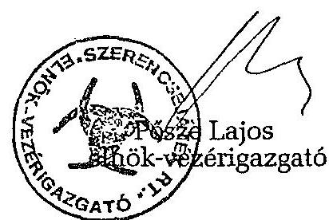

---

# 1992. július 9-i ülés határozatai

8/1992. A Szerencsejáték Részvénytársasághoz érkező közérdekű célok támogatására irányuló kérelmeket 1992. július 1-tól kezdődően három tagú bizottság bírál el, amely a saját maga által megállapított szabályok szerint ülésezik.
A Bizottság tagjai: dr. Balsai József, Horváth Béla és dr. Simon Gábor. A Bizottság 1992. december 31-ig kap felhatalmazást a működésre azzal, hogy megalakulásukról és döntéseikről utólag tájékoztatni kötelesek az Igazgatóságot.
Az Igazgatóság egyúttal felhatalmazza az SZRT Elnök-vezérigazgatóját arra, hogy sürgős és kivételes méltánylást igénylő kérelmek tárgyában - utólagos beszámolás mellett - dönthessen.

9/1992. Az Igazgatóság felhatalmazza az SZRT Elnök-vezérigazgatóját arra, hogy külön hozzájárulása nélkül 30 millió forintos egyedi értékhatárig más társaságokban - akár meglévőkben, akár alakulóban - érdekeltséget (üzletrészt, részvényt stb.) szerezzen, az igazgatósági keret határáig.

10/1992. Az SZRT az illetékes önkormányzattal egyezteti a Nemzeti Lóverseny Kft. tulajdonát képező ingatlanok esetleges tulajdonjogi kérdéseit az üzletrész megvásárlása előtt. Az SZRT kísérelje meg azt, hogy legalább 51%, legfeljebb 81% mértékű üzletrészt szerezzen a Kft-ben az ÁVÚ-tól 110%-os árfolyamon, 150 millió forint egyösszegű lefizetése mellett azzal, hogy a vételár fennmaradó részét kamatmentesen, évi egyenlő részletekben fizessen meg legkésőbb 1998. december 31-ig.

A vásárlásnak a Kft-n belüli 75% mértékű szavazati jog megszerzésére kell irányulnia. A szavazás során feltételként meg kell valósulnia annak, hogy az ÁVÚ az SZRT-vel együtt szavazzon - ha az üzletrészek megoszthatók - az opció lejártáig.

11/1992. Csizmás Béláné és dr. Kollin Ferencné cégjegyzésre történő felhatalmazását az Igazgatóság nevezettek munkaviszonyának megszűnése miatt visszavonja.
Dr. Malasics András cégjegyzésre történő felhatalmazását - a vezérigazgató-helyettesi beosztás megszűnése miatt - visszavonja. Kötelezi egyúttal az SZRT-t arra, hogy az aláírási jogok töröltetése érdekében a Cégbíróságnál eljárjon.

12/1992. A Szerencsejáték Részvénytársaság az 1993. évi támogatási keret terhére 25 millió forint összeget folyósíthat az MLSZ részére szponzori támogatásként oly módon, hogy az összeg után járó időarányos kamatokat is figyelembe kell vennie majd a véglegesen kialakítandó támogatás összegénél.

---

# Emlékeztető

Az SZRT Igazgatóságának 8/1992. határozata alapján a mai napon megtartott bizottsági ülés az alábbi határozatot hozta:

Értesülve arról, hogy az Elnök-Vezérigazgató Úr által 1992. július 1. után elbírált, sürgős és kivételes méltánylást igénylő kérelmek miatt az 1992. év végéig rendelkezésre álló összeg csekély nagysága (kb. 30 millió Ft) indokolatlanná teszi a Bizottság további működését, ezért a Bizottság tagjai további közreműködésüket megszüntetik.

Budapest, 1992. szeptember 3.
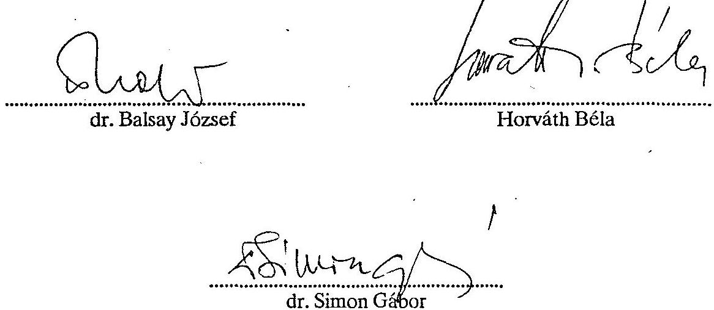

Kapják: Elnök-Vezérigazgató Igazgatóság tagjai Felügyelő Bizottság elnöke

---

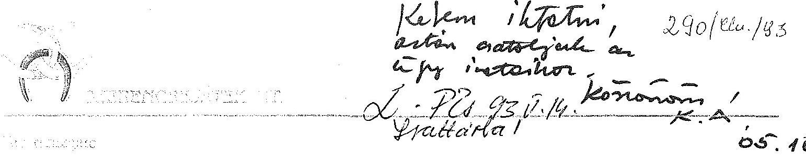

# Hágelymayer István úr, az Állami Számvevőszék Elnöke

## Budapest

## Tisztelt Elnök Úr!

Köszönettel megkaptuk az 1993. május 5-én kelt, V-25-29/1993. számú levelüket, amelyből értesültünk, hogy az Állami Számvevőszék elkészítette és lezárta a Szerencsejáték Rt. 1991-1992. évi működésének és gazdálkodásának ellenőrzéséről szóló jelentést.

Tisztelettel jelezni szeretnénk, hogy az ÁSZ által
 lezárt jelentéshez, annak gondos áttanulmányozása és az első változattal történő egybevetése alapján élve a törvényes előírások adta lehetőséggel - 8 napon belül észrevételt kívánunk tenni.

Budapest, 1993. május 7.
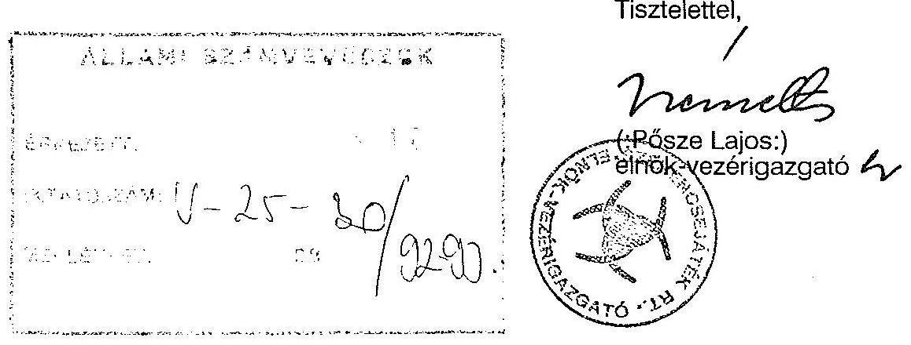

---

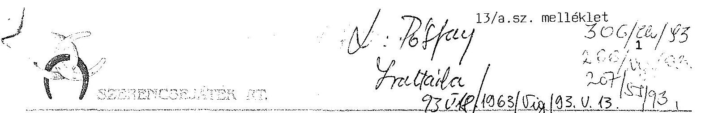

Dr. Hagelmayer István elnök úr részére
Állami Számvevőszék
Budapest

Tisztelt Elnök Úr!

Köszönettel megkaptam az ÁSz jelentését a Szerencsejáték Rt. 1991-92. évi működésének és gazdálkodásának ellenőrzéséről. Az Ön által is, és a törvény által is biztosított módon néhány észrevételt szeretnék tenni a végső változathoz:

# 1./ 4. old. utolsó bekezdés 

Szükségesnek tartom hangsúlyozni a lóversenyzés megítélésénél azt a tényt, hogy a lóversenyfogadást szervező kft. csak 1993. áprilisában került az SzRt. tulajdonába, így azt megelőzően nem láttuk értelmét annak, hogy a Nemzeti Lóverseny Kft-be - amely 1992. augusztusában került a tulajdonunkba - tőkét invesztáljunk. A fenntebb említett ok miatt arra sem volt lehetőségünk, hogy hozzákezdjünk a lóversenyzés nyereséges működtetésének megvalósításához: a fogadásszervezés korszerűsítéséhez. Természetesen a fogadásszervező kft-t is 1992. augusztusában szerettük volna átvenni, de rajtunk teljesen kívülálló, bürokratikus, ellenérdekeltségekre visszavezethető okok miatt és az ígéretek ellenére ez csak 1993. áprilisában sikerült.

## 2./ 5. old. 3. bekezdés

Feltétlenül szükségesnek tartom, hogy itt az aggregált számok helyett tételesen legyen az 1991-es 480 MFt , ill. az 1992-es 1.060 MrdFt , mint közérdekű kötelezettségvállalásra fordított összeg megbontva: így pl. 1991-ben a Szerencsejáték Alapba 248 MFt-ot kellett befizetnünk, 1992-ben az 1.060 MrdFt-ból 790 MFt-ot. Ha az összefoglaló anyagban ez a megosztás nem történik meg ilyen világosan, úgy az félrevezető és félreértelmezhető.

---

Mint korábbi esetekben, most is megjegyzem, hogy támogatásaink odaítéléséhez nem feltétlenül szükséges az ún. belső szabályozás. A támogatások odaítélése az ÁSz jelentés szerint is törvényes volt és a realizált támogatások véleményem szerint összehasonlíthatók és állják a próbát mindazokkal a támogatási rendszerekkel, amelyekben bonyolult, bürokratikus apparátus költséges mechanizmussal vesz részt a döntések előkészítésében, ill. azok meghozatalában.

# 3./ 5. old. 4. bekezdés 

Nem csupán a sürgős elbírálási igények miatt volt centralizált a döntési rendszer, hanem a fenntebbi pontban vázolt elv miatt is. Egyébként a sürgősségi motívumokat természetszerűleg és törvényszerűleg az élet adja ma Magyarországon. A sok helyen még nem megfelelően működő irányítási, támogatási, leosztási rendszerek miatt ad hoc jelleggel merülnek fel olyan problémák, amelyeket ha a záros, általában rövid határidőn belül nem sikerül megoldani, akkor egy szép elképzelés, egy közösség álma eshet kútba.

## 4./ 6. old. 1. bekezdés

Téves az a megállapítás, hogy egyes közérdekű kötelezettségvállaló okmányok az egyszemélyi döntések meghozatalánál általában nem álltak rendelkezésre. Téves voltán túlmenőleg ez a megállapítás ellentétben van a 28. old. 2. bekezdésben foglaltakkal, amire még a későbbiekben visszatérek. Valójában az esetek döntő többségében ezek rendelkezésre álltak. Kétségtelen, hogy voltak olyan esetek /talán az összes eset 10 %-a/, amikor a támogatási kérelem jellege miatt az utólagos adatpótlásba és kiegészítésbe is beleegyeztem. Ezeknél az eseteknél viszont úgy ítéltem meg, hogy a kérelmek sürgőssége (pl. nyári gyermektáborok támogatása, egy-egy kulturális vagy sportegyesület utazási jegyeinek megvásárlása, stb.) és időbeli kötöttsége a megvalósulás érdekében fontosabb szempont, mint a pótlandó adatok beérkezésének időpontja.

## 5./ 6. old. 2. bekezdés

Nem értek egyet azzal a megfogalmazással, hogy "ilyen eljárási mechanizmus", "szubjektív döntési rendszer", "elfogadhatatlan", stb. Úgy gondolom, hogy annak a sok száz kis közösségnek, amely sok tízezer ember boldogulását segítette elő egy-egy területen, szintén ez volna a véleménye.

---

# 6./ 6. old. utolsó bekezdés 

A DANUBIUS Rt.-vel kapcsolatos kártérítési ügyet illetően ismét leszögezem, hogy a dolgok ilyetén történő alakulása mintegy 20 MFt tiszta többleteredményt hozott az SzRt.-nek, mert az alacsonyabbra lealkudott ár és a kártérítés együttes alkalmazása következtében - tekintettel arra, hogy a szóbanforgó vételár a további üzletrészek megvásárlásakor bázisárául szolgált - összességében egyértelműen kedvezőbb volt a cég számára. Így tehát az eset inkább körültekintő, a cég számára előnyös eljárásnak minősíthető.

## 7./ 7. old. 1. bekezdés

Nehezen értelmezhető számomra, hogy a támogatások esetleg ellentétesek lehettek volna bármilyen okból az állam érdekeivel. Ma Magyarországon ugyanis minden állami többségi tulajdonban lévő cég jelentős közérdekű támogatási tevékenységet folytat és a fenti okfejtés elfogadása esetén az államnak az lehetne esetleg az érdeke, hogy egyáltalán semmilyen közérdekű támogatást ne folytassanak nyereséges cégei. Ez nyilvánvalóan nem igaz. Az államnak éppen a rendszer biztonságosabb működése, a feszültségek oldása, a közérdekű kezdeményezések támogatása a valódi érdeke. Nem véletlen, hogy összességében mintegy 6 MrdFt-nál is nagyobb összeget tettek ki 1992-ben a közérdekű támogatási befizetések. Ugyanakkor e pont kapcsán fejezem ki őszinte csodálkozásomat, hogy immár harmadszor tér vissza a szerkesztő az összefoglaló anyag keretén belül a támogatásokra, miközben olyan lényeges, ma Magyarországon ritka, az állam szempontjából fontos kérdésekről, mint pl. a költségvetési befizetések egyik évről a másikra történő 700 MFt-os növelése változatlan árak és jelentős vagyonnövelés mellett - egyáltalán nem ejt szót az összefoglalás.

## 8./ 7. old. utolsó bekezdés

Félrevezető lehet a bekezdés első mondata, amely úgy fogalmaz, hogy az Rt. belső ellenőrzése számos vizsgálatot végzett, azonban az ÁSz által kifogásolt területek ellenőrzésére nem kapott megbízást. Ez a megfogalmazás arra utalhat, hogy itt esetleg mulasztást követett volna el az Rt. belső ellenőrzése. A valóságban pedig arról van szó, hogy természetes módon mást vizsgálhat a belső ellenőr és mást az ÁSz.

---

# 9./ 8. old. 4. bekezdés 

Miközben minden vizsgálat, így az ÁSz vizsgálat is, segítségünkre van munkánk tökéletesítésében, ennél a bekezdésnél megismétlem azt a korábbi állításomat, amely szerint elsősorban nem a vizsgálat nyomán, hanem a számviteli törvényben bekövetkezett változások következetes alkalmazása okán kezdtünk hozzá néhány területen a korábbi gyakorlat megváltoztatásához.

## 10./ 9. old. 2. bekezdés

E bekezdésnél ismételten előadom azon véleményemet, amely szerint közérdekű célok támogatása nem ütközhet az állam tulajdonosi érdekeivel egy racionálisan működő politikai-gazdasági rendszerben.

## 11./ 10. old. 3. francia bajusz

A bekezdés utolsó két mellékmondata az első jelentésekben nem szerepelt, ezért ezek forrása számunkra ismeretlen.

## 12./ 10. old. 5. francia bajusz

E bekezdés szintén nem szerepel a jelentés első verziójában, így ennek valódi tartalma és forrása számunkra ismeretlen.

## 13./ 15. old. 2. bekezdés

Ismét hangsúlyozom, hogy az új SzMSz elkészítése jóval az ÁSz vizsgálat előtt megkezdődött és azzal semmilyen összefüggésben nem volt. Hangsúlyozom továbbá azt is, hogy egy SzMSz-nek nem feltétlenül kell a közérdekű támogatások odaítélésének rendjével foglalkozni. A bekezdés ezzel szemben azt sugallja, hogy az új SzMSz az ÁSz vizsgálat hatására készült volna el, és hogy abban feltétlenül szerepelnie kellett volna az odaítélés rendjének. Ezek a tények nem felelnek meg a valóságnak.

## 14./ 27. old. 5., 6., 7. bekezdés

Szubjektív véleményalkotásnak tartom azt, hogy az eredménytartalékból történő támogatások szabályozása és különösen a kapcsolódó napi eljárási gyakorlat nem megfelelő az SzRt.-nél. Véleményem szerint ez a

---

megfogalmazás túlzó, hiszen a tényleges gyakorlat a következő: a kérelmek beérkeznek, ha a téma megengedi, akkor feltétlenül bekérjük az összes kiegészítő iratot /az esetek 90 %-ában/, döntünk a támogatás mértékéről, kiutaljuk a pénzt és fél évvel később beszámoltatunk minden alapítványt az összeg felhasználásáról. Ez a folyamat lényege, és ez megfelelő. A megvalósítás mikéntjéről lehet és talán szükséges is beszélni, de ez már a lényeget nem érinti.

# 15./ 28. old. 2., 3., 4. bekezdés 

Erősnek tartom a 2.sz. bekezdésben az "elfogadhatatlan" szó használatát a már fenntebb kifejtettek miatt, és ismételten őszinte csodálkozásomat fejezem ki amiatt, hogy eme bekezdéshez érve már lassan két és fél oldala foglalkozik a témával az anyag. A második bekezdés ráadásul teljesen ellentmond a 6. old. 1. bekezdésnek, amelyben az szerepel, hogy "általában nem álltak rendelkezésre". Ezzel szemben a 28. old. 2. bekezdésében az szerepel, hogy a vizsgáló szerint szükséges adatok beszerzését "a támogatások folyósítása nemritkán megelőzi".

A valóság valójában az, hogy az esetek meghatározó többségében az iratok rendelkezésre álltak, erre az állapotra utal végül is a 28. old. 4. bekezdése is, amelyből az derül ki az ÁSZ jelentése alapján, hogy a vizsgálat befejezésekor már csak kis töredéknyi támogatásnál volt felfedezhető valamilyen típusú irat- vagy adathiány, amely egy természetes folyamat, nevezetesen az adatszolgáltatás időigényes dolog. Ez az arány azóta még tovább csökkent.

## 16./ 33. old. 3. bekezdés

Értelemszerűen ide idézem azon korábbi megjegyzésemet, amelyet már a 6. old. utolsó bekezdése kapcsán tettem a DANUBIUS Rt.-vel kötött üzletet illetően.

Végezetül mégegyszer megköszönve a lehetőséget, hogy észrevételeimet kifejthettem az Elnök Úrnak, szeretnék még egy megjegyzést tenni a jelentésben foglalt adatok titkosságával kapcsolatban. A korábbi fázisban nem kértem konkrétan a jelentés titkosítását. Ezt elsősorban a tárcaközi körözés nem is engedte volna meg, mert hamarabb került ki az első verzió, minthogy én megtudtam, ill. megkaptam. Ugyanakkor tekintettel a jövőre, nevezetesen arra, hogy titkosítás nélkül tetszőleges nyilvánosság elé is elkerülhet az anyag, a cég

---

érdekeire való tekintettel - ne felejtse el, hogy pl. lottó üzletágban is konkurenciával élünk együtt a piacon - kérem, hogy minden olyan adatot kezeljenek bizalmasan, ill. titkosan, amely adat túlmegy a letéti mérlegek és a cégbírósági anyagok adattartalmán.

Így pl. kérem, hogy titkosítsák az SzRt. által odaítélt közérdekű támogatások konkrét listáját. Erre többek között azért is van szükség, mert mindaddig, amíg a közérdekű támogatásokat végző összes céget nem bátorítják, kötelezik a támogatások tételes nyilvánosságra hozatalára, addig egy ilyen akció esetünkben cégünket hátrányosan érintené, hiszen a téma iránti felfokozott érdeklődést egyedül kellene levezetnünk.

Természetesen azzal egyetértek, hogy megfelelő kormányzati és törvényhozási szervek kellő titoktartási kötelességgel tetszőleges mélységű betekintést kapjanak cégünk életébe.

Tájékoztatnom szükséges Elnök Urat arról is, hogy néhány, az Önök vizsgálata által is feltárt probléma megoldását cégünk régóta elő kívánja segíteni. Így pl.: számos lehetőséget feltárva, írásban fordultunk a Pénzügyminisztériumhoz 1992. nyarán a totóbevételek és a labdarúgás támogatása közötti kapcsolat törvényes megvalósítása végett. Sajnálatos módon sem szóbeli, sem írásbeli választ, reagálást nem kaptunk azóta sem a PM-től.

Úgyszintén 1992. nyarán részletes írott tájékoztatás formájában informáltuk a PM-et a magas adók jövőbeli (1-1 1/2 éves távlatban) kihatásáról a cég eredményességét és működőképességét illetően. Sajnálatos módon erre a hivatalos írásbeli megkeresésünkre sem kaptunk mind a mai napig semmilyen reagálást.

Ezért is örülök annak, hogy a PM reagált Önöknek a tárcaközi körözés keretében megküldött anyagra, ami annak a jele, hogy nem feltétlenül általános gyakorlat a PM részéről a hivatalos beadványok, kérelmek megválaszolatlanul hagyása. Azt viszont sajnálom, hogy a fenti két, cégünk működése szempontjából fontos problémára a PM anyag sem tért ki.

---

Ismételten szeretném megköszönni Elnök Úrnak és munkatársainak azt a munkát, amelyet a Szerencsejáték Részvénytársaság átvilágítása érdekében végeztek, és biztosíthatom arról, hogy a
 legrövidebb időn belül és látványosan igyekszünk változtatni azokon a dolgokon, amelyek a közös munka eredményeképpen változtatásra szorulnak.

Bp., 1993. május 13.
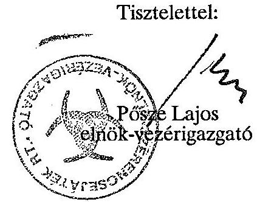

---

Budapest, 1993. május 21. V-25-38/1992/1993.

PÖCZE LAJOS úr, a Szerencsejáték Rt. elnök-vezérigazgatója

# BUDAPEST

Tisztelt Elnök-vezérigazgató Úr!

Köszönettel megkaptam észrevételeit a Szerencsejáték Rt. 1991-1992. évi működésének és gazdálkodásának ellenőrzéséről szóló ÁSZ jelentéshez.

Az Ön levelét szándékomban áll a jelentéshez csatolni. Néhány kérdésben eltér a véleményünk, ezért az Ön levele szerinti sorrendben ismertetem álláspontom.
1.) A 4. oldal utolsó bekezdése

A lóverseny-fogadás szervező kft. és a Nemzeti Lóverseny Kft. tulajdonukba kerülésének időpontjára vonatkozó, pontosító magyarázatát megköszönöm. Ez is bizonyítja, hogy eredményeik még nem értékelhetők, így nem látok indokot álláspontom megváltoztatására.

---

2. Az 5. oldal 3. bekezdése

A Szerencsejáték Alapba befizetett, valamint az egyéb közérdekű kötelezettségvállalásra fordított összeg együttes szerepeltetése a jelentés összefoglaló részében a pénzügyi nagyságrend átfogó érzékeltetését szolgálja. Úgy vélem, a részletező megállapításoknál kellő tagolásban, elkülönülten tartalmazza a jelentés az egyes jogcímeken történt felhasználást. Így véleményem szerint egyértelmű, hogy mely összeg felhasználását szabályozta jogszabály és mely összegről történt saját hatáskörben döntés. Mint Ön is megjegyezte, az ÁSZ jelentés tartalmazza azt is, hogy az eljárás törvényes volt.
3.) Az 5. oldal 4. bekezdése

A saját hatáskörben odaítélt közérdekű támogatások ügyében véleménykülönbségünk fennmarad. Az a kifogás tárgya, hogy Ön nem tartott igényt arra, hogy az Önre bízott állami vagyon feletti rendelkezései során szélesebb körű, körültekintő döntés-előkészítést szervezzen meg. Természetesen tudom azt is, hogy az Ön szubjektív eljárásai nem ütköznek a jog tételes szabályaiba. Kérem azonban, fogadja el: az ÁSZ-nak felelőssége van abban, hogy az állami vagyon védelme és a körültekintő, sokoldalúan megalapozott döntéshozatal igényéből kiindulva az ilyen magatartását kifogásolja.
4.) A 6. oldal 1. bekezdése

A közérdekű kötelezettségvállaló okmányok hiánya miatti megállapítást Ön tévesnek minősítette. Megemlítem Önnek, hogy a vizsgálat során - munkatársaim kérésére - gyűjtötték össze az összetartozó dokumentumokat, mert ezek korábban - mint elismerték - nem csatlakoztak, vagy esetlegesen kerültek egymáshoz. Az "általában" szó tehát a döntések időpontjára vonatkoztatott és tény. Más kérdés - és ezt ismételten e helyen is kifogásolom -, hogy a társasági adó bevallásakor 130 millió Ft, és még a vizsgálat végén is (munkatársaim kérése és az Önök által ismert kifogások ellenére is) 33 millió Ft ügye rendezetlen volt.
5.) A 6. oldal 2. bekezdése

Az eredménytartalékból történt támogatások egyszemélyi odaítélését a jelentésben kifogásoltuk. Szubjektivitásunk kérdésével kapcsolatos megjegyzését azért tartom méltánytalannak, mert a jelentés az Önök elmarasztalása mellett elismerte, hogy a támogatások bizonyára hasznos célokat is szolgáltak, valamint, hogy az Önök általi korrekciókra - az adókedvezmény érvényesítésére - még lehetőség van.
6.) A 6. oldal utolsó bekezdése

A Danubius Rt.-vel kapcsolatos kártérítési ügyben a levelében leírtak az Ön véleményét tartalmazzák. A leírások tényét Ön sem vitatja, ezért álláspontom az, hogy a jelentésben foglaltak helytállóak.
7.) A 7. oldal 1. bekezdése

Az alapítványi támogatások odaítélésének tulajdonosi érdekből kiinduló elmarasztalását az teszi szükségessé, hogy Ön az esetek többségében úgy hozta meg egyszemélyi döntését, hogy bizonyíthatóan nem ismerte a támogatás közérdekűségét, illetve arról csak szubjektív benyomásai lehettek. (Utalnék a 4./6.1. ponthoz adott viszontválaszomra.)

---

Szeretném továbbá azt is jelezni, hogy az Ön kifogásával ellentétben a jelentés messzemenően elismeri gazdálkodási eredményeiket, többek között az ÁSZ jelentése 4. oldalának 3. bekezdése erről szól.
8.) A 7. oldal utolsó bekezdése

A Szerencsejáték Rt. első ellenőrzésének munkájára utaló felvetésével egyetértek. Magyarázatát köszönöm. Az Ön hozzám írt levele és válaszom csatolva lesz a jelentéshez.
9.) A 8. oldal 4. bekezdése

A számviteli törvény bevezetése miatti változtatásokat az ÁSZ ellenőrzése nem kifogásolta. Az ÁSZ vizsgálata időszakában megkezdett javító szándékú intézkedéseiről pedig a jelentés tényszerűen és tárgyilagosan szól.
10.) A 9. oldal 2. bekezdése

Az alapítványoknak nyújtott közérdekű támogatására vonatkozó észrevételeit a korábbi, e tárgybani megjegyzéseire vonatkozó válaszommal megadtam. Engedje meg, hogy az ellenőrzés alapján az ÁSZ elnöke arra a következtetésre jusson, miszerint az eljárási mechanizmus számos esetben kifogásolható volt.

11-12.) A 10. oldal 3. és az 5. francia bekezdése

Az ÁSZ elnöki testülete, mint ennek lehetőségéről a V-25-18/1992/93. (IV.14.) számú levélben tájékoztatást kapott, fenntartja magának a jogot, hogy a számvevő jelentése alapján módosítsa a következtetéseket és javaslatokat is.

---

A számvevői jelentést sokoldalúan véleményezik, jogilag kontrollálják és az általam aláírt jelentés tartalmazza az ÁSZ végső álláspontját.
13.) A 17. oldal 2. bekezdése

Az új Szervezeti és Működési Szabályzat a helyszíni ellenőrzés befejeztével még nem volt jóváhagyva. A megállapított tény valós és nem sugall semmit.

14-15.) A 27. oldal 5, 6, 7. bekezdése, valamint a 28. oldal 2, 3, 4. bekezdése

Az alapítványoknak eredménytartalékból nyújtott támogatásokkal kapcsolatos észrevételeire álláspontomat az előzőekben kifejtettem.

Megköszönöm tájékoztatását arról, hogy az alapítványoknak kiutalt pénzösszeg felhasználásáról utólag beszámoltatják a kedvezményezettet.
16.) A 33. oldal 3. bekezdése

A Danubius Rt.-vel kötött üzletet illetően már jeleztem, hogy a vizsgált időszakban fennállt gazdasági körülményeket ítélte meg a revízió. A tények abban az időben a leírtak voltak, örvendetes, ha utólag kedvezően rendezték az ügyet.

Ön azzal a kéréssel fordult hozzám, hogy az alapítványi támogatások tételes listáját titkosítsam. Erre nincs indokom, és egy ilyen lépés meggyőződésem szerint éppen ellentétes hatású lenne mint a szándéka, hiszen az Ön levele azt tartalmazza,

---

meg van győződve arról, hogy a pénzösszegeket jó célra juttatta. Önök a vizsgálat során a jelentéshez csatolt mellékleteket mint hiteles dokumentumokat bocsátották rendelkezésünkre, s az egyeztetés folyamán - bár módjuk lett volna - nem tettek pontosításokat. Álláspontom szerint: a nyilvánosság kizárja a találgatásokat, a félreértéseket. Azt vállalni kell.

Egyébként az ÁSZ eddig minden esetben nyilvánosságra hozta - ahol ilyen volt - a támogatási adatokat is, és szándékunk szerint mindenütt a jövőben is ezt teszi, ahol állami vagyonról, pénzeszközökről van szó.

A totó-lottó adatok összevontak, gondosan ügyeltünk arra, hogy az SZRt. üzleti érdekei ne csorbuljanak. Egyébként Ön sem konkretizálja mely adatokat kellene titkosítani ezek közül. Megjegyzem, korábbi gyakorlatunkban ez nem okozott gondot. Következésképpen a jelentést nem kívánom titkosítani.

Ez alkalommal is megköszönöm korrekt együttműködését a vizsgálatban, külön köszönve, hogy kilátásba helyezte megállapításaink hasznosítását.
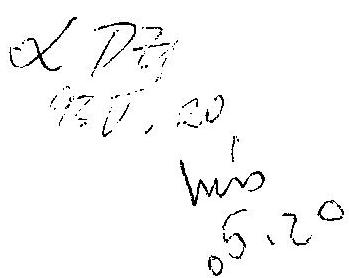

Tisztelettel
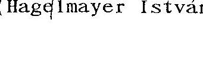
(Hagelmayer István)

---

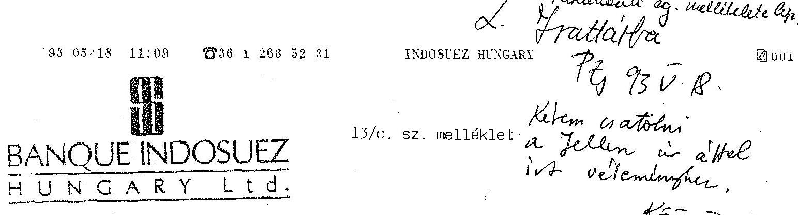

# TELEFAX

Phone number: (36-1) 266-8092
(36-1) 266-8093

To: Állami Számvevőszék
Fax number: 138-4710

Attention: Dr. Kovács Árpád Számvevő igazgató úr

From: Jellen Sándor
Fax number: (36-1) 266-5231

Date: 1993. május 18.
Total number of pages: 1

Tisztelt Kovács úr!

Hivatkozással V-25-36/1992/93 számú levelére, szíves tájékoztatásul közlöm, hogy véleményemnek a jelentéshez való csatolásához hozzájárulok. Kérem, hogy véleményemet az Állami Vagyonkezelő Részvénytársaság elnök-vezérigazgatója részére is szíveskedjék megküldeni, hogy a tulajdonos is tájékozott legyen.
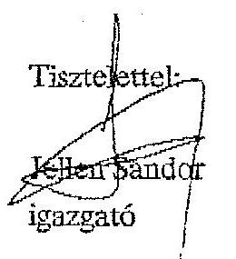

---

Budapest, 1993. május 17. $\mathrm{V}-25-26 / 1992 / 93$.

JELLEN SÁNDOR úr, a Szerencsejáték Rt. Felügyelő Bizottságának elnöke

# BUDAPEST

Tisztelt Elnök Úr!

Elnök úr megbízásából - megköszönve a Szerencsejáték Rt. ellenőrzéséről készült ÁSZ jelentéshez adott véleményét - kérem szíves hozzájárulását postafordultával ahhoz, hogy véleményét a jelentéshez csatolhassuk.

Tisztelettel
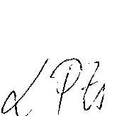
(dr. Kovács Árpád)

---

# Határidő Bám

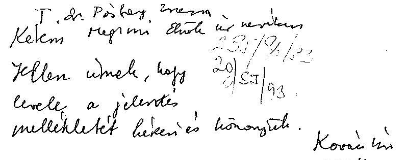

13/d.sz. melléklet

Hagelmayer István úr, az Állami Számvevőszék elnöke

Budapest

Tisztelt Elnök úr,

A Szerencsejáték Rt. Felügyelő-bizottsága nevében köszönettel vettem megtisztelő bizalmát, amellyel a Vállalat vizsgálati anyagát részemre megküldte. A levélben lehetővé tett észrevételezési lehetőséggel, - szíves tájékoztatására - az alábbiak szerint élek:

## Általánosságban:

Miután az Állami Számvevőszék ilyen jellegű jelentéseit a tulajdonosi jogokat gyakorló Állami Vagyonkezelő Rt.-n kívül a Vállalat működését ill. annak eredményességét érdemben befolyásolni képes állami szervek illetékes döntést hozó vezetői is megkapják, talán célszerű lenne néhány kérdést hangsúlyosabban fogalmazni és ezzel a megállapított kórkép mellé valamiféle gyógymódra is javaslatot tenni.

## Tételesen:

Kiemelt szerepet kap a vizsgálati anyagban a rendelkezésre álló pénzeszközök támogatási célú felhasználásának kérdése.

A Vállalatnál ez a kérdés eredetileg megoldott volt, miután a döntéseket egy négytagú testület hozta, ill. ennek kellett volna hoznia. A kialakult gyakorlat nagy valószínűséggel "magyar specifikum", azaz egy tehetséges és hiperaktív vezető, valamint három precíz szakértő nem azonos fordulatú együttműködése, együtt-nem-működéssé vált és a három kurátor lemondott. Talán az eredeti kuratóriumos állapot (esetleg más összetételű) visszaállítása lehetne a megoldás, ezt a soron következő közgyűlésen az egyszemélyes tulajdonos határozattá

---

"szentesíthetné". Ugyanez érvényes az alapítványi kölcsönök odaítélésére és lejáratának ellenőrzésére egyaránt. Mindkét kérdés haladéktalanul beépülhetne a most közreadott SZMSZ-ba és ezzel ezek lekerülhetnének a napirendről. További finomítást, vagy pontosítást jelenthetne, ha a kuratórium

- negyedéves, vagy féléves limitet kapna
- meghatározott értékhatár (pl. a negyedéves limit 20%-a feletti egyedi kérelem esetén az Igazgatóság döntését kellene, hogy kérje.

Kifogásolja, legalábbis megemlíti a jelentés a vezérigazgató által jóváhagyott "kötelezettségvállalásról, utalványozásról" szóló vezérigazgatói utasítás azon megkötését, hogy a vezérigazgató összeghatárra való tekintet nélkül vállalhat kötelezettséget ill. utalványozhat. Tekintettel arra, hogy a Szerencsejáték Rt. egyszemélyes részvénytársaság, ahol az éves tervet a tulajdonos a közgyűlésen hagyja(hagyta) jóvá, ha ezek az összeghatár nélküli felelősségvállalások ill. utalványozások a terv előírás-keretén belül maradnak, és a jóváhagyó elnök-vezérigazgatóként van kinevezve a jogszerűség nem vitatható. A tulajdonosnak joga van és ezzel a közgyűlésen élhet, limitet szabni az elnök-vezérigazgató számára akármilyen értékhatárig csökkentve a jogosultságot, de ezt az alapszabályban kell rögzítenie. További megoldást jelenthet az elnök-vezérigazgatói megbízatás kettéválasztása és bizonyos értékhatár felett kettős aláírás előírása.

Az elnök-vezérigazgatói cím kettéválasztása több megkifogásolt kérdésben megoldást jelent, így nem egy személy dönt az alapítványoknál, a késedelmes kölcsön-visszafizetéseknél, a vállalkozási szerződéseknél stb. Közhelyszerűen nyilvánvaló, hogy ebben az esetben az eddigi igen gyors "ügyintézés" valamelyest le fog lassulni. Az, hogy ennek az eredményességre lesz-e hatása, vagy nem, az előre nem határozható meg. A legcélszerűbbnek egy reális egyszemélyi limit meghatározása tartható. Ennek mértékét az utalványozás céljától és/vagy kedvezményezettjétől függően kell megállapítani, és ezen limit felett, kétszemélyes aláírási rendet kell előírni, ill. ha marad az elnök-vezérigazgatói beosztás, úgy a limit felett egy igazgatósági tag ellenjegyzését lehet kérni.

Több helyen taglalja az anyag a Vállalat költségvetési kapcsolatait mint olyanokat, ahol ez a Vállalat a normatív átlaghoz viszonyítva kedvezőtlen helyzetben van.

A Szerencsejáték Rt. speciális helyzetét nem vitatva célszerű lenne, ha az ÁSZ vizsgálata e téren is szignalizálna, így például megfontolható lenne a normatív elvonás degressziója egy adott forgalom, vagy jövedelmezőség felett, hogy a

---

Vállalat anyagi érdekeltsége a jelenleginél jobban biztosított legyen. Hasonlóképpen megfontolható lenne a "létrehozott" Nemzeti Lóverseny Kft-nél, ahol a korábbi évek elmaradásai miatt rendkívül nagy a beruházási igény (amit most a "Tulajdonos" költségén kibocsátott kötvényekkel kísérel meg a Vállalat fedezni), eltekinteni a most bevezetett 20%-os forrásadótól, ami egyértelműen a "zug" bookmekerek irányába tereli el az amúgy is lecsökkent fogadási kedvet. Az elvonás tényét meghagyva, hogy a normatívitás ne csorbuljon, az elvont forrásadóval azonos összeget a "Hazai lóversenysport támogatása" címén vissza kellene juttatni a Vállalathoz, ennek
 megelőző propagandát adva.

A Vállalat által kezdeményezett befektetések kérdését a felügyelő bizottság is tárgyalta, a legutóbbi ülésen egy átlagrentabilitáshoz való hozzámérését javasoltuk.

Tisztelt Elnök Úr, bízom abban, hogy észrevételeim ill. javaslataim nem esnek távol elképzeléseiktől és azok egy része - a Vállalat javára - hasznosulhat.

Levelét úgy értelmeztem, hogy az arra adott választ kizárólag Ön kívánja megkapni; ennek megfelelően azt két példányban küldöm, kérve, hogy az egyik példányt Teleki Pál elnök-vezérigazgató úr részére továbbíttatni szíveskedjék:

1993. május 7.

Tisztelettel
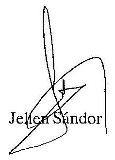

---

Hagelmayer István úr elnök

Állami Számvevőszék
Budapest

Tisztelt Hagelmayer úr!

A Szerencsejáték Rt. 1991-1992. évi működéséről és gazdálkodásáról szóló jelentést köszönettel megkaptam.

A Magyar Szerencsejáték Vállalat átalakulásával kapcsolatos megállapításra reagálva tájékoztatom, hogy az Állami Vagyonügynökség Igazgatótanácsát az átalakulásról szóló döntés visszamenőleges hatállyal történő meghozatalában az 1992. augusztus 28-ig hatályos jogi szabályozás szerint semmilyen előírás nem korlátozta.

A jelentés egyéb részeihez észrevételt nem teszünk. T. Ar. Po'fay 'sume!'

Budapest, 1993. május 10.
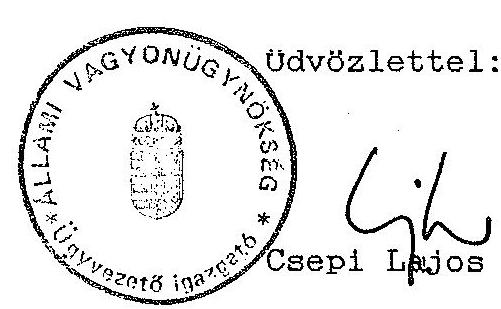

---

13/f. sz. melléklet Budapest, 1993. május 19. $\mathrm{V}-25-37 / 1992 / 93$.

DR. CSEPI LAJOS úr, az Állami Vagyonügynökség ügyvezető igazgatója

# B U D A P E S T 

Tisztelt Csepi úr!

Megköszönöm a Szerencsejáték Rt. 1991-92. évi működéséről és gazdálkodásáról szóló ÁSZ jelentéshez kapcsolódó észrevételeit.

Sajnálom, hogy a vállalat átalakulásának szabályosságára vonatkozó álláspontját nem indokolta. Véleményét nem áll módomban elfogadni.

A Szerencsejáték Vállalat és a Szerencsejáték Rt. egy nap eltéréssel történő átalakítása azért nem volt összhangban a hatályos jogszabályokkal, mert alapvetően az átalakulásról szóló 1989. évi XIII. törvény 74. §-a, valamint a gazdasági társaságokról szóló 1988. évi VI. törvény 23-24. §-a előírásaival volt ellentétes.

---

Részleteiben az átalakulási törvény 7. §-ának az átalakulás meghirdetésére vonatkozó előírását is sérti az eljárás: egy nap alatt nem lehetséges meghirdetni az átalakulást, mert a cégközlönyben a két meghirdetés közötti 15 napos időköz nem biztosítható. További gond, hogy egy nap alatt még mint állami vállalatot sem jegyzi be a Cégbíróság, s kérdés, hogy ez esetben miként tett eleget a cég a cégbejegyző végzés csatolási követelményének. A törvény 74. §-a szerint a gazdasági társaság az alapszabály elfogadásának időpontjában jön létre. Következésképpen, ha visszamenőleg fogadta el az ÁvÜ az átalakulást, akkor kérdéses, hogy jogszerűen működött-e a társaság alapszabály nélkül.

A társasági törvény 25. §-a értelmében a cégbejegyzés megtörténte előtt a társaság nevében eljárók, korlátlanul és egyetemlegesen felelnek a közös név alatt vállalt kötelezettségekért. A felelősség kizárása vagy korlátozása a társaság hitelezőivel szemben hatálytalan. Ameddig az ÁvÜ jóvá nem hagyta az alapítást, egy jogilag "nem létező társaság" nevében jártak el annak vezetői.

Az alapszabály visszamenőleges jóváhagyása eleve jogszabályellenes magatartásra kényszerítette a Cégbírósághoz bejelentést tevőt, mert a társasági törvény 23. §-ának (1) bekezdése kimondja, hogy a társaság alapítását a társasági szerződés megkötésétől, illetőleg az alapszabály elfogadásától számított 30 napon belül - bejegyzés és közzététel végett - be kell jelenteni a Cégbíróságnak. A cégbejegyzésről szóló 1989. évi 23. tvr. 14. § (2) bekezdése pedig kimondja,

---

hogy a gazdasági társaság a cégjegyzékbe való bejegyzéssel a társasági szerződés megkötésével, részvénytársaságnál az alapszabály elfogadásának időpontjára visszamenőleg - jön létre. A konkrét esetben az alapszabály elfogadásától számított időtartamnak nem tudott eleget tenni a bejelentő, mert visszamenőleg 30 napon túl fogadták el az alapszabályt.

Úgy vélem, a felsoroltak kellően megalapozzák a jelentésben foglaltakat.
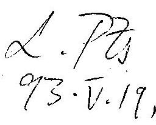

Tisztelettel
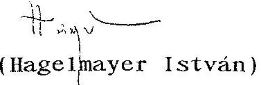
