9883. szám

# Állami Számvevőszék

## BESZÁMOLÓ

az Állami Számvevőszék 1992. évi munkájáról
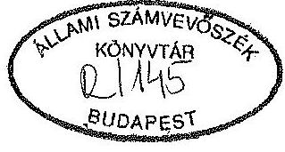

---

# BEVEZETŐ

Az Állami Számvevőszék (továbbiakban: ÁSZ) harmadik alkalommal készít beszámolót éves tevékenységéről. A beszámoló elsősorban az 1992-ben lezárult vizsgálatok általánosítható tapasztalatait foglalja össze. Mindenekelőtt a célszerű gazdálkodást, a költségvetésben központosított források, az állami vagyon hatékony hasznosítását gátló főbb hiányosságokra, s azok okaira hívjuk fel a figyelmet.

Az Állami Számvevőszék működésének három éve alatt végzett ellenőrzéseiről az 1. sz. mellékletben adunk tájékoztatást. Ebben jelentéseinket a számvevőszéki törvény által előírt kötelezettségek szerint csoportosítottuk.

A számvevőszéki tevékenység célirányos összegezésével közvetlenül is segíteni kívánjuk a törvényhozói munkát. Bemutatjuk azt is, hogyan reagáltak megállapításainkra az ellenőrzött szervezetek. A beszámoló 3. sz. mellékletében röviden ismertetjük az elmúlt évben készített jelentéseink tartalmát. Remélhetőleg ez is hozzájárul ahhoz, hogy teljesebb áttekintést adjunk tevékenységünkről.

Az ÁSZ működésével összefüggésben beszámolunk arról, hogyan gazdálkodtunk erőforrásainkkal, hogyan hasznosítottuk a nemzetközi kapcsolatokban rejlő lehetőségeket, s mit tettünk annak érdekében, hogy ellenőreink mindinkább megfeleljenek a számvevőszéki tevékenység magasszintű szakmai követelményeinek.

A múlt évi vizsgálatainkat 1991-hez képest is jelentősen megváltozott gazdasági környezetben végeztük. A kormányzati intézményrendszer átalakítása, kiépülése, valamint számos, korábban tervezett és 1992-ben hatályba lépett törvény nyomán is változtak a környezeti feltételek. A tavaly júniustól hatályos államháztartási törvény új kereteket teremtett a költségvetési gazdálkodásban az Országgyűlés, a Kormány, valamint a költségvetést végrehajtó minisztériumok, intézmények közötti hatáskörök megosztásához.

---

A költségvetés és a zárszámadás számvevőszéki vizsgálatakor elsődleges a törvények, a jogszabályok betartásának ellenőrzése. Vizsgálataink - miként világszerte a legtöbb számvevőszéknél - jellemzően utólagosak, döntően korábbi időszakra vonatkoznak. Végeztünk azonban néhány olyan ellenőrzést is, amelyek például törvények végrehajtásának előkészítésére, a végrehajtás megszervezésére irányultak.

Az elmúlt év végére megérett a helyzet arra, hogy az 1989 őszén előzmények nélkül alapított szervezetünk működési rendjét felülvizsgáljuk. Mérlegre tettük az Alkotmányban és a ránk vonatkozó törvényekben rögzített feladataink gyakorlati megvalósításának lehetőségeit, a korábban kialakított szervezeti rendszert és megújítottuk, újraszabályoztuk a feladatokat és hatásköröket. Az új szervezeti és működési szabályzat 1993. januárban lépett hatályba.

---

# AZ ÁLLAMI SZÁMVEVŐSZÉK 1992. ÉVI ELLENŐRZÉSI TEVÉKENYSÉGE

## 1. Az 1992. évi ellenőrzési feladatok teljesítése

Az Állami Számvevőszékről szóló törvény és más vonatkozó törvények, valamint országgyűlési határozatok alapján 1992-ben az előző évről áthúzódó 11 vizsgálat befejezését és 78 ellenőrzés megkezdését irányoztuk elő. A tervezett vizsgálatok a kapacitás döntő részét lekötötték. Ténylegesen 91 ellenőrzési feladattal foglalkoztunk. Közülük 73 vizsgálatot befejeztünk, 18 vizsgálat 1993-ban zárul le.

A múlt évre eredetileg tervezett feladatokon kívül az Országgyűlés által 1992-től biztosított létszámnövelés további vizsgálatok elvégzésére adott lehetőséget. Ez nemcsak az elvégzett feladatok számszerű növelését eredményezte, hanem - elsősorban az önkormányzatokat érintő vizsgálatoknál - lényegesen növelni tudtuk az ellenőrzött szervezetek számát is. Így 65 helyett 111 önkormányzatnál végeztük el a pénzügyigazdasági tevékenység törvényességi vizsgálatát.

Az ellenőrzési tervünkben eredetileg nem szereplő, a II. félévben felvett - részben még be nem fejezett - témák közül a legjelentősebbek az alábbiak voltak:
—a Szanáló Szervezet megszüntetése, a REORG Rt. alapítása tárgyában végzett vizsgálat,
—a Szerencsejáték Rt. pénzügyi-gazdasági ellenőrzése,
—a központi államigazgatási szervek létszám- és bérgazdálkodásának utóellenőrzése,
—az APEH működésének és gazdálkodásának ellenőrzése.

---

# 1.1 Az államháztartással kapcsolatos vizsgálatok

1.1.1 1992-ben először ellenőriztük egy olyan költségvetés végrehajtását, az 1991. évi zárszámadást, amely már teljes egészében az új Kormány tevékenységéhez kötődött, új szemléletben és szerkezetben készült. A korábbinál részletesebb törvényi szabályozás alapján először volt mód arra, hogy a Kormány gazdálkodását, a gazdálkodás törvényességét érdemlegesen mérlegre tehessük. Ez a munka szinte az egész szervezetünk közreműködésével készült és nagy erőpróbát jelentett. Helyszíni ellenőrzések alapján minősítettük a mérlegvalódiságot, a gazdálkodási szabályok betartását a minisztériumoknál, önkormányzatoknál. Számszakilag ellenőriztük a fő összefüggéseket. Megvizsgáltuk, hogy a Kormány a hatályos törvényeknek megfelelően élt-e az Országgyűlés felhatalmazásával. A jelentésben tételesen bemutattuk, hogy a Kormány, a pénzügyminiszter a költségvetés végrehajtásában mely területeken, pontokon tért el a törvényi felhatalmazástól, továbbá, hogy a zárszámadásban lévő elszámolások közül melyek azok, amelyek nem a valós pénzügyi folyamatokat mutatták.

A zárszámadás kapcsán a munkaközi kapcsolatokban és a parlamenti bizottság előtt is többször tárgyaltunk a Pénzügyminisztériummal. E szakmai konzultációknak az 1991. évi zárszámadás elfogadására nem volt ugyan hatása, de a jövőre nézve számos tanulsággal szolgált.
1.1.2 Az államháztartási törvény hatályba lépése után tartalmilag új feladatot jelentett az 1992. évi pótköltségvetési, valamint az 1993. évi költségvetési törvényjavaslat véleményezése. Az újszerűséget az jelentette, hogy a közpénzek kezelését egységes szerkezetben szabályozó új törvény részben tételes előírásokat tartalmaz, részben - keret jelleggel - számos olyan követelményt is támaszt, amelyek a költségvetési törvény szerkezetét, tartalmát a korábbiaknál sokkal pontosabban meghatározzák. Az ÁSZ felelősségét növelte, hogy észrevételeink meghatározóak lehetnek az elkövetkező időszak költségvetéseinek szerkezetére is.

Korábban az Országgyűlés csak formálisan gyakorolhatta költségvetési jogát, és igény sem volt arra, hogy a költségvetést olyan részletezettségben állítsák össze, amelyből a képviselők a döntésük megalapozottságát biztosító, elegendő információt kaphatnak. Több év kell annak kialakulásához is, hogy egyértelmű legyen, melyek azok a hosszú távú kötelezettségvállalások, amelyek jóváhagyásához, megváltozta-

---

tásához az Országgyűlés döntése szükséges, s melyek azok a költségvetési tételek, amelyek a Kormány hatáskörében is módosíthatók. Nem könnyű megtalálni azt a racionális szerkezetet és részletezettséget, amely a döntésekhez elegendő, az összefüggéseket kellően megvilágító információkat tartalmaz, de nem válik áttekinthetetlen számhalmazzá.
1.1.3 Az 1992. évi pótköltségvetés, valamint az 1993. évi költségvetési javaslat véleményezése során az államháztartási törvény előírásaitól való valamennyi eltérésre felhívtuk a figyelmet. Emiatt túlságosan kritikusnak minősítették jelentésünket. A Pénzügyminisztérium szerint irreális igényeket támasztottunk. Mindezzel összefüggésben e helyen is hangsúlyozzuk: az ÁSZ a törvényesség vizsgálata során nem mérlegelheti, hogy a törvények a végrehajtókkal szemben milyen követelményeket támasztanak, illetőleg, hogy adott esetben a vizsgált szerv célszerűségi, vagy egyéb szempontból indokolhatóan tekintett-e el valamely jogszabályi előírástól. Az ÁSZ-nak minden esetben és minden ponton ki kell mutatnia a törvényi előírásoktól való eltérést. Más kérdés, hogy adott esetben ellenőrzési tapasztalatai alapján - a jogszabályok esetleges belső ellentmondásaira, megvalósításuk nehézségeire is felhívhatja a figyelmet. Kizárólag az Országgyűlés van abban a helyzetben, hogy - az ÁSZ megállapításait is figyelembe véve mérlegelje a törvényi előírások megszegéséből, a végrehajtás elmulasztásából adódó következményeket.

Az államháztartási törvény előírásainak érvényesítéséhez, értelmezéséhez, azoknak gyakorlatban történő alkalmazásához, a költségvetési szerkezet kialakításához indokolt, hogy az állami költségvetéssel hivatásszerűen foglalkozó szervezet is rögzítse véleményét. Az ÁSZ az Országgyűlésnek tartozik felelősséggel. Ezért véleményében mindig meghatározóak azok az elemek, amelyek a képviselők tájékozódását segíthetik, a döntések végrehajtásának objektív ellenőrzését biztosítják. A kormányzati szerveken, illetve a képviselőkön múlik, hogy észrevételeinkből mennyit hasznosítanak.

# 1.2 A központi költségvetési szervek ellenőrzése

1992-ben 8 fejezet gazdálkodását vizsgáltuk, emellett téma- és célellenőrzéseket is végeztünk különböző költségvetési gazdálkodóknál. A fejezetek ellenőrzése elsősorban arra irányult, hogy a működésben és a költségvetési gazdálkodásban a törvényes-

---

ség, illetőleg a célszerűség és az eredményesség mennyiben érvényesült, a feladatok, a szervezet és a pénzügyi források összhangban voltak-e a vizsgált fejezeteknél.

A fejezeti ellenőrzések közül kiemelt jelentőségű az Országgyűlés és a Miniszterelnökség vizsgálata. Ezeknél a fejezeteknél a korábbi években független ellenőrzés nem volt. A Népjóléti Minisztérium, valamint a Művelődési és Közoktatási Minisztérium esetében jelentős intézményhálózattal rendelkező, alapvető közszolgáltatást ellátó fejezetek ellenőrzésére került sor.

A központi államigazgatási szervek létszám- és bérgazdálkodásának utóvizsgálatát nemcsak az indokolta, hogy az intézmények kiadásai között a legjelentősebb tételről van szó, hanem az is, hogy jelentős módosulások következtek be az államigazgatási szervezetek feladataiban, struktúrájában is.
1.2.1 Megállapításaink szerint a költségvetési gazdálkodásra vonatkozó szabályokat a vizsgált fejezetek több területen is megsértették. A könyvvezetési kötelezettségre, a számviteli rendre és bizonylati fegyelemre vonatkozó rendelkezések be nem tartása, a vagyonra vonatkozó nyilvántartások pontatlansága, vagy adott esetben az eszközök nyilvántartásba vételének elmulasztása, az év végi pénzmaradványok valótlan kimutatása a mérlegvalódiság elvének, a vagyonvédelem követelményeinek megsértéséhez vezetett. A fejezetek egyes címelőirányzatainak rendeltetéstől eltérő fölhasználásával éppúgy találkoztunk, mint fedezetlen kötelezettségvállalással, a bérkeret túllépésével, vagy szabálytalan forrásigénybevétellel. Az e téren feltárt mulasztások a személyi és szakmai-szemléletbeli hiányosságok mellett a belső ellenőrzési rendszerek kiépítettségének és működésének elégtelenségére vezethetők vissza.

A költségvetési hiány mérsékléséhez elkerülhetetlen a költségvetési kiadások ésszerű csökkentése. A kiadások csökkentését belátható időn belül az intézmények, illetve adott feladat költségvetési finanszírozásának megszüntetésével, a költségvetési gazdálkodásból történő teljes kivonásával csak egy viszonylag szűk körben lehet reálisan elérni. A korábbi években is alkalmazott átmeneti intézkedések, - amelyek a kampányszerű takarékosság jegyében általános restrikcióval igyekeztek csökkenteni a kiadási előirányzatokat - nem hoztak lényeges eredményt. Előrelépés csak a költségvetési gazdálkodás eddigi gyakorlatának megváltoztatásától várható.

---

1.2.2 A költségvetési fejezeteknél végzett 1992. évi vizsgálataink rendre rámutattak arra, hogy a működésben a célszerűség és az ésszerű takarékosság követelményei csak korlátozottan jutnak érvényre. Megállapítottuk, hogy nem határozták meg teljeskörűen és egyértelműen az ellátandó feladatokat. Esetenként hiányzott a törvényi háttér, vagy a rendelkezések tág értelmezési lehetőséget hagytak. A szervezetek belső munkáját meghatározó, a feladatok és hatáskörök megosztását tartalmazó szervezeti és működési szabályzatok, belső ügyrendek és munkaköri leírások helyenként hiányoztak, vagy nem tükrözték a feladatok mennyiségét és pontos tartalmát. Ezek alapján az előirányzatok tervezése és felhasználása nem is lehet összhangban a feladatokkal.
1.2.3 A feladatok pontos és részletes meghatározásának hiányában a kialakított szervezetek nem feleltek meg még ezeknek a körvonalazott feladatoknak sem. Ez akadályozza a működést, az államigazgatási munka megfelelő szakmai színvonalon történő végzését. A vizsgált fejezeteknél a szervezeti átalakításokat nem előzte meg a feladat, a szervezet és irányítás összefüggéseire épülő, átfogó koncepció kialakítása. Az átszervezés, a létszámbővítés az érintett szervezeti egységek elképzelései szerint folyt. Ennek eredményeként több helyen célszerűtlenül, párhuzamosan, részben átfedő módon látták el a feladatokat.
1.2.4 A feladatmeghatározás hiánya meggátolja a tevékenység érdemi felülvizsgálatát, ezért az intézményeknél a költségvetési tervezés az intézményi érdekeket fejezi ki, általános a pénzügyi túlbiztosítás. A saját bevételek változatlan alultervezése a támogatási igény növekedését eredményezi, amit az érdekeltségi rendszer azáltal ösztönöz, hogy az intézmény saját bevételei terhére növelheti kiadásait.
1992. évi vizsgálataink jelentős - nemcsak átmeneti - szabad pénzforrásokat mutattak ki. A költségvetési gazdálkodás jelenlegi rendszerében a "pénzszűke" változatlanul együtt él a "pénzbőséggel".
1.2.5 A központi költségvetési szerveknél végzett vizsgálataink közül a központi államigazgatási szervezetek létszám- és bérgazdálkodásának ellenőrzése, majd pedig utóellenőrzése az intézményi kiadások legnagyobb hányadát képviselő bérek és keresetek alakulására összpontosult. Elsősorban arra kereste a választ, hogy a központi igazgatás létszám- és bérgazdálkodásában milyen változások következtek be az 1990. évi választásokat követő kormányzati munka-

---

megosztás és szervezeti rendszer módosulása, valamint a bérgazdálkodás 1991. évi szigorításai hatására.

A vizsgálat rámutatott arra, hogy az államigazgatási létszám 1991. I. félévében az előző év végéhez viszonyítva 25%-kal, a béralap pedig $52,5 \%$-kal nőtt. A létszámnövekedés szinte teljes egészében a szervezeti változásokból adódott. A megszűnt vagy megszüntetni tervezett szervezetek számát meghaladóan jöttek létre új államigazgatási szervek. A létszámnövekedés a vezetők állományában volt a legjelentősebb, ami a szervezeteken belüli tagoltság növekedését is jelzi. A Kormány határozatának végrehajtása - amely szerint a központi költségvetési szervek felülvizsgálatát, szervezetük korszerűsítését össze kell kapcsolni a szervezetek mennyiségének és létszámának lehetőség szerinti csökkentésével - a vizsgálat megállapításai tükrében eredménytelen. A bér- és létszámgazdálkodás létszámirányszámokon alapuló, alapvetően bázisszemléletű tervezési és gazdálkodási gyakorlata mellett a létszám és a béralap további növekedésével kell számolni.

A valós létszámszükségletek meghatározását a bérgazdálkodási rendszer is akadályozza, mivel a tervezett álláshelyek béralapjából a betöltetlenül maradt álláshelyek bére jutalmazásra is felhasználható. (Vizsgálatunk megállapította, hogy a létszámelőirányzat legalább $10 \%$-a tartósan betöltetlen.)
1.2.6 A bér- és létszámgazdálkodásra vonatkozó utóvizsgálat - amellett, hogy megerősítette a korábban lefolytatott ellenőrzés eredményeit és tapasztalatait - tájékozódó jellegű helyzetfelmérése alapján rámutatott a köztisztviselők jogállásáról szóló törvény végrehajtásának számos gondjára, a várható feszültségekre. Az új törvény illetménybesorolási rendjét alkalmazva már a végrehajtás kezdeti szakaszában is magas azoknak a száma, akiknek a régi besorolás alapján járó bére meghaladja az új illetményrendszer szerint járó bért. Az érintettek széles körben fogalmazták meg, hogy a törvény hosszabb távon nem biztosít megfelelő előmeneteli lehetőségeket és anyagi megbecsülést.
1.2.7 Az elkülönített állami pénzalapok közül a Foglalkoztatási Alap 1991. évi felhasználásának ellenőrzését nemcsak azért tartottuk fontosnak, mert jelentős költségvetési pénzeszközökkel rendelkezett, hanem azért is, mert pénzeszközei közvetlenül egy súlyos társadalmi feszültség, a rohamosan növekvő munkanélküliség mérséklését szolgálják. A vizsgálatot a Foglalkoztatási Alapra vonatkozó, 1991. évi IV. tv. hatályba lépését követő egy éves időszakra vonatkozóan végeztük el. Az ellenőrzéssel a törvényi rendelkezéseknek megfelelő

---

gazdálkodási gyakorlat kialakítását és a rendelkezésre álló pénzeszközök mielőbbi célszerű és hatékony felhasználását kívántuk elősegíteni.

A vizsgálat megállapította, hogy a törvény hatályba lépését követő egy éven belül sem történt meg a törvényben előírt feladatok rendszerszerű áttekintése, a döntési és végrehajtási folyamatok belső és kapcsolódó szabályozása, a végrehajtás ennek megfelelő szervezése. Nem alakították ki a Foglalkoztatási Alappal kapcsolatos feladat-, hatáskör- és felelősségmegosztására vonatkozó belső szabályzatokat, munkaköri leírásokat. Nem dolgozták ki az Alap információ-rendszerét. A vizsgálat kimutatta, hogy az Alap felhasználásáról készített beszámolók és tájékoztatók adatai megalapozatlanok és félrevezetőek, sem a hiteles tájékoztatáshoz, sem a döntések meghozatalához nem szolgáltattak kellő alapot.

Az Alap pénzeszközeinek kezelésére kialakított nyilvántartási, elszámolási és beszámolási rendszer 1991. évben nem felelt meg a vonatkozó számviteli és pénzügyi rendelkezéseknek, ezért a költségvetési beszámoló valódiságát nem biztosították.

Az Alapban rendelkezésre álló pénzügyi keretek felhasználásának hatékonyságát és eredményességét vizsgálva megállapítottuk, hogy a képzésre, átképzésre, munkahelyteremtő beruházásokra és közhasznú foglalkoztatásra fordítható támogatások töredékét használták fel. Az Alap év végére jelentős szabad pénzmaradvánnyal rendelkezett. Ebben a döntések időbeni elhúzódásának alapvető szerepe volt. A pénzeszközök eredményes és takarékos felhasználása azért sem valósulhatott meg, mert az Alapra nem dolgoztak ki - a költségmegtakarítás szempontjait érvényesítő - egységes eljárási szabályzatot.

# 1.3 Az önkormányzatok ellenőrzése 

Ellenőrzéseink főként az önkormányzatok 1991. évi költségvetési támogatásának felhasználására összpontosultak.

A vizsgálatok a helyi önkormányzatok beruházásaihoz és rekonstrukcióihoz nyújtott címzett támogatások egészére -, a költségvetési törvényben meghatározott, összes (44) feladatra - terjedtek ki. A céltámogatások előirányzatának 29\%-át, mintegy 2 milliárd Ft fölhasználását, 173 önkormányzatnál vizsgáltuk. Az önkormányzatok 1991. évi normatív hozzájárulása igénybevételének és elszámolásának teljeskörű helyszíni ellenőrzését 92 önkormányzatnál és a hozzájuk kapcsolódó, a vizsgált

---

mutatókkal érintett 718 intézménynél végeztük el. Ily módon az ellenőrzés az összes normatív támogatás egyharmadára terjedt ki. Az önhibájukon kívül hátrányos helyzetben lévő önkormányzatok kiegészítő támogatását 209 helyi önkormányzatnál ellenőriztük.

Az egyes önkormányzatok gazdálkodásának törvényességi, szabályszerűségi szempontok szerinti ellenőrzését az Állami Számvevőszék 1992-ben kezdte meg. Az ellenőrzésre a költségvetési gazdálkodásra vonatkozó előírások, szabályok betartásának értékelését biztosító egységes vizsgálati program alapján 111 önkormányzatnál került sor.

Időszerűségénél fogva további két témavizsgálatot emelünk ki. Az egyik az önkormányzatok tulajdonába került vagyontárgyakkal való gazdálkodásra, a másik ellenőrzési rendszerük működésére, ellenőrzési tevékenységükre irányult.

Az önkormányzatoknak nyújtott költségvetési támogatások felhasználására vonatkozó vizsgálatok rávilágítottak a pénzeszközökhöz rendelt felhasználási célok teljesítésének, az egyes rendszerek működési mechanizmusának ellentmondásaira, lehetőséget adtak a különböző támogatási formák működésének értékelésére. A pénzügyi elszámolások ellenőrzése alapján összegszerűen is kimutattuk a jogtalanul igénybe vett támogatásokat, illetve a jogos többlettámogatási igényeket.
1.3.1 Az önkormányzatok beruházásaihoz és rekonstrukcióihoz nyújtott céltámogatás rendszere alapvetően alkalmas a kitűzött célok elérésére. Működtetése azonban több tekintetben is kiigazításra szorul. Az ellenőrzés többek között felhívta a figyelmet arra, hogy a fejlesztési célok és támogatási arányok évenkénti meghatározása helyett a támogatás több évre történő jóváhagyásával hatékonyabb lenne a pénzeszközök felhasználása. Növekedne az önkormányzatok biztonsága, pénzügyi előrelátása, mindezek eredményeképpen megalapozottabbak lennének beruházási terveik. Másfelől a Belügyminisztérium a pályázatokat - kellő időt hagyva előkészítésükre - olyan időpontban kérhetné be, amikor még ezeket a támogatási igény meghatározásához érdemileg fel lehet használni. A céltámogatási rendszer továbbfejlesztésére vonatkozó számvevőszéki ajánlások többségét a készülő törvénytervezetbe beépítették.

---

1.3.2 Az egészségügyi, az oktatási és kulturális ágazatokban a beruházásokhoz és rekonstrukciókhoz nyújtott címzett támogatások a fejlesztések felgyorsítását eredményezték. Ugyanakkor a támogatási rendszer működtetésében az ellenőrzések több - a céltámogatásoknál tapasztaltakhoz hasonló hiányosságra, ellentmondásra is rámutattak. Így mindenekelőtt a támogatások évenkénti jóváhagyása a pénzforrások, s ezen keresztül a fejlesztések tervezésének bizonytalanságaihoz vezettek. Ugyanakkor a rövid határidők a támogatási igények, a beruházások szakmai programjának, műszaki tartalmának érdemi felülvizsgálatát tették lehetetlenné. A hézagos szabályozás miatt viszont a finanszírozás elszakadt a tényleges megvalósulástól, ezért a támogatást fölhasználóknál hosszabb időn keresztül szabad pénzeszközök keletkeztek. Az ellenőrzés eredményeként tett javaslatokat az 1993. évi szabályozás kialakításánál már figyelembe vették.
1.3.3 Az önhibájukon kívül hátrányos helyzetben lévő önkormányzatok kiegészítő támogatásának 1991-ben működő rendszeréről ellenőrzésünk megállapította, hogy ez a kiegészítő támogatási forma nem működött célszerűen, a támogatások hatékony felhasználása nem valósult meg. Ebben alapvetően az játszott szerepet, hogy az 1991. évi állami költségvetésről szóló törvény csak a támogatás mértékéről döntött, feltételeiről nem. A szabályozás hiánya mögött azonban mélyebb, tartalmi probléma húzódott meg, nevezetesen az, hogy az "önhibájukon kívül hátrányos helyzetbe került önkormányzat" értelmezése, a jogcím igazolása csak helyszíni, komplex vizsgálattal, több tényező együttes hatásának mérlegelésével történhet. A támogatási rendszer pénzügyi szemlélete ezt a kategóriát nem tudja kezelni. E kiegészítő támogatási formát kizárólag vis maior esetére javasoltuk fönntartani, aminek a feltételrendszerét pontosan kell szabályozni. Az 1993. évi költségvetési törvényben - javaslatainkkal egyező irányú - változtatások történtek a támogatási rendszerben.
1.3.4 Az önkormányzatok 1991. évi normatív állami hozzájárulásának, igénybevételének és elszámolásának ellenőrzése alapján a szabályozás számos hiányosságára hívtuk föl a figyelmet. Az 1991. évben alkalmazott normatívák tartalmát, az igényjogosultságot, a jogtalanul igénybe vett pénzeszközökkel kapcsolatos önkormányzati kötelezettségeket, illetve az elszámolás alapján az önkormányzatokat megillető támogatások igénybevételének feltételeit törvényi szinten nem szabályozták. Eltérő szabályok voltak érvényesek a tervezésre, az igénybevételre és az elszámolásra, és visszamenőleges hatállyal is állapítottak meg elszámolási szabályokat. Nem határozták meg pontosan a mutatószámok kiszámításának alapját és módszerét. Önkormányzatonként ezért is eltérő módszerekkel és

---

különböző tartalommal került sor a tervezéshez és az elszámoláshoz szükséges mutatószámok kialakítására. A vizsgált önkormányzatoknál leggyakrabban tervezési hibákat állapítottunk meg, amelyek többségükben túlfinanszírozáshoz vezettek és így az állami költségvetésnek többletterhet okoztak.

A normatív állami támogatások rendszerében legkevésbé a körzeti-térségi feladatok finanszírozása megoldott. Az önkormányzatok legfeljebb a normatív állami hozzájárulásnak megfelelő összeget térítik meg egymásnak az elszámolás során. Így a körzeti feladatot ellátó önkormányzatok csak a helyi érdekek rovására tudják az intézmények működésének többletköltségeit fedezni.
1.3.5 Az önkormányzatoknak 1991-ben nyújtott költségvetési támogatások ellenőrzése 1992-ben összesen 375,1 millió Ft jogtalan támogatás igénybevételét és 101,7 millió Ft jogos többlettámogatási igényt állapított meg a vizsgált önkormányzatoknál. Az önkormányzatok a megállapított összegeket nem vitatták. Nem szabályozott azonban sem az, hogy miként fizessék vissza a jogtalanul igénybe vett támogatást a központi költségvetésnek, sem pedig az, hogyan juthatnak hozzá a jogos többlettámogatáshoz. Így gyakorlatilag a központi költségvetés mintegy 275 millió Ft bevételről lemond, amennyiben az Országgyűlés, illetve a Kormány nem intézkedik.
1.3.6 Az önkormányzatok gazdálkodásának törvényességi, szabályszerűségi ellenőrzése során a gazdálkodás szabályozottságát, a pénzügyi gazdálkodás törvényességét, a könyvvezetési kötelezettségre, a számviteli, nyilvántartási rendre vonatkozó szabályok betartását, a költségvetési beszámolókkal szemben támasztott követelmények érvényesülését, a vagyonnal való gazdálkodás törvényességét és a belső ellenőrzést vizsgáltuk. Ezek a vizsgálatok amellett, hogy jogtalanul igénybe vett költségvetési támogatásokra is rámutattak, egyidejűleg az önkormányzatok gazdálkodásának segítését szolgálják. Az ellenőrzések által feltárt hiányosságok, hibák megszüntetésére az önkormányzatok intézkedési tervet készítenek, amelyet az önkormányzat testülete hagy jóvá és kéri számon teljesítését.
1.3.7 Az önkormányzatok tulajdonába került vagyontárgyak megszerzésével, nyilvántartásával és hasznosításával kapcsolatos ellenőrzések azt mutatták, hogy a vagyonátadást érintő törvények és rendeletek viszonylag késői megjelenése ellenére 1992 végére - a főváros kivételével - a vagyonátadás döntő hányada ( $85-90 \%$-a) megtörtént. A fennmaradó rendezetlen ügyek (elsősorban műemléki, védett területeken lévő, illetve egyházaknak visszaadás-

---

ra kerülő ingatlanok, valamint víziközművek valószínűleg csak hosszabb idő alatt oldhatók meg. Ezek azonban már - a főváros kivételével - nem indokolják a megyei Vagyonátadó Bizottságok további működtetését. A feladatokat egy központi szervezet is el tudja látni. Az ellenőrzött, több mint száz önkormányzatnak jelentésben összegeztük a vizsgálat eredményeit, amelyek figyelembevételével intézkedési terveket készítettek.

A társközségek szétválása miatti vagyonmegosztás lebonyolításának ellenőrzése arra is rámutatott, hogy az önkormányzatok nagy része a vagyon megosztásában még nem állapodott meg. Ebben az is közrejátszott, hogy a vonatkozó törvények nem szabtak meg határidőt. Így évekig is elhúzódhatnak a vagyonrendezési ügyek. Ez konfliktusokat szül és a vagyonnal való gazdálkodást is kedvezőtlenül befolyásolja.

# 1.4 A Társadalombiztosítási Alap ellenőrzése 

A Társadalombiztosítási Alap kezelőjénél végzett utóvizsgálat mellett az államháztartási törvény alapján 1992-ben először ellenőriztük a Társadalombiztosítási Alap zárszámadását és véleményeztük az 1993. évi költségvetéséről szóló törvényjavaslatot is.

Az ellenőrzések megmutatták, hogy a társadalombiztosítás helyzete lényegesen romlott, a bevételek egyre kevésbé nyújtanak fedezetet az erősen determinált kiadásokra. Az állandósulni látszó és növekvő összegű hiány döntően az előirányzott járulékbevételek elmaradásából, a tartozás-állomány növekedéséből származik. Ugyanakkor a kiadási oldalt lényegesen befolyásoló területeken a rendszerszerűen átgondolt reformok bevezetésének késedelme, a vagyonjuttatás részleteinek kidolgozatlansága, a nem biztosítási alapon történő juttatások finanszírozása és az önálló biztosítási ágakhoz tartozó szervezeti rendszer kialakításának elhúzódása tovább mélyítik a feszültségeket.

A társadalombiztosítás reformjának kereteit a vonatkozó törvények ugyan megteremtették, de nem történt meg a tervezett ellátási rendszer szakmai, szervezeti, működési és finanszírozási kérdéseinek teljeskörű tisztázása. Ebben az a körülmény is közrejátszott, hogy a rendszer kialakításában lényegében még
 ma is tisztázatlan a Kormány feladatvállalása és felelőssége.

---

# 1.5 Az állami vagyon kezelésének ellenőrzése

Az államháztartás rendszerében a központi költségvetésnél, az önkormányzatoknál, a társadalombiztosításnál és az elkülönített állami pénzalapoknál folytatott ellenőrzések során a vagyon kezelését, a vagyonvédelem követelményei érvényesülését is vizsgáltuk.

Az állam vállalkozói vagyonának számvevőszéki ellenőrzése és az erre vonatkozó törvényi kötelezettségünk teljesítése sajátos feladatot jelent, tekintettel a jelenlegi társadalmi-gazdasági feltételekre és mindenekelőtt a tulajdonszerkezetre. A gazdasági rendszerváltás privatizációs folyamatának vizsgálata különösen fontos feladat. (Törvény rendelkezik arról, hogy az Állami Vagyonügynökség tevékenységét az Állami Számvevőszék ellenőrzi.)

1992-ben az Állami Vagyonügynökség tevékenységének ellenőrzése, valamint a tevékenységéről szóló kormánybeszámoló véleményezése mellett néhány privatizáció egyedi vizsgálatára is sor került.
1.  5.  1 Az Állami Vagyonügynökségnél 1992-ben lefolytatott vizsgálat megállapította, hogy a privatizáció (beleértve az előprivatizációt is) felgyorsult, jelentősen növekedtek a vállalati privatizációs kezdeményezések és az ÁVÜ által elbírált tranzakciók. Ezzel összefüggésben 1991-ben jelentősen növekedett az állam privatizációs bevétele is. Ugyanakkor az ÁVÜ közvetlen irányításával megvalósuló programok lebonyolítása általában lassan haladt, az aktív, kezdeményező tevékenység háttérbe szorult, s e téren a szervezet mindinkább konzultatív szerepre vállalkozott.

A privatizációs bevételek és kiadások szabályozása 1991-ben az 1990. évi Ideiglenes Vagyonpolitikai Irányelvek hatályának 1991. szeptember 30-ig való meghosszabbításával történt. Ezt követően hatályos Vagyonpolitikai Irányelvek nem voltak, csak tervezetek készültek.

Az 1991. évi privatizációs bevételek felhasználásánál a vizsgálat több olyan kiadási tételt is kimutatott, amelyekre sem törvények, sem a hatályos Vagyonpolitikai Irányelvek nem adtak felhatalmazást. Megállapítottuk, hogy a privatizációs ügyleteknél a garanciavállalások, a tanácsadói és megbízási díjak ugrásszerűen növekedtek. A privatizációs költségek jogcímeit belső szabályzatban nem rögzítették pontosan.

---

Ezért fordulhatott elő, hogy az elszámolt tételek között az ÁVÜ működési kiadásait finanszírozó összegek is szerepeltek.

Az ÁVÜ tevékenységében visszatérő problémaként jelentkezett a vagyonkezelés, vagyonhasznosítás előírásoktól eltérő gyakorlata, továbbá az ÁVÜ-höz tartozó vagyon nyilvántartási rendszerének hiányossága. Az információk teljes hiánya miatt az államigazgatási felügyelet alá vont vállalatok vagyonvédelméről, az értékesítések eredményességéről nem lehetett képet alkotni. Teljes egészében hiányzott a döntések és a végrehajtás közötti kapcsolatrendszer, ellenőrzési pontokat a munkafolyamatokba nem építettek be.

Az ÁVÜ 1991. évi tevékenységére - mint arra az előző évi vizsgálatunk is rámutatott - rányomta bélyegét a feladatok színvonalas ellátásához szükséges, valamint a rendelkezésre álló szellemi és technikai erőforrások közötti ellentmondás. A szervezeti struktúra előnyére, feladatorientáltan változott, azonban továbbra is jellemző maradt az egyedi tranzakciók személyekhez kötődése.
1.  5.  2 Az ÁVÜ-nél szerzett tapasztalatokat kiegészítik azok a vizsgálatok, amelyek konkrét privatizációs ügyletekre, illetve a csődhelyzetbe került, felszámolásra ítélt vállalatok sorsának alakulására, az eljáró állami szervek tevékenységének értékelésére irányultak. Ezek a vizsgálatok csak részben érintették az ÁVÜ tevékenységét, ugyanakkor rámutattak az eljáró állami szervek munkájának ellentmondásaira, szabálytalanságaira is.
2.  5.  3 A Bős-Nagymaros beruházással kapcsolatos döntések történeti, dokumentális feldolgozásán alapul az a (minősített) jelentés, amely 1989. év végéig követi a döntési csomópontokat és megnevezi azokat a személyeket, akik a beruházás sorsát meghatározták.

# 1.6 Egyéb törvényi kötelezettségen alapuló vizsgálatok

3.  6.  1 Ide tartoznak egyrészt azok a - vagyonelszámolásokat hitelesítő vizsgálatok, amelyeket a szakszervezeti tulajdon megosztása, illetve kilenc "elmúlt rendszerhez kötődő társadalmi szervezet" vagyonhelyzete tisztázása érdekében az Állami Számvevőszék lényegében megalakulása óta

---

törvényi rendelkezések alapján végez, igen nagy manuális munkaterheléssel és létszámigénybevétellel.
4.  6.  2 A hatályos törvények szerint végeztük a politikai pártok, valamint az állami támogatásban részesülő társadalmi szervezetek gazdálkodásának törvényességi ellenőrzését. Az ellenőrzések alapján több pártnál újra kellett készíteni a zárómérleget. A hiányosságok felszámolására intézkedési tervek készültek, illetve - nem parlamenti pártoknál - kezdeményezésünkre az ügyészség útján a párt működését érintő bírósági végzésre is sor került. Az ellenőrzések tapasztalatait, javaslatait az új párttörvény megalkotása során is figyelembe vették.
5.  6.  3 Az elmúlt évtizedekben keletkezett belföldi államadósság vizsgálata több mint 20 év dokumentumanyagát dolgozta fel. Az ellenőrzési munkát rendkívül megnehezítette az, hogy az adósság keletkezésének dokumentumai nehezen voltak megtalálhatók, azonosíthatók. A nyilvántartások, a könyvvezetés nem felelt meg az ellenőrizhetőség követelményének. A vizsgálat átfogó következtetése, hogy néhány súlyosan elhibázott beruházás mellett a fogyasztás és a gazdasági teljesítmény közti szakadék idézte elő azt a több, mint 1400 milliárd forintos adósságállományt, amelynek törlesztése különösen 1996-tól jelent nagy terhet.

# 1.7 A PHARE program ellenőrzése

Újszerű feladatot jelentett a PHARE program egy - a környezetvédelem céljait szolgáló - szeletének ellenőrzése. A vizsgálat az Országgyűlés Környezetvédelmi Bizottsága felkérése alapján került az ÁSz ellenőrzési tervébe. A vizsgálatra az Európai Közösség Számvevőszékével együttműködve került sor.

Ezen túl az EK végrehajtó szervei - megfelelő kormányzati intézmény hiányában - kormányzati, belső ellenőrzési feladatra is felkérték az ÁSz-t. Az ÁSz ideiglenes jelleggel, az Országgyűlés tájékoztatása mellett 1993. évre is elvállalta a munkát.

---

# 1.8 Ellenjegyzési kötelezettségünk teljesítése

6.  8.  1 1992. évi költségvetésről és az államháztartás vitelének 1992. évi szabályairól szóló, illetve az 1992. évi pótköltségvetésről szóló törvény nem tartalmazott az államadósság növelését eredményező közvetlen hitelfelvételeket. A költségvetési hiányt finanszírozó hitelfelvételre nem került sor. (A hiány finanszírozása értékpapírok kibocsátásával történt.)
7.  8.  2 Az 1990. évi CIV. törvény végrehajtásával összefüggésben a PM és az MNB között 1991. decemberében több hitelszerződés megkötésére került sor, amelyeket az ÁSZ elnöke ellenjegyzett. A szerződések megkötését az 1991. évi állami költségvetés végrehajtásáról szóló törvény jóváhagyta.
8.  8.  3 Az 1992. évi LXII. törvény (a Magyar Köztársaság 1991. évi állami költségvetésének végrehajtásáról) rögzítette a még megkötendő hitelszerződéseket. Ezek egyrészt a Magyar Köztársaság nemzetközi szervezetekben meglévő tagságával összefüggésben, alaptőke hozzájárulásként teljesítendő kötelezettséget jelentenek. A hitelszerződések másik csoportja az Állami Fejlesztési Intézet MNB-vel szemben fennálló refinanszírozási hiteleivel kapcsolatos, illetőleg az MNB által a Nemzetközi Újjáépítési és Fejlesztési Banktól felvett és továbbkölcsönzött hitelek állami átvállalására vonatkozik. A harmadik csoportba az MNB-ről szóló 1991. évi LX. törvény által előírt rendelkezéseknek megfelelő korábbi szerződések módosítása tartozott. Ezeket a szerződéseket 1992. év decemberében megkötötték, majd 1993. január első napjaiban az ÁSz elnöke a szerződéseket ellenjegyezte.
9.  8.  4 1992. áprilisában az ÁSz elnöke ellenjegyezte az Ipari Ágazati Szerkezetkiigazítási Kölcsönegyezmény folyományaként a Magyar Köztársaság Kormánya és az MNB között létrejött Betéti Szerződést. Ez az MNB-nél nyilvántartott - korábban szerződéssel alá nem támasztott - a Kormány által továbbkölcsönzött, illetve már visszaszármaztatott, a Világbank számára azonban még nem törlesztett összeg betétként való elhelyezésére szolgált.
10.  decemberében került sor a Nemzetközi Újjáépítési és Fejlesztési Bank és az MNB között a harmadik ipari szerkezetátalakítási program céljaira még a korábbi években felvett, s a Magyar Állam számára továbbkölcsönzött összeg hátralékára vonatkozó szerződés megkötésére, illetve ellenjegyzésére.

---

# 2. Az ellenőrzések eredményeinek hasznosítása, a realizálás általános jellemzői

Az Állami Számvevőszék - a hatályos törvényeknek megfelelően - vizsgálati megállapításait megküldi az ellenőrzött szerv vezetőjének, aki arra 8 napon belül írásban észrevételeket tehet, illetve intézkedéseket rendelhet el. (Az intézkedésekről 30 napon belül tájékoztatnia kell az Állami Számvevőszéket.)
11.  1 A kialakult gyakorlat szerint a Számvevőszék már az ellenőrzés folyamán is egyeztet az ellenőrzött szervezettel. Az egyeztetések nemcsak az ellenőrzési megállapítások munkaközi kontrolljára adnak lehetőséget, hanem számos esetben hozzájárulnak ahhoz, hogy az ellenőrzött szervezetek már az ellenőrzés időszakában munkájukat újragondolják, intézkedéseket tegyenek.

Ha az ellenőrzött szerv vezetője az ellenőrzés befejezésével a megküldött jelentésben foglalt megállapításokat elfogadja, elismeri a hiányosságokat és intézkedési tervet készít azok felszámolására, akkor megteremtődik az elvi lehetősége a számvevőszéki ellenőrzések gyakorlati hasznosításának. Az intézkedési tervek végrehajtását esetenként utóellenőrzéssel minősítjük. A végrehajtás azonban sokkal inkább attól függ, hogy a gazdálkodási környezet mennyire kényszeríti a szervezeteket a változtatások végrehajtására. Az ellenőrzési eredmények hasznosításában csak a teljesítménykényszer alatt álló rendszer érdekelt közvetlenül. A demokratikus államrendben ennek kialakulásában a közvéleménynek is jelentős a szerepe.
12.  2 Az Állami Számvevőszék széles körben élt a nyilvánosság lehetőségeivel az írott és elektronikus sajtóban. Az Országgyűlés Sajtóirodája szervezésében rendszeresek voltak sajtótájékoztatóink. Több riport készült az ÁSz vezetőivel és munkatársaival. Számottevő volt a vidéki, helyi sajtó reagálása is. Jelentéseinkről a tárgyszerű tájékoztatás elősegítése érdekében összefoglaló tájékoztatókat is készítünk.
13.  3 Törvényi kötelezettségünknek megfelelően minden egyes jelentést megküldünk az Országgyűlés elnökének, főtitkárának, az Országgyűlés Számvevőszéki Bizottsága minden tagjának, a parlament frakcióvezetőinek, továbbá a köztársasági elnöknek és a miniszterelnöknek. Az Országgyűlés főtitkári apparátusával rugalmas és jól szervezett a munkakapcsolatunk. Az elmúlt évben 14 vizsgálati jelentésünket minden országgyűlési képviselő megkapta (ezek az országgyűlési számmal ellátott jelentéseink, amelyeket az Országgyűlés szerve-

---

zési titkársága általában 800 példányban adott közre). A többi jelentést - az állandó listán szereplőkön kívül - a témában illetékes országgyűlési bizottságok kapták meg (figyelemmel az Országgyűlés elnöke által esetileg ajánlott elosztásra is), s eljutottak jelentéseink az államigazgatási szervekhez, esetenként az önkormányzatokhoz is.
14.  4 A törvényhozás jelentéseinket számos esetben közvetlenül, többségében azonban közvetetten hasznosítja. A legközvetlenebb hasznosítási mód, ha jelentéseink alapján valamely törvényjavaslathoz a képviselők módosító indítványt nyújtanak be. Ezek fontos mércéi munkánk eredményességének is. 1992. évben is több jelentésünket vitatták meg különböző parlamenti bizottságok. E vitáknak közvetlen intézkedéseket kiváltó hatása ritkán volt, hosszabb távon azonban segíthetik a törvényhozás és a Kormány munkáját is. Ebből a szempontból is jelentős a Számvevőszéki Bizottság megalakulása és működése.
15.  5 Az önkormányzatoknak 1991-ben nyújtott költségvetési támogatások ellenőrzésének eredményeit - a jogtalanul igénybe vett támogatások visszafizetésének, illetve a jogos többlettámogatások igénybevételének módját meghatározó szabályok hiányában - nem hasznosították. Ez nemcsak azt jelenti, hogy a költségvetés mintegy 275 millió forintról lemond, hanem azt is, hogy a törvényi kötelezettség alapján történő elszámolás ugyancsak törvényi kötelezettség szerinti ellenőrzésének eredménye elsikkadt. Ez azzal járhat, hogy az ellenőrzés megelőzésben betöltött szerepe, visszatartó ereje is csökken.
16.  6 Kevésbé látványos, de mégis leghatékonyabb az, ha jelentéseink megállapításait már a törvényelőkészítés szakaszában hasznosítják. Elsősorban a központi- és a TB-költségvetés (és zárszámadás) elkészítésénél, az önkormányzatok címzett- és céltámogatásai feltételrendszerének kidolgozásánál, a Vagyonpolitikai Irányelveknél, a párttörvény módosításánál vették figyelembe megállapításainkat.
17.  7 Az állami költségvetés ellenőrzésével kapcsolatos jelentések hasznosítása sajátos feladatot jelent és több problémát is felvet. Ezek a jelentések részben helyszíni ellenőrzések, részben a törvényjavaslatok számszaki és törvényességi szempontok szerinti minősítése alapján készülnek. A helyszíni ellenőrzések realizálása feszített ütemben, de megoldható. A törvényességi, szabályszerűségi és számszaki ellenőrzés alapján tett megállapításokat azonban - amelyek csak a Kormány végleges előterjesztése alapján fogalmazhatóak meg - idő hiányában, az Országgyűléshez történt benyújtás előtt eddig nem sikerült a Pénzügy-

---

minisztériummal egyeztetni. Elsősorban az éves zárszámadások országgyűlési napirendre tűzésénél indokolt lehet az egyeztetés időszükségletét is figyelembe venni. Megoldatlan jelenleg az is, hogy a költségvetési javaslatok véleményezése hogyan hasznosulhat. Az Állami Számvevőszék nem jogosult arra, hogy törvényjavaslatot módosító indítványokat terjesszen elő. Az eddigi tapasztalatok azonban azt mutatták, hogy konkrét szövegmódosítás hiányában az ellenőrzési munka eredményei csak korlátozottan hasznosultak. Tekintettel arra, hogy a költségvetési törvényjavaslatok normaszövegei az
 államháztartás gazdálkodására vonatkozó eljárási kérdéseket is szabályozzák, a számvevőszéki ellenőrzésnek, a szakvéleményeknek kitüntetett szerepe van, mert azokban rámutatunk azokra a törvényi ellentmondásokra, amelyek a végrehajtást és az ellenőrzést egyaránt bizonytalan alapokra helyezik.

---

# AZ ÁLLAMI SZÁMVEVŐSZÉK NEMZETKÖZI KAPCSOLATAI 

Minden számvevőszék munkáját, feladatait meghatározza az a társadalmi-gazdasági környezet, amelyben működik. Ugyanakkor a számvevőszékek munkája a szakmai azonosság jegyeit is magukon viseli. Éppen ezt felismerve, a számvevőszékek több nemzetközi szervezetet hoztak létre. A nemzetközi szervezetek az ellenőrzési munka színvonalának javítására irányelveket, szabványokat dolgoznak ki és fogadnak el. Ezek nagy jelentőségűek a komoly hagyományokkal rendelkező számvevőszékek számára is, de különösen fontosak ott, ahol a demokratikus fejlődéssel együtt újonnan hozták létre a számvevőszéket.

## 1. Együttműködés a nemzetközi szervezetekkel

Nemzetközi kapcsolatainkat tekintve az 1992-es év több szempontból is sikeres volt. A legjelentősebb esemény az INTOSAI XIV. Kongresszusán való részvétel volt, ahol az Állami Számvevőszék a "Jörg Kandutsch díj"-at is átvehette. Ezt a díjat - az erre kijelölt bizottság javaslata alapján - annak a szervezetnek ítélik oda, amely az előző három évben az ellenőrzés területén a legkiemelkedőbb teljesítményt érte el és közreműködésével elősegítette más tagszervezetek fejlődését is.

Hat éves időtartam után megszűnt Magyarország tagsága az INTOSAI Kormányzó Tanácsában. Ugyanakkor az ÁSZ elnöke megbízást kapott a szervezet egyik állandó bizottsága, a Belső Ellenőrzési Irányelv Bizottság vezetésére.

Aktívan részt veszünk az EUROSAI tevékenységében is, amelynek egyik alelnöki funkcióját az ÁSZ elnöke tölti be. 1992-ben részt vettünk a Kormányzó Tanács III. ülésén és aktív közreműködést vállaltunk a szervezet II. Kongresszusát előkészítő - a privatizációval és a számvevőszéki munka eredményességével foglalkozó - szemináriumok munkájában is. 1992-ben aktívan bekapcsolódtunk más nemzetközi szervezetek által szervezett és finanszírozott programokba is. Ilyen pl. a SIGMA program, amely hat közép-kelet-európai ország közigazgatásának a modernizációját támogatja anyagilag és szakmailag. Bár ennek a hivatalos magyar partnere a Miniszterelnöki Hivatal, ez év áprilisában Magyarországon szakmai szemináriumot tartanak, amelynek az ÁSZ a házigazdája.

---

# 2. Az Állami Számvevőszék kétoldalú kapcsolatai 

A nemzetközi szervezeteken kívül igen nagy segítőkészséget tapasztaltunk számos, nagy számvevőszéki hagyománnyal rendelkező ország részéről. Ezek közül különösen jelentősnek tartjuk a hosszú távú együttműködés továbbfejlesztését elősegítő kapcsolatokat.

Németország Szövetségi Számvevőszékével megállapodást kötöttünk, amelyben 1995-ig szabályoztuk az együttműködés területeit és témáit. A megállapodás keretében 1992. évben Németországban a kommunális pénzeszközök ellenőrzése és Velencén a költségvetési bevételek ellenőrzése témában tartottak a német szakemberek szemináriumot. Ezen kívül szakértői küldöttséget is fogadtak a zárszámadás ellenőrzésének tanulmányozására, továbbá 3 hónapos időtartamra az ÁSZ egyik munkatársát gyakornokként foglalkoztatják. Gyakornokot más számvevőszékek is fogadnak, így pl. Kanada és az USA.

A Svéd Számvevőszékkel is megállapodásban szabályoztuk a hosszú távú együttműködést. A svéd partner a pénzügyi ellenőrzés, valamint a számítógépes ellenőrzés témakörökben tartott szemináriumot.

Nagy-Britannia Számvevőszékével is jól fejlődtek a hosszú távú együttműködés keretében kialakult kapcsolatok. Kölcsönösen szakértői tanulmányutakra került sor a munkanélküliség mérséklésére hozott intézkedések ellenőrzésével kapcsolatban, továbbá az információs rendszer és a humánpolitika körében is.
Megállapodtunk abban, hogy párhuzamos vizsgálatokat folytatunk az egyetemek pénzügyi ellenőrzésének témakörében és az ellenőrzés folyamán szakmai konzultációkra kerül sor.

Több ország számvevőszékével került sor a kapcsolatok megalapozására és elnöki szintű látogatásra. E vonatkozásban Izraelt és Portugáliát említjük meg. Néhány kelet-európai országgal is sikerült felvennünk a kapcsolatot. Albán szakértők részére szemináriumot tartottunk a számvevőszéki munka megszervezéséről.

---

# AZ ÁLLAMI SZÁMVEVŐSZÉK MŰKÖDÉSI FELTÉTELEI 

Az 1992. évi költségvetési törvényben az Országgyűlés az Állami Számvevőszék működési kiadásaira 514,3 millió forint előirányzatot hagyott jóvá. A fejezethez tartozó ÁSZ Továbbképzési Intézet és üdülő (ÁSZTI) cím előirányzatát 22,8 millió forintban, a fejezeti kezelésű állóeszközfelújítás, nagyjavítás, valamint a tartalék együttes összegét 7,9 millió forintban határozta meg. Az évközi előirányzat módosítások következtében a működési előirányzatok összege 547,913 millió forintra változott, amelyből 1992-ben 515,521 millió forint került felhasználásra. A működési költségeken belül a bér 228,188 millió forintot, járulékai 104,984 millió forintot, a dologi kiadások 182,349 millió forintot tettek ki. A fejezeti kezelésű előirányzatok 7,9 millió forintos összege az év során nem változott és a működési kiadások között teljes egészében felújítási célokra fordítottuk.
Az Állami Számvevőszék és az ÁSZTI 1992. évi gazdálkodásáról készült részletes pénzügyi beszámolót a 2. sz. melléklet és függelékei tartalmazzák.

## 1. Személyi feltételek, továbbképzés

1.1 1992-ben az Országgyűlés 65 fő létszámnövelésre adott lehetőséget. A korábbi és időközben megüresedett álláshelyek betöltésével együtt december végéig 87 fő felvételére került sor. Így év végére az ÁSZ állományába tartozó dolgozók száma 357 fő volt, amelyből 28 fő az ÁSZTI-ban dolgozott. 1992. december 31-i állapot szerint az Elemző, Módszertani és Informatikai Igazgatóságon 28 fő, a Költségvetési Ellenőrzési Igazgatóságon 51 fő, a Vagyonellenőrzési Igazgatóságon 46 fő és az Önkormányzati és Területi Ellenőrzési Igazgatóságon 127 fő dolgozott. Az Elnökség, Elnöki Titkárság, valamint a Gazdasági Igazgatóság együttes állományi létszáma 77 fő volt.

Az alaptevékenységet végzők 234 fős állományában 37 fő vezető, 133 fő számvevő tanácsos és 64 fő számvevő beosztásban dolgozott. Az ellenőrzést végzők iskolai végzettség, szakmai képzettség szerinti összetétele a következőképpen alakult. Az egyetemi végzettséggel rendelkező 170 fő több, mint 70\%-a közgazdász. Jelentősebb

---

arányt képviselnek még a műszaki végzettségűek és a jogászok is. A főiskolát végzett 64 főből 50 fő pénzügyi üzemgazdász végzettséggel rendelkezik.

1. 2 Az üres álláshelyek betöltése pályázat útján történik. Az elmúlt évben többször ismételt pályázat-kiírásra kényszerültünk a fővárosban és több megyében is. Ez arra utal, hogy az ÁSZ szakmai igényszintjéhez kapcsolható munkafeltételek, mindenekelőtt a bérek az elvárásainknak megfelelő szakemberek körében csak mérsékelt érdeklődést váltanak ki.

A fluktuáció mértéke az elmúlt 3 évben változó volt. Számos kitűnő szakember távozása azonban felveti, hogy tudatosan kell foglalkoznunk a kvalifikált munkaerő megtartásának, illetőleg pótlásának kérdéseivel. Ez annál inkább előtérbe kerül, mert az egyre nagyobb teret nyerő auditáló magánvállalkozások, a bankszféra és általában a vállalkozások körében a bérek szempontjából gyorsuló mértékben romlik a versenyképességünk.

A munkaerő megtartása és az utánpótlás biztosítása természetesen korántsem pusztán bérezési kérdés. E körben a képzés- továbbképzés, s mindenekelőtt a besorolások, az előmenetel szempontjai is fontos szerepet játszanak. Éppen ebben az összefüggésben tartjuk szükségesnek éves beszámolónk keretében is felhívni a figyelmet a következőkre.

A hatályban lévő ÁSZ törvény csak érintőlegesen foglalkozik a számvevők jogállásával, jogviszonyával, a munkavégzéssel összefüggő tényezőkkel. Ilyen összefüggésben kiemelhető a törvény 10. §-a, amely szigorú összeférhetetlenségi előírásokat (ennek részeként gyakorlatilag a számvevőszéki munkán kívüli munkavállalást és díjazást tiltó szabályokat) tartalmaz.

Időközben hatályba lépett a köztisztviselők jogállásáról szóló törvény, amely a központi és a helyi államigazgatás körében adekvát előírásaival részletekbe menően szabályozza a munkatársak besorolását, előmenetelét, általában a közszolgálati jogviszony teljes körét. E szabályozás fordít ugyan bizonyos figyelmet az ÁSZ sajátosságaira is, azonban teljes körűen nem veheti tekintetbe a számvevői tevékenység összes olyan sajátos jellemzőjét, amelyekből a kormányszerveknél, valamint az önkormányzatoknál dolgozókétól eltérő képzettségi, képesítési követelmények, besorolási és bérezési megoldások, valamint belső továbbképzési igények származnak.

Az Állami Számvevőszék a köztisztviselői törvény életbe lépése óta ellentmondásos helyzetben van. Egyrészt meg kell felelnie a munkatársak, a számvevők jogállását,

---

jogviszonyát érintő előírások tekintetében az ÁSZ-törvénynek. Másrészt - mivel az ÁSZ-törvény nem szabályozza részleteiben azokat a követelményeket és feltételeket, amelyeket a köztisztviselői törvény magában foglal - egyidejűleg a köztisztviselői törvény előírásai is törvényes kötelezettséget rónak az ÁSZ-ra mindenütt, ahol attól eltérően más törvény (a hatályos ÁSZ-törvény) nem rendelkezik.

A vázolt ellentmondás feloldása, áthidalása megítélésünk szerint elképzelhető az ÁSZ-törvény e problémakörre összpontosuló módosításával. Ez ügyben az ÁSZ elnöke levélben fordult a Számvevőszéki Bizottság elnökéhez.
1.3 Az ellenőrzési munka hatékonyságának növelésében különösen fontos szerepet játszik a folyamatos továbbképzés. 1992-ben nagyobb figyelmet fordítottunk arra, hogy a munkatársak szakmai előképzettségéhez és szakmai feladatához igazítsuk a továbbképzéseket. A dolgozók számítástechnikai továbbképzését kiemelt feladatként kezeltük.

A számvitel és az államháztartás gazdálkodásának új rendszerét ismertető tanfolyamainkon számvevőink jelentős hányada vett részt. Az is bebizonyosodott, hogy a továbbképzéseknél nagyobb mértékben támaszkodhatunk az ÁSZ-on belüli szakmai szellemi erőkre és a belső együttműködésre.

Fontos feladatunk a viszonylag nagy számban bekerülő új dolgozók mielőbbi szakmai beilleszkedésének elősegítése. Három ízben rendeztünk kétnapos felkészítő előadássorozatot Velencén az újonnan felvett számvevőknek, ahol tájékoztatást adtunk az ÁSZ - és ezen belül főbb szervezeti egységeink - feladatairól, a munka módszereiről.

Az 1992. évi oktatás tapasztalatai azt mutatták, hogy az oktatásra, képzésre fordítható idő - az ÁSZ vizsgálati feladatainak határidős ellátása, valamint a köztisztviselők megnövekedett szabadsága miatt - jelentősen már nem növelhető. Ahhoz, hogy a munkafeladatok elvégzése és az oktatás közötti konfliktus elkerülhető legyen, gondos tervezésre, az oktatási programok körültekintő előkészítésére és a foglalkozások hatékonyságának növelésére van szükség.

---

# 2. Tárgyi feltételek 

2.1 Az ÁSZ létrehozásakor rendelkezésre bocsátott ingatlanok, eszközök korábban egy más struktúrájú és feladatkörű szervezet céljait szolgálták. Ezért az ÁSZ számára azokat csak jelentős kiegészítéssel, illetve átalakítással lehetett alkalmassá tenni. Időközben többször változott a létszám, amely kezdetben a vidéki kirendeltségeknél okozott elhelyezési gondokat. Ezeket azonban mára már sikerült - a jogszabályi rendelkezések adta kereteken belül - megnyugtatóan megoldani. Ugyanakkor 1992. évben az ÁSZ székházában 20-25 munkatárs elhelyezése megoldhatatlanná vált. Átmenetileg házon kívüli irodákat is kénytelenek vagyunk bérelni, ami a munka szervezésében nehézségeket okoz. Ezért bejelentettük igényünket egy nagyobb - az Állami Számvevőszék elhelyezését hosszabb távon is megfelelően biztosító - székház iránt.

A beszerzett iroda- és nyomdatechnikai berendezések lehetővé teszik, hogy az Országgyűlés számára folyamatosan, megfelelő példányszámban és megjelenésben szolgáltathassuk a számvevőszéki vizsgálati jelentéseket. Híradástechnikai fejlesztéseink nyomán a korszerű telefonközponton keresztül minden területi egységünkkel megbízható távbeszélő-, telefax- és számítástechnikai összeköttetés működik.
2.2 Az Országgyűlés által évente biztosított költségvetésünk beruházási keretének túlnyomó részét a számítástechnikai rendszer kiépítésére fordítottuk. 1992-ben ez 18,7 millió forint volt. Ügyviteltechnikai és nyomdagépekre 6,3 millió forintot, híradástechnikai berendezésekre 2,7 millió forintot költöttünk. Elhasznált, korszerűtlen, környezetszennyező gépkocsijaink egy részét újakra cseréltük 3,4 millió forintért, az állomány egyidejű csökkentése mellett. Épületfelújításra 11,2 millió forintot fordítottunk.

Az Állami Számvevőszék működésének kezdetétől fogva fontosnak tartottuk, hogy az ellenőrzési munkát számítástechnikai háttér létrehozásával is segítsük. Az 1992-es év legfontosabb célkitűzése az volt, hogy bővítsük az ÁSZ számítógépparkját, mégpedig úgy, hogy a mennyiségi gyarapodás mellett a minőségi követelmények is érvényesüljenek. A fejlesztés eredményeként a korábbi két központi

---

szerver gépet felváltotta két nagyobb teljesítményű számítógép, s a hálózat gyarapodott 51 db ALR 386 típusú személyi számítógéppel. Így lehetővé vált, hogy minden vidéki kirendeltséget ellássunk egy-egy számítógéppel, valamint a régiók is kapjanak még egy gépet.

A legfontosabb változás a cc:Mail elektronikus postázó, levelező rendszer bevezetése magyar nyelven. A levelező rendszer segítségével ma már közvetlen számítógépes kapcsolat tartható a vidéki kirendeltségek dolgozóival, valamint más, elektronikus postázó rendszert használó intézményekkel is, pl. a Miniszterelnöki Hivatallal.

A hálózati menü gyarapodott egy magyar nyelvű és egy profi adatbáziskezelővel (Fox Pro), a Quattro Pro táblázatkezelővel, amelynek segítségével bonyolultabb feladatokat is egyszerűen lehet megoldani. Új változata van az ÉkSzer szövegszerkesztőnek, melyben helyesírásellenőrzés, szótár program található és képes A3 méretű szöveget, táblázatot kezelni.
2.3 A múlt év végén megteremtettük annak a feltételeit is, hogy az ÁSZTI-ban kabinetszerű számítástechnikai képzés induljon, külön számítástechnikai oktatószoba áll rendelkezésre a kiscsoportos foglalkoztatásokhoz.
Az állami ellenőrzés nemzetközi szervezeteiben (INTOSAI, EUROSAI) tapasztalt megbecsültségünk részben annak is eredménye, hogy továbbképzési intézetünket nemzetközi színvonalú, korszerűen felszerelt létesítménnyé fejlesztettük. Ez egyik feltétele volt annak, hogy a magyar Állami Számvevőszék a térség értékelt szakmai centrumává válhatott.

Ezzel egyidejűleg azonban arra is rá kell irányítanunk a figyelmet, hogy a megváltozott külső környezet, a közigazgatási rendszer átszervezése, fejlődése, új szervezetek létrejötte, a szabályozás változása az Állami Számvevőszéket is folyamatosan a feladatai áttekintésére, újragondolására készteti. Az elmúlt 2-3 évben különböző új vagy módosított törvények bővítették az ÁSZ ellenőrzési kötelezettségét a személyi és tárgyi feltételek változatlanul hagyása vagy csekély mértékű bővítése mellett.

Szűkösek a kapacitásaink a legtöbb ellenőrzendő területen, utalva itt az önkormányzatokra, a társadalombiztosítási alapokra, az Állami Vagyonkezelő Rt. irányítása alá tartozó vállalatokra, vagy az egyre nagyobb számban bővülő elkülönített

---

állami pénzalapokra. Számolnunk kell ugyanakkor a közigazgatási és vállalkozói szféra szakember-elszívó hatásaival is. Mindezek a tényezők együttesen a feladatok ismételt rangsorolását igénylik a szervezeti keretek és a működés körülményeinek áttekintése mellett.

Budapest, 1993. április

Melléklet: 3 db
Függelék: 5 db
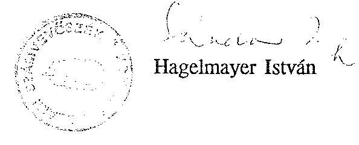

---

# KIMUTATÁS 

az Állami Számvevőszék 1990-1992. években
végzett ellenőrzési feladatairól

---

1.  sz. melléklet

KIMUTATÁS
AZ ÁLLAMI SZÁMVEVŐSZÉK 1990-1992.ÉVEKBEN VÉGZETT ELLENŐRZÉSI FELADATAIRÓL

| $\begin{aligned} & \text { TÉMA } \\ & \text { CSOP. } \end{aligned}$ | $\begin{aligned} & \text { SOR- } \\ & \text { SZAM } \end{aligned}$ | Az ellenőrzési feladat címe | A vizsgált időszak | 1990. |  | 1991. |  | 1992. |  |
| :--: | :--: | :--: | :--: | :--: | :--: | :--: | :--: | :--: | :--: |
|  |  |  |  | I. fèlév | II. fèlév | I. fèlév | II. fèlév | 1. fèlév | 11. fèlév |
| I. |  | A központi költségvetési javaslat és zárszámadás ellenőrzése, véleményezése |  |  |  |  |  |  |  |
|  | 1. | Jelentés a Magyar Köztársaság 1989. évi költségvetésének végrehajtásáról készített pénzügyminiszteri előterjesztésről |  | 1989. |  |  |  |  |  |
|  | 2. | Jelentés a Magyar Köztársaság 1990. évi költségvetése végrehajtásának ellenőrzéséről |  | 1990. |  |  |  |  |  |
|  | 3. | Észrevételek az államháztartási törvényjavaslathoz |  | - |  |  |  |  |  |
|  | 4. | Vélemény az 1991. évi költségvetési folyamatok alakulásáról készített beszámolóról |  | 1991. 1. név |  |  |  |  |  |
|  | 5. | Jelentés a Magyar Köztársaság 1992. évi költségvetéséről és az államháztartás vitelének szabályairól szóló törvényjavaslat megalapozottságának ellenőrzéséről |  | 1992. |  |  |  |  |  |
|  | 6. | Észrevételek a Magyar Köztársaság Kormánya 5320. számú jelentéséhez |  | - |  |  |  |  |  |
|  | 7. | Észrevételek a Kormány által az állami költségvetés I. n.évi helyzetéről készített tájékoztatóhoz |  | 1991. |  |  |  |  |  |
|  | 8. | Jelentés az 1992. évi költségvetésről szóló törvény módosítására vonatkozó javaslatok ellenőrzéséről |  | 1992. |  |  |  |  |  |
|  | 9. | Az 1991. évi XCI. törvény 1.sz. mellékletének pontosításáról szóló törvényjavaslat (4735.sz.), valamint az ahhoz kapcsolódó jelentések (4754. és 4754/I. szám) |  | 1991. |  |  |  |  |  |
|  | 10. | Jelentés a Magyar Köztársaság 1991. évi költségvetés végrehajtásának ellenőrzéséről |  | 1991. |  |  |  |  |  |
|  |  | Részletes megállapítások az 1991. évi költségvetés végrehajtásáról készített jelentéshez ( 6405 . sz. jelentés) |  | - |  |  |  |  |  |
|  | 11. | Válasz a Magyar Köztársaság Kormányának 6541. számú észrevételeire (6571. számú jelentés) |  | - |  |  |  |  |  |
|  | 12. | Vélemény a Magyar Köztársaság 1992. évi pótköltségvetéséről (6922. számú jelentés) |  | 1992. |  |  |  |  |  |
|  | 13. | Jelentés a Magyar Köztársaság 1993. évi költségvetési törvényjavaslatának véleményezéséről (6929. számú jelentés) |  | 1993. |  |  |  |  |  |

---

# 1. sz. melléklet

KIMUTATÁS AZ ÁLLAMI SZÁMVEVŐSZÉK 1990-1992.ÉVEKBEN VÉGZETT ELLENŐRZÉSI FELADATAIRÓL

|  TÉMA | SOR-
SZÁM | Az ellenőrzési feladat címe | A vizsgált
időszak | 1990. |  | 1991. |  | 1992. |   |
| --- | --- | --- | --- | --- | --- | --- | --- | --- | --- |
|   |  |  |  | I.félév | II.félév | I.félév | II.félév | I.félév | II.félév  |
|  11. |  | A központi költségvetés végrehajtásának ellenőrzése |  |  |  |  |  |  |   |
|   | 1. | A Lakásalap működésének ellenőrzése | 1989. |  |  |  |  |  |   |
|   | 2. | Az Országos Tudományos Kutatási Alap működésének pénzügyi-gazdasági ellenőrzése | 1989. |  |  |  |  |  |   |
|   | 3. | A szakképzési hozzájárulás és a Szakképzési Alap pénzügyi-gazdasági ellenőrzése | 1989-90. |  |  |  |  |  |   |
|   | 4. | A Pro Renovanda Cultura Hungariae Alapítvány rendszer ellenőrzése | 1990. |  |  |  |  |  |   |
|   | 5. | A Letelepedési Alap működésének pénzügyi-gazdasági ellenőrzése | 1988-89. |  |  |  |  |  |   |
|   | 6. | A Magyar Köztársaság helsinki, koppenhágai, prágai nagykövetségeinek és a pozsonyi főkonzulátusának 1990. évi pénzügyi-gazdasági ellenőrzése | 1987-90. |  |  |  |  |  |   |
|   | 7. | A Magyar Köztársaság helsinki, koppenhágai, prágai és pozsonyi kereskedelmi kirendeltségének 1990. évi pénzügyi-gazdasági ellenőrzése | 1987-90. |  |  |  |  |  |   |
|   | 8. | A prágai és a helsinki katonai attasék hivatalának 1990. évi pénzügyi-gazdasági ellenőrzése | 1987-90. |  |  |  |  |  |   |
|   | 9. | A prágai, a pozsonyi, valamint a helsinki kulturális központok 1990. évi pénzügyi-gazdasági ellenőrzése | 1987-90. |  |  |  |  |  |   |
|   | 10. | A Honvédelmi Minisztérium vezető tisztségviselői és a tábornoki kar szolgálati lakásaira fordított költségvetési összegek felhasználásának ellenőrzése | 1985-90. |  |  |  |  |  |   |
|   | 11. | A Nemzeti Színház felépítését szolgáló pénzforrások ellenőrzése | 1964-90. |  |  |  |  |  |   |
|   | 12. | Az 1989. évi állami költségvetés pénzeszközei banki számlavezetésének és könyvelésének ellenőrzése | 1989. |  |  |  |  |  |   |
|   | 13. | Az Ipari Minisztérium-i fejezet 1990. évi pénzügyi-gazdasági ellenőrzése | 1988-89. |  |  |  |  |  |   |
|   | 14. | A Külügyminisztérium-i fejezet 1990. évi pénzügyi-gazdasági ellenőrzése | 1987-90. |  |  |  |  |  |   |
|   | 15. | A Hungaroring építéséhez és üzemeltetéséhez felhasznált költségvetési pénzforrások ellenőrzése | 1986-90. |  |  |  |  |  |   |

---

# 1. sz. melléklet

KIMUTATÁS AZ ÁLLAMI SZÁMVEVŐSZÉK 1990-1992. ÉVEKBEN VÉGZETT ELLENŐRZÉSI FELADATAIRÓL

|  TÉMA
CSOP. | SOR-
SZÁM | Az ellenőrzési feladat címe | A vizsgált időszak | 1990. |  | 1991. |  | 1992. |   |
| --- | --- | --- | --- | --- | --- | --- | --- | --- | --- |
|   |  |  |  | I.félév | II.félév | I.félév | II.félév | I.félév | II.félév  |
|   | 16. | Az 1990. évi országgyűlési képviselő választások előkészítésére és lebonyolítására biztosított költségvetési pénzeszközök felhasználásának ellenőrzése | 1989-90. |  |  |  |  |  |   |
|   | 17. | A Magyar Honvédség Jóléti jellegű beruházásainak pénzügyigazdasági ellenőrzése | 1986-90. |  |  |  |  |  |   |
|   | 18. | Az 1990. július 28-i népszavazás előkészítésével és lebonyolításával kapcsolatos költségvetési pénzeszközök felhasználásának ellenőrzése | 1990. |  |  |  |  |  |   |
|   | 19. | A Magyar Távirati Iroda 1990. évi pénzügyi-gazdasági ellenőrzése | 1988-90. |  |  |  |  |  |   |
|   | 20. | A Magyar Honvédség lakásberuházási alapjának ellenőrzése (TÜK) | 1986-90. |  |  |  |  | |   |
|   | 21. | A Magyar Köztársaság Olaszországban működő külképviseleteinek ellenőrzése (TÜK) | 1987-90. I. félév |  |  |  |  |  |   |
|   | 22. | Az APEH adószámláinak vezetése | 1990. |  |  |  |  |  |   |
|   | 23. | A Munkaügyi Minisztérium pénzügyi-gazdasági ellenőrzése | 1989-90. |  |  |  |  |  |   |
|   | 24. | A Földművelésügyi Minisztérium fejezet pénzügyi-gazdasági ellenőrzése | 1986-90. |  |  |  |  |  |   |
|   | 25. | A Központi Statisztikai Hivatal pénzügyi-gazdasági ellenőrzése | 1988-90. |  |  |  |  |  |   |
|   | 26. | A Magyar Televízió pénzügyi-gazdasági ellenőrzése | 1988-91. |  |  |  |  |  |   |
|   | 27. | Az Igazságügyi Minisztérium Büntetésvégrehajtás pénzügyi-gazdasági ellenőrzése | 1989-91. |  |  |  |  |  |   |
|   | 28. | A színházi bemutatók pályázati úton történő támogatásának ellenőrzése | 1988-90. |  |  |  |  |  |   |
|   | 29. | A Magyar Köztársaság Szovjetúnióban működő külképviseleteinek 1991. évi pénzügyi-gazdasági ellenőrzése | 1989-91. |  |  |  |  |  |   |
|   | 30. | A Magyar Köztársaság Ausztriában működő külképviseleteinek pénzügyi-gazdasági ellenőrzése | 1989-91. |  |  |  |  |  |   |
|   | 31. | A Honvédelmi Minisztérium egyes gazdálkodási kérdéseinek vizsgálata | 1986-90. |  |  |  |  |  |   |
|   | 32. | A Műemlékvédelem pénzügyi-gazdasági ellenőrzése | 1986-90. |  |  |  |  |  |   |
|   | 33. | A központi államigazgatási szervezetek létszám- és bérgazdálkodásának ellenőrzése | 1990-91. |  |  |  |  |  |   |
|   | 34. | A Nemzeti Gyermek és Ifjúsági Alapítvány, valamint a helyi gyermek és ifjúsági alapítványok pénzügyi-gazdasági ellenőrzése | 1990-91. |  |  |  |  |  |   |
|   | 35. | A Központi Földtani Hivatal és a földtani kutatások pénzügyigazdasági ellenőrzése | 1988-90. |  |  |  |  |  |   |

---

# 1. sz. melléklet

KIMUTATÁS AZ ÁLLAMI SZÁMVEVŐSZÉK 1990-1992.ÉVEKBEN VÉGZETT ELLENŐRZÉSI FELADATAIRÓL

|  TÉMA
CSOP. | SOR-
SZÁM | Az ellenőrzési feladat címe | A vizsgált időszak | 1990. |  | 1991. |  | 1992. |   |
| --- | --- | --- | --- | --- | --- | --- | --- | --- | --- |
|   |  |  |  | I.félév | II.félév | I.félév | II.félév | I.félév | II.félév  |
|   | 21. | Az Állami Biztosító átalakulásának vizsgálata | 1991-92. |  |  |  |  |  |   |
|  IV. |  | Az állami nagyberuházások ellenőrzése |  |  |  |  |  |  |   |
|   | 1. | Az észak-déli metróvonal III/B/I. szakaszának 1989. évi építésére jóváhagyott költségvetési pénzeszközök felhasználásának ellenőrzése | 1989. |  |  |  |  |  |   |
|   | 2. | Szakvélemény a Bős-Nagymarosi vízlépcsőrendszer nagyberuházás 1990. évi költségvetés előirányzatának jóváhagyásához | 1990. |  |  |  |  |  |   |
|   | 3. | A Bős-Nagymarosi Vízlépcsőrendszer nagyberuházással kapcsolatos kifizetések indokoltságának, a nagyberuházásért felelős szervek intézkedési célszerűségének vizsgálata | 1989-90. |  |  |  |  |  |   |
|   | 4. | A MÁV közforgalmú vasúti közlekedési hálózatának fejlesztésére szolgáló beruházási források 1989-90. évi felhasználása tárgyában folytatott vizsgálati tapasztalatok | 1989-90. |  |  |  |  |  |   |
|   | 5. | Az egyéb központi beruházásokra előirányzott pénzeszközök felhasználásának ellenőrzése | 1990. |  |  |  |  |  |   |
|   | 6. | A Bős-Nagymarosi Vízlépcsőrendszer döntési folyamata (I.rész) | 1958-89. |  |  |  |  |  |   |
|   | 7. | A Bős-Nagymarosi Vízlépcsőrendszer állami nagyberuházás lezárásának pénzügyi felülvizsgálata | 1990. |  |  |  |  |  |   |
|   | 8. | A Budapest-Bécs Világkiállítás megrendezésével kapcsolatos fejlesztési program finanszírozásának megalapozottsága | 1990. |  |  |  |  |  |   |
|   | 9. | Szakértői vélemény a Budapest-Bécs Világkiállítás fejlesztési programjáról és finanszírozásának megalapozottságáról | 1990. |  |  |  |  |  |   |
|   | 10. | A Világkiállítás megrendezésével kapcsolatos fejlesztési program előkészítésének, a finanszírozás megalapozottságának vizsgálata | 1990. |  |  |  |  |  |   |
|  V. |  | A Társadalombiztosítási Alap ellenőrzése |  |  |  |  |  |  |   |
|   | 1. | A Társadalombiztosítási Alap 1989. évi bevételi többletének vizsgálata | 1989. |  |  |  |  |  |   |
|   | 2. | A Társadalombiztosítási Alapból gyógyító-megelőző egészségügyi ellátásra fordított pénzeszközök felhasználása | 1990-91. |  |  |  |  |  |   |
|   | 3. | A Társadalombiztosítási Alap kezelőjénél végzett számvevőszéki vizsgálatok hasznosításának utóellenőrzése | 1989-90. |  |  |  |  |  |   |

---

# 1. sz. melléklet

KIMUTATÁS AZ ÁLLAMI SZÁMVEVŐSZÉK 1990-1992.ÉVEKBEN VÉGZETT ELLENŐRZÉSI FELADATAIRÓL

|  TÉMA
CSOP. | SOR-
SZÁM | Az ellenőrzési feladat címe | A vizsgált időszak | 1990. |  | 1991. |  | 1992. |   |
| --- | --- | --- | --- | --- | --- | --- | --- | --- | --- |
|   |  |  |  | I.félév | II.félév | I.félév | II.félév | I.félév | II.félév  |
|   | 4. | A Társadalombiztosítási Alap 1991. évi zárszámadásának ellenőrzési tapasztalatai | 1991. |  |  |  |  |  |   |
|   | 5. | Tájékozódás a 18. Alap 1992. évi zárszámadásának ellenőrzéséhez | 1992. |  |  |  |  |  |   |
|  VI. |  | Pártok, tömegszervezetek és szövetségek ellenőrzése |  |  |  |  |  |  |   |
|   | 1. | A Magyar Szocialista Párt (mint a Magyar Szocialista Munkáspárt jogutódja) bejegyzési kérelmével egyidejűleg a bírósághoz benyújtott vagyonmérlege vizsgálata | 1949-90. |  |  |  |  |  |   |
|   | 2. | A pártok gazdálkodása törvényességét ellenőrző vizsgálatokról készített összefoglaló jelentés | 1989. |  |  |  |  |  |   |
|   |  | A vizsgált pártok a következők (önálló jelentések):
- Magyar Demokrata Fórum
- Szabad Demokraták Szövetsége
- Független Kisgazda, Földmunkás és Polgári Párt
- Magyar Politikai Foglyok Szövetsége
- Magyar Néppárt
- Münnich Ferenc Társaság
- Fiatal Demokraták Szövetsége
- Független Magyar Demokrata Párt
- Kereszténydemokrata Néppárt
- Magyar Függetlenségi Párt
- Magyar Liberális Néppárt
- Magyar Radikális Párt
- Magyar Szocialista Párt
- Magyar Szocialista Munkáspárt
- Magyarországi Szociáldemokrata Párt
- Magyarországi Zöld Párt | 1989.
1989.
1989.
1989.
1989.
1989.
1989.
1989.
1989.
1989.
1989.
1989.
1989.
1989.
1989.
1989.
1989.
1989.
1989.
1989.
1989.
1989.
1989.
1989.
1989. |  |  |  |  |  |  |   |
|   | 3. | Az elmúlt rendszerhez kötődő egyes társadalmi szervezetek vagyonelszámoltatásának vizsgálata (1990. évi LXXIII.törvény) | 1949-90. |  |  |  |  |  |   |
|   |  | A vizsgált társadalmi szervezetek (önálló jelentések):
- Társadalmi Egyesületek Szövetsége
- Magyar Szocialista Párt | 1949-90.
1949-90. |  |  |  |  |  |   |

---

1. sz. melléklet

KIMUTATÁS

AZ ÁLLAMI SZÁMVEVŐSZÉK 1990-1992. ÉVEKBEN VÉGZETT ELLENŐRZÉSI FELADATAIRÓL

|  TÉMA | SOR- | Az ellenőrzési feladat címe | A vizsgált időszak | 1990. | 1991. | 1992.  |
| --- | --- | --- | --- | --- | --- | --- |
|  CSOP. | SZÁM |  |  |  |  |   |
|   | - Országos Béketanács |  | 1949-90. |  |  |   |
|   | - Magyar-Szovjet Baráti Társaság |  | 1949-90. |  |  |   |
|   | - Magyar Nők Szövetsége |  | 1949-90. |  |  |   |
|   | - Magyar Ellenállók és Antifasiszták Szövetsége |  | 1949-90. |  |  |   |
|   | - Demokratikus Ifjúsági Szövetség |  | 1949-90. |  |  |   |
|   | - Magyar Úttörők Szövetsége |  | 1949-90. |  |  |   |
|   | - Magyar Honvédelmi Szövetség |  | 1949-90. |  |  |   |
|  4. | Az 1991. évben végzett, a pártok gazdálkodásának törvényességét ellenőrző vizsgálatok összefoglaló jelentése |  | 1990. |  |  |   |
|   | A vizsgált pártok a következők (önálló jelentések): |  |  |  |  |   |
|   | - Magyarországi Szövetkezeti- és Agrárpárt |  | 1990. |  |  |   |
|   | - Nemzedékek Pártja |  | 1990. |  |  |   |
|   | - Magyar Republikánus Párt |  | 1990. |  |  |   |
|   | - Magyar Szabadságpárti Szövetség |  | 1990. |  |  |   |
|   | - Vállalkozók Pártja |  | 1990. |  |  |   |
|   | - Münnich Ferenc Társaság |  | 1990. |  |  |   |
|   | - Magyar Liberális Párt |  | 1990. |  |  |   |
|   | - Megyr Néppárt - Nemzeti Parasztpárt |  | 1990. |  |  |   |
|   | - Agrárszövetség |  | 1990. |  |  |   |
|   | - Fiatal Demokraták Szövetsége |  | 1990. |  |  |   |
|   | - Magyar Radikális Párt |  | 1990. |  |  |   |
|   | - Magyar Demokrata Fórum |  | 1990. |  |  |   |
|   | - Szociáldemokrata Párt |  | 1990. |  |  |   |
|   | - Magyarországi Szociáldemokrata Párt |  | 1990. |  |  |   |
|   | - Kereszténydemokrata Néppárt |  | 1990. |  |  |   |
|   | - Szabadság Párt |  | 1990. |  |  |   |
|   | - Természet- és Társadalomvédők Szövetsége |  | 1990. |  |  |   |
|   | - Független Kisgazda Földmunkás- és Polgári Párt |  | 1990. |  |  |   |
|   | - Magyar Szocialista Munkáspárt |  | 1990. |  |  |   |
|   | - Független Köztársasági Párt |  | 1990. |  |  |   |
|   | - Magyar Szocialista Párt |  | 1990. |  |  |   |
|   | - Szabad Demokraták Szövetsége |  | 1990. |  |  |   |

---

1.  sz. melléklet

KIMUTATÁS

AZ ÁLLAMI SZÁMVEVŐSZÉK 1990-1992. ÉVEKBEN VÉGZETT ELLENŐRZÉSI FELADATAIRÓL

| TÉMA | SOR- | Az ellenőrzési feladat címe | A vizsgált időszak | 1990. | 1991. | 1992.  |
| --- | --- | --- | --- | --- | --- | --- |
| CSOP. | SZÁM |  |  |  |  |   |
|   |  | - Hazafias Választási Koolíció | 1990. |  |  |   |
|   | 5. | Az 1991. évi XXVIII., a szakszervezeti vagyon védelméről a munkavállalók szervezkedési és szervezeteik működési esély-egyenlőségéről szóló törvény alapján tett vagyonelszámolások | 1991. |  |  |   |
|   | 6. | Az 1992. évben végzett, a pártok és társadalmi szervezetek gazdálkodása törvényességét ellenőrző vizsgálatok jelentései: | 1991. |  |  |   |
|   |  | - Voks Humana Mozgalom | 1990-91. |  |  |   |
|   |  | - Független Magyar Demokrata Párt | 1990-91. |  |  |   |
|   |  | - Vidéki Magyarországért Párt | 1990-91. |  |  |   |
|   |  | - Nemzeti Kisgazda és Polgári Párt | 1990-91. |  |  |   |
|   |  | - Magyarország Zöld Párt | 1990-91. |  |  |   |
|   |  | - Magyar Nemzeti Párt | 1990-91. |  |  |   |
|   |  | - Magyar Humanisták Pártja | 1990-91. |  |  |   |
|   |  | - Magyarországi Németek Szövetsége | 1991. |  |  |   |
|   |  | - Agrárszövetség | 1991. |  |  |   |
|   |  | - A Liberális Polgári Szövetség (Vállalkozók Pártja) | 1991. |  |  |   |
|   |  | - Magyarország Szlovákok Szövetsége | 1991. |  |  |   |
|   |  | - Magyar Szocialista Munkáspárt | 1991. |  |  |   |
|   |  | - Kereszténydemokrata Néppárt | 1991. |  |  |   |
|   |  | - Fiatal Demokraták Szövetsége | 1991. |  |  |   |
|   |  | - Magyar Demokrata Fórum | 1991. |  |  |   |
|   |  | - Magyarországi Roma Parlament | 1991. |  |  |   |
|   |  | - Phralipe Cigányszervezet | 1991. |  |  |   |
|   |  | - AMALIPE | 1991. |  |  |   |
| VII. |  | Az önkormányzatok és intézményeik ellenőrzése |  |  |  |   |
|   | 1. | A tanácsi alapítású vállalatok vagyonkihelyezési és átalakulási tevékenysége és hatása a tanácsok gazdálkodására | 1988-90. I. félév |  |  |   |
|   | 2. | A tanácsoknál bérpolitikai intézkedésekre, illetve bérfejlesztésekre szolgáló központosított előirányzatok elosztásának és felhasználásának vizsgálata | 1990. |  |  |   |

---

# 1. sz. melléklet

KIMUTATÁS AZ ÁLLAMI SZÁMVEVŐSZÉK 1990-1992. ÉVEKBEN VÉGZETT ELLENŐRZÉSI FELADATAIRÓL

| TÉMA
CSOP. | SOR-
SZÁM | Az ellenőrzési feladat címe | A vizsgált időszak | 1990. |  | 1991. |  | 1992. |   |
| --- | --- | --- | --- | --- | --- | --- | --- | --- | --- |
|   |  |  |  | I.félév | II.félév | I.félév | II.félév | I.félév | II.félév  |
|   | 3. | Összefoglaló a tanácsok 1989. évi likviditási helyzetének ellenőrzéséről | 1989. |  |  |  |  |  |   |
|   | 4. | A normatív tanácsi támogatási rendszer kezdeti tapasztalatainak vizsgálata | 1990. |  |  |  |  |  |   |
|   | 5. | A tanácsok 1989. évi költségvetési beszámolójának ellenőrzése | 1989. |  |  |  |  |  |   |
|   | 6. | Az állami tulajdonban lévő tanácsi kezelésű ingatlanok hasznosításának ellenőrzési tapasztalatai | 1988-90. I. félév |  |  |  |  |  |   |
|   | 7. | A nagyvárosi tömegközlekedés támogatására fordított eszközök felhasználásának vizsgálata | 1986-90. I. félév |  |  |  |  |  |   |
|   | 8. | Az egészséges ivóvízellátás feltételeinek javítására fordított eszközök felhasználásának vizsgálata | 1986-90. |  |  |  |  |  |   |
|   | 9. | Az 1990. évi önkormányzati választások előkészítésével és lebonyolításával kapcsolatos állami feladatok végrehajtására biztosított költségvetési pénzeszközök felhasználásáról és az 1989-1990. évi választások pénzügyi összegezése | 1989-90. |  |  |  |  |  |   |
|   | 10. | Az önkormányzatok (tanácsok) és intézményeik 1990. évi beszámoló rendszerének vizsgálata | 1990. |  |  |  |  |  |   |
|   | 11. | A távhő és melegvíz szolgáltatás támogatási, gazdálkodási rendszerének vizsgálata | 1989-90. |  |  |  |  |  |   |
|   | 12. | A pályázati úton nyújtott szociálpolitikai támogatások ellenőrzése | 1990. |  |  |  |  |  |   |
|   | 13. | Az önkormányzati rendszerre való átállás szervezeti, gazdálkodási kérdéseinek ellenőrzési tapasztalatai | 1989-90. |  |  |  |  |  |   |
|   | 14. | Az önkormányzatoknak (tanácsoknak) 1990. évre nyújtott normatív állami támogatások elszámolásának ellenőrzése | 1990. |  |  |  |  |  |   |
|   | 15. | A települési szolgáltató vállalatok támogatásának vizsgálata | 1990. |  |  |  |  |  |   |
|   | 16. | Az önkormányzatok 1990. évi költségvetésének végrehajtásáról készített zárszámadás ellenőrzése | 1990. |  |  |  |  |  |   |
|   | 17. | Az önkormányzatok elutasított céltámogatásai, igényeinek felülvizsgálata | 1991. |  |  |  |  |  |   |
|   | 18. | A szennyvízelvezetés és tisztításra fordított pénzeszközök | 1988-91. |  |  |  |  |  |   |
|   | 19. | Összegzés a közműves ivóvízellátás, a szennyvízelvezetés és tisztítás helyzete, továbbá a közműclló alakulása | 1988-91. |  |  |  |  |  |   |

---

# 1. sz. melléklet

KIMUTATÁS AZ ÁLLAMI SZÁMVEVŐSZÉK 1990-1992. ÉVEKBEN VÉGZETT ELLENŐRZÉSI FELADATAIRÓL

|  TÉMA
CSOP. | SOR-
SZÁM | Az ellenőrzési feladat címe | A vizsgált időszak | 1990. |  | 1991. |  | 1992. |   |
| --- | --- | --- | --- | --- | --- | --- | --- | --- | --- |
|   |  |  |  | I.félév | II.félév | I.félév | II.félév | I.félév | II.félév  |
|   | 20. | A helyi önkormányzatok áthúzódó kötelezettségeinek vizsgálata, különös tekintettel az adósságszolgálathoz kapcsolódó 1991. évi címzett támogatása | 1990. |  |  |  |  |  |   |
|   | 21. | Az önhibáján kívül hátrányos helyzetben lévő önkormányzatok elutasított támogatási igényeinek helyszíni felülvizsgálata | 1990. |  |  |  |  |  |   |
|   | 22. | Az állami támogatások igénybevételének, felhasználásának komplex ellenőrzése | - |  |  |  |  |  |   |
|   | 23. | Az önkormányzatok kiemelt kommunális feladatai (közvilágítás, temető és útfenntartás, lakásgazdálkodás) megoldásának, s az ehhez kapcsolódó állami hozzájárulás hatásának vizsgálata | 1990-91. |  |  |  |  |  |   |
|   | 24. | Az önkormányzatok 1992. évi költségvetésének tervezési, módszertani kérdéseinek elemzése | 1992. |  |  |  |  |  |   |
|   | 25. | A helyi önkormányzatok beruházásaihoz és rekonstrukcióihoz nyújtott 1991. évi céltámogatások vizsgálata | 1991. |  |  |  |  |  |   |
|   | 26. | A helyi önkormányzatok 1991. évi beruházásaihoz és rekonstrukcióihoz nyújtott címzett támogatások vizsgálata | 1991. |  |  |  |  |  |   |
|   | 27. | Az önhibájukon kívül hátrányos helyzetben lévő önkormányzatok kiegészítő támogatásának ellenőrzése | 1991. |  |  |  |  |  |   |
|   | 28. | Az alapfokú oktatásra fordított pénzeszközök felhasználásának ellenőrzése | 1990-91. |  |  |  |  |  |   |
|   | 29. | Az önkormányzatok 1991. évi támogatásának tervezési, módszertani kérdéseinek ellenőrzése | 1991. |  |  |  |  |  |   |
|   | 30. | Az önkormányzatok 1991. évi normatív állami hozzájárulásának igénybevételének és elszámolásának ellenőrzési tapasztalatai | 1991. |  |  |  |  |  |   |
|   | 31. | A helyi önkormányzatok beruházásaihoz és rekonstrukcióihoz nyújtott címzett támogatások vizsgálata | 1991. |  |  |  |  |  |   |
|   | 32. | Az önkormányzatok tulajdonába került vagyontárgyak megszerzésével, nyilvántartásával és gazdálkodásával kapcsolatos ellenőrzési tapasztalatok | 1990-91. |  |  |  |  |  |   |
|   | 33. | A társközségek szétválása miatti vagyonmegosztás lebonyolításának ellenőrzési tapasztalatai | 1990-91. |  |  |  |  |  |   |
|   | 34. | Az önkormányzatok ellenőrzési funkciója érvényesülésének tapasztalatai | 1991-92. |  |  |  |  |  |   |

---

# 1. sz. melléklet

KIMUTATÁS AZ ÁLLAMI SZÁMVEVŐSZÉK 1990-1992.ÉVEKBEN VÉGZETT ELLENŐRZÉSI FELADATAIRÓL

|  TÉMA
CSOP. | SZÁM | Az ellenőrzési feladat címe | A vizsgált
időszak | 1990. |  | 1991. |  | 1992. |   |
| --- | --- | --- | --- | --- | --- | --- | --- | --- | --- |
|   |  |  |  | I.félév | II.félév | I.félév | II.félév | I.félév | II.félév  |
|   | 35. | Az önkormányzatok 1993. évi költségvetésének tervezése, különös tekintettel az állami támogatások tervezésére, módszertanára | 1993. |  |  |  |  |  |   |
|   | 36. | A helyi önkormányzatok beruházásaihoz és rekonstrukcióihoz nyújtott 1992. évi céltámogatások vizsgálata | 1992. |  |  |  |  |  |   |
|   | 37. | Az önkormányzatok pénzügyi-gazdasági tevékenységének átfogó törvényességi ellenőrzése | 1991-92. |  |  |  |  |  |   |
|   | 38. | A címzett támogatásokkal megvalósított egészségügyi és kultúrális rekonstrukciók 1992. évi vizsgálata | 1992. |  |  |  |  |  |   |
|   | 39. | Az önhibájukon kívül hátrányos helyzetben lévő településeknek nyújtott 1992. évi támogatások hasznosításának ellenőrzése | 1992. |  |  |  |  |  |   |
|  VIII. |  | Egyéb feladatok |  |  |  |  |  |  |   |
|   | 1. | Beszámoló az Állami Számvevőszék 1990. évi munkájáról | 1990. |  |  |  |  |  |   |
|   | 2. | Beszámoló az Állami Számvevőszék 1991. évi munkájáról | 1991. |  |  |  |  |  |   |
|   | 3. | Gondolatok az Állami Számvevőszékről |  |  |  |  |  |  |   |
|   | 4. | A PHARE támogatásból finanszírozott magyar környezetvédelmi programok előkészítésének és megvalósításának ellenőrzése | 1990-92. |  |  |  |  |  |   |

---

9883. sz. jelentés
2. sz. melléklete

# BESZÁMOLÓ 

az Állami Számvevőszék Gazdálkodó Szervezete és az
ÁSZ Továbbképzési Intézet és Üdülő
1992. évi gazdálkodásáról

---

# Az ÁSZ Gazdálkodó Szervezet   1992. évi gazdálkodása 

## 1) A GAZDÁLKODÁS FELTÉTELEI

a) Költségvetési eredeti előirányzatok

Az 1991. évi XCI. törvényben jóváhagyott fejezeti költségvetési előirányzaton belül az 1992. évi számvevőszéki feladatok teljesítésére

| ÁSZ igazgatási címen | $514.300 \mathrm{eFt}$ |
| :-- | --: |
| Felújítás | $6.000 \mathrm{eFt}$ |
| Fejezeti tartalék | $\underline{1.900 \mathrm{eFt}}$ |
| Összesen | $522.200 \mathrm{eFt}$ |

előirányzat állt rendelkezésre.
Fenti eredeti előirányzatok az előző évhez viszonyítva
$-10 \%$-os bérautomatizmus,
—a bérautomatizmus utáni TB járulék,
$-5 \%$-os dologi automatizmus, valamint

- 65 fő fejlesztési többlet fedezeteként 120 millió Ft növekedést tartalmaztak.

A fejlesztési többlet részletezése:
béralap
$70.600 \mathrm{eFt}$
TB járulék
$30.400 \mathrm{eFt}$
dologi
$19.000 \mathrm{eFt}$

A fejlesztési többlet előirányzatból a bér és dologi kiadások meghatározása a Számvevőszék számára kedvezően alakult.

Az 522.200 eFt előirányzat bevételi oldalon a következőképpen került jóváhagyásra:
költségvetési támogatás
saját bevétel
ebből: helység bérleti díj
felesleges eszközök
értékesítése
ÁFA
$520.200 \mathrm{eFt}$
$2.000 \mathrm{eFt}$
$750 \mathrm{eFt}$
$900 \mathrm{eFt}$
$350 \mathrm{eFt}$

---

b) Előző évi pénzmaradvány

Az 1991. évről áthozott összes pénzmaradvány összege 26.013 eFt, melyből a béralap maradvány 10.338 eFt volt.

A maradvány összegéből:

- 6.200 eFt a folyamatban lévő megrendelések, teljesítések fedezetére lekötött összeg,
- 4.100 eFt a szakszervezeti vagyon ellenőrzés kiadására biztosított előirányzat maradványa, és
- 15.713 eFt a gazdálkodási szabályok szerint 1992.évben felhasználható összeg.

Az a) és b) pontokban részletezettek szerint az Állami Számvevőszék Gazdálkodó Szervezete a beszámolási időszak kezdetén
$252.300 \mathrm{eFt} \quad$ béralap ( 337 fő)
10.338 eFt jutalmazásra felhasználható pénzmaradvány és
285.575 eFt TB járulék és dologi kiadások
összesen 548.213 eFt felhasználható kerettel rendelkezett.
c) Előirányzat módosítások
1992. év során a költségvetési támogatás mérséklésére a Kormány részéről több alkalommal történt intézkedés.

A Számvevőszék felé e kezdeményezések főként önkéntes kiadás csökkentésre vonatkozó felkérések formájában nyilvánultak meg. Más esetben a havi finanszírozás Pénzügyminisztérium által történő - átmenetinek jelzett, később véglegesnek minősített - csökkentett összegű teljesítésében volt érzékelhető.

A Számvevőszék költségvetését az elmúlt évben a központi költségvetési zárolások és egyéb elvonások két esetben érintették kedvezőtlenül:

- 1992. május hóban az igazgatási kiadások csökkentéséhez kapcsolódva több kormányzati szintről történő felkérést követően - a Számvevőszék 7.100 eFt támogatás csökkentést ajánlott fel.
- Az 1992. évi LXX.törvény 2. számú mellékletében foglaltak szerint a pénzmaradványból 5.183. eFt - a többi fejezettel azonos arányú - elvonására került sor.

---

Központi intézkedés, valamint saját hatáskörű előirányzat módosítás alapján az alábbiak következtében növekedtek az előirányzatok:
—Az 1992. évi LXX számú törvényben jóváhagyott összegből a TB járulék 1 \%-os növekedésének ellentételezésére 2.600 eFt többlet támogatásra került sor.
-A jóváhagyott pénzmaradvány teljes mértékben felhasználásra került, 20.830 eFt összegben.

- A tervezetten felül teljesített saját bevételek alapján 4.200 eFt előirányzat emelésre kerülhetett sor.

Az előirányzat módosítások együttes hatásaként az eredeti előirányzathoz viszonyítva 15.347 eFt - tal magasabb összeg felhasználására volt lehetőségünk. (A számszaki beszámolóban kimutatott módosított előirányzat ettől eltér, mivel az előirányzat módosítás technikai előirása miatt az elvont összeget előirányzat növekedésként kell kimutatni.)

A módosításokat követően rendelkezésünkre álló kiadási lehetőségek főbb kiadási csoportonként az alábbiak voltak:

| béralap | $250.500 \mathrm{eFt}$ |
| :-- | --: |
| jutalom pénzmaradványból | $10.338 \mathrm{eFt}$ |
| TB járulék | $114.845 \mathrm{eFt}$ |
| dologi kiadások | $\underline{161.864 \mathrm{eFt}}$ |
|  | $537.547 \mathrm{eFt}$ |
| technikai módosítás |  |
| (5.183 eFt elvonást fordított előjellel |  |
| kell szerepeltetni) | $\underline{10.366 \mathrm{eFt}}$ |
| Összesen: | $547.913 \mathrm{eFt}$ |

d) A gazdálkodási feltételeket kedvezőtlenül befolyásoló tényezők között kell megemlíteni:
-A pénzmaradvány jóváhagyásának a korábbi évektől lényegesen későbbi időpontját, melynek következtében csak novemberben lehetett azt legkorábban felhasználni.

- A Pénzügyminisztérium a május havi támogatásból részben visszatartott összeget ( 13,0 millió Ft) csak november - december hónapokban rendezte.

---

- A költségvetési gazdálkodást érintő jogszabály változások rendkívül nagy számát, melyek a hatálybalépéshez viszonyítva is későn jelentek meg. Ugyanakkor az alkalmazásukhoz való felkészüléshez egyáltalán nem állt rendelkezésre idő. A jogszabály változások nagy száma mellett, rendkívül sok problémát okozott a törvények, rendeletek értelmezhetősége.

Az elmúlt év gazdálkodási körülményeinél ugyanakkor pozitívan értékelendő, hogy 1991. évvel ellentétben a költségvetés parlamenti jóváhagyása teljes évre szólt.

# 2) KÖLTSÉGVETÉS TELJESÍTÉSE 

## Kiadások

Az éves felhasználható 547.913 eFt módosított előirányzathoz viszonyítva a teljesített kiadások összege 515.521 eFt volt.

Az 1992. évi kiadások főösszege az eredeti tervezett összeggel azonos mértékben (100,2 \%), a módosított előirányzathoz képest $94,1 \%$-ra teljesült. A beszámolási időszak kiadásai a bázis időszakhoz viszonyítva $44,9 \%$-kal emelkedtek.
A kiadások adatait az 1. számú függelék tartalmazza.
Az előirányzatok felhasználása főbb csoportonként az alábbiak szerint alakult:
a) Bér- és létszámgazdálkodás

Az 1992. évi költségvetésben biztosított 65 fő többlet létszám alkalmazására a szervezeti egységeknek január 1-től nyílt lehetősége.

A létszám felvétele, betöltése fokozatosan valósult meg:

| I. hó | 4 fő |
| :-- | --: |
| II. hó | 8 fő |
| III. hó | 5 fő |
| IV. hó | 20 fő |
| V. hó | 16 fő |
| VI. hó | 8 fő |

---

A tervezett 337 fő létszámhoz viszonyítva az éves átlaglétszám (munkajogi) 316 fő volt. A létszám mozgás az év során a következőképpen alakult:
belépések száma 87
kilépések száma 22.
Év végén a munkaviszonyban lévők száma 342 fő volt (ebből 329 fő teljes munkaidős, és 13 fő nyugdíjas). A létszám alakulását szervezeti egység szerint az alábbi táblázatban mutatjuk be:

| Szervezeti egység | Tervezett létszám | Éves átlaglétszám (munkajogi) | 1992.XII.31. létszám (munkajogi) |
| :--: | :--: | :--: | :--: |
| Elnök | 2 | 2 | 2 |
| Alelnök I. | 2 | 2 | 2 |
| Alelnök II. | 2 | 2 | 2 |
| Elnöki Titkárság | 7 | 7 | 7 |
| Fejezeti főcsoport | 56 | 45 | 51 |
| Vagyonkezelő főcsoport | 47 | 43 | 46 |
| Területi főcsoport | 128 | 115 | 127 |
| Elvi, Módszertani főcsop. | 30 | 26 | 28 |
| Nemzetközi Kapcsolatok o. | 4 | 4 | 4 |
| Jogi és Igazgatási o. | 12 | 11 | 12 |
| Személyzeti és Munkaügyi o. | 9 | 9 | 9 |
| Gazdasági Igazgató | 2 | 2 | 2 |
| Pénzügyi osztály | 12 | 12 | 12 |
| Gazdasági osztály | 24 | 24 | 25 |
| Összesen | 337 | 304 | 329 |
| Átmeneti üres álláshelyen fogl.nyugdíjasok (8 órásra átszámitva) | - | 12 | 13 |
| Összesen | 337 | 316 | 342 |

A rendelkezésre álló bérfejlesztési összeg felhasználására március hóban született elnöki határozat. A béremelés január 1.-i hatállyal történt.

A bérfejlesztésre fordítható összeg $3.566 \mathrm{eFt} / \mathrm{hó}$, egyrészt tartalmazta a $10 \%$ bérautomatizmust, másrészt a fejlesztési többletből bérfejlesztésre fordítható összeget, valamint a tartalékként kezelt keretet, mely együttesen $25,2 \%$ - os fejlesztési lehetőséget jelentett.

A béremelést megelőzően a vezetői munkakörök kivételével minden munkakörnél többlépcsős előrehaladási rendszert kialakítására került sor.

---

Az egyes munkaköri kategóriák béreinek meghatározását követően történtek az átsorolások, illetve az azzal járó béremelések.

A bérfejlesztések mértéke munkakörönként és személyenként is nagy szóródást mutat.

Az alaptevékenységi munkaköröknél a korábbi és az új bérek százalékosan a következőképpen alakultak:

| Munkakör | béremelés   $\%$ - a |
| :-- | --: |
| főcsoportfőnök | 16,2 |
| főcsoportfőnök helyettes | 14,7 |
| főtanácsos | 12,0 |
| tanácsos I. (pótlékkal) | 20,0 |
| tanácsos I. (pótlék nélkül) | 27,5 |
| tanácsos II. (pótlékkal) | 10,5 |
| tanácsos II. (pótlék nélkül) | 16,5 |
| számvevő I. (pótlékkal) | 19,1 |
| számvevő I. (pótlék nélkül) | 28,0 |
| számvevő II. (pótlékkal) | 7,9 |
| számvevő II. (pótlék nélkül) | 14,7 |

A személyenkénti bérnövekedés fentieknél magasabb volt, mivel szinte minden munkavállalónál előresorolás is bekövetkezett. Az állományban lévő számvevők nagyrésze a tanácsos I. és II. kategóriákba került.

A béremeléssel egyidejű kategória változás esetén a bérnövekedés mértéke a létszám jelentős részét kitevő munkaköröknél a következő volt:

| régi besorolás | új besorolás | átsorolás |
| :-- | :-- | :-- |
| tanácsos (pótlékkal) | tanácsos I.(pótlékkal) | 20,0 |
| tanácsos (pótlék nélkül) | tanácsos I.(pótl.nélkül) | 27,5 |
| tanácsos (pótlékkal) | tanácsos II.(pótlékkal) | 10,5 |
| tanácsos (pótlék nélkül) | tanácsos II.(pótl.nélkül) | 16,5 |
| számvevő (pótlékkal) | tanácsos I.(pótlékkal ) | 41,6 |
| számvevő (pótlék nélkül) | tanácsos I.(pótl.nélkül) | 54,7 |
| számvevő (pótlékkal) | tanácsos II.(pótlékkal) | 30,3 |
| számvevő (pótlék nélkül) | tanácsos II.(pótl.nélkül) | 41,3 |
| számvevő (pótlékkal) | számvevő I.(pótlékkal) | 19,1 |
| számvevő (pótlék nélkül) | számvevő I.(pótl.nélkül) | 28,0 |

---

Az ügyintéző és fizikai munkaköröknél 13,8 - 28,6 \% közötti béremelés, illetve átsorolás történt.

Intézményi szinten számítva a január 1.-i béremelésnél a fejlesztésre fordítható 25,2 \%-ból $18,6 \%$-ot, 2.594 eFt-ot használtunk fel.

A bérfejlesztésre fennmaradó $972 \mathrm{eFt} /$ hó összeg további felhasználása az alábbiak szerint alakult:

| IV. 1-től | vezetők bérkorrekciója | 218 eFt |
| :-- | :-- | --: |
| I. 1., VII.1-től | választott vezetők bérének   rendezése | 211 eFt |
| VII. 1-től | köztisztviselői átsorolásokból   adódó kerekítések | 37 eFt |
| X. 1-től | számvevők, ügyviteli, ügykezelő   és fizikai munkakörök bérkorrek-   ciója | 474 eFt |

Év végén az 1992. évi számottevő bérfejlesztések elle- nére a besorolási béreknél a köztisztviselői törvényben előírtakhoz viszonyítva 2.092 eFt-os havi elmaradás mutatkozott.

Az elmúlt évben jutalmazásra 57.954 eFt kifizetés történt, mely négy havi munkabérnek megfelelő összeg.

A jutalom tartalmazza a 13. havi illetmény (külön juttatás) címén kifizetett 14.699 eFt összeget is.

A béralapból és pénzmaradványból jutalmazásra felhasznált összegek szervezeti egységek szerinti bontását a 2. számú függelék tartalmazza.

Az elmúlt évben a havi átlagbér összege 45.345 Ft , az átlagkereset 60.628 Ft volt (1991-ben átlagbér összege 38.562 Ft , átlagkereset 52.140 Ft ).

Bér és jutalom címén az összes kiadás 238.526 eFt volt, a módosított 260.838 eFt előirányzattal szemben.
(A módosított előirányzaton belül:
eredeti előirányzat
pénzmaradvány felh.
252.300 eFt
elvonásra felajánlott
$10.338 \mathrm{eFt}$

A béralap előirányzat maradványa 22.312 eFt.

---

b) Társadalombiztosítási járulék

Az előirányzat és felhasználás a béralap, valamint a pénzmaradványból felhasznált jutalom függvényében alakult.

Az előirányzathoz viszonyítva a maradvány összege 9.861 eFt.
c) Dologi kiadások

A dologi kiadások 161.864 eFt módosított előirányzatához viszonyítva a tényleges kiadások összege 161.647 eFt-ot tett ki.

A maradvány összege 217 eFt.
Főbb kiadási csoportonként, illetve kiemelt tételenként a kiadások alakulását az alábbi tényezők befolyásolták:

# —Bérjellegű kiadások 

A tényleges kiadások ( 23.349 eFt ) eredeti előirányzattól ( 21.350 eFt ) való eltérése zömében a tervezés, illetve költségvetés jóváhagyása után megjelenő jogszabály változásokból adódik.

Ilyen változások voltak
$=$ a belföldi kiküldetés elszámolásánál:
IV.1-től a saját gépkocsi használatnál $6,50 \mathrm{Ft} / \mathrm{km}$-ről $10 \mathrm{Ft} / \mathrm{km}$-re emelkedett a karbantartási költségtérítés.
VII.1-től emelkedett a napidíj összege.
$=$ a betegszabadságra vonatkozó térítési kötelezettség I. hóban vált ismertté ( 1.413 eFt többlet kiadás).
$=$ a jubileumi jutalom folyósítása VII.1-től - átmenetileg - megszűnt (1.602 eFt megtakarítás).

## - Készlet beszerzése, szolgáltatások

A teljesített kiadások együttes összege 71.130 eFt melynek fedezete 75.600 eFt módosított előirányzat volt.

---

(A módosított előirányzaton belül:
eredeti előirányzat
elvonásra felajánlott
$80.100 \mathrm{eFt}$

- Fenti két kiadáscsoport tételei között részben kényszerű teljesítés átcsoportosításokra került sor, melyet azt tett szükségessé, hogy évközben az elhelyezési problémák részbeni megoldására új helyiségeket kellett berendezni (Lónyai u.-i épület). Emiatt bútor -, valamint különböző egyéb berendezésitárgyak beszerzése ( 2.000 eFt ) csak más előirányzatok terhére volt teljesíthető.
- A létszám növekedése, a továbbképzések és jogszabály változások miatt a könyvtári dokumentumok iránti igény jelentős mértékben megnövekedett. E jogos igény miatti kiadások következtében az előirányzatnál 1.100 eFt-tal fordítottunk többet könyvbeszerzésre.
- A bérelt ingatlanok egy része az év folyamán az ÁSZ kezelésébe került, több esetben az önkormányzatokkal ingyenes bérlet, illetve használatra módosítottuk a korábbi bérleti szerződéseket.
E kedvező körülmények hatására bérleti díjakra és üzemeltetési kiadásokra 5.500 eFt-tal ( $22 \%$-kal) kevesebbet kellett fordítani a tervezett előirányzathoz viszonyítva.

# -Beruházás 

Tárgyi eszközök és immateriális javak beszerzésére 33.445 eFt-ot fordítottunk. A beruházás módosított előirányzata az alábbiak szerint alakult:

| eredeti előirányzat | 27.200 eFt |
| :-- | --: |
| pénzmaradvány felh. | $\underline{4.482 \mathrm{eFt}}$ |
| összesen | $\underline{33.682 \mathrm{eFt}}$ |

A beruházás részletezése:
a.) számítástechnikai berendezések
$18.715 \mathrm{eFt}$
b.) 1 db mikrobusz,
3 db személygépkocsi (a Miniszterelnöki Hivataltól
addig ingyenes használatú kocsik megvétele) $\quad 3.406 \mathrm{eFt}$
c.) 16 db másológép
(ebből 1 db nagyteljesítményű)
$5.061 \mathrm{eFt}$
d.) írógépek, írásvetítő, bankjegyszámoló,
iratmegsemmisítő
1.268 eFt
e.) telefon alközpontok, telefax
2.681 eFt
f.) páncélszekrény, egyéb berendezések
440 eFt
g.) szoftverek
$1.874 \mathrm{eFt}$

---

# - Felújítás 

A felújítások módosított előirányzata:
eredeti előirányzat
6.000 eFt
eredeti tartalék előirányzat
1.900 eFt
pénzmaradvány felhasználás
3.666 eFt
összesen
11.566 eFt

A tárgyi eszközök felújítására a módosított előirányzattal azonos összeget fordítottunk.

A felújítási munkák részletezése:
a.) központi székház
festés, tapétázás, stb.
lift
$8.006 \mathrm{eFt}$
$335 \mathrm{eFt}$
riasztó berendezés
$44 \mathrm{eFt}$
villamosenergia hálózat bővítés
$554 \mathrm{eFt}$
vészkijárati ajtó
$114 \mathrm{eFt}$
telefonközpont
$328 \mathrm{eFt}$
b.) Lónyai u.-i helységek
festés, tapétázás, padlózat, stb.
$1.877 \mathrm{eFt}$
c.) megyei kirendeltségek
$308 \mathrm{eFt}$

## - Lakásalap képzés

A korábbi évekhez hasonlóan az elmúlt évben is 4.000 eFt-ot fordítottunk lakásalap képzésre.
A lakásalap felhasználását a 3.számú függelékben mutatjuk be.
A beszámolási időszakban 32 fő részére 5.179 eFt kölcsönt folyósítására került sor. 6 fő részére jóváhagyott 1.700 eFt összegű kölcsön felhasználása folyamatban van.

A kölcsönt igénybevevő dolgozók törlesztése rendben, folyamatosan bonyolódik. A kilépett dolgozók visszafizetései ugyancsak folyamatosak.

## - Szakszervezeti vagyonellenőrzésre biztosított költségvetési támogatás

Az 1991.évben fenti feladatra biztosított 6.600 eFt-ból 1992.évre áthozott összeg 4.058 eFt volt.

Az elmúlt évben e feladatra teljesített kiadásokat, illetve elszámolást a 4.számú függelék tartalmazza.

---

# Bevételek 

Az 1.a.) pontban ismertetett eredeti előirányzatok a következőképpen módosultak:
eredeti előirányzat
támogatás
saját bevétel
pénzmaradvány igénybevétele
pótelőirányzat ( $1 \%$ TB járulék)
támogatás
elvonásra felajánlott
terven felüli saját bevétel
pénzmaradvány elvonás
összesen

520.200 eFt
$2.000 \mathrm{eFt}$
20.830 eFt
$2.600 \mathrm{eFt}$
- 7.100 eFt
4.200 eFt
542.730 eFt
5.183 eFt
547.913 eFt

A teljesített saját bevételek részletezése:
helyiség bérleti díjak
$1.116 \mathrm{eFt}$
eszköz értékesítés ( 4 db gépkocsi)
317 "
eszköz értékesítés (kisértékű eszközök)
kártérítési bevételek (biztosító által
térített)
203 "
kamatbevételek
$3.765 \mathrm{eFt}$
ÁFA
306 "
oktatási bevételek
442 "
(oktatási költségek dolgozókat terhelő
befizetései)
különféle egyéb bevételek
pénzmaradvány felhasználás
pénzmaradvány elvonás
összesen
372 "
20.830 "
5.183 "
32.576 eFt

## 3) Pénzmaradvány

Az 1992.évi pénzmaradvány együttes összege az alábbi:
Béralap
22.312 eFt

TB járulék
9.861 "
Dologi
217 "
32.490 eFt

Fenti pénzmaradvány, mivel feladat elmaradás nem volt, 1993. évben a zárszámadás parlamenti jóváhagyását követően felhasználható.

---

# Az ÁSZ Továbbképzési Intézet és Üdülő 1992. évi gazdálkodása 

Az intézet állami feladatként ellátandó alaptevékenysége
—az állami ellenőrzéssel kapcsolatban szervezett továbbképzések, tanfolyamok és szakmai programok feltételeinek megteremtése;
— az Állami Számvevőszék dolgozóinak üdültetése, megállapodások alapján csereüdültetések szervezése és biztosítása.

Az alaptevékenység mellett az intézet szabad kapacitásának hasznosítása érdekében vállalkozási tevékenységként - szálláshelyek bérbeadását, idegenek étkeztetését és egyéb gazdasági jellegű szolgáltatásokat végez.

Az ellátandó feladatok 1992. évben az alábbiak szerint alakultak:

## OKTATÁS

Az intézetben folyó oktatási és továbbképzési tevékenységhez a megfelelő tárgyi és pénzügyi feltételek az év folyamán rendelkezésre álltak.

Az ÁSZ szervezésében, a tervezett 24 tanfolyamból 18 tanfolyam (75\%) megvalósult. Ez jelentős előrelépést jelentett az előző évi $52 \%$-os tanfolyami képzéssel szemben. Ugyanakkor azonban az optimálisan az ÁSZ által oktatási célra igénybe vehető 160 napból a ténylegesen igénybevett napok száma 56 nap volt. (35\%)

Ez évben már várhatóan javulni fog a kapacitáskihasználás, hiszen a számítógépes programok oktatásához jelentős segítséget nyújt az intézet 1991. évi pénzmaradványából beszerzett és üzembehelyezett számítógépes oktatóterem.

## ÜDÜLTETÉS

Az üdültetési időszak Velencén június 16. - augusztus 31.-ig tartott.
A hétvégi üdültetéssel együtt az üdülővendégek száma 1014 fő volt, ami 5637 üdülési napnak felel meg.

---

Ez az elmúlt évhez viszonyítva 7,4
 \%-os csökkenést jelent. A tervezett 7200 vendégnap 78 \%-ra teljesült. Ehhez hozzájárult az, hogy csak három főig helyezünk el családokat egy szobában az előző négy fő helyett, így kevesebb igény teljesíthető.

# VÁLLALKOZÁS

Az oktatási időszak alatt fennmaradó szabad kapacitást az intézet igyekezett hasznosítani. A tervezett 40 bérbeadási nap helyett a tényleges bérbeadási napok száma 118 napra teljesült.

A napok számával arányosan nőtt a vállalkozási tevékenységből tervezett bevétel összege is.

A bevétel és kiadás közötti különbözet, mely 1.040 e Ft volt, az alaptevékenység színvonalának növelésére évközben visszaforgatásra került, így e tevékenység eredményéből az intézetnek nyereségadó befizetési kötelezettsége nem keletkezett.

Összességében a férőhelyek kihasználtságát az alábbi táblázat mutatja:

| Megnevezés | Naptári napok   száma |  | Kihaszn.   $\%$ | Férőhely kihasz.   napok |  | Kih.   $\%$ |
| :-- | :--: | :--: | :--: | :--: | :--: | :--: |
|  | Terv. | Tény |  | Terv. | Tényl. |  |
| Oktatás | 160 | 56 | 35 | 9.600 | 1.600 | 17 |
| Üdültetés | 92 | 87 | 95 | 7.200 | 5.637 | 78 |
| Bérbeadás | 40 | 118 | 295 | 1.400 | 4.833 | 345 |
| Összesen: | 292 | 261 | 89 | 18.200 | 12.070 | 66 |

Évközben az eredeti előirányzat a jóváhagyott pénzmaradványból és a terven felüli bevételekből a táblázatban foglaltak szerint került módosításra, ill. felhasználásra.

---

| Kiadások megn. | Ered.i. | Előirányzat módosít pénzm. |  |  | Mód el . | Telj |
| :--: | :--: | :--: | :--: | :--: | :--: | :--: |
| Béralap | 7.800 |  | 460 |  | 8.260 | 8.125 |
| Bérjell. kiad. | 300 | 141 | - | - | 441 | 313 |
| Készletbesz. | 4.600 | - | 1.800 | 900 | 7.300 | 7.259 |
| Szolgáltatások | 5.000 | - | 600 | 192 | 5.792 | 5.343 |
| Tb járulék | 3.400 | 62 | 214 | - | 3.676 | 3.629 |
| Vás. szolg. és tev. |  |  |  |  |  |  |
| ÁFA-ja | 200 | - | 1.326 | 174 | 1.700 | 3.077 |
| Különféle egy.kia. | - | - | 100 | - | 100 | 104 |
| ÁFA befizetés | - | - | 100 | - | 100 | 256 |
| Fejezeti elvon. 10\% | - | 561 | - | - | 561 | 561 |
| Szellemi tev vás. | - | 359 | - | - | 359 | 359 |
| Egyéb ép. felúj. | - | 940 | - |  | 940 | 940 |
| Gépek, berend.,felsz |  | 3.545 | - | 726 | 4.271 | 4.263 |
| Jármüvek vás. | 1.500 | - | - | - | 1.500 | 1.508 |
| Kiadások össz. | 22.800 | 5.608 | 4.600 | 1.992 | 35.000 | 35.737 |
| Alkalmaz.tér. | 1.900 | - | - | 292 | 2.192 | 2.336 |
| Alaptev. összef. áru és készlet- |  |  |  |  |  |  |
| értékesítés | 900 | - | - | 200 | 1.100 | 1.140 |
| Kiszámí.term ÁFA | 300 | - | - | 700 | 1.000 | 1.327 |
| Egyéb int. bev. | 200 | - | - | 500 | 700 | 711 |
| Váll. árbev. | 2.500 | - | 4.600 | - | 7.100 | 8.182 |
| Felügy. szerv támog. | 17.000 | - | - | - | 17.000 | 17.000 |
| ÁFA visszaut. | - | - | - | 300 | 300 | 267 |
| Előző évi pénzmar. |  | 5.608 | - | - | 5.608 | 5.608 |
| Bevételek össz. | 22.800 | 5.608 | 4.600 | 1.992 | 35.000 | 36.571 |

A módosított előirányzathoz viszonyítva a kiadási teljesítés 35.737 E Ft, mely 102 \%-nak felel meg.

Az előirányzat teljesítése az alábbiak szerint alakult:

# BÉRALAP

1992. évben bérfejlesztésre a felügyeleti szervtől pótelőirányzatot nem kaptunk. Vállalkozási tevékenység terhére tervezett $10 \%$-os ( 700 E Ft ) bérfejlesztéssel együtt 7.800 E Ft összegben került a béralap megtervezésére, mely tartalmazza a dolgozók (2 havi alapilletményének megfelelő) jutalmazásra fordítható összeget is.

---

Évközben a béralap a vállalkozási tevékenység többletbevételéből 460 E Ft-tal került módosításra.

A rendelkezésre álló 8.260 E Ft-ból
8.125 E Ft
( $98,4 \%$ ) került felhasználásra.

A felhasznált béralap 79,9\%-a teljes munkaidőben foglalkoztatott dolgozók, 1,2\%-a nyugdíjasok illetményére, $1 \%$-a megbízási díjra, $17,5 \%$-a pedig az állományban lévő dolgozók jutalmazására került kifizetésre.

A jutalmazásra fordított 1.421 E Ft-ból a 13. havi illetmény összege 505 E Ft volt. Az 1992. évi bérmegtakarítás 135 E Ft .
Az intézet engedélyezett létszáma 28 fő.
Az egyszemélyi felelős igazgatón kívül 4 fő a pénzügyi-, számviteli-, munkaügyi-, bérelszámolási-, anyagkönyvelési feladatokat, 1 fő az igazgatási titkársági, bérbeadás szervezési, üdülési; 22 fő pedig az üzemeltetési feladatokat látja el.
1992. december 31 -én betöltetlen álláshely nem volt.

Betegségből adódóan az előirányzott létszámmal szemben az átlaglétszám az év folyamán 27 fő volt.

A bérszinvonal 1992. évben 20.691,- Ft/fő/hó, mely a vállalkozási tevékenység terhére végrehajtott bérfejlesztés hatására $16 \%$-kal haladja meg az előző (17.803,-Ft/fő/hó) évit.

A jutalmazás összege - amely az idei évben a 13. havi illetményt is tartalmazza -9,6\%-kal nőtt.

# BÉRJELLEGŰ KIADÁSOK

Az előző évi bérmegtakarítás összegével ( 141 E Ft) módosult.
A felhasználás
$313 \mathbf{E} \mathbf{F t}$.
Bérmegtakarításból jutalmazásra 141 E Ft, kiküldetésre 9 E Ft, betegszabadságra 88 E Ft, tanfolyami díjra 7 E Ft, munkábajárás költségeire 11 E Ft, tanszer és egyéb segély címén 38 E Ft, reprezentációra 10 E Ft került kifizetésre.

---

# KÉSZLET BESZERZÉS

rovaton tervezett 4.600 E Ft kiadási előirányzat a vállalkozásból származó többlet árés díjbevételből 1.800 E Ft-tal egyéb bevételből 900 E Ft-tal került növelésre.

A felhasználás $(99,4 \%)$
7.259 E Ft

A többletbevételből nyílt lehetőség arra, hogy a hiányzó konyhai eszközök, kisebb értékű berendezések, felszerelések, textiliák pótlására a tervezett 700 E Ft helyett 1.700 E Ft-ot takarítószerek, büféáruk vásárlására a tervezetten felül 1.000 E Ft-ot tudtunk fordítani.

## SZOLGÁLTATÁSOK

Szolgáltatásokra tervezett 5.000 E Ft vállalkozási bevételből 600 E Ft-tal, egyéb bevételből pedig 192 E Ft-tal került évközben módosításra.

A felhasználás $(92,2 \%)$
$5.343 \mathrm{E} \mathrm{Ft}$

Fűtési, világítási költségeknél a megtakarítás a férőhely alacsonyabb kihasználásával magyarázható, az így megtakarított összeg fedezetet nyújtott a postai és egyéb szolgáltatások emelkedése miatti többletkiadásokra. Idegen kivitelezőknek a gépkocsik, felvonók, kazánok, fénymásolók, irodagépek, számítógépek stb javítási, épület karbantartási munkáira 1.000 E Ft került kifizetésre.

Különféle egyéb szolgáltatásokra, eszközök javíttatására 59 E Ft, hirdetési, nyomdai, fordítói díjra, szinkrontolmácsokra 649 E Ft, mosásra 417 E Ft kiadás volt.

## TÁRSADALOMBIZTOSÍTÁSI JÁRULÉK

A pénzmaradványból 62 E Ft-tal, vállalkozási bevételből 214 E Ft-tal módosult.
A felhasználás $(98,7 \%)$
$3.629 \mathrm{E} \mathrm{Ft}$
A VÁSÁROLT TERMÉKEK ÉS SZOLGÁLTATÁSOK ÁFA-JÁRA 3.077 E Ft
KÜLÖNFÉLE EGYÉB KIADÁSOK CÍMÉN
a gépjárművek és - első ízben vagyonvédelmi célból -
épület biztosításra
104 E Ft-
ot fizettünk ki.

---

# BERUHÁZÁSRA

- a jármű vásárlására tervezett 1.500 E Ft-on felül - az előző évi pénzmaradvány jóváhagyását követően nyílt lehetőség. E célra a pénzmaradványból 4.844 E Ft, egyéb többlet bevételből pedig 726 E Ft került átcsoportosításra.

Ebből az összegből
— az elavult, lassú számítógépek cseréje (ÁFA nélkül) 1.467 E Ft

- számviteli törvény változása miatt program cserére és új program vásárlásra 359 E Ft
— akkumulátorok vásárlására 164 E Ft
- biztonsági rendszer kiépítésére (parkoló és körben az épület) 556 E Ft
— irodai berendezések vásárlására (székek, írógép) 144 E Ft
- konyhai berendezésekre (mikrohullámú sütő és olajsütő) 69 E Ft
— számítógépes oktatóbázis kiépítésére 1.863 E Ft
— Wolkswagen kisbusz vásárlására 1.508 E Ft
Összesen 6.130 E Ft
került kifizetésre.
A kopott, balesetveszélyes teniszpálya és sportpálya felújítására 940 E Ft -ot fordítottunk.

Általános forgalmiadó befizetése 256 E Ft
Az Országyűlési határozat alapján a pénzmaradvány 10\%-a a fejezet részére visszautalásra került.

KIADÁSOK ÖSSZESEN
$35.737 \mathrm{E} \mathrm{Ft}$

## BEVÉTELEK

A 35.000 E Ft módosított előirányzathoz viszonyítva a teljesítés - a pénzmaradvány igénybevételével együtt - 36.571 E Ft, amely 104,5\%-nak felel meg.

## ALKALMAZOTTAK TÉRÍTÉSE

címen a dolgozók által befizetett üdültetési és étkezési térítési díj kerül elszámolásra. A tervezett 1.900 E Ft bevétel 122,9\%-ra teljesült.
2.336 E Ft

---

ALAPTEVÉKENYSÉGGEL ÖSSZEFÜGGŐ ÁRU ÉS KÉSZLETÉRT.rovaton a büféáruk értékesítési bevétele (103,6\%)
$1.140 \mathbf{E F t}$
KISZÁMLÁZOTT TERMÉK ÉS SZOLGÁLTATÁS ÁFA-ja ..... 1.327 E Ft
EGYÉB INTÉZMÉNYI BEVÉTELEK
teljesítése címén selejtezési, hulladék ért. bevétele 96 E Ft, göngyöleg értékesítés bevétele 516 E Ft, telefonhasználat térítési díja 99 E Ft, összesen ..... 711 E Ft
került befizetésre.
SZOLGÁLTATÁS
rovaton a vállalkozási tevékenység előirányzatát ( $\mathbf{2 . 5 0 0} \mathbf{E} \mathbf{F t}$ ) évközben a férőhelyek nagyobb arányú hasznosításából 4.600 E Ft-tal módosítottuk A tényleges teljesítés (ÁFA nélkül) ..... 8.182 E Ft

Ebből azonban 1040 E Ft az előző évben megrendezett EUROSAI szeminárium befizetéséből származik. Ezt az összeget az alaptevékenység színvonalának növelésére, felszerelések, konyhai eszközök stb vásárlására fordítottuk.

FELÜGYELETI SZERVTŐL KAPOTT TÁMOGATÁS
Az előző évi ( $\mathbf{1 8 . 8 0 0} \mathbf{E F t}$ ) költségvetési támogatás összege 10\%-kal csökkent, így a tervezett
$17.000 \mathbf{E F t}$
támogatást a fejezet havi ütemezése szerint számlánkra átutalta.
ÁFA VISSZATÉRÍTÉS
az adóhatóságtól ..... 267 E Ft
volt.
PÉNZMARADVÁNY IGÉNYBEVÉTELE
Az intézet 1991. évi helyesbített pénzmaradványa ..... 5.608 E Ft
A jóváhagyás után a helyesbített pénzmaradványból

- Fejezet részére 10\%-ot befizettünk ..... 561 E Ft
- az intézet dolgozóinak jutalmazására ..... 141 E Ft
- TB járulék fedezetére ..... 62 E Ft
- számítógépes programok vásárlására ..... 359 E Ft

---

- elavult számítógépes rendszer cseréjére és oktatóbázis kiépítésére
- biztonsági rendszer kiépítésére
- teniszpálya felújítására
-ot fordítottunk.

BEVÉTELEK ÖSSZESEN

## Vállalkozási tevékenység elszámolása

|  Vállalkozási tevékenység szakfeladat bevétele | ezer Ft-ban  |
| --- | --- |
|  - Kereskedelmi szálláshely ért. | 3.016  |
|  - Étkeztetés bevétele | 3.269  |
|  - Terem bérbeadása | 329  |
|  - Szeminárium bevétele | 528  |
|  - 1991. évet érintő vállalkozási bevétel | 1.040  |
|  - Kiszámlázott term. és szolg. ÁFA-ja | 534  |
|  Bevétel összesen | 8.716  |
|  Szakfeladatra felosztott kiadás |   |
|  - Negyedévenként a vetítési alap szerint | 7.284  |
|  Vállalkozási pénzforgalom eredménye | 1.432 |
| - Ebből a váll. tevékenységet terhelő értékcsökkenési leírás | -329 |
| - 1991. évi veszteség rendezése | -63 |
| - 1992. évben alaptev. visszaforg. | -1.040 |
| A vállalkozási tevékenység helyesbített eredménye | 0 |

A beszámolási időszakban az össztevékenységen belül a bevételek aránya:

| Alaptevékenység bevételei | Tény ezer Ft-ban |
| --- | --- |
| - Saját bevételek | 5.514 |
| - Felügyeleti szervtől kapott tám. | 17.000 |
| - ÁFA visszatérülés | 267 |
| - 1991. évi pénzmaradvány igénybevétele | 5.608 |
| Összesen | 22.389 |

---

Vállalkozási tevékenység bevétele

- Bérbeadásból 1992. évi bevétel
- Bérbeadásból 1991. évi áthúzódó bev.

Összes bevétel
7.142 $19,5 \%$
1.040 $2,9 \%$
36.571 $100 \%$

Az oktatási időszakban a szabad kapacitás értékesítésének, idegenek étkeztetésének, amely esetenként jelentős többletmunkával is járt, - pl állófogadások megrendezése, vagy a bérbevevők egyéb igényeinek figyelemmel kísérése, számlázási, speciális ÁFA elszámolási, könyvelési feladatok stb - kettős szerepe van. Egyrészt egész év során lehetőséget nyújt a dolgozók folyamatos foglalkoztatására, másrészt a csökkenő állami támogatás és a megnövekedett infláció hatását a bérbeadásból származó bevételből ez évben még lehetséges volt ellensúlyozni.

# 1992. ÉVI PÉNZMARADVÁNY ALAKULÁSA

Előző évekről felhasználatlan pénzmaradványa az intézetnek nincs.
A beszámolás évében keletkezett pénzmaradvány

- alaptevékenység helyesbített pénzmaradványa
a korrekciós tételek átvezetése után
362 E Ft
- vállalkozási tevékenység terhére elszámolt
és tartalékba helyezett összege
329 E Ft
Összesen
691 E Ft
ebből
- béralap maradványa
-135 E Ft
- Tb járulék
-47 E Ft
- szállítói tartozás
-91 E Ft

A pénzmaradvány összege az elmúlt évekéhez mérten jelentősen csökkent. (1990. évben 8.659 E Ft, 1991. évben 5.608 E Ft).

Az intézmény számszaki beszámolóját az 5. sz. függelék tartalmazza.

---

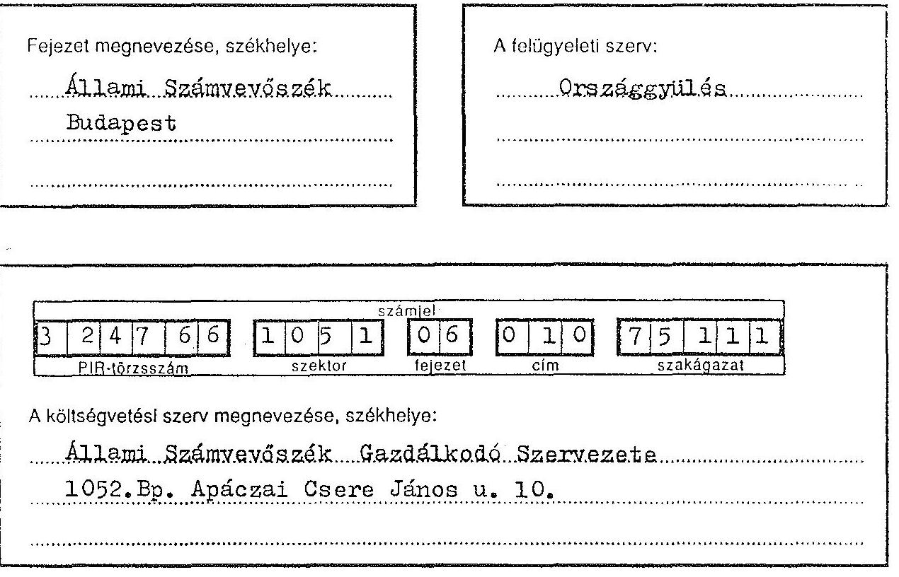
1992. évi

# A) INTÉZMÉNYI KÖLTSÉGVETÉSI BESZÁMOLÓ

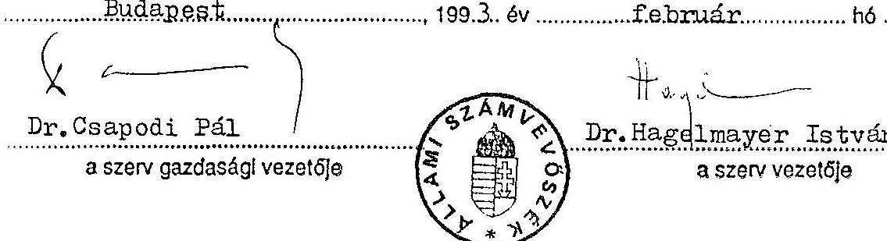

Készítette, ill. felvilágosítást nyújt:
Szaniszló Mihályné (név)
$118-9710$
(telefon)

A felügyeleti szerv részéről ellenőrizte:
Major Gizella (név)
$138-3310$ (telefon)

---

# TARTALOM

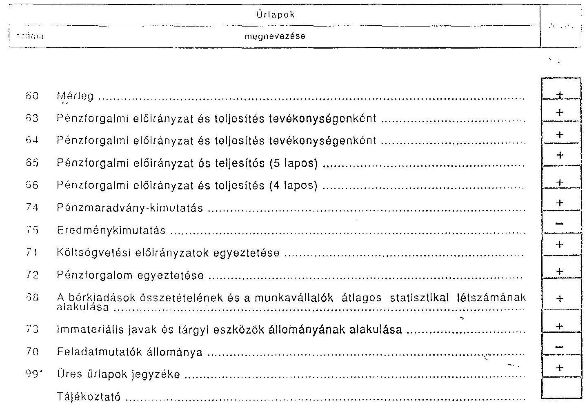

---

# MÉRLEG

| 1 2 3 4 5 6 7 8 9 10 11 12 13 14 15 16 17 18 19 20 21 22 23 24 25 26 27 28 29 30 31 32 33 34 35 36 37 38 39 40 41 42 43 44 45 46 47 48 49 50 51 52 53 54 55 56 57 58 59 60 61 62 63 64 65 66 67 68 69 70 71 72 73 74 75 76 77 78 79 80 81 82 83 84 85 86 87 88 89 90 91 92 93 94 95 96 97 98 99 100 101 102 103 104 105 106 107 108 109 110 111 112 113 114 115 116 117 118 119 120 121 122 123 124 125 126 127 128 129 130 131 132 133 134 135 136 137 138 139 140 141 142 143 144 145 146 147 148 149 150 151 152 153 154 155 156 157 158 159 160 161 162 163 164 165 166 167 168 169 170 171 172 173 174 175 176 177 178 179 180 181 182 183 184 185 186 187 188 189 190 191 192 193 194 195 196 197 198 199 200 201 202 203 204 205 206 207 208 209 210 211 212 213 214 215 216 217 218 219 220 221 222 223 224 225 226 227 228 229 230 231 232 233 234 235 236 237 238 239 240 241 242 243 244 245 246 247 248 249 250 251 252 253 254 255 256 257 258 259 260 261 262 263 264 265 266 267 268 269 270 271 272 273 274 275 276 277 278 279 280 281 282 283 284 285 286 287 288 289 290 291 292 293 294 295 296 297 298 299 210 211 212 213 214 215 216 217 218 219 220 221 222 223 224 225 226 227 228 229 230 231 232 233 234 235 236 237 238 239 240 241 242 243 244 245 246 247 248 249 250 251 252 253 254 255 256 257 258 259 260 261 262 263 264 265 266 267 268 269 270 271 272 273 274 275 276 277 278 279 280 281 282 283 284 285 286 287 288 289 290 291 292 293 294 295 296 297 298 299 210 211 212 213 214 215 216 217 218 219 220 221 222 223 224 225 226 227 228 229 230 231 232 233 234 235 236 237 238 239 240 241 242 243 244 245 246 247 248 249 250 251 252 253 254 255 256 257 258 259 260 261 262 263 264 265 266 267 268 269 270 271 272 273 274 275 276 277 278 279 280 281 282 283 284 285 286 287 288 289 290 291 292 293 294 295 296 297 298 299 210 211 212 213 214 215 216 217 218 219 220 221 222 223 224 225 226 227 228 229 230 231 232 233 234 235 236 237 238 239 240 241 242 243 244 245 246 247 248 249 250 251 252 253 254 255 256 257 258 259 260 261 262 263 264 265 266 267 268 269 270 271 272 273 274 275 276 277 278 279 280 281 282 283 284 285 286 287 288 289 290 291 292 293 294 295 296 297 298 299 210 211 212 213 214 215 216 217 218 219 220 221 222 223 224 225 226 227 228 229 230 231 232 233 234 235 236 237 238 239 240 241 242 243 244 245 246 247 248 249 250 251 252 253 254 255 256 257 258 259 260 261 262 263 264 265 266 267 268 269 270 271 272 273 274 275 276 277 278 279 280 281 282 283 284 285 286 287 288 289 290 291 292 293 294 295 296 297 298 299 210 211 212 213 214 215 216 217 218 219 220 221 222 223 224 225 226 227 228 229 230 231 232 233 234 235 236 237 238 239 240 241 242 243 244 245 246 247 248 249 250 251 252 253 254 255 256 257 258 259 260 261 262 263 264 265 266 267 268 269 270 271 272 273 274 275 276 277 278 279 280 281 282 283 284 285 286 287 288 289 290 291 292 293 294 295 296 297 298 299 210 211 212 213 214 215 216 217 218 219 220 221 222 223 224 225 226 227 228 229 230 231 232 233 234 235 236 237 238 239 240 241 242 243 244 245 246 247 248 249 250 251 252 253 254 255 256 257 258 259 260 261 262 263 264 265 266 267 268 269 270 271 272 273 274 275 276 277 278 279 280 281 282 283 284 285 286 287 288 289 290 291 292 293 294 295 296 297 298 299 210 211 212 213 214 215 216 217 218 219 220 221 222 223 224 225 226 227 228 229 230 231 232 233 234 235 236 237 238 239 240 241 242 243 244 245 246 247 248 249 250 251 252 253 254 255 256 257 258 259 260 261 262 263 264 265 266 267 268 269 270 271 272 273 274 275 276 277 278 279 280 281 282 283 284 285 286 287 288 289 290 291 292 293 294 295 296 297 298 299 210 211 212 213 214 215 216 217 218 219 220 221 222 223 224 225 226 227 228 229 230 231 232 233 234 235 236 237 238 239 240 241 242 243 244 245 246 247 248 249 250 251 252 253 254 255 256 257 258 259 260 261 262 263 264 265 266 267 268 269 270 271 272 273 274 275 276 277 278 279 280 281 282 283 284 285 286 287 288 289 290 291 292 293 294 295 296 297 298 299 210 211 212 213 214 215 216 217 218 219 220 221 222 223 224 225 226 227 228 229
 230 231 232 233 234 235 236 237 238 239 240 241 242 243 244 245 246 247 248 249 250 251 252 253 254 255 256 257 258 259 260 261 262 263 264 265 266 267 268 269 270 271 272 273 274 275 276 277 278 279 280 281 282 283 284 285 286 287 288 289 290 291 292 293 294 295 296 297 298 299 210 211 212 213 214 215 216 217 218 219 220 221 222 223 224 225 226 227 228 229 230 231 232 233 234 235 236 237 238 239 240 241 242 243 244 245 246 247 248 249 250 251 252 253 254 255 256 257 258 259 260 261 262 263 264 265 266 267 268 269 270 271 272 273 274 275 276 277 278 279 280 281 282 283 284 285 286 287 288 289 290 291 292 293 294 295 296 297 298 299 210 211 212 213 214 215 216 217 218 219 220 221 222 223 224 225 226 227 228 229 230 231 232 233 234 235 236 237 238 239 240 241 242 243 244 245 246 247 248 249 250 251 252 253 254 255 256 257 258 259 260 261 262 263 264 265 266 267 268 269 270 271 272 273 274 275 276 277 278 279 280 281 282 283 284 285 286 287 288 289 290 291 292 293 294 295 296 297 298 299 210 211 212 213 214 215 216 217 218 219 220 221 222 223 224 225 226 227 228 229 230 231 232 233 234 235 236 237 238 239 240 241 242 243 244 245 246 247 248 249 250 251 252 253 254 255 256 257 258 259 260 261 262 263 264 265 266 267 268 269 270 271 272 273 274 275 276 277 278 279 280 281 282 283 284 285 286 287 288 289 290 291 292 293 294 295 296 297 298 299 210 211 212 213 214 215 216 217 218 219 220 221 222 223 224 225 226 227 228 229 230 231 232 233 234 235 236 237 238 239 240 241 242 243 244 245 246 247 248 249 250 251 252 253 254 255 256 257 258 259 260 261 262 263 264 265 266 267 268 269 270 271 272 273 274 275 276 277 278 279 280 281 282 283 284 285 286 287 288 289 290 291 292 293 294 295 296 297 298 299 210 211 212 213 214 215 216 217 218 219 220 221 222 223 224 225 226 227 228 229 230 231 232 233 234 235 236 237 238 239 240 241 242 243 244 245 246 247 248 249 250 251 252 253 254 255 256 257 258 259 260 261 262 263 264 265 266 267 268 269 270 271 272 273 274 275 276 277 278 279 280 281 282 283 284 285 286 287 288 289 290 291 292 293 294 295 296 297 298 299 210 211 212 213 214 215 216 217 218 219 220 221 222 223 224 225 226 227 228 229 230 231 232 233 234 235 236 237 238 239 240 241 242 243 244 245 246 247 248 249 250 251 252 253 254 255 256 257 258 259 260 261 262 263 264 265 266 267 268 269 270 271 272 273 274 275 276 277 278 279 280 281 282 283 284 285 286 287 288 289 290 291 292 293 294 295 296 297 298 299 210 211 212 213 214 215 216 217 218 219
 220 221 222 223 224 225 226 227 228 229 230 231 232 233 234 235 236 237 238 239 240 241 242 243 244 245 246 247 248 249 250 251 252 253 254 255 256 257 258 259 260 261 262 263 264 265 266 267 268 269 270 271 272 273 274 275 276 277 278 279 280 281 282 283 284 285 286 287 288 289 290 291 292 293 294 295 296 297 298 299 210 211 212 213 214 215 216 217 218 219 220 221 222 223 224 225 226 227 228 229 230 231 232 233 234 235 236 237 238 239 240 241 242 243 244 245 246 247 248 249 250 251 252 253 254 255 256 257 258 259 260 261 262 263 264 265 266 267 268 269 270 271 272 273 274 275 276 277 278 279 280 281 282 283 284 285 286 287 288 289 290 291 292 293 294 295 296 297 298 299 210 211 212 213 214 215 216 217 218 219 220 221 222 223 224 225 226 227 228 229 220 221 222 223 224 225 226 227 228 229 220 221 222 223 224 225 226 227 228 229 220 221 222 223 224 225 226 227 228 229 220 221 222 223 224 225 226 227 228 229 220 221 222 223 224 225 226 227 228 229 220 221 222 223 224 225 226 227 228 229 220 221 222 223 224 225 226 227 228 229 220 221 222 223 224 225 226 227 228 229 220 221 222 224 225 226 227 228 229 220 221 222 223 224 225 226 227 228 229 220 221 222 223 224 225 226 227 228 229 220
 221 222 223 224 225 226 227 228 229 220 221 222 227 228 229 220 221 222 223 224 225 226 227 228 229 220 221 222 223 224 225 226 227 228 229 220 221 222 223 224 225 226 227 228 229 220 221 222 222 223 224 225 226 227 228 229 220 221 222 227 228 229 220 221 222 222 223 224 225 226 227 228 229 220 221 222 223 224 225 226 227 228 229 220 221 222 222 223 224 225 226 227 228 229 220 221 222 222 223 224 225 226 227 228 229 221 222 223 224 225 226 227 228 229 221 222 223 224 225 226 227 228 229 220 221 222 227 228 229 221 222 223 224 225 226 227 228 229 221 222 223 224 225 226 227 228 229 221 222 223 224 225 226 227 228 229 221 222 227 228 229 221 222 223 224 225 226 227 228 229 221 222 227 228 229 221 222 223 224 225 226 227 228 229 221 222 227 228 229 221 2227 229 229 221 2223 224 225 226 227 228 229 221 221 2223 224 225 226 227 228 229 229 221 227 228 229 229 221 2227 228 229 229 221 2223 224 225 226 227 228 229 229 221 227 228 229 221 221 2227 229 229 229 221 2227 229 221 223 224 225 227 228 229 229 221 221 227 229 221 2227 229 221 227 228 229 221 223 224 225 227 229 229 221 227 229 221 227 228 229 221 227 229 221 227 229 221 227 229 221 2227 229 221 2227 229 221 227 229 221 227 229 221 227 229 221 227 229 221 227 229 221 227 229 221 227 229 221 221 227 229 221 227 229 221 227 229 221 221 227 229 221 227 229 221 227 229 221 227 229 221 227 229 221 227 229 221 227 229 221 227 229 221 227 229 221 227 229 221 227 229 221 227 229 221 227 229 221 227 229 221 227 229 221 227 229 221 227 229 221 227 229 221 227 229 221 227 229 221 227 229
 221 227 229 221 227 229 221 227 229 221 227 229 221 227 229 221 227 229 221 227 229 221 227 229 221 227 229 221 227 229 221 227 229 221 227 229 221 227 229 221 227 229 221 227 229 221 227 229 221 227 229 221 227 229 221 227 229 221 227 229 221 227 229 221 227 229 221 227 229 221 227 229 221 227 229 221 227 229 221 227 229 221 227 229 221 227 229 221 227 229 221 227 229 221 227 229 221 227 229 221 227 229 221 227 229 221 227 229 227 229 221 27 229 221 27 229 221 27 227 227 27 229 221 27 229 221 27 227 27 229 221 27 227 27 27 27 27 27 27 27 27 27 27 27 27 27 27 27 27 27 27 27 27 27 27 27 27 27 27 27 27 27 27 27 27 27 27 27 27 27 27 27 27 27 27 27 27 27 27 27 27 27 27 27 27 27 27 27 27 27 27 27 27 27 27 27 27 27 27 27 

---

# Pénzforgalmi előirányzat és teljesítés tevékenységenként

|  324756 | 331 | 06 | 01 | 7 | 5111 | 63 | 1992 | 2  |
| --- | --- | --- | --- | --- | --- | --- | --- | --- |
|  PIR-törzsszám | szektor | fejezet | cím | szakágazat | útlap | év | időszak | szerv megnevezése  |

## Ezer forintban

|  Kiadások megnevezése | Sor-
szám |  |  |  |  |  |  |  |  | Szakfeladatok
tényleges
kiadásai  |
| --- | --- | --- | --- | --- | --- | --- | --- | --- | --- | --- |
|   |  |  |  |  |  |  |  |  |  | 9999999  |
|  1 | 2 | 3 | 4 | 5 | 6 | 7 | 8 | 9 | 10 | 11  |
|  Béralap | 01 | 228.188 |  |  |  |  |  |  |  | 228.188  |
|  Társadalombiztosítási járulék | 02 | 104.984 |  |  |  |  |  |  |  | 104.984  |
|  Egyéb működési kiadások | 03 | 126.965 |  |  |  |  |  |  |  | 126.965  |
|  Működési kiadások összesen
(21+02+03) | 04 | 450.137 |  |  |  |  |  |  |  | 450.137  |
|  Kamatfizetések | 05 |  |  |  |  |  |  |  |  |   |
|  Folyó kiadások (04+05) | 06 | 460.137 |  |  |  |  |  |  |  | 460.137  |
|  Tárgyi eszközök, föld és immateriális
javak felhalmozása | 07 | 33.449 |  |  |  |  |  |  |  | 33.449  |
|  Tárgyi eszközök felújítása | 08 | 11.566 |  |  |  |  |  |  |  | 11.566  |
|  Egyéb felhalmozási és tőke jellegű
kiadások | 09 | 4.915 |  |  |  |  |  |  |  | 4.915  |
|  Felhalmozási és tőke jellegű kiadások
(07+08+09) | 10 | 49.926 |  |  |  |  |  |  |  | 49.926  |
|  Támogatások, elvonások és egyéb
folyó átutalások | 11 | 5.450 |  |  |  |  |  |  |  | 5.450  |
|  Pénzforgalom nélküli kiadások | 12 |  |  |  |  |  |  |  |  |   |
|  Hitel- és kiegyenlítő kiadások | 13 | 24.062 |  |  |  |  |  |  |  | 24.062  |
|  Költségvetési kiadások
(06+10+11+12+13) | 14 | 539.303 |  |  |  |  |  |  |  | 539.303  |
|  Függő, átfutó és letéti kiadások | 15 | 822 |  |  |  |  |  |  |  | 822  |
|  Kiadások összesen (14+15) | 16 | 535.741 |  |  |  |  |  |  |  | 535.741  |

PJ 920325 Q

---

# Pénzforgalmi előirányzat és teljesítés tevékenységenként

|  3 | 2 | 4 | 7 | 6 | 5 | 1 | 0 | 5 | 1 | 9 | 6 | 9 | 1 | 0 | 7 | 5 | 1 | 1 | 1 | 6 | 4 | 1 | 9 | 9 | 2 | 2  |
| --- | --- | --- | --- | --- | --- | --- | --- | --- | --- | --- | --- | --- | --- | --- | --- | --- | --- | --- | --- | --- | --- | --- | --- | --- | --- | --- |
|  PIR-törzsszám | szektor | fejezet | cím | szakágazat | Cílep | év | időszak | Szakfeladatok
tényleges
bevételei |  |  |  |  |  |  |  |  |  |  |  |  |  |  |  |  |  |   |
|  Bevételek megnevezése |  |  |  |  |  |  |  |  |  |  |  |  |  |  |  |  |  |  |  |  |  |  |  |  |  |   |
|   |  |  |  |  |  |  |  |  |  |  |  |  |  |  |  |  |  |  |  |  |  |  |  |  |  |   |
|  Bevételek megnevezése |  |  |  |  |  |  |  |  |  |  |  |  |  |  |  |  |  |  |  |  |  |  |  |  |  |   |
|   |  |  |  |  |  |  |  |  |  |  |  |  |  |  |  |  |  |  |  |  |  |  |  |  |  |   |
|  1 | 2 | 3 | 4 | 5 | 6 | 7 | 8 | 9 | 10 | 11 |  |  |  |  |  |  |  |  |  |  |  |  |  |  |  |   |
|  Intézmények alaptevékenységének
(támogatásértékű) bevételei | 01 |  |  |  |  |  |  |  |  |  |  |  |  |  |  |  |  |  |  |  |  |  |  |  |  |   |
|  Intézmények egyéb bevételei | 02 | 2.154 |  |  |  |  |  |  |  |  |  |  |  |  |  |  |  |  |  |  |  |  |  |  |  |   |
|  Intézmények vállalkozásainak
árbevételei | 03 |  |  |  |  |  |  |  |  |  |  |  |  |  |  |  |  |  |  |  |  |  |  |  |  |   |
|  Intézményi tevékenységek bevételei
(01+02+03) | 04 | 2.154 |  |  |  |  |  |  |  |  |  |  |  |  |  |  |  |  |  |  |  |  |  |  |  |   |
|  Kamatbevételek | 05 | 3.765 |  |  |  |  |  |  |  |  |  |  |  |  |  |  |  |  |  |  |  |  |  |  |  |   |
|  Intézmények saját folyó bevételei
(04+05) | 06 | 5.919 |  |  |  |  |  |  |  |  |  |  |  |  |  |  |  |  |  |  |  |  |  |  |  |   |
|  Felhalmozási és tőke jellegű bevételek | 07 | 317 |  |  |  |  |  |  |  |  |  |  |  |  |  |  |  |  |  |  |  |  |  |  |  |   |
| Felügyeleti szervtől kapott támogatás | 08 | 515.700 |  |  |  |  |  |  |  |  |  |  |  |  |  |  |  |  |  |  |  |  |  |  |  |   |
| Egyéb támogatások, visszatérülések,
folyó útutalások | 09 | 2.327 |  |  |  |  |  |  |  |  |  |  |  |  |  |  |  |  |  |  |  |  |  |  |  |   |
| Támogatások, visszatérülések és egyéb
folyó útutalások (08+09) | 10 | 516.027 |  |  |  |  |  |  |  |  |  |  |  |  |  |  |  |  |  |  |  |  |  |  |  |   |
| Folyó, felhalmozási (tőke-) bevételek,
támogatások, útutalások (01+07+10) | 11 | 524.263 |  |  |  |  |  |  |  |  |  |  |  |  |  |  |  |  |  |  |  |  |  |  |  |   |
| Pénzforgalom nélküli bevételek | 12 | 23.713 |  |  |  |  |  |  |  |  |  |  |  |  |  |  |  |  |  |  |  |  |  |  |  |   |
| Hitel- és kiegyenlítő bevételek | 13 | 93.800 |  |  |  |  |  |  |  |  |  |  |  |  |  |  |  |  |  |  |  |  |  |  |  |   |
| Költségvetési bevételek (11+12+13) | 14 | 641.776 |  |  |  |  |  |  |  |  |  |  |  |  |  |  |  |  |  |  |  |  |  |  |  |   |
| Függő, átfutó és letéti bevételek | 15 | 266 |  |  |  |  |  |  |  |  |  |  |  |  |  |  |  |  |  |  |  |  |  |  |  |   |
| Bevételek összesen (14+15) | 16 | 642.042 |  |  |  |  |  |  |  |  |  |  |  |  |  |  |  |  |  |  |  |  |  |  |  |   |

Pj 200575 G

---

# Pénzforgalmi előirányzat és teljesítés

Állami Számvevőszék

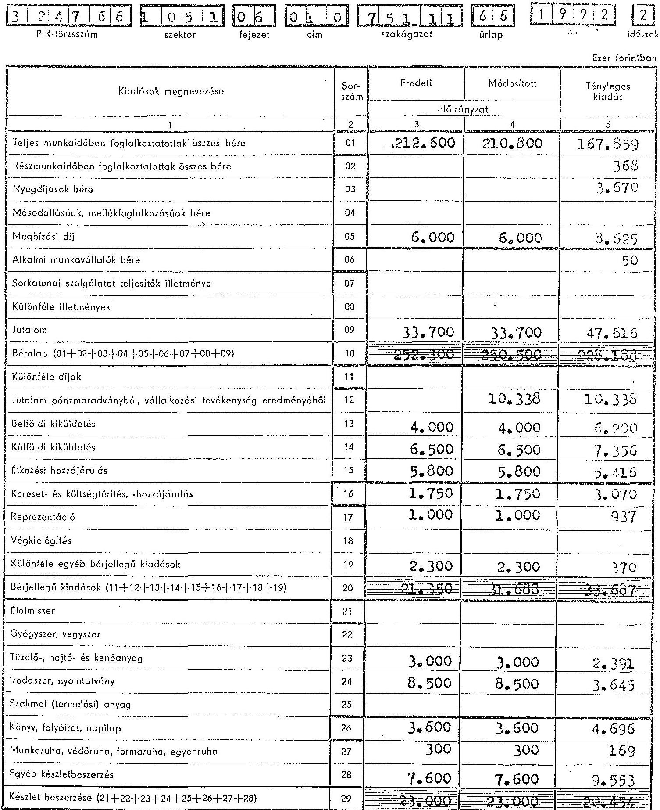

|  Kiadások megnevezése | Sor-
szám | Eredeti | Módosított | Tényleges
kiadás  |
| --- | --- | --- | --- | --- |
|   |  | előirányzat |  |   |
|  1 | 2 | 3 | 4 | 5  |
| Teljes munkaidőben foglalkoztatottak összes bére | 01 | 212.500 | 210.800 | 167.859  |
| Részmunkaidőben foglalkoztatottak összes bére | 02 |  |  | 368  |
| Nyugdíjasok bére | 03 |  |  | 3.670  |
| Másodállásúak, mellékfoglalkozásúak bére | 04 |  |  |   |
| Megbízási díj | 05 | 6.000 | 6.000 | 8.625  |
| Alkalmi munkavállalók bére | 06 |  |  | 50  |
| Sorkatonai szolgáltatást teljesítők illetménye | 07 |  |  |   |
| Különféle illetmények | 08 |  |  |   |
| Jutalom | 09 | 33.700 | 33.700 | 47.616  |
| Béralap (01+02+03+04+05+06+07+08+09) | 10 | 252.300 | 250.500 | 228.180  |
| Különféle díjak | 11 |  |  |   |
| Jutalom pénzmaradványból, vállalkozási tevékenység eredményéből | 12 |  | 10.338 | 10.338  |
| Belföldi kiküldetés | 13 | 4.000 | 4.000 | 6.290  |
| Külföldi kiküldetés | 14 | 6.500 | 6.500 | 7.356  |
| Élelmezési hozzájárulás | 15 | 5.800 | 5.800 | 5.416  |
| Költség- és költségtérítés, -hozzájárulás | 16 | 1.750 | 1.750 | 3.070  |
| Reprezentáció | 17 | 1.000 | 1.000 | 937  |
| Végkielégítés | 18 |  |  |   |
| Különféle egyéb bérjellegű kiadások | 19 | 2.300 | 2.300 | 370  |
| Bérjellegű kiadások (11+12+13+14+15+16+17+18+19) | 20 | 21.350 | 31.688 | 33.777  |
| Élelmiszer | 21 |  |  |   |
| Gyógyszer, vegyszer | 22 |  |  |   |
| Tüzelő-, hajtó- és kenőanyag | 23 | 3.000 | 3.000 | 2.391  |
| Irodaszer, nyomtatvány | 24 | 8.500 | 8.500 | 3.645  |
| Szakmai (termelési) anyag | 25 |  |  |   |
| Könyv, folyóirat, napilap | 26 | 3.600 | 3.600 | 4.696  |
| Munkaruha, védőruha, formaruha, egyenruha | 27 | 300 | 300 | 169  |
| Egyéb készletbeszerzés | 28 | 7.600 | 7.600 | 9.553  |
| Készlet beszerzése (21+22+23+24+25+26+27+28) | 29 | 23.000 | 23.000 | 20.454  |

---

# Pénzforgalmi előirányzat és teljesítés

## Állam Hazvevőda Gazdálkodozók Személye

### Szerv megnevezése

| 5 F 4 / F 5 |  |  |  |  |   |
| --- | --- | --- | --- | --- | --- |
| PIR-törzsszám | szektor | fejezet | cím | szakágazat | címlap  |
| 1 | 2 | 3 | 4 | 5 |   |
| Távhő-, gőz-, gáz- és villamosenergia-szolgáltatás | 30 | 3.300 | 3.300 | 1.310 |   |
| Szállítás | 31 | 1.000 | 1.000 | 1.611 |   |
| Vásárolt élőmunka | 32 |  |  |  |   |
| Közműdíj | 33 | 700 | 700 | 115 |   |
| Postai szolgáltatás | 34 | 6.900 | 6.900 | 7.641 |   |
| Helyiségbérleti díj | 35 | 26.000 | 21.500 | 20.444 |   |
| Tárgyi eszközök karbantartása | 36 | 4.200 | 4.200 | 5.154 |   |
| Különféle egyéb szolgáltatás | 37 | 15.000 | 15.000 | 14.401 |   |
| Szolgáltatások (30+31+32+33+34+35+36+37) | 38 | 57.100 | 52.600 | 50.676 |   |
| Társadalombiztosítási járulék | 39 | 108.500 | 114.845 | 104.984 |   |
| Hozzájárulás a társadalombiztosítási alaphoz | 40 |  |  |  |   |
| Befizetés más különített állami pénzalapokba | 41 |  |  |  |   |
| Hozzájárulás közös létesítmények fenntartásához | 42 |  |  |  |   |
| Nemzetközi tagsági díjak | 43 | 200 | 200 | 189 |   |
| Vásárolt termékek és szolgáltatások ÁFA-ja | 44 | 19.000 | 19.000 | 21.372 |   |
| Különféle egyéb kiadások | 45 | 700 | 700 | 637 |   |
| Különféle kiadások és befizetések (39+40+41+42+43+44+45) | 46 | 128.400 | 134.745 | 127.182 |   |
| Működési kiadások (10+20+29+38+46) | 47 | 482.150 | 492.533 | 460.279 |   |
| Kamatfizetések | 48 |  |  |  |   |
| Folyó kiadások (47+48) | 49 | 482.150 | 492.533 | 460.279 |   |
| Épületek, építmények létesítése, vásárlása | 50 |  |  |  |   |
| Gépek, berendezések és felszerelések létesítése, vásárlása | 51 | 22.650 | 29.132 | 38.165 |   |
| Járművek vásárlása | 52 | 3.300 | 3.300 | 3.405 |   |
| Egyéb javak vásárlása, felhalmozási kiadások | 53 | 1.250 | 1.250 | 1.674 |   |
| Tárgyi eszközök, föld és immateriális javak felhalmozása (50+51+52+53) | 54 | 27.200 | 33.632 | 38.244 |   |
| Állami készletek, tartalékok felhalmozása | 55 |  |  |  |   |
| Értékpapírok vásárlása | 56 |  |  |  |   |

---

# Pénzforgalmi előirányzat és teljesítés

Állami Számvevőszék Gazdálkodó Szervvezete

szerv megnevezése

324 766 10 51 06 01 0 7 511 6 6 1992 2 PIR-törzsszám szektor fejezet cím szakágazat űrlap év időszak Ezer forintban

| Kiadások megnevezése | Sorszám | Eredeti előirányzat | Módosított előirányzat | Tényleges kiadás |
| --- | --- | --- | --- | --- |
| 1 | 2 | | 3 | 4 | 5 |
| Felhalmozási célú átutalások felhalmozási bankszámlára | 57 | | | |
| Felhalmozási célú átutalások a fejezetnek | 58 | | | |
| Felhalmozási célú átutalások az önkormányzatoknak | 59 | | | |
| Felhalmozási célú átutalások a Társadalombiztosítási Alapnak | 60 | | | |
| Felhalmozási célú átutalások az elkülönített állami pénzalapoknak | 61 | | | |
| Állombiztosítósan belüli felhalmozási célú átutalások (57+58+59+60+61) | 62 | | | |
| Felhalmozási célú átutalások a vállalkozásoknak | 63 | 600 | 600 | 315 |
| Felhalmozási célú átutalások a lakosságnak | 64 | 4.000 | 4.000 | 4.000 |
| Felhalmozási célú átutalások társadalmi önszerveződéseknek | 65 | | | |
| Felhalmozási célú átutalások külföldre | 66 | | | |
| Állombiztosítósan kívüli felhalmozási célú átutalások (63+64+65+66) | 67 | 4.600 | 4.600 | 4.315 |
| Épületek, építmények felújítása | 68 | | 11.566 | 11.236 |
| Gépes, berendezések, felszerelések felújítása | 69 | | | 128 |
| Járművek felújítása | 70 | | | |
| Egyéb felújítás | 71 | | | |
| Tárgyi eszközök felújítása (68+69+70+71) | 72 | | 11.566 | 11.566 |
| Felhalmozási és tőke jellegű kiadások (54+55+56+62+67+72) | 73 | 11.000 | 49.646 | 49.925 |
| Vállalkozások támogatása | 74 | | | |
| Hozzájárulás leányvállalat működéséhez | 75 | | | |
| Hozzájárulás gazdasági társaság működéséhez | 76 | | | |
| Vállalkozások folyó támogatása (74+75+76) | 77 | | | |
| Állami gondozásban lévők pénzbeli juttatásai | 78 | | | |
| Középfokú oktatásban részt vevők pénzbeli juttatásai | 79 | | | |
| Felsőoktatási hallgatók pénzbeli juttatásai | 80 | | | |
| Felnőttoktatásban részt vevők pénzbeli juttatásai | 81 | | | |
| Egyéb pénzbeli juttatások | 82 | | | |
| Intézményi ellátáshoz kapcsolódó pénzbeli juttatások (78+79+80+81+82) | 83 | | | |

P) 920575 O

---

# Pénzforgalmi előirányzat és teljesítés

104

**Jutant**: Szervomontó

**Gazdálkodó**: Szervomontó

szerv megnevezése

2 476 6 1 05 1 06 01 0 75111 6 6 1992 2

PIR-törzszám szektor fejezet cím szakágozat űrlap év időirázó

Eszr ferinthema

| Kiadások megnevezése | Sorszám | Eredeti előirányzat | Módosított előirányzat |
| --- | --- | --- | --- |
| 1 | 2 | 3 | 4 |
| Családi pótlék | 84 | | |
| Szociális segélyek | 85 | | |
| Nevelési segélyek | 86 | | |
| Pénzbeli kárpótlás | 87 | | |
| Egyéb pénzbeli juttatások | 88 | | |
| Társadalom- és szociális pótléket juttatások (84+85+86+87+88) | 89 | | |
| Lakossági pénzbeli juttatások (83+89) | 90 | | |
| Nemzetiségi szövetségek támogatása | 91 | | |
| Pártok támogatása | 92 | | |
| Társadalmi szervezetek támogatása | 93 | | |
| Egyházak támogatása | 94 | | |
| Alapítványok támogatása | 99 | | |
| Magánintézmények támogatása | 96 | | |
| Társadalmi önszerveződések támogatása (91+92+93+94+95+96) | 97 | | |
| Vállalkozási nyereségadó befizetése | 98 | | |
| Általános forgalmi adó befizetése | 99 | 350 | 350 |
| Egyéb költségvetési elvonás és befizetés | 100 | | |
| Fejezeti elvonás és befizetés | 101 | | 5.182 |
| Elvonások és befizetések (98+99+100+101) | 102 | 350 | 5.532 |
| Fejezeten belüli pénzeszközátadás | 103 | | |
| Fejezetek (költségvetési szervek) közötti pénzeszközátadás | 104 | | |
| Önkormányzatok részére pénzeszközátadás | 105 | | |
| Ágazati és célfeladatok fel nem osztható kerete | 106 | | |
| Egyéb elszámolások (103+104+105+106) | 107 | | |
| Támogatások, elvonások és egyéb folyó átutalások (77+90+97+102+107) | 108 | 350 | 5.532 |
| Folyó, felhalmozási (tőke) kiadások, támogatások, átutalások (49+73+108) | 109 | 514.300 | 547.913 |

PJ 920575 G

---

# Pénzforgalmi előirányzat és teljesítés
 237. 238. 239. 240. 241. 242. 243. 244. 245. 246. 247. 248. 249. 250. 251. 252. 253. 254. 255. 256. 257. 258. 259. 260. 261. 262. 263. 264. 265. 266. 267. 268. 269. 270. 271. 272. 273. 274. 275. 276. 277. 278. 279. 280. 281. 282. 283. 284. 285. 286. 287. 288. 289. 290. 291. 292. 293. 294. 295. 296. 297. 298. 299. 210. 211. 212. 213. 214. 215. 216. 217. 218. 219. 220. 221. 222. 223. 224. 225. 226. 227. 228. 229. 230. 231. 232. 233. 234. 235. 236. 237. 238. 239. 240. 241. 242. 243. 244. 245. 246. 247. 248. 249. 250. 251. 252. 253. 254. 255. 256. 257. 258. 259. 260. 261. 262. 263. 264. 265. 266. 267. 268. 269. 270. 271. 272. 273. 274. 275. 276. 277. 278. 279. 280. 281. 282. 283. 284. 285. 286. 287. 288. 289. 290. 291. 292. 293. 294. 295. 296. 297. 298. 299. 210. 211. 212. 213. 214. 215. 216. 217. 218. 219. 220. 221. 222. 223. 224. 225. 226. 227. 228. 229. 230. 231. 232. 233. 234. 235. 236. 237. 238. 239. 240. 241. 242. 243. 244. 245. 246. 247. 248. 249. 250. 251. 252. 253. 254. 255. 256. 257. 258. 259. 260. 261. 262. 263. 264. 265. 266. 267. 268. 269. 270. 271. 272. 273. 274. 275. 276. 277. 278. 279. 280. 281. 282. 283. 284. 285. 286. 287. 288. 289. 290. 291. 292. 293. 294. 295. 296. 297. 298. 299. 210. 211. 212. 213. 214. 215. 216. 217. 218. 219. 220. 221. 222. 223. 224. 225. 226. 227. 228. 229. 230. 231. 232. 233. 234. 235. 236. 237. 238. 239. 240. 241. 242. 243. 244. 245. 246. 247. 248. 249. 250. 251. 252. 253. 254. 255. 256. 257. 258. 259. 260. 261. 262. 263. 264. 265. 266. 267. 268. 269. 270. 271. 272. 273. 274. 275. 276. 277. 278. 279. 280. 281. 282. 283. 284. 285. 286. 287. 288. 289. 290. 291. 292. 293. 294. 295. 296. 297. 298. 299. 210. 211. 212. 213. 214. 215. 216. 217. 218. 219. 220. 221. 222. 223. 224. 225. 226. 227. 228. 229. 230. 231. 232. 233. 234. 235. 236. 237. 238. 239. 240. 241. 242. 243. 244. 245. 246. 247. 248. 249. 250. 251. 252. 253. 254. 255. 256. 257. 258. 259. 260. 261. 262. 263. 264. 265. 266. 267. 268. 269. 270. 271. 272. 273. 274. 275. 276. 277. 278. 279. 280. 281. 282. 283. 284. 285. 286. 287. 288. 289. 290. 291. 292. 293. 294. 295. 296. 297. 298. 299. 210. 211. 212. 213. 214. 215. 216. 217. 218. 219. 220. 221. 222. 223. 224. 225. 226. 227. 228. 229. 230. 231. 232. 233. 234. 235. 236. 237. 238. 239. 240. 241. 242. 243. 244. 245. 246. 247. 248. 249. 250. 251. 252. 253. 254. 255. 256. 257. 258. 259. 260. 261. 262. 263. 264. 265. 266. 267. 268. 269. 270. 271. 272. 273. 274. 275. 276. 277. 278. 279. 280. 281. 282. 283. 284. 285. 286. 287. 288. 289. 290. 291. 292. 293. 294. 295. 296. 297. 298. 299. 210. 211. 212. 213. 214. 215. 216. 217. 218. 219. 220. 221. 222. 223. 224. 225. 226. 227. 228. 229. 230. 231. 232. 233. 234. 235. 236. 237. 238. 239. 240. 241. 242. 243. 244. 245. 246. 247. 248. 249. 250. 251. 252. 253. 254. 255. 256. 257. 258. 259. 260. 261. 262. 263. 264. 265. 266. 267. 268. 269. 270. 271. 272. 273. 274. 275. 276. 277. 278. 279. 280. 281. 282. 283. 284. 285. 286. 287. 288. 289. 290. 291. 292. 293. 294. 295. 296. 297. 298. 299. 210. 211. 212. 213. 214. 215. 216. 217. 218. 219. 220. 221. 221. 221. 221. 221. 221. 221. 221. 221. 221. 221. 221. 221. 221. 221. 221. 221. 221. 221. 221. 221. 221. 221. 221. 221. 221. 221. 221. 221. 221. 221. 221. 221. 221. 221. 221. 221

---

# Pénzforgalmi előirányzat és teljesítés

## Állami Számvevőszéken

### Gazdálkodó Szervezet

szerv megnevezése

| 1 | 2 | 3 | 4 | 5 |
| --- | --- | --- | --- | --- |
| 1031 | 06 | 010 | 75111 | 66 |
| 010 | 75 | 111 | 66 | 1992 |

### PIR-törzsszám

szektor

### fejezet

cím

### szakágazat

### alprogram

### év

### időszak

### Ezer forintban

| Bevételek megnevezése | Sor-
szám | Eredeti
előirányzat | Módosított | Tényleges
bevétel |
| --- | --- | --- | --- | --- |
| 1 | 2 | 3 | 4 | 5 |
| Intézményi ellátás díja | 01 | | | |
| Alkalmazottak térítése | 02 | | | |
| Hatósági és eljárási bevételek | 03 | | | |
| Illeték jellegű bevételek | 04 | | | |
| Alaptevékenységgel összefüggő áru- és készletértékesítés | 05 | | | |
| Alaptevékenységgel összefüggő szolgáltatási díjbevétel | 06 | | | |
| Intézmények alaptevékenységének (támogatásértékű) bevételei (01+02+03+04+05+06) | 07 | | | |
| Helyiségbérleti díjbevétel | 08 | 750 | 750 | 1.115 |
| Eszközkölcsönzési, lízing díjbevétel | 09 | | | |
| Kiszámlázott termékek és szolgáltatások ÁFA-ja | 10 | 350 | 350 | 279 |
| Egyéb intézményi bevételek | 11 | 150 | 650 | 753 |
| Intézmények egyéb bevételei (08+09+10+11) | 12 | 1.250 | 1.750 | 3.154 |
| Áruértékesítés | 13 | | | |
| Szolgáltatás | 14 | | | |
| Intézmények vállalkozásainak árbevételei (13+14) | 15 | | | |
| Intézményi tevékenységek bevételei (07+12+15) | 16 | 1.250 | 1.750 | 3.154 |
| Kamatbevételek | 17 | | 3.700 | 3.765 |
| Intézmények saját folyó bevételei (16+17) | 18 | 1.250 | 5.450 | 5.313 |

PJ 920575 G

---

# Pénzforgalmi előirányzat és teljesítés

| 1 2 | | | | | | | |
| --- | --- | --- | --- | --- | --- | --- | --- |
| Állami Szervovszárgyám | | | |
 |  |  |   |
|  Gazdálkodó Szervovszárgyám |  |  |  |  |  |  |   |
|  szerv megnevezése |  |  |  |  |  |  |   |
|  3 4 5 6 7 8 9 10 11 12 13 14 15 16 17 18 19 20 |  |  |  |  |  |  |   |
|  PIR-törzsszám | szektor | fejezet | cím | szakágazat | űrlap | év | időszak  |
|   |  |  |  |  |  |  | Ezer forintban  |
|  Bevételek megnevezése |  |  |  |  |  |  |   |
|  1 |  | 2 |  | 3 |  | 4 | 5  |
|  Épületek, építmények értékesítése |  | 19 |  |  |  |  |   |
|  Gépek, berendezések, felszerelések értékesítése |  | 20 |  | 150 |  | 150 |   |
|  Járművek értékesítése |  | 21 |  | 600 |  | 500 | 317  |
|  Egyéb javak értékesítése |  | 22 |  |  |  |  |   |
|  Tárgyi eszközök, föld és immateriális javak értékesítése (19+20+21+22) |  | 23 |  | 750 |  | 750 | 317  |
|  Állami készletek, tartalékok értékesítése |  | 24 |  |  |  |  |   |
|  Értékpapírok értékesítése |  | 25 |  |  |  |  |   |
|  Felhalmozási célú átutalások a fejezettől |  | 26 |  |  |  |  |   |
|  Felhalmozási célú átutalások az önkormányzatoktól |  | 27 |  |  |  |  |   |
|  Felhalmozási célú átutalások a Társadalombiztosítási Alaptól |  | 28 |  |  |  |  |   |
|  Felhalmozási célú átutalások az elkülönített állami pénzalapoktól |  | 29 |  |  |  |  |   |
|  Államháztartáson belüli felhalmozási célú átutalások (26+27+28+29) |  | 30 |  |  |  |  |   |
|  Felhalmozási célú átutalások vállalkozásoktól |  | 31 |  |  |  |  |   |
|  Felhalmozási célú átutalások lakosságtól |  | 32 |  |  |  |  |   |
|  Felhalmozási célú átutalások társadalmi önszerveződésektől |  | 33 |  |  |  |  |   |
|  Felhalmozási célú átutalások külföldről |  | 34 |  |  |  |  |   |
|  Államháztartáson kívüli származó felhalmozási célú átutalások (31+32+33+34) |  | 35 |  |  |  |  |   |
|  Felhalmozási és tőke jellegű bevételek (23+24+25+30+35) |  | 36 |  | 750 |  | 750 | 317  |

F) 920575 0

---

# Pénzforgalmi előirányzat és teljesítés

Állami bekövetlenek érezésűi távszáznegyek és bekövetlenek és teljesítés

|  3247661051 | 06010 | 75111 | 66 | 1992 | 2  |
| --- | --- | --- | --- | --- | --- |
|  PIR-tárzszám szektor fejezet cím szakágazat űrlap év időszak |  |  |  |  |   |
|  Ezer forintban |  |  |  |  |   |

|  Bevételek megnevezése | Sor-
szám | Eredeti
előirányzat | Módosított
előirányzat | Tényleges
bevétel  |
| --- | --- | --- | --- | --- |
|  1 | 2 | 3 | 4 | 5  |
|  Intézményfinanszírozás | 37 | 512.300 | 515.700 | 515.700  |
|  Címzett támogatás | 38 |  |  |   |
|  Céltómogatás | 39 |  |  |   |
|  Feladatmutatóhoz kötött normatív finanszírozás | 40 |  |  |   |
|  Egyéb feladatfinanszírozás, támogatás | 41 |  |  |   |
|  Felügyeleti szervtől kapott támogatás (37+38+39+40+41) | 42 | 512.300 | 515.700 | 515.700  |
|  Címzett támogatás | 43 |  |  |   |
|  Céltómogatás | 44 |  |  |   |
|  Feladatmutatóhoz kötött normatív finanszírozás | 45 |  |  |   |
|  Egyéb feladatfinanszírozás, támogatás | 46 |  |  |   |
|  Hozzájárulás intézményfenntartási társasásoz | 47 |  |  |   |
|  Hozzájárulás közös létesítmény fenntartásához | 48 |  |  |   |
|  Önkormányzatoktól átvett pénzeszközök (43+44+45+46+47+48) | 49 |  |  |   |
|  Egészségügy működésére átvett pénzeszközök | 50 |  |  |   |
|  Egyéb támogatás | 51 |  |  |   |
|  Társadalombiztosítási Alapból átvett pénzeszközök (50+51) | 52 |  |  |   |
|  Állami megbízás | 53 |  |  |   |
|  Állami megrendelés | 54 |  |  |   |
|  Egyéb támogatás | 55 |  |  |   |
|  Elkülönített állami pénzalapoktól átvett pénzeszközök (53+54+55) | 56 |  |  |   |
|  Közérdekű kötelezettségvállalás | 57 |  |  |   |
|  Hozzájárulás közös létesítmény fenntartásához | 58 |  |  |   |
|  Meghatározott egyéb célra átvett pénzeszközök | 59 |  |  |   |
|  Államháztartáson kívülről származó pénzeszközök (57+58+59) | 60 |  |  |   |

PJ 920575 O

---

# Pénzforgalmi előirányzat és teljesítés

|  24766 | 1051 | 06 | 010 | 75111 | 66 | 1992 | 2  |
| --- | --- | --- | --- | --- | --- | --- | --- |
|  |   |   |   |   |   |   |   |

|  PIR-törzsszám | Szektor | Fejezet | Cím | Szakágazat | Űrlap | Év | Időszak  |
| --- | --- | --- | --- | --- | --- | --- | --- |
|  |   |   |   |   |   |   |   |

## Ezer forintban

|  Bevételek megnevezése | Sorszám | Eredeti előirányzat | Módosított  |
| --- | --- | --- | --- |
|  1 | 2 | 3 | 4  |
|  Általános forgalmi adó visszatérülése | 61 |  |   |
|  Egyéb költségvetési kiegészítés, visszatérülés | 62 |  | 2.300  |
|  Költségvetési kiegészítések és visszatérülések (61+62) | 63 |  | 2.300  |
|  Fejezeten belüli pénzeszközátvétel | 64 |  |   |
|  Fejezetek (költségvetési szervek) közötti pénzeszközátvétel | 65 |  |   |
|  Egyéb elszámolások (64+65) | 66 |  |   |
|  Támogatások, visszatérülések és egyéb folyó átutalások (42+49+52+56+60+63+66) | 67 | 512.300 | 513.000  |
|  Folyó, felhalmozási (tőke-) bevételek, támogatások, átutalások (18+36+67) | 68 | 514.300 | 524.200  |
|  Előző évi pénzmaradvány igénybevétele | 69 |  | 23.713  |
|  Előző évi érdekeltségi alap igénybevétele | 70 |  |   |
|  Alap- és vállalkozási tevékenység közötti elszámolások | 71 |  |   |
|  Pénzforgalom nélküli bevételek (69+70+71) | 72 |  | 23.713  |
|  Működési célú hitel (kötvény) bevétele | 73 |  |   |
|  Fejlesztési célú hitel (kötvény) bevétele | 74 |  |   |
|  kiegyenlítő bevételek | 75 |  |   |
|  Hitel- és kiegyenlítő bevételek (73+74+75) | 76 |  |   |
|  Költségvetési bevételek (68+72+76) | 77 | 514.300 | 547.913  |
|  Függő bevételek | 78 |  |   |
|  Áttutó bevételek | 79 |  |   |
|  Letéti bevételek (költségvetési) | 80 |  |   |
|  Függő, átfutó és letéti bevételek (78+79+80) | 81 |  |   |
|  Bevételek összesen (77+81) | 82 | 514.300 | 547.913  |
|  Költségvetési támogatás (42) | 83 | 512.300 | 515.700  |
|  Intézményi költségvetési bevételek (77-42) | 84 | 2.000 | 32.213  |

021131 - Pénzjegynyomda, Budapest V., Martok utca 13-17.

---

# A bérkiadások összetételének és a munkavállalók átlagos statisztikai létszámának alakulása

|  3247661051 | 06 | 010 | 75 | 111 | 68 | 1992 | 2  |
| --- | --- | --- | --- | --- | --- | --- | --- |
|  PIR-törzsszám | szektor | fejezet | cím | szakágazat | űrlap | év | időszak  |

|  Munkaköri, besorolási csoport | Bérkiadás összesen (ezer forintban) | Létszám (főben) | Bérjellegű kiadásból | Létszám (ezer forintban) | Létszám (főben)  |
| --- | --- | --- | --- | --- | --- |
|  megnevezése | száma |  | pénzmaradványból | eredményből | (főben)  |
|  1 | 2 | 3 | 4 | 5 | 6  |
|  Vezetők | 6000 | 32.723 | 33 | 1.950 |   |
|  Jegyző | 603 | 73.686 | 125 | 4.450 |   |
|  Jegyzőviteli dolgozók | 604 | 8.366 | 30 | 517 |   |
|  Fizikai dolgozók | 606 | 1.880 | 11 | 103 |   |
|  Jegyzők | 623 | 44.449 | 66 | 2.688 |   |
|  Jegyzőviteli dolgozók | 624 | 4.123 | 15 | 207 |   |
|  Gépkocsivezetők | 910 | 2.432 | 7 | 103 |   |
|   | 10 |  |  |  |   |
|   | 10 |  |  |  |   |
|   | 10 |  |  |  |   |
|   | 10 |  |  |  |   |
|   | 10 |  |  |  |   |
|   | 10 |  |  |  |   |
|   | 10 |  |  |  |   |
|   | 10 |  |  |  |   |
|   | 10 |  |  |  |   |
|   | 10 |  |  |  |   |
|  |   |   |   |   |   |
|  |   |   |   |   |   |
|  |   |   |   |   |   |
|  |   |   |   |   |   |
|  |   |   |   |   |   |
|  |   |   |   |   |   |
|  |   |   |   |   |   |
|  |   |   |   |   |   |
|  |   |   |   |   |   |
|  |   |   |   |   |   |
|  |   |   |   |   |   |
|  |   |   |   |   |   |
|  |   |   |   |   |   |
|  |   |   |   |   |   |
|  |   |   |   |   |   |
|  |   |   |   |   |   |
|  |   |   |   |   |   |
|  |   |   |   |   |   |
|  |   |   |   |   |   |
|  |   |   |   |   |   |
|  |   |   |   |   |   |
|  |   |   |   |   |   |
|  |   |   |   |   |   |
|  |   |   |   |   |   |
|  |   |   |   |   |   |
|  |   |   |   |   |   |
|  |   |   |   |   |   |
|  |   |   |   |   |   |
|  |   |   |   |   |   |
|  |   |   |   |   |   |
|  |   |   |   |   |   |

---

# Költségvetési előirányzatok egyeztetése

|  3/2 | 4/7 | 6/8 | 1 | 0 | 5 | 1 | 0 | 6 | 0 | 1 | 0 | 5 | 1 | 1 | 1 | 0 | 5 | 1 | 1 | 1 | 1 | 1 | 1 | 1 | 1 | 1 | 1 | 1 | 1 | 1 | 1 | 1 | 1 | 1 | 1 | 1 | 1 | 1 | 1 | 1 | 1 | 1 | 1 | 1 | 1 | 1 | 1 | 1  |
| --- | --- | --- | --- | --- | --- | --- | --- | --- | --- | --- | --- | --- | --- | --- | --- | --- | --- | --- | --- | --- | --- | --- | --- | --- | --- | --- | --- | --- | --- | --- | --- | --- | --- | --- | --- | --- | --- | --- | --- | --- | --- | --- | --- | --- | --- | --- | --- | --- | --- | --- | --- | --- | --- | --- | --- | --- | --- | --- | --- | --- | --- | --- | --- | --- | --- | --- | --- | --- | --- | --- | --- | --- | --- | --- | --- | --- | --- | --- | --- | --- | --- | --- | --- | --- | --- | --- | --- | --- | --- | --- | --- | --- | --- | --- | --- | --- | --- | --- | --- | ---

---

# Pénzforgalom egyeztetése 

Állami Számvevőszék
Gazdálkodó Szervenss
szerv megnevezése
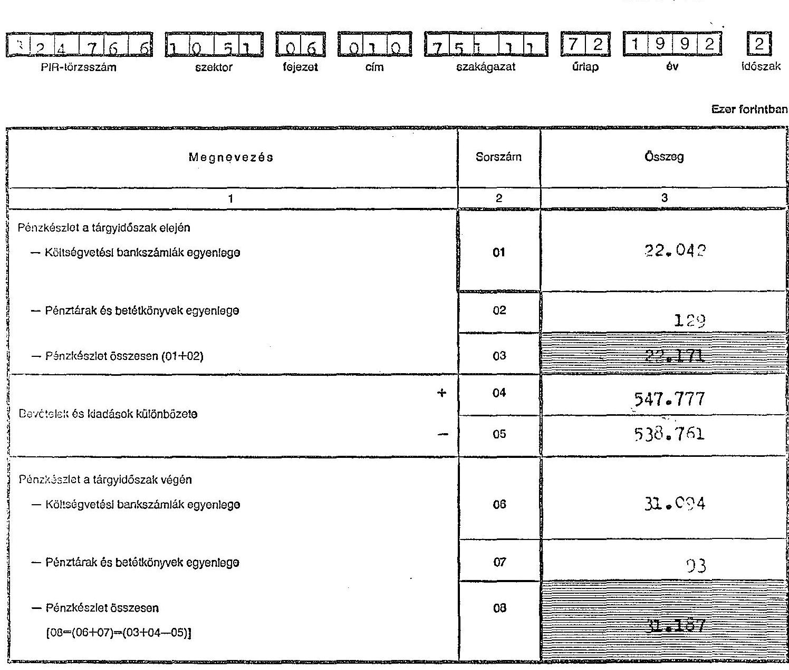

## Letéti pénzforgalom egyeztetése

(1991. évi XCI. törvény 52. § (6) bekezdése alapján)

| Letéti pénzkészlet a tárgyidőszak elején | 09 |  |
| :--: | :--: | :--: |
| Letéti bevételek | $(+)$ | 10 |
| Letéti bevétel visszautalása | $(-)$ | 11 |
| Letéti pénzkészlet a tárgyidőszak végén (09+10-11) |  | 12 |
| Technikai összesen (08+12) |  | 13 |

---

# Immateriális javak és tárgyi eszközök állományának alakulása

|  3 2 4 7 6 6 1 0 5 1 |  |  |  |  |  |  |  |   |
| --- | --- | --- | --- | --- | --- | --- | --- | --- |
|  PIR-törzsszám | szektor | fejezet | cím | 7 5 1 1 1 | 7 9 | 1 9 9 2 | 2 |   |
|   |  |  |  |  |  |  |  | időszak  |
|   |  |  |  |  |  |  |  | Ezer forintban  |
|  |   |   |   |   |   |   |   |   |
|  Megnevezés |  | Sorszám | Immateriális javak | Ingatlanok | Gép | be |  | Összesen  |
|  1 |  | 2 | 3 | 4 | 5 |  | 6 | 7  |
|  Előző évi záróállomány
(Tárgyévi nyitóállomány) |  | 01 | 6.138 |  | 69.939 |  | 6.521 | 62.196  |
|   |  | 02 | 1.073 |  | 26.165 |  | 3.406 | 33.444  |
|   |  | 03 |  |  |  |  |  |   |
|   | Beszerzés, létesítés |  |  |  |  |  |  |   |
|   | Alaptevékenységhez
térítésmentes átvétel |  |  |  |  |  |  |   |
|   | Átsorolás |  |  |  |  |  |  |   |
|   | Egyéb növekedések |  |  |  |  |  |  |   |
|   | Összes növekedés (02-05) |  |  |  |  |  |  |   |
|   |  | 05 | 1.873 | 11.238 | 26.493 |  | 3.405 | 45.010  |
|   |  | 06 |  |  |  |  |  |   |
|   |  | 07 |  |  |  |  |  |   |
|   |  | 08 |  |  |  |  |  |   |
|   |  | 09 |  |  |  |  |  |   |
|   |  | 10 | | | | | | |
| | | 11 | | | | | | |
| | Egyéb csökkenések | | | | | | | |
| | Összes csökkenés (07-10) | | | | | | | |
| | | 11 | | | | | | |
| | Bruttó érték összesen (01+06-11) | | | | | | | |
| | | 12 | 8.011 | 11.238 | 98.032 | | 9.212 | 126.493 |
| | Előző évi záróállomány
(Tárgyévi nyitóállomány) | | | | | | | |
| | | 13 | 3.069 | | 19.198 | | 1.877 | 24.144 |
| | | 14 | 2.543 | 225 | 24.365 | | 1.832 | 29.065 |
| | | 15 | | | | | 455 | 455 |
| | | 16 | | | | | | |
| | Értékcsökkenés összesen
(13+14-15+16) | | | | | | | |
| | | 17 | 5.712 | 225 | 43.563 | | 3.254 | 52.754 |
| | Eszközök nettó értéke (12-17) | | | | | | | |
| | | 18 | 2.299 | 11.013 | 54.459 | | 5.358 | 73.739 |
| | Teljesen (0-ig) leírt eszközök bruttó értéke | | | | 735 | | 186 | 921 |
| | | 19 | | | 735 | | 186 | 921 |
| | Technikai összesen (18+19) | | | | | | | |

921131 - Pénzjegynyomda, Budapest V., Martó u. 13-17

---

# Pénzmaradvány-kimutatás

**Gazdálkodó Jászvegete**

szerv megnevezése

| 1 | 2 | 3 | 4 | 5 | 6 | 7 | 8 | 9 | 10 | 11 | 12 | 13 | 14 | 15 | 16 | 17 | 18 | 19 | 20 | 21 |
| --- | --- | --- | --- | --- | --- | --- | --- | --- | --- | --- | --- | --- | --- | --- | --- | --- | --- | --- | --- | --- |
| PIR-törzsszám | szektor | fojezat | cím | szakágazat | úriap | év | időszak | Eger ferintben | | | | | | | | | | | | |

Ezer forintban

| MEGNEVEZÉS | Sor-
szám | Előző
év | Tárgy-
év |
| --- | --- | --- | --- |
| 1 | 2 | 3 | 4 |
| A költségvetési bankszámlák záróegyenlegei | 01 | | 11.094 |
| Pénztárak és betétkönyvek záróegyenlegei | 02 | | 93 |
| Zárópénzkészlet (01+02) | 03 | | 11.147 |
| Költségvetési aktív kiegyenlítő elszámolások záróegyenlege | 04 | | 1.116 |
| Passzív kiegyenlítő elszámolások záróegyenlegei | (-) | 05 | |
| Költségvetési aktív átfutó elszámolások záróegyenlegei | 06 | | 421 |
| Passzív átfutó elszámolások záróegyenlegei | (-) | 07 | |
| Aktív függő elszámolások záróegyenlegei | 08 | | 32 |
| Passzív függő elszámolások záróegyenlege | (-) | 09 | |
| Egyéb aktív és passzív pénzügyi elszámolások összesen (04-05+06-07+08-09) | 10 | | 1.569 |
| Előző évben (években) képzett tartalékok maradványa | (-) | 11 | |
| Vállalkozási tevékenység pénzforgalmi eredménye | (-) | 12 | |
| Tárgyévi helyesbített pénzmaradvány (03±10-11-12) | 13 | | 12.796 |
| Költségvetési befizetés többletfámogatás miatt | (±) | 14 | |
| Költségvetési kiutalás kiutatatlan támogatás miatt | (±) | 15 | |
| Pénzmaradványt terhelő elvonások | (±) | 16 | |
| Költségvetési pénzmaradvány (13±14±15±16) | 17 | | 32.756 |
| Költségvetési pénzmaradványt külön jogszabály alapján módosító tétel | (±) | 18 | |
| Módosított pénzmaradvány (17±18) | 19 | | 32.756 |
| A 17. sorból a Társadalombiztosítást Alapból folyósított pénzeszköz maradványa | 20 | | |
| Technikai összesen (19+20) | 21 | | 32.756 |

Pj 921131

---

# Bér és jutalom felhasználás 1992. év

| | | | | E Ft-ban |
| --- | --- | --- | --- | --- |
| Szervezeti egység | Béralap és pénzmaradvány felhasználás összesen | Munkabér | Jutalom | Megbízási díj |
| Elnök | 3118 | 2229 | 529 | 360 |
| Alelnök I. | 1954 | 1611 | 343 | - |
| Alelnök II. | 2420 | 1962 | 458 | - |
| Elnöki Titkárság | 5437 | 3767 | 1416 | 254 |
| Fejezeti főcsoport | 38079 | 28063 | 9397 | 619 |
| Vagyonkezelő főcsoport | 41135 | 27161 | 9448 | 4526 |
| Területi főcsoport | 88607 | 66445 | 21611 | 551 |
| Elvi, módszertani főcsoport | 19636 | 13979 | 5296 | 361 |
| Nemzetközi Kapcsolatok oszt. | 3953 | 2469 | 940 | 544 |
| Személyzeti és Munkaügyi oszt. | 6871 | 4456 | 1642 | 773 |
| Jogi és Igazgatási oszt. | 5574 | 4176 | 1351 | 47 |
| Gazdasági Igazgatóság | 1934 | 1409 | 525 | - |
| Pénzügyi osztály | 5906 | 4234 | 1526 | 146 |
| Gazdasági osztály | 13902 | 9986 | 3472 | 444 |
| Összesen: | 238526 | 171947 | 57954 | 8625 |

---

# Lakásalap elszámolás 1992.év

| Megnevezés | | /Ft/ |
| :--: | :--: | :--: |
| 1. Éves keretösszeg | | |
| Éves előirányzat | | 4.000.000 |
| Előző évi maradvány | | 2.721.372 |
| Éves kölcsöntörlesztés | | 793.493 |
| Kilépettek kölcsön visszafizetései | | 610.756 |
| Összesen: | | 8.125.621 |
| 2. Éves felhasználás | Fő | |
| Lakás építés | 4 | 950.000 |
| Lakás /ház/ korszerűsítése | 5 | 690.000 |
| Állami lakás megvásárlása | 13 | 2.250.921 |
| /IKV, vállalati/ | | |
| Öröklakás vásárlás | 1 | 300.000 |
| Öröklakás csere | 1 | 195.000 |
| Egyéb | 8 | 770.000 |
| Dolgozókra terhelt kezelési ktg | | 22.809 |
| Összesen: | 32 | 5.178.730 |
| 3. Engedélyezett, de még igénybe nem vett kölcsön | | 1.700.000 |
| 4. Lakásalap maradvány | | 1.246.891 |

---

Szakszervezeti vagyon ellenőrzésével kapcsolatos pénzmaradvány felhasználása

| Megnevezés | 1991.évi   maradvány | 1992.évi   felhasználás | 1992.évi   maradvány |
| :-- | :--: | :--: | :--: |
| Bér és megbízási díjak | 2.172.081 | 2.436.229 | -264.148 |
| Belföldi kiküld. | -1.430 | 1.380 | -2.810 |
| Étkezési hjár. | 54.400 | | 54.400 |
| Gk.üzem és kenőanyag | 522.671 | 21.590 | 501.081 |
| Irodaszer,nyomtatv. | 137.167 | 409.298 | -272.131 |
| Postaköltség | 494.000 | 13.005 | 480.995 |
| Gk.fenntartás | -13.329 | | -13.329 |
| Szám.tech.tanf.díj | | 600.000 | 600.000 |
| TB járulék | 808.355 | 1.071.941 | -263.586 |
| ÁFA | -115.708 | 102.324 | -218.032 |
| összesen | 4.058.207 | 4.655.767 | -597.600 |

---

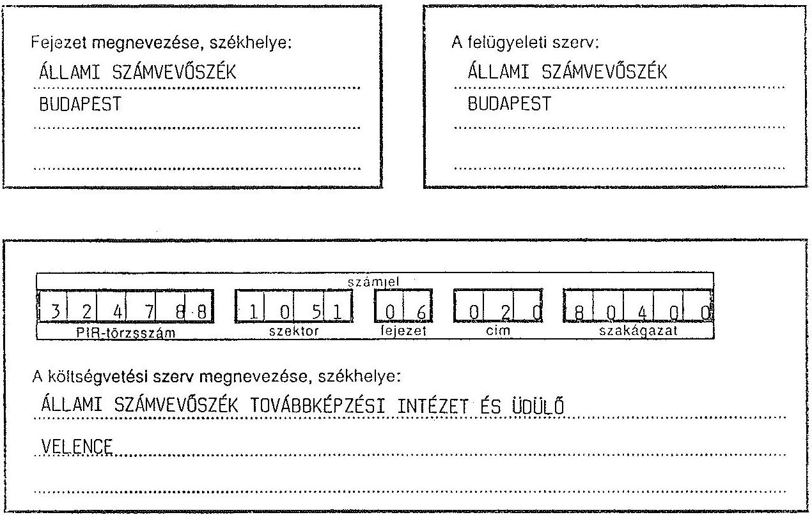

# A) INTÉZMÉNYI KÖLTSÉGVETÉSI BESZÁMOLÓ

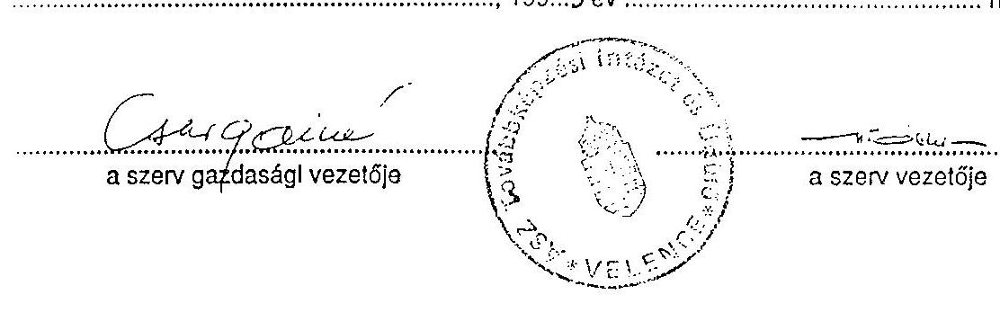

[^0]
[^0]: 21131 O - Pénzjegynyomda, Budapest V., Markó utca 13-17.

---

# TARTALOM

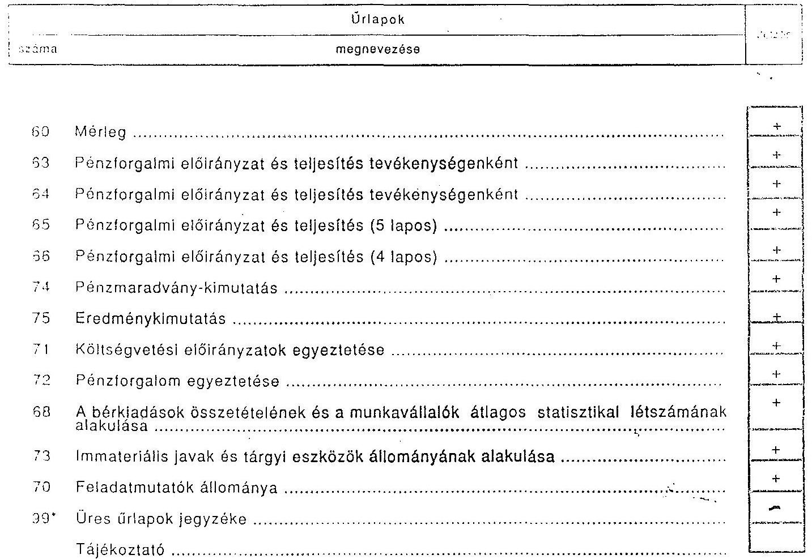

---

# MÉRLEG

| 3 | 2 | 4 | 7 | 0 | 8 | 1 | 0 | 5 | 3 | 0 | 6 | 0 | 2 | 0 | 8 | 0 | 4 | 0 | 0 | 5 | 0 | 1 | 0 | 9 | 2 | 2 |
| --- | --- | --- | --- | --- | --- | --- | --- | --- | --- | --- | --- | --- | --- | --- | --- | --- | --- | --- | --- | --- | --- | --- | --- | --- | --- | --- |
| PlPl-keresészen | | | | | | | | | | | | | | | | | | | | | | | | | | |
| | | | | | | | |
 |   |   |   |   |   |   |   |   |   |   |   |   |   |   |   |   |   |   |   |
|  |   |   |   |   |   |   |   |   |   |   |   |   |   |   |   |   |   |   |   |   |   |   |   |   |   |   |   |
|  ESZKÖZÖK |  |  |  |  |  |  |  |  |  |  |  |  |  |  |  |  |  |  |  |  |  |  |  |  |  |  |   |
|  |   |   |   |   |   |   |   |   |   |   |   |   |   |   |   |   |   |   |   |   |   |   |   |   |   |   |   |
|  ESZKÖZÖK |  |  |  |  |  |  |  |  |  |  |  |  |  |  |  |  |  |  |  |  |  |  |  |  |  |  |   |
|  1 |  |  |  |  |  |  |  |  |  |  |  |  |  |  |  |  |  |  |  |  |  |  |  |  |  |  |   |
|  1. Vagyoni értékű jogok (111., 112-b5) |  |  |  |  |  |  |  |  |  |  |  |  |  |  |  |  |  |  |  |  |  |  |  |  |  |  |   |
|  2. Szellemi termékek (111., 112-b0) |  |  |  |  |  |  |  |  |  |  |  |  |  |  |  |  |  |  |  |  |  |  |  |  |  |  |   |
|  3. Egyéb immateriális javak összesen (111., 112-b9) |  |  |  |  |  |  |  |  |  |  |  |  |  |  |  |  |  |  |  |  |  |  |  |  |  |  |   |
|  1. Immateriális javak összesen (01+02+03) (111-112.) |  |  |  |  |  |  |  |  |  |  |  |  |  |  |  |  |  |  |  |  |  |  |  |  |  |  |   |
|  1. Ingatlanok (121., 122.) |  |  |  |  |  |  |  |  |  |  |  |  |  |  |  |  |  |  |  |  |  |  |  |  |  |  |   |
|  2. Gépek, berendezések és felszerelések (121., 122.) |  |  |  |  |  |  |  |  |  |  |  |  |  |  |  |  |  |  |  |  |  |  |  |  |  |  |   |
|  3. Járművek (141., 142.) |  |  |  |  |  |  |  |  |  |  |  |  |  |  |  |  |  |  |  |  |  |  |  |  |  |  |   |
|  4. Beruházások (15.) |  |  |  |  |  |  |  |  |  |  |  |  |  |  |  |  |  |  |  |  |  |  |  |  |  |  |   |
|  5. Beruházásra adott előlegek (16.) |  |  |  |  |  |  |  |  |  |  |  |  |  |  |  |  |  |  |  |  |  |  |  |  |  |  |   |
|  6. Tárgyi eszközök összesen (05+...+09) |  |  |  |  |  |  |  |  |  |  |  |  |  |  |  |  |  |  |  |  |  |  |  |  |  |  |   |
|  1. Részesedések (191.) |  |  |  |  |  |  |  |  |  |  |  |  |  |  |  |  |  |  |  |  |  |  |  |  |  |  |   |
|  2. Értékpapírok (192-194.) |  |  |  |  |  |  |  |  |  |  |  |  |  |  |  |  |  |  |  |  |  |  |  |  |  |  |   |
|  3. Adott kölcsönök (195.) |  |  |  |  |  |  |  |  |  |  |  |  |  |  |  |  |  |  |  |  |  |  |  |  |  |  |   |
|  4. Hosszú lejáratú bankbetétek (196.) |  |  |  |  |  |  |  |  |  |  |  |  |  |  |  |  |  |  |  |  |  |  |  |  |  |  |   |
|  5. Befektetési pénzügyi eszközök összesen (11+...+12) |  |  |  |  |  |  |  |  |  |  |  |  |  |  |  |  |  |  |  |  |  |  |  |  |  |  |   |
|  1. Vásárlók (21-24., 25.) |  |  |  |  |  |  |  |  |  |  |  |  |  |  |  |  |  |  |  |  |  |  |  |  |  |  |   |
|  2. Áruk (25.) |  |  |  |  |  |  |  |  |  |  |  |  |  |  |  |  |  |  |  |  |  |  |  |  |  |  |   |
|  3. Állatok (27.) |  |  |  |  |  |  |  |  |  |  |  |  |  |  |  |  |  |  |  |  |  |  |  |  |  |  |   |
|  4. Befejezetlen termelés és félkész term. (28.) |  |  |  |  |  |  |  |  |  |  |  |  |  |  |  |  |  |  |  |  |  |  |  |  |  |  |   |
|  5. Késztermékek (29.) |  |  |  |  |  |  |  |  |  |  |  |  | |  |  |  |  |  |  |  |  |  |  |  |  |  |   |
|  1. Készletek összesen (17+...+21) |  |  |  |  |  |  |  |  |  |  |  |  |  |  |  |  |  |  |  |  |  |  |  |  |  |  |   |
|  1. Adások (311.) |  |  |  |  |  |  |  |  |  |  |  |  |  |  |  |  |  |  |  |  |  |  |  |  |  |  |   |
|  2. Követelések összesen és szolgáltatások (312.) |  |  |  |  |  |  |  |  |  |  |  |  |  |  |  |  |  |  |  |  |  |  |  |  |  |  |   |
|  3. Egyéb követelések (313., 315.) |  |  |  |  |  |  |  |  |  |  |  |  |  |  |  |  |  |  |  |  |  |  |  |  |  |  |   |
|  4. Követelések összesen (23+24+25) |  |  |  |  |  |  |  |  |  |  |  |  |  |  |  |  |  |  |  |  |  |  |  |  |  |  |   |
|  1. Kárpótlási jegyek (321.) |  |  |  |  |  |  |  |  |  |  |  |  |  |  |  |  |  |  |  |  |  |  |  |  |  |  |   |
|  2. Kincstárjegyek (322.) |  |  |  |  |  |  |  |  |  |  |  |  |  |  |  |  |  |  |  |  |  |  |  |  |  |  |   |
|  3. Kötvények (323.) |  |  |  |  |  |  |  |  |  |  |  |  |  |  |  |  |  |  |  |  |  |  |  |  |  |  |   |
|  4. Egyéb értékpapírok (325.) |  |  |  |  |  |  |  |  |  |  |  |  |  |  |  |  |  |  |  |  |  |  |  |  |  |  |   |
|  5. Értékpapírok összesen (27+28+29+30) |  |  |  |  |  |  |  |  |  |  |  |  |  |  |  |  |  |  |  |  |  |  |  |  |  |  |   |
|  1. Pénztárunk és betétünk (33.) |  |  |  |  |  |  |  |  |  |  |  |  |  |  |  |  |  |  |  |  |  |  |  |  |  |  |   |
|  2. Költségvetési bankszámlák (34.) |  |  |  |  |  |  |  |  |  |  |  |  |  |  |  |  |  |  |  |  |  |  |  |  |  |  |   |
|  3. Finanszírozási bankszámlák (35.) |  |  |  |  |  |  |  |  |  |  |  |  |  |  |  |  |  |  |  |  |  |  |  |  |  |  |   |
|  4. Idegen pénzeszközök számlái (36.) |  |  |  |  |  |  |  |  |  |  |  |  |  |  |  |  |  |  |  |  |  |  |  |  |  |  |   |
|  5. Pénzeszközök összesen (37+...+39) |  |  |  |  |  |  |  |  |  |  |  |  |  |  |  |  |  |  |  |  |  |  |  |  |  |  |   |
|  1. Finanszírozási elszámolások (38.) |  |  |  |  |  |  |  |  |  |  |  |  |  |  |  |  |  |  |  |  |  |  |  |  |  |  |   |
|  2. Aktív ügyfél és átfutó elszámolások (39. a 300., 306. nek.) |  |  |  |  |  |  |  |  |  |  |  |  |  |  |  |  |  |  |  |  |  |  |  |  |  |  |   |
|  3. Aktív kiegészítő elszámolások (395., 396.) |  |  |  |  |  |  |  |  |  |  |  |  |  |  |  |  |  |  |  |  |  |  |  |  |  |  |   |
|  4. Egyéb aktív pénzügyi elszámolások összesen (37+38) |  |  |  |  |  |  |  |  |  |  |  |  |  |  |  |  |  |  |  |  |  |  |  |  |  |  |   |
|  5. Főintézet eszközök összesen (39+40) |  |  |  |  |  |  |  |  |  |  |  |  |  |  |  |  |  |  |  |  |  |  |  |  |  |  |   |
|  6. Főintézet eszközök összesen (41+42) |  |  |  |  |  |  |  |  |  |  |  |  |  |  |  |  |  |  |  |  |  |  |  |  |  |  |   |
|  7. Főintézet eszközök összesen (42+43) |  |  |  |  |  |  |  |  |  |  |  |  |  |  |  |  |  |  |  |  |  |  |  |  |  |  |   |
|  8. Egyéb távitel járatú kötelezettségek (435.) |  |  |  |  |  |  |  |  |  |  |  |  |  |  |  |  |  |  |  |  |  |  |  |  |  |  |   |
|  9. Egyéb passzív pénzügyi elszámolások összesen (51+52+53) |  |  |  |  |  |  |  |  |  |  |  |  |  |  |  |  |  |  |  |  |  |  |  |  |  |  |   |
|  10. Főintézet eszközök összesen (54+55+56) |  |  |  |  |  |  |  |  |  |  |  |  |  |  |  |  |  |  |  |  |  |  |  |  |  |  |   |
|  11. Főintézet eszközök összesen (56+57+58) |  |  |  |  |  |  |  |  |  |  |  |  |  |  |  |  |  |  |  |  |  |  |  |  |  |  |   |
|  12. Főintézeti eszközök összesen (59+60+61) |  |  |  |  |  |  |  |  |  |  |  |  |  |  |  |  |  |  |  |  |  |  |  |  |  |  |   |
|  13. Főintézeti eszközök összesen (62) |  |  |  |  |  |  |  |  |  |  |  |  |  |  |  |  |  |  |  |  |  |  |  |  |  |  |   |
|  14. Főintézeti eszközök összesen (63) |  |  |  |  |  |  |  |  |  |  |  |  |  |  |  |  |  |  |  |  |  |  |  |  |  |  |   |
|  15. Főintézeti eszközök összesen (64) |  |  |  |  |  |  |  |  |  |  |  |  |  |  |  |  |  |  |  |  |  |  |  |  |  |  |   |
|  16. Főintézeti eszközök összesen (65) |  |  |  |  |  |  |  |  |  |  |  |  |  |  |  |  |  |  |  |  |  |  |  |  |  |  |   |
|  17. Főintézeti eszközök összesen (66) |  |  |  |  |  |  |  |  |  |  |  |  |  |  |  |  |  |  |  |  |  |  |  |  |  |  |   |
|  18. Egyéb aktív pénzügyi elszámolások összesen (37+38) |  |  |  |  |  |  |  |  |  |  |  |  |  |  |  |  |  |  |  |  |  |  |  |  |  |  |   |
|  19. Főintézeti eszközök összesen (39+40+41) |  |  |  |  |  |  |  |  |  |  |  |  |  |  |  |  |  |  |  |  |  |  |  |  |  |  |   |
|  20. Főintézeti eszközök összesen (42+43) |  |  |  |  |  |  |  |  |  |  |  |  |  |  |  |  |  |  |  |  |  |  |  |  |  |  |   |
|  21. Főintézeti eszközök összesen (44) |  |  |  |  |  |  |  |  |  |  |  |  |  |  |  |  |  |  |  |  |  |  |  |  |  |  |   |
|  22. Főintézeti eszközök összesen (45) |  |  |  |  |  |  |  |  |  |  |  |  |  |  |  |  |  |  |  |  |  |  |  |  |  |  |   |
|  23. Főintézeti eszközök összesen (46) |  |  |  |  |  |  |  |  |  |  |  |  |  |  |  |  |  |  |  |  |  |  |  |  |  |  |   |
|  24. Főintézeti eszközök összesen (47) |  |  |  |  |  |  |  |  |  |  |  |  |  |  |  |  |  |  |  |  |  |  |  |  |  |  |   |
|  25. Főintézeti eszközök összesen (48) |  |  |  |  |  |  |  |  |  |  |  |  |  |  |  |  |  |  |  |  |  |  |  |  |  |  |   |
|  26. Főintézeti eszközök összesen (49) |  |  |  |  |  |  |  |  |  |  |  |  |  |  |  |  |  |  |  |  |  |  |  |  |  |  |   |
|  27. Főintézeti eszközök összesen (50) |  |  |  |  |  |  |  |  |  |  |  |  |  |  |  |  |  |  |  |  |  |  |  |  |  |  |   |
|  28. Főintézeti eszközök összesen (51) |  |  |  |  |  |  |  |  |  |  |  |  |  |  |  |  |  |  |  |  |  |  |  |  |  |  |   |
|  29. Főintézeti eszközök összesen (52) |  |  |  |  |  |  |  |  |  |  |  |  |  |  |  |  |  |  |  |  |  |  |  |  |  |  |   |
|  30. Főintézeti eszközök összesen (53) |  |  |  |  |  |  |  |  |  |  |  |  |  |  |  |  |  |  |  |  |  |  |  |  |  |  |   |
|  31. Főintézeti eszközök összesen (54) |  |  |  |  |  |  |  |  |  |  |  |  |  |  |  |  |  |  |  |  |  |  |  |  |  |  |   |
|  32. Főintézeti eszközök összesen (55) |  |  |  |  |  |  |  |  |  |  |  |  |  |  |  |  |  |  |  |  |  |  |  |  |  |  |   |
|  33. Főintézeti eszközök összesen (56) |  |  |  |  |  |  |  |  |  |  |  |  |  |  |  |  |  |  |  |  |  |  |  |  |  |  |   |
|  34. Főintézeti eszközök összesen (57) |  |  |  |  |  |  |  |  |  |  |  |  |  |  |  |  |  |  |  |  |  |  |  |  |  |  |   |
|  35. Főintézeti eszközök összesen (58) |  |  |  |  |  |  |  |  |  |  |  |  |  |  |  |  |  |  |  |  |  |  |  |  |  |  |   |
|  36. Főintézeti eszközök összesen (59) |  |  |  |  |  |  |  |  |  |  |  |  |  |  |  |  |  |  |  |  |  |  |  |  |  |  |   |
|  37. Főintézeti eszközök összesen (60) |  |  |  |  |  |  |  |  |  |  |  |  |  |  |  | |  |  |  |  |  |  |  |  |  |  |   |
|  38. Főintézeteszközök összesen (61) |  |  |  |  |  |  |  |  |  |  |  |  |  |  |  |  |  |  |  |  |  |  |  |  |  |  |   |
|  39. Főintézeteszközök összesen (62) |  |  |  |  |  |  |  |  |  |  |  |  |  |  |  |  |  |  |  |  |  |  |  |  |  |  |   |
|  40. Főintézeteszközök összesen (63) |  |  |  |  |  |  |  |  |  |  |  |  |  |  |  |  |  |  |  |  |  |  |  |  |  |  |   |
|  41. Főintézeteszközök összesen (64) |  |  |  |  |  |  |  |  |  |  |  |  |  |  |  |  |  |  |  |  |  |  |  |  |  |  |   |
|  42. Főintézeteszközök összesen (65) |  |  |  |  |  |  |  |  |  |  |  |  |  |  |  |  |  |  |  |  |  |  |  |  |  |  |   |
|  43. Főintézeteszközök összesen (66) |  |  |  |  |  |  |  |  |  |  |  |  |  |  |  |  |  |  |  |  |  |  |  |  |  |  |   |
|  44. Főintézeteszközök összesen (67) |  |  |  |  |  |  |  |  |  |  |  |  |  |  |  |  |  |  |  |  |  |  |  |  |  |  |   |
|  45. Főintézeteszközök összesen (68) |  |  |  |  |  |  |  |  |  |  |  |  |  |  |  |  |  |  |  |  |  |  |  |  |  |  |   |
|  46. Főintézeteszközök összesen (69) |  |  |  |  |  |  |  |  |  |  |  |  |  |  |  |  |  |  |  |  |  |  |  |  |  |  |   |
|  47. Főintézeteszközök összesen (70) |  |  |  |  |  |  |  |  |  |  |  |  |  |  |  |  |  |  |  |  |  |  |  |  |  |  |  |   |
|  48. Főintézeteszközök összesen (71) |  |  |  |  |  |  |  |  |  |  |  |  |  |  |  |  |  |  |  |  |  |  |  |  |  |  |  |   |
|  49. Főintézeteszközök összesen (72) |  |  |  |  |  |  |  |  |  |  |  |  |  |  |  |  |  |  |  |  |  |  |  |  |  |  |  |  |   |
|  50. Főintézeteszközök összesen (73) |  |  |  |  |  |  |  |  |  |  |  |  |  |  |  |  |  |  |  |  |  |  |  |  |  |  |  |  |   |
|  51. Főintézeteszközök összesen (74) |  |  |  |  |  |  |  |  |  |  |  |  |  |  |  |  |  |  |  |  |  |  |  |  |  |  |  |  |   |
|  52. Főintézeteszközök összesen (75) |  |  |  |  |  |  |  |  |  |  |  |  |  |  |  |  |  |  |  |  |  |  |  |  |  |  |  |  |   |
|  53. Főintézeteszközök összesen (76) |  |  |  |  |  |  |  |  |  |  |  |  |  |  |  |  |  |  |  |  |  |  |  |  |  |  |  |  |   |
|  54. Főintézeteszközök összesen (77) |  |  |  |  |  |  |  |  |  |  |  |  |  |  |  |  |  |  |  |  |  |  |  |  |  |  |  |  |  |   |
|  55. Főintézeteszközök összesen (78) |  |  |  |  |  |  |  |  |  |  |  |  |  |  |  |  |  |  |  |  |  |  |  |  |  |  |  |  |  |   |
|  56. Főintézeteszközök összesen (79) |  |  |  |  |  |  |  |  |  |  |  |  |  |  |  |  |  |  |  |  |  |  |  |  |  |  |  |  |  |  |   |
|  57. Főintézeteszközök összesen (80) |  |  |  |  |  |  |  |  |  |  |  |  |  |  |  |  |  |  |  |  |  |  |  |  |  |  |  |  |  |  |   |
|  58. Főintézeteszközök összesen (81) |  |  |  |  |  |  |  |  |  |  |  |  |  |  |  |  |  |  |  |  |  |  |  |  |  |  |  |  |  |  |  |   |
|  59. Főintézeteszközök összesen (82) |  |  |  |  |  |  |  |  |  |  |  |  |  |  |  |  |  |  |  |  |  |  |  |  |  |  |  |  |  |  |  |   |
|  60. Főintézeteszközök összesen (83) |  |  |  |  |  |  |  |  |  |  |  |  |  |  |  |  |  |  |  |  |  |  |  |  |  |  |  |  |  |  |  |   |
|  61. Főintézeteszközök összesen (84) |  |  |  |  |  |  |  |  |  |  |  |  |  |  |  |  |  |  |  |  |  |  |  |  |  |  |  |  |  |  |  |  |   |
|  62. Főintézeteszközök összesen (85) |  |  |  |  |  |
 |  |  |  |  |  |  |  |  |  |  |  |  |  |  |  |  |  |  |  |  |  |  |  |  |  |  |   |
|  63. Főintézeti eszközök összesen (86) |  |  |  |  |  |  |  |  |  |  |  |  |  |  |  |  |  |  |  |  |  |  |  |  |  |  |  |  |  |  |  |  |  |   |
|  64. Főintézeti eszközök összesen (87) |  |  |  |  |  |  |  |  |  |  |  |  |  |  |  |  |  |  |  |  |  |  |  |  |  |  |  |  |  |  |  |  |  |   |
|  65. Főintézeti eszközök összesen (88) |  |  |  |  |  |  |  |  |  |  |  |  |  |  |  |  |  |  |  |  |  |  |  |  |  |  |  |  |  |  |  |  |  |  |   |
|  66. Főintézeti eszközök összesen (89) |  |  |  |  |  |  |  |  |  |  |  |  |  |  |  |  |  |  |  |  |  |  |  |  |  |  |  |  |  |  |  |  |  |  |   |
|  67. Főintézeti eszközök összesen (90) |  |  |  |  |  |  |  |  |  |  |  |  |  |  |  |  |  |  |  |  |  |  |  |  |  |  |  |  |  |  |  |  |  |  |  |   |
|  68. Főintézeti eszközök összesen (91) |  |  |  |  |  |  |  |  |  |  |  |  |  |  |  |  |  |  |  |  |  |  |  |  |  |  |  |  |  |  |  |  |  |  |  |  |   |
|  69. Főintézeti eszközök összesen (92) |  |  |  |  |  |  |  |  |  |  |  |  |  |  |  |  |  |  |  |  |  |  |  |  |  |  |  |  |  |  |  |  |  |  |  |  |  |  |   |
|  70. Főintézeti eszközök összesen (93) |  |  |  |  |  |  |  |  |  |  |  |  |  |  |  |  |  |  |  |  |  |  |  |  |  |  |  |  |  |  |  |  |  |  |  |  |  |  |   |
|  71. Főintézeti eszközök összesen (94) |  |  |  |  |  |  |  |  |  |  |  |  |  |  |  |  |  |  |  |  |  |  |  |  |  |  |  |  |  |  |  |  |  |  |  |  |  |  |  |   |
|  72. Főintézeti eszközök összesen (95) |  |  |  |  |  |  |  |  |  |  |  |  |  |  |  |  |  |  |  |  |  |  |  |  |  |  |  |  |  |  |  |  |  |  |  |  |  |  |   |
|  73. Főintézeti eszközök összesen (96) |  |  |  |  |  |  |  |  |  |  |  |  |  |  |  |  |  |  |  |  |  |  |  |  |  |  |  |  |  |  |  |  |  |  |  |  |  |  |  |   |
|  74. Főintézeti eszközök összesen (97) |  |  |  |  |  |  |  |  |  |  |  |  |  |  |  |  |  |  |  |  |  |  |  |  |  |  |  |  |  |  |  |  |  |  |  |  |  |  |  |   |
|  75. Főintézeti eszközök összesen (98) |  |  |  |  |  |  |  |  |  |  |  |  |  |  |  |  |  |  |  |  |  |  |  |  |  |  |  |  |  |  |  |  |  |  |  |  |  |  |  |  |  |   |
|  76. Főintézeti eszközök összesen (99) |  |  |  |  |  |  |  |  |  |  |  |  |  |  |  |  |  |  |  |  |  |  |  |  |  |  |  |  |  |  |  |  |  |  |  |  |  |  |  |   |
|  77. Főintézeti eszközök összesen (100) |  |  |  |  |  |  |  |  |  |  |  |  |  |  |  |  |  |  |  |  |  |  |  |  |  |  |  |  |  |  |  |  |  |  |  |  |  |  |  |  |   |
|  78. Főintézeti eszközök összesen (101) |  |  |  |  |  |  |  |  |  |  |  |  |  |  |  |  |  |  |  |  |  |  |  |  |  |  |  |  |  |  |  |  |  |  |  |  |  |  |  |  |  |   |
|  79. Főintézeti eszközök összesen (102) |  |  |  |  |  |  |  |  |  |  |  |  |  |  |  |  |  |  |  |  |  |  |  |  |  |  |  |  |  |  |  |  |  |  |  |  |  |  |  |  |   |
|  80. Főintézeti eszközök összesen (103) |  |  |  |  |  |  |  |  |  |  |  |  |  |  |  |  |  |  |  |  |  |  |  |  |  |  |  |  |  |  |  |  |  |  |  |  |  |  |  |   |
|  81. Főintézeti eszközök összesen (104) |  |  |  |  |  |  |  |  |  |  |  |  | |  |  |  |  |  |  |  |  |  |  |  |  |  |  |  |  |  |  |  |  |  |  |  |  |  |   |
|  82. Főintézeteszközök összesen (105) |  |  |  |  |  |  |  |  |  |  |  |  |  |  |  |  |  |  |  |  |  |  |  |  |  |  |  |  |  |  |  |  |  |  |  |  |  |  |   |
|  83. Főintézeteszközök issue (106) |  |  |  |  |  |  |  |  |  |  |  |  |  |  |  |  |  |  |  |  |  |  |  |  |  |  |  |  |  |  |  |  |  |  |  |   |
|  84. Főintézeteszközök issue (107) |  |  |  |  |  |  |  |  |  |  |  |  |  |  |  |  |  |  |  |  |  |  |  |  |  |  |  |  |  |  |  |  |  |  |  |  |   |
|  85. Főintézeteszközök issue (108) |  |  |  |  |  |  |  |  |  |  |  |  |  |  |  |  |  |  |  |  |  |  |  |  |  |  |  |  |  |  |  |  |  |  |  |  |  |   |
|  86. Főintézeteszközök issue (109) |  |  |  |  |  |  |  |  |  |  |  |  |  |  |  |  |  |  |  |  |  |  |  |  |  |  |  |  |  |  |  |  |  |  |  |   |
|  87. Főintézeteszközök issue (111) |  |  |  |  |  |  |  |  |  |  |  |  |  |  |  |  |  |  |  |  |  |  |  |  |  |  |  |  |  |  |  |  |  |  |  |  |  |  |  |   |
|  88. Főintézeteszközök issue (112) |  |  |  |  |  |  |  |  |  |  |  |  |  |  |  |  |  |  |  |  |  |  |  |  |  |  |  |  |  |  |  |  |  |  |  |  |  |  |  |   |
|  89. Főintézeteszközök issue (113) |  |  |  |  |  |  |  |  |  |  |  |  |  |  |  |  |  |  |  |  |  |  |  |  |  |  |  |  |  |  |  |  |  |  |  |  |   |
|  90. Főintézeteszközök issue (114) |  |  |  |  |  |  |  |  |  |  |  |  |  |  |  |  |  |  |  |  |  |  |  |  |  |  |  |  |  |  |  |  |  |  |  |  |  |  |  |  |  |  |   |
|  91. Főintézeteszközök issue (115) |  |  |  |  |  |  |  |  |  |  |  |  |  |  |  |  |  |  |  |  |  |  |  |  |  |  |  |  |  |  |  |  |  |  |  |  |  |  |  |   |
|  92. Főintézeteszközök issue (116) |  |  |  |  |  |  |  |  |  |  |  |  |  |  |  |  |  |  |  |  |  |  |  |  |  |  |  |  |  |  |  |  |  |  |  |  |  |   |
|  93. Főintézeteszközök issue (117) |  |  |  |  |  |  |  |  |  |  |  |  |  |  |  |  |  |  |  |  |  |  |  |  |  |  |  |  |  |  |  |  |  |  |  |  |  |  |  |  |  |   |
|  94. Főintézeteszközök issue (120) |  |  |  |  |  |  |  |  |  |  |  |  |  |  |  |  |  |  |  |  |  |  |  |  |  |  |  |  |  |  |  |  |  |  |  |  |  |  |  |  |  |   |
|  95. Főintézeteszközök issue (121) |  |  |  |  |  |  |  |  |  |  |  |  |  |  |  |  |  |  |  |  |  |  |  |  |  |  |  |  |  |  |  |  |  |  |  |  |  |  |  |  |  |   |
|  96. Főintézeteszközök issue (13) |  |  |  |  |  |  |  |  |  |  |  |  |  |  |  |  |  |  |  |  |  |  |  |  |  |  |  |  |  |  |  |  |  |  |  |  |  |  |  |  |  |  |  |   |
|  97. Főintézeteszközök issue (13) |  |  |  |  |  |  |  |  |  |  |  |  |  |  |  |  |  |  |  |  |  |  |  |  |  |  |  |  |  |  |  |  |  |  |  |  |  |  |  |  |  |  |  |  |  |  |  |  |  |   |
|  98. Főintézeteszközök issue (14) |  |  |  |  |  |  |  |  |  |  |  |  |  |  |  |  |  |  |  |  |  |  |  |  |  |  |  |  |  |  |  |  |  |  |  |  |  |  |  |  |  |  |  |  |  |  |   |
|  99. Főintézeteszközök issue (15) |  |  |  |  |  |  |  |  |  |  |  |  |  |  |  |  |  |  |  | |  |  |  |  |  |  |  |  |  |  |  |  |  |  |  |  |  |  |  |  |  |  |  |  |  |  |  |  |  |  |  |  |  |  |  |  |  |   |
|  10. Főintézeteszközök Issue (16) |  |  |  |  |  |  |  |  |  |  |  |  |  |  |  |  |  |  |  |  |  |  |  |  |  |  |  |  |  |  |  |  |  |  |  |  |  |  |  |  |  |  |  |  |  |  |  |  |  |  |  |  |  |  |  |  |  |  |  |  |  |  |  |  |  |  |  |  |  |  |  |  |  |  |  |  |  |  |  |  |  |  |  |  |  |  |  |  |  |  |  |  |  |  |  |  |  |  |  |  |  |

---

# Pénzforgalmi előirányzat és teljesítés tevékenységenként

|  3 | 2 | 4 | 7 | 6 | 8 | 1 | 0 | 5 | 3 | 0 | 1 | 0 | 0 | 0 | 0 | 4 | 0 | 0 | 6 | 3 | 1 | 9 | 9 | 2 | 2  |
| --- | --- | --- | --- | --- | --- | --- | --- | --- | --- | --- | --- | --- | --- | --- | --- | --- | --- | --- | --- | --- | --- | --- | --- | --- | --- |
| PIR-tárzsszám | szektor | fejezet | cím | szokó | alazalmazat | állap | év | idő | időszaki | Szakfeladatok tényleges kiadások | 999 | 99 | 99 | 9 |  |  |  |  |  |  |  |  |  |  |   |
| Kiadások megnevezése |  |  |  |  |  |  |  |  |  |  |  |  |  |  |  |  |  |  |  |  |  |  |  |  |   |
|   |  |  |  |  |  |  |  |  |  |  |  |  |  |  |  |  |  |  |  |  |  |  |  |  |   |
| Kiadások megnevezése |  |  |  |  |  |  |  |  |  |  |  |  |  |  |  |  |  |  |  |  |  |  |  |  |   |
|   |  |  |  |  |  |  |  |  |  |  |  |  |  |  |  |  |  |  |  |  |  |  |  |  |   |
| 1 | 2 | 3 | 4 | 5 | 6 | 7 | 8 | 9 | 10 | 11 | 12 | 13 | 14 | 15 | 16 | 17 | 18 | 19 | 20 | 21 | 22 | 23 | 24 | 25 | 26  |
| Béralap | 01 | 2.210 | 3.307 | 2.608 |  |  |  |  |  |  |  |  |  |  |  |  |  |  |  |  |  |  |  |  |   |
| Társadalombiztosítási járulék | 02 | 851 | 1.598 | 1.180 |  |  |  |  |  |  |  |  |  |  |  |  |  |  |  |  |  |  |  |  |   |
| Egyéb működési kiadások | 03 | 3.189 | 9.411 | 3.496 |  |  |  |  |  |  |  |  |  |  |  |  |  |  |  |  |  |  |  |  |   |
| Működési kiadások összesen (01+02+03) | 04 | 6.250 | 14.316 | 7.204 |  |  |  |  |  |  |  |  |  |  |  |  |  |  |  |  |  |  |  |  |   |
| Kamatfizetések | 05 |  |  |  |  |  |  |  |  |  |  |  |  |  |  |  |  |  |  |  |  |  |  |  |   |
| Folyó kiadások (04+05) | 06 | 6.250 | 14.316 | 7.204 |  |  |  |  |  |  |  |  |  |  |  |  |  |  |  |  |  |  |  |  |   |
| Tárgyi eszközök, föld és immateriális javak felhalmozósa | 07 |  | 6.130 |  |  |  |  |  |  |  |  |  |  |  |  |  |  |  |  |  |  |  |  |  |   |
| Tárgyi eszközök felújítása | 08 |  | 940 |  |  |  |  |  |  |  |  |  |  |  |  |  |  |  |  |  |  |  |  |  |   |
| Egyéb felhalmozási és tőke jellegű kiadások | 09 |  |  |  |  |  |  |  |  |  |  |  |  |  |  |  |  |  |  |  |  |  |  |  |   |
| Felhalmozási és tőke jellegű kiadások (01+02+03) | 10 |  | 7.070 |  |  |  |  |  |  |  |  |  |  |  |  |  |  |  |  |  |  |  |  |  |   |
| Támogatások, elvonások és egyéb folyó átutalások | 11 |  | 817 |  |  |  |  |  |  |  |  |  |  |  |  |  |  |  |  |  |  |  |  |  |   |
| Pénzforgalom nélküli kiadások | 12 |  | 1.040 |  |  |  |  |  |  |  |  |  |  |  |  |  |  |  |  |  |  |  |  |  |   |
| Hitel- és kiegyenlítő kiadások | 13 |  | 20 |  |  |  |  |  |  |  |  |  |  |  |  |  |  |  |  |  |  |  |  |  |   |
| Költségvetési kiadások (06+10+11+12+13) | 14 | 6.250 | 23.263 | 7.204 |  |  |  |  |  |  |  |  |  |  |  |  |  |  |  |  |  |  |  |  |   |
| Függő, átfutó és letéti kiadások | 15 |  | 113 |  |  |  |  |  |  |  |  |  |  |  |  |  |  |  |  |  |  |  |  |  |   |
| Kiadások összesen (14+15) | 16 | 6.250 | 23.150 | 7.204 |  |  |  |  |  |  |  |  |  |  |  |  |  |  |  |  |  |  |  |  |   |

F) 920575 G

---

# Pénzforgalmi előirányzat és teljesítés tevékenységenként

|  3 | 2 | 4 | 7 | 8 | 8 | 1 | 0 | 5 | 1 | 0 | 6 | 0 | 2 | 0 | 8 | 0 | 4 | 0 | 0 | 6 | 4 | 1 | 9 | 9 | 2 | 2  |
| --- | --- | --- | --- | --- | --- | --- | --- | --- | --- | --- | --- | --- | --- | --- | --- | --- | --- | --- | --- | --- | --- | --- | --- | --- | --- | --- |
|  PIR-tárzssystem | Szektor | Teljesít | Cím | Szakágazat | Űrlap | Év | Szakoralk | Szerv | Megnevezése | Ezer forintban | Szakfeladatok tényleges bevételei | 9.9.9.9.9.9.9.9.9.9.9.9.9.9.9.9.9.9.9.9.9.9.9.9.9.9.9.9.9.9.9.9.9.9.9.9.9.9.9.9.9.9.9.9.9.9.9.9.9.9.9.9.9.9.9.9.9.9.9.9.9.9.9.9.9.9.9.9.9.9.9.9.9.9.9.9.9.9.9.9.9.9.9.9.9.9.9.9.9.9.9.9.9.9.9.9.

---

# Pénzforgalmi előirányzat és teljesítés

ÁLLAMI SZÁMVEVŐSZÉK TOVÁBBKÉPZÉSI INTÉZET ÉS

ÜDÜLŐ

VELENCE

|  3 | 2 | 4 | 7 | 8 | 0 | 1 | 0 | 5 | 1 | 0 | 6 | 0 | 2 | 0 | 8 | 0 | 4 | 0 | 0 | 6 | 6 | 1 | 9 | 9 | 2 | 2  |
| --- | --- | --- | --- | --- | --- | --- | --- | --- | --- | --- | --- | --- | --- | --- | --- | --- | --- | --- | --- | --- | --- | --- | --- | --- | --- | --- |
|  PIR-törzsszám | szektor | fejezet | cím | szakágazat | űrlap |  |  |  |  |  |  |  |  |  |  |  |  |  |  |  |  |  |  |  |  |  |   |

Ezer forintban

|  Kiadások megnevezése | Sor-
szám | Eredeti
előirányzat | Módosított
előirányzat | Tényleges
kiadás  |
| --- | --- | --- | --- | --- |
|  1 | 2 | 3 | 4 | 5  |
|  Teljes munkaidőben foglalkoztatottak összes bére | 01 | 6.612 | 7.072 | 6.492  |
|  Részmunkaidőben foglalkoztatottak összes bére | 02 |  |  |   |
|  Nyugdíjasok bére | 03 | 130 | 130 | 99  |
|  Másodállásúok, mellékfoglalkozásúok bére | 04 |  |  |   |
|  Megbízási díj | 05 | 50 | 50 | 78  |
|  Alkalmi munkavállalók bére | 06 |  |  | 35  |
|  Sorkatonai szolgáltatót teljesítők illetménye | 07 |  |  |   |
|  Különféle illetmények | 08 |  |  |   |
|  Jutalom | 09 | 1.008 | 1.008 | 1.421  |
|  Béralap (01+02+03+04+05+06+07+08+09) | 10 | 7.800 | 8.260 | 8.125  |
|  Különféle díjak | 11 | 50 | 50 |   |
|  Jutalom pénzmaradványból, vállalkozási tevékenység eredményéből | 12 |  | 141 | 141  |
|  Belföldi kiküldetés | 13 | 150 | 150 | 9  |
|  Külföldi kiküldetés | 14 |  |  |   |
|  Étkezési hozzájárulás | 15 |  |  |   |
|  Kereset- és költségtérítés, -hozzájárulás | 16 | 90 | 90 | 115  |
|  Roprezentáció | 17 | 8 | 8 | 10  |
|  Végkielégítés | 18 |  |  |   |
|  Különféle egyéb bérjellegű kiadások | 19 | 2 | 2 | 38  |
|  Bérjellegű kiadások (11+12+13+14+15+16+17+18+19) | 20 | 300 | 441 | 313  |
|  Élelmiszer | 21 | 3.000 | 3.000 | 2.401  |
|  Gyógyszer, vegyszer | 22 |  |  | 4  |
|  Tüzelő-, hajtó- és kenőanyag | 23 | 300 | 300 | 313  |
|  Irodaszer, nyomtatvány | 24 | 100 | 100 | 121  |
|  Szakmai (termelési) anyag | 25 | 200 | 200 |   |
|  Könyv, folyóirat, napilap | 26 | 100 | 100 | 102  |
|  Munkaruha, védőruha, formaruha, egyenruha | 27 | 100 | 100 | 24  |
|  Egyéb készletbeszerzés | 28 | 800 | 3.500 | 4.294  |
|  Készlet beszerzése (21+22+23+24+25+26+27+28) | 29 | 4.600 | 7.300 | 7.259  |

PI 820573 G

---

# Pénzforgalmi előirányzat és teljesítés

**ÁLLAMI SZÁMVEVŐSZÉK TOVÁBBKÉPZÉSI INTÉZET ÉS ÜDÜLŐ**

**VELENCE**

**32478810510602004006519922**

**PIR-törzsszám**

**szektor**

**fejezet**

**cím**

**szakágazat**

**úrlap**

**év**

**időszak**

**Ezer forintban**

|  KIADÁSOK
MEGNEVEZÉSE | Sor-
szám | Eredeti | Módosított | Tényleges
kiadás  |
| --- | --- | --- | --- | --- |
|   |  | előirányzat |  |   |
|  Távhő-, gőz-, gáz- és villamosenergia-szolgáltatás | 30 | 3.000 | 3.000 | 2.103  |
|  Szállítás | 31 |  |  |   |
|  Vásárolt élelmezés | 32 |  |  |   |
|  Közműdíj | 33 | 300 | 300 | 328  |
|  Postai szolgáltatás | 34 | 400 | 400 | 744  |
|  Helyiségbérleti díj | 35 | 50 | 50 | 43  |
|  Tárgyi eszközök karbantartása | 36 | 800 | 1.000 | 1.000  |
|  Különféle egyéb szolgáltatás | 37 | 450 | 1.042 | 1.125  |
|  Szolgáltatások (30+31+32+33+34+35+36+37) | 38 | 5.000 | 5.792 | 5.343  |
|  Társadalombiztosítási járulék | 39 | 3.400 | 3.676 | 3.629  |
|  Hozzájárulás a társadalombiztosítási alaphoz | 40 |  |  |   |
|  Befizetés más különített állami pénzalapokba | 41 |  |  |   |
|  Hozzájárulás közös létesítmények fenntartásához | 42 |  |  |   |
|  Nemzetközi tagsági díjak | 43 |  |  |   |
|  Vásárolt termékek és szolgáltatások ÁFA-ja | 44 | 200 | 1.700 | 3.077  |
|  Különféle egyéb kiadások | 45 |  | 100 | 104  |
|  Különféle kiadások és befizetések (39+40+41+42+43+44+45) | 46 | 3.600 | 5.476 | 6.810  |
|  Működési kiadások (10+20+29+38+46) | 47 | 21.300 | 27.269 | 27.850  |
|  Kamatfizetések | 48 |  |  |   |
|  Folyó kiadások (47+48) | 49 | 21.300 | 27.269 | 27.850  |
|  Épületek, építmények létesítése, vásárlása | 50 |  |  |   |
|  Gépek, berendezések és felszerelések létesítése, vásárlása | 51 |  | 4.630 | 4.622  |
|  Járművek vásárlása | 52 | 1.500 | 1.500 | 1.508  |
|  Egyéb javak vásárlása, felhalmozási kiadások | 53 |  |  |   |
|  Tárgyi eszközök, föld és immateriális javak felhalmozása (50+51+52+53) | 54 | 1.500 | 6.130 | 6.130  |
|  Állami készletek, tartalékok felhalmozása | 55 |  |  |   |
|  Értékpapírok vásárlása | 56 |  |  |   |

**PI 521131**

---

# Pénzforgalmi előirányzat és teljesítés

**ÁLLAMI SZÁMVEVŐSZÉK TOVÁBBKÉPZÉSI INTÉZET ÉS ÜDÜLŐ**

szerv megnevezése

|  3 | 2 | 4 | 7 | 8 | 8 | 1 | 0 | 5 | 1 | 0 | 6 | 0 | 2 | 0 | 8 | 0 | 4 | 0 | 0 | 6 | 5 | 1 | 9 | 9 | 2 | 2  |
| --- | --- | --- | --- | --- | --- | --- | --- | --- | --- | --- | --- | --- | --- | --- | --- | --- | --- | --- | --- | --- | --- | --- | --- | --- | --- | --- |
|  PIR-törzsszám | szektor | fejezet | cím | szakágazat | úrlap | év | időszak | Ezer forintban |  |  |  |  |  |  |  |  |  |  |  |  |  |  |  |  |  |  |   |
|  Kiadások megnevezése |  |  |  |  |  |  |  |  |  |  |  |  |  |  |  |  |  |  |  |  |  |  |  |  |  |   |
|  1 |  |  |  |  |  |  |  |  |  |  |  |  |  |  |  |  |  |  |  |  |  |  |  |  |  |  |   |
|  Felhalmozási célú átutalások felhalmozási bankszámlára |  |  |  |  |  |  |  |  |  |  |  |  |  |  |  |  |  |  |  |  |  |  |  |  |  |  |   |
|  Felhalmozási célú átutalások a fejezetnek |  |  |  |  |  |  |  |
 |  |  |  |  |  |  |  |  |  |  |  |  |  |  |  |  |  |  |   |
|  Felhalmozási célú átutalások az önkormányzatoknak |  |  |  |  |  |  |  |  |  |  |  |  |  |  |  |  |  |  |  |  |  |  |  |  |  |  |   |
|  Felhalmozási célú átutalások a Társadalombiztosítási Alapnak |  |  |  |  |  |  |  |  |  |  |  |  |  |  |  |  |  |  |  |  |  |  |  |  |  |  |   |
|  Felhalmozási célú átutalások az elkülönített állami pénzalapoknak |  |  |  |  |  |  |  |  |  |  |  |  |  |  |  |  |  |  |  |  |  |  |  |  |  |  |   |
|  Államháztartáson belüli felhalmozási célú átutalások (57+58+59+60+61) |  |  |  |  |  |  |  |  |  |  |  |  |  |  |  |  |  |  |  |  |  |  |  |  |  |  |  |   |
|  Felhalmozási célú átutalások a vállalkozásoknak |  |  |  |  |  |  |  |  |  |  |  |  |  |  |  |  |  |  |  |  |  |  |  |  |  |  |  |   |
|  Felhalmozási célú átutalások a lakosságnak |  |  |  |  |  |  |  |  |  |  |  |  |  |  |  |  |  |  |  |  |  |  |  |  |  |  |  |   |
|  Felhalmozási célú átutalások társadalmi önszerveződéseknek |  |  |  |  |  |  |  |  |  |  |  |  |  |  |  |  |  |  |  |  |  |  |  |  |  |  |  |   |
|  Felhalmozási célú átutalások külföldre |  |  |  |  |  |  |  |  |  |  |  |  |  |  |  |  |  |  |  |  |  |  |  |  |  |  |  |   |
|  Államháztartáson kívüli felhalmozási célú átutalások (63+64+65+66) |  |  |  |  |  |  |  |  |  |  |  |  |  |  |  |  |  |  |  |  |  |  |  |  |  |  |  |   |
|  Épületek, építmények felújítása |  |  |  |  |  |  |  |  |  |  |  |  |  |  |  |  |  |  |  |  |  |  |  |  |  |  |  |   |
|  Gépek, berendezések, felszerelések felújítása |  |  |  |  |  |  |  |  |  |  |  |  |  |  |  |  |  |  |  |  |  |  |  |  |  |  |  |   |
|  Járművek felújítása |  |  |  |  |  |  |  |  |  |  |  |  |  |  |  |  |  |  |  |  |  |  |  |  |  |  |  |   |
|  Egyéb felújítás |  |  |  |  |  |  |  |  |  |  |  |  |  |  |  |  |  |  |  |  |  |  |  |  |  |  |  |   |
|  Tárgyi eszközök felújítása (68+69+70+71) |  |  |  |  |  |  |  |  |  |  |  |  |  |  |  |  |  |  |  |  |  |  |  |  |  |  |  |   |
|  Felhalmozási és tőke jellegű kiadások (54+55+56+62+67+72) |  |  |  |  |  |  |  |  |  |  |  |  |  |  |  |  |  |  |  |  |  |  |  |  |  |  |  |  |   |
|  Vállalkozások támogatása |  |  |  |  |  |  |  |  |  |  |  |  |  |  |  |  |  |  |  |  |  |  |  |  |  |  |  |   |
|  Hozzájárulás leányvállalat működéséhez |  |  |  |  |  |  |  |  |  |  |  |  |  |  |  |  |  |  |  |  |  |  |  |  |  |  |  |   |
|  Hozzájárulás gazdasági társaság működéséhez |  |  |  |  |  |  |  |  |  |  |  |  |  |  |  |  |  |  |  |  |  |  |  |  |  |  |  |   |
|  Vállalkozások folyó támogatása (74+75+76) |  |  |  |  |  |  |  |  |  |  |  |  |  |  |  |  |  |  |  |  |  |  |  |  |  |  |  |  |   |
|  Állami gondozásban lévők pénzbeli juttatásai |  |  |  |  |  |  |  |  |  |  |  |  |  |  |  |  |  |  |  |  |  |  |  |  |  |  |  |  |   |
|  Középfokú oktatásban részt vevők pénzbeli juttatásai |  |  |  |  |  |  |  |  |  |  |  |  |  |  |  |  |  |  |  |  |  |  |  |  |  |  |  |  |   |
|  Felsőoktatási hallgatók pénzbeli juttatásai |  |  |  |  |  |  |  |  |  |  |  |  |  |  |  |  |  |  |  |  |  |  |  |  |  |  |  |  |   |
|  Felnőttoktatásban részt vevők pénzbeli juttatásai |  |  |  |  |  |  |  |  |  |  |  |  |  |  |  |  |  |  |  |  |  |  |  |  |  |  |  |  |   |
|  Egyéb pénzbeli juttatások |  |  |  |  |  |  |  |  |  |  |  |  |  |  |  |  |  |  |  |  |  |  |  |  |  |  |  |  |   |
|  Intézményi ellátáshoz kapcsolódó pénzbeli juttatások (78+79+80+81+82) |  |  |  |  |  |  |  |  |  |  |
 |  |  |  |  |  |  |  |  |  |  |  |  |  |  |  |  |  |  |   |

PJ 920575 O

---

# Pénzforgalmi előirányzat és teljesítés

**ÁLLAMI SZÁMVEVŐSZÉK TOVÁBBKÉPZÉSI INTÉZET ÉS ÜDÜLŐ**

**VELENCE**

|  3 | 2 | 4 | 7 | 8 | 1 | 0 | 5 | 1 | 0 | 6 | 0 | 2 | 0 | 8 | 0 | 4 | 0 | 0 | 6 | 5 | 1 | 9 | 9 | 2 | 2  |
| --- | --- | --- | --- | --- | --- | --- | --- | --- | --- | --- | --- | --- | --- | --- | --- | --- | --- | --- | --- | --- | --- | --- | --- | --- | --- |
|  |   |   |   |   |   |   |   |   |   |   |   |   |   |   |   |   |   |   |   |   |   |   |   |   |   |

**PIR-törzsszám**

**szektor**

**fejezet**

**cím**

**szakágazat**

**űrlap**

**év**

**időszak**

**Ezer forintban**

|  Kiadások megnevezése | Sorszám | Eredeti előirányzat | Módosított  |
| --- | --- | --- | --- |
|  1 | 2 | 3 | 4  |
|  Családi pótlék | 84 |  |   |
|  Szociális segélyek | 85 |  |   |
|  Nevelési segélyek | 86 |  |   |
|  Pénzbeli kárpótlás | 87 |  |   |
|  Egyéb pénzbeli juttatások | 88 |  |   |
|  Társadalom- és szociális pótlék (84+85+86+87+88) | 89 |  |   |
|  Lakossági pénzbeli juttatások (83+89) | 90 |  |   |
|  Nemzetiségi szövetségek támogatása | 91 |  |   |
|  Pártok támogatása | 92 |  |   |
|  Társadalmi szervezetek támogatása | 93 |  |   |
|  Egyházak támogatása | 94 |  |   |
|  Alapítványok támogatása | 95 |  |   |
|  Magánintézmények támogatása | 96 |  |   |
|  Társadalmi önszerveződések támogatása (91+92+93+94+95+96) | 97 |  |   |
|  Vállalkozási nyereségadó befizetése | 98 |  |   |
|  Általános forgalmi adó befizetése | 99 |  |   |
|  Egyéb költségvetési elvonás és befizetés | 100 |  |   |
|  Fejezeti elvonás és befizetés | 101 |  | 561  |
|  Elvonások és befizetések (98+99+100+101) | 102 |  | 661  |
|  Fejezeten belüli pénzeszközátadás | 103 |  |   |
|  Fejezetek (költségvetési szervek) közötti pénzeszközátadás | 104 |  |   |
|  Önkormányzatok részére pénzeszközátadás | 105 |  |   |
|  Ágazati és célfeladatok fel nem osztható kerete | 106 |  |   |
|  Egyéb elszámolások (103+104+105+106) | 107 |  |   |
|  Támogatások, elvonások és egyéb folyón átutalások (77+98+97+102+107) | 108 |  | 661  |
|  Folyó, felhalmozási (tőke) kiadások, támogatások, átutalások (49+73+108) | 109 | 22.800 | 35.000  |

**PJ 970575 O**

---

# Pénzforgalmi előirányzat és teljesítés

**ÁLLAMI SZÁMVEVŐSZÉK TOVÁBBKÉPZÉSI INTÉZET ÉS**

**ÜDÜLŐ-VELENCE**

**szerv megnevezése**

|  3 | 2 | 4 | 7 | 8 | 6 | 1 | 0 | 5 | 1 | 0 | 6 | 0 | 2 | 0 | 8 | 0 | 4 | 0 | 0 | 6 | 5 | 1 | 9 | 9 | 8 | 1 | 2  |
| --- | --- | --- | --- | --- | --- | --- | --- | --- | --- | --- | --- | --- | --- | --- | --- | --- | --- | --- | --- | --- | --- | --- | --- | --- | --- | --- | --- |
|  PIR-törzsszám | szektor | fejezet | cím | szakágazat | űrlap | év |  |  |  |  |  |  |  |  |  |  |  |  |  |  |  |  |  |  |  |  |  |   |

**Ezer forintban**

|  Kiadások megnevezése | Sor-
szám | Eredeti
előirányzat | Módosított
forintban  |
| --- | --- | --- | --- |
|  1 | 2 | 3 | 4  |
|  Tervezett maradvány, eredmény | 110 |  |   |
|  Tartalék | 111 |  |   |
|  Alap- és vállalkozási tevékenység közötti elszámolások | 112 |  | 1.040  |
|  Pénzforgalom nélküli kiadások (110+111+112) | 113 |  | 1.040  |
|  Működési célú hitel (kötvény) visszahozása | 114 |  |   |
|  Fejlesztési célú hitel (kötvény) visszahozása | 115 |  |   |
|  Kiegyenlítő kiadások | 116 |  | 20  |
|  Hitel- és kiegyenlítő kiadások (114+115+116) | 117 |  | 20  |
|  Költségvetési kiadások (109+113+117) | 118 | 22.800 | 35.000  |
|  Függő kiadások | 119 |  | 215  |
|  Átfutó kiadások | 120 |  | 102  |
|  Letéti kiadások | 121 |  |   |
|  Függő, átfutó és letéti kiadások (119+120+121) | 122 |  | 113  |
|  Kiadások összesen (118+122) | 123 | 22.800 | 35.000  |
|  Elvonások és befizetések (102) | 124 |  | 661  |
|  Intézményi költségvetési kiadások (118-102) | 125 | 22.800 | 34.339  |

**SZ1131 - Pénzjegynyomda, Budapest V., Móricz Zsigmond körtér 13-17.**

---

# Pénzforgalmi előirányzat és teljesítés

ÁLLAMI SZÁMVEVŐSZÉK lapszám TOVÁBBKÉPZÉSI INTÉZET ÉS ÜDÜLŐ szerv megnevezése VELENCE

|  3 | 2 | 4 | 7 | 8 | 8 | 1 | 0 | 5 | 1 | 0 | 6 | 0 | 2 | 0 | 8 | 0 | 4 | 0 | 0 | 6 | 6 | 1 | 9 | 9 | 2 | 2  |
| --- | --- | --- | --- | --- | --- | --- | --- | --- | --- | --- | --- | --- | --- | --- | --- | --- | --- | --- | --- | --- | --- | --- | --- | --- | --- | --- |
|  PIR-törzsszám | szektor | fejezet | cím | szakágazat | űrlap | év | időszak | Ezer forintban |  |  |  |  |  |  |  |  |  |  |  |  |  |  |  |  |  |  |   |
|   |  |  |  |  |  |  |  |  |  |  |  |  |  |  |  |  |  |  |  |  |  |  |  |  |  |  |   |
|  Bevételek megnevezése |  |  |  |  |  |  |  |  |  |  |  |  |  |  |  |  |  |  |  |  |  |  |  |  |  |  |   |
|   |  |  |  |  |  |  |  |  |  |  |  |  |  |  |  |  |  |  |  |  |  |  |  |  |  |  |  |   |
|  1 |  |  |  |  |  |  |  |  |  |  |  |  |  |  |  |  |  |  |  |  |  |  |  |  |  |  |  |   |
|  Intézményi ellátás díja |  |  |  |  |  |  |  |  |  |  |  |  |  |  |  |  |  |  |  |  |  |  |  |  |  |  |  |   |
|  Alkalmazottak térítése |  |  |  |  |  |  |  |  |  |  |  |  |  |  |  |  |  |  |  |  |  |  |  |  |  |  |  |   |
|  Hatósági és eljárási bevételek |  |  |  |  |  |  |  |  |  |  |  |  |  |  |  |  |  |  | 
 |  |  |  |  |  |  |  |  |   |
|  Illeték jellegű bevételek |  |  |  |  |  |  |  |  |  |  |  |  |  |  |  |  |  |  |  |  |  |  |  |  |  |  |  |   |
|  Alaptevékenységgel összefüggő óra- és készletértékesítés |  |  |  |  |  |  |  |  |  |  |  |  |  |  |  |  |  |  |  |  |  |  |  |  |  |  |  |   |
|  Alaptevékenységgel összefüggő szolgáltatási díjbevétel |  |  |  |  |  |  |  |  |  |  |  |  |  |  |  |  |  |  |  |  |  |  |  |  |  |  |  |   |
|  Intézmények alaptevékenységének (támogatásértékű) bevételei (01+02+03+04+05+06) |  |  |  |  |  |  |  |  |  |  |  |  |  |  |  |  |  |  |  |  |  |  |  |  |  |  |  |  |   |
|  Helyiségbérleti díjbevétel |  |  |  |  |  |  |  |  |  |  |  |  |  |  |  |  |  |  |  |  |  |  |  |  |  |  |  |   |
|  Eszközkölcsönzési, lízing díjbevétel |  |  |  |  |  |  |  |  |  |  |  |  |  |  |  |  |  |  |  |  |  |  |  |  |  |  |  |   |
|  Kiszámlázott termékek és szolgáltatások ÁFA-ja |  |  |  |  |  |  |  |  |  |  |  |  |  |  |  |  |  |  |  |  |  |  |  |  |  |  |  |   |
|  Egyéb intézményi bevételek |  |  |  |  |  |  |  |  |  |  |  |  |  |  |  |  |  |  |  |  |  |  |  |  |  |  |  |   |
|  Intézmények egyéb bevételei (08+09+10+11) |  |  |  |  |  |  |  |  |  |  |  |  |  |  |  |  |  |  |  |  |  |  |  |  |  |  |  |   |
|  Áruértékesítés |  |  |  |  |  |  |  |  |  |  |  |  |  |  |  |  |  |  |  |  |  |  |  |  |  |  |  |   |
|  Szolgáltatás |  |  |  |  |  |  |  |  |  |  |  |  |  |  |  |  |  |  |  |  |  |  |  |  |  |  |  |   |
|  Intézmények vállalkozásainak árbevételei (13+14) |  |  |  |  |  |  |  |  |  |  |  |  |  |  |  |  |  |  |  |  |  |  |  |  |  |  |  |   |
|  Intézményi tevékenységek bevételei (07+12+15) |  |  |  |  |  |  |  |  |  |  |  |  |  |  |  |  |  |  |  |  |  |  |  |  |  |  |  |   |
|  Kamatbevételek |  |  |  |  |  |  |  |  |  |  |  |  |  |  |  |  |  |  |  |  |  |  |  |  |  |  |  |   |
|  Intézmények saját folyó bevételei (16+17) |  |  |  |  |  |  |  |  |  |  |  |  |  |  |  |  |  |  |  |  |  |  |  |  |  |  |  |   |

PJ 920575 G

---

# Pénzforgalmi előirányzat és teljesítés

ÁLLAMI SZÁMVEVŐSZÉK TOVÁBBKÉPZÉSI INTÉZET ÉS

UTALÓ szerv megnevezése

|  3 | 2 | 4 | 7 | 8 | 8 | 1 | 0 | 5 | 1 | 0 | 6 | 0 | 2 | 0 | 8 | 0 | 4 | 0 | 0 | 6 | 6 | 1 | 9 | 9 | 2 | 2  |
| --- | --- | --- | --- | --- | --- | --- | --- | --- | --- | --- | --- | --- | --- | --- | --- | --- | --- | --- | --- | --- | --- | --- | --- | --- | --- | --- |
|  PIR-törzsszám | szektor | fejezet | cím | szakágazat | űrlap | év | időszak | Ezer forintban |  |  |  |  |  |  |  |  |  |  |  |  |  |  |  |  |  |  |   |
|   |  |  |  |  |  |  |  |  |  |  |  |  |  |  |  |  |  |  |  |  |  |  |  |  |  |  |   |
|   |  |  |  |  |  |  |  |  |  |  |  |  |  |  |  |  |  |  |  |  |  |  |  |  |  |  |   |
|   |  |  |  |  |  |  |  |  |  |  |  |  |  |  |  |  |  |  |  |  |  |  |  |  |  |  |   |
|   |  |  |  |  |  |  |  |  |  |  |  |  |  |  |  |  |  |  |  |  |  |  |  |  |  |  |   |
|   |  |  |  |  |  |  |  |  |  |  |  |  |  |  |  |  |  |  |  |  |  |  |  |  |  |  |   |
|   |  |  |  |  |  |  |  |  |  |  |  |  |  |  |  |  |  |  |  |  |  |  |  |  |  |  |   |
|   |  |  |  |  |  |  |  |  |  |  |  |  |  |  |  |  |  |  |  |  |  |  |  |  |  |  |   |
|   |  |  |  |  |  |  |  |  |  |  |  |  |  |  |  |  |  |  |  |  |  |  |  |  |  |  |   | |
|   |  |  |  |  |  |  |  |  |  |  |  |  |  |  |  |  |  |  |  |  |  |  |  |  |  |  |   |
|   |  |  |  |  |  |  |  |  |  |  |  |  |  |  |  |  |  |  |  |  |  |  |  |  |  |  |   |
|   |  |  |  |  |  |  |  |  |  |  |  |  |  |  |  |  |  |  |  |  |  |  |  |  |  |  |   |
|   |  |  |  |  |  |  |  |  |  |  |  |  |  |  |  |  |  |  |  |  |  |  |  |  |  |  |   |
|   |  |  |  |  |  |  |  |  |  |  |  |  |  |  |  |  |  |  |  |  |  |  |  |  |  |  |   |
|   |  |  |  |  |  |  |  |  |  |  |  |  |  |  |  |  |  |  |  |  |  |  |  |  |  |  |   |
|   |  |  |  |  |  |  |  |  |  |  |  |  |  |  |  |  |  |  |  |  |  |  |  |  |  |  |   |
|   |  |  |  |  |  |  |  |  |  |  |  |  |  |  |  |  |  |  |  |  |  |  |  |  |  |  |   |
|   |  |  |  |  |  |  |  |  |  |  |  |  |  |  |  |  |  |  |  |  |  |  |  |  |  |  |   |
|   |  |  |  |  |  |  |  |  |  |  |  |  |  |  |  |  |  |  |  |  |  |  |  |  |  |  |   |
|   |  |  |  |  |  |  |  |  |  |  |  |  |  |  |  |  |  |  |  |  |  |  |  |  |  |  |   |
|   |  |  |  |  |  |  |  |  |  |  |  |  |  |  |  |  |  |  |  |  |  |  |  |  |  |  |   |
|   |  |  |  |  |  |  |  |  |  |  |  |  |  |  |  |  |  |  |  |  |  |  |  |  |  |  |   |
|   |  |  |  |  |  |  |  |  |  |  |  |  |  |  |  |  |  |  |  |  |  |  |  |  |  |  |   |
|   |  |  |  |  |  |  |  |  |  |  |  |  |  |  |  |  |  |  |  |  |  |  |  |  |  |  |   |
|   |  |  |  |  |  |  |  |  |  |  |  |  |  |  |  |  |  |  |  |  |  |  |  |  |  |  |   |
|   |  |  |  |  |  |  |  |  |  |  |  |  |  |  |  |  |  |  |  |  |  |  |  |  |  |  |   |
|   |  |  |  |  |  |  |  |  |  |  |  |  |  |  |  |  |  |  |  |  |  |  |  |  |  |  |   |
|   |  |  |  |  |  |  |  |  |  |  |  |  |  |  |  |  |  |  |  |  |  |  |  |  |  |  |   |
|   |  |  |  |  |  |  |  |  |  |  |  |  |  |  |  |  |  |  |  |  |  |  |  |  |  |  |   |
|   |  |  |  |  |  |  |  |  |  |  |  |  |  |  |  |  |  |  |  |  |  |  |  |  |  |  |   |
|   |  |  |  |  |  |  |  |  |  |  |  |  |  |  |  |  |  |  |  |  |  |  |  |  |  |  |   |
|   |  |  |  |  |  |  |  |  |  |  |  |  |  |  |  |  |  |  |  |  |  |  |  |  |  |  |   |
|  

---

# Pénzforgalmi előirányzat és teljesítés 

ÁLLAMI SZÁMVEVŐSZÉK, lapszám
TOVÁBBKÉPZÉSI INTÉZET ÉS
UOKA:Ö
VELENCE
szerv megnevezése
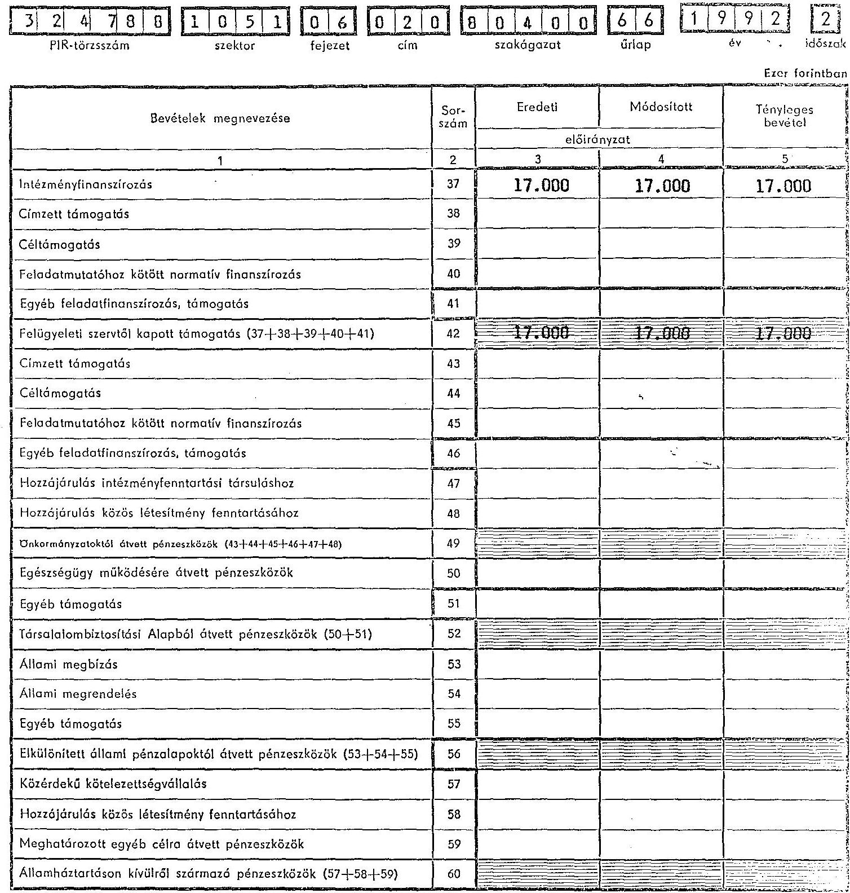
P) 920575 a

---

# Pénzforgalmi előirányzat és teljesítés

014 ÁLLAMI SZÁMVEVŐSZÉK 1993-1994. 1994. 1995. 1996. 1997. 1998. 1999. 2000. 2001. 2002. 2003. 2004. 2005. 2006. 2007. 2008. 2009. 2010. 2011. 2012. 2013. 2014. 2015. 2016. 2017. 2018. 2019. 2020. 2021. 2022. 2023. 2024. 2025. 2026. 2027. 2028. 2029. 2030. 2031. 2032. 2033. 2034. 2035. 2036. 2037. 2038. 2039. 2040. 2041. 2042. 2043. 2044. 2045. 2046. 2047. 2048. 2049. 20410. 2042. 2043. 2044. 2045. 2046. 2047. 2048. 2049. 2050. 2051. 2052. 2053. 2054. 2055. 2056. 2057. 2058. 2059. 2060. 2061. 2062. 2063. 2064. 2065. 2066. 2067. 2068. 2069. 2070. 2071. 2072. 2073. 2074. 2075. 2076. 2077. 2078. 2079. 2080. 2081. 2082. 2083. 2084. 2085. 2086. 2087. 2088. 2089. 2090. 2091. 2092. 2093. 2094. 2095. 2096. 2097. 2098. 2099. 2010. 2011. 2012. 2013. 2014. 2015. 2016. 2017. 2018. 2019. 2020. 2021. 2022. 2023. 2024. 2025. 2026. 2027. 2028. 2029. 2030. 2031. 2032. 2033. 2034. 2035. 2036. 2037. 2038. 2039. 2040. 2041. 2042. 2043. 2044. 2045. 2046. 2047. 2048. 2049. 2050. 2051. 2052. 2053. 2054. 2055. 2056. 2057. 2058. 2059. 2060. 2061. 2062. 2063. 2064. 2065. 2066. 2067. 2068. 2069. 2070. 2071. 2072. 2073. 2074. 2075. 2076. 2077. 2078. 2079. 2080. 2081. 2082. 2083. 2084. 2085. 2086. 2087. 2088. 2089. 2090. 2091. 2092. 2093. 2094. 2095. 2096. 2097. 2098. 2099. 2010. 2011. 2012. 2013. 2014. 2015. 2016. 2017. 2018. 2019. 2020. 2021. 2022. 2023. 2024. 2025. 2026. 2027. 2028. 2029. 2030. 2031. 2032. 2033. 2034. 2035. 2036. 2037. 2038. 2039. 2040. 2041. 2042. 2043. 2044. 2045. 2046. 2047.
 2048. 2049. 2050. 2051. 2052. 2053. 2054. 2055. 2056. 2057. 2058. 2059. 2060. 2061. 2062. 2063. 2064. 2065. 2066. 2067. 2068. 2069. 2070. 2071. 2072. 2073. 2074. 2075. 2076. 2077. 2078. 2079. 2080. 2081. 2082. 2083. 2084. 2085. 2086. 2087. 2088. 2089. 2090. 2091. 2092. 2093. 2094. 2095. 2096. 2097. 2098. 2099. 2010. 2011. 2012. 2013. 2014. 2015. 2016. 2017. 2018. 2019. 2020. 2021. 2022. 2023. 2024. 2025. 2026. 2027. 2028. 2029. 2030. 2031. 2032. 2033. 2034. 2035. 2036. 2037. 2038. 2039. 2040. 2041. 2042. 2043. 2044. 2045. 2046. 2047. 2048. 2049. 2050. 2051. 2052. 2053. 2054. 2055. 2056. 2057. 2058. 2059. 2060. 2061. 2062. 2063. 2064. 2065. 2066. 2067. 2068. 2069. 2070. 2071. 2072. 2073. 2074. 2075. 2076. 2077. 2078. 2079. 2080. 2081. 2082. 2083. 2084. 2085. 2086. 2087. 2088. 2089. 2090. 2091. 2092. 2093. 2094. 2095. 2096. 2097. 2098. 2099. 2010. 2011. 2012. 2013. 2014. 2015. 2016. 2017. 2018. 2019. 2020. 2021. 2022. 2023. 2024. 2025. 2026. 2027. 2028. 2029. 2030. 2031. 2032. 2033. 2034. 2035. 2036. 2037. 2038. 2039. 2040. 2041. 2042. 2043. 2044. 2045. 2046. 2047. 2048. 2049. 2050. 2051. 2052. 2053. 2054. 2055. 2056. 2057. 2058. 2059. 2060. 2061. 2062. 2063. 2064. 2065. 2066. 2067. 2068. 2069. 2070. 2071. 2072. 2073. 2074. 2075. 2076. 2077. 2078. 2079. 2080. 2081. 2082. 2083. 2084. 2085. 2086. 2087. 2088. 2089. 2090. 2091. 2092. 2093. 2094. 2095. 2096. 2097. 2098. 2099. 2010. 2011. 2012. 2013. 2014. 2015. 2016. 2017. 2018. 2019. 2020. 2021. 2022. 2023. 2024. 2025. 2026. 2027. 2028. 2029. 2030. 2031. 2032. 2033. 2034. 2035. 2036. 2037. 2038. 2039. 2040. 2041. 2042. 2043. 2044. 2045. 2046. 2047. 2048. 2049. 2050. 2051. 2052. 2053. 2054. 2055. 2056. 2057. 2058. 2059. 2060. 2061. 2062. 2063. 2064. 2065. 2066. 2067. 2068. 2069. 2070. 2071. 2072. 2073. 2074. 2075. 2076. 2077. 2078. 2079. 2080. 2081. 2082. 2083. 2084. 2085. 2086. 2087. 2088. 2089. 2090. 2091. 2092. 2093. 2094. 2095. 2096. 2097. 2098. 2099. 2010. 2011. 2012. 2013. 2014. 2015. 2016. 2017. 2018. 2019. 2020. 2021. 2022. 2023. 2024. 2025. 2026. 2027. 2028. 2029. 2030. 2031. 2032. 2033. 2034. 2035. 2036. 2037. 2038. 2039. 2040. 2041. 2042. 2043. 2044. 2045. 2046. 2047. 2048. 2049. 2050. 2051. 2052. 2053. 2054. 2055. 2056. 2057. 2058. 2059. 2060. 2061. 2062. 2063. 2064. 2065. 2066. 2067. 2068. 2069. 2070. 2071. 2072. 2073. 2074. 2075. 2076. 2077. 2078. 2079. 2080. 2081. 2082. 2083. 2084. 2085. 2086. 2087. 2088. 2089. 2090. 2091. 2092. 2093. 2094. 2095. 2096. 2097. 2098. 2099. 2010. 2011. 2012. 2013. 2014. 2015. 2016. 2017. 2018. 2019. 2020. 2021. 2022. 2023. 2024. 2025. 2026. 2027. 2028. 2029. 2030. 2031. 2032. 2033. 2034. 2035. 2036. 2037. 2038. 2039. 2040. 2041. 2042. 2043. 2044. 2045. 2046. 2047. 2048. 2049. 2050. 2051. 2052. 2053. 2054. 2055. 2056. 2057. 2058. 2059. 2060. 2061. 2062. 2063. 2064. 2065. 2066. 2067. 2068. 2069. 2070. 2071. 2072. 2073. 2074. 2075. 2076. 2077. 2078. 2079. 2080. 2081. 2082. 2083. 2084. 2085. 2086. 2087. 2088. 2089. 2090. 2091. 2092. 2093. 2094. 2095. 2096. 2097. 2098. 2099. 2010. 2011. 2012. 2013. 2014. 2015. 2016. 2017. 2018. 2019. 2020. 2021. 2022. 2023. 2024. 2025. 2026. 2027. 2028. 2029. 2020. 2021. 2022. 2023. 2024. 2025. 2026. 2027. 2028. 2029. 2020. 2021. 2022. 2023. 2024. 2025. 2026. 2027. 2028. 2029. 2020. 2021. 2022. 2023. 2024. 2025. 2026. 2027. 2028. 2029. 2020. 2021. 2022. 2023. 2024. 2025. 2026. 2027. 2028. 2029. 2020. 2021. 2022. 2023. 2024. 2025. 2026. 2027. 2028. 2029. 2020. 2021. 2022. 2023. 2024. 2025. 2026. 2027. 2028. 2029. 2020. 2021. 2022. 2023. 2024. 2025. 2026. 2027. 2028. 2029. 2020. 2021. 2022. 2023. 2024. 2025. 2026. 2027. 2028. 2029. 2020. 2021. 2022. 2023. 2024. 2025. 2026. 2027. 2028. 2029. 2020. 2021. 2022. 2023. 2024. 2025. 2026. 2027. 2028. 2029. 2020. 2021. 2022. 2023. 2024. 2025. 2026. 2027. 2028. 2029. 2020. 2021. 2022. 2023. 2024. 2025. 2026. 2027. 2028. 2029. 2020. 2021. 2022. 2023. 2024. 2025. 2026. 2027. 2028. 2029. 2020. 2021. 2022. 2023. 2024. 2025. 2026. 2027. 2028. 2029. 2020. 2021. 2022. 2023. 2024. 2025. 2026. 2027. 2028. 2029. 2020. 2021. 2022. 2023. 2024. 2025. 2026. 2027. 2028. 2029. 2020. 2021. 2021. 2021. 2022. 2023. 2024. 2025. 2026. 2027. 2028. 2029. 2020. 2021. 2021. 2021. 2021. 2021. 2021. 2021. 2021. 2021. 2021. 2021. 2021. 2022. 2023. 2024. 2025. 2026. 2028. 2029. 2020. 2021. 2021. 2021. 2021. 2021. 2021. 2021. 2021. 2021. 2021. 2021. 2021. 2021. 2021. 2021. 2021. 2021. 2021. 2021. 2021. 2021. 2021. 2021. 2021. 2021. 2021. 2021. 2021. 2021. 2021. 2021. 2021. 2021. 2021. 2021. 2021. 2021. 2021. 2021. 2021. 2021. 2021. 2021. 2021. 2021. 2021. 2021. 2021. 2021. 2021. 2021. 2021. 2021. 2021. 2021. 2021. 2021. 2021. 2021. 2021. 2021. 2021. 2021. 2021. 2021. 2021. 2021. 2021. 2021. 2021. 2021. 2021. 2021. 2021. 2021. 2021. 2021. 2021. 2021. 2021. 2021. 2021. 2021. 2021. 2021. 2021. 2021. 2021. 2021. 2021. 2021. 2021. 2021. 2021. 2021. 2021. 2021. 2021. 2021. 2021. 2021. 2021. 2021. 2021. 2021. 2021. 2021. 2021. 2021. 2021. 2021. 2021. 2021. 2021. 2021. 2021. 2021. 2021. 2021. 2021. 2021. 2021. 2021. 2021. 2021. 2021. 2021. 2021. 2021. 2021. 2021. 2021. 2021. 2021. 2021. 2021. 2021. 2021. 2021. 2021. 2021. 2021. 2021. 2021. 2021. 2021. 2021. 2021. 2021. 2021. 2021. 2021. 2021. 2021. 2021. 2021. 2021. 2021. 2021. 2021. 2021. 2021. 2021. 2021. 2021. 2021. 2021. 2021. 2021. 2021. 2021. 2021. 2021. 2021. 2021. 2021. 2021. 2021. 2021. 2021. 2021. 2021. 2021. 2021. 2021. 2021. 2021. 2021. 2021. 2021. 2021. 2021. 2021. 2021. 2021. 2021. 2021. 2021. 2021. 2021. 2021. 2021. 2021. 2021. 2021. 2021. 2021. 2021. 2021. 2021. 2021. 2021. 2021. 2021. 2021. 2021. 2021. 2021. 2021. 2021. 2021. 2021. 2021. 2021. 2021. 2021. 2021. 2021. 2021. 2021. 2021. 2021. 2021. 2021. 2021. 2021. 2021. 2021. 2021. 2021. 2021. 2021. 2021. 2021. 2021. 2021. 2021. 2021. 2021. 2021. 2021. 2021. 2021. 2021. 2021. 2021. 2021. 2021. 2021. 2021. 2021. 2021. 2021. 2021. 2021. 2021. 2021. 2021. 2021. 2021. 2021. 2021. 2021. 2021. 2021. 2021. 2021. 2021. 2021. 2021. 2021. 2021. 2021. 2021. 2021. 2021. 2021. 2021. 2021. 2021. 2021. 2021. 2021. 2021. 2021. 2021. 2021. 2021. 2021. 2021. 2021. 2021. 2021. 2021. 2021. 2021. 2021. 2021. 2021. 2021. 2021. 2021. 2021. 2021. 2021. 2021. 2021. 2021. 2021. 2021. 2021. 2021. 2021. 2021. 2021. 2021. 2021. 2021. 2021. 2021. 2021. 2021. 2021. 2021. 2021. 2021. 2021. 2021. 2021. 2021. 2021. 2021. 2021. 2021. 2021. 2021. 2021. 2021. 2021. 2021. 2021. 2021. 2021. 2021. 2021. 2021. 2021. 2021. 2021. 2021. 2021. 2021. 2021. 2021. 2021. 2021. 2021. 2021. 2021. 2021. 2021. 2021. 2021. 2021. 2021. 2021. 2021. 2021. 2021. 2021. 2021. 2021. 2021. 2021. 2021. 2021. 2021. 2021. 2021. 2021. 2021. 2021. 2021. 2021. 2021. 2021. 2021. 2021. 2021. 2021. 2021. 2021. 2021. 2021. 2021. 2021. 2021. 2021. 2021. 2021. 2021. 2021. 2021. 2021. 2021. 2021. 2021. 2021. 2021. 2021. 2021. 2021. 2021. 2021. 2021. 2021. 2021. 2021. 2021. 2021. 2021. 2021. 2021. 2021. 2021. 2021. 2021. 2021. 2021. 2021. 2021. 2021. 2021. 2021. 2021. 2021. 2021. 2021. 2021. 2021. 2021. 2021. 2021. 2021. 2021. 2021. 2021. 2021. 2021. 2021. 2021. 2021. 2021. 2021. 2021. 2021. 2021. 2021. 2021. 2021. 2021. 2021. 2021. 2021. 2021. 2021. 2021. 2021. 2021. 2021. 2021. 2021. 2021. 2021. 2021. 2021. 2021. 2021. 2021. 2021. 2021. 2021. 2021. 2021. 2021. 2021. 2021. 2021. 2021. 2021. 2021. 2021. 2021. 2021. 2021. 2021. 2021. 2021. 2021. 2021. 2021. 2021. 2021. 2021. 2021. 2021. 2021. 2021. 2021. 2021. 2021. 2021. 2021. 2021. 2021. 2021. 2021. 2021. 2021. 2021. 2021. 2021. 2021. 2021. 2021. 2021. 2021. 2021. 2021. 2021. 2021. 2021. 2021. 2021. 2021. 2021. 2021. 2021. 2021. 2021. 2021. 2021. 2021. 2

---

# A bérkiadások összetételének és a munkavállalók átlagos statisztikai létszámának alakulása

|  3 | 2 | 4 | 7 | 8 | 3 | 1 | 0 | 5 | 1 | 0 | 6 | 0 | 2 | 0 | 8 | 0 | 4 | 0 | 0 | 6 | 8 | 1 | 9 | 9 | 2 | 2  |
| --- | --- | --- | --- | --- | --- | --- | --- | --- | --- | --- | --- | --- | --- | --- | --- | --- | --- | --- | --- | --- | --- | --- | --- | --- | --- | --- |
|  |   |   |   |   |   |   |   |   |   |   |   |   |   |   |   |   |   |   |   |   |   |   |   |   |   |   |

| Munkaköri, besorolási csoport | Bérkiadás összesen (ezer forintban) | Létszám (főben) | Bérjellegű kiadásból | Létszám (ezer forintban) | Létszám (főben)  |
| --- | --- | --- | --- | --- | --- |
| megnevezése | száma | pénzmaradványból | eredményből | Létszám (főben) | Létszám (főben)  |
| 1 | 2 | 3 | 4 | 5 | 6  |
| Vezető | 1 | 0 | 0 | 0 | 720  |
| Ügyintéző | 1 | 0 | 2 | 0 | 1.190  |
| Fizikai | 1 | 0 | 6 | 0 | 4.383  |
| Gk vez. | 9 | 1 | 0 | 0 | 199  |
|  |   |   |   |   |   |
|  |   |   |   |   |   |
|  |   |   |   |   |   |
|  |   |   |   |   |   |
|  |   |   |   |   |   |
|  |   |   |   |   |   |
|  |   |   |   |   |   |
|  |   |   |   |   |   |
| Besorolási csoportra nem viszthető bérrelőségem | 8 | 8 | 8 | 8 |   |
| Teljes munkatöltően foglalkoztatottak összesen | 9 | 9 | 9 | 9 | 6.492  |

|  3 | 2 | 4 | 7 | 8 | 8 | 1 | 0 | 5 | 1 | 0 | 6 | 0 | 2 | 0 | 8 | 0 | 4 | 0 | 0 | 6 | 9 | 1 | 9 | 9 | 2 | 2  |
| --- | --- | --- | --- | --- | --- | --- | --- | --- | --- | --- | --- | --- | --- | --- | --- | --- | --- | --- | --- | --- | --- | --- | --- | --- | --- | --- |
|  |   |   |   |   |   |   |   |   |   |   |   |   |   |   |   |   |   |   |   |   |   |   |   |   |   |   |

| Részmunkaidőben foglalkoztatottak | 01 | | | | | | | | | | | | | | | | | | | | | Nyugdíjas foglalkoztatottak | 02 | 99 | 1 | | | | | | | | | | | | | | | | | | 13. havi bér jogcímen kifizetett összeg | 03 | 505 | 27 | | | | | | | | | | | | | | | | | | 08. útlag 9999 sor + 09. útlag 011+020 sor technikai összesen | 04 | 7.096 | 55 | 141 | | | | | | | | | | | | | | | | | | | | | | | | | | | | | | | | | | | | | | | | | | | | | | | | | | | | | | | | | | | | | | | | | | | | | | | | | | | | | | | | | | | | | | | | | | | | | | | | | | | | | | | | | | | | | | | | | | | | | | | | | | | | | | | | | | | | | | | | | | | | | | | | | | | | | | | | | | | | | | | | | | | | | | | | | | | | | | | | | | | | | | | | | | | | | | | | | | | | | | |

---

# Feladatmutatók állománya

ÁLLAMI SZÁMVEVŐSZÉK lapszám TOVÁBBKÉPZÉSI INTÉZET ÉS ÜDÜLŐ azeru megnevezése

|  3 | 2 | 4 | 7 | 8 | 8 | 1 | 0 | 5 | 1 | 0 | 6 | 0 | 2 | 0 | 0 | 0 | 4 | 0 | 0 | 7 | 0 | 1 | 9 | 9 | 2 | 2  |
| --- | --- | --- | --- | --- | --- | --- | --- | --- | --- | --- | --- | --- | --- | --- | --- | --- | --- | --- | --- | --- | --- | --- | --- | --- | --- | --- |
|  |   |   |   |   |   |   |   |   |   |   |   |   |   |   |   |   |   |   |   |   |   |   |   |   |   |   |

| 01 Feladatmutató |  |  |  |  |  |  |  |  |  |  |  |  |  |  |  |  |  |  |  |  |  |  |  |  |  |  |   |
| --- | --- | --- | --- | --- | --- | --- | --- | --- | --- | --- | --- | --- | --- | --- | --- | --- | --- | --- | --- | --- | --- | --- | --- | --- | --- | --- | --- |
| 02 Teljesítménymutató |  |  |  |  |  |  |  |  |  |  |  |  |  |  |  |  |  |  |  |  |  |  |  |  |  |  |   |
| Megnevezés és szám |  |  |  |  |  |  |  |  |  |  |  |  |  |  |  |  |  |  |  |  |  |  |  |  |  |  |   |
|
 |  |  |  |  |  |  |  |  |  |  |  |  |  |  |  |  |  |  |  |  |  |  |  |  |  |  |   |
|   |  |  |  |  |  |  |  |  |  |  |  |  |  |  |  |  |  |  |  |  |  |  |  |  |  |  |   |
|   |  |  |  |  |  |  |  |  |  |  |  |  |  |  |  |  |  |  |  |  |  |  |  |  |  |  |   |
|   |  |  |  |  |  |  |  |  |  |  |  |  |  |  |  |  |  |  |  |  |  |  |  |  |  |  |   |
|   |  |  |  |  |  |  |  |  |  |  |  |  |  |  |  |  |  |  |  |  |  |  |  |  |  |  |   |
|   |  |  |  |  |  |  |  |  |  |  |  |  |  |  |  |  |  |  |  |  |  |  |  |  |  |  |   |
|   |  |  |  |  |  |  |  |  |  |  |  |  |  |  |  |  |  |  |  |  |  |  |  |  |  |  |   |
|   |  |  |  |  |  |  |  |  |  |  |  |  |  |  |  |  |  |  |  |  |  |  |  |  |  |  |   |
|   |  |  |  |  |  |  |  |  |  |  |  |  |  |  |  |  |  |  |  |  |  |  |  |  |  |  |   |
|   |  |  |  |  |  |  |  |  |  |  |  |  |  |  |  |  |  |  |  |  |  |  |  |  |  |  |   |
|   |  |  |  |  |  |  |  |  |  |  |  |  |  |  |  |  |  |  |  |  |  |  |  |  |  |  |   |
|   |  |  |  |  |  |  |  |  |  |  |  |  |  |  |  |  |  |  |  |  |  |  |  |  |  |  |   |
|   |  |  |  |  |  |  |  |  |  |  |  |  |  |  |  |  |  |  |  |  |  |  |  |  |  |  |   |
|   |  |  |  |  |  |  |  |  |  |  |  |  |  |  |  |  |  |  |  |  |  |  |  |  |  |  |   |
|   |  |  |  |  |  |  |  |  |  |  |  |  |  |  |  |  |  |  |  |  |  |  |  |  |  |  |   |
|   |  |  |  |  |  |  |  |  |  |  |  |  |  |  |  |  |  |  |  |  |  |  |  |  |  |  |   |
|   |  |  |  |  |  |  |  |  |  |  |  |  |  |  |  |  |  |  |  |  |  |  |  |  |  |  |   |
|   |  |  |  |  |  |  |  |  |  |  |  |  |  |  |  |  |  |  |  |  |  |  |  |  |  |  |   |
|   |  |  |  |  |  |  |  |  |  |  |  |  |  |  |  |  |  |  |  |  |  |  |  |  |  |  |   |
|   |  |  |  |  |  |  |  |  |  |  |  |  |  |  |  |  |  |  |  |  |  |  |  |  |  |  |   |
|   |  |  |  |  |  |  |  |  |  |  |  |  |  |  |  |  |  |  |  |  |  |  |  |  |  |  |   |
|   |  |  |  |  |  |  |  |  |  |  |  |  |  |  |  |  |  |  |  |  |  |  |  |  |  |  |   |
|   |  |  |  |  |  |  |  |  |  |  |  |  |  |  |  |  |  |  |  |  |  |  |  |  |  |  |   |
|   |  |  |  |  |  |  |  |  |  |  |  |  |  |  |  |  |  |  |  |  |  |  |  |  |  |  |   |
|   |  |  |  |  |  |  |  |  |  |  |  |  |  |  |  |  |  |  |  |  |  |  |  |  |  |  |   |
|   |  |  |  |  |  |  |  |  |  |  |  |  |  |  |  |  |  |  |  |  |  |  |  |  |  |  |   |
|   |  |  |  |  |  |  |  |  |  |  |  |  |  |  |  |  |  |  |  |  |  |  |  |  |  |  |   |
|   |  |  |  |  |  |  |  |  |  |  |  |  |  |  |  |  |  |  |  |  |  |  |  |  |  |  |   |
|   |  |  |  |  |  |  |  |  |  |  |  |  |  |  |  |  |  |  |  |  |  |  |  |  |  |  |   |
|   |  |  |  |  |  |  |  |  |  |  |  |  |  |  |  |  |  |  |  |  |  |  |  |  |  |  |   |
|   |  |  |  |  |  |  |  |  |  |  |  |  |  |  |  |  |  |  |  |  |  |  |  |  |  |  |   |
|   |

---

# Költségvetési előirányzatok egyeztetése

|  3 | 2 | 4 | 7 | 8 | 1 | 0 | 5 | 1 | 0 | 6 | 0 | 2 | 0 | 8 | 0 | 4 | 0 | 0 | 7 | 1 | 1 | 9 | 9 | 2 | 2  |
| --- | --- | --- | --- | --- | --- | --- | --- | --- | --- | --- | --- | --- | --- | --- | --- | --- | --- | --- | --- | --- | --- | --- | --- | --- | --- | --- |
|  PIR-törzsszám | szektor |  |  |  |  |  |  |  |  |  |  |  |  |  |  |  |  |  |  |  |  |  |  |  |  |   |

|  ÁLLAMI SZÁMVEVŐSZÉK TOVÁBBKÉPZÉSI INTÉZET ÉS ÜDÜLŐ |  |  |  |  |  |  |  |  |  |  |  |  |  |  |  |  |  |  |  |  |  |  |  |  |  |  |   |
| --- | --- | --- | --- | --- | --- | --- | --- | --- | --- | --- | --- | --- | --- | --- | --- | --- | --- | --- | --- | --- | --- | --- | --- | --- | --- | --- | --- |
|  1 |  |  |  |  |  |  |  |  |  |  |  |  |  |  |  |  |  |  |  |  |  |  |  |  |  |   |
|  2 |  |  |  |  |  |  |  |  |  |  |  |  |  |  |  |  |  |  |  |  |  |  |  |  |  |   |
|  3 |  |  |  |  |  |  |  |  |  |  |  |  |  |  |  |  |  |  |  |  |  |  |  |  |  |   |
|  4 |  |  |  |  |  |  |  |  |  |  |  |  |  |  |  |  |  |  |  |  |  |  |  |  |  |   |
|  5 |  |  |  |  |  |  |  |  |  |  |  |  |  |  |  |  |  |  |  |  |  |  |  |  |  |   |
|  6 |  |  |  |  |  |  |  |  |  |  |  |  |  |  |  |  |  |  |  |  |  |  |  |  |  |   |
|  7 |  |  |  |  |  |  |  |  |  |  |  |  |  |  |  |  |  |  |  |  |  |  |  |  |  |   |
|  8 |  |  |  |  |  |  |  |  |  |  |  |  |  |  |  |  |  |  |  |  |  |  |  |  |  |   |
|  9 |  |  |  |  |  |  |  |  |  |  |  |  |  |  |  |  |  |  |  |  |  |  |  |  |  |   |
|  10 |  |  |  |  |  |  |  |  |  |  |  |  |  |  |  |  |  |  |  |  |  |  |  |  |  |   |
|  11 |  |  |  |  |  |  |  |  |  |  |  |  |  |  |  |  |  |  |  |  |  |  |  |  |  |   |
|  12 |  |  |  |  |  |  |  |  |  |  |  |  |  |  |  |  |  |  |  |  |  |  |  |  |  |   |
|  13 |  |  |  |  |  |  |  |  |  |  |  |  |  |  |  |  |  |  |  |  |  |  |  |  |  |   |
|  14 |  |  |  |  |  |  |  |  |  |  |  |  |  |  |  |  |  |  |  |  |  |  |  |  |  |   |
|  15 |  |  |  |  |  |  |  |  |  |  |  |  |  |  |  |  |  |  |  |  |  |  |  |  |  |   |
|  16 |  |  |  |  |  |  |  |  |  |  |  |  |  |  |  |  |  |  |  |  |  |  |  |  |  |   |
|  17 |  |  |  |  |  |  |  |  |  |  |  |  |  |  |  |  |  |  |  |  |  |  |  |  |  |   |
|  18 |  |  |  |  |  |  |  |  |  |  |  |  |  |  |  |  |  |  |  |  |  |  |  |  |  |   |
|  19 |  |  |  |  |  |  |  |  |  |  |  |  |  |  |  |  |  |  |  |  |  |  |  |  |  |   |
|  20 |  |  |  |  |  |  |  |  |  |  |  |  |  |  |  |  |  |  |  |  |  |  |  |  | |   |
|  21 |  |  |  |  |  |  |  |  |  |  |  |  |  |  |  |  |  |  |  |  |  |  |  |  |  |   |
|  22 |  |  |  |  |  |  |  |  |  |  |  |  |  |  |  |  |  |  |  |  |  |  |  |  |  |   |
|  23 |  |  |  |  |  |  |  |  |  |  |  |  |  |  |  |  |  |  |  |  |  |  |  |  |  |   |
|  24 |  |  |  |  |  |  |  |  |  |  |  |  |  |  |  |  |  |  |  |  |  |  |  |  |  |   |
|  25 |  |  |  |  |  |  |  |  |  |  |  |  |  |  |  |  |  |  |  |  |  |  |  |  |  |   |
|  26 |  |  |  |  |  |  |  |  |  |  |  |  |  |  |  |  |  |  |  |  |  |  |  |  |  |   |
|  27 |  |  |  |  |  |  |  |  |  |  |  |  |  |  |  |  |  |  |  |  |  |  |  |  |  |   |
|  28 |  |  |  |  |  |  |  |  |  |  |  |  |  |  |  |  |  |  |  |  |  |  |  |  |  |   |
|  29 |  |  |  |  |  |  |  |  |  |  |  |  |  |  |  |  |  |  |  |  |  |  |  |  |  |   |
|  30 |  |  |  |  |  |  |  |  |  |  |  |  |  |  |  |  |  |  |  |  |  |  |  |  |  |   |
|  31 |  |  |  |  |  |  |  |  |  |  |  |  |  |  |  |  |  |  |  |  |  |  |  |  |  |   |
|  32 |  |  |  |  |  |  |  |  |  |  |  |  |  |  |  |  |  |  |  |  |  |  |  |  |  |   |
|  33 |  |  |  |  |  |  |  |  |  |  |  |  |  |  |  |  |  |  |  |  |  |  |  |  |  |   |
|  34 |  |  |  |  |  |  |  |  |  |  |  |  |  |  |  |  |  |  |  |  |  |  |  |  |  |   |
|  35 |  |  |  |  |  |  |  |  |  |  |  |  |  |  |  |  |  |  |  |  |  |  |  |  |  |   |
|  36 |  |  |  |  |  |  |  |  |  |  |  |  |  |  |  |  |  |  |  |  |  |  |  |  |  |   |
|  37 |  |  |  |  |  |  |  |  |  |  |  |  |  |  |  |  |  |  |  |  |  |  |  |  |  |   |
|  38 |  |  |  |  |  |  |  |  |  |  |  |  |  |  |  |  |  |  |  |  |  |  |  |  |  |   |
|  39 |  |  |  |  |  |  |  |  |  |  |  |  |  |  |  |  |  |  |  |  |  |  |  |  |  |   |
|  40 |  |  |  |  |  |  |  |  |  |  |  |  |  |  |  |  |  |  |  |  |  |  |  |  |  |   |
|  41 |  |  |  |  |  |  |  |  |  |  |  |  |  |  |  |  |  |  |  |  |  |  |  |  |  |   |
|  42 |  |  |  |  |  |  |  |  |  |  |  |  |  |  |  |  |  |  |  |  |  |  |  |  |  |   |
|  43 |  |  |  |  |  |  |  |  |  |  |  |  |  |  |  |  |  |  |  |  |  |  |  |  |  |   |
|  44 |  |  |  |  |  |  |  |  |  |  |  |  |  |  |  |  |  |  |  |  |  |  |  |  |  |   |
|  45 |  |  |  |  |  |  |  |  |  |  |  |  |  |  |  |  |  |  |  |  |  |  |  |  |  |   |
|  46 |  |  |  |  |  |  |  |  |  |  |  |  |  |  |  |  |  |  |  |  |  |  |  |  |  |   |
|  47 |  |  |  |  |  |  |  |  |  |  |  |  |  |  |  |  |  |  |  |  |  |  |  |  |  |   |
|  48 |  |  |  |  |  |  |  |  |  |  |  |  |  |  |  |  |  |  |  |  |  |  |  |  |  |   |
|  49 |  |  |  |  |  |  |  |  |  |  |  |  | |  |  |  |  |  |  |  |  |  |  |  |  |   |
|  50 |  |  |  |  |  |  |  |  |  |  |  |  |  |  |  |  |  |  |  |  |  |  |  |  |  |   |
|  51 |  |  |  |  |  |  |  |  |  |  |  |  |  |  |  |  |  |  |  |  |  |  |  |  |  |   |
|  52 |  |  |  |  |  |  |  |  |  |  |  |  |  |  |  |  |  |  |  |  |  |  |  |  |  |   |
|  53 |  |  |  |  |  |  |  |  |  |  |  |  |  |  |  |  |  |  |  |  |  |  |  |  |  |   |
|  54 |  |  |  |  |  |  |  |  |  |  |  |  |  |  |  |  |  |  |  |  |  |  |  |  |  |   |
|  55 |  |  |  |  |  |  |  |  |  |  |  |  |  |  |  |  |  |  |  |  |  |  |  |  |  |   |
|  56 |  |  |  |  |  |  |  |  |  |  |  |  |  |  |  |  |  |  |  |  |  |  |  |  |  |   |
|  57 |  |  |  |  |  |  |  |  |  |  |  |  |  |  |  |  |  |  |  |  |  |  |  |  |  |   |
|  58 |  |  |  |  |  |  |  |  |  |  |  |  |  |  |  |  |  |  |  |  |  |  |  |  |  |   |
|  59 |  |  |  |  |  |  |  |  |  |  |  |  |  |  |  |  |  |  |  |  |  |  |  |  |  |   |
|  60 |  |  |  |  |  |  |  |  |  |  |  |  |  |  |  |  |  |  |  |  |  |  |  |  |  |   |
|  61 |  |  |  |  |  |  |  |  |  |  |  |  |  |  |  |  |  |  |  |  |  |  |  |  |  |   |
|  62 |  |  |  |  |  |  |  |  |  |  |  |  |  |  |  |  |  |  |  |  |  |  |  |  |  |   |
|  63 |  |  |  |  |  |  |  |  |  |  |  |  |  |  |  |  |  |  |  |  |  |  |  |  |  |   |
|  64 |  |  |  |  |  |  |  |  |  |  |  |  |  |  |  |  |  |  |  |  |  |  |  |  |  |   |
|  65 |  |  |  |  |  |  |  |  |  |  |  |  |  |  |  |  |  |  |  |  |  |  |  |  |  |   |
|  66 |  |  |  |  |  |  |  |  |  |  |  |  |  |  |  |  |  |  |  |  |  |  |  |  |  |   |
|  67 |  |  |  |  |  |  |  |  |  |  |  |  |  |  |  |  |  |  |  |  |  |  |  |  |  |   |
|  68 |  |  |  |  |  |  |  |  |  |  |  |  |  |  |  |  |  |  |  |  |  |  |  |  |  |   |
|  69 |  |  |  |  |  |  |  |  |  |  |  |  |  |  |  |  |  |  |  |  |  |  |  |  |  |   |
|  70 |  |  |  |  |  |  |  |  |  |  |  |  |  |  |  |  |  |  |  |  |  |  |  |  |  |   |
|  71 |  |  |  |  |  |  |  |  |  |  |  |  |  |  |  |  |  |  |  |  |  |  |  |  |  |   |
|  72 |  |  |  |  |  |  |  |  |  |  |  |  |  |  |  |  |  |  |  |  |  |  |  |  |  |   |
|  73 |  |  |  |  |  |  |  |  |  |  |  |  |  |  |  |  |  |  |  |  |  |  |  |  |  |   |
|  74 |  |  |  |  |  |  |  |  |  |  |  |  |  |  |  |  |  |  |  |  |  |  |  |  |  |   |
|  75 |  |  |  |  |  |  |  |  |  |  |  |  |  |  |  |  |  |  |  |  |  |  |  |  |  |   |
|  76 |  |  |  |  |  |  |  |  |  |  |  |  |  |  |  |  |  |  |  |  |  |  |  |  |  |   |
|  77 |  |  |  |  |  |  |  |  |  |  |  |  |  |  |  |  |  |  |  |  |  |  |  |  |  |   |
|  78 | |  |  |  |  |  |  |  |  |  |  |  |  |  |  |  |  |  |  |  |  |  |  |  |  |   |
|  79 |  |  |  |  |  |  |  |  |  |  |  |  |  |  |  |  |  |  |  |  |  |  |  |  |  |   |
|  80 |  |  |  |  |  |  |  |  |  |  |  |  |  |  |  |  |  |  |  |  |  |  |  |  |  |   |
|  81 |  |  |  |  |  |  |  |  |  |  |  |  |  |  |  |  |  |  |  |  |  |  |  |  |  |   |
|  82 |  |  |  |  |  |  |  |  |  |  |  |  |  |  |  |  |  |  |  |  |  |  |  |  |  |   |
|  83 |  |  |  |  |  |  |  |  |  |  |  |  |  |  |  |  |  |  |  |  |  |  |  |  |  |   |
|  84 |  |  |  |  |  |  |  |  |  |  |  |  |  |  |  |  |  |  |  |  |  |  |  |  |  |   |
|  85 |  |  |  |  |  |  |  |  |  |  |  |  |  |  |  |  |  |  |  |  |  |  |  |  |  |   |
|  86 |  |  |  |  |  |  |  |  |  |  |  |  |  |  |  |  |  |  |  |  |  |  |  |  |  |   |
|  87 |  |  |  |  |  |  |  |  |  |  |  |  |  |  |  |  |  |  |  |  |  |  |  |  |  |   |
|  88 |  |  |  |  |  |  |  |  |  |  |  |  |  |  |  |  |  |  |  |  |  |  |  |  |  |   |
|  89 |  |  |  |  |  |  |  |  |  |  |  |  |  |  |  |  |  |  |  |  |  |  |  |  |  |   |
|  90 |  |  |  |  |  |  |  |  |  |  |  |  |  |  |  |  |  |  |  |  |  |  |  |  |  |   |
|  91 |  |  |  |  |  |  |  |  |  |  |  |  |  |  |  |  |  |  |  |  |  |  |  |  |  |   |
|  92 |  |  |  |  |  |  |  |  |  |  |  |  |  |  |  |  |  |  |  |  |  |  |  |  |  |   |
|  93 |  |  |  |  |  |  |  |  |  |  |  |  |  |  |  |  |  |  |  |  |  |  |  |  |  |   |
|  94 |  |  |  |  |  |  |  |  |  |  |  |  |  |  |  |  |  |  |  |  |  |  |  |  |  |   |
|  95 |  |  |  |  |  |  |  |  |  |  |  |  |  |  |  |  |  |  |  |  |  |  |  |  |  |   |
|  96 |  |  |  |  |  |  |  |  |  |  |  |  |  |  |  |  |  |  |  |  |  |  |  |  |  |   |
|  97 |  |  |  |  |  |  |  |  |  |  |  |  |  |  |  |  |  |  |  |  |  |  |  |  |  |   |
|  98 |  |  |  |  |  |  |  |  |  |  |  |  |  |  |  |  |  |  |  |  |  |  |  |  |  |   |
|  99 |  |  |  |  |  |  |  |  |  |  |  |  |  |  |  |  |  |  |  |  |  |  |  |  |  |   |
|  100 |  |  |  |  |  |  |  |  |  |  |  |  |  |  |  |  |  |  |  |  |  |  |  |  |  |   |
|  101 |  |  |  |  |  |  |  |  |  |  |  |  |  |  |  |  |  |  |  |  |  |  |  |  |  |   |
|  102 |  |  |  |  |  |  |  |  |  |  |  |  |  |  |  |  |  |  |  |  |  |  |  |  |  |   |
|  103 |  |  |  |  |  |  |  |  |  |  |  |  |  |  |  |  |  |  |  |  |  |  |  |  |  |   |
|  104 |  |  |  |  |  |  |  |  |  |  |  |  |  |  |  |  |  |  |  |  |  |  |  |  |  |   |
|  105 |  |  |  |  |  |  |  |  |  |  |  |  |  |  |  |  |  |  |  |  |  |  |  |  |  |   |
|  106 |  |  |  |  |  |  |  |  |  |  |  |  |  |  |  |  | |  |  |  |  |  |  |  |  |   |
|  107 |  |  |  |  |  |  |  |  |  |  |  |  |  |  |  |  |  |  |  |  |  |  |  |  |  |   |
|  108 |  |  |  |  |  |  |  |  |  |  |  |  |  |  |  |  |  |  |  |  |  |  |  |  |  |   |
|  109 |  |  |  |  |  |  |  |  |  |  |  |  |  |  |  |  |  |  |  |  |  |  |  |  |  |   |
|  110 |  |  |  |  |  |  |  |  |  |  |  |  |  |  |  |  |  |  |  |  |  |  |  |  |  |   |
|  111 |  |  |  |  |  |  |  |  |  |  |  |  |  |  |  |  |  |  |  |  |  |  |  |  |  |   |
|  112 |  |  |  |  |  |  |  |  |  |  |  |  |  |  |  |  |  |  |  |  |  |  |  |  |  |  |   |
|  113 |  |  |  |  |  |  |  |  |  |  |  |  |  |  |  |  |  |  |  |  |  |  |  |  |  |  |   |
|  114 |  |  |  |  |  |  |  |  |  |  |  |  |  |  |  |  |  |  |  |  |  |  |  |  |  |  |  |   |
|  115 |  |  |  |  |  |  |  |  |  |  |  |  |  |  |  |  |  |  |  |  |  |  |  |  |  |  |  |   |
|  116 |  |  |  |  |  |  |  |  |  |  |  |  |  |  |  |  |  |  |  |  |  |  |  |  |  |  |  |  |   |
|  117 |  |  |  |  |  |  |  |  |  |  |  |  |  |  |  |  |  |  |  |  |  |  |  |  |  |  |  |  |   |
|  118 |  |  |  |  |  |  |  |  |  |  |  |  |  |  |  |  |  |  |  |  |  |  |  |  |  |  |  |  |   |
|  119 |  |  |  |  |  |  |  |  |  |  |  |  |  |  |  |  |  |  |  |  |  |  |  |  |  |  |  |  |   |
|  120 |  |  |  |  |  |  |  |  |  |  |  |  |  |  |  |  |  |  |  |  |  |  |  |  |  |  |  |  |   |
|  121 |  |  |  |  |  |  |  |  |  |  |  |  |  |  |  |  |  |  |  |  |  |  |  |  |  |  |  |  |   |
|  122 |  |  |  |  |  |  |  |  |  |  |  |  |  |  |  |  |  |  |  |  |  |  |  |  |  |  |  |  |  |   |
|  123 |  |  |  |  |  |  |  |  |  |  |  |  |  |  |  |  |  |  |  |  |  |  |  |  |  |  |  |  |  |  |   |
|  124 |  |  |  |  |  |  |  |  |  |  |  |  |  |  |  |  |  |  |  |  |  |  |  |  |  |  |  |  |  |  |  |   |
|  125 |  |  |  |  |  |  |  |  |  |  |  |  |  |  |  |  |  |  |  |  |  |  |  |  |  |  |  |  |  |  |  |   |
|  126 |  |  |  |  |  |  |  |  |  |  |  |  |  |  |  |  |  |  |  |  |  |  |  |  |  |  |  |  |  |  |  |  |   |
|  127 |  |  |  |  |  |  |  |  |  |  |  |  |  |  |  |  |  |  |  |  |  |  |  |  |  |  |  |  |  |  |  |  |   |
|  128 |  |  |  |  |  |  |  |  |  |  |  |  |  |  |  |  |  |  |  |  |  |  |  |  |  |  |  |  |  |  |  |  |  |   |
|  129 |  |  |  |  |  |  |  |  |  |  |  |  |  |  |  |  |  |  |  |  |  |  |  |  |  |  |  |  |  |  |  |  |  |   |
|  130 |  |  |  |  |  |  |  |  |  |  |  |  |  |  |  |  |  |  |  |  |  |  |  |  |  |  |  |  |  |  |  |  |  |  |   |
|  131 |  |  |  |  |  |  |  |  |  |  |  |  |  |  |  |  |  |  |  |  |  |  |  |  |  |  |  |  |  |  |  |  | |  |   |
|  132 |  |  |  |  |  |  |  |  |  |  |  |  |  |  |  |  |  |  |  |  |  |  |  |  |  |  |  |  |  |  |  |  |  |  |   |
|  133 |  |  |  |  |  |  |  |  |  |  |  |  |  |  |  |  |  |  |  |  |  |  |  |  |  |  |  |  |  |  |  |  |  |  |  |   |
|  134 |  |  |  |  |  |  |  |  |  |  |  |  |  |  |  |  |  |  |  |  |  |  |  |  |  |  |  |  |  |  |  |  |  |  |  |   |
|  135 |  |  |  |  |  |  |  |  |  |  |  |  |  |  |  |  |  |  |  |  |  |  |  |  |  |  |  |  |  |  |  |  |  |  |  |   |
|  136 |  |  |  |  |  |  |  |  |  |  |  |  |  |  |  |  |  |  |  |  |  |  |  |  |  |  |  |  |  |  |  |  |  |  |  |  |   |
|  137 |  |  |  |  |  |  |  |  |  |  |  |  |  |  |  |  |  |  |  |  |  |  |  |  |  |  |  |  |  |  |  |  |  |  |  |  |  |   |
|  138 |  |  |  |  |  |  |  |  |  |  |  |  |  |  |  |  |  |  |  |  |  |  |  |  |  |  |  |  |  |  |  |  |  |  |  |  |  |  |   |
|  139 |  |  |  |  |  |  |  |  |  |  |  |  |  |  |  |  |  |  |  |  |  |  |  |  |  |  |  |  |  |  |  |  |  |  |  |  |  |  |  |  |   |
|  140 |  |  |  |  |  |  |  |  |  |  |  |  |  |  |  |  |  |  |  |  |  |  |  |  |  |  |  |  |  |  |  |  |  |  |  |  |  |  |  |  |  |   |
|  141 |  |  |  |  |  |  |  |  |  |  |  |  |  |  |  |  |  |  |  |  |  |  |  |  |  |  |  |  |  |  |  |  |  |  |  |  |  |  |  |  |  |   |
|  142 |  |  |  |  |  |  |  |  |  |  |  |  |  |  |  |  |  |  |  |  |  |  |  |  |  |  |  |  |  |  |  |  |  |  |  |  |  |  |  |  |  |  |   |
|  143 |  |  |  |  |  |  |  |  |  |  |  |  |  |  |  |  |  |  |  |  |  |  |  |  |  |  |  |  |  |  |  |  |  |  |  |  |  |  |  |  |  |  |   |
|  144 |  |  |  |  |  |  |  |  |  |  |  |  |  |  |  |  |  |  |  |  |  |  |  |  |  |  |  |  |  |  |  |  |  |  |  |  |  |  |  |  |  |  |  |   |
|  145 |  |  |  |  |  |  |  |  |  |  |  |  |  |  |  |  |  |  |  |  |  |  |  |  |  |  |  |  |  |  |  |  |  |  |  |  |  |  |  |  |  |  |  |  |  |   |
|  146 |  |  |  |  |  |  |  |  |  |  |  |  |  |  |  |  |  |  |  |  |  |  |  |  |  |  |  |  |  |  |  |  |  |  |  |  |  |  |  |  |  |  |  |  |  |  |  |   |
|  147 |  |  |  |  |  |  |  |  |  |  |  |  |  |  |  |  |  |  |  |  |  |  |  |  |  |  |  |  |  |  |  |  |  |  |  |  |  |  |  |  |  |  |  |  |  |  |  |  |  |  |  |  |   |
|  148 |  |  |  |  |  |  |  |  |  |  |  |  |  |  |  |  |  |  |  |  |  |  |  |  |  |  |  |  |  |  |  |  |  |  |  |  |  |  |  |  |  |  |  |  |  |  |  |  |  |  |  |  |  |   |
|  149 |  |  |  |  |  |  |  |  |  |  |  |  |  |  |  |  |  |  |  |  |  |  |  |  |  |  |  |  |  |  |  |  |  |  |  |  |  |  |  |  |  |  |  |  |  |  |  |  |  |  |  |  |  |  |  |  |  |  |  |  |  |  |  |  |  |  |  |  |  |  |  |  |  |  |  |  |  |  |  |  |  |  |  |  |  |  |  |  |  |  |  |  |  |  |  |  |  |  |  | 

---

# Pénzforgalom egyeztetése

ÁLLAMI SZÁMVEVŐSZÉK TOVÁBBKÉPZÉSI INTÉZET ÉS ÜDÜLŐ szerv megnevezése VELENCE

3 2 4 7 8 9 1 0 5 1 0 6 0 2 0 8 0 4 0 0 7 2 1 9 9 2 2 PIR-törzsszám szektor fajszám cím szakágszám óraszám év időszak

Ezer forintban

|  Megnevezés | Sorszám | Összeg  |
| --- | --- | --- |
|  1 | 2 | 3  |
|  Pénzkészlet a tárgyidőszak elején |  |   |
|  - Költségvetési bankszámlák egyenlege | 01 | 5.151  |
|  - Pénztárak és betétkönyvek egyenlege | 02 | 77  |
|  - Pénzkészlet összesen (01+02) | 03 | 5.228  |
|  Bevételek és kiadások különbözete | 04 | 31.032  |
|   | 05 | 35.644  |
|  Pénzkészlet a tárgyidőszak végén |  |   |
|  - Költségvetési bankszámlák egyenlege | 06 | 522  |
|  - Pénztárak és betétkönyvek egyenlege | 07 | 94  |
|  - Pénzkészlet összesen | 08 | 616  |
|  [08-(06+07)-(03+04-05)] |  |   |

Letéti pénzforgalom egyeztetése (1991. évi XCI. törvény 52. § (6) bekezdése alapján)

|  Letéti pénzkészlet a tárgyidőszak elején | 09 |   |
| --- | --- | --- |
|  Letéti bevételek | (+) | 10  |
|  Letéti bevételek visszautalása | (-) | 11  |
|  Letéti pénzkészlet a tárgyidőszak végén (09+10-11) | 12 |   |
|  Technikai összesen (08+12) | 13 | 616  |

Pj 921131

---

# Immateriális javak és tárgyi eszközök állományának alakulása

|  3 | 2 | 4 | 7 | 8 | 8 | 1 | 0 | 5 | 1 | 0 | 6 | 0 | 2 | 0 | 8 | 0 | 4 | 0 | 0 | 7 | 3 | 1 | 9 | 9 | 2 | 2  |
| --- | --- | --- | --- | --- | --- | --- | --- | --- | --- | --- | --- | --- | --- | --- | --- | --- | --- | --- | --- | --- | --- | --- | --- | --- | --- | --- | --- |
|  |   |   |   |   |   |   |   |   |   |   |   |   |   |   |   |   |   |   |   |   |   |   |   |   |   |   |   |
|  PIR-törzsszám |  |  |  |  |  |  |  |  |  | szektor |  |  |  |  |  |  |  |  |  |  |  |  |  |  |  |  |   |
|  |   |   |   |   |   |   |   |   |   |   |   |   |   |   |   |   |   |   |   |   |   |   |   |   |   |   |   |
|  |   |   |   |   |   |   |   |   |   |   |   |   |   |   |   |   |   |   |   |   |   |   |   |   |   |   |   |
|  Megnevezés |  |  |  |  |  |  |  |  |  |  |  |  |  |  |  |  |  |  |  |  |  |  |  |  |  |  |   |
|  Előző évi záróállomány (Tárgyévi nyitóállomány) |  |  |  |  |  |  |  |  |  |  |  |  |  |  |  |  |  |  |  |  |  |  |  |  |  |  |   |
|  Beszerzés, létesítés |  |  |  |  |  |  |  |  |  |  |  |  |  |  |  |  |  |  |  |  |  |  |  |  |  |  |   |
|  Alaptevékenységhez térítésmentes átvétel |  |  |  |  |  |  |  |  |  |  |  |  |  |  |  |  |  |  |  |  |  |  |  |  |  |  |   |
|  Átsorolás |  |  |  |  |  |  |  |  |  |  |  |  |  |  |  |  |  |  |  |  |  |  |  |  |  |  |   |
|  Egyéb növekedések |  |  |  |  |  |  |  |  |  |  |  |  |  |  |  |  |  |  |  |  |  |  |  |  |  |  |   |
|  Összes növekedés (02-05) |  |  |  |  |  |  |  |  |  |  |  |  |  |  |  |  |  |  |  |  |  |  |  |  |  |  |   |
|  |   |   |   |   |   |   |   |   |   |   |   |   |   |   |   |   |   |   |   |   |   |   |   |   |   |   |   |
|  |   |   |   |   |   |   |   |   |   |   |   |   |   |   |   |   |   |   |   |   |   |   |   |   |   |   |   |
|  |   |   |   |   |   |   |   |   |   |   |   |   |   |   |   |   |   |   |   |   |   |   |   |   |   |   |   |
|  |   |   |   |   |   |   |   |   |   |   |   |   |   |   |   |   |   |   |   |   |   |   |   |   |   |   |   |
|  |   |   |   |   |   |   |   |   |   |   |   |   |   |   |   |   |   |   |   |   |   |   | |   |   |   |   |
|  |   |   |   |   |   |   |   |   |   |   |   |   |   |   |   |   |   |   |   |   |   |   |   |   |   |   |   |
|  |   |   |   |   |   |   |   |   |   |   |   |   |   |   |   |   |   |   |   |   |   |   |   |   |   |   |   |
|  |   |   |   |   |   |   |   |   |   |   |   |   |   |   |   |   |   |   |   |   |   |   |   |   |   |   |   |
|  |   |   |   |   |   |   |   |   |   |   |   |   |   |   |   |   |   |   |   |   |   |   |   |   |   |   |   |
|  |   |   |   |   |   |   |   |   |   |   |   |   |   |   |   |   |   |   |   |   |   |   |   |   |   |   |   |
|  ÁLLAMI SZÁMVEVŐSZÉK TÖVÁBBKÉPZÉSI-INTÉZET-ÉS-ÜDÜLŐ SZÖVET MEGNEVEZÉS VELENCE |  |  |  |  |  |  |  |  |  |  |  |  |  |  |  |  |  |  |  |  |  |  |  |  |  |  |  |   |
|  |   |   |   |   |   |   |   |   |   |   |   |   |   |   |   |   |   |   |   |   |   |   |   |   |   |   |   |
|  |   |   |   |   |   |   |   |   |   |   |   |   |   |   |   |   |   |   |   |   |   |   |   |   |   |   |   |
|  |   |   |   |   |   |   |   |   |   |   |   |   |   |   |   |   |   |   |   |   |   |   |   |   |   |   |   |
|  |   |   |   |   |   |   |   |   |   |   |   |   |   |   |   |   |   |   |   |   |   |   |   |   |   |   |   |
|  |   |   |   |   |   |   |   |   |   |   |   |   |   |   |   |   |   |   |   |   |   |   |   |   |   |   |   |
|  |   |   |   |   |   |   |   |   |   |   |   |   |   |   |   |   |   |   |   |   |   |   |   |   |   |   |   |
|  |   |   |   |   |   |   |   |   |   |   |   |   |   |   |   |   |   |   |   |   |   |   |   |   |   |   |   |
|  |   |   |   |   |   |   |   |   |   |   |   |   |   |   |   |   |   |   |   |   |   |   |   |   |   |   |   |
|  |   |   |   |   |   |   |   |   |   |   |   |   |   |   |   |   |   |   |   |   |   |   |   |   |   |   |   |
|  |   |   |   |   |   |   |   |   |   |   |   |   |   |   |   |   |   |   |   |   |   |   |   |   |   |   |   |
|  |   |   |   |   |   |   |   |   |   |   |   |   |   |   |   |   |   |   |   |   |   |   |   |   |   |   |   |
|  |   |   |   |   |   |   |   |   |   |   |   |   |   |   |   |   |   |   |   |   |   |   |   |   |   |   |   |
|  |   |   |   |   |   |   |   |   |   |   |   |   |   |   |   |   |   |   |   |   |   |   |   |   |   |   |   |
|  |   |   |   |   |   |   |   |   |   |   |   |   |   |   |   |   |   |   |   |   |   |   |   |   |   |   |   | |   |   |   |   |   |   |   |   |   |   |   |   |   |   |   |   |   |   |
|  |   |   |   |   |   |   |   |   |   |   |   |   |   |   |   |   |   |   |   |   |   |   |   |   |   |   |   |
|  |   |   |   |   |   |   |   |   |   |   |   |   |   |   |   |   |   |   |   |   |   |   |   |   |   |   |   |
|  |   |   |   |   |   |   |   |   |   |   |   |   |   |   |   |   |   |   |   |   |   |   |   |   |   |   |   |
|  |   |   |   |   |   |   |   |   |   |   |   |   |   |   |   |   |   |   |   |   |   |   |   |   |   |   |   |
|  |   |   |   |   |   |   |   |   |   |   |   |   |   |   |   |   |   |   |   |   |   |   |   |   |   |   |   |
|  |   |   |   |   |   |   |   |   |   |   |   |   |   |   |   |   |   |   |   |   |   |   |   |   |   |   |   |
|  |   |   |   |   |   |   |   |   |   |   |   |   |   |   |   |   |   |   |   |   |   |   |   |   |   |   |   |
|  |   |   |   |   |   |   |   |   |   |   |   |   |   |   |   |   |   |   |   |   |   |   |   |   |   |   |   |
|  |   |   |   |   |   |   |   |   |   |   |   |   |   |   |   |   |   |   |   |   |   |   |   |   |   |   |   |
|  |   |   |   |   |   |   |   |   |   |   |   |   |   |   |   |   |   |   |   |   |   |   |   |   |   |   |   |
|  |   |   |   |   |   |   |   |   |   |   |   |   |   |   |   |   |   |   |   |   |   |   |   |   |   |   |   |
|  |   |   |   |   |   |   |   |   |   |   |   |   |   |   |   |   |   |   |   |   |   |   |   |   |   |   |   |
|  |   |   |   |   |   |   |   |   |   |   |   |   |   |   |   |   |   |   |   |   |   |   |   |   |   |   |   |
|  |   |   |   |   |   |   |   |   |   |   |   |   |   |   |   |   |   |   |   |   |   |   |   |   |   |   |   |
|  |   |   |   |   |   |   |   |   |   |   |   |   |   |   |   |   |   |   |   |   |   |   |   |   |   |   |   |
|  |   |   |   |   |   |   |   |   |   |   |   |   |   |   |   |   |   |   |   |   |   |   |   |   |   |   |   |
|  |   |   |   |   |   |   |   |   |   |   |   |   |   |   |   |   |   |   |   |   |   |   |   |   |   |   |   |

---

# Pénzmaradvány-kimutatás

ÁLLAMI SZÁMVEVŐSZÉKI TOVÁBBKÉPZÉSI INTÉZET ÉS ÜDÜLŐ VELENCE szerv megnevezése

324788 1051 06 020 80400 74 1992 2 Píft-törzsszám szektor fejezet cím szakág rízat úriap év időszak

Ezer forintban

|  MEGNEVEZÉS | Sor- szám | Előző év | Tárgy- év  |
| --- | --- | --- | --- |
|  1 | 2 | 3 | 4  |
|  A költségvetési bankszámlák záróegyenlegei | 01 |  | 522  |
|  Pénztárak és betétkönyvek záróegyenlegei | 02 |  | 94  |
|  Zárópénzkészlet (01+02) | 03 |  | 616  |
|  Költségvetési aktív kiegyenlítő elszámolások záróegyenlege | 04 |  | 42  |
|  Passzív kiegyenlítő elszámolások záróegyenlegei | (-) | 05 |   |
|  Költségvetési aktív átfutó elszámolások záróegyenlegei | 06 |  | 102 | |
| Passzív átfutó elszámolások záróegyenlegei | (-) | 07 | 69 |
| Aktív függő elszámolások záróegyenlegei | 08 | | |
| Passzív függő elszámolások záróegyenlege | (-) | 09 | |
| Egyéb aktív és passzív pénzügyi elszámolások összesen (04-05+06-07+08-09) | 10 | | 75 |
| Előző évben (években) képzett tartalékok maradványa | (-) | 11 | - 63 |
| Vállalkozási tevékenység pénzforgalmi eredménye | (-) | 12 | 1.432 |
| Tárgyévi helyesbített pénzmaradvány (03±10-11-12) | 13 | | 678 |
| Költségvetési befizetés többlettámogatás miatt | (±) | 14 | |
| Költségvetési kiutalás kiutalatlan támogatás miatt | (±) | 15 | |
| Pénzmaradványt terhelő elvonások | (±) | 16 | |
| Költségvetési pénzmaradvány (13±14±15±16) | 17 | | -678 |
| Költségvetési pénzmaradványt külön jogszabály alapján módosító tétel | (±) | 18 | 1.040 |
| Módosított pénzmaradvány (17±18) | 19 | | 362 |
| A 17. sorból a Társadalombiztosítást Alapból folyósított pénzeszköz maradványa | 20 | | |
| Technikai összesen (19+20) | 21 | | 362 |

PJ 921131

---

# Eredménykimutatás

ÁLLAMI SZÁMVEVŐSZÉK TOVÁBBKÉPZÉSI INTÉZET ÉS

ÜDÜLŐ VELENCE szerv megnevezése

3 2 4 7 8 1 9 5 1 0 6 0 2 0 8 0 4 0 0 7 5 1 9 9 2 2 PIR-törzsszám szektor tejezet cím szakágazat űrlap év időszak

Ezer forintban

| MEGNEVEZÉS | Sor-
szám | Előző
év | Tárgy-
év |
| --- | --- | --- | --- |
| 1 | 2 | 3 | 4 |
| Vállalkozási tevékenység szakfeladaton elszámolt bevételni | 01 | | 8.716 |
| Vállalkozási tevékenység pénzforgalom nélküli bevételo | 02 | | |
| Vállalkozási tevékenység szakfeladaton elszámolt kiadásai | (—) | 03 | 7.284 |
| Pénzforgalom nélküli bevételből hitelvisszafizetés | (—) | 04 | |
| Vállalkozási tevékenységet érintő felhalmozási és folyó támogatások, átutalások | (±) | 05 | |
| Vállalkozási tevékenységet terhelő felhalmozási és tőkekiadások | (—) | 06 | |
| Vállalkozási tevékenység pénzforgalmi eredménye (01+02-03-04±05-06) | 07 | | 1.432 |
| Vállalkozási tevékenységet terhelő értékcsökkenési leírás | (—) | 08 | 329 |
| Pénzforgalmi eredményt külön jogszabály alapján módosító tétel | (±) | 09 | 1.103 |
| Vállalkozási tevékenység módosított pénzforgalmi eredménye (07-08±09) | 10 | | |
| Tárgyévről átvitt veszteség | 11 | | |
| Megelőző év(ek) el nem számolt veszteségének tárgyévre eső része | (—) | 12 | |
| Vállalkozási tevékenység helyesbített eredménye (10+11-12) | 13 | | |
| Vállalkozási tevékenységet terhelő befizetés | (—) | 14 | |
| Tartalékba helyezendő összeg | 15 | | 1.432 |

Pj 021131

---

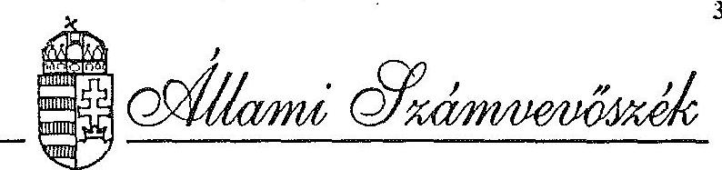

# RÉSZLETES MEGÁLLAPÍTÁSOK

az 1992. évi vizsgálatok tapasztalatairól
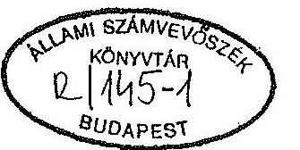

---

# TARTALOMJEGYZÉK

oldal
AZ ÁLLAMI KÖLTSÉGVETÉSSEL
KAPCSOLATOS ELLENŐRZÉSEK ..... 1
A Magyar Köztársaság 1991. évi költségvetése
végrehajtásának ellenőrzése ..... 3
Vélemény a Magyar Köztársaság 1992. évi
pótköltségvetéséről ..... 6
A Magyar Köztársaság 1993. évi állami költségvetéséről
szóló törvényjavaslat ellenőrzése ..... 7
A KÖZPONTI KÖLTSÉGVETÉSI
SZERVEK ELLENŐRZÉSE ..... 9
Az Országgyűlés fejezet 1989-91. évekre kiterjedő
pénzügyi-gazdasági ellenőrzése ..... 11
A Miniszterelnökség fejezet
pénzügyi-gazdasági ellenőrzése ..... 14
A Magyar Köztársaság Ügyészsége fejezet
pénzügyi-gazdasági ellenőrzése ..... 17
A Honvédelmi Minisztérium
egyes gazdálkodási kérdéseinek vizsgálata ..... 19
A Művelődési és Közoktatási Minisztérium fejezet
pénzügyi-gazdasági ellenőrzése. ..... 22
Népjóléti Minisztérium fejezet
pénzügyi-gazdasági ellenőrzése ..... 25
A Magyar Rádió pénzügyi-gazdasági ellenőrzése ..... 29
A Magyar Köztársaság Németországban működő
külképviseleteinek pénzügyi-gazdasági ellenőrzése ..... 32
A Magyar Köztársaság Lengyelországban működő
külképviseleteinek pénzügyi-gazdasági ellenőrzése ..... 35
A Központi Földtani Hivatal és a földtani kutatások
pénzügyi-gazdasági ellenőrzése ..... 38

---

A környezet- (természet)védelmi és vízügyi szervezetek szétválasztásának célvizsgálata ..... 40
A műemlékvédelem pénzügyi-gazdasági ellenőrzése ..... 43
A központi államigazgatási szervezetek létszám- és bérgazdálkodásának ellenőrzése ..... 46
A központi államigazgatási szervek létszám- és bérgazdálkodása 1991. évi ellenőrzésének utóvizsgálata 1992. II. félévben ..... 49
A foglalkoztatást elősegítő támogatásokra biztosított költségvetési pénzeszközök (1991. évi Foglalkoztatási Alap) felhasználásának pénzügyi-gazdasági ellenőrzése ..... 52
ÖNKORMÁNYZATOK ELLENŐRZÉSE ..... 59
Az önhibájukon kívül hátrányos helyzetben lévő önkormányzatok kiegészítő támogatásának ellenőrzése ..... 61
A helyi önkormányzatok beruházásaihoz és rekonstrukcióihoz nyújtott 1991. évi céltámogatások vizsgálata ..... 65
Az alapfokú oktatásra fordított pénzeszközök felhasználásának ellenőrzése ..... 68
A helyi önkormányzatok beruházásaihoz és rekonstrukcióihoz nyújtott címzett támogatások vizsgálata ..... 72
Az önkormányzatok 1991. évi normatív állami hozzájárulásának, igénybevételének és elszámolásának ellenőrzési tapasztalatai ..... 76
Az önkormányzatok tulajdonába került vagyontárgyak megszerzésével, nyilvántartásával és gazdálkodásával kapcsolatos ellenőrzési tapasztalatok ..... 80
A társközségek szétválása miatti vagyonmegosztás lebonyolításának ellenőrzési tapasztalatai ..... 84
Az önkormányzatok ellenőrzési funkciója érvényesülésének tapasztalatai ..... 87
Az önkormányzati gazdálkodás szabályszerűségére irányuló átfogó ellenőrzések ..... 89

---

TÁRSADALOMBIZTOSÍTÁSI ALAP ..... 93
A Társadalombiztosítási Alap kezelőjénél végzett számvevőszéki vizsgálatok hasznosításának utóellenőrzése ..... 95
A Társadalombiztosítási Alap 1991. évi zárszámadásának ellenőrzési tapasztalatai ..... 99
Vélemény a társadalombiztosítás pénzügyi alapjairól és azok 1993. évi költségvetéséről szóló törvényjavaslatról ..... 102
ÁLLAMI VAGYONKEZELÉS ..... 109
Az Állami Vagyonügynökség 1991. évi tevékenysége ..... 111
A Bős-Nagymarosi Vízlépcsőrendszer állami nagyberuházás lezárásának pénzügyi felülvizsgálata ..... 121
A Budapest, V. Dorottya u. 1. szám alatti Gerbeaud-ház privatizációs folyamatának - 1991. júliusában készített ÁSz vizsgálat - utóellenőrzése ..... 124
A Harmónia Kereskedelmi Vállalat privatizálása, az állami vagyon alakulása ..... 126
Az IKARUS és a Csepel Autó állami vállalatok együttes szanálásának és privatizálásának célszerűségi és szabályszerűségi vizsgálata ..... 130
A Szanáló Szervezet megszűntetése, a REORG Rt. alapítása tárgyában végzett vizsgálat ..... 133
A Belvárosi Vendéglátóipari Vállalat társaságalapításainak, valamint Taverna Szálloda és Étterem Rt. alapításának célszerűségi vizsgálata ..... 136
EGYÉB ELLENŐRZÉSEK ..... 139
Az állami költségvetési adósság ellenőrzése ..... 141
A Phare programból finanszírozott magyar környezetvédelmi program előkészítésének és a és a pénzügyi támogatások felhasználásának ellenőrzése ..... 145
Az elmúlt rendszerhez kötődő egyes társadalmi szervezetek pótvagyonelszámolása hitelességének vizsgálata az 1991. évi LI. törvénnyel módosított 1990. évi LXXIII. törvény alapján ..... 150

---

A pártok 1991. évi gazdálkodásának törvényességi vizsgálata ..... 152
A Magyar Szocialista Munkáspárt
1991. évi gazdálkodása törvényességének vizsgálata ..... 152
A Liberális Polgári Szövetség (Vállalkozók Pártja)
1991. évi gazdálkodása törvényességének vizsgálata ..... 154
Az Agrárszövetség
1991. évi gazdálkodása törvényességének vizsgálata ..... 156
A Kereszténydemokrata Néppárt
1991. évi gazdálkodása törvényességének vizsgálata ..... 157
A Fiatal Demokraták Szövetsége
1991. évi gazdálkodása törvényessége ..... 159
A Magyar Demokrata Fórum
1991. évi gazdálkodása törvényességének ellenőrzése ..... 161
A Magyarországi Roma Parlament
1991. évi gazdálkodásának ellenőrzése ..... 163
A Magyarországi Szlovákok Szövetségének
1991. évben juttatott állami költségvetési támogatás felhasználásának ellenőrzése ..... 167
A Magyarországi Németek Szövetségének
1991. évben juttatott állami költségvetési támogatás felhasználásának ellenőrzése ..... 169
A Nemzeti Gyermek- és Ifjúsági Alapítvány, valamint a helyi gyermek- és ifjúsági alapítványok pénzügyi-gazdasági ellenőrzése ..... 173
A PHRALIPE Független Cigány Szervezetnek
1991. évben juttatott állami költségvetési támogatás felhasználásának ellenőrzése ..... 176

---

# AZ ÁLLAMI KÖLTSÉGVETÉSSEL KAPCSOLATOS ELLENŐRZÉSEK

---

# A Magyar Köztársaság 1991. évi költségvetése végrehajtásának ellenőrzése

Az Állami Számvevőszék a hatályos törvények alapján ellenőrizte a Kormány 1991. évi gazdálkodásáról készített elszámolást. Az 1991. évi zárszámadás már abban a szerkezetben készült, amit az 1992-ben hatályba lépett Államháztartási Törvény ír elő. A zárszámadás ellenőrzése ezért arra is kiterjedt, hogy az új költségvetési szerkezet, az új eljárási és gazdálkodási szabályok a gyakorlatban hogyan érvényesültek.

A költségvetési törvény részletezettsége alapvető változást jelentett az állami költségvetési rendszerben. Az új szerkezet lehetőséget adott az Országgyűlésnek arra, hogy költségvetési és zárszámadási jogát közvetlenül is gyakorolhassa, a költségvetés végrehajtását részleteiben is nyomon követhesse.

A legfontosabb megállapítások a következők voltak.

- A zárszámadás bevételei és kiadásai - a határozott előrelépés és részletezés ellenére - nem adtak áttekinthető és világos képet a tényleges helyzetről, valódiságuk nem volt megállapítható. Az eltéréseket a pénzmaradványok kezelése, illetve elszámolástechnikai megoldások okozták.
- Az Országgyűlés által jóváhagyott előirányzatoktól a tényszámok a legtöbb címnél eltértek. A törvényjavaslat mellékleteiből azonban nem volt megállapítható, hogy a valóságban mennyi volt a túllépés, illetve a megtakarítás.
- Az 1991. évi költségvetési törvény az állami költségvetés körébe vonta a költségvetési szervek saját bevételeit és kiadásait. A költségvetési szervek csak kiadásaik és bevételeik különbségét, a támogatást kapják a központi költségvetéstől. A támogatás viszont nem jelent meg a költségvetési és a zárszámadási törvények mellékleteiben. Az állami költségvetés pénzforgalma azonban csak akkor ellenőrizhető, ha a költségvetési szervek támogatása és annak változása részletesen és összegében pontosan dokumentált.
- A költségvetésben előirányzott 78.786 millió forint hiányt jelentősen, 45%-kal túllépték. A költségvetési egyensúly már évközben is érzékelhető volt, de a tervezettől lényegesen eltérő romlása ellenére a Kormány nem nyújtott be pótköltségvetést az Országgyűlésnek. Ezáltal nem teljesítette a költségvetési törvényben előírtakat (CIV. törvény 11. §/3/bek.). A hiány tervezettnél nagyobb összege azt is eredményezte, hogy a finanszírozásához szükséges kincstárjegy

---

állományát, illetve állami kötvények kibocsátható mennyiségét a Kormány a törvényekben előírtnál nagyobb mértékben növelte.

- Az előirányzatokhoz képest végrehajtott átcsoportosítások indokoltsága, a módosított előirányzatok nem voltak áttekinthetőek, azokat a törvényjavaslat mellékletei nem tartalmazták. Ezért a módosítások törvényességét és szabályszerűségét nem minden esetben lehetett minősíteni.
- A költségvetési bevételek elmaradását az előirányzattól - a kedvezőtlen gazdasági folyamatok alakulása mellett - befolyásolta az adó- és vám kintlevőségek emelkedése is. Ehhez hozzájárultak a nem kellően hatékony behajtási és szankcionálási módszerek is.
- A kiadások ellenőrzése során az Állami Számvevőszék megállapította, hogy az Állami Fejlesztési Intézet által finanszírozott 1990. évi felhalmozási kiadásokból 933 millió forint felhasználatlan maradt, amit a pótkezelés elmaradása miatt tényleges kiadásként számoltak el. Az összeg további sorsáról az 1991. évi zárszámadásban nincs információ, illetve elszámolás.
- A Társadalombiztosítási Alap és a költségvetés kapcsolatában az egységes szabályozás hiánya értelmezési zavarokat okozott. Ez megmutatkozott például az állami garanciális kötelezettségek eltérő szabályozásában is.
- Az elkülönített alapokról készült 1991. évi zárszámadás nem tekinthető teljeskörűnek. A megszűnt alapok 1990. végéi meglévő pénzeszközeivel nem számoltak el. A Lakás Alap megszüntetéséből adódó végelszámolás az előírt határidőig nem fejeződött be. Az Útalap és a Világkiállítási Alap elszámolási rendszere nem alkalmas a konkrét feladatokkal összefüggő ráfordítások elkülönített áttekintésére.
- Az önkormányzatok normatív támogatásának ellenőrzése során 215 millió forint támogatás jogtalan igénybevételét, illetve 65 millió forint pótlólagos támogatási igényt állapítottunk meg. A többi támogatási formánál - a cél- és címzett, önhibájukon kívül hátrányos helyzetben lévő önkormányzatok támogatása - is kisebb-nagyobb összegű jogtalan igénybevételt mutatott ki az ellenőrzés.
- Az állami vagyon privatizációjából származó bevételből a költségvetés az 1990. évi családi pótlék tartozása kiegyenlítésének részeként 12 milliárd forintot utalt át a Társadalombiztosítási Alapnak, amit a zárszámadási törvényjavaslat nem tartalmazott.

---

Az Állami Számvevőszék ellenőrzési tapasztalatai alapján az állami irányítás különböző szintjeinek címezve javaslatokat fogalmazott meg.

Az Országgyűlés figyelmét felhívtuk azokra az ellentmondásokra, amelyek megoldása egyrészt törvény szintű szabályozást igényel, másrészt segítik a döntések megalapozottságát. Így például:

- A törvénytervezetek benyújtásakor a költségvetésre gyakorolt hatásokat is indokolt bemutatni. Az előirányzat módosítások esetében követelmény, hogy azok tartalmazzák a módosítás célját, forrását, a felhasználás költségvetési címét, összegét és fedezetét.
- Az önkormányzatoknál feltárt, jogtalanul igénybevett támogatások pénzügyi rendezésének törvényi szabályozását ki kell alakítani.

A Kormánynak javasoltuk, hogy az Országgyűlés hatáskörébe tartozó témákban részletesebb információkat szolgáltasson. Alakítsa ki az állami költségvetés egységes, teljeskörű és zárt nyilvántartási rendszerét. Pótlólag készítse el az elkülönített alapok megszüntetésének, a kormányzati beruházások teljesítésének elszámolását.

A Pénzügyminisztérium számára - elsősorban a költségvetés elszámolásának pontosítása érdekében - a különböző nyilvántartási rendszerek kialakítását javasoltuk. Így a költségvetési előirányzatok naprakész, az új költségvetési szerkezeti rendnek megfelelő nyilvántartásának megszervezését, nyomonkövetéséhez az ágazati és célfeladatok átcsoportosításával a szükséges metodika kidolgozását ajánlottuk. De javaslatokat tettünk a letéti számlák szabályozására, az értékpapír kibocsátás szervezeti rendjére is.

# Realizálás: 

Az Állami Számvevőszék ajánlásai, javaslatai részben a konkrét képviselői felszólalásokban realizálódtak. Ezek alapvetően a költségvetés végrehajtása során elkövetett törvénysértésekre vonatkoztak. A nyilvántartási rendszerek kialakítását érintő javaslataink a Kormány hosszabb távú feladatai közé épültek be.

---

# Vélemény a Magyar Köztársaság 1992. évi pótköltségvetéséről 

A Kormány az államháztartásról szóló törvény és az 1992. évi költségvetési törvény alapján az Országgyűlés elé terjesztette az 1992. évi pótköltségvetést. Ennek első változatát - amely júniusban készült el - az Állami Számvevőszék véleményezte. Ezt a változatot azonban a Kormány szeptemberben visszavonta és egy módosított változatot nyújtott be az Országgyűlésnek.

Ez a pótköltségvetési javaslat az Állami Számvevőszék szerint sem tartalmában, sem szerkezetében nem felelt meg az államháztartási törvényben foglalt rendelkezésnek, mert a pótelőirányzatokkal összhangban nem módosította a költségvetési törvényt.

Hiányzott a pótelőirányzatoknak a bevételi és a kiadási főösszegeken, valamint az egyes részelőirányzatokon történő átvezetése. Emiatt a törvény bevételi és kiadási főösszege, valamint ezek különbözeteként a hiány eredeti összege maradt továbbra is hatályban.

Nem volt megállapítható a javasolt pótelőirányzatok (illetve elvonások) pontos költségvetési címe sem, és a pótelőirányzatokat a költségvetési törvény 1. és 2. sz. mellékletén nem vezették át.

A pótköltségvetési törvényjavaslat szerkezete alig tette lehetővé annak áttekintését, hogy mely paragrafusok módosították, illetve egészítették ki az eredeti költségvetési törvényt, s melyek voltak az új törvényi rendelkezésnek minősíthető előírások.

A hiány finanszírozásával összefüggésben felhívtuk a figyelmet arra, hogy a Kormány az értékpapírkibocsátás törvényi határainak feloldási kérelmével rövid távon korlátlan mennyiségű értékpapír kibocsátásához kér hozzájárulást, törvényi megerősítést.

## Realizálás:

A Kormány a pótköltségvetés vitája során nem fogadta el az Állami Számvevőszék véleményét a pótköltségvetés tartalmára és szerkezetére vonatkozóan. A felhozott ellenérvek, törvényi értelmezések azonban nem voltak meggyőzőek ahhoz, hogy az Állami Számvevőszék véleményét megváltoztassa. Így továbbra is azt az álláspontot képviseljük, hogy a benyújtott és végül elfogadott pótköltségvetési törvényjavaslat sem tartalmában, sem szerkezetében nem felel meg az államháztartási törvényben foglaltaknak.

---

# A Magyar Köztársaság 1993. évi állami költségvetéséről szóló törvényjavaslat ellenőrzése 

Az Állami Számvevőszék alkotmányos kötelezettségének megfelelően ellenőrizte az 1993. évi állami költségvetési javaslat megalapozottságát. Az államháztartási törvény alkalmazásának próbatétele is volt az 1993. évi költségvetési javaslat összeállítása. Jelentésünkkel elő kívántuk segíteni az ÁHT előírásainak következetes alkalmazását és egységes értelmezését.

- Megállapítottuk, hogy az egyes költségvetési mérlegtételek tartalmának felülvizsgálatára és a mérlegtételek csoportosításának módosítására lenne szükség. A megfelelő csoportosítás lehetőséget teremtene az állami vagyonból származó jövedelmek évek közötti összehasonlítására, az összetétel változása értékelésére.
- Az ÁHT 16. § (1) bekezdése alapján a tervezés és beszámolás során külön kell választani a rendkívüli bevételeket és kiadásokat. A törvényjavaslat ennek csak formálisan felelt meg. Véleményünk szerint a közöltnél lényegesen több költségvetési tétel tartozott volna ebbe a kategóriába. Ezenkívül a mérlegszerű bemutatás hiánya miatt sem hasznosultak a törvényi előírás előnyei.
- A költségvetés számszaki ellenőrzése kapcsán megállapítottuk, hogy a gépjárműadó megosztása során 600 millió forint bevételt duplán vettek számításba a központi költségvetésnél és a Környezetvédelmi Alap költségvetésénél egyaránt. Ezenkívül az elkülönített állami alapok közül a Kisvállalkozói Garancia Alap 4 milliárd Ft-os kiadására az 1993. évre benyújtott Vagyonpolitikai Irányelvek szerint nincs fedezet.

A kormányjavaslat az államháztartási törvénnyel még számos területen nem volt összhangban:
- a Kormány az 1993. évi költségvetési törvényjavaslat benyújtásáig az új államháztartási mérlegrendszert nem alakította ki;
- hiányosan teljesítette az ÁHT-ben megnevezett törvény az elkötelezettségekkel járó tételek bemutatását, a kezességvállalás tételes előterjesztését;
- az 1993. évi eljárási szabályok között a fejezetek közötti átcsoportosításokat tartalmazó rész ellentétes a ÁHT előírásaival.

A főbb előirányzatok megalapozottságának vizsgálata során megállapítottuk, hogy a fejezeti tervező munkát megalapozottabbá tevő pénzügyminisztériumi előkészítő,

---

szervező és szabályozó munka többnyire csekély eredményt hozott. Az 1993. évi adóbevételek prognosztizálási módszere alapvetően megfelelőnek minősíthető, azonban az általános forgalmi adót és a társasági adót illetően továbbra is számos bizonytalansági tényező zavarja az előrelátást:

- Az 1993-ban induló beruházások indoklásaiból nem minden esetben volt megállapítható a teljes költségigény, így az sem, hogy az ÁHT alapján az adott beruházás a kiemelt beruházások közé sorolandó-e vagy sem?
- Az önkormányzati költségvetések előkészítéséhez kapcsolódó tervezési munka jogszabályi háttere lényegesen nem javult az előző évhez képest. A szabályozás legfőbb problémája volt, hogy a normatív, a cél- és címzett támogatások egymástól függetlenül fejtették és fejtik ki a hatásukat.
- Az alapok költségvetési támogatásának arányos és jelentős növekedését a törvényjavaslat azzal kerülte ki, hogy az alapok közvetlen támogatását irányozta elő a privatizációs bevételekből. Hosszabb távon a privatizációs bevételekből az alapok finanszírozása nem tekinthető megoldottnak.
- A hiány finanszírozásához az államkötvény kibocsátásának gyakorlatilag nincsenek törvényi korlátai.
- Az Állami Számvevőszék törvényi kötelezettsége alapján rendszeresen ellenőrzi az önkormányzatok állami hozzájárulása igénybevételének jogosságát. Az ellenőrzés által feltárt, jogtalanul, törvényi rendelkezés hiányában igénybevett támogatások visszafizetésének érvényesítésére azonban nem volt mód.
- A társadalombiztosítási alapok hiányának finanszírozásához szükséges értékpapír kibocsátás mechanizmusa nem vette figyelembe a Magyar Nemzeti Bankról szóló törvény előírását.

Jelentésünkben 13 pontban foglaltuk össze javaslatainkat, amelyek egy része a törvényjavaslat szövegének konkrét módosítására vonatkozott. A javaslatok másik része - a többi javaslat megvalósítása - hosszabb távon megvalósítható teendőket fogalmazott meg.

# Realizálás: 

A javaslatok egy részét a bizottságok, képviselők módosító indítványaik megfogalmazásánál hasznosították, a számszaki eltérés rendezését az Országgyűlés elfogadta.

---

# A KÖZPONTI KÖLTSÉGVETÉSI SZERVEK ELLENŐRZÉSE

---

# Az Országgyűlés fejezet 1989-91. évekre kiterjedő pénzügyi-gazdasági ellenőrzése 

Az Országgyűlés fejezet szakmai és gazdálkodási tevékenységével szemben a megváltozott parlamentáris rendszer, annak új működési mechanizmusa, a független képviselői intézmény létrehozása, ehhez a nagyságrendekkel növekvő költségvetés új követelményeket támasztott. A megnövekedett feladatokat jellemzi, hogy a parlamenti ülésnapok az 1989. évi 36-ról 1991. évben 95-re növekedtek. Az elfogadott törvények száma 1989-ben 58, 1990-ben 104, 1991-ben pedig 93 volt.

Az ellenőrzés célja annak értékelése volt, hogy a működésben és a költségvetési gazdálkodásban a törvényességi, a célszerűségi és az eredményességi szempontokat hogyan érvényesítették a feladatok, a szervezet és a pénzügyi források mennyiben voltak összhangban.

Az ellenőrzés az 1989-1991. évekre és az 1992. évi költségvetés megalapozottságának értékelésére terjedt ki. A fejezet költségvetési előirányzata 1989. és 1991. évek összehasonlításában 319,4 millió forintról 1.797,4 millió forintra, a tényleges kiadások 551,8 millió forintról 2.565,1 millió forintra, a foglalkoztatott létszám pedig 209 főről 633 főre emelkedett. A fejezet feladatai ellátásához 1989-ben 607,9 millió forint 1991-ben 1.777,9 millió forint költségvetési támogatásban részesült.

## A fejezet gazdálkodása

Az Országgyűlés hivatali apparátusának alapvető feladata a Parlament működési feltételeinek biztosítása. Megállapításunk szerint a fejezet működésében és gazdálkodásában a költségvetési érdekek, a célszerűség és az ésszerű takarékosság követelményei nem érvényesültek kellően.

Az Országgyűlés fejezet feladatai, szervezete és a gazdálkodás feltételei nem voltak megfelelő összhangban. A feladatok meghatározása - különös tekintettel a költségvetési gazdálkodásra - hiányos és részben elavult volt. Késik a Házszabály megújítása, amely a költségvetési fejezet működésének főbb kereteit hivatott meghatározni. A feladatok mennyiségi és minőségi módosulása indokolttá tette az Országgyűlés hivatali szervezetének változását. Kifogásoltuk, hogy az átszervezést nem alapozta meg a feladatok, szervezeti és irányítási rendszer helyzetelemzésére épülő átfogó koncepció. Az átszervezés, létszámbővítés, az egyes szervezeti egységek önálló elképzelése szerint részben szakaszosan folyt. Így célszerűtlen, párhuzamos, részben átfedő feladatellátást tapasztaltunk. A gazdasági folyamatok (pl. anyag- és készlet-

---

gazdálkodás, parlamenti pártok frakcióhivatalának gazdálkodása) átfogó szabályozása, a pénzügyi jogkörök meghatározása hiányzott, ill. hiányos volt, a belső információs rendszert nem használták ki kellően. A belső ellenőrzés fogyatékosságait jelezte, hogy a gazdálkodási, irányítási rendszer nem működött hatékonyan.

Az Országgyűlés hivatali apparátusa (fejezet) a parlament zavartalan működését a költségvetési pénzeszközök túlzott mértékű lekötésével teremtette meg. A költségvetési tervezés nagymértékben megalapozatlan volt, a képviselői testület cím előirányzatának kialakításánál részben figyelmen kívül hagyták az 1990. évi LVI. törvény előírásait. A Hivatal vezetése több esetben a pénzügyi keretek túlbiztosítására törekedett. A központi forrásokból juttatott pótelőirányzatok következtében a fejezet jelentős mértékű - a tényleges igényen felüli - forrásokhoz jutott. A saját bevételi lehetőségek reális felmérésének hiánya és alultervezése növelte a költségvetési támogatási igényt. A kiadási előirányzatok többségét nem a valós szükségletek felmérésére alapozták.

Mindez - a pénzügyi kormányzat körültekintő felülvizsgálata hiányában - túlfinanszírozáshoz vezetett, a fejezetnél átmenetileg és tartósan jelentős szabad pénzforrások keletkeztek. Ugyanakkor a szükségleteket meghaladó pénzellátás indokolatlanul növelte az állami költségvetés hiányát.

A kedvező pénzügyi feltételek nem késztették a fejezetet a gazdálkodás célszerűségi, eredményességi követelményének minél teljesebb érvényesítésére. A gazdálkodás egységes rendszere nem alakult ki, számos területen tártunk fel hiányosságokat. A bér- és készletbeszerzési előirányzatok megalapozatlansága a gazdálkodásban is éreztette hatását. A készletbeszerzésekre az esetlegesség volt a jellemző, az igényeket általában az indokoltság vizsgálata nélkül kielégítették.

Kifogásoltuk, hogy a felújítási pénzeszközből a költségvetési gazdálkodás elveit figyelmen kívül hagyva - 1 éven túl, más célra - 1991-ben a Pannon Márvány Rt. részére opciós megállapodás alapján - bányafejlesztés támogatás címen - 30 millió Ft-ot utaltak át.

A Képviselői Testület cím előirányzataival nem kellő körültekintéssel, gyakran a törvény előírásaitól eltérően gazdálkodtak. A törvényben foglaltak értelmezése sem volt egységes.

Többek között feltártuk, hogy a frakciók a szakértői díjkeret terhére jelentős mértékben dologi kiadásokat is teljesítettek, helyenként e pénzekkel a pártok likviditási gondjait hidalták át. A célirányos felhasználás 1990-91. években 50 % alatti volt.

Az 1990-91. években a mérlegvalódiság elvét és a vagyonvédelem követelményeit megsértették a leltározások szabálytalan végrehajtásával, a frakciók részéről beszerzett eszközök nyilvántartásba vételének elmulasztásával, valamint az évvégi pénz-

---

maradvány valótlan kimutatásával. A tulajdonvédelmet is veszélyeztetve a számviteli és a bizonylati rend előírásait több esetben nem érvényesítették.

A gazdálkodás 1991-ben már valamelyest javuló irányzatot mutatott, néhány területén pozitív változásokat tapasztaltunk. Így a külföldi kiküldetések lebonyolításában az ésszerű takarékosságra való törekvés, a felújítási munkák folyamatos felügyelete, a mennyiségi és minőségi teljesítések számonkérése, vagy a beruházások hosszabbtávú programmal való megalapozása.

A fejezet gazdálkodásában a meglévő gondok, fogyatékosságok alapvetően szervezeti, szabályozottsági, személyi és szemléletbeli okokra vezethetők vissza. Ugyanakkor a költségvetés tervezésében, gazdálkodásában és elszámolásában feltárt problémák megszüntetésének alapját a fejezet működése főbb kereteinek és a frakciók gazdálkodásának jogi szabályozása képezi.

Nem építették ki a belső ellenőrzés teljeskörű rendszerét, a függetlenített belső ellenőrzés a szervezetből hiányzik, ezáltal az egyes területek ellenőrzése megoldatlan. Észrevételeztük - bár a téma nem az Országgyűlés hivatali apparátusának feladatkörébe tartozik -, hogy az Országgyűlés fejezet költségvetési előirányzata és teljesítése nem volt szinkronban a fejezet beszámolási rendszerével a vizsgálat befejezéséig. A nemzetiséégek, pártok és társadalmi szervek támogatási előirányzat címe a fejezet költségvetésében szerepel, de a közvetlen finanszírozást - 1992-ben jogszabályi alap nélkül - a Pénzügyminisztérium végzi.

Az 1991. évtől önálló fejezetként működött a Köztársasági Elnöki Hivatal. Költségvetési pénzei kezelésének, gazdálkodásának és beszámolásának elhatárolására azonban a vizsgálat befejezéséig nem került sor. Változatlanul az Országgyűlés Hivatala önálló költségvetési szerveként, annak intézményi beszámolási rendszerében szerepelt.

# Realizálás: 

A vizsgálati jelentést megküldtük az Országgyűlés elnökének, az állandó bizottságok elnökeinek, az ügyrendi bizottságnak, a köztársasági elnöknek, a parlamenti frakciók vezetőinek, a miniszterelnöknek és a pénzügyminiszternek.

Az ellenőrzés megállapításainak hasznosítására a fejezet intézkedési tervet állított össze, amely a gazdálkodás rendszere, szabályozottsága és fegyelme megerősítésére irányul. Kiemelt hangsúlyt kapott a belső szabályzatok felülvizsgálata, korszerűsítése és pótlása. Erre vonatkozóan részletes ütemtervet készítettek, a határidők és a felelősök megjelölésével.
Az ellenőrzés néhány megállapítására azonban az intézkedési terv nem tért ki, amire felhívtuk a figyelmet.

---

# A Miniszterelnökség fejezet pénzügyi-gazdasági ellenőrzése 

A kormányváltást követően alapvető szerkezeti- és feladatmódosulás következett be a Miniszterelnökség fejezetnél. A 21 címen és az 56 alcímen 1991-ben 27,7 milliárd Ft előirányzattal gazdálkodtak. Ezen belül az önálló fejezeti jogosítvánnyal rendelkező címek, illetve önálló intézmények 8,9 milliárd Ft-tal rendelkeztek.

A Miniszterelnöki Hivatal (a továbbiakban: MEH) által ténylegesen felügyelt, irányított terület azonban ennél lényegesen szűkebb, hatásköre jórészt a Kormány működésével kapcsolatos feladatokra terjed ki. A MEH-hez tartozó intézmények többsége is ezzel a céllal működik. Átlaglétszámuk megközelítette az 1.900 főt, eszközeik értéke az 1,8 milliárd Ft-ot. Feladataikhoz 1991-ben közel 2,9 milliárd Ft költségvetési előirányzatot használtak fel, 53,6%-kal többet, mint az előző évben. Ebből 983 millió Ft ágazati célokat finanszírozott.

Az ellenőrzés elsősorban a "szűken" értelmezett területekre irányult és 1990-1991. évekre vonatkozóan célul tűzte ki:
-a rendelkezésre álló pénzeszközök felhasználásának értékelését a törvényességi, célszerűségi, eredményességi szempontok alapján;
-a fejezet adott struktúrájának, a gazdasági-pénzügyi irányítás színvonalának minősítését;
-a célszerűségi szempontok figyelembevételével az ellenőrzési tevékenység hatékonyságának felmérését.

## A fejezet gazdálkodása

A Miniszterelnökség fejezet feladata, struktúrája a kormányváltozást követően jelentősen módosult. Jelenlegi szervezete igen heterogén, működését hatásköri anomáliák jellemzik. Ezen túl ellátott tevékenységi körétől idegen feladatokat is. (Pl. a volt MSZMP ingatlanok értékesítése és az apparátus létszámának leépítésével kapcsolatos pénzügyi kérdések.)

A fejezethez tartoztak továbbá olyan kiadási előirányzatok is - általános és céltartalék, valamint a rendkívüli kiadások fedezete - amelyekkel kapcsolatban a MEH belső gazdálkodásának nincs semmilyen érdemi, döntési jogosítványa, információval nem

---

rendelkezik, így fejezeten belüli megjelenésük formális. Mindezek együttesen megnehezítették feladatai ellátását.

A bonyolult, igen heterogén és megkérdőjelezhető feladatok mellett a gazdálkodás rendjét meghatározó egyes belső szabályzatok sem mindig alkalmazkodtak a megváltozott körülményekhez. A MEH rendelkezett ugyan ideiglenes szervezeti és működési szabályzattal, ez azonban nem biztosított áttekintést a fejezet és az intézmények kapcsolatáról, információs csatornák működéséről. A feladatok és a szervezetek összhangja a fejezeten belül, illetve a fejezet és az intézmények között nem mindig felelt meg a követelményeknek.

A kedvezőtlen körülmények ellenére a fejezet eleget tett az alapvető feladatának: megfelelő hátterét képezte a Kormány zavartalan működésének.

A MEH belső gazdálkodása forrás oldalról megalapozott volt. A források megtervezését elsősorban a biztonságra való törekvés jellemezte, amit az állandóan változó körülmények, feladatok nehezítettek. Az állami támogatás évenként mintegy 30\%-kal (alapvetően az új feladatokkal összefüggésben) nőtt. Jelentős évközi előirányzatmódosítás (pl. 1991-ben 15\%) mellett a feladatok finanszírozására költségvetésen kívüli pénzeszközöket is igénybe vettek. Vállalkozási tevékenységük a fejezet jellegéből adódóan viszonylag csekély volt. Kedvező forráslehetőségeik együttesen azt eredményezték, hogy jelentős nagyságrendű szabad pénzeszközzel rendelkeztek, amit - helyesen, bár nem mindig szabályosan - hasznosítani igyekeztek.

Az elmúlt három évben az évenkénti tőkekihelyezésük többszörösére nőtt (míg 1989-ben 40 millió, addig 1991-ben 191,5 millió Ft volt), ezúton 1991-ben már 53 millió Ft kamatot realizáltak.

Bevételeikkel összhangban kiadási előirányzatuk 1988-1991 között csaknem megháromszorozódott. Ebben szerepet játszott az a több éves tervezési gyakorlat is, amelynek során sem a fejezeti, sem intézményi szinten (elsősorban az új intézmények esetében) nem kényszerültek pénzszűkével számolni.

Az intézményi tervezési gyakorlatban előfordult, hogy már a felügyeleti szintről várható többleteszközök reményében terveztek. Mindez nem ösztönzött kellően a szakmai feladatok költségeinek felülvizsgálatára, a költségek csökkentésére. Így az intézményi gazdálkodókban nem mindig tudatosodott a források és a kiadások folyamatos összehangolásának követelménye, és ez esetenként átmeneti fedezetlen kötelezettségvállalásokhoz, bérkeret-túllépéshez (Világkiállítási Programiroda), szabálytalan forrás igénybevételéhez (Kormány Központi Üdülője) vezetett. Mindezek a jogszabálysértő eljárások a fejezet vezetésétől intézkedést igényeltek.

---

Megállapításaink szerint a dologi kiadások alakulását, a gazdálkodás hatékonyságát az intézményi kapacitások kihasználása, az eszközök hasznosítása alapvetően befolyásolta.

A fejezet közvetlen felügyelete alatt működő intézmények egy részénél a kihasználtság nem volt mindig megfelelő, így pl. a bölcsődében, óvodában, üzemi éttermekben, a Kormány Központi Üdülőjében. Utóbbi esetben (a balatonöszödi üdülő) az üzemeltetési, fenntartási költség igen magas, összefüggésben területi adottságaival, működési jellegével, ami az intézmény jövőbeni működése felülvizsgálatát indokolja.

Tapasztalataink alapján célszerűnek tartanánk, valamennyi tárca üdülési lehetőségeinek egységes kormányzati szintű átvilágítását, majd ezt követően egy új, korszerű - a költségvetés teherbíró képességét is szem előtt tartó - üdülési rendszer kialakítását. Szükségesnek tartjuk a többi intézmény - figyelembe véve azok költségvetési támogatási igényét - fenntartásának áttekintését is.

A fejezet kiadási előirányzatai között alapok és alapítványok támogatása is szerepel. Megállapításaink szerint az egyes állami feladatok alapítványok részére történő átadásával még nem sikerült elérni megtakarításokat. A felhasználás átkerült ugyan a privát szférába, a forrásokat azonban továbbra is a költségvetés biztosítja. Az alapítványok magánjogi konstrukciói miatt a nagy összegű és tartósan folyósított költségvetési támogatások felhasználása csak igen korlátozottan ellenőrizhető.

A MEH kezelésében lévő alapokból származó források felhasználása, ellenőrzési rendszerének kialakítása ma még megoldásra váró feladat.

# Realizálás: 

A fejezet által készített Intézkedési terv alapján az ÁSZ elnöke úgy ítélte meg, hogy következetes végrehajtásával lehetőség nyílik a feltárt hiányosságok megszüntetésére.

---

# A Magyar Köztársaság Ügyészsége fejezet pénzügyi-gazdasági ellenőrzése 

Az ÁSZ 1992. I. félévében hajtotta végre a Magyar Köztársaság Ügyészsége (továbbiakban: Ügyészség) fejezet vizsgálatát. Az ügyészi szervezet az utóbbi években jelentős változásokon ment keresztül. Az ügyészi nyomozóhivatalok felállítása (5 regionális szervezésű ügyészségi nyomozóhivatal és kirendeltségeik), valamint új városi ügyészségek létesítése mellett jelentős lépések történtek az ügyészségi dolgozók bérezésének javítására, előmenetelének szabályozására.

Mindezek hatására a fejezet költségvetési támogatása jelentősen nőtt, 1992. évi tervezett kiadása 2.389,7 millió forintra emelkedett. (A fejezet költségvetési támogatási előirányzata 1989-ben 667,8, 1990-ben 869,9, 1991-ben pedig 1.763,6 millió forint volt.)

A gazdálkodásban is érzékelhető számos bizonytalanság sürgeti az Ügyészség alkotmányos helyzetére, feladatkörére és működésére vonatkozó koncepcionális döntések mielőbbi kimunkálását, az ügyészek szolgálati viszonyára vonatkozó átmeneti szabályozatlanság felszámolását.

Az ügyészi szervezet gazdálkodásának irányítása, szervezése erősen centralizált. Ennek számos előnye mellett vizsgálatunk rámutatott azokra a területekre is, ahol gazdaságosabbnak tűnik az önállóság növelése.

A területi ügyészségek jelentik az ügyészi szervezet és tevékenység gerincét, pénzfelhasználásuk évente szinte változatlanul a fejezet kiadási előirányzatának 4/5-ét képezi. Az összkiadás nagy részét a béralap és a társadalombiztosítási járulék teszi ki (több mint 80\%). Az 1989-es év végétől az ügyészek körében felgyorsult pályaelhagyás következtében ma is a létszám- és a bérgazdálkodás az egyik legkritikusabb terület. (A főállású ügyészek létszámhiánya a vizsgált időszakban már elérte a 17%-ot is.)

A vizsgált időszakra esett a fejezet bérgazdálkodási elveinek alapvető megváltoztatása. Az újonnan bevezetett bérrendszer biztosítja a szubjektivizmus kizárását. A szervezet hierarchiájában betöltött hely és a szolgálati idő kombinációján alapul a bér megállapítása.

Az előmeneteli, javadalmazási rendszer pozitív változásának hatása csak átmenetileg volt érzékelhető. Az ellenőrzés megállapítása szerint a fiatalabb (nemcsak a pálya-

---

kezdő) nemzedék pályántartása és a vezetői utánpótlás érdekében indokolt lehet a törvényi szabályozás kisebb módosítása.

Vizsgálatunk alapján javasoltuk, hogy a túlzottan eszközbeszerzés-orientált információs és ügyviteli rendszer kialakítása helyett a jövőben támaszkodjanak jobban ügyvitelszervezési és rendszerszervezési tevékenységre.

A költségvetési fejezeten belül önálló címet képez az Országos Kriminalisztikai és Kriminológiai Intézet, ahol széleskörű és elmélyült tudományos kutatásokat folytatnak a bűncselekmények okainak és feltételeinek feltárására, megelőzési lehetőségek és módszerek kidolgozására, a bűnüldözési és bizonyítási módszerek fejlesztésére. Vizsgálatunk az intézet működési feltételeinek áttekintése során döntően a szabályozásban tárt fel hiányosságokat. Ezek megszüntetéséhez azonban szükség van az intézet besorolásának tisztázására, a gazdálkodása alapjainak egyértelmű meghatározására.

# Realizálás: 

Az Állami Számvevőszék megállapításait, következtetéseit és javaslatait figyelembe véve a Legfőbb Ügyész - vezetői értekezleten kiértékelt és elfogadott - intézkedési tervet hagyott jóvá, amelynek végrehajtása folyamatban van. A vizsgálat befejezése óta eltelt időben - a kapott tájékoztatás szerint - megtörtént az IM és a Legfőbb Ügyészség keretében javasolt és törvénymódosítást igénylő kodifikációs témakörök szakmai kidolgozása, konkrét jogszabálytervezetek Kormány, illetőleg Országgyűlés elé terjesztése (ügyészségi szolgáltatási törvény, illetve előmeneteli és javadalmazási törvény).

---

# A Honvédelmi Minisztérium egyes gazdálkodási kérdéseinek vizsgálata 

Az Országgyűlés Honvédelmi bizottságának felkérésére soron kívül végeztük el a HM egyes gazdálkodási kérdéseinek vizsgálatát. Ezen belül
— a tárca adott számú letéti számlájához kapcsolódó tranzakciókat;

- az ún. elővásárlásokat;
- a Technika Külkereskedelmi Vállalattal, valamint
— az MH Gödöllői Gépgyárával
meglévő pénzügyi kapcsolatokat ellenőriztük.
Az 1988. és 1990. közötti időszakban a honvédelmi tárca folyamatosan növekvő összegű /1988. március: 738 millió Ft; 1990. március: mintegy 3,5 milliárd Ft (kamatbevételekkel együtt)/ "költségvetési körön kívüli" pénzek felett rendelkezett, melyek kezelése a letéti számlához kötődött.

Megállapítottuk, hogy a letéti számlával összefüggő tranzakciók során nem tartották be azt az alapvető számviteli előírást, hogy minden gazdasági műveletről valósághű, naprakész könyvviteli nyilvántartást kellett volna vezetniük. Tulajdonképpen költségvetés forrású pénzekkel olyan ügyletekben vettek részt, amelyek meghaladták a költségvetési szervek szabad pénzeszközeiről szóló rendelkezésben biztosított lehetőséget.

A HM 1988. és 1989. évi számszaki beszámolóiban a pénzforgalmi teljesítéseket nem a valóságnak megfelelően mutatták ki annak érdekében, hogy az 1988. év végi 3,2 milliárd Ft pénzmaradványt /ennek nagyobb része, mintegy 2,3 milliárd Ft körüli speciális import/ a nagyobb nyilvánosság elől eltüntessék. /Nyilatkozatuk szerint ez az akkori Minisztertanács Honvédelmi Bizottsága tudtával történt./ A valóságos helyzet visszaállítása az 1989. évi beszámolóban ismét a mérlegvalódiság megsértésével járt együtt.

Megjegyzendő, hogy a tárca éves beszámoló jelentéseiben az áruforgalmi teljesítések is szerepeltek, így az 1988. évi pénzforgalmi teljesítés nagymértékben meghaladta az áruforgalmi teljesítést és 1989. évben pedig lényegesen kisebb pénzforgalmi teljesítést mutattak ki.

Az 1989. évi költségvetési struktúra változását vizsgálva a pénzügyi tárca részéről indokolatlan volt 1989-ben a 2,2 milliárd Ft átutalása az I. negyedévi speciális import

---

kötelezettségek fedezetére. Az év közben előírt és ebből teljesített költségvetési befizetési kötelezettségek, az 1988. év végén jelentkezett speciális import maradvány összege, továbbá az átutalt összeg szabad pénzeszközként történt kezelése /bevonása a letéti számla ügyletekbe/ ezt a minősítést több oldalról is alátámasztotta. A vizsgálat arra a következtetésre jutott, hogy a Pénzügyminisztériumnak tisztáznia kell a kifogásolt átutalásban a felelősség kérdését.

Más tárcáknál folytatott ellenőrzéseink tapasztalataival egyezően a honvédelmi tárcánál is megállapítható volt, hogy a letéti számlákkal kapcsolatos gazdálkodási anomáliák általában visszavezethetők a számlák funkciójának, működtetésének szabályozási és ellenőrzési hiányosságaira.

A szabálytalanságok előfordulásában szerepet játszott az is, hogy a honvédelmi tárca gazdálkodásában meghatározó kérdésekről - a belső szabályozás által feljogosítva ugyanaz a szervezet hozott döntéseket, amelyik felelős volt a felsőszintű gazdálkodási feladatok megvalósításáért és átfogó ellenőrzéséért.

Az elővásárlás fogalma a költségvetési gazdálkodásra vonatkozó szabályokban nem használatos. A gazdálkodó szervezeteknél szokásos gyakorlat szerint az ilyen jellegű beszerzésekre vonatkozó döntések az év utolsó negyedében születnek, a költségvetési terv várható teljesítésének függvényében. A honvédelmi tárcánál az 1989. és 1990. év végén ténylegesen előrehozott beszerzésként realizálódott összesen mintegy 1,6 milliárd Ft értékű elővásárlás. Ebből 1990-ben összesen 846,5 millió Ft értékben kötöttek olyan szerződéseket, amelyek esetében a kereskedelmi adás-vétel nem valósult meg. Ezen összeg nagyobb hányadánál /646,5 millió Ft értékben/ nyilvánvalóan a kintlévőségek visszaforgatása előtt újabb kamatbevételt kívántak elérni. Ezek az ügyletek a közreműködő vállalatok részére hitelnyújtást jelentettek, esetenként a kamatbevételből is részesedtek (nem az állami költségvetés előli eltüntetés lehetett az elsődleges cél, mivel az ehhez felhasznált pénzeszközök az előző évek letéti számla ügyleteiből eredően már költségvetési körön kívül voltak).

A haditechnikai eszköz import 1990-ig fenntartott negyedéves előlegezési rendszeréből következett, hogy a szállítások ütemtelensége miatt a bonyolító vállalatoknak, (pl. a Technika Külkereskedelmi Vállalat) fizetési gondjai nem voltak, mivel a költségvetési forrásból származó pénzösszegek biztonságot jelentettek.

A HM átutalásokat a vizsgált vállalatok az import letéti számlájukon tartották, amelyek kamatmentessége miatt anyagi előnyük nem származott. Az importforgalomról, előlegmaradványokról vezetett nyilvántartásokkal összefüggésben azonban szükségesnek tartottuk felhívni a figyelmet a haditechnikai eszközbeszerzések új alapokra helyezésére a megbízható nyilvántartási és elszámolási rendszer jelentőségére.

---

A már csődeljárás alatt álló MH Gödöllői Gépgyárnál végzett ellenőrzés adatai szerint a működésképtelenség alapvetően az 1987-ben befejezett beruházás kihasználatlanságának következménye, amit a vállalat felügyeletét ellátó honvédelmi tárca nem megfelelő módon kezelt.

A haditechnikai eszközök külkereskedelmével kapcsolatban az ÁSZ ellenőrzés érintette a titokvédelmi körbe tartozó területeket is, amelyekre vonatkozó megállapítások nem publikusak.

Vizsgálatunk alapján javasoltuk a tárcának, hogy a honvédelmet érintő korszerűsítés megkezdett folyamatában különös figyelmet fordítsanak a szervezeti és működési szabályozások, a feladatok és hatáskörök - a gazdálkodási tevékenységekre is kiterjedő - kellő differenciáltságára.

Az ÁSZ a feltárt szabálytalanságok miatt indokoltnak tartotta a személyi felelősség megállapítását, illetve a felelősségre vonás alkalmazását.

A letéti számlákkal kapcsolatban hangsúlyozni kell az állami költségvetés számviteli /nyilvántartási/ és bankszámla rendje egyértelműbb szabályozása szükségességét, az eljárási szabályok - kellő részletezésű, ellenőrzésre és felelősség megállapításra alkalmas - rögzítését.

A vizsgálat megállapításairól az Országgyűlés Honvédelmi bizottsága és az illetékes tárcák tájékoztatása megtörtént.

# Realizálás: 

Az ÁSZ vizsgálattal felszínre került problémák megoldására a honvédelmi tárca intézkedési tervet készített. Eszerint a vizsgálati megállapítások, javaslatok felhasználásra kerülnek a szervezeti rend módosításánál, a gazdálkodás szabályozásának korszerűsítésénél. A honvédelmi miniszter az ÁSZ vizsgálattal feltárt szabálytalanságokban a személyi felelősség megállapítására belső vizsgálatot rendelt el. Ennek alapján került sor a fegyelmi eljárásra vonatkozó szabályok szerint a fegyelmi felelősségre vonásokra.

A pénzügyminiszter nem fogadta el azt a megállapításunkat, hogy 1989. I. negyedévében indokolatlanul utaltak át 2,2 Mrd Ft-ot a HM-nek speciális import céljára. A PM belső ellenőrzése azonban nem tárt fel olyan új körülményeket, amelyek alapján módosítani kellene megállapításunkat.

---

# A Művelődési és Közoktatási Minisztérium fejezet pénzügyi-gazdasági ellenőrzése 

A Magyar Köztársaság költségvetésének XVIII. fejezetét alkotó Művelődési és Közoktatási Minisztérium (MKM) tradicionálisan az ország egyik legnagyobb intézményhálózatát felügyeli, irányítása alá tartozik 93 önálló felsőoktatási, országos jelentőségű kiemelt kulturális, művészeti és egyéb oktatási, közművelődési intézmény, amelyek bruttó állóeszköz vagyona 38,1 milliárd Ft. Ezen intézményekben foglalkoztatottak létszáma meghaladja a 40 ezer főt, ebből 31 ezer fő a felsőoktatásban dolgozik. A MKM három elkülönített alappal - Kulturális Alap, MKM Kutatási Alap, Felzárkózás az Európai Felsőoktatáshoz Alap - gazdálkodott.

A fejezet ágazati feladatkörét tekintve rendkívül sokrétű, működése kiterjed gyakorlatilag szinte minden településre és hat tárca szakterületét érinti. Az MKM-nél előirányzott cél- és normatív támogatások egy része ténylegesen más fejezeteknél, - pl. PM, IKM, Népjóléti Minisztérium, - valamint költségvetési körön kívül kerül felhasználásra.

Ellenőrzésünk az 1989-1991. évek gazdálkodására, valamint az 1992. évi költségvetési előirányzatok megalapozottságának értékelésére terjedt ki. A gazdálkodás és irányítás színvonalát, a rendelkezésre álló pénzeszközök felhasználásának törvényességét, célszerűségét és eredményességét az ésszerű takarékosság követelményeinek figyelembevételével vizsgáltuk.

A fejezet kiadásai és költségvetési támogatása nagyságrendjének alakulását tekintve a vizsgált időszakban nem igazolódott a gyakran hivatkozott, "maradék elv" alapján történő finanszírozási gyakorlathoz. A tényleges kiadások volumene, az intézményeket érintő restrikciós intézkedések ellenére, a 3 év folyamán mintegy $85 \%$-kal, a közvetlen költségvetési támogatás közel a duplájára emelkedett.

A kiemelten fejlesztendő alsó- és felsőoktatás, valamint ez utóbbihoz kapcsolódó kutatásokra rendelkezésre álltak és állnak különböző címzett támogatások, és külföldi forrásokra támaszkodó segélyprogramok, kedvezményes hitelkonstrukciók. Ezek alacsony felhasználási arányai, a terhükre végrehajtott zárolások, elvonások azonban lehetetlenné tették a törvényhozás és a kormányzati szándékok megvalósítását, rontották az ágazati igények hitelességét, megalapozottságát.

A kulturális szakterület részesedése a fejezeti forrásokból ténylegesen az átlag alatt maradt.

---

Az érintett intézmények még nem mindenütt alakították ki az alkalmazkodás új stratégiáját. A pénzeszközök tényleges vagy relatív hiányát átmenetinek tekintik és "kivárnak", a költségvetés kedvezőbb pozícióját remélve.

Általános probléma, hogy a beruházási, nagyjavítási és felújítási célokra rendelkezésre álló források nem gyarapodtak. Ily módon tovább súlyosbodtak a korábbi évek lemaradásai. Az épület- és eszközállomány elavulásának, értékvesztésének üteme egyre gyorsul és a ráfordítások halasztása tovább növeli a jövő terheit.

Az intézmények szabad pénzeszközeiket a fejlesztések, nagyjavítások, felújítások helyett inkább, - még az érvényben lévő jogszabályok megsértésével is - kamatozó betétekbe, értékpapírokba fektetik, ill. fektették.

Ellenőrzéseink során tapasztaltuk, hogy a tárca intézményei nem éltek még a rendelkezésre álló bevételi lehetőségekkel sem. Nem intézkedtek a hatékonyság növelésére, nem érzékelhető a menedzser szemlélet az oktatás, a kultúra, a művelődés vizsgált területein. A vállalkozásokban való részvétel ellentmondásos, amihez hozzájárul a vállalkozásokhoz való állami viszony bizonytalansága is. A gazdasági társaságokban való részvétel előnye nem, vagy alig mutatkozott, esetenkénti hátrányai viszont érzékelhetők voltak.

A Nemzeti Megújhodási Programban összefoglalt kormányzati ágazatpolitikai célkitűzések többségének megvalósítása késett, a legfontosabb célok nem teljesültek ellenőrzésünk időpontjában még a törvényelőkészítési szakaszban voltak. A késedelemnek általában nem pénzügyi okai voltak, sokkal inkább a szakmai célok megvalósításához elengedhetetlenül szükséges folyamatok kialakulatlanságában keresendők.

Általánosan tapasztalható volt a minisztériumi vezetés belső fejlesztési elképzelései megvalósítását szolgáló intézkedések elmaradása. A szervezeti változások az egyszerűsítés helyett tovább bonyolították az irányítási rendszert. A döntési pontok racionális elosztása helyett azok egyre magasabb szintekre koncentrálódtak, ahol viszont nem a folyamatok irányítása képezte a döntések tárgyát, hanem éppen fordítva: a döntéseket a folyamatok determinálták.

A vizsgált intézmények gazdálkodása általában szabályszerű volt, célszerűsége azonban több esetben vitatható. Az ellenőrzési tapasztalatok egyes intézmények - pl. Állami Operaház - további vizsgálatát indokolják.

Néhány feltárt hiányosság kapcsán a személyes felelősség tisztázására és érvényesítésére figyelmeztetett az ellenőrzés.

---

Javaslatainkban a törvényhozás, a Kormány, valamint a fejezet hatáskörébe tartozó kezdeményezésekkel éltünk. Több kérdésben felvetettük a kormányszintű rendezés igényét, pl. a külképviseletek működése és együttműködése tárgyában. Sürgettük a kincstári vagyon megőrzéséhez szükséges törvényi garanciák megteremtését. Javaslatot tettünk a minisztérium belső funkciói, feladatai egyértelmű és célszerű elhatárolására, a minisztériumi szervezetre és működésre vonatkozó szabályzatok, ügyrendek kimunkálására és összehangolására.

A takarékos költségvetési gazdálkodás érdekében az intézményhálózat felülvizsgálatát, egyszerűsítését, átalakítását ajánlottuk, felvetettük a nemzetközi kulturális kapcsolatok stratégiájának kidolgozása szükségességét.

Felhívtuk a figyelmet az alapítványok jogszabályellenes támogatására, a tárca területén folyó privatizáció fokozott ellenőrzésének szükségességére, a tárca szigorúbb gazdálkodásának lehetőségei mellett a külkapcsolatokban, a reprezentációs kiadásoknál és az erőforrások hasznosításában rejlő tartalékokra. Pontos szabályozást igényel továbbá pl. a képzőművészeti alkotások fokozottabb védelme, e területen jogszabály megalkotására lenne szükség.

# Realizálás: 

Vizsgálati tapasztalatok alapján tett megállapításokra, észrevételekre, javaslatokra figyelemmel a minisztérium elkészítette intézkedési tervét, amelyet az ÁSZ elnöke elfogadott.

---

# Népjóléti Minisztérium fejezet pénzügyi-gazdasági ellenőrzése 

A Népjóléti Minisztérium (NM) feladata jogelődjéhez képest, döntően szociális témakörökben bővült, működése jellegében változott. Módosult a felügyelete alá tartozó intézményrendszer is. A minisztérium felügyelete alá 1989-ben 45, 1992-ben már 67 önálló költségvetési szerv tartozott.

A feladatok változását jellemzi pl. a családi pótlék és a gyógyító megelőző ellátások 1990. évi forráscseréje a NM és a Társadalombiztosítás között, az Állami Népegészségügyi és Tisztiorvosi Szolgálat 1991. évi létrehozása, továbbá 1992. szeptembertől az üdültetés rendszerének alapítványi formába való átalakítása.

A Népjóléti Minisztérium fejezethez tartozó 16 címen 1991-ben 140,1 Mrd Ft bevételt és 138,3 Mrd Ft kiadást teljesítettek. A fejezetszintű bevételből 115,8 Mrd Ft volt az állami támogatás.

A feladatok, a szervezeti rendszer és a gazdálkodás összhangjának vizsgálata kapcsán megállapításaink a következők:
— az utóbbi két-három évben a minisztérium túlméretezettsége valamelyest csökkent (létszámleépítés), azonban a feladatmegosztás, a szervezet struktúrája, hierarchiája célszerűtlen;
—a szervezeti egységek számának növekedésével a szervezet túlzottan tagolttá vált. A vezetői munkakörök aránya nőtt, miközben az egyes szervezeti egységek létszáma nem igazodott a feladatokhoz. Nőtt a felsővezetés létszáma és súlya. Az alacsony létszámú szervezeti egységek száma megduplázódott. A szervezeti egységek közötti feladatmegosztás célszerűtlen, részben átfedő;
—a döntési szintek egyértelmű feljebbtolódását koordinációs zavarok, a megfelelő szabályozás hiánya, párhuzamos feladatvégzés kísérte;

A nemzetközi egyezmény keretében történő szervezet-, és tevékenység-átvilágítás, a racionális szervezet kialakítása ellenőrzésünk időpontjában folyamatban volt.

A fejezeti szintű gazdálkodás irányítását és felügyeletét a közigazgatási helyettes államtitkár közvetlen irányításával a Pénzügyi Főosztály látta el romló személyi feltételek mellett. A túlzott leterhelés miatt is a vezetők irányító, ellenőrző, koordináló, szabályozó feladatok helyett operatív munkát végeztek, ami a felügyeleti

---

tevékenység színvonala visszaesésében, a tervezés, beszámoltatás, és elszámoltatás tényleges vezetői feladatainak formális megoldásában egyaránt megmutatkozott:

- a minisztérium nem végezte el - a vonatkozó kormányhatározat ellenére sem intézményeinek teljeskörű felülvizsgálatát, szervezetei korszerűsítéséhez irányokat nem határozott meg;
- a minisztériumi átszervezés elhúzódott, ez késleltette a szabályozási tevékenységet. Így a szervezet működésére, gazdálkodására vonatkozó alapvető szabályzatok hiányoztak, vagy csak a tervezetük volt fellelhető;
- a fejezeti gazdálkodás hatás- és feladatkörét nem megfelelően határozták meg, ill. szabályozták. A minisztérium információs rendszere magánviseli az összehangolás hiányát és a kellő átgondoltságot nélkülöző döntések következményeit. Az információk a kívánatosnál szűkebb körben kerültek hasznosításra;
- a vizsgált intézményeknél tárca szintű koncepció hiányában az intézményi szervezetek korszerűsítésére esetlegesen került sor;
- az oktatási reformfolyamattal is összefüggő vezetői struktúraváltozások célszerűsége néhány esetben vitatható (SOTE, ORFI) volt;
- a gazdálkodást megalapozó költségvetési tervezésben törekvés tapasztalható a feladat, forrás, finanszírozás összehangolt rendszerének kialakítására. Ez azonban sok esetben csupán a szándék szintjén maradt;
- a költségvetési keretek és a feladatellátás összehangolásában gondot okoz, hogy az oktatási-gyógyítási-kutatási tevékenység a szakfeladatok rendjében összefonódik, megosztásuk megfelelő pontossággal nehezen valósítható meg, így nem mutatható ki a TB által finanszírozott betegellátás tényleges ráfordítása;
- a fejezet tervezőmunkájában nőtt ugyan a normativitás szerepe, azonban még mindig a bázis szemléletű tervezési módszer volt az uralkodó. Így a feladatellátás igényeiből kiinduló tervezés helyett a keretek mechanikus lebontása dominált;
- a fejezet költségvetési előirányzatai kellő megalapozottság hiányában alá-, vagy fölétervezettek. (Pl: a gyógyító, megelőző ellátások társadalombiztosítási finanszírozás körébe vont támogatási előirányzatát, családi pótlék előirányzatait, saját bevételeket alultervezték, az állammal szembeni költségvetési befizetési kötelezettségnek pedig a fejezet nem tudott eleget tenni, tehát túlbecsülték a lehetőségeket.);
- a kiadások rangsorolásánál elsődleges szempont volt a meglévő intézményhálózat működőképességének megőrzése, majd 1991-től a szociális ellátások területe;

---

- a fejezetszintű előirányzat módosítások összege jórészt saját hatáskörben az egyes években jelentősen nőtt. Az intézmények előirányzatait több esetben a pénzügyi helyzet körültekintő mérlegelése nélkül növelték, illetve indokolt esetben nem csökkentették.

A fejezet a vizsgált időszakban megőrizte költségvetési egyensúlyát, gazdálkodása azonban nem volt mentes különböző belső feszültségektől. A működési kiadások átlagon felüli növekedése, a felújítások, beruházások gyakori elhalasztása, valamint az előző évi források fokozódó igénybevétele is pénzügyi feszültségeket, finanszírozási gondokat jelzett.

Az ágazati és célfeladatok előirányzataival való gazdálkodásban kifogásoltuk - bár törvényi előírás megsértése nem történt -, hogy az előirányzatok egy részét a minisztérium vezetése más célokra csoportosította át, illetve tartalékolta. A tényleges felhasználás szabályszerűségét, célszerűségét a minisztérium nem ellenőrizte.

A fejezet intézményeinél a vizsgált 1989-1991 években az állományi átlaglétszám $21 \%$-kal, 32,8 ezer főről, 39,8 ezer főre nőtt, miközben a béralap kiadása több mint kétszeresére emelkedett. A létszám- és béralap elemző vizsgálata alig fordult elő. Tudatosan előkészített, korszerűbb szervezés miatt nem változott az intézetek létszáma. A bértömeggazdálkodás lehetőségeivel inkább a helyettesítéseknél és jutalmazásoknál, mint az üres állások felszámolásánál éltek. A központi bérintézkedéseket általában az irányelveknek megfelelően hajtották végre. Egyes állománycsoportok átlagbére - fejezeti szinten az ügyviteli alkalmazottak, szakmai csoportok közül az orvosok és egészségügyi szakalkalmazottak - differenciáltan javult.

Sajnálatos, hogy az intézetek többsége nem élt a céljutalmazás lehetőségével, feladatokhoz kötött jutalmazással alig találkozott az ellenőrzés.

Az állóeszközök, főleg gépek berendezések korszerűsítése nem tudott lépést tartani az eszközök értékcsökkenésével, a nullára leírt állomány $84 \%$-kal nőtt. A vizsgált intézmények ágykihasználása mintegy 70-95\%-os volt, az orvosi gépek, berendezések kihasználtsága azonban több esetben nem volt megfelelő. A gép-, műszer beruházási keretek főként cserepótlásra adtak lehetőséget. Az eszközbeszerzések összehangolását a szabályozás hiánya mellett egyéb körülmények is nehezítették (pl. önkormányzati önállóság stb.).

Két korábbi témakör utóvizsgálata kapcsán, - amelyeket 1991-ben az egyéb központi beruházások előirányzataival való gazdálkodás, 1992-ben pedig a létszám- és bérgazdálkodással összefüggésben tett megállapításaink alapján végeztünk - kifogásoltuk, hogy a minisztérium a hiányosságok megszüntetésére összeállított intézkedési tervben foglalt feladatokat nem hajtotta végre. A beruházási tevékenységet továbbra

---

sem szabályozták, a koordinációt igénylő döntések ma sem a megfelelő szinten születnek.

Vizsgálatainkat követően a minisztérium szervezeti korszerűsítésének felgyorsítása mellett, az intézmények szervezeti és feladatrendszerének áttekintését, a gazdálkodás hatékony irányítása, felügyelete és ellenőrzése feltételrendszere megfelelő kialakítását javasoltuk. A működés rendje, és szabályozottsága érdekében több szabályzat, ügyrend felülvizsgálatát, aktualizálását, illetve kidolgozását kezdeményeztük.

# Realizálás: 

A minisztérium megküldte részletes intézkedési tervét, amelyet az ÁSZ elnöke néhány kisebb kiegészítéssel hagyott jóvá.

---

# A Magyar Rádió pénzügyi-gazdasági ellenőrzése 

A Magyar Rádió (továbbiakban MR) az egyik legfontosabb közszolgálati tömegtájékoztatási intézmény, vizsgálatunk idején önálló költségvetési fejezetként működött. Az 1991. évi eredeti kiadási előirányzata 2.235,6 millió forint, átlagos állományi létszám előirányzata 2.605 fő volt. 7 vidéki stúdióval, és ugyanannyi külföldi tudósítói hellyel rendelkezett. Eszközeinek 1991. évi záróállománya 2.228,6 millió forint volt.

Az ellenőrzés az 1988-91. évek gazdálkodására, valamint az 1992. évi költségvetési előirányzatok megalapozottságának értékelésére terjedt ki. Az ellenőrzés célja az MR gazdálkodási és irányítási színvonalának, a rendelkezésre álló pénzeszközök felhasználásának törvényességi, célszerűségi és eredményességi szempontok szerinti megítélése, továbbá annak minősítése volt, hogy a gazdálkodás megfelelt-e az ésszerű takarékosság követelményének.

## A fejezet gazdálkodása

Az MR finanszírozási rendje többcsatornás, azaz az éves költségvetési törvényben jóváhagyott állami támogatás és az előfizetési díjak összegén kívül kiadásai fedezésére saját bevételek is szükségesek, amelyeket reklám-, kereskedelmi tevékenység, szponzori támogatás, kihelyezett tőkék és vagyontárgyak hozadéka címén szerzi meg a fejezet. Az MR különféle gazdasági társulásokban való részvételének igen mérsékelt, sőt az esetek többségében semmi haszna nincs.

Az ellenőrzés pozitív eredményként értékelte, hogy az MR a vizsgált időszakban folyamatosan megőrizte gazdálkodási egyensúlyát, fizetőképességét. Anyagi lehetőségeit meghaladó kötelezettségeket nem vállalt, így soron kívüli állami támogatásra nem volt szüksége. Az intézmény költségei között a legnagyobb, folyamatosan növekvő tételt a műsorszórásért fizetendő díj, valamint a bérek és azok járulékai képezték.

A kiadások közül az MR érdemi befolyást csak a bérek alakulására tud gyakorolni, ott is legfeljebb a növekedés ütemét képes csökkenteni egy, a mainál racionálisabb belső szervezet és érdekeltségi rendszer bevezetésével, a szervezet "karcsúsításával". A bérek és a teljesítmény követelmények alacsony szintje mellett a jövedelmekben számottevő, esetenként domináns a külső megbízatásból és a belső megbízásból származó, béralapot terhelő honorárium.

---

A célszerűbb és hatékonyabb bérgazdálkodást segítené, ha az utóbbi díjazási formára fordított összeg egy részét - megfelelő teljesítmények mellett - alapbéresítenék, továbbá, ha kiiktatnák a kft-k kereskedelmi műsorainak kiszolgálása érdekében felmerülő, béralapot terhelő kiadásokat. A tárgyilagos képhez tartozik még, hogy a sajátos érdekeltségi viszonyok miatt a MR Vállalkozási Igazgatóságán dolgozók bérei a többi igazgatósághoz képest magasak.

A rendelkezésre álló eszközök kihasználtsága - a stúdió és Szállás utcai parkolóház kivételével - elfogadható mértékű, a munkaszervezés javításával további kapacitástartalék mozgósítható. A pénzügyi számviteli folyamatok általában jól szabályozottak, rendszerbeli, súlyosan kifogásolható jelenségeket az ellenőrzés nem észlelt. A belső ellenőrzés hatékonyan működik a feltárt hiányosságokkal kapcsolatban intézkedtek. Nem igazolódtak azok a vélemények, közlések, miszerint az MR gazdálkodásában súlyos visszaélések fordultak elő. A korábban nyilvánosságra hozott feltételezéseket az ellenőrzés részletesen megvizsgálta, az állításokat igazoló dokumentumok nem kerültek elő, visszaélésre utaló jeleket az ellenőrzés nem talált.

A működés és a gazdálkodás szabályozottsága szempontjából az ellenőrzés az alábbiakat kifogásolta:

- az MR működése törvényi szintű szabályozásának hiánya;
- nincs az MR-nek érvényes alapító levele;
- az intézmény érvényes szervezeti és működési szabályzattal nem rendelkezik;
- az MR felügyeletét ellátó Kormány jóváhagyásának hiányában nem legitimálhatók azok a szervezeti változások, amelyeket az MR elnöke a műsorszerkezet megváltoztatása miatt elhatározott.

A gazdálkodás minden lényeges elemére kiterjedt ellenőrzés számos, kisebb-nagyobb hibára, hiányosságra is rámutatott és a következőket állapította meg:
—a hosszabb távra szóló fejlesztések megalapozásához hiányoztak a megfelelő és aktualizált tervek;
—a decentralizált gazdálkodás és engedélyezett keretei nem biztosítottak túl nagy mozgásteret, túllépésüknek vagy éppen az elért megtakarításoknak az adott szervezeti egységet illetően nem volt és nincs konzekvenciája;
—a nagyértékű vagyontárgyak eddiginél jobb hasznosítására van szükség (stúdiók, jóléti intézmények, garázs stb.);
—kintlevőségek behajtására, valamint a szolgáltatások költségei megtérítésére nagyobb figyelmet kellett volna fordítani;

---

- a számítástechnikai eszközök felhasználása nemcsak a kor színvonalától, hanem a meglévő lehetőségektől is elmarad, különösen a műsorkészítő területeken.

Az ellenőrzés tapasztalatai szerint bár az MR gazdálkodásában fellelhetők a költségtakarékosabb, szervezettebb megoldásra való törekvések, azok eddig nem valósultak meg maradéktalanul. Megítélésünk szerint a továbbiakban nem tartható fenn a takarékos költséggazdálkodást mellőző felfogás. Rugalmasabb és nagyobb önállósággal rendelkező szervezetekre lesz szükség, különösen a vidéki stúdióknál, szerkesztőségeknél.

# Realizálás: 

A MR elnöke a jelentésben foglalt javaslatok figyelembevételével intézkedési tervet dolgozott ki. A teendők tartalmi kimunkálásánál tekintetbe vették, hogy a médiatörvény megjelenéséig a változtatások lehetősége korlátozott, s csak olyan intézkedések hajthatók végre, amelyek várhatóan nem lesznek ellentétesek azzal.

Az intézkedési terv végrehajtásának helyzetéről a MR rendszeres tájékoztatást ad az Állami Számvevőszék részére.

---

# A Magyar Köztársaság Németországban működő külképviseleteinek pénzügyi-gazdasági ellenőrzése 

A Németországban működő és helyszínen ellenőrzött, összesen 11 külügyi, kereskedelmi és kulturális képviselet az 1991. évben mintegy 12,0 millió DEM kiadási előirányzattal gazdálkodott. Létszámuk összesen 111 fő, az általuk kezelt vagyon értéke mintegy 540-550 millió Ft volt.

A vizsgálat célja e külképviseletek költségvetési előirányzatai tervezésének és felhasználásának, az ellátandó feladatok és erőforrások összhangjának célszerűségi, eredményességi és törvényességi szempontból történő értékelése volt.

## A külképviseletek gazdálkodása

Németországi külképviseleteink tevékenysége 1989. óta erőteljesen megváltozott, működésük gazdasági környezete és feltételrendszere is átalakult, a célok és funkciók változásával pedig tevékenységük területei és súlypontjai is átrendeződtek. A nagyrészt új feltételek közé került németországi külképviseletek pénzügyi-gazdasági működésének folyamatosságát törés nélkül, kielégítően biztosították.

Megszűnt pl. a berlini nagykövetség, a nyugat-berlini konzulátus. Új konzulátus létesült Münchenben, Stuttgartban, önállósult a frankfurti idegenforgalmi képviselet stb. Az új képviseletek megnyitását az irányító tárcák számára az időközben jelentős mértékben cserélődött és az egészében csökkenő létszám országon belüli átcsoportosítása tette lehetővé.

A létszám mérséklődése nem járt együtt a politikai-szakmai tevékenység színvonalának csökkenésével. Ahol ilyen jelenség tapasztalható volt, (pl.: kulturális képviseletek, kereskedelmi vállalati képviseletek) más okok játszottak közre, amelyeket a létszámváltozás csak követett. A kereskedelmi kirendeltségeknél, kulturális központoknál pl. nem is feltétlenül a létszám további mérséklése, inkább az új céloknak és lehetőségeknek megfelelő, célszerű tevékenységek kibontakoztatása lenne a feladat.

A feladatok, a szervezeti rendszer és a költségviszonyok változásait a tervezés nem vette mindenkor megfelelően figyelembe. Ezáltal a jóváhagyott kereten belül teljesített kiadások az egyes előirányzatok esetében - a környezeti hatásokkal csak részben indokolhatóan - jelentős eltéréssel realizálódtak.

---

A lakbérek növekedését jórészt az eddig bérelt és leadott lakások bérének megtakarításával, illetve a hivatali helyiségeknél a többletköltségek továbbhárításával ellensúlyozták.

Itt említjük meg, hogy az egykori NDK-ban bérelt lakások lakbérét 1990. júliusa után 1:1 arányban számították át DEM-re. Ez a korábbi szinthez képest öt, öt és félszeres bérleti díjemelést jelentett. Az új díjak a nyugati képviseletek által Berlinben fizetett díjakhoz képest is mintegy 100-120\%-kal magasabbak voltak.

A bérelt és főleg a Magyar Köztársaság tulajdonát képező épületek jobb kihasználása is
 intézkedéseket igényel. Hiányosak és rendezetlenek az ingatlantulajdonok igazoló okmányai. A költségkímélés igénye - a hivatali helyiségek és a lakások egy részének gyenge és tovább romló kihasználtságából következően - határozottabb is lehetne.

A külképviseletek gazdálkodását a pazarlástól mentes, többnyire szabályszerű és takarékos pénzügyi tevékenység jellemezte. Ehhez az anyagi források folyamatosan, esetenként indokolatlan bőségben álltak rendelkezésre, amit mindenekelőtt részben még az 1989-90. években kiküldött jelentős, azóta is csak lassan mérséklődő pénzellátmányok felesleges összegei és olykor ütemtelen átutalása okozott.

Példaként említjük meg, hogy a frankfurti kereskedelmi kirendeltségnél a pénzkészlet a szükséges 100 ezer DEM-mel szemben 550-600 ezer DEM körül alakult. A nagykövetségnél az anyagi források kedvező alakulásához hozzájárult a vízumdíjak - 1990. évi drasztikus csökkenését követő - emelkedése is. Ugyanitt 1989. októberében 5 millió DEM-et helyeztek el egy elkülönített bankszámlán a müncheni főkonzulátus megnyitására, amit 1991. júliusában hazautaltak.

A gazdálkodás szabályozottsága - döntően központi szabályozási okokból - hiányos. A kiadások térítményezési gyakorlatának helyeselhető visszaszorulása ellenére a külképviseletek - a Katonai Attaséi Hivatal kivételével - az éves bevételeiket (pl. tetemes kamatbevételeket) nem tervezték meg.

A vizsgálat megállapítása szerint a néhány hatásköri és elszámolási rendezetlenség kedvezőtlen hatást gyakorolt a célszerű és szabályszerű gazdálkodásra. Az általában rendben talált pénz- és értékkezelés, -védelem terén tapasztalható hiányosságok is jellemzően rendszerbeli okokra voltak visszavezethetők.

A német pénzügyi uniót kísérő pénzcserét a külképviseletek egészében kedvező eredménnyel hajtották végre. A nyugat-berlini főkonzulátus bezárása viszont szervezetlenül, indokolatlan többletköltségekkel történt.

---

A vizsgálat a külképviseletek felügyeletét ellátó egyes minisztériumokat érintő specifikus javaslatokat tett, amelyek között a teljesség igénye nélkül a következőket említjük meg:
- a külképviseletek feladatrendszerének felülvizsgálata, a tevékenységek integrációja;
- a saját tulajdonú épületek tulajdonjogát igazoló okmányok rendezése és a szükséges eljárások lefolytatása;
- a bevételekkel is számoló komplex finanszírozási tervek összeállítása;
- konzuli díjak, illetékek megállapításának és beszedésének jogszerű, egységes alkalmazása (Külügyminisztérium);
- a tervezési és szabályozási rendszer tökéletesítése;
- a fellelhető hiányosságok megszüntetése érdekében a számviteli és elszámolási rend javítása.

A külképviseletek feladatrendszere, valamint a rendelkezésre álló erőforrások és működési feltételek összehangolásán túlmenően javasolta a vizsgálat az államháztartási törvény alapelvei (teljesség, részletesség, valódiság, egységesség, áttekinthetőség) következetes érvényesítését a külképviseletek felügyeletét ellátó valamennyi minisztérium (Külügyminisztérium, Nemzetközi Gazdasági Kapcsolatok Minisztériuma, Művelődési és Közoktatási Minisztérium, Ipari és Kereskedelmi Minisztérium, Honvédelmi Minisztérium) számára.

# Realizálás: 

A felügyeleti szervek intézkedési terveikben általában intézkedéseket helyeztek kilátásba. Ezek többsége azonban - a problémák jellege folytán - egy hosszabb távon megvalósítható intézkedés-sorozat eredményeként kérhető számon.

---

# A Magyar Köztársaság Lengyelországban működő külképviseleteinek pénzügyi-gazdasági ellenőrzése 

A Lengyelországban működő és a helyszínen ellenőrzött öt külügyi, kereskedelmi és kulturális képviselet az 1991. évben mintegy 129,3 millió Ft kiadási előirányzattal gazdálkodott. Létszámuk összesen 182 fő, az általuk kezelt vagyon értéke mintegy 139 - 140 millió Ft volt.

A vizsgálat célja e külképviseletek költségvetési előirányzatai tervezésének és felhasználásának az ellátandó feladatok és erőforrások összhangjának és ezen keresztül a fejezetek irányító tevékenységének értékelése volt, célszerűségi, eredményességi és törvényességi szempontból.

## Az ellenőrzés megállapításai

A lengyelországi külképviseletek működésére és gazdálkodására főként a megváltozott politikai, gazdasági helyzet és a mintegy $70 \%$ körüli helyi infláció volt hatással.

Kapcsolataink fejlődésével a diplomáciai tevékenység élénkült, bővült. Szembetűnően fejlődött és minőségileg kedvező irányba változott a kulturális intézet tevékenysége iránti érdeklődés. A kereskedelmi forgalom visszaesésével, stagnálásával a kereskedelmi kirendeltségek funkcióinak, szerepkörének átalakítása megkezdődött.

A feladatok csaknem valamennyi szervezetnél folyamatban lévő újrafogalmazása alig, egy új munkamegosztás kialakításának lehetősége pedig egyáltalán nem tükröződött. Egyes külképviseleteknél a működés és gazdálkodás szabályzatai azért is hiányosak, mert nem követték nyomon a magasabb szintű jogszabályok változását. Ez a mulasztás a szervezetek gazdálkodását kevésbé, inkább a számviteli nyilvántartási és az elszámolási rendet érintette hátrányosan.

A nagykövetség működésére, gazdálkodására írásos belső szabályozás ellenőrzésük időpontjáig eddig nem készült. A személyzet munkaköri leírásának elkészítése folyamatban volt.

Az elmúlt néhány év lengyelországi körülményei, valamint a külképviseletek feladatés szervezeti változásai, az USD elszámolásra való átállás különösen nehéz feltételeket teremtettek a megalapozottabb költségvetési előirányzatok kialakításához.

A külképviseletek 1990-1992. évi pénzellátása, amelyet elsősorban a költségvetési ellátmányok biztosítottak, kielégítő feltételeket teremtett azok működéséhez. Jelen-

---

tősebb saját bevételekkel csak a kereskedelmi kirendeltségek rendelkeztek. A kirendeltségek legjelentősebb bevételei a vállalati irodabérleti díjakból, a különféle költségtérítésekből (rezsi, telefon, telefax, dolgozói lakásköltségek stb.) és a vendégszobai bevételekből eredtek. Nem jelentősek, de növekedtek a kamatokból, valamint a különféle szolgáltatásokból származó bevételek is.

A lengyelországi külképviseleteknél említésre méltó túlfinanszírozást nem tapasztaltunk. A rendelkezésre álló pénzkészletek többnyire másfél - két hónapos szükségletnek feleltek meg.

A gazdálkodás egészében szervezett és szabályszerű volt. Tökéletesítésére számos kisebb és néhány jelentősebb hiányosság felszámolásával még volna lehetőség! További takarékosságra pedig a feladatok, szervezetek együttműködésének szélesítésével, integrálásával lenne mód. Ehhez azonban a külképviseletek feladatrendszerének áttekintésére, összehangolására és ezt követően pedig az ingatlan- és létszámgazdálkodási koncepció kidolgozására lenne szükség.

A lengyelországi külképviseletek elhelyezése - nagyobb részt saját tulajdonú épületekben, - megfelelő színvonalú. A nagykövetség, a kereskedelmi kirendeltség épülete, valamint a katonai attasé lakása a Magyar Köztársaság tulajdonát képezi.

Itt említjük meg, hogy a nagykövetség közel 90 millió Ft értékű épülete 1950-53. között épült. Egy 1977. évi, a lengyel és a magyar állam között létrejött megállapodás alapján a nagykövetség telkét a lengyel állam meghatározatlan időre ingyenes használatra átengedte a magyar államnak. A telektulajdonra vonatkozó okmányok azonban sem Varsóban, sem itthon nem állnak rendelkezésre. Az épület pedig a telekkönyvben nincs feltüntetve.

Az említett 1977. évi megállapodás részét képezi a nagykövetség kereskedelmi tanácsosi hivatala telkének, valamint egy később kiválasztásra kerülő $4.000 \mathrm{~m}^{2}$ telek ingyenes használatba adása is a magyar állam számára.

A kirendeltség telkén létesített épület telekkönyvezése eddig nem történt meg, hivatalos telekkönyvezési dokumentum nem állt rendelkezésre.

A vagyon- és értékvédelmet - néhány hiányosságtól eltekintve - a vizsgálat megfelelőnek találta.

A pénztári- és bankelszámolások a fellelt, illetve a számlakivonatokkal igazolt pénzkészletekkel megegyeztek. A pénztárakban idegen pénz és érték nem volt. A bank- és pénztári elszámolások vezetését a vizsgálat ugyancsak rendben találta.

---

A vizsgálat alapján a külképviseletek felügyeletét ellátó minisztériumokhoz tett számos javaslat közül a következőket emeljük ki:

- a külképviseletek gazdálkodási keretei költségvetési tervezése során indokolt a feladat és szervezeti változásokhoz igazodó bevételi és kiadási terv készítése és a megfelelő elszámolás kialakítása;
- az érdemi feladatok további felülvizsgálatával a létszámarányokat javítani szükséges;
- ki kell alakítani a külképviseletek egységes elszámolási és nyilvántartási rendjét összhangban a számviteli törvénnyel;
- a magyar állam tulajdonában meghatározatlan időre szóló, ingyenes használatban lévő telkek, épületek tulajdon és használati jogát bizonyító dokumentációkat össze kell állítani;
- a kereskedelmi kirendeltségek bevételi lehetőségei fokozottabb kiaknázása érdekében szükséges az állami feladatok kereteinek új meghatározása és a szolgáltatási tevékenység működési és finanszírozási feltételeinek kialakítása s fokozatos megteremtése.

# Realizálás: 

Javaslatainkra, észrevételeinkre a minisztériumok intézkedési tervet készítettek a teendőkről, amelyet az ÁSZ elnöke elfogadott.

---

# A Központi Földtani Hivatal és a földtani kutatások pénzügyi-gazdasági ellenőrzése 

Az eddigi rendelkezéseknek megfelelően az 52 fős Központi Földtani Hivatal (KFH) ellátta a földtani kutatások felügyeletét, kidolgozta a kutatások távlati és éves tervét, kezelte a kutatásokra fordítható költségvetési előirányzatokat és irányította, ellenőrizte az ásványi nyersanyag mérlegek elkészítését, az ásványvagyon gazdálkodásra vonatkozó szabályok megtartását.

A KFH felügyelete alá két intézmény, az 565 fős Magyar Állami Földtani Intézet és a 772 főt foglalkoztató Magyar Állami Eötvös Lóránd Geofizikai Intézet tartozik.

A KFH 1991-ig önálló költségvetési fejezetként működött, azóta az Ipari és Kereskedelmi Minisztérium fejezet egyik címeként szerepel az állami költségvetésben.

Az ellenőrzés az 1988-1990. években földtani kutatásra fordított költségvetési előirányzatok felhasználására irányult a törvényességi, célszerűségi és eredményességi szempontok alapján.

## A fejezet gazdálkodása

Földtani kutatásokra a vizsgált három év alatt döntően vállalati forrásokból 18,5 milliárd forintot fordítottak. Az összes ráfordítás 10\%-a 1,9 milliárd forint származott az állami költségvetésből.

Az elmúlt évtizedekben alig változott a földtani kutatások tervezése és 1990-ig lényegében a tervgazdálkodás igényeihez igazodó központi elképzelések alapján folyt. Napjainkra a szabályozási rendszer és a működés mechanizmusa elavult. Hiányoznak a tudományosan megalapozott hosszú távú energia- és kutatáspolitikai koncepciók, a tevékenységet szabályozó új bányatörvény. Ennek következménye, hogy nem különülnek el egyértelműen az állam és a termelő szféra kutatási területei, feladatai, nem behatárolt sem az állami feladatvállalás sem pedig finanszírozási mechanizmusa.

A földtani kutatások finanszírozási rendje többcsatornás. A költségvetési támogatás és a vállalati forrásokon kívül a kiadások fedezetéhez hozzájárultak az OTKA-tól, az OMFB-tól és az IpM-tól általában speciális feladatok megoldására kapott kisebb összegek is. A kutatási célok sajátos - a költségvetési pénzforrásokkal párhuzamos -

---

finanszírozására működik a Geológiai Kutatási Alap, amelynek forrása az intézmények befizetéseiből ered. Az Alap nem megfelelő szabályozására utal, hogy abból nemcsak kutatásokat finanszíroztak.

A nominálisan növekvő, de reálértékben csökkenő költségvetési pénzforrásokat a meglévő intézményi struktúrák fenntartásának jegyében használták fel, jellemzően az intézményfinanszírozás módszerével. Bár a rendelkezésre álló pénzek nagyrészt feladatokhoz kapcsolva, szerződések útján jutottak el a kutató intézetekhez, ez a pénzellátás formális eszközét jelentette csupán.

Az intézmények gazdálkodásának nincs megfelelő belső szabályozása, a számviteli nyilvántartások hiányosak. (Pontosítani kell a maradvány- és eredményérdekeltségi tevékenységek elszámolási rendjét).

A KFH-nál és intézményeinél a zsugorodó pénzforrások, valamint a változatlan szervezeti struktúra és az alig változó létszám következtében a bérszínvonal igen alacsony volt. Ennek ellenére kifogásolható, hogy saját dolgozóikat külső szervek beiktatásával intézeti munkákkal megbízva juttatták kereseti lehetőségekhez.

Vizsgálatunk kapcsán sajátos gondként vetődött fel a következő:
A KFH hatósági jogköre alapján számos esetben adatszolgáltatási kötelezettséget írt elő. A kötelezettek körébe tartozó vállalatok sok olyan értékes információt is gyűjtöttek, tárolnak, amelyek nem tartoznak az adatszolgáltatási kötelezettség alá. Az átalakulások, privatizációk során ezek az értékes adatok megsemmisülhetnek, vagy kikerülhetnek az állami felügyelet alól. Újbóli beszerzésük súlyos összegekbe kerülhet. Mielőbbi szabályozást tartunk szükségesnek a vállalatoknál tárolt földtani információk további sorsának megnyugtató rendezéséről.

A szervezeti rend átalakításának szükségességét a felügyeleti szerv felismerte, az átszervezés folyamatban van. Az elképzelések szerint a KFH - indokoltan - megszűnik, helyette Magyar Geológiai Szolgálat néven új szervezet jönne létre. A lényegében középirányító szervként működő újabb szervezet létesítése azonban vitatható még akkor is, ha a feladatköre más lenne, mint az elődjéé. Szervezeti módosításokat igényelnek a területi földtani szolgálatok is, ellentmondásos hatáskörük és feladatuk miatt.

# Realizálás: 

A Hivatal által készített intézkedési terv következetes végrehajtásával lehetőség nyílik arra, hogy a feltárt hiányosságok megszűnjenek.

---

# A környezet- (természet)védelmi és vízügyi szervezetek szétválasztásának célvizsgálata 

1987. decemberében - az Országos Környezet- és Természetvédelmi Hivatal, valamint az Országos Vízügyi Hivatal összevonásával - létrejött a Környezetvédelmi és Vízgazdálkodási Minisztérium.

Az új Kormány megalakulását követően e szervezetből került kialakításra a Környezetvédelmi és Területfejlesztési, valamint a Közlekedési, Hírközlési és Vízügyi Minisztérium, majd sor került a két tárca között a "vízügyi" feladatok szétosztására. Ezzel egyidejűleg a 18 meglévő szervezetből 36 környezet- (természet)védelmi és vízügyi szervezet jött létre. A jogutód egységek között több tekintetben nézeteltérés alakult ki, ami a feladat- és hatáskörök szétválasztásán túl mintegy 1,8 milliárd Ft költségvetési ráfordítást - ezen belül csaknem 3.600 fő létszámot, 0,6 milliárd Ft béralapot -, illetve a tárcák által kezelt két alap tekintetében 2,7 milliárd Ft-ot érintett.

A vizsgálat célja a csaknem 3 évig tartó, az összevonással, illetve szétválasztással szükségszerűen együttjáró működési költségek, létszám és vagyontárgyak elosztása folyamatának értékelése volt, törvényességi, célszerűségi és eredményességi szempontból.

A feladatmegosztás a helyszíni ellenőrzésünk befejezéséig - 1992. március - nem zárult le. A szétválasztást követő másfél év alatt a rendezettnek vélt ügyek egy része újra éledt, sőt a tárgyszerűen elválasztható ágazati tulajdonon túlmutató igények is megfogalmazásra kerültek. Ez utóbbit az 1991. év pénzügyi gondjai is befolyásolták, ugyanis ekkor már a jogilag szétvált szervezetek önállóan gazdálkodtak. Emiatt az ÁSZ ellenőrzése és a tárcák közötti feladat (vagyon)megosztás szinte párhuzamosan folyt.

Megállapításaink szerint mindkét minisztériumnál gondot okozott a szakmai feladatok megosztása, mivel a szétválást elrendelő keret-jellegű jogi szabályozás nem minden ponton volt egyértelmű. Törvényi szinten ugyanis a feladatok - a vízháztartás-vízminőség szabályozása, ellenőrzése, illetve a vízgazdálkodás-vízügyi igazgatás - pontos elhatárolása elmaradt. A törvényi szinten elmaradt meghatározások a végrehajtást segítő rendeletekben is negatívumként jelentek meg. Mindezek következményeként a szakmai feladatellátásban párhuzamosságok voltak tapasztalhatók, melyek különösen a hatósági tevékenységben éreztették hatásukat.

A két tárca vezetőinek együttes utasításaiban, melyek az érintett területek működési feltételrendszerének - vagyon, létszám, költségek - megosztását szabályozták, ugyan-

---

csak hiányosságokat tapasztaltunk. Ezek egy része a magasabb szintű jogszabályokra volt visszavezethető. A két utasítás együttesen sem tudta egyértelműen elhatárolni az operatív feladatokat, a megosztásra kerülő vagyont. Mindehhez hozzájárult az is, hogy a szétválasztás előkészítettsége is több tekintetben megkérdőjelezhető volt. (Nem készültek záró vagyonleltárak, nem került sor a zárómérleg közös felülvizsgálatára, ezt követően az új nyitómérlegek összeállítására.)

Összegezve ezek a szabályozásbeli hiányosságok azt eredményezték, hogy a létrejött új szervezetek csaknem fele a szétválasztás idején (1990. december 1-én) nem tudott megállapodni az induló vagyoni és létszám kérdésekben, illetve a pénzügyi kondíciókban sem. Olyannyira nem, hogy a mindkét fél által elfogadott egyezségre még 1992. I. negyedévében sem került sor. A feladatszétosztás problémáit még a minisztériumok között, fejezeti szinten sem oldották meg. A felek közötti elszámolásokat nehezítették az - általunk is tapasztalt - adat és nyilvántartási pontatlanságok is.

A vízügyi területek szétválasztásának folyamatában a vagyonmegosztás okozta a legtöbb gondot annak ellenére, hogy mindkét fél összességében rendelkezik a feladatellátáshoz szükséges létesítményekkel. Azt tapasztaltuk, hogy a viták elsősorban a jobb, frekventáltabb elhelyezést nyújtó ingatlanokért, ezen belül irodaépületekért, üdülőkért, illetve üdülési célokat szolgáló létesítményekért folytak. Ez utóbbi jelentőségét aláhúzza, hogy a vízügyi szerveknek számos üdülési lehetőséget biztosító, de eredendően ár- és belvízvédelmi létesítményként nyilvántartott ingatlana van, melyekről a felügyelő minisztérium sem rendelkezik pontos adatokkal.

Mindkét tárca igyekezett a meglévő ingatlanok kapacitáskihasználását bérbeadással, értékesítéssel javítani. Néhány esetben azonban a közpénzek pazarló felhasználásával is találkoztunk.

Így pl. abban az esetben, amikor a 130 millió forintba kerülő új vízügyi létesítmény felét az üzembehelyezést követően nem az eredeti célnak megfelelően üzemeltették, hanem azt rögtön bérbe adták. Azt sem tekintettük takarékos megoldásnak, amikor gátőrház címén vendégház építésre került sor.

A költségvetési pénzeszközök szétosztását sem találtuk kellően körültekintőnek. Ugyanis célszerű lett volna arra is tekintettel lenni, hogy a szétválasztással létrejött új maradványérdekeltségű szervek elestek mindazon anyagi előnyöktől, amit a feladatmegosztás előtt a közös gazdálkodás számukra biztosított (pl. az érdekeltségi alapból beruházási, rekonstrukciós célra csaknem 300 millió; jóléti, szociális, kultúrális célokra mintegy 26 millió Ft-ot kaptak).

Intézkedést igényelt volna az is, hogy az év végén meglévő kötvényvagyont, befektetett eszközöket, illetve azok hozadékát, valamint a rendezetlen év végi tételeket közösen felülvizsgálják és azokat az érintettek között megosszák. Nem

---

találtunk bizonyítékot arra sem, hogy milyen konkrét szakmai feladat indokolta az új környezetvédelmi szerveknek jutott 61,7 millió Ft költségvetési támogatás átcsoportosítását.

Nem ítéltük megfelelően rendezettnek a két - Központi Környezetvédelmi (KKA) és Vízügyi Alap (VA) - tartozását sem. Ugyanis a KKA végleges elszámolására, amely 232 millió Ft-ot érintett, határidőn túl, fél évvel később került sor, így ez alatt az idő alatt ezt az összeget a vízügyi szervek ingyen hitelként használhatták. A VA által felvett adósságterheket viszont ( 525 millió Ft-ot) meg kívánták osztani a KKA-val. Ez utóbbi Alap gazdája a Környezetvédelmi és Területfejlesztési Minisztérium a "kiszabott összeget" elvállalta.

Tapasztalataink összegzéseként javaslatainkat a két tárca vezetőjének 10 pontban fogalmaztuk meg és intézkedéseiktől várjuk a környezetvédelmi és vízügyi szervek szétválasztása körül tapasztalt anomáliák megszüntetését.

# Realizálás: 

A tárcák által készített intézkedési tervek lehetőséget adnak arra, hogy a feltárt hiányosságok megszűntethetők legyenek. Jelentésünket a Környezetvédelmi bizottság is megtárgyalta.

---

# A műemlékvédelem pénzügyi-gazdasági ellenőrzése 

Ellenőrzésünk keretében a műemlékvédelem által 1986-1990. években felhasznált, (elsősorban költségvetési pénzeszközök) törvényességét, célszerűségét és eredményességét vizsgáltuk több mint 100 helyszínen.

Az ellenőrzés célja volt annak megállapítása, hogy 1986-1990. években a magyar műemlékek védelmét, az azokban megtestesülő nemzeti vagyon megőrzését és gyarapodását szolgáló
— költségvetésből finanszírozott közel 3 milliárd forint pénzügyi támogatás felosztása és felhasználása;
—a műemlékvédelem hatósági feladatainak ellátása;
— és az Országos Műemlékvédelmi Felügyelőség (OMF) mintegy 110 millió forint értékű állóeszközének kapacitáskihasználása
hogyan értékelhető, miként funkcionál a műemlékvédelem szakmai, pénzügyi és gazdasági feltételrendszere.

Az országban több, mint tízezer műemléki szempontból védett épületet tartanak számon. Az állományról nincs megbízható nyilvántartás, egyes szakértők véleménye szerint a műemlékállománynak csak egyharmada van védetté nyilvánítva. (Budapesten ennél is kevesebb, mindössze egyötöde.) A hanyag felmérési, számbavételi munkát eddig senki nem szankcionálta.

A műemlékvédelemre fordított pénzeszközök becslések szerint évente több, mint 6 milliárd Ft-ra tehetők. A többcsatornás finanszírozási rendszeren belül ebből a költségvetés évente közel fél milliárd Ft-ot biztosít.

Ellenőrzésünk során meggyőződtünk arról, hogy a műemlékvédelem helyzete igen ellentmondásos. Néhány száz objektum kiemelkedő színvonalú helyreállításán kívül, a védelem átfogó kérdéseiben az utóbbi 15 évben nem sikerült érdemi eredményt felmutatni. A kezelők sok esetben még a folyamatos karbantartási kötelezettségüknek sem tettek eleget. Az objektumok tömeges állagromlását, néhány esetben végleges pusztulását nem tudták megállítani. Jelenleg a legértékesebb műemlékek állapota a legrosszabb (pl. kastélyok, lakóházak).

---

A mai gyakorlat több, mint negyedszázados törvényi rendelkezésen alapul. A korszerűtlen jogi szabályozás is közrejátszott abban, hogy napjainkra már az anarchiához közelítő állapot alakult ki.

A tulajdonviszonyok rendezése a műemlékvédelem területén ugyanis még nagyon kezdeti stádiumban van. Az ezzel kapcsolatos problémák az elmúlt évben felerősödtek. Nem határolták el egymástól az államhoz, az önkormányzatokhoz, illetve egyéb tulajdonosokhoz kerülő épületeket. Nem döntöttek a kastélyok, kúriák többségének tulajdonviszonyi kérdéséről sem. Mindez alapvetően gátolta a hasznosítás lehetőségeinek feltárását, késleltette az állagmegóvási munkákat. Közismert ugyanis, hogy az önkormányzati kezelésbe került épületek védelmének igénye gyakran meghaladja fenntartóik pénzügyi lehetőségeit.

Súlyosbítja a gondokat, hogy az Országos Műemléki Felügyelőség belső szervezetlensége és gazdálkodási hiányossága az elmúlt években felerősödött. Vizsgálatunk során az állami pénzek többrendbeli hanyag felhasználását állapítottuk meg, ezért javaslatot tettünk az érintett személyek felelősségre vonására.

A központi pénzeszközök szétforgácsolásához vezetett a támogatási döntések hiányos előkészítése, a célok megvalósítása számonkérésének elmaradása. Sem általános, sem évenként aktualizált kritériumrendszer nem határozta meg a preferálható kört, a támogatás differenciált nagyságrendjét. Ez összefüggésben volt az információhiánnyal, illetve a támogatási igények rohamos növekedésével. A döntéselőkészítés hiányosságai miatt a kivitelezések jelentősen elhúzódtak. Előfordult az is, hogy egy-egy fázist meg kellett ismételni, így annak költségvonzata is megduplázódott.

A nem kellően hatékony ellenőrzési munka odavezetett, hogy a gondatlan kezelést, az engedély nélküli, vagy szakszerűtlen beavatkozásokat nem mindig tudták időben és teljeskörűen felderíteni. Ennek következményeként az elmulasztott megelőzés ma már több milliárd Ft értékű helyreállítási munkát igényelne.

Átfogó tapasztalatainkra alapozva sürgetően vetődik fel egy korszerű és az aktuális lehetőségekkel számotvető műemlékpolitika és -koncepció kidolgozásának igénye. Ez a feltétele annak, hogy felgyorsuljon az új műemlékvédelmi törvény előkészítése, amitől remélhetően hatékonyabbá válik a támogatási és ellenőrzési rendszer. Ezzel megteremthetők a felügyeleti hatósági szerepkört alátámasztó jogi, szervezeti feltételek, rendezhetők a különböző tulajdonjogi kérdések.

Megállapításainkról tájékoztattuk a vizsgált szervek vezetőit, illetve a felügyeletet gyakorló környezetvédelmi és területfejlesztési minisztert.

---

Tapasztalatainkra alapozott javaslatainkat 12 pontban fogalmaztuk meg a Kormány, a felügyeletet ellátó miniszter és az Országos Műemlékvédelmi Felügyelőség részére.

# Realizálás: 

A Környezetvédelmi és Területfejlesztési Minisztérium által készített intézkedési terv alapján valószínűsíthető, hogy az abban foglalt feladatok megvalósításával a vizsgálat által felvetett hibák a következő években kiküszöbölésre kerülnek.

---

# A központi államigazgatási szervezetek létszám- és bérgazdálkodásának ellenőrzése 

Az ellenőrzés az 1990. évi választásokat követő kormányzati munkamegosztás módosulásai folytán az átszervezett és újonnan létrehozott központi államigazgatási szervezetek struktúrájának, szervezeti rendjének és személyi feltételeinek az ellátandó feladatokkal való összhangjára terjedt ki. A központi igazgatás létszám- és bérgazdálkodását jellemző tendenciákat, az államigazgatásban foglalkoztatottak alapbérének, keresetének alakulását, a bérgazdálkodásban 1991. évtől bevezetett szigorítások hatását törvényességi, célszerűségi szempontból 1990. január 1. és 1991. június 30. közötti időszakban vizsgáltuk.

Az ellenőrzés a költségvetési fejezetekre, azok úgynevezett gazdálkodó és ellátó szervezeteire, valamint az országos hatáskörűnek minősíthető intézményekre terjedt ki.

## Megállapítások

Az államigazgatási létszám együttesen 1991. I. félévében 19.393 fős előirányzattal szemben 18.341 főre teljesült ( $94,6 \%$ ) és ez az 1990. év végi állapotot 3.668 fővel ( $25 \%$-kal) haladta meg. A béralap ugyanezen időszakban $52,5 \%$-os növekedést mutatott. A létszámnövekedés szinte teljes egészében szervezeti változásból adódott.

A központi költségvetési szervek korszerűsítésével a szervek mennyiségének és létszámának lehetőség szerinti csökkentésével kapcsolatos kormányhatározat megvalósulását az ellenőrzés által feltárt tények egyelőre nem igazolták kellően. A megszűnt, vagy megszüntetni szándékolt szervezetek számát meghaladóan jöttek létre új államigazgatási szervek (Gazdasági Versenyhivatal, Nemzeti és Etnikai Kisebbségi Hivatal, Értékpapír Felügyelet, Kincstári Vagyonkezelő Intézet stb.). Így a szervezeti létszám irányszámok növekvő tendenciát mutatnak.

A létszám növekedése döntően a vezetői csoportra volt jellemző (6,6%). A fizikai létszám kisebb mértékű emelkedése mellett ( $2,8 \%$ ). Ugyanezen idő alatt az ügyintézők létszáma kissé $(0,3 \%)$, az ügyviteliek létszáma erőteljesebben ( $9 \%$ ) csökkent. A vezetői-beosztotti arány tovább romlott. Az adatokból arra lehet következtetni, hogy egyes minisztériumokban a szervezetet túltagoltan alakították ki.

A vizsgált időszakban az államigazgatás szervezetére a kormányzati feladatok változásaihoz a felgyorsuló törvényalkotás követelményeihez igazodó nagy intenzitású mozgások, átalakulások, átszervezések történtek. Korábbi szervezetek megszű-

---

nésére alig volt példa, az igazgatási- és a bérelőirányzatok csökkentése nem volt jellemző.

A változások a költségvetési gazdálkodás oldaláról azt jelentették, hogy az összevonások következtében több minisztérium feladatköre jelentősen bővült. Csökkent viszont a fejezetek száma és ezzel párhuzamosan fokozódott a nagyobb fejezetek heterogenitása. A legnagyobb változások a kormányzati munka módosulásai miatt a miniszterelnöki intézményrendszer és a koalíciós követelményeknek megfelelő kormányzati struktúra létrehozásával összefüggésben a Miniszterelnökség fejezetnél jelentkeztek.

Az államigazgatási átszervezések másik centruma a Belügyminisztérium volt. A tárca tevékenységi profilja a kormányzati munkamegosztás változásaiból következően átvett új feladatokkal alapvetően módosult.

Az átalakulások, átszervezések pozitív kísérő jelensége az volt, hogy a minisztériumok, országos hatáskörű szervek feladatkörét magas szintű jogszabályok rendezték. A korábban elhanyagolt és elavult szabályzatokat újrafogalmazták, korszerűsítették, ismét kiadták, illetve mindenütt ezirányban előrehaladt előkészületekkel találkozott az ellenőrzés.

Mindeddig megoldatlan a magyar költségvetési tervezés gyakorlatában a létszám- és bérigény reális megállapítása annak ellenére, hogy az államigazgatási szervek, intézmények költségvetésében többnyire a bérköltségek teszik ki a legnagyobb arányt. Még ott sincsenek létszámnormatívák, ahol azok alkalmazása lehetséges és indokolt lenne.

Sem az államigazgatásban, de a központi költségvetési szerveknél szintén nincsenek hagyományai a feladatoldalról kimunkált szervezeti és létszámigény meghatározásának.

Az érdekeltségi viszonyok eddig inkább elrejtették a valós létszámszükségletet, semmint hozzájárultak volna kialakításához. Az intenzív feladatváltozások nemhogy segítették volna reális meghatározását, ismétlődő alkalmakat teremtettek a létszám irányszámon alapuló bérkondíciók javítására. Az általános gyakorlat szerint a létszámelőirányzat átlagosan legalább 10\%-a tartósan betöltetlenül maradt, miközben az üres álláshelyekre tervezett teljes béralap felhasználásra került.

Az államigazgatásban kialakult bér- és kereseti arányok semmiféle tudatos arányosságot nem fejeznek ki, mindenféle szempontból torznak minősíthetők. Az államigazgatás legfelső szintjét képező kategóriák jövedelmi viszonyaiba már tartósan beleütköznek az alsóbb besorolási kulcsszámba sorolt beosztások alapbérrei. A felsőszintű vezetés jövedelmi hátrányát a 90/1991. VII. 12-ei kormányrendelet

---

kívánta ellensúlyozni a költségtérítési átalány bevezetésével. A rendelet a megoldás helyett tovább mélyítette az ellentmondásokat. A bérarányok torzulásaihoz hozzájárultak a dologi kiadások terhére 1990. évben végrehajtott bérfejlesztések is.

Általános helyszíni ellenőrzési tapasztalatként megállapítható, hogy közgazdasági értelemben vett gazdálkodásról a költségvetési fejezeteknél és intézményeknél létszám vonatkozásában általában nem, a bér esetében pedig csak korlátozottan lehetett beszélni. A bérgazdálkodás a bérelőirányzat betartására irányult. Az államigazgatásban a bér- és létszámgazdálkodásban alkalmazott módszerek elavultak és eredménytelenek.

# Realizálás: 

Az ellenőrzésről készült jelentést valamennyi fejezet megkapta attól függetlenül, hogy a helyszíni ellenőrzésben érintett volt, vagy sem. Megkapták a jelentést továbbá a frakciók vezetői és az országgyűlési bizottságok elnökei.

A helyszínen ellenőrzött fejezetek közül egyesek készítettek intézkedési tervet, mások nem.

Az államigazgatási bér- és létszámhelyzet újabb felülvizsgálatára, illetve az ellenőrzési megállapítások utóvizsgálatára 1992. év II. félévében került sor.

---

# A központi államigazgatási szervek létszám- és bérgazdálkodása 1991. évi ellenőrzésének utóvizsgálata 1992. II. félévben 

Az utóvizsgálat - az 1991. évi és az 1992. I. félévi létszám- és béradatok bekérésével, azok elemzésével, továbbá kiegészítő helyszíni vizsgálatokkal - arra kereste a választ, hogy mennyiben változott és jelenleg milyen képet mutat a központi államigazgatás létszám- és bérgazdálkodása, ill. az arra ható feladat-meghatározások, szabályozási tevékenység, valamint, hogy az adott fejezetek intézkedési terveiket hogyan hajtották végre. Emellett áttekintettük a köztisztviselők jogállásáról szóló 1992. évi XXIII. sz. törvény és a közigazgatás korszerűsítésére hozott 1026/1992. (V.12.) sz. Kormányhatározat végrehajtásának helyzetét is.

Az utóvizsgálat lényegében a korábbi, létszám- és bérgazdálkodás ellenőrzése által érintett körre terjedt ki: a Köztársaság Elnökének Hivatalára, az Országgyűlés Hivatalára, a Miniszterelnöki Hivatalra, valamennyi minisztériumra és néhány olyan intézményre, amelyek nem minisztériumok ugyan, de megítélésünk szerint államigazgatási feladatokat (is) ellátnak (pl. Nemzeti és Etnikai Kisebbségi Hivatal, Gazdasági Versenyhivatal, Magyar Tudományos Akadémia, Központi Statisztikai Hivatal).

Az előzőek szerint meghatározott körbe tartozó államigazgatási létszám 1992. I. félévében 11.269 fő volt (az éves irányszám 91\%-a), az előző évhez képest alig csökkent (99,4\%); az éves béralap előirányzat 5,6 milliárd forint (az 1991. évihez viszonyítva 117%), aminek az I. félévi felhasználása (2,4 milliárd forint) az időarányos alatt maradt (43%).

Az utóvizsgálat tapasztalatai szerint a központi államigazgatási szervek létszám- és bérgazdálkodási tevékenységében elmozdulás nem következett be, előző vizsgálatunk megállapításai, tapasztalatai ma is érvényesek.

A vizsgálat alább felsorolt következtetései általában megegyeznek a korábbi vizsgálatéval, amelyek a következők:
—a kormányzati munka módosulása a központi államigazgatási szervek feladatainak átcsoportosítását, változását is előidézte;
—a központi államigazgatási szerveknél a feladatváltozásokat követő átszervezések egyes esetekben átgondoltak és eredményesek voltak, de előfordultak kevésbé célravezető megoldások is;

---

- a központi államigazgatási szervek tevékenységét meghatározó törvények, jogszabályok kiadása, ill. hatálybaléptetése változatlanul késik (közoktatási tv, felsőoktatási tv, etnikai-kisebbségi tv, földtörvény, akadémiai tv, postai-távközlési tv stb.), már pedig ezek az érintett szervek feladatait (ehhez kapcsolódóan szervezetét is) döntően befolyásolhatják.

A költségvetési tervezés eddigi módszerei nem alkalmasak a költségvetési rend szerint gazdálkodó, illetve konkrétan az államigazgatási szervezetek létszámszükségletének megalapozott, reális meghatározására.

A fenti megállapítások bővültek a köztisztviselők jogállásáról szóló 1992. évi XXIII.sz.törvény, továbbá a közigazgatás korszerűsítésére hozott 1026/1992. (V.12.). sz. korm.hat. végrehajtásainak tapasztalataiból levonható következtetésekkel.

- A köztisztviselők jogállásáról szóló törvény számos rendezetlen kérdésre hívja fel a figyelmet, amelyek a Kormány hatáskörébe utalt végrehajtási rendeletek mielőbbi megalkotását, a hatályos törvény módosítását, vagy országgyűlési rendeleti szabályozást igényelnek.
- Az 1026/1992. (V.12.) sz. korm.hat. lényegében azoknak a határozatoknak a körét bővíti, amelyek ugyan célúl tűzték ki ugyan az államigazgatás korszerűsítését, de eddig nem jártak sikerrel.

Mindezt figyelembevéve javasoltuk:
A Kormányzat szintjén
- a központi államigazgatási szervek feladatai (és szervezete) szempontjából meghatározó törvények Országgyűlés elé terjesztését;
—a központi államigazgatási szervek felépítése, szervezeti struktúrája, létszáma átvilágítását egy független szakértői szervezettel, majd ennek ismeretében a szervezet és létszám meghatározását;
—a köztisztviselők jogállásáról szóló törvény végrehajtása során felmerült kérdések rendezését, ennek keretében a szükséges intézkedések (a Kormány hatáskörébe utalt végrehajtási rendeletek kiadása, a hatályos törvénymódosítás kezdeményezése, majd az Országgyűlés felhatalmazását követően a végrehajtási rendelet kiadása) meghozatalát;
— az 1026/1992. (VI.12.) sz. korm.hat. végrehajtásához szükséges központi szabályozások, rendeletek sürgős kiadását;

---

- a kormányhatározatok végrehajtása ellenőrzési és számonkérési rendszerének kialakítását.

Több minisztériumot érintően
— az utóellenőrzés tapasztalatai alapján továbbra is aktuálisnak tartjuk az 1991. évi ellenőrzésünk megállapításait és azok realizálása érdekében a szükséges intézkedések megtételét.

# Realizálás 

A hiányzó jogszabályok egy részét időközben megalkották.

---

# A foglalkoztatást elősegítő támogatásokra biztosított költségvetési pénzeszközök (1991. évi Foglalkoztatási Alap) felhasználásának pénzügyi-gazdasági ellenőrzése 

Az Állami Számvevőszék az 1989. évi XXXVIII. törvény alapján, az 1991. évre vonatkozó ellenőrzési tervének megfelelően törvényességi, célszerűségi és eredményességi szempontok szerint ellenőrizte a Foglalkoztatási Alap 1991. évben rendelkezésre álló pénzeszközeinek felhasználását, a működtetéshez szükséges feltételrendszer kialakítását.

A Foglalkoztatási Alapot 1988-ban hozták létre 1,2 milliárd Ft költségvetési elkülönítésével. A költségvetési támogatás összege 1989-ben 2,4 milliárd Ft volt, amelyből már munkanélküli segélyt is fizettek. 1990-ben az Alap költségvetési támogatása - az Alapot terhelő munkanélküli segélyek gyors növekedése miatt - 8,8 milliárd Ft-ra növekedett. A Foglalkoztatási Alap 1991. évi előirányzatát az 1991. évi állami költségvetésről szóló 1990. évi CIV. törvény a Munkaügyi Minisztérium fejezetnél 12.637 millió Ft-ban határozta meg.

A foglalkoztatás elősegítésére, a munkanélküliség kezelésére és hátrányos következményeinek csökkentésére az Országgyűlés 1991. II.12-én törvényt alkotott. Az 1991. évi IV. törvény alapvető célja, hogy elősegítse a megfelelő eszközrendszer és döntési mechanizmus kialakítását, egységes rendszerbe foglalva átfogóan szabályozza, korszerűsítse a foglalkoztatáspolitika eszközrendszerét. A törvény a célok meghatározása mellett szabályozta a szervezeti rendszer kereteit, a foglalkoztatáspolitikai eszközrendszert és ezek finanszírozási módját is. A törvény rendelkezései értelmében a munkanélküli ellátásokra a többpartneres finanszírozású Munkanélküliek Szolidaritási Alapja szolgál, míg a foglalkoztatást elősegítő támogatásokra a Foglalkoztatási Alap pénzeszközei nyújtanak fedezetet.

Az Állami Számvevőszék nemcsak az Alap jelentős költségvetési pénzeszközei miatt tartotta fontosnak a Foglalkoztatási Alap ellenőrzését, hanem azért is, mert az Alap pénzeszközei közvetlenül egy súlyos társadalmi probléma, a rohamosan növekvő munkanélküliség mérséklését szolgálják. Mivel a rendelkezésre álló pénzeszközök a kezelendő feszültségekhez mérten rendkívül szűkösek, ezért az Alap pénzeszközeivel való gazdálkodás, az állami támogatás célszerű és eredményes felhasználása emberi élethelyzeteket közvetlenül meghatározó tényezővé válik. Az 1991. évi IV. törvény hatályba lépését követő számvevőszéki vizsgálat ellenőrzési tapasztalataival az e célra rendelkezésre álló állami pénzeszközökkel való célszerű és eredményes gazdálkodás mielőbbi érvényesülését kívántuk elősegíteni.

---

Az 1991. évi Foglalkoztatási Alap ellenőrzésének főbb célkitűzései voltak:
—a Foglalkoztatási Alap működtetéséhez kapcsolódó szervezeti rendszer kialakításának és döntési mechanizmusának értékelése;

- a Foglalkoztatási Alap információrendszere működésének értékelése a tekintetben, hogy elegendő és megbízható információt nyújt-e az alapra vonatkozó döntések meghozatalához, a döntések végrehajtásának ellenőrzéséhez, valamint az Alap felhasználására, a pénzeszközök hasznosulására vonatkozóan;
- a Foglalkoztatási Alap kezelésének értékelése, kiemelt figyelemmel a felhasználás szabályszerűségére és eredményességére;
- a Foglalkoztatási Alap eszközrendszere működésének értékelése, kiemelve a foglalkoztatást elősegítő támogatások közül a képzésre, átképzésre, a munkahelyteremtő beruházásra és a közhasznú foglalkoztatásra fordított pénzeszközök felhasználása gazdaságosságának és eredményességének vizsgálatát;
—a foglalkoztatást elősegítő támogatások felhasználása ellenőrzésére jogosult szervezetek ellenőrzési tevékenységének és rendszerének minősítése.

A helyszíni vizsgálatok a Munkaügyi Minisztériumban, a Munkaerőpiaci Bizottságnál és az Országos Munkaügyi Központnál, elsősorban a Foglalkoztatási Alappal kapcsolatos feladatok ellátására, törvényi kötelezettségeik teljesítése érdekében tett intézkedésekre irányultak. A megyei decentralizált foglalkoztatási alapok felhasználását Baranya, Borsod-Abaúj-Zemplén, Fejér, Nógrád és Szabolcs-Szatmár-Bereg megyékben a megyei munkaügyi központoknál, valamint Budapesten, a Fővárosi Munkaügyi Központnál vizsgáltuk. Az ÁSZ további kapcsolódó vizsgálatot végzett 105 támogatást felhasználó szervezetnél, illetve egyéni pályázónál.

A vizsgált öt megye és a főváros 1991-ben 1.649 millió Ft-tal, a megyei decentralizált alapok 46\%-ával rendelkezett. A központi rész felhasználásának ellenőrzésével együtt vizsgálatunk a Foglalkoztatási Alap 1991. évi pénzeszközei közel 60\%-át érintette.

# Megállapítások 

A 1991. évi IV. törvény Foglalkoztatási Alapra vonatkozó rendelkezései végrehajtását megkönnyítette az, hogy az Alap új működési rendszere kialakításához szükséges szervezeti, személyi és tárgyi feltételek részben már adottak voltak. Ennek ellenére az Alap működésének beindításában és a későbbiek során magában a működési mechanizmusban is zavarok mutatkoztak. A törvény hatálybalépését

---

követő 1 éven belül sem történt meg a törvényszabta újszerű feladatok rendszerelvű áttekintése, a döntési és végrehajtási mechanizmus belső, valamint kapcsolódó szabályozása, továbbá a végrehajtás ennek megfelelő szervezése. A Munkaügyi Minisztérium és az Országos Munkaügyi Központ elsősorban a munkanélküliek ellátására, a munkanélküli segélyek kifizetésére, a Munkanélküliek Szolidaritási Alap működtetésére összpontosította figyelmét. A FA-pal kapcsolatos feladat-, hatáskör és felelősség megosztására vonatkozó belső szabályzatok és munkaköri leírások kialakítása elmaradt.

Az Alap pénzeszközei kezelésére, bonyolítására kialakított nyilvántartási, elszámolási és beszámolási rendszer 1991-ben nem felelt meg a vonatkozó számviteli és pénzügyi rendelkezésekben szereplő követelményeknek. Ezért a költségvetési beszámoló valódisága sem biztosított. A megyei munkaügyi központoknál a decentralizált alapokról nem készült költségvetés. Nem tettek eleget a számviteli szabályoknak megfelelő kettős könyvvezetési kötelezettségnek. Az 1990. évi pénzmaradványok elszámolása és igénybevétele szabálytalan volt, továbbá az 1991. évi pénzmaradványok elszámolása sem felelt meg a vonatkozó törvényi előírásnak. Mind a központi kezelésben lévő, mind pedig a decentralizált alapok terhére több esetben teljesítettek szabálytalan kifizetéseket. A decentralizált alapokról az évközi és az éves beszámolót nem a költségvetési eljárási szabályok szerint készítették el. A megyei munkaügyi központok
 jóváhagyott éves beszámolóval és felülvizsgált pénzmaradvánnyal nem rendelkeztek. Mindezek figyelembe vételével az 1991. évi Foglalkoztatási Alapról készített beszámoló valódisága sem biztosított.

Az Alap pénzeszközeivel való hatékony és célszerű gazdálkodás megköveteli, hogy az FA évi megtervezéséhez, a centralizált és decentralizált, a megyék és az egyes foglalkoztatási eszközök közötti felosztásához, a tényleges felhasználásokról, valamint a pénzeszközök hasznosulásáról a racionális döntések érdekében elegendő és megbízható információ álljon rendelkezésre. Az FA információs rendszere azonban nem készült el. A helyette alkalmazott - pénzügyi információkra épített - beszámolási gyakorlat alkalmatlan a közérthető, hitelt érdemlő tájékoztatásra. Az Alapról készített tájékoztatók adatai megbízhatósága és információs értéke több szempontból is megkérdőjelezhető, mert nem adnak hitelt érdemlő információt az eszközönkénti tényleges támogatásokról, a támogatásban részesülők számáról, az egyes eszközökre fordított pénzeszközök hasznosulásáról, a jogosulatlanul felvett támogatások visszafizetéséről, a jelentős pénzmaradványok keletkezéséről, annak okairól. Ezért a tájékoztatók a döntések meghozatalához sem szolgáltattak kellő alapot.

A foglalkoztatást elősegítő támogatások közül a képzésre, munkahelyteremtő beruházásokra és közhasznú foglalkoztatásra fordított pénzeszközök felhasználásának hatékonyságát és eredményességét vizsgálva megállapítottuk, hogy 1991-ben a Foglal-

---

koztatási Alapban rendelkezésre álló pénzügyi kereteknek csak töredékét használták fel.

A központi programokra és a munkahelyteremtésre rendelkezésre álló 2.100 millió Ft-ból 573 millió Ft-ot ítéltek oda, amelyből a megyékhez utalt és a központi kifizetések együttes összege 281 millió Ft volt. Az OKT programokra elkülönített 300 millió Ft-ból a megyékhez utalt összeg 192 millió Ft helyett a tényleges kifizetés csupán 73,9 millió Ft volt. Így a központi foglalkoztatási programokra kimutatott 473 millió Ft nem a tényleges felhasználást, hanem csak a központi FA számláról történt kifizetést mutatja, mert a megyei számlákon jelentős központi keretmaradványok voltak.

A központi programokra fordított pénzeszközök hatékony és eredményes felhasználását a helyszíni vizsgálatok nem támasztották alá. Egyrészt hosszú idő (6-7 hónap) telt el a pályázat meghírdetésétől a szerződés megkötéséig, ami késleltette a pénzeszközök mielőbbi célszerű felhasználását. Egyes képzési programokat szolgáló támogatások jelentős része (50-80\%-a) olyan vállalkozások nyereségét gyarapította, amelyek alvállalkozóval bonyolították le a képzést. A képzési díjakat nem a teljesítéshez kapcsolódva folyósították, hanem a megyei munkaügyi központok általában a szerződés megkötését követő 30 napon belül utalták át azokat. Az OKT által meghirdetett programok jelentős részét lebonyolító Észak-magyarországi Regionális Átképző Központnak pedig már a szerződéskötéssel egyidejűleg utalták át a támogatást.

A vizsgált öt megyében és a fővárosban a decentralizált foglalkoztatási alapok terhére a képzésre, munkahelyteremtő beruházásokra és a közhasznú foglalkoztatásra előirányzott 1.305,3 millió Ft 92,5\%-ának felhasználására vonatkozóan született döntés, amelyből a pénzügyi teljesítés aránya 85\% volt. A megyei munkaügyi központok által kimutatott pénzmaradvány 278 millió Ft volt, amely a módosított előirányzatok 21,2\%-át tette ki. A helyszíni vizsgálat alapján azonban megállapítottuk, hogy a tényleges felhasználás lényegesen kisebb volt a pénzügyi teljesítésnél. Ez utóbbi 278 millió Ft ugyanis a bankoknak átutalt összeget mutatja, amelynek egy jelentős része az adott időszakban nem került felhasználásra. A három eszköz esetében a tényleges pénzmaradvány 418,3 millió Ft volt, amely 32,4\%-a az előirányzatok összegének és a teljes decentralizált alapjuk 25,1\%-át tette ki.

A képzésre-átképzésre a vizsgált megyékben 545,9 millió Ft-ot irányoztak elő. Az év végi maradvány 156,8 millió Ft volt, amelynek 40,7\%-ával még döntés sem született. A jelentős maradvány kialakulásában szerepet játszott az is, hogy a munkaügyi központok a képzési, átképzési szükségletekről nem rendelkeztek elegendő információval, továbbá, hogy a pályázatok kiírása és a szerződések megkötése között hosszú (4-5 hónap) volt az átfutási idő.

---

A képzésre, átképzésre fordított pénzeszközök hasznosulását, eredményes felhasználását számos körülmény kedvezőtlenül befolyásolta. Így mindenekelőtt a jelentős mértékű lemorzsolódás (átlagosan 17,5 %, esetenként 40-50\%), amely nem vonta maga után a tanfolyamok támogatásának csökkentését. Erre azért sem kerülhetett sor, mert a megkötött szerződések keretjelleggel készültek, s erre vonatkozó kitételt nem tartalmaztak, amennyiben mégis, azokat utólag nem érvényesítették.

A munkaügyi központok több esetben indokolatlanul, előre teljesítettek kifizetéseket. Az oktatást végző szervezetek által készített költségvetést általában nem vizsgálták felül. A képzési költségek megítéléséhez nem rendelkeztek információval, utókalkulációt nem készítettek. A helyszíni ellenőrzésünk alapján nagy mértékű szóródást állapítottunk meg a megyék között az 1 főre jutó képzési költségekben, illetve az azonos típusú képzés tanfolyami óraszámában is. Mindezek jelezték, hogy a munkaügyi központok nem rendelkeztek azokkal az információkkal, amelyek a költségek reális megítéléséhez iránymutatást jelenthettek volna, s ezen keresztül a szerződések megkötésekor megfelelő "alkupozíciót" biztosíthattak volna számukra. A munkaügyi központok a képzések és átképzések eredményességét abból a szempontból sem ismerték, hogy az új szakma birtokában hányan tudtak elhelyezkedni. Erre vonatkozóan nem volt információjuk.

A munkahelyteremtő beruházásokra a vizsgált megyékben előirányzott 446,7 millió Ft-nak 96,6\%-át kötöttek le szerződéssel. Kimutatásaik alapján a pénzügyi teljesítés 87,4\%-os volt. A helyszíni ellenőrzés során megállapítottuk, hogy a beruházóknak teljesített kifizetés csak 237 millió Ft volt, amely csupán 53,1\%-os teljesítést jelentett.

A munkahelyteremtő beruházásokhoz nyújtott támogatásokat az egyes megyei munkaügyi központok eltérő feltételekkel adták. Volt olyan megye, ahol csak munkahelyek létrehozására, minden esetben vissza nem térítendő formában nyújtották a támogatást, máshol alapítványok is kaptak támogatást. Az is előfordult, hogy a támogatást évi járadékfizetési kötelezettség mellett, visszatérítendő formában lehetett igénybe venni.

A szerződéskötési határidő megszabásának elmulasztása következtében a szerződések egy részének megkötése 1992-re húzódott át. Az igénybe nem vett támogatások jelentős nagyságrendű pénzmaradványok kialakulásához vezettek. A szerződéskötések egy részénél nem megfelelő körültekintéssel jártak el, ezért előfordulhatott az is, hogy a pályázó más célra használta fel az FA támogatást, illetve olyan kft is támogatást kaphatott, amely a szerződéskötés idején már felszámolás alatt állt.

A munkahelyteremtő támogatások a tervezett foglalkoztatás bővítéséhez képest szerény eredménnyel jártak. A vizsgált megyékben az 1991. évi decentralizált FA terhére hosszabb távon 193 munkahelyteremtő beruházással és 3.415 új munkahely

---

létrehozásával számoltak. Ebből 1992. III.-IV. hó végéig (már áthúzódó jelleggel) 106 beruházásnak és 1.522 munkahelynek kellett volna megvalósulnia. Ezzel szemben a tervezett határidőre mindössze a beruházások 53,8\%-a valósult meg, vagyis 57 beruházást fejeztek be, 114,9 millió Ft támogatással. A létrehozott munkahelyek száma 952, a tervezett 62,5\%-a. A 952 fő foglalkoztatása a vizsgált időszakban a térségben lévő munkanélküliek számának mindössze 0,5\%-át jelentette.

A foglalkoztatott létszám alig 45\%-a került ki a tartósan munkanélküliek köréből. Ennek oka egyrészt az, hogy a támogatást elnyerők egy része nem tartotta be a szerződésben foglaltakat, másrészt pedig a munkaügyi központok nem tudtak kellő számú munkanélkülit odairányítani, illetve azok csak rövid ideig vállalták a munkát.

A Foglalkoztatási Alapból támogatható közhasznú munkavégzésre rendelkezésre álló pénzeszközök tényleges felhasználásának aránya volt a legkedvezőbb. A vizsgált hat megyében (fővárosban) az előirányzott 312,7 millió Ft támogatás 83,4\%-át használták fel. 1991-ben a vizsgált területen ez a támogatási forma átlagosan havi 3.145 főt érintett. Meg kell azonban jegyezni, hogy a megyei (fővárosi) munkaügyi központok nem rendelkeztek információval arról, hogy 1-1 fő munkanélkülit milyen hosszú időn keresztül foglalkoztattak. Ennek alapján előfordulhatott, hogy 1-1 fő egész éven keresztül munkaviszonyban állt, de az is lehetséges, hogy csak 1-2 hónapot dolgozott. Mivel az adatok nem összesíthetők, nem állapítható meg, hogy egy-egy megyében ténylegesen mennyi volt a közhasznú munkavégzésben résztvevő munkanélküliek száma.

A Foglalkoztatási Alaphoz kapcsolódó ellenőrzési rendszer és az ellenőrzési kötelezettség teljesítésének vizsgálata során megállapítottuk, hogy a munkaerőpiaci szervezet nem tett eleget a törvényben megfogalmazott követelményeknek. Az ellenőrzés terén nem történt meg a feladat- és hatáskörök megosztása. Így egyetlen szervezetre, a MüM Ellenőrzési Főosztályára hárult az ellenőrzés elvégzése, holott ebben az OMK-nak, mint felügyeleti szervnek is kötelezettségei lettek volna.

Az Állami Számvevőszék az 1991. évi Foglalkoztatási Alap ellenőrzése megállapításai alapján javaslatokat tett az érintetteknek a Foglalkoztatási Alap pénzeszközei szabályszerű, célszerű és hatékony felhasználása érdekében teendő intézkedésekre.

A javaslatok egyrészt arra irányultak, hogy az alap pénzeszközeivel való gazdálkodás során a vonatkozó költségvetési gazdálkodási szabályok (a tervezésre, a pénzgazdálkodásra, könyvvezetési kötelezettségre, számviteli rendre és bizonylati fegyelemre, valamint a beszámolási kötelezettségre) maradéktalanul teljesüljenek. Az e téren feltárt mulasztások a személyi felelősség megállapítása szükségességét is felvetik.

A javaslatok másik része a Foglalkoztatási Alap pénzeszközei célszerű és hatékony felhasználása érdekében azon intézkedéseket fogja át, amelyek az Alapra vonatkozó

---

egységes eljárási szabályzat kidolgozása és kiadása révén kedvezőbb feltételeket, szabályozási hátteret biztosíthatnak a pénzeszközök hatékonyabb elköltéséhez.

# Realizálás 

A munkaügyi miniszter a számvevőszéki jelentéshez fűzött észrevételeiben az eddig megtetteken túl további konkrét intézkedésekre tett ígéretet, amelyeket intézkedési tervben a Számvevőszéknek megküldött. Az intézkedési terv alkalmas a feltárt hiányosságok felszámolására, a Foglalkoztatási Alap pénzeszközeivel való szabályszerű és célszerű gazdálkodásra, továbbá a szükséges és megfelelő információk szolgáltatására.

---

# ÖNKORMÁNYZATOK ELLENŐRZÉSE

---

# Az önhibájukon kívül hátrányos helyzetben lévő önkormányzatok kiegészítő támogatásának ellenőrzése 

A Magyar Köztársaság 1991. évi állami költségvetéséről és az államháztartás vitelének 1991. évi szabályairól szóló 1990. évi CIV. törvény az önhibájukon kívül hátrányos helyzetben lévő önkormányzatok részére 5 milliárd forint kiegészítő támogatást hagyott jóvá.

Vizsgálatunk alapvető célja az volt, hogy
— törvényességi, célszerűségi és eredményességi szempontok alapján áttekintsük a kiegészítő támogatási rendszer működését;
— megállapítsuk, hogy mely tényezőkre vezethető vissza az önkormányzatok önhibájukon kívüli hátrányos pénzügyi helyzetének kialakulása;
— az önkormányzatok által közölt adatok valósnak minősíthetők-e, megfelelő információt nyújtottak-e a pályázatok objektív elbírálásához a Pénzügyminisztérium által kért adatszolgáltatás alapján;
— melyek voltak a támogatási igények felülvizsgálatának módszerei a pályázat első és második fordulójában, megalapozottnak tekinthető-e a Pénzügyminisztérium döntése?

A témavizsgálat keretében 209 helyi önkormányzat, ezen belül 188 települési, 1 megyei, 19 fővárosi-kerületi és a fővárosi önkormányzat helyszíni ellenőrzését végeztük el és 256 pályázatot vizsgáltunk felül.

Az önkormányzati törvény az önhibájukon kívül hátrányos helyzetű önkormányzatok működőképességének megőrzése céljából a finanszírozási rendszerbe egy tartós támogatási formát iktatott be. A rendszer önmagában egy progresszív támogatási elemet hordozna, mivel elsősorban az elmaradott, alapvető működési és fejlesztési gondokkal, egyéb társadalmi-gazdasági problémákkal küzdő, hátrányos helyzetű önkormányzatok kapnának kiegészítő támogatást, amennyiben külső körülmények hatására, önhibájukon kívül jutottak ebbe a helyzetbe. Az 5 milliárd forint, ha nem is oldotta volna meg, de enyhítette volna a gondokat.

Ezt azonban, az egymásnak ellentmondó, hiányos törvényi előkészítés és szabályozás folytán csak kevéssé sikerült megvalósítani.

---

Egzakt feltételrendszer hiányában a végrehajtó kormányzati mechanizmus minden igyekezete ellenére sem tudta a rendszert átformálni, mivel a különféle belső iránymutatások nem pótolhatták a törvényi szabályozás hiányát.

A végrehajtással kapcsolatban - általános tapasztalatként - a következőket állapítottuk meg:
— az 1991. évi állami költségvetésről szóló törvény a támogatás mértékéről döntött, feltételeiről azonban nem;
— nem fogalmazták meg milyen ismérvek alapján lehet az önkormányzat helyzetét önhibáján kívül hátrányosnak minősíteni;
— azt sem határozták meg, hogy forráshiány esetén
 milyen jogos önkormányzati igényeket lehet elismerni;
—a pályázati feltételek nem voltak közzétéve, a jogi szabályozás helyett a Pénzügyminisztérium döntötte el a forráshiány jogcímeit. (Természeti csapások, határátkelők közegészségügyi problémája stb.) Helyszíni vizsgálataink bizonyították, hogy az önhibáján kívül hátrányos helyzetet ennél szélesebb körű problémák okozták (áthúzódó kötelezettségvállalás, alapellátást nyújtó beruházások pénzügyi igénye stb.);
—a volt társközségek felújítási igényeit maximum 4 millió forintig elismerték, azonban mindenfajta differenciálás nélkül;
—a pénzügyi keretek szűkössége miatt utólag kikerültek a pályázatból az energia-költség-többlettel kapcsolatos kiadási igények;
—a pályázati kimutatás (táblarendszer) nem volt alkalmas a pályázatok elbírálására, félrevezető és bonyolult volt.

Összességében megállapítható, hogy a kiegészítő támogatási rendszer nem működött célszerűen, az így juttatott támogatások hatékony felhasználása nem valósult meg.

A vizsgált körben csak azokban az esetekben javasoltuk a támogatás elvonását, ahol dokumentálisan bizonyított volt a jogellenes igénylés és felhasználás.

Vizsgálatunk alapvető törvényi, szabályozási ellentmondásokra, a szabályozó rendszer módosításának igényére mutatott rá.

Javasoltuk, hogy a pénzügyminiszter kezdeményezze az önkormányzati törvény 87. § (1) bekezdésének hatályon kívül helyezését. Ezzel egyidejűleg célszerű lenne egy

---

olyan támogatási formát kidolgozni, amely a pénzügyileg gyengébben álló önkormányzatok védelme érdekében a kiegyenlítés irányában hatna.

Az "önhibáján kívül hátrányos helyzetbe került önkormányzat" mint kategória, nemcsak szabályozás hiányában, de tartalmában sem tartható fenn, mivel a támogatási rendszer pénzügyi szemlélettel nem tudja kezelni ezt a feltételt. Tényleges tartalma csak helyszíni, komplex vizsgálattal, több tényező együttes hatásaként állapítható meg, ezért a forrásorientált szabályozásban rendszeridegen. Ebből következően a jelenlegi gyakorlatban érvényesülő kiegészítő állami támogatás működését kizárólag vis maior esetére javasoljuk fenntartani, amelynek feltételrendszerét egzakt módon szükséges szabályozni.

Javasoltuk az 1991. évi XIX. és LIV. törvény módosítását és parlamenti előterjesztésének előkészítését annak érdekében, hogy az 1991. évi állami költségvetésből Tiszabő és Sényő önkormányzatok által jogosulatlanul igénybevett 10-10 millió forint visszavonása a központi költségvetésbe megtörténjen.

Kezdeményeztük, hogy a pénzügyminiszter és a belügyminiszter az 1993. évi költségvetés tervezése során tekintse át az önkormányzati finanszírozási rendszert és tegyen intézkedéseket az egyes (normatív-, cél-, címzett- és kiegészítő) támogatási elemek összehangolására.

# Realizálás: 

A pénzügyminiszter tájékoztatása szerint az 1993. évi költségvetési irányelvekben már nem szerepel a régi formájában a kiegészítő támogatás. A vis maior helyzetek kezelése kap szerepet, valamint a normatív, cél- és címzett támogatási rendszer együttesen hivatott a hátrányos helyzetű települések gondjainak megoldására.

A belügyminiszter arról adott tájékoztatást, hogy a kiegészítő támogatást teljesen megszüntetni nem lehet, de feltétlenül indokolt a rendszer működésének javítása érdekében, hogy meghatározzák azokat a tartalmi elemeket, amelyek alapján a hátrányos helyzet megítélése objektív. A feltételrendszert hosszabb távra kell elfogadtatni az Országgyűléssel, természetesen fenntartva annak lehetőségét, hogy a feltételeket szükség esetén összhangba kell hozni a meglévő pénzügyi forrásokkal.

A helyi önkormányzatok címzett- és céltámogatási rendszerének szabályozásáról szóló törvényjavaslatot - melyben hosszabb távra és a támogatás komplex rendszerének szabályozására tettek javaslatot - a Kormány az Országgyűlésnek benyújtotta.

---

Az önkormányzatok 1993. évi költségvetése előkészítésének vizsgálata során tapasztalhattuk, hogy az önhibájukon kívül hátrányos pénzügyi helyzetben lévő önkormányzatok támogatására 1992-ben rendelkezésre álló 2.750 millió Ft előirányzat közel fele a normatív finanszírozás körébe került. Itt a forráshiány pótlására 900 millió Ft az előirányzat, további 600 millió Ft vis maior események miatti többletkiadások fedezésére szolgál.

Kedvező, hogy az önhibáján kívül hátrányos pénzügyi helyzetben lévő önkormányzatok támogatásának feltételeit a költségvetési törvény szabályozza. Az önkormányzatok a tervezés időszakában dönthetnek a támogatás igényléséről. A kiírt feltételek szigorúak, nem adnak lehetőséget megkezdett és indokolt egyéb beruházás befejezése mellett kiegészítő támogatás igénybevételére. Az előirányzat odaítéléséről a Kormány dönt a Belügyminisztérium és a Pénzügyminisztérium egyedi mérlegelése és javaslata alapján.

---

# A helyi önkormányzatok beruházásaihoz és rekonstrukcióihoz nyújtott 1991. évi céltámogatások vizsgálata 

Az önkormányzatok forrásorientált pénzügyi szabályozásában fontos szerepet tölt be a céltámogatás rendszere. Működtetését - a vizsgálatok tapasztalata szerint - az indokolja, hogy a normatív állami hozzájárulás és a kiegészítő támogatás, továbbá a saját bevételek az önkormányzati feladatok ellátásának szintentartását nem fedezik. A fejlesztésekhez hiánypótló forrásokra van szükség, amit részben a céltámogatások alkotnak.

Erre a célra az állami költségvetésben 6,2 milliárd Ft szolgált.
A vizsgálat célja annak megállapítása volt, hogy
—a céltámogatási rendszer működése hogyan segíti az önkormányzati feladatok finanszírozását;
—a támogatások odaítélésében és felhasználásában érvényesül-e a törvényesség;
—a céltámogatások felhasználása miképpen javítja az önkormányzatok kommunális, egészségügyi, szociális és oktatási ellátó képességét, hatékony pénzfelhasználás tapasztalható-e?

A vizsgálatot 18 megyében, 13 megyei, 49 városi és 116 községi, továbbá a fővárosban 5 kerületi önkormányzatnál végeztük. Összesen 347 db céltámogatást, mintegy 2 milliárd Ft összeg felhasználását ellenőriztük, ami a jóváhagyott támogatási célok $29 \%$-át jelentette.

Az Országgyűlés a céltámogatási rendszer működtetésével, a beruházási célok befolyásolásával, a társadalmilag kiemelt fejlesztések megvalósulására ösztönözte az önkormányzatokat.

A normatív alapon juttatott állami hozzájárulás a települések ellátóképességének, a lakosság életkörülményeinek javításához szükséges beruházásokra és rekonstrukciókra nem nyújt fedezetet, a saját források növelésére pedig a települések többségének nem volt lehetősége. Mindezek következtében az önkormányzatok fejlesztései csak állami segítségnyújtással, cél- vagy címzett támogatással valósulhatnak meg.

---

E rendszer működése legfőbb erényének tekinthető, hogy az önkormányzatok a fontosnak ítélt fejlesztésekhez nyilvános, törvényben szabályozott feltételek alapján, kiegészítő forráshoz juthatnak.

A céltámogatás rendszere alapvetően alkalmas a kitűzött célok elérésére, működési mechanizmusa azonban több tekintetben finomításra, továbbfejlesztésre szorul. Ezek a korrekciók a helyi önkormányzatok 1992. évi címzett és céltámogatási rendszeréről szóló 1/1991. (XII.31) OGY irányelvben csak részben történtek meg.

Az 1991. évre meghirdetett célok alapvetően összhangban voltak az önkormányzatok igényeivel.

E feladatok közül az egészséges ivóvízellátás - a választási cikluson belüli megteremtését az önkormányzati törvény deklarálta, ennek ellenére nem kapott kiemelt szerepet a támogatandó célok között.

A szennyvizek hiányos tisztítása, különösen községekben a szippantott szennyvizek nem megfelelő tárolása, kezelése a vízbázisok egyre nagyobb mértékű szennyezésével felmérhetetlen károkat okozott és okoz a talajban. A céltámogatás rendszere e területen mégsem bizonyult hatékony befolyásolási eszköznek.

A településtisztaság, a szilárd hulladékok gyűjtésében, kezelésében és megsemmisítésében helyenként még kezdeti lépéseket is alig tettek, e feladatok támogatása összegében és arányaiban elenyésző.

A céltámogatási rendszertől joggal elvárható, hogy az önkormányzatok működéséhez és feladataikhoz jobban igazodó finanszírozási formaként funkcionáljon.

A támogatási rendszer működési mechanizmusa nem tette lehetővé, hogy a feltételeknek megfelelő önkormányzati pályázatok alanyi jogon kielégíthetők legyenek. A gyakorlat nem igazolta vissza, hogy helyes a célokat és támogatási arányokat évenként meghatározni Az önkormányzatok biztonságát, előrelátását és egy-egy feladatra történő előtakarékoskodását, továbbá a beruházások tervszerűségét jobban szolgálná a rendszer stabilitása, a fejlesztési célok és támogatási arányok több évre történő rögzítése.

Az ellenőrzés összesen 98,8 M Ft olyan támogatás igénybevételét tárta fel, amelyek nem feleltek meg az 1991. évi költségvetési törvényben foglalt feltételeknek. Az önkormányzatok egy része a jogtalanul igénybe vett, többlettámogatás visszafizetését felajánlotta, és annak realizálása folyamatban van. Így törvényes intézkedés csupán $42,1 \mathrm{M}$ Ft visszafizettetésére indokolt.

---

A támogatási rendszer továbbfejlesztése érdekében a következők figyelembevételét ajánlottuk:

- olyan céltámogatási rendszer segítené jobban az önkormányzatok gazdálkodását, amelyben az eddigieknél fokozottabban érvényesülne a normativitás, a stabilitás, ezáltal a hosszabb távra szóló előrelátás. Ehhez a rendszert úgy kellene fejleszteni, hogy a támogatást a teljes bekerülési költség arányában, és összegében határoznák meg, a felhasználás évenkénti ütemét a költségvetési törvény tartalmazná;
- a célok és a feltételek több évre történő meghatározása egyben megteremtené annak a feltételét is, hogy a Belügyminisztérium az igénybejelentéseket - kellő időt hagyva előkészítésükre - olyan időpontban kérje be, mely garantálja a támogatások pénzügyi megalapozását;
- célszerű lenne az állami támogatásokkal megvalósuló beruházások és rekonstrukciók rendjét keretjelleggel szabályozni. Ez képezhetné az alapját az önkormányzatoknál a beruházási és rekonstrukciós tevékenység lebonyolítási rendje kialakításának.

# Realizálás: 

A Számvevőszék jelentésével a Belügyminisztérium és a Pénzügyminisztérium egyetértett. A céltámogatási rendszer továbbfejlesztésére megfogalmazott ajánlások többségét a belügyi tárca magáévá tette és a rendszer hosszabb távú továbbfejlesztését célzó törvénytervezetébe beépítette. Ennek alapján - ha a törvény elfogadásra kerül - megvalósul a juttatások hosszabbtávú tervezhetősége, ezáltal a céltámogatás a jelenleginél biztosabb forrást jelent az önkormányzatoknak.

A Számvevőszék a jogtalanul igénybe vett támogatások visszavonását javasolta a Belügyminisztériumnak. Javaslatunkat nem követte intézkedés, annak ellenére, hogy azzal a minisztérium egyetértett.

A jogtalanul igénybe vett támogatások évközi visszatérítésének önkormányzati kezdeményezését a TÁKISZ-ok nem fogadják, arra hivatkozva, hogy ennek működési rendjét a Pénzügyminisztérium nem alakította ki. Ezáltal a költségvetési törvény végrehajtása csorbát szenved és milliókkal rövidül meg a költségvetés.

---

# Az alapfokú oktatásra fordított pénzeszközök felhasználásának ellenőrzése 

A helyi önkormányzatokról szóló 1990. évi LXV. törvény az alapfokú oktatást a települési önkormányzatok kötelező feladatai közé sorolta.

Az önkormányzatok költségvetésén belül a közoktatással kapcsolatos kiadások jelentős - 50\%-os - részarányt képviselnek. Fontos társadalmi érdek, hogy a közoktatás kiadásainak mintegy felét kitevő alapfokú oktatás ráfordításai jól hasznosuljanak és a jelenleg meglévő ellátottságbeli különbségek csökkentésével a tanköteles korú gyermekek számára az esélyegyenlőség feltételei megteremtődjenek.

A vizsgálat célja annak megállapítása volt, hogy
— az 1990-től bevezetett normatív finanszírozási rendszer milyen mértékű támogatást biztosít az önkormányzatok részére alapfokú oktatási kötelezettségeik végrehajtásához;
— milyen megalapozó számításokra építve, milyen megfontolások alapján kerültek meghatározásra az alapfokú oktatást érintő normatív támogatási elemek;
—a települési önkormányzatok saját forrásaikból milyen mértékben egészítik ki az alapfokú oktatási feladatok ellátásához kapott állami támogatást;
— az oktatás-irányítás és finanszírozás megváltozott körülményei hogyan hatnak az oktatási intézmények gazdálkodására, a személyi és tárgyi feltételek megteremtésének lehetőségén keresztül az ott folyó tartalmi munka színvonalára.

Az Állami Számvevőszék a fővárosban és 11 megyében vizsgálta az alapfokú oktatás helyzetét. Az ellenőrzés 69 városi és községi önkormányzatra és összesen 308 alapfokú oktatási intézményre terjedt ki.

## A szabályzórendszer hatása az önkormányzatok forrásaira

Az 1991. évi oktatási feladathoz kapcsolt normatívák kialakítását nem előzték meg az egyes támogatási célok indokolt költségigényét megalapozó modellszámítások. A számítások alapját képezhető tényleges költségadatok pedig, az érvényes számviteli előírások, a költségek szakfeladati megosztásának rendje, és a költségvetési beszámoló adatai alapján, az egyes támogatási elemek szerinti bontásban nem álltak rendelkezésre.

---

A modellszámítások elmaradása miatt és az egyes támogatási formákhoz kapcsolódó költségadatok tényszámainak ismerete nélkül nem állapítható meg, hogy a szabályozást előkészítő főhatóságok az egyes normatíva-elemek nagyságrendjének kialakítása során átlagosan milyen mértékű támogatást kívántak a feladatot ellátó önkormányzatok részére biztosítani.

Az alapfokú oktatás kiadásaihoz - a költségek döntő részét megjelenítő általános iskolai nevelés, oktatás szakfeladat országos adatait értékelve - a normatívák 1991. évben átlagosan $90 \%$-ban biztosítottak fedezetet. E fedezettség azonban látszólagos. Az oktatási intézményeket fenntartó önkormányzatok számára ez azt jelentette, hogy az általános iskolai napközi otthoni ellátás és az étkeztetés költségeit, valamint az intézmények felújításával kapcsolatos kiadásokat teljes egészében egyéb önkormányzati forrásból kellett fedezni.

Egyik leglényegesebb eleme az 1990-ről 1991. évre történt finanszírozási rendszerbeli változásoknak, hogy bevezetésre került a címzett- és céltámogatási rendszer, amely az önkormányzatok rekonstrukciós és fejlesztési - köztük az alsófokú oktatási intézmények és kapcsolódó létesítményeinek (pl. tornaterem) fejlesztési - feladatainak támogatását szolgálja. E támogatási forma bevezetése indokolt volt, hiszen többségük szűkös fejlesztési lehetőségekkel rendelkezett.

# A vizsgált önkormányzatok pénzügyi helyzete 

Az eltérő pénzügyi lehetőségek kimutatható hatással voltak az önkormányzati feladatellátásra, ezen belül az alapfokú oktatás lehetőségeire, feltételrendszerére is.

Az önkormányzatok azon része, amelyeknél a forrásbővülés még az infláció növekedésének mértékét sem érte el, intézményeinek működtetését csak a fejlesztések, felújítások erőteljes visszafogásával tudta biztosítani.

Az éves költségvetés készítésének gyakorlatában a korábbi időszakhoz képest lényeges változás nem következett be. A testületek ugyan a korábbinál nyíltabban, demokratikusabban igyekeztek a források felhasználásáról dönteni, a költségvetési előirányzatokat azonban továbbra is a bázisból kiindulva, un. ráépítéses módszerrel állapították meg. Több önkormányzat törekedett a takarékossági követelmények fokozottabb érvényesítésére, számos helyen került sor tervszámok csökkentésére, előirányzatok mérséklésére is.

Ezeket az intézkedéseket azonban még csak néhány városi önkormányzatnál alapozták meg korszerű költségelemzéssel, intézményi átvilágítással.

---

Különösen sok feszültséggel terhes a korábbi körzetesítések nyomán létrehozott körzeti iskolák fenntartása. A több település gyermeklétszámára alapozott, megyei céltámogatással létesített körzeti általános iskolák fenntartása egyre több nehézséget okoz az iskolát fenntartó önkormányzatnak. Ennek oka az, hogy az időközben önállóvá vált települések egy része jogilag nem rendezi vagy nem is vállalja a közös üzemeltetést, illetve nem téríti meg a székhelyközség részére a normatíva feletti költségeket. Ennek következtében az iskolát fenntartó önkormányzatnak kell saját forrásából ezek fedezetét biztosítani.

Az alapfokú oktatási intézmények többsége az oktatási törvény által is deklarált szakmai önállóság mellett egyre nagyobb hatáskört, önállóságot igényel gazdasági kérdésekben is.

Az önálló intézményi gazdálkodás lehetőségeinek megteremtésére irányuló erőteljes igény miatt előfordult, hogy az ellátó szervezet megszüntetésére olyan esetben is sor került, amikor az iskolák önállóvá válásának személyi és technikai feltételei még hiányoztak.

Az iskolák költségvetésének készítése során - elsősorban a városokban - az iskolákkal való folyamatos együttműködésen alapuló, konszenzust kereső tervezési gyakorlat van kialakulóban. Azonban az oktatási intézmények beleszólási lehetősége a költségvetési tervjavaslat összeállításába sok esetben csak látszólagos, mivel az önkormányzatok döntési lehetőségeit a szűkös pénzügyi források korlátozzák. A kiadási szintet alapvetően meghatározó bérköltség és TB járulék mellett jelentkező kiadásokra (szakmai fogyóeszköz beszerzés, karbantartás stb.) igen csekély költségvetési forrás állt rendelkezésre.

Az ellenőrzés során szerzett tapasztalatok alapján az érintett tárcák részére ajánlottuk, hogy az állami támogatási rendszer további finomításánál vegyék figyelembe a következőket:
— a normatív támogatási elemek körét és a támogatás mértékét az egyes feladatok tényleges költségigényének ismeretében lehetne a jelenleginél optimálisabban meghatározni. E számítások ugyanakkor csak a döntés alapjául szolgálhatnak, ugyanis a hozzájárulás mértékét az anyagi lehetőségek mellett alapvetően az adott feladat társadalmi fontossága határozza meg;
— az évek óta elmaradt intézményi felújításokhoz az önkormányzatok jelentős része az elkövetkező években sem tud saját forrásból fedezetet biztosítani. Az épületek állagromlásának további megakadályozása érdekében meg kellene vizsgálni, hogy a legrászorultabb önkormányzatok részére e feladatok elvégzéséhez címzetten milyen pótlólagos források juttathatók;

---

- szakmai és gazdasági szempontok egyaránt indokolják a több település által közösen fenntartott iskolák működési feltételeinek biztosítását. Ezeknek az iskoláknak a közös fenntartásában az önkormányzatok nem eléggé érdekeltek, sőt a költségek normatíva feletti összegének viselésében jelenleg is sok vita van közöttük. Éppen ezért szükséges lenne a szabályozó rendszer olyan irányú változtatására, amely a jelenleginél erőteljesen ösztönözné az önkormányzatokat a megegyezésre, a gazdaságosabb és jobb szakmai ellátást biztosító közös megoldások keresésére;
- a normatív támogatási rendszer hatásának értékelése, a nyújtott támogatások és a tényleges költségek közötti összehasonlíthatóság megteremtése érdekében indokolt lenne a jelenlegi költségvetési beszámoló rendszer, valamint az ágazati statisztikai beszámoló rendszer felülvizsgálata, és azoknak a mai igényekhez történő igazítása.

# Realizálás: 

A vizsgált önkormányzatok a normatív támogatási rendszer megváltoztatását jelenleg nem tartották megvalósíthatónak, szerintük arra leghamarabb az új oktatási törvény elfogadásával egyidejűleg kerülhet sor.

Az intézményi felújításokra vonatkozó javaslatunkat a vizsgált önkormányzatok indokoltnak tartották. Ebben az évben már történt intézkedés e területen. Az önhibájukon kívül hátrányos helyzetbe került települési önkormányzatok kiegészítő állami támogatásáról szóló 1992. évi XXIX. tv. 3.§. (3) bek. szerint az 1.000 fő alatti állandó lakosú volt társközségek önkormányzatai az alapellátást nyújtó intézmények felújításához kiegészítő támogatást kaptak.

A több település által közösen fenntartott iskolák létesítésére, működtetésére vonatkozó ösztönzés beépítését a szabályozó rendszerbe a vizsgált önkormányzatok nem tartották megoldhatónak. Megítélésük szerint ez az önkormányzati önállóságot sértené.

Az információs rendszer - ezen belül a költségvetési beszámoló rendszer - felülvizsgálata folyamatban van, s az az államháztartási törvény előírásainak is megfelelően módosulni fog.

---

# A helyi önkormányzatok beruházásaihoz és rekonstrukcióihoz nyújtott címzett támogatások vizsgálata 

A Magyar Köztársaság 1991. évi állami költségvetéséről és az államháztartás vitelének 1991. évi szabályairól szóló 1990. évi CIV. törvény 5. sz. melléklete ágazatonként, önkormányzatonként és címenként tételesen 6.662 millió Ft állami támogatás felosztásáról rendelkezik.

Az Állami Számvevőszék a 6.662 millió Ft állami támogatás juttatásának, felhasználásának törvényességét, szabályszerűségét és eredményességét ellenőrizte.

A vizsgálat célja: annak megállapítása volt, hogy
— a címzett támogatás rendszere hogyan segíti a helyi önkormányzatok nagy költségigényű fejlesztési és rekonstrukciós feladatainak megoldását;

- a címzett támogatások felhasználása miképpen javítja a Nyugat-Nógrádi térség egészséges ivóvízellátását, valamint a Dél-alföldi ivóvízminőség javító program megvalósítását;
— az egészségügyi és az oktatási-kultúrális beruházások az adott területen milyen hatást gyakorolnak az ellátási színvonal alakulására.

A témavizsgálat keretében az 1990. évi CIV. törvény 5. sz. mellékleteiben szereplő valamennyi - összesen 44 - feladat, illetve intézmény vizsgálatára sor került.

Az 1990. évi CIV. törvényben rögzített címzett támogatás a vízgazdálkodási, az egészségügyi, az oktatási és kultúrális ágazatban folyó fejlesztési és rekonstrukciós munkákhoz megfelelő anyagi hátteret biztosított. A támogatás segítségével a fejlesztések felgyorsultak.

A címzett támogatás rendszerének kialakítását azonban nem előzte meg a tárcák részéről a beruházások szakmai programjának, műszaki tartalmának elemzése és a teljes költség realitásának felülvizsgálata. Így a szakmai programok és a források között az összhang nem teremtődött meg. A döntéshozók kényszerhelyzetbe kerültek, a megalapozott döntéshez nem állt rendelkezésre megfelelő információs háttér, amely az előkészítés hiányosságaira utal.

Nem tisztázódott, hogy az 1991-ben címzett támogatásban részesült, áthúzódó, több év alatt megvalósuló beruházások és rekonstrukciók a teljes megvalósítási folyamat alatt megtartják-e ezen besorolásukat, s így finanszírozásuk biztonságát.

---

A döntés alapjául szolgáló, a Belügyminisztérium által kiadott adatlap nem nyújtott reális, megbízható információt a címzett támogatást megalapozó döntéshez.

A Belügyminisztérium az önkormányzatok által az adatlapon megadott 1991. évi költségelőirányzatot több esetben csökkentette. A csökkentések a beruházások, rekonstrukciók elhúzódását eredményezhetik.

A döntési folyamat során a Belügyminisztérium által alkalmazott támogatási elv (pl. megyei önkormányzati kórház rekonstrukció) sem mindig érvényesült.

A címzett támogatásban részesült fejlesztési és rekonstrukciós feladatok jelentős része a 70-es évek végén 80-as évek elején kialakult szakmai programokra épült.

A vízügyi ágazatban a közegészségügyileg veszélyeztetett (nitrátos vizű) településekre 1978-ban, a Dél-alföldi (arzénes vizű) települések gondjainak megoldására 1983-ban születtek felső szintű határozatok.

Az Állami Számvevőszék 1990 decemberében - 1991 januárjában ellenőrizte az egészséges ivóvízellátásra fordított pénzeszközök felhasználását. Az akkori vizsgálat megállapította, hogy a nitrát, illetve az arzén által szennyezett ivóvizű települések csaknem kétharmadának gondjait felszámolták. Ennek ellenére 1990. december 31-én 442 település 265 ezer lakosa határértéket meghaladó nitráttartalmú, 30 település 206 ezer lakosa pedig az előírtnál nagyobb mértékű arzéntartalmú, az egészségügyi követelményeknek meg nem felelő ivóvizet kénytelen fogyasztani.
1991. évben mind az Országgyűlés, mind a Kormány foglalkozott az ivóvízellátási program módosításával, és határozat született a program végrehajtásának felgyorsításáról és mielőbbi befejezéséről. Ennek megfelelően 1991. októberében Békés megye 130 millió Ft többlettámogatást kapott.

A címzett támogatásokat az önkormányzatok a már mintegy tíz éve folyamatban lévő program végrehajtásához kapták.

Mindezek következtében a vízgazdálkodási címzett támogatások szakmai indokoltsága, társadalmi szükségessége megalapozott volt.

A Dél-alföldi ivóvízminőséget javító program folyamatosan valósul meg, egy hosszú távú koncepció alapján. Az 1991. évi feladatok megfelelő szakmai előkészítettsége mellett azonban nem volt egyértelműen meghatározva a feladathoz kapcsolódó pénzeszköz, illetve a pénzügyi tervezés sem volt megalapozott.

A kultúrális szolgáltatásoknál a színházépületek rekonstrukciója az országos színházhálózat programjához kapcsolódott és az 1975-80-as években megkezdett

---

folyamathoz csatlakozott. A tervezett feladatok indokoltak voltak, mivel az épületek állaga leromlott.

Az egészségügyben a feladatok időszerűségét részben az épületek (gyakran 100 évet meghaladó kora), elhanyagolt állapota, a gépészeti-műszaki berendezések elhasználódottsága, üzemképtelensége, környezetvédelmi és közegészségügyi szempontok, valamint orvos-szakmai követelmények indokolták. További cél volt a betegellátás színvonalának javítása, a műszerezettség bővítése és korszerűsítése. A beruházási rekonstrukciós munkák műszaki előkészítése azonban rendkívüli módon elhúzódott. A tevékenységek nagyobb részt a 70-es évek végén a 80-as évek elején az Egészségügyi Minisztérium által is véleményezett és elfogadott orvos-szakmai programokon alapultak. Nem ritka azonban az a rekonstrukció, amelynek előzményei 20 évvel ezelőttre nyúlnak vissza.

A címzett támogatásból megvalósuló egészségügyi beruházásoknál 1991-ben négy esetben történt jelentős anyagi-műszaki tartalmú módosulás, mely többek között ágyszám csökkenéssel és nagyösszegű költségnövekedéssel járt.

Általában minden megyei igény támogatásra került, közöttük a törvényben nem deklarált felújítási feladatok is. Csak elvétve fordult elő, hogy a feladatok megoldásához saját forrás igénybevételére került sor.

A címzett támogatási rendszer 1991. évre a megkezdett rekonstrukciókhoz megbízható - esetenként túlságosan is kedvező hátteret biztosított. A teljesítménytől elszakadó finanszírozás lehetőségével néhány önkormányzat szélsőséges módon élt és kihasználta a törvényi szabályozás hézagait. Hosszabb időn keresztül szabad pénzeszközökkel rendelkeztek, amit néhányan tartós betétként több hónapra lekötöttek.

A vizsgálat azt tapasztalta, hogy néhány önkormányzat nem a támogatott célra vagy nem a jóváhagyott ütemnek megfelelően használta fel az állami pénzeszközöket.

A címzett támogatási rendszer bevezetésekor nem tisztázták előre, hogy a "teljesítményarányosság" műszaki vagy pénzügyi teljesítést jelent-e. A vizsgálat megállapításai szerint a gyakorlatban vegyes megoldások történtek.

A törvényi szabályozás hiányosságaira vezethető vissza, hogy a törvényt megszegő önkormányzatok szankcionálása elmarad. Nincs jogi lehetőség a támogatás visszavonásra, illetve büntető kamat alkalmazására.

A vizsgálat tapasztalatai alapján az Állami Számvevőszék a következőket ajánlotta:

---

- a támogatási rendszer további fenntartása ajánlatos. A fenntartás érdekében viszont olyan előkészítési, döntési módszert kell kidolgozni, amely minden igénylő számára azonos követelményeket tartalmaz;
- meg kell oldani, hogy a támogatási rendszer éves ütemezést is tartalmazzon;
- a pénzeszközökkel való hatékonyabb gazdálkodás miatt célszerű lenne a támogatott témák esetében az állami pénzeszközök mellett saját forrás igénybevételét is kikötni;
- a megalapozott szakmai és pénzügyi információk érdekében szükséges a szakmai programok felülvizsgálatát elvégezni, a térségi feladatellátás követelményeit tisztázni, továbbá a feladatokhoz szükséges forrásokat a megvalósítás teljes időtartamára felmérni.

# Realizálás: 

Javaslatainkkal kapcsolatosan a belügyminiszter a következőket közölte:
- a helyi önkormányzatok címzett és céltámogatási rendszerének jogszabályi rendezését sürgeti. A Belügyminisztérium által előterjesztett törvényjavaslatot és kormányrendelet tervezetet a Kormány már elfogadta. Ebben - többek között - a "Jelentés"-ben megfogalmazott ajánlásokra is megoldást javasol. Így a törvényjavaslat és kormányrendelet tervezet szabályozza:
$=$ a címzett támogatásokkal kapcsolatos önkormányzati, szakminisztériumi és kormányfeladatokat a szakmailag megalapozottabb döntéshez;
$=$ a beruházás éves támogatási ütemeinek megfelelően a beruházás teljes időszakára hoz döntést az Országgyűlés a címzett támogatásról;
$=$ meghatározza a beruházáshoz a címzett támogatás mértékét, a beruházás összköltségének a saját és egyéb pénzforrásokból nem fedezett részét;
$=$ a címzett támogatás új típusú szabályozását már 1993. évtől javasolja érvényesíteni.

- A kórházrekonstrukciók döntési folyamatára vonatkozó megállapítások többsége szintén megegyezik saját tapasztalataikkal. Ezért javasolták az Országgyűlésnek, hogy egyes kórházrekonstrukciók szakmai tartalmát az 1993. évi címzett támogatást jóváhagyó törvényben kell rögzíteni.

---

# Az önkormányzatok 1991. évi normatív állami hozzájárulásának, igénybevételének és elszámolásának ellenőrzési tapasztalatai 

A vizsgálat célja annak megállapítása volt, hogy a tervezés során alkalmazott normatívák összhangban voltak-e az ellátandó szakmai feladatokkal és milyen mértékben nyújtottak fedezetet azok megoldására. Az önkormányzatoknál és intézményeiknél a tervezéshez szükséges mutatószámok rendelkezésre álltak-e? Szabályszerű volt-e a normatív állami hozzájárulások igénybevétele és elszámolása?

A teljeskörű helyszíni ellenőrzés 92 önkormányzatnál és az azokhoz kapcsolódó, a vizsgált mutatókkal érintett 718 intézménynél, együttesen 48.924 M Ft normatív támogatásra, az ilymódon juttatott támogatás ( 146.980 M Ft ) egyharmadára terjedt ki.

Az önkormányzatok 1991. évi normatív állami hozzájárulásának jogi alapjait az önkormányzatokról szóló 1990. évi LXV. tv. és a Magyar Köztársaság 1991. évi állami költségvetéséről és az államháztartás vitelének 1991. évi szabályairól szóló 1990. évi CIV. tv. határozta meg.

Az 1991. évben alkalmazott normatívák tartalmára és az igényjogosultság meghatározására a kormányzati szervek csak utólag, az 1992. évi költségvetési törvényben tettek intézkedéseket. Ezek - bár néhány kérdést egyértelműbbé tettek - nem oldották meg minden tekintetben a korábban felmerült és jelzett problémákat.

Eltérő szabályok voltak érvényesek a tervezésre, az igénybevételre és az elszámolásra.
Nem került sor törvényi szinten annak szabályozására, hogy milyen felelősség, illetve kötelezettség terheli az állami költségvetésből jogtalanul igénybe vett pénzeszközök miatt az önkormányzatokat, illetve milyen feltételek mellett és mikor kapják meg az önkormányzatok az elszámolás után még járó állami támogatást.

Az önkormányzatok és a hozzájuk tartozó intézmények által vezetett feladat és teljesítmény mutatók nincsenek összhangban a normatív állami hozzájárulás igénybevételét megalapozó mutatókkal.

Önkormányzatonként gyakran eltérő módszerekkel és ezért különböző tartalommal került sor a tervezéshez és az elszámoláshoz szükséges mutatószámok előállítására.

Az intézmények nem voltak érdekeltek a megbízható adatszolgáltatásban és a megfelelő nyilvántartások vezetésében, mivel teljesítményüket és munkájukat ezen

---

szempontok szerint nem minősítették. Finanszírozásuk csak kismértékben és áttételesen függ a normatív támogatásoktól.

A vizsgált körben a leggyakrabban előforduló, - többségében túlfinanszírozást és így az állami költségvetésnek többletterhet okozó - tervezési hibák az alábbiak voltak:
— a férőhely-normán alapuló adatoknál a férőhelynek megfelelő, vagy azt jelentősen meghaladó létszámot tüntettek fel, annak ellenére hogy a korábbi évek tényadatai azt nem támasztották alá;
— túlbecsülték az állami gondoskodásban részesülők számának növekedését;
— az oktatási normatíváknál a demográfiai hullám alakulásával nem számoltak kellő mértékben;
— az általános iskolai ellátásnál a település általános iskoláskorú állandó népességszáma alapján terveztek;
— gondozási nap helyett az élelmezési napokat vették figyelembe.
A 92 vizsgált önkormányzat közül csupán 18 -nál volt rendben a tervezés és az elszámolás, 74 önkormányzatnál eltéréseket tárt fel az ellenőrzés.

Azon önkormányzatok közül, ahol eltérések mutatkoztak (önkormányzatonként csak az egyenlegeket véve figyelembe) 16 önkormányzatot együttesen 27,9 millió forint további állami hozzájárulás illet meg, míg 58 önkormányzat jogtalanul vett igénybe 177,1 millió forint normatív állami hozzájárulást. Az egyenleg 149,2 millió forint.

Az ellenőrzések során megállapítást nyert az is, hogy a normatív állami hozzájárulással érintett önkormányzatok - ha nagyrészt hibákkal is, de - eleget tettek adatszolgáltatási kötelezettségeiknek. A vizsgált körben - két eset kivételével megállapítható volt az általuk kiszámított és indokoltnak tartott visszafizetési kötelezettség teljesítése is.

A helyszíni vizsgálatok időpontjáig az önkormányzatok az elszámolásukban foglaltaknak megfelelően az őket megillető normatív állami hozzájárulásokat az állami költségvetésből még nem kapták meg.

A normatív állami támogatások új rendszerének sajátossága, hogy az önkormányzatok nemcsak az állami költségvetéssel, hanem egymással is kötelesek lennének elszámolni. Ennek módszere még nem alakult ki. Az okát abban látjuk, hogy nem egyértelműen került meghatározásra a normatívák tartalma és az egymás közötti elszámolás kötelezettsége.

---

Az új szabályozás elemei a nemzetgazdaság helyzetéből adódó költségvetési restrikció következményeként, a kialakult szűkös lehetőségek keretein belül kerültek kialakításra. A normatív állami hozzájárulások összegei megfelelő modellszámítások nélkül a tanácsok részére kerültek kialakításra és azóta sem került sor az önkormányzatok megváltozott jogi- és gazdasági helyzetéhez való igazítására, módosítására. Nem vették figyelembe, hogy egy-egy szakfeladat tényleges ellátása a megváltozott körülmények között milyen reális költségvonzattal jár.

Az intézmények egyes funkcióiban az eltérő szakmai és gazdasági adottságok miatt - még viszonylag szűk körben is - igen nagy szóródás tapasztalható aszerint, hogy a normatív állami hozzájárulások mennyiben nyújtanak fedezetet az egyes feladatok ellátására.

Az önkormányzatok még mindig nem ismerték fel kellően az új pénzügyi szabályozással együttjáró szükséghelyzetet, hiszen csak elvétve lehet tapasztalni a kihasználtság fokozására, a racionális intézményi struktúra létrehozására irányuló törekvéseket. Egyes önkormányzatok törekednek megszüntetni azon intézményeiket, amelyekhez nem kapcsolódik normatív állami hozzájárulás.

Az új állami támogatási rendszerben legkevésbé átgondolt - és mielőbbi szabályozást igénylő - terület a normatív állami hozzájárulások köréből a körzeti-térségi feladatok finanszírozása. Az önkormányzatok legfeljebb a normatív állami hozzájárulásnak megfelelő összeget térítik meg egymásnak, ugyanakkor a feladatot ténylegesen ellátó önkormányzatok csak a helyi érdekek csorbításával tudják az intézmények működésének többletköltségeit fedezni.

A vizsgálat tapasztalatai alapján javasoltuk, hogy a pénzügyminiszter és a belügyminiszter:
— kezdeményezzen törvényi szintű intézkedést az elszámolások számvevőszéki megállapítások alapján történő korrigálására és kötelezze az önkormányzatokat, a Kormányt a konkrét pénzügyi elszámolások meghatározott időn belüli teljesítésére;
— a normatív állami hozzájárulások igénybevételére és elszámolására vonatkozó rendszer megfelelő működtetése érdekében vizsgálja felül az eddig kiadott szabályozásokat, fontolja meg nem volna-e célszerűbb nagyobb szakmai területet átfogó, összevont normatívák kialakítása;
— intézkedjenek annak érdekében, hogy a jövőben a tervezési időszakot megelőzően külön jogszabály hosszabb távra egyértelműen szabályozza:

---

- a normatívák pontos tartalmi meghatározását, a mutatószámok fogalmát, a jogosultság alapját képező konkrét és egyértelmű kritériumokat;
- a kötelező nyilvántartások rendszerét, az elszámolásban közvetlenül, vagy közvetetten érintettek adatszolgáltatási kötelezettségét;
- az elszámoltatás rendszerszemléletű kialakítását;
- a tényleges pénzügyi rendezés módját, határidejét.

Megfontolásra ajánlottuk annak törvényi szintű szabályozását, hogy az önkormányzatok működéséhez mely feladatoknál milyen mértékű legyen az állami szerepvállalás és annak megfelelően az állami támogatás nagyságrendje.

# Realizálás: 

A Pénzügyminisztérium a vizsgálat reprezentatív jellege miatt nem tartotta indokoltnak a visszafizettetést. Erről a Számvevőszék elnöke levélben - az anyag egyidejű megküldésével - tájékoztatta az Országgyűlés Önkormányzati bizottságának elnökét, a Költségvetési, adó és pénzügyi bizottság elnökét és az Országgyűlés elnökét kérve álláspontunk támogatását.

---

# Az önkormányzatok tulajdonába került vagyontárgyak megszerzésével, nyilvántartásával és gazdálkodásával kapcsolatos ellenőrzési tapasztalatok 

A helyi önkormányzatokról szóló törvény 107. §-a egy új tulajdonformát létrehozva meghatározta az önkormányzatok közfeladatainak ellátásához, a közszolgáltatások biztosításához szükséges vagyoni kört, amely a törvény erejénél fogva a hatálybalépés napjával (1990. szeptember 30-án) továbbá, amely a későbbiekben megjelenő ún. vagyontörvényben foglaltak alapján az önkormányzatok tulajdonába kerül.

A törvény megjelenésekor a volt tanácsok és szerveik, valamint intézményeik vagyontárgyainak könyv szerinti értéke 257 milliárd Ft, az IKV által kezelt lakásállományé 286 milliárd Ft, a tanácsi víz- és csatornamű vállalatoké 148 milliárd Ft, a fővárosi tanács egyéb közüzemi vállalatainak vagyona 85 milliárd Ft, az ország egyéb településein működő többi közüzemi vállalaté pedig 100 milliárd Ft volt. Az érték nélkül nyilvántartott utakat, hidakat, közterületeket, belterületi földeket amelyek az önkormányzatok tulajdonába kerültek - figyelembe véve az önkormányzatok vagyona két és fél - három ezer milliárd Ft-ra tehető.

A vizsgálat célja annak megállapítása volt, hogy az önkormányzatok:

- ismerik-e a tulajdonukba került vagyoni kört és ezt a vagyont a törvényi előírásoknak megfelelően adták-e át a számukra;
— mit tettek a törvények alapján részükre átadható állami vagyon megszerzéséért; meghozták-e azokat az intézkedéseket, amelyek a vagyonnal való gazdálkodás megalapozásához szükségesek;
— milyen mértékben, módon vállalkoznak a tulajdonukba került vagyonnal.
A helyszíni ellenőrzés a fővárosi és 15 megyei, valamint 90 települési önkormányzatra terjedt ki.

A vizsgálati tapasztalatok szerint az önkormányzatok nem készítettek a vonatkozó törvényi előírásoknak maradéktalanul megfelelő vagyonleltárt. Nem, - vagy csak átmeneti jelleggel - alkottak vagyonrendeletet és nem rendelkeztek a szükséges nyilvántartással a tulajdonukban lévő, illetve a törvények alapján jogosan megszerezhető vagyontárgyakról. Míg a vagyontárgyak egy része könyv szerinti értéken szerepel a mérlegben, más része - a jelenlegi szabályok szerint - csak naturáliákban

---

van nyilvántartva. Ezért nem lehet reális képet alkotni az önkormányzatok tulajdonába került vagyon teljes köréről és annak jelenlegi értékéről.

Általános tapasztalat, hogy a feltárt hiányosságok mellett az ellenőrzött önkormányzatok döntő többsége a vagyonszerzés során a törvényi előírások szerint járt el. Ebben nagy szerepe volt a Vagyonátadó Bizottságok (VÁB-ok) létrehozatalának és az önkormányzatok, valamint a VÁB-ok közötti jó kapcsolatok kialakulásának. A vagyonátadást érintő törvények és rendeletek viszonylag késői megjelenése ellenére - a főváros kivételével - 1992. év végére a megyékben a vagyonátadás döntő hányada, 85-90%-a rendeződött. A fennmaradó rendezetlen ügyek alapvetően a műemléki, a védett természeti területen lévő és az egyházak részére történő visszaadással érintett ingatlanok, valamint a víziközművek önkormányzati tulajdonba adásának körét érintik.

A még rendezetlen ügyek bonyolultságuknál fogva csak hosszabb átfutási idővel oldhatók meg. A költségekkel való takarékosság is azt indokolja, hogy a még hátralévő vagyonátadásokat a fővárosi VÁB-on kívül, csak egy központi VÁB bonyolítsa le.

Az önkormányzatok a tulajdonukba került vagyonnal átgondolt, hosszabb távú hasznosítást célzó gazdálkodói tevékenységet általában nem folytatnak és a vagyonellenőrzés rendszere sem alakult ki. Ebben szerepe van annak, hogy az elmúlt időszakban nem a vagyon megszerzése, hanem a működés, a szervezet-kialakítás, a szakmai, személyi és technikai feltételek biztosítása állt tevékenységük előterében. A vonatkozó törvények késedelmes megjelenése, az információhiány, a személyi és tárgyi feltételek hiányosságai és a nyilvántartások - részben a korábbi időszakból származó - pontatlanságai is lassították a vagyonnal való gazdálkodást.

Az ún. "kistérségi" feladatokkal összefüggő vagyonrendezések megoldatlanságában az is szerepet játszik, hogy nincs intézményesített "gazdája" az ilyen ügyek szervezésének, lebonyolításának. E téren ott van előrehaladás, ahol az érintett önkormányzatok egyike (általában a megyei) felkarolta a konkrét probléma megoldását célzó intézkedések koordinálását.

A kialakult helyzethez hozzájárult továbbá, hogy a földhivatalok az egyidejűleg jelentkező egyéb igényeket is figyelembe véve sem személyi állományukban, sem technikai ellátottságukban nem voltak képesek kielégíteni a jelentkező igényeket. A dömpingszerűen beérkezett átírási kérelmek és vagyonrendezési ügyek várhatóan 1993. évben fejeződnek be. Számítani kell azonban arra, hogy a földhivatalok leterheltsége a jövőben növekedni fog, az elintézendő ügyek száma a korábbinak többszöröse lesz, ami mind technikai fejlesztésüket, mind személyi állományuk megerősítését elengedhetetlenné teszi.

---

A helyszíni vizsgálati tapasztalatok alapján a részjelentésekben rögzített megállapításokat, valamint a törvényekben megfogalmazott vagyonátadások meggyorsítása és mielőbbi befejezése céljából tett javaslatainkat az önkormányzatok elfogadták, azokkal egyetértettek. A javaslatok figyelembevételével intézkedési terveket készítettek, több önkormányzatnál pedig már a vizsgálat idején hozzákezdtek a feltárt hiányosságok megszüntetéséhez.

Az intézkedési tervekben elsősorban

- a vagyonkezeléshez és a vagyongazdálkodáshoz nélkülözhetetlen analitikus nyilvántartások kialakítását, naprakésszé tételét;
- a vagyonrendeletek megalkotását, illetve ahol ilyen volt, annak korszerűsítését és véglegesítését, az ebből adódó feladatok SZMSZ-be való beépítését;
- az önkormányzatok tulajdonába adott, de a közművek működéséhez szükséges vagyontárgyak közüzemek részére történő átadásának meggyorsítását
irányozták elő.
A további munka színvonalának növelésére, célirányosabbá, hatékonyabbá tételére a helyszínen tett javaslatok megvalósításán kívül szükségesnek tartottuk, hogy
a belügyminiszter
- az eddigi gyakorlatnak megfelelően kísérje figyelemmel az önkormányzatok vagyonát érintő jogszabályok gyakorlati hasznosulását;
- kezdeményezze a közeljövőben megjelenő új törvények (pl. gáztörvény) olyan tartalmi kiegészítését, amellyel megnyugtató módon - a víziközműveknél alkalmazotthoz hasonlóan - rendezhetők a lakosság és az önkormányzatok által finanszírozott közművek tulajdonjogi kérdései;
- a földművelésügyi, valamint a környezetvédelmi és területfejlesztési miniszter bevonásával tegyen összehangolt intézkedéseket a műemléki épületek és a természetvédelmi területek törvényi előírások szerinti rendezésére, az átadási feltételek közlésének meggyorsítására;
- a költségvetési kiadások csökkenthetőségére is figyelemmel 1993. június 30-áig szüntesse meg a megyei VÁB-ok, 1993. december 31-éig pedig a fővárosi VÁB működését, a további, a VÁB-ok hatáskörébe tartozó vagyonátadási ügyek lebonyolítására hozzon létre egy kis létszámú VÁB-ot, vagy a feladatot telepítse a köztársasági megbízottak hivatalaihoz;

---

- ösztönözze - a vagyonkataszter elkészítésére vonatkozó rendelethez hasonlóan az önkormányzati vagyon még hátralévő átadásának (különös tekintettel a műemlékileg védett, a természetvédelmi területek és a víziközművek) meggyorsítását;
- a köztársasági megbízottakon keresztül hívja fel az önkormányzatokat a törvényi előírások (pl. a vagyonrendelet megalkotása, a teljeskörű vagyonleltár elkészítése, naprakész nyilvántartások felfektetése stb.) betartására;
a privatizációs miniszter
— szerezzen érvényt annak, hogy az Állami Vagyonügynökség a vállalati átalakulásokkal és a privatizációval kapcsolatos információkat a törvényekben előírt időben és módon biztosítsa az önkormányzatok számára;
a földművelésügyi miniszter
— tegye meg a földhivatali szervezetek változó körülményekhez alkalmazkodó tárgyi, személyi feltételeinek javításához, kapacitásuk növeléséhez szükséges intézkedéseket.

---

# A társközségek szétválása miatti vagyonmegosztás lebonyolításának ellenőrzési tapasztalatai 

Az Állami Számvevőszék az éves munkatervében foglaltaknak megfelelően megvizsgálta, alapvetően törvényességi és szabályszerűségi szempontok szerint a társközségek szétválása miatti vagyonmegosztás lebonyolítását.

A vizsgálat célja annak megállapítása volt, hogy
— a szétváló és városoktól leváló községek között milyen elvek alapján történt a vagyonmegosztás;
— az egyes vagyontárgyakat milyen értékben vették figyelembe;
— miképpen biztosított az önkormányzati vagyon rendezéséről szóló törvények betartása;
— milyen módon teremtették meg az önkormányzatok működéséhez szükséges gazdasági feltételeket;
— a vagyonmegosztásban, illetve az állami tulajdonban lévő egyes vagyontárgyak önkormányzati tulajdonba adásában a Vagyonátadó Bizottságok milyen szerepet töltöttek be.

A vizsgálat 1990-1992. évekre terjedt ki.
A vagyonmegosztás vizsgálatára 9 megyében került sor.
A helyszíni ellenőrzés 57 székhelyközség és 103 volt társközségi önkormányzatra, összesen 160 települési önkormányzatra terjedt ki.

A vizsgált önkormányzatok összes vagyona 1991. december 31-én a mérlegben szereplő adatok szerint 139,7 milliárd Ft volt. Ebből a székhelyközségek 121,0 milliárd Ft-tal, míg a társközségek 18,7 milliárd Ft értékű vagyonnal részesültek. Az előbbi értékek nem tartalmazzák a vagyon jelentős részét képező, értékben nyilván nem tartott vagyontárgyakat (utak, hidak, közterületek, parkok, sétányok stb.). A helyhatósági választásokkal a volt közös községi tanácsokat az önkormányzatok váltották fel. A szétválással egyidejűleg a volt társközségek is önkormányzatok lettek. Az így alakult önkormányzatok a törvény erejénél fogva tulajdonosi jogot kaptak ami a vagyonhoz jutást jelentette.

---

Az önkormányzatiság egyik legfontosabb feltétele, a társközségi önkormányzati vagyon megosztása jelenleg sem rendezett, az önkormányzatok nagy része a megosztásban nem állapodott meg. Ebben elsősorban az játszott főszerepet, hogy a vagyonhoz jutást szabályozó törvények, jogszabályok a befejezés határidejét nem állapították meg, ebből adódóan évekig húzódhatnak ügyek. A megállapodás hiánya miatt az önkormányzatok a tulajdonosi jogaikat és kötelezettségeiket csak részben tudják érvényesíteni. A megállapodások elmaradása nem szankcionálható.

A vagyontárgyak értékelését, az önkormányzati vagyon fogalmának és körének meghatározását a törzsvagyon, a forgalomképes és forgalom-képtelen vagyoni kör meghatározását számos és időben egymásután megjelenő jogi szabályozás rendezi. Ennek áttekintésére az önkormányzatok többsége nem volt felkészülve.

A közös tanács által alapított, több községet ellátó intézmények tulajdonba kerülését önkormányzatonként értelmezési problémák akadályozzák.

A helyi önkormányzatok vagyonnal történő gazdálkodási kötelezettsége szerint az önkormányzatoknak kell a vagyon szerepére, kialakítására, a működtetés szabályaira a vagyonnal való gazdálkodásra, az ezzel kapcsolatos hatáskörökre és gyakorlásukra helyi rendeletet hozni. Ezt követően a rendelet egyes elemeit be kell építeni az SZMSZ-be.

A vizsgálat tapasztalatai szerint az ellenőrzött önkormányzatok többsége csak részben tett eleget intézkedéseivel a jogszabályból származó kötelezettségeinek, illetve a jogosan elvárható tulajdonosi magatartásnak.

A vagyoni állapot rendezetlensége miatt az önkormányzatok nem gazdálkodhatnak körültekintően vagyonukkal, ez hosszabb távon negatívan befolyásolja az ellátási színvonalat és az állampolgárok hangulatát.

A szétváló önkormányzatok a sok vitás ügy ellenére döntően megegyezésre törekedtek, és alig néhány fordult jogorvoslatért bírósághoz.

Mindezek következtében indokoltnak tartottuk a társközségek szétválása miatti vagyonmegosztás lebonyolítási rendszerének, szabályozásának áttekintését és módosítását, az önkormányzatok figyelmének felhívását, több rendezendő kérdésre.

Ennek érdekében javasoltuk, hogy
— a pénzügyminiszter és a belügyminiszter kezdeményezzen törvényi szintű szabályozást a regionális és megyei rendszerű víziközművek vagyonrendezésére oly módon, hogy a vagyon ténylegesen az önkormányzatok tulajdonát képezze. A működtetés

---

során a kistelepülések az éves költségvetésből a magas fajlagos költségek miatt normatív módon kapjanak kiegészítő támogatást;
— a vagyonmegosztás, átadás határidőre történő befejezésére, hogy az önkormányzatok minél előbb rendelkezzenek vagyonnal, és az alapján gondoskodjanak a vagyon működtetéséről és hasznosításáról.
— a központi szervek: PM; BM. keressék meg az önkormányzatokat a vagyon teljeskörű értékelése miatt, a valós vagyoni helyzet kialakítása érdekében és hívják fel a figyelmüket a számviteli törvényben foglalt értékelési elvekre, az eddig értékben nyilván nem tartott vagyoni értékű jogok, szellemi termékek stb; forgalomképtelen vagyontárgyak (utak, hidak, terek stb.) vagyonmérlegben történő szerepeltetésére.

A Belügyminisztérium központi intézkedése szükséges a feltárt hiányosságok megszüntetése érdekében:
— a vizsgálati tapasztalatok szerint 1992-ben még több önkormányzat nem hagyta jóvá az 1990. évi zárszámadást, továbbá nem alkotott költségvetési rendeletet az 1992. évre. A köztársasági megbízotton keresztül a törvényességi felügyelet gyakorlásával biztosítani kell az államháztartási törvényben foglaltak betartását;
— a vagyonrendezés részben a földhivatali bejegyzés késedelme, a földhivatalok leterheltsége, valamint a helytelenül benyújtott kérelmek miatt elhúzódik. A vagyonnal való gazdálkodást elősegítené, ha a Belügyminisztérium a Földművelésügyi Minisztériumnál központi intézkedést kezdeményezne a földhivatalok munkájának támogatására.

---

# Az önkormányzatok ellenőrzési funkciója érvényesülésének tapasztalatai 

A helyi önkormányzatokról szóló 1990. évi LXV. törvény az Állami Számvevőszék hatáskörébe utalja az önkormányzatok gazdálkodásának - ezen belül az ellenőrzési funkció érvényesülésének - vizsgálatát.

A vizsgálat célja annak megállapítása volt, hogy
— az önkormányzatok kialakították-e ellenőrzési rendszerüket;
— ellenőrzési rendszerük működéséhez a szabályokat, eljárási rendet kidolgozták-e;
— a felügyeleti és belső ellenőrzési rendszerük működéséről hogyan gondoskodnak;
— milyen tartalmi és szakmai-módszertani útmutatásra van szükség ahhoz, hogy a helyi önkormányzatoknál egységes elvek alapján működő ellenőrzés valósuljon meg.

Helyszíni ellenőrzésre - 10 megyében és a fővárosban, 2 kerületi - 2 megyei közgyűlésnél, 18 városi, 12 nagyközségi és 18 községi önkormányzatnál került sor. Az ellenőrzés - a polgármesteri hivatalokon túlmenően - érintette 10 közjegyzőség tevékenységét is. Az önkormányzatok kialakulásával, az új finanszírozási rendszer bevezetésével megnövekedett a költségvetési területen a belső ellenőrzés szerepe, jelentősége a gazdálkodásban.

A rövid múltra visszatekintő önkormányzatok ellenőrzési tevékenysége meglehetősen kezdeti állapotot tükröz. A működéséhez szükséges szabályok, eljárási rend kidolgozása jelenleg van folyamatban. Ezek hiánya, elavultsága nagymértékben rontja az ellenőrzés hatékonyságát, sőt sok esetben érdemben működésképtelenné teszi.

A negatív tapasztalatok több okra vezethetők vissza:
— az önkormányzati törvény hatálybalépését követően a több mint 1600 tanácsot mintegy 3200 önkormányzat váltotta fel, ezzel jelentős szakemberigény keletkezett. Az önkormányzatok ügyintézőinek, jegyzőinek szakképzettsége, gyakorlati tapasztalata több helyen nem tette lehetővé a zárt, jól működő ellenőrzési rendszer kialakítását. Különösen érzékelhető volt a feltételek hiánya a kistelepüléseknél;
— általában jellemző volt, hogy a képviselő testületek - a gazdálkodás biztonságáért viselt felelősségük ellenére - nem foglalkoztak az ellenőrzés kiépítésével, illetve

---

a pénzügyi ellenőrzési bizottság és a belső ellenőrzés működésével szemben nem támasztottak megfelelő követelményeket, igényeket. Így az ellenőrző bizottságok sem töltik be az önkormányzati ellenőrzések fő szervezőinek szerepét;
— a jogalkotás révén nagyobb szerepet kapott az öntevékenység, és az ellenőrzési rendszerrel szembeni követelmények saját hatáskörű megfogalmazása. Ehhez képest viszont az önkormányzatoknál még nem alakult ki a tulajdonosi szemléletből fakadó igény az ellenőrzésre;
— nehezítették az ellenőrzési rendszer szabályozását és működtetését egyéb körülmények is. Nem kaptak kellő segítséget, útmutatást a megváltozott gazdálkodási kérdésekben. Emellett számtalan új kérdés, operatív feladat megoldása elvonta a figyelmet, diktálta a teendőket. Az önkormányzatok megalakuláskor nem voltak tisztázottak a feladat- és hatáskörök, melyek az ellenőrzött időszakban több ízben változtak, módosultak.

Mindezek, valamint esetenként a helytelen létszámgazdálkodás következtében a belső ellenőrzés színvonala csökkent.

Az önkormányzati ellenőrzési rendszer kiépítésének, szabályozottságának és működésének hiányosságai mellett nagyfokú bizonytalanság volt tapasztalható az önkormányzatoknál a feladat ellátását illetően és igen erőteljes igény jelentkezett az elvi, módszertani segítségnyújtás iránt.

A gazdálkodás szabályszerűségének és biztonságának megteremtése, a racionális, tulajdonosi szemléletű gazdálkodás jelentőségének, az önálló közgazdasági döntések szerepének növekedése sürgeti az ellenőrzési rendszer kialakítását, hatékony működtetését.

# Realizálás: 

A vizsgálati anyag megjelent az "Önkormányzati Tájékoztató"-ban. A belügyminiszterrel levélváltás történt az állami ellenőrzési rendszer áttekintése, indokoltsága, valamint az ellenőrzések formai, eljárási kérdéseinek, az ellenőrzési társulások szervezeti kereteinek jogi szabályozását illetően.

---

# Az önkormányzati gazdálkodás szabályszerűségére irányuló átfogó ellenőrzések 

Az Állami Számvevőszék 1992-ben megkezdte az önkormányzatok gazdálkodásának törvényességi, szabályszerűségi átfogó ellenőrzését. A témavizsgálatok ütemezése, valamint a létszámfejlesztéssel összefüggő álláshelyek betöltése alapvetően a II. félévben tette lehetővé 106 önkormányzatnál a helyszíni vizsgálatok fokozottabb kiterjesztését. A tervezett ellenőrzések körébe vont önkormányzatok 55%-a község, 12%-a nagyközség, 33%-a város, illetve megyei jogú város.

Az ellenőrzések - egységes program alapján - az alábbi főbb témakörökkel foglalkoztak:

- a gazdálkodás szabályozottsága;
- az önkormányzatok pénzügyi-igazgatási tevékenysége;
- az önkormányzatok költségvetésének tervezése;
- az önkormányzatok forrásszabályozása;
- a kiadások tervezése;
- a költségvetés végrehajtása;
- az önkormányzatok pénzellátása;
- a számviteli, könyvvezetési kötelezettség teljesítése;
- az önkormányzati vagyonnal való gazdálkodás törvényessége.

Az eddig lefolytatott vizsgálatok az alábbi főbb megállapításokat rögzítették:
— Az önkormányzatok döntő többségénél a gazdálkodás szabályozottsága nem tekinthető teljeskörűnek. Több helyen ideiglenes szervezeti működési szabályzat alapján tevékenykedtek. Ezek mellékleteként elfogadott ügyrendből nem állapítható meg a feladat- és hatáskörök elosztásának rendszere. Nem a törvényi előírásoknak megfelelően és csak részlegesen kerültek szabályozásra az operatív gazdálkodás (kötelezettség vállalás, érvényesítés, utalványozás, ellenjegyzés) folyamatai. A legtöbb helyen módosításra szorul a körjegyzőség ügyrendje, a pénztári szabályzat és el kell készíteni a gazdálkodás viteléhez szükséges egyéb szabályzatokat is (bizonylati, leltározási, selejtezési stb.).

- A hivatalok dolgozóinak feladatait munkaköri leírásokban nem rögzítették.
- A pénzügyi gazdálkodás törvényességét vizsgálva többek között megállapítottuk, hogy a gazdálkodás tartós folyamatait megalapozó - jogszabályban előírt -

---

gazdasági program készítése elmaradt. Az éves költségvetést gyakran nem a törvényben meghatározott szerkezetben és előírt tartalommal készítették elő, előfordult, hogy nem a polgármester terjesztette a képviselőtestület elé. Az éves pénzügyi terv összeállítása során nem mindig fordítottak kellő gondot a saját bevételek (működési bevételek, helyi adók, egyéb bevételek) reális tervezésére.

Az önkormányzatok átmenetileg szabad pénzeszközeiket általában betétben helyezték el, vagy rövid lejáratú kötvényeket vásároltak. Gyakori, hogy különböző gazdasági társulatoknak tagjai. Nem kellően megoldott azonban a társaságokban való részvételhez kapcsolódó jogok és kötelezettségek nyilvántartása sem.
— Az alkalmazandó könyvviteli elszámolás rendjét 1991. év elején általában szabályozták. Az új számviteli törvény végrehajtására intézkedő 179/1991. (XII. 30.) Korm. rendelet előírásainak megfelelő számlarend kialakítása azonban a vizsgálat idejéig nem történt meg. Az ehhez kapcsolódó analitikus nyilvántartás rendjét sem alakították ki mindenütt. A bizonylati és okmányfegyelem szabályait esetenként nem tartották be, hiányos az alapvető bizonylatolás és utalványozás gyakorlata. Leltározásra számos önkormányzatnál nem került sor, így a mérlegvalódiság sem volt biztosított;
— több önkormányzatnál tapasztaltuk, hogy a költségvetési beszámoló a törvényességi kritériumoknak nem felelt meg, mert
$=$ a mérleg bizonylatokkal nem lett alátámasztva;
$=$ nem felelt meg sem a teljesség, sem a valódiság elvének;
— a testületi dokumentációk és a TÁKISZ számai eltérő nagyságrendű pénzmaradványt tartalmaztak;
— az előirányzat módosítás szabálytalanul, előzetes testületi jóváhagyás nélkül történt;
— a TÁKISZ-hoz beküldött beszámolót a képviselőtestület nem hagyta jóvá;
— az önkormányzatok a belső és intézményi felügyeleti ellenőrzésüket általában nem szabályozták. A végzett ellenőrzések dokumentáltsága és realizálása több esetben elmaradt.
— a normatív állami támogatás alapjául szolgáló mutatószámok tényszámai gyakorta jelentős eltérést mutattak az önkormányzat által bevallott számoktól.

Az önkormányzati vagyon tulajdonbavételével kapcsolatos feladatokat nem végezték el. Hitelesnek tekinthető leltározás nem volt, a vagyontárgyak nyilvántartásba vételét

---

elmulasztották. A törzsvagyon és az egyéb vagyontárgyak, illetve forgalomképtelen és a korlátozottan forgalomképes vagyonrészek elkülönítését nem végezték el.

A gazdálkodás törvényességét és szabályszerűségét átfogó vizsgálat összességében 97,1 millió forint olyan központi költségvetésből származó állami támogatást tárt fel, amelyet az önkormányzatok jogtalanul vettek igénybe. Ezek megoszlása a támogatás formái szerint az alábbiak:

| normatív támogatás | 57,0 millió forint |
| :-- | --: |
| céltámogatás | 11,0 millió forint |
| kiegészítő támogatás | 2,6 millió forint |
| nevelési segély | 26,5 millió forint |

A jogtalan felhasználás mellett elszámolási hiányosságokból adódóan az önkormányzatokat még 35,7 millió forint illeti meg a központi költségvetésből.

A vizsgálatok során feltárt jogtalan állami támogatások problémáinak megoldására az Állami Számvevőszék kezdeményezte, hogy a Pénzügyminisztérium minden évben egy alkalommal az éves költségvetési zárszámadás keretében fizettesse vissza az ellenőrzések által - az évre vonatkozóan - az önkormányzatoknál feltárt jogalap nélküli támogatásokat, illetve számolja el az önkormányzatokat megillető állami támogatás összegét.

# Realizálás: 

A helyszíni vizsgálat lezárását követően a polgármesterek az önkormányzati testületek által elfogadott intézkedési terveket az Állami Számvevőszéknek megküldték. A lezárt vizsgálatok jelentéseit, valamint az intézkedési terveket tájékoztatás, illetve az ígért intézkedések megvalósításának figyelemmel kísérése végett megküldtük a köztársasági megbízottaknak, valamint a Belügyminisztérium és a Pénzügyminisztérium illetékes főosztályainak.

---

# TÁRSADALOMBIZTOSÍTÁSI ALAP

---

A társadalombiztosítás jövőjét alapvetően befolyásolhatja az a körülmény, hogy önálló gazdálkodási, pénzügyi funkciója gyakorlásához a szükséges feltételrendszer megteremtését a PM már nem tartja feladatának, a Népjóléti Minisztérium még nem képes felvállalni és az OTF energiáit pedig felemésztik a végrehajtás napi tennivalói.

Ez különösen 1993-tól okozhat problémát, hiszen a társadalombiztosításért való kormányzati felelősség nem hárítható a társadalombiztosítási önkormányzatokra. Mindeddig lényegében tisztázatlan a kormány feladatvállalása és felelőssége a társadalombiztosítás szakmai, pénzügyi, szervezeti és működési kérdéseiben.

Az államháztartásról szóló 1992. évi XXXVIII. törvény a kötelező társadalombiztosítás rendszerét az eddigiekhez hasonlóan az államháztartás részének tekinti. Ugyanakkor a társadalombiztosítást csak mint "kidolgozatlan alrendszert" tartalmazza, működését, gazdálkodását, vagyonát külön törvény szabályozási keretébe utalja és nem rendezi a központi költségvetéssel való kapcsolatát sem.

A Társadalombiztosítási Alap önállósulásának első évét a stabil pénzügyi helyzet jellemezte, a későbbiekben azonban negatív irányú változások következtek be. Az előirányzathoz képest elmaradtak a járulékbevételek, jelentősen emelkedett a tartozásállomány. A kedvezőtlen folyamatok megállítása érdekében 1991. év során hozott kormányzati intézkedések egy része a kitűzött határidőnél csak később valósult meg, illetőleg hatásuk a helyszíni vizsgálat idején még nem mutatkozott. Az alapvizsgálat megállapította, hogy a Társadalombiztosítási Alapról szóló 1988. évi XXI. törvény több kérdést nem, vagy nem egyértelműen szabályozott. Különösen az Alap 1990. évi zárszámadási törvényével kapcsolatban merültek fel értelmezési problémák (a működési bevételek meghatározása, illetve a tartalékalapok képzése és felhasználása).

Az alapok kezelője továbbra sem rendelkezik pénzügyi ellenőrzési joggal az általa külső szerveknek nyújtott támogatások rendeltetésszerű felhasználása felett. A vizsgálat a reformfolyamat figyelemmel kísérése érdekében ezt elsősorban az egészségügyi intézmények esetében hiányolta.

Továbbra is rendezetlen a társadalombiztosítási forrásból finanszírozandó egészségügyi kiadások köre, a finanszírozás gyakorlata 1991-re lényegében nem változott, az intézmények a hagyományos költségvetési tervezési rendszernek megfelelően kapták meg alapelőirányzataikat.

Az ÁSZ megítélése szerint a teljes egészségügyi ágazat finanszírozását, forrásszükségletét egyértelműen kell meghatározni. El kell dönteni, hogy a teljesítményarányos, szektorsemleges, biztosítási alapú finanszírozáshoz elegendő-e az egészségügy működési kiadásaira eredetileg rendelt összeg, vagy újabb feladat- és forrás átcsoportosítást szükséges a társadalombiztosítás (most már Egészségbiztosítási Alap) és a költségvetés között végrehajtani. A társadalombiztosításra csak annyi teher hárít-

---

# A Társadalombiztosítási Alap kezelőjénél végzett számvevőszéki vizsgálatok hasznosításának utóellenőrzése 

Az Állami Számvevőszék - az Országgyűlés Szociális, családvédelmi és egészségügyi bizottságának felkérésére - végzett utóellenőrzést.

Az utóvizsgálat célja a Társadalombiztosítási Alappal kapcsolatos korábbi vizsgálati megállapítások nyomán született intézkedések, valamint a társadalombiztosítási rendszer átalakítását szolgáló jogi szabályozás áttekintése, értékelése volt. A vizsgálat kiterjedt a Társadalombiztosítási Alap legfontosabb elszámolási kérdéseire, a működési költségvetés alakulására, az Alap pénzügyi biztonságának értékelésére, valamint a gyógyító-megelőző egészségügyi ellátás finanszírozásának fontosabb kérdéseire.

Az Állami Számvevőszék - a törvényben megfogalmazott feladatának megfelelően eddig két alkalommal vizsgálta a Társadalombiztosítási Alapot: 1990-ben az Alap bevételi többletének felhasználását, gazdálkodásának általános kérdéseit, működési kiadásait és a járuléktartozások alakulását, 1991-ben a gyógyító-megelőző egészségügyi ellátás társadalombiztosítási finanszírozását.

A társadalombiztosítás átalakításának folyamatát áttekintve megállapítható, hogy az OTF illetve a Népjóléti Minisztérium óriási jogszabályalkotói munkát végzett. Első lépés e téren az önálló Társadalombiztosítási Alap 1989. évi létrehozása volt, amelyet 1990-ben a társadalombiztosítás és az állami költségvetés közötti feladat- és forráscsere követett, megteremtve mindezzel az egészségügy biztosítási alapokra helyezésének szervezeti kereteit.

A reformfolyamat további elemeként 1991. év végén megjelent a társadalombiztosítás önkormányzati igazgatásáról szóló törvény, majd 1992. márciusában a társadalombiztosításról szóló 1975. évi II. törvényt módosító törvény.

Az ÁSZ úgy ítéli meg, hogy a megjelent törvények a reformtörekvések kereteit, mozgásterét megteremtették, de mindeddig nem történt meg a tervezett ellátási rendszer szakmai, szervezeti, működési, finanszírozási kérdéseinek teljeskörű tisztázása, illetve mindez "menet közben alakul". A reformot megalapozó kutatás-fejlesztési tevékenység a különböző szervezeteknél összehangolatlanul folyik.

Különösen az egészségügy reformja, az egészségbiztosítás területén lenne nélkülözhetetlen az egészségügyi rendszer egységes egészének, szervezetének, hierarchiájának, kapcsolódásának rendszer-szemléletű meghatározása és annak fokozatos megvalósítása.

---

ható, amit az Egészségbiztosítási Alap pénzügyi keretei - a Nyugdíjbiztosítási Alap érdekeinek sérelme nélkül - megengednek. Ha egyedül a társadalombiztosítás dönti el, hogy milyen jellegű kiadások megtérítését vállalja, a továbbiakban is számolni kell szubjektív döntésekkel, a pénz megszerzéséért folyó alku fennmaradásával.

Az egészségügyi intézmények 1992. évi tervezési- finanszírozási gyakorlatának érdemi ellenőrzését akadályozta, hogy annak változásait meghatározó kormányrendelet csak a helyszíni utóvizsgálat lezárását követően jelent meg.

A társadalombiztosítás pénzügyi biztonsága szempontjából lényeges tényező az állami garancia érvényesülése. Az 1975. évi II. törvényben megfogalmazott általános állami garancia mellett évről évre változnak a szabályok, fokozatosan szűkül a kötelező társadalombiztosításból való állami feladatvállalás köre, mértéke.

Az ellátások akadálytalan folyósítását az állami forgóalaphoz kapcsolt Nyugdíjmegelőlegezési számla (az egészségbiztosítási körbe tartozó juttatásoknál lényegében az 1992. évi költségvetési törvény megsértésével) ugyan biztosítja, de nem ad megoldást a deficitfinanszírozás módjára, a hiány rendezésére. A központi költségvetés társadalombiztosítással szembeni konkrét megtérítési kötelezettségeit törvények írják elő. Nézeteltérést egyedül a családi pótlék folyósítási költségeinek megtérítése okozott az eltérő törvényi szabályozás miatt.

A vonatkozó törvények szerint a társadalombiztosítást 1994. végéig 300 milliárd forint ingyenes vagyonjuttatásban kell részesíteni, aminek részletei még meglehetősen kidolgozatlanok, a vagyontömeg átadása és ütemezése tekintetében.

Az ÁSZ az utóvizsgálat idején összességében súlyosnak találta a társadalombiztosítás pénzügyi helyzetét, amely az ellátások biztonságát, az egészségügy színvonalát és a társadalombiztosítás reformjának sikerét egyaránt veszélyezteti.

Megerősítve és aktualizálva az alapvizsgálatok megállapításait az ÁSZ a Kormány és az OTP feladatkörét érintően számos javaslatot tett, amelyek közül a következőket emeljük ki:
— az egészségbiztosítással összefüggésben meg kell határoznia az állam és szervezetei (szervezői, irányítói, ellenőrző) feladatait a kötelező egészségbiztosításban;
— ki kell alakítania a teljesítményfinanszírozási rendszer alapjául szolgáló normák megállapításának feltételrendszerét;
— felül kell vizsgálni és meg kell határozni az egészségügy területén a teljesítményarányos, szektorsemleges, biztosítási alapú finanszírozáshoz szükséges és elégséges társadalombiztosítási forrást;

---

- a társadalombiztosítással összefüggő állami garanciát a költségvetési és zárszámadási törvényekben úgy kell megfogalmazni, hogy az összhangban legyen a társadalombiztosításról szóló 1975. évi II. törvényben foglalt általános érvényű állami garanciával;
— számviteli szempontból is végre kell hajtani a Nyugdíjbiztosítási Alap és az Egészségbiztosítási Alap elkülönítését.

# Realizálás: 

A társadalombiztosítás 1991. évi zárszámadási véleményezésénél található.

---

# A Társadalombiztosítási Alap 1991. évi zárszámadásának ellenőrzési tapasztalatai 

Az államháztartásról szóló 1992. évi XXXVIII. törvény 86. paragrafusa értelmében az Országgyűlés a társadalombiztosítás költségvetési és zárszámadási törvényjavaslatát az Állami Számvevőszék véleményével együtt tárgyalja meg.

Az államháztartási törvényből adódó ellenőrzési kötelezettségének az ÁSZ csak kompromisszumok mellett tudott eleget tenni, mivel a Társadalombiztosítási Alap zárszámadási törvényjavaslatát csak július végén kapta meg.

A teljeskörűség igénye nélkül elkészült vélemény elsősorban az Országgyűlés szociális, családvédelmi és egészségügyi bizottságának felkérésére végzett és az előzőekben lezárult utóvizsgálati tapasztalatokra épült.

A Társadalombiztosítási Alap 1991. évi költségvetését az 1991. évi III. törvény a bevételek és kiadások főösszegei egyezősége miatt "0"-szaldóval tartalmazta.

E törvény módosításában 1991. decemberében került sor 1.600 millió forint hiány meghatározására.

A költségvetési tervezési gyakorlatban ez szokatlan megoldás volt, - a törvény nem tartalmazta a hiány rendezésének módját - amely időközben életbelépett államháztartási törvénnyel is ellentétes.

Az 1991. évtől az ellátási kiadásoktól teljesen elkülönült az Alap kezelőjének működési költségvetése, azt a törvény külön hagyta jóvá.

A vizsgálat megállapította, hogy az 1991. évi zárszámadási törvényjavaslat sem a Társadalombiztosítási Alap, sem működési költségvetése tekintetében nem mutatta be teljeskörűen az OTF bevételeit és kiadásait, annak ellenére, hogy az említett adatok e szektorok költségvetési beszámolóiban szerepeltek.

A zárszámadási törvényjavaslat csak a társadalombiztosítás szempontjából végleges bevételekről és kiadásokról számolt be. Emiatt a zárszámadás és az alap kezelőinek költségvetési beszámolói számszakilag jelentősen eltértek egymástól. A teljeskörű elszámolás hiánya miatt a törvényhozás előtt fontos gazdasági események "ismeretlenek" maradtak. Így például nem szerepelt az Alap bevételei és kiadásai között a családi pótlékra 1990-ben kifizetett összegből a költségvetés által megtérített 12 milliárd forint.

---

A működési költségvetésnél a törvényjavaslat nem mutatta be sem a vállalkozási tevékenységből származó eredményt, sem pedig az előző évi pénzmaradvány felhasználását.

A zárszámadási törvényjavaslat szerint gyógyító-megelőző ellátásokra 89.152 millió forintot - a törvényben jóváhagyott előirányzatnál 17 millió forinttal többet fordítottak, ami az ellátási kiadások megközelítően egyötödét jelenti. Az ellenőrzés a zárszámadási adathoz viszonyítva összességében 14 millió forintos eltérést (többletkifizetést) állapított meg. A benyújtott törvényjavaslat az egészségügy támogatására szolgáló összeg tartalékainak tényleges, jogcím szerinti felhasználásáról nem adott hű képet. Az ÁSZ megállapította, hogy a szabad rendelkezésű pénzeszközöket "egyszeri" támogatásokra, illetve - az év végén - "báziskorrekcióként" utalták ki az egészségügyi intézményeknek.

A Társadalombiztosítási Alap hiánya rendezésére a 21.717 millió forint összegű likviditási tartalék felhasználását az ÁSZ nem tartotta megfelelő megoldásnak. A likviditási tartalék képzése törvényben előírt mértékű és határidejű (a mindenkori kiadási főösszeg $6 \%$-a), amit legkésőbb az 1992. évi mérlegzáráskor kell feltölteni. Az társadalombiztosítással szembeni tartozásállomány 1992. június 30-ai bruttó összege már több, mint 70 milliárd forint volt.

Az ÁSZ részletesen elemezte a társadalombiztosítás kintlevőségei alakulását és megállapította, hogy a társadalombiztosítás védelmében hozott központi intézkedések késve, illetve részlegesen valósultak meg, érdemi hatásuk a helyszíni vizsgálat idején még nem mutatkozott.

A hiány finanszírozására igénybevett likviditási tartalék fokozatos visszapótlása a társadalombiztosítási tartozások megfizetésére befolyt összegből történne. Csupán 1992-re vonatkozóan ez azt jelenti, hogy a társadalombiztosításnak ilyen módon minimálisan 9-10 milliárd forint bevételhez kell jutnia, ami meglehetősen bizonytalannak tűnik.

A likviditási tartalék 1991. év végi 29.951 millió forint összegéből a hiány rendezésére felhasznált 21.717 millió forintot leszámítva a maradék 8.234 millió forint egyenlő arányban oszlott meg a két alap között.

A Társadalombiztosítási Alap a költségvetéshez legszorosabban az állami garancia érvényesülésével kapcsolódik. A társadalombiztosításról szóló 1975. évi II. törvény 5. paragrafusa szerint: "A társadalombiztosítás kiadásainak fedezetére járulékot kell fizetni. A bevételeket meghaladó kiadásokat az állam fedezi."

Ezen általános érvényű állami garancia mellett, évről évre változtak a garancia szabályok, e tekintetben a törvényi előírások egymásnak ellentmondóak. A társada-

---

lombiztosítás helyzetét az Állami Számvevőszék kritikusnak ítélte és megállapította: bevételei egyre kevésbé nyújtanak fedezetet az erősen determinált kiadásokra. Az elkövetkező években mindenképpen a hiány növekedésével kell számolni, amelynek kezelésére a társadalombiztosítás költségvetési törvényében kell intézkedni.

# Realizálás 

A társadalombiztosítás utóvizsgálati anyagában és az 1991. évi társadalombiztosítási zárszámadás vizsgálatában felsorolt javaslatoknak megfelelően a társadalombiztosítással összefüggő kormányzati feladatokról országgyűlési határozat született. Ez megállapítja, hogy a társadalombiztosítás helyzete kritikus, ami az ellátások biztonságát és az egészségügy színvonalát egyaránt veszélyezteti. A határozatban a parlament felkérte a Kormányt, hogy terjessze elő az ÁSZ jelentései alapján a javaslatoknak megfogalmazott feladatok törvényi szabályozást igénylő tervezeteit, számoljon be a megtett, illetve megtenni szükséges kormányzati intézkedésekről. Az intézkedések végrehajtásáról az 1993. évi költségvetéssel egyidejűleg kellett volna beszámolni, ami azonban nem történt meg.

---

# Vélemény a társadalombiztosítás pénzügyi alapjairól és azok 1993. évi költségvetéséről szóló törvényjavaslatról 

A társadalombiztosítás költségvetési törvényjavaslatát az Állami Számvevőszék első alkalommal 1992-ben véleményezte. Emiatt e tevékenységnek a központi költségvetés ellenőrzéséhez hasonló "hagyománya" és gyakorlata még nem alakulhatott ki.

Az Állami Számvevőszék az 1992. júniusában hatályba lépett államháztartási törvényben megfogalmazott ellenőrzési kötelezettségének - a Társadalombiztosítási Alap 1991. évi zárszámadása vizsgálatához hasonlóan - a szükséges személyi és tárgyi feltételek hiányában ma még csak bizonyos kompromisszumokkal tudott eleget tenni. Erre fordítható kapacitásai fejlesztésére az 1993. évi költségvetési törvényjavaslatban kezdeményezte.

A törvénytervezet lényeges eleme, hogy a társadalombiztosítást, mint az államháztartás alrendszerét kezeli, amely az önálló pénzügyi alapokból (Nyugdíjbiztosítási Alap és Egészségbiztosítási Alap), valamint a működési költségvetésből épül fel.

Ezzel a szerkezettel a javaslat csak részben felel meg az ÁSZ által korábban megfogalmazott igényeknek, melyek szerint a társadalombiztosítás valamennyi - a pénzforgalomhoz is igazodó - bevételét és kiadását teljeskörűen kell bemutatni.

Az alapok tényleges pénzügyi önállósága egyenlőre inkább csak elviekben fogalmazódik meg, mivel a feltételek ehhez még nem adottak. A költségvetési javaslat előirányzatait áttekintve elsődlegesen az a következtetés adódik, hogy a társadalombiztosításban 1990-ben megindult kedvezőtlen folyamatok iránya nem változik.

A kialakult helyzetben szerepe van annak is, hogy a társadalombiztosítás profiltisztítása az alapvetően szociálpolitikai indítékú ellátásoktól meglehetősen lassan halad. Az idetartozó ellátások kiadásai a hiány összegét is meghaladták.

A legjelentősebb változások a gyógyító-megelőző egészségügyi ellátások társadalombiztosítási finanszírozásával kapcsolatban várhatók, amelyben a javaslat szerint 1993. közepétől kezdődne a teljesítményfinanszírozásra való fokozatos áttérés.

A társadalombiztosítás pénzügyi helyzetét 1991-től a járulékbevételek előirányzatoktól elmaradó ütemű emelkedése határozta meg a legjobban. A kiadásokat általában sikerült a tervezett keretek között tartani, a vártnál nagyobb növekedés lényegében csak a gyógyszerek és a gyógyászati segédeszközök támogatásánál következett be,

---

évben várhatóan 253,3 milliárd forint körül alakulnak. A 41,1 milliárd forintos növekedésből a nyugdíjak növelésére ennek fele - 20,6 milliárd forint - fordítható.

Az 1992. évi IX. törvény 7. §-a előírta, hogy a nyugellátásokat az átlagkeresetek növekedésének megfelelő mértékben évente két alkalommal kell emelni. Ma már bizonyos, hogy a törvénybe beépített kompenzációt - ami legalább 16-17\%-os emelést indokolna - 1993-ban nem sikerül megvalósítani.

A Nyugdíjbiztosítási Alap hiánya 22,4 milliárd forint, melyet értékpapír kibocsátással kívánnak fedezni.

A nyugdíjrendszer változtatásával összefüggésben tervezett intézkedéseket az Országgyűlés külön tárgyalta. Ezeknek az intézkedéseknek 1993-ban a Nyugdíjbiztosítási Alap költségvetésére még nem lesz érdemi hatása.

Az Egészségbiztosítási Alap költségvetése 1993-ban összesen 268,3 milliárd forint bevételi előirányzattal számolt, ami az 1992. évi várhatóhoz képest $15,5 \%$-os növekedést jelent. A bevételek nagyobb része a nyugdíjágazathoz hasonlóan meghatározott arányok szerint képződik.

Az Egészségbiztosítási Alap bevételei között a közgyógyellátási kiadások megtérítésére valamint, a terhesgondozás költségeihez való hozzájárulásként együttesen 4 milliárd forintos összeg szerepelt. Ez nem más, mint az egészségügy területén 1992-ben végrehajtott központi bérintézkedés 1993-ra vonatkozó teljes éves hatásának ellentételezése.

Az Alapok közötti járulékátcsoportosítási szabálynak megfelelően az Alap pénzbeni ellátási kiadásainak $30,5 \%$-át utalja át a nyugdíjágazatnak.

Az Egészségbiztosítási Alap kiadásainak tervezett összege - az 1992. évi várható 250,3 milliárd forinttal szemben - 285,9 milliárd forint.

Az Egészségbiztosítási Alapból 1993-ban finanszírozandó kiadások köre a korábbi időszakhoz képest alig változik.

A kiadások közel fele a gyógyító-megelőző egészségügyi ellátás társadalombiztosítási finanszírozásához kötődik. Ennek 1993. évre előirányzott összege 129,6 milliárd forint. Az előző évihez képest $15,4 \%$-os növekedés a pénzügyi lehetőségek, illetőleg a szükségletek ismeretében minimum-követelményként kezelhető.

Mindebből következik, hogy változatlan intézményi struktúra esetén 1993. évben nincs lehetőség a bázis-finanszírozás további folytatására. A várható áremelkedéseket - ezen belül az ágazatot különösen terhelő kétkulcsos ÁFA hatását figyelembevéve -

---

Az 1991. évben a "0"-szaldóval tervezett költségvetés végül is 22 milliárd forintos hiánnyal zárt, melynek rendezéséhez a likviditási tartalék jelentős részét felhasználták.

A társadalombiztosítás várható helyzetére vonatkozó számításokat a Pénzügyminisztériumnak a költségvetés megalapozására készített prognózisa alapján végezték el.

A foglalkoztatottak átlagos száma a járulékalap számításánál figyelembe vehető keresetek alakulása, az egyéni és nem jogi személyű társas vállalkozások személyi jövedelme stb. mind olyan elem, amelynek alakulása a társadalombiztosítás legfőbb bevételi forrását, a különböző járulékbevételeket alapvetően meghatározza.

A társadalombiztosítás szempontjából - különösen a magánmunkáltatóknál - komoly bizonytalansági tényezőt jelent, hogy nincsenek megbízható statisztikai (létszám és kereseti) adatok. Az a feltételezés, hogy az egy főre jutó átlagkeresetek növekedése megegyezik a prognosztizált inflációs rátával, nincs megfelelő számításokkal megnyugtatóan alátámasztva.

A létszám és jövedelmi adatok bizonytalansága, a gazdasági folyamatok prognosztizálásának korlátai miatt az ÁSZ a társadalombiztosítási bevételek előirányzatait bizonytalannak ítéli.

Kormánydöntés alapján a tervezhető hiány a kiadási oldalon determinációt jelentő kötelezettségek és a folyamatban lévő reformlépések ismeretében sem lehet több 40 milliárd forintnál. Ez egyben meghatározza a kiadási főösszeget is, ami miatt annak a szükségletekhez való viszonyáról az ÁSZ nem tud véleményt nyilvánítani.

A Nyugdíjbiztosítási Alap a társadalombiztosítás bevételeiből 305,9 milliárd forinttal részesedik. Egyes bevételi tételek (pl. munkáltatói és egyéni járulékok stb.) törvényben előírt megosztási arányok szerint illetik a nyugdíjágazatot.

A munkanélküliek ellátása után fizetendő 15,4 milliárd forint nyugdíjbiztosítási járulékot a makroszinten 1993-ra számított munkanélküli járadék 66 milliárd forintos becsült összegére alapozva határozták meg (hasonlóan az Egészségbiztosítási Alaphoz).

Az Alapok egymás között az általuk finanszírozott pénzbeni ellátások után járulékátcsoportosítást hajtanak végre. A Nyugdíjbiztosítási Alap a nyugdíjkiadásoknak a természetbeni egészségbiztosítási szolgáltatások fedezetére a törvény szerinti 12,8\%-ot utalja át.

A Nyugdíjbiztosítási Alap kiadásainak tervezett összege 328,3 milliárd forint. Ebből nyugellátásokra 294,4 milliárd forint irányozható elő. A nyugdíjkiadások 1992.

---

Emiatt a működési költségvetés az év során változó becsült értékkel számolhat, miközben az éves kiadások meghatározottak. A működési költségvetés egyébként logikailag nem a bevételekhez, hanem a kiadásokhoz kapcsolódik.

A két ágazat együttesen tervezhető hiánya a törvényjavaslat szerint 40 milliárd forint, aminek rendezésére az államháztartási törvény értelmében intézkedni kell. A költségvetési törvénytervezet úgy intézkedett, hogy a hiányt hosszú lejáratú értékpapír kibocsátás fedezi. Erre megbízást a társadalombiztosítási alapok kezelője adná az MNB részére. A költségvetés pedig - garanciaként - megtéríti a felmerülő kamatköltséget, illetve kezességet vállal a tőketörlesztésre.

Kifogásoltuk, hogy a törvényjavaslat indoklása nem tartalmazza sem az értékpapír (vélhetően kötvény) kibocsátásának idejét, ütemezését, kamat és beváltási feltételeit, sem pedig a vásárlók tervezett körét. Ezek a társadalombiztosítás 1992. évi várható hiányának (32,8 milliárd forint) finanszírozása miatt nem mellőzhetők.

Az állami költségvetés a társadalombiztosítási megtérítési kötelezettségeit havi egyenlő részletekben folyósítja az alapok számára.

Az előirányzat, illetve az átutalt összeg és a tényleges teljesítés közötti különbözet megtérítésére, a fizetés konkrét időpontjára azonban nincs megállapodás. Az egyenlegek megtérítésére a zárszámadás elfogadása után kerül sor, tehát a felmerülést követően legalább 9-10 hónappal később.

Az ellátások akadálytalan folyósítása érdekében az OTF az 1989-91. közötti években 5 milliárd forint készenléti hitelt vehetett igénybe, továbbá - kamatmentesen használhatta az állami forgóalaphoz kapcsolt Nyugdíjmegelőlegezési Számlát.

Az 1993. évre vonatkozó központi költségvetési törvényjavaslat az állami forgóalaphoz kapcsolt megelőlegezési számla igénybevételét a Nyugdíjbiztosítási és az Egészségbiztosítási Alapokat terhelő ellátások folyamatos teljesítése érdekében egyaránt lehetővé teszi. Feltételként szabja, hogy a számlát csak akkor lehet használni, ha a pénzhiányt a deficit finanszírozása érdekében történő értékpapír kibocsátás útján befolyó bevétel már nem fedezi.

A törvényjavaslat a Nyugdíjbiztosítási és az Egészségbiztosítási Alapok bevételei között említi a részükre átadott vagyonból származó bevételt.

Ez részben az Alapok részére vissztehermentesen átadott, másrészt az adós által felajánlott vagyonból, továbbá a vagyon hozadékából tevődik össze.

Az Alapok 1993. évi költségvetése az ingyenes vagyonátadás hozamából összesen 5 milliárd bevétellel számol. A Gazdasági Kabinet 1992. év második felében két

---

gyógyító-megelőző ellátásokra fordítható keret hagyományos finanszírozás mellett nem nyújt elegendő fedezetet a szakellátási intézmények működtetésére.

Részben tehát pénzügyi kényszerintézkedésként kerülne sor 1993-ban a javaslat szerint egy nagyhorderejű, az egészségügyi ellátás egészét, a társadalombiztosítást - nem utolsósorban a biztosítottakat - is érintő reformintézkedés bevezetésére.

Ennek keretében az alapellátásban - szakítva a bázisalapú finanszírozás gyakorlatával - zömében a "teljesítményt" kifejező mutatók alapján történne a finanszírozás.

Megtennék az első lépéseket a szakellátásban alkalmazható teljesítmény, illetve feladatfinanszírozási módok bevezetésére is.

A változásokat egységesen 1993. július 1-jétől vezetnék be.
A törvényjavaslat a teljesítmény szerinti díjazás keretében folyósított összeg felhasználását teljes egészében az intézményekre bízná, felmentést adna az államháztartási törvény költségvetési szervek gazdálkodását szabályozó előírása alól. Így értelemszerűen feloldódnának a bér- és dologi előirányzatok közötti átcsoportosíthatóság korlátai is. A szűkös források, illetve az egészségügyi dolgozók egyébként jogos bérigényei miatt ez a lehetőség önmagában is veszélyeztetné az adott intézmény működőképességét.

Az Egészségbiztosítási Alap nehezen prognosztizálható kiadásai közé tartoznak a gyógyszerek, gyógyászati segédeszközök támogatásának ráfordításai. Ebben a körben a tényleges kiadások az előirányzatokat évről-évre meghaladták.

Az 1993. évre a támogatások előirányzott összege együttesen 44 milliárd forint. Az ÁSZ megítélése szerint azok a folyamatok (importból származó gyógyszerek térhódítása, növekvő gyógyszerválaszték stb.), amelyek az előirányzatok túllépését okozták tovább folytatódnak. Hasonló hatást válthat ki a hazai gyógyszeripar privatizációja is.

Az Egészségbiztosítási Alap 17,4 milliárd forintos tervezett hiányát szintén értékpapír kibocsátás fedezné.

A törvényjavaslat I. fejezete általában szabályozza az alapok működési költségvetését. Nem határozza meg, hogy az önkormányzat hiányában, annak felállásáig 1993. évben ki az, aki döntési jogosítvánnyal rendelkezik, ki(k) kezeli(k) az alapokat egy nem létező szervezeteknek ad felhatalmazást a gazdálkodás szabályozására, a működési költségvetés végrehajtására.

A működési költségvetés bevételének meghatározó része a két alaptól - bevételeik 1,5\%-a - átvett pénzeszközökből származik.

---

alkalommal foglalkozott a témával, létrejött az úgynevezett Vagyonátadó Bizottság. Mindeddig azonban csak elvi jellegű döntések születtek, tényleges vagyonátadásra nem került sor.

A társadalombiztosítás költségvetésében azonban mindezek ellenére 70 milliárd forint értékű vagyonátadással számolnak és ennek 7-8\%-os 1993. évi hozamát feltételezve alakult ki az 5 milliárd forintos bevételi összeg.

Véleményünk szerint a vagyonjuttatás részleteinek kidolgozatlansága, a szükséges intézkedések késedelme miatt nem valószínűsíthető olyan nagyságrendű vagyontömeg átadása, amely a társadalombiztosítást jelentős összegű bevételhez juttatja.

Érdemi lépés a tartozás fejében történő vagyonátvétel terén sem történt. Az adós cégek ugyan felajánlottak mintegy 4 milliárd forint értékű ingatlant, de az értékesítésükre létrehozott, úgynevezett TB-börze az ingatlanpiac működésképtelensége miatt még nem hozott eredményt.

A törvénytervezetből egyébként nem világos, hogy az átadott vagyon hogyan oszlik meg a biztosítási ágak között. A javaslat szerint ugyanis a vagyonalapra a tartósan befektetett eszközökre vonatkozó szabályokat kell alkalmazni. Ilyen szabályt azonban a törvény nem tartalmaz. Az átadott vagyon tervezett hozamát 1993-ban hasonlóan a kamat- és egyéb hozambevételekhez - a folyó kiadások finanszírozásába kívánják bevonni.

A költségvetési törvénytervezet az Alapok kezelőjeként a nyugdíj-, illetve egészségbiztosítási önkormányzatot jelöli meg.

A társadalombiztosítás önkormányzati irányításáról rendelkező 1991. évi LXXXIV. törvény keretjelleggel határozza meg az önálló biztosítási ágak szervezeteit, illetve a jelenlegi szervezetek átalakítását. Nem rendelkezik arról, hogy az átalakítás előkészítése, irányítása kinek a feladata (a felügyelő bizottságoké, a kormányzaté vagy esetleg az ellenérdekelt OTF-é). Ezzel magyarázható, de nem fogadható el, hogy az 1993. év elejére tervezett igazgatási szervezetek kialakítása érdekében érdemi intézkedés nem történt.

Az OTF, stratégiai rendszertervében olyan szervezettel számolt, amelyben két önkormányzat a hozzátartozó központi hivatalokkal, (Országos Nyugdíjbiztosító Intézet és Országos Egészségbiztosítási Pénztár), továbbá egy közös szolgáltató irodarendszer működne az adminisztratív feladatok ellátására. Ezt a koncepciót a Világbank is elfogadhatónak tartja.

A társadalombiztosítás pénzügyi alapjairól és azok 1993. évi költségvetéséről szóló törvényjavaslat megalapozottságának, illetve más törvényekkel való összhangjának

---

megteremtése érdekében az Állami Számvevőszék számos javaslatot tett, amelyek közül - a teljesség igénye nélkül - a következőket emeljük ki:
— az egészségügy területén javasolt finanszírozási változtatások elfogadása esetén 1993. első negyedévében a Kormány tekintse át a bevezetés előkészítettségét, az alapellátásban 1992-ben végrehajtott változtatások tapasztalatait és arról adjon tájékoztatást;
—a Kormány még e törvényjavaslat elfogadásáig hozzon döntést a társadalombiztosítás részére átadandó vagyonról;
— az 1975. évi II. törvénynek a nyugdíjrendszer változtatása és egyéb okból napirenden lévő módosítása keretében a nyugellátások évenkénti emelésére vonatkozó - az 1992. évi IX. törvénnyel életbe léptetett - előírásának módosítása.

# Realizálás: 

Az ÁSz vizsgálati jelentés javaslataival kapcsolatban ezidáig egyetlen érdemi változtatásra került sor, az 1993. évi VIII. tv. megalkotásával. E törvény keretében sor került többek között a nők nyugdíjkorhatára emelésére, valamint a nyugdíjellátások évi növekedésének szabályozására.

---

# ÁLLAMI VAGYONKEZELÉS

---

# Az Állami Vagyonügynökség 1991. évi tevékenysége 

## Vagyonkezelés, vagyonhasznosítás, az állami vagyon értékesítése

Az Állami Vagyonügynökség a hozzá tartozó állami vagyonról kétféle összesítést vezet:
— az alapszabályban, társasági szerződésben szereplő, cégbíróságon bejegyzett társaságokban meglévő ÁVÜ részesedést tartalmazót. Ezt mutatja a mérlegbeszámolóban szereplő 144 Mrd Ft-os vagyonérték;
— a másik összesítés a különböző igazgatóságokon megjelenő (értékhatártól függően valamilyen szintű vezetői döntés eredményeként lezárt témaként szerepeltetett) adatokat mutatja be társaságonként. Ezek 1991. év végi összértéke az ÁVÜ beszámoló szerint 332,9 Mrd Ft-ot tett ki. Az 1992. január 23-ai összesítés szerint ez már 375,5 Mrd Ft volt. Ez utóbbi összetétele a vizsgálatot végzők rendelkezésére állt.

Egyik vagyonnyilvántartás sem tekinthető az ÁVÜ szempontjából teljeskörűnek. Az 1991. évi különböző jellegű vagyonelvonások (állóeszközök, forgóeszközök, részvények) könyvelése nem szabályozott, esetleges.

A vagyonkezelést és vagyonhasznosítást az ÁVÜ Beszámoló alapvetően mint problémamentes tevékenységet mutatta be. A számvevőszéki vizsgálat nem ezt igazolta. Megállapította, hogy a vagyonkezelést az ÁVÜ 1991-ben is közvetlenül gyakorolta, holott ezt az ÁVÜ-ről szóló törvény csak kivételesen és átmenetileg engedte meg.

A közvetlen vagyonkezelést az ÁVÜ úgy gyakorolta, hogy munkatársai a társaságok rendkívüli és évzáró közgyűlésein képviselték az állam tulajdonosi érdekeit.

Az Állami Vagyonügynökség Igazgatótanácsa a második vagyonkezelési pályázat kiírásakor nem határozta meg a vagyonkezelési stratégiát és technikát, a vállalt pénzügyi garanciákat és biztosítási rendszereket, a díjazásra vonatkozó javaslatokat. Ebből adódóan a beérkezett pályázatok eltérőek voltak és egymással nem összemérhetők, ennek ellenére nyertest hirdetett és megkötötte a vagyonkezelési szerződést.

---

# A vállalati kezdeményezésű átalakulások és társaságalapítások 

A számvevőszéki vizsgálat alapján a vállalati kezdeményezésű privatizációs folyamat fő jellemzőit a következőkben foglaltuk össze:
- A vállalati privatizációs kezdeményezések, valamint az ÁVÜ által elbírált tranzakciók a tárgyidőszakban jelentősen megnövekedtek. Az ÁVÜ megalakulását követően 1990. év II-IV. negyedévében összesen 27 átalakulást fogadtak el, az 1991. év során vállalati és/vagy befektetői kezdeményezésre már összesen 153 átalakulási ügy zárult le. Az átalakult vállalatok könyv szerinti vagyona 167,3 Mrd Ft-ot tett ki, az átalakulási akcióban elismert vagyoni érték 240,0 Mrd Ft volt. Az év során mindössze 11 átalakulási kezdeményezést utasítottak el. Az 1991. december 31-én folyamatban lévő összesen 176 vállalati kezdeményezésű átalakulásban érintettek könyv szerinti vagyona 129,7 Mrd Ft volt.

- A vagyonvédelmi akciók esetében a jóváhagyott társaságalapítások, illetve az alapítással összefüggő vagyonértékesítések száma 97, míg az engedélyezett egyéb vagyoneladások száma 169 volt. Az 1991. év során összesen 266 vagyonvédelmi ügyletet hagytak jóvá szemben a megelőző év 9 hónapjában elbírált 84 vagyonvédelmi ügylettel. A vagyonvédelmi ügyletekben szereplő vagyon könyv szerinti értéke 21,7 Mrd Ft volt, a tranzakcióban elfogadott értéke 38,0 Mrd Ft-ot tett ki. Az év során összesen 12 vagyonvédelmi ügyletet utasítottak el.
- Összhangban a megnövekedett számban elbírált privatizációs kezdeményezéssel, az év során az állam privatizációs bevétele is jelentősen növekedett. Míg 1990. év során mindössze 670 M Ft bevétele keletkezett, 1992-ben 29,77 Mrd Ft privatizációs bevétel származott a vagyon értékesítéséből. Az ÁVÜ hatáskörébe került vagyon hozadéka 940 M Ft-ot tett ki. A 29,77 Mrd Ft vagyonértékesítési árbevétel $80,9 \%$-a devizában, $15,7 \%$-a Ft készpénzben, $3,4 \%$-a Ft hitelben jelentkezett (egzisztencia és privatizációs hitelkonstrukciók igénybevételével).

Az állami vagyonügynökség közvetlen irányításával megvalósuló privatizációs programok

Az ÁSZ megvizsgálta az első privatizációs program (EPP), a második privatizációs program (MPP), az építőipari privatizációs program (ÉPP), az extra privatizációs program (ExPP), a külkereskedelmi vállalatok privatizációs programja, a bor-program helyzetét.

- Az aktív privatizációs programok lebonyolítása általában lassú vagy lassan halad. Az egyes programokban az ÁVÜ nem tudott élni az aktivizálás lehetőségeivel. Ehhez nem gyakorolt érdemi ráhatást a privatizációs folyamatokra, az ügyek is

---

jórészt önmaguk életét élik, az ÁVÜ jobbára csak "szemmel tartja" az egyes ügyeket.

- A befolyásolás körülményeit és nehézségeit figyelembe véve az ÁVÜ igyekezett a programszerű lebonyolítás tartalmi és formai határait elmosni, és tevékenységét inkább a közreműködés irányába tolni. Aktív befolyása háttérbe szorult, inkább konzultatív szerepre vállalkozott. Hozzásegítette ehhez a szervezetet a kormányzati munkamegosztás - alapítás óta - bekövetkezett változása, a súlypont áthelyeződések, továbbá az új feladatként megjelent a kárpótlási ügyek szervezésével és irányításával összefüggő teendők.

# Az előprivatizációs törvény végrehajtása 

A számvevőszéki vizsgálat arra terjedt ki, hogy az Állami Vagyonügynökség a kiskereskedelmi, a vendéglátóipari és a fogyasztási szolgáltató tevékenységet végző állami vállalatok vagyonának privatizálásáról szóló 1990. évi LXXIV. tv. előírásait 1991. évben hogyan hajtotta végre.

- 1991. évben 2.120 üzlet privatizálása fejeződött be. Ebből több mint 1.700 üzletet árveréssel értékesítettek. Az eladások összértéke 5,1 Mrd Ft-ot tett ki. Ezen túlmenően az 1990. évi LXXIV. törvény 14. §-ának (1) bekezdése alapján az Állami Vagyonügynökségre átszállt részesedésből 731,6 M Ft vagyontömeget értékesítettek. Az előprivatizációval kapcsolatos kiadások 190 M Ft volt. A vagyonértékelő cégeket pályázat útján választották ki.

Az előprivatizációs hitelhez való jutás feltételeiben hozott kedvező változtatások hatására az előprivatizáció felgyorsult, de még így is elmarad a kívánalmaktól.

## Az Állami Vagyonügynökség privatizációs bevételei és kiadásai

Az Állami Vagyonügynökség bevételeit és kiadásait a többször módosított 1990. évi VII. törvény szabályozta általános érvénnyel. E törvény szerint a Vagyonpolitikai Irányelvek - melynek végrehajtása az ÁVÜ feladata - az egyes évekre konkrétan meghatározták, hogy a bevételeket mire lehet felhasználni. A hivatkozott törvény írta elő azt is, hogy az Állami Vagyonügynökség szervezetének költségvetését el kell különíteni a Vagyonügynökség bevételeitől és kiadásaitól. Ugyancsak törvényi kötelezettség, hogy a Vagyonügynökségnek Kormány által jóváhagyott, az eljárási szabályokat is magába foglaló működési szabályzattal kell rendelkeznie.

---

# A bevételek és kiadások szabályozottsága 1991-ben 

1991-re szóló, új Vagyonpolitikai Irányelveket az Országgyűlés nem hagyott jóvá, hanem az 1990. évi Ideiglenes Vagyonpolitikai Irányelvek hatályát hosszabbította meg 1991. szeptember 30-ig. A bevételek felhasználását elsősorban ez szabályozta. Ezt követően, 1991-ben hatályos Vagyonpolitikai Irányelvek nem voltak, csak tervezetek készültek.

A bevételek egy részének felhasználását egyéb törvények is előírták. Az 1991. évi költségvetésről szóló 1990. évi CIV. törvény rendelkezett az önkormányzatoknak visszajuttatandó privatizációs bevételekről. A kiskereskedelmi, a vendéglátóipari és fogyasztási szolgáltató tevékenységet végző állami vállalatok vagyonának privatizálásáról szóló 1990. évi LXXIV. törvény pedig szabályozta, hogy azon szerződéses üzletek értékesítéséből származó bevételekből, melynek nem az üzlet vezetője a nyertese, az üzletérték beruházásból származó növekedését az üzlet vezetője részére vissza kell fizetni.

Az Állami Vagyonügynökség szervezetének és a bevételek, valamint kiadásoknak bankszámlák szerinti elkülönítése megtörtént. A Vagyonügynökség Kormány által jóváhagyott, az eljárási szabályokat is magába foglaló működési szabályzattal - a többszöri előterjesztés ellenére - nem rendelkezett és ma sem rendelkezik. A szervezeti és működési szabályzat tervezetében a bevételek felhasználásánál az utalványozási jogosultságot szerepeltették, a gyakorlati munkában azt alkalmazzák. Sem a tervezetben, sem pedig más szabályzatban nem található viszont, hogy mi az utalványozás alapja és módja. Nem szabályozott az sem, hogy a bevételek és kiadások vonatkozásában mely szervezeti egységnek mi a feladata, hogyan történjen a különféle szerződési kötelezettségek nyilvántartása, teljesülésük figyelemmel kísérése, adott esetben kinek, mikor és hogyan kell intézkednie. Az egyértelmű feladatmeghatározás, a szabályozás elkerülhetetlen ahhoz, hogy a bevételek és kiadások rendszere egységes, zárt és ellenőrizhető legyen.

## Az 1991. évi bevételek alakulása

Az Állami Vagyonügynökség 1991-re 40-50 M Ft privatizációs bevétellel számolt. Az 1991. január 1.-december 31. között ténylegesen befolyt (pénzforgalmilag teljesült) bevétel 31.380,4 M Ft. A bevételek 78,4\%-a, 24.605,4 M Ft devizáért történő értékesítés eredménye. Egzisztencia hitel igénybevétele (az ebből származó privatizációs bevétel) 1991-ben 1.013,4 M Ft volt.

---

jogú családi pótlék miatt keletkezett tartozását rendezték ezzel az összeggel kormányhatározat alapján. A Kormány 3493/1991. sz. határozatának 3. pontja szerint: "Az állami költségvetés családi pótlékkal kapcsolatos tartozását a Vagyonpolitikai Irányelvekhez kapcsolódóan, az 1991-1992-es privatizációs bevételekből 13 Mrd Ft értékben kell megtéríteni." Az átutalás időpontjában hatályos Vagyonpolitikai Irányelvek nem voltak, a rendezésre vonatkozó törvényi szabályozás az átutalást követően jelent meg.

A kiadások között szerepel 163,9 M Ft befektetés a privatizációs bevételekből. Ez négy társaságnál jelentkezik, mint ÁVÜ törzstőke, nevezetesen:

| Nemzeti Lóverseny Kft | 1 | M Ft |
| :-- | --: | :-- |
| Hajógyári Sziget Vagyonkezelő Kft. | 161 | M Ft |
| Belvárosi Irodaház Kft | 0,9 | M Ft |
| PRI-MAN Kft. | 1 | M Ft |

A privatizációs bevételek ilyen célú felhasználásáról sem törvények, sem a hatályos Vagyonpolitikai Irányelvek nem rendelkeztek.

Tartós betét címszó alatt jelenik meg 800 M Ft kiadás. Megjelenési formáját tekintve ez valóban lekötött betét, azonban tartalmát illetően a privatizációhoz kapcsolódó bankgarancia fedezete.

A privatizációs bevételek ilyen célú felhasználásáról nem rendelkeztek törvények, hatályos Vagyonpolitikai Irányelvek.

A ÁVÜ Beszámoló szerint 14 esetben vállaltak garanciát. Ezek felső határa több esetben azonos, vagy minimális értékkel kisebb, mint a privatizációs bevétel az adott cégnél. Ilyen például: Lehel-Elektrolux, Chinoin-Sanofi, United Biscuits-Győri Keksz, Compack-Sara Lee. A garanciavállalások felső határa 14 Mrd Ft volt, és az emiatti fizetési kötelezettség a privatizációs bevételek felhasználási lehetőségeit befolyásolja. A tisztánlátás érdekében feltétlen indokolt a garanciavállalások tételes áttekintése.

A kiadások fennmaradó része az ún. privatizációs költségek és az ÁFA (1.125,3 M Ft). A privatizációs költségek jogcímei jogszabályokban csak részben, belső szabályzatban pedig nem rendezettek. Ez is hozzájárult ahhoz, hogy a költségként elszámolt tételek között az ÁVÜ működési kiadásait jelentő összegek is szerepeltek. Így a belföldi kiküldetési költségek között az ÁVÜ saját dolgozóinak kiküldetési költségei, az egyéb anyagjellegű kiadások között pedig gépkocsi költség, állófogadás, sajtótájékoztató miatti kiadások jelentek meg.

A működési kiadásokat jelentő tételek privatizációs bevételek terhére történő elszámolása nem engedhető meg, ezért a könyvelés ÁVÜ részéről történő tételes

---

A bevételek többi része

- vagyonhozadékból
- bérleti díjból
- előprivatizációból és egyéb

Ft-ért történő értékesítésből
$909,6 \mathrm{M} \mathrm{Ft}$,
$9,7 \mathrm{M} \mathrm{Ft}$,
$4.842,3 \mathrm{M} \mathrm{Ft}$
származott.

# Az 1991. évi kiadások alakulása 

A privatizációs bevételek felhasználását, azaz a kiadások jogcímeit törvények, valamint a Vagyonpolitikai Irányelvek határozzák meg. 1991-ben (január 1-től december 31-ig) a ténylegesen teljesített (a bankszámlákon leterhelt) kiadás 26.758,4 M Ft volt.

Ebből:

- társaságoknak visszautalt 906,5 M Ft
- önkormányzatoknak utalt 1.370,6 M Ft
— üzletvezetőknek utalt 23,4 M Ft
volt.
Mindhárom kiadás törvényi előíráson alapult.
A Vagyonügynökség beszámolójában és a könyvelés adatai szerint is államadósság törlesztésére összesen 22.368,7 M Ft-ot utaltak át.

Ez az alábbi adósságok törlesztését jelentette:

- forgóalapjuttatási hitel
$3.394,7 \mathrm{M} \mathrm{Ft}$
- 1982.évi deficithitel miatti tartozás
$2.750,0 \mathrm{M} \mathrm{Ft}$
- 1983.évi deficithitel miatti tartozás
$715,0 \mathrm{M} \mathrm{Ft}$
- 1984.évi deficithitel miatti tartozás
$1.800,0 \mathrm{M} \mathrm{Ft}$
- 1985.évi deficithitel miatti tartozás
$1.709,0 \mathrm{M} \mathrm{Ft}$
- TB Alap számla javára átutalás
$12.000,0 \mathrm{M} \mathrm{Ft}$

A forgóalapjuttatási hitel törlesztése tartalmazza az Egzisztencia hitel igénybevételével befolyt bevételek felhasználását is.

A Társadalombiztosítási Alap részére történő átutalás a Pénzügyminisztérium intézkedése nyomán valósult meg. Levelük szerint az állami költségvetés állampolgári

---

felülvizsgálata alapján a helyesbítés elkerülhetetlen, egyértelmű szabályozása nem halasztható.

Alapítói jogok gyakorlása, vállalati biztosok kinevezése, államigazgatási felügyelet alá vonás

Az Állami Vagyonügynökség tevékenységében jelentős szerepe van (kellene, hogy legyen) az alapítói jogok gyakorlásának, az államigazgatási felügyelet alá vonás eszközének és a vállalati biztosok kinevezésének. A számvevőszéki vizsgálat ezirányú tapasztalatait a következőkben foglaljuk össze:
—az ÁVÜ Igazgatótanácsa 1991. évben 58 esetben élt az államigazgatási felügyelet alá vonás eszközével, döntő többségében azért, mert a vállalatvezetés magatartása az átalakítás - privatizáció - sikerét veszélyeztette, valamint a vagyonvesztés lehetőségét kívánták ezzel megakadályozni. Az illetékes minisztériumokkal egyeztetett vélemény alapján vállalati biztosok kinevezésére is sor került azokban az esetekben, amikor a korábbi vállalati igazgató együttműködési készségét az ÁVÜ-vel nem biztosította;
—az államigazgatási felügyelet alá vonást követő időszak munkafolyamata nem szabályozott, nem ellenőrzött, ezért nem is működik megfelelően. Az ÁVÜ 1990. évi tevékenységének vizsgálata alapján tett megállapításaink ezért változatlanul fennállnak. Az ÁVÜ tulajdonosi jogait e területen nem látja el kellő hatékonysággal;
—az ÁVÜ Igazgatótanácsa 1991. évben az államigazgatási felügyelet alá vonás határozatával egyidőben rögzítette a vállalati biztos feladatait. Az igazgatótanácsi határozatok végrehajtását az ÁVÜ munkatársai nem tudták dokumentálni;
—a döntési és a végrehajtási szint közötti kapcsolat az ÁVÜ-nél ezen a téren nem megfelelő. Az ellenőrzési pontokat a munkafolyamatokba nem építették be. E feladatkörben a mai napig sem tapasztalható javulás, holott erre már előző vizsgálatban is felhívtuk a figyelmet;
—az államigazgatási felügyelet alá vont vállalatok vagyonvédelméről, az értékesítések eredményességéről az információ teljes hiánya, a szabályozatlan, szervezetlen tevékenység miatt nem lehet képet kapni, illetve adni;
—az ellenőrzés alatt az 1991. évben államigazgatási felügyelet alá vont vállalatokról (58) kapott információ nem volt teljeskörű. (Az ÁVÜ 52 vállalatról adott tájékoztatást.)

---

# Az Állami Vagyonügynökség szervezete, működésének főbb jellemzői 

Az Állami Vagyonügynökség 1991-ben némileg stabilabb jogszabályi környezetben működött, mint 1990-ben. Az egyik legnagyobb gondot az okozta, hogy az ÁVÜ tevékenységét szabályozó legfontosabb jogszabályt, a Vagyonpolitikai Irányelveket, az Országgyűlés nem hagyta jóvá. Mindez a privatizációs tevékenységet továbbra is az önmaguk által meghatározott pályára vitte, és a törvényi felhatalmazást meghaladóan bővítette az ÁVÜ tevékenységi körét.

1991-re is jellemző volt - ezt már az 1990-ben végzett számvevőszéki vizsgálat is rögzítette -, hogy az ÁVÜ teljesítőképessége nincs összhangban kibővített tevékenységi körével. Ennek következményei többek között abban jelennek meg, hogy
— az Igazgatótanács döntéseit az apparátus többször nem hajtotta végre;
—a megkötött szerződések egyes esetekben eltértek az Igazgatótanács által meghatározott paraméterektől;
—a versenyeztetés tisztaságát garantáló szabályok 1991-ben hiányoztak;
—a privatizációs szerződések tartalmilag hiányosak, a vevők tényleges anyagi helyzetéről több esetben nincs kontrollált ismeret;
—a szerződések egy részének teljesítését nem követik nyomon;
— továbbra sem rendezett a vállalati biztosok megbízásának rendszere.
Az Állami Vagyonügynökség feladata és szervezete permanens változásban van. Ezzel összefüggésben továbbra sincs Kormány által jóváhagyott alapító okirata, és ideiglenes szervezeti szabályzat alapján működik. Ugyanakkor tapasztalható, hogy a szervezeti változások a feladatváltozások irányába hatottak és jó irányba változott az irányítási koncepció is. A személyi állományában jelentős a fluktuáció. A menedzsment és annak hatásköre jelentős változáson ment keresztül.

## Ajánlások

Az Állami Vagyonügynökség jövőbeni működésének keretfeltételei az ún. privatizációs törvénycsomag elfogadásával, továbbá az új Vagyonpolitikai Irányelvek országgyűlési határozattá válásával 1991. évhez képest alapvetően megváltoztak. A változó körülmények ellenére az ÁSZ szükségesnek látta, hogy az Állami Vagyonügynökség

---

- dolgozza ki a szervezet alapító okiratát, és nyújtsa be jóváhagyásra a Kormánynak. Majd az alapító okirat alapján dolgozza ki és nyújtsa be jóváhagyásra az Igazgatótanácsnak szervezeti és működési szabályzatát;
— alakítsa ki az Állami Vagyonügynökséghez tartozó állami vagyon áttekinthető és pontos nyilvántartását;
- tekintse át ismételten a vagyonkezelési tevékenységet és készítse el annak belső szabályzatát;
- szabályozza a bevételek és kiadások tekintetében a szervezeti egységek feladatát, oldja meg a különféle szerződési kötelezettségek nyilvántartását, a teljesítés állandó figyelemmel kísérését;
- rendezze belső szabályozásában a privatizációs költségek jogcímeit;
— vizsgálja felül az 1991. évi működési kiadásokat, azokat egyértelműen különítse el, és ennek figyelembevételével rendezze a privatizációs bevételek terhére történt elszámolásokat;
- az alapítói jogok megfelelő gyakorlása érdekében rendezze a döntési és végrehajtási szint közötti kapcsolatokat;
- dolgozza ki és működtesse az államigazgatási felügyelet alá vont vállalatok vagyonvédelméhez, továbbá az értékesítések eredményességének kimutatásához szükséges belső információs rendszert;
- egységesítse a vállalati kötelezettségek, adósságok átruházására irányuló vagyoni tranzakciók döntéselőkészítési és lebonyolítási metodikáját, határozza meg a dokumentálási kötelezettség minimumát;
- kezdeményezze a pályázati rendszer átfogó szabályozását célszerűen oly módon, hogy a nyilvános pályázat váljon általános formává, zártkörű versenyeztetés pedig csak kivételesen, indokolt esetben történjen;
- segítse elő a kínálat bővítését, valamint a hazai ipari szakmai befektetők lehetőségeinek növelését a privatizálandó vállalatok szervezeti kereteinek lebontásával;
- építse ki a belső ellenőrzés komplex rendszerét, amely mind a döntéselőkészítés, mind a végrehajtás folyamatába szervesen beépül.

---

# Realizálás 

Az Országgyűlés Költségvetési, adó- és pénzügyi, valamint Gazdasági bizottságai az ÁVÜ 1991. évi tevékenységéről szóló kormány-beszámolóval egyidejűleg az ÁSZ Elnökének jelentését is megtárgyalták, elfogadták és a plenáris ülésre való terjesztését javasolták.

Az ÁVÜ az Állami Számvevőszék ajánlásait elfogadva elkészítette az új Szervezeti és Működési Szabályzatát; belső ellenőrzési rendszerét fejlesztette és szervezetileg szétválasztotta a privatizációs bevételekkel-kiadásokkal, valamint a saját működési bevételekkel és kiadásokkal foglalkozó egységeit.

---

# A Bős-Nagymarosi Vízlépcsőrendszer állami nagyberuházás lezárásának pénzügyi felülvizsgálata 

Az Országgyűlés 1991. áprilisában hozott 26/1991. (IV. 23.) számú határozatában felkérte a Kormányt a beruházás azonnali lezárására, az Állami Számvevőszéket pedig az elvégzett munkák átfogó pénzügyi felülvizsgálatára.

A döntés előzményeihez tartozik - s ez közismert tény -, hogy a magyar fél a Nagymarosi Vízlépcsőnél 1989. májusa, a Bősi Vízlépcsőnél pedig 1990. márciusa óta beruházási-építési munkákat nem végzett, vagyis a beruházást gyakorlatilag (de facto) megszüntette. A beruházás azonban Magyarországon formálisan (de jure), Cseh és Szlovákiában pedig a valóságban is "tovább élt". A magyar fél által kezdeményezett tárgyalások a beruházás közös megszüntetésére nem vezettek eredményre.

Ilyen előzmények után döntött az Országgyűlés a beruházás lezárásáról, s ezáltal végleges - a jogi követelményeknek is megfelelő - megszüntetéséről.

A beruházás pénzügyi lezárása a megvalósítás során felmerült összes ráfordítás megállapítását, e ráfordításoknak a létrehozott objektumokra történő felosztását (elszámolását), valamint ezen objektumok hasznosítását (működési bevételét, átalakítását, értékesítését, stb.) vagy kiselejtezését foglalta magában.

A Kormány a beruházás lezárásának (a ráfordítások elszámolásának) határnapjaként 1990. december 31-ét jelölte meg, az elvégzendő feladatokat 1991. októberében jelölte ki (2009/1991. sz. kormányhatározat). A feladatok elvégzésének fő felelőse és koordinátora a Dunai Vízlépcső kormánybiztosa volt.

Az Állami Számvevőszék feladata - az országgyűlési határozat értelmében - az volt, hogy a beruházás lezárásáért felelős állami szervek dokumentációja alapján ellenőrizze: a beruházással kapcsolatos költség- és pénzügyi elszámolások szabályosan, megfelelő dokumentumokkal alátámasztva történtek-e, a megépült, vagy befejezetlen létesítmények hasznosítására tett intézkedések megfelelnek-e a gazdasági célszerűség követelményeinek.

## A beruházás lezárásáért felelős állami szervek tevékenysége

A nagyberuházás pénzügyi lezárása az előírt határidőre nem valósult meg. Nem fejeződött be a létesítmények hasznosítása vagy kiselejtezése, az építkezéshez

---

kisajátított ingatlanok tulajdonosi jogának rendezése, a peres ügyek lezárása. Nem végezték el az osztrák kivitelezésben elkezdett Nagymarosi Vízlépcső ráfordításainak pénzügyi rendezését sem.

A feladatok elvégzéséhez sem elegendő idő, sem a szükséges szervezeti és személyi feltételek nem álltak rendelkezésre. Az elvégzendő feladatok csak 1991. októberében nyertek végleges megerősítést, így a korábban kezdett előkészítő munkálatok ellenére mindössze két és fél hónap alatt nem teljesülhettek. Emellett a Dunai Vízlépcső Kormánybiztosi Titkársága (és jogutódja a Dunai Rehabilitációs Iroda) létszámában és egyéb feltételeiben nem volt alkalmas arra, hogy a beruházás lezárásával összefüggő munkákat elvégezze, illetve azok elvégzését érdemben befolyásolja és ellenőrizze. Ezért arra kényszerült, hogy a lezárással kapcsolatos dokumentációs munkálatok elvégzését és a szükséges intézkedések előkészítésének túlnyomó részét a beruházást korábban bonyolító OVIBER-től rendelje meg.

Az OVIBER által készített anyagokat a Titkárság általában elfogadta. Azok mélyrehatóbb szakmai ellenőrzésének írásos nyomai nem voltak.

A beruházás lezárásának főbb fázisairól összefoglaló, értékelő anyagokat nem készítettek. A Számvevőszék ezért arra kényszerült, hogy a vizsgálat tapasztalatai alapján megpróbálkozzék átfogó képet adni a nagyberuházás összes felmerült költségéről, az üzembehelyezett és hasznosított vagy még hasznosításra váró létesítményekről, valamint a nemzetgazdasági kárként minősíthető ráfordítások nagyságáról.

# A beruházás készültsége és összes ráfordítása 

A Bős-Nagymarosi Vízlépcsőrendszer magyar fél által megvalósítandó része 15 főlétesítményből állt. Ezek közül a bősi vízlépcsőhöz tartozó főlétesítmények mintegy $90 \%$-ban, a nagymarosi vízlépcsőhöz tartozók pedig több mint $30 \%$-ban elkészültek.

A beruházás megvalósítására 1990. december 31-ig (ÁFA és hitelkamatok nélkül, folyó árakon számolva) összesen 38,667 milliárd forintot költöttek. Ebből - korábbi vizsgálataink szerint - az állami költségvetés eddig mindössze 3,2 milliárd forintot teljesített, a többit a költségvetés által felvett ún. MNB refinanszírozási hitel és külföldi hitelek finanszírozták.

Ez utóbbiak közül tételesen felülvizsgáltuk az osztrák kivitelező céggel (DoKW) a nagymarosi erőmű kivitelezésére kötött szerződés keretében elvégzett munkák költségeit és azok elszámolásának indokoltságát, szabályosságát. Az itt felmerült ráfordítások és pénzügyi kötelezettségek forintra átszámítva kereken 13 milliárdot tesznek ki.

---

A Nagymarosnál és általában a nagyberuházáson elvégzett munkák felmérésének, átadás-átvételének és a ráfordítások elszámolásának szabályosságában, dokumentálásában súlyosabb hiányosságokat nem tapasztaltunk, indokolatlan kifizetéseket a vizsgálat nem tárt fel.

A beruházás kivitelezése során létrehozott értékek (létesítmények) és azok hasznosítása

A beruházás félbemaradt. A megépített létesítmények rendeltetésszerű és gazdaságos hasznosítására csak elenyésző mértékben kerülhet sor. A beruházás összes ráfordításaiból mindössze $29,5 \%$ ( $11,4 \mathrm{Mrd}$ Ft) eredményezett olyan létesítményeket (elsősorban árvízvédelmi és infrastrukturális célokat szolgáló objektumokat), amelyek vízlépcsőrendszer nélkül is működtethetők és ily módon valamilyen hatásfokkal hasznosíthatók.

Ugyanakkor kereken 15 milliárd Ft összegű ráfordítás ( $38,8 \%$ ) - így pl. a Nagymarosnál végzett kivitelezői munkák, tervezési, művezetési, lebonyolítói díjak, stb. - a nemzetgazdaság részére hasznosítható értékeket nem eredményezett, így azt egyértelműen nemzeti vagyonvesztésnek kell minősíteni.

A szlovák területen végzett magyar munkálatok következményeként mintegy 7,5 milliárd Ft összegű magyar követelés keletkezett. Emellett közel 5 milliárd Ft ráfordítási értékű létesítmény valamilyen formában (értékesítés, bérbeadás, stb.) történő hasznosításáról kell még gondoskodni. E követelések és ráfordítások teljes vagy részleges megtérülése jelentős erőfeszítéseket igényel.

Összegezésként megállapítható: ha a meg nem térülő ráfordításokhoz az érintett térség helyreállításával és az építkezés finanszírozására felvett hitelek visszafizetésével kapcsolatos jövőbeni terheket is hozzászámítjuk, akkor a nagyberuházással összefüggő nemzetgazdasági veszteség a 100 milliárd forintot is jóval meghaladja.

A vizsgálat tapasztalatai alapján az Országgyűlésnek és a témában érintett kormányszerveknek a függőben lévő kérdések mielőbbi tisztázására és a beruházás végleges pénzügyi lezárására vonatkozó javaslatokat tettünk.

# Realizálás 

Az Országgyűlés Költségvetési, adó- és pénzügyi, valamint Környezetvédelmi bizottságai a jelentést megtárgyalták, elfogadták és az ÁSZ javaslatait támogatták. A közlekedési, hírközlési és vízügyi miniszter a pénzügyminiszternél kezdeményezte a Nagymarosi Vízlépcső ráfordításának pénzügyi rendezését és intézkedéseket tett a függőben lévő ügyek mielőbbi lezárására.

---

# A Budapest, V. Dorottya u. 1. szám alatti Gerbeaud-ház privatizációs folyamatának - 1991. júliusában készített ÁSZ vizsgálat utóellenőrzése 

Az Állami Számvevőszék - az 1992. I. félévi ellenőrzési terve alapján - utóvizsgálat keretében ellenőrizte a Budapest V. Dorottya u. 1. szám alatti Gerbeaud-ház privatizációs folyamatát az Állami Vagyonügynökségnél (ÁVÜ). Az utóvizsgálat alapjául az ÁSZ két korábbi - 1991. januári és 1991. júliusi - ugyanezen témában végzett vizsgálatai szolgáltak. Az utóvizsgálat célja annak megállapítása volt, hogy az ÁVÜ a Gerbeaud-ház privatizációs folyamatának ellenőrzéséről 1991. júliusában készített ÁSZ vizsgálati jelentésében megfogalmazott intézkedési javaslatokat hogyan hajtotta végre, az akkor még függőben és folyamatban lévő kérdéseket időközben hogyan rendezte.

## Legfontosabb megállapítások

A Gerbeaud-ház privatizációja még az ÁVÜ megalakulása előtt megkezdődött. A Gerbeaud-házban működő Gabonaforgalmi és Malomipari Szolgáltató Vállalat vezetése - visszaélve az épülettel kapcsolatos kezelői jogaival - olyan vegyesvállalati társaságalapítási és egyéb szerződéseket kötött, amelyek az állam érdekeivel ellentétesek és törvénysértők voltak. Az állam tulajdonosi jogait visszaállító bírósági döntések után került az ügy az időközben megalakult ÁVÜ-höz. Az épület hasznosítására, értékesítésére kiírt pályázata során az ÁVÜ azonban nem járt el következetesen, többször módosította a határidőt, s a mindenáron kompromisszumra törekvő magatartása következtében jelentős kiadásai is voltak.

Az ÁSZ első vizsgálati tapasztalatai alapján az ÁVÜ Igazgatótanácsa a Gerbeaudház kezelői jogának megvonásán túl, további 12 olyan belvárosi központú vállalattól vonta meg irodaházainak kezelői jogát, ahol érzékelte, hogy a vállalat a privatizáció során szinte kizárólagosan a kezelésében lévő nagyértékű épület hasznosítására számít.

Az ÁSZ második vizsgálatának megállapításai alapján az ÁVÜ Igazgatótanácsának állásfoglalásait kértük az ÁVÜ kockázatvállalásai és a 12 irodaház vagyonértékeléséért a külföldi félnek addig kifizetett 155 M Ft összeg vonatkozásában.

Az Igazgatótanács e privatizáció kapcsán megállapította az ÁVÜ által elkövetett hibákat - amiért az Ügynökség ügyvezetését bírálatban is részesítette - de az ÁVÜ kockázatvállalásait és a vagyonértékelésért azideig történő összeg kifizetését, adott

---

körülmények mellett indokoltnak tartotta. Elismerte ezen ügylet hátrányos következményeit, de emiatt szankciót nem alkalmazott. A károkozás kérdését sem vetette fel. Az Igazgatótanács tulajdonosi hatáskörben hozott döntései törvényesek voltak, felülbírálatukra nincs mód.

Az utóvizsgálat a 155 M Ft-os vagyonértékelési munkán belül 500.000 USA dollárnak megfelelő Ft ellenérték jogosulatlan kifizetését állapította meg. Nem találta megalapozottnak az ÁVÜ által pótlólagosan eszközölt újabb 62 M Ft költségtérítés kifizetését sem. Mindezek figyelembevételével - a magyar vagyonértékelő társaságok áraival történő összehasonlítás alapján - a szolgáltatások és ellenszolgáltatások feltűnő aránytalanságát is megállapította.

Az ingatlan 1989. évben indított privatizálása nemkívánatos módon elhúzódott, az még ma sem lezárt. Hátráltatta a privatizálást, hogy menet közben számos tisztázatlan jogi helyzet teremtődött, a bírósági döntések elhúzódtak, az ÁVÜ részéről elvárható gondosság több helyen hiányzott. A Gerbeaud-házat - üzletrészként történő értékesítési elképzeléssel - egy ÁVÜ által alapított kft-be vitték be. Az értékesítés meghirdetése még nem történt meg. Az ÁVÜ megvárja a bírósági ügyek lezárását. Addig a bérlőknek az épületből való kiköltöztetése is befejeződik.

# Realizálás 

Az ÁVÜ ügyvezetésének az utóvizsgálat megállapításaira adott észrevételei döntő többségét az ÁSZ nem fogadta el. Az ÁSZ megállapításaiból is kitűnik, hogy a Gerbeaud-ház privatizálása nem sorolható az ÁVÜ legsikeresebb privatizációi közé. A Gerbaud ház privatizációjának utóellenőrzése alapján javaslatainknak megfelelően az APEH a német adóhivatalt is bevonta a vitatott kifizetés jogosultságának elbírálásába. A vizsgálat folyamatban van.

---

# A Harmónia Kereskedelmi Vállalat privatizálása, az állami vagyon alakulása 

Az Állami Számvevőszék (ÁSZ) az 1992. I. félévi ellenőrzési terve szerint vizsgálta a Harmónia Kereskedelmi Vállalat privatizálását, az állami vagyon alakulását.

A vizsgálat célja annak megállapítása volt, hogy a Harmónia Kereskedelmi Vállalat és az általa alapított társaságok vagyoni helyzete hogyan alakult a vállalat államigazgatási felügyelet alá vonását követően. A társaságokban működő állami vagyon privatizálása megfelel-e a jogszabályi előírásoknak; az állami tulajdonosi jogok gyakorlója, az Állami Vagyonügynökség és az általa kinevezett vállalati biztos tevékenysége kielégítette-e az állami vagyon védelmének követelményeit.

Az Állami Számvevőszék vizsgálatait az Állami Vagyonügynökségnél, a Harmónia Kereskedelmi Vállalatnál és az általa alapított társaságnál; a Két Kalmár Rt-nél és a Harmónia Kereskedelmi Rt-nél végezte.

## Legfontosabb megállapítások:

A Harmónia Kereskedelmi Vállalat korábban jól működő nagy- és kiskereskedelmi tevékenységet végző állami vállalat volt. Az 1989. évi társaságalapításokat a gazdasági társaságokról szóló törvény szerint hajtották végre. Ennek során a tevékenységek és a hozzá tartozó ingatlanok megosztása oly módon történt, hogy a Harmónia Kereskedelmi Rt. a teljes bolthálózat apportálásával csak kiskereskedelmi tevékenységre épült, míg a Két Kalmár Rt. nagykereskedelmi tevékenységre ingatlanok nélkül - csupán áru- és pénzkészlettel szakosodott.

Az alapításkor a vagyonértékelés, az apportlista összeállítása, a pénzügyi-számviteli rendszerek kialakítása nem megfelelően történt, gazdálkodásuk összefolyt, többek között azért, mert a vállalat igazgatója egyszemélyben a társaságok első számú vezetője is volt. Az alapítás problémái miatt állandósultak az elszámolási viták. Ez is indokolta a vállalat államigazgatási felügyelet alá vonását, a vállalati biztos kinevezését.

A vállalati biztos felmérte a társaságok vagyoni és pénzügyi helyzetét. Helyzetelemzése a korábbi vagyonmozgásokról, az ennek során elkövetett szabálytalanságokról - a társaságok megalapítása során, valamint az azt követő gazdálkodási és pénzügyi

---

elszámolásokban - megalapozott és kritikus volt. Felelősségre vonást azonban sem a vállalati biztos, sem az ÁVÜ nem kezdeményezett.

A vállalati biztos megbízásának megfelelően az ÁVÜ-höz benyújtotta a privatizálásra - a részvények és eszközök értékesítésére - vonatkozó javaslatait. Ezek könyv szerinti értéke 125 M Ft volt.

A vállalati biztos a privatizáció végrehajtása során számos törvényi előírást megsértett. Nem járt el kellő gondossággal az állami vagyon védelme érdekében, mert az általa kötött szerződésekben és megállapodásokban:
— nem vette figyelembe, hogy az előprivatizációs törvény értelmében az ÁVÜ-re átszállt az állami vagyon egy része, azt továbbra is vállalati vagyonként mutatta ki;
— nem volt egyértelműen megállapítható, hogy a szerződő felek ingyenes vagyonátadásra, részvénycserére vagy saját részvény visszavásárlására szerződtek-e. Bármelyik értelmezés szerint a megállapodás sértette a gazdasági társaságokról vagy az állami pénzügyekről szóló törvényt, ezért semmisnek tekinthető;
— az értékesítésre vonatkozó nyilvános pályáztatási előírásokat következetesen figyelmen kívül hagyta, a zártkörű értékesítéshez nem kérte ki az ÁVÜ Igazgatótanácsa hozzájárulását;
— ellenőrizhetetlen követelések elismerését, beszámítását, tartozás átvállalásokat, ingyenesből visszterhesre cserélt, átruházásokat ismert el.

A vállalati biztos az állami vagyon értékesítése során olyan szerződéseket kötött, amelyből az ÁVÜ-nek bevétele nem származott.

Az ÁVÜ munkatársai a bizalmi elvre hivatkozva a vállalati biztos javaslatait jóváhagyták, illetve a
 szerződéseket, azok jogi felülvizsgálata nélkül ellenjegyezték, pedig ezt a kötelezettséget belső szabályzatok előírták. Nyilatkozatuk szerint a vállalati biztos félrevezette őket, s így váltak részeseivé a törvénysértéseknek. A vállalati biztos hibás tevékenységének felismerésekor azonban gyorsan és határozottan nem intézkedtek.

Az ÁVÜ-höz korábban szabályosan bejelentett Két Kalmár Rt., a Harmónia Kereskedelmi Rt. és a Fórum Rt. részvényeit, majd később a MÓDI-tól megvásárolt részvények nyilvántartását nem vezették pontosan. Ebből következett, hogy a privatizációs bevételeket, kintlevőségeket sem tudták egyértelműen nyomon követni. A minimálisan 100 M Ft névértékű részvény ellenértékéből semmi nem folyt be az ÁVÜ számlájára, holott ezek privatizációjára több mint egy éve szerződést kötöttek.

---

Az ÁVÜ 1991. közepén felismerte a vállalati biztos által megkötött szerződések jogi problémáit, ennek ellenére nem élt jogosítványaival (pl. vagyonelvonás). A mai napig sem kezdeményezte és nem állította helyre a törvényes állapotot.

Időközben az ÁVÜ hozzájárult a Harmónia Kereskedelmi Vállalat jogutód nélküli megszüntetéséhez, így 1992. októberében a Fővárosi Bíróság elrendelte a vállalat egyszerűsített felszámolását és a korábbi vállalati biztost kinevezte felszámolónak.

A felszámoló által 1991. október 22-ei állapotnak megfelelő felszámolási nyitómérleget - az ÁVÜ munkatársának szignójával - a Fővárosi Bírósághoz benyújtották, majd ezt az ÁSZ vizsgálat megkezdését követően visszavonták.

A felszámolási zárómérleg felülvizsgálata alapján megállapítható, hogy abban mintegy 143 millió Ft-tal magasabb eszközérték szerepel, mint ami a vállalat jogos tulajdonát képezi. Ennek a hitelezők kielégítése, a vagyonfelosztás szempontjából van jelentősége.

A számviteli hiányosságok döntően abból adódtak, hogy a megállapodások jogi megalapozatlanságából és az egyértelmű tulajdonosi helyzet kialakításának elmulasztásából következtek.

Az egy éve tartó privatizációs folyamat nem hozta meg a kívánt eredményt: a társaságok gazdasági-, pénzügyi-, tulajdonosi helyzete kritikus, az állami vállalat felszámolása pedig leállt. A kialakult helyzetért felelősség terheli a vállalati biztost és az ÁVÜ munkatársait.

Az ÁSZ az Állami Vagyonügynökség ügyvezetésével kapcsolatos javaslataiból a következőket emeljük ki:

- mivel a szerződések semmisek, ezért szólítsa fel a szerződést kötő feleket az eredeti állapot rövid határidővel történő helyreállítására;
- amennyiben ennek nem tesznek eleget, indítson pert saját nevében a felek ellen az eredeti állapot helyreállítása végett;
- állapítsa meg saját és megbízott munkatársai felelősségét a törvénysértések és az állami vagyont ért esetleges kár összegének feltárásával;
- szigorúan követelje meg a törvények, a belső szabályzatok betartását;
- ellenőriztesse az 1990. évi LXXIV. ún. Előprivatizációs törvény szerinti társasági részesedések ÁVÜ-n belüli nyilvántartási rendszerét és ennek működtetését.

---

# Realizálás 

Az ÁSZ pénzügyi-gazdasági ellenőrzése által feltárt tényállás alátámasztja azt az alapos gyanút, miszerint a Harmónia Kereskedelmi Vállalat privatizációja során olyan vagyoni hátrányt is okozó visszaélés történt, mely miatt felvetődik a büntető eljárás kezdeményezésének indoka.

Az Állami Számvevőszék - miután fennáll az alapos gyanú, hogy a Harmónia Kereskedelmi Vállalat privatizációja során vagyoni hátrányt is okozó visszaélés történt - a "Jelentés"-t a szükséges intézkedések megtétele érdekében megküldte a Legfőbb Ügyésznek, aki 1992. XI. 26-ai válaszlevelében az ÁSZ-t tájékoztatta arról, hogy további eljárás végett az intézkedésre hatáskörrel rendelkező Fővárosi Főügyészségnek küldte át a "Jelentés"-t.

---

# Az IKARUS és a Csepel Autó állami vállalatok együttes szanálásának és privatizálásának célszerűségi és szabályszerűségi vizsgálata 

Az Állami Számvevőszék vizsgálata arra irányult, hogy a szanálás folyamatában a privatizáció során az állam tulajdonosi érdekei miként érvényesültek, és hogyan hasznosult a közelmúltig kiemelten fejlesztett állami vagyon.

A két jelentős ipari vállalatra, s ezzel összefüggésben a Szanáló Szervezet tevékenységére kiterjedő vizsgálat az elrendeléstől tekintette át a szanálás folyamatát és annak lezárását, továbbá a két nagy ipari gazdálkodó egység jelenlegi gazdasági helyzetét.

## Főbb megállapítások

Az ágazat hagyományos piaca a politikai változások következtében összeomlott. Az IKARUS állami vállalatnak - az export lehetőségek visszaesése, a Csepel Autó állami vállalatnak az ehhez kapcsolódó termelési függősége következtében - jelentős fizetési és likviditási gondjai keletkeztek.

A Fővárosi Bíróság 1990. I. félévében mindkét vállalatnál megállapította a fizetésképtelenség tényét. A pénzügyminiszter az IKARUS és Csepel Autó vállalatok együttes állami szanálását 1990. szeptember 12-én rendelte el. A szanálással a szanálási biztost kirendelve a Szanáló Szervezetet bízták meg.

A Kormány két ízben foglalkozott a vállalatok szanálásával, majd döntött a szanálás elrendeléséről. A szanálási megállapodás aláírására 1991. augusztus 26-án, a szanálás elrendelését követően közel egy évvel került sor.

A szanálási eljárás során a Szanáló Szervezet nem teljesítette a jogszabályban előírt kötelezettségeit, elmulasztotta a fizetőképesség helyreállítása érdekében szükséges intézkedések megtételét, nem kötött egyezséget a hitelezőkkel. A szanálási megállapodás csak az IKARUS vállalattal kapcsolatban tartalmazott konkrét intézkedéseket egy vegyes tulajdonú járműgyártó részvénytársaságra vonatkozóan. A Csepel Autó az együttes szanálás elrendelésének tizedik hónapjában kívül rekedt a pénzügyi-gazdasági rendezés folyamatán. A padlóváz gyártás átcsoportosítását követően profil nélkül maradt. A vállalat helyzetének rendezését a szanálási megállapodás nem körvonalazta, azt a jövőre halasztotta.

---

A megállapodást előkészítő Szanáló Szervezet, ill. a szanáló biztos a két vállalat jelentős termelési függősége ellenére sem rendezte a buszgyártási kooperációval összefüggésben felhalmozódott készletek sorsát, hanem azt a szanálási döntések miatt is ellenérdekűvé vált IKARUS és Csepel Autó vállalatok külön megegyezési körébe utalta. Az egyezség nem jött létre, a vizsgálat időszakában a két vállalat között három peres ügy - kettő a szanálási eljárás során kialakult készlet vitákkal kapcsolatos - volt folyamatban. A szanálási eljárás során a pénzügyi-gazdasági rendezés, valamint a fizetőképesség helyreállítása érdekében átfogó kibontakozási program nem készült. A pótlólagosan bevont források - a költségvetés által garantált hitelnyújtás, illetve garanciavállalás - csak átmenetileg oldotta a likviditási gondokat, de átfogó intézkedések hiányában azok rövid időn belül újratermelődtek.

Az IKARUS a Szanálási Alap terhére kapott 1,3 Mrd Ft kölcsön előirányzott törlesztését nem tudja teljesíteni. A Csepel Autó 1,3 milliárd Ft értékű tartozásai után a Szanáló Szervezet mintegy 700 M Ft összegű készfizető kezesség vállalása valós költségvetési terhet eredményezett, mivel azokat a vállalat határidőre nem tudta megfizetni.

A szanálási eljárás során létrehozott 10,5 Mrd Ft alaptőkéjű IKARUS Részvénytársaság $68 \%$-ban magyar, $32 \%$-ban orosz tulajdon. A társaságot az állami vállalat termelőeszközeinek részbeni apportálásával, a külföldi tulajdonos készpénz hozzájárulásával - a társasági törvény szabályai szerint - alapítással és nem átalakulással hozták létre. A társaság tehát nem lett az alapító állami vállalat általános jogutódja. Emiatt az Állami Vagyonügynökség a társaságalapításhoz azzal a feltétellel járult hozzá, hogy a társaság átvállalja a tevékenységével összefüggő valamennyi kötelezettséget, s birtokolja az ennek megfelelő vagyont.

A társaság és az állami vállalat közötti tartozás átvállalásához rendelt mintegy 16 Mrd Ft értékű eszköz átadása-átvétele időben elhúzódott és a vizsgálat befejezéséig nem zárult le. Az eszközöket a könyvszerinti értéktől eltérően, a szellemi termékeket jelentősen felértékelve, a jóléti állóeszközöket pedig a nettó érték $10 \%$-án adták át a társaságnak.

Az Állami Vagyonügynökség által megfogalmazott feltétel, valamint az alapítók által alkalmazott eljárás eltért egymástól, és nem felelt meg a tárgykörben kieszközölt APEH állásfoglalásnak sem.

A Szanáló Szervezet, illetőleg a szanálási biztos az eszközök értékelésére és átadására irányuló megállapodásokat nem követte, nem ellenőrizte az állami vagyon védelmének megfelelően.

Az IKARUS Részvénytársaság - önmagában nem vitatható racionális termelésszervezési és kapacitáscsökkentési okokból - a termelőeszközöket és a közel 1,3 milliárd

---

értékű készleteket a Csepel Autó vállalatnál hagyta és saját hatáskörébe vonta a busz-padlóváz gyártást.

A társaság a rendelkezésére álló kapacitások alapján évi 7-9 ezer busz gyártására készült fel. Az előirányzottól rendre elmaradó FÁK rendelés miatt a társaság 1991. évi működését rendeléshiány, pénzügyi zavarok jellemezték, az évet veszteséggel zárta. A kedvezőtlen tendenciák folytatódása miatt a társaság válságmenedzselési stratégia alkalmazására, kapacitásainak jelentős - közel 50\%-os - leépítésére kényszerül.

Az IKARUS állami vállalat a társaság megalapítását követően gyártó kapacitásokkal nem rendelkezik, termelő tevékenységet nem végez, az 1991-es évet 306 millió Ft veszteséggel zárta. A részvénytársaság állami tulajdont képező 7 milliárd Ft névértékű részvénye még az állami vállalat kezelésében van.

A Szanáló Szervezet vezetője és a szanálási biztos az IKARUS és a Csepel Autó állami vállalatok együttes állami szanálása előkészítése és végrehajtása során nem teljesítette a vonatkozó jogszabályban előírt kötelezettségeit, a befejezetlen szanálási folyamatot egy hiányos szanálási megállapodással zárta le. A szanálási eljárás során, valamint a társaság alapításánál nem járt el kellő gondossággal a rábízott állami vagyon védelmében.

A vizsgálat megállapításai alapján az ÁSZ kezdeményezte:
- a Szanáló Szervezet vezetője, valamint a szanálási biztos felelősségre vonását;
- a funkcióját vesztett IKARUS állami vállalat megszüntetését, a kezelésében lévő társasági alapítói részvények szakmai vagyonkezelőnél történő elhelyezését;
- a Csepel Autó vállalat sikertelen szanálásának lezárását, a vállalat felszámolásának beindítását;
- a lezáratlan szanálási ügyeknek az ÁFI-tól a REORG Rt. hatáskörébe adását, visszahelyezését.

# Realizálás 

A kezdeményezett intézkedéseket a Pénzügyminisztérium jórészt megtette, a személyes felelősséggel kapcsolatos megállapításokat azonban nem fogadta el.

Az Állami Számvevőszék a feltárt mulasztások értékelésére a jelentést továbbította az Ügyészségnek.

---

# A Szanáló Szervezet megszüntetése, a REORG Rt. alapítása tárgyában végzett vizsgálat 

A két autóbuszgyártó állami vállalat együttes szanálásának tapasztalatai arra indították az Állami Számvevőszék elnökét, hogy a vizsgálatot kiterjessze a Szanáló Szervezetre, illetve annak tevékenységét folytató REORG Rt-re.

A Szanáló Szervezetnél, illetve a REORG Rt-nál lefolytatott célvizsgálat az alapítás, a működés, a Szanáló Szervezet vagyonának, a folyamatban lévő szanálási és felszámolási ügyek átadás-átvételének körülményeire, azok szabályszerűségére irányult.

A célvizsgálat a megszüntetett Szanáló Szervezet, illetve a létrehozott REORG Rt. tevékenységének egészét nem minősítette, csak az egyedileg vizsgált szanálási, illetve felszámolási ügyek vonatkozásában vont le konkrét következtetéseket.

## Fontosabb megállapítások

A Szanáló Szervezetet a Pénzügyminisztérium alapította 1986-ban. Feladata az állami szanálások lefolytatása, a Szanálási Alap kezelése volt, de 1989-től felszámolóként is kijelölték. A "Csődeljárásról, a felszámolási eljárásról és a végelszámolásról" szóló törvény hatályba lépésével összefüggésben a pénzügyminiszter a szervezetet 1991. december 31-ével megszüntette. Ekkor a szervezet hatáskörében már 163 felszámolási ügy bonyolódott, befejezett felszámolással még nem rendelkezett.

A Szanáló Szervezet jogutódlása kérdésében a későbbiekben a Pénzügyminisztérium ellentmondó, négy különböző állásfoglalást adott ki, amivel jelentős zavart okozott az érintett vállalati és intézményi körben.

Ezen állásfoglalások egyike közrejátszott abban, hogy az alapvetően a Szanáló Szervezet személyi állományából, alakuló REORG Rt. a mintegy 27-45 M Ft díj megfizetése nélkül jutott a Szanáló Szervezet által használt helyiségekhez. A Szanáló Szervezet használatában lévő $469 \mathrm{~m}^{2}$ alapterületű belvárosi irodahelyiségek vonatkozásában a Fővárosi Önkormányzat jogutódlás címén - a PM ilyen tartalmú levele alapján - a REORG Rt-t jogszerű használónak ismerte el. Ezzel a Pénzügyminisztérium egy magántársaság javára a használati jogról ingyenesen mondott le.

---

A REORG Rt. alapításában a Pénzügyminisztérium a megszűnő Szanáló Szervezet vagyonával $51 \%$-os tulajdonjoggal vett részt. A társaság alapítói között volt még különböző tulajdoni hányaddal négy magántársaság és 16 magánszemély (a Szanáló Szervezet volt vezetői és munkatársai).

A társaság alapító okiratában a PM - mint a többi alapító is - vállalta, hogy a társaság tevékenységi körébe tartozó 1 M Ft-nál nagyobb értékű szerződéseit a társaságnak bemutatja. Ezzel a pénzügypolitikáért felelős országos hatáskörű államigazgatási szerv saját tevékenységét egy magántársaság javára önként korlátozta.

A Szanáló Szervezet az MNB-nél három számlát vezetett. Megszűnésekor a PM illetékes főosztályai a Szanálási Alap számlát és az intézmény gazdálkodási számláját megszüntették. A Szanálási Alap Célelszámolási számla tekintetében azonban a PM Állami Költségvetési Főosztálya időben nem intézkedett. E Szanálási Célelszámolási számlát korábban a PM engedélyével a felszámolás alatt lévő Péti Nitrogénművek termelésének finanszírozására létesítették. Az ennek megfelelő forgalmazást azonban 1990. márciusától egy sajátos pénzügyi befektetői gyakorlat váltotta fel. A számlát nem a rendeltetésének megfelelően, hanem gyűjtőszámlaként használták. A gyűjtőszámlára a felszámolás alatt lévő különböző gazdálkodó szervezetek vagyonának értékesítéséből származó bevételeket helyezték, majd erről hiteleket, kölcsönöket folyósítottak, bankbetéteket helyeztek ki.

A Szanáló Szervezet hatáskörét és működési jogosítványait jelentősen túllépve, jogosulatlanul pénzintézeti tevékenységet folytatott. A helyszíni vizsgálat lezárásakor ebből az összegből összesen mintegy 9 milliárd Ft különböző bankokban elhelyezett betétet tartottak nyilván.

A Szanáló Szervezet elhúzódó felszámolási és jogosulatlan pénzkezelési tevékenységével a követelésük kiegyenlítésére váró hitelezőket jelentős további kockázatviselésre kényszerítette.

A REORG Rt. elnök-vezérigazgatója (a Szanáló Szervezet korábbi vezetője) 1992. január 1-től jogosulatlanul rendelkezett a számla teljes kiadási forgalma - mintegy 965 millió Ft - felett. Intézkedéseit a PM Állami Költségvetési Főosztályával (melynek engedélyével nyitották a számlát) nem egyeztette. Megbízásait - bár rendelkezési jogosultsága nem volt - az MNB Költségvetési osztálya teljesítette.

A csődtörvény hatályba lépésével az állami szanálás intézménye megszűnt. A folyamatban lévő szanálási ügyeket a Szanáló szervezet az Állami Fejlesztési Intézetnek adta át. A Szanálási Alap várható bevételeit és kiadásait tartalmazó és átadott kimutatás azonban nem a reális helyzetet mutatta, pozitív egyenlegével ellentétben további terheket jelentett és jelent a költségvetés számára.

---

A jogutódlás rendezetlensége miatt a REORG Rt. a Szanáló Szervezet által bírósági kijelöléssel megkezdett 163 felszámolási ügyét jogosulatlanul folytatta.

A Szanáló Szervezet - PM - REORG Rt. között még formális átadás-átvételre sem került sor. A különböző készültségű ügyek teljesítményeinek pénzügyi-gazdasági időbeli elhatárolását nem végezték el. A Szanáló Szervezet három éves felszámoló tevékenységének függőben lévő hozadékai így a REORG Rt-hoz kerültek, amelyek a későbbiekben a társaság bevételeként jelennek meg.

A Szanáló Szervezet díjbevételi jogosultsága a vizsgálat időszakában mintegy 200300 M Ft volt. Ezen - a költségvetést illető - összeggel a REORG Rt. jogalap nélkül gyarapodott, mivel a Szanáló Szervezet költségvetési intézményként működött.

# Realizálás 

Az ellenőrzés folyamán, a részeredmények ismeretében a PM intézkedett: a 49\%-ban magántulajdonú társaság részvényeit felvásárolta és a 100\%-os állami tulajdon biztosításával az eredeti állapotot visszaállította. Ezt követően teljes körűen leváltotta a társaság igazgatóságát és felügyelő bizottságát.

Rendezte a szanálási és felszámolási tevékenységek jogutódlásának kérdését.
A Szanáló Szervezet vezetői, illetve személy szerint a Szanáló Szervezet vezetője a megszüntetés, a társaságalapítás, a vagyon átadás-átvétel tekintetében, a Célelszámolási számla jogosulatlan kezelésében jelentős mulasztásokat követtek el. Büntetőjogi felelősségük megítélése kívül esik az ÁSZ hatáskörén, ezért a "Jelentést" átadtuk az Ügyészségnek.

---

# A Belvárosi Vendéglátóipari Vállalat társaságalapításainak, valamint a Taverna Szálloda és Étterem Rt. alapításának célszerűségi vizsgálata 

Az Állami Számvevőszék a Belvárosi Vendéglátóipari Vállalat (BVV), valamint a Taverna Szálloda és Étterem Rt. (TRt) társaság alapítását célszerűségi és szabályossági szempontból vizsgálta.

## Legfontosabb megállapításaink a következők voltak:

A Belvárosi Vendéglátóipari Vállalat Vállalati Tanács által irányított szervezet. amelyben a kislétszámú szervezeti egységek súlya és szerepe meghatározó volt. Az 1990. január 1-jei állapotnak megfelelően 170 db vendéglátóegység, mintegy $40.000 \mathrm{~m}^{2}$ hasznos alapterülettel átkerült a Taverna Szálloda és Étterem Rt-hez és 47 db egység ( $15.000 \mathrm{~m}^{2}$ ) a BVV-nél maradt.

Az összesen 217 egységből 186 üzlet ( $85,3 \%$ ) 15 fő alatti létszámmal működött.
A vezérigazgató 1989. október 9-e és december 31-e között kettős funkciót látott el. Bár ez törvényben ugyan nem volt tiltva, mégis hozzájárult ahhoz, hogy a vállalat ez időszakban leghasznosabb vagyonelemeit alacsony értéken, vagy ellenszolgáltatás nélkül vigye be az Rt-be. Mindez akkor történt, amikor a társaság még nem is működhetett volna, ugyanis a cégbejegyzés szerinti működés kezdete 1990. január 1. volt.

A vizsgálat megkezdéséig 19 kft-t és 2 rt-t hoztak létre a BVV jelentős vagyoni hozzájárulásával, de többségében nem a vállalat többségi tulajdonosi részesedésével. A Taverna Rt-t 1989. október 9-én alapították.

A létrehozott társaságoknál a bevitt apport értéke nem volt azonosítható, az apportban többek között önálló forgalmi érték nélküli tételek is szerepeltek.

Az üzletrészek értékét köztudottan a mindenkori forgalmi érték jelenti. Ugyanakkor az üzletrészek 2-59 szeres forgalmi értékkülönbözettel kerültek más társaságba. A felértékelés nem a reális piaci értéken, hanem a tulajdonosok érdekei szerint alakult, vagyis a többségi tulajdonlás megszerzésének szolgálatában.

Az is előfordult az Rt. alapítások között, pl. a Taverna Rt. esetében, hogy a Taverna szálloda apportértékét valós értékének töredékén állapították meg. (A Taverna

---

szállodát 112 M Ft-on vitték be a társaságba, holott annak valós forgalmi értéke milliárdos nagyságrendű.) A Liget Rt. esetében a Liget Szálloda üzembehelyezését közvetlen megelőzően a társaság részvényeit minden logikus piaci magatartásnak ellentmondva a névértékén adták el.

A BVV 100 db szerződéses üzletet adott át a TRt-nek ellenszolgáltatás nélkül és azokat a TRt "bekebelezte". A BVV e boltokat ezzel privatizáltnak tekintette. Ez az előprivatizációs törvény hatálya alól való kivonás, a törvény végrehajtásának kikerülése. Ugyanis az üzletek egyszerű szerződésmódosítás révén kerültek az TRt-hez. Az önkormányzati (korábbi tanácsi) tulajdonban volt, ill. lévő üzleteket ugyancsak ellenszolgáltatás, nélkül adták át a TRt-nek.

A BVV a kezelésében (állami tulajdonban) lévő ingatlanokat irreálisan alacsony értéken adta el a TRt-nek.

A vizsgálatot követő javaslatokból a teljesség igénye nélkül a következőket emeljük ki:

Az Állami Vagyonügynökség:

- a vállalatot vonja államigazgatási felügyelet alá, rendeljen ki privatizációs biztost az állami tulajdon kezelése kapcsán elkövetett szabálytalanságok megszüntetésére és a személyes felelősség megállapítására;
- ellenőrizze a vállalatnál az előprivatizációs törvény hatálya alá tartozott és tartozó egységeket és azokat a törvényben előírt módon privatizálja;
- értékelje a vagyonvédelmi és átalakulási törvények hatálybalépése előtt történt átalakulásokat és az állami tulajdon sérelmére történt társaságalapításoknál tegye meg a szükséges intézkedéseket.

Az Állami Számvevőszék felkérte az APEH-et, hogy a leírt körülmények alapján az érintett társaságok adózását soron kívül vizsgálja felül.

# Realizálás 

Az ÁVÜ ügyvezető igazgatója felfüggesztette a BVV társaságalapítási kezdeményezéseit. A BVV igazgatóját leváltotta és vállalati biztost nevezett ki. A vállalati biztos külső szakértői vizsgálat alapján fegyelmi eljárásokat rendelt el és bírósági feljelentést is tett. Az ÁVÜ büntetőeljárást kezdeményezett a BVV volt vezérigazgatója és főkönyvelője ellen.

---

# EGYÉB ELLENŐRZÉSEK

---

# Az állami költségvetési adósság ellenőrzése 

Az Állami Számvevőszék 1945. óta az első ellenőrző szervezet, amelyik visszamenőleg és keletkezési folyamatait is áttekintve elvégezte az 1990. december 31-ig felhalmozódott állami költségvetési adósság vizsgálatát. Munkája annak a tényfeltáró tevékenységnek a folytatása, amelyet a Pénzügyminisztérium, a Magyar Nemzeti Bank, és az Állami Fejlesztési Intézet (továbbiakban: PM, MNB, ÁFI) a múlt lezárásához kapcsolódóan megkezdett, illetve végez.

A vizsgálat előfeltétele az államadóssággal kapcsolatos törvényi szabályozás megléte volt, amely az 1991. évre vonatkozó költségvetési törvény keretében megoldódott. E törvény megalkotásának pénzügytörténeti jelentősége van. Az államadósság először fogalmazódott meg tartalmilag és számszerűsítve, kezelése ily módon került törvényes szabályozás keretei közé.

A vizsgálat célja egyrészt annak megállapítása volt, hogy a törvényben rögzített államadósság dokumentálása szabályos és helyes volt-e, másrészt annak jelzése, hogy az államadósság terheinek trendje (törlesztés és kamat) a jövőben hogyan alakul? Az ÁSZ törvényben szabályozott feladatköréből adódóan nem foglalkozott annak megítélésével, hogy vajon a törvényben felsoroltak tekinthetők-e államadósságnak? Nem minősítette a kezelés módjára vonatkozó törvényi szabályozás helyességét, valamint az 1990. december 31-e után keletkezett és a potenciális adósságokra sem tért ki. Ezekre az ÁSZ az éves költségvetési zárszámadás ellenőrzése keretében teszi meg észrevételeit.

A helyszíni ellenőrzés a Pénzügyminisztériumban, Magyar Nemzeti Banknál és az Állami Fejlesztési Intézetnél 1991. július 12. és november 30. között tartott. A vizsgálat az 1991. évi költségvetési törvény államadósságra vonatkozó részének struktúráját követte.

## Legfontosabb megállapítások

Az 1990-ig keletkezett államadósság 79\%-a nem parlamenti döntésen alapult, ezen belül az 1968-1982. közötti időszakot emeljük ki. Az államadósságot kormányzati vagy apparátusi szintű döntések eredményezték. Az adósság kezelése, vagyis a törlesztési ütem és a kamat meghatározása MNB és PM közötti megállapodás kérdése volt, egészen 1990. végéig.

---

A költségvetés 1968. óta deficites volt. A mindenkori Kormány a költségvetés alakulásáról beszámolt ugyan az Országgyűlésnek, de a nyilvánosságra hozott hiány nem felelt meg a valóságnak. Erre lehetőség volt, hiszen a költségvetésnek nem volt elfogadott és nyilvános módszertana, és nem létezett olyan szervezet, amely a költségvetési zárszámadást ellenőrizhette volna. A költségvetés hitelfelvételei "Szigorúan titkos" ügyintézésnek minősültek.
1968. és 1983. között a költségvetés MNB-től felvett hiteleinek 91,1\%-át, 366.671 millió Ft-ot bevételként számolták el, vagyis ennyivel kevesebb hiányt mutattak be az Országgyűlésnek és a nyilvánosságnak.

1984-ben az IMF-be való belépéssel összefüggésben a bevételként könyvelt - így nem ismert - hiteleket "kezelni", megfelelően "konszolidálni" kellett.

Ennek lényege, hogy a bevételként könyvelt hiteleket a pénzintézetek (MNB, ÁFI, OTP, Állami Biztosító, Külkereskedelmi Bank) mérlegeibe beépítették. Ezáltal a költségvetési adósság - de csak papíron - pénzintézeti, gazdálkodó szervezeti adóssággá alakult, és mint államadósság, "megszűnt". Ettől kezdve a pénzintézetek kétféle, publikus és nem publikus mérleget készítettek. A manipulált, publikus mérlegek épültek be a népgazdaság összevont adatait tartalmazó állami mérlegekbe.

Az MNB-nél és a PM-ben 1989-ben megkezdett, az államadósság vizsgálatára irányuló munka során a költségvetés adóssághelyzetét feltárták, publikálták, azonban a költségvetési mérlegek korrekciójára nem került sor.

1983-tól bevételként elszámolt hitel nem volt. Ettől kezdve a költségvetés hitelfelvétele a nyilvánosságra hozott hiánnyal és a törvényi felhatalmazással megegyezett.

Az államadósság jelentős része a költségvetésen kívül, a szervezetileg is elkülönült ÁFI-nál (illetve jogelődjeinél) jött létre. Ez is azt a célt szolgálta, hogy tartalmilag a költségvetési kiadások ne jelenjenek meg, vagyis javuljon a költségvetés pozíciója. Az ÁFI (és jogelődjei) ún. refinanszírozási hitelt vett fel az MNB-től. Ezek egyharmadát államközi egyezményeken alapuló nemzetközi beruházásokhoz (Jamburg, Bős-Nagymaros), kétharmadát pedig hazai fejlesztésekhez használták fel.

A nemzetközi beruházások közül a Jamburgi Gázvezetéképítési Alap kapcsán a magyar félnek bevétele is lesz, melyet a szerződés szerinti 14,6 milliárd $\mathrm{m}^{3}$ földgáz 1989-1997. közötti szállítása jelent. A hazai beruházási feladatok finanszírozásánál az ÁFI a felvett hitelből vállalatoknak állami fejlesztési kölcsönt, vagy alapjuttatást nyújtott. A vállalatok vagy törlesztenek, vagy járadékot fizetnek, azonban az MNB-től ÁFI által felvett hitelek, valamint a vállalatok részére továbbkölcsönzött hitelek feltételei (lejárat és kamat) között nincs kapcsolat. Ezen túl az ÁFI-nál keverednek a vállalatok részére továbbkölcsönzött hitelek forrásai, így nem
 lehet

---

megállapítani, hogy a refinanszírozási hitelek milyen hányada mögött áll követeléssel fedezett adós. A bevétel megállapításához az ÁFI-nak teljes követelésállományát tételesen felül kell vizsgálni, mely az intézmény feladata.

Az ÁFI-n keresztül felhalmozódott államadósság 1990. december 31-én 259.474 millió Ft volt. Az államadósság legnagyobb tétele a forint hivatalos leértékeléséből származó - jelenleg nulla kamatozású és lejárat nélküli - ún. könyvszerinti tartozás, amelynek 1990. december 31-ei állománya 519.175 M Ft volt, és 1982-től halmozódott fel. Az MNB volt és maradt az az intézmény, amely az ország devizatartalékait gyűjti, továbbá meghatározó a külföldi hitelfelvételekben is. Az ország meglévő nettó deviza tartozása nagy, ezért az árfolyamváltozások nagymértékben érintik. Az MNB legnagyobb adósa az állam, de árfolyamváltozásokból származó veszteségét a költségvetésnek nyújtott hitelek kamatán keresztül nem tudta áthárítani. Ugyanis, ha a költségvetés a veszteséget is fedező kamatot fizetett volna a felvett hitelei után, akkor a hiánya lett volna nagyobb. Ezért a nemzetközi gyakorlatnak megfelelően a nemzeti valuta leértékelésének hatását államadósságként kell kimutatni.

Ez az adósság valós teherré akkor válik, ha a jegybank külföldi tartozásai csökkennek, azaz a külföldi törlesztések meghaladják a felvételeket. A költségvetést a veszteség ez esetben terhelni fogja.
1990. december 31-én az államadósság

Belföldi jövedelemtulajdonosokkal
szemben (elsősorban MNB)
Külföldi jövedelemtulajdonosokkal
szemben
A Ft hivatalos leértékelése miatt
789.732 M Ft
61.436 M Ft
519.175 M Ft
volt.

A belföldi államadósságot - a Ft leértékeléséből származó rész kivételével - törleszteni kell és kamatfizetési kötelezettség is terheli. Az alaphelyzet az, hogy a költségvetésnek kell mind a törlesztést, mind a kamatfizetést teljesíteni.

Az 1990. december 31-i adósságállományt alapul véve, az 1991. és 2000. között a költségvetés becsült adósságszolgálati terhe évente 80 Mrd Ft és 134 Mrd Ft között mozog. Természetesen e számok évenként változnak. Növekednek a költségvetés hiánya esetén és csökkennek a kamatszint csökkenésekor.

---

# A tapasztalatok alapján az Állami Számvevőszék többek között javasolta, hogy

— ki kell alakítani azt a döntési mechanizmust, amely az államadósság keletkezésénél a döntési pontokat meghatározza, így rendezi az Országgyűlés és Kormány hatáskörét;
— a Pénzügyminisztérium korrigálja az 1982. előtti évek költségvetési mérlegeit, a bevételként elszámolt, "konszolidált" hitelek miatt;
— az ÁFI a PM felügyelete mellett vizsgálja felül teljes követelésállományát és az alapján mutassa ki az adósokkal fedezett államadósság nagyságát;
— a már 1990. december 31-én meglévő - törvényi szabályozáson alapuló államadósság költségvetést érintő adósságszolgálati terhei jelentősen szűkítik a gazdaságpolitika mozgásterét. Az adósságszolgálat nagysága ismételten aláhúzza: kezeléséhez megfelelő kormányzati stratégia kialakítására van szükség.

## Realizálás

Az 1993. évi költségvetési törvény érvényesítette a vizsgálat minden számszaki megállapítását.

A Magyar Nemzeti Bankról szóló 1991. évi LX tv. módosításával egyértelműen meghatározódott a forint árfolyamváltozás belföldi államadósságként való kezelése.

A Magyar Nemzeti Bank 1991. évi mérlegének auditálásakor az Állami Fejlesztési Intézetnél az Állami Számvevőszék által kimutatott belföldi államadósságot vették figyelembe.

---

# A Phare programból finanszírozott magyar környezetvédelmi program előkészítésének és a pénzügyi támogatások felhasználásának ellenőrzése

## Az Európai Közösség Phare programjáról

A legfejlettebb országokat tömörítő OECD tagállamai 1989. szeptemberében határozták el, hogy Lengyelország és Magyarország társadalmi átalakulásához gazdasági segítséget nyújtanak. A segítségnyújtás koordinálására az EK Bizottságát kérték fel. Ma már ezt a támogatást a Közösség költségvetéséből nyújtják és az kiterjed több "volt szocialista országra" is.

Magyarország évente kereken 100 millió ECU Phare támogatásban részesül (1 ECU 1992. évi átlagárfolyamon 102 Ft-nak felel meg). Felhasználása - az évente kötött "Finanszírozási Megállapodás"-oknak megfelelően - a különböző területeken végbemenő átalakulási folyamatok (privatizációs program, vállalkozások fejlesztése, mezőgazdaság átalakulása, stb) feltételeinek megteremtéséhez nyújt vissza nem térítendő pénzügyi támogatást.

A környezetvédelemmel kapcsolatos célokra eddig jóváhagyott - 1991-94. között felhasználható - támogatások összege 35 millió ECU, ami a Magyarország számára eddig nyújtott összes Phare segély mintegy $16 \%$-ának felel meg.

E támogatásoknak a környezetvédelmi feladatok megoldásában betöltött szerepe csak közelítő pontossággal becsülhető. Jelentőségüket azonban jól érzékelteti, hogy a támogatások évi összege eléri az ilyen jellegű állami feladatok megvalósítását szolgáló központi pénzügyi alapok (Központi Környezetvédelmi Alap és a Vízügyi Alap) kiadásainak $16-18 \%$-át.

## A vizsgálat célja, végrehajtásának körülményei

Az Országgyűlés Környezetvédelmi Bizottsága 1991. novemberében felkérte az Állami Számvevőszéket, hogy vizsgálja meg az EK Bizottságnak támogatásra javasolt magyar környezetvédelmi programok előkészítését, a kapott támogatások elosztását és felhasználását a környezetvédelmi tárca területén. A felkérés nyomán a vizsgálat napirendre tűzésénél az ÁSZ abból indult ki, hogy az ország alapvető érdeke e támogatások lehető legcélszerűbb és leghatékonyabb felhasználása.

---

Ennek megfelelően a vizsgálat célja annak megállapítása volt, hogy a támogatásra javasolt környezetvédelmi programok előkészítésében és azok megvalósításában mennyiben érvényesültek az országos környezetvédelmi prioritások, a közreműködő szervezetek együttműködése és intézkedései hogyan segítették elő a támogatások eredményes és gazdaságos felhasználását, vagyis a kitűzött célok elérését.

A vizsgálat előkészítése időszakában az EK Számvevőszéke jelezte, hogy hasonló témájú vizsgálatukhoz - az EK Bizottsága és a MK Kormánya által kötött keretegyezmény előírásainak megfelelően - fel kívánják használni a magyar tapasztalatokat is. Megállapodás született arról, hogy az ÁSZ az EK Számvevőszékével együttműködve végzi el a vizsgálatot és a tapasztalatokat kölcsönösen hasznosítják.

A vizsgálat elsősorban a Környezetvédelmi és Területfejlesztési Minisztérium támogatásra javasolt programjai előkészítésével és a kapott támogatások felhasználásának szervezésével kapcsolatos - 1990. január 1.-1992. június 30. közötti - tevékenységére irányult. E tevékenység értékelése kiterjedt 9 - a megvalósításban előrehaladt és a főbb támogatott területekre jellemző - projekt tételes helyszíni ellenőrzésére is. Ezek megvalósítására összesen 10.630 ezer ECU-t irányoztak elő.

# A vizsgálat főbb megállapításai

A támogatásra javasolt környezetvédelmi programok előkészítése a vizsgálat lezárásáig az EK Bizottság két környezetvédelmi szakágazati program támogatásáról döntött. A Phare I. üteméről (25 M ECU) 1990. júniusában, a Phare II. üteméről (10 M ECU) pedig 1992. januárjában írtak alá megállapodást. A Phare III. üteméről szóló megállapodás az aláírás szakaszában van. A támogatásra javasolt ágazati programok előkészítése során a minisztérium szakapparátusa igyekezett minél jobban megfelelni az EK támogatási irányelveinek.

A Phare I. ütemének előkészítése érdekében 1989. novemberére több mint 80 különböző mélységben kidolgozott egyedi projekt javaslatot gyűjtött össze és ezek közül válogatva tette meg javaslatát. Országos prioritások figyelembevételéről akkor még nem volt szó, de a projektek kiválasztásának kritériumaít és a döntésekben résztvevők körét sem sikerült a vizsgálatnak - a rendkívül hiányos dokumentáció miatt - megfelelően feltárni. Az EK Bizottság tényfeltáró delegációja által 1990. januárjában kiválasztott 24 projekt túlnyomó többsége azonban fontos környezetvédelmi feladatok (oktatás és képzés, levegőtisztaság- és vízminőség védelem, stb.) megoldását segítik.

A Phare II. ütemének előkészítését már a minisztérium időközben létrehozott Phare Programirodája szervezte. Az EK Bizottság megváltozott követelményeinek megfelelően nem egyedi projektek, hanem átfogó országos programok megvalósításának

---

támogatására tett a Phare Programiroda javaslatot. A minisztérium szakfőosztályainak közreműködésével kidolgozott javaslat a környezetvédelmi oktatás és tudatformálás fejlesztésére, a légszennyezés csökkentésére, a hulladékkezelés országos irányelveinek kidolgozására és megvalósítására, valamint a természetvédelem irányításának és finanszírozásának fejlesztésére irányult. Ennek során figyelembe vették a Kormány kidolgozás alatt álló környezetvédelmi akcióprogramjára vonatkozó elgondolásokat is.

A Phare jóváhagyásra váró III. üteme a támogatásokat közvetlenül a magyar Központi Környezetvédelmi Alapba (KKA) utalja. Felhasználásuk az alap kiválasztási és végrehajtási kritériumai szerint történik szigorú elszámolási kötelezettség mellett.

Az ágazati programok előkészítése és az EK Bizottság által történő jóváhagyása mindhárom program esetében több mint egy éves munkát igényelt. Az előkészítés mindvégig a minisztériumi apparátusok szűk szakmai berkeiben történt. Nem támaszkodott megfelelően a szélesebb szakmai közvélemény tapasztalataira és javaslataira.

# A kapott támogatások felhasználása

Az EK által jóváhagyott támogatások elosztásában a Phare I. üteménél a minisztériumnak döntési lehetősége gyakorlatilag nem volt. A támogatást a kiválasztott projekteket kidolgozó gazdálkodó szervezetek, költségvetési és egyéb intézmények kapták.

A Phare II. üteménél viszont már a minisztérium szakfőosztályai döntöttek arról, hogy az egyes országos programok keretében mely szervezetek (projektek) jutnak támogatáshoz. Ezek a döntések is szűk szakmai körökben születtek. A rendelkezésre álló támogatási lehetőségek, a kiírt pályázatok elbírálásának kritériumai és eredményei továbbra sem kaptak megfelelő nyilvánosságot.

A támogatások felhasználásában és az előirányzott feladatok megvalósításában az eredeti elgondolásokhoz képest jelentős lemaradás van. A vizsgálat lezárásáig érdemi felhasználás csak az 1990-ben jóváhagyott támogatások körében volt. A 25 M ECU-ból 1992. augusztus 31-ig mindössze 17 M ECU-ra történt szerződéskötés, a tényleges kifizetések pedig 10,8 M ECU-t tettek ki.

A támogatások felhasználásának jelentős elhúzódásában - amint azt a 9 projekt tételes vizsgálata is igazolta - számos tényező játszik közre. A lemaradások alapvető oka kettős: egyrészt a magyar szakemberek nem ismerték megfelelően az EK tendereztetés, szerződéskötés, stb. követelményeit és gyakorlatát, másrészt az EK

---

szakemberei sem rendelkeztek kellő tapasztalatokkal a szigorúan kötött engedélyezési és finanszírozási rendszer működtetése valós időszükségletéről. Mindez kifejezésre jutott abban, hogy a tendereztetés - a kiírások rendszeres átdolgozása miatt - átlagosan 6-10 hónappal, a műszaki kivitelezés is gyakran 10-12 hónappal több időt igényelt, mint ahogyan azt tervezték. Jelentős időt igényelt a magyar intézmények és az EK szervek közötti egyeztetés, jóváhagyás mechanizmusa is. A tenderkiírásokhoz, azok értékeléséhez, a szerződéskötésekhez, a tényleges kifizetésekhez, stb. ugyanis előzetesen az EK illetékes szerveinek jóváhagyását kell kérni.

A kezdeti nehézségeken túljutva a projektek megvalósítása mára felgyorsult, számolni lehet azzal, hogy az 1990-ben előirányzott feladatok 1993. év végére teljesülnek. A projektek túlnyomó része fontos környezetvédelmi célok megvalósítását segíti elő, mindössze egy-kettő akad, amely szűk, periferiális érdekeket szolgál. Negatívumként az ágazati szintű vezetői figyelem, valamint a támogatások hatékonyabb felhasználását segítő követelmények hiányát és a számonkérés gyengeségét említjük meg. Nehéz elfogadni, hogy a minisztérium legfelső vezető testülete e támogatások felhasználása területén kialakult folyamatok áttekintésére és értékelésére eddig nem tudott időt szakítani.

# A projektek megvalósításának szervezése, segítése és ellenőrzése

A támogatásban részesülő szervezetek többségével a Phare Programiroda megállapodást kötött, melyben rögzítették a megvalósítandó feladatot, valamint az igénybevehető támogatás összegét és feltételeit. A vizsgálat kifogásolta, hogy nem minden szervezettel kötöttek ilyen megállapodást, másrészt gyakran nem rögzítették a beruházás üzembehelyezésével és rendszeres működtetésével kapcsolatos költségek finanszírozási kötelezettségét. Ez a későbbiekben gondokat okozhat.

A projektek megvalósítása kettős felügyelet alatt történik. Egyrészt a projektet megvalósító szervezet személyi állományból kinevezett és a beruházói feladatokat ellátó úgynevezett projekt menedzser, másrészt a minisztérium Phare Programirodáján dolgozó projektfelelős felügyelete alatt. A Programiroda a projekt menedzserek minden érdemi intézkedését előzetesen elbírálja és jóváhagyja.

Az EK által alkalmazott rendszerben azonban mind a projekt menedzserek, mind a Programiroda elsősorban szakmai döntéselőkészítő, szervező és ellenőrző tevékenységet végez. Az érdemi döntéseket az EK szervei hozzák.

Ez a szigorú - és bürokratikusnak tűnő - engedélyezési rendszer a program indulásának első éveiben indokolt és szükséges volt, mára azonban célszerű lenne rugalmasabbá tenni.

---

A tételesen megvizsgált projekteknél a teljesítmények igazolása, elszámolása és kifizetése szabályosan történt. Kifogásolta azonban a vizsgálat, hogy a Programiroda nem figyelt fel időben a magyar szállítókat terhelő általános forgalmi adó (ÁFA) felszámítására, nem kezdeményezte a visszaigénylés lehetőségének megteremtését.

Ma még nem okoz gondot, de a tapasztalatok szerint számolni kell azzal, hogy egyes - elsősorban költségvetési - szervek, előzetes ígéreteik ellenére, nem rendelkeznek az elkészült objektumok üzembehelyezéséhez és működtetéséhez szükséges pénzforrásokkal. A vizsgálat kifogásolta, hogy ezek rendelkezésre állását a Programiroda sem kíséri rendszeresen figyelemmel, hanem megelégszik a nyújtott támogatások szabályszerű felhasználásának ellenőrzésével.

# Realizálás 

A vizsgálatok tapasztalatai alapján az ÁSZ ajánlásokat tett a feltárt hiányosságok megszüntetésére a döntések szélesebbkörű szakmai megalapozására és nyilvánosságának javítására, a támogatások folyósításához kapcsolódó követelmények teljeskörű meghatározására és következetesebb számonkérésére, ellenőrzésére.

Az ÁSZ az EK végrehajtó szerveinek kérésére - megfelelő kormányzati ellenőrző szerv hiányában - átmenetileg (1993. évre) vállalta a teljes Phare programra kiterjedően a végrehajtás dokumentális pénzügyi ellenőrzését is.

---

# Az elmúlt rendszerhez kötődő egyes társadalmi szervezetek pótvagyonelszámolása hitelességének vizsgálata az 1991. évi LI. törvénnyel módosított 1990. évi LXXIII. törvény alapján 

Az 1990. évi LXXIII. és az 1991. évi LI. törvények alapján az ÁSZ munkatársai kizárólag a hitelesítési vizsgálattal foglalkoztak.

Az Állami Számvevőszék a vagyonelszámolásokat szervezetenként vizsgálta és minősítette. Az 1990. évi XXIII. törvény alapján illette 3 szervezetet - a Magyar Ellenállók és Antifasiszták Szövetsége, a Magyar Nők Országos Szövetsége és a Hazafias Népfront - vagyonelszámolását hitelesnek, a további 6 szervezetét pedig nem hitelesnek minősítette.

Az 1991. XI. 4-én hatályba lépett 1991. évi LI. törvény alapján az ÁSZ pótelszámolásra kötelezte az MSZP-t ( mint MSZMP jogutódot), a DEMISZ-t ( mint KISZ jogutódot ), a Magyar Úttörők Szövetségét (MÚSZ-t), az Országos Béketanácsot (OBT-t), a Magyar Szovjet Baráti Társaságot (MSZBT-t) és az MHSZ nevében elszámoló Kincstári Vagyonkezelő Szervezetet.

Az érintett szervezetek közül az MSZP, a MÚSZ, az OBT, az MSZBT és a MHSZ nevében elszámoló Kincstári Vagyonkezelő Szervezet, valamint a DEMISZ Gazdasági Iroda és néhány DEMISZ tagszervezet azonnal ill. rövid időn belül eleget tett kötelezettségének. A pótelszámolásra felszólított DEMISZ tagszervezetek többsége azonban csak többszöri sürgetésre, ügyészi intézkedés kezdeményezését kilátásba helyező, ismételt felszólításra küldte meg a kért adatokat. Az ÁSZ a pótelszámolások során az MSZP, a MÚSZ, az OBT, az MSZBT és az MHSZ vagyonelszámolását elfogadta, a DEMISZ vagyonelszámolását azonban nem hitelesítette.

A DEMISZ Gazdasági Iroda és 18 tagszervezet "hiteles" minősítésű elszámolást nyújtott be, amely azonban a többszöri adatkiegészítés, pótlólagos dokumentum benyújtás és egyes vagyonmozgások tisztázása ellenére sem volt elfogadható.

A volt MHSZ vagyonelszámolásának hitelességét a pótelszámolás keretében szolgáltatott adatok alapján sem lehetett megállapítani. Ezt elismerve azonban a Kincstári Vagyonkezelő Szervezet nyilatkozatot tett a vagyonelszámolást, a hitelesíthetőséget elősegítő dokumentumok pótolhatatlanságáról. Az ÁSZ az adathiány pótolhatóságával kapcsolatban akadályozó tényezőként mérlegelte: az MHSZ (félkatonai jellege miatt) más társadalmi szervektől eltérő elszámolási rendjét, a szervezet 1990. évi általános jogutód nélküli megszüntetését, a vagyonelszámolásról szóló kormányzati

---

és tárca intézkedések, valamint törvényi szabályozás összhangjának hiányát, továbbá mindezek következtében felmerült elszámolási nehézségeket pedig a végrehajtásban.

A vagyoni nagyságrendet tekintve összehasonlíthatatlanul kisebb, vagy könnyebben felkutatható adatkörrel elszámoló MÚSZ, OBT, MSZBT esetében ilyen "pótolhatatlansági" nyilatkozatok tételére nem volt szükség. Pótvagyonelszámolásaik - ellenőrzés után - hitelesíthetők voltak.

# Realizálás: 

Az 1993. évi IV. törvény alapján a Kormány azon társadalmi szervezetekkel szemben, amelyek vagyonelszámoltatása nem volt elfogadható, vagyonelszámolásuk nem volt hitelesíthető, megszűnés miatt vagyonelszámolást nem nyújtottak be, szankciókat kezdeményez.

---

# A pártok 1991. évi gazdálkodásának törvényességi vizsgálata 

A törvényességi vizsgálatok célja annak megállapítása volt, hogy a pártok gazdálkodása mennyiben felelt meg az 1989. évi XXXIII. törvény előírásainak, betartották a számvitel bizonylati rendjéről szóló és a gazdálkodással összefüggő egyéb hatályos jogszabályok előírásait. A pártok gazdálkodásának ellenőrzése a Magyar Közlöny 1991. évi 28. számában közzétett ellenőrzési program szerint történt.

A vizsgálatok során az Állami Számvevőszék ellenőrizte a pártok gazdálkodásáról közzétett zárómérlegek teljességét, pontosságát, a könyvvezetés gyakorlatát, bizonylati alátámasztottságát, valamint a számvitel bizonylati rendjének betartását.

## A Magyar Szocialista Munkáspárt 1991. évi gazdálkodása törvényességének vizsgálata

Az MSZMP az 1990. évi általános országgyűlési választásokon elért eredménye alapján 1991. évben 18 millió forint állami költségvetési támogatást kapott.

Az MSZMP 1991. évi pénzügyi zárómérlegének ellenőrzése során a párt gazdálkodásáról a Magyar Közlönyben közzétett pénzügyi kimutatás részleteiben és főösszegében egyaránt pontatlannak bizonyult. A pénzügyi zárómérleg nem volt teljeskörű. A pénzügyi zárómérleg elkészítése során csak az MSZMP KB és a szervezetek egy részének adatait vették figyelembe,

Nem tartalmazza teljeskörűen a zárómérleg az MSZMP tagdíjbevételeit, mivel az alapszervezetek és a koordinációs bizottságok egy része a mérleg összeállításához egyáltalán nem szolgáltatott adatot. A pénzügyi zárómérleg kiadási oldala adatszolgáltatási hiányosságok miatt ugyancsak nem tekinthető teljeskörűnek.

Alapvető hibaként állapította meg az ellenőrzés, hogy az MSZMP KB-hez beküldött alapszervezeti éves adatszolgáltatást bizonylatokkal nem támasztották alá és azokat a központban külön megnyitott számlákra könyvelték le a könyvelési rendszeren belül.

Az MSZMP KB 1991. évben egy bankszámlán bonyolította le pénzforgalmát. A helyszíni ellenőrzés tapasztalatai, valamint a beszámolók alapján megállapítható,

---

hogy az alapszervezetek és koordinációs bizottságok többsége bankszámlákkal, vagy takarékbetétkönyvvel rendelkezik, erről azonban a párt vezetésének nincs információja.

A vizsgálat által érintett alapszervezetek és koordinációs bizottságok egyikénél sem történt meg a szigorú számadású nyomtatványok kijelölése és azokról a jogszabályilag előírt nyilvántartást nem vezettek.

Az alapszervezetek és koordinációs bizottságok vizsgálata során - egy szervezet kivételével - általános tapasztalat volt, hogy az utalványozási jogot nem szabályozták. A kiállított kiadási és bevételi pénztárbizonylatok gyakran nem feleltek meg a jogszabályilag előírt követelményeknek.

A külföldi kiküldetések ügymenete több vonatkozásban nem felelt meg az előírásoknak. Bár a 29/1990. (XII. 27.) PM rendelet előírta, hogy az ideiglenes külföldi kiküldetést teljesítők költségtérítésének összegét, a költségvetési átalány alkalmazásának eseteit és mértékét a kollektív szerződésben, a munkaügyi szabályzatban, vagy egyéb megállapodásban kell meghatározni, ezt a kérdést az MSZMP-ben a vizsgálat időpontjáig nem rendezték.

Összességében megállapítható, hogy az MSZMP-nél 1991-ben kialakított és 1992-re is alkalmazott könyvviteli gyakorlat nem alkalmas a párt egésze gazdasági folyamatainak időbeni és pontos áttekintésére. Ezt a tényt alátámasztotta az is, hogy a könyvelés alapján a pénzügyi zárómérleget nem tudták megfelelő pontossággal előkészíteni.

A vizsgálat során tapasztalt, a jelentésben rögzített szabálytalanságok miatt az Állami Számvevőszék a következő intézkedéseket kezdeményezte:

- az MSZMP ismételten készíttesse el és a Magyar Közlönyben jelentesse meg az 1991. évi gazdálkodásról szóló pénzügyi zárómérleget;
- haladéktalanul intézkedjen a számviteli és bizonylati fegyelem betartatására az alapszabállyal összhangban;
— intézkedjen a párttörvény 9. § (1) bekezdésében előírt, a zárómérleg elkészítéséhez szükséges adatok teljeskörű biztosításáról; valamint
- saját hatáskörében tegyen intézkedéseket a külföldi kiküldetésekkel kapcsolatos elszámolások pontatlanságai megszüntetésére.

# Realizálás: 

Felhívásunkra a gazdasági vezető 1992. október 10-én kelt intézkedési tervben jelezte a szükséges intézkedések megtételét.

---

# A Liberális Polgári Szövetség (Vállalkozók Pártja) 1991. évi gazdálkodása törvényességének vizsgálata 

A Liberális Polgári Szövetség (továbbiakban: párt) - az 1990. évi általános országgyűlési választásokon elért eredménye alapján 1991. évben 9.792 ezer forint állami költségvetési támogatást kapott.

A párt 1991. évi pénzügyi zárómérlegének ellenőrzése során az ÁSZ megállapította, hogy az hiányos, pontatlan, és nem a valós helyzetet tükrözi. Kizárólag a párt központjának 1991. évi adatait tartalmazza, a párt 18 megyei és 240 helyi szervezetének gazdálkodási adatai kimaradtak a mérlegből. A mérleg közzététele óta beérkezett mérlegadatok (így pl. a tagdíjak) összesítését a központ a vizsgálat időpontjáig nem végezte el.

A párt az 1991. évi zárómérlegében 2.378.021 forint halmozott többletet mutatott ki a gazdasági év végén. Ez az összeg azonban több szempontból sem tükrözi a párt tényleges pénzügyi helyzetét. Nem tartalmazza a párt megyei bizottságai és helyi csoportjai által kezelt bankszámlák és pénztárak 1991. évi nyitó és záróegyenlegeit és az előző gazdasági évről származó halmozott többlet összege sem egyezik meg az 1990. évi helyesbített zárómérleg adatával.

A könyvvezetéssel, az analitikus nyilvántartással és a bizonylati fegyelemmel összefüggésben számos szabálytalanságot tárt fel az ellenőrzés. Ezek alapvetően arra vezethetők vissza, hogy a párt nem rendelkezett a szervezet alapvető működéséhez szükséges szabályzatokkal.

A könyvelés alapjául szolgáló bizonylatok - sem a központnál, sem a vizsgált területi egységeknél - nem feleltek meg a számvitel bizonylati rendjéről szóló jogszabályi előírásoknak.

A párt 1991. évben döntően állami költségvetési támogatásból (92\%), lekötött pénzeszközei kamataiból ( $1,2 \%$ ), továbbá egyéb tevékenységből származó bevételeiből ( $6,8 \%$ ) gazdálkodott, vállalkozói tevékenységet nem folytatott. Az 1991. évi ellenőrzésünk által kifogásolt - a párttörvény előírásaival ellentétes - tevékenységeit megszüntették.

---

A pártok működéséről és gazdálkodásáról szóló, többször módosított 1989. évi XXXIII. törvény 1O. § (4) bekezdése alapján felhívtuk a párt elnökét:
— jelentesse meg a Magyar Közlönyben a párt 1991. évi gazdálkodásáról készült, helyesbített pénzügyi zárómérleget;
— haladéktalanul intézkedjen a számviteli, bizonylati fegyelem kialakítása és működtetése, a hiányzó szabályzatok elkészítése, a gazdálkodással összefüggő jogszabályok előírásainak betartása, a belső ellenőrzés hatékony működése érdekében.

---

# Az Agrárszövetség 

1991. évi gazdálkodása törvényességének vizsgálata

Az 1991. évben 42,2 millió Ft állami költségvetési támogatást kapott az Agrárszövetség.

A párt Magyar Közlöny 1992. évi 23. számában közzétett zárómérlege pontos. A pénzbevétel mind főösszegében, mind részleteiben megegyezik az Országos Iroda naplófőkönyvében kimutatott, ill. a megyei szervezetek által közölt bevételek összesített adataival. A tényleges kiadások mérlegsorai könyvelési adatokkal történő összehasonlítása során az ellenőrzés nem állapított meg eltérést.

A párt a választható könyvvezetési módok közül az egyszeres könyvvitelt választotta. A megyei irodák 1991. január 1-től fokozatosan önálló jogi személlyé váltak és önálló könyvvezetésre tértek át.

Az Országos iroda és a megyei irodák külön-külön naplófőkönyvet vezetnek gazdálkodásukról. A naplófőkönyvek a valóságnak megfelelően tartalmazták a gazdasági eseményeket, és megfeleltek a könyvvitel rendjéről szóló előírásoknak.

A párt országos irodájában, valamint a vizsgált megyei irodákban a könyvelés alapjául is szolgáló kötelező analitikus nyilvántartásokat hiánytalanul vezették. Valamennyi nyilvántartás a valóságnak megfelelő adatokat tartalmazta. Általános tapasztalat azonban, hogy a megyei irodák nyilvántartása az alapszervezetek által használt kötelezően előírt szigorú számadású bizonylatokat nem tartalmazta.

A párttörvény által tiltott forrásokból származó bevétel nem volt. Az 1990. évi ÁSZ ellenőrzés által kifogásolt könyvértékesítési és hirdetési tevékenységét a párt megszüntette.

Összességében megállapítható, hogy a párt 1991. évi gazdálkodása törvényes volt, közzétett pénzügyi zárómérlege a tényleges állapotnak megfelelő adatokat tartalmazta. Az ellenőrzés nem talált olyan jelentős hibát, amely további intézkedést tett volna szükségessé.

---

# A Kereszténydemokrata Néppárt 1991. évi gazdálkodása törvényességének vizsgálata 

A Kereszténydemokrata Néppárt (továbbiakban, KDNP) 1991. évben összesen 59.343.500 Ft állami költségvetési támogatást kapott.

A párt gazdálkodásáról közzétett pénzügyi zárómérleg a KDNP egészének gazdálkodását tükrözi. A mérleg tartalmazza a párt 670 helyi szervezetének 19 megyei és 1 fővárosi koordinációs irodájának gazdálkodási adatait is.

A mérleg szerinti
 állami támogatás összege megegyezik a ténylegesen átutalt összeggel. A jogi és magánszemélyektől kapott pénzbeni adományokat a párttörvényben előírtaknak megfelelően tüntették fel.

A mérleg egyes sorainak a könyvelés adataival történt összevetése során az ellenőrzés feltárt néhány - elsősorban nem szabálytalanságból, hanem eltérő értelmezésből eredő - pontatlanságot.

A párt az 1991. évi pénzügyi zárómérlegében, a bevételek és kiadások különbözeteként 17.554.029 Ft többletet állapított meg. Ezt az összeget csökkentette az 1990. évi mérleg szerinti hiány, így a tárgyévi halmozott többlet mérleg szerinti összege 14.770.029 Ft volt. Ez az összeg azonban az egyes mérlegsorokon megállapított - a mérleg főösszegeit is megváltoztató - helytelen adatközlés miatt pontatlannak bizonyult.

A párt nem önálló jogi személyiségként működő alapszervezetei önálló pénzkezelést folytatnak. A megyénként havonta összesített bizonylatok alapján a könyvelést a központ végzi, így az alapszervezetek és megyei irodák bevételi és kiadási adatait a központi könyvelés tartalmazza. Az alkalmazott elszámolási módszer következtében a könyvelés a gazdasági eseményeket nem minden esetben a tényleges időpontban rögzíti.

A párt több bankszámlával rendelkezett, a közölt forint és deviza bankszámlák forgalmát a könyvelésben rögzítették, a pénzforgalmi egyenlegek a könyveléssel megegyeztek.

A vizsgált dokumentumok alapján, valamint a párt nyilatkozata szerint a KDNP a tárgyévben a párttörvényben felsorolt tiltott pénzforrásokat nem fogadott el, meg nem engedett gazdálkodó tevékenységet nem folytatott. Egyszemélyes Kft-t működtetett, (Hunnia-Pac Kft). A párttörvény 6. paragrafus (3) bekezdése alapján ez megengedett. A Kft. alapító okirata szerint a társaság nyeresége az alapító pártot

---

illeti. A vizsgált évben a kft nyereséget nem ért el, a párt számlájára befizetést nem teljesített. A párt propagandatevékenységből (jelvények, zászlók értékesítése) ért el kisebb nagyságrendű bevételt.

Összességében megállapítható, hogy a párt 1991. évi gazdálkodása, a pénzügyi, bizonylati fegyelem alapvetően szervezett. Az elkövetett hibák a bizonylati fegyelem esetenkénti be nem tartásából, valamint a párt alapszervezeteinek alapszabály szerinti jogállása és tényleges működése közötti összhang hiányosságaiból eredtek.

A pénzügyi zárómérleg pontatlanságainak egy része abból eredt, hogy a párttörvény 1. sz. mellékletében előírt pénzügyi zárómérleghez nem készült kitöltési útmutató, így a mérleg egyes sorai tartalmának értelmezése még egy párton belül sem volt következetes.

A vizsgálatot követően az ellenőrzés során feltárt pontatlanságok, nyilvántartási és egyéb hiányosságok kiküszöbölése érdekében a következőket javasoltuk a párt elnökének:

- intézkedjen a pénzügyi zárómérleg pontatlanságainak kijavítására különös tekintettel az 1991. december 31-i tényleges pénzügyi helyzetre, valamint
- a bizonylati fegyelem maradéktalan betartására;
- alakítson ki áttekinthető szabályozást a pártközpont és a helyi (megyei) szervezetek közötti gazdasági folyamatok elszámolására;
- gondoskodjon a még elszámolatlan előlegek rendezéséről;
- rendezze az alapszervezetek jogállását a tényleges helyzetnek megfelelően.

---

# A Fiatal Demokraták Szövetsége 1991. évi gazdálkodása törvényessége 

A Fiatal Demokraták Szövetsége az 1990. évi általános országgyűlési választásokon elért eredmény alapján 1991. évben összesen 76.572 E Ft állami támogatást kapott.

A pénzügyi zárómérleg pontosságának és teljeskörűségének vizsgálata során az ellenőrzés megállapította, hogy a közzétett pénzügyi zárómérleg nem tekinthető teljeskörűnek és pontosnak. Az elkészítés időpontjában a gazdasági események teljeskörű dokumentációja nem állt rendelkezésre és a közzétételt követően is érkeztek bizonylatok a párt könyvvezetését végző kft-hez. Ezt alátámasztják a kft által a vizsgálat során átadott kiegészítő anyagok, valamint főkönyvi kivonatok.

A pénzügyi zárómérleg nem tartalmazta pl. az önálló jogi személynek minősülő csoportok bevételi és kiadási adatait.

A pénzügyi zárómérleg bevételi oldalát illetően a vizsgálat megállapította, hogy az állami költségvetésből származó támogatások között tévesen szerepel a parlamenti frakció szakértői díjaira kapott összeg. Mivel az országgyűlési képviselők tiszteletdíjáról, költségtérítéséről és kedvezményeiről szóló módosított 1990. évi LVI. tv. előírása szerint az összeg a pártok képviselő csoportjait illeti meg, a pénz kifizetésére az Országgyűlés Hivatala lenne jogosult. A pártokhoz utalt szakértői díj törvényellenes többlettámogatást biztosít, mivel a kamatok a párt vagyonát gyarapítják, továbbá lehetőséget nyújt átmeneti likviditási problémák megoldásához, amelyekre egyébként hitelt kellene felvenni.

A párt propaganda tevékenységéből származó bevétel (jelvények, FIDESZ PRESS újság árusítás, reklám) a közzétett pénzügyi zárómérlegben nem szerepelt. A pénzügyi zárómérleg nem tartalmazta a párt gazdálkodó tevékenységéből származó bevételt sem. Ezzel kapcsolatban a vizsgálat a párttörvénnyel, valamint a pénzintézetekről és a pénzintézeti tevékenységről szóló törvények előírásaival ellentétes hitelnyújtási tevékenységet tárt fel. Mivel a hitelnyújtás már megszűnt, eseti tevékenység volt, ezért a párttörvényben feltüntetett törvényességi felhívás alkalmazását a vizsgálat nem tartotta indokoltnak.

A pénzügyi zárómérleg kiadási oldalán a párt országgyűlési csoportja számára juttatott hozzájárulás eltér a főkönyvi számlán feltüntetett összegtől.

Ugyancsak eltér a párt helyi szervei számára juttatott hozzájárulás a tényleges kiadástól. Az említett hiányosságokkal kapcsolatban a vizsgálat megállapította, hogy a pénzügyi zárómérleg szerkezeti felépítése nem teszi lehetővé a párt helyi szerve-

---

zeteinek juttatott hozzájárulások és a ténylegesen felmerült költségek halmozódásmentes kimutatását.

A külföldi intézmények, szervezetek, személyek számára juttatott mérlegsor adatot nem tartalmaz, holott a párt 1991-ben Vilniusba támogatásként gyógyszert szállított.

Figyelemmel arra, hogy a párttörvény pénzügyi zárómérleg mellékletéhez kitöltési útmutató nem készült, így egyes pártoknál a pénzügyi zárómérleg kitöltése terén különböző gyakorlat alakult ki. A vizsgálat szerint indokolt lenne a pénzügyi zárómérleg módosítása, egyes sorai kitöltésének, illetve tartalmának definiálása.

---

# A Magyar Demokrata Fórum 1991. évi gazdálkodása törvényességének ellenőrzése 

A Magyar Demokrata Fórum az 1990. évi általános országgyűlési választásokon elért eredménye alapján 1991. évben 158,4 millió Ft állami költségvetési támogatást kapott.

A pénzügyi zárómérleg tartalmazza az 1991. évben bejegyzett valamennyi önálló gazdálkodásra jogosult szervezet adatát. Emellett a gazdálkodó tevékenységet nem végző szervezetektől is kielégítő információ érkezett az összesítés számára. Ezzel az adatszolgáltatás teljeskörűségét biztosították.

A pénzügyi zárómérleg azonban, részben a bevételek és kiadások halmozódásának nem teljeskörű kiszűrése, valamint az egyes mérlegsorok tartalmának - a párttörvény melléklete kitöltési útmutatójának hiányából fakadó - értelmezési nehézsége miatt pontatlan volt.

Figyelmen kívül maradtak az egyes helyi szervezetek közötti végleges vagy ideiglenes pénzmozgások. A helyi szervezetek ugyanis átmeneti pénzzavar esetén kölcsönökkel segítették egymást, vagy egyes közös cél érdekében felmerült költségekhez (fűtés, világítás, rendezvény stb) hozzájárulást adtak. E pénzátadások a kiszűrés lehetőségének hiányában halmozódást okoztak.

Halmozódást okozott az is például, hogy az év közben megszűnt és más szervezetbe beolvadt Baranya megyei Iroda Beszámolójában záró pénzkészletet jelentett, annak ellenére, hogy ezt az összeget megszűnésekor átadta az utódszervezetnek.

Egyes helyi szervezetek a saját tulajdonú pavilon bérbeadásából befolyt bevételt nem a párt gazdálkodó tevékenységéből származó bevételként, hanem magánszemélytől kapott hozzájárulásként mutatták ki.

A pénzügyi zárómérleg soronkénti tartalmának értelmezési problémája miatt a munkabéreket nem bruttó, hanem nettó módon tartalmazta és a bérből teljesített levonásokat a pártot terhelő adóként (SZJA) és Tb járulékként mutatták ki.

A közzétett hitelállomány a bank hiányos adatszolgáltatása és téves könyvelés miatt nem egyezett a számviteli nyilvántartásokban kimutatottal.

Az 1991. évi mérlegben 1990. év halmozott többleteként kimutatott összeg eltért az 1990. évi mérlegben kimutatottól. Az eltérés abból eredt, hogy az 1990. évi mérleg elkészítésének időpontjára nem minden helyi szervezet éves pénzügyi

---

beszámolója érkezett be a párt Országos Hivatalába, így az utólagosan beérkezett beszámolók eredményét már csak az 1991. évi mérlegben lehetett figyelembe venni.

A pénzügyi zárómérleg tartalmazta a párt parlamenti képviselő csoportjának (frakciójának) a párt saját gazdálkodástól független bevételeit és kiadásait is.
1991. évben elkészült a valamennyi szervezeti egységre érvényes Gazdálkodási Szabályzat, ami a nyilvántartási és bizonylati rend vonatkozásában előrelépést jelentett. A helyi szervezetek azonban csak fokozatosan alkalmazták az írásban rögzített követelményeket.

# Javaslat 

A vizsgálat a pénzügyi zárómérleg összeállítására, a helyi szervezetek könyvelési gyakorlatára, a nyilvántartási és bizonylatolási rendben tapasztalt hiányosságok kiküszöbölésére a következőket javasolta:
- az 1992. évi gazdálkodásról készített pénzügyi zárómérleg összeállításánál a halmozódás elkerülése érdekében teremtsék meg a helyi szervezetek közötti ideiglenes (hitel) vagy végleges pénzmozgásokat kiszűrésének feltételeit;
- segítsék elő a pénzügyi zárómérleg elkészítéséhez szükséges, helyi szervezetek által készített "Beszámoló" sorai tartalmának egységes értelemezését;

Gondoskodjanak arról, hogy a helyi szervezetek
- az ellenőrizhetőség érdekében tekintsék bizonylat értékű, megőrzendő dokumentumnak az éves gazdálkodás adatainak a Beszámoló sorai szerinti gyűjtését;
- maradéktalanul érvényesítsék a könyveléssel, nyilvántartással és bizonylati renddel kapcsolatos jogszabályban foglaltakat
- számvizsgáló bizottságaik rendszeresen ellenőrizzék a gazdálkodás körülményeit.
Az egyedi pártvizsgálatok tapasztalatai alapján az Állami Számvevőszék több alkalommal kifogásolta a pártok működéséről és gazdálkodásáról szóló 1989. évi XXXIII. törvényt és módosítását javasolta. A parlament az 1992. évi IXXX. törvényben a módosításokat figyelembe vette.

---

# A Magyarországi Roma Parlament 1991. évi gazdálkodásának ellenőrzése 

A cigányszervezetek részére - szervezeti és működési költségeik fedezetére - az Országgyűlés 1991. február 11-én 81 M Ft-ot hagyott jóvá.

Az ellenőrzés célja annak értékelése volt, hogy a Roma Parlament az állami költségvetési támogatást - az Országgyűlés határozatában foglaltakra is figyelemmel - az alapszabályban megfogalmazott tevékenységi célt milyen eszköz-, illetve pénzfelhasználással valósította meg, mennyiben teljesítette tagszervezetei felé az állami költségvetési támogatás továbbadásával kapcsolatos kötelezettségét.

A vizsgálat a lezárt 1991. év gazdálkodására terjedt ki. Az ellenőrzés a pénzfelhasználást a Roma Parlament irodájában található, a Roma Parlament, mint önálló jogi személy gazdálkodására vonatkozó dokumentumok alapján vizsgálta. A Roma Parlamentet 1991. január 19-én 13 szervezet alakította meg. A PM 1991. május 31-ig az állami támogatást nem az egyes szervezeteknek, hanem havonta egy összegben a Roma Parlamentnek utalta, amely azt tovább utalta. A hatályos költségvetési szabályozásra hivatkozva, - amely szerint a 12 M Ft-nál nagyobb költségvetési támogatást nem lehetett egy összegben kiutalni - a szervezetek újból kezdeményezték a közvetlen tagszervezetekhez való utalást, amire 1991. júniusától került sor.

Ez a változás azonban azt eredményezte, hogy a PM egyhavi költségvetési támogatással többet fizetett ki. A keletkezett támogatástöbbletet a PM az 1992. évi kiutalás során levonta, míg a Roma Parlament külön kérésre 1.750 E Ft-ot még 1991-ben visszafizetett.

A fentiekre is figyelemmel a Roma Parlamenthez 34.125 E Ft állami költségvetési támogatás érkezett amelyből 21.559 E Ft-ot adott tovább tagszervezeteinek és 12.566 E Ft-ot megtartott. Ebből az összegből a PM-nek túltámogatás miatt 1.750 E Ft-ot visszaküldtek. Így a Roma Parlament 1991. évi állami költségvetési támogatása 10.816 E Ft volt.

A Roma Parlament az Országgyűlés Emberi jogi, kisebbségi és vallásügyi bizottságához benyújtott beszámolójában, szemben a készített költségvetési tervével az 1991. év valamennyi bevételét - a tagszervezeteknek továbbadott 21.559 E Ft-tal együtt - 39.139 E Ft-ban kimutatta. Ugyanakkor a Roma Parlament tényleges összes bevétele az "Amaro Drom" c. újság bevételeivel együtt, a vizsgálat megállapítása szerint 41.102 E Ft volt. A továbbadott állami támogatás levonása után a Roma Parlament által elkölthető összes bevétele 19.543 E Ft volt.

---

Az Országgyűlés Emberi jogi, kisebbségi és vallásügyi bizottságának küldött beszámolóban a Roma Parlament 39.391 E Ft kiadást tüntetett fel. Ugyanakkor a vizsgálat megállapította, hogy ez az összeg a tényleges állapottól eltért, mert:
- 1992. február 24-ig tartalmazta a Roma Parlament kiadásait;
- nem tartalmazta az "Amaro Drom" c. újság
 kiadásainak egy részét;
-25.710 E Ft értékben tartalmazta a tagszervezeteknek továbbadott állami költségvetési támogatást.

A Roma Parlament bizonylattal alátámasztott tényleges kiadása 17.531 E Ft volt.
A költségvetési terv végrehajtásának ellenőrzésére, azzal összhangban álló analitikus nyilvántartási rendszert nem dolgoztak ki. Így a tényleges kiadásoknak a költségvetési tervvel való összehasonlítására csak a vizsgálat külön kérésére készített kigyűjtés útján volt lehetőség.

A Roma Parlament összes kiadását figyelembe véve, az elfogadott költségvetési tervet - amely csak az állami költségvetési támogatással számolt - mintegy 7.000 E Ft-tal meghaladta. A vizsgálat nem találkozott olyan előterjesztéssel, mely a költségvetés módosítását kezdeményezte volna. A költségvetés elfogadására jogosult testület a nagymértékű eltérésről csak utólag, az éves beszámolóban szerzett tudomást.

A kiadások együttes összetételét értékelve a vizsgálat megállapította, hogy a 17.531 E Ft-os kiadásból a tényleges kiadásoknak 45,2\%-a - 7.956 E Ft - valamilyen módon személyi kifizetésre került felhasználásra.

A Roma Parlament határidőben eleget tett a mérleg és vagyonkimutatás készítéséről szóló rendeletben előírt beszámolási kötelezettségének. A beszámolót az APEH Fővárosi Igazgatósága által hitelesített naplófőkönyv adatai alapján állították össze. Tekintettel azonban arra, hogy ez a naplófőkönyv nem tartalmazta a Roma Parlament valamennyi bevételét és kiadását, a beszámoló sem a valós adatokat tartalmazta.

A Roma Parlament könyvvezetésére a naplófőkönyv vezetését választotta. A naplófőkönyv vezetése során azonban nem tartották be a könyvvitel rendjéről szóló többször módosított 52/1988. (XII. 24.) PM rendelet előírásait.

A Roma Parlamentnél - időszaki pénzárjelentés kivételével- a gazdasági eseményekről egyéb analitikus nyilvántartást nem vezettek, illetve ilyent a vizsgálatnak bemutatni nem tudtak. Nem vezették a szigorú számadású nyomtatványok nyilván-

---

tartását sem, annak ellenére, hogy nagy számban került sor a bevételi és kiadási pénzárbizonylatok mellett készpénzcsekk felhasználására is.

Hiányoztak továbbá a gazdálkodással kapcsolatos fontos szabályozások (házipénztári pénzkezelési szabályzat, saját gépkocsi kiküldetési célú igénybevételének szabályzata, leltározási és állóeszköz-nyilvántartási szabályzatok).

A házipénztári pénzforgalomról 1991-ben 2 db pénztárkönyv került felfektetésre. Az egyiket 1991. I. 30. és V. 22. között, a másikat 1991. V. 23. és XII. 31. között használták. A házipénztár kezelése, a pénztárkönyv vezetése nem a pénzgazdálkodás rendjére vonatkozó előírások szerint történt.

Szabálytalanságot állapított meg az ellenőrzés a tiszteletdíjak és eseti megbízási díjak kifizetésénél és a SZJA előleg levonásánál. Az adóelöleget ugyanis minden esetben úgy vonták le, mint ahogy azt a törvény a szellemi szabadfoglalkozás alá tételesen besorolt esetekben engedélyezi. Ezeknek a kifizetéseknek nagy része azonban a vizsgálat szerint nem sorolható be a törvényben konkrétan felsorolt esetek közé.

Az 1991. október 7-én kelt, az Ellenőrző Bizottság tagjainak részvételével, külső szakértő által végzett vizsgálatról készült jelentés a fent leírt szabálytalanságok döntő részét szintén feltárta. Javaslatot is tett a szükséges intézkedésekre, ennek ellenére a hiányosságokat nem szüntették meg.

# Javaslatok 

Összességében megállapítást nyert, hogy a Roma Parlament az 1991. évi állami költségvetési támogatást az alapszabályában megfogalmazott, illetve a Plenáris ülés által meghatalmazott célok megvalósítására használta fel, ennek során a takarékos gazdálkodásra való törekvés azonban nem érvényesült. A kiadások jelentős része személyekhez kötődő kifizetéssé alakult át. Ugyanakkor pénzügyi gazdálkodásuk során több vonatkozó jogszabály előírását nem tartották be, könyvviteli és számviteli gyakorlatukban rejlő hibák miatt:

- könyvelésükből nem volt megállapítható a bevételek és kiadások tényleges összege;
- mérlegbeszámolójuk nem a valós adatokat tartalmazta;
- utazási költségtérítések kifizetése során nem tartották be a jogszabályi előírásokat;

---

- kötelezően előírt analitikus nyilvántartásokat nem vezettek;
- nem tartották be a számvitel bizonylati rendjéről szóló rendelet előírásait;
- személyi jövedelemadó előlegek levonásánál nem tartották be a jogszabályi előírásokat.

A jelentésben rögzített megállapítások alapján javasoltuk, hogy:

- a költségvetés és a beszámoló rendszerének egységes szerkezetét hozzák létre oly módon, hogy egyértelműen megállapítható legyen a Roma Parlament költségvetésének végrehajtása;
- a gazdálkodás során elkerülhetetlenül szükséges belső szabályzatokat és utasításokat haladéktalanul készítsék el;
- a belföldi kiküldetés elszámolása során tartsák be a jogszabályi előírásokat;
- a jogszabályi előírásoknak megfelelően vezessék a szigorú számadású nyomtatványok nyilvántartását;
- a tiszteletdíjak és eseti megbízási díjak kifizetése során tartsák be a magánszemélyek jövedelemadójáról szóló törvény előírásait;
- a gazdasági események bizonylatolása során tartsák be a számvitel bizonylati rendjére vonatkozó jogszabály előírásait;
- gazdálkodásuk során törekedjenek a rendelkezésre álló források takarékosabb és hatékonyabb felhasználására;
- a hiányosságok megszüntetésével egyidejűleg tisztázzák az esetenként felmerülő személyes felelősség kérdését is.

---

# A Magyarországi Szlovákok Szövetségének 1991. évben juttatott állami költségvetési támogatás felhasználásának ellenőrzése 

A szlovák szervezetek részére - szervezeti és működési költségeik fedezésére - 1991. évre az Országgyűlés 1991. februári ülésén 20,5 millió forintot hagyott jóvá. Pályázat alapján az összeget a következőképpen osztották fel az egyes szervezetek között:

- Magyarországi Szlovákok Szövetsége: 17,6 millió forint;
- Szlovákok Szabad Szervezete: 2,0 millió forint;
- Magyarországi Szlovák Fiatalok

Szervezete: 0,9 millió forint.
Az Állami Számvevőszék az állami költségvetési támogatás felhasználását a Magyarországi Szlovákok Szövetségénél (továbbiakban: Szövetség) ellenőrizte.

Az ellenőrzés célja annak értékelése volt, hogy a Szövetség az állami költségvetési támogatást - az Országgyűlés határozatában foglaltakra figyelemmel - az alapszabályban megfogalmazott tevékenységi célnak megfelelően használta-e fel és ezt a célt a lehető legkisebb eszköz, illetve pénzfelhasználással valósította-e meg.

Az ÁSZ a lezárt 1991. évi pénzfelhasználást a Szövetség Titkárságán található dokumentumok alapján ellenőrizte.

A Szövetség pénzfelhasználásának megítélését akadályozta, hogy sem az 1991. évben rendelkezésre álló források, sem a kiadások tényleges összege nem volt megállapítható teljeskörűen.

A vizsgálat szerint a szervezeti egységek számára átadott összegek felhasználása általában rendeltetésének megfelelő volt. A számvitel bizonylati rendjéről szóló 53/1988. (XII. 24.) PM rendelet előírásaiba ütközött viszont, hogy a szövetség bizonylattal alátámasztott módon nem számoltatta el szervezeteit az átadott pénzösszegekről.

A kiadásba helyezett összeget teljes egészében - mint külső szervnek véglegesen átadott pénzt - költségként kezelte és számolta el könyvelésében.

A szövetség határidőben eleget tett a mérleg és vagyonkimutatás készítéséről szóló rendeletben előírt beszámolási kötelezettségének. Könyvviteli rendje azonban szabálytalan volt, mert a költségvetési szervekre előírt egyszerűsített kettős könyvvitel szerint könyvelt, holott 1991. évben már a társadalmi szervezetekre vonatkozó

---

szabályokat kellett volna alkalmaznia. Nem a számviteli előírásoknak megfelelően történt a külföldi utazásokra felvett valuták elszámolása sem. A Külkereskedelmi Banktól eszközölt valutaigénylés, illetve vásárlás a könyvelésben csak akkor jelent meg, amikor a valuta ellenértékét a Szövetség bankszámlájáról - hosszabb idő múlva - leemelték.

Összességében megállapítható, hogy a Szövetség az 1991. évi állami költségvetési támogatást az alapszabályban megfogalmazott célokra használta fel, törekedett a takarékos gazdálkodás megvalósítására. Ugyanakkor a pénzügyi számviteli rendszerükben rejlő hibák miatt az előzőekben említett hibák fordultak elő.

Az összefoglaló jelentésben foglalt megállapítások alapján a következőket javasoltuk:
—a szövetség alakítsa ki a költségvetés és a beszámoló egységes szerkezetét oly módon, hogy egyértelműen megállapíthatók legyenek tényleges bevételei és kiadásai, valamint eredménye;
—a pénzfelhasználás egyértelmű figyelemmel kísérése érdekében célszerű és szükséges a Kutató Intézet önálló költséghelyként való kezelése, bevételeinek és kiadásainak folyamatos elkülönített nyilvántartása;
—a helyi szervezetek a kapott támogatásokkal, dokumentumokkal alátámasztott módon számoljanak el;
—a szövetség könyvviteli rendjét a társadalmi szervezetekre vonatkozó jogszabályoknak megfelelően alakítsa ki; továbbá
—a számviteli előírásoknak megfelelően számolják el és könyveljék az utazásokra felvett valutákat.

# Realizálás: 

A Szövetség vezetése és testületei a javaslatok megvalósításához megtették a szükséges intézkedéseket.

---

# A Magyarországi Németek Szövetségének 1991. évben juttatott állami költségvetési támogatás felhasználásának ellenőrzése 

A német szervezetek részére - szervezeti és működési költségeik fedezésére - 1991. évre az Országgyűlés 1991. februári ülésén 32 M Ft-ot hagyott jóvá, amelyet 1991. novemberi ülésén további $0,5 \mathrm{M} \mathrm{Ft}-\mathrm{tal}$ megemelt.

Az ÁSZ - a törvényességi szempontok mellett vizsgálta, hogy az 1991. évi állami költségvetési támogatást a Szövetség - az Országgyűlés határozatában foglaltakra is figyelemmel - az alapszabályban rögzített tevékenységi célnak megfelelően használ-ta-e fel.

A Szövetséghez 14 regionális szervezet tartozik. Számviteli munkájukat túlnyomórészt a titkárság végezte, mert azok nem rendelkeztek az önálló pénzügyi gazdálkodás személyi és tárgyi feltételeivel. A szervezetek az Elnökség által meghatározott mértékű, létszámarányosan elosztott, költségvetési támogatásban részesültek. E támogatás, valamint a támogatáson felül elért saját bevételekről és azok felhasználásáról a szervezetek nagy része nem számolt el a titkársággal. Ennek oka, hogy nem alakult ki egységes gyakorlat az elszámoltatásban.

A Szövetség, alapszabályban meghatározott célkitűzései érdekében a Szövetséghez nem tartozóknak is (egyesületek, kultúrcsoportok, stb.) különböző nagyságú összegeket juttatott. E szervezetek közül számosan nem számoltak el határidőre a kapott támogatások felhasználásáról.

Az országos viszonylatban tevékenykedő német szervezetek közül 4 szervezet részére biztosított az Elnökség támogatást. A 4 szervezet gazdálkodása elkülönül a Szövetségétől. E szervezetek közül kettő az Országgyűlés Emberi, jogi, kisebbségi és vallásügyi bizottsága felé számolt el a kapott támogatás összegével.

A helytelen gazdálkodási gyakorlat miatt a Szövetség éves költségvetésének teljesítésére vonatkozó, illetve mind az APEH felé készített és leadott gazdasági beszámolójának egyes adatai, mind a Szövetség kimutatott összbevétele tartalmilag pontatlanok, hiányosak voltak.

A Szövetség 1990. év végéig rendszeres állami költségvetési támogatásban részesült, amely fedezte működési kiadásait. A korábban költségvetési szervként gazdálkodó szövetségre 1991. évtől már a társadalmi szervezetek gazdálkodására irányadó szabályok vonatkoztak. Az átállás nem ment zökkenőmentesen.

---

A Szövetség 1991. évi költségvetését az OGY. döntésének ismeretében hagyta jóvá, amely kizárólag csak állami költségvetési támogatásra épült.

Mivel a bevételek tervezésekor nem vették figyelembe sem a szövetség 1991. évi saját bevételeit ( 6.078 E Ft), sem pedig az előző évi (1.099 E Ft) pénzmaradványt, így összesen 39.707 E Ft állt rendelkezésre.

A szövetség választmánya által elfogadott költségvetés kiadási oldala főbb feladatonként tartalmazta az előirányzott költségeket, amelyek részletes számításokkal nem voltak alátámasztva.

Az ellenőrzés a tényszámok ismeretében az előirányzatokkal való összehasonlításból vonhatott le következtetéseket.

Az összevetés során egyes esetekben nagymértékű túltervezés volt tapasztalható (posta, telefon költség, országos rendezvények, stb.).

A szövetség érdekeltsége - az alapszabályban meghatározott célkitűzésének megfelelően - 1991. évben a német anyanyelvű lakosság identitását, anyanyelvi kultúráját őrző és fejlesztő 14 regionális, 6 országos szervezet: a regionális hálózaton belül mintegy 90 önálló egyesület és 210 kulturális együttes tevékenységére terjedt ki, kiegészülve a német nyelvet is tanító alap- és középfokú tanintézetekkel.

A 6/1991./II.11./ sz. OGY. határozatnak megfelelően a Szövetségnek a német szervezetek felé az állami költségvetési támogatás tekintetében továbbosztási funkciója is volt.

A szövetség 1991. évi költségvetésének elfogadásakor a választmány a 32 M Ft-ból továbbadott támogatásként, a pályázat útján meghirdetett feladatokra mindössze 7 M Ft-ot különített el.

A szövetség a kiírt pályázatot a német nyelvű sajtó útján hirdette meg, a felhívás lényegében nem tartalmazott konkrétan megfogalmazott célokat, illetőleg feltételeket. Az Elnökség a pályázatokat nem bírálta el, hanem azokat a megyei érdekképviseleti szervek hatáskörébe utalta. A díjazásra egyidejűleg normatív alapon a küldöttek száma alapján régiónként keretösszeget állapítottak meg.

A szövetség nem követelte meg következetesen és nem ellenőrizte sem a megyei szervezetek által kiutalt pénzügyi támogatások elszámoltatását, sem a pályázók elszámoltatását.

A gazdálkodás törvényességét vizsgálva megállapítottuk, hogy a Szövetség határidőben eleget tett a jogszabályban előírt 1991. évi beszámolási kötelezettségének. A

---

beszámolót a PM rendeletek előírásait betartva analitikus nyilvántartások, könyvviteli nyilvántartások és az időszakra vonatkozó főkönyvi kivonat alapján készítették el.

A beszámoló egyes adatait tartalmilag pontatlanná tette, hogy a kiutalt támogatások összegével több regionális szervezet és a Szövetséghez nem tartozó, de támogatást kapott szervezet, intézmény nem számolt el.

Torzította a beszámoló teljeskörűségét, hogy a megyei szervezetek saját bevételeikről nem adtak tájékoztatást.

A szövetség könyvvezetési kötelezettségének egyszerűsített kettős könyvvitel alkalmazásával tett eleget. Az egyes szintetikus számlákhoz tartozó analitikus nyilvántartások egyezőséget mutattak, ugyanígy főkönyvi számlák és a főkönyvi kivonat megfelelő számláinak egyenlegei is. A könyvviteli bizonylatok a jogszabályban meghatározott előírásoknak általában megfeleltek, ezzel a gazdasági műveletek rögzítésének szabályszerűsége biztosítva volt.

Annak érdekében, hogy a központilag végzett könyvelés maradéktalanul eleget tehessen a vonatkozó rendelet kívánalmainak, szükséges az összeállított számlakerethez kidolgozni a számlarendet is, amely az egyes számlaosztályokhoz az egységes végrehajtást biztosító magyarázatot tartalmazná.

Összességében megállapítható, hogy a Szövetség az 1991. évi állami költségvetési támogatást az alapszabályában megfogalmazott célokra használta fel. Ugyanakkor a rendszerben rejlő hiányosságok, főként az elszámoltatás hiánya miatt - nem volt követhető egyértelműen a költségvetés tervezése, a továbbadott támogatások felhasználása, kifogásolható volt a mérlegbeszámolóban közölt adatok teljeskörűsége, megalapozottsága, a regionális szerveknek a Szövetség számviteli információs rendszeréhez való kapcsolódása.

A jelentésben rögzített megállapítások alapján javasoltuk, hogy javítani kell a költségvetés megalapozottságát, ezért
— a bevételek tervezésénél figyelembe kell venni a várható saját bevételeket is;
— a kiadások tervezésénél azokat megalapozó részletes számításokat indokolt készíteni, figyelemmel az ésszerű költségfelhasználás igényére;
— a költségvetés és a beszámolás rendszerének egységes szerkezetét ki kell alakítani oly módon, hogy az szervesen kapcsolódjon a számviteli nyilvántartási rendszerhez;
— célszerű áttekinteni a pályázati támogatások rendszerét és következetesen érvényt kell szerezni a kiutalt támogatások elszámoltatásának;

---

- át kell tekinteni a regionális szervezeteknek a szövetség pénzügyi számviteli rendszeréhez való kapcsolódását. Indokolt szabályozni a részükre kiutalt támogatások elszámolása esetében, hogy mely feladatokat, milyen határidőre kötelesek elvégezni;
— szükséges a számviteli törvény előírásainak megfelelően új számlarend és számlatükör összeállítása, célszerű lenne a készpénzes kifizetések utalványozási rendjének központi előírásban történő rögzítése.

Végezetül javasoltuk, hogy a Szövetség Ellenőrző Bizottsága rendszeres ellenőrzéseivel segítse a belső gazdálkodást.

# Realizálás: 

A Magyarországi Németek Szövetségének juttatott költségvetési támogatás felhasználása vizsgálatáról készített összefoglaló jelentést átadtuk a törvényességi felügyeletet gyakorló Legfőbb Ügyészségnek.

---

# A Nemzeti Gyermek- és Ifjúsági Alapítvány, valamint a helyi gyermek- és ifjúsági alapítványok pénzügyi-gazdasági ellenőrzése 

A Minisztertanács 1990. tavaszán létrehozta a Nemzeti Gyermek- és Ifjúsági Alapítványt (NGYIA), majd létrejöttek a helyi alapítványok a volt DEMISZ és MÚSZ vagyonból. A 60 ingatlanból álló vagyon könyv szerinti értéke a vizsgálat lezárásakor nem volt megállapítható. A becsült érték 2,0-2,5 Mrd Ft nagyságrendű. A vagyon piaci értékét a sajtóban megjelent nyilatkozatokban 20-40 Mrd Ft-ra valószínűsítették.

Az NGYIA létrehozása az ifjúsági vagyon egybentartása szempontjából pozitív lépésként minősíthető. A vagyon jogi, gazdasági mozgásformáinak meghatározása során az alapító - kellő mérlegelés, valamint jogi szabályozás és tapasztalatok hiányában - súlyos következetlenségeket, hibákat és szabálytalanságokat követett el.

Mivel a közjogi alapítványi forma a magyar jogban nem létezik, az alapító az ifjúsági vagyonból egy túlcentralizált magánjogi alapítványt hozott létre. A Minisztertanács az NGYIA és az önálló jogi személyiségű helyi alapítványok működésének szervezeti kereteit nem teremtette meg. Az alapítványi rendszer működésképtelensége és ellentmondásai a gyakorlat során mindinkább felszínre kerültek. A megoldást szolgáló kísérletek eddig zsákutcába torkollottak, s az érdekeltek ellentétei tovább fokozódtak.

Az NGYIA legfőbb döntéshozó szervét, a kuratóriumot az alapító okirat - a nemzetközi gyakorlattól eltérően - napi, piaci döntésekre kényszerítette, melyeket a havonta, kéthavonta ülésező társadalmi testület nem láthatott el eredményesen. A kuratórium munkáját megalapozott döntéselőkészítő tevékenység sem segítette, mivel az NGYIA szervezetei, köztük a Titkárság, a Vagyonkezelő Szervezet, nem látták el feladataikat.

Az alapítás óta az NGYIA szervezete teljes átalakuláson ment keresztül. 1991. áprilisában a Kormány új elnököt nevezett ki, a titkár pedig 1991. szeptemberében távozott. Az apparátus az elnökváltást követően szinte teljesen leépült, a feltöltése a vizsgálat zárásakor sem fejeződött be.

Az NGYIA-t létrehozó Minisztertanács érdemben nem vette át az alapítványi célokra felajánlott vagyont, átvételét a vizsgálat zárásáig az NGYIA sem fejezte be. Az NGYIA vagyona 17 hónapi működés után is tulajdonjogilag rendezetlen. A vagyonmegőrzés feltételei sem biztosítottak.

Az alapító okiratban szereplő 60 ingatlanból az NGYIA a vizsgálat zárásáig 53 tulajdonjogát kapta meg. Helyi alapítványoknak 30 ingatlant, egyet pedig a Magyar

---

Cserkész Szövetségnek adott át. Az NGYIA tulajdonában maradt 22 ingatlan, zöme tulajdonjogi vitákkal, kedvezőtlen vállalkozói szerződésekkel terhelt. A 22 ingatlannak több, mint felét az NGYIA nem tudta működtetni, azokat szerződéssel, sőt anélkül helyi alapítványok üzemeltették.

Az NGYIA vagyonát, gazdálkodását regisztráló számviteli információs rendszert a Titkárság nem alakította ki. A gazdálkodás szabályozatlan, rendezetlen, követhetetlen és ellenőrizhetetlen volt. Az NGYIA az alapító által juttatott pénzvagyon nélkül működésképtelen lenne, azon kívül érdemi forrásokkal nem rendelkezik, hiszen az ingatlanokat hasznosítani sem tudta, vállalkozásai nem voltak gazdaságosak. Az NGYIA működését a szervezettség helyett a spontaneitás jellemezte. A rendelkezésre álló üdülési kapacitást kihasználni nem tudta, a különböző ingatlanok között a csereüdülésekhez szükséges információs rendszert sem szervezte meg.

A helyi alapítványok helyzete a legkritikusabb. A Minisztertanács tulajdoni és pénzügyi függőségi viszonyt alakított ki a helyi alapítványok és az NGYIA között. Az alapító a vagyon tulajdonjogát és a működéshez szükséges forrásokat az NGYIA-ra bízta, ugyanakkor a helyi alapítványoknak csak látszólag adott tulajdonjogokat. A Minisztertanács a helyi alapítványok részére történt ingatlan átadásokat nem szabályozta egyértelműen. Az átadásra kijelölt ingatlanok egy része az NGYIA tulajdonában maradt. Ezeket az ingatlanokat a távolság és a szakember hiány miatt az NGYIA nem tudta megfelelően üzemeltetni, a helyi alapítványok viszont (az üzemeltetési szerződések miatt) nem érezték sajátjuknak azokat.

A helyi alapítványok és az NGYIA kapcsolatrendszere, egymáshoz rendelt jogköre tisztázatlan, szabályozatlan. Az NGYIA és a helyi alapítványok közti érdekegyeztető mechanizmusok ki sem épültek, ez utóbbiak erejét nagy mértékben lekötötték a vagyon körüli viták, a napi pénzügyi gondok. A források növelésére kötött vállalkozói szerződések általában előnytelenek a helyi alapítványok számára. A szerény bérleti díjak ellenére jelentősek a bérlők díjhátralékai, a szerződésekben foglalt határidők és feltételek kedvezőtlenek.

A helyi alapítványok gazdálkodása a KISZ és a DEMISZ időszakához képest tovább romlott. Hasonló tendenciák jellemzik a számviteli és a szerződéses fegyelmet is.

A helyi alapítványok tulajdonában és üzemeltetésében lévő ingatlanok kihasználtsága - az üdülők adottságaiknál fogva jórészt csak nyáron használhatók ki - alacsony volt. Az üdülők leromlott állagúak, felújításuk, karbantartásuk források hiányában nem biztosított. Ugyanez vonatkozik a berendezések, felszerelések jó részére is. Fennáll annak a veszélye, hogy mindezeket a feladatokat a szükséges bevételek hiányában az alapítói vagyon felélésével tudják csak megoldani. Gondot jelent az is, hogy a megfelelő nyilvántartások hiányoznak, és a vagyonmegőrzés feltételei nem biztosítottak.

---

Kedvező, hogy az egyes helyi tanácsok és önkormányzatok a területükön lévő alapítványokat ingatlanok tulajdonba-, illetve használatba adásával és pénzügyileg is támogatták, illetve támogatják.

A helyi alapítványoknál pénzügyi-gazdasági és törvényességi ellenőrzés alig fordult elő. Ügyészségi ellenőrzés sem történt, társadalombiztosítási és adóellenőrzés is igen kevés helyen volt. Ellenőrzésünk tapasztalatai alapján szervezeti és személyi felelősség is megállapítható. A Minisztertanácsot felelősség terheli, hogy nem járt el kellő gondossággal az ifjúsági vagyon jogi és gazdasági mozgásformáinak meghatározásánál, valamint a vagyonátvétel és a forrásautomatizmusok biztosítása során elkövetett szabálytalanságokért.

Személyes felelősség állapítható meg az NGYIA volt vezetőinél, többek között a vagyonátvétel és a vagyonátadás szabálytalanságai, a működési feltételek megteremtése és a vezetői ellenőrzés elmulasztása miatt.

Az NGYIA második elnöke és az általa kialakított apparátus munkáját az 1991. évi hiteles mérleg elkészítésén és a helyi alapítványokkal való együttműködés változásán keresztül lehet lemérni. Az előző vezetéstől átvett rendezetlen vagyoni és pénzügyi feladatok megoldásában az előrehaladás üteme elmarad a kívánatostól. A nyitott kérdések lezárása nem tűr halasztást, hiszen azoktól függ, hogy az NGYIA és a helyi alapítványok működőképessé válnak, vagy pedig ellehetetlenülnek.

Jelentésünk tervezetét az NGYIA elnökével, a helyi alapítványokról készült jelentéseket pedig a helyszínen egyeztettük. Megállapításainkról tájékoztattuk a Kormány Ifjúságpolitikai Kabinetjét, valamint az ifjúsági ügyekért felelős tárca nélküli minisztert.

Vizsgálatunk megállapításai alapján tett javaslatainkban szükségesnek tartottuk az NGYIA alapító okiratában foglalt, a működést gátló jogi ellentmondások korrekcióját, a működést és a vagyonhasznosítást szolgáló szervezeti szabályzat kidolgozását, a felhalmozódott feladatok mennyiségéhez és bonyolultságához mért szakembergárda alkalmazását. Haladéktalanul szükség van az NGYIA-nál és a helyi alapítványoknál vagyonleltár készítésére, a jogszabályoknak megfelelő számviteli rend kialakítását. Ezen túlmenően ki kell dolgozni a vagyon gazdaságos hasznosításának feltételeit. Létre kell hozni az NGYIA és a helyi alapítványok közötti érdekegyeztetés, együttműködés szervezeti kereteit.

# Realizálás: 

A jelentés 1992. februárjában került nyilvánosságra. A Számvevőszék intézkedések sorozatát javasolta az NGYIA-nak, azonban a címzett mind a mai napig nem közölte véleményét, esetleges intézkedéseiről nem adott tájékoztatást.

---

# A PHRALIPE Független Cigány Szervezetnek 1991. évben juttatott állami költségvetési támogatás felhasználásának ellenőrzése 

A Phralipe Független Cigány Szervezet (továbbiakban: Szervezet) 4,5 millió Ft költségvetési támogatásban részesült.

A Szervezet éves költségvetést nem készített, a vizsgálat részére költségvetés címén csak olyan dokumentumokat tudtak rendelkezésre bocsátani, amelyek az Országgyűlés döntése alapján kapott 4,5 millió Ft tervezett felhasználására vonatkoztak. E kiadásokat pedig 1991. április 1. és december 31. közötti időszakra tervezték meg. A Szervezet saját bevételeire, összes kiadásaira kiterjedő költségvetési javaslat nem készült.

A Szervezet összes bevételét és kiadását a vizsgálat nem tudta megállapítani, mivel a származékos, jogi személyiségű területi szervezetek bevételeiről és kiadásairól az Országos Szervezet nem rendelkezett információkkal.

A Szervezet a 4,5 millió Ft összegű támogatás felhasználásáról 1992. február 24-én kelt levelében elszámolt a Nemzeti és Etnikai Kisebbségi Hivatalnak.

A Szervezet kimutatása szerint a központi iroda működtetésére 2.447.449 Ft-ot használt fel. Figyelemmel arra, hogy ez utóbbi összeg jogcímenkénti kimunkálásáról részletező kimutatást, analitikus nyilvántartásokat nem tudtak rendelkezésre bocsátani, ezért a vizsgálat a rendelkezésre álló alapbizonylatokból jogcímenkénti kimutatást készített.

A jogcímenkénti bontást illetően a vizsgálat a Szervezet által meghatározott jogcímeket követte, mindazonáltal a főösszegben 20.312 Ft-tal alacsonyabb felhasználást állapított meg. A Központ bérjellegű kiadása - a vizsgálat megállapítása szerint éves szinten 642 E Ft-ot jelentett, amelyből a bérnyilvántartó lapok adatai alapján az irodai alkalmazottak munkabére csupán 163 E Ft-ot, azaz 25%-ot képviselt. A bérjellegű kiadások túlnyomó része különböző címeken kifizetett "tiszteletdíj" volt.

Különösen kirívó a munkabérek, tiszteletdíjak és eseti megbízási díjak kifizetésének gyakorlata, amelyek során - egy-egy kivételtől eltekintve - minden bérjellegű kifizetést "szellemi tevékenységért járó egyszeri megbízási díj"-ként kezeltek és számfejtettek.

Ez a gyakorlat ellentétes mind az 1990. évi CII. törvénnyel, mind pedig az 1990. évi LVIII., továbbá az 1990. évi XX. törvénnyel módosított 1989. évi XLV. sz.

---

törvényben foglaltakkal, amelyek a magánszemélyek jövedelemadójáról rendelkeztek. Ezek alapján a könyvelés rendszeres vezetése, a tagszervezeteknek tartott előadás, közgyűlés megszervezése, szerkesztőségi könyvtári munka, takarítás, stb. ugyanis nem minősül szellemi tevékenységért járó megbízatásnak. Ezen a címen több személynek folyósítottak rendszeresen munkabérjellegű jövedelmet, minimális SZJA előleg levonás mellett ( a jövedelem $35 \%$-a után $12 \%$ adóelőleget).

Az előzőek alapján az állapítható meg, hogy a kimutatott bérjellegű kiadások túlnyomó része nem a szervezet központi irodájának működtetését szolgálta, e jogcímen történő szerepeltetésük helytelen volt.

# Tagszervezetek pénzfelhasználása 

A Szervezet által készített kimutatás szerint az állami támogatásból 41 tagszervezet részesült 2.101.551 Ft összegben. A vizsgálat a bankszámlakivonatok és a kapcsolódó bizonylatok alapján megállapította, hogy 40 szervezet részesült 1.963.000 Ft összegű támogatásban.

A területi szervezeteket az 1991. november 6-án kelt levéllel szólították fel elszámolásra. A vizsgálat megállapítása szerint 21 szervezet 998.500 Ft támogatással nem számolt el, tehát a központi támogatás felhasználásának $51 \%$-áról semmilyen információ nem áll rendelkezésre.

A gazdálkodás törvényességének ellenőrzésének tapasztalatai szerint a szervezet nem tett eleget a mérleg- és vagyonkimutatás készítéséről szóló, többször módosított 62/1988. PM rendeletben előírt beszámoló készítési kötelezettségének, a vizsgálat időpontjáig azt nem állította össze és nem küldte meg az elsőfokú adóhatóságnak.

Az adóbevallást elkészítették és benyújtották az APEH Fővárosi Igazgatóságának. A bevallásból a vizsgálat megállapította, hogy a Szervezet 1991. évben 50 E Ft nagyságrendben általános forgalmi adót igényelt vissza az Adóhivataltól, holott arra nem volt jogosult. (Ennek felismerése után az adót azonban mégsem fizették vissza.) Az eljárás ellentétes az általános forgalmi adóról szóló többször módosított 1989. évi XL. törvényben foglaltakkal, mivel 1991. évben tárgyi adómentes tevékenységet folytatott.

A Szervezet a naplófőkönyv vezetése során nem tartotta be a könyvvitel rendjéről szóló - és 1991-ben még hatályos 52/1988. PM, valamint a módosítása tárgyában kiadott - 33/1989. PM rendeletben előírtakat, mivel:
— a hitelesített naplófőkönyv mellett egy nem hitelesített naplófőkönyvet is vezettek, amelyben a Phralipe c. újság bevételi és kiadási adatait rögzítették;

---

- az előírt negyedévenkénti könyvelési zárlat kimunkálását elmulasztották;
- a kronológikus könyvvezetést sem tartották be, a naplófőkönyvet egyik évről a másikra folytatólag vezették (1990-ről 1991. évre), azaz éves zárást nem eszközöltek;
— kifogásolható, hogy a gazdasági műveletek rögzítése kizárólag a banki, továbbá pénztári bevételek és kiadások tételeire szorítkozott; nem könyvelték a bevételek és kiadások naplófőkönyvben előírt részletezését, a vonatkozó pénzforgalmi adatok rögzítésével egyidejűleg;
— kifogásolható továbbá, hogy a naplófőkönyvben több esetben grafitceruzával történtek adatrögzítések.

A naplófőkönyvhöz kapcsolódó analitikus nyilvántartások vezetését - az időszaki pénztárjelentések és személyi bérkarton kivételével - elmulasztották. Az állóeszközökről leltárt nem vettek fel, ennek hiányában az eszközök állományának pontos megállapítására sem volt lehetőség. A gazdálkodási tevékenységre belső szabályokat nem készítettek.

A Szervezet Ellenőrző Bizottsága 1991. szeptember hóban ellenőrizte könyvvezetés feladatainak ellátását. A Bizottság jelentésében hibákat, hiányosságokat, - amelyeket pl. vizsgálatunk megállapított - nem tárt fel.

A Szervezet ügyvitelével összefüggésben az ellenőrzés vizsgálta a bizonylati rend és fegyelem megtartását, illetve az erre előírt követelmények gyakorlati érvényesülését. Megállapítást nyert, hogy a kiállított pénztárbizonylatok jelentős hányada ellentétes a számvitel bizonylati rendjével kapcsolatos előírásokkal. A pénzkiadások jogosságának, megfelelő alátámasztottságának, valamint a felmerült költségek indokoltságának ellenőrzése számos esetben elmaradt.

# Következtetések, javaslatok 

Összességében megállapítható, hogy a Szervezet az 1991. évi állami költségvetési támogatást az alapszabályban megfogalmazott célokra használta fel. Ugyanakkor nem lehetett egyértelműen követni a költségvetés tervezését, a továbbadott támogatások felhasználását. A központi iroda pénzfelhasználása a jogcímek egy részénél nagyvonalú volt, normatívák, előkalkulációk nem készültek. A gazdálkodásra vonatkozó jogszabályokat több esetben figyelmen kívül hagyták.

---

A jelentésben rögzített megállapítások alapján az ÁSZ azt javasolta, hogy
— javítani kell a költségvetés megalapozását, valamennyi bevételre és kiadásra kiterjedő, egész évre vonatkozó költségvetést kell készíteni. A kiadások tervezésénél azokat részletesen megalapozott számításokat indokolt készíteni, figyelemmel az ésszerű költségfelhasználás szempontjaira;
— a tagszervezeteknek nyújtott támogatások elszámoltatásának következetesen érvényt kell szerezni;
— biztosítani kell a gazdálkodásra vonatkozó jogszabályok maradéktalan érvényesülését. Ennek érdekében gondoskodni kell a szükséges belső szabályzatok és utasítások haladéktalan elkészítéséről;
— gondoskodni kell arról, hogy a pénzügyi, gazdálkodási tárgyú döntések - az alapszabályban meghatározott eljárás betartásával és - dokumentáltan történjenek;
— biztosítani kell a pénzkifizetések jogalapja és bizonylatai tekintetében a jogszabályi - a pénzügyi és számviteli, továbbá az SZJA törvény szerinti - előírások maradéktalan érvényesülését.