# JELENTÉS 

az Északmagyarországi Vegyimúveknél létesített gazdasági társaságok helyzetének felméréséről és a Porán Kft. privatizálásának szabályszerűségi vizsgálatáról
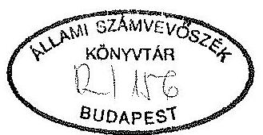

---

A vizsgálatot vezette:

Harsányi Sándor osztályvezető főtanácsos

A vizsgálatot végezte:
dr. Borisz József
Harsányi Sándor
számvevö-tanácsos
osztályvezető főtanácsos

---

IV. VAGYONELLENORZESI IGAZGATOSAG
$\mathrm{V}-31-25 / 1992 / 93$.
Témaszám: 144

# J E L E N T R S 

az Eszakmagyarországi Vegyimüveknél létesített gazdasági társaságok helyzetének felméréséről és a Porán Kft. privatizálásának szabályszerűségéről

## I.

Bevezetés

Az Állami Számvevőszék 1992. II. félévi vizsgálati terve 1993. I. félévi befejezéssel előírta az Eszakmagyarországi Vegyimüveknél (továbbiakban: EMV) alapított gazdasági társaságok helyzetének felmérését és a Porán Kft. privatizálási folyamatának szabályszerűségi vizsgálatát.

A vizsgálat célja annak megállapítása, hogy a vállalatnál alapított gazdasági társaságok mennyiben felelnek meg a gazdasági társaságokról, valamint az állami vállalatokra bízott vagyon védelméről szóló törvények által előírt követelményeknek.

---

Az ellenőrzés kizárólag az Eszakmagyarországi Vegyiműveknél létesített gazdasági társaságok helyzetfelmérésére és a Porán Kft. privatizációjának szabályszerűségi vizsgálatára terjedt ki.

A vizsgálat időtartama a gazdasági társaságok létesítési időszakára (1990. I. 1. - 1993. III. 31.), továbbá a Porán Kft. privatizációs folyamatának (1991. I. 1. - 1993. III. 31.) időszakára terjed ki.

# Ellenőrzött szervezet: 

Allami Vagyonügynökség

Az ellenőrzés során felhasználtuk az Állami Vagyonügynökség Belső Ellenőrzési Igazgatóságának e tárgyban lefolytatott vizsgálati jelentéseit is.

A vizsgálat sajátos vonása, hogy az Eszakmagyarországi Vegyiművek társaságának alapításában az Állami Vagyonügynökség döntéseilőkészítési és döntéshozói folyamatában résztvevő vezető és munkatárs a vizsgálat kezdetekor nem volt már az AVU alkalmazottja. A körülmények tisztázása érdekében - természetesen megváltozott munkajogi helyzetben az érdekeltekkel személyes megbeszélést is folytattunk.

További sajátossága a vizsgálatnak, hogy az AVU döntései célszerűségének megítélését lehetővé tevő alapvető dokumentumok nem álltak rendelkezésre.

---

A vizsgálat lezárásakor figyelembe kellett venni azt is, hogy idôközben a jogszabályi változásokon túl az AVU-nek mind szervezeti felépítése, mind belsö úgyrendje, mind belsö információs rendszere lényegesen megváltozott.

# II. 

## OSSZKFOGLALO MKGALLAPITASOK, AJANLASOK

## 1. Osszefoglaló megállapítások

A Forán Kft. privatizációjának az alapja az állam vállalatokra bízott vagyonának védelméröl szóló 1990. évi VIII. törvény volt. Az Allami Vagyonügynökség a törvényben biztosított joga szerint járt el.

A privatizáció 1991. március 4-én a társasági szerzödés módosításával, a Cégnyilvántartásba vétel 1991. november 18-án bejegyzéssel megtörtént. Az Allami Vagyonügynökség hozzájárulása nem ütközött a vonatkozó vagyonvédelmi törvény elöírásaiba. A privatizáció, a társasági szerződésen alapuló szindikátusi szerződés szerint, az Allami Vagyonügynökség 1991. június 7-i 1308/AVO/1991. sz. engedélyének megfelelt.

A privatizációs folyamatban a versenyeztetési eljárás nem érvényesült. A döntéselőkészités ajánlatok figyelembevételével történt. E szerint egyik ajánlat sem volt jobb az

---

eredeti, a vállalat által támogatott ajánlatnál. Az ajánlatok közötti választás részletes összehasonlitó elemzésének dokumentumai nem állnak rendelkezésre.

Az Allami Vagyonügynökség érintett igazgatóságai a vizsgálat kapcsán nyilatkoztak (a, b, c, melléklet), hogy a birtokukban lévô dokumentumokat teljes egészében rendelkezésünkre bocsátották, további iratanyag nincs birtokukban, ill. ha van, rendelkezésünkre bocsátják. A vizsgálat lezárásáig egyik igazgatóság sem bocsátott rendelkezésünkre további dokumentumot.

A gazdasági célszerũség így nem belátható, bár a döntés jogszerũségét nem érinti, mert az az úgynevezett spontán, tehát a vállalat által kezdeményezett privatizáció esetén 1990. évi VIII. törvény a döntéselőkészitést, illetve döntéshozatalt az AVU hatáskörébe utalja.

Az AVU 1991. évi ügykezelési gyakorlata, információs rendszere nem volt zárt. A Porán Kft. privatizációjának dokumentumai hiányosak, illetve nem állnak rendelkezésre. Az Allami Számvevõszék az AVU általános ügykezelési rendjének gyakorlatát és az információs rendszer hiányosságait már az 1990. és 1991. évi összefoglaló vizsgálatában és az ASZ elnökének az Országgyülés plenáris ülésére benyújtott jelentésében ismételten feltárta.

A Porán Kft. privatizációjára vonatkozó AVU belsõ ellenôri jelentés megállapításainak dokumentálása hiányos. A belsõ ellenôri jelentés ugyanis nem tartalmazza, sem az ajánlatokat, sem azok összehasonlító értékelését, sem a tőkeemelés kapcsán bevitt eszközök AVU-n belüli vagyonértékelését.

---

A vizsgálat ismételten megállapította, hogy az Állami Vagyonügynökség információs rendszere, illetve a rendszer müködtetése nem biztosítja a privatizációs folyamatok utólagos áttekinthetőségét, és ebben az esetben sem tette lehetővé a privatizáció átláthatóságát, célszerűségének ellenőrizhetőségét.

Magyarországon a Porán Poliuretán Gyártó és Ertékesítő Kft. az egyetlen vállalkozás, amely kemény poliuretán habot állít elő. Ezáltal e termékből a piaci részesedése is meghatározó. A Porán Poliuretán Gyártó és értékesítő Kft. privatizációjánál az Állami Vagyonügynökség nem vizsgálta, nem kérte ki a Gazdasági Versenyhivatal álláspontját. A tisztességtelen piaci magatartás tilalmáról szóló 1990. évi LXXXVI. törvényben foglaltakat nem mérlegelte.

A szindikátusi szerződésben vállalt kötelezettségek teljesítése folyamatban van. A Porán Poliuretán Gyártó és Ertékesítő Kft.-nél eddig létszámcsökkentést nem hajtottak végre. Törzstőkéjét ezideig két ízben megemelték, részben a külföldi vásárló által apportált eszközök értékével, részben a Porán Kft. nyereségéből végrehajtott beruházások révén. A Borsod-Abaúj-Zemplén Megyei Bíróság Cégbírósága összesen 134.270 eFt törzstőke módosítást jegyzett be 1992. április 1-én és 1993. március 23-án. ezzel a GMBH a kft-ben 69 \%-os tulajdonosi részesedést szerzett.

Az Állami Vagyonügynökség vagyonértékelése nem áll rendelkezésre. A vállalat által készíttetett vagyonértékelés, amely az ASZ rendelkezésére áll és amellyel kapcsolatban az AVU-nek fenntartásai voltak (lásd 8/a. sz. melléklet), a

---

Porán Kft. üzemi berendezéseinek, technológiát kiegészítő berendezéseinek, járulékos közmüveknek és más eszközöknek, szellemi termékeknek, valamint az ingatlanok értékének összesített vagyonát 603.677 eFt-ban határozta meg. A vagyonértékelések 1991. február 20-án készültek. Az értékelt, illetve a könyvszerinti vagyonérték mintegy 10-15 \%-os különbsége az utóbbi javára fennáll.

# 2. Ajánlások 

Az Eszakmagyarországi Vegyimüvek a felszámolási eljárás befejezése után jogutód nélkül megszünik. Az eljárás befejezését követően a kötelezettségek teljesítése után fennmaradó vagyon illetve üzletrészek felett az Állami Vagyonügynökség rendelkezik. Az AVO a felszámolási eljárást kísérje figyelemmel és az 1991. évi IL. törvényben foglaltak alapján - szükség szerint - intézkedjen.

Az Állami Vagyonügynökség a privatizálásban résztvevöktől a hiányzó dokumentumok pótlását biztosítsa.

## III.

## RESZLETES MEGALLAPITASOK

1. Helyzetfelmérés az EMV-nél alapított gazdasági társaságokról

A vállalat 1991. május 13. kelettel átalakítási tervet készített (1. sz. melléklet), amelyet állásfoglalás céljá-

---

ból a vállalat vezetője az Állami Vagyonügynökség részére is megküldött. Az AVU az átalakítási tervet elfogadta (2. sz. melléklet).

A tervbe vett társaságalapítások a vállalat teljes vagyoni keresztmetszetét átfogták és a meglévõ tevékenységek szerinti kiterjedésben szándékozták megszervezni.

Az egyes társaságok vertikális kapcsolódása döntõ jelentõséggel bír. Igy a létrehozott társaságokra továbbra is a kölcsönös függőség a jellemzõ még akkor is, ha az egyes társaságok önálló jogi személyek és önelszámoló gazdasági egységek.

A társaságalapítás tényleges helyzete a következõ.

Megalakult kft-k:

# PORAN Kft 

Tevékenysége: kemény poliuretán hab gyártása és értékesítése
Törzstőke: 287980 eFt
Alapítás: 1990. január 1.
Bejegyzés: 1990. január 10.

## INTERMED Kft

Tevékenysége: intermedierek, növényvédőszerek gyártása
Törzstőke: 260 millió Ft.
Alapítás: 1991. szeptember 1.
Bejegyzés: 1991. október 1.

---

# SAGROCHEM Kft. 

Tevékenysége: növényvédőszerek, intermedierek gyártása
Törzstőke: 713 millió Ft
Alapítás: 1991. szeptember 1.
Bejegyzés: 1991. október 8.

## SASZOLG Kft

Tevékenysége: ágazati szolgáltatás és kereskedelmi tevékenység
Törzstőke: 260 millió Ft
Alapítás: 1991. szeptember 1.
Bejegyzés: 1991. szeptember 30.

PROKOMFORT Kft
Tevékenysége: szociális szolgáltatás, üzemeltetés, kereskedelmi tevékenység
Törzstőke: 11900 eFt
Alapítás: 1991. december 1.
Bejegyzés: 1992. február 24.

PAJZS Kft
Tevékenysége: örzés-védelem, biztonságtechnika
Törzstőke: 8650 eFt
Alapítás: 1991. december 1.
Bejegyzés: 1992. január 29.

## PENTAPLUSZ Kft

Tevékenysége: számítástechnika, szoftver értékesítés
Törzstőke: 2460 eFt
Alapítás: 1991. december 1.
Bejegyzés: 1992. január 6.

Az alapítást követően a SAGROCHEM Kft. $5 \%$, az INTERMED Kft. $26 \%$ arányú üzletrészeit a Chemolimpex megvásárolta.

---

Az Eszakmagyarországi Vegyimũvek 2,55 milliárd Ft értékũ vagyonából 1,70 milliárd Ft az AVO-höz benyújtott átalakulási tervtõl eltérően továbbra is a vállalat tulajdonában maradt. Ennek alapvető oka az, hogy a vállalat és egyes újonnan alapított társaságai fizetésképtelensége miatt a Borsod-Abaúj-Zemplén Megyei Bíróság 1992. III. 4-én közzétette a 4.Fph.402/1992/6. számú felszámolási eljárás megindításáról szóló végzését (4. sz. melléklet). A határozat alapján elõször az adósságrendezést kell végrehajtani, s csak ezt követõen alapítható, vihetõ be a megmaradt vagyon gazdasági társaságba.

Az Eszakmagyarországi Vegyimũvek és társasága helyzetét az jellemzi, hogy a megalakított 7 kft . közül 6-ban - a Porán Kft. kivételével - ingatlanokat nem apportáltak. A társaságok a vállalat összes termelõ berendezésének tulajdonosai.

Hozzájárult ehhez az a tény is, hogy az Eszakmagyarországi Vegyimüvek ingatlanaira az addigi müködéshez igénybe vett hitelek kapcsán jelzálogot jegyeztek be. Ezért a társaságokba nem voltak apportálhatók.

Miután az Állami Vagyonügynökség a vállalat átalakulási tervét elfogadta, a BAZ Megyei Bíróság Cégbírósága bejegyezte, a társaságalapítás szabályszerű. A privatizáció eddig lezárult szakaszának eredménye miatt reparáció nem lehetséges. További vagyonhasznosítási, privatizálási lépések csak a felszámolás utáni vagyoni helyzet függvényében tehetők.

Cégbírósági bejegyzés megsemmisítésének egyetlen oka, ha a bejegyzés téves hivatkozás alapján történt. Ez itt nem áll fenn.

---

A felszámolási eljárás eddigi állásáról, a felszámoló a Reorg. Gazdasági és Pénzügyi Rt. részletes tájékoztatását a 5. sz. melléklet tartalmazza.

Az Eszakmagyarországi Vegyimũveknél további társaságalapítás csak a felszámolási eljárás befejezését követően indítható (az időlegesen állami tulajdonban lévő vagyon értékesítésérõl, hasznosításáról és védelmérõl szóló 1992. évi LIV. törvény 32-39. paragrafusa). Ennek szerves következménye, hogy a felszámolási eljárás során elöbb a felhalmozott adósságok rendezésére kerülhet sor az Eszakmagyarországi Vegyimüvek megmaradt vagyonából. Ezt követően folytatható az EMV megmaradt vagyonának privatizációja.

Az Eszakmagyarországi Vegyimüvek által alapított gazdasági társaságokban megtestesülõ tulajdoni hányadok a következök (1993. április 14-i állapot):

EMV üzletrészek \%-a

| Sagrochem | Kft. | $95 \%$ |
| :-- | :-- | --: |
| Intermed | Kft. | $74 \%$ |
| Saszolg | Kft. | $100 \%$ |
| Pajzs | Kft. | $100 \%$ |
| Prokomfort | Kft. | $100 \%$ |
| Pentaplusz | Kft. | $100 \%$ |
|  |  | $29 \%$ |

Porán Kft.

---

2. Porán Poliuretán Gyártó és Kereskedelmi Kft. privatizációja

A Porán Kft. - az EMV-nél elsőként létrehozott gazdasági társaság - alapítását a cégbíróság 1989. december 22-én a 0509000287/1989. számon bejegyezte.

Az EMV az egyszemélyes Porán Kft. tőkeemeléssel egyidöben történő privatizációjához kérte (7/a. sz. melléklet) az AVO hozzájárulását, amely jogszabályi kötelezettsége (1990. évi VIII. törvény 3. paragrafus). Kérését azzal indokolta, hogy a társaság további fenntartásához elengedhetetlen a külföldi tőke bevonása. Ezért a vállalat C.A. Greiner und Schöne GMBH (székhelye: 4550, Kremsmünster, Greinerstrasse 70. Ausztria) céggel szándékozik együttmúködni. Az elképzelés szerint és a privatizáció eredményeként az üzletrészek 67 \%-a külföldi cég tulajdonába kerül. Az Eszakmagyarországi Vegyimüvek üzletrészének aránya $33 \%$, mely kizárólag nem pénzbeli betétből (apportból) áll.

Az Állami Vagyonügynökség 1991. április 12-i leíratával (7/b. melléklet) a privatizációt a társadalom érdekeit nyilvánvalóan sértő, illetve nemzetgazdasági érdekből az 1990. évi VIII. törvény 5. paragrafus (1) bek. c) pontjára hivatkozva megtiltotta. Az Állami Vagyonügynökség e határozatát nem indokolta, ilyen irányú kötelezettsége nincs.

A 8/a. sz. melléklet szerint az AVO a nemzetgazdasági érdekvédelem érzékelésére -. apparátusán belül - a Porán Kft-nél történő, tőkeemelésként apportként bevitelre szánt

---

eszközök értékelését kérte, attól tartva, hogy a külföldi számára kedvező vagyonértékelés készült. Arról, hogy ez az Allami Vagyonügynökségen belül kért vagyonértékelés el-készült-e és milyen az eredménye, az AVU dokumentumot nem mutatott fel.

Az Allami Vagyonügynökség az IKM szakértőivel egyeztetve potenciális privatizációs partnernek az Osztrák Greiner und Schöne Gmbh-n kívül a spanyol INESPO céget is számításba vette ( $8 / a, b, c, d)$ melléklet).

A privatizáció későbbi lépéseként az Allami Vagyonügynökség ajánlatot kért és kapott mindkét cégtől ( $8 / \mathrm{b}$. sz. melléklet). Az AVU értékelése szerint a spanyol cég ajánlata mind feltételeiben, mind kidolgozottságában elmaradt az osztrák cég eredeti ajánlatától.

Az AVU belsö ellenőrzési jelentése (9/a. sz. melléklet) szerint az AVU zártkörü pályázat kiírását rendelte el. Mind a 8/c. melléklet, mind a még egykori referense szóbeli tájékoztatása szerint pályázat kiírására nem került sor, hanem ajánlatkéréssel fordultak az érdekelt külföldi cégekhez.

Az Ajánlatok összehasonlításának eredményét rögzitő feljegyzéseken, elemzéseken kívül az összehasonlítást tételesen tartalmazó dokumentumot az Allami Vagyonügynökség nem mutatott fel. Szabályszerüségi szempontból ez az ASZ által

---

nem kifogásolható, mivel az AVU-nek törvény által biztosított joga, hogy melyik ajánlat mellett dönt, s döntését nem kell indokolnia ( $9 / \mathrm{b}$. sz. melléklet).

Az INESPO és a Greiner und Schöne cég ajánlatainak összehasonlítását bizonyos szempontok szerint az EMV elvégezte ( $9 / \mathrm{c}$. sz. melléklet), és az Állami Vagyonügynökség rendelkezésére bocsátotta, aminek hasznosítására nincs dokumentum.

Ilyen előzmények után az AVO 1991. június 7 -én kelt 1308/AVO/1991. sz. levelében a tőkeemelésre és a privatizációra az engedélyt - a vállalati értékeléssel egybeesően megadta.

A BAZ Megyei Bíróság Cégbírósága 1991. november 18-án a társasági szerződés módosítását elfogadta, a cégnyilvántartásba 0509000287/35. számon bejegyezte, ezzel a privatizáció lezárult szakaszának reparációjára nincs lehetőség.

A szindikátusi szerződésben vállalt kötelezettségek nagyobb részben teljesültek. A kft-nél létszámcsökkenés az alapítás óta nem következett be. A kft alaptőkéjét - két lépésben megemelték, részben a külföldi vásárlók által vállalt kötelezettség alapján, részben a képződött nyereség társaságba történő visszaforgatásból. A Cégbíróság összesen 134.270 eFt törzstőke módosítást jegyzett be. Ebből a Gmbh apportja 54,2 MFt, a saját erős beruházás 34,3 MFt. A Gmbh által vállalt kötelezettségek teljesítése folyamatban van. A cégbírósági módosítás bejegyzése 1992. április 1-én, illetve 1993. március 23-án történt.

---

A törzstöke jelenleg meghaladja a 734.270 eFt-ot. 1993-ban ugyanis a GMBH tovább beruházott. Eredményeként - a felszámoló biztos által szolgáltatott adatok szerint - újabb törzstöke módosítást kezdeményeztek, amely a GMBH részére 71 \%-os tulajdonosi részarányt biztosít.

Budapest, 1993. június 7.
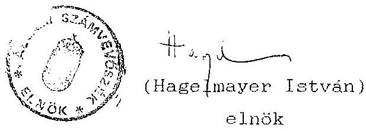

---

# MELLGKLETEK JEGYZGKK 

Nyilatkozatok /a), b), c)/

1. Az Eszakmagyarországi Vegyimüvek átalakulási terve és 1-2. sz. kiegészitése.
2. Elöterjesztés az AVO Igazgatótanácsa részére: az EMV (elöterjesztés 3010/1/10/a/AVO/91.
3. Hozzájárulások az EMV-ből alakult társaságok alapításához (feljegyzés-leiratok).
4. A Borsod-Abaúj-Zemplén Megyei Bíróság határozata az EMV felszámolásának elrendeléséről.
5. Attekintés a felszámolásról (Reorg. Rt. tájékoztatás).
6. A Porán Kft. privatizálása (feljegyzés).

7/a. Bejelentése a Porán Kft. privatizálásának (levél).
7/b. Az AVU letiltó határozata a Porán Kft. privatizálásáról.
7/c. IKM levél az AVU-nek a Porán Kft. privatizálásáról.
8/a. Vagyonértékelési igény bejelentése (feljegyzés).
8/b. A Porán Kft. privatizálása (feljegyzés).
8/c. Levél dr. Szabó Tamás politikai államtitkárnak.
8/d. Levél dr. Mádl Ferenc tárca nélküli miniszter úrnak.
9/a. AVU belsö ellenőrzés jelentése a Porán Kft. privatizálásáról.
9/b. Minősító feljegyzés a Porán Kft. privatizációjához beérkezett ajánlatokról.
9/c. Osszehasonlító kimutatás a privatizációs ajánlatokról (vállalati összehasonlítás).
10/a. Levél Csepi Lajos úrnak dr. Mádl Ferenc úrtól.
10/b. AVU belsö ellenőrzés feljegyzése, 1992. január 21.

---

Allami Vagyonügynökség Ellenörzési Igazgatóság

# Budapest 

Tárgy: Nyilatkozat a PORAN Kft privatizációjának vizsgálata ügyében

Dr.Hatvani Szabó János az AVÜ Ellenörzési Igazgatóság vezetöje az alábbi nyilatkozatot adom a PORAN Kft számvevöségi vizsgálatával kapcsolatosan.

A PORAN Kft privatizációjának ellenörzésére vonatkozó AVÜ Ellenörzési Igazgatóságon fellelhetö valamennyi iratot az ASZ részére átadtam.

Ezt követöen telefonon történt megbeszélés alapján az Allami Vagyonügynökség irattárában fellelhetö - PORAN Kft privatizációjára vonatkozó - valamennyi iratanyagot Arokházi Katalin munkatársam utján az ASZ részére kézbesítettem. Ezen iratanyagot azért nem tételes iratjegyzékkel adtam át, mivel a telefoni megkeresésre - az ASZ ellenörzés mielöbbi zökkenömentes lebonyolítása érdekében - mielöbb kivántam szolgáltatni.

Kijelentem, hogy a PORAN Kft privatizációjának ellenörzésekor melyet személyesen végeztem - a spanyol, illetve az osztrák kivásárlási ajánlat az iratanyagok között fellelhetö volt. Ezen ajánlatok áttanulmányozása és minösitése után került sor a vizsgálati jelentés megszövegezésére .

Ismételten kijelentem, hogy a szakmai szempontok mérlegelése alapján álláspontom az, hogy a PORAN Kft kivásárlására vonatkozó osztrák ajánlat összegségében nem volt rosszabb, mint a spanyol ajánlat.

Budapest, 1993. március 19.
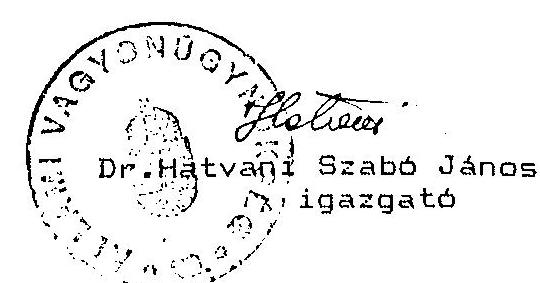

---

Allami Számvovőozók

Dr. Rorisz Józseffax: 138-4710
tanácsos

Budapest

Tárgy: Bosakmagyarországi Vegyimüvek - Poran Kft.

Tisztelt Borisz Ur!

Hivatkozáreal tárgybani kerésére tájékoztatom, hogy az Igazgatósáquinknál az ügyben semmiféle dokumentáció nem lelhetó fel.
Esetlages információkért az Ipari és Kereskedelmi Minisztérjummal már felvettük a kapcsolatot, aminek eredményéról Ont a közeljövöben természetesen tájékoztatni fogjuk.

Budapest, 1993. március 24.

Udvözlettel:
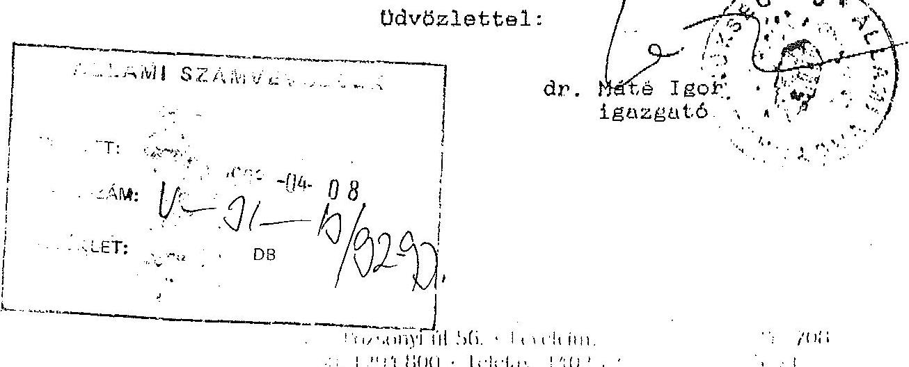

---

ACTIVITY REPORT

RECEPTION OK

TRANSACTION = 1118
CONNECTION TEL
CONNECTION ID G3
START TIME 03/24 13:22
USAGE TIME 00'49
PAGES 1

---

# ALIAMI   VAGYONOGYNOKSERG 

Ipar II. Privatizációs Igazgatóság
Cim: 1133 Budapest, Pozsonyi út. 56.
Telefon: 1180710
Telefax: 1183039

Felado: Csunderlik Ferenc
igazgató

Cimzett: dr. Borisz József
számvevō-tanácsos

Fax száma: 1384710

Dátum: Budapest, 1993. március 30.
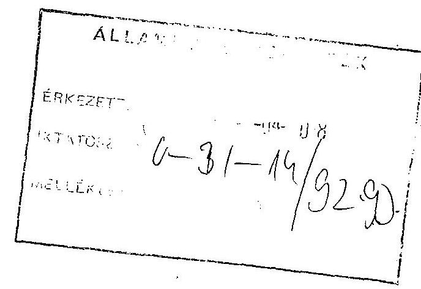

Oldalak azáma (fedőlappal együtt): 2

---

# Nyilatkozat 

Alulirott, mint az Allami Vagyonügynökség igazgatója tanúsítom, hogy az Allami Számvevõszék részére a Porán Kft. privatizációs vizsgálatához az irattárunkban fellelhetõ valamennyi ügyiratot teljeskörüen rendelkezésre bocsátottam.

Az anyagokat részben lista nélkül bocsátottuk az Allami Számvevõszék rendelkezésére.

Budapest, 1993. március 22.

AvU részéről:
Coundorlik Ferenc
igazgató

ASZ részérõl:
dr. Borisz Józse§
számvevõ-tanácsos

---

ACTIVITY REPORT

RECEPTION OK

| TRANSACTION # | 1155 |
| :-- | :-- |
| CONNECTION TEL | 3611183039 |
| CONNECTION ID | SPA |
| START TIME | $03 / 3010: 09$ |
| USAGE TIME | $01^{\prime} 22$ |
| PAGES | 2 |

---

# ESZAKMAGYARORSZAGI VEGYIMÚVEK 

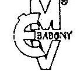

## EszakhagI

| Levelelm: 3792 SAJOBÁBONY | Felügyeleti hatóság: Ipari Minisztérium | Budapesti Kereskedelmi Kirendeltség |
| :--: | :--: | :--: |
| Telefonszám: 62-133, 67-111 | Kocsirakomóny esetén: Sajóbábony, vasútállomás | Budapest X., Gém u. 3/a. |
| Telex: 62320 | Darabáru-feladás esetén: Miskolc, Gömöri pu. | Levelelm: Budapest 1476. Pf.: 2. |
| MNB egyszámlaszám: 270-02768 | EMV Sajóbábony | Telefon: 573-533   Telex: 225864 |

Levelük kelte, száma, jele, ügyintézäje:

ÁLLAMI VAGYONÜGYNÜKSÉG

Csiki Attila úr
részére

## B u d a p e s t

Mellékelten megküldjük az Északmagyarországi Vegyimüvek átalakítási tervét.

Üdvözlettel :
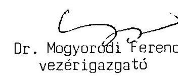

---

Az Északmagyarországi Vegyimüvek átalakítási terve
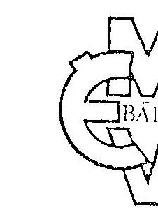

---

Az Eszakmagyarországi Vegyimüvek átalakítási terve

Sajóbábony, 1991. május 13.
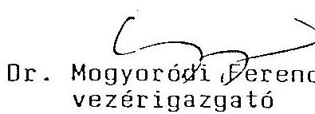

---

# Bevezetés 

Az ÉMV 1990-ben a szovjetunióbeli értékesítési lehetôségek megszünése és a növényvédôszerek iránti belföldi igény csökkenése következtében 497 MFt-os veszteséggel zárta az évet. A veszteség miatt a vállalat forgótőkéje csaknem nullára csökkent. A mũködés hitelbôl történô finanszírozása, illetve a határidôn túli tartozások kamata tovább növelte a vállalat egyébként is magas és a telepítési adottságok miatt alig csökkenthetô általános költségét.
Az 1991-ben változatlanul mérsékelt értékesités bevételei nem nyújtanak fedezetet a változatlan -szervezetben folytatott mũködés általános költségeire.
Elôzetes számításaink szerint változatlan mũködés esetén 700-800 MFt-os veszteséggel számolhatunk 1991-ben.
A vállalat kidolgozta átalakulási koncepcióját, amely a veszteséges termelés megszüntetését, a jelenlegi szervezet erõteljes "karcsusítását", illetve eredményes mũködésre képes termelô egységek kialakítását célozta meg úgy, hogy a vállalatnál megmarad egy központi szervezet, amely a vagyonkezelésen túl olyan funciókat lát el, illetve olyan szolgáltatásokat nyújt a termelô társaságoknak, amelyek társaságonkénti kialakítása összességében a jelenleginél nagyobb ráfordítást igényelne, pl. telefon, orvosi rendelõ, tũzoltó szolgálat, vagyonvédelem, környezetvédelem, üzemétkeztetés, szakkönyvtár. A felsoroltakon túl központi feladatnak tekintettük a stratégiai fejlesztést is.
Az IKM és az ÁVÜ illetékesei elé terjesztett koncepció szerves részét képezte a speciális kapacitáshoz kapcsolódó problémák megoldására tett javaslatunk. A speciális kapacitás miatt törlesztési és kamatfizetési kötelezettségek eltörlésén, illetve felfüggesztésén túl a kapacitás fenntartási kötelezettségének törlését, vagy a védelmi doktrinával összhangban költségvetési szervezetként való további mũködését kérte az ÉMV.

---

Az előzőekben vázolt átalakulási koncepció megismerése után az IKM közölte a vállalat helyzetével kapcsolatos állásfoglalását, miszerint egyetért egy átalakulási terv elkészítésével, amely alapján:

- a vállalat termelô egységeiből profiltiszta önálló gazdasági társaságok alakulnak
- a szolgáltató egységek vállalkozási alapon mũködõ társaságokká válnak
- a vállalat összes eszközeinek, jogainak és kötelezettségeinek az utód-társaságok közötti teljes elosztására, illetve áthárítására van szükség
- az utód-társaságok életképességének bizonyításához üzleti tervet kell bemutatni, beleértve a mũködés finanszírozásának kérdését is.

Az IKM szükségesnek tartja a hadiipari tevékenység ellátására létesített egység különválasztását is. A konkrét pénzügyi feltételeket az IKM, a HM és a PM közötti tárgyalásokon véglegesítik.
Az elkülönült gazdasági társaságok hosszutávú versenyképes mũködtetése érdekében már most el kell kezdeni a potenciális tulajdonosok felkutatását, és vázolni kell a dolgozói tulajdonlásra vonatkozó elképzeléseket.
Ugyanakkor az IKM biztosította ÉMV-t, hogy a Porán Kft részbeni értékesítéséből befolyó vételárat az átalakulás finanszírozására fordíthatja. Erre a vállalat az IKM-ben folytatott tárgyaláson az ÁvÜ ígéretét is megkapta.
A vállalat az elôzôekben részletezett elôzményeket, feltételeket és elvárásokat figyelembevéve dolgozta ki a következõ átalakulási tervet.

---

I. Az átalakítás pénzügyi feltételei

A vállalat átalakításakor az 1990. és 1991-es évek veszteségét a vagyon terhére le kell írni.

Adósságállományunk 1991. V. 1-én
1.946 Mft volt.
Ezen belül:
aktuális fizetési kötelezettség
1.016 MFt
még nem aktuális fizetési kötelezettség
930 MFt
Ugyanezen idópontban lehetetlen további hiteleket felvenni, mivel nem tudunk fedezetet nyujtani a visszafizetés biztosítékaként.

A/ Az átalakulás elôfeltétele az átalakulás idópontjában fennálló aktuális fizetési kötelezettségek teljeskörũ és a még nem aktuális kötelezettségek részbeni rendezése. Erre vonatkozóan a következõ megoldás lehetséges.

1. A speciális kapacitás létesítéséhez kapott államkölcsön és kamatai jelenleg fennálló törlesztési kötelezettségének törlését kérjük, beleértve a törlesztési kötelezettség felfüggesztésének két évére 1989-1990-re vonatkozó kamatfizetési kötelezettséget is.
Egyidejûleg javasoljuk a speciális kapacitás fenntartási kötelezettségének törlését, vagy a védelmi doktrinával összhangban költségvetési üzemmé való átalakítását. Javaslatunk szerint ez a költségvetési üzem az állagmegóvás 60 MFt-os költségein tul viselné a speciális profil miatti sajátságos telepítéssel összefüggô 149 Mft-os költséget is.
2. Az 1991. V. l-én fennálló aktuális fizetési kötelezettség 1.016 MFt-os összegéből 380 Mft a CHEMOLIMPEX Külkereskedelmi Vállalattal szembeni tartozás összege,

---

amelybôl mintegy 230 MFt-ra fedezetet nyujt tôkés export kintlévôségünk. A fennmaradó 150 MFt-nyi tartozás részvénnyé konvertálására a CHEMOLIMPEX vezérigazgatója elvben lehetôséget lát, de ezt csak az e hó második felében tartandó Vállalati Tanács ülés erôsítheti meg.
3. Az MHB-vel szembeni 1991. V. 1-én fennálló 603 MFtos tartozás még nem aktuális - de az ujonnan létrehozott társaságokra nem terhelhetô - fizetési kötelezettséget a Bank részvénnyé konvertálja.
4. Az elôzô két pontban részletezetten kívül 636 MFt-os aktuális kötelezettségbôl a jelentôsebb követelések részvénnyé alakítását kezdeményezzük a hitelezókkel. A fennmaradó adósság rendezése érdekében megkeressük az ujonnan alakuló társaságok jövôbeni mûködésében érdekelt befektetôket.

B/ Az ÉMV fizetési kötelezettségeinek elôzôekben vázolt rendezésén tul, az átalakulás elengedhetetlen feltétele az átalakulással létrehozott társaságok forgótôkéjének biztosítása.
A társaságok alapításához szükséges törvényben elôírt 30 \%-os pénzbeni betét összege - feltétesen 3 Mrd Ft-ra becsülve az ÉMV veszteséggel csökkentett, felértékelt vagyonát - csaknem 1,3 Mrd Ft lenne, a mûködtetéshez szükséges minimális forgótôkét 700 MFt-ra becsüljük. Az átalakítást több lépésben - utólagos vagyonemeléssel végrehajtva ennél kisebb összegü készpénz felhasználásával is lehetségesnek tekintjük.
Erre egyrészt felhasználható a Porán Kft részbeni értékesítéséből származó 400 MFt és az átalakulás idôpontjában rendelkezésre álló készletállomány.

---

A pénzügyi fedezet szempontjából nem számottevõ, de a tulajdonosi érdekeket tekintve jelentôséggel bíró megoldásnak tekintjuk a dolgozók vagyonból való részesedését.
Erre vonatkozóan az elmult év végén kidolgoztunk egy szabályzatot, amelynek aktualizálását megkezdtük. Ebben meghatározzuk, hogy milyen feltételek mellett tesszük lehetôvé visszterhes, illetve ingyenes részvények dolgozói tulajdonba adását. Lehetôvé kívánjuk tenni, hogy a társaságok alkalmazottai megtakarított pénzükön túl - különféle járandóságaikból (munkaviszonból származó jövedelmek, ujítási, találmányi díj) részvényeket, üzletrészeket vásároljanak.
II. Az ÉMV a következõ gazdasági társaságokká alakul át

1. "V" RT (jelenlegi V-gyárrészleg)
2. "C" Kft (formázó üzem, formalin üzem)
3. "U" Kft (gyógyszer- és növényvédôszer intermedier üzemek)
4. Porán Kft
5. AREK Kft (spec. költségvetési üzem)
6. Fejlesztési Kft
7. Karbantartó Kft
8. Energia Kft
9. Környezetvédelmi Kft

---

III. A vállalati vagyon felosztására irányuló munka megkezdődött. Megalakultak a jövôbeni új egységek szakembereiből azok a munkacsoportok, amelyek kidolgozzák a vagyon felosztására vonatkozó tervet, amellyel szemben alapkövetelmény, hogy minden társaság kapja meg a mũködéséhez szükséges területet, állóeszközöket, szellemi javakat, tekintetbe véve jövôbeni fejlôdési irányait és lehetôségeit is. Ezt a felosztást rendkívül nehézzé teszi a vállalat sajátos telepítése, a szétszórt épületcsoportok, a központi paktározásra való berendezkedés, a bonyolult út-, vasút- és vezetékhálózat, stb. A végleges terület felosztási terv még nem készült el, de a földrajzilag könnyen elhatárolható jelenlegi V-gyárrészleg területének felmérését megrendeltük a GBTV-től.
A felmérést és telekkönyveztetést lépésenként tudjuk elvégeztetni. Ugyanez vonatkozik a vagyonértékelésre is. A felmérést, illetve a vagyonértékelést a következõ sorrendben végeztetjük el:

1. "V" RT

A jelenlegi V-gyárrészleg V-4, V-5 jelü üzemre már készült vagyonértékelés, így célszerűnek látjuk elsôként a gyárrészleg többi termelô és a közös kiszolgáló üzemének értékelését elvégeztetni.
2. "C" Kft
3. "U" Kft
4. Karbantartó Kft
5. Energia Kft
6. Fejlesztési Kft
7. Környezetvédelmi Kft
8. AREK Kft (spec. költségvetési üzem)

---

Ez utóbbi társaságba kívánjuk bevinni a telepítési többletként adódó területet, épületeket, építményeket (út-, vasút-, vezetékszakaszok), amelyek a polgári termeléshez nem szükségesek.

Az átalakulás során rendezzük a jogutólás kérdését is. Ezt úgy lehetséges és célszerű megoldani, hogy az utódtársaságokra háruljon minden olyan jog és kötelezettség, amely a jogelőd müködéséből származik, de tevékenységük (profiljuk), illetve létszámuk alapján őket illeti. Ennek az elvnek és az előzőekben részletezett profilmegosztásnak az alapján kézenfekvō a szellemi javak utód-társaságok közötti szétosztása.
Az utódtársaságokat megilettő egyéb jogok fôként a munkavállalók tartozásainak (lakásépítési, vásárlási kölcsön, tanulmányi támogatás, stb.) visszafizetéséből adódnak. Ezek konkretizálására a tényleges megalakuláskor, illetve a létszám megosztásakor kerülhet sor. Külön szabályozást igényel azon dolgozók törlesztésének a kezelése, akiknek munkaviszonya az átalakulás kapcsán szünik meg.

# IV. Az átalakulás ütemezése 

A pénzügyi feltételek megteremtésének, és a vagyonértékelés idõigényének figyelembevételével az átalakítást a következõ ütemezéssel kívánjuk megvalósítani.

1. A "V" RT megalakítása
2. C Kft alapítása
3. Karbantartási Kft alapítása
4. Energia Kft alapítása
5. U Kft alapítása
6. Fejlesztési Kft alapítása
7. Környezetvédelmi Kft alapítása
8. AREK Kft alapítása
1991. IX. 1.
1991. X. 1.
1991. XI. 1.
1991. XII. 1.
1992. I. 1.
1992. I. 1.
1992. I. 1.
1992. I. negyedév

---

Az AREK Kft megalakítása a finanszírozási feltételeket tisztázó IKM, PM, HM tárgyalás eredményének függvénye.
V. Az átmeneti idôszak finanszírozási programja

A társaságok megalakulásának kezdetéig terjedõ három hónapos idôszakban a termelés és értékesítés jelentôs mértékben visszaesik. A termelés megcélzott szinten való fenntartását viszont a piacvesztés elkerülése érdekében, a rendkívül szũkös finanszírozási lehetôségek ellenére is célszerũnek tartjuk.
Részletekbe menõ számításokat végeztünk arra vonatkozóan, hogy milyen módon és milyen szinten lehet a visszafogott mũködés pénzügyi feltételeit biztosítani.
Számitásaink eredményét a 12. sz. táblázatban mutatjuk be. Az átalakulásra való felkészülés három hónapjában csak azokat a bevételeket vettük figyelembe, amelyek jelenlegi ismereteink szerint nagyvalószínüséggel realizálódnak, tehát a visszafogott mũködés legszũkösebb pénzügyi fedezeteként várhatóan rendelkezésre állnak.
Ugyszintén kifizetésként is csak azokat a tételeket összegeztük, amelyeknek teljesítése a mũködés tervezett szintjének fenntartásához elengedhetetlenül szükséges.

---

VI. Az EHV átlakult, önállóan gazdálkodó egységeinek üzleti terve

1. V-részvénytársaság 1.1. A részvénytársaság tulajdonába kerülő üzemek: V-2,3,4,5 üzemek Kiszolgáló üzem 1.2. A számítások során figyelembe vett piaci adatok

1. táblázat

|  Termék |  | Értékesített
mennyiség t/év | Ár Ft/t | Anyagköltség
Ft/t | Arbevétel
Ht/év | Anyagköltség
Ht t/év  |
| --- | --- | --- | --- | --- | --- | --- |
|  1. Alirox 83 EC | SzU | 6000 | 277.200 | 173.833 | 1.663 | 1.043  |
|  2. Vitox 72 EC | SzU | 4000 | 266.800 | 142.000 | 1.067 | 568  |
|  3. Anelda p.usz 80 EC | belf. | 2200 | 263.100 | 160.000 | 579 | 352  |
|  4. Alirox 83 EC | belf. | 1000 | 253.000 | 173.833 | 253 | 174  |
|  5. Sapet ha | exp. | 200 | 333.410 | 245.000 | 67 | 49  |
|  6. Sakkimi na. | exp. | 300 | 343.210 | 240.000 | 103 | 87  |
|  7. KHETE |  | 150 | 197.610 | 151.300 | 30 | 23  |
|  8. KHEE |  | 160 | 111.150 | 93.750 | 18 | 15  |
|  9. KHHE |  | 1400 | 81.700 | 81.420 | 114 | 114  |
|  10. DEK |  | 150 | 160.000 | 126.700 | 24 | 19  |
|  11. 3-triflu:metil-FIC
(az U-KF:nek értékesítve) |  | 200 | 600.000 | 400.000 | 170 | 80  |
|  12. Foszfona: |  | 100 | 140.000 | 72.000 | 14 | 7  |
|  13. Propakic: |  | 450 | 288.000 | 185.560 | 130 | 84  |
|  14. Hetazskizr |  | 300 | 376.600 | 163.000 | 113 | 49  |
|  15. TI-35 |  | 160 | 500.000 | 328.000 | 80 | 52  |
|  16. Satoklói 400 EC |  | 100 | 283.800 | 199.867 | 28 | 20  |
|  17. CPK |  | 30 | 356.100 | 231.000 | 11 | 7  |
|  18. Sacenic |  | 400 | 360.000 | 319.000 | 144 | 120  |

Árinformációk: - a foszgén saját áru, önkültsége 62 eft/t - munkabér: 200 eft/t/é - a 11, 13, 15. sorszáma termékek a volt EHV gazdálkodó egységeinél kerülnek továbbfeldolgozásra, de világpiaci áron értékesülnek

1.3. Fejlesztési lehetőségek 2. táblázat

|  A termék neve | Piaci lehetőség a felfutás évében | Belépés éve | Felfutás éve | Bafordítás hft | Ár Ft/10 | Anyagkig. Ft/10 | A felfutás évében árbevétel ercem.  |
| --- | --- | --- | --- | --- | --- | --- | --- |
|  3,4-diklói FIC exp. | 400 | 1992 | 1993 | 47 | 452.270 | 356.000 | 198  |
|  Trietilortoformiát | 1000 | 1993 | 1994 | 65 | 422.331 | 223.000 | 577  |
|  Szexinox | 90 | 1993 | 1994 | 20 | 980.000 | 366.000 | 88  |
|  Acetoklói a V-4 üzemben | 1000 | 1993 | 1993 | 25 | 651.200 | 296.000 | 651  |
|  Metolakiór | 1000 | 1994 | 1995 | 45 | 750.000 | 352.000 | 750  |

A fejlesztés: célprogramok rövid összefoglalóit mellékeljük.

---

# 1.4. A termelés költségei és eredményessége 

## Számítási módszer

Az átalakulás során kialakuló új, önállóan müködő gazdál-
kodási egységek termékszerkezetéhez a korábbi évek tapasztalatai alapján hozzárendeltük a termelés közvetlen költségeit és az önálló müködést feltételezõ munkabér költségeket. Az üzemek külvilággal és egymással való kapcsolatát biztosító infrastruktúra adott gazdálkodó egységre esô költségeit az általános költség rovatban szerepeltetjük.
Nem szerepel azonban a költségek között az ÉMV hadiipari multjával összefüggõ telepítési többletköltség, amely a túlméretezett és elavult infrastruktúrával kapcsolatos veszteségeket és többletköltségeket összesíti. Ennek a költségtételnek a nagyságával és szerkezetével az önállóan gazdálkodó egységek adatainak összesítésénél foglalkozunk. Feltételeztük, hogy az új egységek rendelkeznek a szükséges forgóeszközök $70 \%$-ával. A hiányzó $30 \%$-ot egyéb forrásból biztosítjuk. A V-RT esetében feltételeztük, hogy a MHB részvétele a beruházási hiteltartozások megszũnését jelenti, tehát a részvénytársaság tehermentes lesz.

A számítások során megvizsgált variációkat nem ismertetjük.
A foszgén alapu növényvédőszereket és intermediereket gyártó V-3, V-4, V-5 üzemek és a klóracetanilid tipusu növényvédőszereket elôállító V-2 üzem eredményességét külön-külön is megvizsgáltuk.
Mivel a saját foszgén gyártás költségei miatt a klórszénsavészterek gyártása gazdaságtalan, feltételeztük, hogy ezek termelését az RT leállítja és nem számíthatunk a szovjet piacra.

---

A folyamatban lévô fejlesztési lehetôségek megvalósitása ezt az eredményt

| 1993-ban | 211 |
| :-- | :-- |
| 1994-ben | 289 |
| 1995-ben | 602 MFt-tal |

növelheti.

# Tartalékok 

A V-RT eredményességét a hangyasav alapon gyártott foszgén magas ára erôsen lecsökkenti. A helyzet stabilizálódása után számitani lehet arra, hogy a foszgén szállitások az ÉMV és a BVK között ismét megindulnak. Ebben az esetben a jelentôs piacot jelentö klórszénsavészterek gyártása ismét gazdaságossá válik, növelve az RT eredményét.
Ettôl függetlenül a részvénytársaságnak a jövôben mindenképpen meg kell oldani a saját foszgén gyártást olcsó szénmonoxid forrást biztostiva, amelyre több alternatív lehetôség mellett a - már megindított földgáz bevezetést követô - földgáz bontás is reális lehetôség.
Elôkészités alatt van 80 e.t/év kapacitásu monokalciumfoszfát üzem létesitése közös vállalat formájában, amelybe az ÉMV a jelenleg kihasználatlan épületeit, infrastrukturális létesitményeit kívánja apportként bevinni.
A technológiát és a pótlólagos beruházásokát a partner hozza. Ennek a terméknek fix hazai piaca van, az igényeket jelenleg teljas egészében tôkés importból elégítik ki.
Ezen elképzelések megvalósításához is szükséges a földgáz bevezetése.

---

# 3. táblázat 

MFt
Arbevétel ..... 1.672
A termelés forgóeszköz szükséglete ..... 260
Forgóeszköz hitel ..... 85
Forgóeszköz hitelkamat ..... 34
Beruházási hitelkamat ..... -
Értékesitési különköltség ..... 17
Statisztikai illeték ..... 18
Értékcsökkenés ..... 61
Anyagköltség ..... 1.113
Energia költség ..... 95
Munkaerő költség ..... 64
Munkaerő szükséglet (fô) ..... 250
Környezetvédelmi költség ..... 40
Szállitási, raktározási költség ..... 20
Karbantartási költség ..... 60
Általános költség ..... 80
Összes költség ..... 1.602
Eredmény* ..... $70^{*}$
*A V-RT eredménye szovjet piac és klórszénsavészterek nélkül
(Tájékoztatásul megemlitjük, hogy a szovjet piac és a klórszénsavészterek figyelembevételével a V-RT eredménye 835 MFt már 1992-ben is.)

---

2. C-Kft
2.1. A Kft tulajdonába kerülō üzemek és épületek:

C-formalin üzem
C-porformázó üzem
F-17 formázó labor
F-12 biológiai labor
2.2. A számításoknál figyelembe vett piaci adatok
4. táblázat

| Termék | Ert. menny.   $t / e ́ v$ | Ar   $\mathrm{Ft} / \mathrm{t}$ | Anyagkölts.   $\mathrm{Ft} / \mathrm{t}$ | Arbevetel   $\mathrm{MFt} / \mathrm{ev}$ | Anyagkölts.   $\mathrm{MFt} / \mathrm{ev}$ |
| :-- | --: | --: | --: | --: | --: |
| Formalin | 20.000 | 13.000 | 7.800 | 260 | 156 |
| Satecid 65 WP exp. | 500 | 273.000 | 138.710 | 137 | 70 |
| Aneldezin 800 FW | 150 | 298.900 | 236.370 | 45 | 36 |
| Betoxon F 430 | 70 | 64.070 | 30.724 | 5 | 2 |
| Saterb 40 FW | 300 | 320.600 | 226.118 | 96 | 68 |
| Satecid 65 WP | 200 | 227.900 | 138.710 | 46 | 28 |
| Satecid AT 65 WP | 70 | 221.000 | 148.240 | 16 | 10 |
| Saterb 50 WP | 250 | 367.500 | 255.748 | 92 | 64 |
| Zeaposz 10 | 240 | 107.200 | 97.002 | 26 | 23 |
| Metabromuron 50 WP | 200 | 837.000 | 540.000 | 167 | 118 |

Árinformációk: a növényvédőszerek világpiaci áron kerülnek az üzembe az ÉMV átalakult termelô egységeiből is.

A Kft szolgáltatásként a növényvédőszerek kutatás-fejlesztésével összefüggő szintézis, alkalmazástechnológiai és forma fejlesztési munkát is végez.
A Kft-t terheli a formaldehid kapacitásbōvítésének hiteltörlesztése és hitelkamata.

# 2.3. Fejlesztési lehetöségek 

Potenciális lehetöség a formalin üzemben a faipari ragasztó gyártás megvalósítása. Ennek eredményességét megbízható gazdasági adatok hiányában nem számolhattuk.

---

A porformázó kapacitás nagysága lehetővé teszi a legkülönbözőbb bérformázási feladatok megoldását, Megvalósitjuk a kiskiszerelést a farmergazdaságok igényeinek kielégitésére
2.4. A termelés költségei és eredményessége

A számításokat a V-RT-nél leírt módszerrel végeztük.
A költségösszesítést az 5. táblázat tartalmazza
5. táblázat

|  | MFt |
| :-- | --: |
| Árbevétel | 888 |
| A termelés forgóeszköz szükséglete | 100 |
| Forgóeszköz hitel | 30 |
| Forgóeszköz hitelkamata | 12 |
| Értékesítési különköltség | 6 |
| Statisztikai illeték | 7 |
| Értékcsökkenés | 19 |
| Anyagköltség | 574 |
| Energia költség | 70 |
| Munkaerő költség | 33 |
| Munkaerő szükséglet (fő) | 130 |
| Környezetvédelmi költség | 8 |
| Szállítási, raktározási költség | 2 |
| Karbantartási költség | 34 |
| Általános költség | 70 |
| Összes költség | 835 |
| Eredmény | 53 |

---

3. U-KET
3.1. A KFT tulajdonába kerülō üzemek:
A-11 gyógyszerintermedier üzem
A-6 növényvédôszer hatóanyag gyártó üzem
A-17 kisérleti üzem
3.2. A számításoknál figyelembe vett piaci adatok

| Termék | Értékesített mennyiség $t / e ́ v$ | $\begin{gathered} \text { Ár } \\ \text { Ft/t } \end{gathered}$ | Anyagkö́ltség Ft/t | Árbevétel MFt/év | Anyagkö́ltség MFt/év |
| :--: | :--: | :--: | :--: | :--: | :--: |
| Acetildeszeptil | 200 | 273.100 | 113.716 | 55 | 23 |
| Diszulfamid | 60 | 934.900 | 638.877 | 56 | 38 |
| Sz8S nyers | 60 | 1430.100 | 973.733 | 86 | 58 |
| Sz8S tisztitott | 20 | 1925.000 | 1173.618 | 39 | 24 |
| Deszeptil | 350 | 384.000 | 237.210 | 134 | 83 |
| Terbutrin ha. | 300 | 500.000 | 410.000 | 150 | 123 |
| Fluometuron ha. | 300 | 630.000 | 552.000 | 189 | 165 |
| Hetobromuron ha. | 100 | 1000.000 | 506.000 | 100 | 45 |

3.3. Fejlesztési lehetôség

1992-re megvalósitható fejlesztési programként vettük számításba a Metabromuron gyártás megvalósitását, aminek ráforditását (20 MFt) a feltételezés szerint hitelbôl fedezzük. Ennek kamatával ( 12 MFt) a költségek között számolunk.

---

# 3.4. A termelés költségei és eredményessége 

A számításokat a V-RT-nél leírt módon végeztük.
A költségösszesítést a 6. táblázat tartalmazza

| 6. táblázat |  |
| :--: | :--: |
|  | MFt |
| Árbevétel | 808 |
| A termelés forgóeszköz szükséglete | 70 |
| Forgóeszköz hitel | 20 |
| Forgóeszköz hitel kamata | 8 |
| Beruházás hitelkamata | 12 |
| Értékesítési különköltség | 5 |
| Statisztikai illeték | 6 |
| Értékcsökkenés | 12 |
| Anyagköltség | 559 |
| Energia költség | 60 |
| Munkaerő költség | 37 |
| Munkaerő szükséglet (fô) | 145 |
| Környezetvédelmi költség | 11 |
| Szállitási, raktározási költség | 4 |
| Karbantartási költség | 35 |
| Általános költség | 40 |
| Összes költség | 789 |
| Eredmény | 19 |

---

# 4. Karbantartó KFT 

4.1. A karbantartó KFT tulajdonába kerülō üzemek:
M-1 és M-2 üzemek
K-üzem
Müszerész üzem

### 4.2. Költségek és bevételek

A Karbantartó KFT szolgáltatásként elvégzi az EMV átalakult termelô gazdálkodó és non profit szervezetei által igényelt karbantartási munkát, olyan áron, hogy a költségei - nyereség realizálása nélkül - megtérül jenek.
Külsõ gazdálkodó szervezetek számára végzett munkájában nyereségorientált.
A bevételek és költségek számításánál a gazdálkodó egységek által 1992-re jelzett karbantartási igénybôl indultunk ki.
Ez a bevétel 5-50 MFt-tal nôhet a becslések szerint a külsõ me!̣rendelésektôl függôen.
A várható költségeket a 7. táblázatban foglaljuk össze.

## 7. táblázat

1992. évre jelzett összesitett karbantartási igény (MFT)

| Értékcsökkenés | 2 |
| :--: | :--: |
| Anyagköltség | 60 |
| Energia költség | 7 |
| Munkaerô költség | 80 |
| Munkaerô szükséglet (fô) | 280 |
| Általános költség | 19 |
| Összes költség | 168 |

---

# 5. Energiaszolgáltató Kft 

5.1. Az Energiaszolgáltató Kft tulajdonába kerülō üzemėk:

Erőmũ
Villamosenergia üzem

### 5.2. Költségek és bevételek

Az Energiaszolgáltató Kft biztosítja az ÉMV átalakult termelô és szolgáltató szervezetei által igényelt energiát olyan áron, hogy költségei nyereség realizálása nélkül megtérüljenek.
A termelô egységek által feltételezett termékvolumen elôállításának közvetlen technológiai energiaszükséglete 319 MFt . Az ÉMV - hadiipari célu telepítéséből adódóan a szükségesnél hosszabb, bonyolultabb és elavult - gôz, viz és elektromos vezeték hálózatának átalakításával elkerülhetô lesz az a 106 Mft-os energiaköltség, amely a telepítési hátrányokból következô egyéb költséggel együtt jelenleg a költségvetési üzemet terheli.
A várható költségeket a 8. táblázatban foglaljuk össze.

## 8. táblázat

1992. évre jelzett összesített energia igény 425 MFt

Értékcsökkenés 8 MFt
Anyagköltség 328 MFt
Munkaerôköltség 54 MFt
Munkaerôszükséglet (fô) 190 MFt
Karbantartási költség 13 MFt
Általános költség 22 MFt
Összesen 425 MFt

---

# 6. Környezetvédelmi KFT 

6.1. A Környezetvédelmi KFT tulajdonába kerülnek a jelenlegi Környezetvédelmi Önálló Osztály létesítményei, a nyílttéri égetô épülete, az iszaptároló medencék területe, valamint a veszélyes hulladékok tárolására kijelölt raktárak.

### 6.2. Költségek és bevételek

A Környezetvédelmi KFT szolgáltatásként végzi a termelô egységeknél keletkezõ szennyvizek semlegesítését és biológiai lebontását, az égethetô folyadékok megsemmisitését, valamint a veszélyes hulladékok nyilvántartását, lehetôség szerinti lebontását, vagy raktározását.
Ellenőrzi az üzemek hulladék kibocsátását, és tartja a kapcsolatot a környezetvédelmi hatóságokkal.
A szolgáltatások diját ugy állapitja meg, hogy a költségei és az éves környezetvédelmi birság összege megtérüljön, de nyeresége nem keletkezhet.
Várható költségeit a 9. táblázatban foglaltuk össze.

## 9. táblázat

1992-ben várható környezetvédelmi költség: 59 MFt
Anyagköltség 10 MFt
Energia költség 15 MFt
Karbantartási költség 5 MFt
Munkaerô költség 14 AFt
Munkaerő szükséglet (fô) 60
Szállitási, raktározási költség 1 MFt
Értékcsökkenés 5 MFt
Általános költség 9 MFt ${ }^{\star}$
Üsszesen: 59 MFt
( ${ }^{\text {M}}$ Az általános költségbôl 6 MFt birság)

---

7. Fejlesztô Kft
7.1. A Fejlesztô Kft tulajdonába kerülnek a fejlesztô laboratóriumok.
7.2. Tevékenységi köre:

- az ÉMV átalakult termelô egységeinél gyártás-fejlesztési feladatok megoldása
- kis volumenü vegyianyagok, finomvegyszerek elôállítása
- analitikai szolgáltatások végzése
- kísérleti gyártások megszervezése külsõ vállalati igények esetén, a volt ÉMV profiljába illô területeken (pl. foszgénezés)
- engineering tevékenység, kutatás-fejlesztési eredmények értékesitése

Költségek és bevételek
10. táblázat

Várható árbevétel 30 MFt
Anyagköltség 1 MFt
Energia költség 2 MFt
Karbantartási költség 1 MFt
Munkaerô költség 21 MFt
Értékcsökkenés 1 MFt
Általános költség 2 MFt
Üsszes költség 28 MFt
Eredmény 2 MFt

Munkaerô szükséglet (fô) 74 fô

---

# 8. Porán Kft 

A Porán Kft privatizációja külföldi tőke bevonásával az ÉMV átalakulásának egyik alapfeltétele.
Gazdálkodásának részleteit nem ismertetjük.
Az eddigi tárgyalások alapján valószínűsithető, hogy a Porán Kft 70 MFt energia költséget igényel és 50 MFt általános költséggel járul hozzá az infrastruktúra fenntartásához.

## 9. Költségvetési üzem

Amennyiben a védelmi doktrina igényli az ÉMV TNT üzemének fenntartását, azt elkülönített üzem formájában javasoljuk fenntartani. A felmerült költségeket állami dotációból lehetne fedezni.
Várhatóan az alábbi költségek merülnek fel:

## 11. táblázat

| Karbantartási költség | 20 MFt |
| :-- | :-- |
| Munkaerő költség | 11 MFt |
| Munkaerő igény (fő) | 38 |
| Értékcsökkenés | 19 MFt |
| Általános költség | 10 MFt |
| Összes költség | 60 MFt |

A müködő egységekhez felhasznált állóeszközökön, épületeken, utakon, mütárgyakon túl fennmaradó vagyon értékcsökkenése 30 MFt , amit szintén nem lehet a polgári termelö egységekre ráterhelni. Ezért a fel nem használt speciális épületeket, eszközöket, az erdőket, valamint az örzésből adódó költségeket a költségvetési üzemre terheljük. A költségvetési üzem viseli az elavult energiahálózatból következõ energiaköltségeket is, amelynek megszüntetése érdekében megkezdett átalakítási munkák befejezésére az önállóan gazdálkodó egységeknek 1994-re meg lesz a költségfedezete.

---

10. Az átalakult vállalat eredményessége

Az átalakult vállalat mũködésére vonatkozó gazdasági adatokat a 13. sz. táblázatban foglaltuk össze. Az eredmény 144 MFt 1992-ben, amely késôbb a fejlesztési eredmények belépésével jelentősen növelhetō. Ez 1227 ember számára biztosít munkahelyet. A szovjet piac ismételt belépése önmagában 755 MFt-tal növelné a V-RT nyereségét, és ez lehetôséget adna, hogy további fejlesztésekkel (pl. olcsó CO forrás biztosítása a saját foszgén gyártásához) növeljék a termelés gazdaságosságát.
11. Tôkebevonási lehetôségek

Tárgyalásokat folytatunk magyar cégekkel, termelõ - kereskedô, szolgáltató gazdasági társaságok alakitására./pl. :Chemielectro Kft, SZEVIKI, Kiskun GTV/
Az átalakult gazdasági egységek kedvezō lehetôséget biztositanak külföldi tőke bevonására is.
A legtöbb érdeklōdés a foszgén felhasználás területén van. Tárgyalások folynak a Phillips Petroleum, a KEMIRA, az SNPE, Hoechst, DSN, Szajuzagropromhim, Solkovói Vegyikombinát, Elektrohimicseszkij Zavod, Navoy, Comphania Cacque De Café Soluvel /brazil/ cégekkel együttmüködési lehetôségek keresésérôl.
Tárgyalási készségüket jelezték a Zeltia /spanyol/, Etil Corp., Az Agrolinz, Toyo Menka, International Medical Services Ltd /Izrael/ cégek.
További pontenciális partnerek felkutatása érdekében bekapcsolódtunk a Világbank vállalati átalakulásokat segitő szakértői programjába. Tendert írtunk ki az alábbi cégeknek:

- IAL Consultants Ltd
- Vistech
- Arthur D. Little Inc.
- Chem. System International

---

A tendert a Vistech nyerte meg. Az ÉMV lehetöségeinek vizsgálatába be fogják vonni az ugyancsak ajánlattevõ International Technology Investment Ltd-t is.

---

# 12. Finanszirozási terv

## 1991. június 1.-tól augusztus 31-ig

|  Megnevezés | június | julius | augusztus  |
| --- | --- | --- | --- |
|   | MFt | MFt | MFt  |
|  Fizetési kötelezettség a hónap elején | 958 | 995 | 990  |
|  Kintlévőségek várható összege : belföldi | 120 | 95 | 56  |
|  Chemol export | 120 | 103 | 138  |
|  egyéb export | 62 | 57 | 42  |
|  Nettó adósságállomány (aktuális) | 656 | 740 | 754  |
|  Számitásba vehető bevétel : |  |  |   |
|  - előző időszakban kiszámitottból : belföldi | 40 | 55 | 30  |
|  export | 5 | 15 | 20  |
|  - tárgyhavi kiszállítottból belföldi | 20 | 5 | 20  |
|  - egyéb bevétel | 17 | 25 | 25  |
|  Havi bevétel összesen : | 82 | 100 | 95  |
|  A legszükségesebb kifizetések : |  |  |   |
|  - Anyagbeszerezésre | 24 | 27 | 52  |
|  - Munkabérre | 23 | 23 | 23  |
|  - Egyéb kifizetés | 35 | 50 | 20  |
|  Havi kiadások összesen : | 82 | 100 | 95  |
|  Fedezet hiányában kifizetésre nem kerülő újabb fiz. köt. | 77 | 35 | 45  |
|  Adósságot csökkentő, de bevételként nem jel. exp. árbev. | 40 | 40 | 40  |
|  Fizetési kötelezettség a hónap végén | 995 | 990 | 995  |
|  A kintlévőség várható összege | 255 | 236 | 252  |
|  Nettó adósságállomány | 740 | 754 | 743  |

---

# 13. táblázat

|  Költségnemek | V-RT | C-Kft | U-Kft | Porán Kft | Fejleszté-
si Kft | Karban-tart.Kft | Energia Kft | Körny. véd. Kft | Költségvet.üzem | Összesel  |
| --- | --- | --- | --- | --- | --- | --- | --- | --- | --- | --- |
|  Árbevétel | 1.672 | 888 | 808 | $120^{*}$ | 30 | 168 | 425 | 59 | 209 | 4.379  |
|  Anyagköltség | 1.113 | 574 | 559 | - | 1 | 60 | 328 | 10 | - | 2.645  |
|  Energia költség | 95 | 70 | 60 | 70 | 2 | 7 | - | 15 | 106 | 425  |
|  Karbantartási költség | 60 | 34 | 35 | - | 1 | - | 13 | 5 | 20 | 168  |
|  Munkaerő költség | 64 | 33 | 37 | - | 21 | 80 | 54 | 14 | 24 | 327  |
|  Munkaerő szükséglet (fő) | 250 | 130 | 145 | - | 74 | 280 | 190 | 60 | 98 | 1.227  |
|  Környezetvédelmi költség | 40 | 8 | 11 | - | - | - | - | - | - | 59  |
|  Szállítási és rakt. költség | 20 | 2 | 4 | - | - | - | - | 1 | - | 27  |
|  Forgóeszköz hitelkamata | 34 | 12 | 8 | - | - | - | - | - | - | 54  |
|  Beruházási hitel kamat | - | - | 12 | - | - | - | - | - | - | 12  |
|  Értékesítési különköltség | 17 | 6 | 5 | - | - | - | - | - | - | 28  |
|  Statisztikai illeték | 18 | 7 | 6 | - | - | - | - | - | - | 31  |
|  Értékcsökkenés | 61 | 19 | 12 | - | 1 | 2 | 8 | 5 | 49 | 157  |
|  Általános költség | 80 | 70 | 40 | 50 | 2 | 19 | 22 | 3+6 (birság) | 10 | 302  |
|  Összes költség | 1.602 | 835 | 789 | 120 | 28 | 168 | 425 | 59 | 209 | 4.235  |
|  Eredmény | $70^{* *}$ | 53 | 19 |  | 2 | 0 |  |  | 0 | 144  |

*Ez az összeg a Porán Kft-nek a többi társasággal szemben fennálló kötelezettségének fedezetdül szolgáló árbevétele* *A tartalékokkal nem számoltunk

---

$$
12088
$$

---

Kiegészités az Északmagyarországi Vegyimũvek átalakítási tervéhez

Az Atalakítési terv / AT.II./ bevezetōjében röviçen vázoltuk a vállalat jelenlegi helyzstst, az átalakitís elôkészitéseként megtett külsõ és belsõ intézkedéseket. Nem tértünk ki részle tesen arra,hogy az elEzetes - változatlan müködést feltéte lez? - számitások szerinti 700-800 MFt veszteség mérséklésére milyen lehetôségeket látunk, illetve milyen intézkedéseket tettünk. Ez+ az Északmagyarorszégi Vegyimũvek Felügyelõ Bizottságának 7/1991/V.24/sz. határozatának megfelelZ̃en az alábbiakban részletezzük.

Az elvisc'hetetlen mértékũ veszteség mérséklésére elsôsorban a költségek csökkentésével kinálkozik lehetöségünk. Ebbôl a szempontból külön kell vizsgálni az általunk "nem váltaztatható költségek"-nek nevezett - szerzSdésben rögzitett, rendeletileg elôirt, hatóságok által meghatározott kötelezettséneket, illetve a vállalat hatáskörben valtoztatható költségeket.

A nem változtatható kötségek 1591-re tarvezett összege 741,7 MFt, 303,7 MFt-tal magasabb, mint az 1990. évi öszzeg. A növekedés döntôen a kamatoknál következett be ( $+274,2 \mathrm{MFt}$ ). A kamat költségek számottevô összege (1991-ben 465 MFt) és növekedési üteme arra késztette a vállalatot, hogy megvizsgálja a csökkentés lehetôségeit.

Az MHB-kal szemben fennálló beruházási hiteltartozások éves kamata 129,2 MFt. Amennyiben az MHB a mén fennálló hiteleket részvénnyé konvertálja rövid idôn belül, a kamat összege arányosan csökken. Kértük a TNT beruházáshoz kapcsolódó kötelezettségek törlését, illetve felfüggesztését.

---

A vállalat számára kedvezō döntés esetén kamatfizetési kötelezettségünk 68,4 MFt-tal csökken.

A Porán Kft részbeni értékesítéséből származó bevételt ugyan - az ÁvÜ döntése szerint - nem használhatja a vállalat forgóeszköz finanszirozásra, de az uj társaságok alapításához történő teljes felhasználásig betétként elhelyezve, kamatai ellensulyozzák a várhatóan jelentôs összegũ késedelmi kamatokat. Az ÁvÜ az elidegenítésre vonatkozó engedélyt a mellékelt 1308/ÁvÜ/91. sz. levelében megadta.
Az elôzôekben vázolt lehetôségek, amennyiben az MHB, illetve az IKM, PM, HM (TNT) is az ÉMV számára elônyös döntést hoznak, összességében 100-120 MFt kamat csökkentést eredményeznek.

A vállalati hatáskörben változtatható költségek közül kiemelten foglalkoztunk az energiakültségek csökkentésének lehetôségeivel. 1990-ben az energiahordozók költsége 236 MFt volt. A tervezett termelés által indokolt, elôzô évi szintũ és strukturáju felhasználás költsége 351,4 MFt lenne.
A drasztiukus- felhasználást korlátozó - intézkedések hatásaként 51,4 MFt megtakaritást porgnosztizálunk. Az intézkedések eredményeként az 1991. I. félévi energiakültség várhatóan csak 39 \%kal haladja meg az 1990. I. félévi szintet, miközben az ÉMV felhasználási strukturájával sulyozott áremelkedés meghaladta a $66 \%$-ot.

A vállalat telepítéséből és az állóeszközök fizikai állapotából adódóan jelentôs összegũ a saját karbantartó szervezet által végzett karbantartások anyagkültsége, valamint a szolgáltatásként igénybevett karbantartások költsége.
Együttes összegük 1990-ben 165,5 MFt volt. 1991-re, az átlagosan $30 \%$-os áremelkedés ellenére, az elôzô évivel azonos összeget terveztünk, csak a halaszthatatlan karbantartási munkánk elvégzését irányoztuk elõ. A feladatok további szelekciójával lehetôséget látunk arra, hogy az elôirányzott 166 MFt-os üssz

---

szeget $40-42$ MFt-tal csökkentsük. 1991. I. félévben a karbantartási költség várhatóan 17 MFt-tal lesz kevesebb, mint 1990. I. félévében volt, annak ellenére, hogy az elsõ negyedévben a szovjet piaci értékesités reményében, a BVK-s foszgénellátás leállítása miatt jelentós ráforditással felujitottuk 1984-ben leállitott foszgén üzemünket.

Az elôzõ évivel azonos összeget, 50 MFt-ot terveztünk a mũszaki fejlesztés külsõ megbizásaira. A szerzõdések felülvizsgálata után néhány szerzôdést felbontottunk, illetve átütemeztünk, igy 5 - 10 MFt-tal csökkentjük ezen kiadások várható összegét.

Rezsi anyag költségünket 1990-ben, a II. félévben bevezetett drasztikus korlátozó intézkedések hatásaként az elôzõ évi 130 MFt-ról 85 MFt-ra csökkentettük. Az áremelkedések várᄀ ható hatása ellenére 1991-re az elôzõ évivel azonos összeget terveztünk. További korlátozó intézkedések és részben a csökkentett munka - illetve üzemidõ bevezetésének hatásaként a tervezett összeg 25 - 30 MFt-os csökkentésére látunk lehetôséget.
Az anyagjellegũ és bérjellegũ egyéb költségek számos kis tételénél összességében 22 - 25 MFt megtakarítést érhetünk el az eredetileg tervezetthez viszonyítva.

A vállalati hatáskörben változtatható költségek elíbbiekben részletezett csökkentésével az eredetileg tervezet: 700-800 MFt-os veszteség 140 - 150 MFt-tal mérsékelhetc.
A nem változtatható költségek - a partnerek dön: sstõl függô - csökkenése, illetve a saját döntéseken alapló költségcsökkentés összességében 240 - 270 MFt-tal csökkentené a veszteséget.

Az 1991. I. félévi várható költségek alapján megállapithalń. hogy az anyagköltségen kivüli költségek 8 MFt-tal maradnak :!

---

az elôzõ: év elsõ félévében felmerült összegtôl. Az 1990.I. félévi veszteséget meghaladó, várhatóan 270 - 280 MFt-os veszteség tehát nem a költségek növekedéséből, hanem a bevétel, illetve az anyagmentes bevétel csökkenéséből adódik. Az anyagmentes bevétel 1991. I. félévi várható összege 130 MFttal kevesebb, mint 1990. I. félévében volt.

Az év második felében a költségek további csökkenésével számolhatunk, mivel az átszervezések, az 1990. évi átlaghoz viszonyított 341 fôs, $16,3 \%$-os létszámcsökkenés, a csökkentett munkaidejû foglalkoztatás költségcsökkentõ hatása a második félévben fokozottan fog érvényesülni. A költségek jelentôs, csökkenése nem ellensulyozza az értékesítési lehetôségek csökkentésébôl adódó fedezet csökkenést, igy az 1991. évet várhatóan 350-450 MFt-os veszteséggel zárjuk.

Mindezek ellenére reálisnak tekintjük az AT. II. 1992-re prognosztizált eredményeit.
A közvetlen anyagköltség nélküli ráfordítások - az AT. II. szerinti társaságok megalakítását követôen, az AREk Kft költségvetési üzem kivételével összegezve a társaságok költségeit 265 MFt-tal csökkennek. Ez a csökkenés döntôen a spec. kapacitás jelenlegi költségvonzatainak megszûnésébôl, részben pedig a Chemolimpex és az MHB követelések részvénnyé konvertálása miatt prognosztizálható kamatcsökkenésbõl adódik. Ugyanakkor reálisnak tartjuk azt a feltételezést, hogy a várhatóan nagyobb rugalmassággal gazdálkodó, profiltiszta uj társaságok az ÉMV által 1988-89-ben már megszerzett piaci pozíciókat mind a belföldi, mind a nyugat-európai piacon vissza tudjuk szerezni, illetve meg tudják tartani.

Az $1 / a, 1 / b, 1 / c$ sz. mellékletek részletesen bemutatják a megalakuló társaságok termékei értékesítésének alakulását az 1989- 91. években.
Néhány termék kivételével nem szorul magyarázatra az 1992re tervezett értékesítés volumene.

---

A "V" Rt 1992, évi belföldi Alirox 80 EC értékesítése az Anelda plusz 80 EC-n kivüli tiolkarbamátok vezértermékben kifejezett értékesítési volumenét jelenti. Növekedést várunk a BNV nagydijas Anelirox termékünktöl is.

Az elôzõ évekhez képest jelentôs értékesítési növekedést jósoltunk Acetoklór 50 EC-ből. Az elmult években kifejleszlesztettük a gyártástechnológiát és korlátozott engedélyt kaptunk a szer forgalmazására.
Mivel a teljes magyar piac 3000 t-ra tehető, ebből 400 t/éves részesedés elérése reálisnak tünik.
Jelentős Sabet techn. vásárlásra vonatkozó igényeket sikerült felderíteni lengyel partnereinkkel való tárgyalásainkon. Formázási együttmüködés során mintegy 150 t termék értékesítése várható, amely a Jugoszláviával évek óta fennálló, mintegy 50-100 t/éves eladási lehetôséget növeli.
A Sakkimol techn. értékesítésére az ICI-al megkötött ötéves szerzôdésen belül kerül sor, amely 1992-ben jór le.
A volt szocialita országok felé irányuló marketing munkánkban a tiolkarbamát termékcsaládon belül az Anelda plusz 80 EC piaci részesedését szeretnénk növelni.
Szovjet, lengyel, csehszlovák partnereinknél szervezett tájjellegü kísérleteken, bemutatókon próbáljuk igazolni a szer elônyeit az Alirox 80 EC-vel szemben.
A piaci elôretörés formázási megegyezéseken keresztül várható. A TI-35 (az Anelda 80 EC antidotuma) 160 t/éves eladását ezekre a tárgyalásokra alapozva terveztük be.
A KHME tőkés exportot a KEMIFJ finn cég igényebejelentésére alapoztuk.
Az elmult években - fôként a foszgén ára miatt - piacot vesztettünk a BVK-val szemben a Fazai KHME eladásainknál. Mivel az ÉMV számára létkérdés, hogy olcsó CO-ra alapozva ujra megvalósítsa a foszgén gyártását, és az erre vonatkozó elképzeléseink kialakultak, a tervezés folyik, van arra reményünk, hogy ezt a piacot visszaszerezzük.

---

Az MIA KKKI-val és a CAOLA-val együttmüködve - az EMV foszfortriklorid alapanyag bázisára alapozva - sikeresen megvalósitottuk a V-2 üzemben az l-hidroxi-etán-1-difoszfonsav gyártását, amelyet a CHEMOBIL cég forgalmaz vizkezelõ szerként.
Remény van arra, hogy a vizkezelõ rendszerek exportján keresztül a termék gyártási volumene eléri a 100 t/évet.
A BASF-el történt megállapodás szerint a Metazaklór bérmunka volumen várhatóan $300 \mathrm{t} / \mathrm{év}$ lesz.
1992-ben még nem számoltunk a "V" Rt-be tervezett fejlesztések értéknövelõ hatásával.

A "C" Kft formaldehid értékesitését a 10-12 e.t-s hagyományos belföldi értékesitésre - amely csak a rekonstrukció miatt csökkent az 1989-90-es években - valamint a BVK várható 10000 t-s igényére alapozva prognosztizáltuk.
A Zeaposz 10 és Zeaposz P iránti hazai igény kb. 250 t , amelyet az elmult években finanszirozási problémák miatt nem tudtunk kielégíteni.
A Satecid 65 WP iránti igény a volt szocialista partnereinknél állandónak tekinthetõ. A korábbi évek rubel exportját 1992-ben dollárért fogjuk értékesiteni.
Vállalatunk évek óta dolgozik a brómozott karbamidok gyártástechnológiájának kifejlesztésén. Az A-6 üzemben épülõben van a brómozó rendszer, a technológia többi rézze meglévônek tekinthetõ.
A Metabromuron hazai igény $400 \mathrm{t} / \mathrm{év}$, és jelenles importból fedezik. A szerrel kapcsolatos toxikológiai vizsgálatok gyakorlatilag megvannak.
A fejlesztés befejezésével a 200 t értékesitése megalapozott.
Az "U" Kft termékei közé tartozó acetildeszeptil értékesitését a CHINOIN igénybejelentésére alapoztuk. Ugyanez igaz a diszulfamidra is.

---

A Fluometuron hatóanyag eladására vonatkozó 300 t-s igényt amerikai partnerünk jelezte megfelelő minőség esetén.

---

"V" RI-vé alakuló üzemek értékesítése

| 1989. 90. 1991. terv |  |  |  |  |  |
| :--: | :--: | :--: | :--: | :--: | :--: |
| lermékek | M.e. | 1989. | 1990. | 1991.   terv | "V" RI   1992. |
| Alirox 80 EC | el | 509 | 632 | 250 | 1.000 |
| Alirox 80 FC S7U | t | 10.514 | - | - | - |
| Alirox 80 EC Rhl | el | 1.440 | 732 | - | - |
| Alirox 80 EC \% | el | 5 | 8 | 200 | - |
| Anelda +80 EC | el | 3.143 | 1.865 | 2.200 | 2.200 |
| Anelda $+85.5 \mathrm{E} \%$ | el | 15 | 20 | 15 | - |
| Anelda 80 EC | el | 93 | 1 | - | - |
| Anelirox 80 EC | el | 256 | 125 | 250 | 500 |
| Atkatox 50 EC | el | 1 | - | - | - |
| Atkatox 50 EC \% | el | 3 | 0 | - | - |
| Sabet 72 EC | el | 351 | 226 | 250 | - |
| Sabet 72 EC \% | el | - | 11 | - | - |
| Sakkimol 70 EC | el | 58 | 37 | 30 | - |
| Sakkimol 70 EC | el | - | 10 | - | - |
| Satoklór 480 EC | el | 94 | 27 | 50 | 100 |
| Witox 72 EC | el | 13 | 8 | - | - |
| Witox 72 EC \% | el | 17 | 14 | 16 | - |
| Acetoklór 50 EC | el | 21 | 58 | 300 | 400 |
| Geokarb 50 EC | el | - | - | 100 | - |
| Anelda techn. | t | 130 | - | - | - |
| Satecid áru /"C"-nek/ | t | 149 | - | 120 | 400 |
| Satecid techn. \% | t | 65 | 52 | 50 | 50 |
| Alirox techn. | t | 20 | 30 | 50 | - |
| EPTC 720 G/1 \% | t | 10 | - | - | - |
| EPTC techn. \% | t | - | 1.501 | 100 | - |
| Sabet techn. \% | t | 56 | 8 | 120 | 200 |
| Sakkimol techn. | t | - | 150 | - | - |
| Sakkimol techn. \% | t | 31. | 672 | 550 | 300 |

---

| Iermékel | M.e. | 1989. | 1990. | 1991.   terv | "V" RI   1992. |
| :--: | :--: | :--: | :--: | :--: | :--: |
| Satoklór techn. | t | - | 2 | - | - |
| Satoklór techn. \% | t | 23 | 10 | 30 | - |
| 11-35 antidótum \% | t | 3 | 13 | 10 | 160 |
| ACA | 1. | 3.532 | 2.050 | 6.000 | - |
| KHME | t | 1.551 | 507 | 300 | 900 |
| KHMÉ | t | 652 | 350 | 250 | 500 |
| KHETE | t | 134 | 113 | 100 | 150 |
| KHEF | t | 0 | 149 | 160 | 160 |
| Dietilkarhonát | t | - | 5 | 100 | 150 |
| MonokJór-metil- |  |  |  |  |  |
| klórformiát | t | - | 5 | 20 | - |
| Foszfonát | t | - | 50 | 50 | 100 |
| Ivegél | t | 133 | 40 | - | - |
| Ivegél Rhl | t | 20 | - | - | - |
| CPK | t | 0 | 0 | 30 | 30 |
| Metazaklór bérm. | t | - | - | - | 300 |

---

"C" KI 1-vé alakuló üzemek értékesitése

$$
1989-90,1991 \text { terv }
$$

| Termékek | M.c. | 1989. | 1990. | 1991.   terv | "C" KFT   1992. |
| :--: | :--: | :--: | :--: | :--: | :--: |
| Formalin | t | 5.769 | 7.543 | 30.000 | 20.000 |
| Saterb 40 FW | el | 324 | 300 | 350 | 300 |
| Zeapos-10 | t | 131 | 124 | 50 | 120 |
| Zeapos- $P$ | t | 158 | - | - | - 120 |
| Saterb 50 WP | t | 415 | 206 | 300 | 250 |
| Saterb 50 WP \% | t | - | 5 | - | - |
| Satecid 65 WP | t | 404 | 334 | 200 | 200 |
| Satecid 65 WP \% | t | 113 | - | 100 | 500 |
| Satecid 65 WP Rbl | t | 535 | 205 | - | - |
| Satecid AT | t | 136 | - | 100 | - |
| Satecid AT 65 WP Rbl | t | - | 80 | - | 70 |
| Betoxon F 430 | el | 146 | - | - | 70 |
| Aneldazin +800 FW | el | 87 | 133 | 250 | 150 |
| Metabromuron 50 WP | t | - | - | - | 200 |
| Diuron 80 WP \% | 1 | 174 | 211 | - | - |

---

"U" KFI-vé alakuló üzemek értékesitése
1989- 90, 1991 terv

| I e r mékek | M.e. | 1989. | 1990. | 1991.   terv | "U" KFT   1992. |
| :--: | :--: | :--: | :--: | :--: | :--: |
| Acetildeseptil | t | 91 | 122 | 100 | 200 |
| Acetildeseptil \% | t | 11 | 3 | - | - |
| ASG | $t$ | 53 | - | - | - |
| ASG II | $t$ | 65 | - | - | - |
| Deseptil kr. | t | 179 | - | 100 | 150 |
| Deseptil RP | t | 426 | 389 | 200 | 200 |
| SZBS nyers | $t$ | 35 | 54 | 60 | 60 |
| SZBS tisztitott | $t$ | - | 4 | 4 | 4 |
| SZBS tisztitott \% | $t$ | 10 | 16 | 16 | 16 |
| Reszeptil | $t$ | 4 | - | - | - |
| Saterb ha. ("C"-nek ért.) | $t$ | 8 | - | - | 250 |
| Saterb ha. | t | 15 | 10 | 20 | 50 |
| Diszulfamid | $t$ | 48 | 29 | 20 | 60 |
| Diuron ha. | $t$ | 362 | 91 | 400 | - |
| Fenuron ha. | $t$ | 0 | - | 37 | - |
| Fluometuron ha. | $t$ | 2 | - | - | - |
| Fluometuron ha. \% | $t$ | - | - | 140 | 300 |
| Metahromuron ha. | $t$ | - | - | - | 100 |

---

Az Északmagyarországi Vegyimüvek
Atalakítási Tervének /Á.T.I./ aktualizálása

Az Északmagyarországi Vegyimüvek Felôgyelô Bizottsága 6/1991. /V.24/ sz. határozatának megfelelôen ismertetjük az átalakulási tervhez kapcsolódó szervezetátalakítási folyamat keretében eddig végrehajtott leépítéseket /1990. augusztus 15 - 1991. május 30/.
I. A vállalatnál - az 1990-es évben kialakuló válsághelyzet sulyosbodásával összefüggően - az Á.T.I.-ben felvázolt szervezetátalakítási folyamat egyes elemei végrehajtásának elkezdésére, már a tavalyi évben rákényszerültünk. Ezeket a lépéseket a terv értékelésénél realizált eseményként célszerű figyelembe venni.

Idôben a vállalatátalakítás megkezdése a vezérigazgató váltás tényével hozható összefüggésbe.

A VSZMSZ. 31. sz. módosításával 1990. augusztus 15-tôl a gazdasági vezérigazgatóhelyettes irányítása alá tartozó szervezeti egységek irányítási rendszerét és szervezeti felépítését megváltoztattuk.
Ez utóbbinál tevékenység átcsoportosítás és koncent ráció következtében: a Pénzügyi Főosztálıt és a Számviteli Főosztályt összevontuk.

---

A 32. sz. módosítással, a vállalat müködésének javítása érdekében termékfelelôs team-ok létrehozása történt meg, 1990. szeptember 20. hatállyal.

Az 1991. január 1-én hatályba lépõ 34.sz. módosítással - szevezetegyszerüsítési céllal - megszüntettük a Személyzeti és Oktatási Fôosztályt, helyette megszervezésre került a "Humánpolitikai Önálló Osztály". A megszünõ Személyzeti Osztály tevékenységi körébõl az ifjúságpolitikai, tájékoztatási feladatok, valamint a munka-pszichológiai tevékenység törlésre került.

Az Oktatási Osztályból "Oktatási Centrum"-ot alakitottunk ki, amellyel lehetôséget biztosítottunk a vállalkozás tipusu szervezetként történõ müködéshez.

A gazdasági vezérigazgatóság Pénzügyi és Számviteli Fôosztályán belül további szervezeti összevonásokra került sor, amelynek eredményeként az Anyagkönyvelési Osztály és az Állóeszközgazdálkodási Osztály szervezeti egységekbõl kialakításra került az "Eszközgazdálkodási Osztály", továbbá az Adó- és Ellenôrzési Oszrály és a Bérelszámolási Osztály szervezetektôl az "Adó és Bérelszámolási Osztály".

---

A 35.sz. módosítással a Munkagazdasági Fōosztályt érintō célvizsgálat credményoként 1991. február 6-i hatállyal megszüntettük a "Munkaelemzési és Nurma Usztály" szervezeti egységet.

A 36. sz. módaitással, amely 1991. március 1-én lépett hatályba, megszüntettük a "Títkárság" elnevezésũ szervezetet, amely addig önálló osztályként funkcionált.
Törlésre kerültek a vállalati statikus ábrából a "Sportlétesitmény Üzemeltető Űnálló Csoport" valamint a "Polgárvédelmi Ünálló Usztály" szervezeti egységek.

A 37.sz. módosítás a termelési és kereskedelmi tevékenység szervezeti uton tïrténô integrációjára vonatkozott. A módosítás végrehajtási melléklete a két vezérigazgatóság összevonásával kialakulo - a kereskedelmi és termelési vezérigazgatóhelyettes irányítása alá rendelt - uj szorvezetek ügyrendjót tartalmazza.

Az átalakítás következményeként "Sznvjet Export Ünálló Usztály" szervezeti egysénet megszüntettük tcvékenységét beépitottük a kialakitott "Növényvédüszer Értékesítési Usztály" és "Intermedier Értékesítési Usztály" ügyrendjébe.

A "Kereskedelmi koordinációs vezctō " megnevezésũ - fũosztályvezetői kategóriának megfelelō - státus kialakitásával egyidejűleg a korábban ünálló osztályként müködő öt kereskedelmi szervezet hierarchiaszintjét lecsökkentettük.

Tevékenységszelckció eredményeként a biztonsántcchnikai szorvezetben müködtetelt technológiai fôfelügyelüséne! a kereskedelmi és termelési vezérigazgatósághoz-, a konstrukcios tevékenységet a fejlesztési vezérigazgatósághoz szerveztük át.
A végrehajtási utasítás a döntésjogu Igazgató lanács 1991. május 30-i ülésén keriült jóváhagyásra.

---

11. Az A. I. I. aktualitása az A.I. I. és II. anyagok szervezeli összehangolása.
12. A szervezettejlesztési tevékenység célja:
a jelenlegi nagyvállalati szervezet átalakítása, lebontása.

Az átalakulási koncepció ismeretében kibocsátott felügyeleti szerv állásfoglalása szerint:
a., A vagyonkezelö és egyéb (koordinációs, ellenőrző, feltételhiztosító stb.) funkciót ellátó központi szervezet nem szervezhetō.
b., A vállalat termelō gépeiböl profiltiszta önálló gazdasági társaságokat kell létrehozni.
c., A vállalati szolgáltató egységeket át kell alakjtani vállalkozási alapon müködō társaságokká.
2. Az önálló gazdasági társaság szervezetek megnevezése:

Az A.I. I-ben felvázolásra kerülō "b" és "c" tipusu szervezetek A.1. II-ben konkretizált formája a jelenlegi helyzethen is helytálló, ezek:

- "V" RI
- "C" Kft
- "U" Kft
- Porán Kft
- ARFK Kft
- Fejlesztési Kft
- Karbantartó Kft
- Energia Kft
- Környezetvédelmi Kft

---

1. Az átalakulás folyamat szervezési leendöj
3.1. A lársaságokká tơrténó teljes átalakulás realizálásáig, a jelenlegi küzponti szerveket (funkcionális, ígazgatási, egyéb szolgáltató stb.) érintö visszafejlesztést kell végezni, a müködöképesség határát illetve a társasági formációba történő beépülés mértéke általi determináltságot figyelemhevéve.
3.2. Az. A. I. I-ben nevesitett VKC alapstruktura fenntartása az a., pont alapján értelmét vesztette, az alapstrukturát erósitő szervezetek által végzett tevékenységek decentralizációja is elkerülhetetlen.
3.3. Az I-II ütemben megvalósitásra lervezett szervezeti vonatkozású intézkedések aktualizálásnál folyamatosan végrehajtást célszero̊ tervbe venui, elsösorban a szervezödn társaságnk részéről jelentkezn fogadó és a mindenkori el tartóképosség alapján.
2. Aktuális szervezési és egyéb intézkedések
4.1. A VSZMSZ 37. sz. módosítás - kereskedelmi, termetési szakterületeket érintö - személyügyi vonatkozása teendöinek végrehajtása
h.i.: 1991 . innius 10 .
4.2. A 2. pontban nevesitett társaságok potenciális vezetöinek kijjelölésére vonatkozó vállalatvezetöi döntések meghozatala
h.i.: 1991. julius 1 .

---

4.3. A vezérigazgato kiozvetlen iránvilása alá tartozó szervezeti egységek visszafejlesztése, tevékenységek összevonása, ésszerüsitése, profiltisztitás, a decetralizációra elökészités

- igazgatás és szociális ellátás
- minüségellenũrzés
- beruházás
h.i.: 1991. julius 10 .
4.4. Az A.T. Il-hen rögzitett átalakulási folyamat idöbeni ütemezése alapján a társaságok saját ügyrendtervezetének (társasági szervezeti és müködési szabályzat) kidolgozása, jóváhagyása elöterjesztése
h.i.: folyamatos, a tervezett alapitás idûpontot megelñzũ 45. nappal bezárólag
4.5. A fejlesztési vezérigazgatóság irányítása alá tartozó szervezeti egységek átalakítása a Fejlesztési Kft létesitéséhez szükséges módon.

A szervezetek által végzett tevékenységek:

- kulatás - fejlesztés
- mũszaki dokumentációs tevékenység és információszolgáltatás
- mũszaki tervezés

---

- beruházás szervezes.
h.i.: 1991. szept. 01.
4.6. A gazdasági vezérigazgatóhelyettes és a vezérigazgató kö̀vetlen irányítása alatt müküdō (a 4.2. pontban nem említett) szervezeti egységek tevékenységének folyamatos decentralizációja, hozzárendelése a létesítésre kerülō társaságok szervezetéhez.
- pénzügy - számvitel
- kïzgazdasági tevékenység
- sorvezés, számítástechnikai fejleszlés és szolujálfalás
- munkagazdasági tevékenység
- humánpol itikai tevèkenység
- belsō ellenōrzés
- oktatás - továbbképzés
- jogügyi tevékenység
- védelem- rendészet - biztonságtechnita
h.i.: 1991. szentember i-tōl
folyamatosan az átalakulás bele peztéig

---

5. Módosított, illetve elvetett szervezetmódosítási tervek
5.1. Az Üzemfenntartási Gyárrészleg kialakítása a jelenlegi fôosztályi szervezetbõl a "Karbantartási Kft" 1991. XI. 1. idóponttal tervbevett létesítése miatt.
5.2. Energiaszolgáltatási Gyárrészleg kialakítása a jelenlegi fôosztályi szervezetbõl az "Energia Kft" 1991. XII. 1. idóponttal tervbevett megszervezése miatt.
5.3. A Szervezési és Számitástechnikai Önálló Osztály tevékenység alapján történõ szétválasztása az l/a pontban foglaltak miatt.
5.4. A Beruházásszervezõ Iroda Konstrukciós Iroda Távlati piackutatási szervezet Minőségellenõrzési Központ A KC - típusu szolgáltató - kiszolgáló szervezetek létesítése az 1. és 2. pontban foglaltak miatt.
5.5. Funkcionáló szervezeti egységek helyett - az A.T.I-ben jelzett szakterületcken - informális szervezetek létesítése a társaságokban történõ önálló müködtetés igénye és annak létszámvonzata miatt.

Sajóbábony, 1991. június 04.
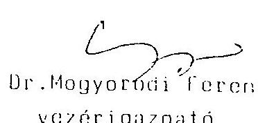

---

# ALLAHI VAHYONOGYBOKSINI   OHYVEZETO IGAZGATO 

$1308 / \quad A V O / 91$

Ir. Hogyoródi Ferenc úrnak.
vezérigazgató
Hszakmagyarországi Vegyimüvek

Sajóbátony

Tisztelt Hogyoródi Ur !

Hivatkozással az f̉szakmagyarországi Vegyimüvek egyszemélyes társasága, a PORAN Poliuretán Gyártó és f́rtékesító Kft. privatizációjára vonatkozó bejelentésére, valamint az Allami Vagyonügynökség 1308/2/AV0/91 sz. 1991. április 12-én kelt tiltó állásfoglalására, az alábbiakról tájékoztatóm:

A potenciálisan érintett osztrák és spanyol partnerek között a fenti levelünkben meghatározott módon. az Allami Vagyonügynökség, valamint az Ipari és Kereskedelmi Minisztérium szakértőivel egyeztetett kiindulási feltételekkel történt versenyeztetés következményeként a tervezett tranzakcióhoz, igy az 1991. március 4-én aláirt Adás-Vételi szerződés érvénybe lépéséhez szükséges engedélyt az 1990. évi VIII. törvény alapján megadóm.

Budapest, 1991. Június 7.
Tinztelettel:
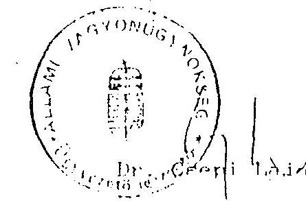

---

2 sz. K i e g é s z i t é s
az Eszakmagyarországi Vegyimüvek átalakítási terveñeæ
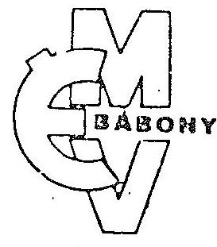

---

Tárgy: 1991. junius 27.-i IT ülés határozatának megküldése

Az Igazgató Tanács 1991. junius 27-i rendkívüli ülésén megtárgyalta és határozatot hozott az ÉMV átalakítására vonatkozó feladatokkal kapcsolatban amelyre az ÉMV-Greiner szerzôdés jóváhagyásával - a Greiner cég által, vállalati tulajdonrész kivásárlásából származó, 400 MFt fedezati összeggel - nyilt meg a lehetôség.
A testület álláspontja szerint - a társasági törvény által biztosított módon - egy termelô-értékesítô-szolgáltató tevékenységi körũ részvénytársaságot vagy lehetőleg nem egyszemélyes korlátolt felelôsségũ társaságot és egy termelô-értékesítö tevékenységi körũ korlátolt felelősségũ társaságot kell alakítani. ("V"-RT vagy "V"-KFT ill. "U"-KFT)

Az átalakuláshoz felhasználható tôkéből terv szerint a "V" gazdasági társaságnak 300 MFt-ot-, az "U"-KFT-nek 100 MFt-ot biztosítanánk forgó tôkeként. Az elöirányzott keretösszegektôl a vagyonértékelés, a szervezettervezés részletei és a piaci lehetôségek ismeretében lehet eltérni, ill. az összegeket konkretizálni.
Az Igazgató Tanács kiemelte annak fontosságát, hogy a törvény adta lehetôségek keretében - az alapítás során - seg kell teremteni a dolgozói részvénybiztosítást és tulajdonlást.
A testület véleménye, hogy az alapításra kerülũ társaságok zártkörüek legyenek, a mũködés során továbbí tôkeemelés csak a jogszabályaknak megfelelôen történhet és ezeknél elà helyen kell szerepel'utni legiJbb hitelezôinket; (NHB, Chemolinpex) de az IT állást fog.ilt :itian is, hogy nem szabad a társaságok megalakításával külsõ

---

(hazai, vagy külföldi) partnerekre várni, mert a vállalat a jelenlegi feltételekkel és szervezeti keretek között már nem müködőképes.
Önálló társasági szervezetkénti mũködtetésre nem tervezett-, vagy ezekbe köl iségcentrumként nem integrálódott szervezeti egységek továbbra is a vállalati törzs részét képezik.
A jelenlegi állami vállalat megszüntetésére vagy átalakítására vonatkozó konkrét lehetöség kidolgozására a késöbbiekben kerülhet sor.
Döntésünknél figyelembe vettük az FB, IKM és ÁVÜ azon észrevételeit, hogy a 400 MFt az átalakulási tervben szereplő 8 egység mũködtetéséhez nem elegendô.

Az Igazgató Tanács kéri, hogy a felügyeleti szervek soron kívül foglaljanak állást az ÉMV átalakítási tervének ilyen módon történő végrehajtásáról, hogy ezeket az egyébként is szükséges lépéseket az átalakítás befejezo̊ eseményeinek konkretizálása elôtt megtehessük.

Sajóbábony, 1991. junius 27.
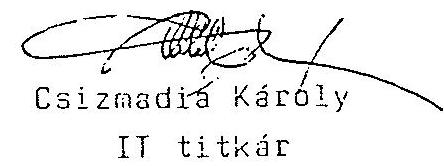

---

Az átalakulási terv 13. sz. mellékletének módosítása

| Megnevezés | V Kft | U Kft | Porán Kft | ÉMV |
| :--: | :--: | :--: | :--: | :--: |
| Árbevétel | 2.116 | 808 | $120 *$ | 949 |
| Anyagköltség | 1.512 | 559 |  | 574 |
| Energiaköltség | - | 60 | 70 | 176 |
| Karbantartási költség | - | 35 |  | 54 |
| Munkaerő költség | 233 | 37 |  | 59 |
| Munkaerő szükséglet (fő) | 854 | 145 |  | 228 |
| Környezetvédelmi költség Szállítási és rakt.költség | $\begin{array}{r} 21 \\ 34 \end{array}$ | $\begin{array}{r} 11 \\ 4 \end{array}$ |  | $\begin{array}{r} 8 \\ 2 \end{array}$ |
| Forgóeszk.hitelkamata | 34 | 8 |  | 12 |
| Beruházási hitelkamat | 6 | - |  | 105 |
| Értékesítési különköltség | 17 | 5 |  | 6 |
| Statisztikai illeték | 18 | 6 |  | 7 |
| Értékcsökkenés | 56 | 12 |  | 89 |
| Általános költség | 161 | 44 | 50 | 66 |
| Összes költség | 2.058 | 781 | 120 | 1.158 |
| Eredmény | 58 | 27 | 0 | - 209 |

* Ez az összeg a Porán Kft-nek a többi társasággal szemben fennálló kötelezettségének fedezetéül szolgáló árbevételrésze

---

Az átalakulási terv 13. sz. mellékletének 2.sz. módosítása

| Megnevezés | PORÁN Kft | V Kft | Szolgáltató Kft | U Kft | EMV |
| :--: | :--: | :--: | :--: | :--: | :--: |
| Árbevétel | 120 * | 1.702 | 612 | 808 | 949 |
| Anyagköltség | - | 1.114 | 398 | 559 | 574 |
| Energiaköltség | 70 | 97 | - | 60 | 176 |
| Karbantartási költség | - | 61 | - | 35 | 54 |
| Munkaeró költség | - | 85 | 148 | 37 | 59 |
| Munkaeró szükséglet (fó) | - | 324 | 530 | 145 | 228 |
| Környezetvédelmi költség | - | 40 | - | 11 | 8 |
| Szállítási és rakt. költség | - | 20 | 1 | 4 | 2 |
| Forgóeszköz hitelkamata | - | 34 | - | 8 | 12 |
| Beruházási hitelkamat | - | 6 | - | - | 105 |
| Értékesítési különköltség | - | 17 | - | 5 | 6 |
| Statisztikai illeték | - | 18 | - | 6 | 7 |
| Értékcsökkenés | - | 41 | 15 | 12 | 89 |
| Általános költség | 50 | 121 | 40 | 44 | 66 |
| Összes költség | 120 | 1.654 | 602 | 781 | 1.158 |
| Eredmény |  | 48 | 10 | 27 | - 209 |

* Ez az összeg a Porán Kft-nek a többi társasággal szemben fennálló kötelezettségének. fedezetéül szolgáló árbevétele

---

Állami Vagyonügynökség Privatizációs Igazgatóság

Budapest, 1991. augusztus Igazgató: Szücs Endre

Felelős: Mészáros Tamás

# Elöterjesztés 

az Igazgatótanács részére

Tárgy:
Északmagyarországi Vegyimũvek társaságalapitásai

## Elözmények:

Az Északmagyarországi Vegyimũvek az ÁvÜ, az IKM, valamint a vállalat Felügyelö Bizottsága által támogatva megkezdte a vállalat fokozatos privatizációját.

Ennek kapcsán elsõ lépésként a vállalat egyik profilját, a poliuretán gyártást vitte át társasági formába, a PORÁN Kft létrehozásával. További lépésként megkezdte a vállalat egyes tevékenységei külön gazdálkodói egységekbe szervezését mind jogi, mind pénzügyi gazdasági alapokon.

Ennek jegyében az ÉMV három új, egyszemélyes társaság alapítására tett bejelentést az ÁvÜ Privatizációs Igazgatóságán, mellékelve a szükséges üzleti terveket, gazdasági számításokat, valamint az "P2 adatlapokat.

Az ÉMV a tervezett átalakulás után három üzemrészt tart magánál, egyeztetv a Védelmi Titkárság, a PM, az ÁFI és a HM szempontjaival.

A három üzemrész:

- TNT gyártás
- formaldehid gyártás
- vs üzem

A tervezett átalakulás a következõ gazdasági társaságok megalapítását célozza:

---

1. INTERMED Kft

A társaság profilja: gyógyszer intermedielek és növényvédőszerek gyártása.
Törzstőke: 260 millió Ft
A tervezett társasági szerződés értéke a vállalati könyvíteli mérleg eszközértékének viszonyított arányában: $10 \%$
2. SAGROCHEM Kft

A társaság profilja: növényvédőszerek és intzermedielek gyártása
Törzstőke: 713 millió Ft
A tervezett társasági szerződés értéke a vállalat könyvíteli mérlegében szereplő eszközértékhez viszonyított aránya: $28,5 \%$
(Ezen társaság alapításánál már a tavalyi év során előrehaladott tárgya lásokat folytattak a szovjet SZOJUZAGRÖPROMHIN egyesüléssel, melynek vagyonértékelése szakértőink szerint elfogadható volt. Maga a tranzakció a szovjet fél fizetésképtelensége miatt hiusult meg.)
3. SASZOLG Kft

A társaság profilja: ipari szolgáltatás és kereskedelem (a sajóbábonyi gyártelep komplett ipari szolgáltatását ezen új társaság végzi). Törzstőke: 260 millió Ft
A tervezett társasági szerződés értéke a vállalat könyvíteli mérlegében szereplő eszközértékhez viszonyított aránya: $10 \%$.

A tervezetben két változat szerepeľ vagy egyszemélyes társaság alapítása és azután az első privatizált egységnek - a PORÁN Kft-nek - abból üzletrész vásárlása, vagy az ÉMV-PORÁN Kft közös alapítás.

Tekintettel arra, hogy a távlati tervek szerint az ipari szolgáltató társaság az ipartelepen levő összes egység kiszolgálását ellátja, nem célszerű az egyik - már privatizált - társaságot már alapításkor bevenni a cégbe, ugyanis ez esetben a később belépőket eltérő jogok illetik. (Ezért javaslom az első változat támogatását.)

---

Az ĖMV ezek szerint - javaslatom elfogadása esetén - három egyszemélyes Kft-t hoz létre. A társaságalapításokhoz a készpénz betétet a PORÁN Kft üzletrésze után az ĖMV -hez befolyt pénz biztosítja. A társaságok megalapítását követően kerül sor egyrészt ezek privatizációjára, értékesítésére, másrészt a vállalatnál eredendően megmaradó három profil önálló jogi személlyé történő szervezése.

Jelen trancakciók az egész Eszakmagyarországi Vegyimüve: átalakításába szervesen illeszkednek. Tekintettel arra, hogy : vállalatnál TNT gyártási kapacitás van ( az országban egyedül ) ami bár jelenleg nincs kihasználva, a vállalat teljeskör: átalakítása nem megoldható. Terveink szerint az átalakulás úg: történik. hogy az egyes profilok leválnak egyszemélye: társaságokba. s a végén ott marad "magként" a Védelm: Titkárságnak a robbanóanyag üzem, mint állami vállalat. A: egyszemélyes társaságok privatizációjakor tervezzük az adot: társaságban meglévő EMV üzletrészek elvonását, akkor, amikor konkrét privatizáció megtörténik. Ez előtt nem érdemes lépni hisz az egyes profilok jellegét tekintve - energiaigénye: mũtrágya, növényvédőszerek, stb. - a piaci helyzet miatt csai veszõdség van velük.

Jelen trancakciókkal már az Ipari és Kereskedelmi Minisztériu: államigazgatási felügyelete alatt álló vállalat mintegy ... 60 \%kerül társaságba kihelyezésre, ami csak formai változást jelent végeredményben megteremtjük az elôfeltételeit a privatizáci: megvalósításának.

Jelen koncepcióval a Ipari és Kereskedelmi Minisztérium i: egyetért.

---

Határozati javaslat:

Az ÉMV a következő gazdasági társaságot alapítja:

|  1. INTERMED Kft | Törzstőke: 260 M FT  |
| --- | --- |
|  2. SAGROCHEM Kft | Törzstőke: 713 M Ft  |
|  3. SASZOLG Kft | Törzstőke: 260 M Ft  |

Kérem az Igazgatótanácsot az előterjesztés alapján járuljon hozzá az ÉMV társaságalapitási szándékához.

Dr. Csepi Lajos Ugyvezető igazgató

---

F E L J E G Y Z E S

Szücs Endre igazgató részére

Tárgy : Eszakmagyarországi Vegyimüvek társaságalapításai

A sajóbábonyi Eszakmagyarországi Vegyimüvek az AVU, az IKM. valamint a vállalat Felügyelö Bizottsága által támogatott átalakulási előkészületei során - a már társaságban kint levő poliuretán gyártás ( PORAN Kft. ) - megkezdte az egyes tevékenységeinek külön gazdasági egységbe való szervezését mind jogi, mind pénzügyi-gazdasági alapokon.

Ennek során megalapításra kerül az alábbi 3 egyszemélyes társaság :

1. INTERMED Kft. - gyógyszerintermedierek és növényvédőszerek gyártása
tözstöke : 260.000 .000 Ft
A tervezett társasági szerzödés értéke a vállalat könyvviteli mérlegében szereplő eszközértékhez viszonyított aránya : $10 \%$
2. SAGROCHEM Kft. - növényvédőszerek és intermedirek gyártása
törzstöke : 800.000 .000 Ft
A tervezett társasági szerződés értéke a vállalat könyvviteli mérlegében szereplő eszközértékhez viszonyított aránya : $32 \%$
( Ezen társaság alapítására már a tavalyi év során előrehaladott tárgyalásokat folytattak a szovjet SZOJUZAGROPROMHIM egyesüléssel, melynek vagyonértékelése szakértőink szerint elfogadható volt. Maga a tranzakció a szovjet fél fizetésképtelensége miatt hiúsult meg. )

Ezen társaság alapításánál 2 változat szerepel. Egy 87 M Ft-os magántalálmánynak a szabadalom tulajdonosai részéről történő apportálásának elismertetése, avagy a találmánynak az állami vállalat részéről történő apportálása s egyben szolgálati találmánnyá történő minősítése. (Javaslom e második változat elfogadását.)
3. SASZOLG Kft. - ipari szolgáltatás és kereskedelem
( a sajóbábonyi gyártelep komplett ipari szolgáltatását ezen új társaság végzi )
törzstöke : 260.000 .000 Ft
A tervezett társasági szerzódés értéke a vállalat könyvviteli mérlegében szereplő eszközértékhez viszonyított aránya : $10 \%$

---

Itt is két váltczat szerepel. Vagy egyszemélyes társaság alapítása s azután az elsó privatizált egységnek - PORAN Kft. - abból üzletrészvásárlása, vagy EMV-PORAN közös alapitás. ( Javaslatom az elöbbi változat mellett van.)

A társaságalapitásokhoz a készpénz betét a privatizált PORAN Kft. üzletrésze után az EMV-hez befolyt pénz biztosítja. A társaságok megalapítását követően kerül sor egyrészt ezek privatizációjára, másrészt az állami vállalatban még meglévő más profilok - TNT, formaldehid, stb. - önálló jogi személlé történő szervezése.

Egyetértés esetén kérem a mellékelt levelek kiadását.

Budapest, 1991. augusztus 6.

---

# ALLAMI VAGYONUGYNOKSEG 

$1308 / 2 / A V U / 91$

Dr. Mogyoródi Ferenc úrnak
vezérigazgató
Eszakmagyarországi Vegyimüvek

Sajóbábony

Tisztelt Mogyoródi Ur !

Ez úton tájékoztatom, hogy az Állami Vagyonügynökség az 1990. évi VIII. törvény alapján jóváhagyólag tudomásul veszi az egyszemélyes EMV alapítású SAGROCMEM Kft. létrehozásat az alabbi feltételekkel :

A társaság tőzstőkéje : 713.000 .000 Ft
Fő tevékenysége : növényvédőszerek és intermedierek gyártása.
Amennyiben a társaság üzletrésze elidegenítésre kerül, úgy ahhoz az 1990. évi VIII. törvény alapján az Állami Vagyonügynökség jóváhagyása szükséges.

Budapest, 1991. augusztus 28.
Tisztelettel :
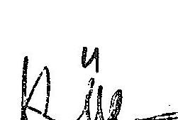

Dr. Csepi L. 1990

---

# ALLAMI VAGYONOGYNOKSEG 

$1308 / / / \mathrm{AVO} / 91$

Dr. Mogyoródi Ferenc úrnak
vezérigazgató
Eszakmagyarországi Vegyimüvek

Sajóbábony

Tisztelt Mogyoródi Ur !

Ez úton tájékoztatom, hogy az Állami Vagyonügynökség az 1990. évi VIII. törvény alapján jóváhagyólag tudomásul veszi az egyszemélyes EMV alapítású SASZOLG Kft. létrehozását az alábbi feltételekkel :

A társaság tőzstőkéje : 260.000 .000 Ft
Fő tevékenysége : ipari szolgáltatás és kereskedelem.
Amennyiben a társaság üzletrésze elidegenítésre kerül, úgy ahhoz az 1990. évi VIII. törvény alapján az Állami Vagyonügynökség jóváhagyása szükséges.

Budapest, 1991. augusztus 28.
Tisztelettel :
Cnili

Dr. Csapi Lásos

---

# ALLAMI VAGYONUGYNOKSEG 

$1303 / 2 / \mathrm{AVO} / 91$

Dr. Mogyoródi Ferenc úrnak
vezérigazgató
Eszakmagyarországi Vegyimũvek

## Sajóbábony

Tisztelt Mogyoródi Ur !

Ez úton tájékoztatom, hogy az Állami Vagyonügynökség az 1990. évi VIII. törvény alapján jóváhagyólag tudomásul veszi az egyszemélyes EMV alapítású INTERMED Kft. létrehozását az alábbi feltételekkel :

A társaság tözstőkéje : 260.000 .000 Ft
Fő tevékenysége : gyógyszerintermedierek és növényvédőszerek gyártása.

Amennyiben a társaság üzletrésze elidegenítésre kerül, úgy ahhoz az 1990. évi VIII. törvény alapján az Állami Vagyonügynökség jóváhagyása szükséges.

Budapest, 1991. augusztus 28.
Tisztelettel :
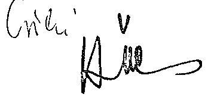

Dr. Cserfi dajps

---

# ALLAMI VAGYONOGYNOKSEG 

$1308 \mathrm{~A} / \mathrm{AVO} / 91$

Dr. Mogyoródi Ferenc úrnak.
vezerigazgató
Eszakmagyarországi Vegyimüvek

Sajokábony

Tisztelt Mogyorodi Ur !

Ez úton tájékoztatom, hogy az Aliami Vagyonügynökség részérol jóvahagyólag tudomasul vesszük az egyszemélyes. 2. 400.000 Ft törzetőkéju Pentapíuz Számitastechnikai Szolgáltató és Kerezkedelmi Kitt. alapitását.

Budapest. 1991. december 6.
P. $n^{2} 4$

---

# ALLAMI VAGYONOGYNOKSEG 

$1308 \mathrm{~A} / \mathrm{AV} / 91$

Dr. Mogyorodi Ferenc úrnak,
vezérigazgato
Eszakmagyarorszagi Vegyimüvek

Sajobabony

Tisztelt Mogyorodi Ur !

Ez úton tajékoztatom, hogy az Állami Vagyonügynökség részérol jóváhagyolag tudomásul vesszük az egyszemélyes, 8.650.000 Ft törzstokéju Pajzz Biztonságtechnikai Szolgáltató és Kereskedelmi Kft. alapitását.

Budapest, 1991. december 6.
Tisztelettel:
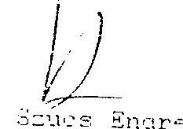

Igazgato

---

# ALLAMI VAGYONUGYNOKSEG 

$1308 / 4 / \mathrm{AVO} / 91$

Dr. Mogyoródi Ferenc úrnák.
vezérigazgató
Eszakmagyarorszagi Vegyimüvek

Sajóbábony

Tisztelt Mogyoródi Ur !

Ez úton tájékoztatom, hogy az Állami Vagyonügynökség részéról jóváhagyólag tudomásul vesszük az egyszemélyes. 11.900 .000 Ft törzstókéjü Prokomfort Szocialis Szolgáltató. Uzemeltetó és Kerezkedelmi Kft. alapitását.

Budapest, 1991. december 6.
Tisztelettel:
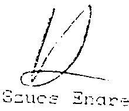

---

ybe vett, illetve a visszafizetendó s rendjéről szóló, az 1991. évi ódositoit 1990. évi XCI. törvény Jök.
13. §
letésekor lép hatályba.
niall József s. k.,
siniszterelnök

## :ámú melléklet

(I. 4.) Korm. rendelethez

## ogatás meghatározása

ározott éven belüli hitelek kamat:te igénybe vehetơ kamattámogaregjelölt hitelekre, azáltala közölt lak szerint kell meghatározni:
smatköltség $\times 10$
matszázalék
des pontossággal kell elvégezni és a rintra kerekíve kell igényelni.
: kiszámított és igényelt kamattá: (zödés esetén ennek összegét) kü: elszámolni.
igazolásnak a mezôgazdasági ter: onosító adatai mellett tartalmazni
zerinti hitelösszeg,
zerinti lejárati határidejének
ámú melléklet
I. 4.) Korm. rendelethez
a:Jósodottság meghatározása
molónak (Állami Fejlesztési Intézet, 1051 Budapest, Deák F. u. 5.), a fenti úgyszámra hivatkozással, két példányban, bizonyítékaikat is csatolva jelentsék be.

Dr. Mándi Zoltán s. k., bíró

A Zala Megyei Bíróság
Fpk. 20.036/1991/6. határozata egyszerüsített felszámolási eljárás megindításának közzétételéről

Végzés
A Zala Megyei Bíróság a Zalaegerszegi Közúti Építő Vállalat ( 8900 Zalaegerszeg, Köztársaság u. 1.) egyszerúsített felszámolási eljárását megindítja.

Az eljárás megindítását eredményező kérelem benyújtásának az idópontja: 1991. november 26.

A kérelmet a Zalaegerszegi Közúti Építő Vállalat.az Állami Vagyonügynökség Igazgatótanácsa 1991. szeptember 4-i határozata alapján terjesztette elő.

Felszámoló: Dobri Ibolya fökönyvelő ( 8900 Zalaegerszeg, Köztársaság u. 1.).

A bíróság felhívja a felszámolás alatt álló gazdálkodó szervezzet hitelezőit, hogy követcléseiket a Magyar Közlöny megjelenését követő 30 napon belül a felszámolónak (Dobri Ibolya, 8900 Zalaegerszeg, Köztársaság u. 1.), két példányban, bizonyítékaikat is csatolva jelentsék be.

Dr. Bánáti Zsuzsanna s. k., megyei birósági bíró

A Zala Megyei Bíróság
Fpk. 20.044/1991/5. határozata egyszerüsített felszámolási eljárás megindításának közzétételéről

A bíróság felhívja a felszámolás alatt álló gazdálkodó szervezet hitelezőit, hogy követeléseiket a Magyar Közlöny megjelenését követő 30 napon belül a felszámolónak (Szi Márton László, 8360 Keszthely, Sopron u. 47.), két példányban, bizonyítékaikat is csatolva jelentsék be.

Dr. Bánáti Zsuzsanna s. k., megyei bírósági bíró

A Borsod-Abaúj-Zemplén Megyei Bíróság
4. Fpk. 402/1991/6. határozata
felszámolási eljárás megindításának
közzétételéről

## Végzés

A Borsod-Abaúj-Zemplén Megyei Bíróság az Északmagyarországi VegyiMüvek (3792 Sajóbábony) állami vállalat felszámolására irányuló eljárást a gazdálkodó szervezet fizetésképtelensége miatt megindítja.

Az eljárás megindítását eredményező hitelezői kérelem benyújtásának az időpontja: 1991. december 27.

A bíróság felszámolóként a REORG Gazdasági és Pénzügyi Rt.-t jelöli ki.

A bíróság felhívja a felszámolás alatt álló gazdálkodó szervezet hitelezőit, hogy követeléseiket a Magyar Közlöny megjelenésétől számított 30 napon belül a felszámolónak (REORG Gazdasági és Pénzügyi Rt., 1054 Budapest, Vadász u. 30.) két példányban, bizonyítékaikat is csatolva jelentsék be.

A felszámolás kiterjed az adós által alapított SASZOLG Szolgáltató és Kereskedelmi Kft., a PAJZS Biztonságtechnikai és Szolgáltató Kft., a PENTAPLUS Számítástcchnikai és Kereskedelmi Kft., valamennyien 3792 Sajóbábony székhelyú cégekre is.

A felszámolási eljárásra az 1986. évi 11. tvr. az irányadó.

Dr. Egeli Zsolt s. k.,
megyei bíró

---

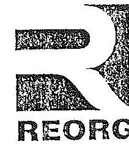

# Gazdasági és Pénzügyi Részvénytársaság 1054 Budapest V., Vadász utca 30. 

Postacím: 1398 Budapest Pf. 562
Telefax: 131-3323 $\cdot$ Telex: 202-928

Ügyintéző: VirágM
Telefon: $1111-836$
dr Kovács Árpád úr
számvevō igazgató

Állami Számvevőszék

## Budapest

Tisztelt Kovács Úr!

A f.hó 11-én kelt levelében hozzám intézett kérésére jelen levelem mellékleteként megküldöm az Északmagyarországi Vegyimüvek felszámolási eljárásának idöszakáról és az azt megelőző egy évben tett vállalati kezdeményezésü lépésekröl összeállitott áttekintő információs anyagunkat.

Budapest, 1993. március 19.
melléklet
Üdvözlettel
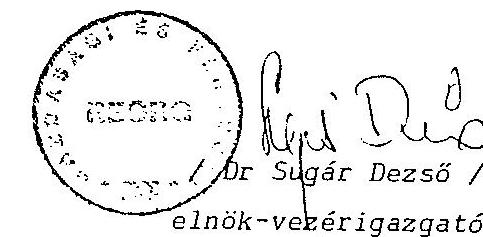

---

# Áttekintés az Északmagyarországi Vegyimũvek felszámolási eljárásáról és visszapillantás a gazdasági társaságok alapítási idôszakának eseményeire 

Az Északmagyarországi Vegyimũvek (3792 Sajóbábony) nemzetgazdasági és iparági szinten is jelentôséggel bíró vállalat volt. Az utóbbi két évtizedben jelentôs szerepet vállalt a mezôgazdaság kemizálásában és az export tevékenysége is számottevô volt. Jelentőségét növelte a mai napig is meglévô az utóbbi években hideg tartalékot képezô hadiipari kapacitás.
A vállalat gazdálkodási nehézségei 1989. decemberében az AGROKÉMIA II. Egyezménybôl, az állami támogatás megszûnése miatt történt kilépéssel kezdôdtek.
1990-ben olyan jelentôs növényvédôszer termelés kiesése volt a vállalatnak, hogy a korábbi 4,6 Mrd Ft-os éves termelési érték 2,6 Mrd Ft-ra esett vissza.
A korábbi években mindig nyereséget produkáló vállalat mérlegszerinti vesztesége 1990-ben 497,7 MFt lett.
Az év közben történt vezetôváltás sem volt alkalmas aira, hogy megállítsa a veszteségek növekedését.
Ilyen elôzmények után kezdôdtek - felgyorsított ütemben - a vállalat részérôl gazdasági társaság alapítási lépések.
A vállalat 1990.I.l-én alapította a PORÁN Kft-t. Ennek tevékenységi körébe tartozik a mûanyag habok elôállítása.

| Alapitás | $:$ | 1990.január 1. |
| :-- | :-- | :-- |
| Bejegyzés | $:$ | 1990.január 10. |
| Cégjegyzék száma | $:$ | 0509000287 |
| Vagyona | $:$ | 121.506 eFt tárgyi appost |
|  |  | 52.074 eFt készpénz |
| Létszáma | $:$ | 224 fố |

A szóban forgó Kft. vagyonértéke 1991.okt.25-én a földingatlan és épületek értékével megnövelve 600.000 eFt lett.
A Kft. 66 \%-os üzletrészét 1991.július 1-én - az ÁVÜ hozzájárulásával - elidegenítette a vállalat az osztrák GREINER és fiai cégnek.

---

Már a Kft. alapítás előtt is 1989-től folytak tárgyalások az Industria Espanola Del Poliester S.A. "INESPO" nevü spanyol céggel is. A spanyol cég a késôbbi tárgyalások során tőkehiányt sejtető idôhúzó taktikát folytatott.
Az ivü a Greinernek történő eladással egyidőben lehetővé tette, hogy az üzletrész értékesítésből befolyó 400.- Mft bevételt a vállalat ne fizesse be a költségvetésbe, hanem felhasználhatja további gazdasági társaságok alapításához. 1991. szeptember 1-én a következô további 3 termelő, illetve szolgáltató Kft-t alapította meg a vállalat.

- SAGROCHEM Kft.

Tevékenységi köre: gyomirtószerek, gyógyszerintermedierek és növényvédőszer-hatóanyagok elóállítása.
Alapitás : 1991. szeptember 1.
Bejegyzés : 1991.október 8.
Cégjegyzék szám : 0509001429
A vagyon vagyonértékelô cég által megállapitott
értéke : 713.000.- eFt
-ebből:állóeszköz: 479.000.- eFt (csak gép és berendezés) pénzeszköz: 234.000 .- eFt
Létszáma: 1991.IX.1.: 434 fó

- INTEREED Kft.

Tevékenységi köre: növényvédőszerek, gyógyszerintermedierek gyártása és forgalmazása.
Alapitás : 1991. szeptember 1.
Bejegyzés : 1991.október 1.
Cégjegyzék szám : 0509001428
A vagyon vagyonértékelô cég által megállapított
értéke : 260.000.- eFt
-ebből:állóeszköz: 182.000.-eFt (csak gépek és berendezések) pénzeszköz: 78.000.-eFt
Létszáma 1991.IX.1.: 253 fó

---

- SASZOLG Kft.

Tevékenységi köre : gőz energia termelés és szolgáltatás, vásárolt víz és villamosenergia elosztás és eladás, gépészeti-épitészeti--villamos és müszerész karbantartási szolgáltatás és környezetvédelmi (szennyvízkezelés, hulladékégetés) tevékenység.
Alapitás : 1991.szeptember 1.
Bejegyzés : 1991.szeptember 30.
Cégjegyzék szám : 0509001430
A vagyon vagyonértékelő cég által megállapitott
értéke : 260.000.- eFt
-ebből: állóeszköz : 173.215.-eFt (csak gépek és berendezések)
vásárolt készlet : 8.785.-eFt
pénzeszköz : 78.000.-eFt
Létszáma: 1991.IX.1.: 483 fó
1991.december l-én a következó további 3 Kft-t alapította meg a vállalat.

- PROKOMFONT Kft.

Tevékenységi köre: szociális szolgáltatás, üzemeltetés és kereskedelmi tevékenység.
Alapitás : 1991.december 1.
Bejegyzés : 1992.febr. 24.
Cégjegyzék szám : 0509001777
A vagyon vagyonértékelő cég által megállapitott
értéke : 11.900.- eFt
-ebből: állóeszköz: 6.120.- eFt (csak gépek és berendezések
fogyóeszköz : 2.210.- eFt
pénzeszköz : 3.570.- eFt
Létszáma : 1991.december l.: 65 fó

---

- PAJZS Kft.

Tevékenységi köre : Őrzés-védelmi és biztonságtechnikai szolgáltatás.
Alapités : 1991.december 1.
Bejegyzés : 1992.január 29.
Cégjegyzék szám : 0509001778
A vagyon vagyonértékelő cég által megállapított
értéke : 8.650.- eFt
-ebből: állóeszköz: 6.050.- eFt (csak gépek és berendezések) pénzeszköz : 2.600.- eFt
Létszám: 1991.december 1.: 35 fő

- PENTAPLUSZ Kft.

Tevékenységi köre : számitástechnikai szolgáltatás, szoftver értékesités.
Alapitás : 1991.december 1.
Bejegyzés : 1992.január 6.
Cégjegyzék szám : 0509001776
A vagyon vagyonértékelő cég által megállapitott
értéke : 2.460.- eFt
-ebből: állóeszköz: 1.336.- eFt (csak gép és berendezés)
vagyoni értékó jog: 280.- eFt
fogyóeszközök : 104.- eFt
pénzeszköz : 740.- eFt
Létszám: 1991.december 1. : 10 fő
A fenti hat Kft-be ingatlanok (telek, épületek, infrastruktúra) nem lettek apportálva.
1991.december 15-én a SAGROCHEN Kft. $5 \%$, és az INTIHMED Kft. $26 \%$ nagyságú ílzletrészeit elidegenítette a vállalat a Chemolimpemnek.
A maradék 1,7 Kird Ft nettó értékú vagyont megtestesitő IW-Nek termelö egysége nem maradt.

- Bérleti formában ízemel szakaszosan a

Formalin ízem:
állóeszköz nettó értéke : 186.035.-eFt
ebből:épület-épitmény : 28.654.-eFt
gépi berendezés : 157.381.-eFt
Létszáma: -

---

- Leállitott V-5 növényvédőszergyártó üzem:
állóeszköz nettó értéke : 224.156.-eFt
-ebből: épület-épitmény : 129.867.-eFt
gép, berendezés : 74.289.-eFt
Létszáma: 1 fố

# Hadiipari termelókapacitások: 

- AREK (Trinitrotoluol üzem) leállitott rögzitett kapacitás. állóeszköz nettó értéke : 173.941.-eFt
-ebből: épület-épitmény : 55.621.-eFt
gép, berendezés : 118.320.-eFt
Létszám: 12 fố
- Leállitott kapacitások.

állóeszköz nettó értéke : 23.204.-eFt
-ebből: épület-épitmény : 21.988.-eFt
gép, berendezés : 1.216.-eFt
Létszám: -
Erőfeszítéseket tett a vállalat vezetősége az 1990-ben elvesztett keleti piac visszaszerzésére és piac konvertálási stratégiát is kidolgozott. Ezek az intézkedések nem vezettek eredményre. 1991 évben már csak 1,5 Mrd Ft volt a termelési érték és további 707 MFt veszteséget mutatott ki éves mérle-. gében a vállalat.
Az 1991. szeptember 1-től megkezdett társaságalapitáai kampány a gazdasági folyamatok lényegét és irányát nem változtatta meg és év végére fizetésképtelenné vált az íMV.
Az APEH 1991.december 27 -én kért felszámolási eljárást az ÍMV ellen, melyet a BAZ.Megyei Bíróság 4.FPK.402/1991/6.sz. végzésében 1992.március 4-én tett közzé a MK-ben.
A fizetésképtelenség kialakulásának és az azt okozó gazdálkodási helyzetnek főbb okai a következőkben foglalhatók össze:

---

- A volt szocialista országokkal folytatott kereskedelem lehetőségeinek csökkenése (Agrokémiai Egyezmény megszûnése).
- A szocialista piacra kiépitett nagy kapacitások konvertálási nehézségei.
- A korábbi kormányprogramokon alapuló hadiipari beruházások útján létrehozott kapacitások kihasználatlansága és a vállalatnál visszamaradt hiteltörlesztési terhek.
- A belföldi fizetőképes kereslet visszaesése miatt a vállalat hazai piaca is összeomlott. A belföldi piacvesztést erősítette a hazai termékek iránti kereslet csökkenése, az import liberalizáció hatása.
- A költségvetési támogatások csökkenése, illetve megszűnése.
- A likviditási problémák kiélezôdése.
- Végezetül a vállalatvezetés stratégiai és taktikai hibái melyek a gazdasági társaságok alapítása, a piackonvertálás, valamint a költségtakarékos gazdálkodás területén kuilönböző mértékben nyilvánultak meg.

# A felszámolási idôszak áttekintése 

- A felszámoló cég elnök-vezérigazgatója a felszámoló biztossal 1992.március 10-én találkozott az ÉEV vállalatvezetôségével és néhány vezető munkatársával. Kuilön találkozott a felszámoló a munkavállalói érdekképviselet (VDEZ) vállalati vezető testületével.
Fő célkitűzésként:
- a veszteség növekedésének megakadályozását,
- a termelőképesség fenntartását,
- a vagyon csökkenés minden eszközzel történő megakadályozását,
- a hitelezők követelésének felmérését és törvény szerinti kielégítését,
- humánus módon végrehajtandó, jelentôs mértékũ létszámcsökkentést
jelölt meg.

---

E célok megvalósitásában kérte a vállalat vezetőinek és az érdekképviseleti szerveknek aktív közreműködését és lojalitását.
A felszámoló deklarálta, hogy az ÉMV Kollektiv Szerződésének - a gazdasági társaságokra is kiterjedően - hatályosságát fenntartja.

- A felszámolás kezdetekor az ÉMV-nél a fentebb ismertetett hét gazdasági társaság (Kft) müködött.
- Az ÉMV fontosabb adatai a felszámolási nyitómérleg alapján a felszámolás megindulásakor a következök voltak:
a.) Eszközök értéke : 3.482.195.-eFt
melyek a következőkből tevődnek
össze:
- Pénzeszközök : 19.960 eFt
- Követelések : 311.585 eFt
- Saját termelésú kész- 5.855 eFt
letek
- Vásárolt készletek : 251.545 eFt
- Egyéb aktívák : 140.633 eFt
- Részvények : 13.500 eFt
- Vagyoni betét gazdasági társaságokba
:1.323.193 eFt
- Állóeszközök nettó ér-
téke :1.415 .924 eFt
-ebből:épület,épitmény :
780.054 eFt
gép, berendezés
635.870 eFt
b.) Tartozások:
1.809.716.-eFt
ebből: - állammal szembeni
324.365 .-"
- bankkal szembeni
794.646 .-"
- szállitókkal szembeni
672.027 .-"
- munkavállalókkal szembeni
18.678 .-eFt

---

# A felszámolás idötartama alatt tett fontosabb intézkedések 

1.) A hitelezők követelésének számbavétele (nyilvántartása és visszaigazolása) megtörtént.
Időben benyújtott követelések : 2.051.105.-ePt

Idő után " " : 100.231.-"
Visszaigazolt " : 1.926.826.-"
Kielégített (a 1986. évi 11.tvr.30.§.
/1/ bek.szerint "C" besorolású) : 2.183.-"
2.) A térsaságok termelőképességének fenntartása, koordinációja.
3.) A vállalat termelő berendezéseinek összértékét nem csökkentő készletek eladása:

109.290.-ePt
4.) A felszámolás alatt álló vállalat létszámának csökkentése. a.) A felszámolás feladatai lehetővé tették a jelentő́s mértékú létszámcsökkentést, mely a teljes munkaidős foglalkoztatottakat éppúgy érintette, mint a jogi állományból visszatérő munkavállalókat.
A létszám alakulása:

| teljes munka- rész munka- jogi |  |  |  |
| :--: | :--: | :--: | :--: |
| idős | idős | állom. |  |
| 1992.III.04-én | 226 fó | 20 fó | 189 fó |
| 1992.IX.01-én | 71 fó | 1 fó | 144 fó |
| 1993.III.15-én | 51 fó | - | 118 fó |

b.) A létszám leépítés az alábbi módokon történt:

- áthelyezés valamely gazdasági társasághoz,
- korengedményes nyugdíjazás,
- vállalati felmondás.

A létszámcsökkentés az 1990.IV.törvény előírásainak megtartásával valósult meg.
5.) Számottevố baleseti járadék rendszeres fizetése terhelte a vállalatot. A jogszabály előírásainak megfelelően 16 fó járadékossal jött létre szerződés a baleseti járadék egyösszegű megváltására. A kifizetett összeg: 5.424.-ePt

---

6.) Jelentős környezetvédelmi intézkedések megvalósítására került sor:

- teljes talajszennyezettségi felmérés készült,
- intézkedés történt a gyárterületén található veszélyes hulladékok felszámolására, továbbá a fenilizocianát kátrány szakszerũ megsemmisitésére.

7.) A korábbi hadiipari tevékenységből visszamaradt nitrocellulóz hulladék összegyüjtése, megsemmisitése és az üzem semlegesítése folyamatosan történik. Jelentős ráfordítással - a Vegyi és Robbanóanyagipari Biztonségtechnikai Környezetvédelmi Fejlesztő és Szolgáltató Vállalattal kötött szerződés alapján - tovább folytatódik a hadiipari üzemek illetve technológiai berendezések semlegesítése.
8.) Az irat és adatvédelemre vonatkozó szabályoknak megfelelôen egy szakcéggel elvégeztettük a vállalat iratanyagának rendezését.
9.) Az egyik hitelezo̊ feljelentést tett a vállalat volt vezérigazgatója ellen a rendôrségen azt állitva, hogy más hitelezóket elônybe részesitve fizetett a vállalat tartozásokat és ezzel jogtalanul más hitelezóket megkárosított. Az ügy vizsgálatát a rendôrség felfüggesztette.
10.) A felszámolás eddigi tartama alatt több a müködô társaságok likviditását biztosító intézkedést kellett tenni. Ezek általában a közülomi díjak rendezését eredményezték.
11.) Több, a felszámolás érdekében történő értékesítést előkészítő intézkedés is végre lett hajtva. Ezek között említést érdemelnek kül- és belföldiekkel végrehajtott helyszíni szemlék és tárgyalások.
12.) Energiatakarékossági intézkedést is végre kellett hajtani, mert a hadiipari telepítésből eredũ energiaveszteségek nem voltak a továbbiakban elviselhetők és indokoltak.

---

Több nagy energiaigényũ épület elhelyezés racionalizálással ki lett üresitve és az energiaszolgáltatásból kizárva.
13.) A vevôkkel szembeni követelésekbôl 104.634.-eFt-ot behajtottunk.
14.) Feltártuk, hogy a vevôkkel szembeni követelésekből 20.186.-eFt van csődeljárás, illetve felszámolási eljárás alatti gazdálkodó szervezeteknél.
15.) A felszámolási folyamatot jelentôs mértékben akadályozza a hadiipari rögzitett kapacitás (trinitrotoluol uizem) további fenntartására vonatkozó döntés hiánya. Két esetben volt a REORG Rt. vezetése részéről kezdeményezett a HM bevonásával és az illetékes fôhatóságok képviselôivel eredménytelen közös tárgyalás. Az írásos megkeresések is mindeddig érdemi válasz nélkuil maradtak. Erről a kritikus hely. zetrôl tájékoztattuk a felszámolást elrendelő BAZ.Negyei Bíróságot.
16.) Felbontottuk azt az árbevétel engedményezési szerzôdést, amely a Magyar Hitel Bankot - megitélésünk szerint - a többi hitelezônél kedvezôbb helyzetbe hozta. Ezt az intézkedést a BAZ.Megyei Bíróságnál az WHB megkifogásolta. A bíróság a hitelezônek igazat adott és hatályon kivül helye te a felszámoló intézkedését.
17.) Egy hitelezõ a BAZ.Megyei Bíróságnál megkifogásolta az 1991.december 15-én a Chemolimpex részére történt üzletrész elidegenitéseket. Ez az ügy folyamatban van.
18.) A felszámolási eljárás során a REORG Rt: azt a stratégiát tũzte ki, hogy a teljes vagyont egyben, egy vevőnek adja el, mert a felszámolási eljárást megelôzôen alapított gazdasági társaságok - a PORÁN Kft. kivételével - annyira egymásra utaltak, hogy külön-külön tulajdonosok kezében nem lennének életképesek.

---

Minthogy az egyes gazdasági társaságok nem rendelkeznek a vagyoni struktúrájukban ingatlanokkal, külön--külön nem értelmezhető a piacképességük és piaci értékük sem.

Sajóbábony, 1993. március 18.

# GszaKacayanonsezlci vEaytaúvck F.A. 

Dr.Kecsis Gyula
felszámolóbiztos
helyi megbizott

---

# F E L J E G Y 2 \& 9 

## 1111111.15

Csepi Lajos ügyvezetơ igazgato részére

## Târoy: PORAN Kft. privatizaciàja

Az eszakmagvarorazaci VegyimGvek (BMV) 1990. január 1-vel egyszemélyes Kft-t alapitott a poliuretan elGallitására PORAN Kft néven. Ez a társaság szervesen epül a Borsodi Vegyi Kombinát MDI termelésének végsũ felhasználajaként a körzet technológiai rendszerébe. Maga a poliuretan keresett cikk, lảgy és kemény hab mivoltja sokoldalú felhasználást tesz lehetővé. A PORAN Kft. elsôdleges terméke a bútorszivacs, szinte kizárólagos termelése van ma magyarorszàgon, ami a cég piaci értékét növeli.

Az BMV termékszerkezete elsosorban robbandanyagok, mútrágya, s egyéb nagy energiaigényũ, ma veszteségesen elGallítható termékböl áll. A PORAN Kft. gazdaságosan müködő társaság, biztos piaccal, privatizációjában az osztrák GREINER cég és a spanyol INESPO érdekelt.

A társaság alapitására annak idéjén könyv szerinti értéken került sor, most újabb, koràbban bérletbe adott eszközök bevitelét tervezi az BMV, am nem a teljes müködó eszközállományt, hanem annak még mindig csak egy részét. Jelentős nagyságú eszköz maradna még mindig az BMV-nél, amire a bérletet továbbra is fenntartanák. Ez számunkra nom elünvés. nem beszélve arról, hogy a társaság üzleti értékelése is hăgy kivannivalót maga után.

Emellett a vállalati csodhelyzet megoldására a Kft. értékesítéséböl származó bevétel felhasználása nyilvánvalóan csak átmeneti megoldást jelente, csak elodázná a válságot.

Az BMV esetleges csödje esetén a PORAN Kft. "kimcnekülési csatornaként" jelentkezhet a management részére i emiatt is nagy harc dúl az osztrákot támogató BMV vezetés és a spanyolokat tämogató PORAN vezetés között)

Egyetértés esetén kérem a mellékelt levél kiadásak.
A PORAN jövőbeli privatizációjára on thozó egyeztetett AVÜIKM álláspont kidolgozása folyamatban van.

Budapest, 1991. április 12.

---

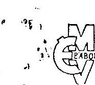

# ESZAKMAGYARORSZÁGI VEGYIMŰVEK 

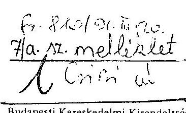

Levélcím: 3792 SAJOBÁBONY
Telefonszám: 28-211, 29-211
Telex: 62320
Telefax: 43-647
MNB egyszóminszám: 270-02768

Felügyeleti hatóság: Ipari Minisztérium
Szállítási címünk:
Kocsirakomány esetén: Sajóbábony, vasútállomás
Darabáru-feladás esetén: Miskolc, Gümöri pu.
ÉMV Sajóbábony

Budapesti Kereskedelmi Kirendeltség Budapest X., Gém u. 3/s.
Levélcím: Budapest 1476. Pf.: 2.
Telefon: 573-533
Telex: 225864
$W \cdot 20$
Levelünk száma, jele, ügyintézője:
Sajóbábony
, 19.91. márc. 13.
Tárgy:
Melléklet:

## Tisztelt Vagyonügynökség!

Alulírott, Dr. Mogyoródi Ferenc a B.A.Z. Megyei Bíróságnál, mint Cégbíróságnál 0501000125 sz. alatt bejegyzett állami vállalat, az Északmagyarországi Vegyimũvek vezérigazgatójaként az alábbi
bejelentést
teszem.

Az állam vállalatokra bízott vagyonának védelmérõl szóló 1990. évi VIII. törvény 3.§-ában bejelentési kötelezettséget ír elõ a törvény hatálya alá tartozó szerzôdések megkötésére irányuló szándékról.

Vállalatunk az 1989. december 22-én kelt a Borsod-Abaúj-Zemplén Megyei Bíróságon, mint Cégbíróságon 0509000287 sz. alatt bejegyzett PORÁN Poliuretán Gyártó és Értékesító Korlátolt Felelősségũ Társaság alapítója.
Az eddigiekben egyszemélyes társaságként mũködô cég további fenntartásához elengedhetetlen a külföldi töke hevonása, és ezért vállalatunk a C.A. Greiner und Söhne Gesellschaft m.b.h. /székhelye: 4550 Kremsmünster, Greinerstrasse 70. Ausztria/ céggel szándékozik együttmûködni.

---

A fentiekben említett cég az Északmagyarországi Vegyimũvek által a Porán Kft-ben mũködtetett állóeszközök és vagyoni értékũ jogok, 600.000.000 Ft-os értékébõl 400.000 .000 Ft , azaz Négyszázmillió forint értékũ uzletrészt megvásárolna, míg vállalatunk törzstőkéje 200.000 .000 Ft , azaz Kettôszázmillió forint lenne.

Ezáltal a Greiner G.m.b.H. törzsbetétje a társaság törzstőkéjének 67 \%-a lenne, me1y teljes egészében nem pénzbeli betétbôl, /appartbó1/ ãll.
Az Északmagyarországi Vegyimũvek törzsbetétje a társaság törzstőkéjének $33 \%$-a lenne, mely kizárólagosan-nem-pénzbeli-betétbôl-/apportból/ állna.

A társaság tevékenységi köre az alábbiakra terjedne ki:
1615 Mũanyag- és vegyiszál gyártás
1616 Mũanyagfeldolgozó ipar
4121 Tehergépjármũ közlekedés
5133 Vegyesiparcikk nagykereskedelem
514. Vegyesiparcikk kiskereskedelem

5211 Áruk, mũszaki-szellemi termékek és szolgáltatások külkereskedelme
5212 Külkereskedelmi fôvállalkozási tevékenység
5213 Külkereskedelmi képviseleti, ügynöki tevékenység
5219 Egyéb külkereskedelmi szolgáltatások
7413 Tárolás, raktározás, ingatlanõrzés
7414 Csomagolás, anyagmozgatás
7415 Hírdetés, propaganda, reklámtevékenység, kiállítás szervezés, piackutatás

A társaság idôtartama: határozatlan

Az elôzetes értékelést a Magyar Paribas Rt. /1015 Budapest, Östrom u. 23-26. székhelyü/ könyvvizsgáló cég végezte, míg a Hemingway Pénzügyi Tanácsadó Kft. készítette a vállalat vagyonmérlegét és cégérték megharározását.

---

A továbbiakban közöljük a T. Vagyonügynökséggel, hogy a szerzôdés értékének a vállalat könyvviteli mérlegében szereplő eszközértékéhez viszonyított aránya $26 \%$.

A fentiek alapján kérjük a T. Vagyonügynökséget, hogy a bejelentésünkben leírt feltételekkel az Eszakmagyarországi Vegyimũvek és a Greiner G.M.B.H. által megkötendô társasági szerzôdés módosításhoz hozzájárulni szíveskedjenek.

Tisztelettel:
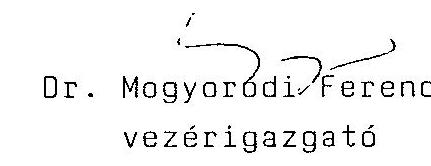

---

# ALLAMI VAGYONUGYNGKSEG UGYVEZETG IGAZGATO 

$1308 / 2 / 4^{\prime} 6 / 31$

Dr. Mogyorodi Ferenc Grnak,
vezérigazgato
északmagyarorszảgi Vegyimüvek

## Sajobabony

Tisztelt Vezérigazgato Ur !

Hivatkozasgal az eszakmagyarorszagi Vegyimüvek egyszemélyes társaságának, a PORAN Foliuretan Gyarto es ertekestto Kft-nek privatizaciolára vonatkozo bejelentesere, az alabbiakrol tajékoztatom:

Az Allami Vagyonügynökség, olve az 1990. évi VIII. törvény 3. paragrafus (1) bekezdés c..pontjaban meghatározott jogaval, a PORAN Kft-nek a bejelentésben foglaltak szerint tervezett privatizacioljat
megtiltja.

Megltelésünk szerint a tervezett tranzakció megvalósitására az Allami Vagyonügynökség, valamint az Iparı és Kereskedelmi Minisztérium szakertGivel egyeztetett kiindulási feltételek figyelembevetelével kell sort keriteni, egy a potenciálisan érintett osztrák és spanyol partner közötti verseny lebonyolításával.

Megjegyezzük, hogy az üzleti értékelos jelen formájában nem elemzi a Kft. müködését, Igy a cash-flow modell alkalmazasa önmagában nem meggyőzö. Javasoljuk az üzleti értékelos ennek figyelembevetelével történő átdolgoztatását.

Budapest, 1991. aprilis 12.
Tisztelettel:
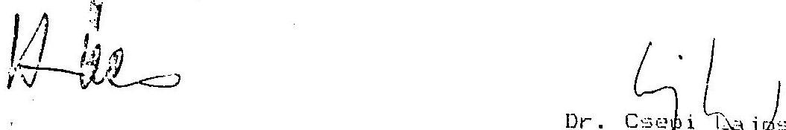

---

IPARIÉS KERESKEDELMI MINISZTÉRIUM
HELYETTES ÁLLAMTITKÁR $H R-2 / 629 / 91$

Csepi Lajos ügyvezetô igazgató Állami Vagyonügynökség

Budapest
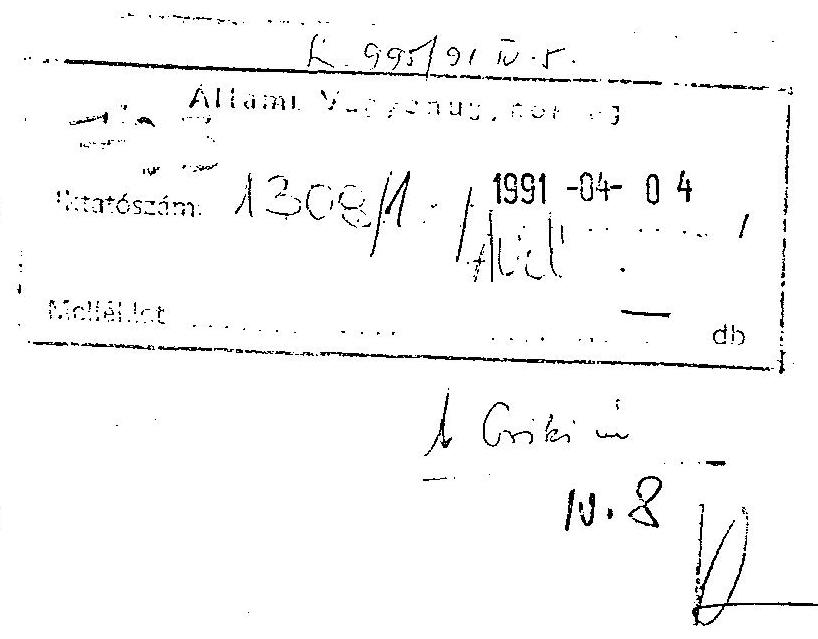

Az Északmagyarországi Vegyimüvek Vezérigazgatója levélben kérte Bod Péter Ákos miniszter urat, hogy a vállalat kritikus pénzügyi helyzetére való tekintettel járuljon hozzá a vállalat, illetőleg az annak tulajdonát képező Poran Kft. osztrák partnerrel történő közös vállalattá való alakításánoz.

A Minisztérium véleménye szorin? n:am anyértelmñ, hoay ez az elérhetô legkedvezôbb ajánlat, ezért azt kérjük, hogy a vagyonügynökség a vagyonvédelmi törvény alapján utasítsa a vállalatot

- a Kft-re vonatkozó nem formális versenyeztetés kiirására, - egy átfogó átalakulási elképzelés kialakítására.

A vállalati csődhelyzet megoldására a Kft. értékesítéséből származó bevétel felhasználása nyilvánvalóan csak átmeneti megoldást jelentene.

Budapest, 1991. március 26.
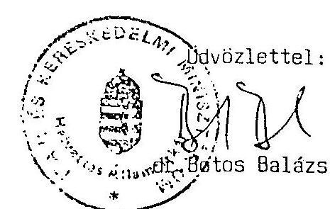

---

# F E L J E G Y Z E S 

Faur Tivadar úr részére

Tivadar!

Legyetek szivegek az Eszakmagyarországi Vegyimüvek egyszemélyes tarsaságanak a PORAN Kft-nek a tervszett tōrzstökesma. lés kapcsán beviendö eszközei értékelését áttekinteni.
A társaság 1990. január 1-e óta létezik, s müködése során a tevékenységéhez szükséges eszközök jelentős részét bérli az alapítójától. Most az törzstőkeemeléskor ezen eszközök egy részét kívánja a társaságba bevinni, de nem az összeset.

Az alapító likviditási gondokkal küzd, a tőkeemelés és az azt követó külföldi által történő üzletrészkívásárlásból befolyó összeg enyhítene ezen, de megoldást nem ad. A vállalatnál mégis nagy reményeket füznek hozzá. Félő, hogy a gyors árbevétel érdekében a külföldinek "kedvező" vagyonértékelés készült az eszközökről. Maga a társaság az alapító majdnem egyetlen értéke, egyéb tevékenységei veszteségesek, nekünk sem mindegy, hogy ez mit ér meg, különösen ha ne adj isten felszámolásra kerülne sor.

Budapest, 1991. március 26.

## Omlen: Attila

Csiki Attila

---

F E L J E G Y Z E S

Csepi Lajos ügyvezetô igazgató részére

Tárgy : Poran Kft. privatizációja

Az Eszakmagyarországi Vegyimũvek egyszemélyes társasága a PORAN Kft. 60 \%-os üzletrészének eladását tervezte. A benyújtott elképzelésrõl nem voltunk meggyózódve, hogy az az állam érdekeinek megfelelôen illeszkedik az anyavállalat privatizációs elképzeléseibe. Emiatt a tervezett tranzakciót megtiltottuk (levél mellékelve), azzal, hogy a potenciálisan jelen levô két pályázó között az AVO és az IKM szakértôivel egyeztettet kiindulási feltételekkel versenyt kell lebonyolítani, s ennek eredményeként térünk vissza a tranzakcióra.

Tettük ezt azért is, mert a tranzakción kívül maradt spanyol fél váltig állította, hogy egyrészt nem volt kellõ ideje felkészülni, ill. nem álltak rendelkezésére a kellõ információk, s ezek teljesülése esetén a meglévônél kedvezőbb feltételeket tudna nyújtani. ( Hogy honnan kerültek ezek a feltételek a birtokába, az nem ismeretes. )

A lehetőséget megadtuk az erõs lobbyzást folytató spanyol felnek, ám ajaniata nem volt kedvezobb a vállalat által benyujtottnál. ( Megvolt bennünk és a szaktárcában a jóindulat, de összességében csak idõt vesztettünk. Sem az állami vállalat, sem a PORAN Kft. eredményei nem lettek jobbak ezen idõ alatt.)

Jelen ügylettel párhuzamosan megbeszélések történtek az Ipari és Kereskedelmi Minisztériumban az EMV privatizációs koncepciójának kialakítása érdekében, s abba a PORAN Kft. jelen privatizálása beillesztésre került.

Egyetértés esetén kérem a mellékelt levél kiadását.

Budapest, 1991. június 7.
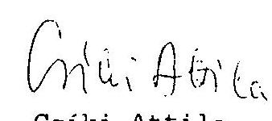

---

# ALLAMI VAGYONUGYNOKSĖG UGYVEZETO IGAZGATO 

Dr. Szabó Tamás úrnak,
politikai államtitkár
Pénzügyminisztérium

## Budapest

Tisztelt Szabó Ur !

Az Eszakmagyarországi Vegyimũvek egyszemėlyes társaságának, a PORAN Kft-nek privatizációja kapcsán engedje meg, hogy az alábbiakról tájékoztassam:

Az anyavállalat, mint egyszemélyes tulajdonos által kezdeményezett privatizáció magának az anyavállalat privatizációjának az elsó állomása. A vállalat a vonatkozó jogszabályok elóirásai szerint nyújtotta be a tervezett tranzakcióról szóló bejelentését, mellékelve az aláírt szerzödéseket, amelybe felfüggesztő klauzulaként került - a törvėnyi rendelkezęsnek megfelelően - az, hogy ėrvėnybe lépéséhez az Allami Vagyonügynökség jóváhagyása szükséges.

Ez a Szerződés a vállalat által választott osztrák Greiner ceggel köttetett.

A tranzakció elbírálása idején jelentkezett a spanyol INESPO cég azzal, hogy a partner kiválasztása során azért került hátrányosabb - igy vesztes - helyzetbe, mert egyrészzt sem kellő idö, sem kellő információ nem állt a rendelkezésére, pedig azok birtokában a vállalat által benyújtott szerződésben foglaltnál számunkra bizonyára kedvezőbb ajánlatot tudna tenni. Egyben kérte, hogy kapjon lehetöséget ajánlattételre.

Tekintettel arra, hogy az adott tranzakció megitélését elósegiti az, ha több ajánlat tartalmat lehet összehasonlitani, ezért a szerzödéshez hozzájárulásunkat nem adtuk meg, hanem javasoltuk az anyavallalatnak, hogy a tervezett tranzakcióra egy, a potenciálisan érintett spanyol és osztrák cég között lebonyolítandó, az ipari tár:ával egyeztetett kiindulási feltételekkel történő utolsó ajánlattételi felhívás keretében kerüljön sor.

---

A javaslat nem nemzetközi tender kiírására terjedt ki, mivel sem az anyavállalat, sem a társaság helyzete nem tette lehetővé az újabb két-három hónapos döntési halasztásból adódó bizonytalanságot, másrészt az érintettek több hónapos tárgyalások során kellöen informálódhatták a társaságról, igy nem a felkészülésre, hanem az ajánlat összeállítására kellett az idö.

A feltett kérdésekre beérkezett válaszoknak az ipari tárcával történt áttanulmányozása során arra a magállapításra jutottunk, hogy a spanyol fel ajánlata elmaradt a vállalat által jóváhagyásra benyújtott eredeti ajánlattól.

Ajánlata - bár az ár és a fejlesztés értékének nagyságában, a tulajdonosi arány mértékében lényegében megfelelð az eredeti konstrukciónak, azonban a térséget igen érintő foglalkoztatási kérdés tekintetében nem tartalmazott a foglalkoztatás megtartására vonatkozó, időtartamban meghatározható ígéretet. Nem vállaltak kötelezettséget arra sem, hogy az ügylet következtében kisebbségbe szoruló anyavállalattól hajlandók lesznek piaci feltételek mellett igénybe venni a müködéshez szükséges szolgáltatásokat( áram, gőz, ipari és ivóvíz, préslevegő stb. ).

Az Allami Vagyonügynökség jogköre az ún. vagyonvédelmi ügyekben - az 1990. évi VIII. törvényben foglaltak szerint korlátozott, nem azonos a vállalatok átalakulásakor meglévő jogkörével. Igy ezen tranzakcióknál az Allami Vagyonügynökség, ha a konstrukció elfogadható, csupán a vállalati kezdeményezés jóváhagyásáról vagy elutasításáról dönthet, a partner megvalasztására nincs befolyása. Ennek megfelelően a Greiner ceggel megkötött szerzodest 1991. június 7 -én jóváhagyólag tudomásul vettük.

Egyúttal tájékoztatom Allamtitkár Urat, hogy a június 21-én irodámban fogadtam az INESPO cég alelnökét, a Spanyol Királyság nagykövetével és kereskedelmi tanácsosával egyetemben. Megbeszélésünkön tájákoztattam őket arról, hogy az Allami Vagyonügynökség üdvözöl minden magyarországi spanyol befektetést, amennyiben a gazdasági életben szereplő gazdálkodó szervek, vállalatok, jogi személyek között piaci értéken alapuló, kölcsönös érdekeket szolgáló megállapodások jönnek létre.

Budapest, 1991. június 25.
Tisztelettel:
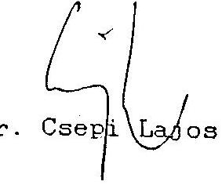

---

# ALLAMI VAGYONUGYNOKSEG UGYVEZETO IGAZGATO 

$1308 / / A V U / 91$

Dr. Mádl Ferenc úrnak.
miniszter
Parlament
Budapest

Tisztalt Miniszter Ur !

Kérésére, szives tájékoztatás céljából, mellékelten megküldöm a sajóbábonyi PORAN Kft. privatizációjának dokumentációját.

Egyben a tényállást az alábbiakban rögzitem :
A sajóbábonyi Eszakmagyarországi Vegyimüvek egyszemélyes társaságát, a PORAN Poliuretán Gyártó és Ertékesito Kft-t privatizálni kívánta, így az 1990. évi VIII. törvény alapján ún. "vagyonvédelmi" tranzakcióval kereste meg az Állami Vagyonügynökséget.

A poliuretán a mủanyagfélék egy családja, a lágy és kemény habok ( tkp. szivacsok ) alapanyaga, mind lakossági, mind ipari felhasználása biztosított.

A vállalat a bejelentését a Gre ter GmbH. osztrák céggel történő privatizációra tette meg, melynek elbirálása során jelentkezett a spanyol INESPO cág, állítván, hogy ö a beadványban szereplőnél jobb ajánl tot tud tenni - bár hogy azt honnan ismerhette, nem tudjuk, valószínúleg a tárgyalásokon végig jelen lévő társasági ügyvezetéstól -, igy bízva abban, hogy egy ajánlattételi versenyhelyzetben jobb ajánlat érhető el, a bejelentést elutasítottuk. ( 1. sz. melléklet ) A konstrukcióban a társaság üzlétrészének 60 \%áért 400 millió Ft-os vételár szerepelt...

Egyben felszólítottuk a vállalat vezetését, hogy mindkét érdekelt felet szólítsa fel egy végleges írábbeli ajánlattételre, ugyanazon információkat még egyszer juttassa el hozzájuk. Mivel egyrészt a társaság jövedelemtermelö mutatói jelentősen romlottak, így a tranzakció elhúrása csak a vevők érdekeit szolgálhatta, másrészt, mivel mindkét cég félévnél hosszabb ideje állt tárgyalásban az anyavállalattal, így kellően ismerhették a társaságot, ezen ajánlat megtételére két hetet határoztunk meg.

---

Az ajánlatok beérkezését követöen az ipari tárca képviselöivel - akik szintén részt vettek azok áttanulmányozásában csalódottan arra a megállapításra jutottunk, hogy az újonnan beérkezett ajánlat egyike sem volt jobb az eredeti beadványban szereplőnél.

Az osztrák fél a korábbi 400 milliós ajánlat helyett - az egyeb kondiztokat megtartva - 350 milliós ajánlatot tett, a spanyol fél pedig bár 400 milliós ajánlatot tett az egyéb kondiciói nem voltak kellően kidolgozották, konkrétumokat nem tartalmazzák igy jelentős bizonytalan igi tenyezot jelentettek.

A vonatkozó törvényi elöírások szerint az Állami Vagyonügynökségnek vagyonvédelmi ügyben kizárólag arra van lehetösege, hogy elfogadja vagy elutasítsa a vállalat részérol ........... ........... az alólu esetuen - amikor az eregeti osztrák ajánlatot ismeró spanyol fél még kizérletet sem tett arra, hogy annál kedvezöbbet tegyen - a vállalati kezdeményezés végleges elutasítása teljesen célszerutlen lett volna.

Igy nem tehettünk mást, mint jóváhagytuk az eredeti bejelentést ( 2. sz melléklet. ), mivel a spanyol fél nem tett jobb ajánlatot az eredetinél.

Ezt követöen a spanyol fél képviselöjének, a spanyol nyagkövetnek valamint a kereskedelmi tanácsos úrnak személyes találkozón adtunk tájékoztatást a tranzakcióról. Természetezen az üzleti titkokat meg kellett tartanunk, igy nem tájékoztathattuk okét arról, hogy az oszták ajánlat egyeb kondíciói mivel voltak jobbák a spanyolénál.

A spany-l fél a lezárt tranzakció, s a kö: 'etlen szóbeli tájékoz, ató ellenére nem adta fel. s kormiayzati köröket keresett meg - Miniszterelnöki Hivatal. Pénzügyminisztérium. NemzetkPzi Gazdasági Kapcsolatok Minisztériuma -, amelyeknek a kért tá'śkoztatást színtügy megadtuk. ( 3. sz m. lléklet )

Az Állami Vagyonügynökség részéről egy magyarországi spanyol befektetést szívesen láttunk volna, ám csakis üzleti alapon, amihez az kellet volna, hogy a spanyol INKSPO cég - állítása ellenére - ténylegesen jobb ajánlatot tegyen.

Budapest. 1991. október 30.
Tisztelettei :
$l i \partial i$

Dr. Csep Dsos

---

Állami Vagyonügynökség
Belső Ellenőrzés

# V I Z S G Á L A T I J E L E N T É S 

a PORÁN Poliuretán Gyártó és Értékesítő Kft privatizációs ügyéről

Vizsgált idôszak: 1990. január 1-tôl 1991.december 23-ig

Vizsgálat ideje: 1991.december 9-tôl 1991.december 23-ig

Vizsgálatot végezte:
Hatvani Szabó János

---

Dr. Czuczai Jenő osztályvezetőnek, a Miniszterelnöki Hivatal tanácsosának - Csepi Lajoshoz cimzett - 1991. december 2-án kelt levelében foglaltak, valamint az ÁVU ügyvezető igazgatójának szóbeli elrendelése alapján vizsgálatot végeztem a PORÁN Kft privatizációs ügyében.

Az alábbiakban rögzített vizsgálati megállapítások tényszerűségét és pontosságát a vizsgálati idő rövidsége miatt nem minden esetben lehetett teljeskörűen és több szempontból megvizsgálni és ellenőrizni, illetőleg az ügyre vonatkozóan jelentős tényismerettel rendelkező személyeket /igy pl. a PORÁN Kft volt ügyvezető igazgatója, a szakszervezeti vezetők, a pályázatok elbírálásában résztvevő személyeket/ sem lehetett meghallgatni, nyilatkozattételre felkérni.

Mindezek figyelembevételével a vizsgálat megállapításait elsősorban az ÁVU-nél rendelkezésre álló iratanyag, a cégbírósági nyilvántartás, valamint a sajóbábonyi Északmagyarországi Vegyiművek vezetőivel történő megbeszéléseken elhangzottak alapján teszi meg.

Az Északmagyarországi Vegyiművek /ÉMV/ 1989. évben egyszemélyes Kft-t alapított a poliuretán előállítására, PORÁN Poliuretán Gyártó és Értékesítő Kft néven. A cég 1990. január l-én kezdte meg működését, a cégbírósági bejegyzés 1989. december 22-én megtörtént 0509000287 . számon.

A Kft megalakítása előtt, majd az követően az osztrák Greiner G.m.b. H.-val történő privatizációs tranzakcióhoz mellékelt Kft vagyoni értékelést a Magyar Paritás Kft könyvvizsgáló cég végezte, míg a vállalat vagyonmérlegét és cégérték meghatározását a Hemingway Pénzügyi Tanácsadó Kft végezt*el. Ezen vagyoni értékelések illetve cégérték meghatározásával kapcsolatban - sem formai, sem tartalmi szempontból - jelen vizsgálat kifogást nem támaszt, bár az értékek meghatározása döntően a könyv szerinti érték figyelembevételével történt.

A Kft bejegyzett törzstőkéje alapításkor 287.980.000,-Ft volt.

A társaság alapítása után is a Kft alaptevékenysége végzéséhez szükséges eszközök egy része az alapítónál /ÉMV-nél/ maradt, aki azt a Kft részére bérbe adta.

---

A Kft megalakulásakor, illetve azóta is folyamatosan az EMV csődhelyzetben van, s a vállalatnak, illetve a vállalati vezetőknek a további müködés és vezetői egzisztencia szempontjából döntő volt PORÁN Kft müködés, illetve privatizációjának mikéntje.

A vállalat által végzett egyéb tevékenységek vesztességesek, melyből tetemes adósság tömeg halmozódott fel.

Az alapító EMV vezetőiben, valamint a PORÁN Kft. vezetőiben összecsengően fogalmazódott meg, hogy a PORÁN Kft. tevékenységének bővítésére, fejlesztésére külső forrás szükséges, amely csak a privatizáció utján érhető el.
A privatizációs partner keresésben mindkét fél lépéseket tett. Az alapító az osztrák Greiner céggel egyezkedett, míg a Kft. ügyvezetője a spanyol INESPO céggel tárgyalt. A privatizációs partnerkeresés és tárgyalások - nagy valószínűséggel a különböző érdekeltség miatt - egymástól elkülönülve /alapitó és Kft./ történtek.
Ennek eredménye lett azután az, hogy az alapító "magához vonta" a PORÁN Kft privatizációs ügyének hatáskörét, valamint döntően ennek tudható be, hogy a kiválasztott osztrák partner iránti elutasító magatartása miatt kellett távoznia a Kft ügyvezető igazgatójának is beosztásából.

Az alapító privatizációs tárgyalásai végül is eredményre vezettek, így került aláírásra az EMV vezérigazgatója és az osztrák C.A. Greiner ünd Söhne G.m.b.H. között 1991. március 4-én a PORÁN Kft társasági szerződésének módosítása és ezzel összefüggésben egy szindikátusi szerződés valamint egy adásvételi szerződés amelyek a következő lényeges elemeket tartalmazzák:

- A Kft törzstőkéjét 1991. VI. 30-al az alapító 312 millió Ft-al megemeli, így a törzstőke összesen 600 millió forintra emelkedik. A törzstőke emelést teljes egészében nem pénzbeli betétből áll.
- A törzstőke emelést követően a Greiner cég a Kft törzstőkéjéből 400 millió Ft-ot megvásárol /a törzstőke 67 3-át/.
- A Greiner vállalja, hogy a társaság tevékenységét fenntartja.
- A Kft-be belépő osztrák tag vállalja, hogy a társaságnál 2 éven keresztül képződött nyerességét reinvesztálja.

---

- A két éven belül gazdasági okból létszámot nem építenek le a Kft-nél.
- Piacfelosztó kartell megállapodást kötöttek Magyarország és Ausztria területére.
- Az osztrák fél l éven belül 100 millió forint értékben törzs- tőke bővités formájában - technológiát hoz a Kft-be.

A megállapodást az ÉMV az 1990. évi VIII.Tv.3.§. alapján az ÁvU- höz bejelentette. /A bejelentés nincs iktatva, egyébként is az ügyre vonatkozó iratanyagban számos iktatószám nélküli beadvány található.!/

A bejelentés kelte 1991. III.13. A bejelentésre az ÁvU 1308/2/ÁvU/91. számu 1991. IV.12-én kelt levelében közli, hogy a beadvány szerinti privatizációt megtiltja.

Ezt követően az ÁvU - az Ipari és Kereskedelmi Minisztérium illetékeseivel történő konzultációt követően felhívta az ÉMV-t, hogy két privatizációban érintett külföldi cég meghívásával "zártkörü pályázatot" hirdessen. /Időközben ugyanis az ÁvU-nél jelentkezett a spanyol INESPO cég./

Az ÉMV a felhívásnak eleget tett és írásbeli ajánlattételre szólította fel az érdekelteket. /Az ÁvU döntés mögött az huzódott meg, hogy a beadvány időszakában az ÁvU-nél jelentkezó spanyol cég állítása szerint pályázat esetén kedvezőbb ajánlatot tenne az osztrák ajánlatnál. A meghívásos ajánlattételi felhívásra mindkét fél pályázatot nyujtott be.:

- Az osztrák fél 350 millió forint kivásárlási összeget jelölt meg az eladásra kínált vagyonrészre, egyebekben a korábbi ajánlatában foglaltakat fenntartotta.
- A spanyol fél pedig 400 millió forint kivásárlási összeq meq- jelölése mellett részben kimunkálatlan ajánlatot tett.

A pályázatot az Ipari és Kereskedelmi Minisztérium illetékes munkatársaival Csiki Attila az ügy kijelölt elöadója birálta el, s állapította meg, hogy a beérkezett ajánlatok rosszabbak az éredeti osztrák ajánlaton alapuló korábban /III.13./ benyujtött ÉMV privatizációs kezdeményezésnél.

---

Előzőekre tekintettel 1991. junius 7-én kelt 1308/ÁvU/1991.sz. levelében a korábbi EMV bejelentésére az osztrák Greiner céggel - annak eredeti ajánlatát elfogadva - történő privatizációhoz az ÁvU az engedélyt megadta.

Ezen engedély alapján a PORÁN Kft törzstőke emelése illetve a külföldi által történő állami vagyonrész kivásárlás megtörtént. A fentieket rögzítő társasági szerződés módosítást a cégbíróság 1991. november 18-án a cégnyilvántartásba bejegyezte. /05-09000287/35./

A vizsgálat a privatizációs ügyben az alábbi kérdésekre keresett választ:

- Megállapítható-e a nemzetgazdaság érdekeit sértó magatartás, vagy döntés.
- Jogszabályszerü volt e az ÁvU eljárása
- Történt-e mulasztás az ÁvU munkatársai vagy vezetői részéről
- Dr.Czuczai ur levelében megemlitett versenyszempontu vizsgálat indokolt-e.

Az ügyben a vállalati bejelentés egy aláirt, részleteiben is konkrétan kidolgozott ajánlatot tartalmazó privatizációs adásvételi szerződéshez kérte az ügynökség jóváhagyását. Az ÁvU arra figyelemmel tagadta ezt meg, hogy a jelentkezó spanyol fél - szóbeli állításaival összhangban - jobb ajánlatot tesz, vagy a meghívásos zártkörü versenyeztetés eredményeképp a meghatározott állami vagyonrészt az eredeti osztrák ajánlatban foglaltnál magasabb összegért lehet értékesíteni. Jelen vizsgálat szerint a spanyol ajánlat nem volt jobb az "eredeti" osztrák befektetői ajánlatnál.

Ez a megállapítás vonatkozik az ajánlatok összegszerűségére valamint egyéb elemeire is. Nem látszik igazoltnak az a spanyol fél által hangoztatott vád, hogy az osztrák fél azért vette meg a Kft törzstőkerészt, hogy a gyártást leállítsa vagy visszafejlessze. Ezzel ellentétesek a szindikátusi megállapodás azon részei, melyek a dolgozók foglalkoztatására, a tevékenység fenntartására és a technológia behozatalára vonatkozik.

---

Igy azzal hogy az "eredeti" osztrák ajánlat és a spanyol ajánlat közül az előbbiek alapján történő privatizációhoz járult hozzá az ÁVU a nemzetgazdasági érdek védelmét nem sértette, sőt a szakmai birálók megitélése szerint a jobb ajánlat került elfogadásra. Jelen vizsgálat meggyőződése szerint a két közel azonos ajánlat közül nem a rosszabb, hanem a kimunkáltabb ajánlat került elfogadásra.

Az ÁVU eljárását az ügyben törvényességi szempontból a vizsgálat elfogadhatónak ítéli. Az eljárás kapcsán mégis az alábbi észrevételek tehetők:

- Azonos beadványra történt az ÁVU elutasító majd jóváhagyó állásfoglalása. Az államigazgatási eljárás szabályainak analógiáját követve egy elutasított beadványt jogorvoslat nélkül utóbb engedélyezni nem konzekvens.
- A versenyeztetésre beérkezett pályázatok elbírálása jelen esetben az ZMV - és nem az ÁVU - hatáskörébe tartozott.
- Az ÁVU-nél teljességgel kidolgozatlan az ilyen vagy hasonló "versenyeztetési ügyekben" követendő eljárás ezért a vizsgálat is bizonytalan annak megítélésében, hogy egy zártkörű pályáztatást követően a benyujtott pályázatokra vonatkozóan döntést nem hozva, eredményhirdetés nélkül, más pályázaton kivüli befektetővel milyen formában engedélyezhető a privatizáció.

Előző észrevételek mellett is törvényességi szempontból az ÁVU eljárását a vizsgálat nem kifogásolja, s ezzel kapcsolatban már célszerüségi szempontból sem indokolt bárminemű utólagos hatósági beavatkozás kezdeményezése.

A fentiekkel összhangban a vizsgálat az ügyben érintett ÁVU munkatárs és vezetők esetében mulasztást, vagy egyéb elmarasztalható magatartást nem észlelt.

Végezetül az ügyet áttanulmányozva, s figyelembevéve a PORÁN Kft tevékenységét, elfoglalt piaci pozícióját, a Kft osztrák tagjának piaci magatartását, a szindikátusi szerződésben foglaltakat, jelen vizsgálat indokoltnak tartaná szignalizáció formájában az erre illetékes Gazdasági Versenyhivatal figyelmét felhívni versenypontu eljárás lefolytatására, vagy legalábbis a PORÁN Kft. piaci magatartásának folyamatos figyelemmel kisérésére.

Budapest, 1991. december 27-n.

---

# F E L J E GY Z E S 

## Keveváriné Maczó Mária részére FaX:252-47-36

Tárgy : A sajóbábonyi PORAN Kft. privatizációja, a spanyol INESPO cég ehhez kapcsolódó ajánlata.

A PORAN Kft. az Eszakmagyarországi Vegyimüvek poliuretán gyártó egyszemélyes társasága. Ennek privatizációjára vonatkozóan az anyavállalat 1991. március 13-án tett bejelentést . Privatizációs elképzelései megvalósítása során több céggel tárgyalt, így az osztrák GREINER, és a spanyol INESPO cégekkel is.

Bejelentése szerint az alapító vállalat a társaság törzstökéjét a korábban a társaság által a vállalattól bérelt eszközök apportálásával meg kívánta emelni, ezzel egyidejűleg üzletrészének $60 \%$-át az osztrák GREINER cég részére el kívánta adni. A vagyonvédelmi ügyként tett bejelentéséhez az osztrák céggel kötött megállapodásait is mellékelte, amelyek azt tartalmazták, hogy a tranzakció érvénybe lépéséhez - a törvényi előírásnak megfelelően - az Állami Vagyonügynökség jóváhagyása szükséges.

A tervezett tranzakció elbírálása során jelentkezett a spanyol fél azzal, hogy a partner kiválasztása során azért került hátrányosabb - így vesztes - helyzetbe, mert egyrészt sem kellő idő, sem kellő információja nem állt a rendelkezésére, pedig ő azok birtokában a meglévőnél bizonyára jobb ajánlatot tud tenni.
A spanyol cég azt kérte, hogy kapjon lehetőséget ajánlattéteire.

Erre való tekintettel az Állami Vagyonügynökség 1991. április 12-én az Eszakmagyarországi Vegyimüvek bejelentését elutasította.

A privatizáció érdekében döntésünkkel egyidejűleg javasoltuk, hogy a tervezett tranzakció megvalósítására az Állami Vagyonügynökség, valamint az Iparí és Kereskedelmi Minisztérium szakértőivel egyeztett kiindulási feltételek figyelembe vételével kerüljön sor, egy a potenciálisan érintett osztrák és spanyol partner közötti verseny lebonyolítására.

---

Maguk az ajánlatok az Allami Vazyonüzynökséghez érkeztek be, s annak az Iparı és Kereskedelmi Minisztérium erintettjeivel történt együttes áttanulmányozása után arra a megállapításra jutottunk, hogy sajnálatosan egyik ajánlat sem jobb az eredeti elképzelésnél.

Ezt követöen a vállalat részére irt 1991. június 7-i újabb levelünkben az aláirt szerzödések érvénybe lépéséhez szükséges engedélyt megadtuk.

Budapest, 1991. június 14.
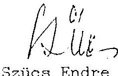

---

# 91c. 22. meblehist 

A: HIISPI én GRI IIIR ajánlatának üsszehasenlití vizsgálata
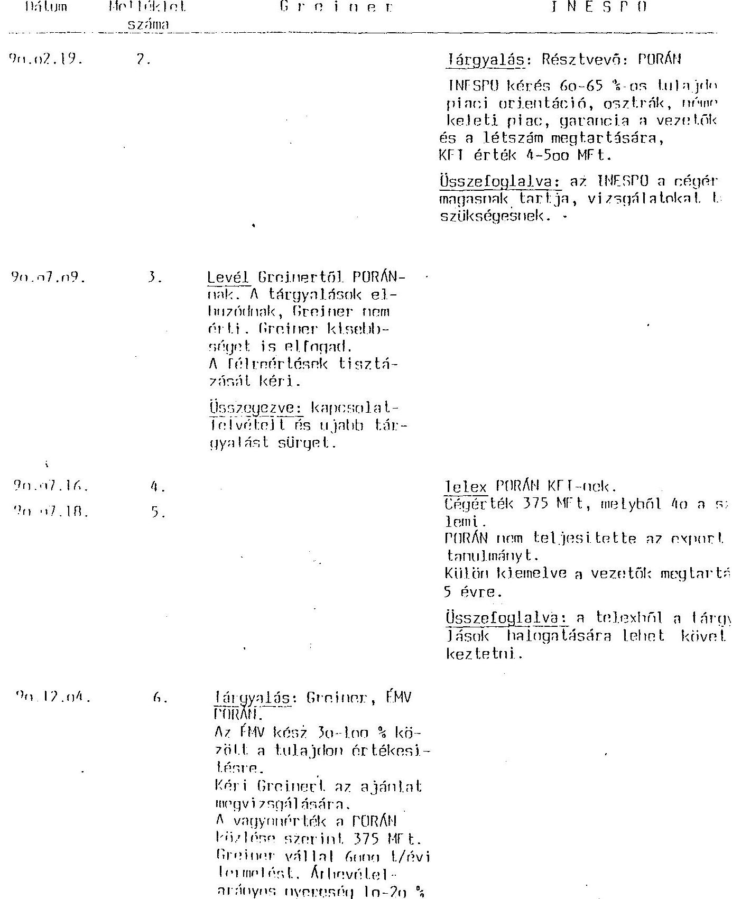

---

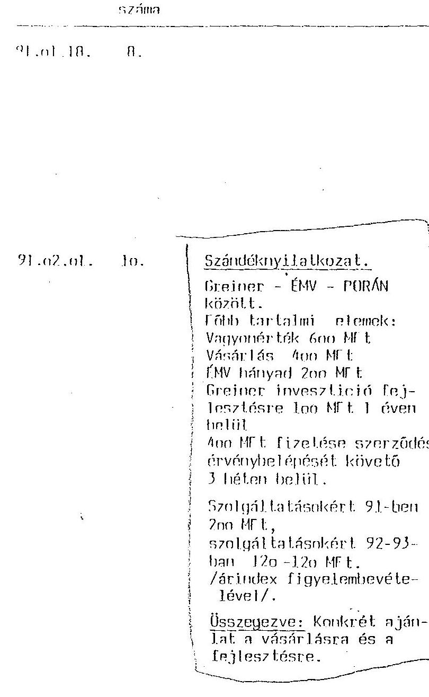

Sarandéknyilatkozat. INFSPD - f! 75 \%-ban vásárlás, hernházás 118 MFt.
3 év alatt a képzödött nyeresér hefoktetése.
A vásárlás fizetési feltételei valtozatlanul rendreetlenek.
Következtetés: Nem tisztázott a fizetés illetőleg a tóke-hehozás feltétele.

Tárgyalás: INESPO-IMV-PORÁN kínntt.
INESPO a fion MFt vagyonértéket tulzotlnak tartja tékchehoza tallian a régérték $25 \%$-áig aján a szerzódés aláirása után $75 \%$ eszközökben 2-3 év alatt. Ujahb információ kéreve a döntéshez.

Összefoglalva: Inlogatí taktika Hem ellogadható INF SPD ajánlat.

---

91.n2.28: 111 .
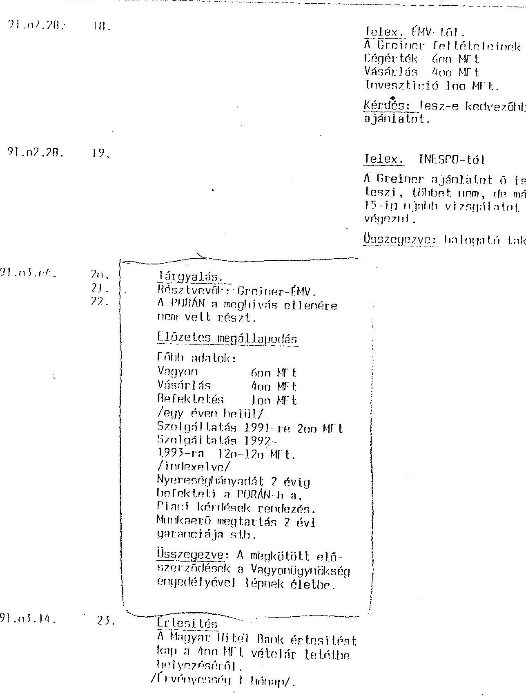
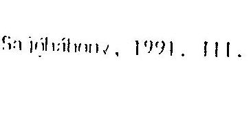

---

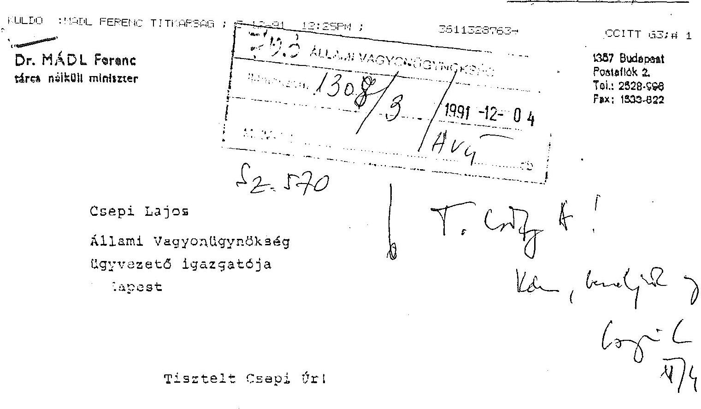

A PORAN Kft-vel kipcsolatban f.év nov. 28-án kelt feljegyzést át- tanulmanyozva nyilvánvalónak tünik,hogy az érintett gazdasági társasá vonatkozásában bekövetkezett adatok, tények változásá- nak cégjegyzókbe történő bejegyzése iránt indult cégbírósági el- fárás során meghozott vógzés jogerőn. Ennélfogva az úgy formai -natkozásainak továbbiakban történő meqitólése érdekében javas- lom, hogy a miniszter úr f.év nov. 21-án kelt levelében irtaknak megfelelően az ugy taljeskőru cokumertációjának beszerzését kö- vetően a vagyonvédelmi ugyzen meghozott vagyonügynökségi döntés- ne: a nemzetgazdaság érdekeit védő követelményokkel való egyhe- - a céljából rendelje el a tárgyi ügyben az AVU belaő ellen- čr : si vizsgálatát.

- vizsgálat terjedjen ki - a tízvényességi formai szempontokon kivili, mely elsősorban az 1990.evi VIII.tv-ben, valamint az 1988. évi VI.tv. vonatkozó rendelkezései szerinti viszgalatot jelenti -versenyjogi szempontokra is. Ebben a körben megfontolandónak tarts az os.t.ik befektető és az EVK között létrejött társasági szerz is és a kiegészitő más szerződések vonatkozásában egy esetle,es Vert ny Tanácsi aljárás kezdeményezésének célszeruségét is.

---

Etekintetben megitalásem szerint szúkségesnek tünne a belso̊ ellonórtási viszgálatba a Jogi Igazgatóság bevonása is.

Budapest, 1991. dec. 2
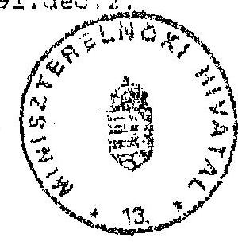
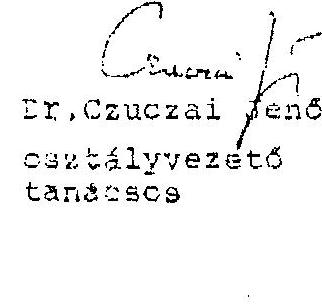

---

# Allami Vagyonügynökség Belső Ellenőrzés 

## Feljegyzés

Csepi Lajos ügyvezetõ igazgató részére

Tárgy: PORAN Kft ügye.

Dr.Czuczai Jenõ miniszteri tanácsadó az elmúlt napokban két levelet is küldött ügyvezetõ igazgató úrhoz a PORAN Kft privatizációs ügyében. A levelekre az alábbi véleményt adom. illetve javaslatot teszek az indokolt intézkedésekre.
1./ Az 1991. január 16-án kelt levélben rögzítik, hogy Csiky Attilát "nagy bizonyossággal munkaköri kötelezettségeinek mulasztásában megnyilvánuló vétkes megszegésének alapos gyanúja terheli." Egyben kérik, hogy az ügyre vonatkozó "jelentós bizonyitékokat tartalmazó dokumentáció zárlatát rendeljük el."

Megitélésem szerint a privatizációs ügyben Csiky Attila olyan magatartást nem követett el, amely indokolná a munkajogi fegyelmi felelősségrevonásának megindítását. A PORAN Kft privatizációs ügyének AVU-nél lévő irataira a zárlat elrendelését nem tartom indokoltnak, ugyanis elégségesnek tünik az AVU irattárba történõ helyezés./Ez utóbbi megtörtént./
Előzöekre tekintettel javasolom a mellékelt 1.sz. levéltervezet kiadását Mádl miniszter úr felé.
2./ Az 1991. január 14-én kelt levélben - melyben Czuczai úrnak a Mádl miniszter úrhoz küldött feljegyzése található - a tanácsadó úr részletesen kifejti azon véleményét, hogy az ügyben milyen "szabálytalanságok" történtek, s a "vesztes" spanyol fél ajánlata miért is volt jobb a végül is nyertes osztrák ajánlatnál.

Megitélésem szerint - a feljegyzésben foglaltakat is figyelembevêve- a spanyol ajánlat nem volt elönyösebb. /Természetesen utólag minösitve és egyes elemeket kiragadva, másokat leminősítve, egyéni nézőpontból más megállapításra is lehet jutni. Abban azonban nem lehet vita, hogy összegszerűségét tekintve a két külföldi befektető ajánlata azonos volt./

A feljegyzésben fölvetett kérdésekre az alábbi magyarázat adható:

- A PORAN Kft törzstőkeemelése azért nem került formálisan jóváhagyásra, mivel a tulajdonos /EMV/ vállalat és az osztrák cég közötti szerződés jóváhagyása iránti kérelme került benyujtásra az Ügynökséghez. Ez a szerződés tartalmazta a tőkeemelést - az EMV részéről - és a kivásárlást - az osztrák cég részéről -.

---

Az AVU döntése abban állt, hogy jóváhagyja a szerződést vagy sem. A szerződés jóváhagyása először elutasításra került, később a spanyol ajánlatát megismerve, s megállapítva, hogy az nem jobb, a szerződést jóváhagyta az AVU. Tehát a privatizációs ügyben nem versenyeztetés volt, hanem az EMV kiválasztott egy partnert, s vele szerződést kötött és kérte az AVU-t, hogy a szerződés összegszerűségére is tekintettel az 1990. évi VIII.törvény alapján azt hagyja jóvá. A vállalat nem előszerződést kötött, ahogy azt a feljegyzést készítő feltételezi, hanem egy olyan szerződést, melynek az az érvényességi feltétele, hogy azt az AVU jóváhagyja.

- A feljegyzésben foglalt azon állítás helytálló, melyszerint a PORAN Kft társasági szerződés módosítása tartalmaz olyan szabályozást, amely jogszabályellenes /pl. taggyülés határozathozatalának módja, egyszerü és minősített többséghez kötött ügyek meghatározása. / Azonban a cégbíróság a társasági szerződés módosítás bejegyzését nem tagadta meg, s mindaddig amíg a cégbírósági bejegyzés fennáll a módósítást közhítelelesnek és törvényesnek kell tekinteni. Véleményem szerint ezen hibáért indokolatlan Csiky úr felelősségrevonásának kezdeményezése, illetve az úgy teljes reperálása.
- A PORAN Kft tőkeemelését /apportálást/ igenis megelőzte vagyonértékelés, melynek dokumentumait Czuczai úrnak átadtam. A vagyonértékelést az ügynökség Vagyonértékelö Irodája véleményezte, melynek dokumentumai szintén megtalálható az úgy iratai között.
- A feljegyzésben az előző témakörők felvetését követően az osztrák, illetve a spanyol ajánlat elemeinek összehasonlítása kerül taglalásra, melyet véleményem szerint abból a megközelítésből kell értékelni, hogy az EMV egy megkötött szerződést nyujtott be jóváhagyásra és formailag az AVU csak arra volt köteles, hogy ezt jóváhagyja vagy sem. Az ajánlatok értékelése a vállalat kötelessége és feladata.

Az AVU eljáró munkatársa azt megtette, hogy kötelezte a vállalatot arra a spanyol féltől is kérjen ajánlatot. Ha a spanyol ajánlata jobb lett volna a már megkötött szerződésben foglaltaknál az EMV a spanyol féllel köthetett volna szerződést, de ez utóbbi esetben is az AVU ezen szerződés jóváhagyásáról illetve elutasításáról dönthetett volna. A szerződést ezen privatizációs formában nem az AVU köti. Az AVU munkatársa miután bizonyossá vált arról, hogy az osztrákénál nem jobb a spanyol ajánlata, az eredeti szerzödést jóváhagyta.

- A rendelkezésre álló iratokból egyértelműen kitűnik, hogy az AVU a vállalatot "a második fordulóban" nem egy formális pályázatra hívta fel.

A feljegyzésben rögzített súlyos megállapítások és ezekből levont következtetések indokolják, hogy a PORAN Kft ügyében kérjük az Állami Számvevőszék vizsgálatát, melyre vonatkozó levéltervezetet mellékelem.

---

Az ASZ. részére - kérése esetén - az AVU-nél lévô iratanyagot rendelkezésre bocsátom.

Javasolom továbbá, hogy fegyelmi felelősségrevonást és a reparációs intézkedést - annak indokoltsága esetén - csak az ASZ vizsgálatát követôen kezdeményezzünk.

Budapest, 1992. január 21.
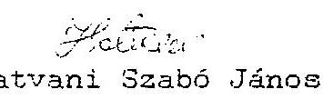

---

Dr. Hagelmayer István elnök úr részére

# Allami Számvevôszék 

Budapest

Tárgy: Az Eszakmagyarországi Vegyimũveknél létesitett gazdasági társaságok felméréséról és a Porán Kft. privatizálásának szabályszcrüségi vizsgálatáról készített ASZ-jelentés

Tisztelt Hagelmayer Ur!

A Jelentéssel kapcsolatban az alábbi észrevételset teszem:

- A Jelentés II. 1. pontjában, a 3. oldalon következõ mondat szerepel: " Az AVU eljárása nem ütközött a vonatkozó vagyonvédelmi törvény elöirásaiba."

Ez a megfogalmazás félreérthető, ugyanis az AVU a jogszabály elöirásai szerint, azoknak megfelelően járt el.

- A Jelentés 3. oldalán ez a mondat található: "A privatizációs folyamatban a versenyeztetési eljárás nem érvényezült".

Felhívom szíves figyelmét arra, hogy Az állam vállalatokra bízott vagyonának védelmérõl szóló 1990. évi VIII. tv. ezt nem tette lehetővé.

---

- Ugyanezen pontban, a 4. olczion ez a mondat áll: "Az ajánlatok közötti valazztás részletes összehasonlító elemzések dokumentumai nem állnak rendelkezésre", majd nem sokkal később: "A gazdasági célszerüség igy nem belátiato, bár a döntés jogszerüségét nem érinti, mert az ún. spontán, tehát a vállalat által kezdeményeze, privatizáció esetén az 1990. évi VIII. tv. a döntéselökészitést, illetve döntéshozatalt az AVO hatásköröre utalja".

Ez a megállapítás nem helytáll. Vagyonvédelmi ügyben ugyanis az AVO csak jóváhagyó jogkörrel rendelkezett, ezért az AVO-n összehasonlító elemzés nem kérhető számon.
Másrészt a döntéselökészitéz sem volt az AVO feladata. A vállalat maga dönthette el kit választ. az AVO est legfeljebb jóváhagyhatta.
Meg kell omlíteni azt is, hogy "gazdasági célszerüség" jórészt vállalati kategória.

Szintén ezen az oldalon szerepel is is, hogy "Az AVO 1991. évi ügykezelési gyakorlà a nem volt zárt". Nem tüzem mire alapozza a Jelentés ez a magallapítást, ugyanis nincs semmi olyan vinanyiték, ami ost alátámasztaná.

- A 4. oldal utolsó bekezdésében szerepel az "AVO-n bélüll vagyonértőkelés" fogalm.
Az AVO vagyonértékelést nem készített, nem is kezzit, ez nem is feladata.
Az AVO legfeljebb a már elkészített vagyonértékelez hagyhatja jóvá.
- Az 5. oldal 1. bek.-e jelen "töt használ, misterint az "... AVO információs rendszere, illetve a rendszer müködtetése nem biztosítja a privatizációs folyamatok utólagos áttékinthetőségét ..." az a mondat az AVO számára elfogadhatatlan. Semmi sem indokolja az.. hogy egy a spontán privatizáció időszakában lezajlott transakció tapasztalatait: máig ható következtetéseket vonjanak le.
- Az 5. oldal 3. bekezdésével kapcsolatban felhivon figyelmét arra, hogy az 1990. évi LXXXVI. tv. szerint vagyonvédelmi ügyekben a vállalat kötelezettsége a Gazdasági Vézsenyhivatal álláspon, járék Kikszobé.

---

A II.2. pentban, a 13. oldalon a jelenten ent irja: "... as AVU-nek törveny által utositott joga, hogy melyik ajúnlat mellett dönt, a löntését nem kell indokolnia. Es a megállapítás is tévedésen alapul. Jelen esetben vagyonvédelmi üsywól volt sno, igy an AVU csak igent vagy nemet mondhatout a vállalat által betergesutettekre.

- Ugyanezen az oldalon szerepe: a következö: "... a privatizáolo lezárult szakaszának reparációjára nincs lehetönég." Az AVU nem érti, mi indokolná est a reparációt?

Ticntelettel kérem meglogyzéseink mérlegelését.

Budapest. 1903. június 1.
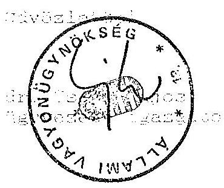

---

Budapest, 1993. június 18. $\mathrm{V}-31-31 / 1992-93$.

Dr. C S E P I LAJOS úr ügyvezetö igazgató Állami Vagyonügynökség

# B U D A P E S T 

## Tisztelt Csepi úr!

Meglepődéssel tapasztaltam, hogy az Állami Számvevőszék által a tárgyban készített "Jelentés" korábbi szakértői szintű egyeztetésekor tett, Ön által aláirt 1993. június 1-i 33/353/ÁvÜ számú észrevételeihez képest az ÁvÜ a jelenlegi véglegesítési szakaszban olyan újabb és más témájú észrevételeket vetett fel, ame1y gyakorlat számomra egyrészt szokatlan, másrészt szakmailag az ÁvÜ tevékenységének megitélése vonatkozásában tel jesen újszerü alapállást tükröz.

Figyelembe véve az észrevételek törvényi hátterét és indokolását, megállapítható, hogy ezek többsége szakmailag és tárgyszerűségében nem alátámasztott. Álláspontomat a következőkben foglalom össze:

1. A "Jelentés" a 3. oldalán megállapítja: "A privatizációs folyamatban versenyeztetési eljárás nem érvényesült." Ön ezt kifogásolja azzal az indokkal, hogy az 1990. évi VIII. törvény ezt nem tette lehetővé. Maga az ÁVÜ belsö ellenőrzése (lásd 10/b. sz.melléklet), állapította meg, "Az ügyben nem versenyeztetés volt, hanem az ÉMV kiválasztott egy partnert, s vele szerződést kötött és kérte az ÁvÜ-t, hogy a szerződés összegszerűségére is tekintettel az 1990. évi VIII. törvény alapján azt hagyja jóvá."

---

A kifogásolt megállapítás tehát csak azt rögzítette, amit az ÁvÜ belsó vizsgálata is pusztán tényként állapított meg.

Megjegyzem a versenyeztetést a hivatkozott törvény nemcsak hogy nem zárja ki, hanem kifejezetten biztosítja. A pályáztatás feltételeinek szabályozása is ezt támasztja alá. Ezért a megállapítást fenntartom.
2. Az észrevételek között a 2. oldalon felvetettekkel kapcsolatban:

- Az ÁvÜ szerepe az 1990. évi VIII. sz. ún. vagyonvédelmi törvényben konkrét és kiemelt (lásd: 5. paragrafus (1)-(2) bekezdés). Az Önök észrevétele olyan értelmezést sugall, hogy az ÁvÜ csupán "a postás" szerepét töltötte be és hogy a jóváhagyás - értékelés nélküli - formális aktus lenne. Remélem ez csak értelmezés és nem a gyakorlat.

Megjegyzem, hogy az ÁvÜ 1992. évi tevékenységének vizsgálatához adott tájékoztatásában ettől eltérő felfogás érvényesül. Az ÁvÜ-nek ez a két eltérő állásfoglalása ellentmond egymásnak. A két vagyonvédelmi törvényben az ÁvÜ szerepe nem csökkent, sőt növekedett. Ennek ellenére dokumentum a vagyonértékelés ellenőrzésének tényéről nincs.

- "Az ÁvÜ ügykezelési gyakorlata nem volt zárt". Csepi úr ezt a megállapítást is kifogásolta azzal, hogy "nincs semmi olyan bizonyiték, ami ezt alátámasztaná."

Sajnálom, hogy a "Jelentés" erre vonatkozó részei elkerülték figyelmét. Ezért összefoglalom: az ÁvÜ irattárában éppen azok az alapdokumentumok nem lelhetők fel (pl.: saját vagyonértékelés, amelyet az ÁvÜ készített, továbbá

---

az ajánlatok összehasonlító értékelése és az engedély megadásának döntését megalapozó anyagok), ame lyek alapján az ÁvÜ törvényben elóirt szerepe egyértelmüen megitélhető lenne. Az érintett dokumentumok hiányát az ügyben illetékes igazgatók nyilatkozatukban is elismerték. A "Jelen-tés"-ben mellékelt ügyiratok ezen alapdokumentumok létezésére konkrét utalásokat tartalmaznak.

Szeretném kiemelni és megerősiteni, hogy az Ávü 1990-1991. évi információs rendszerét minősíti a "Jelentés" úgy, hogy az ügyvitel és irattározási rend nem volt megfelelő. Mindezt már az Állami Számvevőszék 1990 és 1991. évi Összefoglaló Jelentései is tartalmazták. Akkor az ÁvÜ ügyvezetése ezt elfogadta, sőt 1992. évi konkrét intézkedései hozzájárultak e hiányosságok felszámolásához. Ezért megállapításainkat fenntartom.

- Az 1990. évi VIII. törvény az ÁvÜ szerepét e kérdéskörben konkrétan rögzítette. Az ÁvÜ-nek kétségei esetén - és erre utal a 8/a. sz. melléklet - intézkedési joga és lehetösége van a vagyonértékelés felülbírálására és saját vagyonértékelés készítésének elrendelésére. Ezért kezelhetetlen számomra az az észrevétel is, hogy az ÁvÜ vagyonértékelést nem készített, nem is készít, és nem is feladata. Ugyanis legalább a vagyonértékelés elemzése szükséges ahhoz, hogy a vagyonvédelmi törvénynek megfelelő döntés születhessen. Sőt a már hivatkozhott 8/a. sz. melléklet kétségeket és ilyen, az ÁvÜ-n belüli kérést is megfogalmaz. Ennek ellenére még a vagyonértékelés ellenörzése sem igazolható dokumentumokkal.

4. A "Jelentés" 5. oldala 2. bekezdéséhez tett észrevétel téves értelmezésen alapul. A Gazdasági Versenyhivatal az 1990. évi LXXXVI. törvény 33. paragrafusának (1) bekezdése

---

alapján ugyanis hivatalból is eljárást kezdeményezhet. A törvény nem deklarálja, hogy az eljárást privatizáció esetén a vállalatnak kell kezdeményeznie.
5. Valószínűnek tartom, hogy a "Jelentés" II.2. pontjához (13. oldal) írt észrevétel félreértésen alapul. Nem érthető, mi abban a számvevőszéki megállapításban a tévedés, hogy az ÁvÜ-nek vagyonvédelmi ügybeni döntését nem kell indokolnia. Ha ugyanis ez tévedés, akkor nem érthető, hogy az ÁvÜ a Porán Kft. esetében miért nem indokolt.
6. Ami a legutolsó bekezdést illeti, ott az Állami Számvevőszék egy tényhelyzetet szögez le, ami megfelel a valóságnak.

Tiszte1t Csepi úr!

Mérlegeltem észrevételeit. Mérlegeléseim alapján a "Jelen-tés"-t változatlan formában véglegesitem és észrevételeit, valamint a válaszlevelemben kifejtett álláspontomat mellékelem a "Jelentés"-hez.
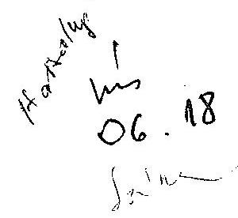

Tisztelettel
(Hagelmayer István)

---

# 362/ce/99 224/599. 

A11ami Szamvevoszek
Hagelmayer István úr
e l $n$ ö $k$

## Budapest

Tisztelt Elnök Úr !
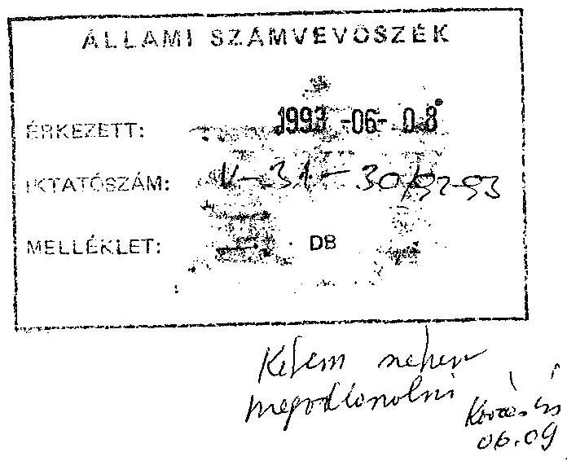

Az Állami Számvevôszéknek az Északmagyarországi Vegyimũveknél létesített gazdasági társaságok helyzetének felmérésérôl és a Porán Kft privatizálásának szabályszerűségérôl elkészített vizsgálati jelentésében szereplő összefoglaló megállapításokkal és ajánlásokkal kapcsolatosan az alábbi észrevételeket teszem.

Az Ipari és Kereskedelmi Minisztérium egyetértett és támogatta a vállalat termelô és szolgáltató egységeiből profiltiszta önálló gazdasági társaságok alakulását. A vállalat átalakulási terve ezt tartalmazta is, sôt a társasággá alakítások meg is történtek. A társasággá alakítások megteremtették a privatizáció lehetôségét, melyre a késôbbiek során az ÉVM felszámolásának befejezése után kerülhet sor.

A társaságok privatizációjának kapcsán hiányolom, hogy nem ad ajánlást a jövôre vonatkozóan az anyag:
az egybeni privatizáció tartható-e mint koncepció ?

- a privatizációhoz a jelenlegi helyzet szerint meg kell várni az ÉVM jogutódlás nélküli megszünéssel záródó felszámolását, mivel a létrehozott kft-k ingatlanokkal nem rendelkeznek. Milyen lehetôséget látnának a további folyamatos vagyonvesztés elkerülésének megakadályozására ?

---

A Porán Kft privatizálásával kapcsolatban az IKM álláspontja az volt, hogy versenyeztetésre kerüljön sor. Ezt dokumentálja dr. Botos Balázs IKM helyettes államtitkár úr 1991. március 26-án Csepi Lajos ügyvezetô igazgatóhoz irt levele is.

A két pályázó által benyújtott anyag birálata során az IKM képviselôinek véleménye az osztrák cég ajánlatának elfogadása volt. Az ÁVÚ és az IKM is ugy értékelte, hogy a privatizációs tranzakció elhúzódása csak a vevő érdekeit szolgálja, mivel a jövedelmezõségi mutatók folyamatos romlása a társaság piaci értékének folyamatos csükkenését eredményezi.

Ugyanakkor az INESPO tőkehiányt sejtető idôhúzó taktikát folytatott (5. sz. melléklet).

A döntést az ÁVÚ hozta, az eltelt idôszak pedig igazolta a döntés helyességét, melyet a színdikátusi szerzödés betartása és a foglalkoztatottsági szint stabil léte, valamint a többszörri alaptőkeemelés is alátámaszt.

Nem értek egyet az un. monopol helyzettel kapcsolatos értékeléssel, lévén az import liberalizált. Az egyedüli gyártó és a piaci monopolium nem azonos fogalom.

A fenti észrevételekkel a jelentésben foglaltakkal egyetértek.

Budapest, 1993. június 4.
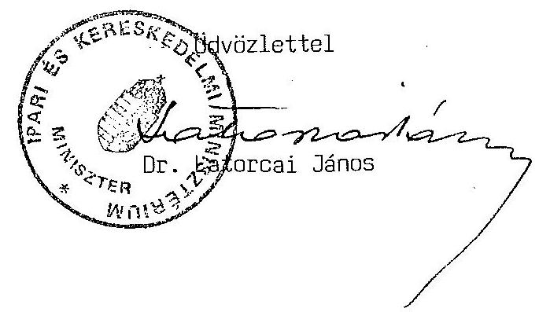

---

Budapest, 1993, június 18. $\mathrm{V}-31-32 / 1992-93$.

Dr. L A T O R C A I JÁnOS úr ipari és kereskedelmi miniszter

# B U D A P E S T 

Tisztelt Miniszter úr!

Az Északmagyarországi Vegyimũveknél lefolytatott helyzetfeltáró, illetve a PORÁN Poliuretán Gyártó- és Értékesitő Kft. privatizációjának szabályszerűségi vizsgálatáról készített Jelentésre tett észrevételeit köszönettel megkaptam.

Engedje meg, hogy észrevételeivel kapcsolatban a következökröl tájékoztassam:

1. A vizsgálat megállapította, hogy a Minisztérium is támogatta a nevezett vállalat társaságokká történő alakulását. Egy olyan nagy vállalat esetében, ame1y technológiailag és vertikumában - továbbá a helyi adottságokat is figyelembe véve - egységnek tekinthető, meggondolandó lett volna részekre bontani és önálló társaságonként mũködtetni. A felszámolási eljárás sem támasztja alá ezt a megoldást, mert az adósságok rendezéséhez várhatóan a teljes vagyon értékesítése sem lesz elegendő. A felszámoló biztos véleménye szerint az értékesítés (felszámolás) során az egy egységként való kezelés a lehetséges járható megoldás. Az azonban iparpolitikai döntés volt, hogy az Ipari és Kereskedelmi Minisztérium támogatta azt az átalakítási tervet,

---

amely megvalósult a Vállalatnál. Az ilyen típusú döntések nem tartoznak az Állami Számvevőszék kompetenciájába. E téren felelősséget az iparpolitikát alakitók és a tulajdonosok viselik.

Hasonló a helyzet a vagyonvesztés megakadályozásának kérdésében. A vagyonvesztés megakadályozása a tulajdonos, vagy az állam nevében tulajdonosi funkciót ellátó kötelessége.
2. A Minisztérium által hivatkozott helyettes államtitkári levél valóban a versenyeztetés igényét jelezte, s nem többet. A Minisztérium az ÁvÜ privatizációs döntését támogatta, s ma is helyesnek tartja.

Úgy vélem, hogy az Állami Számvevőszéknek címezni olyan kérdést, amely elsősorban az egykori alapítók, illetve az alapítói jogokat gyakorló szerv feladata, nem indokolt.
3. Felhívom Miniszter úr szíves figyelmét az 1990. évi VIII. törvényre, amely a tisztességtelen piaci magatartás tilalmáról szól és egyértelműen rögzíti a piacon résztvevő gazdálkodó szervezetekkel kapcsolatos követelményeket. Javasolom Miniszter úr részére, hogy az ügyben a Minisztérium szakértői a Gazdasági Versenyhivatal szakértőivel konzultáljanak.

Mindezek alapján a "Jelentés"-ben foglaltakon változtatni nem áll módomban. Az álláspontok bemutatása érdekében azonban csatolom mind az Ön levelét, mind az általam írt válaszlevelet a végleges "Jelentés"-hez.