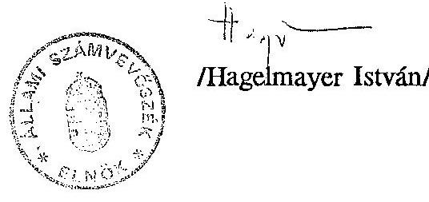

10088. szám

# Sillami Számverösxék 

## JELENTÉS

- "a szakszervezeti vagyon védelméról, a munkavállalók szervezkedési és szervezeteik müködési esélyegyenlőségéról" - szóló
- többször módosított - 1991. évi XXVIII. tv. alapján az 1992. évben pótlólagosan benyújtott elszámolások ellenőrzéséről, azok hitelességének eredményéről

---

Az ellenőrzést vezette:
dr. Elek János osztályvezető főtanácsos

Az ellenőrzésben közreműködtek:
IV. Vagyonellenőrzési Igazgatóság
V. Önkormányzati és Területi Ellenörzési Igazgatóság
VI. Elemző, Módszertani és Informatikai Igazgatóság

A jelentés 1. sz. melléklete tartalmazza az ellenőrök és az ellenőrzött egységek felsorolását.

---

# JELENTÉS 

"a szakszervezeti vagyon védelméről, a munkavállalók szervezkedési és szervezeteik müködési esélyegyenlőségéről" szóló - többször módosított - 1991. évi XXVIII. tv. alapján az 1992. évben pótlólagosan benyújtott elszámolások ellenőrzéséről, azok hitelességének eredményéről

A szakszervezeti vagyon védelméről, a munkavállalók szervezkedési és szervezeteik múködési esélyegyenlőségéről szóló - többször módosított - 1991. évi XXVIII. törvény (továbbiakban: törvény) rendelkezett a szakszervezetek vagyonelszámolásáról, egyúttal kijelölte az Állami Számvevőszéket (továbbiakban: ÁSZ) azok ellenőrzésére és hitelesítésére. A törvény értelmében a vagyonelszámolásokat az ÁSZ-hoz 1991. augusztus 31-ig kellett benyújtani és az ÁSZ-nak az ellenőrzés eredményéről 1991. november 30 -ig kellett beszámolnia. Az ÁSZ a törvényben elöírt kötelezettségének eleget tett és az Országgyülésnek 1991. novemberében 3614-es szám alatt beterjesztette jelentését a vagyonelszámolások ellenőrzéséről, melyben összegezte az 1991. évben benyújtott 1907 vagyonelszámolás ellenőrzésével, hitelesítésével kapcsolatos tapasztalatokat és mindazon gondot, amely a feladat maradéktalan végrehajtását akadályozta. A jelentés arról is beszámolt, hogy nem minden szakszervezet tett eleget törvényi kötelezettségének. Az ÁSZ azokban az esetekben, amikor a törvényi kötelezettség teljesítésének megtagadásáról egyértelmű információt kapott, a Legfőbb Ügyészhez fordult.

Az Alkotmánybíróságnak a törvénnyel kapcsolatos döntését követően megváltozott a vagyonelszámolást nem teljesítő szervezetek törvény végrehajtásával kapcsolatos magatartása. A Magyar Szakszervezetek Országos Szövetsége (továbbiakban: MSZOSZ), mint önálló szervezet 1992. május 20 -án átadta az ÁSZ-nak vagyonelszámolását. Ezt követően az MSZOSZ tagszervezetei és más, korábban vagyonelszámolást be

---

nem nyújtott szakszervezetek és szövetségek több mint 4000 vagyonelszámolást nyújtottak be, többségében decentralizáltan és összehangolatlanul. A bevallások döntő része 1992. szeptemberében érkezett be az ÁSZ-hoz. Arra is volt példa, hogy a helyszíni ellenőrzések időpontjában, illetve azok befejezését követően is küldtek be további pótlólagos vagyonelszámolásokat.

A Kormány és a szakszervezeti szövetségek között létrejött megállapodás alapján módosított törvény (1993. évi XIII. tv.) rendelkezett arról, hogy a törvényben megjelölt határidőt követően beérkezett vagyonelszámolásokat az ÁSZ ellenőrzi és a hitelességről az MSZOSZ, mint önálló szervezet esetében 1993. február 15-ig, a többi szakszervezetek esetében 1993. április 15-ig nyilatkozik, az elszámolás hitelességének eredményéről 1993. május 30-ig beszámol az Országgyűlésnek.

Az ÁSZ ezen újabb kötelezettségének is eleget tett. E jelentés a törvényben megjelölt határidőt követően, 1992-ben pótlólag beküldött vagyonelszámolások ellenőrzésének főbb tapasztalatait, illetőleg az 1. sz. melléklet szerinti felsorolásban az ellenőrzési jelentésben foglalt hitelesítések eredményét tartalmazza.

# I. 

Az ellenőrzés célja, időszaka, a reprezentáció mértéke, módszere

A pótlólagosan benyújtott vagyonelszámolások esetében az ellenőrzés egységes elvi és szakmai alapját továbbra is az 1991. augusztusában elfogadott és hetilapban közzétett (e jelentés 2. sz. mellékleteként csatolt) vizsgálati program biztosította. Az ellenőrzés célja és időszaka nem változott.

Az ellenőrzés célja továbbra is csak a (pótlólagosan) beküldött vagyonelszámolások hitelességének megállapítása volt. A vizsgált időszak pedig - a vagyonelszámolások késői beküldésétől függetlenül - az 1991. január 1-jén és a törvény hatályba lépésének napján, 1991. július 17-én fennálló vagyoni helyzetre terjedt ki.

Nem változott az első, 1991. évi feladathoz képest az ellenőrzés módszere és az eljárás rendje sem. Ennek megfelelően az ÁSZ 1992-93-ban is a több mint 4000

---

benyújtott vagyonelszámolás mind a 11 tábláját (amelyben fel kellett tüntetni az ingatlanokra, állóeszközökre, védett műalkotásokra, szakszervezetek részvételével működő gazdálkodó szervezetekre, értékpapír állományra, pénzforgalomra és alapítványba bevitt vagyonra vonatkozó adatokat) legalább formai, számszaki szempontból ellenőrizte, valamint azok hitelességét alátámasztó dokumentumokat egyes szervezeteknél - a fővárosban és a megyékben - a helyszínen, részleteiben is megvizsgálta.

Az elszámolt vagyonnagyság határozta meg a helyszíni ellenőrzésre való kijelölést. E mintavételi módszer tette lehetővé, hogy a vagyonelszámolásokban szerepeltetett 1991. január 1-jei állapotnak megfelelő összes bruttó vagyon közel $80 \%$-át a számvevők a helyszínen, tételesen is ellenőrizzék.

A reprezentáció mértékének meghatározásánál az volt a kiindulási alap, hogy valamennyi ingatlanra vonatkozó, illetve minden jelentős nagyságrendű vagyonelemeket tartalmazó vagyonelszámolás helyszíni ellenőrzésre kerüljön. Erre tekintettel helyszíni, dokumentális alátámasztottságot is részleteiben vizsgáló ellenőrzés alá tartozott mindazon vagyonelszámolás, amelyben ingatlanra vonatkozó adatok szerepeltek, továbbá az összesített vagyonnagyság alapján a fővárosi szervezetek esetében az 1 M Ft , a vidéki szervezetek esetében $0,5 \mathrm{M}$ Ft feletti vagyonösszeget bevallók közül szúrópróbaszerűen kiválasztott szervezetek.

Az ÁSZ az ellenőrzés során következetesen érvényesítette a vizsgálati programban rögzített eljárási rendben megállapított követelményeket. Így a formai, számszaki, illetve a helyszíni ellenőrzés során megállapított bármilyen hiba kizárta az elszámolás elfogadását.

Törvényi felhatalmazás hiányában az ÁSZ nem volt jogosult a vagyonelszámolásban tapasztalt hiba kijavítására (még a szervezet által az ellenőrzést követően utólagosan közölt korrekciók esetén sem), illetve az egyszer már megállapított hitelesítés eredményének megváltoztatására. Az eredményről a vagyonelszámolást beküldő szervezetek értesítést kaptak. Az ellenőrzés megállapításait minden szervezetnél jelentés rögzítette, amelyre az érintett észrevételt tehetett.

---

# II. 

## Az 1992. évben pótlólagosan beküldött vagyonelszámolások hitelességének eredménye

1) Az ÁSZ - a halmozódások, illetve a törvény hatálybalépését követően alakult szakszervezetek vagyonelszámolásainak kiszűrését is figyelembe véve - 4167 pótlólagosan beküldött vagyonelszámolást ellenőrzött. A két ellenőrzési szakaszban így összesen 6074 elszámolást kellett hitelesíteni.

Összességében megállapítható, hogy a pótlólagosan 1992-ben beküldött 4167 vagyonelszámolás közül az ÁSZ 3635 vagyonelszámolást ( $87,3 \%$ ) hitelesített, és 532 vagyonelszámolást ( $12,7 \%$ ) nem hitelesített.

Az ellenőrzés menetét követve az ellenőrzés főbb tapasztalatai a következőkben összegezhetők.

Valamennyi vagyonelszámolás formai és számítógépes ellenőrzése során 412 vagyonelszámolás ( $9,9 \%$ ) nem felelt meg a törvényben előírt formai, tartalmi és számszaki követelményeknek ( 3,4 hitelesítési kód). Az ÁSZ nem hitelesítette azt a vagyonelszámolást, amely teljességi nyilatkozatot nem tartalmazott, mivel a vagyonelszámoló nem tanúsította az adatok teljességét, illetve azt, hogy a vagyonelszámolás az előírásoknak megfelelően minden vagyonrészt tartalmaz. A számítógépes ellenőrzés jellemzően összeadási, illetve a táblázatok nem következetes kitöltéséből adódó hibákat szűrt ki. E hibák miatt - jellegükből adódóan bármennyire is egyszerűek voltak azok - az ÁSZ az adott vagyonelszámolást nem hitelesítette, mivel a beküldött adatokat nem módosíthatta és ennek megfelelően azt további helyszíni ellenőrzésre nem jelölte ki. Abban az esetben tett ez alól csak kivételt, amikor a vagyonelszámolás ingatlanra vonatkozó adatokat is tartalmazott. Ebben az esetben az ÁSZ akkor is elvégezte a helyszíni ellenőrzést, ha az előzetes vizsgálat során a vagyonelszámolás mind formai, mind tartalmi szempontból hibás volt.

A formai és számítógépes ellenőrzés után továbbra is vizsgálható vagyonelszámolások közül az ÁSZ 280 vagyonelszámolás ( $6,7 \%$ ) helyszíni ellenőrzését végezte el. Ezekben a vagyonelszámolásokban koncentrálódott a bruttó vagyon közel $80 \%$-a.

---

A helyszínen ellenőrzött vagyonelszámolások közül az ÁSZ 160 vagyonelszámolást ( $58 \%$ ) hitelesnek ( 5,6 hitelesítési kód), a többi 120 vagyonelszámolást ( $42 \%$ ) nem hitelesnek ( 7,8 hitelesítési kód) fogadott el. Vagyis míg a bevallások teljes körére vetítve minimális volt a nem hitelesített vagyonelszámolások száma, addig ez a jelentősebb vagyonnal rendelkezők esetében közel a felét tette ki.

A helyszíni ellenőrzések alapján a következő főbb hibák voltak tapasztalhatók.

- Az ingatlan vagyonelszámolások során sok, az ingatlannyilvántartásban is rendezetlen tétel került felszínre. Előfordult például, hogy a szakszervezeti szövetség az ingatlan telekkönyvi lapján kezelőként szerepelt, holott az ingatlant gazdasági társaság használta, amelynek a szakszervezeti szövetség csak tagja. Egyes vagyonelszámolásokban keveredtek az ingatlan használatára vonatkozó jogcímek. Előfordult, hogy a szervezet által bérelt ingatlant, mint tulajdont szerepeltették, vagy az ingatlant tulajdonukként és mint a kezelésükben lévőt is feltüntették.

E félreértéseket a helyszíni ellenőrzés tisztázta. A tulajdoni-lap másolatokból - amennyiben azok a törvényben meghatározott időpontra vonatkoztak nyomon követhető volt, hogy az ingatlan szakszervezeti vagy állami, esetleg önkormányzati tulajdonban volt-e. Több olyan hiba is tapasztalható volt, amikor az adatlap összesen sora nem volt kitöltve, vagy az ingatlan bruttó és nettó értékére vonatkozó információ teljes mértékben hiányzott.

- Az állóeszközök bevallásánál változatlanul jellemző probléma volt, hogy a szervezetek értékhatárra tekintet nélkül valamennyi állóeszközt feltüntették; a műalkotások védettségére vonatkozó információval nem rendelkeztek; nem vezették naprakészen az egyedi állóeszköz-nyilvántartásokat.
- Értelmezési gondok miatt számos esetben nem megfelelően töltötték ki a szakszervezetek részvételével múködő gazdálkodó szervezetek, az értékpapír állomány, valamint az alapítványba bevitt vagyon adataira vonatkozó adatlapot. Esetenként vagyoni betétként nem a társasági szerződésben foglalt, ténylegesen átutalt összeget tüntették fel a bevallásban. Egyes szervezetek értékpapírként tüntették fel a tartós betétben elhelyezett pénzeszközöket is. A tartósan lekötött pénzeszközök könyvelésében, nyilvántartásában számos eltérő gyakorlatot tapasztalt az ellenőrzés. Több esetben nem tudták kimutatni a helyszíni vizsgálat időpontjában a követelések, év végi beszámolóban kimutatott átmenő aktívák

---

részletezését. Nem hitelesítette az ÁSZ azokat a vagyonbevallásokat, amelyek egyes vagyonelemeket (pl. értékpapírt) nem tüntettek fel az adatlapon.

- "A pénzforgalom alakulása" megnevezésű adatlap kitöltésénél legjellemzőbb hibaként fordult elő, hogy nem lehetett egyértelműen megállapítani a pénzforgalmi összegre vonatkozó adatok helyiértékét. E tábla adatait ugyanis Ft-ban kellett megadni, eltérően a többi táblától, melynek adatait ezer Ft-ban kellett feltüntetni. Ez a kitöltésnél félreértésre adott okot.

A helyszíni ellenőrzések során egy szervezetnél tapasztalt az ÁSZ a hitelesség megállapítására alkalmatlan, rendezetlen állapotot, amely szervezetnél rendőrségi vizsgálat is folyamatban volt. A vizsgálat elősegítése érdekében az ÁSZ megküldte az ellenőrzésről készült jelentést a Legfőbb Ügyésznek.

Az ÁSZ a formai és számítógépes előzetes ellenőrzést követően a további 3475 vagyonelszámolás esetében ( $83,4 \%$ ) - amelyek szinte kizárólag csak pénzforgalmi adatokat tartalmaztak - nem folytatott le helyszíni ellenőrzést, hanem vélelmezte a hiteles adatszolgáltatást és így azokat hitelesítette ( 1,2 hitelesítési kód).

Az ellenőrzésben (számítógépes, illetve helyszíni) jelentkező, az előző bekezdésekben említett különbségeket az ÁSZ jelezte a hitelesítést minősítő kódokban is. A minősítési kódok egyben azt is jelezték, hogy a szakszervezetek a vagyonelszámolásukat a törvény melléklete által előírt formában, vagy attól eltérően nyújtották be. (A hitelesítést minősítő kódok - a szükséges magyarázatokkal - a hitelesítés eredményét tartalmazó 1. sz. mellékletben szerepelnek.)
2) Az Országgyűlés tájékoztatása érdekében - bár a törvény a vagyonelszámolások összesítését nem írta elő - az előterjesztés mellékletét képezi a szakszervezetek által beküldött vagyonelszámolások vagyonnemenkénti összesítése. A teljesebb kép és az összehasonlíthatóság érdekében a pótlólagosan beküldött vagyonelszámolások statisztikai adatai (4. sz. melléklet) mellett szerepelnek az 1991. évben beküldött vagyonelszámolások statisztikai adatai (5. sz. melléklet) és a két év összesített statisztikai adatai (6. sz. melléklet) is. Meg kell említeni, hogy a 3614. számú jelentés benyújtását követően az 1991. évre vonatkozó vagyonnemenkénti összesítést tartalmazó táblázat - karakterisztikai hibák kiszűrése miatt - pontosításra került. Az erről készült kiegészítő tájékoztatót az ÁSZ pótlólag eljuttatta az érintettekhez. Erre figyelemmel a jelentés 4. sz. melléklete 1991. évre már korrigált adatokat tartalmaz.

---

A statisztikai összesítések használatához az alábbiakat szükséges jelezni:

- az ÁSZ-nak nincs törvényi felhatalmazása a vagyonelszámolásokban lévő tartalmi hibák javítására, a közölt adatok megváltoztatására, így a nem hiteles vagyonelszámolások esetében továbbra is az eredeti vagyonelszámolásban közölt adatok szerepelnek az adatállományban, erre tekintettel a statisztikai adatok ismertetése is hiteles, illetve nem hiteles vagyonelszámolási bontásban szerepelnek;
- számos karakterhiba, illetve többféle okból keletkezett halmozódás kiszürés mellett sem garantálható, hogy további hasonló hiba ne lenne az adatállományban;
- a hitelesített vagyonelszámolások közül a nem helyszínen ellenőrzöttek esetében csak formai, számítógépes ellenőrzés valósult meg, helyszini tételes ellenőrzése nem.

Az 1991. és 1992-ben beküldött több mint 6000 vagyonelszámolásban a szakszervezetek - 1991. január 1-jei állományként bruttó értékben - összesen 8042 M Ft vagyonértékkel számoltak el. Megállapítható, hogy az 1992-ben pótlólagosan beküldött 4167 vagyonelszámolás 1991. január 1-jei állományként összesen feltüntetett 5305 M Ft bruttó vagyonértékről adott számot, amely majd kétszerese az 1991-ben beküldött vagyonelszámolásokban szereplő bruttó vagyonértéknek ( 2738 M Ft ). Ebből kiemelkedik az MSZOSZ vagyonelszámolásában szereplő vagyonérték, amely az 1867 M Ft értékével $33 \%$-os arányt képvisel.

Vagyonnemenként az 1991. január 1-jei állományként rögzített bruttó értékek összesítését vizsgálva megállapítható, hogy legnagyobb értékkel az ingatlan ( 2333 M Ft ) és a pénzforgalom ( 1361 M Ft ) szerepel. Az ingatlanoknál feltüntetett értékadat 237 ingatlan, illetve részingatlan adatát tartalmazza. Torzítja viszont ezt az adatot az a tény, hogy "osztott ingatlan-vagyon" esetén ugyanazon ingatlan több vagyonelszámolásban is szerepel.

Említést érdemel, hogy a nem hitelesített vagyonelszámolások esetében az 1991. január 1-jei állományként feltüntetett 3769 M Ft bruttó érték az összesített vagyonelszámolásokban szereplő bruttó értéknek ( 5305 M Ft ) $70 \%$-át teszi ki. Ez a magas arány az MSZOSZ vagyonelszámolásának nemhitelesítéséből adódik, amely egymaga az 1.867 M Ft bruttó értékével $50 \%$-ot tesz ki.

---

# III. 

## A feladatvégzés körülményei és végrehajtása

1. A beküldött - előre nem tervezhető - nagytömegű vagyonelszámolás feldolgozása rendkívüli feladatot jelentett az ÁSZ számára. Megoldására - egyéb munkatervi feladataival történő összehangolására - csak fokozatosan, különböző belső szervezési megoldásokkal tudott felkészülni.

Már a vagyonelszámolások regisztrálása, érkeztetése, számítógépes adatrögzítésre való felkészítése, valamint a több százezres nagyságrendű adat rögzítése is több hónapot vett igénybe és jelentős terheket rótt az ÁSZ-ra. A manuális feladatok elvégzésére 10 fő külső szakértő bevonására is szükség volt, akik egyben részt vettek a vagyonelszámolások alaki ellenőrzésében is. A több mint 4000 szervezettől beérkezett adattömeg teljes egésze számítógépre került. Ennek hiányában a listázás, összesítés, címzés, értesítés munkája megoldhatatlan lett volna.

Az előbb említett munkák mellett a helyszíni ellenőrzések elvégzése - tekintettel a vagyonelszámolások számára, egyes vagyonelemek nagyságára, területi szétszórtságra - szükségessé tette az ÁSZ munkatársainak más területről, illetve Igazgatóságról történő átcsoportosítását és további külső szakértők alkalmazását is.
2. A szakszervezetek az elszámolási kötelezettségüket a legváltozatosabb formákban teljesítették, amely az ÁSZ-nak számos problémát okozott. Az 1991. és 1992. évben beküldött nagytömegű (több mint 6000) vagyonelszámolás mutatja, hogy a szakszervezetek elszámolási kötelezettségüknek - különösen 1992-ben - nem szakszervezetenként központilag, hanem alapvetően decentralizáltan tettek eleget. Az ÁSZ-hoz benyújtott vagyonelszámolások 90 \%-a alapszervezetektől érkezett. A teljesítés e formája nagy valószínűséggel azt jelzi, hogy jellemzően a sok és az ország legkülönbözőbb területein működő alapszervezettel rendelkező szakszervezetek vezetői nem vállalták tömörülésükről összesített adatsorok készítését és különösen azok megalapozottságáról, teljességéről a nyilatkozattételt.

Egy esetben arra is volt példa, hogy a vagyonelszámolást szövetségi szinten, összesítetten adták meg valamennyi szövetséghez tartozó tagszervezetre nézve, függetlenül attól, hogy a tagszervezeteknek külön-külön kellett volna elszámolásaikat benyújtani.

---

A vagyonelszámolások decentralizált beküldéséből következően nem lehetett megállapítani a vagyonelszámolásokból, hogy beküldője milyen jogállású (bíróságon bejegyzett-e vagy nem) illetve milyen szervezeti egységére (csak a központra, csak az alapszervezetre, a szakszervezet egészére) vonatkozik a beküldött vagyonelszámolás. Ilyen teljesítés mellett nem lehet tehát megállapítani, hogy az adott szakszervezet valamennyi belső szervezeti egységére nézve, teljeskörűen eleget tett-e vagyonelszámolási kötelezettségének. A vagyonelszámolások decentralizált és összehangolatlan beküldése számos halmozódáshoz is vezetett, amelyek kiszűrése jelentős gondot okozott.

A fentiekre tekintettel az ÁSZ az 1992-ben pótlólagosan beküldött vagyonelszámolások esetében, hasonlóan az 1991. évihez, a hitelességről vagyonelszámolásonként - tehát beküldő szakszervezeti egységenként - tudott nyilatkozni.

Az előbbiekben említettek mellett ma is fennálló alapvető gond az is, hogy a bejegyzett szakszervezetekről nem áll hiteles lista rendelkezésre. Ennek hiányában nem ellenőrizhető a teljeskörűség. Ma sem lehet arról nyilatkozni, hogy melyik szakszervezet tett, illetve nem tett eleget elszámolási kötelezettségének.
3. Az ÁSZ már az Országgyűlésnek beterjesztett 3614. számú 1991. novemberi jelentésében jelezte az előzőekben leírt gondokat, amelyek a feladat maradéktalan végrehajtását mind a mai napig akadályozzák.

Az ÁSZ-nak a vagyonelszámolások ellenőrzése első szakaszában tett kezdeményezése az említett problémák feloldására - mint erről az ÁSZ fent említett jelentése szól - nem vezetett eredményre. Az 1991. évi hitelesítési ellenőrzések tapasztalatai alapján egyértelművé vált, hogy az ÁSZ a törvényben foglalt feladatát csak a szakszervezetek megfelelő segítségével, közvetlen együttműködésével valósíthatja meg. Ezért az ÁSZ kezdeményezésére - még a pótlólagos vagyonelszámolások benyújtását közvetlenül megelőzően 1992ben - olyan törvénymódosítás született, amelynek értelmében a szakszervezeti szövetségek 1992. július 31 -ig teljeskörűen kötelesek voltak tájékoztatni az ÁSZ-t a hozzájuk tartozó, elszámolásra kötelezett szakszervezetekről, illetve önálló jogi személyiségű szervezeti egységeikről.

A szövetségek közül a tájékoztatási kötelezettségének határidőre mindössze hat tett eleget. Erre figyelemmel, valamint arra, hogy a beküldött listákból továbbra sem volt megállapítható a szakszervezetekhez tartozó szervezeti

---

egységek teljes köre, az ÁSZ levélben fordult a Közéleti Kézikönyvben, illetve a beküldött szövetségi listákban szereplő szakszervezetekhez, szövetségekhez.

Így az ÁSZ összesen 709 szakszervezetet keresett meg levelével, amelyben kérte, hogy

- adjanak tájékoztatást a szakszervezetük jogállásáról (bíróságon bejegyzette), szintjéről (önálló szakszervezet, szövetség, stb.);
- küldjék meg a szakszervezetükhöz tartozó szervezetek címlistáját, külön megjelölve azok jogállását;
- nyilatkozzanak arról, hogy szakszervezetük teljeskörűen, szervezetükhöz tartozó mindegyik szervezeti egység eleget tett-e vagyonelszámolási kötelezettségének.

A megkeresett szakszervezetek háromnegyede, 531 küldött választ, amelyek feldolgozásával az ÁSZ kísérletet tett a beküldött több mint 6.000 vagyonelszámolás szakszervezetenkénti azonosítására, a teljeskörüség megállapítására. E tevékenység - amely a vagyonelszámolások érdemi vizsgálatával párhuzamosan folyt - szabályos nyomozói munkával ért fel, tekintettel arra, hogy a beküldött válaszok sok esetben nem voltak egyértelműek, illetve a beküldött listákon szereplő több ezer szervezet azonosítására csak manuálisan volt mód, amelyet rendkívül nehezített a nem következetes szervezeti névhasználat és az időközben végbement számos változás (megszünés, átalakulás, névváltoztatás, stb.).

Összességében megállapítható, hogy az ÁSZ által e körben tett erőfeszítések - a befektetett jelentős energia ellenére - az alább felsorolt további főbb okok miatt nem hozták meg a kellő eredményt.

- Nem minden szakszervezet tett eleget az ÁSZ kérésének. Jelezni szükséges azonban, hogy csak a szövetségeknek volt törvényi kötelezettségük szervezetükre vonatkozó adatszolgáltatásra.
- A beküldött válaszok többsége a beküldéskori (1992. évi) állapotnak megfelelően adta meg a szakszervezeti struktúrát és nem volt figyelemmel az 1991. január 1-jét követően beállt szervezeti változásokra (megszűnésre, kiválásra, újonnan alakulásra, stb.).

---

- Nem mindenben adtak egyértelműen választ a szakszervezetek a feltett kérdésekre, különösen a szervezeteik struktúrájára (van-e további szervezeti egységük), jogállására, illetve arra, hogy a bevallott vagyon milyen szervezeti egységre terjedt ki. E körbe sorolhatók azok is, amelyek különösen a nagyobb szakszervezetek - kellő információk hiányában nem tudták megadni alapszervezeteik felsorolását.
- Sok esetben ellentmondásos válasz érkezett a szervezetek jogállását tekintve, nem egyértelműen használva a jogi személy fogalmát. Több esetben fordult elő az is, hogy egyes alapszervezetek bíróságon is bejegyeztették magukat, holott erre a jelenlegi jogszabályok nem adnak lehetőséget.

4. Az ellenőrzések - törvényi határidőben történt - befejezése után az ÁSZ a pótlólagosan 1992-ben benyújtott vagyonelszámolásokat átadta a Vagyont Ideiglenesen Kezelő Szervezet (VIKSZ) részére és hasonlóan az előző ellenőrzéshez - bár továbbra sem volt törvényi kötelezettsége - a VIKSZ munkájának segítése érdekében rendelkezésre bocsátotta a számítógépen rögzített adatállományt és a hozzá kapcsolódó felhasználási programot is. Ezen munkák elvégzése ellenére továbbra sem fejeződött be a szakszervezetek vagyonelszámolásának ellenőrzése. Az ÁSZ rendelkezésére álló - a szakszervezetek által beküldött levelekből nyert - információk szerint közel 400, a 3. sz. mellékletben felsorolt szakszervezet - többségében a jogszabály rosszul értelmezése miatt - nem számolt el vagyonával. Természetesen a felsorolt szakszervezeteken kívül is lehetnek még olyan további szakszervezetek, - különösen olyanok, amelyek egyetlen szakszervezeti szövetséghez sem tartoznak - amelyek nem tettek eleget törvényi kötelezettségüknek.

A módosított törvény 5. § (7) bekezdése értelmében az ÁSZ ellenőrzési jogosultsága - az ezt követően beérkezett elszámolások esetében - a második üzemi-közalkalmazotti tanács választások időpontjáig áll fenn és ezt követő 60 napon belül kell beszámolnia az ellenőrzés eredményéről az Országgyűlésnek.

A törvényben előírtak teljesítése érdekében az ÁSZ a 3. sz. mellékletben felsorolt szakszervezeteket felszólítja, hogy vagyonelszámolási kötelezettségüknek tegyenek eleget. A felszólítás eredménytelensége esetén az ÁSZ a Legfőbb Ügyésznél kezdeményezni fogja a szükséges intézkedések megtételét.

---

Az Országgyűlés 1991-ben a szakszervezeti vagyonelszámolások ellenőrzésének fedezetére 6.6 M Ft-ot bocsátott az ÁSZ rendelkezésére. Az 1991. évi ellenőrzést követően fennmaradt pénzösszeget az ÁSZ teljes egészében az 1992-ben pótlólagosan beküldött ellenőrzések teljesítésére fordította. Tekintettel arra, hogy a vagyonelszámolások ellenőrzése továbbra is a már jelzett időpontig az ÁSZ feladataként jelentkezik, indokolt e feladat végrehajtásához további, szükséges pénzügyi fedezet biztosítása, amelyet az ÁSZ éves költségvetésének tervezésekor célszerű figyelembe venni.

Budapest, 1993. május

Melléklet: 6 db

---

"a szakszervezeti vagyon védelméröl, a munkavállalók szervezkedési és szervezeteik müködési esélyegyenlőségéröl" szóló - többször módosított - 1991. évi XXVIII. tv. alapján az 1992. évben pótlólagosan benyújtott elszámolások ellenőrzéséről, azok hitelességének eredményéről készült V-1031-230/92-23. sz. jelentéshez

1. sz. melléklet:

Kimutatás az 1992. évben pótlólagosan
beküldött vagyonelszámolások hitelesi-
tésének eredményéröl
215 lap
2. sz. melléklet:

Vizegálati program a 1991. évi XXVIII.
tv. 5. 8-ában elöirt ellenőrzési és
hitelesítési feladathoz
1 lap
3. sz. melléklet:

A vagyonelszámolási kötelezettséget
nem teljesítō, illetve nem teljeskörüen
elszámolt szakszervezetek
5 lap
4. sz. melléklet:

Az 1992. évben pótlólagosan beküldött
vagyonelszámolásokban szereplő adatok
vagyonnemenkénti összesitése
5. sz. melléklet:

Az 1991. évben beküldött vagyonelszámolásokban szereplő adatok vagyonnemenkénti összesitése
6. sz. melléklet:

Az 1991. és 1992. évben beküldött vagyon-
elszámolásokban szereplő adatok vagyon-
nemenkénti összesitése
1 lap

---

# 1. sz. melléklet   a V-1031-230/92-93. sz. jelentéshez 

## K im u t a t á s

az 1992. évben pótlólagosan beküldött vagyonelazámolások hitelesítésének eredményéről ${ }^{4}$

${ }^{4}$ Hitelesítést minősító kódok magyarázata:
csak számítógépes ellenőrzés a helyszínen ellenőrzött alapján hitelesitett vagyon- vagyonelszámolások elszámolások esetében:
"Hiteles"-nek elfogadott vagyonelszámolások
1
a törvény melléklete szerinti formában
benyújtott és tartalmilag is hiteles vagyonelszámolás
2
nem a törvény melléklete szerinti formában
benyújtott, de tartalmilag hiteles vagyonelszámolás
"Nem hiteles"-nek elfogadott vagyonelszámolások
3
nem a törvény melléklete szerinti formában
benyújtott és tartalmilag sem hitelesített vagyonelszámolás
4
a törvény melléklete szerinti formában benyújtott, de tartalmilag nem hitelesített vagyonelszámolás

Technikai jellegú kódok:
0 halmozódás kiszürése miatt más vagyonelszámoláshoz csatolt vagyonelszámolás
10 vagyonelszámolást beküldő levél

---

|  ALLAMI |  |  |  |  |  |   |
| --- | --- | --- | --- | --- | --- | --- |
|  SZÁMVEVOSZÉK | Formai számítógépes ellenőrzés
hitelesítési kódjai:
1 = hiteles
2 = hiteles, de form. rossz
3 = rossz
4 = jó form., rossz tart. |  | Kimutatás az 1992. évben
pótlólagosan benyújtott
vagyonelszámolások eredményéről |  | Helyszíni ellenőrzés
hitelesítési kódjai:
5 = hiteles
6 = hiteles, de form. rossz
7 = rossz
8 = jó form. rossz tart. | Lapszám: 138  |
|  Sorszám | Szervezet megnevezése |  |  | Ellenőr neve |  | A vagyonelszámolás
minősítése  |
|  2741 | MÁV SZEGED-RÓKUS BIZTOSÍTÓ BERENDEZÉSI ÉS FENNTARTÁSI FÖNÖKSÉG
6724 SZEGED
ROKUS PÁLYAUDVAR |  |  | ALMÁSI ÁRPÁD
MÁTRAI JÁNOS | 4 | 1  |
|  2742 | MÁV ÜZEMBIZTONSÁGI ÉS VÉDELMI FÖNÖKSÉG SZB.
6725 SZEGED
ÁLLOMÁS U. 11-12 |  |  | ALMÁSI ÁRPÁD
MÁTRAI JÁNOS | 4 | 1  |
|  2743 | MÁV IGAZGATÓSÁG SZB.
6720 SZEGED
TISZA LAJOS KRT. 28-30 |  |  | ALMÁSI ÁRPÁD
MÁTRAI JÁNOS | 4 | 1  |
|  2744 | MÁV SZEGED VONTATÁSI FÖNÖKSÉG SZB.
6729 SZEGED
MÁV RENDEZŐ PÁLYAUDVAR |  |  | ALMÁSI ÁRPÁD
MÁTRAI JÁNOS | 4 | 1  |
|  2745 | MÁV SZENTES ÁLLOMÁSFÖNÖKSÉG SZB.
6600 SZENTES
KOLOZSVÁRI U. 2 |  |  | ALMÁSI ÁRPÁD
MÁTRAI JÁNOS | 4 | 1  |
|  2746 | MÁV SZENTES VONTATÁSI FÖNÖKSÉG SZB.
6600 SZENTES
KORSÓS SOR 24 |  |  | ALMÁSI ÁRPÁD
MÁTRAI JÁNOS | 4 | 1  |
|  2747 | MÁV VÉSZTŐ ÁLLOMÁSFÖNÖKSÉG SZB.
5530 VÉSZTŐ
BARTÓK BÉLA 27-29 |  |  | ALMÁSI ÁRPÁD
MÁTRAI JÁNOS | 4 | 1  |
|  2748 | MÁV VONTATÁSI FÖNÖKSÉG SZB.
5530 VÉSZTŐ
BARTÓK BÉLA U. 27 |  |  | ALMÁSI ÁRPÁD
MÁTRAI JÁNOS | 4 | 1  |
|  2749 | VASUTASOK SZAKSZERVEZETE TERÜLETI INTÉZŐ BIZOTTSÁGA
9700 SZOMBATBATHELY
GÁBOR ANDOR U. 6 |  |  | ALMÁSI ÁRPÁD
MÁTRAI JÁNOS | 4 | 1  |
|  2750 | MÁV CELLDŐMÖLKI ÁLLOMÁS SZB.
9500 CELLDŐMÖLK
RÁKOCZI U. 1 |  |  | ALMÁSI ÁRPÁD
MÁTRAI JÁNOS | 4 | 1  |
|  2751 | MÁV CELLDŐMÖLK SZERTÁRFÖNÖKSÉG SZB.
9500 CELLDŐMÖLK
PÁPAI U. 1 |  |  | ALMÁSI ÁRPÁD
MÁTRAI JÁNOS | 4 | 1  |
|  2752 | MÁV VONTATÁSI FÖNÖKSÉG SZB.
9500 CELLDŐMÖLK
RÁKOCZI U. 1 |  |  | ALMÁSI ÁRPÁD
MÁTRAI JÁNOS | 4 | 1  |
|  2753 | MÁV JÁNOSHÁZA ÁLLOMÁS SZB.
9545 JÁNOSHÁZA
VASGŰÁLLOMÁS |  |  | ALMÁSI ÁRPÁD
MÁTRAI JÁNOS | 4 | 1  |
|  2754 | KESZTHELY ÁLLOMÁS
8360 KESZTHELY
MÁRTÍROK U. 8 |  |  | CZINEGE LAJOSNÉ
MÁTRAI JÁNOS | 4 | 4  |
|  2755 | MÁV KORMEND ÁLLOMÁS SZB.
9900 KORMEND
VASGŰMELLÉK U. |  |  | ALMÁSI ÁRPÁD
MÁTRAI JÁNOS | 4 | 1  |
|  2756 | PÁPA ÁLLOMÁS
8500 PÁPA
BÉKE TÉR 2 |  |  | CZINEGE LAJOSNÉ
MÁTRAI JÁNOS | 4 | 3  |
|  2757 | MÁV PÁPA PÁLYAFENNTARTÁSI FÖNÖKSÉG SZB.
8500 PÁPA
ESZTÉRHÁZY U. 25 |  |  | ALMÁSI ÁRPÁD
MÁTRAI JÁNOS | 4 | 1  |
|  2758 | MÁV SÁRVÁR ÁLLOMÁS SZB.
9600 SÁRVÁR
SELYÉM GY. ÚT 2 |  |  | ALMÁSI ÁRPÁD
MÁTRAI JÁNOS | 4 | 1  |
|  2759 | MÁV SOPRON PÁLYAFENNTARTÁSI FÖNÖKSÉG SZB.
9400 SOPRON
BAROSS U. 3 |  |  | ALMÁSI ÁRPÁD
MÁTRAI JÁNOS | 4 | 1  |
|  2760 | MÁV VONTATÁSI FÖNÖKSÉG SZB.
9400 SOPRON
KÖSZEGI U. 20 |  |  | ALMÁSI ÁRPÁD
MÁTRAI JÁNOS | 4 | 1  |

---

|  ÁLLAMI |  |  |  |  |  |   |
| --- | --- | --- | --- | --- | --- | --- |
|  SZÁMVEVŐSZÉK | Formai számítógépes ellenőrzés hitelesítési kódjai: 1 = hiteles 2 = hiteles, de form. rossz 3 = rossz 4 = jó form., rossz tart. |  | Kimutatás az 1992. évben pótlólagosan benyújtott vagyonelszámolások eredményéről |  | Helyszíni ellenőrzés hitelesítési kódjai: 5 = hiteles 6 = hiteles, de form. rossz 7 = rossz 8 = jó form. rossz tart. | Lapszám: 137  |
|  Sorszám | Szerezet megnevezése |  |  | Ellenőr neve |  | A vagyonelszámolás minősítése  |
|  2721 | MÁV ÁLLOMÁSFŐNŐKSÉG SZB. 6100 KISKUNFÉLEGYHÁZA KOSSUTH U. 37 |  |  | ALMÁSI ÁRPÁD MÁTRAI JÁNOS |  | 1  |
|  2722 | MÁV VILLAMOS VONALFŐNŐKSÉG SZB. 6100 KISKUNFÉLEGYHÁZA PF. 78 |  |  | ALMÁSI ÁRPÁD MÁTRAI JÁNOS |  | 1  |
|  2723 | MÁV ÁLLOMÁSFŐNŐKSÉG SZB. 6400 KISKUNHALAS KOSSUTH U. 49 |  |  | ALMÁSI ÁRPÁD MÁTRAI JÁNOS |  | 1  |
|  2724 | MÁV PÁLYAFENNTARTÁSI FŐNŐKSÉG SZB. 6400 KISKUNHALAS KOSSUTH U. 49 |  |  | ALMÁSI ÁRPÁD MÁTRAI JÁNOS |  | 1  |
|  2725 | MÁV SZERTÁRFŐNŐKSÉG SZB. 6400 KISKUNHALAS KOSSUTH U.49 |  |  | ALMÁSI ÁRPÁD MÁTRAI JÁNOS |  | 1  |
|  2726 | MÁV VILLAMOS VONALFŐNŐKSÉG SZB. 6400 KISKUNHALAS KÖTONYI U. 20 |  |  | ALMÁSI ÁRPÁD MÁTRAI JÁNOS |  | 1  |
|  2727 | MÁV VONTATÁSI FŐNŐKSÉG SZB. 6400 KISKUNHALAS KOSSUTH U.49 |  |  | ALMÁSI ÁRPÁD MÁTRAI JÁNOS |  | 1  |
|  2728 | MÁV ÁLLOMÁSFŐNŐKSÉG KUNSZENTMIKLOS-TASS SZB. 6090 KUNSZENTMIKLOS VASÚTÁLLOMÁS |  |  | ALMÁSI ÁRPÁD MÁTRAI JÁNOS |  | 1  |
|  2729 | MÁV LŐKÖSHÁZA ÁLLOMÁS SZB. 5743 LÖKÖSHÁZA MÁV ÁLLOMÁS |  |  | ALMÁSI ÁRPÁD MÁTRAI JÁNOS |  | 1  |
|  2730 | MÁV MAKÓ ÁLLOMÁS SZB. 6900 MAKO KUN BÉLA TÉR 15 |  |  | ALMÁSI ÁRPÁD MÁTRAI JÁNOS |  | 1  |
|  2731 | MÁV MEZŐHEGYES ÁLLOMÁS SZB. 5820 MEZŐHEGYES PETÖFI U. 1 |  |  | ALMÁSI ÁRPÁD MÁTRAI JÁNOS |  | 1  |
|  2732 | MÁV VONTATÁSI FŐNŐKSÉG SZB. 5820 MEZŐHEGYES VASÚTÁLLOMÁS |  |  | ALMÁSI ÁRPÁD MÁTRAI JÁNOS |  | 1  |
|  2733 | MÁV MEZŐTUR ÁLLOMÁSFŐNŐKSÉG SZB. 5400 MEZŐTUR VASÚTÁLLOMÁS |  |  | ALMÁSI ÁRPÁD MÁTRAI JÁNOS |  | 1  |
|  2734 | MÁV OROSHÁZA ÁLLOMÁSFŐNŐKSÉG SZB. 5900 OROSHÁZA KUN BÉLA TÉR 2 |  |  | ALMÁSI ÁRPÁD MÁTRAI JÁNOS |  | 1  |
|  2735 | MÁV SZEGED ÁLLOMÁSFŐNŐKSÉG SZB. 6725 SZEGED INDÓHÁZ TÉR 2 |  |  | ALMÁSI ÁRPÁD MÁTRAI JÁNOS |  | 1  |
|  2736 | MÁV ÉPÜLET ÉS HIDFENNTARTÓ FŐNŐKSÉG SZB. 6725 SZEGED INDÓHÁZ TÉR 11 |  |  | ALMÁSI ÁRPÁD MÁTRAI JÁNOS |  | 1  |
|  2737 | MÁV OKTATÁSI FŐNŐKSÉG SZB. 6724 SZEGED DR. BOROSS JÓZSEF U. 4/B |  |  | ALMÁSI ÁRPÁD MÁTRAI JÁNOS |  | 1  |
|  2738 | MÁV SZEGED SZÁMIŤÁSTECHNIKAI KOZPONT SZB. 6724 SZEGED DR. BOROSS JÓZSEF U. 4/B |  |  | ALMÁSI ÁRPÁD MÁTRAI JÁNOS |  | 1  |
|  2739 | MÁV SZÁMVITELI FŐNŐKSÉG SZB. 6724 SZEGED RÓKUS PÁLYAUDVAR |  |  | ALMÁSI ÁRPÁD MÁTRAI JÁNOS |  | 1  |
|  2740 | MÁV OSZTÓSZERTÁR FŐNŐKSÉG SZB. 6729 SZEGED RENDEZŐ PÁLYAUDVAR |  |  | ALMÁSI ÁRPÁD MÁTRAI JÁNOS |  | 1  |

---

|  ALLAMI |  |  |  |  |  |  |  |  |  |  |  |  |  |  |  |  |  |  |  |  |  |  |  |  |  |  |  |  |  |  |  |  |  |  |  |  |  |  |  |  |  |  |  |  |  |  |  |  |  |  |  |  |  |  |  |  |  |  |  |  |  |  |  |  |  |  |  |  |  |  |  |  |  |  |  |  |  |  |  |  |  |  |  |  |  |  |  |  |  |  |  |  |  |  |  |  |  |  |  |  | 

---

|  ÁLLAMI |  |  |  |  |  |   |
| --- | --- | --- | --- | --- | --- | --- |
|  SZÁMVEVOSZÉK | Formai számítógépes ellenőrzés
hitélesítési kódjai:
1 = hiteles
2 = hiteles, de form. rossz
3 = rossz
4 = jó form., rossz tart. |  | Kimutatás az 1992. évben
pótlólagosan benyújtott
vagyonelszámolások eredményéről |  | Helyszíni ellenőrzés
hitélesítési kódjai:
5 = hiteles
6 = hiteles, de form. rossz
7 = rossz
8 = jó form. rossz tart. | Lapszám: 135  |
|  Sorszám | Szervezet megnevezése
Címe |  | ÁSZ
iktatós szám | Ellenőr neve | A vagyonelszámolás
minősítése | Szintje:  |
|  2681 | MÁV FONYOD ÁLLOMÁSFŐNŐKSÉG SZB.
8840 FONYOD
ADY ENDRE ÚT 2 |  | 92/2681 | DR. NÉMETH GYULA
MÁTRAI JÁNOS | 4 | 1  |
|  2682 | MÁV GYÉKÉNYES ÁLLOMÁSFŐNŐKSÉG SZB.
8852 ZÁKÁNY
ZRINYI TÉR 38 |  | 92/2682 | DR. NÉMETH GYULA
MÁTRAI JÁNOS | 4 | 1  |
|  2683 | MÁV KAPOSVÁR ÁLLOMÁSFŐNŐKSÉG KORZETI SZB.
7400 KAPOSVÁR
BAROSS G.U. 2 |  | 92/2683 | DR. NÉMETH GYULA
MÁTRAI JÁNOS | 4 | 1  |
|  2684 | MÁV KAPOSVÁR SZERTÁRFŐNŐKSÉG SZB.
7400 KAPOSVÁR
RÁKOCZI TÉR 20 |  | 92/2684 | DR. NÉMETH GYULA
MÁTRAI JÁNOS | 4 | 1  |
|  2685 | MÁV VONTATÁSI FŐNŐKSÉG SZB.
7400 KAPOSVÁR
BAROSS U.2 |  | 92/2685 | DR. NÉMETH GYULA
MÁTRAI JÁNOS | 4 | 1  |
|  2686 | MÁV ÉPÜLET-ÉS HIDFENNTARTÓ FŐNŐKSÉG SZB.
7402 KAPOSVÁR
RÁKOCZI TÉR 2 |  | 92/2686 | DR. NÉMETH GYULA
MÁTRAI JÁNOS | 4 | 1  |
|  2687 | MÁV LEPSÉNY ÁLLOMÁS SZB.
8132 LÉPSÉNY
VASÚTÁLLOMÁS |  | 92/2687 | DR. NÉMETH GYULA
MÁTRAI JÁNOS | 4 | 1  |
|  2688 | MÁV MAGYARBOLY ÁLLOMÁSFŐNŐKSÉG SZB.
7775 MAGYARBOLY
VASÚT U. 47 |  | 92/2688 | DR. NÉMETH GYULA
MÁTRAI JÁNOS | 4 | 1  |
|  2689 | MÁV MEZŐFALVA ÁLLOMÁS SZB.
2422 MEZŐFALVA
VASÚTÁLLOMÁS |  | 92/2689 | DR. NÉMETH GYULA
MÁTRAI JÁNOS | 4 | 1  |
|  2690 | MÁV MURAKERESZTÚR ÁLLOMÁSFŐNŐKSÉG SZB.
8834 MURAKERESZTÚR
ÁLLOMÁS TÉR 2 |  | 92/2690 | DR. NÉMETH GYULA
MÁTRAI JÁNOS | 4 | 1  |
|  2691 | MÁV NAGYKANIZSA ÁLLOMÁSFŐNŐKSÉG SZB.
8800 NAGYKANIZSA
ADY ENDRE U. 67 |  | 92/2691 | DR. NÉMETH GYULA
MÁTRAI JÁNOS | 4 | 1  |
|  2692 | MÁV NAGYKANIZSA PFT. FŐNŐKSÉG SZB.
8800 NAGYKANIZSA
ERDÉSZ U. 4 |  | 92/2692 | DR. NÉMETH GYULA
MÁTRAI JÁNOS | 4 | 1  |
|  2693 | NAGYKANIZSA SZERTÁRFŐNŐKSÉG
8800 NAGYKANIZSA
CSENGERY U. 84 |  | 92/2693 | DR. SERES MARCELL
DR. NÉMETH GYULA | 4 | 4  |
|  2694 | MÁV VONTATÁSI FŐNŐKSÉG SZB.
8800 NAGYKANIZSA
CSENGERY U. 84 |  | 92/2694 | DR. NÉMETH GYULA
MÁTRAI JÁNOS | 4 | 1  |
|  2695 | MÁV PÉCS ÁLLOMÁS KORZETI SZB.
7623 PÉCS
INDÓHÁZ TÉR 1 |  | 92/2695 | DR. NÉMETH GYULA
MÁTRAI JÁNOS | 4 | 1  |
|  2696 | MÁV PÁLYAFENNTARTÁSI FŐNŐKSÉG SZB.
7602 PÉCS
IDÓHÁZ TÉR 113 |  | 92/2696 | DR. NÉMETH GYULA
MÁTRAI JÁNOS | 4 | 1  |
|  2697 | MÁV PÉCS SZERTÁRFŐNŐKSÉG SZB.
7602 PÉCS
VERSENY U. 2 |  | 92/2697 | DR. NÉMETH GYULA
MÁTRAI JÁNOS | 4 | 1  |
|  2698 | MÁV TÁVKÖZLÉSI ÉS BIZTOSÍTÓBERENDEZÉSI FŐNŐKSÉG SZB.
7602 PÉCS
ÁLLOMÁS 2 |  | 92/2698 | DR. NÉMETH GYULA
MÁTRAI JÁNOS | 4 | 1  |
|  2699 | MÁV ÜZEMBIZT. ÉS VÉDELMI FŐNŐKSÉG SZB.
7623 PÉCS
INDÓHÁZ TÉR 1 |  | 92/2699 | DR. NÉMETH GYULA
MÁTRAI JÁNOS | 4 | 1  |
|  2700 | MÁV PÉCS IGAZGATÓSÁG SZB.
7623 PÉCS
SZABADSÁG U. 39 |  | 92/2700 | DR. NÉMETH GYULA
MÁTRAI JÁNOS | 4 | 1  |

---

|  ALLAMI |  |  |  |  |  |  |  |  |  |  |  |  |  |  |  |  |  |  |  |  |  |  |  |  |   |
| --- | --- | --- | --- | --- | --- | --- | --- | --- | --- | --- | --- | --- | --- | --- | --- | --- | --- | --- | --- | --- | --- | --- | --- | --- | --- |
|  SZÁMVEVŐSZÉK |  |  |  |  |  |  |  |  |  |  |  |  |  |  |  |  |  |  |  |  |  |  |  |  |   |
|   |  |  |  |  |  |  |  |  |  |  |  |  |  |  |  |  |  |  |  |  |  |  |  |  |   |
|   |  |  |  |  |  |  |  |  |  |  |  |  |  |  |  |  |  |  |  |  |  |  |  |  |   |
|   |  |  |  |  |  |  |  |  |  |  |  |  |  |  |  |  |  |  |  |  |  |  |  |  |   |
|   |  |  |  |  |  |  |  |  |  |  |  |  |  |  |  |  |  |  |  |  |  |  |  |  |   |
|   |  |  |  |  |  |  |  |  |  |  |  |  |  |  |  |  |  |  |  |  |  |  |  |  |   |
|   |  |  |  |  |  |  |  |  |  |  |  |  |  |  |  |  |  |  |  |  |  |  |  |  |   |
|   |  |  |  |  |  |  |  |  |  |  |  |  |  |  |  |  |  |  |  |  |  |  |  |  |   |
|   |  |  |  |  |  |  |  |  |  |  |  |  |  |  |  |  |  |  |  |  |  |  |  |  |   |
|   |  |  |  |  |  |  |  |  |  |  |  |  |  |  |  |  |  |  |  |  |  |  |  |  |   |
|   |  |  |  |  |  |  |  |  |  |  |  |  |  |  |  |  |  |  |  |  |  |  |  |  |   |
|   |  |  |  |  |  |  |  |  |  |  |  |  |  |  |  |  |  |  |  |  |  |  |  |  |   |
|   |  |  |  |  |  |  |  |  |  |  |  |  |  |  |  |  |  |  |  |  |  |  |  |  |   |
|   |  |  |  |  |  |  |  |  |  |  |  |  |  |  |  |  |  |  |  |  |  |  |  |  |   |
|   |  |  |  |  |  |  |  |  |  |  |  |  |  |  |  |  |  |  |  |  |  |  |  |  |   |
|   |  |  |  |  |  |  |  |  |  |  |  |  |  |  |  |  |  |  |  |  |  |  |  |  |   |
|   |  |  |  |  |  |  |  |  |  |  |  |  |  |  |  |  |  |  |  |  |  |  |  |  |   |
|   |  |  |  |  |  |  |  |  |  |  |  |  |  |  |  |  |  |  |  |  |  |  |  |  |   |
|   |  |  |  |  |  |  |  |  |  |  |  |  |  |  |  |  |  |  |  |  |  |  |  |  |   |
|   |  |  |  |  |  |  |  |  |  |  |  |  |  |  |  |  |  |  |  |  |  |  |  |  |   |
|   |  |  |  |  |  |  |  |  |  |  |  |  |  |  |  |  |  |  |  |  |  |  |  |  |   |
|   |  |  |  |  |  |  |  |  |  |  |  |  |  |  |  |  |  |  |  |  |  |  |  |  |   |
|   |  |  |  |  |  |  |  |  |  |  |  |  |  |  |  |  |  |  |  |  |  |  |  |  |   |
|   |  |  |  |  |  |  |  |  |  |  |  |  |  |  |  |  |  |  |  |  |  |  |  |  |   |
|   |  |  |  |  |  |  |  |  |  |  |  |  |  |  |  |  |  |  |  |  |  |  |  |  |   |
|   |  |  |  |  |  |  |  |  |  |  |  |  |  |  |  |  |  |  |  |  |  |  |  |  |   |
|   |  |  |  |  |  |  |  |  |  |  |  |  |  |  |  |  |  |  |  |  |  |  |  |  |   |
|   |  |  |  |  |  |  |  |  |  |  |  |  |  |  |  |  |  |  |  |  |  |  |  |  |   |
|   |  |  |  |  |  |  |  |  |  |  |  |  |  |  |  |  |  |  |  |  |  |  |  |  |   |
|   |  |  |  |  |  |  |  |  |  |  |  |  |  |  |  |  |  |  |  |  |  |  |  |  |   |
|   |  |  |  |  |  |  |  |  |  |  |  |  |  |  |  |  |  |  |  |  |  |  |  |  |   |
|   |  |  |  |  |  |  |  |  |  |  |  |  |  |  |  |  |  |  |  |  |  |  |  |  |   |
|  

---

|  ÁLLAMI |  |  |  |  |  |   |
| --- | --- | --- | --- | --- | --- | --- |
|  SZÁMVEVOSZÉK | Formai számítógépes ellenőrzés
hitelesítési kódjai:
1 = hiteles
2 = hiteles, de form. rossz
3 = rossz
4 = jó form., rossz tart. |  |  | Kimutatás az 1992. évben
pótlólagosan benyújtott
vagyonelszámolások eredményéről | Helyszíni ellenőrzés
hitelesítési kódjai:
5 = hiteles
6 = hiteles, de form. rossz
7 = rossz
8 = jó form. rossz tart. | Lapszám: 133  |
|  Sorszám | Szerezet megnevezése |  |  |  | Ellenőr neve | A vagyonelszámolás
minősítése  |
|  2641 | MÁV VONTATÁSI FÖNÖKSÉG
3390 FÜZESABONY |  |  | 92/2641 | DR. SERES MARCELL
DR. NÉMETH GYULA | 4  |
|  2642 | MÁV ÜZEMVITELI KERESKEDELMI SZAKSZERVEZETI BIZOTTSÁG
3000 HATVAN
MÁV ÁLLOMÁS BOLDOGI U. 1 |  |  | 92/2642 | DR. NÉMETH GYULA
MÁTRAI JÁNOS | 1  |
|  2643 | MÁV HATVAN SZERTÁRFÖNÖKSÉG SZB.
3002 HATVAN
VASGTÁLLOMÁS |  |  | 92/2643 | DR. NÉMETH GYULA
MÁTRAI JÁNOS | 1  |
|  2644 | MÁV HATVAN VILLAMOS VONALFÖNÖKSÉG SZB.
3000 HATVAN
ÁLLOMÁS |  |  | 92/2644 | DR. NÉMETH GYULA
MÁTRAI JÁNOS | 1  |
|  2645 | MÁV VONTATÁSI FÖNÖKSÉG SZB.
3000 HATVAN
GÁRDONYI G.U.7 |  |  | 92/2645 | DR. NÉMETH GYULA
MÁTRAI JÁNOS | 1  |
|  2646 | MÁV HATVAN PÁLYAFENNTARTÁSI FÖNÖKSÉG SZB.
3002 HATVAN
GÁRDONYI G.U. 5 |  |  | 92/2646 | DR. NÉMETH GYULA
MÁTRAI JÁNOS | 1  |
|  2647 | MÁV HIDASNÉMETI ÁLLOMÁS SZB.
3876 HIDASNÉMETI
ÁLLOMÁS |  |  | 92/2647 | DR. NÉMETH GYULA
MÁTRAI JÁNOS | 1  |
|  2648 | MÁV JÁSZAPÁTI ÁLLOMÁS SZB.
5130 JÁSZAPÁTI
VASÚT ÚT 6 |  |  | 92/2648 | DR. NÉMETH GYULA
MÁTRAI JÁNOS | 1  |
|  2649 | MÁV KÁL-KÁPOLNA ÁLLOMÁS SZB.
3350 KÁL-KÁPOLNA
VASÚT ÚT 1 |  |  | 92/2649 | DR. NÉMETH GYULA
MÁTRAI JÁNOS | 1  |
|  2650 | MÁV ÉPÜLET ÉS HIDFENNTARTÓ FÖNÖKSÉG SZB.
3527 MISKOLC
TISZAI PÁLYAUDVAR |  |  | 92/2650 | DR. NÉMETH GYULA
MÁTRAI JÁNOS | 1  |
|  2651 | MÁV MISKOLC PÁLYAFENNTARTÁSI FÖNÖKSÉG SZB.
3527 MISKOLC
KANDÓ K. TÉR 3 |  |  | 92/2651 | DR. NÉMETH GYULA
MÁTRAI JÁNOS | 1  |
|  2652 | MÁV OSZTÓSZERTÁR FÖNÖKSÉG SZB.
3529 MISKOLC
LÉVAI U. 70 RENDEZŐPÁLYAUDVAR |  |  | 92/2652 | DR. NÉMETH GYULA
MÁTRAI JÁNOS | 1  |
|  2653 | MÁV TÁVKÖZLÉSI ÉS BIZTOSÍTÓBERENDEZÉSI FÖNÖKSÉG SZB.
3502 MISKOLC
TISZAI PÁLYAUDVAR |  |  | 92/2653 | DR. NÉMETH GYULA
MÁTRAI JÁNOS | 1  |
|  2654 | MÁV ÜZEMBIZTONSÁGI ÉS VÉDELMI FÖNÖKSÉG SZB.
3500 MISKOLC
SZEMERE U.26 |  |  | 92/2654 | DR. NÉMETH GYULA
MÁTRAI JÁNOS | 1  |
|  2655 | MÁV MISKOLC IGAZGATÓSÁG SZB.
3530 MISKOLC
SZEMERE U. 26 |  |  | 92/2655 | DR. NÉMETH GYULA
MÁTRAI JÁNOS | 1  |
|  2656 | MÁV VILLAMOS VONALFÖNÖKSÉG SZB.
3527 MISKOLC
TISZAI PÁLYAUDVAR |  |  | 92/2656 | DR. NÉMETH GYULA
MÁTRAI JÁNOS | 1  |
|  2657 | MÁV VONTATÁSI FÖNÖKSÉG
3502 MISKOLC
RENDEZŐ PÁLYAUDVAR PF. 204 |  |  | 92/2657 | DR. SERES MARCELL
DR. NÉMETH GYULA | 4  |
|  2658 | MÁV MISKOLC TISZAI PÁLYAUDVAR SZB.
3502 MISKOLC
KANDÓ KÁLMÁN TÉR 1 |  |  | 92/2658 | GYÖRFFI DEZSŐ | 5  |
|  2659 | FORGALMI UTAZOK SZAKSZ. ALAPSZERVEZETE
3502 MISKOLC
KANDÓ KÁLMÁN TÉR 1 PF. 203 |  |  | 92/2659 | DR. NÉMETH GYULA
MÁTRAI JÁNOS | 1  |
|  2660 | MÁV NYÉKLÁDHÁZA ÁLLOMÁS SZB.
3433 NYÉKLÁDHÁZA
VASGTÁLLOMÁS |  |  | 92/2660 | DR. NÉMETH GYULA
MÁTRAI JÁNOS | 1  |

---

|  ÁLLAMI |  |  |  |  |  |   |
| --- | --- | --- | --- | --- | --- | --- |
|  SZÁMVEVŐSZÉK | Formai számítógépes ellenőrzés |  |  |  |  |   |
|   | hitelesítési kódjai: |  |  |  |  |   |
|   | 1 = hiteles |  |  |  |  |   |
|   | 2 = hiteles, de form. rossz |  |  |  |  |   |
|   | 3 = rossz |  |  |  |  |   |
|   | 4 = jó form., rossz tart. |  |  |  |  |   |
|  Sorszám | Szervezet megnevezése |  |  |  |  |   |
|   |  |  | ÁSZ |  | Ellenőr neve | A vagyonelszámolás  |
|   |  |  | iktatószám |  | Szintje : | minősítése  |
|  2621 | MÁV MÁTÉSZALKA VONTATÁSFŐNŐKSÉG SZB. |  |  |  |  |   |
|   | 4700 MÁTÉSZALKA |  |  | 92/2621 |  |   |
|   | ZÖLDFA U. 20 |  |  |  |  |   |
|  2622 | MÁV KÖRZETI ÜZEMFŐNŐKSÉG SZB. |  |  |  |  |   |
|   | 4400 NYIREGYHÁZA |  |  | 92/2622 |  |   |
|   | ÁLLOMÁS TÉR 2 |  |  |  |  |   |
|  2623 | MÁV PÁLYAFENNTARTÁSI FŐNŐKSÉG SZB. |  |  |  |  |   |
|   | 4400 NYIREGYHÁZA |  |  | 92/2623 |  |   |
|   | DUGONICS ÚT 1-3 |  |  |  |  |   |
|  2624 | MÁV VILLAMOS VONALFŐNŐKSÉG SZB. |  |  |  |  |   |
|   | 4400 NYIREGYHÁZA |  |  | 92/2624 |  |   |
|   | ORGONÁ ÚT 2 |  |  |  |  |   |
|  2625 | MÁV VONTATÁSI FŐNŐKSÉG SZB. |  |  |  |  |   |
|   | 4400 NYIREGYHÁZA |  |  | 92/2625 |  |   |
|   | ERKEL FERENC U. 10 |  |  |  |  |   |
|  2626 | MÁV ÁLLOMÁSFŐNŐKSÉG PÜSPÖKLADÁNY SZB. |  |  |  |  |   |
|   | 4150 PÜSPÖKLADÁNY |  |  | 92/2626 |  |   |
|   | MÁV ÁLLOMÁS |  |  |  |  |   |
|  2627 | MÁV VONTATÁSI FŐNŐKSÉG SZB. |  |  |  |  |   |
|   | 4150 PÜSPÖKLADÁNY |  |  | 92/2627 |  |   |
|   | MÁV ÁLLOMÁS |  |  |  |  |   |
|  2628 | MÁV PÜSPÖKLADÁNY SZERTÁRFŐNŐKSÉG SZB. |  |  |  |  |   |
|   | 4150 PÜSPÖKLADÁNY |  |  | 92/2628 |  |   |
|   | MÁV ÁLLOMÁS |  |  |  |  |   |
|  2629 | MÁV SZAJOL ÁLLOMÁS SZB. |  |  |  |  |   |
|   | 5081 SZAJOL |  |  | 92/2629 |  |   |
|   | ÁLLOMÁS |  |  |  |  |   |
|  2630 | MÁV SZAJOL VILLAMOS VONALFELÜGYELŐSÉG SZB. |  |  |  |  |   |
|   | 5081 SZAJOL |  |  | 92/2630 |  |   |
|   | ÁLLOMÁS U. 17 |  |  |  |  |   |
|  2631 | MÁV SZOLNOK PÁLYAFENNTARTO FŐNŐKSÉG SZB. |  |  |  |  |   |
|   | 5000 SZOLNOK |  |  | 92/2631 |  |   |
|   | BAROSS ÚT 54 |  |  |  |  |   |
|  2632 | MÁV SZERTÁRFŐNŐKSÉG SZB. |  |  |  |  |   |
|   | 5002 SZOLNOK |  |  | 92/2632 |  |   |
|   | SOROMPG U. 2 PF. 14 |  |  |  |  |   |
|  2633 | MÁMV SZOLNOK TÁVKÖZLÉSI ÉS BIZTOSÍTÓBERENDEZÉSI FŐNŐKSÉG SZB. |  |  |  |  |   |
|   | 5002 SZOLNOK |  |  | 92/2633 |  |   |
|   | BAJCSY ZS.U. 5 |  |  |  |  |   |
|  2634 | MÁV VONTATÁSI FŐNŐKSÉG SZB. |  |  |  |  |   |
|   | 5002 SZOLNOK |  |  | 92/2634 |  |   |
|   | SOROMPG U. 2 |  |  |  |  |   |
|  2635 | VASUTASOK SZAKSZERVEZETI FŐBIZALMI ÉS TAGOZATI TANÁCSA |  |  |  |  |   |
|   | 5002 SZOLNOK |  |  | 92/2635 |  |   |
|   | PF. 9 |  |  |  |  |   |
|  2636 | MÁV TÁPIÓGYÓRGYE-MAGLÓD VONALI SZAKSZERVEZETI BIZOTTSÁG |  |  |  |  |   |
|   | 2767 TÁPIOGYÓRGYE |  |  | 92/2636 |  |   |
|   | MÁV ÁLLOMÁS |  |  |  |  |   |
|  2637 | MÁV GJSZÁSZ ÁLLOMÁS SZAKSZ. ALAPSZ. |  |  |  |  |   |
|   | 5052 GJSZÁSZ |  |  | 92/2637 |  |   |
|   | MÁV ÁLLOMÁS |  |  |  |  |   |
|  2638 | MÁV TERÜLETI SZAKSZ. INTÉZŐ BIZOTTSÁG TESTÜLETE |  |  |  |  |   |
|   | 3530 MISKOLC |  |  |  |  |   |
|   | MINDSZENT TÉR 3 |  |  | 92/2638 |  |   |
|  2639 | MÁV EGER ÁLLOMÁS SZB. |  |  |  |  |   |
|   | 3300 EGER |  |  |  |  |   |
|   | VASÚT ÚT 1 |  |  | 92/2639 |  |   |
|  2640 | MÁV FÜZESABONY ÁLLOMÁSFŐNŐKSÉG SZB. |  |  |  |  |   |
|   | 3390 FÜZESABONY |  |  |  |  |   |
|   | BAROSS G.U. 1 |  |  | 92/2640 |  |   |

A vagyonelszámolás minősítése

---

|  ÁLLAMI |  |  |  |  |  |   |
| --- | --- | --- | --- | --- | --- | --- |
|  SZÁMVEVŐSZÉK |  |  |  |  |  |   |
|   |  |  |  |  |  |   |
|  |   |   |   |   |   |   |
|  |   |   |   |   |   |   |
|  |   |   |   |   |   |   |
|  |   |   |   |   |   |   |
|  |   |   |   |   |   |   |
|  |   |   |   |   |   |   |
|  |   |   |   |   |   |   |
|  |   |   |   |   |   |   |
|  |   |   |   |   |   |   |
|  |   |   |   |   |   |   |
|  |   |   |   |   |   |   |
|  |   |   |   |   |   |   |
|  |   |   |   |   |   |   |
|  |   |   |   |   |   |   |
|  |   |   |   |   |   |   |
|  |   |   |   |   |   |   |
|  |   |   |   |   |   |   |
|  |   |   |   |   |   |   |
|  |   |   |   |   |   |   |
|  |   |   |   |   |   |   |
|  |   |   |   |   |   |   |
|  |   |   |   |   |   |   |
|  |   |   |   |   |   |   |
|  |   |   |   |   |   |   |
|  |   |   |   |   |   |   |
|  |   |   |   |   |   |   |
|  |   |   |   |   |   |   |
|  |   |   |   |   |   |   |
|  |   |   |   |   |   |   |
|  |   |   |   |   |   |   |
|  |   |   |   |   |   |   |

---

|  ALLAMI |  |  |  |  |  |  |  |  |  |  |  |  |  |  |  |  |  |  |  |  |  |  |   |
| --- | --- | --- | --- | --- | --- | --- | --- | --- | --- | --- | --- | --- | --- | --- | --- | --- | --- | --- | --- | --- | --- | --- | --- |
|  SZAMVEVOSZÉK |  |  |  |  |  |  |  |  |  |  |  |  |  |  |  |  |  |  |  |  |  |  |   |
|   |  |  |  |  |  |  |  |  |  |  |  |  |  |  |  |  |  |  |  |  |  |  |   |
|   |  |  |  |  |  |  |  |  |  |  |  |  |  |  |  |  |  |  |  |  |  |  |   |
|   |  |  |  |  |  |  |  |  |  |  |  |  |  |  |  |  |  |  |  |  |  |  |   |
|   |  |  |  |  |  |  |  |  |  |  |  |  |  |  |  |  |  |  |  |  |  |  |   |
|   |  |  |  |  |  |  |  |  |  |  |  |  |  |  |  |  |  |  |  |  |  |  |   |
|   |  |  |  |  |  |  |  |  |  |  |  |  |  |  |  |  |  |  |  |  |  |  |   |
|   |  |  |  |  |  |  |  |  |  |  |  |  |  |  |  |  |  |  |  |  |  |  |   |
|   |  |  |  |  |  |  |  |  |  |  |  |  |  |  |  |  |  |  |  |  |  |  |   |
|   |  |  |  |  |  |  |  |  |  |  |  |  |  |  |  |  |  |  |  |  |  |  |   |
|   |  |  |  |  |  |  |  |  |  |  |  |  |  |  |  |  |  |  |  |  |  |  |   |
|   |  |  |  |  |  |  |  |  |  |  |  |  |  |  |  |  |  |  |  |  |  |  |   |
|   |  |  |  |  |  |  |  |  |  |  |  |  |  |  |  |  |  |  |  |  |  |  |   |
|   |  |  |  |  |  |  |  |  |  |  |  |  |  |  |  |  |  |  |  |  |  |  |   |
|   |  |  |  |  |  |  |  |  |  |  |  |  |  |  |  |  |  |  |  |  |  |  |   |
|   |  |  |  |  |  |  |  |  |  |  |  |  |  |  |  |  |  |  |  |  |  |  |   |
|   |  |  |  |  |  |  |  |  |  |  |  |  |  |  |  |  |  |  |  |  |  |  |   |
|   |  |  |  |  |  |  |  |  |  |  |  |  |  |  |  |  |  |  |  |  |  |  |   |
|   |  |  |  |  |  |  |  |  |  |  |  |  |  |  |  |  |  |  |  |  |  |  |   |
|   |  |  |  |  |  |  |  |  |  |  |  |  |  |  |  |  |  |  |  |  |  |  |   |
|   |  |  |  |  |  |  |  |  |  |  |  |  |  |  |  |  |  |  |  |  |  |  |   |
|   |  |  |  |  |  |  |  |  |  |  |  |  |  |  |  |  |  |  |  |  |  |  |   |
|   |  |  |  |  |  |  |  |  |  |  |  |  |  |  |  |  |  |  |  |  |  |  |   |
|   |  |  |  |  |  |  |  |  |  |  |  |  |  |  |  |  |  |  |  |  |  |  |   |
|   |  |  |  |  |  |  |  |  |  |  |  |  |  |  |  |  |  |  |  |  |  |  |   |
|   |  |  |  |  |  |  |  |  |  |  |  |  |  |  |  |  |  |  |  |  |  |  |   |
|   |  |  |  |  |  |  |  |  |  |  |  |  |  |  |  |  |  |  |  |  |  |  |   |
|   |  |  |  |  |  |  |  |  |  |  |  |  |  |  |  |  |  |  |  |  |  |  |   |
|   |  |  |  |  |  |  |  |  |  |  |  |  |  |  |  |  |  |  |  |  |  |  |   |
|   |  |  |  |  |  |  |  |  |  |  |  |  |  |  |  |  |  |  |  |  |  |  |   |
|   |  |  |  |  |  |  |  |  |  |  |  |  |  |  |  |  |  |  |  |  |  |  |   |
|   |  |  |  |  |  |  |  |  |  |  |  |  |  |  |  |  |  |  |  |  |  |  |   |
|   |

---

|  ALLAMI |  |  |  |  |  |  |  |  |  |  |  |  |  |  |  |  |  |  |  |  |  |  |  |  |   |
| --- | --- | --- | --- | --- | --- | --- | --- | --- | --- | --- | --- | --- | --- | --- | --- | --- | --- | --- | --- | --- | --- | --- | --- | --- | --- |
|  SZÁMVEVOSZÉK |  |  |  |  |  |  |  |  |  |  |  |  |  |  |  |  |  |  |  |  |  |  |  |  |   |
|   |  |  |  |  |  |  |  |  |  |  |  |  |  |  |  |  |  |  |  |  |  |  |  |  |   |
|   |  |  |  |  |  |  |  |  |  |  |  |  |  |  |  |  |  |  |  |  |  |  |  |  |   |
|   |  |  |  |  |  |  |  |  |  |  |  |  |  |  |  |  |  |  |  |  |  |  |  |  |   |
|   |  |  |  |  |  |  |  |  |  |  |  |  |  |  |  |  |  |  |  |  |  |  |  |  |   |
|   |  |  |  |  |  |  |  |  |  |  |  |  |  |  |  |  |  |  |  |  |  |  |  |  |   |
|   |  |  |  |  |  |  |  |  |  |  |  |  |  |  |  |  |  |  |  |  |  |  |  |  |   |
|   |  |  |  |  |  |  |  |  |  |  |  |  |  |  |  |  |  |  |  |  |  |  |  |  |   |
|   |  |  |  |  |  |  |  |  |  |  |  |  |  |  |  |  |  |  |  |  |  |  |  |  |   |
|   |  |  |  |  |  |  |  |  |  |  |  |  |  |  |  |  |  |  |  |  |  |  |  |  |   |
|   |  |  |  |  |  |  |  |  |  |  |  |  |  |  |  |  |  |  |  |  |  |  |  |  |   |
|   |  |  |  |  |  |  |  |  |  |  |  |  |  |  |  |  |  |  |  |  |  |  |  |  |   |
|   |  |  |  |  |  |  |  |  |  |  |  |  |  |  |  |  |  |  |  |  |  |  |  |  |   |
|   |  |  |  |  |  |  |  |  |  |  |  |  |  |  |  |  |  |  |  |  |  |  |  |  |   |
|   |  |  |  |  |  |  |  |  |  |  |  |  |  |  |  |  |  |  |  |  |  |  |  |  |   |
|   |  |  |  |  |  |  |  |  |  |  |  |  |  |  |  |  |  |  |  |  |  |  |  |  |   |
|   |  |  |  |  |  |  |  |  |  |  |  |  |  |  |  |  |  |  |  |  |  |  |  |  |   |
|   |  |  |  |  |  |  |  |  |  |  |  |  |  |  |  |  |  |  |  |  |  |  |  |  |   |
|   |  |  |  |  |  |  |  |  |  |  |  |  |  |  |  |  |  |  |  |  |  |  |  |  |   |
|   |  |  |  |  |  |  |  |  |  |  |  |  |  |  |  |  |  |  |  |  |  |  |  |  |   |
|   |  |  |  |  |  |  |  |  |  |  |  |  |  |  |  |  |  |  |  |  |  |  |  |  |   |
|   |  |  |  |  |  |  |  |  |  |  |  |  |  |  |  |  |  |  |  |  |  |  |  |  |   |
|   |  |  |  |  |  |  |  |  |  |  |  |  |  |  |  |  |  |  |  |  |  |  |  |  |   |
|   |  |  |  |  |  |  |  |  |  |  |  |  |  |  |  |  |  |  |  |  |  |  |  |  |   |
|   |  |  |  |  |  |  |  |  |  |  |  |  |  |  |  |  |  |  |  |  |  |  |  |  |   |
|   |  |  |  |  |  |  |  |  |  |  |  |  |  |  |  |  |  |  |  |  |  |  |  |  |   |
|   |  |  |  |  |  |  |  |  |  |  |  |  |  |  |  |  |  |  |  |  |  |  |  |  |   |
|   |  |  |  |  |  |  |  |  |  |  |  |  |  |  |  |  |  |  |  |  |  |  |  |  |   |
|   |  |  |  |  |  |  |  |  |  |  |  |  |  |  |  |  |  |  |  |  |  |  |  |  |   |
|   |  |  |  |  |  |  |  |  |  |  |  |  |  |  |  |  |  |  |  |  |  |  |  |  |   |
|   |  |  |  |  |  |  |  |  |  |  |  |  |  |  |  |  |  |  |  |  |  |  |  |  |   |
|   |  |  |  |  |  |  |  |  |  |  |  |  |  |  |  |  |  |  |  |  |  |  |  |  |   |
|   |

---

|  ALLAMI |  |  |  |  |  |   |
| --- | --- | --- | --- | --- | --- | --- |
|  SZÁMVEVOSZÉK | Formal számítógépes ellenőrzés
hitelesítési kódjai:
1 = hiteles
2 = hiteles, de form. rossz
3 = rossz
4 = jó form., rossz tart. |  | Kimutatás az 1992. évben
pótlólagosan benyújtott
vagyonelszámolások eredményéről |  | Helyszíni ellenőrzés
hitelesítési kódjai:
5 = hiteles
6 = hiteles, de form. rossz
7 = rossz
8 = jó form. rossz tart. | Lapszám: 128  |
|  Sorszám | Szervezet megnevezése
Cím |  | ÁSZ
iktatószer | Ellenőr neve | A vagyonelszámolás
minősítése |   |
|  2541 | EGÉSZSÉGÜGYI VÁLLALATI DOLGOZÓK SZAKSZERVEZETE
1065 BUDAPEST
NAGYMEZŐ U. 4 |  | 92/2541 | Tóth ISTVÁN
DR. VELÉNYI JÁNOS | 2 | 8  |
|  2542 | HUMAN INTÉZET SZB.
2100 GÓDOLLÓ
TÁNCSICS M.U. 82 |  | 92/2542 | DR. NÉMETH GYULA
PESTI ISTVÁN | 4 | 1  |
|  2543 | EGÉSZSÉGÜGYI BERUHÁZÓ VÁLLALAT SZB.
1021 BUDAPEST
HÜVÖSVÖLGYI ÚT 116 |  | 92/2543 | DR. NÉMETH GYULA
PESTI ISTVÁN | 4 | 2  |
|  2544 | GYAGYÁSZATI SEGÉDESZKÖZGYÁR SZB.
1134 BUDAPEST
DÓZSA GY. U. 144-148 |  | 92/2544 | DR. NÉMETH GYULA
PESTI ISTVÁN | 4 | 1  |
|  2545 | FOGTECHNIKAI VÁLLALAT SZAKSZ. ALAPSZ.
1065 BUDAPEST
NAGYMEZŐ U. 4 |  | 92/2545 | DR. NÉMETH GYULA
PESTI ISTVÁN | 4 | 1  |
|  2546 | BÖRIPARI DOLGOZÓK SZAKSZERVEZETE
1062 BUDAPEST
BAJZA U. 24 PF.46 |  | 92/2546 |  |  | 10  |
|  2547 | TISZA CIPŐ RT. SZB.
5440 KÜNSZENTMÁRTON
VÉG U. 27 |  | 92/2547 | DR. NÉMETH GYULA
PESTI ISTVÁN | 4 | 1  |
|  2548 | GETAC DESIGN KFT.
2891 TATA
ROZGONYI U. 16 |  | 92/2548 | DR. SERES MARCELL
DR. NÉMETH GYULA | 4 | 4  |
|  2549 | KOMLOI VÁROSGAZDÁLKODÁSI VÁLLALAT SZAKSZ. ALAPSZ.
7300 KOMLO
KOSSUTH L. U.17 |  | 92/2549 | DR. NÉMETH GYULA
PESTI ISTVÁN |  | 2  |
|  2550 | HEVES MEGYEI ÁLLAMI ÉPITŐIPARI VÁLLALAT SZB.
3300 EGER
MÁTYÁS KIRÁLY U. 62 |  | 92/2550 | DR. NÉMETH GYULA
PESTI ISTVÁN | 4 | 1  |
|  2551 | REDÖNYGYÁRTÓ VÁLLALAT SZAKSZERVEZETI BIZ.
6900 MAKO
RÁKOSI U. 4 |  | 92/2551 | DR. NÉMETH GYULA
PESTI ISTVÁN | 4 | 1  |
|  2552 | VASUTASOK SZAKSZERVEZETE
1068 BUDAPEST
BENCZUR U. 41 |  | 92/2552 |  |  | 10  |
|  2553 | MÁV TERÜLETI ÉS TAGOZATI SZAKSZ. INTÉZŐ BIZOTTSÁGA
1087 BUDAPEST
KEREPESI U. 3 |  | 92/2553 | ÉCSY LAJOSHÉ
DR. SERES MARCELL | 4 | 5  |
|  2554 | BALASSAGYARMAT TERÜLETI
2660 BALASSAGYARMAT |  | 92/2554 | DR. SERES MARCELL
DR. NÉMETH GYULA | 4 | 4  |
|  2555 | MÁV BP-KELENFÖLDI KÖRZETI SZB.
1115 BUDAPEST
ETELE TÉR 5-7 |  | 92/2555 | DR. NÉMETH GYULA
PESTI ISTVÁN | 4 | 1  |
|  2556 | MÁV VONTATÁSI FÖNÖKSÉG SZB.
2660 BALASSAGYARMAT
KOSSUTH ÚT 74 |  | 92/2556 | DR. NÉMETH GYULA
PESTI ISTVÁN | 4 | 1  |
|  2557 | MÁV BALPARTI ÉPÜLETFENNTARTÓ FÖNÖKSÉG SZB.
1086 BUDAPEST
FIUMEI ÚT 22 |  | 92/2557 | DR. NÉMETH GYULA
PESTI ISTVÁN | 4 | 1  |
|  2558 | MÁV BALPARTI TÁVKÖZLÉSI ÉS BIZTOSÍTÓBERENDEZÉSI FÖNÖKSÉG SZB.
1107 BUDAPEST
HOROG U. 5 |  | 92/2558 | DR. NÉMETH GYULA
PESTI ISTVÁN | 4 | 1  |
|  2559 | MÁV HIDFENNTARTÓ FÖNÖKSÉG SZB.
1064 BUDAPEST
POOMONICZKY U. 61 |  | 92/2559 | DR. NÉMETH GYULA
PESTI ISTVÁN | 4 | 1  |
|  2560 | MÁV JOBBPARTI ÉPÜLETFENTARTÓ FÖNÖKSÉG SZAKSZ. ALAPSZ.
1012 BUDAPEST
MÁRVÁNY U. 11/A |  | 92/2560 | DR. NÉMETH GYULA
PESTI ISTVÁN | 4 | 1  |

Szint: 1-3 bíróságon bejegyzett szakszervezet, 4 alapszervezet

---

|  ALLAMI |  |  |  |  |  |   |
| --- | --- | --- | --- | --- | --- | --- |
|  SZÁMVEVŐSZÉK | Formai számítógépes ellenőrzés
hitelesítési kódjai:
1 = hiteles
2 = hiteles, de form. rossz
3 = rossz
4 = jó form., rossz tart. |  |  |  | Helyszíni ellenőrzés
hitelesítési kódjai:
5 = hiteles
6 = hiteles, de form. rossz
7 = rossz
8 = jó form. rossz tart. | Lapszám: 127  |
|  Sorszám | Szervezet megnevezése
Cime |  | ÁSZ
iktatós szám | Ellenőr neve | A vagyonolszámolás
minősítése | Szintje:  |
|  2521 | POSTÁS MÓVELŐDÉSI KÖZPONT SZB.
1068 BUDAPEST
BENCZUR U. 27 |  | 92/2521 | DR. NÉMETH GYULA
PESTI ISTVÁN | 4 | 1  |
|  2522 | POTI TÁVKÖZLÉSI TERVEZŐ KFT. SZB.
1149 BUDAPEST
ROROV U. 120-122 |  | 92/2522 | DR. SZÁVAI TAMÁS
DR. OCSOVAI SÁNDOR | 4 | 5  |
|  2523 | FREKVENCIAGAZDÁLKODÁSI INTÉZET SZB.
1525 BUDAPEST
OSTROM U. 23-25 PF. 75 |  | 92/2523 | DR. NÉMETH GYULA
PESTI ISTVÁN | 4 | 1  |
|  2524 | POSTAI ÉS TÁVKÖZLÉSI FÖFELÜGYELŐSÉG SZB.
1542 BUDAPEST
KRISZTINA KRT. 55 |  | 92/2524 | DR. NÉMETH GYULA
PESTI ISTVÁN | 4 | 1  |
|  2525 | MAGYAR BÉLYEGGYÜJTÖK ORSZÁGOS SZÖVETSÉGE SZB.
1064 BUDAPEST
VÖRÖSMARTY U. 65 |  | 92/2525 | DR. NÉMETH GYULA
PESTI ISTVÁN | 4 | 1  |
|  2526 | POSTAFORGALMI SZAKKÖZÉPISKOLA SZB.
1056 BUDAPEST
IRÁNYI U. 3 |  | 92/2526 | DR. NÉMETH GYULA
PESTI ISTVÁN | 4 | 1  |
|  2527 | PUSKÁS TIVADAR HÍRADÁSTECHNIKAI SZAKKÖZÉPISKOLA SZB.
1456 BUDAPEST
GYÁLI ÚT 22 PF. 3 |  | 92/2527 | DR. NÉMETH GYULA
PESTI ISTVÁN | 4 | 1  |
|  2528 | BÉKÉSY GY. POSTAFORGALMI SZAKKÖZÉPISKOLA SZB.
1174 BUDAPEST
SZÉCHÉNY U. 9-11 |  | 92/2528 | DR. NÉMETH GYULA
PESTI ISTVÁN | 4 | 1  |
|  2529 | POSTAI ÉS TÁVKÖZLÉSI ZENEI ALAPÍTVÁNY SZAKSZ. ALAPSZ.
1406 BUDAPEST
PF. 14 |  | 92/2529 | DR. NÉMETH GYULA
PESTI ISTVÁN | 4 | 1  |
|  2530 | FÝTÖBER ÉPÜLETGÉPÉSZETI KFT. SZB.
3070 BÁTONYTERENYE
ORGONA ÚT 1-3 |  | 92/2530 | DR. NÉMETH GYULA
PESTI ISTVÁN | 4 | 1  |
|  2531 | SZÉK-ÉS FAÁRUGYÁR RT. SZB.
1139 BUDAPEST
FRANGEPÁN U. 12-14 |  | 92/2531 | DR. NÉMETH GYULA
PESTI ISTVÁN | 4 | 1  |
|  2532 | GARZON BÚTORGYÁR ÉS KFT. SZB.
8002 SZÉKESFEHÉRVÁR
BAKONY U. 4 |  | 92/2532 | HUBERNÉ KUNCZIK ZSUZSANNA | 4 | 8  |
|  2533 | ETERNIT VÁLLALAT SZB.
3024 SELYP (LŐRINCI)
GYÁRTELEP |  | 92/2533 | DR. NÉMETH GYULA
PESTI ISTVÁN | 4 | 1  |
|  2534 | BAZIS DÉLDUNÁNTGLI ÉPÍTŐÍPARI VÁLLALAT SZAKSZ. TANÁCS
7633 PÉCS
SZÁNTÓ KOVÁCS J.U. 1 PF. 147 |  | 92/2534 | REMECZKI LÁSZLÓ | 4 | 7  |
|  2535 | BORSOD MEGYEI ÁLLAMI ÉPÍTŐÍPARI VÁLLALAT
3501 MISEOLE
BESENYŐI U. 8 |  | 92/2535 | DR. SERES MARCELL
DR. NÉMETH GYULA | 4 | 3  |
|  2536 | SALGÓTARJÁNI ÖBLŐSÜVEGGYÁR SZB.
3100 SALGÓTARJÁN
HUTA U. 1 |  | 92/2536 | HUSZÁR SÁNDORNÉ | 4 | 8  |
|  2537 | HONVÉDSÉGI DOLGOZÓK 108.SZ. SZB.
4000 DEBRÉCEN |  | 92/2537 | DR. NÉMETH GYULA
PESTI ISTVÁN | 4 | 1  |
|  2538 | BÉLAPÁTFALVAI CEMENT ÉS MÉSZÍPARI RT. SZB.
3346 BÉLAPÁTFALVA
LÉNIN U. 55 |  | 92/2538 | DR. NÉMETH GYULA
PESTI ISTVÁN | 4 | 1  |
|  2539 | KELET-MAGYARORSZÁGI ÉPÍTŐAG. KERESKEDELMI KFT. SZB.
4402 NYIREGTHÁZA
RÁKOCZI ÚT 98 |  | 92/2539 | DR. NÉMETH GYULA
PESTI ISTVÁN | 4 | 1  |
|  2540 | EGÉSZSÉGÜGYI VÁLLALATI DOLGOZÓK SZAKSZERVEZETE
1065 BUDAPEST
NAGYMEZŐ U. 4 |  | 92/2540 |  |  | 10  |

Szint: 1-3 bíróságon bejegyzett szakszervezet, 4 alapszervezet

---

|  ALLAMI |  |  |  |  |  |  |  |  |  |  |  |  |  |  |  |  |  |  |  |  |  |  |   |
| --- | --- | --- | --- | --- | --- | --- | --- | --- | --- | --- | --- | --- | --- | --- | --- | --- | --- | --- | --- | --- | --- | --- | --- |
|  SZAMVEVÖSZÉK |  |  |  |  |  |  |  |  |  |  |  |  |  |  |  |  |  |  |  |  |  |  |   |
|   |  |  |  |  |  |  |  |  |  |  |  |  |  |  |  |  |  |  |  |  |  |  |   |
|   |  |  |  |  |  |  |  |  |  |  |  |  |  |  |  |  |  |  |  |  |  |  |   |
|   |  |  |  |  |  |  |  |  |  |  |  |  |  |  |  |  |  |  |  |  |  |  |   |
|   |  |  |  |  |  |  |  |  |  |  |  |  |  |  |  |  |  |  |  |  |  |  |   |
|   |  |  |  |  |  |  |  |  |  |  |  |  |  |  |  |  |  |  |  |  |  |  |   |
|   |  |  |  |  |  |  |  |  |  |  |  |  |  |  |  |  |  |  |  |  |  |  |   |
|   |  |  |  |  |  |  |  |  |  |  |  |  |  |  |  |  |  |  |  |  |  |  |   |
|   |  |  |  |  |  |  |  |  |  |  |  |  |  |  |  |  |  |  |  |  |  |  |   |
|   |  |  |  |  |  |  |  |  |  |  |  |  |  |  |  |  |  |  |  |  |  |  |   |
|   |  |  |  |  |  |  |  |  |  |  |  |  |  |  |  |  |  |  |  |  |  |  |   |
|   |  |  |  |  |  |  |  |  |  |  |  |  |  |  |  |  |  |  |  |  |  |  |   |
|   |  |  |  |  |  |  |  |  |  |  |  |  |  |  |  |  |  |  |  |  |  |  |   |
|   |  |  |  |  |  |  |  |  |  |  |  |  |  |  |  |  |  |  |  |  |  |  |   |
|   |  |  |  |  |  |  |  |  |  |  |  |  |  |  |  |  |  |  |  |  |  |  |   |
|   |  |  |  |  |  |  |  |  |  |  |  |  |  |  |  |  |  |  |  |  |  |  |   |
|   |  |  |  |  |  |  |  |  |  |  |  |  |  |  |  |  |  |  |  |  |  |  |   |
|   |  |  |  |  |  |  |  |  |  |  |  |  |  |  |  |  |  |  |  |  |  |  |   |
|   |  |  |  |  |  |  |  |  |  |  |  |  |  |  |  |  |  |  |  |  |  |  |   |
|   |  |  |  |  |  |  |  |  |  |  |  |  |  |  |  |  |  |  |  |  |  |  |   |
|   |  |  |  |  |  |  |  |  |  |  |  |  |  |  |  |  |  |  |  |  |  |  |   |
|   |  |  |  |  |  |  |  |  |  |  |  |  |  |  |  |  |  |  |  |  |  |  |   |
|   |  |  |  |  |  |  |  |  |  |  |  |  |  |  |  |  |  |  |  |  |  |  |   |
|   |  |  |  |  |  |  |  |  |  |  |  |  |  |  |  |  |  |  |  |  |  |  |   |
|   |  |  |  |  |  |  |  |  |  |  |  |  |  |  |  |  |  |  |  |  |  |  |   |
|   |  |  |  |  |  |  |  |  |  |  |  |  |  |  |  |  |  |  |  |  |  |  |   |
|   |  |  |  |  |  |  |  |  |  |  |  |  |  |  |  |  |  |  |  |  |  |  |   |
|   |  |  |  |  |  |  |  |  |  |  |  |  |  |  |  |  |  |  |  |  |  |  |   |
|   |  |  |  |  |  |  |  |  |  |  |  |  |  |  |  |  |  |  |  |  |  |  |   |
|   |  |  |  |  |  |  |  |  |  |  |  |  |  |  |  |  |  |  |  |  |  |  |   |
|   |  |  |  |  |  |  |  |  |  |  |  |  |  |  |  |  |  |  |  |  |  |  |   |
|   |  |  |  |  |  |  |  |  |  |  |  |  |  |  |  |  |  |  |  |  |  |  |   |
|   |

---

|  ALLAMI |  |  |  |  |  |   |
| --- | --- | --- | --- | --- | --- | --- |
|  SZÁMVEVOSZÉK | Formai számítógépes ellenőrzés |  |  |  |  |   |
|   | hitelesítési kódjai: |  |  |  |  |   |
|   | 1 = hiteles |  |  |  |  |   |
|   | 2 = hiteles, de form. rossz |  |  |  |  |   |
|   | 3 = rossz |  |  |  |  |   |
|   | 4 = jó form., rossz tart. |  |  |  |  |   |
|  Sorszám | Szervezet megnevezése |  |  |  |  |   |
|   | Címe |  |  |  |  |   |
|  2481 | 604. SZ. IPARI SZAKMUNKÁSKÉPZŐ INTÉZET FELNŐTT SZB. |  |  |  |  |   |
|   | 5200 TÖRÖKSZENTMIKLOS |  |  |  |  |   |
|   | ALMÁSI U. 51 |  |  |  |  |   |
|  2482 | 604. SZ. IPARI SZAKMUNKÁSKÉPZŐ INTÉZET TANULÓI SZAKSZ. ALAPSZ. |  |  |  |  |   |
|   | 5200 TÖRÖKSZENTMIKLOS |  |  |  |  |   |
|   | ALMÁSI U. 51 |  |  |  |  |   |
|  2483 | 609. SZ. IPARI SZAKMUNKÁSKÉPZŐ INTÉZET TANULÓI SZAKSZ. ALAPSZ. |  |  |  |  |   |
|   | 6500 BAJA |  |  |  |  |   |
|   | ÁRPÁD U. 8 |  |  |  |  |   |
|  2484 | 606. SZ. IPARI SZAKMUNKÁSKÉPZŐ INTÉZET FELNŐTT ÜZEMI SZB. |  |  |  |  |   |
|   | 5100 JÁSZBÉRÉNY |  |  |  |  |   |
|   | HATVANI ÚT 2 |  |  |  |  |   |
|  2485 | 606. SZ. IPARI SZAKMUNKÁSKÉPZŐ INTÉZET TANULÓI SZB. |  |  |  |  |   |
|   | 5100 JÁSZBÉRÉNY |  |  |  |  |   |
|   | HATVANI ÚT 2 |  |  |  |  |   |
|  2486 | 611. SZ. IPARI SZAKMUNKÁSKÉPZŐ INTÉZET SZB. |  |  |  |  |   |
|   | 5600 BÉKÉSCSABA |  |  |  |  |   |
|   | PUSKIN TÉR 1 |  |  |  |  |   |
|  2487 | 612. SZ. IPARI SZAKMUNKÁSKÉPZŐ INTÉZET FELNŐTT ÜZEMI SZB. |  |  |  |  |   |
|   | 5900 OROSHAZA |  |  |  |  |   |
|   | KOSSUTH TÉR 4 |  |  |  |  |   |
|  2488 | 612. SZ. IPARI SZAKMUNKÁSKÉPZŐ INTÉZET TANULÓI SZAKSZ. ALAPSZ. |  |  |  |  |   |
|   | 5900 OROSHAZA |  |  |  |  |   |
|   | KOSSUTH TÉR 4 |  |  |  |  |   |
|  2489 | 636. SZ. IPARI SZAKMUNKÁSKÉPZŐ INTÉZET TANULÓI SZAKSZ. ALAPSZ. |  |  |  |  |   |
|   | 5630 BÉKÉS |  |  |  |  |   |
|   | VÁSÁRSZÉL U. 6 |  |  |  |  |   |
|  2490 | MEDICOR RÖNTGEN RT. SZB. |  |  |  |  |   |
|   | 8718 TAPSONY |  |  |  |  |   |
|   | LATINKA S. U. D ÜZEM |  |  |  |  |   |
|  2491 | SALGOTARJÁNI SIKÜVEGGYÁR SZB. |  |  |  |  |   |
|   | 3100 SALGOTARJÁN |  |  |  |  |   |
|   | HAJEK R. U. 1 |  |  |  |  |   |
|  2492 | MAGYAR SZAKSZERVEZETEK ORSZÁGOS SZÖVETSÉGE SOMOGY MEGYEI KÉPVISÉLETE |  |  |  |  |   |
|   | 7401 KAPOSVÁR |  |  |  |  |   |
|   | KOSSUTH U. 1-9 PF. 11 |  |  |  |  |   |
|  2493 | KÖZÚTI GÉPELLÁTÓ VÁLLALAT SZB. |  |  |  |  |   |
|   | 1734 BUDAPEST |  |  |  |  |   |
|   | HARASZTI U. 44 |  |  |  |  |   |
|  2494 | TEJIPARI VÁLLALAT SZB. |  |  |  |  |   |
|   | 1113 BUDAPEST |  |  |  |  |   |
|   | BARTÓK BÉLA U. 120-122 |  |  |  |  |   |
|  2495 | BARANYA MEGYEI TEJIPARI VÁLLALAT SZB. |  |  |  |  |   |
|   | 7623 PÉCS |  |  |  |  |   |
|   | TÜZÉR U. 15 |  |  |  |  |   |
|  2496 | BORSOD MEGYEI TEJIPARI VÁLLALAT SZB. |  |  |  |  |   |
|   | 3500 MISKOLC |  |  |  |  |   |
|   | ERDÉLYI U. 1 |  |  |  |  |   |
|  2497 | BUDAPESTI TEJIPARI VÁLLALAT ÜZEMI BIZOTTSÁG |  |  |  |  |   |
|   | 1106 BUDAPEST |  |  |  |  |   |
|   | KERÉSZTÚRI ÚT 210 |  |  |  |  |   |
|  2498 | TEJIPARI VÁLLALAT SZB. |  |  |  |  |   |
|   | 6700 SZEGED |  |  |  |  |   |
|   | BUDAPESTI ÚT 6 |  |  |  |  |   |
|  2499 | FEJÉR ÉS KOMÁROM MEGYEI TEJIPARI VÁLLALAT |  |  |  |  |   |
|   | 8000 SZÉKÉSFÉHÉRVÁR |  |  |  |  |   |
|   | SEREGÉLYESI ÚT. 95 |  |  |  |  |   |
|  2500 | HAJDÚ MEGYEI TEJIPARI VÁLLALATSZB. |  |  |  |  |   |
|   | 4000 DEBRECEN |  |  |  |  |   |
|   | KÜLSŐ VÁSÁRTÉR 18 |  |  |  |  |   |

|  Helyszíni ellenőrzés | Lapszám: 125  |
| --- | --- |
|  hitelesítési kódjai: |   |
|  5 = hiteles |   |
|  6 = hiteles, de form. rossz |   |
|  7 = rossz |   |
|  8 = jó form. rossz tart. |   |
|  Ellenőr neve | A vagyonelszámolás minősítése  |
|  Szintje: |   |

---

|  ALLAMI |  |  |  |  |  |  |  |  |  |  |  |  |  |  |  |  |  |  |  |  |  |  |  |  |  |  |  |  |  |  |  |  |  |  |  |  |  |  |  |  |  |  |  |  |  |  |  |  |  |  |  |  |  |  |  |  |  |  |  |  |  |  |  |  |  |  |  |  |  |  |  |  |  |  |  |  |  |  |  |  |  |  |  |  |  |  |  |  |  |  |  |  |  |  |  |  |  |  |  | 

---

|  ALLAMI |  |  |  |  |  |  |  |  |  |  |  |  |  |  |  |  |  |  |  |  |  |  |  |  |   |
| --- | --- | --- | --- | --- | --- | --- | --- | --- | --- | --- | --- | --- | --- | --- | --- | --- | --- | --- | --- | --- | --- | --- | --- | --- | --- |
|  SZÁMVEVŐSZÉK |  |  |  |  |  |  |  |  |  |  |  |  |  |  |  |  |  |  |  |  |  |  |  |  |   |
|   |  |  |  |  |  |  |  |  |  |  |  |  |  |  |  |  |  |  |  |  |  |  |  |  |   |
|   |  |  |  |  |  |  |  |  |  |  |  |  |  |  |  |  |  |  |  |  |  |  |  |  |   |
|   |  |  |  |  |  |  |  |  |  |  |  |  |  |  |  |  |  |  |  |  |  |  |  |  |   |
|   |  |  |  |  |  |  |  |  |  |  |  |  |  |  |  |  |  |  |  |  |  |  |  |  |   |
|   |  |  |  |  |  |  |  |  |  |  |  |  |  |  |  |  |  |  |  |  |  |  |  |  |   |
|   |  |  |  |  |  |  |  |  |  |  |  |  |  |  |  |  |  |  |  |  |  |  |  |  |   |
|   |  |  |  |  |  |  |  |  |  |  |  |  |  |  |  |  |  |  |  |  |  |  |  |  |   |
|   |  |  |  |  |  |  |  |  |  |  |  |  |  |  |  |  |  |  |  |  |  |  |  |  |   |
|   |  |  |  |  |  |  |  |  |  |  |  |  |  |  |  |  |  |  |  |  |  |  |  |  |   |
|   |  |  |  |  |  |  |  |  |  |  |  |  |  |  |  |  |  |  |  |  |  |  |  |  |   |
|   |  |  |  |  |  |  |  |  |  |  |  |  |  |  |  |  |  |  |  |  |  |  |  |  |   |
|   |  |  |  |  |  |  |  |  |  |  |  |  |  |  |  |  |  |  |  |  |  |  |  |  |   |
|   |  |  |  |  |  |  |  |  |  |  |  |  |  |  |  |  |  |  |  |  |  |  |  |  |   |
|   |  |  |  |  |  |  |  |  |  |  |  |  |  |  |  |  |  |  |  |  |  |  |  |  |   |
|   |  |  |  |  |  |  |  |  |  |  |  |  |  |  |  |  |  |  |  |  |  |  |  |  |   |
|   |  |  |  |  |  |  |  |  |  |  |  |  |  |  |  |  |  |  |  |  |  |  |  |  |   |
|   |  |  |  |  |  |  |  |  |  |  |  |  |  |  |  |  |  |  |  |  |  |  |  |  |   |
|   |  |  |  |  |  |  |  |  |  |  |  |  |  |  |  |  |  |  |  |  |  |  |  |  |   |
|   |  |  |  |  |  |  |  |  |  |  |  |  |  |  |  |  |  |  |  |  |  |  |  |  |   |
|   |  |  |  |  |  |  |  |  |  |  |  |  |  |  |  |  |  |  |  |  |  |  |  |  |   |
|   |  |  |  |  |  |  |  |  |  |  |  |  |  |  |  |  |  |  |  |  |  |  |  |  |   |
|   |  |  |  |  |  |  |  |  |  |  |  |  |  |  |  |  |  |  |  |  |  |  |  |  |   |
|   |  |  |  |  |  |  |  |  |  |  |  |  |  |  |  |  |  |  |  |  |  |  |  |  |   |
|   |  |  |  |  |  |  |  |  |  |  |  |  |  |  |  |  |  |  |  |  |  |  |  |  |   |
|   |  |  |  |  |  |  |  |  |  |  |  |  |  |  |  |  |  |  |  |  |  |  |  |  |   |
|   |  |  |  |  |  |  |  |  |  |  |  |  |  |  |  |  |  |  |  |  |  |  |  |  |   |
|   |  |  |  |  |  |  |  |  |  |  |  |  |  |  |  |  |  |  |  |  |  |  |  |  |   |
|   |  |  |  |  |  |  |  |  |  |  |  |  |  |  |  |  |  |  |  |  |  |  |  |  |   |
|   |  |  |  |  |  |  |  |  |  |  |  |  |  |  |  |  |  |  |  |  |  |  |  |  |   |
|   |  |  |  |  |  |  |  |  |  |  |  |  |  |  |  |  |  |  |  |  |  |  |  |  |   |
|   |  |  |  |  |  |  |  |  |  |  |  |  |  |  |  |  |  |  |  |  |  |  |  |  |   |
|  

---

|  ALLAMI |  |  |  |  |  |  |  |  |  |  |  |  |  |  |  |  |  |  |  |  |  |  |   |
| --- | --- | --- | --- | --- | --- | --- | --- | --- | --- | --- | --- | --- | --- | --- | --- | --- | --- | --- | --- | --- | --- | --- | --- |
|  SZÁMVEVOSZÉK |  |  |  |  |  |  |  |  |  |  |  |  |  |  |  |  |  |  |  |  |  |  |   |
|   |  |  |  |  |  |  |  |  |  |  |  |  |  |  |  |  |  |  |  |  |  |  |   |
|   |  |  |  |  |  |  |  |  |  |  |  |  |  |  |  |  |  |  |  |  |  |  |   |
|   |  |  |  |  |  |  |  |  |  |  |  |  |  |  |  |  |  |  |  |  |  |  |   |
|   |  |  |  |  |  |  |  |  |  |  |  |  |  |  |  |  |  |  |  |  |  |  |   |
|   |  |  |  |  |  |  |  |  |  |  |  |  |  |  |  |  |  |  |  |  |  |  |   |
|   |  |  |  |  |  |  |  |  |  |  |  |  |  |  |  |  |  |  |  |  |  |  |   |
|   |  |  |  |  |  |  |  |  |  |  |  |  |  |  |  |  |  |  |  |  |  |  |   |
|   |  |  |  |  |  |  |  |  |  |  |  |  |  |  |  |  |  |  |  |  |  |  |   |
|   |  |  |  |  |  |  |  |  |  |  |  |  |  |  |  |  |  |  |  |  |  |  |   |
|   |  |  |  |  |  |  |  |  |  |  |  |  |  |  |  |  |  |  |  |  |  |  |   |
|   |  |  |  |  |  |  |  |  |  |  |  |  |  |  |  |  |  |  |  |  |  |  |   |
|   |  |  |  |  |  |  |  |  |  |  |  |  |  |  |  |  |  |  |  |  |  |  |   |
|   |  |  |  |  |  |  |  |  |  |  |  |  |  |  |  |  |  |  |  |  |  |  |   |
|   |  |  |  |  |  |  |  |  |  |  |  |  |  |  |  |  |  |  |  |  |  |  |   |
|   |  |  |  |  |  |  |  |  |  |  |  |  |  |  |  |  |  |  |  |  |  |  |   |
|   |  |  |  |  |  |  |  |  |  |  |  |  |  |  |  |  |  |  |  |  |  |  |   |
|   |  |  |  |  |  |  |  |  |  |  |  |  |  |  |  |  |  |  |  |  |  |  |   |
|   |  |  |  |  |  |  |  |  |  |  |  |  |  |  |  |  |  |  |  |  |  |  |   |
|   |  |  |  |  |  |  |  |  |  |  |  |  |  |  |  |  |  |  |  |  |  |  |   |
|   |  |  |  |  |  |  |  |  |  |  |  |  |  |  |  |  |  |  |  |  |  |  |   |
|   |  |  |  |  |  |  |  |  |  |  |  |  |  |  |  |  |  |  |  |  |  |  |   |
|   |  |  |  |  |  |  |  |  |  |  |  |  |  |  |  |  |  |  |  |  |  |  |   |
|   |  |  |  |  |  |  |  |  |  |  |  |  |  |  |  |  |  |  |  |  |  |  |   |
|   |  |  |  |  |  |  |  |  |  |  |  |  |  |  |  |  |  |  |  |  |  |  |   |
|   |  |  |  |  |  |  |  |  |  |  |  |  |  |  |  |  |  |  |  |  |  |  |   |
|   |  |  |  |  |  |  |  |  |  |  |  |  |  |  |  |  |  |  |  |  |  |  |   |
|   |  |  |  |  |  |  |  |  |  |  |  |  |  |  |  |  |  |  |  |  |  |  |   |
|   |  |  |  |  |  |  |  |  |  |  |  |  |  |  |  |  |  |  |  |  |  |  |   |
|   |  |  |  |  |  |  |  |  |  |  |  |  |  |  |  |  |  |  |  |  |  |  |   |
|   |  |  |  |  |  |  |  |  |  |  |  |  |  |  |  |  |  |  |  |  |  |  |   |
|   |  |  |  |  |  |  |  |  |  |  |  |  |  |  |  |  |  |  |  |  |  |  |   |
|  

---

|  ALLAMI |  |  |  |  |  |  |  |  |  |  |  |  |  |  |  |  |  |  |  |  |  |  |  |  |  |  |  |  |  |  |  |  |  |  |  |  |  |  |  |  |  |   |
| --- | --- | --- | --- | --- | --- | --- | --- | --- | --- | --- | --- | --- | --- | --- | --- | --- | --- | --- | --- | --- | --- | --- | --- | --- | --- | --- | --- | --- | --- | --- | --- | --- | --- | --- | --- | --- | --- | --- | --- | --- | --- | --- | --- | --- |
|  SZÁMVEVOSZÉK |  |  |  |  |  |  |  |  |  |  |  |  |  |  |  |  |  |  |  |  |  |  |  |  |  |  |  |  |  |  |  |  |  |  |  |  |  |  |  |  |   |
|   |  |  |  |  |  |  |  |  |  |  |  |  |  |  |  |  |  |  |  |  |  |  |  |  |  |  |  |  |  |  |  |  |  |  |  |  |  |  |  |  |  |   |
|   |  |  |  |  |  |  |  |  |  |  |  |  |  |  |  |  |  |  |  |  |  |  |  |  |  |  |  |  |  |  |  |  |  |  |  |  |  |  |  |  |  |   |
|   |  |  |  |  |  |  |  |  |  |  |  |  |  |  |  |  |  |  |  |  |  |  |  |  |  |  |  |  |  |  |  |  |  |  |  |  |  |  |  |  |  |   |
|   |  |  |  |  |  |  |  |  |  |  |  |  |  |  |  |  |  |  |  |  |  |  |  |  |  |  |  |  |  |  |  |  |  |  |  |  |  |  |  |  |  |   |
|   |  |  |  |  |  |  |  |  |  |  |  |  |  |  |  |  |  |  |  |  |  |  |  |  |  |  |  |  |  |  |  |  |  |  |  |  |  |  |  |  |  |   |
|   |  |  |  |  |  |  |  |  |  |  |  |  |  |  |  |  |  |  |  |  |  |  |  |  |  |  |  |  |  |  |  |  |  |  |  |  |  |  |  |  |  |   |
|   |  |  |  |  |  |  |  |  |  |  |  |  |  |  |  |  |  |  |  |  |  |  |  |  |  |  |  |  |  |  |  |  |  |  |  |  |  |  |  |  |  |  |   |
|   |  |  |  |  |  |  |  |  |  |  |  |  |  |  |  |  |  |  |  |  |  |  |  |  |  |  |  |  |  |  |  |  |  |  |  |  |  |  |  |  |  |  |  |   |
|   |  |  |  |  |  |  |  |  |  |  |  |  |  |  |  |  |  |  |  |  |  |  |  |  |  |  |  |  |  |  |  |  |  |  |  |  |  |  |  |  |  |  |  |   |
|   |  |  |  |  |  |  |  |  |  |  |  |  |  |  |  |  |  |  |  |  |  |  |  |  |  |  |  |  |  |  |  |  |  |  |  |  |  |  |  |  |  |  |  |   |
|   |  |  |  |  |  |  |  |  |  |  |  |  |  |  |  |  |  |  |  |  |  |  |  |  |  |  |  |  |  |  |  |  |  |  |  |  |  |  |  |  |  |  |  |   |
|   |  |  |  |  |  |  |  |  |  |  |  |  |  |  |  |  |  |  |  |  |  |  |  |  |  |  |  |  |  |  |  |  |  |  |  |  |  |  |  |  |  |  |  |  |   |
|   |  |  |  |  |  |  |  |  |  |  |  |  |  |  |  |  |  |  |  |  |  |  |  |  |  |  |  |  |  |  |  |  |  |  |  |  |  |  |  |  |  |  |  |  |   |
|   |  |  |  |  |  |  |  |  |  |  |  |  |  |  |  |  |  |  |  |  |  |  |  |  |  |  |  |  |  |  |  |  |  |  |  |  |  |  |  |  |  |  |  |  |   |
|   |  |  |  |  |  |  |  |  |  |  |  |  |  |  |  |  |  |  |  |  |  |  |  |  |  |  |  |  |  |  |  |  |  |  |  |  |  |  |  |  |  |  |  |  |   |
|   |  |  |  |  |  |  |  |  |  |  |  |  |  |  |  |  |  |  |  |  |  |  |  |  |  |  |  |  |  |  |  |  |  |  |  |  |  |  |  |  |  |  |  |  |   |
|   |  |  |  |  |  |  |  |  |  |  |  |  |  |  |  |  |  |  |  |  |  |  |  |  |  |  |  |  |  |  |  |  |  |  |  |  |  |  |  |  |  |  |  |  |   |
|   |  |  |  |  |  |  |  |  |  |  |  |  |  |  |  |  |  |  |  |  |  |  |  |  |  |  |  |  |  |  |  |  |  |  |  |  |  |  |  |  |  |  |  |  |  |   |
|   |  |  |  |  |  |  |  |  |  |  |  |  |  |  |  |  |  |  |  |  |  |  |  |  |  |  |  |  |  |  |  |  |  |  |  |  |  |  |  |  |  |  |  |  |  |   |
|   |  |  |  |  |  |  |  |  |  |  |  |  |  |  |  |  |  |  |  |  |  |  |  |  |  |  |  |  |  |  |  |  |  |  |  |  |  |  |  |  |  |  |  |  |  |   |
|   |  |  |  |  |  |  |  |  |  |  |  |  |  |  |  |  |  |  |  |  |  |  |  |  |  |  |  |  |  |  |  |  |  |  |  |  |  |  |  |  |  |  |  |  |  |   |
|   |  |  |  |  |  |  |  |  |  |  |  |  |  |  |  |  |  |  |  |  |  |  |  |  |  |  |  |  |  |  |  |  |  |  |  |  |  |  |  |  |  |  |  |  |  |   |
|   |  |  |  |  |  |  |  |  |  |  |  |  |  |  |  |  |  |  |  |  |  |  |  |  |  |  |  |  |  |  |  |  |  |  |  |  |  |  |  |  |  |  |  |  |  |   |
|   |  |  |  |  |  |  |  |  |  |  |  |  |  |  |  |  |  |  |  |  |  |  |  |  |  |  |  |  |  |  |  |  |  |  |  |  |  |  |  |  |  |  |  |  |  |   |
|   |  |  |  |  |  |  |  |  |  |  |  |  |  |  |  |  |  |  |  |  |  |  |  |  |  |  |  |  |  |  |  |  |  |  |  |  |  |  |  |  |  |  |  |  |  |   |
|   |  |  |  |  |  |  |  |  |  |  |  |  |  |  |  |  |  |  |  |  |  |  |  |  |  |  |  |  |  |  |  |  |  |  |  |  |  |  |  |  |  |  |  |  |  |  |   |
|   |  |  |  |  |  |  |  |  |  |  |  |  |  |  |  |  |  |  |  |  |  |  |  |  |  |  |  |  |  |  |  |  |  |  |  |  |  |  |  |  |  |  |  |  |  |  |   |
|   |  |  |  |  |  |  |  |  |  |  |  |  |  |  |  |  |  |  |  |  |  |  |  |  |  |  |  |  |  |  |  |  |  |  |  |  |  |  |  |  |  |  |  |  |  |  |  |   |
|   |  |  |  |  |  |  |  |  |  |  |  |  |  |  |  |  |  |  |  |  |  |  |  |  |  |  |  |  |  |  |  |  |  |  |  |  |  |  |  |  |  |  |  |  |  |  |   |
|   |  |  |  |  |  |  |  |  |  |  |  |  |  |  |  |  |  |  |  |  |  |  |  |  |  |  |  |  |  |  |  |  |  |  |  |  |  |  |  |  |  |  |  |  |  |  |   |
|   |  |  |  |  |  |  |  |  |  |  |  |  |  |  |  |  |  |  |  |  |  |  |  |  |  |  |  |  |  |  |  |  |  |  |  |  |  |  |  |  |  |  |  |  |  |  |   |
|   |  |  |  |  |  |  |  |  |  |  |  |  |  |  |  |  |  |  |  |  |  |  |  |  |  |  |  |  |  |  |  |  |  |  |  |  |  |  |  |  |  |  |  |  |  |  |  |   |
|   |  |  |  |  |  |  |  |  |  |  |  |  |  |  |  |  |  |  |  |  |  |  |  |  |  |  |  |  |  |  |  |  |  |  |  |  |  |  |  |  |  |  |  |  |  |  |  |  |   |
|   |  |  |  |  |  |  |  |  |  |  |  |  |  |  |  |  |  |  |  |  |  |  |  |  |  |  |  |  |  |  |  |  |  |  |  |  |  |  |  |  |  |  |  |  |  |  |  |  |   |
|   |  |  |  |  |  |  |  |  |  |  |  |  |  |  |  |  |  |  |  |  |  |  |  |  |  |  |  |  |  |  |  |  |  |  |  |  |  |  |  |  |  |  |  |  |  |  |  |  |   |
|   |  |  |  |  |  |  |  |  |  |  |  |  |  |  |  |  |  |  |  |  |  |  |  |  |  |  |  |  |  |  |  |  |  |  |  |  |  |  |  |  |  |  |  |  |  |  |  |  |   |
|   |  |  |  |  |  |  |  |  |  |  |  |  |  |  |  |  |  |  |  |  |  |  |  |  |  |  |  |  |  |  |  |  |  |  |  |  |  |  |  |  |  |  |  |  |  |  |  |  |   |
|   |  |  |  |  |  |  |  |  |  |  |  |  |  |  |  |  |  |  |  |  |  |  |  |  |  |  |  |  |  |  |  |  |  |  |  |  |  |  |  |  |  |  |  |  |  |  |  |  |   |
|   |  |  |  |  |  |  |  |  |  |  |  |  |  |  |  |  |  |  |  |  |  |  |  |  |  |  |  |  |  |  |  |  |  |  |  |  |  |  |  |  |  |  |  |  |  |  |  |  |   |
|   |  |  |  |  |  |  |  |  |  |  |  |  |  |  |  |  |  |  |  |  |  |  |  |  |  |  |  |  |  |  |  |  |  |  |  |  |  |  |  |  |  |  |  |  |  |  |  |  |   |
|   |  |  |  |  |  |  |  |  |  |  |  |  |  |  |  |  |  |  |  |  |  |  |  |  |  |  |  |  |  |  |  |  |  |  |  |  |  |  |  |  |  |  |  |  |  |  |  |  |   |
|   |  |  |  |  |  |  |  |  |  |  |  |  |  |  |  |  |  |  |  |  |  |  |  |  |  |  |  |  |  |  |  |  |  |  |  |  |  |  |  |  |  |  |  |  |  |  |  |  |   |
|   |  |  |  |  |  |  |  |  |  |  |  |  |  |  |  |  |  |  |  |  |  |  |  |  |  |  |  |  |  |  |  |  |  |  |  |  |  |  |  |  |  |  |  |  |  |  |  |  |   |
|   |  |  |  |  |  |  |  |  |  |  |  |  |  |  |  |  |  |  |  |  |  |  |  |  |  |  |  |  |  |  |  |  |  |  |  |  |  |  |  |  |  |  |  |  |  |  |  |  |   |
|   |  |  |  |  |  |  |  |  |  |  |  |  |  |  |  |  |  |  |  |  |  |  |  |  |  |  |  |  |  |  |  |  |  |  |  |  |  |  |  |  |  |  |  |  |  |  |  |  |   |
|   |  |  |  |  |  |  |  |  |  |  |  |  |  |  |  |  |  |  |  |  |  |  |  |  |  |  |  |  |  |  |  |  |  |  |  |  |  |  |  |  |  |  |  |  |  |  |  |  |  |   |
|   |  |  |  |  |  |  |  |  |  |  |  |  |  |  |  |  |  |  |  |  |  |  |  |  |  |  |  |  |  |  |  |  |  |  |  |  |  |  |  |  |  |  |  |  |  |  |  |  |  |   |
|   |  |  |  |  |  |  |  |  |  |  |  |  |  |  |  |  |  |  |  |  |  |  |  |  |  |  |  |  |  |  |  |  |  |  |  |  |  |  |  |  |  |  |  |  |  |  |  |  |  |   |
|   |  |  |  |  |  |  |  |  |  |  |  |  |  |  |  |  |  |  |  |  |  |  |  |  |  |  |  |  |  |  |  |  |  |  |  |  |  |  |  |  |  |  |  |  |  |  |  |  |  |   |
|   |  |  |  |  |  |  |  |  |  |  |  |  |  |  |  |  |  |  |  |  |  |  |  |  |  |  |  |  |  |  |  |  |  |  |  |  |  |  |  |  |  |  |  |  |  |  |  |  |  |   |
|   |  |  |  |  |  |  |  |  |  |  |  |  |  |  |  |  |  |  |  |  |  |  |  |  |  |  |  |  |  |  |  |  |  |  |  |  |  |  |  |  |  |  |  |  |  |  |  |  |  |   |
|   |  |  |  |  |  |  |  |  |  |  |  |  |  |  |  |  |  |  |  |  |  |  |  |  |  |  |  |  |  |  |  |  |  |  |  |  |  |  |  |  |  |  |  |  |  |  |  |  |  |  |   |
|   |  |  |  |  |  |  |  |  |  |  |  |  |  |  |  |  |  |  |  |  |  |  |  |  |  |  |  |  |  |  |  |  |  |  |  |  |  |  |  |  |  |  |  |  |  |  |  |  |  |  |   |
|   |  |  |  |  |  |  |  |  |  |  |  |  |  |  |  |  |  |  |  |  |  |  |  |  |  |  |  |  |  |  |  |  |  |  |  |  |  |  |  |  |  |  |  |  |  |  |  |  |  |  |   |
|   |  |  |  |  |  |  |  |  |  |  |  |  |  |  |  |  |  |  |  |  |  |  |  |  |  |  |  |  |  |  |  |  |  |  |  |  |  |  |  |  |  |  |  |  |  |  |  |  |  |  |   |
|   |  |  |  |  |  |  |  |  |  |  |  |  |  |  |  |  |  |  |  |  |  |  |  |  |  |  |  |  |  |  |  |  |  |  |  |  |  |  |  |  |  |  |  |  |  |  |  |  |  |  |   |
|   |  |  |  |  |  |  |  |  |  |  |  |  |  |  |  |  |  |  |  |  |  |  |  |  |  |  |  |  |  |  |  |  |  |  |  |  |  |  |  |  |  |  |  |  |  |  |  |  |  |  |   |
|   |  |  |  |  |  |  |  |  |  |  |  |  |  |  |  |  |  |  |  |  |  |  |  |  |  |  |  |  |  |  |  |  |  |  |  |  |  |  |  |  |  |  |  |  |  |  |  |  |  |  |   |
|   |  |  |  |  |  |  |  |  |  |  |  |  |  |  |  |  |  |  |  |  |  |  |  |  |  |  |  |  |  |  |  |  |  |  |  |  |  |  |  |  |  |  |  |  |  |  |  |  |  |  |   |
|   |  |  |  |  |  |  |  |  |  |  |  |  |  |  |  |  |  |  |  |  |  |  |  |  |  |  |  |  |  |  |  |  |  |  |  |  |  |  |  |  |  |  |  |  |  |  |  |  |  |  |   |
|   |  |  |  |  |  |  |  |  |  |  |  |  |  |  |  |  |  |  |  |  |  |  |  |  |  |  |  |  |  |  |  |  |  |  |  |  |  |  |  |  |  |  |  |  |  |  |  |  |  |  |   |
|   |  |  |  |  |  |  |  |  |  |  |  |  |  |  |  |  |  |  |  |  |  |  |  |  |  |  |  |  |  |  |  |  |  |  |  |  |  |  |  |  |  |  |  |  |  |  |  |  |  |  |   |
|   |  |  |  |  |  |  |  |  |  |  |  |  |  |  |  |  |  |  |  |  |  |  |  |  |  |  |  |  |  |  |  |  |  |  |  |  |  |  |  |  |  |  |  |  |  |  |  |  |  |  |   |
|   |  |  |  |  |  |  |  |  |  |  |  |  |  |  |  |  |  |  |  |  |  |  |  |  |  |  |  |  |  |  |  |  |  |  |  |  |  |  |  |  |  |  |  |  |  |  |  |  |  |  |   |
|   |  |  |  |  |  |  |  |  |  |  |  |  |  |  |  |  |  |  |  |  |  |  |  |  |  |  |  |  |  |  |  |  |  |  |  |  |  |  |  |  |  |  |  |  |  |  |  |  |  |  |   |
|   |  |  |  |  |  |  |  |  |  |  |  |  |  |  |  |  |  |  |  |  |  |  |  |  |  |  |  |  |  |  |  |  |  |  |  |  |  |  |  |  |  |  |  |  |  |  |  |  |  |  |   |
|   |  |  |  |  |  |  |  |  |  |  |  |  |  |  |  |  |  |  |  |  |  |  |  |  |  |  |  |  |  |  |  |  |  |  |  |  |  |  |  |  |  |  |  |  |  |  |  |  |  |  |   |
|   |  |  |  |  |  |  |  |  |  |  |  |  |  |  |  |  |  |  |  |  |  |  |  |  |  |  |  |  |  |  |  |  |  |  |  |  |  |  |  |  |  |  |  |  |  |  |  |  |  |  |   |
|   |  |  |  |  |  |  |  |  |  |  |  |  |  |  |  |  |  |  |  |  |  |  |  |  |  |  |  |  |  |  |  |  |  |  |  |  |  |  |  |  |  |  |  |  |  |  |  |  |  |  |  |   |
|   |  |  |  |  |  |  |  |  |  |  |  |  |  |  |  |  |  |  |  |  |  |  |  |  |  |  |  |  |  |  |  |  |  |  |  |  |  |  |  |  |  |  |  |  |  |  |  |  |  |  |  |   |
|   |  |  |  |  |  |  |  |  |  |  |  |  |  |  |  |  |  |  |  |  |  |  |  |  |  |  |  |  |  |  |  |  |  |  |  |  |  |  |  |  |  |  |  |  |  |  |  |  |  |  |  |  |   |
|   |  |  |  |  |  |  |  |  |  |  |  |  |  |  |  |  |  |  |  |  |  |  |  |  |  |  |  |  |  |  |  |  |  |  |  |  |  |  |  |  |  |  |  |  |  |  |  |  |  |  |  |  |   |
|   |  |  |  |  |  |  |  |  |  |  |  |  |  |  |  |  |  |  |  |  |  |  |  |  |  |  |  |  |  |  |  |  |  |  |  |  |  |  |  |  |  |  |  |  |  |  |  |  |  |  |  |  |  |   |
|   |  |  |  |  |  |  |  |  |  |  |  |  |  |  |  |  |  |  |  |  |  |  |  |  |  |  |  |  |  |  |  |  |  |  |  |  |  |  |  |  |  |  |  |  |  |  |  |  |  |  |  |  |  |  |   |
|   |  |  |  |  |  |  |  |  |  |  |  |  |  |  |  |  |  |  |  |  |  |  |  |  |  |  |  |  |  |  |  |  |  |  |  |  |  |  |  |  |  |  |  |  |  |  |  |  |  |  |  |  |  |  |  |   |
|   |  |  |  |  |  |  |  |  |  |  |  |  |  |  |  |  |  |  |  |  |  |  |  |  |  |  |  |  |  |  |  |  |  |  |  |  |  |  |  |  |  |  |  |  |  |  |  |  |  |  |  |  |  |  |  |  |   |
|   |  |  |  |  |  |  |  |  |  |  |  |  |  |  |  |  |  |  |  |  |  |  |  |  |  |  |  |  |  |  |  |  |  |  |  |  |  |  |  |  |  |  |  |  |  |  |  |  |  |  |  |  |  |  |  |  |  |   |
|   |  |  |  |  |  |  |  |  |  |  |  |  |  |  |  |  |  |  |  |  |  |  |  |  |  |  |  |  |  |  |  |  |  |  |  |  |  |  |  |  |  |  |  |  |  |  |  |  |  |  |  |  |  |  |  |  |  |  |  |  |   |
|   |  |  |  |  |  |  |  |  |  |  |  |  |  |  |  |  |  |  |  |  |  |  |  |  |  |  |  |  |  |  |  |  |  |  |  |  |  |  |  |  |  |  |  |  |  |  |  |  |  |  |  |  |  |  |  |  |  |  |  |  |  |  |   |
|   |  |  |  |  |  |  |  |  |  |  |  |  |  |  |  |  |  |  |  |  |  |  |  |  |  |  |  |  |  |  |  |  |  |  |  |  |  |  |  |  |  |  |  |  |  |  |  |  |  |  |  |  |  |  |  |  |  |  |  |  |  |  |   |
|   |  |  |  |  |  |  |  |  |  |  |  |  |  |  |  |  |  |  |  |  |  |  |  |  |  |  |  |  |  |  |  |  |  |  |  |  |  |  |  |  |  |  |  |  |  |  |  |  |  |  |  |  |  |  |  |  |  |  |  |  |  |  |  |  |  |  |   |
|   |  |  |  |  |  |  |  |  |  |  |  |  |  |  |  |  |  |  |  |  |  |  |  |  |  |  |  |  |  |  |  |  |  |  |  |  |  |  |  |  |  |  |  |  |  |  |  |  |  |  |  |  |  |  |  |  |  |  |  |  |  |  |  |  |  |  |  |  |  |  |  |  |  |  |  |  |  |  |  |  |  |  |  |  |  |  |  |  |  |  |  |  |  |  |  |  |  |  |  | 

---

|  ÁLLAMI |  |  |  |  |  |   |
| --- | --- | --- | --- | --- | --- | --- |
|  SZÁMVEVOSZÉK | Formai számítógépes ellenőrzés
hitelesítési kódjai:
1 = hiteles
2 = hiteles, de form. rossz
3 = rossz
4 = jó form., rossz tart. |  | Kimutatás az 1992. évben
pótlólagosan benyújtott
vagyonelszámolások eredményéről |  | Helyszíni ellenőrzés
hitelesítési kódjai:
5 = hiteles
6 = hiteles, de form. rossz
7 = rossz
8 = jó form. rossz tart. | Lapszám: 120  |
|  Sorszám | Szervezet megnevezése
Cím |  | ÁSZ
iktatószi | Ellenőr neve | A vagyonelszámolás
minősítése |   |
|  2381 | CSÉPELI SZERSZÁMGÉPGYÁRTÓ RT. SZB.
1751 BUDAPEST
GYÉPSOR U.1 |  | 92/2381 | DR. BAKOS RÖBERT
BÁRCZAI TIBOR | 4 | 1  |
|  2382 | DUNAFERR DUNAI VASMÓ VASAS SZAKSZ. SZÖV.
2401 DUNAUJVÁROS
VASMÓ TÉR 1-3 |  | 92/2382 | HUBERNÉ KUNCZIK ZSUZSANNA | 4 | 5  |
|  2383 | ELÉKTHERMAX VÁLLALAT VASAS SZAKSZ. ALAPSZ.
8500 PÁPA
BÉKE TÉR 3 |  | 92/2383 | DR. BAKOS RÖBERT
BÁRCZAI TIBOR | 4 | 1  |
|  2384 | ENERGOINDRUSTRIA KOZÓS VÁLL. SZB.
1123 BUDAPEST
TÁLTOS U.4 |  | 92/2384 | DR. BAKOS RÖBERT
BÁRCZAI TIBOR | 4 | 1  |
|  2385 | EVIG VILLAMOS SZERELVÉNYGYÁRA ÜZEMI SZB.
6500 BAJA
SZEGEDI U.115 |  | 92/2385 | DR. BAKOS RÖBERT
BÁRCZAI TIBOR | 4 | 1  |
|  2386 | FERRA HAJDÚSZOBOSZLÓI ACÉLSZERKEZETEK GYÁRA SZB.
4200 HAJDÚSZOBOSZLÓ
SZOVÁTI ÚT 49 |  | 92/2386 | DR. BAKOS RÖBERT
BÁRCZAI TIBOR | 4 | 1  |
|  2387 | FINOMMECHANIKAI KFT. SZAKSZ. ALAPSZ.
7400 KAPOSVÁR
DOMBÓVÁRI U.2 |  | 92/2387 | DR. BAKOS RÖBERT
BÁRCZAI TIBOR | 4 | 1  |
|  2388 | HAGÉSZ HAJDÚBÓSZORMÉNYI GÉPGYÁRTÓ ÉS SZOLGÁLTATÓ VÁLLALAT SZB.
4221 HAJDÚBÓSZORMÉNY
PF.33 |  | 92/2388 | DR. BAKOS RÖBERT
BÁRCZAI TIBOR | 4 | 1  |
|  2389 | HEVEDER LÁNC-ÉS EMELŐGÉPGYÁRTÓ KFT. SZB.
4150 PÚSPOKLADÁNY
TÁNCSICS U.27 |  | 92/2389 | DR. BAKOS RÖBERT
BÁRCZAI TIBOR | 4 | 1  |
|  2390 | HELNER MÓVEK ÜZEMI SZB.
4800 VÁSÁROSNAMÉNY |  | 92/2390 | DR. BAKOS RÖBERT
BÁRCZAI TIBOR | 4 | 1  |
|  2391 | HIDRAULIKUS MUNKAHENGER GYÁR SZB.
6000 KECSKÉMÉT
SZEGEDI U.24 |  | 92/2391 | DR. BAKOS RÖBERT
BÁRCZAI TIBOR | 4 | 1  |
|  2392 | HIDROVIA HIDRAULIKUS ELEMEK GYÁRA VÁLLALATI SZB.
1107 BUDAPEST
MONOKI U.1-3 |  | 92/2392 | DR. BAKOS RÖBERT
BÁRCZAI TIBOR | 4 | 1  |
|  2393 | "HUNGALLOY" ANYAG KUTATÓ- ÉS GYÁRTÓ KFT. SZB.
3100 SALGÚTARJÁN
ÖTVÖZETGYÁR ÚT 29 |  | 92/2393 | DR. BAKOS RÖBERT
BÁRCZAI TIBOR | 4 | 1  |
|  2394 | KÖNNYÓIPARI GÉPGYÁRTÓ VÁLLALAT 9.SZ. GYÁR ÜZEMI SZB.
9400 SOPRON
HÖFLÁNYI U.4 |  | 92/2394 | DR. BAKOS RÖBERT
BÁRCZAI TIBOR | 4 | 1  |
|  2395 | KODA RT. VÁLLALAT SZB.
2766 TÁPIOSZELÉ
GYÖRGYEI U.14 |  | 92/2395 | DR. BAKOS RÖBERT
BÁRCZAI TIBOR | 4 | 1  |
|  2396 | KORHÁZTECHNIKAI RT. SZB.
5900 OROSHÁZA
SZENT ISTVÁN U.106 |  | 92/2396 | DR. BAKOS RÖBERT
BÁRCZAI TIBOR | 4 | 1  |
|  2397 | LÁNG DOMBÓVÁRI GÉPGYÁRTÓ LEÁNYVÁLLALAT SZB.
7200 DOMBÓVÁR |  | 92/2397 | DR. BAKOS RÖBERT
BÁRCZAI TIBOR | 4 | 1  |
|  2398 | ISG. MAGLÉDI VASIPARI VÁLLALAT SZB.
2234 MAGLÓD
CSENGERI U.4 |  | 92/2398 | DR. BAKOS RÖBERT
BÁRCZAI TIBOR | 4 | 1  |
|  2399 | MAGYAR KÁBELMÓVEK VÁLLALATI SZB.
1117 BUDAPEST
BUDAFOKI U.60 |  | 92/2399 | DR. BAKOS RÖBERT
BÁRCZAI TIBOR | 4 | 1  |
|  2400 | MAGYAR KÁBELMÓVEK BALASSAGYARMATI KÁBELGYÁR ÜZEMI SZB.
2660 BALASSAGYARMAT
PF.17 |  | 92/2400 | HUSZÁR SÁNDORNÉ | 1 | 5  |

---

|  ALLAMI |  |  |  |  |  |  |  |  |  |  |  |  |  |  |  |  |  |  |  |  |  |  |  |  |   |
| --- | --- | --- | --- | --- | --- | --- | --- | --- | --- | --- | --- | --- | --- | --- | --- | --- | --- | --- | --- | --- | --- | --- | --- | --- | --- |
|  SZÁMVEVOSZÉK |  |  |  |  |  |  |  |  |  |  |  |  |  |  |  |  |  |  |  |  |  |  |  |  |   |
|   |  |  |  |  |  |  |  |  |  |  |  |  |  |  |  |  |  |  |  |  |  |  |  |  |   |
|   |  |  |  |  |  |  |  |  |  |  |  |  |  |  |  |  |  |  |  |  |  |  |  |  |   |
|   |  |  |  |  |  |  |  |  |  |  |  |  |  |  |  |  |  |  |  |  |  |  |  |  |   |
|   |  |  |  |  |  |  |  |  |  |  |  |  |  |  |  |  |  |  |  |  |  |  |  |  |   |
|   |  |  |  |  |  |  |  |  |  |  |  |  |  |  |  |  |  |  |  |  |  |  |  |  |   |
|   |  |  |  |  |  |  |  |  |  |  |  |  |  |  |  |  |  |  |  |  |  |  |  |  |   |
|   |  |  |  |  |  |  |  |  |  |  |  |  |  |  |  |  |  |  |  |  |  |  |  |  |   |
|   |  |  |  |  |  |  |  |  |  |  |  |  |  |  |  |  |  |  |  |  |  |  |  |  |   |
|   |  |  |  |  |  |  |  |  |  |  |  |  |  |  |  |  |  |  |  |  |  |  |  |  |   |
|   |  |  |  |  |  |  |  |  |  |  |  |  |  |  |  |  |  |  |  |  |  |  |  |  |   |
|   |  |  |  |  |  |  |  |  |  |  |  |  |  |  |  |  |  |  |  |  |  |  |  |  |   |
|   |  |  |  |  |  |  |  |  |  |  |  |  |  |  |  |  |  |  |  |  |  |  |  |  |   |
|   |  |  |  |  |  |  |  |  |  |  |  |  |  |  |  |  |  |  |  |  |  |  |  |  |   |
|   |  |  |  |  |  |  |  |  |  |  |  |  |  |  |  |  |  |  |  |  |  |  |  |  |   |
|   |  |  |  |  |  |  |  |  |  |  |  |  |  |  |  |  |  |  |  |  |  |  |  |  |   |
|   |  |  |  |  |  |  |  |  |  |  |  |  |  |  |  |  |  |  |  |  |  |  |  |  |   |
|   |  |  |  |  |  |  |  |  |  |  |  |  |  |  |  |  |  |  |  |  |  |  |  |  |   |
|   |  |  |  |  |  |  |  |  |  |  |  |  |  |  |  |  |  |  |  |  |  |  |  |  |   |
|   |  |  |  |  |  |  |  |  |  |  |  |  |  |  |  |  |  |  |  |  |  |  |  |  |   |
|   |  |  |  |  |  |  |  |  |  |  |  |  |  |  |  |  |  |  |  |  |  |  |  |  |   |
|   |  |  |  |  |  |  |  |  |  |  |  |  |  |  |  |  |  |  |  |  |  |  |  |  |   |
|   |  |  |  |  |  |  |  |  |  |  |  |  |  |  |  |  |  |  |  |  |  |  |  |  |   |
|   |  |  |  |  |  |  |  |  |  |  |  |  |  |  |  |  |  |  |  |  |  |  |  |  |   |
|   |  |  |  |  |  |  |  |  |  |  |  |  |  |  |  |  |  |  |  |  |  |  |  |  |   |
|   |  |  |  |  |  |  |  |  |  |  |  |  |  |  |  |  |  |  |  |  |  |  |  |  |   |
|   |  |  |  |  |  |  |  |  |  |  |  |  |  |  |  |  |  |  |  |  |  |  |  |  |   |
|   |  |  |  |  |  |  |  |  |  |  |  |  |  |  |  |  |  |  |  |  |  |  |  |  |   |
|   |  |  |  |  |  |  |  |  |  |  |  |  |  |  |  |  |  |  |  |  |  |  |  |  |   |
|   |  |  |  |  |  |  |  |  |  |  |  |  |  |  |  |  |  |  |  |  |  |  |  |  |   |
|   |  |  |  |  |  |  |  |  |  |  |  |  |  |  |  |  |  |  |  |  |  |  |  |  |   |
|   |  |  |  |  |  |  |  |  |  |  |  |  |  |  |  |  |  |  |  |  |  |  |  |  |   |
|  

---

|  ALLAMI |  |  |  |  |  |  |  |  |  |  |  |  |  |  |  |  |  |  |  |  |  |  |   |
| --- | --- | --- | --- | --- | --- | --- | --- | --- | --- | --- | --- | --- | --- | --- | --- | --- | --- | --- | --- | --- | --- | --- | --- |
|  SZÁMVEVŐSZÉK |  |  |  |  |  |  |  |  |  |  |  |  |  |  |  |  |  |  |  |  |  |  |   |
|   |  |  |  |  |  |  |  |  |  |  |  |  |  |  |  |  |  |  |  |  |  |  |   |
|   |  |  |  |  |  |  |  |  |  |  |  |  |  |  |  |  |  |  |  |  |  |  |   |
|   |  |  |  |  |  |  |  |  |  |  |  |  |  |  |  |  |  |  |  |  |  |  |   |
|   |  |  |  |  |  |  |  |  |  |  |  |  |  |  |  |  |  |  |  |  |  |  |   |
|   |  |  |  |  |  |  |  |  |  |  |  |  |  |  |  |  |  |  |  |  |  |  |   |
|   |  |  |  |  |  |  |  |  |  |  |  |  |  |  |  |  |  |  |  |  |  |  |   |
|   |  |  |  |  |  |  |  |  |  |  |  |  |  |  |  |  |  |  |  |  |  |  |   |
|   |  |  |  |  |  |  |  |  |  |  |  |  |  |  |  |  |  |  |  |  |  |  |   |
|   |  |  |  |  |  |  |  |  |  |  |  |  |  |  |  |  |  |  |  |  |  |  |   |
|   |  |  |  |  |  |  |  |  |  |  |  |  |  |  |  |  |  |  |  |  |  |  |   |
|   |  |  |  |  |  |  |  |  |  |  |  |  |  |  |  |  |  |  |  |  |  |  |   |
|   |  |  |  |  |  |  |  |  |  |  |  |  |  |  |  |  |  |  |  |  |  |  |   |
|   |  |  |  |  |  |  |  |  |  |  |  |  |  |  |  |  |  |  |  |  |  |  |   |
|   |  |  |  |  |  |  |  |  |  |  |  |  |  |  |  |  |  |  |  |  |  |  |   |
|   |  |  |  |  |  |  |  |  |  |  |  |  |  |  |  |  |  |  |  |  |  |  |   |
|   |  |  |  |  |  |  |  |  |  |  |  |  |  |  |  |  |  |  |  |  |  |  |   |
|   |  |  |  |  |  |  |  |  |  |  |  |  |  |  |  |  |  |  |  |  |  |  |   |
|   |  |  |  |  |  |  |  |  |  |  |  |  |  |  |  |  |  |  |  |  |  |  |   |
|   |  |  |  |  |  |  |  |  |  |  |  |  |  |  |  |  |  |  |  |  |  |  |   |
|   |  |  |  |  |  |  |  |  |  |  |  |  |  |  |  |  |  |  |  |  |  |  |   |
|   |  |  |  |  |  |  |  |  |  |  |  |  |  |  |  |  |  |  |  |  |  |  |   |
|   |  |  |  |  |  |  |  |  |  |  |  |  |  |  |  |  |  |  |  |  |  |  |   |
|   |  |  |  |  |  |  |  |  |  |  |  |  |  |  |  |  |  |  |  |  |  |  |   |
|   |  |  |  |  |  |  |  |  |  |  |  |  |  |  |  |  |  |  |  |  |  |  |   |
|   |  |  |  |  |  |  |  |  |  |  |  |  |  |  |  |  |  |  |  |  |  |  |   |
|   |  |  |  |  |  |  |  |  |  |  |  |  |  |  |  |  |  |  |  |  |  |  |   |
|   |  |  |  |  |  |  |  |  |  |  |  |  |  |  |  |  |  |  |  |  |  |  |   |
|   |  |  |  |  |  |  |  |  |  |  |  |  |  |  |  |  |  |  |  |  |  |  |   |
|   |  |  |  |  |  |  |  |  |  |  |  |  |  |  |  |  |  |  |  |  |  |  |   |
|   |  |  |  |  |  |  |  |  |  |  |  |  |  |  |  |  |  |  |  |  |  |  |   |
|   |  |  |  |  |  |  |  |  |  |  |  |  |  |  |  |  |  |  |  |  |  |  |   |
|  

---

|  ALLAMI |  |  |  |  |  |  |  |  |  |  |  |  |  |  |  |  |  |  |  |  |  |  |  |   |
| --- | --- | --- | --- | --- | --- | --- | --- | --- | --- | --- | --- | --- | --- | --- | --- | --- | --- | --- | --- | --- | --- | --- | --- | --- |
|  SZÁMVEVŐSZÉK |  |  |  |  |  |  |  |  |  |  |  |  |  |  |  |  |  |  |  |  |  |  |  |   |
|   |  |  |  |  |  |  |  |  |  |  |  |  |  |  |  |  |  |  |  |  |  |  |  |   |
|   |  |  |  |  |  |  |  |  |  |  |  |  |  |  |  |  |  |  |  |  |  |  |  |   |
|   |  |  |  |  |  |  |  |  |  |  |  |  |  |  |  |  |  |  |  |  |  |  |  |   |
|   |  |  |  |  |  |  |  |  |  |  |  |  |  |  |  |  |  |  |  |  |  |  |  |   |
|   |  |  |  |  |  |  |  |  |  |  |  |  |  |  |  |  |  |  |  |  |  |  |  |   |
|   |  |  |  |  |  |  |  |  |  |  |  |  |  |  |  |  |  |  |  |  |  |  |  |   |
|   |  |  |  |  |  |  |  |  |  |  |  |  |  |  |  |  |  |  |  |  |  |  |  |   |
|   |  |  |  |  |  |  |  |  |  |  |  |  |  |  |  |  |  |  |  |  |  |  |  |   |
|   |  |  |  |  |  |  |  |  |  |  |  |  |  |  |  |  |  |  |  |  |  |  |  |   |
|   |  |  |  |  |  |  |  |  |  |  |  |  |  |  |  |  |  |  |  |  |  |  |  |   |
|   |  |  |  |  |  |  |  |  |  |  |  |  |  |  |  |  |  |  |  |  |  |  |  |   |
|   |  |  |  |  |  |  |  |  |  |  |  |  |  |  |  |  |  |  |  |  |  |  |  |   |
|   |  |  |  |  |  |  |  |  |  |  |  |  |  |  |  |  |  |  |  |  |  |  |  |   |
|   |  |  |  |  |  |  |  |  |  |  |  |  |  |  |  |  |  |  |  |  |  |  |  |   |
|   |  |  |  |  |  |  |  |  |  |  |  |  |  |  |  |  |  |  |  |  |  |  |  |   |
|   |  |  |  |  |  |  |  |  |  |  |  |  |  |  |  |  |  |  |  |  |  |  |  |   |
|   |  |  |  |  |  |  |  |  |  |  |  |  |  |  |  |  |  |  |  |  |  |  |  |   |
|   |  |  |  |  |  |  |  |  |  |  |  |  |  |  |  |  |  |  |  |  |  |  |  |   |
|   |  |  |  |  |  |  |  |  |  |  |  |  |  |  |  |  |  |  |  |  |  |  |  |   |
|   |  |  |  |  |  |  |  |  |  |  |  |  |  |  |  |  |  |  |  |  |  |  |  |   |
|   |  |  |  |  |  |  |  |  |  |  |  |  |  |  |  |  |  |  |  |  |  |  |  |   |
|   |  |  |  |  |  |  |  |  |  |  |  |  |  |  |  |  |  |  |  |  |  |  |  |   |
|   |  |  |  |  |  |  |  |  |  |  |  |  |  |  |  |  |  |  |  |  |  |  |  |   |
|   |  |  |  |  |  |  |  |  |  |  |  |  |  |  |  |  |  |  |  |  |  |  |  |   |
|   |  |  |  |  |  |  |  |  |  |  |  |  |  |  |  |  |  |  |  |  |  |  |  |   |
|   |  |  |  |  |  |  |  |  |  |  |  |  |  |  |  |  |  |  |  |  |  |  |  |   |
|   |  |  |  |  |  |  |  |  |  |  |  |  |  |  |  |  |  |  |  |  |  |  |  |   |
|   |  |  |  |  |  |  |  |  |  |  |  |  |  |  |  |  |  |  |  |  |  |  |  |   |
|   |  |  |  |  |  |  |  |  |  |  |  |  |  |  |  |  |  |  |  |  |  |  |  |   |
|   |  |  |  |  |  |  |  |  |  |  |  |  |  |  |  |  |  |  |  |  |  |  |  |   |
|   |  |  |  |  |  |  |  |  |  |  |  |  |  |  |  |  |  |  |  |  |  |  |  |   |
|  

---

|  ALLAMI |  |  |  |  |  |   |
| --- | --- | --- | --- | --- | --- | --- |
|  SZÁMVEVOSZÉK | Formai számítógépes ellenőrzés |  |  |  |  |   |
|   | hitelesítési kódjai: |  |  |  |  |   |
|   | 1 = hiteles |  |  |  |  |   |
|   | 2 = hiteles, de form. rossz |  |  |  |  |   |
|   | 3 = rossz |  |  |  |  |   |
|   | 4 = jó form., rossz tart. |  |  |  |  |   |
|  Sorszám | Szerezet megnevezése |  |  |  |  |   |
|   |  |  | ÁSZ |  | Ellenőr neve | A vagyonelszámolás  |
|   |  |  | iktatószám |  | Szintje : | minősítése  |
|  2301 | CSAVAR ÉS HÚZOTTÁRU RT. SZAKSZ. SZÖV. |  |  | BÁRCZAI TIBOR |  | 1  |
|   | 3540 MISKOLE |  |  | DR.BAKOS RÖBERT |  |   |
|   | HERCZEG F.U. 43 |  | 92/2301 |  |  |   |
|  2302 | CSAVARIPARI KERESKEDELMI KFT. SZB. |  |  | BÁRCZAI TIBOR |  | 1  |
|   | 1138 BUDAPEST |  |  | DR.BAKOS RÖBERT |  |   |
|   | VÁCI ÚT 168 |  | 92/2302 |  |  |   |
|  2303 | DANUVIA GÉPIPARI VÁLLALAT ÜZEMI SZB. |  |  | BÁRCZAI TIBOR |  | 1  |
|   | 1149 BUDAPEST |  |  | DR.BAKOS RÖBERT |  |   |
|   | ANGOL U. 10-20 |  | 92/2303 |  |  |   |
|  2304 | ELZETT ZÁR-ÉS VASALATGYÁRTÓ KFT. SZB. |  |  | BÁRCZAI TIBOR |  | 1  |
|   | 9400 SOPRON |  |  | DR.BAKOS RÖBERT |  |   |
|   | CSENGERY U. 30-32 |  | 92/2304 |  |  |   |
|  2305 | ELZETT CERTA ZIPSZ VÁLLALAT SZB. |  |  | BÁRCZAI TIBOR |  | 1  |
|   | 3980 SÁTORALJÁGJHELY |  |  | DR.BAKOS RÖBERT |  |   |
|   | BERECKI U. 18-28 |  | 92/2305 |  |  |   |
|  2306 | FÉG VÁLLALAT SZAKSZ. TANÁCS |  |  | HOFFMANN ISTVÁN |  | 5  |
|   | 1095 BUDAPEST |  |  | VÁRLAKI PÁL |  |   |
|   | SOROKSÁRI ÚT 158 |  | 92/2306 |  |  |   |
|  2307 | FÉG SZV. LEÁNYVÁLLALAT ÜZEMI SZB. |  |  | BÁRCZAI TIBOR |  | 1  |
|   | 1138 BUDAPEST |  |  | DR.BAKOS RÖBERT |  |   |
|   | RÉVÉSZ U. 27-31 |  | 92/2307 |  |  |   |
|  2308 | FÉMSZERELVÉNYGYÁR VÁLLALAT SZB. |  |  | DR.SZELI TIBOR |  | 5  |
|   | 9201 MOSONMAGYAROVÁR |  |  |  |  |   |
|   | TERV U. PF. 60 |  | 92/2308 |  |  |   |
|  2309 | FORCON SZERSZÁMIPARI VÁLLALAT SZB. |  |  | BÁRCZAI TIBOR |  | 1  |
|   | 1131 BUDAPEST |  |  | DR.BAKOS RÖBERT |  |   |
|   | REITTER F.U. 132 |  | 92/2309 |  |  |   |
|  2310 | BÉKÉSCSABAIFORGÁCSOLÓ SZERSZÁMIPARI VÁLLALAT SZB. |  |  | BÁRCZAI TIBOR |  | 1  |
|   | 5600 BÉKÉSCSABA |  |  | DR.BAKOS RÖBERT |  |   |
|   | IPARI ÚT 1 |  | 92/2310 |  |  |   |
|  2311 | HUNGAROTOOL SZERSZÁMKÉSZÍTŐ VÁLLALAT SZAKSZ. SZÖV. |  |  | BÁRCZAI TIBOR |  | 1  |
|   | 1147 BUDAPEST |  |  | DR.BAKOS RÖBERT |  |   |
|   | FÝRÉSZ U. 106 |  | 92/2311 |  |  |   |
|  2312 | IPARI SZERELVÉNY ÉS GÉPGYÁR VÁLLALATI SZB. |  |  | BÁRCZAI TIBOR |  | 1  |
|   | 2042 BUDAORS II. |  |  | DR.BAKOS RÖBERT |  |   |
|   | GYÁR U.2 |  | 92/2312 |  |  |   |
|  2313 | KECSKÉMÉTI ZOMÁNC ÉS KÁDGYÁR VÁLLALAT SZB. |  |  | BÁRCZAI TIBOR |  | 1  |
|   | 6000 KECSKÉMÉT |  |  | DR.BAKOS RÖBERT |  |   |
|   | HALASI U.2 |  | 92/2313 |  |  |   |
|  2314 | KÉZISZERSZÁMGYÁR VÁLLALATI SZB. |  |  | BÁRCZAI TIBOR |  | 1  |
|   | 1389 BUDAPEST |  |  | DR.BAKOS RÖBERT |  |   |
|   | HUNN U.4/8 |  | 92/2314 |  |  |   |
|  2315 | KÉZISZERSZÁMGYÁR RÉSZELŐ GYÁREGYSÉG ÜZEMI SZB. |  |  | BÁRCZAI TIBOR |  | 1  |
|   | 6000 KECSKÉMÉT |  |  | DR.BAKOS RÖBERT |  |   |
|   | SZOLNOKI U.20 |  | 92/2315 |  |  |   |
|  2316 | SZEGEDI KÉZISZERSZÁMGYÁRTÓ RT. SZB. |  |  | BÁRCZAI TIBOR |  | 1  |
|   | 6724 SZEGED |  |  | DR.BAKOS RÖBERT |  |   |
|   | RIGÓ U.38 |  | 92/2316 |  |  |   |
|  2317 | KÖNNYVIPARI GÉPGYÁRTÓ VÁLLALAT 8.SZ. GYÁR ÜZEMI SZB. |  |  | BÁRCZAI TIBOR |  | 1  |
|   | 5400 MEZÓTUR |  |  | DR.BAKOS RÖBERT |  |   |
|   | SZOLNOKI U.79 |  | 92/2317 |  |  |   |
|  2318 | LAMPART BUDAFOKI ZOMÁNC LEÁNYVÁLLALAT VÁLLALATI SZB. |  |  | BÁRCZAI TIBOR |  | 1  |
|   | 1222 BUDAPEST |  |  | DR.BAKOS RÖBERT |  |   |
|   | GYÁR U.11 |  | 92/2318 |  |  |   |
|  2319 | LAMPART VÉGYIPARI GÉPGYÁR VÁLLALAT SZB. |  |  | BÁRCZAI TIBOR |  | 1  |
|   | 1103 BUDAPEST |  |  | DR.BAKOS RÖBERT |  |   |
|   | KÖER U.1-5 |  | 92/2319 |  |  |   |
|  2320 | LEMEZÁRUGYÁR SZB. |  |  | BÁRCZAI TIBOR |  | 1  |
|   | 1135 BUDAPEST |  |  | DR.BAKOS RÖBERT |  |   |
|   | SZENT LÁSZLÓ U.60-64 |  | 92/2320 |  |  |   |

---

|  ALLAMI |  |  |  |  |  |  |  |  |  |  |  |  |  |  |  |  |  |  |  |  |  |  |  |  |  |  |  |  |  |  |  |  |  |  |  |  |  |  |  |  |  |  |  |  |  |  |  |  |  |  |  |  |  |  |  |  |  |  |  |  |  |  |  |  |  |  |  |  |  |  |  |  |  |  |  |  |  |  |  |  |  |  |  |  |  |  |  |  |  |  |  |  |  |  |  |  |  |  |  |  | 

---

|  ALLAMI |  |  |  |  |  |   |
| --- | --- | --- | --- | --- | --- | --- |
|  SZÁMVEVOSZÉK | Formai számítógépes ellenőrzés |  |  |  |  |   |
|   | hitelesítési kódjai: |  |  |  |  |   |
|   | 1 = hiteles |  |  |  |  |   |
|   | 2 = hiteles, de form. rossz |  |  |  |  |   |
|   | 3 = rossz |  |  |  |  |   |
|   | 4 = jó form., rossz tart. |  |  |  |  |   |
|  Sorszám | Szervezet megnevezése |  |  |  |  |   |
|   | Cime |  | ÁSZ |  | Ellenőr neve | A vagyonelszámolás  |
|   |  |  | iktatószám |  | Szintje: | minősítése  |
|  2261 | MEZÖGÉP VÁLLALAT SZB. |  |  |  | BÁRCZAI TIBOR |   |
|   | 8868 LETENYE |  |  |  | DR.BAKOS RÖBERT | 1  |
|   | BAJCSY-ZS. ÚT 30 |  | 92/2261 |  |  |   |
|  2262 | MEZÖGÉP VÁLLALAT SZB. |  |  |  | BÁRCZAI TIBOR |   |
|   | 5800 MEZÖKOVÁCSHÁZA |  |  |  | DR.BAKOS RÖBERT | 1  |
|   | VI GYÁR |  | 92/2262 |  |  |   |
|  2263 | MEZÖGÉP VÁLLALAT SZB. |  |  |  | BÁRCZAI TIBOR |   |
|   | 3527 MISKOLC |  |  |  | DR.BAKOS RÖBERT | 1  |
|   | BESENYŐI U.10 |  | 92/2263 |  |  |   |
|  2264 | MEZÖGÉP VÁLLALAT SZAKSZ. INTÉZŐBIZOTTSÁG |  |  |  | BÁRCZAI TIBOR |   |
|   | 4400 NYIREGYHÁZA |  |  |  | DR.BAKOS RÖBERT | 1  |
|   | RÁKÓCZI ÚT 102 |  | 92/2264 |  |  |   |
|  2265 | MEZÖGÉP VÁLLALAT ÜZEMI BIZOTTSÁG |  |  |  | BÁRCZAI TIBOR |   |
|   | 5900 OROSHÁZA |  |  |  | DR.BAKOS RÖBERT | 1  |
|   | CSORVÁSI U.2 |  | 92/2265 |  |  |   |
|  2266 | PERESZTEGI MEZÖGÉP V. SZB. |  |  |  | BÁRCZAI TIBOR |   |
|   | 9484 PERESZTEG |  |  |  | DR.BAKOS RÖBERT | 1  |
|   | GYŐRI ÚT |  | 92/2266 |  |  |   |
|  2267 | PÉCSI MEZÖGÉP VÁLLALAT SZB. |  |  |  | BÁRCZAI TIBOR |   |
|   | 7615 PÉCS |  |  |  | DR.BAKOS RÖBERT | 1  |
|   | PF. 15 |  | 92/2267 |  |  |   |
|  2268 | SUKORÓ MEZÖGÉP V. SZB. |  |  |  | BÁRCZAI TIBOR |   |
|   | 9100 TÉT |  |  |  | DR.BAKOS RÖBERT | 1  |
|   | FŐ U.8-10 |  | 92/2268 |  |  |   |
|  2269 | MEZÖGÉP VÁLLALAT ÜZEMI SZB. |  |  |  | BÁRCZAI TIBOR |   |
|   | 6762 SÁNDORFALVA |  |  |  | DR.BAKOS RÖBERT | 1  |
|   | SÖVÉNYHÁZI U.1 |  | 92/2269 |  |  |   |
|  2270 | SZOLNOKI MEZÖGÉP VÁLLALAT SZB. |  |  |  | DR.MEZEI IMRÉNÉ |   |
|   | 5000 SZOLNOK |  |  |  |  | 5  |
|   | TOSZEGI ÚT 47 |  | 92/2270 |  |  |   |
|  2271 | REKARD GÉPGYÁR RT. SZB. |  |  |  | BÁRCZAI TIBOR |   |
|   | 9027 GYŐR |  |  |  | DR.BAKOS RÖBERT | 1  |
|   | KANDÓ K.U. 5-7 |  | 92/2271 |  |  |   |
|  2272 | SZERSZÁMGÉPGYÁRTÓ FELÜJITÓ ÉS ÉRTÉKESÍTŐ KFT. SZB. |  |  |  | BÁRCZAI TIBOR |   |
|   | 4400 NYIREGYHÁZA |  |  |  | DR.BAKOS RÖBERT | 1  |
|   | RÁKOCZI ÚT 102 |  | 92/2272 |  |  |   |
|  2273 | BRG ELEKTROMECHANIKAI RT. SZB. |  |  |  | BÁRCZAI TIBOR |   |
|   | 6000 KECSKÉMET |  |  |  | DR.BAKOS RÖBERT | 1  |
|   | SZOLNOKI U. 16 |  | 92/2273 |  |  |   |
|  2274 | FINOMMECHANIKAI VÁLLALAT SZB. |  |  |  | DR.OCSOVAI SÁNDOR |   |
|   | 1106 BUDAPEST |  |  |  | DR.SZÁVAI TAMÁS | 5  |
|   | FÉHÉR U. 10 1475 PF. 215 |  | 92/2274 |  |  |   |
|  2275 | FINOMMECHANIKAI VÁLLALAT ANTENNA GYÁREGYSÉG ÜZEMI SZB. |  |  |  | BÁRCZAI TIBOR |   |
|   | 2500 ESZTERGOM |  |  |  | DR.BAKOS RÖBERT | 1  |
|   | FELSZABADULÁS U.5-7 |  | 92/2275 |  |  |   |
|  2276 | ELEKTROAKUSZTIKAI GYÁR SZB. |  |  |  | BÁRCZAI TIBOR |   |
|   | 4600 KISVÁRDA |  |  |  | DR.BAKOS RÖBERT | 1  |
|   | VÁROSMAJOR U. 54 |  | 92/2276 |  |  |   |
|  2277 | BEAG MYSZAKI SZOLGÁLTATÓ ÉS KERESKEDELMI KFT SZB. |  |  |  | BÁRCZAI TIBOR |   |
|   | 4400 NYIREGYHÁZA |  |  |  | DR.BAKOS RÖBERT | 1  |
|   | DERKOVITS U. 132-13/B |  | 92/2277 |  |  |   |
|  2278 | HIRADÁSTECHNIKAI GÉPGYÁR ÜZEMI SZB. |  |  |  | BÁRCZAI TIBOR |   |
|   | 7700 MOHÁCS |  |  |  | DR.BAKOS RÖBERT | 1  |
|   | GP-1 ORSZÁGÚT 29 |  | 92/2278 |  |  |   |
|  2279 | INFORMÁCIÓTECHNIKAI VÁLLALAT SZAKSZ. INTÉZŐBIZOTTSÁG |  |  |  | BÁRCZAI TIBOR |   |
|   | 1052 BUDAPEST |  |  |  | DR.BAKOS RÖBERT | 1  |
|   | BÉCSI U. 8 |  | 92/2279 |  |  |   |
|  2280 | INTERTECHNIKA KFT. SZB. |  |  |  | BÁRCZAI TIBOR |   |
|   | 5602 BÉKÉSCSABA |  |  |  | DR.BAKOS RÖBERT | 1  |
|   | SZERDAHELYI U. 2/A |  | 92/2280 |  |  |   |

---

|  ÁLLAMI |  |  |  |  |   |
| --- | --- | --- | --- | --- | --- |
|  SZÁMVEVOSZÉK | Formai számítógépes ellenőrzés hitelesítési kódjai: |  |  |  |   |
|   | 1 = hiteles |  |  |  |   |
|   | 2 = hiteles, de form. rossz |  |  |  |   |
|   | 3 = rossz |  |  |  |   |
|   | 4 = jó form., rossz tart. |  |  |  |   |
|  Sorszám | Szervezet megnevezése |  |  | Ellenőr neve | A vagyonelszámolás  |
|   |  |  | ÁSZ |  | minősítése  |
|   |  |  | iktatószám | Szintje : |   |
|  2241 | AGRIKON FÉMIPARI RT. VÁLLALAT SZB. |  |  | BÁRCZAI TIBOR |   |
|   | 5741 KEREKEGYHÁZA |  |  | DR.BAKOS RÖBERT | 1  |
|   | DÓZSA GY. ÚT 1 |  | 92/2241 |  |   |
|  2242 | AGROGEP SZAKSZERVEZETI BIZOTTSÁG |  |  | BÁRCZAI TIBOR |   |
|   | 4461 NYIETELEK |  |  | DR.BAKOS RÖBERT | 1  |
|   | PETŐFI S. U.3 |  | 92/2242 |  |   |
|  2243 | ALDUPLAST MÚANYAGFELDOLGOZÓ RT. SZB. |  |  | BÁRCZAI TIBOR |   |
|   | 1097 BUDAPEST |  |  | DR.BAKOS RÖBERT | 1  |
|   | VÁGOHID U.14-18 |  | 92/2243 |  |   |
|  2244 | BÉKÉSI GÉPGYÁRTÓ VÁLLALAT SZB. |  |  | BÁRCZAI TIBOR |   |
|   | 5630 BÉKÉS |  |  | DR.BAKOS RÖBERT | 1  |
|   | VÉSZTŐ ÚT 1/1 |  | 92/2244 |  |   |
|  2245 | CELBA SÚTÓIPARI GÉPGYÁRTÓ KFT. SZB. |  |  | BÁRCZAI TIBOR |   |
|   | 9500 CELLÓOMÓLK |  |  | DR.BAKOS RÖBERT | 1  |
|   | SZÉCHENYI U.54 |  | 92/2245 |  |   |
|  2246 | CSORNAI MEZŐGAZDASÁGI GÉPGYÁR SZB. |  |  | BÁRCZAI TIBOR |   |
|   | 9300 CSORNA |  |  | DR.BAKOS RÖBERT | 1  |
|   | ESZPERANTÓ U.2 |  | 92/2246 |  |   |
|  2247 | ÉLELMISZERGÉPIPARI VAGYONKEZELŐ VÁLLALAT SZB. |  |  | BÁRCZAI TIBOR |   |
|   | 1107 BUDAPEST |  |  | DR.BAKOS RÖBERT | 1  |
|   | MÁZSA TÉR 2-6 |  | 92/2247 |  |   |
|  2248 | MEZŐGÉP VÁLLALAT SZB. |  |  | BÁRCZAI TIBOR |   |
|   | 3561 FELSŐZSOLCA |  |  | DR.BAKOS RÖBERT | 1  |
|   | ÁLLOMÁS U.5 |  | 92/2248 |  |   |
|  2249 | FÉKGEP VÁLLALAT SZB. |  |  | BÁRCZAI TIBOR |   |
|   | 7342 MÁGOCS |  |  | DR.BAKOS RÖBERT | 1  |
|   | KÜLTERÜLET 22 |  | 92/2249 |  |   |
|  2250 | HAJDÚSÁGI GÉPGYÁRTÓ VÁLLALAT |  |  | DR.SERES MARCELL |   |
|   | 4030 DEBRECEN |  |  | DR.NÉMETH GYULA | 4  |
|   | HID U.4-6 |  | 92/2250 |  |   |
|  2251 | HODMEZŐVÁSÁRHELYI MEZŐGAZDASÁGI GÉPGYÁRTÓ VÁLLALAT SZAKSZ. |  |  | BÁRCZAI TIBOR |   |
|   | 6800 HODMEZŐVÁSÁRHELY |  |  | DR.BODA SÁNDOR | 8  |
|   | ERZSÉBETI ÚT 5 |  | 92/2251 |  |   |
|  2252 | KAPOSGEP VÁLLALAT SZB. |  |  | HUSZTI ISTVÁN |   |
|   | 7400 KAPOSVÁR |  |  |  | 5  |
|   | JUTAI ÚT 37 |  | 92/2252 |  |   |
|  2253 | KAPOSVÁRI MEZŐGÉP VÁLLALAT 35.SZ. GYÁREGYSÉG SZB. |  |  | BÁRCZAI TIBOR |   |
|   | 8660 TAB |  |  | DR.BAKOS RÖBERT | 1  |
|   | MUNKÁS ÚT 14 |  | 92/2253 |  |   |
|  2254 | KÜHNE MEZŐGAZDASÁGI GÉPGYÁR SZB. |  |  | DR.SZELI TIBOR |   |
|   | 9200 MOSONMAGYAROVÁR |  |  |  | 5  |
|   | KÜHNE G. TÉR 3 |  | 92/2254 |  |   |
|  2255 | MEZŐGAZDASÁGI GÉPGYÁRTÓ VÁLLALAT SZB. |  |  | BÁRCZAI TIBOR |   |
|   | 6900 MAKO |  |  | DR.BAKOS RÖBERT | 1  |
|   | LANDLER J. SOR 22 |  | 92/2255 |  |   |
|  2256 | MEZŐGÉP VÁLLALAT |  |  | DR.SERES MARCELL |   |
|   | BAGOD |  |  | DR.NÉMETH GYULA | 4  |
|   | GÉPÁLLOMÁS ÚT 9 |  | 92/2256 |  |   |
|  2257 | MEZŐGAZDASÁGI GÉPGYÁRTÓ VÁLLALAT SZB. |  |  | BÁRCZAI TIBOR |   |
|   | 9343 BELED |  |  | DR.BAKOS RÖBERT | 1  |
|   | KÁKÓCZY F. U.228 |  | 92/2257 |  |   |
|  2258 | MEZŐGÉP VÁLLALAT SZB. |  |  | BÁRCZAI TIBOR |   |
|   | 5600 BÉKÉSCSABA |  |  | DR.BAKOS RÖBERT | 1  |
|   | SZARVASI ÚT 86-88 |  | 92/2258 |  |   |
|  2259 | MEZŐGÉP VÁLLALAT SZB. |  |  | BÁRCZAI TIBOR |   |
|   | 8973 CSÉSZTREG |  |  | DR.BAKOS RÖBERT | 1  |
|   | ADY E. U.37 |  | 92/2259 |  |   |
|  2260 | MEZŐGÉP VÁLLALAT SZB. |  |  | BÁRCZAI TIBOR |   |
|   | 4000 DEBRECEN |  |  | DR.BAKOS RÖBERT | 1  |
|   | SZOBOSZLÓI ÚT 50 |  | 92/2260 |  |   |

---

|  ALLAMI |  |  |  |  |  |  |  |  |  |  |  |  |  |  |  |  |  |  |  |  |  |  |   |
| --- | --- | --- | --- | --- | --- | --- | --- | --- | --- | --- | --- | --- | --- | --- | --- | --- | --- | --- | --- | --- | --- | --- | --- |
|  SZÁNVEVŐSZÉK |  |  |  |  |  |  |  |  |  |  |  |  |  |  |  |  |  |  |  |  |  |  |   |
|   |  |  |  |  |  |  |  |  |  |  |  |  |  |  |  |  |  |  |  |  |  |  |   |
|   |  |  |  |  |  |  |  |  |  |  |  |  |  |  |  |  |  |  |  |  |  |  |   |
|   |  |  |  |  |  |  |  |  |  |  |  |  |  |  |  |  |  |  |  |  |  |  |   |
|   |  |  |  |  |  |  |  |  |  |  |  |  |  |  |  |  |  |  |  |  |  |  |   |
|   |  |  |  |  |  |  |  |  |  |  |  |  |  |  |  |  |  |  |  |  |  |  |   |
|   |  |  |  |  |  |  |  |  |  |  |  |  |  |  |  |  |  |  |  |  |  |  |   |
|   |  |  |  |  |  |  |  |  |  |  |  |  |  |  |  |  |  |  |  |  |  |  |   |
|   |  |  |  |  |  |  |  |  |  |  |  |  |  |  |  |  |  |  |  |  |  |  |   |
|   |  |  |  |  |  |  |  |  |  |  |  |  |  |  |  |  |  |  |  |  |  |  |   |
|   |  |  |  |  |  |  |  |  |  |  |  |  |  |  |  |  |  |  |  |  |  |  |   |
|   |  |  |  |  |  |  |  |  |  |  |  |  |  |  |  |  |  |  |  |  |  |  |   |
|   |  |  |  |  |  |  |  |  |  |  |  |  |  |  |  |  |  |  |  |  |  |  |   |
|   |  |  |  |  |  |  |  |  |  |  |  |  |  |  |  |  |  |  |  |  |  |  |   |
|   |  |  |  |  |  |  |  |  |  |  |  |  |  |  |  |  |  |  |  |  |  |  |   |
|   |  |  |  |  |  |  |  |  |  |  |  |  |  |  |  |  |  |  |  |  |  |  |   |
|   |  |  |  |  |  |  |  |  |  |  |  |  |  |  |  |  |  |  |  |  |  |  |   |
|   |  |  |  |  |  |  |  |  |  |  |  |  |  |  |  |  |  |  |  |  |  |  |   |
|   |  |  |  |  |  |  |  |  |  |  |  |  |  |  |  |  |  |  |  |  |  |  |   |
|   |  |  |  |  |  |  |  |  |  |  |  |  |  |  |  |  |  |  |  |  |  |  |   |
|   |  |  |  |  |  |  |  |  |  |  |  |  |  |  |  |  |  |  |  |  |  |  |   |
|   |  |  |  |  |  |  |  |  |  |  |  |  |  |  |  |  |  |  |  |  |  |  |   |
|   |  |  |  |  |  |  |  |  |  |  |  |  |  |  |  |  |  |  |  |  |  |  |   |
|   |  |  |  |  |  |  |  |  |  |  |  |  |  |  |  |  |  |  |  |  |  |  |   |
|   |  |  |  |  |  |  |  |  |  |  |  |  |  |  |  |  |  |  |  |  |  |  |   |
|   |  |  |  |  |  |  |  |  |  |  |  |  |  |  |  |  |  |  |  |  |  |  |   |
|   |  |  |  |  |  |  |  |  |  |  |  |  |  |  |  |  |  |  |  |  |  |  |   |
|   |  |  |  |  |  |  |  |  |  |  |  |  |  |  |  |  |  |  |  |  |  |  |   |
|   |  |  |  |  |  |  |  |  |  |  |  |  |  |  |  |  |  |  |  |  |  |  |   |
|   |  |  |  |  |  |  |  |  |  |  |  |  |  |  |  |  |  |  |  |  |  |  |   |
|   |  |  |  |  |  |  |  |  |  |  |  |  |  |  |  |  |  |  |  |  |  |  |   |
|   |  |  |  |  |  |  |  |  |  |  |  |  |  |  |  |  |  |  |  |  |  |  |   |
|  

---

|  ÁLLAMI |  |  |  |  |  |   |
| --- | --- | --- | --- | --- | --- | --- |
|  SZÁMVEVŐSZÉK | Formai számítógépes ellenőrzés
hitelesítési kódjai:
1 = hiteles
2 = hiteles, de form. rossz
3 = rossz
4 = jó form., rossz tart. |  |  | Kimutatás az 1992. évben
pótlólagosan benyújtott
vagyonelszámolások eredményéről | Helyszíni ellenőrzés
hitelesítési kódjai:
5 = hiteles
6 = hiteles, de form. rossz
7 = rossz
8 = jó form. rossz tart. | Lapszám: 111  |
|  Sorszám | Szervezet megnevezése
Címe |  | ÁSZ
iktatós szám | Ellenőr neve | A vagyonelszámolás
minősítése |   |
|  2201 | SPECIÁL SZOLGÁLTATÓ RT. SZB.
1089 BUDAPEST
VÁZDA P. ÚT 10 |  | 92/2201 | BÁRCZAI TIBOR
DR. BAKOS RÓBERT | 4 | 1  |
|  2202 | PESTVIDÉKI GÉPGYÁR BIHARKERESZTESI GYÁRA ÜZEMI BIZOTTSÁG
4110 BIHARKERESZTES
FELSZABADULÁS ÚT 42 |  | 92/2202 | BÁRCZAI TIBOR
DR. BAKOS RÓBERT | 4 | 1  |
|  2203 | RÁBA KAPUVÁRI GYÁRA SZB.
9330 KAPUVÁR
GYŐRI ÚT 1 |  | 92/2203 | BÁRCZAI TIBOR
DR. BAKOS RÓBERT | 4 | 1  |
|  2204 | ANGYALFÓLDI ACÉLÓNTÓ ÉS MINTAKÉSZÍTŐ VÁLLALAT KOHÁSZ TAGOZAT SZB.
1139 BUDAPEST
VÁCI ÚT 81-85 |  | 92/2204 | BÁRCZAI TIBOR
DR. BAKOS RÓBERT | 4 | 1  |
|  2205 | BORSODI ÉRCELŐKÉSZÍTŐ MÓVEK VÁLLALATI SZB.
3791 SAJOKERESZTUR
BEM TELEP 1 |  | 92/2205 | BÁRCZAI TIBOR
DR. BAKOS RÓBERT | 4 | 1  |
|  2206 | BORSODNÁDASDI LEMEZGYÁR VÁLLALAT SZB.
3672 BORSODNÁDASD
PETŐFI TÉR 1 |  | 92/2206 | BÁRCZAI TIBOR
DR. BAKOS RÓBERT | 4 | 1  |
|  2207 | DIMAG RT. SZÖVETSÉG VÁLLALATI SZB.
3540 MISKOLC |  | 92/2207 | BÁRCZAI TIBOR
DR. BAKOS RÓBERT | 4 | 1  |
|  2208 | CSEPELI CSÖGYÁR SZB.
1211 BUDAPEST
GYEPSOR U.1 |  | 92/2208 | DR. OCSÓVÁI SÁNDOR
DR. SZÁVÁI TÁMÁS | 4 | 5  |
|  2209 | CSEPEL MÓVEK FÉMMÓ VÁLLALAT SZB.
1751 BUDAPEST
GYEPSOR U.1 |  | 92/2209 | TÖTH ISTVÁN
DR. VELENYI JÁNOS | 4 | 8  |
|  2210 | CSEPEL MÓVEK VAS-ÉS ACÉLÓNTÓDE SZB.
1751 BUDAPEST
GYEPSOR U.1 |  | 92/2210 | BÁRCZAI TIBOR
DR. BAKOS RÓBERT | 4 | 1  |
|  2211 | DECEMBER 4. DROTMÓVEK VÁLLALAT SZB.
3500 MISKOLC
BESENYŐI U.18 |  | 92/2211 | BÁRCZAI TIBOR
DR. BAKOS RÓBERT | 4 | 1  |
|  2212 | DÍOSGYŐRI VASGYÁR DIMAG RT. SZAKSZ. SZÖVETSÉG
3540 MISKOLC-DÍOSGYOR
VASGYÁRI U.43 |  | 92/2212 | GYŐRFFI DEZSŐ | 4 | 5  |
|  2213 | DIMEG MÓSZERTECHNIKAI KFT. SZAKSZ. SZÖVETSÉG
3531 MISKOLC
GYŐRI KAPU 24 |  | 92/2213 | BÁRCZAI TIBOR
DR. BAKOS RÓBERT | 4 | 1  |
|  2214 | DUNAFERR LŐRINCI HENGERMÓ KFT. SZAKSZ. SZÖVETSÉG
1184 BUDAPEST
HENGERSOR U.38 |  | 92/2214 | BÁRCZAI TIBOR
DR. BAKOS RÓBERT | 4 | 1  |
|  2215 | EGRI VAS-ÉS ACÉLÓNTÓDE SZAKSZ. SZÖVETSÉG
3300 ÉGER
OSTOROSI U.13 |  | 92/2215 | BÁRCZAI TIBOR
DR. BAKOS RÓBERT | 4 | 1  |
|  2216 | GANZ KOVÁCSOLÓ-ÉS ÖNTÖDE VÁLLALAT SZAKSZ. SZÖV.
1089 BUDAPEST
GOLGOTA U.4 |  | 92/2216 | BÁRCZAI TIBOR
DR. BAKOS RÓBERT | 4 | 1  |
|  2217 | HÁMOR KOVÁCSOLÓ NŐKEZELŐ ÉS MEGMUNKÁLÓ RT. SZB.
3520 MISKOLC
VASGYÁRI U.43 PF.711 |  | 92/2217 | GYŐRFFI DEZSŐ | 4 | 5  |
|  2218 | KOALFÉM TRANS KFT.SZB.
3500 MISKOLC
BEPÜLŐTÉR U.5 |  | 92/2218 | BÁRCZAI TIBOR
DR. BAKOS RÓBERT | 4 | 1  |
|  2219 | KOHÁSZATI ALAPANYAG ELŐKÉSZÍTŐ VÁLLALAT SZAKSZ. SZÖV.
1068 BUDAPEST
BENCZUR U.11 |  | 92/2219 | BÁRCZAI TIBOR
DR. BAKOS RÓBERT | 4 | 1  |
|  2220 | KOHÁSZATI GYÁRÉPÍTŐ VÁLLALAT SZB.
1138 BUDAPEST
RÉVÉSZ U.9 |  | 92/2220 | BÁRCZAI TIBOR
DR. BAKOS RÓBERT | 4 | 1  |

---

|  ALLAMI |  |  |  |  |  |  |  |  |  |  |  |  |  |  |  |  |  |  |  |  |  |  |  |   |
| --- | --- | --- | --- | --- | --- | --- | --- | --- | --- | --- | --- | --- | --- | --- | --- | --- | --- | --- | --- | --- | --- | --- | --- | --- |
|  SZÁMVEVŐSZÉK |  |  |  |  |  |  |  |  |  |  |  |  |  |  |  |  |  |  |  |  |  |  |  |   |
|   |  |  |  |  |  |  |  |  |  |  |  |  |  |  |  |  |  |  |  |  |  |  |  |   |
|   |  |  |  |  |  |  |  |  |  |  |  |  |  |  |  |  |  |  |  |  |  |  |  |   |
|   |  |  |  |  |  |  |  |  |  |  |  |  |  |  |  |  |  |  |  |  |  |  |  |   |
|   |  |  |  |  |  |  |  |  |  |  |  |  |  |  |  |  |  |  |  |  |  |  |  |   |
|   |  |  |  |  |  |  |  |  |  |  |  |  |  |  |  |  |  |  |  |  |  |  |  |   |
|   |  |  |  |  |  |  |  |  |  |  |  |  |  |  |  |  |  |  |  |  |  |  |  |   |
|   |  |  |  |  |  |  |  |  |  |  |  |  |  |  |  |  |  |  |  |  |  |  |  |   |
|   |  |  |  |  |  |  |  |  |  |  |  |  |  |  |  |  |  |  |  |  |  |  |  |   |
|   |  |  |  |  |  |  |  |  |  |  |  |  |  |  |  |  |  |  |  |  |  |  |  |   |
|   |  |  |  |  |  |  |  |  |  |  |  |  |  |  |  |  |  |  |  |  |  |  |  |   |
|   |  |  |  |  |  |  |  |  |  |  |  |  |  |  |  |  |  |  |  |  |  |  |  |   |
|   |  |  |  |  |  |  |  |  |  |  |  |  |  |  |  |  |  |  |  |  |  |  |  |   |
|   |  |  |  |  |  |  |  |  |  |  |  |  |  |  |  |  |  |  |  |  |  |  |  |   |
|   |  |  |  |  |  |  |  |  |  |  |  |  |  |  |  |  |  |  |  |  |  |  |  |   |
|   |  |  |  |  |  |  |  |  |  |  |  |  |  |  |  |  |  |  |  |  |  |  |  |   |
|   |  |  |  |  |  |  |  |  |  |  |  |  |  |  |  |  |  |  |  |  |  |  |  |   |
|   |  |  |  |  |  |  |  |  |  |  |  |  |  |  |  |  |  |  |  |  |  |  |  |   |
|   |  |  |  |  |  |  |  |  |  |  |  |  |  |  |  |  |  |  |  |  |  |  |  |   |
|   |  |  |  |  |  |  |  |  |  |  |  |  |  |  |  |  |  |  |  |  |  |  |  |   |
|   |  |  |  |  |  |  |  |  |  |  |  |  |  |  |  |  |  |  |  |  |  |  |  |   |
|   |  |  |  |  |  |  |  |  |  |  |  |  |  |  |  |  |  |  |  |  |  |  |  |   |
|   |  |  |  |  |  |  |  |  |  |  |  |  |  |  |  |  |  |  |  |  |  |  |  |   |
|   |  |  |  |  |  |  |  |  |  |  |  |  |  |  |  |  |  |  |  |  |  |  |  |   |
|   |  |  |  |  |  |  |  |  |  |  |  |  |  |  |  |  |  |  |  |  |  |  |  |   |
|   |  |  |  |  |  |  |  |  |  |  |  |  |  |  |  |  |  |  |  |  |  |  |  |   |
|   |  |  |  |  |  |  |  |  |  |  |  |  |  |  |  |  |  |  |  |  |  |  |  |   |
|   |  |  |  |  |  |  |  |  |  |  |  |  |  |  |  |  |  |  |  |  |  |  |  |   |
|   |  |  |  |  |  |  |  |  |  |  |  |  |  |  |  |  |  |  |  |  |  |  |  |   |
|   |  |  |  |  |  |  |  |  |  |  |  |  |  |  |  |  |  |  |  |  |  |  |  |   |
|   |  |  |  |  |  |  |  |  |  |  |  |  |  |  |  |  |  |  |  |  |  |  |  |   |
|   |  |  |  |  |  |  |  |  |  |  |  |  |  |  |  |  |  |  |  |  |  |  |  |   |
|   |

---

|  ÁLLAMI |  |  |  |  |  |   |
| --- | --- | --- | --- | --- | --- | --- |
|  SZÁMVEVOSZÉK | Formai számítógépes ellenőrzés |  |  |  |  |   |
|   | hitelesítési kódjai: |  |  |  |  |   |
|   | 1 = hiteles |  |  |  |  |   |
|   | 2 = hiteles, de form. rossz |  |  |  |  |   |
|   | 3 = rossz |  |  |  |  |   |
|   | 4 = jó form., rossz tart. |  |  |  |  |   |
|  Sorszám | Szervezet megnevezése |  | ÁSZ | Ellenőr neve |  | A vagyonelszámolás  |
|   | Címe |  | iktatószám |  | Szintje : | minősítése  |
|  2161 | KOHD GÉPIPARI TERVEZŐ MÉRNÖKIRODA RT. SZB. |  |  |  |  |   |
|   | 1013 BUDAPEST |  |  | ALMÁSI ÁRPÁD |  |   |
|   | KRISZTINA KRT.55 |  | 92/2161 | CZINEGE LAJOSNÉ | 4 | 1  |
|  2162 | MAGYAR KEZILŐFEGYVER VIZSGÁLD HIVATAL SZB. |  |  |  |  |   |
|   | 1062 BUDAPEST |  |  | ALMÁSI ÁRPÁD |  |   |
|   | ANDRÁSSY ÚT 113 |  | 92/2162 | CZINEGE LAJOSNÉ | 4 | 1  |
|  2163 | MAGYAR ELEKTROTECHNIKAI ELLENŐRZŐ INTÉZET VÁLLALATI SZB. |  |  |  |  |   |
|   | 1052 BUDAPEST |  |  | ALMÁSI ÁRPÁD |  |   |
|   | VÁCI ÚT 48/A-B |  | 92/2163 | CZINEGE LAJOSNÉ | 4 | 1  |
|  2164 | MEZŐGÉPFEJLESZTŐ INTÉZET SZB. |  |  |  |  |   |
|   | 1013 BUDAPEST |  |  | ALMÁSI ÁRPÁD |  |   |
|   | KRISZTINA KRT.55 |  | 92/2164 | CZINEGE LAJOSNÉ | 4 | 1  |
|  2165 | MTA KUTESZ. VÁLLALAT SZAKSZ. SZÖV. |  |  |  |  |   |
|   | 1141 BUDAPEST |  |  | ALMÁSI ÁRPÁD |  |   |
|   | KOMGCSY U.29-31 |  | 92/2165 | CZINEGE LAJOSNÉ | 4 | 1  |
|  2166 | STRUKTÚRA DATACENTER KFT. SZB. |  |  |  |  |   |
|   | 1137 BUDAPEST |  |  | ALMÁSI ÁRPÁD |  |   |
|   | RADNUTI M. U.2 |  | 92/2166 | CZINEGE LAJOSNÉ | 4 | 1  |
|  2167 | TÁVKÖZLÉSI KUTATÓ INTÉZET SZB. |  |  |  |  |   |
|   | 1026 BUDAPEST |  |  | ALMÁSI ÁRPÁD |  |   |
|   | GÁBOR ÁRON U.65 |  | 92/2167 | CZINEGE LAJOSNÉ | 4 | 1  |
|  2168 | TÚZELÉSTECHNIKAI KUTATÓ ÉS FEJLESZTŐ VÁLLALAT SZB. |  |  |  |  |   |
|   | 3515 MISKOLC |  |  | ALMÁSI ÁRPÁD |  |   |
|   | EGYETEMVÁROS |  | 92/2168 | CZINEGE LAJOSNÉ | 4 | 1  |
|  2169 | VASIPARI KUTATÓ ÉS FEJLESZTŐ VÁLLALAT SZB. |  |  |  |  |   |
|   | 1116 BUDAPEST |  |  | ALMÁSI ÁRPÁD |  |   |
|   | FEHÉRVÁRI U.130 |  | 92/2169 | CZINEGE LAJOSNÉ | 4 | 1  |
|  2170 | VILLAMOSIPARI KUTATÓINTÉZET VÁLLALAT SZB. |  |  |  |  |   |
|   | 1158 BUDAPEST |  |  | ALMÁSI ÁRPÁD |  |   |
|   | CSERVENKAI M. U.86 |  | 92/2170 | CZINEGE LAJOSNÉ | 4 | 1  |
|  2171 | VILLAMOSENERIAIPARI KUTATÓ INTÉZET SZB. |  |  |  |  |   |
|   | 1051 BUDAPEST |  |  | ALMÁSI ÁRPÁD |  |   |
|   | ZRINYI U.1 |  | 92/2171 | CZINEGE LAJOSNÉ | 4 | 1  |
|  2172 | GANZ DANUBIUS ÉS GÉPGYÁR RT. JÁRMÓ TAGOZAT SZB. |  |  |  |  |   |
|   | 5351 TISZAFÜRED |  |  | ALMÁSI ÁRPÁD |  |   |
|   | ORVÉNYI ÚT |  | 92/2172 | CZINEGE LAJOSNÉ | 4 | 1  |
|  2173 | GANZ DANUBIUS "CHALYPS" ACÉLSZERKEZET GYÁRTÓ RT. SZB. |  |  |  |  |   |
|   | 1325 BUDAPEST |  |  | ALMÁSI ÁRPÁD |  |   |
|   | PF.19 |  | 92/2173 | CZINEGE LAJOSNÉ | 4 | 1  |
|  2174 | CSEPEL AUTÓGYÁR VÁLLALAT SZB. |  |  |  |  |   |
|   | 2311 SZIGETSZENTMIKLOS |  |  | ALMÁSI ÁRPÁD |  |   |
|   | PF.38 |  | 92/2174 | CZINEGE LAJOSNÉ | 4 | 1  |
|  2175 | CSEPEL AUTÓ SZERSZÁMPROGRESS KFT. SZB. |  |  |  |  |   |
|   | 2311 SZIGETSZENTMIKLOS |  |  | ALMÁSI ÁRPÁD |  |   |
|   | PF.38 |  | 92/2175 | CZINEGE LAJOSNÉ | 4 | 1  |
|  2176 | CSEPEL AUTÓGYÁR DUGATTYÚ-ÉS DUGATTYÚGYŶRŶ LEÁNYVÁLLALAT SZB. |  |  |  |  |   |
|   | 1209 BUDAPEST |  |  | ALMÁSI ÁRPÁD |  |   |
|   | HARASZTI ÚT 40-42 |  | 92/2176 | CZINEGE LAJOSNÉ | 4 | 1  |
|  2177 | GANZ ACÉLSZERKEZETI VÁLLALAT SZB. |  |  |  |  |   |
|   | 3144 MÁTRANOVÁK |  |  | ALMÁSI ÁRPÁD |  |   |
|   | SZABADSÁG ÚT 51 |  | 92/2177 | CZINEGE LAJOSNÉ | 4 | 1  |
|  2178 | GANZ GÉPGYÁR VÁLLALAT SZB. |  |  |  |  |   |
|   | 1087 BUDAPEST |  |  | ALMÁSI ÁRPÁD |  |   |
|   | KÖBÁNYAI ÚT 21 |  | 92/2178 | CZINEGE LAJOSNÉ | 4 | 1  |
|  2179 | GANZ FELVONÓGYÁR VÁLLALAT SZB. |  |  |  |  |   |
|   | 1134 BUDAPEST |  |  | ALMÁSI ÁRPÁD |  |   |
|   | LEHEL ÚT 12 |  | 92/2179 | CZINEGE LAJOSNÉ | 4 | 1  |
|  2180 | GANZ HUNGLET GYÁRTMÁNYTERVEZÉSI FŐOSZTÁLY SZB. |  |  |  |  |   |
|   | 1089 BUDAPEST |  |  | ALMÁSI ÁRPÁD |  |   |
|   | VAJDA P. U.12 |  | 92/2180 | CZINEGE LAJOSNÉ | 4 | 1  |

Szint: 1-3 bíróságon bejegyzett szakszervezet, 4 alapszervezet

---

|  ALLAMI |  |  |  |  |  |  |  |  |  |  |  |  |  |  |  |  |  |  |  |  |  |  |  |  |  |  |  |  |  |  |  |  |  |  |  |  |  |   |
| --- | --- | --- | --- | --- | --- | --- | --- | --- | --- | --- | --- | --- | --- | --- | --- | --- | --- | --- | --- | --- | --- | --- | --- | --- | --- | --- | --- | --- | --- | --- | --- | --- | --- | --- | --- | --- | --- | --- | --- |
|  SZÁMVEVŐSZÉK |  |  |  |  |  |  |  |  |  |  |  |  |  |  |  |  |  |  |  |  |  |  |  |  |  |  |  |  |  |  |  |  |  |  |  |  |  |   |
|   |  |  |  |  |  |  |  |  |  |  |  |  |  |  |  |  |  |  |  |  |  |  |  |  |  |  |  |  |  |  |  |  |  |  |  |  |  |  |   |
|   |  |  |  |  |  |  |  |  |  |  |  |  |  |  |  |  |  |  |  |  |  |  |  |  |  |  |  |  |  |  |  |  |  |  |  |  |  |  |   |
|   |  |  |  |  |  |  |  |  |  |  |  |  |  |  |  |  |  |  |  |  |  |  |  |  |  |  |  |  |  |  |  |  |  |  |  |  |  |  |   |
|   |  |  |  |  |  |  |  |  |  |  |  |  |  |  |  |  |  |  |  |  |  |  |  |  |  |  |  |  |  |  |  |  |  |  |  |  |  |  |   |
|   |  |  |  |  |  |  |  |  |  |  |  |  |  |  |  |  |  |  |  |  |  |  |  |  |  |  |  |  |  |  |  |  |  |  |  |  |  |  |  |   |
|   |  |  |  |  |  |  |  |  |  |  |  |  |  |  |  |  |  |  |  |  |  |  |  |  |  |  |  |  |  |  |  |  |  |  |  |  |  |  |  |   |
|   |  |  |  |  |  |  |  |  |  |  |  |  |  |  |  |  |  |  |  |  |  |  |  |  |  |  |  |  |  |  |  |  |  |  |  |  |  |  |  |   |
|   |  |  |  |  |  |  |  |  |  |  |  |  |  |  |  |  |  |  |  |  |  |  |  |  |  |  |  |  |  |  |  |  |  |  |  |  |  |  |  |   |
|   |  |  |  |  |  |  |  |  |  |  |  |  |  |  |  |  |  |  |  |  |  |  |  |  |  |  |  |  |  |  |  |  |  |  |  |  |  |  |  |   |
|   |  |  |  |  |  |  |  |  |  |  |  |  |  |  |  |  |  |  |  |  |  |  |  |  |  |  |  |  |  |  |  |  |  |  |  |  |  |  |  |   |
|   |  |  |  |  |  |  |  |  |  |  |  |  |  |  |  |  |  |  |  |  |  |  |  |  |  |  |  |  |  |  |  |  |  |  |  |  |  |  |  |  |   |
|   |  |  |  |  |  |  |  |  |  |  |  |  |  |  |  |  |  |  |  |  |  |  |  |  |  |  |  |  |  |  |  |  |  |  |  |  |  |  |  |  |   |
|   |  |  |  |  |  |  |  |  |  |  |  |  |  |  |  |  |  |  |  |  |  |  |  |  |  |  |  |  |  |  |  |  |  |  |  |  |  |  |  |  |   |
|   |  |  |  |  |  |  |  |  |  |  |  |  |  |  |  |  |  |  |  |  |  |  |  |  |  |  |  |  |  |  |  |  |  |  |  |  |  |  |  |  |   |
|   |  |  |  |  |  |  |  |  |  |  |  |  |  |  |  |  |  |  |  |  |  |  |  |  |  |  |  |  |  |  |  |  |  |  |  |  |  |  |  |  |   |
|   |  |  |  |  |  |  |  |  |  |  |  |  |  |  |  |  |  |  |  |  |  |  |  |  |  |  |  |  |  |  |  |  |  |  |  |  |  |  |  |  |   |
|   |  |  |  |  |  |  |  |  |  |  |  |  |  |  |  |  |  |  |  |  |  |  |  |  |  |  |  |  |  |  |  |  |  |  |  |  |  |  |  |  |   |
|   |  |  |  |  |  |  |  |  |  |  |  |  |  |  |  |  |  |  |  |  |  |  |  |  |  |  |  |  |  |  |  |  |  |  |  |  |  |  |  |  |   |
|   |  |  |  |  |  |  |  |  |  |  |  |  |  |  |  |  |  |  |  |  |  |  |  |  |  |  |  |  |  |  |  |  |  |  |  |  |  |  |  |  |   |
|   |  |  |  |  |  |  |  |  |  |  |  |  |  |  |  |  |  |  |  |  |  |  |  |  |  |  |  |  |  |  |  |  |  |  |  |  |  |  |  |  |   |
|   |  |  |  |  |  |  |  |  |  |  |  |  |  |  |  |  |  |  |  |  |  |  |  |  |  |  |  |  |  |  |  |  |  |  |  |  |  |  |  |  |   |
|   |  |  |  |  |  |  |  |  |  |  |  |  |  |  |  |  |  |  |  |  |  |  |  |  |  |  |  |  |  |  |  |  |  |  |  |  |  |  |  |  |   |
|   |  |  |  |  |  |  |  |  |  |  |  |  |  |  |  |  |  |  |  |  |  |  |  |  |  |  |  |  |  |  |  |  |  |  |  |  |  |  |  |  |   |
|   |  |  |  |  |  |  |  |  |  |  |  |  |  |  |  |  |  |  |  |  |  |  |  |  |  |  |  |  |  |  |  |  |  |  |  |  |  |  |  |  |   |
|   |  |  |  |  |  |  |  |  |  |  |  |  |  |  |  |  |  |  |  |  |  |  |  |  |  |  |  |  |  |  |  |  |  |  |  |  |  |  |  |  |   |
|   |  |  |  |  |  |  |  |  |  |  |  |  |  |  |  |  |  |  |  |  |  |  |  |  |  |  |  |  |  |  |  |  |  |  |  |  |  |  |  |  |   |
|   |  |  |  |  |  |  |  |  |  |  |  |  |  |  |  |  |  |  |  |  |  |  |  |  |  |  |  |  |  |  |  |  |  |  |  |  |  |  |  |  |   |
|   |  |  |  |  |  |  |  |  |  |  |  |  |  |  |  |  |  |  |  |  |  |  |  |  |  |  |  |  |  |  |  |  |  |  |  |  |  |  |  |  |   |
|   |  |  |  |  |  |  |  |  |  |  |  |  |  |  |  |  |  |  |  |  |  |  |  |  |  |  |  |  |  |  |  |  |  |  |  |  |  |  |  |  |   |
|   |  |  |  |  |  |  |  |  |  |  |  |  |  |  |  |  |  |  |  |  |  |  |  |  |  |  |  |  |  |  |  |  |  |  |  |  |  |  |  |  |   |
|   |  |  |  |  |  |  |  |  |  |  |  |  |  |  |  |  |  |  |  |  |  |  |  |  |  |  |  |  |  |  |  |  |  |  |  |  |  |  |  |  |   |
|   |  |  |  |  |  |  |  |  |  |  |  |  |  |  |  |  |  |  |  |  |  |  |  |  |  |  |  |  |  |  |  |  |  |  |  |  |  |  |  |  |   |
|   |  |  |  |  |  |  |  |  |  |  |  |  |  |  |  |  |  |  |  |  |  |  |  |  |  |  |  |  |  |  |  |  |  |  |  |  |  |  |  |  |   |
|   |  |  |  |  |  |  |  |  |  |  |  |  |  |  |  |  |  |  |  |  |  |  |  |  |  |  |  |  |  |  |  |  |  |  |  |  |  |  |  |  |   |
|   |  |  |  |  |  |  |  |  |  |  |  |  |  |  |  |  |  |  |  |  |  |  |  |  |  |  |  |  |  |  |  |  |  |  |  |  |  |  |  |  |   |
|   |  |  |  |  |  |  |  |  |  |  |  |  |  |  |  |  |  |  |  |  |  |  |  |  |  |  |  |  |  |  |  |  |  |  |  |  |  |  |  |  |   |
|   |  |  |  |  |  |  |  |  |  |  |  |  |  |  |  |  |  |  |  |  |  |  |  |  |  |  |  |  |  |  |  |  |  |  |  |  |  |  |  |  |  |   |
|   |  |  |  |  |  |  |  |  |  |  |  |  |  |  |  |  |  |  |  |  |  |  |  |  |  |  |  |  |  |  |  |  |  |  |  |  |  |  |  |  |  |   |
|   |  |  |  |  |  |  |  |  |  |  |  |  |  |  |  |  |  |  |  |  |  |  |  |  |  |  |  |  |  |  |  |  |  |  |  |  |  |  |  |  |  |   |
|   |  |  |  |  |  |  |  |  |  |  |  |  |  |  |  |  |  |  |  |  |  |  |  |  |  |  |  |  |  |  |  |  |  |  |  |  |  |  |  |  |  |   |
|   |  |  |  |  |  |  |  |  |  |  |  |  |  |  |  |  |  |  |  |  |  |  |  |  |  |  |  |  |  |  |  |  |  |  |  |  |  |  |  |  |  |   |
|   |  |  |  |  |  |  |  |  |  |  |  |  |  |  |  |  |  |  |  |  |  |  |  |  |  |  |  |  |  |  |  |  |  |  |  |  |  |  |  |  |  |   |
|   |  |  |  |  |  |  |  |  |  |  |  |  |  |  |  |  |  |  |  |  |  |  |  |  |  |  |  |  |  |  |  |  |  |  |  |  |  |  |  |  |  |   |
|   |  |  |  |  |  |  |  |  |  |  |  |  |  |  |  |  |  |  |  |  |  |  |  |  |  |  |  |  |  |  |  |  |  |  |  |  |  |  |  |  |  |   |
|   |  |  |  |  |  |  |  |  |  |  |  |  |  |  |  |  |  |  |  |  |  |  |  |  |  |  |  |  |  |  |  |  |  |  |  |  |  |  |  |  |  |   |
|   |  |  |  |  |  |  |  |  |  |  |  |  |  |  |  |  |  |  |  |  |  |  |  |  |  |  |  |  |  |  |  |  |  |  |  |  |  |  |  |  |  |   |
|   |  |  |  |  |  |  |  |  |  |  |  |  |  |  |  |  |  |  |  |  |  |  |  |  |  |  |  |  |  |  |  |  |  |  |  |  |  |  |  |  |  |   |
|   |  |  |  |  |  |  |  |  |  |  |  |  |  |  |  |  |  |  |  |  |  |  |  |  |  |  |  |  |  |  |  |  |  |  |  |  |  |  |  |  |  |   |
|   |  |  |  |  |  |  |  |  |  |  |  |  |  |  |  |  |  |  |  |  |  |  |  |  |  |  |  |  |  |  |  |  |  |  |  |  |  |  |  |  |  |   |
|   |  |  |  |  |  |  |  |  |  |  |  |  |  |  |  |  |  |  |  |  |  |  |  |  |  |  |  |  |  |  |  |  |  |  |  |  |  |  |  |  |  |   |
|   |  |  |  |  |  |  |  |  |  |  |  |  |  |  |  |  |  |  |  |  |  |  |  |  |  |  |  |  |  |  |  |  |  |  |  |  |  |  |  |  |  |   |
|   |  |  |  |  |  |  |  |  |  |  |  |  |  |  |  |  |  |  |  |  |  |  |  |  |  |  |  |  |  |  |  |  |  |  |  |  |  |  |  |  |  |   |
|   |  |  |  |  |  |  |  |  |  |  |  |  |  |  |  |  |  |  |  |  |  |  |  |  |  |  |  |  |  |  |  |  |  |  |  |  |  |  |  |  |  |   |
|   |  |  |  |  |  |  |  |  |  |  |  |  |  |  |  |  |  |  |  |  |  |  |  |  |  |  |  |  |  |  |  |  |  |  |  |  |  |  |  |  |  |   |
|   |  |  |  |  |  |  |  |  |  |  |  |  |  |  |  |  |  |  |  |  |  |  |  |  |  |  |  |  |  |  |  |  |  |  |  |  |  |  |  |  |  |   |
|   |  |  |  |  |  |  |  |  |  |  |  |  |  |  |  |  |  |  |  |  |  |  |  |  |  |  |  |  |  |  |  |  |  |  |  |  |  |  |  |  |  |   |
|   |  |  |  |  |  |  |  |  |  |  |  |  |  |  |  |  |  |  |  |  |  |  |  |  |  |  |  |  |  |  |  |  |  |  |  |  |  |  |  |  |  |   |
|   |  |  |  |  |  |  |  |  |  |  |  |  |  |  |  |  |  |  |  |  |  |  |  |  |  |  |  |  |  |  |  |  |  |  |  |  |  |  |  |  |  |   |
|   |  |  |  |  |  |  |  |  |  |  |  |  |  |  |  |  |  |  |  |  |  |  |  |  |  |  |  |  |  |  |  |  |  |  |  |  |  |  |  |  |  |   |
|   |  |  |  |  |  |  |  |  |  |  |  |  |  |  |  |  |  |  |  |  |  |  |  |  |  |  |  |  |  |  |  |  |  |  |  |  |  |  |  |  |  |   |
|   |  |  |  |  |  |  |  |  |  |  |  |  |  |  |  |  |  |  |  |  |  |  |  |  |  |  |  |  |  |  |  |  |  |  |  |  |  |  |  |  |  |   |
|   |  |  |  |  |  |  |  |  |  |  |  |  |  |  |  |  |  |  |  |  |  |  |  |  |  |  |  |  |  |  |  |  |  |  |  |  |  |  |  |  |  |   |
|   |  |  |  |  |  |  |  |  |  |  |  |  |  |  |  |  |  |  |  |  |  |  |  |  |  |  |  |  |  |  |  |  |  |  |  |  |  |  |  |  |  |   |
|   |  |  |  |  |  |  |  |  |  |  |  |  |  |  |  |  |  |  |  |  |  |  |  |  |  |  |  |  |  |  |  |  |  |  |  |  |  |  |  |  |  |   |
|   |  |  |  |  |  |  |  |  |  |  |  |  |  |  |  |  |  |  |  |  |  |  |  |  |  |  |  |  |  |  |  |  |  |  |  |  |  |  |  |  |  |   |
|   |  |  |  |  |  |  |  |  |  |  |  |  |  |  |  |  |  |  |  |  |  |  |  |  |  |  |  |  |  |  |  |  |  |  |  |  |  |  |  |  |  |   |
|   |  |  |  |  |  |  |  |  |  |  |  |  |  |  |  |  |  |  |  |  |  |  |  |  |  |  |  |  |  |  |  |  |  |  |  |  |  |  |  |  |  |   |
|   |

---

|  ALLAMI |  |  |  |  |  |   |
| --- | --- | --- | --- | --- | --- | --- |
|  SZÁMVEVOSZÉK | Formai számítógépes ellenőrzés
hitelesítési kódjai:
1 = hiteles
2 = hiteles, de form. rossz
3 = rossz
4 = jó form., rossz tart. |  | Kimutatás az 1992. évben
pótlólagosan benyújtott
vagyonelszámolások eredményéről |  | Helyszíni ellenőrzés
hitelesítési kódjai:
5 = hiteles
6 = hiteles, de form. rossz
7 = rossz
8 = jó form. rossz tart. | Lapszám: 107  |
|  Sorszám | Szervezet megnevezése
Címe |  | ÁSZ
iktatószi | Ellenőr neve |  | A vagyonelszámolás
minősítése  |
|  2121 | GANZ KISKUNHALASI GÉPGYÁR VÁLLALAT SZB.
6400 KISKUNHALAS
SZÉNÁS U.16 |  | 92/2121 | ALMÁSI ÁRPÁD
CZINEGE LAJOSNÉ | 4 | 4  |
|  2122 | GASZTROMETÁL VÁLLALAT SZB.
2800 TATABÁNYA
VÁGDH10 U.4 |  | 92/2122 | BÖRÖCZ IMRE | 4 | 5  |
|  2123 | GÁBOR ÁRON GÉPGYÁR SZB.
1087 BUDAPEST
ASZTALOS S.U. 9 |  | 92/2123 | ALMÁSI ÁRPÁD
CZINEGE LAJOSNÉ | 4 | 1  |
|  2124 | MONTEX-GYÁR ÉS GÉPSZERELŐ KFT. SZB.
1132 BUDAPEST
VÁCI ÚT 18 |  | 92/2124 | DR.TÖTH ANNAMÁRIA | 4 | 5  |
|  2125 | HAJTÓMŰVEK ÉS FESTŐBERENDEZÉSEK GYÁRA SZB.
1112 BUDAPEST
FÉRÉRVÁRI U.98 |  | 92/2125 | ALMÁSI ÁRPÁD
CZINEGE LAJOSNÉ | 4 | 1  |
|  2126 | HAFE-INNOPLEX LEÁNYVÁLLALAT VASAS SZB.
1116 BUDAPEST
SOPRONI U. 60 |  | 92/2126 | ALMÁSI ÁRPÁD
CZINEGE LAJOSNÉ | 4 | 4  |
|  2127 | HAFE KONVEJOR ÉS FESTŐBERENDEZÉS LEÁNYVÁLLALAT SZB.
4400 NYIREGYHÁZA
TÜNDE U. 9 |  | 92/2127 | ALMÁSI ÁRPÁD
CZINEGE LAJOSNÉ | 4 | 1  |
|  2128 | HAJTÓMŰ ÉS VÉZÉRLÉSTECHNIKAI LEÁNYVÁLLALAT SZB.
5600 BÉKÉSCSABA
BERÉNYI U. 134 |  | 92/2128 | ALMÁSI ÁRPÁD
CZINEGE LAJOSNÉ | 4 | 1  |
|  2129 | HIDROPLASZTIK KFT. SZB.
8800 NAGYKANIZSA |  | 92/2129 | ALMÁSI ÁRPÁD
CZINEGE LAJOSNÉ | 4 | 1  |
|  2130 | HIRADÁSTECHNIKAI GÉPGYÁR SZB.
1116 BUDAPEST
HUNYADI J.U. 2 |  | 92/2130 | ALMÁSI ÁRPÁD
CZINEGE LAJOSNÉ | 4 | 1  |
|  2131 | KÖNNYŰIPARI ALKATRÉSZELLÁTÓ V. GÉPIPARI FEJLESZTŐ LEÁNYVÁLLALAT SZAKSZ.
1064 BUDAPEST
RÓZSA FÉRENC U. 55 |  | 92/2131 | ALMÁSI ÁRPÁD
CZINEGE LAJOSNÉ | 4 | 1  |
|  2132 | KÖNNYŰIPARI GÉPGYÁRTÓ VÁLLALAT SZB.
1064 BUDAPEST
RÓZSA FÉRENC U. 55 |  | 92/2132 | ALMÁSI ÁRPÁD
CZINEGE LAJOSNÉ | 4 | 1  |
|  2133 | KÖNNYŰIPARI ALKATRÉSZELLÁTÓ V. KÖZPONT SZB.
1064 BUDAPEST
RÓZSA FÉRENC U. 55 |  | 92/2133 | ALMÁSI ÁRPÁD
CZINEGE LAJOSNÉ | 4 | 1  |
|  2134 | KÖNNYŰIPARI GÉPGYÁRTÓ VÁLLALAT 2.SZ. GYÁR ÜZEMI SZB.
1023 BUDAPEST
BÉCSI U. 250 |  | 92/2134 | ALMÁSI ÁRPÁD
CZINEGE LAJOSNÉ | 4 | 1  |
|  2135 | KÖNNYŰIPARI GÉPGYÁRTÓ VÁLLALAT 10.SZ. GYÁR ÜZEMI SZB.
3301 ÉGER
PF. 75 |  | 92/2135 | ALMÁSI ÁRPÁD
CZINEGE LAJOSNÉ | 4 | 1  |
|  2136 | LÁNG GÉPGYÁR SZB.
1138 BUDAPEST
VÁCI ÚT 152 |  | 92/2136 | ALMÁSI ÁRPÁD
CZINEGE LAJOSNÉ | 4 | 1  |
|  2137 | LÉGTECHNIKAI BERENDEZÉSEK GYÁRA VÁLLALATI SZB.
4080 HAJDONÁNÁS
FÜRDŐ U.1 |  | 92/2137 | ALMÁSI ÁRPÁD
CZINEGE LAJOSNÉ | 4 | 1  |
|  2138 | MAGYAR GÖRDÜLÖCSAPÁGY ÜZEM SZB.
4011 DEBRECEN
KASSAI U.129 |  | 92/2138 | MOLNÁR MÁRIA | 4 | 8  |
|  2139 | SZELLŐZŐ MŰVEK VÁLLALAT SZB.
1116 BUDAPEST
ÉPITÉSZ U.8-12 |  | 92/2139 | ALMÁSI ÁRPÁD
CZINEGE LAJOSNÉ | 4 | 1  |
|  2140 | SZIM BUDAPESTI SZERSZÁMGÉPGYÁR RT. SZB.
1095 BUDAPEST
GÖRÖKSÁRI U.160 |  | 92/2140 | ALMÁSI ÁRPÁD
CZINEGE LAJOSNÉ | 4 | 1  |

---

|  ALLAMI |  |  |  |  |  |  |  |  |  |  |  |  |  |  |  |  |  |  |  |  |  |  |  |   |
| --- | --- | --- | --- | --- | --- | --- | --- | --- | --- | --- | --- | --- | --- | --- | --- | --- | --- | --- | --- | --- | --- | --- | --- | --- |
|  SZÁMVEVOSZÉK |  |  |  |  |  |  |  |  |  |  |  |  |  |  |  |  |  |  |  |  |  |  |  |   |
|   |  |  |  |  |  |  |  |  |  |  |  |  |  |  |  |  |  |  |  |  |  |  |  |   |
|   |  |  |  |  |  |  |  |  |  |  |  |  |  |  |  |  |  |  |  |  |  |  |  |   |
|   |  |  |  |  |  |  |  |  |  |  |  |  |  |  |  |  |  |  |  |  |  |  |  |   |
|   |  |  |  |  |  |  |  |  |  |  |  |  |  |  |  |  |  |  |  |  |  |  |  |   |
|   |  |  |  |  |  |  |  |  |  |  |  |  |  |  |  |  |  |  |  |  |  |  |  |   |
|   |  |  |  |  |  |  |  |  |  |  |  |  |  |  |  |  |  |  |  |  |  |  |  |   |
|   |  |  |  |  |  |  |  |  |  |  |  |  |  |  |  |  |  |  |  |  |  |  |  |   |
|   |  |  |  |  |  |  |  |  |  |  |  |  |  |  |  |  |  |  |  |  |  |  |  |   |
|   |  |  |  |  |  |  |  |  |  |  |  |  |  |  |  |  |  |  |  |  |  |  |  |   |
|   |  |  |  |  |  |  |  |  |  |  |  |  |  |  |  |  |  |  |  |  |  |  |  |   |
|   |  |  |  |  |  |  |  |  |  |  |  |  |  |  |  |  |  |  |  |  |  |  |  |   |
|   |  |  |  |  |  |  |  |  |  |  |  |  |  |  |  |  |  |  |  |  |  |  |  |   |
|   |  |  |  |  |  |  |  |  |  |  |  |  |  |  |  |  |  |  |  |  |  |  |  |   |
|   |  |  |  |  |  |  |  |  |  |  |  |  |  |  |  |  |  |  |  |  |  |  |  |   |
|   |  |  |  |  |  |  |  |  |  |  |  |  |  |  |  |  |  |  |  |  |  |  |  |   |
|   |  |  |  |  |  |  |  |  |  |  |  |  |  |  |  |  |  |  |  |  |  |  |  |   |
|   |  |  |  |  |  |  |  |  |  |  |  |  |  |  |  |  |  |  |  |  |  |  |  |   |
|   |  |  |  |  |  |  |  |  |  |  |  |  |  |  |  |  |  |  |  |  |  |  |  |   |
|   |  |  |  |  |  |  |  |  |  |  |  |  |  |  |  |  |  |  |  |  |  |  |  |   |
|   |  |  |  |  |  |  |  |  |  |  |  |  |  |  |  |  |  |  |  |  |  |  |  |   |
|   |  |  |  |  |  |  |  |  |  |  |  |  |  |  |  |  |  |  |  |  |  |  |  |   |
|   |  |  |  |  |  |  |  |  |  |  |  |  |  |  |  |  |  |  |  |  |  |  |  |   |
|   |  |  |  |  |  |  |  |  |  |  |  |  |  |  |  |  |  |  |  |  |  |  |  |   |
|   |  |  |  |  |  |  |  |  |  |  |  |  |  |  |  |  |  |  |  |  |  |  |  |   |
|   |  |  |  |  |  |  |  |  |  |  |  |  |  |  |  |  |  |  |  |  |  |  |  |   |
|   |  |  |  |  |  |  |  |  |  |  |  |  |  |  |  |  |  |  |  |  |  |  |  |   |
|   |  |  |  |  |  |  |  |  |  |  |  |  |  |  |  |  |  |  |  |  |  |  |  |   |
|   |  |  |  |  |  |  |  |  |  |  |  |  |  |  |  |  |  |  |  |  |  |  |  |   |
|   |  |  |  |  |  |  |  |  |  |  |  |  |  |  |  |  |  |  |  |  |  |  |  |   |
|   |  |  |  |  |  |  |  |  |  |  |  |  |  |  |  |  |  |  |  |  |  |  |  |   |
|   |  |  |  |  |  |  |  |  |  |  |  |  |  |  |  |  |  |  |  |  |  |  |  |   |
|   |

---

|  ALLAMI |  |  |  |  |  |  |  |  |  |  |  |  |  |  |  |  |  |  |  |  |  |  |  |   |
| --- | --- | --- | --- | --- | --- | --- | --- | --- | --- | --- | --- | --- | --- | --- | --- | --- | --- | --- | --- | --- | --- | --- | --- | --- |
|  SZÁNVEVŐSZÉK |  |  |  |  |  |  |  |  |  |  |  |  |  |  |  |  |  |  |  |  |  |  |  |   |
|   |  |  |  |  |  |  |  |  |  |  |  |  |  |  |  |  |  |  |  |  |  |  |  |   |
|   |  |  |  |  |  |  |  |  |  |  |  |  |  |  |  |  |  |  |  |  |  |  |  |   |
|   |  |  |  |  |  |  |  |  |  |  |  |  |  |  |  |  |  |  |  |  |  |  |  |   |
|   |  |  |  |  |  |  |  |  |  |  |  |  |  |  |  |  |  |  |  |  |  |  |  |   |
|   |  |  |  |  |  |  |  |  |  |  |  |  |  |  |  |  |  |  |  |  |  |  |  |   |
|   |  |  |  |  |  |  |  |  |  |  |  |  |  |  |  |  |  |  |  |  |  |  |  |   |
|   |  |  |  |  |  |  |  |  |  |  |  |  |  |  |  |  |  |  |  |  |  |  |  |   |
|   |  |  |  |  |  |  |  |  |  |  |  |  |  |  |  |  |  |  |  |  |  |  |  |   |
|   |  |  |  |  |  |  |  |  |  |  |  |  |  |  |  |  |  |  |  |  |  |  |  |   |
|   |  |  |  |  |  |  |  |  |  |  |  |  |  |  |  |  |  |  |  |  |  |  |  |   |
|   |  |  |  |  |  |  |  |  |  |  |  |  |  |  |  |  |  |  |  |  |  |  |  |   |
|   |  |  |  |  |  |  |  |  |  |  |  |  |  |  |  |  |  |  |  |  |  |  |  |   |
|   |  |  |  |  |  |  |  |  |  |  |  |  |  |  |  |  |  |  |  |  |  |  |  |   |
|   |  |  |  |  |  |  |  |  |  |  |  |  |  |  |  |  |  |  |  |  |  |  |  |   |
|   |  |  |  |  |  |  |  |  |  |  |  |  |  |  |  |  |  |  |  |  |  |  |  |  |   |
|   |  |  |  |  |  |  |  |  |  |  |  |  |  |  |  |  |  |  |  |  |  |  |  |  |   |
|   |  |  |  |  |  |  |  |  |  |  |  |  |  |  |  |  |  |  |  |  |  |  |  |  |   |
|   |  |  |  |  |  |  |  |  |  |  |  |  |  |  |  |  |  |  |  |  |  |  |  |  |   |
|   |  |  |  |  |  |  |  |  |  |  |  |  |  |  |  |  |  |  |  |  |  |  |  |  |   |
|   |  |  |  |  |  |  |  |  |  |  |  |  |  |  |  |  |  |  |  |  |  |  |  |  |   |
|   |  |  |  |  |  |  |  |  |  |  |  |  |  |  |  |  |  |  |  |  |  |  |  |  |   |
|   |  |  |  |  |  |  |  |  |  |  |  |  |  |  |  |  |  |  |  |  |  |  |  |  |   |
|   |  |  |  |  |  |  |  |  |  |  |  |  |  |  |  |  |  |  |  |  |  |  |  |  |   |
|   |  |  |  |  |  |  |  |  |  |  |  |  |  |  |  |  |  |  |  |  |  |  |  |  |   |
|   |  |  |  |  |  |  |  |  |  |  |  |  |  |  |  |  |  |  |  |  |  |  |  |  |   |
|   |  |  |  |  |  |  |  |  |  |  |  |  |  |  |  |  |  |  |  |  |  |  |  |  |   |
|   |  |  |  |  |  |  |  |  |  |  |  |  |  |  |  |  |  |  |  |  |  |  |  |  |   |
|   |  |  |  |  |  |  |  |  |  |  |  |  |  |  |  |  |  |  |  |  |  |  |  |  |   |
|   |  |  |  |  |  |  |  |  |  |  |  |  |  |  |  |  |  |  |  |  |  |  |  |  |   |
|   |  |  |  |  |  |  |  |  |  |  |  |  |  |  |  |  |  |  |  |  |  |  |  |  |   |
|   |  |  |  |  |  |  |  |  |  |  |  |  |  |  |  |  |  |  |  |  |  |  |  |  |   |
|   |  |  |  |  |  |  |  |  |  |  |  |  |  |  |  |  |  |  |  |  |  |  |  |  |   |
|   |  |  |  |  |  |  |  |  |  |  |  |  |  |  |  |  |  |  |  |  |  |  |  |  |   |
|   |  |  |  |  |  |  |  |  |  |  |  |  |  |  |  |  |  |  |  |  |  |  |  |  |   |
|   |  |  |  |  |  |  |  |  |  |  |  |  |  |  |  |  |  |  |  |  |  |  |  |  |   |
|   |  |  |  |  |  |  |  |  |  |  |  |  |  |  |  |  |  |  |  |  |  |  |  |  |   |
|   |  |  |  |  |  |  |  |  |  |  |  |  |  |  |  |  |  |  |  |  |  |  |  |  |   |
|   |  |  |  |  |  |  |  |  |  |  |  |  |  |  |  |  |  |  |  |  |  |  |  |  |   |
|   |  |  |  |  |  |  |  |  |  |  |  |  |  |  |  |  |  |  |  |  |  |  |  |  |   |
|   |  |  |  |  |  |  |  |  |  |  |  |  |  |  |  |  |  |  |  |  |  |  |  |  |   |
|   |  |  |  |  |  |  |  |  |  |  |  |  |  |  |  |  |  |  |  |  |  |  |  |  |   |
|   |  |  |  |  |  |  |  |  |  |  |  |  |  |  |  |  |  |  |  |  |  |  |  |  |   |
|   |  |  |  |  |  |  |  |  |  |  |  |  |  |  |  |  |  |  |  |  |  |  |  |  |   |
|   |  |  |  |  |  |  |  |  |  |  |  |  |  |  |  |  |  |  |  |  |  |  |  |  |   |
|   |  |  |  |  |  |  |  |  |  |  |  |  |  |  |  |  |  |  |  |  |  |  |  |  |   |
|  

---

|  ALLAMI |  |  |  |  |  |  |  |  |  |  |  |  |  |  |  |  |  |  |  |  |  |  |  |  |  |  |  |  |  |  |  |  |  |  |  |  |  |  |  |  |   |
| --- | --- | --- | --- | --- | --- | --- | --- | --- | --- | --- | --- | --- | --- | --- | --- | --- | --- | --- | --- | --- | --- | --- | --- | --- | --- | --- | --- | --- | --- | --- | --- | --- | --- | --- | --- | --- | --- | --- | --- | --- | --- | --- | --- |
|  SZÁMVEVŐSZÉK |  |  |  |  |  |  |  |  |  |  |  |  |  |  |  |  |  |  |  |  |  |  |  |  |  |  |  |  |  |  |  |  |  |  |  |  |  |  |  |   |
|   |  |  |  |  |  |  |  |  |  |  |  |  |  |  |  |  |  |  |  |  |  |  |  |  |  |  |  |  |  |  |  |  |  |  |  |  |  |  |  |  |  |   |
|   |  |  |  |  |  |  |  |  |  |  |  |  |  |  |  |  |  |  |  |  |  |  |  |  |  |  |  |  |  |  |  |  |  |  |  |  |  |  |  |  |  |   |
|   |  |  |  |  |  |  |  |  |  |  |  |  |  |  |  |  |  |  |  |  |  |  |  |  |  |  |  |  |  |  |  |  |  |  |  |  |  |  |  |  |  |  |   |
|   |  |  |  |  |  |  |  |  |  |  |  |  |  |  |  |  |  |  |  |  |  |  |  |  |  |  |  |  |  |  |  |  |  |  |  |  |  |  |  |  |  |  |   |
|   |  |  |  |  |  |  |  |  |  |  |  |  |  |  |  |  |  |  |  |  |  |  |  |  |  |  |  |  |  |  |  |  |  |  |  |  |  |  |  |  |  |  |   |
|   |  |  |  |  |  |  |  |  |  |  |  |  |  |  |  |  |  |  |  |  |  |  |  |  |  |  |  |  |  |  |  |  |  |  |  |  |  |  |  |  |  |  |   |
|   |  |  |  |  |  |  |  |  |  |  |  |  |  |  |  |  |  |  |  |  |  |  |  |  |  |  |  |  |  |  |  |  |  |  |  |  |  |  |  |  |  |  |  |   |
|   |  |  |  |  |  |  |  |  |  |  |  |  |  |  |  |  |  |  |  |  |  |  |  |  |  |  |  |  |  |  |  |  |  |  |  |  |  |  |  |  |  |  |  |  |   |
|   |  |  |  |  |  |  |  |  |  |  |  |  |  |  |  |  |  |  |  |  |  |  |  |  |  |  |  |  |  |  |  |  |  |  |  |  |  |  |  |  |  |  |  |  |   |
|   |  |  |  |  |  |  |  |  |  |  |  |  |  |  |  |  |  |  |  |  |  |  |  |  |  |  |  |  |  |  |  |  |  |  |  |  |  |  |  |  |  |  |  |  |   |
|   |  |  |  |  |  |  |  |  |  |  |  |  |  |  |  |  |  |  |  |  |  |  |  |  |  |  |  |  |  |  |  |  |  |  |  |  |  |  |  |  |  |  |  |  |  |   |
|   |  |  |  |  |  |  |  |  |  |  |  |  |  |  |  |  |  |  |  |  |  |  |  |  |  |  |  |  |  |  |  |  |  |  |  |  |  |  |  |  |  |  |  |  |  |  |   |
|   |  |  |  |  |  |  |  |  |  |  |  |  |  |  |  |  |  |  |  |  |  |  |  |  |  |  |  |  |  |  |  |  |  |  |  |  |  |  |  |  |  |  |  |  |  |  |   |
|   |  |  |  |  |  |  |  |  |  |  |  |  |  |  |  |  |  |  |  |  |  |  |  |  |  |  |  |  |  |  |  |  |  |  |  |  |  |  |  |  |  |  |  |  |  |  |   |
|   |  |  |  |  |  |  |  |  |  |  |  |  |  |  |  |  |  |  |  |  |  |  |  |  |  |  |  |  |  |  |  |  |  |  |  |  |  |  |  |  |  |  |  |  |  |  |   |
|   |  |  |  |  |  |  |  |  |  |  |  |  |  |  |  |  |  |  |  |  |  |  |  |  |  |  |  |  |  |  |  |  |  |  |  |  |  |  |  |  |  |  |  |  |  |  |   |
|   |  |  |  |  |  |  |  |  |  |  |  |  |  |  |  |  |  |  |  |  |  |  |  |  |  |  |  |  |  |  |  |  |  |  |  |  |  |  |  |  |  |  |  |  |  |  |  |   |
|   |  |  |  |  |  |  |  |  |  |  |  |  |  |  |  |  |  |  |  |  |  |  |  |  |  |  |  |  |  |  |  |  |  |  |  |  |  |  |  |  |  |  |  |  |  |  |  |   |
|   |  |  |  |  |  |  |  |  |  |  |  |  |  |  |  |  |  |  |  |  |  |  |  |  |  |  |  |  |  |  |  |  |  |  |  |  |  |  |  |  |  |  |  |  |  |  |  |   |
|   |  |  |  |  |  |  |  |  |  |  |  |  |  |  |  |  |  |  |  |  |  |  |  |  |  |  |  |  |  |  |  |  |  |  |  |  |  |  |  |  |  |  |  |  |  |  |  |  |   |
|   |  |  |  |  |  |  |  |  |  |  |  |  |  |  |  |  |  |  |  |  |  |  |  |  |  |  |  |  |  |  |  |  |  |  |  |  |  |  |  |  |  |  |  |  |  |  |  |  |   |
|   |  |  |  |  |  |  |  |  |  |  |  |  |  |  |  |  |  |  |  |  |  |  |  |  |  |  |  |  |  |  |  |  |  |  |  |  |  |  |  |  |  |  |  |  |  |  |  |  |   |
|   |  |  |  |  |  |  |  |  |  |  |  |  |  |  |  |  |  |  |  |  |  |  |  |  |  |  |  |  |  |  |  |  |  |  |  |  |  |  |  |  |  |  |  |  |  |  |  |  |   |
|   |  |  |  |  |  |  |  |  |  |  |  |  |  |  |  |  |  |  |  |  |  |  |  |  |  |  |  |  |  |  |  |  |  |  |  |  |  |  |  |  |  |  |  |  |  |  |  |  |   |
|   |  |  |  |  |  |  |  |  |  |  |  |  |  |  |  |  |  |  |  |  |  |  |  |  |  |  |  |  |  |  |  |  |  |  |  |  |  |  |  |  |  |  |  |  |  |  |  |  |  |   |
|   |  |  |  |  |  |  |  |  |  |  |  |  |  |  |  |  |  |  |  |  |  |  |  |  |  |  |  |  |  |  |  |  |  |  |  |  |  |  |  |  |  |  |  |  |  |  |  |  |  |   |
|   |  |  |  |  |  |  |  |  |  |  |  |  |  |  |  |  |  |  |  |  |  |  |  |  |  |  |  |  |  |  |  |  |  |  |  |  |  |  |  |  |  |  |  |  |  |  |  |  |  |   |
|   |  |  |  |  |  |  |  |  |  |  |  |  |  |  |  |  |  |  |  |  |  |  |  |  |  |  |  |  |  |  |  |  |  |  |  |  |  |  |  |  |  |  |  |  |  |  |  |  |  |   |
|   |  |  |  |  |  |  |  |  |  |  |  |  |  |  |  |  |  |  |  |  |  |  |  |  |  |  |  |  |  |  |  |  |  |  |  |  |  |  |  |  |  |  |  |  |  |  |  |  |  |   |
|   |  |  |  |  |  |  |  |  |  |  |  |  |  |  |  |  |  |  |  |  |  |  |  |  |  |  |  |  |  |  |  |  |  |  |  |  |  |  |  |  |  |  |  |  |  |  |  |  |  |   |
|   |  |  |  |  |  |  |  |  |  |  |  |  |  |  |  |  |  |  |  |  |  |  |  |  |  |  |  |  |  |  |  |  |  |  |  |  |  |  |  |  |  |  |  |  |  |  |  |  |  |  |   |
|   |  |  |  |  |  |  |  |  |  |  |  |  |  |  |  |  |  |  |  |  |  |  |  |  |  |  |  |  |  |  |  |  |  |  |  |  |  |  |  |  |  |  |  |  |  |  |  |  |  |  |   |
|   |  |  |  |  |  |  |  |  |  |  |  |  |  |  |  |  |  |  |  |  |  |  |  |  |  |  |  |  |  |  |  |  |  |  |  |  |  |  |  |  |  |  |  |  |  |  |  |  |  |  |  |   |
|   |  |  |  |  |  |  |  |  |  |  |  |  |  |  |  |  |  |  |  |  |  |  |  |  |  |  |  |  |  |  |  |  |  |  |  |  |  |  |  |  |  |  |  |  |  |  |  |  |  |  |  |   |
|   |  |  |  |  |  |  |  |  |  |  |  |  |  |  |  |  |  |  |  |  |  |  |  |  |  |  |  |  |  |  |  |  |  |  |  |  |  |  |  |  |  |  |  |  |  |  |  |  |  |  |  |   |
|   |  |  |  |  |  |  |  |  |  |  |  |  |  |  |  |  |  |  |  |  |  |  |  |  |  |  |  |  |  |  |  |  |  |  |  |  |  |  |  |  |  |  |  |  |  |  |  |  |  |  |  |   |
|   |  |  |  |  |  |  |  |  |  |  |  |  |  |  |  |  |  |  |  |  |  |  |  |  |  |  |  |  |  |  |  |  |  |  |  |  |  |  |  |  |  |  |  |  |  |  |  |  |  |  |  |   |
|   |  |  |  |  |  |  |  |  |  |  |  |  |  |  |  |  |  |  |  |  |  |  |  |  |  |  |  |  |  |  |  |  |  |  |  |  |  |  |  |  |  |  |  |  |  |  |  |  |  |  |  |  |   |
|   |  |  |  |  |  |  |  |  |  |  |  |  |  |  |  |  |  |  |  |  |  |  |  |  |  |  |  |  |  |  |  |  |  |  |  |  |  |  |  |  |  |  |  |  |  |  |  |  |  |  |  |  |   |
|   |  |  |  |  |  |  |  |  |  |  |  |  |  |  |  |  |  |  |  |  |  |  |  |  |  |  |  |  |  |  |  |  |  |  |  |  |  |  |  |  |  |  |  |  |  |  |  |  |  |  |  |  |   |
|   |  |  |  |  |  |  |  |  |  |  |  |  |  |  |  |  |  |  |  |  |  |  |  |  |  |  |  |  |  |  |  |  |  |  |  |  |  |  |  |  |  |  |  |  |  |  |  |  |  |  |  |  |   |
|   |  |  |  |  |  |  |  |  |  |  |  |  |  |  |  |  |  |  |  |  |  |  |  |  |  |  |  |  |  |  |  |  |  |  |  |  |  |  |  |  |  |  |  |  |  |  |  |  |  |  |  |  |   |
|   |  |  |  |  |  |  |  |  |  |  |  |  |  |  |  |  |  |  |  |  |  |  |  |  |  |  |  |  |  |  |  |  |  |  |  |  |  |  |  |  |  |  |  |  |  |  |  |  |  |  |  |  |  |   |
|   |  |  |  |  |  |  |  |  |  |  |  |  |  |  |  |  |  |  |  |  |  |  |  |  |  |  |  |  |  |  |  |  |  |  |  |  |  |  |  |  |  |  |  |  |  |  |  |  |  |  |  |  |  |  |   |
|   |  |  |  |  |  |  |  |  |  |  |  |  |  |  |  |  |  |  |  |  |  |  |  |  |  |  |  |  |  |  |  |  |  |  |  |  |  |  |  |  |  |  |  |  |  |  |  |  |  |  |  |  |  |  |   |
|   |  |  |  |  |  |  |  |  |  |  |  |  |  |  |  |  |  |  |  |  |  |  |  |  |  |  |  |  |  |  |  |  |  |  |  |  |  |  |  |  |  |  |  |  |  |  |  |  |  |  |  |  |  |  |   |
|   |  |  |  |  |  |  |  |  |  |  |  |  |  |  |  |  |  |  |  |  |  |  |  |  |  |  |  |  |  |  |  |  |  |  |  |  |  |  |  |  |  |  |  |  |  |  |  |  |  |  |  |  |  |  |   |
|   |  |  |  |  |  |  |  |  |  |  |  |  |  |  |  |  |  |  |  |  |  |  |  |  |  |  |  |  |  |  |  |  |  |  |  |  |  |  |  |  |  |  |  |  |  |  |  |  |  |  |  |  |  |  |   |
|   |  |  |  |  |  |  |  |  |  |  |  |  |  |  |  |  |  |  |  |  |  |  |  |  |  |  |  |  |  |  |  |  |  |  |  |  |  |  |  |  |  |  |  |  |  |  |  |  |  |  |  |  |  |  |  |   |
|   |  |  |  |  |  |  |  |  |  |  |  |  |  |  |  |  |  |  |  |  |  |  |  |  |  |  |  |  |  |  |  |  |  |  |  |  |  |  |  |  |  |  |  |  |  |  |  |  |  |  |  |  |  |  |  |   |
|   |  |  |  |  |  |  |  |  |  |  |  |  |  |  |  |  |  |  |  |  |  |  |  |  |  |  |  |  |  |  |  |  |  |  |  |  |  |  |  |  |  |  |  |  |  |  |  |  |  |  |  |  |  |  |  |   |
|   |  |  |  |  |  |  |  |  |  |  |  |  |  |  |  |  |  |  |  |  |  |  |  |  |  |  |  |  |  |  |  |  |  |  |  |  |  |  |  |  |  |  |  |  |  |  |  |  |  |  |  |  |  |  |  |   |
|   |  |  |  |  |  |  |  |  |  |  |  |  |  |  |  |  |  |  |  |  |  |  |  |  |  |  |  |  |  |  |  |  |  |  |  |  |  |  |  |  |  |  |  |  |  |  |  |  |  |  |  |  |  |  |  |   |
|   |  |  |  |  |  |  |  |  |  |  |  |  |  |  |  |  |  |  |  |  |  |  |  |  |  |  |  |  |  |  |  |  |  |  |  |  |  |  |  |  |  |  |  |  |  |  |  |  |  |  |  |  |  |  |  |   |
|   |  |  |  |  |  |  |  |  |  |  |  |  |  |  |  |  |  |  |  |  |  |  |  |  |  |  |  |  |  |  |  |  |  |  |  |  |  |  |  |  |  |  |  |  |  |  |  |  |  |  |  |  |  |  |  |   |
|   |  |  |  |  |  |  |  |  |  |  |  |  |  |  |  |  |  |  |  |  |  |  |  |  |  |  |  |  |  |  |  |  |  |  |  |  |  |  |  |  |  |  |  |  |  |  |  |  |  |  |  |  |  |  |   |
|   |  |  |  |  |  |  |  |  |  |  |  |  |  |  |  |  |  |  |  |  |  |  |  |  |  |  |  |  |  |  |  |  |  |  |  |  |  |  |  |  |  |  |  |  |  |  |  |  |  |  |  |  |  |  |   |
|   |  |  |  |  |  |  |  |  |  |  |  |  |  |  |  |  |  |  |  |  |  |  |  |  |  |  |  |  |  |  |  |  |  |  |  |  |  |  |  |  |  |  |  |  |  |  |  |  |  |  |  |  |  |  |  |   |
|   |  |  |  |  |  |  |  |  |  |  |  |  |  |  |  |  |  |  |  |  |  |  |  |  |  |  |  |  |  |  |  |  |  |  |  |  |  |  |  |  |  |  |  |  |  |  |  |  |  |  |  |  |  |  |  |   |
|   |  |  |  |  |  |  |  |  |  |  |  |  |  |  |  |  |  |  |  |  |  |  |  |  |  |  |  |  |  |  |  |  |  |  |  |  |  |  |  |  |  |  |  |  |  |  |  |  |  |  |  |  |  |  |  |  |   |
|   |  |  |  |  |  |  |  |  |  |  |  |  |  |  |  |  |  |  |  |  |  |  |  |  |  |  |  |  |  |  |  |  |  |  |  |  |  |  |  |  |  |  |  |  |  |  |  |  |  |  |  |  |  |  |  |  |   |
|   |  |  |  |  |  |  |  |  |  |  |  |  |  |  |  |  |  |  |  |  |  |  |  |  |  |  |  |  |  |  |  |  |  |  |  |  |  |  |  |  |  |  |  |  |  |  |  |  |  |  |  |  |  |  |  |  |   |
|   |  |  |  |  |  |  |  |  |  |  |  |  |  |  |  |  |  |  |  |  |  |  |  |  |  |  |  |  |  |  |  |  |  |  |  |  |  |  |  |  |  |  |  |  |  |  |  |  |  |  |  |  |  |  |  |  |  |   |
|   |  |  |  |  |  |  |  |  |  |  |  |  |  |  |  |  |  |  |  |  |  |  |  |  |  |  |  |  |  |  |  |  |  |  |  |  |  |  |  |  |  |  |  |  |  |  |  |  |  |  |  |  |  |  |  |  |  |  |   |
|   |  |  |  |  |  |  |  |  |  |  |  |  |  |  |  |  |  |  |  |  |  |  |  |  |  |  |  |  |  |  |  |  |  |  |  |  |  |  |  |  |  |  |  |  |  |  |  |  |  |  |  |  |  |  |  |  |  |  |  |  |   |
|   |  |  |  |  |  |  |  |  |  |  |  |  |  |  |  |  |  |  |  |  |  |  |  |  |  |  |  |  |  |  |  |  |  |  |  |  |  |  |  |  |  |  |  |  |  |  |  |  |  |  |  |  |  |  |  |  |  |  |  |   |
|   |  |  |  |  |  |  |  |  |  |  |  |  |  |  |  |  |  |  |  |  |  |  |  |  |  |  |  |  |  |  |  |  |  |  |  |  |  |  |  |  |  |  |  |  |  |  |  |  |  |  |  |  |  |  |  |  |  |  |  |  |   |
|   |  |  |  |  |  |  |  |  |  |  |  |  |  |  |  |  |  |  |  |  |  |  |  |  |  |  |  |  |  |  |  |  |  |  |  |  |  |  |  |  |  |  |  |  |  |  |  |  |  |  |  |  |  |  |  |  |  |  |  |  |  |  |  |  |   |
|   |  |  |  |  |  |  |  |  |  |  |  |  |  |  |  |  |  |  |  |  |  |  |  |  |  |  |  |  |  |  |  |  |  |  |  |  |  |  |  |  |  |  |  |  |  |  |  |  |  |  |  |  |  |  |  |  |  |  |  |  |  |  |  |  |  |  |  |  |  |  |   |
|   |  |  |  |  |  |  |  |  |  |  |  |  |  |  |  |  |  |  |  |  |  |  |  |  |  |  |  |  |  |  |  |  |  |  |  |  |  |  |  |  |  |  |  |  |  |  |  |  |  |  |  |  |  |  |  |  |  |  |  |  |  |  |  |  |  |  |  |  |  |  |  |  |  |  |  |  |  |  |  |  |  |  |  |  |  |  |  |  |  |  |  |  |  |  |  |  |  |  |  | 

---

|  ALLAMI |  |  |  |  |  |  |  |  |  |  |  |  |  |  |  |  |  |  |  |  |  |  |  |   |
| --- | --- | --- | --- | --- | --- | --- | --- | --- | --- | --- | --- | --- | --- | --- | --- | --- | --- | --- | --- | --- | --- | --- | --- | --- |
|  SZAMVEVOSZEK |  |  |  |  |  |  |  |  |  |  |  |  |  |  |  |  |  |  |  |  |  |  |  |   |
|   |  |  |  |  |  |  |  |  |  |  |  |  |  |  |  |  |  |  |  |  |  |  |  |   |
|   |  |  |  |  |  |  |  |  |  |  |  |  |  |  |  |  |  |  |  |  |  |  |  |   |
|   |  |  |  |  |  |  |  |  |  |  |  |  |  |  |  |  |  |  |  |  |  |  |  |   |
|   |  |  |  |  |  |  |  |  |  |  |  |  |  |  |  |  |  |  |  |  |  |  |  |   |
|   |  |  |  |  |  |  |  |  |  |  |  |  |  |  |  |  |  |  |  |  |  |  |  |   |
|   |  |  |  |  |  |  |  |  |  |  |  |  |  |  |  |  |  |  |  |  |  |  |  |   |
|   |  |  |  |  |  |  |  |  |  |  |  |  |  |  |  |  |  |  |  |  |  |  |  |   |
|   |  |  |  |  |  |  |  |  |  |  |  |  |  |  |  |  |  |  |  |  |  |  |  |   |
|   |  |  |  |  |  |  |  |  |  |  |  |  |  |  |  |  |  |  |  |  |  |  |  |   |
|   |  |  |  |  |  |  |  |  |  |  |  |  |  |  |  |  |  |  |  |  |  |  |  |   |
|   |  |  |  |  |  |  |  |  |  |  |  |  |  |  |  |  |  |  |  |  |  |  |  |   |
|   |  |  |  |  |  |  |  |  |  |  |  |  |  |  |  |  |  |  |  |  |  |  |  |   |
|   |  |  |  |  |  |  |  |  |  |  |  |  |  |  |  |  |  |  |  |  |  |  |  |   |
|   |  |  |  |  |  |  |  |  |  |  |  |  |  |  |  |  |  |  |  |  |  |  |  |   |
|   |  |  |  |  |  |  |  |  |  |  |  |  |  |  |  |  |  |  |  |  |  |  |  |   |
|   |  |  |  |  |  |  |  |  |  |  |  |  |  |  |  |  |  |  |  |  |  |  |  |   |
|   |  |  |  |  |  |  |  |  |  |  |  |  |  |  |  |  |  |  |  |  |  |  |  |   |
|   |  |  |  |  |  |  |  |  |  |  |  |  |  |  |  |  |  |  |  |  |  |  |  |   |
|   |  |  |  |  |  |  |  |  |  |  |  |  |  |  |  |  |  |  |  |  |  |  |  |   |
|   |  |  |  |  |  |  |  |  |  |  |  |  |  |  |  |  |  |  |  |  |  |  |  |   |
|   |  |  |  |  |  |  |  |  |  |  |  |  |  |  |  |  |  |  |  |  |  |  |  |   |
|   |  |  |  |  |  |  |  |  |  |  |  |  |  |  |  |  |  |  |  |  |  |  |  |   |
|   |  |  |  |  |  |  |  |  |  |  |  |  |  |  |  |  |  |  |  |  |  |  |  |   |
|   |  |  |  |  |  |  |  |  |  |  |  |  |  |  |  |  |  |  |  |  |  |  |  |   |
|   |  |  |  |  |  |  |  |  |  |  |  |  |  |  |  |  |  |  |  |  |  |  |  |   |
|   |  |  |  |  |  |  |  |  |  |  |  |  |  |  |  |  |  |  |  |  |  |  |  |   |
|   |  |  |  |  |  |  |  |  |  |  |  |  |  |  |  |  |  |  |  |  |  |  |  |   |
|   |  |  |  |  |  |  |  |  |  |  |  |  |  |  |  |  |  |  |  |  |  |  |  |   |
|   |  |  |  |  |  |  |  |  |  |  |  |  |  |  |  |  |  |  |  |  |  |  |  |   |
|   |  |  |  |  |  |  |  |  |  |  |  |  |  |  |  |  |  |  |  |  |  |  |  |   |
|   |  |  |  |  |  |  |  |  |  |  |  |  |  |  |  |  |  |  |  |  |  |  |  |   |
|   |

---

|  ALLAMI |  |  |  |  |  |   |
| --- | --- | --- | --- | --- | --- | --- |
|  SZÁMVEVOSZÉK |  |  |  |  |  |   |
|  |   |   |   |   |   |   |
|  |   |   |   |   |   |   |
|  |   |   |   |   |   |   |
|  |   |   |   |   |   |   |
|  |   |   |   |   |   |   |
|  |   |   |   |   |   |   |
|  |   |   |   |   |   |   |
|  |   |   |   |   |   |   |
|  |   |   |   |   |   |   |
|  |   |   |   |   |   |   |
|  |   |   |   |   |   |   |
|  |   |   |   |   |   |   |
|  |   |   |   |   |   |   |
|  |   |   |   |   |   |   |
|  |   |   |   |   |   |   |
|  |   |   |   |   |   |   |
|  |   |   |   |   |   |   |
|  |   |   |   |   |   |   |
|  |   |   |   |   |   |   |
|  |   |   |   |   |   |   |
|  |   |   |   |   |   |   |
|  |   |   |   |   |   |   |
|  |   |   |   |   |   |   |
|  |   |   |   |   |   |   |
|  |   |   |   |   |   |   |
|  |   |   |   |   |   |   |
|  |   |   |   |   |   |   |
|  |   |   |   |   |   |   |
|  |   |   |   |   |   |   |
|  |   |   |   |   |   |   |
|  |   |   |   |   |   |   |

---

|  ÁLLAMI |  |  |  |  |  |   |
| --- | --- | --- | --- | --- | --- | --- |
|  SZÁMVEVOSZÉK | Formai számítógépes ellenőrzés
hitelesítési kódjai:
1 = hiteles
2 = hiteles, de form. rossz
3 = rossz
4 = jó form., rossz tart. |  |  | Kimutatás az 1992. évben
pótlólagosan benyújtott
vagyonelszámolások eredményéről | Helyszíni ellenőrzés
hitelesítési kódjai:
5 = hiteles
6 = hiteles, de form. rossz
7 = rossz
8 = jó form. rossz tart. | Lapszám: 101  |
|  Sorszám | Szervezet megnevezése
Címe |  | ÁSZ
iktatószám | Ellenőr neve | A vagyonelszámolás
minősítése |   |
|  2001 | DOBOZI HARISNYAGYÁR KFT. SZB.
5624 DOBOZ
ROSSUTH TÉR 16 |  | 92/2001 | DR. NÉMETH GYULA
GYARMATI BÉLA | 4 | 1  |
|  2002 | MÁTÉSZALKAI FINOMKOTOTT RT. SZB.
4700 MÁTÉSZALKA
IPARI U.20 |  | 92/2002 | DR. NÉMETH GYULA
GYARMATI BÉLA | 4 | 1  |
|  2003 | COLORIT RT. SZB.
1151 BUDAPEST
SZÖVÖGYÁR U.11-17 |  | 92/2003 | DR. NÉMETH GYULA
GYARMATI BÉLA | 4 | 1  |
|  2004 | TOLNATEXT FONALFELDOLGOZÓ ÉS MÚSZAKISZÖVET-GYÁRTÓ KFT. SZB.
7130 TOLNA
BEZÉRÉDI P. TÉR 1 |  | 92/2004 | DR. NÉMETH GYULA
GYARMATI BÉLA | 4 | 1  |
|  2005 | HUNGÁRIA JAGÁRD SELYEMSZÖVŐ GYÁR SZB.
1091 BUDAPEST
CORVIN KRT 5-13 |  | 92/2005 | DR. NÉMETH GYULA
GYARMATI BÉLA | 4 | 1  |
|  2006 | HABSELYEM KOTOTTGYÁR 6. SZ. GYÁREGYSÉG SZB.
3900 SZERENCS
GYÁR ÚT 2 |  | 92/2006 | DR. NÉMETH GYULA
GYARMATI BÉLA | 4 | 1  |
|  2007 | POMÁZI FONÓ-ÉS SZÖVŐ KFT. SZB.
2013 POMÁZ
ÁPRILIS 4 U.1 |  | 92/2007 | DR. NÉMETH GYULA
GYARMATI BÉLA | 4 | 1  |
|  2008 | VÁCI KOTOTT KAZÁRI SZB.
3127 KAZÁR
HÁMÁN KATÓ U.1 |  | 92/2008 | DR. NÉMETH GYULA
GYARMATI BÉLA | 4 | 1  |
|  2009 | HABSELYEM KOTOTTÁRUGYÁR SZB.
1204 BUDAPEST
TÖRÖK F. U.116 |  | 92/2009 | DR. NÉMETH GYULA
GYARMATI BÉLA | 4 | 1  |
|  2010 | BUDAPESTI HARISNYAGYÁR SZB.
1035 BUDAPEST
VIHAR U.18-20 |  | 92/2010 | DR. NÉMETH GYULA
GYARMATI BÉLA | 4 | 1  |
|  2011 | BALASSAGYARMATI FINOMKOTOTT RT. SZB.
2660 BALASSAGYARMAT
HORVÁTH E. ÚT 2 |  | 92/2011 | DR. NÉMETH GYULA
GYARMATI BÉLA | 4 | 1  |
|  2012 | BUDAPESTI FINOMKOTOTTÁRUGYÁR SZB.
1141 BUDAPEST
SZUGLÓ U.83-85 |  | 92/2012 | DR. NÉMETH GYULA
GYARMATI BÉLA | 4 | 1  |
|  2013 | SELYEMGYÁR SZB.
9970 SZENTGOTTRÁRD
HUNYADI U.33 |  | 92/2013 | DR. NÉMETH GYULA
GYARMATI BÉLA | 4 | 1  |
|  2014 | PÉCSI FONÓ ÉS SZÖVŐIPARI VÁLLALAT SZB.
7693 PÉCS-HIRD
SZÖVÖGYÁR U.2 |  | 92/2014 | DR. NÉMETH GYULA
GYARMATI BÉLA | 4 | 1  |
|  2015 | MULTICOOP KFT. EPERJESI ÜZEM SZB.
5932 GÁDOROS
KISKIRÁLYSÁG U.85 |  | 92/2015 | DR. NÉMETH GYULA
GYARMATI BÉLA | 4 | 1  |
|  2016 | BUDA-FLAK KOMÁROMI TEXTIL RT.
2900 KOMÁROM
IGMÁNDI U.45 |  | 92/2016 | DR. NÉMETH GYULA
DR.SERES MARCELL | 4 | 4  |
|  2017 | BUDA-FLAK BUDAKALÁSZI TEXTIL RT. SZB.
2011 BUDAKALÁSZ
SZENTENDRÉI ÚT 1-3 |  | 92/2017 | DR. NÉMETH GYULA
GYARMATI BÉLA | 4 | 1  |
|  2018 | BUDA-FLAK TABI CAMPINGCIKK KFT. SZB.
8660 TAB
MONKÁS U.26 |  | 92/2018 | DR. NÉMETH GYULA
GYARMATI BÉLA | 4 | 1  |
|  2019 | IRIS KOTÓIPARI KFT. SZB.
6500 BAJA
SZENTJÁNOSI U.3 |  | 92/2019 | DR. NÉMETH GYULA
GYARMATI BÉLA | 4 | 1  |
|  2020 | KISTARCSAI FÉSÚS-FONÓGYÁR KFT. SZB.
2143 KEREPESTARCSA
SZABADSÁG U.56 |  | 92/2020 | DR. NÉMETH GYULA
GYARMATI BÉLA | 4 | 1  |

---

|  ALLAMI |  |  |  |  |  |   |
| --- | --- | --- | --- | --- | --- | --- |
|  SZÁMVEVŐSZÉK | Formai számítógépes ellenőrzés
hitelesítési kódjai:
1 = hiteles
2 = hiteles, de form. rossz
3 = rossz
4 = jó form., rossz tart. |  | Kimutatás az 1992. évben
pótlólagosan benyújtott
vagyonelszámolások eredményéről |  | Helyszíni ellenőrzés
hitelesítési kódjai:
5 = hiteles
6 = hiteles, de form. rossz
7 = rossz
8 = jó form. rossz tart. |   |
|  Sorszám | Szervezet megnevezése
Cime | ÁSZ
iktatószám | Ellenőr neve | A vagyonelszámolás
minősítése | Szintje : |   |
|  1981 | DÁMA HARISNYAGYÁR RT. SZB.
1203 BUDAPEST
ADY E. U.68-70 | 92/1981 | CZINEGE LAJOSNÉ
ALMÁSI ÁRPÁD | 4 | 1 |   |
|  1982 | MOHÁCSI SZÓVÓGYÁR SZB.
7700 MOHÁCS
SÁGVÁRI E. U.3 | 92/1982 | CZINEGE LAJOSNÉ
ALMÁSI ÁRPÁD | 4 | 1 |   |
|  1983 | MYSZAKI KONFEKCIÓGYÁR SZB.
6728 SZÉGED
DOROZSMÁI U.14 | 92/1983 | CZINEGE LAJOSNÉ
ALMÁSI ÁRPÁD | 4 | 1 |   |
|  1984 | NYIRPOLIPAK TEXTILIPARI KFT. SZB.
4485 NAGYHALÁSZ
IBRÁNYI ÚT 28 | 92/1984 | CZINEGE LAJOSNÉ
ALMÁSI ÁRPÁD | 4 | 1 |   |
|  1985 | BUDÁ-FLAX ZSINEG-ÉS FONALGYÁRTÓ KFT. SZB.
9330 KAPUVÁR
PF.38 | 92/1985 | CZINEGE LAJOSNÉ
ALMÁSI ÁRPÁD | 4 | 1 |   |
|  1986 | BAJATEX SZB.
6500 BAJA
SISKA F. U.3 | 92/1986 | CZINEGE LAJOSNÉ
ALMÁSI ÁRPÁD | 4 | 1 |   |
|  1987 | VÁCI FONÓ KFT. SZB.
2600 VÁC
RADI U.7-9 | 92/1987 | CZINEGE LAJOSNÉ
ALMÁSI ÁRPÁD | 4 | 1 |   |
|  1988 | PATEX CÉRNÁZÓ KFT. SZB.
5744 KEVERMES
FELSZABADULÁS U.1/A | 92/1988 | CZINEGE LAJOSNÉ
ALMÁSI ÁRPÁD | 4 | 1 |   |
|  1989 | PAMUTTEXTIL MÓVEK ALBA-COLOR RT. SZB.
8000 SZÉKESFEHÉRVÁR
SZABADSÁGHARCOS U.4 | 92/1989 | CZINEGE LAJOSNÉ
ALMÁSI ÁRPÁD | 4 | 1 |   |
|  1990 | BÁCSALMÁSI FONÓ VÁLLALAT SZB.
6430 BÁCSALMÁS
RÁKOCZI U.11 | 92/1990 | CZINEGE LAJOSNÉ
ALMÁSI ÁRPÁD | 4 | 1 |   |
|  1991 | MASTERFIL PAMUTFONÓIPARI VÁLLALAT SZB.
1183 BUDAPEST
GYÖMRÓI U.85-91 | 92/1991 | CZINEGE LAJOSNÉ
ALMÁSI ÁRPÁD | 4 | 1 |   |
|  1992 | MAGYAR POSZTÓ RT. NAGYKÁLLÓI GYÁRA SZB.
4320 NAGYKÁLLO
NAGYBALKÁNYI ÚT | 92/1992 | CZINEGE LAJOSNÉ
ALMÁSI ÁRPÁD | 4 | 1 |   |
|  1993 | BUDAPRINT PAMUTNYOMÓIPARI V. KÖZPONT SZB.
1300 BUDAPEST
FÉNYÉS A. U.19-21 PF.111 | 92/1993 | CZINEGE LAJOSNÉ
ALMÁSI ÁRPÁD | 4 | 1 |   |
|  1994 | GARBAI SÁNDOR IPARI SZAKMUNKÁSKÉPZŐ INTÉZET TANULÓI SZAKSZ.
6401 KISKUNHALÁS
KAZINCZY U.5 PF.41 | 92/1994 | CZINEGE LAJOSNÉ
ALMÁSI ÁRPÁD | 4 | 1 |   |
|  1995 | TEXIMEI SZAKSZ. ALAPSZERVEZET
1088 BUDAPEST
JÓZSEF KRT 6 | 92/1995 | CZINEGE LAJOSNÉ
ALMÁSI ÁRPÁD | 4 | 1 |   |
|  1996 | KORAL-LÖRINCI TEXTIL KFT. SZB.
4221 HAJDUBÓSZÖRMÉNY
KINIZSI TÉR 1 | 92/1996 | CZINEGE LAJOSNÉ
ALMÁSI ÁRPÁD | 4 | 1 |   |
|  1997 | SZALAG-ÉS ZSINÓRGYÁR ASZBESZTGYÁRA SZB.
1222 BUDAPEST
NAGYTÉTÉNYI U.52 | 92/1997 | CZINEGE LAJOSNÉ
ALMÁSI ÁRPÁD | 4 | 1 |   |
|  1998 | ROYAL TEX-HODIKÓT TEXTIL KFT. SZB.
4450 TISZALÓK
BERCSÉNYI KÓZ 2 | 92/1998 | CZINEGE LAJOSNÉ
ALMÁSI ÁRPÁD | 4 | 1 |   |
|  1999 | VÁCI KÖTÖTTÁRUGYÁR PÁSZTÓI GYÁR SZB.
3060 PÁSZTO
SZABADSÁG ÚT 145 | 92/1999 | CZINEGE LAJOSNÉ
ALMÁSI ÁRPÁD | 4 | 1 |   |
|  2000 | HABSELYEM KÖTÖTTÁRUGYÁR KÉCSKEMÉTI TELEPE SZB.
6000 KÉCSKEMÉT
MINDSZENTI U.2 | 92/2000 | CZINEGE LAJOSNÉ
ALMÁSI ÁRPÁD | 4 | 1 |   |

---

|  ALLAMI |  |  |  |  |  |  |  |  |  |  |  |  |  |  |  |  |  |  |  |  |  |  |  |   |
| --- | --- | --- | --- | --- | --- | --- | --- | --- | --- | --- | --- | --- | --- | --- | --- | --- | --- | --- | --- | --- | --- | --- | --- | --- |
|  SZÁMVEVŐSZEK |  |  |  |  |  |  |  |  |  |  |  |  |  |  |  |  |  |  |  |  |  |  |  |   |
|   |  |  |  |  |  |  |  |  |  |  |  |  |  |  |  |  |  |  |  |  |  |  |  |   |
|   |  |  |  |  |  |  |  |  |  |  |  |  |  |  |  |  |  |  |  |  |  |  |  |   |
|   |  |  |  |  |  |  |  |  |  |  |  |  |  |  |  |  |  |  |  |  |  |  |  |   |
|   |  |  |  |  |  |  |  |  |  |  |  |  |  |  |  |  |  |  |  |  |  |  |  |   |
|   |  |  |  |  |  |  |  |  |  |  |  |  |  |  |  |  |  |  |  |  |  |  |  |   |
|   |  |  |  |  |  |  |  |  |  |  |  |  |  |  |  |  |  |  |  |  |  |  |  |   |
|   |  |  |  |  |  |  |  |  |  |  |  |  |  |  |  |  |  |  |  |  |  |  |  |   |
|   |  |  |  |  |  |  |  |  |  |  |  |  |  |  |  |  |  |  |  |  |  |  |  |   |
|   |  |  |  |  |  |  |  |  |  |  |  |  |  |  |  |  |  |  |  |  |  |  |  |   |
|   |  |  |  |  |  |  |  |  |  |  |  |  |  |  |  |  |  |  |  |  |  |  |  |   |
|   |  |  |  |  |  |  |  |  |  |  |  |  |  |  |  |  |  |  |  |  |  |  |  |   |
|   |  |  |  |  |  |  |  |  |  |  |  |  |  |  |  |  |  |  |  |  |  |  |  |   |
|   |  |  |  |  |  |  |  |  |  |  |  |  |  |  |  |  |  |  |  |  |  |  |  |   |
|   |  |  |  |  |  |  |  |  |  |  |  |  |  |  |  |  |  |  |  |  |  |  |  |   |
|   |  |  |  |  |  |  |  |  |  |  |  |  |  |  |  |  |  |  |  |  |  |  |  |  |   |
|   |  |  |  |  |  |  |  |  |  |  |  |  |  |  |  |  |  |  |  |  |  |  |  |  |   |
|   |  |  |  |  |  |  |  |  |  |  |  |  |  |  |  |  |  |  |  |  |  |  |  |  |   |
|   |  |  |  |  |  |  |  |  |  |  |  |  |  |  |  |  |  |  |  |  |  |  |  |  |   |
|   |  |  |  |  |  |  |  |  |  |  |  |  |  |  |  |  |  |  |  |  |  |  |  |  |   |
|   |  |  |  |  |  |  |  |  |  |  |  |  |  |  |  |  |  |  |  |  |  |  |  |  |   |
|   |  |  |  |  |  |  |  |  |  |  |  |  |  |  |  |  |  |  |  |  |  |  |  |  |   |
|   |  |  |  |  |  |  |  |  |  |  |  |  |  |  |  |  |  |  |  |  |  |  |  |  |   |
|   |  |  |  |  |  |  |  |  |  |  |  |  |  |  |  |  |  |  |  |  |  |  |  |  |   |
|   |  |  |  |  |  |  |  |  |  |  |  |  |  |  |  |  |  |  |  |  |  |  |  |  |   |
|   |  |  |  |  |  |  |  |  |  |  |  |  |  |  |  |  |  |  |  |  |  |  |  |  |   |
|   |  |  |  |  |  |  |  |  |  |  |  |  |  |  |  |  |  |  |  |  |  |  |  |  |   |
|   |  |  |  |  |  |  |  |  |  |  |  |  |  |  |  |  |  |  |  |  |  |  |  |  |   |
|   |  |  |  |  |  |  |  |  |  |  |  |  |  |  |  |  |  |  |  |  |  |  |  |  |   |
|   |  |  |  |  |  |  |  |  |  |  |  |  |  |  |  |  |  |  |  |  |  |  |  |  |   |
|   |  |  |  |  |  |  |  |  |  |  |  |  |  |  |  |  |  |  |  |  |  |  |  |  |   |
|   |  |  |  |  |  |  |  |  |  |  |  |  |  |  |  |  |  |  |  |  |  |  |  |  |   |
|   |  |  |  |  |  |  |  |  |  |  |  |  |  |  |  |  |  |  |  |  |  |  |  |  |   |
|   |  |  |  |  |  |  |  |  |  |  |  |  |  |  |  |  |  |  |  |  |  |  |  |  |   |
|   |  |  |  |  |  |  |  |  |  |  |  |  |  |  |  |  |  |  |  |  |  |  |  |  |   |
|   |  |  |  |  |  |  |  |  |  |  |  |  |  |  |  |  |  |  |  |  |  |  |  |  |   |
|   |  |  |  |  |  |  |  |  |  |  |  |  |  |  |  |  |  |  |  |  |  |  |  |  |   |
|   |  |  |  |  |  |  |  |  |  |  |  |  |  |  |  |  |  |  |  |  |  |  |  |  |   |
|   |  |  |  |  |  |  |  |  |  |  |  |  |  |  |  |  |  |  |  |  |  |  |  |  |   |
|   |  |  |  |  |  |  |  |  |  |  |  |  |  |  |  |  |  |  |  |  |  |  |  |  |   |
|   |  |  |  |  |  |  |  |  |  |  |  |  |  |  |  |  |  |  |  |  |  |  |  |  |   |
|   |  |  |  |  |  |  |  |  |  |  |  |  |  |  |  |  |  |  |  |  |  |  |  |  |   |
|   |  |  |  |  |  |  |  |  |  |  |  |  |  |  |  |  |  |  |  |  |  |  |  |  |   |
|   |  |  |  |  |  |  |  |  |  |  |  |  |  |  |  |  |  |  |  |  |  |  |  |  |   |
|   |  |  |  |  |  |  |  |  |  |  |  |  |  |  |  |  |  |  |  |  |  |  |  |  |   |
|   |  |  |  |  |  |  |  |  |  |  |  |  |  |  |  |  |  |  |  |  |  |  |  |  |   |
|  

---

|  ALLAMI |  |  |  |  |  |  |  |  |  |  |  |  |  |  |  |  |  |  |  |  |  |  |  |  |  |  |  |  |   |
| --- | --- | --- | --- | --- | --- | --- | --- | --- | --- | --- | --- | --- | --- | --- | --- | --- | --- | --- | --- | --- | --- | --- | --- | --- | --- | --- | --- | --- | --- |
|  SZÁMVEVŐSZ |  |  |  |  |  |  |  |  |  |  |  |  |  |  |  |  |  |  |  |  |  |  |  |  |  |  |  |  |   |
|  SZÁMVEVŐSZ |  |  |  |  |  |  |  |  |  |  |  |  |  |  |  |  |  |  |  |  |  |  |  |  |  |  |  |  |   |
|  SZÁMVEVŐSZ |  |  |  |  |  |  |  |  |  |  |  |  |  |  |  |  |  |  |  |  |  |  |  |  |  |  |  |  |   |
|  Sorszám |  | Szervezet megnevezése |  |  |  |  |  |  |  |  |  |  |  |  |  |  |  |  |  |  |  |  |  |  |  |  |  |  |   |
|   |  | Címr |  |  |  |  |  |  |  |  |  |  |  |  |  |  |  |  |  |  |  |  |  |  |  |  |  |  |   |
|  1941 |  | SENIOR VÁCI KÖTÖTTÁRUGYÁR SZB. |  |  |  |  |  |  |  |  |  |  |  |  |  |  |  |  |  |  |  |  |  |  |  |  |  |  |   |
|   |  | 2600 VÁC |  |  |  |  |  |  |  |  |  |  |  |  |  |  |  |  |  |  |  |  |  |  |  |  |  |  |  |   |
|   |  | GALCSEK U.8-10 |  |  |  |  |  |  |  |  |  |  |  |  |  |  |  |  |  |  |  |  |  |  |  |  |  |  |  |   |
|  1942 |  | HABSELYEM KÖTÖTTÁRUGYÁR 4.SZ. GYÁRA SZB. |  |  |  |  |  |  |  |  |  |  |  |  |  |  |  |  |  |  |  |  |  |  |  |  |  |  |  |   |
|   |  | 3700 KAZINCBARCIKA |  |  |  |  |  |  |  |  |  |  |  |  |  |  |  |  |  |  |  |  |  |  |  |  |  |  |  |  |   |
|   |  | VÁMOS I. UT 1 |  |  |  |  |  |  |  |  |  |  |  |  |  |  |  |  |  |  |  |  |  |  |  |  |  |  |  |  |   |
|  1943 |  | GYULATEK HARISNYAGYÁR RT. SZB. |  |  |  |  |  |  |  |  |  |  |  |  |  |  |  |  |  |  |  |  |  |  |  |  |  |  |  |   |
|   |  | 5700 GYULA |  |  |  |  |  |  |  |  |  |  |  |  |  |  |  |  |  |  |  |  |  |  |  |  |  |  |  |  |   |
|   |  | MEGYEHÁZ U.2-8 |  |  |  |  |  |  |  |  |  |  |  |  |  |  |  |  |  |  |  |  |  |  |  |  |  |  |  |  |   |
|  1944 |  | MAGYAR SELYEMIPARI VÁLLALAT TÖRZSGYÁR SZB. |  |  |  |  |  |  |  |  |  |  |  |  |  |  |  |  |  |  |  |  |  |  |  |  |  |  |  |  |   |
|   |  | 1037 BUDAPEST |  |  |  |  |  |  |  |  |  |  |  |  |  |  |  |  |  |  |  |  |  |  |  |  |  |  |  |  |  |   |
|   |  | BÉCSI UT 267 |  |  |  |  |  |  |  |  |  |  |  |  |  |  |  |  |  |  |  |  |  |  |  |  |  |  |  |  |  |   |
|  1945 |  | SCARBANTEK SOPRONI TEXTILIPARI VÁLLALAT SZB. |  |  |  |  |  |  |  |  |  |  |  |  |  |  |  |  |  |  |  |  |  |  |  |  |  |  |  |  |   |
|   |  | 9400 SOPRON |  |  |  |  |  |  |  |  |  |  |  |  |  |  |  |  |  |  |  |  |  |  |  |  |  |  |  |  |  |   |
|   |  | KÖSZEGI U.5-7 |  |  |  |  |  |  |  |  |  |  |  |  |  |  |  |  |  |  |  |  |  |  |  |  |  |  |  |  |  |   |
|  1946 |  | YIELDING HARISNYAGYÁR RT. SZB. |  |  |  |  |  |  |  |  |  |  |  |  |  |  |  |  |  |  |  |  |  |  |  |  |  |  |  |  |   |
|   |  | 5520 SZEGHALOM |  |  |  |  |  |  |  |  |  |  |  |  |  |  |  |  |  |  |  |  |  |  |  |  |  |  |  |  |  |   |
|   |  | KINIZSI U.12-14 |  |  |  |  |  |  |  |  |  |  |  |  |  |  |  |  |  |  |  |  |  |  |  |  |  |  |  |  |  |   |
|  1947 |  | HUNOSTYL KFT. SZB. |  |  |  |  |  |  |  |  |  |  |  |  |  |  |  |  |  |  |  |  |  |  |  |  |  |  |  |  |  |   |
|   |  | 6100 KISKUNFÉLEGYRÁZA |  |  |  |  |  |  |  |  |  |  |  |  |  |  |  |  |  |  |  |  |  |  |  |  |  |  |  |  |  |   |
|   |  | SZEGEDI U.62 |  |  |  |  |  |  |  |  |  |  |  |  |  |  |  |  |  |  |  |  |  |  |  |  |  |  |  |  |  |  |   |
|  1948 |  | HÜDMEZÖVÁSÁRHELYI KÖTÖTTÁRUGYÁR FEHÉRGYARMATI GYÁREGYSÉGE SZB. |  |  |  |  |  |  |  |  |  |  |  |  |  |  |  |  |  |  |  |  |  |  |  |  |  |  |  |  |  |   |
|   |  | 4900 FEHÉRGYARMAT |  |  |  |  |  |  |  |  |  |  |  |  |  |  |  |  |  |  |  |  |  |  |  |  |  |  |  |  |  |  |   |
|   |  | BOCSKAI U. |  |  |  |  |  |  |  |  |  |  |  |  |  |  |  |  |  |  |  |  |  |  |  |  |  |  |  |  |  |  |   |
|  1949 |  | DEBRECENI KÖTÖTTÁRUGYÁR SZB. |  |  |  |  |  |  |  |  |  |  |  |  |  |  |  |  |  |  |  |  |  |  |  |  |  |  |  |  |  |   |
|   |  | 4031 DEBRECEN |  |  |  |  |  |  |  |  |  |  |  |  |  |  |  |  |  |  |  |  |  |  |  |  |  |  |  |  |  |  |   |
|   |  | NYUGATI U.5-7 |  |  |  |  |  |  |  |  |  |  |  |  |  |  |  |  |  |  |  |  |  |  |  |  |  |  |  |  |  |  |   |
|  1950 |  | TEKCOOP SZB. |  |  |  |  |  |  |  |  |  |  |  |  |  |  |  |  |  |  |  |  |  |  |  |  |  |  |  |  |  |  |   |
|   |  | 6400 KISKUNHALAS |  |  |  |  |  |  |  |  |  |  |  |  |  |  |  |  |  |  |  |  |  |  |  |  |  |  |  |  |  |  |   |
|   |  | KÖTÖNYI U.15 |  |  |  |  |  |  |  |  |  |  |  |  |  |  |  |  |  |  |  |  |  |  |  |  |  |  |  |  |  |  |   |
|  1951 |  | SZALAG-ÉS ZSINÓRGYÁR SZB. |  |  |  |  |  |  |  |  |  |  |  |  |  |  |  |  |  |  |  |  |  |  |  |  |  |  |  |  |  |  |   |
|   |  | 1139 BUDAPEST |  |  |  |  |  |  |  |  |  |  |  |  |  |  |  |  |  |  |  |  |  |  |  |  |  |  |  |  |  |  |   |
|   |  | PETNEHÁZY U.47-51 |  |  |  |  |  |  |  |  |  |  |  |  |  |  |  |  |  |  |  |  |  |  |  |  |  |  |  |  |  |  |   |
|  1952 |  | FONALKIKÉSZITÓGYÁR SZB. |  |  |  |  |  |  |  |  |  |  |  |  |  |  |  |  |  |  |  |  |  |  |  |  |  |  |  |  |  |  |   |
|   |  | 1725 BUDAPEST |  |  |  |  |  |  |  |  |  |  |  |  |  |  |  |  |  |  |  |  |  |  |  |  |  |  |  |  |  |  |   |
|   |  | VÁGOHID U.14 |  |  |  |  |  |  |  |  |  |  |  |  |  |  |  |  |  |  |  |  |  |  |  |  |  |  |  |  |  |  |   |
|  1953 |  | RICO KÖTSZERMÜVEK SZB. |  |  |  |  |  |  |  |  |  |  |  |  |  |  |  |  |  |  |  |  |  |  |  |  |  |  |  |  |  |  |   |
|   |  | 1138 BUDAPEST |  |  |  |  |  |  |  |  |  |  |  |  |  |  |  |  |  |  |  |  |  |  |  |  |  |  |  |  |  |  |   |
|   |  | VÁCI UT 141 |  |  |  |  |  |  |  |  |  |  |  |  |  |  |  |  |  |  |  |  |  |  |  |  |  |  |  |  |  |  |  |   |
|  1954 |  | LÖRINCI TEXTILIPARI VÁLLALAT SZB. |  |  |  |  |  |  |  |  |  |  |  |  |  |  |  |  |  |  |  |  |  |  |  |  |  |  |  |  |  |  |   |
|   |  | 1181 BUDAPEST |  |  |  |  |  |  |  |  |  |  |  |  |  |  |  |  |  |  |  |  |  |  |  |  |  |  |  |  |  |  |  |   |
|   |  | REVICZKY GY. U.9-11 |  |  |  |  |  |  |  |  |  |  |  |  |  |  |  |  |  |  |  |  |  |  |  |  |  |  |  |  |  |  |  |   |
|  1955 |  | GARDÉNIA CSIPKEFÜGGÖNY-GYÁR SZB. |  |  |  |  |  |  |  |  |  |  |  |  |  |  |  |  |  |  |  |  |  |  |  |  |  |  |  |  |  |  |   |
|   |  | 9025 GYOR |  |  |  |  |  |  |  |  |  |  |  |  |  |  |  |  |  |  |  |  |  |  |  |  |  |  |  |  |  |  |  |   |
|   |  | CSIPKEGYÁRI UT 11 |  |  |  |  |  |  |  |  |  |  |  |  |  |  |  |  |  |  |  |  |  |  |  |  |  |  |  |  |  |  |  |   |
|  1956 |  | RÖVIDÁRUIPARI EGYESÜLÉS SZB. |  |  |  |  |  |  |  |  |  |  |  |  |  |  |  |  |  |  |  |  |  |  |  |  |  |  |  |  |  |  |   |
|   |  | 1368 BUDAPEST |  |  |  |  |  |  |  |  |  |  |  |  |  |  |  |  |  |  |  |  |  |  |  |  |  |  |  |  |  |  |  |   |
|   |  | PF.237 |  |  |  |  |  |  |  |  |  |  |  |  |  |  |  |  |  |  |  |  |  |  |  |  |  |  |  |  |  |  |  |   |
|  1957 |  | INNOVATEX TEXTILIPARI KUTATÓ ÉS FEJLESZTŐ VÁLLALAT SZB. |  |  |  |  |  |  |  |  |  |  |  |  |  |  |  |  |  |  |  |  |  |  |  |  |  |  |  |  |  |  |   |
|   |  | 1103 BUDAPEST |  |  |  |  |  |  |  |  |  |  |  |  |  |  |  |  |  |  |  |  |  |  |  |  |  |  |  |  |  |  |  |   |
|   |  | GYÖMRÖI UT 86 |  |  |  |  |  |  |  |  |  |  |  |  |  |  |  |  |  |  |  |  |  |  |  |  |  |  |  |  |  |  |  |   |
|  1958 |  | PASZOMÁNY FÜGGÖNY ÉS CSIPKEGYÁR SZB. |  |  |  |  |  |  |  |  |  |  |  |  |  |  |  |  |  |  |  |  |  |  |  |  |  |  |  |  |  |  |  |   |
|   |  | 1131 BUDAPEST |  |  |  |  |  |  |  |  |  |  |  |  |  |  |  |  |  |  |  |  |  |  |  |  |  |  |  |  |  |  |  |   |
|   |  | JÁSZ U.112 |  |  |  |  |  |  |  |  |  |  |  |  |  |  |  |  |  |  |  |  |  |  |  |  |  |  |  |  |  |  |  |   |
|  1959 |  | LÖRINCI SZALAG-ÉS CSIPKEGYÁR SZB. |  |  |  |  |  |  |  |  |  |  |  |  |  |  |  |  |  |  |  |  |  |  |  |  |  |  |  |  |  |  |   |
|   |  | 1184 BUDAPEST |  |  |  |  |  |  |  |  |  |  |  |  |  |  |  |  |  |  |  |  |  |  |  |  |  |  |  |  |  |  |  |   |
|   |  | ÚLLÖI U.288 |  |  |  |  |  |  |  |  |  |  |  |  |  |  |  |  |  |  |  |  |  |  |  |  |  |  |  |  |  |  |  |   |
|  1960 |  | MEZÖHEGYESI KENDERGYÁR SZB. |  |  |  |  |  |  |  |  |  |  |  |  |  |  |  |  |  |  |  |  |  |  |  |  |  |  |  |  |  |  |   |
|   |  | 5820 MEZÖHEGYES |  |  |  |  |  |  |  |  |  |  |  |  |  |  |  |  |  |  |  |  |  |  |  |  |  |  |  |  |  |  |  |   |
|   |  | KENDÉRGYÁR |  |  |  |  |  |  |  |  |  |  |  |  |  |  |  |  |  |  |  |  |  |  |  |  |  |  |  |  |  |  |  |   |
|  1961 |  |  |  |  |  |  |  |  |  |  |  |  |  |  |  |  |  |  |  |  |  |  |  |  |  |  |  |  |  |  |  |  |  |   |
|   |  |  |  |  |  |  |  |  |  |  |  |  |  |  |  |  |  |  |  |  |  |  |  |  |  |  |  |  |  |  |  |  |  |   |
|   |  |  |  |  |  |  |  |  |  |  |  |  |  |  |  |  |  |  |  |  |  |  |  |  |  |  |  |  |  |  |  |  |  |   |
|  1962 |  |  |  |  |  |  |  |  |  |  |  |  |  |  |  |  |  |  |  |  |  |  |  |  |  |  |  |  |  |  |  |  |  |   |
|   |  |  |  |  |  |  |  |  |  |  |  |  |  |  |  |  |  |  |  |  |  |  |  |  |  |  |  |  |  |  |  |  |  |   |
|  1963 |  |  |  |  |  |  |  |  |  |  |  |  |  |  |  |  |  |  |  |  |  |  |  |  |  |  |  |  |  |  |  |  |  |   |
|   |  |  |  |  |  |  |  |  |  |  |  |  |  |  |  |  |  |  |  |  |  |  |  |  |  |  |  |  |  |  |  |  |  |   |
|  1964 |  |  |  |  |  |  |  |  |  |  |  |  |  |  |  |  |  |  |  |  |  |  |  |  |  |  |  |  |  |  |  |  |  |   |
|   |  |  |  |  |  |  |  |  |  |  |  |  |  |  |  |  |  |  |  |  |  |  |  |  |  |  |  |  |  |  |  |  |  |   |
|  1965 |  |  |  |  |  |  |  |  |  |  |  |  |  |  |  |  |  |  |  |  |  |  |  |  |  |  |  |  |  |  |  |  |  |   |
|   |  |  |  |  |  |  |  |  |  |  |  |  |  |  |  |  |  |  |  |  |  |  |  |  |  |  |  |  |  |  |  |  |  |   |
|  1966 |  |  |  |  |  |  |  |  |  |  |  |  |  |  |  |  |  |  |  |  |  |  |  |  |  |  |  |  |  |  |  |  |  |   |
|   |  |  |  |  |  |  |  |  |  |  |  |  |  |  |  |  |  |  |  |  |  |  |  |  |  |  |  |  |  |  |  |  |  |   |
|  1967 |  |  |  |  |  |  |  |  |  |  |  |  |  |  |  |  |  |  |  |  |  |  |  |  |  |  |  |  |  |  |  |  |  |   |
|   |  |  |  |  |  |  |  |  |  |  |  |  |  |  |  |  |  |  |  |  |  |  |  |  |  |  |  |  |  |  |  |  |  |   |
|  1968 |  |  |  |  |  |  |  |  |  |  |  |  |  |  |  |  |  |  |  |  |  |  |  |  |  |  |  |  |  |  |  |  |  |   |
|   |  |  |  |  |  |  |  |  |  |  |  |  |  |  |  |  |  |  |  |  |  |  |  |  |  |  |  |  |  |  |  |  |  |  |   |
|  1969 |  |  |  |  |  |  |  |  |  |  |  |  |  |  |  |  |  |  |  |  |  |  |  |  |  |  |  |  |  |  |  |  |  |  |   |
|   |  |  |  |  |  |  |  |  |  |  |  |  |  |  |  |  |  |  |  |  |  |  |  |  |  |  |  |  |  |  |  |  |  |  |   |
|  1970 |  |  |  |  |  |  |  |  |  |  |  |  |  |  |  |  |  |  |  |  |  |  |  |  |  |  |  |  |  |  |  |  |  |  |   |
|   |  |  |  |  |  |  |  |  |  |  |  |  |  |  |  |  |  |  |  |  |  |  |  |  |  |  |  |  |  |  |  |  |  |  |   |
|  1971 |  |  |  |  |  |  |  |  |  |  |  |  |  |  |  |  |  |  |  |  |  |  |  |  |  |  |  |  |  |  |  |  |  |  |   |
|  1972 |  |  |  |  |  |  |  |  |  |  |  |  |  |  |  |  |  |  |  |  |  |  |  |  |  |  |  |  |  |  |  |  |  |  |   |
|  1973 |  |  |  |  |  |  |  |  |  |  |  |  |  |  |  |  |  |  |  |  |  |  |  |  |  |  |  |  |  |  |  |  |  |  |   |
|  1974 |  |  |  |  |  |  |  |  |  |  |  |  |  |  |  |  |  |  |  |  |  |  |  |  |  |  |  |  |  |  |  |  |  |  |   |
|  1975 |  |  |  |  |  |  |  |  |  |  |  |  |  |  |  |  |  |  |  |  |  |  |  |  |  |  |  |  |  |  |  |  |  |  |   |
|  1976 |  |  |  |  |  |  |  |  |  |  |  |  |  |  |  |  |  |  |  |  |  |  |  |  |  |  |  |  |  |  |  |  |  |  |  |   |
|  1977 |  |  |  |  |  |  |  |  |  |  |  |  |  |  |  |  |  |  |  |  |  |  |  |  |  |  |  |  |  |  |  |  |  |  |  |   |
|  1978 |  |  |  |  |  |  |  |  |  |  |  |  |  |  |  |  |  |  |  |  |  |  |  |  |  |  |  |  |  |  |  |  |  |  |  |  |   |
|  1979 |  |  |  |  |  |  |  |  |  |  |  |  |  |  |  |  |  |  |  |  |  |  |  |  |  |  |  |  |  |  |  |  |  |  |  |  |   |
|  1980 |  |  |  |  |  |  |  |  |  |  |  |  |  |  |  |  |  |  |  |  |  |  |  |  |  |  |  |  |  |  |  |  |  |  |  |  |   |
|  1981 |  |  |  |  |  |  |  |  |  |  |  |  |  |  |  |  |  |  |  |  |  |  |  |  |  |  |  |  |  |  |  |  |  |  |  |  |   |
|  1982 |  |  |  |  |  |  |  |  |  |  |  |  |  |  |  |  |  |  |  |  |  |  |  |  |  |  |  |  |  |  |  |  |  |  |  |  |   |
|  1983 |  |  |  |  |  |  |  |  |  |  |  |  |  |  |  |  |  |  |  |  |  |  |  |  |  |  |  |  |  |  |  |  |  |  |  |  |  |   |
|  1984 |  |  |  |  |  |  |  |  |  |  |  |  |  |  |  |  |  |  |  |  |  |  |  |  |  |  |  |  |  |  |  |  |  |  |  |  |  |   |
|  1985 |  |  |  |  |  |  |  |  |  |  |  |  |  |  |  |  |  |  |  |  |  |  |  |  |  |  |  |  |  |  |  |  |  |  |  |  |  |  |   |
|  1986 |  |  |  |  |  |  |  |  |  |  |  |  |  |  |  |  |  |  |  |  |  |  |  |  |  |  |  |  |  |  |  |  |  |  |  |  |  |  |   |
|  1987 |  |  |  |  |  |  |  |  |  |  |  |  |  |  |  |  |  |  |  |  |  |  |  |  |  |  |  |  |  |  |  |  |  |  |  |  |  |  |   |
|  1988 |  |  |  |  |  |  |  |  |  |  |  |  |  |  |  |  |  |  |  |  |  |  |  |  |  |  |  |  |  |  |  |  |  |  |  |  |  |  |  |   |
|  1989 |  |  |  |  |  |  |  |  |  |  |  |  |  |  |  |  |  |  |  |  |  |  |  |  |  |  |  |  |  |  |  |  |  |  |  |  |  |  |  |   |
|  1990 |  |  |  |  |  |  |  |  |  |  |  |  |  |  |  |  |  |  |  |  |  |  |  |  |  |  |  |  |  |  |  |  |  |  |  |  |  |  |  |  |   |
|  1991 |  |  |  |  |  |  |  |  |  |  |  |  |  |  |  |  |  |  |  |  |  |  |  |  |  |  |  |  |  |  |  |  |  |  |  |  |  |  |  |  |  |   |
|  1992 |  |  |  |  |  |  |  |  |  |  |  |  |  |  |  |  |  |  |  |  |  |  |  |  |  |  |  |  |  |  |  |  |  |  |  |  |  |  |  |  |  |  |  |   |
|  1993 |  |  |  |  |  |  |  |  |  |  |  |  |  |  |  |  |  |  |  |  |  |  |  |  |  |  |  |  |  |  |  |  |  |  |  |  |  |  |  |  |  |  |  |   |
|  1994 |  |  |  |  |  |  |  |  |  |  |  |  |  |  |  |  |  |  |  |  |  |  |  |  |  |  |  |  |  |  |  |  |  |  |  |  |  |  |  |  |  |  |  |   |
|  1995 |  |  |  |  |  |  |  |  |  |  |  |  |  |  |  |  |  |  |  |  |  |  |  |  |  |  |  |  |  |  |  |  |  |  |  |  |  |  |  |  |  |  |  |   |
|  1996 |  |  |  |  |  |  |  |  |  |  |  |  |  |  |  |  |  |  |  |  |  |  |  |  |  |  |  |  |  |  |  |  |  |  |  |  |  |  |  |  |  |  |  |  |  |   |
|  1997 |  |  |  |  |  |  |  |  |  |  |  |  |  |  |  |  |  |  |  |  |  |  |  |  |  |  |  |  |  |  |  |  |  |  |  |  |  |  |  |  |  |  |  |  |  |  |   |
|  1998 |  |  |  |  |  |  |  |  |  |  |  |  |  |  |  |  |  |  |  |  |  |  |  |  |  |  |  |  |  |  |  |  |  |  |  |  |  |  |  |  |  |  |  |  |  |  |  |   |
|  1999 |  |  |  |  |  |  |  |  |  |  |  |  |  |  |  |  |  |  |  |  |  |  |  |  |  |  |  |  |  |  |  |  |  |  |  |  |  |  |  |  |  |  |  |  |  |  |  |  |  |  |  |   |
|  2000 |  |  |  |  |  |  |  |  |  |  |  |  |  |  |  |  |  |  |  |  |  |  |  |  |  |  |  |  |  |  |  |  |  |  |  |  |  |  |  |  |  |  |  |  |  |  |  |  |  |  |  |  |  |  |  |  |  |  |  |  |  |  |  |  |  |  |  |  |  |  |  |  |  |  |  |  |  |  |  |  |  |  |  |  |  |  |  |  |  |  |  |  |  |  |  |  |  |  |  | 

---

|  ALLAMI |  |  |  |  |  |  |  |  |  |  |  |  |  |  |  |  |  |  |  |  |  |  |  |   |
| --- | --- | --- | --- | --- | --- | --- | --- | --- | --- | --- | --- | --- | --- | --- | --- | --- | --- | --- | --- | --- | --- | --- | --- | --- |
|  SZÁMVEVŐSZÉK |  |  |  |  |  |  |  |  |  |  |  |  |  |  |  |  |  |  |  |  |  |  |   |
|   |  |  |  |  |  |  |  |  |  |  |  |  |  |  |  |  |  |  |  |  |  |  |   |
|   |  |  |  |  |  |  |  |  |  |  |  |  |  |  |  |  |  |  |  |  |  |  |   |
|   |  |  |  |  |  |  |  |  |  |  |  |  |  |  |  |  |  |  |  |  |  |  |   |
|   |  |  |  |  |  |  |  |  |  |  |  |  |  |  |  |  |  |  |  |  |  |  |   |
|   |  |  |  |  |  |  |  |  |  |  |  |  |  |  |  |  |  |  |  |  |  |  |   |
|   |  |  |  |  |  |  |  |  |  |  |  |  |  |  |  |  |  |  |  |  |  |  |   |
|   |  |  |  |  |  |  |  |  |  |  |  |  |  |  |  |  |  |  |  |  |  |  |   |
|   |  |  |  |  |  |  |  |  |  |  |  |  |  |  |  |  |  |  |  |  |  |  |   |
|   |  |  |  |  |  |  |  |  |  |  |  |  |  |  |  |  |  |  |  |  |  |  |   |
|   |  |  |  |  |  |  |  |  |  |  |  |  |  |  |  |  |  |  |  |  |  |  |   |
|   |  |  |  |  |  |  |  |  |  |  |  |  |  |  |  |  |  |  |  |  |  |  |   |
|   |  |  |  |  |  |  |  |  |  |  |  |  |  |  |  |  |  |  |  |  |  |  |   |
|   |  |  |  |  |  |  |  |  |  |  |  |  |  |  |  |  |  |  |  |  |  |  |   |
|   |  |  |  |  |  |  |  |  |  |  |  |  |  |  |  |  |  |  |  |  |  |  |   |
|   |  |  |  |  |  |  |  |  |  |  |  |  |  |  |  |  |  |  |  |  |  |  |   |
|   |  |  |  |  |  |  |  |  |  |  |  |  |  |  |  |  |  |  |  |  |  |  |  |   |
|   |  |  |  |  |  |  |  |  |  |  |  |  |  |  |  |  |  |  |  |  |  |  |  |   |
|   |  |  |  |  |  |  |  |  |  |  |  |  |  |  |  |  |  |  |  |  |  |  |  |   |
|   |  |  |  |  |  |  |  |  |  |  |  |  |  |  |  |  |  |  |  |  |  |  |  |   |
|   |  |  |  |  |  |  |  |  |  |  |  |  |  |  |  |  |  |  |  |  |  |  |  |   |
|   |  |  |  |  |  |  |  |  |  |  |  |  |  |  |  |  |  |  |  |  |  |  |  |   |
|   |  |  |  |  |  |  |  |  |  |  |  |  |  |  |  |  |  |  |  |  |  |  |  |   |
|   |  |  |  |  |  |  |  |  |  |  |  |  |  |  |  |  |  |  |  |  |  |  |  |   |
|   |  |  |  |  |  |  |  |  |  |  |  |  |  |  |  |  |  |  |  |  |  |  |  |   |
|   |  |  |  |  |  |  |  |  |  |  |  |  |  |  |  |  |  |  |  |  |  |  |  |   |
|   |  |  |  |  |  |  |  |  |  |  |  |  |  |  |  |  |  |  |  |  |  |  |  |   |
|   |  |  |  |  |  |  |  |  |  |  |  |  |  |  |  |  |  |  |  |  |  |  |  |   |
|   |  |  |  |  |  |  |  |  |  |  |  |  |  |  |  |  |  |  |  |  |  |  |  |   |
|   |  |  |  |  |  |  |  |  |  |  |  |  |  |  |  |  |  |  |  |  |  |  |  |   |
|   |  |  |  |  |  |  |  |  |  |  |  |  |  |  |  |  |  |  |  |  |  |  |  |   |
|   |  |  |  |  |  |  |  |  |  |  |  |  |  |  |  |  |  |  |  |  |  |  |  |   |
|   |  |  |  |  |  |  |  |  |  |  |  |  |  |  |  |  |  |  |  |  |  |  |  |   |
|   |  |  |  |  |  |  |  |  |  |  |  |  |  |  |  |  |  |  |  |  |  |  |  |   |
|   |  |  |  |  |  |  |  |  |  |  |  |  |  |  |  |  |  |  |  |  |  |  |  |   |
|   |  |  |  |  |  |  |  |  |  |  |  |  |  |  |  |  |  |  |  |  |  |  |  |   |
|   |  |  |  |  |  |  |  |  |  |  |  |  |  |  |  |  |  |  |  |  |  |  |  |   |
|   |  |  |  |  |  |  |  |  |  |  |  |  |  |  |  |  |  |  |  |  |  |  |  |   |
|   |  |  |  |  |  |  |  |  |  |  |  |  |  |  |  |  |  |  |  |  |  |  |  |   |
|   |  |  |  |  |  |  |  |  |  |  |  |  |  |  |  |  |  |  |  |  |  |  |  |   |
|   |  |  |  |  |  |  |  |  |  |  |  |  |  |  |  |  |  |  |  |  |  |  |  |   |
|   |  |  |  |  |  |  |  |  |  |  |  |  |  |  |  |  |  |  |  |  |  |  |  |   |
|   |  |  |  |  |  |  |  |  |  |  |  |  |  |  |  |  |  |  |  |  |  |  |  |   |
|   |  |  |  |  |  |  |  |  |  |  |  |  |  |  |  |  |  |  |  |  |  |  |  |   |
|   |  |  |  |  |  |  |  |  |  |  |  |  |  |  |  |  |  |  |  |  |  |  |  |   |
|   |  |  |  |  |  |  |  |  |  |  |  |  |  |  |  |  |  |  |  |  |  |  |  |   |
|   |  |  |  |  |  |  |  |  |  |  |  |  |  |  |  |  |  |  |  |  |  |  |  |   |
|  

---

|  ALLAMI |  |  |  |  |  |   |
| --- | --- | --- | --- | --- | --- | --- |
|  SZÁMVEVŐSZÉK |  |  |  |  |  |   |
|   |  |  |  |  |  |   |
|   |  |  |  |  |  |   |
|   |  |  |  |  |  |   |
|   |  |  |  |  |  |   |
|   |  |  |  |  |  |   |
|   |  |  |  |  |  |   |
|   |  |  |  |  |  |   |
|   |  |  |  |  |  |   |
|   |  |  |  |  |  |   |
|   |  |  |  |  |  |   |
|   |  |  |  |  |  |   |
|   |  |  |  |  |  |   |
|   |  |  |  |  |  |   |
|   |  |  |  |  |  |   |
|   |  |  |  |  |  |   |
|   |  |  |  |  |  |   |
|   |  |  |  |  |  |   |
|   |  |  |  |  |  |   |
|   |  |  |  |  |  |   |
|   |  |  |  |  |  |   |
|   |  |  |  |  |  |   |
|   |  |  |  |  |  |   |
|   |  |  |  |  |  |   |
|   |  |  |  |  |  |   |
|   |  |  |  |  |  |   |
|   |  |  |  |  |  |   |
|   |  |  |  |  |  |   |
|   |  |  |  |  |  |   |
|   |  |  |  |  |  |   |
|   |  |  |  |  |  |   |
|   |  |  |  |  |  |   |
|   |

---

|  ALLAMI |  |  |  |  |  |  |  |  |  |  |  |  |  |  |  |  |  |  |  |  |  |  |   |
| --- | --- | --- | --- | --- | --- | --- | --- | --- | --- | --- | --- | --- | --- | --- | --- | --- | --- | --- | --- | --- | --- | --- | --- |
|  SZÁMVEVOSZÉK |  |  |  |  |  |  |  |  |  |  |  |  |  |  |  |  |  |  |  |  |  |  |   |
|   |  |  |  |  |  |  |  |  |  |  |  |  |  |  |  |  |  |  |  |  |  |  |   |
|   |  |  |  |  |  |  |  |  |  |  |  |  |  |  |  |  |  |  |  |  |  |  |   |
|   |  |  |  |  |  |  |  |  |  |  |  |  |  |  |  |  |  |  |  |  |  |  |   |
|   |  |  |  |  |  |  |  |  |  |  |  |  |  |  |  |  |  |  |  |  |  |  |   |
|   |  |  |  |  |  |  |  |  |  |  |  |  |  |  |  |  |  |  |  |  |  |  |   |
|   |  |  |  |  |  |  |  |  |  |  |  |  |  |  |  |  |  |  |  |  |  |  |   |
|   |  |  |  |  |  |  |  |  |  |  |  |  |  |  |  |  |  |  |  |  |  |  |   |
|   |  |  |  |  |  |  |  |  |  |  |  |  |  |  |  |  |  |  |  |  |  |  |   |
|   |  |  |  |  |  |  |  |  |  |  |  |  |  |  |  |  |  |  |  |  |  |  |   |
|   |  |  |  |  |  |  |  |  |  |  |  |  |  |  |  |  |  |  |  |  |  |  |   |
|   |  |  |  |  |  |  |  |  |  |  |  |  |  |  |  |  |  |  |  |  |  |  |   |
|   |  |  |  |  |  |  |  |  |  |  |  |  |  |  |  |  |  |  |  |  |  |  |   |
|   |  |  |  |  |  |  |  |  |  |  |  |  |  |  |  |  |  |  |  |  |  |  |   |
|   |  |  |  |  |  |  |  |  |  |  |  |  |  |  |  |  |  |  |  |  |  |  |   |
|   |  |  |  |  |  |  |  |  |  |  |  |  |  |  |  |  |  |  |  |  |  |  |   |
|   |  |  |  |  |  |  |  |  |  |  |  |  |  |  |  |  |  |  |  |  |  |  |   |
|   |  |  |  |  |  |  |  |  |  |  |  |  |  |  |  |  |  |  |  |  |  |  |   |
|   |  |  |  |  |  |  |  |  |  |  |  |  |  |  |  |  |  |  |  |  |  |  |   |
|   |  |  |  |  |  |  |  |  |  |  |  |  |  |  |  |  |  |  |  |  |  |  |   |
|   |  |  |  |  |  |  |  |  |  |  |  |  |  |  |  |  |  |  |  |  |  |  |   |
|   |  |  |  |  |  |  |  |  |  |  |  |  |  |  |  |  |  |  |  |  |  |  |   |
|   |  |  |  |  |  |  |  |  |  |  |  |  |  |  |  |  |  |  |  |  |  |  |   |
|   |  |  |  |  |  |  |  |  |  |  |  |  |  |  |  |  |  |  |  |  |  |  |   |
|   |  |  |  |  |  |  |  |  |  |  |  |  |  |  |  |  |  |  |  |  |  |  |   |
|   |  |  |  |  |  |  |  |  |  |  |  |  |  |  |  |  |  |  |  |  |  |  |   |
|   |  |  |  |  |  |  |  |  |  |  |  |  |  |  |  |  |  |  |  |  |  |  |   |
|   |  |  |  |  |  |  |  |  |  |  |  |  |  |  |  |  |  |  |  |  |  |  |   |
|   |  |  |  |  |  |  |  |  |  |  |  |  |  |  |  |  |  |  |  |  |  |  |   |
|   |  |  |  |  |  |  |  |  |  |  |  |  |  |  |  |  |  |  |  |  |  |  |   |
|   |  |  |  |  |  |  |  |  |  |  |  |  |  |  |  |  |  |  |  |  |  |  |   |
|   |  |  |  |  |  |  |  |  |  |  |  |  |  |  |  |  |  |  |  |  |  |  |   |
|  

---

|  ALLAMI |  |  |  |  |  |  |  |  |  |  |  |  |  |  |  |  |  |  |  |  |  |  |  |   |
| --- | --- | --- | --- | --- | --- | --- | --- | --- | --- | --- | --- | --- | --- | --- | --- | --- | --- | --- | --- | --- | --- | --- | --- | --- |
|  SZÁMVEVŐSZÉK |  |  |  |  |  |  |  |  |  |  |  |  |  |  |  |  |  |  |  |  |  |  |  |   |
|   |  |  |  |  |  |  |  |  |  |  |  |  |  |  |  |  |  |  |  |  |  |  |  |   |
|   |  |  |  |  |  |  |  |  |  |  |  |  |  |  |  |  |  |  |  |  |  |  |  |   |
|   |  |  |  |  |  |  |  |  |  |  |  |  |  |  |  |  |  |  |  |  |  |  |  |   |
|   |  |  |  |  |  |  |  |  |  |  |  |  |  |  |  |  |  |  |  |  |  |  |  |   |
|   |  |  |  |  |  |  |  |  |  |  |  |  |  |  |  |  |  |  |  |  |  |  |  |   |
|   |  |  |  |  |  |  |  |  |  |  |  |  |  |  |  |  |  |  |  |  |  |  |  |   |
|   |  |  |  |  |  |  |  |  |  |  |  |  |  |  |  |  |  |  |  |  |  |  |  |   |
|   |  |  |  |  |  |  |  |  |  |  |  |  |  |  |  |  |  |  |  |  |  |  |  |   |
|   |  |  |  |  |  |  |  |  |  |  |  |  |  |  |  |  |  |  |  |  |  |  |  |   |
|   |  |  |  |  |  |  |  |  |  |  |  |  |  |  |  |  |  |  |  |  |  |  |  |   |
|   |  |  |  |  |  |  |  |  |  |  |  |  |  |  |  |  |  |  |  |  |  |  |  |   |
|   |  |  |  |  |  |  |  |  |  |  |  |  |  |  |  |  |  |  |  |  |  |  |  |   |
|   |  |  |  |  |  |  |  |  |  |  |  |  |  |  |  |  |  |  |  |  |  |  |  |   |
|   |  |  |  |  |  |  |  |  |  |  |  |  |  |  |  |  |  |  |  |  |  |  |  |   |
|   |  |  |  |  |  |  |  |  |  |  |  |  |  |  |  |  |  |  |  |  |  |  |  |   |
|   |  |  |  |  |  |  |  |  |  |  |  |  |  |  |  |  |  |  |  |  |  |  |  |   |
|   |  |  |  |  |  |  |  |  |  |  |  |  |  |  |  |  |  |  |  |  |  |  |  |   |
|   |  |  |  |  |  |  |  |  |  |  |  |  |  |  |  |  |  |  |  |  |  |  |  |   |
|   |  |  |  |  |  |  |  |  |  |  |  |  |  |  |  |  |  |  |  |  |  |  |  |   |
|   |  |  |  |  |  |  |  |  |  |  |  |  |  |  |  |  |  |  |  |  |  |  |  |   |
|   |  |  |  |  |  |  |  |  |  |  |  |  |  |  |  |  |  |  |  |  |  |  |  |   |
|   |  |  |  |  |  |  |  |  |  |  |  |  |  |  |  |  |  |  |  |  |  |  |  |   |
|   |  |  |  |  |  |  |  |  |  |  |  |  |  |  |  |  |  |  |  |  |  |  |  |   |
|   |  |  |  |  |  |  |  |  |  |  |  |  |  |  |  |  |  |  |  |  |  |  |  |   |
|   |  |  |  |  |  |  |  |  |  |  |  |  |  |  |  |  |  |  |  |  |  |  |  |   |
|   |  |  |  |  |  |  |  |  |  |  |  |  |  |  |  |  |  |  |  |  |  |  |  |   |
|   |  |  |  |  |  |  |  |  |  |  |  |  |  |  |  |  |  |  |  |  |  |  |  |   |
|   |  |  |  |  |  |  |  |  |  |  |  |  |  |  |  |  |  |  |  |  |  |  |  |   |
|   |  |  |  |  |  |  |  |  |  |  |  |  |  |  |  |  |  |  |  |  |  |  |  |   |
|   |  |  |  |  |  |  |  |  |  |  |  |  |  |  |  |  |  |  |  |  |  |  |  |   |
|   |  |  |  |  |  |  |  |  |  |  |  |  |  |  |  |  |  |  |  |  |  |  |  |   |
|  

---

|  ALLAMI |  |  |  |  |  |  |  |  |  |  |  |  |  |  |  |  |  |  |  |  |  |  |  |  |  |  |  |  |  |  |  |  |  |  |  |  |  |  |  |  |  |  |  |  |   |
| --- | --- | --- | --- | --- | --- | --- | --- | --- | --- | --- | --- | --- | --- | --- | --- | --- | --- | --- | --- | --- | --- | --- | --- | --- | --- | --- | --- | --- | --- | --- | --- | --- | --- | --- | --- | --- | --- | --- | --- | --- | --- | --- | --- | --- | --- | --- |
|  SZÁMVEVŐSZÉK |  |  |  |  |  |  |  |  |  |  |  |  |  |  |  |  |  |  |  |  |  |  |  |  |  |  |  |  |  |  |  |  |  |  |  |  |  |  |  |  |  |  |  |   |
|   |  |  |  |  |  |  |  |  |  |  |  |  |  |  |  |  |  |  |  |  |  |  |  |  |  |  |  |  |  |  |  |  |  |  |  |  |  |  |  |  |  |  |  |  |   |
|   |  |  |  |  |  |  |  |  |  |  |  |  |  |  |  |  |  |  |  |  |  |  |  |  |  |  |  |  |  |  |  |  |  |  |  |  |  |  |  |  |  |  |  |  |   |
|   |  |  |  |  |  |  |  |  |  |  |  |  |  |  |  |  |  |  |  |  |  |  |  |  |  |  |  |  |  |  |  |  |  |  |  |  |  |  |  |  |  |  |  |  |  |   |
|   |  |  |  |  |  |  |  |  |  |  |  |  |  |  |  |  |  |  |  |  |  |  |  |  |  |  |  |  |  |  |  |  |  |  |  |  |  |  |  |  |  |  |  |  |  |   |
|   |  |  |  |  |  |  |  |  |  |  |  |  |  |  |  |  |  |  |  |  |  |  |  |  |  |  |  |  |  |  |  |  |  |  |  |  |  |  |  |  |  |  |  |  |  |   |
|   |  |  |  |  |  |  |  |  |  |  |  |  |  |  |  |  |  |  |  |  |  |  |  |  |  |  |  |  |  |  |  |  |  |  |  |  |  |  |  |  |  |  |  |  |  |   |
|   |  |  |  |  |  |  |  |  |  |  |  |  |  |  |  |  |  |  |  |  |  |  |  |  |  |  |  |  |  |  |  |  |  |  |  |  |  |  |  |  |  |  |  |  |  |  |   |
|   |  |  |  |  |  |  |  |  |  |  |  |  |  |  |  |  |  |  |  |  |  |  |  |  |  |  |  |  |  |  |  |  |  |  |  |  |  |  |  |  |  |  |  |  |  |  |   |
|   |  |  |  |  |  |  |  |  |  |  |  |  |  |  |  |  |  |  |  |  |  |  |  |  |  |  |  |  |  |  |  |  |  |  |  |  |  |  |  |  |  |  |  |  |  |  |  |   |
|   |  |  |  |  |  |  |  |  |  |  |  |  |  |  |  |  |  |  |  |  |  |  |  |  |  |  |  |  |  |  |  |  |  |  |  |  |  |  |  |  |  |  |  |  |  |  |  |   |
|   |  |  |  |  |  |  |  |  |  |  |  |  |  |  |  |  |  |  |  |  |  |  |  |  |  |  |  |  |  |  |  |  |  |  |  |  |  |  |  |  |  |  |  |  |  |  |  |  |   |
|   |  |  |  |  |  |  |  |  |  |  |  |  |  |  |  |  |  |  |  |  |  |  |  |  |  |  |  |  |  |  |  |  |  |  |  |  |  |  |  |  |  |  |  |  |  |  |  |  |   |
|   |  |  |  |  |  |  |  |  |  |  |  |  |  |  |  |  |  |  |  |  |  |  |  |  |  |  |  |  |  |  |  |  |  |  |  |  |  |  |  |  |  |  |  |  |  |  |  |  |   |
|   |  |  |  |  |  |  |  |  |  |  |  |  |  |  |  |  |  |  |  |  |  |  |  |  |  |  |  |  |  |  |  |  |  |  |  |  |  |  |  |  |  |  |  |  |  |  |  |  |  |   |
|   |  |  |  |  |  |  |  |  |  |  |  |  |  |  |  |  |  |  |  |  |  |  |  |  |  |  |  |  |  |  |  |  |  |  |  |  |  |  |  |  |  |  |  |  |  |  |  |  |  |   |
|   |  |  |  |  |  |  |  |  |  |  |  |  |  |  |  |  |  |  |  |  |  |  |  |  |  |  |  |  |  |  |  |  |  |  |  |  |  |  |  |  |  |  |  |  |  |  |  |  |  |   |
|   |  |  |  |  |  |  |  |  |  |  |  |  |  |  |  |  |  |  |  |  |  |  |  |  |  |  |  |  |  |  |  |  |  |  |  |  |  |  |  |  |  |  |  |  |  |  |  |  |  |   |
|   |  |  |  |  |  |  |  |  |  |  |  |  |  |  |  |  |  |  |  |  |  |  |  |  |  |  |  |  |  |  |  |  |  |  |  |  |  |  |  |  |  |  |  |  |  |  |  |  |  |   |
|   |  |  |  |  |  |  |  |  |  |  |  |  |  |  |  |  |  |  |  |  |  |  |  |  |  |  |  |  |  |  |  |  |  |  |  |  |  |  |  |  |  |  |  |  |  |  |  |  |  |   |
|   |  |  |  |  |  |  |  |  |  |  |  |  |  |  |  |  |  |  |  |  |  |  |  |  |  |  |  |  |  |  |  |  |  |  |  |  |  |  |  |  |  |  |  |  |  |  |  |  |  |   |
|   |  |  |  |  |  |  |  |  |  |  |  |  |  |  |  |  |  |  |  |  |  |  |  |  |  |  |  |  |  |  |  |  |  |  |  |  |  |  |  |  |  |  |  |  |  |  |  |  |  |   |
|   |  |  |  |  |  |  |  |  |  |  |  |  |  |  |  |  |  |  |  |  |  |  |  |  |  |  |  |  |  |  |  |  |  |  |  |  |  |  |  |  |  |  |  |  |  |  |  |  |  |   |
|   |  |  |  |  |  |  |  |  |  |  |  |  |  |  |  |  |  |  |  |  |  |  |  |  |  |  |  |  |  |  |  |  |  |  |  |  |  |  |  |  |  |  |  |  |  |  |  |  |  |  |   |
|   |  |  |  |  |  |  |  |  |  |  |  |  |  |  |  |  |  |  |  |  |  |  |  |  |  |  |  |  |  |  |  |  |  |  |  |  |  |  |  |  |  |  |  |  |  |  |  |  |  |  |   |
|   |  |  |  |  |  |  |  |  |  |  |  |  |  |  |  |  |  |  |  |  |  |  |  |  |  |  |  |  |  |  |  |  |  |  |  |  |  |  |  |  |  |  |  |  |  |  |  |  |  |  |   |
|   |  |  |  |  |  |  |  |  |  |  |  |  |  |  |  |  |  |  |  |  |  |  |  |  |  |  |  |  |  |  |  |  |  |  |  |  |  |  |  |  |  |  |  |  |  |  |  |  |  |  |   |
|   |  |  |  |  |  |  |  |  |  |  |  |  |  |  |  |  |  |  |  |  |  |  |  |  |  |  |  |  |  |  |  |  |  |  |  |  |  |  |  |  |  |  |  |  |  |  |  |  |  |  |   |
|   |  |  |  |  |  |  |  |  |  |  |  |  |  |  |  |  |  |  |  |  |  |  |  |  |  |  |  |  |  |  |  |  |  |  |  |  |  |  |  |  |  |  |  |  |  |  |  |  |  |  |  |   |
|   |  |  |  |  |  |  |  |  |  |  |  |  |  |  |  |  |  |  |  |  |  |  |  |  |  |  |  |  |  |  |  |  |  |  |  |  |  |  |  |  |  |  |  |  |  |  |  |  |  |  |  |   |
|   |  |  |  |  |  |  |  |  |  |  |  |  |  |  |  |  |  |  |  |  |  |  |  |  |  |  |  |  |  |  |  |  |  |  |  |  |  |  |  |  |  |  |  |  |  |  |  |  |  |  |  |  |   |
|   |  |  |  |  |  |  |  |  |  |  |  |  |  |  |  |  |  |  |  |  |  |  |  |  |  |  |  |  |  |  |  |  |  |  |  |  |  |  |  |  |  |  |  |  |  |  |  |  |  |  |  |  |  |   |
|   |  |  |  |  |  |  |  |  |  |  |  |  |  |  |  |  |  |  |  |  |  |  |  |  |  |  |  |  |  |  |  |  |  |  |  |  |  |  |  |  |  |  |  |  |  |  |  |  |  |  |  |  |  |   |
|   |  |  |  |  |  |  |  |  |  |  |  |  |  |  |  |  |  |  |  |  |  |  |  |  |  |  |  |  |  |  |  |  |  |  |  |  |  |  |  |  |  |  |  |  |  |  |  |  |  |  |  |  |  |   |
|   |  |  |  |  |  |  |  |  |  |  |  |  |  |  |  |  |  |  |  |  |  |  |  |  |  |  |  |  |  |  |  |  |  |  |  |  |  |  |  |  |  |  |  |  |  |  |  |  |  |  |  |  |  |   |
|   |  |  |  |  |  |  |  |  |  |  |  |  |  |  |  |  |  |  |  |  |  |  |  |  |  |  |  |  |  |  |  |  |  |  |  |  |  |  |  |  |  |  |  |  |  |  |  |  |  |  |  |  |  |  |   |
|   |  |  |  |  |  |  |  |  |  |  |  |  |  |  |  |  |  |  |  |  |  |  |  |  |  |  |  |  |  |  |  |  |  |  |  |  |  |  |  |  |  |  |  |  |  |  |  |  |  |  |  |  |  |  |   |
|   |  |  |  |  |  |  |  |  |  |  |  |  |  |  |  |  |  |  |  |  |  |  |  |  |  |  |  |  |  |  |  |  |  |  |  |  |  |  |  |  |  |  |  |  |  |  |  |  |  |  |  |  |  |  |  |   |
|   |  |  |  |  |  |  |  |  |  |  |  |  |  |  |  |  |  |  |  |  |  |  |  |  |  |  |  |  |  |  |  |  |  |  |  |  |  |  |  |  |  |  |  |  |  |  |  |  |  |  |  |  |  |  |  |   |
|   |  |  |  |  |  |  |  |  |  |  |  |  |  |  |  |  |  |  |  |  |  |  |  |  |  |  |  |  |  |  |  |  |  |  |  |  |  |  |  |  |  |  |  |  |  |  |  |  |  |  |  |  |  |  |  |   |
|   |  |  |  |  |  |  |  |  |  |  |  |  |  |  |  |  |  |  |  |  |  |  |  |  |  |  |  |  |  |  |  |  |  |  |  |  |  |  |  |  |  |  |  |  |  |  |  |  |  |  |  |  |  |  |  |   |
|   |  |  |  |  |  |  |  |  |  |  |  |  |  |  |  |  |  |  |  |  |  |  |  |  |  |  |  |  |  |  |  |  |  |  |  |  |  |  |  |  |  |  |  |  |  |  |  |  |  |  |  |  |  |  |  |   |
|   |  |  |  |  |  |  |  |  |  |  |  |  |  |  |  |  |  |  |  |  |  |  |  |  |  |  |  |  |  |  |  |  |  |  |  |  |  |  |  |  |  |  |  |  |  |  |  |  |  |  |  |  |  |  |  |  |   |
|   |  |  |  |  |  |  |  |  |  |  |  |  |  |  |  |  |  |  |  |  |  |  |  |  |  |  |  |  |  |  |  |  |  |  |  |  |  |  |  |  |  |  |  |  |  |  |  |  |  |  |  |  |  |  |  |  |   |
|   |  |  |  |  |  |  |  |  |  |  |  |  |  |  |  |  |  |  |  |  |  |  |  |  |  |  |  |  |  |  |  |  |  |  |  |  |  |  |  |  |  |  |  |  |  |  |  |  |  |  |  |  |  |  |  |  |   |
|   |  |  |  |  |  |  |  |  |  |  |  |  |  |  |  |  |  |  |  |  |  |  |  |  |  |  |  |  |  |  |  |  |  |  |  |  |  |  |  |  |  |  |  |  |  |  |  |  |  |  |  |  |  |  |  |  |  |   |
|   |  |  |  |  |  |  |  |  |  |  |  |  |  |  |  |  |  |  |  |  |  |  |  |  |  |  |  |  |  |  |  |  |  |  |  |  |  |  |  |  |  |  |  |  |  |  |  |  |  |  |  |  |  |  |  |  |  |   |
|   |  |  |  |  |  |  |  |  |  |  |  |  |  |  |  |  |  |  |  |  |  |  |  |  |  |  |  |  |  |  |  |  |  |  |  |  |  |  |  |  |  |  |  |  |  |  |  |  |  |  |  |  |  |  |  |  |  |   |
|   |  |  |  |  |  |  |  |  |  |  |  |  |  |  |  |  |  |  |  |  |  |  |  |  |  |  |  |  |  |  |  |  |  |  |  |  |  |  |  |  |  |  |  |  |  |  |  |  |  |  |  |  |  |  |  |  |  |   |
|   |  |  |  |  |  |  |  |  |  |  |  |  |  |  |  |  |  |  |  |  |  |  |  |  |  |  |  |  |  |  |  |  |  |  |  |  |  |  |  |  |  |  |  |  |  |  |  |  |  |  |  |  |  |  |  |  |  |   |
|   |  |  |  |  |  |  |  |  |  |  |  |  |  |  |  |  |  |  |  |  |  |  |  |  |  |  |  |  |  |  |  |  |  |  |  |  |  |  |  |  |  |  |  |  |  |  |  |  |  |  |  |  |  |  |  |  |  |  |   |
|   |  |  |  |  |  |  |  |  |  |  |  |  |  |  |  |  |  |  |  |  |  |  |  |  |  |  |  |  |  |  |  |  |  |  |  |  |  |  |  |  |  |  |  |  |  |  |  |  |  |  |  |  |  |  |  |  |  |  |   |
|   |  |  |  |  |  |  |  |  |  |  |  |  |  |  |  |  |  |  |  |  |  |  |  |  |  |  |  |  |  |  |  |  |  |  |  |  |  |  |  |  |  |  |  |  |  |  |  |  |  |  |  |  |  |  |  |  |  |  |   |
|   |  |  |  |  |  |  |  |  |  |  |  |  |  |  |  |  |  |  |  |  |  |  |  |  |  |  |  |  |  |  |  |  |  |  |  |  |  |  |  |  |  |  |  |  |  |  |  |  |  |  |  |  |  |  |  |  |  |  |   |
|   |  |  |  |  |  |  |  |  |  |  |  |  |  |  |  |  |  |  |  |  |  |  |  |  |  |  |  |  |  |  |  |  |  |  |  |  |  |  |  |  |  |  |  |  |  |  |  |  |  |  |  |  |  |  |  |  |  |   |
|   |  |  |  |  |  |  |  |  |  |  |  |  |  |  |  |  |  |  |  |  |  |  |  |  |  |  |  |  |  |  |  |  |  |  |  |  |  |  |  |  |  |  |  |  |  |  |  |  |  |  |  |  |  |  |  |  |  |   |
|   |  |  |  |  |  |  |  |  |  |  |  |  |  |  |  |  |  |  |  |  |  |  |  |  |  |  |  |  |  |  |  |  |  |  |  |  |  |  |  |  |  |  |  |  |  |  |  |  |  |  |  |  |  |  |  |  |  |   |
|   |  |  |  |  |  |  |  |  |  |  |  |  |  |  |  |  |  |  |  |  |  |  |  |  |  |  |  |  |  |  |  |  |  |  |  |  |  |  |  |  |  |  |  |  |  |  |  |  |  |  |  |  |  |  |  |  |  |  |   |
|   |  |  |  |  |  |  |  |  |  |  |  |  |  |  |  |  |  |  |  |  |  |  |  |  |  |  |  |  |  |  |  |  |  |  |  |  |  |  |  |  |  |  |  |  |  |  |  |  |  |  |  |  |  |  |  |  |  |  |  |   |
|   |  |  |  |  |  |  |  |  |  |  |  |  |  |  |  |  |  |  |  |  |  |  |  |  |  |  |  |  |  |  |  |  |  |  |  |  |  |  |  |  |  |  |  |  |  |  |  |  |  |  |  |  |  |  |  |  |  |  |  |   |
|   |  |  |  |  |  |  |  |  |  |  |  |  |  |  |  |  |  |  |  |  |  |  |  |  |  |  |  |  |  |  |  |  |  |  |  |  |  |  |  |  |  |  |  |  |  |  |  |  |  |  |  |  |  |  |  |  |  |  |  |  |   |
|   |  |  |  |  |  |  |  |  |  |  |  |  |  |  |  |  |  |  |  |  |  |  |  |  |  |  |  |  |  |  |  |  |  |  |  |  |  |  |  |  |  |  |  |  |  |  |  |  |  |  |  |  |  |  |  |  |  |  |  |  |   |
|   |  |  |  |  |  |  |  |  |  |  |  |  |  |  |  |  |  |  |  |  |  |  |  |  |  |  |  |  |  |  |  |  |  |  |  |  |  |  |  |  |  |  |  |  |  |  |  |  |  |  |  |  |  |  |  |  |  |  |  |  |  |  |  |  |  |   |
|   |  |  |  |  |  |  |  |  |  |  |  |  |  |  |  |  |  |  |  |  |  |  |  |  |  |  |  |  |  |  |  |  |  |  |  |  |  |  |  |  |  |  |  |  |  |  |  |  |  |  |  |  |  |  |  |  |  |  |  |  |  |  |  |  |  |  |   |
|   |  |  |  |  |  |  |  |  |  |  |  |  |  |  |  |  |  |  |  |  |  |  |  |  |  |  |  |  |  |  |  |  |  |  |  |  |  |  |  |  |  |  |  |  |  |  |  |  |  |  |  |  |  |  |  |  |  |  |  |  |  |  |  |  |  |  |  |  |  |  |   |
|   |  |  |  |  |  |  |  |  |  |  |  |  |  |  |  |  |  |  |  |  |  |  |  |  |  |  |  |  |  |  |  |  |  |  |  |  |  |  |  |  |  |  |  |  |  |  |  |  |  |  |  |  |  |  |  |  |  |  |  |  |  |  |  |  |  |  |  |  |  |  |  |  |  |  |  |  |  |  |  |  |  |  |  |  |  |  |  |  |  |  |  |  |  |  |  |  |  |  |  | 

---

|  ALLAMI |  |  |  |  |  |  |  |  |  |  |  |  |  |  |  |  |  |  |  |  |  |  |  |  |  |  |  |  |  |  |  |  |  |  |  |  |  |  |  |  |  |  |  |  |  |  |  |  |  |  |  |  |  |  |  |  |  |  |  |  |  |  |  |  |  |  |  |  |  |  |  |  |  |  |  |  |  |  |  |  |  |  |  |  |  |  |  |  |  |  |  |  |  |  |  |  |  |  |  | 

---

|  ALLAMI |  |  |  |  |  |  |  |  |  |  |  |  |  |  |  |  |  |  |  |  |  |  |  |   |
| --- | --- | --- | --- | --- | --- | --- | --- | --- | --- | --- | --- | --- | --- | --- | --- | --- | --- | --- | --- | --- | --- | --- | --- | --- |
|  SZÁNVEVOSZÉK |  |  |  |  |  |  |  |  |  |  |  |  |  |  |  |  |  |  |  |  |  |  |  |   |
|   |  |  |  |  |  |  |  |  |  |  |  |  |  |  |  |  |  |  |  |  |  |  |  |   |
|   |  |  |  |  |  |  |  |  |  |  |  |  |  |  |  |  |  |  |  |  |  |  |  |   |
|   |  |  |  |  |  |  |  |  |  |  |  |  |  |  |  |  |  |  |  |  |  |  |  |   |
|   |  |  |  |  |  |  |  |  |  |  |  |  |  |  |  |  |  |  |  |  |  |  |  |   |
|   |  |  |  |  |  |  |  |  |  |  |  |  |  |  |  |  |  |  |  |  |  |  |  |   |
|   |  |  |  |  |  |  |  |  |  |  |  |  |  |  |  |  |  |  |  |  |  |  |  |   |
|   |  |  |  |  |  |  |  |  |  |  |  |  |  |  |  |  |  |  |  |  |  |  |  |   |
|   |  |  |  |  |  |  |  |  |  |  |  |  |  |  |  |  |  |  |  |  |  |  |  |   |
|   |  |  |  |  |  |  |  |  |  |  |  |  |  |  |  |  |  |  |  |  |  |  |  |   |
|   |  |  |  |  |  |  |  |  |  |  |  |  |  |  |  |  |  |  |  |  |  |  |  |   |
|   |  |  |  |  |  |  |  |  |  |  |  |  |  |  |  |  |  |  |  |  |  |  |  |   |
|   |  |  |  |  |  |  |  |  |  |  |  |  |  |  |  |  |  |  |  |  |  |  |  |   |
|   |  |  |  |  |  |  |  |  |  |  |  |  |  |  |  |  |  |  |  |  |  |  |  |   |
|   |  |  |  |  |  |  |  |  |  |  |  |  |  |  |  |  |  |  |  |  |  |  |  |   |
|   |  |  |  |  |  |  |  |  |  |  |  |  |  |  |  |  |  |  |  |  |  |  |  |  |   |
|   |  |  |  |  |  |  |  |  |  |  |  |  |  |  |  |  |  |  |  |  |  |  |  |  |   |
|   |  |  |  |  |  |  |  |  |  |  |  |  |  |  |  |  |  |  |  |  |  |  |  |  |   |
|   |  |  |  |  |  |  |  |  |  |  |  |  |  |  |  |  |  |  |  |  |  |  |  |  |   |
|   |  |  |  |  |  |  |  |  |  |  |  |  |  |  |  |  |  |  |  |  |  |  |  |  |   |
|   |  |  |  |  |  |  |  |  |  |  |  |  |  |  |  |  |  |  |  |  |  |  |  |  |   |
|   |  |  |  |  |  |  |  |  |  |  |  |  |  |  |  |  |  |  |  |  |  |  |  |  |   |
|   |  |  |  |  |  |  |  |  |  |  |  |  |  |  |  |  |  |  |  |  |  |  |  |  |   |
|   |  |  |  |  |  |  |  |  |  |  |  |  |  |  |  |  |  |  |  |  |  |  |  |  |   |
|   |  |  |  |  |  |  |  |  |  |  |  |  |  |  |  |  |  |  |  |  |  |  |  |  |   |
|   |  |  |  |  |  |  |  |  |  |  |  |  |  |  |  |  |  |  |  |  |  |  |  |  |   |
|   |  |  |  |  |  |  |  |  |  |  |  |  |  |  |  |  |  |  |  |  |  |  |  |  |   |
|   |  |  |  |  |  |  |  |  |  |  |  |  |  |  |  |  |  |  |  |  |  |  |  |  |   |
|   |  |  |  |  |  |  |  |  |  |  |  |  |  |  |  |  |  |  |  |  |  |  |  |  |   |
|   |  |  |  |  |  |  |  |  |  |  |  |  |  |  |  |  |  |  |  |  |  |  |  |  |   |
|   |  |  |  |  |  |  |  |  |  |  |  |  |  |  |  |  |  |  |  |  |  |  |  |  |   |
|   |  |  |  |  |  |  |  |  |  |  |  |  |  |  |  |  |  |  |  |  |  |  |  |  |   |
|   |  |  |  |  |  |  |  |  |  |  |  |  |  |  |  |  |  |  |  |  |  |  |  |  |   |
|   |  |  |  |  |  |  |  |  |  |  |  |  |  |  |  |  |  |  |  |  |  |  |  |  |   |
|   |  |  |  |  |  |  |  |  |  |  |  |  |  |  |  |  |  |  |  |  |  |  |  |  |   |
|   |  |  |  |  |  |  |  |  |  |  |  |  |  |  |  |  |  |  |  |  |  |  |  |  |   |
|   |  |  |  |  |  |  |  |  |  |  |  |  |  |  |  |  |  |  |  |  |  |  |  |  |   |
|   |  |  |  |  |  |  |  |  |  |  |  |  |  |  |  |  |  |  |  |  |  |  |  |  |   |
|   |  |  |  |  |  |  |  |  |  |  |  |  |  |  |  |  |  |  |  |  |  |  |  |  |   |
|   |  |  |  |  |  |  |  |  |  |  |  |  |  |  |  |  |  |  |  |  |  |  |  |  |   |
|   |  |  |  |  |  |  |  |  |  |  |  |  |  |  |  |  |  |  |  |  |  |  |  |  |   |
|   |  |  |  |  |  |  |  |  |  |  |  |  |  |  |  |  |  |  |  |  |  |  |  |  |   |
|   |  |  |  |  |  |  |  |  |  |  |  |  |  |  |  |  |  |  |  |  |  |  |  |  |   |
|   |  |  |  |  |  |  |  |  |  |  |  |  |  |  |  |  |  |  |  |  |  |  |  |  |   |
|   |  |  |  |  |  |  |  |  |  |  |  |  |  |  |  |  |  |  |  |  |  |  |  |  |   |
|   |  |  |  |  |  |  |  |  |  |  |  |  |  |  |  |  |  |  |  |  |  |  |  |  |   |
|  

---

|  ÁLLAMI |  |  |  |  |  |   |
| --- | --- | --- | --- | --- | --- | --- |
|  SZÁMVEVOSZÉK |  |  |  |  |  |   |
|  |   |   |   |   |   |   |
|  |   |   |   |   |   |   |
|  |   |   |   |   |   |   |
|  |   |   |   |   |   |   |
|  |   |   |   |   |   |   |
|  |   |   |   |   |   |   |
|  |   |   |   |   |   |   |
|  |   |   |   |   |   |   |
|  |   |   |   |   |   |   |
|  |   |   |   |   |   |   |
|  |   |   |   |   |   |   |
|  |   |   |   |   |   |   |
|  |   |   |   |   |   |   |
|  |   |   |   |   |   |   |
|  |   |   |   |   |   |   |
|  |   |   |   |   |   |   |
|  |   |   |   |   |   |   |
|  |   |   |   |   |   |   |
|  |   |   |   |   |   |   |
|  |   |   |   |   |   |   |
|  |   |   |   |   |   |   |
|  |   |   |   |   |   |   |
|  |   |   |   |   |   |   |
|  |   |   |   |   |   |   |
|  |   |   |   |   |   |   |
|  |   |   |   |   |   |   |
|  |   |   |   |   |   |   |
|  |   |   |   |   |   |   |
|  |   |   |   |   |   |   |
|  |   |   |   |   |   |   |
|  |   |   |   |   |   |   |

---

|  ALLAMI |  |  |  |  |  |  |  |  |  |  |  |  |  |  |  |  |  |  |  |  |  |  |  |   |
| --- | --- | --- | --- | --- | --- | --- | --- | --- | --- | --- | --- | --- | --- | --- | --- | --- | --- | --- | --- | --- | --- | --- | --- | --- |
|  SZÁMVEVŐSZÉK |  |  |  |  |  |  |  |  |  |  |  |  |  |  |  |  |  |  |  |  |  |  |  |   |
|   |  |  |  |  |  |  |  |  |  |  |  |  |  |  |  |  |  |  |  |  |  |  |  |   |
|   |  |  |  |  |  |  |  |  |  |  |  |  |  |  |  |  |  |  |  |  |  |  |  |   |
|   |  |  |  |  |  |  |  |  |  |  |  |  |  |  |  |  |  |  |  |  |  |  |  |   |
|   |  |  |  |  |  |  |  |  |  |  |  |  |  |  |  |  |  |  |  |  |  |  |  |   |
|   |  |  |  |  |  |  |  |  |  |  |  |  |  |  |  |  |  |  |  |  |  |  |  |   |
|   |  |  |  |  |  |  |  |  |  |  |  |  |  |  |  |  |  |  |  |  |  |  |  |   |
|   |  |  |  |  |  |  |  |  |  |  |  |  |  |  |  |  |  |  |  |  |  |  |  |   |
|   |  |  |  |  |  |  |  |  |  |  |  |  |  |  |  |  |  |  |  |  |  |  |  |   |
|   |  |  |  |  |  |  |  |  |  |  |  |  |  |  |  |  |  |  |  |  |  |  |  |   |
|   |  |  |  |  |  |  |  |  |  |  |  |  |  |  |  |  |  |  |  |  |  |  |  |   |
|   |  |  |  |  |  |  |  |  |  |  |  |  |  |  |  |  |  |  |  |  |  |  |  |   |
|   |  |  |  |  |  |  |  |  |  |  |  |  |  |  |  |  |  |  |  |  |  |  |  |   |
|   |  |  |  |  |  |  |  |  |  |  |  |  |  |  |  |  |  |  |  |  |  |  |  |   |
|   |  |  |  |  |  |  |  |  |  |  |  |  |  |  |  |  |  |  |  |  |  |  |  |   |
|   |  |  |  |  |  |  |  |  |  |  |  |  |  |  |  |  |  |  |  |  |  |  |  |  |   |
|   |  |  |  |  |  |  |  |  |  |  |  |  |  |  |  |  |  |  |  |  |  |  |  |  |   |
|   |  |  |  |  |  |  |  |  |  |  |  |  |  |  |  |  |  |  |  |  |  |  |  |  |   |
|   |  |  |  |  |  |  |  |  |  |  |  |  |  |  |  |  |  |  |  |  |  |  |  |  |   |
|   |  |  |  |  |  |  |  |  |  |  |  |  |  |  |  |  |  |  |  |  |  |  |  |  |   |
|   |  |  |  |  |  |  |  |  |  |  |  |  |  |  |  |  |  |  |  |  |  |  |  |  |   |
|   |  |  |  |  |  |  |  |  |  |  |  |  |  |  |  |  |  |  |  |  |  |  |  |  |   |
|   |  |  |  |  |  |  |  |  |  |  |  |  |  |  |  |  |  |  |  |  |  |  |  |  |   |
|   |  |  |  |  |  |  |  |  |  |  |  |  |  |  |  |  |  |  |  |  |  |  |  |  |   |
|   |  |  |  |  |  |  |  |  |  |  |  |  |  |  |  |  |  |  |  |  |  |  |  |  |   |
|   |  |  |  |  |  |  |  |  |  |  |  |  |  |  |  |  |  |  |  |  |  |  |  |  |   |
|   |  |  |  |  |  |  |  |  |  |  |  |  |  |  |  |  |  |  |  |  |  |  |  |  |   |
|   |  |  |  |  |  |  |  |  |  |  |  |  |  |  |  |  |  |  |  |  |  |  |  |  |   |
|   |  |  |  |  |  |  |  |  |  |  |  |  |  |  |  |  |  |  |  |  |  |  |  |  |   |
|   |  |  |  |  |  |  |  |  |  |  |  |  |  |  |  |  |  |  |  |  |  |  |  |  |   |
|   |  |  |  |  |  |  |  |  |  |  |  |  |  |  |  |  |  |  |  |  |  |  |  |  |   |
|   |  |  |  |  |  |  |  |  |  |  |  |  |  |  |  |  |  |  |  |  |  |  |  |  |   |
|   |  |  |  |  |  |  |  |  |  |  |  |  |  |  |  |  |  |  |  |  |  |  |  |  |   |
|   |  |  |  |  |  |  |  |  |  |  |  |  |  |  |  |  |  |  |  |  |  |  |  |  |   |
|   |  |  |  |  |  |  |  |  |  |  |  |  |  |  |  |  |  |  |  |  |  |  |  |  |   |
|   |  |  |  |  |  |  |  |  |  |  |  |  |  |  |  |  |  |  |  |  |  |  |  |  |   |
|   |  |  |  |  |  |  |  |  |  |  |  |  |  |  |  |  |  |  |  |  |  |  |  |  |   |
|   |  |  |  |  |  |  |  |  |  |  |  |  |  |  |  |  |  |  |  |  |  |  |  |  |   |
|   |  |  |  |  |  |  |  |  |  |  |  |  |  |  |  |  |  |  |  |  |  |  |  |  |   |
|   |  |  |  |  |  |  |  |  |  |  |  |  |  |  |  |  |  |  |  |  |  |  |  |  |   |
|   |  |  |  |  |  |  |  |  |  |  |  |  |  |  |  |  |  |  |  |  |  |  |  |  |   |
|   |  |  |  |  |  |  |  |  |  |  |  |  |  |  |  |  |  |  |  |  |  |  |  |  |   |
|   |  |  |  |  |  |  |  |  |  |  |  |  |  |  |  |  |  |  |  |  |  |  |  |  |   |
|   |  |  |  |  |  |  |  |  |  |  |  |  |  |  |  |  |  |  |  |  |  |  |  |  |   |
|   |  |  |  |  |  |  |  |  |  |  |  |  |  |  |  |  |  |  |  |  |  |  |  |  |   |
|   |  |  |  |  |  |  |  |  |  |  |  |  |  |  |  |  |  |  |  |  |  |  |  |  |   |

---

|  ALLAMI |  |  |  |  |  |  |  |  |  |  |  |  |  |  |  |  |  |  |  |  |  |  |  |  |  |  |  |  |  |  |  |  |  |  |  |  |  |  |  |  |  |  |  |  |  |  |  |  |  |  |  |  |  |  |  |  |  |  |  |  |  |  |  |  |  |  |  |  |  |  |  |  |  |  |  |  |  |  |  |  |  |  |  |  |  |  |  |  |  |  |  |  |  |  |  |  |  |  |  |  | 

---

|  ALLAMI |  |  |  |  |  |  |  |  |  |  |  |  |  |  |  |  |  |  |  |  |  |  |  |   |
| --- | --- | --- | --- | --- | --- | --- | --- | --- | --- | --- | --- | --- | --- | --- | --- | --- | --- | --- | --- | --- | --- | --- | --- | --- |
|  SZAMVEVÖSZÉK |  |  |  |  |  |  |  |  |  |  |  |  |  |  |  |  |  |  |  |  |  |  |  |   |
|   |  |  |  |  |  |  |  |  |  |  |  |  |  |  |  |  |  |  |  |  |  |  |  |   |
|   |  |  |  |  |  |  |  |  |  |  |  |  |  |  |  |  |  |  |  |  |  |  |  |   |
|   |  |  |  |  |  |  |  |  |  |  |  |  |  |  |  |  |  |  |  |  |  |  |  |   |
|   |  |  |  |  |  |  |  |  |  |  |  |  |  |  |  |  |  |  |  |  |  |  |  |   |
|   |  |  |  |  |  |  |  |  |  |  |  |  |  |  |  |  |  |  |  |  |  |  |  |   |
|   |  |  |  |  |  |  |  |  |  |  |  |  |  |  |  |  |  |  |  |  |  |  |  |   |
|   |  |  |  |  |  |  |  |  |  |  |  |  |  |  |  |  |  |  |  |  |  |  |  |   |
|   |  |  |  |  |  |  |  |  |  |  |  |  |  |  |  |  |  |  |  |  |  |  |  |   |
|   |  |  |  |  |  |  |  |  |  |  |  |  |  |  |  |  |  |  |  |  |  |  |  |   |
|   |  |  |  |  |  |  |  |  |  |  |  |  |  |  |  |  |  |  |  |  |  |  |  |   |
|   |  |  |  |  |  |  |  |  |  |  |  |  |  |  |  |  |  |  |  |  |  |  |  |   |
|   |  |  |  |  |  |  |  |  |  |  |  |  |  |  |  |  |  |  |  |  |  |  |  |   |
|   |  |  |  |  |  |  |  |  |  |  |  |  |  |  |  |  |  |  |  |  |  |  |  |   |
|   |  |  |  |  |  |  |  |  |  |  |  |  |  |  |  |  |  |  |  |  |  |  |  |   |
|   |  |  |  |  |  |  |  |  |  |  |  |  |  |  |  |  |  |  |  |  |  |  |  |   |
|   |  |  |  |  |  |  |  |  |  |  |  |  |  |  |  |  |  |  |  |  |  |  |  |   |
|   |  |  |  |  |  |  |  |  |  |  |  |  |  |  |  |  |  |  |  |  |  |  |  |   |
|   |  |  |  |  |  |  |  |  |  |  |  |  |  |  |  |  |  |  |  |  |  |  |  |   |
|   |  |  |  |  |  |  |  |  |  |  |  |  |  |  |  |  |  |  |  |  |  |  |  |   |
|   |  |  |  |  |  |  |  |  |  |  |  |  |  |  |  |  |  |  |  |  |  |  |  |   |
|   |  |  |  |  |  |  |  |  |  |  |  |  |  |  |  |  |  |  |  |  |  |  |  |   |
|   |  |  |  |  |  |  |  |  |  |  |  |  |  |  |  |  |  |  |  |  |  |  |  |   |
|   |  |  |  |  |  |  |  |  |  |  |  |  |  |  |  |  |  |  |  |  |  |  |  |   |
|   |  |  |  |  |  |  |  |  |  |  |  |  |  |  |  |  |  |  |  |  |  |  |  |   |
|   |  |  |  |  |  |  |  |  |  |  |  |  |  |  |  |  |  |  |  |  |  |  |  |   |
|   |  |  |  |  |  |  |  |  |  |  |  |  |  |  |  |  |  |  |  |  |  |  |  |   |
|   |  |  |  |  |  |  |  |  |  |  |  |  |  |  |  |  |  |  |  |  |  |  |  |   |
|   |  |  |  |  |  |  |  |  |  |  |  |  |  |  |  |  |  |  |  |  |  |  |  |   |
|   |  |  |  |  |  |  |  |  |  |  |  |  |  |  |  |  |  |  |  |  |  |  |  |   |
|   |  |  |  |  |  |  |  |  |  |  |  |  |  |  |  |  |  |  |  |  |  |  |  |   |
|   |  |  |  |  |  |  |  |  |  |  |  |  |  |  |  |  |  |  |  |  |  |  |  |   |
|   |

---

|  ALLAMI |  |  |  |  |  |  |  |  |  |  |  |  |  |  |  |  |  |  |  |  |  |  |  |  |  |  |  |  |  |  |  |  |  |  |  |  |  |  |  |  |  |  |  |  |  |  |  |  |  |  |  |  |  |  |  |  |  |  |  |  |  |  |  |  |  |  |  |  |  |  |  |  |  |  |  |  |  |  |  |  |  |  |  |  |  |  |  |  |  |  |  |  |  |  |  |  |  |  |  | 

---

|  ALLAMI |  |  |  |  |  |   |
| --- | --- | --- | --- | --- | --- | --- |
|  SZÁMVEVŐSZÉK | Formai számítógépes ellenőrzés |  |  |  |  |   |
|   | hitelesítési kódjai: |  |  |  |  |   |
|   | 1 = hiteles |  |  |  |  |   |
|   | 2 = hiteles, de form. rossz |  |  |  |  |   |
|   | 3 = rossz |  |  |  |  |   |
|   | 4 = jó form., rossz tart. |  |  |  |  |   |
|  Sorszám | Szervezet megnevezése |  |  |  |  |   |
|   | Címe |  | ÁSZ |  | Ellenőr neve | A vagyonelszámolás  |
|   |  |  | iktatószám |  | Szintje : | minősítése  |
|  1681 | IPARI SZÖVETKEZETEK DOLGOZÓINAK ÉPITŐIPARI TERÜLETI SZB. |  |  | PESTI ISTVÁN |  |   |
|   | 1068 BUDAPEST |  |  | DR. NÉMETH GYULA |  | 1  |
|   | BENCZÚR U.43 |  | 92/1681 |  |  |   |
|  1682 | BUDAPESTI KÖNNYÝIPARI SZÖVETKEZETEK TERÜLETI SZB. |  |  | PESTI ISTVÁN |  |   |
|   | 1077 BUDAPEST |  |  | DR. NÉMETH GYULA |  | 1  |
|   | WESSELÉNYI U.17 |  | 92/1682 |  |  |   |
|  1683 | SZAKSZERVEZETI MUNKAVÁLLALÓK SZAKSZERVEZETE |  |  | PESTI ISTVÁN |  |   |
|   | 1415 BUDAPEST |  |  | DR. NÉMETH GYULA |  | 2  |
|   | DÓZSA GYÓRGY ÚT 84/B |  | 92/1683 |  |  |   |
|  1684 | ÉPITŐK ÉRDEKVÉDELMI SZÖVETSÉGE |  |  | DR. NÉMETH GYULA |  |   |
|   | 7101 SZEKSZÁRD |  |  | DR. SERES MARCELL |  | 4  |
|   | KESELYŐSI ÚT 22 PF.309 |  | 92/1684 |  |  |   |
|  1685 | BÚTORIPARI FEJLESZTÉSI VÁLLALAT SZB. |  |  | PESTI ISTVÁN |  |   |
|   | 1082 BUDAPEST |  |  | DR. NÉMETH GYULA |  | 1  |
|   | KISFALÚDY U.38 |  | 92/1685 |  |  |   |
|  1686 | MAGYAR MÝSORSZÓRÓ DOLGOZÓK SZAKSZERVEZETE |  |  |  |  |   |
|   | 1476 BUDAPEST |  |  |  |  | 10  |
|   | PF.113 |  | 92/1686 |  |  |   |
|  1687 | MAGYAR MÝSORSZÓRÓ VÁLLALAT TÖRZS. SZB. |  |  | DR. NÉMETH GYULA |  |   |
|   | 1660 BUDAPEST |  |  | DR. SERES MARCELL |  | 3  |
|   | PF.8 |  | 92/1687 |  |  |   |
|  1688 | MAGYAR MÝSORSZÓRÓ VÁLLALAT ORSZÁGOS MIKROHULLÁMÚ KÖZPONT SZB. |  |  | PESTI ISTVÁN |  |   |
|   | 1525 BUDAPEST |  | 92/1688 | DR. NÉMETH GYULA |  | 2  |
|   | PF.5 |  |  |  |  |   |
|  1689 | MAGYAR MÝSORSZÓRÓ VÁLLALAT MIKRO SZB. |  |  | PESTI ISTVÁN |  |   |
|   | 1277 BUDAPEST |  |  | DR. NÉMETH GYULA |  | 2  |
|   | PF.9 |  | 92/1689 |  |  |   |
|  1690 | MMDSZ. FENNTARTÁSI ÚZEM |  |  | DR. NÉMETH GYULA |  |   |
|   | 1389 BUDAPEST |  |  | DR. SERES MARCELL |  | 3  |
|   | PF.608 |  | 92/1690 |  |  |   |
|  1691 | MAGYAR MÝSORSZÓRÓ VÁLLALAT LAKIHEGYI SZB. |  |  | PESTI ISTVÁN |  |   |
|   | 1751 BUDAPEST |  |  | DR. NÉMETH GYULA |  | 2  |
|   | PF.61 |  | 92/1691 |  |  |   |
|  1692 | MAGYAR MÝSORSZÓRÓ VÁLLALAT LAKIHEGYI POLG. FEGYV. ÖRSÉG SZB. |  |  | PESTI ISTVÁN |  |   |
|   | 1751 BUDAPEST |  |  | DR. NÉMETH GYULA |  | 2  |
|   | PF.61 |  | 92/1692 |  |  |   |
|  1693 | MAGYAR MÝSORSZÓRÓ VÁLLALAT DIÓSDI RÁDIÓÁLLOMÁS SZB. |  |  | PESTI ISTVÁN |  |   |
|   | 2049 DIÓSD |  |  | DR. NÉMETH GYULA |  | 2  |
|   |  |  | 92/1693 |  |  |   |
|  1694 | MAGYAR MÝSORSZÓRÓ VÁLLALAT SZOLNOKI RÁDIÓÁLLOMÁS SZB. |  |  | PESTI ISTVÁN |  |   |
|   | 5001 SZOLNOK |  |  | DR. NÉMETH GYULA |  | 2  |
|   | PF.52 |  | 92/1694 |  |  |   |
|  1695 | MMDSZ JÁSZBERÉNY RÁDIÓÁLLOMÁS |  |  | DR. NÉMETH GYULA |  |   |
|   | 5101 JÁSZBERÉNY |  |  | DR. SERES MARCELL |  | 3  |
|   | PF.40 |  | 92/1695 |  |  |   |
|  1696 | MAGYAR MÝSORSZÓRÓ VÁLLALAT SIÓFOKI RÁDIÓÁLLOMÁS SZB. |  |  | PESTI ISTVÁN |  |   |
|   | 8601 SÍOFOK |  |  | DR. NÉMETH GYULA |  | 1  |
|   | PF.41 |  | 92/1696 |  |  |   |
|  1697 | MAGYAR MÝSORSZÓRÓ VÁLLALAT SOLTI RÁDIÓÁLLOMÁS SZB. |  |  | PESTI ISTVÁN |  |   |
|   | 6320 SOLT |  |  | DR. NÉMETH GYULA |  | 2  |
|   | PF.4 |  | 92/1697 |  |  |   |
|  1698 | MAGYAR MÝSORSZÓRÓ VÁLLALAT SOLTI RÁDIÓÁLLOMÁS ÖRSÉGI SZB. |  |  | PESTI ISTVÁN |  |   |
|   | 6320 SOLT |  |  | DR. NÉMETH GYULA |  | 2  |
|   | POSTA U.6 |  | 92/1698 |  |  |   |
|  1699 | MAGYAR MÝSORSZÓRÓ VÁLLALAT SOPRONI RÁDIÓÁLLOMÁS SZB. |  |  | PESTI ISTVÁN |  |   |
|   | 9401 SOPRON |  |  | DR. NÉMETH GYULA |  | 2  |
|   | PF.25 |  | 92/1699 |  |  |   |
|  1700 | MAGYAR MÝSORSZÓRÓ VÁLLALAT SZÉKESFEHÉRVÁR RÁDIÓÁLLOMÁS SZB. |  |  | PESTI ISTVÁN |  |   |
|   | 8001 SZÉKESFEHÉRVÁR |  |  | DR. NÉMETH GYULA |  | 2  |
|   | PF.37 |  | 92/1700 |  |  |   |

---

|  ALLAMI |  |  |  |  |  |  |  |  |  |  |  |  |  |  |  |  |  |  |  |  |  |  |   |
| --- | --- | --- | --- | --- | --- | --- | --- | --- | --- | --- | --- | --- | --- | --- | --- | --- | --- | --- | --- | --- | --- | --- | --- |
|  SZÁMVEVŐSZÉK |  |  |  |  |  |  |  |  |  |  |  |  |  |  |  |  |  |  |  |  |  |  |   |
|   |  |  |  |  |  |  |  |  |  |  |  |  |  |  |  |  |  |  |  |  |  |  |   |
|   |  |  |  |  |  |  |  |  |  |  |  |  |  |  |  |  |  |  |  |  |  |  |   |
|   |  |  |  |  |  |  |  |  |  |  |  |  |  |  |  |  |  |  |  |  |  |  |   |
|   |  |  |  |  |  |  |  |  |  |  |  |  |  |  |  |  |  |  |  |  |  |  |   |
|   |  |  |  |  |  |  |  |  |  |  |  |  |  |  |  |  |  |  |  |  |  |  |   |
|   |  |  |  |  |  |  |  |  |  |  |  |  |  |  |  |  |  |  |  |  |  |  |   |
|   |  |  |  |  |  |  |  |  |  |  |  |  |  |  |  |  |  |  |  |  |  |  |   |
|   |  |  |  |  |  |  |  |  |  |  |  |  |  |  |  |  |  |  |  |  |  |  |   |
|   |  |  |  |  |  |  |  |  |  |  |  |  |  |  |  |  |  |  |  |  |  |  |   |
|   |  |  |  |  |  |  |  |  |  |  |  |  |  |  |  |  |  |  |  |  |  |  |   |
|   |  |  |  |  |  |  |  |  |  |  |  |  |  |  |  |  |  |  |  |  |  |  |   |
|   |  |  |  |  |  |  |  |  |  |  |  |  |  |  |  |  |  |  |  |  |  |  |   |
|   |  |  |  |  |  |  |  |  |  |  |  |  |  |  |  |  |  |  |  |  |  |  |   |
|   |  |  |  |  |  |  |  |  |  |  |  |  |  |  |  |  |  |  |  |  |  |  |   |
|   |  |  |  |  |  |  |  |  |  |  |  |  |  |  |  |  |  |  |  |  |  |  |   |
|   |  |  |  |  |  |  |  |  |  |  |  |  |  |  |  |  |  |  |  |  |  |  |  |   |
|   |  |  |  |  |  |  |  |  |  |  |  |  |  |  |  |  |  |  |  |  |  |  |  |   |
|   |  |  |  |  |  |  |  |  |  |  |  |  |  |  |  |  |  |  |  |  |  |  |  |   |
|   |  |  |  |  |  |  |  |  |  |  |  |  |  |  |  |  |  |  |  |  |  |  |  |   |
|   |  |  |  |  |  |  |  |  |  |  |  |  |  |  |  |  |  |  |  |  |  |  |  |   |
|   |  |  |  |  |  |  |  |  |  |  |  |  |  |  |  |  |  |  |  |  |  |  |  |   |
|   |  |  |  |  |  |  |  |  |  |  |  |  |  |  |  |  |  |  |  |  |  |  |  |   |
|   |  |  |  |  |  |  |  |  |  |  |  |  |  |  |  |  |  |  |  |  |  |  |  |   |
|   |  |  |  |  |  |  |  |  |  |  |  |  |  |  |  |  |  |  |  |  |  |  |  |   |
|   |  |  |  |  |  |  |  |  |  |  |  |  |  |  |  |  |  |  |  |  |  |  |  |   |
|   |  |  |  |  |  |  |  |  |  |  |  |  |  |  |  |  |  |  |  |  |  |  |  |   |
|   |  |  |  |  |  |  |  |  |  |  |  |  |  |  |  |  |  |  |  |  |  |  |  |   |
|   |  |  |  |  |  |  |  |  |  |  |  |  |  |  |  |  |  |  |  |  |  |  |  |   |
|   |  |  |  |  |  |  |  |  |  |  |  |  |  |  |  |  |  |  |  |  |  |  |  |   |
|   |  |  |  |  |  |  |  |  |  |  |  |  |  |  |  |  |  |  |  |  |  |  |  |   |
|   |  |  |  |  |  |  |  |  |  |  |  |  |  |  |  |  |  |  |  |  |  |  |  |   |
|   |  |  |  |  |  |  |  |  |  |  |  |  |  |  |  |  |  |  |  |  |  |  |  |   |
|   |  |  |  |  |  |  |  |  |  |  |  |  |  |  |  |  |  |  |  |  |  |  |  |   |
|   |  |  |  |  |  |  |  |  |  |  |  |  |  |  |  |  |  |  |  |  |  |  |  |   |
|   |  |  |  |  |  |  |  |  |  |  |  |  |  |  |  |  |  |  |  |  |  |  |  |   |
|   |  |  |  |  |  |  |  |  |  |  |  |  |  |  |  |  |  |  |  |  |  |  |  |   |
|   |  |  |  |  |  |  |  |  |  |  |  |  |  |  |  |  |  |  |  |  |  |  |  |   |
|   |  |  |  |  |  |  |  |  |  |  |  |  |  |  |  |  |  |  |  |  |  |  |  |   |
|   |  |  |  |  |  |  |  |  |  |  |  |  |  |  |  |  |  |  |  |  |  |  |  |   |
|   |  |  |  |  |  |  |  |  |  |  |  |  |  |  |  |  |  |  |  |  |  |  |  |   |
|   |  |  |  |  |  |  |  |  |  |  |  |  |  |  |  |  |  |  |  |  |  |  |  |   |
|   |  |  |  |  |  |  |  |  |  |  |  |  |  |  |  |  |  |  |  |  |  |  |  |   |
|   |  |  |  |  |  |  |  |  |  |  |  |  |  |  |  |  |  |  |  |  |  |  |  |   |
|   |  |  |  |  |  |  |  |  |  |  |  |  |  |  |  |  |  |  |  |  |  |  |  |   |
|   |  |  |  |  |  |  |  |  |  |  |  |  |  |  |  |  |  |  |  |  |  |  |  |   |
|   |  |  |  |  |  |  |  |  |  |  |  |  |  |  |  |  |  |  |  |  |  |  |  |   |

---

|  ALLAMI |  |  |  |  |  |  |  |  |  |  |  |  |  |  |  |  |  |  |  |  |  |  |  |  |  |  |  |  |  |  |  |  |  |  |  |  |  |  |  |  |  |  |  |   |
| --- | --- | --- | --- | --- | --- | --- | --- | --- | --- | --- | --- | --- | --- | --- | --- | --- | --- | --- | --- | --- | --- | --- | --- | --- | --- | --- | --- | --- | --- | --- | --- | --- | --- | --- | --- | --- | --- | --- | --- | --- | --- | --- | --- | --- | --- |
|  SZÁMVEVOSZÉK |  |  |  |  |  |  |  |  |  |  |  |  |  |  |  |  |  |  |  |  |  |  |  |  |  |  |  |  |  |  |  |  |  |  |  |  |  |  |  |  |  |   |
|   |  |  |  |  |  |  |  |  |  |  |  |  |  |  |  |  |  |  |  |  |  |  |  |  |  |  |  |  |  |  |  |  |  |  |  |  |  |  |  |  |  |  |  |   |
|   |  |  |  |  |  |  |  |  |  |  |  |  |  |  |  |  |  |  |  |  |  |  |  |  |  |  |  |  |  |  |  |  |  |  |  |  |  |  |  |  |  |  |  |   |
|   |  |  |  |  |  |  |  |  |  |  |  |  |  |  |  |  |  |  |  |  |  |  |  |  |  |  |  |  |  |  |  |  |  |  |  |  |  |  |  |  |  |  |  |  |   |
|   |  |  |  |  |  |  |  |  |  |  |  |  |  |  |  |  |  |  |  |  |  |  |  |  |  |  |  |  |  |  |  |  |  |  |  |  |  |  |  |  |  |  |  |  |   |
|   |  |  |  |  |  |  |  |  |  |  |  |  |  |  |  |  |  |  |  |  |  |  |  |  |  |  |  |  |  |  |  |  |  |  |  |  |  |  |  |  |  |  |  |  |   |
|   |  |  |  |  |  |  |  |  |  |  |  |  |  |  |  |  |  |  |  |  |  |  |  |  |  |  |  |  |  |  |  |  |  |  |  |  |  |  |  |  |  |  |  |  |   |
|   |  |  |  |  |  |  |  |  |  |  |  |  |  |  |  |  |  |  |  |  |  |  |  |  |  |  |  |  |  |  |  |  |  |  |  |  |  |  |  |  |  |  |  |  |   |
|   |  |  |  |  |  |  |  |  |  |  |  |  |  |  |  |  |  |  |  |  |  |  |  |  |  |  |  |  |  |  |  |  |  |  |  |  |  |  |  |  |  |  |  |  |   |
|   |  |  |  |  |  |  |  |  |  |  |  |  |  |  |  |  |  |  |  |  |  |  |  |  |  |  |  |  |  |  |  |  |  |  |  |  |  |  |  |  |  |  |  |  |  |   |
|   |  |  |  |  |  |  |  |  |  |  |  |  |  |  |  |  |  |  |  |  |  |  |  |  |  |  |  |  |  |  |  |  |  |  |  |  |  |  |  |  |  |  |  |  |  |   |
|   |  |  |  |  |  |  |  |  |  |  |  |  |  |  |  |  |  |  |  |  |  |  |  |  |  |  |  |  |  |  |  |  |  |  |  |  |  |  |  |  |  |  |  |  |  |  |   |
|   |  |  |  |  |  |  |  |  |  |  |  |  |  |  |  |  |  |  |  |  |  |  |  |  |  |  |  |  |  |  |  |  |  |  |  |  |  |  |  |  |  |  |  |  |  |  |  |   |
|   |  |  |  |  |  |  |  |  |  |  |  |  |  |  |  |  |  |  |  |  |  |  |  |  |  |  |  |  |  |  |  |  |  |  |  |  |  |  |  |  |  |  |  |  |  |  |  |   |
|   |  |  |  |  |  |  |  |  |  |  |  |  |  |  |  |  |  |  |  |  |  |  |  |  |  |  |  |  |  |  |  |  |  |  |  |  |  |  |  |  |  |  |  |  |  |  |  |   |
|   |  |  |  |  |  |  |  |  |  |  |  |  |  |  |  |  |  |  |  |  |  |  |  |  |  |  |  |  |  |  |  |  |  |  |  |  |  |  |  |  |  |  |  |  |  |  |  |   |
|   |  |  |  |  |  |  |  |  |  |  |  |  |  |  |  |  |  |  |  |  |  |  |  |  |  |  |  |  |  |  |  |  |  |  |  |  |  |  |  |  |  |  |  |  |  |  |  |   |
|   |  |  |  |  |  |  |  |  |  |  |  |  |  |  |  |  |  |  |  |  |  |  |  |  |  |  |  |  |  |  |  |  |  |  |  |  |  |  |  |  |  |  |  |  |  |  |  |  |   |
|   |  |  |  |  |  |  |  |  |  |  |  |  |  |  |  |  |  |  |  |  |  |  |  |  |  |  |  |  |  |  |  |  |  |  |  |  |  |  |  |  |  |  |  |  |  |  |  |  |   |
|   |  |  |  |  |  |  |  |  |  |  |  |  |  |  |  |  |  |  |  |  |  |  |  |  |  |  |  |  |  |  |  |  |  |  |  |  |  |  |  |  |  |  |  |  |  |  |  |  |   |
|   |  |  |  |  |  |  |  |  |  |  |  |  |  |  |  |  |  |  |  |  |  |  |  |  |  |  |  |  |  |  |  |  |  |  |  |  |  |  |  |  |  |  |  |  |  |  |  |  |   |
|   |  |  |  |  |  |  |  |  |  |  |  |  |  |  |  |  |  |  |  |  |  |  |  |  |  |  |  |  |  |  |  |  |  |  |  |  |  |  |  |  |  |  |  |  |  |  |  |  |  |   |
|   |  |  |  |  |  |  |  |  |  |  |  |  |  |  |  |  |  |  |  |  |  |  |  |  |  |  |  |  |  |  |  |  |  |  |  |  |  |  |  |  |  |  |  |  |  |  |  |  |  |   |
|   |  |  |  |  |  |  |  |  |  |  |  |  |  |  |  |  |  |  |  |  |  |  |  |  |  |  |  |  |  |  |  |  |  |  |  |  |  |  |  |  |  |  |  |  |  |  |  |  |  |   |
|   |  |  |  |  |  |  |  |  |  |  |  |  |  |  |  |  |  |  |  |  |  |  |  |  |  |  |  |  |  |  |  |  |  |  |  |  |  |  |  |  |  |  |  |  |  |  |  |  |  |   |
|   |  |  |  |  |  |  |  |  |  |  |  |  |  |  |  |  |  |  |  |  |  |  |  |  |  |  |  |  |  |  |  |  |  |  |  |  |  |  |  |  |  |  |  |  |  |  |  |  |  |   |
|   |  |  |  |  |  |  |  |  |  |  |  |  |  |  |  |  |  |  |  |  |  |  |  |  |  |  |  |  |  |  |  |  |  |  |  |  |  |  |  |  |  |  |  |  |  |  |  |  |  |   |
|   |  |  |  |  |  |  |  |  |  |  |  |  |  |  |  |  |  |  |  |  |  |  |  |  |  |  |  |  |  |  |  |  |  |  |  |  |  |  |  |  |  |  |  |  |  |  |  |  |  |  |   |
|   |  |  |  |  |  |  |  |  |  |  |  |  |  |  |  |  |  |  |  |  |  |  |  |  |  |  |  |  |  |  |  |  |  |  |  |  |  |  |  |  |  |  |  |  |  |  |  |  |  |   |
|   |  |  |  |  |  |  |  |  |  |  |  |  |  |  |  |  |  |  |  |  |  |  |  |  |  |  |  |  |  |  |  |  |  |  |  |  |  |  |  |  |  |  |  |  |  |  |  |  |  |   |
|   |  |  |  |  |  |  |  |  |  |  |  |  |  |  |  |  |  |  |  |  |  |  |  |  |  |  |  |  |  |  |  |  |  |  |  |  |  |  |  |  |  |  |  |  |  |  |  |  |  |   |
|   |  |  |  |  |  |  |  |  |  |  |  |  |  |  |  |  |  |  |  |  |  |  |  |  |  |  |  |  |  |  |  |  |  |  |  |  |  |  |  |  |  |  |  |  |  |  |  |  |  |  |   |
|   |  |  |  |  |  |  |  |  |  |  |  |  |  |  |  |  |  |  |  |  |  |  |  |  |  |  |  |  |  |  |  |  |  |  |  |  |  |  |  |  |  |  |  |  |  |  |  |  |  |  |   |
|   |  |  |  |  |  |  |  |  |  |  |  |  |  |  |  |  |  |  |  |  |  |  |  |  |  |  |  |  |  |  |  |  |  |  |  |  |  |  |  |  |  |  |  |  |  |  |  |  |  |  |   |
|   |  |  |  |  |  |  |  |  |  |  |  |  |  |  |  |  |  |  |  |  |  |  |  |  |  |  |  |  |  |  |  |  |  |  |  |  |  |  |  |  |  |  |  |  |  |  |  |  |  |  |   |
|   |  |  |  |  |  |  |  |  |  |  |  |  |  |  |  |  |  |  |  |  |  |  |  |  |  |  |  |  |  |  |  |  |  |  |  |  |  |  |  |  |  |  |  |  |  |  |  |  |  |  |   |
|   |  |  |  |  |  |  |  |  |  |  |  |  |  |  |  |  |  |  |  |  |  |  |  |  |  |  |  |  |  |  |  |  |  |  |  |  |  |  |  |  |  |  |  |  |  |  |  |  |  |  |  |   |
|   |  |  |  |  |  |  |  |  |  |  |  |  |  |  |  |  |  |  |  |  |  |  |  |  |  |  |  |  |  |  |  |  |  |  |  |  |  |  |  |  |  |  |  |  |  |  |  |  |  |  |  |   |
|   |  |  |  |  |  |  |  |  |  |  |  |  |  |  |  |  |  |  |  |  |  |  |  |  |  |  |  |  |  |  |  |  |  |  |  |  |  |  |  |  |  |  |  |  |  |  |  |  |  |  |  |   |
|   |  |  |  |  |  |  |  |  |  |  |  |  |  |  |  |  |  |  |  |  |  |  |  |  |  |  |  |  |  |  |  |  |  |  |  |  |  |  |  |  |  |  |  |  |  |  |  |  |  |  |  |   |
|   |  |  |  |  |  |  |  |  |  |  |  |  |  |  |  |  |  |  |  |  |  |  |  |  |  |  |  |  |  |  |  |  |  |  |  |  |  |  |  |  |  |  |  |  |  |  |  |  |  |  |  |   |
|   |  |  |  |  |  |  |  |  |  |  |  |  |  |  |  |  |  |  |  |  |  |  |  |  |  |  |  |  |  |  |  |  |  |  |  |  |  |  |  |  |  |  |  |  |  |  |  |  |  |  |  |   |
|   |  |  |  |  |  |  |  |  |  |  |  |  |  |  |  |  |  |  |  |  |  |  |  |  |  |  |  |  |  |  |  |  |  |  |  |  |  |  |  |  |  |  |  |  |  |  |  |  |  |  |  |   |
|   |  |  |  |  |  |  |  |  |  |  |  |  |  |  |  |  |  |  |  |  |  |  |  |  |  |  |  |  |  |  |  |  |  |  |  |  |  |  |  |  |  |  |  |  |  |  |  |  |  |  |  |   |
|   |  |  |  |  |  |  |  |  |  |  |  |  |  |  |  |  |  |  |  |  |  |  |  |  |  |  |  |  |  |  |  |  |  |  |  |  |  |  |  |  |  |  |  |  |  |  |  |  |  |  |  |  |   |
|   |  |  |  |  |  |  |  |  |  |  |  |  |  |  |  |  |  |  |  |  |  |  |  |  |  |  |  |  |  |  |  |  |  |  |  |  |  |  |  |  |  |  |  |  |  |  |  |  |  |  |  |  |   |
|   |  |  |  |  |  |  |  |  |  |  |  |  |  |  |  |  |  |  |  |  |  |  |  |  |  |  |  |  |  |  |  |  |  |  |  |  |  |  |  |  |  |  |  |  |  |  |  |  |  |  |  |  |   |
|   |  |  |  |  |  |  |  |  |  |  |  |  |  |  |  |  |  |  |  |  |  |  |  |  |  |  |  |  |  |  |  |  |  |  |  |  |  |  |  |  |  |  |  |  |  |  |  |  |  |  |  |  |   |
|   |  |  |  |  |  |  |  |  |  |  |  |  |  |  |  |  |  |  |  |  |  |  |  |  |  |  |  |  |  |  |  |  |  |  |  |  |  |  |  |  |  |  |  |  |  |  |  |  |  |  |  |  |   |
|   |  |  |  |  |  |  |  |  |  |  |  |  |  |  |  |  |  |  |  |  |  |  |  |  |  |  |  |  |  |  |  |  |  |  |  |  |  |  |  |  |  |  |  |  |  |  |  |  |  |  |  |  |  |   |
|   |  |  |  |  |  |  |  |  |  |  |  |  |  |  |  |  |  |  |  |  |  |  |  |  |  |  |  |  |  |  |  |  |  |  |  |  |  |  |  |  |  |  |  |  |  |  |  |  |  |  |  |  |  |   |
|   |  |  |  |  |  |  |  |  |  |  |  |  |  |  |  |  |  |  |  |  |  |  |  |  |  |  |  |  |  |  |  |  |  |  |  |  |  |  |  |  |  |  |  |  |  |  |  |  |  |  |  |  |  |   |
|   |  |  |  |  |  |  |  |  |  |  |  |  |  |  |  |  |  |  |  |  |  |  |  |  |  |  |  |  |  |  |  |  |  |  |  |  |  |  |  |  |  |  |  |  |  |  |  |  |  |  |  |  |  |   |
|   |  |  |  |  |  |  |  |  |  |  |  |  |  |  |  |  |  |  |  |  |  |  |  |  |  |  |  |  |  |  |  |  |  |  |  |  |  |  |  |  |  |  |  |  |  |  |  |  |  |  |  |  |  |   |
|   |  |  |  |  |  |  |  |  |  |  |  |  |  |  |  |  |  |  |  |  |  |  |  |  |  |  |  |  |  |  |  |  |  |  |  |  |  |  |  |  |  |  |  |  |  |  |  |  |  |  |  |  |  |   |
|   |  |  |  |  |  |  |  |  |  |  |  |  |  |  |  |  |  |  |  |  |  |  |  |  |  |  |  |  |  |  |  |  |  |  |  |  |  |  |  |  |  |  |  |  |  |  |  |  |  |  |  |  |   |
|   |  |  |  |  |  |  |  |  |  |  |  |  |  |  |  |  |  |  |  |  |  |  |  |  |  |  |  |  |  |  |  |  |  |  |  |  |  |  |  |  |  |  |  |  |  |  |  |  |  |  |  |  |   |
|   |  |  |  |  |  |  |  |  |  |  |  |  |  |  |  |  |  |  |  |  |  |  |  |  |  |  |  |  |  |  |  |  |  |  |  |  |  |  |  |  |  |  |  |  |  |  |  |  |  |  |  |  |   |
|   |  |  |  |  |  |  |  |  |  |  |  |  |  |  |  |  |  |  |  |  |  |  |  |  |  |  |  |  |  |  |  |  |  |  |  |  |  |  |  |  |  |  |  |  |  |  |  |  |  |  |  |  |   |
|   |  |  |  |  |  |  |  |  |  |  |  |  |  |  |  |  |  |  |  |  |  |  |  |  |  |  |  |  |  |  |  |  |  |  |  |  |  |  |  |  |  |  |  |  |  |  |  |  |  |  |  |  |   |
|   |  |  |  |  |  |  |  |  |  |  |  |  |  |  |  |  |  |  |  |  |  |  |  |  |  |  |  |  |  |  |  |  |  |  |  |  |  |  |  |  |  |  |  |  |  |  |  |  |  |  |  |  |   |
|   |  |  |  |  |  |  |  |  |  |  |  |  |  |  |  |  |  |  |  |  |  |  |  |  |  |  |  |  |  |  |  |  |  |  |  |  |  |  |  |  |  |  |  |  |  |  |  |  |  |  |  |  |   |
|   |  |  |  |  |  |  |  |  |  |  |  |  |  |  |  |  |  |  |  |  |  |  |  |  |  |  |  |  |  |  |  |  |  |  |  |  |  |  |  |  |  |  |  |  |  |  |  |  |  |  |  |  |  |   |
|   |  |  |  |  |  |  |  |  |  |  |  |  |  |  |  |  |  |  |  |  |  |  |  |  |  |  |  |  |  |  |  |  |  |  |  |  |  |  |  |  |  |  |  |  |  |  |  |  |  |  |  |  |  |   |
|   |  |  |  |  |  |  |  |  |  |  |  |  |  |  |  |  |  |  |  |  |  |  |  |  |  |  |  |  |  |  |  |  |  |  |  |  |  |  |  |  |  |  |  |  |  |  |  |  |  |  |  |  |   |
|   |  |  |  |  |  |  |  |  |  |  |  |  |  |  |  |  |  |  |  |  |  |  |  |  |  |  |  |  |  |  |  |  |  |  |  |  |  |  |  |  |  |  |  |  |  |  |  |  |  |  |  |  |  |   |
|   |  |  |  |  |  |  |  |  |  |  |  |  |  |  |  |  |  |  |  |  |  |  |  |  |  |  |  |  |  |  |  |  |  |  |  |  |  |  |  |  |  |  |  |  |  |  |  |  |  |  |  |  |  |  |   |
|   |  |  |  |  |  |  |  |  |  |  |  |  |  |  |  |  |  |  |  |  |  |  |  |  |  |  |  |  |  |  |  |  |  |  |  |  |  |  |  |  |  |  |  |  |  |  |  |  |  |  |  |  |  |  |   |
|   |  |  |  |  |  |  |  |  |  |  |  |  |  |  |  |  |  |  |  |  |  |  |  |  |  |  |  |  |  |  |  |  |  |  |  |  |  |  |  |  |  |  |  |  |  |  |  |  |  |  |  |  |  |  |   |
|   |  |  |  |  |  |  |  |  |  |  |  |  |  |  |  |  |  |  |  |  |  |  |  |  |  |  |  |  |  |  |  |  |  |  |  |  |  |  |  |  |  |  |  |  |  |  |  |  |  |  |  |  |  |  |  |   |
|   |  |  |  |  |  |  |  |  |  |  |  |  |  |  |  |  |  |  |  |  |  |  |  |  |  |  |  |  |  |  |  |  |  |  |  |  |  |  |  |  |  |  |  |  |  |  |  |  |  |  |  |  |  |  |  |  |   |
|   |  |  |  |  |  |  |  |  |  |  |  |  |  |  |  |  |  |  |  |  |  |  |  |  |  |  |  |  |  |  |  |  |  |  |  |  |  |  |  |  |  |  |  |  |  |  |  |  |  |  |  |  |  |  |  |  |  |   |
|   |  |  |  |  |  |  |  |  |  |  |  |  |  |  |  |  |  |  |  |  |  |  |  |  |  |  |  |  |  |  |  |  |  |  |  |  |  |  |  |  |  |  |  |  |  |  |  |  |  |  |  |  |  |  |  |  |  |  |   |
|   |  |  |  |  |  |  |  |  |  |  |  |  |  |  |  |  |  |  |  |  |  |  |  |  |  |  |  |  |  |  |  |  |  |  |  |  |  |  |  |  |  |  |  |  |  |  |  |  |  |  |  |  |  |  |  |  |  |  |  |   |
|   |  |  |  |  |  |  |  |  |  |  |  |  |  |  |  |  |  |  |  |  |  |  |  |  |  |  |  |  |  |  |  |  |  |  |  |  |  |  |  |  |  |  |  |  |  |  |  |  |  |  |  |  |  |  |  |  |  |  |  |  |  |  |  |  |   |
|   |  |  |  |  |  |  |  |  |  |  |  |  |  |  |  |  |  |  |  |  |  |  |  |  |  |  |  |  |  |  |  |  |  |  |  |  |  |  |  |  |  |  |  |  |  |  |  |  |  |  |  |  |  |  |  |  |  |  |  |  |  |  |  |  |  |  |  |  |   |
|   |  |  |  |  |  |  |  |  |  |  |  |  |  |  |  |  |  |  |  |  |  |  |  |  |  |  |  |  |  |  |  |  |  |  |  |  |  |  |  |  |  |  |  |  |  |  |  |  |  |  |  |  |  |  |  |  |  |  |  |  |  |  |  |  |  |  |  |  |  |  |  |  |  |  |  |  |  |  |  |  |  |  |  |  |  |  |  |  |  |  |  |  |  |  |  |  |  |  |  | 

---

|  ALLAMI |  |  |  |  |  |  |  |  |  |  |  |  |  |  |  |  |  |  |  |  |  |  |  |   |
| --- | --- | --- | --- | --- | --- | --- | --- | --- | --- | --- | --- | --- | --- | --- | --- | --- | --- | --- | --- | --- | --- | --- | --- | --- |
|  SZÁNVEVŐSZÉK |  |  |  |  |  |  |  |  |  |  |  |  |  |  |  |  |  |  |  |  |  |  |   |
|   |  |  |  |  |  |  |  |  |  |  |  |  |  |  |  |  |  |  |  |  |  |  |  |   |
|   |  |  |  |  |  |  |  |  |  |  |  |  |  |  |  |  |  |  |  |  |  |  |  |   |
|   |  |  |  |  |  |  |  |  |  |  |  |  |  |  |  |  |  |  |  |  |  |  |  |   |
|   |  |  |  |  |  |  |  |  |  |  |  |  |  |  |  |  |  |  |  |  |  |  |  |   |
|   |  |  |  |  |  |  |  |  |  |  |  |  |  |  |  |  |  |  |  |  |  |  |  |   |
|   |  |  |  |  |  |  |  |  |  |  |  |  |  |  |  |  |  |  |  |  |  |  |  |   |
|   |  |  |  |  |  |  |  |  |  |  |  |  |  |  |  |  |  |  |  |  |  |  |  |   |
|   |  |  |  |  |  |  |  |  |  |  |  |  |  |  |  |  |  |  |  |  |  |  |  |   |
|   |  |  |  |  |  |  |  |  |  |  |  |  |  |  |  |  |  |  |  |  |  |  |  |   |
|   |  |  |  |  |  |  |  |  |  |  |  |  |  |  |  |  |  |  |  |  |  |  |  |   |
|   |  |  |  |  |  |  |  |  |  |  |  |  |  |  |  |  |  |  |  |  |  |  |  |   |
|   |  |  |  |  |  |  |  |  |  |  |  |  |  |  |  |  |  |  |  |  |  |  |  |   |
|   |  |  |  |  |  |  |  |  |  |  |  |  |  |  |  |  |  |  |  |  |  |  |  |   |
|   |  |  |  |  |  |  |  |  |  |  |  |  |  |  |  |  |  |  |  |  |  |  |  |   |
|   |  |  |  |  |  |  |  |  |  |  |  |  |  |  |  |  |  |  |  |  |  |  |  |  |   |
|   |  |  |  |  |  |  |  |  |  |  |  |  |  |  |  |  |  |  |  |  |  |  |  |  |   |
|   |  |  |  |  |  |  |  |  |  |  |  |  |  |  |  |  |  |  |  |  |  |  |  |  |   |
|   |  |  |  |  |  |  |  |  |  |  |  |  |  |  |  |  |  |  |  |  |  |  |  |  |   |
|   |  |  |  |  |  |  |  |  |  |  |  |  |  |  |  |  |  |  |  |  |  |  |  |  |   |
|   |  |  |  |  |  |  |  |  |  |  |  |  |  |  |  |  |  |  |  |  |  |  |  |  |   |
|   |  |  |  |  |  |  |  |  |  |  |  |  |  |  |  |  |  |  |  |  |  |  |  |  |   |
|   |  |  |  |  |  |  |  |  |  |  |  |  |  |  |  |  |  |  |  |  |  |  |  |  |   |
|   |  |  |  |  |  |  |  |  |  |  |  |  |  |  |  |  |  |  |  |  |  |  |  |  |   |
|   |  |  |  |  |  |  |  |  |  |  |  |  |  |  |  |  |  |  |  |  |  |  |  |  |   |
|   |  |  |  |  |  |  |  |  |  |  |  |  |  |  |  |  |  |  |  |  |  |  |  |  |   |
|   |  |  |  |  |  |  |  |  |  |  |  |  |  |  |  |  |  |  |  |  |  |  |  |  |   |
|   |  |  |  |  |  |  |  |  |  |  |  |  |  |  |  |  |  |  |  |  |  |  |  |  |   |
|   |  |  |  |  |  |  |  |  |  |  |  |  |  |  |  |  |  |  |  |  |  |  |  |  |   |
|   |  |  |  |  |  |  |  |  |  |  |  |  |  |  |  |  |  |  |  |  |  |  |  |  |   |
|   |  |  |  |  |  |  |  |  |  |  |  |  |  |  |  |  |  |  |  |  |  |  |  |  |   |
|   |  |  |  |  |  |  |  |  |  |  |  |  |  |  |  |  |  |  |  |  |  |  |  |  |   |
|   |  |  |  |  |  |  |  |  |  |  |  |  |  |  |  |  |  |  |  |  |  |  |  |  |   |
|   |  |  |  |  |  |  |  |  |  |  |  |  |  |  |  |  |  |  |  |  |  |  |  |  |   |
|   |  |  |  |  |  |  |  |  |  |  |  |  |  |  |  |  |  |  |  |  |  |  |  |  |   |
|   |  |  |  |  |  |  |  |  |  |  |  |  |  |  |  |  |  |  |  |  |  |  |  |  |   |
|   |  |  |  |  |  |  |  |  |  |  |  |  |  |  |  |  |  |  |  |  |  |  |  |  |   |
|   |  |  |  |  |  |  |  |  |  |  |  |  |  |  |  |  |  |  |  |  |  |  |  |  |   |
|   |  |  |  |  |  |  |  |  |  |  |  |  |  |  |  |  |  |  |  |  |  |  |  |  |   |
|   |  |  |  |  |  |  |  |  |  |  |  |  |  |  |  |  |  |  |  |  |  |  |  |  |   |
|   |  |  |  |  |  |  |  |  |  |  |  |  |  |  |  |  |  |  |  |  |  |  |  |  |   |
|   |  |  |  |  |  |  |  |  |  |  |  |  |  |  |  |  |  |  |  |  |  |  |  |  |   |
|   |  |  |  |  |  |  |  |  |  |  |  |  |  |  |  |  |  |  |  |  |  |  |  |  |   |
|   |  |  |  |  |  |  |  |  |  |  |  |  |  |  |  |  |  |  |  |  |  |  |  |  |   |
|   |  |  |  |  |  |  |  |  |  |  |  |  |  |  |  |  |  |  |  |  |  |  |  |  |   |
|   |  |  |  |  |  |  |  |  |  |  |  |  |  |  |  |  |  |  |  |  |  |  |  |  |   |
|  

---

|  ALLAMI |  |  |  |  |  |  |  |  |  |  |  |  |  |  |  |  |  |  |  |  |  |  |   |
| --- | --- | --- | --- | --- | --- | --- | --- | --- | --- | --- | --- | --- | --- | --- | --- | --- | --- | --- | --- | --- | --- | --- | --- |
|  SZÁMVEVŐSZÉK |  |  |  |  |  |  |  |  |  |  |  |  |  |  |  |  |  |  |  |  |  |   |
|   |  |  |  |  |  |  |  |  |  |  |  |  |  |  |  |  |  |  |  |  |  |   |
|   |  |  |  |  |  |  |  |  |  |  |  |  |  |  |  |  |  |  |  |  |  |   |
|   |  |  |  |  |  |  |  |  |  |  |  |  |  |  |  |  |  |  |  |  |  |   |
|   |  |  |  |  |  |  |  |  |  |  |  |  |  |  |  |  |  |  |  |  |  |   |
|   |  |  |  |  |  |  |  |  |  |  |  |  |  |  |  |  |  |  |  |  |  |   |
|   |  |  |  |  |  |  |  |  |  |  |  |  |  |  |  |  |  |  |  |  |  |   |
|   |  |  |  |  |  |  |  |  |  |  |  |  |  |  |  |  |  |  |  |  |  |   |
|   |  |  |  |  |  |  |  |  |  |  |  |  |  |  |  |  |  |  |  |  |  |   |
|   |  |  |  |  |  |  |  |  |  |  |  |  |  |  |  |  |  |  |  |  |  |   |
|   |  |  |  |  |  |  |  |  |  |  |  |  |  |  |  |  |  |  |  |  |  |   |
|   |  |  |  |  |  |  |  |  |  |  |  |  |  |  |  |  |  |  |  |  |  |   |
|   |  |  |  |  |  |  |  |  |  |  |  |  |  |  |  |  |  |  |  |  |  |   |
|   |  |  |  |  |  |  |  |  |  |  |  |  |  |  |  |  |  |  |  |  |  |   |
|   |  |  |  |  |  |  |  |  |  |  |  |  |  |  |  |  |  |  |  |  |  |   |
|   |  |  |  |  |  |  |  |  |  |  |  |  |  |  |  |  |  |  |  |  |  |   |
|   |  |  |  |  |  |  |  |  |  |  |  |  |  |  |  |  |  |  |  |  |  |   |
|   |  |  |  |  |  |  |  |  |  |  |  |  |  |  |  |  |  |  |  |  |  |   |
|   |  |  |  |  |  |  |  |  |  |  |  |  |  |  |  |  |  |  |  |  |  |   |
|   |  |  |  |  |  |  |  |  |  |  |  |  |  |  |  |  |  |  |  |  |  |   |
|   |  |  |  |  |  |  |  |  |  |  |  |  |  |  |  |  |  |  |  |  |  |   |
|   |  |  |  |  |  |  |  |  |  |  |  |  |  |  |  |  |  |  |  |  |  |   |
|   |  |  |  |  |  |  |  |  |  |  |  |  |  |  |  |  |  |  |  |  |  |   |
|   |  |  |  |  |  |  |  |  |  |  |  |  |  |  |  |  |  |  |  |  |  |   |
|   |  |  |  |  |  |  |  |  |  |  |  |  |  |  |  |  |  |  |  |  |  |   |
|   |  |  |  |  |  |  |  |  |  |  |  |  |  |  |  |  |  |  |  |  |  |   |
|   |  |  |  |  |  |  |  |  |  |  |  |  |  |  |  |  |  |  |  |  |  |   |
|   |  |  |  |  |  |  |  |  |  |  |  |  |  |  |  |  |  |  |  |  |  |   |
|   |  |  |  |  |  |  |  |  |  |  |  |  |  |  |  |  |  |  |  |  |  |   |
|   |  |  |  |  |  |  |  |  |  |  |  |  |  |  |  |  |  |  |  |  |  |   |
|   |  |  |  |  |  |  |  |  |  |  |  |  |  |  |  |  |  |  |  |  |  |   |
|   |  |  |  |  |  |  |  |  |  |  |  |  |  |  |  |  |  |  |  |  |  |   |
|   |  |  |  |  |

---

|  ALLAMI |  |  |  |  |  |  |  |  |  |  |  |  |  |  |  |  |  |  |  |  |  |  |  |  |  |  |  |  |  |  |  |  |  |  |  |  |  |  |  |  |  |  |  |  |   |
| --- | --- | --- | --- | --- | --- | --- | --- | --- | --- | --- | --- | --- | --- | --- | --- | --- | --- | --- | --- | --- | --- | --- | --- | --- | --- | --- | --- | --- | --- | --- | --- | --- | --- | --- | --- | --- | --- | --- | --- | --- | --- | --- | --- | --- | --- |
|  SZÁMVEVOSZÉK |  |  |  |  |  |  |  |  |  |  |  |  |  |  |  |  |  |  |  |  |  |  |  |  |  |  |  |  |  |  |  |  |  |  |  |  |  |  |  |  |  |   |
|   |  |  |  |  |  |  |  |  |  |  |  |  |  |  |  |  |  |  |  |  |  |  |  |  |  |  |  |  |  |  |  |  |  |  |  |  |  |  |  |  |  |  |  |   |
|   |  |  |  |  |  |  |  |  |  |  |  |  |  |  |  |  |  |  |  |  |  |  |  |  |  |  |  |  |  |  |  |  |  |  |  |  |  |  |  |  |  |  |  |   |
|   |  |  |  |  |  |  |  |  |  |  |  |  |  |  |  |  |  |  |  |  |  |  |  |  |  |  |  |  |  |  |  |  |  |  |  |  |  |  |  |  |  |  |  |  |   |
|   |  |  |  |  |  |  |  |  |  |  |  |  |  |  |  |  |  |  |  |  |  |  |  |  |  |  |  |  |  |  |  |  |  |  |  |  |  |  |  |  |  |  |  |  |   |
|   |  |  |  |  |  |  |  |  |  |  |  |  |  |  |  |  |  |  |  |  |  |  |  |  |  |  |  |  |  |  |  |  |  |  |  |  |  |  |  |  |  |  |  |  |   |
|   |  |  |  |  |  |  |  |  |  |  |  |  |  |  |  |  |  |  |  |  |  |  |  |  |  |  |  |  |  |  |  |  |  |  |  |  |  |  |  |  |  |  |  |  |   |
|   |  |  |  |  |  |  |  |  |  |  |  |  |  |  |  |  |  |  |  |  |  |  |  |  |  |  |  |  |  |  |  |  |  |  |  |  |  |  |  |  |  |  |  |  |  |   |
|   |  |  |  |  |  |  |  |  |  |  |  |  |  |  |  |  |  |  |  |  |  |  |  |  |  |  |  |  |  |  |  |  |  |  |  |  |  |  |  |  |  |  |  |  |  |   |
|   |  |  |  |  |  |  |  |  |  |  |  |  |  |  |  |  |  |  |  |  |  |  |  |  |  |  |  |  |  |  |  |  |  |  |  |  |  |  |  |  |  |  |  |  |  |   |
|   |  |  |  |  |  |  |  |  |  |  |  |  |  |  |  |  |  |  |  |  |  |  |  |  |  |  |  |  |  |  |  |  |  |  |  |  |  |  |  |  |  |  |  |  |  |   |
|   |  |  |  |  |  |  |  |  |  |  |  |  |  |  |  |  |  |  |  |  |  |  |  |  |  |  |  |  |  |  |  |  |  |  |  |  |  |  |  |  |  |  |  |  |  |  |   |
|   |  |  |  |  |  |  |  |  |  |  |  |  |  |  |  |  |  |  |  |  |  |  |  |  |  |  |  |  |  |  |  |  |  |  |  |  |  |  |  |  |  |  |  |  |  |  |   |
|   |  |  |  |  |  |  |  |  |  |  |  |  |  |  |  |  |  |  |  |  |  |  |  |  |  |  |  |  |  |  |  |  |  |  |  |  |  |  |  |  |  |  |  |  |  |  |  |   |
|   |  |  |  |  |  |  |  |  |  |  |  |  |  |  |  |  |  |  |  |  |  |  |  |  |  |  |  |  |  |  |  |  |  |  |  |  |  |  |  |  |  |  |  |  |  |  |  |   |
|   |  |  |  |  |  |  |  |  |  |  |  |  |  |  |  |  |  |  |  |  |  |  |  |  |  |  |  |  |  |  |  |  |  |  |  |  |  |  |  |  |  |  |  |  |  |  |  |   |
|   |  |  |  |  |  |  |  |  |  |  |  |  |  |  |  |  |  |  |  |  |  |  |  |  |  |  |  |  |  |  |  |  |  |  |  |  |  |  |  |  |  |  |  |  |  |  |  |   |
|   |  |  |  |  |  |  |  |  |  |  |  |  |  |  |  |  |  |  |  |  |  |  |  |  |  |  |  |  |  |  |  |  |  |  |  |  |  |  |  |  |  |  |  |  |  |  |  |  |   |
|   |  |  |  |  |  |  |  |  |  |  |  |  |  |  |  |  |  |  |  |  |  |  |  |  |  |  |  |  |  |  |  |  |  |  |  |  |  |  |  |  |  |  |  |  |  |  |  |  |   |
|   |  |  |  |  |  |  |  |  |  |  |  |  |  |  |  |  |  |  |  |  |  |  |  |  |  |  |  |  |  |  |  |  |  |  |  |  |  |  |  |  |  |  |  |  |  |  |  |  |  |   |
|   |  |  |  |  |  |  |  |  |  |  |  |  |  |  |  |  |  |  |  |  |  |  |  |  |  |  |  |  |  |  |  |  |  |  |  |  |  |  |  |  |  |  |  |  |  |  |  |  |  |   |
|   |  |  |  |  |  |  |  |  |  |  |  |  |  |  |  |  |  |  |  |  |  |  |  |  |  |  |  |  |  |  |  |  |  |  |  |  |  |  |  |  |  |  |  |  |  |  |  |  |  |   |
|   |  |  |  |  |  |  |  |  |  |  |  |  |  |  |  |  |  |  |  |  |  |  |  |  |  |  |  |  |  |  |  |  |  |  |  |  |  |  |  |  |  |  |  |  |  |  |  |  |  |   |
|   |  |  |  |  |  |  |  |  |  |  |  |  |  |  |  |  |  |  |  |  |  |  |  |  |  |  |  |  |  |  |  |  |  |  |  |  |  |  |  |  |  |  |  |  |  |  |  |  |  |   |
|   |  |  |  |  |  |  |  |  |  |  |  |  |  |  |  |  |  |  |  |  |  |  |  |  |  |  |  |  |  |  |  |  |  |  |  |  |  |  |  |  |  |  |  |  |  |  |  |  |  |   |
|   |  |  |  |  |  |  |  |  |  |  |  |  |  |  |  |  |  |  |  |  |  |  |  |  |  |  |  |  |  |  |  |  |  |  |  |  |  |  |  |  |  |  |  |  |  |  |  |  |  |   |
|   |  |  |  |  |  |  |  |  |  |  |  |  |  |  |  |  |  |  |  |  |  |  |  |  |  |  |  |  |  |  |  |  |  |  |  |  |  |  |  |  |  |  |  |  |  |  |  |  |  |  |   |
|   |  |  |  |  |  |  |  |  |  |  |  |  |  |  |  |  |  |  |  |  |  |  |  |  |  |  |  |  |  |  |  |  |  |  |  |  |  |  |  |  |  |  |  |  |  |  |  |  |  |  |   |
|   |  |  |  |  |  |  |  |  |  |  |  |  |  |  |  |  |  |  |  |  |  |  |  |  |  |  |  |  |  |  |  |  |  |  |  |  |  |  |  |  |  |  |  |  |  |  |  |  |  |  |   |
|   |  |  |  |  |  |  |  |  |  |  |  |  |  |  |  |  |  |  |  |  |  |  |  |  |  |  |  |  |  |  |  |  |  |  |  |  |  |  |  |  |  |  |  |  |  |  |  |  |  |  |   |
|   |  |  |  |  |  |  |  |  |  |  |  |  |  |  |  |  |  |  |  |  |  |  |  |  |  |  |  |  |  |  |  |  |  |  |  |  |  |  |  |  |  |  |  |  |  |  |  |  |  |  |  |   |
|   |  |  |  |  |  |  |  |  |  |  |  |  |  |  |  |  |  |  |  |  |  |  |  |  |  |  |  |  |  |  |  |  |  |  |  |  |  |  |  |  |  |  |  |  |  |  |  |  |  |  |  |  |   |
|   |  |  |  |  |  |  |  |  |  |  |  |  |  |  |  |  |  |  |  |  |  |  |  |  |  |  |  |  |  |  |  |  |  |  |  |  |  |  |  |  |  |  |  |  |  |  |  |  |  |  |  |  |   |
|   |  |  |  |  |  |  |  |  |  |  |  |  |  |  |  |  |  |  |  |  |  |  |  |  |  |  |  |  |  |  |  |  |  |  |  |  |  |  |  |  |  |  |  |  |  |  |  |  |  |  |  |  |   |
|   |  |  |  |  |  |  |  |  |  |  |  |  |  |  |  |  |  |  |  |  |  |  |  |  |  |  |  |  |  |  |  |  |  |  |  |  |  |  |  |  |  |  |  |  |  |  |  |  |  |  |  |  |  |   |
|   |  |  |  |  |  |  |  |  |  |  |  |  |  |  |  |  |  |  |  |  |  |  |  |  |  |  |  |  |  |  |  |  |  |  |  |  |  |  |  |  |  |  |  |  |  |  |  |  |  |  |  |  |  |   |
|   |  |  |  |  |  |  |  |  |  |  |  |  |  |  |  |  |  |  |  |  |  |  |  |  |  |  |  |  |  |  |  |  |  |  |  |  |  |  |  |  |  |  |  |  |  |  |  |  |  |  |  |  |  |   |
|   |  |  |  |  |  |  |  |  |  |  |  |  |  |  |  |  |  |  |  |  |  |  |  |  |  |  |  |  |  |  |  |  |  |  |  |  |  |  |  |  |  |  |  |  |  |  |  |  |  |  |  |  |  |  |   |
|   |  |  |  |  |  |  |  |  |  |  |  |  |  |  |  |  |  |  |  |  |  |  |  |  |  |  |  |  |  |  |  |  |  |  |  |  |  |  |  |  |  |  |  |  |  |  |  |  |  |  |  |  |  |  |   |
|   |  |  |  |  |  |  |  |  |  |  |  |  |  |  |  |  |  |  |  |  |  |  |  |  |  |  |  |  |  |  |  |  |  |  |  |  |  |  |  |  |  |  |  |  |  |  |  |  |  |  |  |  |  |  |   |
|   |  |  |  |  |  |  |  |  |  |  |  |  |  |  |  |  |  |  |  |  |  |  |  |  |  |  |  |  |  |  |  |  |  |  |  |  |  |  |  |  |  |  |  |  |  |  |  |  |  |  |  |  |  |  |   |
|   |  |  |  |  |  |  |  |  |  |  |  |  |  |  |  |  |  |  |  |  |  |  |  |  |  |  |  |  |  |  |  |  |  |  |  |  |  |  |  |  |  |  |  |  |  |  |  |  |  |  |  |  |  |  |   |
|   |  |  |  |  |  |  |  |  |  |  |  |  |  |  |  |  |  |  |  |  |  |  |  |  |  |  |  |  |  |  |  |  |  |  |  |  |  |  |  |  |  |  |  |  |  |  |  |  |  |  |  |  |  |  |   |
|   |  |  |  |  |  |  |  |  |  |  |  |  |  |  |  |  |  |  |  |  |  |  |  |  |  |  |  |  |  |  |  |  |  |  |  |  |  |  |  |  |  |  |  |  |  |  |  |  |  |  |  |  |  |  |  |   |
|   |  |  |  |  |  |  |  |  |  |  |  |  |  |  |  |  |  |  |  |  |  |  |  |  |  |  |  |  |  |  |  |  |  |  |  |  |  |  |  |  |  |  |  |  |  |  |  |  |  |  |  |  |  |  |  |   |
|   |  |  |  |  |  |  |  |  |  |  |  |  |  |  |  |  |  |  |  |  |  |  |  |  |  |  |  |  |  |  |  |  |  |  |  |  |  |  |  |  |  |  |  |  |  |  |  |  |  |  |  |  |  |  |  |   |
|   |  |  |  |  |  |  |  |  |  |  |  |  |  |  |  |  |  |  |  |  |  |  |  |  |  |  |  |  |  |  |  |  |  |  |  |  |  |  |  |  |  |  |  |  |  |  |  |  |  |  |  |  |  |  |  |  |   |
|   |  |  |  |  |  |  |  |  |  |  |  |  |  |  |  |  |  |  |  |  |  |  |  |  |  |  |  |  |  |  |  |  |  |  |  |  |  |  |  |  |  |  |  |  |  |  |  |  |  |  |  |  |  |  |  |  |   |
|   |  |  |  |  |  |  |  |  |  |  |  |  |  |  |  |  |  |  |  |  |  |  |  |  |  |  |  |  |  |  |  |  |  |  |  |  |  |  |  |  |  |  |  |  |  |  |  |  |  |  |  |  |  |  |  |  |  |   |
|   |  |  |  |  |  |  |  |  |  |  |  |  |  |  |  |  |  |  |  |  |  |  |  |  |  |  |  |  |  |  |  |  |  |  |  |  |  |  |  |  |  |  |  |  |  |  |  |  |  |  |  |  |  |  |  |  |  |   |
|   |  |  |  |  |  |  |  |  |  |  |  |  |  |  |  |  |  |  |  |  |  |  |  |  |  |  |  |  |  |  |  |  |  |  |  |  |  |  |  |  |  |  |  |  |  |  |  |  |  |  |  |  |  |  |  |  |  |   |
|   |  |  |  |  |  |  |  |  |  |  |  |  |  |  |  |  |  |  |  |  |  |  |  |  |  |  |  |  |  |  |  |  |  |  |  |  |  |  |  |  |  |  |  |  |  |  |  |  |  |  |  |  |  |  |  |  |  |   |
|   |  |  |  |  |  |  |  |  |  |  |  |  |  |  |  |  |  |  |  |  |  |  |  |  |  |  |  |  |  |  |  |  |  |  |  |  |  |  |  |  |  |  |  |  |  |  |  |  |  |  |  |  |  |  |  |  |  |   |
|   |  |  |  |  |  |  |  |  |  |  |  |  |  |  |  |  |  |  |  |  |  |  |  |  |  |  |  |  |  |  |  |  |  |  |  |  |  |  |  |  |  |  |  |  |  |  |  |  |  |  |  |  |  |  |  |  |  |   |
|   |  |  |  |  |  |  |  |  |  |  |  |  |  |  |  |  |  |  |  |  |  |  |  |  |  |  |  |  |  |  |  |  |  |  |  |  |  |  |  |  |  |  |  |  |  |  |  |  |  |  |  |  |  |  |  |  |  |   |
|   |  |  |  |  |  |  |  |  |  |  |  |  |  |  |  |  |  |  |  |  |  |  |  |  |  |  |  |  |  |  |  |  |  |  |  |  |  |  |  |  |  |  |  |  |  |  |  |  |  |  |  |  |  |  |  |  |  |   |
|   |  |  |  |  |  |  |  |  |  |  |  |  |  |  |  |  |  |  |  |  |  |  |  |  |  |  |  |  |  |  |  |  |  |  |  |  |  |  |  |  |  |  |  |  |  |  |  |  |  |  |  |  |  |  |  |  |  |  |   |
|   |  |  |  |  |  |  |  |  |  |  |  |  |  |  |  |  |  |  |  |  |  |  |  |  |  |  |  |  |  |  |  |  |  |  |  |  |  |  |  |  |  |  |  |  |  |  |  |  |  |  |  |  |  |  |  |  |  |  |   |
|   |  |  |  |  |  |  |  |  |  |  |  |  |  |  |  |  |  |  |  |  |  |  |  |  |  |  |  |  |  |  |  |  |  |  |  |  |  |  |  |  |  |  |  |  |  |  |  |  |  |  |  |  |  |  |  |  |  |  |   |
|   |  |  |  |  |  |  |  |  |  |  |  |  |  |  |  |  |  |  |  |  |  |  |  |  |  |  |  |  |  |  |  |  |  |  |  |  |  |  |  |  |  |  |  |  |  |  |  |  |  |  |  |  |  |  |  |  |  |  |  |   |
|   |  |  |  |  |  |  |  |  |  |  |  |  |  |  |  |  |  |  |  |  |  |  |  |  |  |  |  |  |  |  |  |  |  |  |  |  |  |  |  |  |  |  |  |  |  |  |  |  |  |  |  |  |  |  |  |  |  |  |  |  |   |
|   |  |  |  |  |  |  |  |  |  |  |  |  |  |  |  |  |  |  |  |  |  |  |  |  |  |  |  |  |  |  |  |  |  |  |  |  |  |  |  |  |  |  |  |  |  |  |  |  |  |  |  |  |  |  |  |  |  |  |  |  |  |   |
|   |  |  |  |  |  |  |  |  |  |  |  |  |  |  |  |  |  |  |  |  |  |  |  |  |  |  |  |  |  |  |  |  |  |  |  |  |  |  |  |  |  |  |  |  |  |  |  |  |  |  |  |  |  |  |  |  |  |  |  |  |  |   |
|   |  |  |  |  |  |  |  |  |  |  |  |  |  |  |  |  |  |  |  |  |  |  |  |  |  |  |  |  |  |  |  |  |  |  |  |  |  |  |  |  |  |  |  |  |  |  |  |  |  |  |  |  |  |  |  |  |  |  |  |  |  |  |  |  |   |
|   |  |  |  |  |  |  |  |  |  |  |  |  |  |  |  |  |  |  |  |  |  |  |  |  |  |  |  |  |  |  |  |  |  |  |  |  |  |  |  |  |  |  |  |  |  |  |  |  |  |  |  |  |  |  |  |  |  |  |  |  |  |  |  |  |  |  |   |
|   |  |  |  |  |  |  |  |  |  |  |  |  |  |  |  |  |  |  |  |  |  |  |  |  |  |  |  |  |  |  |  |  |  |  |  |  |  |  |  |  |  |  |  |  |  |  |  |  |  |  |  |  |  |  |  |  |  |  |  |  |  |  |  |  |  |  |  |  |  |  |   |
|   |  |  |  |  |  |  |  |  |  |  |  |  |  |  |  |  |  |  |  |  |  |  |  |  |  |  |  |  |  |  |  |  |  |  |  |  |  |  |  |  |  |  |  |  |  |  |  |  |  |  |  |  |  |  |  |  |  |  |  |  |  |  |  |  |  |  |  |  |  |  |  |  |  |  |  |  |  |  |  |  |  |  |  |  |  |  |  |  |  |  |  |  |  |  |  |  |  |  |  | 

---

|  ALLAMI |  |  |  |  |  |  |  |  |  |  |  |  |  |  |  |  |  |  |  |  |  |  |  |  |   |
| --- | --- | --- | --- | --- | --- | --- | --- | --- | --- | --- | --- | --- | --- | --- | --- | --- | --- | --- | --- | --- | --- | --- | --- | --- | --- |
|  SZÁNVEVŐSZÉK |  |  |  |  |  |  |  |  |  |  |  |  |  |  |  |  |  |  |  |  |  |  |  |   |
|   |  |  |  |  |  |  |  |  |  |  |  |  |  |  |  |  |  |  |  |  |  |  |  |   |
|   |  |  |  |  |  |  |  |  |  |  |  |  |  |  |  |  |  |  |  |  |  |  |  |   |
|   |  |  |  |  |  |  |  |  |  |  |  |  |  |  |  |  |  |  |  |  |  |  |  |   |
|   |  |  |  |  |  |  |  |  |  |  |  |  |  |  |  |  |  |  |  |  |  |  |  |   |
|   |  |  |  |  |  |  |  |  |  |  |  |  |  |  |  |  |  |  |  |  |  |  |  |   |
|   |  |  |  |  |  |  |  |  |  |  |  |  |  |  |  |  |  |  |  |  |  |  |  |   |
|   |  |  |  |  |  |  |  |  |  |  |  |  |  |  |  |  |  |  |  |  |  |  |  |   |
|   |  |  |  |  |  |  |  |  |  |  |  |  |  |  |  |  |  |  |  |  |  |  |  |   |
|   |  |  |  |  |  |  |  |  |  |  |  |  |  |  |  |  |  |  |  |  |  |  |  |   |
|   |  |  |  |  |  |  |  |  |  |  |  |  |  |  |  |  |  |  |  |  |  |  |  |   |
|   |  |  |  |  |  |  |  |  |  |  |  |  |  |  |  |  |  |  |  |  |  |  |  |   |
|   |  |  |  |  |  |  |  |  |  |  |  |  |  |  |  |  |  |  |  |  |  |  |  |   |
|   |  |  |  |  |  |  |  |  |  |  |  |  |  |  |  |  |  |  |  |  |  |  |  |   |
|   |  |  |  |  |  |  |  |  |  |  |  |  |  |  |  |  |  |  |  |  |  |  |  |   |
|   |  |  |  |  |  |  |  |  |  |  |  |  |  |  |  |  |  |  |  |  |  |  |  |  |   |
|   |  |  |  |  |  |  |  |  |  |  |  |  |  |  |  |  |  |  |  |  |  |  |  |  |   |
|   |  |  |  |  |  |  |  |  |  |  |  |  |  |  |  |  |  |  |  |  |  |  |  |  |   |
|   |  |  |  |  |  |  |  |  |  |  |  |  |  |  |  |  |  |  |  |  |  |  |  |  |   |
|   |  |  |  |  |  |  |  |  |  |  |  |  |  |  |  |  |  |  |  |  |  |  |  |  |   |
|   |  |  |  |  |  |  |  |  |  |  |  |  |  |  |  |  |  |  |  |  |  |  |  |  |   |
|   |  |  |  |  |  |  |  |  |  |  |  |  |  |  |  |  |  |  |  |  |  |  |  |  |   |
|   |  |  |  |  |  |  |  |  |  |  |  |  |  |  |  |  |  |  |  |  |  |  |  |  |   |
|   |  |  |  |  |  |  |  |  |  |  |  |  |  |  |  |  |  |  |  |  |  |  |  |  |   |
|   |  |  |  |  |  |  |  |  |  |  |  |  |  |  |  |  |  |  |  |  |  |  |  |  |   |
|   |  |  |  |  |  |  |  |  |  |  |  |  |  |  |  |  |  |  |  |  |  |  |  |  |   |
|   |  |  |  |  |  |  |  |  |  |  |  |  |  |  |  |  |  |  |  |  |  |  |  |  |   |
|   |  |  |  |  |  |  |  |  |  |  |  |  |  |  |  |  |  |  |  |  |  |  |  |  |   |
|   |  |  |  |  |  |  |  |  |  |  |  |  |  |  |  |  |  |  |  |  |  |  |  |  |   |
|   |  |  |  |  |  |  |  |  |  |  |  |  |  |  |  |  |  |  |  |  |  |  |  |  |   |
|   |  |  |  |  |  |  |  |  |  |  |  |  |  |  |  |  |  |  |  |  |  |  |  |  |   |
|   |  |  |  |  |  |  |  |  |  |  |  |  |  |  |  |  |  |  |  |  |  |  |  |  |   |
|   |  |  |  |  |  |  |  |  |  |  |  |  |  |  |  |  |  |  |  |  |  |  |  |  |   |
|   |  |  |  |  |  |  |  |  |  |  |  |  |  |  |  |  |  |  |  |  |  |  |  |  |   |
|   |  |  |  |  |  |  |  |  |  |  |  |  |  |  |  |  |  |  |  |  |  |  |  |  |   |
|   |  |  |  |  |  |  |  |  |  |  |  |  |  |  |  |  |  |  |  |  |  |  |  |  |   |
|   |  |  |  |  |  |  |  |  |  |  |  |  |  |  |  |  |  |  |  |  |  |  |  |  |   |
|   |  |  |  |  |  |  |  |  |  |  |  |  |  |  |  |  |  |  |  |  |  |  |  |  |   |
|   |  |  |  |  |  |  |  |  |  |  |  |  |  |  |  |  |  |  |  |  |  |  |  |  |   |
|   |  |  |  |  |  |  |  |  |  |  |  |  |  |  |  |  |  |  |  |  |  |  |  |  |   |
|   |  |  |  |  |  |  |  |  |  |  |  |  |  |  |  |  |  |  |  |  |  |  |  |  |   |
|   |  |  |  |  |  |  |  |  |  |  |  |  |  |  |  |  |  |  |  |  |  |  |  |  |   |
|   |  |  |  |  |  |  |  |  |  |  |  |  |  |  |  |  |  |  |  |  |  |  |  |  |   |
|   |  |  |  |  |  |  |  |  |  |  |  |  |  |  |  |  |  |  |  |  |  |  |  |  |   |
|   |  |  |  |  |  |  |  |  |  |  |  |  |  |  |  |  |  |  |  |  |  |  |  |  |   |
|   |  |  |  |  |  |  |  |  |  |  |  |  |  |  |  |  |  |  |  |  |  |  |  |  |   |
|  

---

|  ALLAMI |  |  |  |  |  |  |  |  |  |  |  |  |  |  |  |  |  |  |  |  |  |  |   |
| --- | --- | --- | --- | --- | --- | --- | --- | --- | --- | --- | --- | --- | --- | --- | --- | --- | --- | --- | --- | --- | --- | --- | --- |
|  SZÁMVEVOSZÉK |  |  |  |  |  |  |  |  |  |  |  |  |  |  |  |  |  |  |  |  |  |  |   |
|   |  |  |  |  |  |  |  |  |  |  |  |  |  |  |  |  |  |  |  |  |  |  |   |
|   |  |  |  |  |  |  |  |  |  |  |  |  |  |  |  |  |  |  |  |  |  |  |   |
|   |  |  |  |  |  |  |  |  |  |  |  |  |  |  |  |  |  |  |  |  |  |  |   |
|   |  |  |  |  |  |  |  |  |  |  |  |  |  |  |  |  |  |  |  |  |  |  |   |
|   |  |  |  |  |  |  |  |  |  |  |  |  |  |  |  |  |  |  |  |  |  |  |   |
|   |  |  |  |  |  |  |  |  |  |  |  |  |  |  |  |  |  |  |  |  |  |  |   |
|   |  |  |  |  |  |  |  |  |  |  |  |  |  |  |  |  |  |  |  |  |  |  |   |
|   |  |  |  |  |  |  |  |  |  |  |  |  |  |  |  |  |  |  |  |  |  |  |   |
|   |  |  |  |  |  |  |  |  |  |  |  |  |  |  |  |  |  |  |  |  |  |  |   |
|   |  |  |  |  |  |  |  |  |  |  |  |  |  |  |  |  |  |  |  |  |  |  |   |
|   |  |  |  |  |  |  |  |  |  |  |  |  |  |  |  |  |  |  |  |  |  |  |   |
|   |  |  |  |  |  |  |  |  |  |  |  |  |  |  |  |  |  |  |  |  |  |  |   |
|   |  |  |  |  |  |  |  |  |  |  |  |  |  |  |  |  |  |  |  |  |  |  |   |
|   |  |  |  |  |  |  |  |  |  |  |  |  |  |  |  |  |  |  |  |  |  |  |   |
|   |  |  |  |  |  |  |  |  |  |  |  |  |  |  |  |  |  |  |  |  |  |  |   |
|   |  |  |  |  |  |  |  |  |  |  |  |  |  |  |  |  |  |  |  |  |  |  |   |
|   |  |  |  |  |  |  |  |  |  |  |  |  |  |  |  |  |  |  |  |  |  |  |   |
|   |  |  |  |  |  |  |  |  |  |  |  |  |  |  |  |  |  |  |  |  |  |  |   |
|   |  |  |  |  |  |  |  |  |  |  |  |  |  |  |  |  |  |  |  |  |  |  |   |
|   |  |  |  |  |  |  |  |  |  |  |  |  |  |  |  |  |  |  |  |  |  |  |   |
|   |  |  |  |  |  |  |  |  |  |  |  |  |  |  |  |  |  |  |  |  |  |  |   |
|   |  |  |  |  |  |  |  |  |  |  |  |  |  |  |  |  |  |  |  |  |  |  |   |
|   |  |  |  |  |  |  |  |  |  |  |  |  |  |  |  |  |  |  |  |  |  |  |   |
|   |  |  |  |  |  |  |  |  |  |  |  |  |  |  |  |  |  |  |  |  |  |  |   |
|   |  |  |  |  |  |  |  |  |  |  |  |  |  |  |  |  |  |  |  |  |  |  |   |
|   |  |  |  |  |  |  |  |  |  |  |  |  |  |  |  |  |  |  |  |  |  |  |   |
|   |  |  |  |  |  |  |  |  |  |  |  |  |  |  |  |  |  |  |  |  |  |  |   |
|   |  |  |  |  |  |  |  |  |  |  |  |  |  |  |  |  |  |  |  |  |  |  |   |
|   |  |  |  |  |  |  |  |  |  |  |  |  |  |  |  |  |  |  |  |  |  |  |   |
|   |  |  |  |  |  |  |  |  |  |  |  |  |  |  |  |  |  |  |  |  |  |  |   |
|   |  |  |  |  |  |  |  |  |  |  |  |  |  |  |  |  |  |  |  |  |  |  |   |
|   |

---

|  ALLAMI |  |  |  |  |  |   |
| --- | --- | --- | --- | --- | --- | --- |
|  SZÁMVEVÖSZÉK | Formai számítógépes ellenőrzés
hitelesítési kódjai:
1 = hiteles
2 = hiteles, de form. rossz
3 = rossz
4 = jó form., rossz tart. |  |  | Kimutatás az 1992. évben
pótlólagosan benyújtott
vagyonelszámolások eredményéről | Helyszíni ellenőrzés
hitelesítési kódjai:
5 = hiteles
6 = hiteles, de form. rossz
7 = rossz
8 = jó form. rossz tart. | Lapszám: 77  |
|  Sorszám | Szervezet megnevezése
Cime |  | ÁSZ
iktetőszám | Ellenőr neve | A vagyonelszámolás
minősítése |   |
|  1521 | KOMÁROM-ÉSZTERGOM MEGYEI TANÉP TÁRSASGAZDÁLKODÓ SZERVEINEK TER. SZAKSZ.
2890 TATA |  |  | GYARMATI BÉLA
DR.NÉMETH GYULA |  | 1  |
|  1522 | KRISTÁLY ÜVEGIPARI KFT SZB.
8401 AJKA
ALKOTMÁNY U.4 PF.136. |  |  | KOMLÓSINÉ BOGÁR ÉVA |  | 6  |
|  1523 | BAJAI ÉPÜLETASZTALOS ÉS FAIPARI VÁLLALAT SZB.
6500 BAJA |  | 92/1522 |  | 4 | 1  |
|  1524 | ÉPÍTŐK, FA- ÉS ÉPÍTŐANYAGIPARI VÁLLALAT HOLLÓHÁZI PORCELÁNGYÁR
3999 HOLLOHÁZA |  | 92/1523 |  | 4 | 1  |
|  1525 | FEJÉR MEGYEI BERUHÁZÁSI VÁLLALAT SZB.
8001 SZÉKESFEHÉRVÁR
PF.26. |  | 92/1525 |  | 4 | 1  |
|  1526 | SZOLNOK MEGYEI NÖVÉNYEGÉSZSÉGÜGYI ÉS TALAJVÉDELMI ÁLLOMÁS ÜZEMI BIZOTTS
5001 SZOLNOK
VÍZPART KRT. 32. |  | 92/1526 |  |  | 10  |
|  1527 | SZOLNOK MEGYEI NÖVÉNYEGÉSZSÉGÜGYI ÉS TALAJVÉDELMI ÁLLOMÁS
5001 SZOLNOK
VÍZPART KRT. 32. |  | 92/1527 | DR.NÉMETH GYULA
DR.SERES MARCELL | 4 | 3  |
|  1528 | SZOLNOK MEGYEI NÖVÉNYEGÉSZSÉGÜGYI ÉS TALAJVÉDELMI ÁLLOMÁS
5001 SZOLNOK
VÍZPART KRT. 32. |  | 92/1528 | DR.NÉMETH GYULA
DR.SERES MARCELL | 4 | 3  |
|  1529 | IPARI SZAKKÖZÉPISKOLA ÉS SZAKMUNKÁSKÉPZŐ INTÉZET SZB.
8001 SZÉKESFEHÉRVÁR
BALATONI ÚT 143., PF.41. |  | 92/1529 |  |  | 10  |
|  1530 | VORÓSMARTY M. IPARI SZAKKÖZÉPISKOLA TANULÓI SZAKSZ. ALAPSZERVEZETE
8000 SZÉKESFEHÉRVÁR
BALATONI ÚT 143 |  | 92/1530 | GYARMATI BÉLA
DR.NÉMETH GYULA | 4 | 1  |
|  1531 | VORÓSMARTY M. IPARI SZAKKÖZÉPISKOLA FELNŐIT SZAKSZ. ALAPSZERVEZETE
8000 SZÉKESFEHÉRVÁR
BALATONI ÚT 143 |  | 92/1531 | GYARMATI BÉLA
DR.NÉMETH GYULA | 4 | 1  |
|  1532 | PANNON WOLF ÉPÍTŐIPARI KFT SZB.
7522 KAPOS-UJLAK |  | 92/1532 | GYARMATI BÉLA
DR.NÉMETH GYULA | 4 | 1  |
|  1533 | KÉKESTETŐ GYÓGYINTÉZET SZB. MÁTRAI ÁLLAMI GYÓGYINTÉZET
3220 KÉKESTETŐ
GYÓGYINTÉZETI ÉPÜLET |  | 92/1533 | GYARMATI BÉLA
DR.NÉMETH GYULA | 4 | 4  |
|  1534 | KERESKEDELMI SZAKSZERVEZETEK SZÖVETSÉGE KÖZPONT
1066 BUDAPEST
JÓKAI U. 6. |  | 92/1534 |  |  | 10  |
|  1535 | KERESKEDELMI SZAKSZERVEZETEK SZÖVETSÉGE BARANYA MEGYEI SZÖVETSÉG
7622 PÉCS
NAGY LAJOS KIRÁLY U. 11. |  | 92/1535 | REMECZKI LÁSZLÓ | 4 | 7  |
|  1536 | KERESKEDELMI SZAKSZERVEZETEK SZÖVETSÉGE BÁCS-KISKUN MEGYEI SZÖVETSÉG
6000 KECSKÉMET
KISFALUDI U. 6-8. |  | 92/1536 | DOMJÁN JENŐ | 4 | 5  |
|  1537 | KERESKEDELMI SZAKSZERVEZETEK SZÖVETSÉGE BÉKÉS MEGYEI SZÖVETSÉG
5600 BÉKÉSCSABA
ANDRÁSSY U. 12. |  | 92/1537 | HIRKA MIHÁLY | 4 | 5  |
|  1538 | KERESKEDELMI SZAKSZERVEZETEK SZÖVETSÉGE BORSOD MEGYEI SZÖVETSÉG
3500 MISKOLE
MSZB TÉR 3. |  | 92/1538 | GYARMATI BÉLA
DR.NÉMETH GYULA | 4 | 1  |
|  1539 | BELKERESKEDELMI DOLGOZÓK SZAKMAI SZAKSZERVEZETE HELYI CSOPORT
3530 MISKOLE
MSZB TÉR 3. |  | 92/1539 | GYARMATI BÉLA
DR.NÉMETH GYULA | 4 | 1  |
|  1540 | KERESKEDELMI SZAKSZERVEZETEK SZÖVETSÉGE CSONGRÁD MEGYEI SZÖVETSÉG
6743 SZEGED
ÉSZPERANTÓ U. 3-5. |  | 92/1540 | GYARMATI BÉLA
DR.NÉMETH GYULA | 4 | 1  |

---

|  ALLAMI |  |  |  |  |  |   |
| --- | --- | --- | --- | --- | --- | --- |
|  SZÁMVEVŐSZ | Formai számítógépes ellenőrzés |  |  |  |  |   |
|   | hitelesítési kódjai: |  |  |  |  |   |
|   | 1 = hiteles |  |  |  |  |   |
|   | 2 = hiteles, de form. rossz |  |  |  |  |   |
|   | 3 = rossz |  |  |  |  |   |
|   | 4 = jó form., rossz tart. |  |  |  |  |   |
|  Sorszám | Szervezet megnevezése |  |  |  |  |   |
|   |  |  | ÁSZ | Ellenőr neve |  | A vagyonelszámolás  |
|   |  |  | iktatószám |  | Szintje : | minősítése  |
|  1501 | ALFÖLDI SZILIKÁTIPARI VÁLLALAT SZB. |  |  | GYARMATI BÉLA |  |   |
|   | 5000 SZOLNOK |  |  | DR. NÉMETH GYULA |  | 1  |
|   | VOROSHADSEREG ÚTJA 6 |  | 92/1501 |  |  |   |
|  1502 | SZÉKURITASZ IPARI VÁLLALAT SZB. |  |  | GYARMATI BÉLA |  |   |
|   | 5100 JÁSZBERENY |  |  | DR. NÉMETH GYULA |  | 1  |
|   | BERCSÉNYI U.5 |  | 92/1502 |  |  |   |
|  1503 | SZEKSZÁRDI PATYOLAT KFT. SZB. |  |  | GYARMATI BÉLA |  |   |
|   | 7100 SZEKSZÁRD I. |  | 92/1503 | DR. NÉMETH GYULA |  | 4  |
|  1504 | VAS MEGYEI VEGYESIPARI VÁLLALAT SZB. |  |  | GYARMATI BÉLA |  |   |
|   | 9700 SZOMBATHELY |  | 92/1504 | DR. NÉMETH GYULA |  | 1  |
|   | RUMI U.142 |  |  |  |  |   |
|  1505 | VAS MEGYEI PATYOLAT VÁLLALAT SZB. |  |  | GYARMATI BÉLA |  |   |
|   | 9700 SZOMBATHELY |  | 92/1505 | DR. NÉMETH GYULA |  | 1  |
|   | ZÁNATI U.7/B |  |  |  |  |   |
|  1506 | HELIOS VILÁGITÁSTECHNIKAI -ÉS KERÁMIA VÁLLALAT SZB. |  |  | GYARMATI BÉLA |  |   |
|   | 9700 SZOMBATHELY |  | 92/1506 | DR. NÉMETH GYULA |  | 1  |
|   | PUSKÁS T. U. 3. |  |  |  |  |   |
|  1507 | VESZPRÉM MEGYEI PATYOLAT VÁLLALAT SZB. |  |  | GYARMATI BÉLA |  |   |
|   | 8200 VESZPRÉM |  | 92/1507 | DR. NÉMETH GYULA |  | 1  |
|   | VOROSOKTÖBER U.4 |  |  |  |  |   |
|  1508 | RÁDIÓ TV ÉS ANTENNA SZOLGÁLTATÓ KISVÁLLALAT SZB. |  |  | GYRMATI BÉLA |  |   |
|   | 8200 VESZPRÉM |  | 92/1508 | DR. NÉMETH GYULA |  | 1  |
|   | HALLE U. 5. |  |  |  |  |   |
|  1509 | AUTOJAVITÓ VÁLLALAT SZB. |  |  | GYARMATI BÉLA |  |   |
|   | 8200 VESZPRÉM |  | 92/1509 | DR. NÉMETH GYULA |  | 1  |
|   | BUDAPEST U. 72. |  |  |  |  |   |
|  1510 | ZALA MEGYEI LAKÁSKARBANTARTÓ -ÉS ÉPÍTŐIPARI SZOLGÁLTATÓ VÁLLALAT SZB. |  |  | GYARMATI BÉLA |  |   |
|   | 8900 ZALAEGERSZEG |  | 92/1510 | DR. NÉMETH GYULA |  | 1  |
|   | ADY E. U.25 |  |  |  |  |   |
|  1511 | COLOR RUHÁZATI VÁLLALAT SZB. |  |  | GYARMATI BÉLA |  |   |
|   | 8900 ZALAEGERSZEG |  | 92/1511 | DR. NÉMETH GYULA |  | 4  |
|   | MÁRTÍROK ÚTJA 19-21 |  |  |  |  |   |
|  1512 | ZALAKERAMIA VÁLLALAT SZB. |  |  | GYARMATI BÉLA |  |   |
|   | 8900 ZALAEGERSZEG |  | 92/1512 | DR. NÉMETH GYULA |  | 1  |
|   | SZÉCHENYI TÉR 5 |  |  |  |  |   |
|  1513 | ZALAEGERSZEGI ELEKTROMOS KARBANTARTÓ KISVÁLLALAT SZB. |  |  | GYARMATI BÉLA |  |   |
|   | 8900 ZALAEGERSZEG |  | 92/1513 | DR. NÉMETH GYULA |  | 1  |
|  1514 | NAGYKANIZSAI ELEKTROMOS KARBANTARTÓ VÁLLALAT SZB. |  |  | GYARMATI BÉLA |  |   |
|   | 8800 NAGYKANIZSA |  | 92/1514 | DR. NÉMETH GYULA |  | 1  |
|   | SOMOGYI B. ÚT 53 |  |  |  |  |   |
|  1515 | BETON- ÉS VASBETONIPARI MÓVEK SZENTENDREI GYÁRA SZB. |  |  | GYARMATI BÉLA |  |   |
|   | 2001 SZENTENDRE |  | 92/1515 | DR. NÉMETH GYULA |  | 4  |
|   | DÓZSA GY. U. 20., PF.66. |  |  |  |  |   |
|  1516 | FŐVÁROSI ÉPÍTŐIPARI BERUHÁZÁSI VÁLLALAT SZB. |  |  | GYARMATI BÉLA |  |   |
|   | 1364 BUDAPEST |  | 92/1516 | DR. NÉMETH GYULA |  | 1  |
|   | RUMBACH S. U. 14., PF.66. |  |  |  |  |   |
|  1517 | KELETMAGYARORSZÁGI ÁLLAMI ÉPÍTŐIPARI VÁLLALAT SZB. |  |  | GYARMATI BÉLA |  |   |
|   | 4401 NYIREGYVÁZA |  | 92/1517 | DR. NÉMETH GYULA |  | 4  |
|   | VOROSMARTI TÉR 7. |  |  |  |  |   |
|  1518 | EXINVEST BERUHÁZÁSSZERVEZŐ VÁLLALAT TERÜLETI SZAKSZERVEZETI VEZETŐSÉGE |  |  | GYARMATI BÉLA |  |   |
|   | 1300 BUDAPEST |  | 92/1518 | DR. NÉMETH GYULA |  | 1  |
|   | PF.147. |  |  |  |  |   |
|  1519 | ÉPGÉP-PANNON GÉPGYÁRTÓ LEÁNYVÁLLALAT VASSZERELŐIPARI TAGSZAKSZERVEZETE |  |  | GYARMATI BÉLA |  |   |
|   | 7600 PÉCS |  | 92/1519 | DR. NÉMETH GYULA |  | 1  |
|   | NAGYÁRPÁDI U. 11. |  |  |  |  |   |
|  1520 | ZALAEGERSZEGI KÓZUTI IGAZGATÓSÁG SZB. |  |  | GYARMATI BÉLA |  |   |
|   | 8900 ZALAEGERSZEG |  | 92/1520 | DR. NÉMETH GYULA |  | 1  |
|   | NÉPKÖZTÁRSASÁG U. 13. |  |  |  |  |   |

---

|  ALLAMI |  |  |  |  |  |  |  |  |  |  |  |  |  |  |  |  |  |  |  |  |   |
| --- | --- | --- | --- | --- | --- | --- | --- | --- | --- | --- | --- | --- | --- | --- | --- | --- | --- | --- | --- | --- | --- |
|  SZAMVEVOSZÉK |  |  |  |  |  |  |  |  |  |  |  |  |  |  |  |  |  |  |  |  |   |
|   |  |  |  |  |  |  |  |  |  |  |  |  |  |  |  |  |  |  |  |  |   |
|   |  |  |  |  |  |  |  |  |  |  |  |  |  |  |  |  |  |  |  |  |   |
|   |  |  |  |  |  |  |  |  |  |  |  |  |  |  |  |  |  |  |  |  |   |
|   |  |  |  |  |  |  |  |  |  |  |  |  |  |  |  |  |  |  |  |  |   |
|   |  |  |  |  |  |  |  |  |  |  |  |  |  |  |  |  |  |  |  |  |   |
|   |  |  |  |  |  |  |  |  |  |  |  |  |  |  |  |  |  |  |  |  |   |
|   |  |  |  |  |  |  |  |  |  |  |  |  |  |  |  |  |  |  |  |  |   |
|   |  |  |  |  |  |  |  |  |  |  |  |  |  |  |  |  |  |  |  |  |   |
|   |  |  |  |  |  |  |  |  |  |  |  |  |  |  |  |  |  |  |  |  |   |
|   |  |  |  |  |  |  |  |  |  |  |  |  |  |  |  |  |  |  |  |  |   |
|   |  |  |  |  |  |  |  |  |  |  |  |  |  |  |  |  |  |  |  |  |   |
|   |  |  |  |  |  |  |  |  |  |  |  |  |  |  |  |  |  |  |  |  |   |
|   |  |  |  |  |  |  |  |  |  |  |  |  |  |  |  |  |  |  |  |  |   |
|   |  |  |  |  |  |  |  |  |  |  |  |  |  |  |  |  |  |  |  |  |   |
|   |  |  |  |  |  |  |  |  |  |  |  |  |  |  |  |  |  |  |  |  |   |
|   |  |  |  |  |  |  |  |  |  |  |  |  |  |  |  |  |  |  |  |  |   |
|   |  |  |  |  |  |  |  |  |  |  |  |  |  |  |  |  |  |  |  |  |   |
|   |  |  |  |  |  |  |  |  |  |  |  |  |  |  |  |  |  |  |  |  |   |
|   |  |  |  |  |  |  |  |  |  |  |  |  |  |  |  |  |  |  |  |  |   |
|   |  |  |  |  |  |  |  |  |  |  |  |  |  |  |  |  |  |  |  |  |   |
|   |  |  |  |  |  |  |  |  |  |  |  |  |  |  |  |  |  |  |  |  |   |
|   |  |  |  |  |  |  |  |  |  |  |  |  |  |  |  |  |  |  |  |  |   |
|   |  |  |  |  |  |  |  |  |  |  |  |  |  |  |  |  |  |  |  |  |   |
|   |  |  |  |  |  |  |  |  |  |  |  |  |  |  |  |  |  |  |  |  |   |
|   |  |  |  |  |  |  |  |  |  |  |  |  |  |  |  |  |  |  |  |  |   |
|   |  |  |  |  |  |  |  |  |  |  |  |  |  |  |  |  |  |  |  |  |   |
|   |  |  |  |  |  |  |  |  |  |  |  |  |  |  |  |  |  |  |  |  |   |
|   |  |  |  |  |  |  |  |  |  |  |  |  |  |  |  |  |  |  |  |  |   |
|   |  |  |  |  |  |  |  |  |  |  |  |  |  |  |  |  |  |  |  |  |   |
|   |  |  |  |  |  |  |  |  |  |  |  |  |  |  |  |  |  |  |  |  |   |
|   |  |  |  |  |  |  |  |  |  |  |  |  |  |  |  |  |  |  |  |  |   |
|  

---

|  ALLAMI |  |  |  |  |  |  |  |  |  |  |  |  |  |  |  |  |  |  |  |  |  |  |   |
| --- | --- | --- | --- | --- | --- | --- | --- | --- | --- | --- | --- | --- | --- | --- | --- | --- | --- | --- | --- | --- | --- | --- | --- |
|  SZÁMVEVŐSZÉK |  |  |  |  |  |  |  |  |  |  |  |  |  |  |  |  |  |  |  |  |  |  |   |
|   |  |  |  |  |  |  |  |  |  |  |  |  |  |  |  |  |  |  |  |  |  |  |   |
|   |  |  |  |  |  |  |  |  |  |  |  |  |  |  |  |  |  |  |  |  |  |  |   |
|   |  |  |  |  |  |  |  |  |  |  |  |  |  |  |  |  |  |  |  |  |  |  |   |
|   |  |  |  |  |  |  |  |  |  |  |  |  |  |  |  |  |  |  |  |  |  |  |   |
|   |  |  |  |  |  |  |  |  |  |  |  |  |  |  |  |  |  |  |  |  |  |  |   |
|   |  |  |  |  |  |  |  |  |  |  |  |  |  |  |  |  |  |  |  |  |  |  |   |
|   |  |  |  |  |  |  |  |  |  |  |  |  |  |  |  |  |  |  |  |  |  |  |   |
|   |  |  |  |  |  |  |  |  |  |  |  |  |  |  |  |  |  |  |  |  |  |  |   |
|   |  |  |  |  |  |  |  |  |  |  |  |  |  |  |  |  |  |  |  |  |  |  |   |
|   |  |  |  |  |  |  |  |  |  |  |  |  |  |  |  |  |  |  |  |  |  |  |   |
|   |  |  |  |  |  |  |  |  |  |  |  |  |  |  |  |  |  |  |  |  |  |  |   |
|   |  |  |  |  |  |  |  |  |  |  |  |  |  |  |  |  |  |  |  |  |  |  |   |
|   |  |  |  |  |  |  |  |  |  |  |  |  |  |  |  |  |  |  |  |  |  |  |   |
|   |  |  |  |  |  |  |  |  |  |  |  |  |  |  |  |  |  |  |  |  |  |  |   |
|   |  |  |  |  |  |  |  |  |  |  |  |  |  |  |  |  |  |  |  |  |  |  |   |
|   |  |  |  |  |  |  |  |  |  |  |  |  |  |  |  |  |  |  |  |  |  |  |   |
|   |  |  |  |  |  |  |  |  |  |  |  |  |  |  |  |  |  |  |  |  |  |  |   |
|   |  |  |  |  |  |  |  |  |  |  |  |  |  |  |  |  |  |  |  |  |  |  |   |
|   |  |  |  |  |  |  |  |  |  |  |  |  |  |  |  |  |  |  |  |  |  |  |   |
|   |  |  |  |  |  |  |  |  |  |  |  |  |  |  |  |  |  |  |  |  |  |  |   |
|   |  |  |  |  |  |  |  |  |  |  |  |  |  |  |  |  |  |  |  |  |  |  |   |
|   |  |  |  |  |  |  |  |  |  |  |  |  |  |  |  |  |  |  |  |  |  |  |   |
|   |  |  |  |  |  |  |  |  |  |  |  |  |  |  |  |  |  |  |  |  |  |  |   |
|   |  |  |  |  |  |  |  |  |  |  |  |  |  |  |  |  |  |  |  |  |  |  |   |
|   |  |  |  |  |  |  |  |  |  |  |  |  |  |  |  |  |  |  |  |  |  |  |   |
|   |  |  |  |  |  |  |  |  |  |  |  |  |  |  |  |  |  |  |  |  |  |  |   |
|   |  |  |  |  |  |  |  |  |  |  |  |  |  |  |  |  |  |  |  |  |  |  |   |
|   |  |  |  |  |  |  |  |  |  |  |  |  |  |  |  |  |  |  |  |  |  |  |   |
|   |  |  |  |  |  |  |  |  |  |  |  |  |  |  |  |  |  |  |  |  |  |  |   |
|   |  |  |  |  |  |  |  |  |  |  |  |  |  |  |  |  |  |  |  |  |  |  |   |
|   |  |  |  |  |  |  |  |  |  |  |  |  |  |  |  |  |  |  |  |  |  |  |   |
|   |

---

|  ALLAMI |  |  |  |  |  |   |
| --- | --- | --- | --- | --- | --- | --- |
|  SZÁMVEVOSZÉK | Formai számítógépes ellenőrzés
hitelesítési kódjai:
1 = hiteles
2 = hiteles, de form. rossz
3 = rossz
4 = jó form., rossz tart. |  |  | Kimutatás az 1992. évben
pótlólagosan benyújtott
vagyonelszámolások eredményéről | Helyszíni ellenőrzés
hitelesítési kódjai:
5 = hiteles
6 = hiteles, de form. rossz
7 = rossz
8 = jó form. rossz tart. | Lapszám: 73  |
|  Sorszám | Szervezet megnevezése
Címe |  | ÁSZ
iktatósága | Ellenőr neve | A vagyonelszámolás
minősítése |   |
|  1441 | KALOPLASZTIK MÝANYAG GUMIJAVITÓ VÁLLALAT SZB.
8301 KALOCSA
PF.79. |  |  | DR.NÉMETH GYULA
PESTI ISTVÁN | 4 | 1  |
|  1442 | FÉM- ÉS VILLAMOSIPARI VÁLLALAT SZB.
6300 KALOCSA
MARK TÉR 8 |  | 92/1442 | DR.NÉMETH GYULA
PESTI ISTVÁN | 4 | 1  |
|  1443 | FAIPARI VÁLLALAT SZB.
5900 OROSHÁZA
CSENGERY U.2 |  | 92/1443 | DR.NÉMETH GYULA
PESTI ISTVÁN | 4 | 1  |
|  1444 | HÖTECHNIKAI ÉS GÉPIPARI VÁLLALAT SZB.
5500 GYOMAENDRÓD
KOSSUTH U.64 |  | 92/1444 | DR.NÉMETH GYULA
PESTI ISTVÁN | 4 | 1  |
|  1445 | KIOSZ SZERVEINEK ÉS A KISIPAROSOK ALKALMAZOTTAINAK SZB
5600 BÉKÉSCSABA
KOSSUTH TÉR 8 |  | 92/1445 | DR.NÉMETH GYULA
PESTI ISTVÁN | 4 | 1  |
|  1446 | KÖRÖS KAZÁNGYÁRTÓ ÉS GÉPIPARI VÁLLALAT SZB.
5600 BÉKÉSCSABA
TAHÁCSKÖZTÁRSASÁG ÚT 53 |  | 92/1446 | DR.NÉMETH GYULA
PESTI ISTVÁN | 4 | 1  |
|  1447 | KÖNNYÜFÉMÖNTŐ ÉS BETONELEMGYÁRTÓ VÁLLALAT SZB.
5700 GYULA
HENYEI M. U.13 |  | 92/1447 | DR.NÉMETH GYULA
PESTI ISTVÁN | 4 | 1  |
|  1448 | ELEKTROMOS-, HÁZTARTÁSIGÉP-JAVITÓ ÉS SZOLGÁLTATÓ KISVÁLLALAT SZB.
5800 MEZÖKOVÁCSHÁZA |  | 92/1448 | DR.NÉMETH GYULA
PESTI ISTVÁN | 4 | 2  |
|  1449 | DELTA FOGYASZTÁSI SZOLGÁLTATÓ KISVÁLLALAT SZB.
3400 MEZÖKOVESD
JUHARFA U.4 |  | 92/1449 | DR.NÉMETH GYULA
PESTI ISTVÁN | 4 | 1  |
|  1450 | BORSOD MEGYEI ÉPITŐANYAGIPARI VÁLLALAT SZB.
3500 MISKOLC
JÓZSEF A. U.45 |  | 92/1450 | DR.NÉMETH GYULA
PESTI ISTVÁN | 4 | 1  |
|  1451 | POLÍGON SZOCIÁLIS FOGLALKOZTATÓ SZB.
3500 MISKOLC
BLASKOVITS L. U.22 |  | 92/1451 | DR.NÉMETH GYULA
PESTI ISTVÁN | 4 | 1  |
|  1452 | BORSOD MEGYEI KÉZMÝIPARI VÁLLALAT SZB.
3700 KAZINCBAREIKA
ÉPITŐK U. 11. |  | 92/1452 | DR.NÉMETH GYULA
PESTI ISTVÁN | 4 | 1  |
|  1453 | MISKOLCI PATYOLAT VÁLLALAT SZB.
3500 MISKOLC
SAJÓSZIGETI U.5 |  | 92/1453 | DR.NÉMETH GYULA
PESTI ISTVÁN | 4 | 1  |
|  1454 | TERMOLUX BORSOD MEGYEI IPARI SZOLGÁLTATÓ VÁLLALAT SZB.
3500 MISKOLC
MARK K. U.94 |  | 92/1454 | DR.NÉMETH GYULA
PESTI ISTVÁN | 4 | 1  |
|  1455 | SZEGEDI FONALFELDOLGOZÓ VÁLLALAT SZB.
6700 SZEGED
TAVASZ U. 2. |  | 92/1455 | DR.NÉMETH GYULA
PESTI ISTVÁN | 4 | 1  |
|  1456 | SZEGEDI PATYOLAT VÁLLALAT SZB.
6700 SZEGED
FONOGYÁRI U. 8. |  | 92/1456 | DR.NÉMETH GYULA
PESTI ISTVÁN | 4 | 1  |
|  1457 | FÉMTECHNIKA VÁLLALAT SZB.
6800 HODMEZÖVÁSÁRHELY
VORÓS CS. U.6 |  | 92/1457 | DR.NÉMETH GYULA
PESTI ISTVÁN | 4 | 1  |
|  1458 | SZEGEDI MAGAS- ÉS MÉLYÉPITŐ VÁLLALAT SZB.
6720 SZEGED
ARANY J. 7. |  | 92/1458 | DR.NÉMETH GYULA
PESTI ISTVÁN | 4 | 1  |
|  1459 | PATYOLAT VÁLLALAT
8000 SZÉKESFEHÉRVÁR
PALOTAI ÚT 58 |  | 92/1459 | DR.NÉMETH GYULA
DR.SERES MARCELL | 4 | 4  |
|  1460 | VEGYESIPARI VÁLLALAT SZB.
2400 DUNNUJVÁROS
TÁNCSICS M. U.3 |  | 92/1460 | DR.NÉMETH GYULA
PESTI ISTVÁN | 4 | 1  |

---

|  ALLAMI |  |  |  |  |  |  |  |  |  |  |  |  |  |  |  |  |  |  |  |  |  |  |   |
| --- | --- | --- | --- | --- | --- | --- | --- | --- | --- | --- | --- | --- | --- | --- | --- | --- | --- | --- | --- | --- | --- | --- | --- |
|  SZÁMVEVŐSZÉK |  |  |  |  |  |  |  |  |  |  |  |  |  |  |  |  |  |  |  |  |  |  |   |
|   |  |  |  |  |  |  |  |  |  |  |  |  |  |  |  |  |  |  |  |  |  |  |   |
|   |  |  |  |  |  |  |  |  |  |  |  |  |  |  |  |  |  |  |  |  |  |  |   |
|   |  |  |  |  |  |  |  |  |  |  |  |  |  |  |  |  |  |  |  |  |  |  |   |
|   |  |  |  |  |  |  |  |  |  |  |  |  |  |  |  |  |  |  |  |  |  |  |   |
|   |  |  |  |  |  |  |  |  |  |  |  |  |  |  |  |  |  |  |  |  |  |  |   |
|   |  |  |  |  |  |  |  |  |  |  |  |  |  |  |  |  |  |  |  |  |  |  |   |
|   |  |  |  |  |  |  |  |  |  |  |  |  |  |  |  |  |  |  |  |  |  |  |   |
|   |  |  |  |  |  |  |  |  |  |  |  |  |  |  |  |  |  |  |  |  |  |  |   |
|   |  |  |  |  |  |  |  |  |  |  |  |  |  |  |  |  |  |  |  |  |  |  |   |
|   |  |  |  |  |  |  |  |  |  |  |  |  |  |  |  |  |  |  |  |  |  |  |   |
|   |  |  |  |  |  |  |  |  |  |  |  |  |  |  |  |  |  |  |  |  |  |  |   |
|   |  |  |  |  |  |  |  |  |  |  |  |  |  |  |  |  |  |  |  |  |  |  |   |
|   |  |  |  |  |  |  |  |  |  |  |  |  |  |  |  |  |  |  |  |  |  |  |   |
|   |  |  |  |  |  |  |  |  |  |  |  |  |  |  |  |  |  |  |  |  |  |  |   |
|   |  |  |  |  |  |  |  |  |  |  |  |  |  |  |  |  |  |  |  |  |  |  |   |
|   |  |  |  |  |  |  |  |  |  |  |  |  |  |  |  |  |  |  |  |  |  |  |   |
|   |  |  |  |  |  |  |  |  |  |  |  |  |  |  |  |  |  |  |  |  |  |  |   |
|   |  |  |  |  |  |  |  |  |  |  |  |  |  |  |  |  |  |  |  |  |  |  |   |
|   |  |  |  |  |  |  |  |  |  |  |  |  |  |  |  |  |  |  |  |  |  |  |   |
|   |  |  |  |  |  |  |  |  |  |  |  |  |  |  |  |  |  |  |  |  |  |  |   |
|   |  |  |  |  |  |  |  |  |  |  |  |  |  |  |  |  |  |  |  |  |  |  |   |
|   |  |  |  |  |  |  |  |  |  |  |  |  |  |  |  |  |  |  |  |  |  |  |   |
|   |  |  |  |  |  |  |  |  |  |  |  |  |  |  |  |  |  |  |  |  |  |  |   |
|   |  |  |  |  |  |  |  |  |  |  |  |  |  |  |  |  |  |  |  |  |  |  |   |
|   |  |  |  |  |  |  |  |  |  |  |  |  |  |  |  |  |  |  |  |  |  |  |   |
|   |  |  |  |  |  |  |  |  |  |  |  |  |  |  |  |  |  |  |  |  |  |  |   |
|   |  |  |  |  |  |  |  |  |  |  |  |  |  |  |  |  |  |  |  |  |  |  |   |
|   |  |  |  |  |  |  |  |  |  |  |  |  |  |  |  |  |  |  |  |  |  |  |   |
|   |  |  |  |  |  |  |  |  |  |  |  |  |  |  |  |  |  |  |  |  |  |  |   |
|   |  |  |  |  |  |  |  |  |  |  |  |  |  |  |  |  |  |  |  |  |  |  |   |
|   |  |  |  |  |  |  |  |  |  |  |  |  |  |  |  |  |  |  |  |  |  |  |   |
|  

---

|  ALLAMI |  |  |  |  |  |  |  |  |  |  |  |  |  |  |  |  |  |  |  |  |  |  |  |   |
| --- | --- | --- | --- | --- | --- | --- | --- | --- | --- | --- | --- | --- | --- | --- | --- | --- | --- | --- | --- | --- | --- | --- | --- | --- |
|  SZÁMVEVŐSZÉK |  |  |  |  |  |  |  |  |  |  |  |  |  |  |  |  |  |  |  |  |  |  |   |
|   |  |  |  |  |  |  |  |  |  |  |  |  |  |  |  |  |  |  |  |  |  |  |   |
|   |  |  |  |  |  |  |  |  |  |  |  |  |  |  |  |  |  |  |  |  |  |  |   |
|   |  |  |  |  |  |  |  |  |  |  |  |  |  |  |  |  |  |  |  |  |  |  |   |
|   |  |  |  |  |  |  |  |  |  |  |  |  |  |  |  |  |  |  |  |  |  |  |   |
|   |  |  |  |  |  |  |  |  |  |  |  |  |  |  |  |  |  |  |  |  |  |  |   |
|   |  |  |  |  |  |  |  |  |  |  |  |  |  |  |  |  |  |  |  |  |  |  |   |
|   |  |  |  |  |  |  |  |  |  |  |  |  |  |  |  |  |  |  |  |  |  |  |   |
|   |  |  |  |  |  |  |  |  |  |  |  |  |  |  |  |  |  |  |  |  |  |  |   |
|   |  |  |  |  |  |  |  |  |  |  |  |  |  |  |  |  |  |  |  |  |  |  |   |
|   |  |  |  |  |  |  |  |  |  |  |  |  |  |  |  |  |  |  |  |  |  |  |   |
|   |  |  |  |  |  |  |  |  |  |  |  |  |  |  |  |  |  |  |  |  |  |  |   |
|   |  |  |  |  |  |  |  |  |  |  |  |  |  |  |  |  |  |  |  |  |  |  |   |
|   |  |  |  |  |  |  |  |  |  |  |  |  |  |  |  |  |  |  |  |  |  |  |   |
|   |  |  |  |  |  |  |  |  |  |  |  |  |  |  |  |  |  |  |  |  |  |  |   |
|   |  |  |  |  |  |  |  |  |  |  |  |  |  |  |  |  |  |  |  |  |  |  |   |
|   |  |  |  |  |  |  |  |  |  |  |  |  |  |  |  |  |  |  |  |  |  |  |  |   |
|   |  |  |  |  |  |  |  |  |  |  |  |  |  |  |  |  |  |  |  |  |  |  |  |   |
|   |  |  |  |  |  |  |  |  |  |  |  |  |  |  |  |  |  |  |  |  |  |  |  |   |
|   |  |  |  |  |  |  |  |  |  |  |  |  |  |  |  |  |  |  |  |  |  |  |  |   |
|   |  |  |  |  |  |  |  |  |  |  |  |  |  |  |  |  |  |  |  |  |  |  |  |   |
|   |  |  |  |  |  |  |  |  |  |  |  |  |  |  |  |  |  |  |  |  |  |  |  |   |
|   |  |  |  |  |  |  |  |  |  |  |  |  |  |  |  |  |  |  |  |  |  |  |  |   |
|   |  |  |  |  |  |  |  |  |  |  |  |  |  |  |  |  |  |  |  |  |  |  |  |   |
|   |  |  |  |  |  |  |  |  |  |  |  |  |  |  |  |  |  |  |  |  |  |  |  |   |
|   |  |  |  |  |  |  |  |  |  |  |  |  |  |  |  |  |  |  |  |  |  |  |  |   |
|   |  |  |  |  |  |  |  |  |  |  |  |  |  |  |  |  |  |  |  |  |  |  |  |   |
|   |  |  |  |  |  |  |  |  |  |  |  |  |  |  |  |  |  |  |  |  |  |  |  |   |
|   |  |  |  |  |  |  |  |  |  |  |  |  |  |  |  |  |  |  |  |  |  |  |  |   |
|   |  |  |  |  |  |  |  |  |  |  |  |  |  |  |  |  |  |  |  |  |  |  |  |   |
|   |  |  |  |  |  |  |  |  |  |  |  |  |  |  |  |  |  |  |  |  |  |  |  |   |
|   |  |  |  |  |  |  |  |  |  |  |  |  |  |  |  |  |  |  |  |  |  |  |  |   |
|   |  |  |  |  |  |  |  |  |  |  |  |  |  |  |  |  |  |  |  |  |  |  |  |   |
|   |  |  |  |  |  |  |  |  |  |  |  |  |  |  |  |  |  |  |  |  |  |  |  |   |
|   |  |  |  |  |  |  |  |  |  |  |  |  |  |  |  |  |  |  |  |  |  |  |  |   |
|   |  |  |  |  |  |  |  |  |  |  |  |  |  |  |  |  |  |  |  |  |  |  |  |   |
|   |  |  |  |  |  |  |  |  |  |  |  |  |  |  |  |  |  |  |  |  |  |  |  |   |
|   |  |  |  |  |  |  |  |  |  |  |  |  |  |  |  |  |  |  |  |  |  |  |  |   |
|   |  |  |  |  |  |  |  |  |  |  |  |  |  |  |  |  |  |  |  |  |  |  |  |   |
|   |  |  |  |  |  |  |  |  |  |  |  |  |  |  |  |  |  |  |  |  |  |  |  |   |
|   |  |  |  |  |  |  |  |  |  |  |  |  |  |  |  |  |  |  |  |  |  |  |  |   |
|   |  |  |  |  |  |  |  |  |  |  |  |  |  |  |  |  |  |  |  |  |  |  |  |   |
|   |  |  |  |  |  |  |  |  |  |  |  |  |  |  |  |  |  |  |  |  |  |  |  |   |
|   |  |  |  |  |  |  |  |  |  |  |  |  |  |  |  |  |  |  |  |  |  |  |  |   |
|   |  |  |  |  |  |  |  |  |  |  |  |  |  |  |  |  |  |  |  |  |  |  |  |   |
|   |  |  |  |  |  |  |  |  |  |  |  |  |  |  |  |  |  |  |  |  |  |  |  |   |
|   |  |  |  |  |  |  |  |  |  |  |  |  |  |  |  |  |  |  |  |  |  |  |  |   |
|   |

---

|  ALLAMI |  |  |  |  |  |   |
| --- | --- | --- | --- | --- | --- | --- |
|  SZÁMVEVOSZÉK | Formai számítógépes ellenőrzés
hitelesítési kódjai:
1 = hiteles
2 = hiteles, de form. rossz
3 = rossz
4 = jó form., rossz tart. |  |  |  | Helyszíni ellenőrzés
hitelesítési kódjai:
5 = hiteles
6 = hiteles, de form. rossz
7 = rossz
8 = jó form. rossz tart. | Lapszám: 70  |
|  Sorszám | Szervzet megnevezése
Cím |  | ÁSZ
iktatós | Ellenőr neve | A vagyonelszámolás
minősítése |   |
|  1381 | HONVÉDSÉGI DOLGOZÓK 125.SZ. SZB.
6501 BAJA
PF.222. |  | 92/1381 | DR.BAKOS RÓBERT
BÁRCZAI TIBOR | 4 | 1  |
|  1382 | HONVÉDSÉGI DOLGOZÓK SZAKSZERVEZETE (CSATOLVA A 92/4012-HOZ)
1885 BUDAPEST
PF.:25 |  | 92/1382 |  |  | 10  |
|  1383 | HONVÉDSÉGI DOLGOZÓK 189.SZ. SZB.
9200 GYOR
PF.:311 |  | 92/1383 | DR.BAKOS RÓBERT
BÁRCZAI TIBOR | 4 | 1  |
|  1384 | 106. HONVÉDSÉGI DOLGOZÓK SZAKSZ.
2891 TATA
PF.67. |  | 92/1384 | DR.SERES MARCELL
DR.NÉMETH GYULA | 4 | 3  |
|  1385 | HONVÉDSÉGI DOLGOZÓK 217.SZ. SZB.
1163 BUDAPEST
GJSZÁSZ GT 37-39. |  | 92/1385 | DR.BAKOS RÓBERT
BÁRCZAI TIBOR | 4 | 1  |
|  1386 | HONVÉDSÉGI DOLGOZÓK 143.SZ. SZB.
1885 BUDAPEST
PF.25. |  | 92/1386 | DR.BAKOS RÓBERT
BÁRCZAI TIBOR | 4 | 1  |
|  1387 | 096. HONVÉDSÉGI DOLGOZÓK SZAKSZ.
8361 KESZTHELY
PF.64. |  | 92/1387 | DR.SERES MARCELL
DR.NÉMETH GYULA | 4 | 4  |
|  1388 | HONVÉDSÉGI DOLGOZÓK 08.SZ. SZAKSZERVEZETI KOZÉPSZERVE
1300 BUDAPEST
BP., PF.:119 |  | 92/1388 | DR.BAKOS RÓBERT
BÁRCZAI TIBOR | 4 | 1  |
|  1389 | 012. HONVÉDSÉGI DOLGOZÓK SZAKSZ.
3331 TARNASZENTMÁRIA
PF.1. |  | 92/1389 | DR.SERES MARCELL
DR.NÉMETH GYULA | 4 | 4  |
|  1390 | HONVÉDSÉGI DOLGOZÓK 4/1.SZ. SZB.
2891 TATA
PF.38. |  | 92/1390 | DR.BAKOS RÓBERT
BÁRCZAI TIBOR | 4 | 1  |
|  1391 | 112. HONVÉDSÉGI DOLGOZÓK SZAKSZ.
6101 KISKUNFÉLEGYHÁZA
PF.69/M. |  | 92/1391 | DR.SERES MARCELL
DR.NÉMETH GYULA | 4 | 4  |
|  1392 | HONVÉDSÉGI DOLGOZÓK 029.SZ. SZB.
7608 PÉCS
PF.8. |  | 92/1392 | DR.BAKOS RÓBERT
BÁRCZAI TIBOR | 4 | 1  |
|  1393 | HONVÉDSÉGI DOLGOZÓK 153.SZ. SZB.
2170 ASZOD
PF.52. |  | 92/1393 | DR.BAKOS RÓBERT
BÁRCZAI TIBOR | 4 | 1  |
|  1394 | HONVÉDSÉGI DOLGOZÓK 055.SZ. SZB.
4251 HAJDUSÁMSON
PF.2. |  | 92/1394 | DR.BAKOS RÓBERT
BÁRCZAI TIBOR | 4 | 1  |
|  1395 | HONVÉDSÉGI DOLGOZÓK 273.SZ. SZB.
7563 KASZOPUSZTA - SOMOGYSZO |  | 92/1395 | DR.BAKOS RÓBERT
BÁRCZAI TIBOR | 4 | 1  |
|  1396 | 100. HONVÉDSÉGI DOLGOZÓK SZAKSZ.
5601 BÉKÉSCSABA
PF.183. |  | 92/1396 | DR.SERES MARCELL
DR.NÉMETH GYULA | 4 | 4  |
|  1397 | HONVÉDSÉGI DOLGOZÓK 013.SZ. SZB. (CSATOLVA A 92/56-HOZ)
8086 FELCSUT
PF.1. |  | 92/1397 |  |  | 10  |
|  1398 | HONVÉDSÉGI DOLGOZÓK 219.SZ.SZB.
1536 BUDAPEST
PF.231. |  | 92/1398 | DR.BAKOS RÓBERT
BÁRCZAI TIBOR | 4 | 1  |
|  1399 | HONVÉDSÉGI DOLGOZÓK 206.SZ. SZB.
1250 BUDAPEST
PF.7. |  | 92/1399 | DR.BAKOS RÓBERT
BÁRCZAI TIBOR | 4 | 1  |
|  1400 | HONVÉDSÉGI DOLGOZÓK 108.SZ. SZB.
3261 ABASÁR
PF.4. |  | 92/1400 | DR.BAKOS RÓBERT
BÁRCZAI TIBOR | 4 | 1  |

---

|  ALLAMI |  |  |  |  |  |  |  |  |  |  |  |  |  |  |  |  |  |  |  |  |  |  |  |  |  |  |  |  |  |   |
| --- | --- | --- | --- | --- | --- | --- | --- | --- | --- | --- | --- | --- | --- | --- | --- | --- | --- | --- | --- | --- | --- | --- | --- | --- | --- | --- | --- | --- | --- | --- | --- |
|  SZÁMVEVOSZEK |  |  |  |  |  |  |  |  |  |  |  |  |  |  |  |  |  |  |  |  |  |  |  |  |  |  |  |  |  |  |   |
|   |  |  |  |  |  |  |  |  |  |  |  |  |  |  |  |  |  |  |  |  |  |  |  |  |  |  |  |  |  |  |   |
|   |  |  |  |  |  |  |  |  |  |  |  |  |  |  |  |  |  |  |  |  |  |  |  |  |  |  |  |  |  |  |   |
|   |  |  |  |  |  |  |  |  |  |  |  |  |  |  |  |  |  |  |  |  |  |  |  |  |  |  |  |  |  |  |  |   |
|   |  |  |  |  |  |  |  |  |  |  |  |  |  |  |  |  |  |  |  |  |  |  |  |  |  |  |  |  |  |  |  |   |
|   |  |  |  |  |  |  |  |  |  |  |  |  |  |  |  |  |  |  |  |  |  |  |  |  |  |  |  |  |  |  |  |   |
|   |  |  |  |  |  |  |  |  |  |  |  |  |  |  |  |  |  |  |  |  |  |  |  |  |  |  |  |  |  |  |  |   |
|   |  |  |  |  |  |  |  |  |  |  |  |  |  |  |  |  |  |  |  |  |  |  |  |  |  |  |  |  |  |  |  |   |
|   |  |  |  |  |  |  |  |  |  |  |  |  |  |  |  |  |  |  |  |  |  |  |  |  |  |  |  |  |  |  |  |   |
|   |  |  |  |  |  |  |  |  |  |  |  |  |  |  |  |  |  |  |  |  |  |  |  |  |  |  |  |  |  |  |  |   |
|   |  |  |  |  |  |  |  |  |  |  |  |  |  |  |  |  |  |  |  |  |  |  |  |  |  |  |  |  |  |  |  |   |
|   |  |  |  |  |  |  |  |  |  |  |  |  |  |  |  |  |  |  |  |  |  |  |  |  |  |  |  |  |  |  |  |  |   |
|   |  |  |  |  |  |  |  |  |  |  |  |  |  |  |  |  |  |  |  |  |  |  |  |  |  |  |  |  |  |  |  |  |   |
|   |  |  |  |  |  |  |  |  |  |  |  |  |  |  |  |  |  |  |  |  |  |  |  |  |  |  |  |  |  |  |  |  |   |
|   |  |  |  |  |  |  |  |  |  |  |  |  |  |  |  |  |  |  |  |  |  |  |  |  |  |  |  |  |  |  |  |  |   |
|   |  |  |  |  |  |  |  |  |  |  |  |  |  |  |  |  |  |  |  |  |  |  |  |  |  |  |  |  |  |  |  |  |   |
|   |  |  |  |  |  |  |  |  |  |  |  |  |  |  |  |  |  |  |  |  |  |  |  |  |  |  |  |  |  |  |  |  |   |
|   |  |  |  |  |  |  |  |  |  |  |  |  |  |  |  |  |  |  |  |  |  |  |  |  |  |  |  |  |  |  |  |  |   |
|   |  |  |  |  |  |  |  |  |  |  |  |  |  |  |  |  |  |  |  |  |  |  |  |  |  |  |  |  |  |  |  |  |   |
|   |  |  |  |  |  |  |  |  |  |  |  |  |  |  |  |  |  |  |  |  |  |  |  |  |  |  |  |  |  |  |  |  |   |
|   |  |  |  |  |  |  |  |  |  |  |  |  |  |  |  |  |  |  |  |  |  |  |  |  |  |  |  |  |  |  |  |  |   |
|   |  |  |  |  |  |  |  |  |  |  |  |  |  |  |  |  |  |  |  |  |  |  |  |  |  |  |  |  |  |  |  |  |   |
|   |  |  |  |  |  |  |  |  |  |  |  |  |  |  |  |  |  |  |  |  |  |  |  |  |  |  |  |  |  |  |  |  |   |
|   |  |  |  |  |  |  |  |  |  |  |  |  |  |  |  |  |  |  |  |  |  |  |  |  |  |  |  |  |  |  |  |  |   |
|   |  |  |  |  |  |  |  |  |  |  |  |  |  |  |  |  |  |  |  |  |  |  |  |  |  |  |  |  |  |  |  |  |   |
|   |  |  |  |  |  |  |  |  |  |  |  |  |  |  |  |  |  |  |  |  |  |  |  |  |  |  |  |  |  |  |  |  |   |
|   |  |  |  |  |  |  |  |  |  |  |  |  |  |  |  |  |  |  |  |  |  |  |  |  |  |  |  |  |  |  |  |  |   |
|   |  |  |  |  |  |  |  |  |  |  |  |  |  |  |  |  |  |  |  |  |  |  |  |  |  |  |  |  |  |  |  |  |   |
|   |  |  |  |  |  |  |  |  |  |  |  |  |  |  |  |  |  |  |  |  |  |  |  |  |  |  |  |  |  |  |  |  |   |
|   |  |  |  |  |  |  |  |  |  |  |  |  |  |  |  |  |  |  |  |  |  |  |  |  |  |  |  |  |  |  |  |  |   |
|   |  |  |  |  |  |  |  |  |  |  |  |  |  |  |  |  |  |  |  |  |  |  |  |  |  |  |  |  |  |  |  |  |   |
|   |  |  |  |  |  |  |  |  |  |  |  |  |  |  |  |  |  |  |  |  |  |  |  |  |  |  |  |  |  |  |  |  |   |
|   |  |  |  |  |  |  |  |  |  |  |  |  |  |  |  |  |  |  |  |  |  |  |  |  |  |  |  |  |  |  |  |  |   |
|   |  |  |  |  |  |  |  |  |  |  |  |  |  |  |  |  |  |  |  |  |  |  |  |  |  |  |  |  |  |  |  |  |   |
|   |  |  |  |  |  |  |  |  |  |  |  |  |  |  |  |  |  |  |  |  |  |  |  |  |  |  |  |  |  |  |  |  |   |
|   |  |  |  |  |  |  |  |  |  |  |  |  |  |  |  |  |  |  |  |  |  |  |  |  |  |  |  |  |  |  |  |  |   |
|   |  |  |  |  |  |  |  |  |  |  |  |  |  |  |  |  |  |  |  |  |  |  |  |  |  |  |  |  |  |  |  |  |   |
|   |  |  |  |  |  |  |  |  |  |  |  |  |  |  |  |  |  |  |  |  |  |  |  |  |  |  |  |  |  |  |  |  |   |
|   |  |  |  |  |  |  |  |  |  |  |  |  |  |  |  |  |  |  |  |  |  |  |  |  |  |  |  |  |  |  |  |  |   |
|   |  |  |  |  |  |  |  |  |  |  |  |  |  |  |  |  |  |  |  |  |  |  |  |  |  |  |  |  |  |  |  |  |   |
|   |  |  |  |  |  |  |  |  |  |  |  |  |  |  |  |  |  |  |  |  |  |  |  |  |  |  |  |  |  |  |  |  |   |
|   |  |  |  |  |  |  |  |  |  |  |  |  |  |  |  |  |  |  |  |  |  |  |  |  |  |  |  |  |  |  |  |  |   |

---

|  ALLAMI |  |  |  |  |  |   |
| --- | --- | --- | --- | --- | --- | --- |
|  SZÁMVEVŐSZÉK | Formai számítógépes ellenőrzés
hitelesítési kódjai:
1 = hiteles
2 = hiteles, de form. rossz
3 = rossz
4 = jó form., rossz tart. |  |  |  | Helyszíni ellenőrzés
hitelesítési kódjai:
5 = hiteles
6 = hiteles, de form. rossz
7 = rossz
8 = jó form. rossz tart. | Lapszám: 68  |
|  Sorszám | Szervezet megnevezése
Cím |  |  |  | Ellenőr neve | A vagyonelszámolás
minősítése  |
|  1341 | POSTAI DOLGOZÓK SOPRON 1.SZ. SZB.
9001 SOPRON
SZÉCHÉNYI TÉR 7-10 |  |  |  | BÁRCZAI TIBOR
DR.BAKOS ROBERT | 1  |
|  1342 | CSORNAI POSTAHIVATAL KÖRZETI SZB.
9301 CSORNA |  |  |  | BÁRCZAI TIBOR
DR.BAKOS ROBERT | 1  |
|  1343 | GYÖRI POSTAHIVATAL SZB.
9001 GYÖR |  |  |  | BÁRCZAI TIBOR
DR.BAKOS ROBERT | 1  |
|  1344 | MOSONMAGYAROVÁR 1.SZ. POSTAHIVATAL SZB.
9201 MOSONMAGYAROVÁR |  |  |  | BÁRCZAI TIBOR
DR.BAKOS ROBERT | 1  |
|  1345 | SZENTGOTTHÁRDI POSTAHIVATAL SZB.
9971 SZENTGOTTHÁRD |  |  |  | BÁRCZAI TIBOR
DR.BAKOS ROBERT | 1  |
|  1346 | POSTAI GÉPJÁRMÓ-SZÁLLÍTÓ ÜZEM SZB.
9401 SOPRON
PF.118 |  |  |  | BÁRCZAI TIBOR
DR.BAKOS ROBERT | 1  |
|  1347 | POSTAI GÉPJÁRMÓ SZÁLLÍTÁSI ÜZEM GYÖRI KÖRZETI GARÁZS SZB.
9001 GYÖR
PF.206 |  |  |  | BÁRCZAI TIBOR
DR.BAKOS ROBERT | 1  |
|  1348 | POSTAI ÉPÜLET ÉS KARBANTARTÓ ÜZEM SZB.
9401 SOPRON
SZÉCHÉNY TÉR 7/10 |  |  |  | BÁRCZAI TIBOR
DR.BAKOS ROBERT | 1  |
|  1349 | SOPRONI POSTAIGAZGATÓSÁG SZB.
9401 SOPRON
PF.164 |  |  |  | BÁRCZAI TIBOR
DR.BAKOS ROBERT | 1  |
|  1350 | SOPRONI POSTAHIVATAL SZB.
9400 SOPRON |  |  |  | BÁRCZAI TIBOR
DR.BAKOS ROBERT | 1  |
|  1351 | SZOMBATHELY 1.SZ. POSTAHIVATAL SZB.
9701 SZOMBATHELY |  |  |  | BÁRCZAI TIBOR
DR.BAKOS ROBERT | 1  |
|  1352 | SZOMBATHELY 2.SZ. POSTAHIVATAL SZB.
9702 SZOMBATHELY |  |  |  | BÁRCZAI TIBOR
DR.BAKOS ROBERT | 1  |
|  1353 | VÁRPALOTA 1.SZ. POSTAHIVATAL SZB.
8101 VÁRPALOTA |  |  |  | BÁRCZAI TIBOR
DR.BAKOS ROBERT | 1  |
|  1354 | CELLDŐMÖLK POSTAHIVATAL SZB.
9501 CELLDŐMÖLK |  |  |  | BÁRCZAI TIBOR
DR.BAKOS ROBERT | 1  |
|  1355 | SÁRVÁRI POSTAHIVATAL SZB.
9608 SÁRVÁR |  |  |  | BÁRCZAI TIBOR
DR.BAKOS ROBERT | 1  |
|  1356 | KÖRMEND 1.SZ. POSTAHIVATAL SZB.
9901 KÖRMEND |  |  |  | BÁRCZAI TIBOR
DR.BAKOS ROBERT | 1  |
|  1357 | POSTAI GÉPJÁRMÓ SZÁLLÍTÁSI ÜZEM KÖRZETI GARÁZS SZB.
9701 SZOMBATHELY
SHOPTEI U.72 |  |  |  | BÁRCZAI TIBOR
DR.BAKOS ROBERT | 1  |
|  1358 | SZOMBATHELYI POSTAHIVATAL SZB.
9761 TÁPLÁNSZENTKERESZT |  |  |  | BÁRCZAI TIBOR
DR.BAKOS ROBERT | 1  |
|  1359 | PÁPA 1.SZ. POSTAHIVATAL SZB.
8501 PÁPA |  |  |  | BÁRCZAI TIBOR
DR.BAKOS ROBERT | 1  |
|  1360 | BALATONFÜRED 1.SZ. POSTAHIVATAL SZB.
8231 BALATONFÜRED |  |  |  | BÁRCZAI TIBOR
DR.BAKOS ROBERT | 1  |

---

|  ALLAMI |  |  |  |  |  |  |  |  |  |  |  |  |  |  |  |  |  |  |  |  |  |  |   |
| --- | --- | --- | --- | --- | --- | --- | --- | --- | --- | --- | --- | --- | --- | --- | --- | --- | --- | --- | --- | --- | --- | --- | --- |
|  SZÁMVEVŐSZÉK |  |  |  |  |  |  |  |  |  |  |  |  |  |  |  |  |  |  |  |  |  |  |   |
|   |  |  |  |  |  |  |  |  |  |  |  |  |  |  |  |  |  |  |  |  |  |  |   |
|   |  |  |  |  |  |  |  |  |  |  |  |  |  |  |  |  |  |  |  |  |  |  |   |
|   |  |  |  |  |  |  |  |  |  |  |  |  |  |  |  |  |  |  |  |  |  |  |   |
|   |  |  |  |  |  |  |  |  |  |  |  |  |  |  |  |  |  |  |  |  |  |  |   |
|   |  |  |  |  |  |  |  |  |  |  |  |  |  |  |  |  |  |  |  |  |  |  |   |
|   |  |  |  |  |  |  |  |  |  |  |  |  |  |  |  |  |  |  |  |  |  |  |   |
|   |  |  |  |  |  |  |  |  |  |  |  |  |  |  |  |  |  |  |  |  |  |  |   |
|   |  |  |  |  |  |  |  |  |  |  |  |  |  |  |  |  |  |  |  |  |  |  |   |
|   |  |  |  |  |  |  |  |  |  |  |  |  |  |  |  |  |  |  |  |  |  |  |   |
|   |  |  |  |  |  |  |  |  |  |  |  |  |  |  |  |  |  |  |  |  |  |  |   |
|   |  |  |  |  |  |  |  |  |  |  |  |  |  |  |  |  |  |  |  |  |  |  |   |
|   |  |  |  |  |  |  |  |  |  |  |  |  |  |  |  |  |  |  |  |  |  |  |   |
|   |  |  |  |  |  |  |  |  |  |  |  |  |  |  |  |  |  |  |  |  |  |  |   |
|   |  |  |  |  |  |  |  |  |  |  |  |  |  |  |  |  |  |  |  |  |  |  |   |
|   |  |  |  |  |  |  |  |  |  |  |  |  |  |  |  |  |  |  |  |  |  |  |   |
|   |  |  |  |  |  |  |  |  |  |  |  |  |  |  |  |  |  |  |  |  |  |  |   |
|   |  |  |  |  |  |  |  |  |  |  |  |  |  |  |  |  |  |  |  |  |  |  |   |
|   |  |  |  |  |  |  |  |  |  |  |  |  |  |  |  |  |  |  |  |  |  |  |   |
|   |  |  |  |  |  |  |  |  |  |  |  |  |  |  |  |  |  |  |  |  |  |  |   |
|   |  |  |  |  |  |  |  |  |  |  |  |  |  |  |  |  |  |  |  |  |  |  |   |
|   |  |  |  |  |  |  |  |  |  |  |  |  |  |  |  |  |  |  |  |  |  |  |   |
|   |  |  |  |  |  |  |  |  |  |  |  |  |  |  |  |  |  |  |  |  |  |  |   |
|   |  |  |  |  |  |  |  |  |  |  |  |  |  |  |  |  |  |  |  |  |  |  |   |
|   |  |  |  |  |  |  |  |  |  |  |  |  |  |  |  |  |  |  |  |  |  |  |   |
|   |  |  |  |  |  |  |  |  |  |  |  |  |  |  |  |  |  |  |  |  |  |  |   |
|   |  |  |  |  |  |  |  |  |  |  |  |  |  |  |  |  |  |  |  |  |  |  |   |
|   |  |  |  |  |  |  |  |  |  |  |  |  |  |  |  |  |  |  |  |  |  |  |   |
|   |  |  |  |  |  |  |  |  |  |  |  |  |  |  |  |  |  |  |  |  |  |  |   |
|   |  |  |  |  |  |  |  |  |  |  |  |  |  |  |  |  |  |  |  |  |  |  |   |
|   |  |  |  |  |  |  |  |  |  |  |  |  |  |  |  |  |  |  |  |  |  |  |   |
|   |  |  |  |  |  |  |  |  |  |  |  |  |  |  |  |  |  |  |  |  |  |  |   |
|  

---

|  ALLAMI |  |  |  |  |  |   |
| --- | --- | --- | --- | --- | --- | --- |
|  SZÁMVEVŐSZÉK |  |  |  |  |  |   |
|  |   |   |   |   |   |   |
|  |   |   |   |   |   |   |
|  |   |   |   |   |   |   |
|  |   |   |   |   |   |   |
|  |   |   |   |   |   |   |
|  |   |   |   |   |   |   |
|  |   |   |   |   |   |   |
|  |   |   |   |   |   |   |
|  |   |   |   |   |   |   |
|  |   |   |   |   |   |   |
|  |   |   |   |   |   |   |
|  |   |   |   |   |   |   |
|  |   |   |   |   |   |   |
|  |   |   |   |   |   |   |
|  |   |   |   |   |   |   |
|  |   |   |   |   |   |   |
|  |   |   |   |   |   |   |
|  |   |   |   |   |   |   |
|  |   |   |   |   |   |   |
|  |   |   |   |   |   |   |
|  |   |   |   |   |   |   |
|  |   |   |   |   |   |   |
|  |   |   |   |   |   |   |
|  |   |   |   |   |   |   |
|  |   |   |   |   |   |   |
|  |   |   |   |   |   |   |
|  |   |   |   |   |   |   |
|  |   |   |   |   |   |   |
|  |   |   |   |   |   |   |
|  |   |   |   |   |   |   |
|  |   |   |   |   |   |   |

---

|  ÁLLAMI |  |  |  |  |  |   |
| --- | --- | --- | --- | --- | --- | --- |
|  SZÁMVEVOSZÉK | Formai számítógépes ellenőrzés hitelesítési kódjai: 1 = hiteles 2 = hiteles, de form. rossz 3 = rossz 4 = jó form.,rossz tart. |  |  |  | Helyszíni ellenőrzés hitelesítési kódjai: 5 = hiteles 6 = hiteles, de form. rossz 7 = rossz 8 = jó form. rossz tart. | Lapszám: 65  |
|  Sorszám | Szervezet megnevezése |  | ÁSZ | Ellenőr neve |  | A vagyonelszámolás  |
|   | Címe |  | iktatószám |  | Szintje : |   |
|  1281 | PÉCSI POSTAIGAZGATÓSÁG TÖRZS SZB. 7600 PÉCS |  |  | BÁRCZAI TIBOR DR.BAKOS RÖBERT |  | 1  |
|   | JÓKAI M. U.10 |  | 92/1281 |  | 4 | 1  |
|  1282 | PÉCS 1.SZ. POSTAHIVATAL SZB. 7601 PÉCS |  |  | BÁRCZAI TIBOR DR.BAKOS RÖBERT |  | 1  |
|   | JÓKAI M. U.10 |  | 92/1282 |  | 4 | 1  |
|  1283 | POSTAI DOLGOZÓK PÉCSI KÖRZETI SZB. 7600 PÉCS |  |  | BÁRCZAI TIBOR DR.BAKOS RÖBERT |  | 1  |
|   |  |  | 92/1283 |  | 4 | 1  |
|  1284 | BARANYA MEGYÉI HIRLAPÁRUSITÓ ÜZEM SZB. 7622 PÉCS |  |  | 1991.JUNIUS 17. UTÁN ALAKULT |  | 10  |
|   | SZALAI A. U.1 |  | 92/1284/92 |  | 4 | 1  |
|  1285 | POSTAI GÉPJÁRMEYSZÁLLITÁSI ÜZEM SZB. 7607 PÉCS |  |  | BÁRCZAI TIBOR DR.BAKOS RÖBERT |  | 1  |
|   | DIÓSI U.51 |  | 92/1285 |  | 4 | 1  |
|  1286 | KOMLÓI POSTAHIVATAL KÖRZETI SZB 7342 KOMLO |  |  | BÁRCZAI TIBOR DR.BAKOS RÖBERT |  | 1  |
|   |  |  | 92/1286 |  | 4 | 1  |
|  1287 | MOHÁCSI POSTAHIVATAL KÖRZETI SZB. 7701 MOHÁCS |  |  | BÁRCZAI TIBOR DR.BAKOS RÖBERT |  | 1  |
|   |  |  | 92/1287 |  | 4 | 1  |
|  1288 | SIKLÓSI POSTAHIVATAL KÖRZETI SZB. 7838 SIKLOS |  |  | BÁRCZAI TIBOR DR.BAKOS RÖBERT |  | 1  |
|   |  |  | 92/1288 |  | 4 | 1  |
|  1289 | PÉCS 2.SZ. POSTAHIVATAL SZB 7602 PÉCS |  |  | BÁRCZAI TIBOR DR.BAKOS RÖBERT |  | 1  |
|   |  |  | 92/1289 |  | 4 | 1  |
|  1290 | SZIGETVÁRI POSTAHIVATAL SZB. 7901 SZIGETVÁR |  |  | BÁRCZAI TIBOR DR.BAKOS RÖBERT |  | 1  |
|   |  |  | 92/1290 |  | 4 | 1  |
|  1291 | KAPOSVÁRI 1.SZ. POSTAHIVATAL SZB. 7401 KAPOSVÁR |  |  | BÁRCZAI TIBOR DR.BAKOS RÖBERT |  | 1  |
|   | BAJCSY-ZS. U.15 |  | 92/1291 |  | 4 | 1  |
|  1292 | POSTAFELDOLGOZÓ ÜZEM SZB. 8710 BALATONSZENTGYÖRGY |  |  | BÁRCZAI TIBOR DR.BAKOS RÖBERT |  | 1  |
|   | BERZSENYI U. |  | 92/1292 |  | 4 | 1  |
|  1293 | BOGLÁRLELLEI POSTAHIVATAL SZB. 8638 BOGLÁRLELLE |  |  | BÁRCZAI TIBOR DR.BAKOS RÖBERT |  | 1  |
|   |  |  | 92/1293 |  | 4 | 1  |
|  1294 | BARCSI POSTAHIVATAL KÖRZETI SZB. 7570 BARCS |  |  | BÁRCZAI TIBOR DR.BAKOS RÖBERT |  | 1  |
|   |  |  | 92/1294 |  | 4 | 1  |
|  1295 | KAPOSVÁRI POSTAHIVATAL KÖRZETI SZB. 7402 KAPOSVÁR |  |  | BÁRCZAI TIBOR DR.BAKOS RÖBERT |  | 1  |
|   |  |  | 92/1295 |  | 4 | 1  |
|  1296 | MARCALI POSTAHIVATAL KÖRZETI SZB. 8701 MARCALI |  |  | BÁRCZAI TIBOR DR.BAKOS RÖBERT |  | 1  |
|   |  |  | 92/1296 |  | 4 | 1  |
|  1297 | NAGYATÁDI POSTAHIVATAL KÖRZETI SZB. 7501 NAGYATÁD |  |  | BÁRCZAI TIBOR DR.BAKOS RÖBERT |  | 1  |
|   |  |  | 92/1297 |  | 4 | 1  |
|  1298 | SÍOFOKI POSTAHIVATAL KÖRZETI SZB. 8601 SÍOFOK |  |  | BÁRCZAI TIBOR DR.BAKOS RÖBERT |  | 1  |
|   |  |  | 92/1298 |  | 4 | 1  |
|  1299 | SZÉKSZÁNDI POSTAHIVATAL KÖRZETI SZB. 7101 SZÉKSZÁND |  |  | BÁRCZAI TIBOR DR.BAKOS RÖBERT |  | 1  |
|   |  |  | 92/1299 |  | 4 | 1  |
|  1300 | DOMBÓVÁR 2.SZ.POSTAHIVATAL SZB. 7202 DOMBÓVÁR |  |  | BÁRCZAI TIBOR DR.BAKOS RÖBERT |  | 1  |
|   |  |  | 92/1300 |  | 4 | 1  |

---

|  ALLAMI |  |  |  |  |  |   |
| --- | --- | --- | --- | --- | --- | --- |
|  SZÁMVEVOSZÉK |  |  |  |  |  |   |
|   |  |  |  |  |  |   |
|  |   |   |   |   |   |   |
|  |   |   |   |   |   |   |
|  |   |   |   |   |   |   |
|  |   |   |   |   |   |   |
|  |   |   |   |   |   |   |
|  |   |   |   |   |   |   |
|  |   |   |   |   |   |   |
|  |   |   |   |   |   |   |
|  |   |   |   |   |   |   |
|  |   |   |   |   |   |   |
|  |   |   |   |   |   |   |
|  |   |   |   |   |   |   |
|  |   |   |   |   |   |   |
|  |   |   |   |   |   |   |
|  |   |   |   |   |   |   |
|  |   |   |   |   |   |   |
|  |   |   |   |   |   |   |
|  |   |   |   |   |   |   |
|  |   |   |   |   |   |   |
|  |   |   |   |   |   |   |
|  |   |   |   |   |   |   |
|  |   |   |   |   |   |   |
|  |   |   |   |   |   |   |
|  |   |   |   |   |   |   |
|  |   |   |   |   |   |   |
|  |   |   |   |   |   |   |
|  |   |   |   |   |   |   |
|  |   |   |   |   |   |   |
|  |   |   |   |   |   |   |
|  |   |   |   |   |   |   |
|  |   |   |   |   |   |   |

---

|  ALLAMI |  |  |  |  |  |   |
| --- | --- | --- | --- | --- | --- | --- |
|  SZAMVEVÖSZÉK | Formai számítógépes ellenőrzés
hitelesítési kódjai:
1 = hiteles
2 = hiteles, de form. rossz
3 = rossz
4 = jó form., rossz tart. |  |  |  | Helyszíni ellenőrzés
hitelesítési kódjai:
5 = hiteles
6 = hiteles, de form. rossz
7 = rossz
8 = jó form. rossz tart. | Lapszám: 63  |
|  Sorszám | Szervezet megnevezése
Címe |  | ÁSZ
iktatós | Ellenőr neve | A vagyonelszámolás
minősítése |   |
|  1241 | MOZGÓPOSTA CSOMAGFELDOLGOZÓ ÉS VÁMKÖZVETÍTŐ ÜZEM SZB.
1240 BUDAPEST
VERSENY U. 3. |  |  | BÁRCZAI TIBOR
DR. BAKOS RÖBERT | 4 | 1  |
|  1242 | ÉPÜLET- ÉS GÉPFENNTARTÓ ÜZEM SZB.
1087 BUDAPEST
VERSENY U. 3 |  |  | BÁRCZAI TIBOR
DR. BAKOS RÖBERT | 4 | 1  |
|  1243 | LEVÉLFELDOLGOZÓ ÜZEM SZB.
1230 BUDAPEST
BAROSS TÉR 11/C. |  | 92/1243 | BÁRCZAI TIBOR
DR. BAKOS RÖBERT | 4 | 1  |
|  1244 | HÍRLAPKERESKEDELMI IGAZGATÓSÁG PEST II. SZB.
1145 BUDAPEST
AMERIKAI ÚT 25. |  | 92/1244 | BÁRCZAI TIBOR
DR. BAKOS RÖBERT | 4 | 1  |
|  1245 | HÍRLAPKERESKEDELMI IGAZGATÓSÁG TÖRZS SZB.
1145 BUDAPEST
AMERIKAI ÚT 25. |  | 92/1245 | BÁRCZAI TIBOR
DR. BAKOS RÖBERT | 4 | 1  |
|  1246 | HÍRLAPKERESKEDELMI IGAZGATÓSÁG BUDA II. SZB.
1502 BUDAPEST
VÁSÁRHELYI PÁL U. 4-6. |  | 92/1246 | BÁRCZAI TIBOR
DR. BAKOS RÖBERT | 4 | 1  |
|  1247 | HÍRKER TERÜLETI SZB. PEST I.
1139 BUDAPEST
ROZSNYAI U. 3 |  | 92/1247 | BÁRCZAI TIBOR
DR. BAKOS RÖBERT | 4 | 1  |
|  1248 | HÍRLAPKERESKEDELMI IGAZGATÓSÁG BUDA I. SZB.
1145 BUDAPEST
AMERIKAI ÚT 25. |  | 92/1248 | BÁRCZAI TIBOR
DR. BAKOS RÖBERT | 4 | 1  |
|  1249 | HÍRLAPKERESKEDELMI IGAZGATÓSÁG TÖRZS SZB.
1145 BUDAPEST
AMERIKAI ÚT 25. |  | 92/1249 | BÁRCZAI TIBOR
DR. BAKOS RÖBERT | 4 | 1  |
|  1250 | HÍRLAPKERESKEDELMI IGAZGATÓSÁG PEST 3. SZB.
1145 BUDAPEST
AMERIKAI ÚT 25. |  | 92/1250 | BÁRCZAI TIBOR
DR. BAKOS RÖBERT | 4 | 1  |
|  1251 | HÍRLAPKERESKEDELMI IGAZGATÓSÁG PEST 4. SZB.
1145 BUDAPEST
AMERIKAI ÚT 25. |  | 92/1251 | BÁRCZAI TIBOR
DR. BAKOS RÖBERT | 4 | 1  |
|  1252 | MISKOLCI IGAZGATÓSÁG KAZINCBARCIKAI KÖRZETI SZB.
3731 SZUHAKÁLLO
DÓZSA GY. ÚT 13 |  | 92/1252 | BÁRCZAI TIBOR
DR. BAKOS RÖBERT | 4 | 1  |
|  1253 | MISKOLCI IGAZGATÓSÁG ENCSI KÖRZETI SZB.
3861 ENCS
MÁJÚS 1. ÚT 7 |  | 92/1253 | BÁRCZAI TIBOR
DR. BAKOS RÖBERT | 4 | 1  |
|  1254 | MISKOLCI IGAZGATÓSÁG GÉPJÁRMY SZÁLLÍTÁSI ÜZEM SZB.
3501 MISKOLC
PF. 305. |  | 92/1254 | BÁRCZAI TIBOR
DR. BAKOS RÖBERT | 4 | 1  |
|  1255 | MISKOLCI IGAZGATÓSÁG KAZINCBARCIKA 1.SZ. POSTAHIVATAL SZB.
3701 KAZINCBARCIKA
FŐ TÉR 1 |  | 92/1255 | BÁRCZAI TIBOR
DR. BAKOS RÖBERT | 4 | 1  |
|  1256 | TISZAUJVÁROSI KÖRZETI SZB.
3587 TISZAUJVÁROS |  | 92/1256 | BÁRCZAI TIBOR
DR. BAKOS RÖBERT | 4 | 1  |
|  1257 | POSTAI ÉPÜLETFELÜJÍTÓ KARBANTARTÓ ÜZEM SZB.
3501 MISKOLC
PF. 303 |  | 92/1257 | BÁRCZAI TIBOR
DR. BAKOS RÖBERT | 4 | 1  |
|  1258 | MAGYAR POSTAVÁLLALAT MISKOLCI IGAZGATÓSÁG MEZÖKÖVESD 1. SZ. POSTAHIVATA
3401 MEZÖKÖVESD
TANÁCSKÖZTÁRSASÁG ÚT 57 |  | 92/1258 | BÁRCZAI TIBOR
DR. BAKOS RÖBERT | 4 | 1  |
|  1259 | MISKOLCI POSTAIGAZGATÓSÁG MAZÖKÖVESDI KÖRZETI SZB.
3432 EMŐD
VÖRÖSMARTY U. 4 |  | 92/1259 | BÁRCZAI TIBOR
DR. BAKOS RÖBERT | 4 | 1  |
|  1260 | MISKOLCI POSTAIGAZGATÓSÁG 1.SZ. SZB.
3501 MISKOLC
1.SZ. POSTAHIVATAL |  | 92/1260 | BÁRCZAI TIBOR
DR. BAKOS RÖBERT | 4 | 1  |

---

|  ALLAMI |  |  |  |  |  |   |
| --- | --- | --- | --- | --- | --- | --- |
|  SZÁMVEVŐSZÉK | Formai számítógépes ellenőrzés
hitelesítési kódjai:
1 = hiteles
2 = hiteles, de form. rossz
3 = rossz
4 = jó form., rossz tart. |  |  |  | Helyszíni ellenőrzés
hitelesítési kódjai:
5 = hiteles
6 = hiteles, de form. rossz
7 = rossz
8 = jó form. rossz tart. | Lapszám: 62  |
|  Sorszám | Szervezet megnevezése
Cím |  | ÁSZ
iktatós szám | Ellenőr neve | A vagyonelszámolás
minősítése | Szintje:  |
|  1221 | NYIREGYHÁZA 1. SZ. POSTAHIVATAL SZB.
4401 NYIREGYHÁZA
BETHLEN G. U.4 |  | 92/1221 | BÁRCZAI TIBOR
DR. BAKOS RÖBERT | 4 | 1  |
|  1222 | MEGYEI HIRLAPÁRUS ÚZEM
4401 NYIREGYHÁZA
PF.214 |  | 92/1222 | BÁRCZAI TIBOR
DR. BAKOS RÖBERT | 4 | 1  |
|  1223 | MEGYEI HIRLAPÁRUSÍTÓ ÚZEM SZB.
4002 DEBRECEN
PF.240 |  | 92/1223 | BÁRCZAI TIBOR
DR. BAKOS RÖBERT | 4 | 1  |
|  1224 | POSTAI DOLGOZÓK NYUGDÍJAS SZB
4001 DEBRECEN
PF.189. |  | 92/1224 | BÁRCZAI TIBOR
DR. BAKOS RÖBERT | 4 | 1  |
|  1225 | DEBRECEN 15. SZ. POSTAHIVATAL SZB.
4011 DEBRECEN
HAJDÚ J. U.18 |  | 92/1225 | BÁRCZAI TIBOR
DR. BAKOS RÖBERT | 4 | 1  |
|  1226 | BERETTYÓGJFALU POSTAHIVATAL SZB.
4101 BERETTYÓGJFALU |  | 92/1226 | BÁRCZAI TIBOR
DR. BAKOS RÖBERT | 4 | 1  |
|  1227 | DEBRECEN POSTAHIVATAL SZB.
4002 DEBRECEN |  | 92/1227 | BÁRCZAI TIBOR
DR. BAKOS RÖBERT | 4 | 1  |
|  1228 | HAJDUSZOBOSZLÓ POSTAHIVATAL SZB.
4201 HAJDUSZOBOSZLÓ |  | 92/1228 | BÁRCZAI TIBOR
DR. BAKOS RÖBERT | 4 | 1  |
|  1229 | HAJDUNÁNÁS POSTAHIVATAL SZB.
4080 HAJDUNÁNÁS |  | 92/1229 | BÁRCZAI TIBOR
DR. BAKOS RÖBERT | 4 | 1  |
|  1230 | PÜSPÖKLADÁNY POSTAHIVATAL SZB.
4151 PÜSPÖKLADÁNY |  | 92/1230 | BÁRCZAI TIBOR
DR. BAKOS RÖBERT | 4 | 1  |
|  1231 | HAJDUBÓSZÖRMÉNY POSTAHIVATAL SZB.
4220 HAJDUBÓSZÖRMÉNY |  | 92/1231 | BÁRCZAI TIBOR
DR. BAKOS RÖBERT | 4 | 1  |
|  1232 | ÉPÜLET- ÉS GÉPKARBANTARTÓ ÚZEM SZB.
4013 DEBRECEN
PF.21 |  | 92/1232 | BÁRCZAI TIBOR
DR. BAKOS RÖBERT | 4 | 1  |
|  1233 | POSTAI SZÁLLÍTÓ ÚZEM SZB.
4013 DEBRECEN
PF.17. |  | 92/1233 | BÁRCZAI TIBOR
DR. BAKOS RÖBERT | 4 | 1  |
|  1234 | DEBRECEN 2.SZ. POSTAHIVATAL SZB.
4000 DEBRECEN
PETÖFI TÉR 1 |  | 92/1234 | BÁRCZAI TIBOR
DR. BAKOS RÖBERT | 4 | 1  |
|  1235 | DEBRECEN 1.SZ. POSTAHIVATAL SZB.
4001 DEBRECEN
PF.55. |  | 92/1235 | BÁRCZAI TIBOR
DR. BAKOS RÖBERT | 4 | 1  |
|  1236 | POSTAIGAZGATÓSÁG SZB.
4046 DEBRECEN
BETHLEN 1. |  | 92/1236 | DR. SERES MARCELL
DR. NÉMETH GYULA | 4 | 4  |
|  1237 | HIRLAP- ÉS POSTASZÁLLÍTÁSI IGAZGATÓSÁG TÖRZS SZB.
1946 BUDAPEST
VÖRÖSMARTY U.16 |  | 92/1237 | BÁRCZAI TIBOR
DR. BAKOS RÖBERT | 4 | 1  |
|  1238 | POSTA HIRLAPFELDOLGOZÓ ÚZEM SZB.
1932 BUDAPEST
ORCZI TÉR 1 |  | 92/1238 | BÁRCZAI TIBOR
DR. BAKOS RÖBERT | 4 | 1  |
|  1239 | NAPILAPFELDOLGOZÓ ÚZEM SZB.
1085 BUDAPEST
SOMOGYI B. ÚT 13 |  | 92/1239 | BÁRCZAI TIBOR
DR. BAKOS RÖBERT | 4 | 1  |
|  1240 | HIRLAPFELŐFIZETÉSI ÉS LAPELLÁTÁSI IRODA SZB.
1900 BUDAPEST
LENEL ÚT 10/A |  | 92/1240 | BÁRCZAI TIBOR
DR. BAKOS RÖBERT | 4 | 1  |

---

|  ALLAMI |  |  |  |  |  |  |  |  |  |  |  |  |  |  |  |  |  |  |  |  |  |  |  |  |  |  |  |  |  |  |  |  |  |  |  |  |  |  |  |  |   |
| --- | --- | --- | --- | --- | --- | --- | --- | --- | --- | --- | --- | --- | --- | --- | --- | --- | --- | --- | --- | --- | --- | --- | --- | --- | --- | --- | --- | --- | --- | --- | --- | --- | --- | --- | --- | --- | --- | --- | --- | --- | --- | --- | --- |
|  SZÁMVEVŐSZÉK |  |  |  |  |  |  |  |  |  |  |  |  |  |  |  |  |  |  |  |  |  |  |  |  |  |  |  |  |  |  |  |  |  |  |  |  |  |  |  |  |   |
|   |  |  |  |  |  |  |  |  |  |  |  |  |  |  |  |  |  |  |  |  |  |  |  |  |  |  |  |  |  |  |  |  |  |  |  |  |  |  |  |  |  |   |
|   |  |  |  |  |  |  |  |  |  |  |  |  |  |  |  |  |  |  |  |  |  |  |  |  |  |  |  |  |  |  |  |  |  |  |  |  |  |  |  |  |  |   |
|   |  |  |  |  |  |  |  |  |  |  |  |  |  |  |  |  |  |  |  |  |  |  |  |  |  |  |  |  |  |  |  |  |  |  |  |  |  |  |  |  |  |   |
|   |  |  |  |  |  |  |  |  |  |  |  |  |  |  |  |  |  |  |  |  |  |  |  |  |  |  |  |  |  |  |  |  |  |  |  |  |  |  |  |  |  |   |
|   |  |  |  |  |  |  |  |  |  |  |  |  |  |  |  |  |  |  |  |  |  |  |  |  |  |  |  |  |  |  |  |  |  |  |  |  |  |  |  |  |  |   |
|   |  |  |  |  |  |  |  |  |  |  |  |  |  |  |  |  |  |  |  |  |  |  |  |  |  |  |  |  |  |  |  |  |  |  |  |  |  |  |  |  |  |   |
|   |  |  |  |  |  |  |  |  |  |  |  |  |  |  |  |  |  |  |  |  |  |  |  |  |  |  |  |  |  |  |  |  |  |  |  |  |  |  |  |  |  |  |   |
|   |  |  |  |  |  |  |  |  |  |  |  |  |  |  |  |  |  |  |  |  |  |  |  |  |  |  |  |  |  |  |  |  |  |  |  |  |  |  |  |  |  |  |  |   |
|   |  |  |  |  |  |  |  |  |  |  |  |  |  |  |  |  |  |  |  |  |  |  |  |  |  |  |  |  |  |  |  |  |  |  |  |  |  |  |  |  |  |  |  |   |
|   |  |  |  |  |  |  |  |  |  |  |  |  |  |  |  |  |  |  |  |  |  |  |  |  |  |  |  |  |  |  |  |  |  |  |  |  |  |  |  |  |  |  |  |   |
|   |  |  |  |  |  |  |  |  |  |  |  |  |  |  |  |  |  |  |  |  |  |  |  |  |  |  |  |  |  |  |  |  |  |  |  |  |  |  |  |  |  |  |  |   |
|   |  |  |  |  |  |  |  |  |  |  |  |  |  |  |  |  |  |  |  |  |  |  |  |  |  |  |  |  |  |  |  |  |  |  |  |  |  |  |  |  |  |  |  |  |   |
|   |  |  |  |  |  |  |  |  |  |  |  |  |  |  |  |  |  |  |  |  |  |  |  |  |  |  |  |  |  |  |  |  |  |  |  |  |  |  |  |  |  |  |  |  |   |
|   |  |  |  |  |  |  |  |  |  |  |  |  |  |  |  |  |  |  |  |  |  |  |  |  |  |  |  |  |  |  |  |  |  |  |  |  |  |  |  |  |  |  |  |  |   |
|   |  |  |  |  |  |  |  |  |  |  |  |  |  |  |  |  |  |  |  |  |  |  |  |  |  |  |  |  |  |  |  |  |  |  |  |  |  |  |  |  |  |  |  |  |   |
|   |  |  |  |  |  |  |  |  |  |  |  |  |  |  |  |  |  |  |  |  |  |  |  |  |  |  |  |  |  |  |  |  |  |  |  |  |  |  |  |  |  |  |  |  |   |
|   |  |  |  |  |  |  |  |  |  |  |  |  |  |  |  |  |  |  |  |  |  |  |  |  |  |  |  |  |  |  |  |  |  |  |  |  |  |  |  |  |  |  |  |  |   |
|   |  |  |  |  |  |  |  |  |  |  |  |  |  |  |  |  |  |  |  |  |  |  |  |  |  |  |  |  |  |  |  |  |  |  |  |  |  |  |  |  |  |  |  |  |  |   |
|   |  |  |  |  |  |  |  |  |  |  |  |  |  |  |  |  |  |  |  |  |  |  |  |  |  |  |  |  |  |  |  |  |  |  |  |  |  |  |  |  |  |  |  |  |  |   |
|   |  |  |  |  |  |  |  |  |  |  |  |  |  |  |  |  |  |  |  |  |  |  |  |  |  |  |  |  |  |  |  |  |  |  |  |  |  |  |  |  |  |  |  |  |  |   |
|   |  |  |  |  |  |  |  |  |  |  |  |  |  |  |  |  |  |  |  |  |  |  |  |  |  |  |  |  |  |  |  |  |  |  |  |  |  |  |  |  |  |  |  |  |  |  |   |
|   |  |  |  |  |  |  |  |  |  |  |  |  |  |  |  |  |  |  |  |  |  |  |  |  |  |  |  |  |  |  |  |  |  |  |  |  |  |  |  |  |  |  |  |  |  |  |   |
|   |  |  |  |  |  |  |  |  |  |  |  |  |  |  |  |  |  |  |  |  |  |  |  |  |  |  |  |  |  |  |  |  |  |  |  |  |  |  |  |  |  |  |  |  |  |  |   |
|   |  |  |  |  |  |  |  |  |  |  |  |  |  |  |  |  |  |  |  |  |  |  |  |  |  |  |  |  |  |  |  |  |  |  |  |  |  |  |  |  |  |  |  |  |  |  |   |
|   |  |  |  |  |  |  |  |  |  |  |  |  |  |  |  |  |  |  |  |  |  |  |  |  |  |  |  |  |  |  |  |  |  |  |  |  |  |  |  |  |  |  |  |  |  |  |   |
|   |  |  |  |  |  |  |  |  |  |  |  |  |  |  |  |  |  |  |  |  |  |  |  |  |  |  |  |  |  |  |  |  |  |  |  |  |  |  |  |  |  |  |  |  |  |  |   |
|   |  |  |  |  |  |  |  |  |  |  |  |  |  |  |  |  |  |  |  |  |  |  |  |  |  |  |  |  |  |  |  |  |  |  |  |  |  |  |  |  |  |  |  |  |  |  |   |
|   |  |  |  |  |  |  |  |  |  |  |  |  |  |  |  |  |  |  |  |  |  |  |  |  |  |  |  |  |  |  |  |  |  |  |  |  |  |  |  |  |  |  |  |  |  |  |  |   |
|   |  |  |  |  |  |  |  |  |  |  |  |  |  |  |  |  |  |  |  |  |  |  |  |  |  |  |  |  |  |  |  |  |  |  |  |  |  |  |  |  |  |  |  |  |  |  |  |   |
|   |  |  |  |  |  |  |  |  |  |  |  |  |  |  |  |  |  |  |  |  |  |  |  |  |  |  |  |  |  |  |  |  |  |  |  |  |  |  |  |  |  |  |  |  |  |  |  |   |
|   |  |  |  |  |  |  |  |  |  |  |  |  |  |  |  |  |  |  |  |  |  |  |  |  |  |  |  |  |  |  |  |  |  |  |  |  |  |  |  |  |  |  |  |  |  |  |  |   |
|   |  |  |  |  |  |  |  |  |  |  |  |  |  |  |  |  |  |  |  |  |  |  |  |  |  |  |  |  |  |  |  |  |  |  |  |  |  |  |  |  |  |  |  |  |  |  |  |  |   |
|   |  |  |  |  |  |  |  |  |  |  |  |  |  |  |  |  |  |  |  |  |  |  |  |  |  |  |  |  |  |  |  |  |  |  |  |  |  |  |  |  |  |  |  |  |  |  |  |  |   |
|   |  |  |  |  |  |  |  |  |  |  |  |  |  |  |  |  |  |  |  |  |  |  |  |  |  |  |  |  |  |  |  |  |  |  |  |  |  |  |  |  |  |  |  |  |  |  |  |  |   |
|   |  |  |  |  |  |  |  |  |  |  |  |  |  |  |  |  |  |  |  |  |  |  |  |  |  |  |  |  |  |  |  |  |  |  |  |  |  |  |  |  |  |  |  |  |  |  |  |  |   |
|   |  |  |  |  |  |  |  |  |  |  |  |  |  |  |  |  |  |  |  |  |  |  |  |  |  |  |  |  |  |  |  |  |  |  |  |  |  |  |  |  |  |  |  |  |  |  |  |  |   |
|   |  |  |  |  |  |  |  |  |  |  |  |  |  |  |  |  |  |  |  |  |  |  |  |  |  |  |  |  |  |  |  |  |  |  |  |  |  |  |  |  |  |  |  |  |  |  |  |  |   |
|   |  |  |  |  |  |  |  |  |  |  |  |  |  |  |  |  |  |  |  |  |  |  |  |  |  |  |  |  |  |  |  |  |  |  |  |  |  |  |  |  |  |  |  |  |  |  |  |  |  |   |
|   |  |  |  |  |  |  |  |  |  |  |  |  |  |  |  |  |  |  |  |  |  |  |  |  |  |  |  |  |  |  |  |  |  |  |  |  |  |  |  |  |  |  |  |  |  |  |  |  |  |   |
|   |  |  |  |  |  |  |  |  |  |  |  |  |  |  |  |  |  |  |  |  |  |  |  |  |  |  |  |  |  |  |  |  |  |  |  |  |  |  |  |  |  |  |  |  |  |  |  |  |  |   |
|   |  |  |  |  |  |  |  |  |  |  |  |  |  |  |  |  |  |  |  |  |  |  |  |  |  |  |  |  |  |  |  |  |  |  |  |  |  |  |  |  |  |  |  |  |  |  |  |  |  |   |
|   |  |  |  |  |  |  |  |  |  |  |  |  |  |  |  |  |  |  |  |  |  |  |  |  |  |  |  |  |  |  |  |  |  |  |  |  |  |  |  |  |  |  |  |  |  |  |  |  |  |   |
|   |  |  |  |  |  |  |  |  |  |  |  |  |  |  |  |  |  |  |  |  |  |  |  |  |  |  |  |  |  |  |  |  |  |  |  |  |  |  |  |  |  |  |  |  |  |  |  |  |  |   |
|   |  |  |  |  |  |  |  |  |  |  |  |  |  |  |  |  |  |  |  |  |  |  |  |  |  |  |  |  |  |  |  |  |  |  |  |  |  |  |  |  |  |  |  |  |  |  |  |  |  |   |
|   |  |  |  |  |  |  |  |  |  |  |  |  |  |  |  |  |  |  |  |  |  |  |  |  |  |  |  |  |  |  |  |  |  |  |  |  |  |  |  |  |  |  |  |  |  |  |  |  |  |   |
|   |  |  |  |  |  |  |  |  |  |  |  |  |  |  |  |  |  |  |  |  |  |  |  |  |  |  |  |  |  |  |  |  |  |  |  |  |  |  |  |  |  |  |  |  |  |  |  |  |  |  |   |
|   |  |  |  |  |  |  |  |  |  |  |  |  |  |  |  |  |  |  |  |  |  |  |  |  |  |  |  |  |  |  |  |  |  |  |  |  |  |  |  |  |  |  |  |  |  |  |  |  |  |  |   |
|   |  |  |  |  |  |  |  |  |  |  |  |  |  |  |  |  |  |  |  |  |  |  |  |  |  |  |  |  |  |  |  |  |  |  |  |  |  |  |  |  |  |  |  |  |  |  |  |  |  |  |   |
|   |  |  |  |  |  |  |  |  |  |  |  |  |  |  |  |  |  |  |  |  |  |  |  |  |  |  |  |  |  |  |  |  |  |  |  |  |  |  |  |  |  |  |  |  |  |  |  |  |  |  |   |
|   |  |  |  |  |  |  |  |  |  |  |  |  |  |  |  |  |  |  |  |  |  |  |  |  |  |  |  |  |  |  |  |  |  |  |  |  |  |  |  |  |  |  |  |  |  |  |  |  |  |  |   |
|   |  |  |  |  |  |  |  |  |  |  |  |  |  |  |  |  |  |  |  |  |  |  |  |  |  |  |  |  |  |  |  |  |  |  |  |  |  |  |  |  |  |  |  |  |  |  |  |  |  |  |   |
|   |  |  |  |  |  |  |  |  |  |  |  |  |  |  |  |  |  |  |  |  |  |  |  |  |  |  |  |  |  |  |  |  |  |  |  |  |  |  |  |  |  |  |  |  |  |  |  |  |  |  |  |   |
|   |  |  |  |  |  |  |  |  |  |  |  |  |  |  |  |  |  |  |  |  |  |  |  |  |  |  |  |  |  |  |  |  |  |  |  |  |  |  |  |  |  |  |  |  |  |  |  |  |  |  |  |   |
|   |  |  |  |  |  |  |  |  |  |  |  |  |  |  |  |  |  |  |  |  |  |  |  |  |  |  |  |  |  |  |  |  |  |  |  |  |  |  |  |  |  |  |  |  |  |  |  |  |  |  |  |   |
|   |  |  |  |  |  |  |  |  |  |  |  |  |  |  |  |  |  |  |  |  |  |  |  |  |  |  |  |  |  |  |  |  |  |  |  |  |  |  |  |  |  |  |  |  |  |  |  |  |  |  |  |   |
|   |  |  |  |  |  |  |  |  |  |  |  |  |  |  |  |  |  |  |  |  |  |  |  |  |  |  |  |  |  |  |  |  |  |  |  |  |  |  |  |  |  |  |  |  |  |  |  |  |  |  |  |   |
|   |  |  |  |  |  |  |  |  |  |  |  |  |  |  |  |  |  |  |  |  |  |  |  |  |  |  |  |  |  |  |  |  |  |  |  |  |  |  |  |  |  |  |  |  |  |  |  |  |  |  |  |   |
|   |  |  |  |  |  |  |  |  |  |  |  |  |  |  |  |  |  |  |  |  |  |  |  |  |  |  |  |  |  |  |  |  |  |  |  |  |  |  |  |  |  |  |  |  |  |  |  |  |  |  |  |   |
|   |  |  |  |  |  |  |  |  |  |  |  |  |  |  |  |  |  |  |  |  |  |  |  |  |  |  |  |  |  |  |  |  |  |  |  |  |  |  |  |  |  |  |  |  |  |  |  |  |  |  |  |   |
|   |  |  |  |  |  |  |  |  |  |  |  |  |  |  |  |  |  |  |  |  |  |  |  |  |  |  |  |  |  |  |  |  |  |  |  |  |  |  |  |  |  |  |  |  |  |  |  |  |  |  |  |   |
|   |  |  |  |  |  |  |  |  |  |  |  |  |  |  |  |  |  |  |  |  |  |  |  |  |  |  |  |  |  |  |  |  |  |  |  |  |  |  |  |  |  |  |  |  |  |  |  |  |  |  |  |   |
|   |  |  |  |  |  |  |  |  |  |  |  |  |  |  |  |  |  |  |  |  |  |  |  |  |  |  |  |  |  |  |  |  |  |  |  |  |  |  |  |  |  |  |  |  |  |  |  |  |  |  |  |   |
|   |  |  |  |  |  |  |  |  |  |  |  |  |  |  |  |  |  |  |  |  |  |  |  |  |  |  |  |  |  |  |  |  |  |  |  |  |  |  |  |  |  |  |  |  |  |  |  |  |  |  |  |   |
|   |  |  |  |  |  |  |  |  |  |  |  |  |  |  |  |  |  |  |  |  |  |  |  |  |  |  |  |  |  |  |  |  |  |  |  |  |  |  |  |  |  |  |  |  |  |  |  |  |  |  |  |   |
|   |  |  |  |  |  |  |  |  |  |  |  |  |  |  |  |  |  |  |  |  |  |  |  |  |  |  |  |  |  |  |  |  |  |  |  |  |  |  |  |  |  |  |  |  |  |  |  |  |  |  |  |  |   |
|   |  |  |  |  |  |  |  |  |  |  |  |  |  |  |  |  |  |  |  |  |  |  |  |  |  |  |  |  |  |  |  |  |  |  |  |  |  |  |  |  |  |  |  |  |  |  |  |  |  |  |  |  |   |
|   |  |  |  |  |  |  |  |  |  |  |  |  |  |  |  |  |  |  |  |  |  |  |  |  |  |  |  |  |  |  |  |  |  |  |  |  |  |  |  |  |  |  |  |  |  |  |  |  |  |  |  |  |   |
|   |  |  |  |  |  |  |  |  |  |  |  |  |  |  |  |  |  |  |  |  |  |  |  |  |  |  |  |  |  |  |  |  |  |  |  |  |  |  |  |  |  |  |  |  |  |  |  |  |  |  |  |  |  |   |
|   |  |  |  |  |  |  |  |  |  |  |  |  |  |  |  |  |  |  |  |  |  |  |  |  |  |  |  |  |  |  |  |  |  |  |  |  |  |  |  |  |  |  |  |  |  |  |  |  |  |  |  |  |  |  |   |
|   |  |  |  |  |  |  |  |  |  |  |  |  |  |  |  |  |  |  |  |  |  |  |  |  |  |  |  |  |  |  |  |  |  |  |  |  |  |  |  |  |  |  |  |  |  |  |  |  |  |  |  |  |  |  |   |
|   |  |  |  |  |  |  |  |  |  |  |  |  |  |  |  |  |  |  |  |  |  |  |  |  |  |  |  |  |  |  |  |  |  |  |  |  |  |  |  |  |  |  |  |  |  |  |  |  |  |  |  |  |  |  |   |
|   |  |  |  |  |  |  |  |  |  |  |  |  |  |  |  |  |  |  |  |  |  |  |  |  |  |  |  |  |  |  |  |  |  |  |  |  |  |  |  |  |  |  |  |  |  |  |  |  |  |  |  |  |  |  |  |   |
|   |  |  |  |  |  |  |  |  |  |  |  |  |  |  |  |  |  |  |  |  |  |  |  |  |  |  |  |  |  |  |  |  |  |  |  |  |  |  |  |  |  |  |  |  |  |  |  |  |  |  |  |  |  |  |  |  |  |   |
|   |  |  |  |  |  |  |  |  |  |  |  |  |  |  |  |  |  |  |  |  |  |  |  |  |  |  |  |  |  |  |  |  |  |  |  |  |  |  |  |  |  |  |  |  |  |  |  |  |  |  |  |  |  |  |  |  |  |  |   |
|   |  |  |  |  |  |  |  |  |  |  |  |  |  |  |  |  |  |  |  |  |  |  |  |  |  |  |  |  |  |  |  |  |  |  |  |  |  |  |  |  |  |  |  |  |  |  |  |  |  |  |  |  |  |  |  |  |  |  |   |
|   |  |  |  |  |  |  |  |  |  |  |  |  |  |  |  |  |  |  |  |  |  |  |  |  |  |  |  |  |  |  |  |  |  |  |  |  |  |  |  |  |  |  |  |  |  |  |  |  |  |  |  |  |  |  |  |  |  |  |  |  |  |   |
|   |  |  |  |  |  |  |  |  |  |  |  |  |  |  |  |  |  |  |  |  |  |  |  |  |  |  |  |  |  |  |  |  |  |  |  |  |  |  |  |  |  |  |  |  |  |  |  |  |  |  |  |  |  |  |  |  |  |  |  |  |  |  |  |  |  |  |  |  |  |  |  |  |  |  |  |  |  |  |  |  |  |  |  |  |  |  |  |  |  |  |  |  |  |  |  |  |  |  |  | 

---

|  ALLAMI |  |  |  |  |  |  |  |  |  |  |  |  |  |  |  |  |  |  |  |  |  |  |  |   |
| --- | --- | --- | --- | --- | --- | --- | --- | --- | --- | --- | --- | --- | --- | --- | --- | --- | --- | --- | --- | --- | --- | --- | --- | --- |
|  SZÁMVEVOSZEK |  |  |  |  |  |  |  |  |  |  |  |  |  |  |  |  |  |  |  |  |  |  |  |   |
|   |  |  |  |  |  |  |  |  |  |  |  |  |  |  |  |  |  |  |  |  |  |  |  |   |
|   |  |  |  |  |  |  |  |  |  |  |  |  |  |  |  |  |  |  |  |  |  |  |  |   |
|   |  |  |  |  |  |  |  |  |  |  |  |  |  |  |  |  |  |  |  |  |  |  |  |   |
|   |  |  |  |  |  |  |  |  |  |  |  |  |  |  |  |  |  |  |  |  |  |  |  |   |
|   |  |  |  |  |  |  |  |  |  |  |  |  |  |  |  |  |  |  |  |  |  |  |  |   |
|   |  |  |  |  |  |  |  |  |  |  |  |  |  |  |  |  |  |  |  |  |  |  |  |   |
|   |  |  |  |  |  |  |  |  |  |  |  |  |  |  |  |  |  |  |  |  |  |  |  |   |
|   |  |  |  |  |  |  |  |  |  |  |  |  |  |  |  |  |  |  |  |  |  |  |  |   |
|   |  |  |  |  |  |  |  |  |  |  |  |  |  |  |  |  |  |  |  |  |  |  |  |   |
|   |  |  |  |  |  |  |  |  |  |  |  |  |  |  |  |  |  |  |  |  |  |  |  |   |
|   |  |  |  |  |  |  |  |  |  |  |  |  |  |  |  |  |  |  |  |  |  |  |  |   |
|   |  |  |  |  |  |  |  |  |  |  |  |  |  |  |  |  |  |  |  |  |  |  |  |   |
|   |  |  |  |  |  |  |  |  |  |  |  |  |  |  |  |  |  |  |  |  |  |  |  |   |
|   |  |  |  |  |  |  |  |  |  |  |  |  |  |  |  |  |  |  |  |  |  |  |  |   |
|   |  |  |  |  |  |  |  |  |  |  |  |  |  |  |  |  |  |  |  |  |  |  |  |   |
|   |  |  |  |  |  |  |  |  |  |  |  |  |  |  |  |  |  |  |  |  |  |  |  |   |
|   |  |  |  |  |  |  |  |  |  |  |  |  |  |  |  |  |  |  |  |  |  |  |  |   |
|   |  |  |  |  |  |  |  |  |  |  |  |  |  |  |  |  |  |  |  |  |  |  |  |   |
|   |  |  |  |  |  |  |  |  |  |  |  |  |  |  |  |  |  |  |  |  |  |  |  |   |
|   |  |  |  |  |  |  |  |  |  |  |  |  |  |  |  |  |  |  |  |  |  |  |  |   |
|   |  |  |  |  |  |  |  |  |  |  |  |  |  |  |  |  |  |  |  |  |  |  |  |   |
|   |  |  |  |  |  |  |  |  |  |  |  |  |  |  |  |  |  |  |  |  |  |  |  |   |
|   |  |  |  |  |  |  |  |  |  |  |  |  |  |  |  |  |  |  |  |  |  |  |  |   |
|   |  |  |  |  |  |  |  |  |  |  |  |  |  |  |  |  |  |  |  |  |  |  |  |   |
|   |  |  |  |  |  |  |  |  |  |  |  |  |  |  |  |  |  |  |  |  |  |  |  |   |
|   |  |  |  |  |  |  |  |  |  |  |  |  |  |  |  |  |  |  |  |  |  |  |  |   |
|   |  |  |  |  |  |  |  |  |  |  |  |  |  |  |  |  |  |  |  |  |  |  |  |   |
|   |  |  |  |  |  |  |  |  |  |  |  |  |  |  |  |  |  |  |  |  |  |  |  |   |
|   |  |  |  |  |  |  |  |  |  |  |  |  |  |  |  |  |  |  |  |  |  |  |  |   |
|   |  |  |  |  |  |  |  |  |  |  |  |  |  |  |  |  |  |  |  |  |  |  |  |   |
|   |  |  |  |  |  |  |  |  |  |  |  |  |  |  |  |  |  |  |  |  |  |  |  |   |
|   |

---

|  ALLAMI |  |  |  |  |  |  |  |  |  |  |  |  |  |  |  |  |  |  |  |  |   |
| --- | --- | --- | --- | --- | --- | --- | --- | --- | --- | --- | --- | --- | --- | --- | --- | --- | --- | --- | --- | --- | --- |
|  SZÁMVEVOSZÉK |  |  |  |  |  |  |  |  |  |  |  |  |  |  |  |  |  |  |  |  |   |
|   |  |  |  |  |  |  |  |  |  |  |  |  |  |  |  |  |  |  |  |  |   |
|   |  |  |  |  |  |  |  |  |  |  |  |  |  |  |  |  |  |  |  |  |   |
|   |  |  |  |  |  |  |  |  |  |  |  |  |  |  |  |  |  |  |  |  |   |
|   |  |  |  |  |  |  |  |  |  |  |  |  |  |  |  |  |  |  |  |  |   |
|   |  |  |  |  |  |  |  |  |  |  |  |  |  |  |  |  |  |  |  |  |   |
|   |  |  |  |  |  |  |  |  |  |  |  |  |  |  |  |  |  |  |  |  |   |
|   |  |  |  |  |  |  |  |  |  |  |  |  |  |  |  |  |  |  |  |  |   |
|   |  |  |  |  |  |  |  |  |  |  |  |  |  |  |  |  |  |  |  |  |   |
|   |  |  |  |  |  |  |  |  |  |  |  |  |  |  |  |  |  |  |  |  |   |
|   |  |  |  |  |  |  |  |  |  |  |  |  |  |  |  |  |  |  |  |  |   |
|   |  |  |  |  |  |  |  |  |  |  |  |  |  |  |  |  |  |  |  |  |   |
|   |  |  |  |  |  |  |  |  |  |  |  |  |  |  |  |  |  |  |  |  |   |
|   |  |  |  |  |  |  |  |  |  |  |  |  |  |  |  |  |  |  |  |  |   |
|   |  |  |  |  |  |  |  |  |  |  |  |  |  |  |  |  |  |  |  |  |   |
|   |  |  |  |  |  |  |  |  |  |  |  |  |  |  |  |  |  |  |  |  |   |
|   |  |  |  |  |  |  |  |  |  |  |  |  |  |  |  |  |  |  |  |  |   |
|   |  |  |  |  |  |  |  |  |  |  |  |  |  |  |  |  |  |  |  |  |   |
|   |  |  |  |  |  |  |  |  |  |  |  |  |  |  |  |  |  |  |  |  |   |
|   |  |  |  |  |  |  |  |  |  |  |  |  |  |  |  |  |  |  |  |  |   |
|   |  |  |  |  |  |  |  |  |  |  |  |  |  |  |  |  |  |  |  |  |   |
|   |  |  |  |  |  |  |  |  |  |  |  |  |  |  |  |  |  |  |  |  |   |
|   |  |  |  |  |  |  |  |  |  |  |  |  |  |  |  |  |  |  |  |  |   |
|   |  |  |  |  |  |  |  |  |  |  |  |  |  |  |  |  |  |  |  |  |   |
|   |  |  |  |  |  |  |  |  |  |  |  |  |  |  |  |  |  |  |  |  |   |
|   |  |  |  |  |  |  |  |  |  |  |  |  |  |  |  |  |  |  |  |  |   |
|   |  |  |  |  |  |  |  |  |  |  |  |  |  |  |  |  |  |  |  |  |   |
|   |  |  |  |  |  |  |  |  |  |  |  |  |  |  |  |  |  |  |  |  |   |
|   |  |  |  |  |  |  |  |  |  |  |  |  |  |  |  |  |  |  |  |  |   |
|   |  |  |  |  |  |  |  |  |  |  |  |  |  |  |  |  |  |  |  |  |   |
|   |  |  |  |  |  |  |  |  |  |  |  |  |  |  |  |  |  |  |  |  |   |
|   |  |  |  |  |  |  |  |  |  |  |  |  |  |  |  |  |  |  |  |  |   |
|   |

---

|  ALLAMI | Formai számítógépes ellenőrzés |  |  | Helyszíni ellenőrzés | Lapszám: 58  |
| --- | --- | --- | --- | --- | --- |
|  SZÁMVEVŐSZÉK | hitelesítési kódjai: |  | pótlólagosan benyújtott | hitelesítési kódjai: |   |
|   | 1 = hiteles |  | vagyonelszámolások eredményéről | 5 = hiteles |   |
|   | 2 = hiteles, de form. rossz |  |  | 6 = hiteles, de form. rossz |   |
|   | 3 = rossz |  |  | 7 = rossz |   |
|   | 4 = jó form., rossz tart. |  |  | 8 = jó form. rossz tart. |   |
|  Sorszám | Szervezet megnevezése |  |  | Ellenőr neve | A vagyonelszámolás  |
|   | Címe | ÁSZ |  |  | minősítése  |
|  1141 | FÖVÁROSI IX. KERÜLETI INGATLANKEZELŐ VÁLLALAT |  |  | CZINEGE LAJOSNÉ |   |
|   | 1092 BUDAPEST |  |  | DR.SERES MARCELL | 4  |
|   | FERENC KRT. 8. |  | 92/1141 |  |   |
|  1142 | FÖVÁROSI XII-I. KERÜLETI INGATLANKEZELŐ VÁLLALAT SZB. |  |  | DR.DOTTERWEICH ANTAL |   |
|   | 1126 BUDAPEST |  | 92/1142 | SÖBÖS ISTVÁN | 5  |
|   | KIRÁLYHÁGÓ U. 18. |  |  |  |   |
|  1143 | FÖVÁROSI XIII. KERÜLETI INGATLANKEZELŐ VÁLLALAT SZB. |  |  | DR.NÉMETH GYULA |   |
|   | 1137 BUDAPEST |  | 92/1143 | PESTI ISTVÁN | 1  |
|   | SZT.ISTVÁN KRT. 2. |  |  |  |   |
|  1144 | FÖVÁROSI XIX-XVIII ÉS XX. KERÜLETI INGATLANKEZELŐ VÁLLALAT SZB. |  |  | DR.NÉMETH GYULA |   |
|   | 1192 BUDAPEST |  | 92/1144 | PESTI ISTVÁN | 4  |
|   | ADY E. U. 7. |  |  |  |   |
|  1145 | FÖVÁROSI XXI. KERÜLETI INGATLANKEZELŐ VÁLLALAT SZB. |  |  | DR.NÉMETH GYULA |   |
|   | 1215 BUDAPEST |  | 92/1145 | PESTI ISTVÁN | 1  |
|   | KATONA J. U. 62-64. |  |  |  |   |
|  1146 | FÖVÁROSI INGATLANKÖZVETITŐ VÁLLALAT SZB. |  |  | DR.NÉMETH GYULA |   |
|   | 1065 BUDAPEST |  | 92/1146 | PESTI ISTVÁN | 1  |
|   | BAJCSY-ZS. U. 62-64. |  |  |  |   |
|  1147 | FÖVÁROSI INGATLANKEZELŐ MŰSZAKI VÁLLALAT SZB. |  |  | DR.NÉMETH GYULA |   |
|   | 1091 BUDAPEST |  | 92/1147 | PESTI ISTVÁN | 1  |
|   | ÚLLÓI U. 45. |  |  |  |   |
|  1148 | POSTAI DOLGOZÓK SZAKSZERVEZETE KÖZPONT |  |  |  |   |
|   | 1146 BUDAPEST |  |  |  | 10  |
|   | CHÁZÁR A. U. 13. |  | 92/1148 |  |   |
|  1149 | BUDAPESTI IGAZGATÓSÁG GAZDASÁGI IRODA SZB. |  |  | DR.NÉMETH GYULA |   |
|   | 1146 BUDAPEST |  | 92/1149 | PESTI ISTVÁN | 1  |
|   | CZÁZÁR A. U. 13 |  |  |  |   |
|  1150 | BUDAPESTI 3. SZ. POSTAHIVATAL SZB. |  |  | DR.NÉMETH GYULA |   |
|   | 1300 BUDAPEST |  | 92/1150 | PESTI ISTVÁN | 1  |
|  1151 | 100.SZ. POSTAHIVATAL SZAKSZ. ALAPSZ. |  |  | DR.NÉMETH GYULA |   |
|   | 1476 BUDAPEST |  | 92/1151 | PESTI ISTVÁN | 1  |
|  1152 | 112.SZ. POSTAHIVATAL SZAKSZ. ALAPSZ. |  |  | DR.NÉMETH GYULA |   |
|   | 1502 BUDAPEST |  | 92/1152 | PESTI ISTVÁN | 1  |
|  1153 | PÉSTERZSÉBETI 1. SZ. POSTAHIVATAL SZAKSZ. ALAPSZ. |  |  | DR.NÉMETH GYULA |   |
|   | 1725 BUDAPEST |  | 92/1153 | PESTI ISTVÁN | 1  |
|  1154 | BUDAPESTI POSTAIGAZGATÓSÁG SZB. |  |  | DR.NÉMETH GYULA |   |
|   | 1734 BUDAPEST |  | 92/1154 | PESTI ISTVÁN | 1  |
|   | MARX K. U. 153. |  |  |  |   |
|  1155 | BUDAPESTI POSTAIGAZGATÓSÁG FENNTARTÁSI ÜZEM SZB. |  |  | DR.NÉMETH GYULA |   |
|   | 1139 BUDAPEST |  | 92/1155 | PESTI ISTVÁN | 1  |
|   | VÁCI ÚT 98 |  |  |  |   |
|  1156 | GJPEST 1.SZ. POSTAHIVATAL SZB. |  |  | DR.NÉMETH GYULA |   |
|   | 1323 BUDAPEST |  | 92/1156 | PESTI ISTVÁN | 1  |
|   | ISTVÁN ÚT 18. |  |  |  |   |
|  1157 | SASHALOM 1.SZ. POSTAHIVATAL SZB. |  |  | DR.NÉMETH GYULA |   |
|   | 1631 BUDAPEST |  | 92/1157 | PESTI ISTVÁN | 1  |
|  1158 | RÁKOSKERESZTÚR 1. SZ. POSTAHIVATAL SZB. |  |  | DR.NÉMETH GYULA |   |
|   | 1656 BUDAPEST |  | 92/1158 | PESTI ISTVÁN | 1  |
|  1159 | RÁKOSPALOTA 1. SZ. POSTAHIVATAL SZB. |  |  | DR.NÉMETH GYULA |   |
|   | 1601 BUDAPEST |  | 92/1159 | PESTI ISTVÁN | 1  |
|  1160 | PESTLŐRINC 1. SZ. POSTAHIVATAL SZB. |  |  | DR.NÉMETH GYULA |   |
|   | 1675 BUDAPEST |  | 92/1160 | PESTI ISTVÁN | 1  |

---

|  ALLAMI |  |  |  |  |  |  |  |  |  |  |  |  |  |  |  |  |  |  |  |  |   |
| --- | --- | --- | --- | --- | --- | --- | --- | --- | --- | --- | --- | --- | --- | --- | --- | --- | --- | --- | --- | --- | --- |
|  SZÁMVEVOSZÉK |  |  |  |  |  |  |  |  |  |  |  |  |  |  |  |  |  |  |  |  |   |
|   |  |  |  |  |  |  |  |  |  |  |  |  |  |  |  |  |  |  |  |  |   |
|   |  |  |  |  |  |  |  |  |  |  |  |  |  |  |  |  |  |  |  |  |   |
|   |  |  |  |  |  |  |  |  |  |  |  |  |  |  |  |  |  |  |  |  |   |
|   |  |  |  |  |  |  |  |  |  |  |  |  |  |  |  |  |  |  |  |  |   |
|   |  |  |  |  |  |  |  |  |  |  |  |  |  |  |  |  |  |  |  |  |   |
|   |  |  |  |  |  |  |  |  |  |  |  |  |  |  |  |  |  |  |  |  |   |
|   |  |  |  |  |  |  |  |  |  |  |  |  |  |  |  |  |  |  |  |  |   |
|   |  |  |  |  |  |  |  |  |  |  |  |  |  |  |  |  |  |  |  |  |   |
|   |  |  |  |  |  |  |  |  |  |  |  |  |  |  |  |  |  |  |  |  |   |
|   |  |  |  |  |  |  |  |  |  |  |  |  |  |  |  |  |  |  |  |  |   |
|   |  |  |  |  |  |  |  |  |  |  |  |  |  |  |  |  |  |  |  |  |   |
|   |  |  |  |  |  |  |  |  |  |  |  |  |  |  |  |  |  |  |  |  |   |
|   |  |  |  |  |  |  |  |  |  |  |  |  |  |  |  |  |  |  |  |  |   |
|   |  |  |  |  |  |  |  |  |  |  |  |  |  |  |  |  |  |  |  |  |   |
|   |  |  |  |  |  |  |  |  |  |  |  |  |  |  |  |  |  |  |  |  |   |
|   |  |  |  |  |  |  |  |  |  |  |  |  |  |  |  |  |  |  |  |  |   |
|   |  |  |  |  |  |  |  |  |  |  |  |  |  |  |  |  |  |  |  |  |   |
|   |  |  |  |  |  |  |  |  |  |  |  |  |  |  |  |  |  |  |  |  |   |
|   |  |  |  |  |  |  |  |  |  |  |  |  |  |  |  |  |  |  |  |  |   |
|   |  |  |  |  |  |  |  |  |  |  |  |  |  |  |  |  |  |  |  |  |   |
|   |  |  |  |  |  |  |  |  |  |  |  |  |  |  |  |  |  |  |  |  |   |
|   |  |  |  |  |  |  |  |  |  |  |  |  |  |  |  |  |  |  |  |  |   |
|   |  |  |  |  |  |  |  |  |  |  |  |  |  |  |  |  |  |  |  |  |   |
|   |  |  |  |  |  |  |  |  |  |  |  |  |  |  |  |  |  |  |  |  |   |
|   |  |  |  |  |  |  |  |  |  |  |  |  |  |  |  |  |  |  |  |  |   |
|   |  |  |  |  |  |  |  |  |  |  |  |  |  |  |  |  |  |  |  |  |   |
|   |  |  |  |  |  |  |  |  |  |  |  |  |  |  |  |  |  |  |  |  |   |
|   |  |  |  |  |  |  |  |  |  |  |  |  |  |  |  |  |  |  |  |  |   |
|   |  |  |  |  |  |  |  |  |  |  |  |  |  |  |  |  |  |  |  |  |   |
|   |  |  |  |  |  |  |  |  |  |  |  |  |  |  |  |  |  |  |  |  |   |
|   |  |  |  |  |  |  |  |  |  |  |  |  |  |  |  |  |  |  |  |  |   |
|  

---

|  ALLAMI |  |  |  |  |  |  |  |  |  |  |  |  |  |  |  |  |  |  |  |  |  |  |   |
| --- | --- | --- | --- | --- | --- | --- | --- | --- | --- | --- | --- | --- | --- | --- | --- | --- | --- | --- | --- | --- | --- | --- | --- |
|  SZÁMVEVOSZÉK |  |  |  |  |  |  |  |  |  |  |  |  |  |  |  |  |  |  |  |  |  |   |
|   |  |  |  |  |  |  |  |  |  |  |  |  |  |  |  |  |  |  |  |  |  |   |
|   |  |  |  |  |  |  |  |  |  |  |  |  |  |  |  |  |  |  |  |  |  |   |
|   |  |  |  |  |  |  |  |  |  |  |  |  |  |  |  |  |  |  |  |  |  |   |
|   |  |  |  |  |  |  |  |  |  |  |  |  |  |  |  |  |  |  |  |  |  |   |
|   |  |  |  |  |  |  |  |  |  |  |  |  |  |  |  |  |  |  |  |  |  |   |
|   |  |  |  |  |  |  |  |  |  |  |  |  |  |  |  |  |  |  |  |  |  |   |
|   |  |  |  |  |  |  |  |  |  |  |  |  |  |  |  |  |  |  |  |  |  |   |
|   |  |  |  |  |  |  |  |  |  |  |  |  |  |  |  |  |  |  |  |  |  |   |
|   |  |  |  |  |  |  |  |  |  |  |  |  |  |  |  |  |  |  |  |  |  |   |
|   |  |  |  |  |  |  |  |  |  |  |  |  |  |  |  |  |  |  |  |  |  |   |
|   |  |  |  |  |  |  |  |  |  |  |  |  |  |  |  |  |  |  |  |  |  |   |
|   |  |  |  |  |  |  |  |  |  |  |  |  |  |  |  |  |  |  |  |  |  |   |
|   |  |  |  |  |  |  |  |  |  |  |  |  |  |  |  |  |  |  |  |  |  |   |
|   |  |  |  |  |  |  |  |  |  |  |  |  |  |  |  |  |  |  |  |  |  |   |
|   |  |  |  |  |  |  |  |  |  |  |  |  |  |  |  |  |  |  |  |  |  |   |
|   |  |  |  |  |  |  |  |  |  |  |  |  |  |  |  |  |  |  |  |  |  |   |
|   |  |  |  |  |  |  |  |  |  |  |  |  |  |  |  |  |  |  |  |  |  |   |
|   |  |  |  |  |  |  |  |  |  |  |  |  |  |  |  |  |  |  |  |  |  |   |
|   |  |  |  |  |  |  |  |  |  |  |  |  |  |  |  |  |  |  |  |  |  |   |
|   |  |  |  |  |  |  |  |  |  |  |  |  |  |  |  |  |  |  |  |  |  |   |
|   |  |  |  |  |  |  |  |  |  |  |  |  |  |  |  |  |  |  |  |  |  |   |
|   |  |  |  |  |  |  |  |  |  |  |  |  |  |  |  |  |  |  |  |  |  |   |
|   |  |  |  |  |  |  |  |  |  |  |  |  |  |  |  |  |  |  |  |  |  |   |
|   |  |  |  |  |  |  |  |  |  |  |  |  |  |  |  |  |  |  |  |  |  |   |
|   |  |  |  |  |  |  |  |  |  |  |  |  |  |  |  |  |  |  |  |  |  |   |
|   |  |  |  |  |  |  |  |  |  |  |  |  |  |  |  |  |  |  |  |  |  |   |
|   |  |  |  |  |  |  |  |  |  |  |  |  |  |  |  |  |  |  |  |  |  |   |
|   |  |  |  |  |  |  |  |  |  |  |  |  |  |  |  |  |  |  |  |  |  |   |
|   |  |  |  |  |  |  |  |  |  |  |  |  |  |  |  |  |  |  |  |  |  |   |
|   |  |  |  |  |  |  |  |  |  |  |  |  |  |  |  |  |  |  |  |  |  |   |
|   |  |  |  |  |  |  |  |  |  |  |  |  |  |  |  |  |  |  |  |  |  |   |
|   |

---

|  ALLAMI |  |  |  |  |  |   |
| --- | --- | --- | --- | --- | --- | --- |
|  SZAMVEVOSZEK |  |  |  |  |  |   |
|  |   |   |   |   |   |   |
|  |   |   |   |   |   |   |
|  |   |   |   |   |   |   |
|  |   |   |   |   |   |   |
|  |   |   |   |   |   |   |
|  |   |   |   |   |   |   |
|  |   |   |   |   |   |   |
|  |   |   |   |   |   |   |
|  |   |   |   |   |   |   |
|  |   |   |   |   |   |   |
|  |   |   |   |   |   |   |
|  |   |   |   |   |   |   |
|  Sorszám | Szervzet megnevezése |  |  |  |  |   |
|   | Cime |  |  |  |  |   |
|  |   |   |   |   |   |   |
|  |   |   |   |   |   |   |
|  |   |   |   |   |   |   |
|  1081 | IKARUSZ JÁRMÚGYÁRTÓ RT BUDAPESTI GYÁR SZB. |  |  |  |  |   |
|   | 1630 BUDAPEST |  |  |  |  |   |
|   | MARGIT U. 2. |  |  |  |  |   |
|  1082 | 108.SZ. IPARI SZAKMUNKÁSKÉPZŐ INTÉZET SZB. |  |  |  |  |   |
|   | 4028 DEBRECEN |  |  |  |  |   |
|   | SZABADSÁG U. 25. |  |  |  |  |   |
|  1083 | GABONA- ÉS MALOMIPARI DOLGOZÓK SZAKSZERVEZETE |  |  |  |  |   |
|   | 1068 BUDAPEST |  |  |  |  |   |
|   | LIGET FASOR 44. |  |  |  |  |   |
|  1084 | VIKTORIA ELSŐ MAGYAR GABONA RT. SZB. |  |  |  |  |   |
|   | 6000 KECSKÉMÉT |  |  |  |  |   |
|   | VILLÁM I. U. 12. |  |  |  |  |   |
|  1085 | BÉKÉS MEGYEI GABONAFORGALMI ÉS MALOMIPARI VÁLLALAT SZB. |  |  |  |  |   |
|   | 5601 BÉKÉSCSABA |  |  |  |  |   |
|   | GYULAI U. 2. |  |  |  |  |   |
|  1086 | BORSOD MEGYEI GABONAFORGALMI ÉS MALOMIPARI VÁLLALAT SZB. |  |  |  |  |   |
|   | 3527 MISKOLC |  |  |  |  |   |
|   | ZSOLCAI KAPU 34. |  |  |  |  |   |
|  1087 | CSONGRÁD MEGYEI GABONAFORGALMI ÉS MALOMIPARI VÁLLALAT SZB. |  |  |  |  |   |
|   | 6722 SZEGED |  |  |  |  |   |
|   | HAJNÓCZI U. 18. |  |  |  |  |   |
|  1088 | FEJÉR MEGYEI GABONAFORGALMI ÉS MALOMIPARI VÁLLALAT SZB. |  |  |  |  |   |
|   | 8000 SZÉKESFEHÉRVÁR |  |  |  |  |   |
|   | PETŐFI U. 5 |  |  |  |  |   |
|  1089 | GYÖR-SOPRON MEGYEI GABONAFORGALMI ÉS MALOMIPARI VÁLLALAT SZB. |  |  |  |  |   |
|   | 9002 GYÖR |  |  |  |  |   |
|   | BAJCSY-2S. PF. 117. |  |  |  |  |   |
|  1090 | HAJDUSÁGI GABONAIPARI RT. SZB. |  |  |  |  |   |
|   | 1025 DEBRECEN |  |  |  |  |   |
|   | SZÉCHENYI U. 13. |  |  |  |  |   |
|  1091 | HEVÉS MEGYEI GABONAFORGALMI ÉS MALOMIPARI VÁLLALAT SZB. |  |  |  |  |   |
|   | 3201 GYÖNGYÖS |  |  |  |  |   |
|   | KOHÁRY J. U. 4 PF. 179 |  |  |  |  |   |
|  1092 | KOMÁROM MEGYEI GABONAFORGALMI ÉS MALOMIPARI VÁLLALAT SZB. |  |  |  |  |   |
|   | 2901 KOMÁROM |  |  |  |  |   |
|   | KLAPKA U. 40. |  |  |  |  |   |
|  1093 | NÓGRÁD MEGYEI GABONAFORGALMI ÉS MALOMIPARI VÁLLALAT SZB. |  |  |  |  |   |
|   | 2661 BALASSAGYARMÁT |  |  |  |  |   |
|   | BAJCSY-2S. U. 6. |  |  |  |  |   |
|  1094 | SOMOGY MEGYEI GABONAFORGALMI ÉS MALOMIPARI VÁLLALAT SZB. |  |  |  |  |   |
|   | 7401 KAPOSVÁR |  |  |  |  |   |
|   | MALOM U. 10. |  |  |  |  |   |
|  1095 | BUDAPEST ÉS PEST MEGYE GABONAFORGALMI ÉS MALOMIPARI VÁLLALAT SZB. |  |  |  |  |   |
|   | 1097 BUDAPEST |  |  |  |  |   |
|   | VASKAPU U. 41. |  |  |  |  |   |
|  1096 | SZOLNOK MEGYEI GABONAFORGALMI ÉS MALOMIPARI VÁLLALAT SZB. |  |  |  |  |   |
|   | 5201 TÖRÖKSZENTMIKLOS |  |  |  |  |   |
|   | BETHLEN G. U. 47-49 |  |  |  |  |   |
|  1097 | TOLNA MEGYEI GABONAFORGALMI ÉS MALOMIPARI VÁLLALAT |  |  |  |  |   |
|   | 7101 SZÉKSZÁRD |  |  |  |  |   |
|   | MÁRTIROK TERE 5-7. |  |  |  |  |   |
|  1098 | VAS MEGYEI GABONAFORGALMI ÉS MALOMIPARI VÁLLALAT SZB. |  |  |  |  |   |
|   | 9701 SZOMBATHELY |  |  |  |  |   |
|   | HONYADI U. 2. |  |  |  |  |   |
|  1099 | VESZPRÉM MEGYEI GABONAFORGALMI ÉS MALOMIPARI VÁLLALAT SZB. |  |  |  |  |   |
|   | 8201 VESZPRÉM |  |  |  |  |   |
|   | PÁPAI U. 37. |  |  |  |  |   |
|  1100 | ZALA MEGYEI GABONAFORGALMI ÉS MALOMIPARI VÁLLALAT SZB. |  |  |  |  |   |
|   | 8901 ZALAEGERSZEG |  |  |  |  |   |
|   | ROCK J. U. 98. |  |  |  |  |   |
|  |   |   |   |   |   |   |
|  |   |   |   |   |   |   |
|  |   |   |   |   |   |   |
|  |   |   |   |   |   |   |
|  |   |   |   |   |   |   |
|  |   |   |   |   |   |   |
|  |   |   |   |   |   |   |
|  |   |   |   |   |   |   |
|  |   |   |   |   |   |   |
|  |   |   |   |   |   |   |
|  |   |   |   |   |   |   |
|  |   |   |   |   |   |   |
|  |   |   |   |   |   |   |
|  |   |   |   |   |   |   |
|  |   |   |   |   |   |   |
|  |   |   |   |   |   |   |
|  |   |   |   |   |   |   |
|  |   |   |   |   |   |   |
|  |   |   |   |   |   |   |
|  |   |   |   |   |   |   |
|  |   |   |   |   |   |   |
|  |   |   |   |   |   |   |
|  |   |   |   |   |   |   |
|  |   |   |   |   |   |   |
|  |   |   |   |   |   |   |
|  |   |   |   |   |   |   |
|  |   |   |   |   |   |   |
|  |   |   |   |   |   |   |
|  |   |   |   |   |   |   |
|  |   |   |   |   |   |   |
|  |   |   |   |   |   |   |

---

|  ALLAMI |  |  |  |  |  |   |
| --- | --- | --- | --- | --- | --- | --- |
|  SZÁMVEVOSZÉK | Formai számítógépes ellenőrzés |  |  |  |  |   |
|   | hitelesítési kódjai: |  |  |  |  |   |
|   | 1 = hiteles |  |  |  |  |   |
|   | 2 = hiteles, de form. rossz |  |  |  |  |   |
|   | 3 = rossz |  |  |  |  |   |
|   | 4 = jó form., rossz tart. |  |  |  |  |   |
|  Sorszám | Szervezet megnevezése |  |  |  |  |   |
|   |  |  | ÁSZ | Ellenőr neve |  | A vagyonelszámolás  |
|   |  |  | iktatószám |  | Szintje : | minősítése  |
|  1061 | 619.SZ. RUHAIPARI SZAKMUNKÁSKÉPZŐ INTÉZET TANULÓI SZAKSZ. ALAPSZ. |  |  | ALMÁSI ÁRPÁD |  |   |
|   | 6300 KALOCSA |  |  | CZINEGE LAJOSNÉ | 4 | 1  |
|   | MARTINOVICS U. 2. |  | 92/1061 |  |  |   |
|  1062 | 625.SZ. IPARI SZAKMUNKÁSKÉPZŐ INTÉZET TANULÓI SZAKSZ. ALAPSZ. |  |  | ALMÁSI ÁRPÁD |  |   |
|   | 5310 KISUJSZÁLLÁS |  |  | CZINEGE LAJOSNÉ | 4 | 1  |
|   | ARANY J. U. 1. |  | 92/1062 |  |  |   |
|  1063 | RUHÁZATI DOLGOZÓK SZAKSZERVEZETE HELYI SZERVEZETE |  |  | ALMÁSI ÁRPÁD |  |   |
|   | 1077 BUDAPEST |  |  | CZINEGE LAJOSNÉ | 4 | 1  |
|   | ALMÁSI TÉR 2. |  | 92/1063 |  |  |   |
|  1064 | KÖNNYÚIPARI GÉPGYÁRTÓ VÁLLALAT 4.SZ.GYÁR SZB. |  |  | ALMÁSI ÁRPÁD |  |   |
|   | 3200 GYÖNGYÖS |  |  | CZINEGE LAJOSNÉ | 4 | 2  |
|   | KARÁCSONYI ÚT 15 |  | 92/1064 |  |  |   |
|  1065 | DUNAI CEMENT- ÉS MÉSZMŨ KFT VÁC SZB. |  |  | ALMÁSI ÁRPÁD |  |   |
|   | 2601 VÁC |  |  | CZINEGE LAJOSNÉ | 4 | 4  |
|   | PF.198. |  | 92/1065 |  |  |   |
|  1066 | CEMENTIPARI GÉPJAVITÓ RT. SZB. |  |  | ALMÁSI ÁRPÁD |  |   |
|   | 3501 MISKOLO |  |  | CZINEGE LAJOSNÉ | 4 | 1  |
|   | PF.120. |  | 92/1066 |  |  |   |
|  1067 | SZABOLCS MEGYEI ÁLLAMI ÉPITŐIPŐIPARI VÁLLALAT SZAKSZERVEZETI BIZ. |  |  | SZÚCS ZOLTÁN |  |   |
|   | 4400 NYIREGYHÁZA |  |  |  |  |   |
|   | TÜNDE U.3 | PF.154. | 92/1067 |  | 4 | 8  |
|  1068 | BUDAI TÉGLAIPARI VÁLLALAT SZAKSZ. BIZ. |  |  | ALMÁSI ÁRPÁD |  |   |
|   | 1300 BUDAPEST |  |  | CZINEGE LAJOSNÉ | 4 | 1  |
|   | PF.110. |  | 92/1068 |  |  |   |
|  1069 | DEBRECENI AGRÁRTUDOMÁNYI EGYETEM KUTATÓ INTÉZET SZB. |  |  | ALMÁSI ÁRPÁD |  |   |
|   | 5301 KARCAG |  |  | CZINEGE LAJOSNÉ | 4 | 2  |
|   | PF.11. |  | 92/1069 |  |  |   |
|  1070 | JÁSZ-KUN VETŐMAGTERMELŐ ÉS ÉRTÉKESÍTŐ KFT SZB. |  |  | ALMÁSI ÁRPÁD |  |   |
|   | 5002 SZOLNOK |  |  | CZINEGE LAJOSNÉ | 4 | 2  |
|   | SÁGVÁRI KRT. 4., PF.26. |  | 92/1070 |  |  |   |
|  1071 | TISZA BÚTORIPARI VÁLLALAT 5.SZ. GYÁREGYSÉG SZB. |  |  | DR.SERES MARCELL |  |   |
|   | 6641 CSONGRÁD |  |  | DR.NÉMETH GYULA | 4 | 4  |
|   | FŐ U. 59., PF.6. |  | 92/1071 |  |  |   |
|  1072 | TERMELŐSZÖVETKEZETEK BESZERZŐ ÉS SZOLG. TERÜLETI SZB. |  |  | ALMÁSI ÁRPÁD |  |   |
|   | 5001 SZOLNOK |  |  | CZINEGE LAJOSNÉ | 4 | 2  |
|   | KOSSUTH TÉR 1., PF.179. |  | 92/1072 |  |  |   |
|  1073 | FINOMKERÁMIAIPARI KÖZÖS VÁLLALAT SZB. |  |  | ALMÁSI ÁRPÁD |  |   |
|   | 1067 BUDAPEST |  |  | CZINEGE LAJOSNÉ | 4 | 1  |
|   | CSENGERI U. 53. |  | 92/1073 |  |  |   |
|  1074 | MÉM REPÚLŐGÉPES SZOLGÁLAT KENDERESI TERÜLETI KÖZPONT SZB. |  |  | ALMÁSI ÁRPÁD |  |   |
|   | 5331 KENDERES |  |  | CZINEGE LAJOSNÉ | 4 | 2  |
|   | VASGŰ U. 3. |  | 92/1074 |  |  |   |
|  1075 | ÉPITŐ-, FA- ÉS ÉPITŐANYAGIPARI DOLGOZÓK SZAKSZERVEZETE |  |  | DR.TOTH ANNAMÁRIA |  |   |
|   | 1406 BUDAPEST |  |  | GYARMATI BELA |  |   |
|   | DÓZSA GY. ÚT 84/A.,PF.2. |  | 92/1075 |  |  |   |
|  1076 | PÉST MEGYEI ÁLLAMI ÉPITŐIPARI VÁLLALAT SZAKSZ. ALAPSZ. |  |  | ALMÁSI ÁRPÁD |  |   |
|   | 1214 BUDAPEST |  |  | CZINEGE LAJOSNÉ | 4 | 1  |
|   | RÁKOCZI F. U. 195-197. |  | 92/1076 |  |  |   |
|  1077 | GRÁNIT CSISZOLÓSZERSZÁM- ÉS KÖEDÉNYGYÁRTÓ VÁLLALAT SZB. |  |  | ALMÁSI ÁRPÁD |  |   |
|   | 1701 BUDAPEST |  |  | CZINEGE LAJOSNÉ | 4 | 1  |
|   | PF.35. |  | 92/1077 |  |  |   |
|  1078 | ORSZÁGOS MŨEMLEKVÉDELMI HIVATAL ÉPITŐK SZB. |  |  | ALMÁSI ÁRPÁD |  |   |
|   | 1014 BUDAPEST |  |  | CZINEGE LAJOSNÉ | 4 | 1  |
|   | I. TÁNCSICS M. U.1. |  | 92/1078 |  |  |   |
|  1079 | TECHNOLOGIAI ÉS KÖRNYEZETVÉDELMI FEJLESZTŐ VÁLLALAT SZB. |  |  | ALMÁSI ÁRPÁD |  |   |
|   | 1034 BUDAPEST |  |  | CZINEGE LAJOSNÉ | 4 | 1  |
|   | BÉCSI ÚT 126-128.,PF.75. |  | 92/1079 |  |  |   |
|  1080 | ORSZÁGOS REUMA- ÉS FIZIOTERÁPIÁS INTÉZET SZB. |  |  | ALMÁSI ÁRPÁD |  |   |
|   | 1525 BUDAPEST |  |  | CZINEGE LAJOSNÉ | 4 | 1  |
|   | FRANKLÉL LEÓ U. 17-19., PF.54. |  | 92/1080 |  |  |   |

Szint: 1-3 bíróságon bejegyzett szakszervezet, 4 alapszervezet

---

|  ALLAMI |  |  |  |  |  |  |  |  |  |  |  |  |  |  |  |  |  |  |  |  |  |  |  |  |  |  |  |  |  |  |  |  |  |  |  |  |  |  |  |  |   |
| --- | --- | --- | --- | --- | --- | --- | --- | --- | --- | --- | --- | --- | --- | --- | --- | --- | --- | --- | --- | --- | --- | --- | --- | --- | --- | --- | --- | --- | --- | --- | --- | --- | --- | --- | --- | --- | --- | --- | --- | --- | --- | --- | --- |
|  SZÁMVEVOSZEK |  |  |  |  |  |  |  |  |  |  |  |  |  |  |  |  |  |  |  |  |  |  |  |  |  |  |  |  |  |  |  |  |  |  |  |  |  |  |  |  |   |
|   |  |  |  |  |  |  |  |  |  |  |  |  |  |  |  |  |  |  |  |  |  |  |  |  |  |  |  |  |  |  |  |  |  |  |  |  |  |  |  |  |  |   |
|   |  |  |  |  |  |  |  |  |  |  |  |  |  |  |  |  |  |  |  |  |  |  |  |  |  |  |  |  |  |  |  |  |  |  |  |  |  |  |  |  |  |   |
|   |  |  |  |  |  |  |  |  |  |  |  |  |  |  |  |  |  |  |  |  |  |  |  |  |  |  |  |  |  |  |  |  |  |  |  |  |  |  |  |  |  |  |   |
|   |  |  |  |  |  |  |  |  |  |  |  |  |  |  |  |  |  |  |  |  |  |  |  |  |  |  |  |  |  |  |  |  |  |  |  |  |  |  |  |  |  |  |   |
|   |  |  |  |  |  |  |  |  |  |  |  |  |  |  |  |  |  |  |  |  |  |  |  |  |  |  |  |  |  |  |  |  |  |  |  |  |  |  |  |  |  |  |   |
|   |  |  |  |  |  |  |  |  |  |  |  |  |  |  |  |  |  |  |  |  |  |  |  |  |  |  |  |  |  |  |  |  |  |  |  |  |  |  |  |  |  |  |   |
|   |  |  |  |  |  |  |  |  |  |  |  |  |  |  |  |  |  |  |  |  |  |  |  |  |  |  |  |  |  |  |  |  |  |  |  |  |  |  |  |  |  |  |  |   |
|   |  |  |  |  |  |  |  |  |  |  |  |  |  |  |  |  |  |  |  |  |  |  |  |  |  |  |  |  |  |  |  |  |  |  |  |  |  |  |  |  |  |  |  |  |   |
|   |  |  |  |  |  |  |  |  |  |  |  |  |  |  |  |  |  |  |  |  |  |  |  |  |  |  |  |  |  |  |  |  |  |  |  |  |  |  |  |  |  |  |  |  |   |
|   |  |  |  |  |  |  |  |  |  |  |  |  |  |  |  |  |  |  |  |  |  |  |  |  |  |  |  |  |  |  |  |  |  |  |  |  |  |  |  |  |  |  |  |  |   |
|   |  |  |  |  |  |  |  |  |  |  |  |  |  |  |  |  |  |  |  |  |  |  |  |  |  |  |  |  |  |  |  |  |  |  |  |  |  |  |  |  |  |  |  |  |  |   |
|   |  |  |  |  |  |  |  |  |  |  |  |  |  |  |  |  |  |  |  |  |  |  |  |  |  |  |  |  |  |  |  |  |  |  |  |  |  |  |  |  |  |  |  |  |  |  |   |
|   |  |  |  |  |  |  |  |  |  |  |  |  |  |  |  |  |  |  |  |  |  |  |  |  |  |  |  |  |  |  |  |  |  |  |  |  |  |  |  |  |  |  |  |  |  |  |   |
|   |  |  |  |  |  |  |  |  |  |  |  |  |  |  |  |  |  |  |  |  |  |  |  |  |  |  |  |  |  |  |  |  |  |  |  |  |  |  |  |  |  |  |  |  |  |  |   |
|   |  |  |  |  |  |  |  |  |  |  |  |  |  |  |  |  |  |  |  |  |  |  |  |  |  |  |  |  |  |  |  |  |  |  |  |  |  |  |  |  |  |  |  |  |  |  |  |   |
|   |  |  |  |  |  |  |  |  |  |  |  |  |  |  |  |  |  |  |  |  |  |  |  |  |  |  |  |  |  |  |  |  |  |  |  |  |  |  |  |  |  |  |  |  |  |  |  |   |
|   |  |  |  |  |  |  |  |  |  |  |  |  |  |  |  |  |  |  |  |  |  |  |  |  |  |  |  |  |  |  |  |  |  |  |  |  |  |  |  |  |  |  |  |  |  |  |  |   |
|   |  |  |  |  |  |  |  |  |  |  |  |  |  |  |  |  |  |  |  |  |  |  |  |  |  |  |  |  |  |  |  |  |  |  |  |  |  |  |  |  |  |  |  |  |  |  |  |  |   |
|   |  |  |  |  |  |  |  |  |  |  |  |  |  |  |  |  |  |  |  |  |  |  |  |  |  |  |  |  |  |  |  |  |  |  |  |  |  |  |  |  |  |  |  |  |  |  |  |  |   |
|   |  |  |  |  |  |  |  |  |  |  |  |  |  |  |  |  |  |  |  |  |  |  |  |  |  |  |  |  |  |  |  |  |  |  |  |  |  |  |  |  |  |  |  |  |  |  |  |  |   |
|   |  |  |  |  |  |  |  |  |  |  |  |  |  |  |  |  |  |  |  |  |  |  |  |  |  |  |  |  |  |  |  |  |  |  |  |  |  |  |  |  |  |  |  |  |  |  |  |  |   |
|   |  |  |  |  |  |  |  |  |  |  |  |  |  |  |  |  |  |  |  |  |  |  |  |  |  |  |  |  |  |  |  |  |  |  |  |  |  |  |  |  |  |  |  |  |  |  |  |  |   |
|   |  |  |  |  |  |  |  |  |  |  |  |  |  |  |  |  |  |  |  |  |  |  |  |  |  |  |  |  |  |  |  |  |  |  |  |  |  |  |  |  |  |  |  |  |  |  |  |  |   |
|   |  |  |  |  |  |  |  |  |  |  |  |  |  |  |  |  |  |  |  |  |  |  |  |  |  |  |  |  |  |  |  |  |  |  |  |  |  |  |  |  |  |  |  |  |  |  |  |  |   |
|   |  |  |  |  |  |  |  |  |  |  |  |  |  |  |  |  |  |  |  |  |  |  |  |  |  |  |  |  |  |  |  |  |  |  |  |  |  |  |  |  |  |  |  |  |  |  |  |  |  |   |
|   |  |  |  |  |  |  |  |  |  |  |  |  |  |  |  |  |  |  |  |  |  |  |  |  |  |  |  |  |  |  |  |  |  |  |  |  |  |  |  |  |  |  |  |  |  |  |  |  |  |   |
|   |  |  |  |  |  |  |  |  |  |  |  |  |  |  |  |  |  |  |  |  |  |  |  |  |  |  |  |  |  |  |  |  |  |  |  |  |  |  |  |  |  |  |  |  |  |  |  |  |  |   |
|   |  |  |  |  |  |  |  |  |  |  |  |  |  |  |  |  |  |  |  |  |  |  |  |  |  |  |  |  |  |  |  |  |  |  |  |  |  |  |  |  |  |  |  |  |  |  |  |  |  |   |
|   |  |  |  |  |  |  |  |  |  |  |  |  |  |  |  |  |  |  |  |  |  |  |  |  |  |  |  |  |  |  |  |  |  |  |  |  |  |  |  |  |  |  |  |  |  |  |  |  |  |   |
|   |  |  |  |  |  |  |  |  |  |  |  |  |  |  |  |  |  |  |  |  |  |  |  |  |  |  |  |  |  |  |  |  |  |  |  |  |  |  |  |  |  |  |  |  |  |  |  |  |  |  |   |
|   |  |  |  |  |  |  |  |  |  |  |  |  |  |  |  |  |  |  |  |  |  |  |  |  |  |  |  |  |  |  |  |  |  |  |  |  |  |  |  |  |  |  |  |  |  |  |  |  |  |  |   |
|   |  |  |  |  |  |  |  |  |  |  |  |  |  |  |  |  |  |  |  |  |  |  |  |  |  |  |  |  |  |  |  |  |  |  |  |  |  |  |  |  |  |  |  |  |  |  |  |  |  |  |  |   |
|   |  |  |  |  |  |  |  |  |  |  |  |  |  |  |  |  |  |  |  |  |  |  |  |  |  |  |  |  |  |  |  |  |  |  |  |  |  |  |  |  |  |  |  |  |  |  |  |  |  |  |  |   |
|   |  |  |  |  |  |  |  |  |  |  |  |  |  |  |  |  |  |  |  |  |  |  |  |  |  |  |  |  |  |  |  |  |  |  |  |  |  |  |  |  |  |  |  |  |  |  |  |  |  |  |  |   |
|   |  |  |  |  |  |  |  |  |  |  |  |  |  |  |  |  |  |  |  |  |  |  |  |  |  |  |  |  |  |  |  |  |  |  |  |  |  |  |  |  |  |  |  |  |  |  |  |  |  |  |  |   |
|   |  |  |  |  |  |  |  |  |  |  |  |  |  |  |  |  |  |  |  |  |  |  |  |  |  |  |  |  |  |  |  |  |  |  |  |  |  |  |  |  |  |  |  |  |  |  |  |  |  |  |  |   |
|   |  |  |  |  |  |  |  |  |  |  |  |  |  |  |  |  |  |  |  |  |  |  |  |  |  |  |  |  |  |  |  |  |  |  |  |  |  |  |  |  |  |  |  |  |  |  |  |  |  |  |  |   |
|   |  |  |  |  |  |  |  |  |  |  |  |  |  |  |  |  |  |  |  |  |  |  |  |  |  |  |  |  |  |  |  |  |  |  |  |  |  |  |  |  |  |  |  |  |  |  |  |  |  |  |  |  |   |
|   |  |  |  |  |  |  |  |  |  |  |  |  |  |  |  |  |  |  |  |  |  |  |  |  |  |  |  |  |  |  |  |  |  |  |  |  |  |  |  |  |  |  |  |  |  |  |  |  |  |  |  |  |   |
|   |  |  |  |  |  |  |  |  |  |  |  |  |  |  |  |  |  |  |  |  |  |  |  |  |  |  |  |  |  |  |  |  |  |  |  |  |  |  |  |  |  |  |  |  |  |  |  |  |  |  |  |  |   |
|   |  |  |  |  |  |  |  |  |  |  |  |  |  |  |  |  |  |  |  |  |  |  |  |  |  |  |  |  |  |  |  |  |  |  |  |  |  |  |  |  |  |  |  |  |  |  |  |  |  |  |  |  |   |
|   |  |  |  |  |  |  |  |  |  |  |  |  |  |  |  |  |  |  |  |  |  |  |  |  |  |  |  |  |  |  |  |  |  |  |  |  |  |  |  |  |  |  |  |  |  |  |  |  |  |  |  |  |   |
|   |  |  |  |  |  |  |  |  |  |  |  |  |  |  |  |  |  |  |  |  |  |  |  |  |  |  |  |  |  |  |  |  |  |  |  |  |  |  |  |  |  |  |  |  |  |  |  |  |  |  |  |  |  |   |
|   |  |  |  |  |  |  |  |  |  |  |  |  |  |  |  |  |  |  |  |  |  |  |  |  |  |  |  |  |  |  |  |  |  |  |  |  |  |  |  |  |  |  |  |  |  |  |  |  |  |  |  |  |  |  |   |
|   |  |  |  |  |  |  |  |  |  |  |  |  |  |  |  |  |  |  |  |  |  |  |  |  |  |  |  |  |  |  |  |  |  |  |  |  |  |  |  |  |  |  |  |  |  |  |  |  |  |  |  |  |  |  |   |
|   |  |  |  |  |  |  |  |  |  |  |  |  |  |  |  |  |  |  |  |  |  |  |  |  |  |  |  |  |  |  |  |  |  |  |  |  |  |  |  |  |  |  |  |  |  |  |  |  |  |  |  |  |  |  |   |
|   |  |  |  |  |  |  |  |  |  |  |  |  |  |  |  |  |  |  |  |  |  |  |  |  |  |  |  |  |  |  |  |  |  |  |  |  |  |  |  |  |  |  |  |  |  |  |  |  |  |  |  |  |  |  |   |
|   |  |  |  |  |  |  |  |  |  |  |  |  |  |  |  |  |  |  |  |  |  |  |  |  |  |  |  |  |  |  |  |  |  |  |  |  |  |  |  |  |  |  |  |  |  |  |  |  |  |  |  |  |  |  |   |
|   |  |  |  |  |  |  |  |  |  |  |  |  |  |  |  |  |  |  |  |  |  |  |  |  |  |  |  |  |  |  |  |  |  |  |  |  |  |  |  |  |  |  |  |  |  |  |  |  |  |  |  |  |  |  |  |   |
|   |  |  |  |  |  |  |  |  |  |  |  |  |  |  |  |  |  |  |  |  |  |  |  |  |  |  |  |  |  |  |  |  |  |  |  |  |  |  |  |  |  |  |  |  |  |  |  |  |  |  |  |  |  |  |  |   |
|   |  |  |  |  |  |  |  |  |  |  |  |  |  |  |  |  |  |  |  |  |  |  |  |  |  |  |  |  |  |  |  |  |  |  |  |  |  |  |  |  |  |  |  |  |  |  |  |  |  |  |  |  |  |  |  |   |
|   |  |  |  |  |  |  |  |  |  |  |  |  |  |  |  |  |  |  |  |  |  |  |  |  |  |  |  |  |  |  |  |  |  |  |  |  |  |  |  |  |  |  |  |  |  |  |  |  |  |  |  |  |  |  |  |   |
|   |  |  |  |  |  |  |  |  |  |  |  |  |  |  |  |  |  |  |  |  |  |  |  |  |  |  |  |  |  |  |  |  |  |  |  |  |  |  |  |  |  |  |  |  |  |  |  |  |  |  |  |  |  |  |  |   |
|   |  |  |  |  |  |  |  |  |  |  |  |  |  |  |  |  |  |  |  |  |  |  |  |  |  |  |  |  |  |  |  |  |  |  |  |  |  |  |  |  |  |  |  |  |  |  |  |  |  |  |  |  |  |  |  |   |
|   |  |  |  |  |  |  |  |  |  |  |  |  |  |  |  |  |  |  |  |  |  |  |  |  |  |  |  |  |  |  |  |  |  |  |  |  |  |  |  |  |  |  |  |  |  |  |  |  |  |  |  |  |  |  |   |
|   |  |  |  |  |  |  |  |  |  |  |  |  |  |  |  |  |  |  |  |  |  |  |  |  |  |  |  |  |  |  |  |  |  |  |  |  |  |  |  |  |  |  |  |  |  |  |  |  |  |  |  |  |  |  |   |
|   |  |  |  |  |  |  |  |  |  |  |  |  |  |  |  |  |  |  |  |  |  |  |  |  |  |  |  |  |  |  |  |  |  |  |  |  |  |  |  |  |  |  |  |  |  |  |  |  |  |  |  |  |  |  |   |
|   |  |  |  |  |  |  |  |  |  |  |  |  |  |  |  |  |  |  |  |  |  |  |  |  |  |  |  |  |  |  |  |  |  |  |  |  |  |  |  |  |  |  |  |  |  |  |  |  |  |  |  |  |  |  |  |   |
|   |  |  |  |  |  |  |  |  |  |  |  |  |  |  |  |  |  |  |  |  |  |  |  |  |  |  |  |  |  |  |  |  |  |  |  |  |  |  |  |  |  |  |  |  |  |  |  |  |  |  |  |  |  |  |  |   |
|   |  |  |  |  |  |  |  |  |  |  |  |  |  |  |  |  |  |  |  |  |  |  |  |  |  |  |  |  |  |  |  |  |  |  |  |  |  |  |  |  |  |  |  |  |  |  |  |  |  |  |  |  |  |  |  |   |
|   |  |  |  |  |  |  |  |  |  |  |  |  |  |  |  |  |  |  |  |  |  |  |  |  |  |  |  |  |  |  |  |  |  |  |  |  |  |  |  |  |  |  |  |  |  |  |  |  |  |  |  |  |  |  |  |   |
|   |  |  |  |  |  |  |  |  |  |  |  |  |  |  |  |  |  |  |  |  |  |  |  |  |  |  |  |  |  |  |  |  |  |  |  |  |  |  |  |  |  |  |  |  |  |  |  |  |  |  |  |  |  |  |  |  |   |
|   |  |  |  |  |  |  |  |  |  |  |  |  |  |  |  |  |  |  |  |  |  |  |  |  |  |  |  |  |  |  |  |  |  |  |  |  |  |  |  |  |  |  |  |  |  |  |  |  |  |  |  |  |  |  |  |  |   |
|   |  |  |  |  |  |  |  |  |  |  |  |  |  |  |  |  |  |  |  |  |  |  |  |  |  |  |  |  |  |  |  |  |  |  |  |  |  |  |  |  |  |  |  |  |  |  |  |  |  |  |  |  |  |  |  |  |   |
|   |  |  |  |  |  |  |  |  |  |  |  |  |  |  |  |  |  |  |  |  |  |  |  |  |  |  |  |  |  |  |  |  |  |  |  |  |  |  |  |  |  |  |  |  |  |  |  |  |  |  |  |  |  |  |  |  |  |  |   |
|   |  |  |  |  |  |  |  |  |  |  |  |  |  |  |  |  |  |  |  |  |  |  |  |  |  |  |  |  |  |  |  |  |  |  |  |  |  |  |  |  |  |  |  |  |  |  |  |  |  |  |  |  |  |  |  |  |  |  |  |   |
|   |  |  |  |  |  |  |  |  |  |  |  |  |  |  |  |  |  |  |  |  |  |  |  |  |  |  |  |  |  |  |  |  |  |  |  |  |  |  |  |  |  |  |  |  |  |  |  |  |  |  |  |  |  |  |  |  |  |  |   |
|   |  |  |  |  |  |  |  |  |  |  |  |  |  |  |  |  |  |  |  |  |  |  |  |  |  |  |  |  |  |  |  |  |  |  |  |  |  |  |  |  |  |  |  |  |  |  |  |  |  |  |  |  |  |  |  |  |  |  |  |   |
|   |  |  |  |  |  |  |  |  |  |  |  |  |  |  |  |  |  |  |  |  |  |  |  |  |  |  |  |  |  |  |  |  |  |  |  |  |  |  |  |  |  |  |  |  |  |  |  |  |  |  |  |  |  |  |  |  |  |  |  |  |  |   |
|   |  |  |  |  |  |  |  |  |  |  |  |  |  |  |  |  |  |  |  |  |  |  |  |  |  |  |  |  |  |  |  |  |  |  |  |  |  |  |  |  |  |  |  |  |  |  |  |  |  |  |  |  |  |  |  |  |  |  |  |  |  |  |  |  |   |
|   |  |  |  |  |  |  |  |  |  |  |  |  |  |  |  |  |  |  |  |  |  |  |  |  |  |  |  |  |  |  |  |  |  |  |  |  |  |  |  |  |  |  |  |  |  |  |  |  |  |  |  |  |  |  |  |  |  |  |  |  |  |  |  |  |  |  |  |  |  |  |  |  |  |  |  |  |  |  |  |  |  |  |  |  |  |  |  |  |  |  |  |  |  |  |  |  |  |  |  | 

---

|  ALLAMI |  |  |  |  |  |  |  |  |  |  |  |  |  |  |  |  |  |  |  |  |  |  |   |
| --- | --- | --- | --- | --- | --- | --- | --- | --- | --- | --- | --- | --- | --- | --- | --- | --- | --- | --- | --- | --- | --- | --- | --- |
|  SZÁMVEVŐSZÉK |  |  |  |  |  |  |  |  |  |  |  |  |  |  |  |  |  |  |  |  |  |  |   |
|   |  |  |  |  |  |  |  |  |  |  |  |  |  |  |  |  |  |  |  |  |  |  |   |
|   |  |  |  |  |  |  |  |  |  |  |  |  |  |  |  |  |  |  |  |  |  |  |   |
|   |  |  |  |  |  |  |  |  |  |  |  |  |  |  |  |  |  |  |  |  |  |  |   |
|   |  |  |  |  |  |  |  |  |  |  |  |  |  |  |  |  |  |  |  |  |  |  |   |
|   |  |  |  |  |  |  |  |  |  |  |  |  |  |  |  |  |  |  |  |  |  |  |   |
|   |  |  |  |  |  |  |  |  |  |  |  |  |  |  |  |  |  |  |  |  |  |  |   |
|   |  |  |  |  |  |  |  |  |  |  |  |  |  |  |  |  |  |  |  |  |  |  |   |
|   |  |  |  |  |  |  |  |  |  |  |  |  |  |  |  |  |  |  |  |  |  |  |   |
|   |  |  |  |  |  |  |  |  |  |  |  |  |  |  |  |  |  |  |  |  |  |  |   |
|   |  |  |  |  |  |  |  |  |  |  |  |  |  |  |  |  |  |  |  |  |  |  |   |
|   |  |  |  |  |  |  |  |  |  |  |  |  |  |  |  |  |  |  |  |  |  |  |   |
|   |  |  |  |  |  |  |  |  |  |  |  |  |  |  |  |  |  |  |  |  |  |  |   |
|   |  |  |  |  |  |  |  |  |  |  |  |  |  |  |  |  |  |  |  |  |  |  |   |
|   |  |  |  |  |  |  |  |  |  |  |  |  |  |  |  |  |  |  |  |  |  |  |   |
|   |  |  |  |  |  |  |  |  |  |  |  |  |  |  |  |  |  |  |  |  |  |  |   |
|   |  |  |  |  |  |  |  |  |  |  |  |  |  |  |  |  |  |  |  |  |  |  |   |
|   |  |  |  |  |  |  |  |  |  |  |  |  |  |  |  |  |  |  |  |  |  |  |   |
|   |  |  |  |  |  |  |  |  |  |  |  |  |  |  |  |  |  |  |  |  |  |  |   |
|   |  |  |  |  |  |  |  |  |  |  |  |  |  |  |  |  |  |  |  |  |  |  |   |
|   |  |  |  |  |  |  |  |  |  |  |  |  |  |  |  |  |  |  |  |  |  |  |   |
|   |  |  |  |  |  |  |  |  |  |  |  |  |  |  |  |  |  |  |  |  |  |  |   |
|   |  |  |  |  |  |  |  |  |  |  |  |  |  |  |  |  |  |  |  |  |  |  |   |
|   |  |  |  |  |  |  |  |  |  |  |  |  |  |  |  |  |  |  |  |  |  |  |   |
|   |  |  |  |  |  |  |  |  |  |  |  |  |  |  |  |  |  |  |  |  |  |  |   |
|   |  |  |  |  |  |  |  |  |  |  |  |  |  |  |  |  |  |  |  |  |  |  |   |
|   |  |  |  |  |  |  |  |  |  |  |  |  |  |  |  |  |  |  |  |  |  |  |   |
|   |  |  |  |  |  |  |  |  |  |  |  |  |  |  |  |  |  |  |  |  |  |  |   |
|   |  |  |  |  |  |  |  |  |  |  |  |  |  |  |  |  |  |  |  |  |  |  |   |
|   |  |  |  |  |  |  |  |  |  |  |  |  |  |  |  |  |  |  |  |  |  |  |   |
|   |  |  |  |  |  |  |  |  |  |  |  |  |  |  |  |  |  |  |  |  |  |  |   |
|   |  |  |  |  |  |  |  |  |  |  |  |  |  |  |  |  |  |  |  |  |  |  |   |
|  

---

|  ALLAMI |  |  |  |  |  |  |  |  |  |  |  |  |  |  |  |  |  |  |  |  |  |  |  |   |
| --- | --- | --- | --- | --- | --- | --- | --- | --- | --- | --- | --- | --- | --- | --- | --- | --- | --- | --- | --- | --- | --- | --- | --- | --- |
|  SZÁMVEVOSZÉK |  |  |  |  |  |  |  |  |  |  |  |  |  |  |  |  |  |  |  |  |  |  |  |   |
|   |  |  |  |  |  |  |  |  |  |  |  |  |  |  |  |  |  |  |  |  |  |  |  |   |
|   |  |  |  |  |  |  |  |  |  |  |  |  |  |  |  |  |  |  |  |  |  |  |  |   |
|   |  |  |  |  |  |  |  |  |  |  |  |  |  |  |  |  |  |  |  |  |  |  |  |   |
|   |  |  |  |  |  |  |  |  |  |  |  |  |  |  |  |  |  |  |  |  |  |  |  |   |
|   |  |  |  |  |  |  |  |  |  |  |  |  |  |  |  |  |  |  |  |  |  |  |  |   |
|   |  |  |  |  |  |  |  |  |  |  |  |  |  |  |  |  |  |  |  |  |  |  |  |   |
|   |  |  |  |  |  |  |  |  |  |  |  |  |  |  |  |  |  |  |  |  |  |  |  |   |
|   |  |  |  |  |  |  |  |  |  |  |  |  |  |  |  |  |  |  |  |  |  |  |  |   |
|   |  |  |  |  |  |  |  |  |  |  |  |  |  |  |  |  |  |  |  |  |  |  |  |   |
|   |  |  |  |  |  |  |  |  |  |  |  |  |  |  |  |  |  |  |  |  |  |  |  |   |
|   |  |  |  |  |  |  |  |  |  |  |  |  |  |  |  |  |  |  |  |  |  |  |  |   |
|   |  |  |  |  |  |  |  |  |  |  |  |  |  |  |  |  |  |  |  |  |  |  |  |   |
|   |  |  |  |  |  |  |  |  |  |  |  |  |  |  |  |  |  |  |  |  |  |  |  |   |
|   |  |  |  |  |  |  |  |  |  |  |  |  |  |  |  |  |  |  |  |  |  |  |  |   |
|   |  |  |  |  |  |  |  |  |  |  |  |  |  |  |  |  |  |  |  |  |  |  |  |   |
|   |  |  |  |  |  |  |  |  |  |  |  |  |  |  |  |  |  |  |  |  |  |  |  |   |
|   |  |  |  |  |  |  |  |  |  |  |  |  |  |  |  |  |  |  |  |  |  |  |  |   |
|   |  |  |  |  |  |  |  |  |  |  |  |  |  |  |  |  |  |  |  |  |  |  |  |   |
|   |  |  |  |  |  |  |  |  |  |  |  |  |  |  |  |  |  |  |  |  |  |  |  |   |
|   |  |  |  |  |  |  |  |  |  |  |  |  |  |  |  |  |  |  |  |  |  |  |  |   |
|   |  |  |  |  |  |  |  |  |  |  |  |  |  |  |  |  |  |  |  |  |  |  |  |   |
|   |  |  |  |  |  |  |  |  |  |  |  |  |  |  |  |  |  |  |  |  |  |  |  |   |
|   |  |  |  |  |  |  |  |  |  |  |  |  |  |  |  |  |  |  |  |  |  |  |  |   |
|   |  |  |  |  |  |  |  |  |  |  |  |  |  |  |  |  |  |  |  |  |  |  |  |   |
|   |  |  |  |  |  |  |  |  |  |  |  |  |  |  |  |  |  |  |  |  |  |  |  |   |
|   |  |  |  |  |  |  |  |  |  |  |  |  |  |  |  |  |  |  |  |  |  |  |  |   |
|   |  |  |  |  |  |  |  |  |  |  |  |  |  |  |  |  |  |  |  |  |  |  |  |   |
|   |  |  |  |  |  |  |  |  |  |  |  |  |  |  |  |  |  |  |  |  |  |  |  |   |
|   |  |  |  |  |  |  |  |  |  |  |  |  |  |  |  |  |  |  |  |  |  |  |  |   |
|   |  |  |  |  |  |  |  |  |  |  |  |  |  |  |  |  |  |  |  |  |  |  |  |   |
|   |  |  |  |  |  |  |  |  |  |  |  |  |  |  |  |  |  |  |  |  |  |  |  |   |
|   |

---

|  ALLAMI |  |  |  |  |  |   |
| --- | --- | --- | --- | --- | --- | --- |
|  SZÁMVEVŐSZÉK | Formai számítógépes ellenőrzés |  |  |  |  |   |
|   | hitelesítési kódjai: |  |  |  |  |   |
|   | 1 = hiteles |  |  |  |  |   |
|   | 2 = hiteles, de form. rossz |  |  |  |  |   |
|   | 3 = rossz |  |  |  |  |   |
|   | 4 = jó form., rossz tart. |  |  |  |  |   |
|  Sorszám | Szervezet megnevezése |  | ÁSZ | Ellenőr neve |  | A vagyonelszámolás  |
|   | Címe |  | iktatószám |  | Szintje : | minősítése  |
|  981 | TOLDY FERRENC KÖRHÁZ-RENDELŐINTÉZET SZAKSZ. ALAPSZ. |  |  | PESTI ISTVÁN |  |   |
|   | 2700 CÉGLÉD |  |  | DR. NÉMETH GYULA | 4 | 2  |
|   | TÖRTELLI U.1-3 |  | 92/981 |  |  |   |
|  982 | EGÉSZSÉGÜGYBEN DOLGOZÓK SZAKSZERVEZETÉNEK NAGYKÖRÖSI ALAPSZERVEZETE |  |  | PESTI ISTVÁN |  |   |
|   | 2750 NAGYKÖRÖS |  | 92/982 | DR. NÉMETH GYULA | 4 | 2  |
|  983 | EGÉSZSÉGÜGYBEN DOLGOZÓK MONORI SZAKSZERVEZETI ALAPSZERVEZETE |  |  | PESTI ISTVÁN |  |   |
|   | 2200 MONOR |  | 92/983 | DR. NÉMETH GYULA | 4 | 2  |
|  984 | EGÉSZSÉGÜGYBEN DOLGOZÓK PEST MEGYEI SZÖVETSÉGÉNEK SZENTENDREI |  |  | PESTI ISTVÁN |  |   |
|   | 2000 SZENTENDRE |  |  | DR. NÉMETH GYULA | 4 | 2  |
|   | LIGET U.1 |  | 92/984 |  |  |   |
|  985 | EDDSZ PEST MEGYEI FLÓR FERRENC KÖRHÁZ ALAPSZERVEZET |  |  | DR. NÉMETH GYULA |  |   |
|   | 2144 KEREPESTARCSA |  |  | CZINEGE LAJOSNÉ | 4 | 3  |
|   | SEMMELWEISS TÉR 1 |  | 92/985 |  |  |   |
|  986 | EGYESITETT EGÉSZSÉGÜGYI INTÉZMÉNYEK SZB. |  |  | PESTI ISTVÁN |  |   |
|   | 2100 GÖDÖLLÖ |  |  | DR. NÉMETH GYULA | 4 | 2  |
|   | PETŐFI S. U. 1. |  | 92/986 |  |  |   |
|  987 | EGÉSZSÉGÜGYI DOLGOZÓK SZAKSZERVEZETI BIZOTTSÁGA |  |  | PESTI ISTVÁN |  |   |
|   | 2040 BUDAORS |  |  | DR. NÉMETH GYULA | 4 | 2  |
|   | KÖSSUTH L. U. 9. |  | 92/987 |  |  |   |
|  988 | EGÉSZSÉGÜGYI GYERMEKOTTHON SZB. |  |  | PESTI ISTVÁN |  |   |
|   | 2131 GÖD |  | 92/988 | DR. NÉMETH GYULA | 4 | 2  |
|   | GJTELEP |  |  |  |  |   |
|  989 | EGÉSZSÉGÜGYI DOLGOZÓK SZIGETSZENTMIKLÓS NAGYKÖZSÉGI SZAKSZ. ALAPSZ. |  |  | PESTI ISTVÁN |  |   |
|   | 2310 SZIGETSZENTMIKLOS |  | 92/989 | DR. NÉMETH GYULA | 4 | 2  |
|  990 | ÉRTELMI FOGYATÉKOSOK INTÉZETE SZB. |  |  | PESTI ISTVÁN |  |   |
|   | 2120 DUNAKESZI |  | 92/990 | DR. NÉMETH GYULA | 4 | 2  |
|  991 | EDDSZ PEST MEGYEI PETÉNYI GÉZA CSECSEMŐOTTHON |  |  | DR. NÉMETH GYULA |  |   |
|   | 1225 BUDAPEST |  |  | CZINEGE LAJOSNÉ | 4 | 3  |
|   | SZAMOS G. ÚT 20 |  | 92/991 |  |  |   |
|  992 | EDDSZ EGÉSZSÉGÜGYI INTÉZET |  |  | DR. NÉMETH GYULA |  |   |
|   | 2230 GYÖMRÖ |  | 92/992 | CZINEGE LAJOSNÉ | 4 | 3  |
|   | STEIMETZ KAPITÁNY 15 |  |  |  |  |   |
|  993 | EGÉSZSÉGÜGYBEN DOLGOZÓK ÉRDI SZAKSZERVEZETI ALAPSZERVEZETE |  |  | PESTI ISTVÁN |  |   |
|   | 2030 ÉRD |  | 92/993 | DR. NÉMETH GYULA | 4 | 2  |
|   | FELSŐ U. 39. |  |  |  |  |   |
|  994 | PEST MEGYEI BUDAGYÖNGYE KÖRHÁZ SZAKSZ. ALAPSZ. |  |  | PESTI ISTVÁN |  |   |
|   | 1021 BUDAPEST |  |  | DR. NÉMETH GYULA | 4 | 2  |
|   | II.TÁROGATÓ U.84-90. |  | 92/994 |  |  |   |
|  995 | CSONGRÁD MEGYEI SZOCIÁLIS OTTHONOK SZAKSZ. ALAPSZ. |  |  | PESTI ISTVÁN |  |   |
|   | 6700 SZEGED |  |  | DR. NÉMETH GYULA | 4 | 2  |
|   | TOLBUCHIN SUGÁRÚT 43 |  | 92/995 |  |  |   |
|  996 | ORSZÁGOS TRAUMATOLÓGIAI INTÉZET SZAKSZ. ALAPSZ. |  |  | PESTI ISTVÁN |  |   |
|   | 1081 BUDAPEST |  |  | DR. NÉMETH GYULA | 4 | 1  |
|   | FIUMEI ÚT 17 |  | 92/996 |  |  |   |
|  997 | MARGIT KÖRHÁZ-RENDELŐINTÉZET SZB. |  |  | PESTI ISTVÁN |  |   |
|   | 1032 BUDAPEST |  |  | DR. NÉMETH GYULA | 4 | 1  |
|   | BÉCSI ÚT 132 |  | 92/997 |  |  |   |
|  998 | BALASSA JÁNOS KÖRHÁZ SZB. |  |  | PESTI ISTVÁN |  |   |
|   | 1088 BUDAPEST |  |  | DR. NÉMETH GYULA | 4 | 1  |
|   | VAS U.17 |  | 92/998 |  |  |   |
|  999 | ORSZÁGOS CSECSEMŐ- ÉS GYERMEKEGÉSZSÉGÜGYI INTÉZET SZB. |  |  | PESTI ISTVÁN |  |   |
|   | 1094 BUDAPEST |  |  | DR. NÉMETH GYULA | 4 | 1  |
|   | TÚZOLTÓ U.7-9 |  | 92/999 |  |  |   |
|  1000 | FŐVÁROSÍ EGÉSZSÉGÜGYI ELLÁTÓ SZOLGÁLAT SZB. |  |  | PESTI ISTVÁN |  |   |
|   | 1102 BUDAPEST |  |  | DR. NÉMETH GYULA | 4 | 1  |
|   | LIGET U.6-10 |  | 92/1000 |  |  |   |

Szint: 1-3 bíróságon bejegyzett szakszervezet, 4 alapszervezet

---

|  ALLAMI |  |  |  |  |  |  |  |  |  |  |  |  |  |  |  |  |  |  |  |  |  |  |   |
| --- | --- | --- | --- | --- | --- | --- | --- | --- | --- | --- | --- | --- | --- | --- | --- | --- | --- | --- | --- | --- | --- | --- | --- |
|  SZÁNVEVOSZÉK |  |  |  |  |  |  |  |  |  |  |  |  |  |  |  |  |  |  |  |  |  |  |   |
|   |  |  |  |  |  |  |  |  |  |  |  |  |  |  |  |  |  |  |  |  |  |  |   |
|   |  |  |  |  |  |  |  |  |  |  |  |  |  |  |  |  |  |  |  |  |  |  |   |
|   |  |  |  |  |  |  |  |  |  |  |  |  |  |  |  |  |  |  |  |  |  |  |   |
|   |  |  |  |  |  |  |  |  |  |  |  |  |  |  |  |  |  |  |  |  |  |  |   |
|   |  |  |  |  |  |  |  |  |  |  |  |  |  |  |  |  |  |  |  |  |  |  |   |
|   |  |  |  |  |  |  |  |  |  |  |  |  |  |  |  |  |  |  |  |  |  |  |   |
|   |  |  |  |  |  |  |  |  |  |  |  |  |  |  |  |  |  |  |  |  |  |  |   |
|   |  |  |  |  |  |  |  |  |  |  |  |  |  |  |  |  |  |  |  |  |  |  |   |
|   |  |  |  |  |  |  |  |  |  |  |  |  |  |  |  |  |  |  |  |  |  |  |   |
|   |  |  |  |  |  |  |  |  |  |  |  |  |  |  |  |  |  |  |  |  |  |  |   |
|   |  |  |  |  |  |  |  |  |  |  |  |  |  |  |  |  |  |  |  |  |  |  |   |
|   |  |  |  |  |  |  |  |  |  |  |  |  |  |  |  |  |  |  |  |  |  |  |   |
|   |  |  |  |  |  |  |  |  |  |  |  |  |  |  |  |  |  |  |  |  |  |  |   |
|   |  |  |  |  |  |  |  |  |  |  |  |  |  |  |  |  |  |  |  |  |  |  |   |
|   |  |  |  |  |  |  |  |  |  |  |  |  |  |  |  |  |  |  |  |  |  |  |   |
|   |  |  |  |  |  |  |  |  |  |  |  |  |  |  |  |  |  |  |  |  |  |  |  |   |
|   |  |  |  |  |  |  |  |  |  |  |  |  |  |  |  |  |  |  |  |  |  |  |  |   |
|   |  |  |  |  |  |  |  |  |  |  |  |  |  |  |  |  |  |  |  |  |  |  |  |   |
|   |  |  |  |  |  |  |  |  |  |  |  |  |  |  |  |  |  |  |  |  |  |  |  |   |
|   |  |  |  |  |  |  |  |  |  |  |  |  |  |  |  |  |  |  |  |  |  |  |  |   |
|   |  |  |  |  |  |  |  |  |  |  |  |  |  |  |  |  |  |  |  |  |  |  |  |   |
|   |  |  |  |  |  |  |  |  |  |  |  |  |  |  |  |  |  |  |  |  |  |  |  |   |
|   |  |  |  |  |  |  |  |  |  |  |  |  |  |  |  |  |  |  |  |  |  |  |  |   |
|   |  |  |  |  |  |  |  |  |  |  |  |  |  |  |  |  |  |  |  |  |  |  |  |   |
|   |  |  |  |  |  |  |  |  |  |  |  |  |  |  |  |  |  |  |  |  |  |  |  |   |
|   |  |  |  |  |  |  |  |  |  |  |  |  |  |  |  |  |  |  |  |  |  |  |  |   |
|   |  |  |  |  |  |  |  |  |  |  |  |  |  |  |  |  |  |  |  |  |  |  |  |   |
|   |  |  |  |  |  |  |  |  |  |  |  |  |  |  |  |  |  |  |  |  |  |  |  |   |
|   |  |  |  |  |  |  |  |  |  |  |  |  |  |  |  |  |  |  |  |  |  |  |  |   |
|   |  |  |  |  |  |  |  |  |  |  |  |  |  |  |  |  |  |  |  |  |  |  |  |   |
|   |  |  |  |  |  |  |  |  |  |  |  |  |  |  |  |  |  |  |  |  |  |  |  |   |
|   |  |  |  |  |  |  |  |  |  |  |  |  |  |  |  |  |  |  |  |  |  |  |  |   |
|   |  |  |  |  |  |  |  |  |  |  |  |  |  |  |  |  |  |  |  |  |  |  |  |   |
|   |  |  |  |  |  |  |  |  |  |  |  |  |  |  |  |  |  |  |  |  |  |  |  |   |
|   |  |  |  |  |  |  |  |  |  |  |  |  |  |  |  |  |  |  |  |  |  |  |  |   |
|   |  |  |  |  |  |  |  |  |  |  |  |  |  |  |  |  |  |  |  |  |  |  |  |   |
|   |  |  |  |  |  |  |  |  |  |  |  |  |  |  |  |  |  |  |  |  |  |  |  |   |
|   |  |  |  |  |  |  |  |  |  |  |  |  |  |  |  |  |  |  |  |  |  |  |  |   |
|   |  |  |  |  |  |  |  |  |  |  |  |  |  |  |  |  |  |  |  |  |  |  |  |   |
|   |  |  |  |  |  |  |  |  |  |  |  |  |  |  |  |  |  |  |  |  |  |  |  |   |
|   |  |  |  |  |  |  |  |  |  |  |  |  |  |  |  |  |  |  |  |  |  |  |  |   |
|   |  |  |  |  |  |  |  |  |  |  |  |  |  |  |  |  |  |  |  |  |  |  |  |   |
|   |  |  |  |  |  |  |  |  |  |  |  |  |  |  |  |  |  |  |  |  |  |  |  |   |
|   |  |  |  |  |  |  |  |  |  |  |  |  |  |  |  |  |  |  |  |  |  |  |  |   |
|   |  |  |  |  |  |  |  |  |  |  |  |  |  |  |  |  |  |  |  |  |  |  |  |   |
|   |  |  |  |  |  |  |  |  |  |  |  |  |  |  |  |  |  |  |  |  |  |  |  |   |
|  

---

|  ALLAMI |  |  |  |  |  |   |
| --- | --- | --- | --- | --- | --- | --- |
|  SZÁMVEVOSZÉK | Formai számítógépes ellenőrzés |  |  |  |  |   |
|   | hitelesítési kódjai: |  |  |  |  |   |
|   | 1 = hiteles |  |  |  |  |   |
|   | 2 = hiteles, de form. rossz |  |  |  |  |   |
|   | 3 = rossz |  |  |  |  |   |
|   | 4 = jó form., rossz tart. |  |  |  |  |   |
|  Sorszám | Szervezet megnevezése |  |  |  |  |   |
|   | Címe |  |  |  |  |   |
|   |  |  | ÁSZ |  |  |   |
|   |  |  | iktatószám |  |  |   |
|  941 | EGÉSZSÉGÜGYI GYERMEKOTTHON SZAKSZERVEZETI BIZOTTSÁG |  |  |  |  |   |
|   | 4325 KISLÉTA |  |  |  |  |   |
|   | PöCSI GT 52. |  | 92/941 |  |  |   |
|  942 | DEBRECEN VÁROSI ÖNKORMÁNYZAT EGÉSZSÉGÜGYI SZOLGÁLAT |  |  |  |  |   |
|   | 4000 DEBRECEN |  |  |  |  |   |
|   | ERZSÉBET 24/A |  | 92/942 |  |  |   |
|  943 | MARKHOT FERENC MEGYEI KORHÁZ-RENDELŐINTÉZET SZB. |  |  |  |  |   |
|   | 3301 EGER |  |  |  |  |   |
|   | MARKOTH F. U.1-3 |  | 92/943 |  |  |   |
|  944 | SZENTÉSI KORHÁZ SZAKSZ. ALAPSZ. |  |  |  |  |   |
|   | 6600 SZENTES |  |  |  |  |   |
|   | SIMON FERENC U. 44-56. |  | 92/944 |  |  |   |
|  945 | EDDSZ NÖGRÁD II. SZOCIÁLIS OTTHON SZB. |  |  |  |  |   |
|   | 3188 LUDÁNYHALÁSZI |  |  |  |  |   |
|   | RÁKÓCZI GT 71-73 |  | 92/945 |  |  |   |
|  946 | CSONGRÁD MEGYEI EGÉSZSÉGÜGYI SZAKSZ. GYERMEKKORHÁZ-RENDELŐINTÉZET ALAPS |  |  |  |  |   |
|   | 6700 SZEGED |  |  |  |  |   |
|   | ODESSZAI KRT.37 |  | 92/946 |  |  |   |
|  947 | CSONGRÁD VÁROSI SZAKSZ. ALAPSZ. |  |  |  |  |   |
|   | 6640 CSONGRÁD |  |  |  |  |   |
|   | KOSSUTH TÉR 7. |  | 92/947 |  |  |   |
|  948 | HODMEZŐVÁSÁRHELY VÁROSI SZAKSZERVEZETI ALAPSZERVEZET |  |  |  |  |   |
|   | 6800 HODMEZŐVÁSÁRHELY |  |  |  |  |   |
|   | DR. IMRE JÓZSEF U.2 |  | 92/948 |  |  |   |
|  949 | VÁROSI ÖNKORMÁNYZAT KORHÁZ-RENDELŐINTÉZETI SZB. |  |  |  |  |   |
|   | 3060 PÁSZTO |  |  |  |  |   |
|   | SEMMELWEISS U.15-17 |  | 92/949 |  |  |   |
|  950 | EDSZ VÁROSI ALAPSZERVEZET |  |  |  |  |   |
|   | 4200 HAJDUSZOBOSZLO |  | 92/950 |  |  |   |
|  951 | SZOCIÁLIS MUNKÁSOK SZAKSZERVEZETI ALAPSZERVEZETE |  |  |  |  |   |
|   | 3100 SALGOTARJÁN |  |  |  |  |   |
|   | PETŐFI U.23 |  | 92/951 |  |  |   |
|  952 | ÁLLAMI NÉPEGÉSZSÉGÜGYI ÉS TISZTIORVOSI SZOLGÁLAT |  |  |  |  |   |
|   | 4000 DEBRECEN |  |  |  |  |   |
|   | TOTFALUSI S. TÉR 5/6 |  | 92/952 |  |  |   |
|  953 | EGÉSZSÉGÜGYI DOLGOZÓK SZAKSZERVEZETE |  |  |  |  |   |
|   | 4150 PÜSPÖKLADÁNY |  |  |  |  |   |
|   | KOSSUTH U.1 |  | 92/953 |  |  |   |
|  954 | EDSZ HAJDUMÁNÁSI ALAPSZERVEZETE |  |  |  |  |   |
|   | 4080 HAJDUMÁNÁS |  | 92/954 |  |  |   |
|  955 | KAPUVÁRI KORHÁZ ÉS RENDELŐINTÉZET SZB. (CSATOLVA A 92/14-HEZ) |  |  |  |  |   |
|   | 9330 KAPUVÁR |  |  |  |  |   |
|   | DR. LUMNITZER S. U.10 |  | 92/955 |  |  |   |
|  956 | ÉRTELMI FOGYATÉKOSOKAT FOGLALKOZTATÓ INTÉZET SZB. |  |  |  |  |   |
|   | 2643 DIOSJENO |  |  |  |  |   |
|   | KASTÉLY |  | 92/956 |  |  |   |
|  957 | SOMOGY MEGYEI EDDSZ-HEZ TARTOZÓ ALAPSZERVEZET |  |  |  |  |   |
|   | 7400 KAPOSVÁR |  | 92/957 |  |  |   |
|  958 | NÖGRÁD MEGYEI SZOCIÁLIS OTTHON SZB. |  |  |  |  |   |
|   | 3143 MÁTRATERENYÉ |  |  |  |  |   |
|   | MIZSERFA |  | 92/958 |  |  |   |
|  959 | EGÉSZSÉGÜGYBEN DOLGOZÓK MÓR VÁROS ÉS KÖRZETI SZAKSZ. ALAPSZ. |  |  |  |  |   |
|   | 8060 MOR |  | 92/959 |  |  |   |
|  960 | LÁSD A 955-OS SORSZÁMOT |  |  |  |  |   |
|   |  |  | 92/960 |  |  |   |

|  Helyszíni ellenőrzés | Lapszám: 48  |
| --- | --- |
|  hitelesítési kódjai: |   |
|  5 = hiteles |   |
|  6 = hiteles, de form. rossz |   |
|  7 = rossz |   |
|  8 = jó form. rossz tart. |   |
|  |   |
|  Ellenőr neve | A vagyonelszámolás minősítése  |
|  Szintje : |   |

---

|  ALLAMI |  |  |  |  |  |   |
| --- | --- | --- | --- | --- | --- | --- |
|  SZÁMVEVŐSZÉK |  |  |  |  |  |   |
|  |   |   |   |   |   |   |
|  |   |   |   |   |   |   |
|  |   |   |   |   |   |   |
|  |   |   |   |   |   |   |
|  |   |   |   |   |   |   |
|  |   |   |   |   |   |   |
|  |   |   |   |   |   |   |
|  |   |   |   |   |   |   |
|  |   |   |   |   |   |   |
|  |   |   |   |   |   |   |
|  |   |   |   |   |   |   |
|  |   |   |   |   |   |   |
|  |   |   |   |   |   |   |
|  |   |   |   |   |   |   |
|  |   |   |   |   |   |   |
|  |   |   |   |   |   |   |
|  |   |   |   |   |   |   |
|  |   |   |   |   |   |   |
|  |   |   |   |   |   |   |
|  |   |   |   |   |   |   |
|  |   |   |   |   |   |   |
|  |   |   |   |   |   |   |
|  |   |   |   |   |   |   |
|  |   |   |   |   |   |   |
|  |   |   |   |   |   |   |
|  |   |   |   |   |   |   |
|  |   |   |   |   |   |   |
|  |   |   |   |   |   |   |
|  |   |   |   |   |   |   |
|  |   |   |   |   |   |   |
|  |   |   |   |   |   |   |

---

|  ALLAMI |  |  |  |  |  |  |  |  |  |  |  |  |  |  |  |  |  |  |  |  |  |  |   |
| --- | --- | --- | --- | --- | --- | --- | --- | --- | --- | --- | --- | --- | --- | --- | --- | --- | --- | --- | --- | --- | --- | --- | --- |
|  SZÁMVEVOSZÉK |  |  |  |  |  |  |  |  |  |  |  |  |  |  |  |  |  |  |  |  |  |   |
|   |  |  |  |  |  |  |  |  |  |  |  |  |  |  |  |  |  |  |  |  |  |   |
|   |  |  |  |  |  |  |  |  |  |  |  |  |  |  |  |  |  |  |  |  |  |   |
|   |  |  |  |  |  |  |  |  |  |  |  |  |  |  |  |  |  |  |  |  |  |   |
|   |  |  |  |  |  |  |  |  |  |  |  |  |  |  |  |  |  |  |  |  |  |   |
|   |  |  |  |  |  |  |  |  |  |  |  |  |  |  |  |  |  |  |  |  |  |   |
|   |  |  |  |  |  |  |  |  |  |  |  |  |  |  |  |  |  |  |  |  |  |   |
|   |  |  |  |  |  |  |  |  |  |  |  |  |  |  |  |  |  |  |  |  |  |   |
|   |  |  |  |  |  |  |  |  |  |  |  |  |  |  |  |  |  |  |  |  |  |   |
|   |  |  |  |  |  |  |  |  |  |  |  |  |  |  |  |  |  |  |  |  |  |   |
|   |  |  |  |  |  |  |  |  |  |  |  |  |  |  |  |  |  |  |  |  |  |   |
|   |  |  |  |  |  |  |  |  |  |  |  |  |  |  |  |  |  |  |  |  |  |   |
|   |  |  |  |  |  |  |  |  |  |  |  |  |  |  |  |  |  |  |  |  |  |   |
|   |  |  |  |  |  |  |  |  |  |  |  |  |  |  |  |  |  |  |  |  |  |   |
|   |  |  |  |  |  |  |  |  |  |  |  |  |  |  |  |  |  |  |  |  |  |   |
|   |  |  |  |  |  |  |  |  |  |  |  |  |  |  |  |  |  |  |  |  |  |   |
|   |  |  |  |  |  |  |  |  |  |  |  |  |  |  |  |  |  |  |  |  |  |   |
|   |  |  |  |  |  |  |  |  |  |  |  |  |  |  |  |  |  |  |  |  |  |   |
|   |  |  |  |  |  |  |  |  |  |  |  |  |  |  |  |  |  |  |  |  |  |   |
|   |  |  |  |  |  |  |  |  |  |  |  |  |  |  |  |  |  |  |  |  |  |   |
|   |  |  |  |  |  |  |  |  |  |  |  |  |  |  |  |  |  |  |  |  |  |   |
|   |  |  |  |  |  |  |  |  |  |  |  |  |  |  |  |  |  |  |  |  |  |   |
|   |  |  |  |  |  |  |  |  |  |  |  |  |  |  |  |  |  |  |  |  |  |   |
|   |  |  |  |  |  |  |  |  |  |  |  |  |  |  |  |  |  |  |  |  |  |   |
|   |  |  |  |  |  |  |  |  |  |  |  |  |  |  |  |  |  |  |  |  |  |   |
|   |  |  |  |  |  |  |  |  |  |  |  |  |  |  |  |  |  |  |  |  |  |   |
|   |  |  |  |  |  |  |  |  |  |  |  |  |  |  |  |  |  |  |  |  |  |   |
|   |  |  |  |  |  |  |  |  |  |  |  |  |  |  |  |  |  |  |  |  |  |   |
|   |  |  |  |  |  |  |  |  |  |  |  |  |  |  |  |  |  |  |  |  |  |   |
|   |  |  |  |  |  |  |  |  |  |  |  |  |  |  |  |  |  |  |  |  |  |   |
|   |  |  |  |  |  |  |  |  |  |  |  |  |  |  |  |  |  |  |  |  |  |   |
|   |  |  |  |  |  |  |  |  |  |  |  |  |  |  |  |  |  |  |  |  |  |   |
|   |

---

|  ALLAMI |  |  |  |  |  |  |  |  |  |  |  |  |  |  |  |  |  |  |  |  |  |  |   |
| --- | --- | --- | --- | --- | --- | --- | --- | --- | --- | --- | --- | --- | --- | --- | --- | --- | --- | --- | --- | --- | --- | --- | --- |
|  SZÁMVEVŐSZÉK |  |  |  |  |  |  |  |  |  |  |  |  |  |  |  |  |  |  |  |  |  |  |   |
|   |  |  |  |  |  |  |  |  |  |  |  |  |  |  |  |  |  |  |  |  |  |  |   |
|   |  |  |  |  |  |  |  |  |  |  |  |  |  |  |  |  |  |  |  |  |  |  |   |
|   |  |  |  |  |  |  |  |  |  |  |  |  |  |  |  |  |  |  |  |  |  |  |   |
|   |  |  |  |  |  |  |  |  |  |  |  |  |  |  |  |  |  |  |  |  |  |  |   |
|   |  |  |  |  |  |  |  |  |  |  |  |  |  |  |  |  |  |  |  |  |  |  |   |
|   |  |  |  |  |  |  |  |  |  |  |  |  |  |  |  |  |  |  |  |  |  |  |   |
|   |  |  |  |  |  |  |  |  |  |  |  |  |  |  |  |  |  |  |  |  |  |  |   |
|   |  |  |  |  |  |  |  |  |  |  |  |  |  |  |  |  |  |  |  |  |  |  |   |
|   |  |  |  |  |  |  |  |  |  |  |  |  |  |  |  |  |  |  |  |  |  |  |   |
|   |  |  |  |  |  |  |  |  |  |  |  |  |  |  |  |  |  |  |  |  |  |  |   |
|   |  |  |  |  |  |  |  |  |  |  |  |  |  |  |  |  |  |  |  |  |  |  |   |
|   |  |  |  |  |  |  |  |  |  |  |  |  |  |  |  |  |  |  |  |  |  |  |   |
|   |  |  |  |  |  |  |  |  |  |  |  |  |  |  |  |  |  |  |  |  |  |  |   |
|   |  |  |  |  |  |  |  |  |  |  |  |  |  |  |  |  |  |  |  |  |  |  |   |
|   |  |  |  |  |  |  |  |  |  |  |  |  |  |  |  |  |  |  |  |  |  |  |   |
|   |  |  |  |  |  |  |  |  |  |  |  |  |  |  |  |  |  |  |  |  |  |  |   |
|   |  |  |  |  |  |  |  |  |  |  |  |  |  |  |  |  |  |  |  |  |  |  |   |
|   |  |  |  |  |  |  |  |  |  |  |  |  |  |  |  |  |  |  |  |  |  |  |   |
|   |  |  |  |  |  |  |  |  |  |  |  |  |  |  |  |  |  |  |  |  |  |  |   |
|   |  |  |  |  |  |  |  |  |  |  |  |  |  |  |  |  |  |  |  |  |  |  |   |
|   |  |  |  |  |  |  |  |  |  |  |  |  |  |  |  |  |  |  |  |  |  |  |   |
|   |  |  |  |  |  |  |  |  |  |  |  |  |  |  |  |  |  |  |  |  |  |  |   |
|   |  |  |  |  |  |  |  |  |  |  |  |  |  |  |  |  |  |  |  |  |  |  |   |
|   |  |  |  |  |  |  |  |  |  |  |  |  |  |  |  |  |  |  |  |  |  |  |   |
|   |  |  |  |  |  |  |  |  |  |  |  |  |  |  |  |  |  |  |  |  |  |  |   |
|   |  |  |  |  |  |  |  |  |  |  |  |  |  |  |  |  |  |  |  |  |  |  |   |
|   |  |  |  |  |  |  |  |  |  |  |  |  |  |  |  |  |  |  |  |  |  |  |   |
|   |  |  |  |  |  |  |  |  |  |  |  |  |  |  |  |  |  |  |  |  |  |  |   |
|   |  |  |  |  |  |  |  |  |  |  |  |  |  |  |  |  |  |  |  |  |  |  |   |
|   |  |  |  |  |  |  |  |  |  |  |  |  |  |  |  |  |  |  |  |  |  |  |   |
|   |  |  |  |  |  |  |  |  |  |  |  |  |  |  |  |  |  |  |  |  |  |  |   |
|  

---

|  ALLAMI |  |  |  |  |  |  |  |  |  |  |  |  |  |  |  |  |  |  |  |  |  |  |  |   |
| --- | --- | --- | --- | --- | --- | --- | --- | --- | --- | --- | --- | --- | --- | --- | --- | --- | --- | --- | --- | --- | --- | --- | --- | --- |
|  SZÁMVEVOSZÉK |  |  |  |  |  |  |  |  |  |  |  |  |  |  |  |  |  |  |  |  |  |  |  |   |
|   |  |  |  |  |  |  |  |  |  |  |  |  |  |  |  |  |  |  |  |  |  |  |  |   |
|   |  |  |  |  |  |  |  |  |  |  |  |  |  |  |  |  |  |  |  |  |  |  |  |   |
|   |  |  |  |  |  |  |  |  |  |  |  |  |  |  |  |  |  |  |  |  |  |  |  |   |
|   |  |  |  |  |  |  |  |  |  |  |  |  |  |  |  |  |  |  |  |  |  |  |  |   |
|   |  |  |  |  |  |  |  |  |  |  |  |  |  |  |  |  |  |  |  |  |  |  |  |   |
|   |  |  |  |  |  |  |  |  |  |  |  |  |  |  |  |  |  |  |  |  |  |  |  |   |
|   |  |  |  |  |  |  |  |  |  |  |  |  |  |  |  |  |  |  |  |  |  |  |  |   |
|   |  |  |  |  |  |  |  |  |  |  |  |  |  |  |  |  |  |  |  |  |  |  |  |   |
|   |  |  |  |  |  |  |  |  |  |  |  |  |  |  |  |  |  |  |  |  |  |  |  |   |
|   |  |  |  |  |  |  |  |  |  |  |  |  |  |  |  |  |  |  |  |  |  |  |  |   |
|   |  |  |  |  |  |  |  |  |  |  |  |  |  |  |  |  |  |  |  |  |  |  |  |   |
|   |  |  |  |  |  |  |  |  |  |  |  |  |  |  |  |  |  |  |  |  |  |  |  |   |
|   |  |  |  |  |  |  |  |  |  |  |  |  |  |  |  |  |  |  |  |  |  |  |  |   |
|   |  |  |  |  |  |  |  |  |  |  |  |  |  |  |  |  |  |  |  |  |  |  |  |   |
|   |  |  |  |  |  |  |  |  |  |  |  |  |  |  |  |  |  |  |  |  |  |  |  |   |
|   |  |  |  |  |  |  |  |  |  |  |  |  |  |  |  |  |  |  |  |  |  |  |  |   |
|   |  |  |  |  |  |  |  |  |  |  |  |  |  |  |  |  |  |  |  |  |  |  |  |   |
|   |  |  |  |  |  |  |  |  |  |  |  |  |  |  |  |  |  |  |  |  |  |  |  |   |
|   |  |  |  |  |  |  |  |  |  |  |  |  |  |  |  |  |  |  |  |  |  |  |  |   |
|   |  |  |  |  |  |  |  |  |  |  |  |  |  |  |  |  |  |  |  |  |  |  |  |   |
|   |  |  |  |  |  |  |  |  |  |  |  |  |  |  |  |  |  |  |  |  |  |  |  |   |
|   |  |  |  |  |  |  |  |  |  |  |  |  |  |  |  |  |  |  |  |  |  |  |  |   |
|   |  |  |  |  |  |  |  |  |  |  |  |  |  |  |  |  |  |  |  |  |  |  |  |   |
|   |  |  |  |  |  |  |  |  |  |  |  |  |  |  |  |  |  |  |  |  |  |  |  |   |
|   |  |  |  |  |  |  |  |  |  |  |  |  |  |  |  |  |  |  |  |  |  |  |  |   |
|   |  |  |  |  |  |  |  |  |  |  |  |  |  |  |  |  |  |  |  |  |  |  |  |   |
|   |  |  |  |  |  |  |  |  |  |  |  |  |  |  |  |  |  |  |  |  |  |  |  |   |
|   |  |  |  |  |  |  |  |  |  |  |  |  |  |  |  |  |  |  |  |  |  |  |  |   |
|   |  |  |  |  |  |  |  |  |  |  |  |  |  |  |  |  |  |  |  |  |  |  |  |   |
|   |  |  |  |  |  |  |  |  |  |  |  |  |  |  |  |  |  |  |  |  |  |  |  |   |
|   |  |  |  |  |  |  |  |  |  |  |  |  |  |  |  |  |  |  |  |  |  |  |  |   |
|   |

---

|  ALLAMI |  |  |  |  |  |   |
| --- | --- | --- | --- | --- | --- | --- |
|  SZÁNVEVŐSZÉK | Formai számítógépes ellenőrzés |  |  |  |  |   |
|   | hitelesítési kódjai: |  |  |  |  |   |
|   | 1 = hiteles |  |  |  |  |   |
|   | 2 = hiteles, de form. rossz |  |  |  |  |   |
|   | 3 = rossz |  |  |  |  |   |
|   | 4 = jó form., rossz tart. |  |  |  |  |   |
|  Sorszám | Szervezet megnevezése |  |  |  |  |   |
|   |  |  | ÁSZ | Ellenőr neve |  | A vagyonelszámolás  |
|   |  |  | iktatószám |  | Szintje : | minősítése  |
|  841 | SOPRONI KÖZTISZTASÁGI ÉS ÚTKARBANTARTÓ VÁLLALAT SZB. |  |  | CZINEGE LAJOSNÉ |  |   |
|   | 9401 SOPRON |  |  | ALMÁSI ÁRPÁD |  | 4  |
|   | GYÖRI U. 8. |  | 92/841 |  |  |   |
|  842 | FLEXUM KOMMUNÁLIS VÁLLALAT SZB. |  |  | CZINEGE LAJOSNÉ |  |   |
|   | 9201 MOSONMAGYAROVÁR |  |  | ALMÁSI ÁRPÁD |  | 1  |
|   | SZT.LÁSZLÓ TÉR 2. |  | 92/842 |  |  |   |
|  843 | SOPRONVÁROSI ÖNKORMÁNYZAT KERTÉSZETI KÖLTSÉGVETÉSI ÜZEM SZB. |  |  | CZINEGE LAJOSNÉ |  |   |
|   | 9400 SOPRON |  |  | ALMÁSI ÁRPÁD |  | 1  |
|   | ADY E. U. 12. |  | 92/843 |  |  |   |
|  844 | CSORNAI ÖNKORMÁNYZATI KÖZÜZEMI VÁLLALAT SZB. |  |  | CZINEGE LAJOSNÉ |  |   |
|   | 9301 CSORNA |  |  | ALMÁSI ÁRPÁD |  | 1  |
|   | KOSSUTH L. U. 7. |  | 92/844 |  |  |   |
|  845 | ÖNKORMÁNYZATI KÖZÜS ÚTÉPÍTŐ ÉS ÚTKARBANTARTÓ KÖLTSÉGVETÉSI ÜZEM SZB. |  |  | CZINEGE LAJOSNÉ |  |   |
|   | 9444 FERTŐSZENTMIKLOS |  |  | ALMÁSI ÁRPÁD |  | 1  |
|   | FÜRDŐ U.1. |  | 92/845 |  |  |   |
|  846 | GYÖR-SOPRON MEGYEI KÉMÉNYSÉPRŐ ÉS TÜZELÉSTECHNIKAI SZOLGÁLTATÓ VÁLLALAT |  |  | CZINEGE LAJOSNÉ |  |   |
|   | 9024 GYÖR |  |  | ALMÁSI ÁRPÁD |  | 1  |
|   | BEM 1. TÉR 15. |  | 92/846 |  |  |   |
|  847 | PÁPAI TALAJERŐGAZDÁLKODÁSI VÁLLALAT SZB. |  |  | CZINEGE LAJOSNÉ |  |   |
|   | 8500 PÁPA |  |  | ALMÁSI ÁRPÁD |  | 1  |
|   | LÁSZLÓ U. 1. |  | 92/847 |  |  |   |
|  848 | VESZPRÉMI VÁROSGAZDÁLKODÁSI RT. SZB. |  |  | CZINEGE LAJOSNÉ |  |   |
|   | 8200 VESZPRÉM |  |  | ALMÁSI ÁRPÁD |  | 1  |
|   | SZEGLETHY U. 4. |  | 92/848 |  |  |   |
|  849 | VÁROSGAZDÁLKODÁSI VÁLLALAT |  |  | MÁTRAI JÁNOS |  |   |
|   | 8400 AJKA |  |  | DR. NÉMETH GYULA |  | 4  |
|   | MÓRA F.U.24. |  | 92/849 |  |  |   |
|  850 | VÁROSGAZDÁLKODÁSI VÁLLALAT SZB. |  |  | CZINEGE LAJOSNÉ |  |   |
|   | 8100 VÁRPALOTA |  |  | ALMÁSI ÁRPÁD |  | 1  |
|   | LÉNIN U. 45. |  | 92/850 |  |  |   |
|  851 | BORSOD-ABAGJ-ZEMPLÉN MEGYEI TÉMETKEZÉSI VÁLLALAT SZB. |  |  | CZINEGE LAJOSNÉ |  |   |
|   | 3501 MISKOLE |  |  | ALMÁSI ÁRPÁD |  | 1  |
|   | PF.192. |  | 92/851 |  |  |   |
|  852 | VÁROSGAZDÁLKODÁSI VÁLLALAT SZB. |  |  | CZINEGE LAJOSNÉ |  |   |
|   | 3980 SÁTORALJAIJHELY |  |  | ALMÁSI ÁRPÁD |  | 1  |
|   | SZÉCHÉNYI U. 6. |  | 92/852 |  |  |   |
|  853 | VÁROSGAZDÁLKODÁSI VÁLLALAT SZB. |  |  | CZINEGE LAJOSNÉ |  |   |
|   | 3400 MEZÓKÖVÉSD |  |  | ALMÁSI ÁRPÁD |  | 1  |
|   | DÓZSA GY. U. 2. |  | 92/853 |  |  |   |
|  854 | KÖZTERÜLETFENTARTÓ VÁLLALAT |  |  | MÁTRAI JÁNOS |  |   |
|   | 3501 MISKOLE |  |  | DR. NÉMETH GYULA |  | 4  |
|   | JÓZSEF A. U.65. |  | 92/854 |  |  |   |
|  855 | TOKAJ KOMMUNÁLIS ÉS ÉPÍTŐIPARI KÖLTSÉGVETÉSI ÜZEM SZB. |  |  | CZINEGE LAJOSNÉ |  |   |
|   | 3910 TOKAJ |  |  | ALMÁSI ÁRPÁD |  | 1  |
|   | LADÁNYI U. 26. |  | 92/855 |  |  |   |
|  856 | TELEPÜLÉSTISZTASÁGI SZOLGÁLTATÓ VÁLLALAT SZB. |  |  | CZINEGE LAJOSNÉ |  |   |
|   | 3501 MISKOLE |  |  | ALMÁSI ÁRPÁD |  | 1  |
|   | FONODA U. 2. |  | 92/856 |  |  |   |
|  857 | KERTÉSZETI KÖLTSÉGVETÉSI ÜZEM SZB. |  |  | CZINEGE LAJOSNÉ |  |   |
|   | 3600 OZD |  |  | ALMÁSI ÁRPÁD |  | 1  |
|   | ÁRPÁD U. 21. |  | 92/857 |  |  |   |
|  858 | VELENCEI-TAVI HAJÓZÁSI KISVÁLLALAT SZB. |  |  | CZINEGE LAJOSNÉ |  |   |
|   | 2484 AGÁRD |  |  | ALMÁSI ÁRPÁD |  | 1  |
|   | GÁROONYI G. U. 34-38. |  | 92/858 |  |  |   |
|  859 | SZÉKESFEHÉRVÁRI VÁROSGAZDÁLKODÁSI VÁLLALAT SZB. |  |  | CZINEGE LAJOSNÉ |  |   |
|   | 8000 SZÉKESFEHÉRVÁR |  |  | ALMÁSI ÁRPÁD |  | 1  |
|   | SÓRHÁZ TÉR 3. |  | 92/859 |  |  |   |
|  860 | DUNAMENTI KÖZÜS VIZÜZEMI SZOLGÁLTATÓ VÁLLALAT |  |  | MÁTRAI JÁNOS |  |   |
|   | 2457 ADONY |  |  | DR. NÉMETH GYULA |  | 4  |
|   | DÓZSA GY. U. 64. |  | 92/860 |  |  |   |

---

|  ALLAMI |  |  |  |  |  |   |
| --- | --- | --- | --- | --- | --- | --- |
|  SZÁMVEVOSZÉK |  |  |  |  |  |   |
|   |  |  |  |  |  |   |
|  |   |   |   |   |   |   |
|  |   |   |   |   |   |   |
|  |   |   |   |   |   |   |
|  |   |   |   |   |   |   |
|  |   |   |   |   |   |   |
|  |   |   |   |   |   |   |
|  |   |   |   |   |   |   |
|  |   |   |   |   |   |   |
|  |   |   |   |   |   |   |
|  |   |   |   |   |   |   |
|  |   |   |   |   |   |   |
|  |   |   |   |   |   |   |
|  |   |   |   |   |   |   |
|  |   |   |   |   |   |   |
|  |   |   |   |   |   |   |
|  |   |   |   |   |   |   |
|  |   |   |   |   |   |   |
|  |   |   |   |   |   |   |
|  |   |   |   |   |   |   |
|  |   |   |   |   |   |   |
|  |   |   |   |   |   |   |
|  |   |   |   |   |   |   |
|  |   |   |   |   |   |   |
|  |   |   |   |   |   |   |
|  |   |   |   |   |   |   |
|  |   |   |   |   |   |   |
|  |   |   |   |   |   |   |
|  |   |   |   |   |   |   |
|  |   |   |   |   |   |   |
|  |   |   |   |   |   |   |
|  |   |   |   |   |   |   |

---

|  ALLAMI |  |  |  |  |  |  |  |  |  |  |  |  |  |  |  |  |  |  |  |  |  |  |   |
| --- | --- | --- | --- | --- | --- | --- | --- | --- | --- | --- | --- | --- | --- | --- | --- | --- | --- | --- | --- | --- | --- | --- | --- |
|  SZÁMVEVOSZÉK |  |  |  |  |  |  |  |  |  |  |  |  |  |  |  |  |  |  |  |  |  |  |   |
|   |  |  |  |  |  |  |  |  |  |  |  |  |  |  |  |  |  |  |  |  |  |  |   |
|   |  |  |  |  |  |  |  |  |  |  |  |  |  |  |  |  |  |  |  |  |  |  |   |
|   |  |  |  |  |  |  |  |  |  |  |  |  |  |  |  |  |  |  |  |  |  |  |   |
|   |  |  |  |  |  |  |  |  |  |  |  |  |  |  |  |  |  |  |  |  |  |  |   |
|   |  |  |  |  |  |  |  |  |  |  |  |  |  |  |  |  |  |  |  |  |  |  |   |
|   |  |  |  |  |  |  |  |  |  |  |  |  |  |  |  |  |  |  |  |  |  |  |   |
|   |  |  |  |  |  |  |  |  |  |  |  |  |  |  |  |  |  |  |  |  |  |  |   |
|   |  |  |  |  |  |  |  |  |  |  |  |  |  |  |  |  |  |  |  |  |  |  |   |
|   |  |  |  |  |  |  |  |  |  |  |  |  |  |  |  |  |  |  |  |  |  |  |   |
|   |  |  |  |  |  |  |  |  |  |  |  |  |  |  |  |  |  |  |  |  |  |  |   |
|   |  |  |  |  |  |  |  |  |  |  |  |  |  |  |  |  |  |  |  |  |  |  |   |
|   |  |  |  |  |  |  |  |  |  |  |  |  |  |  |  |  |  |  |  |  |  |  |   |
|   |  |  |  |  |  |  |  |  |  |  |  |  |  |  |  |  |  |  |  |  |  |  |   |
|   |  |  |  |  |  |  |  |  |  |  |  |  |  |  |  |  |  |  |  |  |  |  |   |
|   |  |  |  |  |  |  |  |  |  |  |  |  |  |  |  |  |  |  |  |  |  |  |   |
|   |  |  |  |  |  |  |  |  |  |  |  |  |  |  |  |  |  |  |  |  |  |  |  |   |
|   |  |  |  |  |  |  |  |  |  |  |  |  |  |  |  |  |  |  |  |  |  |  |  |   |
|   |  |  |  |  |  |  |  |  |  |  |  |  |  |  |  |  |  |  |  |  |  |  |  |   |
|   |  |  |  |  |  |  |  |  |  |  |  |  |  |  |  |  |  |  |  |  |  |  |  |   |
|   |  |  |  |  |  |  |  |  |  |  |  |  |  |  |  |  |  |  |  |  |  |  |  |   |
|   |  |  |  |  |  |  |  |  |  |  |  |  |  |  |  |  |  |  |  |  |  |  |  |   |
|   |  |  |  |  |  |  |  |  |  |  |  |  |  |  |  |  |  |  |  |  |  |  |  |   |
|   |  |  |  |  |  |  |  |  |  |  |  |  |  |  |  |  |  |  |  |  |  |  |  |   |
|   |  |  |  |  |  |  |  |  |  |  |  |  |  |  |  |  |  |  |  |  |  |  |  |   |
|   |  |  |  |  |  |  |  |  |  |  |  |  |  |  |  |  |  |  |  |  |  |  |  |   |
|   |  |  |  |  |  |  |  |  |  |  |  |  |  |  |  |  |  |  |  |  |  |  |  |   |
|   |  |  |  |  |  |  |  |  |  |  |  |  |  |  |  |  |  |  |  |  |  |  |  |   |
|   |  |  |  |  |  |  |  |  |  |  |  |  |  |  |  |  |  |  |  |  |  |  |  |   |
|   |  |  |  |  |  |  |  |  |  |  |  |  |  |  |  |  |  |  |  |  |  |  |  |   |
|   |  |  |  |  |  |  |  |  |  |  |  |  |  |  |  |  |  |  |  |  |  |  |  |   |
|   |  |  |  |  |  |  |  |  |  |  |  |  |  |  |  |  |  |  |  |  |  |  |  |   |
|   |  |  |  |  |  |  |  |  |  |  |  |  |  |  |  |  |  |  |  |  |  |  |  |   |
|   |  |  |  |  |  |  |  |  |  |  |  |  |  |  |  |  |  |  |  |  |  |  |  |   |
|   |  |  |  |  |  |  |  |  |  |  |  |  |  |  |  |  |  |  |  |  |  |  |  |   |
|   |  |  |  |  |  |  |  |  |  |  |  |  |  |  |  |  |  |  |  |  |  |  |  |   |
|   |  |  |  |  |  |  |  |  |  |  |  |  |  |  |  |  |  |  |  |  |  |  |  |   |
|   |  |  |  |  |  |  |  |  |  |  |  |  |  |  |  |  |  |  |  |  |  |  |  |   |
|   |  |  |  |  |  |  |  |  |  |  |  |  |  |  |  |  |  |  |  |  |  |  |  |   |
|   |  |  |  |  |  |  |  |  |  |  |  |  |  |  |  |  |  |  |  |  |  |  |  |   |
|   |  |  |  |  |  |  |  |  |  |  |  |  |  |  |  |  |  |  |  |  |  |  |  |   |
|   |  |  |  |  |  |  |  |  |  |  |  |  |  |  |  |  |  |  |  |  |  |  |  |   |
|   |  |  |  |  |  |  |  |  |  |  |  |  |  |  |  |  |  |  |  |  |  |  |  |   |
|   |  |  |  |  |  |  |  |  |  |  |  |  |  |  |  |  |  |  |  |  |  |  |  |   |
|   |  |  |  |  |  |  |  |  |  |  |  |  |  |  |  |  |  |  |  |  |  |  |  |   |
|   |  |  |  |  |  |  |  |  |  |  |  |  |  |  |  |  |  |  |  |  |  |  |  |   |
|   |  |  |  |  |  |  |  |  |  |  |  |  |  |  |  |  |  |  |  |  |  |  |  |   |
|   |

---

|  ALLAMI |  |  |  |  |  |  |  |  |  |  |  |  |  |  |  |  |  |  |  |  |  |  |   |
| --- | --- | --- | --- | --- | --- | --- | --- | --- | --- | --- | --- | --- | --- | --- | --- | --- | --- | --- | --- | --- | --- | --- | --- |
|  SZÁNVEVŐSZÉK |  |  |  |  |  |  |  |  |  |  |  |  |  |  |  |  |  |  |  |  |  |  |   |
|   |  |  |  |  |  |  |  |  |  |  |  |  |  |  |  |  |  |  |  |  |  |  |   |
|  SZÁNVEVŐSZÉK |  |  |  |  |  |  |  |  |  |  |  |  |  |  |  |  |  |  |  |  |  |  |   |
|   |  |  |  |  |  |  |  |  |  |  |  |  |  |  |  |  |  |  |  |  |  |  |   |
|  Sorszám |  | Szervezet megnevezése |  |  |  |  |  |  |  |  |  |  |  |  |  |  |  |  |  |  |  |  |   |
|   |  |  |  |  |  |  |  |  |  |  |  |  |  |  |  |  |  |  |  |  |  |  |   |
|  781 |  | MEGYEI TALAJERŐGAZDÁLKODÁSI VÁLLALAT SZB. |  |  |  |  |  |  |  |  |  |  |  |  |  |  |  |  |  |  |  |  |   |
|   |  | 2805 TATABÁNYA |  |  |  |  |  |  |  |  |  |  |  |  |  |  |  |  |  |  |  |  |   |
|   |  | III.KOLOZSVÁRI U.15. |  |  |  |  |  |  |  |  |  |  |  |  |  |  |  |  |  |  |  |  |   |
|  782 |  | MEGYEI PARKÉPITŐ ÉS KERTÉSZETI VÁLLALAT SZB. |  |  |  |  |  |  |  |  |  |  |  |  |  |  |  |  |  |  |  |  |   |
|   |  | 2891 TATA |  |  |  |  |  |  |  |  |  |  |  |  |  |  |  |  |  |  |  |  |   |
|   |  | KÖRNYEI U. 24. |  |  |  |  |  |  |  |  |  |  |  |  |  |  |  |  |  |  |  |  |   |
|  783 |  | MEGYEI TEMETKEZÉSI VÁLLALAT SZB. |  |  |  |  |  |  |  |  |  |  |  |  |  |  |  |  |  |  |  |  |   |
|   |  | 2893 TATA |  |  |  |  |  |  |  |  |  |  |  |  |  |  |  |  |  |  |  |  |  |   |
|   |  | BACS5 B.U.47-49 |  |  |  |  |  |  |  |  |  |  |  |  |  |  |  |  |  |  |  |  |  |   |
|  784 |  | MEGYEI TÁVHŐSZOLGÁLTATÓ VÁLLALAT SZB. |  |  |  |  |  |  |  |  |  |  |  |  |  |  |  |  |  |  |  |  |   |
|   |  | 2801 TATABÁNYA |  |  |  |  |  |  |  |  |  |  |  |  |  |  |  |  |  |  |  |  |  |   |
|   |  | V.GYÖRI U. 23. |  |  |  |  |  |  |  |  |  |  |  |  |  |  |  |  |  |  |  |  |  |   |
|  785 |  | VÁROSGAZDÁLKODÁSI VÁLLALAT SZB. |  |  |  |  |  |  |  |  |  |  |  |  |  |  |  |  |  |  |  |  |  |   |
|   |  | 2501 ESZTÉRGOM |  |  |  |  |  |  |  |  |  |  |  |  |  |  |  |  |  |  |  |  |  |   |
|   |  | D52SA GY. TÉR 1. |  |  |  |  |  |  |  |  |  |  |  |  |  |  |  |  |  |  |  |  |  |   |
|  786 |  | KÖLTSÉGVETÉSI ÜZEM SZB. |  |  |  |  |  |  |  |  |  |  |  |  |  |  |  |  |  |  |  |  |  |   |
|   |  | 2870 KISBÉR |  |  |  |  |  |  |  |  |  |  |  |  |  |  |  |  |  |  |  |  |  |   |
|   |  | PERCZÉL M. U. 40. |  |  |  |  |  |  |  |  |  |  |  |  |  |  |  |  |  |  |  |  |  |   |
|  787 |  | TELEFÜLÉSI SZOLGÁLTATÁSI RT. SZB. |  |  |  |  |  |  |  |  |  |  |  |  |  |  |  |  |  |  |  |  |  |   |
|   |  | 2892 TATA |  |  |  |  |  |  |  |  |  |  |  |  |  |  |  |  |  |  |  |  |  |   |
|   |  | SPORT U. 31. |  |  |  |  |  |  |  |  |  |  |  |  |  |  |  |  |  |  |  |  |  |   |
|  788 |  | KÖLTSÉGVETÉSI ÜZEM SZB. |  |  |  |  |  |  |  |  |  |  |  |  |  |  |  |  |  |  |  |  |  |   |
|   |  | 2536 NYERGESUJFALU |  |  |  |  |  |  |  |  |  |  |  |  |  |  |  |  |  |  |  |  |  |   |
|   |  | PF.10. |  |  |  |  |  |  |  |  |  |  |  |  |  |  |  |  |  |  |  |  |  |   |
|  789 |  | MEGYEI KEMÉNYSEPRŐ ÉS TÜZELÉSTECHNIKAI SZOLGÁLTATÓ VÁLLALAT SZB. |  |  |  |  |  |  |  |  |  |  |  |  |  |  |  |  |  |  |  |  |  |   |
|   |  | 2892 TATA |  |  |  |  |  |  |  |  |  |  |  |  |  |  |  |  |  |  |  |  |  |   |
|   |  | MIKSZÁTH K. U. 2. |  |  |  |  |  |  |  |  |  |  |  |  |  |  |  |  |  |  |  |  |  |   |
|  790 |  | VÁROSGAZDÁLKODÁSI VÁLLALAT SZB. |  |  |  |  |  |  |  |  |  |  |  |  |  |  |  |  |  |  |  |  |  |   |
|   |  | 2800 TATABÁNYA |  |  |  |  |  |  |  |  |  |  |  |  |  |  |  |  |  |  |  |  |  |   |
|   |  | II.ERDÉSZ U. "E" |  |  |  |  |  |  |  |  |  |  |  |  |  |  |  |  |  |  |  |  |  |   |
|  791 |  | FILANTROP KÖRNYEZETVÉDELMI ÉS FÝTÉSTECHNIKAI VÁLLALAT SZB. |  |  |  |  |  |  |  |  |  |  |  |  |  |  |  |  |  |  |  |  |  |   |
|   |  | 6000 KECSKEMÉT |  |  |  |  |  |  |  |  |  |  |  |  |  |  |  |  |  |  |  |  |  |   |
|   |  | CZOLLNER TÉR 5. |  |  |  |  |  |  |  |  |  |  |  |  |  |  |  |  |  |  |  |  |  |   |
|  792 |  | VÁROSGAZDÁLKODÁSI VÁLLALAT SZB. |  |  |  |  |  |  |  |  |  |  |  |  |  |  |  |  |  |  |  |  |  |   |
|   |  | 6000 KECSKEMÉT |  |  |  |  |  |  |  |  |  |  |  |  |  |  |  |  |  |  |  |  |  |   |
|   |  | VÉGVÁR U.1. |  |  |  |  |  |  |  |  |  |  |  |  |  |  |  |  |  |  |  |  |  |   |
|  793 |  | VÁROSGAZDÁLKODÁSI VÁLLALAT SZB. |  |  |  |  |  |  |  |  |  |  |  |  |  |  |  |  |  |  |  |  |  |   |
|   |  | 6500 BAJA |  |  |  |  |  |  |  |  |  |  |  |  |  |  |  |  |  |  |  |  |  |   |
|   |  | KOLOZSVÁRI U.1. |  |  |  |  |  |  |  |  |  |  |  |  |  |  |  |  |  |  |  |  |  |   |
|  794 |  | ÉPITÉSI ÉS KÖLTSÉGVETÉSI KÖLTSÉGVETÉSI ÜZEM SZB. |  |  |  |  |  |  |  |  |  |  |  |  |  |  |  |  |  |  |  |  |  |   |
|   |  | 6000 KECSKEMÉT |  |  |  |  |  |  |  |  |  |  |  |  |  |  |  |  |  |  |  |  |  |   |
|   |  | REISZMAN S. U. 20. |  |  |  |  |  |  |  |  |  |  |  |  |  |  |  |  |  |  |  |  |  |   |
|  795 |  | KOMMUNÁLIS KÖLTSÉGVETÉSI ÜZEM SZB. |  |  |  |  |  |  |  |  |  |  |  |  |  |  |  |  |  |  |  |  |  |   |
|   |  | 6400 KISKUNHALAS |  |  |  |  |  |  |  |  |  |  |  |  |  |  |  |  |  |  |  |  |  |   |
|   |  | GARBAI U. 6. |  |  |  |  |  |  |  |  |  |  |  |  |  |  |  |  |  |  |  |  |  |   |
|  796 |  | KÖLTSÉGVETÉSI ÜZEM SZB. |  |  |  |  |  |  |  |  |  |  |  |  |  |  |  |  |  |  |  |  |  |   |
|   |  | 6449 MELYKUT |  |  |  |  |  |  |  |  |  |  |  |  |  |  |  |  |  |  |  |  |  |   |
|   |  | RÁKSCZI UT 5. |  |  |  |  |  |  |  |  |  |  |  |  |  |  |  |  |  |  |  |  |  |   |
|  797 |  | KÖLTSÉGVETÉSI ÜZEM SZB. |  |  |  |  |  |  |  |  |  |  |  |  |  |  |  |  |  |  |  |  |  |   |
|   |  | 6440 JÁNOSHALMA |  |  |  |  |  |  |  |  |  |  |  |  |  |  |  |  |  |  |  |  |  |   |
|   |  | KÖLCSEY U. 12. |  |  |  |  |  |  |  |  |  |  |  |  |  |  |  |  |  |  |  |  |  |   |
|  798 |  | KOMMUNÁLIS KÖLTSÉGVETÉSI ÜZEM SZB. |  |  |  |  |  |  |  |  |  |  |  |  |  |  |  |  |  |  |  |  |  |   |
|   |  | 6100 KISKUNFÉLEGYHÁZA |  |  |  |  |  |  |  |  |  |  |  |  |  |  |  |  |  |  |  |  |  |   |
|   |  | KILIÁN GY. U. 2. |  |  |  |  |  |  |  |  |  |  |  |  |  |  |  |  |  |  |  |  |  |   |
|  799 |  | KÖLTSÉGVETÉSI ÜZEM SZB. |  |  |  |  |  |  |  |  |  |  |  |  |  |  |  |  |  |  |  |  |  |   |
|   |  | 6090 KUNSZENTMIKLOS |  |  |  |  |  |  |  |  |  |  |  |  |  |  |  |  |  |  |  |  |  |   |
|   |  | NÜGRÁDI S. U. 1. |  |  |  |  |  |  |  |  |  |  |  |  |  |  |  |  |  |  |  |  |  |   |
|  800 |  | HELYIPARI ÉS VÁROSGAZDÁLKODÁSI DOLGOZÓK YUGDIJAS HELYI CSOP. SZAKSZ. AL |  |  |  |  |  |  |  |  |  |  |  |  |  |  |  |  |  |  |  |  |  |   |
|   |  | 6000 KECSKEMÉT |  |  |  |  |  |  |  |  |  |  |  |  |  |  |  |  |  |  |  |  |  |   |
|   |  | KISFALUDY U. 6-8. |  |  |  |  |  |  |  |  |  |  |  |  |  |  |  |  |  |  |  |  |  |   |
|  |   |   |   |   |   |   |   |   |   |   |   |   |   |   |   |   |   |   |   |   |   |   |   |
|  |   |   |   |   |   |   |   |   |   |   |   |   |   |   |   |   |   |   |   |   |   |   |   |
|  |   |   |   |   |   |   |   |   |   |   |   |   |   |   |   |   |   |   |   |   |   |   |   |
|  |   |   |   |   |   |   |   |   |   |   |   |   |   |   |   |   |   |   |   |   |   |   |   |
|  |   |   |   |   |   |   |   |   |   |   |   |   |   |   |   |   |   |   |   |   |   |   |   |
|  |   |   |   |   |   |   |   |   |   |   |   |   |   |   |   |   |   |   |   |   |   |   |   |
|  |   |   |   |   |   |   |   |   |   |   |   |   |   |   |   |   |   |   |   |   |   |   |   |
|  |   |   |   |   |   |   |   |   |   |   |   |   |   |   |   |   |   |   |   |   |   |   |   |
|  |   |   |   |   |   |   |   |   |   |   |   |   |   |   |   |   |   |   |   |   |   |   |   |
|  |   |   |   |   |   |   |   |   |   |   |   |   |   |   |   |   |   |   |   |   |   |   |   |
|  |   |   |   |   |   |   |   |   |   |   |   |   |   |   |   |   |   |   |   |   |   |   |   |
|  |   |   |   |   |   |   |   |   |   |   |   |   |   |   |   |   |   |   |   |   |   |   |   |
|  |   |   |   |   |   |   |   |   |   |   |   |   |   |   |   |   |   |   |   |   |   |   |   |
|  |   |   |   |   |   |   |   |   |   |   |   |   |   |   |   |   |   |   |   |   |   |   |   |
|  |   |   |   |   |   |   |   |   |   |   |   |   |   |   |   |   |   |   |   |   |   |   |   |
|  |   |   |   |   |   |   |   |   |   |   |   |   |   |   |   |   |   |   |   |   |   |   |   |
|  |   |   |   |   |   |   |   |   |   |   |   |   |   |   |   |   |   |   |   |   |   |   |   |
|  |   |   |   |   |   |   |   |   |   |   |   |   |   |   |   |   |   |   |   |   |   |   |   |
|  |   |   |   |   |   |   |   |   |   |   |   |   |   |   |   |   |   |   |   |   |   |   |   |
|  |   |   |   |   |   |   |   |   |   |   |   |   |   |   |   |   |   |   |   |   |   |   |   |
|  |   |   |   |   |   |   |   |   |   |   |   |   |   |   |   |   |   |   |   |   |   |   |   |
|  |   |   |   |   |   |   |   |   |   |   |   |   |   |   |   |   |   |   |   |   |   |   |   |
|  |   |   |   |   |   |   |   |   |   |   |   |   |   |   |   |   |   |   |   |   |   |   |   |
|  |   |   |   |   |   |   |   |   |   |   |   |   |   |   |   |   |   |   |   |   |   |   |   |
|  |   |   |   |   |   |   |   |   |   |   |   |   |   |   |   |   |   |   |   |   |   |   |   |
|  |   |   |   |   |   |   |   |   |   |   |   |   |   |   |   |   |   |   |   |   |   |   |   |
|  |   |   |   |   |   |   |   |   |   |   |   |   |   |   |   |   |   |   |   |   |   |   |   |
|  |   |   |   |   |   |   |   |   |   |   |   |   |   |   |   |   |   |   |   |   |   |   |   |
|  |   |   |   |   |   |   |   |   |   |   |   |   |   |   |   |   |   |   |   |   |   |   |   |
|  |   |   |   |   |   |   |   |   |   |   |   |   |   |   |   |   |   |   |   |   |   |   |   |
|  |   |   |   |   |   |   |   |   |   |   |   |   |   |   |   |   |   |   |   |   |   |   |   |

---

|  ALLAMI |  |  |  |  |  |  |  |  |  |  |  |  |  |  |  |  |  |  |  |  |  |  |  |   |
| --- | --- | --- | --- | --- | --- | --- | --- | --- | --- | --- | --- | --- | --- | --- | --- | --- | --- | --- | --- | --- | --- | --- | --- | --- |
|  SZÁMVEVOSZÉK |  |  |  |  |  |  |  |  |  |  |  |  |  |  |  |  |  |  |  |  |  |  |  |   |
|   |  |  |  |  |  |  |  |  |  |  |  |  |  |  |  |  |  |  |  |  |  |  |  |   |
|   |  |  |  |  |  |  |  |  |  |  |  |  |  |  |  |  |  |  |  |  |  |  |  |   |
|   |  |  |  |  |  |  |  |  |  |  |  |  |  |  |  |  |  |  |  |  |  |  |  |   |
|   |  |  |  |  |  |  |  |  |  |  |  |  |  |  |  |  |  |  |  |  |  |  |  |   |
|   |  |  |  |  |  |  |  |  |  |  |  |  |  |  |  |  |  |  |  |  |  |  |  |   |
|   |  |  |  |  |  |  |  |  |  |  |  |  |  |  |  |  |  |  |  |  |  |  |  |   |
|   |  |  |  |  |  |  |  |  |  |  |  |  |  |  |  |  |  |  |  |  |  |  |  |   |
|   |  |  |  |  |  |  |  |  |  |  |  |  |  |  |  |  |  |  |  |  |  |  |  |   |
|   |  |  |  |  |  |  |  |  |  |  |  |  |  |  |  |  |  |  |  |  |  |  |  |   |
|   |  |  |  |  |  |  |  |  |  |  |  |  |  |  |  |  |  |  |  |  |  |  |  |   |
|   |  |  |  |  |  |  |  |  |  |  |  |  |  |  |  |  |  |  |  |  |  |  |  |   |
|   |  |  |  |  |  |  |  |  |  |  |  |  |  |  |  |  |  |  |  |  |  |  |  |   |
|   |  |  |  |  |  |  |  |  |  |  |  |  |  |  |  |  |  |  |  |  |  |  |  |   |
|   |  |  |  |  |  |  |  |  |  |  |  |  |  |  |  |  |  |  |  |  |  |  |  |   |
|   |  |  |  |  |  |  |  |  |  |  |  |  |  |  |  |  |  |  |  |  |  |  |  |   |
|   |  |  |  |  |  |  |  |  |  |  |  |  |  |  |  |  |  |  |  |  |  |  |  |   |
|   |  |  |  |  |  |  |  |  |  |  |  |  |  |  |  |  |  |  |  |  |  |  |  |   |
|   |  |  |  |  |  |  |  |  |  |  |  |  |  |  |  |  |  |  |  |  |  |  |  |   |
|   |  |  |  |  |  |  |  |  |  |  |  |  |  |  |  |  |  |  |  |  |  |  |  |   |
|   |  |  |  |  |  |  |  |  |  |  |  |  |  |  |  |  |  |  |  |  |  |  |  |   |
|   |  |  |  |  |  |  |  |  |  |  |  |  |  |  |  |  |  |  |  |  |  |  |  |   |
|   |  |  |  |  |  |  |  |  |  |  |  |  |  |  |  |  |  |  |  |  |  |  |  |   |
|   |  |  |  |  |  |  |  |  |  |  |  |  |  |  |  |  |  |  |  |  |  |  |  |   |
|   |  |  |  |  |  |  |  |  |  |  |  |  |  |  |  |  |  |  |  |  |  |  |  |   |
|   |  |  |  |  |  |  |  |  |  |  |  |  |  |  |  |  |  |  |  |  |  |  |  |   |
|   |  |  |  |  |  |  |  |  |  |  |  |  |  |  |  |  |  |  |  |  |  |  |  |   |
|   |  |  |  |  |  |  |  |  |  |  |  |  |  |  |  |  |  |  |  |  |  |  |  |   |
|   |  |  |  |  |  |  |  |  |  |  |  |  |  |  |  |  |  |  |  |  |  |  |  |   |
|   |  |  |  |  |  |  |  |  |  |  |  |  |  |  |  |  |  |  |  |  |  |  |  |   |
|   |  |  |  |  |  |  |  |  |  |  |  |  |  |  |  |  |  |  |  |  |  |  |  |   |
|   |  |  |  |  |  |  |  |  |  |  |  |  |  |  |  |  |  |  |  |  |  |  |  |   |
|   |

---

|  ALLAMI |  |  |  |  |  |  |  |  |  |  |  |  |  |  |  |  |  |  |  |  |  |  |  |   |
| --- | --- | --- | --- | --- | --- | --- | --- | --- | --- | --- | --- | --- | --- | --- | --- | --- | --- | --- | --- | --- | --- | --- | --- | --- |
|  SZAMVEVOSZEK |  |  |  |  |  |  |  |  |  |  |  |  |  |  |  |  |  |  |  |  |  |  |  |   |
|   |  |  |  |  |  |  |  |  |  |  |  |  |  |  |  |  |  |  |  |  |  |  |  |   |
|   |  |  |  |  |  |  |  |  |  |  |  |  |  |  |  |  |  |  |  |  |  |  |  |   |
|   |  |  |  |  |  |  |  |  |  |  |  |  |  |  |  |  |  |  |  |  |  |  |  |   |
|   |  |  |  |  |  |  |  |  |  |  |  |  |  |  |  |  |  |  |  |  |  |  |  |   |
|   |  |  |  |  |  |  |  |  |  |  |  |  |  |  |  |  |  |  |  |  |  |  |  |   |
|   |  |  |  |  |  |  |  |  |  |  |  |  |  |  |  |  |  |  |  |  |  |  |  |   |
|   |  |  |  |  |  |  |  |  |  |  |  |  |  |  |  |  |  |  |  |  |  |  |  |   |
|   |  |  |  |  |  |  |  |  |  |  |  |  |  |  |  |  |  |  |  |  |  |  |  |   |
|   |  |  |  |  |  |  |  |  |  |  |  |  |  |  |  |  |  |  |  |  |  |  |  |   |
|   |  |  |  |  |  |  |  |  |  |  |  |  |  |  |  |  |  |  |  |  |  |  |  |   |
|   |  |  |  |  |  |  |  |  |  |  |  |  |  |  |  |  |  |  |  |  |  |  |  |   |
|   |  |  |  |  |  |  |  |  |  |  |  |  |  |  |  |  |  |  |  |  |  |  |  |   |
|   |  |  |  |  |  |  |  |  |  |  |  |  |  |  |  |  |  |  |  |  |  |  |  |   |
|   |  |  |  |  |  |  |  |  |  |  |  |  |  |  |  |  |  |  |  |  |  |  |  |   |
|   |  |  |  |  |  |  |  |  |  |  |  |  |  |  |  |  |  |  |  |  |  |  |  |   |
|   |  |  |  |  |  |  |  |  |  |  |  |  |  |  |  |  |  |  |  |  |  |  |  |   |
|   |  |  |  |  |  |  |  |  |  |  |  |  |  |  |  |  |  |  |  |  |  |  |  |   |
|   |  |  |  |  |  |  |  |  |  |  |  |  |  |  |  |  |  |  |  |  |  |  |  |   |
|   |  |  |  |  |  |  |  |  |  |  |  |  |  |  |  |  |  |  |  |  |  |  |  |   |
|   |  |  |  |  |  |  |  |  |  |  |  |  |  |  |  |  |  |  |  |  |  |  |  |   |
|   |  |  |  |  |  |  |  |  |  |  |  |  |  |  |  |  |  |  |  |  |  |  |  |   |
|   |  |  |  |  |  |  |  |  |  |  |  |  |  |  |  |  |  |  |  |  |  |  |  |   |
|   |  |  |  |  |  |  |  |  |  |  |  |  |  |  |  |  |  |  |  |  |  |  |  |   |
|   |  |  |  |  |  |  |  |  |  |  |  |  |  |  |  |  |  |  |  |  |  |  |  |   |
|   |  |  |  |  |  |  |  |  |  |  |  |  |  |  |  |  |  |  |  |  |  |  |  |   |
|   |  |  |  |  |  |  |  |  |  |  |  |  |  |  |  |  |  |  |  |  |  |  |  |   |
|   |  |  |  |  |  |  |  |  |  |  |  |  |  |  |  |  |  |  |  |  |  |  |  |   |
|   |  |  |  |  |  |  |  |  |  |  |  |  |  |  |  |  |  |  |  |  |  |  |  |   |
|   |  |  |  |  |  |  |  |  |  |  |  |  |  |  |  |  |  |  |  |  |  |  |  |   |
|   |  |  |  |  |  |  |  |  |  |  |  |  |  |  |  |  |  |  |  |  |  |  |  |   |
|   |  |  |  |  |  |  |  |  |  |  |  |  |  |  |  |  |  |  |  |  |  |  |  |   |
|   |

---

|  ALLAMI |  |  |  |  |  |  |  |  |  |  |  |  |  |  |  |  |  |  |  |  |  |  |   |
| --- | --- | --- | --- | --- | --- | --- | --- | --- | --- | --- | --- | --- | --- | --- | --- | --- | --- | --- | --- | --- | --- | --- | --- |
|  SZÁMVEVŐSZÉK |  |  |  |  |  |  |  |  |  |  |  |  |  |  |  |  |  |  |  |  |  |  |   |
|   |  |  |  |  |  |  |  |  |  |  |  |  |  |  |  |  |  |  |  |  |  |  |   |
|   |  |  |  |  |  |  |  |  |  |  |  |  |  |  |  |  |  |  |  |  |  |  |   |
|   |  |  |  |  |  |  |  |  |  |  |  |  |  |  |  |  |  |  |  |  |  |  |   |
|   |  |  |  |  |  |  |  |  |  |  |  |  |  |  |  |  |  |  |  |  |  |  |   |
|   |  |  |  |  |  |  |  |  |  |  |  |  |  |  |  |  |  |  |  |  |  |  |   |
|   |  |  |  |  |  |  |  |  |  |  |  |  |  |  |  |  |  |  |  |  |  |  |   |
|   |  |  |  |  |  |  |  |  |  |  |  |  |  |  |  |  |  |  |  |  |  |  |   |
|   |  |  |  |  |  |  |  |  |  |  |  |  |  |  |  |  |  |  |  |  |  |  |   |
|   |  |  |  |  |  |  |  |  |  |  |  |  |  |  |  |  |  |  |  |  |  |  |   |
|   |  |  |  |  |  |  |  |  |  |  |  |  |  |  |  |  |  |  |  |  |  |  |   |
|   |  |  |  |  |  |  |  |  |  |  |  |  |  |  |  |  |  |  |  |  |  |  |   |
|   |  |  |  |  |  |  |  |  |  |  |  |  |  |  |  |  |  |  |  |  |  |  |   |
|   |  |  |  |  |  |  |  |  |  |  |  |  |  |  |  |  |  |  |  |  |  |  |   |
|   |  |  |  |  |  |  |  |  |  |  |  |  |  |  |  |  |  |  |  |  |  |  |   |
|   |  |  |  |  |  |  |  |  |  |  |  |  |  |  |  |  |  |  |  |  |  |  |   |
|   |  |  |  |  |  |  |  |  |  |  |  |  |  |  |  |  |  |  |  |  |  |  |   |
|   |  |  |  |  |  |  |  |  |  |  |  |  |  |  |  |  |  |  |  |  |  |  |   |
|   |  |  |  |  |  |  |  |  |  |  |  |  |  |  |  |  |  |  |  |  |  |  |   |
|   |  |  |  |  |  |  |  |  |  |  |  |  |  |  |  |  |  |  |  |  |  |  |   |
|   |  |  |  |  |  |  |  |  |  |  |  |  |  |  |  |  |  |  |  |  |  |  |   |
|   |  |  |  |  |  |  |  |  |  |  |  |  |  |  |  |  |  |  |  |  |  |  |   |
|   |  |  |  |  |  |  |  |  |  |  |  |  |  |  |  |  |  |  |  |  |  |  |   |
|   |  |  |  |  |  |  |  |  |  |  |  |  |  |  |  |  |  |  |  |  |  |  |   |
|   |  |  |  |  |  |  |  |  |  |  |  |  |  |  |  |  |  |  |  |  |  |  |   |
|   |  |  |  |  |  |  |  |  |  |  |  |  |  |  |  |  |  |  |  |  |  |  |   |
|   |  |  |  |  |  |  |  |  |  |  |  |  |  |  |  |  |  |  |  |  |  |  |   |
|   |  |  |  |  |  |  |  |  |  |  |  |  |  |  |  |  |  |  |  |  |  |  |   |
|   |  |  |  |  |  |  |  |  |  |  |  |  |  |  |  |  |  |  |  |  |  |  |   |
|   |  |  |  |  |  |  |  |  |  |  |  |  |  |  |  |  |  |  |  |  |  |  |   |
|   |  |  |  |  |  |  |  |  |  |  |  |  |  |  |  |  |  |  |  |  |  |  |   |
|   |  |  |  |  |  |  |  |  |  |  |  |  |  |  |  |  |  |  |  |  |  |  |   |
|  

---

|  ALLAMI |  |  |  |  |  |  |  |  |  |  |  |  |  |  |  |  |  |  |  |  |  |  |  |   |
| --- | --- | --- | --- | --- | --- | --- | --- | --- | --- | --- | --- | --- | --- | --- | --- | --- | --- | --- | --- | --- | --- | --- | --- | --- |
|  SZAMVEVOSZEK |  |  |  |  |  |  |  |  |  |  |  |  |  |  |  |  |  |  |  |  |  |  |  |   |
|   |  |  |  |  |  |  |  |  |  |  |  |  |  |  |  |  |  |  |  |  |  |  |  |   |
|   |  |  |  |  |  |  |  |  |  |  |  |  |  |  |  |  |  |  |  |  |  |  |  |   |
|   |  |  |  |  |  |  |  |  |  |  |  |  |  |  |  |  |  |  |  |  |  |  |  |   |
|   |  |  |  |  |  |  |  |  |  |  |  |  |  |  |  |  |  |  |  |  |  |  |  |   |
|   |  |  |  |  |  |  |  |  |  |  |  |  |  |  |  |  |  |  |  |  |  |  |  |   |
|   |  |  |  |  |  |  |  |  |  |  |  |  |  |  |  |  |  |  |  |  |  |  |  |   |
|   |  |  |  |  |  |  |  |  |  |  |  |  |  |  |  |  |  |  |  |  |  |  |  |   |
|   |  |  |  |  |  |  |  |  |  |  |  |  |  |  |  |  |  |  |  |  |  |  |  |   |
|   |  |  |  |  |  |  |  |  |  |  |  |  |  |  |  |  |  |  |  |  |  |  |  |   |
|   |  |  |  |  |  |  |  |  |  |  |  |  |  |  |  |  |  |  |  |  |  |  |  |   |
|   |  |  |  |  |  |  |  |  |  |  |  |  |  |  |  |  |  |  |  |  |  |  |  |   |
|   |  |  |  |  |  |  |  |  |  |  |  |  |  |  |  |  |  |  |  |  |  |  |  |   |
|   |  |  |  |  |  |  |  |  |  |  |  |  |  |  |  |  |  |  |  |  |  |  |  |   |
|   |  |  |  |  |  |  |  |  |  |  |  |  |  |  |  |  |  |  |  |  |  |  |  |   |
|   |  |  |  |  |  |  |  |  |  |  |  |  |  |  |  |  |  |  |  |  |  |  |  |   |
|   |  |  |  |  |  |  |  |  |  |  |  |  |  |  |  |  |  |  |  |  |  |  |  |   |
|   |  |  |  |  |  |  |  |  |  |  |  |  |  |  |  |  |  |  |  |  |  |  |  |   |
|   |  |  |  |  |  |  |  |  |  |  |  |  |  |  |  |  |  |  |  |  |  |  |  |   |
|   |  |  |  |  |  |  |  |  |  |  |  |  |  |  |  |  |  |  |  |  |  |  |  |   |
|   |  |  |  |  |  |  |  |  |  |  |  |  |  |  |  |  |  |  |  |  |  |  |  |   |
|   |  |  |  |  |  |  |  |  |  |  |  |  |  |  |  |  |  |  |  |  |  |  |  |   |
|   |  |  |  |  |  |  |  |  |  |  |  |  |  |  |  |  |  |  |  |  |  |  |  |   |
|   |  |  |  |  |  |  |  |  |  |  |  |  |  |  |  |  |  |  |  |  |  |  |  |   |
|   |  |  |  |  |  |  |  |  |  |  |  |  |  |  |  |  |  |  |  |  |  |  |  |   |
|   |  |  |  |  |  |  |  |  |  |  |  |  |  |  |  |  |  |  |  |  |  |  |  |   |
|   |  |  |  |  |  |  |  |  |  |  |  |  |  |  |  |  |  |  |  |  |  |  |  |   |
|   |  |  |  |  |  |  |  |  |  |  |  |  |  |  |  |  |  |  |  |  |  |  |  |   |
|   |  |  |  |  |  |  |  |  |  |  |  |  |  |  |  |  |  |  |  |  |  |  |  |   |
|   |  |  |  |  |  |  |  |  |  |  |  |  |  |  |  |  |  |  |  |  |  |  |  |   |
|   |  |  |  |  |  |  |  |  |  |  |  |  |  |  |  |  |  |  |  |  |  |  |  |   |
|   |  |  |  |  |  |  |  |  |  |  |  |  |  |  |  |  |  |  |  |  |  |  |  |   |
|   |

---

|  ALLAMI |  |  |  |  |  |   |
| --- | --- | --- | --- | --- | --- | --- |
|  SZÁMVEVOSZÉK | Formai számítógépes ellenőrzés |  |  |  |  |   |
|   | hitelesítési kódjai: |  |  |  |  |   |
|   | 1 = hiteles |  |  |  |  |   |
|   | 2 = hiteles, de form. rossz |  |  |  |  |   |
|   | 3 = rossz |  |  |  |  |   |
|   | 4 = jó form., rossz tart. |  |  |  |  |   |
|  Sorszám | Szervzet megnevezése |  |  |  |  |   |
|   | Címe |  | ÁSZ |  | Ellenőr neve | A vagyonelszámolás  |
|   |  |  | iktatószám |  | Szintje : | minősítése  |
|  681 | TEXTILIPARI DOLGOZÁK SZAKSZERVEZETE |  |  |  | DR.TOTH ANNAMÁRIA | 5  |
|   | 1068 BUDAPEST |  |  |  |  |   |
|   | RTPPL RONAI U. 2. |  | 92/681 |  | 2 |   |
|  682 | ÉFÉDOSZ ÉPGÉP DUNA GÉPGYÁRTÓ LEÁNYVÁLLALAT |  |  |  | CZINEGE LAJOSNÉ |   |
|   | 7700 MOHÁCS |  |  |  | DR.SERES MARCELL | 4  |
|   | BUDAPESTI U. 12. |  | 92/682 |  |  |   |
|  683 | VIDEOTON AUDIOTECHNIKAI KFT.SZB. |  |  |  | KOMLÓSINÉ BOGÁR ÉVA | 5  |
|   | 8201 VESZPRÉM |  |  |  |  |   |
|   | PF.89. |  | 92/683 |  | 4 |   |
|  684 | DUNAGUVÁROSI BETON- ÉS VÁSBETONELEMGYÁRTÓ VÁLLALAT SZAKSZ. BIZ. |  |  |  | BÁRCZAI TIBOR |   |
|   | 2401 DUNAUJVÁROS |  |  |  | DR.BAKOS RÓBERT | 1  |
|   | PAPIRGYÁR U.18-22. |  | 92/684 |  |  |   |
|  685 | 26-OS ÉPÍTŐIPARI RT. SZAKSZERVEZETI BIZ. |  |  |  | HUBERNÉ KUNCSIK ZSUZSANNA | 5  |
|   | 2401 DUNAUJVÁROS |  |  |  |  |   |
|   | BÉKE TÉR 3 PF.101. |  | 92/685 |  | 4 |   |
|  686 | DÉLALFÖLDI TÉGLA- ÉS CSERÉPIPARI VÁLLALAT SZAKSZERVEZETI BIZ. |  |  |  | BÁRCZAI TIBOR |   |
|   | 5602 BÉKÉSCSABA |  |  |  | DR.BAKOS RÓBERT | 1  |
|   | SZIGLIGETI U. 6. |  | 92/686 |  |  |   |
|  687 | RÁBA MAGYAR VAGON- ÉS GÉPGYÁR SÁRVÁRI GYÁRA FÜGGETLEN SZAKSZERVEZET |  |  |  | TOTH FERENCNÉ | 5  |
|   | 9600 SÁRVÁR |  |  |  |  |   |
|   | IPARTELEP U. 6. |  | 92/687 |  |  |   |
|  688 | KEMIKÁL ÉPÍTŐANYAGIPARI VÁLLALAT SZAKSZ. BIZ. |  |  |  | BÁRCZAI TIBOR |   |
|   | 1460 BUDAPEST |  |  |  | DR.BAKOS RÓBERT | 1  |
|   | PF.28. |  | 92/688 |  |  |   |
|  689 | KUNTEJ RT. SZB. |  |  |  | BÁRCZAI TIBOR |   |
|   | 5350 TISZAFÜRED |  |  |  | DR.BAKOS RÓBERT | 2  |
|   | ALKOTMÁNY ÚT 57 |  | 92/689 |  |  |   |
|  690 | JÁSZSÁGI ÁLLAMI GAZDASÁG SZAKSZ. BIZ |  |  |  | BÁRCZAI TIBOR |   |
|   | 5101 JÁSZBERÉNY |  |  |  | DR. BAKOS RÓBERT | 2  |
|   | PF.62. |  | 92/690 |  |  |   |
|  691 | GÉPÉSZETI ÉS SZÁMÍTÁSTECHNIKAI SZAKKÖZÉPISKOLA TANULÓI ALAPSZERVEZETE |  |  |  | BÁRCZAI TIBOR |   |
|   | 5600 BÉKÉSCSABA |  |  |  | DR.BAKOS RÓBERT | 1  |
|   | PF.17. |  | 92/691 |  |  |   |
|  692 | VILLANYSZERELŐIPARI VÁLLALAT SZAKSZ. BIZ. |  |  |  | BÁRCZAI TIBOR |   |
|   | 1400 BUDAPEST |  |  |  | DR.BAKOS RÓBERT | 1  |
|   | PF.67. |  | 92/692 |  |  |   |
|  693 | VESZPRÉM MEGYEI ÉPÍTŐIPARI VÁLLALAT SZAKSZ. BIZ. |  |  |  | BÁRCZAI TIBOR |   |
|   | 8200 VESZPRÉM |  |  |  | DR.BAKOS RÓBERT | 1  |
|   | PÁPAI U.49., PF.64. |  | 92/693 |  |  |   |
|  694 | ÉPSZER SZAKIPARI KFT SZAKSZERVEZETI BIZ. |  |  |  | BÁRCZAI TIBOR |   |
|   | 4403 NYIREGYHÁZA |  |  |  | DR.BAKOS RÓBERT | 1  |
|   | PF.10. |  | 92/694 |  |  |   |
|  695 | CSABAI CSERÉP- ÉS TÉGLAIPARI LEÁNYVÁLLALAT SZAKSZ. BIZ. |  |  |  | BÁRCZAI TIBOR |   |
|   | 5602 BÉKÉSCSABA |  |  |  | DR.BAKOS RÓBERT | 1  |
|   | PF.14. |  | 92/695 |  |  |   |
|  696 | KONZERVIPARI DOLGOZÁK SZAKSZERVEZETE |  |  |  | BÁRCZAI TIBOR |   |
|   | 1068 BUDAPEST |  |  |  | DR.BAKOS RÓBERT | 1  |
|   | LIGET FÁSOR 44. |  | 92/696 |  |  |   |
|  697 | SZIGETVÁRI KONZERVGYÁR VÁLLALATI SZAKSZERVEZETI TANÁCS |  |  |  | BÁRCZAI TIBOR |   |
|   | 7901 SZIGETVÁR |  |  |  | DR.BAKOS RÓBERT | 1  |
|   | PF.47. |  | 92/697 |  |  |   |
|  698 | KAGE RT. SZB. |  |  |  | DOMJÁN JENŐ | 5  |
|   | 6300 KALOCSA |  |  |  |  |   |
|   | KOSSUTH U. 15. |  | 92/698 |  | 4 |   |
|  699 | KECSKÉMÉTI KONZERVGYÁR VÁLLALATI SZAKSZERVEZETI TANÁCS |  |  |  | BÁRCZAI TIBOR |   |
|   | 6001 KECSKÉMÉT |  |  |  | DR.BAKOS RÓBERT | 1  |
|   | PF.35. |  | 92/699 |  |  |   |
|  700 | BÉKÉSCSABAI KONZERVGYÁR SZAKSZERVEZETI BIZ. |  |  |  | HIRKA MIHÁLY | 5  |
|   | 5601 BÉKÉSCSABA |  |  |  |  |   |
|   | BÉKÉSI ÚT 52-54 PF.3. |  | 92/700 |  | 4 |   |

---

|  ALLAMI |  |  |  |  |  |  |  |  |  |  |  |  |  |  |  |  |  |  |  |  |  |  |   |
| --- | --- | --- | --- | --- | --- | --- | --- | --- | --- | --- | --- | --- | --- | --- | --- | --- | --- | --- | --- | --- | --- | --- | --- |
|  SZÁMVEVŐSZÉK |  |  |  |  |  |  |  |  |  |  |  |  |  |  |  |  |  |  |  |  |  |  |   |
|   |  |  |  |  |  |  |  |  |  |  |  |  |  |  |  |  |  |  |  |  |  |  |   |
|   |  |  |  |  |  |  |  |  |  |  |  |  |  |  |  |  |  |  |  |  |  |  |   |
|   |  |  |  |  |  |  |  |  |  |  |  |  |  |  |  |  |  |  |  |  |  |  |   |
|   |  |  |  |  |  |  |  |  |  |  |  |  |  |  |  |  |  |  |  |  |  |  |   |
|   |  |  |  |  |  |  |  |  |  |  |  |  |  |  |  |  |  |  |  |  |  |  |   |
|   |  |  |  |  |  |  |  |  |  |  |  |  |  |  |  |  |  |  |  |  |  |  |   |
|   |  |  |  |  |  |  |  |  |  |  |  |  |  |  |  |  |  |  |  |  |  |  |   |
|   |  |  |  |  |  |  |  |  |  |  |  |  |  |  |  |  |  |  |  |  |  |  |   |
|   |  |  |  |  |  |  |  |  |  |  |  |  |  |  |  |  |  |  |  |  |  |  |   |
|   |  |  |  |  |  |  |  |  |  |  |  |  |  |  |  |  |  |  |  |  |  |  |   |
|   |  |  |  |  |  |  |  |  |  |  |  |  |  |  |  |  |  |  |  |  |  |  |   |
|   |  |  |  |  |  |  |  |  |  |  |  |  |  |  |  |  |  |  |  |  |  |  |   |
|   |  |  |  |  |  |  |  |  |  |  |  |  |  |  |  |  |  |  |  |  |  |  |   |
|   |  |  |  |  |  |  |  |  |  |  |  |  |  |  |  |  |  |  |  |  |  |  |   |
|   |  |  |  |  |  |  |  |  |  |  |  |  |  |  |  |  |  |  |  |  |  |  |   |
|   |  |  |  |  |  |  |  |  |  |  |  |  |  |  |  |  |  |  |  |  |  |  |  |   |
|   |  |  |  |  |  |  |  |  |  |  |  |  |  |  |  |  |  |  |  |  |  |  |  |   |
|   |  |  |  |  |  |  |  |  |  |  |  |  |  |  |  |  |  |  |  |  |  |  |  |   |
|   |  |  |  |  |  |  |  |  |  |  |  |  |  |  |  |  |  |  |  |  |  |  |  |   |
|   |  |  |  |  |  |  |  |  |  |  |  |  |  |  |  |  |  |  |  |  |  |  |  |   |
|   |  |  |  |  |  |  |  |  |  |  |  |  |  |  |  |  |  |  |  |  |  |  |  |   |
|   |  |  |  |  |  |  |  |  |  |  |  |  |  |  |  |  |  |  |  |  |  |  |  |   |
|   |  |  |  |  |  |  |  |  |  |  |  |  |  |  |  |  |  |  |  |  |  |  |  |   |
|   |  |  |  |  |  |  |  |  |  |  |  |  |  |  |  |  |  |  |  |  |  |  |  |   |
|   |  |  |  |  |  |  |  |  |  |  |  |  |  |  |  |  |  |  |  |  |  |  |  |   |
|   |  |  |  |  |  |  |  |  |  |  |  |  |  |  |  |  |  |  |  |  |  |  |  |   |
|   |  |  |  |  |  |  |  |  |  |  |  |  |  |  |  |  |  |  |  |  |  |  |  |   |
|   |  |  |  |  |  |  |  |  |  |  |  |  |  |  |  |  |  |  |  |  |  |  |  |   |
|   |  |  |  |  |  |  |  |  |  |  |  |  |  |  |  |  |  |  |  |  |  |  |  |   |
|   |  |  |  |  |  |  |  |  |  |  |  |  |  |  |  |  |  |  |  |  |  |  |  |   |
|   |  |  |  |  |  |  |  |  |  |  |  |  |  |  |  |  |  |  |  |  |  |  |  |   |
|   |  |  |  |  |  |  |  |  |  |  |  |  |  |  |  |  |  |  |  |  |  |  |  |   |
|   |  |  |  |  |  |  |  |  |  |  |  |  |  |  |  |  |  |  |  |  |  |  |  |   |
|   |  |  |  |  |  |  |  |  |  |  |  |  |  |  |  |  |  |  |  |  |  |  |  |   |
|   |  |  |  |  |  |  |  |  |  |  |  |  |  |  |  |  |  |  |  |  |  |  |  |   |
|   |  |  |  |  |  |  |  |  |  |  |  |  |  |  |  |  |  |  |  |  |  |  |  |   |
|   |  |  |  |  |  |  |  |  |  |  |  |  |  |  |  |  |  |  |  |  |  |  |  |   |
|   |  |  |  |  |  |  |  |  |  |  |  |  |  |  |  |  |  |  |  |  |  |  |  |   |
|   |  |  |  |  |  |  |  |  |  |  |  |  |  |  |  |  |  |  |  |  |  |  |  |   |
|   |  |  |  |  |  |  |  |  |  |  |  |  |  |  |  |  |  |  |  |  |  |  |  |   |
|   |  |  |  |  |  |  |  |  |  |  |  |  |  |  |  |  |  |  |  |  |  |  |  |   |
|   |  |  |  |  |  |  |  |  |  |  |  |  |  |  |  |  |  |  |  |  |  |  |  |   |
|   |  |  |  |  |  |  |  |  |  |  |  |  |  |  |  |  |  |  |  |  |  |  |  |   |
|   |  |  |  |  |  |  |  |  |  |  |  |  |  |  |  |  |  |  |  |  |  |  |  |   |
|   |  |  |  |  |  |  |  |  |  |  |  |  |  |  |  |  |  |  |  |  |  |  |  |   |
|   |  |  |  |  |  |  |  |  |  |  |  |  |  |  |  |  |  |  |  |  |  |  |  |   |

---

|  ALLAMI |  |  |  |  |  |  |  |  |  |  |  |  |  |  |  |  |  |  |  |  |  |  |  |   |
| --- | --- | --- | --- | --- | --- | --- | --- | --- | --- | --- | --- | --- | --- | --- | --- | --- | --- | --- | --- | --- | --- | --- | --- | --- |
|  SZÁMVEVŐSZÉK |  |  |  |  |  |  |  |  |  |  |  |  |  |  |  |  |  |  |  |  |  |  |  |   |
|   |  |  |  |  |  |  |  |  |  |  |  |  |  |  |  |  |  |  |  |  |  |  |  |   |
|   |  |  |  |  |  |  |  |  |  |  |  |  |  |  |  |  |  |  |  |  |  |  |  |   |
|   |  |  |  |  |  |  |  |  |  |  |  |  |  |  |  |  |  |  |  |  |  |  |  |   |
|   |  |  |  |  |  |  |  |  |  |  |  |  |  |  |  |  |  |  |  |  |  |  |  |   |
|   |  |  |  |  |  |  |  |  |  |  |  |  |  |  |  |  |  |  |  |  |  |  |  |   |
|   |  |  |  |  |  |  |  |  |  |  |  |  |  |  |  |  |  |  |  |  |  |  |  |   |
|   |  |  |  |  |  |  |  |  |  |  |  |  |  |  |  |  |  |  |  |  |  |  |  |   |
|   |  |  |  |  |  |  |  |  |  |  |  |  |  |  |  |  |  |  |  |  |  |  |  |   |
|   |  |  |  |  |  |  |  |  |  |  |  |  |  |  |  |  |  |  |  |  |  |  |  |   |
|   |  |  |  |  |  |  |  |  |  |  |  |  |  |  |  |  |  |  |  |  |  |  |  |   |
|   |  |  |  |  |  |  |  |  |  |  |  |  |  |  |  |  |  |  |  |  |  |  |  |   |
|   |  |  |  |  |  |  |  |  |  |  |  |  |  |  |  |  |  |  |  |  |  |  |  |   |
|   |  |  |  |  |  |  |  |  |  |  |  |  |  |  |  |  |  |  |  |  |  |  |  |   |
|   |  |  |  |  |  |  |  |  |  |  |  |  |  |  |  |  |  |  |  |  |  |  |  |   |
|   |  |  |  |  |  |  |  |  |  |  |  |  |  |  |  |  |  |  |  |  |  |  |  |   |
|   |  |  |  |  |  |  |  |  |  |  |  |  |  |  |  |  |  |  |  |  |  |  |  |   |
|   |  |  |  |  |  |  |  |  |  |  |  |  |  |  |  |  |  |  |  |  |  |  |  |   |
|   |  |  |  |  |  |  |  |  |  |  |  |  |  |  |  |  |  |  |  |  |  |  |  |   |
|   |  |  |  |  |  |  |  |  |  |  |  |  |  |  |  |  |  |  |  |  |  |  |  |   |
|   |  |  |  |  |  |  |  |  |  |  |  |  |  |  |  |  |  |  |  |  |  |  |  |   |
|   |  |  |  |  |  |  |  |  |  |  |  |  |  |  |  |  |  |  |  |  |  |  |  |   |
|   |  |  |  |  |  |  |  |  |  |  |  |  |  |  |  |  |  |  |  |  |  |  |  |   |
|   |  |  |  |  |  |  |  |  |  |  |  |  |  |  |  |  |  |  |  |  |  |  |  |   |
|   |  |  |  |  |  |  |  |  |  |  |  |  |  |  |  |  |  |  |  |  |  |  |  |   |
|   |  |  |  |  |  |  |  |  |  |  |  |  |  |  |  |  |  |  |  |  |  |  |  |   |
|   |  |  |  |  |  |  |  |  |  |  |  |  |  |  |  |  |  |  |  |  |  |  |  |   |
|   |  |  |  |  |  |  |  |  |  |  |  |  |  |  |  |  |  |  |  |  |  |  |  |   |
|   |  |  |  |  |  |  |  |  |  |  |  |  |  |  |  |  |  |  |  |  |  |  |  |   |
|   |  |  |  |  |  |  |  |  |  |  |  |  |  |  |  |  |  |  |  |  |  |  |  |   |
|   |  |  |  |  |  |  |  |  |  |  |  |  |  |  |  |  |  |  |  |  |  |  |  |   |
|   |  |  |  |  |  |  |  |  |  |  |  |  |  |  |  |  |  |  |  |  |  |  |  |   |
|   |

---

|  ALLAMI |  |  |  |  |  |  |  |  |  |  |  |  |  |  |  |  |  |  |  |  |  |  |  |   |
| --- | --- | --- | --- | --- | --- | --- | --- | --- | --- | --- | --- | --- | --- | --- | --- | --- | --- | --- | --- | --- | --- | --- | --- | --- |
|  SZÁMVEVOSZÉK |  |  |  |  |  |  |  |  |  |  |  |  |  |  |  |  |  |  |  |  |  |  |  |   |
|   |  |  |  |  |  |  |  |  |  |  |  |  |  |  |  |  |  |  |  |  |  |  |  |   |
|   |  |  |  |  |  |  |  |  |  |  |  |  |  |  |  |  |  |  |  |  |  |  |  |   |
|   |  |  |  |  |  |  |  |  |  |  |  |  |  |  |  |  |  |  |  |  |  |  |  |   |
|   |  |  |  |  |  |  |  |  |  |  |  |  |  |  |  |  |  |  |  |  |  |  |  |   |
|   |  |  |  |  |  |  |  |  |  |  |  |  |  |  |  |  |  |  |  |  |  |  |  |   |
|   |  |  |  |  |  |  |  |  |  |  |  |  |  |  |  |  |  |  |  |  |  |  |  |   |
|   |  |  |  |  |  |  |  |  |  |  |  |  |  |  |  |  |  |  |  |  |  |  |  |   |
|   |  |  |  |  |  |  |  |  |  |  |  |  |  |  |  |  |  |  |  |  |  |  |  |   |
|   |  |  |  |  |  |  |  |  |  |  |  |  |  |  |  |  |  |  |  |  |  |  |  |   |
|   |  |  |  |  |  |  |  |  |  |  |  |  |  |  |  |  |  |  |  |  |  |  |  |   |
|   |  |  |  |  |  |  |  |  |  |  |  |  |  |  |  |  |  |  |  |  |  |  |  |   |
|   |  |  |  |  |  |  |  |  |  |  |  |  |  |  |  |  |  |  |  |  |  |  |  |   |
|   |  |  |  |  |  |  |  |  |  |  |  |  |  |  |  |  |  |  |  |  |  |  |  |   |
|   |  |  |  |  |  |  |  |  |  |  |  |  |  |  |  |  |  |  |  |  |  |  |  |   |
|   |  |  |  |  |  |  |  |  |  |  |  |  |  |  |  |  |  |  |  |  |  |  |  |   |
|   |  |  |  |  |  |  |  |  |  |  |  |  |  |  |  |  |  |  |  |  |  |  |  |   |
|   |  |  |  |  |  |  |  |  |  |  |  |  |  |  |  |  |  |  |  |  |  |  |  |   |
|   |  |  |  |  |  |  |  |  |  |  |  |  |  |  |  |  |  |  |  |  |  |  |  |   |
|   |  |  |  |  |  |  |  |  |  |  |  |  |  |  |  |  |  |  |  |  |  |  |  |   |
|   |  |  |  |  |  |  |  |  |  |  |  |  |  |  |  |  |  |  |  |  |  |  |  |   |
|   |  |  |  |  |  |  |  |  |  |  |  |  |  |  |  |  |  |  |  |  |  |  |  |   |
|   |  |  |  |  |  |  |  |  |  |  |  |  |  |  |  |  |  |  |  |  |  |  |  |   |
|   |  |  |  |  |  |  |  |  |  |  |  |  |  |  |  |  |  |  |  |  |  |  |  |   |
|   |  |  |  |  |  |  |  |  |  |  |  |  |  |  |  |  |  |  |  |  |  |  |  |   |
|   |  |  |  |  |  |  |  |  |  |  |  |  |  |  |  |  |  |  |  |  |  |  |  |   |
|   |  |  |  |  |  |  |  |  |  |  |  |  |  |  |  |  |  |  |  |  |  |  |  |   |
|   |  |  |  |  |  |  |  |  |  |  |  |  |  |  |  |  |  |  |  |  |  |  |  |   |
|   |  |  |  |  |  |  |  |  |  |  |  |  |  |  |  |  |  |  |  |  |  |  |  |   |
|   |  |  |  |  |  |  |  |  |  |  |  |  |  |  |  |  |  |  |  |  |  |  |  |   |
|   |  |  |  |  |  |  |  |  |  |  |  |  |  |  |  |  |  |  |  |  |  |  |  |   |
|   |  |  |  |  |  |  |  |  |  |  |  |  |  |  |  |  |  |  |  |  |  |  |  |   |
|   |

---

|  ALLAMI | Formai számítógépes ellenőrzés hitelesítési kódjai: |  |  | Helyszíni ellenőrzés hitelesítési kódjai: |  |  | 31  |
| --- | --- | --- | --- | --- | --- | --- | --- |
|  SZÁNVEVOSZÉK |  |  |  |  |  |  |   |
|   |  |  |  |  |  | 5 = hiteles |   |
|   |  |  |  |  |  | 6 = hiteles, de form. rossz |   |
|   |  |  |  |  |  | 7 = rossz |   |
|   |  |  |  |  |  | 8 = jó form. rossz tart. |   |
|   | Szervezet megnevezése |  |  |  | Ellenőr neve |  | A vagyonelszámolás  |
|  Sorszám |  |  | ÁSZ |  |  | Szintje : |   |
|  601 | 165. HONVÉDSÉGI DOLG. SZAKSZ. |  |  |  |  |  |   |
|   | 6701 SZEGED |  |  |  |  |  |   |
|   | PF.377. |  | 92/601 |  |  |  |   |
|  602 | HONVÉDSÉGI DOLG. 160.SZ. SZB. |  |  |  |  | BÁRCZAI TIBOR |   |
|   | 1545 BUDAPEST |  |  |  |  | DR.BAKOS RÖBERT | 1  |
|   | FÖVÁROSI HADKIEGÉSZITÓ PARANCSNOKSÁG |  | 92/602 |  |  |  |   |
|  603 | HONVÉDSÉGI DOLG. 139.SZ. SZB. |  |  |  |  | BÁRCZAI TIBOR |   |
|   | 1525 BUDAPEST |  |  |  |  | DR.BAKOS RÖBERT | 1  |
|   | 114.PF.37. |  | 92/603 |  |  |  |   |
|  604 | HONVÉDSÉGI DOLG. 044.SZ. SZB. |  |  |  |  | BÁRCZAI TIBOR |   |
|   | 2251 TÁPIOSZECSÓ |  |  |  |  | DR.BAKOS RÖBERT | 1  |
|   | PF.4. |  | 92/604 |  |  |  |   |
|  605 | 193. HONVÉDSÉGI DOLG. SZAKSZ. |  |  |  |  | CZINEGE LAJOSNÉ |   |
|   | 8003 SZÉKESFEHÉRVÁR |  |  |  |  | DR.SERES MARCELL | 4  |
|   | PF.63 |  | 92/605 |  |  |  |   |
|  606 | HONVÉDSÉGI DOLG. 169.SZ. SZB. |  |  |  |  | BÁRCZAI TIBOR |   |
|   | 3300 EGER |  |  |  |  | DR.BAKOS RÖBERT | 1  |
|   | PF.104. |  | 92/606 |  |  |  |   |
|  607 | HONVÉDSÉGI DOLG. 017.SZ. SZB. |  |  |  |  | BÁRCZAI TIBOR |   |
|   | 3233 MÁTRAHÁZA |  |  |  |  | DR.BAKOS RÖBERT | 1  |
|   | HONVÉD ÚDÚLÓ |  | 92/607 |  |  |  |   |
|  608 | HONVÉDSÉGI DOLG. 182.SZ. SZB. |  |  |  |  | BÁRCZAI TIBOR |   |
|   | 1393 BUDAPEST |  |  |  |  | DR.BAKOS RÖBERT | 1  |
|   | PF.308. |  | 92/608 |  |  |  |   |
|  609 | HONVÉDSÉGI DOLG. 209.SZ. SZB. |  |  |  |  | BÁRCZAI TIBOR |   |
|   | 1441 BUDAPEST |  |  |  |  | DR.BAKOS RÖBERT | 1  |
|   | PF.182. |  | 92/609 |  |  |  |   |
|  610 | HONVÉDSÉGI DOLG. 082.SZ. SZB. |  |  |  |  | BÁRCZAI TIBOR |   |
|   | 8001 SZÉKESFEHÉRVÁR |  |  |  |  | DR.BAKOS RÖBERT | 1  |
|   | PF.151. |  | 92/610 |  |  |  |   |
|  611 | HONVÉDSÉGI DOLG. 033.SZ. SZB. |  |  |  |  | BÁRCZAI TIBOR |   |
|   | 1885 BUDAPEST |  |  |  |  | DR.BAKOS RÖBERT | 1  |
|   | PF.25 |  | 92/611 |  |  |  |   |
|  612 | HONVÉDSÉGI DOLG. 014.SZ. SZB. |  |  |  |  | BÁRCZAI TIBOR |   |
|   | 1885 BUDAPEST |  |  |  |  | DR.BAKOS RÖBERT | 1  |
|   | 502.PF.25. |  | 92/612 |  |  |  |   |
|  613 | HONVÉDSÉGI DOLG. 001.SZ. SZB. |  |  |  |  | BÁRCZAI TIBOR |   |
|   | 1395 BUDAPEST |  |  |  |  | DR.BAKOS RÖBERT | 1  |
|   | PF.423. |  | 92/613 |  |  |  |   |
|  614 | HONVÉDSÉGI DOLG. 1/2.SZ. SZB. |  |  |  |  | BÁRCZAI TIBOR |   |
|   | 6044 HETÉNYEGYHÁZA |  |  |  |  | DR.BAKOS RÖBERT | 1  |
|   | PF.1. |  | 92/614 |  |  |  |   |
|  615 | HONVÉDSÉGI DOLG. 207.SZ. SZB. |  |  |  |  | BÁRCZAI TIBOR |   |
|   | 1446 BUDAPEST |  |  |  |  | DR.BAKOS RÖBERT | 1  |
|   | PF.383. |  | 92/615 |  |  |  |   |
|  616 | HONVÉDSÉGI DOLG. 208.SZ. SZB. |  |  |  |  | BÁRCZAI TIBOR |   |
|   | 1406 BUDAPEST |  |  |  |  | DR.BAKOS RÖBERT | 2  |
|   | PF.36. |  | 92/616 |  |  |  |   |
|  617 | HONVÉDSÉGI DOLG. 095.SZ. SZB. |  |  |  |  | BÁRCZAI TIBOR |   |
|   | 5001 SZOLNOK |  |  |  |  | DR.BAKOS RÖBERT | 4  |
|   | PF.94. |  | 92/617 |  |  |  |   |
|  618 | HONVÉDSÉGI DOLG. 227.SZ. SZB. (CSATOLVA 92/44-HEZ) |  |  |  |  | BÁRCZAI TIBOR |   |
|   | 8202 VESZPRÉM |  |  |  |  | DR.BAKOS RÖBERT | 10  |
|   | PF.10. |  | 92/618 |  |  |  |   |
|  619 | HONVÉDSÉGI DOLG. 151.SZ. SZB. |  |  |  |  | BÁRCZAI TIBOR |   |
|   | 2601 VÁC |  |  |  |  | DR.BAKOS RÖBERT | 1  |
|   | PF.270. |  | 92/619 |  |  |  |   |
|  620 | HONVÉDSÉGI DOLG. 110.SZ. SZB. |  |  |  |  | BÁRCZAI TIBOR |   |
|   | 8701 MARCALI |  |  |  |  | DR.BAKOS RÖBERT | 1  |
|   | PF.31. |  | 92/620 |  |  |  |   |

Szint: 1-3 bíróságon bejegyzett szakszervezet, 4 alapszervezet

---

|  ALLAMI |  |  |  |  |  |  |  |  |  |  |  |  |  |  |  |  |  |  |  |  |  |  |  |   |
| --- | --- | --- | --- | --- | --- | --- | --- | --- | --- | --- | --- | --- | --- | --- | --- | --- | --- | --- | --- | --- | --- | --- | --- | --- |
|  SZÁMVEVŐSZÉK |  |  |  |  |  |  |  |  |  |  |  |  |  |  |  |  |  |  |  |  |  |  |  |   |
|   |  |  |  |  |  |  |  |  |  |  |  |  |  |  |  |  |  |  |  |  |  |  |  |   |
|   |  |  |  |  |  |  |  |  |  |  |  |  |  |  |  |  |  |  |  |  |  |  |  |   |
|   |  |  |  |  |  |  |  |  |  |  |  |  |  |  |  |  |  |  |  |  |  |  |  |   |
|   |  |  |  |  |  |  |  |  |  |  |  |  |  |  |  |  |  |  |  |  |  |  |  |   |
|   |  |  |  |  |  |  |  |  |  |  |  |  |  |  |  |  |  |  |  |  |  |  |  |   |
|   |  |  |  |  |  |  |  |  |  |  |  |  |  |  |  |  |  |  |  |  |  |  |  |   |
|   |  |  |  |  |  |  |  |  |  |  |  |  |  |  |  |  |  |  |  |  |  |  |  |   |
|   |  |  |  |  |  |  |  |  |  |  |  |  |  |  |  |  |  |  |  |  |  |  |  |   |
|   |  |  |  |  |  |  |  |  |  |  |  |  |  |  |  |  |  |  |  |  |  |  |  |   |
|   |  |  |  |  |  |  |  |  |  |  |  |  |  |  |  |  |  |  |  |  |  |  |  |   |
|   |  |  |  |  |  |  |  |  |  |  |  |  |  |  |  |  |  |  |  |  |  |  |  |  |   |
|   |  |  |  |  |  |  |  |  |  |  |  |  |  |  |  |  |  |  |  |  |  |  |  |  |   |
|   |  |  |  |  |  |  |  |  |  |  |  |  |  |  |  |  |  |  |  |  |  |  |  |  |   |
|   |  |  |  |  |  |  |  |  |  |  |  |  |  |  |  |  |  |  |  |  |  |  |  |  |   |
|   |  |  |  |  |  |  |  |  |  |  |  |  |  |  |  |  |  |  |  |  |  |  |  |  |   |
|   |  |  |  |  |  |  |  |  |  |  |  |  |  |  |  |  |  |  |  |  |  |  |  |  |   |
|   |  |  |  |  |  |  |  |  |  |  |  |  |  |  |  |  |  |  |  |  |  |  |  |  |   |
|   |  |  |  |  |  |  |  |  |  |  |  |  |  |  |  |  |  |  |  |  |  |  |  |  |   |
|   |  |  |  |  |  |  |  |  |  |  |  |  |  |  |  |  |  |  |  |  |  |  |  |  |   |
|   |  |  |  |  |  |  |  |  |  |  |  |  |  |  |  |  |  |  |  |  |  |  |  |  |   |
|   |  |  |  |  |  |  |  |  |  |  |  |  |  |  |  |  |  |  |  |  |  |  |  |  |   |
|   |  |  |  |  |  |  |  |  |  |  |  |  |  |  |  |  |  |  |  |  |  |  |  |  |   |
|   |  |  |  |  |  |  |  |  |  |  |  |  |  |  |  |  |  |  |  |  |  |  |  |  |   |
|   |  |  |  |  |  |  |  |  |  |  |  |  |  |  |  |  |  |  |  |  |  |  |  |  |   |
|   |  |  |  |  |  |  |  |  |  |  |  |  |  |  |  |  |  |  |  |  |  |  |  |  |   |
|   |  |  |  |  |  |  |  |  |  |  |  |  |  |  |  |  |  |  |  |  |  |  |  |  |   |
|   |  |  |  |  |  |  |  |  |  |  |  |  |  |  |  |  |  |  |  |  |  |  |  |  |   |
|   |  |  |  |  |  |  |  |  |  |  |  |  |  |  |  |  |  |  |  |  |  |  |  |  |   |
|   |  |  |  |  |  |  |  |  |  |  |  |  |  |  |  |  |  |  |  |  |  |  |  |  |   |
|   |  |  |  |  |  |  |  |  |  |  |  |  |  |  |  |  |  |  |  |  |  |  |  |  |   |
|   |  |  |  |  |  |  |  |  |  |  |  |  |  |  |  |  |  |  |  |  |  |  |  |  |   |
|   |  |  |  |  |  |  |  |  |  |  |  |  |  |  |  |  |  |  |  |  |  |  |  |  |   |
|   |  |  |  |  |  |  |  |  |  |  |  |  |  |  |  |  |  |  |  |  |  |  |  |  |   |
|   |  |  |  |  |  |  |  |  |  |  |  |  |  |  |  |  |  |  |  |  |  |  |  |  |   |
|   |  |  |  |  |  |  |  |  |  |  |  |  |  |  |  |  |  |  |  |  |  |  |  |  |   |
|   |  |  |  |  |  |  |  |  |  |  |  |  |  |  |  |  |  |  |  |  |  |  |  |  |   |
|   |  |  |  |  |  |  |  |  |  |  |  |  |  |  |  |  |  |  |  |  |  |  |  |  |   |
|   |  |  |  |  |  |  |  |  |  |  |  |  |  |  |  |  |  |  |  |  |  |  |  |  |   |
|   |  |  |  |  |  |  |  |  |  |  |  |  |  |  |  |  |  |  |  |  |  |  |  |  |   |
|   |  |  |  |  |  |  |  |  |  |  |  |  |  |  |  |  |  |  |  |  |  |  |  |  |   |
|   |  |  |  |  |  |  |  |  |  |  |  |  |  |  |  |  |  |  |  |  |  |  |  |  |   |
|  

---

|  ÁLLAMI |  |  |  |  |  |  |  |  |  |  |  |  |  |  |  |  |  |  |  |  |  |  |   |
| --- | --- | --- | --- | --- | --- | --- | --- | --- | --- | --- | --- | --- | --- | --- | --- | --- | --- | --- | --- | --- | --- | --- | --- |
|  SZÁMVEVOSZÉK |  |  |  |  |  |  |  |  |  |  |  |  |  |  |  |  |  |  |  |  |  |   |
|   |  |  |  |  |  |  |  |  |  |  |  |  |  |  |  |  |  |  |  |  |  |  |   |
|   |  |  |  |  |  |  |  |  |  |  |  |  |  |  |  |  |  |  |  |  |  |  |   |
|   |  |  |  |  |  |  |  |  |  |  |  |  |  |  |  |  |  |  |  |  |  |  |   |
|   |  |  |  |  |  |  |  |  |  |  |  |  |  |  |  |  |  |  |  |  |  |  |   |
|   |  |  |  |  |  |  |  |  |  |  |  |  |  |  |  |  |  |  |  |  |  |  |   |
|   |  |  |  |  |  |  |  |  |  |  |  |  |  |  |  |  |  |  |  |  |  |  |   |
|   |  |  |  |  |  |  |  |  |  |  |  |  |  |  |  |  |  |  |  |  |  |  |   |
|   |  |  |  |  |  |  |  |  |  |  |  |  |  |  |  |  |  |  |  |  |  |  |   |
|   |  |  |  |  |  |  |  |  |  |  |  |  |  |  |  |  |  |  |  |  |  |  |   |
|   |  |  |  |  |  |  |  |  |  |  |  |  |  |  |  |  |  |  |  |  |  |  |   |
|   |  |  |  |  |  |  |  |  |  |  |  |  |  |  |  |  |  |  |  |  |  |  |   |
|   |  |  |  |  |  |  |  |  |  |  |  |  |  |  |  |  |  |  |  |  |  |  |   |
|   |  |  |  |  |  |  |  |  |  |  |  |  |  |  |  |  |  |  |  |  |  |  |   |
|   |  |  |  |  |  |  |  |  |  |  |  |  |  |  |  |  |  |  |  |  |  |  |   |
|   |  |  |  |  |  |  |  |  |  |  |  |  |  |  |  |  |  |  |  |  |  |  |   |
|   |  |  |  |  |  |  |  |  |  |  |  |  |  |  |  |  |  |  |  |  |  |  |  |   |
|   |  |  |  |  |  |  |  |  |  |  |  |  |  |  |  |  |  |  |  |  |  |  |  |   |
|   |  |  |  |  |  |  |  |  |  |  |  |  |  |  |  |  |  |  |  |  |  |  |  |   |
|   |  |  |  |  |  |  |  |  |  |  |  |  |  |  |  |  |  |  |  |  |  |  |  |   |
|   |  |  |  |  |  |  |  |  |  |  |  |  |  |  |  |  |  |  |  |  |  |  |  |   |
|   |  |  |  |  |  |  |  |  |  |  |  |  |  |  |  |  |  |  |  |  |  |  |  |   |
|   |  |  |  |  |  |  |  |  |  |  |  |  |  |  |  |  |  |  |  |  |  |  |  |   |
|   |  |  |  |  |  |  |  |  |  |  |  |  |  |  |  |  |  |  |  |  |  |  |  |   |
|   |  |  |  |  |  |  |  |  |  |  |  |  |  |  |  |  |  |  |  |  |  |  |  |   |
|   |  |  |  |  |  |  |  |  |  |  |  |  |  |  |  |  |  |  |  |  |  |  |  |   |
|   |  |  |  |  |  |  |  |  |  |  |  |  |  |  |  |  |  |  |  |  |  |  |  |   |
|   |  |  |  |  |  |  |  |  |  |  |  |  |  |  |  |  |  |  |  |  |  |  |  |   |
|   |  |  |  |  |  |  |  |  |  |  |  |  |  |  |  |  |  |  |  |  |  |  |  |   |
|   |  |  |  |  |  |  |  |  |  |  |  |  |  |  |  |  |  |  |  |  |  |  |  |   |
|   |  |  |  |  |  |  |  |  |  |  |  |  |  |  |  |  |  |  |  |  |  |  |  |   |
|   |  |  |  |  |  |  |  |  |  |  |  |  |  |  |  |  |  |  |  |  |  |  |  |   |
|   |  |  |  |  |  |  |  |  |  |  |  |  |  |  |  |  |  |  |  |  |  |  |  |   |
|   |  |  |  |  |  |  |  |  |  |  |  |  |  |  |  |  |  |  |  |  |  |  |  |   |
|   |  |  |  |  |  |  |  |  |  |  |  |  |  |  |  |  |  |  |  |  |  |  |  |   |
|   |  |  |  |  |  |  |  |  |  |  |  |  |  |  |  |  |  |  |  |  |  |  |  |   |
|   |  |  |  |  |  |  |  |  |  |  |  |  |  |  |  |  |  |  |  |  |  |  |  |   |
|   |  |  |  |  |  |  |  |  |  |  |  |  |  |  |  |  |  |  |  |  |  |  |  |   |
|   |  |  |  |  |  |  |  |  |  |  |  |  |  |  |  |  |  |  |  |  |  |  |  |   |
|   |  |  |  |  |  |  |  |  |  |  |  |  |  |  |  |  |  |  |  |  |  |  |  |   |
|   |  |  |  |  |  |  |  |  |  |  |  |  |  |  |  |  |  |  |  |  |  |  |  |   |
|   |  |  |  |  |  |  |  |  |  |  |  |  |  |  |  |  |  |  |  |  |  |  |  |   |
|   |  |  |  |  |  |  |  |  |  |  |  |  |  |  |  |  |  |  |  |  |  |  |  |   |
|   |  |  |  |  |  |  |  |  |  |  |  |  |  |  |  |  |  |  |  |  |  |  |  |   |
|   |  |  |  |  |  |  |  |  |  |  |  |  |  |  |  |  |  |  |  |  |  |  |  |   |
|   |  |  |  |  |  |  |  |  |  |  |  |  |  |  |  |  |  |  |  |  |  |  |  |   |
|   |  |  |  |  |  |  |  |  |  |  |  |  |  |  |  |  |  |  |  |  |  |  |  |   |
|  

---

|  ALLAMI |  |  |  |  |  |  |  |  |  |  |  |  |  |  |  |  |  |  |  |  |  |  |  |   |
| --- | --- | --- | --- | --- | --- | --- | --- | --- | --- | --- | --- | --- | --- | --- | --- | --- | --- | --- | --- | --- | --- | --- | --- | --- |
|  SZÁMVEVŐSZÉK |  |  |  |  |  |  |  |  |  |  |  |  |  |  |  |  |  |  |  |  |  |  |  |   |
|   |  |  |  |  |  |  |  |  |  |  |  |  |  |  |  |  |  |  |  |  |  |  |  |   |
|   |  |  |  |  |  |  |  |  |  |  |  |  |  |  |  |  |  |  |  |  |  |  |  |   |
|   |  |  |  |  |  |  |  |  |  |  |  |  |  |  |  |  |  |  |  |  |  |  |  |   |
|   |  |  |  |  |  |  |  |  |  |  |  |  |  |  |  |  |  |  |  |  |  |  |  |   |
|   |  |  |  |  |  |  |  |  |  |  |  |  |  |  |  |  |  |  |  |  |  |  |  |   |
|   |  |  |  |  |  |  |  |  |  |  |  |  |  |  |  |  |  |  |  |  |  |  |  |   |
|   |  |  |  |  |  |  |  |  |  |  |  |  |  |  |  |  |  |  |  |  |  |  |  |   |
|   |  |  |  |  |  |  |  |  |  |  |  |  |  |  |  |  |  |  |  |  |  |  |  |   |
|   |  |  |  |  |  |  |  |  |  |  |  |  |  |  |  |  |  |  |  |  |  |  |  |   |
|   |  |  |  |  |  |  |  |  |  |  |  |  |  |  |  |  |  |  |  |  |  |  |  |   |
|   |  |  |  |  |  |  |  |  |  |  |  |  |  |  |  |  |  |  |  |  |  |  |  |   |
|   |  |  |  |  |  |  |  |  |  |  |  |  |  |  |  |  |  |  |  |  |  |  |  |   |
|   |  |  |  |  |  |  |  |  |  |  |  |  |  |  |  |  |  |  |  |  |  |  |  |   |
|   |  |  |  |  |  |  |  |  |  |  |  |  |  |  |  |  |  |  |  |  |  |  |  |   |
|   |  |  |  |  |  |  |  |  |  |  |  |  |  |  |  |  |  |  |  |  |  |  |  |  |   |
|   |  |  |  |  |  |  |  |  |  |  |  |  |  |  |  |  |  |  |  |  |  |  |  |  |   |
|   |  |  |  |  |  |  |  |  |  |  |  |  |  |  |  |  |  |  |  |  |  |  |  |  |   |
|   |  |  |  |  |  |  |  |  |  |  |  |  |  |  |  |  |  |  |  |  |  |  |  |  |   |
|   |  |  |  |  |  |  |  |  |  |  |  |  |  |  |  |  |  |  |  |  |  |  |  |  |   |
|   |  |  |  |  |  |  |  |  |  |  |  |  |  |  |  |  |  |  |  |  |  |  |  |  |   |
|   |  |  |  |  |  |  |  |  |  |  |  |  |  |  |  |  |  |  |  |  |  |  |  |  |   |
|   |  |  |  |  |  |  |  |  |  |  |  |  |  |  |  |  |  |  |  |  |  |  |  |  |   |
|   |  |  |  |  |  |  |  |  |  |  |  |  |  |  |  |  |  |  |  |  |  |  |  |  |   |
|   |  |  |  |  |  |  |  |  |  |  |  |  |  |  |  |  |  |  |  |  |  |  |  |  |   |
|   |  |  |  |  |  |  |  |  |  |  |  |  |  |  |  |  |  |  |  |  |  |  |  |  |   |
|   |  |  |  |  |  |  |  |  |  |  |  |  |  |  |  |  |  |  |  |  |  |  |  |  |   |
|   |  |  |  |  |  |  |  |  |  |  |  |  |  |  |  |  |  |  |  |  |  |  |  |  |   |
|   |  |  |  |  |  |  |  |  |  |  |  |  |  |  |  |  |  |  |  |  |  |  |  |  |   |
|   |  |  |  |  |  |  |  |  |  |  |  |  |  |  |  |  |  |  |  |  |  |  |  |  |   |
|   |  |  |  |  |  |  |  |  |  |  |  |  |  |  |  |  |  |  |  |  |  |  |  |  |   |
|   |  |  |  |  |  |  |  |  |  |  |  |  |  |  |  |  |  |  |  |  |  |  |  |  |   |
|   |  |  |  |  |  |  |  |  |  |  |  |  |  |  |  |  |  |  |  |  |  |  |  |  |   |
|   |  |  |  |  |  |  |  |  |  |  |  |  |  |  |  |  |  |  |  |  |  |  |  |  |   |
|   |  |  |  |  |  |  |  |  |  |  |  |  |  |  |  |  |  |  |  |  |  |  |  |  |   |
|   |  |  |  |  |  |  |  |  |  |  |  |  |  |  |  |  |  |  |  |  |  |  |  |  |   |
|   |  |  |  |  |  |  |  |  |  |  |  |  |  |  |  |  |  |  |  |  |  |  |  |  |   |
|   |  |  |  |  |  |  |  |  |  |  |  |  |  |  |  |  |  |  |  |  |  |  |  |  |   |
|   |  |  |  |  |  |  |  |  |  |  |  |  |  |  |  |  |  |  |  |  |  |  |  |  |   |
|   |  |  |  |  |  |  |  |  |  |  |  |  |  |  |  |  |  |  |  |  |  |  |  |  |   |
|   |  |  |  |  |  |  |  |  |  |  |  |  |  |  |  |  |  |  |  |  |  |  |  |  |   |
|   |  |  |  |  |  |  |  |  |  |  |  |  |  |  |  |  |  |  |  |  |  |  |  |  |   |
|   |  |  |  |  |  |  |  |  |  |  |  |  |  |  |  |  |  |  |  |  |  |  |  |  |   |
|   |  |  |  |  |  |  |  |  |  |  |  |  |  |  |  |  |  |  |  |  |  |  |  |  |   |
|   |  |  |  |  |  |  |  |  |  |  |  |  |  |  |  |  |  |  |  |  |  |  |  |  |   |
|   |  |  |  |  |  |  |  |  |  |  |  |  |  |  |  |  |  |  |  |  |  |  |  |  |   |
|  

---

|  ALLAMI |  |  |  |  |  |  |  |  |  |  |  |  |  |  |  |  |  |  |  |  |  |  |  |  |  |  |  |  |  |  |  |  |  |  |  |  |  |  |  |   |
| --- | --- | --- | --- | --- | --- | --- | --- | --- | --- | --- | --- | --- | --- | --- | --- | --- | --- | --- | --- | --- | --- | --- | --- | --- | --- | --- | --- | --- | --- | --- | --- | --- | --- | --- | --- | --- | --- | --- | --- | --- | --- |
|  SZÁMVEVŐSZÉK |  |  |  |  |  |  |  |  |  |  |  |  |  |  |  |  |  |  |  |  |  |  |  |  |  |  |  |  |  |  |  |  |  |  |  |  |  |  |   |
|   |  |  |  |  |  |  |  |  |  |  |  |  |  |  |  |  |  |  |  |  |  |  |  |  |  |  |  |  |  |  |  |  |  |  |  |  |  |  |  |  |   |
|   |  |  |  |  |  |  |  |  |  |  |  |  |  |  |  |  |  |  |  |  |  |  |  |  |  |  |  |  |  |  |  |  |  |  |  |  |  |  |  |  |   |
|   |  |  |  |  |  |  |  |  |  |  |  |  |  |  |  |  |  |  |  |  |  |  |  |  |  |  |  |  |  |  |  |  |  |  |  |  |  |  |  |  |   |
|   |  |  |  |  |  |  |  |  |  |  |  |  |  |  |  |  |  |  |  |  |  |  |  |  |  |  |  |  |  |  |  |  |  |  |  |  |  |  |  |  |   |
|   |  |  |  |  |  |  |  |  |  |  |  |  |  |  |  |  |  |  |  |  |  |  |  |  |  |  |  |  |  |  |  |  |  |  |  |  |  |  |  |  |   |
|   |  |  |  |  |  |  |  |  |  |  |  |  |  |  |  |  |  |  |  |  |  |  |  |  |  |  |  |  |  |  |  |  |  |  |  |  |  |  |  |  |   |
|   |  |  |  |  |  |  |  |  |  |  |  |  |  |  |  |  |  |  |  |  |  |  |  |  |  |  |  |  |  |  |  |  |  |  |  |  |  |  |  |  |   |
|   |  |  |  |  |  |  |  |  |  |  |  |  |  |  |  |  |  |  |  |  |  |  |  |  |  |  |  |  |  |  |  |  |  |  |  |  |  |  |  |  |  |   |
|   |  |  |  |  |  |  |  |  |  |  |  |  |  |  |  |  |  |  |  |  |  |  |  |  |  |  |  |  |  |  |  |  |  |  |  |  |  |  |  |  |  |   |
|   |  |  |  |  |  |  |  |  |  |  |  |  |  |  |  |  |  |  |  |  |  |  |  |  |  |  |  |  |  |  |  |  |  |  |  |  |  |  |  |  |  |   |
|   |  |  |  |  |  |  |  |  |  |  |  |  |  |  |  |  |  |  |  |  |  |  |  |  |  |  |  |  |  |  |  |  |  |  |  |  |  |  |  |  |  |   |
|   |  |  |  |  |  |  |  |  |  |  |  |  |  |  |  |  |  |  |  |  |  |  |  |  |  |  |  |  |  |  |  |  |  |  |  |  |  |  |  |  |  |  |   |
|   |  |  |  |  |  |  |  |  |  |  |  |  |  |  |  |  |  |  |  |  |  |  |  |  |  |  |  |  |  |  |  |  |  |  |  |  |  |  |  |  |  |  |   |
|   |  |  |  |  |  |  |  |  |  |  |  |  |  |  |  |  |  |  |  |  |  |  |  |  |  |  |  |  |  |  |  |  |  |  |  |  |  |  |  |  |  |  |   |
|   |  |  |  |  |  |  |  |  |  |  |  |  |  |  |  |  |  |  |  |  |  |  |  |  |  |  |  |  |  |  |  |  |  |  |  |  |  |  |  |  |  |  |   |
|   |  |  |  |  |  |  |  |  |  |  |  |  |  |  |  |  |  |  |  |  |  |  |  |  |  |  |  |  |  |  |  |  |  |  |  |  |  |  |  |  |  |  |   |
|   |  |  |  |  |  |  |  |  |  |  |  |  |  |  |  |  |  |  |  |  |  |  |  |  |  |  |  |  |  |  |  |  |  |  |  |  |  |  |  |  |  |  |   |
|   |  |  |  |  |  |  |  |  |  |  |  |  |  |  |  |  |  |  |  |  |  |  |  |  |  |  |  |  |  |  |  |  |  |  |  |  |  |  |  |  |  |  |   |
|   |  |  |  |  |  |  |  |  |  |  |  |  |  |  |  |  |  |  |  |  |  |  |  |  |  |  |  |  |  |  |  |  |  |  |  |  |  |  |  |  |  |  |  |   |
|   |  |  |  |  |  |  |  |  |  |  |  |  |  |  |  |  |  |  |  |  |  |  |  |  |  |  |  |  |  |  |  |  |  |  |  |  |  |  |  |  |  |  |  |   |
|   |  |  |  |  |  |  |  |  |  |  |  |  |  |  |  |  |  |  |  |  |  |  |  |  |  |  |  |  |  |  |  |  |  |  |  |  |  |  |  |  |  |  |  |   |
|   |  |  |  |  |  |  |  |  |  |  |  |  |  |  |  |  |  |  |  |  |  |  |  |  |  |  |  |  |  |  |  |  |  |  |  |  |  |  |  |  |  |  |  |   |
|   |  |  |  |  |  |  |  |  |  |  |  |  |  |  |  |  |  |  |  |  |  |  |  |  |  |  |  |  |  |  |  |  |  |  |  |  |  |  |  |  |  |  |  |   |
|   |  |  |  |  |  |  |  |  |  |  |  |  |  |  |  |  |  |  |  |  |  |  |  |  |  |  |  |  |  |  |  |  |  |  |  |  |  |  |  |  |  |  |  |   |
|   |  |  |  |  |  |  |  |  |  |  |  |  |  |  |  |  |  |  |  |  |  |  |  |  |  |  |  |  |  |  |  |  |  |  |  |  |  |  |  |  |  |  |  |   |
|   |  |  |  |  |  |  |  |  |  |  |  |  |  |  |  |  |  |  |  |  |  |  |  |  |  |  |  |  |  |  |  |  |  |  |  |  |  |  |  |  |  |  |  |   |
|   |  |  |  |  |  |  |  |  |  |  |  |  |  |  |  |  |  |  |  |  |  |  |  |  |  |  |  |  |  |  |  |  |  |  |  |  |  |  |  |  |  |  |  |   |
|   |  |  |  |  |  |  |  |  |  |  |  |  |  |  |  |  |  |  |  |  |  |  |  |  |  |  |  |  |  |  |  |  |  |  |  |  |  |  |  |  |  |  |  |   |
|   |  |  |  |  |  |  |  |  |  |  |  |  |  |  |  |  |  |  |  |  |  |  |  |  |  |  |  |  |  |  |  |  |  |  |  |  |  |  |  |  |  |  |  |  |   |
|   |  |  |  |  |  |  |  |  |  |  |  |  |  |  |  |  |  |  |  |  |  |  |  |  |  |  |  |  |  |  |  |  |  |  |  |  |  |  |  |  |  |  |  |  |   |
|   |  |  |  |  |  |  |  |  |  |  |  |  |  |  |  |  |  |  |  |  |  |  |  |  |  |  |  |  |  |  |  |  |  |  |  |  |  |  |  |  |  |  |  |  |   |
|   |  |  |  |  |  |  |  |  |  |  |  |  |  |  |  |  |  |  |  |  |  |  |  |  |  |  |  |  |  |  |  |  |  |  |  |  |  |  |  |  |  |  |  |  |   |
|   |  |  |  |  |  |  |  |  |  |  |  |  |  |  |  |  |  |  |  |  |  |  |  |  |  |  |  |  |  |  |  |  |  |  |  |  |  |  |  |  |  |  |  |  |   |
|   |  |  |  |  |  |  |  |  |  |  |  |  |  |  |  |  |  |  |  |  |  |  |  |  |  |  |  |  |  |  |  |  |  |  |  |  |  |  |  |  |  |  |  |  |   |
|   |  |  |  |  |  |  |  |  |  |  |  |  |  |  |  |  |  |  |  |  |  |  |  |  |  |  |  |  |  |  |  |  |  |  |  |  |  |  |  |  |  |  |  |  |   |
|   |  |  |  |  |  |  |  |  |  |  |  |  |  |  |  |  |  |  |  |  |  |  |  |  |  |  |  |  |  |  |  |  |  |  |  |  |  |  |  |  |  |  |  |  |  |   |
|   |  |  |  |  |  |  |  |  |  |  |  |  |  |  |  |  |  |  |  |  |  |  |  |  |  |  |  |  |  |  |  |  |  |  |  |  |  |  |  |  |  |  |  |  |  |   |
|   |  |  |  |  |  |  |  |  |  |  |  |  |  |  |  |  |  |  |  |  |  |  |  |  |  |  |  |  |  |  |  |  |  |  |  |  |  |  |  |  |  |  |  |  |  |   |
|   |  |  |  |  |  |  |  |  |  |  |  |  |  |  |  |  |  |  |  |  |  |  |  |  |  |  |  |  |  |  |  |  |  |  |  |  |  |  |  |  |  |  |  |  |  |   |
|   |  |  |  |  |  |  |  |  |  |  |  |  |  |  |  |  |  |  |  |  |  |  |  |  |  |  |  |  |  |  |  |  |  |  |  |  |  |  |  |  |  |  |  |  |  |   |
|   |  |  |  |  |  |  |  |  |  |  |  |  |  |  |  |  |  |  |  |  |  |  |  |  |  |  |  |  |  |  |  |  |  |  |  |  |  |  |  |  |  |  |  |  |  |   |
|   |  |  |  |  |  |  |  |  |  |  |  |  |  |  |  |  |  |  |  |  |  |  |  |  |  |  |  |  |  |  |  |  |  |  |  |  |  |  |  |  |  |  |  |  |  |   |
|   |  |  |  |  |  |  |  |  |  |  |  |  |  |  |  |  |  |  |  |  |  |  |  |  |  |  |  |  |  |  |  |  |  |  |  |  |  |  |  |  |  |  |  |  |  |   |
|   |  |  |  |  |  |  |  |  |  |  |  |  |  |  |  |  |  |  |  |  |  |  |  |  |  |  |  |  |  |  |  |  |  |  |  |  |  |  |  |  |  |  |  |  |  |   |
|   |  |  |  |  |  |  |  |  |  |  |  |  |  |  |  |  |  |  |  |  |  |  |  |  |  |  |  |  |  |  |  |  |  |  |  |  |  |  |  |  |  |  |  |  |  |   |
|   |  |  |  |  |  |  |  |  |  |  |  |  |  |  |  |  |  |  |  |  |  |  |  |  |  |  |  |  |  |  |  |  |  |  |  |  |  |  |  |  |  |  |  |  |  |   |
|   |  |  |  |  |  |  |  |  |  |  |  |  |  |  |  |  |  |  |  |  |  |  |  |  |  |  |  |  |  |  |  |  |  |  |  |  |  |  |  |  |  |  |  |  |  |   |
|   |  |  |  |  |  |  |  |  |  |  |  |  |  |  |  |  |  |  |  |  |  |  |  |  |  |  |  |  |  |  |  |  |  |  |  |  |  |  |  |  |  |  |  |  |  |   |
|   |  |  |  |  |  |  |  |  |  |  |  |  |  |  |  |  |  |  |  |  |  |  |  |  |  |  |  |  |  |  |  |  |  |  |  |  |  |  |  |  |  |  |  |  |  |  |   |
|   |  |  |  |  |  |  |  |  |  |  |  |  |  |  |  |  |  |  |  |  |  |  |  |  |  |  |  |  |  |  |  |  |  |  |  |  |  |  |  |  |  |  |  |  |  |  |   |
|   |  |  |  |  |  |  |  |  |  |  |  |  |  |  |  |  |  |  |  |  |  |  |  |  |  |  |  |  |  |  |  |  |  |  |  |  |  |  |  |  |  |  |  |  |  |  |   |
|   |  |  |  |  |  |  |  |  |  |  |  |  |  |  |  |  |  |  |  |  |  |  |  |  |  |  |  |  |  |  |  |  |  |  |  |  |  |  |  |  |  |  |  |  |  |  |   |
|   |  |  |  |  |  |  |  |  |  |  |  |  |  |  |  |  |  |  |  |  |  |  |  |  |  |  |  |  |  |  |  |  |  |  |  |  |  |  |  |  |  |  |  |  |  |  |   |
|   |  |  |  |  |  |  |  |  |  |  |  |  |  |  |  |  |  |  |  |  |  |  |  |  |  |  |  |  |  |  |  |  |  |  |  |  |  |  |  |  |  |  |  |  |  |  |   |
|   |  |  |  |  |  |  |  |  |  |  |  |  |  |  |  |  |  |  |  |  |  |  |  |  |  |  |  |  |  |  |  |  |  |  |  |  |  |  |  |  |  |  |  |  |  |  |  |   |
|   |  |  |  |  |  |  |  |  |  |  |  |  |  |  |  |  |  |  |  |  |  |  |  |  |  |  |  |  |  |  |  |  |  |  |  |  |  |  |  |  |  |  |  |  |  |  |  |   |
|   |  |  |  |  |  |  |  |  |  |  |  |  |  |  |  |  |  |  |  |  |  |  |  |  |  |  |  |  |  |  |  |  |  |  |  |  |  |  |  |  |  |  |  |  |  |  |   |
|   |  |  |  |  |  |  |  |  |  |  |  |  |  |  |  |  |  |  |  |  |  |  |  |  |  |  |  |  |  |  |  |  |  |  |  |  |  |  |  |  |  |  |  |  |  |  |   |
|   |  |  |  |  |  |  |  |  |  |  |  |  |  |  |  |  |  |  |  |  |  |  |  |  |  |  |  |  |  |  |  |  |  |  |  |  |  |  |  |  |  |  |  |  |  |  |   |
|   |  |  |  |  |  |  |  |  |  |  |  |  |  |  |  |  |  |  |  |  |  |  |  |  |  |  |  |  |  |  |  |  |  |  |  |  |  |  |  |  |  |  |  |  |  |  |   |
|   |  |  |  |  |  |  |  |  |  |  |  |  |  |  |  |  |  |  |  |  |  |  |  |  |  |  |  |  |  |  |  |  |  |  |  |  |  |  |  |  |  |  |  |  |  |  |   |
|   |  |  |  |  |  |  |  |  |  |  |  |  |  |  |  |  |  |  |  |  |  |  |  |  |  |  |  |  |  |  |  |  |  |  |  |  |  |  |  |  |  |  |  |  |  |  |   |
|   |  |  |  |  |  |  |  |  |  |  |  |  |  |  |  |  |  |  |  |  |  |  |  |  |  |  |  |  |  |  |  |  |  |  |  |  |  |  |  |  |  |  |  |  |  |  |   |
|   |  |  |  |  |  |  |  |  |  |  |  |  |  |  |  |  |  |  |  |  |  |  |  |  |  |  |  |  |  |  |  |  |  |  |  |  |  |  |  |  |  |  |  |  |  |  |   |
|   |  |  |  |  |  |  |  |  |  |  |  |  |  |  |  |  |  |  |  |  |  |  |  |  |  |  |  |  |  |  |  |  |  |  |  |  |  |  |  |  |  |  |  |  |  |  |  |   |
|   |  |  |  |  |  |  |  |  |  |  |  |  |  |  |  |  |  |  |  |  |  |  |  |  |  |  |  |  |  |  |  |  |  |  |  |  |  |  |  |  |  |  |  |  |  |  |  |   |
|   |  |  |  |  |  |  |  |  |  |  |  |  |  |  |  |  |  |  |  |  |  |  |  |  |  |  |  |  |  |  |  |  |  |  |  |  |  |  |  |  |  |  |  |  |  |  |  |   |
|   |  |  |  |  |  |  |  |  |  |  |  |  |  |  |  |  |  |  |  |  |  |  |  |  |  |  |  |  |  |  |  |  |  |  |  |  |  |  |  |  |  |  |  |  |  |  |  |   |
|   |  |  |  |  |  |  |  |  |  |  |  |  |  |  |  |  |  |  |  |  |  |  |  |  |  |  |  |  |  |  |  |  |  |  |  |  |  |  |  |  |  |  |  |  |  |  |  |   |
|   |  |  |  |  |  |  |  |  |  |  |  |  |  |  |  |  |  |  |  |  |  |  |  |  |  |  |  |  |  |  |  |  |  |  |  |  |  |  |  |  |  |  |  |  |  |  |  |   |
|   |  |  |  |  |  |  |  |  |  |  |  |  |  |  |  |  |  |  |  |  |  |  |  |  |  |  |  |  |  |  |  |  |  |  |  |  |  |  |  |  |  |  |  |  |  |  |  |  |   |
|   |  |  |  |  |  |  |  |  |  |  |  |  |  |  |  |  |  |  |  |  |  |  |  |  |  |  |  |  |  |  |  |  |  |  |  |  |  |  |  |  |  |  |  |  |  |  |  |  |   |
|   |  |  |  |  |  |  |  |  |  |  |  |  |  |  |  |  |  |  |  |  |  |  |  |  |  |  |  |  |  |  |  |  |  |  |  |  |  |  |  |  |  |  |  |  |  |  |  |  |  |   |
|   |  |  |  |  |  |  |  |  |  |  |  |  |  |  |  |  |  |  |  |  |  |  |  |  |  |  |  |  |  |  |  |  |  |  |  |  |  |  |  |  |  |  |  |  |  |  |  |  |  |   |
|   |  |  |  |  |  |  |  |  |  |  |  |  |  |  |  |  |  |  |  |  |  |  |  |  |  |  |  |  |  |  |  |  |  |  |  |  |  |  |  |  |  |  |  |  |  |  |  |  |  |   |
|   |  |  |  |  |  |  |  |  |  |  |  |  |  |  |  |  |  |  |  |  |  |  |  |  |  |  |  |  |  |  |  |  |  |  |  |  |  |  |  |  |  |  |  |  |  |  |  |  |  |   |
|   |  |  |  |  |  |  |  |  |  |  |  |  |  |  |  |  |  |  |  |  |  |  |  |  |  |  |  |  |  |  |  |  |  |  |  |  |  |  |  |  |  |  |  |  |  |  |  |  |  |  |   |
|   |  |  |  |  |  |  |  |  |  |  |  |  |  |  |  |  |  |  |  |  |  |  |  |  |  |  |  |  |  |  |  |  |  |  |  |  |  |  |  |  |  |  |  |  |  |  |  |  |  |  |  |   |
|   |  |  |  |  |  |  |  |  |  |  |  |  |  |  |  |  |  |  |  |  |  |  |  |  |  |  |  |  |  |  |  |  |  |  |  |  |  |  |  |  |  |  |  |  |  |  |  |  |  |  |  |  |   |
|   |  |  |  |  |  |  |  |  |  |  |  |  |  |  |  |  |  |  |  |  |  |  |  |  |  |  |  |  |  |  |  |  |  |  |  |  |  |  |  |  |  |  |  |  |  |  |  |  |  |  |  |  |   |
|   |  |  |  |  |  |  |  |  |  |  |  |  |  |  |  |  |  |  |  |  |  |  |  |  |  |  |  |  |  |  |  |  |  |  |  |  |  |  |  |  |  |  |  |  |  |  |  |  |  |  |  |  |   |
|   |  |  |  |  |  |  |  |  |  |  |  |  |  |  |  |  |  |  |  |  |  |  |  |  |  |  |  |  |  |  |  |  |  |  |  |  |  |  |  |  |  |  |  |  |  |  |  |  |  |  |  |  |  |  |  |   |
|   |  |  |  |  |  |  |  |  |  |  |  |  |  |  |  |  |  |  |  |  |  |  |  |  |  |  |  |  |  |  |  |  |  |  |  |  |  |  |  |  |  |  |  |  |  |  |  |  |  |  |  |  |  |  |  |  |   |
|   |  |  |  |  |  |  |  |  |  |  |  |  |  |  |  |  |  |  |  |  |  |  |  |  |  |  |  |  |  |  |  |  |  |  |  |  |  |  |  |  |  |  |  |  |  |  |  |  |  |  |  |  |  |  |  |  |  |  |  |   |
|   |  |  |  |  |  |  |  |  |  |  |  |  |  |  |  |  |  |  |  |  |  |  |  |  |  |  |  |  |  |  |  |  |  |  |  |  |  |  |  |  |  |  |  |  |  |  |  |  |  |  |  |  |  |  |  |  |  |  |  |  |  |  |  |  |  |  |  |  |  |  |  |  |  |  |  |  |  |  |  |  |  |  |  |  |  |  |  |  |  |  |  |  |  |  |  |  |  |  |  |  | 

---

|  ALLAMI | Formai számítógépes ellenőrzés |  |  |  |  |  |  |  |  |  |  |  |  |  |  |  |  |  |  |  |  |  |  |  |  |  |  |  |  |  |  |  |   |
| --- | --- | --- | --- | --- | --- | --- | --- | --- | --- | --- | --- | --- | --- | --- | --- | --- | --- | --- | --- | --- | --- | --- | --- | --- | --- | --- | --- | --- | --- | --- | --- | --- | --- | --- |
|  SZÁMVEVOSZÉK | hitelesítési kódjai: |  |  |  |  |  |  |  |  |  |  |  |  |  |  |  |  |  |  |  |  |  |  |  |  |  |  |  |  |  |  |  |   |
|   | 1 = hiteles |  |  |  |  |  |  |  |  |  |  |  |  |  |  |  |  |  |  |  |  |  |  |  |  |  |  |  |  |  |  |  |  |   |
|   | 2 = hiteles, de form. rossz |  |  |  |  |  |  |  |  |  |  |  |  |  |  |  |  |  |  |  |  |  |  |  |  |  |  |  |  |  |  |  |  |   |
|   | 3 = rossz |  |  |  |  |  |  |  |  |  |  |  |  |  |  |  |  |  |  |  |  |  |  |  |  |  |  |  |  |  |  |  |  |  |   |
|   | 4 = jó form., rossz tart. |  |  |  |  |  |  |  |  |  |  |  |  |  |  |  |  |  |  |  |  |  |  |  |  |  |  |  |  |  |  |  |  |  |   |
|  Sorszám | Szervezet megnevezése |  |  |  |  |  |  |  |  |  |  |  |  |  |  |  |  |  |  |  |  |  |  |  |  |  |  |  |  |  |  |  |  |  |   |
|   | Címe |  |  |  |  |  |  |  |  |  |  |  |  |  |  |  |  |  |  |  |  |  |  |  |  |  |  |  |  |  |  |  |  |  |   |
|  Sorszám |  |  |  |  |  |  |  |  |  |  |  |  |  |  |  |  |  |  |  |  |  |  |  |  |  |  |  |  |  |  |  |  |  |  |   |
|   | 501 | HONVÉDSÉGI DOLG. 035.SZ. SZB. |  |  |  |  |  |  |  |  |  |  |  |  |  |  |  |  |  |  |  |  |  |  |  |  |  |  |  |  |  |  |  |  |   |
|   |  | 1387 BUDAPEST |  |  |  |  |  |  |  |  |  |  |  |  |  |  |  |  |  |  |  |  |  |  |  |  |  |  |  |  |  |  |  |  |  |   |
|   |  | PF.50. |  |  |  |  |  |  |  |  |  |  |  |  |  |  |  |  |  |  |  |  |  |  |  |  |  |  |  |  |  |  |  |  |  |   |
|   | 502 | HONVÉDSÉGI DOLG. 098.SZ. SZB. |  |  |  |  |  |  |  |  |  |  |  |  |  |  |  |  |  |  |  |  |  |  |  |  |  |  |  |  |  |  |  |  |  |   |
|   |  | 6701 SZEGED |  |  |  |  |  |  |  |  |  |  |  |  |  |  |  |  |  |  |  |  |  |  |  |  |  |  |  |  |  |  |  |  |  |   |
|   |  | PF.384. |  |  |  |  |  |  |  |  |  |  |  |  |  |  |  |  |  |  |  |  |  |  |  |  |  |  |  |  |  |  |  |  |  |  |   |
|   | 503 | HONVÉDSÉGI DOLG. 218.SZ.SZB. |  |  |  |  |  |  |  |  |  |  |  |  |  |  |  |  |  |  |  |  |  |  |  |  |  |  |  |  |  |  |  |  |  |  |   |
|   |  | 1502 BUDAPEST |  |  |  |  |  |  |  |  |  |  |  |  |  |  |  |  |  |  |  |  |  |  |  |  |  |  |  |  |  |  |  |  |  |  |   |
|   |  | PF.117. |  |  |  |  |  |  |  |  |  |  |  |  |  |  |  |  |  |  |  |  |  |  |  |  |  |  |  |  |  |  |  |  |  |  |   |
|   | 504 | HONVÉDSÉGI DOLG. 104.SZ. SZB. |  |  |  |  |  |  |  |  |  |  |  |  |  |  |  |  |  |  |  |  |  |  |  |  |  |  |  |  |  |  |  |  |  |  |   |
|   |  | 2891 TATA |  |  |  |  |  |  |  |  |  |  |  |  |  |  |  |  |  |  |  |  |  |  |  |  |  |  |  |  |  |  |  |  |  |  |   |
|   |  | PF.38. |  |  |  |  |  |  |  |  |  |  |  |  |  |  |  |  |  |  |  |  |  |  |  |  |  |  |  |  |  |  |  |  |  |  |   |
|   | 505 | HONVÉDSÉGI DOLG. 086.SZ. SZB. |  |  |  |  |  |  |  |  |  |  |  |  |  |  |  |  |  |  |  |  |  |  |  |  |  |  |  |  |  |  |  |  |  |  |   |
|   |  | 8001 SZEKESFÉHÉRVÁR |  |  |  |  |  |  |  |  |  |  |  |  |  |  |  |  |  |  |  |  |  |  |  |  |  |  |  |  |  |  |  |  |  |  |   |
|   |  | PF.38. |  |  |  |  |  |  |  |  |  |  |  |  |  |  |  |  |  |  |  |  |  |  |  |  |  |  |  |  |  |  |  |  |  |  |  |   |
|   | 506 | HONVÉDSÉGI DOLG. 145.SZ. SZB. |  |  |  |  |  |  |  |  |  |  |  |  |  |  |  |  |  |  |  |  |  |  |  |  |  |  |  |  |  |  |  |  |  |  |  |   |
|   |  | 2100 GODOLLO |  |  |  |  |  |  |  |  |  |  |  |  |  |  |  |  |  |  |  |  |  |  |  |  |  |  |  |  |  |  |  |  |  |  |  |   |
|   |  | PF.109/260. |  |  |  |  |  |  |  |  |  |  |  |  |  |  |  |  |  |  |  |  |  |  |  |  |  |  |  |  |  |  |  |  |  |  |  |   |
|   | 507 | HONVÉDSÉGI DOLG. 178.SZ. SZB. |  |  |  |  |  |  |  |  |  |  |  |  |  |  |  |  |  |  |  |  |  |  |  |  |  |  |  |  |  |  |  |  |  |  |  |   |
|   |  | 8201 VESZPRÉM |  |  |  |  |  |  |  |  |  |  |  |  |  |  |  |  |  |  |  |  |  |  |  |  |  |  |  |  |  |  |  |  |  |  |  |   |
|   |  | PF.81. |  |  |  |  |  |  |  |  |  |  |  |  |  |  |  |  |  |  |  |  |  |  |  |  |  |  |  |  |  |  |  |  |  |  |  |   |
|   | 508 | HONVÉDSÉGI DOLG. 147.SZ. SZB. |  |  |  |  |  |  |  |  |  |  |  |  |  |  |  |  |  |  |  |  |  |  |  |  |  |  |  |  |  |  |  |  |  |  |  |   |
|   |  | 1885 BUDAPEST |  |  |  |  |  |  |  |  |  |  |  |  |  |  |  |  |  |  |  |  |  |  |  |  |  |  |  |  |  |  |  |  |  |  |  |   |
|   |  | PF.125 |  |  |  |  |  |  |  |  |  |  |  |  |  |  |  |  |  |  |  |  |  |  |  |  |  |  |  |  |  |  |  |  |  |  |  |   |
|   | 509 | HONVÉDSÉGI DOLG. 069.SZ.SZB. |  |  |  |  |  |  |  |  |  |  |  |  |  |  |  |  |  |  |  |  |  |  |  |  |  |  |  |  |  |  |  |  |  |  |  |   |
|   |  | 2142 NAGYBARCA |  |  |  |  |  |  |  |  |  |  |  |  |  |  |  |  |  |  |  |  |  |  |  |  |  |  |  |  |  |  |  |  |  |  |  |   |
|   |  | PF.15. |  |  |  |  |  |  |  |  |  |  |  |  |  |  |  |  |  |  |  |  |  |  |  |  |  |  |  |  |  |  |  |  |  |  |  |   |
|   | 510 | HONVÉDSÉGI DOLG. 107.SZ. SZB. |  |  |  |  |  |  |  |  |  |  |  |  |  |  |  |  |  |  |  |  |  |  |  |  |  |  |  |  |  |  |  |  |  |  |  |  |   |
|   |  | 8901 ZALAEGERSZEG |  |  |  |  |  |  |  |  |  |  |  |  |  |  |  |  |  |  |  |  |  |  |  |  |  |  |  |  |  |  |  |  |  |  |  |   |
|   |  | PF.255/6. |  |  |  |  |  |  |  |  |  |  |  |  |  |  |  |  |  |  |  |  |  |  |  |  |  |  |  |  |  |  |  |  |  |  |  |  |   |
|   | 511 | HONVÉDSÉGI DOLG. 065.SZ. SZB. |  |  |  |  |  |  |  |  |  |  |  |  |  |  |  |  |  |  |  |  |  |  |  |  |  |  |  |  |  |  |  |  |  |  |  |  |   |
|   |  | 8460 DEVECGER |  |  |  |  |  |  |  |  |  |  |  |  |  |  |  |  |  |  |  |  |  |  |  |  |  |  |  |  |  |  |  |  |  |  |  |   |
|   |  | PF.53. |  |  |  |  |  |  |  |  |  |  |  |  |  |  |  |  |  |  |  |  |  |  |  |  |  |  |  |  |  |  |  |  |  |  |  |  |   |
|   | 512 | HONVÉDSÉGI DOLG. 102.SZ. SZB. |  |  |  |  |  |  |  |  |  |  |  |  |  |  |  |  |  |  |  |  |  |  |  |  |  |  |  |  |  |  |  |  |  |  |  |  |   |
|   |  | 8461 DEBRECEN |  |  |  |  |  |  |  |  |  |  |  |  |  |  |  |  |  |  |  |  |  |  |  |  |  |  |  |  |  |  |  |  |  |  |  |  |   |
|   |  | PF.54. |  |  |  |  |  |  |  |  |  |  |  |  |  |  |  |  |  |  |  |  |  |  |  |  |  |  |  |  |  |  |  |  |  |  |  |  |   |
|   | 513 | HONVÉDSÉGI DOLG. 054.SZ. SZB. |  |  |  |  |  |  |  |  |  |  |  |  |  |  |  |  |  |  |  |  |  |  |  |  |  |  |  |  |  |  |  |  |  |  |  |  |   |
|   |  | 1525 BUDAPEST |  |  |  |  |  |  |  |  |  |  |  |  |  |  |  |  |  |  |  |  |  |  |  |  |  |  |  |  |  |  |  |  |  |  |  |  |   |
|   |  | 114.PF.26. |  |  |  |  |  |  |  |  |  |  |  |  |  |  |  |  |  |  |  |  |  |  |  |  |  |  |  |  |  |  |  |  |  |  |  |  |   |
|   | 514 | HONVÉDSÉGI DOLG. 197.SZ. SZAKSZERVEZETI BIZOTTSÁGA |  |  |  |  |  |  |  |  |  |  |  |  |  |  |  |  |  |  |  |  |  |  |  |  |  |  |  |  |  |  |  |  |  |  |  |  |   |
|   |  | 1453 BUDAPEST |  |  |  |  |  |  |  |  |  |  |  |  |  |  |  |  |  |  |  |  |  |  |  |  |  |  |  |  |  |  |  |  |  |  |  |  |   |
|   |  | PF.16 |  |  |  |  |  |  |  |  |  |  |  |  |  |  |  |  |  |  |  |  |  |  |  |  |  |  |  |  |  |  |  |  |  |  |  |  |   |
|   | 515 | HONVÉDSÉGI DOLG. 213.SZ. SZB. |  |  |  |  |  |  |  |  |  |  |  |  |  |  |  |  |  |  |  |  |  |  |  |  |  |  |  |  |  |  |  |  |  |  |  |  |   |
|   |  | 3250 PETERVÁSÁRA |  |  |  |  |  |  |  |  |  |  |  |  |  |  |  |  |  |  |  |  |  |  |  |  |  |  |  |  |  |  |  |  |  |  |  |  |   |
|   |  | PF.28. |  |  |  |  |  |  |  |  |  |  |  |  |  |  |  |  |  |  |  |  |  |  |  |  |  |  |  |  |  |  |  |  |  |  |  |  |   |
|   | 516 | HONVÉDSÉGI DOLG. 156.SZ. SZB. |  |  |  |  |  |  |  |  |  |  |  |  |  |  |  |  |  |  |  |  |  |  |  |  |  |  |  |  |  |  |  |  |  |  |  |  |   |
|   |  | 7501 NAGYATÁD |  |  |  |  |  |  |  |  |  |  |  |  |  |  |  |  |  |  |  |  |  |  |  |  |  |  |  |  |  |  |  |  |  |  |  |  |   |
|   |  | PF.99. |  |  |  |  |  |  |  |  |  |  |  |  |  |  |  |  |  |  |  |  |  |  |  |  |  |  |  |  |  |  |  |  |  |  |  |   |
|   | 517 | HONVÉDSÉGI DOLG. 056.SZ. SZB. |  |  |  |  |  |  |  |  |  |  |  |  |  |  |  |  |  |  |  |  |  |  |  |  |  |  |  |  |  |  |  |  |  |  |  |  |   |
|   |  | 6081 SZABADSZÁLLÁS |  |  |  |  |  |  |  |  |  |  |  |  |  |  |  |  |  |  |  |  |  |  |  |  |  |  |  |  |  |  |  |  |  |  |  |  |   |
|   |  | PF.4. |  |  |  |  |  |  |  |  |  |  |  |  |  |  |  |  |  |  |  |  |  |  |  |  |  |  |  |  |  |  |  |  |  |  |  |   |
|   | 518 | HONVÉDSÉGI DOLG. 186.SZ. SZB. |  |  |  |  |  |  |  |  |  |  |  |  |  |  |  |  |  |  |  |  |  |  |  |  |  |  |  |  |  |  |  |  |  |  |  |   |
|   |  | 4401 NYÍREGYHÁZA |  |  |  |  |  |  |  |  |  |  |  |  |  |  |  |  |  |  |  |  |  |  |  |  |  |  |  |  |  |  |  |  |  |  |  |   |
|   |  | PF.127. |  |  |  |  |  |  |  |  |  |  |  |  |  |  |  |  |  |  |  |  |  |  |  |  |  |  |  |  |  |  |  |  |  |  |  |   |
|   | 519 | HONVÉDSÉGI DOLG. 163.SZ. SZB. |  |  |  |  |  |  |  |  |  |  |  |  |  |  |  |  |  |  |  |  |  |  |  |  |  |  |  |  |  |  |  |  |  |  |  |   |
|   |  | 5601 BÉKÉSCSABA |  |  |  |  |  |  |  |  |  |  |  |  |  |  |  |  |  |  |  |  |  |  |  |  |  |  |  |  |  |  |  |  |  |  |  |   |
|   |  | PF.128. |  |  |  |  |  |  |  |  |  |  |  |  |  |  |  |  |  |  |  |  |  |  |  |  |  |  |  |  |  |  |  |  |  |  |  |   |
|   | 520 | SORSZÁMTÉVESZTÉS MIATTI TÉTEL ! |  |  |  |  |  |  |  |  |  |  |  |  |  |  |  |  |  |  |  |  |  |  |  |  |  |  |  |  |  |  |  |  |  |  |  |   |
|   |  |  |  |  |  |  |  |  |  |  |  |  |  |  |  |  |  |  |  |  |  |  |  |  |  |  |  |  |  |  |  |  |  |  |  |  |  |   |
|   |  |  |  |  |  |  |  |  |  |  |  |  |  |  |  |  |  |  |  |  |  |  |  |  |  |  |  |  |  |  |  |  |  |  |  |  |  |   |
|   |  |  |  |  |  |  |  |  |  |  |  |  |  |  |  |  |  |  |  |  |  |  |  |  |  |  |  |  |  |  |  |  |  |  |  |  |  |   |
|   |  |  |  |  |  |  |  |  |  |  |  |  |  |  |  |  |  |  |  |  |  |  |  |  |  |  |  |  |  |  |  |  |  |  |  |  |  |   |
|   |  |  |  |  |  |  |  |  |  |  |  |  |  |  |  |  |  |  |  |  |  |  |  |  |  |  |  |  |  |  |  |  |  |  |  |  |  |   |
|   |  |  |  |  |  |  |  |  |  |  |  |  |  |  |  |  |  |  |  |  |  |  |  |  |  |  |  |  |  |  |  |  |  |  |  |  |  |   |
|   |  |  |  |  |  |  |  |  |  |  |  |  |  |  |  |  |  |  |  |  |  |  |  |  |  |  |  |  |  |  |  |  |  |  |  |  |  |   |
|   |  |  |  |  |  |  |  |  |  |  |  |  |  |  |  |  |  |  |  |  |  |  |  |  |  |  |  |  |  |  |  |  |  |  |  |  |  |   |
|   |  |  |  |  |  |  |  |  |  |  |  |  |  |  |  |  |  |  |  |  |  |  |  |  |  |  |  |  |  |  |  |  |  |  |  |  |  |  |   |
|   |  |  |  |  |  |  |  |  |  |  |  |  |  |  |  |  |  |  |  |  |  |  |  |  |  |  |  |  |  |  |  |  |  |  |  |  |  |  |   |
|   |  |  |  |  |  |  |  |  |  |  |  |  |  |  |  |  |  |  |  |  |  |  |  |  |  |  |  |  |  |  |  |  |  |  |  |  |  |  |   |
|   |  |  |  |  |  |  |  |  |  |  |  |  |  |  |  |  |  |  |  |  |  |  |  |  |  |  |  |  |  |  |  |  |  |  |  |  |  |  |  |   |
|   |  |  |  |  |  |  |  |  |  |  |  |  |  |  |  |  |  |  |  |  |  |  |  |  |  |  |  |  |  |  |  |  |  |  |  |  |  |  |  |   |
|   |  |  |  |  |  |  |  |  |  |  |  |  |  |  |  |  |  |  |  |  |  |  |  |  |  |  |  |  |  |  |  |  |  |  |  |  |  |  |  |   |
|   |  |  |  |  |  |  |  |  |  |  |  |  |  |  |  |  |  |  |  |  |  |  |  |  |  |  |  |  |  |  |  |  |  |  |  |  |  |  |  |   |
|   |  |  |  |  |  |  |  |  |  |  |  |  |  |  |  |  |  |  |  |  |  |  |  |  |  |  |  |  |  |  |  |  |  |  |  |  |  |  |  |   |
|   |  |  |  |  |  |  |  |  |  |  |  |  |  |  |  |  |  |  |  |  |  |  |  |  |  |  |  |  |  |  |  |  |  |  |  |  |  |  |  |   |
|   |  |  |  |  |  |  |  |  |  |  |  |  |  |  |  |  |  |  |  |  |  |  |  |  |  |  |  |  |  |  |  |  |  |  |  |  |  |  |  |  |   |
|   |  |  |  |  |  |  |  |  |  |  |  |  |  |  |  |  |  |  |  |  |  |  |  |  |  |  |  |  |  |  |  |  |  |  |  |  |  |  |  |  |  |   |
|   |  |  |  |  |  |  |  |  |  |  |  |  |  |  |  |  |  |  |  |  |  |  |  |  |  |  |  |  |  |  |  |  |  |  |  |  |  |  |  |  |  |   |
|   |  |  |  |  |  |  |  |  |  |  |  |  |  |  |  |  |  |  |  |  |  |  |  |  |  |  |  |  |  |  |  |  |  |  |  |  |  |  |  |  |  |   |
|   |  |  |  |  |  |  |  |  |  |  |  |  |  |  |  |  |  |  |  |  |  |  |  |  |  |  |  |  |  |  |  |  |  |  |  |  |  |  |  |  |  |   |
|   |  |  |  |  |  |  |  |  |  |  |  |  |  |  |  |  |  |  |  |  |  |  |  |  |  |  |  |  |  |  |  |  |  |  |  |  |  |  |  |  |  |  |   |
|   |  |  |  |  |  |  |  |  |  |  |  |  |  |  |  |  |  |  |  |  |  |  |  |  |  |  |  |  |  |  |  |  |  |  |  |  |  |  |  |  |  |  |  |   |
|   |  |  |  |  |  |  |  |  |  |  |  |  |  |  |  |  |  |  |  |  |  |  |  |  |  |  |  |  |  |  |  |  |  |  |  |  |  |  |  |  |  |  |  |  |   |
|   |  |  |  |  |  |  |  |  |  |  |  |  |  |  |  |  |  |  |  |  |  |  |  |  |  |  |  |  |  |  |  |  |  |  |  |  |  |  |  |  |  |  |  |  |   |
|   |  |  |  |  |  |  |  |  |  |  |  |  |  |  |  |  |  |  |  |  |  |  |  |  |  |  |  |  |  |  |  |  |  |  |  |  |  |  |  |  |  |  |  |  |  |   |
|   |  |  |  |  |  |  |  |  |  |  |  |  |  |  |  |  |  |  |  |  |  |  |  |  |  |  |  |  |  |  |  |  |  |  |  |  |  |  |  |  |  |  |  |  |  |  |   |
|   |  |  |  |  |  |  |  |  |  |  |  |  |  |  |  |  |  |  |  |  |  |  |  |  |  |  |  |  |  |  |  |  |  |  |  |  |  |  |  |  |  |  |  |  |  |  |  |   |
|   |  |  |  |  |  |  |  |  |  |  |  |  |  |  |  |  |  |  |  |  |  |  |  |  |  |  |  |  |  |  |  |  |  |  |  |  |  |  |  |  |  |  |  |  |  |  |  |  |   |
|   |  |  |  |  |  |  |  |  |  |  |  |  |  |  |  |  |  |  |  |  |  |  |  |  |  |  |  |  |  |  |  |  |  |  |  |  |  |  |  |  |  |  |  |  |  |  |  |  |  |  |   |
|   |  |  |  |  |  |  |  |  |  |  |  |  |  |  |  |  |  |  |  |  |  |  |  |  |  |  |  |  |  |  |  |  |  |  |  |  |  |  |  |  |  |  |  |  |  |  |  |  |  |  |  |  |   |
|   |  |  |  |  |  |  |  |  |  |  |  |  |  |  |  |  |  |  |  |  |  |  |  |  |  |  |  |  |  |  |  |  |  |  |  |  |  |  |  |  |  |  |  |  |  |  |  |  |  |  |  |  |  |   |
|   |  |  |  |  |  |  |  |  |  |  |  |  |  |  |  |  |  |  |  |  |  |  |  |  |  |  |  |  |  |  |  |  |  |  |  |  |  |  |  |  |  |  |  |  |  |  |  |  |  |  |  |  |  |   |
|   |  |  |  |  |  |  |  |  |  |  |  |  |  |  |  |  |  |  |  |  |  |  |  |  |  |  |  |  |  |  |  |  |  |  |  |  |  |  |  |  |  |  |  |  |  |  |  |  |  |  |  |  |  |  |  |  |  |   |
|   |  |  |  |  |  |  |  |  |  |  |  |  |  |  |  |  |  |  |  |  |  |  |  |  |  |  |  |  |  |  |  |  |  |  |  |  |  |  |  |  |  |  |  |  |  |  |  |  |  |  |  |  |  |  |  |  |  |  |  |  |  |  |  |  |  |  |  |  |  |  |  |  |  |  |  |  |  |  |  |  |  |  |  |  |  |  |  |  |  |  |  |  |  |  |  |  |  |  |  |  | 

---

|  ÁLLAMI |  |  |  |  |  |   |
| --- | --- | --- | --- | --- | --- | --- |
|  SZÁMVEVOSZÉK | Formai számítógépes ellenőrzés
hitelesítési kódjai:
1 = hiteles
2 = hiteles, de form. rossz
3 = rossz
4 = jó form., rossz tart. |  | Kimutatás az 1992. évben
pótlólagosan benyújtott
vagyonelszámolások eredménytől |  | Helyszíni ellenőrzés
hitelesítési kódjai:
5 = hiteles
6 = hiteles, de form. rossz
7 = rossz
8 = jó form. rossz tart. | Lapszám: 25  |
|  Sorszám | Szervezet megnevezése
Cime |  | ÁSZ
iktatós szám | Ellenőr neve | A vagyonelszámolás
minősítése |   |
|  481 | HONVÉDSÉGI DOLG. 132.SZ. SZB.
4401 NYIREGYHÁZA
PF.123 |  | 92/481 | PESTI ISTVÁN
DR. NÉMETH GYULA | 4 | 1  |
|  482 | HONVÉDSÉGI DOLG. 188.SZ. SZB.
6701 SZEGED
PF.381 |  | 92/482 | PESTI ISTVÁN
DR. NÉMETH GYULA | 4 | 1  |
|  483 | HONVÉDSÉGI DOLG. 243.SZ. SZB.
8202 VESZPREM
PF.112 |  | 92/483 | PESTI ISTVÁN
DR. NÉMETH GYULA | 4 | 1  |
|  484 | HONVÉDSÉGI DOLG. 42.SZ. SZB.
7608 PÉCS
PF.1 |  | 92/484 | PESTI ISTVÁN
DR. NÉMETH GYULA | 4 | 1  |
|  485 | HONVÉDSÉGI DOLG. 030.SZ. SZB.
1553 BUDAPEST
PF.12 |  | 92/485 | PESTI ISTVÁN
DR. NÉMETH GYULA | 4 | 1  |
|  486 | HONVÉDSÉGI DOLG. 06.SZ. SZAKSZ. KÖZÉPSZERVE
1885 BUDAPEST
PF.25 |  | 92/486 | PESTI ISTVÁN
DR. NÉMETH GYULA | 4 | 1  |
|  487 | HONVÉDSÉGI DOLG. 02.SZ. SZB.
1885 BUDAPEST
PF.25 |  | 92/487 | PESTI ISTVÁN
DR. NÉMETH GYULA | 4 | 4  |
|  488 | HONVÉDSÉGI DOLG. 059.SZ. SZB.
2381 TÁBORFALVA
PF.7 |  | 92/488 | PESTI ISTVÁN
DR. NÉMETH GYULA | 4 | 1  |
|  489 | HONVÉDSÉGI DOLG. 077.SZ.SZB.
5008 SZOLNOK
PF.5 |  | 92/489 | PESTI ISTVÁN
DR. NÉMETH GYULA | 4 | 1  |
|  490 | HONVÉDSÉGI DOLG. 236.SZ. SZB.
1325 BUDAPEST
GJPEST, PF.52 |  | 92/490 | PESTI ISTVÁN
DR. NÉMETH GYULA | 4 | 1  |
|  491 | HONVÉDSÉGI DOLG. 192.SZ. SZB.
7600 PÉCS
PF.128 |  | 92/491 | PESTI ISTVÁN
DR. NÉMETH GYULA | 4 | 1  |
|  492 | HONVÉDSÉGI DOLG. 025.SZ. SZB.
8701 MARCALI
HENRIK U. 1 |  | 92/492 | PESTI ISTVÁN
DR. NÉMETH GYULA | 4 | 1  |
|  493 | HONVÉDSÉGI DOLG. 113.SZ. SZB.
7401 KAPOSVÁR
PF.201 |  | 92/493 | PESTI ISTVÁN
DR. NÉMETH GYULA | 4 | 1  |
|  494 | HONVÉDSÉGI DOLG. 179.SZ.SZB.
8901 ZALAEGERSZEG
PF.32 |  | 92/494 | PESTI ISTVÁN
DR. NÉMETH GYULA | 4 | 1  |
|  495 | HONVÉDSÉGI DOLG. 010.SZ.SZB.
6044 METENYEGYHÁZA
PF.1 |  | 92/495 | PESTI ISTVÁN
DR. NÉMETH GYULA | 4 | 1  |
|  496 | HONVÉDSÉGI DOLG. 018.SZ. SZB.
8638 BOGLÁRLELLE
MH. III./12 ÚDÚLÓ |  | 92/496 | PESTI ISTVÁN
DR. NÉMETH GYULA | 4 | 1  |
|  497 | HONVÉDSÉGI DOLG. 226.SZ.SZB.
1885 BUDAPEST
PF.25 |  | 92/497 | PESTI ISTVÁN
DR. NÉMETH GYULA | 4 | 1  |
|  498 | HONVÉDSÉGI DOLG. 233.SZ. SZB.
8202 VESZPREM
PF.12 |  | 92/498 | PESTI ISTVÁN
DR. NÉMETH GYULA | 4 | 1  |
|  499 | HONVÉDSÉGI DOLG. 154.SZ. SZB.
1502 BUDAPEST
PF.108 |  | 92/499 | PESTI ISTVÁN
DR. NÉMETH GYULA | 4 | 1  |
|  500 | HONVÉDSÉGI DOLG. 001.SZ. SZB.
1885 BUDAPEST
PF.25 |  | 92/500 | PESTI ISTVÁN
DR. NÉMETH GYULA | 4 | 4  |

---

|  ALLAMI |  |  |  |  |   |
| --- | --- | --- | --- | --- | --- |
|  SZÁMVEVŐSZÉK | Formai számítógépes ellenőrzés
hitelesítési kódjai:
1 = hiteles
2 = hiteles, de form. rossz
3 = rossz
4 = jó form., rossz tart. |  | Kimutatás az 1992. évben
pótlólagosan benyújtott
vagyonelszámolások eredményéről | Helyszíni ellenőrzés
hitelesítési kódjai:
5 = hiteles
6 = hiteles, de form. rossz
7 = rossz
8 = jó form. rossz tart. | Lapszám: 24  |
|  Sorszám | Szervezet megnevezése
Címe |  | ÁSZ
iktatósáma | Ellenőr neve | A vagyonelszámolás
minősítése  |
|  461 | HATÁRÓRSÉGI DOLGOZÓK ZALAEGERSZEGI SZB.
8901 ZALAEGERSZEG
PF.226 |  | 92/461 | PESTI ISTVÁN
DR. NÉMETH GYULA | 1  |
|  462 | HATÁRÓRSÉGI DOLGOZÓK HATÁRÓR-KIKÉPZŐ ÉS TOVÁBBKÉPZŐ INTÉZETI SZB.
9900 KORMEND
PF.53 |  | 92/462 | PESTI ISTVÁN
DR. NÉMETH GYULA | 1  |
|  463 | HATÁRÓRSÉGI DOLGOZÓK NAGYKANIZSAI SZB.
8800 NAGYKANIZSA
PF.169 |  | 92/463 | PESTI ISTVÁN
DR. NÉMETH GYULA | 1  |
|  464 | HATÁRÓRSÉGI DOLGOZÓK PÉCSI SZB.
7600 PÉCS
PF.252 |  | 92/464 | PESTI ISTVÁN
DR. NÉMETH GYULA | 1  |
|  465 | HATÁRÓRSÉGI DOLGOZÓK KISKUNHALASI SZB.
6400 KISKUNHALAS
PF.23 |  | 92/465 | PESTI ISTVÁN
DR. NÉMETH GYULA | 1  |
|  466 | HATÁRÓRSÉGI DOLGOZÓK OROSHÁZI SZB.
5901 OROSHÁZA |  | 92/466 | PESTI ISTVÁN
DR. NÉMETH GYULA | 1  |
|  467 | HATÁRÓRSÉGI DOLGOZÓK NYÍRBÁTORI SZB.
4301 NYÍRBÁTOR |  | 92/467 | PESTI ISTVÁN
DR. NÉMETH GYULA | 1  |
|  468 | HATÁRÓRSÉGI DOLGOZÓK MISKOLCI SZB.
3500 MISKOLC
PF.325 |  | 92/468 | PESTI ISTVÁN
DR. NÉMETH GYULA | 1  |
|  469 | HATÁRÓRSÉGI DOLGOZÓK BALASSAGYARMATI SZB.
2660 BALASSAGYARMAT |  | 92/469 | PESTI ISTVÁN
DR. NÉMETH GYULA | 1  |
|  470 | HATÁRÓRSÉGI DOLGOZÓK HATÁRÓEZREDI SZB.
1286 BUDAPEST
PF.9 |  | 92/470 | PESTI ISTVÁN
DR. NÉMETH GYULA | 1  |
|  471 | HATÁRÓRSÉGI DOLGOZÓK FERIHEGYI SZB.
1685 BUDAPEST
PF.9 |  | 92/471 | PESTI ISTVÁN
DR. NÉMETH GYULA | 1  |
|  472 | HATÁRÓRSÉGI DOLGOZÓK ORSZÁGOS PARANCSHOKSÁGI SZB.
1525 BUDAPEST
PF.47 |  | 92/472 | PESTI ISTVÁN
DR. NÉMETH GYULA | 1  |
|  473 | HATÁRÓRSÉGI DOLGOZÓK SZAKSZERVEZETI ELNÖKSÉGE
1525 BUDAPEST
PF.47 |  | 92/473 | PESTI ISTVÁN
DR. NÉMETH GYULA | 1  |
|  474 | HONVÉDSÉGI DOLGOZÓK SZAKSZERVEZETE
1885 BUDAPEST
PF.25 |  | 92/474 |  | 10  |
|  475 | HONVÉDSÉGI DOLGOZÓK SZAKSZERVEZETE
1525 BUDAPEST
PF.47 |  | 92/475 | PESTI ISTVÁN
DR. NÉMETH GYULA | 4  |
|  476 | HONVÉDSÉGI DOLGOZÓK SZAKSZERVEZETE
1525 BUDAPEST
PF.47 |  | 92/476 |  | 0  |
|  477 | HONVÉDSÉGI DOLGOZÓK 03.SZ. NYUGDÍJAS SZAKSZERVEZETI KÖZÉPSZERVE
1885 BUDAPEST
PF.:25 |  | 92/477 | PESTI ISTVÁN
DR. NÉMETH GYULA | 1  |
|  478 | HONVÉDSÉGI DOLG. 137. SZ. SZAKSZERVEZETI BIZOTTSÁGA
1885 BUDAPEST
PF.25. |  | 92/478 | TÖTH ISTVÁN
DR. VELÉNYI JÁNOS | 5  |
|  479 | HONVÉDSÉGI DOLG. 007.SZ. SZB.
1502 BUDAPEST
PF.103. |  | 92/479 | PESTI ISTVÁN
DR. NÉMETH GYULA | 1  |
|  480 | HONVÉDSÉGI DOLG. 038.SZ. SZB.
8231 BALATONFÜRED
PF.50. |  | 92/480 | PESTI ISTVÁN
DR. NÉMETH GYULA | 1  |

---

|  ALLAMI |  |  |  |  |  |  |  |  |  |  |  |  |  |  |  |  |  |  |  |  |  |  |  |   |
| --- | --- | --- | --- | --- | --- | --- | --- | --- | --- | --- | --- | --- | --- | --- | --- | --- | --- | --- | --- | --- | --- | --- | --- | --- |
|  SZÁMVEVŐSZÉK |  |  |  |  |  |  |  |  |  |  |  |  |  |  |  |  |  |  |  |  |  |  |  |   |
|   |  |  |  |  |  |  |  |  |  |  |  |  |  |  |  |  |  |  |  |  |  |  |  |   |
|   |  |  |  |  |  |  |  |  |  |  |  |  |  |  |  |  |  |  |  |  |  |  |  |   |
|   |  |  |  |  |  |  |  |  |  |  |  |  |  |  |  |  |  |  |  |  |  |  |  |   |
|   |  |  |  |  |  |  |  |  |  |  |  |  |  |  |  |  |  |  |  |  |  |  |  |   |
|   |  |  |  |  |  |  |  |  |  |  |  |  |  |  |  |  |  |  |  |  |  |  |  |   |
|   |  |  |  |  |  |  |  |  |  |  |  |  |  |  |  |  |  |  |  |  |  |  |  |   |
|   |  |  |  |  |  |  |  |  |  |  |  |  |  |  |  |  |  |  |  |  |  |  |  |   |
|   |  |  |  |  |  |  |  |  |  |  |  |  |  |  |  |  |  |  |  |  |  |  |  |   |
|   |  |  |  |  |  |  |  |  |  |  |  |  |  |  |  |  |  |  |  |  |  |  |  |   |
|   |  |  |  |  |  |  |  |  |  |  |  |  |  |  |  |  |  |  |  |  |  |  |  |   |
|   |  |  |  |  |  |  |  |  |  |  |  |  |  |  |  |  |  |  |  |  |  |  |  |   |
|   |  |  |  |  |  |  |  |  |  |  |  |  |  |  |  |  |  |  |  |  |  |  |  |   |
|   |  |  |  |  |  |  |  |  |  |  |  |  |  |  |  |  |  |  |  |  |  |  |  |   |
|   |  |  |  |  |  |  |  |  |  |  |  |  |  |  |  |  |  |  |  |  |  |  |  |   |
|   |  |  |  |  |  |  |  |  |  |  |  |  |  |  |  |  |  |  |  |  |  |  |  |   |
|   |  |  |  |  |  |  |  |  |  |  |  |  |  |  |  |  |  |  |  |  |  |  |  |   |
|   |  |  |  |  |  |  |  |  |  |  |  |  |  |  |  |  |  |  |  |  |  |  |  |   |
|   |  |  |  |  |  |  |  |  |  |  |  |  |  |  |  |  |  |  |  |  |  |  |  |   |
|   |  |  |  |  |  |  |  |  |  |  |  |  |  |  |  |  |  |  |  |  |  |  |  |   |
|   |  |  |  |  |  |  |  |  |  |  |  |  |  |  |  |  |  |  |  |  |  |  |  |   |
|   |  |  |  |  |  |  |  |  |  |  |  |  |  |  |  |  |  |  |  |  |  |  |  |   |
|   |  |  |  |  |  |  |  |  |  |  |  |  |  |  |  |  |  |  |  |  |  |  |  |   |
|   |  |  |  |  |  |  |  |  |  |  |  |  |  |  |  |  |  |  |  |  |  |  |  |   |
|   |  |  |  |  |  |  |  |  |  |  |  |  |  |  |  |  |  |  |  |  |  |  |  |   |
|   |  |  |  |  |  |  |  |  |  |  |  |  |  |  |  |  |  |  |  |  |  |  |  |   |
|   |  |  |  |  |  |  |  |  |  |  |  |  |  |  |  |  |  |  |  |  |  |  |  |   |
|   |  |  |  |  |  |  |  |  |  |  |  |  |  |  |  |  |  |  |  |  |  |  |  |   |
|   |  |  |  |  |  |  |  |  |  |  |  |  |  |  |  |  |  |  |  |  |  |  |  |   |
|   |  |  |  |  |  |  |  |  |  |  |  |  |  |  |  |  |  |  |  |  |  |  |  |   |
|   |  |  |  |  |  |  |  |  |  |  |  |  |  |  |  |  |  |  |  |  |  |  |  |   |
|   |  |  |  |  |  |  |  |  |  |  |  |  |  |  |  |  |  |  |  |  |  |  |  |   |
|   |

---

|  ALLAMI |  |  |  |  |  |  |  |  |  |  |  |  |  |  |  |  |  |  |  |  |  |  |   |
| --- | --- | --- | --- | --- | --- | --- | --- | --- | --- | --- | --- | --- | --- | --- | --- | --- | --- | --- | --- | --- | --- | --- | --- |
|  SZÁMVEVOSZÉK |  |  |  |  |  |  |  |  |  |  |  |  |  |  |  |  |  |  |  |  |  |   |
|   |  |  |  |  |  |  |  |  |  |  |  |  |  |  |  |  |  |  |  |  |  |   |
|   |  |  |  |  |  |  |  |  |  |  |  |  |  |  |  |  |  |  |  |  |  |   |
|   |  |  |  |  |  |  |  |  |  |  |  |  |  |  |  |  |  |  |  |  |  |   |
|   |  |  |  |  |  |  |  |  |  |  |  |  |  |  |  |  |  |  |  |  |  |   |
|   |  |  |  |  |  |  |  |  |  |  |  |  |  |  |  |  |  |  |  |  |  |   |
|   |  |  |  |  |  |  |  |  |  |  |  |  |  |  |  |  |  |  |  |  |  |   |
|   |  |  |  |  |  |  |  |  |  |  |  |  |  |  |  |  |  |  |  |  |  |   |
|   |  |  |  |  |  |  |  |  |  |  |  |  |  |  |  |  |  |  |  |  |  |   |
|   |  |  |  |  |  |  |  |  |  |  |  |  |  |  |  |  |  |  |  |  |  |   |
|   |  |  |  |  |  |  |  |  |  |  |  |  |  |  |  |  |  |  |  |  |  |   |
|   |  |  |  |  |  |  |  |  |  |  |  |  |  |  |  |  |  |  |  |  |  |   |
|   |  |  |  |  |  |  |  |  |  |  |  |  |  |  |  |  |  |  |  |  |  |   |
|   |  |  |  |  |  |  |  |  |  |  |  |  |  |  |  |  |  |  |  |  |  |   |
|   |  |  |  |  |  |  |  |  |  |  |  |  |  |  |  |  |  |  |  |  |  |   |
|   |  |  |  |  |  |  |  |  |  |  |  |  |  |  |  |  |  |  |  |  |  |   |
|   |  |  |  |  |  |  |  |  |  |  |  |  |  |  |  |  |  |  |  |  |  |   |
|   |  |  |  |  |  |  |  |  |  |  |  |  |  |  |  |  |  |  |  |  |  |   |
|   |  |  |  |  |  |  |  |  |  |  |  |  |  |  |  |  |  |  |  |  |  |   |
|   |  |  |  |  |  |  |  |  |  |  |  |  |  |  |  |  |  |  |  |  |  |   |
|   |  |  |  |  |  |  |  |  |  |  |  |  |  |  |  |  |  |  |  |  |  |   |
|   |  |  |  |  |  |  |  |  |  |  |  |  |  |  |  |  |  |  |  |  |  |   |
|   |  |  |  |  |  |  |  |  |  |  |  |  |  |  |  |  |  |  |  |  |  |   |
|   |  |  |  |  |  |  |  |  |  |  |  |  |  |  |  |  |  |  |  |  |  |   |
|   |  |  |  |  |  |  |  |  |  |  |  |  |  |  |  |  |  |  |  |  |  |   |
|   |  |  |  |  |  |  |  |  |  |  |  |  |  |  |  |  |  |  |  |  |  |   |
|   |  |  |  |  |  |  |  |  |  |  |  |  |  |  |  |  |  |  |  |  |  |   |
|   |  |  |  |  |  |  |  |  |  |  |  |  |  |  |  |  |  |  |  |  |  |   |
|   |  |  |  |  |  |  |  |  |  |  |  |  |  |  |  |  |  |  |  |  |  |   |
|   |  |  |  |  |  |  |  |  |  |  |  |  |  |  |  |  |  |  |  |  |  |   |
|   |  |  |  |  |  |  |  |  |  |  |  |  |  |  |  |  |  |  |  |  |  |   |
|   |  |  |  |  |  |  |  |  |  |  |  |  |  |  |  |  |  |  |  |  |  |   |
|   |

---

|  ALLAMI |  |  |  |  |  |  |  |  |  |  |  |  |  |  |  |  |  |  |  |  |  |  |  |   |
| --- | --- | --- | --- | --- | --- | --- | --- | --- | --- | --- | --- | --- | --- | --- | --- | --- | --- | --- | --- | --- | --- | --- | --- | --- |
|  SZÁMVEVOSZÉK |  |  |  |  |  |  |  |  |  |  |  |  |  |  |  |  |  |  |  |  |  |  |  |   |
|   |  |  |  |  |  |  |  |  |  |  |  |  |  |  |  |  |  |  |  |  |  |  |  |   |
|   |  |  |  |  |  |  |  |  |  |  |  |  |  |  |  |  |  |  |  |  |  |  |  |   |
|   |  |  |  |  |  |  |  |  |  |  |  |  |  |  |  |  |  |  |  |  |  |  |  |   |
|   |  |  |  |  |  |  |  |  |  |  |  |  |  |  |  |  |  |  |  |  |  |  |  |   |
|   |  |  |  |  |  |  |  |  |  |  |  |  |  |  |  |  |  |  |  |  |  |  |  |   |
|   |  |  |  |  |  |  |  |  |  |  |  |  |  |  |  |  |  |  |  |  |  |  |  |   |
|   |  |  |  |  |  |  |  |  |  |  |  |  |  |  |  |  |  |  |  |  |  |  |  |   |
|   |  |  |  |  |  |  |  |  |  |  |  |  |  |  |  |  |  |  |  |  |  |  |  |   |
|   |  |  |  |  |  |  |  |  |  |  |  |  |  |  |  |  |  |  |  |  |  |  |  |   |
|   |  |  |  |  |  |  |  |  |  |  |  |  |  |  |  |  |  |  |  |  |  |  |  |   |
|   |  |  |  |  |  |  |  |  |  |  |  |  |  |  |  |  |  |  |  |  |  |  |  |   |
|   |  |  |  |  |  |  |  |  |  |  |  |  |  |  |  |  |  |  |  |  |  |  |  |   |
|   |  |  |  |  |  |  |  |  |  |  |  |  |  |  |  |  |  |  |  |  |  |  |  |   |
|   |  |  |  |  |  |  |  |  |  |  |  |  |  |  |  |  |  |  |  |  |  |  |  |   |
|   |  |  |  |  |  |  |  |  |  |  |  |  |  |  |  |  |  |  |  |  |  |  |  |   |
|   |  |  |  |  |  |  |  |  |  |  |  |  |  |  |  |  |  |  |  |  |  |  |  |   |
|   |  |  |  |  |  |  |  |  |  |  |  |  |  |  |  |  |  |  |  |  |  |  |  |   |
|   |  |  |  |  |  |  |  |  |  |  |  |  |  |  |  |  |  |  |  |  |  |  |  |   |
|   |  |  |  |  |  |  |  |  |  |  |  |  |  |  |  |  |  |  |  |  |  |  |  |   |
|   |  |  |  |  |  |  |  |  |  |  |  |  |  |  |  |  |  |  |  |  |  |  |  |   |
|   |  |  |  |  |  |  |  |  |  |  |  |  |  |  |  |  |  |  |  |  |  |  |  |   |
|   |  |  |  |  |  |  |  |  |  |  |  |  |  |  |  |  |  |  |  |  |  |  |  |   |
|   |  |  |  |  |  |  |  |  |  |  |  |  |  |  |  |  |  |  |  |  |  |  |  |   |
|   |  |  |  |  |  |  |  |  |  |  |  |  |  |  |  |  |  |  |  |  |  |  |  |   |
|   |  |  |  |  |  |  |  |  |  |  |  |  |  |  |  |  |  |  |  |  |  |  |  |   |
|   |  |  |  |  |  |  |  |  |  |  |  |  |  |  |  |  |  |  |  |  |  |  |  |   |
|   |  |  |  |  |  |  |  |  |  |  |  |  |  |  |  |  |  |  |  |  |  |  |  |   |
|   |  |  |  |  |  |  |  |  |  |  |  |  |  |  |  |  |  |  |  |  |  |  |  |   |
|   |  |  |  |  |  |  |  |  |  |  |  |  |  |  |  |  |  |  |  |  |  |  |  |   |
|   |  |  |  |  |  |  |  |  |  |  |  |  |  |  |  |  |  |  |  |  |  |  |  |   |
|   |  |  |  |  |  |  |  |  |  |  |  |  |  |  |  |  |  |  |  |  |  |  |  |   |
|   |

---

|  ALLAMI |  |  |  |  |  |   |
| --- | --- | --- | --- | --- | --- | --- |
|  SZÁMVEVŐSZÉK | Formai számítógépes ellenőrzés
hitelesítési kódjai:
1 = hiteles
2 = hiteles, de form. rossz
3 = rossz
4 = jó form., rossz tart. |  | Kimutatás az 1992. évben
pótlólagosan benyújtott
vagyonelszámolások eredményéről |  | Helyszíni ellenőrzés
hitelesítési kódjai:
5 = hiteles
6 = hiteles, de form. rossz
7 = rossz
8 = jó form. rossz tart. | Lapszám: 20  |
|  Sorszám | Szervezet megnevezése
Címe | ÁSZ
iktatószám | Ellenőr neve | A vagyonelszámolás
minősítése | Szintje : |   |
|  381 | TÁVKÖZLÉSI GYÁRTÓ ÉS SZERELŐ ÜZEM SZB.
1146 BUDAPEST
CHÁZÁR ANDRÁS U. 13. | 92/381 | BÁRCZAI TIBOR
DR.BAKOS ROBERT | 4 | 1 |   |
|  382 | HELYKÖZI TÁVBESZÉLŐ IGAZGATÓSÁG BELFÓLDI ÉS NEMZETKÖZI TÁVBESZÉLŐ KÖZPO
1431 BUDAPEST
Borváth Mihály tér 17-19. | 92/382 | BÁRCZAI TIBOR
DR.BAKOS ROBERT | 4 | 1 |   |
|  383 | TÁVKÖZLÉSI TERVEZŐ ÉS MŰSZAKI NYILVÁNTARTÓ IRODA SZB.
1146 BUDAPEST
CHÁZÁR ANDRÁS U. 13. | 92/383 | BÁRCZAI TIBOR
DR.BAKOS ROBERT | 4 | 1 |   |
|  384 | TÁVKÖZLÉSI SZÁMÍTÓKÖZPONT SZB.
1146 BUDAPEST
CZÁZÁR A. U.13 | 92/384 | BÁRCZAI TIBOR
DR.BAKOS ROBERT | 4 | 1 |   |
|  385 | HELYKÖZI TÁVBESZÉLŐ IGAZGATÓSÁG GYŐRI GÓCÜZEM SZB.
9000 GYŐR | 92/385 | BÁRCZAI TIBOR
DR.BAKOS ROBERT | 4 | 1 |   |
|  386 | HELYKÖZI TÁVBESZÉLŐ IGAZAGTÓSÁG MISKOLCI GÓCÜZEM SZB.
3500 MISKOLC | 92/386 | BÁRCZAI TIBOR
DR.BAKOS ROBERT | 4 | 1 |   |
|  387 | KÖRZETI GERINCHÁLÓZATI GÓCÜZEM SZB.
1146 BUDAPEST
CHÁZÁR ANDRÁS U. 13. | 92/387 | BÁRCZAI TIBOR
DR.BAKOS ROBERT | 4 | 1 |   |
|  388 | DEBRECENI GERINCHÁLÓZATI GÓCÜZEM SZB.
4000 DEBRECEN | 92/388 | BÁRCZAI TIBOR
DR.BAKOS ROBERT | 4 | 1 |   |
|  389 | HÍI KAPCSOLÁSTECHNIKAI GÓCÜZEM MAGYAR TÁVKÖZLÉSI SZAKSZERVEZET
1146 BUDAPEST
CHÁZÁR ANDRÁS U. 13. BP.,14. PF.:1406 | 92/389 | CZINEGE LAJOSHÉ
DR.SERES MARCELL | 4 | 4 |   |
|  390 | TATABÁNYAI BÁNYÁK VÁLLALATI SZAKSZ. SZÖV.
2800 TATABÁNYA
PF.323 | 92/390 |  |  | 10 |   |
|  391 | TATABÁNYAI BÁNYÁK VÁLLALATI SZAKSZ. SZÖV.
2800 TATABÁNYA
Vértanuk tere 1. | 92/391 | BÖRÖCZ IMRE |  | 8 |   |
|  392 | TATABÁNYAI BÁNYÁK SZAKSZERVEZETI NYUGDÍJAS ALAPSZERVEZETEI
2800 TATABÁNYA | 92/392 | BÁRCZAI TIBOR
DR.NÉMETH GYULA | 4 | 1 |   |
|  393 | TATABÁNYAI BÁNYÁK NAGYEGYHÁZI BÁNYAÜZEM SZB.
2800 TATABÁNYA
VÉRTANUK TERE 1 | 92/393 | BÁRCZAI TIBOR
DR.BAKOS ROBERT | 4 | 1 |   |
|  394 | TATABÁNYAI BÁNYÁK MÁNYI BÁNYAÜZEM SZB.
2800 TATABÁNYA | 92/394 | BÁRCZAI TIBOR
DR.BAKOS ROBERT | 4 | 1 |   |
|  395 | TATABÁNYAI BÁNYÁK SZÉNELŐKÉSZÍTŐ ÜZEM SZB.
2800 TATABÁNYA | 92/395 | BÁRCZAI TIBOR
DR.BAKOS ROBERT | 4 | 1 |   |
|  396 | TATABÁNYAI BÁNYÁK MINŐSÉGELLENŐRZÉSI ÜZEM SZB.
2800 TATABÁNYA
VÉRTANUK TERE 1 | 92/396 | BÁRCZAI TIBOR
DR.BAKOS ROBERT | 4 | 1 |   |
|  397 | TATABÁNYAI BÁNYÁK BÁNYÁSZATI ÜZEMVÍTEL SZAKSZERVEZETI ALAPSZERVEZET
2800 TATABÁNYA | 92/397 | BÁRCZAI TIBOR
DR.BAKOS ROBERT | 4 | 1 |   |
|  398 | TATABÁNYAI BÁNYÁK BÁNYÁSZATI IGAZGATÓSÁG SZAKSZERVEZETI ALAPSZERVEZETE
2800 TATABÁNYA
VÉRTANUK TERE 1 | 92/398 | BÁRCZAI TIBOR
DR.BAKOS ROBERT | 4 | 1 |   |
|  399 | TATABÁNYAI BÁNYÁK BRIKETTGYÁRTÁSI IGAZGATÓSÁG SZAKSZERVEZETI ALAPSZERVE
2800 TATABÁNYA
VÉRTANUK TERE 1 | 92/399 | BÁRCZAI TIBOR
DR.BAKOS ROBERT | 4 | 1 |   |
|  400 | TATABÁNYAI BÁNYÁK VÁLLALATI KÖZPONT SZAKSZERVEZETI ALAPSZERVEZETE
2800 TATABÁNYA
VÉRTANUK TERE 1 | 92/400 | BÁRCZAI TIBOR
DR.BAKOS ROBERT | 4 | 1 |   |

---

|  ALLAMI |  |  |  |  |  |   |
| --- | --- | --- | --- | --- | --- | --- |
|  SZÁMVEVŐSZÉK |  |  |  |  |  |   |
|   |  |  |  |  |  |   |
|  |   |   |   |   |   |   |
|  |   |   |   |   |   |   |
|  |   |   |   |   |   |   |
|  |   |   |   |   |   |   |
|  |   |   |   |   |   |   |
|  |   |   |   |   |   |   |
|  |   |   |   |   |   |   |
|  |   |   |   |   |   |   |
|  |   |   |   |   |   |   |
|  |   |   |   |   |   |   |
|  |   |   |   |   |   |   |
|  |   |   |   |   |   |   |
|  |   |   |   |   |   |   |
|  |   |   |   |   |   |   |
|  |   |   |   |   |   |   |
|  |   |   |   |   |   |   |
|  |   |   |   |   |   |   |
|  |   |   |   |   |   |   |
|  |   |   |   |   |   |   |
|  |   |   |   |   |   |   |
|  |   |   |   |   |   |   |
|  |   |   |   |   |   |   |
|  |   |   |   |   |   |   |
|  |   |   |   |   |   |   |
|  |   |   |   |   |   |   |
|  |   |   |   |   |   |   |
|  |   |   |   |   |   |   |
|  |   |   |   |   |   |   |
|  |   |   |   |   |   |   |
|  |   |   |   |   |   |   |
|  |   |   |   |   |   |   |

---

|  ALLAMI |  |  |  |  |  |  |  |  |  |  |  |  |  |  |  |  |  |  |  |  |  |  |   |
| --- | --- | --- | --- | --- | --- | --- | --- | --- | --- | --- | --- | --- | --- | --- | --- | --- | --- | --- | --- | --- | --- | --- | --- |
|  SZÁMVEVŐSZÉK |  |  |  |  |  |  |  |  |  |  |  |  |  |  |  |  |  |  |  |  |  |  |   |
|   |  |  |  |  |  |  |  |  |  |  |  |  |  |  |  |  |  |  |  |  |  |  |   |
|   |  |  |  |  |  |  |  |  |  |  |  |  |  |  |  |  |  |  |  |  |  |  |   |
|   |  |  |  |  |  |  |  |  |  |  |  |  |  |  |  |  |  |  |  |  |  |  |   |
|   |  |  |  |  |  |  |  |  |  |  |  |  |  |  |  |  |  |  |  |  |  |  |   |
|   |  |  |  |  |  |  |  |  |  |  |  |  |  |  |  |  |  |  |  |  |  |  |   |
|   |  |  |  |  |  |  |  |  |  |  |  |  |  |  |  |  |  |  |  |  |  |  |   |
|   |  |  |  |  |  |  |  |  |  |  |  |  |  |  |  |  |  |  |  |  |  |  |   |
|   |  |  |  |  |  |  |  |  |  |  |  |  |  |  |  |  |  |  |  |  |  |  |   |
|   |  |  |  |  |  |  |  |  |  |  |  |  |  |  |  |  |  |  |  |  |  |  |   |
|   |  |  |  |  |  |  |  |  |  |  |  |  |  |  |  |  |  |  |  |  |  |  |   |
|   |  |  |  |  |  |  |  |  |  |  |  |  |  |  |  |  |  |  |  |  |  |  |   |
|   |  |  |  |  |  |  |  |  |  |  |  |  |  |  |  |  |  |  |  |  |  |  |   |
|   |  |  |  |  |  |  |  |  |  |  |  |  |  |  |  |  |  |  |  |  |  |  |   |
|   |  |  |  |  |  |  |  |  |  |  |  |  |  |  |  |  |  |  |  |  |  |  |   |
|   |  |  |  |  |  |  |  |  |  |  |  |  |  |  |  |  |  |  |  |  |  |  |   |
|   |  |  |  |  |  |  |  |  |  |  |  |  |  |  |  |  |  |  |  |  |  |  |   |
|   |  |  |  |  |  |  |  |  |  |  |  |  |  |  |  |  |  |  |  |  |  |  |   |
|   |  |  |  |  |  |  |  |  |  |  |  |  |  |  |  |  |  |  |  |  |  |  |   |
|   |  |  |  |  |  |  |  |  |  |  |  |  |  |  |  |  |  |  |  |  |  |  |   |
|   |  |  |  |  |  |  |  |  |  |  |  |  |  |  |  |  |  |  |  |  |  |  |   |
|   |  |  |  |  |  |  |  |  |  |  |  |  |  |  |  |  |  |  |  |  |  |  |   |
|   |  |  |  |  |  |  |  |  |  |  |  |  |  |  |  |  |  |  |  |  |  |  |   |
|   |  |  |  |  |  |  |  |  |  |  |  |  |  |  |  |  |  |  |  |  |  |  |   |
|   |  |  |  |  |  |  |  |  |  |  |  |  |  |  |  |  |  |  |  |  |  |  |   |
|   |  |  |  |  |  |  |  |  |  |  |  |  |  |  |  |  |  |  |  |  |  |  |   |
|   |  |  |  |  |  |  |  |  |  |  |  |  |  |  |  |  |  |  |  |  |  |  |   |
|   |  |  |  |  |  |  |  |  |  |  |  |  |  |  |  |  |  |  |  |  |  |  |   |
|   |  |  |  |  |  |  |  |  |  |  |  |  |  |  |  |  |  |  |  |  |  |  |   |
|   |  |  |  |  |  |  |  |  |  |  |  |  |  |  |  |  |  |  |  |  |  |  |   |
|   |  |  |  |  |  |  |  |  |  |  |  |  |  |  |  |  |  |  |  |  |  |  |   |
|   |  |  |  |  |  |  |  |  |  |  |  |  |  |  |  |  |  |  |  |  |  |  |   |
|  

---

|  ALLAMI |  |  |  |  |  |  |  |  |  |  |  |  |  |  |  |  |  |  |  |  |  |  |   |
| --- | --- | --- | --- | --- | --- | --- | --- | --- | --- | --- | --- | --- | --- | --- | --- | --- | --- | --- | --- | --- | --- | --- | --- |
|  SZÁMVEVOSZEK |  |  |  |  |  |  |  |  |  |  |  |  |  |  |  |  |  |  |  |  |  |  |   |
|   |  |  |  |  |  |  |  |  |  |  |  |  |  |  |  |  |  |  |  |  |  |  |   |
|   |  |  |  |  |  |  |  |  |  |  |  |  |  |  |  |  |  |  |  |  |  |  |   |
|   |  |  |  |  |  |  |  |  |  |  |  |  |  |  |  |  |  |  |  |  |  |  |   |
|   |  |  |  |  |  |  |  |  |  |  |  |  |  |  |  |  |  |  |  |  |  |  |   |
|   |  |  |  |  |  |  |  |  |  |  |  |  |  |  |  |  |  |  |  |  |  |  |   |
|   |  |  |  |  |  |  |  |  |  |  |  |  |  |  |  |  |  |  |  |  |  |  |   |
|   |  |  |  |  |  |  |  |  |  |  |  |  |  |  |  |  |  |  |  |  |  |  |   |
|   |  |  |  |  |  |  |  |  |  |  |  |  |  |  |  |  |  |  |  |  |  |  |   |
|   |  |  |  |  |  |  |  |  |  |  |  |  |  |  |  |  |  |  |  |  |  |  |   |
|   |  |  |  |  |  |  |  |  |  |  |  |  |  |  |  |  |  |  |  |  |  |  |   |
|   |  |  |  |  |  |  |  |  |  |  |  |  |  |  |  |  |  |  |  |  |  |  |   |
|   |  |  |  |  |  |  |  |  |  |  |  |  |  |  |  |  |  |  |  |  |  |  |   |
|   |  |  |  |  |  |  |  |  |  |  |  |  |  |  |  |  |  |  |  |  |  |  |   |
|   |  |  |  |  |  |  |  |  |  |  |  |  |  |  |  |  |  |  |  |  |  |  |   |
|   |  |  |  |  |  |  |  |  |  |  |  |  |  |  |  |  |  |  |  |  |  |  |   |
|   |  |  |  |  |  |  |  |  |  |  |  |  |  |  |  |  |  |  |  |  |  |  |  |   |
|   |  |  |  |  |  |  |  |  |  |  |  |  |  |  |  |  |  |  |  |  |  |  |  |   |
|   |  |  |  |  |  |  |  |  |  |  |  |  |  |  |  |  |  |  |  |  |  |  |  |   |
|   |  |  |  |  |  |  |  |  |  |  |  |  |  |  |  |  |  |  |  |  |  |  |  |   |
|   |  |  |  |  |  |  |  |  |  |  |  |  |  |  |  |  |  |  |  |  |  |  |  |   |
|   |  |  |  |  |  |  |  |  |  |  |  |  |  |  |  |  |  |  |  |  |  |  |  |   |
|   |  |  |  |  |  |  |  |  |  |  |  |  |  |  |  |  |  |  |  |  |  |  |  |   |
|   |  |  |  |  |  |  |  |  |  |  |  |  |  |  |  |  |  |  |  |  |  |  |  |   |
|   |  |  |  |  |  |  |  |  |  |  |  |  |  |  |  |  |  |  |  |  |  |  |  |   |
|   |  |  |  |  |  |  |  |  |  |  |  |  |  |  |  |  |  |  |  |  |  |  |  |   |
|   |  |  |  |  |  |  |  |  |  |  |  |  |  |  |  |  |  |  |  |  |  |  |  |   |
|   |  |  |  |  |  |  |  |  |  |  |  |  |  |  |  |  |  |  |  |  |  |  |  |   |
|   |  |  |  |  |  |  |  |  |  |  |  |  |  |  |  |  |  |  |  |  |  |  |  |   |
|   |  |  |  |  |  |  |  |  |  |  |  |  |  |  |  |  |  |  |  |  |  |  |  |   |
|   |  |  |  |  |  |  |  |  |  |  |  |  |  |  |  |  |  |  |  |  |  |  |  |   |
|   |  |  |  |  |  |  |  |  |  |  |  |  |  |  |  |  |  |  |  |  |  |  |  |   |
|   |  |  |  |  |  |  |  |  |  |  |  |  |  |  |  |  |  |  |  |  |  |  |  |   |
|   |  |  |  |  |  |  |  |  |  |  |  |  |  |  |  |  |  |  |  |  |  |  |  |   |
|   |  |  |  |  |  |  |  |  |  |  |  |  |  |  |  |  |  |  |  |  |  |  |  |   |
|   |  |  |  |  |  |  |  |  |  |  |  |  |  |  |  |  |  |  |  |  |  |  |  |   |
|   |  |  |  |  |  |  |  |  |  |  |  |  |  |  |  |  |  |  |  |  |  |  |  |   |
|   |  |  |  |  |  |  |  |  |  |  |  |  |  |  |  |  |  |  |  |  |  |  |  |   |
|   |  |  |  |  |  |  |  |  |  |  |  |  |  |  |  |  |  |  |  |  |  |  |  |   |
|   |  |  |  |  |  |  |  |  |  |  |  |  |  |  |  |  |  |  |  |  |  |  |  |   |
|   |  |  |  |  |  |  |  |  |  |  |  |  |  |  |  |  |  |  |  |  |  |  |  |   |
|   |  |  |  |  |  |  |  |  |  |  |  |  |  |  |  |  |  |  |  |  |  |  |  |   |
|   |  |  |  |  |  |  |  |  |  |  |  |  |  |  |  |  |  |  |  |  |  |  |  |   |
|   |  |  |  |  |  |  |  |  |  |  |  |  |  |  |  |  |  |  |  |  |  |  |  |   |
|   |  |  |  |  |  |  |  |  |  |  |  |  |  |  |  |  |  |  |  |  |  |  |  |   |
|   |  |  |  |  |  |  |  |  |  |  |  |  |  |  |  |  |  |  |  |  |  |  |  |   |
|   |  |  |  |  |  |  |  |  |  |  |  |  |  |  |  |  |  |  |  |  |  |  |  |   |
|   |

---

|  ALLAMI |  |  |  |  |  |  |  |  |  |  |  |  |  |  |  |  |  |  |  |  |  |  |   |
| --- | --- | --- | --- | --- | --- | --- | --- | --- | --- | --- | --- | --- | --- | --- | --- | --- | --- | --- | --- | --- | --- | --- | --- |
|  SZÁMVEVOSZÉK |  |  |  |  |  |  |  |  |  |  |  |  |  |  |  |  |  |  |  |  |  |  |   |
|   |  |  |  |  |  |  |  |  |  |  |  |  |  |  |  |  |  |  |  |  |  |  |   |
|   |  |  |  |  |  |  |  |  |  |  |  |  |  |  |  |  |  |  |  |  |  |  |   |
|   |  |  |  |  |  |  |  |  |  |  |  |  |  |  |  |  |  |  |  |  |  |  |   |
|   |  |  |  |  |  |  |  |  |  |  |  |  |  |  |  |  |  |  |  |  |  |  |   |
|   |  |  |  |  |  |  |  |  |  |  |  |  |  |  |  |  |  |  |  |  |  |  |   |
|   |  |  |  |  |  |  |  |  |  |  |  |  |  |  |  |  |  |  |  |  |  |  |   |
|   |  |  |  |  |  |  |  |  |  |  |  |  |  |  |  |  |  |  |  |  |  |  |   |
|   |  |  |  |  |  |  |  |  |  |  |  |  |  |  |  |  |  |  |  |  |  |  |   |
|   |  |  |  |  |  |  |  |  |  |  |  |  |  |  |  |  |  |  |  |  |  |  |   |
|   |  |  |  |  |  |  |  |  |  |  |  |  |  |  |  |  |  |  |  |  |  |  |   |
|   |  |  |  |  |  |  |  |  |  |  |  |  |  |  |  |  |  |  |  |  |  |  |   |
|   |  |  |  |  |  |  |  |  |  |  |  |  |  |  |  |  |  |  |  |  |  |  |   |
|   |  |  |  |  |  |  |  |  |  |  |  |  |  |  |  |  |  |  |  |  |  |  |   |
|   |  |  |  |  |  |  |  |  |  |  |  |  |  |  |  |  |  |  |  |  |  |  |   |
|   |  |  |  |  |  |  |  |  |  |  |  |  |  |  |  |  |  |  |  |  |  |  |   |
|   |  |  |  |  |  |  |  |  |  |  |  |  |  |  |  |  |  |  |  |  |  |  |   |
|   |  |  |  |  |  |  |  |  |  |  |  |  |  |  |  |  |  |  |  |  |  |  |   |
|   |  |  |  |  |  |  |  |  |  |  |  |  |  |  |  |  |  |  |  |  |  |  |   |
|   |  |  |  |  |  |  |  |  |  |  |  |  |  |  |  |  |  |  |  |  |  |  |   |
|   |  |  |  |  |  |  |  |  |  |  |  |  |  |  |  |  |  |  |  |  |  |  |   |
|   |  |  |  |  |  |  |  |  |  |  |  |  |  |  |  |  |  |  |  |  |  |  |   |
|   |  |  |  |  |  |  |  |  |  |  |  |  |  |  |  |  |  |  |  |  |  |  |   |
|   |  |  |  |  |  |  |  |  |  |  |  |  |  |  |  |  |  |  |  |  |  |  |   |
|   |  |  |  |  |  |  |  |  |  |  |  |  |  |  |  |  |  |  |  |  |  |  |   |
|   |  |  |  |  |  |  |  |  |  |  |  |  |  |  |  |  |  |  |  |  |  |  |   |
|   |  |  |  |  |  |  |  |  |  |  |  |  |  |  |  |  |  |  |  |  |  |  |   |
|   |  |  |  |  |  |  |  |  |  |  |  |  |  |  |  |  |  |  |  |  |  |  |   |
|   |  |  |  |  |  |  |  |  |  |  |  |  |  |  |  |  |  |  |  |  |  |  |   |
|   |  |  |  |  |  |  |  |  |  |  |  |  |  |  |  |  |  |  |  |  |  |  |   |
|   |  |  |  |  |  |  |  |  |  |  |  |  |  |  |  |  |  |  |  |  |  |  |   |
|   |  |  |  |  |  |  |  |  |  |  |  |  |  |  |  |  |  |  |  |  |  |  |   |
|   |

---

|  ALLAMI |  |  |  |  |  |  |  |  |  |  |  |  |  |  |  |  |  |  |  |  |  |  |  |   |
| --- | --- | --- | --- | --- | --- | --- | --- | --- | --- | --- | --- | --- | --- | --- | --- | --- | --- | --- | --- | --- | --- | --- | --- | --- |
|  SZÁMVEVOSZÉK |  |  |  |  |  |  |  |  |  |  |  |  |  |  |  |  |  |  |  |  |  |  |  |   |
|   |  |  |  |  |  |  |  |  |  |  |  |  |  |  |  |  |  |  |  |  |  |  |  |   |
|   |  |  |  |  |  |  |  |  |  |  |  |  |  |  |  |  |  |  |  |  |  |  |  |   |
|   |  |  |  |  |  |  |  |  |  |  |  |  |  |  |  |  |  |  |  |  |  |  |  |   |
|   |  |  |  |  |  |  |  |  |  |  |  |  |  |  |  |  |  |  |  |  |  |  |  |   |
|   |  |  |  |  |  |  |  |  |  |  |  |  |  |  |  |  |  |  |  |  |  |  |  |   |
|   |  |  |  |  |  |  |  |  |  |  |  |  |  |  |  |  |  |  |  |  |  |  |  |   |
|   |  |  |  |  |  |  |  |  |  |  |  |  |  |  |  |  |  |  |  |  |  |  |  |   |
|   |  |  |  |  |  |  |  |  |  |  |  |  |  |  |  |  |  |  |  |  |  |  |  |   |
|   |  |  |  |  |  |  |  |  |  |  |  |  |  |  |  |  |  |  |  |  |  |  |  |   |
|   |  |  |  |  |  |  |  |  |  |  |  |  |  |  |  |  |  |  |  |  |  |  |  |   |
|   |  |  |  |  |  |  |  |  |  |  |  |  |  |  |  |  |  |  |  |  |  |  |  |   |
|   |  |  |  |  |  |  |  |  |  |  |  |  |  |  |  |  |  |  |  |  |  |  |  |   |
|   |  |  |  |  |  |  |  |  |  |  |  |  |  |  |  |  |  |  |  |  |  |  |  |   |
|   |  |  |  |  |  |  |  |  |  |  |  |  |  |  |  |  |  |  |  |  |  |  |  |   |
|   |  |  |  |  |  |  |  |  |  |  |  |  |  |  |  |  |  |  |  |  |  |  |  |  |   |
|   |  |  |  |  |  |  |  |  |  |  |  |  |  |  |  |  |  |  |  |  |  |  |  |  |   |
|   |  |  |  |  |  |  |  |  |  |  |  |  |  |  |  |  |  |  |  |  |  |  |  |  |   |
|   |  |  |  |  |  |  |  |  |  |  |  |  |  |  |  |  |  |  |  |  |  |  |  |  |   |
|   |  |  |  |  |  |  |  |  |  |  |  |  |  |  |  |  |  |  |  |  |  |  |  |  |   |
|   |  |  |  |  |  |  |  |  |  |  |  |  |  |  |  |  |  |  |  |  |  |  |  |  |   |
|   |  |  |  |  |  |  |  |  |  |  |  |  |  |  |  |  |  |  |  |  |  |  |  |  |   |
|   |  |  |  |  |  |  |  |  |  |  |  |  |  |  |  |  |  |  |  |  |  |  |  |  |   |
|   |  |  |  |  |  |  |  |  |  |  |  |  |  |  |  |  |  |  |  |  |  |  |  |  |   |
|   |  |  |  |  |  |  |  |  |  |  |  |  |  |  |  |  |  |  |  |  |  |  |  |  |   |
|   |  |  |  |  |  |  |  |  |  |  |  |  |  |  |  |  |  |  |  |  |  |  |  |  |   |
|   |  |  |  |  |  |  |  |  |  |  |  |  |  |  |  |  |  |  |  |  |  |  |  |  |   |
|   |  |  |  |  |  |  |  |  |  |  |  |  |  |  |  |  |  |  |  |  |  |  |  |  |   |
|   |  |  |  |  |  |  |  |  |  |  |  |  |  |  |  |  |  |  |  |  |  |  |  |  |   |
|   |  |  |  |  |  |  |  |  |  |  |  |  |  |  |  |  |  |  |  |  |  |  |  |  |   |
|   |  |  |  |  |  |  |  |  |  |  |  |  |  |  |  |  |  |  |  |  |  |  |  |  |   |
|   |  |  |  |  |  |  |  |  |  |  |  |  |  |  |  |  |  |  |  |  |  |  |  |  |   |
|   |  |  |  |  |  |  |  |  |  |  |  |  |  |  |  |  |  |  |  |  |  |  |  |  |   |
|   |  |  |  |  |  |  |  |  |  |  |  |  |  |  |  |  |  |  |  |  |  |  |  |  |   |
|   |  |  |  |  |  |  |  |  |  |  |  |  |  |  |  |  |  |  |  |  |  |  |  |  |   |
|   |  |  |  |  |  |  |  |  |  |  |  |  |  |  |  |  |  |  |  |  |  |  |  |  |   |
|   |  |  |  |  |  |  |  |  |  |  |  |  |  |  |  |  |  |  |  |  |  |  |  |  |   |
|   |  |  |  |  |  |  |  |  |  |  |  |  |  |  |  |  |  |  |  |  |  |  |  |  |   |
|   |  |  |  |  |  |  |  |  |  |  |  |  |  |  |  |  |  |  |  |  |  |  |  |  |   |
|   |  |  |  |  |  |  |  |  |  |  |  |  |  |  |  |  |  |  |  |  |  |  |  |  |   |
|   |  |  |  |  |  |  |  |  |  |  |  |  |  |  |  |  |  |  |  |  |  |  |  |  |   |
|   |  |  |  |  |  |  |  |  |  |  |  |  |  |  |  |  |  |  |  |  |  |  |  |  |   |
|   |  |  |  |  |  |  |  |  |  |  |  |  |  |  |  |  |  |  |  |  |  |  |  |  |   |
|   |  |  |  |  |  |  |  |  |  |  |  |  |  |  |  |  |  |  |  |  |  |  |  |  |   |
|   |  |  |  |  |  |  |  |  |  |  |  |  |  |  |  |  |  |  |  |  |  |  |  |  |   |
|   |  |  |  |  |  |  |  |  |  |  |  |  |  |  |  |  |  |  |  |  |  |  |  |  |   |
|  

---

|  ALLAMI |  |  |  |  |  |   |
| --- | --- | --- | --- | --- | --- | --- |
|  SZÁMVEVOSZÉK |  |  |  |  |  |   |
|   |  |  |  |  |  |   |
|  |   |   |   |   |   |   |
|  |   |   |   |   |   |   |
|  |   |   |   |   |   |   |
|  |   |   |   |   |   |   |
|  |   |   |   |   |   |   |
|  |   |   |   |   |   |   |
|  |   |   |   |   |   |   |
|  |   |   |   |   |   |   |
|  |   |   |   |   |   |   |
|  |   |   |   |   |   |   |
|  |   |   |   |   |   |   |
|  |   |   |   |   |   |   |
|  |   |   |   |   |   |   |
|  |   |   |   |   |   |   |
|  |   |   |   |   |   |   |
|  |   |   |   |   |   |   |
|  |   |   |   |   |   |   |
|  |   |   |   |   |   |   |
|  |   |   |   |   |   |   |
|  |   |   |   |   |   |   |
|  |   |   |   |   |   |   |
|  |   |   |   |   |   |   |
|  |   |   |   |   |   |   |
|  |   |   |   |   |   |   |
|  |   |   |   |   |   |   |
|  |   |   |   |   |   |   |
|  |   |   |   |   |   |   |
|  |   |   |   |   |   |   |
|  |   |   |   |   |   |   |
|  |   |   |   |   |   |   |
|  |   |   |   |   |   |   |

---

|  ÁLLAMI |  |  |  |  |   |
| --- | --- | --- | --- | --- | --- |
|  SZÁMVEVOSZÉK | Formai számítógépes ellenőrzés |  |  |  |   |
|   | hitelesítési kódjai: |  |  |  |   |
|   | 1 = hiteles |  |  |  |   |
|   | 2 = hiteles, de form. rossz |  |  |  |   |
|   | 3 = rossz |  |  |  |   |
|   | 4 = jó form., rossz tart. |  |  |  |   |
|  Sorszám | Szervezet megnevezése |  |  |  |   |
|   |  |  | ÁSZ | Ellenőr neve | A vagyonelszámolás  |
|   |  |  | iktatószám |  | minősítése  |
|  241 | EGÉSZSÉGÜGYI DOLGOZÓK KORHÁZI ALAPSZERVEZETE |  |  | MAJOR LÁSZLÓNÉ |   |
|   | 7150 BONYHÁD |  |  |  | 7  |
|   | BAJCSY-2S. U.25 |  | 92/241 |  |   |
|  242 | EGÉSZSÉGÜGYI DOLGOZÓK SZAKSZERVEZETÉNEK TOLNAI MEGYEI ALAPSZERVEZETE |  |  | CZINEGE LAJOSNÉ |   |
|   | 7130 TOLNA |  |  | ALMÁSI ÁRPÁD | 3  |
|   | Hősök u.2. |  | 92/242 |  |   |
|  243 | EGÉSZSÉGÜGYI DOLGOZÓK SZAKSZERVEZETÉNEK SZOCIÁLIS OTTHONI ALAPSZERVEZET |  |  | CZINEGE LAJOSNÉ |   |
|   | 7064 GYÖNE |  |  | ALMÁSI ÁRPÁD | 2  |
|   | TÁNCSICS U.472 |  | 92/243 |  |   |
|  244 | EGÉSZSÉGÜGYI DOLGOZÓK SZAKSZERVEZETÉNEK TAMÁSI VÁROSI ALAPSZERVEZETE |  |  | CZINEGE LAJOSNÉ |   |
|   | 7090 TAMÁSI |  |  | ALMÁSI ÁRPÁD | 2  |
|   | Szabadság u. 46-48. |  | 92/244 |  |   |
|  245 | EGÉSZSÉGÜGYI DOLGOZÓK SZAKSZERVEZETÉNEK SZOC. OTTHONI ÉS REHAB. INT.-I |  |  | CZINEGE LAJOSNÉ |   |
|   | 7042 PÁLFA |  |  | ALMÁSI ÁRPÁD | 3  |
|   | Alkotmány u.20. |  | 92/245 |  |   |
|  246 | EGÉSZSÉGÜGYI DOLGOZÓK SZAKSZERVEZETÉNEK KORHÁZI ALAPSZERVEZETE |  |  |  | 10  |
|   | 7200 DOMBOVÁR |  |  |  |   |
|   | ENGELS U.39 |  | 92/246 |  |   |
|  247 | CSECSEMŐOTTHON ÉS EGÉSZSÉGÜGYI GYERMEKOTTHON SZB. |  |  | CZINEGE LAJOSNÉ |   |
|   | 7100 SZEKSZÁRD |  |  | ALMÁSI ÁRPÁD | 3  |
|   | PALÁNKI U.3 |  | 92/247 |  |   |
|  248 | EGÉSZSÉGÜGYI DOLGOZÓK DEMOKRATIKUS SZAKSZERVEZETÉNEK VÁROSI ALAPSZERVEZ |  |  | CZINEGE LAJOSNÉ |   |
|   | 7030 PAKS |  | 92/248 |  |   |
|  249 | EGÉSZSÉGÜGYI DOLGOZÓK SZAKSZERVEZETÉNEK SZEKSZÁRDI ALAPSZERVEZETE |  |  | CZINEGE LAJOSNÉ |   |
|   | 7100 SZEKSZÁRD |  |  | ALMÁSI ÁRPÁD | 3  |
|   | BÉLA TÉR 1 |  | 92/249 |  |   |
|  250 | TOLNA MEGYEI ÖNKORMÁNYZAT KORHÁZA SZB. |  |  | CZINEGE LAJOSNÉ |   |
|   | 7100 SZEKSZÁRD |  |  | ALMÁSI ÁRPÁD | 2  |
|   | BÉRI BALOGH Á. U.5-7 |  | 92/250 |  |   |
|  251 | KÖOLAJ- ÉS FÖLDGÁZBÁNYÁSZATI VÁLL. SZB. |  |  | KÖCSE ISTVÁNNÉ |   |
|   | 8887 BÁZAKERETTYE |  |  |  | 7  |
|   | FŐ ÚT 7 |  | 92/251 |  |   |
|  252 | HÉKI ÁLLAMI GAZDASÁG SZAKSZ. INT. BIZ. |  |  | DR. NÉMETH GYULA |   |
|   | 5002 SZOLNOK |  |  | MÁTRAI JÁNOS | 3  |
|   | HOLT TISZAÁG KESZEG U. |  | 92/252 |  |   |
|  253 | BÁNYAIPARI DOLGOZÓK NAGYALFÖLDI KÖOLAJ- ÉS FÖLDGÁZTERMELŐ VÁLL. SZB. |  |  | HISKA MIHÁLY | 5  |
|   | 5945 ORODHÁZA KARDOSKUT |  |  |  |   |
|   | CSORVÁSI ÚT 29 |  | 92/253 |  |   |
|  254 | NAGYALFÖLD FÖLDGÁZTERMELŐ VÁLLALAT SZB. |  |  | CZINEGE LAJOSNÉ |   |
|   | 5001 SZOLNOK |  |  | ALMÁSI ÁRPÁD | 1  |
|   | Ady Endre u.26. |  | 92/254 |  |   |
|  255 | KÖOLAJKUTATÓ VÁLLALAT GÉPÉSZETI ÜZEM SZB. |  |  | CZINEGE LAJOSNÉ |   |
|   | 5001 SZOLNOK |  |  | ALMÁSI ÁRPÁD | 1  |
|   | PF.85 |  | 92/255 |  |   |
|  256 | BALATON MGTSZ FONYODI EGYSÉG SZB. |  |  | CZINEGE LAJOSNÉ |   |
|   | 8635 FONYOD ORDACSEHI |  |  | ALMÁSI ÁRPÁD | 1  |
|   | Fő u.150. |  | 92/256 |  |   |
|  257 | BÁNYÁSZATI ÜZEM SZB. |  |  | DR. BODA SÁNDOR | 8  |
|   | 6722 SZEGED |  |  |  |   |
|   | Tisza L.krt.47. |  | 92/257 |  |   |
|  258 | HALADÁS MGTSZ SZB. |  |  | CZINEGE LAJOSNÉ |   |
|   | 7435 SOMOGYSÁRD |  |  | ALMÁSI ÁRPÁD | 1  |
|   | ADY É. U.6 |  | 92/258 |  |   |
|  259 | VAS-FÉM- ÉS VILLAMOSENERGIAIPARI DOLG. SZÖVETSÉGE |  |  | DR. TOTH ANNAMÁRIA | 8  |
|   | 1431 BUDAPEST |  |  |  |   |
|   | PF.201 |  | 92/259 |  |   |
|  260 | PAPIRIPARI DOLGOZÓK SZAKSZERVEZETE |  |  | DR. DOTTERWEICH ANTAL |   |
|   | 1215 BUDAPEST |  |  | SOROS ISTVÁN | 8  |
|   | Duna u.42. |  | 92/260 |  |   |

---

|  ALLAMI |  |  |  |  |  |  |  |  |  |  |  |  |  |  |  |  |  |  |  |  |  |  |  |   |
| --- | --- | --- | --- | --- | --- | --- | --- | --- | --- | --- | --- | --- | --- | --- | --- | --- | --- | --- | --- | --- | --- | --- | --- | --- |
|  SZÁNVEVŐSZÉK |  |  |  |  |  |  |  |  |  |  |  |  |  |  |  |  |  |  |  |  |  |  |  |   |
|   |  |  |  |  |  |  |  |  |  |  |  |  |  |  |  |  |  |  |  |  |  |  |  |   |
|   |  |  |  |  |  |  |  |  |  |  |  |  |  |  |  |  |  |  |  |  |  |  |  |   |
|   |  |  |  |  |  |  |  |  |  |  |  |  |  |  |  |  |  |  |  |  |  |  |  |   |
|   |  |  |  |  |  |  |  |  |  |  |  |  |  |  |  |  |  |  |  |  |  |  |  |   |
|   |  |  |  |  |  |  |  |  |  |  |  |  |  |  |  |  |  |  |  |  |  |  |  |   |
|   |  |  |  |  |  |  |  |  |  |  |  |  |  |  |  |  |  |  |  |  |  |  |  |   |
|   |  |  |  |  |  |  |  |  |  |  |  |  |  |  |  |  |  |  |  |  |  |  |  |   |
|   |  |  |  |  |  |  |  |  |  |  |  |  |  |  |  |  |  |  |  |  |  |  |  |   |
|   |  |  |  |  |  |  |  |  |  |  |  |  |  |  |  |  |  |  |  |  |  |  |  |   |
|   |  |  |  |  |  |  |  |  |  |  |  |  |  |  |  |  |  |  |  |  |  |  |  |   |
|   |  |  |  |  |  |  |  |  |  |  |  |  |  |  |  |  |  |  |  |  |  |  |  |   |
|   |  |  |  |  |  |  |  |  |  |  |  |  |  |  |  |  |  |  |  |  |  |  |  |   |
|   |  |  |  |  |  |  |  |  |  |  |  |  |  |  |  |  |  |  |  |  |  |  |  |   |
|   |  |  |  |  |  |  |  |  |  |  |  |  |  |  |  |  |  |  |  |  |  |  |  |   |
|   |  |  |  |  |  |  |  |  |  |  |  |  |  |  |  |  |  |  |  |  |  |  |  |   |
|   |  |  |  |  |  |  |  |  |  |  |  |  |  |  |  |  |  |  |  |  |  |  |  |   |
|   |  |  |  |  |  |  |  |  |  |  |  |  |  |  |  |  |  |  |  |  |  |  |  |   |
|   |  |  |  |  |  |  |  |  |  |  |  |  |  |  |  |  |  |  |  |  |  |  |  |   |
|   |  |  |  |  |  |  |  |  |  |  |  |  |  |  |  |  |  |  |  |  |  |  |  |   |
|   |  |  |  |  |  |  |  |  |  |  |  |  |  |  |  |  |  |  |  |  |  |  |  |   |
|   |  |  |  |  |  |  |  |  |  |  |  |  |  |  |  |  |  |  |  |  |  |  |  |   |
|   |  |  |  |  |  |  |  |  |  |  |  |  |  |  |  |  |  |  |  |  |  |  |  |   |
|   |  |  |  |  |  |  |  |  |  |  |  |  |  |  |  |  |  |  |  |  |  |  |  |   |
|   |  |  |  |  |  |  |  |  |  |  |  |  |  |  |  |  |  |  |  |  |  |  |  |   |
|   |  |  |  |  |  |  |  |  |  |  |  |  |  |  |  |  |  |  |  |  |  |  |  |   |
|   |  |  |  |  |  |  |  |  |  |  |  |  |  |  |  |  |  |  |  |  |  |  |  |   |
|   |  |  |  |  |  |  |  |  |  |  |  |  |  |  |  |  |  |  |  |  |  |  |  |   |
|   |  |  |  |  |  |  |  |  |  |  |  |  |  |  |  |  |  |  |  |  |  |  |  |   |
|   |  |  |  |  |  |  |  |  |  |  |  |  |  |  |  |  |  |  |  |  |  |  |  |   |
|   |  |  |  |  |  |  |  |  |  |  |  |  |  |  |  |  |  |  |  |  |  |  |  |   |
|   |  |  |  |  |  |  |  |  |  |  |  |  |  |  |  |  |  |  |  |  |  |  |  |   |
|   |

---

|  ALLAMI |  |  |  |  |  |  |  |  |  |  |  |  |  |  |  |  |  |  |  |  |  |  |  |  |  |  |  |  |   |
| --- | --- | --- | --- | --- | --- | --- | --- | --- | --- | --- | --- | --- | --- | --- | --- | --- | --- | --- | --- | --- | --- | --- | --- | --- | --- | --- | --- | --- | --- |
|  SZÁMVEVŐSZÉK |  |  |  |  |  |  |  |  |  |  |  |  |  |  |  |  |  |  |  |  |  |  |  |  |  |  |  |  |   |
|   |  |  |  |  |  |  |  |  |  |  |  |  |  |  |  |  |  |  |  |  |  |  |  |  |  |  |  |  |   |
|   |  |  |  |  |  |  |  |  |  |  |  |  |  |  |  |  |  |  |  |  |  |  |  |  |  |  |  |  |   |
|   |  |  |  |  |  |  |  |  |  |  |  |  |  |  |  |  |  |  |  |  |  |  |  |  |  |  |  |  |   |
|   |  |  |  |  |  |  |  |  |  |  |  |  |  |  |  |  |  |  |  |  |  |  |  |  |  |  |  |  |   |
|   |  |  |  |  |  |  |  |  |  |  |  |  |  |  |  |  |  |  |  |  |  |  |  |  |  |  |  |  |   |
|   |  |  |  |  |  |  |  |  |  |  |  |  |  |  |  |  |  |  |  |  |  |  |  |  |  |  |  |  |   |
|   |  |  |  |  |  |  |  |  |  |  |  |  |  |  |  |  |  |  |  |  |  |  |  |  |  |  |  |  |   |
|   |  |  |  |  |  |  |  |  |  |  |  |  |  |  |  |  |  |  |  |  |  |  |  |  |  |  |  |  |   |
|   |  |  |  |  |  |  |  |  |  |  |  |  |  |  |  |  |  |  |  |  |  |  |  |  |  |  |  |  |   |
|   |  |  |  |  |  |  |  |  |  |  |  |  |  |  |  |  |  |  |  |  |  |  |  |  |  |  |  |  |   |
|   |  |  |  |  |  |  |  |  |  |  |  |  |  |  |  |  |  |  |  |  |  |  |  |  |  |  |  |  |   |
|   |  |  |  |  |  |  |  |  |  |  |  |  |  |  |  |  |  |  |  |  |  |  |  |  |  |  |  |  |   |
|   |  |  |  |  |  |  |  |  |  |  |  |  |  |  |  |  |  |  |  |  |  |  |  |  |  |  |  |  |   |
|   |  |  |  |  |  |  |  |  |  |  |  |  |  |  |  |  |  |  |  |  |  |  |  |  |  |  |  |  |   |
|   |  |  |  |  |  |  |  |  |  |  |  |  |  |  |  |  |  |  |  |  |  |  |  |  |  |  |  |  |   |
|   |  |  |  |  |  |  |  |  |  |  |  |  |  |  |  |  |  |  |  |  |  |  |  |  |  |  |  |  |   |
|   |  |  |  |  |  |  |  |  |  |  |  |  |  |  |  |  |  |  |  |  |  |  |  |  |  |  |  |  |   |
|   |  |  |  |  |  |  |  |  |  |  |  |  |  |  |  |  |  |  |  |  |  |  |  |  |  |  |  |  |   |
|   |  |  |  |  |  |  |  |  |  |  |  |  |  |  |  |  |  |  |  |  |  |  |  |  |  |  |  |  |   |
|   |  |  |  |  |  |  |  |  |  |  |  |  |  |  |  |  |  |  |  |  |  |  |  |  |  |  |  |  |   |
|   |  |  |  |  |  |  |  |  |  |  |  |  |  |  |  |  |  |  |  |  |  |  |  |  |  |  |  |  |   |
|   |  |  |  |  |  |  |  |  |  |  |  |  |  |  |  |  |  |  |  |  |  |  |  |  |  |  |  |  |   |
|   |  |  |  |  |  |  |  |  |  |  |  |  |  |  |  |  |  |  |  |  |  |  |  |  |  |  |  |  |   |
|   |  |  |  |  |  |  |  |  |  |  |  |  |  |  |  |  |  |  |  |  |  |  |  |  |  |  |  |  |   |
|   |  |  |  |  |  |  |  |  |  |  |  |  |  |  |  |  |  |  |  |  |  |  |  |  |  |  |  |  |   |
|   |  |  |  |  |  |  |  |  |  |  |  |  |  |  |  |  |  |  |  |  |  |  |  |  |  |  |  |  |   |
|   |  |  |  |  |  |  |  |  |  |  |  |  |  |  |  |  |  |  |  |  |  |  |  |  |  |  |  |  |   |
|   |  |  |  |  |  |  |  |  |  |  |  |  |  |  |  |  |  |  |  |  |  |  |  |  |  |  |  |  |   |
|   |  |  |  |  |  |  |  |  |  |  |  |  |  |  |  |  |  |  |  |  |  |  |  |  |  |  |  |  |   |
|   |  |  |  |  |  |  |  |  |  |  |  |  |  |  |  |  |  |  |  |  |  |  |  |  |  |  |  |  |   |
|   |  |  |  |  |  |  |  |  |  |  |  |  |  |  |  |  |  |  |  |  |  |  |  |  |  |  |  |  |   |
|   |

---

|  ALLAMI |  |  |  |  |  |  |  |  |  |  |  |  |  |  |  |  |  |  |  |  |  |  |  |   |
| --- | --- | --- | --- | --- | --- | --- | --- | --- | --- | --- | --- | --- | --- | --- | --- | --- | --- | --- | --- | --- | --- | --- | --- | --- |
|  SZÁMVEVOSZÉK |  |  |  |  |  |  |  |  |  |  |  |  |  |  |  |  |  |  |  |  |  |  |  |   |
|   |  |  |  |  |  |  |  |  |  |  |  |  |  |  |  |  |  |  |  |  |  |  |  |   |
|   |  |  |  |  |  |  |  |  |  |  |  |  |  |  |  |  |  |  |  |  |  |  |  |   |
|   |  |  |  |  |  |  |  |  |  |  |  |  |  |  |  |  |  |  |  |  |  |  |  |   |
|   |  |  |  |  |  |  |  |  |  |  |  |  |  |  |  |  |  |  |  |  |  |  |  |   |
|   |  |  |  |  |  |  |  |  |  |  |  |  |  |  |  |  |  |  |  |  |  |  |  |   |
|   |  |  |  |  |  |  |  |  |  |  |  |  |  |  |  |  |  |  |  |  |  |  |  |   |
|   |  |  |  |  |  |  |  |  |  |  |  |  |  |  |  |  |  |  |  |  |  |  |  |   |
|   |  |  |  |  |  |  |  |  |  |  |  |  |  |  |  |  |  |  |  |  |  |  |  |   |
|   |  |  |  |  |  |  |  |  |  |  |  |  |  |  |  |  |  |  |  |  |  |  |  |   |
|   |  |  |  |  |  |  |  |  |  |  |  |  |  |  |  |  |  |  |  |  |  |  |  |   |
|   |  |  |  |  |  |  |  |  |  |  |  |  |  |  |  |  |  |  |  |  |  |  |  |   |
|   |  |  |  |  |  |  |  |  |  |  |  |  |  |  |  |  |  |  |  |  |  |  |  |   |
|   |  |  |  |  |  |  |  |  |  |  |  |  |  |  |  |  |  |  |  |  |  |  |  |   |
|   |  |  |  |  |  |  |  |  |  |  |  |  |  |  |  |  |  |  |  |  |  |  |  |   |
|   |  |  |  |  |  |  |  |  |  |  |  |  |  |  |  |  |  |  |  |  |  |  |  |  |   |
|   |  |  |  |  |  |  |  |  |  |  |  |  |  |  |  |  |  |  |  |  |  |  |  |  |   |
|   |  |  |  |  |  |  |  |  |  |  |  |  |  |  |  |  |  |  |  |  |  |  |  |  |   |
|   |  |  |  |  |  |  |  |  |  |  |  |  |  |  |  |  |  |  |  |  |  |  |  |  |   |
|   |  |  |  |  |  |  |  |  |  |  |  |  |  |  |  |  |  |  |  |  |  |  |  |  |   |
|   |  |  |  |  |  |  |  |  |  |  |  |  |  |  |  |  |  |  |  |  |  |  |  |  |   |
|   |  |  |  |  |  |  |  |  |  |  |  |  |  |  |  |  |  |  |  |  |  |  |  |  |   |
|   |  |  |  |  |  |  |  |  |  |  |  |  |  |  |  |  |  |  |  |  |  |  |  |  |   |
|   |  |  |  |  |  |  |  |  |  |  |  |  |  |  |  |  |  |  |  |  |  |  |  |  |   |
|   |  |  |  |  |  |  |  |  |  |  |  |  |  |  |  |  |  |  |  |  |  |  |  |  |   |
|   |  |  |  |  |  |  |  |  |  |  |  |  |  |  |  |  |  |  |  |  |  |  |  |  |   |
|   |  |  |  |  |  |  |  |  |  |  |  |  |  |  |  |  |  |  |  |  |  |  |  |  |   |
|   |  |  |  |  |  |  |  |  |  |  |  |  |  |  |  |  |  |  |  |  |  |  |  |  |   |
|   |  |  |  |  |  |  |  |  |  |  |  |  |  |  |  |  |  |  |  |  |  |  |  |  |   |
|   |  |  |  |  |  |  |  |  |  |  |  |  |  |  |  |  |  |  |  |  |  |  |  |  |   |
|   |  |  |  |  |  |  |  |  |  |  |  |  |  |  |  |  |  |  |  |  |  |  |  |  |   |
|   |  |  |  |  |  |  |  |  |  |  |  |  |  |  |  |  |  |  |  |  |  |  |  |  |   |
|   |  |  |  |  |  |  |  |  |  |  |  |  |  |  |  |  |  |  |  |  |  |  |  |  |   |
|   |  |  |  |  |  |  |  |  |  |  |  |  |  |  |  |  |  |  |  |  |  |  |  |  |   |
|   |  |  |  |  |  |  |  |  |  |  |  |  |  |  |  |  |  |  |  |  |  |  |  |  |   |
|   |  |  |  |  |  |  |  |  |  |  |  |  |  |  |  |  |  |  |  |  |  |  |  |  |   |
|   |  |  |  |  |  |  |  |  |  |  |  |  |  |  |  |  |  |  |  |  |  |  |  |  |   |
|   |  |  |  |  |  |  |  |  |  |  |  |  |  |  |  |  |  |  |  |  |  |  |  |  |   |
|   |  |  |  |  |  |  |  |  |  |  |  |  |  |  |  |  |  |  |  |  |  |  |  |  |   |
|   |  |  |  |  |  |  |  |  |  |  |  |  |  |  |  |  |  |  |  |  |  |  |  |  |   |
|   |  |  |  |  |  |  |  |  |  |  |  |  |  |  |  |  |  |  |  |  |  |  |  |  |   |
|   |  |  |  |  |  |  |  |  |  |  |  |  |  |  |  |  |  |  |  |  |  |  |  |  |   |
|   |  |  |  |  |  |  |  |  |  |  |  |  |  |  |  |  |  |  |  |  |  |  |  |  |   |
|   |  |  |  |  |  |  |  |  |  |  |  |  |  |  |  |  |  |  |  |  |  |  |  |  |   |
|   |  |  |  |  |  |  |  |  |  |  |  |  |  |  |  |  |  |  |  |  |  |  |  |  |   |
|   |  |  |  |  |  |  |  |  |  |  |  |  |  |  |  |  |  |  |  |  |  |  |  |  |   |
|   |

---

|  ALLAMI |  |  |  |  |  |   |
| --- | --- | --- | --- | --- | --- | --- |
|  SZÁMVEVOSZÉK | Formal számítógépes ellenőrzés |  |  |  |  |   |
|   | hitelesítési kódjai: |  |  |  |  |   |
|   | 1 = hiteles |  |  |  |  |   |
|   | 2 = hiteles, de form. rossz |  |  |  |  |   |
|   | 3 = rossz |  |  |  |  |   |
|   | 4 = jó form., rossz tart. |  |  |  |  |   |
|  Sorszám | Szervezet megnevezése |  |  |  |  |   |
|   | Címe |  | ÁSZ |  | Ellenőr neve | A vagyonelszámolás  |
|   |  |  | iktatószám |  | Szintje : | minősítése  |
|  161 | ÁLLATI FEHÉRJE TAKARMÁNYOKAT ELŐÁLLÍTÓ VÁLLALAT SZB. |  |  |  | BÁRCZAI TIBOR |   |
|   | 9600 SÁRVÁR |  |  |  | DR.BAKOS RÖBERT | 1  |
|   | RÁBA HID MELLETT |  | 92/161 |  |  |   |
|  162 | ÁTEV |  |  |  | MÁTRAI JÁNOS |   |
|   | 3800 SZIKSZO |  |  |  | DR.NÉMETH GYULA | 3  |
|   | IRODAHÁZ |  | 92/162 |  |  |   |
|  163 | ÁLLATI FEHÉRJE TAKARMÁNYOKAT ELŐÁLLÍTÓ SZB. |  |  |  | BÁRCZAI TIBOR |   |
|   | 5000 SZOLNOK |  |  |  | DR.BAKOS RÖBERT | 1  |
|   | TOSZEGI GT |  | 92/163 |  |  |   |
|  164 | ÁLLATI FEHÉRJE TAKARMÁNYOKAT ELŐÁLLÍTÓ VÁLLALAT SZB. |  |  |  | BÁRCZAI TIBOR |   |
|   | 4000 DEBRECEN |  |  |  | DR.BAKOS RÖBERT | 1  |
|   | BÁNK U. |  | 92/164 |  |  |   |
|  165 | KÖBÁNYAI SÖRGYÁR SZB. |  |  |  | DR.DOTTERWEICH ANTAL |   |
|   | 1106 BUDAPEST |  |  |  | SÖRÖS ISTVÁN | 5  |
|   | JÁSZBERÉNYI U.7-11 |  | 92/165 |  |  |   |
|  166 | SÖRIPARI DOLGOZÓK ÜZEMI SZAKSZERVEZETI BIZOTTSÁGA |  |  |  | BÁRCZAI TIBOR |   |
|   | 6700 SZEGED |  |  |  | DR.BAKOS RÖBERT | 1  |
|   | FELTÁMADÁS GT 29/A |  | 92/166 |  |  |   |
|  167 | SÖRIPARI DOLGOZÓK ÜZEMI SZAKSZERVEZETI BIZOTTSÁGA |  |  |  | BÁRCZAI TIBOR |   |
|   | 5310 KISUJSZÁLLÁS |  |  |  | DR.BAKOS RÖBERT | 1  |
|   | VÁSÁR GT 5 |  | 92/167 |  |  |   |
|  168 | SÖRIPARI DOLGOZÓK ÜZEMI SZAKSZERVEZETI BIZOTTSÁGA |  |  |  | BÁRCZAI TIBOR |   |
|   | 6900 MAKO |  |  |  | DR.BAKOS RÖBERT | 1  |
|   | PUSKIN U.2 |  | 92/168 |  |  |   |
|  169 | SÖRIPARI DOLGOZÓK ÜZEMI SZAKSZERVEZETI BIZOTTSÁGA |  |  |  | BÁRCZAI TIBOR |   |
|   | 2400 DUNAUJVÁROS |  |  |  | DR.BAKOS RÖBERT | 1  |
|   | VEREBÉLY L. U.13 |  | 92/169 |  |  |   |
|  170 | SÖRIPARI KERESKEDELMI SZOLGÁLTATÓ KÖZÖS VÁLLALAT |  |  |  | MÁTRAI JÁNOS |   |
|   | 1106 BUDAPEST |  |  |  | DR.NÉMETH GYULA | 4  |
|   | X.Maglódi út 17. |  | 92/170 |  |  |   |
|  171 | ELSŐ MAGYAR SZÖVETKEZETI SÖRGYÁR SZB. |  |  |  | BÁRCZAI TIBOR |   |
|   | 5435 MARTFÜ |  |  |  | DR.BAKOS RÖBERT | 1  |
|   | PF.43 (1) |  | 92/171 |  |  |   |
|  172 | BORSODI SÖRGYÁR SZB. |  |  |  | GYÖRFFI DEZSŐ |   |
|   | 3574 BÖCS |  |  |  |  | 5  |
|   | RÁKÓCZI U.81 |  | 92/172 |  |  |   |
|  173 | PANNÓNIA SÖRGYÁR SZB. |  |  |  | BÁRCZAI TIBOR |   |
|   | 7600 PÉCS |  |  |  | DR.BAKOS RÖBERT | 1  |
|   | ALKOTMÁNY U.94 |  | 92/173 |  |  |   |
|  174 | KOMÁROMI SÖRGYÁR |  |  |  | MÁTRAI JÁNOS |   |
|   | 2900 KOMÁROM |  | 92/174 |  | DR.NÉMETH GYULA | 4  |
|  175 | SOPRONI SÖRGYÁR SZB. |  |  |  | BÁRCZAI TIBOR |   |
|   | 9400 SOPRON |  |  |  | DR.BAKOS RÖBERT | 1  |
|   | VÁNDOR S. U.1 |  | 92/175 |  |  |   |
|  176 | NAGYKANIZSAI SÖRGYÁR SZB. |  |  |  | KÖCSE ISTVÁNNÉ |   |
|   | 8800 NAGYKANIZSA |  |  |  |  | 8  |
|   | BÉKE U.111 |  | 92/176 |  |  |   |
|  177 | NÖVÉNYOLAJIPARI DOLGOZÓK 1.SZ SZB. |  |  |  | BÁRCZAI TIBOR |   |
|   | 1151 BUDAPEST |  |  |  | DR.BAKOS RÖBERT | 1  |
|   | HORVÁTH M. U.2 |  | 92/177 |  |  |   |
|  178 | RÁKOSPALOTAI NÖVÉNYOLAJGYÁR 2.SZ. SZB. |  |  |  | BÁRCZAI TIBOR |   |
|   | 1151 BUDAPEST |  |  |  | DR.BAKOS RÖBERT | 1  |
|   | HORVÁTH M. U.2 |  | 92/178 |  |  |   |
|  179 | NÖVÉNYOLAJGYÁR GYŐR 3.SZ. SZB. |  |  |  | BÁRCZAI TIBOR |   |
|   | 9000 GYOR |  |  |  | DR.BAKOS RÖBERT | 1  |
|   | BERCSÉNYI LIGET 18 |  | 92/179 |  |  |   |
|  180 | NÖVÉNYOLAJGYÁR VÁLLALAT VEZÉRIGAZGATÓSÁGI SZB. |  |  |  | BÁRCZAI TIBOR |   |
|   | 1151 BUDAPEST |  |  |  | DR.BAKOS RÖBERT | 1  |
|   | HORVÁTH M. U.2 |  | 92/180 |  |  |   |

---

|  ALLAMI |  |  |  |  |  |  |  |  |  |  |  |  |  |  |  |  |  |  |  |  |  |  |  |  |  |  |  |  |  |  |  |  |  |  |  |  |  |  |  |  |   |
| --- | --- | --- | --- | --- | --- | --- | --- | --- | --- | --- | --- | --- | --- | --- | --- | --- | --- | --- | --- | --- | --- | --- | --- | --- | --- | --- | --- | --- | --- | --- | --- | --- | --- | --- | --- | --- | --- | --- | --- | --- | --- | --- | --- |
|  SZÁMVEVOSZÉK |  |  |  |  |  |  |  |  |  |  |  |  |  |  |  |  |  |  |  |  |  |  |  |  |  |  |  |  |  |  |  |  |  |  |  |  |  |  |  |   |
|   |  |  |  |  |  |  |  |  |  |  |  |  |  |  |  |  |  |  |  |  |  |  |  |  |  |  |  |  |  |  |  |  |  |  |  |  |  |  |  |  |   |
|   |  |  |  |  |  |  |  |  |  |  |  |  |  |  |  |  |  |  |  |  |  |  |  |  |  |  |  |  |  |  |  |  |  |  |  |  |  |  |  |  |   |
|   |  |  |  |  |  |  |  |  |  |  |  |  |  |  |  |  |  |  |  |  |  |  |  |  |  |  |  |  |  |  |  |  |  |  |  |  |  |  |  |  |   |
|   |  |  |  |  |  |  |  |  |  |  |  |  |  |  |  |  |  |  |  |  |  |  |  |  |  |  |  |  |  |  |  |  |  |  |  |  |  |  |  |  |   |
|   |  |  |  |  |  |  |  |  |  |  |  |  |  |  |  |  |  |  |  |  |  |  |  |  |  |  |  |  |  |  |  |  |  |  |  |  |  |  |  |  |   |
|   |  |  |  |  |  |  |  |  |  |  |  |  |  |  |  |  |  |  |  |  |  |  |  |  |  |  |  |  |  |  |  |  |  |  |  |  |  |  |  |  |   |
|   |  |  |  |  |  |  |  |  |  |  |  |  |  |  |  |  |  |  |  |  |  |  |  |  |  |  |  |  |  |  |  |  |  |  |  |  |  |  |  |  |   |
|   |  |  |  |  |  |  |  |  |  |  |  |  |  |  |  |  |  |  |  |  |  |  |  |  |  |  |  |  |  |  |  |  |  |  |  |  |  |  |  |  |  |   |
|   |  |  |  |  |  |  |  |  |  |  |  |  |  |  |  |  |  |  |  |  |  |  |  |  |  |  |  |  |  |  |  |  |  |  |  |  |  |  |  |  |  |   |
|   |  |  |  |  |  |  |  |  |  |  |  |  |  |  |  |  |  |  |  |  |  |  |  |  |  |  |  |  |  |  |  |  |  |  |  |  |  |  |  |  |  |   |
|   |  |  |  |  |  |  |  |  |  |  |  |  |  |  |  |  |  |  |  |  |  |  |  |  |  |  |  |  |  |  |  |  |  |  |  |  |  |  |  |  |  |   |
|   |  |  |  |  |  |  |  |  |  |  |  |  |  |  |  |  |  |  |  |  |  |  |  |  |  |  |  |  |  |  |  |  |  |  |  |  |  |  |  |  |  |  |   |
|   |  |  |  |  |  |  |  |  |  |  |  |  |  |  |  |  |  |  |  |  |  |  |  |  |  |  |  |  |  |  |  |  |  |  |  |  |  |  |  |  |  |  |   |
|   |  |  |  |  |  |  |  |  |  |  |  |  |  |  |  |  |  |  |  |  |  |  |  |  |  |  |  |  |  |  |  |  |  |  |  |  |  |  |  |  |  |  |   |
|   |  |  |  |  |  |  |  |  |  |  |  |  |  |  |  |  |  |  |  |  |  |  |  |  |  |  |  |  |  |  |  |  |  |  |  |  |  |  |  |  |  |  |   |
|   |  |  |  |  |  |  |  |  |  |  |  |  |  |  |  |  |  |  |  |  |  |  |  |  |  |  |  |  |  |  |  |  |  |  |  |  |  |  |  |  |  |  |   |
|   |  |  |  |  |  |  |  |  |  |  |  |  |  |  |  |  |  |  |  |  |  |  |  |  |  |  |  |  |  |  |  |  |  |  |  |  |  |  |  |  |  |  |   |
|   |  |  |  |  |  |  |  |  |  |  |  |  |  |  |  |  |  |  |  |  |  |  |  |  |  |  |  |  |  |  |  |  |  |  |  |  |  |  |  |  |  |  |   |
|   |  |  |  |  |  |  |  |  |  |  |  |  |  |  |  |  |  |  |  |  |  |  |  |  |  |  |  |  |  |  |  |  |  |  |  |  |  |  |  |  |  |  |  |   |
|   |  |  |  |  |  |  |  |  |  |  |  |  |  |  |  |  |  |  |  |  |  |  |  |  |  |  |  |  |  |  |  |  |  |  |  |  |  |  |  |  |  |  |  |   |
|   |  |  |  |  |  |  |  |  |  |  |  |  |  |  |  |  |  |  |  |  |  |  |  |  |  |  |  |  |  |  |  |  |  |  |  |  |  |  |  |  |  |  |  |   |
|   |  |  |  |  |  |  |  |  |  |  |  |  |  |  |  |  |  |  |  |  |  |  |  |  |  |  |  |  |  |  |  |  |  |  |  |  |  |  |  |  |  |  |  |   |
|   |  |  |  |  |  |  |  |  |  |  |  |  |  |  |  |  |  |  |  |  |  |  |  |  |  |  |  |  |  |  |  |  |  |  |  |  |  |  |  |  |  |  |  |   |
|   |  |  |  |  |  |  |  |  |  |  |  |  |  |  |  |  |  |  |  |  |  |  |  |  |  |  |  |  |  |  |  |  |  |  |  |  |  |  |  |  |  |  |  |   |
|   |  |  |  |  |  |  |  |  |  |  |  |  |  |  |  |  |  |  |  |  |  |  |  |  |  |  |  |  |  |  |  |  |  |  |  |  |  |  |  |  |  |  |  |   |
|   |  |  |  |  |  |  |  |  |  |  |  |  |  |  |  |  |  |  |  |  |  |  |  |  |  |  |  |  |  |  |  |  |  |  |  |  |  |  |  |  |  |  |  |   |
|   |  |  |  |  |  |  |  |  |  |  |  |  |  |  |  |  |  |  |  |  |  |  |  |  |  |  |  |  |  |  |  |  |  |  |  |  |  |  |  |  |  |  |  |   |
|   |  |  |  |  |  |  |  |  |  |  |  |  |  |  |  |  |  |  |  |  |  |  |  |  |  |  |  |  |  |  |  |  |  |  |  |  |  |  |  |  |  |  |  |   |
|   |  |  |  |  |  |  |  |  |  |  |  |  |  |  |  |  |  |  |  |  |  |  |  |  |  |  |  |  |  |  |  |  |  |  |  |  |  |  |  |  |  |  |  |  |   |
|   |  |  |  |  |  |  |  |  |  |  |  |  |  |  |  |  |  |  |  |  |  |  |  |  |  |  |  |  |  |  |  |  |  |  |  |  |  |  |  |  |  |  |  |  |   |
|   |  |  |  |  |  |  |  |  |  |  |  |  |  |  |  |  |  |  |  |  |  |  |  |  |  |  |  |  |  |  |  |  |  |  |  |  |  |  |  |  |  |  |  |  |   |
|   |  |  |  |  |  |  |  |  |  |  |  |  |  |  |  |  |  |  |  |  |  |  |  |  |  |  |  |  |  |  |  |  |  |  |  |  |  |  |  |  |  |  |  |  |   |
|   |  |  |  |  |  |  |  |  |  |  |  |  |  |  |  |  |  |  |  |  |  |  |  |  |  |  |  |  |  |  |  |  |  |  |  |  |  |  |  |  |  |  |  |  |   |
|   |  |  |  |  |  |  |  |  |  |  |  |  |  |  |  |  |  |  |  |  |  |  |  |  |  |  |  |  |  |  |  |  |  |  |  |  |  |  |  |  |  |  |  |  |   |
|   |  |  |  |  |  |  |  |  |  |  |  |  |  |  |  |  |  |  |  |  |  |  |  |  |  |  |  |  |  |  |  |  |  |  |  |  |  |  |  |  |  |  |  |  |  |   |
|   |  |  |  |  |  |  |  |  |  |  |  |  |  |  |  |  |  |  |  |  |  |  |  |  |  |  |  |  |  |  |  |  |  |  |  |  |  |  |  |  |  |  |  |  |  |   |
|   |  |  |  |  |  |  |  |  |  |  |  |  |  |  |  |  |  |  |  |  |  |  |  |  |  |  |  |  |  |  |  |  |  |  |  |  |  |  |  |  |  |  |  |  |  |   |
|   |  |  |  |  |  |  |  |  |  |  |  |  |  |  |  |  |  |  |  |  |  |  |  |  |  |  |  |  |  |  |  |  |  |  |  |  |  |  |  |  |  |  |  |  |  |   |
|   |  |  |  |  |  |  |  |  |  |  |  |  |  |  |  |  |  |  |  |  |  |  |  |  |  |  |  |  |  |  |  |  |  |  |  |  |  |  |  |  |  |  |  |  |  |   |
|   |  |  |  |  |  |  |  |  |  |  |  |  |  |  |  |  |  |  |  |  |  |  |  |  |  |  |  |  |  |  |  |  |  |  |  |  |  |  |  |  |  |  |  |  |  |   |
|   |  |  |  |  |  |  |  |  |  |  |  |  |  |  |  |  |  |  |  |  |  |  |  |  |  |  |  |  |  |  |  |  |  |  |  |  |  |  |  |  |  |  |  |  |  |   |
|   |  |  |  |  |  |  |  |  |  |  |  |  |  |  |  |  |  |  |  |  |  |  |  |  |  |  |  |  |  |  |  |  |  |  |  |  |  |  |  |  |  |  |  |  |  |   |
|   |  |  |  |  |  |  |  |  |  |  |  |  |  |  |  |  |  |  |  |  |  |  |  |  |  |  |  |  |  |  |  |  |  |  |  |  |  |  |  |  |  |  |  |  |  |   |
|   |  |  |  |  |  |  |  |  |  |  |  |  |  |  |  |  |  |  |  |  |  |  |  |  |  |  |  |  |  |  |  |  |  |  |  |  |  |  |  |  |  |  |  |  |  |   |
|   |  |  |  |  |  |  |  |  |  |  |  |  |  |  |  |  |  |  |  |  |  |  |  |  |  |  |  |  |  |  |  |  |  |  |  |  |  |  |  |  |  |  |  |  |  |   |
|   |  |  |  |  |  |  |  |  |  |  |  |  |  |  |  |  |  |  |  |  |  |  |  |  |  |  |  |  |  |  |  |  |  |  |  |  |  |  |  |  |  |  |  |  |  |   |
|   |  |  |  |  |  |  |  |  |  |  |  |  |  |  |  |  |  |  |  |  |  |  |  |  |  |  |  |  |  |  |  |  |  |  |  |  |  |  |  |  |  |  |  |  |  |   |
|   |  |  |  |  |  |  |  |  |  |  |  |  |  |  |  |  |  |  |  |  |  |  |  |  |  |  |  |  |  |  |  |  |  |  |  |  |  |  |  |  |  |  |  |  |  |   |
|   |  |  |  |  |  |  |  |  |  |  |  |  |  |  |  |  |  |  |  |  |  |  |  |  |  |  |  |  |  |  |  |  |  |  |  |  |  |  |  |  |  |  |  |  |  |  |   |
|   |  |  |  |  |  |  |  |  |  |  |  |  |  |  |  |  |  |  |  |  |  |  |  |  |  |  |  |  |  |  |  |  |  |  |  |  |  |  |  |  |  |  |  |  |  |  |   |
|   |  |  |  |  |  |  |  |  |  |  |  |  |  |  |  |  |  |  |  |  |  |  |  |  |  |  |  |  |  |  |  |  |  |  |  |  |  |  |  |  |  |  |  |  |  |  |   |
|   |  |  |  |  |  |  |  |  |  |  |  |  |  |  |  |  |  |  |  |  |  |  |  |  |  |  |  |  |  |  |  |  |  |  |  |  |  |  |  |  |  |  |  |  |  |  |   |
|   |  |  |  |  |  |  |  |  |  |  |  |  |  |  |  |  |  |  |  |  |  |  |  |  |  |  |  |  |  |  |  |  |  |  |  |  |  |  |  |  |  |  |  |  |  |  |   |
|   |  |  |  |  |  |  |  |  |  |  |  |  |  |  |  |  |  |  |  |  |  |  |  |  |  |  |  |  |  |  |  |  |  |  |  |  |  |  |  |  |  |  |  |  |  |  |   |
|   |  |  |  |  |  |  |  |  |  |  |  |  |  |  |  |  |  |  |  |  |  |  |  |  |  |  |  |  |  |  |  |  |  |  |  |  |  |  |  |  |  |  |  |  |  |  |   |
|   |  |  |  |  |  |  |  |  |  |  |  |  |  |  |  |  |  |  |  |  |  |  |  |  |  |  |  |  |  |  |  |  |  |  |  |  |  |  |  |  |  |  |  |  |  |  |   |
|   |  |  |  |  |  |  |  |  |  |  |  |  |  |  |  |  |  |  |  |  |  |  |  |  |  |  |  |  |  |  |  |  |  |  |  |  |  |  |  |  |  |  |  |  |  |  |   |
|   |  |  |  |  |  |  |  |  |  |  |  |  |  |  |  |  |  |  |  |  |  |  |  |  |  |  |  |  |  |  |  |  |  |  |  |  |  |  |  |  |  |  |  |  |  |  |   |
|   |  |  |  |  |  |  |  |  |  |  |  |  |  |  |  |  |  |  |  |  |  |  |  |  |  |  |  |  |  |  |  |  |  |  |  |  |  |  |  |  |  |  |  |  |  |  |   |
|   |  |  |  |  |  |  |  |  |  |  |  |  |  |  |  |  |  |  |  |  |  |  |  |  |  |  |  |  |  |  |  |  |  |  |  |  |  |  |  |  |  |  |  |  |  |  |   |
|   |  |  |  |  |  |  |  |  |  |  |  |  |  |  |  |  |  |  |  |  |  |  |  |  |  |  |  |  |  |  |  |  |  |  |  |  |  |  |  |  |  |  |  |  |  |  |   |
|   |  |  |  |  |  |  |  |  |  |  |  |  |  |  |  |  |  |  |  |  |  |  |  |  |  |  |  |  |  |  |  |  |  |  |  |  |  |  |  |  |  |  |  |  |  |  |   |
|   |  |  |  |  |  |  |  |  |  |  |  |  |  |  |  |  |  |  |  |  |  |  |  |  |  |  |  |  |  |  |  |  |  |  |  |  |  |  |  |  |  |  |  |  |  |  |   |
|   |  |  |  |  |  |  |  |  |  |  |  |  |  |  |  |  |  |  |  |  |  |  |  |  |  |  |  |  |  |  |  |  |  |  |  |  |  |  |  |  |  |  |  |  |  |  |   |
|   |  |  |  |  |  |  |  |  |  |  |  |  |  |  |  |  |  |  |  |  |  |  |  |  |  |  |  |  |  |  |  |  |  |  |  |  |  |  |  |  |  |  |  |  |  |  |  |   |
|   |  |  |  |  |  |  |  |  |  |  |  |  |  |  |  |  |  |  |  |  |  |  |  |  |  |  |  |  |  |  |  |  |  |  |  |  |  |  |  |  |  |  |  |  |  |  |   |
|   |  |  |  |  |  |  |  |  |  |  |  |  |  |  |  |  |  |  |  |  |  |  |  |  |  |  |  |  |  |  |  |  |  |  |  |  |  |  |  |  |  |  |  |  |  |  |   |
|   |  |  |  |  |  |  |  |  |  |  |  |  |  |  |  |  |  |  |  |  |  |  |  |  |  |  |  |  |  |  |  |  |  |  |  |  |  |  |  |  |  |  |  |  |  |  |   |
|   |  |  |  |  |  |  |  |  |  |  |  |  |  |  |  |  |  |  |  |  |  |  |  |  |  |  |  |  |  |  |  |  |  |  |  |  |  |  |  |  |  |  |  |  |  |  |   |
|   |  |  |  |  |  |  |  |  |  |  |  |  |  |  |  |  |  |  |  |  |  |  |  |  |  |  |  |  |  |  |  |  |  |  |  |  |  |  |  |  |  |  |  |  |  |  |  |   |
|   |  |  |  |  |  |  |  |  |  |  |  |  |  |  |  |  |  |  |  |  |  |  |  |  |  |  |  |  |  |  |  |  |  |  |  |  |  |  |  |  |  |  |  |  |  |  |  |   |
|   |  |  |  |  |  |  |  |  |  |  |  |  |  |  |  |  |  |  |  |  |  |  |  |  |  |  |  |  |  |  |  |  |  |  |  |  |  |  |  |  |  |  |  |  |  |  |  |   |
|   |  |  |  |  |  |  |  |  |  |  |  |  |  |  |  |  |  |  |  |  |  |  |  |  |  |  |  |  |  |  |  |  |  |  |  |  |  |  |  |  |  |  |  |  |  |  |  |  |   |
|   |  |  |  |  |  |  |  |  |  |  |  |  |  |  |  |  |  |  |  |  |  |  |  |  |  |  |  |  |  |  |  |  |  |  |  |  |  |  |  |  |  |  |  |  |  |  |  |  |   |
|   |  |  |  |  |  |  |  |  |  |  |  |  |  |  |  |  |  |  |  |  |  |  |  |  |  |  |  |  |  |  |  |  |  |  |  |  |  |  |  |  |  |  |  |  |  |  |  |  |  |   |
|   |  |  |  |  |  |  |  |  |  |  |  |  |  |  |  |  |  |  |  |  |  |  |  |  |  |  |  |  |  |  |  |  |  |  |  |  |  |  |  |  |  |  |  |  |  |  |  |  |  |   |
|   |  |  |  |  |  |  |  |  |  |  |  |  |  |  |  |  |  |  |  |  |  |  |  |  |  |  |  |  |  |  |  |  |  |  |  |  |  |  |  |  |  |  |  |  |  |  |  |  |  |  |   |
|   |  |  |  |  |  |  |  |  |  |  |  |  |  |  |  |  |  |  |  |  |  |  |  |  |  |  |  |  |  |  |  |  |  |  |  |  |  |  |  |  |  |  |  |  |  |  |  |  |  |  |   |
|   |  |  |  |  |  |  |  |  |  |  |  |  |  |  |  |  |  |  |  |  |  |  |  |  |  |  |  |  |  |  |  |  |  |  |  |  |  |  |  |  |  |  |  |  |  |  |  |  |  |  |  |   |
|   |  |  |  |  |  |  |  |  |  |  |  |  |  |  |  |  |  |  |  |  |  |  |  |  |  |  |  |  |  |  |  |  |  |  |  |  |  |  |  |  |  |  |  |  |  |  |  |  |  |  |  |   |
|   |  |  |  |  |  |  |  |  |  |  |  |  |  |  |  |  |  |  |  |  |  |  |  |  |  |  |  |  |  |  |  |  |  |  |  |  |  |  |  |  |  |  |  |  |  |  |  |  |  |  |  |   |
|   |  |  |  |  |  |  |  |  |  |  |  |  |  |  |  |  |  |  |  |  |  |  |  |  |  |  |  |  |  |  |  |  |  |  |  |  |  |  |  |  |  |  |  |  |  |  |  |  |  |  |  |  |  |   |
|   |  |  |  |  |  |  |  |  |  |  |  |  |  |  |  |  |  |  |  |  |  |  |  |  |  |  |  |  |  |  |  |  |  |  |  |  |  |  |  |  |  |  |  |  |  |  |  |  |  |  |  |  |  |  |   |
|   |  |  |  |  |  |  |  |  |  |  |  |  |  |  |  |  |  |  |  |  |  |  |  |  |  |  |  |  |  |  |  |  |  |  |  |  |  |  |  |  |  |  |  |  |  |  |  |  |  |  |  |  |  |  |  |   |
|   |  |  |  |  |  |  |  |  |  |  |  |  |  |  |  |  |  |  |  |  |  |  |  |  |  |  |  |  |  |  |  |  |  |  |  |  |  |  |  |  |  |  |  |  |  |  |  |  |  |  |  |  |  |  |   |
|   |  |  |  |  |  |  |  |  |  |  |  |  |  |  |  |  |  |  |  |  |  |  |  |  |  |  |  |  |  |  |  |  |  |  |  |  |  |  |  |  |  |  |  |  |  |  |  |  |  |  |  |  |  |  |  |  |   |
|   |  |  |  |  |  |  |  |  |  |  |  |  |  |  |  |  |  |  |  |  |  |  |  |  |  |  |  |  |  |  |  |  |  |  |  |  |  |  |  |  |  |  |  |  |  |  |  |  |  |  |  |  |  |  |  |  |  |  |   |
|   |  |  |  |  |  |  |  |  |  |  |  |  |  |  |  |  |  |  |  |  |  |  |  |  |  |  |  |  |  |  |  |  |  |  |  |  |  |  |  |  |  |  |  |  |  |  |  |  |  |  |  |  |  |  |  |  |  |  |  |  |  |  |   |
|   |  |  |  |  |  |  |  |  |  |  |  |  |  |  |  |  |  |  |  |  |  |  |  |  |  |  |  |  |  |  |  |  |  |  |  |  |  |  |  |  |  |  |  |  |  |  |  |  |  |  |  |  |  |  |  |  |  |  |  |  |  |  |  |  |  |  |   |
|   |  |  |  |  |  |  |  |  |  |  |  |  |  |  |  |  |  |  |  |  |  |  |  |  |  |  |  |  |  |  |  |  |  |  |  |  |  |  |  |  |  |  |  |  |  |  |  |  |  |  |  |  |  |  |  |  |  |  |  |  |  |  |  |  |  |  |  |  |  |  |  |  |  |  |  |  |  |  |  |  |  |  |  |  |  |  |  |  |  |  |  |  |  |  |  |  |  |  |  |  |  |

---

|  ÁLLAMI |  |  |  |  |  |  |  |  |  |  |  |  |  |  |  |  |  |  |  |  |  |  |   |
| --- | --- | --- | --- | --- | --- | --- | --- | --- | --- | --- | --- | --- | --- | --- | --- | --- | --- | --- | --- | --- | --- | --- | --- |
|  SZÁMVEVÓSZÉK |  |  |  |  |  |  |  |  |  |  |  |  |  |  |  |  |  |  |  |  |  |  |   |
|   |  |  |  |  |  |  |  |  |  |  |  |  |  |  |  |  |  |  |  |  |  |  |   |
|   |  |  |  |  |  |  |  |  |  |  |  |  |  |  |  |  |  |  |  |  |  |  |   |
|   |  |  |  |  |  |  |  |  |  |  |  |  |  |  |  |  |  |  |  |  |  |  |   |
|   |  |  |  |  |  |  |  |  |  |  |  |  |  |  |  |  |  |  |  |  |  |  |   |
|   |  |  |  |  |  |  |  |  |  |  |  |  |  |  |  |  |  |  |  |  |  |  |   |
|   |  |  |  |  |  |  |  |  |  |  |  |  |  |  |  |  |  |  |  |  |  |  |   |
|   |  |  |  |  |  |  |  |  |  |  |  |  |  |  |  |  |  |  |  |  |  |  |   |
|   |  |  |  |  |  |  |  |  |  |  |  |  |  |  |  |  |  |  |  |  |  |  |   |
|   |  |  |  |  |  |  |  |  |  |  |  |  |  |  |  |  |  |  |  |  |  |  |   |
|   |  |  |  |  |  |  |  |  |  |  |  |  |  |  |  |  |  |  |  |  |  |  |   |
|   |  |  |  |  |  |  |  |  |  |  |  |  |  |  |  |  |  |  |  |  |  |  |   |
|   |  |  |  |  |  |  |  |  |  |  |  |  |  |  |  |  |  |  |  |  |  |  |   |
|   |  |  |  |  |  |  |  |  |  |  |  |  |  |  |  |  |  |  |  |  |  |  |   |
|   |  |  |  |  |  |  |  |  |  |  |  |  |  |  |  |  |  |  |  |  |  |  |   |
|   |  |  |  |  |  |  |  |  |  |  |  |  |  |  |  |  |  |  |  |  |  |  |   |
|   |  |  |  |  |  |  |  |  |  |  |  |  |  |  |  |  |  |  |  |  |  |  |   |
|   |  |  |  |  |  |  |  |  |  |  |  |  |  |  |  |  |  |  |  |  |  |  |   |
|   |  |  |  |  |  |  |  |  |  |  |  |  |  |  |  |  |  |  |  |  |  |  |   |
|   |  |  |  |  |  |  |  |  |  |  |  |  |  |  |  |  |  |  |  |  |  |  |   |
|   |  |  |  |  |  |  |  |  |  |  |  |  |  |  |  |  |  |  |  |  |  |  |   |
|   |  |  |  |  |  |  |  |  |  |  |  |  |  |  |  |  |  |  |  |  |  |  |   |
|   |  |  |  |  |  |  |  |  |  |  |  |  |  |  |  |  |  |  |  |  |  |  |   |
|   |  |  |  |  |  |  |  |  |  |  |  |  |  |  |  |  |  |  |  |  |  |  |   |
|   |  |  |  |  |  |  |  |  |  |  |  |  |  |  |  |  |  |  |  |  |  |  |   |
|   |  |  |  |  |  |  |  |  |  |  |  |  |  |  |  |  |  |  |  |  |  |  |   |
|   |  |  |  |  |  |  |  |  |  |  |  |  |  |  |  |  |  |  |  |  |  |  |   |
|   |  |  |  |  |  |  |  |  |  |  |  |  |  |  |  |  |  |  |  |  |  |  |   |
|   |  |  |  |  |  |  |  |  |  |  |  |  |  |  |  |  |  |  |  |  |  |  |   |
|   |  |  |  |  |  |  |  |  |  |  |  |  |  |  |  |  |  |  |  |  |  |  |   |
|   |  |  |  |  |  |  |  |  |  |  |  |  |  |  |  |  |  |  |  |  |  |  |   |
|   |  |  |  |  |  |  |  |  |  |  |  |  |  |  |  |  |  |  |  |  |  |  |   |
|   |

---

|  ALLAMI |  |  |  |  |  |   |
| --- | --- | --- | --- | --- | --- | --- |
|  SZÁMVEVOSZÉK | Formai számítógépes ellenőrzés
hitelesítési kódjai:
1 = hiteles
2 = hiteles, de form. rossz
3 = rossz
4 = jó form., rossz tart. |  | Kimutatás az 1992. évben
pótlólagosan benyújtott
vagyonelszámolások eredményéről |  | Helyszíni ellenőrzés
hitelesítési kódjai:
5 = hiteles
6 = hiteles, de form. rossz
7 = rossz
8 = jó form. rossz tart. | Lapszám:
6  |
|  Sorszám | Szervezet megnevezése
Cime |  | ÁSZ
iktatószám | Ellenőr neve | A vagyonelszámolás
minősítése | Szintje:  |
|  101 | BÖLCSÖDEI DOLGOZÓK BUDAPEST XIII.KER-I SZAKSZ. ALAPSZ.
1138 BUDAPEST
VIZAFOGÓ SÉTÁNY 6 |  | 92/101 | BÁRCZAI TIBOR
DR.BAKOS RÖBERT | 4 | 2  |
|  102 | BÖLCSÖDEI DOLGOZÓK BUDAPEST XIV.KER-I SZAKSZ. ALAPSZ.
1149 BUDAPEST
FRÁTER GY. U.3 |  | 92/102 | BÁRCZAI TIBOR
DR.BAKOS RÖBERT | 4 | 1  |
|  103 | BÖLCSÖDEI DOLGOZÓK BUDAPEST XV.KER-I SZAKSZ. ALAPSZ.
1156 BUDAPEST
NÁDASTÓPARK 1 |  | 92/103 | BÁRCZAI TIBOR
DR.BAKOS RÖBERT | 4 | 1  |
|  104 | BÖLCSÖDEI DOLGOZÓK BUDAPEST XVI.KER-I SZAKSZ. ALAPSZ.
1161 BUDAPEST
VARGÁ JÓZSEF U.57-61 |  | 92/104 | BÁRCZAI TIBOR
DR.BAKOS RÖBERT | 4 | 2  |
|  105 | BÖLCSÖDEI DOLGOZÓK BUDAPEST XVII.KER-I SZAKSZ. ALAPSZ.
1173 BUDAPEST
SÁGI U.5 |  | 92/105 |  | 4 | 1  |
|  106 | BÖLCSÖDEI DOLGOZÓK BUDAPEST XVIII.KER-I SZAKSZ. ALAPSZ.
1181 BUDAPEST
VÁNDOR SÁNDOR U.7 |  | 92/106 | BÁRCZAI TIBOR
DR.BAKOS RÖBERT | 4 | 1  |
|  107 | BÖLCSÖDEI DOLGOZÓK BUDAPEST XIX.KER-I SZAKSZ. ALAPSZ.
1191 BUDAPEST
BERZSENYI U.4 |  | 92/107 | BÁRZAI TIBOR
DR.BAKOS RÖBERT | 4 | 1  |
|  108 | BÖLCSÖDEI DOLGOZÓK BUDAPEST XXI.KER-I SZAKSZ. ALAPSZ.
1211 BUDAPEST
KIS JÁNOS ALTÁBORNAGY U.54 |  | 92/108 | BÁRCZAI TIBOR
DR.BAKOS RÖBERT | 4 | 2  |
|  109 | BÖLCSÖDEI DOLGOZÓK BUDAPEST XXII.KER-I SZAKSZ. ALAPSZ.
1221 BUDAPEST
PENCZ K. U.6 |  | 92/109 | BÁRCZAI TIBOR
DR.BAKOS RÖBERT | 4 | 1  |
|  110 | CSEPEL ÁLTALÁNOS MÓVELŐDÉSI KÖZPONT BÖLCSÖDE SZB.
1214 BUDAPEST
Simon Bolivjár sét.4-8. |  | 92/110 | BÁRCZAI TIBOR
DR.BAKOS RÖBERT | 4 | 2  |
|  111 | ORSZÁGOS CSECSEMŐ ÉS GYERMEKÉGÉSZSÉGÜGYI INTÉZET SZB.
1134 BUDAPEST
TÚZÉR U.33-35 |  | 92/111 | BÁRCZAI TIBOR
DR.BAKOS RÖBERT | 4 | 1  |
|  112 | FŐVÁROSI ÖNKORMÁNYZATI CSECSEMŐOTTHON ÉDSZ
1063 BUDAPEST
Kmetty Gy. u. 31. |  | 92/112 | MÁTRAI JÁNOS
DR.NÉMETH GYULA | 4 | 4  |
|  113 | HALADÁS MGTSZ SZB.
8761 PACSA
CSÁNYI U.59 |  | 92/113 | BÁRCZAI TIBOR
DR.BAKOS RÖBERT | 4 | 2  |
|  114 | ROTARY FÚRÁSI KFT KISKUNSÁGI SZB.
6120 KISKUNMAJSA |  | 92/114 | BÁRCZAI TIBOR
DR.BAKOS RÖBERT | 4 | 1  |
|  115 | KÖOLAJVEZETÉK ÉPITŐ VÁLLALAT SZB.
8601 SIOFOK
TANÁCSHÁZ U.9 |  | 92/115 | HUSZTI ISTVÁN | 4 | 5  |
|  116 | PANNON AGRÁRTUDOMÁNYI EGYETEM ÁLLATTENYÉSZTÉSI KAR. SZB.
7401 KAPOSVÁR
Dénesmajor 2. |  | 92/116 | BÁRCZAI TIBOR
DR.BAKOS RÖBERT | 4 | 1  |
|  117 | GYŐR-SOPRON MEGYEI TANÁCS ÉPITŐ-SZERELŐ VÁLLALAT SZAKSZ. ALAPSZ.
9025 GYŐR
PF.12 |  | 92/117 | BÁRCZAI TIBOR
DR.BAKOS RÖBERT | 4 | 1  |
|  118 | KÖZEPÜLETTERVEZŐ RT. SZB.
1124 BUDAPEST
CSORSZ U.35 |  | 92/118 | BÁRCZAI TIBOR
DR.BAKOS RÖBERT | 4 | 1  |
|  119 | NÓGRÁD MEGYEI ÖNKORMÁNYZAT TERVEZŐ ÉS ÉPITŐ VÁLLALAT SZB.
3100 SALGOTARJÁN
ALKOTMÁNY U.7 |  | 92/119 | BÁRCZAI TIBOR
DR.BAKOS RÖBERT | 4 | 1  |
|  120 | GYÁÉP DOLGOZÓINAK SZAKSZERVEZETI SZÖVETSÉGE
9002 GYŐR
FENÉRVÁRY ÚT 75 |  | 92/120 | BÁRCZAI TIBOR
DR. BAKOS RÖBERT | 4 | 1  |

---

|  ALLAMI |  |  |  |  |  |   |
| --- | --- | --- | --- | --- | --- | --- |
|  SZÁNVEVOSZÉK |  |  |  |  |  |   |
|   |  |  |  |  |  |   |
|  |   |   |   |   |   |   |
|  |   |   |   |   |   |   |
|  |   |   |   |   |   |   |
|  |   |   |   |   |   |   |
|  |   |   |   |   |   |   |
|  |   |   |   |   |   |   |
|  |   |   |   |   |   |   |
|  |   |   |   |   |   |   |
|  |   |   |   |   |   |   |
|  |   |   |   |   |   |   |
|  |   |   |   |   |   |   |
|  |   |   |   |   |   |   |
|  |   |   |   |   |   |   |
|  |   |   |   |   |   |   |
|  |   |   |   |   |   |   |
|  |   |   |   |   |   |   |
|  |   |   |   |   |   |   |
|  |   |   |   |   |   |   |
|  |   |   |   |   |   |   |
|  |   |   |   |   |   |   |
|  |   |   |   |   |   |   |
|  |   |   |   |   |   |   |
|  |   |   |   |   |   |   |
|  |   |   |   |   |   |   |
|  |   |   |   |   |   |   |
|  |   |   |   |   |   |   |
|  |   |   |   |   |   |   |
|  |   |   |   |   |   |   |
|  |   |   |   |   |   |   |
|  |   |   |   |   |   |   |
|  |   |   |   |   |   |   |

---

|  ALLAMI |  |  |  |  |  |  |  |  |  |  |  |  |  |  |  |  |  |  |  |  |  |  |  |  |  |  |  |  |  |   |
| --- | --- | --- | --- | --- | --- | --- | --- | --- | --- | --- | --- | --- | --- | --- | --- | --- | --- | --- | --- | --- | --- | --- | --- | --- | --- | --- | --- | --- | --- | --- | --- |
|  SZÁMVEVŐSZÉK |  |  |  |  |  |  |  |  |  |  |  |  |  |  |  |  |  |  |  |  |  |  |  |  |  |  |  |  |  |   |
|   |  |  |  |  |  |  |  |  |  |  |  |  |  |  |  |  |  |  |  |  |  |  |  |  |  |  |  |  |  |  |   |
|   |  |  |  |  |  |  |  |  |  |  |  |  |  |  |  |  |  |  |  |  |  |  |  |  |  |  |  |  |  |  |   |
|   |  |  |  |  |  |  |  |  |  |  |  |  |  |  |  |  |  |  |  |  |  |  |  |  |  |  |  |  |  |  |   |
|   |  |  |  |  |  |  |  |  |  |  |  |  |  |  |  |  |  |  |  |  |  |  |  |  |  |  |  |  |  |  |   |
|   |  |  |  |  |  |  |  |  |  |  |  |  |  |  |  |  |  |  |  |  |  |  |  |  |  |  |  |  |  |  |   |
|   |  |  |  |  |  |  |  |  |  |  |  |  |  |  |  |  |  |  |  |  |  |  |  |  |  |  |  |  |  |  |   |
|   |  |  |  |  |  |  |  |  |  |  |  |  |  |  |  |  |  |  |  |  |  |  |  |  |  |  |  |  |  |  |   |
|   |  |  |  |  |  |  |  |  |  |  |  |  |  |  |  |  |  |  |  |  |  |  |  |  |  |  |  |  |  |  |   |
|   |  |  |  |  |  |  |  |  |  |  |  |  |  |  |  |  |  |  |  |  |  |  |  |  |  |  |  |  |  |  |   |
|   |  |  |  |  |  |  |  |  |  |  |  |  |  |  |  |  |  |  |  |  |  |  |  |  |  |  |  |  |  |  |   |
|   |  |  |  |  |  |  |  |  |  |  |  |  |  |  |  |  |  |  |  |  |  |  |  |  |  |  |  |  |  |  |   |
|   |  |  |  |  |  |  |  |  |  |  |  |  |  |  |  |  |  |  |  |  |  |  |  |  |  |  |  |  |  |  |   |
|   |  |  |  |  |  |  |  |  |  |  |  |  |  |  |  |  |  |  |  |  |  |  |  |  |  |  |  |  |  |  |   |
|   |  |  |  |  |  |  |  |  |  |  |  |  |  |  |  |  |  |  |  |  |  |  |  |  |  |  |  |  |  |  |   |
|   |  |  |  |  |  |  |  |  |  |  |  |  |  |  |  |  |  |  |  |  |  |  |  |  |  |  |  |  |  |  |   |
|   |  |  |  |  |  |  |  |  |  |  |  |  |  |  |  |  |  |  |  |  |  |  |  |  |  |  |  |  |  |  |   |
|   |  |  |  |  |  |  |  |  |  |  |  |  |  |  |  |  |  |  |  |  |  |  |  |  |  |  |  |  |  |  |   |
|   |  |  |  |  |  |  |  |  |  |  |  |  |  |  |  |  |  |  |  |  |  |  |  |  |  |  |  |  |  |  |   |
|   |  |  |  |  |  |  |  |  |  |  |  |  |  |  |  |  |  |  |  |  |  |  |  |  |  |  |  |  |  |  |   |
|   |  |  |  |  |  |  |  |  |  |  |  |  |  |  |  |  |  |  |  |  |  |  |  |  |  |  |  |  |  |  |   |
|   |  |  |  |  |  |  |  |  |  |  |  |  |  |  |  |  |  |  |  |  |  |  |  |  |  |  |  |  |  |  |   |
|   |  |  |  |  |  |  |  |  |  |  |  |  |  |  |  |  |  |  |  |  |  |  |  |  |  |  |  |  |  |  |   |
|   |  |  |  |  |  |  |  |  |  |  |  |  |  |  |  |  |  |  |  |  |  |  |  |  |  |  |  |  |  |  |   |
|   |  |  |  |  |  |  |  |  |  |  |  |  |  |  |  |  |  |  |  |  |  |  |  |  |  |  |  |  |  |  |   |
|   |  |  |  |  |  |  |  |  |  |  |  |  |  |  |  |  |  |  |  |  |  |  |  |  |  |  |  |  |  |  |   |
|   |  |  |  |  |  |  |  |  |  |  |  |  |  |  |  |  |  |  |  |  |  |  |  |  |  |  |  |  |  |  |   |
|   |  |  |  |  |  |  |  |  |  |  |  |  |  |  |  |  |  |  |  |  |  |  |  |  |  |  |  |  |  |  |   |
|   |  |  |  |  |  |  |  |  |  |  |  |  |  |  |  |  |  |  |  |  |  |  |  |  |  |  |  |  |  |  |   |
|   |  |  |  |  |  |  |  |  |  |  |  |  |  |  |  |  |  |  |  |  |  |  |  |  |  |  |  |  |  |  |   |
|   |  |  |  |  |  |  |  |  |  |  |  |  |  |  |  |  |  |  |  |  |  |  |  |  |  |  |  |  |  |  |   |
|   |  |  |  |  |  |  |  |  |  |  |  |  |  |  |  |  |  |  |  |  |  |  |  |  |  |  |  |  |  |  |   |
|   |

---

|  ALLAMI |  |  |  |  |  |  |  |  |  |  |  |  |  |  |  |  |  |  |  |  |  |  |   |
| --- | --- | --- | --- | --- | --- | --- | --- | --- | --- | --- | --- | --- | --- | --- | --- | --- | --- | --- | --- | --- | --- | --- | --- |
|  SZÁMVEVŐSZÉK |  |  |  |  |  |  |  |  |  |  |  |  |  |  |  |  |  |  |  |  |  |  |   |
|   |  |  |  |  |  |  |  |  |  |  |  |  |  |  |  |  |  |  |  |  |  |  |   |
|   |  |  |  |  |  |  |  |  |  |  |  |  |  |  |  |  |  |  |  |  |  |  |   |
|   |  |  |  |  |  |  |  |  |  |  |  |  |  |  |  |  |  |  |  |  |  |  |   |
|   |  |  |  |  |  |  |  |  |  |  |  |  |  |  |  |  |  |  |  |  |  |  |   |
|   |  |  |  |  |  |  |  |  |  |  |  |  |  |  |  |  |  |  |  |  |  |  |   |
|   |  |  |  |  |  |  |  |  |  |  |  |  |  |  |  |  |  |  |  |  |  |  |   |
|   |  |  |  |  |  |  |  |  |  |  |  |  |  |  |  |  |  |  |  |  |  |  |   |
|   |  |  |  |  |  |  |  |  |  |  |  |  |  |  |  |  |  |  |  |  |  |  |   |
|   |  |  |  |  |  |  |  |  |  |  |  |  |  |  |  |  |  |  |  |  |  |  |   |
|   |  |  |  |  |  |  |  |  |  |  |  |  |  |  |  |  |  |  |  |  |  |  |   |
|   |  |  |  |  |  |  |  |  |  |  |  |  |  |  |  |  |  |  |  |  |  |  |   |
|   |  |  |  |  |  |  |  |  |  |  |  |  |  |  |  |  |  |  |  |  |  |  |   |
|   |  |  |  |  |  |  |  |  |  |  |  |  |  |  |  |  |  |  |  |  |  |  |   |
|   |  |  |  |  |  |  |  |  |  |  |  |  |  |  |  |  |  |  |  |  |  |  |   |
|   |  |  |  |  |  |  |  |  |  |  |  |  |  |  |  |  |  |  |  |  |  |  |   |
|   |  |  |  |  |  |  |  |  |  |  |  |  |  |  |  |  |  |  |  |  |  |  |   |
|   |  |  |  |  |  |  |  |  |  |  |  |  |  |  |  |  |  |  |  |  |  |  |   |
|   |  |  |  |  |  |  |  |  |  |  |  |  |  |  |  |  |  |  |  |  |  |  |   |
|   |  |  |  |  |  |  |  |  |  |  |  |  |  |  |  |  |  |  |  |  |  |  |   |
|   |  |  |  |  |  |  |  |  |  |  |  |  |  |  |  |  |  |  |  |  |  |  |   |
|   |  |  |  |  |  |  |  |  |  |  |  |  |  |  |  |  |  |  |  |  |  |  |   |
|   |  |  |  |  |  |  |  |  |  |  |  |  |  |  |  |  |  |  |  |  |  |  |   |
|   |  |  |  |  |  |  |  |  |  |  |  |  |  |  |  |  |  |  |  |  |  |  |   |
|   |  |  |  |  |  |  |  |  |  |  |  |  |  |  |  |  |  |  |  |  |  |  |   |
|   |  |  |  |  |  |  |  |  |  |  |  |  |  |  |  |  |  |  |  |  |  |  |   |
|   |  |  |  |  |  |  |  |  |  |  |  |  |  |  |  |  |  |  |  |  |  |  |   |
|   |  |  |  |  |  |  |  |  |  |  |  |  |  |  |  |  |  |  |  |  |  |  |   |
|   |  |  |  |  |  |  |  |  |  |  |  |  |  |  |  |  |  |  |  |  |  |  |   |
|   |  |  |  |  |  |  |  |  |  |  |  |  |  |  |  |  |  |  |  |  |  |  |   |
|   |  |  |  |  |  |  |  |  |  |  |  |  |  |  |  |  |  |  |  |  |  |  |   |
|   |  |  |  |  |  |  |  |  |  |  |  |  |  |  |  |  |  |  |  |  |  |  |   |
|  

---

|  ALLAMI |  |  |  |  |  |   |
| --- | --- | --- | --- | --- | --- | --- |
|  SZÁMVEVŐSZÉK |  |  |  |  |  |   |
|  |   |   |   |   |   |   |
|  |   |   |   |   |   |   |
|  |   |   |   |   |   |   |
|  |   |   |   |   |   |   |
|  |   |   |   |   |   |   |
|  |   |   |   |   |   |   |
|  |   |   |   |   |   |   |
|  |   |   |   |   |   |   |
|  |   |   |   |   |   |   |
|  |   |   |   |   |   |   |
|  |   |   |   |   |   |   |
|  |   |   |   |   |   |   |
|  |   |   |   |   |   |   |
|  |   |   |   |   |   |   |
|  |   |   |   |   |   |   |
|  |   |   |   |   |   |   |
|  |   |   |   |   |   |   |
|  |   |   |   |   |   |   |
|  |   |   |   |   |   |   |
|  |   |   |   |   |   |   |
|  |   |   |   |   |   |   |
|  |   |   |   |   |   |   |
|  |   |   |   |   |   |   |
|  |   |   |   |   |   |   |
|  |   |   |   |   |   |   |
|  |   |   |   |   |   |   |
|  |   |   |   |   |   |   |
|  |   |   |   |   |   |   |
|  |   |   |   |   |   |   |
|  |   |   |   |   |   |   |
|  |   |   |   |   |   |   |

---

# 1. sz. melléklet a V. 1031- /92-93. sz. jelentéshez

|  ALLAMI |  |  |  |  |   |
| --- | --- | --- | --- | --- | --- |
|  SZÁMVEVŐSZÉK | Formai számítógépes ellenőrzés |  |  |  |   |
|   | hitelesítési kódjai: |  |  |  |   |
|   | 1 = hiteles |  |  |  |   |
|   | 2 = hiteles, de form. rossz |  |  |  |   |
|   | 3 = rossz |  |  |  |   |
|   | 4 = jó form., rossz tart. |  |  |  |   |

|  Sorszám | Szervezet megnevezése | ÁSZ | Ellenőr neve | A vagyonelszámolás  |
| --- | --- | --- | --- | --- |
|   | Cime | iktatószám | Szintje: | minősítése  |
|  1 | FÜGGETLEN ÉDEKÉGYÉZTETŐ KEREKASZTAL
8000 SZÉKÉSFÉHÉRVÁR
BERÉNYI ÚT (VIDEOTON) | 92/1 | ALMÁSI ÁRPÁD
CZINEGE LAJOSNÉ | 1  |
|  2 | VIDEOTON(VAKV-DÉSZ)AUTOMATIKA KÖZÖS VÁLLALAT DOLGOZÓL ÉRDEKVÉDELMI SZER
8000 SZÉKÉSFÉHÉRVÁR
BERÉNYI ÚT | 92/2 | ALMÁSI ÁRPÁD
CZINEGE LAJOSNÉ | 1  |
|  3 | MEDOSZ KÖZPONT
1066 BUDAPEST
JÓKAI U. 2-4 | 92/3 | BERZÉTEY ATTILÁNÉ
GYARMATI BÉLA | 8  |
|  4 | MSZOSZ KÖZPONT
1415 BUDAPEST
DÓZSA GYÓRGY U. 84/B | 92/4 | DR.DOTTERWEICH ANTAL
=10 fő | 8  |
|  5 | GANZ ANSALDO VILLAMOSSÁGI RT KÉSZÜLÉKGYÁRA (CSATOLVA 92/2346-HOZ)
6500 BAJA
KÖLCSEI U. 31. | 92/5 |  | 0  |
|  6 | NYOMDAIPARI DOLGOZÓK SZAKSZERVEZETE
1428 BUDAPEST
VIII.KÖLCSEY U.2.PF.26. | 92/6 | ÉCSY LAJOSNÉ
DR.SERES MARCELL | 8  |
|  7 | GRAVIS ÉPÍTŐK SZÁLLODA ÉS VENDÉGLÁTÓ VÁLL. SZ.B.
1113 BUDAPEST
BARTÓK BÉLA U.152. | 92/7 | ALMÁSI ÁRPÁD
CZINEGE LAJOSNÉ | 1  |
|  8 | KERESKEDELMI SZAKSZERVEZETI SZÖVETSÉG
1389 BUDAPEST
PF.116 | 92/8 | VÁRLÁKI PÁL
HOFFMANN ISTVÁN | 5  |
|  9 | NYUGATDUNÁNTÚLI VÍZÚGYI IGAZGATÓSÁG SZAKSZERVEZETI BIZOTTSÁG
9701 SZOMBATHELY
PF.52. | 92/9 | ALMÁSI ÁRPÁD
CZINEGE LAJOSNÉ | 2  |
|  10 | KÖZGYÚJTÉSI ÉS KÖZMÚV. DSZ.(KKDSZ)
1088 BUDAPEST
PUSKIN U.4. | 92/10 | DR. SERES MARCELL
CZINEGE LAJOSNÉ | 3  |
|  11 | AUTOTAKI DOLGOZÓK TEHERAUTÓKÖLCSÖNTŐ ÚZLETÁGA SZB.
1117 BUDAPEST
PRIELLE K. U. 45. | 92/11 | ALMÁSI ÁRPÁD
CZINEGE LAJOSNÉ | 2  |
|  12 | BÁNYAIPARI DOLGOZÓK SZAKSZERVEZETÉNEK SZÖVETSÉGE
1068 BUDAPEST
VI.VÁROSLIGETI FASOR 46-48 | 92/12 | DR.TÐTH ANNAMÁRIA
ALMÁSI ÁRPÁD
CZINEGE LAJOSNÉ | 8  |
|  13 | AUTOTAKI DOLGOZÓK TAXI ÚZLETÁG SZB.
1087 BUDAPEST
ASZTALOS S.U.13 | 92/13 | ALMÁSI ÁRPÁD
CZINEGE LAJOSNÉ | 2  |
|  14 | LUMNI CZÉR S. VÁROSI KÔRHÁZ SZB.
9330 KAPUVÁR
Dr.Lumniczer S. U. 10. | 92/14 | ALMÁSI ÁRPÁD
CZINEGE LAJOSNÉ | 3  |
|  15 | URÁNDOLGOZÓK BÁNYAIGAZGATÓSÁGA SZB.
7614 KÖVÁGOSZÖLÖS, PÉCS
U AKNA PF.121. | 92/15 | REMECZKI LÁSZLÓ
ALMÁSI ÁRPÁD
CZINEGE LAJOSNÉ | 7  |
|  16 | HONVÉDSÉGI DOLGOZÓK 184.SZ. SZB.
1456 BUDAPEST
PF.18. | 92/16 | ALMÁSI ÁRPÁD
CZINEGE LAJOSNÉ | 1  |
|  17 | AUTOTAKI DOLGOZÓK IPARI SZB.
1087 BUDAPEST
Kerepesi út 15. | 92/17 | ALMÁSI ÁRPÁD
CZINEGE LAJOSNÉ | 2  |
|  18 | AUTOTAKI DOLGOZÓL SZAKSZERVEZETI INTÉZŐBIZOTTSÁGA
1087 BUDAPEST
Kerepesi út.15. | 92/18 | ALMÁSI ÁRPÁD
CZINEGE LAJOSNÉ | 2  |
|  19 | ATDSZ INTÉZŐ BIZOTTSÁG (AUTÓTAXI)
1087 BUDAPEST
Kerepesi út.15. | 92/19 | ALMÁSI ÁRPÁD
CZINEGE LAJOSNÉ | 2  |
|  20 | VASUTASOK SZAKSZERVEZETÉNEK TANÁCSA
1426 BUDAPEST
BENCZUR U.41. PF.27 | 92/20 | DR.TÐTH ANNAMÁRIA
ALMÁSI ÁRPÁD
CZINEGE LAJOSNÉ | 5  |

Szint: 1-3 bíróságon bejegyzett szakszervezet, 4 alapszervezet

---

|  ALLAMI |  |  |  |  |  |  |  |  |  |  |  |  |  |  |  |  |  |  |  |  |  |  |   |
| --- | --- | --- | --- | --- | --- | --- | --- | --- | --- | --- | --- | --- | --- | --- | --- | --- | --- | --- | --- | --- | --- | --- | --- |
|  SZÁMVEVŐSZÉK |  |  |  |  |  |  |  |  |  |  |  |  |  |  |  |  |  |  |  |  |  |  |   |
|   |  |  |  |  |  |  |  |  |  |  |  |  |  |  |  |  |  |  |  |  |  |  |   |
|   |  |  |  |  |  |  |  |  |  |  |  |  |  |  |  |  |  |  |  |  |  |  |   |
|   |  |  |  |  |  |  |  |  |  |  |  |  |  |  |  |  |  |  |  |  |  |  |   |
|   |  |  |  |  |  |  |  |  |  |  |  |  |  |  |  |  |  |  |  |  |  |  |   |
|   |  |  |  |  |  |  |  |  |  |  |  |  |  |  |  |  |  |  |  |  |  |  |   |
|   |  |  |  |  |  |  |  |  |  |  |  |  |  |  |  |  |  |  |  |  |  |  |   |
|   |  |  |  |  |  |  |  |  |  |  |  |  |  |  |  |  |  |  |  |  |  |  |   |
|   |  |  |  |  |  |  |  |  |  |  |  |  |  |  |  |  |  |  |  |  |  |  |   |
|   |  |  |  |  |  |  |  |  |  |  |  |  |  |  |  |  |  |  |  |  |  |  |   |
|   |  |  |  |  |  |  |  |  |  |  |  |  |  |  |  |  |  |  |  |  |  |  |   |
|   |  |  |  |  |  |  |  |  |  |  |  |  |  |  |  |  |  |  |  |  |  |  |   |
|   |  |  |  |  |  |  |  |  |  |  |  |  |  |  |  |  |  |  |  |  |  |  |   |
|   |  |  |  |  |  |  |  |  |  |  |  |  |  |  |  |  |  |  |  |  |  |  |   |
|   |  |  |  |  |  |  |  |  |  |  |  |  |  |  |  |  |  |  |  |  |  |  |   |
|   |  |  |  |  |  |  |  |  |  |  |  |  |  |  |  |  |  |  |  |  |  |  |   |
|   |  |  |  |  |  |  |  |  |  |  |  |  |  |  |  |  |  |  |  |  |  |  |   |
|   |  |  |  |  |  |  |  |  |  |  |  |  |  |  |  |  |  |  |  |  |  |  |   |
|   |  |  |  |  |  |  |  |  |  |  |  |  |  |  |  |  |  |  |  |  |  |  |   |
|   |  |  |  |  |  |  |  |  |  |  |  |  |  |  |  |  |  |  |  |  |  |  |   |
|   |  |  |  |  |  |  |  |  |  |  |  |  |  |  |  |  |  |  |  |  |  |  |   |
|   |  |  |  |  |  |  |  |  |  |  |  |  |  |  |  |  |  |  |  |  |  |  |   |
|   |  |  |  |  |  |  |  |  |  |  |  |  |  |  |  |  |  |  |  |  |  |  |   |
|   |  |  |  |  |  |  |  |  |  |  |  |  |  |  |  |  |  |  |  |  |  |  |   |
|   |  |  |  |  |  |  |  |  |  |  |  |  |  |  |  |  |  |  |  |  |  |  |   |
|   |  |  |  |  |  |  |  |  |  |  |  |  |  |  |  |  |  |  |  |  |  |  |   |
|   |  |  |  |  |  |  |  |  |  |  |  |  |  |  |  |  |  |  |  |  |  |  |   |
|   |  |  |  |  |  |  |  |  |  |  |  |  |  |  |  |  |  |  |  |  |  |  |   |
|   |  |  |  |  |  |  |  |  |  |  |  |  |  |  |  |  |  |  |  |  |  |  |   |
|   |  |  |  |  |  |  |  |  |  |  |  |  |  |  |  |  |  |  |  |  |  |  |   |
|   |  |  |  |  |  |  |  |  |  |  |  |  |  |  |  |  |  |  |  |  |  |  |   |
|   |  |  |  |  |  |  |  |  |  |  |  |  |  |  |  |  |  |  |  |  |  |  |   |
|  

---

|  ALLAMI |  |  |  |  |  |  |  |  |  |  |  |  |  |  |  |  |  |  |  |  |  |  |  |   |
| --- | --- | --- | --- | --- | --- | --- | --- | --- | --- | --- | --- | --- | --- | --- | --- | --- | --- | --- | --- | --- | --- | --- | --- | --- |
|  SZÁNVEVŐSZÉK |  |  |  |  |  |  |  |  |  |  |  |  |  |  |  |  |  |  |  |  |  |  |  |   |
|   |  |  |  |  |  |  |  |  |  |  |  |  |  |  |  |  |  |  |  |  |  |  |  |   |
|   |  |  |  |  |  |  |  |  |  |  |  |  |  |  |  |  |  |  |  |  |  |  |  |   |
|   |  |  |  |  |  |  |  |  |  |  |  |  |  |  |  |  |  |  |  |  |  |  |  |   |
|   |  |  |  |  |  |  |  |  |  |  |  |  |  |  |  |  |  |  |  |  |  |  |  |   |
|   |  |  |  |  |  |  |  |  |  |  |  |  |  |  |  |  |  |  |  |  |  |  |  |   |
|   |  |  |  |  |  |  |  |  |  |  |  |  |  |  |  |  |  |  |  |  |  |  |  |   |
|   |  |  |  |  |  |  |  |  |  |  |  |  |  |  |  |  |  |  |  |  |  |  |  |   |
|   |  |  |  |  |  |  |  |  |  |  |  |  |  |  |  |  |  |  |  |  |  |  |  |   |
|   |  |  |  |  |  |  |  |  |  |  |  |  |  |  |  |  |  |  |  |  |  |  |  |   |
|   |  |  |  |  |  |  |  |  |  |  |  |  |  |  |  |  |  |  |  |  |  |  |  |   |
|   |  |  |  |  |  |  |  |  |  |  |  |  |  |  |  |  |  |  |  |  |  |  |  |   |
|   |  |  |  |  |  |  |  |  |  |  |  |  |  |  |  |  |  |  |  |  |  |  |  |   |
|   |  |  |  |  |  |  |  |  |  |  |  |  |  |  |  |  |  |  |  |  |  |  |  |   |
|   |  |  |  |  |  |  |  |  |  |  |  |  |  |  |  |  |  |  |  |  |  |  |  |   |
|   |  |  |  |  |  |  |  |  |  |  |  |  |  |  |  |  |  |  |  |  |  |  |  |   |
|   |  |  |  |  |  |  |  |  |  |  |  |  |  |  |  |  |  |  |  |  |  |  |  |   |
|   |  |  |  |  |  |  |  |  |  |  |  |  |  |  |  |  |  |  |  |  |  |  |  |   |
|   |  |  |  |  |  |  |  |  |  |  |  |  |  |  |  |  |  |  |  |  |  |  |  |   |
|   |  |  |  |  |  |  |  |  |  |  |  |  |  |  |  |  |  |  |  |  |  |  |  |   |
|   |  |  |  |  |  |  |  |  |  |  |  |  |  |  |  |  |  |  |  |  |  |  |  |   |
|   |  |  |  |  |  |  |  |  |  |  |  |  |  |  |  |  |  |  |  |  |  |  |  |   |
|   |  |  |  |  |  |  |  |  |  |  |  |  |  |  |  |  |  |  |  |  |  |  |  |   |
|   |  |  |  |  |  |  |  |  |  |  |  |  |  |  |  |  |  |  |  |  |  |  |  |   |
|   |  |  |  |  |  |  |  |  |  |  |  |  |  |  |  |  |  |  |  |  |  |  |  |   |
|   |  |  |  |  |  |  |  |  |  |  |  |  |  |  |  |  |  |  |  |  |  |  |  |   |
|   |  |  |  |  |  |  |  |  |  |  |  |  |  |  |  |  |  |  |  |  |  |  |  |   |
|   |  |  |  |  |  |  |  |  |  |  |  |  |  |  |  |  |  |  |  |  |  |  |  |   |
|   |  |  |  |  |  |  |  |  |  |  |  |  |  |  |  |  |  |  |  |  |  |  |  |   |
|   |  |  |  |  |  |  |  |  |  |  |  |  |  |  |  |  |  |  |  |  |  |  |  |   |
|   |  |  |  |  |  |  |  |  |  |  |  |  |  |  |  |  |  |  |  |  |  |  |  |   |
|   |  |  |  |  |  |  |  |  |  |  |  |  |  |  |  |  |  |  |  |  |  |  |  |   |
|   |

---

|  ALLAMI |  |  |  |  |  |  |  |  |  |  |  |  |  |  |  |  |  |  |  |  |  |  |  |  |  |  |  |  |  |  |  |  |  |  |  |  |  |  |  |  |  |  |  |  |  |  |  |  |  |  |  |  |  |  |  |  |  |  |  |  |  |  |  |  |  |  |  |  |  |  |  |  |  |  |  |  |  |  |  |  |  |  |  |  |  |  |  |  |  |  |  |  |  |  |  |  |  |  |  | 

---

|  ALLAMI |  |  |  |  |  |  |  |  |  |  |  |  |  |  |  |  |  |  |  |  |  |  |  |  |  |  |  |  |  |  |  |  |  |  |  |  |  |  |  |  |  |  |  |  |   |
| --- | --- | --- | --- | --- | --- | --- | --- | --- | --- | --- | --- | --- | --- | --- | --- | --- | --- | --- | --- | --- | --- | --- | --- | --- | --- | --- | --- | --- | --- | --- | --- | --- | --- | --- | --- | --- | --- | --- | --- | --- | --- | --- | --- | --- | --- | --- |
|  SZÁMVEVOSZÉK |  |  |  |  |  |  |  |  |  |  |  |  |  |  |  |  |  |  |  |  |  |  |  |  |  |  |  |  |  |  |  |  |  |  |  |  |  |  |  |  |  |  |   |
|   |  |  |  |  |  |  |  |  |  |  |  |  |  |  |  |  |  |  |  |  |  |  |  |  |  |  |  |  |  |  |  |  |  |  |  |  |  |  |  |  |  |  |  |   |
|   |  |  |  |  |  |  |  |  |  |  |  |  |  |  |  |  |  |  |  |  |  |  |  |  |  |  |  |  |  |  |  |  |  |  |  |  |  |  |  |  |  |  |  |   |
|   |  |  |  |  |  |  |  |  |  |  |  |  |  |  |  |  |  |  |  |  |  |  |  |  |  |  |  |  |  |  |  |  |  |  |  |  |  |  |  |  |  |  |  |  |   |
|   |  |  |  |  |  |  |  |  |  |  |  |  |  |  |  |  |  |  |  |  |  |  |  |  |  |  |  |  |  |  |  |  |  |  |  |  |  |  |  |  |  |  |  |  |   |
|   |  |  |  |  |  |  |  |  |  |  |  |  |  |  |  |  |  |  |  |  |  |  |  |  |  |  |  |  |  |  |  |  |  |  |  |  |  |  |  |  |  |  |  |  |   |
|   |  |  |  |  |  |  |  |  |  |  |  |  |  |  |  |  |  |  |  |  |  |  |  |  |  |  |  |  |  |  |  |  |  |  |  |  |  |  |  |  |  |  |  |  |   |
|   |  |  |  |  |  |  |  |  |  |  |  |  |  |  |  |  |  |  |  |  |  |  |  |  |  |  |  |  |  |  |  |  |  |  |  |  |  |  |  |  |  |  |  |  |  |   |
|   |  |  |  |  |  |  |  |  |  |  |  |  |  |  |  |  |  |  |  |  |  |  |  |  |  |  |  |  |  |  |  |  |  |  |  |  |  |  |  |  |  |  |  |  |  |   |
|   |  |  |  |  |  |  |  |  |  |  |  |  |  |  |  |  |  |  |  |  |  |  |  |  |  |  |  |  |  |  |  |  |  |  |  |  |  |  |  |  |  |  |  |  |  |   |
|   |  |  |  |  |  |  |  |  |  |  |  |  |  |  |  |  |  |  |  |  |  |  |  |  |  |  |  |  |  |  |  |  |  |  |  |  |  |  |  |  |  |  |  |  |  |   |
|   |  |  |  |  |  |  |  |  |  |  |  |  |  |  |  |  |  |  |  |  |  |  |  |  |  |  |  |  |  |  |  |  |  |  |  |  |  |  |  |  |  |  |  |  |  |  |   |
|   |  |  |  |  |  |  |  |  |  |  |  |  |  |  |  |  |  |  |  |  |  |  |  |  |  |  |  |  |  |  |  |  |  |  |  |  |  |  |  |  |  |  |  |  |  |  |   |
|   |  |  |  |  |  |  |  |  |  |  |  |  |  |  |  |  |  |  |  |  |  |  |  |  |  |  |  |  |  |  |  |  |  |  |  |  |  |  |  |  |  |  |  |  |  |  |  |   |
|   |  |  |  |  |  |  |  |  |  |  |  |  |  |  |  |  |  |  |  |  |  |  |  |  |  |  |  |  |  |  |  |  |  |  |  |  |  |  |  |  |  |  |  |  |  |  |  |   |
|   |  |  |  |  |  |  |  |  |  |  |  |  |  |  |  |  |  |  |  |  |  |  |  |  |  |  |  |  |  |  |  |  |  |  |  |  |  |  |  |  |  |  |  |  |  |  |  |   |
|   |  |  |  |  |  |  |  |  |  |  |  |  |  |  |  |  |  |  |  |  |  |  |  |  |  |  |  |  |  |  |  |  |  |  |  |  |  |  |  |  |  |  |  |  |  |  |  |   |
|   |  |  |  |  |  |  |  |  |  |  |  |  |  |  |  |  |  |  |  |  |  |  |  |  |  |  |  |  |  |  |  |  |  |  |  |  |  |  |  |  |  |  |  |  |  |  |  |  |   |
|   |  |  |  |  |  |  |  |  |  |  |  |  |  |  |  |  |  |  |  |  |  |  |  |  |  |  |  |  |  |  |  |  |  |  |  |  |  |  |  |  |  |  |  |  |  |  |  |  |   |
|   |  |  |  |  |  |  |  |  |  |  |  |  |  |  |  |  |  |  |  |  |  |  |  |  |  |  |  |  |  |  |  |  |  |  |  |  |  |  |  |  |  |  |  |  |  |  |  |  |   |
|   |  |  |  |  |  |  |  |  |  |  |  |  |  |  |  |  |  |  |  |  |  |  |  |  |  |  |  |  |  |  |  |  |  |  |  |  |  |  |  |  |  |  |  |  |  |  |  |  |   |
|   |  |  |  |  |  |  |  |  |  |  |  |  |  |  |  |  |  |  |  |  |  |  |  |  |  |  |  |  |  |  |  |  |  |  |  |  |  |  |  |  |  |  |  |  |  |  |  |  |   |
|   |  |  |  |  |  |  |  |  |  |  |  |  |  |  |  |  |  |  |  |  |  |  |  |  |  |  |  |  |  |  |  |  |  |  |  |  |  |  |  |  |  |  |  |  |  |  |  |  |   |
|   |  |  |  |  |  |  |  |  |  |  |  |  |  |  |  |  |  |  |  |  |  |  |  |  |  |  |  |  |  |  |  |  |  |  |  |  |  |  |  |  |  |  |  |  |  |  |  |  |   |
|   |  |  |  |  |  |  |  |  |  |  |  |  |  |  |  |  |  |  |  |  |  |  |  |  |  |  |  |  |  |  |  |  |  |  |  |  |  |  |  |  |  |  |  |  |  |  |  |  |   |
|   |  |  |  |  |  |  |  |  |  |  |  |  |  |  |  |  |  |  |  |  |  |  |  |  |  |  |  |  |  |  |  |  |  |  |  |  |  |  |  |  |  |  |  |  |  |  |  |  |   |
|   |  |  |  |  |  |  |  |  |  |  |  |  |  |  |  |  |  |  |  |  |  |  |  |  |  |  |  |  |  |  |  |  |  |  |  |  |  |  |  |  |  |  |  |  |  |  |  |  |  |   |
|   |  |  |  |  |  |  |  |  |  |  |  |  |  |  |  |  |  |  |  |  |  |  |  |  |  |  |  |  |  |  |  |  |  |  |  |  |  |  |  |  |  |  |  |  |  |  |  |  |  |   |
|   |  |  |  |  |  |  |  |  |  |  |  |  |  |  |  |  |  |  |  |  |  |  |  |  |  |  |  |  |  |  |  |  |  |  |  |  |  |  |  |  |  |  |  |  |  |  |  |  |  |   |
|   |  |  |  |  |  |  |  |  |  |  |  |  |  |  |  |  |  |  |  |  |  |  |  |  |  |  |  |  |  |  |  |  |  |  |  |  |  |  |  |  |  |  |  |  |  |  |  |  |  |   |
|   |  |  |  |  |  |  |  |  |  |  |  |  |  |  |  |  |  |  |  |  |  |  |  |  |  |  |  |  |  |  |  |  |  |  |  |  |  |  |  |  |  |  |  |  |  |  |  |  |  |   |
|   |  |  |  |  |  |  |  |  |  |  |  |  |  |  |  |  |  |  |  |  |  |  |  |  |  |  |  |  |  |  |  |  |  |  |  |  |  |  |  |  |  |  |  |  |  |  |  |  |  |  |   |
|   |  |  |  |  |  |  |  |  |  |  |  |  |  |  |  |  |  |  |  |  |  |  |  |  |  |  |  |  |  |  |  |  |  |  |  |  |  |  |  |  |  |  |  |  |  |  |  |  |  |  |   |
|   |  |  |  |  |  |  |  |  |  |  |  |  |  |  |  |  |  |  |  |  |  |  |  |  |  |  |  |  |  |  |  |  |  |  |  |  |  |  |  |  |  |  |  |  |  |  |  |  |  |  |   |
|   |  |  |  |  |  |  |  |  |  |  |  |  |  |  |  |  |  |  |  |  |  |  |  |  |  |  |  |  |  |  |  |  |  |  |  |  |  |  |  |  |  |  |  |  |  |  |  |  |  |  |   |
|   |  |  |  |  |  |  |  |  |  |  |  |  |  |  |  |  |  |  |  |  |  |  |  |  |  |  |  |  |  |  |  |  |  |  |  |  |  |  |  |  |  |  |  |  |  |  |  |  |  |  |   |
|   |  |  |  |  |  |  |  |  |  |  |  |  |  |  |  |  |  |  |  |  |  |  |  |  |  |  |  |  |  |  |  |  |  |  |  |  |  |  |  |  |  |  |  |  |  |  |  |  |  |  |  |   |
|   |  |  |  |  |  |  |  |  |  |  |  |  |  |  |  |  |  |  |  |  |  |  |  |  |  |  |  |  |  |  |  |  |  |  |  |  |  |  |  |  |  |  |  |  |  |  |  |  |  |  |  |   |
|   |  |  |  |  |  |  |  |  |  |  |  |  |  |  |  |  |  |  |  |  |  |  |  |  |  |  |  |  |  |  |  |  |  |  |  |  |  |  |  |  |  |  |  |  |  |  |  |  |  |  |  |   |
|   |  |  |  |  |  |  |  |  |  |  |  |  |  |  |  |  |  |  |  |  |  |  |  |  |  |  |  |  |  |  |  |  |  |  |  |  |  |  |  |  |  |  |  |  |  |  |  |  |  |  |  |   |
|   |  |  |  |  |  |  |  |  |  |  |  |  |  |  |  |  |  |  |  |  |  |  |  |  |  |  |  |  |  |  |  |  |  |  |  |  |  |  |  |  |  |  |  |  |  |  |  |  |  |  |  |   |
|   |  |  |  |  |  |  |  |  |  |  |  |  |  |  |  |  |  |  |  |  |  |  |  |  |  |  |  |  |  |  |  |  |  |  |  |  |  |  |  |  |  |  |  |  |  |  |  |  |  |  |  |   |
|   |  |  |  |  |  |  |  |  |  |  |  |  |  |  |  |  |  |  |  |  |  |  |  |  |  |  |  |  |  |  |  |  |  |  |  |  |  |  |  |  |  |  |  |  |  |  |  |  |  |  |  |   |
|   |  |  |  |  |  |  |  |  |  |  |  |  |  |  |  |  |  |  |  |  |  |  |  |  |  |  |  |  |  |  |  |  |  |  |  |  |  |  |  |  |  |  |  |  |  |  |  |  |  |  |  |   |
|   |  |  |  |  |  |  |  |  |  |  |  |  |  |  |  |  |  |  |  |  |  |  |  |  |  |  |  |  |  |  |  |  |  |  |  |  |  |  |  |  |  |  |  |  |  |  |  |  |  |  |  |  |   |
|   |  |  |  |  |  |  |  |  |  |  |  |  |  |  |  |  |  |  |  |  |  |  |  |  |  |  |  |  |  |  |  |  |  |  |  |  |  |  |  |  |  |  |  |  |  |  |  |  |  |  |  |  |   |
|   |  |  |  |  |  |  |  |  |  |  |  |  |  |  |  |  |  |  |  |  |  |  |  |  |  |  |  |  |  |  |  |  |  |  |  |  |  |  |  |  |  |  |  |  |  |  |  |  |  |  |  |  |   |
|   |  |  |  |  |  |  |  |  |  |  |  |  |  |  |  |  |  |  |  |  |  |  |  |  |  |  |  |  |  |  |  |  |  |  |  |  |  |  |  |  |  |  |  |  |  |  |  |  |  |  |  |  |   |
|   |  |  |  |  |  |  |  |  |  |  |  |  |  |  |  |  |  |  |  |  |  |  |  |  |  |  |  |  |  |  |  |  |  |  |  |  |  |  |  |  |  |  |  |  |  |  |  |  |  |  |  |  |   |
|   |  |  |  |  |  |  |  |  |  |  |  |  |  |  |  |  |  |  |  |  |  |  |  |  |  |  |  |  |  |  |  |  |  |  |  |  |  |  |  |  |  |  |  |  |  |  |  |  |  |  |  |  |  |   |
|   |  |  |  |  |  |  |  |  |  |  |  |  |  |  |  |  |  |  |  |  |  |  |  |  |  |  |  |  |  |  |  |  |  |  |  |  |  |  |  |  |  |  |  |  |  |  |  |  |  |  |  |  |  |   |
|   |  |  |  |  |  |  |  |  |  |  |  |  |  |  |  |  |  |  |  |  |  |  |  |  |  |  |  |  |  |  |  |  |  |  |  |  |  |  |  |  |  |  |  |  |  |  |  |  |  |  |  |  |  |   |
|   |  |  |  |  |  |  |  |  |  |  |  |  |  |  |  |  |  |  |  |  |  |  |  |  |  |  |  |  |  |  |  |  |  |  |  |  |  |  |  |  |  |  |  |  |  |  |  |  |  |  |  |  |  |   |
|   |  |  |  |  |  |  |  |  |  |  |  |  |  |  |  |  |  |  |  |  |  |  |  |  |  |  |  |  |  |  |  |  |  |  |  |  |  |  |  |  |  |  |  |  |  |  |  |  |  |  |  |  |  |   |
|   |  |  |  |  |  |  |  |  |  |  |  |  |  |  |  |  |  |  |  |  |  |  |  |  |  |  |  |  |  |  |  |  |  |  |  |  |  |  |  |  |  |  |  |  |  |  |  |  |  |  |  |  |  |   |
|   |  |  |  |  |  |  |  |  |  |  |  |  |  |  |  |  |  |  |  |  |  |  |  |  |  |  |  |  |  |  |  |  |  |  |  |  |  |  |  |  |  |  |  |  |  |  |  |  |  |  |  |  |   |
|   |  |  |  |  |  |  |  |  |  |  |  |  |  |  |  |  |  |  |  |  |  |  |  |  |  |  |  |  |  |  |  |  |  |  |  |  |  |  |  |  |  |  |  |  |  |  |  |  |  |  |  |  |   |
|   |  |  |  |  |  |  |  |  |  |  |  |  |  |  |  |  |  |  |  |  |  |  |  |  |  |  |  |  |  |  |  |  |  |  |  |  |  |  |  |  |  |  |  |  |  |  |  |  |  |  |  |  |   |
|   |  |  |  |  |  |  |  |  |  |  |  |  |  |  |  |  |  |  |  |  |  |  |  |  |  |  |  |  |  |  |  |  |  |  |  |  |  |  |  |  |  |  |  |  |  |  |  |  |  |  |  |  |  |   |
|   |  |  |  |  |  |  |  |  |  |  |  |  |  |  |  |  |  |  |  |  |  |  |  |  |  |  |  |  |  |  |  |  |  |  |  |  |  |  |  |  |  |  |  |  |  |  |  |  |  |  |  |  |  |   |
|   |  |  |  |  |  |  |  |  |  |  |  |  |  |  |  |  |  |  |  |  |  |  |  |  |  |  |  |  |  |  |  |  |  |  |  |  |  |  |  |  |  |  |  |  |  |  |  |  |  |  |  |  |  |   |
|   |  |  |  |  |  |  |  |  |  |  |  |  |  |  |  |  |  |  |  |  |  |  |  |  |  |  |  |  |  |  |  |  |  |  |  |  |  |  |  |  |  |  |  |  |  |  |  |  |  |  |  |  |  |   |
|   |  |  |  |  |  |  |  |  |  |  |  |  |  |  |  |  |  |  |  |  |  |  |  |  |  |  |  |  |  |  |  |  |  |  |  |  |  |  |  |  |  |  |  |  |  |  |  |  |  |  |  |  |  |   |
|   |  |  |  |  |  |  |  |  |  |  |  |  |  |  |  |  |  |  |  |  |  |  |  |  |  |  |  |  |  |  |  |  |  |  |  |  |  |  |  |  |  |  |  |  |  |  |  |  |  |  |  |  |  |  |   |
|   |  |  |  |  |  |  |  |  |  |  |  |  |  |  |  |  |  |  |  |  |  |  |  |  |  |  |  |  |  |  |  |  |  |  |  |  |  |  |  |  |  |  |  |  |  |  |  |  |  |  |  |  |  |   |
|   |  |  |  |  |  |  |  |  |  |  |  |  |  |  |  |  |  |  |  |  |  |  |  |  |  |  |  |  |  |  |  |  |  |  |  |  |  |  |  |  |  |  |  |  |  |  |  |  |  |  |  |  |  |  |  |   |
|   |  |  |  |  |  |  |  |  |  |  |  |  |  |  |  |  |  |  |  |  |  |  |  |  |  |  |  |  |  |  |  |  |  |  |  |  |  |  |  |  |  |  |  |  |  |  |  |  |  |  |  |  |  |  |  |   |
|   |  |  |  |  |  |  |  |  |  |  |  |  |  |  |  |  |  |  |  |  |  |  |  |  |  |  |  |  |  |  |  |  |  |  |  |  |  |  |  |  |  |  |  |  |  |  |  |  |  |  |  |  |  |  |  |   |
|   |  |  |  |  |  |  |  |  |  |  |  |  |  |  |  |  |  |  |  |  |  |  |  |  |  |  |  |  |  |  |  |  |  |  |  |  |  |  |  |  |  |  |  |  |  |  |  |  |  |  |  |  |  |  |  |   |
|   |  |  |  |  |  |  |  |  |  |  |  |  |  |  |  |  |  |  |  |  |  |  |  |  |  |  |  |  |  |  |  |  |  |  |  |  |  |  |  |  |  |  |  |  |  |  |  |  |  |  |  |  |  |  |  |  |   |
|   |  |  |  |  |  |  |  |  |  |  |  |  |  |  |  |  |  |  |  |  |  |  |  |  |  |  |  |  |  |  |  |  |  |  |  |  |  |  |  |  |  |  |  |  |  |  |  |  |  |  |  |  |  |  |  |  |  |  |   |
|   |  |  |  |  |  |  |  |  |  |  |  |  |  |  |  |  |  |  |  |  |  |  |  |  |  |  |  |  |  |  |  |  |  |  |  |  |  |  |  |  |  |  |  |  |  |  |  |  |  |  |  |  |  |  |  |  |  |  |  |  |  |  |  |   |
|   |  |  |  |  |  |  |  |  |  |  |  |  |  |  |  |  |  |  |  |  |  |  |  |  |  |  |  |  |  |  |  |  |  |  |  |  |  |  |  |  |  |  |  |  |  |  |  |  |  |  |  |  |  |  |  |  |  |  |  |  |  |  |  |  |  |  |  |  |   |
|   |  |  |  |  |  |  |  |  |  |  |  |  |  |  |  |  |  |  |  |  |  |  |  |  |  |  |  |  |  |  |  |  |  |  |  |  |  |  |  |  |  |  |  |  |  |  |  |  |  |  |  |  |  |  |  |  |  |  |  |  |  |  |  |  |  |  |  |  |  |  |  |  |  |  |  |  |  |  |  |  |  |  |  |  |  |  |  |  |  |  |  |  |  |  |  |  |  |  |  | 

---

|  ALLAMI |  |  |  |  |  |   |
| --- | --- | --- | --- | --- | --- | --- |
|  SZÁMVEVŐSZÉK |  |  |  |  |  |   |
|   |  |  |  |  |  |   |
|  |   |   |   |   |   |   |
|  |   |   |   |   |   |   |
|  |   |   |   |   |   |   |
|  |   |   |   |   |   |   |
|  |   |   |   |   |   |   |
|  |   |   |   |   |   |   |
|  |   |   |   |   |   |   |
|  |   |   |   |   |   |   |
|  |   |   |   |   |   |   |
|  |   |   |   |   |   |   |
|  |   |   |   |   |   |   |
|  |   |   |   |   |   |   |
|  |   |   |   |   |   |   |
|  |   |   |   |   |   |   |
|  |   |   |   |   |   |   |
|  |   |   |   |   |   |   |
|  |   |   |   |   |   |   |
|  |   |   |   |   |   |   |
|  |   |   |   |   |   |   |
|  |   |   |   |   |   |   |
|  |   |   |   |   |   |   |
|  |   |   |   |   |   |   |
|  |   |   |   |   |   |   |
|  |   |   |   |   |   |   |
|  |   |   |   |   |   |   |
|  |   |   |   |   |   |   |
|  |   |   |   |   |   |   |
|  |   |   |   |   |   |   |
|  |   |   |   |   |   |   |
|  |   |   |   |   |   |   |
|  |   |   |   |   |   |   |

---

|  ALLAMI |  |  |  |  |  |  |  |  |  |  |  |  |  |  |  |  |  |  |  |  |  |  |  |   |
| --- | --- | --- | --- | --- | --- | --- | --- | --- | --- | --- | --- | --- | --- | --- | --- | --- | --- | --- | --- | --- | --- | --- | --- | --- |
|  SZÁMVEVOSZÉK |  |  |  |  |  |  |  |  |  |  |  |  |  |  |  |  |  |  |  |  |  |  |  |   |
|   |  |  |  |  |  |  |  |  |  |  |  |  |  |  |  |  |  |  |  |  |  |  |  |   |
|   |  |  |  |  |  |  |  |  |  |  |  |  |  |  |  |  |  |  |  |  |  |  |  |   |
|   |  |  |  |  |  |  |  |  |  |  |  |  |  |  |  |  |  |  |  |  |  |  |  |   |
|   |  |  |  |  |  |  |  |  |  |  |  |  |  |  |  |  |  |  |  |  |  |  |  |   |
|   |  |  |  |  |  |  |  |  |  |  |  |  |  |  |  |  |  |  |  |  |  |  |  |   |
|   |  |  |  |  |  |  |  |  |  |  |  |  |  |  |  |  |  |  |  |  |  |  |  |   |
|   |  |  |  |  |  |  |  |  |  |  |  |  |  |  |  |  |  |  |  |  |  |  |  |   |
|   |  |  |  |  |  |  |  |  |  |  |  |  |  |  |  |  |  |  |  |  |  |  |  |   |
|   |  |  |  |  |  |  |  |  |  |  |  |  |  |  |  |  |  |  |  |  |  |  |  |   |
|   |  |  |  |  |  |  |  |  |  |  |  |  |  |  |  |  |  |  |  |  |  |  |  |   |
|   |  |  |  |  |  |  |  |  |  |  |  |  |  |  |  |  |  |  |  |  |  |  |  |   |
|   |  |  |  |  |  |  |  |  |  |  |  |  |  |  |  |  |  |  |  |  |  |  |  |   |
|   |  |  |  |  |  |  |  |  |  |  |  |  |  |  |  |  |  |  |  |  |  |  |  |   |
|   |  |  |  |  |  |  |  |  |  |  |  |  |  |  |  |  |  |  |  |  |  |  |  |   |
|   |  |  |  |  |  |  |  |  |  |  |  |  |  |  |  |  |  |  |  |  |  |  |  |   |
|   |  |  |  |  |  |  |  |  |  |  |  |  |  |  |  |  |  |  |  |  |  |  |  |   |
|   |  |  |  |  |  |  |  |  |  |  |  |  |  |  |  |  |  |  |  |  |  |  |  |   |
|   |  |  |  |  |  |  |  |  |  |  |  |  |  |  |  |  |  |  |  |  |  |  |  |   |
|   |  |  |  |  |  |  |  |  |  |  |  |  |  |  |  |  |  |  |  |  |  |  |  |   |
|   |  |  |  |  |  |  |  |  |  |  |  |  |  |  |  |  |  |  |  |  |  |  |  |   |
|   |  |  |  |  |  |  |  |  |  |  |  |  |  |  |  |  |  |  |  |  |  |  |  |   |
|   |  |  |  |  |  |  |  |  |  |  |  |  |  |  |  |  |  |  |  |  |  |  |  |   |
|   |  |  |  |  |  |  |  |  |  |  |  |  |  |  |  |  |  |  |  |  |  |  |  |   |
|   |  |  |  |  |  |  |  |  |  |  |  |  |  |  |  |  |  |  |  |  |  |  |  |   |
|   |  |  |  |  |  |  |  |  |  |  |  |  |  |  |  |  |  |  |  |  |  |  |  |   |
|   |  |  |  |  |  |  |  |  |  |  |  |  |  |  |  |  |  |  |  |  |  |  |  |   |
|   |  |  |  |  |  |  |  |  |  |  |  |  |  |  |  |  |  |  |  |  |  |  |  |   |
|   |  |  |  |  |  |  |  |  |  |  |  |  |  |  |  |  |  |  |  |  |  |  |  |   |
|   |  |  |  |  |  |  |  |  |  |  |  |  |  |  |  |  |  |  |  |  |  |  |  |   |
|   |  |  |  |  |  |  |  |  |  |  |  |  |  |  |  |  |  |  |  |  |  |  |  |   |
|   |  |  |  |  |  |  |  |  |  |  |  |  |  |  |  |  |  |  |  |  |  |  |  |   |
|   |

---

|  ALLAMI |  |  |  |  |  |  |  |  |  |  |  |  |  |  |  |  |  |  |  |  |  |  |  |   |
| --- | --- | --- | --- | --- | --- | --- | --- | --- | --- | --- | --- | --- | --- | --- | --- | --- | --- | --- | --- | --- | --- | --- | --- | --- |
|  SZÁMVEVŐSZÉK |  |  |  |  |  |  |  |  |  |  |  |  |  |  |  |  |  |  |  |  |  |  |  |   |
|   |  |  |  |  |  |  |  |  |  |  |  |  |  |  |  |  |  |  |  |  |  |  |  |   |
|   |  |  |  |  |  |  |  |  |  |  |  |  |  |  |  |  |  |  |  |  |  |  |  |   |
|   |  |  |  |  |  |  |  |  |  |  |  |  |  |  |  |  |  |  |  |  |  |  |  |   |
|   |  |  |  |  |  |  |  |  |  |  |  |  |  |  |  |  |  |  |  |  |  |  |  |   |
|   |  |  |  |  |  |  |  |  |  |  |  |  |  |  |  |  |  |  |  |  |  |  |  |   |
|   |  |  |  |  |  |  |  |  |  |  |  |  |  |  |  |  |  |  |  |  |  |  |  |   |
|   |  |  |  |  |  |  |  |  |  |  |  |  |  |  |  |  |  |  |  |  |  |  |  |   |
|   |  |  |  |  |  |  |  |  |  |  |  |  |  |  |  |  |  |  |  |  |  |  |  |   |
|   |  |  |  |  |  |  |  |  |  |  |  |  |  |  |  |  |  |  |  |  |  |  |  |   |
|   |  |  |  |  |  |  |  |  |  |  |  |  |  |  |  |  |  |  |  |  |  |  |  |   |
|   |  |  |  |  |  |  |  |  |  |  |  |  |  |  |  |  |  |  |  |  |  |  |  |   |
|   |  |  |  |  |  |  |  |  |  |  |  |  |  |  |  |  |  |  |  |  |  |  |  |   |
|   |  |  |  |  |  |  |  |  |  |  |  |  |  |  |  |  |  |  |  |  |  |  |  |   |
|   |  |  |  |  |  |  |  |  |  |  |  |  |  |  |  |  |  |  |  |  |  |  |  |   |
|   |  |  |  |  |  |  |  |  |  |  |  |  |  |  |  |  |  |  |  |  |  |  |  |  |   |
|   |  |  |  |  |  |  |  |  |  |  |  |  |  |  |  |  |  |  |  |  |  |  |  |  |   |
|   |  |  |  |  |  |  |  |  |  |  |  |  |  |  |  |  |  |  |  |  |  |  |  |  |   |
|   |  |  |  |  |  |  |  |  |  |  |  |  |  |  |  |  |  |  |  |  |  |  |  |  |   |
|   |  |  |  |  |  |  |  |  |  |  |  |  |  |  |  |  |  |  |  |  |  |  |  |  |   |
|   |  |  |  |  |  |  |  |  |  |  |  |  |  |  |  |  |  |  |  |  |  |  |  |  |   |
|   |  |  |  |  |  |  |  |  |  |  |  |  |  |  |  |  |  |  |  |  |  |  |  |  |   |
|   |  |  |  |  |  |  |  |  |  |  |  |  |  |  |  |  |  |  |  |  |  |  |  |  |   |
|   |  |  |  |  |  |  |  |  |  |  |  |  |  |  |  |  |  |  |  |  |  |  |  |  |   |
|   |  |  |  |  |  |  |  |  |  |  |  |  |  |  |  |  |  |  |  |  |  |  |  |  |   |
|   |  |  |  |  |  |  |  |  |  |  |  |  |  |  |  |  |  |  |  |  |  |  |  |  |   |
|   |  |  |  |  |  |  |  |  |  |  |  |  |  |  |  |  |  |  |  |  |  |  |  |  |   |
|   |  |  |  |  |  |  |  |  |  |  |  |  |  |  |  |  |  |  |  |  |  |  |  |  |   |
|   |  |  |  |  |  |  |  |  |  |  |  |  |  |  |  |  |  |  |  |  |  |  |  |  |   |
|   |  |  |  |  |  |  |  |  |  |  |  |  |  |  |  |  |  |  |  |  |  |  |  |  |   |
|   |  |  |  |  |  |  |  |  |  |  |  |  |  |  |  |  |  |  |  |  |  |  |  |  |   |
|   |  |  |  |  |  |  |  |  |  |  |  |  |  |  |  |  |  |  |  |  |  |  |  |  |   |
|   |  |  |  |  |  |  |  |  |  |  |  |  |  |  |  |  |  |  |  |  |  |  |  |  |   |
|   |  |  |  |  |  |  |  |  |  |  |  |  |  |  |  |  |  |  |  |  |  |  |  |  |   |
|   |  |  |  |  |  |  |  |  |  |  |  |  |  |  |  |  |  |  |  |  |  |  |  |  |   |
|   |  |  |  |  |  |  |  |  |  |  |  |  |  |  |  |  |  |  |  |  |  |  |  |  |   |
|   |  |  |  |  |  |  |  |  |  |  |  |  |  |  |  |  |  |  |  |  |  |  |  |  |   |
|   |  |  |  |  |  |  |  |  |  |  |  |  |  |  |  |  |  |  |  |  |  |  |  |  |   |
|   |  |  |  |  |  |  |  |  |  |  |  |  |  |  |  |  |  |  |  |  |  |  |  |  |   |
|   |  |  |  |  |  |  |  |  |  |  |  |  |  |  |  |  |  |  |  |  |  |  |  |  |   |
|   |  |  |  |  |  |  |  |  |  |  |  |  |  |  |  |  |  |  |  |  |  |  |  |  |   |
|   |  |  |  |  |  |  |  |  |  |  |  |  |  |  |  |  |  |  |  |  |  |  |  |  |   |
|   |  |  |  |  |  |  |  |  |  |  |  |  |  |  |  |  |  |  |  |  |  |  |  |  |   |
|   |  |  |  |  |  |  |  |  |  |  |  |  |  |  |  |  |  |  |  |  |  |  |  |  |   |
|   |  |  |  |  |  |  |  |  |  |  |  |  |  |  |  |  |  |  |  |  |  |  |  |  |   |
|   |  |  |  |  |  |  |  |  |  |  |  |  |  |  |  |  |  |  |  |  |  |  |  |  |   |
|  

---

|  ALLAMI |  |  |  |  |  |   |
| --- | --- | --- | --- | --- | --- | --- |
|  SZÁMVEVŐSZÉK | Formai számítógépes ellenőrzés
hitelesítési kódjai:
1 = hiteles
2 = hiteles, de form. rossz
3 = rossz
4 = jó form., rossz tart. |  |  |  | Helyszíni ellenőrzés
hitelesítési kódjai:
5 = hiteles
6 = hiteles, de form. rossz
7 = rossz
8 = jó form. rossz tart. | Lapszám: 146  |
|  Sorszám | Szervezet megnevezése
Címe |  | ÁSZ
iktatósám | Ellenőr neve | A vagyonelszámolás
minősítése |   |
|  2901 | MÁV NYUGDIJAS SZAKSZ. CSOPORT
3300 EGER
TITTEL PÁL U. 11 |  | 92/2901 | BÁRCZAI TIBOR
DR. BAKOS RÖBERT | 4 | 1  |
|  2902 | MÁV NYUGDIJAS SZAKSZ. CSOPORT
3561 FELSOZSOLCA
VASÚTÁLLOMÁS |  | 92/2902 | BÁRCZAI TIBOR
DR. BAKOS RÖBERT | 4 | 1  |
|  2903 | MÁV NYUGDIJAS SZAKSZ. CSOPORT
3390 FÜZESABONY
MÁV ÁLLOMÁS |  | 92/2903 | BÁRCZAI TIBOR
DR. BAKOS RÖBERT | 4 | 1  |
|  2904 | MÁV NYUGDIJAS SZAKSZ. CSOPORT
2132 GÖD-FELSO
EZERJÖ U. 7 |  | 92/2904 | BÁRCZAI TIBOR
DR. BAKOS RÖBERT | 4 | 1  |
|  2905 | MÁV NYUGDIJAS SZAKSZ. CSOPORT
2100 GÖDDÖLLÖ
MÁV ÁLLOMÁS |  | 92/2905 | BÁRCZAI TIBOR
DR. BAKOS RÖBERT | 4 | 1  |
|  2906 | MÁV NYUGDIJAS SZAKSZ. CSOPORT
8852 GYÉKÉNYES
ZRÍNYI TÉR 27 |  | 92/2906 | BÁRCZAI TIBOR
DR. BAKOS RÖBERT | 4 | 1  |
|  2907 | MÁV NYUGDIJAS SZAKSZ. CSOPORT
2230 GYÖMBÖ
TÁNCSÍCS M. 110 |  | 92/2907 | BÁRCZAI TIBOR
DR. BAKOS RÖBERT | 4 | 1  |
|  2908 | MÁV NYUGDIJAS SZAKSZ. CSOPORT
9021 GYÖR
RÉVAI U. 5 |  | 92/2908 | BÁRCZAI TIBOR
DR. BAKOS RÖBERT | 4 | 1  |
|  2909 | MÁV NYUGDIJAS SZAKSZ. ALAPSZ.
3000 HATVAN
MÉSZÁROS L.U. MÁV MÜV. HÁZ |  | 92/2909 | BÁRCZAI TIBOR
DR. BAKOS RÖBERT | 4 | 1  |
|  2910 | MÁV NYUGDIJAS SZAKSZ. CSOPORT
4222 HEGYESHALOM
VASÚTÁLLOMÁS MÁV LAKTANYA |  | 92/2910 | BÁRCZAI TIBOR
DR. BAKOS RÖBERT | 4 | 2  |
|  2911 | NYUGDIJAS CSOPORT
2117 ISASZEG
MÁV ÁLLOMÁS |  | 92/2911 | CZÍNEGE LAJOSNÉ
MÁTRAI JÁNOS | 4 | 4  |
|  2912 | MÁV NYUGDIJAS SZAKSZ. CSOPORT
7400 KAPOSVÁR
IRÁNYI DÁNIEL U. 13 |  | 92/2912 | BÁRCZAI TIBOR
DR. BAKOS RÖBERT | 4 | 1  |
|  2913 | MÁV NYUGDIJAS SZAKSZ. CSOPORT
3700 KAZINCBAREIKA
VASÚTÁLLOMÁS |  | 92/2913 | BÁRCZAI TIBOR
DR. BAKOS RÖBERT | 4 | 1  |
|  2914 | MÁV NYUGDIJAS SZAKSZ. CSOPORT
3350 KÁLKÁPOLNA
VASÚTÁLLOMÁS |  | 92/2914 | BÁRCZAI TIBOR
DR. BAKOS RÖBERT | 4 | 1  |
|  2915 | MÁV NYUGDIJAS SZAKSZ. ALAPSZ.
6000 KECSKÉMÉT
KODÁLY Z. TÉR 7 |  | 92/2915 | BÁRCZAI TIBOR
DR. BAKOS RÖBERT | 4 | 1  |
|  2916 | MÁV ÖNÁLLÓ NYUGDIJAS SZAKSZ. CSOPORT
8360 KÉSZTHELY
VASÚTÁLLOMÁS |  | 92/2916 | BÁRCZAI TIBOR
DR. BAKOS RÖBERT | 4 | 1  |
|  2917 | MÁV NYUGDIJAS SZAKSZ. CSOPORT
6100 KISKUNFÉLEGYHÁZA
MÁV ÁLLOMÁS |  | 92/2917 | BÁRCZAI TIBOR
DR. BAKOS RÖBERT | 4 | 1  |
|  2918 | MÁV ÖNÁLLÓ NYUGDIJAS SZAKSZ. CSOPORT
6400 KISKUNHALAS
ÁLLOMÁS U. 4 |  | 92/2918 | BÁRCZAI TIBOR
DR. BAKOS RÖBERT | 4 | 1  |
|  2919 | MÁV NYUGDIJAS SZAKSZ. CSOPORT
5310 KISUJSZÁLLÁS
BAROSS GÁBOR U. 8 |  | 92/2919 | BÁRCZAI TIBOR
DR. BAKOS RÖBERT | 4 | 1  |
|  2920 | MÁV NYUGDIJAS SZAKSZ. ALAPSZERVEZET
4600 KISVÁRDA
MÁV ÁLLOMÁS |  | 92/2920 | BÁRCZAI TIBOR
DR. BAKOS RÖBERT | 4 | 1  |

---

|  ALLAMI |  |  |  |  |  |   |
| --- | --- | --- | --- | --- | --- | --- |
|  SZÁNVEVŐSZÉK |  |  |  |  |  |   |
|   |  |  |  |  |  |   |
|  |   |   |   |   |   |   |
|  |   |   |   |   |   |   |
|  |   |   |   |   |   |   |
|  |   |   |   |   |   |   |
|  |   |   |   |   |   |   |
|  |   |   |   |   |   |   |
|  |   |   |   |   |   |   |
|  |   |   |   |   |   |   |
|  |   |   |   |   |   |   |
|  |   |   |   |   |   |   |
|  |   |   |   |   |   |   |
|  |   |   |   |   |   |   |
|  |   |   |   |   |   |   |
|  |   |   |   |   |   |   |
|  |   |   |   |   |   |   |
|  |   |   |   |   |   |   |
|  |   |   |   |   |   |   |
|  |   |   |   |   |   |   |
|  |   |   |   |   |   |   |
|  |   |   |   |   |   |   |
|  |   |   |   |   |   |   |
|  |   |   |   |   |   |   |
|  |   |   |   |   |   |   |
|  |   |   |   |   |   |   |
|  |   |   |   |   |   |   |
|  |   |   |   |   |   |   |
|  |   |   |   |   |   |   |
|  |   |   |   |   |   |   |
|  |   |   |   |   |   |   |
|  |   |   |   |   |   |   |
|  |   |   |   |   |   |   |

---

|  ALLAMI |  |  |  |  |  |   |
| --- | --- | --- | --- | --- | --- | --- |
|  SZÁMVEVOSZÉK | Formai számítógépes ellenőrzés
hitelesítési kódjai:
1 = hiteles
2 = hiteles, de form. rossz
3 = rossz
4 = jó form., rossz tart. |  | Kimutatás az 1992. évben
pótlólagosan benyújtott
vagyonelszámolások eredményeiról |  | Helyszíni ellenőrzés
hitelesítési kódjai:
5 = hiteles
6 = hiteles, de form. rossz
7 = rossz
8 = jó form. rossz tart. | Lapszám: 148  |
|  Sorszám | Szervezet megnevezése
Címe |  | ÁSZ
iktatós | Ellenőr neve |  | A vagyonelszámolás
minősítése  |
|  2941 | VASUTAS SZAKSZERVEZET JÁRMÚJAVÍTÓ NYUGDIJAS SZAKSZ. ALAPSZ.
5000 SZOLNOK
KÖRÖSI ÚT 1-3 |  | 92/2941 | BÁRCZAI TIBOR
DR. BAKOS RÖBERT | 4 | 1  |
|  2942 | VASUTAS SZAKSZERVEZET NYUGDIJAS CSOPORT
5000 SZOLNOK
JUBILEUMI TÉR MÜV. HÁZ |  | 92/2942 | BÁRCZAI TIBOR
DR. BAKOS RÖBERT | 4 | 1  |
|  2943 | VASUTAS SZAKSZERVEZET ONÁLLÓ NYUGDIJAS CSOPORT
9700 SZUMBATHELY
GABOR ANDOR U. 8 |  | 92/2943 | BÁRCZAI TIBOR
DR. BAKOS RÖBERT | 4 | 1  |
|  2944 | VASUTAS SZAKSZERVEZET NYUGDIJAS CSOPORT
8300 TAPOLCA
VASÚT ÚT 3 |  | 92/2944 | CZINEGE LAJOSNÉ
MÁTRAI JÁNOS | 4 | 4  |
|  2945 | VASUTAS SZAKSZERVEZET NYUGDIJAS CSOPORT
2194 TURA
BEM JÓZSEF ÚT 15 |  | 92/2945 | BÁRCZAI TIBOR
DR. BAKOS RÖBERT | 4 | 1  |
|  2946 | VASUTAS SZAKSZERVEZET NYUGDIJAS CSOPORT
5052 UJSZÁSZ
BAJCSF-ZS. ÚT 11 |  | 92/2946 | BÁRCZAI TIBOR
DR. BAKOS RÖBERT | 4 | 1  |
|  2947 | VASUTAS SZAKSZERVEZET NYUGDIJAS CSOPORT
2600 VÁC
VASÚTÁLLOMÁS |  | 92/2947 | BÁRCZAI TIBOR
DR. BAKOS RÖBERT | 4 | 1  |
|  2948 | VASUTAS SZAKSZERVEZET NYUGDIJAS ALAPSZ.
3291 VÁMOSGYORK
ISTVÁN KÍRÁLY U. 107 |  | 92/2948 | BÁRZCAI TIBOR
DR. BAKOS RÖBERT | 4 | 1  |
|  2949 | VASUTAS SZAKSZERVEZET NYUGDIJAS CSOPORT
2220 VECSÉS
VÉCSÉS ÁLLOMÁS |  | 92/2949 | BÁRCZAI TIBOR
DR. BAKOS RÖBERT | 4 | 2  |
|  2950 | VASUTAS SZAKSZERVEZET ONÁLLÓ NYUGDIJAS CSOPORT
8200 VÉSZPRÉM
NAP U. 3 |  | 92/2950 | BÁRCZAI TIBOR
DR. BAKOS RÖBERT | 4 | 1  |
|  2951 | VASUTAS SZAKSZERVEZET ONÁLLÓ NYUGDIJAS ALAPSZ.
5530 VÉSZTÓ
BARTÓK BÉLA U. 27-29 |  | 92/2951 | BÁRCZAI TIBOR
DR. BAKOS RÖBERT | 4 | 1  |
|  2952 | VASUTASOK SZAKSZERVEZETE NYUGDIJAS CSOPORT
8900 ZALÁEGERSZEG
BAJCSF-ZS. U. 1 |  | 92/2952 | BÁRCZAI TIBOR
DR. BAKOS RÖBERT | 4 | 1  |
|  2953 | VASUTASOK SZAKSZERVEZETE NYUGDIJAS ALAPSZ.
4625 ZÁMONY
FELSZABADULÁS TÉR |  | 92/2953 | BÁRCZAI TIBOR
DR. BAKOS RÖBERT | 4 | 1  |
|  2954 | FÉMMUNKÁS KFT. SZB.
1139 BUDAPEST
TEVE U. 12-16 |  | 92/2954 | BÁRCZAI TIBOR
DR. BAKOS RÖBERT | 4 | 1  |
|  2955 | PARÁDI ÜVEGGYÁR KFT. SZB.
3742 PARÁDSASVÁR
RÁKOCZI ÚT 46-48 |  | 92/2955 | HEVESI KORNÉL | 4 | 5  |
|  2956 | 206. SZ. IPARI FELNŐTT SZAKMUNKÁSKÉPZŐ INTÉZET FELNŐTT SZB.
2085 PILISVORÓSVÁR
RÁKOCZI U. 8 |  | 92/2956 | BÁRCZAI TIBOR
DR. BAKOS RÖBERT | 4 | 4  |
|  2957 | 206. SZ. IPARI SZAKMUNKÁSKÉPZŐ INTÉZET IFJUSÁGI SZB.
2085 PILISVORÓSVÁR
RÁKOCZI U. 8 |  | 92/2957 | BÁRCZAI TIBOR
DR. BAKOS RÖBERT | 4 | 4  |
|  2958 | EVOSZ. RÖNTGEN ÉS KÓRHÁZTECHNIKAI VÁLLALAT SZAKSZ. ALAPSZ.
1132 BUDAPEST
VISEGRÁDI U. 62 |  | 92/2958 | BÁRCZAI TIBOR
DR. BAKOS RÖBERT | 4 | 1  |
|  2959 | MEZŐGAZDASÁGI DOLGÓZÓK ORSZ. SZAKSZ. SZÖV. KÖZPONT
1392 BUDAPEST
JÓKAI U. 2-4 PF. 269 |  | 92/2959 |  |  | 10  |
|  2960 | MEZŐGAZDASÁGI KOMBINÁT V. SZB.
7754 BOLY
ADY ENDRE U. 21 |  | 92/2960 | REMECZKI LÁSZLÓ | 4 | 8  |

---

|  ALLAMI |  |  |  |  |  |  |  |  |  |  |  |  |  |  |  |  |  |  |  |  |  |  |  |   |
| --- | --- | --- | --- | --- | --- | --- | --- | --- | --- | --- | --- | --- | --- | --- | --- | --- | --- | --- | --- | --- | --- | --- | --- | --- |
|  SZÁMVEVŐSZÉK |  |  |  |  |  |  |  |  |  |  |  |  |  |  |  |  |  |  |  |  |  |  |  |   |
|   |  |  |  |  |  |  |  |  |  |  |  |  |  |  |  |  |  |  |  |  |  |  |  |   |
|   |  |  |  |  |  |  |  |  |  |  |  |  |  |  |  |  |  |  |  |  |  |  |  |   |
|   |  |  |  |  |  |  |  |  |  |  |  |  |  |  |  |  |  |  |  |  |  |  |  |   |
|   |  |  |  |  |  |  |  |  |  |  |  |  |  |  |  |  |  |  |  |  |  |  |  |   |
|   |  |  |  |  |  |  |  |  |  |  |  |  |  |  |  |  |  |  |  |  |  |  |  |   |
|   |  |  |  |  |  |  |  |  |  |  |  |  |  |  |  |  |  |  |  |  |  |  |  |   |
|   |  |  |  |  |  |  |  |  |  |  |  |  |  |  |  |  |  |  |  |  |  |  |  |   |
|   |  |  |  |  |  |  |  |  |  |  |  |  |  |  |  |  |  |  |  |  |  |  |  |   |
|   |  |  |  |  |  |  |  |  |  |  |  |  |  |  |  |  |  |  |  |  |  |  |  |   |
|   |  |  |  |  |  |  |  |  |  |  |  |  |  |  |  |  |  |  |  |  |  |  |  |   |
|   |  |  |  |  |  |  |  |  |  |  |  |  |  |  |  |  |  |  |  |  |  |  |  |   |
|   |  |  |  |  |  |  |  |  |  |  |  |  |  |  |  |  |  |  |  |  |  |  |  |   |
|   |  |  |  |  |  |  |  |  |  |  |  |  |  |  |  |  |  |  |  |  |  |  |  |   |
|   |  |  |  |  |  |  |  |  |  |  |  |  |  |  |  |  |  |  |  |  |  |  |  |   |
|   |  |  |  |  |  |  |  |  |  |  |  |  |  |  |  |  |  |  |  |  |  |  |  |   |
|   |  |  |  |  |  |  |  |  |  |  |  |  |  |  |  |  |  |  |  |  |  |  |  |   |
|   |  |  |  |  |  |  |  |  |  |  |  |  |  |  |  |  |  |  |  |  |  |  |  |   |
|   |  |  |  |  |  |  |  |  |  |  |  |  |  |  |  |  |  |  |  |  |  |  |  |   |
|   |  |  |  |  |  |  |  |  |  |  |  |  |  |  |  |  |  |  |  |  |  |  |  |   |
|   |  |  |  |  |  |  |  |  |  |  |  |  |  |  |  |  |  |  |  |  |  |  |  |   |
|   |  |  |  |  |  |  |  |  |  |  |  |  |  |  |  |  |  |  |  |  |  |  |  |   |
|   |  |  |  |  |  |  |  |  |  |  |  |  |  |  |  |  |  |  |  |  |  |  |  |   |
|   |  |  |  |  |  |  |  |  |  |  |  |  |  |  |  |  |  |  |  |  |  |  |  |   |
|   |  |  |  |  |  |  |  |  |  |  |  |  |  |  |  |  |  |  |  |  |  |  |  |   |
|   |  |  |  |  |  |  |  |  |  |  |  |  |  |  |  |  |  |  |  |  |  |  |  |   |
|   |  |  |  |  |  |  |  |  |  |  |  |  |  |  |  |  |  |  |  |  |  |  |  |   |
|   |  |  |  |  |  |  |  |  |  |  |  |  |  |  |  |  |  |  |  |  |  |  |  |   |
|   |  |  |  |  |  |  |  |  |  |  |  |  |  |  |  |  |  |  |  |  |  |  |  |   |
|   |  |  |  |  |  |  |  |  |  |  |  |  |  |  |  |  |  |  |  |  |  |  |  |   |
|   |  |  |  |  |  |  |  |  |  |  |  |  |  |  |  |  |  |  |  |  |  |  |  |   |
|   |  |  |  |  |  |  |  |  |  |  |  |  |  |  |  |  |  |  |  |  |  |  |  |   |
|   |

---

|  ALLAMI |  |  |  |  |  |   |
| --- | --- | --- | --- | --- | --- | --- |
|  SZÁMVEVÖSZÉK | Formai számítógépes ellenőrzés
hitelesítési kódjai:
1 = hiteles
2 = hiteles, de form. rossz
3 = rossz
4 = jó form., rossz tart. |  |  |  | Helyszíni ellenőrzés
hitelesítési kódjai:
5 = hiteles
6 = hiteles, de form. rossz
7 = rossz
8 = jó form. rossz tart. | Lapszám: 150
Hét
Hét  |
|  Sorszám | Szervezet megnevezése
Címe |  |  |  | Ellenőr neve | A vagyonelszámolás
minősítése  |
|  2981 | HOTEL AGRO SZB.
7815 HARKÁNY
JÁRÓ JÓZSEF U. 1 |  |  |  | BÁRCZAI TIBOR
DR. BAKOS RÖBERT | 2  |
|  2982 | BARANYA MEGYÉI MÉzőGAZDASÁGI TERMÉLŐSZÖVETKEZETEK SZÖVETSÉGE SZB.
7601 PÉCS
KÖZTÁRSASÁG TÉR 2 |  |  |  | BÁRCZAI TIBOR
DR. BAKOS RÖBERT | 2  |
|  2983 | "EZÜSTKALÁSZ" MGTSZ. SZB.
7834 BAKSA
PETŐFI U. 2 |  |  |  | BÁRCZAI TIBOR
DR. BAKOS RÖBERT | 2  |
|  2984 | GJKALÁSZ MGTSZ. SZB.
7836 BOGÁDMINDSZENT
KOSSUTH U. |  |  |  | BÁRCZAI TIBOR
DR. BAKOS RÖBERT | 2  |
|  2985 | "VÖROS SZIKLA" MGTSZ. SZB.
7673 KÖVÁGOSZÓLOS
GJTELEP |  |  |  | BÁRCZAI TIBOR
DR. BAKOS RÖBERT | 2  |
|  2986 | "GJ ÉLET" MGTSZ. SZB.
7631 PÉCS-REMÉNYPUSZTA
REMÉNYPUSZTA |  |  |  | BÁRCZAI TIBOR
DR. BAKOS RÖBERT | 2  |
|  2987 | ÚTTÖRÖ MGTSZ. SZB.
7940 SZENTLŐRINC
ERZSÉBET U. 11 |  |  |  | BÁRCZAI TIBOR
DR. BAKOS RÖBERT | 2  |
|  2988 | SZIGETVÁRI "ZRINYI" MGTSZ. SZB.
7901 SZIGETVÁR
HOBOLI U. 1 |  |  |  | BÁRCZAI TIBOR
DR. BAKOS RÖBERT | 2  |
|  2989 | "PETŐFI" MGTSZ. SZB.
7766 UJPETRE
JÓKAI TÉR 9 |  |  |  | BÁRCZAI TIBOR
DR. BAKOS RÖBERT | 2  |
|  2990 | ERDŐGAZDASÁGI FŰZ ÉS KOSÁRIPARI VÁLLALAT SZB.
7900 SZIGETVÁR
ALAGI G.U. 1 |  |  |  | BÁRCZAI TIBOR
DR. BAKOS RÖBERT | 2  |
|  2991 | BÁCSALMÁSI ÁLLAMI GAZDASÁG SZAKSZ. ALAPSZ.
6430 BÁCSALMÁS
ZRINYI U.8 |  |  |  | BÁRCZAI TIBOR
DR. BAKOS RÖBERT | 1  |
|  2992 | IZSÁK ÁLLAMI GAZDASÁG VÁLLALATI SZB.
6070 IZSÁK
KOSSUTH LAJOS U.49 |  |  |  | BÁRCZAI TIBOR
DR. BAKOS RÖBERT | 1  |
|  2993 | KALOCSAI ÁLLAMI GAZDASÁG SZB.
6300 KALOCSA
MARTINOVICS U. 12-24 |  |  |  | BÁRCZAI TIBOR
DR. BAKOS RÖBERT | 1  |
|  2994 | KISKÖRÖSI ÁLLAMI GAZDASÁG SZB.
6200 KISKÖRÖS
PETŐFI S. U.27 |  |  |  | BÁRCZAI TIBOR
DR. BAKOS RÖBERT | 1  |
|  2995 | KISKUNHALASI ÁLLAMI GAZDASÁG SZAKSZ. ALAPSZ.
6400 KISKUNHALAS
SZILÁDY Á. U.5-7 |  |  |  | BÁRCZAI TIBOR
DR. BAKOS RÖBERT | 1  |
|  2996 | VÁROSFÖLDI ÁLLAMI GAZDASÁG SZB.
6033 VÁROSFÖLD
VÁROSFÖLD |  |  |  | BÁRCZAI TIBOR
DR. BAKOS RÖBERT | 1  |
|  2997 | DÉL-ALFÖLDI ÁLLATTENYÉSZTÉS-FEJLESZTŐ VÁLLALAT SZB.
6000 KÉCSKÉMÉT
KATONA J.TÉR 1 |  |  |  | BÁRCZAI TIBOR
DR. BAKOS RÖBERT | 1  |
|  2998 | FRUTTOREÁL KFT. SZAKSZ. ALAPSZ.
6344 HAJOS-HILD |  |  |  | BÁRCZAI TIBOR
DR. BAKOS RÖBERT | 1  |
|  2999 | EXTRACTUM KFT. SZB.
6413 KUNFEHÉRTO
IV. k.6 |  |  |  | BÁRCZAI TIBOR
DR. BAKOS RÖBERT | 1  |
|  3000 | GEMENCI ÁLLAMI ERDŐ ÉS VADGAZDÁLKODÁS SZB.
6500 BAJA
SÁGVÁRI TÉR 2 |  |  |  | BÁRCZAI TIBOR
DR. BAKOS RÖBERT | 1  |
|   |  |  |  | Szint: 1-3 bíróságon bejegyzett szakszervezet, 4 alapszervezet |  |   |

---

|  ALLAMI |  |  |  |  |  |   |
| --- | --- | --- | --- | --- | --- | --- |
|  SZÁMVEVŐSZÉK |  |  |  |  |  |   |
|   |  |  |  |  |  |   |
|  |   |   |   |   |   |   |
|  |   |   |   |   |   |   |
|  |   |   |   |   |   |   |
|  |   |   |   |   |   |   |
|  |   |   |   |   |   |   |
|  |   |   |   |   |   |   |
|  |   |   |   |   |   |   |
|  |   |   |   |   |   |   |
|  |   |   |   |   |   |   |
|  |   |   |   |   |   |   |
|  |   |   |   |   |   |   |
|  |   |   |   |   |   |   |
|  |   |   |   |   |   |   |
|  |   |   |   |   |   |   |
|  |   |   |   |   |   |   |
|  |   |   |   |   |   |   |
|  |   |   |   |   |   |   |
|  |   |   |   |   |   |   |
|  |   |   |   |   |   |   |
|  |   |   |   |   |   |   |
|  |   |   |   |   |   |   |
|  |   |   |   |   |   |   |
|  |   |   |   |   |   |   |
|  |   |   |   |   |   |   |
|  |   |   |   |   |   |   |
|  |   |   |   |   |   |   |
|  |   |   |   |   |   |   |
|  |   |   |   |   |   |   |
|  |   |   |   |   |   |   |
|  |   |   |   |   |   |   |
|  |   |   |   |   |   |   |

---

|  ALLAMI |  |  |  |  |  |  |  |  |  |  |  |  |  |  |  |  |  |  |  |  |  |  |  |   |
| --- | --- | --- | --- | --- | --- | --- | --- | --- | --- | --- | --- | --- | --- | --- | --- | --- | --- | --- | --- | --- | --- | --- | --- | --- |
|  SZÁMVEVOSZÉK |  |  |  |  |  |  |  |  |  |  |  |  |  |  |  |  |  |  |  |  |  |  |  |   |
|   |  |  |  |  |  |  |  |  |  |  |  |  |  |  |  |  |  |  |  |  |  |  |  |   |
|   |  |  |  |  |  |  |  |  |  |  |  |  |  |  |  |  |  |  |  |  |  |  |  |   |
|   |  |  |  |  |  |  |  |  |  |  |  |  |  |  |  |  |  |  |  |  |  |  |  |   |
|   |  |  |  |  |  |  |  |  |  |  |  |  |  |  |  |  |  |  |  |  |  |  |  |   |
|   |  |  |  |  |  |  |  |  |  |  |  |  |  |  |  |  |  |  |  |  |  |  |  |   |
|   |  |  |  |  |  |  |  |  |  |  |  |  |  |  |  |  |  |  |  |  |  |  |  |   |
|   |  |  |  |  |  |  |  |  |  |  |  |  |  |  |  |  |  |  |  |  |  |  |  |   |
|   |  |  |  |  |  |  |  |  |  |  |  |  |  |  |  |  |  |  |  |  |  |  |  |   |
|   |  |  |  |  |  |  |  |  |  |  |  |  |  |  |  |  |  |  |  |  |  |  |  |   |
|   |  |  |  |  |  |  |  |  |  |  |  |  |  |  |  |  |  |  |  |  |  |  |  |   |
|   |  |  |  |  |  |  |  |  |  |  |  |  |  |  |  |  |  |  |  |  |  |  |  |   |
|   |  |  |  |  |  |  |  |  |  |  |  |  |  |  |  |  |  |  |  |  |  |  |  |   |
|   |  |  |  |  |  |  |  |  |  |  |  |  |  |  |  |  |  |  |  |  |  |  |  |   |
|   |  |  |  |  |  |  |  |  |  |  |  |  |  |  |  |  |  |  |  |  |  |  |  |   |
|   |  |  |  |  |  |  |  |  |  |  |  |  |  |  |  |  |  |  |  |  |  |  |  |   |
|   |  |  |  |  |  |  |  |  |  |  |  |  |  |  |  |  |  |  |  |  |  |  |  |   |
|   |  |  |  |  |  |  |  |  |  |  |  |  |  |  |  |  |  |  |  |  |  |  |  |   |
|   |  |  |  |  |  |  |  |  |  |  |  |  |  |  |  |  |  |  |  |  |  |  |  |   |
|   |  |  |  |  |  |  |  |  |  |  |  |  |  |  |  |  |  |  |  |  |  |  |  |   |
|   |  |  |  |  |  |  |  |  |  |  |  |  |  |  |  |  |  |  |  |  |  |  |  |   |
|   |  |  |  |  |  |  |  |  |  |  |  |  |  |  |  |  |  |  |  |  |  |  |  |   |
|   |  |  |  |  |  |  |  |  |  |  |  |  |  |  |  |  |  |  |  |  |  |  |  |   |
|   |  |  |  |  |  |  |  |  |  |  |  |  |  |  |  |  |  |  |  |  |  |  |  |   |
|   |  |  |  |  |  |  |  |  |  |  |  |  |  |  |  |  |  |  |  |  |  |  |  |   |
|   |  |  |  |  |  |  |  |  |  |  |  |  |  |  |  |  |  |  |  |  |  |  |  |   |
|   |  |  |  |  |  |  |  |  |  |  |  |  |  |  |  |  |  |  |  |  |  |  |  |   |
|   |  |  |  |  |  |  |  |  |  |  |  |  |  |  |  |  |  |  |  |  |  |  |  |   |
|   |  |  |  |  |  |  |  |  |  |  |  |  |  |  |  |  |  |  |  |  |  |  |  |   |
|   |  |  |  |  |  |  |  |  |  |  |  |  |  |  |  |  |  |  |  |  |  |  |  |   |
|   |  |  |  |  |  |  |  |  |  |  |  |  |  |  |  |  |  |  |  |  |  |  |  |   |
|   |  |  |  |  |  |  |  |  |  |  |  |  |  |  |  |  |  |  |  |  |  |  |  |   |
|   |

---

|  ALLAMI |  |  |  |  |  |  |  |  |  |  |  |  |  |  |  |  |  |  |  |  |  |  |  |  |  |  |  |  |  |  |  |  |  |  |  |  |  |  |  |   |
| --- | --- | --- | --- | --- | --- | --- | --- | --- | --- | --- | --- | --- | --- | --- | --- | --- | --- | --- | --- | --- | --- | --- | --- | --- | --- | --- | --- | --- | --- | --- | --- | --- | --- | --- | --- | --- | --- | --- | --- | --- | --- |
|  SZÁMVEVŐSZ |  |  |  |  |  |  |  |  |  |  |  |  |  |  |  |  |  |  |  |  |  |  |  |  |  |  |  |  |  |  |  |  |  |  |  |  |  |  |   |
|  SZÁMVEVŐSZ |  |  |  |  |  |  |  |  |  |  |  |  |  |  |  |  |  |  |  |  |  |  |  |  |  |  |  |  |  |  |  |  |  |  |  |  |  |  |  |   |
|  SZÁMVEVŐSZ |  |  |  |  |  |  |  |  |  |  |  |  |  |  |  |  |  |  |  |  |  |  |  |  |  |  |  |  |  |  |  |  |  |  |  |  |  |  |  |   |
|  Sorszám |  | Szervezet |  |  |  |  |  |  |  |  |  |  |  |  |  |  |  |  |  |  |  |  |  |  |  |  |  |  |  |  |  |  |  |  |  |  |  |  |  |   |
|  Sorszám |  |  |  |  |  |  |  |  |  |  |  |  |  |  |  |  |  |  |  |  |  |  |  |  |  |  |  |  |  |  |  |  |  |  |  |  |  |  |   |
|  3041 |  |  |  |  |  |  |  |  |  |  |  |  |  |  |  |  |  |  |  |  |  |  |  |  |  |  |  |  |  |  |  |  |  |  |  |  |  |  |  |   |
|  3042 |  |  |  |  |  |  |  |  |  |  |  |  |  |  |  |  |  |  |  |  |  |  |  |  |  |  |  |  |  |  |  |  |  |  |  |  |  |  |  |   |
|  3043 |  |  |  |  |  |  |  |  |  |  |  |  |  |  |  |  |  |  |  |  |  |  |  |  |  |  |  |  |  |  |  |  |  |  |  |  |  |  |  |  |   |
|  3044 |  |  |  |  |  |  |  |  |  |  |  |  |  |  |  |  |  |  |  |  |  |  |  |  |  |  |  |  |  |  |  |  |  |  |  |  |  |  |  |  |   |
|  3045 |  |  |  |  |  |  |  |  |  |  |  |  |  |  |  |  |  |  |  |  |  |  |  |  |  |  |  |  |  |  |  |  |  |  |  |  |  |  |  |  |   |
|  3046 |  |  |  |  |  |  |  |  |  |  |  |  |  |  |  |  |  |  |  |  |  |  |  |  |  |  |  |  |  |  |  |  |  |  |  |  |  |  |  |  |   |
|  3047 |  |  |  |  |  |  |  |  |  |  |  |  |  |  |  |  |  |  |  |  |  |  |  |  |  |  |  |  |  |  |  |  |  |  |  |  |  |  |  |  |   |
|  3048 |  |  |  |  |  |  |  |  |  |  |  |  |  |  |  |  |  |  |  |  |  |  |  |  |  |  |  |  |  |  |  |  |  |  |  |  |  |  |  |  |   |
|  3049 |  |  |  |  |  |  |  |  |  |  |  |  |  |  |  |  |  |  |  |  |  |  |  |  |  |  |  |  |  |  |  |  |  |  |  |  |  |  |  |  |  |   |
|  3050 |  |  |  |  |  |  |  |  |  |  |  |  |  |  |  |  |  |  |  |  |  |  |  |  |  |  |  |  |  |  |  |  |  |  |  |  |  |  |  |  |  |   |
|  3051 |  |  |  |  |  |  |  |  |  |  |  |  |  |  |  |  |  |  |  |  |  |  |  |  |  |  |  |  |  |  |  |  |  |  |  |  |  |  |  |  |  |   |
|  3052 |  |  |  |  |  |  |  |  |  |  |  |  |  |  |  |  |  |  |  |  |  |  |  |  |  |  |  |  |  |  |  |  |  |  |  |  |  |  |  |  |  |   |
|  3053 |  |  |  |  |  |  |  |  |  |  |  |  |  |  |  |  |  |  |  |  |  |  |  |  |  |  |  |  |  |  |  |  |  |  |  |  |  |  |  |  |  |   |
|  3054 |  |  |  |  |  |  |  |  |  |  |  |  |  |  |  |  |  |  |  |  |  |  |  |  |  |  |  |  |  |  |  |  |  |  |  |  |  |  |  |  |  |  |   |
|  3055 |  |  |  |  |  |  |  |  |  |  |  |  |  |  |  |  |  |  |  |  |  |  |  |  |  |  |  |  |  |  |  |  |  |  |  |  |  |  |  |  |  |  |   |
|  3056 |  |  |  |  |  |  |  |  |  |  |  |  |  |  |  |  |  |  |  |  |  |  |  |  |  |  |  |  |  |  |  |  |  |  |  |  |  |  |  |  |  |  |   |
|  3057 |  |  |  |  |  |  |  |  |  |  |  |  |  |  |  |  |  |  |  |  |  |  |  |  |  |  |  |  |  |  |  |  |  |  |  |  |  |  |  |  |  |  |  |   |
|  3058 |  |  |  |  |  |  |  |  |  |  |  |  |  |  |  |  |  |  |  |  |  |  |  |  |  |  |  |  |  |  |  |  |  |  |  |  |  |  |  |  |  |  |  |   |
|  3059 |  |  |  |  |  |  |  |  |  |  |  |  |  |  |  |  |  |  |  |  |  |  |  |  |  |  |  |  |  |  |  |  |  |  |  |  |  |  |  |  |  |  |  |   |
|  3060 |  |  |  |  |  |  |  |  |  |  |  |  |  |  |  |  |  |  |  |  |  |  |  |  |  |  |  |  |  |  |  |  |  |  |  |  |  |  |  |  |  |  |   |
|  3061 |  |  |  |  |  |  |  |  |  |  |  |  |  |  |  |  |  |  |  |  |  |  |  |  |  |  |  |  |  |  |  |  |  |  |  |  |  |  |  |  |  |  |   |
|  3062 |  |  |  |  |  |  |  |  |  |  |  |  |  |  |  |  |  |  |  |  |  |  |  |  |  |  |  |  |  |  |  |  |  |  |  |  |  |  |  |  |  |  |  |   |

|  Kimutatás az 1992. évben |  |  |  |  |  |  |  |  |  |  |  |  |  |  |  |  |  |  |  |  |  |  |  |  |  |  |  |  |  |  |  |  |  |  |  |  |  |  |  |  |  |  |   |
| --- | --- | --- | --- | --- | --- | --- | --- | --- | --- | --- | --- | --- | --- | --- | --- | --- | --- | --- | --- | --- | --- | --- | --- | --- | --- | --- | --- | --- | --- | --- | --- | --- | --- | --- | --- | --- | --- | --- | --- | --- | --- |
|  92/3045 |  |  |  |  |  |  |  |  |  |  |  |  |  |  |  |  |  |  |  |  |  |  |  |  |  |  |  |  |  |  |  |  |  |  |  |  |  |  |  |  |  |  |   |
|  92/3045 |  |  |  |  |  |  |  |  |  |  |  |  |  |  |  |  |  |  |  |  |  |  |  |  |  |  |  |  |  |  |  |  |  |  |  |  |  |  |  |  |  |  |   |
|  92/3046 |  |  |  |  |  |  |  |  |  |  |  |  |  |  |  |  |  |  |  |  |  |  |  |  |  |  |  |  |  |  |  |  |  |  |  |  |  |  |  |  |  |  |   |
|  92/3047 |  |  |  |  |  |  |  |  |  |  |  |  |  |  |  |  |  |  |  |  |  |  |  |  |  |  |  |  |  |  |  |  |  |  |  |  |  |  |  |  |  |  |   |
|  92/3048 |  |  |  |  |  |  |  |  |  |  |  |  |  |  |  |  |  |  |  |  |  |  |  |  |  |  |  |  |  |  |  |  |  |  |  |  |  |  |  |  |  |  |   |
|  92/3048 |  |  |  |  |  |  |  |  |  |  |  |  |  |  |  |  |  |  |  |  |  |  |  |  |  |  |  |  |  |  |  |  |  |  |  |  |  |  |  |  |  |  |   |
|  92/3049 |  |  |  |  |  |  |  |  |  |  |  |  |  |  |  |  |  |  |  |  |  |  |  |  |  |  |  |  |  |  |  |  |  |  |  |  |  |  |  |  |  |  |   |
|  92/3049 |  |  |  |  |  |  |  |  |  |  |  |  |  |  |  |  |  |  |  |  |  |  |  |  |  |  |  |  |  |  |  |  |  |  |  |  |  |  |  |  |  |  |   |
|  92/3050 |  |  |  |  |  |  |  |  |  |  |  |  |  |  |  |  |  |  |  |  |  |  |  |  |  |  |  |  |  |  |  |  |  |  |  |  |  |  |  |  |  |  |   |
|  92/3050 |  |  |  |  |  |  |  |  |  |  |  |  |  |  |  |  |  |  |  |  |  |  |  |  |  |  |  |  |  |  |  |  |  |  |  |  |  |  |  |  |  |  |   |
|  92/3051 |  |  |  |  |  |  |  |  |  |  |  |  |  |  |  |  |  |  |  |  |  |  |  |  |  |  |  |  |  |  |  |  |  |  |  |  |  |  |  |  |  |  |   |
|  92/3051 |  |  |  |  |  |  |  |  |  |  |  |  |  |  |  |  |  |  |  |  |  |  |  |  |  |  |  |  |  |  |  |  |  |  |  |  |  |  |  |  |  |  |   |
|  92/3052 |  |  |  |  |  |  |  |  |  |  |  |  |  |  |  |  |  |  |  |  |  |  |  |  |  |  |  |  |  |  |  |  |  |  |  |  |  |  |  |  |  |  |   |
|  92/3052 |  |  |  |  |  |  |  |  |  |  |  |  |  |  |  |  |  |  |  |  |  |  |  |  |  |  |  |  |  |  |  |  |  |  |  |  |  |  |  |  |  |  |   |
|  92/3053 |  |  |  |  |  |  |  |  |  |  |  |  |  |  |  |  |  |  |  |  |  |  |  |  |  |  |  |  |  |  |  |  |  |  |  |  |  |  |  |  |  |  |   |
|  92/3053 |  |  |  |  |  |  |  |  |  |  |  |  |  |  |  |  |  |  |  |  |  |  |  |  |  |  |  |  |  |  |  |  |  |  |  |  |  |  |  |  |  |  |   |
|  92/3054 |  |  |  |  |  |  |  |  |  |  |  |  |  |  |  |  |  |  |  |  |  |  |  |  |  |  |  |  |  |  |  |  |  |  |  |  |  |  |  |  |  |  |   |
|  92/3054 |  |  |  |  |  |  |  |  |  |  |  |  |  |  |  |  |  |  |  |  |  |  |  |  |  |  |  |  |  |  |  |  |  |  |  |  |  |  |  |  |  |  |   |
|  92/3055 |  |  |  |  |  |  |  |  |  |  |  |  |  |  |  |  |  |  |  |  |  |  |  |  |  |  |  |  |  |  |  |  |  |  |  |  |  |  |  |  |  |  |  |   |
|  92/3055 |  |  |  |  |  |  |  |  |  |  |  |  |  |  |  |  |  |  |  |  |  |  |  |  |  |  |  |  |  |  |  |  |  |  |  |  |  |  |  |  |  |  |  |   |
|  92/3055 |  |  |  |  |  |  |  |  |  |  |  |  |  |  |  |  |  |  |  |  |  |  |  |  |  |  |  |  |  |  |  |  |  |  |  |  |  |  |  |  |  |  |  |   |
|  92/3056 |  |  |  |  |  |  |  |  |  |  |  |  |  |  |  |  |  |  |  |  |  |  |  |  |  |  |  |  |  |  |  |  |  |  |  |  |  |  |  |  |  |  |  |   |
|  92/3056 |  |  |  |  |  |  |  |  |  |  |  |  |  |  |  |  |  |  |  |  |  |  |  |  |  |  |  |  |  |  |  |  |  |  |  |  |  |  |  |  |  |  |  |   |
|  92/3057 |  |  |  |  |  |  |  |  |  |  |  |  |  |  |  |  |  |  |  |  |  |  |  |  |  |  |  |  |  |  |  |  |  |  |  |  |  |  |  |  |  |  |  |   |
|  92/3057 |  |  |  |  |  |  |  |  |  |  |  |  |  |  |  |  |  |  |  |  |  |  |  |  |  |  |  |  |  |  |  |  |  |  |  |  |  |  |  |  |  |  |  |   |
|  92/3058 |  |  |  |  |  |  |  |  |  |  |  |  |  |  |  |  |  |  |  |  |  |  |  |  |  |  |  |  |  |  |  |  |  |  |  |  |  |  |  |  |  |  |  |   |
|  92/3058 |  |  |  |  |  |  |  |  |  |  |  |  |  |  |  |  |  |  |  |  |  |  |  |  |  |  |  |  |  |  |  |  |  |  |  |  |  |  |  |  |  |  |  |   |
|  92/3058 |  |  |  |  |  |  |  |  |  |  |  |  |  |  |  |  |  |  |  |  |  |  |  |  |  |  |  |  |  |  |  |  |  |  |  |  |  |  |  |  |  |  |  |   |
|  92/3059 |  |  |  |  |  |  |  |  |  |  |  |  |  |  |  |  |  |  |  |  |  |  |  |  |  |  |  |  |  |  |  |  |  |  |  |  |  |  |  |  |  |  |  |   |
|  92/3059 |  |  |  |  |  |  |  |  |  |  |  |  |  |  |  |  |  |  |  |  |  |  |  |  |  |  |  |  |  |  |  |  |  |  |  |  |  |  |  |  |  |  |  |   |
|  92/3060 |  |  |  |  |  |  |  |  |  |  |  |  |  |  |  |  |  |  |  |  |  |  |  |  |  |  |  |  |  |  |  |  |  |  |  |  |  |  |  |  |  |  |  |   |
|  92/3060 |  |  |  |  |  |  |  |  |  |  |  |  |  |  |  |  |  |  |  |  |  |  |  |  |  |  |  |  |  |  |  |  |  |  |  |  |  |  |  |  |  |  |   |
|  Szint: 1-3 bíróságon bejegyzett szakszervezet, 4 alapszervezet |  |  |  |  |  |  |  |  |  |  |  |  |  |  |  |  |  |  |  |  |  |  |  |  |  |  |  |  |  |  |  |  |  |  |  |  |  |  |  |  |  |  |   |
|  |   |   |   |   |   |   |   |   |   |   |   |   |   |   |   |   |   |   |   |   |   |   |   |   |   |   |   |   |   |   |   |   |   |   |   |   |   |   |   |   |
|  |   |   |   |   |   |   |   |   |   |   |   |   |   |   |   |   |   |   |   |   |   |   |   |   |   |   |   |   |   |   |   |   |   |   |   |   |   |   |   |   |
|  |   |   |   |   |   |   |   |   |   |   |   |   |   |   |   |   |   |   |   |   |   |   |   |   |   |   |   |   |   |   |   |   |   |   |   |   |   |   |   |
|  |   |   |   |   |   |   |   |   |   |   |   |   |   |   |   |   |   |   |   |   |   |   |   |   |   |   |   |   |   |   |   |   |   |   |   |   |   |   |   |
|  |   |   |   |   |   |   |   |   |   |   |   |   |   |   |   |   |   |   |   |   |   |   |   |   |   |   |   |   |   |   |   |   |   |   |   |   |   |   |   |
|  |   |   |   |   |   |   |   |   |   |   |   |   |   |   |   |   |   |   |   |   |   |   |   |   |   |   |   |   |   |   |   |   |   |   |   |   |   |   |   |
|  |   |   |   |   |   |   |   |   |   |   |   |   |   |   |   |   |   |   |   |   |   |   |   |   |   |   |   |   |   |   |   |   |   |   |   |   |   |   |   |
|  |   |   |   |   |   |   |   |   |   |   |   |   |   |   |   |   |   |   |   |   |   |   |   |   |   |   |   |   |   |   |   |   |   |   |   |   |   |   |   |
|  |   |   |   |   |   |   |   |   |   |   |   |   |   |   |   |   |   |   |   |   |   |   |   |   |   |   |   |   |   |   |   |   |   |   |   |   |   |   |   |
|  |   |   |   |   |   |   |   |   |   |   |   |   |   |   |   |   |   |   |   |   |   |   |   |   |   |   |   |   |   |   |   |   |   |   |   |   |   |   |   |
|  |   |   |   |   |   |   |   |   |   |   |   |   |   |   |   |   |   |   |   |   |   |   |   |   |   |   |   |   |   |   |   |   |   |   |   |   |   |   |   |
|  |   |   |   |   |   |   |   |   |   |   |   |   |   |   |   |   |   |   |   |   |   |   |   |   |   |   |   |   |   |   |   |   |   |   |   |   |   |   |   |
|  |   |   |   |   |   |   |   |   |   |   |   |   |   |   |   |   |   |   |   |   |   |   |   |   |   |   |   |   |   |   |   |   |   |   |   |   |   |   |   |
|  |   |   |   |   |   |   |   |   |   |   |   |   |   |   |   |   |   |   |   |   |   |   |   |   |   |   |   |   |   |   |   |   |   |   |   |   |   |   |   |
|  |   |   |   |   |   |   |   |   |   |   |   |   |   |   |   |   |   |   |   |   |   |   |   |   |   |   |   |   |   |   |   |   |   |   |   |   |   |   |   |
|  |   |   |   |   |   |   |   |   |   |   |   |   |   |   |   |   |   |   |   |   |   |   |   |   |   |   |   |   |   |   |   |   |   |   |   |   |   |   |   |
|  |   |   |   |   |   |   |   |   |   |   |   |   |   |   |   |   |   |   |   |   |   |   |   |   |   |   |   |   |   |   |   |   |   |   |   |   |   |   |   |
|  |   |   |   |   |   |   |   |   |   |   |   |   |   |   |   |   |   |   |   |   |   |   |   |   |   |   |   |   |   |   |   |   |   |   |   |   |   |   |   |
|  |   |   |   |   |   |   |   |   |   |   |   |   |   |   |   |   |   |   |   |   |   |   |   |   |   |   |   |   |   |   |   |   |   |   |   |   |   |   |   |
|  |   |   |   |   |   |   |   |   |   |   |   |   |   |   |   |   |   |   |   |   |   |   |   |   |   |   |   |   |   |   |   |   |   |   |   |   |   |   |   |
|  |   |   |   |   |   |   |   |   |   |   |   |   |   |   |   |   |   |   |   |   |   |   |   |   |   |   |   |   |   |   |   |   |   |   |   |   |   |   |   |
|  |   |   |   |   |   |   |   |   |   |   |   |   |   |   |   |   |   |   |   |   |   |   |   |   |   |   |   |   |   |   |   |   |   |   |   |   |   |   |   |
|  |   |   |   |   |   |   |   |   |   |   |   |   |   |   |   |   |   |   |   |   |   |   |   |   |   |   |   |   |   |   |   |   |   |   |   |   |   |   |   |
|  |   |   |   |   |   |   |   |   |   |   |   |   |   |   |   |   |   |   |   |   |   |   |   |   |   |   |   |   |   |   |   |   |   |   |   |   |   |   |   |   |
|  |   |   |   |   |   |   |   |   |   |   |   |   |   |   |   |   |   |   |   |   |   |   |   |   |   |   |   |   |   |   |   |   |   |   |   |   |   |   |   |   |
|  |   |   |   |   |   |   |   |   |   |   |   |   |   |   |   |   |   |   |   |   |   |   |   |   |   |   |   |   |   |   |   |   |   |   |   |   |   |   |   |   |
|  |   |   |   |   |   |   |   |   |   |   |   |   |   |   |   |   |   |   |   |   |   |   |   |   |   |   |   |   |   |   |   |   |   |   |   |   |   |   |   |
|  |   |   |   |   |   |   |   |   |   |   |   |   |   |   |   |   |   |   |   |   |   |   |   |   |   |   |   |   |   |   |   |   |   |   |   |   |   |   |   |
|  |   |   |   |   |   |   |   |   |   |   |   |   |   |   |   |   |   |   |   |   |   |   |   |   |   |   |   |   |   |   |   |   |   |   |   |   |   |   |   |   |
|  |   |   |   |   |   |   |   |   |   |   |   |   |   |   |   |   |   |   |   |   |   |   |   |   |   |   |   |   |   |   |   |   |   |   |   |   |   |   |   |   |
|  |   |   |   |   |   |   |   |   |   |   |   |   |   |   |   |   |   |   |   |   |   |   |   |   |   |   |   |   |   |   |   |   |   |   |   |   |   |   |   |   |
|  |   |   |   |   |   |   |   |   |   |   |   |   |   |   |   |   |   |   |   |   |   |   |   |   |   |   |   |   |   |   |   |   |   |   |   |   |   |   |   |   |   |   |
|  |   |   |   |   |   |   |   |   |   |   |   |   |   |   |   |   |   |   |   |   |   |   |   |   |   |   |   |   |   |   |   |   |   |   |   |   |   |   |   |   |   |   |   |
|  |   |   |   |   |   |   |   |   |   |   |   |   |   |   |   |   |   |   |   |   |   |   |   |   |   |   |   |   |   |   |   |   |   |   |   |   |   |   |   |   |   |   |   |   |
|  |   |   |   |   |   |   |   |   |   |   |   |   |   |   |   |   |   |   |   |   |   |   |   |   |   |   |   |   |   |   |   |   |   |   |   |   |   |   |   |   |   |   |   |   |
|  |   |   |   |   |   |   |   |   |   |   |   |   |   |   |   |   |   |   |   |   |   |   |   |   |   |   |   |   |   |   |   |   |   |   |   |   |   |   |   |   |   |   |   |   |   |
|  |   |   |   |   |   |   |   |   |   |   |   |   |   |   |   |   |   |   |   |   |   |   |   |   |   |   |   |   |   |   |   |   |   |   |   |   |   |   |   |   |   |   |   |   |
|  |   |   |   |   |   |   |   |   |   |   |   |   |   |   |   |   |   |   |   |   |   |   |   |   |   |   |   |   |   |   |   |   |   |   |   |   |   |   |   |   |   |   |   |   |   |   |   |
|  |   |   |   |   |   |   |   |   |   |   |   |   |   |   |   |   |   |   |   |   |   |   |   |   |   |   |   |   |   |   |   |   |   |   |   |   |   |   |   |   |   |   |   |   |   |   |
|  |   |   |   |   |   |   |   |   |   |   |   |   |   |   |   |   |   |   |   |   |   |   |   |   |   |   |   |   |   |   |   |   |   |   |   |   |   |   |   |   |   |   |   |   |   |   |   |   |   |   |   |   |   |   |   |   |   |   |   |   |   |   |
|  |   |   |   |   |   |   |   |   |   |   |   |   |   |   |   |   |   |   |   |   |   |   |   |   |   |   |   |   |   |   |   |   |   |   |   |   |   |   |   |   |   |   |   |   |   |   |   |   |   |   |   |   |   |   |   |   |   |   |   |   |   |   |   |   |   |   |   |   |   |   |   |   |   |   |   |   |   |   |   |   |   |   |   |   |   |   |   |   |   |   |   |   |   |   |   |   |   |   |   |  

---

|  ALLAMI |  |  |  |  |  |  |  |  |  |  |  |  |  |  |  |  |  |  |  |  |  |  |  |   |
| --- | --- | --- | --- | --- | --- | --- | --- | --- | --- | --- | --- | --- | --- | --- | --- | --- | --- | --- | --- | --- | --- | --- | --- | --- |
|  SZÁMVEVŐSZÉK |  |  |  |  |  |  |  |  |  |  |  |  |  |  |  |  |  |  |  |  |  |  |  |   |
|   |  |  |  |  |  |  |  |  |  |  |  |  |  |  |  |  |  |  |  |  |  |  |  |   |
|  SZÁMVEVŐSZÉK |  |  |  |  |  |  |  |  |  |  |  |  |  |  |  |  |  |  |  |  |  |  |  |   |
|   |  |  |  |  |  |  |  |  |  |  |  |  |  |  |  |  |  |  |  |  |  |  |  |  |   |
|   |  |  |  |  |  |  |  |  |  |  |  |  |  |  |  |  |  |  |  |  |  |  |  |  |   |
|   |  |  |  |  |  |  |  |  |  |  |  |  |  |  |  |  |  |  |  |  |  |  |  |  |   |
|  Sorszám | Szervezet megnevezése |  |  |  |  |  |  |  |  |  |  |  |  |  |  |  |  |  |  |  |  |  |  |  |   |
|   | Címe |  |  |  |  |  |  |  |  |  |  |  |  |  |  |  |  |  |  |  |  |  |  |  |   |
|  3061 | EFKV 1.SZ. FÝZ-ÚZEMVEZETŐSÉG SZB. |  |  |  |  |  |  |  |  |  |  |  |  |  |  |  |  |  |  |  |  |  |  |  |   |
|   | 5600 BEKÉSCSABA |  |  |  |  |  |  |  |  |  |  |  |  |  |  |  |  |  |  |  |  |  |  |  |   |
|   | TREFORT U. 6/A |  |  |  |  |  |  |  |  |  |  |  |  |  |  |  |  |  |  |  |  |  |  |  |   |
|  3062 | ERDÉRT VÁLLALAT ÚZEMI BIZOTTSÁG |  |  |  |  |  |  |  |  |  |  |  |  |  |  |  |  |  |  |  |  |  |  |  |   |
|   | 5741 KÉTEGYHÁZA |  |  |  |  |  |  |  |  |  |  |  |  |  |  |  |  |  |  |  |  |  |  |  |  |   |
|   | ZRINYI U. 11 |  |  |  |  |  |  |  |  |  |  |  |  |  |  |  |  |  |  |  |  |  |  |  |  |   |
|  3063 | DÉL-MAGYARORSZÁGI ÁLLAMI ERDŐGAZDÁLKODÁSI KÖRÖSVIDÉKI ERDÉSZET SZB. |  |  |  |  |  |  |  |  |  |  |  |  |  |  |  |  |  |  |  |  |  |  |  |  |   |
|   | 5700 GYULA |  |  |  |  |  |  |  |  |  |  |  |  |  |  |  |  |  |  |  |  |  |  |  |  |   |
|   | HENYEI U. 15 |  |  |  |  |  |  |  |  |  |  |  |  |  |  |  |  |  |  |  |  |  |  |  |  |   |
|  3064 | VIZGÉPÉSZETI VÁLLALAT 2.SZ. GYÁREGYSÉGE SZB. |  |  |  |  |  |  |  |  |  |  |  |  |  |  |  |  |  |  |  |  |  |  |  |  |   |
|   | 5700 GYULA |  |  |  |  |  |  |  |  |  |  |  |  |  |  |  |  |  |  |  |  |  |  |  |  |  |   |
|   | BÉKE SGT. 54-60 |  |  |  |  |  |  |  |  |  |  |  |  |  |  |  |  |  |  |  |  |  |  |  |  |   |
|  3065 | KÖRÖS-BERETTYÌSI VIZGAZDÁLKODÁSI TÁRSULAT SZB. |  |  |  |  |  |  |  |  |  |  |  |  |  |  |  |  |  |  |  |  |  |  |  |  |   |
|   | 5630 BÉKÉS |  |  |  |  |  |  |  |  |  |  |  |  |  |  |  |  |  |  |  |  |  |  |  |  |  |   |
|   | SZÁNTO ALBERT GT 20 |  |  |  |  |  |  |  |  |  |  |  |  |  |  |  |  |  |  |  |  |  |  |  |  |  |   |
|  3066 | KÖRÖSI VIZGAZDÁLKODÁSI TÁRSULAT SZB. |  |  |  |  |  |  |  |  |  |  |  |  |  |  |  |  |  |  |  |  |  |  |  |  |  |   |
|   | 5700 GYULA |  |  |  |  |  |  |  |  |  |  |  |  |  |  |  |  |  |  |  |  |  |  |  |  |  |   |
|   | MUNKÁCSY U. 19 |  |  |  |  |  |  |  |  |  |  |  |  |  |  |  |  |  |  |  |  |  |  |  |  |  |   |
|  3067 | AGRÁRTUDOMÁNYI EGYETEM MG. VIZ-ÉS KÖRNYEZETGAZDÁLKODÁSI KAR SZAKSZ. |  |  |  |  |  |  |  |  |  |  |  |  |  |  |  |  |  |  |  |  |  |  |  |  |  |   |
|   | 5540 SZARYAS |  |  |  |  |  |  |  |  |  |  |  |  |  |  |  |  |  |  |  |  |  |  |  |  |  |   |
|   | SZABADSÁG U. 1-3 |  |  |  |  |  |  |  |  |  |  |  |  |  |  |  |  |  |  |  |  |  |  |  |  |  |   |
|  3068 | FEHÉR LAJOS MG. SZAKKÖZÉPISKOLA ÉS SZAKMUNKÁSKÉPZŐ INTÉZET SZB. |  |  |  |  |  |  |  |  |  |  |  |  |  |  |  |  |  |  |  |  |  |  |  |  |  |   |
|   | 5630 BÉKÉS |  |  |  |  |  |  |  |  |  |  |  |  |  |  |  |  |  |  |  |  |  |  |  |  |  |   |
|   | HÖZSÓ U. 39 |  |  |  |  |  |  |  |  |  |  |  |  |  |  |  |  |  |  |  |  |  |  |  |  |  |   |
|  3069 | KOSSUTH LAJOS MG. SZAKKÖZÉPISKOLA SZB. |  |  |  |  |  |  |  |  |  |  |  |  |  |  |  |  |  |  |  |  |  |  |  |  |  |   |
|   | 5900 OROSHÁZA |  |  |  |  |  |  |  |  |  |  |  |  |  |  |  |  |  |  |  |  |  |  |  |  |  |   |
|   | KOSSUTH TÉR 1 PF. 120 |  |  |  |  |  |  |  |  |  |  |  |  |  |  |  |  |  |  |  |  |  |  |  |  |  |   |
|  3070 | MG. TERMELŐESZKÖZ KERESKEDELMI VÁLLALAT AGROKER SZB. |  |  |  |  |  |  |  |  |  |  |  |  |  |  |  |  |  |  |  |  |  |  |  |  |  |   |
|   | 5600 BEKÉSCSABA |  |  |  |  |  |  |  |  |  |  |  |  |  |  |  |  |  |  |  |  |  |  |  |  |  |   |
|   | SZERDAHELYI U. |  |  |  |  |  |  |  |  |  |  |  |  |  |  |  |  |  |  |  |  |  |  |  |  |  |   |
|  3071 | BÉKÉSCSABA ÉS KÖRNYÉKE AGRÁRIPARI RT. SZB. |  |  |  |  |  |  |  |  |  |  |  |  |  |  |  |  |  |  |  |  |  |  |  |  |  |   |
|   | 5600 BEKÉSCSABA |  |  |  |  |  |  |  |  |  |  |  |  |  |  |  |  |  |  |  |  |  |  |  |  |  |   |
|   | ANDRÁSSY U. 44 |  |  |  |  |  |  |  |  |  |  |  |  |  |  |  |  |  |  |  |  |  |  |  |  |  |   |
|  3072 | DÉL-BÉKÉS MEGYEI TERMELŐSZÖV-ÖK GAZDASÁGI TÁRSULÁSA SZB. |  |  |  |  |  |  |  |  |  |  |  |  |  |  |  |  |  |  |  |  |  |  |  |  |  |   |
|   | 5900 OROSHÁZA |  |  |  |  |  |  |  |  |  |  |  |  |  |  |  |  |  |  |  |  |  |  |  |  |  |   |
|   | DÓZSA GY.U. 9 PF. 26 |  |  |  |  |  |  |  |  |  |  |  |  |  |  |  |  |  |  |  |  |  |  |  |  |  |   |
|  3073 | TSEKER TERÜLETI BIZOTTSÁG SZB. |  |  |  |  |  |  |  |  |  |  |  |  |  |  |  |  |  |  |  |  |  |  |  |  |  |   |
|   | 5600 BEKÉSCSABA |  |  |  |  |  |  |  |  |  |  |  |  |  |  |  |  |  |  |  |  |  |  |  |  |  |   |
|   | DEÁK U. 11 |  |  |  |  |  |  |  |  |  |  |  |  |  |  |  |  |  |  |  |  |  |  |  |  |  |   |
|  3074 | AGRÓSÚD KFT. SZB. |  |  |  |  |  |  |  |  |  |  |  |  |  |  |  |  |  |  |  |  |  |  |  |  |  |   |
|   | 5900 OROSHÁZA |  |  |  |  |  |  |  |  |  |  |  |  |  |  |  |  |  |  |  |  |  |  |  |  |  |   |
|   | HUBA U. 51 |  |  |  |  |  |  |  |  |  |  |  |  |  |  |  |  |  |  |  |  |  |  |  |  |  |   |
|  3075 | MEZŐGAZDASÁGI MINŐSÍTŐ INTÉZET SZB. |  |  |  |  |  |  |  |  |  |  |  |  |  |  |  |  |  |  |  |  |  |  |  |  |  |   |
|   | 5600 BEKÉSCSABA |  |  |  |  |  |  |  |  |  |  |  |  |  |  |  |  |  |  |  |  |  |  |  |  |  |   |
|   | HUNYADI TÉR 4 |  |  |  |  |  |  |  |  |  |  |  |  |  |  |  |  |  |  |  |  |  |  |  |  |  |   |
|  3076 | GYOMAENDRÓDI SZERVÍZ SZAKSZ. ALAPSZ. |  |  |  |  |  |  |  |  |  |  |  |  |  |  |  |  |  |  |  |  |  |  |  |  |  |   |
|   | 5500 GYOMAENDRÓD |  |  |  |  |  |  |  |  |  |  |  |  |  |  |  |  |  |  |  |  |  |  |  |  |  |   |
|   | FŐ GT 172 |  |  |  |  |  |  |  |  |  |  |  |  |  |  |  |  |  |  |  |  |  |  |  |  |  |   |
|  3077 | EGYESÜLT MG.TSZ. SZB. |  |  |  |  |  |  |  |  |  |  |  |  |  |  |  |  |  |  |  |  |  |  |  |  |  |   |
|   | 5553 KONDOROS |  |  |  |  |  |  |  |  |  |  |  |  |  |  |  |  |  |  |  |  |  |  |  |  |  |   |
|   | SZÉNÁSI U. 54 |  |  |  |  |  |  |  |  |  |  |  |  |  |  |  |  |  |  |  |  |  |  |  |  |  |   |
|  3078 | BATTONYAI "PETÖFI" TSZ. GÉPJAVÍTÓ ÚZEM SZB. |  |  |  |  |  |  |  |  |  |  |  |  |  |  |  |  |  |  |  |  |  |  |  |  |  |   |
|   | 5830 BATTONYA |  |  |  |  |  |  |  |  |  |  |  |  |  |  |  |  |  |  |  |  |  |  |  |  |  |   |
|   | FŐ U. 164 |  |  |  |  |  |  |  |  |  |  |  |  |  |  |  |  |  |  |  |  |  |  |  |  |  |   |
|  3079 | OROSHÁZI "ÚJ ÉLET" MG.TSZ. SZB. |  |  |  |  |  |  |  |  |  |  |  |  |  |  |  |  |  |  |  |  |  |  |  |  |  |   |
|   | 5900 OROSHÁZA |  |  |  |  |  |  |  |  |  |  |  |  |  |  |  |  |  |  |  |  |  |  |  |  |  |   |
|   | ALSÓTANYÁK 47 |  |  |  |  |  |  |  |  |  |  |  |  |  |  |  |  |  |  |  |  |  |  |  |  |  |   |
|  3080 | MEDOSZ HELYI SZERVEZETE |  |  |  |  |  |  |  |  |  |  |  |  |  |  |  |  |  |  |  |  |  |  |  |  |  |   |
|   | 5600 BEKÉSCSABA |  |  |  |  |  |  |  |  |  |  |  |  |  |  |  |  |  |  |  |  |  |  |  |  |  |   |
|   | LUTHER U. 6/1 |  |  |  |  |  |  |  |  |  |  |  |  |  |  |  |  |  |  |  |  |  |  |  |  |  |   |
|  |   |   |   |   |   |   |   |   |   |   |   |   |   |   |   |   |   |   |   |   |   |   |   |   |   |   |
|  |   |   |   |   |   |   |   |   |   |   |   |   |   |   |   |   |   |   |   |   |   |   |   |   |   |   |
|  |   |   |   |   |   |   |   |   |   |   |   |   |   |   |   |   |   |   |   |   |   |   |   |   |   |   |
|  |   |   |   |   |   |   |   |   |   |   |   |   |   |   |   |   |   |   |   |   |   |   |   |   |   |   |
|  |   |   |   |   |   |   |   |   |   |   |   |   |   |   |   |   |   |   |   |   |   |   |   |   |   |   |
|  |   |   |   |   |   |   |   |   |   |   |   |   |   |   |   |   |   |   |   |   |   |   |   |   |   |   |
|  |   |   |   |   |   |   |   |   |   |   |   |   |   |   |   |   |   |   |   |   |   |   |   |   |   |   |
|  |   |   |   |   |   |   |   |   |   |   |   |   |   |   |   |   |   |   |   |   |   |   |   |   |   |   |
|  |   |   |   |   |   |   |   |   |   |   |   |   |   |   |   |   |   |   |   |   |   |   |   |   |   |   |
|  |   |   |   |   |   |   |   |   |   |   |   |   |   |   |   |   |   |   |   |   |   |   |   |   |   |   |
|  |   |   |   |   |   |   |   |   |   |   |   |   |   |   |   |   |   |   |   |   |   |   |   |   |   |   |
|  |   |   |   |   |   |   |   |   |   |   |   |   |   |   |   |   |   |   |   |   |   |   |   |   |   |   |
|  |   |   |   |   |   |   |   |   |   |   |   |   |   |   |   |   |   |   |   |   |   |   |   |   |   |   |
|  |   |   |   |   |   |   |   |   |   |   |   |   |   |   |   |   |   |   |   |   |   |   |   |   |   |   |
|  |   |   |   |   |   |   |   |   |   |   |   |   |   |   |   |   |   |   |   |   |   |   |   |   |   |   |
|  |   |   |   |   |   |   |   |   |   |   |   |   |   |   |   |   |   |   |   |   |   |   |   |   |   |   |
|  |   |   |   |   |   |   |   |   |   |   |   |   |   |   |   |   |   |   |   |   |   |   |   |   |   |   |
|  |   |   |   |   |   |   |   |   |   |   |   |   |   |   |   |   |   |   |   |   |   |   |   |   |   |   |
|  |   |   |   |   |   |   |   |   |   |   |   |   |   |   |   |   |   |   |   |   |   |   |   |   |   |   |
|  |   |   |   |   |   |   |   |   |   |   |   |   |   |   |   |   |   |   |   |   |   |   |   |   |   |   |
|  |   |   |   |   |   |   |   |   |   |   |   |   |   |   |   |   |   |   |   |   |   |   |   |   |   |   |
|  |   |   |   |   |   |   |   |   |   |   |   |   |   |   |   |   |   |   |   |   |   |   |   |   |   |   |
|  |   |   |   |   |   |   |   |   |   |   |   |   |   |   |   |   |   |   |   |   |   |   |   |   |   |   |
|  |   |   |   |   |   |   |   |   |   |   |   |   |   |   |   |   |   |   |   |   |   |   |   |   |   |   |
|  |   |   |   |   |   |   |   |   |   |   |   |   |   |   |   |   |   |   |   |   |   |   |   |   |   |   |
|  |   |   |   |   |   |   |   |   |   |   |   |   |   |   |   |   |   |   |   |   |   |   |   |   |   |   |
|  |   |   |   |   |   |   |   |   |   |   |   |   |   |   |   |   |   |   |   |   |   |   |   |   |   |   |
|  |   |   |   |   |   |   |   |   |   |   |   |   |   |   |   |   |   |   |   |   |   |   |   |   |   |   |
|  |   |   |   |   |   |   |   |   |   |   |   |   |   |   |   |   |   |   |   |   |   |   |   |   |   |   |
|  |   |   |   |   |   |   |   |   |   |   |   |   |   |   |   |   |   |   |   |   |   |   |   |   |   |   |
|  |   |   |   |   |   |   |   |   |   |   |   |   |   |   |   |   |   |   |   |   |   |   |   |   |   |   |

---

|  ALLAMI |  |  |  |  |  |  |  |  |  |  |  |  |  |  |  |  |  |  |  |  |  |  |  |   |
| --- | --- | --- | --- | --- | --- | --- | --- | --- | --- | --- | --- | --- | --- | --- | --- | --- | --- | --- | --- | --- | --- | --- | --- | --- |
|  SZÁMVEVOSZÉK |  |  |  |  |  |  |  |  |  |  |  |  |  |  |  |  |  |  |  |  |  |  |  |   |
|   |  |  |  |  |  |  |  |  |  |  |  |  |  |  |  |  |  |  |  |  |  |  |  |   |
|   |  |  |  |  |  |  |  |  |  |  |  |  |  |  |  |  |  |  |  |  |  |  |  |   |
|   |  |  |  |  |  |  |  |  |  |  |  |  |  |  |  |  |  |  |  |  |  |  |  |   |
|   |  |  |  |  |  |  |  |  |  |  |  |  |  |  |  |  |  |  |  |  |  |  |  |   |
|   |  |  |  |  |  |  |  |  |  |  |  |  |  |  |  |  |  |  |  |  |  |  |  |   |
|   |  |  |  |  |  |  |  |  |  |  |  |  |  |  |  |  |  |  |  |  |  |  |  |   |
|   |  |  |  |  |  |  |  |  |  |  |  |  |  |  |  |  |  |  |  |  |  |  |  |   |
|   |  |  |  |  |  |  |  |  |  |  |  |  |  |  |  |  |  |  |  |  |  |  |  |   |
|   |  |  |  |  |  |  |  |  |  |  |  |  |  |  |  |  |  |  |  |  |  |  |  |   |
|   |  |  |  |  |  |  |  |  |  |  |  |  |  |  |  |  |  |  |  |  |  |  |  |   |
|   |  |  |  |  |  |  |  |  |  |  |  |  |  |  |  |  |  |  |  |  |  |  |  |   |
|   |  |  |  |  |  |  |  |  |  |  |  |  |  |  |  |  |  |  |  |  |  |  |  |   |
|   |  |  |  |  |  |  |  |  |  |  |  |  |  |  |  |  |  |  |  |  |  |  |  |   |
|   |  |  |  |  |  |  |  |  |  |  |  |  |  |  |  |  |  |  |  |  |  |  |  |   |
|   |  |  |  |  |  |  |  |  |  |  |  |  |  |  |  |  |  |  |  |  |  |  |  |  |   |
|   |  |  |  |  |  |  |  |  |  |  |  |  |  |  |  |  |  |  |  |  |  |  |  |  |   |
|   |  |  |  |  |  |  |  |  |  |  |  |  |  |  |  |  |  |  |  |  |  |  |  |  |   |
|   |  |  |  |  |  |  |  |  |  |  |  |  |  |  |  |  |  |  |  |  |  |  |  |  |   |
|   |  |  |  |  |  |  |  |  |  |  |  |  |  |  |  |  |  |  |  |  |  |  |  |  |   |
|   |  |  |  |  |  |  |  |  |  |  |  |  |  |  |  |  |  |  |  |  |  |  |  |  |   |
|   |  |  |  |  |  |  |  |  |  |  |  |  |  |  |  |  |  |  |  |  |  |  |  |  |   |
|   |  |  |  |  |  |  |  |  |  |  |  |  |  |  |  |  |  |  |  |  |  |  |  |  |   |
|   |  |  |  |  |  |  |  |  |  |  |  |  |  |  |  |  |  |  |  |  |  |  |  |  |   |
|   |  |  |  |  |  |  |  |  |  |  |  |  |  |  |  |  |  |  |  |  |  |  |  |  |   |
|   |  |  |  |  |  |  |  |  |  |  |  |  |  |  |  |  |  |  |  |  |  |  |  |  |   |
|   |  |  |  |  |  |  |  |  |  |  |  |  |  |  |  |  |  |  |  |  |  |  |  |  |   |
|   |  |  |  |  |  |  |  |  |  |  |  |  |  |  |  |  |  |  |  |  |  |  |  |  |   |
|   |  |  |  |  |  |  |  |  |  |  |  |  |  |  |  |  |  |  |  |  |  |  |  |  |   |
|   |  |  |  |  |  |  |  |  |  |  |  |  |  |  |  |  |  |  |  |  |  |  |  |  |   |
|   |  |  |  |  |  |  |  |  |  |  |  |  |  |  |  |  |  |  |  |  |  |  |  |  |   |
|   |  |  |  |  |  |  |  |  |  |  |  |  |  |  |  |  |  |  |  |  |  |  |  |  |   |
|   |  |  |  |  |  |  |  |  |  |  |  |  |  |  |  |  |  |  |  |  |  |  |  |  |   |
|   |  |  |  |  |  |  |  |  |  |  |  |  |  |  |  |  |  |  |  |  |  |  |  |  |   |
|   |  |  |  |  |  |  |  |  |  |  |  |  |  |  |  |  |  |  |  |  |  |  |  |  |   |
|   |  |  |  |  |  |  |  |  |  |  |  |  |  |  |  |  |  |  |  |  |  |  |  |  |   |
|   |  |  |  |  |  |  |  |  |  |  |  |  |  |  |  |  |  |  |  |  |  |  |  |  |   |
|   |  |  |  |  |  |  |  |  |  |  |  |  |  |  |  |  |  |  |  |  |  |  |  |  |   |
|   |  |  |  |  |  |  |  |  |  |  |  |  |  |  |  |  |  |  |  |  |  |  |  |  |   |
|   |  |  |  |  |  |  |  |  |  |  |  |  |  |  |  |  |  |  |  |  |  |  |  |  |   |
|   |  |  |  |  |  |  |  |  |  |  |  |  |  |  |  |  |  |  |  |  |  |  |  |  |   |
|   |  |  |  |  |  |  |  |  |  |  |  |  |  |  |  |  |  |  |  |  |  |  |  |  |   |
|   |  |  |  |  |  |  |  |  |  |  |  |  |  |  |  |  |  |  |  |  |  |  |  |  |   |
|   |  |  |  |  |  |  |  |  |  |  |  |  |  |  |  |  |  |  |  |  |  |  |  |  |   |
|   |  |  |  |  |  |  |  |  |  |  |  |  |  |  |  |  |  |  |  |  |  |  |  |  |   |
|   |  |  |  |  |  |  |  |  |  |  |  |  |  |  |  |  |  |  |  |  |  |  |  |  |   |
|  

---

|  ALLAMI |  |  |  |  |  |  |  |  |  |  |  |  |  |  |  |  |  |  |  |  |   |
| --- | --- | --- | --- | --- | --- | --- | --- | --- | --- | --- | --- | --- | --- | --- | --- | --- | --- | --- | --- | --- | --- |
|  SZAMVEVOSZÉK |  |  |  |  |  |  |  |  |  |  |  |  |  |  |  |  |  |  |  |  |   |
|   |  |  |  |  |  |  |  |  |  |  |  |  |  |  |  |  |  |  |  |  |   |
|   |  |  |  |  |  |  |  |  |  |  |  |  |  |  |  |  |  |  |  |  |   |
|   |  |  |  |  |  |  |  |  |  |  |  |  |  |  |  |  |  |  |  |  |   |
|   |  |  |  |  |  |  |  |  |  |  |  |  |  |  |  |  |  |  |  |  |   |
|   |  |  |  |  |  |  |  |  |  |  |  |  |  |  |  |  |  |  |  |  |   |
|   |  |  |  |  |  |  |  |  |  |  |  |  |  |  |  |  |  |  |  |  |   |
|   |  |  |  |  |  |  |  |  |  |  |  |  |  |  |  |  |  |  |  |  |   |
|   |  |  |  |  |  |  |  |  |  |  |  |  |  |  |  |  |  |  |  |  |   |
|   |  |  |  |  |  |  |  |  |  |  |  |  |  |  |  |  |  |  |  |  |   |
|   |  |  |  |  |  |  |  |  |  |  |  |  |  |  |  |  |  |  |  |  |   |
|   |  |  |  |  |  |  |  |  |  |  |  |  |  |  |  |  |  |  |  |  |   |
|   |  |  |  |  |  |  |  |  |  |  |  |  |  |  |  |  |  |  |  |  |   |
|   |  |  |  |  |  |  |  |  |  |  |  |  |  |  |  |  |  |  |  |  |   |
|   |  |  |  |  |  |  |  |  |  |  |  |  |  |  |  |  |  |  |  |  |   |
|   |  |  |  |  |  |  |  |  |  |  |  |  |  |  |  |  |  |  |  |  |   |
|   |  |  |  |  |  |  |  |  |  |  |  |  |  |  |  |  |  |  |  |  |   |
|   |  |  |  |  |  |  |  |  |  |  |  |  |  |  |  |  |  |  |  |  |   |
|   |  |  |  |  |  |  |  |  |  |  |  |  |  |  |  |  |  |  |  |  |   |
|   |  |  |  |  |  |  |  |  |  |  |  |  |  |  |  |  |  |  |  |  |   |
|   |  |  |  |  |  |  |  |  |  |  |  |  |  |  |  |  |  |  |  |  |   |
|   |  |  |  |  |  |  |  |  |  |  |  |  |  |  |  |  |  |  |  |  |   |
|   |  |  |  |  |  |  |  |  |  |  |  |  |  |  |  |  |  |  |  |  |   |
|   |  |  |  |  |  |  |  |  |  |  |  |  |  |  |  |  |  |  |  |  |   |
|   |  |  |  |  |  |  |  |  |  |  |  |  |  |  |  |  |  |  |  |  |   |
|   |  |  |  |  |  |  |  |  |  |  |  |  |  |  |  |  |  |  |  |  |   |
|   |  |  |  |  |  |  |  |  |  |  |  |  |  |  |  |  |  |  |  |  |   |
|   |  |  |  |  |  |  |  |  |  |  |  |  |  |  |  |  |  |  |  |  |   |
|   |  |  |  |  |  |  |  |  |  |  |  |  |  |  |  |  |  |  |  |  |   |
|   |  |  |  |  |  |  |  |  |  |  |  |  |  |  |  |  |  |  |  |  |   |
|   |  |  |  |  |  |  |  |  |  |  |  |  |  |  |  |  |  |  |  |  |   |
|   |  |  |  |  |  |  |  |  |  |  |  |  |  |  |  |  |  |  |  |  |   |
|   |

---

|  ALLAMI |  |  |  |  |  |  |  |  |  |  |  |  |  |  |  |  |  |  |  |  |  |  |  |   |
| --- | --- | --- | --- | --- | --- | --- | --- | --- | --- | --- | --- | --- | --- | --- | --- | --- | --- | --- | --- | --- | --- | --- | --- | --- |
|  SZÁMVEVŐSZÉK |  |  |  |  |  |  |  |  |  |  |  |  |  |  |  |  |  |  |  |  |  |  |  |   |
|   |  |  |  |  |  |  |  |  |  |  |  |  |  |  |  |  |  |  |  |  |  |  |  |   |
|   |  |  |  |  |  |  |  |  |  |  |  |  |  |  |  |  |  |  |  |  |  |  |  |   |
|   |  |  |  |  |  |  |  |  |  |  |  |  |  |  |  |  |  |  |  |  |  |  |  |   |
|   |  |  |  |  |  |  |  |  |  |  |  |  |  |  |  |  |  |  |  |  |  |  |  |   |
|   |  |  |  |  |  |  |  |  |  |  |  |  |  |  |  |  |  |  |  |  |  |  |  |   |
|   |  |  |  |  |  |  |  |  |  |  |  |  |  |  |  |  |  |  |  |  |  |  |  |   |
|   |  |  |  |  |  |  |  |  |  |  |  |  |  |  |  |  |  |  |  |  |  |  |  |   |
|   |  |  |  |  |  |  |  |  |  |  |  |  |  |  |  |  |  |  |  |  |  |  |  |   |
|   |  |  |  |  |  |  |  |  |  |  |  |  |  |  |  |  |  |  |  |  |  |  |  |   |
|   |  |  |  |  |  |  |  |  |  |  |  |  |  |  |  |  |  |  |  |  |  |  |  |   |
|   |  |  |  |  |  |  |  |  |  |  |  |  |  |  |  |  |  |  |  |  |  |  |  |   |
|   |  |  |  |  |  |  |  |  |  |  |  |  |  |  |  |  |  |  |  |  |  |  |  |   |
|   |  |  |  |  |  |  |  |  |  |  |  |  |  |  |  |  |  |  |  |  |  |  |  |   |
|   |  |  |  |  |  |  |  |  |  |  |  |  |  |  |  |  |  |  |  |  |  |  |  |   |
|   |  |  |  |  |  |  |  |  |  |  |  |  |  |  |  |  |  |  |  |  |  |  |  |   |
|   |  |  |  |  |  |  |  |  |  |  |  |  |  |  |  |  |  |  |  |  |  |  |  |   |
|   |  |  |  |  |  |  |  |  |  |  |  |  |  |  |  |  |  |  |  |  |  |  |  |   |
|   |  |  |  |  |  |  |  |  |  |  |  |  |  |  |  |  |  |  |  |  |  |  |  |   |
|   |  |  |  |  |  |  |  |  |  |  |  |  |  |  |  |  |  |  |  |  |  |  |  |   |
|   |  |  |  |  |  |  |  |  |  |  |  |  |  |  |  |  |  |  |  |  |  |  |  |   |
|   |  |  |  |  |  |  |  |  |  |  |  |  |  |  |  |  |  |  |  |  |  |  |  |   |
|   |  |  |  |  |  |  |  |  |  |  |  |  |  |  |  |  |  |  |  |  |  |  |  |   |
|   |  |  |  |  |  |  |  |  |  |  |  |  |  |  |  |  |  |  |  |  |  |  |  |   |
|   |  |  |  |  |  |  |  |  |  |  |  |  |  |  |  |  |  |  |  |  |  |  |  |   |
|   |  |  |  |  |  |  |  |  |  |  |  |  |  |  |  |  |  |  |  |  |  |  |  |   |
|   |  |  |  |  |  |  |  |  |  |  |  |  |  |  |  |  |  |  |  |  |  |  |  |   |
|   |  |  |  |  |  |  |  |  |  |  |  |  |  |  |  |  |  |  |  |  |  |  |  |   |
|   |  |  |  |  |  |  |  |  |  |  |  |  |  |  |  |  |  |  |  |  |  |  |  |   |
|   |  |  |  |  |  |  |  |  |  |  |  |  |  |  |  |  |  |  |  |  |  |  |  |   |
|   |  |  |  |  |  |  |  |  |  |  |  |  |  |  |  |  |  |  |  |  |  |  |  |   |
|   |  |  |  |  |  |  |  |  |  |  |  |  |  |  |  |  |  |  |  |  |  |  |  |   |
|   |

---

|  ALLAMI |  |  |  |  |  |  |  |  |  |  |  |  |  |  |  |  |  |  |  |  |  |  |  |  |  |  |  |   |
| --- | --- | --- | --- | --- | --- | --- | --- | --- | --- | --- | --- | --- | --- | --- | --- | --- | --- | --- | --- | --- | --- | --- | --- | --- | --- | --- | --- | --- |
|  SZÁMVEVŐSZÉK |  |  |  |  |  |  |  |  |  |  |  |  |  |  |  |  |  |  |  |  |  |  |  |  |  |  |  |   |
|   |  |  |  |  |  |  |  |  |  |  |  |  |  |  |  |  |  |  |  |  |  |  |  |  |  |  |  |   |
|   |  |  |  |  |  |  |  |  |  |  |  |  |  |  |  |  |  |  |  |  |  |  |  |  |  |  |  |   |
|   |  |  |  |  |  |  |  |  |  |  |  |  |  |  |  |  |  |  |  |  |  |  |  |  |  |  |  |   |
|   |  |  |  |  |  |  |  |  |  |  |  |  |  |  |  |  |  |  |  |  |  |  |  |  |  |  |  |   |
|   |  |  |  |  |  |  |  |  |  |  |  |  |  |  |  |  |  |  |  |  |  |  |  |  |  |  |  |   |
|   |  |  |  |  |  |  |  |  |  |  |  |  |  |  |  |  |  |  |  |  |  |  |  |  |  |  |  |  |   |
|   |  |  |  |  |  |  |  |  |  |  |  |  |  |  |  |  |  |  |  |  |  |  |  |  |  |  |  |  |   |
|   |  |  |  |  |  |  |  |  |  |  |  |  |  |  |  |  |  |  |  |  |  |  |  |  |  |  |  |  |   |
|   |  |  |  |  |  |  |  |  |  |  |  |  |  |  |  |  |  |  |  |  |  |  |  |  |  |  |  |  |   |
|   |  |  |  |  |  |  |  |  |  |  |  |  |  |  |  |  |  |  |  |  |  |  |  |  |  |  |  |  |   |
|   |  |  |  |  |  |  |  |  |  |  |  |  |  |  |  |  |  |  |  |  |  |  |  |  |  |  |  |  |   |
|   |  |  |  |  |  |  |  |  |  |  |  |  |  |  |  |  |  |  |  |  |  |  |  |  |  |  |  |  |   |
|   |  |  |  |  |  |  |  |  |  |  |  |  |  |  |  |  |  |  |  |  |  |  |  |  |  |  |  |  |   |
|   |  |  |  |  |  |  |  |  |  |  |  |  |  |  |  |  |  |  |  |  |  |  |  |  |  |  |  |  |   |
|   |  |  |  |  |  |  |  |  |  |  |  |  |  |  |  |  |  |  |  |  |  |  |  |  |  |  |  |  |   |
|   |  |  |  |  |  |  |  |  |  |  |  |  |  |  |  |  |  |  |  |  |  |  |  |  |  |  |  |  |   |
|   |  |  |  |  |  |  |  |  |  |  |  |  |  |  |  |  |  |  |  |  |  |  |  |  |  |  |  |  |   |
|   |  |  |  |  |  |  |  |  |  |  |  |  |  |  |  |  |  |  |  |  |  |  |  |  |  |  |  |  |   |
|   |  |  |  |  |  |  |  |  |  |  |  |  |  |  |  |  |  |  |  |  |  |  |  |  |  |  |  |  |   |
|   |  |  |  |  |  |  |  |  |  |  |  |  |  |  |  |  |  |  |  |  |  |  |  |  |  |  |  |  |   |
|   |  |  |  |  |  |  |  |  |  |  |  |  |  |  |  |  |  |  |  |  |  |  |  |  |  |  |  |  |   |
|   |  |  |  |  |  |  |  |  |  |  |  |  |  |  |  |  |  |  |  |  |  |  |  |  |  |  |  |  |   |
|   |  |  |  |  |  |  |  |  |  |  |  |  |  |  |  |  |  |  |  |  |  |  |  |  |  |  |  |  |   |
|   |  |  |  |  |  |  |  |  |  |  |  |  |  |  |  |  |  |  |  |  |  |  |  |  |  |  |  |  |   |
|   |  |  |  |  |  |  |  |  |  |  |  |  |  |  |  |  |  |  |  |  |  |  |  |  |  |  |  |  |   |
|   |  |  |  |  |  |  |  |  |  |  |  |  |  |  |  |  |  |  |  |  |  |  |  |  |  |  |  |  |   |
|   |  |  |  |  |  |  |  |  |  |  |  |  |  |  |  |  |  |  |  |  |  |  |  |  |  |  |  |  |   |
|   |  |  |  |  |  |  |  |  |  |  |  |  |  |  |  |  |  |  |  |  |  |  |  |  |  |  |  |  |   |
|   |  |  |  |  |  |  |  |  |  |  |  |  |  |  |  |  |  |  |  |  |  |  |  |  |  |  |  |  |   |
|   |  |  |  |  |  |  |  |  |  |  |  |  |  |  |  |  |  |  |  |  |  |  |  |  |  |  |  |  |   |
|   |  |  |  |  |  |  |  |  |  |  |  |  |  |  |  |  |  |  |  |  |  |  |  |  |  |  |  |  |   |
|   |  |  |  |  |  |  |  |  |  |  |  |  |  |  |  |  |  |  |  |  |  |  |  |  |  |  |  |  |   |
|   |  |  |  |  |  |  |  |  |  |  |  |  |  |  |  |  |  |  |  |  |  |  |  |  |  |  |  |  |   |
|   |  |  |  |  |  |  |  |  |  |  |  |  |  |  |  |  |  |  |  |  |  |  |  |  |  |  |  |  |   |
|   |  |  |  |  |  |  |  |  |  |  |  |  |  |  |  |  |  |  |  |  |  |  |  |  |  |  |  |  |   |
|   |  |  |  |  |  |  |  |  |  |  |  |  |  |  |  |  |  |  |  |  |  |  |  |  |  |  |  |  |   |
|  

---

|  ALLAMI |  |  |  |  |  |  |  |  |  |  |  |  |  |  |  |  |  |  |  |  |  |  |  |  |   |
| --- | --- | --- | --- | --- | --- | --- | --- | --- | --- | --- | --- | --- | --- | --- | --- | --- | --- | --- | --- | --- | --- | --- | --- | --- | --- |
|  SZÁMVEVŐSZÉK |  |  |  |  |  |  |  |  |  |  |  |  |  |  |  |  |  |  |  |  |  |  |  |  |   |
|   |  |  |  |  |  |  |  |  |  |  |  |  |  |  |  |  |  |  |  |  |  |  |  |  |   |
|   |  |  |  |  |  |  |  |  |  |  |  |  |  |  |  |  |  |  |  |  |  |  |  |  |   |
|   |  |  |  |  |  |  |  |  |  |  |  |  |  |  |  |  |  |  |  |  |  |  |  |  |   |
|   |  |  |  |  |  |  |  |  |  |  |  |  |  |  |  |  |  |  |  |  |  |  |  |  |   |
|   |  |  |  |  |  |  |  |  |  |  |  |  |  |  |  |  |  |  |  |  |  |  |  |  |   |
|   |  |  |  |  |  |  |  |  |  |  |  |  |  |  |  |  |  |  |  |  |  |  |  |  |   |
|   |  |  |  |  |  |  |  |  |  |  |  |  |  |  |  |  |  |  |  |  |  |  |  |  |   |
|   |  |  |  |  |  |  |  |  |  |  |  |  |  |  |  |  |  |  |  |  |  |  |  |  |   |
|   |  |  |  |  |  |  |  |  |  |  |  |  |  |  |  |  |  |  |  |  |  |  |  |  |   |
|   |  |  |  |  |  |  |  |  |  |  |  |  |  |  |  |  |  |  |  |  |  |  |  |  |   |
|   |  |  |  |  |  |  |  |  |  |  |  |  |  |  |  |  |  |  |  |  |  |  |  |  |   |
|   |  |  |  |  |  |  |  |  |  |  |  |  |  |  |  |  |  |  |  |  |  |  |  |  |   |
|   |  |  |  |  |  |  |  |  |  |  |  |  |  |  |  |  |  |  |  |  |  |  |  |  |   |
|   |  |  |  |  |  |  |  |  |  |  |  |  |  |  |  |  |  |  |  |  |  |  |  |  |   |
|   |  |  |  |  |  |  |  |  |  |  |  |  |  |  |  |  |  |  |  |  |  |  |  |  |   |
|   |  |  |  |  |  |  |  |  |  |  |  |  |  |  |  |  |  |  |  |  |  |  |  |  |   |
|   |  |  |  |  |  |  |  |  |  |  |  |  |  |  |  |  |  |  |  |  |  |  |  |  |   |
|   |  |  |  |  |  |  |  |  |  |  |  |  |  |  |  |  |  |  |  |  |  |  |  |  |   |
|   |  |  |  |  |  |  |  |  |  |  |  |  |  |  |  |  |  |  |  |  |  |  |  |  |   |
|   |  |  |  |  |  |  |  |  |  |  |  |  |  |  |  |  |  |  |  |  |  |  |  |  |   |
|   |  |  |  |  |  |  |  |  |  |  |  |  |  |  |  |  |  |  |  |  |  |  |  |  |   |
|   |  |  |  |  |  |  |  |  |  |  |  |  |  |  |  |  |  |  |  |  |  |  |  |  |   |
|   |  |  |  |  |  |  |  |  |  |  |  |  |  |  |  |  |  |  |  |  |  |  |  |  |   |
|   |  |  |  |  |  |  |  |  |  |  |  |  |  |  |  |  |  |  |  |  |  |  |  |  |   |
|   |  |  |  |  |  |  |  |  |  |  |  |  |  |  |  |  |  |  |  |  |  |  |  |  |   |
|   |  |  |  |  |  |  |  |  |  |  |  |  |  |  |  |  |  |  |  |  |  |  |  |  |   |
|   |  |  |  |  |  |  |  |  |  |  |  |  |  |  |  |  |  |  |  |  |  |  |  |  |   |
|   |  |  |  |  |  |  |  |  |  |  |  |  |  |  |  |  |  |  |  |  |  |  |  |  |   |
|   |  |  |  |  |  |  |  |  |  |  |  |  |  |  |  |  |  |  |  |  |  |  |  |  |   |
|   |  |  |  |  |  |  |  |  |  |  |  |  |  |  |  |  |  |  |  |  |  |  |  |  |   |
|   |  |  |  |  |  |  |  |  |  |  |  |  |  |  |  |  |  |  |  |  |  |  |  |  |   |
|   |

---

|  ALLAMI |  |  |  |  |  |   |
| --- | --- | --- | --- | --- | --- | --- |
|  SZÁMVEVÖSZÉK |  |  |  |  |  |   |
|  |   |   |   |   |   |   |
|  |   |   |   |   |   |   |
|  |   |   |   |   |   |   |
|  |   |   |   |   |   |   |
|  |   |   |   |   |   |   |
|  |   |   |   |   |   |   |
|  |   |   |   |   |   |   |
|  |   |   |   |   |   |   |
|  |   |   |   |   |   |   |
|  |   |   |   |   |   |   |
|  |   |   |   |   |   |   |
|  |   |   |   |   |   |   |
|  |   |   |   |   |   |   |
|  |   |   |   |   |   |   |
|  |   |   |   |   |   |   |
|  |   |   |   |   |   |   |
|  |   |   |   |   |   |   |
|  |   |   |   |   |   |   |
|  |   |   |   |   |   |   |
|  |   |   |   |   |   |   |
|  |   |   |   |   |   |   |
|  |   |   |   |   |   |   |
|  |   |   |   |   |   |   |
|  |   |   |   |   |   |   |
|  |   |   |   |   |   |   |
|  |   |   |   |   |   |   |
|  |   |   |   |   |   |   |
|  |   |   |   |   |   |   |
|  |   |   |   |   |   |   |
|  |   |   |   |   |   |   |
|  |   |   |   |   |   |   |

---

|  ALLAMI |  |  |  |  |  |   |
| --- | --- | --- | --- | --- | --- | --- |
|  SZÁMVEVŐSZÉK |  |  |  |  |  |   |
|  |   |   |   |   |   |   |
|  |   |   |   |   |   |   |
|  |   |   |   |   |   |   |
|  |   |   |   |   |   |   |
|  |   |   |   |   |   |   |
|  |   |   |   |   |   |   |
|  |   |   |   |   |   |   |
|  |   |   |   |   |   |   |
|  |   |   |   |   |   |   |
|  |   |   |   |   |   |   |
|  |   |   |   |   |   |   |
|  |   |   |   |   |   |   |
|  |   |   |   |   |   |   |
|  |   |   |   |   |   |   |
|  |   |   |   |   |   |   |
|  |   |   |   |   |   |   |
|  |   |   |   |   |   |   |
|  |   |   |   |   |   |   |
|  |   |   |   |   |   |   |
|  |   |   |   |   |   |   |
|  |   |   |   |   |   |   |
|  |   |   |   |   |   |   |
|  |   |   |   |   |   |   |
|  |   |   |   |   |   |   |
|  |   |   |   |   |   |   |
|  |   |   |   |   |   |   |
|  |   |   |   |   |   |   |
|  |   |   |   |   |   |   |
|  |   |   |   |   |   |   |
|  |   |   |   |   |   |   |
|  |   |   |   |   |   |   |

---

|  ALLAMI |  |  |  |  |  |   |
| --- | --- | --- | --- | --- | --- | --- |
|  SZÁMVEVOSZÉK | Formai számítógépes ellenőrzés |  |  |  |  |   |
|   | hitelesítési kódjai: |  |  |  |  |   |
|   | 1 = hiteles |  |  |  |  |   |
|   | 2 = hiteles, de form. rossz |  |  |  |  |   |
|   | 3 = rossz |  |  |  |  |   |
|   | 4 = jó form., rossz tart. |  |  |  |  |   |
|  Sorszám | Szervezet megnevezése |  |  |  |  |   |
|   | Címe |  | ÁSZ |  | Ellenőr neve | A vagyonelszámolás  |
|   |  |  | iktatószám |  | Szintje: | minősítése  |
|  3221 | "CSÁKVÁRI" MG.TSZ. SZB. |  |  | PESTI ISTVÁN |  |   |
|   | 8083 CSÁKVÁR |  |  | DR.NÉMETH GYULA |  | 1  |
|   | KOSSUTH U.58 |  | 92/3221 |  |  |   |
|  3222 | "EGYETÉRTÉS" MG.TSZ. SZB. |  |  | PESTI ISTVÁN |  |   |
|   | 8087 ALCSUTDOBOZ |  |  | DR.NÉMETH GYULA |  | 1  |
|   | SZABADSÁG U.39 |  | 92/3222 |  |  |   |
|  3223 | " KOSSUTH" MG.TSZ. SZB. |  |  | PESTI ISTVÁN |  |   |
|   | 8060 MOR |  |  | DR.NÉMETH GYULA |  | 1  |
|   | LOVARDA U.7 |  | 92/3223 |  |  |   |
|  3224 | "GAJA-VOLGYE" MG.TSZ. SZB. |  |  | PESTI ISTVÁN |  |   |
|   | 8052 FEHÉRVÁRCSURGO |  |  | DR.NÉMETH GYULA |  | 1  |
|   | PETŐFI U.4 |  | 92/3224 |  |  |   |
|  3225 | "SZABADSÁG" MG.TSZ. SZB. |  |  | PESTI ISTVÁN |  |   |
|   | 8056 BAKONYCSERNYE |  | 92/3225 | DR.NÉMETH GYULA |  | 1  |
|   | RÓZSA U.137 |  |  |  |  |   |
|  3226 | "VAJDA JÁNOS" MG.TSZ. SZB. |  |  | PESTI ISTVÁN |  |   |
|   | 2473 VÁL |  |  | DR.NÉMETH GYULA |  | 1  |
|   | VAJDA JÁNOS ÚT 10 |  | 92/3226 |  |  |   |
|  3227 | FEJÉR MEGYEI NYUGDIJAS SZB. |  |  | CZINEGE LAJOSNÉ |  |   |
|   | 8000 SZÉKESFERÉRVÁR |  |  | MÁTRAI JÁNOS |  | 4  |
|   | ENGELS F. U.3 |  | 92/3227 |  |  |   |
|  3228 | FERTŐDI ÁLLAMI GAZDASÁG VÁLLALATI SZB. |  |  | PESTI ISTVÁN |  |   |
|   | 9431 FERTŐD |  | 92/3228 | DR.NÉMETH GYULA |  | 1  |
|   | PF.13 |  |  |  |  |   |
|  3229 | FERTŐDI NÁDGAZDASÁGI VÁLLALAT SZAKSZ. ALAPSZ. |  |  | PESTI ISTVÁN |  |   |
|   | 9444 FERTŐSZENTMIKLOS |  |  | DR.NÉMETH GYULA |  | 1  |
|   | FERTŐDI U.1 |  | 92/3229 |  |  |   |
|  3230 | KISALFÖLDI ÁLLAMI GAZDASÁG SZB. |  |  | PESTI ISTVÁN |  |   |
|   | 9072 NAGYSZENTJÁNOS |  |  | DR.NÉMETH GYULA |  | 1  |
|   | FŐ U.2 |  | 92/3230 |  |  |   |
|  3231 | LAJTA-HANSÁGI ÁLLAMI GAZDASÁG VÁLLALATI SZB. |  |  | PESTI ISTVÁN |  |   |
|   | 9200 MOSONMAGYAROVÁR |  |  | DR.NÉMETH GYULA |  | 1  |
|   | JÁNOSSOMORJAI U.1 |  | 92/3231 |  |  |   |
|  3232 | SOPRONI ÁLLAMI GAZDASÁG SZB. |  |  | PESTI ISTVÁN |  |   |
|   | 9400 SOPRON |  |  | DR.NÉMETH GYULA |  | 1  |
|   | ADY E. U.31 |  | 92/3232 |  |  |   |
|  3233 | IKRÉNYI ÁLLAMI GAZDASÁG SZB. |  |  | PESTI ISTVÁN |  |   |
|   | 9141 IKRÉNY |  |  | DR.NÉMETH GYULA |  | 1  |
|   | VASÚT SOR 1 |  | 92/3233 |  |  |   |
|  3234 | KISALFÖLDI ERDŐ ÉS FAFELDOLGOZÓ GAZDASÁG VÁLLALAT SZB. |  |  | PESTI ISTVÁN |  |   |
|   | 9023 GYOR |  |  | DR.NÉMETH GYULA |  | 1  |
|   | CORVIN U.9 |  | 92/3234 |  |  |   |
|  3235 | TANULMÁNYI ÁLLAMI ERDŐGAZDASÁG SZAKSZ. ALAPSZ. |  |  | PESTI ISTVÁN |  |   |
|   | 9400 SOPRON |  |  | DR.NÉMETH GYULA |  | 1  |
|   | HONVÉD U.1 |  | 92/3235 |  |  |   |
|  3236 | ERDEI TERMÉK VÁLLALAT SZB. |  |  | PESTI ISTVÁN |  |   |
|   | 9200 MOSONMAGYAROVÁR |  |  | DR.NÉMETH GYULA |  | 1  |
|   | VADVIRÁG U.10 |  | 92/3236 |  |  |   |
|  3237 | GYŐRI VIZGAZDÁLKODÁSI TÁRSULAT SZB. |  |  | PESTI ISTVÁN |  |   |
|   | 9028 GYŐR |  |  | DR.NÉMETH GYULA |  | 1  |
|   | RÉGI VESZPRÉMI U.10 |  | 92/3237 |  |  |   |
|  3238 | VIZGAZDÁLKODÁSI TÁRSULAT SZB. |  |  | PESTI ISTVÁN |  |   |
|   | 9330 KAPUVÁR |  |  | DR.NÉMETH GYULA |  | 1  |
|   | VESSELENYI U.17 |  | 92/3238 |  |  |   |
|  3239 | VIZGAZDÁLKODÁSI TÁRSULAT SZB. |  |  | PESTI ISTVÁN |  |   |
|   | 9200 MOSONMAGYAROVÁR |  |  | DR.NÉMETH GYULA |  | 1  |
|   | BARÁTSÁG U.8 |  | 92/3239 |  |  |   |
|  3240 | CSUKÁS ZOLTÁN MG. SZAKKÖZÉPISKOLA SZB. |  |  | PESTI ISTVÁN |  |   |
|   | 9300 CSORNA |  |  | DR.NÉMETH GYULA |  | 1  |
|   | KORHÁZ U.28 |  | 92/3240 |  |  |   |

---

|  ALLAMI |  |  |  |  |  |   |
| --- | --- | --- | --- | --- | --- | --- |
|  SZÁMVEVŐSZÉK |  |  |  |  |  |   |
|   |  |  |  |  |  |   |
|  |   |   |   |   |   |   |
|  |   |   |   |   |   |   |
|  |   |   |   |   |   |   |
|  |   |   |   |   |   |   |
|  |   |   |   |   |   |   |
|  |   |   |   |   |   |   |
|  |   |   |   |   |   |   |
|  |   |   |   |   |   |   |
|  |   |   |   |   |   |   |
|  |   |   |   |   |   |   |
|  |   |   |   |   |   |   |
|  |   |   |   |   |   |   |
|  |   |   |   |   |   |   |
|  |   |   |   |   |   |   |
|  |   |   |   |   |   |   |
|  |   |   |   |   |   |   |
|  |   |   |   |   |   |   |
|  |   |   |   |   |   |   |
|  |   |   |   |   |   |   |
|  |   |   |   |   |   |   |
|  |   |   |   |   |   |   |
|  |   |   |   |   |   |   |
|  |   |   |   |   |   |   |
|  |   |   |   |   |   |   |
|  |   |   |   |   |   |   |
|  |   |   |   |   |   |   |
|  |   |   |   |   |   |   |
|  |   |   |   |   |   |   |
|  |   |   |   |   |   |   |
|  |   |   |   |   |   |   |
|  |   |   |   |   |   |   |

---

|  ALLAMI |  |  |  |  |  |  |  |  |  |  |  |  |  |  |  |  |  |  |  |  |  |  |   |
| --- | --- | --- | --- | --- | --- | --- | --- | --- | --- | --- | --- | --- | --- | --- | --- | --- | --- | --- | --- | --- | --- | --- | --- |
|  SZÁMVEVOSZÉK |  |  |  |  |  |  |  |  |  |  |  |  |  |  |  |  |  |  |  |  |  |  |   |
|   |  |  |  |  |  |  |  |  |  |  |  |  |  |  |  |  |  |  |  |  |  |  |   |
|   |  |  |  |  |  |  |  |  |  |  |  |  |  |  |  |  |  |  |  |  |  |  |   |
|   |  |  |  |  |  |  |  |  |  |  |  |  |  |  |  |  |  |  |  |  |  |  |   |
|   |  |  |  |  |  |  |  |  |  |  |  |  |  |  |  |  |  |  |  |  |  |  |   |
|   |  |  |  |  |  |  |  |  |  |  |  |  |  |  |  |  |  |  |  |  |  |  |  |   |
|   |  |  |  |  |  |  |  |  |  |  |  |  |  |  |  |  |  |  |  |  |  |  |  |   |
|   |  |  |  |  |  |  |  |  |  |  |  |  |  |  |  |  |  |  |  |  |  |  |  |   |
|   |  |  |  |  |  |  |  |  |  |  |  |  |  |  |  |  |  |  |  |  |  |  |  |   |
|   |  |  |  |  |  |  |  |  |  |  |  |  |  |  |  |  |  |  |  |  |  |  |  |   |
|   |  |  |  |  |  |  |  |  |  |  |  |  |  |  |  |  |  |  |  |  |  |  |  |   |
|   |  |  |  |  |  |  |  |  |  |  |  |  |  |  |  |  |  |  |  |  |  |  |  |   |
|   |  |  |  |  |  |  |  |  |  |  |  |  |  |  |  |  |  |  |  |  |  |  |  |   |
|   |  |  |  |  |  |  |  |  |  |  |  |  |  |  |  |  |  |  |  |  |  |  |  |   |
|   |  |  |  |  |  |  |  |  |  |  |  |  |  |  |  |  |  |  |  |  |  |  |  |   |
|   |  |  |  |  |  |  |  |  |  |  |  |  |  |  |  |  |  |  |  |  |  |  |  |   |
|   |  |  |  |  |  |  |  |  |  |  |  |  |  |  |  |  |  |  |  |  |  |  |  |   |
|   |  |  |  |  |  |  |  |  |  |  |  |  |  |  |  |  |  |  |  |  |  |  |  |   |
|   |  |  |  |  |  |  |  |  |  |  |  |  |  |  |  |  |  |  |  |  |  |  |  |   |
|   |  |  |  |  |  |  |  |  |  |  |  |  |  |  |  |  |  |  |  |  |  |  |  |   |
|   |  |  |  |  |  |  |  |  |  |  |  |  |  |  |  |  |  |  |  |  |  |  |  |   |
|   |  |  |  |  |  |  |  |  |  |  |  |  |  |  |  |  |  |  |  |  |  |  |  |   |
|   |  |  |  |  |  |  |  |  |  |  |  |  |  |  |  |  |  |  |  |  |  |  |  |   |
|   |  |  |  |  |  |  |  |  |  |  |  |  |  |  |  |  |  |  |  |  |  |  |  |   |
|   |  |  |  |  |  |  |  |  |  |  |  |  |  |  |  |  |  |  |  |  |  |  |  |   |
|   |  |  |  |  |  |  |  |  |  |  |  |  |  |  |  |  |  |  |  |  |  |  |  |   |
|   |  |  |  |  |  |  |  |  |  |  |  |  |  |  |  |  |  |  |  |  |  |  |  |   |
|   |  |  |  |  |  |  |  |  |  |  |  |  |  |  |  |  |  |  |  |  |  |  |  |   |
|   |  |  |  |  |  |  |  |  |  |  |  |  |  |  |  |  |  |  |  |  |  |  |  |   |
|   |  |  |  |  |  |  |  |  |  |  |  |  |  |  |  |  |  |  |  |  |  |  |  |   |
|   |  |  |  |  |  |  |  |  |  |  |  |  |  |  |  |  |  |  |  |  |  |  |  |   |
|   |  |  |  |  |  |  |  |  |  |  |  |  |  |  |  |  |  |  |  |  |  |  |  |   |
|   |  |  |  |  |  |  |  |  |  |  |  |  |  |  |  |  |  |  |  |  |  |  |  |   |
|   |  |  |  |  |  |  |  |  |  |  |  |  |  |  |  |  |  |  |  |  |  |  |  |   |
|   |  |  |  |  |  |  |  |  |  |  |  |  |  |  |  |  |  |  |  |  |  |  |  |   |
|   |  |  |  |  |  |  |  |  |  |  |  |  |  |  |  |  |  |  |  |  |  |  |  |   |
|   |

---

|  ALLAMI |  |  |  |  |  |  |  |  |  |  |  |  |  |  |  |  |  |  |  |  |   |
| --- | --- | --- | --- | --- | --- | --- | --- | --- | --- | --- | --- | --- | --- | --- | --- | --- | --- | --- | --- | --- | --- |
|  SZÁMVEVOSZÉK |  |  |  |  |  |  |  |  |  |  |  |  |  |  |  |  |  |  |  |  |   |
|   |  |  |  |  |  |  |  |  |  |  |  |  |  |  |  |  |  |  |  |  |   |
|   |  |  |  |  |  |  |  |  |  |  |  |  |  |  |  |  |  |  |  |  |   |
|   |  |  |  |  |  |  |  |  |  |  |  |  |  |  |  |  |  |  |  |  |   |
|   |  |  |  |  |  |  |  |  |  |  |  |  |  |  |  |  |  |  |  |  |   |
|   |  |  |  |  |  |  |  |  |  |  |  |  |  |  |  |  |  |  |  |  |   |
|   |  |  |  |  |  |  |  |  |  |  |  |  |  |  |  |  |  |  |  |  |   |
|   |  |  |  |  |  |  |  |  |  |  |  |  |  |  |  |  |  |  |  |  |   |
|   |  |  |  |  |  |  |  |  |  |  |  |  |  |  |  |  |  |  |  |  |   |
|   |  |  |  |  |  |  |  |  |  |  |  |  |  |  |  |  |  |  |  |  |   |
|   |  |  |  |  |  |  |  |  |  |  |  |  |  |  |  |  |  |  |  |  |   |
|   |  |  |  |  |  |  |  |  |  |  |  |  |  |  |  |  |  |  |  |  |   |
|   |  |  |  |  |  |  |  |  |  |  |  |  |  |  |  |  |  |  |  |  |   |
|   |  |  |  |  |  |  |  |  |  |  |  |  |  |  |  |  |  |  |  |  |   |
|   |  |  |  |  |  |  |  |  |  |  |  |  |  |  |  |  |  |  |  |  |   |
|   |  |  |  |  |  |  |  |  |  |  |  |  |  |  |  |  |  |  |  |  |   |
|   |  |  |  |  |  |  |  |  |  |  |  |  |  |  |  |  |  |  |  |  |   |
|   |  |  |  |  |  |  |  |  |  |  |  |  |  |  |  |  |  |  |  |  |   |
|   |  |  |  |  |  |  |  |  |  |  |  |  |  |  |  |  |  |  |  |  |   |
|   |  |  |  |  |  |  |  |  |  |  |  |  |  |  |  |  |  |  |  |  |   |
|   |  |  |  |  |  |  |  |  |  |  |  |  |  |  |  |  |  |  |  |  |   |
|   |  |  |  |  |  |  |  |  |  |  |  |  |  |  |  |  |  |  |  |  |   |
|   |  |  |  |  |  |  |  |  |  |  |  |  |  |  |  |  |  |  |  |  |   |
|   |  |  |  |  |  |  |  |  |  |  |  |  |  |  |  |  |  |  |  |  |   |
|   |  |  |  |  |  |  |  |  |  |  |  |  |  |  |  |  |  |  |  |  |   |
|   |  |  |  |  |  |  |  |  |  |  |  |  |  |  |  |  |  |  |  |  |   |
|   |  |  |  |  |  |  |  |  |  |  |  |  |  |  |  |  |  |  |  |  |   |
|   |  |  |  |  |  |  |  |  |  |  |  |  |  |  |  |  |  |  |  |  |   |
|   |  |  |  |  |  |  |  |  |  |  |  |  |  |  |  |  |  |  |  |  |   |
|   |  |  |  |  |  |  |  |  |  |  |  |  |  |  |  |  |  |  |  |  |   |
|   |  |  |  |  |  |  |  |  |  |  |  |  |  |  |  |  |  |  |  |  |   |
|   |  |  |  |  |  |  |  |  |  |  |  |  |  |  |  |  |  |  |  |  |   |
|   |

---

|  ALLAMI |  |  |  |  |  |  |  |  |  |  |  |  |  |  |  |  |  |  |  |  |  |  |   |
| --- | --- | --- | --- | --- | --- | --- | --- | --- | --- | --- | --- | --- | --- | --- | --- | --- | --- | --- | --- | --- | --- | --- | --- |
|  SZAMVEVOSZÉK |  |  |  |  |  |  |  |  |  |  |  |  |  |  |  |  |  |  |  |  |  |  |   |
|   |  |  |  |  |  |  |  |  |  |  |  |  |  |  |  |  |  |  |  |  |  |  |   |
|   |  |  |  |  |  |  |  |  |  |  |  |  |  |  |  |  |  |  |  |  |  |  |   |
|   |  |  |  |  |  |  |  |  |  |  |  |  |  |  |  |  |  |  |  |  |  |  |   |
|   |  |  |  |  |  |  |  |  |  |  |  |  |  |  |  |  |  |  |  |  |  |  |   |
|   |  |  |  |  |  |  |  |  |  |  |  |  |  |  |  |  |  |  |  |  |  |  |   |
|   |  |  |  |  |  |  |  |  |  |  |  |  |  |  |  |  |  |  |  |  |  |  |   |
|   |  |  |  |  |  |  |  |  |  |  |  |  |  |  |  |  |  |  |  |  |  |  |   |
|   |  |  |  |  |  |  |  |  |  |  |  |  |  |  |  |  |  |  |  |  |  |  |   |
|   |  |  |  |  |  |  |  |  |  |  |  |  |  |  |  |  |  |  |  |  |  |  |   |
|   |  |  |  |  |  |  |  |  |  |  |  |  |  |  |  |  |  |  |  |  |  |  |   |
|   |  |  |  |  |  |  |  |  |  |  |  |  |  |  |  |  |  |  |  |  |  |  |   |
|   |  |  |  |  |  |  |  |  |  |  |  |  |  |  |  |  |  |  |  |  |  |  |   |
|   |  |  |  |  |  |  |  |  |  |  |  |  |  |  |  |  |  |  |  |  |  |  |   |
|   |  |  |  |  |  |  |  |  |  |  |  |  |  |  |  |  |  |  |  |  |  |  |   |
|   |  |  |  |  |  |  |  |  |  |  |  |  |  |  |  |  |  |  |  |  |  |  |   |
|   |  |  |  |  |  |  |  |  |  |  |  |  |  |  |  |  |  |  |  |  |  |  |   |
|   |  |  |  |  |  |  |  |  |  |  |  |  |  |  |  |  |  |  |  |  |  |  |   |
|   |  |  |  |  |  |  |  |  |  |  |  |  |  |  |  |  |  |  |  |  |  |  |   |
|   |  |  |  |  |  |  |  |  |  |  |  |  |  |  |  |  |  |  |  |  |  |  |   |
|   |  |  |  |  |  |  |  |  |  |  |  |  |  |  |  |  |  |  |  |  |  |  |   |
|   |  |  |  |  |  |  |  |  |  |  |  |  |  |  |  |  |  |  |  |  |  |  |   |
|   |  |  |  |  |  |  |  |  |  |  |  |  |  |  |  |  |  |  |  |  |  |  |   |
|   |  |  |  |  |  |  |  |  |  |  |  |  |  |  |  |  |  |  |  |  |  |  |   |
|   |  |  |  |  |  |  |  |  |  |  |  |  |  |  |  |  |  |  |  |  |  |  |   |
|   |  |  |  |  |  |  |  |  |  |  |  |  |  |  |  |  |  |  |  |  |  |  |   |
|   |  |  |  |  |  |  |  |  |  |  |  |  |  |  |  |  |  |  |  |  |  |  |   |
|   |  |  |  |  |  |  |  |  |  |  |  |  |  |  |  |  |  |  |  |  |  |  |   |
|   |  |  |  |  |  |  |  |  |  |  |  |  |  |  |  |  |  |  |  |  |  |  |   |
|   |  |  |  |  |  |  |  |  |  |  |  |  |  |  |  |  |  |  |  |  |  |  |   |
|   |  |  |  |  |  |  |  |  |  |  |  |  |  |  |  |  |  |  |  |  |  |  |   |
|   |  |  |  |  |  |  |  |  |  |  |  |  |  |  |  |  |  |  |  |  |  |  |   |
|  

---

|  ALLAMI |  |  |  |  |  |  |  |  |  |  |  |  |  |  |  |  |  |  |  |  |  |  |   |
| --- | --- | --- | --- | --- | --- | --- | --- | --- | --- | --- | --- | --- | --- | --- | --- | --- | --- | --- | --- | --- | --- | --- | --- |
|  SZÁNVEVŐSZÉK |  |  |  |  |  |  |  |  |  |  |  |  |  |  |  |  |  |  |  |  |  |  |   |
|   |  |  |  |  |  |  |  |  |  |  |  |  |  |  |  |  |  |  |  |  |  |  |   |
|   |  |  |  |  |  |  |  |  |  |  |  |  |  |  |  |  |  |  |  |  |  |  |   |
|   |  |  |  |  |  |  |  |  |  |  |  |  |  |  |  |  |  |  |  |  |  |  |   |
|   |  |  |  |  |  |  |  |  |  |  |  |  |  |  |  |  |  |  |  |  |  |  |   |
|   |  |  |  |  |  |  |  |  |  |  |  |  |  |  |  |  |  |  |  |  |  |  |   |
|   |  |  |  |  |  |  |  |  |  |  |  |  |  |  |  |  |  |  |  |  |  |  |   |
|   |  |  |  |  |  |  |  |  |  |  |  |  |  |  |  |  |  |  |  |  |  |  |   |
|   |  |  |  |  |  |  |  |  |  |  |  |  |  |  |  |  |  |  |  |  |  |  |   |
|   |  |  |  |  |  |  |  |  |  |  |  |  |  |  |  |  |  |  |  |  |  |  |   |
|   |  |  |  |  |  |  |  |  |  |  |  |  |  |  |  |  |  |  |  |  |  |  |   |
|   |  |  |  |  |  |  |  |  |  |  |  |  |  |  |  |  |  |  |  |  |  |  |   |
|   |  |  |  |  |  |  |  |  |  |  |  |  |  |  |  |  |  |  |  |  |  |  |   |
|   |  |  |  |  |  |  |  |  |  |  |  |  |  |  |  |  |  |  |  |  |  |  |   |
|   |  |  |  |  |  |  |  |  |  |  |  |  |  |  |  |  |  |  |  |  |  |  |   |
|   |  |  |  |  |  |  |  |  |  |  |  |  |  |  |  |  |  |  |  |  |  |  |   |
|   |  |  |  |  |  |  |  |  |  |  |  |  |  |  |  |  |  |  |  |  |  |  |   |
|   |  |  |  |  |  |  |  |  |  |  |  |  |  |  |  |  |  |  |  |  |  |  |   |
|   |  |  |  |  |  |  |  |  |  |  |  |  |  |  |  |  |  |  |  |  |  |  |   |
|   |  |  |  |  |  |  |  |  |  |  |  |  |  |  |  |  |  |  |  |  |  |  |   |
|   |  |  |  |  |  |  |  |  |  |  |  |  |  |  |  |  |  |  |  |  |  |  |   |
|   |  |  |  |  |  |  |  |  |  |  |  |  |  |  |  |  |  |  |  |  |  |  |   |
|   |  |  |  |  |  |  |  |  |  |  |  |  |  |  |  |  |  |  |  |  |  |  |   |
|   |  |  |  |  |  |  |  |  |  |  |  |  |  |  |  |  |  |  |  |  |  |  |   |
|   |  |  |  |  |  |  |  |  |  |  |  |  |  |  |  |  |  |  |  |  |  |  |   |
|   |  |  |  |  |  |  |  |  |  |  |  |  |  |  |  |  |  |  |  |  |  |  |   |
|   |  |  |  |  |  |  |  |  |  |  |  |  |  |  |  |  |  |  |  |  |  |  |   |
|   |  |  |  |  |  |  |  |  |  |  |  |  |  |  |  |  |  |  |  |  |  |  |   |
|   |  |  |  |  |  |  |  |  |  |  |  |  |  |  |  |  |  |  |  |  |  |  |   |
|   |  |  |  |  |  |  |  |  |  |  |  |  |  |  |  |  |  |  |  |  |  |  |   |
|   |  |  |  |  |  |  |  |  |  |  |  |  |  |  |  |  |  |  |  |  |  |  |   |
|   |  |  |  |  |  |  |  |  |  |  |  |  |  |  |  |  |  |  |  |  |  |  |   |
|  

---

|  ALLAMI |  |  |  |  |  |  |  |  |  |  |  |  |  |  |  |  |  |  |  |  |   |
| --- | --- | --- | --- | --- | --- | --- | --- | --- | --- | --- | --- | --- | --- | --- | --- | --- | --- | --- | --- | --- | --- |
|  SZAMVEVOSZÉK |  |  |  |  |  |  |  |  |  |  |  |  |  |  |  |  |  |  |  |  |   |
|   |  |  |  |  |  |  |  |  |  |  |  |  |  |  |  |  |  |  |  |  |   |
|   |  |  |  |  |  |  |  |  |  |  |  |  |  |  |  |  |  |  |  |  |   |
|   |  |  |  |  |  |  |  |  |  |  |  |  |  |  |  |  |  |  |  |  |   |
|   |  |  |  |  |  |  |  |  |  |  |  |  |  |  |  |  |  |  |  |  |   |
|   |  |  |  |  |  |  |  |  |  |  |  |  |  |  |  |  |  |  |  |  |   |
|   |  |  |  |  |  |  |  |  |  |  |  |  |  |  |  |  |  |  |  |  |   |
|   |  |  |  |  |  |  |  |  |  |  |  |  |  |  |  |  |  |  |  |  |   |
|   |  |  |  |  |  |  |  |  |  |  |  |  |  |  |  |  |  |  |  |  |   |
|   |  |  |  |  |  |  |  |  |  |  |  |  |  |  |  |  |  |  |  |  |   |
|   |  |  |  |  |  |  |  |  |  |  |  |  |  |  |  |  |  |  |  |  |   |
|   |  |  |  |  |  |  |  |  |  |  |  |  |  |  |  |  |  |  |  |  |   |
|   |  |  |  |  |  |  |  |  |  |  |  |  |  |  |  |  |  |  |  |  |   |
|   |  |  |  |  |  |  |  |  |  |  |  |  |  |  |  |  |  |  |  |  |   |
|   |  |  |  |  |  |  |  |  |  |  |  |  |  |  |  |  |  |  |  |  |   |
|   |  |  |  |  |  |  |  |  |  |  |  |  |  |  |  |  |  |  |  |  |   |
|   |  |  |  |  |  |  |  |  |  |  |  |  |  |  |  |  |  |  |  |  |   |
|   |  |  |  |  |  |  |  |  |  |  |  |  |  |  |  |  |  |  |  |  |   |
|   |  |  |  |  |  |  |  |  |  |  |  |  |  |  |  |  |  |  |  |  |   |
|   |  |  |  |  |  |  |  |  |  |  |  |  |  |  |  |  |  |  |  |  |   |
|   |  |  |  |  |  |  |  |  |  |  |  |  |  |  |  |  |  |  |  |  |   |
|   |  |  |  |  |  |  |  |  |  |  |  |  |  |  |  |  |  |  |  |  |   |
|   |  |  |  |  |  |  |  |  |  |  |  |  |  |  |  |  |  |  |  |  |   |
|   |  |  |  |  |  |  |  |  |  |  |  |  |  |  |  |  |  |  |  |  |   |
|   |  |  |  |  |  |  |  |  |  |  |  |  |  |  |  |  |  |  |  |  |   |
|   |  |  |  |  |  |  |  |  |  |  |  |  |  |  |  |  |  |  |  |  |   |
|   |  |  |  |  |  |  |  |  |  |  |  |  |  |  |  |  |  |  |  |  |   |
|   |  |  |  |  |  |  |  |  |  |  |  |  |  |  |  |  |  |  |  |  |   |
|   |  |  |  |  |  |  |  |  |  |  |  |  |  |  |  |  |  |  |  |  |   |
|   |  |  |  |  |  |  |  |  |  |  |  |  |  |  |  |  |  |  |  |  |   |
|   |  |  |  |  |  |  |  |  |  |  |  |  |  |  |  |  |  |  |  |  |   |
|   |  |  |  |  |  |  |  |  |  |  |  |  |  |  |  |  |  |  |  |  |   |
|   |

---

|  ALLAMI |  |  |  |  |  |  |  |  |  |  |  |  |  |  |  |  |  |  |  |  |  |  |   |
| --- | --- | --- | --- | --- | --- | --- | --- | --- | --- | --- | --- | --- | --- | --- | --- | --- | --- | --- | --- | --- | --- | --- | --- |
|  SZÁMVEVŐSZÉK |  |  |  |  |  |  |  |  |  |  |  |  |  |  |  |  |  |  |  |  |  |  |   |
|   |  |  |  |  |  |  |  |  |  |  |  |  |  |  |  |  |  |  |  |  |  |  |   |
|  SZÁMVEVŐSZÉK |  |  |  |  |  |  |  |  |  |  |  |  |  |  |  |  |  |  |  |  |  |  |   |
|   |  |  |  |  |  |  |  |  |  |  |  |  |  |  |  |  |  |  |  |  |  |  |  |   |
|  Sorszám |  | Szervezet megnevezése |  |  |  |  |  |  |  |  |  |  |  |  |  |  |  |  |  |  |  |  |  |   |
|   |  | Címe |  |  |  |  |  |  |  |  |  |  |  |  |  |  |  |  |  |  |  |  |  |   |
|  3361 |  | JÁVORKA S. MEZŐGAZDASÁGI SZAKKÖZÉPISKOLA SZB. |  |  |  |  |  |  |  |  |  |  |  |  |  |  |  |  |  |  |  |  |  |   |
|   |  | 2891 TATA 1. |  |  |  |  |  |  |  |  |  |  |  |  |  |  |  |  |  |  |  |  |  |  |   |
|   |  |  |  |  |  |  |  |  |  |  |  |  |  |  |  |  |  |  |  |  |  |  |  |  |   |
|   |  |  |  |  |  |  |  |  |  |  |  |  |  |  |  |  |  |  |  |  |  |  |  |  |   |
|  3362 |  | MAGYARNÁNDORI ÁLLAMI GAZDASÁG SZB. |  |  |  |  |  |  |  |  |  |  |  |  |  |  |  |  |  |  |  |  |  |  |   |
|   |  | 2699 SZÜGY |  |  |  |  |  |  |  |  |  |  |  |  |  |  |  |  |  |  |  |  |  |  |  |   |
|   |  | HUNYADI GT 31 |  |  |  |  |  |  |  |  |  |  |  |  |  |  |  |  |  |  |  |  |  |  |  |   |
|  3363 |  | IPOLYVIDÉKI ERDŐ ÉS FAFELDOLGOZÁSI GAZDASÁG SZB. |  |  |  |  |  |  |  |  |  |  |  |  |  |  |  |  |  |  |  |  |  |  |  |   |
|   |  | 2660 BALASSAGYARMAT |  |  |  |  |  |  |  |  |  |  |  |  |  |  |  |  |  |  |  |  |  |  |  |   |
|   |  | BAJCSY-ZS. U.10 |  |  |  |  |  |  |  |  |  |  |  |  |  |  |  |  |  |  |  |  |  |  |  |   |
|  3364 |  | ERDŐKÉMIA VÁLLALAT RÉTSÁGI GYÁREGYSÉG SZB. |  |  |  |  |  |  |  |  |  |  |  |  |  |  |  |  |  |  |  |  |  |  |  |   |
|   |  | 2657 RÉTSÁG |  |  |  |  |  |  |  |  |  |  |  |  |  |  |  |  |  |  |  |  |  |  |  |  |   |
|   |  | ARANY J. U.4 |  |  |  |  |  |  |  |  |  |  |  |  |  |  |  |  |  |  |  |  |  |  |  |  |   |
|  3365 |  | ZAGYVAVÖLGYI VIZGAZDASÁGI TÁRSULAT SZB. |  |  |  |  |  |  |  |  |  |  |  |  |  |  |  |  |  |  |  |  |  |  |  |   |
|   |  | 3060 PÁGZTO |  |  |  |  |  |  |  |  |  |  |  |  |  |  |  |  |  |  |  |  |  |  |  |  |   |
|   |  | GYÖNGYOSI U.2 |  |  |  |  |  |  |  |  |  |  |  |  |  |  |  |  |  |  |  |  |  |  |  |  |   |
|  3366 |  | IPOLYMENTI VIZGAZDÁLKODÁSI ÉS TALAJVÉDELMI TÁRSULAT SZB. |  |  |  |  |  |  |  |  |  |  |  |  |  |  |  |  |  |  |  |  |  |  |  |  |   |
|   |  | 2651 RÉTSÁG |  |  |  |  |  |  |  |  |  |  |  |  |  |  |  |  |  |  |  |  |  |  |  |  |  |   |
|   |  | RÁKGCZI GT 2 |  |  |  |  |  |  |  |  |  |  |  |  |  |  |  |  |  |  |  |  |  |  |  |  |  |   |
|  3367 |  | MG.-I SZAKKÖZÉPISKOLA ÉS SZAKMUNKÁSKÉPZŐ INTÉZET SZB. |  |  |  |  |  |  |  |  |  |  |  |  |  |  |  |  |  |  |  |  |  |  |  |  |   |
|   |  | 3170 SZÉCSÉNY |  |  |  |  |  |  |  |  |  |  |  |  |  |  |  |  |  |  |  |  |  |  |  |  |  |   |
|   |  | RÁKGCZI U.90 |  |  |  |  |  |  |  |  |  |  |  |  |  |  |  |  |  |  |  |  |  |  |  |  |  |   |
|  3368 |  | NÓGRÁD M. NÖVÉNYEGÉSZSÉGÜGYI ÉS TALAJVÉDELMI ÁLLOMÁS SZB. |  |  |  |  |  |  |  |  |  |  |  |  |  |  |  |  |  |  |  |  |  |  |  |  |  |   |
|   |  | 2660 BALASSAGYARMAT |  |  |  |  |  |  |  |  |  |  |  |  |  |  |  |  |  |  |  |  |  |  |  |  |  |   |
|   |  | MÁRTIROK UTJA 78 |  |  |  |  |  |  |  |  |  |  |  |  |  |  |  |  |  |  |  |  |  |  |  |  |  |   |
|  3369 |  | AGROBER IRODA SZB. |  |  |  |  |  |  |  |  |  |  |  |  |  |  |  |  |  |  |  |  |  |  |  |  |  |   |
|   |  | 3100 SALGOTARJÁN |  |  |  |  |  |  |  |  |  |  |  |  |  |  |  |  |  |  |  |  |  |  |  |  |  |   |
|   |  | MÁRTIROK U.4 |  |  |  |  |  |  |  |  |  |  |  |  |  |  |  |  |  |  |  |  |  |  |  |  |  |   |
|  3370 |  | ÉPITŐ ÉS VEGYESIPARI KFT. SZB. |  |  |  |  |  |  |  |  |  |  |  |  |  |  |  |  |  |  |  |  |  |  |  |  |  |   |
|   |  | 2651 RÉTSÁG |  |  |  |  |  |  |  |  |  |  |  |  |  |  |  |  |  |  |  |  |  |  |  |  |  |   |
|   |  | PUSZTÁSZÁNTGI GT 1 |  |  |  |  |  |  |  |  |  |  |  |  |  |  |  |  |  |  |  |  |  |  |  |  |  |   |
|  3371 |  | "AGROFIL" ÉPITŐIPARI SZÖVETKEZETI VÁLLALAT SZB. |  |  |  |  |  |  |  |  |  |  |  |  |  |  |  |  |  |  |  |  |  |  |  |  |  |   |
|   |  | 3100 SALGOTARJÁN |  |  |  |  |  |  |  |  |  |  |  |  |  |  |  |  |  |  |  |  |  |  |  |  |  |   |
|   |  | FÜLEMÜLE U.9 |  |  |  |  |  |  |  |  |  |  |  |  |  |  |  |  |  |  |  |  |  |  |  |  |  |   |
|  3372 |  | ZKI.FV. TV. GJMAJORI KUTATÓ ÁLLOMÁS SZB. |  |  |  |  |  |  |  |  |  |  |  |  |  |  |  |  |  |  |  |  |  |  |  |  |  |   |
|   |  | 3024 SELYP |  |  |  |  |  |  |  |  |  |  |  |  |  |  |  |  |  |  |  |  |  |  |  |  |  |   |
|   |  | GJMAJOR |  |  |  |  |  |  |  |  |  |  |  |  |  |  |  |  |  |  |  |  |  |  |  |  |  |   |
|  3373 |  | DROGUNION SZB. |  |  |  |  |  |  |  |  |  |  |  |  |  |  |  |  |  |  |  |  |  |  |  |  |  |   |
|   |  | 2698 MOHORA |  |  |  |  |  |  |  |  |  |  |  |  |  |  |  |  |  |  |  |  |  |  |  |  |  |   |
|   |  | KOSSUTH 82 |  |  |  |  |  |  |  |  |  |  |  |  |  |  |  |  |  |  |  |  |  |  |  |  |  |   |
|  3374 |  | NÓGRÁD MEGYEI VADÁSZSZÖVETSÉG INTÉZŐ BIZOTTSÁG SZB. |  |  |  |  |  |  |  |  |  |  |  |  |  |  |  |  |  |  |  |  |  |  |  |  |  |   |
|   |  | 3100 SALGOTARJÁN |  |  |  |  |  |  |  |  |  |  |  |  |  |  |  |  |  |  |  |  |  |  |  |  |  |  |   |
|   |  | NÓGRÁDI S. TÉR 14 |  |  |  |  |  |  |  |  |  |  |  |  |  |  |  |  |  |  |  |  |  |  |  |  |  |  |   |
|  3375 |  | KARANCSSÖR PALACKOZÓ KFT. SZB. |  |  |  |  |  |  |  |  |  |  |  |  |  |  |  |  |  |  |  |  |  |  |  |  |  |   |
|   |  | 3100 SALGOTARJÁN |  |  |  |  |  |  |  |  |  |  |  |  |  |  |  |  |  |  |  |  |  |  |  |  |  |  |   |
|   |  | VÁSÁRTÉR U.1/B |  |  |  |  |  |  |  |  |  |  |  |  |  |  |  |  |  |  |  |  |  |  |  |  |  |  |   |
|  3376 |  | ERDÉRT VÁLLALAT 19.SZ. TELEP SZB. |  |  |  |  |  |  |  |  |  |  |  |  |  |  |  |  |  |  |  |  |  |  |  |  |  |   |
|   |  | 3078 BÁTONYTERENYE |  |  |  |  |  |  |  |  |  |  |  |  |  |  |  |  |  |  |  |  |  |  |  |  |  |   |
|   |  | KÖZTÁRSASÁG GT 8 |  |  |  |  |  |  |  |  |  |  |  |  |  |  |  |  |  |  |  |  |  |  |  |  |  |  |   |
|  3377 |  | "CEREDVÖLGYE" MG.TSZ. SZB. |  |  |  |  |  |  |  |  |  |  |  |  |  |  |  |  |  |  |  |  |  |  |  |  |  |  |   |
|   |  | 3123 CERED |  |  |  |  |  |  |  |  |  |  |  |  |  |  |  |  |  |  |  |  |  |  |  |  |  |  |   |
|   |  | JÓKAI U.13 |  |  |  |  |  |  |  |  |  |  |  |  |  |  |  |  |  |  |  |  |  |  |  |  |  |  |   |
|  3378 |  | "SZABADSÁG" MG.TSZ. SZB. |  |  |  |  |  |  |  |  |  |  |  |  |  |  |  |  |  |  |  |  |  |  |  |  |  |  |   |
|   |  | 2676 CSERRÁTSURÁNY |  |  |  |  |  |  |  |  |  |  |  |  |  |  |  |  |  |  |  |  |  |  |  |  |  |  |   |
|   |  | PETÖFI U.16 |  |  |  |  |  |  |  |  |  |  |  |  |  |  |  |  |  |  |  |  |  |  |  |  |  |  |   |
|  3379 |  | "BÉKE" MG.TSZ. SZB. |  |  |  |  |  |  |  |  |  |  |  |  |  |  |  |  |  |  |  |  |  |  |  |  |  |  |   |
|   |  | 3053 ECSEG |  |  |  |  |  |  |  |  |  |  |  |  |  |  |  |  |  |  |  |  |  |  |  |  |  |  |   |
|   |  | HÖSÖK TERE 4 |  |  |  |  |  |  |  |  |  |  |  |  |  |  |  |  |  |  |  |  |  |  |  |  |  |  |   |
|  3380 |  | "SZONDI" MG.TSZ. SZB. |  |  |  |  |  |  |  |  |  |  |  |  |  |  |  |  |  |  |  |  |  |  |  |  |  |  |   |
|   |  | 2646 DREGELYPALÁNK |  |  |  |  |  |  |  |  |  |  |  |  |  |  |  |  |  |  |  |  |  |  |  |  |  |  |   |
|   |  | SZÖRPÜZEM |  |  |  |  |  |  |  |  |  |  |  |  |  |  |  |  |  |  |  |  |  |  |  |  |  |  |   |
|  |   |   |   |   |   |   |   |   |   |   |   |   |   |   |   |   |   |   |   |   |   |   |   |   |   |   |   |   |
|  |   |   |   |   |   |   |   |   |   |   |   |   |   |   |   |   |   |   |   |   |   |   |   |   |   |   |   |   |
|  |   |   |   |   |   |   |   |   |   |   |   |   |   |   |   |   |   |   |   |   |   |   |   |   |   |   |   |   |
|  |   |   |   |   |   |   |   |   |   |   |   |   |   |   |   |   |   |   |   |   |   |   |   |   |   |   |   |   |
|  |   |   |   |   |   |   |   |   |   |   |   |   |   |   |   |   |   |   |   |   |   |   |   |   |   |   |   |   |
|  |   |   |   |   |   |   |   |   |   |   |   |   |   |   |   |   |   |   |   |   |   |   |   |   |   |   |   |   |
|  |   |   |   |   |   |   |   |   |   |   |   |   |   |   |   |   |   |   |   |   |   |   |   |   |   |   |   |   |
|  |   |   |   |   |   |   |   |   |   |   |   |   |   |   |   |   |   |   |   |   |   |   |   |   |   |   |   |   |
|  |   |   |   |   |   |   |   |   |   |   |   |   |   |   |   |   |   |   |   |   |   |   |   |   |   |   |   |   |
|  |   |   |   |   |   |   |   |   |   |   |   |   |   |   |   |   |   |   |   |   |   |   |   |   |   |   |   |   |
|  |   |   |   |   |   |   |   |   |   |   |   |   |   |   |   |   |   |   |   |   |   |   |   |   |   |   |   |   |
|  |   |   |   |   |   |   |   |   |   |   |   |   |   |   |   |   |   |   |   |   |   |   |   |   |   |   |   |   |
|  |   |   |   |   |   |   |   |   |   |   |   |   |   |   |   |   |   |   |   |   |   |   |   |   |   |   |   |   |
|  |   |   |   |   |   |   |   |   |   |   |   |   |   |   |   |   |   |   |   |   |   |   |   |   |   |   |   |   |
|  |   |   |   |   |   |   |   |   |   |   |   |   |   |   |   |   |   |   |   |   |   |   |   |   |   |   |   |   |
|  |   |   |   |   |   |   |   |   |   |   |   |   |   |   |   |   |   |   |   |   |   |   |   |   |   |   |   |   |
|  |   |   |   |   |   |   |   |   |   |   |   |   |   |   |   |   |   |   |   |   |   |   |   |   |   |   |   |   |
|  |   |   |   |   |   |   |   |   |   |   |   |   |   |   |   |   |   |   |   |   |   |   |   |   |   |   |   |   |
|  |   |   |   |   |   |   |   |   |   |   |   |   |   |   |   |   |   |   |   |   |   |   |   |   |   |   |   |   |
|  |   |   |   |   |   |   |   |   |   |   |   |   |   |   |   |   |   |   |   |   |   |   |   |   |   |   |   |   |
|  |   |   |   |   |   |   |   |   |   |   |   |   |   |   |   |   |   |   |   |   |   |   |   |   |   |   |   |   |
|  |   |   |   |   |   |   |   |   |   |   |   |   |   |   |   |   |   |   |   |   |   |   |   |   |   |   |   |   |
|  |   |   |   |   |   |   |   |   |   |   |   |   |   |   |   |   |   |   |   |   |   |   |   |   |   |   |   |   |
|  |   |   |   |   |   |   |   |   |   |   |   |   |   |   |   |   |   |   |   |   |   |   |   |   |   |   |   |   |
|  |   |   |   |   |   |   |   |   |   |   |   |   |   |   |   |   |   |   |   |   |   |   |   |   |   |   |   |   |
|  |   |   |   |   |   |   |   |   |   |   |   |   |   |   |   |   |   |   |   |   |   |   |   |   |   |   |   |   |
|  |   |   |   |   |   |   |   |   |   |   |   |   |   |   |   |   |   |   |   |   |   |   |   |   |   |   |   |   |
|  |   |   |   |   |   |   |   |   |   |   |   |   |   |   |   |   |   |   |   |   |   |   |   |   |   |   |   |   |
|  |   |   |   |   |   |   |   |   |   |   |   |   |   |   |   |   |   |   |   |   |   |   |   |   |   |   |   |   |
|  |   |   |   |   |   |   |   |   |   |   |   |   |   |   |   |   |   |   |   |   |   |   |   |   |   |   |   |   |
|  |   |   |   |   |   |   |   |   |   |   |   |   |   |   |   |   |   |   |   |   |   |   |   |   |   |   |   |   |

---

|  ALLAMI |  |  |  |  |  |  |  |  |  |  |  |  |  |  |  |  |  |  |  |  |  |  |  |  |  |  |  |  |  |  |  |  |  |  |  |  |  |  |  |  |  |  |  |  |  |  |  |  |  |  |  |  |  |  |  |  |  |  |  |  |  |  |  |  |  |  |  |  |  |  |  |  |  |  |  |  |  |  |  |  |  |  |  |  |  |  |  |  |  |  |  |  |  |  |  |  |  |  |  |  | 

---

|  ALLAMI |  |  |  |  |  |  |  |  |  |  |  |  |  |  |  |  |  |  |  |  |  |  |  |  |  |  |  |  |   |
| --- | --- | --- | --- | --- | --- | --- | --- | --- | --- | --- | --- | --- | --- | --- | --- | --- | --- | --- | --- | --- | --- | --- | --- | --- | --- | --- | --- | --- | --- |
|  SZÁMVEVŐSZÉK |  |  |  |  |  |  |  |  |  |  |  |  |  |  |  |  |  |  |  |  |  |  |  |  |  |  |  |  |   |
|   |  |  |  |  |  |  |  |  |  |  |  |  |  |  |  |  |  |  |  |  |  |  |  |  |  |  |  |  |   |
|   |  |  |  |  |  |  |  |  |  |  |  |  |  |  |  |  |  |  |  |  |  |  |  |  |  |  |  |  |   |
|   |  |  |  |  |  |  |  |  |  |  |  |  |  |  |  |  |  |  |  |  |  |  |  |  |  |  |  |  |   |
|   |  |  |  |  |  |  |  |  |  |  |  |  |  |  |  |  |  |  |  |  |  |  |  |  |  |  |  |  |   |
|   |  |  |  |  |  |  |  |  |  |  |  |  |  |  |  |  |  |  |  |  |  |  |  |  |  |  |  |  |   |
|   |  |  |  |  |  |  |  |  |  |  |  |  |  |  |  |  |  |  |  |  |  |  |  |  |  |  |  |  |   |
|   |  |  |  |  |  |  |  |  |  |  |  |  |  |  |  |  |  |  |  |  |  |  |  |  |  |  |  |  |   |
|   |  |  |  |  |  |  |  |  |  |  |  |  |  |  |  |  |  |  |  |  |  |  |  |  |  |  |  |  |   |
|   |  |  |  |  |  |  |  |  |  |  |  |  |  |  |  |  |  |  |  |  |  |  |  |  |  |  |  |  |   |
|   |  |  |  |  |  |  |  |  |  |  |  |  |  |  |  |  |  |  |  |  |  |  |  |  |  |  |  |  |   |
|   |  |  |  |  |  |  |  |  |  |  |  |  |  |  |  |  |  |  |  |  |  |  |  |  |  |  |  |  |   |
|   |  |  |  |  |  |  |  |  |  |  |  |  |  |  |  |  |  |  |  |  |  |  |  |  |  |  |  |  |   |
|   |  |  |  |  |  |  |  |  |  |  |  |  |  |  |  |  |  |  |  |  |  |  |  |  |  |  |  |  |   |
|   |  |  |  |  |  |  |  |  |  |  |  |  |  |  |  |  |  |  |  |  |  |  |  |  |  |  |  |  |   |
|   |  |  |  |  |  |  |  |  |  |  |  |  |  |  |  |  |  |  |  |  |  |  |  |  |  |  |  |  |   |
|   |  |  |  |  |  |  |  |  |  |  |  |  |  |  |  |  |  |  |  |  |  |  |  |  |  |  |  |  |   |
|   |  |  |  |  |  |  |  |  |  |  |  |  |  |  |  |  |  |  |  |  |  |  |  |  |  |  |  |  |   |
|   |  |  |  |  |  |  |  |  |  |  |  |  |  |  |  |  |  |  |  |  |  |  |  |  |  |  |  |  |   |
|   |  |  |  |  |  |  |  |  |  |  |  |  |  |  |  |  |  |  |  |  |  |  |  |  |  |  |  |  |   |
|   |  |  |  |  |  |  |  |  |  |  |  |  |  |  |  |  |  |  |  |  |  |  |  |  |  |  |  |  |   |
|   |  |  |  |  |  |  |  |  |  |  |  |  |  |  |  |  |  |  |  |  |  |  |  |  |  |  |  |  |   |
|   |  |  |  |  |  |  |  |  |  |  |  |  |  |  |  |  |  |  |  |  |  |  |  |  |  |  |  |  |   |
|   |  |  |  |  |  |  |  |  |  |  |  |  |  |  |  |  |  |  |  |  |  |  |  |  |  |  |  |  |   |
|   |  |  |  |  |  |  |  |  |  |  |  |  |  |  |  |  |  |  |  |  |  |  |  |  |  |  |  |  |   |
|   |  |  |  |  |  |  |  |  |  |  |  |  |  |  |  |  |  |  |  |  |  |  |  |  |  |  |  |  |   |
|   |  |  |  |  |  |  |  |  |  |  |  |  |  |  |  |  |  |  |  |  |  |  |  |  |  |  |  |  |   |
|   |  |  |  |  |  |  |  |  |  |  |  |  |  |  |  |  |  |  |  |  |  |  |  |  |  |  |  |  |   |
|   |  |  |  |  |  |  |  |  |  |  |  |  |  |  |  |  |  |  |  |  |  |  |  |  |  |  |  |  |   |
|   |  |  |  |  |  |  |  |  |  |  |  |  |  |  |  |  |  |  |  |  |  |  |  |  |  |  |  |  |   |
|   |  |  |  |  |  |  |  |  |  |  |  |  |  |  |  |  |  |  |  |  |  |  |  |  |  |  |  |  |   |
|   |  |  |  |  |  |  |  |  |  |  |  |  |  |  |  |  |  |  |  |  |  |  |  |  |  |  |  |  |   |
|  

---

|  ALLAMI |  |  |  |  |  |  |  |  |  |  |  |  |  |  |  |  |  |  |  |  |  |  |  |  |  |  |   |
| --- | --- | --- | --- | --- | --- | --- | --- | --- | --- | --- | --- | --- | --- | --- | --- | --- | --- | --- | --- | --- | --- | --- | --- | --- | --- | --- | --- |
|  SZÁMVEVOSZÉK |  |  |  |  |  |  |  |  |  |  |  |  |  |  |  |  |  |  |  |  |  |  |  |  |  |  |   |
|   |  |  |  |  |  |  |  |  |  |  |  |  |  |  |  |  |  |  |  |  |  |  |  |  |  |  |   |
|   |  |  |  |  |  |  |  |  |  |  |  |  |  |  |  |  |  |  |  |  |  |  |  |  |  |  |   |
|   |  |  |  |  |  |  |  |  |  |  |  |  |  |  |  |  |  |  |  |  |  |  |  |  |  |  |   |
|   |  |  |  |  |  |  |  |  |  |  |  |  |  |  |  |  |  |  |  |  |  |  |  |  |  |  |   |
|   |  |  |  |  |  |  |  |  |  |  |  |  |  |  |  |  |  |  |  |  |  |  |  |  |  |  |   |
|   |  |  |  |  |  |  |  |  |  |  |  |  |  |  |  |  |  |  |  |  |  |  |  |  |  |  |   |
|   |  |  |  |  |  |  |  |  |  |  |  |  |  |  |  |  |  |  |  |  |  |  |  |  |  |  |   |
|   |  |  |  |  |  |  |  |  |  |  |  |  |  |  |  |  |  |  |  |  |  |  |  |  |  |  |   |
|   |  |  |  |  |  |  |  |  |  |  |  |  |  |  |  |  |  |  |  |  |  |  |  |  |  |  |   |
|   |  |  |  |  |  |  |  |  |  |  |  |  |  |  |  |  |  |  |  |  |  |  |  |  |  |  |   |
|   |  |  |  |  |  |  |  |  |  |  |  |  |  |  |  |  |  |  |  |  |  |  |  |  |  |  |   |
|   |  |  |  |  |  |  |  |  |  |  |  |  |  |  |  |  |  |  |  |  |  |  |  |  |  |  |   |
|   |  |  |  |  |  |  |  |  |  |  |  |  |  |  |  |  |  |  |  |  |  |  |  |  |  |  |   |
|   |  |  |  |  |  |  |  |  |  |  |  |  |  |  |  |  |  |  |  |  |  |  |  |  |  |  |   |
|   |  |  |  |  |  |  |  |  |  |  |  |  |  |  |  |  |  |  |  |  |  |  |  |  |  |  |   |
|   |  |  |  |  |  |  |  |  |  |  |  |  |  |  |  |  |  |  |  |  |  |  |  |  |  |  |   |
|   |  |  |  |  |  |  |  |  |  |  |  |  |  |  |  |  |  |  |  |  |  |  |  |  |  |  |   |
|   |  |  |  |  |  |  |  |  |  |  |  |  |  |  |  |  |  |  |  |  |  |  |  |  |  |  |   |
|   |  |  |  |  |  |  |  |  |  |  |  |  |  |  |  |  |  |  |  |  |  |  |  |  |  |  |   |
|   |  |  |  |  |  |  |  |  |  |  |  |  |  |  |  |  |  |  |  |  |  |  |  |  |  |  |   |
|   |  |  |  |  |  |  |  |  |  |  |  |  |  |  |  |  |  |  |  |  |  |  |  |  |  |  |   |
|   |  |  |  |  |  |  |  |  |  |  |  |  |  |  |  |  |  |  |  |  |  |  |  |  |  |  |   |
|   |  |  |  |  |  |  |  |  |  |  |  |  |  |  |  |  |  |  |  |  |  |  |  |  |  |  |   |
|   |  |  |  |  |  |  |  |  |  |  |  |  |  |  |  |  |  |  |  |  |  |  |  |  |  |  |   |
|   |  |  |  |  |  |  |  |  |  |  |  |  |  |  |  |  |  |  |  |  |  |  |  |  |  |  |   |
|   |  |  |  |  |  |  |  |  |  |  |  |  |  |  |  |  |  |  |  |  |  |  |  |  |  |  |   |
|   |  |  |  |  |  |  |  |  |  |  |  |  |  |  |  |  |  |  |  |  |  |  |  |  |  |  |   |
|   |  |  |  |  |  |  |  |  |  |  |  |  |  |  |  |  |  |  |  |  |  |  |  |  |  |  |   |
|   |  |  |  |  |  |  |  |  |  |  |  |  |  |  |  |  |  |  |  |  |  |  |  |  |  |  |   |
|   |  |  |  |  |  |  |  |  |  |  |  |  |  |  |  |  |  |  |  |  |  |  |  |  |  |  |   |
|   |  |  |  |  |  |  |  |  |  |  |  |  |  |  |  |  |  |  |  |  |  |  |  |  |  |  |   |
|   |  |  |  |  |

---

|  ALLAMI |  |  |  |  |  |  |  |  |  |  |  |  |  |  |  |  |  |  |  |  |  |  |  |  |  |  |  |  |  |  |  |  |  |  |  |  |  |  |  |  |  |  |  |   |
| --- | --- | --- | --- | --- | --- | --- | --- | --- | --- | --- | --- | --- | --- | --- | --- | --- | --- | --- | --- | --- | --- | --- | --- | --- | --- | --- | --- | --- | --- | --- | --- | --- | --- | --- | --- | --- | --- | --- | --- | --- | --- | --- | --- | --- | --- |
|  SZÁMVEVŐSZÉK |  |  |  |  |  |  |  |  |  |  |  |  |  |  |  |  |  |  |  |  |  |  |  |  |  |  |  |  |  |  |  |  |  |  |  |  |  |  |  |  |  |  |   |
|   |  |  |  |  |  |  |  |  |  |  |  |  |  |  |  |  |  |  |  |  |  |  |  |  |  |  |  |  |  |  |  |  |  |  |  |  |  |  |  |  |  |  |  |  |   |
|   |  |  |  |  |  |  |  |  |  |  |  |  |  |  |  |  |  |  |  |  |  |  |  |  |  |  |  |  |  |  |  |  |  |  |  |  |  |  |  |  |  |  |  |  |   |
|   |  |  |  |  |  |  |  |  |  |  |  |  |  |  |  |  |  |  |  |  |  |  |  |  |  |  |  |  |  |  |  |  |  |  |  |  |  |  |  |  |  |  |  |  |  |   |
|   |  |  |  |  |  |  |  |  |  |  |  |  |  |  |  |  |  |  |  |  |  |  |  |  |  |  |  |  |  |  |  |  |  |  |  |  |  |  |  |  |  |  |  |  |  |   |
|   |  |  |  |  |  |  |  |  |  |  |  |  |  |  |  |  |  |  |  |  |  |  |  |  |  |  |  |  |  |  |  |  |  |  |  |  |  |  |  |  |  |  |  |  |  |   |
|   |  |  |  |  |  |  |  |  |  |  |  |  |  |  |  |  |  |  |  |  |  |  |  |  |  |  |  |  |  |  |  |  |  |  |  |  |  |  |  |  |  |  |  |  |  |   |
|   |  |  |  |  |  |  |  |  |  |  |  |  |  |  |  |  |  |  |  |  |  |  |  |  |  |  |  |  |  |  |  |  |  |  |  |  |  |  |  |  |  |  |  |  |  |  |   |
|   |  |  |  |  |  |  |  |  |  |  |  |  |  |  |  |  |  |  |  |  |  |  |  |  |  |  |  |  |  |  |  |  |  |  |  |  |  |  |  |  |  |  |  |  |  |  |   |
|   |  |  |  |  |  |  |  |  |  |  |  |  |  |  |  |  |  |  |  |  |  |  |  |  |  |  |  |  |  |  |  |  |  |  |  |  |  |  |  |  |  |  |  |  |  |  |  |   |
|   |  |  |  |  |  |  |  |  |  |  |  |  |  |  |  |  |  |  |  |  |  |  |  |  |  |  |  |  |  |  |  |  |  |  |  |  |  |  |  |  |  |  |  |  |  |  |  |   |
|   |  |  |  |  |  |  |  |  |  |  |  |  |  |  |  |  |  |  |  |  |  |  |  |  |  |  |  |  |  |  |  |  |  |  |  |  |  |  |  |  |  |  |  |  |  |  |  |  |   |
|   |  |  |  |  |  |  |  |  |  |  |  |  |  |  |  |  |  |  |  |  |  |  |  |  |  |  |  |  |  |  |  |  |  |  |  |  |  |  |  |  |  |  |  |  |  |  |  |  |   |
|   |  |  |  |  |  |  |  |  |  |  |  |  |  |  |  |  |  |  |  |  |  |  |  |  |  |  |  |  |  |  |  |  |  |  |  |  |  |  |  |  |  |  |  |  |  |  |  |  |   |
|   |  |  |  |  |  |  |  |  |  |  |  |  |  |  |  |  |  |  |  |  |  |  |  |  |  |  |  |  |  |  |  |  |  |  |  |  |  |  |  |  |  |  |  |  |  |  |  |  |  |   |
|   |  |  |  |  |  |  |  |  |  |  |  |  |  |  |  |  |  |  |  |  |  |  |  |  |  |  |  |  |  |  |  |  |  |  |  |  |  |  |  |  |  |  |  |  |  |  |  |  |  |   |
|   |  |  |  |  |  |  |  |  |  |  |  |  |  |  |  |  |  |  |  |  |  |  |  |  |  |  |  |  |  |  |  |  |  |  |  |  |  |  |  |  |  |  |  |  |  |  |  |  |  |   |
|   |  |  |  |  |  |  |  |  |  |  |  |  |  |  |  |  |  |  |  |  |  |  |  |  |  |  |  |  |  |  |  |  |  |  |  |  |  |  |  |  |  |  |  |  |  |  |  |  |  |   |
|   |  |  |  |  |  |  |  |  |  |  |  |  |  |  |  |  |  |  |  |  |  |  |  |  |  |  |  |  |  |  |  |  |  |  |  |  |  |  |  |  |  |  |  |  |  |  |  |  |  |   |
|   |  |  |  |  |  |  |  |  |  |  |  |  |  |  |  |  |  |  |  |  |  |  |  |  |  |  |  |  |  |  |  |  |  |  |  |  |  |  |  |  |  |  |  |  |  |  |  |  |  |  |   |
|   |  |  |  |  |  |  |  |  |  |  |  |  |  |  |  |  |  |  |  |  |  |  |  |  |  |  |  |  |  |  |  |  |  |  |  |  |  |  |  |  |  |  |  |  |  |  |  |  |  |  |   |
|   |  |  |  |  |  |  |  |  |  |  |  |  |  |  |  |  |  |  |  |  |  |  |  |  |  |  |  |  |  |  |  |  |  |  |  |  |  |  |  |  |  |  |  |  |  |  |  |  |  |  |   |
|   |  |  |  |  |  |  |  |  |  |  |  |  |  |  |  |  |  |  |  |  |  |  |  |  |  |  |  |  |  |  |  |  |  |  |  |  |  |  |  |  |  |  |  |  |  |  |  |  |  |  |   |
|   |  |  |  |  |  |  |  |  |  |  |  |  |  |  |  |  |  |  |  |  |  |  |  |  |  |  |  |  |  |  |  |  |  |  |  |  |  |  |  |  |  |  |  |  |  |  |  |  |  |  |  |   |
|   |  |  |  |  |  |  |  |  |  |  |  |  |  |  |  |  |  |  |  |  |  |  |  |  |  |  |  |  |  |  |  |  |  |  |  |  |  |  |  |  |  |  |  |  |  |  |  |  |  |  |  |   |
|   |  |  |  |  |  |  |  |  |  |  |  |  |  |  |  |  |  |  |  |  |  |  |  |  |  |  |  |  |  |  |  |  |  |  |  |  |  |  |  |  |  |  |  |  |  |  |  |  |  |  |  |   |
|   |  |  |  |  |  |  |  |  |  |  |  |  |  |  |  |  |  |  |  |  |  |  |  |  |  |  |  |  |  |  |  |  |  |  |  |  |  |  |  |  |  |  |  |  |  |  |  |  |  |  |  |   |
|   |  |  |  |  |  |  |  |  |  |  |  |  |  |  |  |  |  |  |  |  |  |  |  |  |  |  |  |  |  |  |  |  |  |  |  |  |  |  |  |  |  |  |  |  |  |  |  |  |  |  |  |   |
|   |  |  |  |  |  |  |  |  |  |  |  |  |  |  |  |  |  |  |  |  |  |  |  |  |  |  |  |  |  |  |  |  |  |  |  |  |  |  |  |  |  |  |  |  |  |  |  |  |  |  |  |  |   |
|   |  |  |  |  |  |  |  |  |  |  |  |  |  |  |  |  |  |  |  |  |  |  |  |  |  |  |  |  |  |  |  |  |  |  |  |  |  |  |  |  |  |  |  |  |  |  |  |  |  |  |  |  |   |
|   |  |  |  |  |  |  |  |  |  |  |  |  |  |  |  |  |  |  |  |  |  |  |  |  |  |  |  |  |  |  |  |  |  |  |  |  |  |  |  |  |  |  |  |  |  |  |  |  |  |  |  |  |  |   |
|   |  |  |  |  |  |  |  |  |  |  |  |  |  |  |  |  |  |  |  |  |  |  |  |  |  |  |  |  |  |  |  |  |  |  |  |  |  |  |  |  |  |  |  |  |  |  |  |  |  |  |  |  |  |  |   |
|   |  |  |  |  |  |  |  |  |  |  |  |  |  |  |  |  |  |  |  |  |  |  |  |  |  |  |  |  |  |  |  |  |  |  |  |  |  |  |  |  |  |  |  |  |  |  |  |  |  |  |  |  |  |  |   |
|   |  |  |  |  |  |  |  |  |  |  |  |  |  |  |  |  |  |  |  |  |  |  |  |  |  |  |  |  |  |  |  |  |  |  |  |  |  |  |  |  |  |  |  |  |  |  |  |  |  |  |  |  |  |  |   |
|   |  |  |  |  |  |  |  |  |  |  |  |  |  |  |  |  |  |  |  |  |  |  |  |  |  |  |  |  |  |  |  |  |  |  |  |  |  |  |  |  |  |  |  |  |  |  |  |  |  |  |  |  |  |  |   |
|   |  |  |  |  |  |  |  |  |  |  |  |  |  |  |  |  |  |  |  |  |  |  |  |  |  |  |  |  |  |  |  |  |  |  |  |  |  |  |  |  |  |  |  |  |  |  |  |  |  |  |  |  |  |  |  |   |
|   |  |  |  |  |  |  |  |  |  |  |  |  |  |  |  |  |  |  |  |  |  |  |  |  |  |  |  |  |  |  |  |  |  |  |  |  |  |  |  |  |  |  |  |  |  |  |  |  |  |  |  |  |  |  |  |  |   |
|   |  |  |  |  |  |  |  |  |  |  |  |  |  |  |  |  |  |  |  |  |  |  |  |  |  |  |  |  |  |  |  |  |  |  |  |  |  |  |  |  |  |  |  |  |  |  |  |  |  |  |  |  |  |  |  |  |   |
|   |  |  |  |  |  |  |  |  |  |  |  |  |  |  |  |  |  |  |  |  |  |  |  |  |  |  |  |  |  |  |  |  |  |  |  |  |  |  |  |  |  |  |  |  |  |  |  |  |  |  |  |  |  |  |  |  |   |
|   |  |  |  |  |  |  |  |  |  |  |  |  |  |  |  |  |  |  |  |  |  |  |  |  |  |  |  |  |  |  |  |  |  |  |  |  |  |  |  |  |  |  |  |  |  |  |  |  |  |  |  |  |  |  |  |  |   |
|   |  |  |  |  |  |  |  |  |  |  |  |  |  |  |  |  |  |  |  |  |  |  |  |  |  |  |  |  |  |  |  |  |  |  |  |  |  |  |  |  |  |  |  |  |  |  |  |  |  |  |  |  |  |  |  |  |   |
|   |  |  |  |  |  |  |  |  |  |  |  |  |  |  |  |  |  |  |  |  |  |  |  |  |  |  |  |  |  |  |  |  |  |  |  |  |  |  |  |  |  |  |  |  |  |  |  |  |  |  |  |  |  |  |  |  |  |   |
|   |  |  |  |  |  |  |  |  |  |  |  |  |  |  |  |  |  |  |  |  |  |  |  |  |  |  |  |  |  |  |  |  |  |  |  |  |  |  |  |  |  |  |  |  |  |  |  |  |  |  |  |  |  |  |  |  |  |  |  |   |
|   |  |  |  |  |  |  |  |  |  |  |  |  |  |  |  |  |  |  |  |  |  |  |  |  |  |  |  |  |  |  |  |  |  |  |  |  |  |  |  |  |  |  |  |  |  |  |  |  |  |  |  |  |  |  |  |  |  |  |  |   |
|   |  |  |  |  |  |  |  |  |  |  |  |  |  |  |  |  |  |  |  |  |  |  |  |  |  |  |  |  |  |  |  |  |  |  |  |  |  |  |  |  |  |  |  |  |  |  |  |  |  |  |  |  |  |  |  |  |  |  |  |   |
|   |  |  |  |  |  |  |  |  |  |  |  |  |  |  |  |  |  |  |  |  |  |  |  |  |  |  |  |  |  |  |  |  |  |  |  |  |  |  |  |  |  |  |  |  |  |  |  |  |  |  |  |  |  |  |  |  |  |  |  |   |
|   |  |  |  |  |  |  |  |  |  |  |  |  |  |  |  |  |  |  |  |  |  |  |  |  |  |  |  |  |  |  |  |  |  |  |  |  |  |  |  |  |  |  |  |  |  |  |  |  |  |  |  |  |  |  |  |  |  |  |  |  |  |   |
|   |  |  |  |  |  |  |  |  |  |  |  |  |  |  |  |  |  |  |  |  |  |  |  |  |  |  |  |  |  |  |  |  |  |  |  |  |  |  |  |  |  |  |  |  |  |  |  |  |  |  |  |  |  |  |  |  |  |  |  |  |  |  |  |  |   |
|   |  |  |  |  |  |  |  |  |  |  |  |  |  |  |  |  |  |  |  |  |  |  |  |  |  |  |  |  |  |  |  |  |  |  |  |  |  |  |  |  |  |  |  |  |  |  |  |  |  |  |  |  |  |  |  |  |  |  |  |  |  |  |  |  |  |  |   |
|   |  |  |  |  |  |  |  |  |  |  |  |  |  |  |  |  |  |  |  |  |  |  |  |  |  |  |  |  |  |  |  |  |  |  |  |  |  |  |  |  |  |  |  |  |  |  |  |  |  |  |  |  |  |  |  |  |  |  |  |  |  |  |  |  |  |  |  |  |  |   |
|   |  |  |  |  |  |  |  |  |  |  |  |  |  |  |  |  |  |  |  |  |  |  |  |  |  |  |  |  |  |  |  |  |  |  |  |  |  |  |  |  |  |  |  |  |  |  |  |  |  |  |  |  |  |  |  |  |  |  |  |  |  |  |  |  |  |  |  |  |  |  |  |  |  |  |  |  |  |   |
|   |  |  |  |  |  |  |  |  |  |  |  |  |  |  |  |  |  |  |  |  |  |  |  |  |  |  |  |  |  |  |  |  |  |  |  |  |  |  |  |  |  |  |  |  |  |  |  |  |  |  |  |  |  |  |  |  |  |  |  |  |  |  |  |  |  |  |  |  |  |  |  |  |  |  |  |  |  |  |  |  |  |  |  |  |  |  |  |  |  |  |  |  |  |  |  |  |  |  |  | 

---

|  ALLAMI |  |  |  |  |  |  |  |  |  |  |  |  |  |  |  |  |  |  |  |  |  |  |   |
| --- | --- | --- | --- | --- | --- | --- | --- | --- | --- | --- | --- | --- | --- | --- | --- | --- | --- | --- | --- | --- | --- | --- | --- |
|  SZAMVEVOSZÉK |  |  |  |  |  |  |  |  |  |  |  |  |  |  |  |  |  |  |  |  |  |  |   |
|   |  |  |  |  |  |  |  |  |  |  |  |  |  |  |  |  |  |  |  |  |  |  |   |
|   |  |  |  |  |  |  |  |  |  |  |  |  |  |  |  |  |  |  |  |  |  |  |   |
|   |  |  |  |  |  |  |  |  |  |  |  |  |  |  |  |  |  |  |  |  |  |  |   |
|   |  |  |  |  |  |  |  |  |  |  |  |  |  |  |  |  |  |  |  |  |  |  |   |
|   |  |  |  |  |  |  |  |  |  |  |  |  |  |  |  |  |  |  |  |  |  |  |   |
|   |  |  |  |  |  |  |  |  |  |  |  |  |  |  |  |  |  |  |  |  |  |  |   |
|   |  |  |  |  |  |  |  |  |  |  |  |  |  |  |  |  |  |  |  |  |  |  |   |
|   |  |  |  |  |  |  |  |  |  |  |  |  |  |  |  |  |  |  |  |  |  |  |   |
|   |  |  |  |  |  |  |  |  |  |  |  |  |  |  |  |  |  |  |  |  |  |  |   |
|   |  |  |  |  |  |  |  |  |  |  |  |  |  |  |  |  |  |  |  |  |  |  |   |
|   |  |  |  |  |  |  |  |  |  |  |  |  |  |  |  |  |  |  |  |  |  |  |   |
|   |  |  |  |  |  |  |  |  |  |  |  |  |  |  |  |  |  |  |  |  |  |  |   |
|   |  |  |  |  |  |  |  |  |  |  |  |  |  |  |  |  |  |  |  |  |  |  |   |
|   |  |  |  |  |  |  |  |  |  |  |  |  |  |  |  |  |  |  |  |  |  |  |   |
|   |  |  |  |  |  |  |  |  |  |  |  |  |  |  |  |  |  |  |  |  |  |  |   |
|   |  |  |  |  |  |  |  |  |  |  |  |  |  |  |  |  |  |  |  |  |  |  |   |
|   |  |  |  |  |  |  |  |  |  |  |  |  |  |  |  |  |  |  |  |  |  |  |   |
|   |  |  |  |  |  |  |  |  |  |  |  |  |  |  |  |  |  |  |  |  |  |  |   |
|   |  |  |  |  |  |  |  |  |  |  |  |  |  |  |  |  |  |  |  |  |  |  |   |
|   |  |  |  |  |  |  |  |  |  |  |  |  |  |  |  |  |  |  |  |  |  |  |   |
|   |  |  |  |  |  |  |  |  |  |  |  |  |  |  |  |  |  |  |  |  |  |  |   |
|   |  |  |  |  |  |  |  |  |  |  |  |  |  |  |  |  |  |  |  |  |  |  |   |
|   |  |  |  |  |  |  |  |  |  |  |  |  |  |  |  |  |  |  |  |  |  |  |   |
|   |  |  |  |  |  |  |  |  |  |  |  |  |  |  |  |  |  |  |  |  |  |  |   |
|   |  |  |  |  |  |  |  |  |  |  |  |  |  |  |  |  |  |  |  |  |  |  |   |
|   |  |  |  |  |  |  |  |  |  |  |  |  |  |  |  |  |  |  |  |  |  |  |   |
|   |  |  |  |  |  |  |  |  |  |  |  |  |  |  |  |  |  |  |  |  |  |  |   |
|   |  |  |  |  |  |  |  |  |  |  |  |  |  |  |  |  |  |  |  |  |  |  |   |
|   |  |  |  |  |  |  |  |  |  |  |  |  |  |  |  |  |  |  |  |  |  |  |   |
|   |  |  |  |  |  |  |  |  |  |  |  |  |  |  |  |  |  |  |  |  |  |  |   |
|   |  |  |  |  |  |  |  |  |  |  |  |  |  |  |  |  |  |  |  |  |  |  |   |
|  

---

|  ALLAMI |  |  |  |  |  |  |  |  |  |  |  |  |  |  |  |  |  |  |  |  |  |  |  |   |
| --- | --- | --- | --- | --- | --- | --- | --- | --- | --- | --- | --- | --- | --- | --- | --- | --- | --- | --- | --- | --- | --- | --- | --- | --- |
|  SZÁNVEVŐSZÉK |  |  |  |  |  |  |  |  |  |  |  |  |  |  |  |  |  |  |  |  |  |  |  |   |
|   |  |  |  |  |  |  |  |  |  |  |  |  |  |  |  |  |  |  |  |  |  |  |  |   |
|   |  |  |  |  |  |  |  |  |  |  |  |  |  |  |  |  |  |  |  |  |  |  |  |   |
|   |  |  |  |  |  |  |  |  |  |  |  |  |  |  |  |  |  |  |  |  |  |  |  |   |
|   |  |  |  |  |  |  |  |  |  |  |  |  |  |  |  |  |  |  |  |  |  |  |  |   |
|   |  |  |  |  |  |  |  |  |  |  |  |  |  |  |  |  |  |  |  |  |  |  |  |   |
|   |  |  |  |  |  |  |  |  |  |  |  |  |  |  |  |  |  |  |  |  |  |  |  |   |
|   |  |  |  |  |  |  |  |  |  |  |  |  |  |  |  |  |  |  |  |  |  |  |  |   |
|   |  |  |  |  |  |  |  |  |  |  |  |  |  |  |  |  |  |  |  |  |  |  |  |   |
|   |  |  |  |  |  |  |  |  |  |  |  |  |  |  |  |  |  |  |  |  |  |  |  |   |
|   |  |  |  |  |  |  |  |  |  |  |  |  |  |  |  |  |  |  |  |  |  |  |  |   |
|   |  |  |  |  |  |  |  |  |  |  |  |  |  |  |  |  |  |  |  |  |  |  |  |   |
|   |  |  |  |  |  |  |  |  |  |  |  |  |  |  |  |  |  |  |  |  |  |  |  |   |
|   |  |  |  |  |  |  |  |  |  |  |  |  |  |  |  |  |  |  |  |  |  |  |  |   |
|   |  |  |  |  |  |  |  |  |  |  |  |  |  |  |  |  |  |  |  |  |  |  |  |   |
|   |  |  |  |  |  |  |  |  |  |  |  |  |  |  |  |  |  |  |  |  |  |  |  |  |   |
|   |  |  |  |  |  |  |  |  |  |  |  |  |  |  |  |  |  |  |  |  |  |  |  |  |   |
|   |  |  |  |  |  |  |  |  |  |  |  |  |  |  |  |  |  |  |  |  |  |  |  |  |   |
|   |  |  |  |  |  |  |  |  |  |  |  |  |  |  |  |  |  |  |  |  |  |  |  |  |   |
|   |  |  |  |  |  |  |  |  |  |  |  |  |  |  |  |  |  |  |  |  |  |  |  |  |   |
|   |  |  |  |  |  |  |  |  |  |  |  |  |  |  |  |  |  |  |  |  |  |  |  |  |   |
|   |  |  |  |  |  |  |  |  |  |  |  |  |  |  |  |  |  |  |  |  |  |  |  |  |   |
|   |  |  |  |  |  |  |  |  |  |  |  |  |  |  |  |  |  |  |  |  |  |  |  |  |   |
|   |  |  |  |  |  |  |  |  |  |  |  |  |  |  |  |  |  |  |  |  |  |  |  |  |   |
|   |  |  |  |  |  |  |  |  |  |  |  |  |  |  |  |  |  |  |  |  |  |  |  |  |   |
|   |  |  |  |  |  |  |  |  |  |  |  |  |  |  |  |  |  |  |  |  |  |  |  |  |   |
|   |  |  |  |  |  |  |  |  |  |  |  |  |  |  |  |  |  |  |  |  |  |  |  |  |   |
|   |  |  |  |  |  |  |  |  |  |  |  |  |  |  |  |  |  |  |  |  |  |  |  |  |   |
|   |  |  |  |  |  |  |  |  |  |  |  |  |  |  |  |  |  |  |  |  |  |  |  |  |   |
|   |  |  |  |  |  |  |  |  |  |  |  |  |  |  |  |  |  |  |  |  |  |  |  |  |   |
|   |  |  |  |  |  |  |  |  |  |  |  |  |  |  |  |  |  |  |  |  |  |  |  |  |   |
|   |  |  |  |  |  |  |  |  |  |  |  |  |  |  |  |  |  |  |  |  |  |  |  |  |   |
|   |  |  |  |  |  |  |  |  |  |  |  |  |  |  |  |  |  |  |  |  |  |  |  |  |   |
|   |  |  |  |  |  |  |  |  |  |  |  |  |  |  |  |  |  |  |  |  |  |  |  |  |   |
|   |  |  |  |  |  |  |  |  |  |  |  |  |  |  |  |  |  |  |  |  |  |  |  |  |   |
|   |  |  |  |  |  |  |  |  |  |  |  |  |  |  |  |  |  |  |  |  |  |  |  |  |   |
|   |  |  |  |  |  |  |  |  |  |  |  |  |  |  |  |  |  |  |  |  |  |  |  |  |   |
|   |  |  |  |  |  |  |  |  |  |  |  |  |  |  |  |  |  |  |  |  |  |  |  |  |   |
|   |  |  |  |  |  |  |  |  |  |  |  |  |  |  |  |  |  |  |  |  |  |  |  |  |   |
|   |  |  |  |  |  |  |  |  |  |  |  |  |  |  |  |  |  |  |  |  |  |  |  |  |   |
|   |  |  |  |  |  |  |  |  |  |  |  |  |  |  |  |  |  |  |  |  |  |  |  |  |   |
|   |  |  |  |  |  |  |  |  |  |  |  |  |  |  |  |  |  |  |  |  |  |  |  |  |   |
|   |  |  |  |  |  |  |  |  |  |  |  |  |  |  |  |  |  |  |  |  |  |  |  |  |   |
|   |  |  |  |  |  |  |  |  |  |  |  |  |  |  |  |  |  |  |  |  |  |  |  |  |   |
|   |  |  |  |  |  |  |  |  |  |  |  |  |  |  |  |  |  |  |  |  |  |  |  |  |   |
|   |  |  |  |  |  |  |  |  |  |  |  |  |  |  |  |  |  |  |  |  |  |  |  |  |   |
|  

---

|  ALLAMI |  |  |  |  |  |  |  |  |  |  |  |  |  |  |  |  |  |  |  |  |  |  |   |
| --- | --- | --- | --- | --- | --- | --- | --- | --- | --- | --- | --- | --- | --- | --- | --- | --- | --- | --- | --- | --- | --- | --- | --- |
|  SZÁMVEVŐSZÉK |  |  |  |  |  |  |  |  |  |  |  |  |  |  |  |  |  |  |  |  |  |  |   |
|   |  |  |  |  |  |  |  |  |  |  |  |  |  |  |  |  |  |  |  |  |  |  |   |
|   |  |  |  |  |  |  |  |  |  |  |  |  |  |  |  |  |  |  |  |  |  |  |   |
|   |  |  |  |  |  |  |  |  |  |  |  |  |  |  |  |  |  |  |  |  |  |  |   |
|   |  |  |  |  |  |  |  |  |  |  |  |  |  |  |  |  |  |  |  |  |  |  |   |
|   |  |  |  |  |  |  |  |  |  |  |  |  |  |  |  |  |  |  |  |  |  |  |   |
|   |  |  |  |  |  |  |  |  |  |  |  |  |  |  |  |  |  |  |  |  |  |  |   |
|   |  |  |  |  |  |  |  |  |  |  |  |  |  |  |  |  |  |  |  |  |  |  |   |
|   |  |  |  |  |  |  |  |  |  |  |  |  |  |  |  |  |  |  |  |  |  |  |   |
|   |  |  |  |  |  |  |  |  |  |  |  |  |  |  |  |  |  |  |  |  |  |  |   |
|   |  |  |  |  |  |  |  |  |  |  |  |  |  |  |  |  |  |  |  |  |  |  |   |
|   |  |  |  |  |  |  |  |  |  |  |  |  |  |  |  |  |  |  |  |  |  |  |   |
|   |  |  |  |  |  |  |  |  |  |  |  |  |  |  |  |  |  |  |  |  |  |  |   |
|   |  |  |  |  |  |  |  |  |  |  |  |  |  |  |  |  |  |  |  |  |  |  |   |
|   |  |  |  |  |  |  |  |  |  |  |  |  |  |  |  |  |  |  |  |  |  |  |   |
|   |  |  |  |  |  |  |  |  |  |  |  |  |  |  |  |  |  |  |  |  |  |  |   |
|   |  |  |  |  |  |  |  |  |  |  |  |  |  |  |  |  |  |  |  |  |  |  |   |
|   |  |  |  |  |  |  |  |  |  |  |  |  |  |  |  |  |  |  |  |  |  |  |   |
|   |  |  |  |  |  |  |  |  |  |  |  |  |  |  |  |  |  |  |  |  |  |  |   |
|   |  |  |  |  |  |  |  |  |  |  |  |  |  |  |  |  |  |  |  |  |  |  |   |
|   |  |  |  |  |  |  |  |  |  |  |  |  |  |  |  |  |  |  |  |  |  |  |   |
|   |  |  |  |  |  |  |  |  |  |  |  |  |  |  |  |  |  |  |  |  |  |  |   |
|   |  |  |  |  |  |  |  |  |  |  |  |  |  |  |  |  |  |  |  |  |  |  |   |
|   |  |  |  |  |  |  |  |  |  |  |  |  |  |  |  |  |  |  |  |  |  |  |   |
|   |  |  |  |  |  |  |  |  |  |  |  |  |  |  |  |  |  |  |  |  |  |  |   |
|   |  |  |  |  |  |  |  |  |  |  |  |  |  |  |  |  |  |  |  |  |  |  |   |
|   |  |  |  |  |  |  |  |  |  |  |  |  |  |  |  |  |  |  |  |  |  |  |   |
|   |  |  |  |  |  |  |  |  |  |  |  |  |  |  |  |  |  |  |  |  |  |  |   |
|   |  |  |  |  |  |  |  |  |  |  |  |  |  |  |  |  |  |  |  |  |  |  |   |
|   |  |  |  |  |  |  |  |  |  |  |  |  |  |  |  |  |  |  |  |  |  |  |   |
|   |  |  |  |  |  |  |  |  |  |  |  |  |  |  |  |  |  |  |  |  |  |  |   |
|   |  |  |  |  |  |  |  |  |  |  |  |  |  |  |  |  |  |  |  |  |  |  |   |
|   |

---

|  ALLAMI |  |  |  |  |  |  |  |  |  |  |  |  |  |  |  |  |  |  |  |  |  |  |  |  |  |  |  |  |  |  |  |  |  |  |  |  |  |  |  |  |  |  |  |   |
| --- | --- | --- | --- | --- | --- | --- | --- | --- | --- | --- | --- | --- | --- | --- | --- | --- | --- | --- | --- | --- | --- | --- | --- | --- | --- | --- | --- | --- | --- | --- | --- | --- | --- | --- | --- | --- | --- | --- | --- | --- | --- | --- | --- | --- | --- |
|  SZÁMVEVOSZEK |  |  |  |  |  |  |  |  |  |  |  |  |  |  |  |  |  |  |  |  |  |  |  |  |  |  |  |  |  |  |  |  |  |  |  |  |  |  |  |  |  |  |   |
|   |  |  |  |  |  |  |  |  |  |  |  |  |  |  |  |  |  |  |  |  |  |  |  |  |  |  |  |  |  |  |  |  |  |  |  |  |  |  |  |  |  |  |  |   |
|   |  |  |  |  |  |  |  |  |  |  |  |  |  |  |  |  |  |  |  |  |  |  |  |  |  |  |  |  |  |  |  |  |  |  |  |  |  |  |  |  |  |  |  |   |
|   |  |  |  |  |  |  |  |  |  |  |  |  |  |  |  |  |  |  |  |  |  |  |  |  |  |  |  |  |  |  |  |  |  |  |  |  |  |  |  |  |  |  |  |  |   |
|   |  |  |  |  |  |  |  |  |  |  |  |  |  |  |  |  |  |  |  |  |  |  |  |  |  |  |  |  |  |  |  |  |  |  |  |  |  |  |  |  |  |  |  |  |   |
|   |  |  |  |  |  |  |  |  |  |  |  |  |  |  |  |  |  |  |  |  |  |  |  |  |  |  |  |  |  |  |  |  |  |  |  |  |  |  |  |  |  |  |  |  |   |
|   |  |  |  |  |  |  |  |  |  |  |  |  |  |  |  |  |  |  |  |  |  |  |  |  |  |  |  |  |  |  |  |  |  |  |  |  |  |  |  |  |  |  |  |  |  |   |
|   |  |  |  |  |  |  |  |  |  |  |  |  |  |  |  |  |  |  |  |  |  |  |  |  |  |  |  |  |  |  |  |  |  |  |  |  |  |  |  |  |  |  |  |  |  |   |
|   |  |  |  |  |  |  |  |  |  |  |  |  |  |  |  |  |  |  |  |  |  |  |  |  |  |  |  |  |  |  |  |  |  |  |  |  |  |  |  |  |  |  |  |  |  |   |
|   |  |  |  |  |  |  |  |  |  |  |  |  |  |  |  |  |  |  |  |  |  |  |  |  |  |  |  |  |  |  |  |  |  |  |  |  |  |  |  |  |  |  |  |  |  |   |
|   |  |  |  |  |  |  |  |  |  |  |  |  |  |  |  |  |  |  |  |  |  |  |  |  |  |  |  |  |  |  |  |  |  |  |  |  |  |  |  |  |  |  |  |  |  |   |
|   |  |  |  |  |  |  |  |  |  |  |  |  |  |  |  |  |  |  |  |  |  |  |  |  |  |  |  |  |  |  |  |  |  |  |  |  |  |  |  |  |  |  |  |  |  |  |   |
|   |  |  |  |  |  |  |  |  |  |  |  |  |  |  |  |  |  |  |  |  |  |  |  |  |  |  |  |  |  |  |  |  |  |  |  |  |  |  |  |  |  |  |  |  |  |  |  |   |
|   |  |  |  |  |  |  |  |  |  |  |  |  |  |  |  |  |  |  |  |  |  |  |  |  |  |  |  |  |  |  |  |  |  |  |  |  |  |  |  |  |  |  |  |  |  |  |  |   |
|   |  |  |  |  |  |  |  |  |  |  |  |  |  |  |  |  |  |  |  |  |  |  |  |  |  |  |  |  |  |  |  |  |  |  |  |  |  |  |  |  |  |  |  |  |  |  |  |   |
|   |  |  |  |  |  |  |  |  |  |  |  |  |  |  |  |  |  |  |  |  |  |  |  |  |  |  |  |  |  |  |  |  |  |  |  |  |  |  |  |  |  |  |  |  |  |  |  |   |
|   |  |  |  |  |  |  |  |  |  |  |  |  |  |  |  |  |  |  |  |  |  |  |  |  |  |  |  |  |  |  |  |  |  |  |  |  |  |  |  |  |  |  |  |  |  |  |  |   |
|   |  |  |  |  |  |  |  |  |  |  |  |  |  |  |  |  |  |  |  |  |  |  |  |  |  |  |  |  |  |  |  |  |  |  |  |  |  |  |  |  |  |  |  |  |  |  |  |  |   |
|   |  |  |  |  |  |  |  |  |  |  |  |  |  |  |  |  |  |  |  |  |  |  |  |  |  |  |  |  |  |  |  |  |  |  |  |  |  |  |  |  |  |  |  |  |  |  |  |  |   |
|   |  |  |  |  |  |  |  |  |  |  |  |  |  |  |  |  |  |  |  |  |  |  |  |  |  |  |  |  |  |  |  |  |  |  |  |  |  |  |  |  |  |  |  |  |  |  |  |  |   |
|   |  |  |  |  |  |  |  |  |  |  |  |  |  |  |  |  |  |  |  |  |  |  |  |  |  |  |  |  |  |  |  |  |  |  |  |  |  |  |  |  |  |  |  |  |  |  |  |  |   |
|   |  |  |  |  |  |  |  |  |  |  |  |  |  |  |  |  |  |  |  |  |  |  |  |  |  |  |  |  |  |  |  |  |  |  |  |  |  |  |  |  |  |  |  |  |  |  |  |  |   |
|   |  |  |  |  |  |  |  |  |  |  |  |  |  |  |  |  |  |  |  |  |  |  |  |  |  |  |  |  |  |  |  |  |  |  |  |  |  |  |  |  |  |  |  |  |  |  |  |  |   |
|   |  |  |  |  |  |  |  |  |  |  |  |  |  |  |  |  |  |  |  |  |  |  |  |  |  |  |  |  |  |  |  |  |  |  |  |  |  |  |  |  |  |  |  |  |  |  |  |  |   |
|   |  |  |  |  |  |  |  |  |  |  |  |  |  |  |  |  |  |  |  |  |  |  |  |  |  |  |  |  |  |  |  |  |  |  |  |  |  |  |  |  |  |  |  |  |  |  |  |  |   |
|   |  |  |  |  |  |  |  |  |  |  |  |  |  |  |  |  |  |  |  |  |  |  |  |  |  |  |  |  |  |  |  |  |  |  |  |  |  |  |  |  |  |  |  |  |  |  |  |  |   |
|   |  |  |  |  |  |  |  |  |  |  |  |  |  |  |  |  |  |  |  |  |  |  |  |  |  |  |  |  |  |  |  |  |  |  |  |  |  |  |  |  |  |  |  |  |  |  |  |  |  |   |
|   |  |  |  |  |  |  |  |  |  |  |  |  |  |  |  |  |  |  |  |  |  |  |  |  |  |  |  |  |  |  |  |  |  |  |  |  |  |  |  |  |  |  |  |  |  |  |  |  |  |   |
|   |  |  |  |  |  |  |  |  |  |  |  |  |  |  |  |  |  |  |  |  |  |  |  |  |  |  |  |  |  |  |  |  |  |  |  |  |  |  |  |  |  |  |  |  |  |  |  |  |  |   |
|   |  |  |  |  |  |  |  |  |  |  |  |  |  |  |  |  |  |  |  |  |  |  |  |  |  |  |  |  |  |  |  |  |  |  |  |  |  |  |  |  |  |  |  |  |  |  |  |  |  |   |
|   |  |  |  |  |  |  |  |  |  |  |  |  |  |  |  |  |  |  |  |  |  |  |  |  |  |  |  |  |  |  |  |  |  |  |  |  |  |  |  |  |  |  |  |  |  |  |  |  |  |   |
|   |  |  |  |  |  |  |  |  |  |  |  |  |  |  |  |  |  |  |  |  |  |  |  |  |  |  |  |  |  |  |  |  |  |  |  |  |  |  |  |  |  |  |  |  |  |  |  |  |  |  |   |
|   |  |  |  |  |  |  |  |  |  |  |  |  |  |  |  |  |  |  |  |  |  |  |  |  |  |  |  |  |  |  |  |  |  |  |  |  |  |  |  |  |  |  |  |  |  |  |  |  |  |  |   |
|   |  |  |  |  |  |  |  |  |  |  |  |  |  |  |  |  |  |  |  |  |  |  |  |  |  |  |  |  |  |  |  |  |  |  |  |  |  |  |  |  |  |  |  |  |  |  |  |  |  |  |   |
|   |  |  |  |  |  |  |  |  |  |  |  |  |  |  |  |  |  |  |  |  |  |  |  |  |  |  |  |  |  |  |  |  |  |  |  |  |  |  |  |  |  |  |  |  |  |  |  |  |  |  |   |
|   |  |  |  |  |  |  |  |  |  |  |  |  |  |  |  |  |  |  |  |  |  |  |  |  |  |  |  |  |  |  |  |  |  |  |  |  |  |  |  |  |  |  |  |  |  |  |  |  |  |  |   |
|   |  |  |  |  |  |  |  |  |  |  |  |  |  |  |  |  |  |  |  |  |  |  |  |  |  |  |  |  |  |  |  |  |  |  |  |  |  |  |  |  |  |  |  |  |  |  |  |  |  |  |  |   |
|   |  |  |  |  |  |  |  |  |  |  |  |  |  |  |  |  |  |  |  |  |  |  |  |  |  |  |  |  |  |  |  |  |  |  |  |  |  |  |  |  |  |  |  |  |  |  |  |  |  |  |  |   |
|   |  |  |  |  |  |  |  |  |  |  |  |  |  |  |  |  |  |  |  |  |  |  |  |  |  |  |  |  |  |  |  |  |  |  |  |  |  |  |  |  |  |  |  |  |  |  |  |  |  |  |  |  |   |
|   |  |  |  |  |  |  |  |  |  |  |  |  |  |  |  |  |  |  |  |  |  |  |  |  |  |  |  |  |  |  |  |  |  |  |  |  |  |  |  |  |  |  |  |  |  |  |  |  |  |  |  |  |   |
|   |  |  |  |  |  |  |  |  |  |  |  |  |  |  |  |  |  |  |  |  |  |  |  |  |  |  |  |  |  |  |  |  |  |  |  |  |  |  |  |  |  |  |  |  |  |  |  |  |  |  |  |  |   |
|   |  |  |  |  |  |  |  |  |  |  |  |  |  |  |  |  |  |  |  |  |  |  |  |  |  |  |  |  |  |  |  |  |  |  |  |  |  |  |  |  |  |  |  |  |  |  |  |  |  |  |  |  |   |
|   |  |  |  |  |  |  |  |  |  |  |  |  |  |  |  |  |  |  |  |  |  |  |  |  |  |  |  |  |  |  |  |  |  |  |  |  |  |  |  |  |  |  |  |  |  |  |  |  |  |  |  |  |   |
|   |  |  |  |  |  |  |  |  |  |  |  |  |  |  |  |  |  |  |  |  |  |  |  |  |  |  |  |  |  |  |  |  |  |  |  |  |  |  |  |  |  |  |  |  |  |  |  |  |  |  |  |  |   |
|   |  |  |  |  |  |  |  |  |  |  |  |  |  |  |  |  |  |  |  |  |  |  |  |  |  |  |  |  |  |  |  |  |  |  |  |  |  |  |  |  |  |  |  |  |  |  |  |  |  |  |  |  |  |   |
|   |  |  |  |  |  |  |  |  |  |  |  |  |  |  |  |  |  |  |  |  |  |  |  |  |  |  |  |  |  |  |  |  |  |  |  |  |  |  |  |  |  |  |  |  |  |  |  |  |  |  |  |  |  |   |
|   |  |  |  |  |  |  |  |  |  |  |  |  |  |  |  |  |  |  |  |  |  |  |  |  |  |  |  |  |  |  |  |  |  |  |  |  |  |  |  |  |  |  |  |  |  |  |  |  |  |  |  |  |  |   |
|   |  |  |  |  |  |  |  |  |  |  |  |  |  |  |  |  |  |  |  |  |  |  |  |  |  |  |  |  |  |  |  |  |  |  |  |  |  |  |  |  |  |  |  |  |  |  |  |  |  |  |  |  |  |   |
|   |  |  |  |  |  |  |  |  |  |  |  |  |  |  |  |  |  |  |  |  |  |  |  |  |  |  |  |  |  |  |  |  |  |  |  |  |  |  |  |  |  |  |  |  |  |  |  |  |  |  |  |  |  |   |
|   |  |  |  |  |  |  |  |  |  |  |  |  |  |  |  |  |  |  |  |  |  |  |  |  |  |  |  |  |  |  |  |  |  |  |  |  |  |  |  |  |  |  |  |  |  |  |  |  |  |  |  |  |  |  |   |
|   |  |  |  |  |  |  |  |  |  |  |  |  |  |  |  |  |  |  |  |  |  |  |  |  |  |  |  |  |  |  |  |  |  |  |  |  |  |  |  |  |  |  |  |  |  |  |  |  |  |  |  |  |  |  |   |
|   |  |  |  |  |  |  |  |  |  |  |  |  |  |  |  |  |  |  |  |  |  |  |  |  |  |  |  |  |  |  |  |  |  |  |  |  |  |  |  |  |  |  |  |  |  |  |  |  |  |  |  |  |  |  |   |
|   |  |  |  |  |  |  |  |  |  |  |  |  |  |  |  |  |  |  |  |  |  |  |  |  |  |  |  |  |  |  |  |  |  |  |  |  |  |  |  |  |  |  |  |  |  |  |  |  |  |  |  |  |  |  |   |
|   |  |  |  |  |  |  |  |  |  |  |  |  |  |  |  |  |  |  |  |  |  |  |  |  |  |  |  |  |  |  |  |  |  |  |  |  |  |  |  |  |  |  |  |  |  |  |  |  |  |  |  |  |  |  |   |
|   |  |  |  |  |  |  |  |  |  |  |  |  |  |  |  |  |  |  |  |  |  |  |  |  |  |  |  |  |  |  |  |  |  |  |  |  |  |  |  |  |  |  |  |  |  |  |  |  |  |  |  |  |  |  |   |
|   |  |  |  |  |  |  |  |  |  |  |  |  |  |  |  |  |  |  |  |  |  |  |  |  |  |  |  |  |  |  |  |  |  |  |  |  |  |  |  |  |  |  |  |  |  |  |  |  |  |  |  |  |  |   |
|   |  |  |  |  |  |  |  |  |  |  |  |  |  |  |  |  |  |  |  |  |  |  |  |  |  |  |  |  |  |  |  |  |  |  |  |  |  |  |  |  |  |  |  |  |  |  |  |  |  |  |  |  |  |   |
|   |  |  |  |  |  |  |  |  |  |  |  |  |  |  |  |  |  |  |  |  |  |  |  |  |  |  |  |  |  |  |  |  |  |  |  |  |  |  |  |  |  |  |  |  |  |  |  |  |  |  |  |  |  |   |
|   |  |  |  |  |  |  |  |  |  |  |  |  |  |  |  |  |  |  |  |  |  |  |  |  |  |  |  |  |  |  |  |  |  |  |  |  |  |  |  |  |  |  |  |  |  |  |  |  |  |  |  |  |  |   |
|   |  |  |  |  |  |  |  |  |  |  |  |  |  |  |  |  |  |  |  |  |  |  |  |  |  |  |  |  |  |  |  |  |  |  |  |  |  |  |  |  |  |  |  |  |  |  |  |  |  |  |  |  |  |   |
|   |  |  |  |  |  |  |  |  |  |  |  |  |  |  |  |  |  |  |  |  |  |  |  |  |  |  |  |  |  |  |  |  |  |  |  |  |  |  |  |  |  |  |  |  |  |  |  |  |  |  |  |  |  |  |   |
|   |  |  |  |  |  |  |  |  |  |  |  |  |  |  |  |  |  |  |  |  |  |  |  |  |  |  |  |  |  |  |  |  |  |  |  |  |  |  |  |  |  |  |  |  |  |  |  |  |  |  |  |  |  |  |   |
|   |  |  |  |  |  |  |  |  |  |  |  |  |  |  |  |  |  |  |  |  |  |  |  |  |  |  |  |  |  |  |  |  |  |  |  |  |  |  |  |  |  |  |  |  |  |  |  |  |  |  |  |  |  |  |   |
|   |  |  |  |  |  |  |  |  |  |  |  |  |  |  |  |  |  |  |  |  |  |  |  |  |  |  |  |  |  |  |  |  |  |  |  |  |  |  |  |  |  |  |  |  |  |  |  |  |  |  |  |  |  |  |   |
|   |  |  |  |  |  |  |  |  |  |  |  |  |  |  |  |  |  |  |  |  |  |  |  |  |  |  |  |  |  |  |  |  |  |  |  |  |  |  |  |  |  |  |  |  |  |  |  |  |  |  |  |  |  |  |   |
|   |  |  |  |  |  |  |  |  |  |  |  |  |  |  |  |  |  |  |  |  |  |  |  |  |  |  |  |  |  |  |  |  |  |  |  |  |  |  |  |  |  |  |  |  |  |  |  |  |  |  |  |  |  |  |  |  |   |
|   |  |  |  |  |  |  |  |  |  |  |  |  |  |  |  |  |  |  |  |  |  |  |  |  |  |  |  |  |  |  |  |  |  |  |  |  |  |  |  |  |  |  |  |  |  |  |  |  |  |  |  |  |  |  |  |  |   |
|   |  |  |  |  |  |  |  |  |  |  |  |  |  |  |  |  |  |  |  |  |  |  |  |  |  |  |  |  |  |  |  |  |  |  |  |  |  |  |  |  |  |  |  |  |  |  |  |  |  |  |  |  |  |  |  |  |   |
|   |  |  |  |  |  |  |  |  |  |  |  |  |  |  |  |  |  |  |  |  |  |  |  |  |  |  |  |  |  |  |  |  |  |  |  |  |  |  |  |  |  |  |  |  |  |  |  |  |  |  |  |  |  |  |  |  |  |   |
|   |  |  |  |  |  |  |  |  |  |  |  |  |  |  |  |  |  |  |  |  |  |  |  |  |  |  |  |  |  |  |  |  |  |  |  |  |  |  |  |  |  |  |  |  |  |  |  |  |  |  |  |  |  |  |  |  |  |  |   |
|   |  |  |  |  |  |  |  |  |  |  |  |  |  |  |  |  |  |  |  |  |  |  |  |  |  |  |  |  |  |  |  |  |  |  |  |  |  |  |  |  |  |  |  |  |  |  |  |  |  |  |  |  |  |  |  |  |  |  |  |  |  |   |
|   |  |  |  |  |  |  |  |  |  |  |  |  |  |  |  |  |  |  |  |  |  |  |  |  |  |  |  |  |  |  |  |  |  |  |  |  |  |  |  |  |  |  |  |  |  |  |  |  |  |  |  |  |  |  |  |  |  |  |  |  |  |  |   |
|   |  |  |  |  |  |  |  |  |  |  |  |  |  |  |  |  |  |  |  |  |  |  |  |  |  |  |  |  |  |  |  |  |  |  |  |  |  |  |  |  |  |  |  |  |  |  |  |  |  |  |  |  |  |  |  |  |  |  |  |  |  |  |  |   |
|   |  |  |  |  |  |  |  |  |  |  |  |  |  |  |  |  |  |  |  |  |  |  |  |  |  |  |  |  |  |  |  |  |  |  |  |  |  |  |  |  |  |  |  |  |  |  |  |  |  |  |  |  |  |  |  |  |  |  |  |  |  |  |  |  |  |  |  |  |  |  |  |  |  |  |  |  |  |  |  |  |  |  |  |  |  |  |  |  |  |  |  |  |  |  |  |  |  |  |  | 

---

|  ALLAMI |  |  |  |  |  |  |  |  |  |  |  |  |  |  |  |  |  |  |  |  |  |  |  |   |
| --- | --- | --- | --- | --- | --- | --- | --- | --- | --- | --- | --- | --- | --- | --- | --- | --- | --- | --- | --- | --- | --- | --- | --- | --- |
|  SZÁMVEVŐSZÉK |  |  |  |  |  |  |  |  |  |  |  |  |  |  |  |  |  |  |  |  |  |  |   |
|   |  |  |  |  |  |  |  |  |  |  |  |  |  |  |  |  |  |  |  |  |  |  |   |
|   |  |  |  |  |  |  |  |  |  |  |  |  |  |  |  |  |  |  |  |  |  |  |   |
|   |  |  |  |  |  |  |  |  |  |  |  |  |  |  |  |  |  |  |  |  |  |  |   |
|   |  |  |  |  |  |  |  |  |  |  |  |  |  |  |  |  |  |  |  |  |  |  |   |
|   |  |  |  |  |  |  |  |  |  |  |  |  |  |  |  |  |  |  |  |  |  |  |   |
|   |  |  |  |  |  |  |  |  |  |  |  |  |  |  |  |  |  |  |  |  |  |  |   |
|   |  |  |  |  |  |  |  |  |  |  |  |  |  |  |  |  |  |  |  |  |  |  |   |
|   |  |  |  |  |  |  |  |  |  |  |  |  |  |  |  |  |  |  |  |  |  |  |   |
|   |  |  |  |  |  |  |  |  |  |  |  |  |  |  |  |  |  |  |  |  |  |  |   |
|   |  |  |  |  |  |  |  |  |  |  |  |  |  |  |  |  |  |  |  |  |  |  |   |
|   |  |  |  |  |  |  |  |  |  |  |  |  |  |  |  |  |  |  |  |  |  |  |   |
|   |  |  |  |  |  |  |  |  |  |  |  |  |  |  |  |  |  |  |  |  |  |  |   |
|   |  |  |  |  |  |  |  |  |  |  |  |  |  |  |  |  |  |  |  |  |  |  |   |
|   |  |  |  |  |  |  |  |  |  |  |  |  |  |  |  |  |  |  |  |  |  |  |   |
|   |  |  |  |  |  |  |  |  |  |  |  |  |  |  |  |  |  |  |  |  |  |  |   |
|   |  |  |  |  |  |  |  |  |  |  |  |  |  |  |  |  |  |  |  |  |  |  |   |
|   |  |  |  |  |  |  |  |  |  |  |  |  |  |  |  |  |  |  |  |  |  |  |   |
|   |  |  |  |  |  |  |  |  |  |  |  |  |  |  |  |  |  |  |  |  |  |  |   |
|   |  |  |  |  |  |  |  |  |  |  |  |  |  |  |  |  |  |  |  |  |  |  |   |
|   |  |  |  |  |  |  |  |  |  |  |  |  |  |  |  |  |  |  |  |  |  |  |   |
|   |  |  |  |  |  |  |  |  |  |  |  |  |  |  |  |  |  |  |  |  |  |  |   |
|   |  |  |  |  |  |  |  |  |  |  |  |  |  |  |  |  |  |  |  |  |  |  |   |
|   |  |  |  |  |  |  |  |  |  |  |  |  |  |  |  |  |  |  |  |  |  |  |   |
|   |  |  |  |  |  |  |  |  |  |  |  |  |  |  |  |  |  |  |  |  |  |  |   |
|   |  |  |  |  |  |  |  |  |  |  |  |  |  |  |  |  |  |  |  |  |  |  |   |
|   |  |  |  |  |  |  |  |  |  |  |  |  |  |  |  |  |  |  |  |  |  |  |   |
|   |  |  |  |  |  |  |  |  |  |  |  |  |  |  |  |  |  |  |  |  |  |  |   |
|   |  |  |  |  |  |  |  |  |  |  |  |  |  |  |  |  |  |  |  |  |  |  |   |
|   |  |  |  |  |  |  |  |  |  |  |  |  |  |  |  |  |  |  |  |  |  |  |   |
|   |  |  |  |  |  |  |  |  |  |  |  |  |  |  |  |  |  |  |  |  |  |  |   |
|   |  |  |  |  |  |  |  |  |  |  |  |  |  |  |  |  |  |  |  |  |  |  |   |
|   |

---

|  ALLAMI |  |  |  |  |  |  |  |  |  |  |  |  |  |  |  |  |  |  |  |  |  |  |   |
| --- | --- | --- | --- | --- | --- | --- | --- | --- | --- | --- | --- | --- | --- | --- | --- | --- | --- | --- | --- | --- | --- | --- | --- |
|  SZÁMVEVŐSZÉK |  |  |  |  |  |  |  |  |  |  |  |  |  |  |  |  |  |  |  |  |  |  |   |
|   |  |  |  |  |  |  |  |  |  |  |  |  |  |  |  |  |  |  |  |  |  |  |   |
|   |  |  |  |  |  |  |  |  |  |  |  |  |  |  |  |  |  |  |  |  |  |  |   |
|   |  |  |  |  |  |  |  |  |  |  |  |  |  |  |  |  |  |  |  |  |  |  |   |
|   |  |  |  |  |  |  |  |  |  |  |  |  |  |  |  |  |  |  |  |  |  |  |   |
|   |  |  |  |  |  |  |  |  |  |  |  |  |  |  |  |  |  |  |  |  |  |  |   |
|   |  |  |  |  |  |  |  |  |  |  |  |  |  |  |  |  |  |  |  |  |  |  |   |
|   |  |  |  |  |  |  |  |  |  |  |  |  |  |  |  |  |  |  |  |  |  |  |   |
|   |  |  |  |  |  |  |  |  |  |  |  |  |  |  |  |  |  |  |  |  |  |  |   |
|   |  |  |  |  |  |  |  |  |  |  |  |  |  |  |  |  |  |  |  |  |  |  |   |
|   |  |  |  |  |  |  |  |  |  |  |  |  |  |  |  |  |  |  |  |  |  |  |   |
|   |  |  |  |  |  |  |  |  |  |  |  |  |  |  |  |  |  |  |  |  |  |  |   |
|   |  |  |  |  |  |  |  |  |  |  |  |  |  |  |  |  |  |  |  |  |  |  |   |
|   |  |  |  |  |  |  |  |  |  |  |  |  |  |  |  |  |  |  |  |  |  |  |   |
|   |  |  |  |  |  |  |  |  |  |  |  |  |  |  |  |  |  |  |  |  |  |  |   |
|   |  |  |  |  |  |  |  |  |  |  |  |  |  |  |  |  |  |  |  |  |  |  |   |
|   |  |  |  |  |  |  |  |  |  |  |  |  |  |  |  |  |  |  |  |  |  |  |   |
|   |  |  |  |  |  |  |  |  |  |  |  |  |  |  |  |  |  |  |  |  |  |  |   |
|   |  |  |  |  |  |  |  |  |  |  |  |  |  |  |  |  |  |  |  |  |  |  |   |
|   |  |  |  |  |  |  |  |  |  |  |  |  |  |  |  |  |  |  |  |  |  |  |   |
|   |  |  |  |  |  |  |  |  |  |  |  |  |  |  |  |  |  |  |  |  |  |  |   |
|   |  |  |  |  |  |  |  |  |  |  |  |  |  |  |  |  |  |  |  |  |  |  |   |
|   |  |  |  |  |  |  |  |  |  |  |  |  |  |  |  |  |  |  |  |  |  |  |   |
|   |  |  |  |  |  |  |  |  |  |  |  |  |  |  |  |  |  |  |  |  |  |  |   |
|   |  |  |  |  |  |  |  |  |  |  |  |  |  |  |  |  |  |  |  |  |  |  |   |
|   |  |  |  |  |  |  |  |  |  |  |  |  |  |  |  |  |  |  |  |  |  |  |   |
|   |  |  |  |  |  |  |  |  |  |  |  |  |  |  |  |  |  |  |  |  |  |  |   |
|   |  |  |  |  |  |  |  |  |  |  |  |  |  |  |  |  |  |  |  |  |  |  |   |
|   |  |  |  |  |  |  |  |  |  |  |  |  |  |  |  |  |  |  |  |  |  |  |   |
|   |  |  |  |  |  |  |  |  |  |  |  |  |  |  |  |  |  |  |  |  |  |  |   |
|   |  |  |  |  |  |  |  |  |  |  |  |  |  |  |  |  |  |  |  |  |  |  |   |
|   |  |  |  |  |  |  |  |  |  |  |  |  |  |  |  |  |  |  |  |  |  |  |   |

---

|  ALLAMI |  |  |  |  |  |  |  |  |  |  |  |  |  |  |  |  |  |  |  |  |  |  |  |   |
| --- | --- | --- | --- | --- | --- | --- | --- | --- | --- | --- | --- | --- | --- | --- | --- | --- | --- | --- | --- | --- | --- | --- | --- | --- |
|  SZÁMVEVŐSZÉK |  |  |  |  |  |  |  |  |  |  |  |  |  |  |  |  |  |  |  |  |  |  |  |   |
|   |  |  |  |  |  |  |  |  |  |  |  |  |  |  |  |  |  |  |  |  |  |  |  |   |
|   |  |  |  |  |  |  |  |  |  |  |  |  |  |  |  |  |  |  |  |  |  |  |  |   |
|   |  |  |  |  |  |  |  |  |  |  |  |  |  |  |  |  |  |  |  |  |  |  |  |   |
|   |  |  |  |  |  |  |  |  |  |  |  |  |  |  |  |  |  |  |  |  |  |  |  |   |
|   |  |  |  |  |  |  |  |  |  |  |  |  |  |  |  |  |  |  |  |  |  |  |  |   |
|   |  |  |  |  |  |  |  |  |  |  |  |  |  |  |  |  |  |  |  |  |  |  |  |   |
|   |  |  |  |  |  |  |  |  |  |  |  |  |  |  |  |  |  |  |  |  |  |  |  |   |
|   |  |  |  |  |  |  |  |  |  |  |  |  |  |  |  |  |  |  |  |  |  |  |  |   |
|   |  |  |  |  |  |  |  |  |  |  |  |  |  |  |  |  |  |  |  |  |  |  |  |   |
|   |  |  |  |  |  |  |  |  |  |  |  |  |  |  |  |  |  |  |  |  |  |  |  |   |
|   |  |  |  |  |  |  |  |  |  |  |  |  |  |  |  |  |  |  |  |  |  |  |  |   |
|   |  |  |  |  |  |  |  |  |  |  |  |  |  |  |  |  |  |  |  |  |  |  |  |   |
|   |  |  |  |  |  |  |  |  |  |  |  |  |  |  |  |  |  |  |  |  |  |  |  |   |
|   |  |  |  |  |  |  |  |  |  |  |  |  |  |  |  |  |  |  |  |  |  |  |  |   |
|   |  |  |  |  |  |  |  |  |  |  |  |  |  |  |  |  |  |  |  |  |  |  |  |   |
|   |  |  |  |  |  |  |  |  |  |  |  |  |  |  |  |  |  |  |  |  |  |  |  |   |
|   |  |  |  |  |  |  |  |  |  |  |  |  |  |  |  |  |  |  |  |  |  |  |  |   |
|   |  |  |  |  |  |  |  |  |  |  |  |  |  |  |  |  |  |  |  |  |  |  |  |   |
|   |  |  |  |  |  |  |  |  |  |  |  |  |  |  |  |  |  |  |  |  |  |  |  |   |
|   |  |  |  |  |  |  |  |  |  |  |  |  |  |  |  |  |  |  |  |  |  |  |  |   |
|   |  |  |  |  |  |  |  |  |  |  |  |  |  |  |  |  |  |  |  |  |  |  |  |   |
|   |  |  |  |  |  |  |  |  |  |  |  |  |  |  |  |  |  |  |  |  |  |  |  |   |
|   |  |  |  |  |  |  |  |  |  |  |  |  |  |  |  |  |  |  |  |  |  |  |  |   |
|   |  |  |  |  |  |  |  |  |  |  |  |  |  |  |  |  |  |  |  |  |  |  |  |   |
|   |  |  |  |  |  |  |  |  |  |  |  |  |  |  |  |  |  |  |  |  |  |  |  |   |
|   |  |  |  |  |  |  |  |  |  |  |  |  |  |  |  |  |  |  |  |  |  |  |  |   |
|   |  |  |  |  |  |  |  |  |  |  |  |  |  |  |  |  |  |  |  |  |  |  |  |   |
|   |  |  |  |  |  |  |  |  |  |  |  |  |  |  |  |  |  |  |  |  |  |  |  |   |
|   |  |  |  |  |  |  |  |  |  |  |  |  |  |  |  |  |  |  |  |  |  |  |  |   |
|   |  |  |  |  |  |  |  |  |  |  |  |  |  |  |  |  |  |  |  |  |  |  |  |   |
|   |  |  |  |  |  |  |  |  |  |  |  |  |  |  |  |  |  |  |  |  |  |  |  |   |
|

---

|  ALLAMI |  |  |  |  |  |  |  |  |  |  |  |  |  |  |  |  |  |  |  |  |  |  |   |
| --- | --- | --- | --- | --- | --- | --- | --- | --- | --- | --- | --- | --- | --- | --- | --- | --- | --- | --- | --- | --- | --- | --- | --- |
|  SZÁMVEVOSZÉK |  |  |  |  |  |  |  |  |  |  |  |  |  |  |  |  |  |  |  |  |  |  |   |
|   |  |  |  |  |  |  |  |  |  |  |  |  |  |  |  |  |  |  |  |  |  |  |   |
|   |  |  |  |  |  |  |  |  |  |  |  |  |  |  |  |  |  |  |  |  |  |  |   |
|   |  |  |  |  |  |  |  |  |  |  |  |  |  |  |  |  |  |  |  |  |  |  |   |
|   |  |  |  |  |  |  |  |  |  |  |  |  |  |  |  |  |  |  |  |  |  |  |   |
|   |  |  |  |  |  |  |  |  |  |  |  |  |  |  |  |  |  |  |  |  |  |  |   |
|   |  |  |  |  |  |  |  |  |  |  |  |  |  |  |  |  |  |  |  |  |  |  |   |
|   |  |  |  |  |  |  |  |  |  |  |  |  |  |  |  |  |  |  |  |  |  |  |   |
|   |  |  |  |  |  |  |  |  |  |  |  |  |  |  |  |  |  |  |  |  |  |  |   |
|   |  |  |  |  |  |  |  |  |  |  |  |  |  |  |  |  |  |  |  |  |  |  |   |
|   |  |  |  |  |  |  |  |  |  |  |  |  |  |  |  |  |  |  |  |  |  |  |   |
|   |  |  |  |  |  |  |  |  |  |  |  |  |  |  |  |  |  |  |  |  |  |  |   |
|   |  |  |  |  |  |  |  |  |  |  |  |  |  |  |  |  |  |  |  |  |  |  |   |
|   |  |  |  |  |  |  |  |  |  |  |  |  |  |  |  |  |  |  |  |  |  |  |   |
|   |  |  |  |  |  |  |  |  |  |  |  |  |  |  |  |  |  |  |  |  |  |  |   |
|   |  |  |  |  |  |  |  |  |  |  |  |  |  |  |  |  |  |  |  |  |  |  |   |
|   |  |  |  |  |  |  |  |  |  |  |  |  |  |  |  |  |  |  |  |  |  |  |   |
|   |  |  |  |  |  |  |  |  |  |  |  |  |  |  |  |  |  |  |  |  |  |  |   |
|   |  |  |  |  |  |  |  |  |  |  |  |  |  |  |  |  |  |  |  |  |  |  |   |
|   |  |  |  |  |  |  |  |  |  |  |  |  |  |  |  |  |  |  |  |  |  |  |   |
|   |  |  |  |  |  |  |  |  |  |  |  |  |  |  |  |  |  |  |  |  |  |  |   |
|   |  |  |  |  |  |  |  |  |  |  |  |  |  |  |  |  |  |  |  |  |  |  |   |
|   |  |  |  |  |  |  |  |  |  |  |  |  |  |  |  |  |  |  |  |  |  |  |   |
|   |  |  |  |  |  |  |  |  |  |  |  |  |  |  |  |  |  |  |  |  |  |  |   |
|   |  |  |  |  |  |  |  |  |  |  |  |  |  |  |  |  |  |  |  |  |  |  |   |
|   |  |  |  |  |  |  |  |  |  |  |  |  |  |  |  |  |  |  |  |  |  |  |   |
|   |  |  |  |  |  |  |  |  |  |  |  |  |  |  |  |  |  |  |  |  |  |  |   |
|   |  |  |  |  |  |  |  |  |  |  |  |  |  |  |  |  |  |  |  |  |  |  |   |
|   |  |  |  |  |  |  |  |  |  |  |  |  |  |  |  |  |  |  |  |  |  |  |   |
|   |  |  |  |  |  |  |  |  |  |  |  |  |  |  |  |  |  |  |  |  |  |  |   |
|   |  |  |  |  |  |  |  |  |  |  |  |  |  |  |  |  |  |  |  |  |  |  |   |
|   |  |  |  |  |  |  |  |  |  |  |  |  |  |  |  |  |  |  |  |  |  |  |   |
|  

---

|  ALLAMI |  |  |  |  |  |   |
| --- | --- | --- | --- | --- | --- | --- |
|  SZÁMVEVOSZÉK | Formai számítógépes ellenőrzés |  |  |  |  |   |
|   | hitelesítési kódjai: |  |  |  |  |   |
|   | 1 = hiteles |  |  |  |  |   |
|   | 2 = hiteles, de form. rossz |  |  |  |  |   |
|   | 3 = rossz |  |  |  |  |   |
|   | 4 = jó form., rossz tart. |  |  |  |  |   |
|  Sorszám | Szervezet megnevezése |  |  |  |  |   |
|   | Címe |  | ÁSZ |  | Ellenőr neve | A vagyonelszámolás  |
|   |  |  | iktatószám |  | Szintje : | minősítése  |
|  3621 | VÁROSLÓDI ÁLLAMI GAZDASÁG SZB. |  |  |  |  |   |
|   | 8445 VÁROSLÓD |  |  |  |  |   |
|   | ÁLLAMI GAZDASÁG TELEP |  | 92/3621 |  |  | 1  |
|  3622 | VESZPRÉMI ÁLLAMI GAZDASÁG SZB. |  |  |  |  |   |
|   | 8200 VESZPRÉM |  |  |  |  |   |
|   | SZABADSÁG LKT. ALSOERDÓ U. |  | 92/3622 |  |  | 1  |
|  3623 | BALATONFELVIDÉKI ERDŐ-ÉS FAFELDOLGOZÓ GAZDASÁG SZB. |  |  |  |  |   |
|   | 8360 KESZTHELY |  |  |  |  |   |
|   | KASTÉLY U.10 |  | 92/3623 |  |  | 7  |
|  3624 | ERDEI TERMÉKÉKET FELDOLGOZÓ ÉS ÉRTÉKESÍTŐ VÁLLALAT SZB. |  |  |  |  |   |
|   | 8258 BADACSONYTOMAJ |  |  |  |  |   |
|   | FŐ U.41 |  | 92/3624 |  |  | 1  |
|  3625 | VESZPRÉMI ERDŐFELÜGYELŐSÉG SZB. |  |  |  |  |   |
|   | 8200 VESZPRÉM |  |  |  |  |   |
|   | SZENT MARGIT PARK 2 |  | 92/3625 |  |  | 1  |
|  3626 | ERDŐKÉMIA VÁLLALAT SZB. |  |  |  |  |   |
|   | 8564 UGOD |  |  |  |  |   |
|   | FRANCIAVÁGÁS |  | 92/3626 |  |  | 1  |
|  3627 | DUNÁNTGLI VÍZÚGYI ÉPÍTŐ VÁLLALAT SZB. |  |  |  |  |   |
|   | 8200 VESZPRÉM |  |  |  |  |   |
|   | JÓZSEF A. 38 |  | 92/3627 |  |  | 1  |
|  3628 | PÁPAKÖRNYÉKI VIZI TÁRSULAT SZB. |  |  |  |  |   |
|   | 8500 PÁPA |  |  |  |  |   |
|   | CELLI U.67 |  | 92/3628 |  |  | 1  |
|  3629 | BALATONFELVIDÉKI VIZI TÁRSULAT SZB. |  |  |  |  |   |
|   | 8300 TAPOLCA |  |  |  |  |   |
|   | HEGYMAGASI U.2 |  | 92/3629 |  |  | 1  |
|  3630 | MEZŐGAZDASÁGI SZAKKÖZÉPISKOLA SZB. |  |  |  |  |   |
|   | 8500 PÁPA |  |  |  |  |   |
|   | KÜLSÖ-VESZPRÉMI U.2 |  | 92/3630 |  |  | 1  |
|  3631 | KERTÉSZETI SZAKKÖZÉPISKOLA ÉS SZAKMUNKÁSKÉPZŐ INTÉZET FELNŐTT SZB. |  |  |  |  |   |
|   | 8230 BALATONFÜRED |  |  |  |  |   |
|   | HŐSOK TERE 1 |  | 92/3631 |  |  | 1  |
|  3632 | VESZPRÉM M. NÖVÉNYEGÉSZSÉGI ÉS TÁJVÉDELMI ÁLLOMÁS SZB. |  |  |  |  |   |
|   | 8229 CSOPAK |  |  |  |  |   |
|   | KISHEGYI U.13 |  | 92/3632 |  |  | 1  |
|  3633 | MEZŐGAZDASÁGI TERMELŐESZKÖZ KERESKEDELMI VÁLLALAT SZB. |  |  |  |  |   |
|   | 8201 VESZPRÉM |  |  |  |  |   |
|   | HÁZGYÁR U.5 |  | 92/3633 |  |  | 1  |
|  3634 | MAVOSZ VESZPRÉM MEGYEI IB. SZB. |  |  |  |  |   |
|   | 8200 VESZPRÉM |  |  |  |  |   |
|   | BUDAPESTI U.5 |  | 92/3634 |  |  | 1  |
|  3635 | BADACSONYI SZŐLŐSGAZDÁK HEGYKÖZSÉG SZÖVETKEZETE SZB. |  |  |  |  |   |
|   | 8258 BADACSONYTOMAJ |  |  |  |  |   |
|   | FŐ U.12/A |  | 92/3635 |  |  | 1  |
|  3636 | PÁPAI ÁLLATTENYÉSZTÉSI ÉS KERESKEDELMI RT. SZB. |  |  |  |  |   |
|   | 8500 PÁPA |  |  |  |  |   |
|   | JÓKAI U.32 |  | 92/3636 |  |  | 1  |
|  3637 | "TAPOLCA BAU" ÉPÍTŐIPARI KORLÁTOLT FELELŐSSÉGI TÁRSASÁG SZB. |  |  |  |  |   |
|   | 8300 TAPOLCA |  |  |  |  |   |
|   | IPAR U.2 |  | 92/3637 |  |  | 1  |
|  3638 | MEDOSZ HELYI SZAKSZ. CSOPORT |  |  |  |  |   |
|   | 8200 VESZPRÉM |  |  |  |  |   |
|   | BUDAPESTI U.8 |  | 92/3638 |  |  | 1  |
|  3639 | TSZKER TERÜLETI KÖZPONT SZB. |  |  |  |  |   |
|   | 8220 BALATONALMÁDI |  |  |  |  |   |
|   | JÓKAI U.12 |  | 92/3639 |  |  | 1  |
|  3640 | "BAKONYTÁJÁ" MG. TSZ. SZB. |  |  |  |  |   |
|   | 8400 AJKA |  |  |  |  |   |
|   | SZENT ISTVÁN U.75 |  | 92/3640 |  |  | 1  |

Kimutatás az 1992. évben pótlólagosan benyújtott vagyonelszámolások eredményéről

Helyszíni ellenőrzés hitelesítési kódjai: 5 = hiteles 6 = hiteles, de form. rossz 7 = rossz 8 = jó form. rossz tart.

A vagyonelszámolás minősítése

---

|  ALLAMI |  |  |  |  |  |  |  |  |  |  |  |  |  |  |  |  |  |  |  |  |  |  |  |   |
| --- | --- | --- | --- | --- | --- | --- | --- | --- | --- | --- | --- | --- | --- | --- | --- | --- | --- | --- | --- | --- | --- | --- | --- | --- |
|  SZÁMVEVŐSZÉK |  |  |  |  |  |  |  |  |  |  |  |  |  |  |  |  |  |  |  |  |  |  |  |   |
|   |  |  |  |  |  |  |  |  |  |  |  |  |  |  |  |  |  |  |  |  |  |  |  |   |
|  SZÁMVEVŐSZÉK |  |  |  |  |  |  |  |  |  |  |  |  |  |  |  |  |  |  |  |  |  |  |  |   |
|   |  |  |  |  |  |  |  |  |  |  |  |  |  |  |  |  |  |  |  |  |  |  |  |  |   |
|  Sorszám |  | Szervezet megnevezése |  |  |  |  |  |  |  |  |  |  |  |  |  |  |  |  |  |  |  |  |  |  |   |
|   |  | Címe |  |  |  |  |  |  |  |  |  |  |  |  |  |  |  |  |  |  |  |  |  |  |   |
|  3641 |  | "BALATONMELLEKI" MG.TSZ. SZB. |  |  |  |  |  |  |  |  |  |  |  |  |  |  |  |  |  |  |  |  |  |  |   |
|   |  | 8312 BALATONEDERICS TOREKPUSZTA |  |  |  |  |  |  |  |  |  |  |  |  |  |  |  |  |  |  |  |  |  |  |   |
|  3642 |  | "VIRÁGZG" MG.TSZ. SZB. |  |  |  |  |  |  |  |  |  |  |  |  |  |  |  |  |  |  |  |  |  |  |   |
|   |  | 8460 DEVECSER HÖSÖK TERE 9 |  |  |  |  |  |  |  |  |  |  |  |  |  |  |  |  |  |  |  |  |  |  |   |
|  3643 |  | "EGYETÉRTÉS" MG.TSZ. SZB. |  |  |  |  |  |  |  |  |  |  |  |  |  |  |  |  |  |  |  |  |  |  |   |
|   |  | 8474 CSABRENDER SZECHENYI TÉR 9 |  |  |  |  |  |  |  |  |  |  |  |  |  |  |  |  |  |  |  |  |  |  |   |
|  3644 |  | "PETÖFI" MG.TSZ. SZB. |  |  |  |  |  |  |  |  |  |  |  |  |  |  |  |  |  |  |  |  |  |  |  |   |
|   |  | 8518 KEMENESSZENTPÉTER ADY U.7 |  |  |  |  |  |  |  |  |  |  |  |  |  |  |  |  |  |  |  |  |  |  |  |   |
|  3645 |  | "JóBARÁTSÁG" MG.TSZ. SZB. |  |  |  |  |  |  |  |  |  |  |  |  |  |  |  |  |  |  |  |  |  |  |  |   |
|   |  | 8492 KERTA DóZSA U.60 |  |  |  |  |  |  |  |  |  |  |  |  |  |  |  |  |  |  |  |  |  |  |  |   |
|  3646 |  | "BALATONFÖI" MG.TSZ. SZB. |  |  |  |  |  |  |  |  |  |  |  |  |  |  |  |  |  |  |  |  |  |  |  |   |
|   |  | 8164 BALATONFOKAJÁR ADY U.1 |  |  |  |  |  |  |  |  |  |  |  |  |  |  |  |  |  |  |  |  |  |  |  |   |
|  3647 |  | " GJ ÉLET" MG.TSZ. SZB. |  |  |  |  |  |  |  |  |  |  |  |  |  |  |  |  |  |  |  |  |  |  |  |   |
|   |  | 8533 LOVÁSZPATONA RÁKÓCZI U.77 |  |  |  |  |  |  |  |  |  |  |  |  |  |  |  |  |  |  |  |  |  |  |  |   |
|  3648 |  | "EGESVÖLGYE" MG.TSZ. SZB. |  |  |  |  |  |  |  |  |  |  |  |  |  |  |  |  |  |  |  |  |  |  |  |   |
|   |  | 8296 MONOSTORAPÁTI PETÖFI U.105 |  |  |  |  |  |  |  |  |  |  |  |  |  |  |  |  |  |  |  |  |  |  |  |   |
|  3649 |  | "BACSONY" MG.TSZ. SZB. |  |  |  |  |  |  |  |  |  |  |  |  |  |  |  |  |  |  |  |  |  |  |  |   |
|   |  | 8284 NEMESGULÁCS JÓZSEF A. U.80 |  |  |  |  |  |  |  |  |  |  |  |  |  |  |  |  |  |  |  |  |  |  |  |   |
|  3650 |  | "EGYETÉRTÉS" MG.TSZ. SZB. |  |  |  |  |  |  |  |  |  |  |  |  |  |  |  |  |  |  |  |  |  |  |  |   |
|   |  | 8533 NEMESSZALOK RÁKÓCZI U.34 |  |  |  |  |  |  |  |  |  |  |  |  |  |  |  |  |  |  |  |  |  |  |  |   |
|  3651 |  | "BALATONFÜRED-CSOPAK TÁJAN MG.TSZ. SZB. |  |  |  |  |  |  |  |  |  |  |  |  |  |  |  |  |  |  |  |  |  |  |  |   |
|   |  | 8248 NEMESVÁNOS KÖVÉSGYÖR-PUSZTA |  |  |  |  |  |  |  |  |  |  |  |  |  |  |  |  |  |  |  |  |  |  |  |   |
|  3652 |  | "SOMLÓVÁR" MG.TSZ. SZB. |  |  |  |  |  |  |  |  |  |  |  |  |  |  |  |  |  |  |  |  |  |  |  |   |
|   |  | 8456 NOSZLOP SPORT U. |  |  |  |  |  |  |  |  |  |  |  |  |  |  |  |  |  |  |  |  |  |  |  |   |
|  3653 |  | "HUNYADI" MG.TSZ. SZB. |  |  |  |  |  |  |  |  |  |  |  |  |  |  |  |  |  |  |  |  |  |  |  |   |
|   |  | 8444 SZENTGÁL KOSSUTH U.2 |  |  |  |  |  |  |  |  |  |  |  |  |  |  |  |  |  |  |  |  |  |  |  |   |
|  3654 |  | "BAKONY" MG.TSZ. SZB. |  |  |  |  |  |  |  |  |  |  |  |  |  |  |  |  |  |  |  |  |  |  |  |   |
|   |  | 8420 ZIRC PETÖFI U.4 |  |  |  |  |  |  |  |  |  |  |  |  |  |  |  |  |  |  |  |  |  |  |  |   |
|  3655 |  | MEZÖGAZDASÁGI SZAKKÖZÉPISKOLA TANULÓI SZB. |  |  |  |  |  |  |  |  |  |  |  |  |  |  |  |  |  |  |  |  |  |  |  |   |
|   |  | 8500 PÁPA KÜLSÖ-VESZPRÉMI U.2 |  |  |  |  |  |  |  |  |  |  |  |  |  |  |  |  |  |  |  |  |  |  |  |   |
|  3656 |  | KERTÉSZÉTI SZAKKÖZÉPISKOLA ÉS SZAKMUNKÁSKÉPZŐ INTÉZET TANULÓI SZB. |  |  |  |  |  |  |  |  |  |  |  |  |  |  |  |  |  |  |  |  |  |  |  |   |
|   |  | 8230 BALATONFÜRED HÖSÖK TERE 1 |  |  |  |  |  |  |  |  |  |  |  |  |  |  |  |  |  |  |  |  |  |  |  |   |
|  3657 |  | "EGYÉNLŐSÉG" MG.TSZ. SZB. |  |  |  |  |  |  |  |  |  |  |  |  |  |  |  |  |  |  |  |  |  |  |  |   |
|   |  | 8500 PÁPA CELLI ÚT 65 PF.165 |  |  |  |  |  |  |  |  |  |  |  |  |  |  |  |  |  |  |  |  |  |  |  |   |
|  3658 |  | ERDÉRT KÖZPONT SZB. |  |  |  |  |  |  |  |  |  |  |  |  |  |  |  |  |  |  |  |  |  |  |  |   |
|   |  | 1054 BUDAPEST AKADÉMIA U.3 |  |  |  |  |  |  |  |  |  |  |  |  |  |  |  |  |  |  |  |  |  |  |  |   |
|  3659 |  | ERDÉRT 9 SZB. 1183 BUDAPEST KOSZTOLÁNYI D. U.72 |  |  |  |  |  |  |  |  |  |  |  |  |  |  |  |  |  |  |  |  |  |  |  |   |
|  3660 |  | ERDÉRT 16. MŨSZAKI SZOLGÁLTATÓ ÜZEM SZB. 1087 BUDAPEST ASZTALOS S. U.7 |  |  |  |  |  |  |  |  |  |  |  |  |  |  |  |  |  |  |  |  |  |  |  |   |
|   |  |  |  |  |  |  |  |  |  |  |  |  |  |  |  |  |  |  |  |  |  |  |  |  |  |   |
|  |   |   |   |   |   |   |   |   |   |   |   |   |   |   |   |   |   |   |   |   |   |   |   |   |   |
|  |   |   |   |   |   |   |   |   |   |   |   |   |   |   |   |   |   |   |   |   |   |   |   |   |   |
|  |   |   |   |   |   |   |   |   |   |   |   |   |   |   |   |   |   |   |   |   |   |   |   |   |   |
|  |   |   |   |   |   |   |   |   |   |   |   |   |   |   |   |   |   |   |   |   |   |   |   |   |   |
|  |   |   |   |   |   |   |   |   |   |   |   |   |   |   |   |   |   |   |   |   |   |   |   |   |   |
|  |   |   |   |   |   |   |   |   |   |   |   |   |   |   |   |   |   |   |   |   |   |   |   |   |   |
|  |   |   |   |   |   |   |   |   |   |   |   |   |   |   |   |   |   |   |   |   |   |   |   |   |   |
|  |   |   |   |   |   |   |   |   |   |   |   |   |   |   |   |   |   |   |   |   |   |   |   |   |   |
|  |   |   |   |   |   |   |   |   |   |   |   |   |   |   |   |   |   |   |   |   |   |   |   |   |   |
|  |   |   |   |   |   |   |   |   |   |   |   |   |   |   |   |   |   |   |   |   |   |   |   |   |   |
|  |   |   |   |   |   |   |   |   |   |   |   |   |   |   |   |   |   |   |   |   |   |   |   |   |   |
|  |   |   |   |   |   |   |   |   |   |   |   |   |   |   |   |   |   |   |   |   |   |   |   |   |   |
|  |   |   |   |   |   |   |   |   |   |   |   |   |   |   |   |   |   |   |   |   |   |   |   |   |   |
|  |   |   |   |   |   |   |   |   |   |   |   |   |   |   |   |   |   |   |   |   |   |   |   |   |   |
|  |   |   |   |   |   |   |   |   |   |   |   |   |   |   |   |   |   |   |   |   |   |   |   |   |   |
|  |   |   |   |   |   |   |   |   |   |   |   |   |   |   |   |   |   |   |   |   |   |   |   |   |   |
|  |   |   |   |   |   |   |   |   |   |   |   |   |   |   |   |   |   |   |   |   |   |   |   |   |   |
|  |   |   |   |   |   |   |   |   |   |   |   |   |   |   |   |   |   |   |   |   |   |   |   |   |   |
|  |   |   |   |   |   |   |   |   |   |   |   |   |   |   |   |   |   |   |   |   |   |   |   |   |   |
|  |   |   |   |   |   |   |   |   |   |   |   |   |   |   |   |   |   |   |   |   |   |   |   |   |   |
|  |   |   |   |   |   |   |   |   |   |   |   |   |   |   |   |   |   |   |   |   |   |   |   |   |   |
|  |   |   |   |   |   |   |   |   |   |   |   |   |   |   |   |   |   |   |   |   |   |   |   |   |   |
|  |   |   |   |   |   |   |   |   |   |   |   |   |   |   |   |   |   |   |   |   |   |   |   |   |   |
|  |   |   |   |   |   |   |   |   |   |   |   |   |   |   |   |   |   |   |   |   |   |   |   |   |   |
|  |   |   |   |   |   |   |   |   |   |   |   |   |   |   |   |   |   |   |   |   |   |   |   |   |   |
|  |   |   |   |   |   |   |   |   |   |   |   |   |   |   |   |   |   |   |   |   |   |   |   |   |   |
|  |   |   |   |   |   |   |   |   |   |   |   |   |   |   |   |   |   |   |   |   |   |   |   |   |   |
|  |   |   |   |   |   |   |   |   |   |   |   |   |   |   |   |   |   |   |   |   |   |   |   |   |   |
|  |   |   |   |   |   |   |   |   |   |   |   |   |   |   |   |   |   |   |   |   |   |   |   |   |   |
|  |   |   |   |   |   |   |   |   |   |   |   |   |   |   |   |   |   |   |   |   |   |   |   |   |   |
|  |   |   |   |   |   |   |   |   |   |   |   |   |   |   |   |   |   |   |   |   |   |   |   |   |   |

---

|  ALLAMI |  |  |  |  |  |  |  |  |  |  |  |  |  |  |  |  |  |  |  |  |  |  |   |
| --- | --- | --- | --- | --- | --- | --- | --- | --- | --- | --- | --- | --- | --- | --- | --- | --- | --- | --- | --- | --- | --- | --- | --- |
|  SZÁMVEVOSZÉK |  |  |  |  |  |  |  |  |  |  |  |  |  |  |  |  |  |  |  |  |  |  |   |
|   |  |  |  |  |  |  |  |  |  |  |  |  |  |  |  |  |  |  |  |  |  |  |   |
|   |  |  |  |  |  |  |  |  |  |  |  |  |  |  |  |  |  |  |  |  |  |  |   |
|   |  |  |  |  |  |  |  |  |  |  |  |  |  |  |  |  |  |  |  |  |  |  |   |
|   |  |  |  |  |  |  |  |  |  |  |  |  |  |  |  |  |  |  |  |  |  |  |   |
|   |  |  |  |  |  |  |  |  |  |  |  |  |  |  |  |  |  |  |  |  |  |  |   |
|   |  |  |  |  |  |  |  |  |  |  |  |  |  |  |  |  |  |  |  |  |  |  |   |
|   |  |  |  |  |  |  |  |  |  |  |  |  |  |  |  |  |  |  |  |  |  |  |   |
|   |  |  |  |  |  |  |  |  |  |  |  |  |  |  |  |  |  |  |  |  |  |  |   |
|   |  |  |  |  |  |  |  |  |  |  |  |  |  |  |  |  |  |  |  |  |  |  |   |
|   |  |  |  |  |  |  |  |  |  |  |  |  |  |  |  |  |  |  |  |  |  |  |   |
|   |  |  |  |  |  |  |  |  |  |  |  |  |  |  |  |  |  |  |  |  |  |  |   |
|   |  |  |  |  |  |  |  |  |  |  |  |  |  |  |  |  |  |  |  |  |  |  |   |
|   |  |  |  |  |  |  |  |  |  |  |  |  |  |  |  |  |  |  |  |  |  |  |   |
|   |  |  |  |  |  |  |  |  |  |  |  |  |  |  |  |  |  |  |  |  |  |  |   |
|   |  |  |  |  |  |  |  |  |  |  |  |  |  |  |  |  |  |  |  |  |  |  |   |
|   |  |  |  |  |  |  |  |  |  |  |  |  |  |  |  |  |  |  |  |  |  |  |   |
|   |  |  |  |  |  |  |  |  |  |  |  |  |  |  |  |  |  |  |  |  |  |  |   |
|   |  |  |  |  |  |  |  |  |  |  |  |  |  |  |  |  |  |  |  |  |  |  |   |
|   |  |  |  |  |  |  |  |  |  |  |  |  |  |  |  |  |  |  |  |  |  |  |   |
|   |  |  |  |  |  |  |  |  |  |  |  |  |  |  |  |  |  |  |  |  |  |  |   |
|   |  |  |  |  |  |  |  |  |  |  |  |  |  |  |  |  |  |  |  |  |  |  |   |
|   |  |  |  |  |  |  |  |  |  |  |  |  |  |  |  |  |  |  |  |  |  |  |   |
|   |  |  |  |  |  |  |  |  |  |  |  |  |  |  |  |  |  |  |  |  |  |  |   |
|   |  |  |  |  |  |  |  |  |  |  |  |  |  |  |  |  |  |  |  |  |  |  |   |
|   |  |  |  |  |  |  |  |  |  |  |  |  |  |  |  |  |  |  |  |  |  |  |   |
|   |  |  |  |  |  |  |  |  |  |  |  |  |  |  |  |  |  |  |  |  |  |  |   |
|   |  |  |  |  |  |  |  |  |  |  |  |  |  |  |  |  |  |  |  |  |  |  |   |
|   |  |  |  |  |  |  |  |  |  |  |  |  |  |  |  |  |  |  |  |  |  |  |   |
|   |  |  |  |  |  |  |  |  |  |  |  |  |  |  |  |  |  |  |  |  |  |  |   |
|   |  |  |  |  |  |  |  |  |  |  |  |  |  |  |  |  |  |  |  |  |  |  |   |
|   |  |  |  |  |  |  |  |  |  |  |  |  |  |  |  |  |  |  |  |  |  |  |   |
|   |

---

|  ALLAMI |  |  |  |  |  |  |  |  |  |  |  |  |  |  |  |  |  |  |  |  |  |  |  |  |   |
| --- | --- | --- | --- | --- | --- | --- | --- | --- | --- | --- | --- | --- | --- | --- | --- | --- | --- | --- | --- | --- | --- | --- | --- | --- | --- |
|  SZÁMVEVOSZÉK |  |  |  |  |  |  |  |  |  |  |  |  |  |  |  |  |  |  |  |  |  |  |  |   |
|   |  |  |  |  |  |  |  |  |  |  |  |  |  |  |  |  |  |  |  |  |  |  |  |   |
|   |  |  |  |  |  |  |  |  |  |  |  |  |  |  |  |  |  |  |  |  |  |  |  |   |
|   |  |  |  |  |  |  |  |  |  |  |  |  |  |  |  |  |  |  |  |  |  |  |  |   |
|   |  |  |  |  |  |  |  |  |  |  |  |  |  |  |  |  |  |  |  |  |  |  |  |   |
|   |  |  |  |  |  |  |  |  |  |  |  |  |  |  |  |  |  |  |  |  |  |  |  |   |
|   |  |  |  |  |  |  |  |  |  |  |  |  |  |  |  |  |  |  |  |  |  |  |  |   |
|   |  |  |  |  |  |  |  |  |  |  |  |  |  |  |  |  |  |  |  |  |  |  |  |   |
|   |  |  |  |  |  |  |  |  |  |  |  |  |  |  |  |  |  |  |  |  |  |  |  |   |
|   |  |  |  |  |  |  |  |  |  |  |  |  |  |  |  |  |  |  |  |  |  |  |  |   |
|   |  |  |  |  |  |  |  |  |  |  |  |  |  |  |  |  |  |  |  |  |  |  |  |   |
|   |  |  |  |  |  |  |  |  |  |  |  |  |  |  |  |  |  |  |  |  |  |  |  |   |
|   |  |  |  |  |  |  |  |  |  |  |  |  |  |  |  |  |  |  |  |  |  |  |  |   |
|   |  |  |  |  |  |  |  |  |  |  |  |  |  |  |  |  |  |  |  |  |  |  |  |   |
|   |  |  |  |  |  |  |  |  |  |  |  |  |  |  |  |  |  |  |  |  |  |  |  |   |
|   |  |  |  |  |  |  |  |  |  |  |  |  |  |  |  |  |  |  |  |  |  |  |  |   |
|   |  |  |  |  |  |  |  |  |  |  |  |  |  |  |  |  |  |  |  |  |  |  |  |   |
|   |  |  |  |  |  |  |  |  |  |  |  |  |  |  |  |  |  |  |  |  |  |  |  |   |
|   |  |  |  |  |  |  |  |  |  |  |  |  |  |  |  |  |  |  |  |  |  |  |  |   |
|   |  |  |  |  |  |  |  |  |  |  |  |  |  |  |  |  |  |  |  |  |  |  |  |   |
|   |  |  |  |  |  |  |  |  |  |  |  |  |  |  |  |  |  |  |  |  |  |  |  |   |
|   |  |  |  |  |  |  |  |  |  |  |  |  |  |  |  |  |  |  |  |  |  |  |  |   |
|   |  |  |  |  |  |  |  |  |  |  |  |  |  |  |  |  |  |  |  |  |  |  |  |   |
|   |  |  |  |  |  |  |  |  |  |  |  |  |  |  |  |  |  |  |  |  |  |  |  |   |
|   |  |  |  |  |  |  |  |  |  |  |  |  |  |  |  |  |  |  |  |  |  |  |  |   |
|   |  |  |  |  |  |  |  |  |  |  |  |  |  |  |  |  |  |  |  |  |  |  |  |   |
|   |  |  |  |  |  |  |  |  |  |  |  |  |  |  |  |  |  |  |  |  |  |  |  |   |
|   |  |  |  |  |  |  |  |  |  |  |  |  |  |  |  |  |  |  |  |  |  |  |  |   |
|   |  |  |  |  |  |  |  |  |  |  |  |  |  |  |  |  |  |  |  |  |  |  |  |   |
|   |  |  |  |  |  |  |  |  |  |  |  |  |  |  |  |  |  |  |  |  |  |  |  |   |
|   |  |  |  |  |  |  |  |  |  |  |  |  |  |  |  |  |  |  |  |  |  |  |  |   |
|   |  |  |  |  |  |  |  |  |  |  |  |  |  |  |  |  |  |  |  |  |  |  |  |   |
|   |

---

|  ALLAMI |  |  |  |  |  |  |  |  |  |  |  |  |  |  |  |  |  |  |  |  |  |  |  |   |
| --- | --- | --- | --- | --- | --- | --- | --- | --- | --- | --- | --- | --- | --- | --- | --- | --- | --- | --- | --- | --- | --- | --- | --- | --- |
|  SZÁMVEVŐSZÉK |  |  |  |  |  |  |  |  |  |  |  |  |  |  |  |  |  |  |  |  |  |  |  |   |
|   |  |  |  |  |  |  |  |  |  |  |  |  |  |  |  |  |  |  |  |  |  |  |  |   |
|   |  |  |  |  |  |  |  |  |  |  |  |  |  |  |  |  |  |  |  |  |  |  |  |   |
|   |  |  |  |  |  |  |  |  |  |  |  |  |  |  |  |  |  |  |  |  |  |  |  |   |
|   |  |  |  |  |  |  |  |  |  |  |  |  |  |  |  |  |  |  |  |  |  |  |  |   |
|   |  |  |  |  |  |  |  |  |  |  |  |  |  |  |  |  |  |  |  |  |  |  |  |   |
|   |  |  |  |  |  |  |  |  |  |  |  |  |  |  |  |  |  |  |  |  |  |  |  |   |
|   |  |  |  |  |  |  |  |  |  |  |  |  |  |  |  |  |  |  |  |  |  |  |  |   |
|   |  |  |  |  |  |  |  |  |  |  |  |  |  |  |  |  |  |  |  |  |  |  |  |   |
|   |  |  |  |  |  |  |  |  |  |  |  |  |  |  |  |  |  |  |  |  |  |  |  |   |
|   |  |  |  |  |  |  |  |  |  |  |  |  |  |  |  |  |  |  |  |  |  |  |  |   |
|   |  |  |  |  |  |  |  |  |  |  |  |  |  |  |  |  |  |  |  |  |  |  |  |   |
|   |  |  |  |  |  |  |  |  |  |  |  |  |  |  |  |  |  |  |  |  |  |  |  |   |
|   |  |  |  |  |  |  |  |  |  |  |  |  |  |  |  |  |  |  |  |  |  |  |  |   |
|   |  |  |  |  |  |  |  |  |  |  |  |  |  |  |  |  |  |  |  |  |  |  |  |   |
|   |  |  |  |  |  |  |  |  |  |  |  |  |  |  |  |  |  |  |  |  |  |  |  |   |
|   |  |  |  |  |  |  |  |  |  |  |  |  |  |  |  |  |  |  |  |  |  |  |  |   |
|   |  |  |  |  |  |  |  |  |  |  |  |  |  |  |  |  |  |  |  |  |  |  |  |   |
|   |  |  |  |  |  |  |  |  |  |  |  |  |  |  |  |  |  |  |  |  |  |  |  |   |
|   |  |  |  |  |  |  |  |  |  |  |  |  |  |  |  |  |  |  |  |  |  |  |  |   |
|   |  |  |  |  |  |  |  |  |  |  |  |  |  |  |  |  |  |  |  |  |  |  |  |   |
|   |  |  |  |  |  |  |  |  |  |  |  |  |  |  |  |  |  |  |  |  |  |  |  |   |
|   |  |  |  |  |  |  |  |  |  |  |  |  |  |  |  |  |  |  |  |  |  |  |  |   |
|   |  |  |  |  |  |  |  |  |  |  |  |  |  |  |  |  |  |  |  |  |  |  |  |   |
|   |  |  |  |  |  |  |  |  |  |  |  |  |  |  |  |  |  |  |  |  |  |  |  |   |
|   |  |  |  |  |  |  |  |  |  |  |  |  |  |  |  |  |  |  |  |  |  |  |  |   |
|   |  |  |  |  |  |  |  |  |  |  |  |  |  |  |  |  |  |  |  |  |  |  |  |   |
|   |  |  |  |  |  |  |  |  |  |  |  |  |  |  |  |  |  |  |  |  |  |  |  |   |
|   |  |  |  |  |  |  |  |  |  |  |  |  |  |  |  |  |  |  |  |  |  |  |  |   |
|   |  |  |  |  |  |  |  |  |  |  |  |  |  |  |  |  |  |  |  |  |  |  |  |   |
|   |  |  |  |  |  |  |  |  |  |  |  |  |  |  |  |  |  |  |  |  |  |  |  |   |
|   |  |  |  |  |  |  |  |  |  |  |  |  |  |  |  |  |  |  |  |  |  |  |  |   |
|   |

---

|  ALLAMI |  |  |  |  |  |  |  |  |  |  |  |  |  |  |  |  |  |  |  |  |  |  |  |  |  |  |  |  |  |  |  |  |  |  |  |  |  |  |  |  |   |
| --- | --- | --- | --- | --- | --- | --- | --- | --- | --- | --- | --- | --- | --- | --- | --- | --- | --- | --- | --- | --- | --- | --- | --- | --- | --- | --- | --- | --- | --- | --- | --- | --- | --- | --- | --- | --- | --- | --- | --- | --- | --- | --- | --- |
|  SZÁMVEVŐSZÉK |  |  |  |  |  |  |  |  |  |  |  |  |  |  |  |  |  |  |  |  |  |  |  |  |  |  |  |  |  |  |  |  |  |  |  |  |  |  |  |  |   |
|   |  |  |  |  |  |  |  |  |  |  |  |  |  |  |  |  |  |  |  |  |  |  |  |  |  |  |  |  |  |  |  |  |  |  |  |  |  |  |  |  |  |   |
|   |  |  |  |  |  |  |  |  |  |  |  |  |  |  |  |  |  |  |  |  |  |  |  |  |  |  |  |  |  |  |  |  |  |  |  |  |  |  |  |  |  |   |
|   |  |  |  |  |  |  |  |  |  |  |  |  |  |  |  |  |  |  |  |  |  |  |  |  |  |  |  |  |  |  |  |  |  |  |  |  |  |  |  |  |  |  |   |
|  Sorszám | Szervezet megnevezése |  |  |  |  |  |  |  |  |  |  |  |  |  |  |  |  |  |  |  |  |  |  |  |  |  |  |  |  |  |  |  |  |  |  |  |  |  |  |  |  |  |   |
|   | Címe |  |  |  |  |  |  |  |  |  |  |  |  |  |  |  |  |  |  |  |  |  |  |  |  |  |  |  |  |  |  |  |  |  |  |  |  |  |  |  |  |   |
|  Sorszám |  |  |  |  |  |  |  |  |  |  |  |  |  |  |  |  |  |  |  |  |  |  |  |  |  |  |  |  |  |  |  |  |  |  |  |  |  |  |  |  |  |   |
|  3721 | "BÜKKALJAI " MG.TSZ. SZB.
3346 BELAPÁTFALVA
LENIN U.1 |  |  |  |  |  |  |  |  |  |  |  |  |  |  |  |  |  |  |  |  |  |  |  |  |  |  |  |  |  |  |  |  |  |  |  |  |  |  |  |  |  |   |
|  3722 | "MÁTRAALJAI" MG.TSZ. SZB.
3243 BODONY
KOSSUTH U.20 |  |  |  |  |  |  |  |  |  |  |  |  |  |  |  |  |  |  |  |  |  |  |  |  |  |  |  |  |  |  |  |  |  |  |  |  |  |  |  |  |  |   |
|  3723 | "MÁTRAKINCSE" MG.TSZ. SZB.
3200 GYÖNGYÖS
SZURDOKPART U.9 |  |  |  |  |  |  |  |  |  |  |  |  |  |  |  |  |  |  |  |  |  |  |  |  |  |  |  |  |  |  |  |  |  |  |  |  |  |  |  |  |  |   |
|  3724 | "GYÖZELEM" MG.TSZ. SZB.
3212 GYÖNGYÖSHALÁSZ
FÖ U.83 |  |  |  |  |  |  |  |  |  |  |  |  |  |  |  |  |  |  |  |  |  |  |  |  |  |  |  |  |  |  |  |  |  |  |  |  |  |  |  |  |  |   |
|  3725 | "FEBRUÁN 24" MG.TSZ. SZAKSZ. ALAPSZ.
3211 GYÖNGYÖSOROSZI
KOSSUTH U.41 |  |  |  |  |  |  |  |  |  |  |  |  |  |  |  |  |  |  |  |  |  |  |  |  |  |  |  |  |  |  |  |  |  |  |  |  |  |  |  |  |  |   |
|  3726 | "LENIN" MG.TSZ. SZB.
3000 HATVAN
HÉGYALJA U.128 |  |  |  |  |  |  |  |  |  |  |  |  |  |  |  |  |  |  |  |  |  |  |  |  |  |  |  |  |  |  |  |  |  |  |  |  |  |  |  |  |  |   |
|  3727 | "ÚJ BARÁZDA" MG.TSZ. SZB.
3247 MÁTRABALLA
LENIN U.3 |  |  |  |  |  |  |  |  |  |  |  |  |  |  |  |  |  |  |  |  |  |  |  |  |  |  |  |  |  |  |  |  |  |  |  |  |  |  |  |  |  |   |
|  3728 | "RÁKOCZI" MG.TSZ. SZB.
3246 MÁTRADERÉCSKÉ
KOSSUTH U.70 |  |  |  |  |  |  |  |  |  |  |  |  |  |  |  |  |  |  |  |  |  |  |  |  |  |  |  |  |  |  |  |  |  |  |  |  |  |  |  |  |  |   |
|  3729 | "BÉKE" MG.TSZ. SZB.
3253 ISTENMEZEJE
FÖ ÚT 50 |  |  |  |  |  |  |  |  |  |  |  |  |  |  |  |  |  |  |  |  |  |  |  |  |  |  |  |  |  |  |  |  |  |  |  |  |  |  |  |  |  |   |
|  3730 | "MAGYAR-SZOVJET BARÁTSÁG " MG.TSZ. SZB.
3388 POROSZLO |  |  |  |  |  |  |  |  |  |  |  |  |  |  |  |  |  |  |  |  |  |  |  |  |  |  |  |  |  |  |  |  |  |  |  |  |  |  |  |  |  |   |
|  3731 | "BŰZAKALÁSZ" MG.TSZ. SZB.
3334 SZAJLA
KERTÉSZ ÚT 12-14 |  |  |  |  |  |  |  |  |  |  |  |  |  |  |  |  |  |  |  |  |  |  |  |  |  |  |  |  |  |  |  |  |  |  |  |  |  |  |  |  |  |  |   |
|  3732 | RR UNIC KFT. SZB.
3258 TARNALELESZ
SZABADSÁG ÚT 9 |  |  |  |  |  |  |  |  |  |  |  |  |  |  |  |  |  |  |  |  |  |  |  |  |  |  |  |  |  |  |  |  |  |  |  |  |  |  |  |  |  |  |   |
|  3733 | "DOZSA" MG.TSZ. SZAKSZ. ALAPSZ.
3351 VERPELÉT
DOZSA U.3 |  |  |  |  |  |  |  |  |  |  |  |  |  |  |  |  |  |  |  |  |  |  |  |  |  |  |  |  |  |  |  |  |  |  |  |  |  |  |  |  |  |  |   |
|  3734 | CSEPREGI ALLAMI TANGAZDASÁG SZB.
9735 CSEPREG
KOSSUTH U.53 |  |  |  |  |  |  |  |  |  |  |  |  |  |  |  |  |  |  |  |  |  |  |  |  |  |  |  |  |  |  |  |  |  |  |  |  |  |  |  |  |  |  |   |
|  3735 | SÁRVÁRI ALLAMI GAZDASÁG SZB.
9601 SÁRVÁR
VÁRKERÜLET 26 |  |  |  |  |  |  |  |  |  |  |  |  |  |  |  |  |  |  |  |  |  |  |  |  |  |  |  |  |  |  |  |  |  |  |  |  |  |  |  |  |  |  |   |
|  3736 | SZOMBATHELYI ALLAMI TANGAZDASÁG SZB.
9700 SZOMBATHELY
SZÖLÖS U.11 |  |  |  |  |  |  |  |  |  |  |  |  |  |  |  |  |  |  |  |  |  |  |  |  |  |  |  |  |  |  |  |  |  |  |  |  |  |  |  |  |  |  |   |
|  3737 | RÉPCELAKI ALLAMI GAZDASÁG
9653 RÉPCELAK
PETŐFI 10 |  |  |  |  |  |  |  |  |  |  |  |  |  |  |  |  |  |  |  |  |  |  |  |  |  |  |  |  |  |  |  |  |  |  |  |  |  |  |  |  |  |  |   |
|  3738 | BÁBOLNA RT. URAIÚJFALUI GAZDASÁG SZB.
9651 URAIÚJFALÚ
PETŐFI U.18 |  |  |  |  |  |  |  |  |  |  |  |  |  |  |  |  |  |  |  |  |  |  |  |  |  |  |  |  |  |  |  |  |  |  |  |  |  |  |  |  |  |  |   |
|  3739 | GRAVITÁL KÖZKERESETI TÁRSASÁG SZAKSZ. ALAPSZ.
9700 SZOMBATHELY
ZANATI U.27/8 |  |  |  |  |  |  |  |  |  |  |  |  |  |  |  |  |  |  |  |  |  |  |  |  |  |  |  |  |  |  |  |  |  |  |  |  |  |  |  |  |  |  |  |   |
|  3740 | FAKOMBINÁT VÁLLALAT SZB.
9700 SZOMBATHELY
ZANATI U.26 |  |  |  |  |  |  |  |  |  |  |  |  |  |  |  |  |  |  |  |  |  |  |  |  |  |  |  |  |  |  |  |  |  |  |  |  |  |  |  |  |  |  |  |   |

|  92/3730 | DR.NÉMETH GYULA MÁTRAI JÁNOS | 4 | 1  |
| --- | --- | --- | --- |
|  92/3731 | DR.NÉMETH GYULA MÁTRAI JÁNOS | 4 | 1  |
|  92/3732 | DR.NÉMETH GYULA MÁTRAI JÁNOS | 4 | 1  |
|  92/3733 | DR.NÉMETH GYULA MÁTRAI JÁNOS | 4 | 1  |
|  92/3734 | DR.NÉMETH GYULA MÁTRAI JÁNOS | 4 | 1  |
|  92/3735 | TÖTH FERENCNE | 4 | 1  |
|  92/3736 | DR.NÉMETH GYULA MÁTRAI JÁNOS | 4 | 1  |
|  92/3737 | DR.NÉMETH GYULA MÁTRAI JÁNOS | 4 | 2  |
|  92/3738 | DR.NÉMETH GYULA MÁTRAI JÁNOS | 4 | 2  |
|  92/3739 | TÖTH FERENCNE | 4 | 8  |
|  92/3735 | DR.NÉMETH GYULA MÁTRAI JÁNOS | 4 | 2  |
|  92/3737 | DR. BAKOS RÜBERT ALMÁSI ÁRPÁD | 4 | 3  |
|  92/3738 | DR.NÉMETH GYULA MÁTRAI JÁNOS | 4 | 2  |
|  92/3739 | DR.NÉMETH GYULA MÁTRIA JÁNOS | 4 | 2  |
|  92/3740 | TÖTH FERENCNE | 4 | 7  |
|  92/3740 | 4 |  |   |

---

|  ALLAMI |  |  |  |  |  |  |  |  |  |  |  |  |  |  |  |  |  |  |  |  |  |  |  |   |
| --- | --- | --- | --- | --- | --- | --- | --- | --- | --- | --- | --- | --- | --- | --- | --- | --- | --- | --- | --- | --- | --- | --- | --- | --- |
|  SZÁNVEVOSZÉK |  |  |  |  |  |  |  |  |  |  |  |  |  |  |  |  |  |  |  |  |  |  |  |   |
|   |  |  |  |  |  |  |  |  |  |  |  |  |  |  |  |  |  |  |  |  |  |  |  |   |
|   |  |  |  |  |  |  |  |  |  |  |  |  |  |  |  |  |  |  |  |  |  |  |  |   |
|   |  |  |  |  |  |  |  |  |  |  |  |  |  |  |  |  |  |  |  |  |  |  |  |   |
|   |  |  |  |  |  |  |  |  |  |  |  |  |  |  |  |  |  |  |  |  |  |  |  |   |
|   |  |  |  |  |  |  |  |  |  |  |  |  |  |  |  |  |  |  |  |  |  |  |  |   |
|   |  |  |  |  |  |  |  |  |  |  |  |  |  |  |  |  |  |  |  |  |  |  |  |   |
|   |  |  |  |  |  |  |  |  |  |  |  |  |  |  |  |  |  |  |  |  |  |  |  |   |
|   |  |  |  |  |  |  |  |  |  |  |  |  |  |  |  |  |  |  |  |  |  |  |  |   |
|   |  |  |  |  |  |  |  |  |  |  |  |  |  |  |  |  |  |  |  |  |  |  |  |   |
|   |  |  |  |  |  |  |  |  |  |  |  |  |  |  |  |  |  |  |  |  |  |  |  |   |
|   |  |  |  |  |  |  |  |  |  |  |  |  |  |  |  |  |  |  |  |  |  |  |  |   |
|   |  |  |  |  |  |  |  |  |  |  |  |  |  |  |  |  |  |  |  |  |  |  |  |   |
|   |  |  |  |  |  |  |  |  |  |  |  |  |  |  |  |  |  |  |  |  |  |  |  |   |
|   |  |  |  |  |  |  |  |  |  |  |  |  |  |  |  |  |  |  |  |  |  |  |  |   |
|   |  |  |  |  |  |  |  |  |  |  |  |  |  |  |  |  |  |  |  |  |  |  |  |   |
|   |  |  |  |  |  |  |  |  |  |  |  |  |  |  |  |  |  |  |  |  |  |  |  |   |
|   |  |  |  |  |  |  |  |  |  |  |  |  |  |  |  |  |  |  |  |  |  |  |  |   |
|   |  |  |  |  |  |  |  |  |  |  |  |  |  |  |  |  |  |  |  |  |  |  |  |   |
|   |  |  |  |  |  |  |  |  |  |  |  |  |  |  |  |  |  |  |  |  |  |  |  |   |
|   |  |  |  |  |  |  |  |  |  |  |  |  |  |  |  |  |  |  |  |  |  |  |  |   |
|   |  |  |  |  |  |  |  |  |  |  |  |  |  |  |  |  |  |  |  |  |  |  |  |   |
|   |  |  |  |  |  |  |  |  |  |  |  |  |  |  |  |  |  |  |  |  |  |  |  |   |
|   |  |  |  |  |  |  |  |  |  |  |  |  |  |  |  |  |  |  |  |  |  |  |  |   |
|   |  |  |  |  |  |  |  |  |  |  |  |  |  |  |  |  |  |  |  |  |  |  |  |   |
|   |  |  |  |  |  |  |  |  |  |  |  |  |  |  |  |  |  |  |  |  |  |  |  |   |
|   |  |  |  |  |  |  |  |  |  |  |  |  |  |  |  |  |  |  |  |  |  |  |  |   |
|   |  |  |  |  |  |  |  |  |  |  |  |  |  |  |  |  |  |  |  |  |  |  |  |   |
|   |  |  |  |  |  |  |  |  |  |  |  |  |  |  |  |  |  |  |  |  |  |  |  |   |
|   |  |  |  |  |  |  |  |  |  |  |  |  |  |  |  |  |  |  |  |  |  |  |  |   |
|   |  |  |  |  |  |  |  |  |  |  |  |  |  |  |  |  |  |  |  |  |  |  |  |   |
|   |  |  |  |  |  |  |  |  |  |  |  |  |  |  |  |  |  |  |  |  |  |  |  |   |
|   |

---

|  ALLAMI |  |  |  |  |  |  |  |  |  |  |  |  |  |  |  |  |  |  |  |  |  |  |  |  |  |  |  |  |  |  |  |  |  |  |  |  |  |  |  |  |   |
| --- | --- | --- | --- | --- | --- | --- | --- | --- | --- | --- | --- | --- | --- | --- | --- | --- | --- | --- | --- | --- | --- | --- | --- | --- | --- | --- | --- | --- | --- | --- | --- | --- | --- | --- | --- | --- | --- | --- | --- | --- | --- | --- | --- |
|  SZÁMVEVŐSZÉK |  |  |  |  |  |  |  |  |  |  |  |  |  |  |  |  |  |  |  |  |  |  |  |  |  |  |  |  |  |  |  |  |  |  |  |  |  |  |  |   |
|   |  |  |  |  |  |  |  |  |  |  |  |  |  |  |  |  |  |  |  |  |  |  |  |  |  |  |  |  |  |  |  |  |  |  |  |  |  |  |  |  |  |   |
|   |  |  |  |  |  |  |  |  |  |  |  |  |  |  |  |  |  |  |  |  |  |  |  |  |  |  |  |  |  |  |  |  |  |  |  |  |  |  |  |  |  |   |
|   |  |  |  |  |  |  |  |  |  |  |  |  |  |  |  |  |  |  |  |  |  |  |  |  |  |  |  |  |  |  |  |  |  |  |  |  |  |  |  |  |  |   |
|  Sorszám | Szervezet | Megnevezése |  |  |  |  |  |  |  |  |  |  |  |  |  |  |  |  |  |  |  |  |  |  |  |  |  |  |  |  |  |  |  |  |  |  |  |  |  |  |   |
|   |  |  |  |  |  |  |  |  |  |  |  |  |  |  |  |  |  |  |  |  |  |  |  |  |  |  |  |  |  |  |  |  |  |  |  |  |  |  |  |  |   |
|  Sorszám |  |  |  |  |  |  |  |  |  |  |  |  |  |  |  |  |  |  |  |  |  |  |  |  |  |  |  |  |  |  |  |  |  |  |  |  |  |  |  |   |
|  3761 |  |  |  |  |  |  |  |  |  |  |  |  |  |  |  |  |  |  |  |  |  |  |  |  |  |  |  |  |  |  |  |  |  |  |  |  |  |  |  |  |   |
|   |  |  |  |  |  |  |  |  |  |  |  |  |  |  |  |  |  |  |  |  |  |  |  |  |  |  |  |  |  |  |  |  |  |  |  |  |  |  |  |  |  |   |
|  3762 |  |  |  |  |  |  |  |  |  |  |  |  |  |  |  |  |  |  |  |  |  |  |  |  |  |  |  |  |  |  |  |  |  |  |  |  |  |  |  |  |  |   |
|   |  |  |  |  |  |  |  |  |  |  |  |  |  |  |  |  |  |  |  |  |  |  |  |  |  |  |  |  |  |  |  |  |  |  |  |  |  |  |  |  |  |   |
|   |  |  |  |  |  |  |  |  |  |  |  |  |  |  |  |  |  |  |  |  |  |  |  |  |  |  |  |  |  |  |  |  |  |  |  |  |  |  |  |  |  |   |
|  3763 |  |  |  |  |  |  |  |  |  |  |  |  |  |  |  |  |  |  |  |  |  |  |  |  |  |  |  |  |  |  |  |  |  |  |  |  |  |  |  |  |  |   |
|   |  |  |  |  |  |  |  |  |  |  |  |  |  |  |  |  |  |  |  |  |  |  |  |  |  |  |  |  |  |  |  |  |  |  |  |  |  |  |  |  |  |   |
|  3764 |  |  |  |  |  |  |  |  |  |  |  |  |  |  |  |  |  |  |  |  |  |  |  |  |  |  |  |  |  |  |  |  |  |  |  |  |  |  |  |  |  |  |   |
|   |  |  |  |  |  |  |  |  |  |  |  |  |  |  |  |  |  |  |  |  |  |  |  |  |  |  |  |  |  |  |  |  |  |  |  |  |  |  |  |  |  |   |
|  3765 |  |  |  |  |  |  |  |  |  |  |  |  |  |  |  |  |  |  |  |  |  |  |  |  |  |  |  |  |  |  |  |  |  |  |  |  |  |  |  |  |  |  |   |
|   |  |  |  |  |  |  |  |  |  |  |  |  |  |  |  |  |  |  |  |  |  |  |  |  |  |  |  |  |  |  |  |  |  |  |  |  |  |  |  |  |  |  |   |
|  3766 |  |  |  |  |  |  |  |  |  |  |  |  |  |  |  |  |  |  |  |  |  |  |  |  |  |  |  |  |  |  |  |  |  |  |  |  |  |  |  |  |  |  |   |
|   |  |  |  |  |  |  |  |  |  |  |  |  |  |  |  |  |  |  |  |  |  |  |  |  |  |  |  |  |  |  |  |  |  |  |  |  |  |  |  |  |  |  |   |
|  3767 |  |  |  |  |  |  |  |  |  |  |  |  |  |  |  |  |  |  |  |  |  |  |  |  |  |  |  |  |  |  |  |  |  |  |  |  |  |  |  |  |  |  |   |
|   |  |  |  |  |  |  |  |  |  |  |  |  |  |  |  |  |  |  |  |  |  |  |  |  |  |  |  |  |  |  |  |  |  |  |  |  |  |  |  |  |  |  |   |
|  3768 |  |  |  |  |  |  |  |  |  |  |  |  |  |  |  |  |  |  |  |  |  |  |  |  |  |  |  |  |  |  |  |  |  |  |  |  |  |  |  |  |  |  |   |
|   |  |  |  |  |  |  |  |  |  |  |  |  |  |  |  |  |  |  |  |  |  |  |  |  |  |  |  |  |  |  |  |  |  |  |  |  |  |  |  |  |  |  |   |
|  3769 |  |  |  |  |  |  |  |  |  |  |  |  |  |  |  |  |  |  |  |  |  |  |  |  |  |  |  |  |  |  |  |  |  |  |  |  |  |  |  |  |  |  |   |
|   |  |  |  |  |  |  |  |  |  |  |  |  |  |  |  |  |  |  |  |  |  |  |  |  |  |  |  |  |  |  |  |  |  |  |  |  |  |  |  |  |  |  |   |
|  3770 |  |  |  |  |  |  |  |  |  |  |  |  |  |  |  |  |  |  |  |  |  |  |  |  |  |  |  |  |  |  |  |  |  |  |  |  |  |  |  |  |  |  |   |
|   |  |  |  |  |  |  |  |  |  |  |  |  |  |  |  |  |  |  |  |  |  |  |  |  |  |  |  |  |  |  |  |  |  |  |  |  |  |  |  |  |  |  |   |
|  3771 |  |  |  |  |  |  |  |  |  |  |  |  |  |  |  |  |  |  |  |  |  |  |  |  |  |  |  |  |  |  |  |  |  |  |  |  |  |  |  |  |  |  |  |   |
|   |  |  |  |  |  |  |  |  |  |  |  |  |  |  |  |  |  |  |  |  |  |  |  |  |  |  |  |  |  |  |  |  |  |  |  |  |  |  |  |  |  |  |   |
|  3772 |  |  |  |  |  |  |  |  |  |  |  |  |  |  |  |  |  |  |  |  |  |  |  |  |  |  |  |  |  |  |  |  |  |  |  |  |  |  |  |  |  |  |  |   |
|   |  |  |  |  |  |  |  |  |  |  |  |  |  |  |  |  |  |  |  |  |  |  |  |  |  |  |  |  |  |  |  |  |  |  |  |  |  |  |  |  |  |  |   |
|  3773 |  |  |  |  |  |  |  |  |  |  |  |  |  |  |  |  |  |  |  |  |  |  |  |  |  |  |  |  |  |  |  |  |  |  |  |  |  |  |  |  |  |  |  |   |
|   |  |  |  |  |  |  |  |  |  |  |  |  |  |  |  |  |  |  |  |  |  |  |  |  |  |  |  |  |  |  |  |  |  |  |  |  |  |  |  |  |  |  |  |   |
|  3774 |  |  |  |  |  |  |  |  |  |  |  |  |  |  |  |  |  |  |  |  |  |  |  |  |  |  |  |  |  |  |  |  |  |  |  |  |  |  |  |  |  |  |  |   |
|   |  |  |  |  |  |  |  |  |  |  |  |  |  |  |  |  |  |  |  |  |  |  |  |  |  |  |  |  |  |  |  |  |  |  |  |  |  |  |  |  |  |  |  |   |
|  3775 |  |  |  |  |  |  |  |  |  |  |  |  |  |  |  |  |  |  |  |  |  |  |  |  |  |  |  |  |  |  |  |  |  |  |  |  |  |  |  |  |  |  |  |   |
|   |  |  |  |  |  |  |  |  |  |  |  |  |  |  |  |  |  |  |  |  |  |  |  |  |  |  |  |  |  |  |  |  |  |  |  |  |  |  |  |  |  |  |  |   |
|  3776 |  |  |  |  |  |  |  |  |  |  |  |  |  |  |  |  |  |  |  |  |  |  |  |  |  |  |  |  |  |  |  |  |  |  |  |  |  |  |  |  |  |  |  |   |
|   |  |  |  |  |  |  |  |  |  |  |  |  |  |  |  |  |  |  |  |  |  |  |  |  |  |  |  |  |  |  |  |  |  |  |  |  |  |  |  |  |  |  |  |   |
|  3777 |  |  |  |  |  |  |  |  |  |  |  |  |  |  |  |  |  |  |  |  |  |  |  |  |  |  |  |  |  |  |  |  |  |  |  |  |  |  |  |  |  |  |  |  |   |
|   |  |  |  |  |  |  |  |  |  |  |  |  |  |  |  |  |  |  |  |  |  |  |  |  |  |  |  |  |  |  |  |  |  |  |  |  |  |  |  |  |  |  |  |   |
|  3778 |  |  |  |  |  |  |  |  |  |  |  |  |  |  |  |  |  |  |  |  |  |  |  |  |  |  |  |  |  |  |  |  |  |  |  |  |  |  |  |  |  |  |  |  |   |
|   |  |  |  |  |  |  |  |  |  |  |  |  |  |  |  |  |  |  |  |  |  |  |  |  |  |  |  |  |  |  |  |  |  |  |  |  |  |  |  |  |  |  |  |   |
|  3779 |  |  |  |  |  |  |  |  |  |  |  |  |  |  |  |  |  |  |  |  |  |  |  |  |  |  |  |  |  |  |  |  |  |  |  |  |  |  |  |  |  |  |  |  |   |
|   |  |  |  |  |  |  |  |  |  |  |  |  |  |  |  |  |  |  |  |  |  |  |  |  |  |  |  |  |  |  |  |  |  |  |  |  |  |  |  |  |  |  |  |   |
|  3780 |  |  |  |  |  |  |  |  |  |  |  |  |  |  |  |  |  |  |  |  |  |  |  |  |  |  |  |  |  |  |  |  |  |  |  |  |  |  |  |  |  |  |  |  |   |
|   |  |  |  |  |  |  |  |  |  |  |  |  |  |  |  |  |  |  |  |  |  |  |  |  |  |  |  |  |  |  |  |  |  |  |  |  |  |  |  |  |  |  |  |   |
|  3781 |  |  |  |  |  |  |  |  |  |  |  |  |  |  |  |  |  |  |  |  |  |  |  |  |  |  |  |  |  |  |  |  |  |  |  |  |  |  |  |  |  |  |  |  |   |
|   |  |  |  |  |  |  |  |  |  |  |  |  |  |  |  |  |  |  |  |  |  |  |  |  |  |  |  |  |  |  |  |  |  |  |  |  |  |  |  |  |  |  |  |   |
|  3782 |  |  |  |  |  |  |  |  |  |  |  |  |  |  |  |  |  |  |  |  |  |  |  |  |  |  |  |  |  |  |  |  |  |  |  |  |  |  |  |  |  |  |  |  |   |
|   |  |  |  |  |  |  |  |  |  |  |  |  |  |  |  |  |  |  |  |  |  |  |  |  |  |  |  |  |  |  |  |  |  |  |  |  |  |  |  |  |  |  |  |   |
|  3783 |  |  |  |  |  |  |  |  |  |  |  |  |  |  |  |  |  |  |  |  |  |  |  |  |  |  |  |  |  |  |  |  |  |  |  |  |  |  |  |  |  |  |  |  |   |
|   |  |  |  |  |  |  |  |  |  |  |  |  |  |  |  |  |  |  |  |  |  |  |  |  |  |  |  |  |  |  |  |  |  |  |  |  |  |  |  |  |  |  |  |   |
|  3784 |  |  |  |  |  |  |  |  |  |  |  |  |  |  |  |  |  |  |  |  |  |  |  |  |  |  |  |  |  |  |  |  |  |  |  |  |  |  |  |  |  |  |  |  |   |
|   |  |  |  |  |  |  |  |  |  |  |  |  |  |  |  |  |  |  |  |  |  |  |  |  |  |  |  |  |  |  |  |  |  |  |  |  |  |  |  |  |  |  |  |  |   |
|  3785 |  |  |  |  |  |  |  |  |  |  |  |  |  |  |  |  |  |  |  |  |  |  |  |  |  |  |  |  |  |  |  |  |  |  |  |  |  |  |  |  |  |  |  |  |   |
|   |  |  |  |  |  |  |  |  |  |  |  |  |  |  |  |  |  |  |  |  |  |  |  |  |  |  |  |  |  |  |  |  |  |  |  |  |  |  |  |  |  |  |  |   |
|  3786 |  |  |  |  |  |  |  |  |  |  |  |  |  |  |  |  |  |  |  |  |  |  |  |  |  |  |  |  |  |  |  |  |  |  |  |  |  |  |  |  |  |  |  |  |   |
|   |  |  |  |  |  |  |  |  |  |  |  |  |  |  |  |  |  |  |  |  |  |  |  |  |  |  |  |  |  |  |  |  |  |  |  |  |  |  |  |  |  |  |  |   |
|  3787 |  |  |  |  |  |  |  |  |  |  |  |  |  |  |  |  |  |  |  |  |  |  |  |  |  |  |  |  |  |  |  |  |  |  |  |  |  |  |  |  |  |  |  |  |   |
|   |  |  |  |  |  |  |  |  |  |  |  |  |  |  |  |  |  |  |  |  |  |  |  |  |  |  |  |  |  |  |  |  |  |  |  |  |  |  |  |  |  |  |  |   |
|  3788 |  |  |  |  |  |  |  |  |  |  |  |  |  |  |  |  |  |  |  |  |  |  |  |  |  |  |  |  |  |  |  |  |  |  |  |  |  |  |  |  |  |  |  |   |
|   |  |  |  |  |  |  |  |  |  |  |  |  |  |  |  |  |  |  |  |  |  |  |  |  |  |  |  |  |  |  |  |  |  |  |  |  |  |  |  |  |  |  |  |   |
|  3789 |  |  |  |  |  |  |  |  |  |  |  |  |  |  |  |  |  |  |  |  |  |  |  |  |  |  |  |  |  |  |  |  |  |  |  |  |  |  |  |  |  |  |  |   |
|   |  |  |  |  |  |  |  |  |  |  |  |  |  |  |  |  |  |  |  |  |  |  |  |  |  |  |  |  |  |  |  |  |  |  |  |  |  |  |  |  |  |  |  |   |
|  3790 |  |  |  |  |  |  |  |  |  |  |  |  |  |  |  |  |  |  |  |  |  |  |  |  |  |  |  |  |  |  |  |  |  |  |  |  |  |  |  |  |  |  |  |   |
|   |  |  |  |  |  |  |  |  |  |  |  |  |  |  |  |  |  |  |  |  |  |  |  |  |  |  |  |  |  |  |  |  |  |  |  |  |  |  |  |  |  |  |  |   |
|  3791 |  |  |  |  |  |  |  |  |  |  |  |  |  |  |  |  |  |  |  |  |  |  |  |  |  |  |  |  |  |  |  |  |  |  |  |  |  |  |  |  |  |  |  |  |   |
|   |  |  |  |  |  |  |  |  |  |  |  |  |  |  |  |  |  |  |  |  |  |  |  |  |  |  |  |  |  |  |  |  |  |  |  |  |  |  |  |  |  |  |  |   |
|  3792 |  |  |  |  |  |  |  |  |  |  |  |  |  |  |  |  |  |  |  |  |  |  |  |  |  |  |  |  |  |  |  |  |  |  |  |  |  |  |  |  |  |  |  |  |   |
|   |  |  |  |  |  |  |  |  |  |  |  |  |  |  |  |  |  |  |  |  |  |  |  |  |  |  |  |  |  |  |  |  |  |  |  |  |  |  |  |  |  |  |  |  |   |
|  3793 |  |  |  |  |  |  |  |  |  |  |  |  |  |  |  |  |  |  |  |  |  |  |  |  |  |  |  |  |  |  |  |  |  |  |  |  |  |  |  |  |  |  |  |  |   |
|   |  |  |  |  |  |  |  |  |  |  |  |  |  |  |  |  |  |  |  |  |  |  |  |  |  |  |  |  |  |  |  |  |  |  |  |  |  |  |  |  |  |  |  |  |   |
|  3794 |  |  |  |  |  |  |  |  |  |  |  |  |  |  |  |  |  |  |  |  |  |  |  |  |  |  |  |  |  |  |  |  |  |  |  |  |  |  |  |  |  |  |  |  |  |   |
|   |  |  |  |  |  |  |  |  |  |  |  |  |  |  |  |  |  |  |  |  |  |  |  |  |  |  |  |  |  |  |  |  |  |  |  |  |  |  |  |  |  |  |  |  |  |   |
|  3795 |  |  |  |  |  |  |  |  |  |  |  |  |  |  |  |  |  |  |  |  |  |  |  |  |  |  |  |  |  |  |  |  |  |  |  |  |  |  |  |  |  |  |  |  |  |   |
|   |  |  |  |  |  |  |  |  |  |  |  |  |  |  |  |  |  |  |  |  |  |  |  |  |  |  |  |  |  |  |  |  |  |  |  |  |  |  |  |  |  |  |  |  |  |   |
|  3796 |  |  |  |  |  |  |  |  |  |  |  |  |  |  |  |  |  |  |  |  |  |  |  |  |  |  |  |  |  |  |  |  |  |  |  |  |  |  |  |  |  |  |  |  |  |  |   |
|   |  |  |  |  |  |  |  |  |  |  |  |  |  |  |  |  |  |  |  |  |  |  |  |  |  |  |  |  |  |  |  |  |  |  |  |  |  |  |  |  |  |  |  |  |  |  |  |   |
|  3797 |  |  |  |  |  |  |  |  |  |  |  |  |  |  |  |  |  |  |  |  |  |  |  |  |  |  |  |  |  |  |  |  |  |  |  |  |  |  |  |  |  |  |  |  |  |  |  |  |   |
|   |  |  |  |  |  |  |  |  |  |  |  |  |  |  |  |  |  |  |  |  |  |  |  |  |  |  |  |  |  |  |  |  |  |  |  |  |  |  |  |  |  |  |  |  |  |  |  |   |
|  3798 |  |  |  |  |  |  |  |  |  |  |  |  |  |  |  |  |  |  |  |  |  |  |  |  |  |  |  |  |  |  |  |  |  |  |  |  |  |  |  |  |  |  |  |  |  |  |  |  |   |
|   |  |  |  |  |  |  |  |  |  |  |  |  |  |  |  |  |  |  |  |  |  |  |  |  |  |  |  |  |  |  |  |  |  |  |  |  |  |  |  |  |  |  |  |  |  |  |  |  |  |  |   |
|  3799 |  |  |  |  |  |  |  |  |  |  |  |  |  |  |  |  |  |  |  |  |  |  |  |  |  |  |  |  |  |  |  |  |  |  |  |  |  |  |  |  |  |  |  |  |  |  |  |  |  |  |   |
|   |  |  |  |  |  |  |  |  |  |  |  |  |  |  |  |  |  |  |  |  |  |  |  |  |  |  |  |  |  |  |  |  |  |  |  |  |  |  |  |  |  |  |  |  |  |  |  |  |  |  |   |
|  3800 |  |  |  |  |  |  |  |  |  |  |  |  |  |  |  |  |  |  |  |  |  |  |  |  |  |  |  |  |  |  |  |  |  |  |  |  |  |  |  |  |  |  |  |  |  |  |  |  |  |  |   |
|  3801 |  |  |  |  |  |  |  |  |  |  |  |  |  |  |  |  |  |  |  |  |  |  |  |  |  |  |  |  |  |  |  |  |  |  |  |  |  |  |  |  |  |  |  |  |  |  |  |  |  |  |  |   |
|  3802 |  |  |  |  |  |  |  |  |  |  |  |  |  |  |  |  |  |  |  |  |  |  |  |  |  |  |  |  |  |  |  |  |  |  |  |  |  |  |  |  |  |  |  |  |  |  |  |  |  |  |  |  |  |   |
|  3803 |  |  |  |  |  |  |  |  |  |  |  |  |  |  |  |  |  |  |  |  |  |  |  |  |  |  |  |  |  |  |  |  |  |  |  |  |  |  |  |  |  |  |  |  |  |  |  |  |  |  |  |  |  |  |   |
|  3804 |  |  |  |  |  |  |  |  |  |  |  |  |  |  |  |  |  |  |  |  |  |  |  |  |  |  |  |  |  |  |  |  |  |  |  |  |  |  |  |  |  |  |  |  |  |  |  |  |  |  |  |  |  |  |  |  |  |   |
|  3805 |  |  |  |  |  |  |  |  |  |  |  |  |  |  |  |  |  |  |  |  |  |  |  |  |  |  |  |  |  |  |  |  |  |  |  |  |  |  |  |  |  |  |  |  |  |  |  |  |  |  |  |  |  |  |  |  |  |  |   |
|  3806 |  |  |  |  |  |  |  |  |  |  |  |  |  |  |  |  |  |  |  |  |  |  |  |  |  |  |  |  |  |  |  |  |  |  |  |  |  |  |  |  |  |  |  |  |  |  |  |  |  |  |  |  |  |  |  |  |  |  |  |   |
|  3807 |  |  |  |  |  |  |  |  |  |  |  |  |  |  |  |  |  |  |  |  |  |  |  |  |  |  |  |  |  |  |  |  |  |  |  |  |  |  |  |  |  |  |  |  |  |  |  |  |  |  |  |  |  |  |  |  |  |  |  |  |  |  |  |  |   |
|  3808 |  |  |  |  |  |  |  |  |  |  |  |  |  |  |  |  |  |  |  |  |  |  |  |  |  |  |  |  |  |  |  |  |  |  |  |  |  |  |  |  |  |  |  |  |  |  |  |  |  |  |  |  |  |  |  |  |  |  |  |  |  |  |  |  |  |  |   |
|  3809 |  |  |  |  |  |  |  |  |  |  |  |  |  |  |  |  |  |  |  |  |  |  |  |  |  |  |  |  |  |  |  |  |  |  |  |  |  |  |  |  |  |  |  |  |  |  |  |  |  |  |  |  |  |  |  |  |  |  |  |  |  |  |  |  |  |  |  |  |  |  |  |  |  |  |  |  |  |  |  |  |  |  |  |  |  |  |  |  |  |  |  |  |  |  |  |  |  |  |  | 

---

|  ÁLLAMI |  |  |  |  |  |   |
| --- | --- | --- | --- | --- | --- | --- |
|  SZÁMVEVŐSZÉK |  |  |  |  |  |   |
|  |   |   |   |   |   |   |
|  |   |   |   |   |   |   |
|  |   |   |   |   |   |   |
|  |   |   |   |   |   |   |
|  |   |   |   |   |   |   |
|  |   |   |   |   |   |   |
|  |   |   |   |   |   |   |
|  |   |   |   |   |   |   |
|  |   |   |   |   |   |   |
|  |   |   |   |   |   |   |
|  |   |   |   |   |   |   |
|  |   |   |   |   |   |   |
|  |   |   |   |   |   |   |
|  |   |   |   |   |   |   |
|  |   |   |   |   |   |   |
|  |   |   |   |   |   |   |
|  |   |   |   |   |   |   |
|  |   |   |   |   |   |   |
|  |   |   |   |   |   |   |
|  |   |   |   |   |   |   |
|  |   |   |   |   |   |   |
|  |   |   |   |   |   |   |
|  |   |   |   |   |   |   |
|  |   |   |   |   |   |   |
|  |   |   |   |   |   |   |
|  |   |   |   |   |   |   |
|  |   |   |   |   |   |   |
|  |   |   |   |   |   |   |
|  |   |   |   |   |   |   |
|  |   |   |   |   |   |   |
|  |   |   |   |   |   |   |

---

|  ALLAMI |  |  |  |  |  |  |  |  |  |  |  |  |  |  |  |  |  |  |  |  |  |  |  |   |
| --- | --- | --- | --- | --- | --- | --- | --- | --- | --- | --- | --- | --- | --- | --- | --- | --- | --- | --- | --- | --- | --- | --- | --- | --- |
|  SZÁMVEVŐSZÉK |  |  |  |  |  |  |  |  |  |  |  |  |  |  |  |  |  |  |  |  |  |  |  |   |
|   |  |  |  |  |  |  |  |  |  |  |  |  |  |  |  |  |  |  |  |  |  |  |  |   |
|   |  |  |  |  |  |  |  |  |  |  |  |  |  |  |  |  |  |  |  |  |  |  |  |   |
|   |  |  |  |  |  |  |  |  |  |  |  |  |  |  |  |  |  |  |  |  |  |  |  |   |
|   |  |  |  |  |  |  |  |  |  |  |  |  |  |  |  |  |  |  |  |  |  |  |  |   |
|   |  |  |  |  |  |  |  |  |  |  |  |  |  |  |  |  |  |  |  |  |  |  |  |   |
|   |  |  |  |  |  |  |  |  |  |  |  |  |  |  |  |  |  |  |  |  |  |  |  |   |
|   |  |  |  |  |  |  |  |  |  |  |  |  |  |  |  |  |  |  |  |  |  |  |  |   |
|   |  |  |  |  |  |  |  |  |  |  |  |  |  |  |  |  |  |  |  |  |  |  |  |   |
|   |  |  |  |  |  |  |  |  |  |  |  |  |  |  |  |  |  |  |  |  |  |  |  |   |
|   |  |  |  |  |  |  |  |  |  |  |  |  |  |  |  |  |  |  |  |  |  |  |  |   |
|   |  |  |  |  |  |  |  |  |  |  |  |  |  |  |  |  |  |  |  |  |  |  |  |   |
|   |  |  |  |  |  |  |  |  |  |  |  |  |  |  |  |  |  |  |  |  |  |  |  |   |
|   |  |  |  |  |  |  |  |  |  |  |  |  |  |  |  |  |  |  |  |  |  |  |  |   |
|   |  |  |  |  |  |  |  |  |  |  |  |  |  |  |  |  |  |  |  |  |  |  |  |   |
|   |  |  |  |  |  |  |  |  |  |  |  |  |  |  |  |  |  |  |  |  |  |  |  |   |
|   |  |  |  |  |  |  |  |  |  |  |  |  |  |  |  |  |  |  |  |  |  |  |  |   |
|   |  |  |  |  |  |  |  |  |  |  |  |  |  |  |  |  |  |  |  |  |  |  |  |   |
|   |  |  |  |  |  |  |  |  |  |  |  |  |  |  |  |  |  |  |  |  |  |  |  |   |
|   |  |  |  |  |  |  |  |  |  |  |  |  |  |  |  |  |  |  |  |  |  |  |  |   |
|   |  |  |  |  |  |  |  |  |  |  |  |  |  |  |  |  |  |  |  |  |  |  |  |   |
|   |  |  |  |  |  |  |  |  |  |  |  |  |  |  |  |  |  |  |  |  |  |  |  |   |
|   |  |  |  |  |  |  |  |  |  |  |  |  |  |  |  |  |  |  |  |  |  |  |  |   |
|   |  |  |  |  |  |  |  |  |  |  |  |  |  |  |  |  |  |  |  |  |  |  |  |   |
|   |  |  |  |  |  |  |  |  |  |  |  |  |  |  |  |  |  |  |  |  |  |  |  |   |
|   |  |  |  |  |  |  |  |  |  |  |  |  |  |  |  |  |  |  |  |  |  |  |  |   |
|   |  |  |  |  |  |  |  |  |  |  |  |  |  |  |  |  |  |  |  |  |  |  |  |   |
|   |  |  |  |  |  |  |  |  |  |  |  |  |  |  |  |  |  |  |  |  |  |  |  |   |
|   |  |  |  |  |  |  |  |  |  |  |  |  |  |  |  |  |  |  |  |  |  |  |  |   |
|   |  |  |  |  |  |  |  |  |  |  |  |  |  |  |  |  |  |  |  |  |  |  |  |   |
|   |  |  |  |  |  |  |  |  |  |  |  |  |  |  |  |  |  |  |  |  |  |  |  |   |
|   |  |  |  |  |  |  |  |  |  |  |  |  |  |  |  |  |  |  |  |  |  |  |  |   |
|   |

---

|  ALLAMI |  |  |  |  |  |  |  |  |  |  |  |  |  |  |  |  |  |  |  |  |  |  |  |  |  |  |  |  |  |  |  |  |  |  |  |  |  |  |  |  |  |  |  |  |  |  |  |  |  |  |  |  |  |  |  |  |  |  |  |  |  |  |  |  |  |  |  |  |  |  |  |  |  |  |  |  |  |  |  |  |  |  |  |  |  |  |  |  |  |  |  |  |  |  |  |  |  |  |  |  |  | 

---

|  ALLAMI |  |  |  |  |  |  |  |  |  |  |  |  |  |  |  |  |  |  |  |  |  |  |  |   |
| --- | --- | --- | --- | --- | --- | --- | --- | --- | --- | --- | --- | --- | --- | --- | --- | --- | --- | --- | --- | --- | --- | --- | --- | --- |
|  SZAMVEVOSZEK |  |  |  |  |  |  |  |  |  |  |  |  |  |  |  |  |  |  |  |  |  |  |  |   |
|   |  |  |  |  |  |  |  |  |  |  |  |  |  |  |  |  |  |  |  |  |  |  |  |   |
|   |  |  |  |  |  |  |  |  |  |  |  |  |  |  |  |  |  |  |  |  |  |  |  |   |
|   |  |  |  |  |  |  |  |  |  |  |  |  |  |  |  |  |  |  |  |  |  |  |  |   |
|   |  |  |  |  |  |  |  |  |  |  |  |  |  |  |  |  |  |  |  |  |  |  |  |   |
|   |  |  |  |  |  |  |  |  |  |  |  |  |  |  |  |  |  |  |  |  |  |  |  |   |
|   |  |  |  |  |  |  |  |  |  |  |  |  |  |  |  |  |  |  |  |  |  |  |  |   |
|   |  |  |  |  |  |  |  |  |  |  |  |  |  |  |  |  |  |  |  |  |  |  |  |   |
|   |  |  |  |  |  |  |  |  |  |  |  |  |  |  |  |  |  |  |  |  |  |  |  |   |
|   |  |  |  |  |  |  |  |  |  |  |  |  |  |  |  |  |  |  |  |  |  |  |  |   |
|   |  |  |  |  |  |  |  |  |  |  |  |  |  |  |  |  |  |  |  |  |  |  |  |   |
|   |  |  |  |  |  |  |  |  |  |  |  |  |  |  |  |  |  |  |  |  |  |  |  |   |
|   |  |  |  |  |  |  |  |  |  |  |  |  |  |  |  |  |  |  |  |  |  |  |  |   |
|   |  |  |  |  |  |  |  |  |  |  |  |  |  |  |  |  |  |  |  |  |  |  |  |   |
|   |  |  |  |  |  |  |  |  |  |  |  |  |  |  |  |  |  |  |  |  |  |  |  |   |
|   |  |  |  |  |  |  |  |  |  |  |  |  |  |  |  |  |  |  |  |  |  |  |  |   |
|   |  |  |  |  |  |  |  |  |  |  |  |  |  |  |  |  |  |  |  |  |  |  |  |   |
|   |  |  |  |  |  |  |  |  |  |  |  |  |  |  |  |  |  |  |  |  |  |  |  |   |
|   |  |  |  |  |  |  |  |  |  |  |  |  |  |  |  |  |  |  |  |  |  |  |  |   |
|   |  |  |  |  |  |  |  |  |  |  |  |  |  |  |  |  |  |  |  |  |  |  |  |   |
|   |  |  |  |  |  |  |  |  |  |  |  |  |  |  |  |  |  |  |  |  |  |  |  |   |
|   |  |  |  |  |  |  |  |  |  |  |  |  |  |  |  |  |  |  |  |  |  |  |  |   |
|   |  |  |  |  |  |  |  |  |  |  |  |  |  |  |  |  |  |  |  |  |  |  |  |   |
|   |  |  |  |  |  |  |  |  |  |  |  |  |  |  |  |  |  |  |  |  |  |  |  |   |
|   |  |  |  |  |  |  |  |  |  |  |  |  |  |  |  |  |  |  |  |  |  |  |  |   |
|   |  |  |  |  |  |  |  |  |  |  |  |  |  |  |  |  |  |  |  |  |  |  |  |   |
|   |  |  |  |  |  |  |  |  |  |  |  |  |  |  |  |  |  |  |  |  |  |  |  |   |
|   |  |  |  |  |  |  |  |  |  |  |  |  |  |  |  |  |  |  |  |  |  |  |  |   |
|   |  |  |  |  |  |  |  |  |  |  |  |  |  |  |  |  |  |  |  |  |  |  |  |   |
|   |  |  |  |  |  |  |  |  |  |  |  |  |  |  |  |  |  |  |  |  |  |  |  |   |
|   |  |  |  |  |  |  |  |  |  |  |  |  |  |  |  |  |  |  |  |  |  |  |  |   |
|   |  |  |  |  |  |  |  |  |  |  |  |  |  |  |  |  |  |  |  |  |  |  |  |   |
|   |

---

|  ALLAMI |  |  |  |  |  |  |  |  |  |  |  |  |  |  |  |  |  |  |  |  |  |  |  |  |  |  |  |  |  |  |  |  |  |  |  |  |  |  |  |  |  |  |  |  |  |  |  |  |  |  |  |  |  |  |  |  |  |  |  |  |  |  |  |  |  |  |  |  |  |  |  |  |  |  |  |  |  |  |  |  |  |  |  |  |  |  |  |  |  |  |  |  |  |  |  |  |  |  |  | 

---

|  ÁLLAMI |  |  |  |  |  |   |
| --- | --- | --- | --- | --- | --- | --- |
|  SZAMVEVOSZEK | Formai számítógépes ellenőrzés hitelesítési kódjai: 1 = hiteles 2 = hiteles, de form. rossz 3 = rossz 4 = jó form.,rossz tart. |  |  |  |  |   |
|  Sorszám | Szervzet megnevezése |  |  |  |  |   |
|   |  |  |  |  |  |   |
|  3881 | SZMT KÖZPONTI KÖNYVTÁR SZB. |  |  |  |  |   |
|   | 8900 ZALÁEGERSZEG GÁRDONYI U.2 |  |  |  |  |   |
|  3882 | KATONÁK ÉRDEKVEDELMI SZÖVETSÉGE |  |  |  |  |   |
|   | 1134 BUDAPEST LEHEL U.41 |  |  |  |  |   |
|  3883 | SAMSONITE HUNGÁRIA KFT. |  |  |  |  |   |
|   | 7100 SZEKSZÁRD KESELYYSI ÚT 5 |  |  |  |  |   |
|  3884 | VAS- FÉM- ÉS VILLAMOSENERGIAI DOLGÓZÓK SZAKSZERVEZETI SZÖVETSÉGE |  |  |  |  |   |
|   | 1431 BUDAPEST PF.201 |  |  |  |  |   |
|  3885 | SOROKSÁRI VASÖNTÖDE RT. |  |  |  |  |   |
|   | 1209 BUDAPEST OCSAI ÚT 4 |  |  |  |  |   |
|  3886 | SZAKMAI TOVÁBBKÉPZŐ ÉS ÁTKÉPZŐ VÁLLALAT SZB. |  |  |  |  |   |
|   | 1096 BUDAPEST VÉNDEL U.3/B |  |  |  |  |   |
|  3887 | TRANSZFORMÁTOR VÁLLALAT SZB. |  |  |  |  |   |
|   | 1214 BUDAPEST RÁKOCZI ÚT 189 |  |  |  |  |   |
|  3888 | SZÉCHENYI ISTVÁN IPARI SZAKMUNKÁSKÉPZŐ TAN SZAKSZ. ALAPSZ. |  |  |  |  |   |
|   | 8800 NAGYKANIZSA PETÖFI S. U.5 |  |  |  |  |   |
|  3889 | VILLAMOSSZIGATELŐ -ÉS MYANYAGGYÁR VÁLLALATI SZB. |  |  |  |  |   |
|   | 1016 BUDAPEST FEHÉRVÁRI ÚT 120 |  |  |  |  |   |
|  3890 | FELÜLETNEMESÍTŐ GYÁR VÁLLALATI SZB. |  |  |  |  |   |
|   | 1095 BUDAPEST SOROKSÁRI ÚT 47 |  |  |  |  |   |
|  3891 | MAGYAR VAGON-ÉS GÉPGYÁR NYUGDÍJAS SZAKSZ. BIZOTTSÁGA |  |  |  |  |   |
|   | 9000 GYÖR TELEKI ÚT 38 |  |  |  |  |   |
|  3892 | PEDAGÓGUSOK SZAKSZERV. ORSZÁGOS IRODA |  |  |  |  |   |
|   | 1417 BUDAPEST VÁROSLIGET FASOR 10 PF.11 |  |  |  |  |   |
|  3893 | 1.SZ. NAPKÓZI OTTHONOS ÓVODA SZIGETVÁR |  |  |  |  |   |
|   | 7900 SZIGETVÁR |  |  |  |  |   |
|  3894 | ÁLTALÁNOS ISKOLA |  |  |  |  |   |
|   | 7332 MAGYAREGREGY |  |  |  |  |   |
|  3895 | PÉCSI KISEGÍTŐ ÉS FOGLALKOZTATÓ SZAKISKOLA |  |  |  |  |   |
|   | 7821 PÉCS KÜLÍCH GYULA U.1 |  |  |  |  |   |
|  3896 | SIKLÓSI KOLLÉGIUMI ALAPSZERVEZET |  |  |  |  |   |
|   | 7818 MÁRIAGYÚD TENKES 9 |  |  |  |  |   |
|  3897 | KOZÉPISKOLAI KÖZPONTI MENZA |  |  |  |  |   |
|   | 7600 PÉCS SZABADSÁG U.25 |  |  |  |  |   |
|  3898 | DRÁVAFOK ÁLTALÁNOS ISKOLA |  |  |  |  |   |
|   | 7967 DRÁVAFOK |  |  |  |  |   |
|  3899 | PED. SZAKSZERV. NAGYHARSÁNYI ALAPSZERVEZETE |  |  |  |  |   |
|   | 7822 NAGYHARSÁNY PETÖFI U.4 |  |  |  |  |   |
|  3900 | ALMAMELLÉKI ÁLTALÁNOS ISKOLA |  |  |  |  |   |
|   | 7934 ALMAMELLÉK |  |  |  |  |   |
|  |   |   |   |   |   |   |
|  |   |   |   |   |   |   |
|  |   |   |   |   |   |   |
|  |   |   |   |   |   |   |
|  |   |   |   |   |   |   |
|  |   |   |   |   |   |   |
|  |   |   |   |   |   |   |
|  |   |   |   |   |   |   |
|  |   |   |   |   |   |   |
|  |   |   |   |   |   |   |
|  |   |   |   |   |   |   |
|  |   |   |   |   |   |   |
|  |   |   |   |   |   |   |
|  |   |   |   |   |   |   |
|  |   |   |   |   |   |   |
|  |   |   |   |   |   |   |
|  |   |   |   |   |   |   |
|  |   |   |   |   |   |   |
|  |   |   |   |   |   |   |
|  |   |   |   |   |   |   |
|  |   |   |   |   |   |   |
|  |   |   |   |   |   |   |
|  |   |   |   |   |   |   |
|  |   |   |   |   |   |   |
|  |   |   |   |   |   |   |
|  |   |   |   |   |   |   |
|  |   |   |   |   |   |   |
|  |   |   |   |   |   |   |
|  |   |   |   |   |   |   |
|  |   |   |   |   |   |   |
|  |   |   |   |   |   |   |

---

|  ALLAMI |  |  |  |  |  |  |  |  |  |  |  |  |  |  |  |  |  |  |  |  |  |  |  |   |
| --- | --- | --- | --- | --- | --- | --- | --- | --- | --- | --- | --- | --- | --- | --- | --- | --- | --- | --- | --- | --- | --- | --- | --- | --- |
|  SZÁMVEVOSZÉK |  |  |  |  |  |  |  |  |  |  |  |  |  |  |  |  |  |  |  |  |  |  |  |   |
|   |  |  |  |  |  |  |  |  |  |  |  |  |  |  |  |  |  |  |  |  |  |  |  |   |
|  |   |   |   |   |   |   |   |   |   |   |   |   |   |   |   |   |   |   |   |   |   |   |   |   |
|  SZÁMVEVOSZÉK |  |  |  |  |  |  |  |  |  |  |  |  |  |  |  |  |  |  |  |  |  |  |  |   |
|   |  |  |  |  |  |  |  |  |  |  |  |  |  |  |  |  |  |  |  |  |  |  |  |  |   |
|  Sorszám | Szervezet megnevezése |  |  |  |  |  |  |  |  |  |  |  |  |  |  |  |  |  |  |  |  |  |  |  |   |
|   |  |  |  |  |  |  |  |  |  |  |  |  |  |  |  |  |  |  |  |  |  |  |  |  |   |
|  3901 |  | BAKSA ÁLTALÁNOS ISKOLA
7834 BAKSA |  |  |  |  |  |  |  |  |  |  |  |  |  |  |  |  |  |  |  |  |  |  |   |
|   |  |  |  |  |  |  |  |  |  |  |  |  |  |  |  |  |  |  |  |  |  |  |  |  |   |
|  3902 |  | PÉD. SZAKSZ. HARKÁNYI ALAPSZERVEZET KITAIBEL ÁLTALÁNOS ISKOLA
7815 HARKÁNY
ARANY J. U.16 |  |  |  |  |  |  |  |  |  |  |  |  |  |  |  |  |  |  |  |  |  |  |   |
|   |  |  |  |  |  |  |  |  |  |  |  |  |  |  |  |  |  |  |  |  |  |  |  |  |   |
|  3903 |  | NAGY LÁSZLÓ GIMNÁZIUM SZAKSZ. ALAPSZ.
7300 KOMLO
GORKIJ U.2 |  |  |  |  |  |  |  |  |  |  |  |  |  |  |  |  |  |  |  |  |  |  |   |
|   |  |  |  |  |  |  |  |  |  |  |  |  |  |  |  |  |  |  |  |  |  |  |  |  |   |
|  3904 |  | ZRÍNYI MIKLÓS GIMNÁZIUM ALAPSZERVEZETE
7900 SZIGETVÁR
RÁKÓCZI U.18 |  |  |  |  |  |  |  |  |  |  |  |  |  |  |  |  |  |  |  |  |  |  |   |
|   |  |  |  |  |  |  |  |  |  |  |  |  |  |  |  |  |  |  |  |  |  |  |  |  |   |
|  3905 |  | ÁLTALÁNOS ISKOLA SZAKSZ. ALAPSZERVEZETE
7338 VAJSZLO
BATTHYÁNYI U.12 |  |  |  |  |  |  |  |  |  |  |  |  |  |  |  |  |  |  |  |  |  |  |   |
|   |  |  |  |  |  |  |  |  |  |  |  |  |  |  |  |  |  |  |  |  |  |  |  |  |   |
|  3906 |  | ÁLTALÁNOS ISKOLA SZAKSZ. ALAPSZ.
7912 NAGYPETERD
KOSSUTH U.47 |  |  |  |  |  |  |  |  |  |  |  |  |  |  |  |  |  |  |  |  |  |  |   |
|   |  |  |  |  |  |  |  |  |  |  |  |  |  |  |  |  |  |  |  |  |  |  |  |  |   |
|  3907 |  | BATTHYÁNYI KÁZMÉR ÁLTALÁNOS ISKOLA
7800 SIKLOS
KÖZTÁRSASÁG TÉR 6 |  |  |  |  |  |  |  |  |  |  |  |  |  |  |  |  |  |  |  |  |  |  |   |
|   |  |  |  |  |  |  |  |  |  |  |  |  |  |  |  |  |  |  |  |  |  |  |  |  |   |
|  3908 |  | KÖRZETI ÁLTALÁNOS ISKOLA SZAKSZ. ALAPSZ.
7975 KÉTUJFALU
RÁKÓCZI U.11 |  |  |  |  |  |  |  |  |  |  |  |  |  |  |  |  |  |  |  |  |  |  |   |
|   |  |  |  |  |  |  |  |  |  |  |  |  |  |  |  |  |  |  |  |  |  |  |  |  |   |
|  3909 |  | KÖRÖSI CSOMA GIMN. SZB.
4080 HAJDUNÁNÁS
BACSKAI U.29 |  |  |  |  |  |  |  |  |  |  |  |  |  |  |  |  |  |  |  |  |  |  |   |
|   |  |  |  |  |  |  |  |  |  |  |  |  |  |  |  |  |  |  |  |  |  |  |  |  |   |
|  3910 |  | KÖRZETI ÁLTALÁNOS ISKOLA SZAKSZ. ALAPSZ.
2175 KÁLLO |  |  |  |  |  |  |  |  |  |  |  |  |  |  |  |  |  |  |  |  |  |  |   |
|   |  |  |  |  |  |  |  |  |  |  |  |  |  |  |  |  |  |  |  |  |  |  |  |  |   |
|  3911 |  | PEDAGÓGUS SZAKSZERVEZET MÁTRAVEREBÉLYI BIZOTTSÁGA
3077 MÁTRAVEREBÉLY |  |  |  |  |  |  |  |  |  |  |  |  |  |  |  |  |  |  |  |  |  |  |   |
|   |  |  |  |  |  |  |  |  |  |  |  |  |  |  |  |  |  |  |  |  |  |  |  |  |   |
|  3912 |  | 2. RÁKÓCZI FERENC GIMNÁZIUM SZAKSZ. ALAPSZ.
4800 VÁSÁROSNAMÉNY
KOSSUTH U.19 |  |  |  |  |  |  |  |  |  |  |  |  |  |  |  |  |  |  |  |  |  |  |   |
|   |  |  |  |  |  |  |  |  |  |  |  |  |  |  |  |  |  |  |  |  |  |  |  |  |   |
|  3913 |  | VÁSÁROSNAMÉNYI PEDAGÓGUSOK KÖRZETI SZAKSZ. BIZOTTSÁG
4800 VÁSÁROSNAMÉNY |  |  |  |  |  |  |  |  |  |  |  |  |  |  |  |  |  |  |  |  |  |  |   |
|   |  |  |  |  |  |  |  |  |  |  |  |  |  |  |  |  |  |  |  |  |  |  |  |  |   |
|  3914 |  | MÁTÉSZALKAI PEDAGÓGUS SZAKSZERVEZET KÖRZETI BIZOTTSÁGA
4700 MÁTÉSZALKA |  |  |  |  |  |  |  |  |  |  |  |  |  |  |  |  |  |  |  |  |  |  |   |
|   |  |  |  |  |  |  |  |  |  |  |  |  |  |  |  |  |  |  |  |  |  |  |  |  |   |
|  3915 |  | KISVÁRDAI PEDAGÓGUSOK KÖRZETI SZAKSZERVEZET BIZOTTSÁGA
4600 KISVÁRDA |  |  |  |  |  |  |  |  |  |  |  |  |  |  |  |  |  |  |  |  |  |  |   |
|   |  |  |  |  |  |  |  |  |  |  |  |  |  |  |  |  |  |  |  |  |  |  |  |  |   |
|  3916 |  | PEDAGÓGUS SZAKSZERVEZET SZANKI ALAPSZERVEZET
6131 SZANK |  |  |  |  |  |  |  |  |  |  |  |  |  |  |  |  |  |  |  |  |  |  |   |
|   |  |  |  |  |  |  |  |  |  |  |  |  |  |  |  |  |  |  |  |  |  |  |  |  |   |
|  3917 |  | SZOC. SZAKISK. OTTHON SZB.
2700 CEGLED |  |  |  |  |  |  |  |  |  |  |  |  |  |  |  |  |  |  |  |  |  |  |   |
|   |  |  |  |  |  |  |  |  |  |  |  |  |  |  |  |  |  |  |  |  |  |  |  |  |   |
|  3918 |  | FÌTI PEDAGÓGUSOK KÖRZETI SZAKSZERVEZETI BIZOTTSÁGA
2153 FOT |  |  |  |  |  |  |  |  |  |  |  |  |  |  |  |  |  |  |  |  |  |  |   |
|   |  |  |  |  |  |  |  |  |  |  |  |  |  |  |  |  |  |  |  |  |  |  |  |  |   |
|  3919 |  | RÁCKEVEI PEDAGÓGUS SZAKSZERVEZET KÖRZETI BIZOTTSÁGA
2300 RÁCKEVE |  |  |  |  |  |  |  |  |  |  |  |  |  |  |  |  |  |  |  |  |  |  |   |
|   |  |  |  |  |  |  |  |  |  |  |  |  |  |  |  |  |  |  |  |  |  |  |  |  |   |
|  3920 |  | 623. SZ. SZAKKÖZÉPISKOLA SZAKSZ. ALAPSZ.
6000 KECSKEMÉT
BETHLEN KRT. 63 |  |  |  |  |  |  |  |  |  |  |  |  |  |  |  |  |  |  |  |  |  |  |   |
|   |  |  |  |  |  |  |  |  |  |  |  |  |  |  |  |  |  |  |  |  |  |  |  |  |   |

Szint: 1-3 bíróságon bejegyzett szakszervezet, 4 alapszervezet

---

|  ALLAMI |  |  |  |  |  |   |
| --- | --- | --- | --- | --- | --- | --- |
|  SZÁMVEVŐSZÉK | Formai számítógépes ellenőrzés |  |  |  |  |   |
|   | hitelesítési kódjai: |  |  |  |  |   |
|   | 1 = hiteles |  |  |  |  |   |
|   | 2 = hiteles, de form. rossz |  |  |  |  |   |
|   | 3 = rossz |  |  |  |  |   |
|   | 4 = jó form., rossz tart. |  |  |  |  |   |
|  Sorszám | Szervezet megnevezése |  |  |  |  |   |
|   | Címe |  | ÁSZ |  | Ellenőr neve | A vagyonelszámolás  |
|   |  |  | iktatószám |  | Szintje: | minősítése  |
|  3921 | PöCSPETRI ÁLTALÁNOS ISKOLA SZAKSZ. ALAPSZ. |  |  | PESTI ISTVÁN |  | 1  |
|   | 4327 POCSPETRI |  |  | DR. NÉMETH GYULA |  |   |
|   | ISKOLA U.4 |  | 92/3921 |  | 4 |   |
|  3922 | SIPKAY BARNA KERESKEDELMIÉS VENDÉGLÁTÓIPARI SZAKMUNKÁSKÉPZŐ ISKOLA SZB. |  |  | PESTI ISTVÁN |  | 4  |
|   | 4400 NYIREGYHÁZA |  |  | DR. NÉMETH GYULA |  |   |
|   | KRÚDY GYULA U.32 |  | 92/3922 |  | 4 |   |
|  3923 | PEDAGÓGUS SZAKSZERVEZET GJFEHÉRTÓI BIZOTTSÁGA |  |  | PESTI ISTVÁN |  | 1  |
|   | 4244 GJFEHÉRTÓ |  | 92/3923 | DR. NÉMETH GYULA |  |   |
|  3924 | GYERMEKVÁROS SZAKSZERVEZETI BIZOTTSÁGA |  |  | PESTI ISTVÁN |  | 1  |
|   | 4456 TISZADOB |  |  | DR. NÉMETH GYULA |  |   |
|   | BOCSKAI GT 59 |  | 92/3924 |  | 4 |   |
|  3925 | PEDAGÓGUS SZAKSZERVEZET KÖZSÉGI ALAPSZERVEZET |  |  | PESTI ISTVÁN |  | 1  |
|   | 5125 PUSZTAMONOSTOR |  | 92/3925 | DR. NÉMETH GYULA |  |   |
|  3926 | PEDAGÓGUS SZAKSZERVEZET BODAJKI KÖRZETI ALAPSZ. |  |  | PESTI ISTVÁN |  | 2  |
|   | 8053 BODAJK |  | 92/3926 | DR. NÉMETH GYULA |  |   |
|  3927 | PEDAGÓGUS SZAKSZERVEZET DIÁKOTTHON BIZOTTSÁGA |  |  | PESTI ISTVÁN |  | 1  |
|   | 2462 MARTONVÁSÁR |  | 92/3927 | DR. NÉMETH GYULA |  |   |
|  3928 | PEDAGÓGUS SZAKSZERVEZET KÖRZETI BIZOTTSÁGA |  |  | PESTI ISTVÁN |  | 1  |
|   | 8154 POLGÁRDI |  | 92/3928 | DR. NÉMETH GYULA |  |   |
|  3929 | PEDAGÓGUS SZAKSZERVEZET GYIVI ALAPSZERVEZET |  |  | PESTI ISTVÁN |  | 2  |
|   | 7600 PÉCS |  | 92/3929 | DR. NÉMETH GYULA |  |   |
|  3930 | SELLYEI ÁLTALÁNOS ISKOLA |  |  | ALMÁSI ÁRPÁD |  | 3  |
|   | 7960 SELLYE |  |  | CZINEGE LAJOSNÉ |  |   |
|   | LÉNIN LT. |  | 92/3930 |  | 4 |   |
|  3931 | PEDAGÓGUS SZAKSZERVEZET ÁLTALÁNOS ISKOLAI ALAPSZERVEZETE |  |  | PESTI ISTVÁN |  | 2  |
|   | 7347 EGYHÁZASKOZÁR |  | 92/3931 | DR. NÉMETH GYULA |  |   |
|   | RÁKÓCZI U.56 |  |  |  |  |   |
|  3932 | SZABADSZENTKIRÁLYI ÁLTALÁNOS ISKOLA SZAKSZ. ALAPSZERVEZETE |  |  | PESTI ISTVÁN |  | 3  |
|   | 7952 SZABADSZENTKIRÁLY |  |  | DR. NÉMETH GYULA |  |   |
|   | ADY E. U.38/A |  | 92/3932 |  | 4 |   |
|  3933 | ÁLTALÁNOS ISKOLA ÉS DIÁKOTTHON SZB. |  |  | PESTI ISTVÁN |  | 2  |
|   | 7305 KOMLO |  | 92/3933 | DR. NÉMETH GYULA |  |   |
|  3934 | 1.SZ. ÁLTALÁNOS ISKOLA SZB. |  |  | PESTI ISTVÁN |  | 2  |
|   | 7900 SZIGETVÁR |  | 92/3934 | DR. NÉMETH GYULA |  |   |
|  3935 | PEDAGÓGIAI INTÉZET SZAKSZ. ALAPSZERVEZETE |  |  | PESTI ISTVÁN |  | 2  |
|   | 7600 PÉCS |  | 92/3935 | DR. NÉMETH GYULA |  |   |
|  3936 | PEDAGÓGUS SZAKSZERVEZET MOHÁCSI VÁROSÍ SZERVEZETE |  |  | PESTI ISTVÁN |  | 2  |
|   | 7700 MOHÁCS |  | 92/3936 | DR. NÉMETH GYULA |  |   |
|  3937 | PEDAGÓGUS SZAKSZERVEZET MOHÁCSI KÖRZETI BIZOTTSÁGA |  |  | PESTI ISTVÁN |  | 2  |
|   | 7754 IPOLY |  | 92/3937 | DR. NÉMETH GYULA |  |   |
|   | DOBÓ U.22/A |  |  |  |  |   |
|  3938 | 2.SZ. ÁLTALÁNOS ISKOLA SZAKSZ. ALAPSZ. |  |  | PESTI ISTVÁN |  | 2  |
|   | 7900 SZIGETVÁR |  | 92/3938 | DR. NÉMETH GYULA |  |   |
|  3939 | EGERÁG ÁLTALÁNOS ISKOLA SZAKSZ. ALAPSZ. |  |  | PESTI ISTVÁN |  | 2  |
|   | 7763 EGERÁG |  |  | DR. NÉMETH GYULA |  |   |
|   | POZSONYI GT 1 |  | 92/3939 |  | 4 |   |
|  3940 | PEDAGÓGUS SZAKSZERVEZET MAGYARBOLY |  |  | ALMÁSI ÁRPÁD |  | 3  |
|   | 7775 MAGYARBOLY |  | 92/3940 | CZINEGE LAJOSNÉ |  |   |
|   |  |  |  |  | 4 |   |

---

|  ALLAMI |  |  |  |  |   |
| --- | --- | --- | --- | --- | --- |
|  SZÁMVEVŐSZÉK | Formai számítógépes ellenőrzés
hitelesítési kódjai:
1 = hiteles
2 = hiteles, de form. rossz
3 = rossz
4 = jó form., rossz tart. |  |  | Helyszíni ellenőrzés
hitelesítési kódjai:
5 = hiteles
6 = hiteles, de form. rossz
7 = rossz
8 = jó form. rossz tart. | Lapszám: 198  |
|  Sorszám | Szervezet megnevezése
Címe | ÁSZ
iktatószer | Ellenőr neve | A vagyonelszámolás
minősítése | Szintje :  |
|  3941 | ÁLTALÁNOS ISKOLÁK SZAKSZ. ALAPSZERVEZETE
7349 SZÁSZVÁR |  | PESTI ISTVÁN
DR. NÉMETH GYULA | 4 | 2  |
|  3942 | PEDAGÓGUS SZAKSZERVEZET KÖRZETI BIZOTTSÁGA KOMLÓ
7305 KOMLO |  | PESTI ISTVÁN
DR. NÉMETH GYULA | 4 | 2  |
|  3943 | NAPKOZIOTTHONOS ÓVODA SZAKSZ. ALAPSZERVEZETE
7940 SZENTLŐRINC
ARANY J. U. |  | PESTI ISTVÁN
DR. NÉMETH GYULA | 4 | 2  |
|  3944 | BÜKKÖSDI NAPKOZIOTTHONOS ÓVODA SZAKSZ. ALAPSZERVEZETE
7682 BÜKKÖSD
SÁGVÁRI U.3 |  | PESTI ISTVÁN
DR. NÉMETH GYULA | 4 | 2  |
|  3945 | PEDAGÓGUS SZAKSZERVEZET PÉCSSZABOLCSI ÓVODA
7628 PÉCSSZABOLCS
ESZPERANTO 8 |  | ALMÁSI ÁRPÁD
CZINEGE LAJOSNÉ | 4 | 3  |
|  3946 | PEDAGÓGUS SZAKSZERVEZET PÉCSVÁRADI ALAPSZERVEZETE
7720 PÉCSVÁRAD
TAVASZ U.12 |  | PESTI ISTVÁN
DR. NÉMETH GYULA | 4 | 2  |
|  3947 | PEDAGÓGUS SZAKSZERVEZET BEREMENDI ALAPSZ.
7827 BEREMEND |  | PESTI ISTVÁN
DR. NÉMETH GYULA | 4 | 2  |
|  3948 | FELSŐSZENTMÁRTONI ÁLTALÁNOS ISKOLA ÉS ÓVODA SZAKSZ. ALAPSZ.
7968 FELSŐSZENTMÁRTON
KOSSUTH U.1 |  | PESTI ISTVÁN
DR. NÉMETH GYULA | 4 | 2  |
|  3949 | SZENTLŐRINCI 2.SZ. NAPKOZIOTTHONOS ÓVODA SZAKSZ. ALAPSZERVEZETE
7940 SZENTLŐRINC
ARANY J. U.22 |  | PESTI ISTVÁN
DR. NÉMETH GYULA | 4 | 2  |
|  3950 | PEDAGÓGUS SZAKSZERVEZET BÜKKÖSDI ALAPSZERVEZET
7682 BÜKKÖSD |  | PESTI ISTVÁN
DR. NÉMETH GYULA | 4 | 2  |
|  3951 | HETVEHELY ÁLTALÁNOS ISKOLA SZAKSZ. ALAPSZ.
7681 HETVEHELY
RÁKÓCZI U.30 |  | PESTI ISTVÁN
DR. NÉMETH GYULA | 4 | 2  |
|  3952 | 509.SZ. SZAKIPARI SZAKMUNKÁSKÉPZŐ INTÉZET SZAKSZ. ALAPSZ.
7900 SZIGETVÁR
SZÉCSŐDI M. U.2 |  | PESTI SITVÁN
DR. NÉMETH GYULA | 4 | 2  |
|  3953 | PEDAGÓGUS SZAKSZERVEZET BARANYA MEGYEI ALAPSZERVEZET SZÖVETSÉGE
7621 PÉCS
SZT. ISTVÁN TÉR 6 |  | ALMÁSI ÁRPÁD
CZINEGE LAJOSNÉ | 4 | 3  |
|  3954 | BICSÉRDI ÁLTALÁNOS ISKOLA SZAKSZ. ALAPSZERVEZETE
7671 BICSÉRD |  | PESTI ISTVÁN
DR. NÉMETH GYULA | 4 | 2  |
|  3955 | 2.SZ. NAPKOZI OTTHONOS ÓVODA SZAKSZ. ALAPSZ.
7900 SZIGETVÁR |  | PESTI ISTVÁN
DR. NÉMETH GYULA | 4 | 2  |
|  3956 | PEDAGÓGUS SZAKSZERVEZET SOMOGYAPÁTI ALAPSZERVEZETE
7922 SOMOGYAPÁTI |  | PESTI ISTVÁN
DR. NÉMETH GYULA | 4 | 2  |
|  3957 | 508.SZ. TARR IMRE IPARI SZAKKÖZÉPISK. ÉS SZAKMUNKÁSKÉPZŐ INTÉZET SZAKSZ
7600 PÉCS
ESZÉK U.12 |  | PESTI ISTVÁN
DR. NÉMETH GYULA | 4 | 3  |
|  3958 | PEDAGÓGUS SZAKSZERVEZET BAKÓCAI ALAPSZERVEZETE
7293 BAKÓCA |  | PESTI ISTVÁN
DR. NÉMETH GYULA | 4 | 2  |
|  3959 | PEDAGÓGUS SZAKSZERVEZET 4.SZ. ÓVODA ALAPSZERVEZETE
7900 SZIGETVÁR |  | ALMÁSI ÁRPÁD
CZINEGE LAJOSNÉ | 4 | 3  |
|  3960 | EGYHÁZASHARASZTI ÁLTALÁNOS ISKOLA SZAKSZ. ALAPSZ.
7824 EGYHÁZASHARASZTI |  | PESTI ISTVÁN
DR. NÉMETH GYULA | 4 | 2  |

---

|  ALLAMI |  |  |  |  |  |  |  |  |  |  |  |  |  |  |  |  |  |  |  |  |  |  |  |   |
| --- | --- | --- | --- | --- | --- | --- | --- | --- | --- | --- | --- | --- | --- | --- | --- | --- | --- | --- | --- | --- | --- | --- | --- | --- |
|  SZÁMVEVŐSZÉK |  |  |  |  |  |  |  |  |  |  |  |  |  |  |  |  |  |  |  |  |  |  |  |   |
|   |  |  |  |  |  |  |  |  |  |  |  |  |  |  |  |  |  |  |  |  |  |  |  |   |
|   |  |  |  |  |  |  |  |  |  |  |  |  |  |  |  |  |  |  |  |  |  |  |  |   |
|   |  |  |  |  |  |  |  |  |  |  |  |  |  |  |  |  |  |  |  |  |  |  |  |   |
|   |  |  |  |  |  |  |  |  |  |  |  |  |  |  |  |  |  |  |  |  |  |  |  |   |
|   |  |  |  |  |  |  |  |  |  |  |  |  |  |  |  |  |  |  |  |  |  |  |  |   |
|   |  |  |  |  |  |  |  |  |  |  |  |  |  |  |  |  |  |  |  |  |  |  |  |   |
|   |  |  |  |  |  |  |  |  |  |  |  |  |  |  |  |  |  |  |  |  |  |  |  |   |
|   |  |  |  |  |  |  |  |  |  |  |  |  |  |  |  |  |  |  |  |  |  |  |  |   |
|   |  |  |  |  |  |  |  |  |  |  |  |  |  |  |  |  |  |  |  |  |  |  |  |   |
|   |  |  |  |  |  |  |  |  |  |  |  |  |  |  |  |  |  |  |  |  |  |  |  |   |
|   |  |  |  |  |  |  |  |  |  |  |  |  |  |  |  |  |  |  |  |  |  |  |  |   |
|   |  |  |  |  |  |  |  |  |  |  |  |  |  |  |  |  |  |  |  |  |  |  |  |   |
|   |  |  |  |  |  |  |  |  |  |  |  |  |  |  |  |  |  |  |  |  |  |  |  |   |
|   |  |  |  |  |  |  |  |  |  |  |  |  |  |  |  |  |  |  |  |  |  |  |  |   |
|   |  |  |  |  |  |  |  |  |  |  |  |  |  |  |  |  |  |  |  |  |  |  |  |   |
|   |  |  |  |  |  |  |  |  |  |  |  |  |  |  |  |  |  |  |  |  |  |  |  |   |
|   |  |  |  |  |  |  |  |  |  |  |  |  |  |  |  |  |  |  |  |  |  |  |  |   |
|   |  |  |  |  |  |  |  |  |  |  |  |  |  |  |  |  |  |  |  |  |  |  |  |   |
|   |  |  |  |  |  |  |  |  |  |  |  |  |  |  |  |  |  |  |  |  |  |  |  |   |
|   |  |  |  |  |  |  |  |  |  |  |  |  |  |  |  |  |  |  |  |  |  |  |  |   |
|   |  |  |  |  |  |  |  |  |  |  |  |  |  |  |  |  |  |  |  |  |  |  |  |   |
|   |  |  |  |  |  |  |  |  |  |  |  |  |  |  |  |  |  |  |  |  |  |  |  |   |
|   |  |  |  |  |  |  |  |  |  |  |  |  |  |  |  |  |  |  |  |  |  |  |  |   |
|   |  |  |  |  |  |  |  |  |  |  |  |  |  |  |  |  |  |  |  |  |  |  |  |   |
|   |  |  |  |  |  |  |  |  |  |  |  |  |  |  |  |  |  |  |  |  |  |  |  |   |
|   |  |  |  |  |  |  |  |  |  |  |  |  |  |  |  |  |  |  |  |  |  |  |  |   |
|   |  |  |  |  |  |  |  |  |  |  |  |  |  |  |  |  |  |  |  |  |  |  |  |   |
|   |  |  |  |  |  |  |  |  |  |  |  |  |  |  |  |  |  |  |  |  |  |  |  |   |
|   |  |  |  |  |  |  |  |  |  |  |  |  |  |  |  |  |  |  |  |  |  |  |  |   |
|   |  |  |  |  |  |  |  |  |  |  |  |  |  |  |  |  |  |  |  |  |  |  |  |   |
|   |  |  |  |  |  |  |  |  |  |  |  |  |  |  |  |  |  |  |  |  |  |  |  |   |
|   |

---

|  ALLAMI |  |  |  |  |  |   |
| --- | --- | --- | --- | --- | --- | --- |
|  SZÁMVEVOSZÉK |  |  |  |  |  |   |
|   |  |  |  |  |  |   |
|  |   |   |   |   |   |   |
|  |   |   |   |   |   |   |
|  |   |   |   |   |   |   |
|  |   |   |   |   |   |   |
|  |   |   |   |   |   |   |
|  |   |   |   |   |   |   |
|  |   |   |   |   |   |   |
|  |   |   |   |   |   |   |
|  |   |   |   |   |   |   |
|  |   |   |   |   |   |   |
|  |   |   |   |   |   |   |
|  |   |   |   |   |   |   |
|  |   |   |   |   |   |   |
|  |   |   |   |   |   |   |
|  |   |   |   |   |   |   |
|  |   |   |   |   |   |   |
|  |   |   |   |   |   |   |
|  |   |   |   |   |   |   |
|  |   |   |   |   |   |   |
|  |   |   |   |   |   |   |
|  |   |   |   |   |   |   |
|  |   |   |   |   |   |   |
|  |   |   |   |   |   |   |
|  |   |   |   |   |   |   |
|  |   |   |   |   |   |   |
|  |   |   |   |   |   |   |
|  |   |   |   |   |   |   |
|  |   |   |   |   |   |   |
|  |   |   |   |   |   |   |
|  |   |   |   |   |   |   |
|  |   |   |   |   |   |   |

---

|  ALLAMI |  |  |  |  |  |  |  |  |  |  |  |  |  |  |  |  |  |  |  |  |  |  |  |  |  |  |  |  |  |  |  |  |  |  |  |  |  |  |  |  |  |  |  |   |
| --- | --- | --- | --- | --- | --- | --- | --- | --- | --- | --- | --- | --- | --- | --- | --- | --- | --- | --- | --- | --- | --- | --- | --- | --- | --- | --- | --- | --- | --- | --- | --- | --- | --- | --- | --- | --- | --- | --- | --- | --- | --- | --- | --- | --- | --- |
|  SZÁMVEVŐSZÉK |  |  |  |  |  |  |  |  |  |  |  |  |  |  |  |  |  |  |  |  |  |  |  |  |  |  |  |  |  |  |  |  |  |  |  |  |  |  |  |  |  |  |   |
|   |  |  |  |  |  |  |  |  |  |  |  |  |  |  |  |  |  |  |  |  |  |  |  |  |  |  |  |  |  |  |  |  |  |  |  |  |  |  |  |  |  |  |  |   |
|   |  |  |  |  |  |  |  |  |  |  |  |  |  |  |  |  |  |  |  |  |  |  |  |  |  |  |  |  |  |  |  |  |  |  |  |  |  |  |  |  |  |  |  |   |
|   |  |  |  |  |  |  |  |  |  |  |  |  |  |  |  |  |  |  |  |  |  |  |  |  |  |  |  |  |  |  |  |  |  |  |  |  |  |  |  |  |  |  |  |  |   |
|  Sorszám |  | Szervezet megnevezése |  |  |  |  |  |  |  |  |  |  |  |  |  |  |  |  |  |  |  |  |  |  |  |  |  |  |  |  |  |  |  |  |  |  |  |  |  |  |  |  |  |   |
|   |  | Címe |  |  |  |  |  |  |  |  |  |  |  |  |  |  |  |  |  |  |  |  |  |  |  |  |  |  |  |  |  |  |  |  |  |  |  |  |  |  |  |  |  |   |
|  4001 |  | DÉLTEXKER RT. SZB. |  |  |  |  |  |  |  |  |  |  |  |  |  |  |  |  |  |  |  |  |  |  |  |  |  |  |  |  |  |  |  |  |  |  |  |  |  |  |  |  |  |   |
|   |  | 6720 SZEGED |  |  |  |  |  |  |  |  |  |  |  |  |  |  |  |  |  |  |  |  |  |  |  |  |  |  |  |  |  |  |  |  |  |  |  |  |  |  |  |  |  |  |   |
|   |  |  |  |  |  |  |  |  |  |  |  |  |  |  |  |  |  |  |  |  |  |  |  |  |  |  |  |  |  |  |  |  |  |  |  |  |  |  |  |  |  |  |  |  |   |
|  4002 |  | DÉLNÖVIKÖT KER. VÁLLALAT SZB. |  |  |  |  |  |  |  |  |  |  |  |  |  |  |  |  |  |  |  |  |  |  |  |  |  |  |  |  |  |  |  |  |  |  |  |  |  |  |  |  |  |  |   |
|   |  | 6720 SZEGED |  |  |  |  |  |  |  |  |  |  |  |  |  |  |  |  |  |  |  |  |  |  |  |  |  |  |  |  |  |  |  |  |  |  |  |  |  |  |  |  |  |  |  |   |
|   |  | TISZA L. KRT. 87 |  |  |  |  |  |  |  |  |  |  |  |  |  |  |  |  |  |  |  |  |  |  |  |  |  |  |  |  |  |  |  |  |  |  |  |  |  |  |  |  |  |  |  |   |
|  4003 |  | VIDIA KERESKEDÖHÁZ RT. KÖZPONT SZB. |  |  |  |  |  |  |  |  |  |  |  |  |  |  |  |  |  |  |  |  |  |  |  |  |  |  |  |  |  |  |  |  |  |  |  |  |  |  |  |  |  |  |   |
|   |  | 6720 SZEGED |  |  |  |  |  |  |  |  |  |  |  |  |  |  |  |  |  |  |  |  |  |  |  |  |  |  |  |  |  |  |  |  |  |  |  |  |  |  |  |  |  |  |  |   |
|   |  |  |  |  |  |  |  |  |  |  |  |  |  |  |  |  |  |  |  |  |  |  |  |  |  |  |  |  |  |  |  |  |  |  |  |  |  |  |  |  |  |  |  |  |  |   |
|  4004 |  | SZEGEDI ÉLELMISZER KISKER. VÁLLALAT SZB. |  |  |  |  |  |  |  |  |  |  |  |  |  |  |  |  |  |  |  |  |  |  |  |  |  |  |  |  |  |  |  |  |  |  |  |  |  |  |  |  |  |  |   |
|   |  | 6720 SZEGED |  |  |  |  |  |  |  |  |  |  |  |  |  |  |  |  |  |  |  |  |  |  |  |  |  |  |  |  |  |  |  |  |  |  |  |  |  |  |  |  |  |  |  |  |   |
|   |  | HID U.2 |  |  |  |  |  |  |  |  |  |  |  |  |  |  |  |  |  |  |  |  |  |  |  |  |  |  |  |  |  |  |  |  |  |  |  |  |  |  |  |  |  |  |  |   |
|  4005 |  | CENTRUM ÁRUHÁZ SZB. |  |  |  |  |  |  |  |  |  |  |  |  |  |  |  |  |  |  |  |  |  |  |  |  |  |  |  |  |  |  |  |  |  |  |  |  |  |  |  |  |  |  |  |   |
|   |  | 6720 SZEGED |  |  |  |  |  |  |  |  |  |  |  |  |  |  |  |  |  |  |  |  |  |  |  |  |  |  |  |  |  |  |  |  |  |  |  |  |  |  |  |  |  |  |  |   |
|   |  | TISZA L. KRT.49 |  |  |  |  |  |  |  |  |  |  |  |  |  |  |  |  |  |  |  |  |  |  |  |  |  |  |  |  |  |  |  |  |  |  |  |  |  |  |  |  |  |  |  |   |
|  4006 |  | DÉLTEX KER. VÁLLALAT SZB. |  |  |  |  |  |  |  |  |  |  |  |  |  |  |  |  |  |  |  |  |  |  |  |  |  |  |  |  |  |  |  |  |  |  |  |  |  |  |  |  |  |  |  |   |
|   |  | 6720 SZEGED |  |  |  |  |  |  |  |  |  |  |  |  |  |  |  |  |  |  |  |  |  |  |  |  |  |  |  |  |  |  |  |  |  |  |  |  |  |  |  |  |  |  |  |   |
|   |  | PÁRIZSI KRT. 32 |  |  |  |  |  |  |  |  |  |  |  |  |  |  |  |  |  |  |  |  |  |  |  |  |  |  |  |  |  |  |  |  |  |  |  |  |  |  |  |  |  |  |  |   |
|  4007 |  | FÜSZÉRT VÁLLALAT SZB. |  |  |  |  |  |  |  |  |  |  |  |  |  |  |  |  |  |  |  |  |  |  |  |  |  |  |  |  |  |  |  |  |  |  |  |  |  |  |  |  |  |  |  |   |
|   |  | 6720 SZEGED |  |  |  |  |  |  |  |  |  |  |  |  |  |  |  |  |  |  |  |  |  |  |  |  |  |  |  |  |  |  |  |  |  |  |  |  |  |  |  |  |  |  |  |   |
|   |  | SöHORDÖ U.5 |  |  |  |  |  |  |  |  |  |  |  |  |  |  |  |  |  |  |  |  |  |  |  |  |  |  |  |  |  |  |  |  |  |  |  |  |  |  |  |  |  |  |   |
|  4008 |  | COMPACK KERESKEDELMI VÁLLALAT SZB. |  |  |  |  |  |  |  |  |  |  |  |  |  |  |  |  |  |  |  |  |  |  |  |  |  |  |  |  |  |  |  |  |  |  |  |  |  |  |  |  |  |  |   |
|   |  | 5234 TISZAROFF |  |  |  |  |  |  |  |  |  |  |  |  |  |  |  |  |  |  |  |  |  |  |  |  |  |  |  |  |  |  |  |  |  |  |  |  |  |  |  |  |  |  |   |
|   |  | SZABADSÁG U.18 |  |  |  |  |  |  |  |  |  |  |  |  |  |  |  |  |  |  |  |  |  |  |  |  |  |  |  |  |  |  |  |  |  |  |  |  |  |  |  |  |  |  |   |
|  4009 |  | VIDIA KERESKEDÖHÁZ RT. SZOLNOKI KIRENDELTSÉGE SZB. |  |  |  |  |  |  |  |  |  |  |  |  |  |  |  |  |  |  |  |  |  |  |  |  |  |  |  |  |  |  |  |  |  |  |  |  |  |  |  |  |  |  |  |   |
|   |  | 5000 SZOLNOK |  |  |  |  |  |  |  |  |  |  |  |  |  |  |  |  |  |  |  |  |  |  |  |  |  |  |  |  |  |  |  |  |  |  |  |  |  |  |  |  |  |  |  |   |
|   |  | LANDLER J. U.31 |  |  |  |  |  |  |  |  |  |  |  |  |  |  |  |  |  |  |  |  |  |  |  |  |  |  |  |  |  |  |  |  |  |  |  |  |  |  |  |  |  |  |  |   |
|  4010 |  | KUNSÁG FÜSZÉRT VÁLLALAT SZB. |  |  |  |  |  |  |  |  |  |  |  |  |  |  |  |  |  |  |  |  |  |  |  |  |  |  |  |  |  |  |  |  |  |  |  |  |  |  |  |  |  |  |  |   |
|   |  | 5000 SZOLNOK |  |  |  |  |  |  |  |  |  |  |  |  |  |  |  |  |  |  |  |  |  |  |  |  |  |  |  |  |  |  |  |  |  |  |  |  |  |  |  |  |  |  |  |   |
|   |  | SZAPÁNY U.22 |  |  |  |  |  |  |  |  |  |  |  |  |  |  |  |  |  |  |  |  |  |  |  |  |  |  |  |  |  |  |  |  |  |  |  |  |  |  |  |  |  |  |  |   |
|  4011 |  | HONVÉDSÉGI DOLGOZÓK SZAKSZERVEZETE |  |  |  |  |  |  |  |  |  |  |  |  |  |  |  |  |  |  |  |  |  |  |  |  |  |  |  |  |  |  |  |  |  |  |  |  |  |  |  |  |  |  |  |   |
|   |  | 1885 BUDAPEST |  |  |  |  |  |  |  |  |  |  |  |  |  |  |  |  |  |  |  |  |  |  |  |  |  |  |  |  |  |  |  |  |  |  |  |  |  |  |  |  |  |  |  |   |
|  4012 |  | TÖRÖKBÁLINTI 1.SZ. LŐSZERRAKTÁR 062.SZ. SZB. |  |  |  |  |  |  |  |  |  |  |  |  |  |  |  |  |  |  |  |  |  |  |  |  |  |  |  |  |  |  |  |  |  |  |  |  |  |  |  |  |  |  |   |
|   |  | 2045 TÖRÖKBÁLINT |  |  |  |  |  |  |  |  |  |  |  |  |  |  |  |  |  |  |  |  |  |  |  |  |  |  |  |  |  |  |  |  |  |  |  |  |  |  |  |  |  |  |   |
|   |  | PF.29 |  |  |  |  |  |  |  |  |  |  |  |  |  |  |  |  |  |  |  |  |  |  |  |  |  |  |  |  |  |  |  |  |  |  |  |  |  |  |  |  |  |  |   |
|  4013 |  | BOCSKAI I. GÉPESÍTETT LÖVÉSZDANDÁR 128.SZ. SZB. |  |  |  |  |  |  |  |  |  |  |  |  |  |  |  |  |  |  |  |  |  |  |  |  |  |  |  |  |  |  |  |  |  |  |  |  |  |  |  |  |  |  |   |
|   |  | 4002 DEBRECEN |  |  |  |  |  |  |  |  |  |  |  |  |  |  |  |  |  |  |  |  |  |  |  |  |  |  |  |  |  |  |  |  |  |  |  |  |  |  |  |  |  |  |  |   |
|   |  | PF. 227 |  |  |  |  |  |  |  |  |  |  |  |  |  |  |  |  |  |  |  |  |  |  |  |  |  |  |  |  |  |  |  |  |  |  |  |  |  |  |  |  |  |  |   |
|  4014 |  | MH. LOVASBERÉNYI HONVÉD ÚDÚLÓ SZB. 020 |  |  |  |  |  |  |  |  |  |  |  |  |  |  |  |  |  |  |  |  |  |  |  |  |  |  |  |  |  |  |  |  |  |  |  |  |  |  |  |  |  |  |   |
|   |  | 1502 LOVASBERÉNY |  |  |  |  |  |  |  |  |  |  |  |  |  |  |  |  |  |  |  |  |  |  |  |  |  |  |  |  |  |  |  |  |  |  |  |  |  |  |  |  |  |  |   |
|   |  | PF. 5 |  |  |  |  |  |  |  |  |  |  |  |  |  |  |  |  |  |  |  |  |  |  |  |  |  |  |  |  |  |  |  |  |  |  |  |  |  |  |  |  |  |   |
|  4015 |  | EGYESÍTETT REPÚLÉSIRÁNYÍTÓ FSZD 067.SZ. SZB. |  |  |  |  |  |  |  |  |  |  |  |  |  |  |  |  |  |  |  |  |  |  |  |  |  |  |  |  |  |  |  |  |  |  |  |  |  |  |  |  |  |  |   |
|   |  | 1502 BUDAPEST |  |  |  |  |  |  |  |  |  |  |  |  |  |  |  |  |  |  |  |  |  |  |  |  |  |  |  |  |  |  |  |  |  |  |  |  |  |  |  |  |  |  |   |
|   |  | PF. 40 |  |  |  |  |  |  |  |  |  |  |  |  |  |  |  |  |  |  |  |  |  |  |  |  |  |  |  |  |  |  |  |  |  |  |  |  |  |  |  |  |  |   |
|  4016 |  | ZALAEGERSZEGI 031.SZ. CENTRÁL MOSODÁK RT. SZB. |  |  |  |  |  |  |  |  |  |  |  |  |  |  |  |  |  |  |  |  |  |  |  |  |  |  |  |  |  |  |  |  |  |  |  |  |  |  |  |  |  |   |
|   |  | 8901 ZALAEGERSZEG |  |  |  |  |  |  |  |  |  |  |  |  |  |  |  |  |  |  |  |  |  |  |  |  |  |  |  |  |  |  |  |  |  |  |  |  |  |  |  |  |  |   |
|   |  | PF. 182 |  |  |  |  |  |  |  |  |  |  |  |  |  |  |  |  |  |  |  |  |  |  |  |  |  |  |  |  |  |  |  |  |  |  |  |  |  |  |  |  |  |   |
|  4017 |  | PÁPAI 028.SZ. CENTRÁL MOSODÁK RT. SZB. |  |  |  |  |  |  |  |  |  |  |  |  |  |  |  |  |  |  |  |  |  |  |  |  |  |  |  |  |  |  |  |  |  |  |  |  |  |  |  |  |  |   |
|   |  | 8501 PÁPA |  |  |  |  |  |  |  |  |  |  |  |  |  |  |  |  |  |  |  |  |  |  |  |  |  |  |  |  |  |  |  |  |  |  |  |  |  |  |  |  |  |   |
|   |  | PF. 104 |  |  |  |  |  |  |  |  |  |  |  |  |  |  |  |  |  |  |  |  |  |  |  |  |  |  |  |  |  |  |  |  |  |  |  |  |  |  |  |  |   |
|  4018 |  | KALOCSAI 024.SZ. CENTRÁL MOSODÁK RT. SZB. |  |  |  |  |  |  |  |  |  |  |  |  |  |  |  |  |  |  |  |  |  |  |  |  |  |  |  |  |  |  |  |  |  |  |  |  |  |  |  |  |   |
|   |  | 6300 KALOCSA |  |  |  |  |  |  |  |  |  |  |  |  |  |  |  |  |  |  |  |  |  |  |  |  |  |  |  |  |  |  |  |  |  |  |  |  |  |  |  |  |   |
|   |  | PF. 8 |  |  |  |  |  |  |  |  |  |  |  |  |  |  |  |  |  |  |  |  |  |  |  |  |  |  |  |  |  |  |  |  |  |  |  |  |  |  |  |  |   |
|  4019 |  | SZAKSZERVEZETEK MEGYEI KÖNYVŤÁRA |  |  |  |  |  |  |  |  |  |  |  |  |  |  |  |  |  |  |  |  |  |  |  |  |  |  |  |  |  |  |  |  |  |  |  |  |  |  |  |  |   |
|   |  | 8000 SZÉKESFEHÉRVÁR |  |  |  |  |  |  |  |  |  |  |  |  |  |  |  |  |  |  |  |  |  |  |  |  |  |  |  |  |  |  |  |  |  |  |  |  |  |  |  |  |   |
|   |  | ENGE F. 3 |  |  |  |  |  |  |  |  |  |  |  |  |  |  |  |  |  |  |  |  |  |  |  |  |  |  |  |  |  |  |  |  |  |  |  |  |  |  |  |  |   |
|  4020 |  | BANKOK. BIZTOSÍTÓK DOLGOZÓINAK SZAKSZERVEZETE + CSAT. 4021 |  |  |  |  |  |  |  |  |  |  |  |  |  |  |  |  |  |  |  |  |  |  |  |  |  |  |  |  |  |  |  |  |  |  |  |  |  |  |  |  |   |
|   |  | 1066 BUDAPEST |  |  |  |  |  |  |  |  |  |  |  |  |  |  |  |  |  |  |  |  |  |  |  |  |  |  |  |  |  |  |  |  |  |  |  |  |  |  |  |  |  |   |
|   |  | JÓKAI U. 6 |  |  |  |  |  |  |  |  |  |  |  |  |  |  |  |  |  |  |  |  |  |  |  |  |  |  |  |  |  |  |  |  |  |  |  |  |  |  |  |  |  |   |
|  4021 |  | 92/4012 |  |  |  |  |  |  |  |  |  |  |  |  |  |  |  |  |  |  |  |  |  |  |  |  |  |  |  |  |  |  |  |  |  |  |  |  |  |  |  |  |  |   |
|   |  | 92/4018 |  |  |  |  |  |  |  |  |  |  |  |  |  |  |  |  |  |  |  |  |  |  |  |  |  |  |  |  |  |  |  |  |  |  |  |  |  |  |  |  |  |   |
|  4022 |  | 92/4019 |  |  |  |  |  |  |  |  |  |  |  |  |  |  |  |  |  |  |  |  |  |  |  |  |  |  |  |  |  |  |  |  |  |  |  |  |  |  |  |  |  |  |   |
|   |  | 92/4020 |  |  |  |  |  |  |  |  |  |  |  |  |  |  |  |  |  |  |  |  |  |  |  |  |  |  |  |  |  |  |  |  |  |  |  |  |  |  |  |  |  |   |
|  4023 |  | 92/4021 |  |  |  |  |  |  |  |  |  |  |  |  |  |  |  |  |  |  |  |  |  |  |  |  |  |  |  |  |  |  |  |  |  |  |  |  |  |  |  |  |  |  |  |   |
|   |  | 92/4022 |  |  |  |  |  |  |  |  |  |  |  |  |  |  |  |  |  |  |  |  |  |  |  |  |  |  |  |  |  |  |  |  |  |  |  |  |  |  |  |  |  |  |  |  |   |
|  4024 |  | 92/4023 |  |  |  |  |  |  |  |  |  |  |  |  |  |  |  |  |  |  |  |  |  |  |  |  |  |  |  |  |  |  |  |  |  |  |  |  |  |  |  |  |  |  |  |  |   |
|   |  | 92/4024 |  |  |  |  |  |  |  |  |  |  |  |  |  |  |  |  |  |  |  |  |  |  |  |  |  |  |  |  |  |  |  |  |  |  |  |  |  |  |  |  |  |  |  |   |
|  4025 |  | 92/4025 |  |  |  |  |  |  |  |  |  |  |  |  |  |  |  |  |  |  |  |  |  |  |  |  |  |  |  |  |  |  |  |  |  |  |  |  |  |  |  |  |  |  |  |  |  |   |
|   |  | 92/4026 |  |  |  |  |  |  |  |  |  |  |  |  |  |  |  |  |  |  |  |  |  |  |  |  |  |  |  |  |  |  |  |  |  |  |  |  |  |  |  |  |  |  |  |  |  |   |
|  4026 |  | 92/4027 |  |  |  |  |  |  |  |  |  |  |  |  |  |  |  |  |  |  |  |  |  |  |  |  |  |  |  |  |  |  |  |  |  |  |  |  |  |  |  |  |  |  |  |  |  |   |
|   |  | 92/4028 |  |  |  |  |  |  |  |  |  |  |  |  |  |  |  |  |  |  |  |  |  |  |  |  |  |  |  |  |  |  |  |  |  |  |  |  |  |  |  |  |  |  |  |  |  |   |
|  4027 |  | 92/4029 |  |  |  |  |  |  |  |  |  |  |  |  |  |  |  |  |  |  |  |  |  |  |  |  |  |  |  |  |  |  |  |  |  |  |  |  |  |  |  |  |  |  |  |  |  |   |
|   |  | 92/4030 |  |  |  |  |  |  |  |  |  |  |  |  |  |  |  |  |  |  |  |  |  |  |  |  |  |  |  |  |  |  |  |  |  |  |  |  |  |  |  |  |  |  |  |  |  |  |   |
|  4028 |  | 92/4031 |  |  |  |  |  |  |  |  |  |  |  |  |  |  |  |  |  |  |  |  |  |  |  |  |  |  |  |  |  |  |  |  |  |  |  |  |  |  |  |  |  |  |  |  |  |  |  |  |  |   |
|   |  | 92/4032 |  |  |  |  |  |  |  |  |  |  |  |  |  |  |  |  |  |  |  |  |  |  |  |  |  |  |  |  |  |  |  |  |  |  |  |  |  |  |  |  |  |  |  |  |  |  |  |  |  |  |   |
|  4029 |  | 92/4033 |  |  |  |  |  |  |  |  |  |  |  |  |  |  |  |  |  |  |  |  |  |  |  |  |  |  |  |  |  |  |  |  |  |  |  |  |  |  |  |  |  |  |  |  |  |  |  |  |  |  |  |  |   |
|   |  | 92/4034 |  |  |  |  |  |  |  |  |  |  |  |  |  |  |  |  |  |  |  |  |  |  |  |  |  |  |  |  |  |  |  |  |  |  |  |  |  |  |  |  |  |  |  |  |  |  |  |  |  |  |  |   |
|  4020 |  | BANKOK. BIZTOSÍTÓK DOLGOZÓINAK SZAKSZERVEZETE + CSAT. 4021 |  |  |  |  |  |  |  |  |  |  |  |  |  |  |  |  |  |  |  |  |  |  |  |  |  |  |  |  |  |  |  |  |  |  |  |  |  |  |  |  |  |  |  |  |  |  |  |  |  |  |  |  |  |   |
|   |  | 1066 BUDAPEST |  |  |  |  |  |  |  |  |  |  |  |  |  |  |  |  |  |  |  |  |  |  |  |  |  |  |  |  |  |  |  |  |  |  |  |  |  |  |  |  |  |  |  |  |  |  |  |  |  |  |  |  |  |  |   |
|   |  | 1067 BUDAPEST |  |  |  |  |  |  |  |  |  |  |  |  |  |  |  |  |  |  |  |  |  |  |  |  |  |  |  |  |  |  |  |  |  |  |  |  |  |  |  |  |  |  |  |  |  |  |  |  |  |  |  |  |  |  |  |  |  |  |   |
|   | |  | 1068 BUDAPEST |  |  |  |  |  |  |  |  |  |  |  |  |  |  |  |  |  |  |  |  |  |  |  |  |  |  |  |  |  |  |  |  |  |  |  |  |  |  |  |  |  |  |  |  |  |  |  |  |  |  |  |  |  |  |  |  |  |   |
|   | |  | 1068 BUDAPEST | | | | | | | | | | | | |  |  |  |  |  |  |  |  |  |  |  |  |  |  |  |  |  |  |  |  |  |  |  |  |  |  |  |  |  |  |  |  |  |  |  |  |  |  |  |  |  |  |  |  |  |  |  |  |  |  |  |  |  |  |  |   |
|   | |  | 1069 BUDAPEST | | | | | | | | | | | | |  |  |  |  |  |  |  |  |  |  |  |  |  |  |  |  |  |  |  |  |  |  |  |  |  |  |  |  |  |  |  |  |  |  |  |  |  |  |  |  |  |  |  |  |  |  |  |  |  |  |  |  |  |  |  |  |  |  |  |  |  |  |  |  |  |  |  |  |  |  |  |  |  |  |  |  |  |  |  |  |  |  |  |  |  |  |  |  |  |  |  |  |  |  |  |  |  |  |  | 

---

|  ALLAMI |  |  |  |  |  |   |
| --- | --- | --- | --- | --- | --- | --- |
|  SZÁMVEVŐSZÉK | Formai számítógépes ellenőrzés |  |  |  |  |   |
|   | hitelesítési kódjai: |  |  |  |  |   |
|   | 1 = hiteles |  |  |  |  |   |
|   | 2 = hiteles, de form. rossz |  |  |  |  |   |
|   | 3 = rossz |  |  |  |  |   |
|   | 4 = jó form., rossz tart. |  |  |  |  |   |
|  Sorszám | Szervezet megnevezése |  |  |  |  |   |
|   | Címe |  |  |  |  |   |
|  4021 | ÁLLAMI BIZTOSÍTÓ ORSZÁGOS VÁLL. SZAKSZERVEZETI BIZOTTSÁG CSAT. 4020-HO ALMÁSI ÁRPÁD |  |  |  |  |   |
|   | 1091 BUDAPEST |  |  |  |  |   |
|   | GLLÓI GT.1 PF.1813 |  |  |  |  |   |
|  4022 | SZAKSZ. FÖVÁROSI MÜVELŐDÉSI HÁZA SZB. |  |  |  |  |   |
|   | 1119 BUDAPEST |  |  |  |  |   |
|   | FEHÉRVÁRI U.47 |  |  |  |  |   |
|  4023 | SZAKSZERVEZETEK VAS MEGYEI KÖNYVTÁRA SZB. |  |  |  |  |   |
|   | 9700 SZOMBATHELY |  |  |  |  |   |
|   | SZÉCHENYI U.4-6 |  |  |  |  |   |
|  4024 | AUTOJAVÍTÓIPARI DOLGOZÓK SZAKSZERVEZETE KÖZPONT CSAT. 1667-HEZ |  |  |  |  |   |
|   | 1081 BUDAPEST |  |  |  |  |   |
|   | KÖZTÁRSASÁG TÉR 3 |  |  |  |  |   |
|  4025 | SZAKSZERVEZETEK SÁGVÁRI ENDRE MÜVELŐDÉSI KÖZPONT SZB. |  |  |  |  |   |
|   | 5000 SZOLNOK |  |  |  |  |   |
|   | SZAPÁRY U.23 |  |  |  |  |   |
|  4026 | POLGÁRI VÉDELMI DOLGOZÓK ÉRDEKVÉDELMI SZÖVETSÉGE |  |  |  |  |   |
|   | 1067 BUDAPEST |  |  |  |  |   |
|   | EÖTVÖS U.7 |  |  |  |  |   |
|  4027 | BARANYA MEGYEI GYÓGYFÜRDÖKÖRHÁZ SZB. |  |  |  |  |   |
|   | 4815 HARKÁNY |  |  |  |  |   |
|  4028 | MAGYAR HAJÓZÁSI SZAKSZERVEZET MAHASZ |  |  |  |  |   |
|   | 1052 BUDAPEST |  |  |  |  |   |
|   | APÁCZAI CSERE J. U.11 |  |  |  |  |   |
|  4029 | SZAKSZERVEZETEK BÁCS-KISKUN MEGYEI KÖNYVTÁRA SZB. |  |  |  |  |   |
|   | 6000 KECSKÉMÉT |  |  |  |  |   |
|   | KISFALUDY U.6-8 |  |  |  |  |   |
|  4030 | BÖRIPARI DOLGOZÓK SZAKSZERVEZETI KÖZPONTJA |  |  |  |  |   |
|   | 1400 BUDAPEST 6. KERÜLET |  |  |  |  |   |
|   | BAJZA U.24 PF.46 |  |  |  |  |   |
|  4031 | 628. VERES JÁNOS SZAKKÖZÉPISKOLA ÉS SZAKMUNKÁSKÉPZŐ INTÉZET TANULÓI ALA ALMÁSI ÁRPÁD |  |  |  |  |   |
|   | KUNGZENTMÁRTON |  |  |  |  |   |
|   | KOSSUTH L. U.37/B |  |  |  |  |   |
|  4032 | MARY CIPÓGYÁR RT. ÜZEME |  |  |  |  |   |
|   | 6800 HODMEZÖVÁSÁRHELY |  |  |  |  |   |
|   | ZRÍNYI U.50 |  |  |  |  |   |
|  4033 | SZAKSZERVEZETEK TOLNA MEGYEI KÖNYVTÁRA SZB. |  |  |  |  |   |
|   | 7100 SZÉKSZÁRD |  |  |  |  |   |
|   | AUGUSZ U.9-11 |  |  |  |  |   |
|  4034 | SZAKSZERVEZETEK BORSOD MEGYEI KÖNYVTÁRA SZB. |  |  |  |  |   |
|   | 3530 MISKOLC |  |  |  |  |   |
|   | MINDSZENT TÉR 3 |  |  |  |  |   |
|  4035 | EGÉSZSÉGÜGYBEN DOLGOZÓK SZAKSZERVEZETE KOMÁROM-ESZTERGOM MEGYEI SZÖVETS |  |  |  |  |   |
|   | 2801 TATABÁNYA |  |  |  |  |   |
|   | ELŐD-VEZÉR GT 17 |  |  |  |  |   |
|  4036 | MÁRKUSHEGYI BÁNYAÚZEM SZB. LD. 91/228 IKT. KDD |  |  |  |  |   |
|   | 2841 OROSZLÁNY |  |  |  |  |   |
|   | FELSÖTELEP |  |  |  |  |   |
|  4037 | STRABAG HUNGARIA ÉPITŐ KFT. BUDAPESTI IGAZGATÓSÁG SZAKSZERVEZET ALAPSZE |  |  |  |  |   |
|   | 1053 BUDAPEST |  |  |  |  |   |
|   | VERES PÁLNÉ U.17 |  |  |  |  |   |
|  4038 | MEZŐGAZDASÁGI SZAKKÖZÉPISKOLA TANULÓI SZAKSZ. ALAPSZ. |  |  |  |  |   |
|   | 5301 KARCAG |  |  |  |  |   |
|   | PF.53 |  |  |  |  |   |
|  4039 | ÉDDSZ MEGYEI TITKÁRSÁG |  |  |  |  |   |
|   | 4400 NYIREGYHÁZA |  |  |  |  |   |
|   | SZABADSÁG TÉR 1 |  |  |  |  |   |
|  4040 | FEJÉR MEGYEI SZENT GYÖRGY KÖRHÁZ SZAKSZ. ALAPSZ. |  |  |  |  |   |
|   | 8000 SZÉKESFEHÉRVÁR |  |  |  |  |   |
|   | BEREGÉLYÉSI GT 3 |  |  |  |  |   |
|  4040 | 1-3 bíróságon bejegyzett szakszervezet, 4 alapszervezet |  |  |  |  |   |

---

|  ALLAMI |  |  |  |  |  |  |  |  |  |  |  |  |  |  |  |  |  |  |  |  |  |  |  |  |  |  |  |  |  |  |  |  |  |  |  |  |  |  |  |  |  |  |  |  |  |  |  |  |  |  |  |  |  |  |  |  |  |  |  |  |  |  |  |  |  |  |  |  |  |  |  |  |  |  |  |  |  |  |  |  |  |  |  |  |  |  |  |  |  |  |  |  |  |  |  |  |  |  |  | 

---

|  ALLAMI |  |  |  |  |  |  |  |  |  |  |  |  |  |  |  |  |  |  |  |  |  |  |  |  |  |  |  |  |  |  |  |  |  |  |  |  |  |  |  |  |  |  |  |  |  |  |  |  |  |  |  |  |  |  |  |  |  |  |  |  |  |  |  |  |  |  |  |  |  |  |  |  |  |  |  |  |  |  |  |  |  |  |  |  |  |  |  |  |  |  |  |  |  |  |  |  |  |  |  | 

---

|  ALLAMI |  |  |  |  |  |   |
| --- | --- | --- | --- | --- | --- | --- |
|  SZÁMVEVOSZÉK | Formai számítógépes ellenőrzés |  |  |  |  |   |
|   | hitelesítési kódjai: |  |  |  |  |   |
|   | 1 = hiteles |  |  |  |  |   |
|   | 2 = hiteles, de form. rossz |  |  |  |  |   |
|   | 3 = rossz |  |  |  |  |   |
|   | 4 = jó form., rossz tart. |  |  |  |  |   |
|  Sorszám | Szervezet megnevezése |  |  |  |  |   |
|   |  |  | ÁSZ | Ellenőr neve | A vagyonelszámolás |   |
|   |  |  | iktatószám |  | minősítése |   |
|  4081 | RICSE ÉS VIDÉKE TAKARÉKSZÖVETKEZET SZB. |  |  |  |  |   |
|   | 3974 RICSEE |  |  |  |  |   |
|   | KOSSUTH U.35 |  | 92/4081 |  |  | 2  |
|  4082 | AGORA KER. KFT SZB. |  |  |  |  |   |
|   | 6720 SZEGED |  |  |  |  |   |
|   | HORVÁTH M. U.1/B |  | 92/4082/92 |  |  | 10  |
|  4083 | AGORA HÝTŐ KFT. SZB. |  |  |  |  |   |
|   | 6600 SZENTES |  |  |  |  |   |
|   | SZARVASI ÚT 1 |  | 92/4083/92 |  |  | 10  |
|  4084 | AGORA HAGYMA KFT. SZB. |  |  |  |  |   |
|   | 6900 MAKO |  |  |  |  |   |
|   | BÁRÁNY U.96 |  | 92/4084/92 |  |  | 10  |
|  4085 | KISZOMBOR ÉS VIDÉKE TAKARÉKSZÖVETKEZET SZB. |  |  |  |  |   |
|   | 6775 KISZOMBOR |  |  |  |  |   |
|   | JÓZSEF A. U.1 |  | 92/4085 |  |  | 2  |
|  4086 | SZÉKKUTAS ÉS VIDÉKE TAKARÉKSZÖVETKEZET SZB. |  |  |  |  |   |
|   | 6800 HODMEZÖVÁSÁRHELY |  |  |  |  |   |
|   | ANDRÁSSZ U.50 |  | 92/4086 |  |  | 2  |
|  4087 | ÁFÉSZ SZB. |  |  |  |  |   |
|   | 6300 KALOCSA |  |  |  |  |   |
|   | HID U.10 |  | 92/4087 |  |  | 1  |
|  4088 | ÁFÉSZ SZB. |  |  |  |  |   |
|   | 6400 KISKUNHALAS |  |  |  |  |   |
|   | KÖZTÁRSASÁG U.7 |  | 92/4088 |  |  | 2  |
|  4089 | ÁFÉSZSZB. |  |  |  |  |   |
|   | 6320 GOLT |  |  |  |  |   |
|   | BÉKE TÉR 3 |  | 92/4089 |  |  | 2  |
|  4090 | ÁFÉSZ NYUGDÍJAS SZAKSZ. SZAKOSZT. |  |  |  |  |   |
|   | 6000 KECSKEMÉT |  |  |  |  |   |
|   | KISFALUDI U.6-8 |  | 92/4090 |  |  | 1  |
|  4091 | ÁFÉSZ SZB. |  |  |  |  |   |
|   | 6334 GÉDERLAK |  |  |  |  |   |
|   | KOSSUTH U.70 |  | 92/4091 |  |  | 1  |
|  4092 | MESZÖV SZB. |  |  |  |  |   |
|   | 8000 SZÉKESFEHÉRVÁR |  |  |  |  |   |
|   | TÁNCSICS M. U.2 |  | 92/4092 |  |  | 2  |
|  4093 | FEHÉRVÁR ÁRUHÁZ SZB. |  |  |  |  |   |
|   | 8000 SZÉKESFEHÉRVÁR |  |  |  |  |   |
|   | RÁKÓCZI U.3-5 |  | 92/4093 |  |  | 3  |
|  4094 | GORSIUM ÁFÉSZ SZB. |  |  |  |  |   |
|   | 8000 SZÉKESFEHÉRVÁR |  |  |  |  |   |
|   | ADY É. U.28 |  | 92/4094 |  |  | 2  |
|  4095 | MESZÖV SZB. |  |  |  |  |   |
|   | 2400 DUNAUJVÁROS |  |  |  |  |   |
|   | BUDAI NAGY A. U.1-3 |  | 92/4095 |  |  | 3  |
|  4096 | ÁFÉSZ SZB. |  |  |  |  |   |
|   | 8060 MOR |  |  |  |  |   |
|   | DÓZSA GY. U.1 |  | 92/4096 |  |  | 2  |
|  4097 | SZÖVHÝ KFT. SZB. |  |  |  |  |   |
|   | 8000 SZÉKESFEHÉRVÁR |  |  |  |  |   |
|   | SZÉCHENYI U.14 |  | 92/4097 |  |  | 2  |
|  4098 | "DÓZSA" LAKÁSFENNTARTÓ SZÖVETKEZET SZB. |  |  |  |  |   |
|   | 2400 DUNAUJVÁROS |  |  |  |  |   |
|   | RUMAI KRT. 34/A |  | 92/4098 |  |  | 2  |
|  4099 | PLANTRÁDE KFT. SZB. |  |  |  |  |   |
|   | 8000 SZÉKESFEHÉRVÁR |  |  |  |  |   |
|   | OSKOLA U.11 |  | 92/4099 |  |  | 2  |
|  4100 | SÁRRÉTVIDÉKE TAKARÉKSZÖVETKEZET SZB. |  |  |  |  |   |
|   | 8151 SZABADBATTYÁN |  | 92/4100 |  |  | 3  |
|   | Szint: 1-3 bíróságon bejegyzett szakszervezet, 4 alapszervezet |  |  |  |  |   |

---

|  ALLAMI |  |  |  |  |  |  |  |  |  |  |  |  |  |  |  |  |  |  |  |  |  |  |  |   |
| --- | --- | --- | --- | --- | --- | --- | --- | --- | --- | --- | --- | --- | --- | --- | --- | --- | --- | --- | --- | --- | --- | --- | --- | --- |
|  SZÁMVEVŐSZÉK |  |  |  |  |  |  |  |  |  |  |  |  |  |  |  |  |  |  |  |  |  |  |  |   |
|   |  |  |  |  |  |  |  |  |  |  |  |  |  |  |  |  |  |  |  |  |  |  |  |   |
|   |  |  |  |  |  |  |  |  |  |  |  |  |  |  |  |  |  |  |  |  |  |  |  |   |
|   |  |  |  |  |  |  |  |  |  |  |  |  |  |  |  |  |  |  |  |  |  |  |  |   |
|   |  |  |  |  |  |  |  |  |  |  |  |  |  |  |  |  |  |  |  |  |  |  |  |   |
|   |  |  |  |  |  |  |  |  |  |  |  |  |  |  |  |  |  |  |  |  |  |  |  |   |
|   |  |  |  |  |  |  |  |  |  |  |  |  |  |  |  |  |  |  |  |  |  |  |  |   |
|   |  |  |  |  |  |  |  |  |  |  |  |  |  |  |  |  |  |  |  |  |  |  |  |   |
|   |  |  |  |  |  |  |  |  |  |  |  |  |  |  |  |  |  |  |  |  |  |  |  |   |
|   |  |  |  |  |  |  |  |  |  |  |  |  |  |  |  |  |  |  |  |  |  |  |  |   |
|   |  |  |  |  |  |  |  |  |  |  |  |  |  |  |  |  |  |  |  |  |  |  |  |   |
|   |  |  |  |  |  |  |  |  |  |  |  |  |  |  |  |  |  |  |  |  |  |  |  |   |
|   |  |  |  |  |  |  |  |  |  |  |  |  |  |  |  |  |  |  |  |  |  |  |  |   |
|   |  |  |  |  |  |  |  |  |  |  |  |  |  |  |  |  |  |  |  |  |  |  |  |   |
|   |  |  |  |  |  |  |  |  |  |  |  |  |  |  |  |  |  |  |  |  |  |  |  |   |
|   |  |  |  |  |  |  |  |  |  |  |  |  |  |  |  |  |  |  |  |  |  |  |  |   |
|   |  |  |  |  |  |  |  |  |  |  |  |  |  |  |  |  |  |  |  |  |  |  |  |   |
|   |  |  |  |  |  |  |  |  |  |  |  |  |  |  |  |  |  |  |  |  |  |  |  |   |
|   |  |  |  |  |  |  |  |  |  |  |  |  |  |  |  |  |  |  |  |  |  |  |  |   |
|   |  |  |  |  |  |  |  |  |  |  |  |  |  |  |  |  |  |  |  |  |  |  |  |   |
|   |  |  |  |  |  |  |  |  |  |  |  |  |  |  |  |  |  |  |  |  |  |  |  |   |
|   |  |  |  |  |  |  |  |  |  |  |  |  |  |  |  |  |  |  |  |  |  |  |  |   |
|   |  |  |  |  |  |  |  |  |  |  |  |  |  |  |  |  |  |  |  |  |  |  |  |   |
|   |  |  |  |  |  |  |  |  |  |  |  |  |  |  |  |  |  |  |  |  |  |  |  |   |
|   |  |  |  |  |  |  |  |  |  |  |  |  |  |  |  |  |  |  |  |  |  |  |  |   |
|   |  |  |  |  |  |  |  |  |  |  |  |  |  |  |  |  |  |  |  |  |  |  |  |   |
|   |  |  |  |  |  |  |  |  |  |  |  |  |  |  |  |  |  |  |  |  |  |  |  |   |
|   |  |  |  |  |  |  |  |  |  |  |  |  |  |  |  |  |  |  |  |  |  |  |  |   |
|   |  |  |  |  |  |  |  |  |  |  |  |  |  |  |  |  |  |  |  |  |  |  |  |   |
|   |  |  |  |  |  |  |  |  |  |  |  |  |  |  |  |  |  |  |  |  |  |  |  |   |
|   |  |  |  |  |  |  |  |  |  |  |  |  |  |  |  |  |  |  |  |  |  |  |  |   |
|   |  |  |  |  |  |  |  |  |  |  |  |  |  |  |  |  |  |  |  |  |  |  |  |   |
|   |

---

| ALLAMI | Formai számítógépes ellenőrzés |  |  |  |  |  |
| :--: | :--: | :--: | :--: | :--: | :--: | :--: |
| SZÁMVEVOSZEK | hitelesítési kódjai: |  |  |  |  |  |
|  | $1=$ hiteles |  |  |  |  |  |
|  | $\begin{aligned} & 2=\text { hiteles, de form. rossz } \\ & 3=\text { rossz } \end{aligned}$ |  |  |  |  |  |
|  | $4=j 6$ form., rossz tart. |  |  |  |  |  |
| Sorszám | Szervezet megnevezése |  |  |  |  |  |
|  | Cime |  |  |  |  |  |
| 4121 | AFÉSZ SZB.   4600 KISVÁRDA   ÁRPAD U. 20 PF. 55 |  |  | 92/4121 | ALMÁSI ÁRPAD   MÁTRAI JANOS | 4 | 2 |
| 4122 | AFÉSZ SZB.   4372 NYIRBÉLTEK   SZÉCHENYI U. 28 |  |  | 92/4122 | ALMÁSI ÁRPAD   MÁTRAI JANOS | 4 | 2 |
| 4123 | AFÉSZ SZB.   4516 DEMECSER   SZEKELY U. 1 |  |  | 92/4123 | ALMÁSI ÁRPAD   MÁTRAI JANOS | 4 | 2 |
| 4124 | AFÉSZ SZB.   4484 IBRÁNY   TOMPA M. U. 11 |  |  | 92/4124 | ALMÁSI ÁRPAD   MÁTRAI JANOS | 4 | 2 |
| 4125 | AFÉSZ SZB.   4800 VÁSÁROSNAMÉNY   BEREGSZÁSZI ÚT 2 |  |  | 92/4125 | ALMÁSI ÁRPAD   MÁTRAI JANOS | 4 | 2 |
| 4126 | AFÉSZ SZB.   4931 TARPA   KOSSUTH U. 75 |  |  | 92/4126 | ALMÁSI ÁRPAD   MÁTRAI JANOS | 4 | 2 |
| 4127 | AFÉSZ SZB.   4355 NAGYECSED   RÁKGCZI U. 8 |  |  | 92/4127 | ALMÁSI ÁRPAD   MÁTRAI JANOS | 4 | 2 |
| 4128 | AFÉSZ HELYI NYUGDIJAS SZAKSZ. CSOPORT   4400 NYIREGYHÁZA   SZARVAS U. 95 |  |  | 92/4128 | ALMÁSI ÁRPAD   MÁTRAI JANOS | 4 | 2 |
| 4129 | TAKSZÖV. SZB.   4562 VAJA   DAMJANICH U. 70 |  |  | 92/4129 | ALMÁSI ÁRPAD   MÁTRAI JANOS | 4 | 2 |
| 4130 | VAL-KER KFT. SZB.   4400 NYIREGYHÁZA   RÁKGCZI U. 8 |  |  | 92/4130/92 | 1991.JUNIUS 17. UTÁN ALAKULT |  | 10 |
| 4131 | KELET DISZKONT KFT. SZB.   4400 NYIREGYHÁZA   BOGYD U. 2 |  |  | 92/4131/92 | 1991.JUNIUS 17. UTÁN ALAKULT |  | 10 |
| 4132 | AFÉSZ SZB.   5231 FEGYVERNEK   BAJCSY-ZS. UT 16 |  |  | 92/4132 | ALMÁSI ÁRPAD   MÁTRAI JANOS | 4 | 3 |
| 4133 | AFÉSZ SZB.   5130 JÁSZAPÁTI   KOSSUTH L. U. 3 |  |  | 92/4133 | ALMÁSI ÁRPAD   MÁTRAI JANOS | 4 | 3 |
| 4134 | AFÉSZ TISZATÁJ SZB.   5350 TISZAFURED   FÓ U. 3 |  |  | 92/4134 | ALMÁSI ÁRPAD   MÁTRAI JANOS | 4 | 2 |
| 4135 | KER. SZAKSZ. SZÖV. HELYI CSOPORT SZB.   5000 SZOLNOK   SZAPÁRY U. 23 |  |  | 92/4135 | ALMÁSI ÁRPAD   MÁTRAI JANOS | 4 | 2 |
| 4136 | TAKSZÖV. SZB.   5100 JÁSZBERÉNY   SZABROSÁG TÉR 9-10 KOSSUTH TÉR 10 |  |  | 92/4136 | ALMÁSI ÁRPAD   MÁTRAI JANOS | 4 | 3 |
| 4137 | TAKSZÖV. SZB.   5054 JÁSZALSOSZENTGYÖRGY   FÓ U. 66 |  |  | 92/4137 | ALMÁSI ÁRPAD   MÁTRAI JANOS | 4 | 2 |
| 4138 | AFÉSZ SZB.   7081 SIMONTORNYA   SZENT ISTVÁN KÖRÚT 2 |  |  | 92/4138 | ALMÁSI ÁRPAD   MÁTRAI JANOS | 4 | 2 |
| 4139 | AFÉSZ SZB.   7090 TAMÁSI   FÓ U. 2 |  |  | 92/4139 | ALMÁSI ÁRPAD   MÁTRAI JANOS | 4 | 2 |
| 4140 | MESZÖV SZB.   9700 SZOMBATHELY   KISKAR U. 1 |  |  | 92/4140 | ALMÁSI ÁRPAD   MÁTRAI JANOS | 4 | 2 |

---

|  ALLAMI |  |  |  |  |  |  |  |  |  |  |  |  |  |  |  |  |  |  |  |  |  |  |  |  |  |  |   |
| --- | --- | --- | --- | --- | --- | --- | --- | --- | --- | --- | --- | --- | --- | --- | --- | --- | --- | --- | --- | --- | --- | --- | --- | --- | --- | --- | --- |
|  SZÁMVEVŐSZÉK |  |  |  |  |  |  |  |  |  |  |  |  |  |  |  |  |  |  |  |  |  |  |  |  |  |  |   |
|   |  |  |  |  |  |  |  |  |  |  |  |  |  |  |  |  |  |  |  |  |  |  |  |  |  |  |   |
|   |  |  |  |  |  |  |  |  |  |  |  |  |  |  |  |  |  |  |  |  |  |  |  |  |  |  |   |
|   |  |  |  |  |  |  |  |  |  |  |  |  |  |  |  |  |  |  |  |  |  |  |  |  |  |  |   |
|   |  |  |  |  |  |  |  |  |  |  |  |  |  |  |  |  |  |  |  |  |  |  |  |  |  |  |   |
|   |  |  |  |  |  |  |  |  |  |  |  |  |  |  |  |  |  |  |  |  |  |  |  |  |  |  |   |
|   |  |  |  |  |  |  |  |  |  |  |  |  |  |  |  |  |  |  |  |  |  |  |  |  |  |  |   |
|   |  |  |  |  |  |  |  |  |  |  |  |  |  |  |  |  |  |  |  |  |  |  |  |  |  |  |   |
|   |  |  |  |  |  |  |  |  |  |  |  |  |  |  |  |  |  |  |  |  |  |  |  |  |  |  |   |
|   |  |  |  |  |  |  |  |  |  |  |  |  |  |  |  |  |  |  |  |  |  |  |  |  |  |  |   |
|   |  |  |  |  |  |  |  |  |  |  |  |  |  |  |  |  |  |  |  |  |  |  |  |  |  |  |   |
|   |  |  |  |  |  |  |  |  |  |  |  |  |  |  |  |  |  |  |  |  |  |  |  |  |  |  |   |
|   |  |  |  |  |  |  |  |  |  |  |  |  |  |  |  |  |  |  |  |  |  |  |  |  |  |  |   |
|   |  |  |  |  |  |  |  |  |  |  |  |  |  |  |  |  |  |  |  |  |  |  |  |  |  |  |   |
|   |  |  |  |  |  |  |  |  |  |  |  |  |  |  |  |  |  |  |  |  |  |  |  |  |  |  |   |
|   |  |  |  |  |  |  |  |  |  |  |  |  |  |  |  |  |  |  |  |  |  |  |  |  |  |  |   |
|   |  |  |  |  |  |  |  |  |  |  |  |  |  |  |  |  |  |  |  |  |  |  |  |  |  |  |   |
|   |  |  |  |  |  |  |  |  |  |  |  |  |  |  |  |  |  |  |  |  |  |  |  |  |  |  |   |
|   |  |  |  |  |  |  |  |  |  |  |  |  |  |  |  |  |  |  |  |  |  |  |  |  |  |  |   |
|   |  |  |  |  |  |  |  |  |  |  |  |  |  |  |  |  |  |  |  |  |  |  |  |  |  |  |   |
|   |  |  |  |  |  |  |  |  |  |  |  |  |  |  |  |  |  |  |  |  |  |  |  |  |  |  |   |
|   |  |  |  |  |  |  |  |  |  |  |  |  |  |  |  |  |  |  |  |  |  |  |  |  |  |  |   |
|   |  |  |  |  |  |  |  |  |  |  |  |  |  |  |  |  |  |  |  |  |  |  |  |  |  |  |   |
|   |  |  |  |  |  |  |  |  |  |  |  |  |  |  |  |  |  |  |  |  |  |  |  |  |  |  |   |
|   |  |  |  |  |  |  |  |  |  |  |  |  |  |  |  |  |  |  |  |  |  |  |  |  |  |  |   |
|   |  |  |  |  |  |  |  |  |  |  |  |  |  |  |  |  |  |  |  |  |  |  |  |  |  |  |   |
|   |  |  |  |  |  |  |  |  |  |  |  |  |  |  |  |  |  |  |  |  |  |  |  |  |  |  |   |
|   |  |  |  |  |  |  |  |  |  |  |  |  |  |  |  |  |  |  |  |  |  |  |  |  |  |  |   |
|   |  |  |  |  |  |  |  |  |  |  |  |  |  |  |  |  |  |  |  |  |  |  |  |  |  |  |   |
|   |  |  |  |  |  |  |  |  |  |  |  |  |  |  |  |  |  |  |  |  |  |  |  |  |  |  |   |
|   |  |  |  |  |  |  |  |  |  |  |  |  |  |  |  |  |  |  |  |  |  |  |  |  |  |  |   |
|   |  |  |  |  |  |  |  |  |  |  |  |  |  |  |  |  |  |  |  |  |  |  |  |  |  |  |   |
|  

---

|  ALLAMI |  |  |  |  |  |   |
| --- | --- | --- | --- | --- | --- | --- |
|  SZÁMVEVŐSZÉK | Formai számítógépes ellenőrzés
hitelesítési kódjai:
1 = hiteles
2 = hiteles, de form. rossz
3 = rossz
4 = jó form., rossz tart. |  | Kimutatás az 1992. évben
pótlólagosan benyújtott
vagyonelszámolások eredményéről |  | Helyszíni ellenőrzés
hitelesítési kódjai:
5 = hiteles
6 = hiteles, de form. rossz
7 = rossz
8 = jó form. rossz tart. | Lapszám: 209  |
|  Sorszám | Szervezet megnevezése
Cime |  | ÁSZ
iktatósźim | Ellenőr neve | A vagyonelszámolás
minősítése |   |
|  4161 | Bírósági DOLGOZÓK SZAKSZERVEZETE CSONGRÁD MEGYE SZAKSZ. ALAPSZ.
6701 SZEGED
SZÉCHENYI TÉR 4 |  | 92/4161 | ALMÁSI ÁRPÁD
MÁTRAI JÁNOS | 4 | 1  |
|  4162 | Bírósági DOLGOZÓK SZAKSZERVEZETE FEJÉR MEGYE SZAKSZ. ALAPSZ.
8000 SZÉKESFEHÉRVÁR
DÓZSA GY. ÚT 1 |  | 92/4162 | ALMÁSI ÁRPÁD
MÁTRAI JÁNOS | 4 | 1  |
|  4163 | Bírósági DOLGOZÓK SZAKSZERVEZETE GYÖR-SOPRON MEGYE SZB.
9000 GYÖR
SZÉNT ISTVÁN U.6 |  | 92/4163 | ALMÁSI ÁRPÁD
MÁTRAI JÁNOS | 4 | 1  |
|  4164 | Bírósági DOLGOZÓK SZAKSZERVEZETE HAJDÚ-BIHAR MEGYE SZAKSZ. ALAPSZ.
4025 DEBRECEN
SZÉCHENYI ÚT 9 |  | 92/4164 | ALMÁSI ÁRPÁD
MÁTRAI JÁNOS | 4 | 1  |
|  4165 | Bírósági DOLGOZÓK SZAKSZERVEZETE HEVES MEGYE SZAKSZ. ALAPSZ.
3300 EGER
BARKÓCZY ÚT 1 |  | 92/4165 | ALMÁSI ÁRPÁD
MÁTRAI JÁNOS | 4 | 1  |
|  4166 | Bírósági DOLGOZÓK SZAKSZERVEZETE JÁSZ-NAGYKUN-SZOLNOK MEGYE SZAKSZ. ALA
5001 SZOLNOK
KOSSUTH U.1 PF.100 |  | 92/4166 | ALMÁSI ÁRPÁD
MÁTRAI JÁNOS | 3 | 1  |
|  4167 | Bírósági DOLGOZÓK SZAKSZERVEZETE KOMÁROM-ESZTÉRGOM MEGYE SZAKSZ. ALAPSZ.
2800 TATABÁNYA
KOMÁROMI U.4 |  | 92/4167 | ALMÁSI ÁRPÁD
MÁTRAI JÁNOS | 4 | 1  |
|  4168 | Bírósági DOLGOZÓK SZAKSZERVEZETE LEGFELSÖBB BíróSÁG SZAKSZ. ALAPSZ.
1363 BUDAPEST
MARKÓ U.16 |  | 92/4168 | ALMÁSI ÁRPÁD
MÁTRAI JÁNOS | 4 | 1  |
|  4169 | Bírósági DOLGOZÓK SZAKSZERVEZETE NÓGRÁD MEGYE SZB.
2660 BALASSAGYARMAT
KÖZTÁRSASÁG TÉR 2 PF.59 |  | 92/4169 | ALMÁSI ÁRPÁD
MÁTRAI JÁNOS | 4 | 1  |
|  4170 | Bírósági DOLGOZÓK SZAKSZERVEZETE PEST MEGYE SZB.
1146 BUDAPEST XIV.
THOKOLY ÚT 97-101 |  | 92/4170 | ALMÁSI ÁRPÁD
MÁTRAI JÁNOS | 4 | 1  |
|  4171 | Bírósági DOLGOZÓK SZAKSZERVEZETE SZABOLCS-SZATMÁR MEGYE SZB.
4400 NYIREGYNÁZA
BOCSKAI U.2 |  | 92/4171 | ALMÁSI ÁRPÁD
MÁTRAI JÁNOS | 4 | 1  |
|  4172 | Bírósági DOLGOZÓK SZAKSZERVEZETE SOMOGY MEGYE SZAKSZ. ALAPSZ.
7400 KAPOSVÁR
BAJCSY-2S. ÚT 3 |  | 92/4172 | HUSZTI ISTVÁN | 3 | 5  |
|  4173 | Bírósági DOLGOZÓK SZAKSZERVEZETE TOLNA MEGYE SZAKSZ. ALAPSZ.
7101 SZÉKSZÁRD
DÓZSA GY. U.2 |  | 92/4173 | ALMÁSI ÁRPÁD
MÁTRAI JÁNOS | 4 | 1  |
|  4174 | Bírósági DOLGOZÓK SZAKSZERVEZETE VAS MEGYE SZAKSZ. ALAPSZ.
9700 SZOMBATHELY
SZILY JÁNOS U.7 |  | 92/4174 | ALMÁSI ÁRPÁD
MÁTRAI JÁNOS | 4 | 1  |
|  4175 | Bírósági DOLGOZÓK SZAKSZERVEZETE VESZPRÉM MEGYE SZAKSZ. ALAPSZ.
8201 VESZPRÉM
VÁR U.19 |  | 92/4175 | ALMÁSI ÁRPÁD
MÁTRAI JÁNOS | 4 | 1  |
|  4176 | Bírósági DOLGOZÓK SZAKSZERVEZETE ZALA MEGYE SZAKSZ. ALAPSZ.
8901 ZALAEGERSZEG
VÁRKÓR 2 |  | 92/4176 | KÖCSE ISTVÁNNE | 4 | 8  |
|  4177 | ORSZÁGOS BíróSÁGI DOLGOZÓK SZAKSZERVEZETI ALAPSZ.
1363 BUDAPEST
MARKÓ U.16 |  | 92/4177 |  |  | 10  |
|  4178 | BELKERESKEDELMI DOLGOZÓK SZAKMAI SZAKSZERVEZETE KÖZPONT
1066 BUDAPEST
JOKAI U.6 |  | 92/4178 |  | 3 | 10  |
|  4179 | MECSEK FŰSZÉRT RT. SZB.
7621 PÉCS
KOSSUTH L. ÚT 21 |  | 92/4179 | ALMÁSI ÁRPÁD
MÁTRAI JÁNOS | 4 | 1  |
|  4180 | DÉLDUNÁNTÚLI PIÉRT VÁLLALAT SZB.
7621 PÉCS
PERCEL U.2 |  | 92/4180 | ALMÁSI ÁRPÁD
MÁTRAI JÁNOS | 4 | 1  |

---

|  ALLAMI |  |  |  |  |  |   |
| --- | --- | --- | --- | --- | --- | --- |
|  SZÁMVEVŐSZÉK | Formai számítógépes ellenőrzés |  |  |  |  |   |
|   | hitelesítési kódjai: |  |  |  |  |   |
|   | 1 = hiteles |  |  |  |  |   |
|   | 2 = hiteles, de form. rossz |  |  |  |  |   |
|   | 3 = rossz |  |  |  |  |   |
|   | 4 = jó form., rossz tart. |  |  |  |  |   |
|  Sorszám | Szervezet megnevezése |  |  |  |  |   |
|   | Címe |  | ÁSZ |  | Ellenőr neve | A vagyonelszámolás  |
|   |  |  | iktatószám |  | Szintje: | minősítése  |
|  4181 | VIDIA KERESKEDÖHÁZ RT. SZB. |  |  |  |  |   |
|   | 6000 KECSKÉMÉT |  |  | ALMÁSI ÁRPÁD |  |   |
|   | HALASI ÚT 12 |  | 92/4181 | MÁTRAI JÁNOS | 4 | 1  |
|  4182 | VIDIA KERESKEDÖHÁZ RT. SZB. |  |  |  |  |   |
|   | 6500 BAJA |  |  | ALMÁSI ÁRPÁD |  |   |
|   | RUDNAY GYULA U.25 |  | 92/4182 | MÁTRAI JÁNOS | 4 | 1  |
|  4183 | BÁCSKONZUM KERESKEDELMI RT. SZB. |  |  |  |  |   |
|   | 6000 KECSKÉMÉT |  |  | ALMÁSI ÁRPÁD |  |   |
|   | CSONGRÁDI U.2-4 |  | 92/4183 | MÁTRAI JÁNOS | 4 | 1  |
|  4184 | ALFÖLDI TÜZÉP VÁLLALAT SZB. |  |  |  |  |   |
|   | 6000 KECSKÉMÉT |  |  | DOMJÁN JENŐ |  |   |
|   | NAGYKÖRÖSI U.32 |  | 92/4184 |  | 4 | 8  |
|  4185 | CENTRUM ÁRUHÁZ SZB. |  |  |  |  |   |
|   | 6000 KECSKÉMÉT |  |  | ALMÁSI ÁRPÁD |  |   |
|   | NAGYKÖRÖSI U.2 |  | 92/4185 | MÁTRAI JÁNOS | 4 | 4  |
|  4186 | BORSODI ÁBC NEMZ. KERESKEDELMI RT. SZB. |  |  |  |  |   |
|   | 3510 MISKOLC |  |  | ALMÁSI ÁRPÁD |  |   |
|   | GYŐRI KAPU 149 |  | 92/4186 | MÁTRAI JÁNOS | 4 | 1  |
|  4187 | ÉSZAKKER RT. SZB. |  |  |  |  |   |
|   | 3502 MISKOLC |  |  | 1991. JÚNIUS 17. UTÁN ALAKULT |  |   |
|   | PF.234 |  | 92/4187/92 |  | 4 | 10  |
|  4188 | MÁTRA ÉLELMISZER ÉS VEGYIÁRU KERESKEDELMI RT. SZB. |  |  |  |  |   |
|   | 3526 MISKOLC |  |  | ALMÁSI ÁRPÁD |  |   |
|   | ÁLLOMÁS ÚT 1 |  | 92/4188 | MÁTRAI JÁNOS | 4 | 1  |
|  4189 | BUTEK RUHÁZATI TEKTILKERÉSKEDELMI VÁLLALAT SZB. |  |  |  |  |   |
|   | 3501 MISKOLC |  |  | ALMÁSI ÁRPÁD |  |   |
|   | SZELES ÚT 71 |  | 92/4189 | MÁTRAI JÁNOS | 4 | 1  |
|  4190 | MISKOLCI ÉLELMISZERKERESKEDELMI VÁLLALAT SZB. |  |  |  |  |   |
|   | 3501 MISKOLC |  |  | ALMÁSI ÁRPÁD |  |   |
|   | SZENTPÁLY U.1 |  | 92/4190 | MÁTRAI JÁNOS | 4 | 1  |
|  4191 | GÁLA KERESKEDELMI RÉSZVÉNYTÁRSASÁG SZB. |  |  |  |  |   |
|   | 3501 MISKOLC |  |  | ALMÁSI ÁRPÁD |  |   |
|   | SZENTPÉTERI KAPU 80 |  | 92/4191 | MÁTRAI JÁNOS | 4 | 4  |
|  4192 | ÉSZAK-MAGYARORSZÁGI TÜZÉP VÁLLALAT SZB. |  |  |  |  |   |
|   | 3501 MISKOLC |  |  | ALMÁSI ÁRPÁD |  |   |
|   | ZSOLNAI KAPU 28 |  | 92/4192 | MÁTRAI JÁNOS | 4 | 1  |
|  4193 | VASVILL KERESKEDELMI VÁLLALAT SZB. |  |  |  |  |   |
|   | 3520 MISKOLC |  |  | ALMÁSI ÁRPÁD |  |   |
|   | SÉTÁNY U.1 |  | 92/4193 | MÁTRAI JÁNOS | 4 | 1  |
|  4194 | VASVILL KERESKEDELMI VÁLLALAT SZB. |  |  |  |  |   |
|   | 3501 MISKOLC |  |  | ALMÁSI ÁRPÁD |  |   |
|   | VÁGóHID U.4 |  | 92/4194 | MÁTRAI JÁNOS | 4 | 1  |
|  4195 | VASVILL KERESKEDELMI VÁLLALAT SZÁMITÁSTECHNIKA SZB. |  |  |  |  |   |
|   | 3501 MISKOLC |  |  | ALMÁSI ÁRPÁD |  |   |
|   | VÁGóHID U.6 |  | 92/4195 | MÁTRAI JÁNOS | 4 | 1  |
|  4196 | BORSODI RUHÁZATI KERESKEDELMI DOLGOZÓK SZAKMAI SZAKSZ. |  |  |  |  |   |
|   | 3527 MISKOLC |  |  | ALMÁSI ÁRPÁD |  |   |
|   | SZECHÉNYI U.117 |  | 92/4196 | MÁTRAI JÁNOS | 4 | 1  |
|  4197 | ÉSZAK-MAGYARORSZÁGI PIÉRT KERESKEDELMI V. SZAKMAI SZAKSZ. |  |  |  |  |   |
|   | 3526 MISKOLC |  |  | 1991. JÚNIUS 17. UTÁN ALAKULT |  |   |
|   | BLASKOVICS U.1 |  | 92/4197/92 |  | 4 | 10  |
|  4198 | HELYI CSOPORT SZB. |  |  |  |  |   |
|   | 3501 MISKOLC |  |  | ALMÁSI ÁRPÁD |  |   |
|   | PF.179 |  | 92/4198 | MÁTRAI JÁNOS | 4 | 1  |
|  4199 | CENTRUM ÁRUHÁZAK KFT. ÖZDI ÁRUHÁZ SZB. |  |  |  |  |   |
|   | 3602 OZD |  |  | ALMÁSI ÁRPÁD |  |   |
|   | VASVÁR ÚT 54 |  | 92/4199 | MÁTRAI JÁNOS | 4 | 1  |
|  4200 | KERESKEDELMI RÉSZVÉNYTÁRSASÁG SZAKSZ. TAHÁCS |  |  |  |  |   |
|   | 6600 SZENTES |  |  | ALMÁSI ÁRPÁD |  |   |
|   | KOSSUTH U.24 |  | 92/4200 | MÁTRAI JÁNOS | 4 | 1  |
|   | Szint: 1-3 bíróságon bejegyzett szakszervezet, 4 alapszervezet |  |  |  |  |   |

---

|  ALLAMI |  |  |  |  |  |   |
| --- | --- | --- | --- | --- | --- | --- |
|  SZÁMVEVŐSZÉK |  |  |  |  |  |   |
|   |  |  |  |  |  |   |
|  |   |   |   |   |   |   |
|  |   |   |   |   |   |   |
|  |   |   |   |   |   |   |
|  |   |   |   |   |   |   |
|  |   |   |   |   |   |   |
|  |   |   |   |   |   |   |
|  |   |   |   |   |   |   |
|  |   |   |   |   |   |   |
|  |   |   |   |   |   |   |
|  |   |   |   |   |   |   |
|  |   |   |   |   |   |   |
|  |   |   |   |   |   |   |
|  |   |   |   |   |   |   |
|  |   |   |   |   |   |   |
|  |   |   |   |   |   |   |
|  |   |   |   |   |   |   |
|  |   |   |   |   |   |   |
|  |   |   |   |   |   |   |
|  |   |   |   |   |   |   |
|  |   |   |   |   |   |   |
|  |   |   |   |   |   |   |
|  |   |   |   |   |   |   |
|  |   |   |   |   |   |   |
|  |   |   |   |   |   |   |
|  |   |   |   |   |   |   |
|  |   |   |   |   |   |   |
|  |   |   |   |   |   |   |
|  |   |   |   |   |   |   |
|  |   |   |   |   |   |   |
|  |   |   |   |   |   |   |
|  |   |   |   |   |   |   |

---

|  ALLAMI |  |  |  |  |  |   |
| --- | --- | --- | --- | --- | --- | --- |
|  SZÁMVEVŐSZÉK |  |  |  |  |  |   |
|   |  |  |  |  |  |   |
|  |   |   |   |   |   |   |
|  |   |   |   |   |   |   |
|  |   |   |   |   |   |   |
|  |   |   |   |   |   |   |
|  |   |   |   |   |   |   |
|  |   |   |   |   |   |   |
|  |   |   |   |   |   |   |
|  |   |   |   |   |   |   |
|  |   |   |   |   |   |   |
|  |   |   |   |   |   |   |
|  |   |   |   |   |   |   |
|  |   |   |   |   |   |   |
|  |   |   |   |   |   |   |
|  |   |   |   |   |   |   |
|  |   |   |   |   |   |   |
|  |   |   |   |   |   |   |
|  |   |   |   |   |   |   |
|  |   |   |   |   |   |   |
|  |   |   |   |   |   |   |
|  |   |   |   |   |   |   |
|  |   |   |   |   |   |   |
|  |   |   |   |   |   |   |
|  |   |   |   |   |   |   |
|  |   |   |   |   |   |   |
|  |   |   |   |   |   |   |
|  |   |   |   |   |   |   |
|  |   |   |   |   |   |   |
|  |   |   |   |   |   |   |
|  |   |   |   |   |   |   |
|  |   |   |   |   |   |   |
|  |   |   |   |   |   |   |

---

|  ALLAMI |  |  |  |  |  |  |  |  |  |  |  |  |  |  |  |  |  |  |  |  |  |  |  |   |
| --- | --- | --- | --- | --- | --- | --- | --- | --- | --- | --- | --- | --- | --- | --- | --- | --- | --- | --- | --- | --- | --- | --- | --- | --- |
|  SZÁMVEVŐSZÉK |  |  |  |  |  |  |  |  |  |  |  |  |  |  |  |  |  |  |  |  |  |  |  |   |
|   |  |  |  |  |  |  |  |  |  |  |  |  |  |  |  |  |  |  |  |  |  |  |  |   |
|   |  |  |  |  |  |  |  |  |  |  |  |  |  |  |  |  |  |  |  |  |  |  |  |   |
|   |  |  |  |  |  |  |  |  |  |  |  |  |  |  |  |  |  |  |  |  |  |  |  |   |
|   |  |  |  |  |  |  |  |  |  |  |  |  |  |  |  |  |  |  |  |  |  |  |  |   |
|   |  |  |  |  |  |  |  |  |  |  |  |  |  |  |  |  |  |  |  |  |  |  |  |   |
|   |  |  |  |  |  |  |  |  |  |  |  |  |  |  |  |  |  |  |  |  |  |  |  |   |
|   |  |  |  |  |  |  |  |  |  |  |  |  |  |  |  |  |  |  |  |  |  |  |  |   |
|   |  |  |  |  |  |  |  |  |  |  |  |  |  |  |  |  |  |  |  |  |  |  |  |   |
|   |  |  |  |  |  |  |  |  |  |  |  |  |  |  |  |  |  |  |  |  |  |  |  |   |
|   |  |  |  |  |  |  |  |  |  |  |  |  |  |  |  |  |  |  |  |  |  |  |  |   |
|   |  |  |  |  |  |  |  |  |  |  |  |  |  |  |  |  |  |  |  |  |  |  |  |   |
|   |  |  |  |  |  |  |  |  |  |  |  |  |  |  |  |  |  |  |  |  |  |  |  |   |
|   |  |  |  |  |  |  |  |  |  |  |  |  |  |  |  |  |  |  |  |  |  |  |  |   |
|   |  |  |  |  |  |  |  |  |  |  |  |  |  |  |  |  |  |  |  |  |  |  |  |   |
|   |  |  |  |  |  |  |  |  |  |  |  |  |  |  |  |  |  |  |  |  |  |  |  |  |   |
|   |  |  |  |  |  |  |  |  |  |  |  |  |  |  |  |  |  |  |  |  |  |  |  |  |   |
|   |  |  |  |  |  |  |  |  |  |  |  |  |  |  |  |  |  |  |  |  |  |  |  |  |   |
|   |  |  |  |  |  |  |  |  |  |  |  |  |  |  |  |  |  |  |  |  |  |  |  |  |   |
|   |  |  |  |  |  |  |  |  |  |  |  |  |  |  |  |  |  |  |  |  |  |  |  |  |   |
|   |  |  |  |  |  |  |  |  |  |  |  |  |  |  |  |  |  |  |  |  |  |  |  |  |   |
|   |  |  |  |  |  |  |  |  |  |  |  |  |  |  |  |  |  |  |  |  |  |  |  |  |   |
|   |  |  |  |  |  |  |  |  |  |  |  |  |  |  |  |  |  |  |  |  |  |  |  |  |   |
|   |  |  |  |  |  |  |  |  |  |  |  |  |  |  |  |  |  |  |  |  |  |  |  |  |   |
|   |  |  |  |  |  |  |  |  |  |  |  |  |  |  |  |  |  |  |  |  |  |  |  |  |   |
|   |  |  |  |  |  |  |  |  |  |  |  |  |  |  |  |  |  |  |  |  |  |  |  |  |   |
|   |  |  |  |  |  |  |  |  |  |  |  |  |  |  |  |  |  |  |  |  |  |  |  |  |   |
|   |  |  |  |  |  |  |  |  |  |  |  |  |  |  |  |  |  |  |  |  |  |  |  |  |   |
|   |  |  |  |  |  |  |  |  |  |  |  |  |  |  |  |  |  |  |  |  |  |  |  |  |   |
|   |  |  |  |  |  |  |  |  |  |  |  |  |  |  |  |  |  |  |  |  |  |  |  |  |   |
|   |  |  |  |  |  |  |  |  |  |  |  |  |  |  |  |  |  |  |  |  |  |  |  |  |   |
|   |  |  |  |  |  |  |  |  |  |  |  |  |  |  |  |  |  |  |  |  |  |  |  |  |   |
|   |  |  |  |  |  |  |  |  |  |  |  |  |  |  |  |  |  |  |  |  |  |  |  |  |   |
|   |  |  |  |  |  |  |  |  |  |  |  |  |  |  |  |  |  |  |  |  |  |  |  |  |   |
|   |  |  |  |  |  |  |  |  |  |  |  |  |  |  |  |  |  |  |  |  |  |  |  |  |   |
|   |  |  |  |  |  |  |  |  |  |  |  |  |  |  |  |  |  |  |  |  |  |  |  |  |   |
|   |  |  |  |  |  |  |  |  |  |  |  |  |  |  |  |  |  |  |  |  |  |  |  |  |   |
|   |  |  |  |  |  |  |  |  |  |  |  |  |  |  |  |  |  |  |  |  |  |  |  |  |   |
|   |  |  |  |  |  |  |  |  |  |  |  |  |  |  |  |  |  |  |  |  |  |  |  |  |   |
|   |  |  |  |  |  |  |  |  |  |  |  |  |  |  |  |  |  |  |  |  |  |  |  |  |   |
|   |  |  |  |  |  |  |  |  |  |  |  |  |  |  |  |  |  |  |  |  |  |  |  |  |   |
|   |  |  |  |  |  |  |  |  |  |  |  |  |  |  |  |  |  |  |  |  |  |  |  |  |   |
|   |  |  |  |  |  |  |  |  |  |  |  |  |  |  |  |  |  |  |  |  |  |  |  |  |   |
|   |  |  |  |  |  |  |  |  |  |  |  |  |  |  |  |  |  |  |  |  |  |  |  |  |   |
|   |  |  |  |  |  |  |  |  |  |  |  |  |  |  |  |  |  |  |  |  |  |  |  |  |   |
|   |  |  |  |  |  |  |  |  |  |  |  |  |  |  |  |  |  |  |  |  |  |  |  |  |   |
|  

---

|  ALLAMI |  |  |  |  |   |
| --- | --- | --- | --- | --- | --- |
|  SZÁMVEVOSZÉK | Formai számítógépes ellenőrzés |  |  |  |   |
|   | hitelesítési kódjai: |  |  |  |   |
|   | 1 = hiteles |  |  |  |   |
|   | 2 = hiteles, de form. rossz |  |  |  |   |
|   | 3 = rossz |  |  |  |   |
|   | 4 = jó form., rossz tart. |  |  |  |   |
|  Sorszám | Szervezet megnevezése |  |  |  |   |
|   | Címe |  |  |  |   |
|  4261 | MAGYAR HIRDETŐ SZB. |  |  |  |   |
|   | 1053 BUDAPEST |  |  |  |   |
|   | FERENCIEK TERE 2 |  |  |  |   |
|  4262 | SUGÁR ÜZLETKÖZPONT SZB. |  |  |  |   |
|   | 1148 BUDAPEST |  |  |  |   |
|   | ÖRS VEZÉR TERE |  |  |  |   |
|  4263 | BUDAPESTI IZR. HITKÖZSÉG SZB. |  |  |  |   |
|   | 1074 BUDAPEST |  |  |  |   |
|   | DOB U.35 |  |  |  |   |
|  4264 | MTK SPORT KLUB SZB. |  |  |  |   |
|   | 1145 BUDAPEST |  |  |  |   |
|   | JÁVOR U.5/A |  |  |  |   |
|  4265 | MTK VM SPORTLÉTESÍTMÉNYEKET ELLENŐRZŐ INTÉZMÉNY SZB. |  |  |  |   |
|   | 1073 BUDAPEST |  |  |  |   |
|   | ERZSÉBET KRT. 24 |  |  |  |   |
|  4266 | SPORTLÉTESÍTMÉNYEK VÁLLALAT SZB. |  |  |  |   |
|   | 1023 BUDAPEST |  |  |  |   |
|   | FRANKÉL LEG U.35 |  |  |  |   |
|  4267 | BELKER DOLGOZÓK SZAKMAI SZAKSZERVEZETE (KIEGÉSZÍTÉS) |  |  |  |   |
|   | 1066 BUDAPEST |  |  |  |   |
|   | JÓKAI U.6 |  |  |  |   |
|  4268 | TITÁN KERESKEDELMI RT. SZAKSZ. ALAPSZ. |  |  |  |   |
|   | 7632 PÉCS |  |  |  |   |
|   | MEGYERI U.59 |  |  |  |   |
|  4269 | BÁCSKA KERESKEDELMI RT. SZB. |  |  |  |   |
|   | 6500 BAJA |  |  |  |   |
|   | JÉLKY TÉR 10 |  |  |  |   |
|  4270 | CENTRUM ÁRUHÁZAK KFT. SZAKSZ. ALAPSZ. |  |  |  |   |
|   | 4001 DEBRECEN |  |  |  |   |
|   | PIAC U.34-36 |  |  |  |   |
|  4271 | SZOMBATHELYI KÖZÚTI IGAZGATÓSÁG SZAKSZ. ALAPSZ. |  |  |  |   |
|   | 9701 SZOMBATHELY |  |  |  |   |
|   | MÁRCIUS 15 TÉR 2 |  |  |  |   |
|  4272 | BUDAPESTI LAKÁSÉPÍTŐ VÁLLALAT SZB. |  |  |  |   |
|   | 1106 BUDAPEST |  |  |  |   |
|   | JÁSZBERÉNYI ÚT 82 |  |  |  |   |
|  4273 | BÁCSÉPSZER ÉPÍTŐÍPARI ÉS SZOLGÁLTATÓ RT. SZB. |  |  |  |   |
|   | 6000 KECSKÉMET |  |  |  |   |
|   | TATÁR SOR 1/A |  |  |  |   |
|  4274 | KÖNYVSZAKMA DOLGOZÓINAK SZAKSZERVEZETE ÖNÁLLÓ SZAKSZ. KÖZPONT |  |  |  |   |
|   | 1085 BUDAPEST |  |  |  |   |
|   | KÖLCSEY U.2 |  |  |  |   |
|  4275 | HIVATÁSOS TYZOLTÓK FÜGGETLEN SZAKSZERVEZETI KÖZPONT |  |  |  |   |
|   | 1067 BUDAPEST |  |  |  |   |
|   | EÖTVÖS U.7 |  |  |  |   |
|  4276 | SZAKSZERVEZETI MÓVELŐDÉSI HÁZ ÉS KLUBKÖNYVIÁR SZAKSZ. ALAPSZ. |  |  |  |   |
|   | 6400 KISKUNHALAS |  |  |  |   |
|   | ÁRPÁD U.12 |  |  |  |   |
|  4277 | SZAKSZERVEZETEK TÁNCSICS MIHÁLY MÓVELŐDÉSI KÖZPONTJA SZAKSZ. ALAPSZ. |  |  |  |   |
|   | 6000 KECSKÉMET |  |  |  |   |
|   | RÁKÓCZI U.3 |  |  |  |   |
|  4278 | SZAKSZERVEZETI MÓVELŐDÉSI HÁZ SZAKSZ. ALAPSZ. |  |  |  |   |
|   | 7400 KAPOSVÁR |  |  |  |   |
|   | KOSSUTH L. U. 1-9 |  |  |  |   |
|  4279 | FEJÉR MEGYEI SZENT GYÖRGY KÓRHÁZ TANULÓI SZAKSZ. ALAPSZERVEZET |  |  |  |   |
|   | 8000 SZEKESFEHÉRVÁR |  |  |  |   |
|   | SEREGÉLYESI ÚT 3 |  |  |  |   |
|  4280 | SAJTÓSZAKSZERVEZET ALAPSZERVEZETEI |  |  |  |   |
|   | 1085 BUDAPEST |  |  |  |   |
|   | KÖLCSEY U.2 |  |  |  |   |
|   | Szint: 1-3 bíróságon bejegyzett szakszervezet, 4 alapszervezet |  |  |  |   |

---

|  ALLAMI |  |  |  |  |  |  |  |  |  |  |  |  |  |  |  |  |  |  |  |  |  |  |  |   |
| --- | --- | --- | --- | --- | --- | --- | --- | --- | --- | --- | --- | --- | --- | --- | --- | --- | --- | --- | --- | --- | --- | --- | --- | --- |
|  SZÁMVEVŐSZÉK |  |  |  |  |  |  |  |  |  |  |  |  |  |  |  |  |  |  |  |  |  |  |  |   |
|   |  |  |  |  |  |  |  |  |  |  |  |  |  |  |  |  |  |  |  |  |  |  |  |   |
|   |  |  |  |  |  |  |  |  |  |  |  |  |  |  |  |  |  |  |  |  |  |  |  |   |
|   |  |  |  |  |  |  |  |  |  |  |  |  |  |  |  |  |  |  |  |  |  |  |  |   |
|   |  |  |  |  |  |  |  |  |  |  |  |  |  |  |  |  |  |  |  |  |  |  |  |   |
|   |  |  |  |  |  |  |  |  |  |  |  |  |  |  |  |  |  |  |  |  |  |  |  |   |
|   |  |  |  |  |  |  |  |  |  |  |  |  |  |  |  |  |  |  |  |  |  |  |  |   |
|   |  |  |  |  |  |  |  |  |  |  |  |  |  |  |  |  |  |  |  |  |  |  |  |   |
|   |  |  |  |  |  |  |  |  |  |  |  |  |  |  |  |  |  |  |  |  |  |  |  |   |
|   |  |  |  |  |  |  |  |  |  |  |  |  |  |  |  |  |  |  |  |  |  |  |  |   |
|   |  |  |  |  |  |  |  |  |  |  |  |  |  |  |  |  |  |  |  |  |  |  |  |   |
|   |  |  |  |  |  |  |  |  |  |  |  |  |  |  |  |  |  |  |  |  |  |  |  |   |
|   |  |  |  |  |  |  |  |  |  |  |  |  |  |  |  |  |  |  |  |  |  |  |  |   |
|   |  |  |  |  |  |  |  |  |  |  |  |  |  |  |  |  |  |  |  |  |  |  |  |   |
|   |  |  |  |  |  |  |  |  |  |  |  |  |  |  |  |  |  |  |  |  |  |  |  |   |
|   |  |  |  |  |  |  |  |  |  |  |  |  |  |  |  |  |  |  |  |  |  |  |  |   |
|   |  |  |  |  |  |  |  |  |  |  |  |  |  |  |  |  |  |  |  |  |  |  |  |   |
|   |  |  |  |  |  |  |  |  |  |  |  |  |  |  |  |  |  |  |  |  |  |  |  |   |
|   |  |  |  |  |  |  |  |  |  |  |  |  |  |  |  |  |  |  |  |  |  |  |  |   |
|   |  |  |  |  |  |  |  |  |  |  |  |  |  |  |  |  |  |  |  |  |  |  |  |   |
|   |  |  |  |  |  |  |  |  |  |  |  |  |  |  |  |  |  |  |  |  |  |  |  |   |
|   |  |  |  |  |  |  |  |  |  |  |  |  |  |  |  |  |  |  |  |  |  |  |  |   |
|   |  |  |  |  |  |  |  |  |  |  |  |  |  |  |  |  |  |  |  |  |  |  |  |   |
|   |  |  |  |  |  |  |  |  |  |  |  |  |  |  |  |  |  |  |  |  |  |  |  |   |
|   |  |  |  |  |  |  |  |  |  |  |  |  |  |  |  |  |  |  |  |  |  |  |  |   |
|   |  |  |  |  |  |  |  |  |  |  |  |  |  |  |  |  |  |  |  |  |  |  |  |   |
|   |  |  |  |  |  |  |  |  |  |  |  |  |  |  |  |  |  |  |  |  |  |  |  |   |
|   |  |  |  |  |  |  |  |  |  |  |  |  |  |  |  |  |  |  |  |  |  |  |  |   |
|   |  |  |  |  |  |  |  |  |  |  |  |  |  |  |  |  |  |  |  |  |  |  |  |   |
|   |  |  |  |  |  |  |  |  |  |  |  |  |  |  |  |  |  |  |  |  |  |  |  |   |
|   |  |  |  |  |  |  |  |  |  |  |  |  |  |  |  |  |  |  |  |  |  |  |  |   |
|   |  |  |  |  |  |  |  |  |  |  |  |  |  |  |  |  |  |  |  |  |  |  |  |   |
|   |

---

# PROGRAM

a szakszervezeti vagyon védelméről, a munkavállalók szervezkedési és szervezetek működési esélyegyenlőségéről szóló 1991. évi XXVIII. tv. 5. §-ában előírt ellenőrzést és hitelesítési feladathoz

Az Állami Számvevőszék
kérésére az alábbiakban
közzétesszük a munkavállalói
érdekképviseleti szervezetek
vagyonelszámolása
hitelességének megállapítására
kódolgozott ellenőrzési
programot.

I.

Az ellenőrzés célja, az ellenőrzött
szervezetek és időtartam

Az ellenőrzés célja:

Az 1989. évi II. törvény kötelezése alapján nyilván-
tartásba vett munkavállalói érdekképviseleti szerve-
zetek által 1991. augusztus 31-ig benyújtott vagyo-
nelszámolások hitelességének megállapítás

Az ellenőrzés kiterjed:

Az egyesülési jogról szóló 1989. évi II. törvény
alapján [4. § (1) bék.] a büdságoknál nyilvántartás-
ba vett valamennyi munkavállalói érdekképviseleti
szervezet (a továbbiakban: szakszervezet), illető-
leg ezek szővetségei, valamint szervezeti egységei
által a törvény 1. sz. melléklete szerint elkészített
és az Állami Számvevőszékhez a törvényben meg-
határozott határidőre benyújtott adatszolgáltatások-
ra.

* 1989. évi II. törvény 2. § (1) bekezdés

** 4. §1/1989. (VIII. §1 §56 sz. rendelkezé módosított
§2/1989. (XII. §4) §56 sz. rendelkezé előtt könyveszítés

A törvény nem határozza meg külön, hogy a va-
gyonelszámolásra kötelezettek önálló jogi szeme-
lyiségű alapszervezetek szintjén vagy szövetségi
szinten kötelesek-e vagyonokkal elszámolni.

Az Állami Számvevőszék abban az esetben te-
kinti hiteleseek a szövetségi szintű vagyonelszámo-
lásokat, ha a Szövetség a „Teljességi Nyilatkoza-
tot"valamennyi hozzátartozó vagyonelszámolásra*
kötelezett jogi személyiségű (és nem jogi személyi-
ségű) munkavállalói érdekképviseleti szervezetre
vonatkozóan megadja, az elszámolásban szerepelt
szervezetek egyeitítésével, azok név és címjegyzé-
kével együtt, annak megfelelő tagolásban.

A vagyonelszámolás benyújtására a törvényben
előírt határidőnek az tesz eleget, aki 1991. augunz-
tas 31-évél bezárólag pociája adta, vagy közvetle-
nül az Állami Számvevőszékhez benyújtotta adat-
szolgáltatását.

A vizsgált időszak:

1991. január 1. — 1991. július 17., a törvény 3. §-a
szerint meghatározottnak megfelelően.

II.

Az ellenőrzés eljárási rendja

1. A határidőre beküldött adatlapok mindegyike az
alábbi szempontok szerint teljeskörűen ellenőrzés-
re kerül:

1.1. A törvényben előírt adatlapok kitöltésének
trójeskörűsége, az előírt formai követelményeknek
való megfelelte.

1.1.1. Valamennyi (2.1.1.—2.5.) adatlapot ki
kell törteni, nemleges válasz esetén is. (Nemleges
jelzésű egész táblázat vagy a nemleges adatmező
kibúzása.)

1.1.2. Az adatlapok valamennyi adatmezője
tartalmazzon értelemszerű információt.

1.2. Az összezített érték-adatok számszaki be-
lyessége.

1.3. A „Teljességi Nyilatkozat"hitelessége, a tör-
vény 2. sz. melléklete szerinti aláírások és bélyeg-
zők megléte.

2. Az adatvevőváltatok körüli kiválasztott körben a
beküldött adatok összevetésre kerülnek az azok do-
kumentálására alkalmas nyilvántartásokkal.

Ehhez szükséges:

2.1. A szervezet gazdálkodására vonatkozóan
jogszabályban előírt nyilvántartások rendjének el-
lenőrzése, a számviteli bizonyítati rend betartása-
nak ellenőrzése, a szolgáltatott adatok egyezősége-
nek vizsgálata a nyilvántartások adataival.

2.1.1. Az élőeszközök bruttó értékének össze-
vetése a mérleg (kaplófőkönyvi)**, illetőleg az
1991. évi számják nyílóegyenlegében szereplő ada-
tokkal, az eltérének okoznak feltárása.

2.1.2. Az élőeszköz-állomány tételei összeve-
tése az élőeszközök analitikus nyilvántartásával;
az állományban bekövetkezett növekedés vagy
csökkenés tételeinek ellenőrzése (azonosító, nyí-
vántartási és állományi adatok).

2.1.3. Az élőeszközök analitikus nyilvántartá-
sa és az éves beszámoló (mérleg) adatainak egyes-
tésére.

2.1.4. Az 1991. január 1-jét megelőzően fel-
vett utolsó élőeszközletlát alapján az analitikus
nyilvántartás adataihen történt helyszabitések ellen-
őrzése.

2.1.5. Az ingatlanokra, azok állományválnozá-
sára vonatkozó adatok összevetése a tulajdoni la-
pok adataival és az adás-vételi szerződésekkel.

2.1.6. Az egyedileg nyilvántartott védett műal-
botásokról közölt vagyonelszámolás összevetése a
biliásokkal.

2.1.7. Az értékpapír- és pénzforgalom adatai-
nak összevetése az analitikus nyilvántartásokkal, a
mérleg (kaplófőkönyvi) adataival, illetőleg a baná-
számliskívonatokkal.

2.1.8. Az adatszolgáltató által alapított gazdál-
kodó szervezetekbe (vállalat, gazdasági társaság
stb.) bevitt vagyoni adatok összevetése e szervezet
tek alapító gázstaihun foglaltakkal, valamint -
szükség szerint - a cégbíróságnál letétbe helye-
zett vagyonmérlegcékel.

2.1.9. A benyújtott vagyonelszámolás egyezte-
tése az adatszolgáltató, illetőleg más alapító által
létrehozott alapítványok alapító okiratának adatai-
val.

3. Az adatszolgáltatás hitelességének követelmé-
nye:

3.1. A törvényben előírt határidőre benyújtott va-
gyonelszámolás táblázatainak minden egyes adat-
mezője értelmezhetően kitöltött.

3.2. A számszabílag összezületű adatok összezli-
tése pontos.

3.3. A közölt adatok megegyeznek:

3.3.1. Az adatszolgáltatók analitikus nyilvánt-
tartásainak és mérlegbeszámolóinak adataival.

3.3.2. Az állami és egyéb szervezetekető (bíró-
ságok, Pénzögyminisztérium, Kincstári Vagyonke-
zelő Szervezet, földhivatalok stb.) nyilvántartott
adatokkal.

3.4. A „Teljességi Nyilatkozat"előirásszerűen ki-
töltött.

4. Minősítések

4.1. „Hiteles" a vagyonelszámolás, ha a beküi-
dött adatszolgáltatás minden egyes táblája hiteles
és formailag szabályos.

4.2. „Nem hiteles" a vagyonelszámolás, ha for-
mailag szabálytalan, tartalmilag alapvetően hiá-
nyos, vagy ponnalan. (Az ellenőr megállapításai
alapján táblásként minősít és indiskol a jelentés-
ben.)

III.

Egyeztetések központi,
államigazgatási nyilvántartásokkal

Az Állami Számvevőszék független forrásokból
adatokat kér a vagyonelszámolások ellenőrzéséhez
az alábbi körből:

1. A büdságok megkerestése az adatszolgáltatók
név- és címlírtájának rendelkezésre bocsátása vé-
geti.

2. A Pénzögyminisztérium illetékes főbemályainak
felkérése az adatszolgáltatók által benyújtott beszá-
moló jelentések, elszámolások adatainak rendelke-
zésére bocsátása végeti.

3. A Földendvételgyí Minisztérium illetékes fő-
esztályának felkérése a Földhivatalok sorunkivüli
közmendködésének biztosítása végeti.

4. A Magyar Nemzeti Gaférte, a Sztymővészeti-
az Ipseművészeti- és a Néprejzi Múzeum felkérése
a védett műalkotásokról benyújtott elszámolások
felülvizsgálatában való közreműködése.

5. A Kincstári Vagyonkezelő Szervezet felkérése a
56/1991. (V. 50.) Ftél rendelkeben előírt bejelenté-
sek alapján készült nyilvántartás rendelkezésre bóc-
csáldásra.

IV.

A vizsgálat módszera

1. Az ellenőrzés:

1.1. a II./I. pontban foglaltak szerint valamennyi
adatszolgáltatásra vonatkozóan teljes körű.

1.2. a II./2. pontban foglaltak szerint mintsvételei
kiválasztott adatszolgáltatók körére vonatkozó-
an részletes.

2. A helyszíni ellenőrzés időpontjáról a kiválasa-
tott szakszervvezetést az Állami Számvevőszék
írásban értesíti. Az ellenőnök megkötőlevélíti iga-
zolgák jogosultságukat.

3. A beküldött adatszolgáltatások összevetésre ke-
rölnek az állami és egyéb szervezeteknél vezetett
nyilvántartások adataival, valamint a vagyonelsza-
molás alapjául szolgáló dokumentumokkal.

4. A helyszíni ellenőrzések során - a törvényi elő-
írásoknak megfelelően - a jelentéseket zámókkol-
juk, amelyben 8 napon belül észrevételcésű lehet-
tőséget biztosítunk.

---

A VAGYONELSZÁMOLÁSI KÖTELEZETTSÉGET NEM TELJESITÓ,

ILLETVE NEM TELJESKÖRÝEN ELSZÁMOLT SZAKSZERVEZETEK

211.SZ. 1521 ÉS SZKI FÜGGETLEN DEM. SZAKSZ. SALGOTARJÁN
26.SZ. ÉPITÓIPARI RT.MUNKAVÁLLALOINAK FÜGGETLEN SZAKSZ. DUNAGJVÁROS
7000-ES GELKA KFT. MUNKÁST.
ABONYI TÉGLKUYÁR MUNKÁST.
AGROMETÁL KFT MUNKÁST.
AKKUFER AKKUMULÁTOR ÉS FÉMIPARI V. MUNKÁST.
ALFÖLDI KÖOLAJIPARI GÉPGYÁR MUNKÁST.
ALFÖLDI TÉGLAIPARI V. IPARI GYÁRTSZOLGÁLTATO ÚZEM MUNKÁST.
ALUMINIUMÁRUUYÁR 2.SZ. GYÁRA SZENDRÓ MUNKÁST.
ALUMINIUMIPARI GÉPGYÁR ALUGÉP MUNKÁST.
ARTISTAMVVÉSZEK SZAKSZ.
ARTISTAMVVÉSZEK SZAKSZ. 4 ALAPSZ.
ATEV SZOLNOK MUNKÁST.
AUTO AERO KÖZLEKEDÉSTECHNIKAI V. MUNKÁST.
AUTONOM SZAKSZERVEZETEK ORSZÁGOS KOORDINÁCIÓJA
AUTOJAVITÓIPARI DOLGOZOK SZAKSZERVEZETE KÖZPONT CSAT. 1667-HEZ
AUTOJAVITOK FÜGGETLEN SZAKSZ. BÉKEBCSABA
AUTOKÖZLEKEDÉSI TANINTEZET KAPOSVÁR MUNKÁST.
BALATON VOLÁN V. MUNKÁST.
BELKERESKEDÉLMI DOLGOZOK SZAKSZ. 2 ALAPSZ.
BEREGI ZÖLDSÉG, GYÚMÓLCS TERMELTETŐ , FELVÁSÁRLÓ ÉS ÉRTÉKESITÓ KFT. MUNKÁST.
BETON ÉS VASBETON IPARI MÝVEK MUNKÁST.
BORSOD MEGYEI TEJIPARI V. MUNKÁST.
BORSOD-A.Z. MEGYEI ÉS MISKOLC VÁROSI MUNKÁST. SZÖV.
BORSODI SZÉNBÁNYÁK LYUKOBÁNYA
BORSODNÁDASDI LEMEZGYÁR MUNKÁST.
BORSODTÁVHÓ MUNKÁST.
BUDA-FLAK SZOMBATHÉLYI FONO RT. MUNKÁST.
BUDAPEST VIDÉKI TÁVBESZÉLŐ IGAZGATOSÁG 9 ALAPSZERVE
BUDAPEST VIDÉKI TÁVKÖZLÉSI IGAZGATOSÁG
BUDAPESTI HŐERŐMÝVEK DOLG. FÜGGETLEN SZAKSZ.
BUDAPESTI KÖZLEKEDÉS ÉPITŐ ÉS FENNTARTO DOLG. SZAKSZ.
BUDAPESTI KÖZLEKEDÉSÉPITŐ ÉS FENNTARO DOLGOZOK SZAKSZ. 2 ALAPSZ
BUDAPESTI TÁVBESZÉLŐ IGAZGATOSÁG 19 ALAPSZERV
BÁCS-VOLÁN V. MUNKÁST.
BÁCSKAI HÚSIPARI RT. MUNKÁST.
BÁCSKAI ZENÉSZEK FÜGGETLEN SZAKSZ.
BÁNYAIPARI DOLG SZAK. SZÖV. ORSZ. KÖOLAJ-ÉS BÁNYAIPARI TRÓSZT 1 ALAPSZ.
BÁNYAIPARI DOLG. SZAKSZ. KÖ-ÉS KAVICSBÁNYÁK SZB. 3 ALAPSZ.
BÁNYAIPARI DOLG. SZAKSZ. SZÖV. BUDAPESTI ALAPSZERVEZETEK 3 ALAPSZ.
BÁNYAIPARI DOLG. SZAKSZ. SZÖV. NÓGRÁDI SZÉNBÁNYÁK SZAKSZ. BIZ. 2 ALAPSZ.
BÁNYAIPARI DOLG. SZAKSZ. SZÖV. ORSZ. ÉRC-ÉS ÁSVÁNYBÁNYÁK SZB. 6 ALAPSZ.
BÁNYAIPARI DOLGOZOK SZAKSZERVEZETI SZÖVETSÉGÉNEK URÁN DOLG. SZAKSZ. 5 ALAPSZ.
BÁNYAIPARI DOLGOZOK VESZPRÉMI SZÉNBÁNYÁK SZB. 1 ALAPSZ.
BÁNYIPARI DOLGOZOK SZAKSZ. SZÖV. MECSEKI SZÉNBÁNYÁK DEM. SZÖV. 2 ALAPSZ.
BÉKÜ BUDAÓRSI ÉPITÉSI ÉS KÖLTSEGVETÉSI ÚZEM MUNKÁST.
BÖLCSÖDEI DOLGOZOK DEMOKRATIKUS SZAKSZ. 1 ALAPSZ.
BÜKKI EÜ. DOLG. SZAKSZ. ALAPSZ.
BÜKKVIDÉKI VENDÉGLÁTO RT. MUNKÁST.
BÖRIPARI DOLGOZOK SZAKSZ. 13 ALAPSZ.
CAROFLER FÉKBÉTÉTGYÁR KISVÁRDA MUNKÁST.
CLUB ALIGA MUNKÁST.
CSEPEL MÝVEK EGYEDI GÉPGYÁR MUNKÁST.
CSORNAI MOFÉM FÜGGETLEN DEM. SZAKSZ.
D.T.E.I. FÜGGETLEN DEM. ERDEKVEDELMI ÉS ÖNSEGÉLYEZŐ EGYESÜLET
DALMANDI MEZGAZD. KOMBINÁT MUNKÁST.
DEBRECEN II.SZ POSTA MUNKÁST.
DEBRECENI MEZÓGÉP VÁLL. 1.SZ. GYÁR
DEBRECENI KÖZLEKEDÉSI V. MUNKÁST.
DEBRECENI TÁVKÖZLÉSI IGAZGATOSÁG
DEBRECENI VIZMY ÉS GYÓGYFÜRDŐ V. MUNKÁST.
DEBRECENI VÁROÓGAZD. VÁLL. MUNKÁST.
DIAGNOSZTIKAI RÉSZLEGEK DOLG. PÁSZTÓI FÜGGETLEN SZAKSZ.
DIMAG RT. NAGYOLVASZTO MUNKÁST.
DUNABAU 43 I.HÁZGYÁR MUNKÁST.
DUNABAU 43 LIBRA KFT. MUNKÁST.
DUNAMENTI HŐERŐMÝ V. MUNKÁST.
DUNAGJVÁROSI AUTOJAVITÓ KISVÁLLALAT MUNKÁST.
DUNÁNTGLI REG. VIZMYVEK PÉCSI ÚZEMIG. MUNKÁST.
EDIAFILT KFT. MUNKÁST.
EGERVIN BORSODI GYÁREGYSÉGE MUNKÁST.
EGERVIN EGER-MÁTRAVIDÉKI BORGAZD. KOMBINÁT MUNKÁST.
EGRI CSILLAGOK MGTSZ. MUNKÁST.
EGRI VÁROSI MUNKÁST.
EGYÉB, A FELSOROLT SZÖVETSÉGEKHEZ NEM TARTOZO SZAKSZERVEZET
EGÉSZSÉGÜGYI DOLG. FÜGGETLEN DEM. SZAKSZ. CSÁKÁNYDOROSZLO
EGÉSZSÉGÜGYI MUNKAVÁLLALOK ÉRDEKERVÉNYESITÓ SZERVEZETE SZÉKESFÉRÉRVÁR
EGÉSZSÉGÜGYI SZAKSZ. ALAPSZ. TERÜLETI SZÖV. 16 SZÖVETSÉG-ÉS ALAPSZERVEZETEI
EGÉSZSÉGÜGYI SZAKSZ. ALAPSZ. TERÜLETI SZÖVETSÉGE (KÖZPONT)
EGÉSZSÉGÜGYI SZAKSZ. VAS MEGYEI SZÖV. 2 ALAPSZ.
EGÉSZSÉGÜGYI SZAKSZERVEZETI ALAPSZERVEZETEK BÉKÉS MEGYEI SZÖV. 9 ALAPSZ.
ELEGANT DIVATRUHÁZATI RT. MUNKÁST.
ELEKTRONIKAI KÉSZÜLEKGYÁRTÓ KFT. MUNKÁST.
ELZETT CERTA V. GAJOSZENTPÉTÉRI GYÁREGYSÉG MUNKÁST.
ERDEI TERMÉK V. PEPSI COLA GYÁREGYSÉGE MUNKÁST.

---

# A VAGYONELSZÁMOLÁSI KOTELEZETTSÉGET NEM TELJESITÖ, 

ILLETVE NEM TELJESKÖRÝEN ELSZÁMOLT SZAKSZERVEZETEK

ERKEL GYGGYÜDÜLÖ MUNKÁST.
EÜ. GYERMEKOTTHON SZAKSZ. BIZ.
F. VEGYESIPARI SZOLG. V. MUNKÁST.

FEGYVER ÉS GÁZKÉSZÜLEKGYÁR MUNKÁST.
FELSÖOKTATÁSI DOLG. SZAKSZ. 28 ALAPSZ.
FOGYASZTÁSI SZÖV. DOLGOZGK SZAKSZ.
FOGYASZTÁSI SZÖV.DOLG. SZAKSZ. 286 ALAPSZ.
FOGYASZTÁSI SZÖVETKEZETI DOLGOZGK SZAKSZERVEZETE
FONALKIKÉSZITÓ GYÁR DOLG. FÜGGETLEN SZAKSZ.
FEKSZERELVÉNY ÉS GÉPGYÁRTG V. MUNKÁST.
FÉMMUNKÁS V. NYIREGYHÁZI GYÁRA MUNKÁST.
FÜGGETLEN DEM. SZAKSZ. PETERVÁSÁR
FÖVÁROSI MÝANYAGIPARI VÁLIALAT MUNKÁST.
FÖVÁROSI ÁLLAT ÉS NÖVENYKERT MUNKÁST.
GABONAFORGALMI ÉS MALOMIPARI V. GYÁREGYSÉGE MUNKÁST.
GANZ DANUBIUS DARV ÉS GÉPGYÁR RT. MUNKÁST.
GANZ MM KMGY NYIRBÉLTEKI GYÁREGYSÉGE MUNKÁST.
GD GbLDAI HAJGÉPITÓ RT. MUNKÁST.
GEMENC VOLÁN MUNKÁST.
GLORIA KOMPAKTLEMEZGYÁRTG KFT. MUNKÁST.
GMV MÁTÉSZALKAI TAKARMÁNYKEVERŐ Ü. MUNKÁST.
GYGGYSZERESZETI DOLG. SZAKSZ.
GYÖRI KEKSZ JÁNOSGOMORJAI FÜGGETLEN SZAKSZ.
GODOLLÓI AGRÁRTUD. EGYETEM KUTATG INTÉZETE MUNKÁST.
NAFE KONVEJOR ÉS FESTÖBERENDEZÉS LEÁNYVÁLIALAT MUNKÁST.
HAGYFALU TÜDÖGYGGYINTÉZE EÜ. DOLG. DEM. SZAKSZ. ALAPSZ.
HAKI FÜGGETLEN SZAKSZ. SZARVAS
HARKÁNY GYGGY-ÉS FÜRDÖVÁLIALAT MUNKÁST.
HEGYIVASGT-ÉS KÖTELFALYA ÜZÉMEK DEM. FÜGGETLEN SZAKSZ.
HEJÓMENTI ÁLL. GAZDASÁGNÁL DOLG. MUNKÁST.
HELYIIPARI ÉS VÁROSGAZDASÁGI DOLG. SZÖV.
HELYKÖZI TÁVBESZÉLŐ IGAZGATGSÁG
HELYKÖZI TÁVBESZÉLŐ IGAZGATGSÁG 1 ALAPSZERV
HERCEGHALMI KISERLETI GAZDASÁG MUNKÁST.
HERENDI PORCELÁNGYÁR MUNKÁST.
HEVES M. NÖVÉNYEU. ÉS TALAJVÉDELMI ÁLLOMÁS MUNKÁST.
HEVES MEGYEI GABONAIPARI ÉS MALOMIPARI V. MUNKÁST.
HEVES MEGYEI MUNKÁST. SZÖV.
HIVATÁSOS TÝZOLTÓK FÜGGETLEN SZAKSZ. 21 ALAPSZ.
HONVEDSÉGI DOLGOZGK SZAKSZERVEZETE
HOSSZGHEGYI MG. KOMBINÁT MUNKÁST.
HUNGAR HOTELS MUNKÁST.
HUNGERIT KFT. MUNKAVÁLLALGINAK FÜGGETLEN SZAKSZ.
HUNOR BÖRRUHÁZATI GYÁRA MUNKÁST.
HUNOR PÉCSI KESZTYÝGYÁR MUNKÁST.
IDÉGENFORGALMI DOLG. ORSZ. SZAKSZ. 20 ALAPSZ.
IDŐSGONDOZÁSBAN DOLG. GYULAI FÜGGETLEN SZAKSZ.
IDŐSKORUAK SZOC. OTTHONA SZAKSZ. BIZ.
IKARUS BUDAPESTI GYÁRA MUNKÁST.
IKARUS MORI ALKATRÉSZGYÁRTG KFT.
IKLV. HÖSZOLG. Ü. MUNKÁST.
INTAI EÜ. DOLG. SZAKSZ. ALAPSZ.
IPARI INFORMATIKAI V. MUNKÁST.
JÁSZ-N.-SZ. M. FELÜGYELET
JÁSZKUN VOLÁN MUNKÁST.
KAPOSVILL MUNKÁST.
KAPOSVÁR TEJIPARI V. SZÁLLITÁSI ÜZEME MUNKÁST.
KAPOSVÁRI MENTÓÁLLOMÁS MUNKÁST.
KATALIZÁTOR KFT. BODROGSZEGI ÜZÉME MUNKÁST.
KECSKEMÉTI VÁROSI MUNKAVÁLLAI.GK FÜGGETLEN SZAKSZ.
KECSKEMÉTI BAROMFIFELDOLGOZG VÁLIALAT FÜGGETLEN SZAKSZ.
KECSKEMÉTI ZOMÁNC-ES KÁDGYÁR MUNKÁST.
KELET-MOL-I MÉR NYERSANYAGHASZNOSITG V. MUNKÁST.
KENYERUNKÉRT MUNKÁSTANÁCS
KERESKEDELMI DOLG. SZABAD SZAKSZ. BUDAPEST
KISALFOLD VOLÁN MOSONMAGYABGVÁRI ÜE. MUNKÁST.
KISALFOLD VOLÁN SZEMÉLYI FORG. ÜE. MUNKÁST.
KLINIKAI LABORATORIUMI DOLG. DEL-BUDAI SZABAD SZAKSZ.
KOMÁROM-ESZTERGOM MEGYEI AUTONOOM MUNKÁSTANÁCSOK SZÖVETSÉGE
KONTAKTA ELEKTROTECHN. V. CSOMAGOLÁSTECHN Ü. MUNKÁST.
KORREKT MUNKÁSTANÁCS SZÉKESFEHŐRVÁR
KRUPIE EGYESÜLET BUDAPEST
KUNPLAST MÝSZAKI ÉS MÝANYAGGYÁR MUNKÁST.
KEPCSARNOK FÜGGETLEN SZAKSZ.
KONYVSZAKMA DOLG. SZAKSZ. 3 ALAPSZ.
KOPORC MUNKÁST.
KOPORC MUNKÁST.
KOVIZIG GYULAI GÉPÜZEM MUNKÁST.
KOZEGÉSZSÉGÜGYI DOLG. SZAKSZ. GYÖR-MOSON-SOPRON MEGYEI SZAKSZ.
KOZEGÉSZSÉGÜGYI SZAKSZ. 19 ALAPSZERVEZETE
KOZEGÉSZSÉGÜGYI SZAKSZ. FÖVÁROSI ALAPSZ.
KOZEGÉSZSÉGÜGYI SZAKSZERVEZET BORSOD-ABAGJ-2. MEGYEI ALAPSZ.
KOZL. DOLG. SZAK. SZÖV. BARANYA MEGYEI AUTGKOZL. TANINTEZET
KOZL. DOLG. SZAK. SZÖV. BARANYA MEGYEI KOZL. FELÜGYELET
KOZL. DOLG. SZAK. SZÖV. BORSOD-A-Z. MEGYEI ATI

---

# A VAGYONELSZÁMOLÁSI KÖTELEZETTSÉGET NEM TELJESITÖ, 

ILLETVE NEM TELJESKÖRÝEN ELSZÁMOLT SZAKSZERVEZETEK

KÖZL. DOLG. SZAK. SZÖV. BORSOD-A-Z. MEGYEI KÖZL. FELÜGYELET
KÖZL. DOLG. SZAK. SZÖV. BÁCS-KISKUN MEGYEI KÖZL. FELÜGYELET
KÖZL. DOLG. SZAK. SZÖV. FÖVÁROGI KÖZL. FELÜGYELET SZAKSZ.
KÖZL. DOLG. SZAK. SZÖV. GYÖR-MOSON-SOPHON MEGYEI KÖZL. FELÜGYELET
KÖZL. DOLG. SZAK. SZÖV. HAJDÚ-BIHAR MEGYEI KÖZL. FELÜGYELET
KÖZL. DOLG. SZAK. SZÖV. HEVES MEGYEI KÖZL. FELÜGYELET
KÖZL. DOLG. SZAK. SZÖV. KÖZL. FÖYELÜGYELET DOLG. SZAKSZ.
KÖZL. DOLG. SZAK. SZÖV. KÖZL.-OKTATÁSI INTÉZMENYEK DOLG-TAN. SZAKSZ.
KÖZL. DOLG. SZAK. SZÖV. ÉPFU VASÚTI SZÁLLITMÁNYOZÁSI KFT. SZAKSZ.
KÖZL. DOLG. SZAKSZ. SZÖV. 21 ALAPSZ.
KÖZL. DOLG. SZAKSZ. SZÖV. FÖVÁROGI GARÁZSIPARI VÁLL.
KÖZL. DOLG. SZAKSZ. SZÖV. NGOKÁD M. KÖZL. FELÜGYELET
KÖZLEKEDESI DOLG. SZAKSZ. SZÖV MHRT BALATONI HAJGZÁSI KFT. SZAKSZ.
KÖZPONTI IGAZGATÁSBAN DOLG. SZAKSZ. 2 ALAPSZ.
KÖZSZOLGÁLATI SZAKSZERVEZETEK B.A.Z. MEGYEI SZÖVETSÉGE
KÖZSZOLGÁLATI SZAKSZERVEZETEK BÉKÉS MEGYEI SZÖVETSÉGE
KÖZSZOLGÁLATI SZAKSZERVEZETEK JÁSZ-NAGYKUN-SZOLNOK MEGYEI SZÖVETSÉGE
KÖZSZOLGÁLATI SZAKSZERVEZETI SZÖV. NEPJGLEI CSOPORT
KÖZEP-ALFÖLDI SÚTÖDÉK V. MUNKÁST.
KÖZÉPKŐ UZSA MUNKÁST.
KÖZEPTISZAVIDÉKI VÍZÚGYI IG. SZAKASZMÉRNÖKSÉGE MUNKÁST.
KÜHNE MEZÓGAZD. GÉPGYÁR MUNKÁST.
KÖSZEGI EG. DOLG. SZAKSZ. ALAPSZ.
LEMEZÁRUGYÁR MUNKÁST.
LIGA SOMOGY MEGYEI SZÖV. KAPOSVÁR TAGSZERVEZETEI
LIGA SOMOGY MEGYEI SZÖVETSÉGE 4 ALAPSZ.
LIGA SZAKMUNKÁSTANULGK SZAKSZ. GYÖNGYÖS
LÁMPAGYÁRTGK FÜGGETLEN SZAKSZ. NAGYKANIZSA
MAGYAR GYAPJUFONG ES SZÖVÖGYÁR
MAGYAR GORDÚLÖCSAPÁGY DIOSDI GYÁREGYSÉG FÜGGETLEN SZERVEZET
MAGYAR GORDÚLÖCSAPÁGY DIOSDI GYÁREGYSÉG FÜGGETLEN SZERVEZET
MAGYAR MÝSORSZGRG DOLGOZGK SZAKSZERVEZETE
MAGYAR RÁDIG MUNKÁST.
MAGYAR TÁVKÖZLÉSI SZAKSZERVEZET
MAGYAR TÁVKÖZLÉSI SZAKSZERVEZET 5 ALAPSZERVEZET
MAGYAR VISCOSAGYÁR MUNKÁST.
MAGYAR VÖRÖSKERESZT ORSZ. VÉGREHAJTG BIZ. SZAKSZ. BIZ.
MANART HAJGJAVITG MUNKÁST.
MARGI KGRHÁZ RENDELÖINTEZET MUNKÁST.
MARKUSOVSZKI KGRHÁZ GAZDASÁGI-MÝSZAKI DOLG. SZAKSZ.
MATÁSZ KÖZPONT
MECSEK SZÉNBÁNYA ÜZEME MUNKÁST.
MEDOSZ 188 ALAPSZERVEZET
MEGYEI SZOLGÁLTATG LEÁNYVÁLLALAT MUNKÁST.
MESTERSÉGES TERMÉKENYITÖK FÜGGETLEN SZAKSZ. SZIKSZG
METRG ÉSZAK-DÉLI MOTORKOCSI VEZETÖK FÜGGETLEN SZAKSZ.
MEZÓGAZDASÁGI KOMBINÁT DOLG. FÜGGETLEN SZAKSZ. NAGYATÁD
MEZÓGÉP MUNKÁST.
MEZÓGÉP TÖRÖKSZENTMIKLDSI GYÁRA MUNKÁST.
MH VESZPREMI ERDÖGAZDASÁG HERENDI ERDESZET MUNKÁST.
MISKOLCI HÝTÖIPARI V. MUNKÁST.
MISKOLCI KÖZL. V. MUNKÁST.
MISKOLCI TÁVKÖZLÉSI DOLG. FÜGGETLEN SZAKSZ.
MISKOLCI TÁVKÖZLÉSI IGAZGATGSÁG
MISKOLCI VIZMÝVEK FÜRDŐ ES CSATORNÁZÁSI V. MUNKÁST.
MMG. AM. MÝSZÉRGYÁRA MUNKÁST.
MOBILITÁS KFT. MUNKÁST.
MOMERT ELKTROTECHN. RT. MUNKÁST.
MOSONMAGYARGVÁRI KONZERVGYÁR MUNKÁST.
MOZGSKÉP DEM. SZAKSZ.
MOZGSKÉP DEM. SZAKSZ. 2 ALAPSZ.
MRSZ KÖZPONT EJTÖERNYÖ-ES NEPÜLÖGÉPJAV. Ü. MUNKÁST.
MUNKÁST. KOM.-ESZT. M. SZÖV. DOROG HUNGAROTON
MUNKÁST. KOM.-ESZT. M. SZÖV. MAGYAR VISZKOZA
MUNKÁST. KOM.-ESZT. M. SZÖV. MALOMIPARI V. TÁT MT.
MUNKÁST. KOM.-ESZT. M. SZÖV. TATA BAJI ÚTI TEGLAGYÁR
MUNKÁST. KOM.-ESZT. M. SZÖV. TATA MEZÓGAZD. SZAKMUNKÁSKÉPZŐ
MUNKÁST. KOM.-ESZT. M. SZÖV. TATABÁNYAI BÁNYÁK MÁNYI MT.
MUNKÁST. KOM.-ESZT. M. SZÖV. TATAI SZÖNYEGGYÁR MUNKÁSTANÁCSA
MUNKÁST. KOM.-ESZT. MEGYEI SZÖV. SZÁLLITG-ES SZENELŐKÉSZITÓ ÜZEM
MUNKÁSTAN. KOMÁROM-ESZTERGOM M. SZÖV. KÖRNYE MEZGAZD. KOMBINÁT
MUNKÁSTANÁCSOK CSONGRÁD M. SZÖVETSÉGE
MUNKÁSTANÁCSOK JÁSZ-NAGYKUN-SZOLNOK MEGYEI SZÖV.
MUNKÁSTANÁCSOK KOMÁROM-ESZTERGOM MEGYEI SZÖVETSÉGE (KÖZPONT)
MÁTRA GÁZBETON KFT. FÜGGETLEN DEM. SZAKSZ.
MÁTRAALJAI SZÉNBÁNYÁK KÜLFEJTÉSES BÁNYAÚZEM VISONTA MUNKÁST.
MÁTRADERECSKE TÉGLAGYÁR MUNKÁST.
MÁTRAVIDÉKI FÉMMÝVEK MUNKÁST.
MÁV UTASELLÁTG ÉS IDEGENFORGÁLMI IGAZGATGSÁG
MORI KÖZLEKEDÉSI DOLG. FÜGGETLEN SZAKSZ.
MÝANYAGFELDOLGOZGK FÜGGETLEN SZAKSZ. MISKOLC
NAGYALFÖLDI KÖOLAJ ÉS FÖLDGÁZTERMELŐ V. MUNKÁST.
NEMZETKÖZI GÉPKOCSIVEZETÖK SZABAD SZAKSZ. SZÖV.
NEMZETKÖZI GÉPKOCSIVEZETÖK SZABAD SZAKSZ. SZÖV. 2 TAGSZERVEZETE
NYIRMADAI ÁLLAMI GAZDASÁG MUNKÁST.

---

# A VAGYONELSZÁMOLÁSI KÖTELEZETTSÉGET NEM TELJESITŐ, 

ILLETVE NEM TELJESKÖRÝEN ELSZÁMOLT SZAKSZERVEZETEK

NYIRSÉGI NYOMDA MUNKÁST.
NYIRSÉGI VIZGAZD. TÁRSULAT MUNKÁST.
NÉPSTADION ÉS INTEZMÉNYEI FÜGGETLEN SZAKSZ.
NÖGRÁD MEGYEI HÖSZOLGÁLTATG V. MUNKÁST.
OROSZLÁNYI SZÉNBÁNYÁK V. SZÁLLÍTÓ-ES SZENELŐK. Ü. MUNKÁST.
ORSZ. ONKOLÓGIAI INTEZET MUNKÁST.
ORSZ. SPORTSZAKSZ. 22 ALAPSZERVEZETE
ORSZÁGOS ORVOSI REHABILITÁCIÓS INTEZET FÜGGETLEN SZAKSZ.
ORVOSEGYETEMEK SZAKSZERVEZETEINEK SZÖVETSÉGE
PAKSI ATOMERÖMY V. MUNKÁST.
PANNONGLAS IPARI RT. OROSHÁZI ÜVEGGY. MUNKÁST.
PATENT CSAVÁRGYÁRTÓ KFT. MUNKÁST.
PEMI PEST M. MYANYAGIPARI V. ZSÁMBÉKI GYÁRA MUNKÁST.
PEST NÓGRÁD MEGYEI ÁLLATFORGALMI HUSIPARI V. MUNKÁST.
PIAC ÉS VÁSÁRGAZDÁLKODÁSI IRODA MUNKÁST.
PKITI
POSTA VÁLLALAT PÉCSI MUNKÁST.
POSTAI DOLGOZOK SZAKSZERVEZETE
PISZEV III.SZ. GVODA
PUTNOKI PAMUTIPARI KFT. DOLG. MUNKÁST.
PÉCEL ISASZEG ÁFÉSZ MUNKÁST.
PÉCSI FAIPARI SZÖVETKEZET MUNKÁST.
PÉCSI TÁVKÖZLÉSI IGAZGATOSÁG
PÉCSI VASAS IPARI SZÖVETKEZET
PENZÜGYMINISZTÉRIUMI DOLG. SZAKSZERVEZETE
RAMORG RAKTÁRHÁZI FENNT. EGYESÜLÉS MUNKÁST.
RUNÁZATIIPARI DOLG. SZAKSZ. 3 ALAPSZ.
RÁBA MVG MUNKÁST.
RÁKOSVÖLGYE MGTSZ MUNKÁST.
RÁKOCZI SÜTÖ-ES ÉDESIP. SZÖV. MUNKÁST.
SECOTEL KFT.
SIMONTORNYAI BÖRGYÁR MUNKÁST.
SIMONTORNYAI BÖRGYÁR MUNKÁST.
SOMOGY MEGYEI KORHÁZ-RENDELÖINTÉZET MUNKÁST.
SOPIANA GÉPGYÁR MUNKÁST.
SOPRON-ES KÖRNYÉKE VIZ-ÉS CSATORNAMY V. MUNKÁST.
SOPRONI FÉSÜSFONALGYÁR LEÁNYVÁLLALAT
SOPRONI TÁVKOZLÉSI IGAZGATOSÁG
SOROKSÁRI VASÖNTÖDE RT. DOLG. FÜGGETLEN SZAKSZ.
SOTE FÜGGETLEN NÖVÉRSZAKSZERVEZET
STATISZTIKAI IG. SZAKSZ. TAN. 1 ALAPSZ.
STATISZTIKAI IGAZGATOSÁGOK SZAKSZERVEZETI TANÁCSA
STRABAG HUNGARIA ÉPITÖ KFT. MUNKÁST.
SZ.-SZ.-B. MEGYEI TEMETKEZESI V. MUNKÁST.
SZ.SZ.B. MEGYEI ÉPITO ÉS SZERELŐ V. MUNKÁST.
SZABOLCS VOLÁN SZEMÉLYSZÁLLITÁSI FÖNÖKSEG
SZABOLCS-SZATMÁR M. KOZL. SZAKSZ.
SZAKOSITOTT SZOC. OTTHON EU. DOLG. SZAKSZ.
SZAKOSITOTT SZOC. OTTHON EU. SZAKSZ. BIZ.
SZAKSZ., MUNKÁSTANACSOK, ÉS KERESZTÉNYSZOC. ERDEKV. TÖMÖRÜLÉSEK KONFÓDERÁCIÓJA
SZAKSZERVEZETEK EGYÜTTMUKODÉSI FORUMA
SZALAG ÉS ZSINÓRGYÁR DEBBECENI GYÁREGYSÉG MUNKÁST.
SZEGEDI KOZLEKEDÉSI VÁLLALAT MUNKÁST.
SZEGEDI KÖZLEKEDÉSI VÁLLALAT MUNKÁST.
SZEGEDI TÁVKOZLÉSI IGAZGATOSÁG
SZENTGOTTHÁRD VÁROS ÉS VÁROSKORNY. EÜ. SZAKSZ. BIZ.
SZENTGYÖRGYI ALBERT ORVOSYUD. E. SZAKSZ. SZEGED
SZOCIALISTA PÁRT DOLG. BAJAI ALAPSZ.
SZOCIALISTA PÁRT DOLG. HAJDÚ-BINAR MEGYEI ALAPSZ.
SZOCIALISTA PÁRT DOLG. JÁSZ-NAGYKUN-SZOLNOK MEGYEI ALAPSZ.
SZOCIALISTA PÁRT DOLG. SZABOLCS-SZATMÁR MEGYEI ALAPSZ.
SZOCIALISTA PÁRT DOLG. SZAKSZ. BÉKÉS MEGYEI ALAPSZ.
SZOCIALISTA PÁRT DOLG. VAS MEGYEI ALAPSZ.
SZOCIALISTA PÁRT DOLG. ZALA MEGYEI ALAPSZ.
SZOCIALISTA PÁRT DOLGOZGINAK KOMÁROM-ESZTÉRGOM MEGYEI ALAPSZ.
SZOCIALISTA PÁRT DOLGOZGINAK SZAKSZ. BORSOD-A-Z. MEGYEI ALAPSZ.
SZOLNOKI MEZŐGÉP V. KISUJSZÁLLÁSI GYÁREGYSÉG MUNKÁST.
SZOMBATHELY VÁROS ÉS VÁROSKÖRNYÉK EU. DOLG. FÜGGETLEN SZAKSZ.
SZÁT MELTORÁCIÓS FÖMERNÖKSEG MUNKÁST.
SZÉKESFEHÉRVÁRI G753 ÜZEM MUNKÁST.
SZÖVETKEZETI IPARBAN DOLG. SZAKSZ. 20 ALAPSZ.
SZÖVETKEZETI SZÁLLITÁSI ÉS SZOLGÁLTYTÓ V. MUNKÁST.
SÁMSON MÁTRA GÉPGYÁR MUNKÁST.
SÁMSON MÁTRAGÉPGYÁR MUNKÁST.
SÁRRETI TEJ KOZOS VÁLLALAT BÉKÉSCSABAI ÜZEME FÜGGETLEN SZAKSZ.
SÁRVÁR ÉS KÖRNYÉKE EU. DOLG. FÜGGETLEN SZAKSZ.
SÜTÖ ÉS ÉDESIPARI V. MUNKÁST.
TATABÁNYAI BÁNYÁK MÁNYI BÁNYAÜZÉM MUNKÁST.
TATAI MG. ÉS ÉLELMISZERIPARI SZAKMUNKÁSKÉPZŐ MUNKÁST.
TELEPÜLÉSI IPARI SZOLGÁLTATÁSI DOLG. SZAKSZ. 37 ALAPSZ.
TELEÉP KFT
TERÜLETI KORHÁZ MUNKÁST.
TISZAMENTI VEGYIMVVEK MUNKÁST.
TÁJÉKOZTATÁSI SZAKSZERVEZETEK UNIÓJA

---

A VAGYONELSZÁMOLÁSI KÖTELEZETTSÉGET NEM TELJESITŐ,
ILLETVE NEM TELJESKÖRÝEN ELSZÁMOLT SZAKSZERVEZETEK

TÁRSADALOMBIZT, DOLG. SZAKSZ. 24 ALAPSZERVEZET
TOROKSZENTMIKLÓS BAROMFIFELD. V. MUNKÁST.
UNIGÉP KFT. MUNKÁST.
VAS MEGYEI IDŐSKÜNGAK SZOC. OTTHONA SZAKSZ. ALAPSZ.
VAS MEGYEI KÖZGTI KOZLEKEDÉSI FÜGGETLEN SZAKSZ.
VAS MEGYEI KOZGTI KOZLEKEDÉSI FÜGGETLEN SZAKSZ. 19 ALAPSZ.
VAS MEGYEI ÁLL. ÉPITÓIPARI V. MUNKÁST.
VASAS ONÁLLE INTÉZETI TAGOZAT
VASSZERKEZETI ÉS GÉPIPARI SZOLGÁLTATÓ V. MUNKÁST.
VASUTASOK SZAKSZERVEZETÉNEK 8 ALAPSZ.
VEGYESIPARI VÁLLALAT MUNKÁST.
VEGYÉPSZER DEM. FÜGGETLEN SZAKSZ. SALGÓTARJÁN
VESZPRÉM M. KOZL. FELÜGYELET
VESZPRÉM MEGYEI TEJIPARI VÁLLALAT MUNKÁSV.
VIDEOTON MUNKÁST.
VILLAMOSENERGIAIPARI ÁGAZATI MUNKÁSTANÁCS SZÖVETSÉG
VMV VIDEOTON MÝSZAKI ÉS VÁLLALKOZDI KFT. MUNKÁST.
VOLÁNBUSZ V. KELENFÖLDI ÜZÉMIG. MUNKÁST.
VOLÁNBUSZ VÁC MUNKÁST.
VIZUGYI KOZD. SZAKSZ. GYULAI VIZMY V. SZB.
VIZÚGYI KOZSZOLG. DOLG. SZAKSZ. GYÓGYFÜRDŐ V. HAJDGSZOBOSZLÓ
VIZÚGYI KOZSZOLG. DOLG. SZAKSZ. VIZ-CSATORNA V. SZEKSZÁRD
VIZÚGYI KOZSZOLG. DOLG. SZAKSZ. VIZ-CSATORNA V. SZOLNOK
VIZÚGYI KOZSZOLG. DOLG. SZAKSZ. VIZMY-ES GYÓGYFÜRDŐ V. DEBRECEN
VIZÚGYI KOZSZOLG. DOLG. SZAKSZ. VÁROSI VIZMYVEK MISKOLC
VIZÚGYI KÖZSZOLG. DOLG. SZAKSZ. ÉSZAK ZALAI VIZ-CSATORNAMY V. ZALAEGERSZEG
VIZÚGYI KÖZSZOLGÁLATI DOLG. SZAKSZERVEZETE VIZ-CSATORNAMY V. SZB. KOMLÓ
VÁM-ES PÉNZÜGYÖRSÉG FÜGGETLEN SZAKSZ. 8 ALAPSZ.
VÁROSGAZDÁLKODÁSI V. MUNKÁST.
VÁROSI KÖLTSÉGVETÉSI Ü. MUNKÁST.
VÁROSI TANÁCS EGYESITETT SZOC. INT. SZAKSZ. BIZ. KISKUNFÉLEGYNÁZA
VÁRPALOTAI BRIKETTÜZEM MUNKÁST.
VÖRÖSKÉRESZT DOLG. ORSZ. SZAKSZ. ALAPSZ.
ZALABUSZ LEÁNYVÁLLALAT ZALAEGERSZEGEI FÜGGETLEN DEM. SZAKSZ.
ZRINYI GIMNÁZIUM FÜGGETLEN PEDAGÓGUS SZAKSZ. ZALAEGERSZEG
ZSÓFIA MALOM MUNKÁST.
ZÖLDERT
ÁRPÁD TSZ MUNKÁST.
ÁRPÁD TSZ MUNKÁST.
ÉPFV BUDAPESTI SZÁLLITÁSI V. MUNKÁST.
ÉPGEPTERV MÝSZAKI FEJLESZTÓ LEÁNYVÁLLALAT MUNKÁST.
ÉPSZOLG MUNKÁST.
ÉPITÓ-FA-ES ÉPITÓIPARI DOLG. SZAKSZ. SZÖV. 290 ALAPSZ.
ÉPITÓIPARI SZÁLLITÁSI VÁLLALAT PÉCS SZÁLLITÁSI ÚE. MUNKÁST.
ÉSZAK-MAGYARORSZÁGI REGIONÁLIS VIZMY MUNKÁST.
ÓZDI ACELMÝ RT. ÓZDI KONÁSZATI ÜZEMÉK MUNKÁST.
ONÁLLO KOZSZOLGÁLATI ALAPSZERVEZET
ONÁLLO ÉRDEKKÉPVISELETEK TÁRSULT SZÖVETSÉGE
ÖSSZEFOGÁS MGTSZ. SÜMEG MUNKÁST.

---

AZ 1992. ÉVBEN PÓTLÓLAGOSAN BEKÜLDÖTT VAGYONELSZÁMOLÁSOKBAN SZEREPLŐ ADATOK VAGYONNEMENKÉNTI ÖSSZESITÉSE (BRUTTÓ ÉRTÉK, EER FT-BAN)

| Vagyonnemek megnevezése | H I T E L E S |  | N E M   H I T E L E S |  | E G Y Ü T T |  |
| :--: | :--: | :--: | :--: | :--: | :--: | :--: |
|  | 1991.I.1. | 1991.VII.17. | 1991.I.1. | 1991.VII.17. | 1991.I.1. | 1991.VII.17. |
| Ingatlanok | 134219.00 | 161840.00 | 2199459.00 | 2146432.00 | 2333678.00 | 2308272.00 |
| Allóeszközök és védett műalkotások | 23459.00 | 24568.00 | 661734.00 | 672207.00 | 685193.00 | 696775.00 |
| Gazdálkodó szervezetekbe bevitt vagyoni betét | 5.43 | 7.43 | 15.31 | 16.57 | 20.74 | 23.99 |
| Értékpapírállomány | 167843.00 | 155721.00 | 295226.00 | 291818.00 | 463069.00 | 447539.00 |
| Pénzforgalom | 762175.00 | 859699.10 | 597788.34 | 567078.59 | 1359964.31 | 1426777.69 |
| Alapítványba bevitt vagyon | 447255.00 | 17373.00 | 15291.00 | 27376.00 | 462546.00 | 44749.00 |
| Ö S S Z E S E N : | 1534957.40 | 1219208.52 | 3769513.65 | 3704928.16 | 5304471.05 | 4924136.68 |

Budapest, 1992. május

---

AZ 1991. ÉVBEN BEKÜLDÖTT VAGYONELSZÁMOLÅSOKBAN SZEREPLŐ ADATOK VAGYONNEMENKENTI ÖSSZESITÉSE (BRUTTO ERTEK, EER FT-BAN)

| Vagyonnemek megnevezése | H I T E L E S |  | N E M
H I T E L E S |  | E G Y Ü T T |  |
| :--: | :--: | :--: | :--: | :--: | :--: | :--: |
|  | 1991.I.1. | 1991.VII.17. | 1991.I.1. | 1991.VII.17. | 1991.I.1. | 1991.VII.17. |
| Ingatlanok | 445406.00 | 467681.00 | 38158.00 | 1488482.00 | 483564.00 | 1956163.00 |
| Allóeszközök és védett műalkotások | 17450.00 | 26730.00 | 1758.00 | 2077.00 | 19208.00 | 28807.00 |
| Gazdálkodó szervezetekbe bevitt vagyoni betét | 318.77 | 484.16 | 0.87 | 7.34 | 319.64 | 491.50 |
| Értékpapírállomány | 1222555.00 | 1282044.00 | 138256.00 | 124889.00 | 1360811.00 | 1406933.00 |
| Pénzforgalom | 624909.78 | 756724.65 | 79023.75 | 94894.75 | 703933.54 | 851619.40 |
| Alapítványba bevitt vagyon | 11936.00 | 20018.00 | 158716.00 | 164011.00 | 170652.00 | 184029.00 |
| Ö S S Z E S E N : | 2322575.55 | 2553681.80 | 415912.62 | 1874361.09 | 2738488.17 | 4428042.90 |

Budapest, 1991. január 6.

---

AZ 1991. ĖS 1992. ĖVBEN BEKÜLDÖTT VAGYONELSZÂMOLÂSOKBAN SZEREPLŐ ADATOK VAGYONNEMENKENTI ÖSSZESITESE (BRUTTO ERTEK, EER FT-BAN)

| Vagyonnemek megnevezése | H I T E L E S |  | N E M
H I T E L E S |  | E G Y Ü T T |  |
| :--: | :--: | :--: | :--: | :--: | :--: | :--: |
|  | 1991.I.1. | 1991.VII.17. | 1991.I.1. | 1991.VII.17. | 1991.I.1. | 1991.VII.17. |
| Ingatlanok | 579625.00 | 629521.00 | 2237617.00 | 3634914.00 | 2817242.00 | 4264435.00 |
| Allóeszközök és védett műalkotások | 40909.00 | 51298.00 | 663492.00 | 674284.00 | 704401.00 | 725582.00 |
| Gazdálkodó szervezetekbe bevitt vagyoni betét | 324.20 | 491.58 | 16.18 | 23.91 | 340.37 | 515.49 |
| Értékpapírállomány | 1390398.00 | 1437765.00 | 433482.00 | 416707.00 | 1823880.00 | 1854472.00 |
| Pénzforgalom | 1387085.76 | 1616423.74 | 676812.09 | 661973.34 | 2063879.85 | 2278397.08 |
| Alapítványba bevitt vagyon | 459191.00 | 37391.00 | 174007.00 | 191387.00 | 633198.00 | 228778.00 |
| Ö S S Z E S E N : | 3857532.95 | 3772890.33 | 4185426.27 | 5579289.25 | 8042959.22 | 9352179.58 |

Budapest, 1992. május