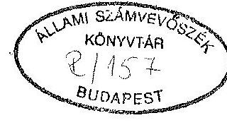
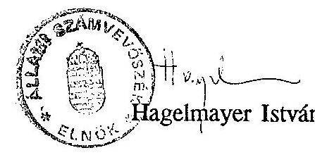

# JELENTÉS 

az Országos Müszaki Fejlesztési Bizottság és a
Központi Müszaki Fejlesztési Alap pénzügyi-gazdasági ellenőrzéséről

---

Az ellenőrzést végezte:

| Belics János | számvevö tanácsos |
| :-- | :-- |
| Dr. Benkö János | számvevö tanácsos |
| Dr. Burján Margit | számvevö tanácsos |
| Czunyi Lajos | számvevö tanácsos |
| Simon Ákosné | szávmevö tanácsos |
| Szijártó Károly | számvevö tanácsos |

# Az ellenőrzést vezette: 

Hegedüsné
dr. Müllern Veronika
számvevő fötandcsos

---

# JELENTÉS 

## az Országos Műszaki Fejlesztési Bizottság és a   Központi Múszaki Fejlesztési Alap pénzügyi-gazdasági ellenőrzéséről

Az Országos Műszaki Fejlesztési Bizottság (továbbiakban OMFB) a VII. fejezeten belül fejezeti jogosítvánnyal rendelkezik. A vizsgált időszakban hat költségvetési cím tartozott hozzá, közülük egy az Országos Műszaki Információs Központ és Könyvtár (továbbiakban OMIKK) közvetlenül az OMFB felügyelete alatt müködik. Öt intézmény, mint országos hatáskörű államigazgatási szerv - Országos Mérésügyi Hivatal (OMH), Magyar Szabványügyi Hivatal (MSZH), Országos Találmányi Hivatal (OTH), Országos Atomenergia Hivatal (OAH), Magyar Ürkutatási Iroda (MÜI) - közvetlen felügyeletét a tárca nélküli miniszter látja el, aki egyben az OMFB elnöke is. Az intézményi kör 1993-tól a Hadiipari Hivatallal bővült.

Az OMFB és a hozzá tartozó címek 1992-ben 2,4 milliárd Ft-tal gazdálkodtak, ennek 3,2 \%-át állami támogatás fedezte. Szakmai feladataikat 1.510 fó átlaglétszámmal látták el, 662 millió Ft béralap felhasználásával.

Az OMFB a Központi Műszaki Fejlesztési Alappal (továbbiakban Alap) 1991-től - "technikailag" teljes hatáskörrel - rendelkezik, melynek 1992. évi forrása 9,9 milliárd Ft volt (ezen belül a központi múszaki fejlesztési hozzájárulás 3,9 milliárd Ft-ot képviselt). Ezt megelőzően a források közel egyharmadára terjedt ki rendelkezési jogosultsága.

Ellenőrzésünk célja az volt, hogy értékeljük

- az OMFB és intézményei költségvetési gazdálkodását, a rendelkezésre álló pénzeszközök törvényességi, célszerűségi és eredményességi szempontok alapján történő felhasználását, az irányítás színvonalát;
- az Alap kezelésével kapcsolatos szervezeti változások célszerűségét, azok szakmai feladatokkal való összhangját;

---

- az Alap müködését, gazdálkodását, a pénzeszközök rendeltetésszerű és eredményes felhasználását a műszaki fejlesztési politika megvalósításán keresztül.

Vizsgálatunk az 1989-1992. évekre terjedt ki, az Alap müködésének megítélésénél szükség szerint 1986-ig visszamenőleg áttekintettük a vonatkozó dokumentumokat.

# I.   RÉSZLETES MEGÁLLAPÍTÁSOK 

## A. Az OMFB és intézményei szervezetének, gazdálkodásának ellenőrzése

Az OMFB és a hozzá tartozó intézmények költségvetése a vizsgált időszakban csaknem megduplázódott. Ebben szerepet játszott a szakmai feladatok változásán túl az is, hogy az intézmények többsége eredményérdekeltségű, vállalkozási tevékenységet is folytatott. Emellett azonban jelentős nagyságrendet képviselt az Alapból - müködési célra, szakmai programokra - átvett pénzeszközök volumene is.

## 1) A szakmai feladatok és a szervezeti rendszer összhangja, a gazdálkodás szabályozottsága

Az OMFB, mint Hivatal, illetve a hozzá tartozó intézmények feladatai az elmúlt években jelentősen módosultak. A tervirányításos rendszerhez kapcsolódó központi műszaki fejlesztés céljait felváltotta a piacgazdasághoz igazodó, alapvetően új igények kielégítése. Az országos hatáskörű szervek alaptevékenységét - pl. szabványügy, mérésügy, szabadalom - befolyásolta a nyugat-európai elvárásokhoz való közelítés követelménye. Ezzel egyidejűleg megváltozott a nemzetközi kapcsolatok orientációja is. Mindez indokolttá tette a meglévő szervezetek felülvizsgálatát és az új feltételekhez való igazítását.

Az OMFB Hivatalnak előkészítő, szervező és végrehajtó funkciója van, amely alapvetően három területre koncentrálódik. Ez a funkció részben az elnök - mint tárca nélküli miniszter - felügyeleti jogosítványára (amely az OMFB-re és a különböző országos hatáskörű szervekre terjed ki), részben az Alap feletti rendelkezési jogok gyakorlására vonatkozik. Ezentúl magába foglalja az egyre szélesebb körű nemzetközi kapcsolatrendszer működtetését is a műszaki fejlesztési programokban való részvétel érdekében.

---

Mindhárom feladatot és a hozzá kapcsolódó gazdálkodási tevékenységet a Hivatal keretei között végzik, így az Alap szervezete, müködése, gazdálkodása egybeolvad a Hivatal hasonló funkcióival.

Az OMFB szervezetének alapvető módosítására a 37/1991. (III.1.) Korm. sz. rendelet megjelenését követően került sor. (Ez a jogszabály döntött az Alap egységes kezeléséről, a programokat felváltó pályázati rendszer bevezetéséről.) A Hivatal müködését szabályozó alapdokumentum - az SZMSZ - azonban csak 1992. február 1-jével készült el.

Az ezt megelőző utolsó SZMSZ 1988-ban lépett hatályba. Az átmeneti időszakban négy elnöki utasítás és három elnöki határozat került kiadásra.

A szervezeti átalakulás folyamatos - még a vizsgálat befejezésekor sem zárult le nehezítve mind a szakmai, mind a gazdálkodási feladat ellátását. Ennek következménye, hogy a kapcsolódó ügyrendek, munkaköri leírások vagy nem készültek el, vagy nincsenek összhangban a tényleges munkavégzéssel.

A programok kezelését végző szaktitkárságok "utódjai" 1991. április 1-jével a "Technológiai szakfőosztályok" lettek. 1992. január 1-jével a szakfőosztályok "Szakmai kollégiummá" szerveződtek, miközben a felügyeletet ellátó elnökhelyettesek közötti munkamegosztás is változott.

Új szervezeti egységként jött létre a Pályázati Iroda. Feladatai folyamatosan bővülnek, ezek azonban az SZMSZ-ben még nem kerültek rögzítésre.

Ezzel egyidejűleg a Költségvetési és Pénzügyi Főosztály felügyelete is többször változott, az alelnöktől az elnökhöz került. Ugyanakkor 1992. június 15 -én megalakult a Gazdasági Igazgatóság - gyakorlatilag az előbbi fóosztály tartozott hozzá - vezetője ugyancsak főosztályvezetői besorolást kapott. Így végeredményben két főosztályvezető irányította a gazdálkodást a felelősségi körök és feladatellátás konkrét szétválasztása nélkül.

Kifogásolható, hogy az átszervezés folyamatában nem törekedtek arra, hogy a Költségvetési és Pénzügyi Főosztály szervezeti tagozódása összhangban legyen feladataival. Ennek következménye, hogy a fejezeti teendők ellátása nem különül el, ezt a feladatot 2 fő - főosztályvezető és egy főelőadó - végzi munkaidejének egy részében. (A Hivatal gazdálkodását és az Alap pénzügyi feladatait egy-egy osztály látja el, ahol viszont az osztályvezetői státuszok tartósan üresek voltak.)

Az 1992-ben kiadott SZMSZ feltételezte, hogy ezzel egyidejűleg a gazdálkodás belső szabályozására is sor kerül. A szabályzatok elkészítése megkezdődött, de véglegesítésüket akadályozza a permanens átszervezési folyamat. Különösen indokolt lenne a pénzgazdálkodás területén az új vezetés gazdálkodási jogosítványainak rögzítése.

---

A kötelezettségvállalás - pl. a Pályázati Irodánál elkészített szerződéseknél pénzügyi ellenjegyzés nélkül, esetenként szóban, gyakran utólagosan történt. Ez a szabálytalan gyakorlat lehetőséget ad a fedezetlen kötelezettségvállalásra. (4/1991. PM. sz. rendelet 16. §.)

Nagy arányú szervezeti átalakulásra került sor az MSZH-nál is, a szervezeti egységek száma csaknem megduplázódott, igen tagolt lett, holott a Hivatal alaptevékenységében nem következett be hasonló nagyságú növekedés. (A KGST szabványokat felváltotta a nyugat-európai szabványok alkalmazása.) Jellemző egyébként, hogy az 1991-től létrejött új osztályok közül a Szabványkiadás-, Minőségügyi és Védelmi osztályok egy év múlva megszűntek.

Az intézménynél 10 fóosztály helyett 18 szakosztály, osztály jött létre. A vezetők száma ugyan nem nőtt, de az egy vezetőre jutó ügyintézők száma 14 \%-kal csökkent. Éppen ez utóbbi kategóriában általában igen magas volt a tartósan üres álláshelyek száma (pl. 1992. I. félévében a tervezett 276 fő helyett ténylegesen 169 fő dolgozott).

Az OMIKK-nál is jelentős átszervezésre került sor a vizsgált időszakban. Az új szervezet - tekintettel a nagy számú különféle vállalkozási tevékenységekre - igen tagolt, a vezetői szintek is elkülönülten, információáramlás nélkül, gyakran szóbeli irányítással müködnek. Évek óta nem került sor a gazdálkodás átfogó szabályozására, ezen belül rendezetlen a vállalkozási tevékenység számviteli információs rendszerének müködése, ellenőrzése is. Mindez a gazdálkodás áttekinthetetlenségét, a mérleg valódiságának megsértését okozta, ami felveti az intézmény vezetésének felelősségét.

A főigazgató közvetlen hatáskörébe tartozik a könyvtári tevékenység mellett a szerkesztőség, a nyomdatevékenység (gyártás folyamata), az értékesítés is. Ez egyben azt is jelentette, hogy a szakmai és a gazdasági vezetés élesen szétvált, a gazdasági vezetés több alkalommal (pl. gesztori tevékenység) csak követte a szakmai vezetés döntéseit.

A Kooperációs Iroda - mint az intézmény egyik szervezeti egysége - gazdálkodásának részletes szabályozása és ellenőrzése nélkül a főigazgató közvetlen alárendeltségében müködött. Így még a gazdasági vezetésnek sem volt átfogó ismerete a milliárdos nagyságrendű gazdasági tevékenységről. (1. sz. függelék)

Szervezeti anomália tapasztalható a Magyar Űrkutatási Irodánál is. Az intézményt 1992. I. 1-jével 4 fővel alapította a Kormány, mint önállóan gazdálkodó költségvetési szervet. Az alapítás nem volt összhangban az érvényes jogszabályokkal, mivel az intézmény elkülönített gazdasági apparátussal nem rendelkezik, ezért az nem felel meg az önállóság kritériumának. A gazdasági feladatokat helyette szabálytalanul az OMFB Hivatala látja el. (4/1991. (II.13.) 3. §. (4) bek.)

---

A jelenlegi feltételek azt indokolnák, hogy gazdálkodását az OMFB Hivatalhoz kapcsoltan - mint részben önálló költségvetési szerv - végezze, ami természetesen szakmai önállóságát nem érintené.
2) A költségvetési előirányzatok tervezése, a pénzellátás rendszerének értékelése

Az OMFB és a hozzá tartozó intézmények költségvetése 1989-92 között - az OMIKK sajátos külkereskedelmi tevékenysége nélkül - jelentősen, mintegy $80 \%$-kal nőtt. A növekmény a saját bevételek emelkedésén túl összefüggésben volt az Alapból történő forrásátvétellel is. (17. sz. táblázat) Ez utóbbi müködési és a szakmai célokat egyaránt támogatott. Az így átutalt mintegy 1,5 milliárd Ft puha költségvetési "támogatást" jelentett.

A pénzátadást ugyanis jogszabály nem tiltotta, sőt az elmúlt négy évben egyre szélesedett az a költségvetési feladatrendszer, amit az Alapból lehetett finanszírozni. Ezzel a központi költségvetés hiánya, egyben terhei csökkentek, míg az Alap elsősorban nem műszaki fejlesztést szolgáló - tartós elkötelezettsége megnőtt. A vonatkozó törvények ugyanakkor nem írták elő az Alapból átadható összegek kiszámításának módját, mértékét, ami korlátot szabhatott volna az Alap csökkentésének. Így az OMFB és a hozzá tartozó költségvetési címek egyre kevésbé függtek a központi költségvetéstől. Többletigényük kielégítését, a "pénzátengedés" mértékét - a bázis szemléletű, halmozódástól sem mentes gazdálkodás mellett - minden esetben az OMFB önállóan döntötte el, gyakran a PM tudomásával. Ezzel egyidejűleg - ebben a körben - a vizsgált négy évben a működési célú költségvetési támogatás 239 millió Ft-ról 77 millió Ft-ra csökkent.

Megjegyezzük, hogy az elkülönített állami pénzalapok költségvetést támogató funkciója - konkrét szabályozás nélkül - az utóbbi időszakban felerősödött (pl. IFA, Kereskedelemfejlesztési Alap). Ami jelzi, hogy a központi költségvetés feladatrendszere nem csökkent, az e célra fordítható pénzeszközök nagyságrendje viszont igen. Az ehhez szükséges fedezetet külső forrásokból, így pl. az államháztartás másik alrendszeréből igyekeznek pótolni.

Az Alap intézményi müködést-fenntartást szolgáló finanszírozása már 1988-ban elkezdődött. Az 1988. évi költségvetési javaslat tárgyalásáról készült jegyzőkönyvből kitűnik, hogy a PM és az OMFB egyetértett abban, hogy "... a programirodák működési-fenntartási költségeit az adott programra rendelkezésre álló központi műszaki fejlesztési pénzforrásból kell biztosítani." Az OMFB az OMIKK pénzügyi gondjainak megoldására 1989-ben a PM-hez fordult. A PM a kérést úgy hárította el, hogy hozzájárult a szükséges fedezet Alapból történő átcsoportosítására. (Az 1988. évi XI. tv. erre lehetőséget adott.) Ezt követően az Alapot évenként szabályozó jogszabályok

---

széles körben biztosították a költségvetési tevékenység finanszírozását. Az 1991. évi XCI. tv. már egyértelműen kimondja, hogy az OMFB, OMIKK, MSZH működési "költségvetési támogatását" az Alapból kell fedezni (1,1 milliárd Ft).

A szabályozásnak ez a módja nem ösztönzi kellő takarékosságra, a meglévő feladatok rangsorolására, szelektálására a költségvetési szerveket. Sőt, kialakul egy olyan gazdálkodási szemlélet, hogy pénzhiány esetén az Alap mindig biztos "forrást" jelent. Mindez hozzájárult ahhoz, hogy az intézmények egy részénél a pénzellátottság igen jó volt.

# 2.1 . Bevételek megalapozottsága 

A bevételek tervezését, az előirányzatok meghatározását befolyásolta a Hivatal átszervezése, az Alap támogatása, illetve néhány intézménynél a monopolhelyzetből eredő forrásbőség.

### 2.1.1. Az OMFB átszervezésének forrásigénye

A Hivatal feladatváltozása, átszervezése hatást gyakorolt az intézmény költségvetésének alakulására. Jelentősen megnőtt a bevételi előirányzat, az 1989. évi 181 millió Ft-ról 1992. évi 415 millió Ft-ra. Ez utóbbi forrásokat már az Alap finanszírozta (1989-ben még csak 45 millió Ft-ot adott át hivatali célokra).

Az átszervezéshez kapcsolódóan (1991. április) az új feladatok - elsősorban a Hivatalon belül létesített új irodák múködésének - fedezetére 122 millió Ft-ot vettek át az Alapból anélkül, hogy a feladat- és szervezetváltozásokkal összhangban előzetesen kellő mélységű - gazdasági számítások készültek volna. A béralapot ezen belül 46 millió Ft-tal növelték.

Tény, hogy az új feladatok teljeskörűen nem voltak felmérhetők és a feladatok végrehajtására rendkívül rövid idő állt rendelkezésre, azonban a döntéselőkészítés folyamatába a gazdasági apparátus bevonása nem volt megfelelő, az eseményeket jórészt utólagosan követték. Ennek az lett a következménye, hogy az indokoltnál jóval nagyobb pénzátvételre került sor, vagyis szükségtelen volt ilyen nagy összegű elvonás az Alapból.

A Hivatal a fel nem használt összeget ( 86 millió Ft-ot, ebből 30 millió Ft bért) év végén - helyesen - visszafizette az Alap számlájára, azaz az átvett pénzösszeg kétharmadát.

Megjegyezzük, hogy ezzel az eljárással - ami az érvényes jogi szabályozással összhangban állt - feloldódott a központi költségvetési szervre vonatkozó béralap-

---

növelési tilalom. Az Alapból ugyanis a jóváhagyott bérkereten felül - a tényleges felhasználás arányában - növelhető a béralap.

A Pályázati Irodánál 1991-ben pl. a pályázatok bírálatához 40 millió Ft megbízási díjat és 17 millió Ft tb-t terveztek. Amennyiben a tervezésnél az önmaguk által alkalmazott naturáliákkal számolnak ( 4.000 pályamunka, 8.000 pályázati bírálat 2-3 ezer Ft/bírálat költséggel), a béralapot 20-25 millió Ft-tal lehetett volna megemelni. Ténylegesen 2.834 pályázat, 3.994 bírálat volt, ami a tervezett kiadások egynegyedét igényelte, azaz 10 millió Ft bért és 2,1 millió Ft tb-t.

Az Iroda dologi költségeinek egy részét is szükségleten felül határozták meg, így pl. nyomdafestékre, kellékcsomagra 2 millió Ft-ot terveztek, holott a Hivatal egésze 1,3 millió Ft-ot használt fel. Szakmai kongresszusi részvételre 300 ezer Ft-ot irányoztak elő, s ténylegesen 16,4 ezer Ft-ot költöttek. (Az átszervezés idején az események egy része már ismert volt.) Az Iroda az 1991-ben tervezett elöirányzatnak összességében még felét sem ( $40 \%$-át) használta fel. Mivel a tervezéskor forráshiány nem merült fel, ezért nem számoltak a pályázati űrlapok értékesítéséből származó bevételekkel sem ( 3 millió Ft ).

A Nemzetközi Szervezetek Irodájának, mint új szervezeti egységnek, olyan feladatra - fütés, világítás, közmủ - is terveztek előirányzatot, ami nem az Iroda költségvetését terhelte, mivel az a Hivatal költségvetésében már szerepelt.

A tervezettnél lényegesen alacsonyabb teljesítés ellenére az 1992. és 1993. évi tervszámok egy része az 1991. évi szinten került meghatározásra. (Pl. a Pályázati Irodánál bírálati díjakra 1992-ben és 1993-ban is 40 millió Ft bért és 17 millió Ft tb-t terveztek.)

Az OMFB Hivatal kedvező pénzellátottsága kifejezésre jutott abban is, hogy a költségvetési elszámolási számlán átmeneti jelleggel - elsősorban az átszervezést követően - szükségleten felüli pénzeszközök jelentek meg.

A Hivatal 1989-ben 21, 1990-ben 30 millió Ft összegben vásárolt rövid lejáratú értékpapírt, ebből közel 2 millió Ft bevételt realizált. 1991-tól a szabad pénzeszközei megnőttek, ezek kihelyezésére, hasznosítására azonban nem került sor, így kamatbevételt sem értek el (pl. 1991. év szeptemberétől a számla hó végi egyenlege 58-237 millió Ft között szóródott, ami 1-6 havi kiadásnak felelt meg).

A Hivatal forrásai lehetőséget adtak arra is, hogy előleget utaljon át megrendelt áru leszállítása reményében annak ellenére, hogy a szállító ezt nem kérte.

A Porsche Hungaria Kereskedelmi Kft-nél - a Miniszterelnöki Hivatal bonyolításában - 6 db személygépkocsit rendeltek 1992. novemberében, majd december közepén a gépkocsik nettó értékének közel $70 \%$-át - 4,5 millió Ft-ot - előleg

---

címén átutaltak. Az előlegfizetést az OMFB csak úgy vállalta, ha számlát kap a szállítótól. Számla helyett azonban csak "előlegfizetési igazolást" kapott. A szállításra még a megrendelést követően 3 hónap múlva sem került sor.

# 2.1.2. Az Alapból nyújtott intézményi "müködési támogatások" 

## Az Alapból történő "finanszírozáshoz" elsősorban az OMIKK és az MSZH gazdálkodása kötődött.

A vizsgált időszakban az OMIKK 382 millió Ft-ot - ezen belül a müködéséhez 316 millió Ft-ot - kapott az Alapból.

Kiadásait a támogatások reményében tervezte, amit bizonyít, hogy az alaptevékenységéhez kötődő könyvbeszerzésre saját forrásból csökkenő mértékben, 1991-től egyáltalán nem tervezett fedezetet. Ezt - egyre növekvő arányban - az Alap finanszírozta (1989-91 között 181 millió Ft).

Az intézmény az Alapból rendszeresen kapott "támogatást" még akkor is, amikor a vállalkozásai (1990-ig) eredményesek voltak. (1989-ben 42, addig 1992-ben már 147 millió Ft.)

Az intézmény vállalkozásai keretében - többek között - különféle nyomdai kiadványokat készített. Ez a tevékenység a vizsgált időszakban egyre inkább veszteségessé vált, amiből nagy összegű behajthatatlan követelése keletkezett. A szállításokat ugyanis még azután is folytatta, amikor erre már szerződéses kötelezettség nem állt fenn, illetve, a vevőnek már jelentős hátraléka volt.

1991-ben pl. 29 féle szakirodalmi tájékoztatót, 27 féle információs folyóiratot jelentettek meg, közülük néhánynál 10 -en aluli volt a megrendelt példányszám.

Az intézménynek 1993. februárjában már 126 millió Ft kinnlevősége, ezen belül a 90 napon túli tartozás 76 millió Ft (éves költségvetési előirányzata: 362 millió Ft) volt. A követelések 1988 óta folyamatosan növekszenek, az első érdemi behajtási intézkedésre 1990. III. negyedévben került sor.

A kinnlevőségek tételes, jogcímenkénti megbontása csak a számítógépes nyilvántartás alapján követhető, ez azonban az összes kiadásoknak mindössze egyharmadát ( 52 millió Ft-ot) jelenti. (Emellett mikrogépes és kézi feldolgozás is van.) Ezek a követelések gyakorlatilag behajthatatlanok (nem ismerik el, címzett ismeretlen, elévült, a gazdálkodó szervezetek felszámolás vagy csődeljárás alatt állnak). A számítógépes kigyújtés jól jellemzi az intézmény behajtási munkáját.

---

Eszerint a hátralékos vevők száma 1989-ben 265 db volt, tartozásuk $90 \%$-a 50 ezer Ft alatti, 28 db 50-800 ezer Ft közötti volt. 1992-ben viszont már 1.710 volt az adósok száma. Ezek közül 196 tartozott 50 ezer és 1 millió Ft közötti összeggel, sőt 6 adós ez utóbbit is meghaladta. A hátralékosok közül a legnagyobbak a Hírlap és Postaszállítási Igazgatóság 3,8 millió Ft-tal (1990. IX. hótól), a Diósgyőri Gépgyár 1,4 millió Ft-tal (1988-tól) és a Műanyagipari Kutató Intézet 1,5 millió Ft-tal (1988-tól) voltak.

A behajtási munka elégtelensége következtében a több év alatt felgyülemlett nagy összegű kintlevőség miatt a felelősség megállapítása indokolt. A bevételek elmaradása ugyanis közrejátszott abban, hogy az intézménynek likviditási gondjai voltak, mindemellett nagy összegű adótartozását sem tudta rendezni az APEH-kal (1991. január 1992. december között 68 millió Ft halmozódott fel).

Az MSZH a vizsgált időszakban 277 millió Ft-ot kapott az Alapból, ebből 165 millió Ft az intézmény működését fedezte. Bevételeit az évközi pótelőirányzatok reményében határozta meg. Így évről évre egyre növekvő mértékben alultervezte azokat (1990-ben 43, 1991-ben $84 \%$-kal). Rendszeressé vált ugyanis, hogy az alaptevékenységéhez szabványok, kiadványok nyomdai beszerzésére - illetve likviditási gondjai megoldásához pótelőirányzatot kapott. Mindez nem ösztönzött a takarékos és átgondolt gazdálkodásra.

1990-ben a készletbeszerzés kb. nyolcszorosa, a bér jellegű kifizetések összege kb. kétszerese volt a tervezettnek. 1991-ben a készletbeszerzés és anyag jellegű kiadás közel ötszöröse, a bér jellegű kiadás több, mint nyolcszorosa volt az eredeti előirányzatnak.

Az átmeneti likviditási gondok ellenére 1989-ben kft-t alapított 3,2 millió Ft apporttal (lásd még 4. pont alatt).

# 2.1.3. A "monopolhelyzetből" eredő források tervezése 

Az OTH, az OMH és az OAH működésében nem volt jellemző az Alap támogatása. Ezek az intézmények ugyanis "monopol jellegű" tevékenységük miatt olyan nagyságrendű bevételeket realizáltak, amelyek fedezték - esetenként szükségleten felül is kiadásaikat.

Az OMH működését a jogszabályon alapuló mérésügyi szolgáltatások díjbevétele fedezte. A vizsgált időszakban bevételei évenként mintegy $25 \%$-kal nőttek (1989-92 között $92 \%$-kal). Kiadásai ennél viszont szerényebb mértékben (átlag $20 \%$-kal) emelkedtek. Ennek következtében 1992-ben bevételei már $22 \%$-kal meghaladták kiadásait. Az igen kedvező, biztonságos, kiegyensúlyozott gazdálkodás összefüggésben volt a szolgáltatási díjak megállapításával. Ennek mértékére ugyanis az intézmény tett javaslatot, amit a PM, illetve az OMFB módosítás nélkül rendszeresen elfogadott. Ezt

---

követően az már jogszabályi formában - mint a tárca nélküli miniszter rendelete - jelent meg. A díjtételeket az inflációt meghaladó mértékủ kiadások figyelembevételével határozták meg. A szolgáltatási díj emelése önköltségszámítás nélkül 1991-től folyamatossá vált.

A szabályozásnak ez a módja bevétel "túlcsordulást" eredményezett az intézmény gazdálkodásában. Ennek ellenére szabad pénzeszközeiket nem igyekeztek hasznosítani.

Indokoltnak tartanánk, ha a szolgáltatási díjak a központi költségvetéshez kapcsolódnának, elsőként biztosítva az intézmény - feladatarányos - kiadási igényeit.

Az OTH költségvetési tervezése a vizsgált időszakban nem volt kellően megalapozott. Jellemző volt a bevételi és kiadási előirányzatok alultervezése. (A bevételi előirányzatokat 1989-ben 16,4, 1990-ben 22,2, 1991-ben pedig 162,7 \%-kal túlteljesítették.) Ezért rendszeressé vált az eredeti előirányzatok módosítása, növelése.

Az Intézmény már 1992-ben önfinanszírozóvá vált. (Ezen felül az iparjogvédelmi illetékből évenként még átlagosan mintegy 30 millió Ft-ot befizetett a központi költségvetésbe.) Monopol helyzetéből eredően ugyanis javaslatot tehetett a szabadalmi, fenntartási illeték meghatározására, ami a folyamatos müködését fedezte. Javaslatát kiadási igényei határozták meg.

Kiadási szükségleteiken felül figyelembe vették azt is, hogy az Európai Szabadalmi Egyezményhez való csatlakozás egyik pénzügyi előfeltétele a szabadalmi, fenntartási illetékek összegének növelése. 1989-tól az évenkénti emelések $100 \%$-os dijnövekedést jelentettek, így az intézményi bevételek a vizsgált időszakban megkétszereződtek.

Az évenként realizált többletforrásokat tapasztalataink szerint célszerűen használták fel.

A hatósági munka területén a megnövekedett feladatokkal összhangban az érdemi ügyintézők létszámát, alapbérét is növelték. A Hivatal épületeinek rekonstrukcióját 1989. évtől végzik, a szükséges fedezet közel egyharmadát saját forrásaikból fedezték.

Fejlesztették az iparjogvédelmi dokumentációs és információs tevékenységeket is.
Az információs feladatok méreteit jelzi, hogy az intézmény 100 éves fennállása alatt a megadott hazai szabadalmak száma 200 ezer db volt, az érvényben lévôké eléri a 20 ezer db-ot, míg az engedélyezés szakaszában 15 ezer db van.

Az intézmény szakmai feladatainak bővülése ellenére nem volt pénzszűkében. Ezért a vizsgált időszakban összesen 235 millió Ft-ot (forgalmi érték) helyeztek ki különböző értékpapírokba, kamatozó betétekbe.

---

Ebből az 1989. évi 30 millió Ft szabálytalan volt, mivel az a tárgyévben nem térült meg. Nem volt összhangban a 4/1991. (II.13.) PM rendelet 8. §-ával az 1991. évi 75 millió Ft pénzkihelyezés sem, mivel erre nem a számlavezető pénzintézetnél került sor.

Ezen túlmenően még arra is lehetőségük volt, hogy bevételeikből 1 hónapnak megfelelő összeget ne használjanak fel.

A Hivatal 1984. évtől kezdődően PM előirás alapján a szabadalmi fenntartási illetékbevételt elkülönített célszámlán gyüjti és innen finanszírozza az intézményi kiadásokat. Erre a célra azonban csak 11 havi bevételt vontak be. Az utolsó havi bevétel minden évben a célszámlán maradt (1989-1992 között összesen 120,6 millió Ft).

Az utolsó havi bevétel így a mérlegbeszámolóban sem szerepelt, vagyis nem biztosították a mérlegvalódiság elvének érvényesülését. A célszámla funkciója az, hogy az intézmény müködését finanszírozása, ezért indokolt annak megszüntetése és a bevételek beszedésére a költségvetési elszámolási számla megjelölése.

Ezzel egyidejűleg a fenntartási illetékbevételeket a központi költségvetéshez̃ célszerű kötni, elsődlegesen kielégítve az intézmény reális működési szükségletét.

Az OAH is az önfenntartó intézmények közé tartozik. Bevételét a Paksi Atomerőmủ Vállalat igazgatási szolgáltatási díja jelenti. Az intézmény költségvetése 1990-től jelentősen megnőtt (az előző évek 13-szorosára). Ezzel egyidejűleg szakmai feladatai is bővültek, amit saját bevételeiből fedezett (pl. létszámát négyszeresére növelte). Bevételeit azonban még így sem tudta teljeskörűen felhasználni.

Az OAH-nál az atomenergia alkalmazásának biztonságával összefüggő pályázatok gondozására irodát működtetnek. Erre a célra az OMFB 1992-ben 110 millió Ft-ot utalt át. Az intézmény saját bevételeit és a pályázatok fedezetét is költségvetési elszámolási számláján kezeli.

A kétféle forrás jelentős, átmenetileg szabad pénzeszközt eredményezett, ezért 1989. és 1992 között összesen - többszöri pénzforgatással - 1,3 milliárd Ft-ért különféle értékpapírokat vásároltak.

Az intézmény pénzkihelyezése úgy 1991-ben, mint 1992-ben szabálytalan volt, mert nem felelt meg a 4/1991. (II.13.) PM sz. rendelet 8. §-ának.

Az intézmény túlfinanszírozását jelzi, hogy az 1991. évi pénzmaradvány ( 31 millió Ft) $40 \%$-át év végén - mint kötelezettség nélküli többleteszközt - elvonták.

---

Az intézmény folyamatos "túlfinanszírozása" sürgetően veti fel a szakmai feladatokkal összhangban álló bevételek megállapítását. Az e fölötti összeget indokolt a központi költségvetéshez közvetlenül befizettetni.

Megjegyezzük, hogy úgy az OTH-nál, mint az OAH-nál tapasztalt szabálytalan pénzkihelyezésekkel kapcsolatban nem tudjuk elfogadni a PM Társadalmi Közkiadások Főosztálya által 1991-ben kiadott körlevelére való hivatkozást. Ez az állásfoglalás ugyanis az érvényben lévő jogszabályban foglaltakkal ellentétben annál szélesebb körű lehetőséget biztosít a központi költségvetési szervek pénzkihelyezésére.

# 3) Költségvetési pénzeszközök felhasználása, a vállalkozások müködése 

Az OMFB és intézményei feladataik ellátásához rendelkeztek - sőt esetenként túlzott mértékben is - a szükséges forrásokkal. Az intézmények működési feltételei ugyan eltérőek voltak, de (két kivétellel) gazdálkodásukat a kiegyensúlyozottság jellemezte.

Feszültséget az OMIKK-nál és az MSZH-nál tapasztaltunk, ami összefüggésben volt az intézmények átgondolatlan döntéseivel.

### 3.1. Bérgazdálkodás, személyi jellegű kifizetések

Az OMFB és intézményei béralapja a vizsgált időszakban 97 \%-kal emelkedett. 1992-ben 709 millió Ft béralappal gazdálkodtak, ami 1.510 fő foglalkoztatását tette lehetővé.

Az OMFB Hivatal béralap-előirányzata az átszervezést követően jelentősen, (55 \%-kal) megnőtt. Ehhez a fedezetet az Alapból történő pénzátvétel biztosította (46 millió Ft, ebből 40 millió Ft a pályázathoz kapcsolódott).

A béralap felemelése annak ellenére következett be, hogy az átszervezés nem járt többletlétszámmal, sőt némi csökkenés volt tapasztalható.

1991-re 241 fő létszámot terveztek, ezzel szemben 191 fő volt az átlaglétszám. 1992-re már csak 226 fővel számoltak, a tényleges átlaglétszám 200 fő volt.

A létszám összetétele sem volt mindig kedvező. A vezetők és az ügyintézők aránya gyakorlatilag megegyezett. Négy főosztály pedig felsőfokú végzettségű ügyintéző nélkül dolgozott.

A Hivatalnál 60 fő vezetőre 10 felsőfokú és 49 középfokú végzettségű ügyintéző jutott. A Szakmai Kollégiumnál 1992. végén 20 alkalmazottból 12 fóosztályve-

---

zető, 3 főosztályvezető-helyettes dolgozott. A Phare feladatokat ellátó 3 fő mindegyike vezető beosztású.

Hasonló aránytalanságok tapasztalhatók a Nemzetközi Kapcsolatok, EK Kapcsolatok és a Nemzetközi Projekt irodáknál is.

A Pályázati Irodánál - annak ellenére, hogy tevékenységét nyilvántartási, ügyviteli feladatokban jelölték meg - az igazgatón kívül 2 főosztályvezető, 9 főosztályvezető-helyettes és 1 osztályvezető dolgozott (összes létszáma 24 fő).

A létszám összetételéből adódó visszásságok miatt a vezetők munkaldejük egy részében ügyviteli feladatokat látták el.

A tervezett és a tényleges létszám különbözeteként számottevő volt az üres (18 fő) álláshelyek száma, amit csak jelentős belső helyettesítéssel, nyugdíjas foglalkoztatással tudtak pótolni.

1991-ben az átlaglétszám $13 \%$-a nyugdíjas volt. Van a Hivatalnak olyan főosztálya is, ahol a főosztályvezető nyugdíjas.

A bérek és a létszám ellentétes mozgása az átlagbérek és átlagjövedelmek növekedését eredményezte. A bérek 1989-1992 között $214 \%$-kal, a jövedelmek $218 \%$-kal nőttek.

Így az átlagbérek 1992-ben 401,7 ezer Ft-ot, míg az átlagjövedelmek 457,9 ezer Ft-ot értek el. Tekintettel arra, hogy a Hivatalban ez év decemberében az alkalmazottak $34 \%$-a felsőfokú végzettségủ volt, a növekedés nem minősíthető túlzottnak.

Az OMFB-hez tartozó intézmények béralap-felhasználása is jelentősen megnőtt, azonban itt sem találkoztunk túlzott mértékű bér, illetve jövedelem növekménnyel.

Az OMIKK létszáma a vizsgált időszakban $44 \%$-kal mérséklődött ( 329 főre), az intézmény vállalkozási tevékenységének visszaszorulása ellenére az itt dolgozók létszáma kisebb arányban csökkent, mint az alaptevékenységnél foglalkoztatottaké.

Ugyanezen idő alatt a bérek $30 \%$-kal nőttek, ennek ellenére 1992. év végén az átlagbérek csak 21 ezer Ft-ot értek el, az átlagjövedelmek 22 ezer Ft-ot.

Hasonló tendencia érvényesült az MSZH-nál, az OMH-nál, az OTH-nál is. A kialakult átlagbérek (24-26 ezer Ft között) nem fejezik ki az alkalmazottak magas kvalifikáltságát, nyelvismeretét.

A megbízásos jogviszonyban foglalkoztatottak bérére az OMFB Hivatal kivételével egyre kevesebbet költöttek. Felhasználásuk azonban nem volt mindig körültekintő.

Az OMFB Hivatalnál az e célra fordítható előirányzatok jelentősen - az 1989. évi 2,8 millió Ft-ról 1992-ben 14,2 millió Ft-ra - emelkedtek, összefüggésben az 1991-ben

---

bekövetkezett feladatváltozással. A megbízások többsége a Pályázati Irodánál jelentkezett. Az Iroda által megkötött 42 szerződés ellenőrzésekor igen sok hiányosságot tapasztaltunk.

Miközben jelentős volt az üres álláshelyek száma, 2 fôt csaknem folyamatosan megbizásos jogviszonyban foglalkoztattak. Közülük az egyiknél ugyanarra az időszakra és feladatra két szerződést kötöttek, amit ki is fizettek. (1992. III. 1. - VIII. 25. közötti időszakra 192 ezer Ft-ért, illetve visszamenőleg kötöttek meg a VII. 5. - VII. 10. közötti időszakra 5.000 Ft-ért.)

Hasonló szabálytalanságot jelentett egy 1992-ben kifizetett 46 ezer Ft összegü szakértői dij is, mivel a munka elvégzése dokumentumokkal nem volt bizonyitható.

Aránytalan dijazásokat is tapasztalatunk: Volt olyan gépi adatrögzítő, aki óránként 250 Ft -ot kapott, míg a szakértői dijazásáért csupán 125-200 Ft-ot fizettek. A pályázatok átvételéért fizetett összegek is igen nagy szélsőségek között szóródtak, különösebb szakmai indoklás nélkül (1991-ben egy fó ezért 35-294 Ft/db, mig 1992-ben 407-2.100 Ft/db térítést kapott).

Az MSZH-nál elsősorban külső dolgozókkal kötöttek szerződést, azonban ez nem mindig írásban történt, így nem volt lehetőség a teljesítések számonkérésére. A saját dolgozókkal kötött szerződések egy részénél nem állapítható meg, hogy a megbízás a főállású munkaköri kötelezettségek közé tartozik-e, vagy sem.

Az OMIKK-nál a megbízási díjak jó részét szakszövegek - elsősorban nehéz szakszövegek - fordítására költötték. A kétféle munka díjazása eltér egymástól. Ennek ellenére nem rögzítették a különbségtétel kritériumait, így a drágábbik megoldás volt túlsúlyban (pl. 1991-ben 5 hónap alatt szakszöveg fordítására 16 ezer, míg nehéz szakszövegre 2,6 millió Ft-ot fordítottak).

# 3.2. Kiküldetés, reprezentáció 

A vizsgált időszakban a külföldi kapcsolatok jelentősen átrendeződtek. A volt KGST országokkal mérséklődött az együttmúködés, míg a fejlett piacgazdaságú országokkal széles körű kapcsolatfelvételre került sor. Mindez a felhasznált előirányzatok növekedését okozta.

Az OMFB Hivatala külföldi kiküldetésre 1992-ben az 1989. évi kiküldetési kiadásoknak a két és félszeresét ( 17,7 millió Ft) fordította, az utazások és a résztvevők száma is megemelkedett. Ugyanezen időszak alatt a reprezentációs költségek három és félszeresére nőttek ( 5 millió Ft). Mindez összefüggésben volt a nemzetközi kapcsolatok orientációjának változásán túl a különböző kormányhatározatok alapján ellátott nemzetközi feladatokkal is.

---

Az MSZH külföldi kiküldetési kiadásai különösen 1990-től emelkedtek. (Az 1990. évi 5,9 millió Ft-ról 1992. évi 14,3 millió Ft-ra.) Ehhez jelentősen hozzájárult az elnök gyakori utazása. (1991-ben 7, 1992. félévig - felmentéséig - 5 alkalommal utazott Nyugat-Európába.)

A kiküldetések valutaszükségletét 1991-ben - az intézmény számára engedélyezett valutakeret ( 2,2 millió Ft) felhasználása után - az utazási irodáktól vásárolt valuta fedezte. A tényleges felhasználás így az engedélyezettnél lényegesen nagyobb volt ( 3,1 millió Ft). A kiküldetések elszámolásánál is szabálytalanul jártak el, mivel az utazási irodáktól vásárolt valuták bizonylatait nem csatolták, így az utazásonkénti tényleges kiadás nem volt megállapítható.

A külföldi kiküldetésre fordított összegeket megnövelte az elnök belső utasítása arra vonatkozóan, hogy a valutában számított napidíj $10 \%$-át vendéglátás címén fel lehet használni. (A megemelt összeget jórészt az általa vezetett magyar küldöttség vendéglátására fordította.) Ez az intézkedés szabálytalan volt, mivel megsértette az 1077/1987. (XII.31.) Mt. sz. határozatot. Az elnök felmentése után ez a gyakorlat megszűnt.

Az előzőekhez hasonló kiadásnövekedést a többi intézménynél nem tapasztaltunk, sőt évenként egyre kevesebbet használtak fel a külföldi kiküldetések, a reprezentáció finanszírozására.

# 3.3. Eszközgazdálkodás 

Az OMFB-nél és az intézményeknél kialakult pénzügyi kondíciók - az esetenként átlagon felüli pénzellátottság - mellett az eszközállomány növekedése jelentős volt, célszerűtlen megoldásokat azonban csak esetenként tapasztaltunk.

Az OMFB Hivatalánál az átszervezés ellenére nem nőttek a készletszintek, mivel a selejtezés és az elfekvő készletek felszámolása rendben megtörtént. A pályázati rendszerhez kapcsolódó szoftver, illetve a vezetői telefonok beszerelésénél viszont nem voltak ilyen körültekintőek.

Az előzőekben jelzett szoftvereket a Teleinfotéka Kft-nél rendelték meg, a kapcsolódó feladatok tisztázása, a szakterület véleménye, a pénzügyi apparátus közreműködése (érvényesítése) nélkül.

A megrendelést szabálytalanul "kutatás-fejlesztési" szerződésnek minősítették, holott ténylegesen szolgáltatást rendeltek meg.

Ugyanezen cégtől - az 1991. évi pályázatok nyomdai kiadvány formájában történő elkészítésére - 2 millió Ft összegben szoftvert vásároltak, illetve nyomdai

---

előkészítés címén 1,2 millió Ft-ot fizettek ki. A kiadvány nyomdai úton történő elkészitésére - elnöki döntés alapján - nem került sor, így az 1,2 millió Ft kifizetése feleslegessé vált.

Az OMFB 1992-ben kormányzati beruházásként 12,5 millió Ft-ot kapott a hivatali telefonközpont rekonstrukciójára. Ezt megelőzően 1991-ben - a költségvetés jóváhagyása idején - megkezdték a vezetői telefonok cseréjét ( 2,7 millió Ft ráfordítással). A rekonstrukciót viszont a már kialakított vezetői telefonok figyelembevétele nélkül végezték, azaz nem teremtettek összhangot a két rendszer között.

A rekonstrukció során a már meglévő vezetői telefonokat ( 5 db ) leszerelték. A berendezések várhatóan értékesítésre kerülnek, a beszerzésnél lényegesen alacsonyabb összeggel.

A Hivatal az elmúlt két évben 13 db - köztük 6 db 4-600 ezer Ft - egyedi értékủ fénymásoló gépet vásárolt annak ellenére, hogy külön nyomdai egysége van. (A 6 gépből négy az alelnöki titkárságokon, sajtónál került elhelyezésre.)

A nemzetközi "EURÉKA" programmal foglalkozó titkárságnak két szobát rendeztek be csaknem fél millió Ft-ért, ezzel a Hivatalnál tapasztalt átlagszínvonal feletti ellátást kaptak. A beszerzéseket mértéktartóbban is meg lehetett volna oldani.

Az MSZH és az OMIKK egy-egy nyomdával rendelkezik, amelyek kapacitáskihasználása nem megfelelő. Mivel a szakmai feladatok ellátása közös nyomdában eredményesebb és rentábilisabb lehet, az OMFB 1990-ben felszólította a két intézmény vezetését arra, hogy a nyomdák elhelyezésére, múködtetésére alakítsanak ki közös megoldást. Az intézmények ezt a javaslatot anélkül utasították el, hogy konkrét vizsgálatokat, elemzéseket végeztek volna. Ezzel szemben mintegy 20 millió Ft összegben gépeket vásároltak, illetve az MSZH a nyomdai feladatok ellátására kft-t alapított.

# 3.4. Vállalkozói tevékenység 

A vállalkozásokba való részvétel az MSZH-nál és az OMIKK-nál volt jellemző.
Az MSZH 1989-ben kft-t alapított nyomdai tevékenységének ellátására. Az alapítás nem volt összhangban a 19/1980. (IX.27.) PM sz. rendelet 16. §-ával, mivel az alapításhoz szükséges pénzügyi fedezettel - 3,6 millió Ft-tal - nem rendelkezett.

Az intézmény számvitelében ugyan kimutatott érdekeltségi alapot, ami az apport fedezete lehetett volna, de bankszámláján ehhez nem volt meg a fedezet. Ugyanis likviditási - bérfizetési - gondjai miatt az OMFB-tól pótelőirányzatot kért és kapott. (A Hivatal 18,5 millió Ft-ot utalt át az Alapból.)

---

A kft-ben való részvétel indokoltsága vitatható. A tulajdonát képező nyomdagépek elhelyezésére (helyiség bérleti jogviszonya megszűnt) megoldást kellett találni. (Amit egyébként az OMIKK-kal közösen is megtehetett volna.)

Az OMFB, nem ismervén az intézmény kft alapítási szándékát, új épület tervezésére 2,5 millió Ft-ot adott. A tervek elkészültek, felhasználásukra azonban nem került sor.

Az MSZH úgy döntött, hogy a Földmérő és Talajvizsgáló Vállalattal kft-t alapít.

#### Abstract

A Vállalat apportja egy telekingatlan volt, míg az intézmény kötelezettséget vállalt arra, hogy a nyomdagépeinek helyt adó vállalati épületet felújítja. Az OMFB - a gépek átmeneti elhelyezésére - 25 millió Ft-ot adott, ebből az intézmény 13 millió Ft-ot beruházásra fordított, ami azóta is aktiválatlan, visszatérülésével nem lehet számolni.

Az MSZH nem sürgette az ingatlan apport telekkönyvi bejegyzését, így a vállalat hitelfelvétele miatt 1990-ben az Inter Európa Bank RT a telekre, - ezzel együtt az épületingatlanra is - jelzálogot jegyeztetett be.

1990-ben módosították a kft szerződését, a Vállalat apportcserét hajtott végre, a bevitt telekingatlant "kicserélte" a felújított épületre. Az értékét 16,8 millió Ft-ban határozták meg, figyelmen kívül hagyva, hogy az épület felújítására az MSZH 13 millió Ft-ot fordított.

Az épületben működő nyomdagépek üzemeltetésére - amit az MSZH költségvetési juttatásból vett (bruttó értékük 55 millió Ft) - 1990-ben szerződést kötöttek. Eszerint a kft 6 éven keresztül - bérleti dí ellenében - használja a gépeket, majd ezt követően azok a kft tulajdonába kerülnek, azaz privatizálódnak. Egy 1990-ben kiadott kormányhatározat értelmében az elidegenítési szerződést csak kormányengedéllyel lehetett volna megkötni.

Az OMIKK-nál a vizsgált időszakban az alaptevékenység visszaszorult a vállalkozásokkal szemben (pl. 1989-90-ben kiadási előirányzatnak $10 \%$-a körül mozgott). A vállalkozások elsősorban a Kooperációs Irodához kapcsolódtak. Ezen túl az intézménynek két RT-ben, egy egyesülésben, 12 kft-ben, továbbá két alapítványban is részesedése volt 11,6 millió Ft alaptőkével. (Ezek többségét 1981. és 1990 között hozták létre.)

A vállalkozásokban való részvétel éppen akkor gyorsult fel, amikor az intézmény az OMFB-től müködési gondjai megoldására 99 millió Ft "támogatást" kapott.

A vállalkozások célszerűsége több esetben nem bizonyítható, eredményük elenyésző volt. Az intézmény alaptevékenységéhez ugyanis csak csekély mértékben kapcsolódtak. Számos esetben gyártással foglalkoztak, de profilidegen tevékenység is előfordult, pl. idegenforgalom, vagy robot repülőgépek gyártásának tervezése. Eredményességüket

---

jelzi, hogy az OMIKK vállalkozásokból származó nyeresége 1990-ig százezres nagyságrendet képviselt, 1991-ben 1,6 millió Ft-ot, míg 1992. évi 160 ezer Ft-ot ért el.

Az OMFB is vitatta a sok elaprózott vállalkozás indokoltságát, alapításának, müködésének szabályszerűségét, ezért megelőzési szándékkal 1990-ben zárolta az intézmény érdekeltségi alapját.

A vállalkozások intézményen belüli müködésének rendje, számvitele, információ áramlása nem volt megfelelően szabályozva. Ennek az lett a következménye, hogy nem tudtak valós mérleget összeállítani.

Az intézmény - 1990-ig PM engedéllyel - 3 gazdasági társaságot is müködtetett (ezek gesztora volt), amelyek saját költségvetési gazdálkodásán belüli "idegen testként" funkcionáltak. A GT-k egy bankszámlát használtak az intézménnyel, így forgalmuk nem különült el, azt csak külön számítással lehetett megállapítani. Az 1987-ben alaptőke hozzájárulásként befizetett 300 ezer Ft-ot csak 1989-ben könyvelték. Az egyik GT 1990. januárjától egyesülés formájában müködött tovább, végleges elszámolására csak év végén került sor. A másik GT 1987-88. évi elszámolásai csak az 1989-es mérlegben jelentkeztek.

A szabálytalanságokat az OMFB is megállapította, azonban felelősségre vonást nem alkalmazott.

Az OMIKK a vállalkozások felszámolását 1991-től megkezdte, jelenleg az intézmény még 10 -nél érdekelt.

# 4) Ellenőrzési tevékenység 

A felügyeleti ellenőrzést 1 fő - középfokú végzettséggel, nagy költségvetési, ellenőrzési gyakorlattal - látja el, főosztályvezetői beosztásban. Tevékenységét 1992-től elnöki irányítással éves munkaterv alapján végzi. Vizsgálatai elsősorban törvényességi, szabályszerűségi jellegűek voltak, számviteli, pénzgazdálkodási, ügyviteli kérdésekre korlátozódtak. A költségvetés tervezésének megalapozottságával, a szakmai és gazdasági feladatok összhangjával, a gazdálkodás eredményességének, hatékonyságának kérdéseivel csak elvétve foglalkozott. Munkáját nehezítette, hogy alkalmanként az OMFB címnél belső ellenőrzési tevékenységet is el kellett látni. Az ellenőrzések realizálása, az intézkedési tervek végrehajtása nem volt megfelelő. A hiányosságok felszámolása gyakran elhúzódott (OMFB Hivatal, OMIKK).

A vizsgálatok hatékonyságát növelné, ha a munkatervi feladatok széles körűek, átfogó jellegűek lennének (esetleg külső szakértő bevonásával) és a helyszíni kiértékelések rendszeressé válnának. Indokolt lenne, ha ezeken a Hivatal érintett szervezeti egységei

---

- elsősorban a pénzügyi apparátusa - is részt vennének, illetve folyamatosan figyelemmel kísérnék az intézkedési tervek realizálását.

Az intézmények közül függetlenített belső ellenőr csak az OMIKK-nál és MSZH-nál van. Munkájuk hatékonyságát alapvetően megkérdőjelezik az intézményeknél tapasztalt szervezeti, gazdálkodási, számviteli szabálytalanságok. Jellemző, hogy az OMIKK Kooperációs Irodájának tevékenységét müködése alatt egyszer sem ellenőrizték.

A vezetői és a belső ellenőrzési munka hiányosságait elsősorban az OMIKK munkájában tapasztaltuk, ami alapvetően a gazdálkodás belső szervezetlenségével, szabályozatlanságával volt összefüggésben. A belső ellenőrzés hiányosságai tükröződnek az MSZH-nál is, amit a szabálytalan kft alapítás, kiküldetési pénzeszközök felhasználása bizonyít.

# B. 

## A Központi Műszaki Fejlesztési Alap müködésének vizsgálata

A műszaki fejlesztés eszköze a termelési szerkezet átalakításának, a versenyképesség javításának, lehetőséget ad a tudományos ismeretek, kutatási eredmények gyakorlati hasznosítására.

Az elmúlt két évtizedben a fejlett ipari régiókban ez a felismerés általánossá vált. Az innovációt önálló termelési tényezőnek tekintették, elismerve azt, hogy a nemzetgazdaságok világpiaci versenyében meghatározó szerepe van a tudományos-technológiai teljesítőképességnek, az országok szellemi adottságainak.

A kutatás-fejlesztés (továbbiakban: $\mathrm{K}+\mathrm{F}$ ) fontosságát jelzi, hogy úgy a fejlett, mint a fejlődés útjára lépő államok nemcsak az e célra felhasználható forrásokat növelték, hanem az irányítást is kormányzati, illetve törvényhozási szintre emelték.

Ausztriában, Braziliában, Dániában, Dél-Koreában, Görögországban, Portugáliában a $\mathrm{K}+\mathrm{F}$ szervezeti hierarchiájának csúcsán minisztérium áll. Japánban a világon egyedülálló komplex szervezeti rendszert alakítottak ki, melyet a miniszterelnök vezet. Svédországban is közel hasonló szervezeti struktúra müködik. Az USA-ban a Képviselőház egy bizottsága felel e feladatok végrehajtásáért.

Magyarországon a gazdasági átmenet időszakában a nemzetgazdaság teljesítőképessége mérséklődött, 1989-92 között a GDP 20 \%-kal csökkent. A gazdasági fellendülés érdekében indokolt lenne a technológiai fejlődésre nagyobb eszközöket koncentrálni. Ehelyett a felhasználható erőforrások - úgy az állami, mint a gazdálkodói szférában szűkültek.

---

Míg a 80-as évek közepén a nyugat-európai országokban az egy lakosra jutó éves $\mathrm{K}+\mathrm{F}$ ráfordítás 140-525 USD között mozgott - ennek 30-50 \%-át az állam adta -, addig nálunk az egy fóre eső $\mathrm{K}+\mathrm{F}$ ráfordítás 59 USD volt, melyből az állam 14 USD-t vállalt magára. 1991-re ez utóbbi 9 USD-re csökkent. Mindez arra volt elégséges, hogy a GDP 1-1,1 \%-át fordították múszaki fejlesztésre, holott a nemzetgazdaság felemelkedéséhez 2-2,5 \%-ra lenne szükség.

Jellemző, hogy ezen időszak alatt a termelőágazatok nyeresége és az ehhez szorosan kapcsolódó adó jellegű központi műszaki fejlesztési hozzájárulás (KMÜFA, TÁNYA alap 4,5 \%-a) - mint az Alap elsődleges forrása - jelentősen csökkent (1991. évi 11,8 milliárd Ft-ról 1992. évi 8,8 milliárd Ft-ra). Ugyanakkor nem nőtt, sőt mérséklődött ezen ágazatok felhasználása az Alapból, holott ez is hozzájárulhatott volna a termelés, a nyereség növekedéséhez.

Míg 1989-ben a hozzájárulást fizetők között az ipar $43 \%$-os, az építőipar 6,1 \%-os, a mezőgazdaság 9,3 \%-os részarányt képviselt, addig 1991-ben az ipar már csak $40 \%$-ot, az építőipar 3,1 \%-ot, a mezőgazdaság pedig 6,1 \%-ot jelentett.

Kedvezőtlen, hogy az egyes ágazatok Alap felhasználása is hasonló tendenciát mutat. Ugyanis míg az ipar 1989-ben 1,6 milliárd Ft támogatást kapott, addig 1991-ben már csak 810 millió Ft-ot, az építőipar 50, illetve 16 millió Ft-ot, a mezőgazdaság 124, illetve 87 millió Ft-ot.

Mindez összefüggésben volt a magyar gazdaság privatizációs várakozásával, az ipar mérsékelt innovációs igényével, az ez irányú alacsony kereslettel, a pénzforrások beszűkülésével, a tőkehiánnyal, illetve az egyre gyakoribb csődhelyzettel. (1992. I. félévében 1.300 gazdálkodó egység ellen indult csődeljárás és a vállalatok fele ellen $/ 1.000 \mathrm{db} /$ felszámolási eljárás.)

# 1) Az Alap müködésének jogi szabályozottsága 

A fejlett piacgazdasággal rendelkező országokban a műszaki-fejlesztési koncepciót, a technológiai fejlesztés céljait, az ehhez kapcsolódó finanszírozási rendszert általában az országgyűlés szintjén, törvényi formában - ún. innovációs törvényként - deklarálják.
1.1. Magyarországon az ez irányú törvényalkotó munka sajátosan alakult. Az Alap rendszere ugyanis már közel 30 éve működik. (Korábban a képzéséről, felhasználásáról kormányrendeletek és pénzügyminisztériumi leiratok rendelkeztek.) Törvényi szintű szabályozására azonban első ízben csak 1989. január 1-i hatállyal (1988. évi XI. tv.) került sor. Majd ezt követően a törvényt minden évben módosították.

---

Ezek elsősorban a pénzügyi, finanszírozási kérdéseket szabályozták. Emellett azonban nem készült el az innovációs stratégiát meghatározó törvény, melynek az lenne a feladata, hogy kijelölje a rövid és hosszú távú szakmai célokat, fejlesztési pályákat, csomópontokat, súlypontokat képezzen és ehhez rendelje a megvalósítás komplex eszközrendszerét (így pl. vám- és adórendszer, amortizáció, tőkepiaci eszközök). Vagyis hamarabb döntöttek a felhasználás módszeréről, mint az azt meghatározó szakmai célrendszerről, feladatokról. (Az OMFB 1990-ben - az érintett tárcák bevonásával megfogalmazta ugyan az "Innovációs stratégiáról" szóló elképzeléseit, ez azonban nem pótolja a törvényt.)

A Hivatal már 1990-től foglalkozott az innovációs törvény előkészitésével. Az OMFB Tanácsa 1991. februárjában megtárgyalta és elfogadta a törvény elveit és téziseit. A Kormány eredetileg 1991. márciusában tervezte a fenti előterjesztés megvitatását, erre azonban még nem került sor.
1.2. Az 1988. évi XI. tv. évenkénti módosítása forrásoldalról azt eredményezte, hogy elindult egy kedvezőtlen folyamat, mely az eredeti céloktól eltérően évről évre "átmeneti" jellegűnek minősítve - növelte az Alap elvonását. Ezzel az állami költségvetés pozícióját javította, hiányát csökkentette, illetve az állami költségvetés helyett különböző elkülönített állami pénzalapokat finanszírozott (OTKA, FEFA).

Ez azt jelentette, hogy míg az Alap 1989-92 között 50,4 milliárd Ft bevétellel rendelkezett, addig országgyúlési döntéssel a bevételekből az előbbi célra 13,4 milliárd Ft-ot elvontak. Az így lecsökkentett forrásokból az OMFB 26 milliárd Ft-tal rendelkezett. Ebből 23 milliárd Ft-ot használt fel, műszaki fejlesztési célokra ténylegesen 17 milliárd Ft-ot fordítottak.
1.3. A törvény évenkénti módosítása a felhasználói oldalt is megváltoztatta. Miközben az Alap kezelője a Minisztertanács helyett a Kormány lett, addig az Alap feletti rendelkezési jog is módosult. 1990. év végéig az Alapot megosztva kezelte 10 költségvetési szerv, 1991-től viszont kizárólagos technikai kezelője az OMFB lett.

1990 végéig az Alapból a legnagyobb mértékben az Ipari Minisztérium (42 \%), az OMFB ( $30,9 \%$ ) és a MÉM ( $12 \%$ ) részesedett. Az ÉVM 5,1 \%-ot, a többi tárca 0,5 és $2 \%$ között kapott a forrásokból.

# 2) Az Alap forrásai 

Az OMFB 1989-92 között 26 milliárd Ft összes bevétellel rendelkezett, mely alapvetően 3 forrásból állt. Ezek között meghatározó volt a vállalkozói szféra által befizetett KMÜFA hozzájárulás $64 \%$-kal ( 15,7 milliárd Ft ).

---

A hozzájárulás mértékét a tárgyévet megelőző év VÁNYA, illetve TÁNYA alap 4,5 \%-a jelenti. A vállalkozói szféra befizetéseit az APEH kezelí és rendszeresen utalja az OMFB-nek, melynek hátraléka elenyésző ( 7 ezrelék).

Az Alap forrásainak tervezése az 1989-91 közötti időszakban megfelelő volt. Az 1992. évi tervezési munka azonban megalapozatlan prognózisokra épült, mivel a forrásokat lényegesen - közel 5 milliárd Ft-tal - túltervezték. Ezt elsősorban a KMÜFA hozzájárulás várható bevételeinek túlbecslése okozta, ami összefüggésben volt azzal, hogy az OMFB nem kért információt az APEH-től a hozzájárulás tervszámainak kialakításához. (Erre egyébként a vizsgált időszakban egyszer sem került sor.) Míg az APEH 1992. évre bevételi előírásként mintegy 8,8 milliárd Ft-tal számolt, addig az OMFB az Alap bevételi előirányzatát 13,4 milliárd Ft-ban határozta meg. A túltervezés miatt már 1992. első negyedévében módosítani kellett a tervszámokat, ezzel együtt szinte valamennyi forrásnemnél végrehajtották a szükséges korrekciót, vagyis 1992. évre teljesen új költségvetés készült.

A források között jelentős nagyságrendet képviselnek a visszterhesen nyújtott támogatásokból származó bevételek ( $14 \%$ ).

Az Alap működését szolgáló törvények nem döntöttek arról, hogy milyen témához, milyen mértékű visszterhes támogatás adható. Ezt az OMFB sem szabályozta. Így az egyes témák elbírálása során a testületek erről is egyedileg döntenek.

A Hivatal munkáját nehezítette - egyben forrásait csökkentette -, hogy a visszafizetési morál évről évre romlott. Míg 1989. december végén az elmaradás 745 millió Ft volt, addig 1992 végére 2.534 millió Ft-ra emelkedett (1989-ben az összes előírás közel fele befolyt, 1992-ben viszont csak mintegy negyede). A hátralékok növekedése nem a behajtási munkánál tapasztalt hiányosságokkal, hanem a támogatottak pénzügyi helyzetének romlásával, jogállásában bekövetkezett változással volt összefüggésben. Így a vizsgált időszak végére a követeléseknek már közel $80 \%$-a behajthatatlanná vált.
1992. év végén 2.361 db hátralékos szerződés volt. Az érintett gazdálkodó szervezetek száma ennél azonban kevesebb (közel 200 db ), mivel ezek többsége több témára is szerződést kötött az OMFB-vel (pl. Videoton 22 db szerződés). Az érintettek közül 64 szervezet felszámolás alatt áll, ezeknél a tíz legnagyobb hátralékos mintegy 1 milliárd Ft-tal tartozik (pl. Videoton 518, Nögrádí Szénbányák 163, Orion Vállalat 81 millió Ft). Csódeljárás folyik 50 vállalkozással szemben. Ezeknek 973 millió Ft tartozásuk van, ebből a lejárt fizetési kötelezettség 341 millió Ft volt (pl. Autóvillamossági Felszerelések Gyára 229, Üvegipari Múvek 100, Vilati 94 millió Ft). Jogerős fizetési meghagyást 279 millió Ft összegben nyújtottak be.

A kutatóhelyek közel 730 millió Ft-tal tartoznak. Az OMFB ezeknek 1991-ben 1992 év végéig visszafizetési moratóriumot adott, ezzel is segítve a kutatóhálózat gondjainak megoldását.

---

A vizsgált időszakban a támogatások egyharmadát a kutatóhelyek, ezen belül a kutatóintézetek kapták. A kutatóhelyek száma a vizsgált időszakban megközelítette az 1.300-at. Háromnegyedük felsőoktatási intézményekben, mintegy 15 \%-uk az iparban müködik, közel 50 ezer alkalmazottal (1992. évi statisztikai évkönyv adatai szerint). A hálózat gerincét képező ipari kutatóintézetek helyzete a legkritikusabb. (A 17 intézet vagyona ez alatt az időszak alatt 1 milliárd Ft-tal csökkent, létszámuk a felére esett vissza.) Közülük a 4 jelentősebb - ezek egyben az OMFB adósai is - csődeljárás alatt áll, adósságállománya közel 700 millió Ft.

A behajthatatlan követelések egyre növekvő állománya miatt a visszafizetésekből származó bevételeket - reálisan - csak a kintlevőségek 30-40 \%-ában határozták meg.

Az Alap forrásai között az "Egyéb" bevételek is jelentős nagyságrendet képviseltek a vizsgált időszakban ( $16,5 \%$-ot), ezek többsége különféle tőkekihelyezésekkel volt összefüggésben. Ugyanis az Alap folyamatos likviditása - a rendszeres APEH finanszírozás - mellett a kiadások "lökésszerűen", ütemtelenül jelentkeztek. Így az Alap jelentős nagyságrendű átmenetileg szabad pénzeszközzel rendelkezett - ezek egy részét kötelezettség terhelte -, melyet különféle pénzpiaci múveletek során hasznosítottak.

A kiadások ütemtelensége a felhasználás jellegével volt összefüggésben. A kifizetések ugyanis elsősorban a testületi döntésekhez, a szerződésben rögzített teljesítési idópontokhoz igazodtak.

A pénzkihelyezésekből négy év alatt összesen 2,1 milliárd Ft bevételt realizáltak. Ez részben az OMFB-nél ( 1,3 milliárd Ft), részben - forrásátadások kamataiból - az érintett tárcáknál keletkezett ( 852 millió Ft ).

Az OMFB Alapból finanszírozott részvényvagyona az 1989. évi 1,1 milliárd Ft-ról 1992 végére 805 millió Ft-ra csökkent ( 8 RT helyett 1991-re 5-nél volt részvénye). Részvényeladásból és osztalékból 395 millió Ft bevétele származott.

Az Alap 17 kft-nél volt érdekelt 347 millió Ft törzsbetéttel, ami 1992 végére 293 millió Ft-ra csökkent. (Jelenleg 14 kft-nél van betétje.) Ezekből 1,2 millió Ft bevételt értek el. Értékpapír vásárlásra 4,1 milliárd Ft-ot fordítottak, ebből 500 millió Ft kamathasznuk volt. Tartós betétként 3,2 milliárd Ft-ot helyeztek el, ebből 334 millió Ft-ot realizáltak.

Sajátos pénzkihelyezésnek minősült - egy 1987-es Tudománypolitikai Bizottsági határozat alapján - a kockázati tőke finanszírozása. Két banknál 250 millió Ft összegben tőkealapot hoztak létre. A "kísérleti jellegű" tőkekihelyezés nem az OMFB döntési kompetenciájába tartozott. A tőkekihelyezésnek ez a módja minimális eredménnyel járt, elsősorban azért, mivel nem alakult ki az a gazdasági környezet, melyik igényelte volna a kockázati tőkebevonást.

---

A két bank egyenlő arányban kapott tőkét. Az Innofinance Bank a 125 millió Ft-ot maradéktalanul kihelyezte, nettó vesztesége 21 millió Ft volt (mivel a támogatott témák egy része eredménytelenül zárult). Az Invest Bank a 125 millió Ft-ból csak 37 millió Ft-ot helyezett ki, amit késóbb törzsbetétként az OMFB kft-be vitt.

Az államháztartási törvény rendelkezik az elkülönített alap pénzkihelyezéséről, eszerint 1993. I. 1. után csak "e törvény szerint létrehozott alap müködhet".

Az Áht. úgy intézkedik, hogy az "alapból vállalkozási tevékenység nem folytatható", továbbá "... alapítvány, gazdasági társaság nem alapítható, illetve ... érdekeltség nem szerezhető." Az Alap müködése nincs összhangban az Áht-vel.

Az Alap kedvező pénzellátottsága lehetőséget adott arra is, hogy 1992-ben támogassa az "Egyetemi bázisú műszaki fejlesztési" alapítványt.

A Kormány "hozzájárult" ahhoz, hogy az alapítványt az OMFB - mint alapító - létrehozza. A Hivatal saját költségvetéséből erre 1 millió Ft-ot használt fel. Az alapítványt az Alap 600 millió Ft összegben támogatta.

# 3) Az Alap felhasználása 

Az OMFB a rendelkezésére álló Alapból 1989-92 között összesen 23 milliárd Ft-ot használt fel (1990-ig 8,4, 1991 után 13,6 milliárd Ft), ebből múszaki célt szolgáló szerződések kifizetésére 17 milliárd Ft-ot fordított. A felhasználás alapvetően 3 területre koncentrálódott.

1986-90 között a támogatások egyharmadát az ipari müszaki fejlesztés kapta, ezen belül legtöbbet a gépipar és a vegyipar. A tudományos kutatás és kísérleti fejlesztés az egynegyedét, illetve a gazdasági szolgáltatás - pl. mérésügy, szabványügy, szabadalmi, találmányi feladatok, minőségellenőrzés - az egyötödét.

Az OMFB által kezelt Alap ellenőrzése, elemzése során a szabályozó rendszer változása - a programrendszerről a pályázati rendszerre való átállás - miatt külön kell választani az 1991 előtti és az utáni évek gazdálkodását.

Az első szakasz - ami ténylegesen 1986-90 közötti időszakra terjed ki - az utolsó ötéves tervidőszakhoz kapcsolódott. A második szakasz, amely 1991gyel kezdődik a piacgazdaságba való átmenet igényeit igyekszik figyelembe venni, a nemzetközi munkamegosztáshoz való alkalmazkodás igényével.

Vizsgálatunk során úgy az első szakasz programjait ( 19 db ), mint a második szakasz pályázati rendszerét ( 4 db ) - különböző mélységben - áttekintettük.

---

# 3.1. Az Alap felhasználása 1991 előtti időszakban 

A gazdasági rendszerváltás előtt elfogadott volt az a vélemény, miszerint a magyar ipar meg tudja közelíteni a fejlett piacgazdaságú országok szintjét, képes olyan termékek előállítására, melyektől a szigorú embargós korlátozások miatt a magyar gazdaság el volt zárva. Erre építve 1986-tól - Mt határozat alapján - ötéves tervidőszakra Országos Középtávú Kutatás-Fejlesztési Tervet (OKKFT) fogadtak el.

Ennek keretében 11 gazdasági és 1 természettudományos program került kidolgozásra. Az OMFB három gazdasági program - G/1, G/2, G/3 - témagazdája volt. (A többit tárcák, illetve országos hatáskörű szervek kezelték.)

Ugyanezen időszakban további két programrendszer is müködött. Minisztertanácsi határozattal elfogadták a "müszaki fejlesztéshez nélkülözhetetlen infrastruktúra fejlesztése, korszerűsitése" elnevezésű - ún. Infra - programokat ( 7 témakörre vonatkozott). Gondozásuk az OMFB mellett - megosztott hatáskörrel - az MTA, IpM, MM feladata volt.

Az egyes tárcáknál, illetve országos hatáskörű szerveknél - ágazati célok érdekében ún. tárcaprogramok beindítására is sor került, ezekből 9 féle ún. OMFB programként müködött.

### 3.1.1. A programok végrehajtásának döntési szintjei, ellenőrzési mechanizmusa

A programok irányítása, szervezete szabályozott volt. A programok végrehajtásával a programfelelősök - akiket a Minisztertanács nevezett ki - és a programmegbízottak foglalkoztak. Munkájukat - stratégiai kérdésekben - a Programtanács, szakmai, műszaki kérdések alátámasztására a Műszaki Tanács segítette.

A Müszaki Tanácsban igen nagy részarányt képviseltek a programból leginkább támogatott szervezetek vezetői. Ez a döntések függetlenségét, a gazdasági környezet változásával szükségessé váló átrendezések végrehajtását, sőt esetenként a program reális értékelését is befolyásolta.

Az operatív feladatok ellátását a programirodák segítették. (1990. év végén megszűntek.) Ezeknek csak egy része működött az OMFB keretében (pl. a G-2, OMFB-7 programirodák nem tartoztak a Hivatal szervezetéhez). Nem minden programnak volt önálló irodája (így pl.: OMFB-2, OMFB-9.), emellett előfordult a programok más tárcákkal, szervezetekkel (pl. MTA) való közös irányítása is.

---

Sajátos szervezeti keretek között bonyolítják a még ma is működő Információs Infrastruktúra Programot (IIF), mint az Infra 1 program alprogramját, melyet elsősorban az OMFB és MTA közösen finanszíroz, amit Phare és Világbanki források is kiegészítenek. A témát kezelő programiroda megszủnése után a Számítástechnikai Alkalmazási Kutató Intézet (SZTAKI) keretében Koordinációs Irodát hoztak létre (5 fővel). Az Iroda gazdasági tevékenység ellátására alkalmatlan, ezért azt a SZTAKI végzi.

A program forrásaiból az OMFB az MTA könyvtára a SZTAKI és az Országos Széchenyi Könyvtár 1987-ben egy kft-t létesített a számítógép fejlesztésre adott világbanki kölcsön felhasználására. (Ebből 3 db IBM számítógépet és szoftvert vásároltak.) Jelenlegi alaptőkéje 115 millió Ft, ebből az OMFB 45 millió Ft-tal részesedik.

A Kft érdemi tevékenysége elenyésző volt, így müködésének indokoltsága is megkérdőjelezhető. Bevétele a világbanki kölcsön kamataiból származott (1989-92 között 169 millió Ft).

1988-1992 között mintegy 4 millió Ft bér és 320 ezer Ft tiszteletdijat fizettek ki. Előbbiekből főként a SZTAKI gazdasági igazgatóságának vezetői és dolgozói, valamint a Koordinációs Iroda munkatársai részesültek. (A Kft ügyvezetője az alapítás óta a SZTAKI gazdasági igazgatója.)

Az 1990 előtti programok egy részénél a szerződések előkészítésénél, megkötésénél nem érvényesült mindig a célszerűség követelménye, a koncentrált forrásfelhasználás.

1986-90 között igen nagy volt a programok száma ( 19 db ) - alprogrammal együtt összesen 90 db -, mintegy 2.000 db szerződést kötöttek ( 8,4 milliárd Ft felhasználásával). Mindez azt eredményezte, hogy a szerződésenkénti támogatási összeg igen elaprózott, nagy szélső értékek között szóródott.

Az Infra programok esetében volt a legmagasabb a fajlagos támogatás (22,4 millió Ft/szerződés), ami összefüggésben volt a program beruházási jellegével. A G-programoknál már 12 millió Ft/szerződés volt az átlag, az OMFB programoknál ennél is alacsonyabb 8,3 millió Ft/szerződés (pl. OMFB-3 program szerződések $60 \%$-a 0,1-3 millió Ft közé esett).

A támogatások odaítélését követően a szerződéskötések a programok egy részénél jelentős késéssel történtek, ami a teljesítések és kifizetések elcsúszásával járt.

Az Infra programoknál a szerződéskötések csak 1987-ben kezdődtek (1986 helyett), volt olyan szerződés, ahol a késés másfél év volt. A G1 programnál 179 szerződésből 97 db húzódott el legalább 5 hónappal, de volt 3 szerződés, ahol 13 hónap volt a késés. Az IIF program esetében a többlépcsős, ezáltal igen hosszú döntési lánccal függött össze az eltolódás.

---

A Programiroda által megkötött szerződések egy részénél formai és tartalmi hibákat is tapasztaltunk.

Az IIF programnál a véletlenszerüen kiválasztott 56 szerzödésből 31-nél nem volt dátum, nem tartalmazott végrehajtási határidőt. Egy szerződésnél a felhasználást igazoló számla korábbi keltezésú volt, mint a pályázat elfogadásáról szóló kiértesités.

A dátummal ellátott szerződések között több esetben a program arra jogosultjainak egyetértő aláírása hiányzott, ami a szerződéskötés feltétele.

A szerződések felülvizsgálata során azok módosítására, illetve felbontására is sor került. Ezek gyakran a forrásokra, határidők meghosszabbítására vonatkoztak, de szervezeti átalakulás miatt is bekövetkezett.

Az Infra-2 és 3 szerzödéseknél átlagosan minden harmadikat (mintegy 85-90 db-ot), az Infra-4 és az OMFB-5 programok esetén a szerződések felét, az OMFB-4 program több, mint $70 \%$-át módosították.

A szerződések teljesítését zárójelentésekben értékelték, ami egyben az OMFB ellenőrzésének is egyik módja. Az ellenőrzéseknek természetesen nemcsak a befejezett teljesítményekre kell kiterjedni, hanem annak a szerződéskötéstől folyamatosan funkcionálni kell. Tapasztalataink szerint erre a feladatra nem fordítottak minden programnál kellő gondot, különösen a helyszíni ellenőrzéseket hiányoltuk. Megjegyezzük, hogy erre a szervezeti, személyi feltételek sem voltak mindenben alkalmasak.

Az ellenőrzések alapvetően szakmai jellegüek voltak, illetve a pénzkifizetések előtt folyamatba épített ellenőrzés formájában jelentek meg. A szerződésben rögzített pénzeszközök felhasználását viszont - erre rendszeresített pénzügyi szakapparátus nélkül - csak formálisan vizsgálták. A pénzügyi ellenőrzés hiánya különösen élesen vetődik fel akkor, amikor még a szakmai ellenőrzés elvégzésére is alig találtunk bizonyítékokat (pl. OMFB-3-4-5).

Nem vált gyakorlattá az sem, hogy a támogatott részéről a szerződésben vállalt saját forrás meglétét már indulásnál a döntéselőkészítés folyamatában, illetve felhasználását a befejezéskor ellenőrizzék.

Helyszíni ellenőrzéseink alkalmával nem minden esetben tudták bizonylatokkal alátámasztani a saját pénzeszközök felhasználását. Mindez összefüggésben volt azzal, hogy a támogatás tulajdonképpen ingyenforrásnak minősült, ami esetenként "puha kölcsönt" jelentett. A bankok ugyanis csak magas kamatok mellett nyújtottak volna hitelt, amihez legalább a kamatlábbal azonos nagyságrendú jövedelmet - mint határjövedelmet - kellett volna elérni.

---

Különösen kirívó eseteket tapasztaltunk a G1 program ellenőrzésénél (pl. BHG, Orion, Videoton, EMG, Híradástechnikai RT), de hasonló hiányosságokkal máshol is találkoztunk.

A BHG 3 db szerződést kötött 998 millió Ft föösszeggel, amiről 1.008 millió Ft teljesítést mutatott ki. Az OMFB ehhez 490 millió Ft-ot utalt át. A vállalat saját részének - 518 millió Ft-nak - viszont csak a feléről tudott elszámolni, de azt sem a megjelölt célra használták.

Az Orion a G1-25-160 sz. szerződésének összege 120 millió Ft volt, az OMFB 60 millió Ft támogatása mellett. A vállalat ugyanakkor saját forrásainak csak kétharmadát használta fel. Hasonlóan járt el a G1-25-018 sz. szerződésnél is.

A Videotonnál 22 szerződés közül 2 feladatcsoportra 906 millió Ft OMFB támogatást kapott, 256 millió Ft saját forrás mellett. Ez utóbbinak azonban csak egyötödét használta fel.

Az OMFB-2 programnál az adminisztratív jellegű ellenőrzés túlsúlyba került a helyszínivel szemben. (Ezt egyébként a Hivatal is megállapította.) Ez utóbbiról készült dokumentumokból sem derült ki egyértelműen a saját források felhasználása.

Az OMFB-4-5 programok szerződéseinek egy részénél a szakmai fejlesztéseket, a saját pénzügyi ráfordításokat nem tudták igazolni, sőt zárójelentés sem készült mindig.

Az Infra programok többségénél a zárójelentéseknek csak háromnegyede érkezett be, ami a programok áttekintését, értékelését megnehezítette. Volt, amikor az OMFB ellenőrzése mindössze a szerződéseket odaítélő bizottsági munkában való részvételre, illetve a szerződéskötések "egyeztető lapjának" aláírására korlátozódott (IIF).

# 3.1.2. Programokra fordított előirányzatok felhasználásának célszerűsége és eredményessége 

Az OMFB által 1986-90 között gondozott 19 program végrehajtására 1.976 db szerződést kötöttek. A szerződések föösszege 54,3 milliárd Ft volt, ezen belül az OMFB 19 milliárd Ft támogatást vállalt ( 1990 -ig 8,4 millió Ft-ot fizetett ki). A támogatások $39 \%$-át visszatérítési kötelezettség terhelte.

A programok teljesítését önmagában nem lehet vizsgálni, mivel eredményükben, eredménytelenségükben visszatükröződik a magyar gazdaság termelő ágazatainak helyzete. Az 1980-as évek második felében ugyanis alapvetően megváltozott az a gazdasági környezet, melyben a $\mathrm{K}+\mathrm{F}$ tevékenység kifejtette hatását.

---

Az ipari termelés 1985. és 1992 között 2/3-ára esett vissza (pl. müszeripar 80, a gépipar $60 \%$-kal mérséklődött). A KGST piac összeomlásával az ehhez kapcsolódó külkereskedelmi forgalom 1990-92 között $50 \%$-kal mérséklődött.

Azok az iparágak, nagyvállalatok, melyekre a műszaki fejlesztés épült, jórészt válságba kerültek (pl. gépipar, elektronika, építőipar). A termelés visszaesése, a piacvesztés, a vállalati csődök a $\mathrm{K}+\mathrm{F}$ piacot is kritikus helyzetbe hozták.

A G-programok eredményességét az OMFB - a Kormánynak készített beszámolójában - értékelte. A programok $47 \%$-át minősítette sikeresnek, mivel ezeknél nemcsak a kutatás, fejlesztés volt eredményes, hanem azok gyakorlati bevezetésére is sor került. A programok háromnegyedét 3,6 milliárd Ft -ot a gépipar és a híradástechnikai ipar használta fel.

A G2-program, amely az anyagfelhasználás mérséklésével foglalkozott, eredményeként 1990-ig évente közel 1 milliárd Ft belföldi termelési érték növekedés, 170 millió Ft export és 100 millió Ft import kiváltás valósult meg annak ellenére, hogy a program keretében megvalósult fejlesztések nem érték el a nemzetközi középmezőny szintjét. Tény - és ehhez a program is hozzájárult -, hogy 1986-89 között a hazai anyagfelhasználás $3,6 \%$-kal mérséklődött.

A G3 program (témaköre: biotechnológia) eredményeként 90 -ig 3-3,5 milliárd Ft értékủ terméket állítottak elő. Ezek kb. $60 \%$-át a gyógyszeriparban. (Jellemző, hogy a válságos helyzetű iparvállalatok közül éppen a gyógyszeripar volt képes a talpon maradásra.) 40 szabadalom beadására került sor, ezek közül többet külföldön értékesítettek.

A G3 program eredményének megítélését motiválja, hogy volt olyan szerződés is, amelyik nem konkrét kutatási témához kapcsolódott, hanem egy újonnan létesített biotechnológiai kutatóbázis alultervezett beruházási költségeinek - vagyis költségvetési pénzeszközöknek a - kiegészítését szolgálta (Mezőgazdasági Biotechnológiai Kutatóintézet Gödöllő 169 millió Ft). Egyébként a G3 program keretében az OMFB ehhez adta a legmagasabb támogatást.

A G1 program (témaköre: elektronizálás) megvalósításából származó bevétel kb. 1,5 milliárd Ft-ot jelentett. Ezt a programot minősítették a legeredményesebbnek (kb. 50 \%-ban sikeresnek), a helyszíni ellenőrzés során viszont azt tapasztaltuk, hogy befejezetlen, részteljesítésű, vagy abbahagyott vállalásokat is pozitívnak ítéltek, így a program minősítése kedvezőbb volt a ténylegesnél.

Így pl. elmaradt a BHG "Digitális fóközponti rendszer"-rel kapcsolatos szerződés teljesítése, mivel éppen a rendszer "agyának", a központi egységeknek a dokumentációjával (know-how) nem rendelkeztek. Hasonló elmaradást tapasztaltunk a Videoton 2 szerződésénél, amire az OMFB összesen 210 millió Ft-ot fizetett ki, vagy a Híradástechnikai RT-vel kötött szerződésnél, amire 36 millió Ft-ot utalt át.

---

# A G-programok $41 \%$-ánál részleges eredményeket értek el, vagyis sikeres $\mathrm{K}+\mathrm{F}$ eredmények ellenére nem került sor azok gyakorlati alkalmazására. 

Ezen témák hasznosulására azonban még potenciális lehetőség van, amennyiben az ipar innovációs fogadókészsége megnő és képes lesz befogadni a kutatási eredményeket.

Önélezö magas élettartamú mezőgazdasági szerszámokat fejlesztett ki a miskolci, a kecskeméti Mezőgép és az Innoweld Kft ( 25 millió Ft összráfordítással, ebből az Alap 10 millió Ft-ot vállalt). A célgépek elkészültek, fizetőképes kereslet hiánya miatt azonban gyártására nem került sor.

Az Ipari Technológiai Intézet új ferrodiszperzit öntészeti ötvözetcsaládot fejlesztett ki licencvásárlással 24 millió Ft KMÚFA támogatással. A potenciális megrendelők fejlesztéseiket 1989 óta teljesen leállították, egy részük (a Csepel Vas- és Acélöntőde, a Soroksári és az Angyalföldi Vasöntőde) csőd, illetve felszámolás alatt van.

A G-programok 4 \%-a 1990-ben nem került lezárásra, hanem tovább folytatódott. Sikertelenül végződött $8 \%$ ( 38 db ), ami általában szerződésbontással végződött, ezek rosszul választott célokra, a szerződő társpartnerek hibájára, szervezési hiányosságokra, a források beszükülésére vezethetők vissza.

Az OMFB a Finommechanikai Vállalattal 178 millió Ft összegủ szerződést kötött. A munka azonban csak egy év múlva kezdődött el, ekkor már a szovjet partner igénye, illetve a Vállalat elképzelése megváltozott, ami érdekmülást okozott. A szerződésre 12 millió Ft-ot fizetett ki az OMFB. Az összeg visszafizetésére szólították fel a Vállalatot. Mivel arra nem került sor, a Hivatal bírósághoz fordult.

A Távközlési Kutató Intézettel kötött szerződés ugyancsak érdekmúlás miatt szünt meg. Erre a szerződésre az OMFB 30 millió Ft-ot fizetett ki 10 millió Ft visszafizetési kötelezettség mellett, ebből azonban csak 2 millió Ft térült meg, gazdasági eredmény pedig nem született.

Nagy tisztaságú szkandiumoxid előállítására a Mecseki Ércbányák vállalkozott. A technológia laboratóriumi szinten elkészült, azonban az uránbányászat privatizációja és a közremüködő Minnova Kft felszámolása miatt felfüggesztették a munkát. A feladatra az OMFB 15 millió Ft-ot fizetett ki.

Nagyszilárdságú betonacélok gyártástechnológiájának kialakítása és bevezetése az Ördi Kohászati Üzemek tulajdonviszonyának változása miatt aktualitását vesztette, a szerződést felbontották, amit az OMFB 3,8 millió Ft-tal támogatott.

Az Infra programok megvalósítására 122 szerződést kötöttek, melyek föösszege 6,2 milliárd Ft volt, ebből az Alap 2,7 milliárd Ft-ot finanszírozott. (A többit az OTKA, az MTA, az IKM és a gazdálkodó szervezetek saját forrásai jelentették.) A programok között - jellegük miatt - itt volt a legalacsonyabb a visszatérítési arány ( $17 \%$ ).

---

A programok sajátossága volt- amit még indulásnál a Tudománypolitikai Bizottság határozata is elismert -, hogy az adott területen hiányzó költségvetési támogatásokat is pótolta. Ehhez speciális lehetőséget adott a világbanki devizakeret, mivel a támogatottak döntő többsége nem rendelkezett devizával.

Az Infra 3, 6, 7 programokban az OMFB saját intézményeinek nyújtott fejlesztési támogatást, igy a mérésügyi, a szabvány és a szabadalmi rendszerek korszerüsitéséhez. A három programra összesen 269 millió Ft-ot használtak fel, melynek $70 \%$-át az Alap finanszirozta. (A programokat visszatérítési kötelezettség nem terhelte.)

Az Infra programok eredményét, teljesítését jelzi, hogy az eszközök beszerzését teljesítették. A támogatások $70 \%$-át ugyanis a $\mathrm{K}+\mathrm{F}$ beruházásokra, elsősorban számí-tógép-fejlesztésre fordították.

Az Infra 7 programnál a támogatás 100, az Infra 2 programban $96 \%$-át, az Infra 4-ben $60 \%$-át gépi beruházásra használták.

Az Infra-1 program keretében az IIF alprogram eredményeként országos adathálózati rendszert alakítottak ki nemzetközi és hazai információk, szolgáltatások (levelező, hirdető rendszer) elérésére, amelybe 196 intézményt - mintegy 7.500 kutatóval kapcsoltak be.

Helyszíni tapasztalataink szerint az adatbázisok - mely 141 millió Ft-ba kerültek teljes körű hasznosítására nincs lehetőség, ugyanis közvetlen hozzáféréssel csak $42 \%$ érhető el, míg $21 \%$ műszaki feltételek hiánya miatt csak közvetett módon, $37 \%$-a viszont már megszűnt. Ez utóbbi két körbe tartozó adatbázis kb. a ráfordításoknak felét emésztette fel (65-70 millió Ft-ot).

Jelzés értékủ információt jelentett számunkra, hogy helyszini ellenőrzés során számítógépes lekérdezés alkalmával a kiválasztott 61 kutató-oktató intézmény, illetve vállalat közül 28 -cal nem lehetett kapcsolatot teremteni, mert a rendszer ki volt kapcsolva. A rendszerek közvetlen kapcsolata esetén erre nem lett volna mód.

Az OMFB tárcaprogramok végrehajtására 248 szerződést kötöttek 4.618 millió Ft összegben, ehhez az Alapból 2.065 millió Ft-ot biztosítottak. A 9 féle programhoz nyújtott támogatás $44,2 \%$-át visszterhesen adták. Ezeknél a programoknál volt a visszatérítési kötelezettség a legmagasabb.

A programok átfogó értékelésére - ezen belül eredményességének megítélésére - már az OMFB sem vállalkozott. A fejlesztések egy része $\mathbf{K + F}$ eredménnyel zárult, azonban ezek ipari méretü hasznosítására, piaci bevezetésére csak ritkán került sor (pl. OMFB-2).

---

Az OMFB-5 fejlesztések eredményei eladhatatlanná váltak, amihez a befogadó vállalatok felszámolása (EMG), csődje (Vilati) nagyban hozzájárult. Az OMFB-6 program eredményét ugyan a Hivatal nagy jelentőségűnek minősítette. Gazdasági hasznosulását azonban jelzi, hogy a program keretében létrejött produktumok egyike sem bizonyult elégségesnek ahhoz, hogy piaci sikere révén gyártóját átsegítse az időközben bekövetkezett gazdasági krízisen (pl. Csepeli Szerszám Gépgyár, Videoton, Vaskút, MEV, Fegyver és Gázkészülékek Gyára stb.).

Az OMFB-9 és az OMFB-8 esetében sem beszélhetünk széles körű ipari hasznosulásról. Ez utóbbi program összráfordításait tekintve 3 jelentős projektet tartalmazott.

A Lenin Kohászati Müvek (LKM) a Müszaki Fizikai Kutató Intézet (MFKI) közremüködésével nagy felbontóképességủ örvényáramos repedésvizsgáló rendszer kifejlesztését tervezte 26 millió Ft költséggel, melyböl az OMFB 15 millió Ft-ot vállalt ( $50 \%$-os visszafizetési kötelezettség mellett). A projektre 21 millió Ft-ot fordítottak. A rendszer részegységeit az LKM és az MFKI készítette. A két cég produktumainak összeépítésére azonban már nem került sor. Így 1990 végén az LKM illetékes szakembere a termékek selejtezését javasolta.

A CSM Vasmü mágnesindukciós szórtfluxusos minőségellenőrzési vizsgálati rendszer kifejlesztését és alkalmazását vállalta közepes- és nagy átmérőjű csövekre. A szerződés föösszege 62 millió Ft volt, amiből az OMFB 35 millió Ft-ot vállalt, ennek felét visszatérítési kötelezettséggel. A támogatás tulajdonképpen beruházási költségekhez való hozzájárulást jelentett. A szerződéskötés után egy évvel a vállalat értesítette az OMFB-t, hogy tekintsen el a rendszernek a nagy átmérőjủ csövekre történő kiterjesztésétől, mivel a teljes költség 115 millió Ft lenne.

A Borsodi Vaskohászati Tröszt a vaskohászati üzemek minőségjavító szerkezetátalakításához 1989-ben tanulmányt készíttetett a pittsburghi Egyetemmel és egy ugyancsak amerikai szervező céggel. A program 57,5 millió Ft-ba és 750 ezer USD-be került, melyből 500 ezer USD-t az USA kormánya fedezett úgy, hogy az összeg végeredményben visszaáramlott a segélyező gazdaságába.

A tanulmányt nagy várakozás előzte meg, mivel korábban a borsodi körzethez hasonló problémái voltak a pittsburghi térségnek is. Elkészülését követően azonban a kialakult vélemények megoszlottak. Többsége úgy ítélte meg, hogy az gyakorlatilag nem vitt közelebb a térség gondjainak megoldásához. Egyébként időközben a tröszt is felbomlott. (Az elemzés még egy 1985-ös ágazati kapcsolatok mérlegére épült, amiből esetenként elgondolkodtató következtetéseket vontak le, így pl.: a térségben jó esélye lehet a halkonzervírozásnak.)

A kifejlesztett technológiák és berendezések egy része privatizálásra került a kutatóintézetek válsága, pénzügyi helyzetének romlása miatt.

Az OMFB-2 keretében a Műanyag Kutató Intézet 9 millió Ft támogatást kapott az OMFB-től, ebből egy nemzetközi érdeklődést kiváltó gyártástechno-

---

lógiát fejlesztett ki ("pre-preg"). Ezt követően az Intézetből kivált a Kompozitor Kft, amely átvette a gyártási technológiát. (A kft induló vagyonában azonban ennek értéke nem szerepel.) Ezen túl az OMFB forrásból megvásárolt gépeket is - annak jóváhagyásával - lízingelte. (A sikeres technológiából 1992-ben a Kft 12,5 millió Ft árbevételt ért el.)

A privatizációs folyamat sajátos jelensége, amikor a költségvetésből beszerzett gépeket - OMFB hozzájárulással - alapítványba vitték ki (pl. Ipari Technológiai Intézet összesen 50 millió Ft-ot). A berendezések amortizációja tovább növelte volna az Intézet veszteségét.

Több OMFB program műszakilag sikeres volt, de az eredmények hasznosulása - az időközben bekövetkezett gazdasági változások miatt - nem vált széles körűvé.

Az OMFB-4 keretében a Híradástechnikai RT 2 szerződésétől - mely a "Távvezérelt adatok földi feldolgozó rendszerének fejlesztését" támogatta jelentős eredményt vártak, mivel azt remélték, hogy ezzel mintegy 1 milliárd Ft értékủ szovjet importot kiváltanak. A hazai felhasználók azokban nem tudták kivárni a rendszer kifejlesztését, ezért nyugati rendszereket vásároltak, az import kiváltására tehát nem került sor. Mindemellett a témára 107,6 millió Ft ráfordítást terveztek. A tényleges felhasználás azonban az RT kimutatásából nem állapítható meg, az OMFB viszont 37,5 millió Ft-ot átutalt.

Az OMFB-7 programon belül az anyagmozgatási rendszerek számítógépes tervezésének fejlesztését az Alap 22 millió Ft-tal támogatta. Az elért eredmények a szellemi ráfordítások $30 \%$-os mérséklését tették lehetővé. Elterjesztésükre azonban nem kerülhetett sor, mivel az igények visszaestek, a hazai piaci keresletek $80 \%$-át kielégítő tervező intézetek (ACSI, INTRANSZMAS, VEGYTERV, KOGÉPTERV) közül az ellenőrzés időpontjában már csak az ACSI létezett alig 40-50 fős létszámmal.

A munkahelyek darabárus kiszolgálását segítő automatikus technológiák típusrendszereinek fejlesztésére 18,0 millió Ft-ot fordítottak. A gyakorlati alkalmazásra már nem kerülhetett sor, mivel a felhasználók többsége a kifejlesztéstől forrás hiányában elállt. A Szerencsi Csokoládégyár azonban még rendelkezett a szükséges fedezettel, így meg tudta oldani a desszertek robotos csomagolását. A gyárban privatizáció után a "Nestle" termékszerkezet váltást hajtott végre, s az egyetlen kifejlesztett gépsort Svájcba kivitte.

Az ún. Egyéb (egyedi) szerződések jelentették az 1986-90 között a megkötött szerződések $57 \%$-át ( 1.134 db ), ami több volt, mint az országos és tárcaprogramok együtt. Erre a célra 8,6 milliárd Ft-ot fordítottak, amihez az Alap $27 \%$-kal járult hozzá. A szerződések $40 \%$-át visszterhesen kötötték.

Ezek zömét a különféle vállalkozásokba befektetett pénzeszközök, az OMFB-hez tartozó intézmények szakmai célprogramjainak, támogatására fordították. Emellett

---

közvetett célokat - pl. kiállításokon, külföldi kiküldetéseken, tudományos konferenciákon való részvételt - is támogattak.

E szerződések között sajátos jellegűek voltak azok az ún. garanciavállalások, melyet az OMFB lízing szerződések keretében tett. A kötelezettségvállalás általában 5-6 évre szólt, de a lízing indulás időpontját - 2 kivétellel - nem rögzítették.

A vállalt garancia összegét minden esetben devizában, döntően DEM-ben határozták meg, ami több, mint 1 milliárd Ft-nak felelt meg. Ebből az OMFB már 334 millió Ft-ot kifizetett.

A garanciavállalások közül a legjelentősebbeket az Autovill (5,5 millió DEM, ennek $71 \%$-át az OMFB már kifizette) a Kőbányai Szerszámkészitő és Finommechanikai ISZ ( 1,3 millió DEM) és az Újpesti Gépelemgyár ( 1,2 millió DEM) lízing szerződései keretében kötötte.

A Hivatal nem szabályozta a garanciavállalás lehetőségeit, mértékét. Jellemző, hogy a már meglévő kötelezettségvállalásokat sem ismerték teljeskörűen, azok összegzését a vizsgálat során kezdték meg.
4) A pályázati rendszer müködése 1991-1992 között

Az 1990. évi CI. tv. jogi kereteket biztosított ahhoz, hogy az eddig több tárca kezelésében lévő Alap pályázati rendszer keretében müködjön. Ezzel egyidejűleg döntött arról is, hogy az Alap egyedüli - technikai - kezelője az OMFB legyen.

# 4.1. A pályázati rendszer döntési szintjei, ellenőrzési rendszere 

A pályázati rendszer lényegesen kevesebb elemből áll, mint az ezt megelőző program rendszer. A négy különböző pályázatból kettő 1991-ben indult, ezek a

- Műszaki Fejlesztési Pályázat (továbbiakban: nagy pályázat) és a
- Műszaki fejlesztés társadalmi feltételének javítását célzó pályázat (továbbiakban: mecenatúra).

## Áthúzódó jelleggel müködött (1990-től) az

- exportorientált műszaki fejlesztési tevékenységet elősegítő pályázat, illetve a
- kisvállalkozások innovációs tevékenységét támogató pályázat.

---

Valamennyi pályázatnál kuratórium dönt. A testületek müködési rendje általában megfelelően szabályozott.

#### Abstract

A nagy pályázat elbírálását a miniszterelnök megbízása alapján müködő 12 fős Müszaki Szakértői Testület (MSZT) végzi. Az elbírálás rendjét az OMFB elnökének közleménye szabályozza. Eszerint a pályázatok elbírálására évente legalább kétszer sort kell keríteni. A gyakorlatban azonban a Testület leterheitsége lényegesen nagyobb volt, így 1991-ben 13 -szor üléseztek. Ennek ellenére elöfordult pl. 1991. június 6-i ülésen, hogy 397 db , míg 1991. szeptember 27 -én 340 db pályázat sorsáról döntöttek. (Amennyiben 10 óra folyamatos ülésidővel számolunk, egy pályázat érdemi döntésére 1,5-2 perc jutott.)

Külön kuratórium végzi az exportorientált pályázatok bírálatát, müködését SZMSZ szabályozza, ami azonban csak a pénzügyi keret elkülönítése után közel fél évvel készült el.

A mecenatúra pályázat rendszere, szervezeti keretei, az elbírálás rendje csak keretjelleggel szabályozott. Müködését a gyakorlat során kialakult eljárási rend határozza meg. A pályázatokról ugyancsak kuratórium dönt, ennek tagjai a tárcák közigazgatási államtitkárai.

A pályázat müködése egyébként sajátos finanszírozási rendszert jelent. A forrásokat részben az OMFB, részben az érintett tárcák kezelik, forrásátadás révén. Ez utóbbi szabályozása szintén hiányzik, sem az átadás rendje, sem a felosztás célja, a beszámolás módja nem rögzített. Ez a finanszírozás egyben azt jelenti, hogy a pályázatok egy része közvetlenül az OMFB-hez kerül, más részüket viszont a tárcák gyüjtik, "előzsúrizik". Mindkét esetben a benyújtott pályázatok felett Kuratórium dönt.

A pályázati rendszer bevezetésével egyidejűleg sor került - az OMFB apparátusán belül - a Pályázati Iroda létrehozására azzal a céllal, hogy a szerződések döntéselőkészítését végezzék. Munkatársai között azonban hiányoznak a gazdasági-jogi végzettségủ szakemberek, ez megnehezíti a pályázatok előkészítését, ellenőrzését.

Az új rendszer bevezetésével a szerződések technikai előkészítésénél, bonyolításánál, ellenőrzésénél nem sikerült kiküszöbölni azokat a hiányosságokat, melyek a programrendszerben is tapasztalhatók voltak. A pályázati rendszernél is jellemző a szerződéskötések elhúzódása, ami a fejlesztések végrehajtását kedvezőtlenül befolyásolja.

A nagy pályázatnál a benyújtástól az engedélyezésig 1991-ben 2-3, a szerződéskötésig 3-8 hónap telt el, de 10-11 hónapos időintervallum is előfordult. Olyan szerződés is volt, amelynél a létrejött megállapodás időpontjában a teljesítések részhatáridejének egy része már lejárt. A kisvállalkozási pályázatoknál is hasonló elhúzódásokat tapasztaltunk, egy pályázat átfutási ideje az egy évet is elérte. Az exportorientált pályázatnál 2-6 hónapos az átfutási idő,

---

de van példa 1,5 éves elhúzódásra is. Előfordult az is, hogy amire a támogatásról szóló szerződés létrejött, a pályázó már csődeljárás alatt állt (Szatmári Bútorgyár), azaz a ráfordításokat utólag vállalták át.

A szerződések módosítására a pályázati rendszerben is sor került fizetési gondok, szervezeti-, feladatmódosítások miatt. Ez elsősorban a nagy pályázatnál volt jellemző. (Két év alatt az elfogadott pályázatok egynegyedét módosították.) Az exportorientált pályázatoknál sor került módosításra akkor is, amikor a támogatott nem tett eleget visszafizetési kötelezettségének, így már tetemes hátralékkal rendelkezett.

A "Pintér Múvekkel" a megkötött szerződést módosították, a visszafizetési határidő átütemezésre került: azonban az új határidő szerinti befizetést sem teljesítették. Az OMFB a visszafizetési kötelezettség biztosítékául a zálogjog bejegyzését sem tudta elérni. A támogatott fél mindemellett az OMFB-t az ingatlan már meglévő jelzálog bejegyzéseiről félrevezetően tájékoztatta.

Előfordult, hogy a szerződéseket akkor sem módosították, amikor a kitűzött célhoz képest tetemes volt az elmaradás.

A Budapesti Baromfifeldolgozó Vállalat napi 40 ezer db "Hambi" gyorsétkeztetési termék nagyüzemi gyártásfejlesztését tervezte, aminek elöirányzata 131 millió Ft volt. A beruházást a befejezési határidő előtt leállította a vállalat. Erről az OMFB-t azonban csak jó fél év elteltével értesítette, egyben visszatérítési haladékot is kért. Az OMFB már háromnegyed éve készíti elő a szerződésmódosítást miközben a vállalat felszámolása már megkezdődött. A témára együtt mintegy 51 millió Ft állami alapjuttatást és munkahelyteremtő támogatást, továbbá 4,3 millió Ft OMFB támogatást használtak fel, 19,5 millió Ft saját forrás mellett. Így a vállalat által tervezett hitel felvételére nem került sor.

A szerződések komplex ellenőrzése továbbra sem megoldott, elsősorban a szakmai ellenőrzések a meghatározóak. A pénzügyi teljesítések kontrollja nem megfelelő, a helyszíni ellenőrzések sem voltak mindig bizonyíthatóak. Nagyobb figyelmet igényel mind a szakmai, mind a pénzügyi részteljesítések, illetve ezek dokumentumokkal való alátámasztásának ellenőrzése is. Ehhez egyébként elkülönített szakapparátussal, vagy külső szakértőkből álló testülettel ma sem rendelkezik a Hivatal.

Az exportorientált pályázatok befejezett szerződéseinek feléhez nem készült zárójelentés. A tervezett saját forrás felhasználására legfeljebb a támogatottak $50 \%$-ánál került sor. Meggyőző, részletes dokumentálást 3 esetben tapasztaltunk.

A kizvállalkozások támogatásánál sem volt általános a kifizetések előtti helyszíni ellenőrzés (pl. az ún. "újdonsághasznosítási" szerződéseknél). Jellemző, hogy ezeknél a szerződéseknél a saját forrás tényleges felhasználásáról sem lehet képet alkotni, mivel a számlák csatolását az OMFB csak 1992-től követeli meg.

---

A nagy pályázatoknál az eddig még igen kis számban befejezett témák szakmai teljesitését csaknem mindig helyszini ellenőrzések, bemutatók előzték meg. A lezárásokról egyenként "értékelő lap" készült, amit MSZT tag és a Pályázati Iroda munkatársa is aláirt. A szerződések tartalmaznak utalást a saját forrás felhasználásának ellenőrzésére, a tényleges ellenőrzés azonban nem vált általánossá.

A Colorplast kisszövetkezettel 1991-ben 72 millió Ft összegủ szerződést kötött az OMFB, amihez az Alapból 52 millió Ft visszterhes támogatást adott. Ez utóbbi összeget két részletben utalta át a Hivatal. A második részlet kifizetéséhez - a kisszövetkezet jogutódja - a Colver Kft az elvégzett teljesítmények igazolására két olyan alvállalkozói számlát csatolt - 10,6 millió Ft összegben -, melyek hitelessége vitatható. A kft által alvállalkozóként megnevezett gazdálkodók nem ismerték el a számlák valódiságát.

Ugyancsak vitatható a beruházási tételek ( 26 millió Ft) igazolására benyújtott alvállalkozói számlák valódiság tartalma is. (Részletesen a 2. sz. függelék tartalmazza.)

# 4.2. A pályázati rendszer kezdeti szakaszában felhasznált pénzeszközök célszerúsége, eredményessége 

Az elmúlt két évben beindított pályázati rendszer minősítése még korai lenne, azonban a lezárt pályázatokról, azok irányultságából már kirajzolódik néhány jelenség, ami a rendszer várható eredményeire is utal. 1991-92-ben 1.355 db szerződést kötöttek 26,6 milliárd Ft összegben, ehhez az Alap 8,2 milliárd Ft-tal járult hozzá. A szerződések 47,1 \%-a visszterhes volt. Ez az arány magasabb, mint az 1991 előtti programoknál.

A nagy pályázat keretében 3.519 db pályázatot nyújtottak be (ennek $80 \%$-át még 1991-ben).

Közel fele termelő szervezetektől, negyede kutatóintézetektől érkezett. A támogatások $80 \%$-át ugyancsak termelő, illetve a szolgáltató szféra kapta meg, ezen belül az összes támogatás fele az ipar felé irányult.

A benyújtott pályázatokból 982 db -ot ( 28 \%-át) fogadtak el, (ennek $72 \%$-át még 1991-ben). A pályázatok 44 milliárd Ft támogatást igényeltek, az MSZT viszont ennek csak egyötödét tartotta indokoltnak. A visszatérítési arány $70 \%$ felett volt.

A lezárt pályázatok száma még csekély. Szakmailag 40-et, pénzügyileg viszont csak 17-et zártak le. Ezek döntően kisebb összeggel támogatott témák voltak, esetenként átfedtek az exportorientált pályázatok céljaival (pl. Füzfői Papírgyár Leányvállalat). Gazdasági hasznosulást a lezárt témák alig $10 \%$-ánál (3-4 esetben) mutattak ki.

---

A mecenatúra pályázat keretében 1991-92-ben - a kétféle finanszírozási csatornán összesen - 3,9 milliárd Ft felhasználására került sor, ebből az OMFB-hez közvetlenül érkezett pályázatokra - 545 db - 1,2 milliárd Ft-ot fordítottak. Ennél a pályázatnál a visszatérítési arány elsősorban jellege miatt elenyésző, szimbolikus - $10 \%$ alatti- ami összefügg annak sajátosságaival. A pályázatok keretében igen sok olyan állami feladatot finanszíroztak, melyekre már nem jutott fedezet a központi költségvetésböl.

Az 1991. évi felhasználás $46 \%$-át gazdasági elemzésre, $34 \%$-át nemzetközi együttmüködési feladatokra, $11 \%$-át információs rendszerekre, számítógépek, szoftverek vásárlására fordították.

A felsorolt témák a műszaki fejlesztés között a szakmai kapcsolat igen laza. Erre amennyiben a feladat végrehajtása indokolt - a költségvetésnek kellett volna fedezetet biztosítani, a pályázatból viszont a múszaki fejlesztés társadalmi feltételeit közvetlenül szolgáló feladatokat kellene finanszírozni. Ennek érdekében jogszabály viszont nem határozza meg a "társadalmi feltételek" rendszerének egyértelmủ definíciója. Mindemellett a pénzeszközök felhasználását nem lehet szabálytalannak minősíteni, csak célszerütlennek, mivel az az Alap elsődleges céljától távol áll. Az Alap felhasználását deklaráló törvény 11. §-a ugyanis olyan széles körű felhasználást tesz lehetővé, amibe elvileg "minden belefér".

Ezzel a törvényi szinten deklarált "szabadsággal" lehetőség nyilik arra, hogy a központi költségvetés keretében jelentkező feladatok felülvizsgálata, szelektálása és mérséklése helyett a hiányzó forrásokat az államháztartás más alrendszere - ez esetben az elkülönített állami pénzalap - kívülről jövő támogatása finanszírozza, csökkentve ezzel saját célirányos felhasználási lehetőségeit. Megjegyezzük, hogy a különböző alapok keresztfinanszírozása is jórészt ilyen okokra vezethető vissza.

A mecenatúra pályázatok felhasználásának "eredményét" vizsgálva jellemző, hogy 1991-92-ben az OMFB-hez közvetlenül küldött és támogatott pályázatok közül müködési költségekre 304 millió Ft-ot, beruházásokra (ezen belül zömében számítógép beszerzésre) 448 millió Ft-ot használtak fel. Ez a két tétel 1991-ben a támogatás kétharmadát, 1992-ben már csaknem háromnegyedét jelentette. Emellett igen jelentős volt - 128 millió Ft - a külföldi és hazai rendezvényeken való részvételhez való hozzájárulás is.

Az 1026/1991. évi kormányhatározat intézkedett a kormányzati információs rendszer kialakításáról, az erre felhasználható forrásokat viszont nem jelölte meg. Az OMFB intézményei közül néhányan, egyes föhatóságok és maga a Miniszterelnöki Hivatal (MEH) is hivatkozva arra, hogy a költségvetésben e célra forrást nem kaptak, benyújtották igényeiket. A MEH információs rendszer kiépítésére 1992-ben 50, 1991-ben 25 millió Ft-ot kapott. Az 1991. évi

---

szerződés visszterhes volt, de a fejezet forráshiányra hivatkozva ezt az összeget nem fizette vissza ( 10 millió Ft-ot).

A tárcáknak és országos hatáskörü szerveknek történő forrásátadás révén (1,9 milliárd Ft) a feladatok jellege miatt igazgatási költségek átvállalására, illetve kímélésére nyílt lehetőség. Az átadott források nagyságrendjére utal, hogy az összegek úgy az IKM-nél, mint a KHVM-nél a tárcák saját éves költségvetésének mintegy 20-30 \%-át jelentette.

A pályázatok témaköre alapvetően: tanulmányok, nemzetközi kapcsolatok létesítése, ágazati szabványosítás, konferenciákon, kiállításokon való részvétel (pl. a Magyar Divatintézetnek a berlini, frankfurti divatbemutatóira 1,2-1,2 a tokióira 1,1 millió Ft-ot adtak), K+F intézmények, vállalatok átalakításának, privatizációjának segítése, közlekedési infrastruktúra müködésének fenntartása, hírközlés hosszú távú koncepcióinak kidolgozása, különféle publikációk költségeihez való hozzájárulás volt.

Az exportorientált pályázatokra 740 millió Ft állt rendelkezésre. 1992 végéig 60 pályázatot nyújtottak be, ebből 44-re kötöttek szerződést. A szerződések föösszege 4,6 milliárd Ft volt, amihez az Alap $13 \%$-kal járult hozzá, a visszatérítési arány - annak termelő jellege miatt - igen magas volt, meghaladta a $90 \%$-ot. (A támogatottak között költségvetési szerv nem volt.)

A pályázat eredményének megítélését befolyásolja -ami a döntést végző kuratóriumban is visszatérő probléma volt -, hogy azok múszaki újdonságtartalma országos szinten alig, vagy egyáltalán nem mérhetó.

A pályázatok 40-40 \%-ban kísérleti fejlesztéseket, illetve beruházásokat elsősorban termelő célúakat - támogattak, mintegy $20 \%$ jutott tudományos műszaki ismeret (pl. licenc, know-how) megszervezésére.

A szakmai és az exportkötelezettségek teljesítése - még a jelentős összeggel támogatott témák között is - csak néhány esetben értékelhető pozitívan (Nitroil RT, Colorit RT, Tisza Cipő RT támogatása).

Jó néhány esetben a lezárt szerződések eredményének minősítését behatárolta, hogy a támogatottakat közben felszámolták, vagy a piaci helyzetük, kapacitáskihasználtságuk alapvetően megváltozott (pl. Salg-Glas RT, Tree Esse RT). Az exportvállalások teljesítésének értékelését nehezíti, hogy az NGKM nem adta át a cégek export mérlegét az OMFB-nek, de tény az is, hogy a Hivatal azt nem is igényelte.

Az elkülönített keretről eddig két beszámoló készült, de azokban lényegi kérdéseket nem elemeztek. Az 1991. évi felhasználásról szóló beszámoló pedig számszakilag is hibás volt.

---

A kisvállalkozási pályázatok kerete - többszöri módosítások után - 380 millió Ft volt, ebből 162 db pályázatot támogattak, amihez az Alap 388 millió Ft-tal járult hozzá.

Pályázaton belül tanácsadó hálózat igénybevételét, a felvett hitelek kamatait, az ún. "újdonsághasznosító" tevékenységeket támogatták. Ezen túl kockázati tókealapot létesítettek és alapítványok müködéséhez is hozzájárultak.

A tanácsadó hálózat müködtetésére kapott támogatását nem terhelte visszatérítési kötelezettség. A szolgáltatás igénybevételét azonban megnehezítette, hogy a kuratórium viszonylag rövid időt szabott a támogatás felhasználásra, mindemellett az érdemi tanácsadó tevékenység is visszaszorult. Ez a típusú támogatás 1991 végével lezárult. Alapítvány támogatására 54 millió Ft-ot használtak fel (SED 50, VOSZ 2,5, NOVOFER 0,8, MVA 1,0 millió Ft). A kisvállalkozási keret 1991 végén kimerült.

A pályázat gazdasági eredményességét nem lehet egyértelműen megítélni. Jellemző azonban, hogy a támogatott 137 kisvállalkozó közül 5-nél indult csődeljárás, ami 1 esetben felszámolással végződött. A pályázatról 2 ízben készült titkársági beszámoló, de ezek sem tárgyaltak érdemi kérdéseket.

# II.   KÖVETKEZTETÉSEK, JAVASLATOK 

A fejlett piacgazdasággal rendelkező országokban elismert tény, hogy a nemzetgazdaságok eredményeihez a műszaki fejlesztés, az innováció önálló termelési tényezőként járult hozzá. Ennek érdekében az e célra felhasználható forrásokat az állam évről évre növelte, illetve növeli, az irányítást pedig a kormányzat, vagy a törvényhozás végzi.

Magyarországon a műszaki fejlesztés államigazgatási irányítását a Kormány látja el, az ehhez kapcsolódó központi forrásokat az OMFB kezeli. Ez a hivatal fejezeti jelleggel müködik, hat költségvetési intézmény felett gyakorol felügyeleti jogkört, ebből öt országos hatáskörrel rendelkezik. Tevékenységében azonban az Alap müködtetése volt meghatározó. (Az OMFB és intézményeinek költségvetése 1992-ben egynegyede volt az Alap forrásainak.)

A gazdasági átmenet követelményeit szem elôtt tartva megváltozott az Alap felhasználásának módszere (a programokat a pályázati rendszer váltotta fel, jellemzővé vált a nyugati orientáció), mindez szükségessé tette a Hivatal átszervezését is. Tapasztalataink szerint az 1991 óta szinte megszakítás nélkül folytatódó szervezeti változások nem kedveztek sem a szakmai, sem a pénzügyi feladatok ellátásának, az átszervezés nem

---

tükröződik a müködést meghatározó szabályzatokban. A szervezeti változások várható költségeinek fedezetére pedig - gazdasági elemzések hiányában - a ténylegesen felmerülő pénzügyi igények többszörösével csökkentették az Alap forrásait.

A felügyelt intézményeknél is szervezeti módosításokra került sor, ami a megváltozott feladatokkal nem volt mindig összhangban (MSZH), sőt olyan szervezeti megoldást is tapasztaltunk, ami szabálytalan volt (MÜI). Az OMIKK-nál a szervezeti változások összefüggésben voltak azzal, hogy a vállalkozások túlsúlyba kerültek az alaptevékenységgel szemben. Az Intézmény vezetése nem tett intézkedést ennek mérséklésére, nem szabályozta megfelelően a belső gazdálkodást, a számviteli és információs rendet. Mindez áttekinthetetlenné tette a belső müködést, elfogadhatatlanná az év végi mérlegeket, behajthatatlanná kinnlevőségei nagy részét. Ez a mulasztás felveti az Intézmény vezetésének felelősségét. (A részletes megállapításokat az 1. sz. függelék tartalmazza, amely szigorúan titkos minősítésű.)

Az OMFB és a hozzá tartozó költségvetési szervek pénzellátottsága megfelelő, esetenként bőséges volt, amihez az Alap "puha költségvetési támogatással" járult hozzá. Meghatározó volt az is, hogy két intézmény (OTH, OMH) szolgáltatási díjának megállapítására múködési kiadásainak függvényében tehetett javaslatot. Az OAH-nál igen kedvező forrásellátottságot okozott az, hogy bevételei közvetlenül a Paksi Atomerőmủ Vállalat egyre növekvő befizetéseihez kapcsolódnak.

A többleteszközök felhasználása általában mértéktartó volt, még a saját hatáskörű béralap növelésével sem értek el kiugró jövedelmeket. Szabálytalan kifizetéseket a megbízási díjaknál és a kiküldetési kiadásoknál tapasztaltunk. Az "intézményi müködés" Alapból történő finanszírozása - ami nem volt szabálytalan - az intézmények egy részénél nem ösztönzött kellően a takarékos és ésszerủ gazdálkodásra (OMIKK, MSZH).

Az Alapban a vizsgált időszak alatt 50,4 milliárd Ft forrás képződött, amiből az Országgyülés 13,4 milliárd Ft-ot elvont a központi költségvetés hiányának csökkentésére, illetve másik két elkülönített pénzalap "támogatására". Az így megmaradt forrásból az OMFB összesen 26 milliárd Ft-tal rendelkezett, ebből 23 milliárd Ft-ot használt fel, a műszaki fejlesztésre ténylegesen 17 milliárd Ft-ot fordított.

Az Alap működését meghatározó törvényt évenként módosították, ami azt is jelentette, hogy a műszaki fejlesztésen kívül egyre szélesebb körben más területeket is az Alapból finanszíroztak. Mindez időben egybeesett azzal a kedvezőtlen folyamattal, hogy a források között meghatározó nagyságrendű "KMÜFA" hozzájárulás a befizető, termelő ágazatok nyereségével arányban jelentősen csökkent.

Az Alap felhasználása szabályozott volt, ennek ellenére 1991 előtt és ezt követően is hasonló jellegű hiányosságokat tapasztaltunk a szerződéskötéseknél, módosításoknál,

---

illetve a teljesítések pénzügyi ellenőrzésénél. Ez utóbbi feladatra a Hivatalon belül nem alakult ki pénzügyi szakapparátus, ami nélkül a feladat szakszerű ellátását - összefüggésben a szerződések nagy számával - nem lehetett biztosítani. Az ellenőrzés hiányára utalnak a 2. sz. függelékben bemutatott hiányosságok is, mellyel kapcsolatban az ÁSZ az ORFK-nál feljelentést tett.

Az Alap müködése, eredményessége - az 1991-ig müködő programrendszerek alapján - ellentmondásos, önmagában nem minősíthető. Ugyanis az egyes programok (összesen 19 db ) eredményében, illetve eredménytelenségében visszatükröződik az abban résztvevő, a kutatási eredményeket felvevő termelő ágazatok helyzete, a 80-as évek nemzetgazdasági környezete. Így azok az országos programok, melyek az elektronikára, biotechnológiára, gazdaságos anyagfelhasználásra irányultak - az OMFB minősítése szerint - $47 \%$-ban voltak sikeresek. (Helyszíni ellenőrzéseink alkalmával azonban ezek közül is megkérdőjeleztünk néhányat.) Az infrastrukturális fejlesztést szolgáló - ugyancsak országos - programok általában pozitívan zárultak, mivel ezek elsősorban műszerek és számítógép beszerzésére, illetve számítógép rendszerek kiépítésére irányultak. A tárcaprogramok átfogó megítélésére már az OMFB sem vállalkozott, ezek között a piaci hasznosítás csekély volt.

Az 1991-től müködő pályázati rendszer teljes körű minősítésére még nem lehet vállalkozni. Tény azonban, hogy az ún. mecenatúra pályázatok pénzeszközeinek egy része nem a műszaki fejlesztés céljait szolgálta, illetve annak csak határterületeit érintette. Ehelyett viszont az abban részt vevő tárcák, országos hatáskörű szervek költségvetési kereteinek kiegészítését, igazgatási kiadásainak megtakarítását eredményezte.

Az Alap átmenetileg szabad pénzeszközei lehetőséget adtak arra is, hogy jelentős nagyságrendű összegeket pénzpiaci műveletek során kamatoztassanak. A különböző értékpapír vásárlások, illetve tartós lekötések forgalmi értéke 7,7 milliárd Ft volt. Emellett vállalkozásokban is részt vettek 1,1 milliárd Ft összeggel (jelenleg 19 vállalkozásban érdekeltek).

Az OMFB és intézményei, valamint az Alap ellenőrzésének megállapításai alapján javasoljuk:

# A Kormánynak: 

1) Az innovációs stratégiát, a műszaki fejlesztést meghatározó törvény tervezetét mielőbb dolgozza ki, illetve terjessze azt az Országgyűlés elé. Ebben átfogóan szabályozza
-a rövid- és hosszú távú szakmai célokat, jelölje ki azokat a fejlesztési súlypontokat, melyek a pályázati rendszer alapját képezik;

---

- azt a komplex gazdasági eszközrendszert (pl. vám, adó, tőkepiac, amortizáció), amelyik lehetővé teszi, hogy csökkenő nemzetgazdasági teljesítmény esetén is nőjjön a műszaki fejlesztésre fordítható pénzeszközök értéke és felhasználása;
- a pályázati rendszer egészére vonatkozóan azokat a témaköröket, melyekre a támogatásokat visszatérítési kötelezettség terheli, rögzítse ezek mértékét, a visszafizetések időintervallumát;
- az Alap felhasználási jogcímeit, egyben szűkítse a műszaki fejlesztésen kívüli pénzátadás lehetőségét. Amennyiben az Alap forrásaiból műszaki gazdasági szolgáltatást végző intézmények működését finanszírozzák, úgy meg kell határozni azok konkrét célját és mértékét.

2) Az államháztartás racionalizálása keretében felül kell vizsgálni azt a jelenlegi gyakorlatot, miszerint az elkülönített állami pénzalapok terhére a költségvetési intézmények működését is finanszírozzák. Ezt a feladatot a központi költségvetés keretében kell megoldani.
3) Indokoltnak tartjuk az OMFB és a szakmai érdekképviseletek részvételét a műszaki fejlesztéseket érintő nagy horderejű döntések meghozatalában. A felszámolás és a privatizáció ugyanis több területen a műszaki fejlesztés során elért eredmények megsemmisülésével, a kialakult szakmai kultúrák szétesésével fenyeget.
4) Az OMFB az érintett tárcákkal közösen vizsgálja felül az OAH, OMH és az OTH múködési kiadásait, az ehhez szükséges források fedezeteként az intézményekhez befizetett szolgáltatási díjakat jelölje meg, az ezen felüli bevételeket közvetlenül a központi költségvetéshez rendelje.
5) A MÜI jelenlegi müködése nincs összhangban a jogszabályban előírt önálló gazdálkodás feltételeivel, ezért az intézmény önállóságát meg kell szüntetni és azt, mint részben önálló költségvetési szervet, az OMFB Hivatalához kapcsoltan indokolt tovább müködtetni.

# Az OMFB vezetésének: 

1) A Hivatal átszervezését mielőbb indokolt befejezni, ennek keretében a pénzügyi apparátuson belül meg kell teremteni a fejezeti feladatok ellátásának szervezeti kereteit. Véglegesíteni szükséges a működést szabályozó dokumentumokat, a munkaköri leírásokat.
2) Az OTH-nál a szabadalmi fenntartási illeték befizetését a költségvetési elszámolási számlához kell rendelni, ezzel egyidejűleg a célszámlát meg kell szüntetni.

---

3) Műszaki és gazdasági számítások alapján intézkedni szükséges annak érdekében, hogy az OMIKK és az MSZH nyomdai igényeit közösen biztosítsák.
4) Az OMIKK gazdálkodásában tapasztalt szabálytalanságok, a behajthatatlan követelések, a mérlegvalódiság megsértése miatt intézkedni kell a felelősség megállapítására. Ezt követően a Hivatal mielőbb nyújtson segítséget a szabályszerű, kiegyensúlyozott gazdálkodás kialakításához. Ennek keretében:

- vizsgálják felül az intézmény tevékenységi körét, gazdálkodását, számviteli rendjét, készítsék el a működés szabályzatait, ezzel összhangban teremtsék meg a belső ellenőrzési rendszer - mindhárom elemének - hatékony működését;
— tekintsék át a vállalkozásaikat és az eredményteleneket, profilidegeneket számolják fel;
—intézkedjenek a kinnlevőségek egységes, áttekinthető kezeléséről, javítsák a behajtási munka hatékonyságát.

5) A felügyeleti ellenőrzéseket komplex jellegűvé kell tenni, akár külső szakértő bevonásával is. Nagyobb hangsúlyt kell fordítani a realizálásra, ebben a pénzügyi apparátusnak is szerepet kell vállalnia. Javítani kell az ellenőrzési munka hatékonyságát.
6) Az Alap kezelésével kapcsolatban:

- Szabályozni szükséges az ún. mecenatúra pályázatok múködését, ki kell zárni annak lehetőségét, hogy a pályázat keretében költségvetést pótló támogatásokra is sor kerüljön. Arra kell törekedni, hogy az államtitkári bizottság csak nagyobb forrásigényű pályázat zsűrizésével foglalkozzon. A kisebbekről más szinten, de szervezett keretek között célszerű dönteni.
- Létre kell hozni olyan pénzügyi szakapparátust - esetleg a meglévő szervezeti egység továbbfejlesztésével -, amelyik úgy a szerződéskötések előkészítését, mint a teljesítéseket folyamatosan ellenőrzi, ezzel egyidejűleg széles körűvé kell tenni a pályázatok helyszíni ellenőrzését is.

Budapest, 1993. május

Melléklet: 18 db

---

2. sz. F ü g g e l é k a V-29- /1992-93. számhoz

Az "Egyszerhasználatos felületkezelt mũanyag laboratóriumi eszközök ....kifejlesztése és korszerũ gyártástechnológiai hátterének megvalósitása" címũ 91-97-07-0202 sz. szerzõdés ellenõrzési tapasztalatai

Az OMFS 1991-ben -a cimben jelzett tárgyũ és számú pályázatra szerzödést kötött a COLORPLAST kisszövetkezettel és a COLVER Kft-vel. A Kft ugyanis - mely a kisszövetkezet 70 \%-os részesedésével jött létre - átvállalta a szerzödés teljesitését.

A szerzödés föösszege 71.746 ezer Ft volt, ehhez az Alapból 52.246 ezer Ft támogatást adtak, amit $100 \%$-os visszatérítési kötelezettség terhelt.

# I. A szerzõdés 6-8./ pontjának teljesitése. 

A COLVER Kft. a szerzödése jelzett pontjai teljesitésének igazolására 21.147 ezer Ft összeegũ számlát nyújtott be a Hi-vatalhoz, ezekhez alvállalkozói teljesitményeket igazoló számlákat is csatolt. A benyújtott bizonylatokat az OMFB-nél és a támogatottnál ellenőriztük, és az alábbiakat állapítottuk meg.

1/ A COLVER C/92/155.sz. /1992. 04. 28. keltü/ 6.041 ezer Ft végösszegũ számlájához csatolt 5.700 ezer Ft összequ alvállalkozói számla vélelmezhetően nem valós. Az alvállalkozó /Országos "FJC" Sugárbiológiai és Sugárogészségügyi Kutató Intézet/ ugyanis azonos számon és keltezés-

---

sel egy más témájú és összegü /20 ezer Ft/ számlát adott ki. Az 5.700 ezer Ft végösszegü számlának - melyet fénymásolatban csatoltak - az eredetije nem volt fellelhetó a COLVER-nél, mivel ilyen számlát az alvállalkozó - nem állított ki. /Erről az érintett dolgozók nyilatkozatot tettek./ Az adott feladat teljesítése tehát elmaradt.

2/ A COLVER C/92/157 sz. alatt /1992. 04. 28. keltezéssel/ számlát nyújtott be az OMFB-hez. "Müszaki propaganda költségek" címén 4.500 ezer Ft összegben Az ehhez ugyancsak fénymásolt - csatolt alvállalkozói számla feltételezhetően nem valós. /A számlán a NYOMDACOOP Kft. van feltüntetve/. Az ezen lévő sorszámnak egy cég részére, sokkal alacsonyabb összegben /20.3 ezer Ft/ kiszámlázott más tartalmú NYOMDACOOP számla felel meg.
II. Gépek, berendezések beszerzését igazoló számlák ellenőrzése.

A szerződésben foglalt "egyszerhasználatos aszeptikus labor-edények sorozatgyártására való felkészülés" érdekében gépek. berendezések beszerzése címén a COLORPLAST kisszövetkezet 26.411 .250 Ft teljesitést számolt el az OMFB felé.

A beruházási tételeket a "Karzol Vegyes és Vaskereskedelai " Kft nevével ellátott alvállalkozói számla "igazolta" /1991. 12. 10. keltezéssel/ 357/91 sorszámmal.

Helyszini ellenőrzésünk során megállapítcttuk, hogy a Karzol által kiállított 357/91 sz. számlával még egy azonos árutartalmú, azonos rész- és végösszegü szállitói számla is fellelhető, amit viszont a COLVER Kft számlázott a Karzol felé. /Ennek a számlának a száma, kelte már más volt/.

A kétféle számla kiegyenlítése esynapon /91. 12. 27 én/ készpénzben történt. Megjegyezzük, hogy a pénztártömbök vezetése szabálytalan volt, a sorszámozás pedig volt folyamatos.

---

A Karzoli Kft-nél történt ellenörzés során a szállitóleveleket nem tudták bemutatni, a fôkönyvelõ nyilatkozata szerint a számlákon lévő áruk nem kerültek be a Kft-hez.

Feltételezhetō, hogy a 26.410.250.- Ft beruházási számla gyakorlatilag a Karzol Kft-én mint közvetítön "átfutott", teljesités nélkül.

# III. Egyéb megállapítások 

1/ A szerzōdés teljesítését igazoló zárójelentés sem a COL-VER-nél, sem az OMFB-nél nem volt fellelhetō. A termék beígért értékesítéséből az 1993. február 23-i vizsgálatig semmi sem valósult meg, /jellemzõ, hogy még a munkaterület kialakítása sem felelt meg a Kft részjelentésében leírtaknak; csíraszegény, kiegészitő helyiségekkel ellátott terület/.

2/ Az OMFB a szerzödés teljesítését a helyszínen nem ellenörizte. Nyilatkozata szerint egy mindössze 3 oldalas zárójelentés alapján és az alvállalkozói számlák ismeretében fogadta el az 1992. évi teljesítést. /A zárójelentés azóta elveszett./

3/ A COLVER az 1991. évi, - még a COLORPLAST által számlázott, de már a COLVER által átvett tételek - részszámláinak a hozzájuk tartozó megállapodásoknak, azok teljesitésének, átutalását igazoló eredeti bizonylatait nem tudta bemutatni. Erre ígéretet tett ugyan az OMFB és az ASZ részére, de a dokumentumokat a vizsgálat befejezéséig egyik címre sem küldte meg.

---

OMFB + irodák

1. sz. táblázat a V-29- /1992-93.

Fénszázhatási bevételsk alakulása. Gecsatábola

Mérlerőszázsáá 2105 sz. táblája alapján

Ezer Ft-ban

|  Megnevezés | 1989. | 1990. | 1991. önrev. előtt | Önrev. | 1991. önrev. után | 1992. év  |
| --- | --- | --- | --- | --- | --- | --- |
|  Evvétel és támogatás összesen |  |  |  |  |  |   |
|  - eredeti előír. | 108.977 | 124.177 | 147.470 |  | 147.470 | 16.500  |
|  - módosított | 124.104 | 137.483 | 158.318 |  | 158.318 | 19.44  |
|  - teljesítés | 125.324 | 138.438 | 162.149 |  | 162.149 | 19.221  |
|  Teljesítésből |  |  |  |  |  |   |
|  - működési bev. | 43 | 788 | 3.703 |  | 3.703 | 2.204  |
|  - Ar- és díjbev. | 5.669 | 3.761 | 2.755 |  | 2.755 | 7.244  |
|  - Kvetési támogatás | 119.612 | 133.889 | 155.691 |  | 155.691 | 9.760  |
|  - Fejl. célú int. támogatás |  |  |  |  |  |   |
|  Atvott pénzeszk. és egyéb bevételsk |  |  |  |  |  |   |
|  - eredeti előír. | 31.428 | 34.837 | 64.730 |  | 64.730 | 398.400  |
|  - módosított | 57.409 | 57.976 | 175.544 |  | 175.544 | 447.54  |
|  - teljesítés | 57.409 | 60.133 | 179.058 |  | 179.058 | 484.28  |
|  Bevételok összesen (kiegyenlítő, fűrző és átfutó tételsk nélkül) |  |  |  |  |  |   |
|  - eredeti előír. | 140.405 | 159.014 | 212.200 |  | 212.200 | 415.20  |
|  - módosított | 181.513 | 195.459 | 333.862 |  | 333.862 | 466.99  |
|  - teljesítés | 182.733 | 198.571 | 341.207 |  | 341.207 | 503.51  |

---

# Magyar Szabványügyi Hivatal

2.sz. táblázat a V-29- /1992-93.

Pénzőorgalmi bevételek alakulása, összetelele Mérlegbeszámoló 2105 sz. táblája alapján.

|  Megnevezés | 1989. év | 1990. év | 1991. év | 1992. év  |
| --- | --- | --- | --- | --- |
|  |   |   |   |   |

## Bevétel és támogatás összesen

|  - eredeti előír. | 132.951 | 134.453 | 122.900 | 73.069  |
| --- | --- | --- | --- | --- |
|  - módosított | 136.835 | 164.576 | 150.425 | 89.226  |
|  - teljesítés | 129.888 | 147.671 | 158.982 | 89.226  |

## Teljesítésből

|  - Működési bev. | 439 | 955 | - | 39.783  |
| --- | --- | --- | --- | --- |
|  - Ar- és díjbev. | 80.953 | 69.407 | 89.175 | 45.143  |
|  - Kvetési támogatás | 48.496 | 77.309 | 62.807 | 4.300  |
|  - Fejl. célú int. támogatás | - | - | - | -  |

## Átvett pénzeszk. és egyéb bevételek

|  - eredeti előír. | 4.700 | 2.353 | 3.300 | 125.031  |
| --- | --- | --- | --- | --- |
|  - módosított | 30.643 | 46.319 | 80.954 | 190.223  |
|  - teljesítés | 31.262 | 48.365 | 80.954 | 187.460  |

## Bevételek összesen (kiegyenlítő, függő és átfutó tételek nélkül)

|  - eredeti előír. | 137.651 | 136.806 | 126.200 | 198.100  |
| --- | --- | --- | --- | --- |
|  - módosított | 167.478 | 210.895 | 231.379 | 279.449  |
|  - teljesítés | 161.150 | 196.036 | 232.936 | 276.686  |

---

# Országos Atomenergia Bizottság 

3. sz. táblázat
a V-29- $/ 1992-93$
Pénziorgalmi bevételek alakulása, összetétele
Mérlegbeszámoló 2105 sz.táblája alapján

Ezer Ft-ban

| Megnevezés | 1989.   év | 1990.   év | 1991.   ev | 1992.   év |
| :--: | :--: | :--: | :--: | :--: |

Bevétel és támogatás összesen

- eredeti elöir. 7.999
- módosított" 11.136
- teljesítés 11.136
- 110.000
10.928
10.063
8.400
118.552
119.200
118.970
118.970

Teljesítésböl

- Müködési bev.
- Ar- és dijbev.
- Kvetési támogatás
- Fejl. célú int. támogatás

Atvett pénzeszk. és. egyéb bevételek

- eredeti elöir.
- módosított"
- teljesítés

Bevételek összesen (kiegyenlito, függö és átfutó tételek nélkül)

- eredeti elöir.
- módosított"
- teljesítés
7.999
15.199
15.199
12.803
20.375
26.103
10.900
265.435
10.900
10.6883
146.883
2.500
146.883
127.700
179.656
185.868

---

# Magyar Urkutatási Iroda 

4. sz. táblázat
a V-29- 1992-93.

Pénziorgalzi bevételek alakulása, összestétele
Mérlegbeszámoló 2105 sz.táblája alapján

Ezer Ft-ban

| Megnevezés | $\begin{aligned} & 1989 . \\ & \text { év } \end{aligned}$ | $\begin{aligned} & 1990 . \\ & \text { év } \end{aligned}$ | $\begin{aligned} & 1991 . \\ & \text { ev } \end{aligned}$ | $\begin{aligned} & 1992 . \\ & \text { év } \end{aligned}$ |
| :--: | :--: | :--: | :--: | :--: |
| Bevétel és tano-   gatás összesen |  |  |  |  |
| - eredeti elöir. |  |  |  | 37.802 |
| - módosított |  |  |  | 37.802 |
| - teljesítés |  |  |  |  |
| Teljesítésböl |  |  |  |  |
| - Múködési bev. |  |  |  |  |
| - Ar- és dijbev. |  |  |  | 37.802 |
| - Kvetési támogatás |  |  |  |  |
| - Fejl. célú int.   támogatás |  |  |  |  |
| Atvett pénzeszk. és   egyéb bevételek |  |  |  |  |
| - eredeti elöir. |  |  |  | 40.705 |
| - módosított |  |  |  | 42.529 |
| - teljesítés |  |  |  |  |
| Bevételek összesen   (kiegyenlito, fúgá   és átzutó tételek   nélkül) |  |  |  |  |
| - eredeti elöir. |  |  |  | 78.507 |
| - módosított |  |  |  | 80.331 |

---

# 5. sz. táblázat 

Pénzforgalmi bevételek alakulása, összetelele
Mérlegbeszámoló 2105 sz.táblája alapján.

Ezer Ft-ban

| Megnevezés | $\begin{gathered} 1989 . \\ \text { ev } \end{gathered}$ | $\begin{gathered} 1990 . \\ \text { ev } \end{gathered}$ | $\begin{gathered} 1991 . \\ \text { ev } \end{gathered}$ | $\begin{gathered} 1992 . \\ \text { ev } \end{gathered}$ |
| :--: | :--: | :--: | :--: | :--: |
| Bevétel és támogatas esszesen |  |  |  |  |
| - eredeti elöir. | 170.660 | 189.662 | 206.852 | 299.900 |
| - módosított | 199.151 | 230.380 | 313.554 | 361.622 |
| - teljesítés | 199.151 | 230.380 | 336.595 | 369.603 |
| Teljesítésböl |  |  |  |  |
| - Müködési bev. |  | 7 | 6 |  |
| - Ar- és dijbev. | 195.485 | 209.002 | 330.524 | 369.603 |
| - Kvetési támogatás | 3.666 | 21.371 | 6.065 | - |
| - Fejl. célú int.   támogatás |  |  |  |  |
| Atvett pénzeszk. és egyéb bevételek |  |  |  |  |
| - eredeti elöir. | 660 | 600 | 948 | 6.240 |
| - módosított | 52.175 | 59.255 | 123.864 | 39.860 |
| - teljesités | 52.334 | 98.960 | 123.864 | 39.860 |
| Bevételek Gszzesen (kiegyenlító, fügG és átfuto tételsk nélkül) |  |  |  |  |
| - eredeti elöir. | 171.320 | 190.262 | 207.800 | 346.100 |
| - módosított | 251.326 | 289.635 | 437.418 | 401.482 |
| - teljesítés | 151.485 | 329.340 | 460.459 | 409.463 |

---

# 6. sz. táblázat   a V-29-/1992-93. 

Pénzforgalmi bevételek alakulása, ösazetétele
Mérlegbeszámoló 2105 sz.táblája al yján.

Ezer Ft-ban

| Megnevezès | 1989.   év | 1990.   év | 1991.   ev | 1992.   ev |
| :--: | :--: | :--: | :--: | :--: |

Bevétel és támogatás összesen

- eredeti elöir.
- módosított
- teljesités

Teljesitésböl

- Müködési bev.
- Ar- és dijbev.
- Kvetési támogatás
- Fejl. célú int. támogatás

Atvett pénzeszk. és egyéb bevételek

- eredeti elöir.
- módosított
- teljesités

Bevételek összesen (kiegyenlítő, függő és átfutó tételek nélkül)

- eredeti elöir.
- módosított
- teljesités

222077
272070
289547

276465
334356
334356
304000
375862
358480

397.000
466.250
540.606
531.019
1.406
8.181

---

Országos Mószaki Információs
Központ és Könyvtár

7.sz. táblázat a V-29- /1992-93.

Pénzforgalmi bevételek alakulása, összetétele

Mérlegbeszámoló 2105 sz.táblája alapján

Ezer Ft-ban

| Megnevezés | 1989. év | 1990. év | 1991. év | 1992. év |
| --- | --- | --- | --- | --- |
| Bevétel és támogatás összesen |  |  |  |   |
|  - eredeti előir. | 348490 | 357758 | 428900 | 229350  |
|  - módosított | 2017634 | 715227 | 423322 | 231862  |
|  - teljesítés | 2018351 | 709683 | 359141 | 214552  |
|  Teljesítésből |  |  |  |   |
|  - Működési bev. | 713 | 221 |  | 9047  |
|  - Ar- és díjbev. | 1507498 | 458650 | 197265 | 197555  |
|  - Kvetési támogatás | 51610 | 89763 | 68059 | 7950  |
|  - Fejl. célú int. támogatás | 9157 |  |  |   |
|  Atvett pénzeszk. és egyéb bevételek |  |  |  |   |
|  - eredeti előir. | 44000 | 40800 | 48300 | 152750  |
|  - módosított | 448830 | 166394 | 136763 | 167114  |
|  - teljesítés | 449373 | 161049 | 93817 | 168294  |
|  Bevételek összesen (kiegyenlítő, függő és átfutó tételek nélkül) |  |  |  |   |
|  - eredeti előir. | 348490 | 357758 | 428900 | 382100  |
|  - módosított | 2017634 | 715227 | 423322 | 398976  |
|  - teljesítés | 2018351 | 709683 | 359141 | 382846  |

---

OMF B + irodák

8. sz. táblázat a V-29- /1992-93.

Fenzerzlai kiadások alakulása

Mörlegbeszámoló 2103 táblája alapján

Ezer Ft-ban

|  Megnevezés | 1989. | 1990. | 1991. önrev. előtt | Önrev. | 1991. önrev. után | 1992. év  |
| --- | --- | --- | --- | --- | --- | --- |
|  Működési kiad. össz. |  |  |  |  |  |   |
|  - eredeti előir. | 137.469 | 155.702 | 204.260 |  | 204.260 | 409.93  |
|  - módosított | 171.854 | 180.022 | 300.150 |  | 300.150 | 466.22  |
|  - teljesítés | 159.073 | 168.471 | 250.902 | -2.477 | 248.425 | 344.68  |
|  Fejlesztési kiad. |  |  |  |  |  |   |
|  - eredeti előir. |  |  | 4.700 |  | 4.700 | 4.90  |
|  - módosított | 843 | 7.382 | 19.117 |  | 19.117 | 12.58  |
|  - teljesítés | 801 | 6.866 | 17.553 |  | 17.553 | 13.19  |
|  Egyéb kiadások |  |  |  |  |  |   |
|  - eredeti előir. | 2.936 | 3.312 | 3.240 |  | 3.240 | 37  |
|  - módosított | 8.816 | 8.055 | 14.595 |  | 14.595 | 8.18  |
|  - teljesítés | 8.805 | 7.578 | 13.924 |  | 13.924 | 8.71  |
|  Kiadások önresen (kieryenlítő, fürgó és átfutó tétolók nélkül) |  |  |  |  |  |   |
|  - eredeti előir. | 140.405 | 159.014 | 212.200 |  | 212.200 | 415.20  |
|  - módosított | 181.513 | 195.459 | 333.862 |  | 333.862 | 466.99  |
|  - teljesítés | 168.679 | 182.915 | 282.379 | -2.477 | 279.902 | 366.58  |

---

# Pénzłorgalmi kiadások alakulása 

## Mérlegbeszámoló 2103 táblája alapján

Ezer Ft-ban

| Megnevezés | 1989. év | 1990. év | 1991. év | 1992. év |
| :--: | :--: | :--: | :--: | :--: |
| Müködési kiad. |  |  |  |  |
| - eredeti elöir. | 130.551 | 133.423 | 123.300 | 194.612 |
| - módosított | 155.257 | 198.263 | 218.316 | 264.317 |
| - teljesités | 149.229 | 175.265 | 217.721 | 251.848 |
| Fejlesztési kiad: |  |  |  |  |
| - eredeti elöir. |  |  |  |  |
| - módosított | 867 | 2.100 | 1.263 | 1.400 |
| - teljesités | 867 | 975 | 1.130 | 1.385 |
| Egyéb kiadások |  |  |  |  |
| - eredeti elöir. | 7.100 | 3.383 | 2.900 | 3.488 |
| - módosított | 7.354 | 10.932 | 11.300 | 13.732 |
| - teljesités | 5.960 | 8.639 | 11.769 | 12.347 |
| Kiadások összesen (kiegyenlito, fúggó és átfuto tótelek nélkül) |  |  |  |  |
| - eredeti elöir. | 137.651 | 136.806 | 126.200 | 198.100 |
| - módosított | 167.478 | 210.895 | 231.379 | 279.444 |
| - teljesités, | 156.056 | 184.879 | 230.620 | 265.580 |

---

# 10.sz.táblázat a V-29-: 1992-93. 

Pénzżergalni kiadások alakulása
Mérlegbeszámoló 2103 táblája alapján

Ezer Ft-ban

| Megnevezés | 1989. év | 1990. év | 1991. év | 1992. .év |
| :--: | :--: | :--: | :--: | :--: |

Müködési kiad. Gesz.

- eredeti elöir.
- módosított"
- teljesités
$7.687 \quad 12.491 \quad 10.308 \quad 119.436$
$14.359 \quad 16.643 \quad 108.033 \quad 143.031$
$13.824 \quad 15.535 \quad 74.077 \quad 143.031$
Fejlesztési kiad.
- eredeti elöir.
- módosított"
- teljesités
$-$
2163
8.300
17.294
$-$
2.163
8.897
17.294

Egyéb kiadások

- eredeti elöir.
- módosított"
- teljesités
312
340
940
312
1.569
1.408
300
149.102
151.160
19.331

Kiadások összesen
(kiegyenlito, függo
és átzutó tételek
nélkül)

- eredeti elöir.
- módosított"
- teljesités
7.999
15.199
14.734
12.803
20.375
19.106
10.900
265.435
234.134
127.700
179.656
179.656

---

# MEGYAR ÜRKUTATÁSI IRODA

11. sz. táblázat a V-29- //1992-93.

Pénzõrgalmi kiadások alakulása

Mérlegkeszámoló 2103 táblája alapján

Ezer Ft-ban

|  Megnevezés | 1989. év | 1990. év | 1991. év | 1992. év  |
| --- | --- | --- | --- | --- |
|  Működési kiad. össz. |  |  |  |   |
|  - eredeti előir. |  |  |  | 7.601  |
|  - módosított |  |  |  | 7.542  |
|  - teljesítés |  |  |  |   |
|  Fejlesztési kiad. |  |  |  |   |
|  - eredeti előir. |  |  |  | 906  |
|  - módosított |  |  |  | 906  |
|  - teljesítés |  |  |  |   |
|  Egyéb kiadások |  |  |  |   |
|  - eredeti előir. |  |  |  | 70.000  |
|  - módosított |  |  |  | 70.059  |
|  - teljesítés |  |  |  |   |
|  Kiadások összesen (kiegyenlítő, függő és átfutó tételek nélkül) |  |  |  |   |
|  - eredeti előir. |  |  |  | 78.507  |
|  - módosított |  |  |  | 78.507  |
|  - teljesítés |  |  |  |   |

---

# ORSZAGOS TALÁLMÁNYI HIVATAL

1. sz. táblázat a V-29- /1992-93.

Pénzõorgalmi kiadások alakulása Mérlegbeszámoló 2103 táblája alapján

|   |  |  | Ezer Ft-ban |  |   |
| --- | --- | --- | --- | --- | --- |
|  Megnevezés | 1989. év | 1990. év | 1991. év | 1992. év |   |
|  Működési kiad. össz. | 180.006 | 235.380 | 307.737 | 314.392 |   |
|  - eredeti előír. | 164.760 | 183.492 | 200.000 | 282.988 |   |
|  - módosított | 187.347 | 238.882 | 311.737 | 314.392 |   |
|  - teljesítés | 180.006 | 235.380 | 307.737 | 314.392 |   |
|  Fejlesztési kiad. | 17.407 | 7.860 | 17.277 |  |   |
|  - eredeti előír. |  |  |  | 10.700 |   |
|  - módosított | 17.407 | 7.860 | 17.277 | 28.381 |   |
|  - teljesítés | 17.407 | 7.860 | 17.277 | 28.381 |   |
|  Egyéb kiadások | 49.450 | 43.797 | 108.404 |  |   |
|  - eredeti előír. | 6.560 | 6.770 | 7.800 | 12.412 |   |
|  - módosított | 46.572 | 42.893 | 108.404 | 58.709 |   |
|  - teljesítés | 49.450 | 43.797 | 108.404 | 58.709 |   |
|  Kiadások összesen (kiegyenlítő, függő és átfutó tételek nélkül) | 246.863 | 287.037 | 433.418 |  |   |
|  - eredeti előír. | 171.320 | 190.262 | 207.800 | 306.100 |   |
|  - módosított | 251.326 | 289.635 | 437.418 | 401.482 |   |
|  - teljesítés | 246.863 | 287.037 | 433.418 | 401.482 |   |

---

# 13. sz. táblázat   a V-29- //1992-93. 

## Pénzforgalmi kiadások alakulása

Mérlegbeszámoló 2103 táblája alapján

## Ezer Ft-ban

| Megnevezés | 1989. év | 1990. év | 1991. év | 1992. év |
| :--: | :--: | :--: | :--: | :--: |
| Múködési kiad.   össz. |  |  |  |  |
| - eredeti elöir.   - módosított "   - teljesítés | $\begin{aligned} & 171-351 \\ & 196165 \\ & 188290 \end{aligned}$ | $\begin{aligned} & 212962 \\ & 245957 \\ & 229156 \end{aligned}$ | $\begin{aligned} & 259100 \\ & 306563 \\ & 276252 \end{aligned}$ | $\begin{aligned} & 373.000 \\ & 418.064 \\ & 405.355 \end{aligned}$ |
| Fejlesztési kiad. |  |  |  |  |
| - eredeti elöir.   - módosított "   - teljesítés | 22218 22218 | $\begin{aligned} & 24192 \\ & 24192 \end{aligned}$ | $\begin{aligned} & 11200 \\ & 32233 \\ & 31680 \end{aligned}$ | $\begin{aligned} & 24.000 \\ & 36.554 \end{aligned}$ |
| Egyéb kiadások |  |  |  |  |
| - eredeti elöir.   - módosított "   - teljesítés | $\begin{aligned} & 50726 \\ & 53687 \\ & 53687 \end{aligned}$ | $\begin{aligned} & 63503 \\ & 64207 \\ & 64207 \end{aligned}$ | $\begin{aligned} & 33700 \\ & 37066 \\ & 20977 \end{aligned}$ | $\begin{aligned} & 21.523 \\ & 13.049 \end{aligned}$ |
| Kiadások összesen (kiegyenlítő, fügsó és átfutó tételek nélkül) |  |  |  |  |
| - eredeti elöir.   - módosított "   - teljesítés | $\begin{aligned} & 222077 \\ & 272070 \\ & 264195 \end{aligned}$ | $\begin{aligned} & 276465 \\ & 334356 \\ & 317555 \end{aligned}$ | $\begin{aligned} & 304000 \\ & 375862 \\ & 328909 \end{aligned}$ | $\begin{aligned} & 397.000 \\ & 476.141 \\ & 454.958 \end{aligned}$ |

---

# ORSZAGOS MÚSZAKI INFORMACIÓS

KÖZPONT ÉS KÖNYVTÁR

14. sz. táblázat a V-29- /1992-93.

Pénzforgalmi kiadások alakulása

Mézlegbeszámoló 2103 táblája alapján

Ezer Ft-ban

|  Megnevezés | 1989. év | 1990. év | 1991. év | 1992. év  |
| --- | --- | --- | --- | --- |
|  Működési kiad. össz. |  |  |  |   |
|  - eredeti előír. | 300690 | 310958 | 378309 | 354800  |
|  - módosított | 1595716 | 628451 | 393405 | 365731  |
|  - teljesítés | 1782842 | 631373 | 338804 | 368098  |
|  Fejlesztési kiad. |  |  |  |   |
|  - eredeti előír. |  |  |  |   |
|  - módosított | 16714 | 2636 | 8317 | 5007  |
|  - teljesítés | 16714 | 2636 | 5443 | 6803  |
|  Egyéb kiadások |  |  |  |   |
|  - eredeti előír. |  |  |  | 27300  |
|  - módosított |  |  |  | 26442  |
|  - teljesítés |  |  |  | 10481  |
|  Kiadások összesen (kiegyenlítő, függő és átfutó tételek nélkül) |  |  |  |   |
|  - eredeti előír. | 348490 | 357758 | 428900 | 382100  |
|  - módosított | 2017633 | 715227 | 423322 | 398976  |
|  - teljesítés | 2206997 | 718149 | 353505 | 385382  |

---

15.sz. melléklet

KIMUTATÁS az OMFB által kezelt KHÚFA források és felhasználások alakulásáról az 1989-1992. évek közötti időszakban

|  Megnevezés | 1989 |  | 1990 |  | 1991 |  | eft-ban |  |  |  |  |   |
| --- | --- | --- | --- | --- | --- | --- | --- | --- | --- | --- | --- | --- |
|   |  |  |  |  |  |  |  |  |  |  |  | 1992  |
|   |  |  |  |  |  |  |  |  |  |  |  | 1989-1992  |
|   |  |  |  |  |  |  |  |  |  |  |  | 1989-1992  |
|   |  |  |  |  |  |  |  |  |  |  |  | 1989-1992  |
|  Nyitó állomány | 1.750,0 | 1.712,3 | 894,0 | 569,8 | 1.128,0 | 1.314,8 | 4.413,5 | 5.122,2 | 5.122,4 |  |  | 1.712,3  |
|  APFH folyósitás | 2.600,0 | 2.234,6 | 2.720,0 | 2.734,4 | 8.740,0 | 6.892,0 | 8.400,0 | 4.000,0 | 3.877,3 | 18.060,0 |  | 15.738,3  |
|  OMFB KHÚFA számlájára |  |  |  |  |  |  | 13.400 | 9.000 |  |  |  |   |
|   |  |  |  |  |  |  | -5.000 | -5.000 |  |  |  |   |
|  Visszafizetések | 850,0 | 879,1 | 920,0 | 892,4 | 1.409,3 | 852,6 | 1.520,0 | 400,0 | 871,3 | 3.579,3 |  | 3.495,4  |
|  Egyéb források | - | 435,6 |  | 2.266,4 | 520,0 | 2.762,4 | 600,0 | 200,0 | 70,7 | 720,0 |  | 5.535,1  |
|  Rendelkezésre álló pénzforrások mind-összesen | 5.200,0 | 5.261,6 | 4.534,0 | 6.463,0 | 11.797,3 | 11.821,8 | 14.933,5 | 9.722,2 | 9.941,7 | 22.359,3 |  | 26.481,1  |
|  Felhasználás | 4.400,0 | 4.691,8 | 3.564,0 | 5.148,2 | 9.083,3 | 6.699,4 | 14.933,5 | 9.722,2 | 6.884,4 | 26.769,5 |  | 23.423,8  |
|  Záró állomány | 800,0 | 569,8 | 970,0 | 1.314,8 | 2.714,0 | 5.122,4 | - | - | 3.057,3 |  |  | 3.057,3  |
|  * Közvetlen tárcák részére történő folyósitás és az OTKA javára 500 MFt elvonás nélkül |  |  |  |  |  |  |  |  |  |  |  |   |
|  **/ Közvetlen tárcák részére történő folyósitás és az OTKA javára fix összegű 1.160 MFt |  |  |  |  |  |  |  |  |  |  |  |   |
|  FEFA |  |  |  |  |  |  |  |  |  |  |  |   |
|  Ktgv. |  |  |  |  |  |  |  |  |  |  |  |   |
|  elvonás nélkül |  |  |  |  |  |  |  |  |  |  |  |   |
|  *** / OTKA javára fix összegű 1.800 MFt |  |  |  |  |  |  |  |  |  |  |  |   |
|  FEFA |  |  |  |  |  |  |  |  |  |  |  |   |
|  Ktv. |  |  |  |  |  |  |  |  |  |  |  |   |
|  elvonás nélkül |  |  |  |  |  |  |  |  |  |  |  |   |
|  *** / OTKA javára fix összegű 2.000 MFt |  |  |  |  |  |  |  |  |  |  |  |   |
|  FEFA |  |  |  |  |  |  |  |  |  |  |  |   |
|  Ktgv. |  |  |  |  |  |  |  |  |  |  |  |   |
|  elvonás nélkül |  |  |  |  |  |  |  |  |  |  |  |   |
|  *****/ Tárcáknál lévő üsszesen 1.710 össz nyitó állomány nélkül |  |  |  |  |  |  |  |  |  |  |  |   |

---

# az OMFB által kezelt Alap felhasználási jogcímenkénti alakulása 

millió Ft-ban

|  | 1989. | 1990. | 1991. | 1992. |
| :--: | :--: | :--: | :--: | :--: |
| kMOFA szerződésekre | $4.036,4$ | $3.573,5$ | $2.214,7$ | $4.310,3$ |
| Ebből: |  |  |  |  |
| - kisvállalkozási keret |  | 2,3 | 103,4 | 104,4 |
| - exportfejl. keret |  | 69,6 | 221,5 | 137,0 |
| - pályázati rendszer elôtti szerzôdések | $4.036,4$ | $3.501,6$ | 868,6 | 522,1 |
| - pályázati kifizetések szerződésekre |  |  | 585,6 | 2.773 .7 |
| - mecenatúra kifizetés |  |  | 435,6 | 773,1 |
| Müködési és szakmai célprogram | 155,4 | 174,8 | 337,7 | 821,8 |
| Alapítvány |  |  |  | 600,0 |
| Tárcák részére forrásátadás: |  |  |  |  |
| - elôzõ évi tárca elkötelezettség |  |  | 942,7 | 55,2 |
| - mecenatúra |  |  | 892,3 | 1.054,0 |
| Egyéb |  |  | 12,0 | 34,1 |
| Kötvény vásárlás | 500 | $1.400,0$ | 2.250,0 | - |
| Kifizetések összesen | $4.691,8$ | $5.148,2$ | $6.699,4$ | $6.884,4$ |

---

az OMFB és intézményei müködéséről és szakmai célprogramjai finanszirozására forditott KMÜFA forrásról az 1989-1992. közötti időszakban

Millió Ft-ban

|  | 1989. |  |  | 1990. |  |  | 1991. |  |  | 1992. |  |  |
| :--: | :--: | :--: | :--: | :--: | :--: | :--: | :--: | :--: | :--: | :--: | :--: | :--: |
|  | müködés | $\begin{aligned} & \text { szakmai } \\ & \text { cél- } \\ & \text { program } \end{aligned}$ | össze-   sen | müködés | $\begin{aligned} & \text { szakmai } \\ & \text { cél- } \\ & \text { program } \end{aligned}$ | össze-   sen | müködés | $\begin{aligned} & \text { szakmai } \\ & \text { cél- } \\ & \text { program } \end{aligned}$ | össze-   sen | müködés | $\begin{aligned} & \text { szakmai } \\ & \text { cél- } \\ & \text { program } \end{aligned}$ | össze-   sen |
| OMFB | 35,9 | 9,1 | 45,0 | 29,5 | 6,7 | 36,2 | 142,4 | 23,8 | 166,2 | 387,7 | 25,5 | 413,2 |
| OMH |  | 17,7 | 17,7 |  | 37,2 | 37,2 |  | 32,8 | 32,8 | - | 1,9 | 1,9 |
| OMIKK | 42,0 | 20,4 | 62,4 | 57,0 | 14,3 | 71,3 | 70,8 | 16,1 | 86,9 | 147,0 | 14,5 | 161,5 |
| MSZH | 18,5 | 1,5 | 20,0 | 25,0 | - | 25,0 | - | 49,7 | 49,7 | 121,8 | 60,1 | 181,9 |
| OTH | - | 10,3 | 10,3 | - | 5,1 | 5,1 | - | 2,1 | 2,1 | - | 20,8 | 20,8 |
| MUI |  | - |  |  | - |  |  | - |  | 42,5 | - | 42,5 |
| Összesen: | 96,4 | 59,0 | 155,4 | 111,5 | 63,3 | 174,8 | 213,2 | 124,5 | 337,7 | 699,0 | 122,8 | 821,8 |

Budapest. 1993. májuż