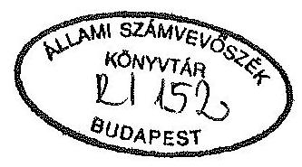
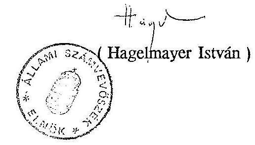

# JELENTÉS 

a helyi önkormányzatok beruházásaihoz, rekonstrukcióihoz nyújtott
1992. évi céltámogatások vizsgálatának tapasztalatairól

---

# JELENTÉS 

a helyi önkormányzatok beruházásaihoz, rekonstrukcióhoz nyújtott 1992. évi céltámogatások vizsgálatának tapasztalatairól

A cél- és címzett támogatás rendszere az elmúlt három év alatt jelentős változáson ment keresztül. A folyamatban lévő nagyobb összegű beruházásokat, rekonstrukciókat 1990-ben még a megyei tanácsok finanszírozták, az 1990. évi szabályozó rendszer bevezetésére szolgáló átmeneti kiegészítő állami támogatás terhére. A céltámogatás rendszere először 1991-ben jelent meg és müködött.

A támogatott célok bővülésének, az ezirányú igények növekedésének és elismerésének következményeként 1992. évre lényegesen emelkedett az odaítélt céltámogatások összege.

Céltámogatást igényelhetnek a helyi önkormányzatok a társadalmilag kiemelt célok megvalósításához a meghatározott feltételek megléte esetén. Ilyen társadalmilag kiemelt cél volt 1992-ben is - mint ahogy a korábbi évben - a vízgazdálkodás, az egészségügyi és szociális ellátás, az oktatás meghatározott feladatai, stb.

A helyi önkormányzatok 1992. évre mintegy 2600 feladathoz 16,6 milliárd Ft céltámogatásban részesültek, míg 1991. évre ezen szerveknek 1200 feladatra 6,2 milliárd Ft céltámogatást hagyott jóvá az Országgyűlés (továbbiakban: OGY). A céltámogatás - a szabályozás szerint - soha sem száz százalékos, a saját erő szükséges a fejlesztések megvalósításához, az erőforrások koncentrálásához. A céltámogatás igénylésének 1992. évi feltételeit - döntően - a helyi önkormányzatok 1992. évi címzett és céltámogatási rendszeréről elfogadott 73/1991.(XII.31.) OGY.sz. határozat, illetve az ennek alapján kiadott 1/1991.(XII.31.) sz. Országgyűlési irányelv szabályozta. Az irányelvekben megerősítették a Kormánynak korábban kiadott céltámogatási elgondolásait.

---

1992. évben az 1990. évi CIV. tv. 1. §-ának 6.sz. mellékletében foglalt (1991. évi) feltételek még továbbra is hatályban voltak olyan fejlesztések esetében, amelyek 1992-ben még nem fejeződtek be.

Az 1992. évi céltámogatások jogi szabályait - az előzőeken túl - a következők alkották:

A Magyar Köztársaság 1992. évi költségvetéséről és az államháztartás vitelének 1992. évi szabályairól szóló 1991. évi XCI. tv. A támogatások odaítéléséről, az igénybejelentések hiányzó dokumentumainak pótlásáról, az új célok egyes feltételeiről és egyéb kérdésekről a helyi önkormányzatok 1992. évi címzett és céltámogatásáról hozott 1992. évi XXVI. tv., valamint a helyi önkormányzatok 1992. évi kiegészítő céltámogatásáról alkotott 1992. évi XXXIV. tv. intézkedett. A hiánypótlást követően támogatásra jogosult céltámogatási igények jegyzékét pedig felhatalmazás alapján - a MK. 1992. évi 74. számában - megjelentetett Kormány közlemény tartalmazta.

Az 1992. évi céltámogatások igénylésének és felhasználásának vizsgálata során arra kerestük a választ, hogy:
-a támogatások odaítélésében és felhasználásában érvényesült-e törvényesség, valamint a pénzeszközök takarékos és hatékony felhasználása,
-a céltámogatási rendszer múködése hogyan segíti az önkormányzati fejlesztési (felújtási) feladatok megvalósítását, finanszírozását, továbbá - utóvizsgálat jelleggel -
—az önkormányzatok az 1991. évi hasonló ellenőrzésünk során feltárt jogtalanul igénybe vett céltámogatásokat a központi költségvetésbe visszafizették-e. A visszafizettetés érdekében a Pénzügyminisztérium és a Belügyminisztérium milyen intézkedést kezdeményeztek.

Az Állami Számvevőszék az 1992. november 12. és 1993. január 31. között lefolytatott helyszíni ellenőrzése alapvetően az 1992. január 1. és december 31-e közötti időszakot fogta át, a folyamatban lévő fejlesztések és az igénybejelentések tekintetében, valamint az 1991. évi céltámogatásokkal való elszámoltatás vizsgálatánál a korábbi időszakot is áttekintette.

Az ellenőrzés valamennyi megyére és a fővárosra kiterjedt. Ezen belül 10 megyei és a fővárosi, valamint 173 települési ( 2 kerületi, 56 városi, 39 nagyközségi és 76 községi) önkormányzatra, továbbá 5 Területi (Fővárosi) Államháztartási és Köz-

---

igazgatási Információs Szolgálatra (továbbiakban: TÁKISZ-ra, FÁKISZ-ra) irányult. A jóváhagyott céltámogatások összegének $35 \%$-át, 5,8 milliárd Ft-ot, illetve a feladatok számának $19 \%$-át, 511 támogatást ellenőriztük.

# I. 

A vizsgálat részletes megállapításai

1. A céltámogatások szerepe az önkormányzati feladatok finanszírozásában és müködésének tapasztalatai
a) A céltámogatási rendszer jogi szabályozásának tapasztalatai

A céltámogatási rendszer müködését nehezítették, hatékonyságát mérsékelték a központi szabályozások pontatlanságai. Helyenként az előírt feltételek túlzottan általánosak voltak, amelyek sajátos értelmezésre adtak lehetőséget.

A céltámogatások 1992. évi rendszerének jogi szabályait a következők jellemezték.
1991. évben a céltámogatások rendszerét, a támogatott célokat, a támogatás igénybevételének feltételeit az 1990. évi CIV. tv. 6. sz. melléklete szabályozta.

A helyi önkormányzatok 1992. évi címzett- és céltámogatásának rendszeréről törvényi szabályozás nem készült. Arról az 1/1991. (XII.31.) OGY. sz. irányelv rendelkezik. Tehát az elvárható szabályozási forma a jogszabály (törvény) helyett határozatot és egy jogi iránymutatást (irányelvet) adtak ki.

Az OGY 1991. december 12-én elfogadott 73/1991. (XII.31.) OGY sz. határozat 2/a. pontjában felkérte a Kormányt, hogy gondoskodjon a helyi önkormányzatok 1992. évi címzett és céltámogatási igényeinek felméréséről, feldolgozásáról, ugyanakkor a céltámogatási igénybejelentéseknek - a kiegészítő igények kivételével - már 1991. október 31-én a Belügyminisztériumban kellett lenniük.

A céltámogatási rendszer müködésének a gyakorlata abban a tekintetben kifogásolható, hogy évente a feltételei módosulnak, változnak és összességében nem illeszkedik a költségvetés készítésének szabályaihoz, szokásaihoz.

---

Az 1991. évi XCI. tv. 7. §. (2) bekezdése a támogatási célokat kibővíti az alap- és középfokú kollégiumi ellátás fejlesztése, bővítése, felújítása, továbbá a középiskolai tornaterem építése támogatási céllal. A jogalkotó ugyanakkor nem szabályozta a támogatás igénybevételének feltételeit.

E kettősség következtében ezen támogatási célokat törvény, míg a támogatott célok többségét OGY irányelvben szabályozták.

A támogatott célok és feltételeinek megfogalmazása esetenként nem volt egyértelmü, melyek nehezítették az önkormányzatok pályázatainak az elbírálását, később az ellenőrzés során annak minősítését.

Például a nemzetiségi oktatás céljait szolgáló általános iskolai tanterem építéséhez a támogatás igénybevételének nem volt feltétele, hogy a településen nemzetiségi oktatás folyjon. Ily módon, a jogértelmezés szerint, e címen bármely önkormányzat - amely annak bevezetését akár rövid távon, akár távlatokban tervezte - igényelhetett volna céltámogatást.

Támogatást igényelhettek az önálló általános iskolával nem rendelkező 500 fönél nagyobb településeken az 1-3. osztály helyben történő oktatásához általános iskolai tanterem építésére. Kérdés, hogy az önálló általános iskola alatt mi értendő. Oktatásra alkalmas tantermi létesítmény, vagy iskola szerzési szempontból kell önállónak lennie az iskolának (az oktatás tagiskolában, vagy kihelyezett oktatás formájában is történhet).

A gép-múszer beszerzés fogalmat az irányelvben és törvényben váltakozva használták, tartalmát nem pontositották és az igénybejelentésnél nem volt követelmény a tervezett beszerzések felsorolása.

A támogatási rendszer továbbfejlesztését szolgálja az 1992-ben megalkotott 1992. évi LXXXIX tv. a címzett- és céltámogatásról. E törvényben részben figyelembe vették az Állami Számvevőszék 1991. évi vizsgálati tapasztalatai alapján megfogalmazott ajánlásait is. A céltámogatás hosszabb távra szóló feltételrendszere nagyobb biztonságot jelent az önkormányzatoknak a feladatok megvalósításához. A feltételek szabályozása egyértelműbb lett.

A támogatások igénylésének, a döntés-előkészítésének és elszámolásának rendjét a 46/1993.(III.17.) Korm. sz. rendelet szabályozza. E szabályozástól várhatóan egyértelműbbé, rendezettebbé válik a támogatások igénylésének lebonyolítása és az azokkal történő elszámolás.

---

# b) A jogtalanul igénybe vett támogatás elvonásának gyakorlata 

A céltámogatási rendszer gyakorlati müködésének alapvető hiányossága, hogy a számvevőszéki vizsgálatok által feltárt, jogtalanul igénybe vett állami támogatások visszafizettetésének a müködési rendje nem egyértelmú.

A jogszabályt sértő módon szerzett állami támogatások visszajuttatását az 1991. évi XCI. tv. 9. §. (6) bek. szabályozza.

A gyakorlatban ezen törvényhely érvényesülése csak részleges, a számvevőszék által feltárt jogtalanul igénybe vett támogatási összegeket az érintett önkormányzatoknak csak egy része fizette vissza (2. és 3. sz. melléklet).
c) A céltámogatáshoz szükséges saját források meglétének és a preferenciák müködésének tapasztalatai

A beruházásokhoz nyújtott céltámogatások aránya megfelelőnek bizonyult, a nagyságrend egyrészt kellő ösztönző a beruházáspolitika befolyásolására, emellett alkalmas arra is, hogy az önkormányzatok - a saját erővel kiegészítve - megvalósíthassák a kiemelt fontosságú fejlesztési feladataikat. Tekintettel arra, hogy a térségi feladatok ellátásának, az önkormányzatok együttmüködésének a koordinálása nem megoldott, az "ösztönzés" egyben azzal is együttjárhat, hogy a település igényei szempontjából nem elengedhetetlenül szükséges fejlesztéseket kezdeményeznek, illetve a településen indokolt fejlesztésekhez nincs biztosítva az anyagi eszköz.

A Csongrád megyel Tömörkény község szociális otthon építésére kért és kapott céltámogatást, holott a tőle 15 km -re lévő Csongrád városban üzemel egy ilyen intézmény és épül egy új 100 fh-es is.

Elsősorban a nagyobb költségigényű fejlesztésekhez szükséges 40-60 \%-os saját forrás előteremtése okoz továbbra is gondot a kistelepüléseken, főként a hátrányos helyzetű önkormányzatoknál. Ezt a feszültséget valamelyest enyhítette a Vízügyi Alapra (továbbiakban: VA-ra) vonatkozó 1992. évi pályázati felhívás, amely az önkormányzati beruházásban megvalósuló települési vízgazdálkodási fejlesztések VA-ból történő támogatására is lehetőséget adott. Ahol van saját forrás, oda áramlik a támogatás is, így a pénzügyi helyzetük függvényében a községek általában csak 1 vagy 2 , míg a városok több, helyenként 14 db -ot elérő, vagy akár

---

összesen 138 millió Ft saját forrást követelő feladatra nyújtottak be igényt, illetve kaptak céltámogatást.

Jól reprezentálja ezt a megállapítást például az, hogy Bács-Kiskun megyében az elfogadott 175 pályázat közül 61-et városi, 7-et a megyei önkormányzat nyújtott be 1.060 millió Ft összegben, így a kistelepülésekre a benyújtott és törvényileg jóváhagyott támogatások értékének $16 \%$-a jutott.

Az önkormányzatok az előírt arányú, vagy a saját forrás arányában csökkentett mértékű céltámogatásban részesültek.

A $10 \%$-pontos többlettámogatás az önkormányzatokat ösztönözte az ésszerűbb, közös fejlesztések megvalósítására. E lehetőséggel azonban viszonylag nem sok önkormányzat élt. A közös fejlesztések "haszna" a többlettámogatáson túl, hogy az aktivált fejlesztés múködtetése rendszerint alacsonyabb fajlagos költséggel valósítható meg, mintha ugyanezt a feladatot az egyes települések külön-külön oldanák meg.

Helyenként azonban közös feladatellátás nélkül, egyoldalú anyagi előnyszerzés céljából döntöttek közös felújításról, beruházásról, és kaptak ehhez céltámogatást. Ezt lehetővé tette az, hogy sem a közös beruházásoknak a fogalmát, sem az önkormányzati hozzájárulások nagyságrendjét nem szabályozták. Így a minimális hozzájárulás esetén is többlet támogatáshoz lehetett jutni.

Mátészalka város szakmunkásképző iskolai kollégium felújításához a várossal szomszédos - alig 2 km -re lévő - Nyírcsaholy község képviselőtestülete határozata alapján 500 ezer Ft-tal járult hozzá. A kollégiumban e szomszédos településről nincs tanuló elhelyezve.

A várost csak "anyagilag" ösztönözte a feladat közös megvalósítása, de közös feladatellátás - az említett ok miatt - nem valósul meg.

A város számára a Nyírcsaholytól átvett 500 ezer Ft, $10 \%$-os, 7.860 ezer Ft összegű többlet céltámogatást "eredményezett", amely azonban - a szabályozás híján - a előírásokkal nem ellentétes.

A céltámogatások 1992. évi rendszere kellőképpen nem hangolta össze a műszakilag összefüggő létesítményeket. Külön céltámogatás keretében lehetett igényelni pl. az ivóvíz, csatornarendszer fömúvi létesítményeit, külön az elosztóhálózat megépítését, melyeket meghatározó mértékben már vízmű társulatok hoznak létre. Ilymódon a műszakilag egységes beruházás két ütemben valósul meg. Ha

---

ezen beruházások nem folytatódnak, úgy csak egy műszaki létesítmény jön létre, melynek hasznosítására nem kerülhet sor.

A céltámogatási rendszer adta lehetőségeket kihasználva, ésszerűtlen megoldásokkal is találkozott az ellenőrzés.

A céltámogatás nagysága az önkormányzat által közölt fejlesztési költségtől, mint számítási alaptól függ. Így a beruházások egy részénél a ráfordításokban szélsőségek tapasztalhatók. (PI. tornaterem, tornacsarnok és vízgazdálkodási, vízvezeték hálózati beruházásoknál.)

Fajlagos költségnorma hiányában fordulhat elő, hogy tornaterem néhány millió Ft-ból, de 190 millió Ft-ból ( 1612 ezer $\mathrm{Ft} / \mathrm{m}^{2}$-ből) és ezzel arányos céltámogatásból is építhető, vagy egy azonos kapacitású mélyfúrású kút 1,5 - 3,0 millió Ft-ba kerülhet.

# d) A TÁKISZ-ok tevékenységének értékelése 

A vizsgált TÁKISZ (FÁKISZ)-ok a céltámogatásokkal összefüggő előkészítő, közvetítő, véleményező, segítő és felülvizsgálati jellegű feladataikat kielégítően ellátták.

A TÁKISZ-ok dolgozói jelentős segítséget nyújtottak az önkormányzatoknak a céltámogatási igények összeállításában.

Meg kell azonban jegyezni, hogy a BM által kidolgozott és az igénybejelentők által szolgáltatott "mérleg" adatok elemzése alapján csak nagy vonalakban volt vélelmezhető az önkormányzatok pénzügyi helyzete. Az egyes bevételi és kiadási tételek konkrét tartalmáról, az önkormányzat egyéb kötelezettségvállalásáról az nem nyújtott megbízható képet.

A TÁKISZ-oknak a felülvizsgálat eredményétől függetlenül valamennyi igénybejelentést továbbítaniuk kellett a Belügyminisztériumba.

Információk, dokumentációk hiányában a TÁKISZ (FÁKISZ)-ok érdemben nem tudták kontrollálni a céltámogatások lehívásának jogosságát, teljesítményarányosságát.

Az 1992. évi állami költségvetés előkészítésével összefüggő tervezési munkák keretében a céltámogatásokra vonatkozóan - vitatható gyakorisággal és módszer-

---

rel - összesen öt alkalommal mérték fel az igényeket, pontosították a dokumentumokat. A BM részéről az igényfelmérések határidejének 1991. november 8-ról október 30-ra történő előbbrehozása feszített munkát követelt a helyi önkormányzatoktól, a TÁKISZ-októl egyaránt.

A TÁKISZ-ok a BM körlevelei alapján először 1991. július 26-ig elvégezték a céltámogatási igények elôzetes felmérését, majd szeptember 6-ig a folyamatban lévő és 1992. évre indításra tervezett beruházások és rekonstrukciók teljes körét, ezen belül a céltámogatási igényeket dolgozták fel. Az 1991. szeptember 20-i előzetes, majd az október 1-én kiadott Kormány által megtárgyalt és az OGY-nek benyújtott Irányelvek alapján a TÁKISZ-ok az önkormányzatok által beküldött céltámogatási igényeket - az említett határidó előbbre hozása mellett - formálisan felülvizsgálták, összesítették és a BM-ba továbbították.

Az igénybejelentéshez rendelkezésre álló idő rövidségének és a feltétel szigorításának tudható be, hogy több kellékhiányos pályázatot (hiányzó testületi határozat, vízjogi létesítési engedély stb.) nyújtottak be. Az 1992. évi XXVI. tv. alapján a hiányzó dokumentumokat 1992. május 15 -ig pótolni lehetett, s így egyben a pályázatok újbóli felülvizsgálatára, esetleges lemondásra is lehetőség nyílott. A TÁKISZ-ok erről, továbbá általában az elfogadott vagy elutasított igényekről is tájékoztatták az önkormányzatokat, majd elvégezték az előzőek miatt szükséges újabb ellenőrzési feladatokat.

Az OGY vonatkozó irányelve az új támogatott célok közé felvette az alap- és középfokú kollégiumi ellátáshoz a fejlesztést, a bővítést, és felújítást, továbbá középiskolai tornaterem építést. Ezeket az igényeket a TÁKISZ-ok 1992. március 6 -ig továbbították a Belügyminisztériumba.
2. A céltámogatások igénybevételének és felhasználásának a törvényessége
a) A céltámogatások felhasználásának törvényessége

Az ellenőrzött önkormányzatok döntő többsége az odaítélt céltámogatások igénybejelentésénél eleget tett az 1990. évi CIV. tv. 1. §-ának 6. sz. mellékletében, a Kormány irányelvben, illetve az 1/1991. (XII.31.) OGY sz. irányelvben előírt feltételeknek.

Az igénybe vett és felhasznált támogatások egy részénél azonban - mint ahogy a korábbi évben, úgy 1992-ben szintén - nem tartották be a törvényes előírásokat.

---

A törvényesség megsértése a következőkkel jellemezhető:
Valótlan adatszolgáltatással új, induló fejlesztést folyamatban lévőnek tüntettek fel. A saját erőt nem tudták megteremteni. A támogatott célok közé nem tartozó fejlesztést hagytak jóvá, ezáltal az érintettek céltámogatási feltételeknek meg nem felelő céltámogatásban részesültek (2.sz. mell. A. fej.).

Továbbá a jóváhagyott céltámogatást nem a megjelölt feladatra használták fel (2.sz. mell. B. fej.).

A vizsgálati tapasztalat szerint többször előfordult, hogy a törvényben rögzített arányt meghaladó mértékű többletcéltámogatást hívtak le, melyek a kifizetések, a fejlesztések befejeződése, illetve a vonatkozó (vállalkozási) szerződések alapján véglegesnek tekinthetők (2.sz. mell. C. fej.).

Az ilyen esetekre is a törvény a céltámogatás összegének visszafizetése mellett - a vonatkozó PM-BM közös körlevélben kikötött 30 napos "türelmi" idő után előírja a kamatfizetést.
b) Az igénybe vett céltámogatásokkal történő elszámolás tapasztalatai

Az önkormányzatok az 1991. évi zárszámadás keretében - központi intézkedés alapján - elszámoltak az 1991. évi céltámogatások felhasználásáról, a pénz- és keretmaradványokról, melyek nagyrészt hitelesnek tekinthetők.

Helyenként azonban elfordult az is, hogy valótlan adatokat közöltek az elszámolásban.

A Tolna megyei Dombóváron a kórház rehabilitációs osztályához tartozó gyógyfürdő - 1990-93. évekre ütemezett - rekonstrukciós munkáinál az önkormányzat az 1991. évi pénzügyi teljesítésre valótlan adatot - 28.844 ezer Ft-ot - tüntetett fel az elszámolásban, a tényleges ráfordítás 20.447 ezer Ft volt. Emiatt 1991. évben a céltámogatásból 3.120 ezer Ft felhasználása nem volt jogos.

Az önkormányzatok a költségvetési beszámoló keretében a tárgyévben, valamint az előző években felhasznált céltámogatásokról számolnak el.

---

A PM-BM nem szabályozta, hogy az 1991. és 1992. évi céltámogatási maradványok terhére meddig lehet kiadásokat elszámolni, és ez bizonytalanságot okozott az önkormányzatok körében.

A Tolna megyel Paks városnak 1991. évben az egészségügyi gép-müszer beszerzéseknél 340 ezer Ft céltámogatási keretmaradványa keletkezett, melyrit nem mondtak le, viszont ezt az összeget 1992-ben sem vették igénybe.
c) Az igénybejelentések megalapozottságának tapasztalatai

Az önkormányzatok a Belügyminisztériumba 1991. október 30-ig beérkezett igénybejelentésekhez a szükséges dokumentumokat - az eredeti határidő rövidsége ellenére - többségében mellékelni tudták.

Helyenként a képviselő testület határozatai maradéktalanul nem feleltek meg a tartalmi és formai előírásoknak, azok az igény benyújtásáról és a saját forrás vállalásáról általánosságban - konkrét összeg meghatározása nélkül - rendelkeztek. Előfordult az is, hogy az igénybejelentéshez szükséges mellékletek másolatait az ellenőrzött szervnél nem tudták bemutatni.

A Szabolcs-Szatmár-Bereg megyei Nyírkércsen a céltámogatási kérelemhez csak általános érvényú képviselőtestületi határozat másolatát mellékelték. A testület felhatalmazta a polgármestert, hogy a hátrányos helyzetű önkormányzatok részére meghirdetett valamennyi felhívásra adjon be pályázatot.

A Zala megyel Valkonya község 1991-1992. évre egyedi ivóvizellátásra részesült céltámogatásban. Az igénybejelentések másolatával nem rendelkeztek, a benyújtáshoz szükséges egyéb feltételeket - így az ivóvíz közegészségügyileg ártalmas voltát - sem igazolták.

A vízgazdálkodási ágazatba tartozó új fejlesztéseknél - a feltételek szigorítása következtében - az igénybejelentéshez mellékelni kellett a vízjogi létesítési engedélyt. Ezek megszerzéséért a pályázatok benyújtásának időszakában gyakran szinte "közelharc" folyt.

Több esetben a vízjogi létesítési engedélyt az igénybejelentés benyújtási határidejének lejárta után, későn tudták beszerezni. Ezért ezen igényeket általában a hiánypótlást követően támogatásra jogosult céltámogatások között hagyták jóvá 1992., illetve csak 1993. évre.

---

Veszprém megyében néhány jóváhagyott vízgazdálkodási igénybejelentés - vízjogi létesítési engedély késői kiadása miatt - nem felelt meg az előirásoknak.

A céltámogatási igénybejelentések időpontjában - Tüskevár, Rigács, Nagyalácsony, Ukk - nem rendelkezett vízjogi létesítési engedéllyel. Ezeket a TÁKISZ pótlólag 1991. decemberében juttatta el a BM-be.

Az 1992. évi céltámogatás feltételei szerint a fejlesztések költségei saját forrásaként figyelembe vehető összegek jelentős részét az önkormányzatoknak valamilyen formában igazolniuk kellett. (Pl. a képviselő testület előzetes határozatát mellékelni kellett arról, hogy az önkormányzati pénzalap terhére a jelzett összeget 1992. évi költségvetési rendeletükben biztosítják stb.).

Helyenként, s főként a községekben a hiányzó forrást lakossági hozzájárulásként, társadalmi munkaként, vagy egyéb forrásként jelölték meg, melyet nem kellett igazolni. A társadalmi munka eredményes kiegészítője volt a saját forrásnak.

A saját forrás általában önkormányzati pénzalap, de a vízgazdálkodási fejlesztéseknél lakossági hozzájárulással is számoltak. Néhány önkormányzat a saját forrást, illetve egy részét hitelből, átvett pénzeszközből igyekezett megteremteni.

Előfordult olyan eset is, amikor a vállalási nyilatkozatot csupán a támogatás elnyeréséhez szükséges, formális eszköznek tekintették.

A Hajdú-Bihar megyei Bakonszegen 1992. évre 51 millió Ft összegű beruházáshoz nyújtottak be céltámogatási igényt, melyhez saját erőként 21.586 ezer Ft-ot kellett volna biztosítani. Az igénybejelentő laphoz csatolták az önkormányzat határozatát az összeg vállalásáról, továbbá egy vállalat és egy Kft. nyilatkozatát arról, hogy összesen 14,9 millió Ft-tal hozzájárulnak a beruházás költségeihez. A községnek viszont az 1992. évi költségvetési előirányzata összesen 30.054 ezer Ft, melyből a fejlesztésre fordítható összeg csupán 400 ezer Ft volt. A vállalt saját erőt ezért nem tudták megteremteni és elmaradtak a nyilatkozatok szerinti hozzájárulások is.

Az igénybejelentések továbbításának időpontjáig sem a Környezetvédelmi, sem a VA 1992. évi felosztásáról intézkedés még nem történt. Így a céltámogatások és ezen elkülönített alapok támogatási rendszerének időbeni összehangolatlansága miatt az önkormányzatok az említett alapokra már benyújtott vagy tervezett pályázatok összegét a céltámogatási igény bejelentésekor még gyakran igazolás-

---

sal nem tudták alátámasztani. Az így kieső fedezetet a lakossági források között tervezték meg.

Az igénybejelentés benyújtását követően a Győr-Moson-Sopron megyei Kimle község 2.500 ezer Ft, Jánossomor ja nagyközség 1993-1995. évekre 48 millió Ft. Hegykő község önkormányzata pedig a társult önkormányzatokkal közösen, a céltámogatással megvalósitásra kerülő beruházás költségeihez 1992-93. években 26.078 ezer Ft VA támogatásban részesült.

A helyi önkormányzatok a céltámogatással megvalósuló fejlesztésekhez a saját forrást költségvetésükben többségükben megtervezték, az alkalmazott megoldás nem volt egységes. Az önkormányzatok egy része fejlesztési kiadásként, más része pedig céltartalékként tervezte meg a saját erőt. Egyik tervezési módszer sem kifogásolható.

A helyi önkormányzatok kisebb hányada - részben az anyagi eszközök szűkössége, részben pedig egyéb külső többlet források (érdekeltségi hozzájárulások, VA) miatt - költségvetésében kevesebb saját forrást szerepeltetett, mint amennyit az igénybejelentéskor vállaltak. Egyes önkormányzatok a saját eszközök elégtelensége miatt év közben a céltámogatásokról lemondtak. A kellően nem megalapozott igénybejelentéssel feleslegesen kötöttek le olyan céltámogatásokat, amelyek más igényjogosult önkormányzatoknál még 1992. évben hasznosulhattak volna.

Vác város 1992. évi költségvetése 50 millió Ft-ot irányzott elő egészségügyi gép-műszer beszerzésre. Az első félévi pénzügyi helyzet ismeretében a képviselőtestület megállapította, hogy a vállalt 30 millió Ft saját forrás fedezetét nem tudják megteremteni, így 1992. október 19-ei határozattal 11.291 ezer Ft céltámogatásról lemondtak.

Az egészségügyi gép-műszer beszerzések esetében helyenként szorgalmazták a támogatás igénylését akkor is, ha az önkormányzat a szükséges saját forrást csak részben, vagy egyáltalán nem tudta biztosítani. Ilyenkor az intézmények többletbevételéből, vagy más célú költségvetési előirányzatából történt a finanszírozás.

Az egészségügyi gép-műszer beszerzésére a Hajdú-Bihar megyei berettyóújfalui kórház-rendelőintézet 15 millió Ft-ot, a puspökladányi rendelóintézet 3,3 millió Ft-ot a saját intézeti költségvetésből fizetett ki.

A Vas megyei Körmenden az egészségügyi gép-müszer saját forrásának $54 \%$-át a kórház vállalási nyilatkozata alapján állították be a költségvetésbe, a többi részt az önkormányzati pénzalapból tervezték.

---

Hajdú-Bihar megyében a kisebb települések esetében a saját erő hiányával kapcsolatos feszültségek részbeni oldását segitette, hogy a megyében az önkormányzatok részvételével kölcsönalapot hoztak létre. Az így összegyűlt források nagy részét az elmúlt évben a céltámogatott beruházásokhoz szükséges saját erő kiegészítésére használták fel.

Az 1992. évben a kölcsönalapból 7 :elepülés a céltámogatott beruházásához szükséges saját erő megteremtésére 15 millió Ft-ban részesült.

A helyi önkormányzatok költségvetési rendeletei a céltámogatások előirányzatait eltérő módon tartalmazták. E rendeletek egy része, helytelenül eredeti bevételi előirányzatként magukban foglalta a még el nem bírált céltámogatások összegét és kiadási előirányzatként a fejlesztések 1992. évi ütemének megfelelő teljes költségelőirányzatot is. A jóváhagyott költségvetésről készített információs füzetben azonban helyesen, sem az igényelt céltámogatásokat, mint eredeti bevételi előirányzatot, sem pedig az ezzel azonos nagyságrendű kiadásokat már nem szerepeltették.

A céltámogatásokat jóváhagyó törvények kihirdetését követően az érdekelt önkormányzatok többsége módosította az éves költségvetését, melyek a kiadási oldalon tartalmazták a fejlesztési feladatok 1992. évi ütemének teljes költségelőirányzatát. Ugyanakkor több önkormányzatnál a költségvetési rendeletek módosítására a céltámogatás jóváhagyását követően nem került sor.
d) A támogatási összegek lehívásának tapasztalatai

A önkormányzatok a Magyar Köztársaság 1992. évi költségvetéséről és az államháztartás vitelének 1992. évi szabályairól szóló 1991. évi XCI. tv. 58 § (6) bekezdése alapján a céltámogatást a fejlesztések megvalósulási ütemével és a kapcsolódó saját forrásokkal arányosan hívhatják le.

A Belügyminisztérium Ög-1808/1992. (V.14.) sz. leirata alapján az önkormányzatoknak az elfogadott céltámogatás kiutalására vonatkozó igénybejelentést - a fizetési kötelezettség teljesítését megelőző hónapban, legelőször 1992. május hónapban - a TÁKISZ (FÁKISZ)-okon keresztül kellett eljuttatni a BM-ba, de csak akkor, ha a támogatott beruházásra fizetési kötelezettség merült fel, vagy a következő hóban ilyen várható.

---

A BM intézkedései alapján a céltámogatást a PM az APEH útján folyósította az érintett önkormányzatoknak.

A céltámogatás lehívásának lényeges sajátossága, hogy a céltámogatást az 1992. évi új fejlesztésekhez elvileg június hó elôtt nem lehetett igénybe venni, ezért az addig történt kifizetésekhez saját forrásból az arányos támogatást meg kellett előlegezni, amely helyenként átmeneti finanszírozási gondokat okozott. További sajátosság, hogy a céltámogatás igénylése a várható és nem a tényleges kifizetésekhez igazodik. Az előzőek miatt gyakran a tényleges kifizetések alapján igényelhető támogatás eltért a már igényelttől. Ez csak részben az önkormányzat hibája, részben rendszerhibára, az előzetes adatok pontatlanságára vezethető vissza, s általában nem a saját forrás hiányára.

Az 1991. évi XCI. tv. 9.§ (6) bekezdése szerint, ha az önkormányzat a céltámogatást nem a megjelölt feladatra használta fel, illetőleg a törvényben rögzített arányt meghaladó mértékű támogatást vett igénybe, év közben, de legkésôbb az önkormányzat éves költségvetési beszámolójának a TÁKISZ (FÁKISZ)-hoz történt benyújtást követő 15 napon belül köteles a támogatást a kamattal együtt visszatéríteni. A kamatfizetési kötelezettség előirása bizonyos mértékủ visszatartó hatást fejtett ki annak érdekében, hogy az önkormányzatok a várható kifizetések teljesítéséhez igényeljék a céltámogatást. Ugyanakkor a törvény vonatkozó előirásai nem tartalmazzák, hogy az évközi, illetve éves szintű jogtalanul lehívott (igénybe vett) céltámogatások után a kamatfizetési kötelezettség milyen időtartam - "türelmi idő" - után jelentkezik, és azt sem, hogy az ilyen céltámogatást és kamatait milyen központi bankszámlára kell befizetni.

A jogtalanul igénybevett céltámogatások és büntető kamatainak elszámolására, számítására és visszautalására a kormányzati szervek késôn és utólag az 1992. évi zárszámadási munkálatok keretében a 96.056 és 305-194/1993. (I.25.) PM-BM. sz. közös körlevélben rendelkeztek. Igy év közben az önkormányzatok nem voltak olyan jogi iránymutatás birtokában, amely e területen magatartásukat időben és egyértelműen orientálta volna.

A céltámogatások lehívásában az önkormányzatok eltérő gyakorlatot folytattak. Az esetek egy részében túl óvatosak voltak, a céltámogatást átmenetileg megelőlegezték, azt a saját forrás felhasználása után vették igénybe.

Az önkormányzatok egy másik csoportja a törvénynek megfelelően, azaz a megvalósulás (kifizetés) ütemével és a kapcsolódó saját forrásokkal arányosan hívta le a céltámogatást.

---

Ugyanakkor az önkormányzatok gyakran a fizetési kötelezettség teljesítését megelőzően akár több hónappal is nagyobb összegű céltámogatást vettek igénybe az indokolt teljesítményarányosnál. Ezzel - törvénysértő módon - javították pénzügyi helyzetüket, s egyúttal finanszírozási többletterhet okoztak az állami költségvetésnek.

A teljesítményarányosság elvének figyelmen kívül hagyása egyrészt a pénzügyi kondíciók javítására, valamint a kivitelezőknek a vállalkozói szerződésben foglalt teljesítési kötelezettségeiktől való összegszerű és időbeni eltéréseire, továbbá e szerződésekben a pénzügyi ütemek és módosításainak késői meghatározására, másrészt a finanszírozás rendjének rugalmatlanságára vezethetők vissza.

Szabolcs-Szatmár-Bereg megyében a céltámogatás igénylésénél a vállalkozási szerződésben szereplő megvalósítási ütemet és annak értékét vették alapul. A megvalósítás azonban több esetben ettől elmaradt, így indokolatlanul jelentős összegek álltak több hónapon át az önkormányzatok rendelkezésére. Előzőek miatt számottető büntető kamat kötelezettség keletkezett. Mátészalka városnál júliustól novemberig terjedő hónapokban 26-45 millió Ft, míg Fehérgyarmat városnál augusztus-december közötti hónapokban 16-28 millió Ft nagyságrendű indokolatlan igénybevételek voltak.

A II. kerületi Önkormányzatnál hat részletben hívták le a csatornaépítésre jóváhagyott céltámogatást.

Az első három alkalommal - tévesen - a bruttó (ÁFA-s) számlák összegét vették figyelembe és így együttesen 5 millió Ft volt a többletlehívás. A további igénylésnél azzal korrigálták a hibát, hogy a saját forrás arányát növelték, illetve a lehívott céltámogatást a többletigénylés mértékéig csökkentették. A kivitelezés, illetve a számla kifizetések utolsó két hónapjában nem vettek Igénybe céltámogatást.

Helyenként az önkormányzatok a víziközmű társulatokkal és az egészségügyi intézményeikkel nem építették ki azt az információáramlást és elszámoltatást, amely a teljesítményarányos céltámogatás igénybevételéhez szükséges lett volna.

Az 1992. évben folyamatban lévő fejlesztésekhez átmenetileg és a már befejezett beruházásokhoz véglegesen lehívott többlettámogatást év közben az önkormányzatoknak csak egy része utalta vissza, büntetőkamatot - számítására vonatkozó előírás hiányában - eddig nem fizettek.

A törvényben rögzített arányt meghaladóan lehívott jogtalan céltámogatást és büntetőkamatát az önkormányzatoknak kell kiszámítaniuk és befizetniük a

---

PM-BM már hivatkozott közös körlevélben foglaltak figyelembevételével. Ezen kötelezettségek teljesítését az ÁSZ a céltámogatások 1993. évi témaellenőrzésének keretében vizsgálja.

# 3. A fejlesztések előkészítése, megvalósítása 

Az új induló fejlesztések műszaki előkészítettségének helyzete két csoportba sorolható. A kisebb építkezések előkészítése folyamatos volt, azokat az önkormányzatokat saját anyagi erejükre alapozva is szándékoztak megvalósítani.
A jelentősebb, döntően építési jellegű fejlesztések műszaki előkészítése lassított ütemben folyt, illetve sok helyütt állt addig, amíg nem döntöttek a céltámogatások odaítéléséről. A céltámogatások jóváhagyása után a műszaki előkészítő munkákat felgyorsították, a kivitelezési munkák megkezdéséhez a szükséges intézkedéseket megtették. Más önkormányzatok számítva arra, hogy a céltámogatást megkapják, még az OGY döntése előtt előkészítették a beruházásokat. (Pl. kiviteli tervek elkészíttetése, versenytárgyalások meghirdetése.)
Tapasztalható volt, hogy helyenként a céltámogatások odaítélésének késői időpontja kedvezőtlenül befolyásolta a beruházások megvalósításának folyamatát.

Miskolc megyei jogú város a MK. 1992. évi 49-es számának megjelenését (V.13.) követően vállalta, hogy közzéteszi az ómassai szennyvíz csatorna építésére vonatkozó ajánlati felhívást (június 5 -én). A 60 napos kötelező pályáztatási határidő miatt csak újabb 1 hónap elteltével, szeptember 14-én kötötte meg a vállalkozási szerződést a kiválasztott kivitelezővel. A késői kezdés, valamint a kedvezőtlen kivitelezési feltételek miatt az 1992. évre ütemezett munkák döntő része áthúzódott 1993. évre, a céltámogatás maradványa 18 millió Ft.

Hajdúnánás részére, a középiskolai tornaterem építéséhez, a céltámogatást az OGY 1992. június hónapban (az 1992. évi XXXIV. törvénnyel) hagyta jóvá. Az ezt követő versenypályázat eredménytelenül zárult, azt meg kellett ismételni. A kiviteli szerződést ezért csak november 3-án köthették meg. A pályázat szerinti 29 millió Ft-os beruházási költségből 1992. évben kívántak kifizetni 23 millió Ft-ot, a tényleges kifizetés - a késedelem miattennek csupán egyharmada volt.

A céltámogatási igénybejelentésekben szereplő bekerülési költségek alapvetően költségbecsléseken, tanulmányterveken, előzetes állapotfelméréseken, ritkábban tervezői költségvetéseken alapultak.

---

A céltámogatási rendszer egyik hiányossága, hogy a támogatások alapja az önkormányzat által jelzett, várható bekerülési költség volt, melyet kritika nélkül fogadtak el.

A vizsgált esetek egy jelentős részénél a pályázatok benyújtása időpontjában, a várható bekerülési költségre vonatkozóan, megbízható információk nem álltak rendelkezésre. Az önkormányzatok így azt a korábbi saját-, vagy más települések hasonló beruházásainak fajlagos ráfordításai alapján becsülték meg. Az ilymódon kimunkált igény és a támogatás mértékének ezen alapuló meghatározása jelentős eltéréseket eredményezett az egyes beruházások pénzügyi forrásainak összegében, illetve a támogatások arányában.

A Hajdú-Bihar megyei Hosszúpályiban a szennyvízhálózat- és kezelőrendszer megépítésével kapcsolatos várható költségeket 152 millió Ft-ra becsülték, s a megkötött szerződések szerinti összes kiadás 132 millió Ft. A többletforrás tette lehetővé, hogy a beruházás kapcsán olyan munkákra is megrendelést adjanak, amelyek az eredeti müszaki tervekben, illetve versenypályázati kiírásban nem szerepeltek.

Hajdúdorogon szintén a szennyvízhálózat építésével kapcsolatos beruházás várható költségét 20 millió Ft-ban jelezték, a szerződés szerinti vállalási díj viszont 30.899 ezer Ft volt. Az önkormányzat így csupán egy adminisztratív tévedése folytán több mint 6 millió Ft-tal kevesebb céltámogatást vehet igénybe.

A Komárom-Esztergom megyei Táton a szennyvízelvezetés és tisztítás teljes fejlesztési költségét Irreálisan magasra becsülték. A tervezett 267 millió Ft teljes költségének a $70 \%$-a merült fel.

A feladatok egy részénél a költségek "felültervezése" is érzékelhető volt, amely gyakran a jóváhagyott céltámogatás maradványát, a céltámogatás felesleges "lekö-tésé"-t eredményezte.

Több önkormányzat jelezte e maradványról való végleges lemondási szándékát. Az önkormányzatok kisebb része a fejlesztések megvalósítása során módosította eredeti célkitűzéseit. Ennek következtében többnyire a műszaki tartalom és a költség növekedett, mely utóbbit az önkormányzatok saját erőből fedeznek. Előfordult, hogy a létesítmény átminősítésével, rendeltetésének megváltoztatásával használták fel a támogatást.

A BM Ög-2366/92. sz. állásfoglalása szerint az önkormányzatok céltámogatási igénybejelentéseikben a müködő egészségügyl Intézmények gép-mü-

---

szer beszerzéseire vonatkozó javaslatalkban foglaltaktól eltérhetnek, amennyiben azt szakmal meggondolások indokolják.

A fejlesztések egy része a tervezettnél hosszabb idő alatt és esetenként 1993. évre áthúzódva valósul meg. Ebben meghatározó tényezőnek bizonyult a többletmunkák elrendelése, hiánypótlás, előre nem látható műszaki problémák, az önkormányzat vagy a kivitelező késlekedése, anyaghi²ny.

A Fővárosi és a XIV. kerületi önkormányzat nem megfelelő együttmüködése növelte a beruházás előkészítési idejét.
A Fővárosi Önkormányzat 1991. évi költségvetési tervében szerepelt a 30. sz. Szakmunkásképző Iskola tornatermének felépítése. A kerület képviselőtestülete csak 1992. szeptember 1-én fogadta el a részletes rendezési tervet. A tornaterem építése nem kezdődött el 1992-ben.

A fejlesztések egy részét a tervezett költségelőirányzatot kisebb-nagyobb mértékben meghaladó ráfordítással valósítják, illetve valósították meg. Ebben főként az játszott szerepet, hogy a műszaki terveket módosították, többletmunkák merültek fel, a költségeket rosszul becsülték meg, alátervezték, továbbá csődeljárás, felszámolás miatt új kivitelezőkről kellett gondoskodni.

A Csongrád megyei Domoszéken az $1080 \mathrm{~m}^{2}$-es tornacsarnok építése során derült ki, hogy a költségek nem körültekintő számbavétele miatt a tervezett bekerülési költség $30 \%$-kal növekedni fog.

A Komárom-Esztergom megyei Baj községben az $540 \mathrm{~m}^{2}$-es tornacsarnok mintegy 15 millió Ft-tal (közel $60 \%$-kal) kerül többe az igénybejelentéshez képest.

Az önkormányzatok a fejlesztések megvalósítását, kivitelezését megelőzően általában nyílt, illetve zártkörű versenytárgyalás kiírásával igyekeztek kiválasztani a kedvezőbb gazdasági és műszaki megoldásokat, amelyek gyakran eredményesek is voltak. Ez ugyan szinte minden esetben az előkészítési időszak meghosszabbodását vonta maga után, de jelentősen hozzájárult - az egyébként jellemzően építőipari kínálati piac miatt is - az anyagilag kedvező, ugyanakkor műszakilag is megfelelő ajánlat elfogadásához. A versenytárgyalások során tett vállalkozói ajánlatok elbírálásánál nem mindíg a legalacsonyabb árajánlat volt a meghatározó. Általában sok szempont mérlegelése alapján - a bíráló bizottsági, a szakértői vélemények birtokában döntöttek a legmegfelelőbbnek minősített pályázat mellett.
A pályázatok elbírálása során az ajánlati ár, a műszaki tartalom, pénzügyi ütemezés, a vállalkozás gazdasági stabilitása, referenciái, vállalási határidő, szava-

---

tossági idő, takarékosabb megoldások keresése, helyi munkaerő bevonásának lehetőségei voltak a szempontok.

Az egy-egy feladatra érkezett számos ajánlat versenyeztetésének mérhető gazdasági és műszaki eredményei voltak.

A Piliny-Salgótarján közöttl Ivóvíz távvezeték I. ütemének, a PilinySágújfalu távvezeték szakasznak a kiépítésére kiirt nyílt versenytárgyalás gazdasági eredménnyel, jelentős költség megtakarítással járt. A 13 vállalkozótól beérkezett ajánlat ÁFA nélkül 34,0-96,5 millió Ft között szóródott. A költségek kímélése céljából a nyertes vállalkozó alternatív javaslatot tett, amelynek alapján a kiviteli tervek 775 ezer Ft értékben történt átterveztetésével, illetve műanyagcsövek helyett azbeszt cement csövek felhasználásával 34,0 millió Ft-ról 24,0 millió Ft-ra csökkentette ajánlatát.

A Jász-Nagykun-Szolnok megyel Jászberényi általános iskolai tornateremépítés versenytárgyalására 13 pályázótól 20 pályázat érkezett, az árajánlatok 40,0 és 69,0 millió Ft között alakultak. A pályázat elbírálására alakult ad-hoc bizottság döntése alapján a vállalkozási szerződést 51 millió Ft + ÁFA átalányáron kötötték meg. A döntésnél figyelembe vették a műszaki tartalmat, az épület várható élettartamát, működtetésének gazdaságosságát és az egyéb paramétereket is.

Jó példaként egyre gyakoribb, hogy a kisebb összegű munkákra, vagy a részfeladatok megoldására (pl.bonyolítás) is több ajánlatot kérnek be az önkormányzatok. Kedvező, hogy a nyílt versenytárgyalások és árajánlat kérések eredményeként a fejlesztések egy része a tervezettnél kisebb-nagyobb mértékben elmaradó költségráfordítás mellett realizálódik, illetve valósult meg.
Ugyanakkor helyenként tapasztalható volt, hogy a kivitelezők ismerve az önkormányzat költségvetésében a beruházásra tervezett összeget, ajánlataikban azt figyelembe veszik, vagyis alacsonyabb összegre általában nem tesznek ajánlatot.

Az önkormányzatok egy része a versenytárgyalás alapján vagy ettől függetlenül is egyösszegű átalányáron kötött építési szerződéssel törekedett az inflációs hatások kivédésére.

Helyenként nyílt versenytárgyalás nélkül kötötték meg a vállalkozási szerződéseket. Ebben speciális műszaki megoldások, időnyerés és egyéb szempontok játszottak szerepet.

Bács megyében a vezetékes vízrendszer, illetve a mélyfúrású kutak kiépítését legtöbb esetben a vízmú vállalatok végezték, jelentős - a vizsgált

---

egységeknél mintegy 8 millió Ft - támogatást adva a saját erő kiegészítésére.

A Békés megyei Sarkad város képviselőtestületének vonatkozó határozatát a Köztársasági Megbízott jogszabálysértőnek minősítette, mivel az általános iskolai tornaterem 31 millió Ft-os beruházására versenytárgyalás nélkül kötöttek szerződést.
A kiírás utólag megtörtént, a munait az eredeti határozatnak megfelelően az önkormányzat egyszemélyes KFT-je kapta meg, foglalkoztatás-politikára való hivatkozással.

A Pest megyei Önkormányzat 1992. évre egészségügyi intézményei részére 220 millió Ft értékủ orvosi gép beszerzéseit a 36/1988. (VIII.16.) PM számú rendeletben foglaltakkal ellentétben, versenytárgyalás kiírása nélkül, árajánlatok bekérésével, bizottsági döntések alapján oldotta meg.

A fejlesztések (felújítások) bonyolításával, a munkák műszaki ellenőrzésével, számla kollandálással arra hivatott szervezeteket, vagy megbízásos szerződés alapján egyéni vállalkozókat bíztak meg az önkormányzatok, akik ezirányú kötelezettségüknek eleget tettek. A korábbi kedvezőtlen tapasztalatokon okulva, a kisebb önkormányzatok is egyre jobban felismerték, hogy a bonyolító részére kifizetett költségek a feladatok szakszerű menedzselése révén megtérül. A műszaki ellenőr több beruházásnál az önkormányzat megfelelő képzettséggel rendelkező dolgozója volt. A bonyolító cégek közreműködésével végzett beruházások általában szakszerűbb megvalósítást eredményeznek, mint az önkormányzati bonyolításúak.

A Zala megyei Pakodon az általános iskolai tanteremépítés önkormányzati lebonyolítású volt, az építési előadó műszaki ellenőrzésével.
A magánvállalkozóval megkötött kiviteli szerződés tartalma nem egyértelmű, belőle a szakaszolások nem derülnek ki.
Ugyanakkor anélkül, hogy az eredeti szerződést módosították volna az egyes munkaszakaszok végzésére újabb megállapodások készültek. Az eredeti szerződésben vállalt összegből nem állapítható meg, hogy milyen múszaki tartalom áll mögötte. A számlák és a szerződések között bizonyítható kapcsolat nincs, így a műszaki ellenőrzés egzakt alapjai sem voltak meg. A beruházás 5 millió Ft-tal, csaknem $40 \%$-kal teljesült túl.

Helyenként a kisebb fejlesztéseket saját rezsis kivitelezéssel oldották meg.

---

# 4. Az 1991. évi céltámogatás felhasználásának utóellenőrzése 

Az Állami Számvevőszék 1991. évi témaellenőrzése során a 3. sz. melléklet szerinti feladatoknál összesen 42.061 ezer Ft jogtalanul igénybe vett céltámogatás visszavonására tett javaslatot.
A Belügyminisztérium a visszafizettetésre intézkedést nem kezdeményezett.
Néhány önkormányzat - a jogkövető magatartása és igazságérzete alapján - a jogtalanul igénybe vett céltámogatást a központi költségvetésnek visszautalta, illetve idöközben olyan intézkedést tett, amely alapján jogosult lett a támogatásra, a törvényes állapotot helyreállította.

## II.

Következtetések, javaslatok

A beruházások és rekonstrukciók megvalósításában növekvő szerepet töltött be a céltámogatások rendszere. Az OGY a támogatási célok és feltételek meghatározásával orientálta a települések fejlesztési tevékenységét. Pozitív hatása a támogatott területek ellátóképességének, a lakoság életkörülményeinek a javulásában mutatkozott meg, az önkormányzatok a fontosnak ítélt fejlesztésekhez kiegészítő forrásokhoz jutottak.

A támogatott célok bővülése miatt a jogosnak elismert támogatási szükségletek meghaladták az állami költségvetésben e célra rendelkezésre álló összegeket, s e körülmény az adott évre a támogatások alanyi jogon történő juttatását nem tették lehetővé (Kormány Közlemény I/b. Magyar Közlöny 74.sz.).

Az egyes fejlesztések fajlagos költségei rendkívül differenciáltan alakultak. Ez idáig a magas fajlagos költséggel megvalósuló beruházások élveztek nagyobb állami támogatást. Ennek oka az, hogy a támogatás összegénél nem a fejlesztés természetes és fajlagos költségmutatóit, hanem az előirányzott bekerülési költséget vették figyelembe.

---

A fejlesztések műszaki előkészítettségével kapcsolatos követelmény az egyes ágazatokban eltérő volt. Az oktatási ágazati fejlesztéseknél, felújításoknál még tanulmánytervre sem volt szükség a támogatás elnyeréséhez.
1992. évre bár pontosították, tökéletesítették a céltámogatási rendszert, bizonyos hiányosságai továbbra is fennmaradtak. A támogatás feltételrendszere a hosszabb távú tervezést nem alapozta meg. Az ésszerúségen alapuló, indokolt mértékủ fejlesztéseket, illetve azok bekerülési költségeinek felső határát sem normativizálták.

Kedvezőnek tekinthető azonban, hogy az 1993-tól hatályba lépő rendelkezések tovább tökéletesítik a címzett- és céltámogatás rendszerét. A támogatás igénylésének, finanszírozásának elsősorban a feltételei szigorodnak.
A pénzintézetekkel történő BM-PM megállapodás alapján megvalósul a fejlesztések teljesítményarányos finanszírozása.
1995-től pedig a fajlagos költségek alapján történik a céltámogatások odaítélése.
A céltámogatási rendszernek - az előzőeken túli - korszerűsítése érdekében a Számvevőszék a következőket javasolja:

# A Belügyminisztérium részére: 

1. A támogatott célok előkészítésének gyorsítása és a támogatások kedvezőbb arányú tárgyévi felhasználása érdekében a céltámogatások elosztásának a döntését úgy kellene ütemezni, hogy azok a tárgyév II. negyedévében megtörténhessenek.
2. A szűkös források miatt, a támogatások odaítélésénél megfelelő rangsort kellene érvényesíteni az egyes új induló fejlesztési céloknál. A feladatok között - az ÖTV szerint - legfontosabbnak tekinthető a községi lakosság egészséges ivóvízzel való ellátása.
3. A céltámogatási rendszer működésénél biztosítani kell, hogy az önkormányzatok az átgondolt, megfelelően előkészített, költségkímélő beruházási célkitűzésekhez kapjanak céltámogatást.

---

4. A tárca a számvevôszéki ellenôrzések által feltárt, jogtalanul igénybe vett céltámogatások utólagos visszafizetésének kezdeményezéséről gondoskodjon. Ez terjedjen ki a céltámogatási feltételeknek meg nem felelő, de elfogadott igénybejelentésekhez kapcsolódó, a törvényben rögzített arányt meghaladóan lehívott, továbbá nem a megjelölt feladatra felhasznált céltámogatásokra egyaránt (2., 3. sz. melléklet).

Budapest, 1993. május hó
Melléklet: 3 db

---

A vizsgálatot vezette és az összefoglaló jelentést összeállította: Nagy József számvevő-igazgatóhelyettes

Közremüködött: Fercsik Gyula számvevő tanácsos
A helyszini vizsgálatot végezték:

Baranya megye:
Dr.Koronics Károlyné
Számvevő tanácsos
Bács-Kiskun megye:
Dr.Botta Tibor
számvevő tanácsos
Nagy János
Számvevő tanácsos
Tréfás Antal
Számvevő tanácsos
Békés megye:
Galuska Józsefné
Számvevő
Borsod-Abauj-Zemplén megye:
Hegedűs György
Számvevő tanácsos
Csongrád megye:
Csiszárné dr.Kosik Mária
Fejér megye:
Horváth József
Győr-Sopron megye:
Dr.Lacó Bálintné
Számvevő tanácsos
Hajdu-Bihar megye:
Kozák György
Számvevő tanácsos
Jász-Nagykun-Szolnok megye:
Buczkó András
Számvevő tanácsos
Heves megye:
Maróti Sándor
számvevő tanácsos

---

|  Komárom-Esztergom megye: |   |
| --- | --- |
|  Ambrus Lajos | számvevő  |
|  Nógrád megye: |   |
|  Fercsik Gyula | számvevő tanácsos  |
|  Pest megye: |   |
|  Benczik Lászlóné | számvevő tanácsos  |
|  Dr. Kurucz István | számvevő tanácsos  |
|  Somogy megye: |   |
|  Dr. Hegedűs György | számvevő tanácsos  |
|  Szabolcs-Szatmár-Bereg megye: |   |
|  Kenéz Sándor | számvevő tanácsos  |
|  Tolna megye: |   |
|  Péntek László | számvevő tanácsos  |
|  Vas megye: |   |
|  Horváth János | számvevő tanácsos  |
|  Veszprém megye: |   |
|  Dr. Vasváriné Dr. Rózsa Anikó | számvevő tanácsos  |
|  Zala megye: |   |
|  Dr. Koller Valéria | számvevő tanácsos  |
|  Főváros: |   |
|  Benczik Lászlóné | számvevő tanácsos  |
|  Dr. Kurucz István | számvevő tanácsos  |

---

# Az 1992. évi helyszíni vizsgálat során feltárt jogtalanul igénybe vett 1992. évi és 1991. évi céltámogatásokról 

| Önkormányzat | Feladat | A vonatkozó - részben megváltozott tartalmú törvények (1992. évi XXVI. és XXXIV. tv. 1991. évi XXI. tv.) és mellékletei szerint elfogadott céltámogatási igény sorszáma (azonosítás) | Jóváhagyott céltámogatás 1992., illetve 1991. évre | Elvonandó jogtalanul igénybe vett (többlet) céltámogatás | Az 1992. évi zárszámadás sal egyidejüleg az önk. visszafizette, illetve a törvényes állapotot helyreállította E Ft |
| :--: | :--: | :--: | :--: | :--: | :--: |
| 1. | 2. | 3. | 4. | 5. | 6. |

A. A céltámogatási feltételeknek meg nem felelő és elfogadott igénybe jelentések

Bács-Kiskun megye:

| Solt | szilárd hulladék | XXVI. tv. |  |  |
| :-- | :-- | :-- | :-- | :-- |
|  | lerakó bővítése | 2. sz. mell/270 | 411 | 411 |
| Érsekcsandd | szilárd hulladék | XXVI. tv. |  |  |
|  | lerakó telep építése | 2. sz. mell/245 | 1592 | 1592 |

Mindkét önkormányzat 1990. évről áthúzódó beruházásra igényelt céltámogatást. Ugyanakkor e feladatokra 1990. évi könyvviteli nyilvántartásaikban beruházási, illetve pénzügyi teljesítést nem tudtak bizonyítani. Így e beruházások nem tekinthetők folyamatban lévőknek.

## Hajdú-Bihar megye

| Bakonszeg | tornaterem építése | XXVI. tv. |  |  |  |
| :-- | :-- | :-- | :-- | :-- | :-- |
|  |  | 2. sz. mell/1184 | 6400 | 3200 | 3200 |

Az önkormányzat a saját erőt 1992. évi költségvetésében pénzügyi fedezet hiányában nem tervezhette meg. A várható bekerülési költség és annak forrása tisztázatlan, a vizsgálat időpontjában nem ismert. A jóváhagyott céltámogatásból 3200 E Ft-ot hívtak le, mely az önkormányzatot nem illeti meg.

## Veszprém megye:

| Somló- | alapfokú oktatás | XXVI. tv. |
| :-- | :-- | :-- |
| vásárhely | (óvoda, napközi ott- | 2. sz. mell/192 |
|  | hon, konyha építése) | 3063 |

Ezen feladatra az 1991. évi XXI. tv. 2. sz. mellékletében 331. sorszám alatt 7120 E Ft céltámogatásban részesültek 1991. évben. Az ÁSZ 1991. évi ellenőrzése a beruházást törvénysértőnek minősítette, a céltámogatás visszavonását kezdeményezte. Ennek következtében a beruházás 1992. évi üteme is jogtalannak tekintendő.

---

B. Nem a megjelölt, jóváhagyott feladatra felhasznált céltámogatások

Fejér megye:

|  Székesfehér- | egészségügyi müszer | XXVI. tv. |  |  |   |
| --- | --- | --- | --- | --- | --- |
|  vár | beszerzése | 2. sz. mell./2255 | 4000 | 549 | 549  |

Év közben az előírásoknak meg nem felelő eszközök beszerzésére vettek igénybe támogatást. A végelszámolásnál lehetőségük van a helyesbítésre.

# Hajdú-Bihar megye

|  Bakonszeg | vízgazdálkodás | XXVI. tv. |  |   |
| --- | --- | --- | --- | --- |
|   |  | 2. sz. mell./323 | 12520 | 12520  |

A fejlesztés szükségességének kellő indoklásával, de a ténylegesen végzendő konkrét munkák elhallgatásával olyan beruházáshoz kaptak támogatást, mely a meghirdetett célok között nem szerepelt. Valójában a vízművállalat által végzett, gyakorlatilag egy vállalati forrásból megvalósítandó rekonstrukciós munkához igényelték a céltámogatást. Az önkormányzat 1992. évi költségvetése a megvalósításhoz szükséges és testületi határozattal vállalt saját forrást nem tartalmazta. A céltámogatást 1992. évben teljes összegében - a teljesítményarányost meghaladóan - lehívták, a vízművállalat részére az átutalás részben történt meg. A céltámogatást döntően egy önkormányzati érdekeltségű gazdasági társaság beruházásához, továbbá e kft. üzletrészének megvásárlásához használták fel.

|  Bakonszeg | szennyvízelvezető és | XXVI. tv. |  |   |
| --- | --- | --- | --- | --- |
|   | kezelő rendszer épít. | 2. sz. mell./907 | 7280 | 7280  |

A teljes összeget 1992. évben igénybe vették. A kezelőrendszer megépítéséhez hozzá sem kezdtek, a hálózatból viszont egy olyan 1070 fm szakaszt építettek meg, mely a településhez tartozó pihenő övezet - azon belül is főként a Kft. beruházásában épülő létesítmény - szennyvízelvezetését fogja megoldani. Az ezzel kapcsolatos 1992. évi kifizetés 6504 E Ft volt, a saját anyagi forrás nem állt rendelkezésre.

## Komárom-Esztergom megye:

|  Esztergom | alapfokú oktatás | XXVI. tv. |  |   |
| --- | --- | --- | --- | --- |
|   | tornaterem | 2. sz. mell./1254 | 720 | 720  |

A tornateremépítésre kapott céltámogatást tornaterem felújításra használták fel. Az igénybejelentés nem felelt meg az előírt feltételeknek.

|  Esztergom | kórházrekonstrukció | XXI. tv. |  |  |   |
| --- | --- | --- | --- | --- | --- |
|   | röntgen építés | 2. sz. mell./112 | 4280 | 1701 | 1701  |

Az 1992. évi utóellenőrzés megállapította, hogy az 1991. évi céltámogatás pénzmaradványát a folyamatos üzemeltetéshez szükséges röntgenfilmek és kazetták vásárlásához is felhasználták ( 995 E Ft). A beruházás befejedőzött, így a 706 E Ft pénzmaradvány elvonása is indokolt.

---

| Föváros | eü-i gép-múszer | XXVI. tv. |  |  |  |
| :-- | :-- | :-- | :-- | :-- | :-- |
|  | beszerzés | 2. sz. mell/1709 és |  |  |  |
|  |  | 3. sz. mell/37 | 482308 | 7702 | 7702 |

Az elvonásra javasolt céltámogatást ügyeleti célú személygépkocsi vásárlására használták fel, amely nem szerepelt az 1/1991. (XII.31.) OGY. sz. irányelvben jóváhagyott célok között.
C. A törvényben rögzített arányt meghaladó mértékủ (többlet) céltámogatások Igénybevétele, lehívása

# Győr-Moson-Sopron megye: 

| Jánossomorja | nemzetiségi oktatás | XXVI. tv. |  |  |
| :-- | :-- | :-- | :-- | :-- |
|  | céljait szolgáló álta- | 2. sz. mell/1574 |  |  |
|  | lános iskolai tante- |  |  |  |
|  | rem fejlesztés | 3250 | 181 | 181 |

A beruházás befejeződött, elszámolás alapján a törvényben rögzített arányt meghaladó mértékben lehívott céltámogatás az önkormányzatot nem illeti meg.

## Hajdú-Bihar megye:

| Berettyó- | belvizeivezető | XXVI. tv. |  |  |  |
| :-- | :-- | :-- | :-- | :-- | :-- |
| újfalu | csatornahálózat épít. | 2. sz. mell/3 | 1071 | 621 | 621 |

A hálózat kiépítése megtörtént társulati formában. A törvényben előírt $30 \%$-os mértéket meghaladó többlet céltámogatást hívtak le.

## Komárom-Esztergom megye:

| Oroszlány | vízvezetéképítés | XXVI. tv. |  |  |  |
| :-- | :-- | :-- | :-- | :-- | :-- |
|  |  | 2. sz. mell/957 | 2935 | 223 | 223 |

Az önkormányzat pénzügyi-gazdasági tevékenységének törvényességi ellenőrzése során megállapították, hogy a beruházás befejeződött, s a lehívott céltámogatás a jelzett összeggel meghaladta a jogszabály szerinti mértéket.

Nógrád megye:
Felsőpetény közműves vízellátás XXVI. tv.
társulati formában 2. sz. mell/779 9400308308

A beruházás befejeződött, de az elszámolásban az előírásokkal ellentétben figyelembe vették az 1991. évi kifizetéseket is, ugyanakkor nem szerepeltették az 1992. évi hitelkamatot, így a törvényben rögzített arányt meghaladó támogatást hívtak le.

---

Szabolcs-Szatmár-Bereg megye:

| Megyei | - eü-i gép-müszer | XXVI. tv. |  |  |  |
| :-- | :-- | :-- | :-- | :-- | :-- |
| önkormányzat | beszerzése | 2. sz. mell/2231 | 35600 | 2087 | 2087 |
|  | - középiskolai kollé- | XXIV. tv. |  |  |  |
|  | gium felújítása | 2. sz. mell/130 | 2600 | 150 | 150 |

Az egészségügyi gép-müszer beszerzés megvalósitásánál a fel nem használt elöirányzat 7645 E Ft $40 \%$-a, 3558 E Ft a jogtalanul igénybe vett támogatás.
A kollégium felújítása befejeződött, melynek teljes költsége alapján az önkormányzatot megillető támogatás 2350 E Ft.

| Újfehérü | szennyvízhálózat | XXVI. tv. |  |  |
| :-- | :-- | :-- | :-- | :-- |
|  | építés | 2. sz. mell/1148 | 60000 | 4744 |

A 100 millió Ft ráfordítással tervezett beruházással szemben a kötelezően elvégzett versenytárgyalás eredményeként a fejlesztés kivitelezési, bonyolítási költsége a fövállalkozói szerződés szerint csak 92093 E Ft.-Így a különbözctre a $60 \%$-os céltámogatás nem illeti meg az önkormányzatot.

# Veszprém megye: 

Megyei szoc. otthon férőhely XXI. tv.
önkormányzat bővités 2. sz. mell/135 314003743

Az önkormányzat az 1991. évi kifizetések és 1992. évi pótmunka alapján a törvényben rögzített arányt meghaladó támogatást vett igénybe. A többlet céltámogatás az önkormányzatot nem illeti meg.

Föváros vizbázis XXVI. tv.
2. sz. mell/24, 25
30700
3501
3501

A korábbi évek számláinak indokolatlan beszámításá miatt használták fel az elvonásra javasolt céltámogatást. A Hivatal 1992. december 31-én az ellenőrzést követően befizette a kifogásolt összeget az adóelszámolási Iroda 232-90606-0060 sz. számlájára.

---

# Az 1991. évi helyszíni vizsgálat során feltárt jogtalanul igénybe vett 

és vissza nem fizetett, illetve az időközi intézkedés alapján az önkormányzatot megillető
1991. évi céltámogatásokról az 1992. évi utóellenőrzés megállapításai szerint

| Önkormányzat | Feladat | Az 1991. évi XXI. tv. 2., 3. sz. mellékletei szerint elfogadott céltámogatási igény sorszáma | 1991. évre jóváhagyott céltámogatás | 1991. évi ellenőrzés alapján elvonásra javasolt összeg | 1992. évi utóellenőrzés alapján továbbra is elvonandó céltámogatás | Az 1992. évi zárszámadás-sal egyidejüleg visszafizette |
| :--: | :--: | :--: | :--: | :--: | :--: | :--: |
|  |  |  | E Ft | E Ft | E Ft | E Ft |
| 1. | 2. | 3. | 4. | 5. | 6. | 7. |

## Baranya megye:

1. Pécs szociális otthon építése $3 / 690 \quad 32500 \quad 2600$ — —

A szociális otthon építésére igénybe vett támogatásból 2600 E Ft céltámogatást ténylegesen a nyugdíjas ház építésére fordították. Az utóellenőrzés megállapította, hogy a céltámogatást - a fejlesztés szociális otthonra történt időközi átterveztetése következtében - az előírásoknak megfelelő célra használták fel.
2. Siklós szennyvíztisztító
telep bővítése $2 / 106 \quad 3000 \quad 600 \quad 600$
A 2,4 millió Ft céltámogatás helyett 3,0 millió Ft-ot igényeltek le, mert helytelenül a kifizetett ÁFA-t figyelembe vették. Az utóellenőrzés szerint az elvonás indokolt.

## Bács-Kiskun megye

3. Ágaseátalános iskolai
egyháza tornaterem
kialakítása $2 / 139 \quad 1400 \quad 153$ — —

Az 1991. évi kifizetés 3118 E Ft volt, ennek $40 \%$-a az 1247 E Ft, ennyi céltámogatást vehettek volna igénybe az 1400 E Ft helyett. A különbségként mutatkozó 153 E Ft lehívása jogtalan volt. (A visszafizetés folyamatban van, nem indokolt a törvényes intézkedés). Az utóellenőrzés szerint a jogtalan támogatást visszafizették.

---

4. Kunadacs általános iskolai
tornaterem ép. $2 / 254$
1400
702
Az 1991. évi pénzügyi teljesítés 646 E Ft volt. Ennek $40 \%$-a 258 E Ft, amit céltámogatásként igénybe vehettek volna, ezzel szemben 960 E Ft-ot hívtak le. A különbségként mutatkozó 702 E Ft-ot jogtalanul vették igénybe. (A visszafizetés folyamatban van, nem indokolt a törvényes intézkedés.) Az utóellenőrzés megállapította, hogy a jogtalan támogatást időközben visszafizették.
5. Városföld szilárd hulladék-
lerakó telep építése
$2 / 492$
$881 \quad 360$
360
A beruházás nem tekinthető folyamatban lévőnek, mert 1990-ben nem volt kifizetés. Így fejlesztés a támogatott célok között nem szerepelt. (Az 521 E Ft visszafizetése folyamatban van, a különbségként mutatkozó 360 E Ft elvonása indokolt.) Az utóellenőrzés megállapította, hogy az önkormányzat az 521 E Ft-ot visszafizette, a 360 E Ft-ot nem fizette vissza.

# Csongrád megye 

6. Hódmezö- Hodtói $8+8 \mathrm{tt}$-es vásárhely
ált.isk. és tornacsarnok építése
$2 / 225$
20000
9595

A céltámogatási igényt úgy nyújtották be, hogy arra saját fedezet nem állt rendelkezésre és a kivitelezés folyamata is megszakadt. Ez a törvényes feltételekkel ellentétes. (A támogatásból 10405 E Ft visszafizetése folyamatban van, a 9595 E Ft elvonása indokolt.) Az utóellenőrzés megállapította, hogy 1992-ben a törvényes állapot helyreállt, az önkormányzat a támogatott beruházás megvalósítását folytatta.

## Győr-Moson-Sopron megye:

7. Györazz- alapfokú oktatás szonyfa kiszolgáló létesítményeinek rekonstrukciója
$2 / 215$
1600
368
368

Egy épülettömbben lévő óvoda, polgármesteri hivatal, szolgálati lakás, tanterem rekonstrukciójában az utóbbira a költségeknek $77 \%$-a jut. Az igénybejelentés nem a tanteremre arányos költséget veszi alapul. A tanteremre jutó rész költsége 1232 E Ft. A különbségként mutatkozó 368 E Ft visszavonása indokolt.

---

8. | Mosonma- | középiskolai |
| :-- | :-- | :-- |
| gyaróvár | kollégium kialakítása | $2 / 429$ | $12500 \quad 4318$ | 4318 |

Tervezték, hogy 1990-ben megvásárolnak e célra egy épületet, de az adás-vétel nem jött létre. Az 1990. évi költségvetési beszámolóban szerepeltetett 12,5 millió Ft fejlesztési kiadás fiktív volt, ténylegesen 1990-ben pénzügyi teljesítés nincs.
Az önkormányzat 1991-ben felhasznált 2659 E Ft-ot, 1992-ben 1659 E Ft felhasználását tervezi, 8182 E Ft támogatásról az önkormányzat lemondott. Az utóellenőrzés szerint a 7-8. sorszámú önkormányzat 1991. évi költségvetési beszámoló jelentésében az elvonásra javasolt céltámogatás felhasználásáról számolt el, arról nem mondott le.

# Hajdú-Bihar megye: 

9. Berettyó- alapfokú oktatás
újfalu (óvoda) fejlesztése $2 / 163$
$2544 \quad 2544$
Egy óvoda rekonstrukciójához azárt kapták a jelzett támogatást, mert fejlesztési célként tanterem létesítését is megjelölték. Valójában csupán az óvodai fejlesztés valósult meg, melynek tetőterében egy tornaszobát is berendeznek. (A törvény 5. sz. mellékletében ez a feladat az elutasított igénybejelentések között az 536. sorszámon is szerepel.)
10. Berettyó- középiskolai
újfalu rekonstrukció $2 / 399$
$5019 \quad 5019$
Az igénybejelentésben az 1990. évi kifizetést a beruházási költség $18 \%$-ában tüntették fel. Ezzel szemben valójában csupán 104 E Ft ( $2 \%$ ) kifizetés történt. A pályázatban feltüntetett bekerülési költség összege sem bizonyult valósnak, így az elvonás indokolt.
Az utóellenőrzés megállapította, hogy a 9-10. sz. tételek visszafizetése elmaradt, mivel a zárolásról a kormányzati szervektől az önkormányzat értesítést nem kapott. Az utóbbi fejlesztéshez az 1992. évi XXVI. tv. 2. sz. mellékletének 218. sorszáma alatt 1992. évre további 3694 E Ft céltámogatásban részesültek, melynek lehívása a vizsgálat időpontjáig nem történt meg.

## Komárom-Esztergom megye:

11. Baj általános iskola
építése $2 / 147$
$5980 \quad 5944$
A beruházás nem tekinthető folyamatban lévőnek, múszaki átadás-átvétel 1990. VIII. hóban megtörtént. 1991-ben e beruházásra X. 31-éig mindössze 1732 E Ft-ot fizettek ki. A valóságnak nem megfelelő igénybejelentéssel, az elnyert céltámogatással lehetővé vált, hogy e beruházáshoz 1988-1990. években felvett hitel 1991-94. években esedékes kamattal történő visszafizetését ( 13,1 millió Ft) 1991-ben teljesítsék.

---

12. Oroszlány alapfokú oktatás kiszolgáló épületeink beruházása $2 / 299$
1200
1200
1200

Az önkormányzat a kiszolgáló létesítmények célba beleértette az Oktatási és Közművelődési GAMESZ épület beruházását is. A törvényeiókészités helytelenül a fejlesztést Bánki Donát utca, mint telephely helyett Bánki D. általános iskolaként jelölte meg. E félreértés tisztázása után a szaktárca a támogatás igénybevételével egyébként szóban egyetértett.
Az utóellenőrzés szerint a 11-12. sz. elvonandó összegeket a két önkormányzat nem fizette vissza. A TÁKISZ-hoz benyújtott 1991. évi elszámolásaikat az ÁSZ megállapítás figyelmen kivül hagyásával készítették el.

# Jász-Nagykun-Szolnok megye: 

13. Kisúj- eü.int. gép-múszallás szer beruházása $3 / 483$
1685
393
188
188
A vizsgálat megállapítása szerint az ultrahangos berendezés és az első fogyóeszköz beszerzés, továbbá az épület átalakítás költsége 3229 E Ft. Az odaítélt 1685 E Ft keretből az önkormányzat felhasznált 1292 E Ft-ot, a különbségként mutatkozó 393 E Ft visszavonása indokolt.
Az utóellenőrzés szerint az önkormányzat a 393 E Ft keretmaradványról lemondott. A kiadásokból 469 E Ft átalakítási munka e célra nem számolható el, így a különbözet a központi költségvetést illeti.

## Veszprém megye:

14. Dudar szilárd hulladék-
lerakó telep építése $2 / 463$
2000
2000
2000

Az igénybejelentésben a hulladéklerakótelep építését folyamatban lévő beruházásnak tüntették fel, holott pénzügyi ráfordítás 1990. év végéig nem volt. Így a fejlesztés a támogatott célok között nem szerepelt. Az utóellenőrzés tapasztalata szerint a beruházás befejeződött, 4181 E Ft értékben aktiválták. A jogtalanul lehívott céltámogatást nem fizették vissza.
15. Somló- óvoda és közellátás vásárhely (szociális-, napközi-otthonos-, óvodás) étkeztetést biztosító konyha építése
$2 / 331$
7120
7120
7120

Az önkormányzat olyan új induló fejlesztéshez kért, de folyamatban lévőként jóváhagyott beruházás megvalósításához kapott céltámogatást - óvoda és konyha építés -, amely nem tartozott a támogatott célok közé. Az 1990. évi pénzügyi teljesítés sem érte el a költségvetési törvényben meghatározott $18 \%$-ot ( $16,5 \%$ ). Az utóellenőrzés megállapítása szerint 1992. évben a beruházás további 3063 E Ft céltámogatás igénybevételével folytatódott és befejeződött. Az 1991. évben jogtalanul igénybe vett 7120 E Ft-ot nem fizették vissza. Előzőek alapján a fejlesztés 1992. évi folytatása is törvénysértőnek tekinthető.