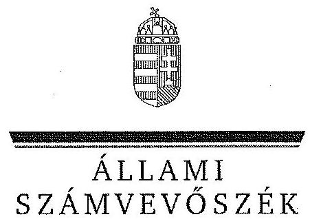
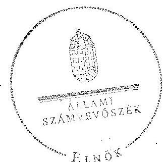
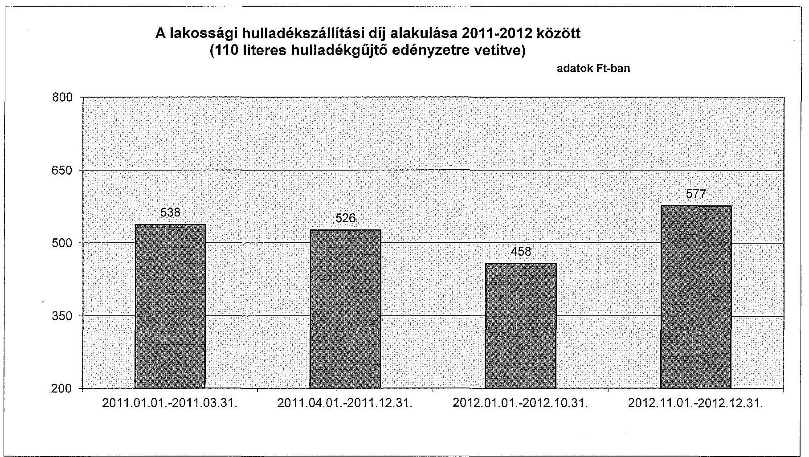

# JELENTÉS 

Az önkormányzatok gazdasági társaságai - Az önkormányzatok többségi tulajdonában lévő gazdasági társaságok közfeladat ellátását érintő gazdálkodási tevékenysége szabályszerűségének ellenőrzése

Kerepesi Községszolgáltató Közhasznú Nonprofit Kft.

---

# Állami Számvevőszék 

Iktatószám: V-0472-163/2014.
Témaszám: 1506.
Vizsgálat-azonosító szám: V067106

## Az ellenőrzést felügyelte:

Dr. Horváth Margit
felügyeleti vezető
Az ellenőrzés vezette és a végrehajtásáért felelős:
Klinga László
ellenőrzésvezető
Az összefoglaló jelentést készítette:
Bozsik Tamás
számvevő
Az ellenőrzést végezték:
Dr. Pálffy Imre Péter
okleveles könyvvizsgáló,
külső szakértő

## Váradiné Jassó Mariann

okleveles könyvvizsgáló, külső szakértő

## A témához kapcsolódó eddig készített számvevőszéki jelentések:

## címe

Jelentés Kerepes Nagyközség Önkormányzata belső kontrollrendszerének kialakítása, valamint egyes kontrolltevékenységek és a belső ellenőrzés működése ellenőrzéséről
Jelentés az önkormányzati vagyongazdálkodás szabályszerűségi ellenőrzéséről - Kerepes
sorszáma
13025
13105

---

# TARTALOMJEGYZÉK 

BEVEZETÉS ..... 9
I. ÖSSZEGZŐ MEGÁLLAPÍTÁSOK, KÖVETKEZTETÉSEK, JAVASLATOK ..... 12
II. RÉSZLETES MEGÁLLAPÍTÁSOK ..... 18

1. Az Önkormányzat közfeladat-ellátásának szabályszerűsége ..... 18
1.1. A közfeladat-ellátás megszervezése és a feladatellátás feltételrendszerének kialakítása ..... 18
1.2. A közfeladat-ellátás felügyelete és a tulajdonosi jogok érvényesítése ..... 22
2. A Községszolgáltató Nkft. közfeladat-ellátással kapcsolatos tevékenysége ..... 24
2.1. A Községszolgáltató Nkft. gazdálkodásának szabályozottsága ..... 24
2.2. A Községszolgáltató Nkft. vagyongazdálkodása és vagyonnyilvántartása ..... 25
2.3. A beszámolási kötelezettség teljesítése ..... 27
3. A hulladékgazdálkodás közfeladata bevételei és ráfordításai elszámolásának és önköltségszámításának szabályszerűsége ..... 28
3.1. A hulladékgazdálkodás közfeladata bevételeinek és ráfordításainak szabályszerűsége ..... 28
3.2. Az önköltségszámítás szabályszerűsége ..... 30
4. Az ÁSZ korábbi, az önkormányzatok többségi tulajdonában lévő gazdasági társaságok közfeladat-ellátását, gazdálkodását, pénzügyi helyzetét érintő javaslataira tett intézkedések ..... 31
4.1. Az Önkormányzat intézkedési terve és annak hasznosulása ..... 31

## MELLÉKLETEK

1. számú A Községszolgáltató Nkft. tevékenységének év végi főbb adatai
2. számú A Községszolgáltató Nkft. működésének év végi főbb jellemzői
3. számú A lakossági hulladékszállítási díj alakulása 2011-2012 között

## FÜGGELÉK

1. számú Mintavételi eljárások ellenőrzési területenként

---

.

---

# RÖVIDÍTÉSEK JEGYZÉKE 

## Törvények

| Áht. 1 | az államháztartásról szóló 1992. évi XXXVIII. törvény (hatálytalan: 2012. január 1-jétől) |
| :--: | :--: |
| Áht. 2 | az államháztartásról szóló 2011. évi CXCV. törvény |
| ÁSZ tv. | az Állami Számvevőszékről szóló 2011. évi LXVI. törvény (hatályos: 2011. július 1-jétől) |
| Civil tv. | 2011. évi CLXXV. törvény az egyesülési jogról, a közhasznú jogállásról, valamint a civil szervezetek működéséről és támogatásáról (hatályos: 2011. december 22-étől) |
| Ebktv. | az egyenlő bánásmódról és az esélyegyenlőség előmozdításáról szóló 2003. évi CXXV. törvény |
| Gt. tv. | a gazdasági társaságokról szóló 2006. évi IV. törvény (hatálytalan: 2014. március 15-étől) |
| Hgt. 1 | a hulladékgazdálkodásról szóló 2000. évi XLIII. törvény (hatálytalan: 2013. január 1-jétől) |
| Hgt. 2 | a hulladékról szóló 2012. évi CLXXXV. törvény (hatályos: 2013. január 1-jétől, kivéve a 95. § (6) bekezdése, ami 2015. január 1-jén lép hatályba) |
| Közh. tv. | a közhasznú szervezetekről szóló 1997. évi CLVI. törvény (hatálytalan: 2012. január 1-jétől) |
| Mötv. | Magyarország helyi önkormányzatairól szóló 2011. évi CLXXXIX. törvény (hatályos: 2012. január 1-jétől, kivéve a 144. § (2) bekezdésben meghatározott paragrafusok, amelyek 2012. április 15-én, a (3) bekezdésben meghatározott paragrafusok, amelyek 2013. január 1-jén léptek hatályba, a (4) bekezdésben meghatározott paragrafusok a 2014. évi általános önkormányzati választások napján lépnek hatályba) |
| Nvtv. | a nemzeti vagyonról szóló 2011. évi CXCVI. törvény |
| Ötv. | a helyi önkormányzatokról szóló 1990. évi LXV. törvény (hatálytalan: a 2014. évi általános önkormányzati választások napjától) |
| Számv. tv. | a számvitelről szóló 2000. évi C. törvény |
| Rendeletek |  |
| 224/2004. (VII. 22.) | a hulladékkezelési közszolgáltató kiválasztásáról és a közszolgáltatási szerződésről |
| Korm. rendelet | a települési hulladékkezelési közszolgáltatási díj megállapításának részletes szakmai szabályairól |
| 64/2008. (III. 28.) Korm. rendelet | a települési hulladékkezelési közszolgáltatási díj megállapításának részletes szakmai szabályairól |
| Ávr. | az államháztartásról szóló törvény végrehajtásáról szóló 368/2011. (XII. 31.) Korm. rendelet |
| SZMSZ | Kerepes Város Önkormányzatának 15/2007. (V. 15.) számú rendelete az Önkormányzat Szervezeti és Működési Szabályzatáról |

---

vagyongazdálkodási rendelet $_{1}$
vagyongazdálkodási rendelet $_{2}$
hulladékgazdálkodási rendelet

## Szórövidítések

Alapító Okirat
ÁSZ
FB
jegyző
Községszolgáltató Nkft.
Képviselő-testület
Közszolgáltatási szerződés

Közhasznúsági szerződés

Önkormányzat
polgármester
Polgármesteri hivatal
Zöld Híd Kft.

Kerepes Város Önkormányzatának 27/2004. (IX. 30.) számú rendelete az Önkormányzat vagyonáról, a vagyongazdálkodás szabályairól (hatálytalan: 2012. április 26-ától)
Kerepes Város Önkormányzatának 15/2012. (IV. 27.) számú rendelete az Önkormányzat vagyonáról, a vagyonhasznosítás rendjéről és a vagyontárgyak feletti tulajdonosi jogok gyakorlásáról, szabályairól
Kerepes Város Önkormányzatának 11/2011. (III. 11.) számú rendelete a települési szilárd hulladék kezelésével kapcsolatos közszolgáltatásról és annak kötelező igénybevételéről (hatályos: 2011. március 11-étől)

Kerepesi Községszolgáltató Közhasznú Nonprofit Kft. alapító Okirata és annak módosításai
Állami Számvevőszék
Kerepesi Községszolgáltató Közhasznú Nonprofit Kft. Felügyelőbizottsága
Kerepes Város Önkormányzatának jegyzője
Kerepesi Községszolgáltató Közhasznú Nonprofit Kft.
Kerepes Város Önkormányzatának Képviselő-testülete
Kerepes Város Önkormányzata és a Kerepesi Községszolgáltató Közhasznú Nonprofit Kft. között létrejött, 2008. január 1-jétől hatályos Közszolgáltatási Keretszerződés és annak módosításai
Kerepes Város Önkormányzata és Kerepesi Községszolgáltató Közhasznú Társaság által 2008. január 1-jén kötött közhasznúsági szerződés
Kerepes Város Önkormányzata
Kerepes Város Önkormányzatának polgármestere
Kerepes Város Önkormányzatának Polgármesteri hivatala Zöld Híd Régió Környezetvédelmi és Hulladékgazdálkodási Kft.

---

# ÉRTELMEZŐ SZÓTÁR 

gazdasági társaság
közfeladat
közszolgáltatás
közszolgáltatási szerződés tartalmi elemei

Gt. tv. 3. § (1) bekezdése szerint „gazdasági társaságot üzletszerű közös gazdasági tevékenység folytatására külföldi és belföldi természetes és jogi személyek, valamint jogi személyiség nélküli gazdasági társaságok alapíthatnak, működő társaságba tagként beléphetnek, társasági részesedést (részvényt) szerezhetnek."
Jogszabályban meghatározott állami vagy önkormányzati feladat, amit az arra kötelezett közérdekből, jogszabályban meghatározott követelményeknek és feltételeknek megfelelve végez, ideértve a lakosság közszolgáltatásokkal való ellátását, továbbá az állam nemzetközi szerződésekben vállalt kötelezettségeiből adódó közérdekű feladatokat, valamint e feladatok ellátásához szükséges infrastruktúra biztosítását is (Nvtv. 3. § (1) bekezdés 7. pont).

A közszolgáltatás: „közcélú, illetőleg közérdekű szolgáltatást jelent, amely egy nagyobb közösség (állam, település) minden tagjára nézve megközelítőleg azonos feltételek mellett vehető igénybe, ezért valamilyen mértékig közösségi megszervezést, illetve szabályozást, ellenőrzést igényel." Az Ebktv. 3. § d) pontja a következőképpen határozza meg a közszolgáltatást: „szerződéskötési kötelezettség alapján a lakosság alapvető szükségleteinek ellátására irányuló szolgáltatás, így különösen a villamos energia-, gáz-, hő-, víz-, szennyvíz- és hulladékkezelési, köztisztasági, postai és távközlési szolgáltatás, továbbá a menetrend alapján közlekedő járművekkel végzett közforgalmú személyszállítás."

A közszolgáltatási szerződésnek tartalmaznia kell a közszolgáltatás megnevezését, minőségi ismérveit, a teljesítésének területi kiterjedését, a közszolgáltatás megkezdésének időpontját és időtartamát, valamint annak rögzítését, hogy a közszolgáltató vállalta a megjelölt közszolgáltatás teljesítését.
A közszolgáltatási szerződésben a közszolgáltató kötelességeként kell meghatározni:
a) a közszolgáltatás folyamatos és teljes körű ellátását;
b) a közszolgáltatás meghatározott rendszer, módszer és gyakoriság szerinti teljesítését;
c) a közszolgáltatás teljesítéséhez szükséges mennyiségű és minőségű jármű, gép, eszköz, berendezés biztosítását, valamint a szükséges létszámú és képzettségű szakember alkalmazását;
d) a közszolgáltatás folyamatos, biztonságos és bővíthető teljesítéséhez szükséges fejlesztések és karbantartások elvégzését;

---

e) a közszolgáltatás körébe tartozó hulladék ártalmatlanítására az önkormányzat képviselő-testülete által kijelölt helyek és létesítmények igénybevételét;
f) a közszolgáltató által alkalmazott közszolgáltatási díj mértékéről és az alkalmazás tapasztalatairól az önkormányzat képviselő-testületének történő legalább évenkénti egyszeri tájékoztatást;
g) a közszolgáltatás teljesítésével összefüggő adatszolgáltatás rendszeres teljesítését és meghatározott nyilvántartási rendszer működtetését;
h) a fogyasztók számára könnyen hozzáférhető ügyfélszolgálat és tájékoztatási rendszer működtetését;
i) a fogyasztói kifogások és észrevételek elintézési rendjének megállapítását.
A közszolgáltatási szerződésben az önkormányzat kötelességeként kell meghatározni:
a) a közszolgáltatás hatékony és folyamatos ellátásához a közszolgáltató számára szükséges információk szolgáltatását, a Hgt. 23. §-ának g) pontjára tekintettel;
b) a közszolgáltatás körébe tartozó és a településen folyó egyéb hulladékkezelési tevékenységek összehangolásának elősegítését;
c) a településen működtetett különböző közszolgáltatások összehangolásának elősegítését;
d) a települési igények kielégítésére alkalmas hulladék gyűjtésére, kezelésére, ártalmatlanítására szolgáló helyek és létesítmények kijelölését;
e) a közszolgáltató kizárólagos közszolgáltatási jogának biztosítását a 3. § (1) bekezdés a), b) és f) pontjaiban foglaltakra figyelemmel.
Az önkormányzatnak a közszolgáltatás finanszírozásában vállalt kötelezettsége esetén a közszolgáltatási szerződésben meg kell határozni a kötelezettség teljesítésének feltételeit és biztosítékait.
A közszolgáltatási szerződés tartalmazza a közszolgáltatás díjának megállapítására és beszedésére vonatkozó módszer leírását, a díjnak a szerződés megkötésekor érvényesíthető legmagasabb mértékét és a díj megváltoztatása érdekében alkalmazandó eljárást. A közszolgáltatási szerződésnek tartalmaznia kell az igazolt díjhátralék kiegyenlítésére vonatkozó eljárást. A közszolgáltatási szerződés tartalmazza azokat a feltételeket, amelyek mellett a közszolgáltató a közszolgáltatás teljesítésére közreműködőt vagy teljesítési segédet vehet igénybe, figyelemmel a Kbt. 304. § (2) bekezdésében foglaltakra is. A közszolgáltató közreműködőért vagy teljesítési segédért való felelőssége a közszolgáltatási szerződésben nem korlátozható. (224/2004. (VII. 22.) Korm. rendelet 11-14. §)
minősített többséget
A minősített befolyásszerző az ellenőrzött társaságban a

---

biztosító részesedés
saját tőke
tulajdonosi joggyakorló
többségi befolyást biztosító részesedés
szavazatok legalább hetvenöt százalékával rendelkezik. (Gt. tv. 52. § (2) bekezdés)
A saját tőke a - jegyzett, de még be nem fizetett tőkével csökkentett - jegyzett tőkéből, a tőketartalékból, az eredménytartalékból, a lekötött tartalékból, az értékelési tartalékból és a tárgyév mérleg szerinti eredményéből tevődik össze.
Aki a nemzeti vagyon felett az államot vagy a helyi önkormányzatot megillető tulajdonosi jogok és kötelezettségek összességének gyakorlására jogosult (Nvtv. 3. § (1) bekezdés 17. pont).
A Ptk. 685/B. § (1) bekezdése szerint „többségi befolyás: az olyan kapcsolat, amelynek révén természetes személy, jogi személy vagy jogi személyiség nélküli gazdasági társaság (a továbbiakban együtt: befolyással rendelkező) egy jogi személyben a szavazatok több mint ötven százalékával vagy meghatározó befolyással rendelkezik."

---

.

---

# JELENTÉS 

## Az önkormányzatok gazdasági társaságai - Az önkormányzatok többségi tulajdonában lévő gazdasági társaságok közfeladat ellátását érintő gazdálkodási tevékenysége szabályszerűségének ellenőrzése

## Kerepesi Községszolgáltató Közhasznú Nonprofit Kft.

## BEVEZETÉS

Az Állami Számvevőszék középtávra szóló stratégiájában megfogalmazta, hogy a helyi önkormányzatok gazdálkodásában rejlő pénzügyi kockázatok feltárásával, az államháztartáson kívülre nyújtott költségvetési támogatások és ingyenes vagyonjuttatások, valamint az államháztartáson kívül működő köz-feladat-ellátó rendszerek ellenőrzéseivel hozzájárul ahhoz, hogy a közpénzeket az államháztartáson kívül működő szervezetek is átlátható, rendezett módon használják fel a közfeladatok szerződésben vállalt ellátása érdekében.

Az önkormányzatok szervezetalakítási szabadságának következménye, hogy a korábban is vállalati formában működő (nagyvárosi tömegközlekedés, víz-, szennyvízcsatorna, köztisztasági, ingatlankezelés stb.) közszolgáltatások mellett, mind a kötelező, mind az önként vállalt feladatok ellátásában a gazdasági társaságok kiemelt fontosságú szerephez jutottak.

Kerepes Város Önkormányzatának Képviselő-testülete a Kerepesi Községszolgáltató Közhasznú Nonprofit Kft-t (Községszolgáltató Nkft.) 2009. június 17-ével hozta létre, jogelődje a 2004-ben alapított Kerepesi Községszolgáltató Közhasznú Társaság volt.

A Községszolgáltató Nkft. alaptevékenysége a szilárd hulladék gyűjtése, hasznosítása, ártalmatlanításáról való gondoskodás, a közterületek tisztántartása, a közforgalom számára megnyitott út-, híd-, alagút fejlesztéséhez, fenntartásához, üzemeltetéséhez kapcsolódó tevékenység, az Önkormányzat által fenntartott intézmények épületeinek takarítása volt. A Községszolgáltató Nkft. az ellenőrzött időszakban - 2011. január 1. és március 31. között, valamint 2012. november 1-jét követő időszakot kivéve - ellátta a közel 10 ezer lakóval rendelkező Kerepes Város közigazgatási területén a köztisztasági és a települési szilárd hulladék gyűjtésére és elszállítására, valamint a hulladék elhelyezésére irányuló közszolgáltatást.

---

A Községszolgáltató Nkft. a hulladékkezelési közfeladat ellátása során közel 3200 háztartásból, gazdálkodó szervezetektől, valamint a közterületi gyűjtőedényekből gyűjtötte
 be, szállította el a települési szilárd hulladékot. Ezen túl a köztisztasági közfeladatának ellátása során az Önkormányzat közigazgatási határán belül utakat, járdákat takarított, illetve biztosította a téli síkosság és hómentesítést, ellátta a kátyúzási feladatokat. A Községszolgáltató Nkft. tulajdoni hányaddal más gazdasági társaságban nem rendelkezett, átlagos statisztikai létszáma 2012-ben 10 fő volt. A Községszolgáltató Nkft. összes bevétele 2008-ban 211,6 millió Ft, a 2012. évben 95 millió Ft volt, amelyből az értékesítés nettó ábevétele 2008-ban 114,6 millió Ft, míg 2012-ben 64,7 millió Ft volt. Az ábevételek az ellenőrzött időszakban 43,5%-kal, a ráfordítások 53,4%-kal csökkentek.

A Községszolgáltató Nkft. az ellenőrzött időszakban - a 2011-2012. évet kivéve - pozitív mérleg szerinti eredménnyel zárt, a 2012. évben -3,4 millió Ft összegű veszteséget realizált. A Községszolgáltató Nkft. mérleg szerinti eszközállománya a 2008. évi nyitó 56,1 millió Ft-ról a 2012. év végére 41,9%-os csökkenést követően 32,6 millió Ft-ra változott, ezen belül a tárgyi eszközök állománya több mint harmadára, 6,8 millió Ft-ra csökkent. A saját tőke a 2008. évi nyitó 1,6 millió Ft-ról a 2012. év végére -2 millió Ft-ra csökkent.

Az ellenőrzött időszakban a polgármester személye nem, míg a jegyző személye három alkalommal változott. A polgármester a 2006. évi önkormányzati választások óta tölti be tisztségét. A helyszíni ellenőrzés időszakában a munkakört betöltő jegyző 2011. szeptember 1-jétől látta el feladatait. Az ügyvezető személye az ellenőrzött időszakban négy alkalommal változott.

Az önkormányzati tulajdonú gazdasági társaságok teljes körű ellenőrzésének lehetőségét az Állami Számvevőszékről szóló 1989. évi XXXVIII. törvény 2011. január 1-jétől hatályos módosítása teremtette meg.

Az ellenőrzés célja annak értékelése volt, hogy

- az önkormányzat a jogszabályi előírások figyelembevételével döntött-e az ellenőrzésre kerülő közfeladat megszervezéséről; az önkormányzat szabályszerűen gyakorolta-e a tulajdonosi jogokat;
- a közfeladat-ellátása bevételeinek, ráfordításainak elszámolása, és vagyongazdálkodási tevékenysége megfelelt-e a jogszabályi, illetve a közszolgáltatási szerződésben foglalt tulajdonosi előírásoknak, azok végrehajtása szabályszerű volt-e;
- a közfeladatok átláthatósága és elszámoltathatósága érdekében biztosítva volt-e a közszolgáltatás díjának megalapozottsága szabályszerű önköltségszámítással.

Az ellenőrzés során értékeltük az ÁSZ korábbi, az Önkormányzat többségi tulajdonában lévő gazdasági társaságát érintő javaslataira tett intézkedések hasznosulását is. Az ellenőrzés kiterjedt Kerepes Város Önkormányzatára és a Kerepesi Községszolgáltató Közhasznú Nonprofit Korlátolt Felelősségű Társaságra.

---

Az ellenőrzés várható hasznosulása: A törvényalkotás számára - az észlelt problémák, szabálytalanságok, vagy egyéb nem kívánatos jelenségek felszínre kerülésével - az ellenőrzés megállapításai segítséget nyújthatnak az államháztartáson kívüli közfeladat-ellátás értékeléséhez, jogszabályi keretei pontosításához, átláthatóságot biztosító szabályozásához. Meghatározhatóvá válnak a közfeladat ellátásban részt vevő államháztartáson kívüli szervezeteknek - az önkormányzat költségvetését, pénzügyi helyzetét is befolyásoló - kockázatai, lehetővé válik ezen kockázatok csökkentése. Feltárja, hogy az önkormányzat közfeladat-ellátási kötelezettségének szabályszerűen tett-e eleget, a feladatellátáshoz rendelt közvagyon működtetését szabályszerűen szervezte-e meg és a tulajdonosi felügyelete hozzájárult-e a közfeladat-ellátásához. A feladatot ellátó gazdasági társaság a közszolgáltatási szerződésben foglaltak betartásával, a közvagyon használatával biztosította-e a szolgáltatás folytatásának feltételeit. Ezzel az ellenőrzöttek és a helyi döntéshozók számára visszajelzést ad feladatszervezési, feladat-ellátási kockázataikról, alapot ad a meglévő hibák megszüntetéséhez, a jobb közfeladat-ellátás biztosításához. Fokozza a fegyelmet, igazolja, hogy lejárt a következmények nélküli ellenőrzések időszaka. Az ÁSZ értékteremtő rend kialakításához és megőrzéséhez hozzájáruló tevékenysége pozitív hatással van a szervezetről kialakított összkép formálására is.

A bevételek és ráfordítások elszámolása, valamint a vagyonnyilvántartás terén az egyes területek szabályszerű működését mintavétellel ellenőriztük, ez alapján a sokaságokban előforduló hibás tételek arányát becsültük. A jogszabályoknak és a belső előírásoknak megfelelőnek, azaz szabályszerűnek tekintettük az adott bevételek és ráfordítások elszámolását, a vagyonnyilvántartást, amennyiben a minta ellenőrzésének eredménye alapján 95%-os bizonyossággal a teljes sokaságban a hibás tételek aránya kisebb volt, mint 10%, nem megfelelőnek értékeltük, ha a hibás tételek aránya a 10%-ot meghaladta. Kockázatot, illetve magas kockázatot jeleztünk, amennyiben egy adott terület vonatkozásában a minta alapján a teljes sokaságban nem volt teljes körűen biztosított a jogszabályoknak és a belső szabályzatoknak megfelelő működés (2. számú függelék).

Az ellenőrzést a számvevőszéki ellenőrzés szakmai szabályai szerint, szabályszerűségi ellenőrzés módszerével, a vonatkozó nemzetközi standardok figyelembevételével végeztük. Az ellenőrzés a 2008-2012. évekre terjedt ki.

Az ellenőrzés végrehajtásának jogszabályi alapját az Állami Számvevőszékről szóló 2011. évi LXVI. törvény 5. § (3)-(4)-(5) bekezdése képezi.

A Jelentés tervezetét észrevételezésre megküldtük Kerepes Város Önkormányzata polgármesterének, valamint a társaság ügyvezető igazgatójának. Az érintettek észrevételt nem tettek.

---

# I. ÖSSZEGZŐ MEGÁLLAPÍTÁSOK, KÖVETKEZTETÉSEK, JAVASLATOK 

Kerepes Város Önkormányzatának Képviselő-testülete az Önkormányzat közigazgatási területén a szilárd hulladék gyűjtése, ártalmatlanítása, hasznosítása és a közterületek tisztántartása közfeladatának ellátásáról az Ötv. előírásainak megfelelően döntött. A Képviselő-testület az SZMSZ-ben előírta a szilárd hulladék kezelés és szállítás közfeladat ellátásának kötelezettségét. Az Önkormányzat a 2006-2010. és a 2010-2014. évekre szóló Gazdasági programjaiban célul tűzte ki a lakossági hulladékgyűjtés díjfizetési rendszerének kialakítását, a köztéri szemetelés csökkentése érdekében a közterületi felügyeleti létszám emelését, a szemetelők büntetésének szigorítását.

Az Önkormányzat 2005-2008. közötti időszakra szóló hulladékgazdálkodási tervét kidolgozta, azonban a Hgt.-ben előírtakkal ellentétben a 2009-2014. évekre nem rendelkezett hulladékgazdálkodási tervvel. A szilárdhulladék kezelés, ártalmatlanítás és a kijelölt - Csörögi regionális - hulladéklerakóba történő elszállítás közfeladatának 5 éves határozott időszakra - 2008. január 1-je és 2012. december 31-e között - történő ellátására az Önkormányzat és a jogelőd Kerepesi Községszolgáltató Közhasznú Társaság Közszolgáltatási szerződést kötött, amely részben felelt meg a 224/2004. (VII. 22.) Korm. rendelet 11-14. §-aiban előírt tartalmi követelményeknek. Ebben az Önkormányzat kötelezettségeként írták elő a lakossági szilárd kommunális hulladékszállítás ellenértékének a kommunális adó bevételének terhére történő megfizetését. A közszolgáltatás teljesítésével összefüggésben rendszeres adatszolgáltatási és nyilvántartási rendszer működtetési kötelezettséget írtak elő.

Az Önkormányzat, a Zöld-Híd Kft. és az Észak-Kelet Pest és Nógrád Megyei Regionális Hulladékgazdálkodási Környezetvédelmi Önkormányzati Társulás között 2010. december 20-án Megállapodás jött létre, amelynek alapján 2011. január 1-jétől a Zöld Híd Kft. végezte a településen a hulladék begyűjtés, szállítás feladatát. A Képviselő-testület 2011. januárban a lakossági terhek csökkentésére való hivatkozással felülvizsgálta a hulladékszállítás gyakorlatát, és úgy döntött, hogy a hulladékbegyűjtés-, elszállítás, és díjbeszedés tevékenységeket újra a Községszolgáltató Nkft.-vel végezteti el 2011. áprilisától. A Községszolgáltató Nkft. a fenti tevékenységet 2012. október 31-ig látta el. Az Önkormányzat és a Zöld-Híd Kft. közötti Közszolgáltatási szerződés alapján 2012. november 1-jét követően ismét a Zöld Híd Kft. gyűjtötte be és szállította el a hulladékot.

A Közszolgáltatási szerződést az ellenőrzött időszak alatt két esetben módosították. További módosítására, felmondására, újbóli kötésére nem került sor annak ellenére, hogy 2011. január 1. és március 31. között, valamint 2012. november 1. után nem a Községszolgáltató Nkft. látta el a hulladék begyűjtésével és elszállításával kapcsolatos feladatokat, másrészt annak ellenére sem, hogy 2011. január 1. után nem az Önkormányzat, hanem közvetlenül a lakosság fizette a lakossági hulladékszállítás ellenértékét. A Községszolgáltató Nkft.-vel kötött Közszolgáltatási szerződését nem mondta fel, illetve Közhasznúsági szerződését nem módosította az Önkormányzat a Zöld Híd Kft.-vel kötött szerződés

---

hatályba lépésekor. Így 2011. január 1. és 2011. március 31, valamint 2012. november 1. és a 2012. december 31. közötti időszakra vonatkozóan mindkét gazdasági társasággal érvényes szerződése volt ugyanarra a tevékenységre vonatkozóan, azonban a tényleges hulladékgazdálkodási tevékenységet ekkor a Zöld Híd Kft. végezte.

A Hgt. 1-ben foglalt előírásokat megsértve 2008. január 1. és 2011. március 10. között nem alkotott rendeletet a települési szilárdhulladék kezelésével kapcsolatos közszolgáltatásról és annak igénybevételéről. A 2011. március 11-étől hatályos hulladékgazdálkodási rendelet tartalma megfelelt a Hgt. 1-ben előírtaknak.

Az Önkormányzat és a Községszolgáltató Nkft. 2008. január 2-ával Közhasznúsági szerződést kötött, amelyben a Községszolgáltató Nkft. összes - parkok és zöldterületek karbantartása, utak járdák építése, kezelése, belvíz csatornák tisztítása, szemétszállítás, közterületek rendszeres tisztítása, karbantartása, szilárd kommunális hulladék begyűjtése - közhasznú tevékenységével kapcsolatos feladatának ellátását szabályozták. Az Önkormányzat éves üzleti terv készítésének kötelezettségét a Közhasznúsági szerződésben előírta, ugyanakkor annak részletes tartalmáról nem rendelkezett. A Községszolgáltató Nkft. a 2008-2011. évekre vonatkozó üzleti tervet - a Közhasznúsági szerződésben előírtak ellenére - nem készített. A 2012. évi üzleti tervet a Képviselő-testület határozattal elfogadta.

Az Önkormányzat a gazdasági társaságok feletti tulajdonosi jogok gyakorlásának szabályait, feladatait, annak módját és a hatáskörök gyakorlásának rendjét az SZMSZ-ben és a vagyongazdálkodási rendelet 1,2-ben határozta meg. Az Önkormányzatot megillető tulajdonosi jogok gyakorlásával kapcsolatos feladatok és jogosítványok a Képviselő-testületet illették meg. Az FB a Gt. tv.-ben előírtakat figyelembe véve három taggal működött, azonban a Gt. tv.-ben előírt ügyrenddel nem rendelkezett. A számviteli beszámoló elfogadásáról a Képviselő-testület csak az FB írásbeli jelentés birtokában határozhatott. Az FB megsértette az Alapító Okirat, és a Gt. tv.-ben előírt kötelezettségeket, mivel nem terjesztette elő jelentését, így a Képviselő-testület előterjesztés hiányában határozott a Községszolgáltató Nkft. beszámolójáról 2009-ben, 2010-ben és 2012-ben. Az ellenőrzött időszakban a Képviselő-testület a tulajdonosi jogokat nem gyakorolta szabályszerűen, mivel a vagyonvesztés megelőzése, a csődveszély elkerülése érdekében a Gt. tv. előírása szerinti intézkedési kötelezettségének nem tett eleget, három évben a beszámoló elfogadásáról FB írásos jelentésének hiányában döntött, továbbá a vagyonvesztés megelőzése érdekében intézkedési kötelezettségének nem tett eleget.

A Képviselő-testület a Községszolgáltató Nkft. 2008-2010. évi - egyszerűsített éves - számviteli beszámolóit a közhasznúsági jelentésekkel együtt fogadta el. A 2011-2012. évi számviteli beszámolókhoz a Civil tv. előírásait megsértve nem készítettek közhasznúsági mellékletet. A Községszolgáltató Nkft. - a 2008. év kivételével - az előírt határidőn túl teljesítette az éves beszámoló közzétételi kötelezettségét. A beszámolók közzétételekor nem tartották be a Számv. tv.-ben előírt május 31-i határidőt. A 2011-2012. évi beszámolók hiányossága volt, hogy a Számv. tv.-ben előírtakkal ellentétben a kiegészítő mellékletben

---

nem mutatták be teljes körűen az immateriális javak és tárgyi eszközök bruttó és nettó értékének, értékcsökkenésének az alakulását.

A Községszolgáltató Nkft. saját tőkéje két egymást követő üzleti évben jelentősen csökkent, a saját tőke összege a törvényben meghatározott jegyzett tőke szintje alá esett, 2011-2012-ben nem rendelkezett a társasági formájára kötelezően előírt 500 ezer Ft jegyzett tőkének megfelelő összegű saját tőkével, ezért a Képviselő-testületnek a vagyonvesztés megelőzése, a csődveszély elkerülése érdekében, valamint a Gt. tv. előírása szerinti intézkedési kötelezettsége keletkezett, amelynek nem tett eleget. Továbbá a könyvvizsgáló, az FB nem kezdeményezte a taggyűlés összehívását a vagyoncsökkenés miatt. A könyvvizsgáló jelentésében csak a tőkehelyzet rendezésének szükségességét jelezte.

Az Önkormányzat belső ellenőre 2011-ben végzett belső ellenőrzést a Községszolgáltató Nkft.-nél. A belső ellenőrzési jelentés büntetőeljárás lefolytatására okot adó cselekményt tárt fel.

Az ellenőrzött időszakra vonatkozó, a Számv. tv.-ben előírt számviteli szabályzatokkal a Községszolgáltató Nkft. rendelkezett, ugyanakkor a gazdasági társaság non-profit kft.-vé alakulásakor a számviteli politikát nem aktualizálták. A 2008-2011. években a Közh. tv. előírása ellenére a közhasznú
 tevékenységéből, illetve a vállalkozási tevékenységéből származó bevételek és ráfordítások elkülönített nyilvántartását nem alakították ki.

A Községszolgáltató Nkft. megbízási szerződést kötött egy követeléskezelő és díjbeszedő társasággal, illetve egy ügyvédi irodával a meg nem fizetett, hulladékszállítási díjból eredő követeléseinek behajtására. A Községszolgáltató Nkft. gyakorlata ellentétes volt a Hgt.-ben előírtakkal, amely szerint a 90 napot meghaladó díjhátralék adó módjára történő behajtását az ellenőrzött időszakban a települési önkormányzat jegyzőjénél kellett kezdeményezni.

A Községszolgáltató Nkft. feladatainak ellátásához - az alapításkori apportálást követően - az Önkormányzattól nem vett át vagyonkezelésbe vagyont, könyveiben a saját vagyonát az egyszerűsített éves beszámoló készítését biztosító számlarend előírásai alapján tartotta nyilván. A Községszolgáltató Nkft. vagyonának nyilvántartása során szabályszerűen járt el. Az immateriális- és tárgyi eszközök állománynövekedésének, valamint értékcsökkenésének elszámolása megfelelt a számviteli politikában szabályozottaknak. A beszerzett eszközök állományba vétele, üzembe helyezése megtörtént. A bekerülési érték meghatározása, az eszközök besorolása és nyilvántartása, valamint az értékcsökkenés elszámolása szabályos volt. A Községszolgáltató Nkft. vagyongazdálkodási tevékenysége a saját tőke jelentős csökkenése, a követelések behajtásának Hgt.-ben előírtakkal ellentétes gyakorlata és az egyes tevékenységek nem az előírások szerinti elkülönítése miatt nem volt megfelelő.

A hulladékgazdálkodási közfeladat nettó árbevételnek elszámolása során a Községszolgáltató Nkft. szabályszerűen járt el. A bevételek előírása és kiszámlázása a belső szabályozásnak megfelelően történt, a bevételeket a megfelelő számlacsoportban számolták el. Az alkalmazott szolgáltatási díjak megfeleltek a belső szabályozásnak és a tulajdonosi követelményeknek. A hulladékgazdálkodási közfeladat anyagjellegű ráfordításainak elszámolása során a

---

Községszolgáltató Nkft. szabályszerűen járt el. A költségek elszámolása a jogszabályi előírásoknak és a belső szabályozásnak megfelelően történt. A költségeket a megfelelő költségnemre, közfeladatra számolták el.

A Számv. tv. előírásai alapján az egyszerűsített éves beszámolót készítő vállalkozások mentesülnek az önköltségszámítási szabályzat készítése alól. Az önköltségszámítás és a közvetett költségek felosztásának hiánya miatt az egyes elkülönült tevékenységek ráfordításai nem voltak meghatározhatóak, így nem volt biztosított a pontos árkalkuláció, a különféle tevékenységek eredményességének, a közhasznú és a vállalkozási tevékenységek elkülönítésének nyomon követése. A nem szabályozott és részletezett önköltségszámítás miatt a Községszolgáltató Nkft. költségkalkulációit nem alapozta meg átlátható és következetes önköltségszámítás, hiányoztak az árképzés stabil előkalkulációs alapjai, továbbá nem volt biztosított a pontos utókalkuláció és elszámoltathatóság. Az önköltségszámítás hiánya miatt nem volt megállapítható, hogy a hulladékszállítási díjak fedezetet nyújtottak-e a működéshez szükséges folyamatos költségekre és ráfordításokra, valamint a közszolgáltatás fejleszthető fenntartásához szükséges kiadásokra.

Az ÁSZ Kerepes Város Önkormányzata belső kontrollrendszerének kialakítását és működését, valamint a vagyongazdálkodás szabályszerűségét 2013-ban ellenőrizte. Az ÁSZ jelentések a Községszolgáltató Nkft. közfeladat-ellátásához, gazdálkodásához, pénzügyi helyzetéhez kapcsolódó javaslatokat nem tartalmaztak.

A fentiekben leírtak összegzéseként az alábbi megállapításokat tesszük:
A hulladékgazdálkodási feladat ellátását biztosító kereteket nem alakították ki megfelelően, azok tartalma hiányos volt. A tulajdonosi monitoring rendszer nem működött megfelelően, ennek elégtelenségére a feltárt szabálytalanságok is rámutatnak. A belső ellenőrzés hiánya miatt nem segítette elő a kockázatok feltárását, a szabálytalanságok megelőzését. Az önköltségszámítás kialakított rendje nem volt alkalmas a költségkalkuláció megalapozására.

Az Állami Számvevőszékről szóló 2011. évi LXVI. törvény 33. § (1) bekezdésében foglaltak értelmében a jelentésben foglalt megállapításokhoz kapcsolódó intézkedési tervet köteles az ellenőrzött szervezet vezetője összeállítani, és azt a jelentés kézhezvételétől számított 30 napon belül az ÁSZ részére megküldeni. Amennyiben az intézkedési tervet határidőben nem küldi meg a szervezet, vagy az nem elfogadható, az ÁSZ elnöke a hivatkozott törvény 33. § (3) bekezdés a)-b) pontjaiban foglaltakat érvényesítheti.

Az ellenőrzés intézkedést igénylő megállapításai és javaslatai:
Javaslataink célja a Nonprofit Kft. gazdálkodása szabályszerűségének helyreállítása annak érdekében, hogy a szabályozási környezet megfelelően tudja támogatni az átlátható működést.

---

# Javasoljuk Kerepesi Községszolgáltató Közhasznú Nonprofit Kft. ügyvezető igazgatójának: 

1. A társaság a Számv. tv. 161. §-ában előírt számlarendet elkészítette. A társaság Számlarendjének hiányossága volt, hogy a Közh. tv. 18. § (1) bekezdésében, illetve a Számv. tv. 161/A. § (2) bekezdésében, továbbá a települési hulladékkezelési közszolgáltatási díj megállapításának részletes szakmai szabályairól szóló 64/2008. (III. 28.) Korm. rendelet 5. §-ában előírt, a társaság közhasznú tevékenységéből, illetve a vállalkozási tevékenységéből származó bevételek és ráfordítások elkülönített számbavételére vonatkozó nyilvántartását nem alakították ki.
A gazdasági társaság a non-profit kft.-vé alakulását követően a szabályzatait nem aktualizálta.

Javaslat:

## Intézkedjen a szabályozási hiányosságok megszüntetésére, ennek keretében:

a) alakítson ki a számviteli szabályozása keretében olyan nyilvántartást, amely biztosítja a társaság közhasznú tevékenységéből, illetve a vállalkozási tevékenységéből származó bevételeinek és ráfordításainak elkülönített számbavételét;
b) gondoskodjon a gazdálkodási szabályzatok aktualizálásáról.
2. A Községszolgáltató Nkft. a 2011-2012. évi számviteli beszámolókhoz a Civil tv. 46. § (1) bekezdésének előírásait megsértve nem készített közhasznúsági mellékletet.

A Községszolgáltató Nkft-nél az ellenőrzött időszakból négy évben 20 M Ft feletti volt az év végi követelések állománya. A követelések döntő részét a lakossági hulladékszállítási díj 2011. január 1-jei bevezetését követően - a lakossággal szemben fennálló díjkövetelések alkották. A Községszolgáltató Nkft. megbízási szerződést kötött egy követeléskezelő és díjbeszedő társasággal, illetve egy ügyvédi irodával a meg nem fizetett, hulladékszállítási díjból eredő követeléseinek behajtására. A Községszolgáltató Nkft. gyakorlata ellentétes volt a Hgt. 26. § (3) bekezdésében előírtakkal, amely szerint a 90 napot meghaladó díjhátralék adók módjára történő behajtását az ellenőrzött időszakban a települési önkormányzat jegyzőjénél kellett kezdeményezni.

Javaslat:

## Gondoskodjon a jogszabályi előírások szerinti gyakorlat biztosítására, ezen belül:

a) a közhasznúsági melléklet pótlására, továbbá a tárgyévi közhasznúsági mellékletek elkészítésének beszámoló rendszerbe illesztésére;
b) tegyen intézkedéseket a követelésállomány csökkentése érdekében. Ehhez kezdeményezze a NAV-nál a díjhátralékosok esetében a díjkövetelések adók módjára történő behajtását.

[^0]
[^0]:    ${ }^{1}$ 2013. január 1-től a NAV-nál kell kezdeményezni.

---

# Javaslataink célja az önkormányzat szabályszerű működésének elősegítése, továbbá az önkormányzati tulajdonosi joggyakorlás kontrolljainak erősítése. 

## Javasoljuk Kerepesi Város Önkormányzata Polgármesterének:

1. A társaság Felügyelő Bizottsága nem rendelkezett a Gt. tv. 34. § (4) bekezdésében előírt ügyrenddel.

Javaslat:

## Intézkedjen a szabályozási hiányosságok megszüntetésére, ennek keretében:

hívja fel a tulajdonosi jogokat gyakorló Képviselő-testület figyelmét arra, hogy az FB nem rendelkezett Ügyrenddel.
2. A Községszolgáltató Nkft. a 2011. és 2012. év végén nem rendelkezett a társasági formájára kötelezően előírt 500 ezer Ft jegyzett tőkének megfelelő összegű saját tőkével. A 3000 ezer Ft jegyzett tőkével alapított társaság saját tőkéje 2011. december 31-én 460 ezer Ft, 2012. december 31-én -2064 ezer Ft volt. A Képviselő-testületnek a vagyonvesztés megelőzése, a csődveszély elkerülése érdekében, valamint a Gt. tv. 51. §-a előírása szerinti intézkedési kötelezettsége volt. A tulajdonos Önkormányzat a Községszolgáltató Nkft. tőkehelyzetének rendezését a Gt. tv. által előírt lehetséges módok - pótbefizetés, tőkeleszállítás, tőkeemelés - egyikével sem teljesítette. A könyvvizsgáló jelentésében felhívta a figyelmet a tőkehelyzet rendezésének szükségességére. Az FB nem kezdeményezte a taggyűlés összehívását a vagyoncsökkenés miatt, ezzel megsértette a Gt. tv. 35. § (4) bekezdésében előírt kötelezettségét.

A számviteli beszámoló elfogadásáról a Képviselő-testület csak az FB írásbeli jelentésének birtokában határozhatott. Az FB elmulasztotta a Gt. tv. 35. § (3) bekezdésében, továbbá az Alapító Okiratban előírt kötelezettségét, amikor a Községszolgáltató Nkft. beszámolójáról 2009-ben, 2010-ben, 2012-ben nem terjesztette elő jelentését a Képviselő-testület számára.

Javaslat:

## Gondoskodjon a jogszabályi előírások szerinti gyakorlat biztosítására, ezen belül:

hívja fel a tulajdonosi jogokat gyakorló Képviselő-testület figyelmét arra, hogy a társaság beszámolóinak elfogadásához törvényi előírás a beszámolóról szóló FB jelentés előterjesztése, valamint a Gv. tv-ben  meghatározott mértékű vagyonvesztés esetén az ügyvezető köteles összehívni a taggyűlést a szükséges intézkedések (további vagyonvesztés megelőzése, a csődveszély elkerülése) megtétele érdekében.

[^0]
[^0]:    ${ }^{2}$ Az új Ptk. 3:189. §

---

# II. RÉSZLETES MEGÁLLAPÍTÁSOK 

## 1. Az ÖNKORMÁNYZAT KÖZFELADAT-ELLÁTÁSÁNAK SZABÁLYSZERÜSÉGE

### 1.1. A közfeladat-ellátás megszervezése és a feladatellátás feltételrendszerének kialakítása

A köztisztaság és a településtisztaság biztosítása az Ötv. 8. § (1) bekezdése alapján az önkormányzat törvényi kötelezettsége. Az Önkormányzat közigazgatási területén a szilárd hulladék gyűjtése, ártalmatlanítása, hasznosítása és a közterületek tisztántartása feladatának ellátásáról közszolgáltatás megszervezése útján gondoskodott (1. számú melléklet).

A Képviselő-testület az SZMSZ 2. számú függelékében előírta a szilárd hulladék kezelés és szállítás közfeladat ellátásának kötelezettségét.

Az Önkormányzat a 2006-2010. és a 2010-2014. évekre szóló Gazdasági programjaiban célul tűzte ki a lakossági hulladékgyűjtés díjfizetési rendszerének kialakítását, a köztéri szemetelés csökkentése érdekében - a gyűjtőládák kihelyezése mellett - a közterületi felügyeleti létszám emelését, a szemetelők büntetésének szigorítását.

A szemétszállítási díj bevezetésének tervét a kommunális adó más célra (út-, járda építés) történő felhasználásával, valamint a hulladékgazdálkodási kiadások lakosság általi ellentételezésének megvalósításával indokolták.

Az Önkormányzat 2005-2008. közötti időszakra szóló hulladékgazdálkodási tervét - a Hgt. 35. § (1) bekezdésében előírtaknak megfelelően - kidolgozta, amit „Csömör, Kerepes, Kistarcsa helyi hulladékgazdálkodási terve 2005-2008." címmel a Képviselő-testület jóváhagyott. Az Önkormányzat a Hgt. 37. § (1) bekezdésében előírtakat figyelmen kívül hagyva hulladékgazdálkodási tervet hat év helyett négy éves időszakra készítette el.

A hulladékgazdálkodási tervben meghatározott főbb célkitűzések a keletkező hulladék mennyiségének csökkentése, a szelektív hulladékgyűjtés arányának növelése, az illegális lerakóhelyek felszámolása, a lakosság számára a fejlesztésekről, célokról információ biztosítása, és a hulladékgazdálkodásban érintettek tevékenységének összehangolása voltak.

A középtávra vonatkozó hulladékgazdálkodási terv tartalma a Hgt. 37. § (4) bekezdése, valamint a hulladékgazdálkodási tervek részletes tartalmi követel-

[^0]
[^0]:    ${ }^{3}$ A helyi közügyek, valamint a helyben biztosítható közfeladatok körében ellátandó helyi önkormányzati feladatként a hulladékgazdálkodást 2013. január 1-jétől az Mötv. 13. § (1) bekezdés 19. pontja írja elő.
    ${ }^{4}$ a 15/2005. (V. 26.) számú önkormányzati határozat

---

ményeiről szóló 126/2003. (VIII. 15.) Korm. rendelet 8-11. §-ai és 1. számú mellékletében foglalt előírásoknak megfeleltek.

Az Önkormányzat a Hgt. 35. § (1) bekezdésében előírtakkal ellentétben a 2009-2014. évekre vonatkozóan nem rendelkezett hulladékgazdálkodási tervvel. A jegyző az ellenőrzött időszakban a jegyző hulladékgazdálkodási feladat- és hatásköréről szóló 241/2001. (XII. 10.) Korm. rendelet 1. § e) és f) bekezdéseiben foglalt feladatait elmulasztotta, mivel a 2009-2014. évekre vonatkozó hulladékgazdálkodási tervet nem készítette elő, illetve a 2004-2008. évekre vonatkozó hulladékgazdálkodási terv végrehajtásáról és a 2009-2014. évi hulladékgazdálkodási terv hiányában annak végrehajtásáról kétévente nem számolt be.

Az Önkormányzat a Kerepesi Községszolgáltató Közhasznú Társaságot a 161/2003. (XI. 27.) számú határozatával hozta létre. A Gt. tv. 365. § (3) bekezdés előírásainak eleget téve a - Községszolgáltató Közhasznú Társaság alapító okiratának módosításával - a közhasznú társaságot 2009. június 17-ével nonprofit Kft.-vé alakították át. A Kerepesi Községszolgáltató Nkft. cél szerinti közhasznú főtevékenysége a szennyeződésmentesítés, egyéb hulladékkezelés volt. Üzletszerű gazdasági tevékenységet a társaság a közhasznú tevékenysége elősegítése és megvalósítása érdekében kiegészítő jelleggel folytatott. A Községszolgáltató Nkft. - a 2004. évi alapítástól - az Önkormányzat 100%-os tulajdonában volt (2. számú melléklet).

Az Önkormányzat a
 Községszolgáltató NKft.-vel az egyes alapfeladatok ellátására - a zöldterületek karbantartása, út- és járdaépítés, szemétszállítás, szilárd kommunális hulladék begyűjtése és szállítása, piacüzemeltetés - Közhasznúsági és Közszolgáltatási szerződéseket kötött, amelyek tartalmazták a közfeladat teljesítésére, ellenszolgáltatás felhasználására vonatkozó előírásokat.

Az Önkormányzat a hulladékgazdálkodással összefüggő feladatok ellátására 2007. december 20-án 5 éves időtartamra (2008-2012) Közszolgáltatási szerződést kötött, amely részben felelt meg a 224/2004. (VII. 22.) Korm. rendelet 11-14. §-aiban előírt tartalmi követelményeknek.

A Közszolgáltatási szerződés tartalmazta a hulladék elszállítás gyakoriságát, menetrendjét, valamint a kijelölt feladatok díjtételeit. A szerződésben az Önkormányzat kötelezettségeként írták elő a lakossági szilárd kommunális hulladékszállítás ellenértékének a kommunális adó bevételének terhére történő megfizetését. Az Önkormányzat által - lakossági szilárd hulladékszállításért - fizetendő díjat a Községszolgáltató Nkft. kalkulált költségeinek (eszközök bérleti díja, személyi jellegű ráfordítások) figyelembevételével állapították meg. Arra való hivatkozással, hogy az Önkormányzat által fizetett díjon felül a szolgáltató a lakosságtól közszolgáltatási díjat nem szedhetett a Közszolgáltatási szerző-

[^0]
[^0]:    ${ }^{5}$ A Hgt. 78. § (1) bekezdésében előírtak alapján 2013. január 1-jétől a közszolgáltató legalább 3 évente - közszolgáltatói hulladékgazdálkodási tervet készít. A 2013. január 1-jei időszakot megelőzően hulladékgazdálkodási terv készítési kötelezettsége az Önkormányzatnak volt.
    ${ }^{6}$ 2013. január 1-jétől hatálytalan

---

désben nem rögzítették a közszolgáltatás díjának megállapítására, beszedésére vonatkozó módszer leírására, a díjnak a szerződés megkötésekor érvényesíthető legmagasabb mértékére, és a díj megváltoztatása érdekében alkalmazandó eljárásra vonatkozó előírásokat.

A nem lakossági közszolgáltatási díjak éves összegének megállapítása a Hgt. ${ }_{1}$ 23. § f) pontja alapján az Önkormányzat jogosultsága volt. Az Önkormányzat a közszolgáltatás teljesítésével összefüggésben rendszeres adatszolgáltatási és nyilvántartási rendszer működtetési kötelezettséget írt elő a Községszolgáltató Nkft.-nek. Az adatszolgáltatás gyakoriságát nem határozták meg.

A Közszolgáltatási szerződést az ellenőrzött időszakban a nem lakossági közszolgáltatási díjak változása miatt módosították, a Közszolgáltatási szerződés további módosítására annak ellenére nem került sor, hogy 2011. január 1-jétől a hulladékszállítás a lakosság részére is díjkötelessé vált.

A Közhasznúsági szerződésben rögzítették a közhasznú tevékenységek, a közhasznú tevékenységek ellátásához biztosított önkormányzati támogatás folyósításának és elszámolásának feltételeit, a Községszolgáltató Nkft. kötelezettségeit.

A Közhasznúsági szerződésben foglaltak szerint a Községszolgáltató Nkft. feladatai közé tartozott a kommunális, lakossági hulladék begyűjtése, szállítása, mely alapján megbízói támogatásra vált jogosulttá. A Községszolgáltató Nkft. feladatai között üzleti terv készítési és FB általi jóváhagyási kötelezettséget, a költségvetési támogatás felhasználással történő elszámolás részeként szakmai beszámoló készítési és pénzügyi elszámolási kötelezettséget, valamint közhasznúsági jelentés készítési kötelezettséget írtak elő.

Az Önkormányzat a Közszolgáltatási szerződésben rögzítettek alapján fizette a Községszolgáltató Nkft.-nek a lakosság számára ingyenes hulladékszállítási tevékenységgel kapcsolatos díjakat 2008-ban. A Közszolgáltatási szerződés - közszolgáltatás finanszírozására vonatkozó részének - módosítása nélkül 2009-2010. években az Önkormányzat a lakossági ingyenes hulladékszállítás ellenértékét támogatásként fizette meg a Községszolgáltató Nkft.-nek. A nyújtott önkormányzati támogatás összegét számítások, illetve a Közszolgáltatási szerződés nem támasztotta alá. A Hgt. 23. § f) pontjának előírása alapján az Önkormányzat a lakossági hulladékgazdálkodással kapcsolatos szolgáltatás ingyenességét a 7/2004. (III. 25.) önkormányzati rendeletben szabályozta ${ }^{7}$, összhangban a Közszolgáltatási szerződésben foglaltakkal. A szolgáltatás kiadásainak finanszírozásához 2010. december 31-ig az Önkormányzat a kommunális adó bevételeit használta fel. A hulladékkezelési díjat 2011-től az Önkormányzat rendeletben határozta meg ${ }^{8}$ (a lakossági hulladékszállítási díjak alakulását a 3. számú melléklet mutatja be). A hulladékkezelési díjról szóló 21/2010. (XI. 26.) számú önkormányzati rendelet és a hulladékgazdálkodási rendelet tartalma megfelelt a Hgt. 23. § előírásainak. A rendeletek megalkotásának célja azoknak a helyi szabályoknak a megállapítása volt, amelyek

[^0]
[^0]:    ${ }^{7}$ A 7/2004. (III. 25.) önkormányzati rendelet 2010. december 31-ig volt hatályban.
    ${ }^{8}$ A 2013. évtől a Hgt. ${ }_{2}$ rendelkezései szerint a hulladékgazdálkodási közszolgáltatási díjat a nemzeti fejlesztési miniszter állapítja meg.

---

biztosították - az Ötv. 8. § (1) bekezdése alapján - a település köztisztaságával a települési szilárd hulladék elszállításával összefüggő feladatok eredményes végrehajtását, a hulladékgazdálkodási közszolgáltatás ellátásának és igénybevételének rendjét.

A rendeletekben meghatározták a hulladékkezelési közszolgáltatás fogalmát, a közszolgáltatás ellátásának rendjét, a közszolgáltató és az ingatlantulajdonos ezzel összefüggő jogait és kötelezettségeit, a közszolgáltatással összefüggő személyes adatok kezelésére vonatkozó rendelkezéseket, a közterületen keletkező hulladék gyűjtésének és elszállításának rendjét, a gazdálkodó szervezetekre vonatkozó sajátos előírásokat.

A Képviselő-testület a rendeletben meghatározta a Hgt. ${ }_{1}$ 27. § (1) bekezdésében előírtaknak megfelelően a települési hulladék ingatlantulajdonosoktól történő begyűjtését, elszállítását a települési hulladékkezelő telepre, illetőleg a települési hulladék kezelését, kezelő létesítmény üzemeltetését, a szolgáltatás folyamatosságának biztosítását.

Az Önkormányzat 2008. január 1. és 2011. március 10. közötti időszakra vonatkozóan a Hgt. ${ }_{1}$ 23. § előírásai ellenére nem alkotta meg hulladékgazdálkodási rendeletét.

Az Önkormányzat, a Zöld-Híd Kft. és az Észak-Kelet Pest és Nógrád Megyei Regionális Hulladékgazdálkodási Környezetvédelmi Önkormányzati Társulás között 2010. december 20-án megállapodás jött létre, melynek alapján a 2011. január 1-jétől a Zöld Híd Kft. - mint közszolgáltató - végezte a hulladék begyűjtés szállítás feladatát. A Képviselő-testület 2011. januárban a lakossági terhek csökkentése érdekében felülvizsgálta a hulladékszállítással kapcsolatban végzett tevékenységet és úgy döntött, hogy a hulladékkal kapcsolatos begyűjtés, szállítás, és díjbeszedés tevékenységeket közvetlenül a Községszolgáltató Nkft.-vel végezteti el 2011. áprilisától. A Községszolgáltató Nkft. a hulladékkal kapcsolatos begyűjtési, szállítási, és díjbeszedési tevékenységeket 2012. október 31-ig látta el, ezen időponttól kezdve nem végez hulladékgazdálkodással kapcsolatos tevékenységet. Az Önkormányzat és a Zöld-Híd Kft. közötti szerződés alapján 2012. november 1-jét követően ismét a Zöld Híd Kft. gyűjtötte be és szállította el a hulladékot.

Az Önkormányzat a Községszolgáltató Nkft.-vel kötött Közszolgáltatási szerződését és Közhasznúsági szerződését a Zöld Híd Kft.-vel kötött szerződés hatályba lépésekor nem mondta fel, így a 2011. január-március és a 2012. november-december időszakra vonatkozóan mindkét gazdasági társasággal érvényes közszolgáltatási szerződése volt ugyanarra a tevékenységre vonatkozóan, azonban a tényleges hulladékgazdálkodási tevékenységet ekkor a Zöld Híd Kft. végezte. A 2011. január-március és a 2012. november-december közötti időszakra vonatkozóan a Községszolgáltató Nkft.-nek a hulladékgazdálkodással kapcsolatban az Önkormányzat támogatást nem nyújtott, a szerződések mögött párhuzamos szolgáltatás és finanszírozás nem állt fenn.

---

# 1.2. A közfeladat-ellátás felügyelete és a tulajdonosi jogok érvényesítése 

Az Önkormányzat a gazdasági társaságok feletti tulajdonosi jogok gyakorlásának szabályait az SZMSZ-ben és a vagyongazdálkodási rendelet ${ }_{1,2}$-ben határozta meg. Az Önkormányzatot megillető tulajdonosi jogok gyakorlásával kapcsolatos feladatok és jogosítványok a Képviselőtestületet illették meg. Az SZMSZ-ben előírták, hogy a Képviselő-testület hatásköréből nem ruházható át a gazdasági társaság létesítése, megszüntetése és a gazdasági társaságban való részvétel. A Képviselő-testület a Községszolgáltató Nkft. ügyvezetőjének a tulajdonosi jogok gyakorlására nem adott felhatalmazást.

Az FB a Gt. tv. 34. § (1) bekezdésében előírtakat betartva három taggal működött, azonban az FB a Gt. tv. 34. § (4) bekezdésében előírt ügyrendet nem készített. Az FB feladatai közé tartozott a Községszolgáltató Nkft. számviteli beszámolóinak ellenőrzése, melynek - a 2008. és 2011. évek kivételével - nem tett eleget. A Gt. tv. 35. § (3) bekezdésében és az Alapító Okiratban előírtak ellenére a 2009., 2010., 2012. évi számviteli beszámolókról az FB írásbeli jelentést nem készített. A számviteli beszámoló elfogadásáról a Képviselő-testület csak az FB írásbeli jelentésének birtokában határozhatott.

Az Önkormányzat éves üzleti terv készítésének kötelezettségét a Közhasznúsági szerződésben előírta, ugyanakkor azok részletes tartalmáról nem rendelkezett. Nem határozta meg az üzleti terv készítésének folyamatát és elfogadásának rendjét, a tervezési folyamatokat. A Községszolgáltató Nkft. a 2008-2011. évekre vonatkozó üzleti tervet - a Közhasznúsági szerződésben előírtak ellenére - nem készített. A 2012. évi üzleti tervet a Képviselő-testület határozattal elfogadta. ${ }^{9}$

Az ellenőrzött időszakban az ügyvezető igazgató részére javadalmazással (prémium, jutalom) kapcsolatos döntés, kifizetés nem történt. Az Önkormányzat nonprofit gazdasági társaság létrehozásáról döntött, így osztalék kifizetésére nem kerülhetett sor.

Az Önkormányzat a Községszolgáltató Nkft. gazdálkodására vonatkozó beszámolási, adatszolgáltatási feladatait az Alapító Okiratban, a Közszolgáltatási szerződésben és a Közhasznúsági szerződésben szabályozta. Az Önkormányzat a féléves egyszerűsített adattartalmú beszámoló és a számviteli törvényben előírt éves beszámoló Képviselő-testület általi jóváhagyásán kívül más adatszolgáltatást nem írt elő. A Községszolgáltató Nkft. az ellenőrzött időszak minden évében határidőben elfogadásra benyújtotta a számviteli beszámolót. A Képviselő-testület a Községszolgáltató Nkft. 2008-2010. évi számviteli - egyszerűsített éves - beszámolóját a közhasznúsági jelentéssel együtt fogadta el. A 2011-2012. évi számviteli beszámolókhoz nem készítettek közhasznúsági mellékletet, ezzel megsértették a Civil tv. 46. § (1) bekezdését.

[^0]
[^0]:    ${ }^{9}$ 48/2012. (III. 29.) illetve 61/2012. (IV. 26.) számú Képviselő-testületi határozatok

---

A könyvvizsgáló a Községszolgáltató Nkft. 2008-2010. évi számviteli beszámolójáról megállapította, hogy az megbízható, valós képet ad a társaság vagyoni, pénzügyi és jövedelmi helyzetéről, és megfelel a Számv. tv.-ben foglaltaknak és az általános számviteli alapelveknek. A könyvvizsgálói jelentés a 2011. évi beszámolóra vonatkozóan korlátozó záradékot tartalmazott. Ennek oka, hogy nem volt biztosított a vállalkozás folytatása a jelentős veszteségek és kintlévőségek állományára tekintettel, valamint a könyvvizsgálathoz szükséges adatszolgáltatás elmulasztását (a vevői és szállítói állomány kimutatásának késedelmes teljesítését) hatáskör korlátozásnak tekintette a könyvvizsgáló. A könyvvizsgálói jelentés a 2012. évi beszámolóra vonatkozóan figyelemfelhívó megjegyzést tartalmazott. A könyvvizsgáló javasolta, hogy az üzleti tervben tervezett intézkedésekről készüljön teljesítésigazolás, és a társaság tájékoztassa minimum negyedévente a Képviselő-testületet a terv végrehajtásáról. Felhívta a figyelmet a gazdasági társaság tőkevesztése miatti - a Gt. tv. 51. § (1) bekezdésében előírt - intézkedési kötelezettség megtételére, amelynek nem tettek eleget.

A Községszolgáltató Nkft. saját tőkéje két egymást követő üzleti évben jelentősen csökkent, a saját tőke összege a törvényben meghatározott jegyzett tőke szintje alá esett. A Községszolgáltató Nkft. a 2011. és 2012. év végén nem rendelkezett a társasági formájára kötelezően előírt 500 ezer Ft jegyzett tőkének megfelelő összegű saját tőkével. A 3000 ezer Ft jegyzett tőkével alapított társaság saját tőkéje 2011. december 31-én 460 ezer Ft, 2012. december 31-én -2064 ezer Ft volt. A Képviselő-testületnek a vagyonvesztés megelőzése, a csődveszély elkerülése érdekében, valamint a Gt. tv. 51. §-a előírása szerinti intézkedési kötelezettsége volt. A tulajdonos Önkormányzat a Községszolgáltató Nkft. tőkehelyzetének rendezését a Gt. tv. által előírt lehetséges módok - pótbefizetés, tőkeleszállítás, tőkeemelés - egyikével sem teljesítette. A könyvvizsgáló, az FB nem kezdeményezte a taggyűlés összehívását a vagyoncsökkenés miatt, a könyvvizsgáló jelentésében csak a tőkehelyzet rendezésének szükségességét jelezte. Az FB a taggyűlés összehívásának elmulasztásával megsértette a Gt. tv. 35. § (4) bekezdésében előírtakat.

Az Önkormányzat belső ellenőrzési kötelezettségének külső szolgáltató bevonásával tett eleget. A Községszolgáltató Nkft. ellenőrzésére 2011-ben soron kívüli ellenőrzés keretében került sor. A belső ellenőrzés büntetőeljárás megindítására okot adó cselekményt tárt fel a Községszolgáltató Nkft. 2011. évi
 gazdálkodásának ellenőrzésekor.

A belső ellenőr megállapítása szerint 2011-ben 4 esetben pénzkiadó automatából felvett készpénz (összesen 950 ezer Ft) és a díjbeszedők által beszedett összegből 977 ezer Ft pénztári bevételként történő kimutatása nem történt meg.

Az ellenőrzött időszakban a Képviselő-testület a tulajdonosi jogokat nem gyakorolta szabályszerűen, mivel a vagyonvesztés megelőzése, a csődveszély elkerülése érdekében a Gt. tv. előírása szerinti intézkedési kötelezettségének nem tett eleget, három évben a beszámoló elfogadásáról FB írásos jelentésének hiányában döntött, továbbá a vagyonvesztés megelőzése érdekében intézkedési kötelezettségének nem tett eleget.

---

Az Önkormányzat mérlegen kívüli kötelezettséget a 2008-2012. években a Községszolgáltató Nkft. vonatkozásában egy esetben vállalt.

Az Önkormányzat 2011. május 6-án vállalt kezességet a bölcsőde építkezéséhez beszerzett beton szállítási díjának megfizetéséhez. A szállító számláját a Községszolgáltató Nkft. kifizette, így nem keletkezett átvállalt kötelezettsége az Önkormányzatnak.

# 2. A Községszolgáltató Nkft. közfeladat-ellátással kapcsolatos tevékenysége 

### 2.1. A Községszolgáltató Nkft. gazdálkodásának szabályozottsága

A Községszolgáltató Nkft. a vagyonnal történő gazdálkodás kereteit, a felelősöket és eljárási szabályokat az Alapító Okiratban, a Számviteli szabályzatokban - leltározási szabályzat, pénzkezelési szabályzat, számviteli politika - szabályozta. Az Önkormányzattól vagyonkezelésbe vagyont nem vettek át.

Az Önkormányzat a Községszolgáltató Nkft. alapításakor - a 2004. január 28-i apportlista alapján - 1,5 millió Ft értékben bocsátott eszközöket (aljnövénytisztító, motoros fűkasza, fűnyíró gépek, irodai eszközök) a társaság rendelkezésére közfeladatainak ellátásához.

A Községszolgáltató Nkft. a Számv. tv. 14. § (3)-(5) pontjaiban előírtaknak megfelelően elkészítette a számviteli politikát, annak mellékleteként a bizonylati rendet és az eszközök és források értékelési szabályzatát, melyeket 2007. április 1-jén léptettek hatályba.

A számviteli politika a Közh. tv. 19. §-ával összhangban tartalmazta a kötelezően készítendő közhasznúsági jelentés tartalmára, formájára vonatkozó előírásokat. Meghatározták a számviteli politikában a Számv. tv. 88. § (2) bekezdés szerinti vagyoni és jövedelmezőségi helyzet kiegészítő mellékletben történő értékelésének módját. A 2011-2012. évi beszámoló kiegészítő melléklete az előírtakkal ellentétben nem tartalmazott jövedelmezőségi mutatókat, valamint a befektetett eszközök, követelések és kötelezettségek előírt bontását.

A Számv. tv. 161. § alapján elkészített számlarend hatályba lépésének időpontja 2008. január 1-je volt. A számlarend hiányossága volt, hogy a 2008-2011. évekre vonatkozóan nem tartalmazta a Közhasznú tv. 18. § (1) bekezdésében előírt, ráfordítások (5-ös számlaosztály) közhasznú és vállalkozási tevékenységenkénti elkülönítésére alkalmazandó főkönyvi számlákat. A számlarendben - a számviteli beszámoló elkészítéséhez kapcsolódóan - a Számv. tv. előírásaival összhangban előírták a mérleg fordulónapon fennálló vevő követelések egyenlegközlő levelek megküldésével történő egyeztetését. Ennek a kötelezettségének a Községszolgáltató Nkft. a 2011. évi beszámoló készítésekor nem tett eleget, megsértve a Számv. tv. 72. § 2. a) bekezdésében és a számlarendben előírtakat.

A Községszolgáltató Nkft. 2012. szeptember 16-án megbízási szerződést kötött egy követeléskezelő és díjbeszedő társasággal a meg nem fizetett,

---

hulladékszállítási díjból eredő követeléseinek behajtására. A behajtási jutalék a behajtott követelés 10%-a volt, melyet áfa fizetési kötelezettség terhelt. Ez a gyakorlat ellentétes a Hgt. 26. § (3) bekezdésében előírtakkal, amely szerint a 90 napot meghaladó díjhátralék adó módjára történő behajtását a települési önkormányzat jegyzőjénél kell kezdeményezni. A követeléskezelő társaság összesen bruttó 457 ezer Ft jutalékban részesült, a befolyt 3273 ezer Ft követelés után.

A Községszolgáltató Nkft. a Számv. tv. 14. § (5) bekezdés a) pontjának megfelelően rendelkezett az eszközök és források leltározási szabályzatával. A 2007. április 1-jétől hatályos szabályzat az ügyvezető feladataként írta elő a leltározás elvégeztetését. A szabályzat évenkénti mennyiségi leltározást írt elő a készletek, a tárgyi eszközök és immateriális javak tekintetében. A mennyiségi leltározást az ellenőrzött időszak minden évében elvégezték. A leltár kiértékelés eredményeként eltérést (hiányt, többletet) nem állapítottak meg. Az ellenőrzött időszakban selejtezési szabályzattal rendelkeztek.

A Számv. tv. 14. § (5) bekezdés b) pontjában előírt eszközök és források értékelési szabályzata a Számv. tv. előírásaival és a számviteli politikával összhangban biztosította a vagyon értékének meghatározását.

A Számv. tv. 14. § (5) bekezdés d) pontjában előírt, többször módosított pénzkezelési szabályzatot 2007. január 1-jén léptették hatályba, tartalma megfelelt az előírásoknak.

Az ellenőrzött időszak alatt a számviteli politikát nem módosították, a non-profit Kft.-vé történő alakulásakor nem aktualizálták.

A Közh. tv. 18. § (1) bekezdésében előírt, közhasznú tevékenységéből, illetve a vállalkozási tevékenységéből származó bevételek és ráfordítások elkülönített nyilvántartásának kialakításáról az ügyvezető a 2008-2011. években nem gondoskodott.

A Községszolgáltató Nkft., mint egyszerűsített éves beszámolót készítő vállalkozás - a Számv. tv. 14. § (6) bekezdésében biztosított mentesség alapján - önköltségszámítási szabályzatot nem léptetett hatályba.

# 2.2. A Községszolgáltató Nkft. vagyongazdálkodása és vagyonnyilvántartása 

A Községszolgáltató Nkft. feladatainak ellátásához az Önkormányzattól nem vett át vagyont, könyveiben a saját vagyonát tartotta nyilván. A hulladékgazdálkodással kapcsolatos közszolgáltatási feladatokat bérelt eszközökkel látta el.

A Községszolgáltató Nkft. a saját tulajdonú vagyonát, annak értékét és változásait a Számv. tv. 161. § (1) bekezdés előírásának megfelelően az egyszerűsített

[^0]
[^0]:    ${ }^{10}$ 2013-tól a Hgt. ${ }_{2}$ 52. § (3) bekezdése alapján a díjhátralék adók módjára történő behajtását a NAV kezdeményezi.

---

éves beszámoló készítését biztosító számlarendben foglaltak alapján tartotta nyilván.

A vagyoni helyzetet jellemző, főbb könyvviteli mérleg szerinti adatok 2008. január 1. és 2012. december 31. között a következők voltak:

| Megnevezés | 2008.01.01 | 2008.12.31 | 2009.12.31 | 2010.12.31 | 2011.12.31 | 2012.12.31 |
| :--: | :--: | :--: | :--: | :--: | :--: | :--: |
| Befektetett eszközök | 4795 | 23892 | 19601 | 15024 | 10784 | 6957 |
| ebből: tárgyi eszközök | 4745 | 23862 | 19590 | 15020 | 10655 | 6865 |
| Forgóeszközök | 8924 | 37173 | 11894 | 24385 | 29744 | 25519 |
| ebből: követelések | 8298 | 22414 | 7960 | 21299 | 26317 | 20350 |
| Aktív időbeli elhatárolások | 228 | 5073 | 4979 | 581 | 0 | 78 |
| ESZKOZOK |  |  |  |  |  |  |
| ÖSSZESEN | 13947 | 56137 | 36474 | 39990 | 40528 | 32554 |
| Saját tőke | 1143 | 1628 | 1858 | 6471 | 460 | -2064 |
| ebből: mérleg szerinti eredmény | 5952 | 484 | 230 | 4618 | -6011 | -3420 |
| Céltartalékok |  |  |  |  |  |  |
| Kötelezettségek | 9055 | 29774 | 16147 | 18811 | 24712 | 33833 |
| Passzív Időbeli elhatárolások | 3769 | 24735 | 18469 | 14708 | 15356 | 785 |
| FORRASOK |  |  |  |  |  |  |
| ÖSSZESEN | 13947 | 56137 | 36474 | 39990 | 40528 | 32554 |

A Községszolgáltató Nkft. tárgyi eszköz állományának 2008. évi emelkedését döntően az önkormányzati támogatásból megvalósult géppark fejlesztés eredményezte. A beruházás értéke 32800 ezer Ft volt, melyből a közhasznú tevékenységek végrehajtásához szükséges eszközök (kotró gépek, só-szóró-hótoló járművek, tehergépkocsi, úthenger) beszerzése történt meg. A tárgyi eszközök nettó értéke 2009-2012 között folyamatosan csökkent, mivel nem történt további beruházás, fejlesztés a gazdasági társaságnál.

A Községszolgáltató Nkft. vagyonának nyilvántartása során szabályszerűen járt el. Az immateriális-, és tárgyi eszközök állománynövekedésének, valamint értékcsökkenésének elszámolása megfelelt a számviteli politikában szabályozottaknak. A beszerzett eszközök állományba vétele, üzembe helyezése megtörtént. A bekerülési érték meghatározása, az eszközök besorolása és nyilvántartása, valamint az értékcsökkenés elszámolása szabályos volt. A 2009. évtől a tárgyi eszközök nettó értéke folyamatosan csökkent, mivel a 2009-2012. években a tárgyi eszközök pótlására irányuló felújítást, beruházást nem végeztek. Az ellenőrzött időszakban elszámolt értékcsökkenés 22919 ezer Ft, az eszközpótlás kiadása 1350 ezer Ft volt.

Az ellenőrzött időszakban - 2009. december 31. kivételével - 20000 ezer Ft feletti volt az év végi követelés állomány. A 2008. január 1-jei 8298 ezer Ft követelés 2012. december 31-ére 20350 ezer Ft-ra (245%-kal) nőtt. A 2008-2010. években a követelések döntő részét az Önkormányzat részére leszámlázott szolgáltatásokhoz (útjavításokhoz) kapcsolódó vevői követelés képezte. Az Önkormányzattal szemben fennálló követelés az év végi követeléseknek 2008. évben 40%-a, 2009. évben 83%-a, 2010. évben 88%-a volt. A lakossági hulladékszállítási díj 2011. január 1-jei bevezetését követően folyamatosan nőtt a lakossággal szemben fennálló díjkövetelés, melynek összege 2012. december 31-én 16333 ezer Ft, az összes követelés 80,3%-a volt.

---

A követelések magas mérlegértéke a Községszolgáltató Nkft. likviditási helyzetét kedvezőtlenül befolyásolta, kötelezettségeit rendszeresen késve teljesítette az ellenőrzött időszakban.

A rövid lejáratú kötelezettségek állománya a 2008. év végére a 2008. január 1-jei szinthez képest több mint 20000 ezer Ft-tal nőtt. A 2009. és 2010. évi alacsonyabb záró állomány után 2012. év végére a rövid lejáratú kötelezettségek állománya 33833 ezer Ft-ra emelkedett, mely érték magasabb a mérleg főösszegnél. A rövid lejáratú kötelezettségek év végi záró állományát jellemzően a bérelt eszközök ki nem fizetett bérleti díja és az adótartozások együttesen alkották. A 2012. december 31-i kötelezettségekből az adóhatóság felé fennálló tartozás 2901 ezer Ft, a szállítói tartozás 29973 ezer Ft volt.

# 2.3. A beszámolási kötelezettség teljesítése 

Az Önkormányzat a Számv. tv. 4. § (1) bekezdésében előírt éves beszámoló Képviselő-testület általi jóváhagyásra történő beterjesztésén kívül féléves (egyszerűsített adattartalmú) beszámoló készítés kötelezettségét írta elő.

A féléves beszámolókat az ellenőrzött időszakban - a 2011. év I. félévi beszámoló kivételével - a Képviselő-testület elé terjesztették, jóváhagyásuk megtörtént.

A Községszolgáltató Kft. - a 2008. év kivételével - az előírt határidőn túl teljesítette az éves beszámoló közzétételi kötelezettségét. A beszámolók közzétételekor nem tartották be a Számv. tv. 154. § (10) bekezdésében előírt május 31-i határidőt, mert a 2009-es beszámoló közzétételre 2010. december 15-én, a 2010-es beszámoló közzétételre 2011. június 1-jén, a 2011-es beszámoló közzétételre 2011. június 4-én, a 2012-es beszámoló közzétételre 2013. június 6-án került sor. A beszámolókkal együtt a könyvvizsgálói záradékot is megküldték a céginformációs szolgálatnak. A 2011-2012. évi beszámolók hiányossága volt, hogy a Számv. tv. 92. § (1) bekezdésében előírtakkal ellentétben a kiegészítő mellékletben nem mutatták be teljes körűen az immateriális javak és tárgyi eszközök bruttó és nettó értékének, értékcsökkenésének az alakulását.

A Községszolgáltató Nkft. feladatainak ellátásához az Önkormányzattól vagyonkezelésbe vagyont nem vett át, ezért közvagyonnal kapcsolatos adatvédelemre vonatkozó feladata nem volt.

A Községszolgáltató Nkft. az ellenőrzött időszakban az Áht. 109. § (8) bekezdése alapján kiadott közlemény szerint nem minősült a kormányzati alszektorba besorolt társaságnak, vagy egyéb szervezetnek, így az Ávr. 7. számú melléklete 29. pontjában előírt bejelentési és adatszolgáltatási kötelezettsége nem keletkezett.

---

# 3. A hulladékgazdálkodás közfeladata bevételei és ráfordításai elszámolásának és önköltségszámításának szabályszerűsége

 ### 3.1. A hulladékgazdálkodás közfeladata bevételeinek és ráfordításainak szabályszerűsége

A Községszolgáltató Nkft. – mint közszolgáltató – bérleti szerződés alapján vette bérbe külső vállalkozásoktól a hulladékgazdálkodási feladat ellátásához szükséges eszközöket. A bérelt eszközöknek nem a Községszolgáltató Nkft. volt a vagyonkezelője, ezért az Áht. ${ }_{1}$ 105/A. § (10) bekezdésében ${ }^{11}$ előírt, bevételek és ráfordítások elkülönítésének kötelezettsége nem állt fenn.

A bevételek feladatonkénti elszámolását a – számlarendben előírtaknak megfelelően – 9-es számlaosztály főkönyvi számláinak bontásával biztosították. A ráfordításokat költségnemenként (5-ös számlaosztályban) tartották nyilván, költséghelyekre, illetve költségviselőkre (6-os, 7-es számlaosztály) nem könyveltek. A ráfordítások tevékenységenkénti kimutatása részben volt biztosított, a munkaszámok alkalmazásával történő elkülönítést az 51-53. számlacsoportok esetében alkalmazták.

A Községszolgáltató Nkft. – a 2008. év kivételével – vállalkozási tevékenységet is folytatott. Az anyagjellegű ráfordításokat (51-53. főkönyvi számlacsoport) munkaszámonként nyilvántartották, de a bérköltséget, személyi jellegű egyéb kifizetést és bérjárulékot (54-56. főkönyvi számlacsoport) tevékenységekre nem osztották meg. Ezen túl nem került sor az értékcsökkenési leírás és az általános költségek közhasznú és vállalkozási tevékenységek közötti megosztására sem. A Községszolgáltató Nkft. a 2008-2011. években nem tett eleget a Közhasznú tv. 18. § (1) bekezdésében foglaltaknak, mivel nem tartotta nyilván elkülönítetten az alapcél szerinti közhasznú tevékenységéből, illetve a gazdasági-vállalkozási tevékenységéből származó ráfordításait.

A hulladékgazdálkodási közfeladat bevételei elszámolásának szabályozása és gyakorlata az ellenőrzött időszak alatt többször változott.

A lakosság 2008-2010 között nem fizetett a hulladékgazdálkodási közszolgáltatásáért, részükre az Önkormányzat a kommunális adó terhére biztosította a szolgáltatást. A nem lakossági hulladékgazdálkodással kapcsolatos közszolgáltatási díjakat a Képviselő-testület minden évben meghatározta, ezekkel kapcsolatos díjakat a Községszolgáltató Kft. számlázta az intézmények felé, azon időszakok alatt, amikor ellátta a hulladékgazdálkodási közszolgáltatással kapcsolatos feladatokat.

A lakossági hulladék begyűjtését és elszállítását, valamint a számlázott közszolgáltatási díjak beszedését 2011. április 1. – 2012. október 31. között a Községszolgáltató Kft. végezte.

[^0]
[^0]:    ${ }^{11}$ 2009. március 11-től az Áht. ${ }_{1}$ 105/A. § (12) bekezdése, 2012. január 1-jétől az Mötv. 109. § (7) bekezdése

---

Az Önkormányzat és a Zöld-Híd Kft. közötti szerződés alapján 2011. január 1. és 2011. március 31. között, valamint 2012. november 1-jét követően a Zöld Híd Kft. számlázott a lakosság felé.

A hulladékgazdálkodási közfeladat nettó árbevételének elszámolása során a Községszolgáltató Nkft. szabályszerűen járt el. A bevételek előírása és kiszámlázása a belső szabályozásnak megfelelően történt, a bevételeket a megfelelő számlacsoportban számolták el. Az alkalmazott szolgáltatási díjak megfeleltek a belső szabályozásnak és a tulajdonosi követelményeknek.

A hulladékgazdálkodási közfeladat anyagjellegű ráfordításainak elszámolása során a Községszolgáltató Nkft. szabályszerűen járt el. A költségek elszámolása a jogszabályi előírásoknak és a belső szabályozásnak megfelelően történt. A költségeket a megfelelő költségnemre, közfeladatra számolták el.

A Községszolgáltató Kft. a főtevékenységként végzett hulladékgazdálkodási közfeladat ellátásán kívül zöldterület-kezeléssel, szennyeződésmentesítéssel, ár- és belvízvédelem ellátásához kapcsolódó tevékenységgel, természetvédelemmel, környezetvédelemmel foglalkozott. A közhasznú tevékenység elősegítése és megvalósítása érdekében építőipari munkákkal, ipari takarítással, saját illetve bérelt tulajdonú ingatlanok bérbeadásával, üzemeltetésével foglalkozott. A hulladékgazdálkodási feladatot ellátó Községszolgáltató Nkft. bevételei a 2008-2010. években fedezetet nyújtottak a tárgyévi ráfordításokra, a mérlegszerinti nyereség 2008-ban 484 ezer Ft, 2009-ben 230 ezer Ft, 2010-ben 4618 ezer Ft volt. 2011-2012. években a ráfordítások meghaladták a bevételeket, a mérlegszerinti eredmény 2011-ben 6011 ezer Ft, 2012-ben 3420 ezer Ft veszteség volt.

Az Önkormányzat a Községszolgáltató Nkft. részére – az adatszolgáltatás szerint – 2008-ban 82337 ezer Ft, 2009-ben 89408 ezer Ft, 2010-ben 93046 ezer Ft, 2011-ben 39680 ezer Ft, 2012-ben 17450 ezer Ft működési célú támogatást nyújtott, míg a megvalósított fejlesztésekhez egy alkalommal (2008-ban) 32800 ezer Ft fejlesztési célú támogatással járult hozzá.

Az Önkormányzat által nyújtott működési célú támogatás folyósítása rendszertelen volt, ez kedvezőtlenül hatott a Községszolgáltató Nkft. likviditási helyzetére.

---

# 3.2. Az önköltségszámítás szabályszerűsége 

A Községszolgáltató Nkft., mint egyszerűsített éves beszámolót készítő gazdálkodó szervezet a Számv. tv. 14. § (6) bekezdése alapján az önköltségszámítás rendjére vonatkozó belső szabályzat készítésének kötelezettsége alól mentesült, és az Önkormányzat, mint tulajdonos sem írta elő önköltségszámítás készítését. A Községszolgáltató Nkft. az ellenőrzött időszakban nem rendelkezett önköltségszámítási szabályzattal.

Önköltségszámítás hiányában a Községszolgáltató Nkft. nem lakossági szolgáltatási díjaihoz készített költségkalkulációi a 64/2008. (III. 28.) Korm. rendelet 2. § (3) bekezdésében előírtak ellenére nem voltak megalapozottak. Hiányoztak az árképzés stabil előkalkulációs alapjai, továbbá nem volt biztosított a pontos utókalkuláció és elszámolhatóság. Az önköltségszámítás hiánya miatt nem volt megállapítható, hogy a hulladékszállítás bevételei fedezetet nyújtottak-e a működéshez szükséges folyamatos költségekre és ráfordításokra, valamint a közszolgáltatás fejleszthető fenntartásához szükséges kiadásokra.

Az Önkormányzat 2008. január 1. és 2011. március 10. között a 64/2008. (III. 28.) Korm. rendelet 2-4. §-ának előírásai szerinti kalkulációs sémán, illetve díjképleten alapuló lakossági közszolgáltatási díjat nem állapított meg, mivel ebben az időszakban a szolgáltatás díját a lakosság kommunális adó formájában fizette meg.

Az ellenőrzött időszakban a Községszolgáltató Kft. részére a Közszolgáltatási szerződésben az Önkormányzat nem írt elő a lakossági közszolgáltatás díjának megállapítására és beszedésére vonatkozó kalkuláció, illetve szabályozás készítést, hivatkozva arra, hogy a lakosság részére teljesítendő közszolgáltatást az Önkormányzat a kommunális adóból finanszírozta. A nem lakossági közszolgáltatás díj tekintetében a Közszolgáltatási szerződésben a Képviselő-testület díj meghatározási joga került rögzítésre, ugyanakkor a Hgt. ${ }_{1}$ (2)-(4) bekezdésében előírtakkal ellentétben a közszolgáltatás díjának megállapítására rendelkezést nem tartalmazott.

A lakossági hulladékkezelési díját 2008-2010 között az Önkormányzat fizette meg. A lakossági hulladékkezelési díjtétel 2011-ben 4,38 Ft/liter, 2012. november 1-től 4,8 Ft/liter volt. Az előző évhez képest a díjemelés mértéke 9,6%-os volt.

---

# 4. Az ÁSZ korábbi, az önkormányzatok többségi tulajdonában lévő gazdasági társaságok közfeladat-ellátását, gazdálkodását, pénzügyi helyzetét érintő javaslataira tett intézkedések 

### 4.1. Az Önkormányzat intézkedési terve és annak hasznosulása

Az ÁSZ kettő számvevőszéki jelentéssel lezárt ellenőrzést végzett 2013-ban Kerepes Város Önkormányzatánál. 2013. év március hónapban az Önkormányzat belső kontrollrendszerének kialakítását, valamint egyes kontrolltevékenységek és a belső ellenőrzés működésének ellenőrzését, míg 2013. év október hónapban az Önkormányzat vagyongazdálkodása szabályszerűségének ellenőrzését végezte el. Az ÁSZ jelentések a Községszolgáltató Nkft. közfeladatellátásához, gazdálkodásához, pénzügyi helyzetéhez kapcsolódó javaslatokat nem tartalmaztak.

Budapest, 2015. február 2. nap

Domokos László
elnök.

Melléklet:  3 db
Függelék:  1 db

---

# **SOLUTIONS**

## **PROBLEM 1**

### **Part (a)**

1. **Step 1:**
   - Let the number of the points in the equation (a) be equal to the number of points in the equation (a) in the equation (a) in the equation (a) in the equation (a) in the equation (a) in the equation (a) in the equation (a) in the equation (a) in the equation (a) in the equation (a) in the equation (a) in the equation (a) in the equation (a) in the equation (a) in the equation (a) in the equation (a) in the equation (a) in the equation (a) in the equation (a) in the equation (a) in the equation (a) in the equation (a) in the equation (a) in the equation (a) in the equation (a) in the equation (a) in the equation (a) in the equation (a) in the equation (a) in the equation (a) in the equation (a) in the equation (a) in the equation (a) in the equation (a) in the equation (a) in the equation (a) in the equation (a) in the equation (a) in the equation (a) in the equation (a) in the equation (a) in the equation (a) in the equation (a) in the equation (a) in the equation (a) in the equation (a) in the equation (a) in the equation (a) in the equation (a) in the equation (a) in the equation (a) in the equation (a) in the equation (a) in the equation (a) in the equation (a) in the equation (a) in the equation (a) in the equation (a) in the equation (a) in the equation (a) in the equation (a) in the equation (a) in the equation (a) in the equation (a) in the equation (a) in the equation (a) in the equation (a) in the equation (a) in the equation (a) in the equation (a) in the equation (a) in the equation (a) in the equation (a) in the equation (a) in the equation (a) in the equation (a) in the equation (a) in the equation (a) in the equation (a) in the equation (a) in the equation (a) in the equation (a) in the equation (a) in the equation (a) in the equation (a) in the equation (a) in the equation (a) in the equation (a) in the equation (a) in the equation (a) in the equation (a) in the equation (a) in the equation (a) in the equation (a) in the equation (a) in the equation (a) in the equation (a) in the equation (a) in the equation (a) in the equation (a) in the equation (a) in the equation (a) in the equation (a) in the equation (a) in the equation (a) in the equation (a) in the equation (a) in the equation (a) in the equation (a) in the equation (a) in the equation (a) in the equation (a) in the equation (a) in the equation (a) in the equation (a) in the equation (a) in the equation (a) in the equation (a) in the equation (a) in the equation (a) in the equation (a) in the equation (a) in the equation (a) in the equation (a) in the equation (a) in the equation (a) in the equation (a) in the equation (a) in the equation (a) in the equation (a) in the equation (a) in the equation (a) in the equation (a) in the equation (a) in the equation (a) in the equation (a) in the equation (a) in the equation (a) in the equation (a) in the equation (a) in the equation (a) in the equation (a)

 in the equation (a) in the equation (a) in the equation (a) in the equation (a) in the equation (a) in the equation (a) in the equation (a) in the equation (a) in the equation (a) in the equation (a) in the equation (a) in the equation (a) in the equation (a) in the equation (a) in the equation (a) in the equation (a) in the equation (a) in the equation (a) in the equation (a) in the equation (a) in the equation (a) in the equation (a) in the equation (a) in the equation (a) in the equation (a) in the equation (a) in the equation (a) in the equation (a) in the equation (a) in the equation (a) in the equation (a) in the equation (a) in the equation (a) in the equation (a) in the equation (a) in the equation (a) in the equation (a) in the equation (a) in the equation (a) in the equation (a) in the equation (a) in the equation (a) in the equation (a) in the equation (a) in the equation (a) in the equation (a) in the equation (a) in the equation (a) in the equation (a) in the equation (a) in the equation (a) in the equation (a) in the equation (a) in the equation (a) in the equation (a) in the equation (a) in the equation (a) in the equation (a) in the equation (a) in the equation (a) in the equation (a) in the equation (a) in the equation (a) in the equation (a) in the equation (a) in the equation (a) in the equation (a) in the equation (a) in the equation (a) in the equation (a) in the equation (a) in the equation (a) in the equation (a) in the equation (a) in the equation (a) in the equation (a) in the equation (a) in the equation (a) in the equation (a) in the equation (a) in the equation (a) in the equation (a) in the equation (a) in the equation (a) in the equation (a) in the equation (a) in the equation (a) in the equation (a) in the equation (a) in the equation (a) in the equation (a) in the equation (a) in the equation (a) in the equation (a) in the equation (a) in the equation (a) in the equation (a) in the equation (a) in the equation (a) in the equation (a)
 in the equation (a) in the equation (a) in the equation (a) in the equation (a) in the equation (a) in the equation (a) in the equation (a) in the equation (a) in the equation (a) in the equation (a) in the equation (a) in the equation (a) in the equation (a) in the equation (a) in the equation (a) in the equation (a) in the equation (a) in the equation (a) in the equation (a) in the equation (a) in the equation (a) in the equation (a) in the equation (a) in the equation (a) in the equation (a) in the equation (a) in the equation (a) in the equation (a) in the equation (a) in the equation (a) in the equation (a) in the equation (a) in the equation (a) in the equation (a) in the equation (a) in the equation (a) in the equation (a) in the equation (a) in the equation (a) in the equation (a) in the equation (a) in the equation (a) in the equation (a) in the equation (a) in the equation (a) in the equation (a) in the equation (a) in the equation (a) in the equation (a) in the equation (a) in the equation (a) in the equation (a) in the equation (a) in the equation (a) in the equation (a) in the equation (a) in the equation (a) in the equation (a) in the equation (a) in the equation (a) in the equation (a) in the equation (a) in the equation (a) in the equation (a) in the equation (a) in the equation (a) in the equation (a) in the equation (a) in the equation (a) in the equation (a) in the equation (a) in the equation (a) in the equation (a) in the equation (a) in the equation (a) in the equation (a) in the equation (a) in the equation (a) in the equation (a) in the equation (a) in the equation (a) in the equation (a) in the equation (a) in the equation (a) in the equation (a) in the equation (a) in the equation (a) in the equation (a) in the equation (a) in the equation (a) in the equation (a) in the equation (a) in the equation (a) in the equation (a) in the equation (a) in the equation (a) in the equation (a) in the equation (a) in the equation (a) in the equation (a)
 in the equation (a) in the equation (a) in the equation (a) in the equation (a) in the equation (a) in the equation (a) in the equation (a) in the equation (a) in the equation (a) in the equation (a) in the equation (a) in the equation (a) in the equation (a) in the equation (a) in the equation (a) in the equation (a) in the equation (a) in the equation (a) in the equation (a) in the equation (a) in the equation (a) in the equation (a) in the equation (a) in the equation (a) in the equation (a) in the equation (a) in the equation (a) in the equation (a) in the equation (a) in the equation (a) in the equation (a) in the equation (a) in the equation (a) in the equation (a) in the equation (a) in the equation (a) in the equation (a) in the equation (a) in the equation (a) in the equation (a) in the equation (a) in the equation (a) in the equation (a) in the equation (a) in the equation (a) in the equation (a) in the equation (a) in the equation (a) in the equation (a) in the equation (a) in the equation (a) in the equation (a) in the equation (a) in the equation (a) in the equation (a) in the equation (a) in the equation (a) in the equation (a) in the equation (a) in the equation (a) in the equation (a) in the equation (a) in the equation (a) in the equation (a) in the equation (a) in the equation (a) in the equation (a) in the equation (a) in the equation (a) in the equation (a) in the equation (a) in the equation (a) in the equation (a) in the equation (a) in the equation (a) in the equation (a) in the equation (a) in the equation (a) in the equation (a) in the equation (a) in the equation (a) in the equation (a) in the equation (a) in the equation (a) in the equation (a) in the equation (a) in the equation (a) in the equation (a) in the equation (a) in the equation (a) in the equation (a) in the equation (a) in the equation (a) in the equation (a) in the equation (a) in the equation (a) in the equation (a) in the equation (a) in the equation (a) in the equation (a)
 in the equation (a) in the equation (a) in the equation (a) in the equation (a) in the equation (a) in the equation (a) in the equation (a) in the equation (a) in the equation (a) in the equation (a) in the equation (a) in the equation (a) in the equation (a) in the equation (a) in the equation (a) in the equation (a) in the equation (a) in the equation (a) in the equation (a) in the equation (a) in the equation (a) in the equation (a) in the equation (a) in the equation (a) in the equation (a) in the equation (a) in the equation (a) in the equation (a) in the equation (a) in the equation (a) in the equation (a) in the equation (a) in the equation (a) in the equation (a) in the equation (a) in the equation (a) in the equation (a) in the equation (a) in the equation (a) in the equation (a) in the equation (a) in the equation (a) in the equation (a) in the equation (a) in the equation (a) in the equation (a) in the equation (a) in the equation (a) in the equation (a) in the equation (a) in the equation (a) in the equation (a) in the equation (a) in the equation (a) in the equation (a) in the equation (a) in the equation (a) in the equation (a) in the equation (a) in the equation (a) in the equation (a) in the equation (a) in the equation (a) in the equation (a) in the equation (a) in the equation (a) in the equation (a) in the equation (a) in the equation (a) in the equation (a) in the equation (a) in the equation (a) in the equation (a) in the equation (a) in the equation (a) in the equation (a) in the equation (a) in the equation (a) in the equation (a) in the equation (a) in the equation (a) in the equation (a) in the equation (a) in the equation (a) in the equation (a) in the equation (a) in the equation (a) in the equation (a) in the equation (a) in the equation (a) in the equation (a) in the equation (a) in the equation (a) in the equation (a) in the equation (a) in the equation (a) in the equation (a) in the equation (a) in the equation (a) in the equation (a)
 in the equation (a) in the equation (a) in the equation (a) in the equation (a) in the equation (a) in the equation (a) in the equation (a) in the equation (a) in the equation (a) in the equation (a) in the equation (a) in the equation (a) in the equation (a) in the equation (a) in the equation (a) in the equation (a) in the equation (a) in the equation (a) in the equation (a) in the equation (a) in the equation (a) in the equation (a) in the equation (a) in the equation (a) in the equation (a) in the equation (a) in the equation (a) in the equation (a) in the equation (a) in the equation (a) in the equation (a) in the equation (a) in the equation (a) in the equation (a) in the equation (a) in the equation (a) in the equation (a) in the equation (a) in the equation (a) in the equation (a) in the equation (a) in the equation (a) in the equation (a) in the equation (a) in the equation (a) in the equation (a) in the equation (a) in the equation (a) in the equation (a) in the equation (a) in the equation (a) in the equation (a) in the equation (a) in the equation (a) in the equation (a) in the equation (a) in the equation (a) in the equation (a) in the equation (a) in the equation (a) in the equation (a) in the equation (a) in the equation (a) in the equation (a) in the equation (a) in the equation (a) in the equation (a) in the equation (a) in the equation (a) in the equation (a) in the equation (a) in the equation (a) in the equation (a) in the equation (a) in the equation (a) in the equation (a) in the equation (a) in the equation (a) in the equation (a) in the equation (a) in the equation (a) in the equation (a) in the equation (a) in the equation (a) in the equation (a) in the equation (a) in the equation (a) in the equation (a) in the equation (a) in the equation (a) in the equation (a) in the equation (a) in the equation (a) in the equation (a) in the equation (a) in the equation (a) in the equation (a) in the equation (a) in the equation (a) in the equation (a)
 in the equation (a) in the equation (a) in the equation (a) in the equation (a) in the equation (a) in the equation (a) in the equation (a) in the equation (a) in the equation (a) in the equation (a) in the equation (a) in the equation (a) in the equation (a) in the equation (a) in the equation (a) in the equation (a) in the equation (a) in the equation (a) in the equation (a) in the equation (a) in the equation (a) in the equation (a) in the equation (a) in the equation (a) in the equation (a) in the equation (a) in the equation (a) in the equation (a) in the equation (a) in the equation (a) in the equation (a) in the equation (a) in the equation (a) in the equation (a) in the equation (a) in the equation (a) in the equation (a) in the equation (a) in the equation (a) in the equation (a) in the equation (a) in the equation (a) in the equation (a) in the equation (a) in the equation (a) in the equation (a) in the equation (a) in the equation (a) in the equation (a) in the equation (a) in the equation (a) in the equation (a) in the equation (a) in the equation (a) in the equation (a) in the equation (a) in the equation (a) in the equation (a) in the equation (a) in the equation (a) in the equation (a) in the equation (a) in the equation (a) in the equation (a) in the equation (a) in the equation (a) in the equation (a) in the equation (a) in the equation (a) in the equation (a) in the equation (a) in the equation (a) in the equation (a) in the equation (a) in the equation (a) in the equation (a) in the equation (a) in the equation (a) in the equation (a) in the equation (a) in the equation (a) in the equation (a) in the equation (a) in the equation (a) in the equation (a) in the equation (a) in the equation (a) in the equation (a) in the equation (a) in the equation (a) in the equation (a) in the equation (a) in the equation (a) in the equation (a) in the equation (a) in the equation (a) in the equation (a) in the equation (a) in the equation (a) in the equation (a)
 in the equation (a) in the equation (a) in the equation (a) in the equation (a) in the equation (a) in the equation (a) in the equation (a) in the equation (a) in the equation (a) in the equation (a) in the equation (a) in the equation (a) in the equation (a) in the equation (a) in the equation (a) in the equation (a) in the equation (a) in the equation (a) in the equation (a) in the equation (a) in the equation (a) in the equation (a) in the equation (a) in the equation (a) in the equation (a) in the equation (a) in the equation (a) in the equation (a) in the equation (a) in the equation (a) in the equation (a) in the equation (a) in the equation (a) in the equation (a) in the equation (a) in the equation (a) in the equation (a) in the equation (a) in the equation (a) in the equation (a) in the equation (a) in the equation (a) in the equation (a) in the equation (a) in the equation (a) in the equation (a) in the equation (a) in the equation (a) in the equation (a) in the equation (a) in the equation (a) in the equation (a) in the equation (a) in the equation (a) in the equation (a) in the equation (a) in the equation (a) in the equation (a) in the equation (a) in the equation (a) in the equation (a) in the equation (a) in the equation (a) in the equation (a) in the equation (a) in the equation (a) in the equation (a) in the equation (a) in the equation (a) in the equation (a) in the equation (a) in the equation (a) in the equation (a) in the equation (a) in the equation (a) in the equation (a) in the equation (a) in the equation (a) in the equation (a) in the equation (a) in the equation (a) in the equation (a) in the equation (a) in the equation (a) in the equation (a) in the equation (a) in the equation (a) in the equation (a) in the equation (a) in the equation (a) in the equation (a) in the equation (a) in the equation (a) in the equation (a) in the equation (a) in the equation (a) in the equation (a) in the equation (a) in the equation (a) in the equation (a)
 in the equation (a) in the equation (a) in the equation (a) in the equation (a) in the equation (a) in the equation (a) in the equation (a) in the equation (a) in the equation (a) in the equation (a) in the equation (a) in the equation (a) in the equation (a) in the equation (a) in the equation (a) in the equation (a) in the equation (a) in the equation (a) in the equation (a) in the equation (a) in the equation (a) in the equation (a) in the equation (a) in the equation (a) in the equation (a) in the equation (a) in the equation (a) in the equation (a) in the equation (a) in the equation (a) in the equation (a) in the equation (a) in the equation (a) in the equation (a) in the equation (a) in the equation (a) in the equation (a) in the equation (a) in the equation (a) in the equation (a) in the equation (a) in the equation (a) in the equation (a) in the equation (a) in the equation (a) in the equation (a) in the equation (a) in the equation (a) in the equation (a) in the equation (a) in the equation (a) in the equation (a) in the equation (a) in the equation (a) in the equation (a) in the equation (a) in the equation (a) in the equation (a) in the equation (a) in the equation (a) in the equation (a) in the equation (a) in the equation (a) in the equation (a) in the equation (a) in the equation (a) in the equation (a) in the equation (a) in the equation (a) in the equation (a) in the equation (a) in the equation (a) in the equation (a) in the equation (a) in the equation (a) in the equation (a) in the equation (a) in the equation (a) in the equation (a) in the equation (a) in the equation (a) in the equation (a) in the equation (a) in the equation (a) in the equation (a) in the equation (a) in the equation (a) in the equation (a) in the equation (a) in the equation (a) in the equation (a) in the equation (a) in the equation (a) in the equation (a) in the equation (a) in the equation (a) in the equation (a) in the equation (a) in the equation (a) in the equation (a)
 in the equation (a) in the equation (a) in the equation (a) in the equation (a) in the equation (a) in the equation (a) in the equation (a) in the equation (a) in the equation (a) in the equation (a) in the equation (a) in the equation (a) in the equation (a) in the equation (a) in the equation (a) in the equation (a) in the equation (a) in the equation (a) in the equation (a) in the equation (a) in the equation (a) in the equation (a) in the equation (a) in the equation (a) in the equation (a) in the equation (a) in the equation (a) in the equation (a) in the equation (a) in the equation (a) in the equation (a) in the equation (a) in the equation (a) in the equation (a) in the equation (a) in the equation (a) in the equation (a) in the equation (a) in the equation (a) in the equation (a) in the equation (a) in the equation (a) in the equation (a) in the equation (a) in the equation (a) in the equation (a) in the equation (a) in the equation (a) in the equation (a) in the equation (a) in the equation (a) in the equation (a) in the equation (a) in the equation (a) in the equation (a) in the equation (a) in the equation (a) in the equation (a) in the equation (a) in the equation (a) in the equation (a) in the equation (a) in the equation (a) in the equation (a) in the equation (a) in the equation (a) in the equation (a) in the equation (a) in the equation (a) in the equation (a) in the equation (a) in the equation (a) in the equation (a) in the equation (a) in the equation (a) in the equation (a) in the equation (a) in the equation (a) in the equation (a) in the equation (a) in the equation (a) in the equation (a) in the equation (a) in the equation (a) in the equation (a) in the equation (a) in the equation (a) in the equation (a) in the equation (a) in the equation (a) in the equation (a) in the equation (a) in the equation (a) in the equation (a) in the equation (a) in the equation (a) in the equation (a) in the equation (a) in the equation (a) in the equation (a)
 in the equation (a) in the equation (a) in the equation (a) in the equation (a) in the equation (a) in the equation (a) in the equation (a) in the equation (a) in the equation (a) in the equation (a) in the equation (a) in the equation (a) in the equation (a) in the equation (a) in the equation (a) in the equation (a) in the equation (a) in the equation (a) in the equation (a) in the equation (a) in the equation (a) in the equation (a) in the equation (a) in the equation (a) in the equation (a) in the equation (a) in the equation (a) in the equation (a) in the equation (a) in the equation (a) in the equation (a) in the equation (a) in the equation (a) in the equation (a) in the equation (a) in the equation (a) in the equation (a) in the equation (a) in the equation (a) in the equation (a) in the equation (a) in the equation (a) in the equation (a) in the equation (a) in the equation (a) in the equation (a) in the equation (a) in the equation (a) in the equation (a) in the equation (a) in the equation (a) in the equation (a) in the equation (a) in the equation (a) in the equation (a) in the equation (a) in the equation (a) in the equation (a) in the equation (a) in the equation (a) in the equation (a) in the equation (a) in the equation (a) in the equation (a) in the equation (a) in the equation (a) in the equation (a) in the equation (a) in the equation (a) in the equation (a) in the equation (a) in the equation (a) in the equation (a) in the equation (a) in the equation (a) in the equation (a) in the equation (a) in the equation (a) in the equation (a) in the equation (a) in the equation (a) in the equation (a) in the equation (a) in the equation (a) in the equation (a) in the equation (a) in the equation (a) in the equation (a) in the equation (a) in the equation (a) in the equation (a) in the equation (a) in the equation (a) in the equation (a) in the equation (a) in the equation (a) in the equation (a) in the equation (a) in the equation (a) in the equation (a)
 in the equation (a) in the equation (a) in the equation (a) in the equation (a) in the equation (a) in the equation (a) in the equation (a) in the equation (a) in the equation (a) in the equation (a) in the equation (a) in the equation (a) in the equation (a) in the equation (a) in the equation (a) in the equation (a) in the equation (a) in the equation (a) in the equation (a) in the equation (a) in the equation (a) in the equation (a) in the equation (a) in the equation (a) in the equation (a) in the equation (a) in the equation (a) in the equation (a) in the equation (a) in the equation (a) in the equation (a) in the equation (a) in the equation (a) in the equation (a) in the equation (a) in the equation (a) in the equation (a) in the equation (a) in the equation (a) in the equation (a) in the equation (a) in the equation (a) in the equation (a) in the equation (a) in the equation (a) in the equation (a) in the equation (a) in the equation (a) in the equation (a) in the equation (a) in the equation (a) in the equation (a) in the equation (a) in the equation (a) in the equation (a) in the equation (a) in the equation (a) in the equation (a) in the equation (a) in the equation (a) in the equation (a) in the equation (a) in the equation (a) in the equation (a) in the equation (a) in the equation (a) in the equation (a) in the equation (a) in the equation (a) in the equation (a) in the equation (a) in the equation (a) in the equation (a) in the equation (a) in the equation (a) in the equation (a) in the equation (a) in the equation (a) in the equation (a) in the equation (a) in the equation (a) in the equation (a) in the equation (a) in the equation (a) in the equation (a) in the equation (a) in the equation (a) in the equation (a) in the equation (a) in the equation (a) in the equation (a) in the equation (a) in the equation (a) in the equation (a) in the equation (a) in the equation (a) in the equation (a) in the equation (a) in the equation (a) in the equation (a)
 in the equation (a) in the equation (a) in the equation (a) in the equation (a) in the equation (a) in the equation (a) in the equation (a) in the equation (a) in the equation (a) in the equation (a) in the equation (a) in the equation (a) in the equation (a) in the equation (a) in the equation (a) in the equation (a) in the equation (a) in the equation (a) in the equation (a) in the equation (a) in the equation (a) in the equation (a) in the equation (a) in the equation (a) in the equation (a) in the equation (a) in the equation (a) in the equation (a) in the equation (a) in the equation (a) in the equation (a) in the equation (a) in the equation (a) in the equation (a) in the equation (a) in the equation (a) in the equation (a) in the equation (a) in the equation (a) in the equation (a) in the equation (a) in the equation (a) in the equation (a) in the equation (a) in the equation (a) in the equation (a) in the equation (a) in the equation (a) in the equation (a) in the equation (a) in the equation (a) in the equation (a) in the equation (a) in the equation (a) in the equation (a) in the equation (a) in the equation (a) in the equation (a) in the equation (a) in the equation (a) in the equation (a) in the equation (a) in the equation (a) in the equation (a) in the equation (a) in the equation (a) in the equation (a) in the equation (a) in the equation (a) in the equation (a) in the equation (a) in the equation (a) in the equation (a) in the equation (a) in the equation (a) in the equation (a) in the equation (a) in the equation (a) in the equation (a) in the equation (a) in the equation (a) in the equation (a) in the equation (a) in the equation (a) in the equation (a) in the equation (a) in the equation (a) in the equation (a) in the equation (a) in the equation (a) in the equation (a) in the equation (a) in the equation (a) in the equation (a) in the equation (a) in the equation (a) in the equation (a) in the equation (a) in the equation (a) in the equation (a)
 in the equation (a) in the equation (a) in the equation (a) in the equation (a) in the equation (a) in the equation (a) in the equation (a) in the equation (a) in the equation (a) in the equation (a) in the equation (a) in the equation (a) in the equation (a) in the equation (a) in the equation (a) in the equation (a) in the equation (a) in the equation (a) in the equation (a) in the equation (a) in the equation (a) in the equation (a) in the equation (a) in the equation (a) in the equation (a) in the equation (a) in the equation (a) in the equation (a) in the equation (a) in the equation (a) in the equation (a) in the equation (a) in the equation (a) in the equation (a) in the equation (a) in the equation (a) in the equation (a) in the equation (a) in the equation (a) in the equation (a) in the equation (a) in the equation (a) in the equation (a) in the equation (a) in the equation (a) in the equation (a) in the equation (a) in the equation (a) in the equation (a) in the equation (a) in the equation (a) in the equation (a) in the equation (a) in the equation (a) in the equation (a) in the equation (a) in the equation (a) in the equation (a) in the equation (a) in the equation (a) in the equation (a) in the equation (a) in the equation (a) in the equation (a) in the equation (a) in the equation (a) in the equation (a) in the equation (a) in the equation (a) in the equation (a) in the equation (a) in the equation (a) in the equation (a) in the equation (a) in the equation (a) in the equation (a) in the equation (a) in the equation (a) in the equation (a) in the equation (a) in the equation (a) in the equation (a) in the equation (a) in the equation (a) in the equation (a) in the equation (a) in the equation (a) in the equation (a) in the equation (a) in the equation (a) in the equation (a) in the equation (a) in the equation (a) in the equation (a) in the equation (a) in the equation (a) in the equation (a) in the equation (a) in the equation (a)
 in the equation (a) in the equation (a) in the equation (a) in the equation (a) in the equation (a) in the equation (a) in the equation (a) in the equation (a) in the equation (a) in the equation (a) in the equation (a) in the equation (a) in the equation (a) in the equation (a) in the equation (a) in the equation (a) in the equation (a) in the equation (a) in the equation (a) in the equation (a) in the equation (a) in the equation (a) in the equation (a) in the equation (a) in the equation (a) in the equation (a) in the equation (a) in the equation (a) in the equation (a) in the equation (a) in the equation (a) in the equation (a) in the equation (a) in the equation (a) in the equation (a) in the equation (a) in the equation (a) in the equation (a) in the equation (a) in the equation (a) in the equation (a) in the equation (a) in the equation (a) in the equation (a) in the equation (a) in the equation (a) in the equation (a) in the equation (a) in the equation (a) in the equation (a) in the equation (a) in the equation (a) in the equation (a) in the equation (a) in the equation (a) in the equation (a) in the equation (a) in the equation (a) in the equation (a) in the equation (a) in the equation (a) in the equation (a) in the equation (a) in the equation (a) in the equation (a) in the equation (a) in the equation (a) in the equation (a) in the equation (a) in the equation (a) in the equation (a) in the equation (a) in the equation (a) in the equation (a) in the equation (a) in the equation (a) in the equation (a) in the equation (a) in the equation (a) in the equation (a) in the equation (a) in the equation (a) in the equation (a) in the equation (a) in the equation (a) in the equation (a) in the equation (a) in the equation (a) in the equation (a) in the equation (a) in the equation (a) in the equation (a) in the equation (a) in the equation (a) in the equation (a) in the equation (a) in the equation (a) in the equation (a) in the equation (a) in the equation (a)
 in the equation (a) in the equation (a) in the equation (a) in the equation (a) in the equation (a) in the equation (a) in the equation (a) in the equation (a) in the equation (a) in the equation (a) in the equation (a) in the equation (a) in the equation (a) in the equation (a) in the equation (a) in the equation (a) in the equation (a) in the equation (a) in the equation (a) in the equation (a) in the equation (a) in the equation (a) in the equation (a) in the equation (a) in the equation (a) in the equation (a) in the equation (a) in the equation (a) in the equation (a) in the equation (a) in the equation (a) in the equation (a) in the equation (a) in the equation (a) in the equation (a) in the equation (a) in the equation (a) in the equation (a) in the equation (a) in the equation (a) in the equation (a) in the equation (a) in the equation (a) in the equation (a) in the equation (a) in the equation (a) in the equation (a) in the equation (a) in the equation (a) in the equation (a) in the equation (a) in the equation (a) in the equation (a) in the equation (a) in the equation (a) in the equation (a) in the equation (a) in the equation (a) in the equation (a) in the equation (a) in the equation (a) in the equation (a) in the equation (a) in the equation (a) in the equation (a) in the equation (a) in the equation (a) in the equation (a) in the equation (a) in the equation (a) in the equation (a) in the equation (a) in the equation (a) in the equation (a) in the equation (a) in the equation (a) in the equation (a) in the equation (a) in the equation (a) in the equation (a) in the equation (a) in the equation (a) in the equation (a) in the equation (a) in the equation (a) in the equation (a) in the equation (a) in the equation (a) in the equation (a) in the equation (a) in the equation (a) in the equation (a) in the equation (a) in the equation (a) in the equation (a) in the equation (a) in the equation (a) in the equation (a) in the equation (a) in the equation (a)
 in the equation (a) in the equation (a) in the equation (a) in the equation (a) in the equation (a) in the equation (a) in the equation (a) in the equation (a) in the equation (a) in the equation (a) in the equation (a) in the equation (a) in the equation (a) in the equation (a) in the equation (a) in the equation (a) in the equation (a) in the equation (a) in the equation (a) in the equation (a) in the equation (a) in the equation (a) in the equation (a) in the equation (a) in the equation (a) in the equation (a) in the equation (a) in the equation (a) in the equation (a) in the equation (a) in the equation (a) in the equation (a) in the equation (a) in the equation (a) in the equation (a) in the equation (a) in the equation (a) in the equation (a) in the equation (a) in the equation (a) in the equation (a) in the equation (a) in the equation (a) in the equation (a) in the equation (a) in the equation (a) in the equation (a) in the equation (a) in the equation (a) in the equation (a) in the equation (a) in the equation (a) in the equation (a) in the equation (a) in the equation (a) in the equation (a) in the equation (a) in the equation (a) in the equation (a) in the equation (a) in the equation (a) in the equation (a) in the equation (a) in the equation (a) in the equation (a) in the equation (a) in the equation (a) in the equation (a) in the equation (a) in the equation (a) in the equation (a) in the equation (a) in the equation (a) in the equation (a) in the equation (a) in the equation (a) in the equation (a) in the equation (a) in the equation (a) in the equation (a) in the equation (a) in the equation (a) in the equation (a) in the equation (a) in the equation (a) in the equation (a) in the equation (a) in the equation (a) in the equation (a) in the equation (a) in the equation (a) in the equation (a) in the equation (a) in the equation (a) in the equation (a) in the equation (a) in the equation (a) in the equation (a) in the equation (a) in the equation (a)
 in the equation (a) in the equation (a) in the equation (a) in the equation (a) in the equation (a) in the equation (a) in the equation (a) in the equation (a) in the equation (a) in the equation (a) in the equation (a) in the equation (a) in the equation (a) in the equation (a) in the equation (a) in the equation (a) in the equation (a) in the equation (a) in the equation (a) in the equation (a) in the equation (a) in the equation (a) in the equation (a) in the equation (a) in the equation (a) in the equation (a) in the equation (a) in the equation (a) in the equation (a) in the equation (a) in the equation (a) in the equation (a) in the equation (a) in the equation (a) in the equation (a) in the equation (a) in the equation (a) in the equation (a) in the equation (a) in the equation (a) in the equation (a) in the equation (a) in the equation (a) in the equation (a) in the equation (a) in the equation (a) in the equation (a) in the equation (a) in the equation (a) in the equation (a) in the equation (a) in the equation (a) in the equation (a) in the equation (a) in the equation (a) in the equation (a) in the equation (a) in the equation (a) in the equation (a) in the equation (a) in the equation (a) in the equation (a) in the equation (a) in the equation (a) in the equation (a) in the equation (a) in the equation (a) in the equation (a) in the equation (a) in the equation (a) in the equation (a) in the equation (a) in the equation (a) in the equation (a) in the equation (a) in the equation (a) in the equation (a) in the equation (a) in the equation (a) in the equation (a) in the equation (a) in the equation (a) in the equation (a) in the equation (a) in the equation (a) in the equation (a) in the equation (a) in the equation (a) in the equation (a) in the equation (a) in the equation (a) in the equation (a) in the equation (a) in the equation (a) in the equation (a) in the equation (a) in the equation (a) in the equation (a) in the equation (a) in the equation (a)
 A Közszolgáltató Nkft. tevékenységének év végi főbb adatai

|  Sorszám | Megnevezés | 2008. | 2009. | 2010. | 2011. | 2012.  |
| --- | --- | --- | --- | --- | --- | --- |
|  1. | A gazdasági társaság székhelye | 2144 Kerepes, Vörösmarty u. 2. |  |  |  |   |
|  2. | adószáma | 21926851-2-13 |  |  |  |   |
|  3. | alapításának éve | 2004. év |  |  |  |   |
|  4. | A gazdasági társaság többségi tulajdonú leányvállalatainak száma (db) | 0 | 0 | 0 | 0 | 0  |
|  5. | A gazdasági társaság leányvállalataiban való részesedésének mértéke (\%) | - | - | - | - | -  |
|  6. | Az önkormányzat számára (megbízásából, koncessziós, közszolgáltatási, vagy egyéb szerződéses jogviszony alapján) ellátott közfeladatok szakági besorolása: |  |  | 
 |  |   |
|  7. | Egészségügy |  |  |  |  |   |
|  8. | Kultúra és sport |  |  |  |  |   |
|  9. | Településüzemeltetés, ezen belül: | $x$ | $x$ | $x$ | $x$ | $x$  |
|  10. | köztemető üzemeltetés |  |  |  |  |   |
|  11. | kéményseprés |  |  |  |  |   |
|  12. | helyi közutak fejlesztése, fenntartása és üzemeltetése | $x$ | $x$ | $x$ | $x$ | $x$  |
|  13. | parkok és egyéb közterület fenntartása | $x$ | $x$ | $x$ | $x$ | $x$  |
|  14. | közterületi parkolás |  |  |  |  |   |
|  15. | Lakás és helységgazdálkodás |  |  |  |  |   |
|  16. | Víz és csatornaközmű-szolgáltatás |  |  |  |  |   |
|  17. | Hulladékkezelés-szállítás | $x$ | $x$ | $x$ | $x$ | $x$  |
|  18. | Távhő- és energiaszolgáltatás |  |  |  |  |   |
|  19. | Helyi közösségi közlekedés |  |  |  |  |   |
|  20. | Vagyongazdálkodás |  |  |  |  |   |
|  21. | Pénzügyi gazdasági szolgáltatás |  |  |  |  |   |
|  22. | Egyéb: |  |  |  |  |   |
|  23. | A közfeladatellátására a gazdasági társaságnál alkalmazottak éves átlagos statisztikai létszáma | 42 | 34 | 25 | 26 | 10  |

---

# A Községszolgáltató Nkft. működésének év végi főbb jellemzői

|  Sors
szám | Megnevezés |  | 2008. | 2009. | 2010. | 2011. | 2012.  |
| --- | --- | --- | --- | --- | --- | --- | --- |
|  1. | A gazdasági társaság cégformája |  | Kft. | Kft. | Kft. | Kft. | Kft.  |
|  2. | A gazdasági társaság tulajdonosi összetétele: |  |  |  |  |  |   |
|   | Önkormányzat megnevezése: |  |  | Kerepes Város Önkormányzata |  |  |   |
|  3. | Önkormányzat tulajdoni részesedésének aránya | $\%$ | 100,0 | 100,0 | 100,0 | 100,0 | 100,0  |
|  4. | Önkormányzat tulajdoni részesedésének összege | ezer Ft | 3000,0 | 3000,0 | 3000,0 | 3000,0 | 3000,0  |
|   | Más önkormányzatok, többcélú társulás megnevezése: |  | - | - | - | - | -  |
|  5. | Más önkormányzatok, többcélú társulások tulajdoni részesedésének aránya | $\%$ | - | - | - | - | -  |
|  6. | Más önkormányzatok, többcélú társulások tulajdoni részesedésének összege | ezer Ft | - | - | - | - | -  |
|   | Gazdasági társaság megnevezése: |  | - | - | - | - | -  |
|  7. | Gazdasági társaságok tulajdoni részesedés aránya | $\%$ | - | - | - | - | -  |
|  8. | Gazdasági társaságok tulajdoni részesedés összege | ezer Ft | - | - | - | - | -  |
|   | Egyéb tulajdonos megnevezése: |  | - | - | - | - | -  |
|  9. | Egyéb tulajdonosok tulajdoni részesedés aránya | $\%$ | - | - | - | - | -  |
|  10. | Egyéb tulajdonosok tulajdoni részesedés összege | ezer Ft | - | - | - | - | -  |
|  12. | A tárgyévben a gazdasági társaság vagyonkezelésben lévő önkormányzati vagyon után elszámolt értékcsökkenés összege (ezer Ft) |  | - | - | - | - | -  |
|  13. | A tárgyévben az önkormányzati tulajdonú, gazdasági társaság által kezelt eszközök pótlására (karbantartás, felújítás, beruházás) elszámolt kiadás (ezer Ft) |  | - | - | - | - | -  |
|  14. | A tárgyévben a gazdasági társaság saját vagyona után elszámolt értékcsökkenés összege (ezer Ft) |  | 4330,0 | 4886,0 | 4701,0 | 4862,0 | 4140,0  |
|  15. | A tárgyévben a saját tulajdonú eszközök pótlására (karbantartás, felújítás, beruházás) elszámolt kiadás (ezer Ft) |  | 1350,0 | - | - | - | -  |

---

# A lakossági hulladékszállítási díj alakulása 2011-2012 között (110 literes hulladékgyűjtő edényzetre vetítve)

|  Adatok Ft-ban | 2011.01.01.-2011.03.31. | 2011.04.01.-2011.12.31. | 2012.01.01.-2012.10.31. | 2012.11.01.-2012.12.31.  |
| --- | --- | --- | --- | --- |
|  Állámos Székesfehérvár (1) | 538 | 526 | 458 | 577  |
|  Állámos Székesfehérvár (2) | 538 | 526 | 458 | 577  |
|  Állámos Székesfehérvár (3) | 538 | 526 | 458 | 577  |
|  Állámos Székesfehérvár (4) | 538 | 526 | 458 | 577  |
|  Állámos Székesfehérvár (5) | 538 | 526 | 458 | 577  |
|  Állámos Székesfehérvár (6) | 538 | 526 | 458 | 577  |
|  Állámos Székesfehérvár (7) | 538 | 526 | 458 | 577  |
|  Állámos Székesfehérvár (8) | 538 | 526 | 458 | 577  |
|  Állámos Székesfehérvár (9) | 538 | 526 | 458 | 577  |
|  Állámos Székesfehérvár (10) | 538 | 526 | 458 | 577  |
|  Állámos Székesfehérvár (11) | 538 | 526 | 458 | 577  |
|  Állámos Székesfehérvár (12) | 538 | 526 | 458 | 577  |
|  Állámos Székesfehérvár (13) | 538 | 526 | 458 | 577  |
|  Állámos Székesfehérvár (14) | 538 | 526 | 458 | 577  |
|  Állámos Székesfehérvár (15) | 538 | 526 | 458 | 577  |
|  Állámos Székesfehérvár (16) | 538 | 526 | 458 | 577  |
|  Állámos Székesfehérvár (17) | 538 | 526 | 458 | 577  |
|  Állámos Székesfehérvár (18) | 538 | 526 | 458 | 577  |
|  Állámos Székesfehérvár (19) | 538 | 526 | 458 | 577  |
|  Állámos Székesfehérvár (20) | 538 | 526 | 458 | 577  |
|  Állámos Székesfehérvár (21) | 538 | 526 | 458 | 577  |
|  Állámos Székesfehérvár (22) | 538 | 526 | 458 | 577  |
|  Állámos Székesfehérvár (23) | 538 | 526 | 458 | 577  |
|  Állámos Székesfehérvár (24) | 538 | 526 | 458 | 577  |
|  Állámos Székesfehérvár (25) | 538 | 526 | 458 | 577  |
|  Állámos Székesfehérvár (26) | 538 | 526 | 458 | 577  |
|  Állámos Székesfehérvár (27) | 538 | 526 | 458 | 577  |
|  Állámos Székesfehérvár (28) | 538 | 526 | 458 | 577  |
|  Állámos Székesfehérvár (29) | 538 | 526 | 458 | 577  |
|  Állámos Székesfehérvár (30) | 538 | 526 | 458 | 577  |
|  Állámos Székesfehérvár (31) | 538 | 526 | 458 | 577  |
|  Állámos Székesfehérvár (32) | 538 | 526 | 458 | 577  |
|  Állámos Székesfehérvár (33) | 538 | 526 | 458 | 577  |
|  Állámos Székesfehérvár (34) | 538 | 526 | 458 | 577  |
|  Állámos Székesfehérvár (35) | 538 | 526 | 458 | 577  |
|  Állámos Székesfehérvár (36) | 538 | 526 | 458 | 577  |
|  Állámos Székesfehérvár (37) | 538 | 526 | 458 | 577  |
|  Állámos Székesfehérvár (38) | 538 | 526 | 458 | 577  |
|  Állámos Székesfehérvár (39) | 538 | 526 | 458 | 577  |
|  Állámos Székesfehérvár (40) | 538 | 526 | 458 | 577  |
|  Állámos Székesfehérvár (41) | 538 | 526 | 458 | 577  |
|  Állámos Székesfehérvár (42) | 538 | 526 | 458 | 577  |
|  Állámos Székesfehérvár (43) | 538 | 526 | 458 | 577  |
|  Állámos Székesfehérvár (44) | 538 | 526 | 458 | 577  |
|  Állámos Székesfehérvár (45) | 538 | 526 | 458 | 577  |
|  Állámos Székesfehérvár (46) | 538 | 526 | 458 | 577  |
|  Állámos Székesfehérvár (47) | 538 | 526 | 458 | 577  |
|  Állámos Székesfehérvár (48) | 538 | 526 | 458 | 577  |
|  Állámos Székesfehérvár (49) | 538 | 526 | 458 | 577  |
|  Állámos Székesfehérvár (50) | 538 | 526 | 458 | 577  |
|  Állámos Székesfehérvár (51) | 538 | 526 | 458 | 577  |
|  Állámos Székesfehérvár (52) | 538 | 526 | 458 | 577  |
|  Állámos Székesfehérvár (53) | 538 | 526 | 458 | 577  |
|  Állámos Székesfehérvár (54) | 538 | 526 | 458 | 577  |
|  Állámos Székesfehérvár (55) | 538 | 526 | 458 | 577  |
|  Állámos

 Székesfehérvár (56) | 538 | 526 | 458 | 577  |
| Állami Székesfehérvár (57) | 538 | 526 | 458 | 577  |
| Állami Székesfehérvár (58) | 538 | 526 | 458 | 577  |
| Állami Székesfehérvár (59) | 538 | 526 | 458 | 577  |
| Állami Székesfehérvár (60) | 538 | 526 | 458 | 577  |
| Állami Székesfehérvár (61) | 538 | 526 | 458 | 577  |
| Állami Székesfehérvár (62) | 538 | 526 | 458 | 577  |
| Állami Székesfehérvár (63) | 538 | 526 | 458 | 577  |
| Állami Székesfehérvár (64) | 538 | 526 | 458 | 577  |
| Állami Székesfehérvár (65) | 538 | 526 | 458 | 577  |
| Állami Székesfehérvár (66) | 538 | 526 | 458 | 577  |
| Állami Székesfehérvár (67) | 538 | 526 | 458 | 577  |
| Állami Székesfehérvár (68) | 538 | 526 | 458 | 577  |
| Állami Székesfehérvár (69) | 538 | 526 | 458 | 577  |
| Állami Székesfehérvár (70) | 538 | 526 | 458 | 577  |
| Állami Székesfehérvár (71) | 538 | 526 | 458 | 577  |
| Állami Székesfehérvár (72) | 538 | 526 | 458 | 577  |
| Állami Székesfehérvár (73) | 538 | 526 | 458 | 577  |
| Állami Székesfehérvár (74) | 538 | 526 | 458 | 577  |
| Állami Székesfehérvár (75) | 538 | 526 | 458 | 577  |
| Állami Székesfehérvár (76) | 538 | 526 | 458 | 577  |
| Állami Székesfehérvár (77) | 538 | 526 | 458 | 577  |
| Állami Székesfehérvár (78) | 538 | 526 | 458 | 577  |
| Állami Székesfehérvár (79) | 538 | 526 | 458 | 577  |
| Állami Székesfehérvár (80) | 538 | 526 | 458 | 577  |
| Állami Székesfehérvár (81) | 538 | 526 | 458 | 577  |
| Állami Székesfehérvár (82) | 538 | 526 | 458 | 577  |
| Állami Székesfehérvár (83) | 538 | 526 | 458 | 577  |
| Állami Székesfehérvár (84) | 538 | 526 | 458 | 577  |
| Állami Székesfehérvár (85) | 538 | 526 | 458 | 577  |
| Állami Székesfehérvár (86) | 538 | 526 | 458 | 577  |
| Állami Székesfehérvár (87) | 538 | 526 | 458 | 577  |
| Állami Székesfehérvár (88) | 538 | 526 | 458 | 577  |
| Állami Székesfehérvár (89) | 538 | 526 | 458 | 577  |
| Állami Székesfehérvár (90) | 538 | 526 | 458 | 577  |
| Állami Székesfehérvár (91) | 538 | 526 | 458 | 577  |
| Állami Székesfehérvár (92) | 538 | 526 | 458 | 577  |
| Állami Székesfehérvár (93) | 538 | 526 | 458 | 577  |
| Állami Székesfehérvár (94) | 538 | 526 | 458 | 577  |
| Állami Székesfehérvár (95) | 538 | 526 | 458 | 577  |
| Állami Székesfehérvár (96) | 538 | 526 | 458 | 577  |
| Állami Székesfehérvár (97) | 538 | 526 | 458 | 577  |
| Állami Székesfehérvár (98) | 538 | 526 | 458 | 577  |
| Állami Székesfehérvár (99) | 538 | 526 | 458 | 577  |
| Állami Székesfehérvár (100) | 538 | 526 | 458 | 577  |
| Állami Székesfehérvár (101) | 538 | 526 | 458 | 577  |
| Állami Székesfehérvár (102) | 538 | 526 | 458 | 577  |
| Állami Székesfehérvár (103) | 538 | 526 | 458 | 577  |
| Állami Székesfehérvár (104) | 538 | 526 | 458 | 577  |
| Állami Székesfehérvár (105) | 538 | 526 | 458 | 577  |
| Állami Székesfehérvár (106) | 538 | 526 | 458 | 577  |
| Állami Székesfehérvár (107) | 538 | 526 | 458 | 577  |
| Állami Székesfehérvár (108) | 538 | 526 | 458 | 577  |
| Állami Székesfehérvár (109) | 538 | 526 | 458 | 577  |
| Állami Székesfehérvár (110) | 538 | 526 | 458 | 577  |
| Állami Székesfehérvár (111) | 538 | 526 | 458 | 577  |
| Állami Székesfehérvár (112) | 538 | 526 | 458 | 577  |
| Állami Székesfehérvár (113) | 538 | 526 | 458 | 577  |
| Állami Székesfehérvár (114) | 538 | 526 | 458 | 577  |
| Állami Székesfehérvár (115) | 538 | 526 | 458 | 577  |
| Állami Székesfehérvár (116) | 538 | 526 | 458 | 577  |
| Állami Székesfehérvár (117) | 538 | 526 | 458 | 577  |
| Állami Székesfehérvár (118) | 538 | 526 | 458 | 577  |
| Állami Székesfehérvár (119) | 538 | 526 | 458 | 577  |
| Állami Székesfehérvár (120) | 538 | 526 | 458 | 577  |
| Állami Székesfehérvár (121) | 538 | 526 | 458 | 577  |
| Állami Székesfehérvár (122) | 538 | 526 | 458 | 577  |
| Állami Székesfehérvár (123) | 538 | 526 | 458 | 577  |
| Állami Székesfehérvár (124) | 538 | 526 | 458 | 577  |
| Állami Székesfehérvár (125) | 538 | 526 | 458 | 577  |
| Állami Székesfehérvár (126) | 538 | 526 | 458 | 577  |
| Állami Székesfehérvár (127) | 538 | 526 | 458 | 577  |
| Állami Székesfehérvár (128) | 538 | 526 | 458 | 577  |
| Állami Székesfehérvár (129) | 538 | 526 | 458 | 577  |
| Állami Székesfehérvár (130) | 538 | 526 | 458 | 577  |
| Állami Székesfehérvár (131) | 538 | 526 | 458 | 577  |
| Állami Székesfehérvár (132) | 538 | 526 | 458 | 577  |
| Állami Székesfehérvár (133) | 538 | 526 | 458 | 577  |
| Állami Székesfehérvár (134) | 538 | 526 | 458 | 577  |
| Állami Székesfehérvár (135) | 538 | 526 | 458 | 577  |
| Állami Székesfehérvár (136) | 538 | 526 | 458 | 577  |
| Állami Székesfehérvár (137) | 538 | 526 | 458 | 577  |
| Állami Székesfehérvár (138) | 538 | 526 | 458 | 577  |
| Állami Székesfehérvár (139) | 538 | 526 | 458 | 577  |
| Állami Székesfehérvár (140) | 538 | 526 | 458 | 577  |
| Állami Székesfehérvár (141) | 538 | 526 | 458 | 577  |
| Állami Székesfehérvár (142) | 538 | 526 | 458 | 577  |
| Állami Székesfehérvár (143) | 538 | 526 | 458 | 577  |
| Állami Székesfehérvár (144) | 538 | 526 | 458 | 577  |
| Állami Székesfehérvár (145) | 538 | 526 | 458 | 577  |
| Állami Székesfehérvár (146) | 538 | 526 | 458 | 577  |
| Állami Székesfehérvár (147) | 538 | 526 | 458 | 577  |
| Állami Székesfehérvár (148) | 538 | 526 | 458 | 577  |
| Állami Székesfehérvár (149) | 538 | 526 | 458 | 577  |
| Állami Székesfehérvár (150) | 538 | 526 | 458 | 577  |
| Állami Székesfehérvár (151) | 538 | 526 | 458 | 577  |
| Állami Székesfehérvár (152) | 538 | 526 | 458 | 577  |
| Állami Székesfehérvár (153) | 538 | 526 | 458 | 577  |
| Állami Székesfehérvár (154) | 538 | 526 | 458 | 577  |
| Állami Székesfehérvár (155) | 538 | 526 | 458 | 577  |
| Állami Székesfehérvár (156) | 538 | 526 | 458 | 577  |
| Állami Székesfehérvár (157) | 538 | 526 | 458 | 577  |
| Állami Székesfehérvár (158) | 538 | 526 | 458 | 577  |
| Állami Székesfehérvár (159) | 538 | 526 | 458 | 577  |
| Állami Székesfehérvár (160) | 538 | 526 | 458 | 577  |
| Állami Székesfehérvár (161) | 538 | 526 | 458 | 577  |
| Állami Székesfehérvár (162) | 538 | 526 | 458 | 577  |
| Állami Székesfehérvár (163) | 538 | 526 | 458 | 577  |
| Állami Székesfehérvár (164) | 538 | 526 | 458 | 577  |
| Állami Székesfehérvár (165) | 538 | 526 | 458 | 577  |
| Állami Székesfehérvár (166) | 538 | 526 | 458 | 577  |
| Állami Székesfehérvár (167) | 538 | 526 | 458 | 577  |
| Állami Székesfehérvár (168) | 538 | 526 | 458 | 577  |
| Állami Székesfehérvár (169) | 538 | 526 | 458 | 577  |
| Állami Székesfehérvár (170) | 538
 | 526 | 458 | 577  |
| Állami Székesfehérvár (171) | 538 | 526 | 458 | 577  |
| Állami Székesfehérvár (172) | 538 | 526 | 458 | 577  |
| Állami Székesfehérvár (173) | 538 | 526 | 458 | 577  |
| Állami Székesfehérvár (174) | 538 | 526 | 458 | 577  |
| Állami Székesfehérvár (175) | 538 | 526 | 458 | 577  |
| Állami Székesfehérvár (176) | 538 | 526 | 458 | 577  |
| Állami Székesfehérvár (177) | 538 | 526 | 458 | 577  |
| Állami Székesfehérvár (178) | 538 | 526 | 458 | 577  |
| Állami Székesfehérvár (179) | 538 | 526 | 458 | 577  |
| Állami Székesfehérvár (180) | 538 | 526 | 458 | 577  |
| Állami Székesfehérvár (181) | 538 | 526 | 458 | 577  |
| Állami Székesfehérvár (182) | 538 | 526 | 458 | 577  |
| Állami Székesfehérvár (183) | 538 | 526 | 458 | 577  |
| Állami Székesfehérvár (184) | 538 | 526 | 458 | 577  |
| Állami Székesfehérvár (185) | 538 | 526 | 458 | 577  |
| Állami Székesfehérvár (186) | 538 | 526 | 458 | 577  |
| Állami Székesfehérvár (187) | 538 | 526 | 458 | 577  |
| Állami Székesfehérvár (188) | 538 | 526 | 458 | 577  |
| Állami Székesfehérvár (189) | 538 | 526 | 458 | 577  |
| Állami Székesfehérvár (190) | 538 | 526 | 458 | 577  |
| Állami Székesfehérvár (191) | 538 | 526 | 458 | 577  |
| Állami Székesfehérvár (192) | 538 | 526 | 458 | 577  |
| Állami Székesfehérvár (193) | 538 | 526 | 458 | 577  |
| Állami Székesfehérvár (194) | 538 | 526 | 458 | 577  |
| Állami Székesfehérvár (195) | 538 | 526 | 458 | 577  |
| Állami Székesfehérvár (196) | 538 | 526 | 458 | 577  |
| Állami Székesfehérvár (197) | 538 | 526 | 458 | 577  |
| Állami Székesfehérvár (198) | 538 | 526 | 458 | 577  |
| Állami Székesfehérvár (199) | 538 | 526 | 458 | 577  |
| Állami Székesfehérvár (200) | 538 | 526 | 458 | 577  |
| Állami Székesfehérvár (201) | 538 | 526 | 458 | 577  |
| Állami Székesfehérvár (202) | 538 | 526 | 458 | 577  |
| Állami Székesfehérvár (203) | 538 | 526 | 458 | 577  |
| Állami Székesfehérvár (204) | 538 | 526 | 458 | 577  |
| Állami Székesfehérvár (205) | 538 | 526 | 458 | 577  |
| Állami Székesfehérvár (206) | 538 | 526 | 458 | 577  |
| Állami Székesfehérvár (207) | 538 | 526 | 458 | 577  |
| Állami Székesfehérvár (208) | 538 | 526 | 458 | 577  |
| Állami Székesfehérvár (209) | 538 | 526 | 458 | 577  |
| Állami Székesfehérvár (210) | 538 | 526 | 458 | 577  |
| Állami Székesfehérvár (212) | 538 | 526 | 458 | 577  |
| Állami Székesfehérvár (2131) | 538 | 526 | 458 | 577  |
| Állami Székesfehérvár (2132) | 538 | 526 | 458 | 577  |
| Állami Székesfehérvár (2132) | 538 | 526 | 458 | 577  |
| Állami Székesfehérvár (2133) | 538 | 526 | 458 | 577  |
| Állami Székesfehérvár (21333) | 538 | 526 | 458 | 577  |
| Állami Székesfehérvár (2134) | 538 | 526 | 458 | 577  |
| Állami Székesfehérvár (2134) | 538 | 526 | 458 | 577  |
| Állami Székesfehérvár (2135) | 538 | 526 | 458 | 577  |
| Állami Székesfehérvár (2135) | 538 | 526 | 458 | 577  |
| Állami Székesfehérvár (2136) | 538 | 526 | 458 | 577  |
| Állami Székesfehérvár (2137) | 538 | 526 | 458 | 577  |
| Állami Székesfehérvár (2138) | 538 | 526 | 458 | 577  |
| Állami Székesfehérvár (2139) | 538 | 526 | 458 | 577  |
| Állami Székesfehérvár (2139) | 538 | 526 | 458 | 577  |
| Állami Székesfehérvár (2140) | 538 | 526 | 458 | 577  |
| Állami Székesfehérvár (2141) | 538 | 526 | 458 | 577  |
| Állami Székesfehérvár (2142) | 538 | 526 | 458 | 577  |
| Állami Székesfehérvár (2142) | 538 | 526 | 458 | 577  |
| Állami Székesfehérvár (2143) | 538 | 526 | 458 | 577  |
| Állami Székesfehérvár (2143) | 538 | 526 | 458 | 577  |
| Állami Székesfehérvár (2144) | 538 | 526 | 458 | 577  |
| Állami Székesfehérvár (2145) | 538 | 526 | 458 | 577  |
| Állami Székesfehérvár (2146) | 538 | 526 | 458 | 577  |
| Állami Székesfehérvár (2147) | 538 | 526 | 458 | 577  |
| Állami Székesfehérvár (2148) | 538 | 526 | 458 | 577  |
| Állami Székesfehérvár (2148) | 538 | 526 | 458 | 577  |
| Állami Székesfehérvár (2149) | 538 | 526 | 458 | 577  |
| Állami Székesfehérvár (2150) | 538 | 526 | 458 | 577  |
| Állami Székesfehérvár (2151) | 538 | 526 | 458 | 577  |
| Állami Székesfehérvár (2152) | 538 | 526 | 458 | 577  |
| Állami Székesfehérvár (2152) | 538 | 526 | 458 | 577  |
| Állami Székesfehérvár (2153) | 538 | 526 | 458 | 577  |
| Állami Székesfehérvár (2153) | 538 | 526 | 458 | 577  |
| Állami Székesfehérvár (2154) | 538 | 526 | 458 | 577  |
| Állami Székesfehérvár (2155) | 538 | 526 | 458 | 577  |
| Állami Székesfehérvár (2155) | 538 | 526 | 458 | 577  |
| Állami Székesfehérvár (2156) | 538 | 526 | 458 | 577  |
| Állami Székesfehérvár (2157) | 538 | 526 | 458 | 577  |
| Állami Székesfehérvár (2158) | 538 | 526 | 458 | 577  |
| Állami Székesfehérvár (2158) | 538 | 526 | 458 | 577  |
| Állami Székesfehérvár (2159) | 538 | 526 | 458 | 577  |
| Állami Székesfehérvár (2159) | 538 | 526 | 458 | 577  |
| Állami Székesfehérvár (2160) | 538 | 526 | 458 | 577  |
| Állami Székesfehérvár (2161) | 538 | 526 | 458 | 577  |
| Állami Székesfehérvár (2162) | 538 | 526 | 458 | 577  |
| Állami Székesfehérvár (2162) | 538 | 526 | 458 | 577  |
| Állami Székesfehérvár (2162) | 538 | 526 | 458 | 577  |
| Állami Székesfehérvár (2162) | 538 | 526 | 458 | 577  |
| Állami Székesfehérvár (2163) | 538 | 526 | 458 | 577  |
| Állami Székesfehérvár (2163) | 538 | 526 | 458 | 577  |
| Állami Székesfehérvár (2164) | 538 | 526 | 458 | 577  |
| Állami Székesfehérvár (2165) | 538 | 526 | 458 | 577  |
| Állami Székesfehérvár (2165) | 538 | 526 | 458 | 577  |
| Állami Székesfehérvár (2166) | 538 | 526 | 458 | 577  |
| Állami Székesfehérvár (2166) | 538 | 526 | 458 | 577  |
| Állami Székesfehérvár (2167) | 538 | 526 | 458 | 577  |
| Állami Székesfehérvár (2167) | 538 | 526 | 458 | 577  |
| Állami Székesfehérvár (2168) | 538 | 526 | 458 | 577  |
| Állami Székesfehérvár (2168) | 538 | 526 | 458 | 577  |
| Állami Székesfehérvár (2169) | 538 | 526 | 458 | 577  |
| Állami Székesfehérvár (2170) | 538 | 526 | 458 | 577  |
| Állami Székesfehérvár (2171) | 538 | 526 | 458 | 577  |
| Állami Székesfehérvár (2172) | 538 | 526 | 458 | 577  |
| Állami Székesfehérvár (2172) | 538 | 526 | 458 | 577  |
| Állami Székesfehérvár (2173) | 538 | 526 | 458 | 577  |
| Állami Székesfehérvár (2173) | 538 | 526 | 458 | 577  |
| Állami Székesfehérvár (2174) | 538 | 526 | 458 | 577  |
| Állami Székesfehérvár (2175) | 538 | 526 | 458 | 577  |
| Állami Székesfehérvár (2176) | 538 | 526 | 458 | 577  |
| Állami Székesfehérvár (2177) | 538 | 526 | 458 | 577  |
| Állami Székesfehérvár (2178) | 538 | 526 | 458 | 577  |
| Állami Székesfehérvár (2178) | 538 | 526 | 458 | 577  |
| Állami Székesfehérvár (2179) | 538 | 526 | 458 |

 | 577  |
|  Állami Székesfehérvár (2179) | 538 | 526 | 458 | 577  |
|  Állami Székesfehérvár (2180) | 538 | 526 | 458 | 577  |
|  Állami Székesfehérvár (2181) | 538 | 526 | 458 | 577  |
|  Állami Székesfehérvár (2182) | 538 | 526 | 458 | 577  |
|  Állami Székesfehérvár (2182) | 538 | 526 | 458 | 577  |
|  Állami Székesfehérvár (2182) | 538 | 526 | 458 | 577  |
|  Állami Székesfehérvár (2183) | 538 | 526 | 458 | 577  |
|  Állami Székesfehérvár (2184) | 538 | 526 | 458 | 577  |
|  Állami Székesfehérvár (2185) | 538 | 526 | 458 | 577  |
|  Állami Székesfehérvár (2185) | 538 | 526 | 458 | 577  |
|  Állami Székesfehérvár (2186) | 538 | 526 | 458 | 577  |
|  Állami Székesfehérvár (2187) | 538 | 526 | 458 | 577  |
|  Állami Székesfehérvár (2187) | 538 | 526 | 458 | 577  |
|  Állami Székesfehérvár (2188) | 538 | 526 | 458 | 577  |
|  Állami Székesfehérvár (2188) | 538 | 526 | 458 | 577  |
|  Állami Székesfehérvár (2189) | 538 | 526 | 458 | 577  |
|  Állami Székesfehérvár (2181) | 538 | 526 | 458 | 577  |
|  Állami Székesfehérvár (2181) | 538 | 526 | 458 | 577  |
|  Állami Székesfehérvár (2181) | 538 | 526 | 458 | 577  |
|  Állami Székesfehérvár (2182) | 538 | 526 | 458 | 577  |
|  Állami Székesfehérvár (2182) | 538 | 526 | 458 | 577  |
|  Állami Székesfehérvár (2183) | 538 | 526 | 458 | 577  |
|  Állami Székesfehérvár (2183) | 538 | 526 | 458 | 577  |
|  Állami Székesfehérvár (2184) | 538 | 526 | 458 | 577  |
|  Állami Székesfehérvár (2185) | 538 | 526 | 458 | 577  |
|  Állami Székesfehérvár (2185) | 538 | 526 | 458 | 577  |
|  Állami Székesfehérvár (2186) | 538 | 526 | 458 | 577  |
|  |  |  |  |  |  |  |  |  |  |  |  |  |  |  |  |  |  |  |  |  |  |  |  |  |  |  |  |  |  |  |  |  |  |  |  |  |  |  |  |  |  |  |  |  |  |  |  |  |  |  |  |  |  |  |  |  |  |  |  |  |  |  |  |  |  |  |  |  |  |  |  |  |  |  |  |  |  |  |  |  |  |  |  |  |  |  |  |  |  |  |  |  |  |  |  |  |  |  |  | 

---

# **Chemistry**

## **Chemical Reactions**

### **Balancing Chemical Equations**

1. **Write the unbalanced equation:**
   - Example: $$C_3H_8 + O_2 \rightarrow CO_2 + H_2O$$

2. **Balance the equation:**
   - Balance carbon atoms first.
   - Then balance hydrogen atoms.
   - Finally, balance oxygen atoms.
   - Balanced equation: $$C_3H_8 + 5O_2 \rightarrow 3CO_2 + 4H_2O$$

3. **Balance the equation:**
   - Balance oxygen atoms.
   - Finally, balance oxygen atoms.
   - Balanced equation: $$C_3H_8 + 5O_2 \rightarrow 3CO_2 + 4H_2O$$

### **Types of Reactions**

1. **Combination Reaction:**
   - Example: $$2H_2 + O_2 \rightarrow 2H_2O$$

2. **Decomposition Reaction:**
   - Example: $$2H_2O_2 \rightarrow 2H_2O + O_2$$

3. **Single Displacement Reaction:**
   - Example: $$Zn + 2HCl \rightarrow ZnCl_2 + H_2$$

4. **Double Displacement Reaction:**
   - Example: $$AgNO_3 + NaCl \rightarrow AgCl + NaNO_3$$

5. **Combustion Reaction:**
   - Example: $$CH_4 + 2O_2 \rightarrow CO_2 + 2H_2O$$

## **Stoichiometry**

### **Mole Concept**

- **Mole (mol):** The amount of substance containing as many particles (atoms, molecules, ions) as there are atoms in exactly 12 grams of carbon-12.
- **Avogadro's Number:** $$6.022 \times 10^{23}$$ particles per mole.

### **Molar Mass**

- **Molar Mass:** The mass of one mole of a substance.
- Example: The molar mass of water ($$H_2O$$) is 18.015 g/mol.

### **Calculations**

1. **Moles to Mass:**
   - Formula: $$n = \frac{m}{M}$$
   - Example: Calculate the number of moles of $$H_2O$$ in 18 grams of water.
     - $$n = \frac{18 \, \text{g}}{18.015 \, \text{g/mol}} \approx 0.999 \, \text{mol}$$

2. **Mass to Moles:**
   - Formula: $$m = n \times M$$
   - Example: Calculate the mass of 1 mole of water.
     - $$m = 1 \, \text{mol} \times 18.015 \, \text{g/mol} = 18.015 \, \text{g}$$

## **Gas Laws**

### **Ideal Gas Law**

- **Equation:** $$PV = nRT$$
  - P = Pressure (atm)
  - V = Volume (L)
  - n = Number of moles (mol)
  - R = Ideal gas constant (0.0821 L·atm/mol·K)
  - T = Temperature (K)

### **Boyle's Law**

- **Equation:** $$P_1V_1 = P_2V_2$$
  - P₁ = Pressure (atm)
  - V₁ = Volume (L)
  - n = Number of moles (mol)
  - R = Ideal gas constant (0.0821 L·atm/mol·K)
  - T = Temperature (K)

### **Boyle's Law**

- **Equation:** $$\frac{P_1}{T_1} = \frac{P_2}{T_2}$$

## **Thermochemistry**

### **Enthalpy (H)**

- **Definition:** The heat content of a system at constant pressure.
- **Equation:** $$\Delta H = q_p$$
  - qₚ = Heat transferred at constant pressure.

### **Hess's Law**

- **Statement:** The enthalpy change for a reaction is the same whether it occurs in one step or multiple steps.
- **Equation:** $$\Delta H_{\text{reaction}} = \sum \Delta H_{\text{products}} - \sum \Delta H_{\text{reactants}}$$

## **Electrochemistry**

### **Oxidation and Reduction**

- **Oxidation:** Loss of electrons.
- **Reduction:** Gain of electrons.

### **Galvanic Cells**

- **Definition:** A cell that converts chemical energy into electrical energy.
- **Components:**
  - Anode: Oxidation occurs.
  - Cathode: Reduction occurs.
  - Salt Bridge: Connects the two half-cells.

### **Nernst Equation**

- **Equation:** $$E = E^\circ - \frac{RT}{nF} \ln Q$$
  - E = Cell potential (V)
  - E° = Standard cell potential (V)
  - R = Ideal gas constant (8.314 J/mol·K)
  - T = Temperature (K)
  - n = Number of moles of electrons transferred
  - F = Faraday constant (96,485 C/mol)
  - Q = Reaction quotient

---

# 1. SZÁMÚ FÜGGELEK

A V-0472-163/2014. SZÁMÚ JELENTÉSHEZ

|  Sz. | Mintavétellel ellenőrzendő területek | Főbb kérdés | Ellenőrzési kérdések | Adatforrások | Alapsokoság | Mintavételi eljárás  |
| --- | --- | --- | --- | --- | --- | --- |
|   | 1. | 2. | 3. | 4. | 5. | 6.  |
|  1. | Az ellátott közfeladat ráfordításainak elkülönített, szabályszerű elszámolása területén |  |  |  |  |   |
|  2. | Anyagjellegű ráfordítások | Az anyagjellegű ráfordítások elszámolása során betartották-e a belső szabályzatokban és a jogszabályokban foglaltakat és azokat a közfeladat-ellátással kapcsolatosan elkülönítették-e? | - a számla ellenőrzése, a kifizetést megelőzően a kötelezettségvállalás megfelel-e az előírásoknak?
- a beszerzett anyagok nyilvántartásba vétele megtörtént-e, azokat a közfeladat-ellátással kapcsolatosan elkülönítették-e a szabályozásnak megfelelően?
- a környezet bekerülési értékét a Számv. tv., a számviteli politika, illetve az értékelési szabályzat előírásai szerint vették-e számításba, azokat a közfeladat-ellátással kapcsolatosan elkülönítették-e?
- az anyagjellegű ráfordításokat a megfelelő költségnemre, illetve közfeladatra számolták-e el? | Az anyagjellegű ráfordítások közül az 51-52. főkönyvi számsorokból vett tételek esetében
- a költségelszámolást megalapozó dokumentumok (szerződések, megrendelések, stb.), költségelszámoláshoz benyújtott számlák, teljesítés igazolása, a kifizetést alátámasztó egyéb dokumentumok,
- analitikus nyilvántartások, anyagok nyilvántartásba vételét igazoló dokumentumok, ha a számviteli politika szerint nyilvántartásba kellett venni azokat. | Évente a főkönyvi adatbázisból a külön részsokaságot képeznek az 51-52. főkönyvi számsorokba tartozó ráfordítások, körében az ELÁBÉ és az eladott közvetített szolgáltatások értéke. | A mintavételt megelőzően a sokaságból ki kell emelni - tételek ellenőrzésre - évente a 3-3 legnagyobb összegű tételt mindkét csoportból (egyszerű véletlen mintavétel évenként és csoportonként elemszámmal arányos rétegzéssel).  |
|  3. | Beruházások, felújítások aktiválása és értékcsökkenési leírás | A feladat ellátásához az önkormányzattól kezelésre átvett közvagyon állományba vételi, nyilvántartási és elszámolási kötelezettségének teljesítése kapcsán a felújítások, beruházások kiadásainak aktiválása és az értékcsökkenési leírás elszámolása megfelel-e a jogszabályoknak? | - a kifizetést megelőzően a kötelezettségvállalás megfelel-e az előírásoknak, továbbá be lett-e kérve a tulajdonosi jogok gyakorlójának előzetes, írásbeli engedélye - amennyiben előírták az önkormányzati tulajdonban lévő eszközön elszámolt beruházáshoz/felújításhoz?
- a beruházások, felújítások állománybavétele, besorolása, a bekerülési érték meghatározása, az üzembehelyezések (aktiválások) dokumentálása megfelel-e a Számv. tv., a számviteli politika, illetve az értékelési szabályzat előírásainak?
- az ellenőrzésre kiválasztott immateriális javak és tárgyi eszközök szerepelnek-e a mérleget alátámasztó feltáráson?
- az értékcsökkenés elszámolása a jogszabályban és a számviteli politikában meghatározott szabályozásnak megfelel-e? | A kiválasztott beruházásra vagy felújításra: szerződések, számlák, a befejezetlen beruházások, felújítások analitikus nyilvántartása, immateriális javak, tárgyi eszközök analitikus nyilvántartása, a beszerzett eszköz üzembehelyezési okmányai, állományba vételi bizonylata, egyedi eszköznyilvántartó kartonja - az értékcsökkenés elszámolását az egyedi eszköznyilvántartó kartonja, illetve analitikus nyilvántartása | Évente a főkönyvi adatbázisból a 11-14. számsorok állományváltozási tételei, ehhez kapcsolódóan az értékcsökkenés elszámolásának tételei | A mintavételt megelőzően a sokaságból ki kell

 emelni - tételek ellenőrzésre - évente a 3-3 legnagyobb összegű tételt. Egyszerű véletlen mintavétel évenkénti, elemszámmal arányos rétegzéssel. Kiválasztott tételek eszközkartonjának tételek ellenőrzése.  |
|  4. | Az ellátott közfeladat bevételének elkülönített, szabályszerű elszámolása területén |  |  |  |  |   |
|  5. | Értékesítés nettó átbevétel | Az értékesítés nettó átbevétel besorolása, elszámolása során betartották-e a belső szabályzatokban és a jogszabályokban foglaltakat és azokat a közfeladat-ellátással kapcsolatosan elkülönítették-e? | - a bevétel előírása, kiszámítása a belső szabályozásnak megfelelően történt-e?
- a bevételi előírás és a befolyt bevétel nyilvántartásba vétele (analitikus, főkönyv) megtörtént-e, azokat a közfeladat-ellátással kapcsolatosan elkülönítették-e?
- a bevételek besorolása, elszámolása során betartották-e a szabályozásban foglaltakat és a megfelelő számlacsoportba számolták el a bevételt?
- a tulajdonosi követelményeknek, belső szabályozásnak megfelelő utat alkalmazták-e? | A kiválasztott értékesítés nettó átbevétel jogcímen befolyt bevételre:
- az egyes bevételek díjmegállapítása,
- a kibocsátott számla, befolyt bevétel analitikus nyilvántartása, belírásra tett intézkedések dokumentumai,
- kapcsolódó főkönyvi számla tételek forgalma,
- bevétel beérkezését igazoló banki kivonat(ok) | Évente a főkönyvi adatbázisból a 91-94. számlacsoportba tartozó bevételek | Egyszerű véletlen mintavétel évenkénti, elemszámmal arányos rétegzéssel.  |
