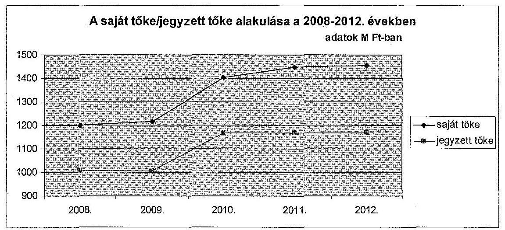
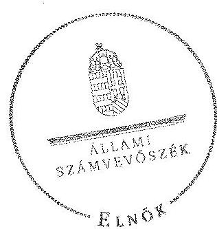
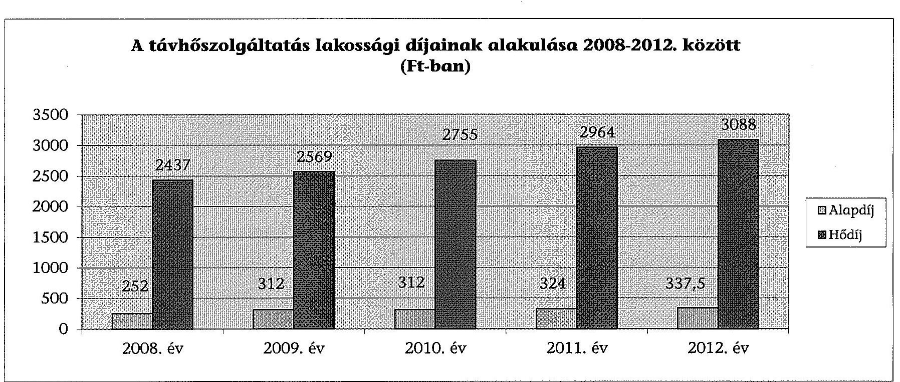

# ÁLLAMI   SZÁMVEVŐSZÉK 

## JELENTÉS

Az önkormányzatok gazdasági társaságai - Az önkormányzatok többségi tulajdonában lévő gazdasági társaságok közfeladat ellátását érintő gazdálkodási tevékenysége szabályszerűségének ellenőrzése Oroszlányi Szolgáltató Zrt.

---

# Állami Számvevőszék 

Iktatószám: V-0474-074/2014.
Témaszám: 1508
Vizsgálat-azonosító szám: V067124
Az ellenőrzést felügyelte:
Dr. Horváth Margit
felügyeleti vezető
Az ellenőrzést vezette és az ellenőrzés végrehajtásáért felelős:
Valastyánné dr. Vízhányó Júlia
ellenőrzésvezető
A jelentéstervezet összeállításában közremúködött:
Csényi István
számvevő tanácsos
Az ellenőrzést végezte:
Varga Magdolna
okleveles könyvvizsgáló
külső szakértő

---

# TARTALOMJEGYZÉK 

BEVEZETÉS ..... 5
I. ÖSSZEGZŐ MEGÁLLAPÍTÁSOK, KÖVETKEZTETÉSEK, JAVASLATOK ..... 8
II. RÉSZLETES MEGÁLLAPÍTÁSOK ..... 13

1. Az Önkormányzat közfeladat-ellátásának szabályszerűsége ..... 13
1.1. A közfeladat-ellátás megszervezése és a feladatellátás feltételrendszerének kialakítása ..... 13
1.2. A közfeladat-ellátás felügyelete és a tulajdonosi jogok érvényesítése ..... 15
2. Az OSZ Zrt. közfeladat ellátással kapcsolatos tevékenysége ..... 19
2.1. Az OSZ Zrt. gazdálkodásának szabályozottsága ..... 19
2.2. Az OSZ Zrt. vagyongazdálkodása ..... 20
2.3. A beszámolási kötelezettség teljesítése ..... 23
3. A távhőszolgáltatás közfeladata bevételei és ráfordításai elszámolásának és önköltségszámításának szabályszerűsége ..... 24
3.1. A távhőszolgáltatás közfeladat bevételeinek és ráfordításainak szabályszerűsége ..... 24
3.2. Az önköltségszámítás szabályszerűsége ..... 26

## MELLÉKLETEK

1. számú Az OSZ Zrt. tevékenységének főbb adatai
2. számú Az OSZ Zrt. múködésének főbb jellemzői
3. számú A távhőszolgáltatás lakossági díjainak alakulása 2008-2012. között

## FÜGGELÉKEK

1. számú Értelmező szótár
2. számú Mintavételi eljárások ellenőrzési területenként

---

- 
-

---

# RÖVIDÍTÉSEK JEGYZÉKE 

## Törvények

ÁSZ tv.
Ebktv.

Gt.

Kbt.

Ötv.

Ptk.

Számv. tv.

Tszt.

## Rendeletek

36/2009. (VII. 22.)
KHEM rendelet

Díjrendelet

SZMSZ
távhőszolgáltatási rendelet ${ }_{1}$
távhőszolgáltatási rendelet ${ }_{2}$
vagyongazdálkodási rendelet ${ }_{1}$
az Állami Számvevőszékről szóló 2011. évi LXVI. törvény (hatályos: 2011. július 1-jétől)
az egyenlő bánásmódról és az esélyegyenlőség előmozdításáról szóló 2003. évi CXXV. törvény (hatályos: 2004. január 27-étől)
a gazdasági társaságokról szóló 2006. évi IV. törvény (hatálytalan: 2014. március 15-étől)
a közbeszerzésekről szóló 1995. évi XL. törvény (hatályos: 1995. november 1-jétől 2004. április 30-áig)
a helyi önkormányzatokról szóló 1990. évi LXV. törvény (hatálytalan: a 2014. évi általános önkormányzati választások napjától)
a Polgári Törvénykönyvről szóló 1959. évi IV. törvény (hatálytalan: 2014. március 15-étől)
a számvitelről szóló 2000. évi C. törvény (hatályos: 2001. január 1-jétől)
a távhőszolgáltatásról szóló 2005. évi XVIII. törvény (hatályos: 2005. július 1-jétől)
a távhőszolgáltatás csatlakozási díjának és a lakossági távhőszolgáltatás díjának, valamint a hőenergia távhőtermelő és a távhőszolgáltató közötti szerződésében alkalmazott árának meghatározása során figyelembe veendő szempontokról és a Magyar Energia Hivatal által lefolytatott eljárásban kötelezően benyújtandó adatok köréről szóló 36/2009. (VII. 22.) KHEM rendelet
a távhőszolgáltatónak értékesített távhő árának, valamint a lakossági felhasználónak és a külön kezelt intézménynek nyújtott távhőszolgáltatás díjának megállapításáról szóló 50/2011. (IX. 30.) NFM rendelet
Oroszlány Város Önkormányzata Képviselő-testületének 18/2000. (X. 3.) számú rendelete az Önkormányzat Szervezeti és Múködési Szabályzatáról (hatályos: 2000. október 3-ától)
Oroszlány Város Önkormányzata Képviselő-testületének 44/2005. (XII. 28.) számú rendelete a távhőszolgáltatásról, valamint a távhőszolgáltatási díjak megállapításáról, és a díjalkalmazás feltételeiről (hatályos: 2012. március 15 -éig)
Oroszlány Város Önkormányzata Képviselő-testületének 7/2012. (III. 15.) számú rendelete a távhőszolgáltatásról (hatályos 2012. március 16-ától)
Oroszlány Város Önkormányzata Képviselő-testületének 3/2003. (III. 5.) számú rendelete az Önkormányzat va-

---

vagyongazdálkodási rendelet ${ }_{2}$

## Szórövidítések

áfa
Alapító Okirat
Alapszabály
árképzési szabályzat

ÁSZ
értékelési szabályzat

## FB

Igazgatóság
jegyzó $_{1}$
jegyzó $_{2}$
KEOP
Képviselö-testület
Közgyülés
közszolgáltatási szerződés
Magyar Energia Hivatal
OSZ Zrt.

Önkormányzat
polgármester
önköltség számítási szabályzat ${ }_{1}$
önköltség számítási szabályzat ${ }_{2}$
számlarend
számviteli politika
ügyvezetés
gyonáról és a vagyonnal kapcsolatos tulajdonosi jogok gyakorlásáról (hatályos: 2003. február 25-étől 2012. november 15 -éig)
Oroszlány Város Önkormányzata Képviselö-testületének 23/2012. (XI. 15.) számú rendelete az Önkormányzat vagyonáról és a vagyonnal kapcsolatos tulajdonosi jogok gyakorlásáról (hatályos: 2012. november 16-ától)
általános forgalmi adó
az OSZ Zrt. Alapító okirata
az OSZ Zrt. Alapszabálya
az OSZ Zrt. árképzési szabályzata (hatályos 2007. január 1-jétől)
Állami Számvevőszék
az OSZ Zrt. értékelési szabályzata (hatályos 2002. március 6 -ától)
az OSZ Zrt. Felügyelő Bizottsága
az OSZ Zrt. Igazgatósága
Oroszlány Város Önkormányzatának jegyzője 2010. december 14 -éig
Oroszlány Város Önkormányzatának jegyzője 2010. december 15 -étől
Környezet és Energia Operatív Program
Oroszlány Város Önkormányzatának Képviselő-testülete
az OSZ Zrt. közgyűlése
az Oroszlány Város Önkormányzata és az OSZ Zrt. által
2010. június 2-án megkötött Közszolgáltatási Szerződés

Magyar Energetikai és Közmú-szabályozási Hivatal
Oroszlányi Szolgáltató Zártkörűen Müködő Részvénytársaság (2002. november 26 -áig Oroszlányi Szolgáltató Részvénytársaság)
Oroszlány Város Önkormányzata
Oroszlány Város Önkormányzatának Polgármestere
az OSZ Zrt. önköltség számítási szabályzata (hatályos 2007. január 1-jétől)
az OSZ Zrt. önköltség számítási szabályzata (hatályos 2012. január 1-jétől)
az OSZ Zrt. számlarendje (hatályos 2003. január 1-jétől)
az OSZ Zrt. számviteli politikája (hatályos 2002. március 6 -ától)
az OSZ Zrt. ügyvezetése

---

# JELENTÉS 

## Az önkormányzatok gazdasági társaságai - Az önkormányzatok többségi tulajdonában lévő gazdasági társaságok közfeladat ellátását érintő gazdálkodási tevékenysége szabályszerűségének ellenőrzése Oroszlányi Szolgáltató Zrt.

## BEVEZETÉS

Az Állami Számvevőszék középtávra szóló stratégiájában megfogalmazta, hogy a helyi önkormányzatok gazdálkodásában rejlő pénzügyi kockázatok feltárásával, az államháztartáson kívülre nyújtott költségvetési támogatások és ingyenes vagyonjuttatások, valamint az államháztartáson kívül múködő köz-feladat-ellátó rendszerek ellenőrzéseivel hozzájárul ahhoz, hogy a közpénzeket az államháztartáson kívül múködő szervezetek is átlátható, rendezett módon használják fel a közfeladatok szerződésben vállalt ellátása érdekében.

Az önkormányzatok szervezetalakítási szabadságának következménye, hogy a korábban is vállalati formában működő (nagyvárosi tömegközlekedés, víz-, szennyvízcsatorna, köztisztasági, ingatlankezelés stb.) közszolgáltatások mellett, mind a kötelező, mind az önként vállalt feladatok ellátásában a gazdasági társaságok kiemelt fontosságú szerephez jutottak.

Oroszlány Város Képviselő-testülete az ellenőrzött időszak előtt (1992. évben) döntött a távhő közvagyonnak - amelynek értéke 170,0 M Ft volt - az Oroszlányi Távhő Kft.-be történő apportálásáról, majd 2001. évben a kft részvénytársasággá átalakításáról. Az OSZ Rt. - amelynek főtevékenysége „gőz-, melegvíz ellátás" volt - részvényeinek 100\%-a ebben az évben az Önkormányzat tulajdonába került. Ezzel egyidejűleg átértékelték a vagyont, és az OSZ Rt. alaptőkéje 754,0 M Ft-ra változott. 2002. évben a Képviselő-testület határozatával az OSZ Rt.-t a Vértesi Erőmú Rt.-vel közösen végrehajtott alaptőke emeléssel, zártkörűen működő részvénytársasággá alakította. Az OSZ Zrt. részvényeinek (1005,0 M Ft) 87,4\%-a az Önkormányzat, 12,6\%-a a Vértesi Erőmú Rt. tulajdonába került.

Az Önkormányzat 2010. évben újabb apport formájában megvalósuló tőkeemelést hajtott végre, amellyel az OSZ Zrt. alaptőkéje 1168,0 M Ft-ra emelkedett. Az alaptőke emelés után a részvények $89,1 \%$-a ( 1041,0 M Ft) az Önkormányzat, 10,9\%-a ( $127,0 \mathrm{M}$ Ft) a Vértesi Erőmú Rt. tulajdonába került. Az OSZ Zrt. az ellenőrzött időszakban kettő gazdasági társaságban - a Landford Ingatlanforgalmazó Kft.-ben, illetve a Létesítményeket Üzemeltető Nonprofit Kft.-ben

---

- rendelkezett többségi tulajdonú részesedéssel, melyből az első a 2012. évben beolvadt az OSZ Zrt.-be.

Az OSZ Zrt. tevékenységi körébe tartozott még a szennyvíz-, hulladékkezelés, köztisztasági szolgáltatás, vagyongazdálkodás is. Az Önkormányzat a szennyvízközmú kezelésére vonatkozóan az OSZ Zrt.-vel 2008. július 1-jétől vagyonkezelési szerződést kötött. Az OSZ Zrt. értékesítésének nettó árbevétele a 2008. évben 1709,1 M Ft, a 2012. évben 1916,5 M Ft volt, amelynek évente közel 60\%-a a távhőszolgáltatási tevékenységből származott. A társaság - a 2012. évben Oroszlány városban 4829 lakásban, 256 közületi helyen és 27 külön kezelt intézményben, Bokod községben 140 lakásban és 2 külön kezelt intézményben biztosította a távhőszolgáltatást. A távhőszolgáltatási közfeladat-ellátására az OSZ Zrt.-nél foglalkoztatottak átlagos statisztikai létszáma 2008. évben 36 fó, 2012. évben 37 fő volt. Az OSZ Zrt. az ellenőrzött időszakban a hőenergiát a Vértesi Erőmú Rt., illetve saját hőközpontjai által biztosította.

Az ellenőrzött időszakban a polgármester és a jegyző személye egy-egy alkalommal változott. A jelenlegi polgármester a 2010. évi önkormányzati választások óta tölti be tisztségét, a helyszíni ellenőrzés időszakában a munkakört betöltő jegyző 2010. december 15-étől látja el feladatait. Az OSZ Zrt. vezérigazgatójának személye egy alkalommal változott, a jelenlegi vezérigazgató 2011. január 1-jétől látja el feladatát.

Az önkormányzati tulajdonú gazdasági társaságok teljes körű ellenőrzésének lehetőségét az Állami Számvevőszékről szóló 1989. évi XXXVIII. törvény 2011. január 1-jétől hatályos módosítása teremtette meg.

Az ellenőrzés célja annak értékelése volt, hogy

- az önkormányzat a jogszabályi előírások figyelembevételével döntött-e az ellenőrzésre kerülő közfeladat megszervezéséről; az önkormányzat szabályszerűen gyakorolta-e a tulajdonosi jogokat;
- a gazdasági társaság közfeladat-ellátása bevételeinek, ráfordításainak elszámolása, és vagyongazdálkodási tevékenysége megfelelt-e a jogszabályi, illetve a közszolgáltatási szerződésben foglalt tulajdonosi előírásoknak, azok végrehajtása szabályszerű volt-e;
- a közfeladatok átláthatósága és elszámoltathatósága érdekében biztosítva volt-e a közszolgáltatás dijának megalapozottsága szabályszerű önköltségszámítással.

Az ellenőrzés kiterjedt Oroszlány Város Önkormányzatára és az Oroszlányi Szolgáltató Zártkörűen Múködő Részvénytársaságra

Az ellenőrzés várható hasznosulása: A törvényalkotás számára - az észlelt problémák, szabálytalanságok, vagy egyéb nem kívánatos jelenségek felszínre kerülésével - az ellenőrzés megállapításai segítséget nyújthatnak az államháztartáson kívüli közfeladat-ellátás értékeléséhez, jogszabályi keretei pontosításához, átláthatóságot biztosító szabályozásához. Meghatározhatóvá válnak a közfeladat ellátásban részt vevő államháztartáson kívüli szervezeteknek - az önkormányzat költségvetését, pénzügyi helyzetét is befolyásoló - kockáza-

---

tai, lehetővé válik ezen kockázatok csökkentése. A feladatot ellátó gazdasági társaság a közszolgáltatási szerződésben foglaltak betartásával, a közvagyon használatával biztosította-e a szolgáltatás folytatásának feltételeit. Ezzel az ellenőrzöttek és a helyi döntéshozók számára az ÁSZ visszajelzést ad feladatszervezési, feladat-ellátási kockázataikról, alapot ad a meglévő hibák megszüntetéséhez, a jobb közfeladat-ellátás biztosításához. Fokozza a fegyelmet, igazolja, hogy lejárt a következmények nélküli ellenőrzések időszaka. Az ÁSZ értékteremtő rend kialakításához és megőrzéséhez hozzájáruló tevékenysége pozitív hatással van a szervezetről kialakított összkép formálására is.

A bevételek és ráfordítások elszámolása, valamint a vagyonnyilvántartás terén az egyes területek szabályszerű működését mintavétellel ellenőriztük, ez alapján a sokaságokban előforduló hibás tételek arányát becsültük. A jogszabályoknak és a belső előírásoknak megfelelőnek, azaz szabályszerűnek tekintettük az adott bevételek és ráfordítások elszámolását, a vagyonnyilvántartást, amennyiben a minta ellenőrzésének eredménye alapján $95 \%$-os bizonyossággal a teljes sokaságban a hibás tételek aránya kisebb volt, mint $10 \%$, nem megfelelőnek értékeltük, ha a hibás tételek aránya a $10 \%$-ot meghaladta. Kockázatot, illetve magas kockázatot jeleztünk, amennyiben egy adott terület vonatkozásában a minta alapján a teljes sokaságban nem volt teljes körűen biztosított a jogszabályoknak és a belső szabályzatoknak megfelelő működés.

Az ellenőrzést a számvevőszéki ellenőrzés szakmai szabályai szerint, szabályszerűségi ellenőrzés módszerével, a nemzetközi standardok figyelembevételével végeztük. Az ellenőrzés a 2008-2012. évekre terjedt ki.

Az ellenőrzés végrehajtásának jogszabályi alapját az Állami Számvevőszékről szóló 2011. évi LXVI. törvény 5. § (3)-(5) bekezdése képezte.

A Jelentés tervezetét észrevételezésre megküldtük Oroszlány Város Önkormányzata polgármesterének, valamint a társaság vezérigazgatójának. Az érintettek észrevételt nem tettek.

---

# 1. ÖSSZEGZŐ MEGÁLLAPÍTÁSOK, KÖVETKEZTETÉSEK, JAVASLATOK 

Oroszlány Város távhőszolgáltatási közfeladatának ellátása az ellenőrzött időszakban az Önkormányzat többségi tulajdonában lévő OSZ Zrt. útján valósult meg. Az OSZ Zrt. alapítása, a távhőszolgáltatási közfeladat megszervezése a Gt. és az Ötv. előírásaiban foglaltak figyelembevételével történt, a társaság múködési engedély birtokában végezte távhőszolgáltatási tevékenységét. Alapító Okirata szerinti fő tevékenysége gőz- és melegvízellátás volt. A közfeladat ellátást szolgáló vagyon az OSZ Zrt. saját vagyona volt. Az Önkormányzat a távhőszolgáltatási feladatai maradéktalan végrehajtása érdekében - az ellenőrzött időszakot megelőzően, az 1992. évben - apportálta a távhő vagyont az OSZ Zrt.-be. A gazdasági társaságba apportált vagyonelemek körét és értékét az apportlista tartalmazta. Az OSZ Zrt. az ellenőrzött időszakban nyereségesen gazdálkodott.

Az Önkormányzat az ellenőrzött időszakban rendelkezett a 2007-2010. évekre, illetve a 2011-2014. évekre szóló gazdasági programokkal. A gazdasági programok tartalmaztak a távhőszolgáltatásra vonatkozó fejlesztési elképzeléseket.

Az Önkormányzat és az OSZ Zrt. által 2010. június 2-án megkötött közszolgáltatási szerződésben foglaltak szerint, a közszolgáltatás részletes feltételeit és a társaság kötelezettségeit a Tszt. és annak végrehajtásáról szóló kormányrendelet, továbbá a Képviselő-testület rendeletei határozták meg. A távhőszolgáltatás ellátásának ellenőrzésével kapcsolatban - a Tszt. előírásával összhangban - a közszolgáltatási szerződés kimondta, hogy a távhőszolgáltatással kapcsolatos kötelezettségek, valamint az üzletszabályzatban foglaltak teljesítésének ellenőrzése a jegyző feladata.

Az Önkormányzat a távhőszolgáltatásra vonatkozóan a Tszt. szerinti rendeletalkotási kötelezettségének eleget tett. A Képviselő-testület megalkotta az ellenőrzött időszakban hatályos vagyongazdálkodási és a távhőszolgáltatásról szóló rendeleteit. A távhőszolgáltatási rendelet ${ }_{1}$, illetve a távhőszolgáltatási rendelet ${ }_{2}$-t megfelelt a Tszt.-ben foglalt tartalmi követelményeknek.

Az ellenőrzött időszakban az Önkormányzat által alapított gazdasági társaságok feletti tulajdonosi jogokat a Gt.-ben meghatározott előírások szerint a Képviselő-testület szabályszerűen gyakorolta. Az Önkormányzat, mint tulajdonos képviseletében a polgármester járt el.

Az OSZ Zrt. az ellenőrzött időszakban minden évben elkészítette üzleti terveit. Az üzleti tervek tartalmazták a társaság fejlesztési terveit is. Az üzleti terveket minden esetben az Igazgatóság javaslatával terjesztették a Közgyűlés elé. A távhőszolgáltatás legmagasabb hatósági díjáról és a díjalkalmazás feltételeiről az Önkormányzat a távhőszolgáltatási rendelet ${ }_{1}$-ben döntött. A távhőszolgáltatási rendelet ${ }_{1}$-ben rögzítették azt az árképletet, amely alapján a távhőszolgáltatás aktuális árjavaslatát kidolgozták. A számításokkal alátá-

---

masztott javaslatot az OSZ Zrt. Igazgatósága terjesztette a Képviselő-testület elé, annak elfogadása, az alkalmazható díjtételek megállapítása a jogszabályi előírásoknak megfelelően, rendelettel történt.

Az Önkormányzat belső ellenőrzésének kockázatelemzése az OSZ Zrt. tevékenységére nem terjedt ki. Az ellenőrzött időszakban az OSZ Zrt-nél belső ellenőrzést, illetve külső szakértő által történő ellenőrzést nem végeztek. A jegyző ${ }_{1,2}$ a távhőszolgáltatással kapcsolatos, az Üzletszabályzatban foglalt kötelezettségek teljesítésének ellenőrzéséről - a Tszt.-ben és a közszolgáltatási szerződésben rögzített kötelezettsége ellenére- nem gondoskodott.

Az OSZ Zrt. az ellenőrzött időszak valamennyi évét nyereséggel zárta (a mérleg szerinti eredmény $2,5 \mathrm{M}$ Ft és $43,4 \mathrm{M}$ Ft között volt), így veszteség rendezésére nem volt szükség. Osztalék kifizetés - az ellenőrzéssel érintett öt év vonatkozásában - egy alkalommal, a 2008. évben történt 8,0 M Ft összegben. Az ellenőrzött időszakban a saját tőke/ jegyzett tőke Gt.-ben előírt szintjét biztosították.

Az OSZ Zrt. által az ellenőrzött időszakban megvalósított fejlesztésekhez az Önkormányzat részéről tulajdonosi kölcsön nem kapcsolódott. A fejlesztések megvalósítása érdekében az OSZ Zrt. által felvett hitelekhez, illetve a kapott EU-s támogatásokhoz az Önkormányzat négy alkalommal vállalt kezességet, öszszesen 500,8 M Ft összegben. Kezesség beváltásra nem került sor.

Az OSZ Zrt. gazdálkodásra vonatkozó szabályzatai megfeleltek a jogszabályi előírásoknak és az Önkormányzat által megfogalmazott követelményeknek. Az OSZ Zrt. a Számv. tv.-ben előírtaknak megfelelően a számviteli politikája keretében elkészítette a leltározási, az értékelési, a pénzkezelési és az önköltség számítási szabályzatát, valamint számlarendjét és azokat a jogszabályi változásoknak megfelelően aktualizálta. Az OSZ Zrt. a Tszt. 2012. január 1-jétől hatályos előírásának eleget téve, kialakította azokat a számviteli szétválasztási szabályokat, amelyek biztosítják az egyes tevékenységei elkülönített nyilvántartását, átláthatóságát és a diszkriminációmentességét, kizárják a keresztfinanszírozást és a versenytorzítást. A 2012. évi könyvvizsgálói záradékban a könyvvizsgáló nyilatkozott a szétválasztási szabály megfelelő alkalmazásáról.

Az OSZ Zrt. vagyongazdálkodási tevékenysége - beleértve a vagyon kezelését, gyarapítását, hasznosítását - összességében megfelelt a jogszabályi előírásoknak és a tulajdonos Önkormányzat által meghatározott követelményeknek.

Az OSZ Zrt. az ellenőrzött időszakban rendelkezett azokkal a belső szabályzatokkal, amelyek a követelés állományának kezelésére irányultak. Az ügyvezetés az igazgatósági és FB üléseken beszámolt a kintlévőségek alakulásáról. A lakossági tartozások annak ellenére növekvő tendenciát mutattak - a 2008. december 31-i 66,9 M Ft-ról 2012. december 31-ére 149,7 M Ft-ra nőttek -, hogy az OSZ Zrt. kiemelten foglalkozott a kintlévőségek behajtásával.

Az OSZ Zrt. ügyvezetése az ellenőrzött időszakban a közszolgálatási szerződésben előírtak szerint az igazgatósági és FB ülésen beszámolási kötelezettségeinek eleget tett.

---

Az OSZ Zrt. az ellenőrzött időszakban a számviteli politikájában, a Számv. tv.ben, valamint a közszolgáltatási szerződésben rögzítetteknek megfelelően minden évben elkészítette az éves beszámolóját. A 2008-2012. évek éves beszámolóiról az FB elkészítette az írásos jelentéseit, amelyekben azokat a Közgyűlés részére elfogadásra javasolta. A Közgyűlés az éves rendes közgyűlés keretében az FB javaslatára az éves beszámolókat a könyvvizsgálói záradékkal együtt jóváhagyta. A könyvvizsgáló a beszámolókat korlátozás nélküli hitelesítő záradékkal látta el. A beszámolókat a Számv. tv. előírásainak megfelelően letétbe helyezték.

A távhőszolgáltatás közfeladat bevételeinek és ráfordításainak elszámolása megfelelt a jogszabályi, illetve a közszolgáltatási szerződésben foglalt tulajdonosi elvárásoknak.

A gazdasági társaság bevételei elszámolása során az OSZ Zrt. szabályszerűen járt el. A bevételek előírása és kiszámlázása a belső szabályozásnak megfelelően történt, a bevételeket a megfelelő számlacsoportban számolták el. Az alkalmazott szolgáltatási díjak megfeleltek a belső szabályozásnak és a tulajdonosi követelményeknek.

A gazdasági társaság költségeinek és ráfordításainak elszámolása során az OSZ Zrt. szabályszerűen járt el. A költségelszámolást megalapozó kötelezettségvállalás, a költségek elszámolása a jogszabályi előírásoknak és a belső szabályozásnak megfelelően történt. A költségelszámolást megalapozó dokumentumok rendelkezésre álltak. A költségeket a megfelelő költségnemre számolták el.

Az OSZ Zrt. a beruházásainak, felújításainak elszámolása, nyilvántartása során szabályszerűen járt el. Az immateriális javak és tárgyi eszközök állománynövekedésének, valamint értékcsökkenésének elszámolása megfelelt a vonatkozó szabályozásnak. Az OSZ Zrt. a KEOP támogatással megvalósuló beruházásokat saját nevében és saját javára végezte, és a beruházás eredményeként létrejött eszközöket saját könyveiben aktiválta. A közfeladat-ellátást szolgáló vagyonnal kapcsolatos változásokat az ellenőrzött időszakban a főkönyvi nyilvántartásban elkülönítetten rögzítették. A főkönyvi nyilvántartások az OSZ Zrt. számlarendjének megfelelően kerültek kialakításra. A vagyonnyilvántartáson belül elkülöníthető volt a távhőszolgáltatási közfeladat ellátását biztosító eszközállomány és az azokra elszámolt értékcsökkenési leírás. A vagyonelemeket összesített kimutatásban, az azokban bekövetkezett változásokat a kiegészítő mellékletekben, üzletáganként részletesen bemutatták. Az OSZ Zrt. a vagyon megóvása érdekében - kimutatásai szerint - folyamatosan végzett felújítási, karbantartási munkákat mind a távhő vezeték, mind a hőközpontok és egyéb távhő vagyon esetében. A bekerülési érték meghatározása, az eszközök besorolása és nyilvántartása, valamint az értékcsökkenés elszámolása szabályos volt.

Az OSZ Zrt. Számv. tv. előírásainak megfelelően elkészített önköltség számítási szabályzata tartalmazta a közvetlen költségek meghatározásának kalkulációs szabályait. Az általános költségek meghatározott vetítési alapok szerint felosztásra kerültek. A közvetett költségek tartalmát az önköltség számítási szabályzatban tételesen rögzítették, rendelkeztek a költségfelosztás szabályairól, továbbá a 2012. január 1-jén hatályba lépett számviteli szétválasztási sza-

---

bályokról a Tszt. előírásának megfelelően. Az OSZ Zrt. a Tszt.-ben megfogalmazott alapelvek szerint elkészítette az árképzési szabályzatát. Az árképzési szabályzatban az OSZ Zrt. meghatározta az árképzés rendszerét, meghatározta az árképzés fogyasztói csoportjait, az általános költségek felosztásának az arányait. A díjak megállapítására vonatkozó javaslatokat az OSZ Zrt. Igazgatósága terjesztette a Képviselő-testület elé. A távhőszolgáltatás dijának megállapítása a Képviselő-testület által alkotott rendeletekkel történt. A közfeladatok átláthatósága és elszámoltathatósága érdekében a közszolgáltatás dijának megállapítása szabályszerű önköltségszámítással volt alátámasztva.

A fentiekben leírtak összegzéseként az alábbi megállapításokat tesszük:
A konstrukcióból eredő sajátosság az volt, hogy az Önkormányzat a távhőszolgáltatási feladatai maradéktalan végrehajtása érdekében - az ellenőrzött időszakot megelőzően - az OSZ Zrt.-be apportálta a távhő vagyont.

Az OSZ Zrt. az ellenőrzött időszakban elkészítette üzleti terveit, melyek tartalmazták a társaság fejlesztési terveit. Az OSZ Zrt. a 2008-2012. években nyereségesen gazdálkodott, a saját tőke/jegyzett tőke előírt szintjét biztosította.

Az OSZ Zrt. gazdálkodásra vonatkozó szabályzatai megfeleltek a jogszabályi előírásoknak és az Önkormányzat által megfogalmazott követelményeknek. A társaság kialakította azokat a számviteli szétválasztási szabályokat, amelyek biztosították az egyes tevékenységei elkülönített nyilvántartását, átláthatóságát. A 2012. évi könyvvizsgálói záradékban a könyvvizsgáló nyilatkozott a szétválasztási szabály megfelelő alkalmazásáról.

Müködési kockázatot jelentett, hogy a jegyzơ, ${ }_{1,2}$ az ellenőrzött időszakban a távhőszolgáltatással kapcsolatos, az Uzletszabályzatban foglalt kötelezettségek teljesítésének ellenőrzéséről nem gondoskodott.

Pénzügyi kockázat a kintlévőségek állományának növekedése miatt jelentkezett (az ellenőrzött időszakban több mint kétszeresére nőtt), annak ellenére, hogy az OSZ Zrt. ügyvezetése kiemelten foglalkozott azok behajtásával.

Az Állami Számvevőszékről szóló 2011. évi LXVI. törvény 33. § (1) bekezdésében foglaltak értelmében a jelentésben foglalt megállapításokhoz kapcsolódó intézkedési tervet köteles az ellenőrzött szervezet vezetője összeállítani, és azt a jelentés kézhezvételétől számított 30 napon belül az ÁSZ részére megküldeni. Amennyiben az intézkedési tervet határidőben nem küldi meg a szervezet, vagy az nem elfogadható, az ÁSZ elnöke a hivatkozott törvény 33. § (3) bekezdésében foglaltakat érvényesítheti.

---

Az ellenőrzés intézkedést igénylő megállapításai és javaslatai:
Javaslatunk célja az önkormányzat szabályszerű müködésének elősegítése, továbbá az önkormányzati tulajdonosi joggyakorlás kontrolljainak erősítése.

# Javasoljuk Oroszlány Város Önkormányzata jegyzőjének: 

1. A Társaság elkészítette a Tszt. 3. § v) pontja szerinti Üzletszabályzatát. Az ellenőrzött időszakban azonban a jegyző nem ellenőrizte a társaság távhőszolgáltató tevékenységét az üzletszabályzatában foglaltak betartása szempontjából, amely kötelezettséget számára a Tszt. 7. § (1) bekezdés c) pontja írta elő. A távhőszolgáltatás ellátásának ellenőrzésével kapcsolatban a közszolgáltatási szerződés 10. pontja is tartalmazott előírásokat. A szerződés 10.1. pontjában rögzítették, hogy a társaságnak a távhőszolgáltatással kapcsolatos kötelezettségei teljesítését feladatkörében a jegyző ellenőrzi. A 2008-2012. években a jegyző nem tett eleget a Tszt-ben és a közszolgáltatási szerződésben rögzített ellenőrzési kötelezettségének.

Az Önkormányzat belső ellenőrzése az ellenőrzéseivel a távhőszolgáltatás, mint köz-feladat-ellátás szabályszerű teljesítéséhez, valamint az önkormányzati vagyon megóvásához ellenőrzéseivel nem járult hozzá. Az ellenőrzött időszakban a társaság gazdálkodásával és müködésével kapcsolatban ellenőrzést nem folytatott le.

Javaslat:

## Gondoskodjon a jogszabályi előirások szerinti gyakorlat és szabályos müködés biztosításáról, ennek keretében:

a) rendszeresen ellenőrizze a társaság távhőszolgáltató tevékenységét a Tszt-ben, valamint a közszolgáltatási szerződésben előírt szempontok szerint.
b) fordítson kiemelt figyelmet arra, hogy az önkormányzat belső ellenőrzése az ellenőrzéseivel a távhőszolgáltatás, mint közfeladat-ellátás szabályszerű teljesítéséhez, valamint az önkormányzati vagyon megóvásához ellenőrzéseivel járuljon hozzá.

---

# II. RÉSZLETES MEGÁLLAPÍTÁSOK 

## 1. Az ÖNKORMÁNYZAT KÖZFELADAT-ELLÁTÁSÁNAK SZABÁLYSZERŰSÉGE

### 1.1. A közfeladat-ellátás megszervezése és a feladatellátás feltételrendszerének kialakítása

Az Önkormányzat az Ötv. 91. § (6) bekezdésében foglaltaknak megfelelően megalkotta a 2007-2010¹. és a 2011-2014². évekre szóló gazdasági programját, amelyekben meghatározta a távhőszolgáltatás biztosításához szükséges fejlesztési elképzeléseket.

A 2007-2010. évekre szóló gazdasági programban a távhőellátás kapcsán rögzítették, hogy a tartalékok jobb kihasználása érdekében az Önkormányzat felkérésére egy gazdasági társaság tanulmányt készített a távfütésbe bevont területek kibővítésére. A tanulmány az Óváros még ellátatlan épületeit, a Borbála telep sorházait és a Deák és Széchenyi utcákban lévő épületeket javasolta távhőenergiával ellátni. Az önkormányzati döntés az Óváros távhőellátását preferálta. Egyéb lakóterületi fejlesztések a Takács I. út, Tóparti lakóházak épületeit, továbbá az ipari területeket is távhővel javasolták ellátni, a meglévő gerincvezeték kapacitásáig. A gazdasági programban a fejlesztési elképzelések között jelölték meg a távhő hálózat fejlesztését, amelynek végrehajtását az Önkormányzat többségi tulajdonában lévő OSZ Zrt. valósította meg. A 2009. évben a távhő szektor energetikai korszerűsítésére került sor, a KEOP-2009-5.4. címú pályázaton nyert támogatás segítségével az OSZ Zrt. 330 M Ft + áfa összköltségủ beruházást hajtott végre, kialakítva 29 db fogyasztói hőközpontot.

A 2011-2014. évekre szóló gazdasági program 3. pontjában a fejlesztési elképzelések között 1. számú prioritásként szerepelt, hogy az OSZ Zrt. vonatkozásában egyeztetéseket szükséges lefolytatni új fűtőmú építéséről. Az új fűtőmú építésének várható költségét 7000-8000 M Ft-ra becsülték, de nem jelölték meg a fejlesztés forrásait. A gazdasági programban 3. számú prioritásként szerepelt az Óváros távhőellátásának bővítése és az ipari területek távhővel való ellátása, legalább a meglévő gerincvezeték kapacitásáig.

Az OSZ Zrt. 2008-2012. évi éves üzleti terveiben a gazdasági programok célkitűzéseivel összhangban szerepelt a távfűtés bővítése, elsősorban a régi városrészben. A közmúhálózat fejlesztését az OSZ Zrt. saját forrásból valósította meg, a belső hálózat kialakításának költségét az érintett lakástulajdonosok viselték. 2008-ban $55 \mathrm{db}, 2009$-ben $43 \mathrm{db}, 2010$-ben $11 \mathrm{db}, 2011$-ben $10 \mathrm{db}, 2012$-ben 32 db lakást kötöttek rá a közmúhálózatra, a gazdasági programokban felsorolt területeken.

[^0]
[^0]:    ${ }^{1}$ a Képviselő-testület 62/2007. (VI. 26.) számú határozatával
    ${ }^{2}$ a Képviselő-testület 77/2011. (VI. 1.) számú határozatával

---

A távhőszolgáltatással ellátott létesítmények távhőellátásának engedélyes vagy engedélyesek útján történő biztosítása - a Tszt. 6. § (1) bekezdése értelmében a területileg illetékes települési önkormányzat kötelező feladata. Az Önkormányzat SZMSZ-ében a távhőszolgáltatást, mint kötelezően ellátandó közfeladatot nem nevesítették, ellátásának módjáról nem rendelkeztek.

Az Ötv. 9. § (4) ${ }^{3}$ bekezdésében foglalt lehetőség alapján a közfeladat ellátása az ellenőrzött időszakban az Önkormányzat többségi tulajdonában lévő OSZ Zrt. útján valósult meg. Az OSZ Zrt. távhőszolgáltatói múködési engedély birtokában végezte tevékenységét.

Az OSZ Zrt. főbb adatait és működésének főbb jellemzőit az 1-2. számú mellékletek tartalmazzák.

Az Önkormányzat a távhőszolgáltatási feladatainak maradéktalan végrehajtása érdekében - az ellenőrzött időszakot megelőzően az 1992. évben - az akkor még kizárólagos tulajdonában lévő gazdasági társaságba apportálta a távhőszolgáltatást biztosító vagyont. A gazdasági társaságba apportált vagyonelemek körét és értékét az apportlista tartalmazta. Az Önkormányzat a távhő vagyonnal kapcsolatban leltározási és adatszolgáltatási kötelezettséget az OSZ Zrt. részére nem írt elő, mivel a vagyontárgyak az apportálást követően annak tulajdonát képezték. Az OSZ Zrt. vagyonának leltározását saját leltározási szabályzata szerint végezte.

A távhőszolgáltatási közfeladat ellátását szolgáló vagyon - alapításkor apportként juttatott vagyonként - az OSZ Zrt. saját vagyona volt. Az Önkormányzat és az OSZ Zrt. által 2010. június 2-án megkötött közszolgáltatási szerződést - annak 2.3 pontja értelmében - kizárólag a társaság „KEOP pályázatban elnyert támogatás nyújtására vonatkozó támogatási szerződés létrejötte és végrehajtása érdekében" kötötték meg, továbbá rögzítették, hogy „a közszolgáltatás ellátásához szükséges, a távhőszolgáltatást biztosító létesítmények, berendezések a Közszolgáltató tulajdonát képezik". A közszolgáltatási szerződés 3.1. pontjában foglaltak szerint a közszolgáltatás részletes feltételeit és a társaság kötelezettségeit a Tszt. és az annak végrehajtásáról szóló kormányrendelet, továbbá a távhőszolgáltatási rendelet ${ }_{1}$, valamint a tevékenység végzésére jogosító múködési engedély határozta meg.

Az Önkormányzat a közszolgáltatási szerződésben meghatározott adatszolgáltatási, tájékoztatási kötelezettségen kívül más - tulajdonosi elvárásként megfogalmazott - adatszolgáltatási, tájékoztatási kötelezettséget nem írt elő az OSZ Zrt.-nek.

A távhőszolgáltatás ellátásának ellenőrzésével kapcsolatban a közszolgáltatási szerződés 10. pontja tartalmazott előírásokat. A szerződés 10.1. pontjában - a Tszt. 7. § (1) bekezdés c) pontjában foglaltakkal összhangban - rögzítették, hogy a távhőszolgáltatással kapcsolatos kötelezettségek teljesítésének ellenőrzése a jegyző feladata, a 10.2. pontban pedig az ellenőrzésben való együttműködés szabályait határozták meg. A helyszíni ellenőrzéssel kapcsolat-

[^0]
[^0]:    ${ }^{3}$ hatályon kívül helyezve 2013. január 1-jétől

---

ban megállapodtak abban, hogy „arra kizárólag - jogszabályokban elôirt jogosultságok gyakorlása, kötelezettségek teljesitése esetén ésszerü időpontban meghatározott - elözetesen egyeztetett időpontban kerülhet sor, és a helyszini ellenőrzés az indokolt és szükséges mértéket meghaladóan nem zavarhatja a közszolgáltatási tevékenység Közszolgáltató általi ellátását". A közszolgáltatási szerződés előírta, hogy az OSZ Zrt. legalább kétévente köteles a közszolgáltatással összefüggő, reprezentatív mintán alapuló ügyfél elégedettségi felmérést végezni és az annak eredményéről készült jelentést/összegzést, illetve az ügyfél-elégedettség növelése érdekében esetlegesen készült intézkedési tervet az Önkormányzat rendelkezésére bocsátani, melynek az ellenőrzött időszakban eleget tettek.

Az Önkormányzat a távhőszolgáltatásra vonatkozóan a Tszt. 6. § (2) bekezdés szerinti rendeletalkotási kötelezettségének eleget tett. A Képviselőtestület megalkotta az ellenőrzött időszakban hatályos vagyongazdálkodási rendelet ${ }_{1,3}$-t és távhőszolgáltatási rendelet ${ }_{1,3}$-t.

Az Önkormányzat a távhőszolgáltatási rendelet ${ }_{1}$-ben - amelyet az ellenőrzött időszakban nyolcszor módosítottak - a Tszt. előírásainak megfelelően rögzítette a távhőszolgáltató és a felhasználó közötti jogviszony részletes szabályait, a hőmennyiség mérésére vonatkozó előírásokat, a távhőszolgáltatás ár- és díjrendszerét, a dijivisszatérítésre, szabálytalan vételezésre, a szolgáltatás szünetelésére és korlátozására vonatkozó előírásokat, a csatlakozási díj megállapítására vonatkozó előírásokat, valamint a szolgáltatói hőközpontok megszüntetésére vonatkozó szabályokat. A rendelet tartalmazta továbbá azon területek kijelölését, ahol területfejlesztési, környezetvédelmi és levegőtisztaság-védelmi szempontok alapján célszerű a távhőszolgáltatás fejlesztése. A rendelet melléklete tartalmazta a konkrét alapdíjat és hődijat, a csatlakozási díjat, a fejlesztési díjat, valamint azt az árképletet, amellyel megtörtént a szolgáltatási díj kiszámítása. A Képviselő-testület a 2012. évben új rendeletet alkotott (távhőszolgáltatási rendelet ${ }_{2}$ ), amely tartalmazta a Tszt. által előírt valamennyi rendelkezést.

A távhőszolgáltatási rendelet ${ }_{2}$ meghatározta a díjalkalmazás feltételeit, ideértve a csatlakozási díjra vonatkozó szabályozást is. A csatlakozási díjra vonatkozó szabályozást és annak mértékét a rendeletben közzétették. Az ellenőrzött időszakban a 2008. január 1-jétől hatályos csatlakozási díj mértékek voltak érvényben, változtatási kérelemmel nem fordultak a Magyar Energia Hivatalhoz.

# 1.2. A közfeladat-ellátás felügyelete és a tulajdonosi jogok érvényesítése 

Az ellenőrzött időszakban az Önkormányzat által alapított gazdasági társaságok feletti tulajdonosi jogokat a Gt.-ben meghatározott előírások szerint, szabályszerűen a Képviselö-testület gyakorolta. Az Önkormányzat, mint tulajdonos képviseletében a polgármester járt el.

Az OSZ Zrt. Alapszabálya, illetve a társaság Közgyűlése által elfogadott szervezeti és működési szabályzata tartalmazta mindazokat a jogosítványokat, amelyek a Közgyűlés kizárólagos hatáskörébe és azokat, amelyek az Igazgatóság, illetőleg a FB hatáskörébe tartoztak. Az Alapszabály szerint a Közgyűlés kizárólagos döntési hatáskörébe tartozott az Igazgatóság és az FB tagjainak, vala-

---

mint a vezérigazgatónak és a könyvvizsgálónak a megválasztása, visszahívása, valamint díjazásuk megállapítása. Az ellenőrzött időszakban az Alapszabály módosítása, a vezérigazgató, az Igazgatóság, valamint az FB visszahívása, új vezérigazgató, illetve igazgatósági és FB tagok megválasztása, díjazásuk megállapítása a Képviselő-testület jóváhagyásával történt. A Képviselő-testület felhatalmazta a polgármestert, hogy az OSZ Zrt. Közgyűlésén az Önkormányzatot, mint tulajdonost képviselje, szavazatával támogassa.

Az Igazgatóság hatáskörébe tartoztak az OSZ Zrt. gazdálkodásának irányítása, gondoskodás a Számv. tv. szerinti beszámoló elkészítéséről, és javaslat az eredmény felosztására, továbbá mindazon feladatok ellátása, amelyet jogszabály vagy az Alapszabály a hatáskörébe utalt.

Az FB a 2008-2010. években három taggal, 2011. január 1-jétől öt taggal múködött, feladata az OSZ Zrt. ügyvezetésének ellenőrzése volt. Az FB feladatának megfelelően áttekintette az ellenőrzött időszak üzleti éveinek beszámolóit és elkészítette az azzal kapcsolatos jelentéseit, rendszeresen ellenőrizte az OSZ Zrt. múködését (a kintlévőségek alakulását, a belső ellenőri jelentéseket, a szolgáltatói hőközpontok szétválasztásával kapcsolatos pénzügyi elszámolást, stb.) és tapasztalatairól jelentést készített a tulajdonosok részére.

Az Önkormányzat az ellenőrzött időszakban mindenkori polgármesterén kívül a tulajdonosi joggyakorlási jogosítványait más személy, illetve társaság számára nem adta át.

A Képviselő-testület a 229/2012. (XII. 21.) számú határozatában kijelölte azokat a jogköröket, amelyekben a döntés jogát átruházta a polgármesterre. Ezek közé tartozott a számviteli beszámoló és az üzleti terv elfogadása, az OSZ Zrt. szervezeti és múködési, valamint javadalmazási szabályzatának elfogadása.

Az OSZ Zrt. az ellenőrzött időszakban évente elkészítette az üzleti tervét, melyek tartalmazták a fejlesztési terveket is. Az üzleti terveket minden esetben az Igazgatóság javaslatával terjesztették a Közgyűlés elé. A 2008-2012. években az Önkormányzat nevében a tulajdonosi jogokat képviselő polgármester részt vett a Közgyűléseken és a fejlesztési tervet is tartalmazó üzleti terveket elfogadta. Az üzleti terv végrehajtását a tulajdonosok az előző évről szóló beszámoló elfogadásakor értékelték.

Az OSZ Zrt. anyagi érdekeltségi rendszerét a Közgyűlés által elfogadott javadalmazási szabályzat tartalmazta. A szabályzat szerint prémiumra a vezérigazgató akkor volt jogosult, ha az OSZ Zrt. teljesítette az üzleti tervben előírt nyereséget, teljesítette a fejlesztési tervben foglaltakat, a hitelállománya nem emelkedett az üzleti tervben meghatározott mérték fölé. A szabályzat szerint prémiumként maximum az éves alapbér $90 \%$-át lehetett a vezérigazgatónak kifizetni. A prémiumfeltételeket - a szabályzattal összhangban - minden évben a Közgyűlés határozta meg. A vezérigazgató minden évben teljesítette a prémiumfeltételeket, annak végrehajtását 2008-tól 2010-ig az Igazgatóság, ezt követően a Közgyűlés ellenőrizte és engedélyezte a kifizetést. Az ellenőrzött időszak minden évében prémiumként az éves alapbér $50 \%$-át engedélyezték a vezérigazgató részére kifizetni, amelynek összege 2008-ban 3,5 M Ft Ft, 2009-ben 3,7 M Ft, 2010-ben 3,9 M Ft, 2011-ben 4,0 M Ft, 2012-ben 4,2 M Ft volt.

---

Az Önkormányzat a távhőszolgáltatási rendelet ${ }_{1}$-ben döntött a távhőszolgáltatás legmagasabb hatósági díjáról és a díjalkalmazás feltételeiről. A távhőszolgáltatási rendelet ${ }_{1} 1$. számú mellékletében rögzítették azt az árképletet, amely alapján a távhőszolgáltatás aktuális árjavaslatát kidolgozták. Az árképlet meghatározta az ár nyereség tartalmát, mely a távhőszolgáltatási rendelet ${ }_{1} 9 . \S$-a szerint maximum $8 \%$-os eszközarányos nyereség lehetett. A számításokkal alátámasztott javaslatot az OSZ Zrt. Igazgatósága terjesztette a Képviselő-testület elé, annak elfogadása, az alkalmazható díjtételek megállapítása a jogszabályi előírásoknak megfelelően, önkormányzati rendelettel történt. A távhőszolgáltatási rendelet ${ }_{1}$ megfelelt a Tszt. előírásainak.
2011. április 15 -től már nem az Önkormányzat, hanem az energiapolitikáért felelős miniszter állapítja meg a legmagasabb hatósági díjat.

A Képviselő-testület által a távhőszolgáltatási rendelet ${ }_{1,2} 1$. számú mellékletében a távhőszolgáltatás legmagasabb áraként a lakossági fütés és használati melegvíz vonatkozásában megállapított díjakat a 3. számú melléklet tartalmazza.

Az OSZ Zrt. és az Önkormányzat által 2010. június 2-án aláírt közszolgáltatási szerződés 7.4. c) pontja értelmében a „Közszolgáltató minden tárgyévet követő év május 31. napjáig köteles az előző évi gazdálkodásáról részletes beszámolót készíteni, amely a számviteli törvényben elöírtak mellett, a Közszolgáltató számviteli politikájában meghatározottaknak megfelelően, elkülönítetten tartalmazza a tárgyévben realizált, a közszolgáltatás ellátásához, illetve az egyéb tevékenységekhez kapcsolódó bevételeket, közvetlen költségeket és ráfordításokat, a müködtetés általános költségeit és ráfordításait és az egyes tevékenységek eredményét. A tényadatok alapján Közszolgáltató köteles bemutatni a tervtől való eltéréseket és azok okait".

Az Önkormányzat belső ellenőrzésének kockázatelemzése az OSZ Zrt. tevékenységére nem terjedt ki. Az ellenőrzött időszakban az Osz Zrt.-nél belső ellenőrzést, illetve külső szakértő által történő ellenőrzést nem végeztek. A jegyzö ${ }_{1,2}$ a távhőszolgáltatással kapcsolatos, az Üzletszabályzatban foglalt kötelezettségek teljesítésének ellenőrzéséről - a Tszt. 7. § (1) bekezdés c) pontjában és a közszolgáltatási szerződésben rögzített kötelezettsége ellenére - nem gondoskodott.

Az OSZ Zrt. saját tőkéje az ellenőrzött időszak minden évében növekedett, a tőkeszerkezet miatt nem volt szükség a Gt. 51. § (1) ${ }^{4}$ bekezdésében foglaltak szerinti intézkedésre.

[^0]
[^0]:    ${ }^{4}$ hatályon kívül helyezve 2014. március 15-étől

---

A saját tőke/jegyzett tőke alakulását a következő diagram szemlélteti:

Az OSZ Zrt. az ellenőrzött időszak valamennyi évét nyereséggel zárta (a mérleg szerinti eredmény $2,5 \mathrm{M}$ Ft és $43,4 \mathrm{M}$ Ft között volt), így veszteség rendezésére nem került sor. Osztalékot - az ellenőrzéssel érintett öt év vonatkozásában - csak egyszer, a 2008. évben fizettek 8,0 M Ft összegben. Az Önkormányzat részére tulajdoni arányának megfelelően $7,0 \mathrm{M}$ Ft került kifizetésre. Az ellenőrzött időszakban a saját tőke/jegyzett tőke Gt.-ben elôirt szintjét biztosították. A saját tőke/ jegyzett tőke arány 2008-ban 119\%, 2009-ben $121 \%$, 2010-ben $120 \%, 2011$-ben $124 \%, 2012$-ben $124 \%$ volt.

Az OSZ Zrt. által az ellenőrzött időszakban megvalósított fejlesztésekhez az Önkormányzat részéről tulajdonosi kölcsön nem kapcsolódott. A fejlesztések megvalósítása érdekében felvett hitelekhez, illetve a kapott EU-s támogatásokhoz az Önkormányzat kezességet vállalt. Kezesség beváltásra nem került sor.

A Képviselő testület a 20/2006. (II. 28.) számú határozatával döntött az OSZ Zrt. és a Raiffeisen Bank Zrt. között létrejött, a hőközpont szétválasztása I. ütemének megvalósítása tárgyú, 151,1 M Ft összegű, 2016. április 30 -ai lejáratú kölcsönszerződéshez kapcsolódó készfizető kezesség vállalásáról.

Az Önkormányzat a Képviselő-testület 65/2010. (V. 12.) számú határozata alapján - a KEOP-5.4.0/09-2009-0004 jelű pályázat megvalósításához, a közszolgáltatás elvégzése érdekében - készfizető kezességvállalásról döntött. A készfizető kezességvállalás egyrészt a projekthez szükséges önerőt biztosító, beruházási hitelfelvétel tárgyú, az OSZ Zrt. és a Raiffeisen Bank Zrt. között létrejött 175,0 M Ft összegű, 2018. december 31-ei lejáratú kölcsönszerződéshez, másrészt a projekt megvalósításához szükséges biztosítékadási kötelezettség teljesítése céljából az OSZ Zrt. és a Raiffeisen Bank Zrt. között létrejött 174,7 M Ft összegű, a projekt fizikai megvalósítását követő öt éves időtartamra szóló, 2015. december 31-ei lejáratú bankgarancia-szerződéshez kapcsolódott. A hitel visszafizetésének forrása a lakosság által fizetett fejlesztési dijhányad, amelyet a Képviselő testület a 37/2009. (XII. 31.) számú rendeletével, $5.6 \mathrm{Ft} / \mathrm{Im}^{2} /$ hó összegben rendelt megfizetni mindaddig, amíg a fejlesztési hitel visszafizetésre nem kerül.

A Raiffeisen Bank által nyújtott - az Önkormányzat készfizető kezesség vállalásával biztosított - 175,0 M Ft összegű hitelből az OSZ Zrt. 107,4 M Ft-ot előtörlesz-

---

tett, amely a K\&H banktól felvett kedvezőbb kamatozású, 2016. június 1-jén lejáró hitel igénybevételével történt. A kölcsönszerződéshez kapcsolódóan az Önkormányzat ugyancsak készízető kezességet vállalt.

Az Önkormányzat az ellenőrzött időszakban az OSZ Zrt.-nek múködési és felhalmozási célú pénzeszközt nem adott át.

# 2. Az OSZ ZRT. KÖZFELADAT ELLÁTÁSSAL KAPCSOLATOS TEVÉKENYSÉGE 

### 2.1. Az OSZ Zrt. gazdálkodásának szabályozottsága

Az OSZ Zrt. az ellenőrzött időszak éveiben a műszaki és anyagi lehetőségei, és a likvid forrásainak függvényében, a menedzsment és az Igazgatóság elvárásai alapján elkészítette az üzleti terveit.

Az üzleti tervek tartalmazták a társaság fejlesztési terveit, az üzletágankénti tervezett eredmény kimutatását - a távhőszolgáltatási üzletág tervezett eredmény kimutatását is - valamint a cash-flow tervet. Az üzleti terveket az Igazgatóság és a Közgyűlés - amelyeknek tagja volt az Önkormányzat képviselője is - határozattal fogadta el. A távhőszolgáltatási üzletág terve kitért a szolgáltatás ellátás részleteire, így a várható változásokra, javítási és hibaelhárítási munkákra, átalánydíjas üzemeltetési és karbantartási munkákra, jelentősebb karbantartási munkákra, szerelőipari vállalkozásokra és jelentősebb távvezeték- és berendezés cserékre. Kiemelten kezeltték a távhőszolgáltatási üzletág alaptevékenységének (távhő- és melegvíz-szolgáltatás) főbb műszaki jellemzőit. Bemutatásra kerültek a fútési költségeket nagymértékben befolyásoló tényezők, úgymint a várható külső hőmérséklet és fűtött napok száma. Részletesen megtervezték a következő években várható hőteljesítményeket, a hő- és villamos energia, valamint hidegvíz felhasználás mennyiségi és értékadatait. Ugyancsak részletesen kerültek kimunkálásra a távhőszolgáltatási üzletág alaptevékenységének ráfordításaihoz kapcsolódó árbevételek is.

Az OSZ Zrt. üzleti tervei és az Önkormányzat gazdasági programjaiban a távhőszolgáltatásra vonatkozó tervek összhangban voltak.

Az OSZ Zrt. a Számv. tv. 14. § (5) bekezdésében előírtaknak megfelelően a számviteli politikája keretében elkészítette a leltározási, az értékelési, a pénzkezelési és az önköltség számítási szabályzatát, valamint a Számv. tv. 161. § szerinti számlarendjét, és azokat a jogszabályi változásoknak megfelelően aktualizálta az ellenőrzött időszakban.

Az OSZ Zrt. eleget tett a Tszt. 18/A. § (2) bekezdésben foglalt előírásnak, amely szerint 2012. január 1-jétől az engedélyes köteles olyan számviteli szétválasztási szabályokat kidolgozni, és az egyes tevékenységeire olyan elkülönült nyilvántartást vezetni, amely biztosítja az egyes tevékenységek átláthatóságát és a diszkriminációmentességet, kizárja a keresztfinanszírozást és a versenytorzítást. A 2012. évi könyvvizsgálói záradékban a könyvvizsgáló nyilatkozott a szétválasztási szabály megfelelő alkalmazásáról.

A leltározási szabályzat egységesen vonatkozott minden üzletágra. A szabályzat előírta, hogy a vagyonkezelésbe átvett szennyvízközmű vagyon - mely

---

a távhőszolgáltatási tevékenységet nem érintette - és a saját vagyon leltározását és a leltárak kiértékelését elkülönítetten kell elvégezni.

Az OSZ Zrt. eszközeinek és forrásainak értékelési szabályzatát a jogszabályi változásoknak megfelelően az ellenőrzött időszak alatt többször módosították. A szabályzat kitért valamennyi eszköz - köztük a követelések - és forrás értékelésének szabályaira. Az OSZ Zrt. a Számvt. tv. előírásainak megfelelően elkészítette önköltség számítási szabályzatát, mely kitért a távhő- és szennyvízkezelési üzletágra is.

Az Osz Zrt. a Tszt. 53. § alapján elkészítette Üzletszabályzatát, amit az Önkormányzat jegyzője a Tszt. 7. § (1) bekezdés b) pontjában foglaltaknak megfelelően jóváhagyott.

Az OSZ Zrt. belső szabályzataiban, számviteli politikájában, számlarendjében, számlatükrében egyértelműen előírta a közfeladat ellátással kapcsolatos elszámolások, bevételek, ráfordítások elkülönített nyilvántartását.

# 2.2. Az OSZ Zrt. vagyongazdálkodása 

A közfeladat-ellátást szolgáló vagyonnal kapcsolatos változások az ellenőrzött időszakban elkülönített főkönyvi nyilvántartásban kerültek rögzítésre. A főkönyvi nyilvántartásokat az OSZ Zrt. a számlarendjének megfelelően alakította ki. A vagyonelemek nyilvántartása elkülönítetten történt. Az immateriális javak és tárgyi eszközök nyilvántartása analitikus nyilvántartás keretében, egyedi nyilvántartó-kartonokon történt, amelyeken folyamatosan nyomon követhetők voltak az eszközök bruttó értékében és értékcsökkenési leírásában történő változások. Az ellenőrzött időszakban a mérleget a Számv. tv. 69. § (1) bekezdésében foglaltaknak megfelelően elkészített leltárral támasztották alá. A vagyonnyilvántartáson belül elkülönítetten szerepelt a távhőszolgáltatási közfeladat ellátását biztosító eszközállomány és az azokra elszámolt értékcsökkenési leírás. Az éves beszámolók kiegészítő mellékletében a vagyonelemeket összesített kimutatásban, az azokban bekövetkezett változásokat üzletáganként részletesen bemutatták. Az OSZ Zrt. a vagyon megóvása érdekében folyamatosan elvégezte a felújítási, karbantartási munkákat mind a távhő vezeték, mind a hőközpontok és egyéb távhő vagyon esetében.

Az OSZ Zrt. vagyongazdálkodási tevékenysége - beleértve a vagyon kezelését, gyarapítását, hasznosítását - összességében megfelelt a jogszabályi előírásoknak és a tulajdonos Önkormányzat által meghatározott követelményeknek.

---

Az OSZ Zrt. vagyoni helyzetét jellemző, főbb könyvviteli mérleg szerinti adatok 2008. január 1. és 2012. december 31. között az alábbiak voltak:

| Megnevezés | 2008.01.01 | 2008.12.31 | 2009.12.31 | 2010.12.31 | 2011.12.31 | 2012.12.31 |
| :--: | :--: | :--: | :--: | :--: | :--: | :--: |
| Befektetett eszközök | 1645709 | 3328520 | 3310897 | 3836425 | 3689839 | 3815198 |
| ebből: tárgyi eszközök | 1593245 | 3262961 | 3221597 | 3754865 | 3613756 | 3772819 |
| Fomóeszközök | 460086 | 487463 | 519969 | 642157 | 548509 | 437696 |
| elbő́l: követelések | 188091 | 328909 | 393404 | 489210 | 397191 | 240947 |
| Aktív időbeli elhatárolások | 64590 | 67064 | 56787 | 87625 | 58180 | 76517 |
| ESZKOZOK ÖSSZESEN | 2170385 | 3883047 | 3887653 | 4566207 | 4296528 | 4329411 |
| Saját tőke | 1197642 | 1200185 | 1214767 | 1404736 | 1448140 | 1453625 |
| ebből: mérleg szerinti eredmény | 16861 | 2543 | 14582 | 26969 | 43404 | 28503 |
| Céltartalékok | 9291 | 3221 | 599 | 0 | 6663 | 11426 |
| Kötelezettségek | 696847 | 2375950 | 2383509 | 2851146 | 2528041 | 2486438 |
| Passztív időbeli elhatárolások | 266605 | 303691 | 288778 | 310325 | 313684 | 377922 |
| FORRASOK ÖSSZESEN | 2170385 | 3883047 | 3887653 | 4566207 | 4296528 | 4329411 |

Az OSZ Zrt. összes eszközállományának 2008. január 1-je és 2012. december 31-e közötti, 2,2 M Ft-os emelkedését döntően a befektetett eszközök, ezen belül a tárgyi eszközök állománya növekedésének és az elszámolt értékcsökkenésnek együttes hatása eredményezte. A követelések állománya 2008-tól 2010-ig minden évben meghaladta az előző évit, 2011-ben az előző évhez viszonyítva 18,8\%-kal ( $92,0 \mathrm{M}$ Ft-tal), 2012-ben $39,3 \%$-kal ( $156,2 \mathrm{M}$ Ft-tal) csökkent a behajtási tevékenység hatékonyabb múködése következtében. A kötelezettségek állományának alakulása hasonló tendenciát mutat a követelések állományának alakulásával. A kötelezettségek 2008. január 1-jei 696,8 M Ft-os állománya a 2012. év végére 2486,4 M Ft-ra növekedett.

Az összes eszközállományon belül a feladatellátás tárgyi eszköz eszközigényessége miatt a befektetett eszközök aránya volt meghatározó, a 2008. évben $85,7 \%$, a 2012 . évben $88,1 \%$ volt. A tárgyi eszközök 2008. január 1-jei állományának 2008. december 31-ére történő 1669,7 M Ft-os növekményének legjelentősebb tétele az Önkormányzat tulajdonában lévő szennyvízvagyon vagyonkezelésbe vételéből ( $1605,5 \mathrm{M}$ Ft) ered. A 2008. december 31-i nettó tárgyi eszköz állomány ( $3263,0 \mathrm{MFt}$ ) 2012. december 31-ére 15,6\%-kal (3772,8 M Ftra) növekedett a végrehajtott beruházások és az értékcsökkenés elszámolások hatására. A távhőszolgáltatási tevékenységet szolgáló tárgyi eszközök értéke 2012. december 31-én 1499,8 M Ft volt, mely az összes tárgyi eszköz 39,8\%-a.

A mérleg szerinti eredmény a 2012. évig évről-évre folyamatosan nőtt, de 2012-ben az előző évihez viszonyítva $34,3 \%$-os ( $14,9 \mathrm{M}$ Ft-os) csökkenés következett be. Az OSZ Zrt. az 51/2011. (IX. 30.) NFM rendelet alapján 2012. évben 5241,0 M Ft távhőszolgáltatási támogatásban részesült.

Az OSZ Zrt. az ellenőrzött időszakban rendelkezett azokkal a belső szabályzatokkal (méltányossági ügyek szabályzata, értékelési szabályzat), amelyek a követelés állományának kezelésére irányultak, közüzemi számlázó rendszere, va-

---

lamint a főkönyvi nyilvántartás pénzügyi modulja ügyfelenként, számlánként és jogerősség szerint nyilvántartotta a követelés állományt.

A belső szabályzatok alapján az OSZ Zrt. rendelkezett az értékvesztés elszámolásának módjáról. Az ellenőrzött évek alatt nem változott a 200 e Ft alatti és feletti követelések értékvesztésének elszámolására vonatkozó szabályozás, módosultak viszont az egyedi értékvesztések elszámolásának az elvei. Ezek a módosítások minden évben az értékelési szabályzatban rögzítésre kerültek. Az egyedi elbírálások szabályozása különösen a már a bírósági eljárással érintett követelésekre alkalmazandó értékvesztések elszámolását érintette. Az OSZ Zrt. a 200000 Ft alatti követeléseire egységesen „korcsoportonként" ( $90,180,365$ nap) megállapított ( 2,5 , $15 \%$-os) értékvesztést számolt el. Az ennél magasabb összegű kintlévőségeket ügyfelenként, egyedileg értékelte. A behajthatatlan követelések leírását minden esetben dokumentumokkal, a bírósági eljárás szakaszának megfelelő dokumentációval alátámasztották, ami az értékelési szabályzatban rögzítetteknek megfelelően történt.

A OSZ Zrt. meghatározta a végrehajtással, bírósági eljárással érintett, valamint a behajtónak átadott ügyek kapcsán a követendő eljárást, előirták, hogy a díjhátralék alakulását folyamatosan figyelemmel kellett kísérni. Rendelkeztek arról, hogy az OSZ Zrt. egyes alkalmazottainak mire terjed ki hatásköre a hátralék beszedésével kapcsolatosan, továbbá, hogy a tartozás „stádiuma" szerint (újonnan keletkezett hátralék, megállapodás, behajtónak átadott, bírósági stádiumban lévő) miként kellett eljárni a hátralék kezelését illetően.

A követelés állomány kezelésére alkalmazott eljárások megfeleltek a Számv. tv-ben, valamint az OSZ Zrt. belső szabályzataiban rögzítetteknek.

Az ügyvezetés az igazgatósági és FB üléseken beszámolt a kintlévőségek alakulásáról. Tekintettel arra, hogy a lakossági hátralékok kezelése jelentette a nagyobb problémát (ennek növekedése a jellemző), a beszámolókban a lakossági hátralékok alakulásáról, továbbá az előző beszámoló óta eltelt időszak alatt a behajtás érdekében tett cselekményekről (díjbehajtónak, bíróságnak átadott ügyek mennyisége és összege) is beszámoltak. A beszámolók tartalmazták a lakossági fogyasztók hátralékának összeghatárok szerinti kimutatását is.

Az OSZ Zrt. közüzemi kintlévőségei a lakossági fogyasztók vonatkozásában az ellenőrzött időszakban a következő táblázatban foglaltak szerint alakultak:

Adatok: ezer Ft-ban

| Megnevezés | 2008.12.31. | 2009.12.31. | 2010.12.31. | 2011.12.31. | 2012.12.31. |
| :-- | --: | :--: | :--: | :--: | :--: |
| 50 ezer Ft alatti | 15250 | 26741 | 25756 | 31313 | 21730 |
| 50-100 ezer Ft közötti | 10120 | 13057 | 13785 | 16206 | 12140 |
| 100-200 ezer Ft közötti | 11350 | 16859 | 19645 | 19213 | 21342 |
| 200-300 ezer Ft közötti | 12510 | 13687 | 19812 | 17773 | 16961 |
| 300-500 ezer Ft közötti | 9850 | 14918 | 21957 | 24823 | 26134 |
| 500 ezer Ft feletti | 7804 | 13657 | 27035 | 28531 | 51362 |
| Összesen: | $\mathbf{6 6 8 8 4}$ | $\mathbf{9 8 9 1 9}$ | $\mathbf{1 2 7 9 9 0}$ | $\mathbf{1 3 7 8 5 9}$ | $\mathbf{1 4 9 6 6 9}$ |

---

A lakossági tartozások annak ellenére növekvő tendenciát mutattak, hogy az OSZ Zrt. kiemelten foglalkozott a kintlévőségek behajtásával. A kintlévőségek kezelésének hatékonysága a 0,3 M Ft-nál kisebb összeggel tartozó adósok esetében volt érzékelhető a 2012. év végére, főként a részletfizetési konstrukciónak köszönhetően.

A hátrálékos ügyfelek részére részletfizetési megállapodás megkötését ajánlották fel, melynek lehetőségével főleg a $0,3 \mathrm{M}$ Ft alatti összeggel tartozók éltek.

Az OSZ Zrt. a díjhátralékokról kéthavonta kimutatást készített, melyet átadott a követelés kezelőnek, aki intézkedett a bírósági eljárás megindításáról. A díjhátralék behajtására az OSZ Zrt. - belső eljárásrendje által szabályozottak szerint - behajtó társaságot bízhatott meg.

Az OSZ Zrt. az ellenőrzött években az értékelési szabályzatában rögzített elveknek és eljárásoknak megfelelően értékelte a lejárt követelések állományát, és a lejárt vevő követeléseire 2008-ban 1,3 M Ft, 2009-ben 6,0 M Ft, 2010-ben 25,8 M Ft, 2011-ben 17,1 M Ft, 2012-ben 34,8 M Ft értékvesztést számolt el.

Az értékvesztés számviteli elszámolása az értékelési szabályzat előírásainak megfelelően történt, a főkönyvi nyilvántartásba az érvényes számlarendben és számlatükörben meghatározott főkönyvi számlákra került rögzítésre.

# 2.3. A beszámolási kötelezettség teljesítése 

Az OSZ Zrt. az ellenőrzött időszakban a beszámolási kötelezettségének a tulajdonosi előírásoknak megfelelően tett eleget. A beszámolók a Számv. tv.-ben előírtak mellett, az OSZ Zrt. számviteli politikájában meghatározottaknak megfelelően elkülönítetten tartalmazták a tárgyévben realizált, a közszolgáltatás ellátásához, illetve az egyéb tevékenységekhez kapcsolódó bevételeket, közvetlen költségeket és ráfordításokat, a múködtetés általános költségeit és ráfordításait és az egyes tevékenységek eredményét.

Az ügyvezetés az OSZ Zrt. controlling szabályzata előírásainak megfelelően beszámolt az igazgatósági és FB üléseken a társaság vagyoni helyzetéről, az ügyvezetésről és az üzletpolitikáról, az aktuális pénzügyi helyzetről, hitelállományról, kintlévőségekről, a fejlesztések aktuális helyzetéről és a befektetések állapotáról. Az ügyvezetés a beszámolási kötelezettségeinek eleget tett. A beszámolókban részletezték a vevőcsoportonkénti kintlévőségeket és beszámoltak az előző beszámoló óta eltelt időszak alatt a behajtás érdekében tett cselekményekről (behajtásra átadott ügyek mennyisége és összege) is. A beszámolók tartalmazták a lakossági fogyasztók hátralékának összeghatárok szerinti, valamint az aktuális szállítói kötelezettségek bemutatását, továbbá a felvett hitelekről, a hitelállomány alakulásáról és az előző beszámoló óta eltelt időszak alatti fejlesztésekről készített kimutatásokat.

A Tszt. 6. § (2) bekezdés b) pontja szerint az Önkormányzat rendeletben határozza meg a távhőszolgáltatási csatlakozási díjat, a díjfizetés feltételeit. Az OSZ Zrt. a díjfizetés szakmai megalapozásához kapcsolódó előterjesztéseket az ellenőrzött időszak minden évében határidőben elkészítette, és az előírt adattartalommal az Önkormányzat rendelkezésére bocsátotta.

---

Az OSZ Zrt. a Magyar Energia Hivatal felé történő adatszolgáltatási kötelezettségének az ellenőrzött időszak alatt eleget tett.

Az OSZ Zrt. az ellenőrzött időszakban a számvitel politikájában rögzítetteknek megfelelően minden évben elkészítette az éves beszámolóját.

A 2008-2012. évek éves beszámolóiról az FB a Gt. 35. § (3) ${ }^{5}$ bekezdése szerint elkészítette az írásos jelentését és a Közgyűlés részére elfogadásra javasolta. A Közgyűlés a társaság Alapszabályának, valamint a Gt. 231. § (2) bekezdés e) pontja ${ }^{6}$ előírásainak megfelelően az éves rendes közgyűlés keretében az FB javaslatára az éves beszámolókat a könyvvizsgálói záradékkal együtt jóváhagyta. A könyvvizsgáló a 2012. évi beszámolót elfogadó jelentésében - a Tszt. 18/B. § (1) bekezdésében foglalt kötelezettségének eleget téve - igazolta, hogy az OSZ Zrt. által alkalmazott számviteli szétválasztási szabályok, valamint az egyes tevékenységek közötti tranzakciók árazása biztosították a vállalkozás tevékenységei közötti keresztfinanszírozás-mentességet. A beszámolókat a Számv. tv. 153. § (1) bekezdésében előírt határidőben letétbe helyezték.

Az ellenőrzött időszak alatt az OSZ Zrt. a közvagyonnal kapcsolatos adatok védelmére vonatkozó feladatait a „bizonylati rendjének és alkalmazott bizonylatainak" szabályzatában és „a közérdekú adatok közzétételére és megismerésére irányuló igények teljesitésének rendjére vonatkozó" szabályzatában határozta meg. A bizonylati szabályzatban rögzítették a számviteli bizonylatokra vonatkozó előírásokat. A szabályzatot 2012. január 1-jei hatállyal kiegészítették az elektronikus formában kiállított bizonylatok digitális formában történő archiválásának szabályaival. A 2012. június 15 -én hatályba helyezett, a közérdekú adatok közzétételére és megismerésére irányuló igények teljesítésének rendjére vonatkozó szabályzat (ezt megelőzően a társaság nem rendelkezett ilyen szabályzattal) előírásai kiterjedtek az OSZ Zrt. kezelésében lévő közérdekú adatokra, közérdekből nyilvános adatokra, valamint az OSZ Zrt. munkavállalóinak közérdekből nyilvános adataira. A szabályzatban rendelkeztek arról, hogy a közérdekű adatok elektronikusan a társaság honlapján (www.oszzrt.hu) kerülnek közzétételre. Az OSZ Zrt. a szabályzat előírásainak megfelelően járt el.

# 3. A TÁVHŐSZOLGÁltATÁs KÖZFELADATA BEVÉTELEI ÉS RÁFORDÍTÁSAI ELSZÁMOLÁSÁNAK ÉS ÖNKÖLTSÉGSZÁMÍTÁSÁNAK SZABÁLYSZERŰSÉGE 

### 3.1. A távhőszolgáltatás közfeladat bevételeinek és ráfordításainak szabályszerűsége

Az ellenőrzött időszakban az OSZ Zrt. belső szabályzataiban - a számlarendben, számlatükörben, illetve az önköltség számítási szabályzatban - egyértelműen meghatározta a közfeladatok ráfordításainak és bevételeinek elhatároláshoz szükséges előírásokat.

[^0]
[^0]:    ${ }^{5}$ hatályon kívül helyezve 2014. március 15-étől
    ${ }^{6}$ hatályon kívül helyezve 2014. március 15-étől

---

A távhőszolgáltatási közfeladat bevételeinek elszámolása során az OSZ Zrt. szabályszerűen járt el. A bevételek előírása és kiszámlázása a belső szabályozásnak megfelelően történt, a bevételeket a megfelelő számlacsoportban számolták el. Az alkalmazott szolgáltatási díjak megfeleltek a belső szabályozásnak és a tulajdonosi követelményeknek.

Az OSZ Zrt. a távhőszolgáltatási közfeladat ráfordításainak elszámolása során szabályszerűen járt el. A költségek elszámolása a jogszabályi előírásoknak és a belső szabályozásnak megfelelően történt. A költségelszámolást megalapozó dokumentumok rendelkezésre álltak. A költségeket a megfelelő költségnemre, közfeladatra számolták el.

Az OSZ Zrt. beruházásainak, felújításainak elszámolása, nyilvántartása során szabályszerűen járt el. Az immateriális-, és tárgyi eszközök állománynövekedésének, valamint értékcsökkenésének elszámolása megfelelt a vonatkozó szabályozásnak. A beszerzett eszközök állományba vétele, üzembe helyezése megtörtént. A bekerülési érték meghatározása, az eszközök besorolása és nyilvántartása, valamint az értékcsökkenés elszámolása szabályos volt.

Az értékcsökkenési leírás elszámolásának módját, az amortizációs politikát a számviteli politikában és az annak részét képező értékelési szabályzatban határozták meg. Az OSZ Zrt. az értékcsökkenést a már rendeltetésszerűen használatba vett és üzembe helyezett immateriális javak és tárgyi eszközök után számolta el. A tervszerinti értékcsökkenést a maradványértékkel csökkentett bekerülési érték után határozták meg. Az immateriális javakról, tárgyi eszközökről egyedi analitikus nyilvántartó kartont vezettek. A bekerülési értéket az értékelési szabályzat 3. pontjában rögzítetteknek megfelelően határozták meg, amely összhangban volt a Számv. tv. 47. § (4) bekezdés, valamint az 51. § (1) bekezdés előírásaival. Az OSZ Zrt. amortizációs politikáját 2012. január 1-jei hatállyal kiegészítették a terven felüli értékcsökkenés beruházásokra történő elszámolásának lehetőségével.

Az OSZ Zrt. az ellenőrzött időszakban az éves beszámolók kiegészítő mellékletében részletesen bemutatta az elszámolt értékcsökkenést. A beszámolókban a távhőszolgáltatás tárgyi eszközeiben bekövetkezett változások, mint saját vagyon változásai kerültek bemutatásra.

Az OSZ Zrt. által ellenőrzött időszakban, a távhő vagyon kapcsán elszámolt értékcsökkenést és beruházásainak összegét a következő táblázat szemlélteti:

| Év | Elszámolt értékcsökkenés   összege (ezer Ft) | Beruházás összege   (ezer Ft) |
| :--: | :--: | :--: |
| $\mathbf{2 0 0 8 .}$ | 110994 | 47328 |
| $\mathbf{2 0 0 9 .}$ | 113132 | 78420 |
| $\mathbf{2 0 1 0 .}$ | 121184 | 348827 |
| $\mathbf{2 0 1 1 .}$ | 144364 | 9174 |
| $\mathbf{2 0 1 2 .}$ | 137609 | 156275 |
| Összesen | $\mathbf{6 2 7 2 8 3}$ | $\mathbf{6 4 0 0 2 4}$ |

---

Az Önkormányzat a távhőszolgáltatási rendelet ${ }_{1}$-ben a távhőszolgáltatással kapcsolatban előírta a hőközpontok szétválasztását. Ezt a feladatot az OSZ Zrt. két ütemben valósította meg, a 2007. évben valósult meg a hőközpontok szétválasztása I. ütem, a 2010. évben a II. ütem. Ez magyarázza a beruházásra fordított összeg 2010. évi kiugróan magas értékét. A 2012. évi magasabb beruházási összeg okai között szerepel, hogy a társaság nagyobb vezeték szakaszt cserélt, több komplett lakossági hőközpont cseréjére került sor, valamint nagy volumenű hőmennyiségmérő hitelesítési ideje lejárt, amelyek szintén cserére szorultak.

# 3.2. Az önköltségszámítás szabályszerűsége 

Az OSZ Zrt. az ellenőrzött időszakban a Számv. tv. 14. § (5) bekezdés c) pontja előírásai alapján kötelezett volt önköltség számítási szabályzat készítésére, amely kötelezettségnek eleget tett. Az Önkormányzat az önköltség számítási szabályzattal kapcsolatosan elvárásokat nem fogalmazott meg és a szabályzatot nem értékelte. A szabályzatban meghatározták mely üzletágakra kell az önköltséget megállapítani. Az önköltség számítás módszere utókalkulációval történt, ami megfelelt a Számv. tv. 14. § (7) bekezdésében foglaltaknak.

Az önköltségszámítási szabályzatban kijelölésre kerültek a kalkulációs egységek, a távhőszolgáltatásnál alapdíj és hődíj, továbbá - mivel a társaság két településen végezett távhőszolgáltatást - meghatározásra kerültek település szinten a további kalkulációs egységek is. Oroszlány város vonatkozásában lakossági vevő, egyéb vevő, üzemi vevő, valamint a különkezelt intézmények, Bokod község esetében lakosságí vevő és egyéb vevők kalkulációs egységeket határoztak meg. A szabályzatban meghatározták a kalkulációs egységek költségtényezőit, szabályozták, és elkülönítették a közvetlen, szűkített és a teljes költségek körét. A szabályzat tartalmazta a közvetlen költségek meghatározásának kalkulációs sémáját. Az általános költségek között mutatták ki a felmerüléskor a tevékenységre közvetlenül el nem számolható (közvetett) költségeket, amelyek meghatározott vetítési alapok szerint felosztásra kerültek.

A közvetett költségek tartalmát az önköltség számítási szabályzatban tételesen rögzítették, rendelkeztek a költségfelosztás szabályairól, továbbá a 2012. január 1-jén életbe lépett számviteli szétválasztási szabályokról a Tszt. 18/A. § (2) bekezdésének előírása alapján. Az önköltség számítási szabályzat tartalmazta továbbá az önköltségszámítás készítésének az időpontját és időszakát. Meghatározta az egyeztetés módját a főkönyvi könyveléssel és az üzemi nyilvántartásokkal, továbbá a kalkuláció készítéséért felelős személyt, valamint az önköltség számítási szabályzat elkészítéséért, módosításáért, és kiegészítéséért felelős személyt.

A 2007. január 1-jétől hatályos árképzési szabályzatban az OSZ Zrt. meghatározta az árképzés rendszerét, meghatározta az árképzés fogyasztói csoportjait, az általános költségek felosztásának az arányait. A 2012. évben a Díjrendelet szerinti árakat alkalmazták. Az árképzésre vonatkozó gyakorlat megfelelt az OSZ Zrt. önköltség számítási szabályzatában foglaltaknak, valamint az Számv. tv. önköltségszámításra vonatkozó előírásainak. A díjak megállapítására vonatkozó javaslatokat az OSZ Zrt. Igazgatósága terjesztette a Képviselőtestület elé. Az előterjesztések alapdíjra és hődíjra vonatkoztak, ezen belül megbontva lakossági, üzemi és egyéb fogyasztókra. A távhőszolgáltatás díjá-

---

nak megállapítása a Képviselő-testület által alkotott rendeletekkel történt. Az OSZ Zrt. az ellenőrzött időszakban a távhőszolgáltatással kapcsolatban az alapdíjat és a hődíjat, a kijelölt kalkulációs egységeknél az önköltséget az önköltség számítási szabályzat előírásai szerint állapította meg.

Budapest, 2015. jüutés hó 13 .nap

Melléklet: $\quad 3 \mathrm{db}$
Függelék: $\quad 2 \mathrm{db}$

Domokos László
elnök

---

$$
\because
$$

---

# Az Oroszlányi Szolgáltató Zrt. tevékenységének főbb adatai

|  Sorszám | Megnevezés | 2008. | 2009. | 2010. | 2011. | 2012.  |
| --- | --- | --- | --- | --- | --- | --- |
|  1. | A gazdasági társaság székhelye | 2840 Oroszlány, Bánki Donát u. 2. |  |  |  |   |
|  2. | adószáma | 12794726-2-11 |  |  |  |   |
|  3. | alapításának éve | 2001.12 .21 |  |  |  |   |
|  4. | A gazdasági társaság többségi tulajdonú leányvállalatainak száma (db) | 2 | 2 | 2 | 2 | 1  |
|  5. | A gazdasági társaság leányvállalataiban való részesedésének mértéke (\%) | 200 | 200 | 200 | 200 | 100  |
|  6. | Az önkormányzat számára (megbízásából, koncessziós, közszolgáltatási, vagy egyéb szerződéses jogviszony alapján) ellátott közfeladatok szakági besorolása: |  |  |  |  |   |
|  7. | Egészségügy |  |  |  |  |   |
|  8. | Kultúra és sport |  |  |  |  |   |
|  9. | Település üzemeltetés, ezen belül: |  |  |  |  |   |
|  10. | köztemető üzemeltetés |  |  |  |  |   |
|  11. | kéményseprés |  |  |  |  |   |
|  12. | helyi közutak fejlesztése, fenntartása és üzemeltetése |  |  |  |  |   |
|  13. | parkok és egyéb közterület fenntartás |  |  |  |  |   |
|  14. | közterületi parkolás |  |  |  |  |   |
|  15. | Lakás és helységgazdálkodás |  |  |  |  |   |
|  16. | Víz és csatorna közmú-szolgáltatás | X | X | X | X | X  |
|  17. | Hulladékkezelés- szállítás | X | X | X | X | X  |
|  18. | Távhő- és energiaszolgáltatás | X | X | X | X | X  |
|  19. | Helyi közösségi közlekedés |  |  |  |  |   |
|  20. | Vagyongazdálkodás | X | X | X | X | X  |
|  21. | Pénzügyi gazdasági szolgáltatás |  |  |  |  |   |
|  22. | Egyéb: Köztisztasági szolgáltatás | X | X | X | X | X  |
|  23. | A közfeladatellátására a gazdasági társaságnál alkalmazottak éves átlagos statisztikai létszáma (fő) | 36 | 35 | 34 | 33 | 37  |

---

# Az Oroszlányi Szolgáltató Zrt. müködésének főbb jellemzői

|  Sors
zám | Megnevezés |  | 2008. | 2009. | 2010. | 2011. | 2012.  |
| --- | --- | --- | --- | --- | --- | --- | --- |
|  1. | A gazdasági társaság cégformája |  |  | Zártkörűen Müködő Részvénytársaság |  |  |   |
|  2. | A gazdasági társaság tulajdonosi összetétele: |  |  |  |  |  |   |
|   | Önkormányzat megnevezése: |  |  | Oroszlány Város Önkormányzata |  |  |   |
|  3. | Önkormányzat tulajdoni részesedésének arány | $\%$ | 87,36 | 87,36 | 89,13 | 89,13 | 89,13  |
|  4. | Önkormányzat tulajdoni részesedésének összege | ezer Ft | 877 968,0 | 877 968,0 | 1041 000,0 | 1041 000,0 | 1041 000,0  |
|   | Más önkormányzatok, többcélú társulás megnevezése: |  |  |  |  |  |   |
|  5. | Más önkormányzatok, többcélú társulások tulajdoni részesedésének arány | $\%$ | 0,0 | 0,0 | 0,0 | 0,0 | 0,0  |
|  6. | Más önkormányzatok, többcélú társulások tulajdoni részesedésének összege | ezer Ft | 0,0 | 0,0 | 0,0 | 0,0 | 0,0  |
|   | Gazdasági társaság megnevezése: |  |  | Vértesi Erőmú Rt. |  |  |   |
|  7. | Gazdasági társaságok tulajdoni részesedés arány | $\%$ | 12,64 | 12,64 | 10,87 | 10,87 | 10,87  |
|  8. | Gazdasági társaságok tulajdoni részesedés összege | ezer Ft | 127 032,0 | 127 032,0 | 127 000,0 | 127 000,0 | 127 000,0  |
|   | Egyéb tulajdonos megnevezése: |  |  |  |  |  |   |
|  9. | Egyéb tulajdonosok tulajdoni részesedés arány | $\%$ | 0,0 | 0,0 | 0,0 | 0,0 | 0,0  |
|  10. | Egyéb tulajdonosok tulajdoni részesedés összege | ezer Ft | 0,0 | 0,0 | 0,0 | 0,0 | 0,0  |
|  12. | A tárgyévben a gazdasági társaság vagyonkezelésben lévő önkormányzati vagyon után elszámolt értékcsökkenés összege (ezer Ft) |  | 53 120,6 | 106 701,0 | 111 336,7 | 116 750,8 | 119 452,4  |
|  13. | A tárgyévben az önkormányzati tulajdonú, gazdasági társaság által kezelt eszközök pótlására (karbantartás, felújítás, beruházás) elszámolt kiadás (ezer Ft) |  | 139 873,2 | 141 912,4 | 93 809,4 | 115 419,4 | 118 476,5  |
|  14. | A tárgyévben a gazdasági társaság saját vagyona után elszámolt értékcsökkenés összege (ezer Ft) |  | 141 529,7 | 146 992,3 | 153 276,5 | 177 931,1 | 167 777,2  |
|  15. | A tárgyévben a saját tulajdonú eszközök pótlására (karbantartás, felújítás, beruházás) elszámolt kiadás (ezer Ft) |  | 482 417,8 | 615 977,1 | 892 158,5 | 258 029,6 | 534 500,3  |

---

# A távhőszolgáltatás lakossági díjainak alakulása 2008-2012. között (Ft-ban)

---

.

---

# ÉRTELMEZŐ SZÓTÁR 

garancia
gazdasági társaság
gazdálkodó szervezet
keresztfinanszírozás tilalma
kezesség

A garancia olyan önálló, az önkormányzat nevében vállalt kötelezettség, amely alapján az önkormányzat az önkormányzati költségvetés terhére szerződésben meghatározott feltételek szerint, a kötelezett nem teljesítése esetén a jogosultnak fizetést teljesít az előzetesen rögzített összeghatárig.
A Gt. 3. § (1) bekezdése szerint „gazdasági társaságot üzletszerü közös gazdasági tevékenység folytatására külföldi és belföldi természetes és jogi személyek, valamint jogi személyiség nélküli gazdasági társaságok alapithatnak, müködő társaságba tagként beléphetnek, társasági részesedést (részvényt) szerezhetnek."
A Ptk. 685. § c) pontja szerint gazdálkodó szervezet: „az állami vállalat, az egyéb állami gazdálkodó szerv, a szövetkezet, a lakásszövetkezet, az európai szövetkezet, a gazdasági társaság, az európai részvénytársaság, az egyesülés, az európai gazdasági egyesülés, az európai területi együttmüködési csoportosulás, az egyes jogi személyek vállalata, a leányvállalat, a vízgazdálkodási társulat, az erdő birtokossági társulat, a végrehajtói iroda, az egyéni cég, továbbá az egyéni vállalkozó."
A közszolgáltatás diját úgy kell megállapítani, hogy az maradéktalanul fedezetet nyújtson a közszolgáltatás indokolt költségeire és ráfordításaira, valamint a közszolgáltató e tevékenységével kapcsolatos ésszerü nyereségére; az ésszerú nyereség nem tartalmazhatja a közszolgáltatáson kívül eső egyéb gazdasági tevékenységei költségeinek, ráfordításainak fedezetét.
A kezességre vonatkozó előírásokat a Ptk. 272-276. §-ai tartalmazzák. A kezesség a polgári jogban a szerződést biztosító járulékos mellékkötelezettség, amely egy másik kötelem teljesítését biztosítja azáltal, hogy a kezes a főadós nem teljesítése esetére kötelezettséget vállal a főadósi kötelem teljesítésére. A kezes tehát a főadóshoz képest járulékos adós. A kezesség kiterjed az elvállalása utáni mellékszolgáltatásokra, ha a kezes ezek kikötéséről tudott.
A Ptk. szerint kezességet csak írásban lehet vállalni. Lényeges, hogy a kezesség mindig az alapügylet hitelezője és a kezes közötti ingyenes szerződéssel jön létre. A kezesség a különböző hitelfelvételekhez kapcsolódóan a hitel visszafizetésének biztosítékaként jöhet szóba. Az adós helyett nemfizetés esetén a kezes felel, ő tartozik fizetni. Az egyszerú kezesség esetén előbb az adóson kell behajtani a tartozást, s ha ez sikertelen, akkor lehet a kezesŐl követelni a fizetést. Készfizető kezesség esetében a fizetést

---

# közfeladat 

közszolgáltatás
elmulasztó adós helyett rögtön a kezesen követelhetik a tartozást. Ha bank vállalja a kezességet, akkor az minden esetben készfizetői kezesség.
Jogszabályban meghatározott állami vagy önkormányzati feladat, amit az arra kötelezett közérdekből, jogszabályban meghatározott követelményeknek és feltételeknek megfelelve végez, ideértve a lakosság közszolgáltatásokkal való ellátását, továbbá az állam nemzetközi szerződésekben vállalt kötelezettségeiből adódó közérdekú feladatokat, valamint e feladatok ellátásához szükséges infrastruktúra biztosítását is (Nvtv. 3. § (1) bekezdés 7. pont).

A közszolgáltatás: „közcélú, illetőleg közérdekú szolgáltatást jelent, amely egy nagyobb közösség (állam, település) minden tagjára nézve megközelítóleg azonos feltételek mellett vehető igénybe, ezért valamilyen mértékig közösségi megszervezést, illetve szabályozást, ellenőrzést igényel." Az Ebktv. 3. § d) pontja a következőképpen határozza meg a közszolgáltatást: „szerződéskötési kötelezettség alapján a lakosság alapvető szükségleteinek ellátására irányuló szolgáltatás, így különösen a villamos energia-, gáz-, hő-, víz-, szennyvíz- és hulladékkezelési, köztisztasági, postai és távközlési szolgáltatás, továbbá a menetrend alapján közlekedő jármüvekkel végzett közforgalmú személyszállitás"

---

nemzeti vagyon

Az Nvtv. 1. § (2) bekezdése szerint:
„az állam vagy a helyi önkormányzat kizárólagos tulajdonában álló dolgok,
az a) pont hatálya alá nem tartozó, állam vagy a helyi önkormányzat tulajdonában lévő dolog,
az állam vagy a helyi önkormányzatot tulajdonában lévő pénzügyi eszközök, továbbá az államot vagy a helyi önkormányzatot megillető társasági részesedések,
az államot vagy a helyi önkormányzatot megillető bármely vagyoni értékkel rendelkező jogosultság, amelyet jogszabály vagyoni értékú jogként nevesít,
Magyarország határa által körbezárt terület feletti légtér, az üvegházhatású gázok kibocsátási egységeinek kereskedelméról szóló törvény szerint kibocsátási egység és légiközlekedési kibocsátási egység, valamint az ENSZ Éghajlat változási Keretegyezménye és annak Kiotói Jegyzökönyve végrehajtási keretrendszeréról szóló törvény szerinti kiotói egység, állami vagy helyi önkormányzati fenntartású közgyűjtemény (muzeális intézmény, levéltár, közgyűjteményként müködő kép- és hangarchívum, valamint könyvtár) saját gyüjteményében nyilvántartott kulturális javak körébe tartozó dolog, a régészeti lelet,
a nemzeti adatvagyon körébe tartozó állami nyilvántartások fokozottabb védelméről szóló törvény szerinti nemzeti adatvagyon." (hatályos 2012. január 1-jétől, a g) pont módosult 2012. június 30 -ától)
tulajdonosi joggyakorló

Aki a nemzeti vagyon felett az államot vagy a helyi önkormányzatot megillető tulajdonosi jogok és kötelezettségek összességének gyakorlására jogosult (Nvtv. 3. § (1) bekezdés 17. pont).

---

.

---

2.SZÁMÓ FÜGGELEK A V-0474-074/2014. SZÁMÓ JELENTÉSÍTÉZ

# Mintavételi eljárások ellenőrzési területenként

|  Szz. | Mintavétellel ellenőrzendő területek | Főbb kérdés | Ellenőrzési kérdések | Adatforrások | Alapsokaság | Mintavételi eljárás  |
| --- | --- | --- | --- | --- | --- | --- |
|  1. | 2. | 3. | 4. | 5. | 6. |   |
|  1. | Az ellátott közfeladat ráfordításainak elkülönített, szabályszerű elszámolása területén |  |  |  |  |   |
|  2. | Anyagjellegű ráfordítások | Az anyagjellegű ráfordítások elszámolása során betartották-e a belső szabályzatokban és a jogszabályokban foglaltakat és azokat a közfeladat- ellátással kapcsolatosan elkülönítették-e? | - a számházott anyagjellegű ráfordításokra kötött szerződésnél betartották-e az Számv.tv. előírását, a kifizetés megelőzően a kötelezettségvállalás megfelel-e az előírásoknak?
- a beszerzett anyagok nyilvántartásba vétele megtörtént-e, azokat a közfeladat-ellátással kapcsolatosan elkülönítették-e a szabályozásnak megfelelően?
- a készlet bekerülési értékét a Számv. tv., a számviteli politika, illetve az értékelési szabályzat előírásai szerint vették-e számításba, azokat a közfeladat-ellátással kapcsolatosan elkülönítették-e?
- az anyagjellegű ráfordításokat a megfelelő költségnemre, illetve közfeladatra számolták-e el? | Az anyagjellegű ráfordítások közül az 51-53. főkönyi számlacsoportokból vett minta esetében - a költségelszámolást megalapozó dokumentumok (szerződések, megrendelések, stb.), költségelszámoláshoz benyújtott számlák, teljesítés megtörténtét, a kifizetést alátámasztó egyéb dokumentumok, - analitikus nyilvántartások, anyagok nyilvántartásba vételét igazoló dokumentumok, ha a számviteli politika szerint nyilvántartásba kellett venni azokat. | Évente a főkönyvi adatbázisból - külön rész sokaságot képeznek az 51-53. Anyagjellegű ráfordítások számlacsoportba a tartozó ráfordítások, kivéve az ELABÉ és az ehadott közvetített szolgáltatások értéke. | A mintavételi megelőzően a sokaságból ki kell emelni - tételes ellenőrzésre - évente a 3-5 legnagyobb összegű tételt mindkét csoportból. Egyszerű véletlen mintavétel évenként és csoportonként elemszámmal arányos rétegzéssel. |   |
|  3. | Beruházások, felújítások aktiválása és értékcsökkenési leírás | A feladat ellátásához az önkormányzattól kezelésre átvett közvagyon állományba vételi, nyilvántartási és elszámolási kötelezettségének teljesítése kapcsán a felújítások, beruházások kiadások aktiválása és az értékcsökkenési leírás elszámolása megfelelő-e | - a kifizetést megelőzően a kötelezettségvállalás megfelel-e az előírásoknak, továbbá be lett kérve a tulajdonosi jogok gyakorlójának előzetes, írásbeli engedélye - amennyiben előírták az önkormányzati tulajdonban lévő eszközön elszámolt beruházáshoz/felújításhoz?
- a beruházások, felújításokállománybavétele, besorolása, a bekerülési érték meghatározása, az üzembehelyezések (aktiválások) dokumentálása megfelelő-e a Számv. tv., a számviteli politika, illetve az értékelési szabályzat előírásainak?
- az ellenőrzésre kiválasztott immateriális javak és tárgyi eszközök szerepelnek-e a mérleget alátámasztó leitárban?
- az értékcsökkenés elszámolása a jogszabályban és a számviteli politikában meghatározott szabályozásnak megfelelő-e? | A kiválasztott beruházásra vagy felújításra: szerződések, számlák, a befejezetlen beruházások, felújítások analitikus nyilvántartása, immateriális javak, tárgyi eszközök analitikus nyilvántartása, a beszerzett eszköz üzembehelyezési okmányú állományba vételi bizonylata, egyedi eszköznyilvántartó kartonja - az értékcsökkenés elszámolása az egyedi eszköznyilvántartó kartonja, illetve analitikus nyilvántartása | Évente a főkönyvi adatbázisból a 11-14. számlacsoportok állománynévekedési tételei, ehhez kapcsolton az értékcsökkenés elszámolásának tételei | A mintavételi megelőzően a sokaságból ki kell emelni - tételes ellenőrzésre - évente a 3-5 legnagyobb összegű tételt. Egyszerű véletlen mintavétel évenkénti, elemszámmal arányos rétegzéssel. Kiválasztott tételek eszközkartonának tételes ellenőrzése.  |
|  4. | Az ellátott közfeladat bevételeinek elkülönített, szabályszerű elszámolása területén |  |  |  |  |   |
|  5. | Értékesítés nettó árbevétel | Az értékesítés nettó árbevétele beszedése, elszámolása során betartották-e a belső szabályzatokban és a jogszabályokban foglaltakat és azokat a közfeladat- ellátással kapcsolatosan elkülönítették-e? | - a bevétel előírása, kiszámolására a belső szabályozásnak megfelelően történi-e?
- a bevételi előírás és a befolyt bevétel nyilvántartásba vétele (analitikus, főkönyvi megtörtént-e, azokat a közfeladat-ellátással kapcsolatosan elkülönítették-e?
- a bevételek beszedése, elszámolása során betartották-e a szabályozásban foglaltakat és a megfelelő számlacsoportba számolták el a bevételt?
- a tulajdonosi követelményeknek, belső szabályozásnak megfelelő árat alkalmazzák-e? | A kiválasztott értékesítés nettó árbevétel jogcímen befolyt bevételre:
- az egyes bevételek díjmegállapítása,
- a kibocsátott számla, befolyt bevétel analitikus nyilvántartása, behajtásra tett intézkedések dokumentumok,
- kapcsolódó főkönyvi számla tételes forgalma,
- bevétel beérkezését igazoló banki kivonat(ész) | Évente a főkönyvi adatbázisból a 91-94. számlacsoportok bevételei | Egyszerű véletlen mintavétel évenkénti, elemszámmal arányos rétegzéssel.  |