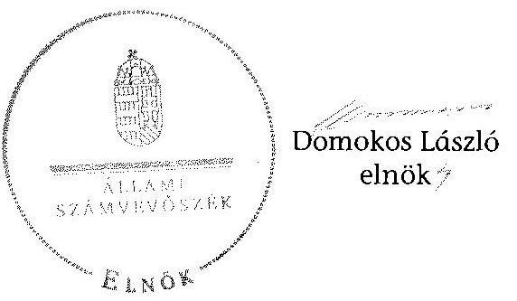

# ÁLLAMI   SZÁMVEVŐSZÉK 

## JELENTÉS

a helyi nemzetiségi önkormányzatok gazdálkodásának ellenőrzéséről (második szakasz)
Nagydobos Község Cigány Nemzetiségi Önkormányzata 15003

---

# Állami Számvevőszék 

Iktatószám: V-0710-064/2015.
Témaszám: 1744
Vizsgálat-azonosító szám: V067619

## Az ellenőrzést felügyelte:

Horváthné Herbáth Mária
felügyeleti vezető

Az ellenőrzést vezette és az ellenőrzés végrehajtásáért felelős:
Zakar László
ellenőrzésvezető

## A számvevőszéki jelentést készítették:

Zakar László
ellenőrzésvezető
Nyikon Zsigmondné
számvevő főtanácsos

## Hegyes Mária

számvevő tanácsos
Pappné dr. Szamosi Éva
számvevő főtanácsos

## Az ellenőrzést végezték:

Hegyes Mária
számvevő tanácsos

Nyikon Zsigmondné
számvevő főtanácsos

---

# TARTALOMJEGYZÉK 

BEVEZETÉS ..... 7
I. ÖSSZEGZŐ MEGÁLLAPÍTÁSOK, KÖVETKEZTETÉSEK, JAVASLATOK ..... 10
II. RÉSZLETES MEGÁLLAPÍTÁSOK ..... 18

1. A Nemzetiségi Önkormányzat és a Települési Önkormányzat együttműködésének szabályozása, a működési feltételek biztosítása ..... 18
2. A gazdálkodási feladatok ellátásának szabályszerűsége ..... 19
2.1. A költségvetésre és a zárszámadásra, valamint a kincstári adatszolgáltatás rendjére vonatkozó jogszabályi előírások betartása ..... 19
2.2. A Nemzetiségi Önkormányzat gazdálkodásának szabályozottsága ..... 21
2.3. Az operatív gazdálkodási jogkörök kialakítása, gyakorlása ..... 21
3. A Nemzetiségi Önkormányzattal összefüggő gazdálkodási feladatok belső ellenőrzése ..... 23
MELLÉKLETEK
4. számú A Nagydobos Község Cigány Nemzetiségi Önkormányzat 2013. évi gazdálkodási adatai

---

.

---

# RÖVIDÍTÉSEK JEGYZÉKE 

| Törvények |  |
| :--: | :--: |
| Alaptörvény | Magyarország Alaptörvénye |
| Áht. | az államháztartásról szóló 2011. évi CXCV. törvény |
| ÁSZ tv. | az Állami Számvevőszékről szóló 2011. évi LXV. törvény |
| Mötv. | Magyarország helyi önkormányzatairól szóló 2011. évi CLXXXIX. törvény |
| Nek. tv. | a nemzetiségek jogairól szóló 2011. évi CLXXIX. törvény |
| Számv. tv. | a számvitelről szóló 2000. évi C. törvény |
| Rendeletek |  |
| Áhsz. | az államháztartás szervezetei beszámolási és könyvvezetési kötelezettségének sajátosságairól szóló 249/2000. (XII. 24.) rendelet |
| Ávr. | az államháztartási törvény végrehajtásáról szóló 368/2011. (XII.31.) Korm. rendelet |
| Bkr. | a költségvetési szervek belső kontrollrendszeréről és belső ellenőrzéséről szóló 370/2011. (XII.31.) Korm. rendelet |
| Települési Önkormányzat SZMSZ-e | Nagydobos Község Önkormányzata Képviselő-testülete szervezeti és működési szabályzatáról szóló 2/2013. (II. 7.) számú rendelete |
| Szórövidítések |  |
| ÁSZ | Állami Számvevőszék |
| belső kontroll szabályzat | Nagydobos Község Önkormányzata Belső Kontrollrendszer Szabályzat |
| együttműködési megállapodás | Nagydobos Község Önkormányzata Képviselő-testületének 159/2013. (XI. 6.) számú határozatával és a Nagydobosi Cigány Nemzetiségi Önkormányzat Képviselő-testületének 11/2013. (XI. 14.) számú határozatával jóváhagyott, 2013. november 15-én aláírt együttműködési megállapodás |
| FEUVE | folyamatba épített, előzetes, utólagos és vezetői ellenőrzés |
| gazdálkodási szabályzat | Nagydobos Község Önkormányzata Gazdálkodási szabályzata (hatályos 2012. április 2-ától) |
| jegyző | Nagydobos Község Önkormányzata jegyzője |
| Nemzetiségi Önkormányzat Képviselő-testülete | Nagydobosi Cigány Nemzetiségi Önkormányzat Képviselő-testülete |
| Kincstár | Magyar Államkincstár |
| Kormányhivatal | Szabolcs-Szatmár-Bereg megyei Kormányhivatal |
| Nemzetiségi Önkormányzat | Nagydobosi Cigány Nemzetiségi Önkormányzat |
| Nemzetiségi Önkormányzat elnöke | Nagydobosi Cigány Nemzetiségi Önkormányzat elnöke |
| Polgármesteri Hivatal | Nagydobos Község Önkormányzata Polgármesteri Hivatala |

---

Nemzetiségi Önkormányzat SZMSZ-e
pénzkezelési szabályzat
szabálytalanságok kezelésének eljárásrendje
számlarend
Települési Önkormányzat
2013. évi költségvetési határozat

Nagydobos Cigány Kisebbségi Önkormányzat 3/2011. (II. 14.) számú határozata az SZMSZ elfogadásáról

Nagydobos Község Önkormányzata Pénzkezelési szabályzat (hatályos 2012. április 2-ától)
Nagydobos Község Önkormányzata Polgármesteri Hivatala Szabálytalanságok kezelésének eljárásrendje (hatályos 2012. április 2-ától)
Nagydobos Község Önkormányzata Polgármesteri Hivatala Számlarendje (hatályos 2012. április 2-ától)
Nagydobos Község Önkormányzata
Nagydobosi Cigány Nemzetiségi Önkormányzat Képviselő-testülete 2/2013. (II. 14.) számú határozata a 2013. évi költségvetésről

---

# ÉRTELMEZŐ SZÓTÁR 

belső ellenőrzés
belső kontrollrendszer
együttműködési megállapodás
integritás
költségvetési szerv vezetője
korrupció

A Bkr. 2. § b) pont meghatározásában független, tárgyilagos bizonyosságot adó és tanácsadó tevékenység, amelynek célja, hogy az ellenőrzött szervezet működését fejlessze és eredményességét növelje, az ellenőrzött szervezet céljai elérése érdekében rendszerszemléletű megközelítéssel és módszeresen értékeli, illetve fejleszti az ellenőrzött szervezet irányítási és belső kontrollrendszerének hatékonyságát.
A Bkr. 2. § d) pont és az Áht. 69. § (1) bekezdése alapján a belső kontrollrendszer a kockázatok kezelése és tárgyilagos bizonyosság megszerzése érdekében kialakított folyamatrendszer, amely azt a célt szolgálja, hogy a működés és gazdálkodás során a tevékenységeket szabályszerűen, gazdaságosan, hatékonyan, eredményesen hajtsák végre, az elszámolási kötelezettségeket teljesítsék, megvédjék az erőforrásokat a veszteségektől, károktól és nem rendeltetésszerű használattól.
Az Áht. 27. § (2) bekezdése és Nek tv. 80. § (1) bekezdése értelmében a helyi önkormányzat a helyi nemzetiségi önkormányzat részére annak székhelyén - biztosítja az önkormányzati működés személyi és tárgyi feltételeit, továbbá gondoskodik a működéssel kapcsolatos végrehajtási feladatok ellátásáról. Az Nek tv. 80. § (2) bekezdés szerinti a fenti kötelezettségének teljesítése érdekében a helyi önkormányzat harminc napon belül biztosítja a rendeltetésszerű helyiséghasználatot, valamint a helyiséghasználatra, a további feltételek biztosítására és a feladatok ellátására vonatkozóan megállapodást köt a helyi nemzetiségi önkormányzattal. A megállapodást minden év január 31. napjáig, általános vagy időközi választás esetén az alakuló ülést követő harminc napon belül felül kell vizsgálni. A helyi önkormányzat és a nemzetiségi önkormányzat szervezeti és működési szabályzatában rögzíti a megállapodás szerinti működési feltételeket, a megállapodás megkötését, módosítását követő harminc napon belül. Az Nek tv. 80. § (3) bekezdés írja elő a megállapodásban rögzítendőket.
Az integritás elvek, értékek, cselekvések, módszerek, intézkedések konzisztenciáját jelenti: olyan magatartásmódot, amely meghatározott értékeknek felel meg. Az integritás a közszféra esetében a társadalom által elvárt nyilvánossági, átláthatósági, illetve jogi/etikai normáknak történő megfelelést jelenti.
(Forrás: a http://integritas.asz.hu honlapon közzétett „A 2012. évi integritás felmérés eredményeinek összefoglalója" dokumentum 3. oldal 1. bekezdése.)
A Bkr. 2. § nd) pont meghatározásában a helyi önkormányzat, helyi nemzetiségi önkormányzat, illetve a fővárosi kerületi önkormányzat esetén a jegyző, körjegyző, főjegyző.
Azok a cselekmények, amelyek során a köz érdekében való eljárással megbízott és döntéshozatali felelősséggel felruházott személy a köz érdeke helyett önös vagy részérdekeket követve, mástól jogtalan vagy etikátlan előnyt elfogadva és őt jogtalan vagy etikátlan előny-

---

# 2.2.2.2.2.2.2.2.2.2.2.2.2.2.2.2.2.2.2.2.2.2.2.2.2.2.2.2.2.2.2.2.2.2.2.2.2.2.2.2.2.2.2.2.2.2.2.2.2.2.2.2.2.2.2.2.2.2.2.2.2.2.2.2.2.2.2.2.2.2.2.2.2.2.2.2.2.2.2.2.2.2.2.2.2.2.2.2.2.2.2.2.2.2.2.2.2.2.2.2.2.2

---

# JELENTÉS   a helyi nemzetiségi önkormányzatok gazdálkodásának ellenőrzéséről Nagydobos Község Cigány Nemzetiségi Önkormányzata 

## BEVEZETÉS

A Nemzetiségi Önkormányzat a 2006. évben alakult, az ellenőrzött időszakban hivatalban levő elnöke a 2014. évi helyhatósági választásokig látta el feladatát. A Nemzetiségi Önkormányzat intézményt, gazdasági társaságot és más szervezetet nem alapított, illetve társulásban nem vett részt. A négytagú Képviselő-testület bizottságot nem hozott létre. A Nemzetiségi Önkormányzat költségvetési beszámolója szerint 2013-ban a módosított költségvetési bevételi és kiadási előirányzata 222,0 ezer Ft, a teljesített költségvetési bevétele 347,0 ezer Ft, a teljesített költségvetési kiadása 335,0 ezer Ft volt. A tárgyévi bevétel 347,0 ezer Ft-ot, a tárgyévi kiadás 339,0 ezer Ft-ot tett ki. A Nemzetiségi Önkormányzat a 2013. évben feladatalapú támogatásban nem részesült. A 2013. évi gazdálkodási adatokat részletesen az 1. számú mellékletben mutatjuk be.

Az Alaptörvény Szabadság és felelősség rész XXIX. cikk (1) bekezdése szerint a Magyarországon élő nemzetiségek államalkotó tényezők. Minden, valamely nemzetiséghez tartozó magyar állampolgárnak joga van önazonossága szabad vállalásához és megőrzéséhez. A hazánkban élő nemzetiségek helyi (települési és területi), valamint országos önkormányzatokat hozhatnak létre. ${ }^{1}$ A helyi nemzetiségi önkormányzatok gazdálkodási feladatait jogszabályi előírás alapján a székhely szerinti helyi önkormányzat polgármesteri hivatala látja el.

A nemzetiségek helyzete, támogatása mind hazai, mind EU-s szinten kiemelt figyelmet kap napjainkban. A helyi nemzetiségi önkormányzatok gazdálkodására és támogatási rendszerére vonatkozó jogszabályok a 2010-2012. években jelentős változásokon mentek át. A helyi nemzetiségi önkormányzatok gazdálkodásának, a részükre juttatott költségvetési támogatások felhasználásának ellenőrzését az ÁSZ 2012-ben sorozatjellegű ellenőrzés keretében indította el.

Az ellenőrzés célja annak értékelése volt, hogy a helyi nemzetiségi önkormányzat gazdálkodási kereteinek kialakítása, gazdálkodása megfelelt-e a jogszabályoknak.

[^0]
[^0]:    ${ }^{1}$ A 2010. évben megtartott nemzetiségi önkormányzati választásokat követően 2304 települési, 58 területi és 13 országos nemzetiségi önkormányzat alakult meg.

---

Ennek keretében értékeltük, hogy:

- a helyi nemzetiségi önkormányzat és a helyi (települési) önkormányzat együttműködésének szabályozása, a működési feltételek biztosítása megfelelte a jogszabályi előírásoknak;
- a felek együttműködése megfelelte a megállapodásban foglaltaknak a gazdálkodási feladatok szabályszerű ellátása során, betartották-e a vonatkozó jogszabályi előírásokat;
- biztosított volt-e a helyi nemzetiségi önkormányzat gazdálkodásának belső ellenőrzése.

Az ellenőrzés várható hasznosulása: a nemzetiségi önkormányzatok testületi döntéseinek tapasztalatait összegezve következtetés vonható le a törvényalkotás számára a jogszabályi környezet esetleges módosításának indokoltságára vonatkozóan. Az ellenőrzés az ellenőrzött számára visszajelzést ad a rendezett gazdálkodási keretek kialakításáról, a működési hiányosságokról. Az ellenőrzés megállapításai és javaslatai, a jó gyakorlat bemutatása tanulságul szolgálhatnak más nemzetiségi önkormányzatok, szervezetek számára a rendezett gazdálkodási keretek kialakításához. A társadalom számára jelzi, hogy közpénz nem maradhat ellenőrizetlenül, az ÁSZ értékteremtő rend kialakításához és megőrzéséhez hozzájáruló tevékenysége pozitív hatással lesz a szervezetről kialakított összkép formálásában. Az ÁSZ szervezetén belül lehetőség nyílik arra, hogy a megállapítások szintetizálásával az intézmény a hozzáadott értéket teremtő elemző tevékenységét és tanácsadó szerepét erősítse.

A helyi nemzetiségi önkormányzatok gazdálkodásának ellenőrzéséről szóló jelentés I. fejezetének összegző része az ellenőrzés céljára adott rövid, szintetizáló összefoglalót és következtetéseket tartalmazza a II. fejezet részletes megállapításain alapulóan. A jelentés intézkedést igénylő megállapításait és javaslatait - az összegzőben foglaltak mellett - az ellenőrzés során feltárt, a jelentés II. fejezetében rögzített részletes megállapítások alapozzák meg, illetve támasztják alá.

# Az ellenőrzés típusa: szabályszerűségi ellenőrzés. 

Az ellenőrzött időszak: a helyi nemzetiségi önkormányzat és a települési önkormányzat együttműködésének, valamint a helyi nemzetiségi önkormányzat gazdálkodásának szabályozása megfelelőségét a 2013. évre vonatkozóan (a 2013. december 31-i állapotnak megfelelően), a helyi nemzetiségi önkormányzat gazdálkodásának szabályszerűségét, a működési feltételek, valamint a belső ellenőrzés biztosítását a 2013. január 1. - december 31-e közötti időszakot figyelembe véve értékeltük.

Ellenőrzött szervezet: a Nagydobos Cigány Nemzetiségi Önkormányzat és a gazdálkodási feladatait ellátó Nagydobos Községi Önkormányzat Polgármesteri Hivatala.

Az ellenőrzés szakmai módszertana az ÁSZ hivatalos honlapján (www.asz.hu) közzétett szakmai szabályokon alapult, amely a Legfőbb Ellenőrző Intézmények Nemzetközi Szervezete (INTOSAI) által kiadott nemzetközi standardok (ISSAI) figyelembevételével készült.

---

A gazdálkodás folyamatában kulcsszerepet betöltő két kulcskontroll - teljesítésigazolás, érvényesítés - működésének megfelelőségét teljes körűen, azaz minden, a személyi juttatásokkal, dologi és felhalmozási kiadásokkal, működési és felhalmozási célú pénzeszköz átadásokkal, ellátottak pénzbeli juttatásaival kapcsolatos kifizetés esetében ellenőriztük. „Megfelelőnek" értékeltük a gazdálkodási jogkörök gyakorlását, amennyiben a hibaarány legfeljebb 10\%, „részben megfelelőnek" értékeltük, ha a hibaarány 10-30\% között volt, „nem megfelelőnek" pedig akkor, ha az eredmények alapján a hibaarány meghaladta a 30\%-ot.

Az ellenőrzés végrehajtásának jogszabályi alapját az ÁSZ tv. 5. § (2)-(3) és (6) bekezdéseiben foglaltak képezik.

Az ÁSZ tv. 29.§ (1) bekezdése szerint a jelentéstervezetet megküldtük egyeztetésre a jegyzőnek és a Nemzetiségi Önkormányzat elnökének. Az ellenőrzött szervezetek vezetői az ÁSZ tv. 29.§ (2) bekezdésében foglalt észrevételezési jogukkal nem éltek, a jelentéstervezetre nem tettek észrevételt.

---

# I. ÖSSZEGZŐ MEGÁLLAPÍTÁSOK, KÖVETKEZTETÉSEK, JAVASLATOK 

A Nemzetiségi Önkormányzat és a Települési Önkormányzat együttműködésének szabályozása nem felelt meg a jogszabályi előírásoknak.

A Nemzetiségi Önkormányzat a Nek. tv. szerinti együttműködési megállapodással 2013. november 14-ig nem rendelkezett. A Kormányhivatal jelzését követően a Nemzetiségi Önkormányzat 2013. november 15-én
 megkötötte az együttműködési megállapodást a Települési Önkormányzattal. Az együttműködési megállapodásban a Nemzetiségi Önkormányzat gazdálkodásával kapcsolatos feladatokat, felelősöket és határidőket az Áht. és a Nek. tv.-ben foglalt előírások ellenére nem teljes körűen határozták meg. Az együttműködési megállapodás nem tartalmazta a Nemzetiségi Önkormányzat bevételeivel és kiadásaival kapcsolatban az ellenőrzési, finanszírozási feladatok, az adatszolgáltatási és beszámolási feladatok ellátásának részletes szabályait. Nem határozta meg a Nemzetiségi Önkormányzat részére önálló fizetési számla nyitásával, törzskönyvi nyilvántartásba vételével és adószám igénylésével kapcsolatos határidőket, együttműködési kötelezettséget és ezek felelőseit. Nem rögzítette továbbá a Nemzetiségi Önkormányzat kötelezettségvállalásaival kapcsolatosan a teljesítésigazolási feladatokat a felelősök konkrét kijelölésével és az összeférhetetlenségi szabályokat, valamint a Nemzetiségi Önkormányzat működési feltételeinek és gazdálkodásának eljárási és dokumentációs részletszabályait. Az együttműködési megállapodás nem tartalmazta, hogy a jegyző vagy annak megbízottja a Települési Önkormányzat megbízásából és képviseletében részt vesz a Nemzetiségi Önkormányzat Képviselő-testülete ülésein és jelzi, amennyiben törvénysértést észlel.

A Nek. tv.-ben előírtak ellenére Nemzetiségi Önkormányzat és a Települési Önkormányzat SZMSZ-ében nem rögzítették az együttműködési megállapodás szerinti működési feltételeket.

A Települési Önkormányzat - a szabályozási hiányosság ellenére - 2013. évben biztosította a Nemzetiségi Önkormányzat működéséhez szükséges tárgyi és részben biztosította a személyi feltételeket. A személyi feltételekkel kapcsolatosan nem rögzítették az együttműködési megállapodásban, hogy a jegyző vagy annak megbízottja részt vegyen a Nemzetiségi Önkormányzat Képviselő-testülete ülésein, továbbá a köztisztviselők munkaköri leírásai nem tartalmazták a Nemzetiségi Önkormányzat gazdálkodásával kapcsolatos feladatokat.

A Nemzetiségi Önkormányzat 2013. évi költségvetésének és zárszámadásának tartalma, jóváhagyása, valamint a kapcsolódó adatszolgáltatás részben felelt meg a jogszabályi előírásoknak.

Az Áht. előírása ellenére a jegyző nem készítette elő és a Nemzetiségi Önkormányzat elnöke a 2013. évre vonatkozó költségvetési koncepciót nem nyújtotta be a Képviselő-testület részére. A Nemzetiségi Önkormányzat elnöke a jegyző által elkészített 2013. évi költségvetési határozat-tervezetet az Áht. szerinti határidőben a Nemzetiségi Önkormányzat Képviselő-testülete részére benyújtotta.

---

A 2013. évi költségvetés előterjesztésekor - az Áht.-ben foglalt előírásoktól eltérően - tájékoztatásul nem mutatták be szöveges indokolással együtt a Nemzetiségi Önkormányzat költségvetési mérlegét közgazdasági tagolásban és az előirányzat felhasználási tervét. A 2013. évi költségvetési határozat az Áht.-ben előírt bontásban nem tartalmazta a költségvetési kiadásokat előirányzat csoportok és kötelező feladatok, önként vállalt feladatok szerinti bontásban, valamint az Áht.-ben foglaltak ellenére nem tartalmazta a Mötv. szerinti értékhatárt, a finanszírozási bevételekkel és kiadásokkal kapcsolatos hatásköröket.

A jegyző által elkészített 2013. évi zárszámadási határozat-tervezetet a Nemzetiségi Önkormányzat elnöke az Áht. szerinti határidőben beterjesztette a Nemzetiségi Önkormányzat Képviselő-testülete részére. A zárszámadási határozat-tervezet előterjesztésekor az Áht. előírásától eltérően tájékoztatásul nem mutatták be szöveges indokolással együtt a Nemzetiségi Önkormányzat pénzeszközeinek változását és költségvetési mérlegét közgazdasági tagolásban. A 2014. április 12-én elfogadott 2013. évi zárszámadási határozatban a Nemzetiségi Önkormányzat bevétele 125,2 ezer Ft-tal és kiadása 117,2 ezer Ft-tal kevesebb összeget tartalmazott, mint a korábban, 2014. március 23-án jóváhagyott - főkönyvi kivonattal alátámasztott - költségvetési beszámoló. Ezzel nem biztosították az Áht. előírását, hogy a zárszámadás során valamennyi bevételéről és kiadásáról el kell számolni.

A jegyző a Nemzetiségi Önkormányzat részére előírt kincstári adatszolgáltatások közül az időközi éves költségvetési jelentést az Ávr.-ben, az éves költségvetési beszámolót az Áhsz.-ben előírt határidőt követően teljesítette.

A Nemzetiségi Önkormányzat gazdálkodásának szabályozottsága az ellenőrzött időszakban összességében megfelelt a jogszabályi előírásoknak és az együttműködési megállapodásban foglaltaknak. A gazdálkodási feladatok végrehajtását ellátó Polgármesteri Hivatal 2013. évben a Számv. tv.-ben előírt szabályzatokkal rendelkezett, amelyek hatálya a számlarend kivételével a Nemzetiségi Önkormányzat gazdálkodási feladataira is kiterjedt. A jegyző a Számv. tv.-ben és az Áhsz.-ben foglaltakkal szemben nem alakította ki a Nemzetiségi Önkormányzat számlarendjét. A jegyző a Nemzetiségi Önkormányzatra is kiterjesztett hatályú pénzkezelési szabályzatban a Számv. tv. előírása ellenére nem rendelkezett a Nemzetiségi Önkormányzat tekintetében a pénzforgalom bankszámlán történő lebonyolításának rendjéről. A Polgármesteri Hivatal SZMSZ-e - az Ávr.-ben előírtak ellenére - nem tartalmazta a nevesített munkakörökhöz tartozó és a Nemzetiségi Önkormányzat gazdálkodásával kapcsolatos hatásköröket, a hatáskörök gyakorlásának módját, a helyettesítés rendjét, az ezekhez kapcsolódó felelősségi szabályokat. A gazdálkodási szabályzatban a Nemzetiségi Önkormányzattal kapcsolatos tervezéssel, gazdálkodással kapcsolatos eljárási és dokumentációs részletszabályokat és az ellenőrzési, adatszolgáltatási feladatok teljesítésével kapcsolatos belső előírásokat, feltételeket meghatározták. A Polgármesteri Hivatalnál a gazdálkodási feladatot ellátó köztisztviselők munkaköri leírásai - a Kttv.-ben foglaltaktól eltérően - nem tartalmazták a Nemzetiségi Önkormányzat gazdálkodásával kapcsolatos feladatokat.

A Nemzetiségi Önkormányzat gazdálkodása tekintetében az operatív gazdálkodási jogkörök kialakítása a jogszabályi előírásoknak, valamint az együttműködési megállapodásban foglaltaknak nem felelt meg. A jegyző a Nemzetiségi Önkormányzat kiadási előirányzatai terhére vállalt kötelezettség esetére -

---

az Ávr.-ben foglaltak ellenére - nem jelölt ki írásban a gazdasági szervezettel nem rendelkező Polgármesteri Hivatal állományába tartozó, előírt végzettséggel rendelkező köztisztviselőt a pénzügyi ellenjegyzés és az érvényesítés gyakorlására.

A Nemzetiségi Önkormányzatnál a 2013. évben a dologi kiadásokkal kapcsolatos kifizetéseknél az operatív gazdálkodási jogkörökön belül kulcsszerepet betöltő teljesítésigazolás és érvényesítés belső kontrollokat - az ellenőrzött összes kifizetésre együttesen értékelve - nem a jogszabályi előírásoknak megfelelően működtették.

A teljesítésigazolást - az Áht.-ban és az Ávr.-ben foglaltak ellenére - több esetben nem végezték el, így a kifizetéseket megelőzően a kiadások jogosságát, összegszerűségét és az ellenszolgáltatás teljesítését nem ellenőrizték. Az érvényesítést valamennyi ellenőrzött kifizetést megelőzően - az Áht.-ban és az Ávr.-ben előírtak ellenére - nem végezték el. Érvényesítés hiányában elmaradt az összegszerűség, a fedezet meglétének az ellenőrzése, továbbá a jelzés az utalványozónak, hogy a megelőző ügymenetben a teljesítésigazolást nem végezték el, valamint a 2013. évben az utalványok, pénztárbizonylatok - az Ávr.-ben előírtak ellenére - nem tartalmazták a kötelezettségvállalás nyilvántartási számát. Elmaradt annak az észrevételezése, hogy a 2013. évben a Nemzetiségi Önkormányzat kötelezettségvállalásairól - az Ávr.-ben foglaltak ellenére - nyilvántartást nem vezettek.

A kulcskontrollok ellenőrzése során további feltárt hiányosságok fordultak elő. Az állami támogatás több mint 90%-a készpénzben került felvételre a Nemzetiségi Önkormányzat bankszámlájáról, de azt a Számv. tv.-ben, az Ávr.-ben, valamint a Pénzkezelési Szabályzatban előírtakkal ellentétben a házipénztárba nem vételezték be. A készpénzfelvétel és a készpénzfizetési számlákkal való elszámolás során nem történt meg a pénzmozgással egyidejűleg a pénzeszközöket érintő gazdasági műveletek pénzmozgással egyidejűleg történő rögzítése a könyvekben a Számv. tv.-nek és az Áhsz.-nek megfelelően. A Nemzetiségi Önkormányzat elnöke a készpénzfizetési számlákkal való elszámolás során nem biztosította az Ávr.-ben előírt összeférhetetlenségi követelmények érvényesülését, mert az utalványozási feladatot maga javára látta el. A Nemzetiségi Önkormányzatnál a 2013. évben a kulcskontrollokat nem megfelelően működtették és e miatt nem volt biztosított a hibák megelőzése, feltárása és kijavítása.

A Nemzetiségi Önkormányzatnak a gazdálkodás során figyelmet kell fordítania az integritás szemlélet teljes körű érvényesülésére, különös tekintettel az operatív gazdálkodási jogkörök szabályozására, valamint a kulcsszerepet betöltő belső kontrollok (teljesítésigazolás és érvényesítés) szabályszerű működésére, amellyel csökkenthetők a szervezet működéséből eredő korrupciós kockázatok.

A 2013. évben a Nemzetiségi Önkormányzat gazdálkodásával összefüggő végrehajtási feladatokra vonatkozó belső ellenőrzés nem volt megfelelő. A jegyző a Bkr.-ben foglalt feladatkörében eljárva nem gondoskodott a Nemzetiségi Önkormányzat gazdálkodásával összefüggő végrehajtási feladatokat érintően a belső ellenőrzés kialakításáról és megfelelő működtetéséről. A Nemzetiségi Önkormányzat gazdálkodásával összefüggő végrehajtási feladatokra vonatkozóan belső ellenőrzést a 2013. évben nem terveztek és nem végeztek.

---

Az ÁSZ tv. 33. § (1) bekezdésében foglaltak értelmében a jelentésben foglalt megállapításokhoz kapcsolódó intézkedési tervet köteles az ellenőrzött szervezet vezetője összeállítani, és azt a jelentés kézhezvételétől számított 30 napon belül az ÁSZ részére megküldeni. Amennyiben az intézkedési tervet határidőben nem küldi meg a szervezet, vagy az nem elfogadható, az ÁSZ elnöke a hivatkozott törvény 33. § (3) bekezdés a)-b) pontjaiban foglaltakat érvényesítheti.

A helyszíni ellenőrzés megállapításainak hasznosítása mellett javasoljuk:

# a jegyzőnek 

1. Az együttműködés szabályozásával kapcsolatban

A Nemzetiségi Önkormányzat és a Települési Önkormányzat együttműködését meghatározó, 2013. november 15-én megkötött együttműködési megállapodásban a Nemzetiségi Önkormányzat gazdálkodásával kapcsolatos feladatokat, felelősöket és határidőket - az Áht. 27. § (2) bekezdésben és a Nek. tv. 80. § (3) bekezdésében foglalt előírások ellenére - nem teljes körűen rögzítették. Az együttműködési megállapodás - a Nek. tv. 80.§ (4) bekezdésében foglaltak ellenére nem tartalmazta, hogy a jegyző vagy annak megbízottja a Települési Önkormányzat megbízásából és képviseletében részt vesz a Nemzetiségi Önkormányzat Képviselő-testülete ülésein és jelzi, amennyiben törvénysértést észlel.

A Nek. tv. 80. § (2) bekezdésben előírtak ellenére a Nemzetiségi Önkormányzat és a Települési Önkormányzat SZMSZ-eiben nem rögzítették az együttműködési megállapodás szerinti működési feltételeket.

Javaslat
a) készítse elő az együttműködési megállapodás Nek. tv. előírásainak megfelelő módosítását és kezdeményezze annak a Települési Önkormányzat Képviselő-testülete elé terjesztését;
b) készítse elő a Települési és a Nemzetiségi Önkormányzat SZMSZ-einek kiegészítését - a Nek. tv.-ben foglalt határidőre - az együttműködési megállapodás módosításához kapcsolódóan és kezdeményezze azok képviselő-testületi előterjesztését.
2. A költségvetés és a zárszámadás szabályszerűségével kapcsolatban

A költségvetési határozat-tervezet előterjesztésekor a Nemzetiségi Önkormányzat Képviselő-testülete részére - az Áht. 24. § (4) bekezdés a) pontjában foglaltak ellenére - nem mutatták be tájékoztatásul, szöveges indokolással együtt a Nemzetiségi Önkormányzat költségvetési mérlegét közgazdasági tagolásban és az előirányzat felhasználási tervét.

A 2013. évi költségvetési határozat az Áht. 23. § (2) bekezdés a) pontjától eltérően nem tartalmazta a Nemzetiségi Önkormányzat költségvetési kiadásait előirányzat csoportok és kötelező feladatok, önként vállalt feladatok szerinti bontásban, továbbá az Áht. 23. § (2) bekezdés h) pontjában előírtak közül a Mötv. 68. § (4) bekezdése szerinti értékhatárt és a finanszírozási bevételekkel és kiadásokkal kapcsolatos hatásköröket.

---

A 2013. évi zárszámadási határozat-tervezet előterjesztésekor - a Nemzetiségi Önkormányzat Képviselő-testülete részére tájékoztatásul nem mutatták be szöveges indoklással együtt az Áht. 91. § (2) bekezdés a) pontja alapján a Nemzetiségi Önkormányzat költségvetésének mérlegét közgazdasági tagolásban, valamint a pénzeszközök változását az Áht. 24. § (4) bekezdés a) pontjának előírásait figyelembe véve.

A 2013. évi zárszámadási határozat nem tartalmazta a Nemzetiségi Önkormányzat teljesített összes bevétel és kiadását, így a 2013. évi zárszámadásban a Nemzetiségi Önkormányzat 2013. évi összes bevételéről és összes kiadásáról az Áht. 89. § (2) bekezdésének előírása ellenére nem számoltak el.

Javaslat
Intézkedjék annak érdekében, hogy a jövőben
a) a költségvetési és a zárszámadási határozat tartalmilag teljes körűen feleljen meg a hatályos jogszabályi előírásoknak;
b) biztosítsa, hogy a Nemzetiségi Önkormányzat Képviselő-testülete részére tájékoztatásul teljes körűen, szöveges indoklással együtt kerüljenek bemutatásra a jogszabályban előírt mérlegek, kimutatások a költségvetés és a zárszámadás előterjesztésekor;
c) intézkedjen, hogy a Nemzetiségi Önkormányzat adott évi zárszámadásában az összes bevételéről és kiadásáról teljes körűen elszámoljon.
3. A kincstári adatszolgáltatási kötelezettséggel kapcsolatban

A jegyző a Nemzetiségi Önkormányzat részére jogszabályban előírt kincstári adatszolgáltatási kötelezettségét két alkalommal késedelmesen teljesítette. Az Ávr. 169. § (2) bekezdésében előírt határidőt követően teljesítette az adatszolgáltatást az időközi
 éves költségvetési jelentés vonatkozásában. Az éves költségvetési beszámoló esetében nem tartotta be az Áhsz. 10. § (5a) bekezdésében előírt határidőt.

Javaslat
A jogszabályokban rögzített határidőre tegyen eleget a Nemzetiségi Önkormányzat részére előírt kincstári adatszolgáltatási kötelezettségnek.
4. A gazdálkodási feladatok szabályozottságával kapcsolatban

A jegyző a Számv. tv. 161. § (1) és (4) bekezdésével, az Áhsz. 49. § (1) bekezdésével ellentétben nem alakította ki a Nemzetiségi Önkormányzat számlarendjét.

A jegyző a Nemzetiségi Önkormányzatra is kiterjesztett hatályú pénzkezelési szabályzatban a Számv. tv. 14. § (8) bekezdésében foglaltak ellenére nem rendelkezett a Nemzetiségi Önkormányzat tekintetében a pénzforgalom bankszámlán történő lebonyolításának rendjéről.

A Polgármesteri Hivatal SZMSZ-e - az Ávr. 13. § (1) bekezdés g) pontjában előírtak ellenére - nem tartalmazta a nevesített munkakörökhöz tartozó és a Nemzetiségi Önkormányzat gazdálkodásával kapcsolatos hatásköröket, a hatáskörök gyakorlásának módját, a helyettesítés rendjét, az ezekhez kapcsolódó felelősségi szabályokat.

---

A Polgármesteri Hivatalnál a gazdálkodási feladatot ellátó köztisztviselők munkaköri leírásai - a Kttv. 75. § (1) bekezdés d) pontjában foglaltaktól eltérően - nem tartalmazták a Nemzetiségi Önkormányzat gazdálkodásával kapcsolatos feladatokat.

Javaslat
a) Készítse el a hatályos jogszabályok előírásai szerinti számlarendet.
b) Intézkedjen a pénzkezelési szabályzat jogszabályi előírásoknak megfelelő kiegészítéséről.
c) Készítse el a Polgármesteri Hivatal SZMSZ-ének módosítását, hogy az teljes körűen feleljen meg a jogszabályi előírásoknak, és kezdeményezze annak képviselőtestületi előterjesztését.
d) Egészítse ki a Nemzetiségi Önkormányzat gazdálkodásával kapcsolatos feladatokat ellátó köztisztviselők munkaköri leírását, hogy azok teljes körűen tartalmazzák az ellátott feladatokat.
5. A kulcskontrollok működésével kapcsolatban

A jegyző a Nemzetiségi Önkormányzat kiadási előirányzatai terhére vállalt kötelezettség esetére - az Ávr. 55. § (2) bekezdés g) pontjában és 58. § (4) bekezdésében foglaltak ellenére - nem jelölt ki írásban a gazdasági szervezettel nem rendelkező Polgármesteri Hivatal állományába tartozó, előírt végzettséggel rendelkező köztisztviselőt a pénzügyi ellenjegyzés és az érvényesítés gyakorlására. A teljesítésigazolást - az Áht. 38. § (1) bekezdésében és az Ávr. 57. § (1) bekezdésében foglaltak ellenére - több esetben nem végezték el. Az érvényesítés egyetlen ellenőrzött kifizetést megelőzően sem történt meg az Áht. 38. § (1) bekezdésében, és az Ávr. 58. § (1) és (4) bekezdésében előírtak ellenére. Érvényesítés hiányában elmaradt a jelzés az utalványozó felé, hogy a megelőző ügymenetben a teljesítésigazolást nem végezték el, továbbá, hogy 2013. évben az utalványok, pénztárbizonylatok - az Ávr. 59. § (3) bekezdés f) pontjában előírtak ellenére - nem tartalmazták a kötelezettségvállalás nyilvántartási számát. Elmaradt annak észrevételezése, hogy a Nemzetiségi Önkormányzat kötelezettségvállalásairól - az Ávr. 56. § (1) bekezdésében foglaltak ellenére - nyilvántartást nem vezettek.

Az állami támogatás több mint 90%-a készpénzben került felvételre a Nemzetiségi Önkormányzat bankszámlájáról, de azt a Számv. tv. 165. § (1) bekezdés, illetve az Ávr. 148. § (2) bekezdés, továbbá a Pénzkezelési Szabályzat V. fejezet 1.1. és 4.4. pontjának előírása ellenére házipénztárba nem vételezték be. A Nemzetiségi Önkormányzat elnöke a készpénzfizetési számlákkal való elszámolás során nem tartotta be az Ávr. 60. § (2) bekezdésében előírt összeférhetetlenségi követelményt, mert az utalványozási feladatot maga javára látta el. A készpénzfelvétel és a készpénzfizetési számlákkal való elszámolás során nem történt meg a pénzeszközöket érintő gazdasági műveletek pénzmozgással egyidejűleg történő rögzítése a könyvekben a Számv. tv. 165. § 3) bekezdés a) pontjának, valamint az Áhsz. 51. § (1) bekezdés a) pontjának megfelelően.

Javaslat
Az operatív gazdálkodás működési hibáinak megelőzése, feltárása és kijavítása érdekében intézkedjen:

---

a) a pénzügyi ellenjegyző, valamint az érvényesítési feladatok ellátására jogosult személy írásbeli kijelöléséről;
b) a teljesítésigazolás jogszabályi előírásoknak megfelelő elvégzéséről;
c) az érvényesítéshez kapcsolódó ellenőrzési és jelzési feladatok szabályszerű ellátásáról;
d) a Nemzetiségi Önkormányzat gazdálkodását érintő valamennyi gazdasági esemény jogszabályi előírásoknak és belső szabályzatoknak megfelelő teljes körű bizonylatolásáról és azok könyvviteli nyilvántartásokban történő rögzítéséről;
e) a szabálytalan pénzkezeléshez és könyveléshez kapcsolódóan feltárt hiányosságok és szabálytalanságok tekintetében a munkajogi felelősség tisztázására irányuló eljárás megindítása iránt és ennek eredménye ismeretében tegye meg a szükséges intézkedéseket.
6. A Nemzetiségi Önkormányzat gazdálkodásának belső ellenőrzésével kapcsolatban

A jegyző a Bkr. 15. § (1) bekezdésében foglalt feladatkörében eljárva nem intézkedett a Nemzetiségi Önkormányzat gazdálkodásával összefüggő végrehajtási feladatokat érintően a belső ellenőrzés kialakításáról és megfelelő működtetéséről. A Bkr. 29.§ (1) bekezdése szerinti kockázatelemzés nem terjedt ki a Nemzetiségi Önkormányzat gazdálkodásával összefüggő feladatokra.

Javaslat
Kezdeményezze, hogy az éves ellenőrzési tervet megalapozó kockázatelemzés terjedjen ki a Nemzetiségi Önkormányzat gazdálkodásával összefüggő feladatok kockázatainak felmérésére.

# a Nemzetiségi Önkormányzat elnökének 

1. Az együttműködés szabályozásával kapcsolatban

A Nemzetiségi Önkormányzat és a Települési Önkormányzat együttműködését meghatározó, 2013. november 15-én megkötött együttműködési megállapodásban a Nemzetiségi Önkormányzat gazdálkodásával kapcsolatos feladatokat, felelősöket és határidőket - az Áht. 27. § (2) bekezdésben és a Nek. tv. 80. § (3) bekezdésében foglalt előírások ellenére - nem teljes körűen rögzítették. Az együttműködési megállapodás - a Nek. tv. 80.§ (4) bekezdésében foglaltak ellenére - nem tartalmazta, hogy a jegyző vagy annak megbízottja a Települési Önkormányzat megbízásából és képviseletében részt vesz a Nemzetiségi Önkormányzat Képviselő-testülete ülésein és jelzi, amennyiben törvénysértést észlel.

A Nek. tv. 80. § (2) bekezdésben előírtak ellenére a Nemzetiségi Önkormányzat és a Települési Önkormányzat SZMSZ-eiben nem rögzítették az együttműködési megállapodás szerinti működési feltételeket.

Javaslat
Terjessze a Nemzetiségi Önkormányzat Képviselő-testülete elé jóváhagyásra

---

a) az együttműködési megállapodás jegyző által előkészített módosítását;
b) a Nemzetiségi Önkormányzat jegyző által előkészített, a jogszabályi előírásoknak megfelelően kiegészített SZMSZ-ét.
2. A költségvetés és a zárszámadás szabályszerűségével kapcsolatban

A 2013. évi költségvetési határozat az Áht. 23. § (2) bekezdés a) pontjától eltérően nem tartalmazta a Nemzetiségi Önkormányzat költségvetési kiadásait előirányzat csoportok és kötelező feladatok, önként vállalt feladatok szerinti bontásban, továbbá az Áht. 23. § (2) bekezdés h) pontjában előírtak közül a Mötv. 68. § (4) bekezdése szerinti értékhatárt, és a finanszírozási bevételekkel és kiadásokkal kapcsolatos hatásköröket.

A költségvetési határozat-tervezet előterjesztésekor a Nemzetiségi Önkormányzat Képviselő-testülete részére - az Áht. 24. § (4) bekezdés a) pontjában foglaltak ellenére - nem mutatták be tájékoztatásul, szöveges indokolással együtt a Nemzetiségi Önkormányzat költségvetési mérlegét közgazdasági tagolásban és az előirányzat felhasználási tervét.

A 2013. évi zárszámadási határozat-tervezet előterjesztésekor - a Nemzetiségi Önkormányzat Képviselő-testülete részére tájékoztatásul nem mutatták be szöveges indoklással együtt az Áht. 91. § (2) bekezdés a) pontja alapján a Nemzetiségi Önkormányzat költségvetésének mérlegét közgazdasági tagolásban, valamint a pénzeszközök változását az Áht. 24. § (4) bekezdés a) pontjának előírásait figyelembe véve.

A 2013. évi zárszámadásban a Nemzetiségi Önkormányzat 2013. évi összes bevételéről és összes kiadásáról az Áht. 89. § (2) bekezdésének előírása ellenére nem számoltak el.

Javaslat
a) A költségvetési és zárszámadási határozat-tervezetek előterjesztésekor az Áht.-ban előírtaknak megfelelően mutassa be a Nemzetiségi Önkormányzat Képviselő-testülete részére tájékoztatásul a mérlegeket és kimutatásokat;
b) Biztosítsa a zárszámadás során a Nemzetiségi Önkormányzat adott évi összes bevételével és kiadásával történő elszámolást.

A Nemzetiségi Önkormányzat elnöke az utalványozás során az Ávr. 60. § (2) bekezdésében előírt összeférhetetlenségi követelmények érvényesülését nem biztosította, mert az utalványozási feladatot a maga javára látta el.

Javaslat
Összeférhetetlenség fennállása esetén jelöljön ki írásban további utalványozásra jogosult személyt.

---

# II. RÉSZLETES MEGÁLLAPÍTÁSOK 

## 1. A Nemzetiségi Önkormányzat és a Települési Önkormányzat együttműködésének szabályozása, a működési feltételek biztosítása

A Nemzetiségi Önkormányzat és a Települési Önkormányzat együttműködésének szabályozása nem felelt meg a jogszabályi előírásoknak.

A Nemzetiségi Önkormányzat a Nek. tv. 159. § (3) bekezdése szerinti együttműködési megállapodással 2013. november 14-ig nem rendelkezett. A Kormányhivatal jelzését követően a Nemzetiségi Önkormányzat 2013. november 15-én megkötötte az együttműködési megállapodást a Települési Önkormányzattal. Az együttműködési megállapodást a Nemzetiségi Önkormányzat Képviselő-testülete a 11/2013. (XI. 14.) számú határozatával és a Települési Önkormányzat Képviselő-testülete a 159/2013. (XI. 06.) számú határozatával ${ }^{2}$ hagyta jóvá.

Az együttműködési megállapodásban a Nemzetiségi Önkormányzat gazdálkodásával kapcsolatos feladatokat, felelősöket és határidőket az Áht. 27. § (2) bekezdésében és a Nek. tv. 80. § (3) bekezdésében foglalt előírások ellenére nem teljes körűen rögzítették. A költségvetés tervezési és gazdálkodási feladatait rögzítették, de az együttműködési megállapodásban nem határozták meg:

- az Áht. 27. § (2) bekezdésében előírtak ellenére a Nemzetiségi Önkormányzat bevételeivel és kiadásaival kapcsolatban az ellenőrzési, a finanszírozási, az adatszolgáltatási és beszámolási feladatok ellátásának részletes szabályait;
- a Nek. tv. 80. § (3) bekezdés a) pontja szerinti, a Nemzetiségi Önkormányzat részére önálló fizetési számla nyitásával, törzskönyvi nyilvántartásba vételével és adószám igénylésével kapcsolatos határidőket, együttműködési kötelezettséget és ezek felelőseit;
- a Nek. tv. 80. § (3) bekezdés b) pontjában foglaltak ellenére a Nemzetiségi Önkormányzat kötelezettségvállalásaival kapcsolatosan teljesítésigazolási feladatokat a felelősök konkrét kijelölésével;
- a Nek. tv. 80. § (3) bekezdés c) pontja előírtak közül az összeférhetetlenségi szabályokat teljes körűen, mert nem rögzítették az Ávr. 60. § (2) bekezdésének előírását, amely szerint „Kötelezettségvállalási, pénzügyi ellenjegyzési, érvényesítési, utalványozási és teljesítés igazolására irányuló feladatot nem végezheti az a személy, aki ezt a tevékenységét a Polgári Törvénykönyv (a továbbiakban: Ptk.) szerinti közeli hozzátartozója, vagy maga javára látná el.";

[^0]
[^0]:    ${ }^{2}$ A Nemzetiségi Önkormányzat SZMSZ-e, a Települési Önkormányzat SZMSZ-e, az együttműködési megállapodás vagy egyéb szabályzat a jegyző részére előterjesztési jogot nem adott.

---

- a Nek. tv. 80. § (3) bekezdés d) pontja által előírt, a Nemzetiségi Önkormányzat működési feltételeinek és gazdálkodásának eljárási és dokumentációs részletszabályait;

Az együttműködési megállapodásban nem rögzítették a Nek. tv. 80. § (4) bekezdésben foglaltak ellenére, hogy a jegyző vagy annak - a jegyzővel azonos képesítési előírásoknak megfelelő - megbízottja a Települési Önkormányzat megbízásából és képviseletében részt vesz a Nemzetiségi Önkormányzat Képviselő-testülete ülésein és jelzi, amennyiben törvénysértést észlel.

A Nek. tv. 80. § (2) bekezdésben foglaltak ellenére a Nemzetiségi Önkormányzat SZMSZ-ében és a Települési Önkormányzat SZMSZ-ében nem rögzítették az együttműködési megállapodás szerinti működési feltételeket.

A Települési Önkormányzat - a szabályozási hiányosság ellenére - a 2013. évben a Nemzetiségi Önkormányzat részére a Nek. tv. 80. § (1)-(2) bekezdése szerinti működés tárgyi feltételeit teljes körűen, a személyi feltételeket részben biztosította. Nem rögzítették az együttműködési megállapodásban a Nek. tv. 80. § (4) bekezdés ellenére, hogy a jegyző vagy annak - a jegyzővel azonos képesítési előírásoknak megfelelő - megbízottja a Települési Önkormányzat megbízásából és képviseletében részt vesz a Nemzetiségi Önkormányzat Képviselő-testülete ülésein, valamint a Kttv. 75. § (1) bekezdés d) pontjában foglaltaktól eltérően a köztisztviselők munkaköri leírásai nem tartalmazták a Nemzetiségi Önkormányzat gazdálkodásával kapcsolatos feladatokat.

# 2. A gazdálkodási feladatok ellátásának szabályszerűsége 

### 2.1. A költségvetésre és a zárszámadásra, valamint a kincstári adatszolgáltatás rendjére vonatkozó jogszabályi előírások betartása

A Nemzetiségi Önkormányzat 2013. évi költségvetésének és zárszámadásának tartalma, jóváhagyása, valamint a kapcsolódó adatszolgáltatás részben felelt meg a jogszabályi előírásoknak.

A jegyző nem készítette elő és a Nemzetiségi Önkormányzat elnöke - az Áht. 26. § (1) bekezdésben
 előírt ellenére - nem nyújtotta be a Nemzetiségi Önkormányzat Képviselő-testülete részére jóváhagyásra a 2013. évre vonatkozó költségvetési koncepciót.

A Nemzetiségi Önkormányzat elnöke az Áht. 24. § (2) bekezdésében ${ }^{3}$ előírt határidőben benyújtotta a Nemzetiségi Önkormányzat Képviselő-testülete részére a jegyző által előkészített 2013. évi költségvetési határozat-tervezetét, amelyet a testület a 2/2013. (II. 14.) számú határozatával elfogadott. A 2013. évi költségvetési határozat-tervezet előterjesztésekor a Nemzetiségi Önkormányzat Képviselő-testülete részére - az Áht. 24. § (4) bekezdés a) pontjában foglaltak ellenére -

[^0]
[^0]:    ${ }^{3}$ 2013. december 21-től az Áht. 24 § (3) bekezdése írja elő

---

nem mutatták be tájékoztatásul, szöveges indokolással együtt a Nemzetiségi Önkormányzat költségvetési mérlegét közgazdasági tagolásban, és az előirányzat felhasználási tervét.

A 2013. évi költségvetési határozat az Áht. 23. § (2) bekezdés a) pontjának előírása ellenére nem tartalmazta a költségvetési kiadásokat előirányzat csoportok és kötelező feladatok, önként vállalt feladatok szerinti bontásban, továbbá a 23. § (2) bekezdés h) pontjában előírt, a Mötv. 68. § (4) bekezdése szerinti értékhatárt, a finanszírozási bevételekkel és kiadásokkal kapcsolatos hatásköröket. Az Áht. 34. § (1) bekezdésének megfelelően a Nemzetiségi Önkormányzat bevételeinek és kiadásainak módosítását és a kiadási előirányzatok közötti átcsoportosítás szabályait meghatározták.

A jegyző a 2013. évi zárszámadási határozat-tervezetet az Áht. 91. § (1) bekezdésében előírt határidőre ${ }^{4}$ elkészítette, amelyet a Nemzetiségi Önkormányzat elnöke határidőben beterjesztett a Nemzetiségi Önkormányzat Képviselő-testülete elé.

A zárszámadási határozat-tervezet előterjesztésekor az Áht. 91. § (2) bekezdés a) pontjában foglaltaktól eltérően nem mutatták be tájékoztatásul, szöveges indokolással együtt - az Áht. 24. § (4) bekezdés a) pont előírása ellenére - a Nemzetiségi Önkormányzat költségvetési mérlegét közgazdasági tagolásban, valamint pénzeszközeinek változását.

A 2014. április 12-én elfogadott 2013. évi zárszámadási határozatban a Nemzetiségi Önkormányzat bevétele 125,2 ezer Ft-tal és kiadása 117,2 ezer Ft-tal kevesebb összeget tartalmazott, mint a korábban, 2014. március 23-án jóváhagyott - főkönyvi kivonattal alátámasztott - költségvetési beszámoló. Ezzel nem biztosították az Áht. 89. § (2) bekezdésének előírását, hogy a zárszámadás során valamennyi bevételéről és kiadásáról el kell számolni.

A Nemzetiségi Önkormányzat Képviselő-testülete a 4/2014. (IV. 12.) számú határozatában a bevételek és kiadások főösszegét 221,8 ezer Ft összegben mutatta ki. Ezzel szemben a Nemzetiségi Önkormányzat 2013. évi költségvetési beszámolójában a tárgyévi kiadás 339,0 ezer Ft, a tárgyévi bevétel 347,0 ezer Ft volt.

A jegyző a 2013. évben két esetben a jogszabályokban előírt határidőt követően teljesítette a Nemzetiségi Önkormányzat részére előírt kincstári adatszolgáltatást. A jegyző a Nemzetiségi Önkormányzat időközi éves költségvetési jelentését az Ávr. 169 § (2) bekezdésben előírt határidőn túl ${ }^{5}$ nyújtotta be a Kincstár területileg illetékes szervének. A 2013. év 1. féléves költségvetési beszámolót az Áhsz. 10. § (5a) bekezdés ${ }^{6}$ szerinti határidőben, az éves költségvetési beszámolót a határidőt követő napon küldték meg a Kincstár területileg illetékes szervének ${ }^{7}$.

[^0]
[^0]:    ${ }^{4}$ A költségvetési évet követő negyedik hónap utolsó napjáig kell elkészíteni és előterjeszteni. ${ }^{5}$ 2014. január 20-a helyett 2014. február 5-én
    ${ }^{6}$ A Nemzetiségi Önkormányzat és az irányítása alá tartozó költségvetési szervek felülvizsgált éves és féléves elemi költségvetési beszámolót - az elemi költségvetési beszámolót legkésőbb a következő költségvetési év február 28-át követő 10 naptári napon belül kell benyújtani a Kincstár területi szerveihez.
    ${ }^{7}$ A 2013. I. féléves beszámoló 2013. augusztus 12-én, a 2013. éves elemi beszámoló 2014. március 11-én került megküldésre.

---

# 2.2. A Nemzetiségi Önkormányzat gazdálkodásának szabályozottsága 

A Nemzetiségi Önkormányzat gazdálkodásának szabályozottsága az ellenőrzött időszakban összességében megfelelt a jogszabályi előírásoknak és az együttműködési megállapodásban foglaltaknak.

A gazdálkodási feladatok végrehajtását ellátó Polgármesteri Hivatal 2013. évben a Számv. tv. 14. § (3)-(5) bekezdéseiben és a 161. § (1)-(2) bekezdéseiben előírt szabályzatokkal rendelkezett, amelyek hatálya a számlarend kivételével a Nemzetiségi Önkormányzat gazdálkodási feladataira is kiterjedt. A jegyző a Számv. tv. 161. § (1) és (4) bekezdésével és az Áhsz. 49. § (1) bekezdésével ellentétben nem alakította ki a Nemzetiségi Önkormányzat számlarendjét. A jegyző a Nemzetiségi Önkormányzatra is kiterjesztett hatályú pénzkezelési szabályzatban a Számv. tv. 14. § (8) bekezdése előírása ellenére nem rendelkezett a Nemzetiségi Önkormányzat tekintetében a pénzforgalom bankszámlán történő lebonyolításának rendjéről.

A Polgármesteri Hivatal SZMSZ-e - az Ávr. 13. § (1) bekezdés g) pontjában előírtak ellenére - nem tartalmazta a nevesített munkakörökhöz tartozó és a Nemzetiségi Önkormányzat gazdálkodásával kapcsolatos feladat- és hatásköröket, a hatáskörök gyakorlásának módját, a helyettesítés rendjét, az ezekhez kapcsolódó felelősségi szabályokat. A gazdálkodási szabályzatban a Nemzetiségi Önkormányzat gazdálkodásával kapcsolatos az Ávr. 13. § (2) bekezdés a) pontjában előírt tervezéssel, gazdálkodással, így különösen a kötelezettségvállalással, pénzügyi ellenjegyzéssel, teljesítés igazolásával, az érvényesítéssel, utalványozás gyakorlatának módjával kapcsolatos eljárási és dokumentációs részletszabályokat, valamint az ezeket végző személyek kijelölésének rendjét, és az ellenőrzési, adatszolgáltatási feladatok teljesítésével kapcsolatos belső előírásokat, feltételeket meghatározták. A Polgármesteri Hivatalnál a gazdálkodási feladatot ellátó köztisztviselők munkaköri leírásai - a Kttv. 75. § (1) bekezdés d) pontjában foglaltaktól eltérően - nem tartalmazták a Nemzetiségi Önkormányzat gazdálkodásával kapcsolatos feladatokat.

A Polgármesteri Hivatal rendelkezett a Bkr. 6. § (3), (4) bekezdésében előírt ellenőrzési nyomvonallal szabálytalanságok kezelésének eljárásrendjével. A jegyző a Bkr. 8. § (2) bekezdésében foglaltaknak megfelelve a Nemzetiségi Önkormányzat gazdálkodásának végrehajtásával kapcsolatos feladataira vonatkozóan biztosította a folyamatba épített, előzetes, utólagos és vezetői ellenőrzést.

### 2.3. Az operatív gazdálkodási jogkörök kialakítása, gyakorlása

A Nemzetiségi Önkormányzat gazdálkodása tekintetében az operatív gazdálkodási jogkörök kialakítása a jogszabályi előírásoknak, valamint az együttműködési megállapodásban foglaltaknak nem felelt meg.

Az jegyző az operatív gazdálkodási jogköröket a gazdálkodási szabályzatában szabályozta, amelynek hatálya kiterjedt a Nemzetiségi Önkormányzatra is.

---

A jegyző a gazdálkodási szabályzatban lehetővé tette a 100,0 ezer Ft alatti kifizetések előzetes írásbeli kötelezettségvállalás nélküli teljesítését és meghatározta az írásbeli kötelezettségvállalást nem igénylő kifizetések rendjét.

A jegyző a Nemzetiségi Önkormányzat kiadási előirányzatai terhére vállalt kötelezettség esetére - az Ávr. 55. § (2) bekezdés g) pontjában és 58. § (4) bekezdésében foglaltak ellenére - nem jelölt ki írásban a gazdasági szervezettel nem rendelkező Polgármesteri Hivatal állományába tartozó, előírt végzettséggel rendelkező köztisztviselőt a pénzügyi ellenjegyzés és az érvényesítés gyakorlására.

A Nemzetiségi Önkormányzatnak a 2013. évben dologi kiadásokkal kapcsolatos kifizetései voltak. A dologi kiadásokkal kapcsolatos kifizetéseknél az operatív gazdálkodási jogkörökön belül kulcsszerepet betöltő teljesítésigazolás és érvényesítés belső kontrollokat - az ellenőrzött összes kifizetésre együttesen értékelve - nem a jogszabályi előírásoknak megfelelően működtették.

A teljesítésigazolást 29 esetben - az Áht. 38. § (1) bekezdésében és az Ávr. 57. § (1) bekezdésében foglaltak ellenére - nem végezték el, így a kifizetéseket megelőzően a kiadások jogosságát, összegszerűségét és az ellenszolgáltatás teljesítését nem ellenőrizték.

Az érvényesítést valamennyi ellenőrzött kifizetést megelőzően - az Áht. 38. § (1) bekezdésében, az Ávr. 58. § (1) és (4) bekezdésekben előírtak ellenére - nem végezték el. Érvényesítés hiányában elmaradt az összegszerűség, a fedezet meglétének ellenőrzése, továbbá jelzés az utalványozónak, hogy a megelőző ügymenetben a teljesítésigazolást nem végezték el, valamint a 2013. évben az utalványok, pénztárbizonylatok - az Ávr. 59. § (3) bekezdés f) pontjában előírtak ellenére - nem tartalmazták a kötelezettségvállalás nyilvántartási számát. Elmaradt annak az észrevételezése, hogy a 2013. évben a Nemzetiségi Önkormányzat kötelezettségvállalásairól - az Ávr. 56. § (1) bekezdésében foglaltak ellenére - nyilvántartást nem vezettek.

A kulcskontrollok ellenőrzése során további feltárt hiányosságok fordultak elő:

- az állami támogatás több mint 90%-a - 328 ezer Ft - készpénzben került felvételre a Nemzetiségi Önkormányzat bankszámlájáról, de azt a Számv. tv. 165. § (1) bekezdése, az Ávr. 148. § (2) bekezdése, valamint a Pénzkezelési Szabályzat V. fejezet 1.1. és 4.4 pontjainak előírása ellenére a házipénztárba nem vételezték be, hanem a teljesített kiadásokról készpénzfizetési számlákkal számolt el a Polgármesteri Hivatalban a Nemzetiségi Önkormányzat elnöke. Sem átvezetési számlán, sem felvett előlegként az elszámolt összegek nem kerültek könyvelésre, illetve elszámolásra;
- a készpénzfelvétel és a készpénzfizetési számlákkal való elszámolás során a Számv. tv. 165. § (3) bekezdés a) pontjának és az Áhsz. 51. § (1) bekezdés a) pontjának előírását nem tartották be, mert nem történt meg a pénzeszközöket érintő gazdasági műveletek pénzmozgással egyidejűleg történő rögzítése a könyvekben;
- a Nemzetiségi Önkormányzat elnöke a készpénzfizetési számlákkal való elszámolás során, 29 esetben nem biztosította az Ávr. 60. § (2) bekezdésében

---

előírt összeférhetetlenségi követelmények érvényesülését, mert az utalványozási feladatot maga javára látta el.

A Nemzetiségi Önkormányzatnál a 2013. évben a kulcskontrollokat nem megfelelően működtették és emiatt nem volt biztosított a hibák megelőzése, feltárása és kijavítása.

Az integritás szemlélet érvényesülésének ellenőrzéséhez a Nemzetiségi Önkormányzat tanúsítványon szolgáltatott adatokat. Ezen adatok értékelése alapján az eredendő veszélyeztetettségi szint és a kockázatokat növelő tényező szintje is alacsony. Emellett a szervezetnél kiépült, kockázatok kezelésére hivatott kontrollok szintje is alacsony.

A kockázatok és a kontrollok szintje alapján megállapítható, hogy a szervezetnél jelenlévő eredendő korrupciós kockázatok, valamint a kockázatokat növelő tényezők szintjén nem haladja meg az azok kezelésére kiépült kontrollok szintjét.

Ugyanakkor az operatív gazdálkodási jogkörök szabályozása és gyakorlása területén feltárt hiányosságok és hibák arra utalnak, hogy a Nemzetiségi Önkormányzatnak még fejlődést kell elérni az integritás szemlélet érvényesülésében.

# 3. A Nemzetiségi Önkormányzattal összefüggő GAZDÁLKODÁSI FELADATOK BELSŐ ELLENŐRZÉSE 

A 2013. évben a Nemzetiségi Önkormányzat gazdálkodásával összefüggő végrehajtási feladatokra vonatkozó belső ellenőrzés nem volt megfelelő. A jegyző a Bkr. 15. § (1) bekezdésében foglalt feladatkörében eljárva nem gondoskodott a Nemzetiségi Önkormányzat gazdálkodásával összefüggő végrehajtási feladatokat érintően a belső ellenőrzés kialakításáról és megfelelő működtetéséről.

A Bkr. 29. § (1) bekezdése szerinti kockázatelemzés nem terjedt ki a Nemzetiségi Önkormányzat gazdálkodásával összefüggő feladatokra.

A Nemzetiségi Önkormányzat gazdálkodásával összefüggő végrehajtási feladatokra vonatkozóan belső ellenőrzést a 2013. évben nem terveztek és nem végeztek.

A Nemzetiségi Önkormányzat gazdálkodásával összefüggő végrehajtási feladatokra irányuló belső ellenőrzés hiánya növelte a szervezet működéséből eredő korrupciós kockázatokat.

Budapest, 2015. év 07. hó 27. nap

Melléklet: $\quad 1 \mathrm{db}$

---

.

---

# A NAGYDOBOS CIGÁNY NEMZETISÉGI ÖNKORMÁNYZAT 2013. ÉVI GAZDÁLKODÁSI ADATAI

A) Bevételek

|  Megnevezés | Eredeti előirányzat ezer Ft | Módosított
Teljesítés |   |
| --- | --- | --- | --- |
|   |  |  | megoszlás  |
|  Intézményi működési bevételek | 0,0 | 0,0 | 0,0  |
|  Általános működési támogatás | 222,0 | 222,0 | 347,0  |
|  Feladatalapú támogatás | 0,0 | 0,0 | 0,0  |
|  Települési Önkormányzat által nyújtott támogatás | 0,0 | 0,0 | 0,0  |
|  Megyei Nemzetiségi Alapítványtól támogatás

 | 0,0 | 0,0 | 0,0  |
|  Működési bevétel | 222,0 | 222,0 | 347,0  |
|  Felhalmozási bevétel | 0,0 | 0,0 | 0,0  |
|  Költségvetési bevételek összesen | 222,0 | 222,0 | 347,0  |
|  Előző évi pénzmaradvány felhasználás | 0,0 | 0,0 | 0,0  |
|  Tárgyévi bevétel összesen | 222,0 | 222,0 | 347,0  |

B) Kiadások

|  Megnevezés | Eredeti előirányzat | Módosított
Teljesítés |   |
| --- | --- | --- | --- |
|   |  |  | megoszlás  |
|  Személyi juttatások | 0,0 | 0,0 | 0,0  |
|  Munkaadókat terhelő járulékok és szociális hozzájárulási adó összesen | 0,0 | 0,0 | 0,0  |
|  Dologi kiadások | 222,0 | 222,0 | 335,0  |
|  Támogatásértékű működési kiadások | 0,0 | 0,0 | 0,0  |
|  Működési célú pénzeszközátadások államháztartáson kívülre | 0,0 | 0,0 | 0,0  |
|  Működési kiadások összesen | 222,0 | 222,0 | 335,0  |
|  Felhalmozási kiadások | 0,0 | 0,0 | 0,0  |
|  Költségvetési kiadások | 222,0 | 222,0 | 335,0  |
|  Finanszírozási kiadás* | 0,0 | 0,0 | 4,0  |
|  Kiadások összesen | 222,0 | 222,0 | 339,0  |

[^0] [^0]: * Finanszírozási kiadásként könyvelve a pénzforgalmi bankszámla 2013. december 31-i negatív egyenlege.
