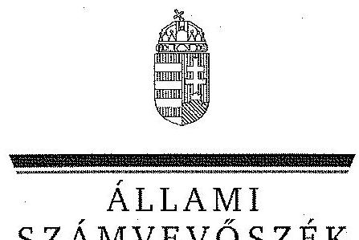
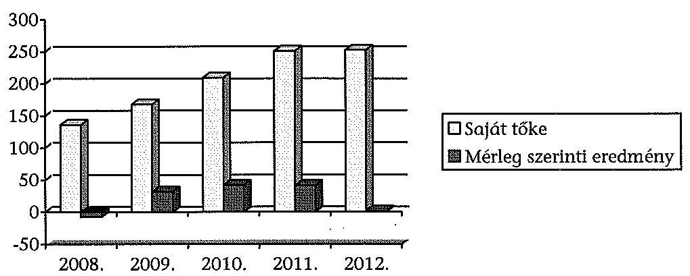
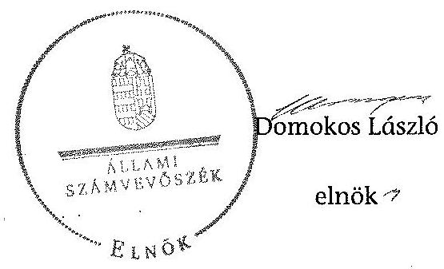
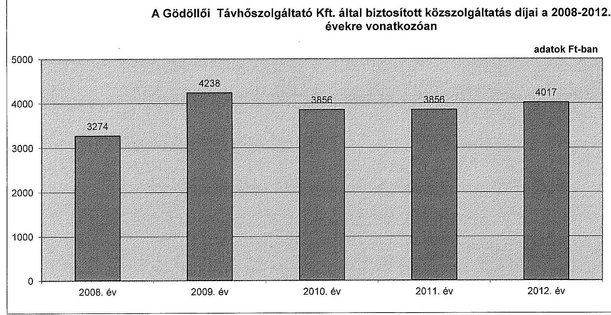
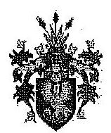
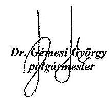
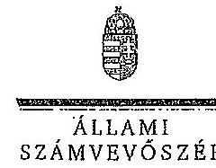
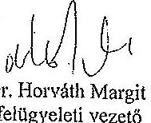

ÁLLAMI
SZÁMVEVŐSZÉK

# JELENTÉS 

Az önkormányzatok gazdasági társaságai - Az önkormányzatok többségi tulajdonában lévő gazdasági társaságok közfeladat ellátását érintő gazdálkodási tevékenysége szabályszerűségének ellenőrzése

Gödöllői Távhőszolgáltató Kft.

---

# Állami Számvevőszék 

Iktatószám: V-0526-174/2014.
Témaszám: 1560
Vizsgálat-azonosító szám: V067121

## Az ellenőrzést felügyelte:

Dr. Horváth Margit
felügyeleti vezető

## Az ellenőrzést vezette és az ellenőrzés végrehajtásáért felelős:   Salamin Viktor   ellenőrzésvezető

A jelentéstervezet összeállításában közremúködtek:
Dr. Mezei Imréné
számvevő tanácsos
Boros Attila
számvevő tanácsos

## Az ellenőrzést végezték:

## Balogh Istvánné

okleveles könyvvizsgáló, külső szakértő

## Váradiné Jassó Mariann

okleveles könyvvizsgáló, külső szakértő

---

# TARTALOMJEGYZÉK 

BEVEZETÉS ..... 7
I. ÖSSZEGZŐ MEGÁLLAPÍTÁSOK, KÖVETKEZTETÉSEK, JAVASLATOK ..... 10
II. RÉSZLETES MEGÁLLAPÍTÁSOK ..... 17

1. Az Önkormányzat közfeladat-ellátásának szabályszerűsége ..... 17
1.1. A közfeladat-ellátás megszervezése és a feladatellátás feltételrendszerének kialakítása ..... 17
1.2. A közfeladat-ellátás felügyelete és a tulajdonosi jogok érvényesítése ..... 22
2. A Gödöllői Távhőszolgáltató Kft. közfeladat-ellátással kapcsolatos tevékenysége ..... 26
2.1. A Gödöllői Távhőszolgáltató Kft. gazdálkodásának szabályozottsága ..... 26
2.2. A Gödöllői Távhőszolgáltató Kft. vagyongazdálkodása ..... 29
2.3. A beszámolási kötelezettség teljesítése ..... 32
3. A távhőszolgáltatás közfeladata bevételei és ráfordításai elszámolásának és önköltségszámításának szabályszerűsége ..... 33
3.1. A távhőszolgáltatás közfeladat bevételeinek és ráfordításainak szabályszerűsége ..... 33
3.2. Az önköltségszámítás szabályszerűsége ..... 38

## MELLÉKLETEK

1. számú A Gödöllői Távhőszolgáltató Kft. tevékenységének főbb adatai
2. számú A Gödöllői Távhőszolgáltató Kft. múködésének főbb jellemzői
3. számú A Gödöllői Távhőszolgáltató Kft. által biztosított közszolgáltatás díjai a 2008-2012. évekre vonatkozóan
4. számú Beérkezett észrevételek és az azokra adott válaszok

## FÜGGELÉKEK

1. számú Mintavételi eljárások ellenőrzési területenként
2. számú Értelmező szótár

---

.

---

# RÖVIDÍTÉSEK JEGYZÉKE 

## Törvények

Avtv.

Áfa tv.
Ármegállapító törvény
Gt.
Info tv.

Nvtv.

Számv. tv.
Tszt.

## Rendeletek

36/2009. (VII. 22.)
KHEM rendelet

50/2011. (IX. 30.) NFM rendelet

Áhsz

SZMSZ
a személyes adatok védelméről és a közérdekű adatok nyilvánosságáról szóló 1992. évi LXIII. törvény (hatályos 2011. december 31-élg)
az általános forgalmi adóról szóló 2007. évi CXXVII. törvény (hatályos 2008. január 1-jétől)
az árak megállapításáról szóló 1990. évi LXXXVII törvény (hatályos: 1991. január 1-jétől)
a gazdasági társaságokról szóló 2006. évi IV. törvény (hatálytalan: 2014. március 15 -től)
az információs önrendelkezési jogról és az információszabadságról szóló 2011. évi CXII. törvény (hatályos: 2011. július 27-étől)
a nemzeti vagyonról szóló 2011. évi CXCVI. törvény (hatályos: 2011. december 31-étől, kivéve a 20. § (2) bekezdésben meghatározott paragrafusok, amelyek 2012. január 1-jétől, a (3) bekezdésben meghatározott paragrafusok 2013. január 1-jétől, a (4) bekezdésben meghatározott paragrafus 2012. március 2-ától léptek hatályba)
a helyi önkormányzatokról szóló 1990. évi LXV. Törvény (hatálytalan: a 2014. évi általános önkormányzati választások napjától)
a számvitelről szóló 2000. évi C. törvény (hatályos: 2001. január 1-jétől)
a távhőszolgáltatásról szóló 2005. évi XVIII. törvény (hatályos: 2005. július 1-jétől)
a távhőszolgáltatás csatlakozási díjának és a lakossági távhőszolgáltatás díjának, valamint a hőenergia távhőtermelő és a távhőszolgáltató közötti szerződésében alkalmazott árának meghatározása során figyelembe veendő szempontokról és a Magyar Energia Hivatal által lefolytatott eljárásban kötelezően benyújtandó adatok köréről
a távhőszolgáltatónak értékesített távhő árának, valamint a lakossági felhasználónak és a külön kezelt intézménynek nyújtott távhőszolgáltatás díjának megállapításáról
a távhőszolgáltatási támogatásról szóló 51/2011. (IX. 30.) rendelet
az államháztartás szervezetei beszámolási és könyvvezetési kötelezettségének sajátosságairól szóló 249/2000. (XII. 24.) Korm. rendelet (hatálytalan: 2014. január 1-jétől

Gödöllő Város Polgármesteri Hivatalának Szervezeti és Müködési Szabályzata (hatályos: 2008. október 30-ától és

---

Társasági SZMSZ

Távhőszolgáltatási és árképzési rendelet

Távhőszolgáltatási rendelet
Vagyongazdálkodási rendelet $_{1}$

Vagyongazdálkodási rendelet $_{2}$

## Szórövidítések

Adatvédelmi szabályzat
ÁFA
Alapító Okirat

APEH
ÁSZ
Értékelési szabályzat

## FB

Jegyzó
Képviselő-testület
Közszolgáltatási szerződés

Leltározási szabályzat

MÁK
MAVIR
MEH
MEKH
MSZE
annak 2010. március 10-ei módosítása)
A Gödöllői Távhőszolgáltató Kft. Szervezeti és Múködési Szabályzata (hatályos 2001. szeptember 20-ától és annak 2012. április 5-ei módosítása)
20/2000. (VI. 13.) Önkormányzati rendelet a távhőszolgáltatásról, annak dijképzéséről és a dijalkalmazás feltételeiről
16/2010. (VI. 25.) Önkormányzati rendelet a távhőszolgáltatásról
Gödöllő Város Önkormányzatának 45/2005. (XII. 19.) rendelete az Önkormányzat vagyonáról, a vagyontárgyak feletti tulajdonosi jogok gyakorlásáról (hatályos: 2006. január 1-jétől)
Gödöllő Város Önkormányzatának 8/2012. (III. 8.) rendelete az Önkormányzat vagyonáról, a vagyontárgyak feletti tulajdonosi jogok gyakorlásáról (hatályos: 2012. március 9 -től)

Adatvédelmi és a közérdekú adatok megismerésére vonatkozó szabályzat (hatályos: 2012. január 1-jétől)
általános forgalmi adó
Gödöllői Távhőszolgáltató Kft. Alapító Okirata (hatályos: 2000. március 23 -tól, és annak 2008. május 29 -ei, 2009. december 22-ei, 2010. február 4-i, 2010. december 16-ai, 2011. május 19-ei és 2012. december 13-ai módosításai)
Adó- és Pénzügyi Ellenőrzési Hivatal
Állami Számvevőszék
Értékelési szabályzat (hatályos 2001. március 1-jétől, és annak 2011. július 25 -ei módosítása)
Gödöllői Távhőszolgáltató Kft. Felügyelőbizottsága
Gödöllő Város Önkormányzatának jegyzője
Gödöllő Város Önkormányzatának Képviselő-testülete
Gödöllő Város Önkormányzata és a Gödöllői Távhő Kft. között létrejött, a távhőszolgáltatás és távhő-termelési feladat ellátásáról, a feladat ellátásához szükséges vagyontárgyak bérletbe-, illetve tulajdonba átadásáról szóló szerződés (hatályos: 2000. június 19-től, és annak 2008. április 14-ei, 2009. március 26 -ai, 2010. március 22 -ei, 2011. március 4-i, 2012. március 22 -ei és 2012. december 20-ai módosításai)
Leltározási szabályzat (hatályos: 2001. március 1-jétől és annak 2010. október 29-ei módosítása)
Magyar Államkincstár
Magyar Villamosenergia Irányító Rendszer
Magyar Energia Hivatal
Magyar Energetikai és Közmű-szabályozási Hivatal
Mérleg szerinti eredmény

---

| NAV | Nemzeti Adó- és Vámhivatal |
| :--: | :--: |
| Önkormányzat | Gödöllő Város Önkormányzata |
| Önköltségszámítási sza-   bályzat | Önköltségszámítási szabályzat (hatályos: 2010. november 30-ától és annak 2012. január 30-ai módosítása) |
| Pénzkezelési szabályzat | Pénzkezelési szabályzat (hatályos: 2001. március 1-jétől és annak 2008. március 1-jei, 2009. január 1-jei, és 2010. február 1-jei módosításai) |
| Polgármester | Gödöllő Város Önkormányzatának Polgármestere |
| Polgármesteri Hivatal | Gödöllő Város Önkormányzatának Polgármesteri Hivatala |
| Selejtezési szabályzat | Selejtezési szabályzat (hatályos: 2001. március 1-jétől) |
| Számlarend | Gödöllői Távhőszolgáltató Kft. számlarendje (hatályos: 2001. március 1-jétől és annak 2007. január 10-ei módosítása) |
| Számviteli politika | Számviteli politika (hatályos 2001. március 1-jétől és annak 2012. március 14-ei módosítása) |
| Társaság | Gödöllői Távhőszolgáltató Kft. |
| Távhőszolgáltató Kft. | Gödöllői Távhőszolgáltató Kft. |
| Üzletszabályzat | Üzletszabályzat (hatályos: 2000. április 1-jétől és annak 2012. november 28-ai módosítása) |

---

# **Chemistry**

## **Chemical Reactions**

### **Balancing Chemical Equations**

1. **Write the unbalanced equation:**
   - Example: $$C_3H_8 + O_2 \rightarrow CO_2 + H_2O$$

2. **Balance the equation:**
   - Example: $$2C_3H_8 + 7O_2 \rightarrow 6CO_2 + 8H_2O$$

3. **Balance the equation:**
   - Example: $$2C_3H_8 + 7O_2 \rightarrow 6CO_2 + 8H_2O$$

### **Types of Reactions**

1. **Combination Reaction:**
   - Example: $$2H_2 + O_2 \rightarrow 2H_2O$$

2. **Decomposition Reaction:**
   - Example: $$2H_2O_2 \rightarrow 2H_2O + O_2$$

3. **Single Displacement Reaction:**
   - Example: $$Zn + 2HCl \rightarrow ZnCl_2 + H_2$$

4. **Double Displacement Reaction:**
   - Example: $$AgNO_3 + NaCl \rightarrow AgCl + NaNO_3$$

5. **Combustion Reaction:**
   - Example: $$CH_4 + 2O_2 \rightarrow CO_2 + 2H_2O$$

## **Stoichiometry**

### **Mole Concept**

- **Mole (mol):** The amount of substance containing as many particles (atoms, molecules, ions) as there are atoms in exactly 12 grams of carbon-12.
- **Avogadro's Number:** $$6.022 \times 10^{23}$$ particles per mole.

### **Molar Mass**

- **Molar Mass:** The mass of one mole of a substance.
- Example: The molar mass of water ($$H_2O$$) is 18.015 g/mol.

### **Calculations**

1. **Moles to Mass:**
   - Formula: $$n = \frac{m}{M}$$
   - Example: Calculate the number of moles of $$H_2O$$ in 18 grams of water.
     - $$n = \frac{18.015 \, \text{g}}{18.015 \, \text{g/mol}} = 18.015 \, \text{g/mol}$$

2. **Moles to Mass:**
   - Formula: $$m = n \times M$$
   - Example: Calculate the mass of 18.015 g of water.
     - $$m = 18.015 \, \text{g/mol} = 18.015 \, \text{g/mol}$$

## **Gas Laws**

### **Ideal Gas Law**

- **Equation:** $$PV = nRT$$
- **Variables:**
  - $$P$$: Pressure (atm)
  - $$V$$: Volume (L)
  - $$n$$: Number of moles (mol)
  - $$R$$: Ideal gas constant (0.0821 L·atm/mol·K)
  - $$T$$: Temperature (K)

### **Boyle's Law**

- **Equation:** $$P_1V_1 = P_2V_2$$
- **Variables:**
  - P₁: Pressure (atm)
  - P₂: Volume (L)
  - P₃: Temperature (K)
  - P₁: Pressure (atm)
  - P₂: Volume (L)
  - P₃: Temperature (K)
  - P₁: Pressure (atm)

### **Boyle's Law (Boyle's Law)**

- **Equation:** $$\frac{P_1V_1}{P_2V_2} = \frac{V_1}{T_1}$$
- **Variables:**
  - P₁: Pressure (atm)
  - P₂: Volume (L)
  - P₃: Temperature (K)
  - P₁: Pressure (atm)
  - P₂: Volume (L)
  - P₃: Temperature (K)
  - P₁: Pressure (atm)

## **Thermochemistry**

### **Enthalpy (H)**

- **Definition:** The heat content of a system at constant pressure.
- **Equation:** $$\Delta H = q_p$$
- **Variables:**
  - $$q_p$$: Heat transferred at constant pressure.
  - $$q_p$$: Heat transferred at constant pressure.

### **Hess's Law**

- **Statement:** The enthalpy change for a reaction is the same whether it occurs in one step or multiple steps.
- **Equation:** $$\Delta H_{\text{rest}} = \Delta H - q_p$$
- **Variables:**
  - $$\Delta H$$: Heat transferred at constant pressure.
  - $$\Delta H$$: Heat transferred at constant pressure.

### **Hess's Law 2.0**

- **Statement:** The enthalpy change for a reaction is the same whether it occurs in one step or multiple steps.
- **Equation:** $$\Delta H_{\text{rest}} = \Delta H - q_p$$
- **Variables:**
  - $$H$$: Heat transferred at constant pressure.
  - $$q_p$$: Heat transferred at constant pressure.

## **Electrochemistry**

### **Oxidation and Reduction**

- **Oxidation:** Loss of electrons.
- **Reduction:** Gain of electrons.

### **Galvanic Cells**

- **Definition:** A cell that converts chemical energy into electrical energy.
- **Components:**
  - Anode: Oxidation occurs.
  - Cathode: Reduction occurs.
  - Salt Bridge: Connects the two half-cells.

### **Nernst Equation**

- **Equation:** $$E = E^\circ - \frac{RT}{nF} \ln Q$$
- **Variables:**
  - $$E$$: Energy (K)
  - $$E^\circ$$: Heat transferred (K)
  - $$E^\circ$$: Oxidation and Reduction (L)
  - $$T$$: Temperature (K)
  - $$n$$: Number of electrons transferred
  - $$F$$: Faraday constant (96,485 C/mol)
  - $$Q$$: Reaction quotient

---

# JELENTÉS 

## Az önkormányzatok gazdasági társaságai Az önkormányzatok többségi tulajdonában lévő gazdasági társaságok közfeladat ellátását érintő gazdálkodási tevékenysége szabályszerűségének ellenőrzése

## Gödöllői Távhőszolgáltató Kft.

## BEVEZETÉS

Az Állami Számvevőszék középtávra szóló stratégiájában megfogalmazta, hogy a helyi önkormányzatok gazdálkodásában rejlő pénzügyi kockázatok feltárásával, az államháztartáson kívülre nyújtott költségvetési támogatások és ingyenes vagyonjuttatások, valamint az államháztartáson kívül múködő köz-feladat-ellátó rendszerek ellenőrzéseivel hozzájárul ahhoz, hogy a közpénzeket az államháztartáson kívül múködő szervezetek is átlátható, rendezett módon használják fel a közfeladatok szerződésben vállalt ellátása érdekében.

Az önkormányzatok szervezetalakítási szabadságának következménye, hogy a korábban is vállalati formában múködő (nagyvárosi tömegközlekedés, víz-, szennyvízcsatorna, köztisztasági, ingatlankezelés stb.) közszolgáltatások mellett, mind a kötelező, mind az önként vállalt feladatok ellátásában a gazdasági társaságok kiemelt fontosságú szerephez jutottak.

Gödöllő Város Önkormányzatának Képviselő-testülete a 30/2000. (III. 23.) számú határozatával létrehozta a Gödöllői Távhőszolgáltató Kft-t, amelyben az ellenőrzött időszakban az Önkormányzat 100\%-os tulajdoni részesedéssel rendelkezett.

Az Önkormányzat és a Távhőszolgáltató Kft. Közszolgáltatási szerződést kötött a távhőszolgáltatás folyamatos és biztonságos ellátása céljából. A Közszolgáltatási szerződés az ellátandó közfeladat előirása mellett az Önkormányzat tulajdonát képező, távhőszolgáltatás céljára rendelkezésre álló közmú vagyon bérletére és üzemeltetésére vonatkozó díjakat és a bérleti jogviszony szabályait is rögzítette.

A Távhőszolgáltató Kft. alaptevékenysége Gödöllő Város közigazgatási területén a távhőszolgáltatás biztosítása, hőenergia termelése, értékesítése, fűtés és használati melegvíz szolgáltatás, valamint hőtermelő, hőelosztó és hőfelhasználó berendezések létesítése, fenntartása, javítása és üzemeltetése volt.

---

Az ellenőrzési időszak alatt a Távhőszolgáltató Kft. két fűtőművével 1970 lakás, valamint 80 intézmény (óvoda, iskola, egészségügyi intézmény) fűtését és melegvíz ellátását biztosította. A hőtermelésben és hőszolgáltatásban foglalkoztatottak létszáma 2008-ban 21 fő, míg 2012-ben 20 fő volt.

A Társaság összes árbevétele 2008-ban 671,9 M Ft, 2012-ben 724,1 M Ft volt, amelyből 547,5 M Ft-ot az értékesítés nettó árbevétele címén realizáltak. Az árbevételek az ellenőrzött időszakban 7,8\%-kal, a ráfordítások 5,9\%-kal emelkedtek.

A Társaság mérleg szerinti eszközállománya a 2008. évi 310,0 M Ft-ról a 2012. év végére $20,6 \%$-os növekedést követően $374,0 \mathrm{M}$ Ft-ra nőtt, ezen belül a tárgyi eszközök állománya $59 \%$-kal csökkent. A saját tőke a 2008. évi 135,9 M Ft-ról 2012. év végére $252,5 \mathrm{M}$ Ft-ra változott.

Az ellenőrzött időszakban a polgármester és a jegyző személye nem változott. A polgármester az 1990. évi önkormányzati választások óta tölti be tisztségét, a helyszíni ellenőrzés időszakában a munkakört betöltő jegyző 1990. december 12. óta látja el feladatait. A Távhőszolgáltató Kft. ügyvezetőjének és a főkönyvelőjének személye egy alkalommal változott. A jelenlegi ügyvezető és főkönyvelő 2010. január 1. óta tölti be tisztségét.

Az önkormányzati tulajdonú gazdasági társaságok teljes körű ellenőrzésének lehetőségét az Állami Számvevőszékről szóló 1989. évi XXXVIII. törvény 2011. január 1-jétől hatályos módosítása teremtette meg.

# Az ellenőrzés célja annak értékelése, hogy 

- az önkormányzat a jogszabályi előírások figyelembevételével döntött-e az ellenőrzésre kerülő közfeladat megszervezéséről; az önkormányzat szabályszerűen gyakorolta-e a tulajdonosi jogokat;
- a gazdasági társaság közfeladat-ellátása bevételeinek, ráfordításainak elszámolása, és vagyongazdálkodási tevékenysége megfelelt-e a jogszabályi, illetve a közszolgáltatási szerződésben foglalt tulajdonosi előírásoknak, azok végrehajtása szabályszerű volt-e;
- a közfeladatok átláthatósága és elszámoltathatósága érdekében biztosítva volt-e a közszolgáltatás dijának megalapozottsága szabályszerű önköltségszámítással.

Az ellenőrzés várható hasznosulása: A törvényalkotás számára - az észlelt problémák, szabálytalanságok, vagy egyéb nem kívánatos jelenségek felszínre kerülésével - az ellenőrzés megállapításai segítséget nyújthatnak az államháztartáson kívüli közfeladat-ellátás értékeléséhez, jogszabályi keretei pontosításához, átláthatóságot biztosító szabályozásához. Meghatározhatóvá válnak a közfeladat ellátásában részt vevő államháztartáson kívüli szervezeteknek - az önkormányzat költségvetését és pénzügyi helyzetét is befolyásoló - kockázatai, lehetővé válik ezen kockázatok csökkentése. Értékelhetővé válik, hogy a feladatot ellátó gazdasági társaság a közszolgáltatási szerződésben foglaltak betartásával, a közvagyon használatával biztosította-e a szolgáltatás folytatásának feltételeit. Ezzel az ellenőrzöttek és a helyi döntéshozók számára visszajelzést ad

---

feladatszervezési, feladat-ellátási kockázataikról, alapot ad a meglévő hibák megszüntetéséhez, a jobb közfeladat-ellátás biztosításához. Fokozza a fegyelmet, igazolja, hogy lejárt a következmények nélküli ellenőrzések időszaka. Az ÁSZ értékteremtő rend kialakításához és megőrzéséhez hozzájáruló tevékenysége pozitív hatással van a szervezetről kialakított összkép formálására is.

A bevételek és ráfordítások elszámolása, valamint a vagyonnyilvántartás terén az egyes területek szabályszerű működését mintavétellel ellenőriztük, ez alapján a sokaságokban előforduló hibás tételek arányát becsültük. A jogszabályoknak és a belső előírásoknak megfelelőnek, azaz szabályszerűnek tekintettük az adott bevételek és ráfordítások elszámolását, a vagyonnyilvántartást, amennyiben a minta ellenőrzésének eredménye alapján $95 \%$-os bizonyossággal a teljes sokaságban a hibás tételek aránya kisebb volt, mint $10 \%$, nem megfelelőnek értékeltük, ha a hibás tételek aránya a 10\%-ot meghaladta. Kockázatot, illetve magas kockázatot jeleztünk, amennyiben egy adott terület vonatkozásában a minta alapján a teljes sokaságban nem volt teljes körűen biztosított a jogszabályoknak és a belső szabályzatoknak megfelelő működés.

Az ellenőrzést a számvevőszéki ellenőrzés szakmai szabályai szerint, szabályszerűségi ellenőrzés módszerével, a vonatkozó nemzetközi standardok figyelembe vételével, a Gödöllői Távhőszolgáltató Kft.-nél és Gödöllő Város Önkormányzatánál végeztük. Az ellenőrzés a 2008-2012. évekre terjedt ki.

Az ellenőrzés végrehajtásának jogszabályi alapját az Állami Számvevőszékről szóló 2011. évi LXVI. törvény 5. § (3)-(4)-(5) bekezdése képezi.

Az ÁSZ az Állami Számvevőszékről szóló 2011. évi LXVI. törvény 29. §-a alapján a jelentéstervezetet észrevételezésre megküldte a polgármesternek és a gazdasági társaság ügyvezetőjének. A beérkezett észrevételeket a jelentés véglegesítése során hasznosítottuk. Az észrevételeket és az azokra adott válaszokat a jelentés 4. számú melléklete tartalmazza.

---

# I. ÖSSZEGZŐ MEGÁLLAPÍTÁSOK, KÖVETKEZTETÉSEK, JAVASLATOK 

Az Önkormányzat az ellenőrzött időszakban a távhőszolgáltatási közfeladat ellátását $\mathbf{1 0 0 \%}$-os önkormányzati tulajdonú gazdasági társaságán, a Távhőszolgáltatási Kft.-n keresztül biztosította. A gazdasági társasági formában történő közfeladat ellátás megfelelt az Ötv.-ben foglalt előírásoknak.

Az Önkormányzat 2011-2014. évekre vonatkozó gazdasági programja a főbb fejlesztési tervek között, a környezetvédelemre vonatkozó szakasz keretében jelölte meg a távhőszolgáltatásra vonatkozó feladatot.

Az Önkormányzat Városfejlesztési koncepciójában, valamint a 20082013. évekre vonatkozó Integrált Városfejlesztési Stratégiájában a városi energiagazdálkodás tervfeladataként jelölték meg a távhő-fütés részben megújuló energiaforrásokkal való biztosítását. Ennek megvalósítása a gazdasági programmal összhangban a geotermikus energiára épült volna. Ezen fejlesztési tervek kivitelezésére az ellenőrzött időszakban nem került sor, mivel fejlesztési célú pályázati forrás nem állt rendelkezésre.

Az Önkormányzat nevében a Képviselő-testület felhatalmazása alapján a Polgármester a közszolgáltatást végző Társasággal az ellenőrzött közfeladat ellátására Közszolgáltatási szerződést kötött.

A szerződés célja az volt, hogy az Alapító és a Távhőszolgáltató Kft., mint szolgáltató egymás közti jogviszonyát teljes körűen szabályozza a távhőszolgáltatás folyamatos és biztonságos ellátása érdekében. A szerződés rendelkezett az Önkormányzat tulajdonát képező távszolgáltató közmưrendszer, valamint irodahelyiség Társaság részére történő bérbeadásáról. A távhőszolgáltatás feladatának ellátásához szükséges további tárgyi eszközöket az Önkormányzat a Társaság tulajdonába adta. A Közszolgáltatási szerződés az ellenőrzés alá vont időszakban a múködési feltételeket szabályozta, stabil keretet biztosított a közfeladat ellátásához.

A Közszolgáltatási szerződés a távhő közmúvagyon feletti kontroll biztosítása érdekében rögzítette, hogy az Önkormányzat jogosult volt a közmúvagyon üzemeltetésének ellenőrzésére. Az önkormányzati vagyonvesztés elkerülése érdekében a bérleti díj mértékének megállapításakor a közmúvagyonra elszámolt értékcsökkenés összegét tekintették irányadónak a Közszolgáltatási szerződésben rögzítettek szerint.

Az önkormányzat tulajdonában lévő távhő vagyon eszközállományának használhatósági szintje ${ }^{1}$ ( $28,5 \%$ és $36 \%$ között alakult az ellenőrzött időszakban) azt mutatja, hogy az eszközök értékét megőrizték. Ehhez hozzájárult

[^0]
[^0]:    ${ }^{1}$ A bérbe adott távhő közmúvagyon nettó és bruttó értékének hányadosa az eszközök használhatósági fokát, szintjét mutatja.

---

az, hogy az Önkormányzat a bérbe adott eszközök értékmegőrzése érdekében az éves bérleti díj összegéig a rendkívüli fenntartási költségeket megtérítette a Távhőszolgáltatási Kft.-nek.

A közfeladat ellátás követelményeit az ágazati jogszabályoknak megfelelően önkormányzati rendeletekben és a Társaság Üzletszabályzatában határozták meg.

A Távhőszolgáltatási Kft. Üzletszabályzatában rögzítették a nyújtott szolgáltatásra vonatkozó szakmai követelményeket. A szolgáltatás minőségére vonatkozó előírás volt, a lakossági és egyéb fogyasztók részére folyamatos, biztonságos és meghatározott mértékű (teljesítményű) távhőszolgáltatás biztosítása. A Társaság múködését érintően a távhőszolgáltatásról, annak dijképzéséről és a díjalkalmazás feltételeiről szóló Távhőszolgáltatási és árképzési rendelet, valamint az önkormányzati tulajdonosi jogok gyakorlásáról, a vagyongazdálkodásról és a vagyongyarapításról szóló Vagyongazdálkodási rendelet; idevonatkozó rendelkezései voltak irányadóak.

A Társaság legkésőbb a tárgyévre vonatkozó üzleti terv javaslatában jogosult, illetve köteles volt évente a távhőszolgáltatás díjának felülvizsgálatára vonatkozó javaslatát olyan módon megtenni, hogy az Alapító az ármeghatározó tényezők (költségek) indokoltságát, a díjalkalmazási feltételek felülvizsgálatát, a használati melegvíz számlázásának rendjét, a pótdíj és a felemelt díj mértékének megállapítását ellenőrizni tudja. A Távhőszolgáltató Kft. ezen kötelezettségeinek minden évben határidőben és megfelelő tartalommal eleget tett, melyet a Képviselő-testület minden évben határozataival elfogadott.

A Képviselő-testületi hatáskörbe tartozó ármegállapítást 2011. október 1-től a hatósági ármegállapítás váltotta fel. Emellett fontos változás volt a 2012. január 1-jétől a Tszt.-ben bevezetett, a távhőszolgáltató társaságokra vonatkozó nyereségkorlát. A Távhőszolgáltatási Kft. gazdálkodását érintő jogszabályi változások hatásai a 2011. évtől a Társaság nettó ábevételének és a mérleg szerinti eredményének csökkenésében is megmutatkoztak. A nyereségkorlát bevezetése indokolttá tette az önkormányzati közművagyon apportba adásának előkészítését. Apportba adásra azonban az Nvtv. hatályba lépését követően mivel a közművagyon a helyi önkormányzat korlátozottan forgalomképes törzsvagyonát képezi - nem kerülhetett sor

A Távhőszolgáltatási Kft. Alapító Okirata tartalmazta az alapító megnevezését, az ügyvezető személyét, a cégjegyzés módját, a nyereség felosztását, a Társaság szervezetét, az FB kijelölését, a könyvvizsgáló személyét. A Társaság ügyvezetője felett a munkáltatói jogokat a Képviselő-testület gyakorolta.

Az Alapító Okirat alapján az FB tagjait az Önkormányzat nevezi ki. Az FB-nek 2010-ig öt, majd három tagja volt. A kinevezésekre az előírások alapján szabályosan, a tulajdonosi jogokat gyakorló Képviselő-testület döntéseit követően került sor. A Képviselő-testületre, mint a tulajdonosi jogkör gyakorlójának jogaira a Gt. előírásai vonatkoztak. Az FB tárgyalta az üzleti terv koncepciókat, üzleti terveket és a Számv. tv. szerinti beszámolókat, az ezekről szóló határozatainak kivonatát az Önkormányzat megkapta.

---

Az Önkormányzat a tulajdonosi jogok gyakorlásának rendjét a Gt., valamint az Ötv. előírásainak megfelelően alakította ki, annak gyakorlása szabályszerű volt.

Az Önkormányzat tulajdonosi jogkörében eljárva az Alapító Okiratban szükítette az ügyvezető hatáskörét. Eszerint a Távhőszolgáltatási Kft. hitelt csak az Önkormányzat előzetes írásbeli hozzájárulásával vehetett fel. Ezzel a döntésével a tulajdonosi jogkört gyakorló Önkormányzat jelentős kontrollt gyakorolt a Távhőszolgáltatási Kft. múködése felett.

A Képviselő-testület által elfogadott hatályos Társasági SZMSZ a hatáskörök tekintetében rögzítette, hogy a Képviselő-testület kizárólagos hatáskörébe tartozik olyan szerződés megkötésének jóváhagyása, amelynek értéke a törzstőke legalább egynegyedét meghaladta. Ez a szabályozás ellentmondásban áll a Közszolgáltatási Szerződés előírásával, amely szerint az ügyvezető a jóváhagyott éves üzleti tervének keretei között az abban rögzített feladatokra és költségek erejéig önállóan jogosult szerződéskötésre. Az ellenőrzésbe bevont mintatételek mutatják, hogy a törzstőke egynegyedét (31,2 M Ft) meghaladó összegű szerződéseket is saját hatáskörében kötötte meg az ügyvezető. Az ellenőrzött időszakra évente kiválasztott 15 legnagyobb tételből 12 meghaladta a törzstőke egynegyedét ( 32,6 M Ft-tól 61,7 M Ft-ig). Ezeknél a szerződéseknél hiányzott a Képviselő-testületi jóváhagyás.

A Polgármesteri Hivatal hatályos SZMSZ-ében a Városüzemeltető és Vagyonkezelő Iroda Üzemeltetési-Beruházási Csoportjának feladata „a rendszeres kapcsolattartás a városi távhőszolgáltatást ellátó gazdasági társasággal, közremüködés a távhőszolgáltatást érintő önkormányzati rendeletek előkészitésében". Az SZMSZ szerinti Üzemeltetési-Beruházási Csoport azonban nem múködött az Önkormányzatnál, a feladatokat a Városüzemeltető és Vagyonkezelő Iroda munkatársai végezték, a gyakorlat nem felelt meg az SZMSZ-ben rögzített előírásoknak.

Az Önkormányzat Vagyongazdálkodási rendelete, a Közszolgáltatási szerződés, valamint a Társasági SZMSZ a Távhőszolgáltató Kft. részére előírta üzleti terv és üzleti terv koncepció készítését, melyet évente jóváhagyásra a Képviselőtestület elé kellett terjesztenie. A Távhőszolgáltató Kft. ezen kötelezettségeinek minden évben határidőben és megfelelő tartalommal eleget tett.

A Távhőszolgáltató Kft. a vagyonnal történő gazdálkodás kereteit, a felelősöket, értékhatárokat és eljárási szabályokat az Alapító Okiratban, a Társasági SZMSZ-ben, az eszközök és források leltározási szabályzatában, az eszközök és források értékelési szabályzatában, pénzkezelési szabályzatában és az eszközök selejtezési szabályzatában határozta meg. A gazdasági események elszámolásának szabályozottságát a Számviteli politika, a Számlarend, az Eszközök értékelési, a Pénzkezelési és az Önklötség-számítási szabályzat a jogszabályi előírásoknak megfelelően biztosította.

A Számviteli politika tartalmazott a kiegészítő melléklet tartalmára vonatkozó előírást, ezen belül a Számv. tv. szerinti vagyoni és jövedelmezőségi helyzetre vonatkozó mutatókat.

---

A Távhőszolgáltató Kft. elkészítette Számlarendjét, melyben a Tszt.-ben 2012től rögzített számviteli szétválasztási kötelezettséget nem határoztak meg. A Társaság a Számv. tv. előírásának megfelelően elkészítette a Bizonylati rendet. A Társaság Értékelési szabályzata a Számv. tv. előírásaival, valamint a Számviteli politikával összhangban biztosította a vagyon értékének meghatározását. A Számv. tv.-ben előírtaknak megfelelően a Távhőszolgáltató Kft. rendelkezett Pénzkezelési szabályzattal, amely megfelelően biztosította a készpénzzel való szabályos gazdálkodást.

A Társaság önköltség-számítási szabályzattal is rendelkezett, annak ellenére, hogy ennek készítése a Számv. tv. szerint a számára nem volt kötelező. A tulajdonosi joggyakorló a díjmegállapítás átláthatóságát azonban nagymértékben javította azzal, hogy kezdeményezte a szolgáltatási díjak átláthatósága érdekében Önköltség-számítási szabályzat készítését. Az átlátható és következetes önköltségszámításnak köszönhetően az áriképzés stabil előkalkulációs alapjai, a pontos utókalkuláció és elszámolhatóság biztosított volt.

Az Önkormányzat belső ellenőre az éves tervek készítését megelőzően készített kockázatelemzésében az ellenőrzött időszak minden évében elemezte a Társaság kockázati tényezőit. Az egyes években számított alacsony kockázati értékek ellenére a 2010. évben ellenőrzésre jelölték ki a Társaságot a tevékenység szabályozottsága, a múködés és gazdálkodás eredményességének tárgyában a 2008-2009. évekre vonatkozóan. A belső ellenőrzés javasolta az SZMSZ jogszabályváltozások miatti átdolgozását, egyéb szabályzatok aktualizálását, illetve önköltség-számítási szabályzat készítését, az Egészségügyi Központ áram továbbszámlázására vonatkozó gyakorlatának felülvizsgálatát, az Önkormányzati számlázási rendszer egységesítési lehetőségének áttekintését.

A belső ellenőri jelentés alapján a Társaság ügyvezetője az ellenőrzés során megállapított hiányosságok megszüntetésére intézkedési tervet készített. Az Önkormányzat belső ellenőre éves jelentésében beszámolt a Társaságnál végzett ellenőrzésről, illetve a Társaság ügyvezetője intézkedési tervében foglaltak teljesítéséről, amelyet a Képviselő-testület megtárgyalt és elfogadott.

Az ellenőrzési időszak alatt a saját és bérelt vagyon nyilvántartása, leltározása és selejtezése az előírásoknak megfelelően történt. Az értékcsökkenés elszámolása szabályos volt. Az üzemeltetett önkormányzati közművagyon körét az egyes éveket lezáró leltárak tartalmazták. Az önkormányzattól bérelt közművagyon leltározását és selejtezését az önkormányzat előírása alapján évente elvégezték. A selejtezési javaslatot az önkormányzat ellenőrizte és jóváhagyta.

A Társaság közfeladat-ellátását a felelős, kiegyensúlyozott gazdálkodás jellemezte.

A Távhőszolgáltató Kft. mérlegfőösszege 2008. január 1. és 2012. december 31. között $8,6 \%$-kal növekedett. A növekedés az eszköz oldalon két ellentétes tendencia eredőjeként jött létre. Az időszak folyamán folyamatosan csökkent a befektetett eszközök/tárgyi eszközök nettó értéke, az időszak végi érték mindösz-

---

sze $35 \%$-a volt a 2008. évinek. Eközben folyamatosan nőtt a forgóeszközök, ezen belül a követelések értéke.

A Társaságnál a saját tőke folyamatos emelkedése a 2009-2012 közötti időszak nyereséges gazdálkodásának eredménye volt, a záró érték $75,8 \%$-kal haladta meg a 2008. január 1-jei értéket. A tulajdonos Önkormányzat a Távhőszolgáltatási Kft. jegyzett tőkéjét az eredménytartalék terhére 2008. május 29 -ei hatállyal, $42,0 \mathrm{M}$ Ft-tal felemelte. A tőkeemelés célja az volt, hogy az eredménytartalék terhére elvégzett beruházások értékével megnöveljék a jegyzett tőkét. További előnyként fogalmazták meg, hogy a magasabb jegyzett tőke összegére tekintettel a pályázatok elbírálása során előnyösebb megítélésben részesülhetnek.

Az ellenőrzött időszak éveit tekintve a 2008. évet kivéve nyereséges volt a Távhőszolgáltatási Kft. gazdálkodása. Az Önkormányzat a 2009-2012. években képződött eredményt az eredménytartalékba helyeztette, osztalékfizetésre nem került sor.

A tulajdonosi jogokat gyakorló Képviselő-testület határozatba foglalta, hogy a 2009. évi önkormányzati költségvetés általános tartaléka terhére a Távhőszolgáltatási Kft. likviditási helyzetének javítása érdekében 30,0 M Ft öszszegű kamatmentes tagi kölcsönt nyújt. Az ellenőrzött időszakban más hitel, illetve kölcsönügylet, kezességvállalás az Önkormányzat és a Távhőszolgáltatási Kft. között nem volt.

Az ellenőrzött években a Társaság átlátható, naprakész vagyonnyilvántartással rendelkezett.

Az ellenőrzött években a Távhőszolgáltató Kft. beszámolási és adatszolgáltatási kötelezettsége szabályozott volt, a kötelezettségeinek az előírások szerint minden esetben, határidőben, az előírt tartalommal eleget tett. Az ellenőrzött időszakban a Távhőszolgáltatási Kft. Számv. tv. szerinti beszámolóit a független könyvvizsgálói jelentéssel együtt, az FB javaslatával az Önkormányzat Képviselő-testülete fogadta el.

A 2008. évi veszteséget az energiahordozók árának 2008 őszétől bekövetkező jelentős emelkedése okozta. A Társaság által vásárolt földgáz ára 46 M Ft-tal haladta meg a hődíj bevételeket, majd 2009 tavaszán az energia árak emelkedése megállt, csökkenni kezdett, ennek következtében a Távhőszolgáltató Kft. ismét nyereségesen múködött.

Az értékesítés nettó árbevétele a 2008. évi 660,2 M Ft-ról a 2009. és 2010. évi növekedés után, 2012. évre 547,5 M Ft-ra csökkent. A 2008. évi 481,0 M Ft-ról 2009. évre 546,0 M Ft-ra nőtt a távhő és melegvíz szolgáltatás árbevétele, majd 2012. év végére 491,0 M Ft-ra csökkent. A 2011. évi csökkenést a rögzített hatósági ár bevezetése, valamint a továbbszámlázott gáz árbevételének jelentős, $60 \%$-os visszaesése okozta. Az ellenőrzött tételekből megállapítást nyert, hogy az értékesítés nettó árbevételének számlázása, beszedése, elszámolása és azok közfeladat-ellátással kapcsolatos elkülönítése szabályszerűen történt.

---

A Társaság kizárólag távhőtermelési és távhőszolgáltatási feladatot végez, így a felmerült ráfordítások és a bevételek teljes egészében a közfeladat ellátáshoz kapcsolódnak.

Az anyagjellegü ráfordítások elszámolása és azok közfeladat-ellátással kapcsolatos elkülönítése szabályszerűen történt. A Társaság bérgazdálkodására a takarékosság volt jellemző.

A Távhőszolgáltató Kft. az ellenőrzés alá vont időszak alatt a szabályzatában meghatározott módon kezelte a lejárt követeléseit. A vevökövetelések 2008 és 2012. évek között folyamatosan, a 2008. év végi 23,2 M Ft-ról 2012. év végére 54,2 M Ft-ra növekedtek. A Távhőszolgáltató Kft. számviteli politikájában meghatározta a követelésekre elszámolandó értékvesztést. Az értékvesztés elszámolása során a szabályzatában meghatározott módon járt el.

A követelésállomány növekedése - figyelemmel az Önkormányzat által biztosított tagi kölcsönre is - a 2009. és 2012. évek között nem okozott finanszírozási problémákat a Távhőszolgáltató Kft.-nél.

A Távhőszolgáltató Kft.-nél az ellenőrzött időszakban az APEH/NAV hat alkalommal végzett ellenőrzést, melyek következtében intézkedésre nem volt szükség.

A fentiekben leírtak összegzéseként az alábbi megállapításokat tesszük:
Gödöllő Város Önkormányzatának Képviselő-testülete a távhőszolgáltatás közfeladatának megszervezéséről a jogszabályi előírásoknak megfelelően gondoskodott. A Közszolgáltatási szerződés az ellenőrzés alá vont időszakban a működési feltételeket megfelelően szabályozta, stabil keretet biztosított a közfeladat ellátásához, biztosította a távhővagyon értékmegőrzését. Az Önkormányzat a tulajdonosi jogokat szabályszerűen gyakorolta, a távhőszolgáltatási feladatot ellátó társaság tevékenységét pedig átlátható, szabályozott gazdálkodás jellemezte. Szabályozás tekintetében a közszolgáltatási szerződés és a társasági SZMSZ között ellentmondás áll fenn², ennek feloldása indokolt. A vevőkövetelések összege az ellenőrzött időszakban - a megtett intézkedések ellenére is mintegy duplájára emelkedett, ezért a követeléskezelésre kiemelt figyelmet szükséges fordítani. Az átlátható és következetes önköltségszámításnak köszönhetően az árképzés stabil előkalkulációs alapjai, a pontos utókalkuláció és elszámolhatóság biztosított volt.

Az Állami Számvevőszékről szóló 2011. évi LXVI. törvény 33. § (1) bekezdésében foglaltak értelmében a jelentésben foglalt megállapításokhoz kapcsolódó intézkedési tervet köteles az ellenőrzött szervezet vezetője összeállítani, és azt a jelentés kézhezvételétől számított 30 napon belül az ÁSZ részére megküldeni. Amennyiben az intézkedési tervet határidőben nem küldi meg a szervezet,

[^0]
[^0]:    ${ }^{2}$ A Polgármester úrtól kapott tájékoztatás és dokumentumok alapján 2014. január 1jétől az új vagyonkezelési szerződés megkötésével az ügyvezető szerződéskötési jogosultságával kapcsolatos szabályozási ellentmondás megszűnt.

---

vagy az nem elfogadható, az ÁSZ elnöke a hivatkozott törvény 33. § (3) bekezdés a)-b) pontjaiban foglaltakat érvényesítheti.

Az ellenőrzés intézkedést igénylő megállapításai és javaslatai:
Javaslataink célja az önkormányzat szabályszerű müködésének elősegítése, továbbá az önkormányzati tulajdonosi joggyakorlás kontrolljainak erősítése.

# Javasoljuk Gödöllő Város Önkormányzata jegyzőjének: 

A Polgármesteri Hivatal SZMSZ-ének előirása szerint a Városüzemeltető és Vagyonkezelő́ Iroda Üzemeltetési-Beruházási Csoportjának feladata volt az ellenőrzött időszakban a rendszeres kapcsolattartás a Távhőszolgáltató Kft.-vel, közreműködés a távhőszolgáltatást érintő önkormányzati rendeletek előkészítésében. Az SZMSZ szerinti Üzemeltetési-Beruházási Csoport azonban a Polgármesteri Hivatalban nem müködött, a megjelölt feladatokat a Városüzemeltető és Vagyonkezelő Iroda munkatársai végezték.

Javaslat:
Gondoskodjon a jogszabályi elöírások szerinti gyakorlat és szabályos müködés biztosítására, ezen belül:
készítse el a Polgármesteri Hivatal SZMSZ-ének módosítását annak érdekében, hogy a szabályzatban rögzített távhőszolgáltatással kapcsolatos tulajdonosi közreműködői feladatok és az alkalmazott gyakorlat összhangban legyenek, továbbá kezdeményezze a módosított SZMSZ kiadását.

---

# II. RÉSZLETES MEGÁLLAPÍTÁSOK 

## 1. Az ÖNKORMÁNYZAT KÖZFELADAT-ELLÁTÁSÁNAK SZABÁLYSZERÜSÉGE

### 1.1. A közfeladat-ellátás megszervezése és a feladatellátás feltételrendszerének kialakítása

A távhőszolgáltatási feladat ellátása az ellenőrzött időszakban a kötelezö önkormányzati feladatok közé tartozott. A Tszt. 6.§ (1) bekezdésének előírása szerint a területileg illetékes települési önkormányzatok a távhőszolgáltatásra engedéllyel ${ }^{3}$ rendelkezők útján kötelesek biztosítani a távhőszolgáltatással ellátott létesítmények távhő ellátását.

Az Önkormányzat az ellenőrzött időszakban a távhőszolgáltatási közfeladat ellátását 100,0\%-os önkormányzati tulajdonú gazdasági társaságán keresztül biztosította. A Képviselő-testület határozata ${ }^{4}$ alapján a távhőellátás biztosítására az Önkormányzat megalapította a Távhőszolgáltatási Kft-t. A gazdasági társasági formában történő közfeladat ellátás megfelelt az Ötv. 9. § (4) bekezdésében foglalt előírásoknak. A Társaság törzstőkéje az ellenőrzött időszakban $125,0 \mathrm{M}$ Ft volt. Tulajdonosi döntés alapján a Távhőszolgáltatási Kft. az alapításától fogva kizárólag a távhőellátás biztosításához szükséges tevékenységeket végzi.

A Képviselő-testület a társaság törzstőkéjét alapításkor 14,0 M Ft-ban határozta meg, mely teljes egészében pénzbeli betétből állt. Az ellenőrzött időszak kezdetéig több alkalommal hajtottak végre tőkeemelést, így a jegyzett tőke 2007. július 13ig 83,0 M Ft-ra emelkedett. 2008. évben a 154/2008. (V. 29.) sz. önkormányzati határozattal a Képviselő-testület jóváhagyta a Gödöllői Távhőszolgáltató Kft. törzstőkéjének 42,0 M Ft-tal történő felemelését az eredménytartalék terhére. A felemelt törzstőke nagysága 2008. május 29-től kezdődően 125,0 M Ft.

Az ellenőrzött időszakra vonatkozó Társasági Alapító Okirat és annak módosításai alapján a feladatellátásra, a tulajdonosra, a tulajdonos részesedésére vonatkozó változtatásokra nem került sor. Az Alapító Okirat egyéb módosításait szabályszerűen, az önkormányzati határozathozatalt követően végezték el, a változások cégbírósági bejegyzését a kiadott cégbírósági végzések igazolták. A Távhőszolgáltatási Kft. által ellátandó önkormányzati közfeladat a társasági Alapító Okiratban rögzítésre került, az ellenőrzött időszakban a Társaság főtevékenysége a gőzellátás és a légkondicionálás volt.

[^0]
[^0]:    ${ }^{3}$ A Társaság tevékenységére - kérelme alapján - a jegyző 2000. június 26 -án határozatot hozott, amelyben múködési, hőtermelői és hőszolgáltatói engedélyt adott a Társaság részére.
    ${ }^{4}$ 30/2000 (III. 23.) önkormányzati határozat.

---

Az Önkormányzat 2011-2014. évekre vonatkozó gazdasági programját ${ }^{5}$ a Képviselő-testület 2011. április 21-én határozattal ${ }^{6}$ fogadta el. A gazdasági program az Önkormányzat adott időszakra vonatkozó főbb fejlesztési tervei között, a környezetvédelemre vonatkozó szakasz keretében jelölte meg a távhőszolgáltatásra vonatkozó feladatot.

A 2011. és 2014. évek közötti időszakra vonatkozó Gazdasági programban az elsődleges feladatok között rögzítették a megújuló energia használatának elősegítését, a geotermikus energia hasznosítását. A tervekben a városi távhő hálózat megújítása szerepelt pályázati forrás bevonásával annak érdekében, hogy korszerű, kis energia veszteségű rendszerrel csatlakozzanak a termálfűtés hálózatára.

Az Önkormányzat hatályos Városfejlesztési koncepciójában ${ }^{7}$, valamint a 2008-2013. évekre vonatkozó Integrált Városfejlesztési Stratégiában a városi energiagazdálkodás tervfeladataként jelölték meg a távhő fűtés részbeni megújuló energiaforrásokkal való biztosítását. Ennek megvalósítása a gazdasági programmal összhangban a geotermikus energiára épült volna. A Gazdasági programban, Városfejlesztési koncepcióban, valamint Integrált Városfejlesztési Stratégiában szereplő, környezetvédelemhez kapcsolódó távhő fejlesztési tervek megvalósítására az ellenőrzött időszakban nem került sor, mert a kapcsolódó fejlesztési célú pályázati forrás nem állt rendelkezésre.

Az Önkormányzat nevében a Képviselő-testület felhatalmazása alapján a Polgármester a közszolgáltatást végző Társasággal az ellenőrzött közfeladat ellátására Közszolgáltatási szerződés megkötéséről határozott ${ }^{8}$. A szerződés célja az volt, hogy az Alapító és a Távhőszolgáltató Kft., mint szolgáltató egymás közti jogviszonyát teljes körűen szabályozza a távhőszolgáltatás folyamatos és biztonságos ellátása érdekében. A szerződés rendelkezett az Önkormányzat tulajdonát képező távszolgáltató közmưrendszer, valamint irodahelyiség Társaság részére történő bérbeadásáról. A távhőszolgáltatás feladatának ellátásához szükséges tárgyi eszközöket az Önkormányzat a Társaság tulajdonába adta.

A Képviselő-testület határozata jóváhagyta a Gödöllői Távhőszolgáltató Kft.-vel kötendő, a távhőszolgáltatás és távhőtermelés feladatok ellátásáról, a feladat ellátásához szükséges vagyontárgyak bérletbe-, illetve tulajdonba-adásáról szóló szerződést és felhatalmazta a polgármestert a Közszolgáltatási szerződés megkötésére. A 2000. június 9-én aláírt szerződés szabályozta a felek együttműködési kötelezettségét, az Önkormányzat tulajdonát képező távhőszolgáltató közmưrendszer bérletét és üzemeltetését, rendelkezett a közművagyon fejlesztéséről, a tárgyi eszközök tulajdonjogának átadásátvételéről, helyiségbérleti szerződéskötésről, szolgáltató jogszerzéséről idegen ingatlanon.

[^0]
[^0]:    ${ }^{5}$ Az Önkormányzat korábbi időszakra vonatkozó gazdasági programot - az Ötv. 91.§ (1) bekezdésében előírt kötelezettség ellenére - nem tudott bemutatni.
    ${ }^{6} 77 / 2011$. (IV. 21.) számú önkormányzati határozat.
    ${ }^{7}$ kelt: 2006. augusztus 1.
    ${ }^{8}$ Képviselő-testület 102/2000. (VI. 8.) sz. határozata.

---

Az ellenőrzés alá vont időszak alatt a Közszolgáltatási szerződést minden évben módosították a bérleti díjak, a helyiség bérlemény és az üzemeletetésre átadott önkormányzati vagyon változásával összhangban. A módosítások minden esetben a Képviselő-testület jóváhagyásával, határozatával történtek. A Közszolgáltatási szerződés az ellenőrzés alá vont időszakban a múködési feltételeket szabályozta, stabil keretet biztosított a közfeladat ellátásához.

A Távhőszolgáltatási Kft. számára bérbe adott önkormányzati vagyon körét a Közszolgáltatási alapszerződés 1. számú mellékletében részletezték. A melléklet a 2000. január 1-jei vagyonérték adatait és bruttó értékét tartalmazta, tételesen bemutatva az átadott távhőszolgáltatói és hőtermelői közmúvagyont, épületek, építmények, egyéb gép, berendezések és közmúvagyon számítástechnika gépei bontásban. Az átadott tárgyi eszközök bruttó értéke a Közszolgáltatási szerződés mellékletét képező, 2000 júliusában aláírt átadás-átvételi jegyzőkönyv szerint $200,5 \mathrm{M} \mathrm{Ft}$ volt.

Az önkormányzati vagyonvesztés elkerülése érdekében a bérleti díj mértékének megállapításához a közmúvagyonra elszámolt értékcsökkenés összegét tekintették irányadónak a Közszolgáltatási szerződésben rögzítettek szerint 2008-2009-ben 24,0 M Ft-ban, 2010-től 25,0 M Ft-ban határozták meg.

A bérleti díj megállapításakor a bérelt eszközök értékcsökkenése jelentette a kiindulási alapot, a tényleges díjat a Közszolgáltatási szerződésben kifejtettek szerint a felek közötti egyeztetés véglegesítette. A 2009. évi bérleti díj nem fedezte az adott évre elszámolt értékcsökkenést, a 2010. évtől kezdődően azonban a távhő közművagyonra elszámolt értékcsökkenések összege kevesebb volt, mint a megállapított bérleti díj.

Az önkormányzat tulajdonában lévő távhő vagyon eszközállományának használhatósági szintje ${ }^{9}$ ( $28,5 \%$ és $36,0 \%$ között alakult az ellenőrzött időszakban) azt mutatja, hogy az eszközök értékét megőrizték. Ehhez hozzájárult, hogy az Önkormányzat számla alapján a rendkívüli fenntartási költségeket megtérítette a Távhőszolgáltatási Kft.-nek az éves bérleti díj összegéig. Ezzel az Önkormányzat lényegében a bérleti díjat visszaforgatta az eszközök értékmegőrzésére.

A Távhőszolgáltatási Kft. az éves bérleti díj erejéig jogosult volt a közmúvagyon rendkívüli fenntartási munkálatai körébe tartozó fejlesztési, korszerűsítési, illetve javítási és felújítási munkálatokat, vagy egyéb, az üzemeltetés, üzembiztonság miatt szükséges feladatokat megrendelni, elvégeztetni ${ }^{10}$.

A Közszolgáltatási szerződés szerint a felek rendkívüli fenntartási költségnek tekintik a közmúvagyon szükségessé váló javítását, felújítását, vagy állag megóvását célzó egyéb intézkedéseket, abban az esetben, ha ezek a költségek a Távhőszolgáltatási Kft. számára a szokásos mértéket túllépő - rendes fenntartási költségként megfogalmazott értékhatár feletti költségek - aránytalan terhet jelentenek. A Távhőszolgáltatási Kft. által a bérleti díj terhére vállalt rendkívüli fenn-

[^0]
[^0]:    ${ }^{9}$ A bérbe adott távhő közművagyon nettó és bruttó értékének hányadosa az eszközök használhatósági fokát, szintjét mutatja.
    ${ }^{10}$ Közszolgáltatási szerződés III. bek. 19. pont

---

tartási költségek összegei meghaladták a távhő közművagyonra elszámolt értékcsökkenést, ez a bérbe adott távhő közmúvagyon értékmegőrzését szolgálta.

A Vagyongazdálkodási rendelet 4. számú melléklete, a Leltározási szabályzat összhangban az Áhsz. 37. § bekezdésével - tartalmazta a bérleti, üzemeltetési szerződéssel használatba adott, önkormányzat tulajdonában lévő eszközök leltározási szabályait. Az Önkormányzat Vagyongazdálkodási rendelet ${ }_{1,2}$-ben előírtak szerint az Önkormányzat tulajdonában, de a Távhőszolgáltatási Kft. használatában lévő vagyontárgyakról leltározással kellett megállapítani azoknak az Önkormányzat által vezetett nyilvántartásokkal való megfelelőségét.

A Vagyongazdálkodási rendeletnek a társaságoknál lévő önkormányzati vagyonelemek leltározási szabályzatára vonatkozó előírásait 2012. március 9-től hatályon kívül helyezték, ez a kötelezettség kikerült a szabályozásból. Ezt követően a Polgármesteri Hivatal Leltározási szabályzatának ${ }^{11}$ előírásai szabályozták a bérbe adott vagyonnal kapcsolatos leltározási feladatokat.

A Közszolgáltatási szerződés a távhő közművagyon feletti kontroll biztosítása érdekében rögzítette, hogy az Önkormányzat jogosult volt a közmúvagyon üzemeltetésének ellenőrzésére, melynek módját az Önkormányzat választotta meg, azonban előzetesen köteles volt értesíteni a Távhőszolgáltatási Kft.-t a helyszíni ellenőrzésekről. A gyakorlatban - az FB kontrollja mellett - az Önkormányzat a belső ellenőrzés keretében is ellenőrizte a Távhőszolgáltatási Kft. múködését.

Az ellenőrzött időszakban, a Közszolgáltatási szerződés tartalma évente felülvizsgálták elsősorban a bérleti díjakat illetően. A bérleti jogviszony a Távhőszolgáltatási Kft. múködési engedélyének visszavonásáig, illetve más távhőszolgáltató megbízásáig terjedt.

A Távhőszolgáltatási Kft. Üzletszabályzatában rögzítették a nyújtott szolgáltatásra vonatkozó szakmai követelményeket. A szolgáltatás minőségére vonatkozó előírás volt, a lakossági és egyéb fogyasztók részére folyamatos, biztonságos és meghatározott mértékű (teljesítményű) távhőszolgáltatás biztosítása.

A közfeladat ellátás követelményeit önkormányzati rendeletekben és a Társaság Üzletszabályzatában határozták meg. A feladatellátáshoz kapcsolódó ellátási területet, szakmai követelményrendszert, és minőségi elvárásokat a Távhőszolgáltatási és árképzési rendeletben és a Távhőszolgáltatási rendeletben rögzítették. A Társaság múködését érintően a távhőszolgáltatásról, annak díjképzéséről és a díjalkalmazás feltételeiről szóló Távhőszolgáltatási és árképzési rendelet, valamint az önkormányzati tulajdonosi jogok gyakorlásáról, a vagyongazdálkodásról és a vagyongyarapításról szóló Vagyongazdálkodási rendelet ${ }_{1}$ idevonatkozó rendelkezései irányadóak.

Az ágazati jogszabályok közül a Tszt. 6. §-a rögzíti a távhőszolgáltatáshoz kapcsolódóan a Képviselő-testület által rendeletben szabályozandó területeket. A Tszt. 41. §-ában szerepelt a távhőszolgáltatás korlátozására vonatkozó rendelet-

[^0]
[^0]:    ${ }^{11}$ hatályos: 2009. november 1.

---

alkotási kötelezettség. Az Ármegállapító törvény ${ }^{12} 7 . \S$ (5) bekezdésében írták elő a távhő csatlakozási díjára és a lakossági távhőszolgáltatás dijának meghatározására vonatkozó Képviselő-testületi rendeletben rögzítendő önkormányzati ármeghatározás kötelezettségét. ${ }^{13}$

Az ellenőrzött időszakban hatályos Távhőszolgáltatási és árképzési rendeletekben a vonatkozó ágazati szabályozásnak megfelelően egyaránt rögzítették a távhőszolgáltató és a felhasználó közötti jogviszony szabályait, a jogkövetkezményeket, a távhőmennyiség mérési feltételeit, a távhőszolgáltatási díj tartalmát (alapdíj és hődíj), annak összetételét, a távhőszolgáltatási díj megállapítási és a díj elszámolási szabályait, a díjak számlázási rendjét és a fizetési feltételeket. Rögzítették az egyéb díjak, mint az üzembe helyezési eljárási díj és a csatlakozási díj fizetési feltételeit, és megállapításának rendjét. Meghatározták a távhőszolgáltatás szüneteltetésének és korlátozásának szabályait, valamint a melegvíz-használati feltételeket.

A távhő közfeladathoz kapcsolódó jogszabályi változások közül jelentős volt, hogy a Tszt. 57/D §-a 2011. április 15-étől előírta a hatósági ármegállapítást (MEKH) a korábbi saját Képviselő-testületi hatáskörbe tartozó ármegállapítás helyett. További fontos változás volt, hogy a Tszt. 18/C §-a 2012. január 1-jétől bevezette a távhőszolgáltató társaságok nyereségkorlátját.

A szolgáltatott távhő díjakat a Távhőszolgáltatási és árképzési rendelet mellékletei tartalmazták a 2010. évi díjmegállapítás időszakáig. Ezt követően hatályba léptek a Tszt. 57/D. § szerinti hatósági ármegállapítás rendelkezései, hatályon kívül helyezték az ármegállapító törvény előírásai közül a lakossági díjszabásra vonatkozó rendeletalkotási kötelezettséget, így az Önkormányzat erre vonatkozó rendeletalkotási kötelezettsége megszűnt.

A Távhőszolgáltatás korlátozásáról az önkormányzati külön rendeletben intézkedett, amelyben meghatározta, hogy a távhőszolgáltató a fellépő termeléskiesés esetén, valamint környezetvédelmi érdekből jogosult a távhőszolgáltatást korlátozni a rendeletben megjelölt fogyasztók esetében. Korlátozás alá vonható fogyasztóként gazdasági társaságok, egyesületek szerepeltek, melyek többsége önkormányzati tulajdonú épületben múködött.

A Távhőszolgáltatási Kft. gazdálkodását érintő jogszabályi változások hatásai a 2011. évtől a Társaság nettó árbevételének és a mérleg szerinti eredményének csökkenésében is megmutatkoztak. A jogszabályi változások felvetették ugyan a feladatellátás módjának felülvizsgálati lehetőségét, azonban az Önkormányzatnál nem végeztek számításokat arra vonatkozóan, hogy továbbra is a gazdasági társasági forma a legalkalmasabb, gazdaságossági, hatékonysági szempontból a legmegfelelőbb a távhőszolgáltatási közfeladat ellátására. Nem merült fel a távhőszolgáltatás holding szervezetben történő ellátásának kialakítása sem.

[^0]
[^0]:    ${ }^{12}$ 2011. április 14-ig hatályos rendelkezései
    ${ }^{13}$ 2011. április 14-ét követően a távhő csatlakozási díj maradt képviselő-testületi rendelettel szabályozható terület.

---

Ugyanakkor a nyereségkorlát bevezetése - amely a feladatot ellátó Társaság könyv szerinti bruttó eszközértéke és a Tszt. 60. § (2) bekezdés b.) pontjában kapott felhatalmazás alapján kiadott 50/2011.(IX.30) NFM miniszteri rendeletben meghatározott nyereségtényező szorzatának mértékéhez viszonyít - indokolttá tette az önkormányzati közmú vagyon apportba adásának előkészítését. A 2012. évi Közszolgáltatási szerződésbe beemelésre is került a döntés előkészítés ténye. Apportba adásra azonban az Nvtv. hatályba lépését követően - mivel a közmúvagyon a helyi önkormányzat korlátozottan forgalomképes törzsvagyonát képezi - nem kerülhetett sor.

# 1.2. A közfeladat-ellátás felügyelete és a tulajdonosi jogok érvényesítése 

Az Önkormányzat a tulajdonosi jogok gyakorlásának rendjét a Gt. 19. §ában, 33. § (2) bekezdéseiben, valamint az Ötv. 33/A. § (1) bekezdése p) pontjában foglalt előírásoknak megfelelően alakította ki. A tulajdonosi jogok gyakorlása szabályszerűen történt.

A Távhőszolgáltatási Kít. Alapító Okirata tartalmazta az alapító megnevezését, az ügyvezető személyét, a cégjegyzés módját, a nyereség felosztását, a Társaság szervezetét, a Társaság a Taggyűlésének kizárólagos - a Gt. 141. § szerinti - hatáskörébe tartozó jogosultságait, az FB kijelölését, a könyvvizsgáló személyét. A Társaság ügyvezetője felett a munkáltatói jogokat a Képviselő-testület gyakorolta.

A 2008-2012. közötti időszakban az Alapító Okiratot hat esetben módosították. ${ }^{14}$ A módosításokat ügyvezető váltás, FB tagok változása, könyvvizsgáló váltás, valamint a jegyzett tőke felemelése indokolták.

Az Alapító Okirat 11-es pontja alapján az FB tagjait az Önkormányzat nevezi ki. Az FB-nek a 2008-2010. évek között öt, a 2011-2012. években három tagja volt. A kinevezésekre az előírások alapján szabályosan, a tulajdonosi jogokat gyakorló Képviselő-testület döntéseit követően került sor. A Képviselő-testületre, mint a tulajdonosi jogkör gyakorlójának jogaira a Gt. előírásai vonatkoztak. Az FB tárgyalta az üzleti terv koncepciókat, üzleti terveket és a Számv. tv. szerinti beszámolókat, az ezekről szóló határozatainak kivonatát az Önkormányzat megkapta.

Az Önkormányzat tulajdonosi jogkörében eljárva az Alapító Okiratban szükítette az ügyvezető hatáskörét, miszerint a Távhőszolgáltatási Kft. hitelt csak az Önkormányzat előzetes írásbeli hozzájárulásával vehetett fel. Ezzel a

[^0]
[^0]:    ${ }^{14}$ 2008. 06.23.-án, 154/2008. (V. 29.) számú Képviselő-testületi határozattal tőkeemelés, 2009. 12. 22.-én új ügyvezető kijelölése 342/2009.(XII. 22.) számú Képviselőtestületi határozat, 2010.02.04. új felügyelő bizottsági tag kijelölése 24/2010. (II. 04.) számú Képviselő-testületi határozat, 2010.12.16. új, három tagú FB választása 291/2010. (XII. 16.) számú Képviselő-testületi határozat, 2011.05.19. új könyvvizsgáló kijelölése 105/2011. (V.19.) számú Képviselő-testületi határozat, 2012. 12.13. FB és könyvvizsgáló megerősítése 258/2012. (XII. 13.) számú Képviselő-testületi határozat.

---

döntésével a tulajdonosi jogkört gyakorló Önkormányzat ellenőrzést gyakorolt a Távhőszolgáltatási Kft. múködése felett.

A Polgármesteri Hivatal 2008. november 1-jétől hatályos SZMSZ-e alapján a Városüzemeltető és Vagyonkezelő Iroda Üzemeltetési-Beruházási Csoportjának feladata „a rendszeres kapcsolattartás a városi távhőszolgáltatást ellátó gazdasági társasággal, közremüködés a távhőszolgáltatást érintő önkormányzati rendeletek előkészitésében". Az SZMSZ szerinti Üzemeltetési-Beruházási Csoport azonban nem múködött az Önkormányzatnál, a feladatokat a Városüzemeltető és Vagyonkezelő Iroda munkatársai végezték, a gyakorlat nem felelt meg az SZMSZ-ben rögzített előírásoknak. Az SZMSZ szerinti együttműködés értelmében a Városüzemeltető és Vagyonkezelő Iroda és a Távhőszolgáltatási Kft. folyamatos egyeztetést végzett az üzleti terv koncepció, az üzleti terv, a Számv. tv. szerinti beszámoló adatainak, valamint a jelentősebb gazdasági döntések előkészítése tekintetében.

A tulajdonos joggyakorló Képviselő-testület a Távhőszolgáltatási Kft. feletti ellenőrzési jogát bővítette a 2012. április 5-től hatályos Társasági SZMSZ alapján. Ebben a tulajdonos jogköre a Gt. előírásai alapján olyan szerződések jóváhagyásával bővült, amelyek értéke a törzstőke legalább egynegyedét ( 31,2 M Ft) meghaladta, illetőleg amelyet a Távhőszolgáltatási Kft. saját alkalmazottjával, ügyvezetőjével vagy azok közeli hozzátartozóival kötött, kivéve, ha az utóbbi szerződés megkötése a szokásos gazdasági tevékenységéhez tartozott.

A Gt. 141.§. (2) bekezdés m) pontjának előírását a Társasági SZMSZ-ben a 2012. április 5-i módosítást megelőzően nem rögzítették, valamint nem vették figyelembe azt, hogy „az utóbbi szerződés megkötése a szokásos gazdasági tevékenységéhez tartozott" kitételt a szerződések jóváhagyásával kapcsolatban a kftk esetében a Gt. nem tette lehetővé.

A hatályos Társasági SZMSZ 1.1. e) pontja a hatáskörök tekintetében rögzítette, hogy a Képviselő testület kizárólagos hatáskörébe tartozik olyan szerződés megkötésének jóváhagyása, amelynek értéke a törzstőke legalább egynegyedét meghaladta. Ugyanakkor a Közszolgáltatási szerződés 2008. április 14-től hatályos változatának VI. 28. pontja szerint az ügyvezető a jóváhagyott éves üzleti tervének keretei között az abban rögzített feladatokra és költségek erejéig önállóan jogosult szerződéskötésre. A társaság üzleti tervei szerződéskötés mélységéig lebontott feladatokat és ahhoz rendelt költségkereteket nem határoztak meg. A Képviselő-testület által elfogadott dokumentumok említett pontjai a szabályozás tekintetében ellentmondásban állnak egymással. A Társaság ügyvezetője a gyakorlatban csak a Közszolgáltatási szerződés előírásait vette figyelembe, így nem érvényesült a Képviselő-testület kizárólagos hatásköre az ügyletekkel kapcsolatban. Az ellenőrzésbe bevont mintatételek mutatják, hogy a törzstőke egynegyedét ( $31,2 \mathrm{M} \mathrm{Ft}$ ) meghaladó összegű szerződéseket is saját hatáskörében kötötte meg az ügyvezető. Az ellenőrzött időszakra évente kiválasztott 15 legnagyobb tételből 12 meghaladta a törzstőke egynegyedét ( $32,6 \mathrm{M}$ Ft-tól 61,7 M Ft-ig).

---

A Képviselő-testület határozatban ${ }^{15}$ döntött a Távhőszolgáltatási Kft. részére nyújtott 30,0 M Ft összegű tagi kölcsönről, a 2009. évi Önkormányzati költségvetés általános tartaléka terhére. A tagi kölcsön célja a Távhőszolgáltatási Kft. likviditási helyzetének javítása volt, az összeget kamatmentesen biztosította az Önkormányzat. A 2009. évben biztosított tagi kölcsönt a Távhőszolgáltatási Kft. az előírt határidőn belül, a 2010. év folyamán visszafizette. Az ellenőrzött időszakban más hitel, illetve kölcsön ügylet, kezességvállalás az Önkormányzat és a Távhőszolgáltatási Kft. között nem volt.

Az Önkormányzat a Távhőszolgáltatási Kft. választott tisztségviselője (ügyvezetője) részére - a Gt.-ben, az Alapító okiratban és a Társasági SZMSZ-ben lévő kötelező előírások alapján - beszámolási és tájékoztatási kötelezettséget írt elő.

A Távhőszolgáltatási Kft. évközi beszámolási és adatszolgáltatási kötelezettsége az Önkormányzat jogszabályban előírt beszámolási, adatszolgáltatási kötelezettségéhez igazodott, amelyet a Polgármesteri Hivatal felhívására kellett teljesíteni ${ }^{16}$. Az éves és évközi adatszolgáltatási kötelezettség (féléves és III. negyedéves jelentés) teljesítésének az Önkormányzat részére való megküldésével eleget tettek A féléves és III. negyedéves beszámolók az önkormányzati költségvetési gazdálkodásról szóló előterjesztés részeként kerültek bemutatásra, és elfogadásra.

Az ellenőrzött időszakban a Távhőszolgáltatási Kft. Számv. tv. szerinti beszámolóit független könyvvizsgálói jelentéssel együtt, az FB javaslatával az Önkormányzat Képviselő-testülete fogadta el.

Az üzleti terv teljesítését elősegítő anyagi ösztönzési rendszerre vonatkozóan a Közszolgáltatási szerződésben nem fogalmaztak meg követelményeket. A Kép-viselő-testület által jóváhagyott Javadalmazási szabályzat ${ }^{17}$ előírásai között szerepelt, hogy a vezető tisztségviselő számára teljesítménykövetelményt, ez alapján járó teljesítménybért, vagy más juttatást az FB előzetes véleménye alapján a Társaság legfőbb szerve határozhat meg.

Az ellenőrzött időszakban az ügyvezető jutalmazásáról szóló önkormányzati határozatokat - a 2011. december 8 -ai döntés kivételével, melyre vonatkozó FB határozat dokumentuma nem állt az ellenőrzés rendelkezésére - az FB javaslatai alapján a Javadalmazási szabályzatban előírtak szerint hozta meg a tulajdonosi jogokat gyakorló Képviselő-testület.

Az Önkormányzat területén szolgáltatott távhő díjára a Távhőszolgáltatási Kft. a távhőszolgáltatási és árképzési rendelet 1. számú melléklete szerinti díjképzési előírásoknak megfelelően tett javaslatot. Az önkormányzati hatáskörben történő díjmegállapítás időszakában a távhőszolgáltatási és árképzési rendeletek távhőszolgáltatási díj tartalmára vonatkozó előírásait, a Tszt. 57.§ (3) bekezdésében foglaltak szerint határozták meg. Az alapdíj kalkulációkban szerepeltették az elvárt nyereségtartalmat is. A nyereségképzés célja a távhővagyont érintő fejlesztések fedezetének megalapozása volt.

[^0]
[^0]:    15 320/2008. (XII.11.) számú. önkormányzati határozat
    ${ }^{16}$ vagyongazdálkodási rendelet; 10. § (4) bekezdése
    ${ }^{17}$ hatályos: 2010. március 10., jóváhagyta a 48/2010 (III.10.) sz. önkormányzati határozat

---

Az energiahordozók hatósági árváltozása esetén a Távhőszolgáltatási Kft. az energiaár-módosításának hatálybalépésétől a módosított távhőszolgáltatási díjjal számolt, ha annak díjkalkulációját a felügyeleti szervhez benyújtotta, és a Képviselő-testület azt hatósági ármegállapító jogkörében jóváhagyta.

Az árképzési rendeletek alapján a Társaságnak a díjak megállapítására vonatkozó javaslatát a Képviselő-testület elé terjesztését megelőzően egyeztetni kellett a fogyasztóvédelmi szervekkel és a fogyasztói érdekképviseletek azon körével, amelyek megfeleltek a fogyasztóvédelemről szóló 1997. évi CLV. tv. előírásainak, és együttműködési szándékukat az önkormányzatnál előzetesen írásban bejelentették. A javaslathoz csatolni kellett a távhőszolgáltatónak a fogyasztóvédelmi szervek és a fogyasztói érdekképviseletek véleményét. Az Önkormányzat tájékoztatója alapján Gödöllő Városban a távhőszolgáltatási és árképzési rendelet és a távhőszolgáltatási rendelet hatályossága idején nem működtek véleményezésre jogosult helyi fogyasztóvédelmi és fogyasztói érdekképviseleti szervezetek.

Az ellenőrzött időszakban összességében tekintve nyereséges volt a Távhőszolgáltatási Kft. gazdálkodása, a 2008. évet kivéve pozitív eredménynyel zártak. Az Önkormányzat a 2009-2012. években képződött eredményt az eredménytartalékba helyeztette, osztalékfizetésre nem került sor.

A tulajdonos Önkormányzat a Távhőszolgáltatási Kft. jegyzett tőkéjét 2008. május 29 -ei hatállyal - 42,0 M Ft-tal az eredménytartalék terhére felemelte.

A tőkeemeléssel kapcsolatos Alapítói Okirat módosítása az Önkormányzat 154/2008. (V. 29.) számú határozatán alapult. A tőkeemelést a korábbi időszakban képződött eredményekből hajtották végre, a döntésről szóló előterjesztés alapján. A tőkeemelés célja az volt, hogy az eredménytartalék terhére elvégzett beruházások értékével megnöveljék a jegyzett tőkét. További előnyként fogalmazták meg, hogy a magasabb jegyzett tőke összegére tekintettel a pályázatok elbírálása során előnyösebb megítélésben részesülhetnek.

Az ellenőrzött időszakban az Önkormányzat belső ellenőre az éves tervek készítését megelőzően készített kockázatelemzésében minden évben elemezte a Társaság kockázati tényezőit. Az egyes években számított alacsony kockázati értékek ellenére a 2010. évben ellenőrzésre jelölték ki a Társaságot.

A Képviselő-testület megbízásából a Társaságnál 2010. június 9-30. között külső szakértő ellenőrzést végzett a tevékenység szabályozottsága, a múködés és gazdálkodás eredményességének tárgyában a 2008-2009. évekre vonatkozóan. A belső ellenőrzés javasolta a Társasági SZMSZ jogszabályváltozások miatti átdolgozását, egyéb szabályzatok aktualizálását, illetve önköltségszámítási szabályzat készítését, az Egészségügyi Központ áram továbbszámlázására vonatkozó gyakorlatának felülvizsgálatát, az Önkormányzati számlázási rendszer egységesítési lehetőségének áttekintését.

A belső ellenőri megállapítások nem tártak fel az Önkormányzat érdekeit sértő, jogszerütlen, az Önkormányzatot hátrányosan érintő vagyongazdálkodási gyakorlatok.

---

A belső ellenőri jelentés alapján a Társaság ügyvezetője az ellenőrzés során megállapított hiányosságok megszüntetésére intézkedési tervet készített. Az Önkormányzat belső ellenőre éves jelentésében beszámolt a Társaságnál végzett ellenőrzésről, illetve a Társaság ügyvezetője intézkedési tervében foglaltak teljesítéséről, amelyet a Képviselő-testület elfogadta.

# 2. A GÖDÖLlőI TÁvhőszolgáltató Kft. köZFELAdAT-ELLÁTÁSSAL KAPCSOLATOS TEVÉKENYSÉGE 

### 2.1. A Gödöllői Távhőszolgáltató Kft. gazdálkodásának szabályozottsága

A Társaság kizárólag távhőtermelési és távhőszolgáltatási feladatot végez, így a felmerült ráfordítások és a bevételek teljes egészében a közfeladat ellátáshoz kapcsolódnak.

Az Önkormányzat vagyongazdálkodási rendelete, a Közszolgáltatási szerződés II/4. pontja ${ }^{18}$, valamint a Társasági SZMSZ előírta a Távhőszolgáltató Kft. részére üzleti terv és üzleti terv koncepció készítését, melyet évente jóváhagyásra a Képviselő-testület elé kellett terjesztenie.

A szolgáltató legkésőbb a tárgyévre vonatkozó üzleti terv javaslatában jogosult, illetve köteles volt évente a távhőszolgáltatás dijának felülvizsgálatára vonatkozó javaslatát olyan módon megtenni, hogy az Alapító az ármeghatározó tényezők (költségek) indokoltságát, a díjalkalmazási feltételek felülvizsgálatát, a használati melegvíz számlázásának rendjét, a pótdíj és a felemelt díj mértékének megállapítását ellenőrizni tudja.

A Távhőszolgáltató Kft. ezen kötelezettségeinek minden évben határidőben és megfelelő tartalommal eleget tett. A Képviselő-testület a terveket minden évben elfogadta, határozatokat ${ }^{19}$ hozott azok elfogadásáról.

Az üzleti tervek részletes bevételi- kiadási terveket (havi bontásban is), likviditási tervet, létszám-, bér terveket és szakmai fejlesztési terveket tartalmaztak. Bemutatták a tervezési irányokat, a jogszabályi környezetet, a várható eredményt, a munkaerő gazdálkodás tervszámait valamint a tervezett beruházásokat.

Az Önkormányzati középtávú elképzelésekkel összhangban állt a Távhőszolgáltató Kft. fejlesztési iránya, mert azzal azonosan tartalmazta az

[^0]
[^0]:    ${ }^{18}$ Közszolgáltatási szerződés II/4. pont: Alapító kötelezi a szolgáltatót arra, hogy minden évben legkésőbb a tárgyév március 31-ig nyújtsa be javaslatát az Alapítóhoz üzleti tervére, melynek elfogadásáról az Alapító képviselő-testülete hoz döntést. Társasági SZMSZ kimondja továbbá, hogy az ügyvezető felel az üzleti terv-koncepció és üzleti terv tartalmáért és benyújtásáért.
    ${ }^{19}$ Az üzleti terveket a Képviselő-testület minden évben módosítások nélkül fogadta el a következő határozatokkal: 23/2008. (II. 28.) számú Képviselő-testületi határozat, 26/2009. (II. 26.) számú Képviselő-testületi határozat, 11/2010. (II. 04.) számú Képvise-lő-testületi határozat, 5/2011. (II. 03.) számú Képviselő-testületi határozat, 5/2012. (II. 08.) számú Képviselő-testületi határozat.

---

egyre emelkedő energiaárak miatt a gazdaságos és hatékony energiafelhasználás megvalósítását, valamint a hőtermelő, hőtovábbító és -elosztó berendezések veszteségeinek a minimumra csökkentését. A Távhőszolgáltató Kft. üzleti tervkoncepciója célként tűzte ki a gazdaságos energiafelhasználásban még nem érdekelt felhasználókkal a mérés alapján történő elszámolás előnyeinek és a műszaki lehetőségek megismertetését.

A Távhőszolgáltató Kft. a távhőszolgáltatás és távhőtermelés feladatok ellátásáról, a feladat ellátásához szükséges vagyontárgyak bérletbe-, illetve tulajdonba-adására vonatkozó Közszolgáltatási szerződés megfelelő keretet biztosított a közszolgáltatás ellátásához.

A Távhőszolgáltató Kft. a vagyonnal történő gazdálkodás kereteit, a felelősöket, értékhatárokat és eljárási szabályokat az Alapító Okiratban, a Társasági SZMSZ-ben, az eszközök és források leltározási szabályzatában, az eszközök és források értékelési szabályzatában, pénzkezelési szabályzatában és az eszközök selejtezési szabályzatában határozta meg. A gazdasági események elszámolásának szabályozottságát a Számviteli politika, a Számlarend, az eszközök értékelési, a pénzkezelési és az önköltségszámítási szabályzat a jogszabályi előírásoknak megfelelően biztosította.

A Távhőszolgáltató Kft. 2001. szeptember 20-án a 134/2001. (IX. 20.) számú Képviselő-testületi határozattal jóváhagyott SZMSZ-e az ellenőrzött időszakban két alkalommal ${ }^{20}$, legutóbb 2012. április 5-én a 78/2012. (IV. 5.) számú Képviselő-testületi határozat alapján módosult a munkáltatói jogok gyakorlása, a dolgozók jogai és kötelezettségei tekintetében. A Társasági SZMSZ a Gt., a Számv.tv. szerint készült, figyelembe véve a Munka törvénykönyvének előírásait is. Tartalmazta a Társaság irányítási rendszerét, szervezeti felépítését, általános működési rendelkezéseit, belső szabályozásait, a vezető és ellenőrző szerveit, azok feladatait és jogkörét, a dolgozók jogait és kötelezettségeit.

A Távhőszolgáltató Kft. a Számv. tv. 14. § (3)-(4) bekezdése alapján rendelkezett Számviteli politikával. Az ellenőrzési időszak alatt hatályban levő Számviteli politikát 2006. január 1.-én fogadta el és léptette hatályba az ügyvezető, melyet 2012. március 12-én módosított a Tszt. 18/B. § (1) bekezdés előírása miatt, beépítve abba a számviteli szétválasztást, valamint a beszámolóhoz kapcsolódó könyvvizsgálói jelentés tartalmi követelményét.

A Számviteli politika tartalmazott a kiegészítő melléklet tartalmára vonatkozó előírást, ezen belül a Számv. tv. 88. § (2) bekezdés szerinti vagyoni és jövedelmezőségi helyzetre vonatkozó mutatókat.

A Távhőszolgáltató Kft. a Számv. tv. 161. § (1) bekezdésére figyelemmel elkészítette Számlarendjét, mely 2007. január 1-én lépett hatályba. A Társaság a Tszt. 18/A. § (1)-(4) bekezdésében előírt számviteli szétválasztási kötelezettséget a számlarendjében nem érvényesítette. A Számlarendben meghatározták a ráfordítások és bevételek elszámolásának számláit, melyeket részletesen bontot-

[^0]
[^0]:    ${ }^{20}$ A Társasági SZMSZ módosítására 2010 decemberében, az Önkormányzat belső ellenőrzését követően is sor került.

---

tak. A Társaság a Számv. tv. 161. § (2) bekezdésének megfelelően elkészítette a számlarendben foglaltakat alátámasztó Bizonylati rendet. A Társaság Értékelési szabályzata a Számv. tv. 14. § (5) bekezdésében és 46. §-ban foglalt előírásaival, valamint a Számviteli politikával összhangban biztosította a vagyon értékének meghatározását.

A Távhőszolgáltató Kft.-nél a Számv. tv. 14. § (6) bekezdés szerint nem volt kötelező önköltségszámítási szabályzat készítése ${ }^{21}$, 2010. évben azonban az Önkormányzat ellenőrzése hasznosult, a Társaság 2010. október 30-án jóváhagyta és életbe léptette Önköltségszámítási szabályzatát.

Az Önkormányzat olyan szabályzat kidolgozását javasolta, amely az alkalmazott számviteli rendszer alapján alkalmas a Társaság által végzett közfeladat bevételeinek, díjainak megállapítására. Az önköltségszámítási szabályzat tartalmazta az alapdíj és a hődíj meghatározásának tartalmát.

A Számv. tv. 14. § (5) bekezdés d.) pontjában előírtaknak megfelelően a Távhőszolgáltató Kft. elkészítette a Pénzkezelési szabályzatát. A szabályzat a Számv. tv. előírásaival és a számviteli politikával összhangban biztosította a készpénzzel való szabályos gazdálkodást.

A felek a Tszt. 52. §(1) bekezdésében előírtaknak megfelelően a távhőszolgáltató, a felhasználó és a díjfizető közötti jogviszony általános szabályait a Távhőszolgáltatási Közüzemi Szabályzatban határozták meg.

A Tszt. 7. § (1) bekezdésének a) pontja alapján az üzletszabályzatot a jegyzőnek meg kell küldenie a fogyasztóvédelmi hatóságnak véleményezésre. A Távhőszolgáltató Kft. 2012. évtől hatályos Üzletszabályzatát a jegyző elküldte véleményezésre a hatósághoz, majd jóváhagyta azt 102/18-10/2012. számú határozatával.

Az ellenőrzési időszak alatt a saját és bérelt vagyon nyilvántartása, leltározása és selejtezése az előírásoknak megfelelően történt. A Társaság által bérelt önkormányzati vagyonnal való gazdálkodásának szabályozása összhangban volt a tulajdonosi joggyakorló által előírt követelményekkel. A főkönyvi számláit feladatához igazítva megfelelően alábontotta, a költséghelyekhez köthető ráfordítások pontos meghatározásához azonban a költségnem számlákon belül a bér és bérjellegű költségek, valamint az értékcsökkenés számláit - 2012. január 1-től a Tszt. 18/A. § (l)-(4) előírásaival ellentétesen nem bontották meg telephelyek szerint (I. és II. fútőmú és központi iroda számlákra) ${ }^{22}$.

[^0]
[^0]:    ${ }^{21}$ A Tszt. 14. §. (7) bekezdésében foglalt feltételeknek való megfelelés következtében.
    ${ }^{22}$ A polgármester 2014. november 26-án kelt észrevételező leveléhez csatolta a 2014. január 1-jétől hatályos - a Képviselő-testület által, a 8/2014. (II. 6.) számú önkormányzati határozattal elfogadott - a számviteli politika 1. számú, „Számviteli szétválasztás" címú mellékletét, amelyben megtörtént a telephelyekre történő megosztás szabályozása.

---

# 2.2. A Gödöllői Távhőszolgáltató Kft. vagyongazdálkodása 

A Társaság közfeladat-ellátását a felelős, kiegyensúlyozott gazdálkodás jellemezte.

A távhő közfeladat ellátását szolgáló önkormányzati vagyon körét rögzítették a Közszolgáltatási szerződésben, annak módosításai tartalmazták a bérleti díj megállapításának alapjául szolgáló bruttó eszközérték adatokat.

A bérbe adott és az önkormányzat tulajdonát képező eszközállomány bruttó értéke az alapítás évében 194,5 M Ft volt, mely magában foglalta a fűtőművek épületeit, a fűtési távvezetékeket, a fűtőművek beépített gépeit, berendezéseit, számítógépeket. Az Önkormányzat felhatalmazásával, az alapítás évében a tevékenységet korábban ellátó Gödöllői VÜSZI Kft. térítésmentesen, illetve számla ellenében további $12,4 \mathrm{M} \mathrm{Ft}$ eszközt (hőmennyiségmérő, hőközponti eszközök) adott át a Távhőszolgáltató Kft. részére, amelyet a továbbiakban a Társaság saját eszközként kezelt.

1. számú táblázat: A Gödöllői Távhő Kft. részére bérbe adott eszközök adatai
(adatok M Ft-ban)

| Megnevezés | $\begin{gathered} 2008 . \\ \text { december } \\ \text { 31. } \end{gathered}$ | $\begin{gathered} 2009 . \\ \text { december } \\ \text { 31. } \end{gathered}$ | $\begin{gathered} 2010 . \\ \text { december } \\ \text { ber.31. } \end{gathered}$ | $\begin{gathered} 2011 . \\ \text { december } \\ \text { 31. } \end{gathered}$ | $\begin{gathered} 2012 . \\ \text { december } \\ \text { 31. } \end{gathered}$ |
| :--: | :--: | :--: | :--: | :--: | :--: |
| Bérelt eszk. bruttó ért. | 479,4 | 481,9 | 494,9 | 512,1 | 518,6 |
| Értékcsökkenés | 307,0 | 342,8 | 350,1 | 359,1 | 370,9 |
| Nettó érték | 172,4 | 139,1 | 144,8 | 153,1 | 147,6 |
| Használhatósági fok (\%) | 36,0 | 28,9 | 29,2 | 30,0 | 28,5 |

Forrás: 2008 - 2012. évek beszámolói
A Társaság által bérleti jogviszony keretében üzemeltetett önkormányzati közmúvagyon használhatósági foka - az értékmegőrzési céllal elvégzett felújítási, pótlási munkák ellenére - az ellenőrzött időszakban 7,5\% ponttal csökkent.

Az üzemeltetett önkormányzati közművagyon körét az egyes éveket lezáró leltárak tartalmazták. Az önkormányzattól bérelt közművagyon leltározását és selejtezését az önkormányzat előírása alapján évente elvégezték. A selejtezési javaslatot az önkormányzat ellenőrizte és jóváhagyta.

A Távhőszolgáltató Kft. mérlegfőösszege 2008. január 1. és 2012. december 31. között $8,6 \%$-kal növekedett.

A növekedés eszköz oldalon két ellentétes tendencia eredőjeként jött létre. Az időszak folyamán folyamatosan csökkent a befektetett eszközök/tárgyi eszkö-

---

zök nettó értéke, az időszak végi érték mindössze 35\%-a a 2008. évinek. Eközben folyamatosan nőtt a forgóeszközök, ezen belül a követelések értéke.

A Társaságnál a saját tőke emelkedése a 2009-2012 közötti időszak nyereséges gazdálkodásának eredménye volt. A saját tőke az időszak alatt folyamatosan növekedett, a záró érték $75,8 \%$-kal haladta meg a 2008. január 1-jei értéket. A jegyzett tőke 2008. évi felemelése az eredménytartalék terhére történt, s így nem befolyásolta a saját tőke összegét csak annak belső struktúráját. 2009től osztalék kifizetésére nem került sor, azt az eredménytartalékba helyezték.

A követelés állomány növekedése - figyelemmel az Önkormányzat által biztosított tagi kölcsönre ${ }^{23}$ is - a 2009 és 2012. évek között nem okozott finanszírozási problémákat a Távhőszolgáltató Kft-nél.
2. számú táblázat: A vagyoni helyzetet jellemző főbb mérleg szerinti adatok 2008 és 2012 között
(adatok: M Ft-ban)

| Megnevezés | $\begin{aligned} & 2008 . \\ & 01.01 \end{aligned}$ | $\begin{aligned} & 2008 . \\ & 12.31 \end{aligned}$ | $\begin{aligned} & 2009 . \\ & 12.31 \end{aligned}$ | $\begin{aligned} & 2010 . \\ & 12.31 \end{aligned}$ | $\begin{aligned} & 2011 . \\ & 12.31 \end{aligned}$ | $\begin{aligned} & 2012 . \\ & 12.31 \end{aligned}$ |
| :--: | :--: | :--: | :--: | :--: | :--: | :--: |
| Befektetett eszközök | 184,3 | 160,1 | 135,3 | 111,8 | 98,9 | 65,8 |
| ebből tárgyi eszközök | 184,0 | 159,6 | 134,6 | 111,2 | 98,5 | 65,5 |
| Forgóeszközök | 91,5 | 66,5 | 107,8 | 121,5 | 157,5 | 227,2 |
| Aktív időbeli elhatárolások | 68,3 | 82,9 | 68,3 | 90,1 | 84,2 | 80,8 |
| ESZKÖZÖK ÖSSZ. | 344,2 | 309,5 | 311,5 | 323,4 | 340,6 | 373,8 |
| Saját tőke | 143,6 | 135,9 | 167,8 | 209,6 | 250,8 | 252,5 |
| Céltartalékok |  |  |  |  |  |  |
| Kötelezettségek | 118,5 | 78,9 | 79,6 | 23,4 | 4,6 | 32,6 |
| Passzív időbeli elhatárolások | 82,1 | 94,7 | 64,1 | 90,4 | 85,1 | 88,8 |
| FORRÁSOK ÖSSZ. | 344,2 | 309,5 | 311,5 | 323,4 | 340,6 | 373,8 |

Forrás: 2008 - 2012. évek beszámolói
A kötelezettségek 2007. év végi 118,5 M Ft-os állománya 2012. év végére 85,9 M Ft-tal, 32,6 M Ft-ra csökkent. Ezen belül hosszú lejáratú kötelezettségek összege 77,1 M Ft-ról 2011. december 31-ére nullára csökkent. Ez lényegében a 2004-ben a Társaság által felvett hosszúlejárató hitel törlesztéséből adódott. A 2004. évben a Távhőszolgáltató Kft. az I. Fűtőmű rekonstrukciójá-

[^0]
[^0]:    ${ }^{23}$ A Társaság 2009-ben 30 M Ft rövidlejáratú, kamatmentes tagi kölcsönt kapott az Önkormányzattól likviditási problémái kezelésére, melyet határidő előtt 2010-ben törlesztett.

---

hoz 202,4 M Ft hosszúlejáratú hitelt vett igénybe 84 havi törlesztéssel, amelyet határidőben letörlesztett.

A távhőszolgáltatásból származó követelésekre nem vonatkozik, hogy adók módjára behajthatóak lennének, behajtásuk így nehezebb. A követelések a 2008. január 1-ei 26,6 M Ft-ról 2012. december 31-re 102,1 M Ft-ra emelkedtek (383\%). A követelések növekedése csökkentette a szabad készpénz állományt és kedvezőtlenül befolyásolta a fejlesztési lehetőségeket. A Távhőszolgáltató Kft. a szabályzatokban leírt lépéseket folyamatosan megtette követelései csökkentése érdekében, eredménytelenül, a követelés állomány folyamatos növekedése a további években jelentős múködési kockázatot hordoz a likviditás tekintetében.

1. számú ábra: a Távhőszolgáltató Kft. saját tőkéjének és mérleg szerinti eredményének alakulása
(adatok M Ft-ban)

Forrás: 2008 - 2012. évek beszámolói
A saját tulajdonú tárgyi eszközök évenként elszámolt értékcsökkenésének és a pótlásukra fordított kiadások alakulását a 2. számú melléklet mutatja be. A Távhőszolgáltató Kft. a leltározási és a selejtezési szabályzatban foglaltaknak megfelelően évente elvégezte saját tulajdonú eszközeinek leltározását és selejtezését. Az évente selejtezésre került eszközérték 5,0 M Ft és 3,5 M Ft között mozgott.

Az önkormányzattól bérelt eszközök elhasználódottsági foka a 2008. év kivételével $70-71 \%$ volt, amely mutató a 2012. évet kivéve rosszabb volt, mint a saját eszközöknél. Az elszámolt értékcsökkenés mértékével megegyező felújítás évente megtörtént, így az eszközök elavultsági szintje 2009 és 2012. évek között nem romlott, a korszerüségi fok változatlan szinten maradt.

A Távhőszolgáltató Kft. az éves bérleti díj összegének erejéig jogosult megrendelni és elvégeztetni a közmúvagyon rendkívüli fenntartási munkálatai körébe tartozó fejlesztési, korszerűsítési, illetve javítási és felújítási munkákat, amelyek évközben szükségessé válnak a rendeltetésszerű használatra alkalmas állapot biztosításához, vagy egyébként a közmúvagyon üzemeltetését, üzembiztonságát segítik elő.

---

Az ellenőrzött években a Társaság átlátható, naprakész vagyonnyilvántartással rendelkezett. Nyilvántartotta saját vagyonát és annak változását, bérelt vagyonának bruttó értékét, mely a jogszabályi előírások, illetve a közfeladat-ellátási szerződésben megfogalmazott követelmények szerint történt. Az államháztartás körébe tartozó vagyon nem volt a Társaság kezelésében.

Az üzleti tervekben minden évben meg kellett határozni a közvagyont/bérelt vagyont érintő fejlesztések tervezetét. Az üzleti terveket a Képviselő- testület minden évben megtárgyalta és elfogadta. A tervek elfogadásán túlmenően, a fejlesztések év közbeni megvalósításakor a Társaság folyamatosan tájékoztatta az Önkormányzatot.

# 2.3. A beszámolási kötelezettség teljesítése 

A Társaságnál a tulajdonosi elvárásoknak megfelelően alakították ki a beszámolási, adatszolgáltatási kötelezettséget a Társasági SZMSZ, a Számviteli politika, az Alapító Okirat és a Közszolgáltatási szerződés elkészítésének és elfogadásának rendjét. A feladatok magukban foglalták az éves üzleti tervkoncepciók, éves üzleti tervek, éves beszámoló, féléves beszámoló, háromnegyed éves beszámolók elkészítését és benyújtását az önkormányzat Képvise-lő-testületéhez. Az ellenőrzött években a Távhőszolgáltató Kft. beszámolási és adatszolgáltatási kötelezettsége szabályozott volt, a kötelezettségeinek az előírások szerint minden esetben, határidőben, az előírt tartalommal eleget tett.

Az Önkormányzat vagyongazdálkodási rendeletében rögzítették, hogy a kizárólagos önkormányzati tulajdonú társaság köteles üzleti terv-koncepciót, valamint üzleti tervet készíteni, melyeket a Képviselő-testület, mint alapító szerv, a saját költségvetési koncepciójának és költségvetésének elfogadásával egyidejűleg tárgyalt. Az éves tervezési és beszámolási kötelezettség mellé az Önkormányzat a saját önkormányzati adatszolgáltatásához igazodó évközi beszámolást és adatszolgáltatást írt elő a társaságoknak, mely a gyakorlatban a féléves és I-III. negyedéves gazdálkodásról szóló beszámolást jelentette. A beterjesztett dokumentumoknak tartalmazniuk kellett az FB írásbeli jelentését, véleményét is.

A Távhő Kft. a beszámolási, az adatszolgáltatási és egyéb tájékoztatási kötelezettségeit szabályzatokban az önkormányzati elvárásoknak megfelelően rögzítették. A Távhő Kft. minden évben, határidőben, az előírt tartalommal terjesztette elő beszámolóit, üzleti terveit.

A 2008-2012. évi beszámolókat a Képviselő-testület határozattal fogadta el. A könyvvizsgáló minden évben minősítés nélküli könyvvizsgálói véleményt adott, a véleménye korlátozó záradékot, figyelemfelhívást nem tartalmazott. A mérleg szerinti eredmény 2008-ban negatív, a 2009-2012. években pozitív volt. A beszámolók közzétételére a Számv. tv. 154. § (1) bekezdése szerint, a letétbe helyezésére a Számv. tv. 153. § (1) bekezdése szerinti határidőt betartva került sor. Az FB jegyzőkönyvei a mérleg elfogadásáról elkészültek. A beszámolók a Számv. tv. 96. § (1) bekezdésében előírt tartalommal (mérleg, eredménykimutatás, kiegészítő melléklet) készültek el.

---

A Távhőszolgáltató Kft. 2012. évi beszámoló kiegészítő melléklete tartalmazta a számviteli szétválasztásra vonatkozó előírások szerinti kimutatásokat.

A Távhőszolgáltató Kft.-nél az ellenőrzött időszakban voltak a külső ellenőrzések. Az APEH/NAV hat alkalommal végzett ellenőrzést a Társaságnál (ötször ÁFA ellenőrzés, egyszer bevallások utólagos ellenőrzése 2006. évre). Az ellenőrzések hiányt nem állapítottak meg, intézkedésre nem volt szükség. A Távhőszolgáltató Kft.-nél a 2008-2012. évek alatt a MÁK nyolc alkalommal végzett ellenőrzést, melyek során hiányosságot nem tárt fel, intézkedés megtételére nem volt szükség.

A Távhőszolgáltató Kft. az Avtv. 20. § (8) bekezdésében foglaltak ellenére adatvédelmi szabályzattal a 2008-2011. években nem rendelkezett. Az Info tv. 30. § (6) bekezdésében előírt Adatvédelmi szabályzatot 2012. január 1-jei hatállyal léptették életbe. A Társaság az Info tv. 26. § (1) bekezdésére figyelemmel biztosította a kezelésében lévő közérdekű adatok és közérdekből nyilvános adatok igény szerinti megismerhetőségét.

# 3. A TÁVHŐSZOLGÁltATÁs KÖZFELADATA BEVÉTELEI ÉS RÁFORDÍTÁSAI ELSZÁMOLÁSÁNAK ÉS ÖNKÖLTSÉGSZÁMÍTÁSÁNAK SZABÁLYSZERŰSÉGE 

### 3.1. A távhőszolgáltatás közfeladat bevételeinek és ráfordításainak szabályszerűsége

A Távhőszolgáltató Kft. a közfeladat ellátásával kapcsolatos ráfordításait és bevételeit melegvíz-fűtés, I-II. fűtőmű, lakossági és intézményi bontásban elkülönített főkönyvi számokon tartotta nyilván, amelyek alakulását és a tervezettől való eltérését az ellenőrzött időszakban üzleti jelentéseiben, valamint a kiegészítő mellékletekben elemezte. A Számlarendben meghatározták a ráfordítások és bevételek elszámolásának számláit, melyeket részletesen bontottak.

Az értékesítés nettó árbevétele a 2008. évi 660,2 M Ft-ról a 2009. és 2010. évi növekedés után, 2012. évre 547,5 M Ft-ra csökkent. A 2008. évi 481,0 M Ft-ról 2009. évre 546,0 M Ft-ra nőtt a távhő és melegvíz szolgáltatás árbevétele, majd 2012. év végére 491,0 M Ft-ra csökkent.

A 2009. évi emelkedésben a gázárak 2008 őszétől lezajlott jelentős emelkedése játszott szerepet. A 2011. évi csökkenésben a rögzített hatósági ár bevezetése okozta.

Az értékesítés nettó árbevételének 2011. évi csökkenését okozta továbbá, hogy jelentősen, $60 \%$-kal mérséklődött a továbbszámlázott gáz árbevétel. A közvetített gázdíj bevétel a gázmotort üzemeltető cég felé továbbszámlázott gáz bevétele volt. A Távhőszolgáltató Kft. ezt beszerzési áron adta tovább, mind a bevételei, mind a ráfordításai elkülönült számlán szerepeltek, a továbbértékesítésnek eredmény hatása nem volt, eredményt jelentő bevétele a bérleti díjból származott 2012-ig. Árbevétel csökkenést okozott 2012. évben a Társaság te-

---

lephelyén üzemelő gázmotor telephely használatáért járó bérleti dijból származó bevételi forrás megszűnése.

A távhőszolgáltatás 2012. évre vonatkozó bevételi oldal díjtételeit képező alapdij és hődij egységárait befolyásolta, hogy az 50/2011. (IX.30.) NFM rendelet 4. $\S$-a alapján a Tszt. szerinti árelőkészítést a MEH külön, a rendelet 2. számú melléklete szerinti módszertan alapján végzi.
3. számú táblázat: Az értékesítés nettó árbevétele és egyéb bevétel alakulásának főbb adatai:
(adatok M Ft-ban)

| Megnevezés | 2008. | 2009. | 2010. | 2011. | 2012. |
| :-- | :--: | :--: | :--: | :--: | :--: |
| Lakossági ábevétel meleg   víz+fütés | 357,3 | 412,3 | 393,3 | 360,6 | 365,3 |
| Közületi ábevétel meleg   víz+fütés | 124,1 | 134,2 | 121,9 | 131,0 | 125,9 |
| Közvetített gázbevétel | 149,2 | 130,6 | 158,5 | 63,9 | 49,3 |
| Bérleti dij bevétel | 17,6 | 18,7 | 19,6 | 14,0 | - |
| Továbbszámlázott bevétel   önkormányzat felé | 11,9 | 10,9 | 14,8 | 18,8 | 7,0 |
| Árbevétel összesen | $\mathbf{6 6 0 , 2}$ | $\mathbf{7 0 6 , 8}$ | $\mathbf{7 0 8 , 0}$ | $\mathbf{5 8 8 , 6}$ | $\mathbf{5 4 7 , 5}$ |
| Egyéb bevétel | 5,0 | 3,5 | 3,2 | 82,9 | 166,4 |
| - ebből támogatás | - | - | - | 73,1 | 155,9 |
| Árbevétel+egyéb bevétel   összesen | $\mathbf{6 6 5 , 2}$ | $\mathbf{7 1 0 , 3}$ | $\mathbf{7 1 1 , 3}$ | $\mathbf{6 7 1 , 5}$ | $\mathbf{7 1 3 , 9}$ |

Forrás: 2008 - 2012. évek beszámolói
Az értékesítés nettó árbevételének 2011-2012. évi csökkenése mellett 2011. évtől növekedett az egyéb bevétel, melyben megjelent a távhőszolgáltatóknak nyújtott támogatás. Az ezt szabályozó NFM rendeletek 2011. október 1-jén léptek hatályba - 50/2011. (IX. 30.) és 51/2011. (IX. 30.), - melyek szabályozták a távhőszolgáltatás dijának megállapítását és a távhőszolgáltatóknak nyújtott támogatás mértékét. A támogatás összege 2011. évben 73,0 M Ft, 2012. évben 155,9 M Ft volt.

A Távhőszolgáltató Kft 2012. január 1-jétől a 2012. év október végéig a lakossági értékesítés után 2775 Ft/GJ, a gázmotortól átvett hő után 1226 Ft/GJ támogatásra volt jogosult. A rendelet módosítását követően 2012. november 1-jétől a lakossági értékesítés után 664 Ft/GJ egységárra csökkent a támogatás mértéke.

A Társaság az 50/2011. (IX. 30.) NFM rendelet 5. § (1) bekezdésben foglalt feltételeknek megfelelt, 2012. évi adózás előtti nyeresége nem haladta meg az ármegállapítás során figyelembe vett könyv szerinti bruttó eszközérték és a nyereségtényező (2\%) szorzatának mértékét. A kapott támogatás elszámolásánál eleget tett az 51/2011. (IX. 30.) NFM rendelet 7. § előírásainak, azokat a Számv.

---

tv. 81. § (2) bekezdés c) pontjában foglalt ráfordítások ellentételezésre vonatkozó szabály szerint számolta el, és arról külön kimutatást vezetett.

A Távhőszolgáltató Kft. összes ráfordítása a 2008. évi 673,3 M Ft-ról 2012-re 697,4 M Ft-ra nőtt. A mérséklődésben szerepet játszott a gázmotorhoz továbbértékesített gáz mennyiségének csökkenése, mely már 2011. évben éreztette hatását, a 90,0 M Ft-tal alacsonyabb összegű továbbszámlázás miatt. Az anyagjellegű ráfordítások 2011-ről 2012-re történő emelkedése az elvégzett jelentős karbantartásokra vezethetők vissza.

A Kft. bérgazdálkodására a takarékosság volt jellemző. A személyi jellegü ráfordítások 2008 és 2012. évek között 8,5\%-kal növekedtek. A növekedés évi 1,7\%-os emelkedést jelentett. A foglalkoztatottak létszáma 2008-ról 2009-re egy fővel csökkent és azóta az átlagos állományi létszám nem változott, 20 fő volt.
4. számú táblázat: A ráfordítások és az eredmény alakulása
(adatok M Ft-ban)

| Megnevezés | 2008. | 2009. | 2010. | 2011. | 2012. |
| :-- | :--: | :--: | :--: | :--: | :--: |
| anyagjellegủ ráfordítas | 577,0 | 577,5 | 561,6 | 517,5 | 590,7 |
| személyi jellegű   ráfordítás | 69,8 | 69,4 | 71,3 | 73,0 | 77,8 |
| értékcsökkenési le-   irás | 26,5 | 26,5 | 27,5 | 26,9 | 28,9 |
| üzemi tevékeny-   ség eredménye | $\mathbf{- 1 1 , 8}$ | $\mathbf{3 2 , 3}$ | $\mathbf{4 4 , 7}$ | $\mathbf{4 7 , 0}$ | $\mathbf{- 1 , 2}$ |
| Pénzügyi   eredmény | 2,6 | $-1,9$ | $-0,4$ | $-0,8$ | 7,1 |
| rendkívüli   eredmény | 3,1 | 3,2 | 3,1 | - | - |
| adózott   eredmény | $\mathbf{- 7 , 7}$ | $\mathbf{3 1 , 8}$ | $\mathbf{4 1 , 8}$ | $\mathbf{4 1 , 3}$ | $\mathbf{1 , 6}$ |
| mérleg szerinti   eredmény | $\mathbf{- 7 , 7}$ | $\mathbf{3 1 , 8}$ | $\mathbf{4 1 , 8}$ | $\mathbf{4 1 , 3}$ | $\mathbf{1 , 6}$ |

Forrás: 2008 - 2012. évek beszámolói
A Távhőszolgáltató Kft. 2008-ban veszteségesen, 2009. és 2012. évek között nyereségesen múködött.

A 2008. évi veszteséget az energiahordozók árának 2008. év őszétől bekövetkező jelentős emelkedése okozta. A vásárolt földgáz ára 46,0 M Ft-tal haladta meg a hődíj bevételeket, a gázbeszerzés egységára meghaladta a hődíj bevétel egységárát. 2009. év tavaszán az energia árak emelkedése megállt és csökkenni kezdett, ennek következtében a Távhőszolgáltató Kft. ismét nyereségesen múködött.

---

Az ellenőrzésre kiválasztott 15 legnagyobb és 50 véletlenszerű mintatétel ellenőrzése során megállapítást nyert, hogy a költségelszámolást megalapozó kötelezettségvállalás szabályos volt. A költségelszámolást megalapozó dokumentumok - megrendelés, szerződés, szabályosan kiállított számla - minden szükséges esetben rendelkezésre álltak. A könyvelés a szerződés szerinti összeget tartalmazta, melyet a megfelelő költségnemre, számlára, feladatra számoltak el. Hibás mintaelem nem volt.

Az anyagjellegú ráfordítások elszámolása és azok közfeladat-ellátással kapcsolatos elkülönítése szabályszerűen történt.

Az ellenőrzésre kiválasztott 50 véletlenszerű mintatétel ellenőrzése során megállapítást nyert, hogy az értékesítés nettó árbevételének számlázása, beszedése, elszámolása és azok közfeladat-ellátással kapcsolatos elkülönítése szabályszerűen történt. A bevétel előírása, kiszámlázása a belső szabályozásnak (üzletszabályzat) megfelelően történt. A megfelelő számlacsoportba számolták el a bevételt. A tulajdonosi követelményeknek, belső szabályozásnak megfelelő árat alkalmazták. Hibás mintaelem nem volt.

Az ellenőrzésre kiválasztott 15 legnagyobb és 30 véletlenszerű mintatétel ellenőrzése során megállapítást nyert, hogy a feladat ellátásához a saját vagyon állományba vételi, nyilvántartási és elszámolási kötelezettségének teljesítése során a felújítások, beruházások kiadások aktiválása megfelelt az előírásoknak. A költségelszámolást megalapozó kötelezettségvállalás szabályos volt. A kontírozás megfelelő volt, az állományba vétel megtörtént, a bekerülési érték meghatározása szabályos volt, az eszköz megtalálható volt a tárgyévi leltárban.

Az értékcsökkenés elszámolása szabályos volt. Az éves beszámolók kiegészítő mellékletében részletesen bemutatták az elszámolt értékcsökkenést eszközcsoportonként. Hibás mintatétel egy volt.

Az egyetlen eltérést az okozta, hogy a könyvvizsgáló kérésére a szellemi termékek közül a vagyoni értékű jogok közé átsorolt eszközök közül egy tétel programhiba miatt kétszer szerepelt. A hibát az észlelés után kijavították.

Az értékcsökkenés az ellenőrzési időszak éveiben közel azonos szintű, évente 26,0-28,0 M Ft között volt. Az ellenőrzött időszakban egy esetben számoltak el terven felüli értékcsökkenést.

A 2012. évben leírásra került a befejezetlen beruházások közül 10,9 M Ft értékű tervdokumentáció, amely a megújuló energia használatának elősegítését, a geotermikus energia hasznosítását tüzte ki célul.

A Távhőszolgáltató Kft. az ellenőrzés alá vont időszak alatt a szabályzatban meghatározott módon kezelte a lejárt követeléseit. A kimutatásaiból, nyilvántartásaiból megállapítható volt a hátralékos dijbevételek állománya, az éves beszámolókban részletesen bemutatásra kerültek, évközben folyamatosan figyelemmel kísérték az állományt és megtették a szabályszerű lépéseket.

A lejárt követelések behajtását az Üzletszabályzatban szabályozták. A hátralék jogi eszközökkel történő behajtásának kezdeményezése előtt figyelembe kell

---

venni az adott időszakra nyilvántartott követelést, a felhasználó fizetési készségét, a behajtás költségeit, valamint a felhasználó által felajánlott biztosítékokat.

A vevökövetelések 2008 és 2012. évek között folyamatosan emelkedtek. Az emelkedés elsősorban a gazdasági válság hatásaival, a fogyasztók anyagi helyzetének romlásával magyarázható. A követelések 2008. év végi 23,2 M Ftról 2012. év végére 54,2 M Ft-ra növekedtek.

Az egyéb követelések állománya 2011. évben volt a legmagasabb, 65,0 M Ft. Ebből 30,6 M Ft-ot a MAVIR támogatás-tartozás és 40,0 M Ft-os NAV tartozás, utóbbin belül 22,0 M Ft ÁFA követelés szerepelt. Az Áfa tv. rendelkezései alapján a Társaság a havi bevallóból negyedéves bevallóvá vált és mivel folyamatosan ÁFA visszaigénylő, ezzel az intézkedéssel háromszorosára nőtt a kimutatott ÁFA követelés összege.
5. számú táblázat: Követelésállomány alakulása 2008 és 2013 között.
(adatok M Ft-ban)

| Megnevezés | $\begin{aligned} & 2008 . \\ & 12.31 . \end{aligned}$ | $\begin{aligned} & 2009 . \\ & 12.31 . \end{aligned}$ | $\begin{aligned} & 2010 . \\ & 12.31 . \end{aligned}$ | $\begin{aligned} & 2011 . \\ & 12.31 . \end{aligned}$ | $\begin{aligned} & 2012 . \\ & 12.31 . \end{aligned}$ |
| :--: | :--: | :--: | :--: | :--: | :--: |
| Követelés összesen | 43.8 | 53.9 | 62.6 | 105.9 | 102.1 |
| Vevőkövetelés | 23.2 | 36.7 | 37.6 | 40.9 | 54.2 |
| Értékvesztés | 6.5 | 1.3 | 1.7 | 2.9 | 7.8 |
| Egyéb követelés | 20.6 | 17.9 | 24.9 | 65.0 | 47.9 |
| Ebböl: |  |  |  |  |  |
| MÁK/MAVIR | 8.8 | 6.5 | 2.1 | 30.6 | 5.0 |
| NAV | 11.0 | 7.2 | 20.2 | 32.2 | 40.0 |

A Távhőszolgáltató Kft. számviteli politikájában meghatározta a követelésekre elszámolandó értékvesztést. Az ellenőrzési időszak alatt a szabályzatban meghatározott módon járt el.

Az 1 éven túli kintlévőségekre 20\%, a 2 éven túli kintlévőségekre további 20\% (azaz 40\%), a 3 éven túli kintlévőségekre további 20\% (azaz 60\%), a 4 éven túli kintlévőségekre további 20\%, (azaz 80\%) az 5 éven túli kintlévőségekre további (20\%) azaz 100\% értékvesztést, a 6. évtől a kintlévőségekre 100\% értékvesztést számolt el.)

---

# 3.2. Az önköltségszámítás szabályszerűsége 

A tulajdonosi joggyakorló a díjmegállapítás átláthatóságát nagymértékben javította azzal, hogy kezdeményezte a szolgáltatási díjak átláthatósága érdekében Önköltségszámítási szabályzat készítését, holott a Társaság a Számv. tv. 14. § (6) bekezdése szerint erre nem volt kötelezett.

Az átlátható és következetes önköltségszámításnak köszönhetően az árképzés stabil előkalkulációs alapjai, a pontos utókalkuláció és elszámolhatóság biztosított volt.

A szabályzat készítését az önkormányzat megbízásából lefolytatott belső ellenőrzési vizsgálat megállapítása javasolta. A Távhőszolgáltató Kft. a javaslatot elfogadva, 2010. október 30 -án hatályba léptette Önköltségszámítási szabályzatát, melyet egy alkalommal, 2012 januárjában módosított.

Az önköltségszámítás szabályozásánál figyelembe vette a Tszt. 6. és 57. §-ainak rendelkezéseit, valamint a 36/2009. (VII. 22.) KHEM rendeletet. Eszerint a hődíj a hőközpontban mért távhő mennyiségéért fizetendő díj, tehát a hőfogyasztás nagyságától függ, a távhőszolgáltatás és a lakossági távhőszolgáltatás díját, illetve a távhő árát pedig úgy határozta meg, hogy az a szolgáltató szükséges és indokoltan felmerült ráfordításaira és a múködéséhez szükséges nyereségre fedezetet biztosított.

A Távhőszolgáltató Kft. szabályzata meghatározta az önköltségszámítás tárgyát, a kalkulációs egységeket, hőtermeléshez szükséges közvetlen hőenergia költségeket (hődíj költségei), a termeléshez és hőszolgáltatáshoz szükséges közvetett költségeket (alapdíj költségei), a költségek utalványozásának, elszámolásának bizonylati rendjét, az önköltségszámítás készítésének időpontját, a kalkulációs időszakokat, az elkészítésért felelős személyeket. Meghatározták továbbá az előkalkuláció (minden évben az üzleti terv, illetve a díjtételek módosítását megalapozó előterjesztés elkészítését megelőzően, az utókalkulációt minden évet követő április 30-ig kellett elvégezni) valamint az önköltségszámítás és a könyvvitel adatainak egyeztetését.

A közvetlen költségek a hődíj költségeit jelentik, melyre elő- és utókalkulációt kellett készíteni. A közvetett költségek a termeléshez és hőszolgáltatáshoz szükséges közvetett költségeket (az alapdíj költségeit) jelentik, melyre szintén elő- és utókalkulációt kell készíteni.

A költségek közé tartoztak: termeléshez, szolgáltatáshoz kapcsolódó víz, villamos energia, nyomtatvány és karbantartás költségek, egyéb általános költségek, posta, telefon, külső szerződött karbantartás, eseti karbantartás, könyvvizsgáló, ügyvédi költségek, illetékek, díjbeszedés, dolgozók utazása, könyvek, szaklapok, biztosítás, szerszám, munkaruha, tisztítószer költségei, bér és béren kívüli juttatások költségei, gépkocsi használat, reprezentáció, bérjárulékok, értékcsökkenés, adók.

A Távhőszolgáltató Kft. szabályzata meghatározta az elő- és utókalkuláció készítésének határidejét. Az előkalkulációt az üzleti tervekhez kellett elkészíteni, ez biztosította a díjmeghatározást. Az üzleti terveket és ezzel együtt a tervezett díjakat minden évben tárgyalta a Képviselő-testület, így biztosított volt, hogy a közszolgáltatási díjat meghatározó önkormányzati rendelet elfogadását meg-

---

előzze a költségelemzés. A Képviselő-testület ezt minden évben megtárgyalta és ez alapján döntött az alkalmazható alap- és hődíjakról.

A Távhőszolgáltató Kft. 2012. januárban módosította szabályzatát a törvényi változásokhoz igazodva, megjelenítve benne az 50/2011. (IX.30.) NFM rendelet díjszabályozó előírásait. A szabályozott és részletezett önköltségszámítás megalapozta a költségkalkulációkat.

Az éves mérlegbeszámolók minden évben tartalmazták az alap- és hődíjak utókalkulált összegét és összevetését az előkalkulált összegekkel. Az utókalkuláció minden évben a szabályzat szerint és határidőben (elvégzésének határideje minden évben április 30-a volt) készült el. Az ellátott közszolgáltatás meghatározott önköltsége az önköltségszámítás rendjére vonatkozó szabályzat alapján el nem számolható költségelemet nem tartalmazott. Az Önkormányzat a mérlegbeszámolók elfogadásakor ellenőrizte a díjszámítás alapjául szolgáló kalkuláció helyességét.
Budapest, 2015. fehvl hó 10 nap

Melléklet: $\quad 4 \mathrm{db}$
Függelék: $\quad 2 \mathrm{db}$

---

.

---

A Gödöllői Távhőszolgáltató Kft. tevékenységének főbb adatai

|  Sorszám | Megnevezés | 2008. | 2009. | 2010. | 2011. | 2012.  |
| --- | --- | --- | --- | --- | --- | --- |
|  1. | A gazdasági társaság székhelye | 2100 Gödöllő, Palota-kert 4. |  |  |  |   |
|  2. | adószáma | 12462276-2-13 |  |  |  |   |
|  3. | alapításának éve | 2000. |  |  |  |   |
|  4. | A gazdasági társaság többségi tulajdonú leányvállalatainak száma (db) | 0 | 0 | 0 | 0 | 0  |
|  5. | A gazdasági társaság ............(név) leányvállalataiban való részesedésének mértéke (\%) | - | - | - | - | -  |
|  6. | Az önkormányzat számára (megbízásából, koncessziós, közszolgáltatási, vagy egyéb szerződéses jogviszony alapján) ellátott közfeladatok szakági besorolása: |  |  |  |  |   |
|  7. | Egészségügy |  |  |  |  |   |
|  8. | Kultúra és sport |  |  |  |  |   |
|  9. | Település üzemeltetés, ezen belül: |  |  |  |  |   |
|  10. | köztemető üzemeltetés |  |  |  |  |   |
|  11. | kéményseprés |  |  |  |  |   |
|  12. | helyi közutak fejlesztése, fenntartása és üzemeltetése |  |  |  |  |   |
|  13. | parkok és egyéb közterület fenntartás |  |  |  |  |   |
|  14. | közterületi parkolás |  |  |  |  |   |
|  15. | Lakás és helyiséggazdálkodás |  |  |  |  |   |
|  16. | Víz és csatorna közmú-szolgáltatás |  |  |  |  |   |
|  17. | Hulladékkezelés- szállítás |  |  |  |  |   |
|  18. | Távhő- és energiaszolgáltatás | $x$ | $x$ | $x$ | $x$ | $x$  |
|  19. | Helyi közösségi közlekedés |  |  |  |  |   |
|  20. | Vagyongazdálkodás |  |  |  |  |   |
|  21. | Pénzügyi gazdasági szolgáltatás |  |  |  |  |   |
|  22. | Egyéb: éspedig |  |  |  |  |   |
|  23. | A közfeladatellátására a gazdasági társaságnál alkalmazottak éves átlagos statisztikai létszáma | 21 | 20 | 20 | 20 | 20  |

---

# **Chemistry**

## **Chemical Reactions**

### **Balancing Chemical Equations**

1. **Write the unbalanced equation:**
   - Example: $$C_3H_8 + O_2 \rightarrow CO_2 + H_2O$$

2. **Balance the equation:**
   - Balance carbon atoms first.
   - Then balance hydrogen atoms.
   - Finally, balance oxygen atoms.
   - Balanced equation: $$C_3H_8 + 7O_2 \rightarrow 3CO_2 + 4H_2O$$

3. **Balance the equation:**
   - Balance oxygen atoms.
   - Finally, balance oxygen atoms.
   - Balanced equation: $$C_3H_8 + 7O_2 \rightarrow 3CO_2 + 4H_2O$$

### **Types of Reactions**

1. **Combination Reaction:**
   - Example: $$2H_2 + O_2 \rightarrow 2H_2O$$

2. **Decomposition Reaction:**
   - Example: $$2H_2O_2 \rightarrow 2H_2O + O_2$$

3. **Single Displacement Reaction:**
   - Example: $$Zn + 2HCl \rightarrow ZnCl_2 + H_2$$

4. **Double Displacement Reaction:**
   - Example: $$AgNO_3 + NaCl \rightarrow AgCl + NaNO_3$$

5. **Combustion Reaction:**
   - Example: $$CH_4 + 2O_2 \rightarrow CO_2 + 2H_2O$$

## **Stoichiometry**

### **Mole Concept**

- **Mole (mol):** The amount of substance containing as many particles (atoms, molecules, ions) as there are atoms in exactly 12 grams of carbon-12.
- **Avogadro's Number:** $$6.022 \times 10^{23}$$ particles per mole.

### **Molar Mass**

- **Molar Mass:** The mass of one mole of a substance.
- Example: The molar mass of water ($$H_2O$$) is 18.015 g/mol.

### **Calculations**

1. **Moles to Mass:**
   - Formula: $$n = \frac{m}{M}$$
   - Example: Calculate the number of moles of $$H_2O$$ in 18 grams of water.
     - $$n = \frac{18.015 \, \text{g}}{18.015 \, \text{g/mol}} = 18.015 \, \text{g/mol}$$

2. **Mass to Moles:**
   - Formula: $$n = \frac{m}{M}$$
   - Example: Calculate the mass of 1 mole of $$H_2O$$.
     - $$n = \frac{18.015 \, \text{g}}{18.015 \, \text{g/mol}} = 18.015 \, \text{g/mol}$$

## **Gas Laws**

### **Ideal Gas Law**

- **Equation:** $$PV = nRT$$
- **Variables:**
  - $$P$$: Pressure (atm)
  - $$V$$: Volume (L)
  - $$n$$: Number of moles (mol)
  - $$R$$: Ideal gas constant (0.0821 L·atm/mol·K)
  - $$T$$: Temperature (K)

### **Boyle's Law**

- **Equation:** $$P_1V_1 = P_2V_2$$
- **Variables:**
  - P₁: Pressure (atm)
  - P₂: Volume (L)
  - P₃: Pressure (atm)
  - P₁: Pressure (atm)
  - P₂: Volume (L)
  - P₃: Pressure (atm)
  - P₁: Pressure (atm)
  - P₂: Volume (L)
  - P₃: Pressure (atm)
  - P₁: Pressure (atm)
  - P₂: Volume (L)
  - P₃: Pressure (atm)
  - P₁: Pressure (atm)

## **Thermochemistry**

### **Enthalpy (H)**

- **Definition:** The heat content of a system at constant pressure.
- **Equation:** $$\Delta H = q_p$$
- **Variables:**
  - $$q_p$$: Heat transferred at constant pressure.
  - $$q_p$$: Heat transferred at constant pressure.
  - $$\Delta H$$: Heat transferred at constant pressure.

### **Hess's Law**

- **Statement:** The enthalpy change for a reaction is the same whether it occurs in one step or multiple steps.
- **Equation:** $$\Delta H = q_p - \Delta H$$

---

# A Gödöllői Távhőszolgáltató Kft. müködésének főbb jellemzői

|  Sers
zám | Megnevezés |  | 2008. | 2009. | 2010. | 2011. | 2012.  |
| --- | --- | --- | --- | --- | --- | --- | --- |
|  1. | A gazdasági társaság cégformája |  | Kft. | Kft. | Kft. | Kft. | Kft.  |
|  2. | A gazdasági társaság tulajdonosi összetétele: |  |  |  |  |  |   |
|   | Önkormányzat megnevezése: |  | Gödöllő Város Önkormányzata | Gödöllő Város Önkormányzata | Gödöllő Város Önkormányzata | Gödöllő Város Önkormányzata | Gödöllő Város Önkormányzata  |
|  3. | Önkormányzat tulajdoni részesedésének arány | $\%$ | 100,0 | 100,0 | 100,0 | 100,0 | 100,0  |
|  4. | Önkormányzat tulajdoni részesedésének összege | ezer Ft | 125000,0 | 125000,0 | 125000,0 | 125000,0 | 125000,0  |
|   | Más önkormányzatok, többcélú társulás megnevezése: |  | - | - | - | - | -  |
|  5. | Más önkormányzatok, többcélú társulások tulajdoni részesedésének arány | $\%$ | - | - | - | - | -  |
|  6. | Más önkormányzatok, többcélú társulások tulajdoni részesedésének összege | ezer Ft | - | - | - | - | -  |
|   | Gazdasági társaság megnevezése: |  | - | - | - | - | -  |
|  7. | Gazdasági társaságok tulajdoni részesedés arány | $\%$ | - | - | - | - | -  |
|  8. | Gazdasági társaságok tulajdoni részesedés összege | ezer Ft | - | - | - | - | -  |
|   | Egyéb tulajdonos megnevezése: |  | - | - | - | - | -  |
|  9. | Egyéb tulajdonosok tulajdoni részesedés arány | $\%$ | - | - | - | - | -  |
|  10. | Egyéb tulajdonosok tulajdoni részesedés összege | ezer Ft | - | - | - | - | -  |
|  12. | A tárgyévben a gazdasági társaság vagyonkezelésben lévő önkormányzati vagyon után elszámolt értékcsökkenés összege (ezer Ft) |  | - | - | - | - | -  |
|  13. | A tárgyévben az önkormányzati tulajdonú, gazdasági társaság által kezelt eszközök pótlására (karbantartás, felújítás, beruházás) elszámolt kiadás (ezer Ft) * |  | 11924,0 | 10992,0 | 14799,0 | 18872,0 | 7006,0  |
|  14. | A tárgyévben a gazdasági társaság saját vagyona után elszámolt értékcsökkenés összege (ezer Ft) |  | 26478,0 | 26457,0 | 27518,0 | 26959,0 | 28945,0  |
|  15. | A tárgyévben a saját tulajdonú eszközök pótlására (karbantartás, felújítás, beruházás) elszámolt kiadás (ezer Ft) |  | 13289,0 | 10181,0 | 13534,0 | 23301,0 | 51974,0  |

[^0] [^0]: * az eszközök pótlására elszámolt kiadást továbbszámlázták az Önkormányzat részére, ahol aktiválták a felújításokat, beruházásokat.

---

.

---

# A Gödöllői Távhőszolgáltató Kft. által biztosított közszolgáltatás díjai a 2008-2012. évekre vonatkozóan

---

.

---

# Beérkezett észrevételek és az azokra adott válaszok

---

# **SOLUTIONS**

## **PROBLEM 1**

### **Part (a)**

1. **Step 1:**
   - Let the number of the points in the equation (a) be equal to the number of points in the equation (a) in the equation (a) in the equation (a) in the equation (a) in the equation (a) in the equation (a) in the equation (a) in the equation (a) in the equation (a) in the equation (a) in the equation (a) in the equation (a) in the equation (a) in the equation (a) in the equation (a) in the equation (a) in the equation (a) in the equation (a) in the equation (a) in the equation (a) in the equation (a) in the equation (a) in the equation (a) in the equation (a) in the equation (a) in the equation (a) in the equation (a) in the equation (a) in the equation (a) in the equation (a) in the equation (a) in the equation (a) in the equation (a) in the equation (a) in the equation (a) in the equation (a) in the equation (a) in the equation (a) in the equation (a) in the equation (a) in the equation (a) in the equation (a) in the equation (a) in the equation (a) in the equation (a) in the equation (a) in the equation (a) in the equation (a) in the equation (a) in the equation (a) in the equation (a) in the equation (a) in the equation (a) in the equation (a) in the equation (a) in the equation (a) in the equation (a) in the equation (a) in the equation (a) in the equation (a) in the equation (a) in the equation (a) in the equation (a) in the equation (a) in the equation (a) in the equation (a) in the equation (a) in the equation (a) in the equation (a) in the equation (a) in the equation (a) in the equation (a) in the equation (a) in the equation (a) in the equation (a) in the equation (a) in the equation (a) in the equation (a) in the equation (a) in the equation (a) in the equation (a) in the equation (a) in the equation (a) in the equation (a) in the equation (a) in the equation (a) in the equation (a) in the equation (a) in the equation (a) in the equation (a) in the equation (a) in the equation (a) in the equation (a) in the equation (a) in the equation (a) in the equation (a) in the equation (a) in the equation (a) in the equation (a) in the equation (a) in the equation (a) in the equation (a) in the equation (a) in the equation (a) in the equation (a) in the equation (a) in the equation (a) in the equation (a) in the equation (a) in the equation (a) in the equation (a) in the equation (a) in the equation (a) in the equation (a) in the equation (a) in the equation (a) in the equation (a) in the equation (a) in the equation (a) in the equation (a) in the equation (a) in the equation (a) in the equation (a) in the equation (a) in the equation (a) in the equation (a) in the equation (a) in the equation (a) in the equation (a) in the equation (a) in the equation (a) in the equation (a) in the equation (a) in the equation (a) in the equation (a) in the equation (a) in the equation (a) in the equation (a) in the equation (a) in the equation (a) in the equation (a) in the equation (a) in the equation (a) in the equation (a) in the equation (a) in the equation (a) in the equation (a) in the equation (a) in the equation (a) in the equation (a) in the equation (a) in the equation (a) in the equation (a) in the equation (a) in the equation (a) in the equation (a) in the equation (a) in the equation (a) in the equation (a) in the equation (a) in the equation (a) in the equation (a) in the equation (a) in the equation (a) in the equation (a) in the equation (a) in the equation (a) in the equation (a) in the equation (a) in the equation (a) in the equation (a) in the equation (a) in the equation (a) in the equation (a) in the equation (a) in the equation (a) in the equation (a) in the equation (a) in the equation (a) in the equation (a) in the equation (a) in the equation (a) in the equation (a) in the equation (a) in the equation (a) in the equation (a) in the equation (a) in the equation (a) in the equation (a) in the equation (a) in the equation (a) in the equation (a) in the equation (a) in the equation (a) in the equation (a) in the equation (a) in the equation (a) in the equation (a) in the equation (a) in the equation (a) in the equation (a) in the equation (a) in the equation (a) in the equation (a) in the equation (a) in the equation (a) in the equation (a) in the equation (a) in the equation (a) in the equation (a) in the equation (a) in the equation (a) in the equation (a) in the equation (a) in the equation (a) in the equation (a) in the equation (a) in the equation (a) in the equation (a) in the equation (a) in the equation (a) in the equation (a) in the equation (a) in the equation (a) in the equation (a) in the equation (a) in the equation (a) in the equation (a) in the equation (a) in the equation (a) in the equation (a) in the equation (a) in the equation (a) in the equation (a) in the equation (a) in the equation (a) in the equation (a) in the equation (a) in the equation (a) in the equation (a) in the equation (a) in the equation (a) in the equation (a) in the equation (a) in the equation (a) in the equation (a) in the equation (a) in the equation (a) in the equation (a) in the equation (a) in the equation (a) in the equation (a) in the equation (a) in the equation (a) in the equation (a) in the equation (a) in the equation (a) in the equation (a) in the equation (a) in the equation (a) in the equation (a) in the equation (a) in the equation (a) in the equation (a) in the equation (a) in the equation (a) in the equation (a) in the equation (a) in the equation (a) in the equation (a) in the equation (a) in the equation (a) in the equation (a) in the equation (a) in the equation (a) in the equation (a) in the equation (a) in the equation (a) in the equation (a) in the equation (a) in the equation (a) in the equation (a) in the equation (a) in the equation (a) in the equation (a) in the equation (a) in the equation (a) in the equation (a) in the equation (a) in the equation (a) in the equation (a) in the equation (a) in the equation (a) in the equation (a) in the equation (a) in the equation (a) in the equation (a) in the equation (a) in the equation (a) in the equation (a) in the equation (a) in the equation (a) in the equation (a) in the equation (a) in the equation (a) in the equation (a) in the equation (a) in the equation (a) in the equation (a) in the equation (a) in the equation (a) in the equation (a) in the equation (a) in the equation (a) in the equation (a) in the equation (a) in the equation (a) in the equation (a) in the equation (a) in the equation (a) in the equation (a) in the equation (a) in the equation (a) in the equation (a) in the equation (a) in the equation (a) in the equation (a) in the equation (a) in the equation (a) in the equation (a) in the equation (a) in the equation (a) in the equation (a) in the equation (a) in the equation (a) in the equation (a) in the equation (a) in the equation (a) in the equation (a) in the equation (a) in the equation (a) in the equation (a) in the equation (a) in the equation (a) in the equation (a) in the equation (a) in the equation (a) in the equation (a) in the equation (a) in the equation (a) in the equation (a) in the equation (a) in the equation (a) in the equation (a) in the equation (a) in the equation (a) in the equation (a) in the equation (a) in the equation (a) in the equation (a) in the equation (a) in the equation (a) in the equation (a) in the equation (a) in the equation (a) in the equation (a) in the equation (a) in the equation (a) in the equation (a) in the equation (a) in the equation (a) in the equation (a) in the equation (a) in the equation (a) in the equation (a) in the equation (a) in the equation (a) in the equation (a) in the equation (a) in the equation (a) in the equation (a) in the equation (a) in the equation (a) in the equation (a) in the equation (a) in the equation (a) in the equation (a) in the equation (a) in the equation (a) in the equation (a) in the equation (a) in the equation (a) in the equation (a) in the equation (a) in the equation (a) in the equation (a) in the equation (a) in the equation (a) in the equation (a) in the equation (a) in the equation (a) in the equation (a) in the equation (a) in the equation (a) in the equation (a) in the equation (a) in the equation (a) in the equation (a) in the equation (a) in the equation (a) in the equation (a) in the equation (a) in the equation (a) in the equation (a) in the equation (a) in the equation (a) in the equation (a) in the equation (a) in the equation (a) in the equation (a) in the equation (a) in the equation (a) in the equation (a) in the equation (a) in the equation (a) in the equation (a) in the equation (a) in the equation (a) in the equation (a) in the equation (a) in the equation (a) in the equation (a) in the equation (a) in the equation (a) in the equation (a) in the equation (a) in the equation (a) in the equation (a) in the equation (a) in the equation (a) in the equation (a) in the equation (a) in the equation (a) in the equation (a) in the equation (a) in the equation (a) in the equation (a) in the equation (a) in the equation (a) in the equation (a) in the equation (a) in the equation (a) in the equation (a) in the equation (a) in the equation (a) in the equation (a) in the equation (a) in the equation (a) in the equation (a) in the equation (a) in the equation (a) in the equation (a) in the equation (a) in the equation (a) in the equation (a) in the equation (a) in the equation (a) in the equation (a) in the equation (a) in the equation (a) in the equation (a) in the equation (a) in the equation (a) in the equation (a) in the equation (a) in the equation (a) in the equation (a) in the equation (a) in the equation (a) in the equation (a) in the equation (a) in the equation (a) in the equation (a) in the equation (a) in the equation (a) in the equation (a) in the equation (a) in the equation (a) in the equation (a) in the equation (a) in the equation (a) in the equation (a) in the equation (a) in the equation (a) in the equation (a) in the equation (a) in the equation (a) in the equation (a) in the equation (a) in the equation (a) in the equation (a) in the equation (a) in the equation (a) in the equation (a) in the equation (a) in the equation (a) in the equation (a) in the equation (a) in the equation (a) in the equation (a) in the equation (a) in the equation (a) in the equation (a) in the equation (a) in the equation (a) in the equation (a) in the equation (a) in the equation (a) in the equation (a) in the equation (a) in the equation (a) in the equation (a) in the equation (a) in the equation (a) in the equation (a) in the equation (a) in the equation (a) in the equation (a) in the equation (a) in the equation (a) in the equation (a) in the equation (a) in the equation (a) in the equation (a) in the equation (a) in the equation (a) in the equation (a) in the equation (a) in the equation (a) in the equation (a) in the equation (a) in the equation (a) in the equation (a) in the equation (a) in the equation (a) in the equation (a) in the equation (a) in the equation (a) in the equation (a) in the equation (a) in the equation (a) in the equation (a) in the equation (a) in the equation (a) in the equation (a) in the equation (a) in the equation (a) in the equation (a) in the equation (a) in the equation (a) in the equation (a) in the equation (a) in the equation (a) in the equation (a) in the equation (a) in the equation (a) in the equation (a) in the equation (a) in the equation (a) in the equation (a) in the equation (a) in the equation (a) in the equation (a) in the equation (a) in the equation (a) in the equation (a) in the equation (a) in the equation (a) in the equation (a) in the equation (a) in the equation (a) in the equation (a) in the equation (a) in the equation (a) in the equation (a) in the equation (a) in the equation (a) in the equation (a) in the equation (a) in the equation (a) in the equation (a) in the equation (a) in the equation (a) in the equation (a) in the equation (a) in the equation (a) in the equation (a) in the equation (a) in the equation (a) in the equation (a) in the equation (a) in the equation (a) in the equation (a) in the equation (a) in the equation (a) in the equation (a) in the equation (a) in the equation (a) in the equation (a) in the equation (a) in the equation (a) in the equation (a) in the equation (a) in the equation (a) in the equation (a) in the equation (a) in the equation (a) in the equation (a) in the equation (a) in the equation (a) in the equation (a) in the equation (a) in the equation (a) in the equation (a) in the equation (a) in the equation (a) in the equation (a) in the equation (a) in the equation (a) in the equation (a) in the equation (a) in the equation (a) in the equation (a) in the equation (a) in the equation (a) in the equation (a) in the equation (a) in the equation (a) in the equation (a) in the equation (a) in the equation (a) in the equation (a) in the equation (a) in the equation (a) in the equation (a) in the equation (a) in the equation (a) in the equation (a) in the equation (a) in the equation (a) in the equation (a) in the equation (a) in the equation (a) in the equation (a) in the equation (a) in the equation (a) in the equation (a) in the equation (a) in the equation (a) in the equation (a) in the equation (a) in the equation (a) in the equation (a) in the equation (a) in the equation (a) in the equation (a) in the equation (a) in the equation (a) in the equation (a) in the equation (a) in the equation (a) in the equation (a) in the equation (a) in the equation (a) in the equation (a) in the equation (a) in the equation (a) in the equation (a) in the equation (a) in the equation (a) in the equation (a) in the equation (a) in the equation (a) in the equation (a) in the equation (a) in the equation (a) in the equation (a) in the equation (a) in the equation (a) in the equation (a) in the equation (a) in the equation (a) in the equation (a) in the equation (a) in the equation (a) in the equation (a) in the equation (a) in the equation (a) in the equation (a) in the equation (a) in the equation (a) in the equation (a) in the equation (a) in the equation (a) in the equation (a) in the equation (a) in the equation (a) in the equation (a) in the equation (a) in the equation (a) in the equation (a) in the equation (a) in the equation (a) in the equation (a) in the equation (a) in the equation (a) in the equation (a) in the equation (a) in the equation (a) in the equation (a) in the equation (a) in the equation (a) in the equation (a) in the equation (a) in the equation (a) in the equation (a) in the equation (a) in the equation (a) in the equation (a) in the equation (a) in the equation (a) in the equation (a) in the equation (a) in the equation (a) in the equation (a) in the equation (a) in the equation (a) in the equation (a) in the equation (a) in the equation (a) in the equation (a) in the equation (a) in the equation (a) in the equation (a) in the equation (a) in the equation (a) in the equation (a) in the equation (a) in the equation (a) in the equation (a) in the equation (a) in the equation (a) in the equation (a) in the equation (a) in the equation (a) in the equation (a) in the equation (a) in the equation (a) in the equation (a) in the equation (a) in the equation (a) in the equation (a) in the equation (a) in the equation (a) in the equation (a) in the equation (a) in the equation (a) in the equation (a) in the equation (a) in the equation (a) in the equation (a) in the equation (a) in the equation (a) in the equation (a) in the equation (a) in the equation (a) in the equation (a) in the equation (a) in the equation (a) in the equation (a) in the equation (a) in the equation (a) in the equation (a) in the equation (a) in the equation (a) in the equation (a) in the equation (a) in the equation (a) in the equation (a) in the equation (a) in the equation (a) in the equation (a) in the equation (a) in the equation (a) in the equation (a) in the equation (a) in the equation (a) in the equation (a) in the equation (a) in the equation (a) in the equation (a) in the equation (a) in the equation (a) in the equation (a) in the equation (a) in the equation (a) in the equation (a) in the equation (a) in the equation (a) in the equation (a) in the equation (a) in the equation (a) in the equation (a) in the equation (a) in the equation (a) in the equation (a) in the equation (a) in the equation (a) in the equation (a) in the equation (a) in the equation (a) in the equation (a) in the equation (a) in the equation (a) in the equation (a) in the equation (a) in the equation (a) in the equation (a) in the equation (a) in the equation (a) in the equation (a) in the equation (a) in the equation (a) in the equation (a) in the equation (a) in the equation (a) in the equation (a) in the equation (a) in the equation (a) in the equation (a) in the equation (a) in the equation (a) in the equation (a) in the equation (a) in the equation (a) in the equation (a) in the equation (a) in the equation (a) in the equation (a) in the equation (a) in the equation (a) in the equation (a) in the equation (a) in the equation (a) in the equation (a) in the equation (a) in the equation (a) in the equation (a) in the equation (a) in the equation (a) in the equation (a) in the equation (a) in the equation (a) in the equation (a) in the equation (a) in the equation (a) in the equation (a) in the equation (a) in the equation (a) in the equation (a) in the equation (a) in the equation (a) in the equation (a) in the equation (a) in the equation (a) in the equation (a) in the equation (a) in the equation (a) in the equation (a) in the equation (a) in the equation (a) in the equation (a) in the equation (a) in the equation (a) in the equation (a) in the equation (a) in the equation (a) in the equation (a) in the equation (a) in the equation (a) in the equation (a) in the equation (a) in the equation (a) in the equation (a) in the equation (a) in the equation (a) in the equation (a) in the equation (a) in the equation (a) in the equation (a) in the equation (a) in the equation (a) in the equation (a) in the equation (a) in the equation (a) in the equation (a) in the equation (a) in the equation (a) in the equation (a) in the equation (a) in the equation (a) in the equation (a) in the equation (a) in the equation (a) in the equation (a) in the equation (a) in the equation (a) in the equation (a) in the equation (a) in the equation (a) in the equation (a) in the equation (a) in the equation (a) in the equation (a) in the equation (a) in the equation (a) in the equation (a) in the equation (a) in the equation (a) in the equation (a) in the equation (a) in the equation (a) in the equation (a) in the equation (a) in the equation (a) in the equation (a) in the equation (a) in the equation (a) in the equation (a) in the equation (a) in the equation (a) in the equation (a) in the equation (a) in the equation (a) in the equation (a) in the equation (a) in the equation (a) in the equation (a) in the equation (a) in the equation (a) in the equation (a) in the equation (a) in the equation (a) in the equation (a) in the equation (a) in the equation (a) in the equation (a) in the equation (a) in the equation (a) in the equation (a) in the equation (a) in the equation (a) in the equation (a) in the equation (a) in the equation (a) in the equation (a) in the equation (a) in the equation (a) in the equation (a) in the equation (a) in the equation (a) in the equation (a) in the equation (a) in the equation (a) in the equation (a) in the equation (a) in the equation (a) in the equation (a) in the equation (a) in the equation (a) in the equation (a) in the equation (a) in the equation (a) in the equation (a) in the equation (a) in the equation (a) in the equation (a) in the equation (a) in the equation (a) in the equation (a) in the equation (a) in the equation (a) in the equation (a) in the equation (a) in the equation (a) in the equation (a) in the equation (a) in the equation (a) in the equation (a) in the equation (a) in the equation (a) in the equation (a) in the equation (a) in the equation (a) in the equation (a) in the equation (a) in the equation (a) in the equation (a) in the equation (a) in the equation (a) in the equation (a) in the equation (a) in the equation (a) in the equation (a) in the equation (a) in the equation (a) in the equation (a) in the equation (a) in the equation (a) in the equation (a) in the equation (a) in the equation (a) in the equation (a) in the equation (a) in the equation (a) in the equation (a) in the equation (a) in the equation (a) in the equation (a) in the equation (a) in the equation (a) in the equation (a) in the equation (a) in the equation (a) in the equation (a) in the equation (a) in the equation (a) in the equation (a) in the equation (a) in the equation (a) in the equation (a) in the equation (a) in the equation (a) in the equation (a) in the equation (a) in the equation (a) in the equation (a) in the equation (a) in the equation (a) in the equation (a) in the equation (a) in the equation (a) in the equation (a) in the equation (a) in the equation (a) in the equation (a) in the equation (a) in the equation (a) in the equation (a) in the equation (a) in the equation (a) in the equation (a) in the equation (a) in the equation (a) in the equation (a) in the equation (a) in the equation (a) in the equation (a) in the equation (a) in the equation (a) in the equation (a) in the equation (a) in the equation (a) in the equation (a) in the equation (a) in the equation (a) in the equation (a) in the equation (a) in the equation (a) in the equation (a) in the equation (a) in the equation (a) in the equation (a) in the equation (a) in the equation (a) in the equation (a) in the equation (a) in the equation (a) in the equation (a) in the equation (a) in the equation (a) in the equation (a) in the equation (a) in the equation (a) in the equation (a) in the equation (a) in the equation (a) in the equation (a) in the equation (a) in the equation (a) in the equation (a) in the equation (a) in the equation (a) in the equation (a) in the equation (a) in the equation (a) in the equation (a) in the equation (a) in the equation (a) in the equation (a) in the equation (a) in the equation (a) in the equation (a) in the equation (a) in the equation (a) in the equation (a) in the equation (a) in the equation (a) in the equation (a) in the equation (a) in the equation (a) in the equation (a) in the equation (a) in the equation (a) in the equation (a) in the equation (a) in the equation (a) in the equation (a) in the equation (a) in the equation (a) in the equation (a) in the equation (a) in the equation (a) in the equation (a) in the equation (a) in the equation (a) in the equation (a) in the equation (a) in the equation (a) in the equation (a) in the equation (a) in the equation (a) in the equation (a) in the equation (a) in the equation (a) in the equation (a) in the equation (a) in the equation (a) in the equation (a) in the equation (a) in the equation (a) in the equation (a) in the equation (a) in the equation (a) in the equation (a) in the equation (a) in the equation (a) in the equation (a) in the equation (a) in the equation (a) in the equation (a) in the equation (a) in the equation (a) in the equation (a) in the equation (a) in the equation (a) in the equation (a) in the equation (a) in the equation (a) in the equation (a) in the equation (a) in the equation (a) in the equation (a) in the equation (a) in the equation (a) in the equation (a) in the equation (a) in the equation (a) in the equation (a) in the equation (a) in the equation (a) in the equation (a) in the equation (a) in the equation (a) in the equation (a) in the equation (a) in the equation (a) in the equation (a) in the equation (a) in the equation (a) in the equation (a) in the equation (a) in the equation (a) in the equation (a) in the equation (a) in the equation (a) in the equation (a) in the equation (a) in the equation (a) in the equation (a) in the equation (a) in the equation (a) in the equation (a) in the equation (a) in the equation (a) in the equation (a) in the equation (a) in the equation (a) in the equation (a) in the equation (a) in the equation (a) in the equation (a) in the equation (a) in the equation (a) in the equation (a) in the equation (a) in the equation (a) in the equation (a) in the equation (a) in the equation (a) in the equation (a) in the equation (a) in the equation (a) in the equation (a) in the equation (a) in the equation (a) in the equation (a) in the equation (a) in the equation (a) in the equation (a) in the equation (a) in the equation (a) in the equation (a) in the equation (a) in the equation (a) in the equation (a) in the equation (a) in the equation (a) in the equation (a) in the equation (a) in the equation (a) in the equation (a) in the equation (a) in the equation (a) in the equation (a) in the equation (a) in the equation (a) in the equation (a) in the equation (a) in the equation (a) in the equation (a) in the equation (a) in the equation (a) in the equation (a) in the equation (a) in the equation (a) in the equation (a) in the equation (a) in the equation (a) in the equation (a) in the equation (a) in the equation (a) in the equation (a) in the equation (a) in the equation (a) in the equation (a) in the equation (a) in the equation (a) in the equation (a) in the equation (a) in the equation (a) in the equation (a) in the equation (a) in the equation (a) in the equation (a) in the equation (a) in the equation (a) in the equation (a) in the equation (a) in the equation (a) in the equation (a) in the equation (a) in the equation (a) in the equation (a) in the equation (a) in the equation (a) in the equation (a) in the equation (a) in the equation (a) in the equation (a) in the equation (a) in the equation (a) in the equation (a) in the equation (a) in the equation (a) in the equation (a) in the equation (a) in the equation (a) in the equation (a) in the equation (a) in the equation (a) in the equation (a) in the equation (a) in the equation (a) in the equation (a) in the equation (a) in the equation (a) in the equation (a) in the equation (a) in the equation (a) in the equation (a) in the equation (a) in the equation (a) in the equation (a) in the equation (a) in the equation (a) in the equation (a) in the equation (a) in the equation (a) in the equation (a) in the equation (a) in the equation (a) in the equation (a) in the equation (a) in the equation (a) in the equation (a) in the equation (a) in the equation (a) in the equation (a) in the equation (a) in the equation (a) in the equation (a) in the equation (a) in the equation (a) in the equation (a) in the equation (a) in the equation (a) in the equation (a) in the equation (a) in the equation (a) in the equation (a) in the equation (a) in the equation (a) in the equation (a) in the equation (a) in the equation (a) in the equation (a) in the equation (a) in the equation (a) in the equation (a) in the equation (a) in the equation (a) in the equation (a) in the equation (a) in the equation (a) in the equation (a) in the equation (a) in the equation (a) in the equation (a) in the equation (a) in the equation (a) in the equation (a) in the equation (a) in the equation (a) in the equation (a) in the equation (a) in the equation (a) in the equation (a) in the equation (a) in the equation (a) in the equation (a) in the equation (a) in the equation (a) in the equation (a) in the equation (a) in the equation (a) in the equation (a) in the equation (a) in the equation (a) in the equation (a) in the equation (a) in the equation (a) in the equation (a) in the equation (a) in the equation (a) in the equation (a) in the equation (a) in the equation (a) in the equation (a) in the equation (a) in the equation (a) in the equation (a) in the equation (a) in the equation (a) in the equation (a) in the equation (a) in the equation (a) in the equation (a) in the equation (a) in the equation (a) in the equation (a) in the equation (a) in the equation (a) in the equation (a) in the equation (a) in the equation (a) in the equation (a) in the equation (a) in the equation (a) in the equation (a) in the equation (a) in the equation (a) in the equation (a) in the equation (a) in the equation (a) in the equation (a) in the equation (a) in the equation (a) in the equation (a) in the equation (a) in the equation (a) in the equation (a) in the equation (a) in the equation (a) in the equation (a) in the equation (a) in the equation (a) in the equation (a) in the equation (a) in the equation (a) in the equation (a) in the equation (a) in the equation (a) in the equation (a) in the equation (a) in the equation (a) in the equation (a) in the equation (a) in the equation (a) in the equation (a) in the equation (a) in the equation (a) in the equation (a) in the equation (a) in the equation (a) in the equation (a) in the equation (a) in the equation (a) in the equation (a) in the equation (a) in the equation (a) in the equation (a) in the equation (a) in the equation (a) in the equation (a) in the equation (a) in the equation (a) in the equation (a) in the equation (a) in the equation (a) in the equation (a) in the equation (a) in the equation (a) in the equation (a) in the equation (a) in the equation (a) in the equation (a) in the equation (a) in the equation (a) in the equation (a) in the equation (a) in the equation (a) in the equation (a) in the equation (a) in the equation (a) in the equation (a) in the equation (a) in the equation (a) in the equation (a) in the equation (a) in the equation (a) in the equation (a) in the equation (a) in the equation (a) in the equation (a) in the equation (a) in the equation (a) in the equation (a) in the equation (a) in the equation (a) in the equation (a) in the equation (a) in the equation (a) in the equation (a) in the equation (a) in the equation (a) in the equation (a) in the equation (a) in the equation (a) in the equation (a) in the equation (a) in the equation (a) in the equation (a) in the equation (a) in the equation (a) in the equation (a) in the equation (a) in the equation (a) in the equation (a) in the equation (a) in the equation (a) in the equation (a) in the equation (a) in the equation (a) in the equation (a) in the equation (a) in the equation (a) in the equation (a) in the equation (a) in the equation (a) in the equation (a) in the equation (a) in the equation (a) in the equation (a) in the equation (a) in the equation (a) in the equation (a) in the equation (a) in the equation (a) in the equation (a) in the equation (a) in the equation (a) in the equation (a) in the equation (a) in the equation (a) in the equation (a) in the equation (a) in the equation (a) in the equation (a) in the equation (a) in the equation (a) in the equation (a) in the equation (a) in the equation (a) in the equation (a) in the equation (a) in the equation (a) in the equation (a) in the equation (a) in the equation (a) in the equation (a) in the equation (a) in the equation (a) in the equation (a) in the equation (a) in the equation (a) in the equation (a) in the equation (a) in the equation (a) in the equation (a) in the equation (a) in the equation (a) in the equation (a) in the equation (a) in the equation (a) in the equation (a) in the equation (a) in the equation (a) in the equation (a) in the equation (a) in the equation (a) in the equation (a) in the equation (a) in the equation (a) in the equation (a) in the equation (a) in the equation (a) in the equation (a) in the equation (a) in the equation (a) in the equation (a) in the equation (a) in the equation (a) in the equation (a) in the equation (a) in the equation (a) in the equation (a) in the equation (a) in the equation (a) in the equation (a) in the equation (a) in the equation (a) in the equation (a) in the equation (a) in the equation (a) in the equation (a) in the equation (a) in the equation (a) in the equation (a) in the equation (a) in the equation (a) in the equation (a) in the equation (a) in the equation (a) in the equation (a) in the equation (a) in the equation (a) in the equation (a) in the equation (a) in the equation (a) in the equation (a) in the equation (a) in the equation (a) in the equation (a) in the equation (a) in the equation (a) in the equation (a) in the equation (a) in the equation (a) in the equation (a) in the equation (a) in the equation (a) in the equation (a) in the equation (a) in the equation (a) in the equation (a) in the equation (a) in the equation (a) in the equation (a) in the equation (a) in the equation (a) in the equation (a) in the equation (a) in the equation (a) in the equation (a) in the equation (a) in the equation (a) in the equation (a) in the equation (a) in the equation (a) in the equation (a) in the equation (a) in the equation (a) in the equation (a) in the equation (a) in the equation (a) in the equation (a) in the equation (a) in the equation (a) in the equation (a) in the equation (a) in the equation (a) in the equation (a) in the equation (a) in the equation (a) in the equation (a) in the equation (a) in the equation (a) in the equation (a) in the equation (a) in the equation (a) in the equation (a) in the equation (a) in the equation (a) in the equation (a) in the equation (a) in the equation (a) in the equation (a) in the equation (a) in the equation (a) in the equation (a) in the equation (a) in the equation (a) in the equation (a) in the equation (a) in the equation (a) in the equation (a) in the equation (a) in the equation (a) in the equation (a) in the equation (a) in the equation (a) in the equation (a) in the equation (a) in the equation (a) in the equation (a) in the equation (a) in the equation (a) in the equation (a) in the equation (a) in the equation (a) in the equation (a) in the equation (a) in the equation (a) in the equation (a) in the equation (a) in the equation (a) in the equation (a) in the equation (a) in the equation (a) in the equation (a) in the equation (a) in the equation (a) in the equation (a) in the equation (a) in the equation (a) in the equation (a) in the equation (a) in the equation (a) in the equation (a) in the equation (a) in the equation (a) in the equation (a) in the equation (a) in the equation (a) in the equation (a) in the equation (a) in the equation (a) in the equation (a) in the equation (a) in the equation (a) in the equation (a) in the equation (a) in the equation (a) in the equation (a) in the equation (a) in the equation (a) in the equation (a) in the equation (a) in the equation (a) in the equation (a) in the equation (a) in the equation (a) in the equation (a) in the equation (a) in the equation (a) in the equation (a) in the equation (a) in the equation (a) in the equation (a) in the equation (a) in the equation (a) in the equation (a) in the equation (a) in the equation (a) in the equation (a) in the equation (a) in the equation (a) in the equation (a) in the equation (a) in the equation (a) in the equation (a) in the equation (a) in the equation (a) in the equation (a) in the equation (a) in the equation (a) in the equation (a) in the equation (a) in the equation (a) in the equation (a) in the equation (a) in the equation (a) in the equation (a) in the equation (a) in the equation (a) in the equation (a) in the equation (a) in the equation (a) in the equation (a) in the equation (a) in the equation (a) in the equation (a) in the equation (a) in the equation (a) in the equation (a) in the equation (a) in the equation (a) in the equation (a) in the equation (a) in the equation (a) in the equation (a) in the equation (a) in the equation (a) in the equation (a) in the equation (a) in the equation (a) in the equation (a) in the equation (a) in the equation (a) in the equation (a) in the equation (a) in the equation (a) in the equation (a) in the equation (a) in the equation (a) in the equation (a) in the equation (a) in the equation (a) in the equation (a) in the equation (a) in the equation (a) in the equation (a) in the equation (a) in the equation (a) in the equation (a) in the equation (a) in the equation (a) in the equation (a) in the equation (a) in the equation (a) in the equation (a) in the equation (a) in the equation (a) in the equation (a) in the equation (a) in the equation (a) in the equation (a) in the equation (a) in the equation (a) in the equation (a) in the equation (a) in the equation (a) in the equation (a) in the equation (a) in the equation (a) in the equation (a) in the equation (a) in the equation (a) in the equation (a) in the equation (a) in the equation (a) in the equation (a) in the equation (a) in the equation (a) in the equation (a) in the equation (a) in the equation (a) in the equation (a) in the equation (a) in the equation (a) in the equation (a) in the equation (a) in the equation (a) in the equation (a) in the equation (a) in the equation (a) in the equation (a) in the equation (a) in the equation (a) in the equation (a) in the equation (a) in the equation (a) in the equation (a) in the equation (a) in the equation (a) in the equation (a) in the equation (a) in the equation (a) in the equation (a) in the equation (a) in the equation (a) in the equation (a) in the equation (a) in the equation (a) in the equation (a) in the equation (a) in the equation (a) in the equation (a) in the equation (a) in the equation (a) in the equation (a) in the equation (a) in the equation (a) in the equation (a) in the equation (a) in the equation (a) in the equation (a) in the equation (a) in the equation (a) in the equation (a) in the equation (a) in the equation (a) in the equation (a) in the equation (a) in the equation (a) in the equation (a) in the equation (a) in the equation (a) in the equation (a) in the equation (a) in the equation (a) in the equation (a) in the equation (a) in the equation (a) in the equation (a) in the equation (a) in the equation (a) in the equation (a) in the equation (a) in the equation (a) in the equation (a) in the equation (a) in the equation (a) in the equation (a) in the equation (a) in the equation (a) in the equation (a) in the equation (a) in the equation (a) in the equation (a) in the equation (a) in the equation (a) in the equation (a) in the equation (a) in the equation (a) in the equation (a) in the equation (a) in the equation (a) in the equation (a) in the equation (a) in the equation (a) in the equation (a) in the equation (a) in the equation (a) in the equation (a) in the equation (a) in the equation (a) in the equation (a) in the equation (a) in the equation (a) in the equation (a) in the equation (a) in the equation (a) in the equation (a) in the equation (a) in the equation (a) in the equation (a) in the equation (a) in the equation (a) in the equation (a) in the equation (a) in the equation (a) in the equation (a) in the equation (a) in the equation (a) in the equation (a) in the equation (a) in the equation (a) in the equation (a) in the equation (a) in the equation (a) in the equation (a) in the equation (a) in the equation (a) in the equation (a) in the equation (a) in the equation (a) in the equation (a) in the equation (a) in the equation (a) in the equation (a) in the equation (a) in the equation (a) in the equation (a) in the equation (a) in the equation (a) in the equation (a) in the equation (a) in the equation (a) in the equation (a) in the equation (a) in the equation (a) in the equation (a) in the equation (a) in the equation (a) in the equation (a) in the equation (a) in the equation (a) in the equation (a) in the equation (a) in the equation (a) in the equation (a) in the equation (a) in the equation (a) in the equation (a) in the equation (a) in the equation (a) in the equation (a) in the equation (a) in the equation (a) in the equation (a) in the equation (a) in the equation (a) in the equation (a) in the equation (a) in the equation (a) in the equation (a) in the equation (a) in the equation (a) in the equation (a) in the equation (a) in the equation (a) in the equation (a) in the equation (a) in the equation (a) in the equation (a) in the equation (a) in the equation (a) in the equation (a) in the equation (a) in the equation (a) in the equation (a) in the equation (a) in the equation (a) in the equation (a) in the equation (a) in the equation (a) in the equation (a) in the equation (a) in the equation (a) in the equation (a) in the equation (a) in the equation (a) in the equation (a) in the equation (a) in the equation (a) in the equation (a) in the equation (a) in the equation (a) in the equation (a) in the equation (a) in the equation (a) in the equation (a) in the equation (a) in the equation (a) in the equation (a) in the equation (a) in the equation (a) in the equation (a) in the equation (a) in the equation (a) in the equation (a) in the equation (a) in the equation (a) in the equation (a) in the equation (a) in the equation (a) in the equation (a) in the equation (a) in the equation (a) in the equation (a) in the equation (a) in the equation (a) in the equation (a) in the equation (a) in the equation (a) in the equation (a) in the equation (a) in the equation (a) in the equation (a) in the equation (a) in the equation (a) in the equation (a) in the equation (a) in the equation (a) in the equation (a) in the equation (a) in the equation (a) in the equation (a) in the equation (a) in the equation (a) in the equation (a) in the equation (a) in the equation (a) in the equation (a) in the equation (a) in the equation (a) in the equation (a) in the equation (a) in the equation (a) in the equation (a) in the equation (a) in the equation (a) in the equation (a) in the equation (a) in the equation (a) in the equation (a) in the equation (a) in the equation (a) in the equation (a) in the equation (a) in the equation (a) in the equation (a) in the equation (a) in the equation (a) in the equation (a) in the equation (a) in the equation (a) in the equation (a) in the equation (a) in the equation (a) in the equation (a) in the equation (a) in the equation (a) in the equation (a) in the equation (a) in the equation (a) in the equation (a) in the equation (a) in the equation (a) in the equation (a) in the equation (a) in the equation (a) in the equation (a) in the equation (a) in the equation (a) in the equation (a) in the equation (a) in the equation (a) in the equation (a) in the equation (a) in the equation (a) in the equation (a) in the equation (a) in the equation (a) in the equation (a) in the equation (a) in the equation (a) in the equation (a) in the equation (a) in the equation (a) in the equation (a) in the equation (a) in the equation (a) in the equation (a) in the equation (a) in the equation (a) in the equation (a) in the equation (a) in the equation (a) in the equation (a) in the equation (a) in the equation (a) in the equation (a) in the equation (a) in the equation (a) in the equation (a) in the equation (a) in the equation (a) in the equation (a) in the equation (a) in the equation (a) in the equation (a) in the equation (a) in the equation (a) in the equation (a) in the equation (a) in the equation (a) in the equation (a) in the equation (a) in the equation (a) in the equation (a) in the equation (a) in the equation (a) in the equation (a) in the equation (a) in the equation (a) in the equation (a) in the equation (a) in the equation (a) in the equation (a) in the equation (a) in the equation (a) in the equation (a) in the equation (a) in the equation (a) in the equation (a) in the equation (a) in the equation (a) in the equation (a) in the equation (a) in the equation (a) in the equation (a) in the equation (a) in the equation (a) in the equation (a) in the equation (a) in the equation (a) in the equation (a) in the equation (a) in the equation (a) in the equation (a) in the equation (a) in the equation (a) in the equation (a) in the equation (a) in the equation (a) in the equation (a) in the equation (a) in the equation (a) in the equation (a) in the equation (a) in the equation (a) in the equation (a) in the equation (a) in the equation (a) in the equation (a) in the equation (a) in the equation (a) in the equation (a) in the equation (a) in the equation (a) in the equation (a) in the equation (a) in the equation (a) in the equation (a) in the equation (a) in the equation (a) in the equation (a) in the equation (a)

---

Dr. Gémesi György
Gödöllő Város Folgármestere

2100 Gödöllö, Szabadság tér T. Tel: 28/529-178, 529-179 Fax: 28/529-255

Szám: 102/97-10/2014.

Állami Számvevőszék Elnöke
Domokos László úr részére
1052 Budapest
Apáczai Csere János u. 10.

# Tisztelt Elnök úr! 

Köszönettel kézhez vettem a Gödöllöi Távhőszolgáltató Kft. ellenőrzéséről készült számvevőszéki jelentés tervezetet. Az abban foglaltakkal kapcsolatban az alábbi észrevételeket teszem.

A jelentés 12. oldalán olvasható, majd a továbbiakban a 15. oldalon is, hogy a tárzaság SZMSZ-e ellentmondásban van a Köszzolgáltatási szerződéssel, az ügyvezető önálló szerzödéskötési jogosultságát illetően, a jelentésben kifejtett részletes indokok alapján. Nem vitatva a megállapítás helyességét és indokait, arra szeretném Elnök úr figyelmét felhívni, hogy a távhőszolgáltatás és távhőtermelés közfeladat ellátását szolgáló vagyontárgyak bérletéről-üzemeltetéséről szóló szerződés (a jelentésben Köszzolgáltatási Szerződés) 2014. január 1.-ével hatályát vesztette. Ettől az idöponttól vagyonkezelési szerződés lépett hatályba a távhőszolgáltatás és távhötermelés közfeladat ellátását szolgáló közmüvagyonról. A vagyonkezelési szerződés egyáltalán nem tartalmaz rendelkezési az ügyvezető önálló szerződéskötési jogosultságáról. Így nincs párhuzamos szabályozás, az ügyvezető feladatkörét és jogosultságait az Alapitó okirat és az SZMSZ tartalmazza.

A vagyonkezelési szerződés az Állami Számvevőszék által vizsgált időszakot követően jött létre, hatályba lépésével a Köszzolgáltatási Szerződés a hatályát vesztette. Éppen ezért a 16. oldalon a város jegyzőjéhez címzett javaslataik köréből a Köszzolgáltatási Szerződés módosításának előkészitésére vonatkozó javaslat törlését kérem, mert a hatálytalan szerződés módosítására jogi lehetőség nincs.

A Polgármesteri Hivatal hatályos SZMSZ-ével kapcsolatos, a jelentés 16. oldalán megfogalmazott javaslatukat a város jegyzőjével egyeztettük. Egyetértve a javaslattal, a hivatali SZMSZ felülvizsgálata során - melynek elökészitése jelenleg már folyamatban van-a szükséges korrekció megtörténik.

A Gödöllöi Távhőszolgáltató Kft. gazdálkodásának szabályozottsága pontban a költséghelyekhez köthető ráfordítások esetében a következö kitétel szerepel:,, Tszt. 18/A. § (1)-(4) elöírásával ellentétesen-nem bontottük meg telephelyek szerint (l. és H. fütőmü és központi számlákra)" írja a jelentés.

---

A megbontás analitikusan történik, mivel mind a két telephelyen van olyan gépész, aki rendelkezik fütői vizsgával és a nyári szabadságolás alatt fütői munkakört is ellát. Ilyen esetben meg kell bontani termelésre és a szolgáltatásra is a jelentésben kifogásolt költséget, valamint van olyan fütő, aki mind a két telephelyen feladatokat lát el. Ezért került sor ennek a kérdésnek a szabályozására a társaság 2014. január 1-től elfogadott számviteli politikájának mellékletében. A társaság számviteli politikáját a Képviselő-testület 8/2014. (II. 6.) sz. önkormányzati határozatával fogadta el, négy melléklete közül az 1. sz. melléklet a „Számviteli szétválasztás".
Egyebekben a jelentésben foglaltakat elfogadom, további észrevételem nincs.

Kérem nyilatkozatom szíves elfogadását.

Gödöllő, 2014. november „ 26 „
Tisztelettel:

---

ELHök

Ikt.szám: V-0526-173/2014.

Dr. Gémesi György úr
polgármester
Gödöllő Város Önkormányzata

Gödöllő

Tisztelt Polgármester Úr!

Köszönettel vettem a Gödöllői Távhőszolgáltató Kft. ellenőrzéséről készített számvevőszéki jelentéstervezetre tett észrevételeit.

Az Állami Számvevőszék észrevételekre vonatkozó álláspontjáról a felügyeleti vezető által készített részletes tájékoztatást osatoltan megküldőm.

Tájékoztatom Polgármester urat, hogy a számvevőszéki jelentés véglegesítése az elfogadott észrevételek figyelembevételével történik.

Budapest, 2014. *elecentár* hó 22. nap.

Tisztelettel:

*Donokos László*

Melléklet: Tájékoztatás az észrevételek kezeléséről

1052 BUDAPEST, *APRICAN CSENE* JÁNOS UTCA 10. 1364 Budapest 4. Pl. 54 Ist菓 484 9191 fax: 484 9291

---

# Tájékoztatás az észrevételek kezeléséről 

A Gödöllői Távhőszolgáltató Kft. ellenőrzéséről készített jelentéstervezetre Polgármester úr észrevételeit megköszönöm. Az észrevételek a jelentéstervezet megállapításait nem vitatják, egyúttal tájékoztatást adnak az Állami Számvevőszék által ellenőrzött időszakot követően megtett intézkedésekről, amelyeket értelemszerűen hasznosítunk.

## Polgármester úr észrevételei alapján a jelentés tervezetét az alábbiak szerint módosítjuk:

A jelentéstervezet összegző megállapításainak „Szabályozás tekintetében a köszzolgáltatási szerzödés és a társasági SZMSZ között ellentmondás áll fenn, ennek feloldása indokolt." mondatához 2. számú lábjegyzetet illesztünk be az „ellentmondás áll fenn" szövegrész utolsó szavához, amelyben jelezzük, hogy „A Polgármester úrról kapott tájékoztatás és dokumentumok alapján 2014. jamidr. 1-jétől az új vagyonkezelési szerzödés megkötésével az ügyvezető szerzödéskötési jogosultságával kapcsolatos szabályozási ellentmondás megszűnt".

Ez egyúttal azt jelenti, hogy nem indokolt a jegyzönek címzett javaslatok közül az 1. a) javaslat megtartása. A jelezett javaslatot a végleges jelentéshöl az alábbiak szerint töröltük:

1. „A-hotályos-Tárasági-SZMSZ-1.1.-e)-pontja-szerint-a-Képviselö-testület-kizárólagos hatáskörébe-tartozik-olyan-szerzödés-megkötésének-jöváhagyása,-amelynek-értéke-a törestöke-legalitób-egynegyedét-meghaladja-Ugyanakkor-a-Köszzolgáltatási-szerzödés-16. 28-pontja-szerint-az-ügyvezető-az-óves-üzleti-tervben-jöváhagyott-költségek-emjéig-énállóan jogosult-szerzödéskötésre.-Az-SZMSZ-szabályozása-és-a-Köszzolgáltatási-szerzödés ügyvezetői-kötélezettségvállalásra-vanatkozó-elöirása-nincs-összhangban,-mivel-az ügyvezető-a-Köszzolgáltatási-szerzödés-alapján-túllépheti-az-SZMSZ-szerint-a-törestöke egynegyedében-meghatározott-összeghatárt. Az ellenőrzésbe-bevant-mintotételek-mutatják, hogy-a-törzstöke-egynegyedét-(31,25-M-Ft)-meghaladó-összegü-szerzödéseket-is-saját hatáskörében-kötötte-meg-az-ügyvezető. Az-ellenőrzött-időszakra-övente-kiválasztott-15 legnagyobb-tételből-12-meghaladta-a-törzstöke-egynegyedét-(32,6-M-Ft-töl-61,7-M-Ft-ig). Ezeknél-a-szerzödéseknél hiányzott-a-Képviselö-testületi-jöváhagyás.

A Polgármesteri Hivatal SZMSZ-ének elöirása szerint a Városüzemeltető és Vagyonkezelő Iroda Üzemeltetési-Beruházási Csoportjának feladata volt az ellenőrzött időszakban a rendszeres kapcsolattartás a Távhőszolgáltató Kft.-vel, közremüködés a távhőszolgáltatást érintő önkormányzati rendeletek előkészitésében. Az SZMSZ szerinti Üzemeltetési-Beruházási Csoport azonban a Polgármesteri Hivatalban nem müködött, a megjelölt feladatokat a Városüzemeltető és Vagyonkezelő Iroda munkatársai végezték.

Javaslat:
Gondoskodjon a jogszabályi elöírások szerinti gyakorlat és szabályos müködés biztosítására, ezen belül:

---

a) készitse elö-a Köszzolgáltatási szerzödés módosítását annak érdekében, hogy az ügyvezetö önálló szerzödéskötési jogosultsága összhangban legyen az SZMSZ szerinti összseghotárral;
b) készitse el a Polgármesteri Hivatal SZMSZ-ének módosítását annak érdekében, hogy a szabályzatban rögzített távhőszolgáltatással kapcsolatos tulajdonosi közremüködöi feladatok és az alkalmazott gyakorlat összhangban legyenek, továbbá gondoskodjon az SZMSZ módosítás kiadásáról."

Észrevétele és a megküldött dokumentumok alapján a részletes megállapítások 2.1. pontját a következő, 22. számú lábjegyzettel egészítettük ki, amelyet a 2.1. pont utolsó bekezdésének utolsó szavához illesztettünk:
„A polgármester 2014. november 26-án kelt észrevételezö leveléhez csatolta a 2014. január 1-jétől hatályos - a Képviselő-testület által. a 8/2014. (II. 6.) számú önkormányzati határozattal elfogadott - a számviteli politika 1. számú, „Számviteli szétválasztás" cöniü mellékletét, amelyben megtörtént a telephelyekre történő megosztás szabályozása."

Budapest, 2014. december " 22.".

---

# **Chemistry**

## **Chemical Reactions**

### **Balancing Chemical Equations**

1. **Write the unbalanced equation:**
   - Example: $$C_3H_8 + O_2 \rightarrow CO_2 + H_2O$$

2. **Balance the equation:**
   - Balance carbon atoms first.
   - Then balance hydrogen atoms.
   - Finally, balance oxygen atoms.
   - Balanced equation: $$C_3H_8 + 7O_2 \rightarrow 3CO_2 + 4H_2O$$

3. **Balance the equation:**
   - Balance oxygen atoms.
   - Finally, balance oxygen atoms.
   - Balanced equation: $$C_3H_8 + 7O_2 \rightarrow 3CO_2 + 4H_2O$$

### **Types of Reactions**

1. **Combination Reaction:**
   - Example: $$2H_2 + O_2 \rightarrow 2H_2O$$

2. **Decomposition Reaction:**
   - Example: $$2H_2O_2 \rightarrow 2H_2O + O_2$$

3. **Single Displacement Reaction:**
   - Example: $$Zn + 2HCl \rightarrow ZnCl_2 + H_2$$

4. **Double Displacement Reaction:**
   - Example: $$AgNO_3 + NaCl \rightarrow AgCl + NaNO_3$$

5. **Combustion Reaction:**
   - Example: $$CH_4 + 2O_2 \rightarrow CO_2 + 2H_2O$$

## **Stoichiometry**

### **Mole Concept**

- **Mole (mol):** The amount of substance containing as many particles (atoms, molecules, ions) as there are atoms in exactly 12 grams of carbon-12.
- **Avogadro's Number:** $$6.022 \times 10^{23}$$ particles per mole.

### **Molar Mass**

- **Molar Mass:** The mass of one mole of a substance.
- Example: The molar mass of water ($$H_2O$$) is 18.015 g/mol.

### **Calculations**

1. **Moles to Mass:**
   - Formula: $$n = \frac{m}{M}$$
   - Example: Calculate the number of moles of $$H_2O$$ in 18 grams of water.
     - $$n = \frac{18.015 \, \text{g}}{18.015 \, \text{g/mol}} = 2 \, \text{mol}$$

2. **Mass to Moles:**
   - Formula: $$m = n \times M$$
   - Example: Calculate the mass of 18.015 g of 1 mole of $$H_2O$$.
     - $$m = 18.015 \, \text{g/mol} = 2 \, \text{mol}$$

## **Gas Laws**

### **Ideal Gas Law**

- **Equation:** $$PV = nRT$$
- **Variables:**
  - $$P$$: Pressure (atm)
  - $$V$$: Volume (L)
  - $$n$$: Number of moles (mol)
  - $$R$$: Ideal gas constant (0.0821 L·atm/mol·K)
  - $$T$$: Temperature (K)

### **Boyle's Law**

- **Equation:** $$P_1V_1 = P_2V_2$$
- **Variables:**
  - P₁: Pressure (atm)
  - P₂: Volume (L)
  - P₃: Temperature (K)
  - P₁: Pressure (atm)
  - P₂: Volume (L)
  - P₃: Temperature (K)
  - P₁: Pressure (atm)
  - P₂: Volume (L)
  - P₁: Pressure (atm)
  - P₂: Volume (atm)

### **Boyle's Law**

- **Equation:** $$P_1V_1 = P_2V_2$$
- **Variables:**
  - P₁: Pressure (atm)
  - P₂: Volume (L)
  - P₁: Pressure (atm)
  - P₂: Volume (L)
  - P₁: Pressure (atm)
  - P₂: Volume (L)
  - P₁: Pressure (atm)
  - P₂: Volume (L)
  - P₁: Pressure (atm)
  - P₂: Volume (L)
  - P₁: Pressure (atm)
  - P₂: Volume (L)
  - P₁: Pressure (atm)
  - P₂: Volume (L)
  - P₁: Pressure (atm)
  - P₂: Volume (L)
  - P₁: Pressure (atm)

## **Thermochemistry**

### **Enthalpy (H)**

- **Definition:** The heat content of a system at constant pressure.
- **Change in Enthalpy (ΔH):** $$ΔH = q_p$$
- **Change in Enthalpy (ΔHₑ):** $$ΔHₑ = q_p$$
- **Change in Enthalpy (ΔHₑₑ):** $$ΔH = q_p + q_1$$
- **Enthalpy Change (ΔHₑₑ):** $$ΔH = q_1 - q_2$$
- **Enthalpy Change (ΔHₑₑₑ):** $$ΔH = q_2 - q_1$$

### **Hess's Law**

- **Statement:** The enthalpy change for a reaction is the same whether it occurs in one step or multiple steps.
- **Equation:** $$\Delta H = q_p$$
- **Statement:** The enthalpy change for a reaction is the same whether it occurs in one step or multiple steps.

### **Calculations**

1. **Moles to Mass:**
   - Formula: $$n = \frac{m}{M}$$
   - Example: Calculate the moles of $$H_2O$$ in 250 grams of water.
     - $$n = \frac{250 \, \text{g}}{1800 \, \text{g/mol}} = 2 \, \text{mol}$$

2. **Mass to Mass:**
   - Formula: $$m = n \times M$$
   - Example: Calculate the mass of 250 grams of water.
     - $$m = 250 \, \text{g/mol} = 2 \, \text{mol}$$

## **Electrochemistry**

### **Oxidation and Reduction**

- **Oxidation:** Loss of electrons.
- **Reduction:** Gain of electrons.

### **Galvanic Cells**

- **Definition:** A cell that converts chemical energy into electrical energy.
- **Components:**
  - Anode: Oxidation occurs.
  - Cathode: Reduction occurs.
  - Salt Bridge: Connects the two half-cells.

### **Nernst Equation**

- **Equation:** $$E = E^\circ - \frac{RT}{nF} \ln Q$$
- **Variables:**
  - $$E$$: Cell potential
  - $$R$$: Ideal gas constant
  - $$T$$: Temperature (K)
  - $$n$$: Number of electrons transferred
  - $$F$$: Faraday constant
  - $$Q$$: Reaction quotient

---

# Mintavételi eljárások ellenőrzési területenként

|  Szz. | Mintavétellet ellenőrzendő területek | Főbb kérdés | Ellenőrzési kérdések | Adattornások | Alapsokaság | Munkulap | Mintavételi eljárás | A ménta elemzésre  |
| --- | --- | --- | --- | --- | --- | --- | --- | --- |
|   | 1. | 2. | 3. | 4. | 5. | 6. | 7. | 8.  |
|  1. | Az ellátott közfeladat ráfordításainak elkülönített, szabályszerű elszámolása területén |  |  |  |  |  |  |   |
|  2. | Anyagjellegű ráfordítások | Az anyagjellegű ráfordítások elszámolása során betartották-e a belső szabályzatokban és a jogszabályokban foglaltakat és azokat a közfeladat-ellátással kapcsolatosan elkülönítették-e? | - a számításott anyagjellegű ráfordításokra kötött szerződésnél betartották-e az Számv. tv. előírását, a kifizetés megelőzően a kötelezettségrállalás megfelelő e az előírásoknak?
- a beszerzett anyagok nyilvántartásba vétele megförtént-e, azokat a közfeladat | Az anyagjellegű ráfordítások közül az 51-53. főkönyi számlacosportokból vett minta esetében
- a költségelszámolást megalapozó dokumentumok (szerződések, megrendelések, stb.),
költségelszámoláshoz benyújtott számfok, teljesítés megförtéését, a kifizetést | Evente a főkönyvt adatbázisból - külön rész sokaságot képeznek az 51-53. Anyagjellegű ráfordítások számlacopontba a tartozó ráfordítások, kivéve az ELÁBÉ és az eladott közvetített szolgáltatások értéke. | 6.A. számú munkalap | A mintavételt megelőzően a sokasághál ki kell emelni - tételek ellenőrzése - évente a 33 legnagyobb összegű tételt mindkét csoportból. Egyszerű véletlen mintavétel évenként és csoportonként elemzésemmel arányos | 50  |
|  3. | Beruházások, felújítások aktiválása és értékcökkenési leírás | A feladat ellátásához az önkormányzattal kerelésre átvett közvagyon állományba vételi, nyilvántartási és elszámolási kötelezettségének teljesítése kapcsán a felújítások, beruházások kiválások aktiválása és az értékcökkenési leírás elszámolása megfelelő-e | - a kifizetés megelőzően a kötelezettségvállalás megfelelő-e az előírásoknak, továbbá be lett kézve a tulajdonosi jogok gyakorlójának előzetes, írásbeli engedélye - amennyiben elárták - az önkormányzati tulajdonban lévő eszközön elszámolt beruházáshoz/fe | A kiválasztott beruházásra vagy felújításra: szerződések, számfok, a befejezetben beruházások, felújítások analitikus nyilvántartása, immateriális javak, tárgyt eszközök analitikus nyilvántartása, a beszerzett eszköz üzembehelyzetés akmányu, állományba | Evente a főkönyvt adatbázisból a 13-14. számlacopontok állománynévekedési tételét, ehhez kapcsolton az értékcökkenés elszámolásának tételét | 6.A. számú munkalap | A mintavételt megelőzően a sokasághál ki kell emelni - tételek ellenőrzése - évente a 33 legnagyobb összegű tételt. Egyszerű véletlen mintavétel évenként, elemzésemmel arányos rétegeéssel. Kiválasztott tételek eszközkartonának tételes ellenőrzése. | 30  |
|  4. | Az ellátott közfeladat bevételeinek elkülönített, szabályszerű elszámolása területén |  |  |  |  |  |  |   |
|  5. | Értékesítés nettó árbevétel | Az értékesítés nettó árbevétele bocsolása, elszámolása során betartották-e a belső szabályzatokban és a jogszabályokban foglaltakat és azokat a közfeladat-ellátással kapcsolatosan elkülönítették-e? | - a bevétel előírása, kiszámfázása a belső szabályozásnak megfelelően történ-e?
- a bevételi előírás és a befolyt bevétel nyilvántartásba vétele (analitikus, főkönyvt megförtént-e, azokat a közfeladat-ellátással kapcsolatosan elkülönítették-e?
- a bevétel | A kiválasztott értékesítés nettó árbevétel jogcímen befolyt bevételre:
- az egyes bevételek díjmegállapítása,
- a kibocsátott számfa, befolyt bevétel analitikus nyilvántartása, behajtásra tett intézkedések dokumentumai,
- kapcsolódó főkönyvt számfa tétel | Evente a főkönyvt adatbázisból a 91-94. számlacopontok bevételét | 6.B. számú munkalap | Egyszerű véletlen mintavétel évenként, elemzésemmel arányos rétegeéssel. | 50  |

---

.

---

# ÉRTELMEZŐ SZÓTÁR 

Garancia

Gazdasági társaság

Hatósági ár

Holding
Kezesség

Korszerűségi fok

Közfeladat

A garancia olyan önálló, az önkormányzat nevében vállalt kötelezettség, amely alapján az önkormányzat az önkormányzati költségvetés terhére szerződésben meghatározott feltételek szerint, a kötelezett nem teljesítése esetén a jogosultnak fizetést teljesít az előzetesen rögzített összeghatárig
Gt. 3. § (1) bekezdése szerint „gazdasági társaságot üzletszerü közös gazdasági tevékenység folytatására külföldi és belföldi természetes és jogi személyek, valamint jogi személyiség nélküli gazdasági társaságok alapíthatnak, müködő társaságba tagként beléphetnek, társasági részesedést (részvényt) szerezhetnek."
A Magyar Energia Hivatal javaslatának figyelembevételével a miniszteri rendeletben megállapított, a távhőszolgáltatónak értékesített távhő ára, valamint a lakossági felhasználónak és a külön kezelt intézménynek nyújtott távhőszolgáltatás (fűtés és használati melegvíz) díja - mint legmagasabb hatósági ár. (Tszt. 57/D. § (1) bekezdése)
A holding olyan gazdasági társaság, amely tartós részesedéssel rendelkezik egy vagy több jogilag önálló társaságban
A kezességre vonatkozó előírásokat a Ptk. 272-276. §-ai tartalmazzák. A kezesség a polgári jogban a szerződést biztosító járulékos mellékkötelezettség, amely egy másik kötelem teljesítését biztosítja azáltal, hogy a kezes a főadós nem teljesítése esetére kötelezettséget vállal a főadósi kötelem teljesítésére. A kezes tehát a főadóshoz képest járulékos adós. A kezesség kiterjed az elvállalása utáni mellékszolgáltatásokra, ha a kezes ezek kikötéséről tudott.
A Ptk. szerint kezességet csak írásban lehet vállalni. Lényeges, hogy a kezesség mindig az alapügylet hitelezője és a kezes közötti ingyenes szerződéssel jön létre. A kezesség a különböző hitelfelvételekhez kapcsolódóan a hitel visszafizetésének biztosítékaként jöhet szóba. Az adós helyett nemfizetés esetén a kezes felel, ő tartozik fizetni. Az egyszerű kezesség esetén előbb az adóson kell behajtani a tartozást, s ha ez sikertelen, akkor lehet a kezestől követelni a fizetést. Készfizető kezesség esetében a fizetést elmulasztó adós helyett rögtön a kezesen követelhetik a tartozást. Ha bank vállalja a kezességet, akkor az minden esetben készfizetői kezesség.
A tárgyi eszköz használhatóságát kifejező mutató, \%-ban kifejezett érték, amelynek számításakor az eszköz nettó értékét a bruttó értékéhez viszonyítják.
Jogszabályban meghatározott állami vagy önkormányzati feladat, amit az arra kötelezett közérdekből, jogszabályban meghatározott követelményeknek és feltételeknek megfelelve végez, ideértve a lakosság közszolgáltatásokkal való ellátását, továbbá az állam nemzetközi szerződésekben vállalt kötelezettségeiből adódó közérdekű feladatokat, valamint e felada-

---

Közszolgáltatás

Közvetett tulajdon, illetve közvetett befolyás

Nyereségkorlát

Tulajdonosi joggyakorló
tok ellátásához szükséges infrastruktúra biztosítását is (Vagyon tv. 3. § (1) bekezdés 7. pont).
A közszolgáltatás: „közcélú, illetőleg közérdekü szolgáltatást jelent, amely egy nagyobb közösség (állam, település) minden tagjára nézve megközelítőleg azonos feltételek mellett vehető igénybe, ezért valamilyen mértékig közösségi megszervezést, illetve szabályozást, ellenőrzést igényel." Az Ebktv. 3. § d) pontja a következőképpen határozza meg a közszolgáltatást: „szerződéskötési kötelezettség alapján a lakosság alapvető szükségleteinek ellátására irányuló szolgáltatás, így különösen a villamos energia-, gáz-, hő-, víz-, szennyvíz- és hulladékkezelési, köztisztasági, postai és távközlési szolgáltatás, továbbá a menetrend alapján közlekedő jármüvekkel végzett közforgalmú személyszállitás"
Egy vállalkozás tulajdoni hányadának, illetőleg szavazati jogának a vállalkozásban tulajdoni részesedéssel, illetőleg szavazati joggal rendelkező más vállalkozás (köztes vállalkozás) tulajdoni hányadán, szavazati jogán keresztül történő gyakorlása. A közvetett tulajdon, a közvetett befolyás arányának megállapításához a közvetett tulajdonnal, közvetett befolyással rendelkezőnek a köztes vállalkozásban fennálló szavazati jogát vagy tulajdoni hányadát meg kell szorozni a köztes vállalkozásnak a vállalkozásban fennálló szavazati vagy tulajdoni hányada közül azzal, amelyik a nagyobb. Ha a köztes vállalkozásban fennálló szavazati vagy tulajdoni hányad az ötven százalékot meghaladja, akkor azt egy egészként kell figyelembe venni (a tőkepiacról szóló 2001. évi CXX. törvény 5. § (1) bekezdés 84. pont).
Az értékesítő, valamint a távhőszolgáltató tárgyévi auditált éves számviteli beszámolójában szereplő, a Tszt. hatálya alá tartozó tevékenységéből származó adózás előtti eredménye nem haladhatja meg az ármegállapítás során figyelembe vett könyv szerinti bruttó eszközérték és a törvény felhatalmazása alapján kiadott miniszteri rendeletben meghatározott nyereségtényező szorzatának mértékét. Nyereségtényező a távhőszolgáltató esetében 2,0\% (a távhőszolgáltatónak értékesített távhő árának, valamint a lakossági felhasználónak és a külön kezelt intézménynek nyújtott távhőszolgáltatás dijának megállapításáról szóló 50/2011. (IX. 30.) NFM rendelet 5.§ (2) c) pontja).
Aki a nemzeti vagyon felett az államot vagy a helyi önkormányzatot megillető tulajdonosi jogok és kötelezettségek öszszességének gyakorlására jogosult (Vagyon tv. 3. § (1) bekezdés 17. pont).