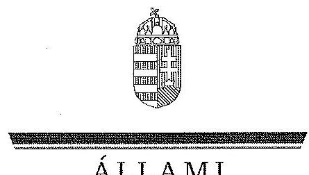
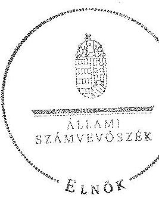
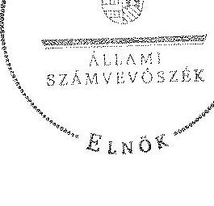
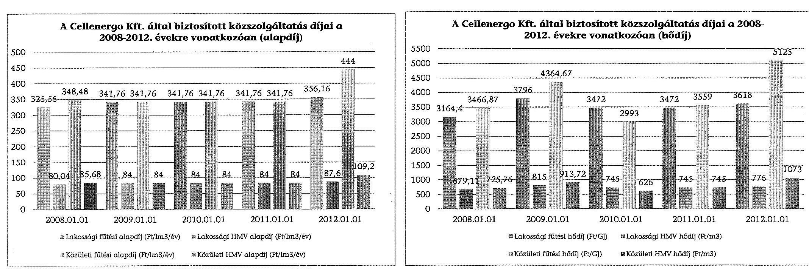
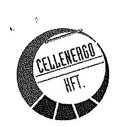
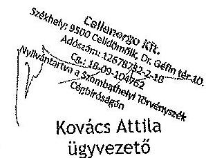
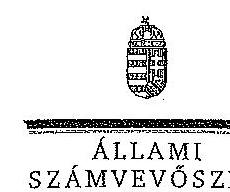

ÁLLAMI
SZÁMVEVŐSZÉK

# JELENTÉS 

Az önkormányzatok gazdasági társaságai - Az önkormányzatok többségi tulajdonában lévő gazdasági társaságok közfeladat-ellátását érintő gazdálkodási tevékenysége szabályszerűségének ellenőrzése
Cellenergo Energiatermelő és Távhőszolgáltató Korlátolt Felelősségű Társaság 15005
2015. január

---

# Állami Számvevőszék 

Iktatószám: V-0479-208/2014.
Témaszám: 1513
Vizsgálat-azonosító szám: V067114
Az ellenőrzést felügyelte:
Dr. Horváth Margit
felügyeleti vezető
Az ellenőrzést vezette és az ellenőrzés végrehajtásáért felelős:
Valastyánné dr. Vízhányó Júlia
ellenőrzésvezető
A jelentéstervezet összeállításában közreműködtek:
Kányáné Murvai Tünde
számvevő tanácsos
Dr. Szima Mária
számvevő tanácsos
Az ellenőrzést végezték:
Idei Erzsébet
Mátyus Mária Irén
okleveles könyvvizsgáló,
külső szakértő
okleveles könyvvizsgáló,
külső szakértő

---

# TARTALOMJEGYZÉK 

BEVEZETÉS ..... 7
I. ÖSSZEGZŐ MEGÁLLAPÍTÁSOK, KÖVETKEZTETÉSEK, JAVASLATOK ..... 10
II. RÉSZLETES MEGÁLLAPÍTÁSOK ..... 18

1. Az Önkormányzat közfeladat-ellátásának szabályszerűsége ..... 18
1.1. A közfeladat-ellátás megszervezése és a feladatellátás feltételrendszerének kialakítása ..... 18
1.2. A közfeladat-ellátás felügyelete és a tulajdonosi jogok érvényesítése ..... 25
2. A Cellenergo Kft. közfeladat-ellátással kapcsolatos tevékenysége ..... 33
2.1. A Cellenergo Kft. gazdálkodásának szabályozottsága ..... 33
2.2. A Cellenergo Kft. vagyongazdálkodása ..... 35
2.3. A beszámolási kötelezettség teljesítése ..... 38
3. A távhőszolgáltatás közfeladata bevételei és ráfordításai elszámolásának és önköltségszámításának szabályszerűsége ..... 40
3.1. A távhőszolgáltatás közfeladat bevételeinek és ráfordításainak szabályszerűsége ..... 40
3.2. Az önköltségszámítás szabályszerűsége ..... 41

## MELLÉKLETEK

1. számú A Cellenergo Kft. tevékenységének főbb adatai
2. számú A Cellenergo Kft. működésének főbb jellemzői
3. számú A Cellenergo Kft. által biztosított közszolgáltatás díjai a 2008-2012. évekre vonatkozóan
4. számú Beérkezett észrevételek és az azokra adott válaszok

## FÜGGELÉKEK

1. számú Értelmező szótár
2. számú Mintavételi eljárások ellenőrzési területenként

---

.

---

# RÖVIDÍTÉSEK JEGYZÉKE 

## Törvények

Áfa tv.
Az általános forgalmi adóról szóló 2007. évi CXXVII. törvény (hatályos: 2008. január 1-jétől)
Áht. 1
Az államháztartásról szóló 1992. évi XXXVIII. törvény (hatálytalan: 2012. január 1-jétől)
Áht. 2
az államháztartásról szóló 2011. évi CXCV. törvény (hatályos: 2011. december 31-étől)
Ámt.
az árak megállapításáról szóló 1990. évi LXXXVII. törvény (hatályos: 1991. január 1-jétől)
ÁSZ tv.
az Állami Számvevőszékről szóló 2011. évi LXVI. törvény (hatályos: 2011. július 1-jétől)
Gt.
a gazdasági társaságokról szóló 2006. évi IV. törvény (hatálytalan: 2014. március 15-étől)
Irattári tv.
a köziratokról, a közlevéltárakról és a magánlevéltári anyag védelméről szóló 1995. évi LXVI. törvény
Mötv.
Magyarország helyi önkormányzatairól szóló 2011. évi CLXXXIX. törvény (hatályos: 2012. január 1-jétől, kivéve a 144. § (2) bekezdésben meghatározott paragrafusok, amelyek 2012. április 15-én, a (3) bekezdésben meghatározott paragrafusok, amelyek 2013. január 1-jén léptek hatályba, a (4) bekezdésben meghatározott paragrafusok a 2014. évi általános önkormányzati választások napján lépnek hatályba)
Nvtv.
a nemzeti vagyonról szóló 2011. évi CXCVI. törvény (hatályos: 2011. december 31-étől, kivéve a 20. § (2) bekezdésben meghatározott paragrafusok, amelyek 2012. január 1-jétől, a (3) bekezdésben meghatározott paragrafusok 2013. január 1-jétől, a (4) bekezdésben meghatározott paragrafus 2012. március 2-ától léptek hatályba)
Ötv.
a helyi önkormányzatokról szóló 1990. évi LXV. törvény (hatálytalan: a 2014. évi általános önkormányzati választások napjától)
Ptk. 1
a Polgári Törvénykönyvről szóló 1959. évi IV. törvény (hatálytalan: 2014. március 15-étől)
Ptk. 2
a Polgári Törvénykönyvről szóló 2013. évi V. törvény (hatályos 2014. március 15-étől)
Számv. tv.
a számvitelről szóló 2000. évi C. törvény (hatályos: 2001. január 1-jétől)
Tao tv.
a társasági adóról és az osztalékadóról szóló 1996. évi LXXXI. törvény (hatályos: 1997. január 1-jétől)
Tszt.
a távhőszolgáltatásról szóló 2005. évi XVIII. törvény (hatályos: 2005. július 1-jétől)
Taktv.
a köztulajdonban álló gazdasági társaságok takarékosabb működéséről szóló 2009. évi CXXII. törvény (hatályos: 2009. december 4-étől)

---

Vtv.

## Rendeletek

SZMSZ
vagyongazdálkodási rendelet ${ }_{1}$
vagyongazdálkodási rendelet ${ }_{2}$
távhőszolgáltatási rendelet
távhődíjak megállapításáról szóló rendelet

Áhsz.

157/2005. (VIII. 15.)
Korm. rendelet
273/2007. (X. 19.) Korm. rendelet
51/2011. (IX. 30.) NFM rendelet

## Szórövidítések

alpolgármester
áfa
ÁSZ
Bérleti szerződés

Cellenergo Kft.
Dalkia Energia Zrt.
eszközök és források értékelési szabályzata
a villamos energiáról szóló 2007. évi LXXXVI. törvény (hatályos: 2007. július 2-ától)

Celldömölk Város Önkormányzata Képviselő-testületének 5/2007. (III. 29.) számú rendelete az Önkormányzat Szervezeti és Működési Szabályzatáról (hatályos: 2007. május 30-ától)
Celldömölk Város Önkormányzatának 6/1999. (II. 24.) számú rendelete az Önkormányzat vagyonáról, a vagyongazdálkodás szabályairól (hatályos: 1999. március 1-jétől 2009. december 1-jéig)
Celldömölk Város Önkormányzata Képviselő-testületének 30/2009. (XI. 20.) számú rendelete az Önkormányzat vagyonáról, a vagyongazdálkodás szabályairól (hatályos: 2009. december 1-jétől)

Celldömölk Város Önkormányzata Képviselő-testületének 3/2006. (II. 2.) számú rendelete a távhőszolgáltatásról szóló 2005. évi XVIII. törvény helyi végrehajtásáról (hatályos: 2006. február 2-ától)
Celldömölk Város Önkormányzata Képviselő-testületének 34/1999. (X. 27.) számú rendelete a lakossági távfűtés és melegvízszolgáltatási díjak megállapításáról (hatályos: 1999. november 1-jétől)
az államháztartás szervezetei beszámolási és könyvelési kötelezettségének sajátosságairól szóló 249/2000. (XII. 24.) Korm. rendelet (hatálytalan: 2014. január 1-jétől)
a távhőszolgáltatásról szóló 2005. évi XVIII. törvény végrehajtásáról
a villamos energiáról szóló 2007. évi LXXXVI. törvény egyes rendelkezéseinek végrehajtásáról
a távhőszolgáltatási támogatásról

Celldömölk Város Önkormányzatának Alpolgármestere
általános forgalmi adó
Állami Számvevőszék
a PROMETHEUS Tüzeléstechnikai Rt. és a Cellenergo Kft. között 2001. december 17-én létrejött, 2016. július 7-ig hatályos bérleti szerződés a távhőszolgáltatás ellátását biztosító berendezések bérbeadása tárgyában
Cellenergo Energiatermelő és Távhőszolgáltató Korlátolt Felelősségű Társaság
Dalkia Energia Energetikai Szolgáltató Zrt. (a francia Dalkia társaságon keresztül a Veolia Environnement és az Electricité de France nemzetközi cégcsoporthoz tartozik)
a Cellenergo Energiatermelő és Távhőszolgáltató Korlátolt Felelősségű Társaság eszközök és források értékelési szabályzata (hatályos: 2012. január 1-jétől)

---

| FB | Cellenergo Kft. Felügyelőbizottsága |
| :--: | :--: |
| Hivatal   javadalmazási szabály-   zat | Magyar Energetikai és Közműszabályozási Hivatal   a Cellenergo Energiatermelő és Távhőszolgáltató Korlátolt   Felelősségű Társaság javadalmazási szabályzata (hatályos: 2012. január 1-től) |
| jegyző, | Celldömölk Város Önkormányzatának jegyzője 2011. december 15-éig |
| jegyző, | Celldömölk Város Önkormányzatának jegyzője 2011. december 16-ától |
| Képviselő-testület   leltározási és selejtezési   szabályzat | Celldömölk Város Önkormányzatának Képviselő-testülete   a Cellenergo Energiatermelő és Távhőszolgáltató Korlátolt   Felelősségű Társaság leltározási és selejtezési szabályzata   (hatályos: 2012. január 1-jétől) |
| Megállapodás | a Celldömölk Város Önkormányzata, a Dalkia Energia   Zrt. (korábbi neve: Prometheus Zrt.) és a Cellenergo Kft.   között 2008. március 26-án létrejött megállapodás a szabadpiaci gázbeszerzés tárgyában |
| Önkormányzat   polgármester   Polgármesteri Hivatal | Celldömölk Város Önkormányzata   Celldömölk Város Önkormányzatának Polgármestere   Celldömölk Város Önkormányzatának Polgármesteri Hi-   vatala |
| Prometheus Rt.   számlarend | PROMETHEUS Tüzeléstechnikai Rt.   a Cellenergo Energiatermelő és Távhőszolgáltató Korlátolt   Felelősségű Társaság számlarendje (hatályos: 2012. janu-   ár 1-jétől) |
| számviteli politika | a Cellenergo Energiatermelő és Távhőszolgáltató Korlátolt   Felelősségű Társaság számviteli politikája (hatályos: 2012.   január 1-jétől) |
| Társasági szerződés | a Cellenergo Kft. társasági szerződése módosításokkal egységes szerkezetben (a 2006. november 9-én, 2008. május   1-jén, 2008. május 13-án, 2010. március 2-án, 2010. má-   jus 18-án, 2010. szeptember 29-én, 2010. december 1-jén,   2011. május 5-én, 2011. szeptember 1-jén, 2012. április   26-án, 2012. október 31-én kelt módosításokkal) |
| Taggyűlés | Cellenergo Kft. Taggyűlése |
| Tulajdonosi megállapo-   dás | a Celldömölk Város Önkormányzata és a PROMETHEUS   Tüzeléstechnikai Rt. között létrejött, 2001. június 8-tól ha-   tályos Tulajdonosi Megállapodás és annak 2001. decem-   ber 18-án kelt módosítása |
| Távhőszolgáltató rendszer-üzemeltetési szerző-   dés | a Celldömölk Város Önkormányzata és a PROMETHEUS   Tüzeléstechnikai Rt. között létrejött, 2001. július 8-tól   2016. július 7-ig hatályos szerződés a celldömölki   távhőszolgáltató rendszer fejlesztése, üzemeltetése tárgyá-   ban és annak 2001. december 18-án kelt módosítása |
| ügyvezetés | Cellenergo Kft. ügyvezetése |

---

|  1 | 2 | 3 | 4 | 5 | 6 | 7 | 8 | 9 | 10 | 11 | 12 | 13 | 14 | 15 | 16 | 17 | 18 | 19 | 20 | 21 | 22 | 23 | 24 | 25 | 26 | 27 | 28 | 29 | 30 | 31 | 32 | 33 | 34 | 35 | 36 | 37 | 38 | 39 | 40 | 41 | 42 | 43 | 44 | 45 | 46 | 47 | 48 | 49 | 50 | 51 | 52 | 53 | 54 | 55 | 56 | 57 | 58 | 59 | 60 | 61 | 62 | 63 | 64 | 65 | 66 | 67 | 68 | 69 | 70 | 71 | 72 | 73 | 74 | 75 | 76 | 77 | 78 | 79 | 80 | 81 | 82 | 83 | 84 | 85 | 86 | 87 | 88 | 89 | 90 | 91 | 92 | 93 | 94 | 95 | 96 | 97 | 98 | 99 | 100 | 101 | 102 | 103 | 104 | 105 | 106 | 107 | 108 | 109 | 110 | 111 | 112 | 113 | 114 | 115 | 116 | 117 | 118 | 119 | 120 | 121 | 122 | 123 | 124 | 125 | 126 | 127 | 128 | 129 | 130 | 131 | 132 | 133 | 134 | 135 | 136 | 137 | 138 | 139 | 140 | 141 | 142 | 143 | 144 | 145 | 146 | 147 | 148 | 149 | 150 | 151 | 152 | 153 | 154 | 155 | 156 | 157 | 158 | 159 | 160 | 161 | 162 | 163 | 164 | 165 | 166 | 167 | 168 | 169 | 170 | 171 | 172 | 173 | 174 | 175 | 176 | 177 | 178 | 179 | 180 | 181 | 182 | 183 | 184 | 185 | 186 | 187 | 188 | 189 | 190 | 191 | 192 | 193 | 194 | 195 | 196 | 197 | 198 | 199 | 200 | 201 | 202 | 203 | 204 | 205 | 206 | 207 | 208 | 209 | 210 | 211 | 212 | 213 | 214 | 215 | 216 | 217 | 218 | 219 | 220 | 221 | 222 | 223 | 224 | 225 | 226 | 227 | 228 | 229 | 230 | 231 | 232 | 233 | 234 | 235 | 236 | 237 | 238 | 239 | 240 | 241 | 242 | 243 | 244 | 245 | 246 | 247 | 248 | 249 | 250 | 251 | 252 | 253 | 254 | 255 | 256 | 257 | 258 | 259 | 260 | 261 | 262 | 263 | 264 | 265 |

 | 266 | 267 | 268 | 269 | 270 | 271 | 272 | 273 | 274 | 275 | 276 | 277 | 278 | 279 | 280 | 281 | 282 | 283 | 284 | 285 | 286 | 287 | 288 | 289 | 290 | 291 | 292 | 293 | 294 | 295 | 296 | 297 | 298 | 299 | 300 | 301 | 302 | 303 | 304 | 305 | 306 | 307 | 308 | 309 | 310 | 311 | 312 | 313 | 314 | 315 | 316 | 317 | 318 | 319 | 320 | 321 | 322 | 323 | 324 | 325 | 326 | 327 | 328 | 329 | 330 | 331 | 332 | 333 | 334 | 335 | 336 | 337 | 338 | 339 | 340 | 341 | 342 | 343 | 344 | 345 | 346 | 347 | 348 | 349 | 350 | 351 | 352 | 353 | 354 | 355 | 356 | 357 | 358 | 359 | 360 | 361 | 362 | 363 | 364 | 365 | 366 | 367 | 368 | 369 | 370 | 371 | 372 | 373 | 374 | 375 | 376 | 377 | 378 | 379 | 380 | 381 | 382 | 383 | 384 | 385 | 386 | 387 | 388 | 389 | 390 | 391 | 392 | 393 | 394 | 395 | 396 | 397 | 398 | 399 | 400 | 401 | 402 | 403 | 404 | 405 | 406 | 407 | 408 | 409 | 410 | 411 | 412 | 413 | 414 | 415 | 416 | 417 | 418 | 419 | 420 | 421 | 422 | 423 | 424 | 425 | 426 | 427 | 428 | 429 | 430 | 431 | 432 | 433 | 434 | 435 | 436 | 437 | 438 | 439 | 440 | 441 | 442 | 443 | 444 | 445 | 446 | 447 | 448 | 449 | 450 | 451 | 452 | 453 | 454 | 455 | 456 | 457 | 458 | 459 | 460 | 461 | 462 | 463 | 464 | 465 | 466 | 467 | 468 | 469 | 470 | 471 | 472 | 473 | 474 | 475 | 476 | 477 | 478 | 479 | 480 | 481 | 482 | 483 | 484 | 485 | 486 | 487 | 488 | 489 | 490 | 491 | 492 | 493 | 494 | 495 | 496 | 497 | 498 | 499 | 500 | 501 | 502 | 503 | 504 | 505 | 506 | 507 | 508 | 509 | 510 | 511 | 512 | 513 | 514 | 515 | 516 | 517 | 518 | 519 | 520 | 521 | 522 | 523 | 524 | 525 | 526 | 527 | 528 | 529 | 530 | 531 | 532 | 533 | 534 | 535 | 536 | 537 | 538 | 539 | 540 | 541 | 542 | 543 | 544 | 545 | 546 | 547 | 548 | 549 | 550 | 551 | 552 | 553 | 554 | 555 | 556 | 557 | 558 | 559 | 560 | 561 | 562 | 563 | 564 | 565 | 566 | 567 | 568 | 569 | 570 | 571 | 572 | 573 | 574 | 575 | 576 | 577 | 578 | 579 | 580 | 581 | 582 | 583 | 584 | 585 | 586 | 587 | 588 | 589 | 590 | 591 | 592 | 593 | 594 | 595 | 596 | 597 | 598 | 599 | 600 | 601 | 602 | 603 | 604 | 605 | 606 | 607 | 608 | 609 | 610 | 611 | 612 | 613 | 614 | 615 | 616 | 617 | 618 | 619 | 620 | 621 | 622 | 623 | 624 | 625 | 626 | 627 | 628 | 629 | 630 | 631 | 632 | 633 | 634 | 635 | 636 | 637 | 638 | 639 | 640 | 641 | 642 | 643 | 644 | 645 | 646 | 647 | 648 | 649 | 650 | 651 | 652 | 653 | 654 | 655 | 656 | 657 | 658 | 659 | 660 | 661 | 662 | 663 | 664 | 665 | 666 | 667 | 668 | 669 | 670 | 671 | 672 | 673 | 674 | 675 | 676 | 677 | 678 | 679 | 680 | 681 | 682 | 683 | 684 | 685 | 686 | 687 | 688 | 689 | 690 | 691 | 692 | 693 | 694 | 695 | 696 | 697 | 698 | 699 | 700 | 701 | 702 | 703 | 704 | 705 | 706 | 707 | 708 | 709 | 710 | 711 | 712 | 713 | 714 | 715 | 716 | 717 | 718 | 719 | 720 | 721 | 722 | 723 | 724 | 725 | 726 | 727 | 728 | 729 | 730 | 731 | 732 | 733 | 734 | 735 | 736 | 737 | 738 | 739 | 740 | 741 | 742 | 743 | 744 | 745 | 746 | 747 | 748 | 749 | 750 | 751 | 752 | 753 | 754 | 755 | 756 | 757 | 758 | 759 | 760 | 761 | 762 | 763 | 764 | 765 | 766 | 767 | 768 | 769 | 770 | 771 | 772 | 773 | 774 | 775 | 776 | 777 | 778 | 779 | 780 | 781 | 782 | 783 | 784 | 785 | 786 | 787 | 788 | 789 | 790 | 791 | 792 | 793 | 794 | 795 | 796 | 797 | 798 | 799 | 800 | 801 | 802 | 803 | 804 | 805 | 806 | 807 | 808 | 809 | 810 | 811 | 812 | 813 | 814 | 815 | 816 | 817 | 818 | 819 | 820 | 821 | 822 | 823 | 824 | 825 | 826 | 827 | 828 | 829 | 830 | 831 | 832 | 833 | 834 | 835 | 836 | 837 | 838 | 839 | 840 | 841 | 842 | 843 | 844 | 845 | 846 | 847 | 848 | 849 | 850 | 851 | 852 | 853 | 854 | 855 | 856 | 857 | 858 | 859 | 860 | 861 | 862 | 863 | 864 | 865 | 866 | 867 | 868 | 869 | 870 | 871 | 872 | 873 | 874 | 875 | 876 | 877 | 878 | 879 | 880 | 881 | 882 | 883 | 884 | 885 | 886 | 887 | 888 | 889 | 890 | 891 | 892 | 893 | 894 | 895 | 896 | 897 | 898 | 899 | 900 | 901 | 902 | 903 | 904 | 905 | 906 | 907 | 908 | 909 | 910 | 911 | 912 | 913 | 914 | 915 | 916 | 917 | 918 | 919 | 920 | 921 | 922 | 923 | 924 | 925 | 926 | 927 | 928 | 929 | 930 | 931 | 932 | 933 | 934 | 935 | 936 | 937 | 938 | 939 | 940 | 941 | 942 | 943 | 944 | 945 | 946 | 947 | 948 | 949 | 950 | 951 | 952 | 953 | 954 | 955 | 956 | 957 | 958 | 959 | 960 | 961 | 962 | 963 | 964 | 965 | 966 | 967 | 968 | 969 | 970 | 971 | 972 | 973 | 974 | 975 | 976 | 977 | 978 | 979 | 980 | 981 | 982 | 983 | 984 | 985 | 986 | 987 | 988 | 989 | 990 | 991 | 992 | 993 | 994 | 995 | 996 | 997 | 998 | 999 | 1000 | 1001 | 1002 | 1003 | 1004 | 1005 | 1006 | 1007 | 1008 | 1009 | 1010 | 1011 | 1012 | 1013 | 1014 | 1015 | 1016 | 1017 | 1018 | 1019 | 1020 | 1021 | 1022 | 1023 | 1024 | 1025 | 1026 | 1027 | 1028 | 1029 | 1030 | 1031 | 1032 | 1033 | 1034 | 1035 | 1036 | 1037 | 1038 | 1039 | 1040 | 1041 | 1042 | 1043 | 1044 | 1045 | 1046 | 1047 | 1048 | 1049 | 1050 | 1051 | 1052 | 1053 | 1054 | 1055 | 1056 | 1057 | 1058 | 1059 | 1060 | 1061 | 1062 | 1063 | 1064 | 1065

 | 1066 | 1067 | 1068 | 1069 | 1070 | 1071 | 1072 | 1073 | 1074 | 1075 | 1076 | 1077 | 1078 | 1079 | 1080 | 1081 | 1082 | 1083 | 1084 | 1085 | 1086 | 1087 | 1088 | 1089 | 1090 | 1091 | 1092 | 1093 | 1094 | 1095 | 1096 | 1097 | 1098 | 1099 | 1100 | 1101 | 1102 | 1103 | 1104 | 1105 | 1106 | 1107 | 1108 | 1109 | 1110 | 1111 | 1112 | 1113 | 1114 | 1115 | 1116 | 1117 | 1118 | 1119 | 1120 | 1121 | 1122 | 1123 | 1124 | 1125 | 1126 | 1127 | 1128 | 1129 | 1130 | 1131 | 1132 | 1133 | 1134 | 1135 | 1136 | 1137 | 1138 | 1139 | 1140 | 1141 | 1142 | 1143 | 1144 | 1145 | 1146 | 1147 | 1148 | 1149 | 1150 | 1151 | 1152 | 1153 | 1154 | 1155 | 1156 | 1157 | 1158 | 1159 | 1160 | 1161 | 1162 | 1163 | 1164 | 1165 | 1166 | 1167 | 1168 | 1169 | 1170 | 1171 | 1172 | 1173 | 1174 | 1175 | 1176 | 1177 | 1178 | 1179 | 1180 | 1181 | 1182 | 1183 | 1184 | 1185 | 1186 | 1187 | 1188 | 1189 | 1190 | 1191 | 1192 | 1193 | 1194 | 1195 | 1196 | 1197 | 1198 | 1199 | 1200 | 1201 | 1202 | 1203 | 1204 | 1205 | 1206 | 1207 | 1208 | 1209 | 1210 | 1211 | 1212 | 1213 | 1214 | 1215 | 1216 | 1217 | 1218 | 1219 | 1220 | 1221 | 1222 | 1223 | 1224 | 1225 | 1226 | 1227 | 1228 | 1229 | 1230 | 1231 | 1232 | 1233 | 1234 | 1235 | 1236 | 1237 | 1238 | 1239 | 1240 | 1241 | 1242 | 1243 | 1244 | 1245 | 1246 | 1247 | 1248 | 1249 | 1250 | 1251 | 1252 | 1253 | 1254 | 1255 | 1256 | 1257 | 1258 | 1259 | 1260 | 1261 | 1262 | 1263 | 1264 | 1265 | 1266 | 1267 | 1268 | 1269 | 1270 | 1271 | 1272 | 1273 | 1274 | 1275 | 1276 | 1277 | 1278 | 1279 | 1280 | 1281 | 1282 | 1283 | 1284 | 1285 | 1286 | 1287 | 1288 | 1289 | 1290 | 1291 | 1292 | 1293 | 1294 | 1295 | 1296 | 1297 | 1298 | 1299 | 1300 | 1301 | 1302 | 1303 | 1304 | 1305 | 1306 | 1307 | 1308 | 1309 | 1310 | 1311 | 1312 | 1313 | 1314 | 1315 | 1316 | 1317 | 1318 | 1319 | 1320 | 1321 | 1322 | 1323 | 1324 | 1325 | 1326 | 1327 | 1328 | 1329 | 1330 | 1331 | 1332 | 1333 | 1334 | 1335 | 1336 | 1337 | 1338 | 1339 | 1340 | 1341 | 1342 | 1343 | 1344 | 1345 | 1346 | 1347 | 1348 | 1349 | 1350 | 1351 | 1352 | 1353 | 1354 | 1355 | 1356 | 1357 | 1358 | 1359 | 1360 | 1361 | 1362 | 1363 | 1364 | 1365 | 1366 | 1367 | 1368 | 1369 | 1370 | 1371 | 1372 | 1373 | 1374 | 1375 | 1376 | 1377 | 1378 | 1379 | 1380 | 1381 | 1382 | 1383 | 1384 | 1385 | 1386 | 1387 | 1388 | 1389 | 1390 | 1391 | 1392 | 1393 | 1394 | 1395 | 1396 | 1397 | 1398 | 1399 | 1310 | 1311 | 1312 | 1313 | 1314 | 1315 | 1316 | 1317 | 1318 | 1319 | 1320 | 1321 | 1322 | 1323 | 1324 | 1325 | 1326 | 1327 | 1328 | 1329 | 1330 | 1331 | 1332 | 1333 | 1334 | 1335 | 1336 | 1337 | 1338 | 1339 | 1340 | 1341 | 1342 | 1343 | 1344 | 1345 | 1346 | 1347 | 1348 | 1349 | 1350 | 1351 | 1352 | 1353 | 1354 | 1355 | 1356 | 1357 | 1358 | 1359 | 1360 | 1361 | 1362 | 1363 | 1364 | 1365 | 1366 | 1367 | 1368 | 1369 | 1370 | 1371 | 1372 | 1373 | 1374 | 1375 | 1376 | 1377 | 1378 | 1379 | 1380 | 1381 | 1382 | 1383 | 1384 | 1385 | 1386 | 1387 | 1388 | 1389 | 1390 | 1391 | 1392 | 1393 | 1394 | 1395 | 1396 | 1397 | 1398 | 1399 | 1310 | 1311 | 1312 | 1313 | 1314 | 1315 | 1316 | 1317 | 1318 | 1319 | 1320 | 1321 | 1322 | 1323 | 1324 | 1325 | 1326 | 1327 | 1328 | 1329 | 1330 | 1331 | 1332 | 1333 | 1334 | 1335 | 1336 | 1337 | 1338 | 1339 | 1340 | 1341 | 1342 | 1343 | 1344 | 1345 | 1346 | 1347 | 1348 | 1349 | 1350 | 1351 | 1352 | 1353 | 1354 | 1355 | 1356 | 1357 | 1358 | 1359 | 1360 | 1361 | 1362 | 1363 | 1364 | 1365 | 1366 | 1367 | 1368 | 1369 | 1370 | 1371 | 1372 | 1373 | 1374 | 1375 | 1376 | 1377 | 1378 | 1379 | 1380 | 1381 | 1382 | 1383 | 1384 | 1385 | 1386 | 1387 | 1388 | 1389 | 1390 | 1391 | 1392 | 1393 | 1394 | 1395 | 1396 | 1397 | 1398 | 1399 | 1310 | 1311 | 1312 | 1313 | 1314 | 1315 | 1316 | 1317 | 1318 | 1319 | 1320 | 1321 | 1322 | 1323 | 1324 | 1325 | 1326 | 1327 | 1328 | 1329 | 1330 | 1331 | 1332 | 1333 | 1334 | 1335 | 1336 | 1337 | 1338 | 1339 | 1340 | 1341 | 1342 | 1343 | 1344 | 1345 | 1346 | 1347 | 1348 | 1349 | 1350 | 1351 | 1352 | 1353 | 1354 | 1355 | 1356 | 1357 | 1358 | 1359 | 1360 | 1361 | 1362 | 1363 | 1364 | 1365 | 1366 | 1367 | 1368 | 1369 | 1370 | 1371 | 1372 | 1373 | 1374 | 1375 | 1376 | 1377 | 1378 | 1379 | 1380 | 1381 | 1382 | 1383 | 1384 | 1385 | 1386 | 1387 | 1388 | 1389 | 1390 | 1391 | 1392 | 1393 | 1394 | 1395 | 1396 |1397 |1398 | 1399 | 1400 | 1401 | 1402 | 1403 | 1404 | 1405 | 1406 | 1407 | 1408 | 1409 | 1410 | 1411 | 1412 | 1413 | 1414 | 1415 | 1416 | 1417 | 1418 | 1419 | 1420 | 1421 | 1422 | 1423 | 1424 | 1425 | 1426 | 1427 | 1428 | 1429 | 1430 | 1431 | 1432 | 1433 | 1434 | 1435 | 1436 | 1437 | 1438 | 1439 | 1440 | 1441 | 1442 | 1443 | 1444 | 1445 | 1446 | 1447 | 1448 | 1449 | 1450 | 1451 | 1452 | 1453 | 1454 | 1455 | 1456 | 1457 | 1458 | 1459 | 1460 | 1461 | 1462 | 1463 | 1464 | 1465 | 1466 | 1467 | 1468 | 1469 | 1470 | 1471 | 1472 | 1473 | 1474 | 1475 | 1476 | 1477 | 1478 | 1479 | 1480 | 1481 | 1482 | 1483 | 1484 | 1485 | 1486 | 1487 | 1488 | 1489 | 1490 | 1491 | 1492 | 1493 | 1494 | 1495 | 1496 | 1497 | 1498 | 1499 | 1500 | 1501 | 1502 | 1503 | 1504 | 1505 | 1506 | 1507 | 1508 | 1509 | 1510 | 1511 | 1512 | 1513 | 1514 | 1515 | 1516 | 1517 | 1518 | 1519 | 1520 | 1521 | 1522 | 1523 | 1524 | 1525 | 1526 | 1527 | 1528 | 1529 | 1530 | 1531 | 1532 | 1533 | 1534 | 1535 | 1536 | 1537 | 1538 | 1539 | 1540 | 1541 | 1542 | 1542 | 1543 | 1544 | 1545 | 1546 | 1547 | 1548 | 1549 | 1550 | 1551 | 1552 | 1553 | 1554 | 1555 | 1556 | 1557 | 1558 | 1559 | 1560 | 1561 | 1562 | 1563 | 1564 | 1565 | 1566 | 1567 | 1568 | 1569 | 1570 | 1571 | 1572 | 1573 | 1574 | 1575 | 1576 | 1577 | 1578 | 1579 | 1580 | 1582 | 1583 | 1584 | 1585 | 1586 | 1587 | 1588 | 1588 | 1589 | 1590 | 1591 | 1592 | 1592 | 1593 | 1594

 | 1595 | 1596 | 1597 | 1598 | 1599 | 1600 | 1601 | 1602 | 1603 | 1604 | 1605 | 1606 | 1607 | 1608 | 1609 | 1610 | 1611 | 1612 | 1613 | 1614 | 1615 | 1617 | 1618 | 1617 | 1618 | 1619 | 1620 | 1621 | 1622 | 1623 | 1624 | 1627 | 1622 | 1623 | 1625 | 1626 | 1628 | 1629 | 1630 | 1631 | 1632 | 1633 | 1634 | 1635 | 1637 | 1638 | 1632 | 1633 | 1635 | 1639 | 1640 | 1641 | 1642 | 1643 | 1644 | 1645 | 1647 | 1643 | 1644 | 1646 | 1648 | 1647 | 1648 | 1649 | 1650 | 1651 | 1652 | 1652 | 1653 | 1653 | 1654 | 1655 | 1656 | 1657 | 1658 | 1659 | 1660 | 1670 | 1671 | 1653 | 1657 | 1660 | 1672 | 1672 | 1673 | 1657 | 1661 | 1673 | 1674 | 1675 | 1676 | 1677 | 1678 | 1679 | 1680 | 1680 | 1681 | 1682 | 1683 | 1682 | 1683 | 1684 | 1684 | 1685 | 1684 | 1685 | 1686 | 1687 | 1687 | 1690 | 1691 | 1700 | 1701 | 1685 | 1688 | 1692 | 1692 | 1710 | 1711 | 1712 | 1713 | 1714 | 1715 | 1717 | 1718 | 1720 | 1721 | 1722 | 1723 | 1724 | 1725 | 1727 | 1727 | 1730 | 1731 | 1732 | 1733 | 1734 | 1735 | 1737 | 1733 | 1734 | 1735 | 1736 | 1737 | 1740 | 1741 | 1737 | 1737 | 1738 | 1742 | 1743 | 1743 | 1744 | 1744 | 1745 | 1747 | 1750 | 1751 | 1752 | 1753 | 1753 | 1753 | 1754 | 1755 | 1760 | 1761 | 1762 | 1762 | 1763 | 1777 | 1778 | 1779 | 1800 | 1779 | 1779 | 1801 | 1779 | 1802 | 1779 | 1803 | 1779 | 1803 | 1779 | 1804 | 1805 | 1802 | 1803 | 1805 | 1803 | 1804 | 1803 | 1804 | 1805 | 1806 | 1805 | 1806 | 1806 | 1807 | 1807 | 1807 | 1807 | 1810 | 1817 | 1818 | 1819 | 1818 | 1819 | 1820 | 1819 | 1817 | 1819 | 1821 | 1821 | 1821 | 1822 | 1822 | 1822 | 1822 | 1822 | 1822 | 1823 | 1823 | 1823 | 1823 | 1824 | 1824 | 1824 | 1825 | 1825 | 1825 | 1825 | 1825 | 1826 | 1826 | 1827 | 1827 | 1826 | 1827 | 1827 | 1827 | 1827 | 1827 | 1828 | 1828 | 1828 | 1828 | 1828 | 1828 | 1828 | 1828 | 1828 | 1828 | 1828 | 1829 | 1830 | 1830 | 1829 | 1831 | 1831 | 1831 | 1831 | 1832 | 1832 | 1832 | 1832 | 1833 | 1833 | 1833 | 1833 | 1833 | 1833 | 1834 | 1834 | 1834 | 1835 | 1834 | 1835 | 1835 | 1835 | 1835 | 1835 | 1835 | 1836 | 1836 | 1836 | 1836 | 1837 | 1837 | 1836 | 1837 | 1837 | 1837 | 1838 | 1838 | 1838 | 1838 | 1838 | 1838 | 1838 | 1839 | 1840 | 1840 | 1839 | 1840 | 1839 | 1841 | 1840 | 1841 | 1841 | 1841 | 1841 | 1841 | 1841 | 1841 | 1841 | 1842 | 1841 | 1842 | 1842 | 1842 | 1842 | 1842 | 1842 | 1842 | 1842 | 1842 | 1843 | 1843 | 1843 | 1843 | 1843 | 1843 | 1843 | 1843 | 1843 | 1843 | 1843 | 1844 | 1844 | 1844 | 1844 | 1844 | 1844 | 1844 | 1844 | 1844 | 1844 | 1844 | 1844 | 1845 | 1844 | 1845 | 1844 | 1845 | 1845 | 1844 | 1845 | 1845 | 1846 | 1846 | 1846 | 1847 | 1846 | 1847 | 1847 | 1847 | 1847 | 1847 | 185 | 1847 | 1847 | 1848 | 1848 | 185 | 185 | 1847 | 185 | 185 | 185 | 185 | 185 | 185 | 185 | 186 | 186 | 186 | 186 | 186 | 186 | 186 | 186 | 186 | 186 | 187 | 186 | 187 | 187 | 187 | 187 | 187 | 187 | 187 | 187 | 187 | 187 | 187 | 187 | 187 | 187 | 187 | 187 | 187 | 188 | 188 | 188 | 188 | 188 | 188 | 188 | 188 | 188 | 188 | 188 | 188 | 189 | 189 | 189 | 189 | 189 | 189 | 189 | 189 | 189 | 189 | 189 | 189 | 189 | 189 | 189 | 189 | 189 | 189 | 189 | 189 | 189 | 189 | 189 | 189 | 189 | 189 | 190 | 189 | 189 | 190 | 189 | 190 | 189 | 189 | 190 | 189 | 189 | 191 | 191 | 191 | 189 | 191 | 191 | 192 | 191 | 192 | 192 | 191 | 192 | 191 | 192 | 192 | 192 | 191 | 192 | 192 | 193 | 192 | 193 | 192 | 192 | 193 | 192 | 193 | 193 | 192 | 193 | 192 | 193 | 193 | 193 | 194 | 193 | 194 | 194 | 193 | 194 | 194 | 194 | 194 | 194 | 194 | 194 | 194 | 195 | 194 | 195 | 194 | 195 | 195 | 195 | 195 | 196 | 195 | 196 | 196 | 196 | 196 | 196 | 197 | 197 | 197 | 197 | 197 | 197 | 198 | 197 | 198 | 198 | 198 | 198 | 198 | 198 | 198 | 198 | 198 | 198 | 198 | 199 | 198 | 199 | 199 | 199 | 199 | 199 | 199 | 199 | 199 | 199 | 199 | 199 | 199 | 199 | 199 | 199 | 199 | 199 | 199 | 199 | 

---

# JELENTÉS 

## Az önkormányzatok gazdasági társaságai - Az önkormányzatok többségi tulajdonában lévő gazdasági társaságok közfeladat ellátását érintő gazdálkodási tevékenysége szabályszerűségének ellenőrzése

## Cellenergo Energiatermelő és Távhőszolgáltató Korlátolt Felelősségű Társaság

## BEVEZETÉS

Az Állami Számvevőszék középtávra szóló stratégiájában megfogalmazta, hogy a helyi önkormányzatok gazdálkodásában rejlő pénzügyi kockázatok feltárásával, az államháztartáson kívülre nyújtott költségvetési támogatások és ingyenes vagyonjuttatások, valamint az államháztartáson kívül működő közfeladat-ellátó rendszerek ellenőrzéseivel hozzájárul ahhoz, hogy a közpénzeket az államháztartáson kívül működő szervezetek is átlátható, rendezett módon használják fel a közfeladatok szerződésben vállalt ellátása érdekében.

Az önkormányzatok szervezetalakítási szabadságának következménye, hogy a korábban is vállalati formában működő (nagyvárosi tömegközlekedés, víz-, szennyvízcsatorna, köztisztasági, ingatlankezelés stb.) közszolgáltatások mellett, mind a kötelező, mind az önként vállalt feladatok ellátásában a gazdasági társaságok kiemelt fontosságú szerephez jutottak.

Celldömölk város távhőszolgáltatási rendszerének fejlesztésére és üzemeltetésére Cellenergo Energiatermelő és Távhőszolgáltató Korlátolt Felelősségű Társaság néven 3,1 M Ft jegyzett tőkével a celldömölki önkormányzat és a Prometheus Tüzeléstechnikai Rt. - 2006. évtől tulajdonos és névváltozás után Dalkia Energia Zrt. - 2001. évben társaságot alapított. Az 51%-os tulajdonos celldömölki önkormányzat mellett 49%-ban a Cellenergo Kft. tulajdonosa a Dalkia Energia Zrt. volt.

A Cellenergo Kft. feladata a 2012. január 1-jén 11395 fő lakosság számú Celldömölk város közigazgatási területén a távhő szolgáltató rendszer üzemeltetése, hőenergia termelés elosztása, értékesítése, fűtés- és használati melegvízszolgáltatás, valamint hőtermelő, hőelosztó, hőszolgáltató és hőfelhasználó berendezések létesítése, fenntartása, javítása és üzemeltetése volt az ellenőrzött időszakban. A társaság - a 2012. évi éves beszámoló kiegészítő mellékletében szereplő adatok alapján - 463 lakásban, 64 közületi fogyasztási helyen, és 11

---

külön kezelt intézményben biztosította a fűtést. Feladatát kettő db, egyenként 1,45 MW és egy db 1 MW teljesítményű gázkazánnal, valamint egy db 0,75 MW teljesítményű gázmotorral látta el. Az értékesítésre tervezett éves hőmennyiség 27000 GJ volt. A Cellenergo Kft.-nél az ellenőrzött időszakban a közfeladat ellátására foglalkoztatottak éves átlagos statisztikai létszáma 2008. évben és 2012. évben is hat fő volt.

A Cellenergo Kft. tulajdonosi köre és a jegyzett tőke összege nem változott a megalakulás óta. A Cellenergo Kft. éves árbevétele 145,0 M Ft és 201,0 M Ft közötti, az eszközök és források értéke $41,0 \mathrm{M}$ Ft és $58,0 \mathrm{M}$ Ft közötti volt az ellenőrzött öt évben.

A Cellenergo Kft. a 2008-2010. években pozitív, a 2011-2012. években negatív eredménnyel zárt. A mérleg szerinti eredmény a 2008. évi 9,2 M Ft-ról a 2012. évre $-36,3 \mathrm{M}$ Ft-ra, a saját tőke $11,2 \mathrm{M}$ Ft-ról 2,0 M Ft-ra változott.

Az ellenőrzött időszakban az ügyvezető személye kettő alkalommal változott, a jelenlegi ügyvezető 2011. szeptember 1-jétől látja el feladatát. Az ügyvezető a Dalkia Energia Zrt. munkavállalója volt és jelenleg is az. A Cellenergo Kft. ügyvezetéséért juttatást nem kap, ebben a minőségében sem munkaviszonyt, sem pedig egyéb jogviszonyt nem létesített a Cellenergo Kft.-vel. A társaság számvitellel kapcsolatos feladatait (számviteli politika, egyéb kapcsolódó szabályzatok elkészítése, módosítása), gazdaságpolitikájának, bérpolitikájának kidolgozását a Dalkia Energia Zrt. különböző osztályai végezték
 az ellenőrzött időszakban. Jelenleg a Dalkia Energia Zrt. által 2012. évben létrehozott Dalkia Szolgáltató Kft. látja el a számviteli feladatokat budapesti székhellyel. A Cellenergo Kft. jogi ügyeit a Dalkia Energia Zrt. jogi osztálya végezte. A Cellenergo Kft. feladata az üzemeltetés, a fogyasztási adatok rögzítése, leolvasása, továbbá az ügyfélszolgálat volt a celldömölki székhelyen.

Az ellenőrzött időszakban a polgármester személye nem, a jegyző személye egy alkalommal változott. A polgármester a 2002. évi önkormányzati választások óta tölti be tisztségét, a helyszíni ellenőrzés időszakában a munkakört betöltő jegyző 2011. december 16. óta látja el feladatait.

Az önkormányzati tulajdonú gazdasági társaságok teljes körű ellenőrzésének lehetőségét az Állami Számvevőszékről szóló 1989. évi XXXVIII. törvény 2011. január 1-jétől hatályos módosítása teremtette meg.

Az ellenőrzés célja annak értékelése volt, hogy

- az önkormányzat a jogszabályi előírások figyelembevételével döntött-e az ellenőrzésre kerülő közfeladat megszervezéséről; az önkormányzat szabályszerűen gyakorolta-e a tulajdonosi jogokat;
- a gazdasági társaság közfeladat-ellátása bevételeinek, ráfordításainak elszámolása, és vagyongazdálkodási tevékenysége megfelelt-e a jogszabályi, illetve a közszolgáltatási szerződésben foglalt tulajdonosi előírásoknak, azok végrehajtása szabályszerű volt-e;

---

- a közfeladatok átláthatósága és elszámoltathatósága érdekében biztosítva volt-e a közszolgáltatás dijának megalapozottsága szabályszerű önköltségszámítással.

Az ellenőrzés kiterjedt Celldömölk Város Önkormányzatára és a Cellenergo Energiatermelő és Távhőszolgáltató Korlátolt Felelősségű Társaságra.

Az ellenőrzés várható hasznosulása: A törvényalkotás számára - az észlelt problémák, szabálytalanságok, vagy egyéb nem kívánatos jelenségek felszínre kerülésével - az ellenőrzés megállapításai segítséget nyújthatnak az államháztartáson kívüli közfeladat-ellátás értékeléséhez, jogszabályi keretei pontosításához, átláthatóságot biztosító szabályozásához. Meghatározóvá válnak a közfeladat ellátásában részt vevő államháztartáson kívüli szervezeteknek az önkormányzat költségvetését, pénzügyi helyzetét is befolyásoló kockázatai, lehetővé válik ezen kockázatok csökkentése. A feladatot ellátó gazdasági társaság a közszolgáltatási szerződésben foglaltak betartásával, a közvagyon használatával biztosította-e a szolgáltatás folytatásának feltételeit. Ezzel az ellenőrzöttek és a helyi döntéshozók számára az ÁSZ visszajelzést ad feladatszervezési, feladat-ellátási kockázataikról, alapot ad a meglévő hibák megszüntetéséhez, a jobb közfeladat-ellátás biztosításához. Fokozza a fegyelmet, igazolja, hogy lejárt a következmények nélküli ellenőrzések időszaka. Az ÁSZ értékteremtő rend kialakításához és megőrzéséhez hozzájáruló tevékenysége pozitív hatással van a szervezetről kialakított összkép formálására is.

A bevételek és ráfordítások elszámolása, valamint a vagyonnyilvántartás terén az egyes területek szabályszerű működését mintavétellel ellenőriztük, ez alapján a sokaságokban előforduló hibás tételek arányát becsültük. A jogszabályoknak és a belső előírásoknak megfelelőnek, azaz szabályszerűnek tekintettük az adott bevételek és ráfordítások elszámolását, a vagyonnyilvántartást, amennyiben a minta ellenőrzésének eredménye alapján 95%-os bizonyossággal a teljes sokaságban a hibás tételek aránya kisebb volt, mint 10%, nem megfelelőnek értékeltük, ha a hibás tételek aránya a 10%-ot meghaladta. Kockázatot, illetve magas kockázatot jeleztünk, amennyiben egy adott terület vonatkozásában a minta alapján a teljes sokaságban nem volt teljes körűen biztosított a jogszabályoknak és a belső szabályzatoknak megfelelő működés.

Az ellenőrzést a számvevőszéki ellenőrzés szakmai szabályai szerint, szabályszerűségi ellenőrzés módszerével, a nemzetközi standardok figyelembevételével végeztük. Az ellenőrzés a 2008-2012. évekre terjedt ki.

Az ellenőrzés végrehajtásának jogszabályi alapját az Állami Számvevőszékről szóló 2011. évi LXVI. törvény 5. § (3)-(5) bekezdései képezték.

Az ÁSZ az Állami Számvevőszékről szóló 2011. évi LXVI. törvény 29. §-a alapján a jelentéstervezetet észrevételezésre megküldte a polgármesternek és a gazdasági társaság ügyvezetőjének. A beérkezett észrevételeket a jelentés véglegesítése során hasznosítottuk. Az észrevételeket és az azokra adott válaszokat a jelentés 4. számú melléklete tartalmazza.

---

# I. ÖSSZEGZŐ MEGÁLLAPÍTÁSOK, KÖVETKEZTETÉSEK, JAVASLATOK 

Celldömölk Város Önkormányzata a távhő-ellátási kötelező feladatát 2001. évben úgy oldotta meg, hogy a Dalkia Energia Zrt.-vel közösen megalapította a Cellenergo Kft.-t, amelynek 51%-os többségi tulajdonosává vált. A közös alapítás kihatott a szabályozás és a működés teljes vertikumára. Az Önkormányzat határozott ideig - 15 évig - kizárólagos jogot biztosított a Cellenergo Kft. részére a távhőszolgáltató tevékenység ellátására.

Celldömölk Város Önkormányzatának Képviselő-testülete az Önkormányzat közigazgatási területén a távhőszolgáltatás közfeladatának megszervezéséről a jogszabályi előírásoknak megfelelően döntött. Az Önkormányzat a tulajdonosi jogokat az ellenőrzött időszakban szabályszerűen gyakorolta, azonban a beszámoltatás, monitoring tevékenység tekintetében a tulajdonosi joggyakorlás ténylegesen nem működött.

Az Önkormányzat 2006-2010. és 2011-2014. évekre szóló gazdasági programja a távhőszolgáltatás működtetésével, fejlesztésével kapcsolatos elképzeléseket nem tartalmazott.

A távhőszolgáltatás szerződéses rendszeren alapult, melynek alapjait a Társasági szerződés, a Tulajdonosi megállapodás, a Távhőszolgáltató rendszerüzemeltetési szerződés és a Bérleti szerződés képezte. Ehhez az Önkormányzat a távhőszolgáltatással kapcsolatosan a Tszt. szerinti rendeletet, valamint a gazdasági társaságok feletti tulajdonosi jogok gyakorlására vonatkozóan vagyongazdálkodási rendelet¹,¹-et alkotott.

Az ellenőrzött időszakban a fennálló szerződéses rendszer konstrukcióját nem módosították.

A távhő-ellátással kapcsolatos követelményeket az ellenőrzött időszakban az Önkormányzat és a Dalkia Energia Zrt., valamint a Cellenergo Kft. között létrejött határozott időre (2001-től 2015-ig, azaz 15 évre) kötött Távhőszolgáltató rendszer-üzemeltetési szerződés tartalmazta. A szerződés rögzítette, hogy az Önkormányzat a távhőszolgáltatási tevékenység gyakorlásának a jogát és az önkormányzati törzsvagyonhoz tartozó vagyontárgyakat üzemeltetésre átadja a Cellenergo Kft. részére.

A szakmai feladatellátás méréséhez a Távhőszolgáltató rendszer-üzemeltetési szerződésben meghatározták a fűtés és a melegvíz-ellátás minőségi és mennyiségi feltételeit.

Az üzemeltetésre átadott eszközöket, mint vagyont a vonatkozó képviselő-testületi határozatnak megfelelően szerepeltették az Önkormányzat számviteli nyilvántartásában az Áhsz. előírásai szerint. Az üzemeltetésre átadott ingatlanok bruttó értéke a 2008-2011. években 13,7 M Ft, 2012. évben 13,3 M Ft

---

volt. Az üzemeltetésre átadott gépek, berendezések bruttó értéke a vagyonnyilvántartás szerint 2008-2012. években 7,4 M Ft volt.

A Cellenergo Kft. Társasági szerződésében nem részletezett tagsági jogokat és kötelezettségeket határoztak meg, amelynek értelmében a Cellenergo Kft.-ben a menedzsment jogokat a Dalkia Energia Zrt. gyakorolta.

A Cellenergo Kft.-vel kapcsolatos beruházásokat még az ellenőrzött időszak előtt, nettó 318,6 M Ft nagyságrendben a Dalkia Energia Zrt. - hitel igénybevételével - valósította meg, ezért azokat a Zrt. könyveiben tartották nyilván. A Cellenergo Kft. a Dalkia Energia Zrt. tulajdonában lévő eszközök használatáért Bérleti szerződés alapján bérleti díjat fizetett az ellenőrzött években. A kifizetett bérleti díj a szerződéses időszak kezdetétől 2012. december 31-ig összesen 411,0 M Ft volt, ami a beruházás tőke és kamat megtérülését fedezte.

A Távhőszolgáltatási rendeletet a hatályba lépését követően az időközben bekövetkezett jogszabályi változások ellenére nem módosították. Az Önkormányzat csatlakozási díj meghatározására vonatkozó eljárása nem felelt meg az Ámt.-ben és a Tszt.-ben foglalt rendelkezésnek. A rendeletben a szolgáltatói vagyon fogalmát nem megfelelően határozták meg, mivel a vagyonelemek nem a Cellenergo Kft. tulajdonában voltak, azokat részben az Önkormányzattól kapta üzemeltetésre, részben a Dalkia Energia Zrt.-től bérelte.

Az Önkormányzat a távhőszolgáltató rendszer fejlesztési és üzemeltetési jogának időleges átengedéséért használati díjra volt jogosult. Ennek az ellenőrzött időszakra eső összege a Távhőszolgáltató rendszer-üzemeltetési szerződés alapján 2008. évben 1,1 M Ft + áfa, a 2009-2012. években 3,2 M Ft + áfa/év volt. Az ellenőrzött időszakban az Önkormányzat a Cellenergo Kft.-nek nem számlázott ki és a Cellenergo Kft. nem fizetett használati díjat a költségeinek csökkentése érdekében, holott erre lehetősége csak a 2008. évben volt, az abban az évben hozott képviselő-testületi döntés alapján. A 2009-2011. évek használati díja kiszámlázásának elmaradása az Áht.¹ előírásával és a vagyongazdálkodási rendelet¹,¹ rendelkezéseivel ellentétesen történt, mivel arról a Képviselőtestület nem döntött. Az Önkormányzat a Távhőszolgáltató rendszerüzemeltetési szerződést nem módosította, így az eredeti szerződés változatlan érvényben tartása mellett megsértette az Áfa tv. alapján fennálló számla kibocsátási, továbbá a Számv. tv. alapján fennálló bizonylat kiállítási kötelezettségét. A használati díj elengedése ugyanakkor a Számv. tv. szerint az Önkormányzat részéről nyújtott közvetett támogatásnak minősül.

Az Önkormányzat 2010. január 1-jétől - az Áhsz. rendelkezése ellenére - az üzemeltetésre átadott eszközökről a Cellenergo Kft. által elkészített leltárral nem rendelkezett. Az üzemeltetésre átadott eszközök leltározása a vagyongazdálkodási rendelet¹,¹-ben, illetve a leltározási szabályzatban foglaltak ellenére nem történt meg. Az Önkormányzat ezen mulasztásával megsértette a Számv. tv.-ben foglalt mérleg valódiság elvét.

A tulajdonosi joggyakorlással kapcsolatos feladatköröket az Ötv., a Társasági szerződés és a vagyongazdálkodási rendelet¹,¹ előírásai szerint alakították ki, meghatározták a Cellenergo Kft. feletti tulajdonosi joggyakorló személyét, a Taggyűlés kizárólagos hatáskörét, az FB összetételét és működését, a Képviselő-

---

testület hatáskörét. Az ellenőrzött időszakban az Önkormányzat részéről a tulajdonosi ellenőrzés elsősorban az FB keretében működött. Az FB-be két főt az Önkormányzat a Képviselő-testület határozata alapján, egy főt a Dalkia Energia Zrt. delegált. Az FB 2008-2012. években kifejtett tevékenységéről készített jelentéseket a Taggyúlés megtárgyalta és elfogadta.

Az Önkormányzat az üzleti tervek és jelentések tartalmára, elfogadásának rendjére szabályozással nem rendelkezett. A Cellenergo Kft. a 2008-2012. években évenként elkészítette az üzleti terveit a Dalkia Energia Zrt. elvárásainak megfelelő szerkezetben és tartalommal, azonban azokat az Önkormányzat és a Dalkia Energia Zrt., mint tulajdonosok határozattal nem fogadták el. A tervek teljesüléséről a Cellenergo Kft. a Dalkia Energia Zrt. felé havonta adatot szolgáltatott.

Az Önkormányzat az ellenőrzött időszakban a lakossági távfűtés- és melegvízszolgáltatási díjak legmagasabb hatósági árát, az árképzés szabályait a távhődíjak megállapításáról szóló rendeletében állapította meg. A 2010. december 1-jétől hatályos hődíjemelést a Hivatal díjváltoztatásra vonatkozó jogerős engedélye nélkül hajtotta végre, ezzel megsértette a Tszt. előírását.

Az ellenőrzött időszakban a Cellenergo Kft. az éves beszámolóinak kiegészítő mellékletében és üzleti jelentésében a távhőszolgáltatás közszolgáltatási feladata ellátásáról beszámolt. Az ellenőrzött időszakra vonatkozó éves beszámolóit a Taggyúlés elfogadta, az ellenőrzött évek könyvvizsgálói jelentéseit határozataiban tudomásul vette.

Az Önkormányzat belső ellenőrzése a távhőszolgáltatás, mint közfeladat ellátás szabályszerű teljesítéséhez, az önkormányzati vagyon megóvásához érdemben nem járult hozzá, mert az ellenőrzött időszakban ellenőrzési jelentés nem készült.

A Taggyúlés a mérleg szerinti eredmény eredménytartalékba helyezését az előterjesztett határozati javaslatnak megfelelően egyhangúlag elfogadta, osztalékfizetés az ellenőrzött időszakban nem történt.

Az Önkormányzat az ellenőrzött időszakban a Cellenergo Kft-nek működési és felhalmozási célú pénzeszközt nem adott át, kölcsönt nem nyújtott. A Dalkia Energia Zrt. az ellenőrzött időszakban saját pénzeszközeivel biztosította a Cellenergo Kft. likviditását. Ennek keretében a Cellenergo Kft. részére rövid lejáratú kölcsönt biztosított, valamint a Cellenergo Kft. a Dalkia cégcsoportnál működő cash-pool rendszerének is része volt.

Az ellenőrzött időszakban a Cellenergo Kft. számviteli rendszerének szabályozottsága súlyos hiányosságokat mutatott. A Cellenergo Kft. a 2008-2011. években nem rendelkezett a Számv. tv-ben előírt számviteli szabályzatokkal, továbbá számlarenddel. A 2012. évre vonatkozó számviteli szabályok nem tartalmazták a Cellenergo Kft. tevékenységéhez, a közfeladat sajátosságaihoz igazodó főkönyvi és analitikus nyilvántartások rendjét, ezzel a Cellenergo Kft. megsértette a Számv. tv. előírásait. A Cellenergo Kft. a 2012. évben sem rendelkezett a Számv. tv.-ben meghatározott pénzkezelési szabályzattal. A számla-

---

rend és a számlatükör csak a bevételek tekintetében volt alkalmas a Vtv. egyes rendelkezéseinek végrehajtásáról szóló kormányrendelet előírásai, valamint a 2012. január 1-jétől a Tszt.-ben előírt számviteli szétválasztás szabályainak megfelelő, tevékenységenként elkülönített
 adatok előállítására, a költségek, ráfordítások megosztására vonatkozóan szabályozást nem tartalmazott.

A Cellenergo Kft. az ellenőrzött időszakban önköltség számítási szabályzat készítésére nem volt kötelezett a Számv. tv. alapján, azonban nem tartotta be a Tszt., valamint a Távhőszolgáltatási rendeletben foglalt előírásokat, mivel önköltségszámítás hiányában nem határozta meg a díjkalkulációt megalapozó árképzés szabályait, nem biztosította a közszolgáltatási tevékenység díjainak átláthatóságát.

A Cellenergo Kft. a közszolgáltatás díját szabályszerű önköltségszámítással nem támasztotta alá, így az ellenőrzött években a távhőszolgáltatási közfeladat átláthatósága és elszámoltathatósága maradéktalanul nem volt biztosított.

A Cellenergo Kft. a közszolgáltatás egységére vetített költség és ráfordítás adatokat nem hozta nyilvánosságra, megsértve ezzel a Tszt.-ben meghatározott előírásokat.

A Cellenergo Kft. nem rendelkezett a leltározási kötelezettségről, és annak módjáról, továbbá nem követte nyomon az önkormányzati vagyon változását, megsértve ezzel az Nvtv. előírását. A Cellenergo Kft. belső szabályzataiban az üzemeltetésre kapott, továbbá bérbe vett vagyonelemek elkülönített nyilvántartására vonatkozóan nem fogalmazott meg előírásokat. Nem határozta meg, hogy azokat analitikus nyilvántartás keretében, a 0. számlaosztályban nyilvántartják, és nyomon követik annak változását.

A Cellenergo Kft.-nél a kintlévőségek kezelése a szabályozás hiánya ellenére a számlázás folyamatába építve működött. Évente értékvesztést számoltak el a határidőn túli követelésekre a Számv. tv. előírásának megfelelően.

A Cellenergo Kft. a 2011. és 2012. években veszteséges volt. A saját tőke értéke a 2011. évben keletkezett veszteség miatt negatívvá (-5,6 MFt) vált, nem érte el a társasági formájára kötelezően előírt jegyzett tőkének megfelelő szintet. A könyvvizsgáló 2011. évre vonatkozó véleményében a saját tőke helyzettel kapcsolatban figyelemfelhívással élt. A gyorsütemű vagyonvesztés következtében a tulajdonosoknak a 2011. év vonatkozásában haladéktalan intézkedési kötelezettsége merült fel. A 2012. év folyamán további 36,3 MFt veszteség keletkezett.

A Cellenergo Kft. veszteségeit úgy rendezték, hogy a Taggyűlés három alkalommal (18,9 MFt erejéig 2011-re, 25,0 MFt erejéig 2012-re) írt elő határozatban a Gt. és a Társasági szerződés alapján pótbefizetési kötelezettséget a Dalkia Energia Zrt. számára. A Dalkia Energia Zrt. a pótbefizetéseket teljesítette.

A könyvvizsgáló a Számv. tv. szerinti határidőn belül, hitelesítő záradékot adott az ellenőrzött időszak beszámolóiról.

---

A Cellenergo Kft. közfeladat-ellátása ráfordításainak elszámolása maradéktalanul nem felelt meg a jogszabályi követelményeknek. A számviteli rendszeren belül év közben a közfeladat bevételei elkülönítéséről gondoskodtak, a ráfordítások elkülönítése azonban nem történt meg az egyes tevékenységekre. Az önkormányzati vagyon használata során nem a jogszabályoknak megfelelően jártak el. Az Önkormányzat tárgyi eszközeit nem a vagyonrendelet$_{1,2}$ előírásai szerint kezelték, nem vették figyelembe az Nvtv. vonatkozó előírásait. Az üzemeltetésre átvett, illetve bérelt eszközökről nyilvántartást nem vezettek, az azokban bekövetkezett változást nem követték nyomon.

A Cellenergo Kft. a távhőszolgáltatási közfeladat árbevételeinek elszámolása során szabályszerűen járt el. A bevételek előírása és kiszámlázása a belső szabályozásnak megfelelően történt, a bevételeket a megfelelő számlacsoportban számolták el. Az alkalmazott szolgáltatási díjak megfeleltek a belső szabályozásnak és a tulajdonosi követelményeknek.

A távhőszolgáltatási közfeladat anyagjellegű ráfordításainak elszámolása nem volt szabályszerű, mert a Cellenergo Kft. nem tartotta be a Tszt. előírásai szerinti, a tevékenységek elkülönítésére és a díjak átláthatóságára vonatkozó előírásokat.

A Cellenergo Kft. beruházásainak, felújításainak elszámolása nem volt szabályszerű, mivel nem érvényesültek a jogszabályok és a belső szabályzatok előírásai az eszközök állományba vétele, üzembe helyezése és az értékcsökkenés elszámolása tekintetében.

A Távhőszolgáltató rendszer-üzemeltetési szerződésében meghatározták a szerződéskötéskori egységárakat és árváltozás esetén az aktualizálás számítási módját, a hődíj és az alapdíj módosításának a képletét. A díjak megállapítása az ellenőrzött időszakban - a Tszt. 57. § (3) bekezdésében foglaltak ellenére - nem az indokoltan felmerült költségek és ráfordítások tételes számbavételén alapult, hanem egy indexáló, bázis szemléletű árképzésnek felelt meg.

A fentiekben leírtak összegzéseként az alábbi megállapításokat tesszük:
A konstrukcióból eredő sajátosság az volt, hogy a menedzsment jogokat Társasági szerződés alapján a kisebbségi tulajdonos Dalkia Zrt. gyakorolta, az üzleti terveket, jelentéseket, bérpolitikát és beszámolókat a saját rendszere alapján állították össze. A konstrukcióból adódóan az önkormányzat tulajdonosi jogai szűkültek, de nem tekinthet el a tulajdonosi kontroll gyakorlásától.

A tulajdonosi monitoring rendszer nem működött megfelelően, a megállapítások alapján feltárt kockázatok mind az Önkormányzatnál, mind a gazdasági társaságnál ezt támasztják alá.

A Képviselő-testület nem tárgyalta meg az üzleti terveket, továbbá nem fordított kellő figyelmet az FB, illetve a könyvvizsgáló működésére tartalmi (a közvagyon védelme, a veszteséges gazdálkodás kivédése) és formai szempontból.

Ezen túlmenően a működés kockázata növekedett, mert az Önkormányzat belső ellenőrzése a távhőszolgáltatás, mint közfeladat ellátás szabályszerű tel-

---

jesítéséhez, az önkormányzati vagyon megóvásához érdemben nem járult hozzá. Az ellenőrzött időszakban a Cellenergo Kft. számviteli rendszerének szabályozottsága súlyos hiányosságokat mutatott.

Pénzügyi kockázat két területen jelentkezett, egyrészt a használati díj kiszámlázásának elmaradásából adódóan (számla kibocsátási, továbbá bizonylat kiállítási kötelezettség nem teljesítése). Másrészt a társaság nem különítette el tevékenységenként a bevételeit és ráfordításait, nem gondoskodott a megfelelő számviteli szétválasztásról. Ezáltal nem teljesült a díjak átláthatóságára vonatkozó jogszabályi előírás.

Az Állami Számvevőszékről szóló 2011. évi LXVI. törvény 33. § (1) bekezdésében foglaltak értelmében a jelentésben foglalt megállapításokhoz kapcsolódó intézkedési tervet köteles az ellenőrzött szervezet vezetője összeállítani, és azt a jelentés kézhezvételétől számított 30 napon belül az ÁSZ részére megküldeni. Amennyiben az intézkedési tervet határidőben nem küldi meg a szervezet, vagy az nem elfogadható, az ÁSZ elnöke a hivatkozott törvény 33. § (3) bekezdésében foglaltakat érvényesítheti.

Az ellenőrzés intézkedést igénylő megállapításai és javaslatai:
Javaslataink célja a Kft. gazdálkodása szabályszerűségének helyreállítása annak érdekében, hogy a szabályozási környezet megfelelően tudja támogatni az átlátható működést.

# Javasoljuk a Cellenergo Kft. ügyvezető Igazgatójának: 

1. A Cellenergo Kft. a 2008-2011. években nem rendelkezett hiteles, aláírt, a Számv. tv. 14. § (5) bekezdésében meghatározott érvényes számviteli szabályzatokkal, továbbá a Számv. tv. 161. §, valamint a 161/A. §-ban előírt számlarenddel. A társaság 2012-től a számviteli szabályozási hiányosságokat nagyrészt pótolta, ugyanakkor 2012. évben továbbra sem rendelkezett hiteles, aláírt és a Számv. tv. 14. § (5) bekezdés d) pontjában meghatározott pénzkezelési szabályzattal.

A 2012. január 1-jétől hatályos számviteli politika, valamint a számlarend nem tartalmazta a Cellenergo Kft. tevékenységéhez, a közfeladat sajátosságaihoz igazodó főkönyvi és analitikus nyilvántartások rendjét, ezzel megsértették a Számv. tv. 161/A. § (1) és (2) bekezdésében foglaltakat. A számlarend csak a bevételek tekintetében volt alkalmas a Vtv. 105. §-a, a 273/2007. (X. 19.) Korm. rendelet 101. §-a, valamint a 103/A. §-a, továbbá 2012. január 1-jétől a Tszt. 18/A. § (2) bekezdésében előírt számviteli szétválasztás szabályainak megfelelő, tevékenységenként elkülönített adatok előállítására, az a költségek, ráfordítások megosztására vonatkozó szabályozást nem tartalmazott.

A Cellenergo Kft. a belső szabályzataiban az üzemeltetésre kapott, továbbá bérbe vett vagyonelemek elkülönített nyilvántartására, valamint azok leltározására vonatkozóan nem fogalmazott meg szabályokat, megsértve ezzel a Számv. tv 161/A. § (1) és (2) bekezdésében és a 14. § (5) bekezdés a) pontjában meghatározottakat.

---

Javaslat:

# Gondoskodjon a szabályozási hiányosságok megszüntetésére, ezen belül: 

intézkedjen
a) a számviteli politikájának és számlarendjének kiegészítéséről annak érdekében, hogy a főkönyvi és analitikus nyilvántartások biztosítani tudják a társaság tevékenységenkénti elkülönített adatainak kimutatását, a költségek és ráfordítások megosztásával a megfelelő számviteli szétválasztást, ezáltal a közszolgáltatási tevékenység díjainak átláthatóságát;
b) a Cellenergo Kft. pénzkezelési szabályzatának elkészítéséről és kiadásáról;
c) az önkormányzat tulajdonában lévő, a Cellenergo Kft. által használt vagyonelemek nyilvántartásának és leltározásának szabályozására.
2. Nem követte nyomon az önkormányzati vagyon változását, megsértve ezzel az Önkormányzat vagyongazdálkodási rendelet$_{1,2}$ 24. § (3) bekezdésében foglaltakat, valamint az Nvtv. 7. § (1) bekezdésében meghatározott előírást.

Javaslat:
Intézkedjen a jogszabályi előírások szerinti gyakorlat és szabályos működés biztosítására, ezen belül:
nyilvántartásaival és leltározásával biztosítsa az önkormányzati vagyon változásának nyomon követését.

Javaslataink célja az önkormányzat szabályszerű működésének elősegítése, továbbá az önkormányzati tulajdonosi joggyakorlás kontrolljainak erősítése.

## Javasoljuk Celldömölk Város Önkormányzata Jegyzőjének

1. Celldömölk Város Önkormányzata Távhőszolgáltatási rendeletében a csatlakozási díj meghatározását az üzletszabályzatra utalással és nem konkrét összegben határozta meg, ezzel megsértette az Ámt. 11. § (1) bekezdését és a Tszt. 6. § (2) bekezdés e) pontja szerinti előírásokat.

A rendelet 3. § (2) bekezdésében a szolgáltatói vagyon fogalmát nem igazították hozzá a tényleges helyzethez, mivel a Cellenergo Kft.-nél a vagyonelemek nem az ő tulajdonában vannak, azokat részben az Önkormányzattól kapta üzemeltetésre, részben a Dalkia Energia Zrt.-től bérelte.

---

Javaslat:

# Gondoskodjon a szabályozási hiányosságok megszüntetésére, ezen belül: 

kezdeményezze a Távhőszolgáltatási rendelet módosítását, a csatlakozási díj összegszerű meghatározása, valamint a szolgáltatói vagyon fogalmának pontosítása érdekében.
2. Az Önkormányzat az Áhsz. 37. § (4) bekezdésének 2010-től hatályos rendelkezései ellenére az üzemeltetésre átadott eszközökről a Cellenergo Kft. által elkészített és hitelesített leltárral nem rendelkezett. Az Önkormányzat ezen eljárásával megsértette a Számv. tv. 15. § (3) bekezdésében foglalt mérleg valódiság elvet.

Az Önkormányzat a távhőszolgáltató rendszer fejlesztési és üzemeltetési jogának időleges átengedéséért használati díjra volt jogosult. A Távhőszolgáltató rendszer üzemeltetési szerződésének 5.2. pontja alapján az Önkormányzatot megillető használati díj összege 2008-2011. években 10,7 MFt lett volna. Az ellenőrzött időszakban az Önkormányzat a Cellenergo Kft. részére nem számlázott ki és a Cellenergo Kft. nem fizetett használati díjat. A Képviselő-testület a 2008. évi döntésével a használati díjat elengedte a Cellenergo Kft. költségeinek csökkentése érdekében. A felek, az Önkormányzat és a Cellenego Kft. a Távhőszolgáltatási rendszer-üzemeltetési szerződését nem módosították, így az eredeti szerződés szerint a Kft. köteles volt fizetni a használati díjat. Technikailag szükséges lett volna a számlakibocsátás az Önkormányzat részéről. Ennek elmulasztásával az Önkormányzat megsértette a Számv. tv. 165. § (1) bekezdésének a bizonylati fegyelemre vonatkozó előírását, továbbá az Áfa tv. 159. § (1) bekezdése alapján fennálló számla kibocsátási kötelezettségét is.

Javaslat:

## Gondoskodjon a jogszabályi előírások szerinti gyakorlat biztosítására, ezen belül:

a) gondoskodjon a Cellenergo Kft. részére üzemeltetésre átadott, az önkormányzat tulajdonában álló eszközök leltároztatásáról;
b) intézkedjen arról, hogy a Távhőszolgáltató rendszer üzemeltetési szerződésében foglaltak szerint a használati díj a Cellenergo Kft. részére kiszámlázásra kerüljön.
3. Az Önkormányzat belső ellenőrzése az ellenőrzéseivel a távhőszolgáltatás, mint közfeladat-ellátás szabályszerű teljesítéséhez, valamint az önkormányzati vagyon megóvásához ellenőrzéseivel nem járult hozzá. Az ellenőrzött időszakban a társaság gazdálkodásával és működésével kapcsolatban ellenőrzést nem folytatott le.

Javaslat:

## Intézkedjen a jogszabályi előírások szerinti gyakorlat és a szabályos működés biztosítására, ezen belül:

fordítson kiemelt figyelmet arra, hogy az önkormányzat belső ellenőrzése az ellenőrzéseivel a távhőszolgáltatás, mint közfeladat-ellátás szabályszerű teljesítéséhez, valamint az önkormányzati vagyon megóvásához ellenőrzéseivel járuljon hozzá.

---

# II. RÉSZLETES MEGÁLLAPÍTÁSOK 

## 1. Az ÖNKORMÁNYZAT KÖZFELADAT-ELLÁTÁSÁNAK SZABÁLYSZERÜSÉGE

### 1.1. A közfeladat-ellátás megszervezése és a feladatellátás feltételrendszerének kialakítása

Az Ötv. 91. § (6) bekezdése szerint az Önkormányzatnak a gazdasági programjában kell meghatároznia azon célkitűzéseket, amelyek a kötelező és önként vállalt feladatok biztosítását, fejlesztését szolgálják. Az előírással ellentétben a
 87/2007. (III. 28.) számú képviselő-testületi határozattal jóváhagyott 2006-2010. évi gazdasági program a távhőszolgáltatás működtetésével, fejlesztésével kapcsolatban stratégiai célokat, feladatokat nem tartalmazott. A Képviselő-testület által a 83/2011. (III. 30.) számú határozattal elfogadott 2011-2014. évi gazdasági program a kommunális feladatok területén a távhőszolgáltatással kapcsolatosan célként tűzte ki a közművek működtetéséből származó bevétel növelését, valamint a stratégiai célok között szerepelt az energiahatékonyság növelése, a közintézmények energetikai korszerűsítése, társasházak energiatakarékos felújítása állami és pályázaton nyerhető pénzeszközök felhasználásával. A jogszabályi rendelkezéssel szemben a 2011-2014. évi gazdasági program sem tért ki azonban a távhőszolgáltatás színvonalának javítására vonatkozó elképzelésekre. Az ellenőrzött időszakban a távhőszolgáltatásba újabb felhasználókat nem kapcsoltak be, a közművek működtetéséből származó bevétel nem növekedett. Az Önkormányzat stratégiai célkitűzései nem valósultak meg, az ellenőrzött időszakban a távhőszolgáltatásban fejlesztés nem történt.

Az Önkormányzat 2007-2015. évekre vonatkozó Integrált Városfejlesztési Stratégiája a távhőszolgáltatás fejlesztését a környezetvédelmi fejlesztési célok között, a légszennyezettség csökkentésének tényezőinél megemlítette, de konkrét elképzeléseket nem rögzített.

Az Ötv. 1. § (5) bekezdése szerint „törvény helyi önkormányzatnak kötelező feladat és hatáskört megállapíthat”. Az Ötv. 8. § (3) bekezdése ugyancsak rendelkezik arról, hogy törvény a települési önkormányzatokat egyes közszolgáltatási feladatok ellátásáról történő gondoskodásra kötelezheti. A távhőszolgáltatással ellátott létesítmények távhő-ellátásának távhőszolgáltatásra engedéllyel rendelkezők útján történő biztosítása a Tszt. 6. § (1) bekezdése értelmében a területileg illetékes települési önkormányzat kötelező feladata. A Cellenergo Kft. Önkormányzat számára ellátott feladatait az 1. számú melléklet mutatja be.

A Cellenergo Kft. alapítása, a távhőszolgáltatási feladatok átadása az ellenőrzött időszakot megelőzően, 2001. évben történt.

A Képviselő-testület 2008. évtől az SZMSZ-ben előírta, hogy az Önkormányzat köteles gondoskodni a jogszabályok által kötelezően ellátandó fel-

---

adatokról és közreműködik a távhőszolgáltatás működtetésében ${ }^{1}$. Az ellenőrzött időszakban az Ötv. és a Tszt. előírásai alapján az Önkormányzat kötelező feladata volt a távhőellátás biztosítása.

A Cellenergo Kft. távhőszolgáltatás működtetésére történő alapítása az Ötv. 9. § (4) bekezdésének és a vagyongazdálkodási rendelet ${ }_{1}$ 12. § (4) bekezdésének előírásaival összhangban volt. Az Ötv. 9. § (4) bekezdésének rendelkezése értelmében a Képviselő-testület a feladatkörébe tartozó közszolgáltatások ellátása céljából - többek között - gazdasági társaságot alapíthat. A vagyongazdálkodási rendelet ${ }_{1}$ a távhőszolgáltatással kapcsolatban nem tartalmazott szabályokat, de előírta, hogy az Önkormányzat ellátási feladatai körében létrehozott gazdasági társaságban az Önkormányzat tulajdonosi aránya 51%-nál kevesebb nem lehet.

A vagyongazdálkodási rendelet ${ }_{1,2}$ a részesedés vásárlás, gazdasági társaság alapítás folyamatának eljárásrendjét nem határozta meg.

Az Önkormányzat szakmai befektető partnert keresett és a 2001. évben meghirdetett közbeszerzési eljárásban kiválasztott Prometheus Rt.-vel (2006-tól névváltozással: Dalkia Energia Zrt.) szerződést kötött. A felek között létrejött megállapodás keretében 2001. évben megalapították a Cellenergo Kft.-t, melynek többségi (51%-os) tulajdonosa az Önkormányzat, kisebbségi (49%-os) tulajdonosa a Dalkia Energia Zrt. (2. számú melléklet).

A két tulajdonos, az Önkormányzat és a Dalkia Energia Zrt. között a Cellenergo Kft. alapításával, a távhőszolgáltatás ellátásával kapcsolatban az ellenőrzött időszakban tulajdonosi, fejlesztésre, üzemeltetésre vonatkozó megállapodás, valamint bérleti szerződés volt érvényben. A tulajdonosi és a fejlesztésre, üzemeltetésre vonatkozó megállapodások alapján a Cellenergo Kft. jogosulttá és egyben kötelessé vált Celldömölk város hőellátására 15 évig.

A távhőszolgáltató rendszer fejlesztésének, üzemeltetésének feltételeit az Önkormányzat és a Dalkia Energia Zrt. a Távhőszolgáltató rendszerüzemeltetési szerződés keretében határozta meg. A szerződés rögzítette, hogy az Önkormányzat a távhőszolgáltatási tevékenység gyakorlásának a jogát és az önkormányzati törzsvagyonhoz tartozó vagyontárgyakat üzemeltetésre átadja a Cellenergo Kft. részére. A Távhőszolgáltató rendszer-üzemeltetési szerződés 6.2. pontja tartalmazta, hogy a szerződés lejártakor a Dalkia Energia Zrt. a Cellenergo Kft.-ben meglévő tulajdoni hányadát felajánlja az Önkormányzat részére megvásárlásra 1,0 M Ft-ért. A Dalkia Energia Zrt. Cellenergo Kft.-ben lévő törzsbetétének értéke az ellenőrzött időszakban 1,5 M Ft volt.

A Tulajdonosi megállapodás a Cellenergo Kft. társasági szerződésében nem szabályozott, nem részletezett tagsági jogokat és kötelezettségeket határozta

[^0]
[^0]:    ${ }^{1}$ Celldömölk Város Önkormányzata Képviselő-testülete 16/2008. (IV. 30.) számú rendelettel módosította az SZMSZ-t, és az 5. § (1) bekezdésében előírta a jogszabályok által kötelezően ellátandó feladatokról való gondoskodást, valamint az 5. § (2) bekezdésének 2. pontjában rögzítette a távhőszolgáltatás működtetésében való közreműködést is.

---

meg, és amelynek értelmében a Dalkia Energia Zrt. a Cellenergo Kft.-ben a management jogokat gyakorolta.

Az eredeti, 2001. június 8-án kelt Tulajdonosi megállapodás és Távhőszolgáltató rendszer-üzemeltetési szerződés szerint a celldömölki távhőszolgáltató rendszer fejlesztése a Cellenergo Kft. feladata lett volna, azonban a Képviselő-testület a 2001. szeptember 26-ai ülésén a Tulajdonosi megállapodás és a Távhőszolgáltató rendszer-üzemeltetési szerződés módosításáról döntött², melynek értelmében a Dalkia Energia Zrt.-nek kellett megvalósítania a távhőszolgáltató rendszer fejlesztését saját beruházásban.

A beruházás összköltsége nettó 318,6 M Ft volt. A beruházás keretében egy gázmotor és kettő gázkazán telepítése, meglévő kazánházak korszerűsítése, távvezetékrendszer kiépítése történt meg. Közbeszerzési eljárás lefolytatására nem került sor.

Az alkalmazott beruházási és finanszírozási konstrukció következtében a megvalósított fejlesztés nem a Cellenergo Kft., hanem a Dalkia Energia Zrt. tulajdonába került.

A Tulajdonosi megállapodás módosítása ${ }^{3}$ rögzítette, hogy a beruházással létrehozott rendszert a Dalkia Energia Zrt. a Cellenergo Kft. részére bérbe adja a Bérleti szerződésben rögzített bérleti díj ellenében. A bérleti díj a szerződéses időszak kezdetétől 2012. december 31-ig összesen 411,0 M Ft volt, ami a beruházás tőke és kamat megtérülését fedezte. A Cellenergo Kft. által fizetett bérleti díj a 2008. évben 43,0 M Ft + áfa, a 2009-2011. években 42,9 M Ft + áfa/év, a 2012. évben 44,6 M Ft + áfa volt. A Dalkia Energia Zrt. beruházásában megvalósult, távhőszolgáltatás ellátását biztosító berendezéseket részletesen a Bérleti szerződés 1. számú melléklete tartalmazta. A Bérleti szerződés rögzítette, hogy a bérelt berendezéseket a bérleti jogviszony megszűnésekor a Cellenergo Kft-nek vissza kell szolgáltatnia a bérbeadó, azaz a Dalkia Energia Zrt. részére ${ }^{4}$.

A Tulajdonosi megállapodás, a Távhőszolgáltató rendszer-üzemeltetési szerződés és a Bérleti szerződés időbeli hatálya megegyezett, a szerződések határozott, 2016. július 7-ig terjedő időtartamra szóltak.

# Az ellenőrzött időszakban a fennálló működést szabályozó rendszert - egy alkalom kivételével - nem módosították. 

2008 márciusában a Távhőszolgáltató rendszer-üzemeltetési szerződést kiegészítették a 2008. március 26-án kelt Megállapodással, mely a jogszabályi háttérváltozás, a földgáz szabadáras rendszerre való kötelező általános áttérése miatt jött létre. A Megállapodás a Távhőszolgáltató rendszer-üzemeltetési szerződés tartalmát alapvetően nem változtatta meg, a földgáz szabadáras rendszerre történő átállásával kapcsolatban szükséges váltás szabályait rögzítette. A Megállapodás ugyanakkor kimondta, hogy a távhőszolgáltatási díjak meghatározása a Távhőszolgáltató rendszer-üzemeltetési szerződésben rögzített módon, árképlet

[^0]
[^0]:    ${ }^{2}$ 246/2001. (IX. 26.) számú képviselő-testületi határozat
    ${ }^{3}$ Tulajdonosi megállapodás 1. számú módosítás 4.3. pontja
    ${ }^{4}$ Bérleti szerződés 20. pontja

---

alapján történik, és a Megállapodással nem érintett részek változatlanul hatályosak mindaddig, amíg a felek a köztük fennálló szerződéses rendszert nem módosítják.

A távhőellátással kapcsolatos követelményeket az ellenőrzött időszakban az Önkormányzat és a Dalkia Energia Zrt. között létrejött Távhőszolgáltató rendszer-üzemeltetési szerződés tartalmazta.

Az Önkormányzat a Ptk. ${ }_{1}$ szerződésre vonatkozó szabályai és a Tszt. előírásai figyelembevételével a közfeladat ellátásával kapcsolatos lényeges kérdéseket rögzítette a Távhőszolgáltató rendszer-üzemeltetési szerződésében. Szabályszerűen határozták meg az ellátandó feladatok körét, a feladatellátás követelményeit, a szerződés felmondásának és módosításának a szabályait.

Az Önkormányzat kizárólagos jogot biztosított ${ }^{5}$ a Cellenergo Kft. részére a szerződés hatályára a távhőszolgáltató tevékenység ellátására. A Távhőszolgáltató rendszer-üzemeltetési szerződés határozott időre, 15 évre jött létre.

A szerződésben kéttényezős díjat határoztak meg, a légköbméterrel arányos alapdíjat (jogszabályváltozással rendszerhasználati díj) és a mennyiségi paraméterekkel arányos hődíjat (átalánydíj vagy tényleges fogyasztás, fogyasztott hő GJ - használati melegvíz mennyisége vizm${ }^{3}$).

A szakmai feladatellátás méréséhez a Távhőszolgáltató rendszer-üzemeltetési szerződésben meghatározták a fűtés és a melegvíz-ellátás minőségi és mennyiségi feltételeit.

A Távhőszolgáltató rendszer-üzemeltetési szerződés 8.6. pontja foglalkozik az ármegállapítással, azonban az indokolt költségeket, ráfordításokat tételesen nem tartalmazza, a szolgáltatások nyújtásához kapcsolódó költségek megosztására vonatkozóan szabályokat nem ír elő. Az ellenőrzött időszakban az árképletben, az ármegállapítás módszerében nem történt változás, annak ellenére, hogy a Tszt. 57. §-a előírja ${ }^{6}$, a díjmegállapításnál a folyamatos termelés és a biztonságos szolgáltatás indokolt költségeit, ráfordításait kell figyelembe venni.

A költségekre, ráfordításokra vonatkozóan utalás a Távhőszolgáltató rendszerüzemeltetési szerződében az alapdíj fogalmának meghatározásánál található. A szerződés rögzítette, hogy az alapdíj P${ }_{2}$ az üzemeltetés éves díja, beleértve a folyamatos működtetést és karbantartást, a teljes garanciát, valamint a hőellátó berendezések működtetéséhez szükséges vizet és elektromos áramot. A Távhőszolgáltató rendszer-üzemeltetési szerződésben meghatározták a szerződéskötéskori egységárakat és árváltozás esetén az aktualizálás számítási módját, a hődíj és az alapdíj módosításának a képletét. A díjszámítás a szerződéskötéskori egységárakhoz képest történt változáson alapult, a hődíj esetében a teljesítmény-lekötési díj és a gázdíj változását, míg az alapdíj esetében a KSH által közölt fogyasztói és termelői árindex, valamint az elektromos áram átvételi átlagárának változását vette figyelembe. A díjak megállapítása az ellenőrzött

[^0]
[^0]:    ${ }^{5}$ Távhőszolgáltató rendszer-üzemeltetési szerződés 3.3. pontja
    ${ }^{6}$ 2009. június 30-ig Tszt. 57. § (2) bekezdés b) pontja, 2009. július 1-től továbbá a Tszt. 57. § (3) bekezdése.

---

időszakban nem az indokolt költségek és ráfordítások tételes számbavételén alapult, hanem egy indexáló, bázis szemléletű árképzésnek felelt meg.

A Távhőszolgáltatási rendszer-üzemeltetési szerződésben, a Tulajdonosi megállapodásban, a távhőszolgáltatási feladat ellátására vonatkozóan ellenőrzési és beszámolási kötelezettséget nem határoztak meg, abban csupán a műszaki paraméterek ellenőrzésére, továbbá üzemzavar, berendezés meghibásodás, fogyasztói panaszok esetére írták elő az Önkormányzat értesítésének kötelezettségét ${ }^{7}$.

Az Önkormányzat a távhőszolgáltatásra vonatkozóan a Tszt. 6. § (2) bekezdése szerinti rendeletalkotási kötelezettségének eleget tett. A távhőszolgáltatás összetevőit az Önkormányzat a Távhőszolgáltatási rendeletében részletesen szabályozta.

A távhőszolgáltatási rendelet 26. § (3) bekezdése szerint az alapdíj a használati melegvíz-díjban figyelembe nem vett tüzelőanyag nélküli közvetlen és közvetett költségek és ráfordítások összege, valamint legfeljebb 8% fedezeti hányad. Közvetlen és közvetett költségként, ráfordításként figyelembe veendő: a távhőszolgáltató saját hőtermelő létesítményének energiaköltségek nélküli üzemeltetési, karbantartási és fenntartási költsége; a távhőszolgáltató által a szolgáltatás végzéséhez szükséges, bérelt létesítmények, eszközök bérleti díja; a távhőszolgáltató egyéb létesítményeinek, eszközeinek és tartozékainak, az általa üzemeltetett hőközpontok, üzemi és egyéb épületeinek az üzemeltetési, karbantartási és fenntartási költségei; az üzemeltetés és fenntartás során szükségszerűen felhasznált és elfolyt víz díja; a környezetvédelemre fordított összegek.

A távhőszolgáltatási rendelet 28. § (2) bekezdése értelmében a hődíj a szolgáltató saját hőtermelő létesítményeinek közvetlen és közvetett energiaköltségeiből, a szolgáltató által vásárolt energia és energiahordozó költségeiből, a távhőellátó rendszer üzemi hőveszteségeiből és szükségszerűen felmerülő víz (hőhordozó) veszteségeiből áll.

A csatlakozási díj ${ }^{8}$ tartalmára vonatkozó szabályokat a távhőszolgáltatási
 rendelet pontosan nem rögzítette, az Üzletszabályzatban részletezett számítási módra hivatkozott ${ }^{9}$, ezzel az Önkormányzat megsértette az Ámt. 11. § (1) bekezdése és a Tszt. 6. § (2) bekezdés e) pontja szerinti előírásokat. Az Önkormányzat csatlakozási díj meghatározására vonatkozó eljárása nem felelt meg az Ámt. „Hatósági áras termékek I." melléklete B) részében foglalt rendelkezésnek sem. A csatlakozási díj megállapításának szabályait az ellenőrzött időszakban az Ámt. 8. § (1) bekezdése, valamint 2009. július 1-jétől a Tszt. 57.§ (3) bekezdése tartalmazza. A csatlakozási díjat úgy kell meghatározni, hogy az fedezetet nyújtson a hatékonyan működő vállalkozó szükséges és indokoltan felmerült ráfordításaira és a működéshez szükséges nyereségre. A csatlakozási díj megállapításának a módszere nem ismert.

[^0]
[^0]:    ${ }^{7}$ Távhőszolgáltatási rendszer-üzemeltetési szerződés 8.5.1. pontja
    ${ }^{8}$ A csatlakozási díj a távhőszolgáltatást igénybe vevő által fizetendő díj.
    ${ }^{9}$ távhőszolgáltatási rendelet 12. § (1) bekezdése

---

A távhőszolgáltatási rendelet 3. § (2) bekezdése a szolgáltatói vagyon fogalmát oly módon rögzítette, hogy az a távhőszolgáltató tulajdonában lévő berendezések, ezek elhelyezésére szolgáló épület, építmény, valamint a tulajdonában lévő felhasználói hőközpont és hőfogadó állomás. A távhőszolgáltatási rendelet ezen meghatározása helytelen volt, hiszen nem a Cellenergo Kft. tulajdonában vannak a távhőszolgáltatást biztosító vagyonelemek, azt az Önkormányzattól kapta üzemeltetésre, illetve a Dalkia Energia Zrt.-től bérelte.

A távhőszolgáltatási rendeletet a 2006. február 2-ai hatályba lépését követően nem módosították, az időközben bekövetkezett jogszabályi változásokra tekintettel nem módosították.

A távhőszolgáltatási rendelet 33. §-a változatlanul a Képviselő-testületet jelölte meg a szolgáltatási díjak ármegállapítójaként az Ámt. alapján. Az Önkormányzat az Ámt. 7. § (5) bekezdésének rendelkezése értelmében 2011. április 15-től kizárólag a távhőszolgáltatás csatlakozási díja tekintetében minősül ármegállapítónak, a lakossági távhőszolgáltatás díja vonatkozásában nem. 2009. július 1-jétől a távhőszolgáltatási díjak változtatását az Ámt. 7. § (5) bekezdése és a Tszt. 57/A. §-ának előírásai szerint a távhőszolgáltatónak a Hivatalnál kellett kezdeményezni, az Önkormányzat az ármegállapításra vonatkozó rendeletet a Hivatal jóváhagyását követően adhatta ki. A távhőszolgáltatási rendelet távhőszolgáltatási díjak megállapítására vonatkozó szabályai szintén nem kerültek módosításra. 2011. április 15-től a Tszt. 57/D. § (1) bekezdésének rendelkezése értelmében az energiapolitikáért felelős miniszter rendeletben állapítja meg a távhőszolgáltatás díját, azok szerkezetét. A működési engedély kiadása a távhőszolgáltatási rendelet 2. §-ában a jegyző feladataként volt feltüntetve, annak ellenére, hogy a Tszt. 57/A. § (3) bekezdése alapján 2011. április 15-től ezen jogkör átkerült a Hivatalhoz.

A Távhőszolgáltató rendszer-üzemeltetési szerződés értelmében ${ }^{10}$ a Cellenergo Kft. az Önkormányzattól üzemeltetésre kapta meg annak törzsvagyonát képező vagyontárgyakat. Az Önkormányzat az átadott vagyonra vonatkozóan meghatározta a Cellenergo Kft. jogait, a tulajdonosnak fenntartott jogokat a Távhőszolgáltató rendszer-üzemeltetési szerződés külön nem tartalmazta.

Az Önkormányzat a távhőszolgáltató rendszer fejlesztési és üzemeltetési jogának időleges átengedéséért - a szerződés 10. évéig - használati díjra volt jogosult ${ }^{11}$. A szerződés aláírását (2001. év) követően az Önkormányzat egyszeri használati díjban részesült, 12,0 M Ft + áfa összegben. A szerződés további éveiben az Önkormányzat éves használati díjra volt jogosult ${ }^{12}$. A Távhőszolgáltató rendszer-üzemeltetési szerződés 5.2. pontja alapján az Önkormányzatot megillető használati díj összege a 2008. évben 1,1 M Ft + áfa, a 2009-2011. években 3,2 M Ft + áfa/év ${ }^{13}$, összesen a 2008-2011. években összesen 10,7 M Ft + áfa lett volna. Az ellenőrzött időszakban az Önkormányzat a

[^0]
[^0]:    ${ }^{10}$ Távhőszolgáltató rendszer-üzemeltetési szerződés 6.6. pontja
    ${ }^{11}$ Távhőszolgáltató rendszer-üzemeltetési szerződés 5. pontja
    ${ }^{12}$ A Távhőszolgáltató rendszer-üzemeltetési szerződés 5.2. pontja, a használati díj az aktuális évben alkalmazott fütési alapdíj függvényében változott.
    ${ }^{13}$ 2008. év = 800000 Ft * 341,84 Ft/lm₃/év / 258 Ft/lm₃/év; további évek: 3 * 800000 Ft * 341,84 Ft/lm₃/év / 258 Ft/lm₃/év

---

Cellenergo Kft. felé nem számlázott ki és a Cellenergo Kft. nem fizetett használati díjat. A Képviselő-testület a 2008. évi használati díjat elengedte a Cellenergo Kft. költségeinek csökkentése érdekében, de az elengedést feltételekhez kötötte ${ }^{14}$. Az Önkormányzat a Távhőszolgáltató rendszer-üzemeltetési szerződést nem módosította, így az eredeti szerződés változatlan érvényben tartása mellett megsértette az Áfa tv. 159. § (1) bekezdése alapján fennálló számla kibocsátási kötelezettségét, továbbá Számv. tv. 165. § (1) bekezdése előírását is.

A Képviselő-testület elfogadta a 2008. évi használati díj kiszámlázásának elmaradását, de feltételeként rögzítette, hogy a Dalkia Energia Zrt. ne számlázza ki a mellékszolgáltatás díját, és a Cellenergo Kft. se számlázza ki az általa javasolt és a Képviselő-testület által elfogadott díjmódosítás Tulajdonosi megállapodás 1. számú módosításának 4.11. pontja alapján járó különbözetét. Képviselő-testületi döntés a további évekre nem született, de a feltételek a teljes ellenőrzött időszakra továbbra is ugyanúgy teljesültek. A 2008-2012. években a Dalkia Energia Zrt. a mellékszolgáltatás Tulajdonosi megállapodásban rögzített ellenértékét nem számlázta ki a Cellenergo Kft. felé. Az ellenőrzött időszakban a Cellenergo Kft. sem számlázott ki díjkülönbözetet az Önkormányzat felé, az elmaradt díjbevétel a 2008-2010. években - kimutatásuk szerint - összesen 7,5 M Ft-ot tett ki. A kiszámlázás elmaradása a Cellenergo Kft.-nél a 2008. év vonatkozásában 0,8 MFt, a 2010. év vonatkozásában 0,6 MFt fel nem tárt áfa hiányt okozott. Társasági adó hiányt csak a 2010. évben jelentett mintegy 0,3 M Ft nagyságrendben.

A vagyongazdálkodási rendelet 10. § (4) bekezdése értelmében az Önkormányzat követeléseinek elengedéséről a Képviselő-testület jogosult dönteni. A Képviselő-testület a 2008. évi használati díj elengedéséről a 392/2008. (XI. 26.) számú határozatában döntött. A döntést megelőzően a Pénzügyi és Gazdasági Bizottság a használati díj elengedését megtárgyalta. A Pénzügyi és Gazdasági Bizottság javaslata volt az elengedés feltételekhez történő kötése. A Távhőszolgáltató rendszer-üzemeltetési szerződés 5.2. pontja alapján járó 2009-2011. évi használati díj elengedéséről nem született képviselő-testületi döntés, a használati díj összegét szabályozó 5.2. pont sem került módosításra.

Az Önkormányzat részéről a 2009-2011. évek használati díja kiszámlázásának elmaradása az Áht., 108. § (2) bekezdésével, és a vagyongazdálkodási rendelet 12. §-ának rendelkezéseivel ellentétesen történt, mivel arról a Képviselő-testület nem döntött.

A használati díj elengedése a Számv. tv. 16. § (3) bekezdése szerinti tartalom elsődlegessége a formával szemben számviteli alapelv értelmében az Önkormányzat részéről nyújtott közvetett támogatásnak minősül.

Az Önkormányzat a vagyongazdálkodási rendeletben rögzítette ${ }^{15}$, hogy a vagyonnyilvántartás feladatait a Polgármesteri Hivatal vagyonnyilvántartója, továbbá a gazdasági társaságai látják el. A vagyonnal gazdálkodók kötelesek a rájuk bízott vagyont nyilvántartani, leltározni, kötelesek továbbá a vagyont érintő változásokat a vagyonnyilvántartónak jelenteni. A vagyonnyilvántartás felügyeletéért, folyamatos vezetéséért, a számvitellel és a

[^0]
[^0]:    ${ }^{14}$ 392/2008. (XI. 26.) számú képviselő-testületi határozat
    ${ }^{15}$ Vagyongazdálkodási rendelet 24. §-a, 25. § (4)-(5) bekezdése, illetve vagyongazdálkodási rendelet 9. § (1) bekezdése, 24. §-a, 25. § (4) bekezdése

---

szolgáltató vállalatok nyilvántartásával és természetbeni állapottal való egyezőségért a jegyző felelt. Az Önkormányzat vagyonáról évente leltárt kellett készíteni. Az Önkormányzat az Áhsz. 8. § (4) bekezdés a) pontjában előírtaknak megfelelően rendelkezett eszközök és források leltározási szabályzatával.

Az ellenőrzött időszakban az üzemeltetésre átadott eszközök esetében nem volt mennyiségi leltárfelvétel, amivel az Önkormányzat megsértette a Számv. tv. 15. § (3) bekezdésében foglalt mérleg valódiság elvét.

Az Önkormányzat az Áhsz. 37. § (4) bekezdésének rendelkezése ellenére az üzemeltetésre átadott eszközökről a Cellenergo Kft. által elkészített és hitelesített leltárral 2010. január 1-jétől nem rendelkezett. Nem tartotta be az Önkormányzat az Áhsz. 37. § (5) bekezdése szerint a leltározás saját hatáskörben kialakított szabályait sem. Az üzemeltetésre átadott eszközök leltározása a vagyongazdálkodási rendeletben, illetve a leltározási szabályzatban foglaltak ellenére nem történt meg.

# 1.2. A közfeladat-ellátás felügyelete és a tulajdonosi jogok érvényesítése 

Az Önkormányzat a gazdasági társaságok feletti tulajdonosi jogok gyakorlására vonatkozóan a vagyongazdálkodási rendeletben rögzített előírásokat.

A vagyongazdálkodási rendelet 9. § (4) bekezdése rögzítette, hogy a gazdasági társaságban az Önkormányzatot a polgármester, illetve a Képviselő-testület által képviselettel meghatalmazott személy képviseli. A vagyongazdálkodási rendelet 11. § (2) bekezdése a polgármester akadályoztatása vagy távolléte esetére az alpolgármester hatáskörébe utalta az Önkormányzat képviseletét. A vagyongazdálkodási rendelet 14. § (5) bekezdése a tagsági jogok gazdasági társaság legfőbb szervének ülésén történő gyakorlását a polgármesterhez rendelte, aki ezen jogát az általa meghatalmazott személy útján is gyakorolhatta.

A vagyongazdálkodási rendeletben foglaltaknak megfelelően a Cellenergo Kft. feletti tulajdonosi jogokat a 2008-2012. években a Képviselőtestület gyakorolta, a társaságban az Önkormányzatot a polgármester, illetve akadályoztatása, távolléte esetén az alpolgármester képviselte.

A vagyongazdálkodási rendeletben a gazdasági társasággal kapcsolatos tulajdonosi jogok gyakorlásának közös szabályai között szerepelt, hogy az Önkormányzat Képviselő-testületét megilletik mindazon jogok és terhelik mindazon kötelezettségek, amelyek a tulajdonost megilletik, illetve terhelik.

A Társasági szerződés 3.3.3. pontja rögzítette, hogy a Felügyelő Bizottság három tagból áll, és az FB elnökét az Önkormányzat által delegált tagjai közül választják. A Távhőszolgáltató rendszer-üzemeltetési szerződés 6.5. pontja kimondta, hogy az FB-be két főt az Önkormányzat, egy főt a Dalkia Energia Zrt. delegál. Az FB tagok delegálásáról a vagyongazdálkodási rendeletben foglaltak szerint a Képviselő-testület határozott. A 2008-2012. években a Képviselőtestület által FB-be delegált tagok külső személyek (helyi szakemberek), nem képviselők voltak. Az FB jegyzőkönyvek alapján 2012. évtől az Önkormányzat képviselője, az alpolgármester is részt vett az FB üléseken.

---

Az ügyvezetés és az FB hatáskörét a Társasági szerződés tartalmazta. A Tulajdonosi megállapodás 4.8. pontja rögzítette, hogy az ügyvezető döntési jogköre a Társasági szerződésben meghatározott hatáskörökre korlátozódik. A Társasági szerződés szerint az ügyvezető hatáskörébe tartozott a Gt. 149-151. §-ainak ${ }^{16}$ konkrét előírásain túl a Cellenergo Kft. logisztikai, adminisztratív, PR tevékenységének irányítása, az éves beszámoló elkészítése, javaslattétel az üzleti tervre, a távhőszolgáltatással kapcsolatban a Cellenergo Kft. által végzett távhőellátás fogyasztóival és az Önkormányzattal való kapcsolattartás, a távhőszolgáltatási kintlévőségekkel kapcsolatos szociális kérdésekről tárgyalások folytatása az Önkormányzattal.

A polgármester, illetve az alpolgármester a 2008-2012. években a Cellenergo Kft. taggyűlésére vonatkozó tájékoztatási kötelezettségének ${ }^{17}$ - a 2012. október 31-én tartott rendkívüli taggyűlés kivételével - eleget tett. A Képviselő-testület tájékoztatása az üléseken szóban, illetve írásos előterjesztés formájában megtörtént. Az éves beszámolót elfogadó taggyűlésekről szóló írásos előterjesztések ugyanakkor részletesebb, a Cellenergo Kft. működését bemutató tájékoztatást csak 2011-2012. évek vonatkozásában tartalmaztak. Az ellenőrzött évekre a képviselő-testületi előterjesztésekhez

 kizárólag a Cellenergo Kft. 2008. évi éves beszámolóját csatolták be.

Az FB ülést követő képviselő-testületi ülések írásos előterjesztései, illetve a képviselő-testületi ülésről felvett jegyzőkönyvek az FB ülésekre vonatkozóan tájékoztatást nem tartalmaztak. A 2010-2012. évek éves beszámolóját elfogadó Taggyűlésről készített előterjesztésekben került rögzítésre, hogy a Taggyűlés az FB jelentést tárgyalta és elfogadta. A Képviselő-testület az FB tájékoztatását nem hiányolta, a Taggyűlésről, a Cellenergo Kft. ügyeiről szóló beszámolók alapján nem határozott meg további követelményeket a tulajdonosi képviselet ellátásának a gyakorlatában.

Az Önkormányzat a közfeladatot ellátó Cellenergo Kft. vonatkozásában nem döntött tulajdonosi joggyakorlási jogosítványok átadásáról.

A Társasági szerződés, a Tulajdonosi megállapodás, a Távhőszolgáltató rendszer-üzemeltetési szerződés a tájékoztatásra, az adatszolgáltatásra, beszámoltatásra vonatkozóan nem tartalmazott előírásokat. A Társasági szerződésben kizárólag az került rögzítésre, hogy az ügyvezető köteles a tagok kérésére a társaság ügyeiről felvilágosítást adni, illetve a társaság könyveibe és irataiba való betekintést lehetővé tenni ${ }^{18}$.

A Cellenergo Kft. ügyvezetése informálisan, személyes találkozások alkalmával tájékoztatta az Önkormányzat képviselettel meghatalmazott személyét: polgármestert, alpolgármestert, jegyzőt, ${ }_{1,2}$-t a folyamatban lévő ügyekről, problémákról,

[^0]
[^0]:    ${ }^{16}$ a Ptk. 2. 67. § c) pontja alapján hatálytalan 2014. március 15-étől
    ${ }^{17}$ Az SZMSZ 6. § (11) bekezdése szerint az Önkormányzat képviseletét gazdasági társaságban folyamatosan ellátó személy köteles a Képviselő-testületet a taggyűlést, FB ülést követő testületi ülésen írásos előterjesztés formájában tájékoztatni az ott hozott döntésekről.
    ${ }^{18}$ Társasági szerződés 3.2.3. Az ügyvezető feladat- és hatásköre

---

a társaság gazdálkodásáról, de dokumentált formában a tájékoztatások nem álltak rendelkezésre.

Az Önkormányzat nyilatkozatban megerősítette, hogy az ellenőrzött időszakban beszámoltatási és monitoring tevékenységet nem, a tulajdonosi ellenőrzést az FB keretében gyakorolta. A 2008-2012. években az FB évente egyszer ülésezett, az éves beszámoló elfogadását megelőzően.

A FB évközi ellenőrzéseiről, meghozott intézkedéseiről dokumentált tájékoztatás nem állt rendelkezésre.

Az FB a 2008-2012. években kifejtett tevékenységéről szóló jelentésekben év közben végzett ellenőrzéseket nem rögzített, a jelentések az ügyvezetés ellenőrzését, az éves beszámoló és üzleti jelentés megvizsgálását, a könyvvizsgáló újraválasztására vonatkozó javaslatot tartalmazták.

Az ellenőrzött időszakban az üzleti terv elkészítése a Társasági szerződés és a Tulajdonosi megállapodás alapján ${ }^{19}$ a Dalkia Energia Zrt. feladata volt az ügyvezető javaslattételét figyelembe véve. Az Önkormányzat az üzleti tervek és jelentések tartalmára, elfogadásának rendjére szabályozással nem rendelkezett. A Cellenergo Kft. a 2008-2012. években évenként elkészítette az üzleti terveit a Dalkia Energia Zrt. elvárásainak megfelelő szerkezetben és tartalommal, azonban azokat az Önkormányzat és a Dalkia Energia Zrt., mint tulajdonosok határozattal nem fogadták el. Az üzleti tervek a 2008-2012. évekre 12,1 M Ft, 4,2 MFt, 2,8 MFt, 5,3 MFt, illetve 2,9 MFt eredményt irányoztak elő. A tervek teljesüléséről a Cellenergo Kft. a Dalkia Energia Zrt. felé havonta adatot szolgáltatott. A Cellenergo Kft. eredmény tervei a 2008-2012. év viszonylatában összhangban voltak az Önkormányzat gazdasági programjában megfogalmazott azon céllal, mi szerint a bevételeknek fedezniük kell a kiadásokat (a távhő rendszer fenntartását, üzemeltetését).

Az Önkormányzat SZMSZ-ének 29. § (2) bekezdés a) pontja kimondta, hogy a Pénzügyi és Gazdasági Bizottság, 2010. október 16-tól a Városfejlesztési és Költségvetési Bizottság véleményezi az Önkormányzat gazdasági társaságainak éves üzleti tervét, ezekre azonban nem került sor.

A Társasági szerződés ${ }^{20}$ értelmében a Taggyűlés egyhangú határozata szükséges a Cellenergo Kft. éves fejlesztési tervének elfogadása tekintetében. A 2008-2012. évi fejlesztési tervek nem tartalmaztak fejlesztést, melyet az Önkormányzat elfogadott. A 2012. évi fejlesztési terv elfogadásakor a tulajdonosok megállapodtak egy középtávú fejlesztési terv elkészítésében. A középtávú tervet nem, csak a 2013. évre vonatkozó műszaki fejlesztési tervet készítették el.

[^0]
[^0]:    ${ }^{19}$ Társasági szerződés 3.2.3. pontja szerint az ügyvezető kizárólagos hatáskörébe tartozik javaslattétel a Cellenergo Kft. üzleti tervére. A Tulajdonosi megállapodás 1. számú melléklete szerint a Prometheus Rt. (névváltozással: Dalkia Energia Zrt.) a vállalt mellékszolgáltatások keretében kidolgozza a társaság éves üzleti tervét az ügyvezető javaslata alapján.
    ${ }^{20}$ 2010. március 2-i egységes szerkezetű társasági szerződésben már az éves fejlesztési terv elfogadása az egyhangú határozathozatali kötelezettségek között nem került felsorolásra. A módosításra vonatkozóan nem állt rendelkezésre taggyűlési határozat.

---

A Cellenergo Kft.-re vonatkozóan anyagi ösztönzési rendszer az Önkormányzat részéről 2011. december 31-éig nem került kialakításra. A Társasági szerződés, a Tulajdonosi megállapodás, a Távhőszolgáltató rendszerüzemeltetési szerződés az anyagi ösztönzési rendszerre vonatkozóan nem tartalmazott előírásokat. A Cellenergo Kft. bérpolitikáját az ellenőrzött időszakban a Dalkia Energia Zrt. határozta meg ${ }^{21}$. Az ellenőrzött időszakban a Cellenergo Kft. ügyvezetője díjazás nélkül látta el feladatait. A Cellenergo Kft. taggyűlése a 12/2012. (IV. 25.) számú taggyűlési határozatával elfogadta a társaság FB tagjainak javadalmazásáról szóló, 2012. január 1-jétől hatályos szabályzatát. A 13/2012. (IV. 25.) számú taggyűlési határozat értelmében kettő FB tag havi bruttó 20 ezer Ft összegű díjazásban részesült. A díjazás megállapítása és teljesítése a javadalmazási szabályzatban foglaltak szerint történt.

Az Önkormányzat a lakossági távfűtés- és melegvíz-szolgáltatási díjak legmagasabb hatósági árát, az árképzés szabályait a távhődíjak megállapításáról szóló rendeletben állapította meg ${ }^{22}$. A Cellenergo Kft. a 2008-2010. években kezdeményezett díjváltoztatáskor minden esetben javaslatot nyújtott be a szolgáltatási díjak mértékére vonatkozóan az Önkormányzatnak. A számítás alapja a távhőszolgáltatási rendelet 3. számú mellékletében meghatározott képlet volt. A Cellenergo Kft. a díjváltozást a szerződés szerinti képlet elemeinek változásával indokolta ${ }^{23}$. Az előterjesztett díjváltozást minden esetben megtárgyalta a Városfejlesztési, Városüzemeltetési és Környezetvédelmi Bizottság, valamint a Pénzügyi és Gazdasági Bizottság, 2010. október 16-tól a Városfejlesztési és Költségvetési Bizottság. A Bizottságok az előterjesztésekben szereplő díjavaslatokkal 2008. évben egyetértettek ${ }^{24}$, a 2010. november 25-i képviselőtestületi ülésre beterjesztett díjváltozás esetében 15%-os áremelést javasoltak. A Cellenergo Kft. ügyvezetése a Bizottságok 15%-os díjemelési javaslatára jelezte, hogy az a Cellenergo Kft. távhőszolgáltatásának, a működésének ellehetetlenülését eredményezné. A Cellenergo Kft. által biztosított közszolgáltatás díjait a 3. számú melléklet tartalmazza.

Az Önkormányzat a díjemelési javaslatokat 2008. évben megküldte a helyi érdekvédelmi szerveknek a Tszt. 6. § (2) bekezdés b) pontja alapján. A Tszt. 57/A. § (1)-(3) és (5)-(7) bekezdései ${ }^{25}$ szerint 2009. július 1-jétől a lakossági távhőszolgáltatás díjának megváltoztatását a távhőszolgáltatónak a Hivatalnál kell kezdeményeznie, melyről a Hivatal dönt. A távhőszolgáltatónak a díjváltoztatási kezdeményezést a Hivatal jogerős határozatával együtt kellett megküldenie az

[^0]
[^0]:    ${ }^{21}$ Tulajdonosi megállapodás 1. számú mellékletében részletezett mellékszolgáltatás, számviteli, pénzügyi, statisztikai tanácsadáshoz tartozóan.
    ${ }^{22}$ 2011. április 15-től a Tszt. 57/D. § (1) bekezdésének rendelkezése szerint a lakossági felhasználónak és a külön kezelt intézménynek nyújtott távhőszolgáltatás (fütés és használati melegvíz) díját - mint legmagasabb hatósági árat - az energiapolitikáért felelős miniszter rendeletben állapítja meg.
    ${ }^{23}$ A díj változása a hődíj esetében a teljesítmény-lekötési díj és a gázdíj változásán, míg az alapdíj esetében a KSH által közölt fogyasztói és termelői ári Index, valamint az elektromos áram átvételi átlagárának változásán alapult.
    ${ }^{24}$ 2008. november 1-jétől esedékes díjváltozás esetében a Bizottságok a közüzemi gázárakkal számolt díjak mértékével értettek egyet.
    ${ }^{25}$ 2009. július 1-jétől 2011. április 15-ig hatályos rendelkezés

---

ármegállapítási hatáskörrel rendelkező helyi önkormányzat részére. A helyi önkormányzat a díjat megállapító rendeletét a Hivatal jogerős határozatában megállapított tartalomnak megfelelően adhatta ki, illetve a díjat a távhőszolgáltató által kezdeményezett árnál alacsonyabb összegben határozhatta meg.

Az Önkormányzat a 2010. december 1-jétől hatályos hődíjemelés esetében úgy módosította a távhődíjak megállapításáról szóló rendeletét, hogy a Hivatal díjváltoztatásra vonatkozó jogerős határozata nem állt rendelkezésére. Ezzel az Önkormányzat a Tszt. 57/A. § (7) bekezdésének az előírását megsértette.

Az alapdíj összege 2008. március 1-jétől az Önkormányzat hatósági ármegállapításának az időszakában ${ }^{26}$ változatlan volt. A Képviselő-testület 2008. évben a lakossági távhő- és melegvíz-szolgáltatás legmagasabb hatósági díját háromszor módosította.

A Képviselő-testület a 2008. március 1-jétől hatályos díjemelésekre vonatkozó javaslatokat elfogadta, míg a 2008. április 1-jétől, illetve 2008. december 1-jétől esedékes hődíjemelésekre vonatkozó javaslatot nem fogadta el, hanem a Cellenergo Kft. javaslatánál alacsonyabb összegben határozta meg a legmagasabb hatósági árat, függetlenül attól, hogy a díjváltozás számítása a távhőszolgáltatási rendelet 3. számú mellékletén, illetve a Távhőszolgáltató rendszer-üzemeltetési szerződés 8.6. pontján alapult.

A lakossági hődíjak legmagasabb hatósági árát a 2009. évben az előző évi szinten tartották.

A Cellenergo Kft. 2009. október 1-jétől a lakossági fűtési hődíjat 2731,43 Ft/GJ-ra, a használati melegvízdíjat 586,19 Ft/m³-re csökkentette, amit a 324/2009. (XI. 19.) számú képviselő-testületi határozattal a Képviselő-testület tudomásul vett és a távhődíjak megállapításáról szóló rendeletben meghatározott legmagasabb hatósági árat nem változtatta.

A 2010. évben a lakossági hődíjakat kétszer módosították.
A Cellenergo Kft. 2010. január 1-jétől a lakossági fogyasztók felé 2919,0 Ft/GJ fűtési hődíjat és 626,0 Ft/m³ használati melegvízdíjat érvényesített, melyet a Képviselő-testület 2010. március 2-i ülésén nem vett tudomásul, és a legmagasabb hatósági árat a hődíjakra vonatkozóan a 30/2010. (III. 2.) számú határozatában lecsökkentette a Cellenergo Kft. által 2009. október 1-jétől alkalmazott díj szintjére. A Képviselő-testület a Cellenergo Kft. 2010. novemberi javaslatát, a Cellenergo Kft. tárgyév első tíz hónapra kimutatott veszteséges gazdálkodására tekintettel elfogadta.

[^0]
[^0]:    ${ }^{26}$ 2011. 04. 15-től már nem az Önkormányzat, hanem az energiapolitikáért felelős miniszter rendeletben állapítja meg a legmagasabb hatósági díjat.

---

Az alapdíjak hatósági árának, a legmagasabb lakossági hődíjak ${ }^{27}$-nak, továbbá a közületi hődíjaknak az alakulását a 2008-2011. években a 3. számú melléklet szemlélteti.

A Cellenergo Kft. az ellenőrzött időszakban egy esetben sem élt az általa javasolt és a Képviselő-testület által elfogadott díjkülönbözet kiszámlázásának lehetőségével, annak ellenére, hogy a Tulajdonosi megállapodás 4.11. pontja és a Távhőszolgáltató rendszer-üzemeltetési szerződés 8.6.3. pontja kimondta, amennyiben a Képviselő-testület nem fogadja el a Cellenergo Kft. ármódosításról szóló javaslatát, akkor köteles az általa elfogadott díjak és a Cellenergo Kft. által javasolt díjak közötti különbözetet megfizetni.

Az Ámt. 8. § (1) bekezdése szerint „úgy kell megállapítani a legmagasabb hatósági árat, hogy a hatékonyan működő vállalkozó ráfordításaira és a működéséhez szükséges nyereségre fedezetet biztosítson”. A 2009-2012. években ${ }^{28}$ a Cellenergo Kft. távhőszolgáltatási tevékenységének eredménye minden évben veszteséges volt ${ }^{29}$. A költségek jelentős részét a tüzelőanyagok (gáz) költsége és a berendezések bérleti díja tette ki. A bérleti díj 2001-ben került meghatározásra, ugyanakkor nem ismertek annak kialakítása során kalkulált tényezők és a nyereségtartalom ${ }^{30}$.

A Cellenergo Kft. gazdálkodására, távhőszolgáltatási tevékenységéről történő beszámoltatására vonatkozóan az ellenőrzött időszakban a Társasági szerződés, a Tulajdonosi megállapodás, a Távhőszolgáltató rendszer-üzemeltetési szerződés nem tartalmazott
 előírást. Az Önkormányzat külső ellenőrzések megállapításairól és a megtett intézkedésekről történő beszámolási, évközi beszámoló készítési kötelezettséget nem írt elő. A veszteséges gazdálkodás esetére vonatkozó tájékoztatási kötelezettségre az Önkormányzat külön nem rendelkezett.

A Cellenergo Kft. ellenőrzött időszak éves beszámolóinak kiegészítő mellékletében és üzleti jelentésében a távhőszolgáltatás közszolgáltatási feladata ellátásáról beszámolt. A 2008-2012. évek éves beszámolóit a Taggyűlés fogadta el. Az éves beszámolókat elfogadó taggyűléseken az Önkormányzat, mint tulajdonos a vagyongazdálkodási rendelet ${ }_{1,2}$ szabályozásának megfelelően képviseltette magát. A vagyongazdálkodási rendelet ${ }_{3} 14 . \S$ (8) bekezdése szerint a Gt. alapján a legfőbb szerv kizárólagos hatáskörébe utalt kérdésben a Képviselőtestületnek előzetesen állást kell foglalni és dönteni kell. A Polgármester vagy akadályoztatása esetén az általa meghatalmazott más személy csak a Képvise-

[^0]
[^0]:    ${ }^{27}$ 2011. április 15-től az Önkormányzat a lakossági távhő-szolgáltatási díjakra vonatkozóan már nem ármegállapító, azonban a 2011. év elején árváltoztatás nem volt és a 2011. március 31-én érvényes díjakon a hatósági árakat rögzítették, a teljes 2011. évben ugyanaz a díj volt érvényben.
    ${ }^{28}$ A Cellenergo Kft. a 2008. évi éves beszámoló kiegészítő mellékletében a tevékenységeket elkülönítetten nem mutatta be.
    ${ }^{29}$ A távhőtermelés és -szolgáltatás éves beszámoló kiegészítő mellékletében bemutatott mérleg szerinti eredménye 2009. évben -2,8 M Ft, 2010. évben -10,3 M Ft, 2011. évben -15,5 M Ft, 2012. évben -26,4 M Ft volt.
    ${ }^{30}$ A 2008. október 30-i képviselő-testületi előterjesztés jegyzőkönyve értelmében a berendezések bérleti díja nyújt fedezetet a megvalósult beruházás megtérülésére, a banki hitel törlesztésére.

---

lőtestület döntésének megfelelően adhatja le a szavazatát a gazdasági társaság legfőbb szervének ülésén. Az ellenőrzött időszakban a Képviselő-testület a Cellenergo Kft. éves beszámolóit előzetesen nem tárgyalta, ezért a Cellenergo Kft. 2009-2012. évekre ${ }^{31}$ elkészített éves beszámolói a vagyongazdálkodási rendelet ${ }_{2}$ szabályozásával ellentétesen kerültek az Önkormányzat részéről elfogadásra.

A könyvvizsgáló a Cellenergo Kft. 2008-2012. évi éves beszámolójáról megállapította, hogy az megbízható és valós képet ad a társaság vagyoni, pénzügyi és jövedelmi helyzetéről a Számv. tv.-ben foglaltakkal összhangban.

A könyvvizsgáló a 2009-2012. évekkel kapcsolatosan a tevékenységek szétválasztásával összefüggésben azt a következtetést vonta le, hogy nem jutott tudomására olyan tény, amely jelezné a kimutatások nem előírásoknak megfelelő számviteli szétválasztási szabályok kidolgozásával és alkalmazásával történő elkészítését, az egyes tevékenységek közötti árazások egyes üzletágak közötti keresztfinanszírozását.

A Taggyűlés tárgyalta az ellenőrzött évek könyvvizsgálói jelentését és határozatban tudomásul vette.

A Cellenergo Kft. ügyvezetése évente beszámolt a társaság tevékenységéről. A Társasági szerződés 2010. május 18-tól hatályos változata a 3.1.6. pontban kimondta, hogy a taggyűlés évente napirendre tűzi az ügyvezető előző évben végzett munkájának értékelését. A Cellenergo Kft. 2008-2012. évi éves beszámolóját elfogadó taggyűlések az ügyvezető jelentését a társaság tevékenységéről tárgyalták és határozatban elfogadták. Ezen kívül 2010. és 2012. években rendkívüli taggyűlés ${ }^{32}$ keretében számolt be az ügyvezető a Cellenergo Kft. tevékenységéről. A Képviselőtestület felé az ügyvezető a Cellenergo Kft. tevékenységéről a Kft. ügyeit, a díjváltozást tárgyaló testületi üléseken adott számot.

Az ellenőrzött években a Cellenergo Kft. a távhőszolgáltatással kapcsolatos feladatok teljesítéséről az üzleti jelentésben adott tájékoztatást, melyet a Taggyűlés az éves beszámolóval együtt elfogadott.

A taggyúlési jegyzőkönyvek ügyvezetői beszámolói alapján, a Cellenergo Kft. a Távhőszolgáltató rendszer-üzemeltetési szerződésben foglalt karbantartási kötelezettséget nem teljes körűen tartotta be. Az ellenőrzött időszakban előfordult, hogy a biztonságos működést nem veszélyeztető karbantartásokat elhalasztották költségtakarékossági okokból ${ }^{33}$. 2012. évben azonban a teljes rendszer műszaki felülvizsgálata megtörtént és a kazánházak teljes karbantartását elvégezték ${ }^{34}$. A távhőszolgáltató rendszer az ellenőrzött időszakban biztonságosan üzemelt, a

[^0]
[^0]:    ${ }^{31}$ A vagyongazdálkodási rendelet ${ }_{2}$ 2009. december 1-től hatályos, hasonló rendelkezést az előző rendelet nem tartalmazott.
    ${ }^{32}$ 2010. november 22-én és 2012. október 31-én tartott Taggyűlés
    ${ }^{33}$ 2011.05.05-i taggyúlési jegyzőkönyv 1. napirendi ponthoz ügyvezető tájékoztatása: feltétlenül nem szükséges és a távhőrendszer üzembiztos működését nem veszélyeztető karbantartások elhalasztása. 2012.04.17-i taggyúlési jegyzőkönyv 9-10. oldal ügyvezető nyilatkozata: az elmúlt 10 évben a karbantartás nem volt megfelelő.
    ${ }^{34}$ 2012. évi üzleti jelentés: A legfontosabb események a Cellenergo Kft. működésével kapcsolatban

---

távhőszolgáltatást igénybevevők részéről az Önkormányzathoz panasz nem érkezett.

Az Önkormányzat belső ellenőrzését a 2008-2009. években a Celldömölki Kistérség Önkormányzatainak Többcélú Társulása látta el Társulási megállapodás alapján, 2010. évtől 2012. május 15-éig egy fő belső ellenőr, ezt követően megbízott pénzügyi osztályvezető végezte a feladatokat.

A 2008-2009. években éves ellenőrzési munkatervet megalapozó kockázatelemzések nem készültek. A 2010-2014. évekre vonatkozó stratégiai ellenőrzési terv és a 2012. évi ellenőrzési munkaterv tartalmazott kockázatelemzést, azonban az a Cellenergo Kft.-re nem terjedt ki.

Az Önkormányzat belső ellenőrzése a távhőszolgáltatás, mint közfeladat ellátás szabályszerű teljesítéséhez, az önkormányzati vagyon megóvásához nem járult hozzá.

Az Önkormányzat nem élt az Ötv. 92. § (11) bekezdés b) pontjában, valamint az Áht. 2 70. § (1) bekezdés d) pontjában, illetve a Társasági szerződésben ${ }^{35}$ biztosított lehetőséggel, a Cellenergo Kft.-nél a 2008-2012. években tulajdonosi ellenőrzésre nem került sor. Így nem történt meg a Cellenergo Kft. részére üzemeltetésre átadott vagyonnal való gazdálkodás, valamint a Távhőszolgáltatási rendszer-üzemeltetési szerződés teljesítésének az ellenőrzése.

A 2008-2012. évben a Cellenergo Kft. az adózott eredményének ${ }^{36}$ felhasználására az éves beszámolók jóváhagyására történő előterjesztésével egyidejűleg tett javaslatot a tulajdonosoknak. Az elkészített határozati javaslatok a társasági szerződés előírásaival összhangban voltak.

A 2008-2012. évben a taggyűlés a mérleg szerinti eredmény eredménytartalékba ${ }^{37}$ történő helyezését az előterjesztett határozati javaslatnak megfelelően egyhangúlag elfogadta, osztalékfizetésre nem került sor. Az osztalékfizetés törvényi feltétele a Gt. előírásai szerint nem állt fenn ${ }^{38}$. A Tulajdonosi megállapodásban rögzítettek értelmében az Önkormányzatnak veszteség rendezésével kapcsolatban nem merült fel kötelezettsége. A Cellenergo Kft. gazdálkodása a 2011-2012. években veszteséges volt. A Társasági szerződés 2.4. pontja alapján

[^0]
[^0]:    ${ }^{35}$ Társasági szerződés 3.2. pontja értelmében az ügyvezető köteles a tagok kérésére a társaság ügyeiről felvilágosítást adni, illetve a társaság könyveibe és irataiba való betekintést lehetővé tenni.
    ${ }^{36}$ A Cellenergo Kft. adózott eredménye 2008. évben -9,2 M Ft, 2009. évben 0,3 M Ft, 2010. évben 1,9 M Ft, 2011. évben -18,9 M Ft (mely tartalmazza az előző évek önellenőrzés keretében történő módosítása miatt külön oszlopban bemutatott -3,9 M Ft összeget), 2012. évben -36,3 M Ft volt.
    ${ }^{37}$ A Cellenergo Kft. eredménytartaléka 2008. évben -16,3 M Ft, 2009. évben -25,5 M Ft, 2010. évben -25,2 M Ft, 2011. évben -27,2 M Ft, 2012. évben -42,2 M Ft volt.
    ${ }^{38}$ A Gt. 131. § (1) bekezdésének és a Számv. tv. 39. § (3) bekezdésének előírása értelmében az osztalékfizetés után a lekötött tartalékkal csökkentett saját tőke összege nem csökkenhet a jegyzett tőke összege alá.

---

pótbéfizetési kötelezettsége a Dalkia Energia Zrt.-nek merült fel, melyet a társaság teljesített.

Az Önkormányzat részéről hitelt, egyéb biztosítékot (garancia-, kezességvállalást) a távhőszolgáltató rendszer fejlesztése, működtetése nem igényelt. A 2008-2012. években a közvagyon részét képező távhőszolgáltatással kapcsolatos ingatlanok, gépek, berendezések bekerülési értékében az Önkormányzat vagyonnyilvántartása szerint növekedés nem történt. Az Önkormányzat az ellenőrzött időszakban a Cellenergo Kft-nek működési és felhalmozási célú pénzeszközt nem adott át, kölcsönt nem nyújtott.

A Távhőszolgáltató rendszer-üzemeltetési szerződése 6.2. pontja alapján a 2001. július 8. és 2016. július 7. közötti időszakban a Dalkia Energia Zrt. saját pénzeszközeivel garantálja a Cellenergo Kft. likviditását. Az ellenőrzött időszakban a Dalkia Energia Zrt. a Cellenergo Kft. részére rövid lejáratú kölcsönt biztosított, valamint a Cellenergo Kft. a Dalkia cégcsoportnál működő cashpool rendszer alapján részesült kölcsönben ${ }^{39}$.

## 2. A Cellenergo Kft. közfeladat ellátással kapcsolatos tevékenysége

### 2.1. A Cellenergo Kft. gazdálkodásának szabályozottsága

A Cellenergo Kft. számviteli politikájának, számlatükrének elkészítése, azok jogszabályi előírásoknak megfelelő aktualizálása mellékszolgáltatásként a Dalkia Energia Zrt. feladata volt ${ }^{40}$.

A Cellenergo Kft. a 2008-2011. években - a 2014. április 8-án kelt nyilatkozatuk szerint - nem rendelkezett hiteles, aláírt, a Számv. tv. 14. § (5) bekezdésében meghatározott érvényes számviteli szabályzatokkal, továbbá a Számv. tv. 161. §, valamint a 161/A. §-ban előírt számlarenddel. Nem tartották be az Irattári tv. 9. § d) pontjának előírásait, mely szerint a közfeladatot ellátó szerv köteles a nála keletkező, nem selejtezhető iratok készítésekor azok tartós megőrzését lehetővé tévő eszközöket, anyagokat és eljárásokat alkalmazni.

A 2012. január 1-jétől hatályos számviteli politika, számlarend, eszközök és források értékelési szabályzata, leltározási és selejtezési

[^0]
[^0]:    ${ }^{39}$ A 2008-2012. évi éves beszámolók kiegészítő mellékletének kötelezettségek részletezését tartalmazó részei értelmében: 2008 decemberében a Dalkia Energia Zrt. 6,0 M Ft kölcsönt biztosított a Cellenergo Kft.-nek, mely 2010. év során került visszafizetésre. 2012. 12. 31-i fordulónappal a Cellenergo Kft. 25,5 M Ft kapcsolt vállalkozással szembeni cash-pool kötelezettséggel rendelkezett.
    Ezen kívül a Cellenergo Kft. folyószámlahitelének az állománya év végén a következő volt: 2008. évben 7,3 M Ft, 2009. évben 3,4 M Ft, 2010. évben 0,2 M Ft, 2011. évben 0,2 M Ft.
    ${ }^{40}$ Tulajdonosi megállapodás 1. számú melléklete: számviteli-, pénzügyi-, statisztikai tanácsadás

---

szabályzat egyike sem tartalmazta a Cellenergo Kft. tevékenységéhez, a közfeladat sajátosságaihoz igazodó főkönyvi és analitikus nyilvántartások rendjét, ezzel a megsértették a Számv. tv. 161/A. §-ában foglaltakat. A hivatkozott jogszabályhely kimondja, hogy „A gazdálkodónak a könyvvezetésre, a bizonylatolásra vonatkozó részletes belső szabályait úgy kell kialakítania, hogy az a mérleg és az eredménykimutatás alátámasztásán túlmenően a kiegészítő melléklet adatainak közvetlen alátámasztására is alkalmas legyen. A közpénzek felhasználásának és a köztulajdon használatának nyilvánossága és ellenőrizhetősége érdekében a gazdálkodó nyilvántartási (könyvvezetési) rendszerét köteles oly módon továbbrészletezni, hogy abból a vonatkozó külön jogszabályban meghatározott adatok rendelkezésre álljanak."

Az eszközök és források értékelési szabályzata tartalmazta a követelések minősítésének, az értékvesztés elszámolásának szabályait. A leltározási és selejtezési szabályzat a tárgyi eszközök esetében az alapozott gépeknél 5 évenkénti, a műszaki berendezéseknél, gépeknél, járműveknél 2 évenkénti, a készletek vonatkozásában évenkénti - december 31-ei mérlegforduló nappal történő - leltározási kötelezettséget írt elő.

A Cellenergo Kft. bérelt egy, a Dalkia Energia Zrt. tulajdonában lévő, a hőtermelés mellett elektromos energiát is előállító gázmotort is, ezért a távhőtermelés és értékesítés mellett villamos energiatermeléssel és értékesítéssel is foglalkozott az ellenőrzött években. A Vtv. 105. § (2) bekezdése értelmében az integrált villamosenergia-ipari vállalkozás és a több engedéllyel rendelkező
 vállalkozás köteles olyan számviteli szétválasztási szabályokat kidolgozni és az egyes tevékenységeire olyan elkülönült nyilvántartást vezetni, amely biztosítja az egyes tevékenységek átláthatóságát és a diszkriminációmentességet, kizárja a keresztfinanszírozást és a versenytorzítást. A 273/2007. (X. 19.) Korm. rendelet 101. §-a, valamint a 103/A. §-a rendelkezik a számviteli szétválasztás szabályairól. Továbbá 2012. január 1-jei hatállyal a Tszt. 18/A. §-a szintén rendelkezik a számviteli szétválasztás szabályozásáról, és az egyes tevékenységek beszámolóban történő olyan bemutatásáról, mintha az önálló tevékenység lett volna.

A számlarend (és a számlatükör) csak a bevételek tekintetében volt alkalmas a Vtv. 105. § (2) bekezdése, a 273/2007. (X. 19.) Korm. rendelet 101. §-a, valamint a 103/A. §-a, továbbá 2012. január 1-jétől a Tszt. 18/A. § (2) bekezdésében előírt számviteli szétválasztás szabályainak megfelelő, tevékenységenként elkülönített adatok előállítására, azonban a költségek, ráfordítások megosztására vonatkozó szabályozást nem tartalmazott.

A Cellenergo Kft. a 2012. évben továbbra sem rendelkezett hiteles, aláírt és a Számv. tv. 14. § (5) bekezdés d) pontjában meghatározott pénzkezelési szabályzattal.

A Cellenergo Kft. az ellenőrzött időszakban önköltség számítási szabályzat készítésére a Számv. tv. 14. § (6) bekezdése alapján nem volt kötelezett. Ugyanakkor a Cellenergo Kft. nem tartotta be az ellenőrzött időszakban a Tszt. 57. § (4) bekezdésében, valamint a Távhőszolgáltatási rendelet 33. § (2) bekezdésében foglalt előírásokat, mivel önköltségszámítás hiányában nem határozta meg a díjkalkulációt megalapozó árképzés szabályait, nem biztosította a közszolgáltatási tevékenység díjainak átláthatóságát.

---

A Cellenergo Kft. nem rendelkezett a leltározási kötelezettségről, és annak módjáról, továbbá nem követte nyomon az önkormányzati vagyon változását, megsértve ezzel az Nvtv. 7. § (1) bekezdésében meghatározott előírást, mely kimondja, hogy „A nemzeti vagyon alapvető rendeltetése a közfeladat ellátásának biztosítása. A nemzeti vagyonnal felelős módon, rendeltetésszerűen kell gazdálkodni." A Cellenergo Kft. belső szabályzataiban az üzemeltetésre kapott, továbbá bérbe vett vagyonelemek elkülönített nyilvántartására vonatkozóan nem fogalmazott meg előírásokat. Nem határozta meg, hogy azokat analitikus nyilvántartás keretében, a 0. számlaosztályban nyilvántartják, és nyomon követik annak változását.

# 2.2. A Cellenergo Kft. vagyongazdálkodása 

A Cellenergo Kft. közszolgáltatási feladatait az Önkormányzattól üzemeltetésre átvett vagyonnal, a Dalkia Energia Zrt. beruházásában megvalósított, bérelt tárgyi eszközökkel, továbbá saját beruházásban létrehozott tárgyi eszközökkel látta el.

A Távhőszolgáltató rendszer-üzemeltetési szerződés 6.6. pontja alapján a Cellenergo Kft. részére 2001. évben üzemeltetésre átadott vagyontárgyakról vagyonátadási jegyzőkönyvet az Önkormányzat nem tudott az ellenőrzés rendelkezésére bocsátani. Az ellenőrzés részére átadásra került azonban egy 2003. július 7-én kelt levél, melyben a Cellenergo Kft. ügyvezetőjét az Önkormányzat arról értesítette, hogy a Képviselő-testület 163/2003. (VI. 25.) számú határozatával a Cellenergo Kft. használatába adta a határozat mellékletét képező eszközöket. Egyúttal a levélben rögzítésre került, hogy az Önkormányzat az átadott eszközöket a jövőben üzemeltetésre átadott tárgyi eszközként kezeli. A Cellenergo Kft. ügyvezetője 2003. július 9-én kelt levelében a használatba adott eszközöket visszaigazolta.

Az üzemeltetésre átadott eszközöket visszaigazoló levél mellékletét képezte a visszaigazolt eszközök tételes listája, mely egyenként tartalmazta az eszközök megnevezését és nyilvántartási értékét. Az üzemeltetésre átadott eszközök tételes listája és az ellenőrzött időszakban az önkormányzati vagyonnyilvántartásban kimutatott, Cellenergo Kft. részére üzemeltetésre átadott eszközök bruttó értéke megegyezett. A vagyont a 163/2003. (VI. 25.) számú képviselő-testületi határozat melléklete szerinti tartalommal szerepeltették az Önkormányzat számviteli nyilvántartásában, mint üzemeltetésre átadott eszköz, az Áhsz. 20. § (1) bekezdése előírásainak megfelelően.

Az ellenőrzés rendelkezésére bocsátott önkormányzati vagyonnyilvántartás szerint a Cellenergo Kft. részére üzemeltetésre átadott ingatlanok bruttó értéke a 2008-2011. években 13,7 MFt$^{41}$, a 2012. évben 13,3 M Ft volt. 2012. évben az Önkormányzat értékesítette a Cellenergo Kft. által nem használt lakóházként és udvarként nyilvántartott ingatlant. Az üzemeltetésre átadott ingatlanok könyv szerinti értéke az ellenőrzött időszakban folyamatosan változott az értékcsökkenés elszámolásával. Az ingatlanok könyv szerinti értéke a 2012. évben 9,9 M Ft volt. Az üzemeltetésre átadott gépek, berendezések bruttó értéke a 2008. évben 7,4 M Ft volt, 2009. évben az eszközök teljesen leírásra kerültek, a 2009-2012. években már nulla volt a könyv szerinti értékük.

[^0]
[^0]:    $^{41}$ A 2008. évi vagyonnyilvántartásban a 850/2/A/4 helyrajzi számú egyéb helyiség, a Kossuth utca 18. szám alatti hőközpont értéke nem megfelelően szerepelt, melyet 2009. év elején korrigáltak.

---

nés elszámolásával. Az ingatlanok könyv szerinti értéke a 2012. évben 9,9 M Ft volt. Az üzemeltetésre átadott gépek, berendezések bruttó értéke a 2008. évben 7,4 M Ft volt, 2009. évben az eszközök teljesen leírásra kerültek, a 2009-2012. években már nulla volt a könyv szerinti értékük.

Az Önkormányzat az átadott vagyonra vonatkozóan meghatározta a Cellenergo Kft. jogait. A Távhőszolgáltató rendszer-üzemeltetési szerződés szerint a Cellenergo Kft. a használatba kapott - önkormányzati törzsvagyonhoz tartozó - vagyontárgyak használati jogát nem idegenítheti el, más gazdasági társaságba nem pénzbeli hozzájárulásként nem viheti be. A Távhőszolgáltató rendszer-üzemeltetési szerződésben foglaltak szerint a Cellenergo Kft. köteles volt az átvett közvagyont a szerződés hatálya alatt karbantartani és megóvni, és jogosulttá vált az átadott vagyontárgyak birtoklására, kizárólagos üzemeltetésére és az ebből származó díjak beszedésére.

Az Önkormányzat tulajdonjogára vonatkozóan a Távhőszolgáltató rendszerüzemeltetési szerződés szerint a rendszer át nem adott megmaradó távvezetékhálózata, a megmaradó kazánházi berendezések tulajdonjoga az Önkormányzaté.

Az Önkormányzat a vagyongazdálkodási rendelet 1.3-ban$^{42}$ előírta, hogy a vagyonnyilvántartás feladatait a Polgármesteri Hivatal vagyonnyilvántartója, továbbá a gazdasági társaságai látják el. A vagyonnal gazdálkodók kötelesek a rájuk bízott vagyont nyilvántartani, leltározni, kötelesek továbbá a vagyont érintő változásokat a vagyonnyilvántartónak jelenteni. A vagyonnyilvántartás felügyeletéért, folyamatos vezetéséért, a számvitellel és a szolgáltató vállalatok nyilvántartásával és természetbeni állapottal való egyezőségért a jegyző felelt. Az Önkormányzat vagyonáról évente leltárt kellett készíteni.

Az Önkormányzat az Áhsz. 8. § (4) bekezdés a) pontjában előírtaknak megfelelően rendelkezett eszközök és források leltározási szabályzatával. A leltározási szabályzat értelmében az üzemeltetésre átadott eszközök leltározása a Polgármesteri Hivatal leltározásra kijelölt dolgozói mellett az átvevő szerv által megbízott személy közreműködésével, mennyiségi felvétellel történik.

A 2008-2012. évek vagyonleltárának dokumentumaként az Önkormányzat a vagyonkataszteri nyilvántartásból lekért Cellenergo Kft. eszközanalitikát mutatta be. Az Önkormányzat tájékoztatása szerint az ellenőrzött időszakban az üzemeltetésre átadott eszközök esetében nem volt mennyiségi leltárfelvétel, a Cellenergo Kft. sem adott át az Önkormányzat részére leltárt. Az Önkormányzat részéről a leltározás keretében a számviteli nyilvántartást egyeztették a vagyonkataszteri analitikus nyilvántartással. Ezen eljárással az Áhsz. 37. § (3) bekezdése ellenére az ellenőrzött időszakban az üzemeltetésre átadott tárgyi eszközök kötelező mennyiségi leltárfelvétele nem valósult meg. Az Áhsz. 37. § (4) bekezdése 2010. évtől előírta továbbá, hogy az üzemeltetésre átadott eszközöket az Önkormányzat az üzemeltetést végző szerv által elvégzett évenkénti leltározása alapján elkészített, hitelesített leltárral köteles alátámasztani. Az Önkormányzat az Áhsz. 37. § (4) bekezdésének rendelkezése ellenére

[^0]
[^0]:    $^{42}$ Vagyongazdálkodási rendelet; 24. §-a, 25. § (4)-(5) bekezdése, illetve vagyongazdálkodási rendelet; 9. § (1) bekezdése, 24. §-a, 25. § (4) bekezdése

---

az üzemeltetésre átadott eszközökről a Cellenergo Kft. által elkészített és hitelesített leltárral nem rendelkezett. Nem tartotta be az Önkormányzat az Áhsz. 37. § (5) bekezdése szerint a leltározás saját hatáskörben kialakított szabályait sem. Az ellenőrzött időszakban az üzemeltetésre átadott eszközök leltározása a vagyongazdálkodási rendelet 1.2-ben, illetve a leltározási szabályzatban foglaltak ellenére nem történt meg.

A Távhőszolgáltató rendszer-üzemeltetési szerződés a Cellenergo Kft.-nek üzemeltetésre átadott vagyon elkülönített nyilvántartására vonatkozóan előírást nem tartalmazott. Az üzemeltetésre átadott eszköz az Önkormányzat könyveiben szerepelt, az értékcsökkenését az Önkormányzat számolta el.

A Távhőszolgáltató rendszer-üzemeltetési szerződés biztosította az Önkormányzat számára a távhőszolgáltatási infrastruktúra műszaki állapotának, működőképességének ellenőrzését, műszaki paraméterekről adatszolgáltatás kérését. A Távhőszolgáltató rendszer-üzemeltetési szerződésben kikötötték, hogy a Cellenergo Kft. köteles gondoskodni az üzemeltetésre átvett berendezések szakszerű működtetéséről, ellenőrzéséről, karbantartásáról és hibaelhárításáról. A Cellenergo Kft. teljes garanciát vállalt a szerződés lejártáig a berendezések, az üzemeltetett létesítmény szabályszerű karban- és működőképes állapotban tartására.

Az Önkormányzat és a Dalkia Energia Zrt. szerződéses időszaka - 2001-2015. évek - alatt keletkezett beruházást a Dalkia Energia Zrt. valósította meg, azokat saját könyveiben tartotta nyilván.

A Cellenergo Kft. a saját vagyon változását nyilvántartásában követte, azok leltározását elvégezte. A saját tulajdonában lévő eszközök vonatkozásában az amortizációt lineáris leírási kulccsal számolta el, amit az éves beszámoló kiegészítő mellékletében minden évben bemutatott.

A Cellenergo Kft. vagyoni helyzetét jellemző, főbb könyvviteli mérleg szerinti adatok 2008. január 1. és 2012. december 31. között az alábbiak voltak:

| Megnevezés | 2008.01.01 | 2008.12.31 | 2009.12.31 | 2010.12.31 | 2011.12.31 | 2012.12.31 |
| :--: | :--: | :--: | :--: | :--: | :--: | :--: |
| Befektetett |  |  |  |  |  |  |
| eszközök | 7570 | 6283 | 5496 | 4345 | 3464 | 3010 |
| ebből: tárgyi |  |  |  |  |  |  |
| eszközök | 7570 | 6283 | 5496 | 4345 | 3431 | 2989 |
| Forgóeszközök | 16283 | 18172 | 15155 | 21527 | 22525 | 36065 |
| ebből: követelések | 15429 | 17759 | 15010 | 20657 | 22370 | 23845 |
| Aktív időbeli |  |  |  |  |  |  |
| elhatárolások | 23105 | 24342 | 20712 | 23223 | 22989 | 18623 |
| ESZKÖZÖK |  |  |  |  |  |  |
| ÖSSZESEN | 46958 | 48797 | 41363 | 49095 | 48978 | 57698 |
| Saját tőke | 20363 | 11161 | 11430 | 13345 | -5588 | 2006 |
| ebből: mérleg |  |  |  |  |  |  |
| szerinti eredmény | 3353 | 9202 | 269 | 1915 | -14989 | -36339 |
| Céltartalékok | 0 | 0 | 0 | 0 | 0 | 0 |
| Kötelezettségek | 5335 | 15780 | 17004 | 18004 | 5669 | 29025 |
| Passzív időbeli |  |  |  |  |  |  |
| elhatárolások | 21260 | 21856 | 12929 | 17746 | 48897 | 26008 |
| FORRÁSOK |  |  |  |  |  |  |
| ÖSSZESEN | 46958 | 48797 | 41363 | 49095 | 48978 | 57698 |

---

A Cellenergo Kft. eszközállományának 2008. január 1-je és 2012. december 31-e közötti emelkedését döntően a forgóeszközök, ezen belül a követelések állományának növekedése eredményezte. A tárgyi eszközök könyv szerinti értéke az ellenőrzött időszakban - az elszámolt amortizáció hatására - folyamatosan csökkent, a 2008. január 1-jei 7,6 M Ft nyitó értékről 2012. december 31-re 3,0 M Ft-ra.

A követelések állománya 2008. január 1. és 2012. december 31. között több mint másfélszeresére, a kötelezettségeké több mint ötszörösére nőtt. A követeléseken belül a vevő követelések 100%-ban határidőn túliak.
 voltak, az egyéb követelések Magyar Államkincstár, áfa, társasági adó, helyi adó, illetve 2011. évtől távhőtámogatásból eredő követeléseket tartalmaztak. A kötelezettségeken belül 2008-2009. években a rövid lejáratú hitelek állománya és a kapcsolt vállalkozással (Dalkia Energia Zrt.) szemben fennálló kötelezettség, 2012. évben a szállítók, illetve a kapcsolt vállalkozás felé fennálló kötelezettség volt jelentős.

A mérleg szerinti eredmény 2008-ban 9,2 M Ft, 2009-ben 0,3 M Ft, 2010-ben 1,9 M Ft nyereség, viszont 2011-ben 15,0 M Ft, 2012-ben 36,3 M Ft veszteség volt.

A Cellenergo Kft.-nél a kintlévőségek kezelése a számlázás folyamatába építetten működött, azzal kapcsolatosan hatályba léptetett, érvényes szabályzatot, eljárásrendet az ellenőrzés részére nem tudtak bemutatni. Évente értékvesztést számoltak el a határidőn túli követelésekre a Számv. tv. 55. § (1) bekezdésében előírtaknak megfelelően. A határidőn túli kintlévőségek túlnyomó része az önkormányzati bérlakásban élő lakossági fogyasztóktól származott. A követelések behajtása érdekében éltek a meleg vízszolgáltatás kikapcsolásával, bírósági eljárással, jövedelemből történő levonással. A gondos behajtás ellenére is emelkedett a határidőn túli kintlévőség állománya, mely 2009. december 31. és 2012. december 31. között közel megduplázódott, 10,6 M Ft-ról 20,7 M Ft-ra nőtt.

# 2.3. A beszámolási kötelezettség teljesítése 

Az Önkormányzat a Cellenergo Kft. felé a közszolgáltatással összefüggő beszámolási kötelezettséget nem írt elő, a Távhőszolgáltató rendszerüzemeltetési szerződésben szabályozott követelmények betartását nem kérte számon. Továbbá nem szabályozta a tájékoztatási és egyéb adatszolgáltatási kötelezettséget sem. Az Áht. 105/B. § (3) bekezdése a közfeladat ellátására, vagyonkezelési szerződés keretében átadott vagyonelemekre fogalmazott meg adatszolgáltatási kötelezettséget. A Cellenergo Kft. bérleti, üzemeltetési jogviszony alapján használta a közszolgáltatás ellátását biztosító önkormányzati vagyont. Ugyanakkor az Nvtv. 7. § (1) bekezdése, az önkormányzati vagyonnal való felelős gazdálkodás követelményei szükségessé tették volna az adatszolgáltatás szabályozását.

Az Önkormányzat a 2008-2012. évi beszámolók elfogadása alkalmával, továbbá tulajdonosi értekezleteken részt vett, FB-i üléseken a képviselőin keresztül kapott információt, tájékoztatást a Cellenergo Kft. működéséről.

---

A Cellenergo Kft. mérleg szerinti eredménye a 2011. és 2012. években veszteséges volt, annak ellenére, hogy az 51/2011. (IX. 30.) NFM rendelet alapján 2011. évben 12,1 M Ft, 2012. évben 25,2 M Ft távhőszolgáltatási támogatásban részesült. A támogatások nélkül 2011. évben 27,1 M Ft, 2012. évben 61,6 M Ft veszteséget értek volna el. A saját tőke értéke ${ }^{43}$ a 2011. évben keletkezett veszteség (az adózás előtti eredmény -18,9 M Ft, a mérleg szerinti eredmény 15,0 M Ft volt) miatt lényegesen, a törzstőke alá csökkent, nem érte el a társasági formájára kötelezően előírt jegyzett tőkének megfelelő szintet ${ }^{44}$, sőt negatívvá vált ( $-5,6 \mathrm{MFt}$ ). A könyvvizsgáló 2011. évre vonatkozó véleményében a saját tőke helyzettel kapcsolatban figyelemfelhívással élt. A gyorsütemű vagyonvesztés következtében a tulajdonosoknak a Gt. 143. § (3) bekezdésének értelmében 2011. év vonatkozásában haladéktalan intézkedési kötelezettsége merült fel, mely intézkedés megtörtént. 2012. év folyamán további 36,3 M Ft veszteség (mérleg szerinti eredmény összege) keletkezett. A Taggyúlés a 3/2012. (IV. 25.) számú határozatában a Gt. 120. § (1) bekezdésére és a Társasági szerződés 2.4. pontjára tekintettel a 2011. évben keletkezett veszteségek fedezésére 18,9 M Ft pótbefizetési kötelezettséget írt elő a Dalkia Energia Zrt. számára. A pótbefizetés teljesítése 2012-ben megtörtént. A Taggyúlés a 22/2012. (XII. 29.) számú határozatában a 2012. évben keletkezett veszteség fedezetére 25,0 M Ft pótbefizetés teljesítését írta elő a Dalkia Energia Zrt. számára, mely 2012 decemberében teljesült.

Az ellenőrzött években a KPMG Hungária Kft. végezte az éves beszámolók könyvvizsgálatát, amely társaság a Számv. tv. szerinti beszámoló készítési határidőn belül, hitelesítő záradékot adott a beszámolókról.

Az FB-i jelentések a beszámoló elfogadásáról az ellenőrzött években rendelkezésre álltak.

Az éves beszámolókat a Taggyúlés határozataival ${ }^{45}$ elfogadta, azokat a könyvvizsgálói záradékkal együtt, a törvényi határidők betartásával megküldték a céginformációs szolgálatnak.

[^0]
[^0]:    ${ }^{43}$ A Cellenergo Kft. saját tőkéje 2008. évben 11,2 M Ft, 2009. évben 11,4 M Ft, 2010. évben 13,3 M Ft, 2011. évben -5,6 M Ft, 2012. évben 2,0 M Ft volt.
    ${ }^{44}$ A Cellenergo Kft-nél a saját tőke/jegyzett tőke aránya 2008. évben 30,6; 2009. évben 3,69; 2010. évben 4,30; 2011. évben -1,80; 2012. évben 0,65 volt.
    ${ }^{45}$ 4/2009. (V. 2.), 5/2010. (V. 18), 4/2011. (V. 5.), 6/2012. (IV. 25.), a 6/2013. (IV. 30.) számú taggyúlési határozat

---

# 3. A távhőszolgáltatás közfeladata bevételei és ráfordításainak elszámolásának és önköltségszámításának szabályszerűsége 

### 3.1. A távhőszolgáltatás közfeladat bevételeinek és ráfordításainak szabályszerűsége

A Cellenergo Kft.-nek - mivel a távhőszolgáltatási közfeladat mellett egyéb tevékenységet is ellátott az ellenőrzött időszakban - a közfeladat átláthatósága és a keresztfinanszírozás elkerülése érdekében fennállt a bevételek és ráfordítások elkülönítésének kötelezettsége.

A Cellenergo Kft. a bevételeket tevékenységenként elkülönítve könyvelte le, tartotta nyilván a főkönyvi könyvelési rendszerében. A bevételek kiszámlázásakor az aktuális szolgáltatási díjakat alkalmazta.

A Cellenergo Kft. a távhőszolgáltatási közfeladat árbevételeinek elszámolása során szabályszerűen járt el. A bevételek előírása és kiszámlázása a belső szabályozásnak megfelelően történt, a bevételeket a megfelelő számlacsoportban számolták el. Az alkalmazott szolgáltatási díjak megfeleltek a belső szabályozásnak és a tulajdonosi követelményeknek.

A Cellenergo Kft. a megfelelő költségnem számlákra könyvelt, a költségelszámolást megalapozó dokumentumok rendelkezésre álltak, azonban a közfeladat költségeinek elkülönítését - szabályozás hiányában - a főkönyvi rendszerben nem végezte el, azokat év végén arányosította és osztotta fel az egyes tevékenységekre ${ }^{46}$. Az anyagjellegű ráfordítások a nettó árbevétel arányában, ezen belül a tüzelőanyag költségek vetítési alap segítségével, a személyi jellegű ráfordítások és az értékcsökkenési leírás a nettó árbevétel arányában, az egyéb ráfordítások közvetlenül, illetve a nettó árbevétel arányában kerültek felosztásra. Az alkalmazott technika alapján az egyes tevékenységek valós eredménye nem ítélhető meg, torzítja azok tényleges költségeinek, ráfordításainak összegét.

A távhőszolgáltatási közfeladat anyagjellegű ráfordításainak elszámolása nem volt szabályszerű, mivel a Cellenergo Kft. nem tartotta be a tevékenységek elkülönítésére és a díjak átláthatóságára vonatkozó ágazati jogszabályokban foglaltakat.

A Cellenergo Kft. a saját vagyona után számolt el amortizációt. Az üzemeltetésre, bérbe vett önkormányzati, valamint a Dalkia Energia Zrt. tulajdonában lévő eszközök után amortizáció elszámolási kötelezettsége nem volt.

A Cellenergo Kft. beruházásainak, felújításainak elszámolása nem volt szabályszerű, mivel nem érvényesültek a jogszabályok és a belső szabályzatok előírásai az eszközök állományba vétele, üzembe helyezése és az értékcsökkenés elszámolása tekintetében.

[^0]
[^0]:    ${ }^{46}$ A Cellenergo Kft. a 2008. évben nem végezte el a tevékenységi megbontást.

---

A 2012. évi - a kiválasztott mintában szereplő további - tárgyi eszköz beszerzés esetében az értékcsökkenés elszámolása szabálytalan volt, mivel nem a belső szabályozásban foglaltaknak megfelelően, időarányosan, lineáris módszer alapján, hanem a Tao tv.-ben adóalap csökkentés mértékeként eszközcsoportonként meghatározott amortizációs kulcsokat vették alapul, a Számv. tv. 52. § (2) bekezdésében foglaltakkal ellentétesen.

A Cellenergo Kft. saját eszközeinek pótlása minden ellenőrzött évben alatta maradt az elszámolt amortizációnak. Az elmaradás 2008. évben 1,3 M Ft, 2009. évben 0,8 M Ft, 2010. évben 1,2 M Ft, 2011. évben 0,4 M Ft, 2012. évben 1,1 M Ft volt. A műszaki gépek elhasználódási szintje 65-99 %, az egyéb gépeké és berendezéseké 69-75 % között volt.

# 3.2. Az önköltségszámítás szabályszerűsége 

A Cellenergo Kft. a Számv. tv. 14. § (6) bekezdése alapján nem volt kötelezett önköltség-számítási szabályzat elkészítésére. Ugyanakkor a Tszt. 57. § (4) bekezdése a közfeladat átláthatósága és a keresztfinanszírozás elkerülése érdekében előírja a nem kizárólag közfeladatot ellátók számára a tevékenységek elkülönítését és a közvetett, és általános költségek hatékony számviteli jogszabályok szerinti felosztását ${ }^{47}$. A közszolgáltatás díjainak, a közpénzek felhasználásának, és a köztulajdon használatának nyilvánossága, és ellenőrizhetősége érdekében is szükséges a közszolgáltatási tevékenység önköltségszámítását szabályozni, és azt bemutatni. A Cellenergo Kft. a közszolgáltatás egységére vetített költség és ráfordítás adatokat nem hozott nyilvánosságra, megsértve ezzel a hivatkozott jogszabályi előírásokat.

A Távhőszolgáltató rendszer-üzemeltetési szerződésében meghatározták a szerződéskötéskori egységárakat és árváltozás esetén az aktualizálás számítási módját, a hődíj és az alapdíj módosításának a képletét. A díjak megállapítása az ellenőrzött időszakban nem az indokoltan felmerült költségek és ráfordítások tételes számbavételén alapult, hanem egy indexáló, bázis szemléletű árképzésnek felelt meg.

[^0]
[^0]:    ${ }^{47}$ Amennyiben egy közszolgáltató nem kizárólag közszolgáltatói kötelezettségek hatálya alá tartozó, ellentételezett szolgáltatásokat működtet, hanem más tevékenységeket is végez, az átláthatóság növelése és a keresztfinanszírozás elkerülése érdekében az említett közszolgáltatók számvitelében legalább az alábbi feltételeknek megfelelő elkülönítéseket kell végezni:

    - az egyes tevékenységeknek megfelelő működési számlákat egymástól el kell különíteni, és a megfelelő eszközök részét és az állandó költségeket a hatályos számviteli és adóügyi szabályok szerint kell felosztani;
    - a közszolgáltató bármely egyéb tevékenységéhez kapcsolódóan valamennyi változó költséget, az állandó költségekhez való megfelelő hozzájárulást és az ésszerű hasznot semmilyen esetben sem lehet a kérdéses közszolgáltatásra terhelni;
    - a közszolgáltatással összefüggő költségeket az üzemeltetési bevételekkel és a hatóságok kifizetéseivel kell kiegyenlíteni, kizárva a bevételek átvitelének lehetőségét a közszolgáltató más tevékenységi területére.

---

A Cellenergo Kft. 2008. március 1-jéig a távhőszolgáltatás díjait a Távhőszolgáltató rendszer-üzemeltetési szerződés 8.6 bekezdésében elfogadott képlet alapján számította ki és terjesztette be az Önkormányzatnak jóváhagyásra. A díj kéttényezős volt, a hőmennyiségi díj mellett alapdíjat is számoltak. Bázis szemléletű díjképletet alkalmaztak, ami azt jelentette, hogy az előző évi hőmennyiség egységárból kiindulva 28%-kal súlyozták a teljesítmény lekötési díj emelkedésének indexét és 78%-kal a hatósági áras gázdíj áremelkedés indexét. Az alapdíjnál is az előző évi alapdíjból indultak ki, azt szorozták fel a fogyasztói árindex 1,1, a termelői árindex 0,1 és az elektromos energia átvételi árváltozásának 0,2 súlyozott értékével.

A 2008. március 26-án létrejött Megállapodásban a Cellenergo Kft. és az Önkormányzat a gáz szabadpiaci beszerzésére való áttérést határozott meg. Definiálták a díjszámítás bázis értékeit. Az alapdíj fogalmát rendszerhasználati díjra változtatták. Rögzítették a rendszerhasználati díj bázis összegének megállapítására vonatkozó szabályokat. Megállapodtak, hogy a szolgáltatási díjak bázis összegét a szerződéses díjak 2007. december 31. napján érvényes értékei, a szabadpiaci gázdíj bázisösszegét a 2007. december 31. én érvényes gázdíj, a rendszerhasználati díj bázisösszegét 2007. december 31. én érvényes közüzemi teljesítménydíj összege jelenti. Tekintettel arra, hogy a szabadpiaci árkomponensek (gázár, rendszerhasználati díj) aránya a teljes szolgáltatási díjon belül megváltozott, a képletben szereplő súlyszámokat a váltás időpontjától a gázdíjra vonatkozóan 79%-ra, a rendszerhasználati díjra vonatkozóan 21%-ra módosították.

Budapest, 2015. júniu: hó 27. nap

Melléklet: 4 db
Függelék:

Dömokos László
elnök

2 db

---

# A Cellenergo Kft. tevékenységének főbb adatai

|  Sorszám | Megnevezés | 2008. | 2009. | 2010. |
 | 2011. | 2012.  |
| --- | --- | --- | --- | --- | --- | --- |
|  1. | A gazdasági társaság székhelye | 9500 Celldömölk, Dr. Géfin tér 10. |  |  |  |   |
|  2. | adószáma | 12678732-2-18 |  |  |  |   |
|  3. | alapításának éve | 2001. |  |  |  |   |
|  4. | A gazdasági társaság többségi tulajdonú leányvállalatainak száma (db) | 0 | 0 | 0 | 0 | 0  |
|  5. | A gazdasági társaság ............(név) leányvállalataiban való részesedésének mértéke (\%) | - | - | - | - | -  |
|  6. | Az önkormányzat számára (megbízásából, koncessziós, közszolgáltatási, vagy egyéb szerződéses jogviszony alapján) ellátott közfeladatok szakági besorolása: |  |  |  |  |   |
|  7. | Egészségügy |  |  |  |  |   |
|  8. | Kultúra és sport |  |  |  |  |   |
|  9. | Település üzemeltetés, ezen belül: |  |  |  |  |   |
|  10. | köztemető üzemeltetés |  |  |  |  |   |
|  11. | kéményseprés |  |  |  |  |   |
|  12. | helyi közutak fejlesztése, fenntartása és üzemeltetése |  |  |  |  |   |
|  13. | parkok és egyéb közterület fenntartás |  |  |  |  |   |
|  14. | közterületi parkolás |  |  |  |  |   |
|  15. | Lakás és helyiséggazdálkodás |  |  |  |  |   |
|  16. | Víz és csatorna közmű-szolgáltatás |  |  |  |  |   |
|  17. | Hulladékkezelés-szállítás |  |  |  |  |   |
|  18. | Távhő- és energiaszolgáltatás | X | X | X | X | X  |
|  19. | Helyi közösségi közlekedés |  |  |  |  |   |
|  20. | Vagyongazdálkodás |  |  |  |  |   |
|  21. | Pénzügyi gazdasági szolgáltatás |  |  |  |  |   |
|  22. | Egyéb: éspedig |  |  |  |  |   |
|  23. | A közfeladatellátására a gazdasági társaságnál alkalmazottak éves átlagos statisztikai létszáma | 6 | 7 | 6,5 | 6 | 6  |

---

# A Cellenergo Kft. működésének főbb jellemzői

|  Sorszám | Megnevezés |  | 2008. | 2009. | 2010. | 2011. | 2012.  |
| --- | --- | --- | --- | --- | --- | --- | --- |
|  1. | A gazdasági társaság cégformája |  | Kft | Kft | Kft | Kft | Kft  |
|  2. | A gazdasági társaság tulajdonosi összetétele: |  |  |  |  |  |   |
|   | Önkormányzat megnevezése: |  |  | Celldömölk Város Önkormányzata |  |  |   |
|  3. | Önkormányzat tulajdoni részesedésének aránya | $\%$ | 51,0 | 51,0 | 51,0 | 51,0 | 51,0  |
|  4. | Önkormányzat tulajdoni részesedésének összege | ezer Ft | 1581,0 | 1581,0 | 1581,0 | 1581,0 | 1581,0  |
|   | Más önkormányzatok, többcélú társulás megnevezése: |  |  |  |  |  |   |
|  5. | Más önkormányzatok, többcélú társulások tulajdoni részesedésének aránya | $\%$ |  |  |  |  |   |
|  6. | Más önkormányzatok, többcélú társulások tulajdoni részesedésének összege | ezer Ft |  |  |  |  |   |
|   | Gazdasági társaság megnevezése: |  | Prometheus Rt., majd jogutódja Dalkia Energia Zrt. |  |  |  |   |
|  7. | Gazdasági társaságok tulajdoni részesedés aránya | $\%$ | 49,0 | 49,0 | 49,0 | 49,0 | 49,0  |
|  8. | Gazdasági társaságok tulajdoni részesedés összege | ezer Ft | 1519,0 | 1519,0 | 1519,0 | 1519,0 | 1519,0  |
|   | Egyéb tulajdonos megnevezése: |  |  |  |  |  |   |
|  9. | Egyéb tulajdonosok tulajdoni részesedés aránya | $\%$ |  |  |  |  |   |
|  10. | Egyéb tulajdonosok tulajdoni részesedés összege | ezer Ft |  |  |  |  |   |
|  12. | A tárgyévben a gazdasági társaság vagyonkezelésben lévő önkormányzati vagyon után elszámolt értékcsökkenés összege (ezer Ft) |  |  |  |  |  |   |
|  13. | A tárgyévben az önkormányzati tulajdonú, gazdasági társaság által kezelt eszközök pótlására (karbantartás, felújítás, beruházás) elszámolt kiadás (ezer Ft) |  |  |  |  |  |   |
|  14. | A tárgyévben a gazdasági társaság saját vagyona után elszámolt értékcsökkenés összege (ezer Ft) |  | 1304,0 | 1317,0 | 1248,0 | 1072,0 | 1263,0  |
|  15. | A tárgyévben a saját tulajdonú eszközök pótlására (karbantartás, felújítás, beruházás) elszámolt kiadás (ezer Ft) |  | 16,0 | 530,0 | 69,0 | 679,0 | 185,0  |

---

# A Cellenergo Kft. által biztosított közszolgáltatás díjai a 2008-2012. évekre vonatkozóan 

---

.

---

# Beérkezett észrevételek és az azokra adott válaszok

---

.

---

# Domokos László Úr 

Állami Számvevőszék
1364 Budapest, Pf. 54.

Tisztelt Domokos László Úr!

Köszönettel vettem a V-0479-201/2014 iktatószámon megküldött számvevőszéki jelentéstervezetüket.

A jelentéstervezetben szereplő megállapításokkal kapcsolatban az alábbi észrevételeket teszem:
12. oldal lap alján: „Az ellenőrzött időszakban a Cellenergo Kft. számviteli rendszerének szabályozottsága súlyos hiányosságokat mutatott. A Cellenergo Kft. a 2008-2011. években nem rendelkezett a Számv. tv-ben előírt számviteli szabályzatokkal, továbbá számlarenddel...."

Az ellenőrzött időszak a 2008-2013. évek voltak. Ezen időszakban a Társaság rendelkezett a számviteli törvény által előírt valamennyi szabályzattal. Megemlítendő azonban, hogy a 2008-2011. évekről csak olyan szabályzatokat tudott átadni, melyek nem voltak aláírva. A további évek, 2012. és 2013. évek szabályzatai rendelkeztek aláírással. Ezen szabályzatok néhány évenkénti pontosítástól eltekintve megegyeztek a korábbi évek aláíratlan szabályzataival.
Megítélésem szerint a súlyos hiányosság igencsak túlzó kifejezés, mivel a Kft. számviteli rendszere a kérdéses időszakban szabályozottan és jól működött.
13. oldal: „A Cellenergo Kft.-nél a kintlévőségek kezelése a szabályozás hiánya ellenére a számlázás folyamatába építve működött. Évente értékvesztést számoltak el a határidőn túli követelésekre a Számv. tv. előírásának megfelelően. Hitelezési veszteséget nem számoltak el a behajthatatlan követelésekre, ezzel megsértették a Számv. tv.-ben foglaltakat."

A Cellenergo Kft. az egyes években a számviteli politikájában előírt értékvesztéseket számolta követelései után, és azokat következetesen alkalmazta a vizsgált időszakban (2008-2013. években), függetlenül attól, hogy a 2008-2011. évekről az előzőek szerint nem tudott csak aláíratlan szabályzatot bemutatni.

---

# Dalkia 

Energia

A Társaság a követeléseire képzett értékvesztések elszámolásával helyesen alkalmazta az óvatosság elvét.
A lejárt kintlévőségek végleges leírása csak abban az esetben lehetséges, amennyiben a behajthatatlanságot kellően alátámasztó bizonylatok rendelkezésre állnak. Ezen bizonylatok hiányában a Cellenergo Kft. hitelezési veszteségeket nem számolt el.

Tisztelettel kérem az Állami Számvevőszéket, hogy az észrevételemet vegye figyelembe a végleges jelentés elkészítésénél.

Celldömölk, 2014. november 11.

Tisztelettel:

---

ELRŐK

Ikt.szám: V-0479-218/2014.

Kovács Attila úr
ügyvezető igazgató
Cellenergo Kft.

Celldömölk

Tisztelt Ügyvezető Igazgató Úr!

Köszönettel vettem a Cellenergo Kft. gazdálkodásának ellenőrzéséről készített számvevőszéki jelentéstervezetre tett észrevételeit.

Az Állami Számvevőszék észrevételekre vonatkozó álláspontjáról a felügyeleti vezető által készített részletes tájékoztatást csatoltan megküldöm.

Tájékoztatom Ügyvezető Igazgató urat, hogy a számvevőszéki jelentés véglegesítése az elfogadott észrevételek figyelembevételével történik.

Budapest, 2014. december "id."

Tisztelettel:

Domokos László

Melléklet: Tájékoztatás az észrevételek kezeléséről

1052 BUDAPEST, APÁCZAI CSERJÉP HÁVOS UTCA 10, 1304 Budapest 4. Pf. 54 telefon. 484 9101 fax. 484 9201

---

# Tájékoztatás az észrevételek kezeléséről 

A Cellenergo Kft. gazdálkodásának ellenőrzéséről készített jelentéstervezetre Ügyvezető Igazgató úr észrevételeket fogalmazott meg. Az észrevételek alapján a jelentés tervezetét az alábbiak szerint módosítom:

A jelentéstervezet 12. oldal lap alján a 2008-2011. évek számviteli rendszere szabályozottságának hiányára vonatkozó megállapításunkat fenntartjuk.

Indokaink az alábbiak:
A megállapításunk alapját az ellenőrzés részére átadott dokumentumok képezték. A 2008-2011. évi számviteli szabályzatok hatályba lépésének elrendelése - dokumentáltan - nem történt meg. Az észrevételében kért módosítást nem áll módunkban megtenni.

A második észrevétele alapján a jelentéstervezetben az összegző megállapításokból (13. oldal) a behajthatatlan követelésekre el nem számolt hitelezési veszteséggel kapcsolatos, a Számv. tv. megsértésére vonatkozó megállapításunkat - egyúttal a kapcsolódó részletes megállapításokból is (2.2. A Cellenergo Kft. vagyongazdálkodása pont utolsó bekezdés utolsó mondatát) - töröltük. Töröltük továbbá az Ügyvezető Igazgató Úr részére tett 2. a) számú javaslatot.

Budapest, 2014. december " $h$ ".

Dr. Horváth Margit
felügyeleti vezető

---

# ÉRTELMEZŐ SZÓTÁR 

cash-pool
garancia
gazdasági társaság
gazdálkodó szervezet
hitelgarancia
kapcsolt vállalkozás
csoportos számlavezetés, integrált likviditáskezelési megoldás, ami során az ügyfélcsoport-tagok bankszámlái egyenlegei összevezetésre kerülnek egy főszámlára, így az ügyfélcsoport-tagok a főszámla erejéig egymást hitelezik. Likviditást biztosító hitel igénybevétele ezért csak a főszámla negatív egyenlege esetén szükséges.
A garancia olyan önálló, az önkormányzat nevében vállalt kötelezettség, amely alapján az önkormányzat az önkormányzati költségvetés terhére szerződésben meghatározott feltételek szerint, a kötelezett nem teljesítése esetén a jogosultnak fizetést teljesít az előzetesen rögzített összeghatárig.
A Gt. 3. § (1) bekezdése szerint „gazdasági társaságot üzletszerű közös gazdasági tevékenység folytatására külföldi és belföldi természetes és jogi személyek, valamint jogi személyiség nélküli gazdasági társaságok alapíthatnak, működő társaságba tagként beléphetnek, társasági részesedést (részvényt) szerezhetnek."
A Ptk., 685. § c) pontja szerint gazdálkodó szervezet: „az állami vállalat, az egyéb állami gazdálkodó szerv, a szövetkezet, a lakásszövetkezet, az európai szövetkezet, a gazdasági társaság, az európai részvénytársaság, az egyesülés, az európai gazdasági egyesülés, az európai területi együttműködési csoportosulás, az egyes jogi személyek vállalata, a leányvállalat, a vízgazdálkodási társulat,

 az erdő birtokossági társulat, a végrehajtói iroda, az egyéni cég, továbbá az egyéni vállalkozó.
A jelentésben a hitelgarancia olyan önálló, a Prometheus Rt. (névváltozással: Dalkia Energia Zrt.) nevében vállalt kötelezettség, amely alapján a Dalkia Energia Zrt. előre rögzített feltételek mellett közvetlen kezességet vállalt a Cellenergo Kft. által felvett hitelekből származó pénzügyi követelésekre.
A Számv. tv. 3. § (2) bekezdése 7. pontja szerint: „kapcsolt vállalkozás: az 1. pont szerinti anyavállalat és a 2-4. pont szerinti vállalkozások (fölérendelt anyavállalat esetében a minősítést a fölérendelt anyavállalat szempontjából kell elvégezni);

1. anyavállalat: az a vállalkozó, amely egy másik vállalkozónál (a továbbiakban: leányvállalat) közvetlenül vagy leányvállalatán keresztül közvetetten meghatározó befolyást képes gyakorolni, mert az alábbi feltételek közül legalább eggyel rendelkezik:
a) a tulajdonosok (a részvényesek) szavazatának többségével (50 százalékot meghaladóval) tulajdoni hányada alapján egyedül rendelkezik, vagy

---

keresztfinanszírozás tilalma
kezesség
b) más tulajdonosokkal (részvényesekkel) kötött megállapodás alapján a szavazatok többségét egyedül birtokolja, vagy
c) a társaság tulajdonosaként (részvényesként) jogosult arra, hogy a vezető tisztségviselők vagy a felügyelő bizottság tagjainak többségét megválassza vagy visszahívja, vagy
d) a tulajdonosokkal (a részvényesekkel) kötött szerződés (vagy a létesítő okirat rendelkezése) alapján - függetlenül a tulajdoni hányadtól, a szavazati aránytól, a megválasztási és visszahivási jogtól - döntő irányítást, ellenőrzést gyakorol;
2. leányvállalat: az a gazdasági társaság, amelyre az 1. pont szerinti anyavállalat meghatározó befolyást képes gyakorolni;
3. közös vezetésű vállalkozás: az a gazdasági társaság, ahol egyrészt az anyavállalat (az anyavállalat konszolidálásba bevont leányvállalata), másrészt egy (vagy több) másik vállalkozás az 1. pont szerinti jogosultságokkal paritásos alapon legalább 33 százalékos szavazati aránnyal rendelkezik. A közös vezetésű vállalkozást a tulajdonostársak közösen irányítják;
4. társult vállalkozás: az a - konszolidálásba teljes körűen be nem vont - gazdasági társaság, ahol az anyavállalat vagy a konszolidálásba bevont leányvállalata jelentős részesedéssel rendelkezik, mértékadó befolyást gyakorol a gazdasági társaság üzleti és pénzügyi politikájára. Mértékadó befolyást gyakorlónak tekintendő az a vállalkozás, amely egy másik gazdasági társaságnál legalább a szavazatok 20 százalékával közvetlenül vagy közvetetten rendelkezik.
Az ésszerű nyereség nem tartalmazhatja a közszolgáltatáson kívül eső egyéb gazdasági tevékenységei költségeinek, ráfordításainak fedezetét.
A kezességre vonatkozó előírásokat a Ptk., 272-276. §-ai tartalmazzák. A kezesség a polgári jogban a szerződést biztosító járulékos mellékkötelezettség, amely egy másik kötelem teljesítését biztosítja azáltal, hogy a kezes a főadós nem teljesítése esetére kötelezettséget vállal a főadási kötelem teljesítésére. A kezes tehát a főadóshoz képest járulékos adós. A kezesség kiterjed az elvállalása utáni mellékszolgáltatásokra, ha a kezes ezek kikötéséről tudott.
A Ptk. szerint kezességet csak írásban lehet vállalni. Lényeges, hogy a kezesség mindig az alapügylet hitelezője és a kezes közötti ingyenes szerződéssel jön létre. A kezesség a különböző hitelfelvételekhez kapcsolódóan a hitel visszafizetésének biztosítékaként jöhet szóba. Az adós helyett nemfizetés esetén a kezes felel, ő tartozik fizetni. Az egyszerű kezesség esetén előbb az adóson kell behajtani a tartozást, s ha ez sikertelen, akkor lehet a kezestől követelni a fizetést. Készfizető kezesség esetében a fizetést elmulasztó adós helyett rögtön a kezesen követelhetik a tartozást. Ha bank vállalja a kezességet, akkor az minden

---

közfeladat
közszolgáltatás
közvetett tulajdon, illetve közvetett befolyás
nemzeti vagyon
esetben készfizetői kezesség.
Jogszabályban meghatározott állami vagy önkormányzati feladat, amit az arra kötelezett közérdekből, jogszabályban meghatározott követelményeknek és feltételeknek megfelelve végez, ideértve a lakosság közszolgáltatásokkal való ellátását, továbbá az állam nemzetközi szerződésekben vállalt kötelezettségeiből adódó közérdekű feladatokat, valamint e feladatok ellátásához szükséges infrastruktúra biztosítását is (Nvtv. 3. § (1) bekezdés 7. pont).

A közszolgáltatás: „közcélú, illetőleg közérdekű szolgáltatást jelent, amely egy nagyobb közösség (állam, település) minden tagjára nézve megközelítőleg azonos feltételek mellett vehető igénybe, ezért valamilyen mértékig közösségi megszervezést, illetve szabályozást, ellenőrzést igényel.” Az Ebktv. 3. § d) pontja a következőképpen határozza meg a közszolgáltatást: „szerződéskötési kötelezettség alapján a lakosság alapvető szükségleteinek ellátására irányuló szolgáltatás, így különösen a villamos energia-, gáz-, hő-, víz-, szennyvíz- és hulladékkezelési, köztisztasági, postai és távközlési szolgáltatás, továbbá a menetrend alapján közlekedő járművekkel végzett közforgalmú személyszállítás.”
Egy vállalkozás tulajdoni hányadának, illetőleg szavazati jogának a vállalkozásban tulajdoni részesedéssel, illetőleg szavazati joggal rendelkező más vállalkozás (köztes vállalkozás) tulajdoni hányadán, szavazati jogán keresztül történő gyakorlása. A közvetett tulajdon, a közvetett befolyás arányának megállapításához a közvetett tulajdonnal, közvetett befolyással rendelkezőnek a köztes vállalkozásban fennálló szavazati jogát vagy tulajdoni hányadát meg kell szorozni a köztes vállalkozásnak a vállalkozásban fennálló szavazati vagy tulajdoni hányada közül azzal, amelyik a nagyobb. Ha a köztes vállalkozásban fennálló szavazati vagy tulajdoni hányad az ötven százalékot meghaladja, akkor azt egy egészként kell figyelembe venni (a tőkepiacról szóló 2001. évi CXX. törvény 5. § (1) bekezdés 84. pont).
Az Nvtv. 1. § (2) bekezdése szerint:
„az állam vagy a helyi önkormányzat kizárólagos tulajdonában álló dolgok,
az a) pont hatálya alá nem tartozó, állam vagy a helyi önkormányzat tulajdonában lévő dolog,
az állam vagy a helyi önkormányzat tulajdonában lévő pénzügyi eszközök, továbbá az államot vagy a helyi önkormányzatot megillető társasági részesedések,
az államot vagy a helyi önkormányzatot megillető bármely vagyoni értékkel rendelkező jogosultság, amelyet jogszabály vagyoni értékű jogként nevesít,

---

1. SZÁMÚ FÜGGELÉK A V-0479-208/2014. SZÁMÚ JELENTÉSHEZ
többségi befolyást biztosító részesedés
tulajdonosi joggyakorló

Magyarország határa által körbezárt terület feletti légtér, az üvegházhatású gázok kibocsátási egységeinek kereskedelméről szóló törvény szerint kibocsátási egység és légiközlekedési kibocsátási egység, valamint az ENSZ Éghajlatváltozási Keretegyezménye és annak Kiotói Jegyzőkönyve végrehajtási keretrendszeréről szóló törvény szerinti kiotói egység, állami vagy helyi önkormányzati fenntartású közgyűjtemény (muzeális intézmény, levéltár, közgyűjteményként működő kép- és hangarchivum, valamint könyvtár) saját gyűjteményében nyilvántartott kulturális javak körébe tartozó dolog, a régészeti lelet,
a nemzeti adatvagyon körébe tartozó állami nyilvántartások fokozottabb védelméről szóló törvény szerinti nemzeti adatvagyon.” (hatályos 2012. január 1-jétől, a g) pont módosult 2012. június 30-ától)
A Ptk. ${ }_{1}$ 685/B. § (1) bekezdése szerint „többségi befolyás: az olyan kapcsolat, amelynek révén természetes személy, jogi személy vagy jogi személyiség nélküli gazdasági társaság (a továbbiakban együtt: befolyással rendelkező) egy jogi személyben a szavazatok több mint ötven százalékával vagy meghatározó befolyással rendelkezik.”
Aki a nemzeti vagyon felett az államot vagy a helyi önkormányzatot megillető tulajdonosi jogok és kötelezettségek összességének gyakorlására jogosult (Nvtv. 3. § (1) bekezdés 17. pont).

---

2. SZÁMÚ FÜGGELÉK A V-0479-208/2014. SZÁMÚ JELENTÉSHEZ

Mintavételi eljárások ellenőrzési területeknént

|  Szz. | Mintavétellel ellenőrzendő területek | Főbb kérdés | Ellenőrzési kérdések | Adatforrások | Alapsokaság | Mintavételi eljárás  |
| --- | --- | --- | --- | --- | --- | --- |
|  1. |  | 2. | 3. | 4. | 5. | 6.  |
|  1. | Az ellátott közfeladat ráfordításainak elkülönített, szabályszerű elszámolása területén |  |  |  |  |   |
|  2. | Anyagjellegű ráfordítások | Az anyagjellegű ráfordítások elszámolása során betartották-e a belső szabályzatokban és a jogszabályokban foglaltakat és azokat a közfeladat-ellátással kapcsolatosan elkülönítették-e? | - a számla szerinti anyagjellegű ráfordításokra kötött szerződésnél betartották-e az Számv.tv. előírását, a kifizetés megelőzően a kötelezettségvállalás megfelelő-e az előírásoknak?
- a beszerzett anyagok nyilvántartásba vétele megtörtént-e, azokat a közfeladat-ellátással kapcsolatosan elkülönítették-e a szabályozásnak megfelelően?
- a készlet bekerülési értékét a Számv. tv., a számviteli politika, illetve az értékelési szabályzat előírásai szerint vették-e számításba, azokat a közfeladat-ellátással kapcsolatosan elkülönítették-e?
- az anyagjellegű ráfordításokat a megfelelő költségnemre, illetve közfeladatra számolták-e el? | Az anyagjellegű ráfordítások közül az 51-53. főkönyvi számlacsoportból vett minta esetében - a költségkiszámolást megalapozó dokumentumok (szerződések, megrendelések, stb.), költségkiszámoláshoz benyújtott számlák, teljesítés megtörténtét, a kifizetést alátámasztó egyéb dokumentumok, - analitikus nyilvántartások, anyagok nyilvántartásba vételét igazoló dokumentumok, ha a számviteli politika szerint nyilvántartásba kellett venni azokat. | Évente a főkönyvi adatbázisból - külön részsokaságot képeznek az 51-53. Anyagjellegű ráfordítások számlacsoportba tartozó ráfordítások, kivéve az ELÁBE és az eladott közvetített szolgáltatások értéke. | A mintavétel megelőzően a sokaságból ki kell emelni - tételes ellenőrzésre - évente a 3-3 legnagyobb összegű tételt mindkét csoportból. Egyszerű véletlen mintavétel évenként és csoportonként elemszámmal arányos rétegzéssel.  |
|  3. | Beruházások, felújítások aktiválása és értékcsökkenési leírás | A feladat ellátásához az önkormányzattól kezelésre átvett közvagyon állománybavételi, nyilvántartási és elszámolási kötelezettségének teljesítése kapcsán a felújítások, beruházások kiadásainak aktiválása és az értékcsökkenési leírás elszámolása megfelelte-e a jogszabályi előírásoknak? | - a kifizetést megelőzően a kötelezettségvállalás megfelelő-e az előírásoknak, továbbá be lett kérve a tulajdonosi jogok gyakorlójának előzetes, írásbeli engedélye - amennyiben előírták az önkormányzati tulajdonban lévő eszközön elszámolt beruházáshoz/felújításhoz?
- a beruházások, felújítások állománybavétele, besorolása, a bekerülési érték meghatározása, az üzembehelyezések (aktiválások) dokumentálása megfelelte-e a Számv. tv., a számviteli politika, illetve az értékelési szabályzat előírásainak?
- az ellenőrzésre kiválasztott immateriális javak és tárgyi eszközök szerepelnek-e a zárszáldót alátámasztó leltárban?
- az értékcsökkenés elszámolása a jogszabályban és a számviteli politikában meghatározott szabályozásnak megfelelő-e? | A kiválasztott beruházásra vagy felújításra: szerződések, számlák, a befejezetlen beruházások, felújítások analitikus nyilvántartása, immateriális javak, tárgyi eszközök analitikus nyilvántartása, a beszerzett eszköz üzembehelyezési okmány, állománybavételi bizonylata, egyedi eszköznyilvántartó kartonja - az értékcsökkenés elszámolása az egyedi eszköznyilvántartó kartonja, illetve analitikus nyilvántartása. | Évente a főkönyvi adatbázisból a 11-14. számlacsoport állományszívekedési tételei, ehhez kapcsolódó az értékcsökkenés elszámolásának tételei | A mintavétel megelőzően a sokaságból ki kell emelni - tételes ellenőrzésre - évente a 3-3 legnagyobb összegű tételt. Egyszerű véletlen mintavétel évenkénti, elemszámmal arányos rétegzéssel. Kiválasztott tételek eszközkartonjának tételes ellenőrzése.  |
|  4. | Az ellátott közfeladat bevételeinek elkülönített, szabályszerű elszámolása területén |  |  |  |  |   |
|  5. | Értékesítés nettó árbevétel | Az értékesítés nettó árbevételeinek beszedése, elszámolása során betartották-e a belső szabályzatokban és a jogszabályokban foglaltakat és azokat a közfeladat-ellátással kapcsolatosan elkülönítették-e? | - a bevétel előírása, kiszámlázása a belső szabályozásnak megfelelően történt-e?
- a bevételi előírás és a befolyt bevétel nyilvántartásba vétele (analitikus, főkönyvi) megtörtént-e, azokat a közfeladat-ellátással kapcsolatosan elkülönítették-e?
- a bevételek beszedése, elszámolása során betartották-e a szabályozásban foglaltakat és a megfelelő számlacsoportba számolták el a bevételt?
- a tulajdonosi követelményeknek, belső szabályozásnak megfelelő árat alkalmazták-e? | A kiválasztott értékesítés nettó árbevétel jogcímen befolyt bevételre:
- az egyes bevételek díjmegállapítása,
- a kibocsátott számla, befolyt bevétel analitikus nyilvántartása, behajtásra tett intézkedések dokumentumai,
- kapcsolódó főkönyvi számla tételes forgalma,
- bevétel beérkezését igazoló banki kivonat(rész) | Évente a főkönyvi adatbázisból a 91-94. számlacsoport bevételei | Egyszerű véletlen mintavétel évenkénti, elemszámmal arányos rétegzéssel.  |

