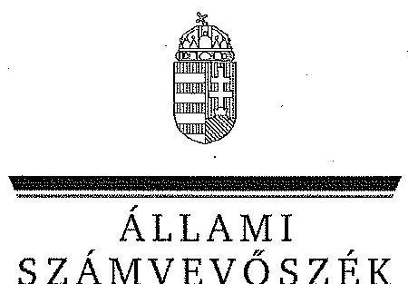

ÁLLAMI
SZÁMVEVŐSZÉK

# JELENTÉS 

Az önkormányzatok gazdasági társaságai - Az önkormányzatok többségi tulajdonában lévő gazdasági társaságok közfeladat-ellátását érintő gazdálkodási tevékenysége szabályszerűségének ellenőrzése BTG Budaörsi Településgazdálkodási Nonprofit Kft.

---

# Állami Számvevőszék 

Iktatószám: V-0524-262/2014.
Témaszám: 1558
Vizsgálat-azonosító szám: V0671

## Az ellenőrzést felügyelte:

Dr. Horváth Margit
felügyeleti vezető

## Az ellenőrzést vezette és az ellenőrzés végrehajtásáért felelős:   Salamin Viktor   ellenőrzésvezető

## A jelentéstervezet összeállításában közreműködtek:

Dr. Mezei Imréné
számvevő tanácsos
Dr. Zsolnay András
számvevő tanácsos

## Az ellenőrzést végezték:

| Kelemen Lajos | Filipszki Mihályné | Dr. Pálffy Imre Péter |
| :-- | :-- | :-- |
| okleveles könyvvizsgáló, | okleveles könyvvizsgáló, | okleveles könyvvizsgáló, |
| külső szakértő | külső szakértő | külső szakértő |

## A témához kapcsolódó eddig készített számvevőszéki jelentések:

## címe

sorszáma
Jelentés Budaörs Város Önkormányzata pénzügyi helyzetének el- 1218 lenőrzéséről

---

# TARTALOMJEGYZÉK 

BEVEZETÉS ..... 5
I. ÖSSZEGZŐ MEGÁLLAPÍTÁSOK, KÖVETKEZTETÉSEK, JAVASLATOK ..... 8
II. RÉSZLETES MEGÁLLAPÍTÁSOK ..... 14

1. Az Önkormányzat közfeladat-ellátásának szabályszerűsége ..... 14
1.1. A közfeladat-ellátás megszervezése és a feladatellátás feltételrendszerének kialakítása ..... 14
1.2. A közfeladat-ellátás felügyelete és a tulajdonosi jogok érvényesítése ..... 17
2. A BTG Kft. közfeladat-ellátással kapcsolatos tevékenysége ..... 20
2.1. A BTG Kft. gazdálkodásának szabályozottsága ..... 20
2.2. A BTG Kft. vagyongazdálkodása ..... 23
2.3. A beszámolási kötelezettség teljesítése ..... 26
3. A távhőszolgáltatás közfeladata bevételei és ráfordításai elszámolásának és önköltségszámításának szabályszerűsége ..... 27
3.1. A távhőszolgáltatás közfeladat bevételeinek és ráfordításainak szabályszerűsége ..... 27
3.2. Az önköltségszámítás szabályszerűsége ..... 28
4. Az ÁSZ korábbi, az önkormányzatok többségi tulajdonában lévő gazdasági társaságok közfeladat-ellátását, gazdálkodását, pénzügyi helyzetét érintő javaslataira tett intézkedések ..... 30

## MELLÉKLETEK

1. számú A Budaörsi Településgazdálkodási Kft. tevékenységének főbb adatai
2. számú A Budaörsi Településgazdálkodási Kft. működésének főbb jellemzői
3. számú A távhőszolgáltatási díj alakulása 2008-2012. között
4. számú Beérkezett észrevételek és az azokra adott válaszok

## FÜGGELÉK

1. számú Értelmező szótár
2. számú Mintavételi eljárások ellenőrzési területenként

---

.

---

# RÖVIDÍTÉSEK JEGYZÉKE 

## Törvények

Gt.
Mötv.

Nvtv.

Ötv.

Ptk.
Számv. tv.
Tszt.

## Rendeletek

NFM távhődíj rendelet

NFM távhőtámogatási rendelet
önkormányzati SZMSZ
önkormányzati távhődíj rendelet
távhő rendelet
vagyongazdálkodási rendelet
a gazdasági társaságokról szóló 2006. évi IV. törvény (hatálytalan: 2014. március 15-étől)
Magyarország helyi önkormányzatairól szóló 2011. évi CLXXXIX. törvény (hatályos: 2012. január 1-jétől, kivéve a 144. § (2) bekezdésben meghatározott paragrafusok, amelyek 2012. április 15-én, a (3) bekezdésben meghatározott paragrafusok, amelyek 2013. január 1-jén léptek hatályba, a (4) bekezdésben meghatározott paragrafusok a 2014. évi általános önkormányzati választások napján lépnek hatályba)
a nemzeti vagyonról szóló 2011. évi CXCVI. törvény (hatályos: 2011. december 31-étől, kivéve a 20. § (2) bekezdésben meghatározott paragrafusok, amelyek 2012. január 1-jétől, a (3) bekezdésben meghatározott paragrafusok 2013. január 1-jétől, a (4) bekezdésben meghatározott paragrafus 2012. március 2-ától léptek hatályba)
a helyi önkormányzatokról szóló 1990. évi LXV. törvény (hatálytalan: a 2014. évi általános önkormányzati választások napjától)
a Polgári Törvénykönyvről szóló 1959. évi IV. törvény (hatálytalan: 2014. március 15-étől)
a számvitelről szóló 2000. évi C. törvény (hatályos: 2001. január 1-jétől)
a távhőszolgáltatásról szóló 2005. évi XVIII. törvény (hatályos: 2005. július 1-jétől)

## a távhőszolgáltatónak értékesített távhő árának, valamint a lakossági felhasználónak és a külön kezelt intézménynek nyújtott távhőszolgáltatás díjának megállapításáról szóló 50/2011. (IX. 30.) NFM rendelet

a távhőszolgáltatási támogatásról szóló 51/2011. (IX. 30.) NFM rendelet

Budaörs Város Önkormányzata Képviselő-testületének 36/2010. (XI.12.) rendelete Budaörs Város Önkormányzatának Szervezeti és Működési Szabályzatáról
Budaörs Város Önkormányzata Képviselő-testületének 3/2005. (I.26.) rendelete a távhőszolgáltatás legmagasabb hatósági díjáról és a díjalkalmazás feltételeiről
Budaörs Város Önkormányzata Képviselő-testületének 2/2005. (I.26.) rendelete a távhőszolgáltatásról
Budaörs Város Önkormányzata Képviselő-testületének 60/2004. (X.20.) rendelete az önkormányzat vagyonáról való rendelkezési jog gyakorlásának szabályairól

---

Vhr.

## Szórövidítések

alapító okirat
ÁSZ
BTG Kft.
FB
javadalmazási szabály-
zat
jegyző
Képviselő-testület
MEKH
M Ft
NFM
Önkormányzat
önköltség-számítási sza-
bályzat
polgármester
Polgármesteri Hivatal
számlarend
számviteli politika
Társaság
üzletszabályzat
vagyonvédelmi szabályzat
a távhőszolgáltatásról szóló 2005. évi XVIII. törvény végrehajtásáról szóló 157/2005. (VIII. 15.) Korm. rendelet
a Budaörsi Településgazdálkodási Kft. alapító okirata Állami Számvevőszék
Budaörsi Településgazdálkodási Kft.
Budaörsi Településgazdálkodási Kft. felügyelő bizottsága
a Budaörsi Településgazdálkodási Kft. javadalmazási szabályzata (hatályos: 2010. február 11-től)
Budaörs Város Önkormányzatának jegyzője
Budaörs Város Önkormányzatának Képviselő-testülete
Magyar Energetikai és Közmű-szabályozási Hivatal
millió forint
Nemzeti Fejlesztési Minisztérium
Budaörs Város Önkormányzata
a Budaörsi Településgazdálkodási Kft. önköltségszámítási szabályzata
Budaörs Város Önkormányzatának polgármestere
Budaörs Város Önkormányzatának Polgármesteri Hivatala
a Budaörsi Településgazdálkodási Kft. számlarendje
a Budaörsi Településgazdálkodási Kft. számviteli politikája
Budaörsi Településgazdálkodási Kft.
a Budaörsi Településgazdálkodási Kft. üzletszabályzata
a Budaörsi Településgazdálkodási Kft. vagyonvédelmi szabályzata

---

# JELENTÉS 

## Az önkormányzatok gazdasági társaságai Az önkormányzatok többségi tulajdonában lévő gazdasági társaságok közfeladat-ellátását érintő gazdálkodási tevékenysége szabályszerűségének ellenőrzése

## BTG Budaörsi Településgazdálkodási Nonprofit Kft.

## BEVEZETÉS

Az Állami Számvevőszék középtávra szóló stratégiájában megfogalmazta, hogy a helyi önkormányzatok gazdálkodásában rejlő pénzügyi kockázatok feltárásával, az államháztartáson kívülre nyújtott költségvetési támogatások és ingyenes vagyonjuttatások, valamint az államháztartáson kívül működő közfeladat-ellátó rendszerek ellenőrzéseivel hozzájárul ahhoz, hogy a közpénzeket az államháztartáson kívül működő szervezetek is átlátható, rendezett módon használják fel a közfeladatok szerződésben vállalt ellátása érdekében.

Az önkormányzatok szervezetalakítási szabadságának következménye, hogy a korábban is vállalati formában működő (nagyvárosi tömegközlekedés, víz-, szennyvízcsatorna, köztisztasági, ingatlankezelés stb.) közszolgáltatások mellett, mind a kötelező, mind az önként vállalt feladatok ellátásában a gazdasági társaságok kiemelt fontosságú szerephez jutottak.

Budaörs Város Önkormányzata a Budaörsi Településgazdálkodási Kft. a 80/1991. (XI.8.) számú Képviselő-testületi határozattal, 100%-os tulajdonosi részesedéssel hozta létre. Az alapítói jogokat az Önkormányzat Képviselőtestülete gyakorolta.

A BTG Kft. az ellenőrzött időszakban a 27306 lakosú településen több mint kétezer lakás, valamint több mint száz közület részére biztosította a meleg víz és távfűtési szolgáltatást. A Társaság tevékenységi köre fokozatosan bővült, az ellenőrzött időszakban a távhőszolgáltatás, a hulladékkezelés és az egyéb településüzemeltetési szolgáltatások mellett feladatai közé tartozott a Budaörsi Városi Uszoda Sportcsarnok és Strand üzemeltetése, illetve az ingatlankezelés és létesítménygazdálkodás terén is jelentős szerepet töltött be. A Társaság közfeladatellátáshoz kapcsolódó foglalkoztatotti létszáma 2008-ban 102 fő, míg 2012-ben 125 fő volt.

---

A Társaság összes árbevétele 2008-ban 1677,1 M Ft, a 2012. évben 2486,1 M Ft volt, amelyből 1893,4 M Ft-ot az értékesítés nettó árbevétele címén realizáltak. Az összes árbevétel az ellenőrzött időszakban 48,2%-kal, a ráfordítások 49,8%-kal emelkedtek.

A Társaság a 2008. évben 16,5 M Ft, 2009-ben 17,6 M Ft, 2010-ben 33,9 M Ft, 2011-ben 14,4 M Ft, a 2012. évben pedig 3,9 M Ft eredményt ért el, távhő üzletága azonban veszteségesen gazdálkodott.

A BTG. Kft. az ellenőrzött időszakban pozitív mérleg szerinti eredménnyel zárt. A Társaság a 2012. évben mindössze 3,9 M Ft összegű eredményt realizált, amelyet 93,2 M Ft távhőszolgáltatási támogatás igénybevétele mellett ért el.

A BTG. Kft. mérleg szerinti eszközállománya a 2008. január 1-jei 991,6 M Ft-ról a 2012. év végére 241,1%-os növekedést követően 2906,8 M Ft-ra nőtt, ezen belül a tárgyi eszközök állománya 282%-kal emelkedett. A saját tőke a 2008. év elejei 653,6 M Ft-ról 2012. év végére 2520 M Ft-ra változott.

Az ellenőrzött időszakban a polgármester személye nem változott, jegyzőváltásra egy alkalommal került sor. A polgármester az 1990. évi önkormányzati választások óta tölti be tisztségét, a jegyző 2008-tól látja el feladatait. A BTG Kft. ügyvezetőjének személye egy alkalommal, 2008. október 1-jétől változott, a gazdasági igazgató 2005. május 1. óta folyamatosan tölti be tisztségét.

Az önkormányzati tulajdonú gazdasági társaságok teljes körű ellenőrzésének lehetőségét az Állami Számvevőszékről szóló 1989. évi XXXVIII. törvény 2011. január 1-jétől hatályos módosítása teremtette meg.

Az ellenőrzés célja annak értékelése volt, hogy:

- az önkormányzat a jogszabályi előírások figyelembevételével döntött-e az ellenőrzésre kerülő közfeladat megszervezéséről; az önkormányzat szabályszerűen gyakorolta-e a tulajdonosi jogokat;
- a gazdasági társaság közfeladat-ellátása bevételeinek, ráfordításainak elszámolása, és vagyongazdálkodási tevékenysége megfelelt-e a jogszabályi, illetve a közszolgáltatási szerződésben foglalt tulajdonosi előírásoknak, azok végrehajtása szabályszerű volt-e;
- a közfeladatok átláthatósága és elszámoltathatósága érdekében biztosítva volt-e a közszolgáltatás díjának megalapozottsága szabályszerű önköltségszámítással.

Az ellenőrzés során értékeltük az ÁSZ korábbi, az Önkormányzat többségi tulajdonában lévő gazdasági társaságát érintő javaslataira tett intézkedések hasznosulását.

Az ellenőrzés kiterjedt Budaörs Város Önkormányzatára és a Budaörsi Településgazdálkodási Kft.-re.

Az ellenőrzés várható hasznosulása: A törvényalkotás számára - az észlelt problémák, szabálytalanságok, vagy egyéb nem kívánatos jelenségek felszínre kerülésével - az ellenőrzés megállapításai segítséget nyújthatnak az ál-

---

lamháztartáson kívüli közfeladat-ellátás értékeléséhez, jogszabályi keretei pontosításához, átláthatóságot biztosító szabályozásához. Meghatározhatóvá válnak a közfeladat-ellátásban részt vevő államháztartáson kívüli szervezeteknek - az önkormányzat költségvetését, pénzügyi helyzetét is befolyásoló - kockázatai, lehetővé válik ezen kockázatok csökkentése. Értékelhetővé válik, hogy a feladatot ellátó gazdasági társaság a közszolgáltatási szerződésben foglaltak betartásával, a közvagyon használatával biztosította-e a szolgáltatás folytatásának feltételeit. Ezzel az ellenőrzöttek és a helyi döntéshozók számára visszajelzést ad feladatszervezési, feladat-ellátási kockázataikról, alapot ad a meglévő hibák megszüntetéséhez, a jobb közfeladat-ellátás biztosításához. Fokozza a fegyelmet, igazolja, hogy lejárt a következmények nélküli ellenőrzések időszaka. Az ÁSZ értékteremtő rend kialakításához és megőrzéséhez hozzájáruló tevékenysége pozitív hatással van a szervezetről kialakított összkép formálására is.

A bevételek és ráfordítások elszámolása, valamint a vagyonnyilvántartás terén az egyes területek szabályszerű működését mintavétellel ellenőriztük, ez alapján a sokaságokban előforduló hibás tételek arányát becsültük. A jogszabályoknak és a belső előírásoknak megfelelőnek, azaz szabályszerűnek tekintettük az adott bevételek és ráfordítások elszámolását, a vagyonnyilvántartást, amennyiben a minta ellenőrzésének eredménye alapján 95%-os bizonyossággal a teljes sokaságban a hibás tételek aránya kisebb volt, mint 10%, nem megfelelőnek értékeltük, ha a hibás tételek aránya a 10%-ot meghaladta. Kockázatot, illetve magas kockázatot jeleztünk, amennyiben egy adott terület vonatkozásában a minta alapján a teljes sokaságban nem volt teljes körűen biztosított a jogszabályoknak és a belső szabályzatoknak megfelelő működés.

Az ellenőrzést a számvevőszéki ellenőrzés szakmai szabályai szerint, szabályszerűségi ellenőrzés módszerével, a vonatkozó nemzetközi standardok figyelembevételével végeztük. Az ellenőrzés a 2008-2012. évekre terjedt ki.

Az ellenőrzés végrehajtásának jogszabályi alapját az Állami Számvevőszékről szóló 2011. évi LXVI. törvény 5. § (3)-(4)-(5) bekezdése képezi.

Az ÁSZ az Állami Számvevőszékről szóló 2011. évi LXVI. törvény 29. §-a alapján a jelentéstervezetet észrevételezésre megküldte a polgármesternek és a gazdasági társaság ügyvezetőjének. A beérkezett észrevételeket a jelentés véglegesítése során hasznosítottuk. Az észrevételeket és az azokra adott válaszokat a jelentés 4. számú melléklete tartalmazza.

---

# I. ÖSSZEGZŐ MEGÁLLAPÍTÁSOK, KÖVETKEZTETÉSEK, JAVASLATOK 

Budaörs város önkormányzatának a Tszt. alapján kötelezően ellátandó feladata volt a távhőszolgáltatás a 2008-2012 közötti időszakban. A közfeladat-ellátás megszervezéséről 100%-os önkormányzati tulajdonú gazdasági társaságának megalakításával gondoskodott. A feladatellátás céljára szolgáló vagyont (149 M Ft) az alapításkor apportként bocsátották a Társaság rendelkezésére. Az ellenőrzött időszakban a távhő üzletágat érintően további vagyonátadás nem történt.

A BTG Kft. tevékenységi köre az évek során fokozatosan bővült, a távhőszolgáltatás mellett az ingatlankezelés és létesítménygazdálkodás terén is látott el feladatokat. Az Önkormányzat és a Társaság között a távhőszolgáltatásra, a közfeladat szakmai tartalmára vonatkozóan nem jött létre külön közszolgáltatási szerződés, a Tszt. által meghatározott távhőszolgáltatási feladatot azonban a Társaság közszolgáltatási szerződés hiányában is ellátta, az Önkormányzat a közszolgáltatás ellátásának felügyeletéről gondoskodott.

Az Önkormányzat Tszt.-ben megfogalmazott kötelezettségének eleget téve az előírt rendeletalkotási kötelezettségének eleget tett, 2005-ben
 elkészítette és hatályba léptette a távhő és távhődíj rendeleteket, valamint az ellenőrzött időszak alatt gondoskodott azok jogszabályi változásokkal indokolt módosításáról. A távhőszolgáltató társaság a díjmeghatározás előkészítéséhez tételes kalkulációs tervezetet nyújtott be, amelyben a hődíjak a földgáz hatósági árához igazodtak. A lakossági távhőfogyasztáshoz kapcsolódó árképzést 2010-ben befolyásolta az Önkormányzat Képviselő-testülete által nyújtott 22,4 M Ft működési célú támogatás. A támogatás célja a lakossági távfűtés és meleg víz-szolgáltatás alapdíjának 17%-os csökkentése volt. A támogatást 2010. március 1-étől kezdődően 10 hónapon keresztül kellett a BTG Kft.-nek érvényesítenie. Az elszámolás a támogatás fizetését követően az Önkormányzat és a Társaság között megtörtént.

Az Önkormányzat rendeleteiben szabályozta a teljesítendő közszolgáltatási kötelezettségeket, az ellátási területet, a szolgáltatási díjakat és a szolgáltatás ellátásának feltételrendszerét, valamint a végzett tevékenységre és a feladat ellátásához átadott közvagyon megóvására vonatkozó kötelezettségeket.

A BTG Kft. vonatkozásában a tulajdonosi jogok gyakorlását a jogszabályi előírásoknak és a helyi önkormányzati szabályozásnak megfelelően határozták meg, azok gyakorlása megfelelő volt.

A Társaság alapító okiratában a BTG Kft. működésének és ellenőrzésének alapelveit a Gt.-ben és a Ptk.-ban meghatározott kereteknek megfelelően rögzítették. Az alapító okiratban szabályozták az alapító Önkormányzat döntési hatáskörét, az ügyvezető feladatait, elszámoltatását, a tulajdonosi ellenőrzés FB-n keresztül történő megvalósításának keretszabályait, valamint a független

---

könyvvizsgálói ellenőrzést, tovább meghatározták a beszámolási kötelezettségek teljesítésének formáit.

A tulajdonos Önkormányzat által kialakított, a jogszabályi kereteknek megfelelő szabályozás szerint a Képviselő-testület a BTG Kft. alapító okirata, valamint a vagyongazdálkodási rendelet szerint saját hatáskörben dönthetett a Társaság átalakulásával, a tulajdon értékesítésével, az alaptőke felemelésével és csökkentésével, az elővásárlási joggal kapcsolatos jogokról. A tulajdonos Önkormányzat az alapító okiratban meghatározta továbbá a Társaság ügyvezetőjének hatás- és jogköreit, feladatait és kötelezettségeit, különösen a tulajdonosi jogkör gyakorlója felé teljesítendő kötelezettségeit. Az egyéb tulajdonosi jogokat - az Ötv. alapján - átruházott hatáskörben a polgármester gyakorolta. Az Önkormányzat a BTG Kft. alapító okiratban és a vagyongazdálkodási rendeletben határozta meg az átadott vagyon feletti rendelkezési jogokat.

A tulajdonos Önkormányzat belső ellenőrzése kockázatértékelésen alapuló belső ellenőrzési terv alapján végezte tevékenységét. Az Önkormányzat belső kontrollrendszere kellő súllyal kezelte a Társaság közvagyonnal történő gazdálkodásának kockázatait. Az ellenőrzött időszakban - a 2011. évi belső ellenőrzési terv alapján - egy ellenőrzést végeztek el a távhőszolgáltatási feladatellátással kapcsolatban, amely a BTG Kft. vagyonával való gazdálkodás szabályszerűségére irányult. A belső ellenőrzés tulajdonosi érdekeket sértő jogszerűtlen vagyongazdálkodási tevékenységet nem tárt fel, javaslatot a leltározási szabályzat pontosítására vonatkozóan fogalmazott meg, amely hasznosult.

A Társaságnál 2012-ben külső szakértői ellenőrzésre is sor került a BTG Kft. távhőszolgáltatási üzletágában, a veszteséges gazdálkodás okainak feltárása érdekében. A szakértői vélemény gazdaságos működésre vonatkozó javaslatai műszaki tárgyúak voltak, összességében azt állapította meg, hogy a Társaság működésének szabályozottsága a törvényi előírásoknak megfelelt.

A BTG Kft. az ellenőrzött időszakban nyereségesen gazdálkodott, a távhő üzletága azonban veszteséges volt. Az Önkormányzat - tulajdonosi jogkörében eljárva - a Társaság eredményét minden évben eredménytartalékba helyeztette. A Társaság a közfeladat ellátásához kapcsolódóan - a távhőszolgáltatás fejlesztésére - 2000. decemberében 200 M Ft fejlesztési célú hitelt vett igénybe, melynek folyósítási feltételeként az Önkormányzat készfizető kezességet vállalt. A kezesség beváltására az ellenőrzött időszak végéig nem került sor.

A BTG Kft. kizárólag saját tulajdonú vagyonnal rendelkezett, vagyonkezelésbe átvett eszköze nem volt. A Társaság által kialakított vagyonnyilvántartás a jogszabályi és belső szabályozási előírások szerint biztosította a saját vagyon változásának folyamatos kimutatását, elemzését, ellenőrzését. A vagyonnyilvántartás tartalmazta az egyéb vagyonnövekedést és csökkenést is (eszközre aktiválandó felújítási költség, selejtezés, értékesítés). A Társaság vagyongazdálkodásának és nyilvántartásának szabályszerűsége - az apportként rendelkezésre bocsátott ingatlan beruházásként való nyilvántartását kivéve - megfelelt a jogszabályi és tulajdonosi rendelkezéseknek.

---

A BTG Kft. éves mérlegbeszámolóinak adatai alapján az eszközök állománya 2008. január 1. - 2012. december 31. között 241,1%-kal, több mint háromszorosára nőtt. A nagyarányú növekedés a 2012. évi 1780 M Ft összegű ingatlan apportálásról szóló döntés eredménye. Az Önkormányzat apportálásra és ingatlan bérbeadásra vonatkozó döntése nem felelt meg a vagyonrendeletben foglaltaknak, mivel annak előírásai nem adtak lehetőséget a korlátozottan forgalomképes önkormányzati törzsvagyon tulajdonjogának átruházására. A BTG Kft. azzal, hogy számviteli nyilvántartásaiban az apport tárgyát képező ingatlant a beruházások között mutatta ki, megsértette a Számv. tv. valódiság elvére vonatkozó előírását.

A kötelezettségek állománya az ellenőrzött időszakban folyamatos csökkenést mutatott, a Társaság beruházási és fejlesztési hiteleit minden évben törlesztette, valamint a szállítói tartozásait is kiegyenlítette.

A BTG Kft. az ellenőrzött időszakban megfelelő tartalmú kintlévőség kezelési szabályzattal rendelkezett, és az abban foglaltak szerint járt el. Negyedévente történt fizetési felszólításokat követően intézkedett a követelés állomány csökkentése érdekében. A leírandó, behajthatatlan követelések összege az ellenőrzött időszakban folyamatosan csökkent.

A BTG Kft. a Számv. tv.-ben foglaltak szerint készítette el éves beszámolóját, amely mérlegből, eredménykimutatásból, kiegészítő mellékletből és üzleti jelentésből állt. A Társaság a számviteli politikában előírtak szerint az éves beszámolási, adatszolgáltatási kötelezettségnek határidőben eleget tett.

A BTG Kft. éves beszámolóit az ellenőrzött időszakban a tulajdonosi joggyakorlásra előírt eljárásrend szerint az Önkormányzat elfogadta. A könyvvizsgáló minden évben hitelesítő záradékot adott a társaság beszámolójára, ugyanakkor a 2012. évi beszámoló auditálása során elmulasztotta jelezni, hogy a 2012. február 29-ei önkormányzati döntés alapján 1780 M Ft összegű apportált ingatlan jogérvényesen nem került a társaság tulajdonába, az ingatlan beruházások között való számviteli nyilvántartásával pedig megsértették a Számv. tv. előírásait. A könyvvizsgáló a 2012. évi beszámoló felülvizsgálatáról szóló könyvvizsgálói jelentésében nem nyilatkozott a távhőszolgáltatás vonatkozásában a Tszt. által előírt számviteli szétválasztási szabályok kidolgozásáról és alkalmazásáról, nem igazolta, hogy a Társaság egyes tevékenységei közötti tranzakciók árazása biztosítja a vállalkozás tevékenységei közötti keresztfinanszírozás mentességét.

A BTG Kft. az éves beszámoló elfogadásáról készült Képviselő-testületi határozatot a beszámolóval együtt minden évben a Számv. tv. előírásainak megfelelően határidőben közzétette és letétbe helyezte, nyilvánosságra hozta.

A Társaságnál realizált, évente eredménytartalékba helyezett mérleg szerinti eredmény a közvagyon gyarapítását szolgálta, lehetőséget adva a további fejlesztésekre. A BTG Kft. saját tőkéjének összege az ellenőrzött időszakban a társaság típusára a Gt.-ben előírt szintnek folyamatosan megfelelt, így ezzel összefüggő tulajdonosi intézkedési kötelezettség nem keletkezett.

---

A BTG Kft. távhőszolgáltató üzemének üzletszabályzata 1999. óta változatlan formában volt érvényben, annak aktualizálását elmulasztották.

A BTG Kft. az ellenőrzött időszakban - Számv. tv. előírásainak megfelelően - rendelkezett számviteli szabályzatokkal, a közfeladat-ellátás bevételeinek, ráfordításainak elszámolása, a vagyongazdálkodási tevékenysége - az apportként rendelkezésre bocsátott ingatlan számviteli nyilvántartását kivéve - megfelelt a jogszabályi, illetve a tulajdonosi előírásoknak, azok végrehajtása szabályszerű volt. A BTG Kft. az ellenőrzött időszakban rendelkezett a Számv. tv. előírásainak megfelelő számviteli politikával. A BTG Kft. számviteli politikája keretében elkészítette az eszközök és források leltározási és értékelési szabályzatát. A Társaság számlarendje bizonylati rendet nem tartalmazott. A főkönyvi nyilvántartást a Társaság a tevékenységei számviteli szétválasztására alkalmas módon alakította ki.

A BTG Kft. költségei és ráfordításai előírás szerinti elszámolásának a megítélése véletlenszerűen kiválasztott mintatételek ellenőrzésével történt. Három mintatétel esetében az ellenőrzött időszakban a Társaság megsértette a Számv. tv. valódiságra és a bekerülési értékre vonatkozó előírásait, továbbá a számviteli politikájában foglaltakat, mivel a bekerülési (beszerzési) értéket nem csökkentette a kapott engedményekkel, ezért az anyagjellegű ráfordítások elszámolása szabályszerűségének minősítése kockázatos.

A BTG Kft. bevételei előírás szerinti elszámolásának az ellenőrzése ugyancsak véletlenszerűen kiválasztott mintatételek feldolgozásával történt, az elszámolás szabályszerűségének minősítése megfelelő.

A BTG Kft. bevételeinek alakulását befolyásolta, hogy a Tszt., valamint az NFM távhődíj rendeletben és az NFM távhőtámogatási rendeletben foglaltak alapján 2011. október 1-jétől a lakosság részére nyújtott távhőszolgáltatásért támogatásban részesült a MEKH-nek havonta benyújtott adatszolgáltatás alapján. A támogatás mértéke a vizsgált időszakban összesen 327 M Ft volt. A támogatás a BTG Kft.-vel megkötött támogatási szerződésben foglaltak szerint került átadásra.

Az értékcsökkenést a Társaság szabályosan kialakított, érvényben lévő eszközök és források értékelési szabályzata szerint számolták el. Az értékcsökkenés elszámolásának szabályszerűsége - a véletlenszerűen kiválasztott mintatételek ellenőrzése alapján - megfelelő volt. Az elszámolt értékcsökkenés eszközökre gyakorolt hatását az éves beszámolók kiegészítő mellékletében a Számv. tv.-ben foglaltaknak megfelelően részletesen bemutatták.

A BTG Kft. rendelkezett a jogszabályi követelményeknek megfelelő elkészített és folyamatosan aktualizált önköltség-számítási szabályzattal. Az önköltségszámítási szabályzat meghatározta a közvetlen és közvetett költségek tartalmát és elszámolási módját. Ez megfelelt az egyes közfeladatokra vonatkozó ágazati előírásoknak, a közszolgáltatás díjának szabályszerű önköltségszámítással való megalapozása biztosított volt. Az önköltség-számítási szabályzat alapján kialakított távhő önköltség-elszámolás átlátható volt, az árképzéshez megfelelő információt biztosított.

---

Az ÁSZ Budaörs Város Önkormányzata pénzügyi helyzetének ellenőrzéséről szóló jelentésében a kizárólagos önkormányzati tulajdonú gazdasági társaságok kötelezettségei alakulásának Önkormányzat likviditására, pénzügyi egyensúlyi helyzetére gyakorolt hatásának nyomon követésére, a tulajdonosi érdekek védelmére irányulóan egy feladatot határozott meg. Az Önkormányzat az ÁSZ által elfogadott intézkedési tervben vállalta, hogy a stratégiai és az éves belső ellenőrzési tervekben szerepeltetik az önkormányzati tulajdonú gazdasági társaságok pénzügyi egyensúlyi helyzetének és a részükre biztosított pénzeszközök rendeltetésszerű felhasználásának ellenőrzését. Az Önkormányzat az intézkedési tervében foglalt kötelezettségét teljesítette, az ellenőrzés megállapításai hasznosultak.

A fentiekben leírtak összegzéseként az alábbi megállapításokat tesszük:
Budaörs Város Önkormányzatának Képviselő-testülete a távhőszolgáltatás közfeladatának megszervezéséről, annak felügyeletéről a jogszabályi előírásoknak megfelelően gondoskodott. Az Önkormányzat a társaság feletti tulajdonosi jogait szabályszerűen gyakorolta, a Társaságnál realizált, évente eredménytartalékba helyezett mérleg szerinti eredmény a közvagyon gyarapítását szolgálta, lehetőséget adva a további fejlesztésekre. Az ellenőrzött időszakban az Önkormányzat egy ingatlan apportálásra és annak bérbeadására vonatkozó döntése nem felelt meg a vagyonrendelet előírásainak. A BTG Kft. tevékenységének szabályozottsága az előírásoknak csak részben felelt meg, hiányosság volt, hogy a távhőszolgáltató üzemének üzletszabályzata 1999. óta változatlan formában volt érvényben, így a távhőszolgáltató, a felhasználó és a díjfizető közötti jogviszony általános előírásait nem a hatályos jogszabályi előírásoknak megfelelően tartalmazta. Felülvizsgálatra szorul a számviteli politika keretében kialakított egyes szabályzatok tartalma, valamint kialakításra vár az előírásoknak megfelelő bizonylati rend.

Az Állami Számvevőszékről szóló 2011. évi LXVI. törvény 33. § (1) bekezdésében foglaltak értelmében a jelentésben foglalt megállapításokhoz kapcsolódó intézkedési tervet köteles az ellenőrzött szervezet vezetője összeállítani, és azt a jelentés kézhezvételétől számított 30 napon belül az ÁSZ részére megküldeni. Amennyiben az intézkedési tervet határidőben nem küldi meg a szervezet, vagy az nem elfogadható, az ÁSZ elnöke a hivatkozott törvény 33. § (3) bekezdés a)-b) pontjaiban foglaltakat érvényesítheti.

Az ellenőrzés intézkedést igénylő megállapításai és javaslatai:
Javaslataink célja a Kft. gazdálkodása szabályszerűségének helyreállítása annak érdekében, hogy a szabályozási környezet megfelelően tudja támogatni az átlátható működést.

Javasoljuk a Budaörsi Településgazdálkodási Kft. (BTG Kft.) ügyvezető Igazgatójának:

1. A BTG Kft. számlarendje nem tartalmazta a Számv. tv. 161. § (2) bekezdés d) pontjának megfelelően a számlarendben foglaltakat alátámasztó bizonylati rendet.

---

A BTG Kft. elkészítette a
 Számv. tv. 14. § (5) bekezdés a) pontjában előírtaknak megfelelően az eszközök és források leltározási szabályzatát, amely nem tartalmazta a Számv. tv. 69. § (3) bekezdése alapján a leltáregyeztetés módját (mennyiség és/vagy érték).

A BTG Kft. távhőszolgáltató üzemének üzletszabályzatát a vizsgált időszakban elmulasztották aktualizálni a távhőszolgáltatási tevékenység jogszabályi környezetének jelentős változásai (pl. a Tszt. 2011. évi módosítása) szerint. Így a szabályzat nem felelt meg az ellenőrzött időszakban hatályos jogszabályi előírásoknak.

Javaslat:
Intézkedjen a szabályozási hiányosságok megszüntetésére, ennek keretében:
a) a számlarendjét egészítse ki a bizonylati rendre vonatkozó előírásokkal;
b) a távhőszolgáltatásról szóló hatályos jogszabályi előírásoknak megfelelően aktualizálja az üzletszabályzatát.
2. A BTG Kft. költségei és ráfordításai előírás szerinti elszámolásának ellenőrzésénél megállapítást nyert, hogy három mintatétel esetében az ellenőrzött időszakban a társaság megsértette a Számv. tv. 15. § (3) bekezdésének a valódiságra vonatkozó és a 47. § (1) bekezdésnek a bekerülési értékre vonatkozó előírásait, továbbá a Számviteli politikájában foglaltakat, mivel a bekerülési (beszerzési) értéket nem csökkentette az engedményekkel.

Javaslat:
Gondoskodjon a jogszabályi előírások szerinti gyakorlat és a szabályos működés biztosítására, ezen belül:
intézkedjen annak érdekében, hogy az elszámolásaiban érvényesüljenek a bekerülési értékre vonatkozó Számv. tv.-i előírások, valamint a saját Számviteli politikájában előírt rendelkezések.

---

# II. RÉSZLETES MEGÁLLAPÍTÁSOK 

## 1. Az ÖNKORMÁNYZAT KÖZFELADAT-ELLÁTÁSÁNAK SZABÁLYSZERÜSÉGE

### 1.1. A közfeladat-ellátás megszervezése és a feladatellátás feltételrendszerének kialakítása

Budaörs Város Önkormányzata az ellenőrzött időszakra vonatkozóan két gazdasági programot készített, egyet a 2004-2009. és egyet a 2009-2014. közötti időszakra. A két, ellenőrzött időszakot érintő gazdasági program általánosságban foglalkozott a gazdasági társaságokban lévő részesedések rövid illetve hosszú távú gazdasági céljaival.

A 2009-2014. évekre készített gazdasági program részletesebben foglalkozik az Önkormányzat gazdasági társaságokban lévő részesedéseivel. Hosszú távú célként fogalmazta meg a 100%-ban önkormányzati tulajdonban lévő gazdasági társaságokban - így a BTG Kft-ben - lévő részesedéseinek fenntartását. A programban bemutatták a BTG Kft. gazdasági tevékenységeit is, a távhőszolgáltatási tevékenységből minimális eredményt terveztek.

Az önkormányzati gazdasági célokhoz közvetetten kapcsolódtak a BTG Kft. éves üzleti terveiben megfogalmazott célok, a közfeladat ellátás végrehajtásáról ezek adtak részletesebb információkat. A tervek bemutatták a Társaság középtávú stratégiáját, az elvégzett iparági elemzést, a szolgáltatásokhoz szükséges eszközöket. Az üzleti tervek foglalkoztak a pályázati lehetőségek felkutatásával, számszerűsítették a távhő üzemtől elvárt bevétel, költség és eredmény adatokat. 2012-től az üzleti tervek kockázatbecsléssel kiegészített marketing terveken alapultak.

A 2010-2013. évekre szóló középtávú fejlesztési terv a távhő és meleg víz szolgáltatás területén előírta új környezetvédelmi technológiák bevezetését, modern szigetelési technológiák rendszerbe iktatását, a gázmotoros eszközpark átvételét.

Eszközparkjának fejlesztésén belül az 1975-ben kialakított fűtőmű teljes műszaki rekonstrukcióját, napkollektorok, hőszivattyúk és az egyedi fogyasztási értékek leolvasásához szükséges eszközök beszerzését határozták meg. Az éves üzleti tervek az ellenőrzött időszakban folyamatos feladatként jelölték meg a távhőszolgáltatás műszaki színvonalának és üzembiztonságának megtartását. Kiemelt üzembiztonságot helyreállító beruházásként szerepelt 2010. évtől a Danstoker kazán gáz- és fűtőolaj elégetésére alkalmas égővel történő ellátása. Az épületek hőközpontjainak szükség szerinti átalakítását határozták meg 2010. évben a panel plusz program keretében korszerűsített hálózathoz.

A távhőszolgáltatás a 2008-2012 közötti időszakban a Tszt. 6. § (1) bekezdésének rendelkezései alapján volt az Önkormányzat kötelezően ellátandó feladata.

---

Budaörs Város Önkormányzata 1991-ben a 80/1991. (XI.8.) számú Képviselőtestületi határozatával, 100%-os önkormányzati tulajdonú gazdasági társaságként alakította meg a BTG Kft-t, a lakosság távfűtés és meleg víz ellátásának biztosítása érdekében ${ }^{1}$.

A BTG Kft. működésének és ellenőrzésének alapelveit a Gt. 11-12. §-aiban és a Ptk. 54. §-ában meghatározott kereteknek megfelelően határozták meg a Társaság alapító okiratában. Az alapító okiratban szabályozták az alapító Önkormányzat döntési hatáskörét, az ügyvezető feladatait, elszámoltatását, a tulajdonosi ellenőrzés FB-n keresztül történő megvalósításának keretszabályait, valamint a szervezettől teljesen független könyvvizsgálói ellenőrzést, tovább meghatározták a beszámolási kötelezettségek teljesítésének formáit.

Ennek megfelelően a BTG Kft. évente egyszer, a teljes gazdasági évről ad beszámolót az alapító Önkormányzat részére, amelyet az Képviselő-testületi határozattal fogad el. Az ellenőrzött időszakban az alapító okirat többször módosításra került, a változások azonban nem érintették a távhő közfeladat-ellátást (a módosítások oka volt többek között az ügyvezető, az FB tagok változása, a Társaság nevének módosítása a jegyzett tőke változása).

Az alapító okirat tartalmazza a BTG Kft. beszámolási kötelezettségét, a beszámoló leltárral történő alátámasztására pedig a Számv. tv. 69. §-a tartalmaz kötelező előírásokat.

Az Önkormányzat és a BTG Kft. között az alapító okiraton kívül nincs hatályban más olyan előírás, ami a távhőszolgáltatásra, illetve külön az apportba adott távhővagyon elemeire vonatkozó nyilvántartási és beszámolási kötelezettséget írt volna elő. Az átadott közvagyon értékcsökkenésének szabályozása a Társaság számviteli politikájának része. A tulajdonosi joggyakorló a Társaság éves beszámoltatásának keretei között kért tájékoztatást a távhőszolgáltatási tevékenységről. A beszámolónak része az eszközállomány értékének alakulása is.

A BTG Kft. tevékenységi köre az évek során fokozatosan bővült, az ingatlankezelés és létesítménygazdálkodás terén is jelentős szerepet töltött be.

Az Önkormányzat SZMSZ-e ${ }^{2}$ a Tszt. 6. §-ára alapozva 2010. november 12-től tartalmazta a távhőszolgáltatást, mint kötelezően ellátandó feladatot. A távhőszolgáltatási feladat ellátásáról azonban az SZMSZ-beli szabályozástól függetlenül, a kötelező feladatok közötti megjelölést megelőzően is gondoskodott.

Az ellenőrzött időszakban az Önkormányzat nem vizsgálta annak lehetőségét, hogy a távhőszolgáltatást valamilyen más módon vagy szervezeti formában hatékonyabban, gazdaságosabban lehetne-e ellátni.

[^0]
[^0]:    ${ }^{1}$ A BTG Kft. a 2014. január 1-jétől nonprofit társaságként működik tovább.
    ${ }^{2}$ Budaörs Város Önkormányzata Képviselő-testületének 36/2010. (XI.12.) rendelete Budaörs Város Önkormányzatának Szervezeti és Működési Szabályzatáról

---

Az Önkormányzat a Tszt. 6. § (2) bekezdés a) és b) pontja alapján kapott felhatalmazást - többek között - a távhőszolgáltatásról szóló önkormányzati rendelet, valamint a távhőszolgáltatás legmagasabb hatósági díjáról és a díjalkalmazás feltételeiről szóló önkormányzati rendelet megalkotására. Az árak megállapításáról szóló 1990. évi LXXXVII. törvény 7. § (5) bekezdése a távhőszolgáltatás csatlakozási díjának szabályozására is rendeletalkotási felhatalmazást adott az Önkormányzatnak. Az Önkormányzat a közszolgáltatás ellátásának biztosítása érdekében a Tszt.-ben előírt kötelezettségének eleget téve 2005-ben elkészítette és hatályba léptette távhő és távhődíj rendeleteket, valamint az ellenőrzött időszak alatt gondoskodott azok jogszabályi változásokkal indokolt módosításáról.

Az Önkormányzat rendeletekben szabályozta a teljesítendő közszolgáltatási kötelezettségeket, az ellátási területet, a szolgáltatási díjakat és a szolgáltatás ellátásának feltételrendszerét, valamint a végzett tevékenységre és a feladat ellátásához átadott közvagyon megóvására vonatkozó kötelezettségeket.

Az Önkormányzat Képviselő-testületi ülésen értékelte és fogadta el az éves üzleti terveket illetve az éves beszámolókat, melyeket egyben a tervek megvalósulásáról szóló értékelésének is tekintettek.

A Tszt. 6. §-a alapján az Önkormányzatnak a távhőszolgáltatás tekintetében közfeladat-ellátási kötelezettsége volt. Az Önkormányzat és a BTG Kft. által megkötött közszolgáltatási szerződés nem terjedt ki a távhőszolgáltatásra, a közfeladat ellátása ennek ellenére biztosított volt.

A távhőszolgáltatás végzéséhez szükséges vagyont az Önkormányzat 1993-ban a BTG Kft. rendelkezésére bocsátotta nem pénzbeli hozzájárulás (apport) formájában. Az apportba adott eszközöket és azok értékét a 1993. január 21-én kelt apportlista rögzíti, mely szerint 26,5 M Ft értékű ingatlan ${ }^{3}$ és 122,5 M Ft értékű ingóság ${ }^{4}$ került átadásra.

Az ellenőrzött időszakban a BTG Kft. alapító okirata és módosításai alapján a Társaság jegyzett tőkéje 2008. január 1. és a 2012. február 29. közötti időszakban 242,2 M Ft volt. A törzstőke 2012. február 29-én további 1780 M Ft összegű önkormányzati apporttal nőtt, ami nem kapcsolódik a távhőszolgáltatási tevékenységhez. A Képviselő-testületi döntés ${ }^{5}$ értelmében nem pénzbeli hozzájárulásként került átadásra a Budaörs 1181/1 helyrajzi számú, „kivett udvar és városháza" megnevezésű ingatlan.

Az Önkormányzat a BTG Kft. alapító okiratban és a vagyongazdálkodási rendeletben ${ }^{6}$ előírt feltételek szerint határozta meg az átadott vagyon feletti rendelkezési jogokat. Ez alapján a Társaság felelt a könyvelésben nyilvántartott va-

[^0]
[^0]:    ${ }^{3}$ 3023 m² belterületi ingatlan és a rajta lévő hőközpont és transzformátorház felépítmény
    ${ }^{4}$ gépek, fűtőberendezések, gépészeti berendezések, járművek, munkagépek
    ${ }^{5}$ 486/2011. (XI.30.) ÖKT sz. határozat
    ${ }^{6}$ Budaörs Város Önkormányzata Képviselő-testületének 60/2004. (X.20.) rendelete az önkormányzat vagyonáról való rendelkezési jog gyakorlásának szabályairól

---

gyon kezelésért, az alapító a tulajdonosi jogainak gyakorlásával ellenőrizte és befolyásolta a Társaság működésének kereteit.

# 1.2. A közfeladat-ellátás felügyelete és a tulajdonosi jogok érvényesítése 

A BTG Kft. vonatkozásában a tulajdonosi jogok gyakorlását a jogszabályi előírásoknak és a helyi önkormányzati szabályozásnak megfelelően határozták meg, azok gyakorlása megfelelő volt.

A tulajdonos Önkormányzat által kialakított, a jogszabályi kereteknek megfelelő szabályozás szerint a Képviselő-testület a BTG Kft. alapító okirata, valamint a vagyongazdálkodási rendelet szerint saját hatáskörben dönthetett a Társaság átalakulásával, a tulajdon értékesítésével, az alaptőke felemelésével és csökkentésével, az elővásárlási joggal kapcsolatos jogokról.

A képviselő-testület hatáskörébe tartozik többek között az mérleg megállapítása és a nyereség felosztása, pótbefizetés elrendelése és visszatérítése, törzstőke felemelése és leszállítása, az ügyvezető megválasztása, visszahívása, díjazásának megállapítása, társasági szerződés módosítása, üzleti terv jóváhagyása.

A tulajdonos Önkormányzat az alapító okiratban meghatározta továbbá a Társaság ügyvezetőjének hatás- és jogköreit, feladatait és kötelezettségeit, különösen a tulajdonosi jogkör gyakorlója felé teljesítendő kötelezettségeit, illetve a Társaság képviseletét harmadik személyekkel szemben, valamint az FB feladatát. Ez utóbbi magában foglalja a Társaság ügyvezetésének ellenőrzését, a fontosabb üzletpolitikai döntések és a tulajdonosi joggyakorló hatáskörébe tartozó előterjesztések vizsgálatát. Az alapító Önkormányzat - a Gt. 35. § (3) bekezdésében foglaltak szerint - kizárólag az FB írásbeli jelentésének birtokában határozhatott a Társaság éves beszámolójáról.

Az egyéb tulajdonosi jogokat - különösen az ügyvezető, az FB tagok, a könyvvizsgáló megválasztása - az Ötv. 9. § (3) bekezdése alapján átruházott hatáskörben a polgármester gyakorolta, és ebben a körben a Képviselő-testület előtti beszámolási kötelezettség terhelte. A tulajdonosi jogok gyakorlása megfelelt a jogszabályok előírásainak.

A BTG Kft. éves beszámolói az ellenőrzött időszakban elfogadásra kerültek. A beszámolók tulajdonosi elfogadását megelőzően, az alapító okiratban meghatározott ügyvezetői és FB feladatokat a szabályozásnak megfelelően gyakorolták. Az alapító Önkormányzat a beszámolók elfogadásával, ellenőrzésével látta el monitoring tevékenységét, amely kiegészül az FB, illetve a könyvvizsgáló jelentésével. A Társaság alapító okiratában meghatározásra került az a keretrendszer, ami meghatározta az éves beszámoló elkészítésének, és az Önkormányzat részére történő megküldésének módját, legkésőbbi határidejét, valamint a Képviselő-testület általi elfogadásának rendjét.

A Képviselő-testülete minden évben elfogadta a BTG Kft. által elkészített és előterjesztett üzleti terveket. Az üzleti terv teljesítése a Társaság ügyvezetésének alapvető feladata, amelynek a végrehajtásáról évente egyszer beszámolási kötelezettség terheli. Az üzleti terv teljesülését befolyásolták az önkormányzati

---

távhődíj rendeletben foglalt, árképzésre vonatkozó előírások. A távhőszolgáltató minden év október 31-éig nyújthatott be javaslatot az Önkormányzat Képviselő-testületéhez a következő évi távhő alapdíj megállapítására. A Képviselő-testület ezt követően határozatban fogadta el az alapdíjakat.
 A távhőszolgáltató a díjmeghatározás előkészítéséhez tételes kalkulációs tervezetet nyújtott be, amelyben a hődíjak a földgáz hatósági árához igazodtak.

Az önkormányzat által elfogadott távhődíj rendelet 2. §-a tartalmazta a távhődíj tartalmára és elszámolására vonatkozó előírásokat, míg az 5. §-a szabályozta a távhőszolgáltatásra vonatkozó árképzéseket, díjakat, valamint a díjmegállapítási módszerét és a változást követő eljárást.

A Társaság díjkalkulációs tervezete nyereségtényezőt is tartalmazott, melynek nagyságát az NFM távhődíj rendelet 5. § (2) bekezdés c) pontja alapján 2012-től a távhőszolgáltatásban előírt nyereségkorlátnak megfelelően, a figyelembe vett könyv szerinti bruttó eszközérték 2%-ával terveztek. Az önkormányzati távhődíj rendelet szerint a szolgáltatási díj változása automatikus szerződésmódosítást jelent az ár vonatkozásában. A rendelet szerint az alapdíjnak a vásárolt gáz- és hőenergia kiadásain kívül tartalmaznia kellett a távhőszolgáltató valamennyi költségét is. A hődíj csak a hőenergia előállításához felhasznált földgáz árát és a vásárolt hőmennyiség értékét tartalmazhatta.

A lakossági távhőfogyasztáshoz kapcsolódó árképzést 2010-ben befolyásolta az Önkormányzat Képviselő-testülete által nyújtott $22,4 \mathrm{M}$ Ft működési célú támogatás ${ }^{7}$. A támogatás célja a lakossági távfűtés és meleg víz-szolgáltatás alapdíjának 17%-os csökkentése volt a 2010. márciustól decemberig terjedő időszakban.

A Képviselő-testület minden évben megtárgyalta és határozattal ${ }^{8}$ elfogadta a Társaság könyvvizsgálói jelentéssel alátámasztott éves beszámolóját. Az éves eredmény felosztásáról és eredménytartalékba helyezéséről minden esetben határozat született. Osztalék kifizetéséről nem döntöttek. A beszámolók - a 2012. év kivételével - megfeleltek a hatályos szabályozásoknak és alkalmasak voltak arra, hogy az Önkormányzat Képviselő-testülete megismerje a BTG Kft-nek átadott közvagyonnal történő gazdálkodást, annak eredményét.

A vagyonrendelet szerint a tárgyévet követő harmadik hónap végéig kellett a Társaság éves beszámolóját és a vagyonkimutatását elkészíteni. Az éves beszámolók tartalmazták az egyes tevékenységek általános bemutatását. Az ellenőrzött időszakban nem volt vagyoncsökkenés, a könyvvizsgáló minden évben minősítés nélküli hitelesítő záradékkal látta el a beszámolót. A Képviselőtestület és a polgármester az FB üléseiről, határozatairól, esetleges intézkedéseiről írásos tájékoztatást kapott.

[^0]
[^0]:    ${ }^{7}$ a támogatási szerződés alapja a 29/2010 ÖKT határozat
    ${ }^{8}$ A 2008. évi beszámolót a 160/2009. (VI.4.) ÖKT sz. határozattal, a 2009. évi beszámolót a 122/2010. (IV.28) ÖKT sz. határozattal, a 2010. évi beszámolót a 176/2011. (V.18.) ÖKT sz. határozattal, a 2011. évi beszámolót a 199/2012. (V.23.) ÖKT sz. határozattal, a 2012. évi beszámolót a 169/2013. (V.15.) ÖKT sz. határozattal fogadta el Képviselőtestület.

---

A Számv. tv. 155. § (2) bekezdésének megfelelően választott könyvvizsgálóval kötött szerződés lényeges elemeinek tartalmát az Önkormányzat határozta meg. A számvevőszéki ellenőrzéskor feladatát betöltő könyvvizsgáló 2007. év óta látja el feladatát. A könyvvizsgáló gondoskodott a Számv. tv.-ben meghatározott könyvvizsgálat elvégzéséről, minősítette a Társaság Számv. tv. szerinti éves beszámolóját. A BTG Kft. ellenőrzött időszaki beszámolóival kapcsolatosan a könyvvizsgáló figyelemfelhívó vezetői leveleket nem adott ki, minden évben hitelesítő záradékot adott. A könyvvizsgáló a Társaság éves beszámolóinak elfogadásánál jelen volt, a Képviselő-testületi ülésen részt vett. Az ellenőrzött években a Képviselő-testület az éves beszámolóval együtt megkapta a hitelesítő záradékkal ellátott könyvvizsgálói jelentést, és ennek ismeretében az előírt határidőig hozta meg döntését.

A Társaságnál realizált, évente eredménytartalékba helyezett mérleg szerinti eredmény a közvagyon gyarapítását szolgálta, lehetőséget adva a további fejlesztésekre. A BTG Kft. saját tőkéje egymást követő két teljes üzleti évben nem csökkent a jegyzett tőke összege alá, a Gt. 51 § (1) bekezdésében foglalt intézkedési kötelezettségre nem volt szükség.

A tulajdonosi beszámoltatás egyéb formában is megvalósult, mivel a BTG Kft. ügyvezetője a Képviselő-testületi ülések állandó meghívottja és a vezetői értekezletek állandó résztvevője volt. A BTG Kft. alapító okirata szerint az ügyvezető köteles volt a Társaság mérlegét és vagyonkimutatását elkészíteni, azokat az üzleti év végét követő három hónapon belül jóváhagyásra az alapító elé terjeszteni. Az ügyvezető az alapító okiratban előírt beszámolási kötelezettségének eleget tett.

A tulajdonos Önkormányzat hivatali szervezetén belül működteti a belső ellenőrzési irodát. Az iroda a belső ellenőrzési kézikönyvben meghatározott szabályok alapján, kockázatértékelésen alapuló belső ellenőrzési terv alapján végezte tevékenységét. A 2008-2012. közötti időszakban egy ellenőrzést végeztek el a távhőszolgáltatási feladat ellátással kapcsolatban. Az ellenőrzés célja annak megállapítása volt, hogy a BTG Kft. 2011-ben a vagyonával való gazdálkodási tevékenységét a vonatkozó jogszabályoknak megfelelően szabályozta-e.

A belső ellenőrzés véleménye szerint az Önkormányzat belső kontrollrendszere kellő súllyal kezelte a Társaság közvagyonnal történő gazdálkodásának kockázatát. A BTG Kft. gazdálkodási rendszerének szervezettségében tapasztalható kockázatok alacsonyak, a pénzügyi és számviteli rendszer a Számv. tv. szabályai szerint jól kidolgozott, és biztosítja a szabályozott és szabályszerű gazdálkodás feltételrendszerét. A tulajdonosi érdekeket sértő, jogszerűtlen az önkormányzatot hátrányosan érintő vagyongazdálkodási tevékenységet a belső ellenőrzés nem tapasztalt.

Az ellenőrzés javaslata szerint a leltározási szabályzatban el kell választani a Társaság egészére vonatkozó leltározás és a leltárértékelés szakmai irányítását a leltározás ellenőrzésétől. A leltározási szabályzatban pontosítani kell a javaslat szerint az idegen tulajdonban lévő eszközök leltározásának módszerét. A megállapítás a cég egészére vonatkozó vagyonvédelmi szabályozást javítja. A belső ellenőrzés megállapításaira intézkedési terv készült. A belső ellenőrzés utóellenőrzéssel megállapította, hogy az intézkedési tervben meghatározott feladatokat maradéktalanul végrehajtották.

---

A Társaságnál 2012-ben külső szakértői ellenőrzésre is sor került a BTG Kft. távhőszolgáltatási üzletágában, a veszteséges gazdálkodás okainak feltárása érdekében.

Az 2012 decemberében, külső szakértő céggel elvégezetett átvilágítás célja - kiemelten a gazdaságos működés, szabályozottság, költségek csökkentésének lehetőségei - a távhőszolgáltatási üzletágra vonatkozó szakmai, pénzügyi és számviteli átvilágítási dokumentáció elkészítése volt. A szakértői vélemény gazdaságos működésre vonatkozó javaslatai műszaki tárgyúak voltak, a szabályozottság szempontjából pedig a szabályzatok Társaságra történő alakítását javasolta. Általános összefoglalásként megállapította, hogy a Társaság működésének szabályozottsága a törvényi előírásoknak megfelelt.

A külső szakértői véleményt az Képviselő-testület elfogadta és intézkedési terv kidolgozására kötelezte a BTG Kft. ügyvezetését, amelyet a Társaság ügyvezetése elvégzett. A megállapítások és az erre tett intézkedési terv is a műszaki jellegű megállapításokra vonatkozóan került kidolgozásra. Ezek a feladatok az intézkedési tervnek megfelelően végrehajtásra kerültek, amiről a Társaság ügyvezetése negyedévente tájékoztatta az Önkormányzatot. A javasolt, távhőszolgáltatás hőtermelésének műszaki fejlesztéséhez kapcsolódó intézkedések végrehajtását a Budaörs Város Önkormányzat Műszaki Ügyosztálya követte nyomon.

A Társaság a közfeladat ellátásához kapcsolódóan 2000. december 19-én 200 M Ft fejlesztési célú hitelt vett igénybe az OTP Bank Rt-től. A hitel beruházási céllal a távhőszolgáltatás fejlesztésére került felvételre. A hitelszerződésben a hitelfolyósítás feltételeként az Önkormányzat készfizető kezességet vállalt, ennek érvényesítésére nem volt szükség.

A hitel futamidejének vége az eredeti szerződés szerint 2010. június 10. volt. A hitelszerződést a BTG Kft. és az OTP Bank Nyrt. 2007. június 2-án módosította a hitel futamidejének meghosszabbítása érdekében. A módosítást követően a hitelszerződés végső lejárata 2017. június 10-re változott.

# 2. A BTG KFT. KÖZFELADAT ELLÁTÁSSAL KAPCSOLATOS TEVÉKENYSÉGE 

### 2.1. A BTG Kft. gazdálkodásának szabályozottsága

A BTG Kft. gazdálkodásának kereteit, a felelősöket, értékhatárokat és eljárási szabályokat az alapító okiratban, szervezeti és működési szabályzatában, az eszközök és források leltározási és értékelési szabályzataiban és az eszközök selejtezési szabályzatában határozta meg.

A BTG Kft. az ellenőrzés időpontjában hatályos távhőszolgáltató üzemének üzletszabályzata 1999. június 8. napja óta változatlan tartalommal volt érvényben, előírásait a Társaság - a távhőszolgáltatást érintő időközben bekövetkezett jogszabályi változások ellenére - az ellenőrzött időszakban nem aktualizálta.

A BTG Kft. a jogszabályi előírásnak megfelelő tartalommal elkészítette a Számv. tv. 14. § (3)-(4) bekezdéseiben előírt számviteli politikát.

---

Az ellenőrzött időszakban a Társaság rendelkezett számlarenddel. A számlarend tartalmazta a Társaság számlatükrét, a számlacsoportok növelő csökkentő jogcímeit, és ezek könyvelési lépéseit, valamint a főkönyvi számlák és az analitikus nyilvántartások kapcsolatát, azonban nem tartalmazta a Számv. tv. 161. § (2) bekezdés d) pontjában előírt - számlarendben foglaltakat alátámasztó - bizonylati rendet.

A számlarendben a főkönyvi számlákat úgy alakították ki, hogy az egyes tevékenységekhez szükséges eszközök elkülöníthetők egymástól. A főkönyvi nyilvántartáson túl a Társaság kialakította a munkaszámos könyvelést,- a munkaszámokat az önköltség számítási szabályzat tartalmazta, - ami szintén biztosítja az egyes tevékenységekhez kapcsolódó eszközök elkülönítését. A főkönyvi nyilvántartás és a munkaszámos könyvelés eredményeként a közfeladat ellátásához használt vagyon változása is kimutatható. A BTG Kft. 2009-2012. évi éves beszámolóiban tájékoztatta a tulajdonost, hogy az elhasználódott eszközeinek állományát nem sikerült megfelelő mértékben és műszaki tartalommal pótolnia, a tájékoztatást a tulajdonos tudomásul vette.

A Társaság Tszt. 18/A. § (1)-(5) bekezdésében előírt számviteli szétválasztási kötelezettségének eleget tett, elkészítette a távhő ágazatra vonatkozó mérlegét és eredménykimutatását is, amelyeket a beszámoló kiegészítő melléklete tartalmazott. A könyvvizsgáló - a Tszt. 18/B. § (1) bekezdésében előírt kötelezettségének megfelelve - elvégezte a Társaság éves beszámolójának könyvvizsgálatát, és ellenőrizte a távhőszolgáltató tevékenység - távhő üzem - 2012. évi mérlegét és eredmény-kimutatását. A könyvvizsgálói nyilatkozat szerint a BTG Kft. mérlege és eredménykimutatása a Társaság beszámolójának adataival összhangban mutatja be a távhőszolgáltató tevékenység eszközeinek és forrásainak mérleg szerinti összegét és mérleg szerinti eredményét.

A Társaság oly módon alakította ki számlarendjét, hogy a főkönyvi nyilvántartásában elkülönüljenek a közfeladatok bevételei és ráfordításai. Ezen túlmenően kialakította a munkaszámos könyvelést is, ami szintén segítséget nyújtott az egyes közfeladatok bevételeinek és ráfordításainak elkülönítéséhez. A munkaszámok pontos meghatározását a Társaság önköltség számítási szabályzata tartalmazta.

Az éves beszámoló kiegészítő melléklete azonban részletezte a vagyoni és pénzügyi helyzetre, jövedelmezőségre vonatkozó mutatószámokat.

A Társaság a vagyon megőrzését és védelmét biztosító előírásait vagyonvédelmi szabályzatában rögzítette, a vagyon értékelésének, leltározásának szabályai is tartalmaztak a vagyon védelmét biztosító előírásokat. A szabályzatok területi hatálya a BTG Kft. központjára, telephelyeire, illetve az időszakosan használatba vett ingatlanaira terjedt ki.

A BTG Kft. elkészítette - a Számv. tv. 14. § (5) bekezdés a) és b) pontjában előírtaknak megfelelően - az eszközök és források leltározási és értékelési szabályzatát.

A Társaság elkészítette a Számv. tv. 14. § (5) bekezdés c) pontjában előírtaknak megfelelően az önköltség-számítási szabályzatát.

---

A BTG Kft. a saját vagyonát, annak értékét és változásait a Számv. tv. 161. § (1) bekezdés előírásainak megfelelően az éves beszámoló készítését biztosító számlarendben foglaltak alapján tartotta nyilván, vagyonkezelésre átvett eszközök a számviteli nyilvántartásokban nem szerepeltek.

A Társaság elkészítette a Számv. tv. 14. § (5) bekezdés d) pontjában előírtaknak megfelelően a pénzkezelési szabályzatot, amit a jogszabálymódosításoknak megfelelően folyamatosan aktualizált.

Az önkormányzati vagyonnal való gazdálkodásának szabályozása összhangban volt a tulajdonosi joggyakorló által előírt, elvárt követelményekkel.

A köztulajdonban álló gazdasági társaságok takarékosabb működéséről szóló 2009. évi CXXII. törvény 5. § (3) bekezdése alapján a köztulajdonban álló gazdasági társaság legfőbb szerve köteles szabályzatot alkotni vezető tisztségviselők, FB tagok javadalmazásának módjáról, mértékének elveiről, annak rendszeréről.

A BTG Kft. anyagi ösztönzési rendszere a 2010. február 11-étől hatályos javadalmazási szabályzat tartalmazta. A szabályzatot a Képviselő-testület a 10/2010.
 (II.11.) ÖKT számú határozatával hagyta jóvá. Az ügyvezetői prémium feltételeit a polgármester írta elő évente.

Az ellenőrzött időszakban kitűzött célok a következők voltak: a 2009., 2010. és 2011. években a panelprogramban a távhőszolgáltató oldaláról felmerülő feladatok elvégzése, a közszolgáltatási keretszerződésben rögzített új, megnövekedett feladatok eredményes megvalósítását célzó átszervezések, beruházások megvalósítása, a BTG Kft. likviditásának folyamatos biztosítása, a Városi Uszoda Sportcsarnok és Strand BTG Kft.-re vonatkozó feladatainak magas szintű ellátása a megbízási szerződésben foglaltak alapján. Az Önkormányzati értékelés szerint a célkitűzések minden évben megvalósultak, ezért az ellenőrzött időszakban összesen 19,8 M Ft prémium kifizetés történt az ügyvezető részére.

A BTG Kft. az ellenőrzött időszakban a távhő ágazaton ${ }^{9}$ belül tartották nyilván a távhő szolgáltatást közhasznú tevékenységként, amelynek a bevételei és ráfordításai elkülönítettek voltak.

A szabályzatokban a közhasznú tevékenységeket a BTG Kft. elkülönítette ${ }^{10}$. A közhasznú tevékenységek elkülönítését a BTG Kft. a 2008. január 1-étől érvényben lévő számlarendjében írja elő. A Társaság belső szabályzása megfelelő feltételeket biztosított a tevékenységek közvetlen költségeinek elhatárolásához.

[^0]
[^0]:    ${ }^{9}$ A távhő ágazat a BTG Kft.-n belül telep és költséghelyileg is jól elkülöníthető egység.
    ${ }^{10}$ A közhasznú szervezetekről szóló 1997. évi CLVI. törvény 18. § (1) bekezdése, majd 2012. január 1-ét követően az egyesülési jogról, a közhasznú jogállásról, valamint a civil szervezetek működéséről és támogatásáról szóló 2011. évi CLXXV. törvény 27. § (1) bekezdése alapján a közhasznú tevékenységéből, illetve a gazdasági vállalkozási tevékenységéből származó bevételeket és költségeket, ráfordításokat (kiadásokat) elkülönítetten kell nyilvántartani.

---

# 2.2. A BTG Kft. vagyongazdálkodása 

A Társaság vagyongazdálkodásának és nyilvántartásának szabályszerűsége az apportként rendelkezésre bocsátott ingatlan beruházásként való nyilvántartását kivéve - megfelelt a jogszabályi és tulajdonosi rendelkezéseknek.

A BTG Kft. kizárólag saját tulajdonú vagyonnal rendelkezett, vagyonkezelésbe átvett eszköze nem volt. A BTG Kft. kizárólag saját tulajdonú vagyonnal rendelkezett, vagyonkezelésbe átvett eszköze nem volt. A Társaság által kialakított vagyonnyilvántartás a jogszabályi és belső szabályozási előírások szerint biztosította a saját vagyon változásának folyamatos kimutatását, elemzését, ellenőrzését. A vagyonnyilvántartás tartalmazta az egyéb vagyonnövekedést és csökkenést is (eszközre aktiválandó felújítási költség, selejtezés, értékesítés).

A BTG Kft. saját vagyonára vonatkozóan rendelkezett naprakész vagyonnyilvántartással, a saját tulajdonú eszközöket analitikusan nyilvántartotta, elkülönítetten a távhő-szolgáltatás eszközeit. A Társaságnál kialakított vagyonnyilvántartás lehetővé tette a saját vagyon változásának folyamatos kimutatását, ellenőrzését. A vagyonnyilvántartás tartalmazta az egyéb vagyonnövekedést és csökkenést is, mint az eszközre aktiválandó felújítási költséget, selejtezést, értékesítést.

A Számv. tv. 14. § (5) bekezdés a) pontjában előírtaknak megfelelő leltározási szabályzatban meghatározottak szerint végezték a leltározást, a beszámolóban és a számviteli nyilvántartásokban lévő vagyontárgyak állományát szabályszerűen, a Számv. tv. 69. § (2)-(4) bekezdése szerinti előírásoknak megfelelően elkészített leltárral alátámasztották.

A BTG Kft. éves mérlegbeszámolóinak adatai alapján az eszközök állománya 2008. január 1. - 2012. december 31. között 241,1%-kal, több mint háromszorosára nőtt. A nagyarányú növekedés a 2012. évi 1780 M Ft összegű ingatlan apportálásról szóló döntés eredménye. Az ingatlan bejegyzését az illetékes Földhivatal elutasította ${ }^{11}$. Az önkormányzat Vagyonrendelete a Képviselőtestület döntésének meghozatala időpontjában a rendelkezésre álló dokumentumok szerint nem adott lehetőséget a korlátozottan forgalomképes önkormányzati törzsvagyon tulajdonjogának átruházására.

[^0]
[^0]:    ${ }^{11}$ Az ingatlan apportálás olyan, a tulajdonjog átruházására irányuló, szerződéses jogcím, amely a Ptk. 117. § (3) bekezdése értelmében tulajdonjogot csak akkor keletkeztet, ha a tulajdonosváltozást az ingatlan-nyilvántartásba bejegyzik.

---

A helyszíni ellenőrzés ideje alatt a peres eljárás folyamatban volt a Kúria előtt. Vitatott a BTG Kft. törzstőkéjének apporttal történő megemelésére vonatkozó 486/2011. (XI. 30.) ÖKT. számú határozattal átruházott nem pénzbeli hozzájárulás engedélyezése, ennek következményeként nem megalapozott a BTG Kft. 2012. február 29-ei jegyzett tőke emelése, annak cégbírósági bejegyzése, a Társaság számviteli nyilvántartásában a beruházások között kimutatott 1780 M Ft eszközérték ${ }^{12}$. A Számv. tv. 26. § (7) bekezdése szerint a beruházások között a rendeltetésszerűen használatba nem vett, üzembe nem helyezett ingatlanok bekerülési értékét kell kimutatni, azonban az ellenőrzés tapasztalatai szerint az apportált ingatlan a Budaörs, Szabadság út 134. szám alatti polgármesteri hivatal épületének használatba vétele megtörtént.

A BTG Kft. vagyoni helyzetét jellemző főbb mérleg szerinti adatok 2008. és 2012. között
(adatok M Ft-ban)

| Megnevezés | $\begin{gathered} 2008 \\ \text { jan. 01. } \end{gathered}$ | $\begin{gathered} 2008. \\ \text { dec. 31. } \end{gathered}$ | $\begin{gathered} 2009 \\ \text { dec. 31. } \end{gathered}$ | $\begin{gathered} 2010 \\ \text { dec. 31. } \end{gathered}$ | $\begin{gathered} 2011 \\ \text { dec. 31. } \end{gathered}$ | $\begin{gathered} 2012. \\ \text { dec. 31. } \end{gathered}$ |
| :--: | :--: | :--: | :--: | :--: | :--: | :--: |
| Befektetett eszközök | 595,1 | 566,8 | 548,2 | 540,3 | 506,1 | 2265,8 |
| ebből tárgyi eszközök | 591,5 | 563,1 | 543,1 | 534,9 | 501,3 | 2260,7 |
| Forgóeszközök | 302,7 | 291,4 | 372,3 | 539,4 | 441,6 | 511,1 |
| Aktív időbeli elhatárolások | 93,8 | 166,1 | 74,6 | 42,1 | 66,9 | 129,9 |
| ESZKÖZÖK ÖSSZESEN | 991,6 | 1024,5 | 995,1 | 1121,8 | 1014,6 | 2906,8 |
| Saját tőke | 653,6 | 670,1 | 687,7 | 721,6 | 736,0 | 2520,0 |
| Céltartalékok | 0 | 0 | 0 | 0 | 0 | 0 |
| Kötelezettségek | 272,1 | 273,6 | 271,2 | 177,6 | 135,9 | 380,4 |
| Passzív időbeli elhatárolások | 65,9 | 80,8 | 36,2 | 222,6 | 142,7 | 6,3 |
| FORRÁSOK ÖSSZESEN | 991,6 | 1024,5 | 995,1 | 1121,8 | 1014,6 | 2906,8 |

Forrás: a BTG Kft. 2008-2012. évi beszámolói
A Társaság éves mérlegadatai alapján a forgóeszközök állománya 2008. január 1-től 2012. december 31-éig 68,8%-kal nőtt, a növekedés a követelések, a pénzeszközök és a készletek változásának volt az eredménye.

[^0]
[^0]:    ${ }^{12}$ Az ellenőrzöttől kapott tájékoztatás szerint a helyszíni ellenőrzés lezárását követően, 2014. október 14-én a Budapest Környéki Közigazgatási és Munkaügyi Bíróságon megtartott tárgyaláson a kihirdetés alapján a Kúria osztotta a BTG. Kft. felülvizsgálati kérelmében előterjesztett indokait és a Bíróság határozatát hatályon kívül helyezte, egyben új eljárás lefolytatását rendelte el.

---

A kötelezettségek állománya a 2011. év végéig csökkenést mutatott, a Társaság beruházási és fejlesztési hiteleit minden évben törlesztette, valamint a szállítói tartozásait is kiegyenlítette.

A BTG Kft. intézkedett a követelésállomány csökkentése érdekében, beleértve a behajthatatlan követelések leírását is. Az ellenőrzött időszakban megfelelő tartalmú kintlévőség kezelési szabályzattal rendelkeztek, és az abban foglaltak szerint jártak el.

A Társaság a saját tulajdonú vagyonát, annak értékét és változásait a Számv. tv. 161. § (1) bekezdés előírásainak megfelelően az éves beszámoló készítését biztosító számlarendben foglaltak alapján tartotta nyilván.

A BTG Kft. saját tőkéjének és mérleg szerinti eredményének alakulása
(adatok M Ft-ban)
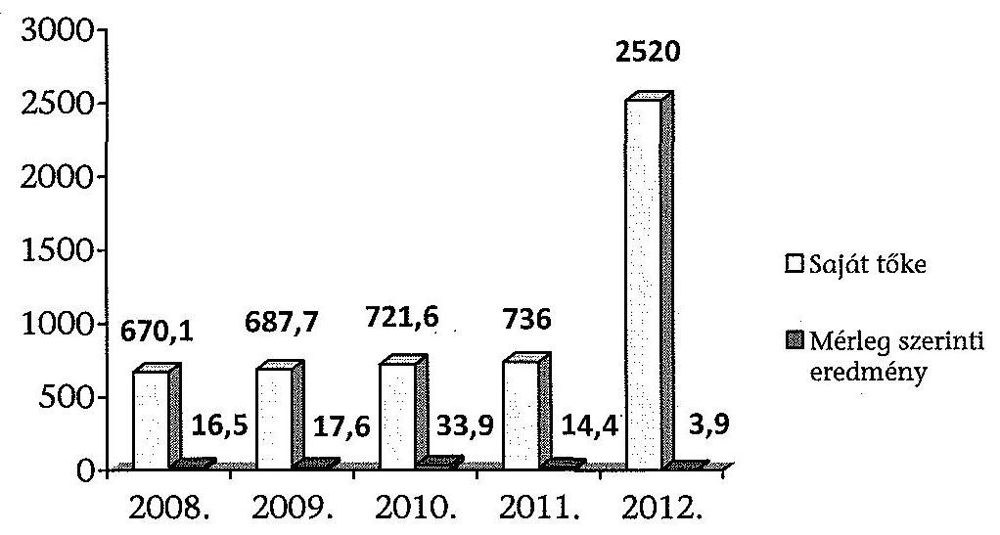

Forrás: a BTG Kft. 2008-2012. évi beszámolói
Az Önkormányzat nem írt elő a vagyongazdálkodási döntések megalapozására előterjesztés készítési kötelezettséget. Nem történt írásban egyeztetés az Önkormányzat és a Társaság között az átvett önkormányzati vagyon hasznosításáról, a társaság a távhőszolgáltatási feladat ellátását szolgáló vagyon értékesítésére nem tett javaslatot. Nem került sor közvagyon tulajdonjogának ingyenes átruházására. A Társaság az Nvtv. 6. §-ában foglaltaknak megfelelve az „önkormányzat kizárólagos tulajdonában álló nemzeti vagyont" és a „nemzetgazdasági szempontból kiemelt jelentőségű nemzeti vagyont" az Nvtv. hatályba lépését követően nem idegenítette el, nem terhelte meg, biztosítékul nem adta, azon osztott tulajdont nem létesített.

A BTG Kft. működéséhez szükséges tárgyi eszközök, készletek, követelések, pénzeszközök állományváltozásával kapcsolatos döntéseket az ellenőrzött időszakban a tulajdonos külön nem ellenőrizte, a vagyonváltozást érintő döntések hatásairól a beszámoló elfogadása keretében kapott tájékoztatást.

---

# 2.3. A beszámolási kötelezettség teljesítése 

A Tszt. ${ }^{13}$ előírásainak változása következtében 2012. évtől a távhőszolgáltatást végzők beszámolási kötelezettségeként részletesebb, a többi tevékenységtől elkülönített számviteli nyilvántartási és beszámolási kötelezettséget írt elő, ami bemutatja, hogy a távhőszolgáltatásban használt eszközökre elszámolt értékcsökkenés milyen módon érinti az adott tevékenység eredményességét.

A BTG Kft. a Számv. tv. 19. § (1) bekezdésében foglaltak szerint készítette el éves beszámolóját, amely mérlegből, eredménykimutatásból, kiegészítő mellékletből és üzleti jelentésből állt. A Társaság a számviteli politikában előírtaknak, az éves beszámolási, adatszolgáltatási kötelezettségnek határidőben eleget tett. A BTG Kft. felügyelő bizottsága az éves beszámolót az ellenőrzött években elfogadta, az FB ülésről jegyzőkönyv készült. Az FB javaslatára az ellenőrzött időszakban éves beszámolóit a Képviselő-testület elfogadta.

A BTG Kft. éves beszámolói az ellenőrzött időszakban megfeleltek a Számv. tv. 19. § (2)-(4) bekezdésében, valamint a 20. § (1) bekezdésében foglalt előírásoknak.

A ráfordítások és az eredmény alakulása a BTG Kft.-nél
(adatok M Ft-ban)

| Megnevezés | 2008. | 2009. | 2010. | 2011. | 2012. |
| :-- | --: | --: | --: | --: | --: |
| anyagjellegű ráfordítás | 1179,4 | 1132,2 | 1408,5 | 1374,0 | 1764,6 |
| személyi jellegű ráf. | 389,9 | 419,1 | 470,0 | 544,5 | 532,5 |
| értékcsökkenési leírás | 53,7 | 55,5 | 57,6 | 54,9 | 50,9 |
| üzemi tevékenység   eredménye | $\mathbf{- 2,0}$ | $\mathbf{5,6}$ | $\mathbf{46,2}$ | $\mathbf{23,3}$ | $\mathbf{48,5}$ |
| pénzügyi eredmény | -7,3 | -12,4 | -5,9 | -5,8 | -8,2 |
| rendkívüli eredmény | 26,5 | 26,1 | -1,3 | -1,4 | -32,5 |
| adózott eredmény | $\mathbf{16,5}$ | $\mathbf{17,6}$ | $\mathbf{33,9}$ | $\mathbf{14,4}$ | $\mathbf{3,9}$ |
| mérleg szerinti   eredmény | $\mathbf{16,5}$ | $\mathbf{17,6}$ | $\mathbf{33,9}$ | $\mathbf{14,4}$ | $\mathbf{3,9}$ |

Forrás: a BTG Kft. 2008-2012. évi beszámolói
A Társaság a Tszt. 18/A. § (1)-(4) bekezdésében előírt szétválasztási kötelezettségének eleget tett, elkészítette a távhő ágazatra vonatkozó mérleget és eredménykimutatást, amelyet a beszámoló melléklete tartalmazott, a könyvvizsgáló hitelesítette.

[^0]
[^0]:    ${ }^{13}$ Tszt. 2012. január 1-étől hatályos 18/A §-a írt elő az egyes tevékenységekre vonatkozó számviteli szétválasztást, biztosítva az egyes tevékenységek átláthatóságát és a diszkriminációmentességet, kizárva a keresztfinanszírozást és a versenytorzítást.

---

A BTG Kft. az éves beszámoló elfogadásáról készült Képviselő-testületi határozatot a beszámolóval együtt minden évben a Számv. tv. 153-154. §-ában foglalt előírásoknak megfelelően határidőben közzétette és letétbe helyezte, nyilvánosságra hozta.

# 3. A TÁVHŐSZOLGÁLTATÁS KÖZFELADATA BEVÉTELEI ÉS RÁFORDÍTÁSAI

 ELSZÁMOLÁSÁNAK ÉS ÖNKÖLTSÉGSZÁMÍTÁSÁNAK SZABÁLYSZERŰSÉGE

### 3.1. A távhőszolgáltatás közfeladat bevételeinek és ráfordításainak szabályszerűsége

A távhőszolgáltatással kapcsolatos elszámolások (bevétel, ráfordítások) elkülönített nyilvántartását a kialakított számlarend és munkaszámok biztosították.

A BTG Kft. költségei és ráfordításai előírás szerinti elszámolásának a megítélése véletlenszerűen kiválasztott mintatételek ellenőrzésével történt. Ennek során megállapítást nyert, hogy három mintatétel esetében az ellenőrzött időszakban a Társaság megsértette a Számv. tv. 15. §. (3) bekezdésének mérleg valódiságra vonatkozó, és a 47. § (1) bekezdésnek, valamint a Társaság számviteli politikájának a bekerülési értékre vonatkozó előírásait, mivel a bekerülési (beszerzési) érték az engedményekkel csökkentett, felárakkal növelt vételárat kell, hogy tartalmazza. Ezzel ellentétben a három hibás mintatétel esetében a Társaság a beszerzett eszközök, anyagok értékét nem az engedményekkel csökkentett bekerülési értéken mutatta ki, a részére biztosított engedmény összegét pedig árbevételként kezelte.

Az ellenőrzött tételek a kifogásolt három tételen kívül összességében szabályosak voltak.

A BTG Kft. bevételei előírás szerinti elszámolásának az ellenőrzése ugyancsak véletlenszerűen kiválasztott mintatételek feldolgozásával történt, az ellenőrzött mintatételek összességében szabályosak voltak.

A bevétel előírása, kiszámlázása a belső szabályozásnak megfelelően megtörtént, a bevételeket közfeladatonként elkülönítetten és megfelelő számlacsoportba számolták el. A Társaság a tulajdonosi követelményeknek és belső szabályozásának megfelelő árat alkalmazott a BTG Kft.

Az Önkormányzat és a BTG Kft. között 2010. augusztus 25-én kötött támogatási szerződés ${ }^{14}$ alapján a Társaság a tulajdonostól 22,4 M Ft támogatást kapott, hogy abból 17%-kal csökkentse a lakossági szolgáltatások számlaösszegét. A támogatást 2010. március 1-étől kezdődően 10 hónapon keresztül kellett a BTG Kft-nek érvényesítenie. Az elszámolás a támogatás fizetését követően az Önkormányzat és a Társaság között megtörtént.

[^0]
[^0]:    ${ }^{14}$ a támogatási szerződés alapja a 29/2010 ÖKT határozat

---

A BTG Kft. a Tszt., valamint az NFM távhőtámogatási rendeletben foglaltak alapján 2011. október 1-jétől a lakosság felé nyújtott távhőszolgáltatásért támogatásban részesült a MEKH felé havonta benyújtott adatszolgáltatás alapján. A támogatás mértéke a vizsgált időszakban öt esetben módosult. A Társaság 2011. évben összesen 22,1 M Ft, 2012. évben 93,2 M Ft támogatásban részesült ${ }^{15}$. A BTG Kft. a kapott támogatásról külön elszámolást vezetett, a támogatás a BTG Kft.-vel megkötött támogatási szerződésben foglaltak szerint került átadásra.

Az ellenőrzött időszakra vonatkozó éves beszámolók minden évben tartalmazták a lineáris leírási kulcsokat. Szoftverek esetében 33%-os, épületek és infrastruktúra esetében 2-7%-os, a termelésben használt gépek és felszerelések esetében 14,5-50%-os, az irodai és számítástechnikai eszközök esetében 14,5-50%-os, a járművek esetében 20%-os leírási kulcsot alkalmaztak. Ennek a szabályozási hátterét 2008-ban a számviteli politika 2009-től az eszközök és források értékelési szabályzata határozta meg.

Az értékcsökkenést az érvényben lévő eszközök és források értékelési szabályzata szerint havonta számolták el. A BTG Kft. gyakorlata a teljes ellenőrzött időszakban a havi értékcsökkenési leírás elszámolása volt. Az értékcsökkenés elszámolásának ellenőrzése véletlenszerűen kiválasztott mintatételek feldolgozásával történt, hibás mintaelem nem volt, szabályszerűsége megfelelő.

Az éves beszámolók kiegészítő mellékletében az ellenőrzött időszakban a Számv. tv. 92. § (1) bekezdésében foglaltaknak megfelelően részletesen bemutatják az elszámolt értékcsökkenést.

# 3.2. Az önköltségszámítás szabályszerűsége

A BTG Kft. a jogszabályi követelményeknek megfelelően elkészítette, és folyamatosan aktualizálta önköltség-számítási szabályzatát, a közszolgáltatás díjának szabályszerű önköltségszámítással való megalapozása biztosított volt.

Az önköltség-számítási szabályzat elkülönítette a közvetlen és közvetett költségeket és megjelenítette az egyes közfeladatokra vonatkozó ágazati előírásokat. Az önköltség-számítási szabályzat előírta, hogy a közvetlen költségként utalványozott tétel - munkaszám mélységig bizonyítható módon - az adott tevékenység érdekében merülhet fel. Ugyanakkor felosztandó általános költségek vetítési alapjainak meghatározásánál nem megfelelően járt el.

Az Önköltség-számítási szabályzat távhőszolgáltatásról szóló fejezete tartalmazta a közvetlen költségek csoportosítását, felosztását, az alkalmazott díjképzési képleteket. A VI. fejezet részletezte a közvetett költségekre vonatkozó előírásokat, ezek szerint az üzemi általános költségek „létszám arányosan az összes üzemi általános költséggel együtt kerülnek az egységen belül felosztásra". A vállalati általános költségek felosztására vonatkozóan viszont a szabályzat nem tartalmazott előírásokat.

[^0]
[^0]:    ${ }^{15}$ A 2012. évi beszámolóban a hőszolgáltatáshoz kapcsolódó tárgyi eszközök bruttó értéke 182,7 M Ft volt. A MEKH a Tszt.-re hivatkozva a tárgyi eszközök bruttó értékét a 2012. évi távhőszolgáltatási támogatás feltételéül szabott nyereségkorlát ellenőrzése során 715,3 M Ft értékben vette figyelembe.

---

Az önköltség-számítási szabályzat tartalmazta a költségkalkulációhoz szükséges felosztási lépéseket és a tevékenységek önköltségének a meghatározásának a módját. Az önköltség-számítási szabályzatban leírtak alapján a távhő önköltség elszámolása átlátható volt, és a kialakított árképzéshez megfelelő információt szolgáltatott.

A BTG Kft. a távhő szolgáltatás esetén kétféle díj tényezővel számolt. A fütési alapdíj a távhő szolgáltatás folyamán felmerült közvetlen költségeket és az önköltség-számítási szabályzatban nem szabályozott, de folyamatosan alkalmazott (létszámarányos) vetítési alappal számított közvetett (vállalati) költségeket tartalmazta.

Az alapdíjon belül külön kalkulálták a fütési alapdíjat és a vízmelegítés alapdíját. Az önköltség-számítási szabályzat csak az alapdíjakra és a hődíjra vonatkozóan tartalmaz leírásokat, kalkulációs számításokat.

A BTG Kft. önköltség-számítási szabályzata tartalmazta a hődíj önköltségének a kiszámítására vonatkozó képletet.

A 2008. eleje és a 2011. első félév vége közötti időszakban a távhő szolgáltatáson kívül a távhő szolgáltatással foglalkozó ágazat más tevékenységet is végzett: más tulajdonát képező gázmotort is üzemeltetett. Az utókalkulációk készítésénél a Társaság a gázmotor üzemeltetéséhez szükséges és továbbszámlázott gázértékesítés költségeit is figyelembe vette a hődíj kialakításánál, nem csak a távhő szolgáltatás tüzelőanyag és hő vásárlás összes költségeit. A BTG Kft. utókalkulációs számítása így 2008-2011. években nem volt megfelelő, csak a hődíj előállítására szükséges költségeket tartalmazta ${ }^{16}$..

A BTG Kft. a lakossági szolgáltatás nyújtás folyamán a társasházakkal, mint igénybevevővel áll külön-külön szerződéses jogviszonyban, a közületekkel külön-külön kötött megállapodásokat.

A Társaság a primer hálózat végén lévő szekunder rendszer kezdőpontján hitelesített mérővel adja át a hőenergiát és meleg víz mennyiséget az épületnek, mint felhasználónak. Az társasházak eltérő módszerekkel mérik a lakások által igénybevett szolgáltatás mennyiségét.

Az ellenőrzés három társasház ${ }^{17}$ esetében, a 2012. január havi számlázási időszakra nézve ellenőrizte az eltérő számlázási rendszereik szerint teljesítésszámlázott hőmennyiségi adatok egyezőségét. Az ellenőrzött adatok esetében az egyezőségek fennálltak, a BTG Kft. által számlázott összegek együttesen kiadták a teljesítményként szolgáltatott hőmennyiség összegét és díját.

[^0]
[^0]:    ${ }^{16}$ A 2012. évben a gázmotor nem üzemelt már, így a hődíj kalkuláció abban az évben már megfelelő volt.
    ${ }^{17}$ Szivárvány utca 8., Szivárvány utca 1., Lévai u. 31.

---

# 4. Az ÁSZ korábbi, az önkormányzatok többségi tulajdonában lévő gazdasági társaságok közfeladat-ellátását, gazdálkodását, pénzügyi helyzetét érintő javaslataira tett intézkedések

Az ÁSZ 1218 számú jelentésében tett javaslatokra az Önkormányzat által elkészített, az ÁSZ által elfogadott intézkedési tervben feladatul határozták meg, hogy „továbbra is kísérjék figyelemmel - a tulajdonos jogkört gyakorlók közreműködésével - a kizárólagos tulajdonú gazdasági társaságok kötelezettségeinek alakulását, az önkormányzat likviditására, pénzügyi-egyensúlyi helyzetére gyakorolt hatását; tegye meg a szükséges és lehetséges intézkedéseket a tulajdonosi érdekek védelme érdekében". Az Önkormányzat az intézkedési tervében foglalt kötelezettségét teljesítette.

Az Önkormányzat az ÁSZ által elfogadott intézkedési tervben vállalta, hogy a stratégiai és az éves belső ellenőrzési tervekben szerepeltetik az önkormányzati tulajdonú gazdasági társaságok pénzügyi egyensúlyi helyzetének és a részükre biztosított pénzeszközök rendeltetésszerű felhasználásának ellenőrzését.

Ennek megfelelően a következő évek belső ellenőrzési terveiben előirányozták a BTG Kft. ellenőrzését. A 2013. évben pénzügyi-szabályszerűségi és teljesítmény ellenőrzést hajtottak végre a BTG Kft.-nél. Az ellenőrzés célja annak megállapítása, hogy milyen színvonalon hajtották végre az előző ellenőrzés megállapításaira készített intézkedési tervet, valamint az Önkormányzat által nyújtott támogatások rendeltetésszerű felhasználása megtörtént-e. A Képviselő-testület által jóváhagyott 2014. évi belső ellenőrzési terv alapján a BTG Kft. tevékenysége alapján a 2014. évben ismételten ellenőrzésre kerül. Az ellenőrzés célja annak megállapítása, hogy a közfeladat ellátása során a Társaság költséggazdálkodása mennyire volt hatékony.
Budapest, 2015. /úbáé hó / nap

Melléklet: 4 db
Függelék: 2 db
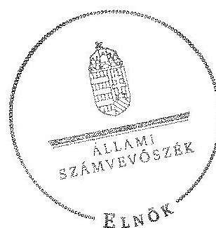

Domokos László
elnök

---

# A Budaörsi Településgazdálkodási Kft. tevékenységének főbb adatai

|  Sorszám | Megnevezés | 2008. | 2009. | 2010. | 2011. | 2012.  |
| --- | --- | --- | --- | --- | --- | --- |
|  1. | A gazdasági társaság székhelye | 2040. Budaörs Dózsa György u. 21. |  |  |  |   |
|  2. | adószáma | 10639205-2-13 |  |  |  |   |
|  3. | alapításának éve | 1991. |  |  |  |   |
|  4. | A gazdasági társaság többségi tulajdonú leányvállalatainak száma (db) | 0 | 0 | 0 | 0 | 0  |
|  5. | A gazdasági társaság leányvállalataiban való részesedésének mértéke (\%) | - | - | - | - | -  |
|  6. | Az önkormányzat számára (megbízásából, koncessziós, közszolgáltatási, vagy egyéb szerződéses jogviszony alapján) ellátott közfeladatok szakági besorolása: |  |  |  |  |   |
|  7. | Egészségügy |  |  |  |  |   |
|  8. | Kultúra és sport |  |  |  |  |   |
|  9. | Település üzemeltetés, ezen belül: |  |  |  |  |   |
|  10. | köztemető üzemeltetés |  |  |  |  | X  |
|  11. | kéményseprés |  |  |  |  |   |
|  12. | helyi közutak fejlesztése, fenntartása és üzemeltetése | X | X | X | X | X  |
|  13. | parkok és egyéb közterület fenntartás | X | X | X | X | X  |
|  14. | közterületi parkolás |  |  |  |  |   |
|  15. | Lakás és helységgazdálkodás | X | X | X | X | X  |
|  16. | Víz és csatorna közmű-szolgáltatás |  |  |  |  |   |
|  17. | Hulladékkezelés-szállítás | X | X | X | X | X  |
|  18. | Távhő- és energiaszolgáltatás | X | X | X | X | X  |
|  19. | Helyi közösségi közlekedés |  |  |  |  |   |
|  20. | Vagyongazdálkodás |  |  |  |  |   |
|  21. | Pénzügyi gazdasági szolgáltatás |

 |  |  |  |   |
|  22. | Egyéb: Sport célú létesítmények üzemeltetése | X | X | X | X | X  |
|  23. | A közfeladatellátására a gazdasági társaságnál alkalmazottak éves átlagos statisztikai létszáma | 102 | 109 | 121 | 128 | 125  |

---

# A Budaörsi Településgazdálkodási Kft. működésének főbb jellemzői

|  Sorszám | Megnevezés |  | 2008. | 2009. | 2010. | 2011. | 2012.  |
| --- | --- | --- | --- | --- | --- | --- | --- |
|  1. | A gazdasági társaság cégformája |  | Kft. | Kft. | Kft. | Kft. | Kft.  |
|  2. | A gazdasági társaság tulajdonosi összetétele: |  |  |  |  |  |   |
|   | Önkormányzat megnevezése |  | Budaörs Város Önkormányzata | Budaörs Város Önkormányzata | Budaörs Város Önkormányzata | Budaörs Város Önkormányzata | Budaörs Város Önkormányzata  |
|  3. | Önkormányzat tulajdoni részesedésének arány | $\%$ | 100,0 | 100,0 | 100,0 | 100,0 | 100,0  |
|  4. | Önkormányzat tulajdoni részesedésének összege | ezer Ft | 242220 | 242220 | 242220 | 242220 | 2022220  |
|   | Más önkormányzatok többcélú társulás megnevezése |  | - | - | - | - | -  |
|  5. | Más önkormányzatok, többcélú társulások tulajdoni részesedésének arány | $\%$ | - | - | - | - | -  |
|  6. | Más önkormányzatok, többcélú társulások tulajdoni részesedésének összege | ezer Ft | - | - | - | - | -  |
|   | Gazdasági társaság megnevezése |  | - | - | - | - | -  |
|  7. | Gazdasági társaságok tulajdoni részesedés arány | $\%$ | - | - | - | - | -  |
|  8. | Gazdasági társaságok tulajdoni részesedés összege | ezer Ft | - | - | - | - | -  |
|   | Egyéb tulajdonos megnevezése |  | - | - | - | - | -  |
|  9. | Egyéb tulajdonosok tulajdoni részesedés arány | $\%$ | - | - | - | - | -  |
|  10. | Egyéb tulajdonosok tulajdoni részesedés összege | ezer Ft | - | - | - | - | -  |
|  12. | A tárgyévben a gazdasági társaság vagyonkezelésben lévő önkormányzati vagyon után elszámolt értékcsökkenés összege (ezer Ft) |  | 0,0 | 0,0 | 0,0 | 0,0 | 0,0  |
|  13. | A tárgyévben az önkormányzati tulajdonú, gazdasági társaság által kezelt eszközök pótlására (karbantartás, felújítás, beruházás) elszámolt kiadás (ezer Ft) * |  | 1804,0 | 1290,0 | 19476,0 | 28799,0 | 33417,0  |
|  14. | A tárgyévben a gazdasági társaság saját vagyona után elszámolt értékcsökkenés összege (ezer Ft) |  | 53703,0 | 55535,0 | 57552,0 | 54920,0 | 50888,0  |
|  15. | A tárgyévben a saját tulajdonú eszközök pótlására (karbantartás, felújítás, beruházás) elszámolt kiadás (ezer Ft) |  | 40609,0 | 45320,0 | 74249,0 | 56487,0 | 84281,0  |

[^0]: [^0]: * az eszközök pótlására elszámolt kiadást továbbszámlázták az Önkormányzat részére, ahol aktiválták a felújításokat, beruházásokat.

---

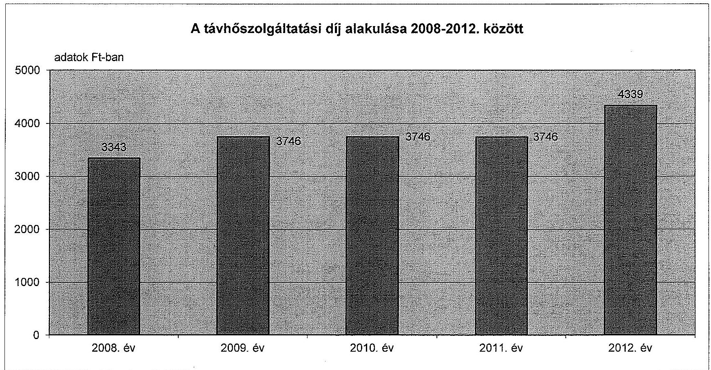

# A távhőszolgáltatási díj alakulása 2008-2012. között

---

.

---

# Beérkezett észrevételek és az azokra adott válaszok

---

.

---

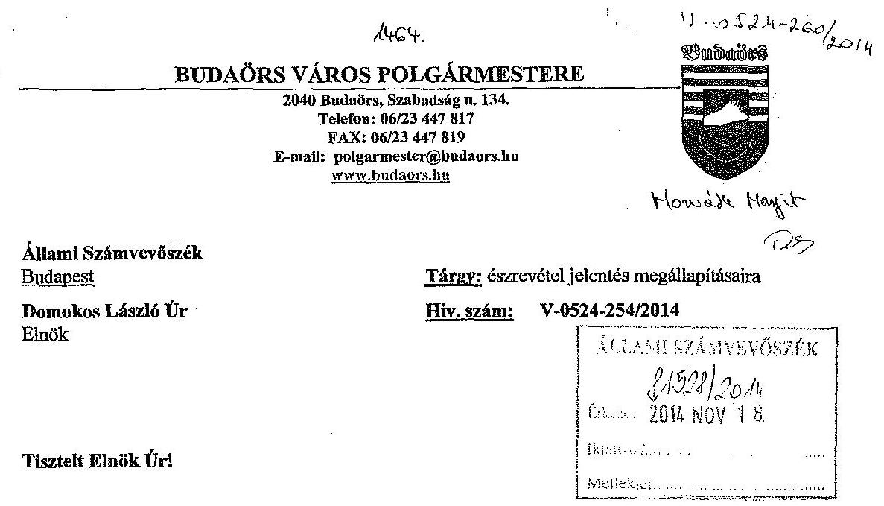

A BTG Budaörsi Településgazdálkodási Nonprofit Kft. ellenőrzéséről készült jelentéstervezetüket megismertem és áttanulmányoztam.

Önkormányzatunk tulajdonosi joggyakorlatának szabályozottságára, szabályszerűségére és a közfeladat ellátás felügyeletének biztosítására vonatkozó ténymegállapításaik - melyek alapvetően a tárgykörrel kapcsolatos jogkövető magatartásformánk gyakorlatát rögzítik és igazolják - megerősítik a belső kontrollrendszerünk keretei között végzett elemzések és értékelések szakmai tapasztalatait.

Az ellenőrzési cél és a várható hasznosulás megvalósulása, valamint végleges megállapításaik, következtetéseik komplexitásának további megalapozása érdekében élni kívánok az Állami Számvevőszékről szóló 2011. évi LXVI. tv. 29.§ (2) bekezdésében rögzített jogosítványommal.

Észrevételeimet ezen levél mellékleteként küldöm meg, melyek egyaránt kapcsolódnak az összefoglaló és a részletező megállapításaik egy vagyongazdálkodási szempontból fontos témaköréhez.

Egyidejűleg tolmácsolni szeretném Önnek köszönetemet az önkormányzatunknál és az önkormányzat hivatalánál helyszíni ellenőrzést végző munkatársaik konstruktivitásáért és korrektségéért.

Budaörs, 2014, november 13.
Tisztelettel:
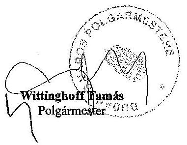

---

# ÉSZREVÉTELEK 

Az Állami Számvevőszék BTG. Budaörsi Településgazdálkodási Nonprofit Kft. szabályszerűségi ellenőrzéséről készült jelentéstervezet megállapításaira.

Az Állami Számvevőszékről szóló 2011. évi LXVI. tv. 29.§ (2) bekezdése szerinti észrevételeimet a végleges jelentésükben rögzítendő megállapítások és az azokból levont következtetések komplexitásának kiterjesztése és megalapozásának megerősítése érdekében a következőkben fogalmazom meg.

Jelentéstervezetük összegző és részletező megállapításai, valamint az abból kialakított következtetéseik szerint a 2040. Budaörs, Szabadság út 134. szám alatti ingatlan apportálása folyamatának nem minden mozzanata volt szabályszerű.

Véleményünk szerint a részünkről vitatott minősítés az apportra vonatkozó következtetésüket megalapozó megközelítésből, nevezetesen a nem pénzbeni hozzájárulás cégjegyzékben és földhivatali ingatlan-nyilvántartásában történő eljárásrendje sorrendiségének ellentétes megítéléséből származik.

Az Önkormányzat és a nevében és helyében eljáró BTG. Kft. által követett és szabályszerűnek ítélt eljárásrend - amelyet jogszerűségében a peres eljárás utolsó szakaszában a Kúria is megerősített - a következő lépésekből tevődött össze.

A Képviselő-testület döntéseinek (486/2011. (XI.30.) ÖKT. számú és az 53/2012. (II.29.) ÖKT számú határozatok) megfelelően a BTG. Kft jogi képviselője elkészítette a változások cégbírósági és földhivatali átvezetéséhez szükséges dokumentumokat. A Kft. jogi képviselője a felhatalmazás alapján szabályszerűen eljárt az illetékes Cégbíróság és Földhivatal előtt az alapító nevében és helyében.

## A Cégbíróság a változtatási kérelemnek megfelelően a jegyzett tőke emelést bejegyezte.

A benyújtott tulajdonjogi bejegyzési kérelmet az első fokon eljárt Budakörnyéki Körzeti Földhivatal elutasította. A határozattal szemben a BTG. Kft. fellebbezést nyújtott be a Pest Megyei Kormányhivatal Földhivatalához, mely az első fokon eljárt szerv határozatának rendelkező részét helyben hagyta.

A BTG. Kft., mint felperes Pest Megyei Kormányhivatal Földhivatala határozatával szemben a Budapest Környéki Közigazgatási és Munkaügyi Bíróságon keresetet nyújtott be, melyben kérte a másodfokú határozat megváltoztatását. A Bíróság ítéletében és határozatában az előzmények helyes rögzítése mellett a keresetet azonban elutasította, melynek jogszabálysértő tartalma miatt a BTG. Kft., mint felperes felülvizsgálati kérelmet fogalmazott meg és nyújtott be a Kúriához.

---

A tárgyalást 2014. október 14-én tartották, a kihirdetés alapján a Kúria osztotta a felülvizsgálati kérelemben előterjesztett indokainkat és a Budapest Környéki Közigazgatási és Munkaügyi Bíróság ítéletét, valamint határozatát hatályon kívül helyezte, s egyben új eljárás lefolytatására utasította az első fokú szervet.

# Összefoglalva: 

Észrevételezni kívánjuk, hogy álláspontunk szerint a nem pénzbeni hozzájárulás átruházásával kapcsolatos eljárást önkormányzatunk és a nevében és helyében eljáró BTG. Kft. szabályszerűen bonyolította le.

Az apporttal kapcsolatos eljárásunk jogszerűségét igazoló érvrendszerünket a Kúria kihirdetett határozata (mely írásban még nem áll rendelkezésünkre) további jogi tényekkel erősítette meg.

A minden körülményt, tényt és az ellenőrzés tárgya szempontjából lényeges információt tartalmazó végleges ellenőrzési jelentés megállapításai írásba foglalásához álláspontom szerint indokolt észrevételeim tartalmának figyelembe vétele.

Budaörs, 2014. november 13.
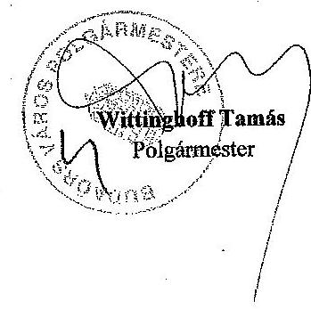

---

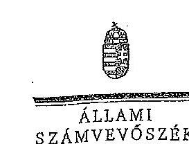

ELRÉS

Ikt.szám: V-0524-274/2014.

Wittinghoff Tamás úr
polgármester
Budaörs Város Önkormányzata

# Budaörs 

Tisztelt Polgármester Úr!

Köszönettel vettem a BTG Budaörsi Településgazdálkodási Nonprofit Kft. ellenőrzéséről készített számvevőszéki jelentéstervezetre tett észrevételeit.

Az Állami Számvevőszék észrevételekre vonatkozó álláspontjáról a felügyeleti vezető által készített részletes tájékoztatást csatoltan megküldöm.

Tájékoztatom Polgármester urat, hogy a számvevőszéki jelentés véglegesítése az elfogadott észrevételek figyelembevételével történik.

Budapest, 2014. december hó 29. nap

Tisztelettel:
D. u / l /

Demokos László

Meléklet: Tájékoztatás az észrevételek kezeléséről

---

# Tájékoztatás az észrevételek kezeléséről 

A BTG Budaörsi Településgazdálkodási Nonprofit Kft. ellenőrzéséről készített jelentéstervezetre Polgármester úr észrevételeket fogalmazott meg. Az észrevételek alapján a jelentés tervezetét az alábbiak szerint módosítom:

Az észrevételek alapján a jelentéstervezet részletes megállapításait (24. oldal 12. lábjegyzet) kiegészítettük az alábbiak szerint: „Az ellenőrzöttől kapott tájékoztatás szerint a helyszíni ellenőrzés lezárását követően, 2014. október 14-én a Budapest Környéki Közigazgatási és Munkaügyi Bíróságon megtartott tárgyaláson a kihirdetés alapján a Kúria osztotta a BTG. Kft. felülvizsgálati kérelmében előterjesztett indokait és a Bíróság határozatát hatályon kívül helyezte, egyben új eljárás lefolytatását rendelte el."

Budapest, 2014. december 29.

Dr. Horváth Margit
felügyeleti vezető

---

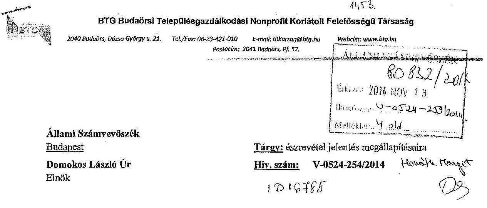

# Tisztelt Elnök Úr! 

A BTG Budaörsi Településgazdálkodási Nonprofit Kft. ellenőrzéséről készült jelentéstervezetüket megismertem és áttanulmányoztam.

A jelentéstervezet összegző és részletező megállapításai meghatározó részével egyetértek és a társaság működése és gazdálkodása szabályszerűségének további javítása céljából megfogalmazott intézkedést igénylő javaslatokat megköszönöm.

Egyidejűleg jelzem, hogy az Állami Számvevőszékről szóló 2011. évi LXVI. tv. 29.§ (2) bekezdése alapján az ellenőrzés megállapításaira észrevételt kívánok tenni a kockázati szint mérséklése céljából.

Észrevételeimet, megjegyzéseimet ezen levél mellékleteként küldöm meg Önnek.
Budaörs, 2014. november 13.

Tisztelettel:
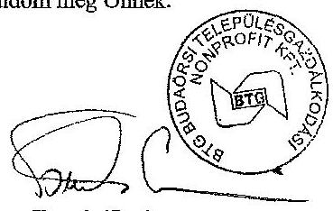

Tamás Ervin
Ügyvezető

---

# ÉSZREVÉTELEK 

A BTG Budaörsi Településgazdálkodási Nonprofit Kft. ellenőrzéséről készült számvevőszéki jelentéstervezet megállapításaira.

Az Állami Számvevőszékről szóló 2011. évi LXVI. tv. 29.§ (2) bekezdése alapján az ellenőrzés megállapításaira az intézkedést igénylő megállapítások és javaslatok közül az 1. a) és a 2. pontban szereplő javaslatok témaköreiben szeretnék észrevételt tenni. Észrevételeimet segítő szándékkal az ellenőrzés végleges megállapításaihoz szükséges körülmények teljeskörű feltárása céljából teszem meg.

## Számvevőszéki jelentéstervezet 1. a) javaslat

## A) Számlarend

A javaslatot megalapozó megállapítás lényege, hogy a BTG Nonprofit Kft. számlarendje nem tartalmazza a számvitelről szóló 2000. évi C. tv. (továbbiakban Szt.) 161.§ (2) bekezdés d) pontjának megfelelően a számlarendben foglaltakat alátámasztó bizonylati rendet. A megállapítás tartalma a jogszabályi szakasz megfogalmazásához igazodva a valóságot tükrözi.

Észrevételt azonban azért kívánunk tenni, mert kiegészítő információnkkal úgy véljük, módosíthatjuk a számlarendre vonatkozó végleges minősítést.

A BTG Nonprofit Kft. az Szt. 161.§ (1) bekezdés a), b), c) pontjának megfelelő tartalommal készítette el Számlarendjét, és azt minden évben aktualizálta. A hivatkozott jogszabályi szakasz d) pontjában szereplő követelménynek a társaság oly módon tett eleget, hogy önálló Bizonylatkezelési Szabályzatot készített a Számlarend tartalmával összefüggésben, és azt önálló szabályzatként helyezte hatályba a vizsgált időszak minden évében. A Bizonylatkezelési Szabályzatban rögzített, a számlarendben foglaltakat alátámasztó bizonylati rendet a gyakorlatban maradéktalanul betartotta a társaság.

A BTG Nonprofit Kft. annak érdekében, hogy a Számlarendje teljeskörűen igazodjon az Szt. 161.§ (2) bekezdésében foglaltakhoz, a számvevőszéki jelentéstervezet javaslatának megfelelően a jelenlegi Bizonylatkezelési Szabályzatát, mint önálló szabályzatát hatályon kívül helyezte, és annak tartalmát a hatályos számlarendjéhez csatolta, s annak részeként kezeli.

---

# B) Leltárkészítési és Leltározási Szabályzat 

A javaslatot megalapozó megállapítás lényege, hogy BTG Nonprofit Kft. elkészítette az Szt. 14.§ (5) bekezdés a) pontjában előírtaknak megfelelően az eszközök és források leltározási szabályzatát, amely nem tartalmazta az Szt. 69.§ (3) bekezdése alapján a leltáregyeztetés
 módját.

A hivatkozott jogszabályi szakasz tartalmából kiindulva ismételten áttekintettük a társaság vizsgált időszakban hatályban lévő és az ÁSZ részére átadott Leltárkészítési és Leltározási Szabályzatok tartalmát. A jelentésben megfogalmazottakkal ellentétben arra a megállapításra jutottunk, hogy a szabályzatok tartalmazzák a hivatkozott jogszabályban előírt eszköz- és forráscsoportok esetében az egyeztetés módszerét.

A 2005-től 2011-ig hatályos leltározási szabályzat 3.2. pontja, illetőleg a 2011. évet követő és a jelenleg is hatályban lévő szabályzat 3. és 6. pontjai tartalmazzák az egyeztetés jogszabályi követelményét.

Amennyiben a jelentéstervezet egyeztetésre vonatkozó megállapítását esetlegesen helytelenül értelmezzük, abban az esetben további információkra van szükségünk a hiányosság pontosítás szempontjából. Állásfoglalásunk szerint a szabályzatok tartalmazzák az Szt. 69.§ (3) bekezdésében foglalt előírások mindegyikét.

## Számvevőszéki jelentéstervezet 2. javaslat

A javaslatot megalapozó számvevőszéki megállapítás lényege, hogy a BTG Nonprofit Kft. költségei és ráfordításai előírás szerinti elszámolásának ellenőrzésénél az ellenőrzést végzők hiányosságokat állapítottak meg. Megállapítást nyert, hogy három mintavétel esetében az ellenőrzélt időszakban a társaság megsértette az Szt. 15.§ (3) bekezdésének a valódiságra vonatkozó és a tv. 47.§ (1) bekezdésének a bekerülési értékre vonatkozó előírásait, továbbá a számviteli politikájában foglaltakat, mivel a bekerülési (beszerzési) értéket nem csökkentette az engedményekkel.

A jelentéstervezet ebben a témakörben megfogalmazott megállapításaival egyetértek, de a kockázati szint megállapítása szempontjából szükséges néhány szakmai észrevétel megtétele. Az említett bekerülési értékkel kapcsolatos hiányosságok a Kft. beszerzett anyagainak értékeléseiben következtek be. A Kft. könyvelésében a beszerzett anyagok értékét valóban nem az engedménnyel csökkentett bekerülési értéken mutatta ki, mivel a társaság részére biztosított engedmény összegét árbevételként rögzítette.

Az ÁSZ megállapításainak folyamodványaként a társaság tételes belső ellenőrzést végzett a költségelszámolások témakörében. A hibás könyveléstechnika elismerése mellett ugyanakkor azt a következtetést állapítottuk meg, hogy a könyveléstechnikai hibából a

---

társaságnak gazdasági előnye, vagy hátránya nem származott, és a költségvetésnek, illetőleg a gazdasági társaságnak kára nem keletkezett.

A belső ellenőrzés során végzett számítások alapján megállapítottuk, hogy az utólagos módosításnak a társaság eredményére, a mérleg főösszegére és az adókötelezettségeire (társasági adó, iparűzési adó) gyakorolt hatása 0 Ft lenne. A társaság Számviteli politikájában meghatározott jelentős összegű hiba határát a feltárt hiba nagyságrendje nem érte el. Az észrevétel mellékleteként csatolunk egy táblázatot, amely mutatja, hogy a tévesen könyvelt anyagköltség az összes költségen belül gyakorlatilag elhanyagolható hányadot képvisel.

A Számvevőszéki javaslat teljesülése és a törvényi megfelelés érdekében már intézkedéseket tettem az anyagok bekerülési értékének helyes nyilvántartása és könyvelése céljából az Szt. 47.§ (1) bekezdése előírásainak megfelelően.

Budaörs, 2014. november 13.
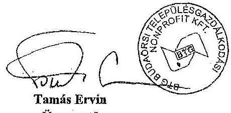

---

1.sz.melléklet

# Az összes kedvezmény aránya az anyagköltséghez viszonyítva 

| Év | Anyagköltség | Utólag kapott   pénzügyileg   rend.engedmények   (9641 fök.) | Üzemanyag   kedvezmény   (9643 fök.) | Összes kedvezmény | Kedvezmény aránya   anyagköltséghez   képest |
| :--: | :--: | :--: | :--: | :--: | :--: |
| 2008. | 93289957 Ft | 1145025 Ft | 675393 Ft | 1820418 Ft | 1,95 % |
| 2009. | 122752132 Ft | 2010123 Ft | 592078 Ft | 2602201 Ft | 2,12 % |
| 2010. | 219729116 Ft | 475036 Ft | 520755 Ft | 995791 Ft | 0,45 % |
| 2011. | 232324471 Ft | 11249 Ft | 468220 Ft | 479469 Ft | 0,21 % |
| 2012. | 293560674 Ft | - Ft | 447460 Ft | 447460 Ft | 0,15 % |

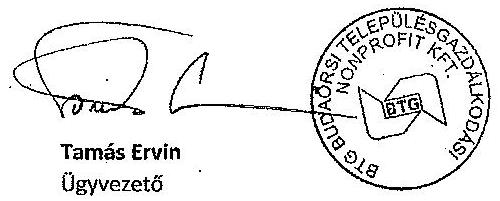

---

# 4. SZAMÚ MELLÉKLET A V-OS24-262. SZAMÚ JELENTÉSHEZ 

## 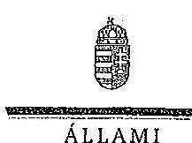

ELKÖK

Ikl.szám: V-0524-272/2014.

## Tamás Ervin úr

ügyvezető igazgató
BTG Budaörsi Településgazdálkodási Nonprofit Kft.

## Budaörs

Tisztelt Ügyvezető Igazgató Úr!

Köszönettel vettem a BTG Budaörsi Településgazdálkodási Nonprofit Kft. ellenőrzéséről készített számvevőszéki jelentéstervezetre tett észrevételeit.

Az Állami Számvevőszék észrevételekre vonatkozó álláspontjáról a felügyeleti vezető által készített részletes tájékoztatást csatoltan megküldöm.

Tájékoztatom Ügyvezető Igazgató urat, hogy a számvevőszéki jelentés véglegesítése az elfogadott észrevételek figyelembevételével történik.

Budapest, 2014. december "(i)"

Tisztelettel:
D. 1.11.19/
Domokos László

Melléklet: Tájékoztatás az észrevételek kezeléséről

---

# Tájékoztatás az észrevételek kezeléséről 

A BTG Budaörsi Településgazdálkodási Nonprofit Kft. ellenőrzéséről készített jelentéstervezetre Ügyvezető Igazgató úr észrevételeket fogalmazott meg. Az észrevételek alapján a jelentés tervezetét az alábbiak szerint módosítom:

A jelentéstervezet 1. a) javaslatához kapcsolódó 1. számú észrevétel kiegészítő információkat tartalmaz a Bizonylatkezelési Szabályzat meglétével kapcsolatban, a megállapítást nem vitatja. A Társaság által az ÁSZ rendelkezésére bocsátott dokumentumok között a hivatkozott Bizonylatkezelési Szabályzat nem szerepelt, ezért a tett megállapítást nem áll módunkban módosítani, azt változatlan formában szerepeltetjük a jelentéstervezetben.

A jelentéstervezet 1. a) javaslatához kapcsolódó 2. számú észrevétel alapján a jelentéstervezet összegző megállapításai (11. oldal), részletes megállapításai (21. oldal) közül töröltük a következő részt:
„Az eszközök és források leltározási szabályzata nem tartalmazta a közvagyon - Számv. tv. által előírt - leltározási, leltáregyeztetési módját és formáját.", valamint az 1. a) javaslat kapcsolódó részét:
„az eszközök és források leltározási szabályzatát a leltáregyeztetés módjával."
A jelentéstervezet 2. számú javaslatához tett 3. észrevétel a költségek és ráfordítások elszámolásánál feltárt hiányosságokhoz tartozó kiegészítés, magyarázat. A megállapítást nem vitatja, ezért azt változatlan formában szerepeltetjük a jelentéstervezetben.

Budapest, 2014. december "b",
Dr. Horváth Margit
felügyeleti vezető

---

# ÉRTELMEZŐ SZÓTÁR 

garancia

A garancia olyan önálló, az önkormányzat nevében vállalt kötelezettség, amely alapján az önkormányzat az önkormányzati költségvetés terhére szerződésben meghatározott feltételek szerint, a kötelezett nem teljesítése esetén a jogosultnak fizetést teljesít az előzetesen rögzített összeghatárig.
gazdasági társaság
gazdálkodó szervezet
keresztfinanszírozás tilalma
kezesség

A Gt. 3. § (1) bekezdése szerint „gazdasági társaságot üzletszerű közös gazdasági tevékenység folytatására külföldi és belföldi természetes és jogi személyek, valamint jogi személyiség nélküli gazdasági társaságok alapíthatnak, működő társaságba tagként beléphetnek, társasági részesedést (részvényt) szerezhetnek."
A Ptk. 685. § c) pontja szerint gazdálkodó szervezet: „az állami vállalat, az egyéb állami gazdálkodó szerv, a szövetkezet, a lakásszövetkezet, az európai szövetkezet, a gazdasági társaság, az európai részvénytársaság, az egyesülés, az európai gazdasági egyesülés, az európai területi együttműködési csoportosulás, az egyes jogi személyek vállalata, a leányvállalat, a vízgazdálkodási társulat, az erdő birtokossági társulat, a végrehajtói iroda, az egyéni cég, továbbá az egyéni vállalkozó."
Az ésszerű nyereség nem tartalmazhatja a közszolgáltatáson kívül eső egyéb gazdasági tevékenységei költségeinek, ráfordításainak fedezetét.

A kezességre vonatkozó előírásokat a Ptk. 272-276. §-ai tartalmazzák. A kezesség a polgári jogban a szerződést biztosító járulékos mellékkötelezettség, amely egy másik kötelem teljesítését biztosítja azáltal, hogy a kezes a főadós nem teljesítése esetére kötelezettséget vállal a főadósi kötelem teljesítésére. A kezes tehát a főadóshoz képest járulékos adós. A kezesség kiterjed az elvállalása utáni mellékszolgáltatásokra, ha a kezes ezek kikötéséről tudott.
A Ptk. szerint kezességet csak írásban lehet vállalni. Lényeges, hogy a kezesség mindig az alapügylet hitelezője és a kezes közötti ingyenes szerződéssel jön létre. A kezesség a különböző hitelfelvételekhez kapcsolódóan a hitel visszafizetésének biztosítékaként jöhet szóba. Az adós helyett nemfizetés esetén a kezes felel, ő tartozik fizetni. Az egyszerű kezesség esetén előbb az adóson kell behajtani a tartozást, s ha ez sikertelen, akkor lehet a kezesől követelni a fizetést. Készfizető kezesség esetében a fizetést elmulasztó adós helyett rögtön a kezesen követelhetik a tartozást. Ha bank vállalja a kezességet, akkor az minden esetben készfizetői kezesség.

---

# 1. SZÁMÚ FÜGGELÉK 

A V-0524-262/2014. SZÁMÚ JELENTÉSHEZ
közfeladat
közszolgáltatás
közvetett tulajdon, illetve közvetett befolyás
nemzeti vagyon

Jogszabályban meghatározott állami vagy önkormányzati feladat, amit az arra kötelezett közérdekből, jogszabályban meghatározott követelményeknek és feltételeknek megfelelve végez, ideértve a lakosság közszolgáltatásokkal való ellátását, továbbá az állam nemzetközi szerződésekben vállalt kötelezettségeiből adódó közérdekű feladatokat, valamint e feladatok ellátásához szükséges infrastruktúra biztosítását is (Nvtv. tv. 3. § (1) bekezdés 7. pont).
A közszolgáltatás: „közcélú, illetőleg közérdekű szolgáltatást jelent, amely egy nagyobb közösség (állam, település) minden tagjára nézve megközelítőleg azonos feltételek mellett vehető igénybe, ezért valamilyen mértékig közösségi megszervezést, illetve szabályozást, ellenőrzést igényel." Az egyenlő bánásmódról és az esélyegyenlőség előmozdításáról szóló 2003. évi CXXV. törvény 3. § d) pontja a következőképpen határozza meg a közszolgáltatást: „szerződéskötési kötelezettség alapján a lakosság alapvető szükségleteinek ellátására irányuló szolgáltatás, így különösen a villamos energia-, gáz-, hő-, víz-, szennyvíz- és hulladékkezelési, köztisztasági, postai és távközlési szolgáltatás, továbbá a menetrend alapján közlekedő járművekkel végzett közforgalmú személyszállítás"
Egy vállalkozás tulajdoni hányadának, illetőleg szavazati jogának a vállalkozásban tulajdoni részesedéssel, illetőleg szavazati joggal rendelkező más vállalkozás (köztes vállalkozás) tulajdoni hányadán, szavazati jogán keresztül történő gyakorlása. A közvetett tulajdon, a közvetett befolyás arányának megállapításához a közvetett tulajdonnal, közvetett befolyással rendelkezőnek a köztes vállalkozásban fennálló szavazati jogát vagy tulajdoni hányadát meg kell szorozni a köztes vállalkozásnak a vállalkozásban fennálló szavazati vagy tulajdoni hányada közül azzal, amelyik a nagyobb. Ha a köztes vállalkozásban fennálló szavazati vagy tulajdoni hányad az ötven százalékot meghaladja, akkor azt egy egészként kell figyelembe venni (a tőkepiacról szóló 2001. évi CXX. törvény 5. § (1) bekezdés 84. pont).
Az Nvtv. 1. § (2) bekezdése szerint:
„az állam vagy a helyi önkormányzat kizárólagos tulajdonában álló dolgok,
az a) pont hatálya alá nem tartozó, állam vagy a helyi önkormányzat tulajdonában lévő dolog,
az állam vagy a helyi önkormányzat tulajdonában lévő pénzügyi eszközök, továbbá az államot vagy a helyi önkormányzatot megillető társasági részesedések,
az államot vagy a helyi önkormányzatot megillető bármely vagyoni értékkel rendelkező jogosultság, amelyet jogszabály vagyoni értékű jogként nevesít,
Magyarország határa által körbezárt terület feletti légtér, az üvegházhatású gázok kibocsátási egységeinek kereskedelméről

---

szóló törvény szerint kibocsátási egység és légiközlekedési kibocsátási egység, valamint az ENSZ Éghajlatváltozási Keretegyezménye és annak Kiotói Jegyzőkönyve végrehajtási keretrendszeréről szóló törvény szerinti kiotói egység,
állami vagy helyi önkormányzati fenntartású közgyűjtemény (muzeális intézmény, levéltár, közgyűjteményként működő kép- és hangarchívum, valamint könyvtár) saját gyűjteményében nyilvántartott kulturális javak körébe tartozó dolog, a régészeti lelet, a nemzeti adatvagyon körébe tartozó állami nyilvántartások fokozottabb védelméről szóló törvény szerinti nemzeti adatvagyon." (hatályos 2012. január 1-jétől, a g) pont módosult 2012. június 30-ától)
többségi befolyást biztosító részesedés

A Ptk. 685/B. § (1) bekezdése szerint „többségi befolyás: az olyan kapcsolat, amelynek révén természetes személy, jogi személy vagy jogi személyiség nélküli gazdasági társaság (a továbbiakban együtt: befolyással rendelkező) egy jogi személyben a szavazatok több mint ötven százalékával vagy meghatározó befolyással rendelkezik."
tulajdonosi joggyakorló Aki a nemzeti vagyon felett az államot vagy a helyi önkormányzatot megillető tulajdonosi jogok és kötelezettségek összességének gyakorlására jogosult (Nvtv. 3. § (1) bekezdés 17. pont).

---

.

---

|  Ssz. | Mintavétellel ellenőrzendő területek | Főbb kérdés | Ellenőrzési kérdések | Adatforrások | Alapsokaság | Mintavételi eljárás  |
| --- | --- | --- | --- | --- | --- | --- |
|  1. | Az ellátott közfeladat ráfordításainak elkülönített, szabályszerű elszámolása területén |  |  |  |  |   |
|  2. | Anyagjellegű ráfordítások | Az anyagjellegű ráfordítások elszámolása során

 betartották-e a belső szabályzatokban és a jogszabályokban foglaltakat és azokat a közfeladat-ellátással kapcsolatosan elkülönítették-e? | - a számlahelyes anyagjellegű ráfordításokra kötött szerződésnél betartották-e az Számv. tv. előírását, a kifizetés megelőzően a kötelezettségvállalás megfelel-e az előírásoknak?
- a beszerzett anyagok nyilvántartásba vétele megtörtént-e, azokat a közfeladat-ellátással kapcsolatosan elkülönítették-e a szabályozásnak megfelelően?
- a készlet bekerülési értékét a Számv. tv., a számviteli politika, illetve az értékelési szabályzat előírásai szerint vették-e a számításba, azokat a közfeladat-ellátással kapcsolatosan elkülönítették-e?
- az anyagjellegű ráfordításokat a megfelelő költségnemre, illetve közfeladatra számítják-e el? | Az anyagjellegű ráfordítások közül az 51-53. főkönyvi számlacsoportokból vett minták esetében
- a költségelszámolás alapjául szolgáló dokumentumok (szerződések, megrendelések, stb.), költségelszámolás benyújtott számlák, teljesítés megtörténtét, a kifizetést alátámasztó egyéb dokumentumok,
- analitikus nyilvántartások, anyagok nyilvántartásba vételét igazoló dokumentumok, ha a számviteli politika szerint nyilvántartásba kellett venni azokat. | Évente a főkönyvi adatbázisból
- külön részsokaságot képeznek az 51-53.
- Anyagjellegű ráfordítások számlacsoportba tartozó ráfordítások, kivéve az ELÁBE és az eladott közvetített szolgáltatások értéke. | A mintavételt megelőzően a sokaságból ki kell emelni
- tételes ellenőrzésre -
- évente a 3-3 legnagyobb összegű tételt. Egyszerű véletlen mintavétel évenként és csoportonként, elemszámmal arányos rétegezéssel.  |
|  3. | Beruházások, felújítások aktiválása és értékcsökkenési leírás | A feladat ellátásához az önkormányzattól kezelésre átvett közvagyon állományba vételi, nyilvántartási és elszámolási kötelezettségének teljesítése kapcsán a felújítások, beruházások kiadásainak aktiválása és az értékcsökkenési leírás elszámolása megfelel-e | - a kifizetést megelőzően a kötelezettségvállalás megfelel-e az előírásoknak, továbbá be lett-e kérve a tulajdonosi jogok gyakorlójának előzetes, írásbeli engedélye - amennyiben előírják az önkormányzati tulajdonban lévő eszközön elszámolt beruházáshoz/felújításhoz?
- a beruházások, felújítások állományba vétele, besorolása, a bekerülési érték meghatározása, az üzembehelyezések (aktiválások) dokumentálása megfelel-e a Számv. tv., a számviteli politika, illetve az értékelési szabályzat előírásainak?
- az ellenőrzésre kiválasztott immateriális javak és tárgyi eszközök szerepelnek-e a mérleget alátámasztó feltárban?
- az értékcsökkenés elszámolása a jogszabályban és a számviteli politikában meghatározott szabályozásnak megfelel-e? | A kiválasztott beruházásra vagy felújításra: szerződések, számlák, a befejezetlen beruházások, felújítások analitikus nyilvántartása, immateriális javak, tárgyi eszközök analitikus nyilvántartása, a beszerzett eszköz üzembehelyezési okmánya, állományba vételi bizonyítvány, egyedi eszköznyilvántartó kartonja - az értékcsökkenés elszámolása az egyedi eszköznyilvántartó kartonján, illetve analitikus nyilvántartásában | Évente a főkönyvi adatbázisból a 11-14. számlacsoportok állománynövekedés tételeit, ehhez kapcsolódóan az értékcsökkenés elszámolásának tételeit | A mintavételt megelőzően a sokaságból ki kell emelni
- tételes ellenőrzésre -
- évente a 3-3 legnagyobb összegű tételt. Egyszerű véletlen mintavétel évenként, elemszámmal arányos rétegezéssel. Kiválasztott tételes eszközkartonjának tételes ellenőrzése.  |
|  4. | Az ellátott közfeladat bevételének elkülönített, szabályszerű elszámolása területén |  |  |  |  |   |
|  5. | Értékesítés nettó árbevétel | Az értékesítés nettó árbevételének beszedése, elszámolása során betartották-e a belső szabályzatokban és a jogszabályokban foglaltakat és azokat a közfeladat-ellátással kapcsolatosan elkülönítették-e? | - a bevétel elszámolása, kiszámítása a belső szabályozásnak megfelelően történt-e?
- a bevételi előírás és a befolyt bevétel nyilvántartásba vétele (analitikus, főkönyvi) megtörtént, azokat a közfeladat-ellátással kapcsolatosan elkülönítették-e?
- a bevételek beszedése, elszámolása során betartották-e a szabályozásban foglaltakat és a megfelelő számlacsoportba számolták el? | A kiválasztott értékesítés nettó árbevétel jogcímen befolyt bevételre:
- az egyes bevételek díjmegállapítása,
- a kibocsátott számla, befolyt bevétel analitikus nyilvántartása, befejezett tevékenységek dokumentumai,
- kapcsolódó főkönyvi számla tételes forgalma,
- bevétel beérkezését igazoló banki kivonat(ok) | Évente a főkönyvi adatbázisból a 91-94. számlacsoportok bevételei | Egyszerű véletlen mintavétel évenként, elemszámmal arányos rétegezéssel.  |

