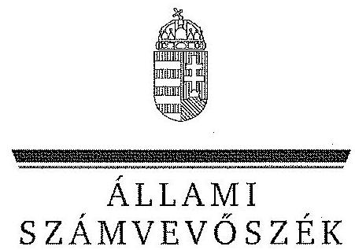
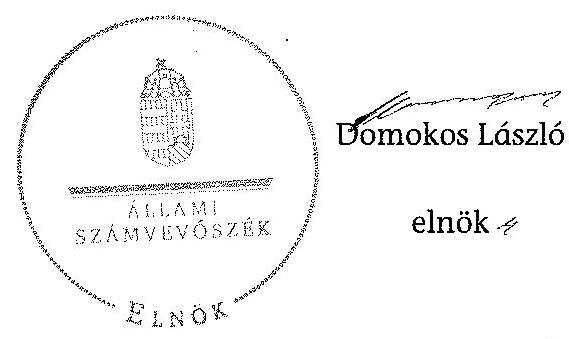
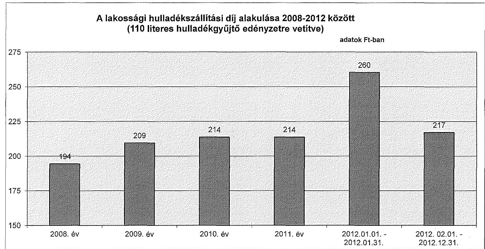
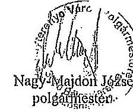
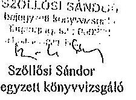
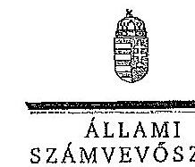
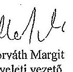

ÁLLAMI
SZÁMVEVŐSZÉK

# JELENTÉS 

Az önkormányzatok gazdasági társaságai - Az önkormányzatok többségi tulajdonában lévő gazdasági társaságok közfeladat-ellátását érintő gazdálkodási tevékenysége szabályszerűségének ellenőrzése
Bátonyterenyei BÁVÜ Városüzemeltetési Nonprofit Kft.

---

# Állami Számvevőszék 

Iktatószám: V-0469-293/2014.
Témaszám: 1503.
Vizsgálat-azonosító szám: V067103
Az ellenőrzést felügyelte:
Dr. Horváth Margit
felügyeleti vezető
Az ellenőrzés vezette és a végrehajtásáért felelős:
Klinga László
ellenőrzésvezető
Az összefoglaló jelentést készítette:
Joó Erika
számvevő
Az ellenőrzést végezték:
Győri Éva
okleveles könyvvizsgáló,
külső szakértő

## Mesterné Berta Ildikó

okleveles könyvvizsgáló, külső szakértő

## Tatár Zsuzsanna

okleveles könyvvizsgáló, külső szakértő

## A témához kapcsolódó eddig készített számvevőszéki jelentések:

## címe

Jelentés Bátonyterenye Város Önkormányzata pénzügyi helyzetének ellenőrzéséről (43/4)

---

# TARTALOMJEGYZÉK 

BEVEZETÉS ..... 9
I. ÖSSZEGZŐ MEGÁLLAPÍTÁSOK, KÖVETKEZTETÉSEK, JAVASLATOK ..... 12
II. RÉSZLETES MEGÁLLAPÍTÁSOK ..... 19

1. Az Önkormányzat közfeladat-ellátásának szabályszerűsége ..... 19
1.1. A közfeladat-ellátás megszervezése és a feladatellátás feltételrendszerének kialakítása ..... 19
1.2. A közfeladat-ellátás felügyelete és a tulajdonosi jogok érvényesítése ..... 23
2. A BÁVÜ Nkft. közfeladat-ellátással kapcsolatos tevékenysége ..... 26
2.1. A BÁVÜ Nkft. gazdálkodásának szabályozottsága ..... 26
2.2. A BÁVÜ Nkft. vagyongazdálkodása és vagyonnyilvántartása ..... 28
2.3. A beszámolási kötelezettség teljesítése ..... 30
3. A hulladékgazdálkodás közfeladata bevételei és ráfordításai elszámolásának és önköltségszámításának szabályszerűsége ..... 32
3.1. A hulladékgazdálkodás közfeladat bevételeinek és ráfordításainak szabályszerűsége ..... 32
3.2. Az önköltségszámítás szabályszerűsége ..... 33
4. Az ÁSZ korábbi, az önkormányzatok többségi tulajdonában lévő gazdasági társaságok közfeladat-ellátását, gazdálkodását, pénzügyi helyzetét érintő javaslataira tett intézkedések ..... 34
MELLÉKLETEK
5. számú A BÁVÜ Nkft. tevékenységének év végi főbb adatai
6. számú A BÁVÜ Nkft. működésének év végi főbb jellemzői
7. számú A lakossági hulladékszállítási díj alakulása 2008-2012 között
8. számú Beérkezett észrevételek és az azokra adott válaszok
FÜGGELÉKEK
9. számú Mintavételi eljárások ellenőrzési területenként

---

.

---

# RÖVIDÍTÉSEK JEGYZÉKE 

## Törvények

Áhsz.

Áht. 1

Áht. 2
ÁSZ tv.
Civil tv.

Ebktv.

Gt. tv.
Hgt. 1
Hgt. 2

Közh.tv.

Mötv.

Nvtv.
Ötv.

Számv. tv.

## Rendeletek

224/2004. (VII. 22.)
Korm. rendelet
64/2008. (III. 28.) Korm. rendelet

SZMSZ $_{1}$

az államháztartás szervezetei beszámolási és könyvvezetési kötelezettségének sajátosságairól szóló 249/2000. (XII. 24.) Korm. rendelet (hatályos: 2013. december 31-ig)
az államháztartásról szóló 1992. évi XXXVIII. törvény (hatálytalan: 2012. január 1-jétől)
az államháztartásról szóló 2011. évi CXCV. törvény
az Állami Számvevőszékről szóló 2011. évi LXVI. törvény (hatályos: 2011. július 1-jétől)
a 2011. évi CLXXV. törvény az egyesülési jogról, a közhasznú jogállásról, valamint a civil szervezetek működéséről és támogatásáról (hatályos: 2011. december 22-étől)
az egyenlő bánásmódról és az esélyegyenlőség előmozdításáról szóló 2003. évi CXXV. törvény
a gazdasági társaságokról szóló 2006. évi IV. törvény (hatálytalan: 2014. március 15-étől)
a hulladékgazdálkodásról szóló 2000. évi XLIII. törvény (hatálytalan: 2013. január 1-jétől)
a hulladékról szóló 2012. évi CLXXXV. törvény (hatályos: 2013. január 1-jétől, kivéve a $95 . \S$ (6) bekezdése, ami 2015. január 1-jén lép hatályba)
a közhasznú szervezetekről szóló 1997. évi CLVI. törvény (hatálytalan: 2012. január 1-jétől)
Magyarország helyi önkormányzatairól szóló 2011. évi CLXXXIX. törvény (hatályos: 2012. január 1-jétől, kivéve a 144. § (2) bekezdésben meghatározott paragrafusok, amelyek 2012. április 15-én, a (3) bekezdésben meghatározott paragrafusok, amelyek 2013. január 1-jén léptek hatályba, a (4) bekezdésben meghatározott paragrafusok a 2014. évi általános önkormányzati választások napján lépnek hatályba)
a nemzeti vagyonról szóló 2011. évi CXCVI. törvény
a helyi önkormányzatokról szóló 1990. évi LXV. törvény (hatálytalan: a 2014. évi általános önkormányzati választások napjától)
a számvitelről szóló 2000. évi C. törvény
a hulladékkezelési közszolgáltató kiválasztásáról és a közszolgáltatási szerződésről (hatálytalan: 2013. szeptember 5-étől)
a települési hulladékkezelési közszolgáltatási díj megállapításának részletes szakmai szabályairól (hatályos: 2008. április 1-jétől)

Bátonyterenye Város Önkormányzatának 4/1999. (III. 31.) rendelete az Önkormányzat Szervezeti és Működési

---

|  | Szabályzatáról (hatályos: 2011. január 28.-áig) |
| :--: | :--: |
| SZMSZ $_{2}$ | Bátonyterenye Város Önkormányzatának 1/2011. (01. 28.) rendelete az Önkormányzat Szervezeti és Működési Szabályzatáról (hatályos: 2011. január 29.-étől) |
| Ávr. | az államháztartásról szóló törvény végrehajtásáról szóló 368/2011. (XII. 31.) Korm. rendelet |
| vagyongazdálkodási rendelet | Bátonyterenye Város Önkormányzatának 25/2003. (XII. 19.) rendelete az Önkormányzat vagyonáról, a vagyontárgyak feletti tulajdonosi jogok gyakorlásáról (hatályos: 2003. december 19-étől) |
| 1/1996. (I. 22.) számú önkormányzati rendelet | Bátonyterenye Város Önkormányzatának többször módosított 1/1996. (I. 22.) számú rendelete a köztisztaságról és a szervezett köztisztasági közszolgáltatás kötelező igénybevételéről |
| Szórövidítések |  |
| áfa | általános forgalmi adó |
| Alapító Okirat | Bátonyterenyei BÁVÜ Városüzemeltetési Nonprofit Kft. Alapító Okirata és annak módosításai |
| ÁSZ | Állami Számvevőszék |
| BÁVÜ Kht. | Bátonyterenyei BÁVÜ Városüzemeltetési Közhasznú Társaság 2008. február 29-ig |
| BÁVÜ Nkft. | Bátonyterenyei BÁVÜ Városüzemeltetési Nonprofit Kft. 2008. március 1-jétől |
| FB | Bátonyterenyei BÁVÜ Városüzemeltetési Nonprofit Kft. Felügyelőbizottsága |
| Javadalmazási szabály-   zat | Bátonyterenye Város Önkormányzat Képviselőtestületének javadalmazási szabályzata (hatályos: 2008. április 24-től) |
| jegyző | Bátonyterenye Város Önkormányzatának jegyzője |
| Képviselő-testület | Bátonyterenye Város Önkormányzatának Képviselőtestülete |
| Közszolgáltatási szerződés | Bátonyterenye Város Önkormányzat és Bátonyterenyei BÁVÜ Városüzemeltetési Közhasznú Társaság között létrejött, 2003. január 1-jétől hatályos Közszolgáltatási Keretszerződés és annak módosításai |
| NAV | Nemzeti Adó- és Vámhivatal |
| Önkormányzat polgármester | Bátonyterenye Város Önkormányzata   Bátonyterenye Város Önkormányzatának polgármestere |
| Polgármesteri hivatal | Bátonyterenye Város Önkormányzatának Polgármesteri hivatala |

---

# ÉRTELMEZŐ SZÓTÁR 

gazdasági társaság
közfeladat
közszolgáltatás
közszolgáltatási szerződés tartalmi elemei

Gt. tv. 3. § (1) bekezdése szerint „gazdasági társaságot üzletszerű közös gazdasági tevékenység folytatására külföldi és belföldi természetes és jogi személyek, valamint jogi személyiség nélküli gazdasági társaságok alapíthatnak, működő társaságba tagként beléphetnek, társasági részesedést (részvényt) szerezhetnek."
Jogszabályban meghatározott állami vagy önkormányzati feladat, amit az arra kötelezett közérdekből, jogszabályban meghatározott követelményeknek és feltételeknek megfelelve végez, ideértve a lakosság közszolgáltatásokkal való ellátását, továbbá az állam nemzetközi szerződésekben vállalt kötelezettségeiből adódó közérdekű feladatokat, valamint e feladatok ellátásához szükséges infrastruktúra biztosítását is (Nvtv. 3. § (1) bekezdés 7. pont).

A közszolgáltatás: „közcélú, illetőleg közérdekű szolgáltatást jelent, amely egy nagyobb közösség (állam, település) minden tagjára nézve megközelítőleg azonos feltételek mellett vehető igénybe, ezért valamilyen mértékig közösségi megszervezést, illetve szabályozást, ellenőrzést igényel." Az Ebktv. 3. § d) pontja a következőképpen határozza meg a közszolgáltatást: „szerződéskötési kötelezettség alapján a lakosság alapvető szükségleteinek ellátására irányuló szolgáltatás, így különösen a villamos energia-, gáz-, hő-, víz-, szennyvíz- és hulladékkezelési, köztisztasági, postai és távközlési szolgáltatás, továbbá a menetrend alapján közlekedő járművekkel végzett közforgalmú személyszállítás."
A közszolgáltatási szerződésnek tartalmaznia kell a közszolgáltatás megnevezését, minőségi ismérveit, a teljesítésének területi kiterjedését, a közszolgáltatás megkezdésének időpontját és időtartamát, valamint annak rögzítését, hogy a közszolgáltató vállalta a megjelölt közszolgáltatás teljesítését.
A közszolgáltatási szerződésben a közszolgáltató kötelességeként kell meghatározni:
a) a közszolgáltatás folyamatos és teljes körű ellátását;
b) a közszolgáltatás meghatározott rendszer, módszer és gyakoriság szerinti teljesítését;
c) a közszolgáltatás teljesítéséhez szükséges mennyiségű és minőségű jármű, gép, eszköz, berendezés biztosítását, valamint a szükséges létszámú és képzettségű szakember alkalmazását;
d) a közszolgáltatás folyamatos, biztonságos és bővíthető teljesítéséhez szükséges fejlesztések és karbantartások elvégzését;
e) a közszolgáltatás körébe tartozó hulladék ártalmatla-

---

nítására az önkormányzat képviselő-testülete által kijelölt helyek és létesítmények igénybevételét;
f) a közszolgáltató által alkalmazott közszolgáltatási díj mértékéről és az alkalmazás tapasztalatairól az önkormányzat képviselő-testületének történő legalább évenkénti egyszeri tájékoztatást;
g) a közszolgáltatás teljesítésével összefüggő adatszolgáltatás rendszeres teljesítését és meghatározott nyilvántartási rendszer működtetését;
h) a fogyasztók számára könnyen hozzáférhető ügyfélszolgálat és tájékoztatási rendszer működtetését;
i) a fogyasztói kifogások és észrevételek elintézési rendjének megállapítását.
A közszolgáltatási szerződésben az önkormányzat kötelességeként kell meghatározni:
a) a közszolgáltatás hatékony és folyamatos ellátásához a közszolgáltató számára szükséges információk szolgáltatását, a Hgt. 23. §-ának g) pontjára tekintettel;
b) a közszolgáltatás körébe tartozó és a településen folyó egyéb hulladékkezelési tevékenységek összehangolásának elősegítését;
c) a településen működtetett különböző közszolgáltatások összehangolásának elősegítését;
d) a települési igények kielégítésére alkalmas hulladék gyűjtésére, kezelésére, ártalmatlanítására szolgáló helyek és létesítmények kijelölését;
e) a közszolgáltató kizárólagos közszolgáltatási jogának biztosítását a 3. § (1) bekezdés a), b) és f) pontjaiban foglaltakra figyelemmel.
Az önkormányzatnak a közszolgáltatás finanszírozásában vállalt kötelezettsége esetén a közszolgáltatási szerződésben meg kell határozni a kötelezettség teljesítésének feltételeit és biztosítékait.
A közszolgáltatási szerződés tartalmazza a közszolgáltatás díjának megállapítására és beszedésére vonatkozó módszer leírását, a díjnak a szerződés megkötésekor érvényesíthető legmagasabb mértékét és a díj megváltoztatása érdekében alkalmazandó eljárást. A közszolgáltatási szerződésnek tartalmaznia kell az igazolt díjhátralék kiegyenlítésére vonatkozó eljárást. A közszolgáltatási szerződés tartalmazza azokat a feltételeket, amelyek mellett a közszolgáltató a közszolgáltatás teljesítésére közreműködőt vagy teljesítési segédet vehet igénybe, figyelemmel a Kbt. 304. § (2) bekezdésében foglaltakra is. A közszolgáltató közreműködőért vagy teljesítési segédért való felelőssége a közszolgáltatási szerződésben nem korlátozható. (224/2004. (VII. 22.) Korm. rendelet 11-14. §)

---

minősített többséget biztosító részesedés
saját tőke
tulajdonosi joggyakorló
többségi befolyást biztosító részesedés

A minősített befolyásszerző az ellenőrzött társaságban a szavazatok legalább hetvenöt százalékával rendelkezik. (Gt. tv. 52. § (2) bekezdés)
A saját tőke a - jegyzett, de még be nem fizetett tőkével csökkentett - jegyzett tőkéből, a tőketartalékból, az eredménytartalékból, a lekötött tartalékból, az értékelési tartalékból és a tárgyév mérleg szerinti eredményéből tevődik össze.
Aki a nemzeti vagyon felett az államot vagy a helyi önkormányzatot megillető tulajdonosi jogok és kötelezettségek összességének gyakorlására jogosult (Nvtv. 3. § (1) bekezdés 17. pont).
A Ptk. 685/B. § (1) bekezdése szerint „többségi befolyás: az olyan kapcsolat, amelynek révén természetes személy, jogi személy vagy jogi személyiség nélküli gazdasági társaság (a továbbiakban együtt: befolyással rendelkező) egy jogi személyben a szavazatok több mint ötven százalékával vagy meghatározó befolyással rendelkezik."

---

# **Chemistry**

## **Chemical Reactions**

### **Balancing Chemical Equations**

1. **Write the unbalanced equation:**
   - Example: $$C_3H_8 + O_2 \rightarrow CO_2 + H_2O$$

2. **Balance the equation:**
   - Example: $$2C_3H_8 + 7O_2 \rightarrow 6CO_2 + 8H_2O$$

3. **Balance the equation:**
   - Example: $$2C_3H_8 + 7O_2 \rightarrow 6CO_2 + 8H_2O$$

4. **Balance the equation:**
   - Example: $$2C_3H_8 + 7O_2 \rightarrow 6CO_2 + 8H_2O$$

### **Types of Reactions**

1. **Combination Reaction:**
   - Example: $$2H_2 + O_2 \rightarrow 2H_2O$$

2. **Decomposition Reaction:**
   - Example: $$2H_2O_2 \rightarrow 2H_2O + O_2$$

3. **Single Displacement Reaction:**
   - Example: $$Zn + 2HCl \rightarrow ZnCl_2 + H_2$$

4. **Double Displacement Reaction:**
   - Example: $$AgNO_3 + NaCl \rightarrow AgCl + NaNO_3$$

5. **Combustion Reaction:**
   - Example: $$CH_4 + 2O_2 \rightarrow CO_2 + 2H_2O$$

## **Stoichiometry**

### **Mole Concept**

- **Mole (mol):** The amount of substance containing as many particles (atoms, molecules, ions) as there are atoms in exactly 12 grams of carbon-12.
- **Avogadro's Number:** $$6.022 \times 10^{23}$$ particles per mole.

### **Molar Mass**

- **Molar Mass:** The mass of one mole of a substance.
- Example: The molar mass of water ($$H_2O$$) is 18.015 g/mol.

### **Calculations**

1. **Moles to Mass:**
   - Formula: $$n = \frac{m}{M}$$
   - Example: Calculate the number of moles of $$H_2O$$ in 18 grams of water.
     - $$n = \frac{18 \, \text{g}}{18.015 \, \text{g/mol}} \approx 0.999 \, \text{mol}$$

2. **Moles to Mass:**
   -

 Formula: $$m = n \times M$$
   - Example: Calculate the mass of 18.015 g of water.
     - $$m = 18.015 \, \text{g/mol} = 18.015 \, \text{g/mol}$$

## **Gas Laws**

### **Ideal Gas Law**

- **Equation:** $$PV = nRT$$
- **Variables:**
  - $$P$$: Pressure (atm)
  - $$V$$: Volume (L)
  - $$n$$: Number of moles (mol)
  - $$R$$: Ideal gas constant (0.0821 L·atm/mol·K)
  - $$T$$: Temperature (K)

### **Boyle's Law**

- **Equation:** $$P_1V_1 = P_2V_2$$
- **Variables:**
  - P₁: Pressure (atm)
  - P₂: Volume (L)
  - P₃: Pressure (atm)
  - P₁: Pressure (atm)
  - P₂: Volume (L)
  - P₃: Pressure (atm)
  - P₁: Pressure (atm)

### **Boyle's Law**

- **Equation:** $$\frac{P_1V_1}{T_1} = \frac{P_2V_2}{T_2}$$
- **Variables:**
  - P₁: Pressure (atm)
  - P₂: Volume (L)
  - P₃: Pressure (atm)
  - P₁: Pressure (atm)
  - P₂: Volume (L)
  - P₃: Pressure (atm)

## **Thermochemistry**

### **Enthalpy Change (ΔH)**

- **Definition:** The heat content of a system at constant pressure.
- **Equation:** $$\Delta H = q_p$$
- **Equation:** $$\Delta T = q_p + q_0$$
- **Example:**
  - $$C_3H_8 + 7O_2 \rightarrow 6CO_2 + 8H_2O$$

### **Hess's Law**

- **Statement:** The enthalpy change for a reaction is the same whether it occurs in one step or multiple steps.
- **Example:**
  - $$C_3H_8 + 7O_2 \rightarrow 6CO_2 + 8H_2O$$

## **Electrochemistry**

### **Oxidation and Reduction**

- **Oxidation:** Loss of electrons.
- **Reduction:** Gain of electrons.

### **Galvanic Cells**

- **Definition:** A cell that converts chemical energy into electrical energy.
- **Components:**
  - Anode: Oxidation occurs.
  - Cathode: Reduction occurs.
  - Salt Bridge: Connects the two half-cells.

### **Nernst Equation**

- **Equation:** $$E = E^\circ - \frac{RT}{nF} \ln Q$$
- **Variables:**
  - $$E$$: Cell potential
  - $$E^\circ$$: Standard cell potential
  - $$R$$: Ideal gas constant
  - $$T$$: Temperature (K)
  - $$n$$: Number of electrons transferred
  - $$F$$: Faraday constant (96,485 C/mol)
  - $$Q$$: Reaction quotient

---

# JELENTÉS 

## Az önkormányzatok gazdasági társaságai Az önkormányzatok többségi tulajdonában lévő gazdasági társaságok közfeladat ellátását érintő gazdálkodási tevékenysége szabályszerűségének ellenőrzése

## Bátonyterenyei BÁVÚ Városüzemeltetési Nonprofit Kft.

## BEVEZETÉS

Az Állami Számvevőszék középtávra szóló stratégiájában megfogalmazta, hogy a helyi önkormányzatok gazdálkodásában rejlő pénzügyi kockázatok feltárásával, az államháztartáson kívülre nyújtott költségvetési támogatások és ingyenes vagyonjuttatások, valamint az államháztartáson kívül működő közfeladat-ellátó rendszerek ellenőrzéseivel hozzájárul ahhoz, hogy a közpénzeket az államháztartáson kívül működő szervezetek is átlátható, rendezett módon használják fel a közfeladatok szerződésben vállalt ellátása érdekében.

Az önkormányzatok szervezetalakítási szabadságának következménye, hogy a korábban is vállalati formában működő (nagyvárosi tömegközlekedés, víz-, szennyvízcsatorna, köztisztasági, ingatlankezelés stb.) közszolgáltatások mellett, mind a kötelező, mind az önként vállalt feladatok ellátásában a gazdasági társaságok kiemelt fontosságú szerephez jutottak.

A Bátonyterenyei BÁVÚ Városüzemeltetési Nonprofit Korlátolt Felelősségű Társaság (BÁVÚ Nkft.) alaptevékenysége Bátonyterenye, Nagybárkány, Szuha, Mátraverebély és Rákóczibánya települések közigazgatási területén a nem veszélyes hulladék kezelése, ártalmatlanítása. A BÁVÚ Nkft. az ellenőrzött időszakban ellátta a közel 14 ezer lakóval rendelkező Bátonyterenye Város közigazgatási területén a közterületek tisztántartását, nem veszélyes hulladék gyűjtését, hulladék újrahasznosítást, szennyeződésmentesítést, egyéb hulladékkezelést, ingatlankezelést, zöldterület-kezelést, valamint építményüzemeltetést, temetkezést, temetkezést kiegészítő szolgáltatásokat.

A Képviselő-testület a 187/2007. (XI. 29.) határozatával döntött az Önkormányzat 100%-os tulajdonában lévő Lakásgazdálkodási Kht. és a BÁVÚ Kht. összeolvadással való átalakulásáról és ezzel párhuzamosan a BÁVÚ Nkft. létrehozásáról. A Nógrád Megyei Bíróság, mint Cégbíróság a BÁVÚ Nkft. megalakulását 2008. február 29-i dátummal jegyezte be. A BÁVÚ Nkft. tulajdoni hányaddal más gazdasági társaságban nem rendelkezett, átlagos statisztikai létszám a 2012. év végén 48 fő volt. A BÁVÚ Nkft. összes bevétele 2008-ban 310,9 millió Ft, a 2012. évben 221,3 millió Ft volt, amelyből az értékesítés nettó árbevétele 2008-ban 282,1 millió Ft, míg 2012-ben 195,8 millió Ft volt. Az árbevételek az ellenőrzött időszakban 30,6%-kal, a ráfordítások 25%-kal csökkentek. A BÁVÚ Nkft. által Bátonyterenyén elszállított szemét mennyisége 2008-ban 10680 tonna, 2012-ben 9899 tonna volt.

A BÁVÚ Nkft. az ellenőrzött időszakban - a 2011. évet kivéve - pozitív mérleg szerinti eredménnyel zárt, a 2012. évben 2,3 millió Ft összegű eredményt realizált. A BÁVÚ Nkft. mérleg szerinti eszközállománya a 2008. évi nyitó 255 millió Ft-ról a 2012. év végére 13,6%-os növekedést követően 289,7 millió Ft-ra nőtt, ezen belül a tárgyi eszközök állománya 4,5%-os csökkenést követően 132,6 millió Ft-ra változott. A saját tőke a 2008. évi nyitó 9,4 millió Ft-ról a 2012. év végére 5,9 millió Ft-ra csökkent.

A Bátonyterenyei BÁVÚ Városüzemeltetési Nonprofit Kft.-nek 2008. február 29-étől 2012. december 5-éig 89,57%-os minősített többségi befolyású tulajdonosa Bátonyterenye Város Önkormányzata volt. Ezen túlmenően 4,43%-ban Nagybárkány Község Önkormányzata, 1,43%-ban Szuha Község Önkormányzata, 1,43%-ban Mátraverebély Község Önkormányzata, és 3,14%-ban Rákóczibánya Község Önkormányzata tulajdonában volt. A tulajdonosi arányok 2012. december 6-ától változtak. Ettől az időponttól a BÁVÚ Nkft.-nek Bátonyterenye Város Önkormányzata 89,72%-os minősített többségi befolyású tulajdonosa, 4,37%-ban Nagybárkány Község Önkormányzata, 1,41%-ban Szuha Község Önkormányzata, 1,4%-ban Mátraverebély Község Önkormányzata, és 3,1%-ban Rákóczibánya Község Önkormányzata tulajdonában volt.

Az ellenőrzött időszakban a polgármester személye egy, a jegyző személye három alkalommal változott. Az ellenőrzött időszakban az ügyvezető személye három, a főkönyvelő személye két alkalommal változott.

Az önkormányzati tulajdonú gazdasági társaságok teljes körű ellenőrzésének lehetőségét az Állami Számvevőszékről szóló 1989. évi XXXVIII. törvény 2011. január 1-jétől hatályos módosítása teremtette meg.

Az ellenőrzés célja annak értékelése volt, hogy

- az önkormányzat a jogszabályi előírások figyelembevételével döntött-e az ellenőrzésre kerülő közfeladat megszervezéséről; az önkormányzat szabályszerűen gyakorolta-e a tulajdonosi jogokat;
- a gazdasági társaság közfeladat-ellátása bevételeinek, ráfordításainak elszámolása, és vagyongazdálkodási tevékenysége megfelelt-e a jogszabályi, illetve a közszolgáltatási szerződésben foglalt tulajdonosi előírásoknak, azok végrehajtása szabályszerű volt-e;
- a közfeladatok átláthatósága és elszámoltathatósága érdekében biztosítva volt-e a közszolgáltatás díjának megalapozottsága szabályszerű önköltségszámítással.

Az ellenőrzés során értékeltük az ÁSZ korábbi, az Önkormányzat többségi tulajdonában lévő gazdasági társaságát érintő javaslataira tett intézkedések

hasznosulását is. Az ellenőrzés kiterjedt Bátonyterenye Város Önkormányzatára és a Bátonyterenyei BÁVÚ Városüzemeltetési Nonprofit Korlátolt Felelősségű Társaságra.

Az ellenőrzés várható hasznosulása: A törvényalkotás számára - az észlelt problémák, szabálytalanságok, vagy egyéb nem kívánatos jelenségek felszínre kerülésével - az ellenőrzés megállapításai segítséget nyújthatnak az államháztartáson kívüli közfeladat-ellátás értékeléséhez, jogszabályi keretei pontosításához, átláthatóságot biztosító szabályozásához. Meghatározhatóvá válnak a közfeladat ellátásában részt vevő államháztartáson kívüli szervezeteknek - az önkormányzat költségvetését, pénzügyi helyzetét is befolyásoló - kockázatai, lehetővé válik ezen kockázatok csökkentése. A feladatot ellátó gazdasági társaság a közszolgáltatási szerződésben foglaltak betartásával, a közvagyon használatával biztosította-e a szolgáltatás folytatásának feltételeit. Ezzel az ellenőrzöttek és a helyi döntéshozók számára visszajelzést ad feladatszervezési, feladat-ellátási kockázataikról, alapot ad a meglévő hibák megszüntetéséhez, a jobb közfeladat-ellátás biztosításához. Fokozza a fegyelmet, igazolja, hogy lejárt a következmények nélküli ellenőrzések időszaka. Az ÁSZ értékteremtő rend kialakításához és megőrzéséhez hozzájáruló tevékenysége pozitív hatással van a szervezetről kialakított összkép formálására is.

A bevételek és ráfordítások elszámolása, valamint a vagyonnyilvántartás terén az egyes területek szabályszerű működését mintavétellel ellenőriztük, ez alapján a sokaságokban előforduló hibás tételek arányát becsültük. A jogszabályoknak és a belső előírásoknak megfelelőnek, azaz szabályszerűnek tekintettük az adott bevételek és ráfordítások elszámolását, a vagyonnyilvántartást, amennyiben a minta ellenőrzésének eredménye alapján 95%-os bizonyossággal a teljes sokaságban a hibás tételek aránya kisebb volt, mint 10%, nem megfelelőnek értékeltük, ha a hibás tételek aránya a 10%-ot meghaladta. Kockázatot, illetve magas kockázatot jeleztünk, amennyiben egy adott terület vonatkozásában a minta alapján a teljes sokaságban nem volt teljes körűen biztosított a jogszabályoknak és a belső szabályzatoknak megfelelő működés (1. számú függelék).

Az ellenőrzést a számvevőszéki ellenőrzés szakmai szabályai szerint, szabályszerűségi ellenőrzés módszerével, a vonatkozó nemzetközi standardok figyelembevételével végeztük. Az ellenőrzés a 2008-2012. évekre terjedt ki.

Az ellenőrzés végrehajtásának jogszabályi alapját az Állami Számvevőszékről szóló 2011. évi LXVI. törvény 5. § (3)-(4)-(5) bekezdése képezi.

Az ÁSZ az Állami Számvevőszékről szóló 2011. évi LXVI. törvény 29. §-a alapján a jelentéstervezetet észrevételezésre megküldte a polgármesternek és a gazdasági társaság ügyvezetőjének. A beérkezett észrevételt a jelentés véglegesítése során hasznosítottuk. Az észrevételt és az arra adott választ a jelentés 4. számú melléklete tartalmazza.

---

# I. ÖSSZEGZŐ MEGÁLLAPÍTÁSOK, KÖVETKEZTETÉSEK, JAVASLATOK 

Bátonyterenye Város Önkormányzat Képviselő-testülete az Önkormányzat közigazgatási területén a szilárd hulladék gyűjtése, ártalmatlanítása, hasznosítása és a közterületek tisztántartása közfeladatának ellátásáról az Ötv. előírásai szerint döntött. A Képviselő-testület az SZMSZ 1,2-ben előírta a szilárd hulladék kezelés és szállítás közfeladat ellátásának kötelezettségét. Az Önkormányzat 2006-2010. évekre szóló gazdasági programja prioritásként rögzítette a városi közszolgáltatás színvonalának fejlesztését. Feladatként jelölte meg, hogy a középtávú hulladékgazdálkodási program alapján, pályázati eszközökkel korszerűsíteni kell a tároló edényzetet, azok elhelyezését, folyamatosan biztosítani kell a városi szeméttelep biztonságos, környezetkímélő üzemeltetését. A 2011-2014. évekre szóló gazdasági program célként tűzte ki a kommunális hulladéklerakó fejlesztésének pályázati lehetőségek kihasználásával, illetve tőkéstársak bevonásával történő megvalósítását, valamint a hulladékkezelési közszolgáltatási díj felülvizsgálatát.

A Hgt. 1-ben foglalt előírással ellentétben az Önkormányzat az ellenőrzött időszakban nem rendelkezett hulladékgazdálkodási tervvel. A Képviselőtestület a közfeladatok ellátásáról a 2003. január 1-jétől érvényes tíz éves időtartamra kötött Közszolgáltatási szerződésben gondoskodott, ami megfelelt a 224/2004. (VII. 22.) Korm. rendeletben előírt tartalmi követelményeknek. A Közszolgáltatási szerződést az ellenőrzött időszakban a lakossági hulladékkezelésre vonatkozó díjtételek változása miatt módosították. A Közszolgáltatási szerződésben meghatározták a hulladékkezelési tevékenység minőségi ismérveit, feladatait, mennyiségi követelményeit, a feladatellátás módját, a közszolgáltatás teljesítésének gyakoriságát, az adatnyilvántartás és adatszolgáltatás kötelezettségét, a finanszírozás elveit és módszereit, valamint az igazolt díjhátralék kiegyenlítésének eljárási szabályait.

A Közszolgáltatási szerződés a Hgt. 1-ben előírtaknak megfelelően tartalmazta a díjhátralék beszedésének szabályait, azonban a BÁVÚ Nkft. a 2008-2012. években nem kezdeményezte díjhátralék adók módjára történő beszedését. A BÁVÚ Nkft. 2011. június 29-én megbízási szerződést kötött egy behajtó céggel az elismert, lejárt követelésállomány behajtására, nyilvántartására. Az alkalmazott gyakorlat ellentétes volt a Hgt. 1-ben előírtakkal, amely szerint a 90 napot meghaladó díjhátralék adó módjára történő behajtását a települési önkormányzat jegyzőjénél kell kezdeményezni.

A Képviselő-testület a Hgt. 1-ben előírt kötelezettségének eleget tett és rendeletben szabályozta a köztisztasággal és a szervezett köztisztasági közszolgáltatás kötelező igénybevételével kapcsolatos közfeladatait. A rendelet tartalmazta a közszolgáltatás ellátásának rendjét, a közszolgáltató és az ingatlan tulajdonos ezzel összefüggő jogait és kötelezettségeit. Meghatározta az ingatlantulajdonost terhelő díjfizetési kötelezettséget, az alkalmazható díj legmagasabb mértékét, megfizetésének rendjét is.

Az ellenőrzött időszakban az Önkormányzat a Gyula-aknai kommunális hulladék-lerakóhelyet, a kapcsolódó létesítményekkel és földterülettel bérbe adta. A bérleti szerződés 10 éves
 időtartamra jött létre, amely időtartamot a 2008. évben határozatlan idejűre módosítottak. A bérleti díj összege 2003. január 1-től változatlan összegben évi 4,9 millió Ft + áfa volt. Az Önkormányzat 2006-tól a közfeladat megfelelő színvonalú ellátása érdekében, üzemeltetésre, kezelésre hulladékgyűjtő és szállító járművet, nyesedékaprító berendezést, valamint hulladékszállító konténereket adott át BÁVÚ Kht.-nek. Az eszközök használatáért a BÁVÚ Nkft. az ellenőrzött időszakban nem fizetett díjat. Az Önkormányzat az üzemeltetésre, kezelésre átadott eszközöket a 2008-2011. években a Számv. tv. és az Áhsz. előírásai ellenére egyeztetéssel leltározta, az üzemeltetésre, kezelésre átadott eszközök mennyiségi leltározása a 2012. évben történt.

Az Önkormányzat a gazdasági társaságok feletti tulajdonosi jogok gyakorlásának szabályait a vagyongazdálkodási rendeletben határozta meg. Az Önkormányzatot megillető tulajdonosi jogok gyakorlásával kapcsolatos feladatok és jogosítványok a Képviselő-testületet illeték meg. A Képviselő-testület a vagyongazdálkodási rendeletben előírtaknak megfelelően gyakorolta a tulajdonosi jogokat. Az FB a Gt. tv. előírásának megfelelően minden évben írásbeli jelentést készített a számviteli beszámolóról, amelyet a Képviselő-testület a BÁVÚ Nkft. számviteli beszámolójával együtt tárgyalt.

A Képviselő-testület rendeletben határozta meg a hulladékszállítással és kezeléssel kapcsolatos díjtételeket. A hulladékkezelési közszolgáltatás díjának meghatározása évente történt. A hulladékkezelési díj megállapításához szükséges, a 64/2008. (III. 28.) Korm. rendeletben előírt díjkalkulációs sémát vagy díjképletet nem határozták meg. A Képviselő-testület a 2008-2010., illetve 2012. évekre vonatkozó díjavaslatot elfogadta, a 2011. évi hulladékkezelési díjat az előző évi szinten tartotta. A 2012. évben a díjat kétszer módosították.

Az Önkormányzat az ellenőrzött időszakban 674,3 millió Ft működési célú és 21,4 millió Ft fejlesztési célú támogatást adott a BÁVÚ Nkft. részére. A fejlesztési célú pénzeszközátadással kapcsolatban megállapodást kötettek szeméttelepi út felújítására, konténerszállító jármű, szivattyú és áramfejlesztő berendezés beszerzésére.

Az Önkormányzat 2010-2011. évi belső ellenőrzési tervében szerepelt a BÁVÚ Nkft. szabályszerűségi ellenőrzése. A tervezett belső ellenőrzés célja a közfoglalkoztatás jogszerűségének, a pénzügyi elszámolások szabályozottságának ellenőrzése volt. A 2010. évi ellenőrzés elmaradt, és a 2011. évre átütemezett ellenőrzésre sem került sor.

A BÁVÚ Nkft. Számviteli politikája nem tartalmazta a közhasznú szervezetekre vonatkozó speciális nyilvántartási és beszámolási szabályokat Számv. tv. és a Közh. tv. előírásai ellenére. A Számv. tv.-ben előírt eszközök és a források leltárkészítési és leltározási szabályzatát a BÁVÚ Nkft. elkészítette, azonban a tárgyi eszközök leltározása vonatkozásában 2012. január 1-jétől nem felelt meg a Számv. tv. szerinti leltározási kötelezettség előírásának, amely legalább háromévenkénti mennyiségi leltárfelvételt ír elő. Selejtezési szabályzatot nem készítettek. A Számv. tv.-ben előírtakat megsértve az eszközök és források értékelési szabályzatát az ellenőrzött időszakban a BÁVÚ Nkft. nem készítette el. A

---

Számv. tv. előírásai szerint BÁVÚ Nkft. a 2011. évtől önköltségszámítási szabályzat készítésére vált kötelezetté, de az előírás ellenére szabályzatkészítési kötelezettségüknek nem tettek eleget. A pénzkezelési szabályzatot az előírt tartalommal elkészítették. A Számviteli politika keretében elkészített számviteli szabályzatokat - a pénzkezelési szabályzat kivételével - a Számv. tv.-ben előírtak ellenére nem aktualizálták annak ellenére, hogy a mulasztásra a könyvvizsgáló a 2009. és a 2010. évi beszámoló könyvvizsgálatát követően vezetői levélben felhívta az ügyvezető figyelmét. A számlarend nem felelt meg a Számv. tv. előírásainak, mert nem tartalmazta a számlakeretet, az alkalmazott számlák számjelét és megnevezését teljes körűen, a munkaszámok rendszerét, a főkönyvi számla és az analitikus nyilvántartás kapcsolatát. A BÁVÚ Nkft. a bizonylati rend készítési kötelezettségének az ellenőrzött időszakban a Számv. tv. előírása ellenére nem tett eleget.

A BÁVÚ Nkft. az ellenőrzött időszakban az üzleti terv készítéséről a SZMSZ$_{1,2}$ előírásával összhangban gondoskodott, amelyeket a Képviselő-testület elfogadott. A BÁVÚ Nkft. feladatainak ellátásához az Önkormányzattól vagyonkezelésbe nem vett át vagyont, vagyonkezelői szerződést nem kötött. Az Önkormányzat a vagyongazdálkodási rendeletben foglaltaknak megfelelően a tulajdonában lévő eszközök használatára bérleti, illetve használati szerződéseket kötött a BÁVÚ Nkft.-vel. A belső szabályzatokban a BÁVÚ Nkft. a közfeladat ellátásával kapcsolatos elszámolások elkülönített nyilvántartását nem írta elő. A BÁVÚ Nkft. vagyonának nyilvántartása során - a mintavétellel kiválasztott és ellenőrzött tételek alapján - szabályszerűen járt el. Az immateriális-, és tárgyi eszközök állománynövekedésének, valamint a beszerzett eszközök értékcsökkenésének elszámolása megfelelt a vonatkozó szabályozásnak. A beszerzett eszközök állományba vétele, üzembe helyezése megtörtént. A 2008. március 1-jével egyesüléssel létrejött BÁVÚ Nkft. az átvett tárgyi eszközök könyv szerinti értéke helyett a tárgyi eszközök jogelődök által nyilvántartott bruttó érték alapul vételével számolta el az értékcsökkenést az ellenőrzött időszakban. A Számv. tv.-ben előírtak alapján az átalakuló gazdasági társaság vagyonmérlegének a könyv szerinti értéket kell tartalmaznia. A helytelen költségelszámolás a BÁVÚ Nkft. eredményét kedvezőtlenül befolyásolta, rontotta.

A BÁVÚ Nkft. gazdálkodására vonatkozó tulajdonosi tájékoztatás előírásait az ellenőrzött időszakban az SZMSZ$_{1,2}$ szabályozta. A BÁVÚ Nkft. éves számviteli beszámolót elkészítette, ugyanakkor üzleti jelentést az ellenőrzött időszakban nem készített. Az üzleti jelentés hiánya miatt a könyvvizsgáló a 2012. éves beszámolóra vonatkozó jelentését korlátozó véleménnyel látta el. A BÁVÚ Nkft. a 2008., 2009. és 2011. években nem az előírt határidőben teljesítette az éves számviteli beszámoló közzétételi kötelezettségét. A BÁVÚ Nkft. a 2008-2012. közötti időszakban a Közh. tv. és a Civil tv. előírásai ellenére a közhasznúsági jelentés, illetve közhasznúsági melléklet készítési kötelezettségének nem tett eleget. A szabálytalanságra az FB nem hívta fel a figyelmet. A BÁVÚ Nkft. az Áht.$_{3}$ alapján kormányzati szektorba sorolt egyéb szervezeten belüli, helyi önkormányzatok alszektorba tartozó szervezetnek minősül, így 2012. január 1-jétől adatszolgáltatási kötelezettsége keletkezett az államháztartásért felelős miniszter felé, amelynek nem tett eleget.

A könyvvizsgáló a BÁVÚ Nkft. 2008-2010. éves beszámolójáról megállapította, hogy az megbízható és valós képet ad a társaság vagyoni, pénzügyi és jöve-

---

delmi helyzetéről. A 2011. évre véleménye korlátozása nélkül figyelemfelhívással élt, mivel a BÁVÚ Nkft. az előző évek eredményes gazdálkodását követően 82,4 millió Ft-os veszteséggel zárta az évet, így a saját tőke értéke nem érte el a jegyzett tőke összegét. A saját tőke összege a 2011. évben -64,6 millió Ft volt. A könyvvizsgáló 2012. évre vonatkozóan korlátozó véleményt adott ki, mert a BÁVÚ Nkft. nem készítette el az üzleti jelentését. A BÁVÚ Nkft. vesztesége miatt kialakult tőkehelyzet rendezésére 68,1 millió Ft-ot tőketartalékba helyezett. A BÁVÚ Nkft. ezt az összeget a 2012. évi beszámoló mérlegében lekötött tartalékként szerepeltette. A könyvvizsgáló nem jelezte a hibás elszámolást, a korlátozó záradékban nem hívta fel a Képviselő-testület figyelmét a hibás elszámolásra és annak lehetséges következményeire.

A hulladékgazdálkodási közfeladat értékesítés nettó árbevételeinek elszámolása során a BÁVÚ Nkft. szabályszerűen járt el. A bevételek előírása és kiszámlázása a belső szabályozásnak megfelelően történt, a bevételeket a megfelelő számlacsoportban számolták el. Az alkalmazott szolgáltatási díjak megfeleltek a belső szabályozásnak és a tulajdonosi követelményeknek. A hulladékgazdálkodási közfeladat anyagjellegű ráfordításainak elszámolása során a BÁVÚ Nkft. szabályszerűen járt el. A költségek elszámolása a jogszabályi előírásoknak és a belső szabályozásnak megfelelően történt. A költségelszámolást megalapozó dokumentumok rendelkezésre álltak. A költségeket a megfelelő költségnemre, közfeladatra számolták el.

A BÁVÚ Nkft. éves díj javaslatai tartalmazták az éves hulladékkezelési díj kialakításának tényezőit, az előző évi hulladékkezelési díj számításánál figyelembe vett tényezők tényleges megvalósulását, azonban a hulladékkezelési díj mértékére a következő évi tervezett bevételek és költségtételek elemzése nélkül tettek javaslatot. A közszolgáltató díjkalkulációs javaslatában a közszolgáltatás nyújtása során várható költségek mellett a díjcsökkentő tényezőket (pl. állami, önkormányzati támogatások, melléktermékek hasznosítása) be kell mutatni a 64/2008. (III. 28.) Korm. rendelet alapján. Ez azonban nem történt meg. A BÁVÚ Nkft. a rendelettel ellentétben nem mutatta ki, hogy a költségek ellentételezésére milyen összegű önkormányzati támogatást, illetve a begyűjtött hulladékok hasznosításából milyen mértékű bevételt realizálhat. A BÁVÚ NKft. nem tett eleget a jogszabályi előírásoknak, önköltségszámítás hiánya miatt a közszolgálati díjak megállapítására készített díjkalkuláció nem volt megalapozott.

Az ÁSZ a 2012. évben Bátonyterenye Város Önkormányzata pénzügyi helyzetét ellenőrizte. A polgármesternek címzett javaslatot, miszerint terjesszen intézkedési tervet a Képviselő-testület elé a BÁVÚ Nkft. pénzügyi stabilitásának megteremtése érdekében hasznosították.

A fentiekben leírtak összegzéseként az alábbi megállapításokat tesszük:
A tulajdonosi monitoring rendszer a jogszabályi előírásoknak megfelelően működött, azonban a feltárt kockázatok rámutatnak ennek elégtelenségére. Az ügyvezetés mellett mind az FB, mind a könyvvizsgáló mulasztásai hozzájárultak feltárt kockázatok kialakulásához. A belső ellenőrzés nem segítette elő a kockázatok feltárását. Az ellenőrzött időszakban a BÁVÚ Nkft. számviteli rendszerének szabályozottsága súlyos hiányosságokat mutatott. Pénzügyi kockázat

---

két területen jelentkezett, egyrészt a díjhátralékok nem jogszabályban meghatározott módján történő behajtásából, másrészt az önköltségszámítás hiánya miatt a közszolgálati díjak megállapítására készített díjkalkuláció megalapozatlanságából adódóan.

Az Állami Számvevőszékről szóló 2011. évi LXVI. törvény értelmében a jelentésben foglalt megállapításokhoz kapcsolódó intézkedési tervet köteles az ellenőrzött szervezet vezetője összeállítani, és azt a jelentés kézhezvételétől számított 30 napon belül az ÁSZ részére megküldeni. Amennyiben az intézkedési tervet határidőben nem küldi meg a szervezet, vagy az nem elfogadható, az ÁSZ elnöke a hivatkozott törvényben foglaltakat érvényesítheti.

A helyszíni ellenőrzés megállapításainak hasznosítása mellett javasoljuk:
Javaslataink célja a Nonprofit Kft. gazdálkodása szabályszerűségének helyreállítása annak érdekében, hogy a szabályozási környezet megfelelően tudja támogatni az átlátható működést.

# Javasoljuk a Bátonyterenyei BÁVÚ Városüzemeltetési Nonprofit Kft. ügyvezető igazgatójának: 

1. A BÁVÚ Nkft. a bizonylati rend készítési kötelezettségének az ellenőrzött időszakban a Számv. tv. 161. § (2) bekezdés d) pontjának előírása ellenére nem tett eleget. A BÁVÚ Nkft. a 2011. évtől önköltség számítási szabályzat készítésére vált kötelezetté, de a Számv. tv. 14. § (5) bekezdés c) pontjában előírtak ellenére szabályzatkészítési kötelezettségének nem tett eleget, valamint nem készítette el a számviteli politika részeként a Számv. tv. 14. § (5) bekezdés b) pontja szerint az eszközök és források értékelési szabályzatát.

A társaságnál az eszközök és források leltárkészítési és leltározási szabályzata az ingatlanok esetében öt évenkénti mennyiségi leltárfelvételi kötelezettséget tartalmazott. A szabályzat a tárgyi eszközök leltározása vonatkozásában 2012. január 1-jétől nem felelt meg a Számv. tv. 69. § (3) bekezdése szerinti leltározási kötelezettség előírásának, mivel az eszközök folyamatos mennyiségi nyilvántartás mellett is legalább háromévenkénti mennyiségi leltárfelvételt ír elő, így a szabályzatban előírt öt éves periódus nem felelt meg a jogszabályi előírásoknak. Az eszközök és források leltárkészítési és leltározási szabályzata a csökkent értékű és feleslegessé vált készletekre vonatkozóan hivatkozást tartalmazott a selejtezési szabályzatban rögzített eljárásra, de selejtezési szabályzatot nem készítettek, az eszközök és források leltárkészítési és leltározási szabályzatát a Számv. tv. 14. § (11) bekezdésében előírtak ellenére nem aktualizálták.

A számlarend nem felelt meg a Számv. tv. 161. § (2) bekezdése előírásainak, mert nem tartalmazta a főkönyvi számla és az analitikus nyilvántartás kapcsolatát.

---

Javaslat:

# Intézkedjen a szabályozási hiányosságok megszüntetésére, ennek keretében 

a) készítse el és léptesse hatályba a Bizonylati
 rendjét, az Önköltségszámítási szabályzatát, az eszközök és források értékelési szabályzatát, valamint a Selejtezési szabályzatát;
b) aktualizálja az eszközök és források leltárkészítési és leltározási szabályzatát, annak keretében rendezze a mennyiségi leltárfelvétel gyakoriságát;
c) egészítse ki a számlarendjét a főkönyvi számla és az analitikus nyilvántartás kapcsolatával.
2. A BÁVÜ Nkft. az Áht. 2. 109. § (8) bekezdésének értelmében közzétett nemzetgazdasági miniszteri közlemény alapján kormányzati szektorba sorolt egyéb szervezeten belüli, a helyi önkormányzatok alszektorba tartozó szervezetnek minősül. Így 2012. január 1-jétől adatszolgáltatási kötelezettsége keletkezett az államháztartásért felelős miniszter részére. Az Ávr. 7. számú melléklet 29. pontjának megfelelő tartalmú adatszolgáltatást a BÁVÜ Nkft. 2012. évben nem tett eleget.

A Közh. tv. 19. § (1) bekezdése 2011. december 31-éig hatályos előírása alapján a BÁVÜ Nkft. az éves számviteli beszámoló jóváhagyásával egyidejűleg közhasznúsági jelentés készítésére volt kötelezett. A 2012. évtől a Civil tv. 46. § (1) bekezdésében előírtak szerint éves beszámolójához közhasznúsági melléklet készítési kötelezettsége volt, melynek nem tett eleget. A társaság elmulasztotta továbbá a Számv. tv. 19. § (1) bekezdése szerinti üzleti jelentés elkészítését.

A Hgt$_{1}$. 26. §-a, illetőleg a 2013. január 1-jétől hatályos Hgt$_{2}$. 52. §-a előírásai szerint, továbbá a közszolgáltatási szerződés II. pontja alapján a társaság a díjhátralékosok felszólításának eredménytelensége esetén a felszólítás igazolása mellett kezdeményezi a díjhátralék adók módjára történő beszedését a jegyzőnél (2013. január 1-jétől pedig a NAV-nál). A BÁVÜ Nkft. a 2008-2012. években elmulasztotta a díjhátralék adók módjára történő beszedésének kezdeményezését.

Javaslat:

## Gondoskodjon a jogszabályi előírások szerinti gyakorlat és szabályos működés biztosítására, ezen belül:

a) intézkedjen a társaság üzleti jelentéskészítési kötelezettségének, továbbá a közhasznúsági tevékenységével összefüggésben a közhasznúsági melléklet készítési kötelezettségének teljesítése, valamint a kormányzati szektorba sorolásával összefüggő adatszolgáltatási kötelezettségének 2012. évi pótlólagos, azt követően folyamatos teljesítése iránt;
b) intézkedjen a még fennálló díjhátralék adók módjára történő beszedésének kezdeményezése iránt.

---

# Javasoljuk Bátonyterenye Város Önkormányzata Polgármesterének: 

1. A BÁVÜ Nkft. az Áht. 2. 109. § (8) bekezdésének értelmében közzétett nemzetgazdasági miniszteri közlemény alapján kormányzati szektorba sorolt egyéb szervezeten belüli, a helyi önkormányzatok alszektorba tartozó szervezetnek minősül. Így 2012. január 1-jétől adatszolgáltatási kötelezettsége keletkezett az államháztartásért felelős miniszter részére. Az Ávr. 7. számú melléklet 29. pontjának megfelelő tartalmú adatszolgáltatást a BÁVÜ Nkft. 2012. évben nem készített.

A Közh. tv. 19. § (1) bekezdése 2011. december 31-éig hatályos előírása alapján a BÁVÜ Nkft. az éves számviteli beszámoló jóváhagyásával egyidejűleg közhasznúsági jelentés készítésére volt kötelezett. A 2012. évtől a Civil tv. 46. § (1) bekezdésében előírtak szerint éves beszámolójához közhasznúsági melléklet készítési kötelezettsége volt, melynek nem tett eleget. A társaság elmulasztotta továbbá a Számv. tv. 19. § (1) bekezdése szerinti üzleti jelentés elkészítését.

Javaslat:
Gondoskodjon a jogszabályi előírások szerinti gyakorlat és szabályos működés biztosítására, ezen belül:
kezdeményezze az adatszolgáltatási mulasztások körülményeinek kivizsgálását és a fegyelemi felelősség érvényesítését.

## Javasoljuk Bátonyterenye Város Önkormányzata Jegyzöjének:

1. Az Önkormányzat belső ellenőrzése az ellenőrzéseivel a hulladékgazdálkodás, mint közfeladat-ellátás szabályszerű teljesítéséhez, valamint az önkormányzati vagyon megóvásához ellenőrzéseivel nem járult hozzá. A 2010. évi, 2011. évre átütemezett ellenőrzés elmaradt. 2012-re az éves belső ellenőrzési tervben a társaság ellenőrzését nem tervezték.

Intézkedjen a jogszabályi előírások szerinti gyakorlat és a szabályos működés biztosítására, ezen belül:

Javaslat:
fordítson kiemelt figyelmet arra, hogy az önkormányzat belső ellenőrzése az ellenőrzéseivel a hulladékgazdálkodás, mint közfeladat-ellátás szabályszerű teljesítéséhez, valamint az önkormányzati vagyon megóvásához ellenőrzéseivel járuljon hozzá.

---

# II. RÉSZLETES MEGÁLLAPÍTÁSOK 

## 1. Az ÖNKORMÁNYZAT KÖZFELADAT-ELLÁTÁSÁNAK SZABÁLYSZERŰSÉGE

### 1.1. A közfeladat-ellátás megszervezése és a feladatellátás feltételrendszerének kialakítása

A köztisztaság és a településtisztaság biztosítása az Ötv. 8. § (1) bekezdése $^{1}$ alapján az önkormányzat törvényi kötelezettsége. Az Önkormányzat közigazgatási területén a szilárd hulladék gyűjtése, ártalmatlanítása, hasznosítása és a közterületek tisztántartása feladatának ellátásáról közszolgáltatás megszervezése útján gondoskodott.

A Képviselő-testület az SZMSZ$_{1,2}$-ben előírta a települési hulladék vegyes (ömlesztett) begyűjtése, szállítása, átrakása ellátásának kötelezettségét.

Az Önkormányzat 2006-2010. évekre szóló gazdasági programja a városi lakossági hulladék elszállítására, mint kötelező közszolgáltatásra, valamint a szeméttelep üzemeltetésére jogosultként az Önkormányzat többségi tulajdonában lévő BÁVÜ Kht.$^{2}$-t nevezte meg. A Képviselő-testület prioritásként rögzítette a városi közszolgáltatás színvonalának fejlesztését. Feladatként jelölte meg, hogy a középtávú hulladékgazdálkodási program alapján, pályázati eszközökkel korszerűsíteni kell a tároló edényzetet, azok elhelyezését, folyamatosan biztosítani kell a városi szeméttelep biztonságos, környezetkímélő üzemeltetését.

A 2011-2014. évekre szóló gazdasági program célként tűzte ki a kommunális hulladéklerakó fejlesztésének pályázati lehetőségek kihasználásával, illetve tőkéstársak bevonásával történő megvalósítását, valamint a hulladékkezelési közszolgáltatási díj felülvizsgálatát. Tervezték a díjak felülvizsgálatakor a gyűjtőedények mérete szerinti differenciálását, illetve a mennyiség szerinti fizetés elvének bevezetését.

A BÁVÜ Nkft. az ellenőrzött időszakban biztosította a szeméttelep üzemeltetését, továbbá a hulladékkezelési közszolgáltatási díj tervezett felülvizsgálatára az ellenőrzött időszakban sor került.

A Hgt.$_{1}$ 35. § (1) bekezdésében foglalt előírással ellentétben az Önkormányzat az ellenőrzött időszakban nem rendelkezett hulladékgazdálkodási terv-

[^0]
[^0]:    $^{1}$ A helyi közügyek, valamint a helyben biztosítható közfeladatok körében ellátandó helyi önkormányzati feladatként a hulladékgazdálkodást 2013. január 1-jétől az Mötv. 13. § (1) bekezdés 19. pontja írja elő.
    $^{2}$ A BÁVÜ Kht. 2008. március 1-jén átalakult BÁVÜ Nkft.-vé.

---

vel $^{3}$. A jegyző hulladékgazdálkodási feladatairól és hatásköréről szóló 241/2001. (XII. 10.) Korm. rendelet $^{4}$ 1. § e) és f) pontjaiba foglalt feladatainak a jegyző nem tett eleget, mivel a hulladékgazdálkodási tervet nem készítette elő és a hulladékgazdálkodási terv hiányában annak végrehajtásáról kétévente nem számolt be.

A 2013. évtől hatályos Hgt. 78. § (3) bekezdésének megfelelően a BÁVÜ Nkft., mint közszolgáltató 2013-2016. évekre vonatkozóan elkészítette a közszolgáltatói hulladékgazdálkodási tervet, amit az Országos Környezetvédelmi, Természetvédelmi és Vízügyi Felügyelőség 2013. júliusában jóváhagyott.

A Képviselő-testület a közfeladatok ellátásáról a BÁVÜ Kht.-vel kötött, 2003. január 1-jétől érvényes Közszolgáltatási szerződésben gondoskodott. A BÁVÜ Nkft. a közfeladatok ellátására szerződött BÁVÜ Kht. jogutódjaként végezte tevékenységét. A szilárd hulladék összegyűjtésére, elszállítására és kezelésére vonatkozó Közszolgáltatási szerződés tíz éves időtartamra jött létre. A Közszolgáltatási szerződést az ellenőrzött időszakban a lakossági hulladékkezelésre vonatkozó díjtételek változása miatt módosították. A Közszolgáltatási szerződés megfelelt a 224/2004. (VII. 22.) Korm. rendelet 1114. §-aiban előírt tartalmi követelményeknek.

A Közszolgáltatási szerződésben meghatározták a hulladékkezelési tevékenység minőségi ismérveit, feladatait, a feladatellátás módját, a közszolgáltatás teljesítésének gyakoriságát, az adatnyilvántartás és adatszolgáltatás kötelezettségét, a finanszírozás elveit és módszereit, valamint az igazolt díjhátralék kiegyenlítésének eljárási szabályait.

A Közszolgáltatási szerződés 2012. december 31-én lejárt. Az Önkormányzat a 180/2012. (XII. 28.) számú határozatában a szerződés hatályának meghosszabbításáról döntött azzal, hogy a 2013. évi költségvetés összeállításakor figyelembe veszi a hulladékgazdálkodási közszolgáltatást végző BÁVÜ Nkft. működőképességének biztosításához esetlegesen szükségessé váló díjkiegészítés összegét. A Közszolgáltatási szerződést a két szerződő fél 2013. december 31-ig meghosszabbította.

A Közszolgáltatási szerződés a Hgt. 26. § (3) bekezdésében előírtaknak megfelelően tartalmazta, hogy a díjhátralékosok felszólításának eredménytelensége esetén a díjhátralék keletkezését követő 90 nap elteltével, a felszólítás igazolása mellett a megbízott a díjhátralék adók módjára történő beszedését kezdeményezi a jegyzőnél. A jegyző a díjhátralékot adók módjára beszedi, s az így befolyt díjat 8 napon belül átutalja. A BÁVÜ Nkft. a 2008-2012. években nem kezdeményezte díjhátralék adók módjára történő beszedését.

A BÁVÜ Nkft. 2011. június 29-én megbízási szerződést kötött egy behajtó céggel az elismert, lejárt követelésállomány behajtására, nyilvántartására.

[^0]
[^0]:    $^{3}$ A Hgt. 78. § (1) bekezdésében előírtak alapján 2013. január 1-jétől a közszolgáltató legalább 3 évente közszolgáltatói hulladékgazdálkodási tervet készít. A 2013. január 1-jei időszakot megelőzően hulladékgazdálkodási terv készítési kötelezettsége az Önkormányzatnak volt.
    $^{4}$ 2013. január 1-jétől hatálytalan

---

Az alkalmazott gyakorlat ellentétes volt a Hgt., 26. § (3) bekezdésében $^{5}$ előírtakkal, amely szerint a 90 napot meghaladó díjhátralék adó módjára történő behajtását a települési önkormányzat jegyzőjénél kell kezdeményezni.

A megbízási szerződésben rögzítették, hogy az ügyféllátogatás egyszeri díja (2000 Ft + áfa) a BÁVÜ Nkft.-t terheli, illetve a behajtó cég jogában áll az ügyféllátogatás többletköltségét az adóssal megfizettetni. Amennyiben a BÁVÜ Nkft. a behajtásra átadott díjak részben vagy egészben történő elengedéséről dönt, úgy az elengedett díjak 50%-át köteles megtéríteni a behajtó cég részére. A behajtó cég 2011-2012-ben lakossági díjtartozásból 4676,6 ezer Ft-ot hajtott be, az ügyfelektől beszedett adminisztrációs díj 2162,5 ezer Ft volt. A közületi szemétszállítás díjából behajtásra került 512,6 ezer Ft, ügyfelektől beszedett adminisztrációs díj 146,7 ezer Ft. A megállapodás szerinti elszámoláskor, kompenzálás keretében a behajtó cég 177,8 ezer Ft-ot utalt át a BÁVÜ Nkft.-nek.

A közfeladat-ellátás számon kérhető követelményeit a Közszolgáltatási szerződés nem rögzítette, szakmai beszámolási kötelezettséget nem írt elő.

Az Önkormányzat a kizárólagos önkormányzati tulajdonú gazdasági társaságoknál a 2008. évben a feladatok átszervezéséről döntött, melynek eredményeként 2008. február 29-én összevonta a Lakásgazdálkodási Nonprofit Kft.-t a BÁVÜ Kht.-val (2. számú melléklet). Az átszervezést követően a BÁVÜ Nkft. tevékenységei a közterületek tisztántartása, a nem veszélyes hulladék gyűjtése, hulladék újrahasznosítása, szennyeződésmentesítés, egyéb hulladékkezelés, ingatlankezelés, zöldterület-kezelés, valamint építményüzemeltetés, temetkezés, temetkezést kiegészítő szolgáltatás voltak (1. számú melléklet).

A Képviselő-testület a BÁVÜ Nkft. tevékenységének, pénzügyi helyzetének átvilágításáról döntött $^{6}$. Az átvilágítás határideje 2011. április 30-a volt. A Képviselő-testület a BÁVÜ Nkft. átvilágításáról készített szakértői jelentést, az ahhoz kapcsolódó előterjesztést nem tárgyalta.

A Correct Könyvvizsgáló és Pénzügyi Tanácsadó Kft. 2011. március 29-ei dátummal „Szakértői tanulmány a Bátonyterenyei BÁVÜ Városüzemeltetési Nonprofit Kft. helyzetértékeléséről” című dokumentumot készített. A dokumentáció kitért a Közszolgáltatási szerződésben előírt díjkalkulációs séma elkészítésének kötelezettségére, valamint megállapítja, hogy a BÁVÜ Nkft. nem rendelkezett olyan nyilvántartással, amely alapján a bevételek tevékenységek szerinti bontásban kimutathatók, így a társaság követelés és kötelezettség nyilvántartása és a követelések behajtási rendszere sem megfelelő.

A Képviselő-testület a Hgt. 23. §-ában $^{7}$ előírt kötelezettségének eleget tett és rendeletben $^{8}$ állapította meg a köztisztasággal és a szervezett köztisztasági közszolgáltatás kötelező igénybevételével kapcsolatos közfeladatait.

[^0]
[^0]:    $^{5}$ 2013-tól a Hgt. 2. 52. § (3) bekezdése alapján a díjhátralék adók módjára történő behajtását a követelés jogosultja a NAV-nál kezdeményezi.
    $^{6}$ 188/2010. (XII. 29.) számú határozat
    $^{7}$ 2013. január 1-jétől a Hgt. 2. 35. §-a
    $^{8}$ 1/1996. (I. 22.) számú önkormányzati rendelet

---

A rendeletet az ellenőrzött időszakban - a 2011. évet kivéve - a kommunális hulladékok kötelező elszállítására, elhelyezésére, kezelésére vonatkozó díjak és kedvezmények változása miatt módosították. A rendelet a Hgt., 23. § a) pontjának megfelelően tartalmazta a közszolgáltatással ellátott terület határait, amelyen belül a közszolgáltató rendszeresen köteles ellátni

 a feladatait.

A rendelet tartalmazta a közszolgáltatás ellátásának rendjét, a közszolgáltató és az ingatlantulajdonos ezzel összefüggő jogait és kötelezettségeit. Tartalmazta az ingatlantulajdonost terhelő díjfizetési kötelezettséget, az alkalmazható díj legmagasabb mértékét, megfizetésének rendjét is.

Az ellenőrzött időszakban az Önkormányzat közvagyont nem adott vagyonkezelésbe a BÁVÚ Nkft.-nek. A Gyula-aknai kommunális hulladéklerakóhelyet, a kapcsolódó létesítményekkel és földterülettel bérleti szerződés keretében bocsátotta rendelkezésre. Az Önkormányzat a BÁVÚ Kht.-vel 2000. április 1-jén kötött bérleti szerződésben határozta meg a közfeladatellátást szolgáló bérbe adott közvagyon körét. A bérleti szerződés 10 éves időtartamra jött létre, amely időtartamot a 2008. évben határozatlan idejűre módosítottak ${ }^{9}$.

Az ingatlanvagyon-kataszter és a tulajdoni lap adatai szerint a földrészlet $200818 \mathrm{~m}^{2}$ nagyságú, külterületi ingatlan, amelyen egy $100 \mathrm{~m}^{2}$-es üzemi ingatlan található. Az éves bérleti díj összege 2003. január 1-től változatlan (4,9 millió $\mathrm{Ft}+$ áfa). A bérleti szerződés szerint a bérlő gondoskodik a lerakóhely folyamatos működőképességének fenntartásáról, karbantartásáról, valamint biztosítja az élet- és vagyonvédelmet.

Az Önkormányzat 2006. január 23-ától a közfeladat megfelelő színvonalú ellátása érdekében, üzemeltetésre, kezelésre hulladékgyűjtő és szállító járművet, nyesedékaprító berendezést, valamint hulladékszállító konténereket bocsátott a BÁVÚ Kht. rendelkezésére. A Polgármesteri hivatal főkönyvi kivonatában ezek az eszközök az Áhsz. 9. számú mellékletében előírtaknak megfelelően az üzemeltetésre, kezelésre átadott eszközök között szerepeltek. Az eszközök használatáért a BÁVÚ Nkft. az ellenőrzött időszakban nem fizetett bérleti díjat.

Az eszközök bérleti díja 3 millió $\mathrm{Ft}+$ áfa éves összegben került meghatározásra 2006-ban. A Képviselő-testület 2008. január 1-jei hatállyal a BÁVÚ Nkft.-t terhelő bérleti díj fizetési kötelezettséget felfüggesztette.

A Polgármesteri hivatal az ellenőrzött időszakban a Leltárkészítési és leltározási szabályzatában előírtaknak megfelelően eleget tett a hulladéklerakóra vonatkozó mennyiségben történő leltározási kötelezettségének, amit bizonylatokkal alátámasztottak.

A Polgármesteri hivatal 2005. január 1-től érvényes és 2006. január 1-én módosított Leltárkészítési és leltározási szabályzata előírásai szerint a tárgyi eszközök és az üzemeltetésre, kezelésre átadott eszközök leltározását évenként, mennyiségi felvétellel kellett végrehajtani.

[^0]
[^0]:    ${ }^{9}$ 235/2008. (XII. 22.) számú határozat

---

A közfeladat-ellátását szolgáló jármű, nyesedékaprító berendezés, valamint hulladékszállító konténerek nyilvántartása a Polgármesteri hivatal főkönyvi könyvelésében az üzemeltetésre, kezelésre átadott eszközök között szerepelt. A 2008-2011. években a leltározást egyeztetés alapján végezték el, mennyiségi leltárfelvétel a Számv. tv. 69. § (3) bekezdése és az Áhsz. 37. § (3) bekezdésének előírása ellenére nem történt, az analitikus és főkönyvi nyilvántartásokat a BÁVÜ Nkft. igazolása alapján helyesbítették. Az Áhsz. 37. § (4) bekezdése 2010. januártól előírta, hogy az üzemeltetésre, kezelésre átadott eszközöket az üzemeltetőnek évenkénti leltározás alapján elkészített, hiteles dokumentummal kell alátámasztani. A 2010-2011. években a Polgármesteri hivatal az üzemeltetésre, kezelésre átadott eszközök BÁVÜ Nkft. által hitelesített, leltározási dokumentumával nem rendelkezett. A 2012. évben az eszközök mennyiségi felvétellel történő leltározását elvégezték.

# 1.2. A közfeladat-ellátás felügyelete és a tulajdonosi jogok érvényesítése 

Az Önkormányzat a gazdasági társaságok feletti tulajdonosi jogok gyakorlásának szabályait a vagyongazdálkodási rendeletben határoztta meg. A rendelet előírásai szerint az Önkormányzat többségi tulajdonában lévő gazdasági társaság esetében a Képviselő-testület döntött az Alapító Okirat jóváhagyásáról és módosításáról, a törzstőke felemeléséről és leszállításáról, a társaság más társasággal való egyesüléséről, beolvadásáról és megszűnéséről, valamint más gazdasági társasági formába történő átalakulásáról, az ügyvezető és a felügyelő bizottsági tagok megválasztásáról, visszahívásáról, a vezető tisztségviselők, felügyelő bizottsági tagok javadalmazási módjáról, a könyvvizsgáló megválasztásáról és visszahívásáról, a beszámoló elfogadásáról, az eredmény felosztásáról, illetve a társaság üzleti tervének jóváhagyásáról. Az egyéb, fel nem sorolt tulajdonosi jogokat a vagyongazdálkodási rendelet 24. § (2) bekezdése szerint a polgármester gyakorolta. A vagyongazdálkodási rendelet 25. § (2) bekezdésében előírtak alapján a társaságok taggyűlésein az Önkormányzatot a polgármester, vagy az általa meghatalmazott személy képviselte.

Az ellenőrzött időszakban a Képviselő-testület döntött a BÁVÜ Kht. - nonprofit gazdasági társasággá történő - átalakulásáról, az ügyvezető igazgató, a felügyelő bizottsági tagok és a könyvvizsgáló megválasztásáról. A Képviselőtestület a vagyongazdálkodási rendeletben előírtaknak megfelelően gyakorolta a tulajdonosi jogokat. A Képviselő-testület tulajdonosi joggyakorlási jogosítványokat a hulladékgazdálkodási közfeladat ellátásával kapcsolatban nem adott át.

Az ellenőrzött időszakban a Gazdasági és Városfejlesztési Bizottság a BÁVÜ Nkft. üzleti terveit, beszámolóját és a hulladékszállítással és kezeléssel kapcsolatos díjtételekre vonatkozó Képviselő-testületi előterjesztést az SZMSZ ${ }_{1,2}$ előírásainak megfelelően előzetesen véleményezte.

Az SZMSZ ${ }_{1+2}$ a Gazdasági és Városfejlesztési Bizottság feladatai tekintetében előírta, hogy a bizottságnak előzetesen véleményeznie kell mindazon ügyeket, amelyek a Gt. tv. szerint a taggyűlés, illetve az alapító kizárólagos hatáskörébe tartozik, valamint az ár- és díjbeszedésre vonatkozó előterjesztéseket.

---

Az FB a Gt. tv. 35. § (3) bekezdésének megfelelően minden évben írásbeli jelentést készített a számviteli beszámolóról, amelyet a Képviselő-testület a BÁVÜ Nkft. számviteli beszámolójával együtt tárgyalt.

A BÁVÜ Nkft. az ellenőrzött időszak éves üzleti terveit elkészítette. Az Önkormányzat az üzleti tervek elfogadásának rendjére szabályozással nem rendelkezett, a BÁVÜ Nkft. 2008-2012. évi üzleti terveit a Képviselő-testület elfogadta.

A BÁVÜ Nkft.-re vonatkozó anyagi ösztönzési rendszer szabályozását a 2008-2012. évekre a Javadalmazási szabályzat tartalmazta. A 2008-2012. években a Képviselő-testület hatáskörébe tartozott a BÁVÜ Nkft. ügyvezető igazgatója prémium feladatainak kitűzése és teljesítésének elfogadása. A célkitűzések között minden évben első helyen állt a társaság üzleti tervében szereplő tervezett eredmény teljesítése, továbbá a kinnlevőségek értékelése és hatékony behajtási intézkedések megtétele. A prémium feladatok teljesítését az ellenőrzött időszakban a Képviselő-testület értékelte. Az értékelések szerint a kitűzött feladatok nem teljesültek minden évben. A Képviselő-testület a 2008-2009. évre vonatkozóan az éves személyi alapbér 20%-ának megfelelő prémium kifizetését javasolta, 2010-2012. évekre vonatkozóan nem javasolt prémium kifizetést. A 2008-2009. évben bruttó 906 ezer Ft prémium fizetése történt meg az ügyvezető részére.

A Képviselő-testület az 1/1996. (I. 22.) számú önkormányzati rendelet 1. számú mellékletében határozta meg a hulladékszállítással és kezeléssel kapcsolatos díjtételeket. ${ }^{10}$ A hulladékkezelési közszolgáltatás díjának meghatározása évente történt, az önkormányzati rendelet 1. számú mellékletének módosításával. A Közszolgáltatási szerződés szerint a BÁVÜ Nkft. kötelezettsége volt, hogy a közszolgáltatás díjának megállapításához kalkulációt készítsen oly módon, hogy egyéb tevékenységeinek költségét elkülöníti. A hulladékkezelési díj megállapításához szükséges, a 64/2008. (III. 28.) Korm. rendelet 5. §-ban előírt díjkalkuláció sémáját vagy díjképlet meghatározást a Közszolgáltatási szerződés és az 1/1996. (I. 22.) önkormányzati rendelet nem tartalmazott.

A BÁVÜ Nkft. az ellenőrzött években - a 2011. év kivételével - javaslatot nyújtott be az Önkormányzatnak a hulladékkezelési díj következő évi összegére. A 2008. évi díjkalkuláció három alternatívát tartalmazott, melyből a legalacsonyabb mértékű díjemelést tartalmazó javaslatot fogadta el a Képviselő-testület. A hulladékkezelési díj kis mértékű emelése miatt a 2008. évre 10,0 millió Ft veszteséget prognosztizáltak. A várható veszteség elkerülése érdekében az Önkormányzat egy hulladékgyűjtő és szállító jármű, valamint a nyesedékaprító berendezés utáni bérleti díj fizetési kötelezettséget felfüggesztette.

A Képviselő-testület a 2008-2010., illetve 2012. évekre vonatkozó díjjavaslatot elfogadta, a 2011. évi hulladékkezelési díjat az előző évi szinten tartotta. A 2012. évben a díjat kétszer módosították.

[^0]
[^0]:    ${ }^{10}$ A 2013. július 12-től hatályos Hgt. ${ }_{2}$ 47/A. § (1) bekezdésében előírtak alapján a hulladékgazdálkodási közszolgáltatási díjat a nemzeti fejlesztési miniszter rendeletben állapítja meg.

---

A Képviselő-testület 2011 decemberében a 2012. évre 20,0%-os díjemelést hagyott jóvá. A Képviselő-testület a döntését 2012. januárban módosította, mivel az egyes törvények Alaptörvénnyel összefüggő módosításáról szóló 2011. évi CCI. törvény 196. § (2) bekezdésében előírtak szerint a hulladékkezelési díj mértéke a 2012. évben nem haladhatta meg a 2011. évre megállapított legmagasabb értékét. A 2/2012. (I. 26.) számú önkormányzati rendeletben a $205 \mathrm{Ft} /$ ürítés+áfa díjtételt $171 \mathrm{Ft} /$ ürítés+áfa díjtételre csökkentették.

Az Önkormányzat az ellenőrzött időszakban 674,3 millió Ft működési célú és 21,4 millió Ft fejlesztési célú támogatást adott a BÁVÜ Nkft. részére. A működési célú támogatások közfoglalkoztatáshoz kapcsolódtak az "Út a munkához" program keretében. Az Önkormányzat és a BÁVÜ Nkft. 2011. március 30-án fejlesztési célú pénzeszközátadásra kötött megállapodást. A megállapodás szerint az Önkormányzat a 2010. évi kötvénykibocsátásból származó forrása terhére gépbeszerzés, beruházás céljából 21,4 millió Ft-ot biztosított elszámolási kötelezettség mellett a BÁVÜ Nkft. részére. A fejlesztési célú pénzeszközátadás a BÁVÜ Nkft. szeméttelepi út, konténerszállító jármű, szivattyú és áramfejlesztő berendezés beszerzéséhez szolgált forrásul.

Az éves számviteli beszámolók és a gazdálkodásról készített beszámoló jelentések alapján a BÁVÜ Nkft. a Közszolgáltatási szerződésben meghatározott feladatait ellátta.

Az Önkormányzat belső ellenőrzési feladatait a 2005. évtől a Bátonyterenyei Kistérség Önkormányzatainak Többcélú Társulása látta el. Az Önkormányzat éves belső ellenőrzési munkatervét megalapozó kockázatelemzés alapján a 2010-2011. évi belső ellenőrzési tervek tartalmazták a BÁVÜ Nkft. szabályszerűségi ellenőrzésének feladatát. A 2010. évi tervezett ellenőrzés célja a közfoglalkoztatás jogszerűségének, a pénzügyi elszámolások szabályozottságának ellenőrzése volt. A 2010. évi ellenőrzés elmaradt és a következő évre átütemezték, azonban a 2011. évben nem került sor az átütemezett ellenőrzésre. A 2012. évben az éves belső ellenőrzési tervben a BÁVÜ Nkft. ellenőrzését nem tervezték, belső ellenőrzést nem végeztek.

A 2008-2010. években a polgármester a BÁVÜ Nkft. mérleg szerinti eredményének ${ }^{11}$ felhasználására az éves beszámolók jóváhagyásra történő előterjesztésével egyidejűleg tett javaslatot. Az Önkormányzat nonprofit gazdasági társaság létrehozásáról döntött, így osztalék kifizetésére nem kerülhetett sor. Az FB az eredmény felhasználására tett javaslatokat minden évben véleményezte.

A BÁVÜ Nkft. a 2011. évben veszteséges volt. A Képviselő-testület a 173/2012. (XI. 30.) számú határozatában, a Gt. tv. 143. § (3) bekezdésének megfelelően döntött a BÁVÜ Nkft. veszteségének rendezéséről.

A Képviselő-testület a 7,0 millió Ft jegyzett tőkét megnövelte 7,1 millió Ft-ra. A fedezetet az Önkormányzat költségvetésében biztosította. A tőkehelyzet további rendezése érdekében 68,1 millió Ft tőketartalékot bocsátott a BÁVÜ Nkft. rendel-

[^0]
[^0]:    ${ }^{11}$ A BÁVÜ mérleg szerinti eredménye 2008-ban 5,4 millió Ft, 2009-ben 2,3 millió Ft, 2010-ben 0,7 millió Ft., 2011. évben -82,4 millió Ft, a 2012. évben 2,3 millió Ft volt.

---

kezésére. A 2012. évi beszámoló mérlegadatai szerint a saját tőke az előző évi 64,6 millió Ft-ról 5,9 millió Ft-ra nőtt, amely nem érte el a jegyzett tőke összegét.

A Képviselő-testület a 2008-2010., 2012. évi pozitív mérleg szerinti eredmény eredménytartalékba helyezéséről döntött.

A Képviselő-testület tulajdonosi jogkörében eljárva a 2011. évben 20,0 millió Ft összegű készfizető kezességet vállalt ${ }^{12}$ a BÁVÚ Nkft. folyószámlahitel szerződésével kapcsolatban. A 2011. december 31-én fennálló tartozás 19,4 millió Ft volt. A 2012. évben a számlavezető pénzintézet többször felszólította az Önkormányzatot a tartozás kiegyenlítésére. A 2012. évben sor került a készfizető kezesség érvényesítésére, 19,5 millió Ft összegben. Az Önkormányzat, mint tulajdonos helytállt a BÁVÚ Nkft. tartozásaiért, amely fedezetére éven belüli hitelt vett fel 18,3 millió Ft összegben. A BÁVÚ Nkft.-vel szemben
 a készfizető kezességből adódó terheket követelésként írta elő. A BÁVÜ Nkft. a követelést úgy teljesítette az Önkormányzat felé, hogy átutalt 15,2 millió Ft-ot, valamint 4,3 millió Ft összegű kompenzálásra került sor.

# 2. A BÁVÜ Nkft. KÖZFELADAT-ELLÁTÁSSAL KAPCSOLATOS TEVÉKENYSÉGE 

### 2.1. A BÁVÜ Nkft. gazdálkodásának szabályozottsága

A BÁVÜ Nkft. középtávú fejlesztési tervvel az ellenőrzési időszakban nem rendelkezett.

A BÁVÜ Nkft. a Számv. tv. 14. § (5) bekezdésében előírt számviteli politikát és annak részeként az eszközök és források leltárkészítési és leltározási szabályzatát, valamint a pénzkezelési szabályzatot a Számv. tv. 14. § (9) bekezdése ${ }^{13}$ előírásainak megfelelően a megalakulás időpontjától számított 90 napon belül elkészítette.

A Számviteli politika nem tartalmazta a közhasznú szervezetekre vonatkozó speciális nyilvántartási és beszámolási szabályokat Számv. tv. 14. § (3)-(4) bekezdései és a Közh. tv. 19. § (1) bekezdésében előírtak ellenére.

A Számv. tv. 14. § (5) bekezdés a) pontjában előírt eszközök és a források leltárkészítési és leltározási szabályzatát a BÁVÜ Nkft. elkészítette, azonban a Számv. tv. 14. § (11) bekezdésében előírtak ellenére nem aktualizálta. A leltározási szabályzat a tárgyi eszközök leltározása vonatkozásában 2012. január 1-jétől nem felelt meg a Számv. tv. 69. § (3) bekezdése szerinti leltározási kötelezettség előírásának, amely mennyiségi és értékbeni nyilvántartás mellett is legalább háromévenkénti mennyiségi leltárfelvételt ír elő, míg a szabályzatban az ingatlanok esetében öt évenkénti mennyiségi leltárfelvételi kötelezettség szerepelt. A leltározási szabályzat a csökkent értékű és feleslegessé

[^0]
[^0]:    ${ }^{12}$ 27/2011. (III. 30.) számú határozat
    ${ }^{13}$ 2009. január 1-jétől a Számv.tv. 14. § (11) bekezdése

---

vált készletekre vonatkozóan hivatkozást tartalmazott a selejtezési szabályzatban rögzített eljárásra, de selejtezési szabályzatot nem készítettek.

A leltározási szabályzat a leltározásért való felelősséget szabályozta, de a leltárhiányért való felelősséget nem. Leltárhiányért való felelősség és kártérítési felelősség a BÁVÜ Nkft.-nél a nyilvántartás és leltározás szabályozásának hiányossága miatt nem volt megállapítható az ellenőrzött időszakban.

A BÁVÜ Nkft. a raktári anyagok kezelésére, nyilvántartására önálló munkakörben foglalkoztatott munkavállalót a 2008-2012. években. A raktári anyagkészletről nem vezetett mennyiségi és értékbeni nyilvántartást. A munkavállalók kezelésébe, használatába adott raktári készletek, munkaeszközök, berendezések, felszerelések, személyi használatú tárgyi eszközök személyi nyilvántartási rendszerét nem alakították ki. A BÁVÜ Nkft. 2011. évi beszámolója elfogadásakor a Képviselő-testület megállapította, hogy a 2008-2010. években a vagyonkezelés hanyagul működött. A 2011. májusban végrehajtott mennyiségi leltározás során feltárták, hogy a nyilvántartás és a tényleges eszközállomány jelentősen eltér, így például a nyilvántartásban szerepelt olyan gépjármű, amelyet korábban már értékesítettek.

A Számv. tv. 14. § (5) bekezdés b) pontjában előírtakat megsértve az eszközök és források értékelési szabályzatát az ellenőrzött időszakban a BÁVÜ Nkft. nem készítette el, kizárólag a jogelőd társaság szabályzata állt rendelkezésre.

A Számv. tv. 14. § (7) bekezdés előírásai szerint amennyiben a költségnemek szerinti költségek együttes összege az ötszáz millió forintot meghaladja, az ezt követő évtől kezdődően a végzett szolgáltatások önköltségét az önköltségszámítás rendjére vonatkozó belső szabályzat szerinti utókalkuláció módszerével kell megállapítani. A BÁVÜ Nkft. a 2011. évtől önköltségszámítási szabályzat készítésére kötelezetté vált, de a Számv. tv. 14. § (5) bekezdés c) pontjában előírtak ellenére szabályzatkészítési kötelezettségüknek nem tett eleget.

A Számv. tv. 14. § (5) bekezdés d) pontjában előírt pénzkezelési szabályzatot elkészítették, ami a Számv. tv. 14. § (8) bekezdésében előírt tartalommal készült.

A Számviteli politikát és a kapcsolódó szabályzatokat - a pénzkezelési szabályzat kivételével - a szervezet működésében, tevékenységében, valamint a jogszabályokban bekövetkezett változások miatt a Számv. tv. 14. § (11) bekezdésében előírtak ellenére nem aktualizálták. A mulasztásra a könyvvizsgáló a 2009. és a 2010. évi beszámoló könyvvizsgálatát követően vezetői levélben felhívta az ügyvezető figyelmét, de az aktualizálást ennek ellenére nem végezték el.

A számlarend nem felelt meg a Számv. tv. 161. § (2) bekezdése előírásainak, mert nem tartalmazta a számlakeretet, nem tartalmazta teljes körűen az alkalmazott számlák számjelét és megnevezését, a főkönyvi számla és az analitikus nyilvántartás kapcsolatát.

A BÁVÜ Nkft. a főkönyvi számlák alábontásán kívül a tevékenységek költségei elkülönítésére gyűjtőszámként úgynevezett munkaszámokat alkalmazott a könyvelőprogramban.

---

A BÁVÜ Nkft. a bizonylati rend készítési kötelezettségének az ellenőrzött időszakban a Számv. tv. 161. § (2) bekezdés d) pontjának előírása ellenére nem tett eleget.

A 2006-2010. évekre szóló Gazdasági program a BÁVÜ Nkft. köztisztasági, hulladékgazdálkodási tevékenységével kapcsolatban a tároló edényzetek korszerűsítésére, a szelektív hulladékgyűjtés szélesítésére, a városi szeméttelep biztonságos, környezetkímélő üzemeltetésére, az illegális szemétlerakók felszámolására, szankciók alkalmazására vonatkozóan fogalmazott meg célkitűzéseket. A BÁVÜ Nkft. a 2008-2010. években készült üzleti terveiben a fenti célok részben kerültek megjelenítésre. A 2008. évi üzleti terv a hulladéklerakó műszaki színvonala fenntartását, megőrzését, esetleges fejlesztését tűzi ki célul, a várható költségek megjelenítése nélkül. A 2009. évi üzleti terv „elodázhatatlan" feladatként jelölte meg ugyanezt a fejlesztési célt. A 2010. évi üzleti terv nem tartalmazott változást az előző évi tervhez képest. A 2008-2010. évi üzleti tervekben a költségek és bevételek nem kerültek bemutatásra tevékenységenkénti bontásban, így azok teljesítése nem volt mérhető.

A BÁVÜ Nkft. 2011. évi üzleti terve a 2011-2014. évekre szóló gazdasági program köztisztasággal kapcsolatos célkitűzéseit tartalmazta, ugyanakkor az adatokat bázis alapon alakították ki, így nem volt számszerűsíthető a kitűzött célok gazdasági hatása. Az üzleti terv a bevételek 10,0%-os növekedése mellett a költségek lényegesen nagyobb (23%-28%) mértékű növekedését tartalmazta, indoklás nélkül. A 2012. évi üzleti tervet a Képviselő-testület 2012. július 5-én fogadta el 194514 ezer Ft bevétel, 188081 ezer Ft kiadás és 6433 ezer Ft eredmény tervezett összegekkel.

Az üzleti tervek teljesítését - az üzleti jelentések hiányában - az ellenőrzött időszakban az FB, illetve a Képviselő-testület nem kérte számon.

# 2.2. A BÁVÜ Nkft. vagyongazdálkodása és vagyonnyilvántartása 

A BÁVÜ Nkft. feladatainak ellátásához az Önkormányzattól vagyonkezelésbe nem vett át vagyont, vagyonkezelői szerződést nem kötött, könyveiben a saját vagyonát tartotta nyilván.

Az Önkormányzat vagyongazdálkodási rendelete értelmében az önkormányzati törzsvagyon részét képező hulladékgazdálkodási létesítményei hasznosítására kizárólag tulajdonjog változással nem járó bérleti vagy használati szerződést köthet. Az Önkormányzat a Vagyongazdálkodási rendeletben foglaltaknak megfelelően a tulajdonában lévő eszközök használatára bérleti, illetve használati szerződéseket kötött a BÁVÜ Nkft.-vel.

A belső szabályzatokban a BÁVÜ Nkft. a közfeladat ellátásával kapcsolatos elszámolások elkülönített nyilvántartását nem írta elő.

---

A vagyoni helyzetet jellemző, főbb könyvviteli mérleg szerinti adatok 2008. március 1. ${ }^{14}$ és 2012. december 31. között a következők voltak:

| Megnevezés | 2008.03.01 | 2008.12.31 | 2009.12.31 | 2010.12.31 | 2011.12.31 | 2012.12.31 |
| :--: | :--: | :--: | :--: | :--: | :--: | :--: |
| Befektetett eszközök ebből tárgyi eszközök | 138978 | 139687 | 142797 | 139219 | 138424 | 132578 |
|  | 137565 | 138699 | 142088 | 139099 | 138424 | 132578 |
| Forgóeszközök ebből követelések | 76183 | 115300 | 138933 | 179628 | 151359 | 127030 |
| Aktív időbeli elhatárolások | 72929 | 108077 | 126227 | 160189 | 142922 | 111616 |
| ESZKÖZÖK |  |  |  |  |  |  |
| ÖSSZESEN | 223273 | 255044 | 314372 | 344613 | 289783 | 259608 |
| Saját tőke ebből mérleg | 9427 | 14839 | 17099 | 17868 | -64566 | 5920 |
| szentesített eredmény | - | 5412 | 2260 | 769 | -82435 | 2286 |
| Céltartalékok | - | 8000 | 11500 | 7100 | - | - |
| Kötelezettségek | 142677 | 168067 | 223477 | 259996 | 270185 | 172979 |
| Passzív időbeli elhatárolások | 71169 | 64138 | 62296 | 59649 | 84164 | 80709 |
| FORRÁSOK |  |  |  |  |  |  |
| ÖSSZESEN | 223273 | 255044 | 314372 | 344613 | 289783 | 259608 |

A BÁVÜ Nkft. eszközállományának 2009-2010. évi emelkedését döntően a követelésállomány növekedése eredményezte.

A tárgyi eszközök könyvszerinti értéke 2012. december 31-én 132578 ezer Ft volt, amely a 2008. év végi 138699 ezer Ft eszközérték 95,6%-ának felelt meg. Az eszközök elhasználódási foka 30%-ról 36%-ra növekedett, átlagos életkora 10 év felett volt az ellenőrzött időszak végén.

A BÁVÜ Nkft. vagyonának nyilvántartása során - a mintavétellel kiválasztott és ellenőrzött tételek alapján - szabályszerűen járt el. Az immateriális-, és tárgyi eszközök állománynövekedésének, valamint értékcsökkenésének elszámolása megfelelt a vonatkozó szabályozásnak. A beszerzett eszközök állományba vétele, üzembe helyezése megtörtént. A bekerülési érték meghatározása, az eszközök besorolása és nyilvántartása, valamint az értékcsökkenés elszámolása szabályos volt.

Az átalakulás napjával, az átalakulás napját követő 90 napon belül a Számv. tv. 141. § (1) bekezdésében foglaltak szerint végleges vagyonmérleget és végleges vagyonleltárt kell készíteni és a cégbíróságnál letétbe helyezni mind az átalakuló gazdasági társaságra, mind az átalakulással létrejövő gazdasági társaságra vonatkozóan. Az átalakulási vagyonmérleget a Képviselőtestület a 119/2008. (VI. 25.) számú határozatában elfogadta, azonban végleges vagyonleltár nem készült. A Számv. tv. 136. § (4) bekezdés a) pontja értelmében az átalakuló gazdasági társaság vagyonmérlegének a könyv szerinti értéket kell tartalmaznia. A 2008. március 1-jével egyesüléssel létrejött BÁVÜ

[^0]
[^0]:    ${ }^{14}$ 2008. június 17. keltezésű átalakulási vagyonmérleg, átalakulás utáni nyitás, mérleg forduló napja 2008. március 1.

---

Nkft. az átvett tárgyi eszközök könyv szerinti értéke helyett a tárgyi eszközök jogelődök által nyilvántartott bruttó érték alapul vételével számolta el az értékcsökkenést az ellenőrzött időszakban. A helytelen költségelszámolás a BÁVÜ Nkft. eredményét kedvezőtlenül befolyásolta, rontotta.

A követelések mérlegértéke a 2008-2010. időszakban növekedett, majd a 2011. és 2012. évben csökkent. A BÁVÜ Nkft. a hulladékkezelési közszolgáltatás vonatkozásában emelkedő összegű díjköveteléssel rendelkezett. A lakossági díjhátralék év végi összege a 2008. évben 33587 ezer Ft, 2009. évben 38746 ezer Ft, 2010. évben 43612 ezer Ft, 2011. évben 46215 ezer Ft, 2012. évben 63806 ezer Ft volt. A díjhátralékra figyelmeztető felszólításokat a Hgt. ${ }_{1}$ 26. § (2), illetve a Hgt. ${ }_{2}$ 52. § (2) bekezdésében előírtak ellenére 30 napon belül nem küldték ki.

A BÁVÜ Nkft. likviditási helyzetét kedvezőtlenül befolyásolta, hogy az ellenőrzött időszakban a kötelezettségek állománya jelentős mértékben meghaladta a követelések állományát.

# 2.3. A beszámolási kötelezettség teljesítése 

Az Önkormányzat a BÁVÜ Nkft.-nek a közszolgáltatással összefüggő szakmai beszámolási kötelezettséget nem írta elő, a Közszolgáltatási szerződésben szabályozott követelmények betartását nem kérte számon. A közszolgáltatási szerződések kizárólag az egyes tevékenységek folytatása érdekében szükséges, kölcsönös adatszolgáltatási kötelezettségeket tartalmaztak.

A BÁVÜ Nkft. gazdálkodására vonatkozó tulajdonosi tájékoztatás előírásait az ellenőrzött időszakban az SZMSZ ${ }_{1,2}$ szabályozta. Az
 SZMSZ${ }_{1,2}$ szabályozásának megfelelően a 2008–2011. évi számviteli beszámolót a Gazdasági és Városfejlesztési Bizottság előzetesen tárgyalta. A Képviselő-testület a Számv. tv. 153. § (1) bekezdésében előírt – letétbe helyezési – határidő előtt, a 2011. évi beszámoló kivételével elfogadta. A 2011. évi beszámoló elfogadására 2012. június 27-én került sor.

A BÁVÜ Nkft. az ellenőrzött időszakban eleget tett az éves számviteli beszámoló készítési kötelezettségének. A BÁVÜ Nkft. üzleti jelentéseit az ellenőrzött időszakban nem készítette el, ugyanakkor a 2008–2011. években az Önkormányzat részére „beszámoló jelentést” készített. Az üzleti jelentés hiánya miatt a könyvvizsgáló a 2012. éves beszámolóra vonatkozó jelentését korlátozó véleménnyel látta el.

A BÁVÜ Nkft. az ellenőrzött időszak három évében nem az előírt határidőben teljesítette az éves számviteli beszámoló közzétételi kötelezettségét. A 2008., 2009. és 2011. évi beszámolók közzétételekor nem tartották be a Számv. tv. 154. § (10) bekezdésében előírt határidőt (május 31.), mert a közzétételre 2009. június 2-án, 2010. június 15-én, valamint 2012. július 10-én került sor. A beszámolókkal együtt a könyvvizsgálói záradékot is megküldték a céginformációs szolgálatnak. Az éves beszámolók a Számv. tv. 88. §–93. § kiegészítő mellékletre vonatkozó rendelkezései szerint előírt kötelező tartalmi elemeket részben tartalmazták.

---

Az ellenőrzött időszakban a kiegészítő mellékletek nem tartalmazták a Számv. tv. 7. számú melléklete szerinti cash flow-kimutatást, a tárgyévi üzleti évre vonatkozó beszámoló könyvvizsgálatáért a könyvvizsgáló által felszámított díjat, a mérlegben kimutatott kötelezettségekből azoknak a kötelezettségeknek a teljes összegét, amelyeknek a hátralévő futamideje több mint öt év, valamint a tárgyévben foglalkoztatott munkavállalók átlagos statisztikai létszámát, bérköltségét és személyi jellegű egyéb kifizetéseit állománycsoportonkénti bontásban.

A könyvvizsgáló a BÁVÜ Nkft. 2008–2010. éves beszámolójáról megállapította, hogy az megbízható és valós képet ad a társaság vagyoni, pénzügyi és jövedelmi helyzetéről és megfelel a Számv. tv-ben foglaltaknak és az általános számviteli alapelveknek. A könyvvizsgáló a 2011. évre vonatkozóan véleménye korlátozása nélkül figyelemfelhívással élt. A BÁVÜ Nkft. az előző évek eredményes gazdálkodását követően 82,4 millió Ft-os veszteséggel zárta az évet, így a saját tőke értéke nem érte el a jegyzett tőke összegét. A saját tőke összege a 2011. évben –64,6 millió Ft volt. A könyvvizsgáló 2012. évre vonatkozóan korlátozó véleményt adott ki, mert a BÁVÜ Nkft. nem készítette el a Számv. tv. 19. § (1) bekezdésében foglalt előírásainak megfelelően az üzleti jelentését.

A Közh. tv. 19. § (1) bekezdése 2011. december 31-éig hatályos előírása alapján a BÁVÜ Nkft. az éves számviteli beszámoló jóváhagyásával egyidejűleg közhasznúsági jelentés készítésére volt kötelezett. A 2012. évtől a Civil tv. 46. § (1) bekezdésében előírtak szerint éves beszámolójához közhasznúsági melléklet készítési kötelezettsége volt. A BÁVÜ Nkft. a 2008–2012. közötti időszakban a közhasznúsági jelentés, illetve közhasznúsági melléklet készítési kötelezettségének nem tett eleget. A szabálytalanságra az FB nem hívta fel a figyelmet.

Az Önkormányzat a BÁVÜ Nkft. veszteségei miatt kialakult tőkehelyzet${ }^{15}$ rendezésére 68100 ezer Ft-ot tőketartalékba helyezett. A BÁVÜ Nkft. ezt az összeget a 2012. évi beszámoló mérlegében lekötött tartalékként szerepeltette. A Számv. tv. 90. § (3) bekezdés d) pontjában foglaltak alapján az éves beszámoló kiegészítő mellékletében be kell mutatni a lekötött tartalékot jogcímek szerint. A BÁVÜ Nkft. a 2012. éves beszámoló kiegészítő mellékletében nem mutatta be a lekötött tartalékot jogcímek szerint. A könyvvizsgáló a 2012. évre korlátozó záradékot adott ki az üzleti jelentés hiánya miatt, de könyvvizsgálata során nem jelezte a hibás elszámolást, a korlátozó záradékban nem hívta fel a Képviselő-testület figyelmét a hibás elszámolásra és annak lehetséges következményeire${ }^{16}$.

A BÁVÜ Nkft. az Áht${ }_{2}$ 109. § (8) bekezdésének értelmében közzétett Nemzetgazdasági Miniszter Közleménye alapján kormányzati szektorba sorolt egyéb szervezeten belüli, helyi önkormányzatok alszektorba tartozó szervezetnek minősül, így 2012. január 1-jétől adatszolgáltatási kötelezettsége keletkezett az államháztartásért felelős miniszter felé. Az Ávr. 7. számú melléklet 29. pontjának

[^0]
[^0]:    ${ }^{15}$ 2011. év december 31-én 64566 ezer Ft negatív saját tőke
    ${ }^{16}$ A tőketartalék véglegesen átvett pénzeszköz, míg a lekötött tartalék adott feltételek nem teljesülése esetén vissza is fizethető.

---

megfelelő tartalmú adatszolgáltatást a BÁVÜ Nkft. 2012. évben nem készített és az államháztartásért felelős miniszternek nem nyújtott be.

# 3. A hulladékgazdálkodás közfeladata bevételei és ráfordításai elszámolásának és önköltségszámításának szabályszerűsége

### 3.1. A hulladékgazdálkodás közfeladat bevételeinek és ráfordításainak szabályszerűsége

A BÁVÜ Nkft. – mint közszolgáltató – bérleti szerződés alapján vette bérbe az Önkormányzattól a hulladékgazdálkodási feladat ellátásához szükséges eszközöket. A bérelt eszközöknek nem a BÁVÜ Nkft. volt a vagyonkezelője, ezért az Áht.${ }_{1}$ 105/A. § (10) bekezdésében${ }^{17}$ előírt, bevételek és ráfordítások elkülönítésének kötelezettsége nem állt fenn.

A bevételek feladatonkénti elszámolására a 9-es számlaosztály főkönyvi számláinak bontását alkalmazták. A ráfordításokat költségnemenként (5-ös számlaosztályban) tartották nyilván, költséghelyekre, illetve költségviselőkre (6-os, 7-es számlaosztály) nem könyveltek. A ráfordítások tevékenységenkénti kimutatására munkaszám rendszert alkalmaztak, azonban a tevékenységenkénti elkülönítés szabályait nem határozták meg.

A hulladékgazdálkodási közfeladat értékesítés nettó árbevételeinek elszámolása során a BÁVÜ Nkft. szabályszerűen járt el. A bevételek előírása és kiszámlázása a belső szabályozásnak megfelelően történt, a bevételeket a megfelelő számlacsoportban számolták el. Az alkalmazott szolgáltatási díjak megfeleltek a belső szabályozásnak és a tulajdonosi követelményeknek.

A hulladékgazdálkodási közfeladat anyagjellegű ráfordításainak elszámolása során a BÁVÜ Nkft. szabályszerűen járt el. A költségek elszámolása a jogszabályi előírásoknak és a belső szabályozásnak megfelelően történt. A költségelszámolást megalapozó dokumentumok rendelkezésre álltak. A költségeket a megfelelő költségnemre, közfeladatra számolták el.

A BÁVÜ Nkft. tevékenységi körébe a hulladékgazdálkodási közfeladat ellátásán kívül a 2008. évben a köztemető üzemeltetés, parkfenntartás, lakás- és helyiséggazdálkodás, valamint a téli csúszásmentesítés tartozott. A 2009–2012. évek időszakában a hulladékgazdálkodási közfeladat ellátásán kívül a temetési szolgáltatások tartoztak a BÁVÜ Nkft. tevékenységi körébe.

[^0]
[^0]:    ${ }^{17}$ 2009. március 11-től az Áht.${ }_{1}$ 105/A. § (12) bekezdése, 2012. január 1-jétől az Mötv. 109. § (7) bekezdése.

---

A 2011. év kivételével az ellenőrzött időszakban a bevételek${ }^{18}$ meghaladták a ráfordításokat${ }^{19}$, így a mérleg szerinti eredmény 2008-ban 5412 ezer Ft, 2009-ben 2260 ezer Ft, 2010-ben 769 ezer Ft, valamint 2012-ben 2286 ezer Ft volt. A 2011. évben 82435 ezer Ft veszteség keletkezett, amelyet a korábbi évek gazdálkodásához kapcsolódó tárgyévben elszámolt ráfordításokkal, illetve a kedvezőtlen piaci környezettel indokoltak.

# 3.2. Az önköltségszámítás szabályszerűsége

A BÁVÜ Nkft. annak ellenére nem rendelkezett önköltségszámítási szabályzattal, hogy a Számv. tv. 14. § (5) bekezdés c) pontjában, (6)–(7) bekezdésében előírtak szerint 2011. január 1-től kötelezett volt.

A 64/2008. (III. 28.) Korm. rendelet 5. §-a szerint a közszolgáltató köteles a közszolgáltatási díj megállapítása érdekében díjkalkulációt készíteni. Ha a közszolgáltató a közszolgáltatás körében tartozó tevékenység mellett más gazdasági tevékenységet is folytat, a költségtervben a költségek szigorú elkülönítésének módszerét is alkalmaznia kell.

A BÁVÜ Nkft. éves díj javaslatai tartalmazták az éves hulladékkezelési díj kialakításának tényezőit, az előző évi hulladékkezelési díj számításánál figyelembe vett tényezők tényleges megvalósulását, azonban a hulladékkezelési díj mértékére a következő évi tervezett bevételek és költségtételek elemzése nélkül tettek javaslatot. A közszolgáltató díjkalkulációs javaslatában a közszolgáltatás nyújtása során várható költségek mellett a díjcsökkentő tényezőket (pl. állami, önkormányzati támogatások, melléktermékek hasznosítása) be kell mutatni a 64/2008. (III. 28.) Korm. rendelet 2. § (3) bekezdése alapján. Ez azonban nem történt meg. A BÁVÜ Nkft. a rendelettel ellentétben nem mutatta ki, hogy a költségek ellentételezésére milyen összegű önkormányzati támogatást, illetve a begyűjtött hulladékok hasznosításából milyen mértékű bevételt realizálhat.

A BÁVÜ NKft. nem tett eleget a jogszabályi előírásoknak, önköltségszámítás hiánya miatt a közszolgálati díjak megállapítására készített díjkalkuláció nem volt megalapozott.

A Hgt.${ }_{1}$ 29. § (1) bekezdése értelmében a közszolgáltató köteles a közszolgáltatói tevékenységéről évente részletes költségelszámolást készíteni, és azt a települési önkormányzatnak benyújtani. A BÁVÜ NKft. – a 2012. év kivételével – szöveges „beszámoló jelentést” készített a tevékenységéről és gazdálkodásáról, azonban az abban szereplő adatokat utókalkuláció nem támasztotta alá.

A lakossági hulladékkezelési díj a 2008. évben 1,47 Ft/liter volt. A 2009. évi 5,5%-os díjemelést követően a díjtétel 2011. december 31-ig nem módosult. A Képviselő-testület a 2012. évre 20%-os díjemelést hagyott jóvá. Ezt a döntést

[^0]
[^0]:    ${ }^{18}$ A bevételek összege 2008-ban 310993 ezer Ft, 2009-ben 530306 ezer Ft, 2010-ben 737723 ezer Ft, 2011-ben 225401 ezer Ft, 2012-ben 221339 ezer Ft volt.
    ${ }^{19}$ A ráfordítások összege 2008-ban 305074 ezer Ft, 2009-ben 528046 ezer Ft, 2010-ben 736954 ezer Ft, 2011-ben 305536 ezer Ft, 2012-ben 219053 ezer Ft volt.

---

2012. januárban módosították, mivel az egyes törvények Alaptörvénnyel összefüggő módosításáról szóló 2011. évi CCI. törvény 196. § (2) bekezdésében előírtak szerint a hulladékkezelési díj mértéke 2012. évben nem haladhatta meg a 2011. évre megállapított legmagasabb értékét. A lakossági hulladékkezelés díja 2009–2011. években 1,55 Ft/liter, 2012. januárban 1,86 Ft/liter, és 2012. február 1-től 2012. december 31-ig 1,55 Ft/liter volt (3. számú melléklet).

# 4. Az ÁSZ korábbi, az önkormányzatok többségi tulajdonában lévő gazdasági társaságok közfeladat-ellátását, gazdálkodását, pénzügyi helyzetét érintő javaslataira tett intézkedések

Az ÁSZ 2012-ben ellenőrizte Bátonyterenye Város Önkormányzatának pénzügyi helyzetét${ }^{20}$.

Az ÁSZ jelentésében tett javaslata alapján a polgármester intézkedési tervet készített, amelyet a Képviselő-testület a 141/2012. (IX. 26.) számú határozatával elfogadott. Az ÁSZ javaslata alapján a BÁVÜ Nkft. pénzügyi helyzetének stabilizálásával összefüggő további intézkedésként a Képviselő-testület döntött a BÁVÜ Nkft. jegyzett tőkéjének 0,1 millió Ft-tal történő megemelése mellett 68,1 millió Ft tőketartalékba helyezéséről a tőkehelyzet további rendezése érdekében.

Budapest, 2015. flluma: hó 2. nap

Melléklet: 4 db
Függelék: 1 db

[^0]
[^0]:    ${ }^{20}$ Az ÁSZ 2012. évi Jelentése Bátonyterenye Város Önkormányzata pénzügyi helyzetének ellenőrzéséről (43/4).

---

A BÁVÜ Nkft. tevékenységének év végi főbb adatai

| Sorszám | Megnevezés | 2008. | 2009. | 2010. | 2011. | 2012. |
|---|---|---|---|---|---|---|
| 1. | A gazdasági társaság székhelye | 3070 Bátonyterenye, Kossuth L. u. 2. | | | | |
| 2. | adószáma | 14226087-2-12 | | | | |
| 3. | alapításának éve | 2008. év | | | | |
| 4. | A gazdasági társaság többségi tulajdonú leányvállalatainak száma (db) | 0 | 0 | 0 | 0 | 0 |

  |
|  5. | A gazdasági társaság leányvállalataiban való részesedésének mértéke (%) | - | - | - | - | -  |
|  6. | Az önkormányzat számára (megbízásából, koncessziós, közszolgáltatási, vagy egyéb szerződéses (jogviszony) alapján) ellátott közfeladatok szakági |  |  |  |  |   |
|  7. | Egészségügy |  |  |  |  |   |
|  8. | Kultúra és sport |  |  |  |  |   |
|  9. | Település üzemeltetés, ezen belül: | X |  |  |  |   |
|  10. | köztemető üzemeltetés | X | X | X | X | X  |
|  11. | kéményseprés |  |  |  |  |   |
|  12. | helyi közutak fejlesztése, fenntartása és üzemeltetése |  |  |  |  |   |
|  13. | parkok és egyéb közterület fenntartás | X | X | X | X | X  |
|  14. | közterületi parkolás |  |  |  |  |   |
|  15. | Lakás- és helyiséggazdálkodás | X | X | X | X | X  |
|  16. | Víz és csatorna közmű-szolgáltatás |  |  |  |  |   |
|  17. | Hulladékkezelés-szállítás | X | X | X | X | X  |
|  18. | Távhő- és energiaszolgáltatás |  |  |  |  |   |
|  19. | Helyi közösségi közlekedés |  |  |  |  |   |
|  20. | Vagyongazdálkodás |  |  |  |  |   |
|  21. | Pénzügyi gazdasági szolgáltatás |  |  |  |  |   |
|  22. | Egyéb: téli csúszásmentesítés | X | X | X | X | X  |
|  23. | Egyéb: helyi televízió üzemeltetés |  | X | X | X | X  |
|  24. | A közfeladatellátására a gazdasági társaságnál alkalmazottak éves átlagos statisztikai létszáma | 62 | 350 | 449 | 72 | 48  |

---

.

---

# A BÁVÜ Nkft. működésének év végi főbb jellemzői

|  Sorszám | Megnevezés |  | 2008. | 2009. | 2010. | 2011. | 2012.  |
| --- | --- | --- | --- | --- | --- | --- | --- |
|  1. | A gazdasági társaság cégformája |  |  | Korlátolt felelősségű társaság |  |  |   |
|  2. | A gazdasági társaság tulajdonosi összetétele: |  |  |  |  |  |   |
|  3. | Önkormányzat megnevezése: |  |  | Bátonyterenye Város Önkormányzata |  |  |   |
|  4. | Önkormányzat tulajdoni részesedésének aránya | $\%$ | 89,57 | 89,57 | 89,57 | 89,57 | 89,72  |
|  5. | Önkormányzat tulajdoni részesedésének összege | ezer Ft | 6270,0 | 6270,0 | 6270,0 | 6270,0 | 6370,0  |
|  6. | Más önkormányzatok, többcélú társulás megnevezése: |  |  | Nagybárkány Község Önkormányzata |  |  |   |
|  7. | Önkormányzat tulajdoni részesedésének aránya | $\%$ | 4,43 | 4,43 | 4,43 | 4,43 | 4,37  |
|  8. | Önkormányzat tulajdoni részesedésének összege | ezer Ft | 310,0 | 310,0 | 310,0 | 310,0 | 310,0  |
|  9. | Más önkormányzatok, többcélú társulás megnevezése: |  |  | Szuha Község Önkormányzata |  |  |   |
|  10. | Önkormányzat tulajdoni részesedésének aránya | $\%$ | 1,43 | 1,43 | 1,43 | 1,43 | 1,41  |
|  11. | Önkormányzat tulajdoni részesedésének összege | ezer Ft | 100,0 | 100,0 | 100,0 | 100,0 | 100,0  |
|  12. | Más önkormányzatok, többcélú társulás megnevezése: |  |  | Mátraverebély Község Önkormányzata |  |  |   |
|  13. | Önkormányzat tulajdoni részesedésének aránya | $\%$ | 1,43 | 1,43 | 1,43 | 1,43 | 1,40  |
|  14. | Önkormányzat tulajdoni részesedésének összege | ezer Ft | 100,0 | 100,0 | 100,0 | 100,0 | 100,0  |
|  15. | Más önkormányzatok, többcélú társulás megnevezése: |  |  | Rákócziabánya Község Önkormányzata |  |  |   |
|  16. | Önkormányzat tulajdoni részesedésének aránya | $\%$ | 3,14 | 3,14 | 3,14 | 3,14 | 3,10  |
|  17. | Önkormányzat tulajdoni részesedésének összege | ezer Ft | 220,0 | 220,0 | 220,0 | 220,0 | 220,0  |
|  18. | Más önkormányzatok, többcélú társulások tulajdoni részesedésének aránya | $\%$ | - | - | - | - | -  |
|  19. | Más önkormányzatok, többcélú társulások tulajdoni részesedésének összege | ezer Ft | - | - | - | - | -  |
|  20. | Gazdasági társaság megnevezése: |  | - | - | - | - | -  |
|  21. | Gazdasági társaságok tulajdoni részesedés aránya | $\%$ | - | - | - | - | -  |
|  22. | Gazdasági társaságok tulajdoni részesedés összege | ezer Ft | - | - | - | - | -  |
|  23. | Egyéb tulajdonos megnevezése: |  | - | - | - | - | -  |
|  24. | Egyéb tulajdonosok tulajdoni részesedés aránya | $\%$ | - | - | - | - | -  |
|  25. | Egyéb tulajdonosok tulajdoni részesedés összege | ezer Ft | - | - | - | - | -  |
|  26. | A tárgyévben a gazdasági társaság vagyonkezelésben lévő önkormányzati vagyon után elszámolt értékcsökkenés összege (ezer Ft) |  | - | - | - | - | -  |
|  27. | A tárgyévben az önkormányzati tulajdonú, gazdasági társaság által kezelt eszközök pótlására (karbantartás, felújítás, beruházás) elszámolt kiadás (ezer Ft) |  | - | - | - | - | -  |
|  28. | A tárgyévben a gazdasági társaság saját vagyona után elszámolt értékcsökkenés összege (ezer Ft) |  | 13139,0 | 13207,0 | 12497,0 | 10495,0 | 8804,0  |
|  29. | A tárgyévben a saját tulajdonú eszközök pótlására (karbantartás, felújítás, beruházás) elszámolt kiadás (ezer Ft) |  | 19451,0 | 18917,0 | 11783,0 | 22242,0 | 8030,0  |

---

# **Chemistry**

## **Chemical Reactions**

### **Balancing Chemical Equations**

1. **Write the unbalanced equation:**
   - Example: $$C_3H_8 + O_2 \rightarrow CO_2 + H_2O$$

2. **Balance the equation:**
   - Example: $$2C_3H_8 + 7O_2 \rightarrow 6CO_2 + 8H_2O$$

3. **Balance the equation:**
   - Example: $$2C_3H_8 + 7O_2 \rightarrow 6CO_2 + 8H_2O$$

### **Types of Reactions**

1. **Combination Reaction:**
   - Example: $$2H_2 + O_2 \rightarrow 2H_2O$$

2. **Decomposition Reaction:**
   - Example: $$2H_2O_2 \rightarrow 2H_2O + O_2$$

3. **Single Displacement Reaction:**
   - Example: $$Zn + 2HCl \rightarrow ZnCl_2 + H_2$$

4. **Double Displacement Reaction:**
   - Example: $$AgNO_3 + NaCl \rightarrow AgCl + NaNO_3$$

5. **Combustion Reaction:**
   - Example: $$CH_4 + 2O_2 \rightarrow CO_2 + 2H_2O$$

## **Stoichiometry**

### **Mole Concept**

- **Mole (mol):** The amount of substance containing as many particles (atoms, molecules, ions) as there are atoms in exactly 12 grams of carbon-12.
- **Avogadro's Number:** $$6.022 \times 10^{23}$$ particles per mole.

### **Molar Mass**

- **Molar Mass:** The mass of one mole of a substance.
- Example: The molar mass of water ($$H_2O$$) is 18.015 g/mol.

### **Calculations**

1. **Moles to Mass:**
   - Formula: $$n = \frac{m}{M}$$
   - Example: Calculate the number of moles of $$H_2O$$ in 18 grams of water.
     - $$n = \frac{18.015 \, \text{g}}{18.015 \, \text{g/mol}} = 1 \, \text{mol}$$

2. **Mass to Moles:**
   - Formula: $$m = n \times M$$
   - Example: Calculate the mass of 1 mole of $$H_2O$$.
     - $$m = 1 \, \text{mol} \times 18.015 \, \text{g/mol} = 18.015 \, \text{g}$$

## **Gas Laws**

### **Ideal Gas Law**

- **Equation:** $$PV = nRT$$
- **Variables:**
  - $$P$$: Pressure (atm)
  - $$V$$: Volume (L)
  - $$n$$: Number of moles (mol)
  - $$R$$: Ideal gas constant (0.0821 L·atm/mol·K)
  - $$T$$: Temperature (K)

### **Boyle's Law**

- **Equation:** $$P_1V_1 = P_2V_2$$

### **Boyle's Law (Boyle's Law)**

- **Equation:** $$\frac{P_1V_1}{T_1} = \frac{P_2V_2}{T_2}$$

## **Thermochemistry**

### **Enthalpy Change (ΔH)**

- **Definition:** The heat content of a system at constant pressure.
- **Equation:** $$\Delta H = q_p$$

### **Hess's Law**

- **Statement:** The enthalpy change for a reaction is the same whether it occurs in one step or multiple steps.

## **Electrochemistry**

### **Oxidation and Reduction**

- **Oxidation:** Loss of electrons.
- **Reduction:** Gain of electrons.

### **Galvanic Cells**

- **Definition:** A cell that converts chemical energy into electrical energy.
- **Components:**
  - Anode: Oxidation occurs.
  - Cathode: Reduction occurs.
  - Salt Bridge: Connects the two half-cells.

### **Nernst Equation**

- **Equation:** $$E = E^\circ - \frac{RT}{nF} \ln Q$$
- **Variables:**
  - E: Cell potential
  - R: Ideal gas constant
  - F: Faraday constant (96485 C/mol)

 constant
  - Q: Reaction quotient

## **Electrochemistry**

### **Oxidation and Reduction**

- **Oxidation:** Loss of electrons.
- **Reduction:** Gain of electrons.
- **Reduction:** Gain of electrons.

### **Electrochemical Cells**

- **Definition:** A cell that converts chemical energy into electrical energy.
- **Components:**
  - Anode: Oxidation occurs.
  - Cathode: Reduction occurs.
  - Salt Bridge: Connects the two half-cells.

### **Nernst Equation**

- **Equation:** $$\Delta N = E^\circ - \frac{RT}{nF} \ln Q$$
- **Variables:**
  - E: Cell potential
  - R: Ideal gas constant
  - F: Faraday constant
  - Q: Reaction quotient

---

# A lakossági hulladékszállítási díj alakulása 2008-2012 között (110 literes hulladékgyűjtő edényzetre vetítve)

|  Lakók | 2008. év | 2009. év | 2010. év | 2011. év | 2012. 01. 01. - 2012. 01. 31. | 2012. 02. 01. - 2012. 12. 31.  |
| --- | --- | --- | --- | --- | --- | --- |
|  Adatok Ft-ban | 275 | 250 | 225 | 194 | 175 | 150  |
|  Ár | 225 | 200 | 175 | 150 | 150 | 150  |

---

.

---

# Beérkezett észrevételek és az azokra adott válaszok

---

.

---

# Bátonyterenye Város Polgármestere 

3070 Bátonyterenye, Várház út 2. Tel: 32/353-877 Fax: 32/354-945
E-mail: titkarsag@batonyterenye.hu

BÁTONYTERENYE
Ikt.szám:
Hiv. szám: V-0469-283/2014

Állami Számvevőszék
Domokos László elnök részére

## Budapest

## Tisztelt Elnök Úr!

A Bátonyterenyei BÁVÚ Városüzemeltetési Nonprofit Kft-nél végzett Állami Számvevőszéki vizsgálat megállapításairól szóló jelentéstervezetet Bátonyterenye Város Önkormányzata részéről tudomásul veszem, annak megállapításával szemben észrevételt nem teszek.

A BÁVÚ Nonprofit Kft. könyvvizsgálója viszont a jelentéstervezet néhány megállapításával szemben észrevételt tett, amit levelem mellékleteként csatoltan megküldök.

Bátonyterenye, 2014. november 27.

Tisztelettel:

---

# Észrevétel 

Az Állami Számvevőszék V-0469-282/2014. iktatószámú ellenőrzésének jelentéstervezetéhez:

## 2.1. „A BÁVÚ Nkft. gazdálkodásának szabályozottsága"

Megállapítás: 27. oldal: A BÁVÚ Nkft. a 2010. évtől kötelezetté vált az önköltség számítási szabályzat elkészítésére.
Észrevétel: A 2010. évben érték el Számv. Tv. előírásai szerinti értékhatárt a BÁVÚ Nkft. költségei. 2010. év kszárazása után, 2011. évtől kellett volna az önköltségszámítási szabályzattal rendelkeznünk.

## 2.2 „A BÁVÚ Nkft. vagyongazdálkodása és vagyonnyilvántartása"

Megállapítás: 27. oldal utolsó bekezdés: A végleges vagyonmérlegben a tárgyi eszközök értékének meghatározása a BÁVÚ Nkft. eredményét kedvezőtlenül befolyásolta.
Észrevétel: Önmagában nem ítélhető meg, hiszen a Társaság élhetett volna a vagyonátértékelés lehetőségével, a használatbavételi idők újbóli megállapításával, amelyek jelentősen befolyásolják az elszámolt értékcsökkenés nagyságát, figyelemmel arra, hogy a BÁVÚ Nkft. a szokásos mértékű reprodukciós képességét fenntartja.

## 2.3. „A beszámolási kötelezettség teljesítése"

Megállapítás: 31. oldal: A BÁVÚ Nkft. a 2008-2012. közötti időszakban a közhasznúsági jelentést és mellékletét nem készítette el. A szabálytalanságra az FB és a könyvvizsgáló nem hívta fel a figyelmet. Észrevétel: A könyvvizsgáló részéről minden évben megtörtént a figyelemfelhívás a törvényi kötelezettség betartására, a BÁVÚ Nkft. ügyvezetői felé vezetőségi levél formájában, míg a tulajdonosokat szóban rendszeresen tájékoztatta.

Salgótarján, 2014. november 27.

---

ELHÖK

Ikt.szám: V-0469-303/2014.

Nagy-Majdon József úr
polgármester
Bátonyterenye Város Önkormányzata

Bátonyterenye

Tisztelt Polgármester Úr!

Köszönettel vettem a Bátonyterenyei BÁVÚ Városüzemeltetési Nonprofit Kft. ellenőrzéséről
készített számvevőszéki jelentéstervezetre küldött levelének mellékletében tett észrevételeket.

Az Állami Számvevőszék észrevételekre vonatkozó álláspontjáról a felügyeleti vezető által
készített részletes tájékoztatást csatoltan megküldöm.

Tájékoztatom Polgármester urat, hogy a számvevőszéki jelentés véglegesítése az elfogadott
észrevételek figyelembevételével történik.

Budapest, 2014. dec. hó 14. nap

Tisztelettel:

*Domokos László*

Melléklet: Tájékoztatás az észrevételek kezeléséről

1052 BUDAPEST, KÉSZLŐ CSÉK LÁNOS UTCA 10. 1364 Budapest 4. Pl. 54 telefon: 484 9181 fax: 484 9291

---

# Tájékoztatás az észrevételek kezeléséről 

A Bátonyterenyei BÁVÚ Városüzemeltetési Nonprofit Kft. ellenőrzéséről készített jelentéstervezetre Polgármester úr által küldött levél melléklete észrevételeket tartalmazott. Az észrevételek alapján a jelentés tervezetét az alábbiak szerint módosítom:

Az észrevételek 1. pontja alapján az összegző megállapításokat (14. oldal) és a kapcsolódó részletes megállapításokat (27. oldal) pontosítottuk az alábbiak szerint:
„A BÁVÚ Nkft. a 2011. évtől önköltségszámítási szabályzat készítésére kötelezetté vált, ... "

Az észrevételek 2. pontja a társaság által átvett tárgyi eszközök értékcsökkenésének elszámolásával kapcsolatos megállapításra (29. oldal utolsó bekezdés) tett észrevétel. A jelentéstervezet az alkalmazott értékcsökkenési leírási módszer alapján tartalmazta azt a megállapítást, mely szerint a „A helytelen költségelszámolás a BÁVÚ Nkft. eredményét kedvezőtlenül befolyásolta, rontotta". A megállapítást ezért változatlan formában szerepeltetjük a jelentéstervezetben.

Az észrevételek 3. pontja alapján a jelentéstervezet összegző megállapításait (14. oldal) és a kapcsolódó részletes megállapításokat (31. oldal) pontosítottuk az alábbiak szerint:
„A BÁVÚ Nkft. a 2008-2012. közötti időszakban a közhasznúsági jelentés, illetve közhasznúsági melléklet készítési kötelezettségének nem tett eleget. A szabálytalanságra az FB nem hívta fel a figyelmet."

Budapest, 2014. december 9.

---

# Mintavételi eljárások ellenőrzési területenként

|  Sz. | Mintavétellel ellenőrzendő területek | Főbb kérdés | Ellenőrzési kérdések | Adatforrások | Alapsokaság | Mintavételi eljárás  |
| --- | --- | --- | --- | --- | --- | --- |
|  1. | Az ellátott közfeladat ráfordításainak elkülönített, szabályszerű elszámolása területén |  |  |  |  |   |
|  2. | Anyagjellegű ráfordítások | Az anyagjellegű ráfordítások elszámolása során betartották-e a belső szabályzatokban és a jogszabályokban foglaltakat és azokat a közfeladat-ellátással kapcsolatosan elkülönítették-e? | - a számolásott anyagjellegű ráfordításokra kötött szerződéssel betartották-e az Számv. tv. előírását, a külsztés megelőzően a kötelezettségvállalás megfelelt-e az előírásoknak? - a beszerzett anyagok nyilvántartásba vétele megtörtént-e, azokat a közfeladat-ellátással kapcsolatosan elkülönítették-e? - a közfeladat-ellátással kapcsolatosan elkülönítették-e a szabályozásnak megfelelően? - a között bekerülési értékét a Számv. tv., a számviteli politika, illetve az értékelési szabályzat előírásai szerint vették-e számításba, azokat a közfeladat-ellátással kapcsolatosan elkülönítették-e? - az anyagjellegű ráfordításokat a megfelelő költségnemre, illetve közfeladatra számolták-e el? | Az anyagjellegű ráfordítások közül az 31-53. főkönyvi számlacsoportokból vett minta esetében - a költségekhez megalapozó dokumentumok (szerződések, megrendelések, stb.), költségekhez benyújtott számlak, teljesítés megtörténtét, a külsőt alátámasztó egyéb dokumentumok, - analitikus nyilvántartások, anyagok nyilvántartásba vételét igazoló dokumentumok, ha a számviteli politika szerint nyilvántartásba kellett venni azokat. | A mintavételi megelőzően a sokaságból ki kell emelni - tételes ellenőrzése - évente a 9-3 legnagyobb összegű tételt mindkét csoportból. Egyszerű véletlen mintavétel évenként és csoportokként elemszámmal arányos rétegezéssel. |   |
|  3. | Beruházások, felújítások aktiválása és értékcsökkenési leírás | A feladat ellátásához szükséges eszközök átvételét, állományba vételét, nyilvántartási és elszámolási kötelezettségének teljesítése kapcsán a felújítások, beruházások kiadásainak aktiválása és az értékcsökkenési leírás elszámolása megfelelő-e | - a külsztés megelőzően a kötelezettségvállalás megfelelő-e az előírásoknak, továbbá be lett-e szerezve a tulajdonosi jogok gyakorlójának előzetes, írásbeli engedélye - amennyiben előírták - az önkormányzati tulajdonban lévő eszközön elszámolt beruházáshoz/felújításhoz? - a beruházások, felújítások állománybavétele, besorolása, a bekerülési érték meghatározása, az üzembehelyezések (aktiválások) dokumentálása megfelelő-e a Számv. tv., a számviteli politika, illetve az értékelési szabályzat előírásainak? - az ellenőrzésre kiválasztott immateriális javak és tárgyi eszközök szerepelnek-e a mérleget alátámasztó leltárban? - az értékcsökkenés elszámolása a jogszabályban és a számviteli politikában meghatározott szabályozásnak megfelelő-e? | A kiválasztott beruházásra vagy felújításra: szerződések, számlak, a befejezetlen beruházások, felújítások analitikus nyilvántartása, immateriális javak, tárgyi eszközök analitikus nyilvántartása, a beszerzett eszköz üzembehelyezési kimutatása, állományba vételét bizonyító dokumentumok, egyedi eszköznyilvántartó kartonja - az értékcsökkenés elszámolását az egyedi eszköznyilvántartó kartonja, illetve analitikus nyilvántartása | Évente a főkönyvi adathordozóból a 11-14. számlacsoportok állománynövekedési tételei, elszámolásával kapcsolatosan elkülönítették-e? | A mintavételi megelőzően a sokaságból ki kell emelni - tételes ellenőrzése - évente a 9-3 legnagyobb összegű tételt. Egyszerű véletlen mintavétel évenként, elemszámmal arányos rétegezéssel. Kiválasztott tételek eszköz-kartonjainak tételes ellenőrzése.  |
|  4. | Az ellátott közfeladat bevételének elkülönített, szabályszerű elszámolása területén |  |  |  |  |   |
|  5. | Üzletszerűség nettó árbevétel | Az értékesítés nettó árbevételének beszedése, elszámolása során betartották-e a belső szabályzatokban és a jogszabályokban foglaltakat és azokat a közfeladat-ellátással kapcsolatosan elkülönítették-e? | - a bevétel előírása, kiszámlázása a belső szabályozásnak megfelelően történt-e? - a bevételi előírás és a befolyt bevétel nyilvántartásba vétele (analitikus, főkönyvi) megtörtént-e, azokat a közfeladat-ellátással kapcsolatosan elkülönítették-e? - a bevételek beszedése, elszámolása során betartották-e a szabályozásban foglaltakat és a megfelelő számlacsoprtba számolták-e el a bevételt? - a tulajdonosi követelményeknek, belső szabályozásnak megfelelő árat alkalmazták-e? | A kiválasztott értékesítés nettó árbevétel jogcímen befolyt bevételre: - az egyes bevételek átlagmegállapítása, - a kibocsátott számlak, befolyt bevétel analitikus nyilvántartása, behajtásra tett intézkedések dokumentumai, - kapcsolódó főkönyvi számlak tételes forgalma, - bevétel beérkezését igazoló banki kivonat(ok) | Évente a főkönyvi adathordozóból a 91-94. számlacsoportok bevételei | Egyszerű véletlen mintavétel évenként, elemszámmal arányos rétegezéssel.  |

