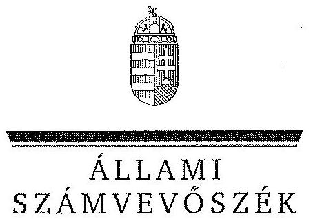
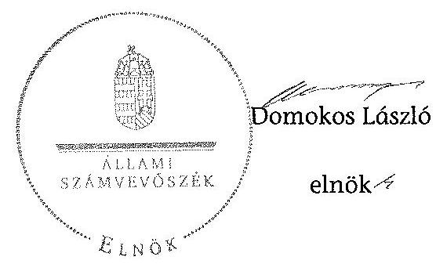
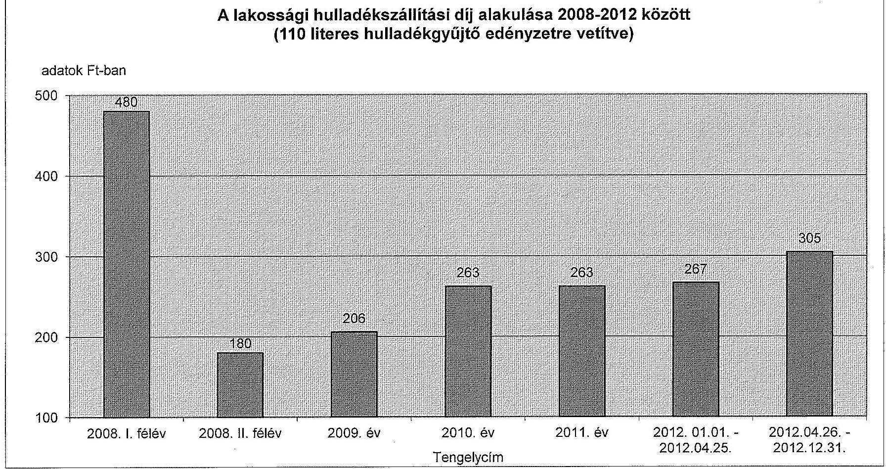
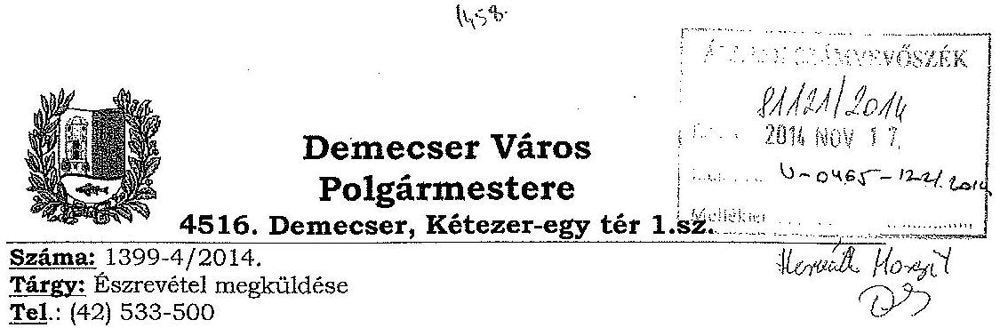
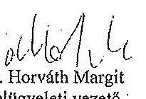

ÁLLAMI
SZÁMVEVŐSZÉK

# JELENTÉS 

Az önkormányzatok gazdasági társaságai - Az önkormányzatok többségi tulajdonában lévő gazdasági társaságok közfeladat ellátását érintő gazdálkodási tevékenysége szabályszerűségének ellenőrzése Demecseri Városgazda Szolgáltató Közhasznú Nonprofit Kft.

---

# Állami Számvevőszék 

Iktatószám: V-0465-124/2014.
Témaszám: 1499.
Vizsgálat-azonosító szám: V0671

## Az ellenőrzést felügyelte:

Dr. Horváth Margit
felügyeleti vezető
Az ellenőrzés vezette és a végrehajtásáért felelős:
Klinga László
ellenőrzésvezető
Az összefoglaló jelentést készítette:
Klinger Zoltán
számvevő
Az ellenőrzést végezték:
dr. Nagyné dr. Stieber Szatvári Tibor Ludman Zsolt Tünde
okleveles könyvvizsgáló, okleveles könyvvizsgáló, külső szakértő külső szakértő

A témához kapcsolódó eddig készített számvevőszéki jelentések:
címe
sorszáma
Jelentés Demecser Város Önkormányzata pénzügyi helyzetének 1221 ellenőrzéséről (43/4)

---

# TARTALOMJEGYZÉK 

BEVEZETÉS ..... 11
I. ÖSSZEGZŐ MEGÁLLAPÍTÁSOK, KÖVETKEZTETÉSEK, JAVASLATOK ..... 14
II. RÉSZLETES MEGÁLLAPÍTÁSOK ..... 21

1. Az Önkormányzat közfeladat-ellátásának szabályszerűsége ..... 21
1.1. A közfeladat-ellátás megszervezése és a feladatellátás feltételrendszerének kialakítása ..... 21
1.2. A közfeladat-ellátás felügyelete és a tulajdonosi jogok érvényesítése ..... 24
2. A DVSZK Nkft. közfeladat-ellátással kapcsolatos tevékenysége ..... 26
2.1. A DVSZK Nkft. gazdálkodásának szabályozottsága ..... 26
2.2. A DVSZK Nkft. vagyongazdálkodása és vagyonnyilvántartása ..... 27
2.3. A beszámolási kötelezettség teljesítése ..... 29
3. Az ellenőrzött közfeladatok bevételei és ráfordításai elszámolásának és önköltségszámításának szabályszerűsége ..... 31
3.1. Az ellenőrzött közfeladatok bevételeinek és ráfordításainak szabályszerűsége ..... 31
3.2. Az önköltségszámítás szabályszerűsége ..... 33
4. Az ÁSZ korábbi, az önkormányzatok többségi tulajdonában lévő gazdasági társaságok közfeladat-ellátását, gazdálkodását, pénzügyi helyzetét érintő javaslataira tett intézkedések ..... 34
4.1. Az Önkormányzat intézkedési terve és annak hasznosulása ..... 34

## MELLÉKLETEK

1. számú A DVSZK Nkft. tevékenységének év végi főbb adatai
2. számú A DVSZK Nkft. múködésének év végi főbb jellemzői
3. számú A lakossági hulladékszállítási díj alakulása 2008-2012 között
4. számú Beérkezett észrevételek és az azokra adott válaszok

## FÜGGELÉKEK

1. számú Mintavételi eljárások ellenőrzési területenként

---

.

---

# RÖVIDÍTÉSEK JEGYZÉKE 

## Törvények

Áht.
Civil tv.

Ebktv.
Gt. tv.
Hgt. 1
Hgt. 2

Közh. tv.
Mötv.

Nvtv.
Ötv.

Számv. tv.

## Rendeletek

Áhsz.

Ávr.
Ber.
Bkr.
224/2004. (VII. 22.)
Korm. rendelet
64/2008. (III. 28.) Korm. rendelet
az államháztartásról szóló 2011. évi CXCV. törvény 2011. évi CLXXV. törvény az egyesülési jogról, a közhasznú jogállásról (hatályos: 2011. december 14-től)
az egyenlő bánásmódról és az esélyegyenlőség előmozdításáról szóló 2003. évi CXXV. törvény
a gazdasági társaságokról szóló 2006. évi IV. törvény (hatálytalan: 2014. március 15 -étől)
a hulladékgazdálkodásról szóló 2000. évi XLIII. törvény (hatálytalan: 2013. január 1-jétől)
a hulladékról szóló 2012. évi CLXXXV. törvény (hatályos: 2013. január 1-jétől, kivéve a 95. § (6) bekezdése, ami 2015. január 1-jén lép hatályba)
a közhasznú szervezetekről szóló 1997. évi CLVI. törvény (hatálytalan: 2012. január 1-jétől)
Magyarország helyi önkormányzatairól szóló 2011. évi CLXXXIX. törvény (hatályos: 2012. január 1-jétől, kivéve a 144. § (2) bekezdésben meghatározott paragrafusok, amelyek 2012. április 15 -én, a (3) bekezdésben meghatározott paragrafusok, amelyek 2013. január 1-jén léptek hatályba, a (4) bekezdésben meghatározott paragrafusok a 2014. évi általános önkormányzati választások napján lépnek hatályba)
a nemzeti vagyonról szóló 2011. évi CXCVI. törvény
a helyi önkormányzatokról szóló 1990. évi LXV. törvény (hatálytalan: a 2014. évi általános önkormányzati választások napjától)
a számvitelről szóló 2000 . évi C. törvény
az államháztartás szervezeti beszámolási és könyvvezetési kötelezettségének sajátosságairól szóló 249/2000. (XII. 24.) Korm. rendelet
az államháztartásról szóló törvény végrehajtásáról szóló 368/2011. (XII. 31.) Korm. rendelet
a költségvetési szervek belső ellenőrzéséről szóló 193/2003. (XI. 26.) Korm. rendelet (hatálytalan: 2012. január 1-jétől)
a költségvetési szervek belső kontrollrendszeréről és belső ellenőrzéséről szóló 370/2011. (XII. 31.) Korm. rendelet
a hulladékkezelési közszolgáltató kiválasztásáról és a közszolgáltatási szerződésről (hatálytalan: 2013. szeptember 5 -étől)
a települési hulladékkezelési közszolgáltatási díj megállapításának részletes szakmai szabályairól (hatályos: 2008. április 1-jétől)

---

hulladékkezelési rendelet

SZMSZ $_{1}$

SZMSZ $_{2}$
vagyongazdálkodási rendelet $_{1}$
vagyongazdálkodási rendelet $_{2}$

## Szórövidítések

Alapító Okirat
áfa
ÁSZ
DVSZK Nkft.
FB
jegyzó
Képviselő-testület
Közszolgáltatási szerződés

Közhasznúsági szerződés $_{1}$

Közhasznúsági szerződés $_{2}$

Közhasznúsági szerződés $_{3}$

Megbízási szerződés

Nyír-Flop Kft.
Önkormányzat

Demecser Város Önkormányzatának 4/2006. (II. 03.) számú rendelete a hulladékkezelési közszolgáltatásról és a köztisztaságról (hatályos 2006. február 3-ától)
Demecser Város Önkormányzatának 5/2008. (II. 15.) számú rendelete az Önkormányzat Szervezeti és Múködési Szabályzatáról (hatályos: 2008. február 18-ától)
Demecser Város Önkormányzatának 7/2011. (IV. 13.) számú rendelete a képviselő testület szervezeti és múködési szabályzatáról (hatályos: 2011. április 15-étől)
Demecser Város Önkormányzatának 32/2006. (XII. 29.) számú rendelete az Önkormányzat vagyonáról, a vagyontárgyak feletti tulajdonosi jogok gyakorlásáról (hatályos: 2007. január 1-jétől)

Demecser Város Önkormányzatának 18/2012. (X. 25.) számú rendelete az Önkormányzat vagyonáról, a vagyontárgyak feletti tulajdonosi jogok gyakorlásáról (hatályos: 2012. november 1-jétől)

Demecseri Városgazda Szolgáltató Közhasznú Nonprofit Korlátolt Felelősségű Társaság Alapító Okirata
általános forgalmi adó
Állami Számvevőszék
Demecseri Városgazda Szolgáltató Közhasznú Nonprofit Korlátolt Felelősségű Társaság
Demecseri Városgazda Szolgáltató Nonprofit Közhasznú Korlátolt felelősségű Társaság Felügyelőbizottsága
Demecser Város Önkormányzatának jegyzője
Demecser Város Önkormányzatának Képviselő-testülete
a Demecser Város Önkormányzata és a Nyír-Flop Kft. között létrejött, 2003. április 15.-étől hatályos Közszolgáltatási szerződés és annak módosításai
a Demecser Város Önkormányzata és a Demecseri Városgazda Szolgáltató Közhasznú Nonprofit Korlátolt Felelősségű Társaság között létrejött, 2008. december 22-étől hatályos Közhasznúsági Szerződés
a Demecser Város Önkormányzata és a Demecseri Városgazda Szolgáltató Közhasznú Nonprofit Korlátolt Felelősségű Társaság között létrejött, 2010. február 3-ától hatályos Közhasznúsági Szerződés
a Demecser Város Önkormányzata és a Demecseri Városgazda Szolgáltató Közhasznú Nonprofit Korlátolt Felelősségű Társaság között létrejött, 2011. július 4-étől hatályos Közhasznúsági Szerződés
A Nyír-Flop Kft. és a DVSZK NKft. által megkötött szilárd kommunális hulladék begyűjtésének szállítására vonatkozó szerződés (hatályos 2008. január 1-jétől)
Nyír-Flop Generálkivitelező Szállítási és Szolgáltató Kft.
Demecser Város Önkormányzata

---

polgármester
ügyvezető

Üzemeltetési szerződés

Demecser Város Önkormányzatának polgármestere a Demecseri Városgazda Szolgáltató Nonprofit Korlátolt Felelősségű Társaság ügyvezetője
a Demecser Város Önkormányzata és a Demecseri Városgazda Szolgáltató Közhasznú Nonprofit Korlátolt Felelősségű Társaság között létrejött, 2011. július 4-étől hatályos Üzemeltetési szerződés

---

.

---

# ÉRTELMEZŐ SZÓTÁR 

gazdasági társaság
közfeladat
közszolgáltatás
közszolgáltatási szerződés tartalmi elemei

Gt. tv. 3. § (1) bekezdése szerint „gazdasági társaságot üzletszerü közös gazdasági tevékenység folytatására külföldi és belföldi természetes és jogi személyek, valamint jogi személyiség nélküli gazdasági társaságok alapithatnak, müködő társaságba tagként beléphetnek, társasági részesedést (részvényt) szerezhetnek."

Jogszabályban meghatározott állami vagy önkormányzati feladat, amit az arra kötelezett közérdekből, jogszabályban meghatározott követelményeknek és feltételeknek megfelelve végez, ideértve a lakosság közszolgáltatásokkal való ellátását, továbbá az állam nemzetközi szerződésekben vállalt kötelezettségeiből adódó közérdekű feladatokat, valamint e feladatok ellátásához szükséges infrastruktúra biztosítását is (Nvtv. 3. § (1) bekezdés 7. pont).

A közszolgáltatás: „közcélú, illetőleg közérdekü szolgáltatást jelent, amely egy nagyobb közösség (állam, település) minden tagjára nézve megközelítőleg azonos feltételek mellett vehető igénybe, ezért valamilyen mértékig közösségi megszervezést, illetve szabályozást, ellenőrzést igényel." Az Ebktv. 3. § d) pontja a következőképpen határozza meg a közszolgáltatást: „szerződéskötési kötelezettség alapján a lakosság alapvető szükségleteinek ellátására irányuló szolgáltatás, így különösen a villamos energia-, gáz-, hő-, víz-, szennyvíz- és hulladékkezelési, köztisztasági, postai és távközlési szolgáltatás, továbbá a menetrend alapján közlekedő járművekkel végzett közforgalmú személyszállitás."

A közszolgáltatási szerződésnek tartalmaznia kell a közszolgáltatás megnevezését, minőségi ismérveit, a teljesítésének területi kiterjedését, a közszolgáltatás megkezdésének időpontját és időtartamát, valamint annak rögzítését, hogy a közszolgáltató vállalta a megjelölt közszolgáltatás teljesítését.
A közszolgáltatási szerződésben a közszolgáltató kötelességeként kell meghatározni:
a) a közszolgáltatás folyamatos és teljes körű ellátását;
b) a közszolgáltatás meghatározott rendszer, módszer és gyakoriság szerinti teljesítését;
c) a közszolgáltatás teljesítéséhez szükséges mennyiségű és minőségű jármű, gép, eszköz, berendezés biztosítását, valamint a szükséges létszámú és képzettségű szakember alkalmazását;
d) a közszolgáltatás folyamatos, biztonságos és bővíthető teljesítéséhez szükséges fejlesztések és karbantartások

---

elvégzését;
e) a közszolgáltatás körébe tartozó hulladék ártalmatlanítására az önkormányzat képviselő-testülete által kijelölt helyek és létesítmények igénybevételét;
f) a közszolgáltató által alkalmazott közszolgáltatási díj mértékéről és az alkalmazás tapasztalatairól az önkormányzat képviselő-testületének történő legalább évenkénti egyszeri tájékoztatást;
g) a közszolgáltatás teljesítésével összefüggő adatszolgáltatás rendszeres teljesítését és meghatározott nyilvántartási rendszer múködtetését;
h) a fogyasztók számára könnyen hozzáférhető ügyfélszolgálat és tájékoztatási rendszer múködtetését;
i) a fogyasztói kifogások és észrevételek elintézési rendjének megállapítását.
A közszolgáltatási szerződésben az önkormányzat kötelességeként kell meghatározni:
a) a közszolgáltatás hatékony és folyamatos ellátásához a közszolgáltató számára szükséges információk szolgáltatását, a Hgt. 23. §-ának g) pontjára tekintettel;
b) a közszolgáltatás körébe tartozó és a településen folyó egyéb hulladékkezelési tevékenységek összehangolásának elősegítését;
c) a településen működtetett különböző közszolgáltatások összehangolásának elősegítését;
d) a települési igények kielégítésére alkalmas hulladék gyűjtésére, kezelésére, ártalmatlanítására szolgáló helyek és létesítmények kijelölését;
e) a közszolgáltató kizárólagos közszolgáltatási jogának biztosítását a 3. § (1) bekezdés a), b) és f) pontjaiban foglaltakra figyelemmel.
Az önkormányzatnak a közszolgáltatás finanszírozásában vállalt kötelezettsége esetén a közszolgáltatási szerződésben meg kell határozni a kötelezettség teljesítésének feltételeit és biztosítékait.
A közszolgáltatási szerződés tartalmazza a közszolgáltatás díjának megállapítására és beszedésére vonatkozó módszer leírását, a díjnak a szerződés megkötésekor érvényesíthető legmagasabb mértékét és a díj megváltoztatása érdekében alkalmazandó eljárást. A közszolgáltatási szerződésnek tartalmaznia kell az igazolt díjhátralék kiegyenlítésére vonatkozó eljárást. A közszolgáltatási szerződés tartalmazza azokat a feltételeket, amelyek mellett a közszolgáltató a közszolgáltatás teljesítésére közreműködőt vagy teljesítési segédet vehet igénybe, figyelemmel a Kbt. 304. § (2) bekezdésében foglaltakra is. A közszolgáltató közreműködőért vagy teljesítési segédért való felelőssége a közszolgáltatási szerződésben nem korlátozható. (224/2004. (VII. 22.) Korm. rendelet 11-14. §)

---

minősített többséget biztosító részesedés
saját tőke
tulajdonosi joggyakorló
többségi befolyást biztosító részesedés

A minősített befolyásszerző az ellenőrzött társaságban a szavazatok legalább hetvenöt százalékával rendelkezik. (Gt. tv. 52. § (2) bekezdés)
A saját tőke a - jegyzett, de még be nem fizetett tőkével csökkentett - jegyzett tőkéből, a tőketartalékból, az eredménytartalékból, a lekötött tartalékból, az értékelési tartalékból és a tárgyév mérleg szerinti eredményéből tevődik össze.
Aki a nemzeti vagyon felett az államot vagy a helyi önkormányzatot megillető tulajdonosi jogok és kötelezettségek összességének gyakorlására jogosult (Nvtv. 3. § (1) bekezdés 17. pont).
A Ptk. 685/B. § (1) bekezdése szerint „többségi befolyás: az olyan kapcsolat, amelynek révén természetes személy, jogi személy vagy jogi személyiség nélküli gazdasági társaság (a továbbiakban együtt: befolyással rendelkező) egy jogi személyben a szavazatok több mint ötven százalékával vagy meghatározó befolyással rendelkezik."

---

.

---

# JELENTÉS 

## Az önkormányzatok gazdasági társaságai - Az önkormányzatok többségi tulajdonában lévő gazdasági társaságok közfeladat ellátását érintő gazdálkodási tevékenysége szabályszerűségének ellenőrzése

## Demecseri Városgazda Szolgáltató Közhasznú Nonprofit Kft.

## BEVEZETÉS

Az Állami Számvevőszék középtávra szóló stratégiájában megfogalmazta, hogy a helyi önkormányzatok gazdálkodásában rejlő pénzügyi kockázatok feltárásával, az államháztartáson kívülre nyújtott költségvetési támogatások és ingyenes vagyonjuttatások, valamint az államháztartáson kívül múködő köz-feladat-ellátó rendszerek ellenőrzéseivel hozzájárul ahhoz, hogy a közpénzeket az államháztartáson kívül múködő szervezetek is átlátható, rendezett módon használják fel a közfeladatok szerződésben vállalt ellátása érdekében.

Az önkormányzatok szervezetalakítási szabadságának következménye, hogy a korábban is vállalati formában múködő (nagyvárosi tömegközlekedés, víz-, szennyvízcsatorna, köztisztasági, ingatlankezelés stb.) közszolgáltatások mellett, mind a kötelező, mind az önként vállalt feladatok ellátásában a gazdasági társaságok kiemelt fontosságú szerephez jutottak.

Demecser Város Önkormányzatának Képviselő-testülete a Demecseri Városgazda Szolgáltató Közhasznú Nonprofit Korlátolt Felelősségű Társaságot (DVSZK Nkft.) 2008. december 18-ával hozta létre, a Demecseri Városgazda Közhasznú Társaság jogutódjaként. A DVSZK Nkft. alaptevékenysége (főfeladat) a szenynyeződésmentesítés és egyéb hulladékkezelési feladatok elvégzése volt.

A DVSZK Nkft. az ellenőrzött időszakban a 4304 fő lakosságszámú Demecser Város területén - közhasznúsági szerződések alapján - ellátta az utak sózását, a hóeltakarítást, az utak kátyúzását, az árkok rendbetételét, az intézmények karbantartást, szállítási feladatokat, takarítást, a piac-üzemeltetést, az Önkormányzat tulajdonában lévő bér- és szolgálati lakások kezelését, továbbá a közfoglalkoztatást.

A DVSZK Nkft. az ellenőrzött időszakban Demecser Város Önkormányzat 100\%-os tulajdonában volt. A DVSZK Nkft. tulajdoni hányaddal más gazdasá-

---

gi társaságban nem rendelkezett, átlagos statisztikai létszáma 2012-ben 7 fő volt.

A DVSZK Nkft. összes bevétele 2008-ban 41,6 millió Ft, a 2012. évben 43,2 millió Ft volt, amelyből az értékesítés nettó árbevétele 2008-ban 18,1 millió Ft, míg 2012-ben 22,9 millió Ft volt. Az árbevételek az ellenőrzött időszakban $3,8 \%$-kal, a ráfordítások $13,5 \%$-kal nőttek.

A DVSZK Nkft. az ellenőrzött időszakban a 2008. évet kivéve negatív mérleg szerinti eredménnyel zárt, a 2012. évben -3,2 millió Ft összegű eredményt realizált, amelyet 20,1 millió Ft önkormányzati múködési célú támogatás igénybevételével ért el. A DVSZK Nkft. mérleg szerinti eszközállománya a 2008. évi nyitó 18,6 millió Ft-ról a 2012. év végére $140 \%$-os növekedést követően 44,6 millió Ft-ra emelkedett, ezen belül a tárgyi eszközök állománya több mint négyszeresére, 35,8 millió Ft-ra nőtt. A saját tőke a 2008. évi nyitó 16 millió Ft-ról a 2012. év végére 2,7 millió Ft-ra változott.

A településen a hulladékszállítással összefüggő feladatokat Közszolgáltatási szerződés alapján a Nyír-Flop Kft. végezte. A DVSZK Nkft. hulladékszállítási feladatokat végzett alvállalkozóként az ellenőrzött időszakban a Nyír-Flop Kft-nek Megbízási szerződés alapján, 2008. július 1 - 2012. március 30. között a Pátrohai Közhasznú Nonprofit Vagyonkezelő Kft-nek Szállítási szerződések alapján, továbbá az Észak-Alföldi Környezetgazdálkodási Kft.-nek vállalkozási szerződés alapján 2012. április 1 - december 31. között.

Az ellenőrzött időszakban a polgármester személye nem változott, a jegyző személye egy alkalommal változott. A polgármester a 2003. évi önkormányzati választások óta tölti be tisztségét, a helyszíni ellenőrzés időszakában a munkakört betöltő jegyző 2011. január 1-jétől látja el feladatait. Az ellenőrzött időszakban az ügyvezető személye egy alkalommal változott az ügyvezető igazgató 2011. március 2 -óta tölti be tisztségét. A gazdasági események könyvelését külső személy végezte, aki 2008. december 18-óta látta el a feladatot.

Az önkormányzati tulajdonú gazdasági társaságok teljes körű ellenőrzésének lehetőségét az Állami Számvevőszékről szóló 1989. évi XXXVIII. törvény 2011. január 1-jétől hatályos módosítása teremtette meg.

Az ellenőrzés célja annak értékelése volt, hogy

- az önkormányzat a jogszabályi előírások figyelembevételével döntött-e az ellenőrzésre kerülő közfeladat megszervezéséről; az önkormányzat szabályszerűen gyakorolta-e a tulajdonosi jogokat;
- a gazdasági társaság közfeladat-ellátása bevételeinek, ráfordításainak elszámolása, és vagyongazdálkodási tevékenysége megfelelt-e a jogszabályi, illetve a közszolgáltatási szerződésben foglalt tulajdonosi előírásoknak, azok végrehajtása szabályszerű volt-e;
- a közfeladatok átláthatósága és elszámoltathatósága érdekében biztosítva volt-e a közszolgáltatás díjának megalapozottsága szabályszerű önköltségszámítással.

---

Az ellenőrzés során értékeltük az ÁSZ korábbi, az Önkormányzat többségi tulajdonában lévő gazdasági társaságát érintő javaslataira tett intézkedések hasznosulását is. Az ellenőrzés kiterjedt Demecser Város Önkormányzatára és a Demecseri Városgazda Szolgáltató Közhasznú Nonprofit Korlátolt Felelősségű Társaságra.

Az ellenőrzés várható hasznosulása: A törvényalkotás számára - az észlelt problémák, szabálytalanságok, vagy egyéb nem kívánatos jelenségek felszínre kerülésével - az ellenőrzés megállapításai segítséget nyújthatnak az államháztartáson kívüli közfeladat-ellátás értékeléséhez, jogszabályi keretei pontosításához, átláthatóságot biztosító szabályozásához. Meghatározhatóvá válnak a közfeladat ellátásban részt vevő államháztartáson kívüli szervezeteknek - az önkormányzat költségvetését, pénzügyi helyzetét is befolyásoló - kockázatai, lehetővé válik ezen kockázatok csökkentése. Feltárja, hogy az önkormányzat közfeladat-ellátási kötelezettségének szabályszerűen tett-e eleget, a feladatellátáshoz rendelt közvagyon múködtetését szabályszerűen szervezte-e meg és a tulajdonosi felügyelete hozzájárult-e a közfeladat-ellátásához. A feladatot ellátó gazdasági társaság a közszolgáltatási szerződésben foglaltak betartásával, a közvagyon használatával biztosította-e a szolgáltatás folytatásának feltételeit. Ezzel az ellenőrzöttek és a helyi döntéshozók számára visszajelzést ad feladatszervezési, feladat-ellátási kockázataikról, alapot ad a meglévő hibák megszüntetéséhez, a jobb közfeladat-ellátás biztosításához. Fokozza a fegyelmet, igazolja, hogy lejárt a következmények nélküli ellenőrzések időszaka. Az ÁSZ értékteremtő rend kialakításához és megőrzéséhez hozzájáruló tevékenysége pozitív hatással van a szervezetről kialakított összkép formálására is.

A bevételek és ráfordítások elszámolása, valamint a vagyonnyilvántartás terén az egyes területek szabályszerű működését mintavétellel ellenőriztük, ez alapján a sokaságokban előforduló hibás tételek arányát becsültük. A jogszabályoknak és a belső előírásoknak megfelelőnek, azaz szabályszerűnek tekintettük az adott bevételek és ráfordítások elszámolását, a vagyonnyilvántartást, amennyiben a minta ellenőrzésének eredménye alapján $95 \%$-os bizonyossággal a teljes sokaságban a hibás tételek aránya kisebb volt, mint $10 \%$, nem megfelelőnek értékeltük, ha a hibás tételek aránya a $10 \%$-ot meghaladta. Kockázatot, illetve magas kockázatot jeleztünk, amennyiben egy adott terület vonatkozásában a minta alapján a teljes sokaságban nem volt teljes körűen biztosított a jogszabályoknak és a belső szabályzatoknak megfelelő működés (2. számú függelék).

Az ellenőrzést a számvevőszéki ellenőrzés szakmai szabályai szerint, szabályszerűségi ellenőrzés módszerével, a vonatkozó nemzetközi standardok figyelembevételével végeztük. Az ellenőrzés a 2008-2012. évekre terjedt ki.

Az ellenőrzés végrehajtásának jogszabályi alapját az Állami Számvevőszékről szóló 2011. évi LXVI. törvény 5. § (3)-(4)-(5) bekezdése képezi.

Az ÁSZ az Állami Számvevőszékről szóló 2011. évi LXVI. törvény 29. §-a alapján a jelentéstervezetet észrevételezésre megküldte a polgármesternek és a gazdasági társaság ügyvezetőjének. A beérkezett észrevételeket a jelentés véglegesítése során hasznosítottuk. Az észrevételeket és az azokra adott válaszokat a jelentés 4. számú melléklete tartalmazza.

---

# I. ÖSSZEGZŐ MEGÁLLAPÍTÁSOK, KÖVETKEZTETÉSEK, JAVASLATOK 

Demecser Város Önkormányzatának Képviselő-testülete az Önkormányzat közigazgatási területén a szilárd hulladék gyűjtése, ártalmatlanítása, hasznosítása és a közterületek tisztántartása közfeladatának ellátásáról az Ötv. előírásainak megfelelően döntött. A Képviselő-testület az SZMSZ ${ }_{1,2}$-ben előírta a közszolgáltatások körének kötelező feladatait, így a köztisztaság és a településtisztasági feladatok ellátásának kötelezettségét. Az Önkormányzat a 2006-2010. évekre gazdasági és ciklus programot, a 2011-2014. évekre gazdasági programot készített, amelyekben - többek között - átfogó célként határozták meg a lakosság életminőségének és életfeltételeinek, a közszolgáltatások színvonalának javítását, továbbá a szelektív hulladékgyűjtés szorgalmazását. A 20112014. közötti időszakra szóló gazdasági programban a DVSZK Nkft. vállalkozói tevékenységének bővítését határozták meg, azonban ehhez konkrét elképzelést, útmutatást nem fogalmaztak meg. Az Önkormányzat az ellenőrzött időszakban a Hgt. ${ }_{1}$-ben előírtakkal ellentétben nem rendelkezett hulladékgazdálkodási tervvel.

A szilárdhulladék kezelés, ártalmatlanítás és szállítás közfeladatának ellátására az Önkormányzat és a Nyír-Flop Kft. 2003. április 15-étől 10 évre szóló Közszolgáltatási szerződést kötött, amely megfelelt a 224/2004. (VII. 22.) Korm. rendeletben előírt tartalmi követelményeknek. A Közszolgáltatási szerződésben meghatározták a szerződés időtartamát, a közszolgáltató által teljesítendő települési szilárd és folyékony kommunális hulladék összegyűjtését, elszállítását, ártalmatlanítását, a díjmegállapítás módját. A felmondási szabályokat részletezték. Az Önkormányzat a tulajdonában lévő eszközöket nem bocsátott a közszolgáltató rendelkezésére. A Nyír-Flop Kft. 2008. január 1-jétől három település szilárd kommunális hulladéka begyűjtésének szállításának, kezelésének „teljesítési segédként" elvégzett részfeladatára határozatlan idejű Megbízási szerződést kötött a DVSZK Nkft.-vel. A szilárd hulladékbegyűjtését az Önkormányzat által ingyenes használatra átadott kommunális hulladékbegyűjtő célgéppel végezték el. A Megbízási szerződést a Nyír-Flop Kft. - a hulladékszállítási gépjármú meghibásodása miatt, ami gazdaságosan már nem volt javítható 2012. december 31. napjával felmondta. Az Önkormányzat a települési szilárd hulladékkezeléssel kapcsolatos feladatait - a Képviselő-testület döntésének megfelelően - közvetlenül nem a saját gazdasági társasága (DVKSZ Nkft.) útján látta el annak ellenére, hogy az Alapító Okiratban alapfeladataként az egyéb hulladékkezelési feladatok ellátását is meghatározták.

A Képviselő-testület a 2008. év végétől Közhasznúsági szerződések ${ }_{1,2,3}$-ben szabályozta az együttmúködés kereteit, megállapította mindazon feladatokat, amelyeket az Önkormányzat közfeladatainak ellátását segítve a DVSZK Nkft. elvégez Demecser Város közigazgatási területén belül. Ez alapján valósult meg az utak sózása, a hóeltakarítás, az utak kátyúzása, az árkok rendbetétele, karbantartás az intézmények által készített karbantartási terv alapján, szállítási feladatok, takarítás, a piac üzemeltetése, ingatlankezelés az Önkormányzat tulajdonában lévő bér és szolgálati lakásoknál, közhasznú foglalkoztatás, továb-

---

bá az alapító által meghatározott egyéb feladatok ellátása. A feladat ellátásához az Önkormányzat részéről ingyenes használatra átadott vagyon - a vagyongazdálkodási rendelet ${ }_{1}$-ben előírtaknak megfelelően - az Önkormányzat nyilvántartásaiban szerepelt.

A Képviselő-testület a Hgt. ${ }_{1}$-ben előírtaknak eleget tett és a települési szilárd és folyékony hulladék szervezett összegyűjtését, elszállítását, kezelését, ártalmatlanításának rendjét rendeletben szabályozta. A rendeletben meghatározták a közszolgáltatás módját, a közszolgáltatással összefüggésben az ingatlantulajdonos kötelezettségeit, és jogait, valamint a helyi közszolgáltatás kötelező igénybevételének szabályait.

Az Önkormányzat a gazdasági társasága feletti tulajdonosi jogok gyakorlásának szabályait az SZMSZ ${ }_{1,2}$-ben és a vagyongazdálkodási rendelet ${ }_{1,2}$-ben határozta meg. Az Önkormányzatot megillető tulajdonosi jogok gyakorlásával kapcsolatos jogosultságok és kötelezettségek a Képviselő-testületet illeték meg. Az ellenőrzött időszakban az SZMSZ ${ }_{1,2}$-ben és a vagyongazdálkodási rendelet ${ }_{1,2}{ }^{-}$ ben meghatározott tulajdonosi jogokat a Képviselő-testület szabályszerűen gyakorolta. A vagyongazdálkodási rendelet ${ }_{1,2}$-ben és az SZMSZ ${ }_{1,2}$-ben a tulajdonosi joggyakorlás megfelelőségéről beszámolási kötelezettséget nem írtak elő. A DVSZK Nkft. Alapító Okirata a Gt. tv.-ben meghatározottak szerint tartalmazta az ügyvezető, valamint az FB jogait és kötelezettségeit. Az FB - 20082012 között - a Képviselő-testületnek beszámolt a tárgyévi tevékenységéről, továbbá tárgyalta az éves beszámolót és könyvvizsgálói jelentést, amelynek elfogadásáról határozatban döntött. A 2008-2012. években a DVSZK Nkft. a Közhasznúsági szerződések ${ }_{1,2,3}$-ben előírt közszolgáltatási feladatait ellátta.

Az Önkormányzatnál a belső ellenőrzési feladatokat a Közép-Szabolcsi Kistérségi Többcélú Társulás Belső Ellenőrzési Társulása végezte. Az ellenőrzött időszakban a belső ellenőrzés a DVSZK Nkft.-t nem ellenőrizte, a belső ellenőrzési munkatervet megalapozó kockázatelemzés a 2008-2012. évekre vonatkozóan a DVSZK Nkft.-re nem terjedt ki. Az Önkormányzat Pénzügyi, Intézményfenntartó és Társadalmi Kapcsolatok Bizottsága a 2012. évben ellenőrizte a DVSZK Nkft.-nél két hónap számláit és bizonylatait, szabálytalanságot nem állapítottak meg.

A DVSZK Nkft.-nél a 2008. december 18-ai létrehozását követően nem tettek eleget a Számv. tv. előírásainak, mivel 90 napon belül nem léptették hatályba az előírt számviteli politikát és az annak keretében elkészítendő szabályzatokat. Az ügyvezető a Számv. tv. és a Gt. tv., továbbá az Alapító Okirat előírásait megsértve 2008. december 18. és 2011. március 30. közötti időszakban nem léptette hatályba a Számv. tv.-ben előírt, az eszközök és források leltárkészítési és leltározási, az eszközök és a források értékelési, valamint a pénzkezelési szabályzatot. A selejtezési szabályzatot 2011. március 30-ától léptetett hatályba az ügyvezető. A Számv. tv-ben előírtak ellenére az eszközök és a források leltárkészítési és leltározási szabályzatát az ellenőrzött időszakban nem készítették el és nem léptették hatályba. Az FB a 2009. április 23-i üléséről készült jegyzőkönyvben megállapította, hogy az ügyvezető nem tudta az FB rendelkezésére bocsátani a számviteli politika keretében előírt szabályzatokat, annak elkészítését azonban nem kérte számon. A 2011. március 30-ától hatályba léptetett számviteli politikában nem rögzítették a Közh. tv.-ben előírt közvetett költségek be-

---

vételarányos megosztását. A szabályozást figyelmen kívül hagyva a saját tulajdonú tárgyi eszközök értékcsökkenését évente egyszer számolták el az előírt havi rendszerességgel ellentétben. Az eszközök és források értékelési szabályzata nem tartalmazta továbbá az üzembe helyezési okmány részletes tartalmát és formai követelményeit, az elkészítés felelősét, valamint a rendeltetésszerú használatba vételkor az okmányon szereplő adatok helyességének igazolásáért felelős megnevezését. A DVSZK Nkft. az ellenőrzött időszakban a saját tulajdonú eszközei esetében nem végzett mennyiségi leltározást, megsértve ezzel a Számv. tv-ben előírtakat. A Számv. tv.-ben előírtak ellenére nem szabályozták az Önkormányzattól ingyenes használatra átvett eszközök nyilvántartásának rendjét. A DVSZK Nkft. a saját tulajdonú tárgyi eszközökről analitikus nyilvántartást vezetett. Az Önkormányzat által ingyenes használatba átadott eszközöket az átadó évente mennyiségben leltározta. A DVSZK Nkft. önköltségszámítási szabályzatot nem készített, mivel az egyszerúsített éves beszámolót készítő gazdálkodó mentesül a kötelezettség alól.

Az Önkormányzat a DVSZK Nkft.-vel a hulladékgazdálkodási feladatok ellátására közszolgáltatási szerződést nem kötött, a Közhasznúsági szerződésekben meghatározott feladatok ellátása során a DVSZK Nkft. vagyongazdálkodási tevékenysége a vagyon-nyilvántartási hiányosságok miatt nem felelt meg a Számv. tv. előírásainak. A DVSZK Nkft.-nél a befektetett eszközök értéke 2011. év végig folyamatosan csökkent, 2012. év végére az előző évhez viszonyítva nőtt. Ennek oka, hogy a pályázati támogatásból megvalósuló beruházással a labdarúgó pálya mellett új öltözőépület létesült. A DVSZK Nkft. a Számv. tvben előírtakkal ellentétben a követeléseket nem minősítette, és nem számolt el értékvesztést a határidőn túli követelések esetében. Az értékvesztés elszámolásának elmulasztásával megsértették a Számv. tv-ben rögzített óvatosság elvét, mivel a beszámoló készítésekor nem vették figyelembe a követelések realizálásának kockázatát. A DVSZK Nkft. az ellenőrzött időszakban - 2008 kivételével veszteséges volt, a ráfordítások meghaladták a bevételeket. A mérleg szerinti eredmény 2009-ben - 2766 ezer Ft, 2010-ben - 4499 ezer Ft, 2011-ben - 2913 ezer Ft, 2012-ben - 3180 ezer Ft veszteség volt, vagyis a bevételek nem nyújtottak fedezetet a tárgyévi ráfordításokra. A DVSZK Nkft. 2008. december 31-ei 16042 ezer Ft összegű saját tőkéje 2012. december 31-ére 2683 ezer Ft-ra csökkent. A DVSZK Nkft. Kft. vagyonának nyilvántartása során nem érvényesültek teljes körűen a Számv. tv. előírásai az eszközök nyilvántartása tekintetében. Ez magas kockázatot jelez az ellenőrzött terület egészének szabályos múködése szempontjából. Megállapítottuk, hogy 2011. március 2-át megelőzően az ügyvezető nem igazolta le - az alapvető adatokat tartalmazó - állományba vételi bizonylatokat, továbbá üzembe helyezési okmány nem készült. Az eljárás nem felelt meg a Számv. tv.-ben előírtaknak, amely szerint az üzembe helyezést hitelt érdemlő módon dokumentálni kell. A 2012. évben a veszteséges gazdálkodás következtében a saját tőke a jegyzett tőke alá esett, azonban a vagyonvesztés megelőzése, a csődveszély elkerülése érdekében, valamint a Gt. tv. szerinti előírások alapján intézkedési kötelezettség - az ellenőrzött időszakban - nem keletkezett.

Az Önkormányzat a DVSZK Nkft. részére a szakmai adatszolgáltatási és tájékoztatási kötelezettséget az Alapító Okiratban és a Közhasznúsági szerződések ${ }_{1,2,3}$-ben szabályozta. A DVSZK Nkft. az ellenőrzött időszakban az előírás ellenére nem rendelkezett Határozatok könyvével, így nem felelt meg az Alapítói

---

Okiratban előírtaknak, mivel alapító döntéseiről nyilvántartást nem vezetett. A DVSZK Nkft. ügyvezetője az előírtak ellenére a 2011. I. félévi gazdálkodásáról nem nyújtott be beszámolót a Képviselő-testület részére, figyelmen kívül hagyva a Közhasznúsági szerződések ${ }_{1,2,3}$-ben előírtakat. A DVSZK Nkft. az ellenőrzött időszakban folyamatosan igénybe vett könyvvizsgálói szolgáltatást. A könyvvizsgáló a 2008-2012. években az egyszerúsített éves beszámolókról szóló jelentést hitelesítő záradékkal látta el. A könyvvizsgáló a könyvvizsgálói jelentéseiben nem tárta fel azt a tényt, hogy a DVSZK Nkft. 2011. március 30-ig a Számv. tv.-ben előírt számviteli szabályzatokkal nem rendelkezett, továbbá nem hívta fel a figyelmet a saját tulajdonú eszközök mennyiségi leltározásának elmaradására. Az FB a DVSZK Nkft. 2008-2012. évekről készült számviteli beszámolóit felülvizsgálta, az arról szóló írásbeli jelentését határidőre elkészítette, amit a Képviselő-testület elfogadott. A DVSZK Nkft. az ellenőrzött időszakban a 2008., 2009. és a 2010. üzleti évről készült egyszerúsített éves beszámolóját a Számv. tv-ben előírt határidőn (május 30.) túl helyezte letétbe. A DVSZK Nkft. a 2011. december 31-éig hatályos Közh. tv. előirása, a 2012. évtől a Civil tv. előírása alapján a közhasznúsági jelentés, illetve közhasznúsági melléklet készítési kötelezettségének nem tett eleget. A szabálytalanságra az FB, illetve a könyvvizsgáló nem hívta fel a figyelmet. Az Alapító Okiratban előírt közzétételi kötelezettségnek a DVSZK Nkft. nem tett eleget.

A Közhasznúsági szerződések ${ }_{1,2,3}$ alapján végzett közfeladatok értékesítés nettó árbevételeinek elszámolása során a DVSZK Nkft. szabályszerűen járt el. A bevételek előírása és kiszámlázása a tulajdonosi követelményeknek megfelelően történt, a bevételeket a megfelelő számlacsoportba közfeladatonként elkülönítetten számolták el. A Közhasznúsági szerződések alapján végzett közfeladatok anyagjellegú ráfordításainak elszámolása során nem érvényesültek teljes körúen a Számv. tv.-ben, az eszközök és források értékelési szabályzatában és a számlarendben előírtak a költségelszámolás tekintetében. Ez kockázatot jelez az ellenőrzött terület egészének szabályos múködése szempontjából. Megállapítottuk, hogy egyes esetekben a költségek elszámolása nem a megfelelő költségnemre, illetve közfeladatra történt, ellentétben a Számv.tv.-ben előírtakkal.

A DVSZK Nkft. által végzett közszolgáltatások nem jártak díjfizetési kötelezettséggel, mivel annak ellenértékét az Önkormányzattól kapott támogatás biztosította. Az ellenőrzött időszakban a nettó árbevétel jelentős részét a hulladékszállítással kapcsolatos alvállalkozói tevékenység jelentette. A díjakat a három szerződő partnerrel (Nyír-Flop Kft., Pátrohai Közhasznú Nonprofit Vagyonkezelő Kft., Észak-Alföldi Környezetgazdálkodási Kft.) kötött szerződésekben rögzítették.

A Nyír-Flop Kft. évente költségszámítást végzett a szilárd és folyékony kommunális hulladék összegyújtésének várható önköltségéról, amelyet a Képviselőtestület megtárgyalt, és a döntés alapján előírta a hulladékszállítás díját. Az előterjesztésekben a hulladék szállítás önköltségét mutatta be, amely azonban, nem tartalmazta az üzemanyag áremeléseket, a gépjármúvek üzemanyag fogyasztásának mértékét és az ennek megfelelő díjtételt. A Nyír-Flop Kft. által benyújtott kommunális hulladékszállítás díjtételeinek ellenőrizhetősége a részletes számítások hiányában nem volt biztosított. A benyújtott kimutatás számadatainak felülvizsgálata a Képviselő-testület részéről nem történt meg, mivel a

---

Nyír-Flop Kft. gazdálkodási számadatairól az Önkormányzatnak nem volt ismerete. A dímegállapítást az összegyújtött hulladék tömegének (tonna) és a hulladék ártalmatlanításából származó bevételt alapul véve határozták meg egy éves idötartamra.

Az ÁSZ a 2011. évben Demecser Város Önkormányzata pénzügyi helyzetét ellenőrizte. A polgármesternek címzett, az önkormányzati tulajdonú gazdasági társaság a pénzügyi egyensúlyi helyzetéről félévente történő beszámolási kötelezettségének javaslatát hasznosították.

A fentiekben leírtak összegzéseként az alábbi megállapításokat tesszük:
A tulajdonos az FB-n keresztül biztosította a DVSZK Nkft. feletti kontrollt, azonban a belső ellenőrzés nem ellenőrizte, így nem segítette elő a DVSZK Nkft. szabályszerű múködésének folyamatos kontrollálását. A DVSZK Nkft.-nél kialakított számviteli rendszer nem biztosította teljes körűen a szabályszerű működéshez szükséges kereteket. A DVSZK Nkft. veszteséges gazdálkodása, a vagyonnyilvántartás és az anyagjellegű ráfordítások elszámolása területeinél tapasztalt szabálytalanságok kockázatot jeleznek a feladatellátás szabályszerűségének tekintetében.

Az Állami Számvevőszékről szóló 2011. évi LXVI. törvény 33. § (1) bekezdésében foglaltak értelmében a jelentésben foglalt megállapításokhoz kapcsolódó intézkedési tervet köteles az ellenőrzött szervezet vezetője összeállítani, és azt a jelentés kézhezvételétől számított 30 napon belül az ÁSZ részére megküldeni. Amennyiben az intézkedési tervet határidőben nem küldi meg a szervezet, vagy az nem elfogadható, az ÁSZ elnöke a hivatkozott törvény 33. § (3) bekezdés a)-b) pontjaiban foglaltakat érvényesítheti.

Az ellenőrzés intézkedést igénylő megállapításai és javaslatai:
Javaslataink célja a Nonprofit Kft. gazdálkodása szabályszerűségének helyreállítása annak érdekében, hogy a szabályozási környezet megfelelően tudja támogatni az átlátható müködést.

# Javasoljuk a Demecseri Városgazda Szolgáltató Közhasznú Nonprofit Kft. ügyvezető Igazgatójának: 

1. A DVSZK Nkft. a Számv. tv. 14. § (5) bekezdés a) pontjában előírtak ellenére az eszközök és a források leltárkészítési és leltározási szabályzatát nem készítette el. A Számv. tv. 14.§ (3) bekezdésében előírtak ellenére nem szabályozták az Önkormányzattól ingyenes használatra átvett eszközök nyilvántartásának rendjét. A Számv. tv. 14. § (3) bekezdésében előírt számviteli politikájukban nem rögzítették a Közh. tv. 18. §. (3) bekezdés d) pontjában előírtakat, miszerint a közvetett költségeket bevételarányosan kell megosztani.

---

Javaslat:

# Intézkedjen a szabályozási hiányosságok megszüntetésére, ennek keretében: 

a) készítse el és léptesse hatályba az eszközök és források leltárkészítési és leltározási szabályzatát;
b) szabályozza az ingyenes használatra átvett eszközök nyilvántartásának rendjét;
c) egészítse ki a Számviteli politikáját a közvetett költségek bevételarányos megosztásának előírásával.
2. A társaságnál a Számv. tv. 52. § (2) bekezdésének előírásai ellenére nem gondoskodtak az eszközei üzembe helyezésének hitelt érdemlő módon történő dokumentálásáról.

A saját szabályozását figyelmen kívül hagyva a DVSZK Nkft. a tárgyi eszközök értékcsökkenését évente egyszer számolta el az előírt havi rendszerességgel ellentétben.

A DVSZK Nkft. az ellenőrzött időszakban a saját tulajdonú eszközei esetében nem végzett mennyiségi leltározást, megsértve ezzel a Számv. tv. 69. §-ában előírtakat.

A DVSZK Nkft. a Számv. tv. 55. § (1) bekezdésében előírtakkal ellentétben a követeléseket nem minősítette és nem számolt el értékvesztést a határidőn túli követelések esetében. Az értékvesztés elszámolásának elmulasztásával megsértették a Számv. tv. 15. § (8) bekezdésében rögzített óvatosság elvét, mivel a beszámoló készítésekor nem vették figyelembe a követelések realizálásának kockázatát.

A közfeladatok anyagjellegű ráfordításainak elszámolásához a Számv. tv. 161/A. (2) bekezdésében foglaltak szerint a részletes könyvvezetési rendszert kialakították, ugyanakkor a társaságnál egyes költségek elszámolása nem a megfelelő költségnemre történt.

A DVSZK Nkft. az ellenőrzött időszakban a Gt. tv. 146. § (3) bekezdésének előírása ellenére nem rendelkezett Határozatok könyvével.

Nem tettek eleget a Közh. tv. 19. §. (1) és (3) bekezdése szerinti közhasznúsági jelentés, illetőleg 2012. évtől a Civil tv. 46. § (1) bekezdésében szabályozott közhasznúsági melléklet készítési kötelezettségüknek.

Javaslat:

## Intézkedjen a jogszabályi előírások szerinti gyakorlat biztosítására, ezen belül:

a) határozza meg és kérje számon az üzembe helyezési okmányok dokumentálását;
b) a tárgyi eszközök értékcsökkenését havi rendszerességgel számolja el;
c) a saját tulajdonú eszközeit mennyiségi felvétellel leltározza;

---

d) végezze el a követelések jogszabályban előírt minősítését és a határidőn túli követeléseknél a jogszabályi előírásnak megfelelően számoljon el értékvesztést;
e) biztosítsa, hogy az anyagjellegű ráfordítások elszámolása a megfelelő költségnemre történjen;
f) rendszeresítse a Határozatok könyvét a tagi döntések nyilvántartására;
g) 2012. év vonatkozásában pótolja a közhasznúsági mellékletet, egyben a továbbiakban gondoskodjon annak összeállításáról az év végi beszámoltatás keretében.

---

# II. RÉSZLETES MEGÁLLAPÍTÁSOK 

## 1. Az ÖNKORMÁNYZAT KÖZFELADAT-ELLÁTÁSÁNAK SZABÁLYSZERŰSÉGE

### 1.1. A közfeladat-ellátás megszervezése és a feladatellátás feltételrendszerének kialakítása

A köztisztaság és a településtisztaság biztosítása az Ötv. 8. § (1) bekezdése ${ }^{1}$ alapján az önkormányzat törvényi kötelezettsége. Az Önkormányzat közigazgatási területén a szilárd hulladék gyűjtése, ártalmatlanítása, hasznosítása és a közterületek tisztántartása feladatának ellátásáról közszolgáltatás megszervezése útján gondoskodott.

A Képviselő-testület az SZMSZ $_{1,2}$-ben előírta a közszolgáltatások körének kötelező feladatait, így a köztisztaság és a településtisztasági feladatok ellátásának kötelezettségét, azonban annak ellátási módját 2008-2011-ben az Ötv. 8. § (2) bekezdésében előírtak ellenére nem határozta meg.

Az Önkormányzat a 2006-2010. évekre gazdasági és ciklus programot, a 2011-2014. évekre gazdasági programot készített, amelyekben - többek között átfogó célként határozták meg a lakosság életminőségének és életfeltételeinek, a közszolgáltatások színvonalának javítását, továbbá a szelektív hulladékgyűjtés szorgalmazását. Az Önkormányzat működésével kapcsolatosan rögzítették, hogy valamennyi területen gazdaságos múködést kell elérni.

Az Önkormányzat az ellenőrzött időszakban a Hgt. 35. § (1), (3) bekezdésében előírtakkal ellentétben nem rendelkezett hulladékgazdálkodási tervvel ${ }^{2}$. A jegyző az ellenőrzött időszakban a jegyző hulladékgazdálkodási fel-adat- és hatásköréről szóló 241/2001. (XII. 10.) Korm. rendeletben ${ }^{3}$ foglalt, a hulladékgazdálkodással kapcsolatos feladatainak nem tett eleget, mivel a hulladékgazdálkodási tervet nem készítette elő̉ és a hulladékgazdálkodási terv hiányában annak végrehajtásáról kétévente nem számolt be.

A szilárdhulladék kezelés, ártalmatlanítás és szállítás közfeladatának ellátására az Önkormányzat és a Nyír-Flop Kft. 2003. április 15-étől 10 évre szóló Köz-

[^0]
[^0]:    ${ }^{1}$ A helyi közügyek, valamint a helyben biztosítható közfeladatok körében ellátandó helyi önkormányzati feladatként a hulladékgazdálkodást 2013. január 1-jétől az Mötv. 13. § (1) bekezdés 19. pontja írja elő.
    ${ }^{2}$ A Hgt. 78 § (1) bekezdésében előírtak alapján 2013. január 1-jétől a közszolgáltató legalább 3 évente - közszolgáltatói hulladékgazdálkodási tervet készít. A 2013. január 1-jei időszakot megelőzően hulladékgazdálkodási terv készítési kötelezettsége az Önkormányzatnak volt.
    ${ }^{3}$ 2013. január 1-jétől hatálytalan

---

szolgáltatási szerződést kötött. A Közszolgáltatási szerződés megfelel t a 224/2004. (VII. 22.) Korm. rendelet 11-14. §-aiban elöírt tartalmi követelményeknek.

#### Abstract

A Közszolgáltatási szerződésben meghatározták a szerződés időtartamát, a közszolgáltató által teljesítendő települési szilárd és folyékony kommunális hulladék összegyűjtését, elszállítását, ártalmatlanítását, a díjmegállapítás módját. A felmondási szabályokat részletezték. Az Önkormányzat a tulajdonában lévő, a közvagyonba tartozó eszközöket nem bocsátott a közszolgáltató rendelkezésére, így a visszaszolgáltatás garanciális feltételeiről, illetve a visszaszolgáltatás elmaradása esetén alkalmazandó szankciókról nem rendelkeztek. Kontrollokat a veszteség esetére, illetve a szakmai feladatok mérésére alkalmas mutatókat, valamint az ellátás színvonalának értékeléséhez szakmai követelményeket nem határoztak meg. A közszolgáltató a Képviselő-testületet évente legalább egyszer tájékoztatja a tevékenységéről szóló beszámolójával. Meghatározták, hogy az egységnyi díjtételre kalkulációs sémát kell használni, amelyet azonban nem csatoltak a Közszolgáltatási szerződéshez.

A DVSZK Nkft. „teljesítési segédként" a település szilárd kommunális hulladéka begyűjtésére, szállítására, kezelésére Megbízási szerződést kötött 2008. január 1jétől a Nyír-Flop Kft.-vel. A DVSZK Nkft. a szilárd hulladékbegyűjtését, az Önkormányzat által ingyenes használatra átadott kommunális hulladékbegyűjtő célgéppel végezte el, amelyet 2001-ben pályázaton szereztek be. Az üzemeltetés feltételeiről a tulajdonos önkormányzatok üzemeltetési szerződést kötöttek, amelyet az Önkormányzat határozattal elfogadott ${ }^{4}$. A szerződő önkormányzatok a kommunális hulladékgyűjtő célgépet térítésmentesen a - jogelőd Demecseri Városgazda Kht. kezelésébe adták, azzal a feltétellel, hogy köteles a szerződő önkormányzatok településein a hulladékot begyűjteni, és a környezetvédelmi jogszabályoknak megfelelő szemétgyűjtő helyre szállítani. A Megbízási szerződést a Nyír-Flop Kft. - a hulladékszállítási gépjármú meghibásodása miatt, ami gazdaságosan már nem volt javítható - 2012. december 31. napjával felmondta.

Az Önkormányzat a települési szilárd hulladékkezeléssel kapcsolatos feladatait - a Képviselő-testület döntésének megfelelően - közvetlenül nem a saját gazdasági társasága (DVKSZ Nkft.) útján látta el annak ellenére, hogy az Alapító Okiratban alapfeladataként az egyéb hulladékkezelési feladatok ellátását is meghatározták (2. számú melléklet).

A Képviselő-testület a 129/2008. (XI. 06.) számú határozatával a közhasznú társasági forma nonprofit társasági formává történő átalakulásáról döntött. Az Önkormányzat a Közhasznúsági szerződések ${ }_{1,2,3}$-ben szabályozta az együttműködés kereteit, megállapította mindazon feladatokat, amelyeket az Önkormányzat közfeladatainak ellátását segítve a DVSZK Nkft. elvégez Demecser Város közigazgatási területén belül. A helyi közszolgáltatások tárgyában létrejött Közhasznúsági szerződések ${ }_{1,2,3}$ tartalmazták azokat a közhasznúsági környezetvédelmi, köztisztasági és település tisztasági feladatokat, amelyeket az Ötv. 8. § az Önkormányzat feladataiként határozott meg (1. számú melléklet). A Közhasznúsági szerződések ${ }_{1,2,3}$ tartalmazták továbbá az

[^0]
[^0]:    ${ }^{4}$ 38/2002. (II. 14.) önkormányzati határozat

---

alapítói támogatás meghatározását, amelyet az Önkormányzat az éves költségvetés készítésekor határozott meg. A DVSZK Nkft-nek évi két alkalommal történő beszámolási kötelezettséget határoztak meg, amelynek az ügyvezető 2011. és 2012. évben nem tett eleget.

A Közhasznúsági szerződések ${ }_{1,2,3}$ alapján valósult meg az utak sózása, hóeltakarítás, utak kátyúzása, árkok rendbetétele, karbantartás az intézmények által készített karbantartási terv alapján, szállítási feladatok, takarítás, piac üzemeltetése, ingatlan kezelés az Önkormányzat tulajdonában lévő bér- és szolgálati lakásoknál, közhasznú foglalkoztatás, továbbá az alapító által meghatározott egyéb feladatok ellátása.

A Közhasznúsági szerződések ${ }_{1,2,3}$ melléklete tartalmazta a DVSZK Nkft-nek ingyenes használatra átadott eszközöket, amelyek 2008. december 31. állapot szerinti értéke bruttó 562978 ezer Ft volt. A Közhasznúsági szerződések ${ }_{1,2,3}$-ben az Alapító Okiratban és a vagyongazdálkodási rendelet ${ }_{1}$-ben a Képviselőtestület nem határozta meg a vagyon használatával, megőrzésével kapcsolatos kötelezettségeket. A DVSZK Nkft-nek ingyenes használatra átadott vagyon - a vagyongazdálkodási rendelet ${ }_{1}$-ben előírtaknak megfelelően - az Önkormányzat könyveiben szerepel, amelyre az értékcsökkenést elszámolták. Az Önkormányzat leltározási és leltárkészítési szabályzata a könyveiben nyilvántartott eszközökre évenkénti mennyiségi leltározási kötelezettséget írt elő az Áhsz. 37. § (1) bekezdésével összhangban.

A Képviselő-testület a Hgt. ${ }_{1}$ 23. §-ában előírtaknak eleget tett, a települési szilárd és folyékony hulladék szervezett összegyüjtését, elszállítását, kezelését, ártalmatlanításának rendjét rendeletben szabályozta ${ }^{5}$. A rendeletben meghatározott, a szilárd hulladékkal kapcsolatos közszolgáltatói tevékenység időtartama összhangban volt a Közszolgáltatási szerződéssel. A rendeletben meghatározták továbbá a közszolgáltatás módját, a közszolgáltatással összefüggésben az ingatlantulajdonos kötelezettségeit, és jogait, valamint a helyi közszolgáltatás kötelező igénybevételének szabályait. A rendeletben előírták a lakosságra és a gazdálkodó szervezetekre vonatkozó szabályokat, valamint a közszolgáltatás diját, a díjfizetés rendjét. Tartalmazta azokat a körülményeket, amelyek esetén a szolgáltatás igénybevevője mentességben részesülhet. A mentességek megállapítása a 64/2008. (III. 28.) Korm. rendelet 6. § (1) bekezdése és a Hgt. ${ }_{1} 23 . \S$ f) pontja alapján történt.

Mentességre jogosult a tulajdonos, ha legalább 3 hónapig ingatlana üresen áll, és ezt a tényt írásban a Polgármesteri hivatalba bejelenti, továbbá a 70 éven felüli egyedül élő lakosok részére hivatalból teljes személyes díjmentességet biztosít a szilárd lakossági hulladékszállítás díja alól az Önkormányzat.

[^0]
[^0]:    ${ }^{5} 4 / 2006$. (XI. 03.) számú rendelet

---

# 1.2. A közfeladat-ellátás felügyelete és a tulajdonosi jogok érvényesítése 

Az Önkormányzat a gazdasági társasága feletti tulajdonosi jogok gyakorlásának szabályait az SZMSZ ${ }_{1,2}$-ben és a vagyongazdálkodási rendelet ${ }_{1,2}$-ben határozta meg. Az önkormányzatot megillető tulajdonosi jogok gyakorlásával kapcsolatos jogosultságok és kötelezettségek a Képviselốtestületet illeték meg. Az ellenőrzött időszakban az SZMSZ ${ }_{1,2}$-ben és a vagyongazdálkodási rendelet ${ }_{1,2}$-ben meghatározott tulajdonosi jogokat a Képvise-lő-testület szabályszerűen gyakorolta.

Az SZMSZ ${ }_{1,2}$-ben előírtak alapján a Képviselő-testület a részére megállapított hatáskörök átruházásáról és a visszavonásról annak felmerülése időpontjában rendelettel dönt. A Képviselő-testület a DVSZK Nkft. ügyvezetőjének tulajdonosi jogok gyakorlására nem adott felhatalmazást. A vagyongazdálkodási rende-let ${ }_{1,2}$-ben és az SZMSZ-ben a tulajdonosi joggyakorlás megfelelőségéről az ügyvezető részére beszámolási kötelezettséget nem írtak elő.

A DVSZK Nkft. Alapító Okirata a Gt. tv. 26-30. §-okban meghatározottak szerint tartalmazta az ügyvezető, mint vezető tisztségviselő, és a 34-35. §-okban foglaltak szerint az FB jogait és kötelezettségeit. A Képviselő-testület az ügyvezető igazgatót, illetve az FB tagjait határozott időtartamra választotta meg.

Az ügyvezető jogosult volt a DVSZK Nkft. képviseletére és ügyeinek intézésére, a munkavállalóival szemben a munkáltatói jogok gyakorlására, köteles volt a könyvvizsgálóval a polgári jog általános szabályai szerint szerződést kötni, elkészíteni, vagy elkészíttetni a Kft. mérlegét, vagyonkimutatását, gondoskodni a jogszabályok által előírt szabályzatok nyilvántartásáról, elkészítéséről és ismertetéséről, a bejelentési kötelezettségek megtételéről, a cégbíróságnak bejelenteni a társasági szerződés módosítását.

Az FB tevékenysége kiterjedt a számviteli beszámoló vizsgálatára és arról való jelentés készítésre. Rendkívüli taggyűlés, összehívását kezdeményezheti és javaslatot tehet annak napirendjére, ha megítélése szerint az ügyvezetés tevékenysége jogszabályba, társasági szerződésbe, illetve a taggyűlés határozatába ütközik, vagy egyébként sérti a társaság érdekeit, illetve súlyosan sértő mulasztás, esemény történik. Haladéktalanul értesítési köteles a cégbíróságot, illetve a közhasznú múködést érintő kérdésekben az ügyészséget, amennyiben a Képviselőtestület a törvényes múködés helyreállítása érdekében a szükséges intézkedést nem teszi meg.

Az FB a Gt. tv. 34. § (1) bekezdésében előírtaknak megfelelően három taggal működött. Az FB-nek - a Képviselő-testület által jóváhagyott - ügyrendje szerint évente legalább két alkalommal kellett üléseznie, amelynek eleget tett. Az FB a 2008-2012. években - a Képviselő-testületnek beszámolt a tárgy évi tevékenységéről, továbbá tárgyalta az éves beszámolót és könyvvizsgálói jelentést, amelynek elfogadásáról határozatban döntött.

A 2008-2012. években a DVSZK Nkft. a Közhasznúsági szerződések ${ }_{1,2,3}$-ben előírt közszolgáltatási feladatait ellátta.

---

A Képviselő-testület a 118/2012. (VI. 27.) számú határozatával elfogadta a DVSZK Nkft. Javadalmazási szabályzatát, amelyben meghatározták, hogy a köztulajdonban álló gazdasági társaságok takarékosabb múködéséről szóló 2009. évi CXXII. tv. rendelkezései alapján a Kft. vezető tisztségviselőjének, az FB tagjainak és a könyvvizsgálónak milyen szabályok szerint adható javadalmazás. Az ellenőrzött időszakban prémium kifizetés nem történt.

Az Önkormányzat nonprofit gazdasági társaság létrehozásáról döntött, így osztalék kifizetésére nem kerülhetett sor.

A Nyír-Flop Kft. évente költségszámítást végzett a szilárd és folyékony kommunális hulladék összegyűjtésének várható önköltségéről, amelyet a Képviselőtestület megtárgyalt, és ezt követően előírta a hulladékszállítás díját ${ }^{6}$. Az Önkormányzat a kommunális hulladékszállítás javasolt díját elfogadta, kivéve a 2012. január 1. és 2012. április 26-a közötti időszakot, amikor az Önkormányzat 30 Ft+áfa ürítési díjat átvállalt a 120 literes tárolóedények estén.

Az Önkormányzatnál a belső ellenőrzési feladatokat a Közép-Szabolcsi Kistérségi Többcélú Társulás Belső Ellenőrzési Társulása végezte. Az ellenőrzött időszakban a belső ellenőrzés a DVSZK Nkft.-t nem ellenőrizte. A belső ellenőrzési munkatervet megalapozó kockázatelemzést a 2008-2011. években a Ber. 18. § (1) bekezdésében, 2012-ben a Bkr. 29. § (1) bekezdésben előírtak alapján elkészítették. A kockázatelemzésen alapuló 2008-2012. évi ellenőrzési tervek a DVSZK Nkft.-re vonatkozó ellenőrzési feladatot nem tartalmaztak. Az Önkormányzat Pénzügyi, Intézményfenntartó és Társadalmi Kapcsolatok Bizottsága a 2012. évben a Képviselő-testület 19/2012. számú határozata alapján ellenőrizte a DVSZK Nkft.-t. Az ellenőrzés tárgya a számlák, bizonylatok ellenőrzése, 2012. november 1-jétől, december 31-ig. A Bizottság jelentése alapján a két hónap számláit, bizonylatait áttekintették, szabálytalanságot nem állapítottak meg.

Az Önkormányzat az ellenőrzött időszakban a DVSZK Nkft.-t részére öszszességében 104990 ezer Ft összegben nyújtott múködési célú támogatást ${ }^{7}$. Ebből 100628 ezer Ft-ot a Közhasznúsági szerződésekben meghatározott feladatok ellátására, továbbá a 2012. évben 4362 ezer Ft-ot az iskolabusz üzemeltetésére nyújtottak. Az Önkormányzat a DVSZK Nkft. részére - az adatszolgáltatás szerint - fejlesztési célú támogatást nem nyújtott.

A Képviselő-testület a számviteli és a közhasznúsági beszámoltatások során ellenőrizte a saját tőke értékét. Az ellenőrzött időszakban a 2012. évben a veszteséges gazdálkodás következtében a saját tőke a jegyzett tőke alá esett, a jegyzett tőke értéke 2683 ezer Ft volt, ami 89,4\%-ot jelentett. Az Önkormányzatnak a vagyonvesztés megelőzése, a csődveszély elkerülése érdekében, valamint a Gt. tv. 51. §-a szerinti előírások alapján intézkedési kötelezettsége nem volt.

[^0]
[^0]:    ${ }^{6}$ 2013. évtől a Hgt. 2 47/A. § (1) bekezdésében előírtak alapján a hulladékgazdálkodási közszolgáltatási díjat a nemzeti fejlesztési miniszter rendeletben állapítja meg.
    ${ }^{7}$ 2008-ban 23307 ezer Ft-ot, 2009-ben 19600 ezer Ft-ot, 2010-ben 20660 ezer Ft-ot, 2011-ben 21341 ezer Ft-ot, 2012-ben 20062 ezer Ft-ot.

---

Az Önkormányzat mérlegen kívüli kötelezettséget a 2008-2012. években a DVSZK Nkft. vonatkozásában nem vállalt.

# 2. A DVSZK Nkft. KÖZFELAdAT-ELLÁTÁSSAL KAPCSOLATOS TEVÉKENYSÉGE 

### 2.1. A DVSZK Nkft. gazdálkodásának szabályozottsága

A DVSZK Nkft. a 2008. december 18-ai létrehozását követően nem tett eleget a Számv. tv. 14. § (11) bekezdése előírásainak, mivel 90 napon belül nem léptette hatályba a Számv. tv. 14. § (3) bekezdésében előírt számviteli politikát és a Számv. tv. 14. § (5) bekezdésében előírt, a számviteli politika keretében elkészítendő szabályzatokat. Az ügyvezető a Számv. tv. 14. § (12) bekezdésében és a Gt. tv. 12. § (1) bekezdésébe, továbbá az Alapító okirat IX. fejezet 3.4. d) pontjában előírtakat megsértve 2008. december 18. és 2011. március 30. közötti időszakban nem készítette el a Számv. tv. 14. § (5) bekezdésében előírt, az eszközök és a források leltárkészítési és leltározási, az eszközök és a források értékelési, valamint a pénzkezelési szabályzatot. Az eszközök és a források leltárkészítési és leltározási szabályzatát 2011. március 30 -át követően, az ellenőrzött időszak végéig nem készítették el. A selejtezési szabályzatot 2011. március 30 -ától léptetett hatályba az ügyvezető.

Az FB a 2009. április 23-i üléséről készült jegyzőkönyv tartalmazta, hogy az ügyvezető nem tudta az FB rendelkezésére bocsátani a számviteli politika keretében előírt szabályzatokat, azonban annak elkészítését nem kérte számon.

A Számv. tv. 14. § (4) bekezdésében előírt számviteli politikát 2011. március 30 -ától léptették hatályba. A szabályzatban nem rögzítették a Közh. tv. 18. §. (3) bekezdés d) pontjában ${ }^{8}$ elöírtakat, miszerint a közvetett költségeket bevétel arányosan kell megosztani. A gyakorlatban a tételesen el nem különíthető költségeket a vállalkozási és a közhasznú tevékenységből származó bevételek aránya alapján osztották meg a két bevételi kategória között közhasznú és vállalkozói bevételekre. A DVSZK Nkft. a számviteli politikában nem szabályozta az Önkormányzattól ingyenes használatra átvett eszközök nyilvántartásának módját, ezzel nem tett eleget a Számv. tv. 14. § (3) bekezdésében foglaltaknak, mely szerint a gazdálkodó adottságainak, körülményeinek leginkább megfelelő számviteli politikát írásba kell foglalni. A számviteli politikában a DVSZK Nkft. rendelkezett arról, hogy a tárgyi eszközök értékcsökkenését a havi zárás keretében kell elszámolni, azonban azt csak az év végi zárlati tételekkel együtt, egy összegben rögzítette.

A Szám. tv. 14. § (5) bekezdés a) pontjában előírt eszközök és a források leltárkészítési és leltározási szabályzatával az ellenőrzött időszakban a DVSZK Nkft. nem rendelkezett. A DVSZK Nkft. az ellenőrzött időszakban a saját tulajdonú eszközei esetében nem végzett mennyiségi leltározást, megsértve ezzel a Számv. tv. 69. §-ában foglaltakat. A DVSZK Nkft. a saját tulajdonú tárgyi eszközöket a főkönyvi könyvelésben és az analitikus

[^0]
[^0]:    ${ }^{8}$ A 2012. évtől a Civil tv. 21. §-a.

---

nyilvántartásban nyilvántartotta, azonban leltárral nem támasztotta alá. Az Önkormányzat által ingyenes használatba átadott eszközöket az átadó évente mennyiségben leltározta.

A Számv. tv. 14. § (5) bekezdés b) pontjában előírt eszközök és források értékelési szabályzatát, továbbá a Számv. tv. 14. § (5) bekezdés d) pontjában előírt pénzkezelési szabályzatát 2011. március 30 -ától léptették hatályba, tartalmuk megfelel a jogszabályi előírásoknak.

A DVSZK Nkft.-t - mint egyszerúsített éves beszámolót készítő vállalkozást - a Számv. tv. 14. § (6) bekezdése mentesítette az önköltségszámítás rendjére vonatkozó belső szabályzat elkészítésének kötelezettsége alól.

A DVSZK Nkft. a 2009-2011. években elkészítette üzleti tervét, azonban a 2012. évben nem készített üzleti tervet. A Képviselő-testület az éves üzleti terveket és ezzel párhuzamosan az éves Közhasznúsági szerződést elfogadta.

Az üzleti tervek tartalmazták a szervezet múködésének leírását, helyzetelemzést, és a múködéssel kapcsolatos következtetések levonását, valamint a közhasznúsági szerződés aktualizálását, az Önkormányzattól átvett feladatok részletezését, az Önkormányzat által ingyenes használatba átadott eszközök mennyiségi kimutatását, az éves költségvetést, valamint az Önkormányzat által meghatározott többlet feladatok költség igényét.

A 2011. évben az előző̉ évhez képest a Közhasznúsági szerződésben meghatározott szállítási feladatok köre kibővült a gyermekek, tanulók autóbusszal történő utaztatásával, melyhez kapcsolódóan az Önkormányzat vállalta, hogy az utaztatott tanulók alapján járó - a költségvetési törvényben meghatározott - támogatás összegét a DVSZK Nkft. részére átadott pénzeszközként biztosítja. A Képviselőtestület a 2011. évi költségvetéséről szóló 2/2011. (II. 15.) számú rendeletében öszszességében 204.52 ezer Ft múködési célú pénzeszköz átadást tervezett a DVSZK Nkft. részére. A Képviselő-testület úgy hagyta jóvá a DVSZK Nkft. részére a 2011. évre nyújtandó múködési célú támogatás összegét, hogy a DVSZK Nkft. 2011. évre vonatkozó végleges üzleti tervét még nem fogadta el. Az elfogadott üzleti terv nem tartalmazta a DVSZK Nkft. 2011. évi közhasznú feladatainak elvégzéséhez szükséges pénzeszközök tervezetét.

# 2.2. A DVSZK Nkft. vagyongazdálkodása és vagyonnyilvántartása 

A DVSZK Nkft. feladatainak ellátásához az Önkormányzattól vagyonkezelésbe - nem vett át vagyont, könyveiben a saját vagyonát tartotta nyilván. A DVSZK Nkft. a közfeladatai ellátásához szükséges vagyontárgyakat az Önkormányzattól ingyenes használatba kapta, amelyek tételeit a Közhasznúsági szerződések mellékletében rögzítették. A DVSZK Nkft. az ellenőrzött időszakban az Önkormányzattól ingyenesen használatra átvett vagyontárgyakon érték növelő beruházásokat, felújításokat nem végzett, ilyen jellegű vagyongazdálkodási döntéseket nem hozott. Ezen vagyontárgyakat nem értékesítette, használati, illetve hasznosítási jogát ellenérték fejében vagy ingyenesen nem engedte át másik fél részére.

---

A vagyoni helyzetet jellemző, főbb könyvviteli mérleg szerinti adatok 2008. január 1. és 2012. december 31. között a következők voltak:

| Megnevezés | 2008.01.01 | 2008.12.31 | 2009.12.31 | 2010.12.31 | 2011.12.31 | 2012.12.31 |
| :--: | :--: | :--: | :--: | :--: | :--: | :--: |
| Befektetett eszközök ebből: tárgyi eszközök | 10048 | 7932 | 8887 | 6561 | 5478 | 35775 |
|  | 10048 | 7932 | 8887 | 6561 | 5478 | 35775 |
| Forgóeszközök | 9535 | 9496 | 9917 | 12739 | 5566 | 7909 |
| ebből: követelések | 8975 | 7617 | 9119 | 11915 | 5187 | 7824 |
| Aktív idóbeli elhatárolások | 77 | 1159 | 1692 | 336 | 3268 | 898 |
| ESZKÖZÖK |  |  |  |  |  |  |
| ÖSSZESEN | 19660 | 18587 | 20496 | 19636 | 14312 | 44582 |
| Saját tőke | 15345 | 16042 | 13276 | 8776 | 5863 | 2683 |
| ebből: jegyzett tőke | 3000 | 3000 | 3000 | 3000 | 3000 | 3000 |
| Céltartalékok | 0 | 0 | 0 | 0 | 0 | 0 |
| Kötelezettségek | 4183 | 2224 | 7056 | 10627 | 8358 | 41712 |
| Passzív idóbeli elhatárolások | 132 | 321 | 164 | 233 | 91 | 187 |
| FORRÁSOK |  |  |  |  |  |  |
| ÖSSZESEN | 19660 | 18587 | 20496 | 19636 | 14312 | 44582 |

A DVSZK Nkft.-nél a befektetett eszközök értéke - a 2009. év kivételével - a 2011. év végig folyamatosan csökkent, a 2012. év végére az előző évhez viszonyítva nőtt. A növekedés oka, hogy a pályázati támogatásból megvalósuló beruházással a labdarúgó pálya mellett új öltözőépület létesült. A DVSZK Nkft. szabályozás hiányában - 2011. március 30 -áig nem határozta meg az értékcsökkenési leírások módszerét, azt követően a számviteli politikában lineáris módszer alkalmazásáról döntöttek, azonban a leírási kulcsokat nem rögzítették. A befektetett eszközök bruttó értéke 2008. évről 2012. évre történő 34566 ezer Ft-os növekedése meghaladta az eszközök után elszámolt 9403 ezer Ft értékcsökkenés összegét. Terven felüli értékcsökkenés (egyéb ráfordításként) elszámolására a 2010. évben került sor tárgyi eszközök selejtezése következtében.

A forgóeszközökön belül a követelések aránya a 2008. évi 80,2\%-ról a 2012. év végére $98,9 \%$-ra nőtt. A forgóeszközök között készletet, valamint értékpapírt nem tartottak nyilván. A követeléseken belül 2012. december 31-én a vevőkövetelések 55\%-át a Nyír-Flop Kft. és az Észak-Alföldi Környezetgazdálkodási Kft.-vel szembeni követelések tették ki. Az ellenőrzött időszakban behajthatatlan követelést nem írtak le, értékvesztést nem számoltak el. A DVSZK Nkft. a Számv. tv. 55. § (1) bekezdésében előírtakkal ellentétben a követeléseket nem minősítette, és nem számolt el értékvesztést a határidőn túli követelések esetében. Az értékvesztés elszámolásának elmulasztásával megsértették a Számv. tv. 15. § (8) bekezdésében rögzített óvatosság elvét, mivel a beszámoló készítésekor nem vették figyelembe a követelések realizálásának kockázatát. A

---

követelések behajtására díffizetéssel járó külső behajtó céget nem bíztak meg.

A kötelezettségek év végi állománya - utófinanszírozott beruházás miatt - a 2008. december 31-ei 2224 ezer Ft- hoz képest 2012. december 31-ére 39488 ezer Ft-tal nőtt.

A DVSZK Nkft. Kft. vagyonának nyilvántartása során nem érvényesültek teljes körűen a Számv. tv. előírásai az eszközök nyilvántartása tekintetében. Ez magas kockázatot jelez az ellenőrzött terület egészének szabályos működése szempontjából. Megállapítottuk, hogy 2011. március 2 -át megelőzően az ügyvezető nem igazolta le - az alapvető adatokat tartalmazó - állományba vételi bizonylatokat, továbbá üzembe helyezési okmány nem készült. Az eljárás nem felelt meg a Számv. tv. 52. § (2) bekezdésében előírtaknak, amely szerint az üzembe helyezést hitelt érdemlő módon dokumentálni kell.

A beruházások, aktiválások elszámolása során a tárgyi eszköz beszerzéséről a számla a külső könyvelőhöz került, aki az aktiválást a fökönyvi és analitikus nyilvántartásokban elvégezte. Az aktiválásról a könyvelő program által készített, sorszámozott „Állományba vételi bizonylat készült", amely az alapvetően szükséges adatokat tartalmazta. Az ügyvezető ezen bizonylatokat 2011. március 2 -át megelőzően nem igazolta aláírásával, ezen dátumot követően az új ügyvezető aláírásával már igazolta ezen bizonylatok hitelességét, megbízhatóságát. Üzembe helyezési okmány az üzembe helyezésekről nem készült.

Az Önkormányzat a DVSZK Nkft.-vel a hulladékgazdálkodási feladatok ellátására közszolgáltatási szerződést nem kötött, a Közhasznúsági szerződésekben meghatározott feladatok ellátása során a DVSZK Nkft. vagyongazdálkodási tevékenysége a vagyon-nyilvántartási hiányosságok miatt nem felelt meg a Számv. tv. előírásainak.

Az Önkormányzattól ingyenesen használatba átvett vagyon felett a tulajdonosi jogokat az Önkormányzat gyakorolta, így az elidegenítésükre és megterhelésükre vonatkozó belső szabályozással a DVSZK Nkft. nem rendelkezett, ennek szabályait a vagyongazdálkodási rendelet ${ }_{1,2}$-ben határozták meg.

# 2.3. A beszámolási kötelezettség teljesítése 

Az Önkormányzat a DVSZK Nkft-nek szakmai adatszolgáltatási és tájékoztatási kötelezettségét az Alapító Okiratban és a Közhasznúsági szerződések ${ }_{1,2,3}$-ben szabályozta. Az Alapító Okirat a IX. fejezet 2.3. pontjában a tulajdonos előírta, hogy az ügyvezető az alapító döntéseiről a Határozatok könyvében folyamatos nyilvántartást vezessen. A IX. fejezet 2.4. pontjában az alapító szabályozta, hogy a Határozatok könyvéből az alapító döntés tartalmának, időpontjának és hatályának világosan ki kell derülnie. A DVSZK Nkft. az ellenőrzött időszakban az előírás ellenére nem rendelkezett Határozatok könyvével, így nem felelt meg az Alapítói Okirat IX. fejezet 2.3. pontjában előírtaknak.

---

Az ellenőrzött időszakban a Közhasznúsági szerződések ${ }_{1,2,3}$-ben ${ }^{9}$ az Önkormányzat előírta, hogy a DVSZK Nkft. minden évben az első félévről július 31-ig, a második félévről a tárgy évet követő május 31-ig köteles írásban elszámolást adni az átadott feladatok tételes teljesítéséről, a teljesített bevételekről és kiadásokról.

Az ügyvezető a 2009. I. félévi és a 2010. I. félévi írásos beszámolóját a Közhasznúsági szerződések ${ }_{1,2,3}$-ben előírt július 31-i határidőn túl készítette el ${ }^{10}$. A 2009. I. félévi beszámolóban az elemzések alapjául szolgáló terv és a tény adatok nem ugyanazon adattartalommal készültek el, így az egyes közfeladatok számszaki teljesítéséről a megfelelő következtetés levonására nem voltak alkalmasak. Az Önkormányzat ennek ellenére a beszámolót és az arról készült FB jelentést elfogadta, azzal a kitétellel, hogy a könyvvizsgálónak a beszámolóhoz tett észrevételeire az ügyvezető tegye meg a megfelelő intézkedéseket, és ezek teljesítéséről a 2009. évi beszámolóban tájékoztassa a Képviselő-testületet. Az ügyvezető a tájékoztatási kötelezettségének nem tett eleget, amit a Képviselő-testület nem kifogásolt.

Az FB a 2010. I. félévi beszámolóhoz készített véleményében felhívta a figyelmet a 2010. I. félévben keletkezett veszteségre, amelynek okaként a DVSZK Nkft-nek a közhasznú feladatok elvégzéséhez a szükségesnél alacsonyabb összegű önkormányzati támogatást jelölték meg. Az Önkormányzat a 2010. évi támogatási összeg módosításáról nem döntött.

A Képviselő-testület a 23/2011. (II. 14.) számú határozatában utasította az ügyvezetőt, hogy munkaviszonya megszünése előtt készítsen pénzügyi és gazdasági beszámolót és leltárt. Az ügyvezető a beszámolót elkészítette, amit a Képviselő-testület nem tárgyalt meg, az ügyvezető a leltárkészítési kötelezettségének nem tett eleget.

A DVSZK Nkft. ügyvezetője a Közhasznúsági szerződések ${ }_{1,2,3}$-ben előírtak ellenére a 2011. I. félévi gazdálkodásáról nem nyújtott be beszámolót a Képviselő-testület felé. Az ügyvezető a 2011. és 2012. évi gazdálkodásáról szóló írásos beszámolóját elkészítette, amit a Képviselő-testület jóváhagyott.

A DVSZK Nkft. az ellenőrzött időszakban folyamatosan igénybe vett könyvvizsgálói szolgáltatást. A könyvvizsgáló a 2008-2012. években határidőre elkészítette az egyszerűsített éves beszámolókról szóló jelentést, amit hitelesítő záradékkal látott el. A könyvvizsgáló a könyvvizsgálói jelentéseiben nem tárta fel azt a tényt, hogy a DVSZK Nkft. 2011. március 30-ig a Számv. tv.-ben előírt számviteli politikával, illetve annak részeként az eszközök és a források leltárkészítési és leltározási-, az eszközök és a források értékelési- valamint pénzkezelési szabályzattal nem rendelkezett, illetve az eszközök és a források leltárkészítési és leltározási szabályzatát az azóta eltelt időszak alatt az ellenőrzés befejezésének időpontjáig sem készítette el. Nem hívta fel a figyelmet a saját tulajdonú eszközök mennyiségi leltározásának elmaradására.

[^0]
[^0]:    ${ }^{9}$ IX. fejezet 10.2. pontja
    ${ }^{10}$ 2009-ben október 9-én, 2010-ben szeptember 9-én.

---

A DVSZK Nkft. az ellenőrzött időszakban a 2008., 2009. és a 2010. üzleti évről készült egyszerűsített éves beszámolóját a Számv. tv. 153. § (1) bekezdésében előírt határidőn (május 30.) túl helyezte letétbe. A Képviselő-testület a 2008. és a 2010. évi egyszerűsített éves beszámolót az előírt letétbe helyezési határidőt (május 30.) követően fogadta el, így ezen üzleti évek tekintetében az Önkormányzat késedelme miatt nem tudtak megfelelni a letétbe helyezésre előírt határidőnek.

Az FB a DVSZK Nkft. 2008-2012. évekről készült számviteli beszámolóit áttekintette, az arról szóló írásbeli jelentését határidőre elkészítette és a Képvise-lő-testületnek elfogadásra javasolta. A Képviselő-testület az ellenőrzött időszak számviteli beszámolóit elfogadta.

A Közh. tv. 19. § (1) bekezdése 2011. december 31-éig hatályos előírása alapján a DVSZK Nkft. az éves számviteli beszámoló jóváhagyásával egyidejűleg közhasznúsági jelentés készítésére volt kötelezett, amely előírást az Alapító Okirat XI. fejezet 1. pontja is tartalmazta. A 2012. évtől a Civil tv. 46. § (1) bekezdésében előírtak szerint egyszerűsített éves beszámolójához közhasznúsági melléklet készítési kötelezettsége volt. A DVSZK Nkft. a 2008-2012. közötti időszakban a közhasznúsági jelentés, illetve melléklet készítési kötelezettségének nem tett eleget. A szabálytalanságra az FB, illetve a könyvvizsgáló nem hívta fel a figyelmet. Az Alapító Okiratban előírták a közhasznúsági jelentés elfogadását követő 15 napon belüli közzétételi kötelezettséget, azonban a közhasznúsági jelentés hiányában az előírás nem teljesült. Az Alapító Okirat XII. fejezet 1. pontjában kötelezettségként előírták, hogy a DVSZK Nkft. a létesítő okirata szerinti tevékenységének és gazdálkodásának legfontosabb adatait, beszámolóit a megye területén megjelenő legalább egy napilapban aktuálisan és rendszeresen nyilvánosságra kell hozni. Az előírásnak az ellenőrzött időszakban nem tettek eleget.

A DVSZK Nkft. az ellenőrzött időszakban az Áht. 109. § (8) bekezdése alapján kiadott közlemény szerint nem minősült a kormányzati alszektorba besorolt társaságnak, vagy egyéb szervezetnek, így az Ávr. 7. számú melléklete 29. pontjában előírt bejelentési és adatszolgáltatási kötelezettsége nem keletkezett.

# 3. Az ellenőrzött közzfaladatok bevételei és ráfordítÁsai elSzámolásáNAK És ÖNKÖLTSÉGSZÁMÍTÁSÁNAK SZABÁLYSZERÜSÉGE 

### 3.1. Az ellenőrzött közfeladatok bevételeinek és ráfordításainak szabályszerűsége

A DVSZK Nkft. az ellenőrzött időszakban a Közhasznúsági szerződések ${ }_{1,2,3}$ ben meghatározott feladatait látta el, emellett vállalkozási tevékenységet folytatott. A DVSZK Nkft. számviteli szabályzatai nem tartalmaztak a közfeladatok bevételeinek és ráfordításainak elkülönítéséhez szükséges előírásokat.

---

A Közhasznúsági szerződések ${ }_{1,2,3}$ alapján végzett közfeladatok értékesítés nettó árbevételeinek elszámolása során a DVSZK Nkft. szabályszerűen járt el, mivel a bevételek előirása és kiszámlázása a tulajdonosi követelményeknek megfelelően történt, a bevételeket a megfelelő számlacsoportba közfeladatonként elkülönítetten számolták el.

A DVSZK Nkft. a főkönyvi könyvelésében a ráfordításokat a főkönyvi számok alábontásával, illetve a 2008-2009. években a 7 -es számlaosztály, valamint a 2010-2012. években munkaszámok alkalmazásával biztosította, - elsősorban a közhasznú eredmény-kimutatás összeállításához szükséges - információkat.

A munkaszámos rendszert a DVSZK Nkft. úgy alakította ki, hogy a felmerült költségeket egy munkaszámos megbontás alapján, a közhasznúsági szerződésekben meghatározott közfeladatok szintjére alábontva osztotta meg az egyes közfeladatok között. A vállalkozási tevékenységeket szolgáló költségeket egy összegben tartották nyilván.

A Közhasznúsági szerződések alapján végzett közfeladatok anyagjellegú ráfordításainak elszámolása során nem érvényesültek teljes körűen a Számv. tv.-ben, az eszközök és források értékelési szabályzatában és a számlarendben előírtak a költségelszámolás tekintetében. Ez kockázatot jelez az ellenőrzött terület egészének szabályos működése szempontjából. Megállapítottuk, hogy egyes esetekben a költségek elszámolása nem a megfelelő költségnemre, illetve közfeladatra történt, ellentétben a Számv. tv. 161/A. § (2) bekezdésében előírtakkal.

Az Önkormányzat által „ingyenes használatba adott" hulladékgyűjtő gépjárművön 2011-ben végzett összesen 1649,2 ezer Ft összegű felújítást szabálytalanul nem a megfelelő költségnemre számolták el a 2011. március 30 -ától hatályos eszközök és források értékelési szabályzatában előírtakkal ellentétben.

Az Önkormányzattól bérelt autóbusz 395,1 ezer Ft összegű karbantartását a 2012. évben az 523-as főkönyvi számla helyett, szabálytalanul az 522-es bérleti dij főkönyvi számlán számolták el a számlarendben meghatározottakkal ellentétben.

A 2011. évben több közfeladatot érintő 518,4 ezer Ft-ot nem bontották meg közfeladatonként, szabálytalanul az előre nem látható karbantartási tartalék fókönyvi számon könyvelték.

A DVSZK Nkft. az ellenőrzött időszakban a 2008. év kivételével veszteséges volt, a ráfordítások ${ }^{11}$ meghaladták a bevételeket ${ }^{12}$. A mérleg szerinti eredmény 2009-ben 2766 ezer Ft, 2010-ben 4499 ezer Ft, 2011-ben 2913 ezer Ft, 2012-ben 3180 ezer Ft veszteség volt.

A DVSZK Nkft. 2008. december 31-ei 16042 ezer Ft összegű saját tőkéje 2012. december 31-ére 2683 ezer Ft-ra csökkent. A saját tőke értéke

[^0]
[^0]:    ${ }^{11}$ A ráfordítások összege 2008-ban 40865 ezer Ft, 2009-ben 79109 ezer Ft, 2010-ben 61520 ezer Ft, 2011-ben 60891 ezer Ft, 2012-ben 46386 ezer Ft volt.
    ${ }^{12}$ A bevételek összege 2008-ban 41578 ezer Ft, 2009-ben 76343 ezer Ft, 2010-ben 57021 ezer Ft, 2011-ben 57978 ezer Ft, 2012-ben 43206 ezer Ft volt.

---

2012. december 31-én a jegyzett tőke ( 3000 ezer Ft, amely az ellenőrzött időszak alatt nem változott) értéke alá került. A könyvvizsgáló a 2012. évi egyszerűsítet éves beszámoló könyvvizsgálatának jelentése mellett külön levélben tájékoztatta a Képviselő-testületet arról, hogy a Gt. tv. 51. § (1), továbbá a Számv. tv. 38. § (4) bekezdéseiben foglaltak alapján a tulajdonosnak az adott helyzetben a kötelezően előírt intézkedéseket meg kell tennie, azonban ilyen kötelezettség nem volt. Ezáltal a könyvvizsgáló az előírt tájékoztatási kötelezettségének eleget tett. Az Önkormányzat a DVSZK Nkft. 2012. évi beszámolóját a könyvvizsgáló véleményének figyelembevételével elfogadta, de külön intézkedések megtételéről nem határozott.

# 3.2. Az önköltségszámítás szabályszerűsége 

A DVSZK Nkft. az ellenőrzött időszakban önköltségszámítási szabályzat készítésére a Számv. tv. 14. § (6) és (7) bekezdéseiben előírtak figyelembe vételével nem volt kötelezett. A DVSZK Nkft. által végzett közszolgáltatások nem jártak díffizetési kötelezettséggel, mivel annak ellenértékét az Önkormányzattól kapott támogatás biztosította. Az ellenőrzött időszakban a nettó árbevétel jelentős részét a hulladékszállítással kapcsolatos alvállalkozói tevékenység jelentette. A díjakat a három szerződő partnerrel ${ }^{13}$ kötött szerződésekben rögzítették.

A Nyír-Flop Kft-vel a 2008-2012. évek között - Megbízási szerződések alapján - a szilárd hulladék heti rendszerességű begyűjtésének és beszállitásának a Demecseri kommunális szilárdhulladék lerakó telepre (üzemeltető: Nyír-Flop Kft.) díja (áfa nélkül), 2008. január 1-jétől Demecserben 280 Ft/ingatlan/hó ( 1389 db hulladékgyűjtő edény), Nyírbogdányban 250 Ft/ingatlan/hó ( 932 db hulladékgyűjtő edény), Gégényben 280 Ft/ingatlan/hó ( 649 db hulladékgyűjtő edény) volt. A díjak 2008. július 1-jétől mindhárom település vonatkozásában egységesen 300 Ft/ingatlan/hó összegre, majd 2010. január 1-jétől 350 Ft/ingatlan/hó összegre változtak. A Megbízási szerződés 2010. január 31-ét követően Nyírbogdány Község vonatkozásában megszűnt. Demecser Város, valamint Gégény Község vonatkozásában DVSZK Nkft. 2012. december 31-ei hatállyal felmondta a szerződést, amelynek indoka volt, hogy a begyűjtésre használt jármű olyan mértékben meghibásodott, hogy nem teszi lehetővé a szerződésben foglaltak teljesítését, a javítás költsége pedig nem fedezi a szerződött begyűjtési díj.

A Pátrohai Vagyonkezelő Kft-vel 2008. július 1-jével, majd - névváltozást követően - 2011. április 18-ától a Pátrohai Közhasznú Nonprofit Vagyonkezelő Kft-vel kötött Szállítási szerződések alapján a szilárd hulladék heti rendszerességű begyűjtésének és beszállitásának a Demecseri kommunális szilárdhulladék lerakó telepre feladatért járó díj Pátroha Község vonatkozásában, 800 db 120 literes hulladékgyűjtő edény figyelembe vételével (áfa nélkül), 2008. július 1-jétől 180 Ft/kuka/hó, 2009. január 1-jétől 208 Ft/kuka/hó volt. A feltételek 2010. január 1jétől annyiban változtak, hogy a hulladékgyűjtő edények darabszáma 820 db-ra változott, továbbá ettől az időponttól már nem Demecseri kommunális szilárdhulladék lerakó telepre, hanem a Kisvárdai kommunális szilárdhulladék lerakó telepre (melyet az Észak-Alföldi Környezetgazdálkodási Kft. üzemeltetett) kellett a hulladékokat szállítani. A szállítási díj már tartalmazta a kommunális szilárd hulladék lerakási és ártalmatlanítási költségeit is, ezáltal a díj $640 \mathrm{Ft} / \mathrm{kuka} / \mathrm{hó}$

[^0]
[^0]:    ${ }^{13}$ Nyír-Flop Kft., Észak-Alföldi Környezetgazdálkodási Kft., Pátrohai Vagyonkezelő Kft.

---

összegre növekedett. 2011. január 1-jétől a díj $760 \mathrm{Ft} / \mathrm{kuka} / \mathrm{hó}$ összegre változott, 2012. január 1-jétől 2012. március 30 -áig $755 \mathrm{Ft} / \mathrm{kuka} / \mathrm{hó}$ volt. A Szállítási szerződés közös megegyezéssel 2012. március 30 -ával megszűnt.

Az Észak-Alföldi Környezetgazdálkodási Kft.-vel Pátroha Község vonatkozásában 2012. április 1.- december 31. közötti időtartamra kötöttek vállalkozási szerződést hulladékgyűjtési és szállítási feladatra. A vállalkozási díj ingatlanonként és hetente $80 \mathrm{Ft}+$ áfa.

A 2011. július 4-étől végzett személyszállítási szolgáltatások ( 2 db autóbusz) díjainak meghatározása közhasznú igénybevételnél a Közép Szabolcsi Kistérségi Társulásnál az Önkormányzat által elnyert pályázat előírásának megfelelően, a vállalkozási igénybevételnél pedig a környezetükben múködő más személyszállítással foglalkozó cégek aktuális árainak alapulvételével történt. Az üzemeltetési szerződésekben meghatározott díj mértéke $190 \mathrm{Ft} / \mathrm{km}$ volt.

A Nyír-Flop Kft. az Önkormányzat részére évente költségszámítást végzett a szilárd és folyékony kommunális hulladék összegyűjtésének várható önköltségéről. Az elő́terjesztésekben a hulladék szállítás önköltségét mutatta be, amely azonban, nem tartalmazta az üzemanyag áremeléseket, a gépjárművek üzemanyag fogyasztásának mértékét és az ennek megfelelő díjtételt. A NyírFlop Kft. által benyújtott kommunális hulladékszállítás díjtételeinek ellenőrizhetősége a részletes számítások hiányában nem volt biztosított. A benyújtott kimutatás számadatainak felülvizsgálata a Képviselő-testület részéről nem történt meg, mivel a Nyír-Flop Kft. gazdálkodási számadatairól az Önkormányzatnak nem volt ismerete. Az összefoglaló árkalkulációt a Nyír-Flop Kft. szöveges beszámolóval támasztotta alá. A díjmegállapítást az összegyűjtött hulladék súlyának (tonna) és a hulladék ártalmatlanításából származó bevételt alapul véve határozták meg egy éves időtartamra.

Az Önkormányzatnál a lakossági hulladékszállítási és kezelési díj - 110 és 120 literes hulladékgyűjtő edényre számolva - 2008. június 30 -áig $400 \mathrm{Ft}+$ áfa, 2008. július 1-jétől $150 \mathrm{Ft}+$ áfa, azt követően 2009 . december 31 -éig $168 \mathrm{Ft}+$ áfa, a 2010. évtől 2012. április 25 -éig $210 \mathrm{Ft}+$ áfa, december 31 -éig $240 \mathrm{Ft}+$ áfa volt (3. számú melléklet).
4. Az ÁSZ KORÁBBI, AZ ÖNKORMÁNYZATOK TÖBBSÉGI TULAJDONÁBAN LÉVŐ GAZDASÁGI TÁRSASÁGOK KÖZFELADAT-ELLÁTÁSÁT, GAZDÁLKODÁSÁT, PÉNZÜGYI HELYZETÉT ÉRINTŐ JAVASLATAIRA TETT INTÉZKEDÉSEK

# 4.1. Az Önkormányzat intézkedési terve és annak hasznosulása 

Az ÁSZ a 2011. évben Demecser Város Önkormányzata pénzügyi helyzetét ellenőrizte ${ }^{14}$.

[^0]
[^0]:    ${ }^{14}$ Az ÁSZ 2012. évi Jelentése Demecser Város Önkormányzata pénzügyi helyzetének ellenőrzéséről (43/4).

---

Az ÁSZ a polgármesternek javasolta, hogy az önkormányzati tulajdonú gazdasági társaság félévente számoljon be a pénzügyi egyensúlyi helyzetéről. A Kép-viselő-testület az ÁSZ megállapításokat megtárgyalta, és a 85/2012. (V. 21.) számú határozat alapján intézkedési tervet és reorganizációs programot fogadott el. A javaslat hasznosult, mivel az ügyvezető 2012. június 25 -én beszámolót készített a Képviselő-testületnek, amit a 172/2012. (IX. 19.) számú határozatával elfogadott. Ezen túlmenően előírta, hogy a DVSZK Nkft. 2013. január 1-jével készítsen üzleti tervet, amely elöírást a reorganizációs programba is beépítettek.

Budapest, 2015. felma: hó 2. nap

Melléklet: $\quad 4 \mathrm{db}$
Függelék: $\quad 1 \mathrm{db}$

---

# **SOLUTIONS**

## **PROBLEM 1**

### **Part (a)**

1. **Step 1:**
   - Let the number of the points in the equation (a) be equal to the number of points in the equation (b) in the equation (c) in the equation (d) in the equation (e).
   - The number of points in the equation (a) is equal to the number of points in the equation (b).
   - The equation (a) is called the number of points in the equation (b).
   - The number of points in the equation (a) is equal to the number of points in the equation (b).
   - The equation (a) is called the number of points in the equation (a).
   - The equation (a) is called the number of points in the equation (a).
   - The equation (a) is called the number of points in the equation (a).
   - The equation (a) is called the number of points in the equation (a).
   - The equation (a) is called the number of points in the equation (a).
   - The equation (a) is called the number of points in the equation (a).
   - The equation (a) is called the number of points in the equation (a).
   - The equation (a) is called the number of points in the equation (a).
   - The equation (a) is called the number of points in the equation (a).
   - The equation (a) is called the number of points in the equation (a).
   - The equation (a) is called the number of points in the equation (a).
   - The equation (a) is called the number of points in the equation (a).
   - The equation (a) is called the number of points in the equation (a).
   - The equation (a) is called the number of points in the equation (a).
   - The equation (a) is called the number of points in the equation (a).
   - The equation (a) is called the number of points in the equation (a).
   - The equation (a) is called the number of points in the equation (a).
   - The equation (a) is called the number of points in the equation (a).
   - The equation (a) is called the number of points in the equation (a).
   - The equation (a) is called the number of points in the equation (a).
   - The equation (a) is called the number of points in the equation (a).
   - The equation (a) is called the number of points in the equation (a).
   - The equation (a) is called the number of points in the equation (a).
   - The equation (a) is called the number of points in the equation (a).
   - The equation (a) is called the number of points in the equation (a).
   - The equation (a) is called the number of points in the equation (a).
   - The equation (a) is called the number of points in the equation (a).
   - The equation (a) is called the number of points in the equation (a).
   - The equation (a) is called the number of points in the equation (a).
   - The equation (a) is called the number of points in the equation (a).
   - The equation (a) is called the number of points in the equation (a).

---

A DVSZK Nkft. tevékenységének év végi főbb adatai

|  Sorszám | Megnevezés | 2008. | 2009. | 2010. | 2011. | 2012.  |
| --- | --- | --- | --- | --- | --- | --- |
|  1. | A gazdasági társaság székhelye | 4516 Demecser, Szent István út 2-4. | 4516 Demecser, Szent István út 2-4. | 4516 Demecser, Szent István út 2-4. | 4516 Demecser, Szent István út 2-4. | 4516 Demecser, Szent István út 2-4.  |
|  2. | adószáma | 14569355-2-15 |  |  |  |   |
|  3. | alapításának éve | 2002. év |  |  |  |   |
|  4. | A gazdasági társaság többségi tulajdonú leányvállalatainak száma (db) | 0 | 0 | 0 | 0 | 0  |
|  5. | A gazdasági társaság leányvállalataiban való részesedésének mértéke (\%) | - | - | - | - | -  |
|  6. | Az önkormányzat számára (megbízásából, koncessziós, közszolgáltatási, vagy egyéb szerződéses jogviszony alapján) ellátott közfeladatok szakági besorolása: |  |  |  |  |   |
|  7. | Egészségügy |  |  |  |  |   |
|  8. | Kultúra és sport |  |  |  |  |   |
|  9. | Település üzemeltetés, ezen belül: |  |  |  |  |   |
|  10. | közremető üzemeltetés |  |  |  |  |   |
|  11. | kéményseprés |  |  |  |  |   |
|  12. | helyi közutak fejlesztése, fenntartása és üzemeltetése | $x$ | $x$ | $x$ | $x$ | $x$  |
|  13. | parkok és egyéb közterület fenntartás | $x$ | $x$ | $x$ | $x$ | $x$  |
|  14. | közterületi parkolás |  |  |  |  |   |
|  15. | Lakás és helységgazdálkodás | $x$ | $x$ | $x$ | $x$ | $x$  |
|  16. | Viz és csatorna közmú-szolgáltatás |  |  |  |  |   |
|  17. | Hulladékkezelés- szállítás |  |  |  |  |   |
|  18. | Távhő- és energiaszolgáltatás |  |  |  |  |   |
|  19. | Helyi közösségi közlekedés |  |  |  |  |   |
|  20. | Vagyongazdálkodás |  |  |  |  |   |
|  21. | Pénzügyi gazdasági szolgáltatás |  |  |  |  |   |
|  22. | Egyéb: közigazgazgatási kiegészítő szolgáltatás, Gyermekétkeztetés szociális étkeztetésben közreműködés | $x$ | $x$ | $x$ | $x$ | $x$  |
|  23. | A közfeladatellátására a gazdasági társaságnál alkalmazottak éves átlagos statisztikai létszáma | 12 | 5 | 7 | 7 | 7  |

---

# **SOLUTIONS**

## **PROBLEM 1**

### **Part (a)**

1. **Step 1:**
   - The problem is to find the value of $$x$$ from $$y$$.
   - The value of $$x$$ is given by $$x = \frac{1}{x-1}$$.

2. **Step 2:**
   - The problem is to find the value of $$x = 0$$.
   - The value of $$x$$ is given by $$x = \frac{1}{x-1} = 0$$.

3. **Step 3:**
   - The problem is to find the value of $$x = 1$$.
   - The value of $$x$$ is given by $$x = \frac{1}{1 - 1} = 1$$.

4. **Conclusion:**
   - The problem is to find the value of $$x = 1$$.

## **PROBLEM 2**

### **Part (a)**

1. **Step 1:**
   - The problem is to find the value of $$x = 1$$.
   - The value of $$x$$ is given by $$x = \frac{1}{1 - 1} = 1$$.

2. **Step 2:**
   - The problem is to find the value of $$x = 1$$.
   - The value of $$x$$ is given by $$x = \frac{1}{1 - 1} = 1$$.

3. **Step 3:**
   - The problem is to find the value of $$x = 1$$.

4. **Conclusion:**
   - The problem is to find the value of $$x = 1$$.

## **PROBLEM 3**

### **Part (a)**

1. **Step 1:**
   - The problem is to find the value of $$x = 1$$.
   - The value of $$x$$ is given by $$x = \frac{1}{1 - 1} = 1$$.

2. **Step 2:**
   - The problem is to find the value of $$x = 1$$.
   - The value of $$x$$ is given by $$x = \frac{1}{1 - 1} = 1$$.

3. **Step 3:**
   - The problem is to find the value of $$x = 1$$.

4. **Conclusion:**
   - The problem is to find the value of $$x = 1$$.

## **PROBLEM 4**

### **Part (a)**

1. **Step 1:**
   - The problem is to find the value of $$x = 1$$.
   - The value of $$x$$ is given by $$x = \frac{1}{1 - 1} = 1$$.

2. **Step 2:**
   - The problem is to find the value of $$x = 1$$.

3. **Step 3:**
   - The problem is to find the value of $$x = 1$$.

4. **Conclusion:**
   - The problem is to find the value of $$x = 1$$.

## **PROBLEM 5**

### **Part (a)**

1. **Step 1:**
   - The problem is to find the value of $$x = 1$$.
   - The value of $$x$$ is given by $$x = \frac{1}{1 - 1} = 1$$.

2. **Step 2:**
   - The problem is to find the value of $$x = 1$$.

3. **Step 3:**
   - The problem is to find the value of $$x = 1$$.

4. **Conclusion:**
   - The problem is to find the value of $$x = 1$$.

## **PROBLEM 6**

### **Part (a)**

1. **Step 1:**
   - The problem is to find the value of $$x = 1$$.
   - The value of $$x$$ is given by $$x = \frac{1}{1 - 1} = 1$$.

2. **Step 2:**
   - The problem is to find the value of $$x = 1$$.

3. **Step 3:**
   - The problem is to find the value of $$x = 1$$.

4. **Conclusion:**
   - The problem is to find the value of $$x = 1$$.

## **PROBLEM 7**

### **Part (a)**

1. **Step 1:**
   - The problem is to find the value of $$x = 1$$.
   - The value of $$x$$ is given by $$x = \frac{1}{1 - 1} = 1$$.

2. **Step 2:**
   - The problem is to find the value of $$x = 1$$.

3. **Step 3:**
   - The problem is to find the value of $$x = 1$$.

4. **Conclusion:**
   - The problem is to find the value of $$x = 1$$.

## **PROBLEM 8**

### **Part (a)**

1. **Step 1:**
   - The problem is to find the value of $$x = 1$$.
   - The value of $$x$$ is given by $$x = \frac{1}{1 - 1} = 1$$.

2. **Step 2:**
   - The problem is to find the value of $$x = 1$$.

3. **Step 3:**
   - The problem is to find the value of $$x = 1$$.

4. **Conclusion:**
   - The problem is to find the value of $$x = 1$$.

## **PROBLEM 9**

### **Part (a)**

1. **Step 1:**
   - The problem is to find the value of $$x = 1$$.
   - The value of $$x$$ is given by $$x = \frac{1}{1 - 1} = 1$$.

2. **Step 2:**
   - The problem is to find the value of $$x = 1$$.

3. **Step 3:**
   - The problem is to find the value of $$x = 1$$.

4. **Conclusion:**
   - The problem is to find the value of $$x = 1$$.

## **PROBLEM 10**

### **Part (a)**

1. **Step 1:**
   - The problem is to find the value of $$x = 1$$.
   - The value of $$x$$ is given by $$x = \frac{1}{1 - 1} = 1$$.

2. **Step 2:**
   - The problem is to find the value of $$x = 1$$.

3. **Step 3:**
   - The problem is to find the value of $$x = 1$$.

4. **Conclusion:**
   - The problem is to find the value of $$x = 1$$.

## **PROBLEM 2**

### **Part (a)**

1. **Step 1:**
   - The problem is to find the value of $$x = 1$$.
   - The value of $$x$$ is given by $$x = \frac{1}{1 - 1} = 1$$.

2. **Step 2:**
   - The problem is to find the value of $$x = 1$$.

3. **Step 3:**
   - The problem is to find the value of $$x = 1$$.

4. **Conclusion:**
   - The problem is to find the value of $$x = 1$$.

## **PROBLEM 3**

### **Part (a)**

1. **Step 1:**
   - The problem is to find the value of $$x = 1$$.
   - The value of $$x$$ is given by $$x = \frac{1}{1 - 1} = 1$$.

2. **Step 2:**
   - The problem is to find the value of $$x = 1$$.

3. **Step 3:**
   - The problem is to find the value of $$x = 1$$.

4. **Conclusion:**
   - The problem is to find the value of $$x = 1$$.

## **PROBLEM 4**

### **Part (a)**

1. **Step 1:**
   - The problem is to find the value of $$x = 1$$.
   - The value of $$x$$ is given by $$x = \frac{1}{1 - 1} = 1$$.

2. **Step 2:**
   - The problem is to find the value of $$x = 1$$.

3. **Step 3:**
   - The problem is to find the value of $$x = 1$$.

4. **Conclusion:**
   - The problem is to find the value of $$x = 1$$.

## **PROBLEM 5**

### **Part (a)**

1. **Step 1:**
   - The problem is to find the value of $$x = 1$$.
   - The value of $$x$$ is given by $$x = \frac{1}{1 - 1} = 1$$.

2. **Step 2:**
   - The problem is to find the value of $$x = 1$$.

3. **Step 3:**
   - The problem is to find the value of $$x = 1$$.

4. **Conclusion:**
   - The problem is to find the value of $$x = 1$$.

## **PROBLEM 6**

### **Part (a)**

1. **Step 1:**
   - The problem is to find the value of $$x = 1$$.
   - The value of $$x$$ is given by $$x = \frac{1}{1 - 1} = 1$$.

2. **Step 2:**
   - The problem is to find the value of $$x = 1$$.

3. **Step 3:**
   - The problem is to find the value of $$x = 1$$.

4. **Conclusion:**
   - The problem is to find the value of $$x = 1$$.

## **PROBLEM 7**

### **Part (a)**

1. **Step 1:**
   - The problem is to find the value of $$x = 1$$.
   - The value of $$x$$ is given by $$x = \frac{1}{1 - 1} = 1$$.

2. **Step 2:**
   - The problem is to find the value of $$x = 1$$.

3. **Step 3:**
   - The problem is to find the value of $$x = 1$$.

4. **Conclusion:**
   - The problem is to find the value of $$x = 1$$.

## **PROBLEM 8**

### **Part (a)**

1. **Step 1:**
   - The problem is to find the value of $$x = 1$$.
   - The value of $$x$$ is given by $$x = \frac{1}{1 - 1} = 1$$.

2. **Step 2:**
   - The problem is to find the value of $$x = 1$$.

3. **Step 3:**
   - The problem is to find the value of $$x = 1$$.

4. **Conclusion:**
   - The problem is to find the value of $$x = 1$$.

## **PROBLEM 9**

### **Part (a)**

1. **Step 1:**
   - The problem is to find the value of $$x = 1$$.
   - The value of $$x$$ is given by $$x = \frac{1}{1 - 1} = 1$$.

2. **Step 2:**
   - The problem is to find the value of $$x = 1$$.

3. **Step 3:**
   - The problem is to find the value of $$x = 1$$.

4. **Conclusion:**
   - The problem is to find the value of $$x = 1$$.

## **PROBLEM 10**

### **Part (a)**

1. **Step 1:**
   - The problem is to find the value of $$x = 1$$.
   - The value of $$x$$ is given by $$x = \frac{1}{1 - 1} = 1$$.

2. **Step 2:**
   - The problem is to find the value of $$x = 1$$.

3. **Step 3:**
   - The problem is to find the value of $$x = 1$$.

4. **Conclusion:**
   - The problem is to find the value of $$x = 1$$.

## **PROBLEM 11**

### **Part (a)**

1. **Step 1:**
   - The problem is to find the value of $$x = 1$$.
   - The value of $$x$$ is given by $$x = \frac{1}{1 - 1} = 1$$.

2. **Step 2:**
   - The problem is to find the value of $$x = 1$$.

3. **Step 3:**
   - The problem is to find the value of $$x = 1$$.

4. **Conclusion:**
   - The problem is to find the value of $$x = 1$$.

## **PROBLEM 12**

### **Part (a)**

1. **Step 1:**
   - The problem is to find the value of $$x = 1$$.
   - The value of $$x$$ is given by $$x = \frac{1}{1 - 1} = 1$$.

2. **Step 2:**
   - The problem is to find the value of $$x = 1$$.

3. **Step 3:**
   - The problem is to find the value of $$x = 1$$.

4. **Conclusion:**
   - The problem is to find the value of $$x = 1$$.

## **PROBLEM 2**

### **Part (a)**

1. **Step 1:**
   - The problem is to find the value of $$x = 1$$.
   - The value of $$x$$ is given by $$x = \frac{1}{1 - 1} = 1$$.

2. **Step 2:**
   - The problem is to find the value of $$x = 1$$.

3. **Step 3:**
   - The problem is to find the value of $$x = 1$$.

4. **Conclusion:**
   - The problem is to find the value of $$x = 1$$.

## **PROBLEM 3**

### **Part (a)**

1. **Step 1:**
   - The problem is to find the value of $$x = 1$$.
   - The value of $$x$$ is given by $$x = \frac{1}{1 - 1} = 1$$.

2. **Step 2:**
   - The problem is to find the value of $$x = 1$$.

3. **Step 3:**
   - The problem is to find the value of $$x = 1$$.

4. **Conclusion:**
   - The problem is to find the value of $$x = 1$$.

## **PROBLEM 4**

### **Part (a)**

1. **Step 1:**
   - The problem is to find the value of $$x = 1$$.
   - The value of $$x$$ is given by $$x = \frac{1}{1 - 1} = 1$$.

2. **Step 2:**
   - The problem is to find the value of $$x = 1$$.

3. **Step 3:**
   - The problem is to find the value of $$x = 1$$.

4. **Conclusion:**
   - The problem is to find the value of $$x = 1$$.

## **PROBLEM 5**

### **Part (a)**

1. **Step 1:**
   - The problem is to find the value of $$x = 1$$.
   - The value of $$x$$ is given by $$x = \frac{1}{1 - 1} = 1$$.

2. **Step 2:**
   - The problem is to find the value of $$x = 1$$.

3. **Step 3:**
   - The problem is to find the value of $$x = 1$$.

4. **Conclusion:**
   - The problem is to find the value of $$x = 1$$.

## **PROBLEM 6**

### **Part (a)**

1. **Step 1:**
   - The problem is to find the value of $$x = 1$$.
   - The value of $$x$$ is given by $$x = \frac{1}{1 - 1} = 1$$.

2. **Step 2:**
   - The problem is to find the value of $$x = 1$$.

3. **Step 3:**
   - The problem is to find the value of $$x = 1$$.

4. **Conclusion:**
   - The problem is to find the value of $$x = 1$$.

## **PROBLEM 7**

### **Part (a)**

1. **Step 1:**
   - The problem is to find the value of $$x = 1$$.
   - The value of $$x$$ is given by $$x = \frac{1}{1 - 1} = 1$$.

2. **Step 2:**
   - The problem is to find the value of $$x = 1$$.

3. **Step 3:**
   - The problem is to find the value of $$x = 1$$.

4. **Conclusion:**
   - The problem is to find the value of $$x = 1$$.

## **PROBLEM 8**

### **Part (a)**

1. **Step 1:**
   - The problem is to find the value of $$x = 1$$.
   - The value of $$x$$ is given by $$x = \frac{1}{1 - 1} = 1$$.

2. **Step 2:**
   - The problem is to find the value of $$x = 1$$.

3. **Step 3:**
   - The problem is to find the value of $$x = 1$$.

4. **Conclusion:**
   - The problem is to find the value of $$x = 1$$.

## **PROBLEM 9**

### **Part (a)**

1. **Step 1:**
   - The problem is to find the value of $$x = 1$$.
   - The value of $$x$$ is given by $$x = \frac{1}{1 - 1} = 1$$.

2. **Step 2:**
   - The problem is to find the value of $$x = 1$$.

3. **Step 3:**
   - The problem is to find the value of $$x = 1$$.

4. **Conclusion:**
   - The problem is to find the value of $$x = 1$$.

## **PROBLEM 10**

### **Part (a)**

1. **Step 1:**
   - The problem is to find the value of $$x = 1$$.
   - The value of $$x$$ is given by $$x = \frac{1}{1 - 1} = 1$$.

2. **Step 2:**
   - The problem is to find the value of $$x = 1$$.

3. **Step 3:**
   - The problem is to find the value of $$x = 1$$.

4. **Conclusion:**
   - The problem is to find the value of $$x = 1$$.

## **PROBLEM 11**

### **Part (a)**

1. **Step 1:**
   - The problem is to find the value of $$x = 1$$.
   - The value of $$x$$ is given by $$x = \frac{1}{1 - 1} = 1$$.

2. **Step 2:**
   - The problem is to find the value of $$x = 1$$.

3. **Step 3:**
   - The problem is to find the value of $$x = 1$$.

4. **Conclusion:**
   - The problem is to find the value of $$x = 1$$.

## **PROBLEM 12**

### **Part (a)**

1. **Step 1:**
   - The problem is to find the value of $$x = 1$$.
   - The value of $$x$$ is given by $$x = \frac{1}{1 - 1} = 1$$.

2. **Step 2:**
   - The problem is to find the value of $$x = 1$$.

3. **Step 3:**
   - The problem is to find the value of $$x = 1$$.

4. **Conclusion:**
   - The problem is to find the value of $$x = 1$$.

## **PROBLEM 13**

### **Part (a)**

1. **Step 1:**
   - The problem is to find the value of $$x = 1$$.
   - The value of $$x$$ is given by $$x = \frac{1}{1 - 1} = 1$$.

2. **Step 2:**
   - The problem is to find the value of $$x = 1$$.

3. **Step 3:**
   - The problem is to find the value of $$x = 1$$.

4. **Conclusion:**
   - The problem is to find the value of $$x = 1$$.

## **PROBLEM 14**

### **Part (a)**

1. **Step 1:**
   - The problem is to find the value of $$x = 1$$.
   - The value of $$x$$ is given by $$x = \frac{1}{1 - 1} = 1$$.

2. **Step 2:**
   - The problem is to find the value of $$x = 1$$.

3. **Step 3:**
   - The problem is to find the value of $$x = 1$$.

4. **Conclusion:**
   - The problem is to find the value of $$x = 1$$.

## **PROBLEM 15**

### **Part (a)**

1. **Step 1:**
   - The problem is to find the value of $$x = 1$$.
   - The value of $$x$$ is given by $$x = \frac{1}{1 - 1} = 1$$.

2. **Step 2:**
   - The problem is to find the value of $$x = 1$$.

3. **Step 3:**
   - The problem is to find the value of $$x = 1$$.

4. **Conclusion:**
   - The problem is to find the value of $$x = 1$$.

## **PROBLEM 16**

### **Part (a)**

1. **Step 1:**
   - The problem is to find the value of $$x = 1$$.
   - The value of $$x$$ is given by $$x = \frac{1}{1 - 1} = 1$$.

2. **Step 2:**
   - The problem is to find the value of $$x = 1$$.

3. **Step 3:**
   - The problem is to find the value of $$x = 1$$.

4. **Conclusion:**
   - The problem is to find the value of $$x = 1$$.

## **PROBLEM 17**

### **Part (a)**

1. **Step 1:**
   - The problem is to find the value of $$x = 1$$.
   - The value of $$x$$ is given by $$x = \frac{1}{1 - 1} = 1$$.

2. **Step 2:**
   - The problem is to find the value of $$x = 1$$.

3. **Step 3:**
   - The problem is to find the value of $$x = 1$$.

4. **Conclusion:**
   - The problem is to find the value of $$x = 1$$.

## **PROBLEM 18**

### **Part (a)**

1. **Step 1:**
   - The problem is to find the value of $$x = 1$$.
   - The value of $$x$$ is given by $$x = \frac{1}{1 - 1} = 1$$.

2. **Step 2:**
   - The problem is to find the value of $$x = 1$$.

3. **Step 3:**
   - The problem is to find the value of $$x = 1$$.

4. **Conclusion:**
   - The problem is to find the value of $$x = 1$$.

## **PROBLEM 19**

### **Part (a)**

1. **Step 1:**
   - The problem is to find the value of $$x = 1$$.
   - The value of $$x$$ is given by $$x = \frac{1}{1 - 1} = 1$$.

2. **Step 2:**
   - The problem is to find the value of $$x = 1$$.

3. **Step 3:**
   - The problem is to find the value of $$x = 1$$.

4. **Conclusion:**
   - The problem is to find the value of $$x = 1$$.

## **PROBLEM 20**

### **Part (a)**

1. **Step 1:**
   - The problem is to find the value of $$x = 1$$.
   - The value of $$x$$ is given by $$x = \frac{1}{1 - 1} = 1$$.

2. **Step 2:**
   - The problem is to find the value of $$x = 1$$.

3. **Step 3:**
   - The problem is to find the value of $$x = 1$$.

4. **Conclusion:**
   - The problem is to find the value of $$x = 1$$.

## **PROBLEM 21**

### **Part (a)**

1. **Step 1:**
   - The problem is to find the value of $$x = 1$$.
   - The value of $$x$$ is given by $$x = \frac{1}{1 - 1} = 1$$.

2. **Step 2:**
   - The problem is to find the value of $$x = 1$$.

3. **Step 3:**
   - The problem is to find the value of $$x = 1$$.

4. **Conclusion:**
   - The problem is to find the value of $$x = 1$$.

## **PROBLEM 22**

### **Part (a)**

1. **Step 1:**
   - The problem is to find the value of $$x = 1$$.
   - The value of $$x$$ is given by $$x = \frac{1}{1 - 1} = 1$$.

2. **Step 2:**
   - The problem is to find the value of $$x = 1$$.

3. **Step 3:**
   - The problem is to find the value of $$x = 1$$.

4. **Conclusion:**
   - The problem is to find the value of $$x = 1$$.

## **PROBLEM 23**

### **Part (a)**

1. **Step 1:**
   - The problem is to find the value of $$x = 1$$.
   - The value of $$x$$ is given by $$x = \frac{1}{1 - 1} = 1$$.

2. **Step 2:**
   - The problem is to find the value of $$x = 1$$.

3. **Step 3:**
   - The problem is to find the value of $$x = 1$$.

4. **Conclusion:**
   - The problem is to find the value of $$x = 1$$.

## **PROBLEM 24**

### **Part (a)**

1. **Step 1:**
   - The problem is to find the value of $$x = 1$$.
   - The value of $$x$$ is given by $$x = \frac{1}{1 - 1} = 1$$.

2. **Step 2:**
   - The problem is to find the value of $$x = 1$$.

3. **Step 3:**
   - The problem is to find the value of $$x = 1$$.

4. **Conclusion:**
   - The problem is to find the value of $$x = 1$$.

## **PROBLEM 25**

### **Part (a)**

1. **Step 1:**
   - The problem is to find the value of $$x = 1$$.
   - The value of $$x$$ is given by $$x = \frac{1}{1 - 1} = 1$$.

2. **Step 2:**
   - The problem is to find the value of $$x = 1$$.

3. **Step 3:**
   - The problem is to find the value of $$x = 1$$.

4. **Conclusion:**
   - The problem is to find the value of $$x = 1$$.

## **PROBLEM 26**

### **Part (a)**

1. **Step 1:**
   - The problem is to find the value of $$x = 1$$.
   - The value of $$x$$ is given by $$x = \frac{1}{1 - 1} = 1$$.

2. **Step 2:**
   - The problem is to find the value of $$x = 1$$.

3. **Step 3:**
   - The problem is to find the value of $$x = 1$$.

4. **Conclusion:**
   - The problem is to find the value of $$x = 1$$.

## **PROBLEM 27**

### **Part (a)**

1. **Step 1:**
   - The problem is to find the value of $$x = 1$$.
   - The value of $$x$$ is given by $$x = \frac{1}{1 - 1} = 1$$.

2. **Step 2:**
   - The problem is to find the value of $$x = 1$$.

3. **Step 3:**
   - The problem is to find the value of $$x = 1$$.

4. **Conclusion:**
   - The problem is to find the value of $$x = 1$$.

## **PROBLEM 28**

### **Part (a)**

1. **Step 1:**
   - The problem is to find the value of $$x = 1$$.
   - The value of $$x$$ is given by $$x = \frac{1}{1 - 1} = 1$$.

2. **Step 2:**
   - The problem is to find the value of $$x = 1$$.

3. **Step 3:**
   - The problem is to find the value of $$x = 1$$.

4. **Conclusion:**
   - The problem is to find the value of $$x = 1$$.

## **PROBLEM 29**

### **Part (a)**

1. **Step 1:**
   - The problem is to find the value of $$x = 1$$.
   - The value of $$x$$ is given by $$x = \frac{1}{1 - 1} = 1$$.

2. **Step 2:**
   - The problem is to find the value of $$x = 1$$.

3. **Step 3:**
   - The problem is to find the value of $$x = 1$$.

4. **Conclusion:**
   - The problem is to find the value of $$x = 1$$.

## **PROBLEM 30**

### **Part (a)**

1. **Step 1:**
   - The problem is to find the value of $$x = 1$$.
   - The value of $$x$$ is given by $$x = \frac{1}{1 - 1} = 1$$.

2. **Step 2:**
   - The problem is to find the value of $$x = 1$$.

3. **Step 3:**
   - The problem is to find the value of $$x = 1$$.

4. **Conclusion:**
   - The problem is to find the value of $$x = 1$$.

## **PROBLEM 31**

### **Part (a)**

1. **Step 1:**
   - The problem is to find the value of $$x = 1$$.
   - The value of $$x$$ is given by $$x = \frac{1}{1 - 1} = 1$$.

2. **Step 2:**
   - The problem is to find the value of $$x = 1$$.

3. **Step 3:**
   - The problem is to find the value of $$x = 1$$.

4. **Conclusion:**
   - The problem is to find the value of $$x = 1$$.

## **PROBLEM 32**

### **Part (a)**

1. **Step 1:**
   - The problem is to find the value of $$x = 1$$.
   - The value of $$x$$ is given by $$x = \frac{1}{1 - 1} = 1$$.

2. **Step 2:**
   - The problem is to find the value of $$x = 1$$.

3. **Step 3:**
   - The problem is to find the value of $$x = 1$$.

4. **Conclusion:**
   - The problem is to find the value of $$x = 1$$.

## **PROBLEM 33**

### **Part (a)**

1. **Step 1:**
   - The problem is to find the value of $$x = 1$$.
   - The value of $$x$$ is given by $$x = \frac{1}{1 - 1} = 1$$.

2. **Step 2:**
   - The problem is to find the value of $$x = 1$$.

3. **Step 3:**
   - The problem is to find the value of $$x = 1$$.

4. **Conclusion:**
   - The problem is to find the value of $$x = 1$$.

## **PROBLEM 34**

### **Part (a)**

1. **Step 1:**
   - The problem is to find the value of $$x = 1$$.
   - The value of $$x$$ is given by $$x = \frac{1}{1 - 1} = 1$$.

2. **Step 2:**
   - The problem is to find the value of $$x = 1$$.

3. **Step 3:**
   - The problem is to find the value of $$x = 1$$.

4. **Conclusion:**
   - The problem is to find the value of $$x = 1$$.

## **PROBLEM 35**

### **Part (a)**

1. **Step 1:**
   - The problem is to find the value of $$x = 1$$.
   - The value of $$x = 1$$.

2. **Step 2:**
   - The problem is to find the value of $$x = 1$$.

3. **Step 3:**
   - The problem is to find the value of $$x = 1$$.

4. **Conclusion:**
   - The problem is to find the value of $$x = 1$$.

## **PROBLEM 36**

### **Part (a)**

1. **Step 1:**
   - The problem is to find the value of $$x = 1$$.
   - The value of $$x = 1$$.

2. **Step 2:**
   - The problem is to find the value of $$x = 1$$.

3. **Step 3:**
   - The problem is to find the value of $$x = 1$$.

4. **Conclusion:**
   - The problem is to find the value of $$x = 1$$.

## **PROBLEM 37**

### **Part (a)**

1. **Step 1:**
   - The problem is to find the value of $$x = 1$$.
   - The value of $$x = 1$$.

2. **Step 2:**
   - The problem is to find the value of $$x = 1$$.

3. **Step 3:**
   - The problem is to find the value of $$x = 1$$.

4. **Conclusion:**
   - The problem is to find the value of $$x = 1$$.

## **PROBLEM 38**

### **Part (a)**

1. **Step 1:**
   - The problem is to find the value of $$x = 1$$.
   - The value of $$x = 1$$.

2. **Step 2:**
   - The problem is to find the value of $$x = 1$$.

3. **Step 3:**
   - The problem is to find the value of $$x = 1$$.

4. **Conclusion:**
   - The problem is to find the value of $$x = 1$$.

## **PROBLEM 39**

### **Part (a)**

1. **Step 1:**
   - The problem is to find the value of $$x = 1$$.
   - The value of $$x = 1$$.

2. **Step 2:**
   - The problem is to find the value of $$x = 1$$.

3. **Step 3:**
   - The problem is to find the value of $$x = 1$$.

4. **Conclusion:**
   - The problem is to find the value of $$x = 1$$.

## **PROBLEM 40**

### **Part (a)**

1. **Step 1:**
   - The problem is to find the value of $$x = 1$$.
   - The value of $$x = 1$$.

2. **Step 2:**
   - The problem is to find the value of $$x = 1$$.

3. **Step 3:**
   - The problem is to find the value of $$x = 1$$.

4. **Conclusion:**
   - The problem is to find the value of $$x = 1$$.

## **PROBLEM 41**

### **Part (a)**

1. **Step 1:**
   - The problem is to find the value of $$x = 1$$.
   - The value of $$x = 1$$.

2. **Step 2:**
   - The problem is to find the value of $$x = 1$$.

3. **Step 3:**
   - The problem is to find the value of $$x = 1$$.

4. **Conclusion:**
   - The problem is to find the value of $$x = 1$$.

---

# A DVSZK Nkft. müködésének év végi főbb jellemzői

|  Sorszám | Megnevezés |  | 2008. | 2009. | 2010. | 2011. | 2012.  |
| --- | --- | --- | --- | --- | --- | --- | --- |
|  1. | A gazdasági társaság cégformája |  | Kft. | Kft. | Kft. | Kft. | Kft.  |
|  2. | A gazdasági társaság tulajdonosi összetétele: |  |  |  |  |  |   |
|   | Önkormányzat megnevezése: |  | Demecser Város Önkormányzata | Demecser Város Önkormányzata | Demecser Város Önkormányzata | Demecser Város Önkormányzata | Demecser Város Önkormányzata  |
|  3. | Önkormányzat tulajdoni részesedésének arány | $\%$ | 100,0 | 100,0 | 100,0 | 100,0 | 100,0  |
|  4. | Önkormányzat tulajdoni részesedésének összege | ezer Ft | 3000,0 | 3000,0 | 3000,0 | 3000,0 | 3000,0  |
|   | Más önkormányzatok többcélú társulás megnevezése: |  | - | - | - | - | -  |
|  5. | Más önkormányzatok, többcélú társulások tulajdoni részesedésének arány | $\%$ | - | - | - | - | -  |
|  6. | Más önkormányzatok, többcélú társulások tulajdoni részesedésének összege | ezer Ft | - | - | - | - | -  |
|   | Gazdasági társaság megnevezése: |  | - | - | - | - | -  |
|  7. | Gazdasági társaságok tulajdoni részesedés arány | $\%$ | - | - | - | - | -  |
|  8. | Gazdasági társaságok tulajdoni részesedés összege | ezer Ft | - | - | - | - | -  |
|   | Egyéb tulajdonos megnevezése: |  | - | - | - | - | -  |
|  9. | Egyéb tulajdonosok tulajdoni részesedés arány | $\%$ | - | - | - | - | -  |
|  10. | Egyéb tulajdonosok tulajdoni részesedés összege | ezer Ft | - | - | - | - | -  |
|  12. | A tárgyévben a gazdasági társaság vagyonkezelésben lévő önkormányzati vagyon után elszámolt értékcsökkenés összege (ezer Ft) |  | - | - | - | - | -  |
|  13. | A tárgyévben az önkormányzati tulajdonú, gazdasági társaság által kezelt eszközök pótlására (karbantartás, felújítás, beruházás) elszámolt kiadás (ezer Ft) |  | - | - | - | - | -  |
|  14. | A tárgyévben a gazdasági társaság saját vagyona után elszámolt értékcsökkenés összege (ezer Ft) |  | 2116,0 | 2431,0 | 2585,0 | 1206,0 | 1065,0  |
|  15. | A tárgyévben a saját tulajdonú eszközök pótlására (karbantartás, felújítás, beruházás) elszámolt kiadás (ezer Ft) |  | - | - | - | - | -  |

---

.

---

# A lakossági hulladékszállítási díj alakulása 2008-2012 között (110 literes hulladékgyűjtő edényzetre vetítve)

|  Adatok Ft-ban | 2008. I. félév | 2008. II. félév | 2009. év | 2010. év | 2011. év | 2012. 01.01. - 2012.04.25. | 2012.04.26. - 2012.12.31.  |
| --- | --- | --- | --- | --- | --- | --- | --- |
|  Tengelycím | 263 | 263 | 263 | 263 | 263 | 2012.04.26. | 2012.12.31.  |

---

.

---

# Beérkezett észrevételek és az azokra adott válaszok

---

.

---

# Állami Számvevőszék 

## Domokos László

## Elnök

## Budapest

Apáczai Csere János u. 10.

## Tisztelt Domokos László Elnök Úr!

A V-0465-117/2014 iktató számú jelentéstervezethez az Állami Számvevőszékről szóló 2011 .évi LXVI. törvény 29.8 (2) bekezdése szerint az alábbi észrevételeket teszem:
I. A Demecseri Városgazda Szolgáltató Nonprofit KFT a települési hulladékkezelés során „teljesítési segédként, müködött közre. A hulladékgazdálkodásról szóló 2000. évi XLIII. törvény (hatálytalan 2013. január 1-től a továbbiakban Hgt.1) és a hulladékról szóló 2012. évi CLXXXV. törvény (a továbbiakban Hgt.2) dijhátralék behajtására vonatkozó előírásai nem vonatkoznak a Demecseri Városgazda Szolgáltató Nonprofit KFT-re, mivel az ingatlan tulajdonostól a közszolgáltatási szerzódést végzó, 2012. évben a Nyír-Flop KFT jogosult a díjat beszedni az önkormányzattal megkötött közszolgáltatási szerzódés alapján. Az intézkedési javaslatnál emiatt kérem az i) pontot törölni.
II. A javaslatok f) pontjában „kezdeményezze a Nyír-Flop Kft.-vel kötött szerzódés díjának meghatározásánál az átláthatóság érdekében a részletes kalkulációk készítésével a szerződés kiegészítését"

A Demecseri Városgazda Szolgáltató Nonprofit KFT és a Nyír-Flop Kft közötti megbízási szerződés 2012. december 31. napjával megszünt.

[^0]
[^0]:    Demecseri Polgármesteri Hivatal 4616. Demecser, Kétezer-egy tér 1.sz.
    Tel.: (42) 533-500; Fax.: (42) 533-509 e-mail.: pm.hiv.demecser@gmail.com
    Haslap.: www.demecser.hu
    Úgyfél fogadás rendje: Hétfő 8-12-ig, Kedd 8-12-ig, Szerda: 8-12 és 13-17; Csütörtök: nincs ügyfélfogadás Péntek: 8-12-ig.

---

III. A jelentéstervezet 23. oldalán rögzítik, hogy a Demecseri Városgazda Szolgáltató Nonprofit KFT az évi két alkalommal történő beszámolási kötelezettségének 2011. és 2012. évben nem tett eleget. 2012. évben eleget tett, kérem e szerint javítani szíveskedjenek.

Az ellenőrzés során munkatársai szakmai felkészültségéhez gratulálok.

Demecser 2014. november 11.

Tisztelettel

Váradi László
polgármester

[^0]
[^0]:    Demecseri Polgármesteri Hivatal 4616. Demecser, Kétezer-egy tér 1.ss.
    Tel.: (42) 533-500; Fax.: (43) 533-509 e-mail.: pm.hlv.demecser@gmail.com Honlap.: www.demecser.hu
    Ügyföl fogadás rendje: Hétfő 8-12-ig, Kedd 8-12-ig, Szerda: 8-12 és 13-17; Csütörtök: nincs ügyfölfogadás Péntek: 8-12-ig.

---

# ALLAMI   SZÁMVEVÓSZÉK 

Ikt.szám: V-0465-134/2014.

Váradi László úr
polgármester
Demecser Város Önkormányzata

## Demecser

Tisztelt Polgármester Úr!

Közzönettel vettem a Demecseri Városgazda Szolgáltató Közhasznú Nonprofit Kft. ellenőrzéséről készített számvevőszéki jelentéstervezetre tett észrevételeit.

Az Állami Számvevőszék észrevételekre vonatkozó álláspontjáról a felügyeleti vezető által készített részletes tájékoztatást csatoltan megküldöm.

Tájékoztatom Polgármester urat, hogy a számvevőszéki jelentés véglegesítése az elfogadott észrevételek figyelembevételével történik.

Budapest, 2014. december $18 . . .^{\text {N }}$

Tisztelettel:
D. 21.11

Melléklet: Tájékoztatás az észrevételek kezeléséről

---

# Tájékoztatás az észrevételek kezeléséről 

A Demecseri Városgazda Szolgáltató Közhasznú Nonprofit Kft. ellenőrzéséről készített jelentéstervezetre Polgármester úr észrevételeket fogalmazott meg. Az észrevételek alapján a jelentés tervezetét az alábbiak szerint módosítom:

Az észrevételek 1. pontja alapján a jelentéstervezetben töröltük a 2. javaslat i) pontját, és a kapcsolódó összegző megállapítást (16. oldal 2. bekezdés), és részletes megállapítást (29. oldal 1. bekezdés), mivel a közszolgáltatási díjak beszedésére - az Önkormányzattal kötött közszolgáltatási szerződés alapján - a Nyír-Flop Kft. volt jogosult.

Az észrevételek 2. pontja alapján a jelentéstervezetben törölttük a 2. javaslat f) pontját, mivel a Demecseri Városgazda Szolgáltató Közhasznú Nonprofit Kft. és a Nyír-Flop Kft. közötti megbízási szerződés 2012. december 31 -én megszünt.

Az észrevételek 3. pontjában kért javítást nem áll módunkban megtenni. Az ellenőrzés rendelkezésére bocsájtott dokumentumok (teljességi nyilatkozat az átadott dokumentumokról, polgármester és jegyző közös nyilatkozata a beszámoló elmulasztásáról) alapján a Demecseri Városgazda Szolgáltató Közhasznú Nonprofit Kft. két alkalommal történő beszámolási kötelezettségének a 2012. évben nem tett eleget.

Budapest, 2014. december „ 8 ".

---

# Mintavételi eljárások ellenőrzési területenként

|  Szz. | Mintavétellet ellenőrzendő területek | Több kérdés | Ellenőrzési kérdések | Adatforrások | Alapsokaság | Mintavételi eljárás  |
| --- | --- | --- | --- | --- | --- | --- |
|   | 1. | 2. | 3. | 4. | 5. | 6.  |
|  1. | Az ellátott közfeladat ráfordításainak elkülönített, szabályszerű elszámolása területén |  |  |  |  |   |
|  2. | Anyagjellegű ráfordítások | Az anyagjellegű ráfordítások elszámolása során betartották-e a belső szabályzatokban és a jogszabályokban foglaltakat és azokat a közfeladat-ellátással kapcsolatosan elkülönítették-e? | - a számátzott anyagjellegű ráfordításokra kötött szerződésnél betartották-e az Számv.tv. előírását, a kifizetés megelőzően a kötelezettségvállalás megfelelte az előírásoknak?
- a beszerzett anyagok nyilvántartásba vétele megérténe-e, azokat a közfeladat-ellátással kapcsolatosan elkülönítették-e a szabályozásnak megfelelően?
- a készlet bekerülést értélek a Számv. tv., a számviteli politika, illetve az értékelést szabályzat előírásai szerint vették-e számtháiba, azokat a közfeladat-ellátással kapcsolatosan elkülönítették-e?
- az anyagjellegű ráfordításokat a megfelelő költségnemre, illetve közfeladatra számották-e el? | Az anyagjellegű ráfordítások közül az 51-53. főkönyi számíacsoportokból vett minte esetében
- a költségelszámolást megalapozó dokumentumok (szerződések, megrendelések, stb.), költségelszámoláshoz benyújtott számák, teljesítés megtörténett, a kifizetést alátámasztó egyéb dokumentumok,
- analitikus nyilvántartások, anyagok nyilvántartásba vételet igazoló dokumentumok, ha a számviteli politika szerint nyilvántartásba kellett venni azokat. | Évente a főkönyvi adatházisból - külön rész sokaságot képeznek az 51-53. Anyagjellegű ráfordítások számíacsoportba a tartozó ráfordítások, kivéve az ELÁBÉ és az eladott közvetített szolgáltatások értéke. | A mintavételi megelőzően a sokasághól ki kell emelni - tételes ellenőrzésre - évente a 3-3 legnagyobb összegű tételt mindkét csoportból. Egyszerű véletlen mintavétel évenként és csoportonként elemszámmal arányos rétegezéssel.  |
|  3. | Beruházások, felújítások aktiválása és értékcsökkenési leírás | A feladat ellátásához az önkormányzattól késéltéve átvett közvogyor, állományba vételi, nyilvántartási és elszámolási kötelezettségének teljesítése kapcsán a felújítások, beruházások kiadások aktiválása és az értékcsökkenési leírás elszámolása megfelelte | - a kifizetést megelőzően a kötelezettségvállalás megfelelte az előírásoknak, továbbá be lett kérve a tulajdonosi jogok gyakorlójának előzetes, írásbeli engedélye - amennyiben időirák - az önkormányzati tulajdonhoz lévő eszközön elszámolt beruházáshoz/felújításhoz?
- a beruházások, felújításokállománybavétele, besorolása, a bekerülést érték meghatározása, az üzembehelyezések (aktiválások) dokumentálása megfelelte a Számv. tv., a számviteli politika, illetve az értékelést szabályzat előírásainak?
- az ellenőrzésre kiválasztott immateriális javak és tárgyi eszközök szerepelnek-e a mérleget alátámasztó leltárban?
- az értékcsökkenés elszámolása a jogszabályban és a számviteli politikában meghatározott szabályozásnak megfelelte? | A kiválasztott beruházásra vagy felújításra: szerződések, számák, a befejezetlen beruházások, felújítások analitikus nyilvántartása, immateriális javak, tárgyi eszközök analitikus nyilvántartása, a beszerzett eszköz üzembehelyezési okmánya, állományba vételi bizonyítás, egyedi eszköznylvántartó kartonja - az értékcsökkenés elszámolása az egyedi eszköznylvántartó kartonja, illetve analitikus nyilvántartása | Évente a főkönyvi adatházisból a 1114. számíacsoportok állományzövekedési tételét, ehhez kapcsoltan az értékcsökkenés elszámolásának tételét | A mintavételi megelőzően a sokasághól ki kell emelni - tételes ellenőrzésre - évente a 3-3 legnagyobb összegű tételt. Egyszerű véletlen mintavétel évenként, elemszámmal arányos rétegeéssel. Kiválasztott tétellek eszközkartonának tételes ellenőrzése.  |
|  4. | Az ellátott közfeladat bevételeinek elkülönített, szabályszerű elszámolása területén |  |  |  |  |   |
|  5. | Értékesítés nettó árbevétel | Az értékesítés nettó árbevétele beszedése, elszámolása során betartották-e a belső szabályzatokban és a jogszabályokban foglaltakat és azokat a közfeladat-ellátással kapcsolatosan elkülönítették-e? | - a bevétel előírása, kiszámolásba a belső szabályozásnak megfelelően történte?
- a bevételi előírás és a befolyt bevétel nyilvántartásba vétele (analitika, főkönyv) megtörténte, azokat a közfeladat-ellátással kapcsolatosan elkülönítették-e?
- a bevételek beszedése, elszámolása során betartották-e a szabályozásban foglaltakat és a megfelelő számíacsoportba számották el a bevételt?
- a tulajdonosi követelményeknek, belső szabályozásnak megfelelő árat alkalmazták-e? | A kiválasztott értékesítés nettó árbevétel jogcímen befolyt bevételre:
- az egyes bevételek díjmegállapítása,
- a kibocsátott számla, befolyt bevétel analitikus nyilvántartása, behajtásra tett intézkedések dokumentumai,
- kapcsolódó főkönyvi számla tételes forgalma,
- bevétel beérkezését igazoló bunki kivonatírása) | Évente a főkönyvi adatházisból a 9194. számíacsoportok bevételei | Egyszerű véletlen mintavétel évenként, elemszámmal arányos rétegeéssel.  |