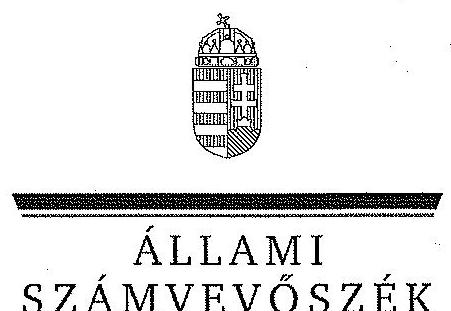
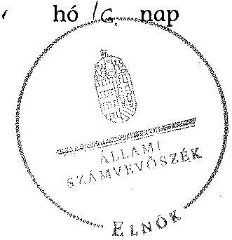
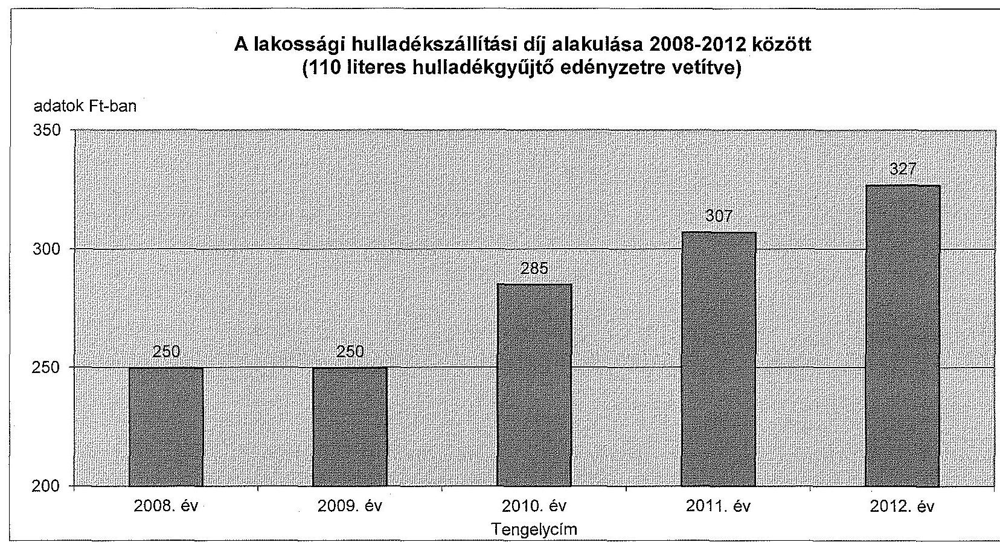
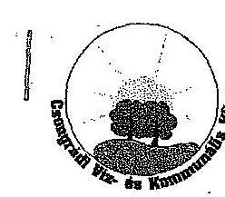
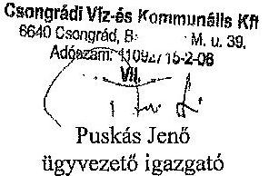
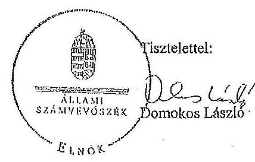
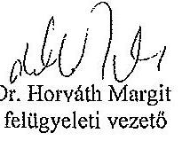

ÁLLAMI
SZÁMVEVŐSZÉK

# JELENTÉS 

Az önkormányzatok gazdasági társaságai - Az önkormányzatok többségi tulajdonában lévő gazdasági társaságok közfeladat ellátását érintő gazdálkodási tevékenysége szabályszerűségének ellenőrzése

Csongrádi Víz- és Kommunális Szolgáltató Kft.

---

# Állami Számvevőszék 

Iktatószám: V-0471-044/2014.
Témaszám: 1505.
Vizsgálat-azonosító szám: V067105

## Az ellenőrzést felügyelte:

Dr. Horváth Margit
felügyeleti vezető
Az ellenőrzés vezette és a végrehajtásáért felelős:
Klinga László
ellenőrzésvezető
Az összefoglaló jelentést készítette:
Szihalminé Kovács Zsuzsanna
számvevő tanácsos
Az ellenőrzést végezték:

| Dobos László | Megyebíró Anikó |
| :-- | :-- |
| okleveles könyvvizsgáló, | okleveles könyvvizsgáló, |
| külső szakértő | külső szakértő |

---

# TARTALOMJEGYZÉK 

BEVEZETÉS ..... 9
I. ÖSSZEGZŐ MEGÁLLAPÍTÁSOK, KÖVETKEZTETÉSEK, JAVASLATOK ..... 13
II. RÉSZLETES MEGÁLLAPÍTÁSOK ..... 19

1. Az Önkormányzat közfeladat-ellátásának szabályszerűsége ..... 19
1.1. A közfeladat-ellátás megszervezése és a feladatellátás feltételrendszerének kialakítása ..... 19
1.2. A közfeladat-ellátás felügyelete és a tulajdonosi jogok érvényesítése ..... 23
2. A CSVK Kft. közfeladat-ellátással kapcsolatos tevékenysége ..... 26
2.1. A CSVK Kft. gazdálkodásának szabályozottsága ..... 26
2.2. A CSVK Kft. vagyongazdálkodása és vagyonnyilvántartása ..... 28
2.3. A beszámolási kötelezettség teljesítése ..... 30
3. A hulladékgazdálkodás közfeladata bevételei és ráfordításai elszámolásának és önköltségszámításának szabályszerűsége ..... 31
3.1. A hulladékgazdálkodás közfeladata bevételeinek és ráfordításainak szabályszerűsége ..... 31
3.2. Az önköltségszámítás szabályszerűsége ..... 32
MELLÉKLETEK
4. számú A CSVK Kft. tevékenységének év végi főbb adatai
5. számú A CSVK Kft. múködésének év végi főbb jellemzői
6. számú A lakosságí hulladékszállítási díj alakulása 2008-2012 között
7. számú Beérkezett észrevételek és az azokra adott válaszok
FÜGGELÉKEK
8. számú Mintavételi eljárások ellenőrzési területenként

---

.

---

# RÖVIDÍTÉSEK JEGYZÉKE 

| Törvények |  |
| :--: | :--: |
| Áht. 1 | az államháztartásról szóló 1992. évi XXXVIII. törvény (hatálytalan: 2012. január 1-jétől) |
| Áht. 2 | az államháztartásról szóló 2011. évi CXCV. törvény |
| Ebktv. | az egyenlő bánásmódról és az esélyegyenlőség előmozdításáról szóló 2003. évi CXXV. törvény |
| Gt. tv. | a gazdasági társaságokról szóló 2006. évi IV. törvény (hatálytalan: 2014. március 15-étől) |
| Hgt. ${ }_{1}$ | a hulladékgazdálkodásról szóló 2000. évi XLIII. törvény (hatálytalan: 2013. január 1-jétől) |
| Hgt. 2 | a hulladékról szóló 2012. évi CLXXXV. törvény (hatályos: 2013. január 1-jétől, kivéve a 95. § (6) bekezdése, ami 2015. január 1-jén lép hatályba) |
| Irattári tv. | a köziratokról, a közlevéltárakról és a magánlevéltári anyag védelméről szóló 1995. évi LXVI. törvény |
| Kbt. | a közbeszerzésekről szóló 2003. évi CXXIX. törvény (hatálytalan: 2012. január 1-jétől) |
| Mötv. | Magyarország helyi önkormányzatairól szóló 2011. évi CLXXXIX. törvény (hatályos: 2012. január 1-jétől, kivéve a 144. § (2) bekezdésben meghatározott paragrafusok, amelyek 2012. április 15 -én, a (3) bekezdésben meghatározott paragrafusok, amelyek 2013. január 1-jén léptek hatályba, a (4) bekezdésben meghatározott paragrafusok a 2014. évi általános önkormányzati választások napján lépnek hatályba) |
| Nvtv. | a nemzeti vagyonról szóló 2011. évi CXCVI. törvény |
| Ötv. | a helyi önkormányzatokról szóló 1990. évi LXV. törvény (hatálytalan: a 2014. évi általános önkormányzati választások napjától) |
| Ptk. | a Polgári Törvénykönyvről szóló 1959. évi IV. törvény (hatálytalan: 2014. március 15-étől) |
| Számv. tv. | a számvitelről szóló 2000 . évi C. törvény |
| Rendeletek |  |
| 64/2008. (III. 28.) Korm. rendelet | a települési hulladékkezelési közszolgáltatási díj megállapításának részletes szakmai szabályairól (hatályos: 2008. április 1-jétől) |
| 224/2004. (VII. 22.)   Korm. rendelet | a hulladékkezelési közszolgáltató kiválasztásáról és a közszolgáltatási szerződésről (hatálytalan: 2013. szeptember 5-étől) |
| Ávr. | az államháztartásról szóló törvény végrehajtásáról szóló 368/2011. (XII. 31.) Korm. rendelet |
| SZMSZ $_{1}$ | Csongrád Város Önkormányzatának 6/2007. (III. 28.) számú önkormányzati rendelete az Önkormányzat és Szervei részére kiadott Szervezeti és Múködési Szabályzatáról (hatályos: 2007. április 1-jétől) |

---

SZMSZ $_{2}$

## vagyongazdálkodási

rendelet

## Szórövidítések

ÁSZ
CSVK Kft.
Csongrádi Víz és Kommunális Kft.
EU
FB

ISPA
jegyzó
KA
Képviselő-testület
Konzorcium

Közszolgáltatási szerződés

Önkormányzat
polgármester
Vagyonkezelő Zrt.

Csongrád Város Önkormányzatának 14/2011. (IV. 29.) számú önkormányzati rendelete az Önkormányzat és Szervei részére kiadott Szervezeti és Múködési Szabályzatáról (hatályos: 2011. május 1-jétől)
Csongrád Város Önkormányzatának 2/2001. (II. 6.) számú önkormányzati rendelete a Csongrád Város Önkormányzata vagyona feletti rendelkezési jog gyakorlásának szabályairól (hatályos: 2001. február 6-ától)

Állami Számvevőszék
Csongrádi Víz- és Kommunális Szolgáltató Kft. 2010. január 1-jétől
Csongrádi Víz- és Kommunális Szolgáltató Kft. 2009. december 31-éig (jogelőd)
Európai Unió
Csongrádi Víz- és Kommunális Szolgáltató Kft. Felügyelőbizottsága
az infrastrukturális és környezetvédelmi beruházások támogatására szolgáló előcsatlakozási alap
Csongrád Város Önkormányzatának jegyzője
Kohéziós Alap
Csongrád Város Önkormányzatának Képviselő-testülete
ZP Homokhátsági Hulladékgazdálkodási Konzorcium (székhelye: Csongrád Város)
Csongrád Város Önkormányzat és a Csongrádi Víz- és Kommunális Szolgáltató Kft. között létrejött, 2008. július 21-től hatályos Közszolgáltatási szerződés és annak módosításai
Csongrád Város Önkormányzata
Csongrád Város Önkormányzatának polgármestere
Homokhátsági Regionális Hulladékgazdálkodási Vagyonkezelő és Közszolgáltató Zrt.

---

# ÉRTELMEZŐ SZÓTÁR 

gazdasági társaság
közfeladat
közszolgáltatás
közszolgáltatási szerződés tartalmi elemei

Gt. tv. 3. § (1) bekezdése szerint „gazdasági társaságot üzletszerü közös gazdasági tevékenység folytatására külföldi és belföldi természetes és jogi személyek, valamint jogi személyiség nélküli gazdasági társaságok alapithatnak, müködő társaságba tagként beléphetnek, társasági részesedést (részvényt) szerezhetnek."
Jogszabályban meghatározott állami vagy önkormányzati feladat, amit az arra kötelezett közérdekből, jogszabályban meghatározott követelményeknek és feltételeknek megfelelve végez, ideértve a lakosság közszolgáltatásokkal való ellátását, továbbá az állam nemzetközi szerződésekben vállalt kötelezettségeiből adódó közérdekủ feladatokat, valamint e feladatok ellátásához szükséges infrastruktúra biztosítását is (Nvtv. 3. § (1) bekezdés 7. pont).

A közszolgáltatás: „közcélú, illetőleg közérdekü szolgáltatást jelent, amely egy nagyobb közösség (állam, település) minden tagjára nézve megközelítőleg azonos feltételek mellett vehető igénybe, ezért valamilyen mértékig közösségi megszervezést, illetve szabályozást, ellenőrzést igényel." Az Ebktv. 3. § d) pontja a következőképpen határozza meg a közszolgáltatást: „szerződéskötési kötelezettség alapján a lakosság alapvető szükségleteinek ellátására irányuló szolgáltatás, így különösen a villamos energia-, gáz-, hő-, víz-, szennyvíz- és hulladékkezelési, köztisztasági, postai és távközlési szolgáltatás, továbbá a menetrend alapján közlekedő jármüvekkel végzett közforgalmú személyszállitás."

A közszolgáltatási szerződésnek tartalmaznia kell a közszolgáltatás megnevezését, minőségi ismérveit, a teljesítésének területi kiterjedését, a közszolgáltatás megkezdésének időpontját és időtartamát, valamint annak rögzítését, hogy a közszolgáltató vállalta a megjelölt közszolgáltatás teljesítését.
A közszolgáltatási szerződésben a közszolgáltató kötelességeként kell meghatározni:
a) a közszolgáltatás folyamatos és teljes körű ellátását;
b) a közszolgáltatás meghatározott rendszer, módszer és gyakoriság szerinti teljesítését;
c) a közszolgáltatás teljesítéséhez szükséges mennyiségű és minőségű jármű, gép, eszköz, berendezés biztosítását, valamint a szükséges létszámú és képzettségủ szakember alkalmazását;
d) a közszolgáltatás folyamatos, biztonságos és bővíthető teljesítéséhez szükséges fejlesztések és karbantartások elvégzését;

---

e) a közszolgáltatás körébe tartozó hulladék ártalmatlanítására az önkormányzat képviselő-testülete által kijelölt helyek és létesítmények igénybevételét;
f) a közszolgáltató által alkalmazott közszolgáltatási díj mértékéről és az alkalmazás tapasztalatairól az önkormányzat képviselő-testületének történő legalább évenkénti egyszeri tájékoztatást;
g) a közszolgáltatás teljesítésével összefüggő adatszolgáltatás rendszeres teljesítését és meghatározott nyilvántartási rendszer múködtetését;
h) a fogyasztók számára könnyen hozzáférhető ügyfélszolgálat és tájékoztatási rendszer múködtetését;
i) a fogyasztói kifogások és észrevételek elintézési rendjének megállapítását.
A közszolgáltatási szerződésben az önkormányzat kötelességeként kell meghatározni:
a) a közszolgáltatás hatékony és folyamatos ellátásához a közszolgáltató számára szükséges információk szolgáltatását, a Hgt. 23. §-ának g) pontjára tekintettel;
b) a közszolgáltatás körébe tartozó és a településen folyó egyéb hulladékkezelési tevékenységek összehangolásának elősegítését;
c) a településen működtetett különböző közszolgáltatások összehangolásának elősegítését;
d) a települési igények kielégítésére alkalmas hulladék gyűjtésére, kezelésére, ártalmatlanítására szolgáló helyek és létesítmények kijelölését;
e) a közszolgáltató kizárólagos közszolgáltatási jogának biztosítását a 3. § (1) bekezdés a), b) és f) pontjaiban foglaltakra figyelemmel.
Az önkormányzatnak a közszolgáltatás finanszírozásában vállalt kötelezettsége esetén a közszolgáltatási szerződésben meg kell határozni a kötelezettség teljesítésének feltételeit és biztosítékait.
A közszolgáltatási szerződés tartalmazza a közszolgáltatás dijának megállapítására és beszedésére vonatkozó módszer leírását, a díjnak a szerződés megkötésekor érvényesíthető legmagasabb mértékét és a díj megváltoztatása érdekében alkalmazandó eljárást. A közszolgáltatási szerződésnek tartalmaznia kell az igazolt díjhátralék kiegyenlítésére vonatkozó eljárást. A közszolgáltatási szerződés tartalmazza azokat a feltételeket, amelyek mellett a közszolgáltató a közszolgáltatás teljesítésére közreműködőt vagy teljesítési segédet vehet igénybe, figyelemmel a Kbt. 304. § (2) bekezdésében foglaltakra is. A közszolgáltató közreműködőért vagy teljesítési segédért való felelőssége a közszolgáltatási szerződésben nem korlátozható. (224/2004. (VII. 22.) Korm. rendelet 11-14. §)
minősített többséget
A minősített befolyásszerző az ellenőrzött társaságban a

---

biztosító részesedés
saját tőke
tulajdonosi joggyakorló
többségi befolyást biztosító részesedés
szavazatok legalább hetvenöt százalékával rendelkezik. (Gt. tv. 52. § (2) bekezdés)
A saját tőke a - jegyzett, de még be nem fizetett tőkével csökkentett - jegyzett tőkéből, a tőketartalékból, az eredménytartalékból, a lekötött tartalékból, az értékelési tartalékból és a tárgyév mérleg szerinti eredményéből tevődik össze.
Aki a nemzeti vagyon felett az államot vagy a helyi önkormányzatot megillető tulajdonosi jogok és kötelezettségek összességének gyakorlására jogosult (Nvtv. 3. § (1) bekezdés 17. pont).
A Ptk. 685/B. § (1) bekezdése szerint „többségi befolyás: az olyan kapcsolat, amelynek révén természetes személy, jogi személy vagy jogi személyiség nélküli gazdasági társaság (a továbbiakban együtt: befolyással rendelkező) egy jogi személyben a szavazatok több mint ötven százalékával vagy meghatározó befolyással rendelkezik."

---

.

---

# JELENTÉS 

## Az önkormányzatok gazdasági társaságai Az önkormányzatok többségi tulajdonában lévő gazdasági társaságok közfeladat ellátását érintő gazdálkodási tevékenysége szabályszerűségének ellenőrzése

## Csongrádi Víz- és Kommunális Szolgáltató Kft.

## BEVEZETÉS

Az Állami Számvevőszék középtávra szóló stratégiájában megfogalmazta, hogy a helyi önkormányzatok gazdálkodásában rejlő pénzügyi kockázatok feltárásával, az államháztartáson kívülre nyújtott költségvetési támogatások és ingyenes vagyonjuttatások, valamint az államháztartáson kívül múködő köz-feladat-ellátó rendszerek ellenőrzéseivel hozzájárul ahhoz, hogy a közpénzeket az államháztartáson kívül múködő szervezetek is átlátható, rendezett módon használják fel a közfeladatok szerződésben vállalt ellátása érdekében.

Az önkormányzatok szervezetalakítási szabadságának következménye, hogy a korábban is vállalati formában múködő (nagyvárosi tömegközlekedés, víz-, szennyvízcsatorna, köztisztasági, ingatlankezelés stb.) közszolgáltatások mellett, mind a kötelező, mind az önként vállalt feladatok ellátásában a gazdasági társaságok kiemelt fontosságú szerephez jutottak.

A Csongrádi Víz- és Kommunális Szolgáltató Kft. (CSVK Kft.) az ellenőrzött időszakban a közel 18 ezer lakosú Csongrád Város közigazgatási területén látta el a szilárd hulladék gyűjtése, ártalmatlanítása, hasznosítása, a közterületek tisztántartása közszolgáltatást. A kommunális hulladékgyűjtés mellett a szelektív gyűjtési rendszer múködtetése ( 90 db szelektív hulladékgyűjtő sziget) és fejlesztése is fontos részét képezte tevékenységeinek. Közszolgáltatóként feladatai közé tartozott a Homokhátsági Hulladékgazdálkodási Program keretében kiépített két térségi hulladékudvar (Csongrád, Kiskunfélegyháza) és a rendszerhez tartozó Felgyői Regionális Hulladékkezelő Központ üzemeltetése is. A CSVK Kft. a 2012. évben 17 településen, 80 ezer főt érintően végzett hulladékkezeléssel öszszefüggő feladatokat. A CSVK Kft. átlagos statisztikai létszáma 59 fő volt.

A CSVK Kft. összes bevétele 2008-ban 584,2 millió Ft, a 2012. évben 654,9 millió Ft volt, amelyből az értékesítés nettó árbevétele 2008-ban 548,7 millió Ft, míg 2012-ben 651,4 millió Ft volt. Az árbevételek az ellenőrzött időszakban $18,7 \%$-kal, a ráfordítások $5,8 \%$-kal nőttek.

---

A 2008. évben - közbeszerzési eljárás keretében - a Homokhátsági Hulladékgazdálkodási rendszer fenntartását és egységes üzemeltetését a 2002. szeptember 30-án létrejött Konzorcium nyerte el. A Konzorcium tagjai a Vagyonkezelő és Közszolgáltató Zrt. (mint az önkormányzatok tulajdonában lévő vagyonkezelő), a Felső-Bácskai Hulladékgazdálkodási Kft., a Homokhátsági Hulladékgazdálkodási Kft. és a Csongrádi Víz és Kommunális Kft. (mint szolgáltatók). A Konzorciumban résztvevő szolgáltatók összesen 82 településen láttak el hulladékkezelési közszolgáltatást, illetve az ezzel szorosan összefüggő konténeres hulladékszállítást, továbbá három Regionális Hulladékkezelő telep, átrakó állomás és hulladékudvarok üzemeltetését. A feladatellátás a 2012. évben közel 360000 lakosra, 120750 ingatlanra és 13,5 millió liter összesített gyűjtő edényzet térfogatra terjedt ki.

A CSVK Kft. az ellenőrzött időszakban - a 2008-2009. éveket kivéve - pozitív mérleg szerinti eredménnyel zárt, a 2012. évben 7,2 millió Ft összegű eredményt realizált, az önkormányzattól működési célú támogatást nem vett igénybe. A CSVK Kft. mérleg szerinti eszközállománya a 2008. évi nyitó 452,6 millió Ft-ról a 2012. év végére 4,4\%-os csökkenést követően 432,7 millió Ft-ra, ezen belül a tárgyi eszközök állománya több mint felére, 267,5 millió Ft-ról 117,8 millió Ft-ra csökkent. A saját tőke a 2008. évi nyitó 149,7 millió Ft-ról a 2012. év végére 56,4 millió Ft-ra változott.

Az Önkormányzat a 100\%-os tulajdonában lévő Csongrádi Víz és Kommunális Kft.-t 2010. január 5-étől átalakította, és két - eltérő feladatokat ellátó - Kft.-t hozott létre. A Képviselő-testület a 267/2009. (X. 30.) számú határozatában úgy döntött, hogy jogutódként a hulladékgazdálkodási feladatok ellátására - változatlan megnevezéssel - a Csongrádi Víz és Kommunális Kft.-t (CSVK Kft.) múködteti. A víz, szennyvíz, távhőszolgáltatás, lakásgazdálkodás és egyéb önkormányzati feladatok további ellátására a Csongrádi Víz- és Kommunális Kft.-ből kiválással megalakította a Csongrádi Közmű Szolgáltató Kft.-t.

A CSVK Kft. az Önkormányzat 100\%-os tulajdonában volt 2010. január 15-éig, majd azt követően az Önkormányzat tulajdonrésze 2010. január 15-étől 91 \%-os mértékűre, majd 2010. április 20-ától 54,5 \%-ra csökkent a Felső-Bácskai Hulladékgazdálkodási Kft. részére történt üzletrész értékesítés miatt.

Az ellenőrzött időszakban a polgármester és a jegyző személye is egy alkalommal változott, a polgármester a 2010. évi önkormányzati választások óta tölti be tisztségét, a helyszíni ellenőrzés időszakában a munkakört betöltő jegyző 2010. március óta látja el feladatait. Az ellenőrzött időszakban az ügyvezető személye négy alkalommal, a gazdasági vezető személye három alkalommal változott. Az ügyvezető 2012. június 1-je óta, a gazdasági vezető 2011. június 2.-a óta tölti be tisztségét.

Az önkormányzati tulajdonú gazdasági társaságok teljes körű ellenőrzésének lehetőségét az Állami Számvevőszékről szóló 1989. évi XXXVIII. törvény 2011. január 1-jétől hatályos módosítása és az Állami Számvevőszékről szóló 2011. évi LXVI. számú törvény teremtette meg.

---

Az ellenőrzés célja annak értékelése volt, hogy

- az önkormányzat a jogszabályi előírások figyelembevételével döntött-e az ellenőrzésre kerülő közfeladat megszervezéséről; az önkormányzat szabályszerűen gyakorolta-e a tulajdonosi jogokat;
- a gazdasági társaság közfeladat-ellátása bevételeinek, ráfordításainak elszámolása, és vagyongazdálkodási tevékenysége megfelelt-e a jogszabályi, illetve a közszolgáltatási szerződésben foglalt tulajdonosi előírásoknak, azok végrehajtása szabályszerű volt-e;
- a közfeladatok átláthatósága és elszámoltathatósága érdekében biztosítva volt-e a közszolgáltatás dijának megalapozottsága szabályszerű önköltségszámítással.

Az ellenőrzés kiterjedt Csongrád Város Önkormányzatára és a Csongrádi Vízés Kommunális Szolgáltató Korlátolt Felelősségű Társaságra.

Az ellenőrzés várható hasznosulása: A törvényalkotás számára - az észlelt problémák, szabálytalanságok, vagy egyéb nem kívánatos jelenségek felszínre kerülésével - az ellenőrzés megállapításai segítséget nyújthatnak az államháztartáson kívüli közfeladat-ellátás értékeléséhez, jogszabályi keretei pontosításához, átláthatóságot biztosító szabályozásához. Meghatározhatóvá válnak a közfeladat ellátásban részt vevő államháztartáson kívüli szervezeteknek - az önkormányzat költségvetését, pénzügyi helyzetét is befolyásoló - kockázatai, lehetővé válik ezen kockázatok csökkentése. Feltárja, hogy az önkormányzat közfeladat-ellátási kötelezettségének szabályszerűen tett-e eleget, a feladatellátáshoz rendelt közvagyon múködtetését szabályszerűen szervezte-e meg és a tulajdonosi felügyelete hozzájárult-e a közfeladat-ellátásához. A feladatot ellátó gazdasági társaság a közszolgáltatási szerződésben foglaltak betartásával, a közvagyon használatával biztosította-e a szolgáltatás folytatásának feltételeit. Ezzel az ellenőrzöttek és a helyi döntéshozók számára visszajelzést ad feladatszervezési, feladat-ellátási kockázataikról, alapot ad a meglévő hibák megszüntetéséhez, a jobb közfeladat-ellátás biztosításához. Fokozza a fegyelmet, igazolja, hogy lejárt a következmények nélküli ellenőrzések időszaka. Az ÁSZ értékteremtő rend kialakításához és megőrzéséhez hozzájáruló tevékenysége pozitív hatással van a szervezetről kialakított összkép formálására is.

A bevételek és ráfordítások elszámolása, valamint a vagyonnyilvántartás terén az egyes területek szabályszerű működését mintavétellel ellenőriztük, ez alapján a sokaságokban előforduló hibás tételek arányát becsültük. A jogszabályoknak és a belső előírásoknak megfelelőnek, azaz szabályszerűnek tekintettük az adott bevételek és ráfordítások elszámolását, a vagyonnyilvántartást, amennyiben a minta ellenőrzésének eredménye alapján 95\%-os bizonyossággal a teljes sokaságban a hibás tételek aránya kisebb volt, mint $10 \%$, nem megfelelőnek értékeltük, ha a hibás tételek aránya a 10\%-ot meghaladta. Kockázatot, illetve magas kockázatot jeleztünk, amennyiben egy adott terület vonatkozásában a minta alapján a teljes sokaságban nem volt teljes körűen biztosított a jogszabályoknak és a belső szabályzatoknak megfelelő működés (1. számú függelék).

---

Az ellenőrzést a számvevőszéki ellenőrzés szakmai szabályai szerint, szabályszerűségi ellenőrzés módszerével, a vonatkozó nemzetközi standardok figyelembevételével végeztük. Az ellenőrzés a 2008-2012. évekre terjedt ki.

Az ellenőrzés végrehajtásának jogszabályi alapját az Állami Számvevőszékről szóló 2011. évi LXVI. törvény 5. § (3)-(4)-(5) bekezdése képezi.

Az ÁSZ az Állami Számvevőszékről szóló 2011. évi LXVI. törvény 29. §-a alapján a jelentéstervezetet észrevételezésre megküldte a polgármesternek és a gazdasági társaság ügyvezetőjének. A beérkezett észrevételeket a jelentés véglegesítése során hasznosítottuk. Az észrevételeket és az azokra adott válaszokat a jelentés 4. számú melléklete tartalmazza.

---

# I. ÖSSZEGZŐ MEGÁLLAPÍTÁSOK, KÖVETKEZTETÉSEK, JAVASLATOK 

Csongrád Város Önkormányzat Képviselő-testülete az Önkormányzat közigazgatási területén a szilárd hulladék gyűjtése, ártalmatlanítása, hasznosítása és a közterületek tisztántartása közfeladatának ellátásáról az Ötv. előírásai szerint döntött. A Képviselő-testület az SZMSZ-ben előírta a szilárd hulladék kezelés és szállítás közfeladat ellátásának kötelezettségét. Az Önkormányzat a 2007-2010. évekre szóló Gazdasági és munkaprogramjában az ISPA program (majd KA) keretén belül megvalósuló regionális szintű korszerű hulladékgyűjtés, hulladékkezelés, lerakás és szelektív hulladékgyűjtés, hulladékudvarok kialakítása rendszerének teljessé tételét, illetve az illegális hulladéklerakók felszámolásának folytatását határozta meg. A 2011-2014. évekre szóló Gazdasági és munkaprogramban rögzítették, hogy a 82 önkormányzat által megvalósult beruházás eszközeit vagyonkezelési szerződés keretében működtetik, amelynek tulajdonosai a beruházásban résztvevő önkormányzatok. További célként határozták meg a rendszeres lomtalanítási akciók szervezését, az illegális szemét-lerakó-helyek felszámolását, illetve a szelektív hulladékgyűjtés bővítését.

Az Önkormányzat a 2003-2008. közötti időszakra szóló hulladékgazdálkodási tervét a Hgt. ${ }_{1}$-ben előírtaknak megfelelően elkészítette, amit a Képviselőtestület rendeletben kihirdetett. Az Önkormányzat a Hgt. ${ }_{1}$-ben rögzítettekkel ellentétben a 2009. évre nem rendelkezett hulladékgazdálkodási tervvel. A 20102015. évekre kidolgozott hulladékgazdálkodási terv az előírt követelményeknek megfelelt, azonban a Képviselő-testület utólagosan, a 2011. évben hagyta jóvá.

Az Önkormányzat az ellenőrzött időszakban a szilárdhulladék kezelés, ártalmatlanítás és szállítás közfeladat ellátásának módját és mértékét Közszolgáltatási szerződésben határozta meg. Az Önkormányzat és a Csongrádi Víz és Kommunális Kft. 2008. július 21-én a közfeladat 2034. december 31-éig történő ellátására Közszolgáltatási szerződést kötött, amit a Környezetvédelmi és Vízügyi Minisztérium Fejlesztési Igazgatósága jóváhagyott. A Közszolgáltatási szerződés megfelelt a 224/2004. (VII. 22.) Korm. rendeletben előírt tartalmi követelményeknek. A Közszolgáltatási szerződésben meghatározták a szerződés időtartamát, a közszolgáltató által teljesítendő közszolgáltatási kötelezettségeket, az ellátási területet, az ellátási díj megállapításához szükséges indokolt költségek körét, a kapcsolódó költségek szétválasztásának követelményeit. Rögzítették a szerződés felmondásának, módosításának szabályait, a Közszolgáltatási szerződés lejártakor a közvagyon tulajdonos önkormányzat részére történő visszaszolgáltatásának módját, a visszaszolgáltatás garanciális feltételeit, a visszaszolgáltatás elmaradásának szankcióit. Az Önkormányzat a 224/2004. (VII. 22.) Korm. rendeletben előírt tájékoztatási kötelezettségen kívül szakmai beszámolási kötelezettséget nem határozott meg. Az Önkormányzat a 2008. július 21 -ét megelőző időszakban a jogelőd alapításakor kötött Közszolgáltatási szerződés alapján biztosította a közfeladat ellátását.

---

A Képviselő-testület a Hgt. ${ }_{1}$-ben előírt kötelezettségének eleget téve rendeletben állapította meg „a települési szilárdhulladékkal kapcsolatos közszolgáltatásról" szóló szabályokat. A rendelet tartalma megfelelt a Hgt. ${ }_{1}$-ben előírtaknak.

A Vagyonkezelő Zrt. és a Csongrádi Víz és Kommunális Kft. 2008. július 21-én bérleti szerződést kötött, amely szerint a Csongrádi Víz és Kommunális Kft., mint közszolgáltató bérbe vette - a Konzorcium által - a vagyonkezelő rendelkezésére bocsátott eszközöket a hulladékgazdálkodási közszolgáltatás végzéséhez. A 2010. évi átalakulást követően az eszközök bérlője a CSVK Kft. A bérbe vételért a bérleti szerződésben meghatározott bérleti díjat fizette meg a vagyonkezelő részére.

Az Önkormányzat a gazdasági társaságok feletti tulajdonosi jogok gyakorlásának szabályait a vagyongazdálkodási rendeletben határozta meg. Az Önkormányzatot megillető tulajdonosi jogok gyakorlásával kapcsolatos feladatok és jogosítványok a Képviselő-testületet illeték meg. Az FB a Gt. tv.-ben előírtakat figyelembe véve három taggal múködött, feladata és hatásköre kiterjedt a társaság könyveinek vizsgálatára, a beszámoló elfogadásáról és az adózott eredmény felosztásáról szóló határozat meghozatalára, valamint az ügyvezetés tevékenységének ellenőrzésére. Az FB - a 2008-2012. években - a Képviselőtestületnek beszámolt a tárgyévi tevékenységéről, továbbá tárgyalta az éves beszámolót és könyvvizsgálói jelentést, amelynek elfogadásáról határozatban döntött. Az ügyvezetés tevékenysége ellenőrzésének az üzleti tervek felülvizsgálatával, illetve az ügyvezető beszámolójának megtárgyalásával tett eleget. Az Önkormányzat az üzleti tervek és éves üzleti jelentések tartalmára és elfogadásának rendjére szabályozással nem rendelkezett, azonban a CSVK Kft. az ellenőrzött időszakban évenként elkészítette üzleti tervét és éves üzleti jelentéseit. A 2008-2012. évi üzleti jelentések alapján a CSVK Kft. a közszolgáltatási feladatait ellátta és a Képviselő-testület szabályszerűen gyakorolta a tulajdonosi jogokat.

Az Önkormányzat éves belső ellenőrzési munkatervét megalapozó kockázatelemzés a 2010-2012. évekre vonatkozóan a CSVK Kft.-re is kiterjedt, amely alapján a 2010. évben kijelölték ellenőrzésre, azonban a tervezett ellenőrzés elmaradt. A 2012. évben a CSVK Kft.-nél „a végrehajtott szervezeti átalakulások után létrejött társaság, mint rendszer múködésének vizsgálata" címmel terveztek teljesítmény ellenőrzést a 2010-2011. évek vonatkozásában, amit végrehajtottak. A belső ellenőrzési jelentés intézkedést igénylő javaslatot nem fogalmazott meg.

A 2008-2009. években a jogelőd szervezet számviteli politika keretében elkészítendő szabályzatainak fellelhetősége nem volt biztosított, ezzel nem tartották be az Irattári tv. előírásait. A 2010. január 5-ei átalakulást követően nem tettek eleget a Számv. tv. előírásainak, mivel 90 napon belül nem léptették hatályba a számviteli politikát és az annak keretében elkészítendő szabályzatokat. A CSVK Kft.-nél számlarendet - az ellenőrzött időszakban - nem készítettek, így nem volt szabályozott a Számv. tv. szerinti könyvvezetés és beszámoló készítés. A 2011. október 18-án hatályba léptetett számlatükör hiányossága volt, hogy a főkönyvi számlák számviteli politikának megfelelő adaptálása nem történt meg. A CSVK Kft. a Számv. tv-ben előírtakkal ellentétben 2011. augusztus 5-ét megelőzően eszközök és források leltározási szabályzatával,

---

2010. június 1-jét megelőzően eszközök és források értékelési szabályzatával nem rendelkezett. A leltározási és selejtezési szabályzat a tárgyi eszközök és készletek vonatkozásában előírta az évenkénti mennyiségi leltárfelvétel elvégzésének kötelezettségét, amelynek a CSVK Kft. 2011-2012. években eleget tett. A CSVK Kft. a számviteli politikában, és az eszközök és források értékelési szabályzatában írta elő a követelések minősítésének, az értékvesztés elszámolásának szabályait. A Számv. tv-ben és a belső szabályzatokban előírtakkal ellentétben a 2010. január 1-jétől fennálló - 90 napot meghaladó - követelései után nem számolt el értékvesztést. Az értékvesztés elszámolásának elmulasztásával megsértették a Számv. tv-ben előírt óvatosság elvét, mivel a beszámoló készítésekor nem vették figyelembe a követelések realizálásának kockázatát. A CSVK Kft. 2010. január 16-tól rendelkezett a Számv. tv-ben előírt önköltségszámítási szabályzattal.

A CSVK Kft. 2011. augusztus 1-jén megbízási szerződést kötött egy követeléskezelő és díjbeszedő társasággal a meg nem fizetett, hulladékszállítási díjból eredő követeléseinek behajtására. Ez a gyakorlat ellentétes volt a Hgt.,-ben előírtakkal, mely szerint a 90 napot meghaladó díjhátralék adó módjára történő behajtását a jegyzőnél kell kezdeményezni. A megbízási szerződést határozatlan időtartamra kötötték, azonban 2012. augusztus 10-i hatállyal felbontották.

A CSVK Kft. feladatainak ellátásához - az alapításkori apportálást követően az Önkormányzattól nem vett át vagyonkezelésbe vagyont, könyveiben a saját vagyonát tartotta nyilván. A közszolgáltatási feladatokat a saját vagyontárgyakon túl bérelt eszközökkel látta el, amelyek a Vagyonkezelő Zrt. tulajdonát képezték. A CSVK Kft. vagyonának nyilvántartása során nem érvényesültek teljes körűen a jogszabályok és belső szabályok előírásai az eszközök beszerzése és nyilvántartása tekintetében. Ez kockázatot jelez az ellenőrzött terület egészének szabályos működése szempontjából. Megállapítottuk, hogy egyes esetekben az eszközök beszerzését megalapozó dokumentumok nem álltak rendelkezésre, az eszközök állományba vétele, értékcsökkenésének elszámolása nem szabályosan történt. A CSVK Kft. vagyongazdálkodási tevékenysége - a mintatételekben megállapított szabálytalanságok kivételével - megfelelt a Közszolgáltatási szerződésben foglaltaknak.

A jogelőd Csongrádi Víz és Kommunális Kft. 2008-ban 34441 ezer Ft, 2009-ben 31542 ezer Ft veszteséget realizált. A 2010. évi átalakítást követően az üzletmenet nyereséges lett, CSVK Kft. mérlegszerinti eredménye 2010-ben 1286 ezer Ft, 2011-ben 2749 ezer Ft, 2012-ben 7253 ezer Ft volt. A Képviselő-testület a CSVK Kft. 2008-2012. évi számviteli beszámolóit az éves üzleti jelentésekkel együtt fogadta el, amelyek kiegészítő mellékleteiben a CSVK Kft. elkülönítetten kezelte a közszolgáltatási és egyéb tevékenységeit. A számviteli beszámolók hiányossága volt, hogy a Számv. tv-ben előírtakkal ellentétben a kiegészítő mellékletben nem mutatták be az immateriális javak és tárgyi eszközök bruttó értékének, értékcsökkenésének, és az értékcsökkenési leírás összegének az alakulását, továbbá nem tartalmazta a cash-flow kimutatást.

A hulladékgazdálkodási közfeladat értékesítés nettó árbevételének elszámolása során a CSVK Kft. szabályszerűen járt el. A bevételek előírása és kiszámlázása a belső szabályozásnak megfelelően történt, a bevételeket a megfelelő számlacsoportba számolták el. Az alkalmazott szolgáltatási díjak megfeleltek a

---

belső szabályozásnak és a tulajdonosi követelményeknek. A hulladékgazdálkodási közfeladat anyagjellegü ráfordításainak elszámolása során nem érvényesültek teljes körűen a számlatükörben előírtak a költségek főkönyvi és közfeladatonkénti elszámolása tekintetében. Egyes esetekben a költségek elszámolása nem a megfelelő költségnemre, illetve közfeladatra történt. Ez kockázatot jelez az ellenőrzött terület egészének szabályos működése szempontjából.

Az önköltségszámítási szabályzat kalkulációs sémáját nem alkalmazta a CSVK Kft. az éves hulladékszállítási díj megállapításakor. Az ellenőrzött időszak éves díjait a Konzorcium állapította meg, betartva a díjak számítása során a 64/2008. (III. 28.) Korm. rendelet előírásait. A Konzorcium részére CSVK Kft. által benyújtott díjkalkuláció a Közszolgáltatási szerződésben előírt szerkezetben - az önköltségszámítási szabályzatban előírtaktól részletesebb tartalommal készült. A közszolgáltatás díjának megalapozottsága szabályszerű önköltségszámítással 2010-től volt biztosított. A közszolgáltatás díját egyéves időszakra, a közzétett kalkulációs séma alapján állapították meg. A társasági szintű díjkalkulációk adatainak összesítését követően állapították meg a konzorcium egészére vonatkozó díjtételeket. A Közszolgáltatási szerződésben előírtakkal ellentétben a CSVK Kft., mint szolgáltató által megállapított díjak helyett a konzorciumi szinten összesített adatok alapulvételével megállapított díjakat alkalmazták. Az éves közszolgáltatási díjak elfogadásáról - a Konzorcium Közgyűlése általi jóváhagyást követően - az Önkormányzat rendeletet alkotott. A megállapított hulladékszállítási díjak - a kalkulációs séma alapján - fedezetet nyújtottak a működéshez szükséges folyamatos költségekre és ráfordításokra, valamint a közszolgáltatás fejleszthető fenntartásához szükséges kiadásokra.

Az ÁSZ számvevőszéki jelentéssel lezárt ellenőrzést nem végzett az ellenőrzött időszakban.

A fentiekben leírtak összegzéseként az alábbi megállapításokat tesszük:
A hulladékgazdálkodási feladat ellátását biztosító kereteket kialakították, azok tartalmában megfeleltek az előírásoknak. A tulajdonos az FB-n keresztül biztosította a CSVK Kft. feletti kontrollt, azonban a belső ellenőrzés hiánya miatt nem segítette elő a CSVK Kft. szabályszerű működésének folyamatos kontrollálását. A CSVK Kft. számviteli rendszerének szabályozottsága az átalakulást követően javult. A vagyonnyilvántartás és az anyagjellegű ráfordítások esetében feltárt szabálytalanságok kockázatot jeleznek a szabályszerű feladatellátás tekintetében.

Az Állami Számvevőszékről szóló 2011. évi LXVI. törvény 33. § (1) bekezdésében foglaltak értelmében a jelentésben foglalt megállapításokhoz kapcsolódó intézkedési tervet köteles az ellenőrzött szervezet vezetője összeállítani, és azt a jelentés kézhezvételétől számított 30 napon belül az ÁSZ részére megküldeni. Amennyiben az intézkedési tervet határidőben nem küldi meg a szervezet, vagy az nem elfogadható, az ÁSZ elnöke a hivatkozott törvény 33. § (3) bekezdés a)-b) pontjaiban foglaltakat érvényesítheti.

---

Az ellenőrzés intézkedést igénylő megállapításai és javaslatai:
Javaslataink célja a Kft. gazdálkodása szabályszerűségének helyreállítása annak érdekében, hogy a szabályozási környezet megfelelően tudja támogatni az átlátható müködést.

Javasoljuk a Csongrádi Víz- és Kommunális Szolgáltató Kft. ügyvezető igazgatójának:

1. A CSVK Kft-nél a Számv. tv. 161. §-ában előírt számlarendet 2010. június 1-jétől nem készítettek.

Javaslat:
Gondoskodjon a szabályozási hiányosságok megszüntetésére, ezen belül:
Intézkedjen a Számv. tv-ben előírt számlarend elkészítéséről és hatályba léptetéséről.
2. A CSVK Kft. a számviteli politikában, és az eszközök és források értékelési szabályzatában írta elő a követelések minősítésének, az értékvesztés elszámolásának szabályait. Hiányosság, hogy a társaság a Számv. tv. 55. § (1) bekezdésében és a belső szabályzatokban előírtakkal ellentétben a 2010. január 1-jétől fennálló, a 90 napot meghaladó követelései után nem számolt el értékvesztést. Az értékvesztés elszámolásának elmulasztásával megsértették a Számv. tv-ben előírt óvatosság elvét, mivel a beszámoló készítésekor nem vették figyelembe a követelések realizálásának kockázatát.

A számviteli beszámolók hiányossága volt, hogy a Számv. tv. 92. § (1) bekezdésében előírtakkal ellentétben a kiegészítő mellékletben nem mutatták be az immateriális javak és tárgyi eszközök nyitó bruttó értékének, értékcsökkenésének, és az értékcsökkenési leírás összegének az alakulását, továbbá a beszámoló nem tartalmazta a Számv. tv. 88. § (6) bekezdése szerinti chas-flow kimutatást.

A hulladékgazdálkodási közfeladat anyagjellegű ráfordításainak elszámolásához kialakították a Számv. tv. 161/A. (2) bekezdésében foglaltak szerint a részletes könyvvezetési rendszert, ugyanakkor a társaságnál egyes költségek elszámolása nem a megfelelő költségnemre történt, egyéb anyagköltségként mutatták ki az egyéb igénybevett szolgáltatást, illetve a központi irányítás költségeként számolták el a hulladékszállításhoz kapcsolódó költséget.

A Hgt ${ }_{1}$ 26. §-a ${ }^{1}$ szerint, továbbá a közszolgáltatási szerződés 5.6. pontja alapján a társaság a díjhátralékosok felszólításának eredménytelensége esetén a felszólítás igazolása mellett kezdeményezi a díjhátralék adók módjára történő beszedését a jegyzőnél (2013. január 1-jétől pedig a NAV-nál). A CSVK Kft. az ellenőrzött időszakban 2011. augusztus hónapot követően nem kezdeményezte a díjhátralékok adók módjára történő beszedését.

[^0]
[^0]:    ${ }^{1}$ A 2013. január 1-jétől hatályos $\mathrm{Hgt}_{2}$ 52. §-a szerint.

---

Javaslat:
Gondoskodjon a jogszabályi elöírások szerinti gyakorlat és szabályos müködés biztosítására, ezen belül:
a) végezze el a követelések lejárati kategóriák szerinti minősítését;
b) a 90 napon túli követeléseknél számoljon el értékvesztést;
c) intézkedjen, hogy a számviteli beszámoló kiegészítő mellékletét a Számv. tv-ben előírt tartalommal készítsék el, továbbá az anyagjellegű ráfordítások a megfelelő közfeladatra/költseégnemre kerüljenek elszámolásra;
d) kezdeményezze a még fennálló dijhátralékok adók módjára történő beszedését.

---

# II. RÉSZLETES MEGÁLLAPÍTÁSOK 

## 1. Az ÖNKORMÁNYZAT KÖZFELADAT-ELLÁTÁSÁNAK SZABÁLYSZERÜSÉGE

### 1.1. A közfeladat-ellátás megszervezése és a feladatellátás feltételrendszerének kialakítása

A köztisztaság és a településtisztaság biztosítása az Ötv. 8. § (1) bekezdése ${ }^{2}$ alapján az önkormányzat törvényi kötelezettsége. Az Önkormányzat közigazgatási területén a szilárd hulladék gyűjtése, ártalmatlanítása, hasznosítása és a közterületek tisztántartása feladatának ellátásáról közszolgáltatás megszervezése útján gondoskodott.

A Képviselő-testület az SZMSZ ${ }_{1,2}$ 2. számú mellékletében előírta a szilárd hulladék kezelés és szállítás közfeladat ellátásának kötelezettségét.

Az Önkormányzat 2007-2010. évekre szóló Gazdasági és munkaprogramjában meghatározták, hogy az ISPA program (majd KA) keretén belül megvalósuló regionális szintű korszerű hulladékgyűjtés, hulladékkezelés, lerakás és szelektív hulladékgyűjtés, hulladékudvarok kialakítása rendszere teljessé teszi az alapvető infrastruktúra feltételrendszerét Csongrádon és térségében, továbbá az illegális hulladéklerakók felszámolásának folytatását is meghatározták.

Az ISPA program keretében megvalósuló beruházás teljes költsége nettó 11286 millió Ft volt. A forrásokat $75 \%$-ban az EU, $15 \%$-ban a Magyar Állam, $10 \%$-ban a beruházásban résztvevő önkormányzatok saját forrása biztosította.

A 2011-2014. évekre szóló Gazdasági és munkaprogramban rögzítették, hogy a 82 önkormányzat által megvalósult beruházás eszközeit (többek között válogató csarnok, aprítógép, homokrakodó, bálaszállító targonca, stb.) a 2034. december 31-éig szóló vagyonkezelési szerződéssel múködtetik. Célul tűzték ki a rendszeres lomtalanítási akciók szervezését, az illegális szemétlerakó-helyek felszámolását, illetve a szelektív hulladékgyűjtés bővítését. A 2010. évről áthúzódó felújítási és beruházási feladatok között jelölték meg a települési szilárdhulladék mechanikai-biológiai stabilizálására szolgáló rendszer kialakítását a Homokhátsági Települési Hulladékgazdálkodási rendszerbe. A csongrádi térség 82 önkormányzata a hulladékgazdálkodási projekt megvalósítására 2001-ben - Csongrád Város gesztorságával - létrehozta a Homokhátsági Regionális Hulladékgazdálkodási Vagyonkezelő és Közszolgáltató Zrt-t. A hulladékgazdálkodási projekt keretében megépültek azok a létesítmények, amelyekben a keletke-

[^0]
[^0]:    ${ }^{2}$ A helyi közügyek, valamint a helyben biztosítható közfeladatok körében ellátandó helyi önkormányzati feladatként a hulladékgazdálkodást 2013. január 1-jétől az Mötv. 13. § (1) bekezdés 19. pontja írja elő.

---

ző kommunális hulladék a környezetvédelmi előírásoknak megfelelően gyüjthető, kezelhető és ártalmatlanítható.

Az Önkormányzat 2003-2008. közötti időszakra szóló hulladékgazdálkodási tervét a Hgt. 33. § (1) bekezdésében előírtaknak megfelelően külső szervezet bevonásával ${ }^{3}$ - kidolgozta, amit a Képviselő-testület jóváhagyott ${ }^{4}$. A középtávra vonatkozó hulladékgazdálkodási terv tartalmi követelményei a Hgt. 37. § (4) bekezdése, valamint a hulladékgazdálkodási tervek részletes tartalmi követelményeiről szóló 126/2003. (VIII. 15.) Korm. rendelet 8-11. §ai és 1. számú mellékletében foglalt előírásoknak megfeleltek.

Az Önkormányzat a Hgt. 35. § (1) bekezdésében előírtakkal ellentétben a 2009. évre nem rendelkezett hulladékgazdálkodási tervvel. A 20102015. évekre kidolgozott hulladékgazdálkodási terv a Hgt. 37. § (1) bekezdésében előírtakkal összhangban hat évre készült ${ }^{5}$, abban három évente történő beszámolási kötelezettséget írtak elő. A Képviselő-testület a 2010-2015. évekre szóló hulladékgazdálkodási tervet utólagosan - az 52/2011. (II. 18.) számú önkormányzati határozatával - a 2011. évben hagyta jóvá és hirdette ki.

Az Önkormányzat 100\%-os tulajdonában lévő Csongrádi Víz és Kommunális Kft. 2009. december 31-éig - többek között - ellátta a víz, szennyvíz, távhőszolgáltatás, hulladékgazdálkodás, lakásgazdálkodás és egyéb önkormányzati feladatokat (1. számú melléklet). A 2010. január 5-étől történő szétválást követően a Képviselő-testület a Csongrádi Víz és Kommunális Kft.-ből két - eltérő feladatokat ellátó - Kft. múködtetéséről döntött. Jogutódként a hulladékgazdálkodási feladatok ellátására változatlan megnevezéssel a Csongrádi Víz és Kommunális Kft.-t múködtette. A szilárdhulladék-gazdálkodási közszolgáltató tevékenységgel kapcsolatos jogok, kötelezettségek és eszközök a CSVK Kft.-nél maradtak, minden más, különösen a városi vízellátással, szennyvíz-szállítással- és kezeléssel, a városi fürdővel, a sportteleppel és a távhőszolgáltatással kapcsolatos jogok, kötelezettségek és eszközök a kiváló Közmű Szolgáltató Kft.-hez kerültek. A jogelőd vagyonának 11,38\%-a maradt a CSVK Kft.-nél, a 88,62\%-a kiváló Csongrádi Közmű Szolgáltató Kft. vagyonába került. Az átalakulás célja az volt, hogy a szilárdhulladék-gazdálkodási közszolgáltató tevékenység önálló gazdasági társaság keretében valósuljon meg, továbbá az e társaságba történő külső tőkebevonás feltételeit megteremtsék. A szétválást megelőzően készítettek vagyonmérleget és vagyonleltárt a vagyonelemek szétosztására és meghatározására vonatkozóan, valamint szétválási szerződést.

A Képviselő-testület a Csongrádi Víz és Kommunális Kft. átalakítására vonatkozó 267/2009. (X. 30.) számú önkormányzati határozatában döntött arról, hogy, a CSVK Kft.-nél 130 millió Ft tőkepótlást hajt végre, melyből 5 millió Ft-ot jegyzett tőkébe, 125 millió Ft-ot tőketartalékba helyeznek. A határozatban döntöttek to-

[^0]
[^0]:    ${ }^{3}$ VIKONA Környezetgazdálkodási Tanácsadó és Szolgáltató Bt.
    ${ }^{4}$ a 270/2004. (X. 22.) számú önkormányzati határozat
    ${ }^{5}$ A Hgt. 78. § (1) bekezdésében előírtak alapján 2013. január 1-jétől a közszolgáltató legalább 3 évente - közszolgáltatói hulladékgazdálkodási tervet készít. A 2013. január 1-jei időszakot megelőzően hulladékgazdálkodási terv készítési kötelezettsége az Önkormányzatnak volt.

---

vábbá a szétválási szerződésről, az átalakulás időpontjáról, személyi kérdésekről (ügyvezető, könyvvizsgáló, FB), szervezeti és múködési szabályzat és üzleti terv készítéséről.

A CSVK Kft. - az 1996. évi alapítástól - az Önkormányzat 100\%-os tulajdonában volt 2010. január 15-éig, majd azt követően három alkalommal változott a tulajdonosi összetétel. Az Önkormányzat tulajdonrésze 2010. január 15-étől 91 \%-os mértéküre csökkent a Felső-Bácskai Hulladékgazdálkodási Kft. részére történő üzletrész értékesítés miatt ${ }^{6}$ (2. számú melléklet).

A Képviselő-testület határozata alapján felemelték a már hulladékkezelés főtevékenységgel foglalkozó CSVK Kft.-ben az 5,0 millió Ft-os jegyzett tőkét 5,5 millió Ft-ra, amelyből hozzájárultak 0,5 millió Ft értékű üzletrész értékesítéséhez.

Az Alapító Okirat 2010. április 20-ai módosítását követően ismét változott a részesedések aránya. Az Önkormányzat többségi tulajdona 54,5 \%-ra csökkent a Felső-Bácskai Hulladékgazdálkodási Kft. részére történő üzletrész értékesítés miatt ${ }^{7}$.

Az Önkormányzat a CSVK Kft.-ben a jegyzett tőkét 3,0 millió Ft-ra (54,5\%) csökkentette, így a Felső-Bácskai Hulladékgazdálkodási Kft. üzletrésze 2,5 millió Ft-ra nőtt $(45,5 \%)$.

A Felső-Bácskai Hulladékgazdálkodási Kft. a tulajdonában lévő üzletrész 18,2\%át - az Önkormányzat elővásárlási jogáról való lemondását követően - 2010. május 13-án a VERTIKÁL Zrt.-nek eladta. A CSVK Kft.-ben meglevő 2,5 millió Ft névértékủ üzletrészből 1 millió Ft névértékủ üzletrész került az új résztulajdonos birtokába.

A CSVK Kft.-ben 2010. május 13-ától szerzett tulajdoni részarányok az ellenőrzött időszak további részében nem változtak, így az Önkormányzat 54,5\%, a Felső-Bácskai Hulladékgazdálkodási Kft. 27,3\%, a VERTIKÁL Zrt. 18,2\% tulajdoni hányaddal rendelkezett.

A szilárdhulladék kezelés, ártalmatlanítás és szállítás közfeladatának 2034. december 31-éig történő ellátására az Önkormányzat és a Csongrádi Víz és Kommunális Kft. 2008. július 21-én kötött Közszolgáltatási szerződést. A Közszolgáltatási szerződés megfelelt a 224/2004. (VII. 22.) Korm. rendelet 11-14. §-aiban előírt tartalmi követelményeknek.

A Közszolgáltatási szerződésben meghatározták a szerződés időtartamát, a közszolgáltató által teljesítendő közszolgáltatási kötelezettségeket, az ellátási területet, az ellátási díj megállapításához szükséges indokolt költségek körét, a kapcsolódó költségek szétválasztásának követelményelt. Rögzítették a szerződés felmondásának, módosításának szabályait, a Közszolgáltatási szerződés lejártakor a közvagyon tulajdonos önkormányzat részére történő visszaszolgáltatásának módját, a visszaszolgáltatás garanciális feltételeit, a visszaszolgáltatás elmaradásának szankcióit. Az alkalmazott közszolgáltatási díj mértékéről és az alkalmazás

[^0]
[^0]:    ${ }^{6}$ az 1/2010. (I. 15.) számú önkormányzati határozat
    ${ }^{7}$ a 41/2010. (II. 25.) számú önkormányzati határozat

---

tapasztalatairól a Képviselő-testületnek történő legalább évenkénti egyszeri tájékoztatást.

A közszolgáltatás kiterjedt a szállítóeszközökhöz rendszeresített gyüjtőedényben, a közterületen vagy az ingatlanon települési szilárd hulladék elhelyezés céljából történő rendszeres elszállítására; a települési hulladék ártalmatlanítását szolgáló létesítmény müködtetésére; a lakossági hulladékudvar, a lakossági szelektív hulladékgyűjtő rendszer müködtetése, az előkezelő és hasznosító (válogató, komposztálló, bálázó, stb.) telepek üzemeltetése, karácsonyfa hulladék elszállítási és lomtalanítási akciók végrehajtására.

A Közszolgáltatási szerződést a Környezetvédelmi és Vízügyi Minisztérium Fejlesztési Igazgatósága záradékkal látta el, mivel az 1. számú mellékletében külön megjelölt vagyontárgyak az EU ISPA (KA) társfinanszírozásában jöttek létre.

Az ellenőrzött időszakban a Közszolgáltatási szerződést egyszer módosították. A 2010. január 1-jétől hatályba lépő módosításban a Csongrádi Víz és Kommunális Kft. jogutódjaként létrejött CSVK Kft.-vel kötött Közszolgáltatási szerződést az Önkormányzat. Ebben a lakossági zöldhulladék évente egyszeri alkalommal történő begyűjtésével és feldolgozásával bővítették a szolgáltatások körét.

A Közszolgáltatási szerződés 7. pontjában rögzítették, hogy a CSVK Kft. köteles biztosítani az Önkormányzat részére, hogy közvetlenül, vagy arra kijelölt, szakmailag felkészült megbízottja ellenőrizhesse adatszolgáltatásának hitelességét és a vállalt kötelezettségei teljesítését. Az ellenőrzött időszakban az Önkormányzat az adatszolgáltatás hitelességét és a vállalt kötelezettségei teljesítését szakmailag felkészült megbízott útján nem ellenőrizte. Az Önkormányzat a 224/2004. (VII. 22.) Korm. rendelet 12. § (1) bekezdés f) pontjában előírt tájékoztatási kötelezettségen kívül szakmai beszámolási kötelezettséget nem határozott meg.

A CSVK Kft. minden év október 31-éig volt köteles a következő évi közszolgáltatási dijra vonatkozó részletes költségelemzésen alapuló javaslatát a jegyző számára megküldeni, amelynek az ellenőrzött időszakban eleget tett.

Az Önkormányzat a 2008. július 21-ét megelőző időszakban a jogelőd alapításakor kötött Közszolgáltatási szerződés alapján biztosította a közfeladat ellátását.

A Képviselő-testület a Hgt. 1 23. §-ában ${ }^{8}$ előírt kötelezettségének eleget tett és rendeletben ${ }^{9}$ állapította meg „A települési szilárdhulladékkal kapcsolatos közszolgáltatásról" szóló szabályokat. A rendelet Csongrád Város közigazgatási területére terjedt ki. A rendelet megalkotásának célja azoknak a helyi szabályoknak a megállapítása volt, amelyek biztosítják - az Ötv. 8. § (1) bekezdése alapján - a település köztisztaságával a települési szilárdhulladék elszállításával összefüggő feladatok eredményes végrehajtását, a hulladékgazdálkodási

[^0]
[^0]:    ${ }^{8}$ 2013. január 1-jétől a Hgt. ${ }_{2}$ 35. §-a
    ${ }^{9}$ 35/2003. (XII. 23.) önkormányzati rendelet és a 24/2008. (IX. 2.) önkormányzati rendelet és azok módosításai.

---

közszolgáltatás ellátásának és igénybevételének rendjét. A rendelet tartalma megfelelt a Hgt. 1 23. §-ában elöírtaknak.

A rendeletben meghatározták a hulladékkezelési közszolgáltatás fogalmát, a közszolgáltatás ellátásának szabályait, a közszolgáltató és az ingatlantulajdonos ezzel összefüggő jogait és kötelezettségeit, a lomtalanítás követelményeit, a közszolgáltatási dí fizetésének feltételeit, kitért a közszolgáltatás szünetelésére, a gazdálkodó szervezetre vonatkozó külön szabályokra, a szabálysértések, szociális támogatás és az adatvédelem szabályaira.

A Képviselő-testület a rendeletben meghatározta továbbá a Hgt. 27. § (1) bekezdésében előírtaknak megfelelően a települési hulladék ingatlantulajdonosoktól történő begyűjtését, elszállítását a települési hulladékkezelő telepre, illetőleg a települési hulladék kezelését, kezelő létesítmény üzemeltetését, a szolgáltatás folyamatosságának biztosítását.

A Hgt. 35. § (1), (2) bekezdéseiben előírt hulladékgazdálkodási terv 35. § (3) bekezdésében meghatározott rendeletben történő kihirdetéséről az Önkormányzat az előírásoknak megfelelően gondoskodott ${ }^{10}$.

A Vagyonkezelő Zrt. és a Csongrádi Víz és Kommunális Kft. 2008. július 21-én bérleti szerződést kötött, amely szerint a Csongrádi Víz és Kommunális Kft., mint közszolgáltató bérbe vette a vagyonkezelő rendelkezésére bocsátott eszközöket a hulladékgazdálkodási közszolgáltatás végzéséhez. A 2010. évi átalakulást követően az eszközök bérlője a CSVK Kft. A Vagyonkezelő Zrt. tulajdonában lévő eszközök bérbe vételért a bérleti szerződésben meghatározott bérleti díjat fizette meg a vagyonkezelő részére.

A szolgáltatók között a bérleti díj megoszlásának aránya a Felső-Bácskai Hulladékgazdálkodási Kft. 47\%, a Homokhátsági Hulladékgazdálkodási Kft. 30\% és a Csongrádi Víz és Kommunális Kft. 23\% volt.

A bérleti díj meghatározásánál a felek megállapodtak a bérleti díjképzési elvek alkalmazásában. A bérleti díj mindenkori összege magában foglalja a vagyonkezelési költségeket, a müködés költségeit, az ISPA projekt megvalósítása önerő fedezetére felvett hitel törlesztés összegét és az azzal kapcsolatos költségeket, kamatokat, az eszközök felújításával és pótlásával kapcsolatos amortizációs költségeket.

A CSVK Kft. a 2008. évben 136103 ezer Ft, a 2009. évben 116215 ezer Ft, a 2010. évben 120960 ezer Ft, a 2011. évben 137592 ezer Ft, a 2012. évben 142000 ezer Ft bérleti díjat fizetett.

# 1.2. A közfeladat-ellátás felügyelete és a tulajdonosi jogok érvényesítése 

Az Önkormányzat a gazdasági társaságok feletti tulajdonosi jogok gyakorlásának szabályait a vagyongazdálkodási rendeletben határoztat meg. Az Önkormányzatot megillető tulajdonosi jogok gyakorlásával

[^0]
[^0]:    ${ }^{10}$ 30/2004. (XI. 21.) önkormányzati rendelet és a 33/2011. (XI. 21.) önkormányzati rendelet

---

kapcsolatos feladatok és jogosítványok a Képviselő-testületet illeték meg. A gazdasági társaságokban az Önkormányzatot a polgármester képviselte, a bizottságok átruházott hatáskör gyakorlására nem kaptak felhatalmazást. Az SZMSZ ${ }_{1,2}$-ben előírták, hogy a Képviselő-testület hatásköréből nem ruházható át a gazdasági társaság létesítése, megszüntetése és a gazdasági társaságban való részvétel. A Képviselő-testület a CSVK Kft. ügyvezetőjének a tulajdonosi jogok gyakorlására nem adott felhatalmazást.

A vagyongazdálkodási rendelet ${ }_{1,2}$-ben foglalt előírások teljesítéséről, különös tekintettel a tulajdonosi joggyakorlás rendeletnek való megfelelőségéről a jegyző az éves költségvetésről szóló beszámolóval egy időben - az FB beszámolója alapján - tájékoztatta a Képviselő-testületet.

Az FB a Gt. tv. 34. § (1) bekezdésében előírtakat betartva három taggal múködött. Az FB - taggyűlés által jóváhagyott - ügyrendje szerint évente legalább két alkalommal kellett üléseznie, amelynek eleget tett. Feladata és hatásköre kiterjedt a CSVK Kft. könyveinek vizsgálatára, a beszámoló elfogadásáról és az adózott eredmény felosztásáról szóló határozat meghozatalára, valamint az ügyvezetés tevékenységének ellenőrzésére. Az FB - a 2008-2012. években - a Képviselő-testületnek beszámolt a tárgy évi tevékenységéről, továbbá tárgyalta az éves beszámolót és könyvvizsgálói jelentést, amelynek elfogadásáról határozatban döntött. Az ügyvezetés tevékenysége ellenőrzésének az üzleti tervek felülvizsgálatával, illetve az ügyvezető beszámolójának megtárgyalásával tett eleget.

Az Önkormányzat az üzleti tervek és az éves üzleti jelentések tartalmára és elfogadásának rendjére szabályozással nem rendelkezett. Nem határozta meg az üzleti terv készítésének folyamatát, az üzleti tervek benyújtásának, előterjesztésének és elfogadásának rendjét. A CSVK Kft. az ellenőrzött időszakban évenként elkészítette üzleti tervét és éves üzleti jelentéseit. A CSVK Kft. üzleti terveit, annak felülvizsgálatát követően a Képviselő-testület határozattal elfogadta. A 2008-2012. évi üzleti jelentések alapján a CSVK Kft. a közszolgáltatási feladatait ellátta, a Képviselő-testület szabályszerűen gyakorolta a tulajdonosi jogokat.

A taggyűlés az 5/2011. (VI. 29.) számú taggyűlési határozatával elfogadta a CSVK Kft. vezető tisztségviselőinek, FB tagjainak Javadalmazásáról szóló 2011. január 1-től hatályos szabályzatát. A 2011. évi számviteli beszámoló jóváhagyásának időszakával megegyezően 2012. május 31 -én a Képviselőtestület határozatban döntött az ügyvezető részére három havi bérének megfelelő javadalmazás kifizetéséről. A kifizetésre a Javadalmazási szabályzat III/4. pontjában meghatározottak alapján került sor.

A személyi alapbér értékállóságának biztosítása érdekében a taggyűlés minden évben egyszer, a társaság mérlege elfogadását követően megtárgyalja az ügyvezető személyi bérét.

A 2010-2012. években a CSVK Kft. nyereséges volt. A számviteli beszámolókat elfogadó taggyűlési határozatokban az eredmény-felhasználásokról úgy döntöttek, hogy a mérleg szerinti eredmény teljes összege az eredménytartalékba

---

kerül, amelyek alapján az ellenőrzött időszakban osztalék jóváhagyása és kifizetése nem történt.

A Homokhátsági Hulladékkezelési Rendszer üzemeltetését a Konzorcium végzi, amelynek a CSVK Kft. is tagja. A hulladékgazdálkodási feladatellátásban érintett önkormányzatokkal kötött közszolgáltatási szerződések alapján a lakossági hulladékkezelési közszolgáltatási díj kalkulációt a Konzorcium végezte. A díjkalkuláció az előző évi féléves korrigált tényadatokon és a következő évi tervezett költség adatokon alapszik, a konzorciumi tagok, így a CSVK Kft. azonos szerkezetű, a közbeszerzési pályázatban megadott üzleti tervében elfogadottak alapján. Az Önkormányzat a díjképzés alapelveit a Közszolgáltatási szerződésben meghatározta, figyelembe véve a Hgt. ${ }_{1}$ 25. § (1)-(4) bekezdéseiben és a települési hulladékkezelési közszolgáltatási díj megállapításának részletes szakmai szabályairól szóló 64/2008. (III. 28.) Korm. rendeletben előírtakat. A hulladékkezelési díjat - a Konzorcium díjavaslatának megfelelő összegben és mértékben - az Önkormányzat rendeletben határozta $\mathrm{meg}^{11}$.

Az Önkormányzat az ellenőrzött időszakban működési és felhalmozási célú támogatást a CSVK Kft.-nek nem nyújtott.

Az Önkormányzat éves belső ellenőrzési munkatervét megalapozó kockázatelemzés a 2010-2012. évekre vonatkozóan a CSVK Kft.-re is kiterjedt. A kockázatelemzés tartalmazta a CSVK Kft. kockázati besorolását, amely alapján a 2010. évben kijelölték ellenőrzésre. A tervezett ellenőrzés, egyéb terven felül jelentkező rendkívüli ellenőrzés miatt elmaradt. A 2012. évben a CSVK Kft.-nél „a végrehajtott szervezeti átalakulások után létrejött társaság, mint rendszer müködésének vizsgálata" címmel terveztek teljesítmény ellenőrzést a 2010-2011. évek vonatkozásában, amit végrehajtottak. A belső ellenőrzési jelentés intézkedést igénylő javaslatot nem fogalmazott meg, ugyanakkor fontos értékelő megállapításokat tett.

A belső ellenőrzés fontosabb megállapításai voltak, hogy a korábbi Víz- és Kommunális Kft.-n belül a hulladékgazdálkodási ágazat leválasztása és külön gazdasági társaságban történő működtetése céljából létrejött új szervezet pozitív eredménnyel zárta múködésének első két évét. A CSVK Kft. jelentős eredményeket ért el a hulladék-újrahasznosítás területén és sikeres volt a közületi ügyfelek körének bővítése érdekében végzett tevékenysége is. A gazdálkodási eredmények alapján megállapították, hogy a CSVK Kft. a vizsgált időszakban teljesítette az egységes hulladékgazdálkodási rendszer stabilitásának megteremtésére és fenntartására vonatkozó célkitűzését.

A CSVK Kft. az ellenőrzött időszakban rendelkezett a társasági formájára kötelezően előírt jegyzett tőkének megfelelő összegű saját tőkével ${ }^{12}$, ezért az Önkormányzatnak a vagyonvesztés megelőzése, a csődveszély elkerülése érdekében, valamint a Gt. tv. 51. §-a szerinti intézkedési kötelezettsége nem volt.

[^0]
[^0]:    ${ }^{11}$ A 2013. évtől a Hgt. ${ }_{2}$ rendelkezései szerint a hulladékgazdálkodási közszolgáltatási díjat a nemzeti fejlesztési miniszter állapítja meg.
    ${ }^{12}$ A CSVK Kft-nél a saját tőke/jegyzett tőke aránya 2010-ben 8,4; 2011-ben 8,9; 2012ben 10,3 volt.

---

Az Önkormányzat mérlegen kívüli kötelezettséget a 2010-2012. években a CSVK Kft. vonatkozásában nem vállalt.

# 2. A CSVK Kft. KÖZFELADAT-ELLÁTÁSSAL KAPCSOLATOS TEVÉKENYSÉGE 

### 2.1. A CSVK Kft. gazdálkodásának szabályozottsága

A CSVK Kft. középtávú fejlesztési terveit a Csongrád Város és kistérsége 2004-2008. és 2010-2014. évek szóló hulladékgazdálkodási tervei tartalmazták. A tervezett feladatokat a lakossági hulladék szabványos (110 literes) edényzetben gyűjtésével, az ingatlantulajdonosok és vállalkozások közszolgáltatáson kívüli - hulladéklerakóba történő - hulladékszállítás lehetőségének biztosításával, a szervezett integrált hulladékgazdálkodás megvalósításával teljesítették.

A CSVK Kft. vagyonnal való gazdálkodásának keret szabályait (vagyontárgyak megterhelése, eszköz állomány fejlesztését célzó eszközök beszerzése, közszolgáltatási vagyonműködtetés szakmai és személyi feltételeinek szabályai) a Közszolgáltatási szerződésben határozták meg.

A 2008-2009. években a jogelőd szervezet számviteli politika keretében elkészítendő szabályzatainak fellelhetősége nem volt biztosított. Nem tartották be az Irattári tv. 9/A. § (1) bekezdésének előírásait, mely szerint a közfeladatot ellátó szerv megszüntetése vagy feladatkörének megváltoztatása esetén intézkedni kell az érintett szerv irattári anyagának további elhelyezéséről, biztonságos megőrzéséről, kezeléséről és használhatóságáról.

A 2010. január 5-ei átalakulást követően nem tettek eleget a Számv. tv. 14. § (11) bekezdése előírásainak, mivel 90 napon belül nem léptették hatályba a Számv. tv. 14. § (3)-(5) bekezdésében előírt számviteli politikát és az annak keretében elkészítendő szabályzatokat.

A CSVK Kft. a Számv. tv. 14. § (5) bekezdés a) pontjában előírtakkal ellentétben 2011. augusztus 5 -ét megelőzően eszközök és források leltárkészítési és leltározási szabályzattal, 2010. június 1-jét megelőzően a Számv. tv. 14. § (5) bekezdés b) pontjában előírtakkal ellentétben eszközök és források értékelési szabályzatával nem rendelkezett.

A 2011. augusztus 5 -én hatályba lépett és 2012. június 16 -án módosított leltározási és selejtezési szabályzat a tárgyi eszközök és készletek vonatkozásában előírta az évenkénti mennyiségi leltárfelvétel elvégzésének - mérlegforduló napot követő 45 napon belüli - kötelezettségét. Ennek az előírásnak a CSVK Kft. 2011-2012. években eleget tett, a tárgyi eszközök és készletek mennyiségi számbavételét elvégezték. Az éves beszámoló adatait az ellenőrzött időszakban leltárral alátámasztották.

A Számv. tv. 14. § (5) bekezdés d) pontjában előírt pénzkezelési szabályzatot 2010. január 1-jén léptették hatályba, ami megfelelt az előírásoknak.

---

A CSVK Kft. 2010. január 1. - 2010. május 31. között a Számv. tv. 14. § (3)-(4) bekezdéseiben előírtak ellenére nem rendelkezett számviteli politikával. A CSVK Kft. 2010. június 1-jétől a számviteli politikában, és az eszközök és források értékelési szabályzatában írta elő a követelések minősítésének, az értékvesztés elszámolásának szabályait. A számviteli politika tartalmazta a mérleg fordulónapon fennálló és mérlegkészítés napjáig pénzügyileg nem rendezett követelések minősítésének, illetve a 90 napot meghaladó kintlévőségek esetében adott mértékű értékvesztés elszámolásának kötelezettségét. A szabályozással ellentétben a CSVK Kft. a 2010. január 1-jétől fennálló - 90 napot meghaladó - követelései után nem számolt el értékvesztést. Az értékelési szabályzat szerint behajthatatlannak minősültek azok a 20 ezer Ft alatti követelések, amelyeknél a behajtást eredményesen nem lehet érvényesíteni, illetve amelyeknél a behajtás költsége a veszteséget növelné. A szabályozással ellentétben a CSVK Kft. 2011. július 31-ig folytatott gyakorlatában a 10 ezer Ft feletti, 90 napot meghaladó dijhátralék behajtását kezdeményezte a jegyzőnél.

A CSVK Kft. 2011. augusztus 1-jén megbízási szerződést kötött egy követeléskezelő és díjbeszedő társasággal a meg nem fizetett, hulladékszállítási díjból eredő követeléseinek behajtására. Ez a gyakorlat ellentétes a Hgt., 26. § (3) bekezdésében ${ }^{13}$ előírtakkal, amely szerint a 90 napot meghaladó díjhátralék - a felszólítás megtörténtének igazolása mellett - adó módjára történő behajtását a települési önkormányzat jegyzőjénél kell kezdeményezni. A megbízási szerződést határozatlan időtartamra kötötték, de 2012. augusztus 10-i hatállyal felbontották. A behajtási jutalék lakossági ügyfél esetén a behajtott követelés 6\%-a, gazdálkodó szervezet esetében 16\%-a volt. A CSVK Kft. behajtási jutalékként 2011-ben 42,2 ezer Ft-ot, 2012-ben 364,3 ezer Ft-ot fizetett ki. Ugyanakkor a CSVK Kft. az ellenőrzött időszakban 2011. augusztus hónapot követően nem kezdeményezte a díjhátralékok adók módjára történő beszedését.

A CSVK Kft.-nél a gazdasági események elszámolásának szabályait a 2010. január 1 - május 31 közötti időszakban nem írták elő. A Számv. tv. 161. §-ban előírt tartalmú számlarendet 2010. június 1-jét követően nem készítettek, ennek hiányában nem volt szabályozott a Számv. tv. szerinti könyvvezetés és beszámoló készítés. A 2011. október 18-án hatályba léptetett számlatükör hiányossága volt, hogy az alkalmazott könyvelési program által használt valamennyi főkönyvi számlát nem tartalmazta, a főkönyvi számlák a CSVK Kft. számviteli politikájának megfelelő adaptálása nem történt meg.

A CSVK Kft. a Számv. tv. 14. § (5) bekezdés c) pontjának és (7) bekezdése előírásának megfelelő önköltségszámítási szabályzatot 2010. január 16-án léptette hatályba. A szabályzat tartalmazta a kalkuláció formáit, a kalkuláció tárgyát, a kalkulációs egységeket, a települési szilárdhulladék kezelési díj kalkulációs sémáját, a hulladék elhelyezési díjak kalkulációs sémáját, a költségtényezők tartalmát, az egyéb szolgáltatási tevékenységre alkalmazható kalkulációs sémát. A szabályozás szerint az önköltségszámítás módszere pótlékoló kalkuláció, a közvetett költségek felosztásának vetítési alapja az egyes tevékenységekből származó árbevétel volt. A következő évi szolgáltatási díj összegé-

[^0]
[^0]:    ${ }^{13}$ 2013-tól a Hgt. 22. § (3) bekezdése alapján a díjhátralék adók módjára történő behajtását a követelés jogosultja a NAV-nál kezdeményezi.

---

re vonatkozó javaslat elkészítése határidejének (minden év november 15-e) meghatározásakor nem vették figyelembe a Közszolgáltatási szerződés előírásait, mely szerint a CSVK kft. minden év október 31-ig volt köteles a következő évi közszolgáltatási díjra vonatkozó javaslatát megküldeni a jegyző számára.

A CSVK Kft. az ellenőrzött időszakban évenként elkészítette az üzleti tervét. Az üzleti tervekben tevékenységenként mutatták be a tervezett naturális mutatókat és szolgáltatási díjakat, kalkulált bevételeket, ráfordításokat, a várható eredményt. Az üzleti tervek tartalmazták a munkaerő gazdálkodás tervszámait, valamint a tervezett fejlesztéseket. Az Önkormányzat közfeladat ellátására vonatkozó szakmai terveivel összhangban lévő éves üzleti terveket a Képviselő- testület elfogadta.

# 2.2. A CSVK Kft. vagyongazdálkodása és vagyonnyilvántartása 

A CSVK Kft. feladatainak ellátásához az Önkormányzattól nem vett át vagyonkezelésbe vagyont, könyvelben a saját vagyonát tartotta nyilván. A közszolgáltatási feladatokat a saját vagyontárgyakon túl bérelt eszközökkel látta el. A bérelt eszközök a Vagyonkezelő Zrt. tulajdonát képezték, a 2008. július 21-én kelt bérleti szerződés 2034. december 31-éig hatályos. Az eszközök bérbevételét a Képviselő-testület határozattal jóváhagyta, használatukkal a CSVK Kft. - közszolgáltatási szerződések alapján - 17 településen végzett hulladékgazdálkodási közszolgáltatást.

A vagyoni helyzetet jellemző, főbb könyvviteli mérleg szerinti adatok 2008. január 1. és 2012. december 31. között a következők voltak:

| Megnevezés | 2008.01 .01 | 2008.12 .31 | 2009.12 .31 | 2010.12 .31 | 2011.12 .31 | 2012.12 .31 |
| :--: | :--: | :--: | :--: | :--: | :--: | :--: |
| Befektetett eszközök ebhől: tárgyi | 260980 | 268144 | 266184 | 37465 | 54008 | 127246 |
| eszközök | 260235 | 267537 | 264433 | 36581 | 52463 | 117760 |
| Forgóeszközök | 82029 | 97244 | 237184 | 210208 | 215295 | 269090 |
| ebhőt követelések | 69264 | 84596 | 212855 | 145915 | 167184 | 190918 |
| Aktív idóbeli elhatárolások | 70212 | 87224 | 20522 | 15396 | 15203 | 36396 |
| ESZKÖZÖK |  |  |  |  |  |  |
| ÖSSZESEN | 413221 | 452612 | 523890 | 263069 | 284506 | 432732 |
| Saját tőke   ebből: mérleg   szerinti eredmény | 149708 | 115268 | 213726 | 46401 | 49150 | 56402 |
| Céltartalékok | 7327 | -34441 | -31542 | 1286 | 2749 | 7253 |
| Kötelezettségek | 0 | 0 | 0 | 0 | 2870 | 6554 |
| Passztív idóbeli elhatárolások | 133649 | 224572 | 224440 | 178787 | 192436 | 315351 |
| FORRÁSOK   ƠSSZESEN | 413221 | 452612 | 523890 | 263069 | 284506 | 432732 |

A CSVK Kft. eszközállományának 2009. évi emelkedését döntően a követelésállomány növekedése eredményezte. Az eszközállomány 2010. évi csökkenését a társaság átalakítása, hulladékgazdálkodási feladatokon kívüli tevékenységek kiválása okozta. Az eszközök mérlegértékének 2012. évi növekedését

---

eredményezte a társaság székhelyéül szolgáló bérelt ingatlan megvásárlása, valamint a hulladéklerakó telepen végzett beruházás.

A tárgyi eszközök könyvszerinti értéke a kiválást követően folyamatosan, a 2010. év végi 36581 ezer Ft-ról 2012. december 31-re 81179 ezer Ft-tal nőtt, mivel a saját tulajdonú eszközök pótlására fordított kiadás meghaladta az elszámolt értékcsökkenés összegét. Ugyanakkor a beruházások döntő része - a hosszú élettartamú - ingatlanok körét érintette, melynek következtében a múszaki berendezések használhatósági foka a 2010. év végi 63,9 \%-ról 2012. december 31-re 38,4\%-ra csökkent. Az egyéb berendezések körében 2010-ről 2012re a használhatósági fok 23,0 százalékpontos csökkenése mutatható ki.

A CSVK Kft. vagyonának nyilvántartása során nem érvényesültek teljes körűen a jogszabályok és belső szabályok előírásai az eszközök beszerzése és nyilvántartása tekintetében. Ez kockázatot jelez az ellenőrzött terület egészének szabályos múködése szempontjából. Megállapítottuk, hogy egyes esetekben az eszközök beszerzését megalapozó dokumentumok nem álltak rendelkezésre, az eszközök állományba vétele, értékcsökkenésének elszámolása nem szabályosan történt.

Az egyszerű véletlen mintavétellel kiválasztott 30 elemú mintából 2 esetben állapított meg szabálytalanságot az ellenőrzés. Egy tételnél - XWV-925 forgalmi rendszámú rollkonténer szállító - az üzembe helyezést követően (2010. augusztus 12én) felmerült és aktivált kiadások esetében (illetékek) visszamenőlegesen, az üzembe helyezés napjától (2010. június 24.) számolták el az értékcsökkenést. Ezzel megsértették a Számv. tv. 52.§ (2) bekezdésének előírásait. Egy tételnél - hulladékgyűjtő edény aktiválása - a Számv. tv. 169. § (2) bekezdésében előírtak ellenére a gazdasági esemény elszámolását alátámasztó bizonylat (beszerzésről szóló számla) nem állt rendelkezésre.

A CSVK Kft. vagyongazdálkodási tevékenysége - a mintatételekben megállapított szabálytalanságok kivételével - megfelelt a Közszolgáltatási szerződésben foglaltaknak.

A követelések mérlegértéke a kiválás előtti és utáni időszakban egyaránt nőtt. A CSVK Kft. likviditási helyzetét kedvezőtlenül befolyásolta, hogy az ellenőrzött időszakban a követelések állományának 97,4-99,9\%-át a határidőre ki nem fizetett követelések alkották. A 2010. június 1-jén hatályba lépett számviteli politika és az eszközök és források értékelési szabályzata rögzítette a követelések egyedi minősítésének, valamint az előírt mértékű értékvesztés elszámolásának a követelményét. A CSVK Kft. a Számv. tv. 55. § (1) bekezdésében és a számviteli politikában előírtakkal ellentétben a 2010. január 1-jét követően keletkezett követeléseket nem minősítette, és nem számolt el értékvesztést a határidőn túli követelések esetében. Az értékvesztés elszámolásának elmulasztásával megsértették a Számv. tv. 15. § (8) bekezdésében rögzített óvatosság elvét, mivel a beszámoló készítésekor nem vették figyelembe a követelések realizálásának kockázatát.

---

# 2.3. A beszámolási kötelezettség teljesítése 

A Képviselő-testület a CSVK Kft. 2008-2012. évi számviteli beszámolóit az éves üzleti jelentésekkel együtt fogadta el. A számviteli beszámolók kiegészítő mellékleteiben a CSVK Kft. elkülönítetten kezelte a közszolgáltatási és egyéb tevékenységeit.

A 2010-2012. évről a CSVK Kft. „Tájékoztatót" készített az Önkormányzatnak, amelyben a mérleg és eredményadatokból mutatószámokat is bemutattak. Kitértek a vagyoni helyzet elemzésére, a kötelezettségek arányára és a hitelviszonyokra.

A könyvvizsgáló ${ }^{14}$ a CSVK Kft. 2010-2012. évi számviteli beszámolóiról megállapította, hogy azok megbízható, valós képet adnak a társaság vagyoni, pénzügyi és jövedelmi helyzetéről, és azok megfelelnek a Számv. tv.-ben foglaltaknak és az általános számviteli alapelveknek. A könyvvizsgáló a 2010. évi beszámolóval kapcsolatban javaslatot fogalmazott meg, amely tartalmazta, hogy a 2010. évi könyvelési bizonylatok újrakönyvelését, új beszámoló elkészítését, közzétételét, dokumentált adóalapok, valamint adó kimunkálást, az adóbevallások teljes körű feldolgozását, önellenőrzését tartja szükségesnek. Az FB a könyvvizsgáló javaslatában megfogalmazottak kezelésére az 1/2011. (V. 30.) FB határozatában arról döntött, hogy a CSVK Kft. 30 napon belül készítse el az új 2010. évi beszámolóját, és az új könyvvizsgálói jelentéssel együtt 2011. június 30 -áig terjessze az FB elé. A CSVK Kft. az FB határozatában foglaltaknak eleget tett, így a könyvvizsgáló a 2010. évi beszámolót elfogadta.

A CSVK Kft. - a 2010. évi kivételével - az előírt határidőben teljesítette az éves beszámoló közzétételi kötelezettségét. A 2010. évi beszámoló közzétételekor nem tartották be a Számv. tv. 154. § (10) bekezdésében előírt határidőt (május 31.), mert a közzétételre 2011. június 30 -án került sor. A beszámolókkal együtt a könyvvizsgálói záradékot is megküldték a céginformációs szolgálatnak. A beszámolók hiányossága volt, hogy a Számv. tv. 92. § (1) bekezdésében előírtakkal ellentétben a kiegészítő mellékletben nem mutatták be az immateriális javak és tárgyi eszközök nyitó bruttó értékének, értékcsökkenésének, és az értékcsökkenési leírás összegének az alakulását. A Számv. tv. 88. § (6) bekezdésében előírtak ellenére - az ellenőrzött időszak éveiben - a kiegészítő melléklet nem tartalmazta a cash-flow kimutatást.

A CSVK Kft. feladatainak ellátásához az Önkormányzattól vagyonkezelésbe vagyont nem vett át, ezért közvagyonnal kapcsolatos adatvédelemre vonatkozó feladata nem volt.

A CSVK Kft. az ellenőrzött időszakban az Áht. 109. § (8) bekezdése alapján kiadott közlemény szerint nem minősült a kormányzati alszektorba besorolt társaságnak, vagy egyéb szervezetnek, így az Ávr. 7. számú melléklete 29. pontjában előírt bejelentési és adatszolgáltatási kötelezettsége nem keletkezett.

[^0]
[^0]:    ${ }^{14}$ Az CSVK Kft. éves beszámolóinak könyvvizsgálója a 2010-2012. években a Controlex Kft. volt.

---

# 3. A hulladékgazdálkodás köZfeladata bevételei és ráfordítÁsAI ELSZÁMOLÁSÁNAK ÉS ÖNKÖLTSÉGSZÁMÍTÁSÁNAK SZABÁLYSZERŰSÉGE 

### 3.1. A hulladékgazdálkodás közfeladata bevételeinek és ráfordításainak szabályszerüsége

A CSVK Kft. jogelődje - mint közszolgáltató - 2008. július 1-jén kelt bérleti szerződés alapján vette bérbe a hulladékgazdálkodási feladat ellátásához szükséges eszközöket a Vagyonkezelő Zrt.-től. A bérelt eszközöknek nem a CSVK Kft. volt a vagyonkezelője, ezért az Áht. ${ }_{1} 105 /$ A. § (10) bekezdésében ${ }^{15}$ előírt, bevételek és ráfordítások elkülönítésének kötelezettsége nem állt fenn.

A 2010. évtől a hulladékgazdálkodási feladatok ellátása képezte a CSVK Kft. alaptevékenységét, melynek bevételeit és ráfordításait elkülönítetten tartották nyilván.

A hulladékgazdálkodási közfeladat értékesítés nettó árbevételeinek elszámolása során a CSVK Kft. szabályszerüen járt el. A bevételek előirása és kiszámlázása a belső szabályozásnak megfelelően történt, a bevételeket a megfelelő számlacsoportba számolták el. Az alkalmazott szolgáltatási díjak megfeleltek a belső szabályozásnak és a tulajdonosi követelményeknek.

A hulladékgazdálkodási közfeladat anyagjellegü ráfordításainak elszámolása során nem érvényesültek teljes körüen a számlatükörben előírtak, a költségek főkönyvi és közfeladatonkénti elszámolása tekintetében. Ez kockázatot jelez az ellenőrzött terület egészének szabályos múködése szempontjából. Megállapítottuk, hogy egyes esetekben a költségek elszámolása nem a megfelelő költségnemre, illetve közfeladatra történt.

Az egyszerú véletlen mintavétellel kiválasztott 50 elemú mintából 5 esetben nem a Számlatükör szerinti főkönyvi számlára rögzítették a gazdasági eseményt. A hibás könyvelés miatt egyéb anyagköltségként mutattak ki egyéb igénybevett szolgáltatást, illetve a központi irányítás költségeként számoltak el a hulladékszállításhoz kapcsolódó költséget.

A CSVK Kft. jogelődjének tevékenységi körébe - a 2008-2009. években - a hulladékgazdálkodási közfeladat ellátásán kívül az ivóvíz-, szennyvíz-, távhő szolgáltatás, kéményseprés közfeladatának ellátása, vendégházak és sportpálya üzemeltetés és a 2009. évben a csongrádi gyógyfürdő múködtetése tartozott. Ebben a két évben a ráfordítások ${ }^{16}$ meghaladták a bevételeket ${ }^{17}$, a mérlegsze-

[^0]
[^0]:    ${ }^{15}$ 2009. április 1-jétől az Áht. ${ }_{1}$ 105. § (12) bekezdése, 2012. január 1-jétől Mötv. 109. § (7) bekezdése
    ${ }^{16}$ A ráfordítások összege 2008-ban 618657 ezer Ft, 2009-ben 878443 ezer Ft, 2010-ben 488910 ezer Ft, 2011-ben 605086 ezer Ft, 2012-ben 646348 ezer Ft volt.
    ${ }^{17}$ A bevételek összege 2008-ban 582216 ezer Ft, 2009-ben 837914 ezer Ft, 2010-ben 490258 ezer Ft, 2011-ben 610785 ezer Ft, 2012-ben 654935 ezer Ft volt.

---

rinti eredmény 2008-ban 34441 ezer Ft, 2009-ben 31542 ezer Ft veszteség volt. A hulladékgazdálkodási feladatot ellátó CSVK Kft. bevételei a 2010-2012. években fedezetet nyújtottak a tárgy évi ráfordításokra, a mérlegszerinti nyereség 2010-ben 1286 ezer Ft, 2011-ben 2749 ezer Ft, 2012-ben 7253 ezer Ft volt.

Az Önkormányzat a CSVK Kft. részére - az adatszolgáltatás szerint - múködési célú támogatást nem nyújtott, a megvalósított fejlesztésekhez támogatást nem jutatott.

# 3.2. Az önköltségszámítás szabályszerűsége 

Az önköltségszámítási szabályzat kalkulációs sémáját nem alkalmazta a CSVK Kft. az éves hulladékszállítási díj megállapításakor. Az ellenőrzött időszak éves díjait a Konzorcium állapította meg. A Konzorcium a díjak számítása során betartotta a 64/2008. (III. 28.) Korm. rendelet 2-4. §ának előírásait. A közszolgáltatás díját egyéves időszakra, a közzétett kalkulációs séma alapján állapították meg. A megállapított hulladékszállítási díjak - a kalkulációs séma alapján - fedezetet nyújtottak a múködéshez szükséges folyamatos költségekre és ráfordításokra, valamint a közszolgáltatás fejleszthető fenntartásához szükséges kiadásokra.

A Konzorcium részére a CSVK Kft. által benyújtott díjkalkuláció a Közszolgáltatási szerződésben előírt szerkezetben - az önköltségszámítási szabályzatban előírtaktól részletesebb tartalommal - készült. A közszolgáltatás díjának megalapozottsága szabályszerű önköltségszámítással 2010-től volt biztosított. A számítások során az előző év I. félév teljesítési adatait alkalmazva - utókalkuláció keretében - megállapított fajlagos közszolgáltatási díjat évesítették. Az adott évi (előkalkulált) adatok alapján tervezett díj és az előzőekben kiszámított dí hányadosaként megállapított díjemelés mértéke - a Közszolgáltatási szerződés értelmében - nem haladhatta meg a $8 \%$-ot.

A Közszolgáltatási szerződésben előírtakkal ellentétben a CSVK Kft., mint szolgáltató által megállapított díjak helyett a konzorciumi szinten összesített adatok alapulvételével megállapított díjakat alkalmazták. Az éves közszolgáltatási díjak elfogadásáról - a Konzorcium Közgyűlése általi jóváhagyást követően - az Önkormányzat rendeletet alkotott.

A lakossági hulladékkezelés díja 2008-2009. években nem emelkedett, a díjtétel 2,27 Ft/liter volt. Az előző évihez képest 2010. évben a díjemelés mértéke 14\%os ( $2,59 \mathrm{Ft} /$ liter), a 2011 . évben $8,0 \%$-os ( $2,79 \mathrm{Ft} /$ liter), a 2012 . évben $6,0 \%$-os ( $2,97 \mathrm{Ft} /$ liter) emelést tartalmazott (3. számú melléklet).

---

A 2012. évre megállapított díjat a Hgt. 57. § (1) bekezdésben a legmagasabb díjtétel mértékére vonatkozó előírás miatt 2012. április 15-ét követően alkalmazták, a 2012. évi díjtétel az előző évihez képest 7,0\%-os emelést tartalmazott.

Budapest, 2015. Jebua'r hó la nap

Domokos László
elnök

Melléklet: $\quad 4 \mathrm{db}$
Függelék: $\quad 1 \mathrm{db}$

---

.

---

# A CSVK Kft. tevékenységének év végi főbb adatai

|  Sorszám | Megnevezés | 2008. | 2009. | 2010. | 2011. | 2012.  |
| --- | --- | --- | --- | --- | --- | --- |
|  1. | A gazdasági társaság székhelye | 6640 Csongrád, Erzsébet u. 25. | 6640 Csongrád, Erzsébet u. 25. | 6640 Csongrád, Bercsényi u. 39. | 6640 Csongrád, Bercsényi u. 39. | 6640 Csongrád, Bercsényi u. 39.  |
|  2. | adószáma | 11092715-2-06 |  |  |  |   |
|  3. | alapításának éve | 1994. év |  |  |  |   |
|  4. | A gazdasági társaság többségi tulajdonú leányvállalatainak száma (db) | 0 | 0 | 0 | 0 | 0  |
|  5. | A gazdasági társaság leányvállalataiban való részesedésének mértéke (\%) | - | - | - | - | -  |
|  6. | Az önkormányzat számára (megbízásából, koncessziós, közszolgáltatási, vagy egyéb szerződéses jogviszony alapján) ellátott közfeladatok szakági besorolása: |  |  |  |  |   |
|  7. | Egészségügy |  |  |  |  |   |
|  8. | Kultúra és sport |  |  |  |  |   |
|  9. | Település üzemeltetés, ezen belül: |  |  |  |  |   |
|  10. | köztemető üzemeltetés |  |  |  |  |   |
|  11. | kéményseprés | X | X |  |  |   |
|  12. | helyi közutak fejlesztése, fenntartása és üzemeltetése |  |  |  |  |   |
|  13. | parkok és egyéb közterület fenntartás |  |  |  |  |   |
|  14. | közterületi parkolás |  |  |  |  |   |
|  15. | Lakás és helységgazdálkodás |  |  |  |  |   |
|  16. | Víz és csatorna közmú-szolgáltatás | X | X |  |  |   |
|  17. | Hulladékkezelés- szállítás | X | X | X | X | X  |
|  18. | Távhő- és energiaszolgáltatás | X | X |  |  |   |
|  19. | Helyi közösségi közlekedés |  |  |  |  |   |
|  20. | Vagyongazdálkodás |  |  |  |  |   |
|  21. | Pénzügyi gazdasági szolgáltatás |  |  |  |  |   |
|  22. | Egyéb: éspedig |  |  |  |  |   |
|  23. | A közfeladatellátására a gazdasági társaságnál alkalmazottak éves átlagos statisztikai létszáma | 116 | 178 | 54 | 53 | 59  |

---

.

---

# A CSVK Kft. müködésének év végi főbb jellemzői

|  Sors
zám | Megnevezés |  | 2008. | 2009. | 2010. | 2011. | 2012.  |
| --- | --- | --- | --- | --- | --- | --- | --- |
|  1. | A gazdasági társaság cégformája |  | Kft. | Kft. | Kft. | Kft. | Kft.  |
|  2. | A gazdasági társaság tulajdonosi összetétele: |  |  |  |  |  |   |
|   | Önkormányzat megnevezése: |  | Csongrád Város Önkormányzata | Csongrád Város Önkormányzata | Csongrád Város Önkormányzata | Csongrád Város Önkormányzata | Csongrád Város Önkormányzata  |
|  3. | Önkormányzat tulajdoni részesedésének arány | $\%$ | 100,0 | 100,0 | 54,6 | 54,6 | 54,6  |
|  4. | Önkormányzat tulajdoni részesedésének összege | ezer Ft | 83320,0 | 83320,0 | 3000,0 | 3000,0 | 3000,0  |
|   | Más önkormányzatok, többcélú társulás megnevezése: |  | - | - | - | - | -  |
|  5. | Más önkormányzatok, többcélú társulások tulajdoni részesedésének arány | $\%$ | - | - | - | - | -  |
|  6. | Más önkormányzatok, többcélú társulások tulajdoni részesedésének összege | ezer Ft | - | - | - | - | -  |
|   | Gazdasági társaság megnevezése: |  | - | - | Felső-Bácskai
Hulladékgazdál-
kodási Kft,
Vertikál Zrt. | Felső-Bácskai
Hulladékgazdál-
kodási Kft,
Vertikál Zrt. | Felső-Bácskai
Hulladékgazdál-
kodási Kft,
Vertikál Zrt.  |
|  7. | Gazdasági társaságok tulajdoni részesedés arány | $\%$ | - | - | 45,4 | 45,4 | 45,4  |
|  8. | Gazdasági társaságok tulajdoni részesedés összege | ezer Ft | - | - | 2500,0 | 2500,0 | 2500,0  |
|   | Egyéb tulajdonos megnevezése: |  | - | - | - | - | -  |
|  9. | Egyéb tulajdonosok tulajdoni részesedés arány | $\%$ | - | - | - | - | -  |
|  10. | Egyéb tulajdonosok tulajdoni részesedés összege | ezer Ft | - | - | - | - | -  |
|  12. | A tárgyévben a gazdasági társaság vagyonkezelésben lévő önkormányzati vagyon után elszámolt értékcsökkenés összege (ezer Ft) |  | - | - | - | - | -  |
|  13. | A tárgyévben az önkormányzati tulajdonú, gazdasági társaság által kezelt eszközök pótlására (karbantartás, felújítás, beruházás) elszámolt kiadás (ezer Ft) |  | - | - | - | - | -  |
|  14. | A tárgyévben a gazdasági társaság saját vagyona után elszámolt értékcsökkenés összege (ezer Ft) |  | 29621,0 | 25695,0 | 10019,0 | 17964,0 | 21122,0  |
|  15. | A tárgyévben a saját tulajdonú eszközök pótlására (karbantartás, felújítás, beruházás) elszámolt kiadás (ezer Ft) |  | 41425,0 | 33969,0 | 35737,0 | 35323,0 | 49903,0  |

---

.

---

# A lakosságí hulladékszállítási díj alakulása 2008-2012 között (110 literes hulladékgyűjtő edényzetre vetítve)

---

$\cdot$
$\cdot$
$\cdot$
$\cdot$
$\cdot$
$\cdot$
$\cdot$
$\cdot$
$\cdot$
$\cdot$
$\cdot$
$\cdot$
$\cdot$
$\cdot$
$\cdot$
$\cdot$
$\cdot$
$\cdot$
$\cdot$
$\cdot$
$\cdot$
$\cdot$
$\cdot$
$\cdot$
$\cdot$
$\cdot$
$\cdot$
$\cdot$
$\cdot$
$\cdot$
$\cdot$
$\cdot$
$\cdot$
$\cdot$
$\cdot$
$\cdot$
$\cdot$
$\cdot$
$\cdot$
$\cdot$
$\cdot$
$\cdot$
$\cdot$
$\cdot$
$\cdot$
$\cdot$
$\cdot$
$\cdot$
$\cdot$
$\cdot$
$\cdot$
$\cdot$
$\cdot$
$\cdot$
$\cdot$
$\cdot$
$\cdot$
$\cdot$
$\cdot$
$\cdot$
$\cdot$
$\cdot$
$\cdot$
$\cdot$
$\cdot$
$\cdot$
$\cdot$
$\cdot$
$\

---

# Beérkezett észrevételek és az azokra adott válaszok

---

.

---

# Csongrádi Víz- és Kommunális Szolgáltató Kft.

Adószám: 11092713-2-06 Cég.sz.: 06-09-003054
Számlavezető neve: K&H Bank Zrt.
Bankszámlaszám: 10402836-50515757-75511000
6640 Csongrád, Bercsényi M. u. 39.
Tel.: 63/471-870 Fax: 63/471-620

Állami Számvevőszék
1052 Budapest,
Apáczai Csere János u. 10.

Domokos László Elnök Úr részére

Ikt.sz.: 80629/2014.

Hivatkozási szám: V-0471-037/2014 19 2014

Hivatkozási szám: V-0471-037/2014 19 2014

Hosoltat: Hozzát

Tárgy: „Az Önkormányzatok gazdasági társaságai – Az Önkormányzatok többségi tulajdonában lévő gazdasági társaságok közfeladat ellátását érintő gazdálkodási tevékenysége szabályszerűségének ellenőrzése Csongrádi Víz- és Kommunális Szolgáltató Kft” készült Állami Számvevőszék jelentéstervezet észrevételezése

Tisztelt Elnök Úr!

A 2014.10.29.-én kelt Állami Számvevőszék jelentéstervezethez az alábbi észrevételeket és pontosításokat tesszük:

1. A Jelentéstervezet 9. oldalán szereplő megállapítás szerint:
   - „A CSVK Kft. a 2012. évben 14 településen, 75 ezer főt érintően végzett hulladékkezeléssel összefüggő feladatokat.”

Pontosításunk:
A CSVK Kft. a 2012. évben 17 településen, 80 ezer főt érintően végzett hulladékkezeléssel összefüggő feladatokat.

2. A Jelentéstervezet 10. oldalán szereplő megállapítás szerint:
   - „A saját tőke a 2008. évi nyitó 149,7 millió Ft-ról a 2012. év végére 56,4 millió Ft-ra változott.”

Megállapítást elfogadjuk.
Meg kívánjuk jegyezni, hogy ennek oka a 2010.01.05-én történt átalakulás, amikor a tevékenységek közül a hulladékgazdálkodási tevékenység kivételével, minden más korábbi tevékenység kiválással a Csongrádi Közmű Szolgáltató Kft-be került.

3. A Jelentéstervezet 10. oldalán szereplő megállapítás szerint:
   - „Az Önkormányzat a 100%-os tulajdonában lévő Csongrádi Víz-és Kommunális Kft.-t 2010. január 1-jétől átalakította, és két- eltérő feladatokat ellátó – Kft.-t hozott létre.”

Pontosításunk:
„Az Önkormányzat a 100%-os tulajdonában lévő Csongrádi Víz-és Kommunális Kft.-t 2010. január 5-étől átalakította, és két- eltérő feladatokat ellátó – Kft.-t hozott létre.”

---

4. A Jelentéstervezet 10. oldalán szereplő megállapítás szerint:
„A víz, szennyvíz, távhőszolgáltatás, lakásgazdálkodás és egyéb önkormányzati feladatok további ellátására a Csongrádi Víz-és Kommunális Kft.-ből kiválással megalakította a Közmű Szolgáltató Kft.-t."

Pontosításunk:
„A víz, szennyvíz, távhőszolgáltatás, lakásgazdálkodás és egyéb önkormányzati feladatok további ellátására a Csongrádi Víz-és Kommunális Kft.-ből kiválással megalakította a Csongrádi Közmű Szolgáltató Kft.-t."
5. A Jelentéstervezet 10. oldalán szereplő megállapítás szerint:
„A CSVK Kft. az Önkormányzat 100\%-os tulajdonában volt 2010. január 15-éig, majd azt követően az Önkormányzat tulajdonrésze 2010. január 15-étől $91 \%$-os mértéküre, majd 2010. április 20-ától 54,5\%-ra csökkent a Felső-Bácskai Hulladékgazdálkodási Kft részére történt üzletrész értékesítés miatt."

Pontosításunk:
A CSVK Kft. az Önkormányzat 100\%-os tulajdonában volt 2010. január 15-éig, majd azt követően az Önkormányzat tulajdonrésze 2010. január 15-étől $91 \%$-os mértéküre, majd 2010. április 20-ától 54,5\%-ra csökkent a Felső-Bácskai Hulladékgazdálkodási Kft, valamint Vertikál Építőipari és Kommunális Szolg. Zrt részére történt üzletrész értékesítés miatt."
6. A Jelentéstervezet 14. oldalán szereplő megállapítás szerint:
„ A 2008-2009. években a jogelőd szervezet számviteli politika keretében elkészítendő szabályzatainak fellelhetősége nem volt biztosított,"

Megállapítást elfogadjuk.
Meg kívánjuk jegyezni, hogy a 2010. január 05-én történő kiválás során a tulajdonosi döntés szerint a korábbi időszak könyvelése, adatok megőrzése a kiváló Csongrádi Közmü Szolgáltató Kft. feladata volt, ezért ezen időszak fellelhetőségét nekik kellett volna biztosítani. Az ellenőrzés során csatoltuk nyilatkozatukat, mely szerint a tulajdonosi döntés ellenére nem fellelhetők nálunk ezen dokumentumok.
7. A Jelentéstervezet 14. oldalán szereplő megállapítás szerint:
„A 2010. január 1-jei átalakulást követően nem tettek eleget a Számv. Tv. előírásainak,"
Pontosításunk:
A 2010. január 5-ei átalakulást követően,
Megjegyezni kívánjuk: A tulajdonosi változások (2010.04.20.), mind az ügyvezető, mind a gazdasági vezető személyében történt változásokat eredményezték, a szabályzatok átalakítására, ezt követően került, kerülhetett sor 90 napon belül.
8. A Jelentéstervezet 15. oldalán szereplő megállapítás szerint:
„Ugyanakkor a CSVK Kft. az ellenőrzött időszakban 2011. augusztus hónapot követően nem kezdeményezte a díjhátralékok adók módjára történő beszedését."

A megállapítást, nem tudjuk elfogadni.
Bokros, Fülöpjakab, Bugacpusztaháza, Felgyő térség: 2012.11.26.-án került átadásra, Tiszaslpár, Derekegyház, Petőfiszállás, Pálmonostora, Pusztaföldvár, Bugac, Gátér, Tömörkény, Jászszentlászló, Móricgát, Kunszállás térség: 2012.09.21.-én és 2012.11.26.án került átadásra, Csongrád térség: 2012.09.21. és 2012.11.20.-án, Kevermes térség: 2012.09.21.-én, Kiskunfélegyháza térség: 2012.09.28-án került adók módjára a helyi jegyzőnek átadásra. Az erről szóló kimutatást az ellenőrök részére átadtuk.

---

9. A Jelentéstervezet 15. oldalán szereplő megállapítás szerint:
„Megállapítottuk, hogy egyes esetekben az eszközök beszerzését megalapozó dokumentumok nem álltak rendelkezésre, az eszközök állományba vétele, értékcsökkenésének elszámolása nem szabályosan történt"

A megállapítást elfogadjuk.
Megjegyezni kívánjuk, hogy a 2008-2009. évekre vonatkozóan, a fent leírtak szerint a Csongrádi Közmű Szolgáltató Kft. tudott volna adatokat szolgáltatni.
10. A Jelentéstervezet 16. oldalán szereplő megállapítás szerint:
„A Közszolgáltatási szerződésben előírtakkal ellentétben a CSVK Kft., mint szolgáltató által megállapított díjak helyett a konzorciumi szinten összesített adatok alapulvételével megállapított díjakat alkalmazták."

A megállapítást elfogadjuk.
Megjegyezni kívánjuk, hogy a konzorciumi közszolgáltatási szerződések, és a díjmegállapítás összesített alapjai a közbeszerzési eljárásában rögzített feltételek szerint történt, azoktól eltérni a közbeszerzés miatt nem lehetett.

Tisztelettel tájékoztatom Önt, hogy a javaslataikat megfogadtuk, azokra a következő intézkedést már megtettük.
a.) gondoskodtunk a Számv. tv-ben előírt számlarend elkészítéséről, és hatályba lépéséről.
b.) gondoskodtunk a jogszabályi előírások szerinti gyakorlat és szabályos múködéséről.

Az Intézkedési Terv elkészítése folyamatban van, és azt követően a szükséges intézkedéséket megtesszük, melyet természetesen az Ön részére is megküldünk.

A vizsgálat során tapasztalt segítő együttműködésüket és szakmai útmutatásukat ezúton megköszönve.

Csongrád, 2014. november 18.

Tisztelettel:

---

# 4. SZÁMÚ MELLÉKLET A V-0471-044/2014. SZÁMÚ JELENTÉSHEZ 

## ELHÖK

Ikt.szám: V-0471-055/2014.

## Puskás Jenő úr

ügyvezető igazgató
Csongrádi Víz- és Kommunális Szolgáltató Kft.

## Csongrád

Tisztelt Ügyvezető Igazgató Úr!

Köszönettel vettem a Csongrádi Víz-és Kommunális Szolgáltató Kft. ellenőrzéséről készített számvevőszéki jelentéstervezetre tett észrevételeit.

Az Állami Számvevőszék észrevételekre vonatkozó álláspontjáról a felügyeleti vezető által készített részletes tájékoztatást csatoltan megküldöm.

Tájékoztatom Ügyvezető igazgató urat, hogy a számvevőszéki jelentés véglegesítése az elfogadott észrevételek figyelembevételével történik.

Budapest, 2014. december 111,"

Melléklet: Tájékoztatás az észrevételek kezeléséről

---

# Tájékoztatás az észrevételek kezeléséről 

A Csongrádi Víz- és Kommunális Szolgáltató Kft. ellenőrzéséről készített jelentéstervezetre Ügyvezető Igazgató úr észrevételeket fogalmazott meg. Az észrevételek alapján a jelentés tervezetét az alábbiak szerint módosítom:

Az észrevételek 1. pontja alapján a jelentéstervezet bevezetőjét (9. oldal) pontosítottuk az alábbiak szerint:
„A CSYK Kft. a 2012. évben 17 településen, 80 ezer főt érintően végzett hulladékkezeléssel összefüggő feladatokat."

Az észrevételek 2. pontja a jelentéstervezet bevezetőjében (10. oldal) szereplő saját tőke változás egyik okát ismerteti. A megállapítást nem vitatja, ezért azt változatlan formában szerepeltetjük a jelentésben.

Az észrevételek 3. pontja alapján a jelentéstervezet bevezetőjét (10. oldal) és a kapcsolódó részletes megállapításokat (20. oldal) pontositottuk az alábbiak szerint:
„Az Önkormányzat a 100\%-os tulajdonában lévő Csongrádi Víz- és Kommunális Kft.-t 2010. január 5-étől átalakította, és két - eltérő feladatokat ellátó - Kft.-t hozott létre."

Az észrevételek 4. pontja alapján a jelentéstervezet bevezetőjét (10. oldal) és a kapcsolódó részletes megállapításokat (20. oldal) pontosítottuk az alábbiak szerint:
„A víz, szennyvíz, távhőszolgáltatás, lakósgazdálkodás és egyéb önkormányzati feladatok további ellátására a Csongrádi Víz- és Kommunális Kft.-ből kiválással megalakította a Csongrádi Közmü Szolgáltató Kft.-t."

Az észrevételek 5. pontjában tett észrevételben kért kiegészítés, miszerint az Önkormányzat tulajdonrészé a Felső-Bácskai Hulladékgazdálkodási Kft. mellett a Vertikál Építőipari és Kommunális Szolgáltató Zrt. részére történt üzletrész értékesítés miatt csökkent, nem indokolt. A jelentéstervezet az önkormányzati üzletrész 2010. január 15-ei és 2010. április 20-ai értékesítésére tesz megállapítást. A Vertikál Kft. 2010. május 13-án a Felső-Bácskai Hulladékgazdálkodási Kft.-től vásárolt üzletrészt, így ez az Önkormányzat tulajdonrészének nagyzágát nem befolyásolta. A megállapítást ezért változatlan formában szerepeltetjük a jelentéstervezetben.

Az észrevételek 6. pontja a jelentéstervezet összegző megállapításában (14. oldal) szereplő, 20082009. évi számviteli politika és az annak keretében elkészítendő szabályzatok hiányára ad magyarázatot. A megállapítást nem vitatja, ezért azt változatlan formában szerepeltetjük a jelentéstervezetben.

Az észrevételek 7. pontja alapján a jelentéstervezet összegző megállapítását (14. oldal) és a kapcsolódó részletes megállapításokat (26. oldal) pontosítottuk az alábbiak szerint:
„A 2010. január 5-ei átalakulást követően nem tettek eleget a Számv. tv. elöirásainak, mivel 90 napon belül nem léptették hatályba a számviteli politikát és az annak keretében elkészítendő szabályzatokat."

---

Az észrevételek 8. pontja alapján a jelentéstervezet összegző megállapításai (17. oldal) közül töröltük a következő részt:
„Ugyanakkor a CSVK Kft. az ellenőrzött időszakban 2011. augusztus hónapot követöen nem kezdeményezte a dijhötraélékok adók módjára történő beszedését."

Az észrevételek 9. pontja a tárgyi eszközökkel kapcsolatos gazdasági események számviteli elszámolása során feltárt hiányosságokhoz tartozó magyarázatot tartalmaz. A megállapítást nem vitatja, ezért azt változatlan formában szerepeltetjük a jelentéstervezetben.

Az észrevételek 10. pontja a szolgáltatási díjak közszolgáltatási szerződésben elóírtaktól eltérő megállapításához kapcsolódó indoklás. A megállapítást nem vitatja, ezért azt változatlan formában szerepeltetjük a jelentéstervezetben.

Budapest, 2014. december „ $I_{4}^{\text {O }}$ ".

---

# Mintavételi eljárások ellenőrzési területeként

|  Szz. | Mintavétellet ellenőrzendő területek | Főbb kérdés | Ellenőrzési kérdések | Adatforrások | Alapochuság | Mintavételi eljárás  |
| --- | --- | --- | --- | --- | --- | --- |
|   | 1. | 2. | 3. | 4. | 5. | 6.  |
|  1. | Az ellátott közfeladat ráfordításainak elkülönített, szabályszerű elszámolása területén |  |  |  |  |   |
|  2. | Anyagjellegű ráfordítások | Az anyagjellegű ráfordítások elszámolása során betartották-e a belső szabályzatokban és a jogszabályokban foglaltakat és azokat a közfeladat-ellátással kapcsolatosan elkülönítették-e? | - a számátért anyagjellegű ráfordításokra kötött szerződésnél betartották-e az Számv. tv. előírását, a kifizetés megelőzően a kötelessítésőrallaláás megfelel-e az előírásoknak?
- a beszerzett anyagok nyilvántartásba vétele megbíréteit-e, azokat a közfeladat-ellátással kapcsolatosan elkülönítették-e a szabályozásnak megfelelően?
- a között bekerülés értékét a Számv. tv., a számvételi politika, illetve az értékelési szabályzat előírásai szerint vették-e számításba, azokat a közfeladat-ellátással kapcsolatosan elkülönítették-e?
- az anyagjellegű ráfordításokat a megfelelő költségnemre, illetve közfeladatra számották-e el? | Az anyagjellegű ráfordítások közül az 51-53. főkönyi veletlacsoportokból vett minős esetében - a költségtiszámolást megalapozó dokumentumok (szerződések, megrendelések, elk.), költségtisztimoláshoz benyújtott számák, teljesítés megbízótétét, a kifizetést alátámasztó egyéb dokumentumok, - analitikus nyilvántartások, anyagok nyilvántartásba vételei igazadó dokumentumok, ha a számvételi politika szerint nyilvántartásba kellett venni azokat. | Évente a főkönyvt adatházásból - külön rész szükséges képesnek az 51-53. Anyagjellegű ráfordítások számlacseparba a tartozó ráfordítások, kivéve az ELÁM és az elszánt közvetített szolgáltatások értéke. | A mintavételt megelőzően a sokszághól ki kell emelni - tételee ellenőrzésre - évente a 3-5 legszegvöbb összegű tételi minősét csoportból. Egyszerű véletlen mintavétel évenként és csoportokként elemezámmal arányos rétegeéssel.  |
|  3. | Beruházások, felújítások aktiválása és értékcsökkenési leírás | A feladat ellátásához az önkormányzattól kezelésre átvett közvagrati állományba vételi, nyilvántartási és elszámolási kötelezettségének teljesítése kapcsán a felújítások, beruházások kiadások aktiválása és az értékcsökkenési leírás elszámolása megfelel-e | - a kifizetést megelőzően a kötelezettségvállalás megfelel-e az előírásoknak, továbbá be lett kérve a tulajdonosi jogok gyakorlójának elételei, írásbeli engedélye - amennyiben előérték - az önkormányzati tulajdonban lévő eszközön elszámolt beruházáshoz/felújításhoz?
- a beruházások, felújításokállománybavétele, beszerülése, a bekerülési érték meghatározása, az üzembebelyezések (aktiválások) önkumentálása megfelel-e a Számv. tv., a számvételi politika, illetve az értékelési szabályzat előírásainak?
- az ellenőrzése kiválasztott immateriális javak és tárgyi eszközök szempitnek-e a mérlegel alátámasztó feltárban?
- az értékcsökkenés elszámolása a jogszabályban és a számvételi politikában meghatározott szabályozásnak megfelel-e? | A kiválasztott beruházásra vagy felújításra: szerződések, számák, a befejezetlen beruházások, felújítások analitikus nyilvántartása, immateriális javak, tárgyi eszközök analitikus nyilvántartása, a beszerzett eszköz üzembebelyezési okmányú, állományba vételi bizonylata, egyedi eszköznylvántartó kartonja - az értékcsökkenés elszámolása az egyedi eszköznylvántartó kartonja, illetve analitikus nyilvántartása | Évente a főkönyvt adatházásból a 11-14. számlacseportok állománynévekedési tételei, étikai kapcsolton az értékcsökkenés elszámolásának tételei | A mintavételt megelőzően a sokszághól ki kell emelni - tételee ellenőrzésre - évente a 3-5 legszegvöbb összegű tételi egyszerű véletlen mintavétel évenként, elemezámmal arányos rétegeéssel. Kiválasztott tételek eszközkeríneáinak tételee ellenőrzése.  |
|  4. | Az ellátott közfeladat bevételsínek elkülönített, szabályszerű elszámolása területén |  |  |  |  |   |
|  5. | Értékesítés nettó árbevétel | Az értékesítés nettó árbevétele beszedése, elszámolása során betartották-e a belső szabályzatokban és a jogszabályokban foglaltakat és azokat a közfeladat-ellátással kapcsolatosan elkülönítették-e? | - a bevétel előírása, elszámolásba a belső szabályozásnak megfelelően történte?
- a bevételi előírás és a befolyt bevétel nyilvántartásba vétele (analitikus, főkönyvt megbízótét-e, azokat a közfeladat-ellátással kapcsolatosan elkülönítették-e?
- a bevételék beszedése, elszámolása során betartották-e a szabályozásban foglaltakat és a megfelelő számlacseparba számották és bevételt?
- a tulajdonosi követelményeknek, belső szabályozásnak megfelelő árut alkalmazás-e? | A kiválasztott értékesítés nettó árbevétel jogcímen befolyt bevételre:
- az egyes bevételük díjmegállagítása,
- a léteszközö számát, befolyt bevétel analitikus nyilvántartása, behajtásra tett intézkedések dokumentumai,
- kapcsolódó főkönyvt számát tételee forgalma,
- bevétel beérkezését igazoló banki kivonatírása) | Évente a főkönyvt adatházásból a 91-94. számlacseportok bevételét | Egyszerű véletlen mintavétel évenként, elemezámmal arányos rétegeéssel.  |