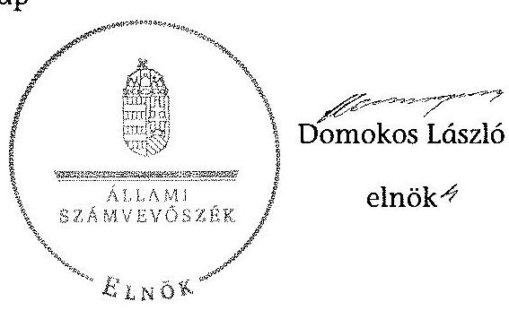
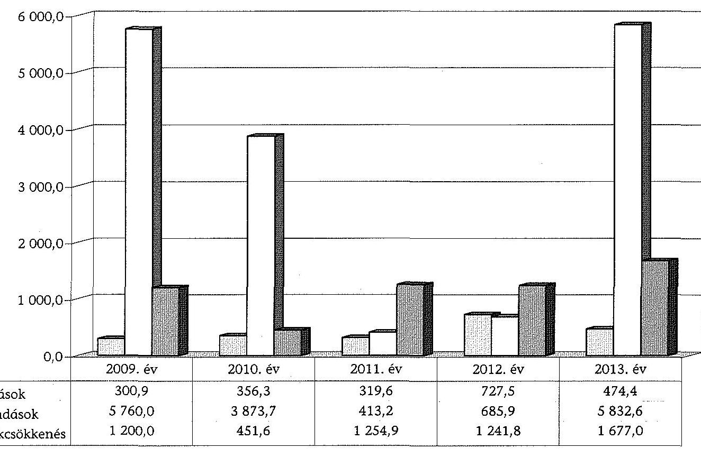
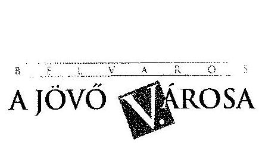
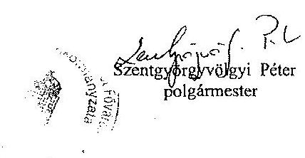
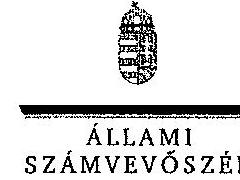
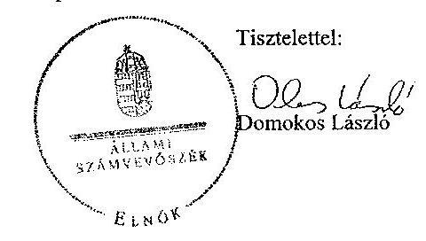

ÁLLAMI
SZÁMVEVŐSZÉK

# JELENTÉS 

az önkormányzatok vagyongazdálkodása szabályszerűségének ellenőrzéséről
Belváros-Lipótváros Budapest Főváros V. kerület

---

# Állami Számvevőszék 

Iktatószám: V-0540-067/2014.
Témaszám: 1574
Vizsgálat-azonosító szám: V068305
Az ellenőrzést felügyelte:
Makkai Mária
felügyeleti vezető
Az ellenőrzést vezette és az ellenőrzés végrehajtásáért felelős:
Páncsics Judit
ellenőrzésvezető
A számvevőszéki jelentés összeállításában közremúködtek:
Nyikon Zsigmondné
számvevő főtanácsos
Szabó Zsuzsanna
számvevő
Varga Ágnes Klára
számvevő
Az ellenőrzést végezték:

| Nyikon Zsigmondné | Szabó Zsuzsanna | Varga Ágnes Klára |
| :-- | :-- | :-- |
| számvevő főtanácsos | számvevő | számvevő |

---

# TARTALOMJEGYZÉK 

BEVEZETÉS ..... 3
I. ÖSSZEGZŐ MEGÁLLAPÍTÁSOK, KÖVETKEZTETÉSEK, JAVASLATOK ..... 7
II. RÉSZLETES MEGÁLLAPÍTÁSOK ..... 12

1. A vagyongazdálkodási tevékenység szabályozása ..... 12
1.1. A vagyongazdálkodási feladatellátás szabályozása ..... 12
1.2. A vagyon kezelésére, koncesszióba adására, üzemeltetésére kötött szerződések megfelelősége ..... 15
2. A vagyongazdálkodási tevékenység szabályszerűsége ..... 17
2.1. A vagyon nyilvántartása és leltározása ..... 17
2.2. Meghatározó mértékű vagyonváltozások ..... 19
2.3. Beruházások, felújítások szabályszerűsége ..... 21
2.4. A vagyon értékesítésének, hasznosításának, a követelés elengedésének szabályszerűsége ..... 22
3. Az önkormányzati tulajdonosi jog gyakorlása ..... 24
4. Integritás érvényesülése ..... 26
5. A belső és a külső ellenőrzések hasznosulása ..... 27
5.1. A belső ellenőrzés javaslatainak hasznosulása ..... 27
5.2. A külső ellenőrzések javaslatainak hasznosulása ..... 29
MELLÉKLETEK
6. számú Belváros-Lipótváros Budapest Főváros V. kerület Önkormányzata vagyonának főbb adatai 2009. január 1-je és 2013. december 31-e között
7. számú Belváros-Lipótváros Budapest Főváros V. kerület Önkormányzata felújítási és beruházási kiadásai, valamint az elszámolt értékcsökkenés bemutatása 2009-2013 között
8. számú Belváros-Lipótváros Budapest Főváros V. kerület Önkormányzata polgármesterének észrevétele
9. számú Belváros-Lipótváros Budapest Főváros V. kerület Önkormányzata polgármesterének észrevételére adott válasz

## FÜGGELÉKEK

1. számú Rövidítések jegyzéke
2. számú Értelmező szótár

---

.

---

# JELENTÉS 

## az önkormányzatok vagyongazdálkodása szabályszerűségének ellenőrzéséről Belváros-Lipótváros Budapest Főváros V. kerület

## BEVEZETÉS

Az ÁSZ stratégiai célkitűzése, hogy ellenőrzéseivel mind jobban segítse az átláthatóságot, az elszámoltathatóságot és elszámoltatást a közpénzekkel és a közvagyonnal való gazdálkodásban. Magyarország Alaptörvénye rögzíti, hogy az állam és a helyi önkormányzat tulajdona a nemzeti vagyon része. Az önkormányzati vagyon alapvető funkciója, hogy a közérdeket és egyúttal az önkormányzati célok - elsősorban a kötelezően ellátandó feladatok, és emellett a lehetőségek mértékéig az önként vállalt feladatok - megvalósítását szolgálja.

Az ÁSZ az önkormányzati vagyongazdálkodás 2012. évben indított és 2013. évben folytatott ellenőrzéseinek tapasztalatai alapján indokoltnak látta, hogy a 2014. évi ellenőrzési tervébe is beépítésre kerüljön a vagyongazdálkodási tevékenységek ellenőrzése. Az eddig elvégzett ellenőrzések rámutattak, hogy az önkormányzatok vagyongazdálkodási tevékenységét érintő szabályozottság, a kapcsolódó nyilvántartások, a beszámolók leltárral történő alátámasztása, a gazdálkodási jogkörök szabályszerű gyakorlása és a döntések meglapozottsága terén hiányosságok tapasztalhatók. Ez indokolttá tette a vagyongazdálkodás ellenőrzésének folytatását a jelentős vagyonnal rendelkező vagy az ÁSZ kockázatelemzése alapján magas vagyoni kockázatot mutató önkormányzatoknál.

Az ellenőrzés célja annak megállapítása volt, hogy az önkormányzat vagyongazdálkodási tevékenységét a jogszabályi előírásokkal összhangban szabályozta-e, a vagyon nyilvántartása és a vagyongazdálkodási tevékenységek végrehajtása a jogszabályoknak és a belső előírásoknak megfelelően történt-e. Az ellenőrzés célja továbbá annak megállapítása, hogy az önkormányzatnál a vagyongazdálkodás során biztosították-e az átláthatóságot, valamint a külső és belső ellenőrzések megállapításai, javaslatai hozzájárultak-e a szabályszerű vagyongazdálkodáshoz.

Ennek keretében értékeltük, hogy az Önkormányzat:

- szabályszerűen alakította-e ki vagyongazdálkodási tevékenységének kereteit;
- biztosította-e a vagyongazdálkodás szabályszerűségét, megalapozottan hoz-ta-e és jogszerűen, szabályszerűen hajtotta-e végre a vagyonváltozást eredményező meghatározó jelentőségű döntéseket;
- gondoskodott-e a tulajdonosi jogok gyakorlásáról;

---

- vagyongazdálkodási tevékenysége során biztosította-e az átláthatóság és az integritás érvényesülését;
- belső ellenőrzése elősegítette-e a vagyongazdálkodás szabályszerű működését, valamint hasznosította-e a vagyongazdálkodási tevékenységével kapcsolatos külső és belső ellenőrzések megállapításait, javaslatait.

Az ellenőrzés várható hasznosulása, hogy feltárja az önkormányzati vagyongazdálkodást meghatározó szabályok, szabályozások összhangjának hiányosságait, a szabályozással nem érintett vagyongazdálkodási területeket, a vagyongazdálkodási tevékenység gyakorlásának esetleges szabálytalanságait, valamint a jó gyakorlat kialakításán és terjesztésén keresztül az ellenőrzések elősegíthetik a vagyongazdálkodás szabályszerűségének javítását.

Az ellenőrzés típusa: szabályszerűségi ellenőrzés.
Az ellenőrzött időszak: 2009. január 1-jétől 2013. december 31-ig, illetve a közbeszerzési eljárások lefolytatásának ellenőrzése 2012. január 1-jétől az Önkormányzat helyszíni ellenőrzésének kezdetét megelőző negyedév végéig (2014. március 31-ig) tartott.

Ellenőrzött szervezet: Belváros-Lipótváros Budapest Főváros V. kerület Önkormányzata.

Az ellenőrzés végrehajtásának jogszabályi alapját az Állami Számvevőszékről szóló 2011. évi LXVI. törvény 1. § (3) bekezdése, az 5. § (2)-(6) bekezdései, valamint az államháztartásról szóló 2011. évi CXCV. törvény 61. § (2) bekezdésének előírásai képezik.

Az ellenőrzés szakmai módszertana az ÁSZ hivatalos honlapján közzétett szakmai szabályokon alapult, amely a Legfőbb Ellenőrző Intézmények Nemzetközi Szervezete (INTOSAI) által kiadott nemzetközi standardok (ISSAI) figyelembevételével készült.

Az ellenőrzést az ÁSZ hatályos szervezeti szabályai és az ellenőrzési programban foglalt értékelési szempontok szerint folytattuk le. Megállapításainkat a helyszíni ellenőrzés tapasztalataira, az ellenőrzött szervezettől bekért dokumentumokra, a kitöltött tanúsítványok elemzésére, az adott időszakban hatályos jogszabályok és belső szabályzatok előírásaira alapoztuk. A részesedések értékelését tételesen ellenőriztük, míg irányított mintavétellel választottuk ki az ellenőrzött térítésmentes átadás-átvételeket, a beruházásokat, felújításokat, a közbeszerzési eljárásokat, a vagyon értékesítését, hasznosítását és a követelés elengedést, illetve leírást. A belső kontrollok megfelelő működését (a szakmai teljesítésigazolást, valamint a 2009-2011. években az utalvány ellenjegyzést, a 2012-2013. években az érvényesítést) a Polgármesteri hivatal felhalmozási kiadásaiból választott véletlen minta alapján, megfelelőségi teszttel ellenőriztük.

Az V. kerület lakosainak száma 2013. január 1-jén 26058 fő volt. A 2010. évi önkormányzati választásokig a 24 tagú Képviselő-testület munkáját nyolc állandó bizottság segítette. Az önkormányzati választások után a Képviselőtestület létszáma 15 fơre csökkent és hét állandó bizottság múködött. A polgármester a 2006. évi önkormányzati választás óta tölti be tisztségét, a jelenle-

---

gi jegyző 2013. szeptember 2-től látja el feladatait. A Polgármesteri hivatal tizenegy szervezeti egységre (tíz osztályra és a Belső ellenőrzési csoportra) tagolódott, elkülönített gazdasági szervezettel nem rendelkezett. A vagyongazdálkodással kapcsolatos feladatokat a Vagyon-nyilvántartási és Hasznosítási Osztály látta el.

Az Önkormányzat a 2013. évben az önállóan működő és gazdálkodó Polgármesteri hivatalon felül kettő önállóan működő és gazdálkodó, valamint hat önállóan működő költségvetési szervvel látta el a feladatait. Az önkormányzati feladatok ellátásában 2013-ban kilenc 100\%-os tulajdonában álló és egy többségi tulajdonában lévő gazdasági társasága, valamint egy társulás vett részt.

Az idősek szociális ellátásáról a Segítő Kezek NKft.-vel, a felszín alatti parkolásról a Szt. István téri Mélygarázs Kft.-vel, az ingatlan elidegenítések előkészítéséről, a fejlesztések teljes körű bonyolításáról a Vagyonkezelő Zrt.-vel, a kerületi televíziós műsorszolgáltatásról a City TV Kft.-vel, a közművelődésről az Aranytíz Kft.-vel, a köztisztaságról, az út- és parkfenntartásról, a vásárcsarnok üzemeltetéséről, az intézmények épületfenntartásáról a Városüzemeltető Kft.vel gondoskodtak. A városfejlesztési projekt menedzseri feladatok ellátását a Városfejlesztő Kft.-vel, a Váci utca és környéke patinájának, értékének helyreállítását a Váci utca Kft.-vel, a nemzetiségi hagyományok ápolását a Cigányzenekar NKft.-vel, a testvérvárosi kapcsolatok ápolását a Monturist Kft.-vel biztosították. A közterületek hasznosításáról az FKHT útján gondoskodtak.

Az Önkormányzat a 2009-2013. évek között vállalkozási tevékenységet nem végzett, vagyonkezelési, haszonélvezeti és koncessziós jogot alapító szerződést nem kötött. Az ellenőrzött időszakban PPP konstrukcióban megvalósított fejlesztésre nem került sor. Az ÁSZ a 2009-2013. évek között az Önkormányzatnál nem végzett ellenőrzést.

Az Önkormányzat könyvviteli mérleg szerinti vagyona a 2009. évi 72631,7 millió Ft-os nyitó értékről a 2013. év végére 73535,9 millió Ft-ra, $1,2 \%$-kal növekedett. A 904,2 millió Ft-os vagyongyarapodás a befektetett eszközök 6466,5 millió Ft-os növekedéséből és a forgó eszközök 5562,3 millió Ft-os csökkenéséből keletkezett. A befektetett eszközökön belül a tárgyi eszközök értéke $27,6 \%$-kal, 13311,4 millió Ft-tal nőtt az ingatlanok és a kapcsolódó vagyoni értékű jogok állományi értékének 7124,7 millió Ft-os, valamint a befejezetlen beruházások 6135,1 millió Ft-os növekedésének hatására. A forgó eszközökön belül a követelések és a pénzeszközök értéke is $50 \%$-ot meghaladó mértékben csökkent. Az Önkormányzat összes kötelezettségének állományi értéke 2013. december 31-én 10106,4 millió Ft volt. A pénzintézeti kötelezettségük állományi értéke 6224,7 millió Ft-ot tett ki, melyet a Magyar Állam 2014-ben az adósságrendezés keretében átvállalt.

Az Önkormányzat a 2013. évi költségvetési beszámolója szerint 19655,8 millió Ft költségvetési bevételt ért el és 20777,7 millió Ft költségvetési kiadást teljesített. A felhalmozási célú kiadásokra 6617,4 millió Ft-ot, ezen belül a felújítási és a beruházási kiadásokra 6307,0 millió Ft-ot fordítottak.

Az Önkormányzat vagyonának főbb adatait, továbbá a felújítási és a beruházási kiadásokat, valamint az elszámolt értékcsökkenést az 1-2. számú mellékle-

---

tek mutatják be. Az alkalmazott rövidítéseket és az egyes fogalmak magyarázatát az 1-2. számú függelék tartalmazza.

Az ÁSZ a 2011. évi LXVI. törvény 29. §-a szerint a jelentéstervezetet megküldte Belváros-Lipótváros Budapest Főváros V. kerület Önkormányzata polgármesterének egyeztetésre. A polgármester észrevételét és az arra adott választ a jelentés 3-4. számú mellékletei tartalmazzák.

---

# I. ÖSSZEGZŐ MEGÁLLAPÍTÁSOK, KÖVETKEZTETÉSEK, JAVASLATOK 

Az Önkormányzatnál a vagyongazdálkodási tevékenység kereteit a 2009-2013. években helyi rendeletekben és belső szabályzatokban, utasításokban szabályosan alakították ki. A Képviselő-testület a 2009-2013. években a vagyongazdálkodási rendelet ${ }_{1,2}$-ben meghatározta az önkormányzati feladatellátást biztosító törzsvagyonát, valamint a forgalomképes (üzleti) vagyon körébe tartozó vagyonelemeket. Rendelkezett a forgalomképesség szerinti besorolás megváltoztatásának módjáról és hatásköréről. A vagyongazdálkodási rende-let ${ }_{1,2}$-ben előírta a nyilvános versenyeztetési kötelezettséget - a mindenkori költségvetési törvényben meghatározott értékhatárt meghaladó - vagyonértékesítés, kezelésbe adás és használati jog átadása esetében. A Képviselő-testület az Nvtv. előírásainak megfelelően, határidőn belül elfogadta a felülvizsgált vagyongazdálkodási rendelet ${ }_{2}$-t, a forgalomképtelen vagyonelemek közül egyetlen vagyonelemet sem minősített nemzetgazdasági szempontból kiemelt jelentőségű nemzeti vagyonnak. Megalkotta a vagyonkezelői jog alapítására, gyakorlására és ellenőrzésére vonatkozó részletes szabályokat. Az ellenőrzött időszakban vagyonkezelési szerződést nem kötöttek.

A Képviselő-testület az Ötv.-ben, illetve az Mötv.-ben foglaltak alapján vagyongazdálkodási hatásköröket ruházott át - értékhatárhoz kötötten - a polgármesterre és az egyes bizottságokra az önkormányzati SZMSZ ${ }_{1,2}$-ben és a vagyongazdálkodási rendelet ${ }_{1,2}$-ben. Az átruházott hatáskörök gyakorlói a döntéseikről évente beszámoltak.

A Polgármesteri hivatal az ellenőrzött időszakban rendelkezett az Áhsz. ${ }_{1}$ előírásainak és a helyi sajátosságoknak megfelelő számviteli politika ${ }_{1,2,3}$-mal és a hozzá kapcsolódó egyes tevékenységek részletes előírásait tartalmazó pénzkezelési, leltározási, selejtezési és értékelési szabályzatokkal. A kötelezettségvállalási szabályzat ${ }_{1,2,3}$ - az Ámr. ${ }_{1,2}$-ben és az Ávr.-ben előírtaknak megfelelően - tartalmazta az operatív gazdálkodással kapcsolatos eljárásrendet és az összeférhetetlenségi követelményeket. A Polgármesteri hivatalban a 2009-2013. években a gazdálkodási jogkörök gyakorlása az ellenőrzött felhalmozási kiadások esetében a jogszabályoknak és a kötelezettségvállalási szabályzat ${ }_{1,2,3}$ előírásainak - eseti hiányosságok kivételével - megfelelt.

Az ellenőrzött üzemeltetési szerződésekben rögzítették a kötelezően ellátandó önkormányzati feladatokat, az üzemeltetésre átadott vagyonnal való gazdálkodás szabályait és meghatározták a vagyon állagának és értékének megőrzési kötelezettségét. A szerződésekben szabályozták a beszámolási kötelezettséget, a szerződési feltételek nem teljesítésének esetére szankciókat írtak elő.

Az Önkormányzatnak 2013. december 31-én egy olyan gazdasági társaságban volt 1\%-os tulajdonosi részesedése, amely az Nvtv. szerint nem átlátható. Az Önkormányzat az Nvtv.-ben előírt határidőre nem kezdeményezte a gazdálkodó szervezet tulajdonosi szerkezetének e törvény átlátható szervezetre vonatkozó előírásainak megfelelő átalakítását.

---

Az Önkormányzatnál a vagyongazdálkodási tevékenység szabályszerűsége a vagyonnyilvántartás hiányosságai ellenére megfelelt a szabályozási követelményeknek. Az Önkormányzatnál a főkönyvi számlák alábontásával, a számlákhoz kapcsolódó analitikus nyilvántartások vezetésével biztosították a törzsvagyon, ezen belül a forgalomképtelen és korlátozottan forgalomképes, illetve a forgalomképes (üzleti) vagyon elkülönített nyilvántartását. A polgármester a vagyonkimutatást minden évben a zárszámadási rendelettervezet előterjesztésekor a Képviselő-testület részére tájékoztatásul bemutatta. A vagyonkimutatás tartalma, szerkezete megfelelt az Áhsz.; előírásainak.

Az Önkormányzatnál a 2009-2011. években az ingatlanvagyon-kataszter és a földhivatali ingatlan nyilvántartás azonos tartalmú adatai között az egyezőséget a 147/1992. (XI. 6.) Korm. rendelet előírása ellenére nem biztosították. Az ingatlanvagyon-kataszter bruttó érték adatainak az ingatlanvagyon számviteli nyilvántartás szerinti adataival való egyezősége a 2009-2011. években a 147/1992. (XI. 6.) Korm. rendeletben foglaltak ellenére - nem volt biztosított, a számviteli nyilvántartásokban és az ingatlanvagyon-kataszterben az ingatlanok forgalomképesség szerinti besorolási adatai között eltérés volt. A hiányosságot feltárták, azonban az ingatlanvagyon-kataszteri és számviteli nyilvántartás rendezéséről az éves beszámolók elkészítését követően intézkedtek. A fővárosi önkormányzatnak 2013-ban törvényi rendelkezés alapján vagyonkezelésbe átadott ingatlanokat a vagyonkataszterben és a számviteli nyilvántartásokban az ingatlanok állományából a vagyonkezelésbe átadott eszközök közé 2013. december 31-ig nem vezették át.

Az Önkormányzatnál a 2009-2013. évi könyvviteli mérlegekben kimutatott eszközöket és forrásokat leltárral alátámasztották. Az Önkormányzatnál a 2009-2013. években a leltározási kötelezettségnek - az ingatlanok és az üzemeltetésre átadott tárgyi eszközök kivételével - az Áhsz.,-ben és a leltározási szabályzat ${ }_{1,2}$-ben előírt módon tettek eleget. Az ingatlanok és az üzemeltetésre átadott tárgyi eszközök mérleg szerinti értékét az Áhsz.; előírása ellenére nem mennyiségi felvétellel, hanem egyeztetéssel készült leltárral támasztották alá. A 2010-2013. években az üzemeltetésre átadott eszközöket az üzemeltetők nem mennyiségi felvétellel leltározták, a leltározást a Polgármesteri hivatal egyeztetéssel végezte el. A 2009-2013. évek mérlegbeszámolóiban az üzemeltetésre átadott eszközök értékét nem az Áhsz.;-ben előírtak szerint mutatták ki, mivel olyan ingatlanokat tartottak nyilván az üzemeltetésre átadott ingatlanok között, amelyek a Képviselő-testület döntése alapján már korábban kikerültek az üzemeltetésre átadott ingatlanok közül.

Az ellenőrzött időszakban az Önkormányzat által teljesített beruházások és felújítások a gazdasági program ${ }_{1,2}$-vel összhangban voltak, a kötelező és önként vállalt feladatok ellátását szolgálták. A beruházások és felújítások fedezetéről a Képviselő-testület az éves költségvetési rendeletek elfogadásakor döntött, biztosította azok finanszírozhatóságát és fenntarthatóságát. A döntéseket dokumentumokkal, előterjesztésekkel, beruházási célokmányokkal támasztották alá, melyeket a Képviselő-testület és az arra felhatalmazott szervei szabályszerűen hoztak meg. Az ellenőrzött közbeszerzési eljárások lebonyolítása során a Kbt. ${ }_{2}$ előírásait betartották. A 2009-2013. években a fejlesztésekre fordított 18744,1 millió Ft kiadás több mint 3 -szorosa volt az elszámolt értékcsökkenés

---

(5825,3 millió Ft-os) összegének, ezzel az Önkormányzat hozzájárult az elhasználódott eszközök pótlásához.

Az Önkormányzatnál - a 2009-2013. évek között - a vagyonértékesítések és egyéb hasznosítások döntései jogszerűek voltak. A tételesen ellenőrzött vagyonértékesítésekre és egyéb hasznosításokra értékbecsléssel alátámasztott ellenérték alapján, a jogszabályok és a belső szabályzatok előírásainak megfelelően került sor.

A követelések elengedése során a vagyongazdálkodási rendelet ${ }_{1,2}$ szerint, az arra hatáskörrel rendelkezők döntése alapján, szabályszerűen jártak el. A behajthatatlan követelések leírása az Áhsz. ${ }_{1}$ előírásaival összhangban, az arra hatáskörrel rendelkezők jóváhagyását követően történt. Az ellenőrzött időszakban térítésmentesen az Önkormányzaton kívülre vagyont nem adtak át, illetve térítésmentesen az Önkormányzaton kívülről nem vettek át.

A Képviselő-testület a 2009-2013. években két 100\%-os tulajdonában álló gazdasági társaságot alapított, egy társaságot nyilvános pályázaton értékesített, egy társaságot pedig végelszámolással megszüntetett. A Képviselő-testület a 100\%-os tulajdonában álló gazdasági társaságok esetében élt az alapító okiratokban rögzített tulajdonosi jogaival, megválasztotta a vezető testületeket, a könyvvizsgálót, a felügyelő bizottságot, döntött a díjazásukról, beszámoltatásukról, munkájuk értékeléséről, visszahívásukról. Az Önkormányzat a részesedésével érintett gazdasági társaságok esetében az üzleti tervek és az éves beszámolók elfogadásával, valamint az általa delegált igazgatósági és felügyelő bizottsági tagok beszámoltatásával biztosította a tulajdonosi jogainak gyakorlását. A társasági részesedések értékelését a 2011. évtől végezték el, az elszámolt értékvesztéseket, illetve visszaírásokat az Önkormányzatnál - egy eset kivételével - a megfelelő dokumentumokkal alátámasztották. Az Önkormányzat a gazdasági társaságok részére garanciát, kezességet nem vállalt.

Az Önkormányzatnál a vagyongazdálkodási tevékenység integritása (feddhetetlensége) szempontjából az eredendő és a korrupciós kockázatok értéke - az ÁSZ által a 2013. évben mért - az önkormányzati alrendszer átlagértékéhez képest magasabb. Az Önkormányzatnál kiépült kontrollok képesek kezelni a kockázatokat, valamint támogatni a szervezet feladatellátását.

A belső ellenőrzés feladatait a Polgármesteri hivatalnál, az intézményeknél és az önkormányzati tulajdonú gazdasági társaságoknál 2009-2013 között a hivatal állományába tartozó köztisztviselők látták el. A belső ellenőrzés szervezeti és funkcionális függetlenségét biztosították. A belső ellenőrzéseket a Képvi-selő-testület által elfogadott ellenőrzési tervek alapján hajtották végre. Az ellenőrzési tervekhez a 2010-2013. években kockázatelemzés nem készült. A belső ellenőrzés a vagyongazdálkodással kapcsolatban 19 ellenőrzést végzett. Ellenőrizték a gazdálkodási jogkörök gyakorlását, a közbeszerzési eljárásokat, a 100\%-os önkormányzati tulajdonban álló gazdasági társaságok közszolgálati szerződésében foglalt éves díjaknak, valamint a költségvetési támogatások felhasználásának szabályszerűségét. A belső ellenőrzés a megállapításaival és a javaslataival hozzájárult az Önkormányzat vagyongazdálkodásának szabályszerű működéséhez.

---

A könyvvizsgáló az Önkormányzat 2009-2013. évi beszámolóit megbízhatónak és hitelesnek minősítette, jelentéseiben vagyongazdálkodással kapcsolatos megállapítást a 2009. és a 2011. években tett, melyet az Önkormányzatnál figyelembe vettek.

Külső ellenőrzést a Kormányhivatal végzett, a vagyongazdálkodási rende-let ${ }_{2}$-re vonatkozóan törvényességi felhívással élt. Az Önkormányzat a rendeletét módosította és erről tájékoztatta a Kormányhivatalt.

Az Állami Számvevőszékről szóló 2011. évi LXVI. törvény 33. § (1) bekezdésében foglaltak értelmében a jelentésben foglalt megállapításokhoz kapcsolódó intézkedési tervet köteles az ellenőrzött szervezet vezetője összeállítani, és azt a jelentés kézhezvételétől számított 30 napon belül az ÁSZ részére megküldeni. Amennyiben az intézkedési tervet határidőben nem küldi meg a szervezet, vagy az nem elfogadható, az ÁSZ elnöke a hivatkozott törvény 33. § (3) bekezdés a)-b) pontjaiban foglaltakat érvényesítheti.

Az ellenőrzés intézkedést igénylő megállapításai és javaslatai:

# a jegyzőnek: 

1. Az Önkormányzat - a 2012. évi CXC. törvény 1. § b) pontja alapján - fővárosi önkormányzat részére 2013. július 1. napján vagyonezelésbe adott forgalomképtelen földterület és egyéb építmények vagyonelemei az ingatlanvagyon-kataszterben és a könyvviteli mérlegben az Áhsz., 20. § (1) bekezdésben előírtak ellenére a vagyonezelésbe átadott eszközök helyett az ingatlanok között kerültek kimutatásra.

Javaslat:
Intézkedjen arról, hogy a fővárosi önkormányzat részére a törvényi rendelkezés alapján vagyonkezelésbe átadott eszközöket az Önkormányzat könyvviteli mérlegében és az ingatlanvagyon-kataszterben a jogszabályi előírásnak megfelelően mutassák ki.
2. A tulajdonjogban, vagy az ingatlan valóságos állapotában bekövetkezett változást 147/1992. (XI. 6.) Korm. rendelet 4. § (3) bekezdésében előírtak ellenére - földhivatali ingatlan-nyilvántartásban való átvezetéséig az ingatlanvagyon-kataszterben elkülönítetten, földhivatallal rendezendő tételként nem tartották nyilván. A 2009-2011. években értékesített öt lakás és nem lakás célú ingatlant a számviteli nyilvántartásokból és a kataszteri nyilvántartásból nem az értékesítés évében, hanem azt követő években vezettek ki. Ezáltal az ingatlanvagyon-kataszter adatlapjai és a betétlapjai, illetve a földhivatali ingatlan nyilvántartás azonos tartalmú adatai között - a 147/1992. (XI. 6.) Korm. rendelet 1. § (2) bekezdésében előírtak ellenére - a teljes körű egyezőség nem állt fenn.

Javaslat:
Intézkedjen arról, hogy az ingatlanvagyon-kataszter adatlapjai és a betétlapjai, illetve a földhivatali ingatlan nyilvántartás azonos tartalmú adatai között az teljes körű egyezőség álljon fenn.

---

3. Az Önkormányzatnál a 2009-2013. években az ingatlanok mennyiségi felvétellel történő leltározását az Áhsz. ${ }_{1}$ 37. § (3) bekezdése, a vagyongazdálkodási rendelet ${ }_{1,2}$ és a leltározási szabályzat ${ }_{1,2}$ előírásai ellenére kétévente nem végezték el.

Javaslat:
Intézkedjen annak érdekében, hogy az ingatlanok mennyiségi felvétellel történő leltározása a vonatkozó jogszabályban, a vagyongazdálkodási rendelet ${ }_{2}$-ben és a leltározási szabályzatban előírtaknak megfelelő gyakorisággal történjen.
4. A 2010-2013. években az üzemeltetésre átadott tárgyi eszközök mérlegszerinti értékét az Áhsz. ${ }_{1}$ 37. § (4) bekezdésben foglalt előírásokkal ellentétben nem az üzemeltetést végző szerv által elkészített és hitelesített leltárral támasztották alá. A leltározást a Polgármesteri hivatal egyeztetéssel végezte el.

Javaslat:
Intézkedjen annak érdekében, hogy az üzemeltetésre átadott eszközökről a könyvviteli mérleg alátámasztásához az üzemeltetést végzők által elkészített, hitelesített leltárak rendelkezésre álljanak.

---

# II. RÉSZLETES MEGÁLLAPÍTÁSOK 

## 1. A VAGYONGAZDÁLKODÁSI TEVÉKENYSÉG SZABÁLYOZÁSA

### 1.1. A vagyongazdálkodási feladatellátás szabályozása

A Képviselő-testület a 2007-2010. évekre és 2011-2014. évekre szóló gazdasági program ${ }_{1,2}$-ben meghatározta a vagyongazdálkodással kapcsolatos feladatait, célkitűzéseit. A 2007-2010. évekre szóló gazdasági program ${ }_{1}$ a hosszú távú fejlesztési és beruházási célokat és a prioritásokat, valamint a gazdasági program pilléreit tartalmazta. A 2011-2014. évekre szóló gazdasági program ${ }_{2}$ az alapelveket, a befektetés-támogatási- és városüzemeltetési politika célkitűzéseit, az ágazati feladatokat és prioritásokat, a költségvetési irányokat, az adópolitika célkitűzéseit határozta meg. Az Önkormányzat - a gazdasági program ${ }_{1,2}$-n kívül - rendelkezett helyi gazdaságfejlesztési stratégiával, lakáskoncepcióval és integrált városfejlesztési stratégiával.

Az Önkormányzatnál az Nvtv. 9. § (1) bekezdésében előírt közép és hosszú távú vagyongazdálkodási tervet a helyszíni ellenőrzés végéig még nem készítettek.

A Képviselő-testület által elfogadott lakáskoncepció, az integrált városfejlesztési stratégia és a gazdasági program ${ }_{1,2}$ is tartalmazott közép és hosszú távú vagyongazdálkodásra vonatkozó irányelveket.

Az Önkormányzat az ellenőrzött időszakban a kötelező és önként vállalt feladatainak körét, azok ellátásának mértékét és módját az Ötv. 8. § (2) bekezdésében ${ }^{1}$ foglaltak szerint a 2009-2013. évi költségvetési rendeletek mellékletében feladatkörönként bemutatta. Az Önkormányzat a kötelező és önként vállalt feladatait a Polgármesteri hivatalon, az intézményrendszerén, a 100\%-os tulajdonában álló közhasznú nonprofit társaságain és a gazdasági társaságain keresztül, továbbá társulásokkal és vállalkozásokkal kötött szerződések útján látta el.

Az Önkormányzat 2013-ban a feladatai ellátására két 100\%-os tulajdonában álló gazdasági társaságot alapított.

A Képviselő-testület a 116/2013. (IV. 11.) számú határozatával megalapította 0,5 millió Ft törzstőkével a Váci utca Kft.-t, melynek főtevékenysége közönség kapcsolatok szervezése és a kommunikáció a Váci utca és környéke patinájának, értékének helyreállítása érdekében. A Képviselő-testület a 240/2013. (VI. 13.) számú határozatával megalapította 0,5 millió Ft törzstőkével a Segítő Kezek NKft.-t, melynek alaptevékenysége az idő́korú emberek számára nem bentlakásos formában szociális ellátás, segítség nyújtása.

A Képviselő-testület - a Htv. 138. § (1) bekezdés j) pontjában előírtaknak megfelelően - a vagyongazdálkodással kapcsolatos feladat- és hatáskört a teljes

[^0]
[^0]:    ${ }^{1}$ 2013. január 1-jével az Mötv. 10. § (1) bekezdése és a 12. § (2) bekezdése szabályozza.

---

vagyoni körre kiterjedően a vagyongazdálkodási rendelet ${ }_{1,2}$-ben szabályozta. Meghatározták az önkormányzati feladatellátást biztosító törzsvagyont, ezen belül a forgalomképtelen és a korlátozottan forgalomképes vagyonelemek körét, a forgalomképesség megváltoztatásának módját. A vagyongazdálkodási rendelet ${ }_{1,2}$ szerint a forgalomképesség megváltoztatását bizottsági javaslat alapján a polgármester kezdeményezi, a döntést a Képviselő-testület hozza meg.

A Képviselő-testület az Nvtv. 18. § (1) bekezdésében foglalt 60 napos határidőn belül elfogadta a felülvizsgált vagyongazdálkodási rendelet ${ }_{2}$-t. A Képviselőtestület a forgalomképtelen vagyonelemek közül egyetlen vagyonelemet sem minősített nemzetgazdasági szempontból kiemelt jelentőségű nemzeti vagyonná.

A vagyongazdálkodási rendelet ${ }_{1,2}$-ben a vagyonkezelői jog megszerzésének, gyakorlásának feltételeit szabályozták. Meghatározták, hogy a vagyonkezelői jog ellenértékének mértékéről, a vagyonkezelői jog ingyenes átengedésről, a vagyonkezelés ellenőrzésének részletes szabályairól a Képviselő-testület dönt. Az Önkormányzat az Ötv. 80/A. § (1) bekezdése ${ }^{2}$ alapján 2009-2012. februárja között nem határozott meg olyan vagyoni kört, amelyre vagyonkezelői jog létesíthető. A vagyongazdálkodási rendelet ${ }_{2}$ 2012. február 13-tól tartalmazta, hogy az Önkormányzat tulajdonában lévő ingatlanvagyonra - az Nvtv. rendelkezései szerint - a közfeladat átadáshoz kapcsolódóan alapítható vagyonkezelői jog. A vagyongazdálkodási rendelet ${ }_{2}$-ben 2012. februárjától szabályozták a vagyonkezelés ellenőrzésének eljárásrendjét is. A vagyonkezelésbe adható vagyoni kört 2013 április 18-tól újra szabályozták, és úgy rendelkeztek, hogy vagyonkezelői jog a közfeladat ellátásához szükséges önkormányzati tulajdonban lévő ingó- és ingatlanvagyon elemekre létesíthető, a vagyon ingyenesen vagyonkezelésbe kizárólag közfeladat ellátása céljából, a közfeladat ellátásához szükséges mértékben adható. Önkormányzati vagyont az ellenőrzött időszakban - törvényben előírtak kivételével - ingyenesen nem adtak vagyonkezelésbe.

Az Önkormányzatnál a lakások és a nem lakás céljára szolgáló helyiségek bérletére, elidegenítésre vonatkozó helyi szabályokat a Lakás tv. alapján a lakások bérbeadásáról szóló rendeletben, a nem lakás célú helyiségek bérbeadásáról szóló rendeletben, valamint a nem lakás célú helyiség bérlővel terhelt elidegenítéséről szóló rendeletben határozták meg.

A követelések elengedésének eseteit és azok módját az Áht. ${ }_{1}$ 108. § (2) bekezdésében ${ }^{3}$ előírtaknak megfelelően a Képviselő-testület rendeletben szabályozta.

A lakástámogatási rendeletben meghatározták, hogy a lakásépítéshez, lakásvásárláshoz adott önkormányzati támogatásból fennálló kölcsöntartozás $40 \%$-a elengedhető, amennyiben a támogatásban részesült a tartozását egy összegben kiegyenlíti. A munkáltatói lakáscélú támogatási rendelet ${ }_{1,2}$-ben meghatározták a kamatmentes munkáltatói kölcsön elengedésének vagy csökkentésének esetelt. A

[^0]
[^0]:    ${ }^{2}$ 2012. január 1-jétől az Mötv. 143. § (4) bekezdés i) pontja írja elő.
    ${ }^{3}$ 2012. január 1-jétől az Áht. ${ }_{2}$ 97. § (2) bekezdése írja elő.

---

közterület használati rendelet ${ }_{1,2}$ a közfeladat ellátása érdekében lehetővé tette a használati díj csökkentését. A követelés elengedésekről a polgármester dönthetett.

A Képviselő-testület a vagyon értékesítésére, vagyonkezelési, használati jogának átengedésére vonatkozó nyilvános versenyeztetési kötelezettséget - az Áht. ${ }_{1}$ 108. § (1) bekezdésében, illetve az Nvtv. 11. § (16) bekezdésében és a 13. § (1) bekezdésében előírtaknak megfelelően a vagyongazdálkodási rendelet ${ }_{1,2}{ }^{-}$ ben - a mindenkori költségvetési törvényben foglalt értékhatárt meghaladó esetekben írta elő.

A vagyongazdálkodási rendelet ${ }_{2}$ 22. §-a meghatározta a vagyon ingyenes vagy a forgalmi értéknél több mint $30 \%$-kal alacsonyabb értéken történő átruházásának feltételeit köztestület, önkormányzat, illetve társasházak részére. A Kép-viselő-testület e rendelkezést az Nvtv. 13. § (3) bekezdésének 2012. június 30-i hatályba lépése ellenére csak 2013. április 18-tól helyezte hatályon kívül. Ingyenes vagyonátruházásra az ellenőrzött időszakban nem került sor.

A vagyontárgyak feletti tulajdonosi jogok gyakorlásának módját a vagyongazdálkodási rendelet ${ }_{1,2}$-ben meghatározták. A Képviselő-testület az Ötv. 9. § (3) bekezdése ${ }^{4}$ alapján az önkormányzati SZMSZ ${ }_{1,2}$-ben és a vagyongazdálkodási rendelet ${ }_{1,2}$-ben - értékhatárokhoz kötve - a polgármesternek és a bizottságoknak adott át vagyongazdálkodási hatáskört és beszámolási kötelezettséget írt elő az átruházott hatáskörben hozott döntésekről. A bizottságok és a polgármester minden évben beszámoltak tevékenységükről, az átruházott hatáskörben hozott döntéseikről.

A Polgármesteri hivatal elkészítette az Áhsz. ${ }_{1}$-nek és a helyi sajátosságoknak megfelelő számviteli politika ${ }_{1,2,3}$-at és a hozzá kapcsolódó - egyes tevékenységek részletes előírásait tartalmazó - pénzkezelési, leltározási, selejtezési és értékelési szabályzatokat. A számviteli politika ${ }_{1,2,3}$-ban a tárgyi eszközök üzembe helyezésének dokumentálási szabályait előírták. Az Önkormányzatnál az Áhsz. ${ }_{1} 9$. számú melléklete 1. k) pontja ellenére nem szabályozták a főkönyvi és az analitikus nyilvántartások forgalomképesség szerinti részletezését, azonban az előírás elmaradása ellenére a nyilvántartásokban a szükséges részletezésről gondoskodtak.

Az Önkormányzatnál nem éltek az immateriális javak, tárgyi eszközök, továbbá a befektetett pénzügyi eszközök Áhsz. ${ }_{1} 32 . \S$ (7) bekezdésében biztosított piaci értéken történő értékelésének lehetőségével.

A Képviselő-testület a vagyongazdálkodási rendelet ${ }_{1,2}$-ben az eszközök kétévenkénti mennyiségi felvétellel történő leltározását - az Áhsz. ${ }_{1} 37 . \S$ (7) bekezdése alapján - jóváhagyta. A leltározási szabályzat ${ }_{1,2}$ az üzemeltetésre átadott eszközök leltározásának módját a 2009. évben az Áhsz. ${ }_{1} 37 . \S$ (1)-(2) bekezdéseiben, a 2010-2013. években pedig az Áhsz. ${ }_{1} 37 . \S$ (1) és (4) bekezdésében ${ }^{5}$ foglal-

[^0]
[^0]:    ${ }^{4}$ 2013. január 1-jétől az Mötv. 41. § (4) bekezdése írja elő.
    ${ }^{5}$ 2014. január 1-jétől az Áhsz. ${ }_{2}$ 22. § (2) bekezdés a) pontja csak a koncesszióba és vagyonkezelésbe adott eszközöket müködtetető, vagyonkezelő által elkészített és hitelesített leltárakat írja elő.

---

taknak megfelelően tartalmazta. Az Áhsz. ${ }_{1}$ utóbbi bekezdése előírta, hogy a mérlegben az üzemeltetésre átadott eszközöket az üzemeltető által elkészített és hitelesített leltárakkal kell alátámasztani.

Az Önkormányzatnál a számviteli politika ${ }_{1,2,3}$-ban a jogszabályi előírásoknak megfelelően meghatározták a befektetett eszközök értékcsökkenési leírásának elszámolási módját. Az Áhsz. ${ }_{1} 30 . \S$ (2) bekezdésében ${ }^{6}$ foglalt leírási kulcsok alkalmazásától nem tértek el.

A Képviselő-testület a vagyonkimutatás tartalmát az Áhsz. ${ }_{1}$ 44/A. § (1)-(3) bekezdéseivel ${ }^{7}$ összhangban a vagyongazdálkodási rendelet ${ }_{1,3}$-ben határozta meg.

A kötelezettségvállalási szabályzat ${ }_{1,2,3}$ - az Ámr. ${ }_{1,2}$-ben és az Ávr.-ben előírtaknak ${ }^{8}$ megfelelően - tartalmazta az operatív gazdálkodással kapcsolatos eljárásrendet és az összeférhetetlenségi követelményeket.

A kötelezettségvállalási szabályzat ${ }_{1,2}$ 2012. június 30-ig előírta, hogy a kiadások teljesítésének és a bevételek beszedésének elrendelése előtt minden esetben okmányok alapján ellenőrizni, szakmailag igazolni kell azok jogosultságát, öszszegszerüségét, a szerződés, megrendelés, megállapodás teljesítését. A Polgármesteri hivatalban 2012. július 1-jétől a kötelezettségvállalási szabályzat ${ }_{2}$-ban nem éltek az Ámr. ${ }_{2} 76 . \S$ (2) bekezdésének lehetőségével, nem írták elő a bevételekre a szakmai teljesítésigazolást.

Az Önkormányzat rendelkezett a Kbt. ${ }_{1,2} 6 . \S$ (1), illetve a 22. § (1) bekezdésében előírtaknak megfelelő közbeszerzési szabályzat ${ }_{1,2}$-vel.

# 1.2. A vagyon kezelésére, koncesszióba adására, üzemeltetésére kötött szerződések megfelelősége 

Az Önkormányzat a lakás és helyiség gazdálkodási és az üzemeltetési feladatok ellátására a 100\%-os tulajdonában álló Vagyonkezelő Zrt.-vel és a Városüzemeltető Kft.-vel kötött szerződést.

A Vagyonkezelő Zrt. 2007. október 18-tól megbízási szerződés, 2010. február 1jétől közszolgáltatási szerződés alapján látta el az önkormányzati lakás és helyiség gazdálkodási feladatokat.

A szerződések szerint a Vagyonkezelő Zrt. feladata volt - a tulajdonosi döntések alapján - a helyiség és lakás bérbeadás teljes körű bonyolítása, az Önkormányzat helyett és nevében a lakásokra és helyiségekre vonatkozó bérbeadói szerződések megkötése, az önkormányzati tulajdonú épületek üzemeltetése. Ellátta a nem lakás célú helyiségek elidegenítésével összefüggő feladatok előkészítését és lebonyolítását, a kivitelezések teljes körű bonyolítását. A közszolgáltatási szerződés

[^0]
[^0]:    ${ }^{6}$ 2014. január 1-jétől Áhsz. ${ }_{2}$ 17. § (1) bekezdése írja elő.
    ${ }^{7}$ 2014. január 1-jétől az Áhsz. ${ }_{2}$ 30. § (1)-(3) bekezdései szabályozzák.
    ${ }^{8}$ az Ámr. ${ }_{1}$ 134-137. § és 138. § (1)-(3) bekezdése, az Ámr. ${ }_{2}$ 72. §, 74-79. § és 80. § (1)-(2) bekezdése, valamint az Ávr. 52. § (1) bekezdés c) pontja, 53-59. §-a, és a 60. § (1)-(2) bekezdése szerint

---

2011. február 28-i módosításával a Vagyonkezelő Zrt. tevékenységi köre a tulajdonosi képviseletre, a jogi tevékenységre, az elidegenítés, valamint a fejlesztések (beruházás, felújítás) teljes körű bonyolítására szűkült.

Az Önkormányzat 2009. január 1-jétől a Városüzemeltető Kft.-vel az intézmények használatában lévő ingatlanok üzemeletetési feladatainak ellátására határozatlan időre szolgáltatási szerződést kötött.

A Városüzemeltető Kft. szerződés szerinti feladata kiterjedt az intézmények üzemviteli feladatainak, karbantartási munkáinak elvégzésére, a sportpincék, továbbá a parkok, játszóterek üzemeltetésére, karbantartására, felújítására, a szociális boltok múködtetésére, a diák és felnőtt üdültetésre, a napközis táborozás bonyolítására. A szolgáltatási szerződés helyébe 2010. február 1-jétől 2020. május 31-ig terjedő időtartamra közszolgáltatási szerződést kötöttek, mely keretében a Kft. feladata az épületek, a lakások és a nem lakás célú helyiségek rendeltetésszerű állapotban tartása, karbantartása, üzemeltetési feladatainak ellátása volt.

Az Önkormányzat 1994. november 22-én társulási szerződést kötött a fővárosi önkormányzattal a közterületi parkolók működtetésére, üzemeltetésére. Az FKPT 2012. december 31-vel az önkormányzatok döntése alapján jogutód nélkül került megszüntetésre. Az FKPT megszüntetésével az eszközök az Önkormányzat tulajdonába kerültek, az Önkormányzat területén lévő parkolók működtetését és üzemeltetését 2013. január 1-jétől a Közterület felügyelet látja el.

Az Önkormányzat 1999-ben határozatlan időre haszonbérleti szerződést kötött a 100\%-os tulajdonában álló BLIBER Kft.-vel a Hold utcai vásárcsarnok hasznosítási és üzemeltetési feladatainak ellátására. A haszonbérleti szerződést a Képviselő-testület a 347/2010. (VI. 10.) számú határozatával felmondta, a BLIBER Kft.-t végelszámolással megszüntette, a Hold utcai vásárcsarnok üzemeltetésével kapcsolatos feladatokat a Városüzemeltető Kft.-nek adta át.

Az Önkormányzat 2000-ben a Mélygarázs 2000 Kft.-vel szerződést kötött - 50 évre szóló haszonélvezeti jog biztosításával - a Szabadság téri mélygarázs megépítésére és üzemeltetésére.

A vagyon üzemeltetésre történő átadása a Képviselő-testület döntése alapján, szabályszerűen történt. Az ellenőrzött megbízási, szolgáltatási, közszolgáltatási, illetve haszonbérleti szerződésekben rögzítették a kötelezően ellátandó önkormányzati feladatokat, az üzemeltetésre átadott vagyonnal való gazdálkodás szabályait és meghatározták a vagyon állagának, értékének megőrzési kötelezettségét. A szerződésekben szabályozták a beszámolási kötelezettséget, a szerződési feltételek nem teljesítésének esetére szankciókat írtak elő, de ezek érvényesítésére az ellenőrzött időszakban nem került sor. A közszolgáltatási szerződésekben meghatározták a finanszírozás módját és ütemezését, valamint előírták az adatszolgáltatási, az elszámolási és a beszámolási kötelezettséget, amelynek az ellenőrzött időszakban a szerződésekben foglaltaknak megfelelően eleget tettek. A Pénzügyi osztály minden évben ellenőrizte az adatszolgáltatások helyességét és megbízhatóságát.

A kizárólagosan az Önkormányzat hatáskörébe utalt tevékenységek gyakorlásának koncessziós szerződés alapján való átengedésére nem került sor.

---

Az Önkormányzatnak 2013. december 31-én egy olyan gazdasági társaságban volt 1\%-os tulajdonosi részesedése, amely az Nvtv. 3. § (1) bekezdés 1. pontja alapján nem átlátható. Az Önkormányzat az Nvtv. 18. § (4) bekezdésében előírtak ellenére 2012. december 31-ig, illetve az ellenőrzött időszak végéig nem kezdeményezte a gazdálkodó szervezet tulajdonosi szerkezetének e törvény átlátható szervezetre vonatkozó előírásainak megfelelő átalakítását.

Az Önkormányzatnak az Olimpia Kereskedelmi és Szolgáltató Kft.-ben 5,4 millió Ft névértékű ( $1 \%$-os) részesedése volt. Az Önkormányzat megállapította, hogy a társaság minősített többségi befolyással rendelkező tulajdonosa nem minősül átlátható szervezetnek.

# 2. A VAGYONGAZDÁLKODÁSI TEVÉKENYSÉG SZABÁLYSZERŰSÉGE 

### 2.1. A vagyon nyilvántartása és leltározása

Az Önkormányzat a vagyongazdálkodása során biztosította a szabályszerűséget, a vagyonváltozást eredményező meghatározó jelentőségű döntéseket megalapozottan hozta meg és jogszerűen, szabályszerűen hajtotta végre.

Az Önkormányzatnál a 2009-2013. években az Ötv. 78. § (2) bekezdésében ${ }^{9}$ előírtaknak megfelelően elkészítették a vagyonkimutatást és azt a zárszámadási rendelettervezet előterjesztésekor - az Áht. ${ }_{1}$ 118. § (2) bekezdése 2. c) pontjában ${ }^{10}$ előírtak szerint - a Képviselő-testület részére tájékoztatásul bemutatták. A vagyonkimutatások szerkezete, felépítése, tartalma megfelelt az Áhsz. ${ }_{1} 44 /$ A. § (2)-(3) bekezdéseiben ${ }^{11}$, valamint a vagyongazdálkodási rendelet ${ }_{1,2}$-ben meghatározott előírásoknak, biztosította a törzsvagyon, ezen belül a forgalomképtelen és a korlátozottan forgalomképes, illetve az üzleti (forgalomképes) vagyon elkülönített nyilvántartását.

A Polgármesteri hivatalban a főkönyvi számlák alábontásával, valamint a számlákhoz kapcsolódó analitikus nyilvántartások vezetésével biztosították a törzsvagyon többi vagyontárgytól elkülönített nyilvántartását.

Az Önkormányzatnál - a 147/1992. (XI. 6.) Korm. rendeletben előírtak szerint folyamatosan vezették az ingatlanvagyon-katasztert, abban az ingatlanvagyont törzsvagyon és egyéb vagyon szerinti bontásban elkülönítették. A tulajdonjogban, vagy az ingatlan valóságos állapotában bekövetkezett változást - a 147/1992. (XI. 6.) Korm. rendelet 4. § (3) bekezdésében előírtak ellenére - a földhivatali ingatlan-nyilvántartásban való átvezetésig a kataszterben elkülönítetten, földhivatallal rendezendő tételként nem tartották nyilván. Az Áhsz. ${ }_{1}$ 51. § (1) bekezdés a) pontjában ${ }^{12}$ előírtak ellenére a 2009-2011. években értékesített öt lakás és nem lakás célú ingatlant a számviteli nyilvántartásokból és a kataszteri nyilvántartásból nem az értékesítés évében, hanem azt követő

[^0]
[^0]:    ${ }^{9}$ 2012. január 1-jétől az Mötv. 110. § (2) bekezdése szabályozza.
    ${ }^{10}$ 2012. január 1-jétől az Áht. ${ }_{2}$ 91. § (2) bekezdés c) pontja szabályozza.
    ${ }^{11}$ 2014. január 1-jétől az Áhsz. ${ }_{2}$ 30. § (2)-(3) bekezdései szabályozzák.
    ${ }^{12}$ 2014. január 1-jétől az Áhsz. ${ }_{2}$ 53. § (2) bekezdése szabályozza.

---

években vezették ki. Ezáltal az ingatlanvagyon-kataszter adatlapjai és betétlapjai, illetve a földhivatali ingatlan nyilvántartás azonos tartalmú adatai között - a 147/1992. (XI. 6.) Korm. rendelet 1. § (2) bekezdésében előírtak ellenére - a teljes körű egyezőség nem állt fenn ${ }^{13}$.

A jegyző ${ }_{1,2}$ a számviteli nyilvántartás ingatlanvagyon adatainak az ingatlan-vagyon-kataszter bruttó érték adataival való egyezőségét a 2009-2011. években - a 147/1992. (XI. 6.) Korm. rendelet 1. § (3) bekezdésében és a 2. számú mellékletében foglaltak ellenére - nem biztosította.

Az Áhsz. ${ }_{1}$ 51. § (1) bekezdés b) pontjában ${ }^{14}$ előírtak ellenére a 2009. évben a vagyonkimutatásban a forgalomképtelen ingatlanok bruttó értéke 31,4 millió Fttal, a korlátozottan forgalomképes ingatlanoké 57,1 millió Ft-tal volt magasabb, a forgalomképes ingatlanok értéke pedig 88,5 millió Ft-tal volt kevesebb a vagyonkataszter azonos tartalmú adatainál.

A könyvvizsgáló a 2009. évi költségvetés végrehatásának ellenőrzéséről készült jelentésében az eltérést megállapította. A hiányosságok feltárását, kivizsgálását és az egyeztetéseket követően a 2010. évben a nyilvántartásokban a módosításokat elvégezték. A 2010-2011. években egy ingatlan felújítását a vagyonkataszterben nem rögzítették, ezért a vagyonkimutatásban az ingatlanok bruttó értéke összességében 2,1 millió Ft-tal magasabb volt, a hiányosságot 2012. évben pótolták.

A számviteli nyilvántartásban szereplő ingatlanvagyont, valamint az ingat-lanvagyon-kataszter bruttó érték adatait minden évben dokumentáltan egyeztették. Az egyeztetés során az ellenőrzésünk által feltárt eltéréseket észlelték, azonban az ingatlanvagyon-kataszteri és a számviteli nyilvántartás rendezéséről késedelmesen intézkedtek.

Az Önkormányzatnál a 2009-2013. években - az ingatlanok és az üzemeltetésre átadott tárgyi eszközök kivételével - az Áhsz. ${ }_{1}$ 37. § (1) bekezdésében előírt leltározási kötelezettségnek a leltározási szabályzat ${ }_{1,2}$-ben foglaltaknak megfelelően december 31-ei fordulónappal eleget tettek. Az Önkormányzatnál a 2009-2013. években a könyvviteli mérlegben kimutatott eszközök közül az ingatlanok és az üzemeltetésre átadott tárgyi eszközök mérleg szerinti értékét az Áhsz. 1 37. § (2)-(4) bekezdéseiben ${ }^{15}$ előírtak ellenére nem mennyiségi felvétellel készült leltárral dokumentálták, továbbá a 2010-2013. években nem az üzemeltetést végző szerv által elkészített és hitelesített leltárral támasztották alá, azokat a Polgármesteri hivatal egyeztetés módszerével leltározta.

Az üzemeltetésre átadott eszközök mennyiségi felvétellel történő leltározásának hiányában az üzemeltetésre átadott eszközökkel kapcsolatos gazdasági eseményeket a számviteli nyilvántartásban nem az előírásoknak megfelelően rögzítették, emiatt a 2009-2013. évek mérlegbeszámolóiban az üzemeltetésre, illetve

[^0]
[^0]:    ${ }^{13}$ A jegyző ${ }_{2}$ 2014. június 27-én intézkedett az adatok egyeztetésének megkezdéséről.
    ${ }^{14}$ 2014. január 1-jétől az Áhsz. ${ }_{2}$ 53. § (6) bekezdés b) pontja szabályozza.
    ${ }^{15}$ 2014. január 1-jétől az Áhsz. ${ }_{2}$ 22. § (2)-(3) bekezdése szabályozza.

---

kezelésre átadott eszközök értékét nem az Áhsz. 20. § (1) bekezdésében ${ }^{16}$ előírtak szerint mutatták ki.

A 2009-2010. években a Vagyonkezelő Zrt. által üzemeltetett önkormányzati lakásokat és nem lakás célú ingatlanokat az ingatlanok között tartották nyilván és nem az üzemeltetésre átadott eszközök között. A 2009-2012. években az üzemeltetésre átadott ingatlanok között került kimutatásra a Közterület felügyelet által használt Dorottya u. 9. fsz. 4. szám alatti helyiség annak ellenére, hogy a Közterület felügyelet az Önkormányzat költségvetési szerve, valamint a 2010-2012. években a Hercegprímás u. 14-16. szám alatti ingatlan ${ }^{17}$ annak ellenére, hogy az épület üzemeltetési szerződése 2010. augusztus 31 -ével megszűnt.

Az egyes ingatlanok fővárosi önkormányzat részére történő átadásáról, valamint önkormányzatokat érintő egyes törvények módosításáról szóló 2012. évi CXC. törvény 1. § b) pontja alapján 2013. július 1. napján az Önkormányzat tulajdonát képező 23817/2 helyrajzi számú és 23817/3 helyrajzi számú forgalomképtelen földterületek és az azokon lévő egyéb építmények a fơvárosi önkormányzat vagyonkezelésébe kerültek. Az átadott vagyonelemek értékét 2013. év végén a mérlegben (a számviteli nyilvántartásokban) és a vagyonkataszterben is az üzemeltetésre, kezelésre átadott eszközök helyett az ingatlanok között mutatták ki, összesen 23,5 millió Ft összegben.

A leltározási dokumentumok, jegyzőkönyvek szerint a leltárak értékelését a 2009-2013. években elvégezték, a 2009. és a 2013. évben számszaki hiba miatt minimális ( 2000 Ft alatti) eltérést rögzítettek.

A Polgármesteri hivatalban az eszközök évente elvégzett selejtezése, a felesleges eszközök hasznosítása és az ár megállapítása során betartották a selejtezési szabályzat ${ }_{1,2}$ előírásait. A selejtezésre kijelölt eszközök minősítését a jegyző ${ }_{1,2}$ hagyta jóvá.

# 2.2. Meghatározó mértékú vagyonváltozások 

Az Önkormányzat könyvviteli mérleg szerinti vagyona a 2009. évi 72631,7 millió Ft-os nyitó értékről 2013. év végére 73 535,9 millió Ft-ra, 1,2\%kal emelkedett. A vagyonnövekedést elsősorban a tárgyi eszközökön belül az ingatlanok és a befejezetlen beruházások állományának növekedése eredményezte, miközben a forgóeszközök közül a pénzeszközök értéke csökkent. A 2009-2013. években a fejlesztésekre fordított 18744,1 millió Ft kiadás több mint 3-szorosa volt az elszámolt értékcsökkenés (5825,3 millió Ft-os) összegének, ezzel az Önkormányzat hozzájárult az elhasználódott eszközök pótlásához.

A befektetett eszközökön belül az ingatlanok részaránya a 2009. évről a 2013. évre $68,9 \%$-ról $77,1 \%$-ra, könyvviteli mérlegben kimutatott állományi értéke 7124,7 millió Ft-tal növekedett a felújítások, beruházások aktiválása és az üzemeltetésre átadott ingatlanok közé való visszavezetése miatt. Az üzemelte-

[^0]
[^0]:    ${ }^{16}$ hatálytalan 2014. január 1-jétől
    ${ }^{17}$ az ingatlanban Belváros-Lipótváros Egészségügyi Szolgálata múködött

---

tésre átadott eszközök közül 2013. évben az ingatlanok közé visszavezetett Szabadság téri mélygarázs értéke 4098,7 millió Ft-ot tett ki.

Az önkormányzati intézményeket érintő 2009-2013. évi változások (intézménylétesítés, összevonás, átadás) nem befolyásolták az önkormányzati vagyon alakulását.

A 2013. év végére a befejezetlen beruházások, felújítások 2009. évi nyitó értéke 1663,5 millió Ft-ról 7798,6 millió Ft-ra, közel a 4,7-szeresére emelkedett első sorban a BUFK II. üteme ( 4193,5 millió Ft ) és a felszíni területek kialakítása (1752,1 millió Ft) folyamatba lévő beruházása miatt.

A befektetett pénzügyi eszközök állományi értékének (1911,4 millió Ft-os, $22,5 \%$-os) csökkenését a tartós részesedések és a tartósan adott kölcsönök állományának csökkenése együttesen okozta. Az Önkormányzatnál a 2011. évtől vizsgálták a tulajdoni részesedések esetében az értékvesztés elszámolásának szükségességét. A 2009-2013. években a felszámolás, végelszámolás alatt lévő társaságok esetében az értékvesztést a részesedés bekerülési értékéig elszámolták.

A mérlegben a tartós részesedések állományi értéke a 2010. évről a 2011. évre 3242,2 millió Ft-tal, $51,5 \%$-kal csökkent. A csökkenés elsősorban annak az eredménye volt, hogy az Önkormányzatnál az ellenőrzött időszakot megelőzően (a 2008. évben) a Szt. István téri Mélygarázs Kft.-től átvállalt 1800,0 millió Ft hitelt szabálytalanul, részesedésként vették nyilvántartásba, majd (könyvvizsgálói javaslatra) 2011. évben az 1800,0 millió Ft-ot a részesedésekből kivezették és a követelések között mutatták ki. A Vagyonkezelő Zrt. részesedése a 2011. évben tőkeleszállítás miatt 1420,0 millió Ft-tal csökkent. A 2010. évben a BLIBER Kft. végelszámolása miatt 1415,3 millió Ft-tal, a BLIF Zrt. értékesítése miatt 100,0 millió Fttal csökkent a részesedések könyvszerinti értéke.

Az Önkormányzat könyvviteli mérleg szerinti forrásain belül a saját tőke állománya a 2013. év végére a fejlesztések, beruházások eredményeként 20,2\%kal, (10 303,8 millió Ft-tal) növekedett és 61221,4 millió Ft-ot tett ki. A tartalékok 2683,0 millió Ft-tal, a hosszú és a rövid lejáratú kötelezettségek 5863,6 millió Ft-tal csökkentek.

Az Önkormányzat a vagyon növekedésének pénzügyi fedezetét - a gazdasági program ${ }_{1,2}$ célkitűzésének megfelelően - saját bevételeiből, kötvénykibocsátásból, valamint EU-s támogatásokból származó bevételekből biztosította.

Az Önkormányzat 2012. december 31-én fennálló pénzintézeti kötelezettségeinek állománya 12649,4 millió Ft volt, melyből a Magyar Állam 2013-ban 5055,9 millió Ft-ot ( $40,0 \%$-ot), 2014-ben 6260,1 millió Ft-ot vállalt át.

A rövid lejáratú kötelezettségek állománya a 2009. évről a 2013. évre 88,4\%$\mathrm{kal}, 1522,8$ millió Ft-tal növekedett az egyéb kötelezettségek állományának 267,6\%-os, (1663,3 millió Ft-os) emelkedése mellett. A 2013. évben az egyéb kötelezettség állomány legnagyobb összege az előző évről áthúzódó BUFK II. beruházás 1054,8 millió Ft-os támogatás előfinanszírozása, valamint a 916,0 millió Ft-os támogatási program előleg ( 90,8 millió Ft a Déli Belváros megújítási projekthez, 825,2 millió Ft BUFK II. beruházáshoz kapott EU-s előleg) volt.

---

# 2.3. Beruházások, felújítások szabályszerűsége 

Az ellenőrzött időszakban az Önkormányzat által teljesített beruházások és felújítások a gazdasági program ${ }_{1,2}$-vel összhangban voltak, a kötelező és az önként vállalt feladatok ellátását szolgálták. A beruházások fedezetéről a Képvise-lő-testület az éves költségvetési rendeletek elfogadásakor döntött, a fejlesztések finanszírozhatóságát és fenntarthatóságát biztosították.

Az Önkormányzat adatszolgáltatása szerint a fejlesztésekhez felhasznált 11497,4 millió Ft kiadás fedezetét 703,1 millió Ft összegben uniós forrás, 4135,4 millió Ft értékben kötvénykibocsátásból származó bevétel, valamint 6658,9 millió Ft összegben saját bevételek képezték. Az ellenőrzött beruházások és felújítások minden esetben a Képviselő-testület, illetve bizottsági hatáskörben hozott döntések alapján valósultak meg. A közbeszerzési értékhatárt elérő beruházások, felújítások esetén a közbeszerzési eljárást lefolytatták. A beruházási szerződésekben az Önkormányzat részletesen meghatározta a vállalkozói kötelezettségeket, valamint a megvalósulást és a jó teljesítést elősegítő pénzügyi és garanciális biztosítékokat. Az elkészült beruházások műszaki átvétele és a teljesítés igazolása jegyzőkönyvek alapján történt. Az ellenőrzött beruházások aktivált bruttó nyilvántartási értékét az ingatlanvagyon-kataszteri nyilvántartásban szabályosan átvezették.

Az Önkormányzat adatszolgáltatása szerint 2012. január 1-jétől 2014. év I. negyedév végéig összesen 61 közbeszerzési eljárást indított, amelyből 48 a felhalmozási tevékenységhez kapcsolódott 3912,1 millió Ft+áfa értékben, míg 13 a múködési kiadásokkal volt összefüggésben 573,9 millió Ft+áfa értékben.

Az eljárások közül 23 hirdetmény közzététele nélküli tárgyalásos, 20 nyílt eljárás, 17 keret-megállapodásos eljárás alapján lefolytatott, egy hirdetmény közzététel nélküli meghívásos eljárás volt.

A 2012-2013. években és a 2014. év I. negyedévében az Önkormányzat által indított közbeszerzési eljárások ellen nem kezdeményeztek jogorvoslati eljárást.

A tételesen ellenőrzött közbeszerzési eljárások ${ }^{18}$ lebonyolítása megfelelt a Kbt. ${ }_{2}$ előírásainak. Az ajánlattételi felhívásokban rögzítették a bírálati szempontokat, a bíráló bizottság kijelölése az előírásoknak megfelelően történt. Az ajánlatokat minden esetben a bíráló bizottság értékelte, az eljárások összegzője időben elkészült. A szerződéseket a nyertes ajánlattevő ajánlata és az ajánlati felhívásban rögzített feltételek szerint kötötték meg. Az Önkormányzatnál határidőben, hirdetményben tették közzé az eljárások eredményét, valamint az önkormányzati honlapon a közérdekú adatok között közzétették a szerződések adatait.

A Polgármesteri hivatalban a 2009-2013. években a gazdálkodási jogkörök gyakorlása az ellenőrzött felhalmozási kiadások esetében a jogszabályoknak és

[^0]
[^0]:    ${ }^{18}$ a BUFK II. ütem és kapcsolódó munkák kivitelezése, az Akadémia utca burkolat cseréje, a Kossuth Lajos utca közösségi tér kialakítása, a Duna-korzó díszburkolat kialakítása, a Hold utcai vásárcsarnok átalakítása, felújítása, a Duna korzó közvilágításának megújítása, a Zoltán utcai mélygarázs kialakítása

---

a kötelezettségvállalási szabályzat ${ }_{1,2,3}$ előírásainak - eseti hibákat kivéve - megfelelt. A vagyonváltozásokkal összefüggő kiadások teljesítése során a gazdálkodási jogköröket az Ámr. ${ }_{1,2}$-ben, illetve az Ávr.-ben és a kötelezettségvállalási szabályzat ${ }_{1}$-ben előírtaknak megfelelően gyakorolták.

# 2.4. A vagyon értékesítésének, hasznosításának, a követelés elengedésének szabályszerűsége 

Az Önkormányzat a 2009-2013 években 206 db ingatlant értékesített 14643,8 millió Ft értékben, amelyből 15 ingatlan (összesen 3885,8 millió Ft) értékesítésének folyamatát ellenőriztük tételesen.

Az Önkormányzat az értékesítésre vonatkozó döntések során betartotta az Áht. ${ }_{1}$ 108. § (1) bekezdésének ${ }^{19}$, valamint a vagyongazdálkodási rendelet ${ }_{1,2}$ 13. §ának előírását, amely szerint önkormányzati vagyont értékesíteni - ha törvény kivételt nem tesz - csak nyilvános versenytárgyalás útján lehet. A vagyongazdálkodási rendelet ${ }_{1,2}$ előírásaival összhangban az értékesítést megelőzte forgalmi értékbecslés készítése. Az adásvételi szerződéseket az értékesítésről szóló döntésekkel megegyező tartalommal kötötték meg.

A nem lakás céljára szolgáló ingatlan értékesítések közül nyolc értékesítésről a vagyongazdálkodási rendelet ${ }_{1,2} 13 . \S$-a szerint - a bérlő vételi szándéka alapján, pályáztatás nélkül - a Képviselő-testület döntött, kettő ingatlan értékesítése - a versenyeztetési szabályzatnak megfelelően - nyilvános pályázati kiírás alapján történt. A vagyonváltozásról hozott döntések a pályázati kiírásban foglaltakkal összhangban voltak és a döntésekkel azonos tartalmú szerződéseket, megállapodásokat kötöttek. A vagyon értékesítése során a vagyongazdálkodási rendelet ${ }_{1,2}$-ben meghatározottak szerint elkészítették és közzé tették a nyílt, nemzetközi többfordulós pályázati kiírást. Az ingatlanok eladási árát értékbecslés alapján a Képviselő-testület hagyta jóvá. Az adásvételi szerződések az Önkormányzat érdekeit védő garanciális elemeket tartalmazták, a szerződéseket tulajdonjog fenntartásával kötötték meg a teljes vételár megfizetéséig. Az ingatlanokat az értékesítést követően az ingatlanvagyon-kataszterből és a Polgármesteri hivatal számviteli nyilvántartásából öt esetben tárgyéven túl vezették ki.

Az Önkormányzatnál a lakások és helyiségek hasznosítása az ellenőrzött időszakban 1884 db lakás és 1266 db helyiségre kiterjedően 2035,0 millió Ft bérleti díj bevétel mellett valósult meg. Az ellenőrzött lakás és helyiség bérleti szerződések alapján az Önkormányzatnak 2009-2013 között 21,6 millió Ft bérleti dí előírása volt, amelyből 14,0 millió Ft bevétele keletkezett ${ }^{20}$. A bérbeadásokról szóló döntéseket a hatásköri szabályokat betartva, a bérbeadási pályázati dokumentációkkal alátámasztottan hozták meg. A vagyonhasznosítások esetében - az előterjesztésekkel megegyező - bizottsági és képviselő-testületi dönté-

[^0]
[^0]:    ${ }^{19}$ 2012. január 1-jétől az Nvtv. 13. § (1) bekezdése írja elő a nemzeti vagyon tulajdonának átruházása során a versenyeztetés követelményét.
    ${ }^{20}$ A 2012. évi hátralékból 7,0 millió Ft-ot fizetési felszólítás ellenére nem rendezett a bérlő, ezért az Önkormányzat a szerződést 2014. június 30 -ával felmondta, a 2013. évi hátralékból 0,4 millió Ft behajtás alatt áll.

---

sekkel azonos tartalmú szerződéseket kötöttek. A szerződésekbe az Önkormányzat érdekeit védő garanciális elemeket - késedelmes fizetés esetére szankcióként késedelmi kamat felszámítását, a bérleti díj meg nem fizetése esetére a bérleti jogviszony felmondását - beépítették.

Az önkormányzati tulajdonú ingatlanok bérbeadási feladatait a 2009-2010. évek között a Vagyonkezelő Zrt., a 2011. évtől az Önkormányzat látta el. A bérleti díjakat a vagyonkezelő társaság, illetve a Polgármesteri hivatal a nem lakás célú helyiségek bérbeadásáról-, a lakások bérbeadásáról-, a lakások lakbérének mértékéről szóló rendeletek előírásai alapján számlázta ki a bérlőknek.

Az ellenőrzött időszakban az Önkormányzat kimutatása szerint tartósan - egy évet meghaladóan - használaton kívül 51 lakás és 129 nem lakás célú helyisége volt, melyeknek a könyv szerinti nettó értéke 786,9 millió Ft-ot tett ki. Az Önkormányzat az alacsonyabb komfortfokozatú, üresen álló ingatlanokat pályáztatta bérbeadás, illetve eladás céljából.

A követelés elengedés, valamint behajthatatlanság miatti kivezetés a 20092013. évek között az Önkormányzat kimutatása szerint 263,2 millió Ft értékben fordult elő. A mintatételek ellenőrzése alapján szabályszerűen, a megfelelő döntésekkel, dokumentumokkal alátámasztottan történt az önkormányzati követelések elengedése, illetve a követelések behajthatatlanná minősítése.

A számviteli nyilvántartásokban a követelések elengedését, valamint a behajthatatlan követelések kivezetését a jogszerűen hozott határozatok és végzések alapján rögzítették. Az ellenőrzött időszakban a főkönyvi kivezetés évente, a zárlatkor történt. A behajthatatlan követeléseket az Áhsz. 34. § (10) bekezdésének megfelelően a saját tőkével szemben, hitelezési veszteségként írták le. Az éves beszámolók tájékoztató adatai az Áhsz. 38. § (6) bekezdése n) pontjával ${ }^{21}$ ellentétben nem, vagy nem a számviteli nyilvántartással egyező összegben tartalmazták a behajthatatlannak minősített követeléseket.

A behajthatatlan követelések leírt összege az Önkormányzat kimutatása szerint az ellenőrzött időszakban összesen 239,5 millió Ft volt.

Az ellenőrzött tételek adóigazgatási eljárásban bizonyultak behajthatatlan követelésnek. A követelések behajtása érdekében a Polgármesteri hivatal által alkalmazott végrehajtási eljárási intézkedések, határidők megfeleltek az Art. 144145. §-ában, a 150-158. §-ában és a 160-164. §-ában, valamint a Ket. 124-133. § és a 140-144. §-ában a végrehajtási eljárásokra előírt szabályoknak. A behajthatatlanság tényét a tételes ellenőrzés alá vont dokumentumok a számviteli politi$\mathrm{ka}_{1,2,3}$ előírásainak megfelelően tartalmazták.

A behajthatatlan követelésekre a későbbiekben teljesített befizetések elszámolása nem felelt meg az Áhsz., 9. számú melléklete 2. ci) pontjában foglaltaknak, mivel azokat az egyéb sajátos bevételek helyett - negatív előjellel - a behajthatatlan követelések között mutatták ki.

[^0]
[^0]:    ${ }^{21}$ 2014. január 1-jétől az Áhsz ${ }_{2}$ 10. melléklet 10. pont szerint

---

Követelés elengedésre az ellenőrzött időszakban méltányosságból a Képvise-lő-testület, a polgármester, illetve a jegyző ${ }_{1,2}$ hatás- és jogkörében, helyi rendeleten ${ }^{22}$ vagy törvényen alapuló döntések alapján került sor. Az Önkormányzatnál a helyi adók és a gépjármúadó, valamint ezek pótléka, bírsága, illetve a végrehajtási és egyéb bírságok elengedésére az Art., a Gjt. és Ket. rendelkezéseit alkalmazták. Az elengedett követelések összege a 2009-2013. években összesen 23,7 millió Ft volt.

Az ellenőrzött követelés elengedések közül nyolc tétel az Art. hatálya alá tartozott (építményadó, gépjárműadó bírsága és késedelmi pótléka), hét mintatétel pedig lakásépítéshez nyújtott visszatérítendő önkormányzati támogatás és munkáltatói lakástámogatás elengedése volt. A gépjárműadó és az építményadó késedelmi pótlékai és bírságai követelés elengedésére az Art. 134. § (1) és (3) bekezdései alapján került sor, a 81. § b) pontban és 82. § (2) bekezdésben előírt hatásköri, illetékességi szabályok betartásával. A lakástámogatási rendelet 10. § (5) bekezdése alapján az önkormányzati kedvezményes kölcsön határidő előtti törlesztése esetén járó tartozás elengedéséről - kérelemre, négy esetben - döntött a polgármester, három esetben munkáltatói kamatmentes kölcsön vissza nem térítendő támogatássá alakítására a munkáltatói lakáscélú támogatási rendelet; 3. § (1) bekezdés b) pontja alapján került sor a Lakásbizottság előterjesztése alapján, a jegyző ${ }_{1}$ döntésével.

# 3. AZ ÖNKORMÁNYZATI TULAJDONOSI JOG GYAKORLÁSA 

A Képviselő-testület az önkormányzati feladatokat ellátó költségvetési szerveket beszámoltatta a rendelkezésükre bocsátott vagyon használatáról. A beszámolási kötelezettségnek az intézmények az éves beszámolóikban eleget tettek, amelyeket a 2009-2013. évi zárszámadási rendeletek tárgyalása keretében a Képviselő-testület elfogadott.

A Képviselő-testület, illetve (átruházott hatáskörben eljárva) a Pénzügyi Bizottság az ellenőrzött időszakban megtárgyalta és elfogadta az Önkormányzat 100\%-os tulajdonában álló gazdasági társaságok éves beszámolóit, az üzleti tervet, valamint közhasznú társaság esetében a közhasznúsági jelentést. Az éves beszámolók mellékletét képezte a társaságok felügyelő bizottságának beszámolója, valamint a könyvvizsgálói jelentés.

A Képviselő-testület élt a 100\%-os tulajdonában álló gazdasági társaságok esetében az alapító okiratokban rögzített tulajdonosi jogaival, megválasztotta a vezető testületeket, a könyvvizsgálót, a felügyelő bizottságot, döntött a díjazásukról, beszámoltatásukról, munkájuk értékeléséről, visszahívásukról. Az üzleti terv jóváhagyásakor, illetve az éves beszámoló tárgyalása keretében írásban beszámoltatta az igazgatósági és felügyelő bizottsági tagokat.

A Képviselő-testület a 2009-2013. években gazdasági társaságok megszüntetéséről, értékesítéséről, részesedés vásárlásáról és feladataik átalakításáról döntött.

[^0]
[^0]:    ${ }^{22}$ lakástámogatási rendelet, munkáltatói lakáscélú támogatási rendelet ${ }_{1}$, építményadó rendelet

---

A Képviselő-testület a 2007. évben döntött a 100\%-os tulajdonában álló BLIBER Kft. végelszámolással történő megszüntetéséről, a gazdasági társaság 2010. szeptember 16-án szűnt meg. A BLIBER Kft. megszűnését követően a Hold utcai vásárcsarnok eszközeit és az üzemeltetési feladatot a Városüzemeltető Kft. vette át. Az Önkormányzat a 100\%-os tulajdonában lévő BLIF Zrt.-t 2010. évben pályázati úton értékesítette.

A 2009. évben ingatlan adásvétellel vegyes csereszerződésben projektfejlesztésről állapodott meg a Property Delta Kft.-vel, melynek keretében 210 ezer Ft névértékben $19,8 \%$-os üzletrészt vásárolt az ingatlanfejlesztő gazdasági társaságban és a fejlesztendő telkeket (V. kerület Bástya utca 1-11. szám) 400,0 millió Ft-ért eladta a társaságnak a beépítés feltételével. A társaság ellen hitelezői kezdeményezésre felszámolási eljárás indult, az elvárt fejlesztés elmaradt, ezért az Önkormányzat a 167/2012. (VI. 28.) számú határozatával a Property Delta Kft.-vel kötött szerződésétől elállt, 2012. október 31-én peres úton kezdeményezte az eredeti állapot helyreállítását. A Kft. felszámolási eljárása és a per jelenleg is folyamatban van.

A FKPT 2012. december 31-ével-jogutód nélkül megszűnt ${ }^{23}$. Az eszközök társult felek közötti felosztását követően a Képviselő-testület 2013. január 1-jétől a parkolás üzemeltetési feladatokat és a tárgyi eszközöket átadta a költségvetési szervként működő Közterület felügyelet részére.

Az Önkormányzatnál figyelemmel kísérték a 100\%-os tulajdonukban álló társaságok üzletmenetét, a jegyzett tőke módosítására a feladatok átcsoportosítása és a veszteséges gazdálkodás miatt került sor.

A Vagyonkezelő Zrt.-nél a 2006. évben egy adóhatósági revízió olyan 4022 millió Ft beruházást tárt fel a társaság könyveiben, melyet helyesen az Önkormányzatnak kellett volna elszámolnia. Az ellenőrzést követően az Önkormányzat könyveiben aktiválták a teljes összeget, a Vagyonkezelő Zrt.-nél a beruházások ellenértékét az Önkormányzattal szembeni követelésként mutatták ki, melyet évente csak az adott évi osztaléknak megfelelő összeggel csökkentettek. A Vagyonkezelő Zrt. 2010. december 31-én még mindig 1242,7 millió Ft követelés állományt mutatott ki az Önkormányzat felé. A Képviselő-testület a 475/2011. (XII. 12) számú határozatával a Vagyonkezelő Zrt. alaptőkéjének leszállításáról hozott döntést. Az Önkormányzattal szemben fennálló követelésállományt a jegyzett tőke 753,6 millió Ft-os és a tőketartalék 489,1 millió Ft-os csökkentésével szabályszerűen rendezték. A Képviselő-testület döntésével a negatív eredménytartalék összegét 382,7 millió Ft-tal a tőketartalék terhére visszapótolták. A tőkeleszállítás következményeként a Vagyonkezelő Zrt. alaptőkéje 171,5 millió Ft, míg a tőketartaléka 111,5 millió Ft lett. Az Önkormányzat részesedésének könyvszerinti értéke a cégbírósági bejegyzéssel egyezően 2011. december 31-én 283,0 millió Ft-ra csökkent.

A Képviselő-testület a Városüzemeltető Kft. közszolgáltatási szerződésének 2011. évi aktualizálásakor döntött arról, hogy a gazdasági társaság feladatkörének korábbi bővülése miatt a jegyzett tőkéjét 11,9 millió Ft-ról 100 millió Ft-ra felemeli. Az Önkormányzat a Városüzemeltető Kft. feladatai közé csoportosította a 2010. évben az építés-műszaki, a karbantartási feladatokat, az önkormányzati tulajdonú épületeknél az egyes üzemeltetői és az épületekkel kapcsolatos veszélyelháritó tevékenységeket.

[^0]
[^0]:    ${ }^{23}$ Fővárosi Közgyűlés 2461/2012. (XI. 28.) számú határozata

---

Az Önkormányzat kisebbségi (20\% feletti) részesedésével múködő gazdasági társaságok (Municipal Zrt.; Komédium Színház NKft.; Belvárosi Kézműves Képző Központ NKft.) esetében - a vagyongazdálkodási rendelet ${ }_{1,2}$-ben foglaltak szerint - a Képviselő-testület vagy a polgármester által megbízott személy útján gondoskodtak az Önkormányzat képviseletéről.

Az Önkormányzat 51\%-os többségi tulajdonában lévő, - a Gyergyószentmiklósi Városi Önkormányzattal közös tulajdonú - Romániában bejegyzett Monturist Kft.-ben a tulajdonosi képviseletet a Képviselő-testület által felhatalmazott alpolgármester látta el, aki tájékoztatást adott a Kft. üzleti tervéről, éves beszámolójáról.

A megbízottak által gyakorolt tulajdonosi képviselet kiterjedt a gazdasági társaság feladatának meghatározására, a tisztségviselők megválasztására, valamint az éves beszámoló és az üzleti terv elfogadására, a többségi tulajdonossal való elszámolásokra, a felszámolás feltételeinek meghatározására.

Az Önkormányzat az ellenőrzött időszakban gondoskodott a 100\%-os tulajdonában álló gazdasági társaságok gazdálkodásának ellenőrzéséről. A belső ellenőrzés a költségvetési források (közszolgáltatási díj, önkormányzati támogatás) felhasználásának szabályszerűségét, a gazdálkodás rendszerének ellenőrzését végezte el.

A társasági részesedések értékelését 2011. évtől végezték el, az elszámolt értékvesztéseket, illetve visszaírásokat az Önkormányzatnál - egy eset kivételével megfelelő dokumentumokkal alátámasztották. Az ellenőrzött időszakban a költségvetési beszámoló szerint 346,1 millió Ft értékvesztés elszámolására került sor.

A Municipal Zrt.-ben lévő 120,0 millió Ft-os névértékű részesedés után 2013-ban téves információ (végelszámolás) miatt 112,1 millió Ft értékvesztést számoltak el. A Szt. István téri Mélygarázs Kft. önkormányzati részesedésének könyv szerinti értékét a 2011. évben 67,3 millió Ft, a 2012. évben 58,6 millió Ft, a 2013. évben pedig 50,0 millió Ft értékvesztés csökkentette, melynek elszámolását az előző két pénzügyi évben a saját tőke/jegyzett tőke arányának kedvezőtlen alakulása indokolta.

A Képviselő-testület a 2009-2013. években a gazdasági társaságai részére nem vállalt készízető kezességet, illetve garanciát és ilyen kötelezettség a korábbi évekből sem szerepelt a nyilvántartásokban. A Képviselő-testület 2,5 millió Ft összegű tagi kölcsönt nyújtott a Segítő Kezek NKft.-nek a 2013. november 7-én jóváhagyott megállapodással. A társaság a tagi kölcsönt határidőben, 2013. december 30-án visszafizette.

# 4. INTEGRITÁS ÉRVÉNYESÜLÉSE 

Az Önkormányzat az ellenőrzés során az integritás szemlélet érvényesülésének értékeléséhez a 2011-2013. évekre az uniós támogatásokkal, a közbeszerzésekkel, a hatósági jogkörgyakorlással, a közvagyonnal és a közpénzekkel, valamint a humán erőforrással való gazdálkodással, a belső szabályozottsággal, a korrupció ellenes és a belső kontroll rendszerekkel kapcsolatos információkat, adatokat szolgáltatott.

---

Az Önkormányzatnál a vagyongazdálkodási tevékenység integritása (feddhetetlensége) szempontjából az eredendő és a korrupciós kockázatok értéke - az ÁSZ által a 2013. évben mért - az önkormányzati alrendszer átlagértékéhez képest magasabb. Az Önkormányzatnál kiépült kontrollok képesek kezelni a kockázatokat, valamint támogatni a szervezet feladatellátását.

Az eredendő veszélyeztetettség szintjét növelte, hogy a Polgármesteri hivatal önállóan múködő és gazdálkodó költségvetési szerv, a Képviselő-testület szerveként normaalkotó, hatósági feladatokat látott el, mérlegelésen alapuló jogkört gyakorolt, munkatársainak száma meghaladta a 150 föt. A korrupciós kockázatokat növelő tényező szintjét emelte, hogy az elmúlt 3 évben több nagy értékű EU támogatással megvalósuló fejlesztés volt folyamatban, ezek értéke összesen 5119,7 millió Ft volt, az Önkormányzat bérbeadással, értékesítéssel hasznosította ingatlanjait, rendelkezett 100\%-os tulajdonában álló gazdálkodó szervezetekkel és más társaságokban tartós részesedésekkel.

A kockázatokat mérséklő kontrollok voltak - a közigazgatási reformok következményeként - az önkormányzati SZMSZ, a hivatali SZMSZ naprakész módosításai, valamint az, hogy a munkatársak rendelkeztek aktualizált munkaköri leírással, a különböző feladatok ellátásával összefüggésben megtörtént az összeférhetetlenség szabályozása.

A jegyzö ${ }_{1,2}$ a 2012-2013. években a kontrollkörnyezet kialakítása során nem határozta meg - a Bkr. 6. § (1) bekezdés c) pontjában előírtaknak megfelelően az etikai elvárásokat, valamint a Képviselő-testület nem állapította meg a Kttv. 231. § (1) bekezdésében előírtak szerint - a Kttv. 83. §-ában rögzített - a köztisztviselőkre vonatkozó hivatásetikai alapelvek részletes tartalmát és az etikai eljárás szabályait. A hiányosságot a 191/2014. (VI. 26.) számú képviselőtestületi határozattal jóváhagyott etikai kódex-szel pótolták.

# 5. A Belső És a KÜLSŐ ELLENŐRZÉSEK HASZNOSULÁSA 

### 5.1. A belső ellenőrzés javaslatainak hasznosulása

A Polgármesteri hivatalban, az Önkormányzat intézményeinél, valamint gazdasági társaságoknál a belső ellenőrzési feladatokat az önkormányzati SZMSZ ${ }_{1,2}$ rendelkezése alapján a Polgármesteri hivatal állományába tartozó belső ellenőrök látták el.

Az éves ellenőrzési terveket a Képviselő-testület az Ötv. 92. § (6) bekezdésében ${ }^{24}$ előírt határidőben, határozattal fogadta el. Kockázatelemzés - a Ber. 18. § ban $^{25}$ előírtak ellenére - csak a 2009. évi ellenőrzési tervet alapozta meg. Kockázatelemzéssel alátámasztott stratégiai tervvel az ellenőrzött időszakban az Önkormányzat a Ber. 19. §-ban előírtak ${ }^{26}$ ellenére nem rendelkezett, de a 2014. évre a Képviselő-testület a 359/2013. (XI. 14.) számú határozatával jóváhagyta

[^0]
[^0]:    ${ }^{24}$ 2012. január 1-jétől a Bkr. 29. § (1) bekezdés írja elő.
    ${ }^{25}$ 2012. január 1-jétől a Bkr. 31. § (2) bekezdés írja elő.
    ${ }^{26}$ 2012. január 1-jétől a Bkr. 30. § (19) bekezdés írja elő.

---

az Önkormányzat 2014. évi belső ellenőrzési tervét, kontrollrendszerét és a belső ellenőrzés stratégiai céljait.

Az ellenőrzési tervekben foglalt ellenőrzéseket a belső ellenőrzési vezető által jóváhagyott ellenőrzési programok alapján végrehajtották és soron kívüli ellenőrzéseket is végeztek. A 2009-2013. években a belső ellenőrzés összesen 62 ellenőrzést végzett, amelyből a Polgármesteri hivatalt 25, az intézményeket 27, a gazdasági társaságokat 10 ellenőrzés érintette. A vagyongazdálkodással kapcsolatos belső ellenőrzések száma 19 volt, melyből a Polgármesteri hivatalban nyolcat, az intézményeknél négyet, az Önkormányzat gazdasági társaságainál hetet folytattak le.

Az intézményeknél, illetve a gazdasági társaságoknál végzett ellenőrzések keretében ellenőrizték a szabályozottságot, a rendelkezésre álló erőforrásokkal való gazdálkodást, illetve az elszámolások megbízhatóságát. A belső ellenőrzési tervekben önálló ellenőrzésként szerepeltek a megelőző ellenőrzések javaslataival kapcsolatban készült intézkedési tervek végrehajtásának utóellenőrzései.

A belső ellenőrzés minden évben ellenőrizte az államháztartáson kívülre céljelleggel nyújtott támogatások elszámolását, a 2009-2012. években a Kbt., 308. § (2) bekezdésében előírtaknak megfelelően a közbeszerzési eljárásokat. A hivatal szervezeti egységei közül - a vagyongazdálkodáshoz kapcsolódóan - ellenőrizték a Vagyon-nyilvántartási és Hasznosítási Osztály müködésének szabályozottságát. Az intézményeknél ellenőrizték a vásárolt eszközök bevételezését, a nyilvántartások vezetését, a leltározás végrehajtását. A gazdasági társaságoknál végzett belső ellenőrzések a gazdálkodás rendszerellenőrzésére, valamint az önkormányzati éves közszolgáltatási díj és támogatás felhasználásának pénzügyi ellenőrzésére irányultak, illetve a városfejlesztéssel kapcsolatos üzleti terv teljesítéséhez, a szervezeti átalakuláshoz kapcsolódtak.

A belső ellenőrzés javaslatot tett az Önkormányzat által nyújtott támogatások szerződéseinek, megállapodásainak nyilvántartására, közbeszerzések eljárásrendjének egységesítésére és a közbeszerzési dokumentációk egységes kezelésére. A Polgármesteri hivatalnál a javaslatok a számviteli politika és a számlarend aktualizálására, a pénzkezelési eljárások szabályozottságára, valamint az analitikus és főkönyvi nyilvántartások összhangjára, a tárgyi eszközök terven felüli értékcsökkenésének elszámolása esetén az indokok dokumentálására, a követelések naprakész nyilvántartásának vezetésére vonatkoztak.

Az ellenőrzési jelentésekben foglalt javaslatokra csak az ellenőrzések kétharmada esetében készültek a Ber. 29. § (1) bekezdés ${ }^{27}$ előírásának megfelelően intézkedési tervek a felelősök és a határidők meghatározásával. Az ellenőrzöttek a Ber. 29/A. § (3) bekezdésében, illetve a Bkr. 46. §. (1) bekezdésében előírtak ellenére az intézkedési tervek végrehajtásáról nyolc esetben nem számoltak be.

A belső ellenőrzésekről 2011. december 31-ig a Ber. 32. § (1)-(2) bekezdéseiben, 2012. január 1-jétől a Bkr. 21. § (2) bekezdés d) pontjában előírt nyilvántartást vezették.

[^0]
[^0]:    ${ }^{27}$ 2012. január 1-jétől a Bkr. 28. § c) pontja írja elő.

---

A belső ellenőrzés a megállapításaival és a javaslataival járult hozzá az Önkormányzat vagyongazdálkodásának szabályszerű működéséhez.

A jegyző ${ }_{1,2}$ a 2009-2013. években az Ámr. ${ }_{1,2}$, illetve a Bkr. előírásának megfelelően nyilatkozott a belső kontrollrendszer múködéséről. A polgármester a zárszámadási rendelettervezet napirendjét követően tájékoztatta a Képviselőtestületet az éves belső ellenőrzési tevékenységről, a belső ellenőrzések főbb megállapításairól, javaslataikról, az intézkedési tervekről és a végrehajtás előrehaladásáról. A Polgármesteri hivatal az Ötv. 92. § (10) bekezdés előírását ${ }^{28}$ figyelmen kívül hagyva nem terjesztette évente a Képviselő-testület elé az Önkormányzat felügyelete alá tartozó költségvetési szervek éves jelentései alapján készített összefoglaló ellenőrzési jelentést.

# 5.2. A külső ellenőrzések javaslatainak hasznosulása 

A Kormányhivatal a vagyongazdálkodási rendelet ${ }_{2}$-t érintően 2013-ban törvényességi felhívással élt. Észrevételezte, hogy az Önkormányzat nem határozott meg az Nvtv. 18. § (1) bekezdése szerint a forgalomképtelen vagyonából nemzetgazdasági szempontból kiemelt jelentőségű vagyonelemet, nem rögzítette a vagyon ingyenes átengedésének és a vagyonkezelői jog megszerzésének szabályait, továbbá a vagyon kezelőjének minősülő személyi kört nem az Nvtv. rendelkezései szerint határozta meg. Felhívta az Önkormányzat figyelmét a további jogharmonizációs kötelezettségére, mert a műemlék épületekben lévő lakások elidegenítéséhez ${ }^{29}$ 2013. január 1-jétől már nincs szükség a kultúráért felelős miniszter hozzájárulására. A Képviselő-testület a törvényességi felhívást megtárgyalta, a vagyongazdálkodási rendelet ${ }_{2}$-t módosította, s erről a Kormányhivatalt tájékoztatta.

Az Önkormányzat a 2009-2012. években az Ötv. 92/A. § (1) bekezdése ${ }^{30}$ alapján könyvvizsgálatra kötelezett volt. A Képviselő-testület 2013. január 1-jétől továbbra is fenntartotta a könyvvizsgáló megbízatását, kiegészítve azt tanácsadási feladatokkal. A könyvvizsgáló véleménye szerint a 2009-2013. évi zárszámadási rendelettervezetek a jogszabályi előírásoknak megfeleltek, az egyszerűsített összevont éves költségvetési beszámolókra elfogadó véleményt adott. A jelentéseiben - vagyoni helyzetet és a vagyongazdálkodást érintő - megállapításokat és javaslatokat tett, melyet az Önkormányzatnál minden esetben figyelembe vettek.

Az EU-s támogatással megvalósuló fejlesztések monitoringját, szakaszteljesítéseket (a támogatási szerződés egyeztetését az elfogadott tervekben foglaltak megvalósításával) az EU támogatást kifizető hatóság, a Nemzeti Adó- és Vámhivatallal együttmúködve az OLAF Koordinációs Iroda, valamint a Mezőgazdasági és Strukturális Alapok képviselői ellenőrizték. Az ellenőrzések megállapításaival kapcsolatos intézkedés volt a pótlólagos információk megadása, az

[^0]
[^0]:    ${ }^{28}$ 2013. január 1-jétől hatálytalan, 2013. július 12-től a Bkr. 49. § (3)-(3a) bekezdése írja elő.
    ${ }^{29}$ A rendelkezést a 2012. évi CXCI. törvény 1. §-a helyezte hatályon kívül.
    ${ }^{30}$ 2013. január 1-jétől az Mötv. 156. § (2) bekezdése helyezte hatályon kívül.

---

akadálymentesítés szerződés szerinti elvégeztėtése a vállalkozóval. A megállapítások három témában szerződésmódosítást (műszaki tartalom módosítása, alvállalkozói garanciák beváltása, új alvállalkozó bevonása) tettek szükségessé, az igénybe vehető támogatás összegét nem befolyásolták, szabályozási korrekciót nem igényeltek.

Budapest, 2015. 05. hó $A$. nap

| Melléklet: | 4 db |
| :-- | :-- |
| Függelék: | 2 db |

---

# Belváros-Lipótváros Budapest Főváros V. kerület Önkormányzata vagyonának főbb adatai 2009. január 1-je és 2013. december 31-e között

|  M | Méthogás | 2009. január 1. (millió Ft) | 2009. december 31. (millió Ft) | 2010. december 31. (millió Ft) | 2011. december 31. (millió Ft) | 2012. december 31. (millió Ft) | 2013. december 31. (millió Ft) | Változás \% a 2013. december 31. / 2009. január 1. (fölleli időszak=100\%)  |
| --- | --- | --- | --- | --- | --- | --- | --- | --- |
|  1. | 2 | 3. | 4. | 5. | 6. | 7. | 8. | 9.  |
|  1. | Immateriális javak | 38,7 | 25,5 | 23 | 14,1 | 9,2 | 30,2 | 78,1\%  |
|  2. | Tárgyi eszközök | 48286,7 | 50900,0 | 51938 | 51441,3 | 52652,6 | 61598,1 | 127,6\%  |
|  3. | ebből: ingatlanok | 46182,3 | 45595,1 | 50214,3 | 49360,2 | 49568,9 | 53307,0 | 115,4\%  |
|  4. | beruházások, felújítások | 1663,5 | 4848,0 | 1334,4 | 1661,8 | 2578,4 | 7798,6 | 468,8\%  |
|  5. | Befektetett pénzügyi eszközök | 8511,9 | 9507,5 | 8240,3 | 6767,8 | 6808,1 | 6600,5 | 77,5\%  |
|  6. | Üzemeltetésre átadott eszközök | 5872,0 | 5709,6 | 6638,3 | 6459,8 | 5184,5 | 947,0 | 16,1\%  |
|  7. | Befektetett eszközök összesen | 62709,3 | 66142,6 | 66839,6 | 64683,0 | 64654,4 | 69175,8 | 110,3\%  |
|  8. | Forgóeszközök összesen | 9922,4 | 7336,2 | 6000,1 | 5459,9 | 6296,2 | 4360,1 | 43,9\%  |
|  9. | ebből: követelések | 3607,5 | 2686,7 | 2165,2 | 1724,1 | 1102,9 | 1570,0 | 43,5\%  |
|  10. | pénzeszközök | 6126,4 | 4427,2 | 3612,4 | 3469,1 | 5045,6 | 2519,5 | 41,1\%  |
|  11. | Eszközök összesen | 72631,7 | 73478,8 | 72839,7 | 70142,9 | 70950,6 | 73535,9 | 101,2\%  |
|  12. | Saját tőke összesen | 50917,6 | 53583,8 | 52053,0 | 50609,7 | 50057,7 | 61221,4 | 120,2\%  |
|  13. | Tartalék összesen | 4891,1 | 4141,4 | 3275,5 | 3334,8 | 4769,1 | 2208,1 | 45,1\%  |
|  14. | Kötelezettségek összesen | 16823,0 | 15753,6 | 17511,2 | 16198,4 | 16123,8 | 10106,4 | 60,1\%  |
|  15. | ebből: hosszú lejáratú kötelezettségek | 13683,6 | 12770,8 | 13757,8 | 13522,1 | 11094,2 | 6297,2 | 46,0\%  |
|  16. | ebből: kötvény | 6574,4 | 6639,9 | 7866,0 | 8083,1 | 6814,2 | 3156,1 | 48,0\%  |
|  17. | hitel | 6362,8 | 5544,6 | 5480,6 | 5238,3 | 4161,0 | 3068,6 | 48,2\%  |
|  18. | rövid lejáratú kötelezettségek | 1722,0 | 2481,4 | 3209,5 | 2289,7 | 4619,0 | 3244,8 | 188,4\%  |
|  19. | ebből: kötvény | 0,0 | 91,6 | 745,5 | 831,3 | 780,1 | 0,0 |   |
|  20. | hitel | 881,2 | 881,2 | 790,0 | 790,0 | 894,1 | 0,0 | 0,0\%  |
|  21. | Források összesen: | 72631,7 | 73478,8 | 72839,7 | 70142,9 | 70950,6 | 73535,9 | 101,2\%  |

Fornáz: Magyar Államkincstár éves költségvetési beszámoló "01" számú úriap adatai.

---

# Belváros-Lipótváros Budapest Főváros V. kerület Önkormányzata felújítási és beruházási kiadásai, valamint az elszámolt értékcsökkenés 

## millió Ft

---

Domokos László
Állami Számvevőszék Elnöke részére

1052 Budapest
Apáczai Csere János utca 10.

Tisztelt Elnök Úr!

Belváros-Lipótváros V. kerület Önkormányzatánál „Az önkormányzatok vagyongazdálkodása szabályszorúségének ellenőrzése"-ről készített számvevőszéki jelentéstervezethez az alábbi észrevételeket tesszük:

A II. Részletes megállapítások „1.1. A vagyongazdálkodási feladatellátás szabályozása" ponton belül :
12. oldal 2. bekezdés

Az Önkormányzat a Nvtv. 9 § (1) bekezdésében előírt közép és hosszú távú vagyongazdálkodást a vagyonelemek legfontosabb részeit kiemelve, részenként szabályozta. Több koncepcióban, tervben fogalmaztuk meg a vagyongazdálkodással kapcsolatos irányelveket. Az Integrált Városfejlesztési Stratégia tartalmaz egy ingatlangazdálkodási tervet, amit az Önkormányzat évenként felülvizsgált. A lakáskoncepció a lakásokkal, mint kiemelt vagyonelemmel kapcsolatos elveket, célokat tartalmazza, valamint a gazdasági program is vagyongazdálkodással kapcsolatos közép és hosszú távú vagyongazdálkodásra vonatkozó irányelveket fogalmaz meg.
14. oldal 2. bekezdés)

Az önkormányzat annak ellenére, hogy vagyongazdálkodási rendeletét 2013. április 18 -tól, helyezte hatályon kívül, 2012. június 30. és 2013. április 18. között sem ingyenes, sem 30 : BELVÁROS-LIPÓTVÁROS POLGÁRMESTERE

BELVÁROS-LIPÓTVÁROS
BUDAPEST FÓVÁROS V. KERÜLETI ÖNKORMÁNYZAT
POLGRMESTERI HIVATALA
1051 BUDAPEST. FRZSÉBET TÉR. 4.
TEL: 872-2221 $\cdot$ FAX: 872-7676
F-10001: polgarmester@belv-ross-lipotv.ros.hu

---

kal alacsonyabb értéken történő vagyonátruházásra nem került sor köztestület, önkormányzat, illetve társasház részére.

Az „1.2. A vagyon kezelésére, koncesszióba adására, üzemeltetésére kötött szerződések megfelelősége" ponton belül:

# 17. oldal 1. bekezdés 

## Olimpia Kereskedelmi és Szolgáltató Korlátolt Felelősségű Társaság

Az Olimpia Kereskedelmi és Szolgáltató Kft. 2013. április 4-ei taggyülésén a Budapest Főváros XII. kerület Hegyvidék Önkormányzat meghatalmazott képviselője Dr. Vass Dániel Márton ügyvédjelölt felvetette, hogy a Budapest XII. Kerületi Önkormányzat megvásárolná a főtulajdonos (Monaghan Invest Establishment) üzletrészét, mivel a nemzeti vagyonról szóló törvény szerint önkormányzat nem szerezhet részesedést olyan cégben, amelynek tagja nem átlátható. Amennyiben a XII. Kerületi Önkormányzatnak sikerült volna megvásárolnia a főtulajdonos üzletrészét megoldódott volna a probléma és az Olimpia Kereskedelmi és Szolgáltató Kft. minden tulajdonosa átláthatóvá vált volna.

A 2014. szeptember 4-én tartott taggyűlésen a Budapest XII. Kerületi Önkormányzat képviselője útján nem hivatalosan tájékoztatta a Budapest V. Kerületi Önkormányzatot, hogy üzletrészét $(0,96 \%)$ esetlegesen megvásárolná.

A Budapest V. Kerületi Önkormányzat egy hivatalos levélben kereste meg Pokorni Zoltán Budapest XII. Kerületi Önkormányzat polgármesterét,az üzletrész eladása érdekében.

Az önkormányzat részesedéseinek 2014.évi felülvizsgálatakor derült fény arra, hogy a Monaghan Invest Establishment üzletrészét eladta. Az új tulajdonos az IBUSZ Utazási Irodák Idegenforgalmi és Kereskedelmi Kft. és az ECHMEA Kereskedelmi Befektetési Kft. lett.

Ezzel egy időben többször megkerestük telefonon, e-mailben az Olimpia Kereskedelmi és Szolgáltató Kft. vezetését, hogy a 2011. évi CXCVI. törvény 3. §. (1) bekezdés alapján nyilatkozzon, hogy az átalakult tulajdonosi szerkezet megfelel-e az átláthatóságnak. Sajnos a társaság vezetője eddig többszöri megkeresésre sem reagált.

Az önkormányzat így egyetlen megoldási lehetőségnek tartja, ha a Budapest XII. Kerületi Önkormányzat megvásárolja üzletrészét. Ez ügyben már folynak a tárgyalások a két önkormányzat vezetősége között.

A " 2.1. A vagyon nyilvántartása és leltározása ponton belül:
19. oldal 2. bekezdés

Az Önkormányzat által - a 2012. évi CXC. törvény 1. § b.) pontja alapján - a Fővárosi Önkormányzat részére 2013. július 1. napján vagyonkezelésbe adott ingatlanokat 2014. július 3. napján vezettük ki a könyveinkből a 4/2013.(I.11.) Kormányrendelet 47. § (3) bekezdése

---

alapján, és azok bruttó értékét 0 . számlaosztály befektetett eszközei között tartjuk nyilván. Az átkönyvelésről készült bizonylatot mellékeljük.
22. oldal 1. bekezdés

A „2.3. Beruházások, felújítások szabályszcrüsége" ponton belül az alábbi indokok és a csatolt bizonylatok alapján, kérem, szíveskedjenek a végleges jelentésnél elhagyni, hogy a teljesités igazoló nem győződött meg a kifizetés jogosságáról.

Belváros-Lipótváros Városfejlesztő Kft.
A Belváros-Lipótváros Városfejlesztő Kft. 2010. év elején élt az Önkormányzat és a Kft között létrejött Közszolgáltatási szerzödés 8. pontjában foglaltakkal, miszerint ha az Önkormányzat a tárgyévet megelőző év december 31-ig másképp nem dönt, a Kft. a tárgyévet megelőző Szolgáltatási Leírások alapján a közszolgáltatási tevékenységet folytatja, azzal, hogy az időarányos teljesitést feltételezve a korrigált szolgáltatási ellenértékre jogosult. Ezért 2010 januárjában a Kft. a KSH által megadott $4 \%$-os inflációnak megfelelően növelte a szolgáltatási dijait és egész évben ennek megfelelően számlázott.

2011 januárjában az előzőekben leírtak alapján a Kft. ismét élt a szerződéses lehetőségével és az aktuális $4,9 \%$-os inflációval emelte januári szolgáltatási diját. Ezt az Önkormányzat elfogadta, és kifizette, azzal a kitétellel, hogy az idő közben a képviselő testület által elfogadott 2011. évi költségvetésében a kft részére biztosított közszolgáltatási dijból a már kifizetett januári számlát a Kft vonja le és a fennmaradó részt az év további 11 hónapjában egyenlő havi részletekben számlázza ki, egyben a szolgáltatási leírásban szereplő tevékenységek dijait arányosítottan csökkentse.

A 2009. május 12 -én kifizetett 2009/00003-as sorszámú számla Gazdaságfejlesztési elemek integrációja eleme a Közszolgáltatási szerzödés 1. számú melléklet Szolgáltatási Leírás (ii) pontja és a mellékelt Projektmenedzsmenti tevékenységekről szóló beszámoló alapján jogosan lett kifizetve. A Gazdasági partnerek koordinációja és a Pályázattal kapcsolatos megvalósulási monitoring elemek a Közszolgáltatási szerzödés 1. számú melléklet Szolgáltatási Leírás (iii) és (v) pontja alapján került kifizetésre.

A 2009. december 10-én kifizetett 2009/00031 bizonylatszámú számla az előző számlával azonos jogosultságok miatt került kifizetésre.

A 2010. július 15-én kifizetésre került 2010/00013-as számla a Pályázattal kapcsolatos megvalósulási monitoring elemek és a Lakossági kommunikáció elem a Közszolgáltatási szerződés 1. számú melléklet Szolgáltatási Leírás (v) és (xviii) pontja és a mellékelt Projektmenedzsmenti tevékenységekről szóló beszámoló alapján, a Gazdaságfejlesztési elemek integrációja és a Gazdasági partnerek koordinációja elemek a Közszolgáltatási szerződés 1. számú melléklet Szolgáltatási Leírás (ii) és (iii) pontja alapján került kifizetésre.

---

2011. május 25 -én kifizetett 2011/00005-ös, 2011. december 1-jén a 2011/00014-es, 2012.július 11 -én a 2012/00009-es és 2012. december 12-én a 2012/00022-es sorszámú számla hasonlóan az előző számlához, a Pályázattal kapcsolatos megvalósulási monitoring elemek és a Lakossági kommunikáció elem a Közszolgáltatási szerződés 1. számú melléklet Szolgáltatási Leírás (v) és (xviii) pontja és a mellékelt Projektmenedzsmenti tevékenységekről szóló beszámoló alapján, a Gazdaságfejlesztési elemek integrációja és a Gazdasági partnerek koordinációja elemek a Közszolgáltatási szerződés 1. számú melléklet Szolgáltatási Leírás (ii) és (iii) pontja alapján került kifizetésre.

A fentiek alátámasztására mellékelve küldjük a hét kifizetéshez kapcsolódó Projektmenedzsmenti tevékenységekről szóló beszámolókat

A 3. „Önkormányzati tulajdonosi jog gyakorlása" ponton belül
27. oldal 1. bekezdés

A Municipal Zrt-ben lévő részesedés után tévesen elszámolt értékvesztést helyesbítettük. Az erről készült bizonylatot mellékeljük.

Az összegző megállapításokon belül a 9.oldal 4. bekezdésben és a 4. Integritás érvényesülése ponton belül a második bekezdésben foglaltakhoz az alábbi észrevételeket kívánjuk tenni:

Az Önkormányzatnál a vagyongazdálkodási tevékenység integritása (feddhetetlensége) szempontjából az Önkormányzatnál kiépült kontrollok szintje átlagos. A szervezet integritása fejlesztendő.

Az indokolásban kockázatokat növelő tényezőként szerepelnek a nagy értékủ EU támogatással megvalósuló fejlesztések, amelyek azonban a véleményünk szerint az Önkormányzat vagyonnövekedését nagymértékben szolgálták. Fejlesztéseinket nem hitelfelvétellel, hanem uniós vagy állami támogatással valósitottuk meg. Minden projekt esetében több ellenőrzés is lezajlott az önkormányzatnál (PRO RÉGIO Közép-mo-i Regionális Fejlesztési és Szolgáltató Non-profit KR., C.C.Audit Könyvvizsgáló KR., NAV Központi Hivatala OLAF Koordinációs Izoda+ Európai Csaláselleni Hivatal B.Igazgatóság B.IV.Főosztály Mezőgazdasági és Strukturális Alapok II.,EUTAF), és miinden esetben rendben találták a pályázatokat és a kifizetéseket.

Álláspontunk szerint tehát az Önkormányzatnál a vagyongazdálkodási tevékenység integritása (feddhetetlensége) szempontjából kiépült kontrollok szintje az elvárásoknak megfelelő. A szervezet integritása tovább fejlesztendő.

A 29. oldal 2. bekezdés
Azon ellenőrzött szervek esetében, amelyek az ellenőrzés hiányosságaira készült intézkedési tervek végrehajtásáról nem számoltak be, a belső ellenőrzési csoport a testület által elfogadott 2015.évi ellenőrzési terv tartalék idő keretének terhére utóellenőrzés végez.

---

A jelentéstervezet 1. számú melléklete 7. oszlopának (2012. december 31.) 9. sorában (ebből: követelések) a II 029,2 millió Ft helyett a helyes összeg $1102,9$ millió Ft.

Budapest, 2014. november 26.

Tisztelettel:

Mellékletek:

1. A vagyonkezelésbe adott Belgrád rakparti ingatlanok kivezetésének könyveléséről készült átkönyvelések
2. A 22. oldal 1. bekezdésében leírtak alátámasztására

2009/00003.sz.szla. és a kapcsolódó projektmenedzsmenti tevékenységről szóló beszámoló
2009/00031.sz.szla.és a kapcsolódó projektmenedzsmenti tevékenységről szóló beszámoló
2010/00013.sz.szla.és a kapcsolódó projektmenedzsmenti tevékenységről szóló beszámoló
2011/00005.sz.szla.és a kapcsolódó projektmenedzsmenti tevékenységről szóló beszámoló
2011/00014.sz.szla.és a kapcsolódó projektmenedzsmenti tevékenységről szóló beszámoló 2012/00009.sz.szla.és a kapcsolódó projektmenedzsment tevékenységről szóló beszámoló 2012/00022.sz.szla.és a kapcsolódó projektmenedzsment tevékenységről szóló beszámoló A 8-L Városfejlesztő Kft-vel kötött közszolgáltatási szerződés
3. A Municipal Zrt-nél lévő részesedésünk értékvesztésének helyesbitése

---

.

---

ELNÖK

Ikt.szám: V-0540-065/2014.

# Szentgyörgyvölgyi Péter úr 

polgármester
Belváros-Lipótváros Budapest Főváros V. kerület Önkormányzata

## Budapest

## Tisztelt Polgármester Úr!

A „Jelentéstervezet az önkormányzatok vagyongazdálkodása szabályszerűségének ellenőrzéséről - Belváros-Lipótváros Budapest Főváros V. kerület" címủ jelentéstervezetre tett észrevételeit köszönettel megkaptam.

Az Állami Számvevőszék észrevételekre vonatkozó álláspontjáról a felügyeleti vezető által készített részletes tájékoztatást csatoltan megküldöm.

Tájékoztatom Polgármester urat, hogy a számvevőszéki jelentés szövegezése az elfogadott észrevételek figyelembevételével készül.

Budapest, 2014. A2. hó 22, nap

Melléklet: Tájékoztatás az elfogadott és az el nem fogadott észrevételekről

---

# Tájékoztatás   az elfogadott és az el nem fogadott észrevételekről 

A „Jelentéstervezet az önkormányzatok vagyongazdálkodása szabályszersőségének ellenőrzéséről - Belváros-Lipótváros Budapest Főváros V. kerület" címủ jelentéstervezetre 2014. november 28 -án érkezett észrevételeit áttekintettük, azok kezelésével kapcsolatban a következő tájékoztatást adom.

Az Állami Számvevőszékről szóló 2011. évi LXVI. törvény 33. § (1) bekezdésében foglaltaknak megfelelően az ellenőrzött szervezet vezetője köteles a számvevőszékj jelentésben foglalt megállapításokhoz kapcsolódóan intézkedési tervet készíteni és azt a jelentés kézhezvételétől számított 30 napon belül az ÁSZ részére megküldeni. A számvevőszékj jelentésben az intézkedést igénylő megállapítások alapján tett javaslatok hasznosítására vonatkozó tervezett vagy már végrehajtott intézkedéseket, így az észrevételben szereplő intézkedéseket is ezen intézkedési tervben indokolt szerepeltetni.

## 12. oldal 2. bekezdés

Az észrevétellel egyezően a jelentéstervezet 12. oldal 3. részbekezdése tartalmazza azon dokumentumokat, melyek vagyongazdálkodással kapcsolatos irányelveket is tartalmaznak.

Az Nvtv. 9. (1) bekezdése alapján az Önkormányzatnak közép- és hosszú távú vagyongazdálkodási tervet kell készíteni, mellyel az Önkormányzat nem rendelkezett, ezért a megállapítás helytálló, módosítása nem indokolt.

## 14. oldal 2. bekezdés

A vagyonátruházással kapcsolatos tájékoztatást köszönjük, amèly nem vitatja a jelentéstervezetben foglalt megállapításokat, így módosítás nem indokolt.

## 17. oldal 1. bekezdés

Az Olimpia Kereskedelmi és Szolgáltató Kft.-val kapcsolatos tájékoztatást köszönjük. A tájékoztatás nem mond ellent a jelentéstervezetben foglalt megállapításoknak, magyarázatot nyújt az azokban foglaltakra, ezért a jelentéstervezet módosítása nem indokolt.

---

# 19. oldal 2. bekezdés 

A 2013. július 1. napján vagyonkezelésbe adott ingatlanokkal kapcsolatos intézkedésekről szóló tájékoztatást köszönjük, amely nem vitatja a jelentéstervezetben foglalt megállapításokat, igy a módosítás nem indokolt.

## 22. oldal 1. bekezdés

Az észrevételhez mellékelt projektmenedzsmenti tevékenységekről szóló beszámolók alapján ismételten áttekintettük a beruházásokkal, felújításokkal kapcsolatban leírtakat. Azok alapján a jelentéstervezet 22. oldal első bekezdéséből „A mintában szereplő 7 ..." kezdetű mondattól kezdődően a bekezdés további részét, valamint az alatta lévő részbekezdést töröljük.

## 27. oldal 1 bekezdés

A részesedéssel kapcsolatosan tett intézkedésekről a tájékoztatást köszönjük, amely nem mond ellent a jelentéstervezetben foglalt megállapításoknak, igy a módosítás nem indokolt.

## Összegzö megállapítás 9. oldal 4. bekezdés

Az észrevétel szerint az Önkormányzatnál a vagyongazdálkodási tevékenység integritása szempontjából kiépült kontrollok szintje az elvárásoknak megfelelő, a szervezet integritása tovább fejlesztendő, melyet az EU támogatással megvalósuló fejlesztések vonatkozásában leírtakkal indokolnak.

A jelentéstervezetben az integritásra vonatkozó megállapítás helytálló. Az értékelés az Önkormányzat által - az ellenőrzés során - kitöltött tanúsítvány alapján történt. A jelentéstervezetben szereplő megállapítások - miszerint az Önkormányzatnál a vagyongazdálkodási tevékenység kereteit szabályosan alakították ki, a vagyongazdálkodási tevékenység szabályszerűsége megfelelt a szabályozási követelményeknek - alapján a jelentéstervezet 9. oldal 5. bekezdés második mondata helyett a következőt szerepeltetjük:
„Az Önkormányzatnál kiépült kontrollok képesek kezelni a kockázatokat, valamint támogatni a szervezet feladatellátását."

A 27. oldal 5. bekezdés 2. mondatába is az előbb jelzett pontositott szöveget szerepeleteljük.
A 9. oldal 5. bekezdés utolsó mondatát és ezzel összhangban a 27. oldal 5. bekezdés utolsó mondatát töröljük, továbbá a 27. oldal hetedik bekezdés - amely átnyúlik a 28. oldalra második és harmadik mondatát töröljük.

## 29. oldal 2. bekezdés

Az intézkedési tervek végrehajtásáról történő beszámolás teljesítéséről a tájékoztatást köszönjük, az nem vitatja a jelentéstervezetben foglalt megállapításokat, igy a módosítás nem indokolt.

---

# Jelentéstervezet 1. számú melléklet 

A dokumentumok ismételt áttekintése alapján a jelentéstervezet 1. sz. melléklet 7. oszlop (2012. december 31.) 9. sor követelések értékadatát 1102,9 millió Ft-ra módosítjuk.

Tájékoztatom Polgármester urat, hogy a számvevőszéki jelentés mellékleteként szerepeltetjük a jelentéstervezethez tett észrevételeit, valamint az azokra adott válaszunkat.

Budapest, 2014. év $A 2$. hó $2 Z$ nap

Makkai Mária
felügyeleti vezető

---

# RÖVIDÍTÉS JEGYZÉK 

## Törvények

Art.
Áht. 1
Áht. 2
ÁSZ tv.
Gjt.
Htv.

Kbt. $_{1}$
Kbt. 2

Ket.

Lakás tv.
Mötv.

Nvtv.

Ötv.
Ptk.
Számv. tv.
Rendeletek
Áhsz. 1
Áhsz. 2
Ámr. 1
Ámr. 2
az adózás rendjéről szóló 2003. évi XCII. törvény
az államháztartásról szóló 1992. évi XXXVIII. törvény (hatálytalan 2012. január 1-jétől)
az államháztartásról szóló 2011. évi CXCV. törvény (hatályos 2012. január 1-jétől)
2011. évi LXVI. törvény az Állami Számvevőszékről
a gépjárműadóról szóló 1991. évi LXXX. törvény
a helyi önkormányzatok és szerveik, a köztársasági megbízottak, valamint egyes centrális alárendeltségű szervek feladat- és hatásköreiről szóló 1991. évi XX. törvény
2003. évi CXXIX. törvény a közbeszerzésről (hatálytalan 2012. január 1-jétől)
a közbeszerzésekről szóló 2011. évi CVIII. törvény (hatályos: 2011. augusztus 21 -től, kivéve a 180. § (2) bekezdésében meghatározott paragrafusok egyes bekezdéseit és a mellékleteket, amelyek 2012. január 1-jétől léptek hatályba)
2004. évi CLX törvény a közigazgatási hatósági eljárás és szolgáltatás általános szabályairól
a lakások és helyiségek bérletére, valamint az elidegesítésükre vonatkozó egyes szabályokról szóló 1993. évi LXXVIII. törvény
Magyarország helyi önkormányzatairól szóló 2011. évi CLXXXIX. törvény (hatályos: 2012. január 1-jétől, kivéve a 144. § (2)-(5) bekezdéseiben meghatározott paragrafusok egyes bekezdéseit, pontjait, amelyek 2013. január 1-jén, illetve a 2014. évi általános önkormányzati választások napján lépnek majd hatályba)
A nemzeti vagyonról szóló 2011. évi CXCVI. törvény (hatályos 2012. december 31-től, kivéve a 20. § (2)-(3) bekezdéseiben meghatározott paragrafusokat)
a helyi önkormányzatokról szóló 1990. évi LXV. törvény
A Polgári törvénykönyvről szóló 1959. évi IV. törvény (hatálytalan 2014. március 15 -től)
a számvitelről szóló 2000 . évi C. törvény
az államháztartás szervezetei beszámolási és könyvvezetési kötelezettségének sajátosságairól szóló 249/2000. (XII. 24.) Korm. rendelet (hatálytalan 2014. január 1-jétől)
az államháztartás számviteléről szóló 4/2013. (I. 11.) Korm. rendelet (hatályos 2014. január 1-jétől)
az államháztartás múködési rendjéről szóló 217/1998. (XII. 30.) Korm. rendelet (hatálytalan 2010. január 1-jétől)
az államháztartás múködési rendjéről szóló 292/2009. (XII. 19.) Korm. rendelet (hatálytalan 2012. január 1-jétől)

---

Ávr.
Ber.
Bkr.

147/1992.
(XI. 6.) Korm. rendelet
az államháztartásról szóló törvény végrehajtásáról szóló 368/2011. (XII. 31.) Korm. rendelet (hatályos 2012. január 1jétől)
a költségvetési szervek belső ellenőrzéséről szóló 193/2003. (XI. 26.) Korm. rendelet (hatálytalan 2012. január 1-jétől)
a költségvetési szervek belső kontrollrendszeréről és belső ellenőrzéséről szóló 370/2011. (XII. 31.) Korm. rendelet (hatályos 2012. január 1-jétől, kivéve a 15. § (5) bekezdése, mely 2012. július 1-jétől hatályos)
az önkormányzatok tulajdonában lévő ingatlanvagyon nyilvántartási és adatszolgáltatási rendjéről szóló 147/1992. (XI. 6.) Korm. rendelet

# Helyi rendeletek 

2009. évi költségvetési rendelet
2010. évi költségvetési rendelet
2011. évi költségvetési rendelet
2012. évi költségvetési rendelet
2013. évi költségvetési rendelet
2014. évi zárszámadási rendelet
2015. évi zárszámadási rendelet

Belváros-Lipótváros Budapest Főváros V. kerület Önkormányzata Képviselő-testületének 6/2009. (V. 17.) számú rendelete az Önkormányzat 2009. évi költségvetéséről
Belváros-Lipótváros Budapest Főváros V. kerület Önkormányzata Képviselő-testületének 7/2010. (II. 17.) számú rendelete az Önkormányzat 2010. évi költségvetéséről
Belváros-Lipótváros Budapest Főváros V. kerület Önkormányzata Képviselő-testületének 6/2011. (III. 2.) számú rendelete az Önkormányzat 2011. évi költségvetéséről
Belváros-Lipótváros Budapest Főváros V. kerület Önkormányzata Képviselő-testületének 7/2012. (II. 13.) számú rendelete az Önkormányzat 2012. évi költségvetéséről
Belváros-Lipótváros Budapest Főváros V. kerület Önkormányzata Képviselő-testületének 1/2013. (I. 21.) számú rendelete az Önkormányzat 2013. évi költségvetéséről
Belváros-Lipótváros Budapest Főváros V. kerület Önkormányzata Képviselő-testületének 16/2010. (IV. 23.) számú rendelete az Önkormányzat 2009. évi költségvetési beszámolójáról és zárszámadásáról
Belváros-Lipótváros Budapest Főváros V. kerület Önkormányzata Képviselő-testületének 20/2011. (IV. 28.) számú rendelete az Önkormányzat 2010. évi költségvetési beszámolójáról és zárszámadásáról
Belváros-Lipótváros Budapest Főváros V. kerület Önkormányzata Képviselő-testületének 18/2012. (IV. 21.) számú rendelete az Önkormányzat 2011. évi költségvetési beszámolójáról és zárszámadásáról
Belváros-Lipótváros Budapest Főváros V. kerület Önkormányzata Képviselő-testületének 12/2013. (I. 21.) számú rendelete az Önkormányzat 2012. évi költségvetési beszámolójáról és zárszámadásáról
Belváros-Lipótváros Budapest Főváros V. kerület Önkormányzata Képviselő-testületének 12/2014. (I. 21.) számú rendelete az Önkormányzat 2013. évi költségvetési beszámolójáról és zárszámadásáról

---

építményadó rendelet
hivatali SZMSZ ${ }_{1}$
hivatali SZMSZ ${ }_{2}$
hivatali SZMSZ ${ }_{3}$
közterület használati rendelet ${ }_{1}$
közterület használati rendelet ${ }_{2}$
lakások bérbeadásáról szóló rendelet
lakástámogatási rendelet
lakások lakbérének mértékéről szóló rendelet
munkáltatói lakáscélú támogatási rendelet ${ }_{2}$
nem lakás célú helyiségek bérbeadásáról szóló rendelet

Belváros-Lipótváros Budapest Főváros V. kerület Önkormányzata Képviselő-testületének 46/2004. (VI. 4.) számú rendelete az építményadóról
Belváros-Lipótváros Budapest Főváros V. kerület Önkormányzata Képviselő-testületének Szervezeti és Múködési Szabályzatáról szóló 30/2007. (IX. 19.) számú rendelet 8. számú melléklete (hatálytalan 2011. március 10 -től)
Belváros-Lipótváros Budapest Főváros V. kerület Önkormányzata Képviselő-testületének 132/2011. (III. 10.) számú határozatával jóváhagyott Belváros-Lipótváros Budapest Főváros V. kerület Önkormányzata Polgármesteri Hivatalának Úgyrendje (hatálytalan 2013. január 30-tól)
Belváros-Lipótváros Budapest Főváros V. kerület Önkormányzata Képviselő-testületének 6/2013. (I. 17.) számú határozatával jóváhagyott Belváros-Lipótváros Budapest Főváros V. kerület Önkormányzata Polgármesteri Hivatalának Úgyrendje (hatályos 2013. január 31-től)
Belváros-Lipótváros Budapest Főváros V. kerület Önkormányzata Képviselő-testületének 33/2007. (X. 19.) számú rendelete a közterület használat rendjéről (hatálytalan 2013. április 18-tól)
Belváros-Lipótváros Budapest Főváros V. kerület Önkormányzata Képviselő-testületének 15/2013. (IV. 18.) számú rendelete a közterület használat rendjéről (hatályos 2013. április 18-tól)
Belváros-Lipótváros Budapest Főváros V. kerület Önkormányzata Képviselő-testületének 38/2007. (X. 19.) számú rendelete az Önkormányzat tulajdonában álló lakások bérbeadásának feltételeiről
Belváros-Lipótváros Budapest Főváros V. kerület Önkormányzata Képviselő-testületének 43/2007. (XI. 13.) számú rendelete a lakásépítés, vásárlás önkormányzati támogatásáról
Belváros-Lipótváros Budapest Főváros V. kerület Önkormányzata Képviselő-testületének 34/2007. (X. 19.) rendelete az Önkormányzat tulajdonában álló lakások lakbérének mértékéről és a lakbértámogatásról
Belváros-Lipótváros Budapest Főváros V. kerület Önkormányzata Képviselő-testületének 11/2007. (III. 24.) számú rendelete munkáltatói lakáscélú támogatásokról (hatálytalan 2013. november 21-től)
Belváros-Lipótváros Budapest Főváros V. kerület Önkormányzata Képviselő-testületének 33/2013. (XI. 21.) számú rendelete munkáltatói lakáscélú támogatásokról (hatályos 2013. november 21től)
Belváros-Lipótváros Budapest Főváros V. kerület Önkormányzata Képviselő-testületének 15/2007. (IV. 19.) számú rendelete az Önkormányzat tulajdonában álló nem lakás céljára szolgáló helyiségek bérbeadásának feltételeiről

---

nem lakás célú helyiség bérlővel terhelt elidegenítéséről szóló rendelet
önkormányzati SZMSZ $_{1}$
önkormányzati SZMSZ $_{2}$
vagyongazdálkodási rendelet ${ }_{1}$
vagyongazdálkodási rendelet ${ }_{2}$

## Egyéb rövidítések

Aranytíz Kft.
ÁSZ
BLIBER Kft.
BLIF Zrt.
BUFK II.
Cigányzenekar NKft.
City TV Kft. értékelési szabályzat ${ }_{1}$
értékelési szabályzat ${ }_{2}$
EU
FKHT
FKPT
gazdasági prog$\mathrm{ram}_{1}$
gazdasági prog$\mathrm{ram}_{2}$

INTOSAI

Belváros-Lipótváros Budapest Főváros V. kerület Önkormányzata Képviselő-testületének 16/2007. (IV. 19.) számú rendelete az Önkormányzat tulajdonában lévő bérlővel terhelt nem lakás céljára szolgáló helyiségek elidegenítésének szabályairól

Belváros-Lipótváros Budapest Főváros V. kerület Önkormányzata Képviselő-testületének 30/2007. (IX. 19.) számú rendelete a Szervezeti és Müködési Szabályzatról (hatálytalan 2011. március 11től)
Belváros-Lipótváros Budapest Főváros V. kerület Önkormányzata Képviselő-testületének 11/2011. (III. 11.) számú rendelete a Szervezeti és Müködési Szabályzatról (hatályos 2011. március 11-től)
Belváros-Lipótváros Budapest Főváros V. kerület Önkormányzata Képviselő-testületének 14/2007. (IV. 19.) számú rendelete az Önkormányzat tulajdonában álló vagyonnal való rendelkezés egyes szabályairól (hatálytalan 2009. június 2-től)
Belváros-Lipótváros Budapest Főváros V. kerület Önkormányzata Képviselő-testületének 20/2009. (VI. 2.) számú rendelete az Önkormányzat tulajdonában álló vagyonnal való rendelkezés egyes szabályairól (hatályos 2009. június 2-től)

Aranytíz Kereskedelmi és Szolgáltató Korlátolt Felelősségű Társaság
Állami Számvevőszék
Belváros-Lipótváros Beruházó Korlátolt Felelősségű Társaság
Belváros-Lipótváros Ingatlanfejlesztési Zártkörűen Müködő Részvénytársaság
Belváros Új Főutcájának Kiépítése II. ütem
Belvárosi Cigányzenekar Közhasznú Nonprofit Korlátolt Felelősségű Társaság
City Televíziós Műsorszolgáltató Korlátolt Felelősségű Társaság
Az eszközök és források értékelési szabályzata hatályba helyezéséről szóló 6/2006. (XII. 20.) számú jegyzői utasítás (hatálytalan 2012. július 1-jétől)
polgármester és jegyző ${ }_{1}$ által jóváhagyott, 2012. július 1-jétől hatályos eszközök és források értékelési szabályzata
Európai Unió
Fővárosi Közterület Hasznosítási Társulás
Fővárosi Közterületi Parkolási Társulás
Belváros-Lipótváros Budapest Főváros V. kerület Önkormányzata Képviselő-testületének 202/2007. (IV. 12.) számú határozatával jóváhagyott 2007-2010. évekre szóló Gazdasági Programja
Belváros-Lipótváros Budapest Főváros V. kerület Önkormányzata Képviselő-testületének 172/2011. (IV. 14.) számú határozatával jóváhagyott 2011-2014. évekre szóló Gazdasági Programja
„International Organization of Supreme Audit Institutions", Legfőbb Ellenőrző Intézmények Nemzetközi Szervezete

---

| ISSAI | „International Standards of Supreme Audit Institutions", a Legfőbb Ellenőrző Intézmények Nemzetközi Szervezete által kiadott ellenőrzési standardok |
| :--: | :--: |
| jegyzö, | Belváros-Lipótváros Budapest Főváros V. kerület Önkormányzatának címzetes főjegyzője (2013. szeptember 1-jéig) |
| jegyzö, | Belváros-Lipótváros Budapest Főváros V. kerület Önkormányzatának jegyzője (2013. szeptember 2-től) |
| Képviselötestület | Belváros-Lipótváros Budapest Főváros V. kerület Önkormányzatának Képviselő-testülete |
| Kincstár | Magyar Államkincstár |
| Komédium Színház NKft. | Komédium Színházi és Kulturális Szolgáltató Közhasznú Nonprofit Korlátolt Felelősségű Társaság |
| Kormányhivatal kötelezettségvállalási szabály$\mathrm{zat}_{1}$ | Budapest Főváros Kormányhivatala   1/2004. számú együttes polgármesteri és jegyzői utasítás a kötele-   zettségvállalások és azok eljárási rendje szabályzatának hatályba lépéséről (hatálytalan 2010. január 4-től) |
| kötelezettségvállalási szabály$\mathrm{zat}_{2}$ | 1/2010. számú együttes polgármesteri és jegyzői utasítás a kötelezettségvállalás, ellenjegyzés, érvényesítés és utalványozás rendjéről szóló szabályzat hatályba helyezéséről (hatálytalan 2012. július 1-jétől) |
| kötelezettségvállalási szabály$\mathrm{zat}_{3}$ | A kötelezettségvállalás, a pénzügyi ellenjegyzés, az érvényesítés, az utalványozás rendjének szabályzata (hatályos 2012. július 1jétől) |
| közbeszerzési   szabályzat $_{1}$ | Belváros-Lipótváros Budapest Főváros V. kerület Önkormányzata Képviselő-testületének 359/2006. (04.13.) számú határozatával jóváhagyott Közbeszerzési Szabályzat (hatálytalan 2012. március 13 -tól) |
| közbeszerzési   szabályzat $_{2}$ | Belváros-Lipótváros Budapest Főváros V. kerület Önkormányzata Képviselő-testületének 43/2012. (03.08.) számú határozatával jóváhagyott Közbeszerzési Szabályzat (hatályos 2012. március 13tól) |
| Közterület felügyelet | Belváros-Lipótváros Budapest Főváros V. kerület Önkormányzatának Közterület Felügyelete |
| Lakásbizottság | Belváros-Lipótváros Budapest Főváros V. kerület Önkormányzata Egészségügyi, Szociális és Lakás Bizottsága |
| leltározási sza-   bályzat $_{1}$ | Belváros-Lipótváros Budapest Főváros V. kerület Önkormányzatának 8/2007. (X.31.) számú jegyzői utasítás az eszközök és források leltározási és leltárkészítési szabályzatáról (hatálytalan 2012. július 1-jétől) |
| leltározási sza-   bályzat $_{2}$ | A jegyző és a polgármester által jóváhagyott 2012. július 1-jétől hatályos leltározási szabályzat |
| Mélygarázs   2000 Kft. | MÉLYGARÁZS 2000 Építő, Szervező, Lebonyolító és Üzemeltető Kft. |
| Monturist Kft. | Monturist Korlátolt Felelősségű Társaság |
| Municipal Zrt. | Municipal Önkormányzati Kárpótlási Jegy Befektető Zártkörűen Működő Részvénytársaság |
| OLAF | Európai Bizottság Európai Csalás Elleni Hivatal |

---

| Önkormányzat | Belváros-Lipótváros Budapest Főváros V. kerület Önkormányzata |
| :--: | :--: |
| pénzkezelési   szabályzat ${ }_{1}$ | 5/2006. (XII. 20.) számú jegyzői utasítás a Pénzkezelés szabály-   zatról (hatálytalan 2012. március 1-jétől) |
| pénzkezelési   szabályzat ${ }_{2}$ | 3/a/2012. (III. 1.) számú jegyzői utasítás a Pénzkezelési szabály-   zatról |
| Pénzügyi Bizot-   ság | Belváros-Lipótváros Budapest Főváros V. kerület Önkormányzata Pénzügyi és Ellenőrzési Bizottsága |
| polgármester | Belváros-Lipótváros Budapest Főváros V. kerület Önkormányzata polgármestere |
| Polgármesteri   hivatal | Belváros-Lipótváros Budapest Főváros V. kerület Önkormányzata Polgármesteri Hivatala |
| Property Delta   Kft. | Budapest Property DELTA Korlátolt Felelősségű Társaság |
| Segítő Kezek   NKft. | Segítő Kezek az Aktív Évekért Közhasznú Korlátolt Felelősségű Társaság |
| Szt. István téri   Mélygarázs Kft. | Szent István tér Mélygarázs Beruházó és Üzemeltető Korlátolt Felelősségű Társaság |
| számviteli poli-   tika $_{1}$ | A jegyző által jóváhagyott számviteli politika (hatálytalan 2009. március 20 -tól) |
| számviteli poli-   tika $_{2}$ | A jegyző által jóváhagyott számviteli politika (hatálytalan 2012. július 1-jétől) |
| számviteli poli-   tika $_{3}$ | A jegyző által jóváhagyott számviteli politika (hatályos 2012. július 1-jétől) |
| Váci utca Kft. | Váci utca Bevásárlónegyed Nonprofit Korlátolt Felelősségű Társaság |
| Vagyonkezelő   Zrt. | Belváros-Lipótváros Vagyonkezelő Zártkörűen Múködő Részvénytársaság |
| Városfejlesztő   Kft. | Belváros-Lipótváros Városfejlesztő Korlátolt Felelősségű Társaság |
| Városüzemelte-   tő Kft. | Belváros-Lipótváros Városüzemeltető Korlátolt Felelősségű Társaság |
| versenyeztetési   szabályzat | Belváros-Lipótváros Budapest Főváros V. kerület Önkormányzatának az Önkormányzat tulajdonában álló vagyonnal való rendelkezés egyes szabályairól szóló 20/2009. (VI. 2.) számú rendeletének 1. számú melléklete |

---

# ÉRTELMEZŐ SZÓTÁR 

átlátható szervezet
befektetett eszközök
beruházás
eredendő veszélyeztettségi tényezők (EVT)
fejlesztés
felújítás
forgalomképtelen vagyon

Államigazgatási, egyházi, köztestületi, önkormányzati, nemzetközi szervezet vagy gazdálkodó szervezet, amely a törvényben meghatározott feltételek szerinti tulajdonosi szerkezettel rendelkezik, illetve azon civil szervezet vagy vízi társulat, amelynek a törvényben meghatározott feltételek szerint vezető tisztségviselői megismerhetők. (Forrás: Nvtv. 3. § (1) bekezdés 1. pontja)
Befektetett eszközként csak olyan eszközt szabad kimutatni, amelynek az a rendeltetése, hogy az államháztartás szervezetének tevékenységét tartósan, legalább egy éven túl szolgálja. A befektetett eszközök közé az immateriális javakat, a tárgyi eszközöket, a befektetett pénzügyi eszközöket és az üzemeltetésre, kezelésre átadott, koncesszióba, vagyonkezelésbe adott, illetve vagyonkezelésbe vett eszközöket kell besorolni. (Forrás: Áhsz., 16. § (1)-(2) bekezdései)
A tárgyi eszköz beszerzése, létesítése, saját vállalkozásban történő előállítása, a beszerzett tárgyi eszköz üzembe helyezése. A beruházás a meglévő tárgyi eszköz bővítését, rendeltetésének megváltoztatását, átalakítását, élettartamának, teljesítőképességének közvetlen növelését eredményező tevékenység. (Forrás: Számv. tv. 3. § (4) bekezdés 7. pontja)
Az eredendő veszélyeztetettségi tényezők (EVT) index a szervezetek jogállásától és feladatköreitől függő eredendő veszélyeztetettség összetevőit teszi mérhetővé. Olyan tényezők határozzák meg, melyek alakítása az alapítószerv jogalkotási hatáskörébe tartozik, így például a hatósági jogalkalmazás, a (jogi) szabályozás, vagy a különféle (oktatási, egészségügyi, szociális és kulturális) közszolgáltatások nyújtása. A mutató százalékos formában kerül megadásra, minél magasabb a mutató értéke, annál nagyobb az adott szervezet eredendőkorrupciós veszélyeztetettsége. (Forrás: Elemzés a 2013. évi integritás felmérés „Helyi önkormányzatok" intézménycsoportban mért eredményeiről 2014.)
Alapvetően felhalmozási kiadásokban megtestesülő tevékenység, amely új, vagy a korábbinál műszaki, technikai szempontból korszerűbb tárgyi eszköz létrehozására irányul, illetve meglévő tárgyi eszköz műszaki, technikai paramétereinek korszerűsítését valósítja meg. (Forrás: Ávr. 1. § b) pontja)
Az elhasználódott tárgyi eszköz eredeti állaga (kapacitása, pontossága) helyreállítását szolgáló időszakonként visszatérő olyan tevékenység, melynek során az eszköz élettartama megnövekszik, minősége, használata jelentősen javul, így a pótlólagos ráfordításból a jövőben gazdasági előnyök származnak. (Forrás: Számv. tv. 3. § (4) bekezdés 8. pontja)
Forgalomképtelenek a helyi közutak és mútárgyaik, a terek, a parkok, továbbá a helyi önkormányzat kizárólagos tulaj-

---

garanciavállalás
hasznosítás
ingatlanvagyon-
kataszter
integritás
kezességvállalás
donában álló, az Ötv. 9. § (5) bekezdése szerinti gazdasági társaságban fennálló részesedés - a 68/D. §-ban foglalt kivétellel - és minden más ingatlan és ingó dolog, amelyet törvény vagy a helyi önkormányzat forgalomképtelennek nyilvánít. (Forrás: Ötv. 79. § (2) bekezdés a) pontja, hatálytalan 2012. január 1-jétől)

Az a nemzeti vagyon, amely az Nvtv.-ben meghatározott kivétellel nem idegeníthető el, vagyonkezelői jog, jogszabályon alapuló, továbbá az ingatlanra közérdekből külön jogszabályban feljogosított szervek javára alapított használati jog, vezetékjog vagy ugyanezen okokból alapított szolgalom, továbbá a helyi önkormányzat javára alapított vezetékjog kivételével nem terhelhető meg, biztosítékul nem adható, azon osztott tulajdon nem létesíthető. (Forrás: Nvtv. 3. § (1) bekezdés 3. pontja, hatályos 2012. január 1-jétől)
A garanciavállalás valamilyen esemény jövőbeni bekövetkezéséhez kapcsolódó kötelezettségvállalás. Az önkormányzat kötelezettségvállalása arra vonatkozóan, hogy a szerződésben meghatározott feltételek beálltakor a garancia kedvezményezettje számára, meghatározott összegig, határozott időpontig, felszólításra azonnal fizet. Ez a kötelezettség az önkormányzat számára azzal a bizonytalansággal jár, hogy nem tudja, hogy ezt a kötelezettségvállalását igénybe veszike vagy nem, és ha igen, mikor, milyen összeg erejéig. (Forrás: Ptk. 272-276. §-ai)
A tulajdonosi joggyakorló vagy a nemzeti vagyon használója által a nemzeti vagyon birtoklásának, használatának, hasznok szedése jogának bármely - a tulajdonjog átruházását nem eredményező - jogcímen történő átengedése, ide nem értve a vagyonkezelésbe adást, valamint a haszonélvezeti jog alapítását. (Forrás: Nvtv. 3. § (1) bekezdése)
Az ingatlanvagyon-kataszter elkülönítetten tartalmazza törzsvagyon és egyéb vagyon szerinti bontásban - az ingatlanra vonatkozó főbb adatokat, továbbá, ha rendelkezésre áll, az ingatlan számviteli nyilvántartás szerinti bruttó értékét, értékbecslés esetén a becsült értékét. (Forrás: 147/1992. (XI. 6.) Korm. rendelet 1. § (3) bekezdése)

Az államigazgatási szerv múködésére vonatkozó szabályoknak, valamint a hivatali szervezet vezetője és az irányító szerv által meghatározott célkitúzéseknek, értékeknek és elveknek megfelelő múködés. (Forrás: 50/2013. (II. 25.) Korm. rendelet 2. § a) pontja)
A kezesség járulékos kötelezettségvállalás, amely lehet egyszerủ vagy készfizető, és mindig feltételezi a főkötelezettet. Az egyszerú kezességvállalás esetén a kezes mindaddig megtagadhatja a teljesítést, míg az mindazoktól behajtható, akik őt megelőzően vállaltak kötelezettséget. A készfizető kezest nem illeti meg a sortartás kifogása. A fentiek következtében a kezességvállalás esetében az önkormányzatnak a futamidő teljes időtartama alatt azzal kell számolnia, hogy ha a főkö-

---

telezett elmulasztja teljesíteni a fizetést, a vállalt kötelezettséget vele szemben érvényesítik az adott időpontban fennálló összeg erejéig. (Forrás: Ptk. 272-276. §-ai)
kockázatokat mérséklő kontrollok tényezője (KMKT) index
lő kontrollok tényezője (KMKT)
kockázatokat mérséklő kontrollok tényezője (KMKT) index azt tükrözi, hogy az adott szervezetnél léteznek-e intézményesült kontrollok, illetőleg, hogy ezek ténylegesen működ-nek-e, betöltik-e rendeltetésüket. Ehhez az indexhez olyan faktorok tartoznak, mint a szervezet belső szabályozása, a külső és belső ellenőrzés, valamint az egyéb integritás kontrollok: etikai követelmények meghatározása, összeférhetetlenségi helyzetek kezelése, a bejelentések, panaszok kezelése, rendszeres kockázatelemzés és tudatos stratégiai menedzsment. A mutató százalékos formában kerül megadásra, minél magasabb a mutató értéke, annál nagyobb a korrupciós kockázatokat mérséklő kontrollok kiépítettsége. (Forrás: Elemzés a 2013. évi integritás felmérés „Helyi önkormányzatok" intézménycsoportban mért eredményeiről 2014.)
korlátozottan forgalomképes vagyon
korlátozottan forgalomképesek a közművek, az intézmények és középületek, továbbá a helyi önkormányzat által meghatározott ingatlanok és ingó vagyontárgyak. (Forrás: Ötv. 79. § (2) bekezdés b) pontja, hatálytalan 2012. január 1jétől)
A helyi önkormányzat kizárólagos tulajdonába, valamint a nemzetgazdasági szempontból kiemelt jelentőségű nemzeti vagyonba nem tartozó azon nemzeti vagyon, amelyről törvényben, illetve - a helyi önkormányzat tulajdonában álló vagyon esetében - törvényben vagy a helyi önkormányzat rendeletében meghatározott feltételek szerint lehet rendelkezni. (Forrás: Nvtv. 3. § (1) bekezdése, hatályos 2012. január 1-jétől)
korupciós kockázat korrupciós veszélyeket növelő tényezők (KVNT)
A jogtalan előny nyújtásának vagy megszerzésének lehetősége (Forrás: 50/2013. (II. 25.) Korm. rendelet 2. § d) pontja) A korrupciós veszélyeket növelő tényezők (KVNT) index az egyes intézmények napi múködésétől függő - az eredendő veszélyeztetettséget növelő- összetevőket jeleníti meg. Leképezi a költségvetési szervek jogi/intézményi környezetének jellemzőit, múködésük kiszámíthatóságát, stabilitását, továbbá az intézmények működtetése során jelentkező- alapvetően a mindenkori menedzsment döntéseitől befolyásolt olyan változó tényezőket, mint a stratégiai célok meghatározása, a szervezeti struktúra és kultúra alakítása, valamint a személyi és költségvetési erőforrásokkal, illetve a közbeszerzésekkel való gazdálkodás. A mutató százalékos formában kerül megadásra, minél magasabb a mutató értéke, annál nagyobb a korrupciós kockázatokat növelő tényezők jelenléte az adott intézménynél. (Forrás: Elemzés a 2013. évi integritás felmérés „Helyi önkormányzatok" intézménycsoportban mért eredményeiről 2014.)

---

közfeladat
nemzeti vagyon használója

PPP (Public Private
Partnership)
saját vagyon
törzsvagyon

Jogszabályban meghatározott állami vagy önkormányzati feladat, amit az arra kötelezett közérdekből, jogszabályban meghatározott követelményeknek és feltételeknek megfelelve végez, ideértve a lakosság közszolgáltatásokkal való ellátását, továbbá az állam nemzetközi szerződésekben vállalt kötelezettségeiből adódó közérdekű feladatokat, valamint e feladatok ellátásához szükséges infrastruktúra biztosítását is. (Forrás: Nvtv. 3. § (1) bekezdés 7. pontja)
Az a természetes személy, jogi személy vagy jogi személyiséggel nem rendelkező szervezet, aki vagy amely állami vagyont törvény vagy szerződés alapján, a helyi önkormányzat vagyonát törvény, a helyi önkormányzat rendelete vagy szerződés alapján bármely jogcímen birtokol, használ, szedi annak használt. Nem tartozik e körbe a tulajdonosi joggyakorló. (Forrás: Nvtv. 3. § (1) bekezdés 11. pontja)
A köz- és a magánszféra partnersége, az állam (önkormányzat) és a magánszféra olyan együttmúködési formája, amelyben a felek a közszolgáltatás nyújtásának felelősségét és kockázatát közösen viselik. Az állam (önkormányzat) a közszolgáltatások létrehozását a tradicionálisnál komplexebb módon bízza a magánszférára. Az állam (önkormányzat) a közszolgáltatás hosszú távú biztosítását rendeli meg a magánszférától. A magán partner felelőssége az infrastruktúra tervezésére, megépítésére, müködtetésére és legalább részben a projekt finanszírozására terjed ki. A PPP keretében a magánpartner szolgáltatást nyújt az állam (önkormányzat) részére, átvállalja azok feladatait és ezért a szolgáltatásért az állam (önkormányzat) és/vagy a szolgáltatások tényleges igénybe vevője szolgáltatási díjat fizet. (Forrás: PPP kézikönyv - A köz- és magánszféra sikeres együttműködése, Gazdasági és Közlekedési Minisztérium 2004.)
A könyvviteli mérlegben szereplő eszközöknek a kötelezettségekkel csökkentett összege, amellyel azonos a források között szereplő saját tőke és tartalékok együttes összege. A saját vagyonhoz tartoznak továbbá a számviteli nyilvántartásban érték nélkül szereplő eszközök.
A törzsvagyon körébe tartozó tulajdon vagy forgalomképtelen, vagy korlátozottan forgalomképes. (Forrás: Otv. 78. § és 79. §, hatálytalan 2012. január 1-jétől)

A helyi önkormányzat tulajdonában lévő azon vagyon, amely közvetlenül a kötelező önkormányzati feladatkör ellátását vagy hatáskör gyakorlását szolgálja, és amelyet
a) az Nvtv. kizárólagos önkormányzati tulajdonban álló vagyonnak minősít;
b) törvény vagy a helyi önkormányzat rendelete nemzetgazdasági szempontból kiemelt jelentőségű nemzeti vagyonnak minősít;
c) törvény vagy a helyi önkormányzat rendelete korlátozottan forgalomképes vagyonelemként állapít meg. (Forrás: Nvtv. 5. § (2) bekezdése, hatályos 2012. január 1-jétől)

---

tulajdonosi joggyakorló
üzleti vagyon
vagyongazdálkodás
vagyonkezelő
vagyonkimutatás

Aki a nemzeti vagyon felett az államot vagy a helyi önkormányzatot megillető tulajdonosi jogok és kötelezettségek összességének gyakorlására jogosult. (Forrás: Nvtv. 3. § (1) bekezdés 17. pontja)
A nemzeti vagyon azon része, amely nem tartozik az önkormányzati vagyon esetén a törzsvagyonba. (Forrás: Nvtv. 3. § (1) bekezdés 18. pontja)

A vagyonnal felelős módon, rendeltetésszerűen kell gazdálkodni. (Forrás: Áht., 104. § (3) bekezdése, hatálytalan 2012. január 1-jétől)
A nemzeti vagyongazdálkodás feladata a nemzeti vagyon rendeltetésének megfelelő, az állam, az önkormányzat mindenkori teherbíró képességéhez igazodó, elsődlegesen a közfeladatok ellátásához és a mindenkori társadalmi szükségletek kielégítéséhez szükséges, egységes elveken alapuló, átlátható, hatékony és költségtakarékos múködtetése, értékének megőrzése, állagának védelme, értéknövelő használata, hasznosítása, gyarapítása, továbbá az állam vagy a helyi önkormányzat feladatának ellátása szempontjából feleslegessé váló vagyontárgyak elidegenítése. (Forrás: Nvtv. 7. § (2) bekezdése, hatályos 2012. január 1-jétől)
A helyi önkormányzat tulajdonában álló nemzeti vagyon tekintetében az önkormányzati társulás, a költségvetési szerv vagy önkormányzati intézmény, a köztestület, az állam, a helyi önkormányzat, annak szervei és intézményei 100\%-os tulajdonában álló gazdálkodó szervezet, illetve annak 100\%os tulajdonában álló gazdálkodó szervezet. (Forrás: Nvtv. 3. § (1) bekezdés 19. pontja)

A helyi önkormányzat Képviselő-testülete részére a zárszámadáshoz csatolt vagyonkimutatás az önkormányzat és intézményei saját vagyonának adatait (eszközeit és kötelezettségeit) mutatja be. (Forrás: Áhsz., 44/A. § (1) bekezdése)